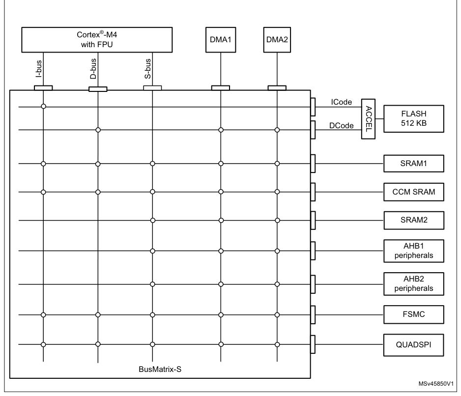
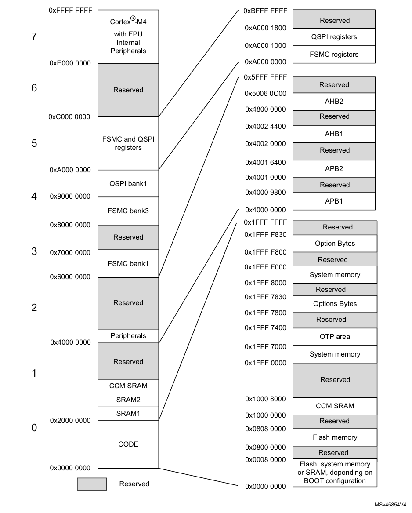

# 2 System and memory overview

[← RM0440 index](../STM32G4_RM0440.md)

## 2.1 System architecture

The main system consists of 32-bit multilayer AHB bus matrix that interconnects:

- Up to five masters:
  - Cortex®-M4 with FPU core I-bus
  - Cortex®-M4 with FPU core D-bus
  - Cortex®-M4 with FPU core S-bus
  - DMA1
  - DMA2
- Up to nine slaves:
  - Internal flash memory on ICode bus
  - Internal flash memory on DCode bus
  - Internal SRAM1
  - Internal SRAM2
  - Internal CCM SRAM
  - AHB1 peripherals including AHB to APB bridges and APB peripherals (connected to APB1 and APB2)
  - AHB2 peripherals
  - Flexible static memory controller (FSMC)
  - QUAD SPI memory interface (QUADSPI)

The bus matrix provides access from a master to a slave, enabling concurrent access and efficient
operation even when several high-speed peripherals work simultaneously. This architecture is shown
in Figure 1:

**Figure 1. System architecture**

### 2.1.1 I-bus

This bus connects the instruction bus of the Cortex®-M4 with FPU core to the BusMatrix. This bus is
used by the core to fetch instructions. The target of this bus is a memory containing code (either
internal Flash memory, internal SRAMs or external memories through the FSMC or QUADSPI).

### 2.1.2 D-bus

This bus connects the data bus of the Cortex®-M4 with FPU core to the BusMatrix. This bus is used by
the core for literal load and debug access. The target of this bus is a memory containing code
(either internal Flash memory, internal SRAMs or external memories through the FSMC or QUADSPI).

### 2.1.3 S-bus

This bus connects the system bus of the Cortex®-M4 with FPU core to the BusMatrix. This bus is used
by the core to access data located in a peripheral or SRAM area. The targets of this bus are the
internal SRAM, the AHB1 peripherals including the APB1 and APB2 peripherals, the AHB2 peripherals
and the external memories through the QUADSPI or the FSMC.

The CCM SRAM is also accessible on this bus to allow continuous mapping with SRAM1 and SRAM2.

### 2.1.4 DMA-bus

This bus connects the AHB master interface of the DMA to the BusMatrix. The targets of this bus are
the SRAM1, SRAM2 and CCM SRAM, the AHB1 peripherals including the APB1 and APB2 peripherals, the
AHB2 peripherals and the external memories through the QUADSPI or the FSMC.

### 2.1.5 BusMatrix

The BusMatrix manages the access arbitration between masters. The arbitration uses a Round Robin
algorithm. The BusMatrix is composed of up to five masters (CPU AHB, system bus, DCode bus, ICode
bus, DMA1, DMA2,) and up to nine slaves (FLASH, SRAM1, SRAM2, CCM SRAM, AHB1 (including APB1 and
APB2), AHB2, QUADSPI, and FSMC).

#### AHB/APB bridges

The two AHB/APB bridges provide full synchronous connections between the AHB and the two APB buses,
allowing flexible selection of the peripheral frequency.

Refer to [Section 2.2.2](#222-memory-map-and-register-boundary-addresses): Memory map and register boundary addresses for the address mapping of the
peripherals connected to this bridge.

After each device reset, all peripheral clocks are disabled (except for the SRAM1/2 and Flash memory
interface). Before using a peripheral you have to enable its clock in the RCC_AHBxENR and the
RCC_APBxENR registers.

> **Note:** When a 16- or 8-bit access is performed on an APB register, the access is transformed into
> a 32-bit access: the bridge duplicates the 16- or 8-bit data to feed the 32-bit vector.

## 2.2 Memory organization

### 2.2.1 Introduction

Program memory, data memory, registers and I/O ports are organized within the same linear 4-Gbyte
address space.

The bytes are coded in memory in Little Endian format. The lowest numbered byte in a word is
considered the word’s least significant byte and the highest numbered byte the most significant.

The addressable memory space is divided into eight main blocks, of 512 Mbytes each.

### 2.2.2 Memory map and register boundary addresses

**Figure 2. Memory map**

All areas not allocated to on-chip memories and peripherals are considered “Reserved”. For the
detailed mapping of available memory and register areas, refer to the following table.

Table 3 gives the boundary addresses of the peripherals available in the devices.

**Table 3. Memory map and peripheral register boundary addresses(1)**

| Source row | Column 1 | Column 2 | Column 3 | Column 4 | Column 5 |
| ---: | --- | --- | --- | --- | --- |
| 1 | `Bus` | `Boundary address` | `Size` | `Peripheral` | `Peripheral register map` |
| 2 | `0xA000 1400 - 0xAFFF FFFF 262 MB Reserved` | `-` |  |  |  |
| 3 | `0xA000 1000 - 0xA000 13FF` | `1 KB` | `QUADSPI` | `Section 20.5.14: QUADSPI register map` |  |
| 4 | `-` |  |  |  |  |
| 5 | `0xA000 0400 - 0xA000 0FFF` | `3 KB` | `Reserved` | `-` |  |
| 6 | `0xA000 0000 - 0xA000 03FF` | `1 KB` | `FSMC` | `Section 19.7.8: FMC register map` |  |
| 7 | `0x5006 0C00 - 0x5FFF FFFF` | `256MB` | `Reserved` | `-` |  |
| 8 | `0x5006 0800 - 0x5006 0BFF` | `1 KB` | `RNG` | `Section 26.7.4: RNG register map` |  |
| 9 | `0x5006 0400 - 0x5006 07FF` | `1 KB` | `Reserved` | `-` |  |
| 10 | `0x5006 0000 - 0x5006 03FF` | `1 KB` | `AES` | `Section 27.7.18: AES register map` |  |
| 11 | `0x5000 1800 - 0x5005 FFFF` | `377 KB Reserved` | `-` |  |  |
| 12 | `0x5000 1400 - 0x5000 17FF` | `1 KB` | `DAC4` | `Section 22.7.24: DAC register map` |  |
| 13 | `0x5000 1000 - 0x5000 13FF` | `1 KB` | `DAC3` | `Section 22.7.24: DAC register map` |  |
| 14 | `0x5000 0C00 - 0x5000 0FFF` | `1 KB` | `DAC2` | `Section 22.7.24: DAC register map` |  |
| 15 | `0x5000 0800 - 0x5000 0BFF` | `1 KB` | `DAC1` | `Section 22.7.24: DAC register map` |  |
| 16 | `AHB2` | `0x5000 0400 - 0x5000 07FF` | `1 KB` | `ADC3 - ADC4 - ADC5` | `Section 21.9: ADC register map` |
| 17 | `0x5000 0000 - 0x5000 03FF` | `1 KB` | `ADC1 - ADC2` | `Section 21.9: ADC register map` |  |
| 18 | `0x4800 1C00 - 0x4FFF FFFF` | `127 MB Reserved` | `-` |  |  |
| 19 | `0x4800 1800 - 0x4800 1BFF` | `1 KB` | `GPIOG` | `Section 9.4.12: GPIO register map` |  |
| 20 | `0x4800 1400 - 0x4800 17FF` | `1 KB` | `GPIOF` | `Section 9.4.12: GPIO register map` |  |
| 21 | `0x4800 1000 - 0x4800 13FF` | `1 KB` | `GPIOE` | `Section 9.4.12: GPIO register map` |  |
| 22 | `0x4800 0C00 - 0x4800 0FFF` | `1 KB` | `GPIOD` | `Section 9.4.12: GPIO register map` |  |
| 23 | `0x4800 0800 - 0x4800 0BFF` | `1 KB` | `GPIOC` | `Section 9.4.12: GPIO register map` |  |
| 24 | `0x4800 0400 - 0x4800 07FF` | `1 KB` | `GPIOB` | `Section 9.4.12: GPIO register map` |  |
| 25 | `0x4800 0000 - 0x4800 03FF` | `1 KB` | `GPIOA` | `Section 9.4.12: GPIO register map` |  |

**Table 3. Memory map and peripheral register boundary addresses(1) (continued)**

| Source row | Column 1 | Column 2 | Column 3 | Column 4 | Column 5 |
| ---: | --- | --- | --- | --- | --- |
| 1 | `Bus` | `Boundary address` | `Size` | `Peripheral` | `Peripheral register map` |
| 2 | `0x4002 3400 - 0x47FF FFFF` | `127 MB Reserved` | `-` |  |  |
| 3 | `0x4002 3000 - 0x4002 33FF` | `1 KB` | `CRC` | `Section 16.4.6: CRC register map` |  |
| 4 | `0x4002 2400 - 0x4002 2FFF` | `3 KB` | `Reserved` | `-` |  |
| 5 | `0x4002 2000 - 0x4002 23FF` | `1 KB` | `Flash interface` | `Section 5.7.14: FLASH register map` |  |
| 6 | `0x4002 1400 - 0x4002 1FFF` | `3 KB` | `FMAC` | `Section 18.4.9: FMAC register map` |  |
| 7 | `AHB1` |  |  |  |  |
| 8 | `0X4002 1000 - 0x4002 13FF` | `1 KB` | `RCC` | `Section 7.4.31: RCC register map` |  |
| 9 | `0x4002 0C00 - 0x4002 0FFF` | `1 KB` | `CORDIC` | `Section 17.4.4: CORDIC register map` |  |
| 10 | `0x4002 0800 - 0x4002 0BFF` | `1 KB` | `DMAMUX` | `Section 13.6.7: DMAMUX register map` |  |
| 11 | `0x4002 0400 - 0x4002 07FF` | `1 KB` | `DMA 2` | `Section 12.6.7: DMA register map` |  |
| 12 | `0x4002 0000 - 0x4002 03FF` | `1 KB` | `DMA 1` | `Section 12.6.7: DMA register map` |  |
| 13 | `0x4001 7800 - 0x4001 FFFF` | `2 KB` | `Reserved` | `-` |  |
| 14 | `0x4001 6800 - 0x4001 77FF` | `3 KB` | `HRTIM` | `Section 28.5.87: HRTIM register map` |  |
| 15 | `0x4001 5800 - 0x4001 67FF` | `4 KB` | `Reserved` | `-` |  |
| 16 | `0x4001 5400 - 0x4001 57FF` | `1 KB` | `SAI1` | `Section 43.6.19: SAI register map` |  |
| 17 | `0x4001 5000 - 0x4001 53FF` | `1 KB` | `TIM20` | `Section 29.6.31: TIMx register map` |  |
| 18 | `0x4001 4C00 - 0x4001 4FFF` | `1 KB` | `Reserved` | `-` |  |
| 19 | `Section 31.8.22: TIM16/TIM17 register` |  |  |  |  |
| 20 | `0x4001 4800 - 0x4001 4BFF` | `1 KB` | `TIM17` |  |  |
| 21 | `map` |  |  |  |  |
| 22 | `Section 31.8.22: TIM16/TIM17 register` |  |  |  |  |
| 23 | `0x4001 4400 - 0x4001 47FF` | `1 KB` | `TIM16` |  |  |
| 24 | `map` |  |  |  |  |
| 25 | `0x4001 4000 - 0x4001 43FF` | `1 KB` | `TIM15` | `Section 31.7.23: TIM15 register map` |  |
| 26 | `APB2` |  |  |  |  |
| 27 | `0x4001 3C00 - 0x4001 3FFF` | `1 KB` | `SPI4` | `Section 42.9.10: SPI/I2S register map` |  |
| 28 | `0x4001 3800 - 0x4001 3BFF` | `1 KB` | `USART1` | `Section 40.8.15: USART register map` |  |
| 29 | `0x4001 3400 - 0x4001 37FF` | `1 KB` | `TIM8` | `Section 29.6.31: TIMx register map` |  |
| 30 | `0x4001 3000 - 0x4001 33FF` | `1 KB` | `SPI1` | `Section 42.9.10: SPI/I2S register map` |  |
| 31 | `0x4001 2C00 - 0x4001 2FFF` | `1 KB` | `TIM1` | `Section 29.6.31: TIMx register map` |  |
| 32 | `0x4001 0800 - 0x4001 2BFF` | `9 KB` | `Reserved` | `-` |  |
| 33 | `0x4001 0400 - 0x4001 07FF` | `1 KB` | `EXTI` | `Section 15.5.13: EXTI register map` |  |
| 34 | `0x4001 0300 - 0x4001 03FF` | `OPAMP` | `Section 25.5.13: OPAMP register map` |  |  |
| 35 | `0x4001 0200 - 0x4001 02FF` | `COMP` | `Section 24.6.2: COMP register map` |  |  |
| 36 | `1 KB` |  |  |  |  |
| 37 | `0x4001 0030 - 0x4001 01FF` | `VREFBUF` | `Section 23.4.3: VREFBUF register map` |  |  |
| 38 | `0x4001 0000 - 0x4001 0029` | `SYSCFG` | `Section 10.2.11: SYSCFG register map` |  |  |

**Table 3. Memory map and peripheral register boundary addresses(1) (continued)**

| Source row | Column 1 | Column 2 | Column 3 | Column 4 | Column 5 |
| ---: | --- | --- | --- | --- | --- |
| 1 | `Bus` | `Boundary address` | `Size` | `Peripheral` | `Peripheral register map` |
| 2 | `0x4000 AFFE - 0x4000 FFFF` | `23 KB` | `Reserved` | `-` |  |
| 3 | `0x4000 AC00 - 0x4000 AFFF` | `1 KB` |  |  |  |
| 4 | `FDCANs Message` |  |  |  |  |
| 5 | `0x4000 A800 - 0x4000 ABFF` | `1 KB` | `Section 44.4.38: FDCAN register map` |  |  |
| 6 | `RAM` |  |  |  |  |
| 7 | `0x4000 A400 - 0x4000 A7FF` | `1 KB` |  |  |  |
| 8 | `0x4000 A000 - 0x4000 A3FF` | `1 KB` | `UCPD1` | `Section 46.8.15: UCPD register map` |  |
| 9 | `0x4000 8800 - 0x4000 9FFF` | `6 KB` | `Reserved` | `-` |  |
| 10 | `0x4000 8400 - 0x4000 87FF` | `1 KB` | `I2C4` | `Section 39.9.12: I2C register map` |  |
| 11 | `0x4000 8000 - 0x4000 83FF` | `1 KB` | `LPUART1` | `Section 41.7.13: LPUART register map` |  |
| 12 | `0x4000 7C00 - 0x4000 7FFF` | `1 KB` | `LPTIM1` | `Section 33.7.10: LPTIM register map` |  |
| 13 | `0x4000 7800 - 0x4000 7BFF` | `1 KB` | `I2C3` | `Section 39.9.12: I2C register map` |  |
| 14 | `0x4000 7400 - 0x4000 77FF` | `1 KB` | `Reserved` | `-` |  |
| 15 | `Section 6.4.23: PWR register map and` |  |  |  |  |
| 16 | `APB1` | `0x4000 7000 - 0x4000 73FF` | `1 KB` | `PWR` |  |
| 17 | `reset value table` |  |  |  |  |
| 18 | `0x4000 6C00 - 0x4000 6FFF` | `1 KB` | `FDCAN3` | `Section 44.4.38: FDCAN register map` |  |
| 19 | `0x4000 6800 - 0x4000 6BFF` | `1 KB` | `FDCAN2` | `Section 44.4.38: FDCAN register map` |  |
| 20 | `0x4000 6400 - 0x4000 67FF` | `1 KB` | `FDCAN1` | `Section 44.4.38: FDCAN register map` |  |
| 21 | `0x4000 6000 - 0x4000 63FF` | `1 KB` | `USB SRAM 1 Kbyte` | `-` |  |
| 22 | `0x4000 5C00 - 0x4000 5FFF` | `1 KB` | `USB device FS` | `Section 45.6.3: USB register map` |  |
| 23 | `0x4000 5800 - 0x4000 5BFF` | `1 KB` | `I2C2` | `Section 39.9.12: I2C register map` |  |
| 24 | `0x4000 5400 - 0x4000 57FF` | `1 KB` | `I2C1` | `Section 39.9.12: I2C register map` |  |
| 25 | `0x4000 5000 - 0x4000 53FF` | `1 KB` | `UART5` | `Section 40.8.15: USART register map` |  |
| 26 | `0x4000 4C00 - 0x4000 4FFF` | `1 KB` | `UART4` | `Section 40.8.15: USART register map` |  |
| 27 | `0x4000 4800 - 0x4000 4BFF` | `1 KB` | `USART3` | `Section 40.8.15: USART register map` |  |
| 28 | `0x4000 4400 - 0x4000 47FF` | `1 KB` | `USART2` | `Section 40.8.15: USART register map` |  |

**Table 3. Memory map and peripheral register boundary addresses(1) (continued)**

| Source row | Column 1 | Column 2 | Column 3 | Column 4 | Column 5 |
| ---: | --- | --- | --- | --- | --- |
| 1 | `Bus` | `Boundary address` | `Size` | `Peripheral` | `Peripheral register map` |
| 2 | `0x4000 4000 - 0x4000 43FF` | `1 KB` | `Reserved` | `-` |  |
| 3 | `0x4000 3C00 - 0x4000 3FFF` | `1 KB` | `SPI3/I2S3` | `Section 42.9.10: SPI/I2S register map` |  |
| 4 | `0x4000 3800 - 0x4000 3BFF` | `1 KB` | `SPI2/I2S2` | `Section 42.9.10: SPI/I2S register map` |  |
| 5 | `0x4000 3400 - 0x4000 37FF` | `1 KB` | `Reserved` | `-` |  |
| 6 | `0x4000 3000 - 0x4000 33FF` | `1 KB` | `IWDG` | `Section 35.4.6: IWDG register map` |  |
| 7 | `0x4000 2C00 - 0x4000 2FFF` | `1 KB` | `WWDG` | `Section 36.5.4: WWDG register map` |  |
| 8 | `RTC and BKP` |  |  |  |  |
| 9 | `0x4000 2800 - 0x4000 2BFF` | `1 KB` | `Section 37.6.21: RTC register map` |  |  |
| 10 | `registers` |  |  |  |  |
| 11 | `0x4000 2400 - 0x4000 27FF` | `1 KB` | `TAMP` | `Section 38.6.9: TAMP register map` |  |
| 12 | `APB1` |  |  |  |  |
| 13 | `cont’d` | `0x4000 2000 - 0x4000 23FF` | `1 KB` | `CRS` | `Section 8.7.5: CRS register map` |
| 14 | `0x4000 1C00 - 0x4000 1FFF` | `1 KB` | `Reserved` | `-` |  |
| 15 | `0x4000 1800 - 0x4000 1BFF` | `1 KB` | `Reserved` | `-` |  |
| 16 | `0x4000 1400 - 0x4000 17FF` | `1 KB` | `TIM7` | `Section 32.4.9: TIMx register map` |  |
| 17 | `0x4000 1000 - 0x4000 13FF` | `1 KB` | `TIM6` | `Section 32.4.9: TIMx register map` |  |
| 18 | `0x4000 0C00 - 0x4000 0FFF` | `1 KB` | `TIM5` | `Section 30.5.31: TIMx register map` |  |
| 19 | `0x4000 0800 - 0x4000 0BFF` | `1 KB` | `TIM4` | `Section 30.5.31: TIMx register map` |  |
| 20 | `0x4000 0400 - 0x4000 07FF` | `1 KB` | `TIM3` | `Section 30.5.31: TIMx register map` |  |
| 21 | `0x4000 0000 - 0x4000 03FF` | `1 KB` | `TIM2` | `Section 30.5.31: TIMx register map` |  |

1. Refer to Table 1, Table 2, and to the device datasheets for the GPIO ports and peripherals
   available on your device. the
   memory area corresponding to unavailable GPIO ports or peripherals are reserved (highlighted in
   gray).

## 2.3 Bit banding

The Cortex®-M4 with FPU memory map includes two bit-band regions. These regions map each word in an
alias region of memory to a bit in a bit-band region of memory. Writing to a word in the alias
region has the same effect as a read-modify-write operation on the targeted bit in the bit-band
region.

In the STM32G4 series devices both the peripheral registers and the SRAM are mapped to a bit-band
region, so that single bit-band write and read operations are allowed. The operations are available
only for Cortex®-M4 with FPU accesses, and not from other bus masters (such as DMA).

A mapping formula shows how to reference each word in the alias region to a corresponding bit in the
bit-band region. The mapping formula is:

bit_word_addr = bit_band_base \+ (byte_offset x 32) \+ (bit_number × 4)
where:

- bit_word_addr is the address of the word in the alias memory region that maps to the targeted bit
- bit_band_base is the starting address of the alias region
- byte_offset is the number of the byte in the bit-band region that contains the targeted bit
- bit_number is the bit position (0-7) of the targeted bit

### Example

The following example shows how to map bit 2 of the byte located at SRAM1 address 0x20000300 to the
alias region:

0x22006008 = 0x22000000 \+ (0x300*32) \+ (2*4)

Writing to address 0x22006008 has the same effect as a read-modify-write operation on bit 2 of the
byte at SRAM1 address 0x20000300.

Reading address 0x22006008 returns the value (0x01 or 0x00) of bit 2 of the byte at SRAM1 address
0x20000300 (0x01: bit set; 0x00: bit reset).

## 2.4 Embedded SRAM

Category 3 devices feature up to 128 Kbytes SRAM:

- 80 Kbytes SRAM1 (mapped at address 0x2000 0000)
- 16 Kbytes SRAM2 (mapped at address 0x2001 4000)
- 32 Kbytes CCM SRAM (mapped at address 0x1000 0000 and end of SRAM2)

Category 4 devices feature up to 112 Kbytes SRAM:

- 80 Kbytes SRAM1 (mapped at address 0x2000 0000)
- 16 Kbytes SRAM2 (mapped at address 0x2001 4000)
- 16 Kbytes CCM SRAM (mapped at address 0x1000 0000 and end of SRAM2)

Category 2 devices feature up to 32 Kbytes SRAM:

- 16 Kbytes SRAM1 (mapped at address 0x2000 0000)
- 6 Kbytes SRAM2 (mapped at address 0x2000 4000)
- 10 Kbytes CCM SRAM (mapped at address 0x1000 0000 and end of SRAM2)

These SRAM can be accessed as bytes, half-words (16 bits) or full words (32 bits). These memories
can be addressed at maximum system clock frequency without wait state and thus by both CPU and DMA.

The CPU can access the SRAM1 through the system bus or through the ICode/DCode
buses when boot from SRAM1 is selected or when physical remap is selected

([Section 10.2.1](chapter-10.md#1021-syscfg-memory-remap-register-syscfg_memrmp): SYSCFG memory remap register (SYSCFG_MEMRMP) in the SYSCFG
controller). To get the maximum performance on SRAM1 execution, physical remap should
be selected (boot or software selection).

CCM SRAM is mapped at address 0x1000 0000.

Execution can be performed from CCM SRAM with maximum performance without any
remap thanks to access through ICode bus.

The CCM SRAM is aliased at address following the end of SRAM2 (0x2000 5800 for
category 2 devices, 0x2001 8000 for category 3 devices, 0x2001 8000 for category 4
devices), offering a continuous address space with the SRAM1 and SRAM2. CCM can be
accessed by DMA only by this aliased address.

### 2.4.1 Parity check

On category 3 and category 4 devices, a parity check is implemented on the first 32 Kbytes of SRAM1
and on the whole CCM SRAM.

On the category 2 devices, a parity check is implemented on the whole SRAM1 and CCM SRAM.

The user can enable the parity check using the option bit SRAM_PE in the user option byte (refer to
[Section 3.4.1](chapter-03.md#341-option-bytes-description): Option bytes description).

The data bus width is 36 bits because 4 bits are available for parity check (1 bit per byte) in
order to increase memory robustness, as required for instance by Class B or SIL norms.

The parity bits are computed and stored when writing into the SRAM. Then, they are automatically
checked when reading. If one bit fails, an NMI is generated. The same error can also be linked to
the BRK_IN Break input of TIM1/TIM8/TIM15/TIM16/TIM17/TIM20, and to hrtim_sys_flt with the SPL
control bit in the [Section 10.2.8](chapter-10.md#1028-syscfg-configuration-register-2-syscfg_cfgr2): SYSCFG configuration register 2 (SYSCFG_CFGR2). The SRAM parity
error flag (SPF) is available in the [Section 10.2.8](chapter-10.md#1028-syscfg-configuration-register-2-syscfg_cfgr2): SYSCFG configuration register 2 (SYSCFG_CFGR2).

> **Note:** When enabling the SRAM parity check, it is advised to initialize by software the whole

SRAM memory at the beginning of the code, to avoid getting parity errors when reading
non-initialized locations.

### 2.4.2 CCM SRAM write protection

The CCM SRAM can be write protected with a page granularity of 1 Kbyte.

**Table 4. CCM SRAM organization**

| Page number | Start address | End address |
| --- | --- | --- |
| Page 0 | 0x1000 0000 | 0x1000 03FF |
| Page 1 | 0x1000 0400 | 0x1000 07FF |
| Page 2 | 0x1000 0800 | 0x1000 0BFF |
| Page 3 | 0x1000 0C00 | 0x1000 0FFF |
| Page 4 | 0x1000 1000 | 0x1000 13FF |
| Page 5 | 0x1000 1400 | 0x1000 17FF |
| Page 6 | 0x1000 1800 | 0x1000 1BFF |
| Page 7 | 0x1000 1C00 | 0x1000 1FFF |
| Page 8 | 0x1000 2000 | 0x1000 23FF |
| Page 9 | 0x1000 2400 | 0x1000 27FF |
| Page 10(1) | 0x1000 2800 | 0x1000 2BFF |

**Table 4. CCM SRAM organization (continued)**

| Page number | Start address | End address |
| --- | --- | --- |
| Page 11(1) | 0x1000 2C00 | 0x1000 2FFF |
| Page 12(1) | 0x1000 3000 | 0x1000 33FF |
| Page 13(1) | 0x1000 3400 | 0x1000 37FF |
| Page 14(1) | 0x1000 3800 | 0x1000 3BFF |
| Page 15(1) | 0x1000 3C00 | 0x1000 3FFF |
| Page 16(2) | 0x1000 4000 | 0x1000 43FF |
| Page 17(2) | 0x1000 4400 | 0x1000 47FF |
| Page 18(2) | 0x1000 4800 | 0x1000 4BFF |
| Page 19(2) | 0x1000 4C00 | 0x1000 4FFF |
| Page 20(2) | 0x1000 5000 | 0x1000 53FF |
| Page 21(2) | 0x1000 5400 | 0x1000 57FF |
| Page 22(2) | 0x1000 5800 | 0x1000 5BFF |
| Page 23(2) | 0x1000 5C00 | 0x1000 5FFF |
| Page 24(2) | 0x1000 6000 | 0x1000 63FF |
| Page 25(2) | 0x1000 6400 | 0x1000 67FF |
| Page 26(2) | 0x1000 6800 | 0x1000 6BFF |
| Page 27(2) | 0x1000 6C00 | 0x1000 6FFF |
| Page 28(2) | 0x1000 7000 | 0x1000 73FF |
| Page 29(2) | 0x1000 7400 | 0x1000 77FF |
| Page 30(2) | 0x1000 7800 | 0x1000 7BFF |
| Page 31(2) | 0x1000 7C00 | 0x1000 7FFF |

1. Available only on category 3 and category 4 devices.
2. Available only on category 3 devices.

The write protection can be enabled in [Section 10.2.9](chapter-10.md#1029-syscfg-ccm-sram-write-protection-register-syscfg_swpr): SYSCFG CCM SRAM write protection register
(SYSCFG_SWPR) in the SYSCFG block. This is a register with write ‘1’ once mechanism, which means by
writing ‘1’ on a bit it sets up the write protection for that page of SRAM and it can be
removed/cleared by a system reset only.

### 2.4.3 CCM SRAM read protection

The CCMSRAM is protected with the Read protection (RDP). Refer to [Section 3.5.1](chapter-03.md#351-read-protection-rdp): Read protection
(RDP) for more details.

### 2.4.4 CCM SRAM erase

The CCMSRAM can be erased with a system reset using the option bit CCMSRAM_RST in the user option
byte (refer to [Section 3.4.1](chapter-03.md#341-option-bytes-description): Option bytes description).

The CCM SRAM erase can also be requested by software by setting the bit CCMSR in the [Section 10.2.7](chapter-10.md#1027-syscfg-ccm-sram-control-and-status-register-syscfg_scsr):
SYSCFG CCM SRAM control and status register (SYSCFG_SCSR).

## 2.5 Flash memory overview

The flash memory is composed of two distinct physical areas:

- The main flash memory block contains the application program and user data if necessary.
- The information block is composed of three parts:
  - Option bytes for hardware and memory protection user configuration.
  - System memory that contains the ST proprietary code.
  - OTP (one-time programmable) area

The flash memory interface implements instruction access and data access based on the AHB protocol.
It also implements the logic necessary to carry out the flash memory operations (program/erase)
controlled through the flash memory registers. Refer to [Section 3](chapter-03.md#3-embedded-flash-memory-flash-for-category-3-devices): Embedded flash memory (FLASH) for
category 3 devices, [Section 4](chapter-04.md#4-embedded-flash-memory-flash-for-category-4-devices): Embedded flash memory (FLASH) for category 4 devices, and [Section 5](chapter-05.md#5-embedded-flash-memory-flash-for-category-2-devices):
Embedded flash memory (FLASH) for category 2 devices for more details.

## 2.6 Boot configuration

### 2.6.1 Boot configuration

Three different boot modes can be selected through the BOOT0 pin or the nBOOT0 bit into the
FLASH_OPTR register (if the nSWBOOT0 bit is cleared into the FLASH_OPTR register), and nBOOT1 bit in
FLASH_OPTR register, as shown in Table 5.

**Table 5. Boot modes**

| Source row | Column 1 | Column 2 | Column 3 | Column 4 | Column 5 | Column 6 |
| ---: | --- | --- | --- | --- | --- | --- |
| 1 | `BOOT_` | `nBOOT1` | `nBOOT0` | `BOOT0` | `nSWBOOT0` |  |
| 2 | `Boot memory space alias` |  |  |  |  |  |
| 3 | `LOCK` | `FLASH_OPTR[23]` | `FLASH_OPTR[27]` | `pin PB8` | `FLASH_OPTR[26]` |  |
| 4 | `1` | `X` | `X` | `X` | `X` | `Main flash memory(1)` |
| 5 | `Main flash memory is` |  |  |  |  |  |
| 6 | `0` | `X` | `X` | `0` | `1` |  |
| 7 | `selected as boot area(1)` |  |  |  |  |  |
| 8 | `Main flash memory is` |  |  |  |  |  |
| 9 | `0` | `X` | `1` | `X` | `0` |  |
| 10 | `selected as boot area(1)` |  |  |  |  |  |
| 11 | `Embedded SRAM1 is` |  |  |  |  |  |
| 12 | `0` | `0` | `X` | `1` | `1` |  |
| 13 | `selected as boot area` |  |  |  |  |  |
| 14 | `Embedded SRAM1 is` |  |  |  |  |  |
| 15 | `0` | `0` | `0` | `X` | `0` |  |
| 16 | `selected as boot area` |  |  |  |  |  |
| 17 | `System memory is selected` |  |  |  |  |  |
| 18 | `0` | `1` | `X` | `1` | `1` |  |
| 19 | `as boot area` |  |  |  |  |  |
| 20 | `System memory is selected` |  |  |  |  |  |
| 21 | `0` | `1` | `0` | `X` | `0` |  |
| 22 | `as boot area` |  |  |  |  |  |

1. When the BFB2 bit is set (for dual bank devices), the system memory remains aliased at 0x0000
   0000. Aliasing system
         memory to 0x0000 0000 must be considered in user application - VTOR address must be remapped from
         default

0x0000 0000 address into real user application to properly address vector table. For further
details, refer to AN2606.

The values on both BOOT0 pin (coming from the pin or the option bit) and nBOOT1 bit are latched on
the 4th edge of the internal startup clock source after reset release. It is up to the user to set
nBOOT1 and BOOT0 to select the required boot mode.

The BOOT0 pin or user option bit (depending on the nSWBOOT0 bit value in the FLASH_OPTR register),
and nBOOT1 bit are also re-sampled when exiting from Standby mode. Consequently, they must be kept
in the required Boot mode configuration in Standby mode. After this startup delay has elapsed, the
CPU fetches the top-of-stack value from address 0x0000 0000, then starts code execution from the
boot memory at 0x0000 0004.

Depending on the selected boot mode, main flash memory, system memory or SRAM1 is accessible as
follows:

- Boot from main flash memory: the main flash memory is aliased in the boot memory space (0x0000
  0000), but still accessible from its original memory space (0x0800 0000). In other words, the
  flash memory contents can be accessed starting from address 0x0000 0000 or 0x0800 0000.
- Boot from system memory: the system memory is aliased in the boot memory space (0x0000 0000), but
  still accessible from its original memory space (0x1FFF 0000).
- Boot from the embedded SRAM1: the SRAM1 is aliased in the boot memory space (0x0000 0000), but it
  is still accessible from its original memory space (0x2000 0000).

PB8/BOOT0 GPIO is configured in:

- Input mode during the complete reset phase if the option bit nSWBOOT0 is set into the FLASH_OPTR
  register and then switches automatically in analog mode after reset is released (BOOT0 pin).
- Input mode from the reset phase to the completion of the option byte loading if the bit nSWBOOT0
  is cleared into the FLASH_OPTR register (BOOT0 value coming from the option bit). It switches then
  automatically to the analog mode even if the reset phase is not complete.

> **Note:** When the device boots from SRAM, in the application initialization code, you have to
> relocate the vector table in SRAM using the NVIC exception table and the offset register.

When booting from the main flash memory, the application software can either boot from
bank 1 or from bank 2 (only for category 3 devices). By default, boot from bank 1 is selected.

To select boot from flash memory bank 2, set the BFB2 bit in the user option bytes. When
this bit is set and the boot pins are in the boot from main flash memory configuration, the
device boots from system memory, and the boot loader jumps to execute the user
application programmed in flash memory bank 2. For further details, refer to AN2606. See

Table 13: Access status versus protection level and execution modes for bootloader
function for different RDP levels.

#### Forcing boot from user flash memory

Regardless the boot configuration, it is possible to force booting from a unique entry point in main
flash memory.

#### Physical remap

Once the boot pins mode is selected, the application software can modify the memory
accessible in the code area (in this way the code can be executed through the ICode bus in
place of the System bus). This modification is performed by programming the SYSCFG
memory remap register (SYSCFG_MEMRMP) in the SYSCFG controller.

The following memories can be remapped:

- Main flash memory
- System memory
- Embedded SRAM1
- FSMC bank 1 (NOR/PSRAM 1 and 2)
- QUADSPI memory

**Table 6. Memory mapping versus boot mode/physical remap(1)**

| Source row | Column 1 | Column 2 | Column 3 | Column 4 | Column 5 | Column 6 |
| ---: | --- | --- | --- | --- | --- | --- |
| 1 | `Boot/remap` | `Boot/remap` | `Boot/remap` |  |  |  |
| 2 | `Remap in` | `Remap in` |  |  |  |  |
| 3 | `Addresses` | `in main flash` | `in embedded` | `in system` |  |  |
| 4 | `FSMC` | `QUADSPI` |  |  |  |  |
| 5 | `memory` | `SRAM 1` | `memory` |  |  |  |
| 6 | `0x2000 0000 - 0x2002 3FFF` | `SRAM1` | `SRAM1` | `SRAM1` | `SRAM1` | `SRAM1` |
| 7 | `System` | `System` | `System` | `System` | `System` |  |
| 8 | `0x1FFF 7000 - 0x1FFF FFFF` | `memory/OTP/` | `memory/OTP/` | `memory/OTP/` | `memory/OTP/` | `memory/OTP/` |
| 9 | `Options bytes` | `Options bytes` | `Options bytes` | `Options bytes` | `Options bytes` |  |
| 10 | `0x1000 8000 - 0x1FFE FFFF` | `Reserved` | `Reserved` | `Reserved` | `Reserved` | `Reserved` |
| 11 | `0x1000 0000 - 0x1000 7FFF` | `CCM SRAM` | `CCM SRAM` | `CCM SRAM` | `CCM SRAM` | `CCM SRAM` |
| 12 | `0x0808 0000 - 0x0FFF FFFF` | `Reserved` | `Reserved` | `Reserved` | `Reserved` | `Reserved` |
| 13 | `0x0800 0000 - 0x0807 FFFF` | `Flash memory Flash memory Flash memory` | `Flash memory Flash memory` |  |  |  |
| 14 | `FSMC bank 1` |  |  |  |  |  |
| 15 | `QUADSPI` |  |  |  |  |  |
| 16 | `NOR/` |  |  |  |  |  |
| 17 | `bank` |  |  |  |  |  |
| 18 | `0x0400 0000 - 0x07FF FFFF` | `Reserved` | `Reserved` | `Reserved` | `PSRAM 2` |  |
| 19 | `(128 MB)` |  |  |  |  |  |
| 20 | `(128 MB)` |  |  |  |  |  |
| 21 | `aliased` |  |  |  |  |  |
| 22 | `aliased` |  |  |  |  |  |
| 23 | `FSMC bank 1` |  |  |  |  |  |
| 24 | `QUADSPI` |  |  |  |  |  |
| 25 | `NOR/` |  |  |  |  |  |
| 26 | `bank` |  |  |  |  |  |
| 27 | `0x0010 0000 - 0x03FF FFFF` | `Reserved` | `Reserved` | `Reserved` | `PSRAM 1` |  |
| 28 | `(128 MB)` |  |  |  |  |  |
| 29 | `(128 MB)` |  |  |  |  |  |
| 30 | `aliased` |  |  |  |  |  |
| 31 | `aliased` |  |  |  |  |  |
| 32 | `FSMC bank 1` |  |  |  |  |  |
| 33 | `System` |  |  |  |  |  |
| 34 | `Flash` | `NOR/` |  |  |  |  |
| 35 | `SRAM1` | `memory` | `QUADSPI` |  |  |  |
| 36 | `0x0000 0000 - 0x0007 FFFF(2) (3)` | `memory` | `PSRAM 1` |  |  |  |
| 37 | `aliased` | `(28 KB)` | `aliased` |  |  |  |
| 38 | `aliased` | `(128 MB)` |  |  |  |  |
| 39 | `aliased` |  |  |  |  |  |
| 40 | `aliased)` |  |  |  |  |  |

1. Reserved memory area highlighted in gray.
2. When the FSMC is remapped at address 0x0000 0000, only the first two regions of bank 1 memory
   controller (bank 1

NOR/PSRAM 1 and NOR/PSRAM 2) can be remapped. When the FSMC is remapped at address 0x0000 0000, only

128 MB are remapped. In remap mode, the CPU can access the external memory via ICode bus instead of
system bus,
which boosts up the performance.

3. Even when aliased in the boot memory space, the related memory is still accessible at its
   original memory space.

#### Embedded boot loader

The embedded boot loader is located in the system memory, programmed by ST during production. Refer
to AN2606 STM32 microcontroller system memory boot mode.
