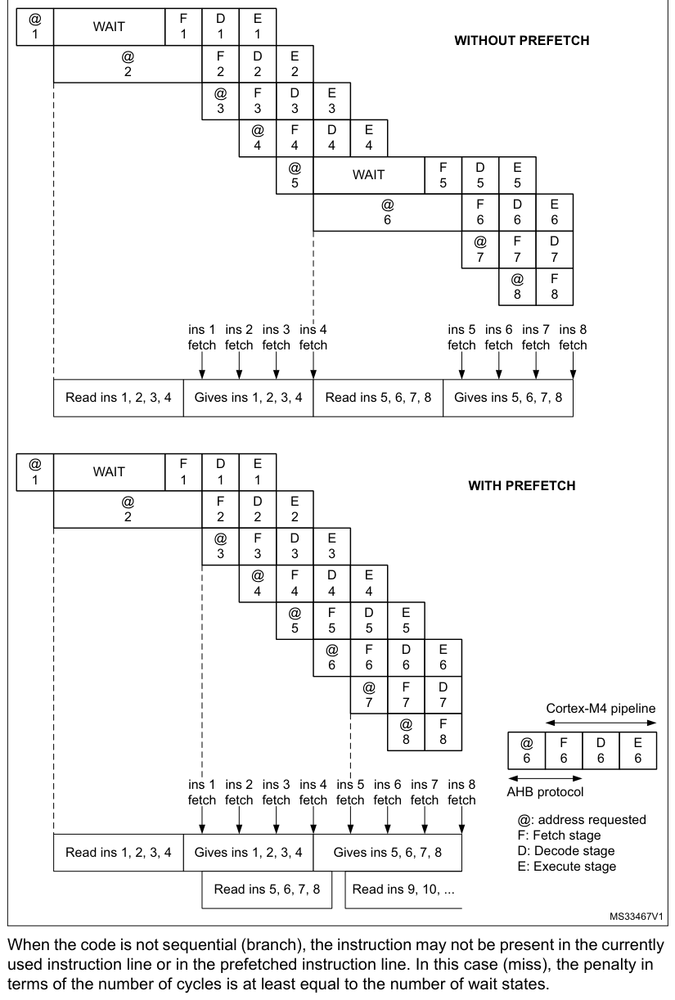
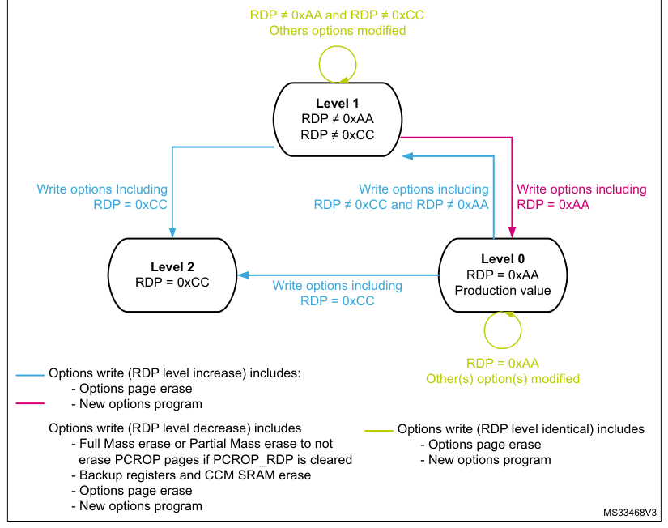
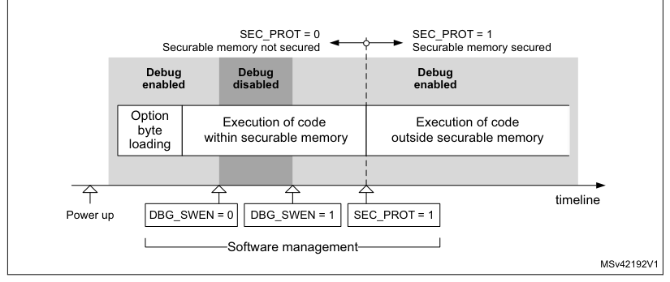

# 3 Embedded flash memory (FLASH) for category 3 devices

[← RM0440 index](../STM32G4_RM0440.md)

## 3.1 Introduction

The flash memory interface manages the CPU AHB ICode and DCode accesses to the flash memory. It
implements the erase and program flash memory operations and the read and write protection
mechanisms.

The flash memory interface accelerates code execution with a system of instruction prefetch and
cache lines.

## 3.2 FLASH main features

- Up to 512 Kbytes of flash memory with dual bank architecture supporting read-while-write
  capability (RWW).
- Flash memory read operations with two data width modes supported:
  - Single bank mode DBANK = 0: read access of 128 bits
  - Dual bank mode DBANK = 1: read access of 64 bits
- Page erase, bank erase, and mass erase (both banks)

Flash memory interface features:

- Flash memory read operations
- Flash memory program/erase operations
- Read protection activated by option (RDP)
- Four write protection areas (2 per bank when DBANK = 1 and 4 for full memory when DBANK = 0)
- Two proprietary code read protection areas (1 per bank when DBANK = 1, 2 for all memory when DBANK
  = 0)
- Two securable memory areas defined by option (1 per bank when DBANK = 1, 1 for all memory when
  DBANK = 0).
- Prefetch on ICODE
- Instruction cache: 32 cache lines of 4 x 64 or 2 x 128 bits on ICode (1 KB RAM)
- Data cache: 8 cache lines of 4 x 64 bits or 2 x 128 on DCode (256B RAM)
- Error code correction (ECC): 8 bits per 64-bit double-word
  - DBANK = 1: 8 \+ 64 = 72 bits, 2 bits detection, 1 bit correction
  - DBANK = 0: (8 \+ 64) \+ (8 \+ 64) = 144 bits, 2 bits detection, 1 bit correction
- Option byte loader
- Low-power mode

## 3.3 FLASH functional description

### 3.3.1 Flash memory organization

The flash memory has the following main features:

- Capacity up to 512 Kbytes, in single bank mode (read width of 128 bits) or in dual bank mode (read
  width of 64 bits)
- Supports dual boot mode thanks to the BFB2 option bit (only in dual bank mode)
- Dual bank mode when the DBANK bit is set:
  - 512 Kbytes organized in two banks for main memory
  - Page size of 2 Kbytes
  - 72 bits wide data read (64 bits plus 8 ECC bits)
  - Bank and mass erase
- Single bank mode when DBANK is reset:
  - 512 KB organized in one single bank for main memory
  - Page size of 4 Kbytes
  - 144 bits wide data read (128 bits plus 2x8 ECC bits)
  - Mass erase

The flash memory is organized as follows:

- A main memory block organized depending on the dual bank configuration bit:
  - When dual bank is enabled (DBANK bit set), the flash memory is divided in two banks of 256 KB,
    and each bank is organized as follows:

The main memory block containing 128 pages of 2 Kbytes

Each page is composed of 8 rows of 256 bytes

- When the dual bank is disabled (DBANK bit reset), the main memory block is organized as a single
  bank of 512 KB as follows:

The main memory block containing 128 pages of 4 Kbytes

Each page is composed of 8 rows of 512 bytes

- An information block containing:
  - System memory from which the device boots in System memory boot mode. The area is reserved for
    use by STMicroelectronics and contains the bootloader that is used to reprogram the flash memory
    through one of the following interfaces: USART, SPI, I2C, USB. It is programmed when the device
    is manufactured, and protected against spurious write/erase operations. For further details,
    refer to AN2606 available from [www.st.com](https://www.st.com).
  - 1 Kbyte (128 double word) OTP (one-time programmable) bytes for user data. The OTP area is
    available in Bank 1 only. The OTP data cannot be erased and can be written only once. If only
    one bit is at 0, the entire double word cannot be written anymore, even with the value 0x0000
    0000 0000 0000.
  - Option bytes for user configuration.

The memory is organized on a main area and an information block, as shown in Table 28.

**Table 7. Flash module - 512/256/128 KB dual bank organization (64 bits read width)**

| Source row | Column 1 | Column 2 | Column 3 | Column 4 | Column 5 |
| ---: | --- | --- | --- | --- | --- |
| 1 | `Size` |  |  |  |  |
| 2 | `Flash area` | `Flash memory addresses` | `Name` |  |  |
| 3 | `(bytes)` |  |  |  |  |
| 4 | `0x0800 0000 - 0x0800 07FF` | `2 K` | `Page 0` |  |  |
| 5 | `0x0800 0800 - 0x0800 0FFF` | `2 K` | `Page 1` |  |  |
| 6 | `Bank 1(1)` | `0x0800 1000 - 0x0800 17FF` | `2 K` | `Page 2` |  |
| 7 | `(256/128/64 KB)` |  |  |  |  |
| 8 | `0x0800 1800 - 0x0800 1FFF` | `2 K` | `Page 3` |  |  |
| 9 | `...` | `...` | `...` |  |  |
| 10 | `0x0803 F800 - 0x0803 FFFF` | `2 K` | `Page 127` |  |  |
| 11 | `Main memory` |  |  |  |  |
| 12 | `(512/256/128 KB)` |  |  |  |  |
| 13 | `0x0804 0000 - 0x0804 07FF` | `2 K` | `Page 0` |  |  |
| 14 | `0x0804 0800 - 0x0804 0FFF` | `2 K` | `Page 1` |  |  |
| 15 | `Bank 2(1)` | `0x0804 1000 - 0x0804 17FF` | `2 K` | `Page 2` |  |
| 16 | `(256/128/64 KB)` |  |  |  |  |
| 17 | `0x0804 1800 - 0x0804 1FFF` | `2 K` | `Page 3` |  |  |
| 18 | `...` | `...` | `...` |  |  |
| 19 | `0x0807 F800 - 0x0807 FFFF` | `2 K` | `Page 127` |  |  |
| 20 | `Bank 1` | `0x1FFF 0000 - 0x1FFF 6FFF` | `28 K` |  |  |
| 21 | `System memory` |  |  |  |  |
| 22 | `Bank 2` | `0x1FFF 8000 - 0x1FFF EFFF` | `28 K` |  |  |
| 23 | `Information block` | `Bank 1` | `0x1FFF 7000 - 0x1FFF 73FF` | `1 K` | `OTP area` |
| 24 | `Bank 1` | `0x1FFF 7800 - 0x1FFF 782F` | `48` |  |  |
| 25 | `Option bytes` |  |  |  |  |
| 26 | `Bank 2` | `0x1FFF F800 - 0x1FFF F82F` | `48` |  |  |

1. For 256KB devices: from page 0 to page 63

For 128KB devices: from page 0 to page 31

**Table 8. Flash module - 512/256/128 KB single bank organization (128 bits read width)**

| Source row | Column 1 | Column 2 | Column 3 | Column 4 | Column 5 |
| ---: | --- | --- | --- | --- | --- |
| 1 | `Size` |  |  |  |  |
| 2 | `Flash area` | `Flash memory addresses` | `Name` |  |  |
| 3 | `(bytes)` |  |  |  |  |
| 4 | `Main memory(1)` |  |  |  |  |
| 5 | `0x0800 0000 - 0x0800 0FFF` | `4 K` | `Page 0` |  |  |
| 6 | `(512/256/128 KB)` |  |  |  |  |
| 7 | `0x0800 1000 - 0x0800 1FFF` | `4 K` | `Page 1` |  |  |
| 8 | `0x0800 2000 - 0x0800 2FFF` | `4 K` | `Page 2` |  |  |
| 9 | `...` | `...` | `...` |  |  |
| 10 | `0x0807 F000 - 0x0807 FFFF` | `4 K` | `Page 127` |  |  |
| 11 | `Bank 1` | `0x1FFF 0000 - 0x1FFF 6FFF` | `28 K` |  |  |
| 12 | `System memory` |  |  |  |  |
| 13 | `Bank 2` | `0x1FFF 8000 - 0x1FFF EFFF` | `28 K` |  |  |
| 14 | `Information block` | `Bank 1` | `0x1FFF 7000 - 0x1FFF 73FF` | `1 K` | `OTP area` |
| 15 | `Bank 1` | `0x1FFF 7800 - 0x1FFF 782F` | `48` |  |  |
| 16 | `Option bytes` |  |  |  |  |
| 17 | `Bank 2` | `0x1FFF F800 - 0x1FFF F82F` | `48` |  |  |

1. For 256KB devices: from page 0 to page 63

For 128KB devices: from page 0 to page 31

### 3.3.2 Error code correction (ECC)

#### Dual bank mode (DBANK = 1, 64-bit data width)

Data in flash memory are 72-bit words: 8 bits are added per double word (64 bits). The ECC mechanism
supports:

- One error detection and correction
- Two errors detection

When one error is detected and corrected, the flag ECCC (ECC correction) is set in Flash ECC
register (FLASH_ECCR). If ECCCIE is set, an interrupt is generated.

When two errors are detected, a flag ECCD (ECC detection) is set in the FLASH_ECCR register. In this
case, an NMI is generated.

When an ECC error is detected, the address of the failing double word and its associated bank are
saved in ADDR_ECC[20:0] and BK_ECC in the FLASH_ECCR register. ADDR_ECC[2:0] are always cleared.

When ECCC or ECCD is set, ADDR_ECC and BK_ECC are not updated if a new ECC error occurs. FLASH_ECCR
is updated only when ECC flags are cleared.

#### Single bank mode (DBANK = 0, 128-bit data width)

Data in flash memory are 144-bit words: 8 bits are added per each double word. The ECC mechanism
supports:

- One error detection and correction
- Two errors detection per 64 double words

The user must first check the SYSF_ECC bit, and if it is set, the user must refer to the DBANK = 1
programming model (because system flash is always on two banks). If the bit is not set, the user
must refer to the following programing model:

Each double word (bits 63:0 and bits 127:64) has ECC.

When one error is detected in the 64 LSBs (bits 63:0) and corrected, a flag ECCC (ECC correction) is
set in the FLASH_ECCR register.

When one error is detected in the 64 MSBs (bits 127:64) and corrected, a flag ECCC2 (ECC2
correction) is set in the FLASH_ECCR register.

If the ECCCIE is set, an interrupt is generated. The user has to read ECCC and ECCC2 to see which
part of the 128-bit data has been corrected (either 63:0, 127:64, or both).

When two errors are detected in 64 LSB bits, a flag ECCD (ECC detection) is set in the FLASH_ECCR
register.

When two errors are detected in the 64 MSBs, a flag ECCD2 (ECC2 detection) is set in the FLASH_ECCR
register.

In this case, a NMI is generated. The user has to read ECCD and ECCD2 to see which part of the
128-bit data has error detection (either 63:0, 127:64, or both).

When an ECC error is detected, the address of the failing the two times double word is saved into
ADDR_ECC[20:0] in FLASH_ECCR. ADDR_ECC[20:0] contains an address of a two times double word.

The ADDR_ECC[3:0] is always cleared. BK_ECC is not used in this mode.

When ECCC/ECCC2 or ECCD/ECCD2 is/are set, if a new ECC error occurs, the ADDR_ECC is not updated.
The FLASH_ECCR is updated only if the ECC flags (ECCC/ECCC2/ECCD/ECCD2) are cleared.

> **Note:** For a virgin data: 0xFF FFFF FFFF FFFF FFFF, one error is detected and corrected but two
> errors detection is not supported.

When an ECC error is reported, a new read at the failing address may not generate an ECC error if
the data is still present in the current buffer, even if ECCC and ECCD are cleared.

### 3.3.3 Read access latency

To correctly read data from flash memory, the number of wait states (LATENCY) must be correctly
programmed in the Flash access control register (FLASH_ACR) according to the frequency of the CPU
clock (HCLK) and the internal voltage range of the device VCORE. Refer to [Section 6.1.5](chapter-06.md#615-dynamic-voltage-scaling-management): Dynamic
voltage scaling management. Table 9 shows the correspondence between wait states and CPU clock
frequency.

**Table 9. Number of wait states according to CPU clock (HCLK) frequency**

| Source row | Column 1 | Column 2 | Column 3 | Column 4 |
| ---: | --- | --- | --- | --- |
| 1 | `HCLK (MHz)` |  |  |  |
| 2 | `Wait states (WS)` |  |  |  |
| 3 | `(LATENCY)` | `VCORE Range 1` | `VCORE Range 1` |  |
| 4 | `VCORE Range 2` |  |  |  |
| 5 | `boost mode` | `normal mode` |  |  |
| 6 | `0 WS (1 CPU cycles)` | `≤ 34` | `≤ 30` | `≤ 12` |
| 7 | `1 WS (2 CPU cycles)` | `≤ 68` | `≤ 60` | `≤ 24` |
| 8 | `2 WS (3 CPU cycles)` | `≤ 102` | `≤ 90` | `≤ 26` |
| 9 | `3 WS (4 CPU cycles)` | `≤ 136` | `≤ 120` | `-` |
| 10 | `4 WS (5 CPU cycles)` | `≤ 170` | `≤ 150` | `-` |

After reset, the CPU clock frequency is 16 MHz and 1 wait state (WS) is configured in the FLASH_ACR
register.

When changing the CPU frequency, the following software sequences must be applied in order to tune
the number of wait states needed to access the flash memory:

#### Increasing the CPU frequency

1. Program the new number of wait states to the LATENCY bits in the Flash access
   control register (FLASH_ACR).
2. Check that the new number of wait states is taken into account to access the flash
   memory by reading the FLASH_ACR register.
3. Analyze the change of CPU frequency change caused either by:
   - changing clock source defined by SW bits in the RCC_CFGR register
   - or by CPU clock prescaler defined by HPRE bits in RCC_CFGR

If one of these decreases the CPU frequency, firstly perform this step and then the rest. Otherwise,
modify the CPU clock source by writing the SW bits in the RCC_CFGR register and then (if needed)
modify the CPU clock prescaler by writing the HPRE bits in RCC_CFGR.

4. Check that the new CPU clock source or/and the new CPU clock prescaler value is/are
   taken into account by reading the clock source status (SWS bits) or/and the AHB prescaler value
   (HPRE bits), respectively, in the RCC_CFGR register.

#### Decreasing the CPU frequency

1. Modify the CPU clock source by writing the SW bits in the RCC_CFGR register.
2. If needed, modify the CPU clock prescaler by writing the HPRE bits in RCC_CFGR.
3. Analyze the change of CPU frequency change caused either by:
   - changing clock source defined by SW bits in the RCC_CFGR register
   - or by CPU clock prescaler defined by HPRE bits in RCC_CFGR

If some of the above two steps increases the CPU frequency, firstly perform another step and then
this step. Otherwise, modify the CPU clock source by writing the SW bits in the RCC_CFGR register
and then (if needed) modify the CPU clock prescaler by writing the HPRE bits in RCC_CFGR.

4. Check that the new CPU clock source or/and the new CPU clock prescaler value is/are
   taken into account by reading the clock source status (SWS bits) or/and the AHB prescaler value
   (HPRE bits), respectively, in the RCC_CFGR register.
5. Program the new number of wait states to the LATENCY bits in Flash access control
   register (FLASH_ACR).
6. Check that the new number of wait states is used to access the flash memory by
   reading the FLASH_ACR register.

### 3.3.4 Adaptive real-time memory accelerator (ART Accelerator)

The proprietary adaptive real-time (ART) memory accelerator is optimized for STM32 industry-standard
Arm® Cortex®-M4 with FPU processors. It balances the inherent performance advantage of the Arm®
Cortex®-M4 with FPU over flash memory technologies, which normally requires the processor to wait
for the flash memory at higher operating frequencies.

To release the processor to full performance, the accelerator implements an instruction prefetch
queue and branch cache, which increases program execution speed from the 64-bit flash memory. Based
on the CoreMark benchmark, the performance achieved thanks to the ART Accelerator is equivalent to 0
wait state program execution from flash memory at a CPU frequency up to 170 MHz.

#### Instruction prefetch

The Cortex®-M4 fetches the instruction over the ICode bus and the literal pool (constant/data) over
the DCode bus. The prefetch block aims at increasing the efficiency of ICode bus accesses.

In case of Single bank mode (DBANK option bit is reset), each flash memory read operation provides
128 bits from either four instructions of 32 bits or eight instructions of 16 bits depending on the
launched program. This 128-bit current instruction line is saved in a current buffer, and in case of
sequential code, at least four CPU cycles are needed to execute the previous read instruction line.

When in dual bank mode (DBANK option bit is set), each flash memory read operation provides 64 bits
from either two instructions of 32 bits or four instructions of 16 bits depending on the launched
program. This 64-bit current instruction line is saved in a current buffer, and in the case of
sequential code, at least two CPU cycles are needed to execute the previous read instruction line.

Prefetch on the ICode bus can be used to read the next sequential instruction line from the flash
memory while the current instruction line is being requested by the CPU.

Prefetch is enabled by setting the PRFTEN bit in the Flash access control register (FLASH_ACR). This
feature is useful if at least one wait state is needed to access the flash memory.

Figure 9 shows the execution of sequential 16-bit instructions with and without prefetch when 3 WS
are needed to access the flash memory.

**Figure 3. Sequential 16-bit instructions execution (64-bit read data width)**

When the code is not sequential (branch), the instruction may not be present in the currently used
instruction line or in the prefetched instruction line. In this case (miss), the penalty in terms of
the number of cycles is at least equal to the number of wait states.

If a loop is present in the current buffer, no new flash access is performed.

#### Instruction cache memory (I-Cache)

To limit the time lost due to jumps, it is possible to retain 32 lines of 4 x 64 bits in dual bank
mode or 32 lines of 2 x 128 bits in single bank mode in an instruction cache memory. This feature
can be enabled by setting the instruction cache enable (ICEN) bit in the Flash access control
register (FLASH_ACR). Each time a miss occurs (requested data not present in the currently used
instruction line, in the prefetched instruction line or in the instruction cache memory), the line
read is copied into the instruction cache memory. If some data contained in the instruction cache
memory are requested by the CPU, they are provided without inserting any delay. Once all the
instruction cache memory lines have been filled, the LRU (least recently used) policy is used to
determine the line to replace in the instruction memory cache. This feature is particularly useful
in the case of code containing loops.

The instruction cache memory is enable after system reset.

#### Data cache memory (D-Cache)

Literal pools are fetched from flash memory through the DCode bus during the execution stage of the
CPU pipeline. Each DCode bus read access fetches 64 or 128 bits, which are saved in a current
buffer. The CPU pipeline is consequently stalled until the requested literal pool is provided. To
limit the time lost due to literal pools, accesses through the AHB databus DCode have priority over
accesses through the AHB instruction bus ICode.

If some literal pools are frequently used, the data cache memory can be enabled by setting the data
cache enable (DCEN) bit in the Flash access control register (FLASH_ACR). This feature works like
the instruction cache memory, but the retained data size is limited to 8 rows of 4*64 bits in dual
bank mode and to 8 rows of 2*128 bits in single bank mode.

The Data cache memory is enabled after system reset.

> **Note:** The D-Cache is active only when data is requested by the CPU (not by DMA1 and DMA2).

Data in the option bytes block are not cacheable.

### 3.3.5 Flash program and erase operations

The STM32G4 series embedded flash memory can be programmed using in-circuit programming or
in-application programming.

The in-circuit programming (ICP) method is used to update the entire contents of the flash memory,
using the JTAG, SWD protocol or the bootloader to load the user application into the
microcontroller. ICP offers quick and efficient design iterations and eliminates unnecessary package
handling or socketing of devices.

In contrast to the ICP method, in-application programming (IAP) can use any communication interface
supported by the microcontroller (I/Os, USB, CAN, UART, I2C, SPI, etc.) to download programming data
into memory. IAP allows the user to reprogram the flash memory while the application is running.
Nevertheless, part of the application has to have been previously programmed in the flash memory
using ICP.

The contents of the flash memory are not guaranteed if a device reset occurs during a flash memory
operation.

An on-going flash memory operation does not block the CPU as long as the CPU does not access the
same flash memory bank. Code or data fetches are possible on one bank while a write/erase operation
is performed to the other bank (refer to [Section 3.3.8](#338-read-while-write-rww-available-only-in-dual-bank-mode-dbank--1)).

The flash memory erase and programming is only possible in the voltage scaling range 1. The VOS[1:0]
bits in the PWR_CR1 must be programmed to 01b.

On the contrary, during a program/erase operation to the flash memory, any attempt to read the same
flash memory bank stalls the bus. The read operation proceeds correctly once the program/erase
operation has completed.

#### Unlocking the flash memory

After reset, write is not allowed in the Flash control register (FLASH_CR) to protect the flash
memory against possible unwanted operations due, for example, to electric disturbances. The
following sequence is used to unlock this register:

1. Write KEY1 = 0x45670123 in the Flash key register (FLASH_KEYR)
2. Write KEY2 = 0xCDEF89AB in the FLASH_KEYR register.

Any wrong sequence locks up the FLASH_CR register until the next system reset. In the case of a
wrong key sequence, a bus error is detected and a Hard Fault interrupt is generated.

The FLASH_CR register can be locked again by software by setting the LOCK bit in the FLASH_CR
register.

> **Note:** The FLASH_CR register cannot be written when the BSY bit in the Flash status register

(FLASH_SR) is set. Any attempt to write to it with the BSY bit set causes the AHB bus to stall until
the BSY bit is cleared.

### 3.3.6 Flash main memory erase sequences

The flash memory erase operation can be performed at page level, bank level or on the whole flash
memory (mass erase). Mass erase does not affect the Information block (system flash, OTP, and option
bytes).

#### Page erase

To erase a page, follow the procedure below:

1. Check that no flash memory operation is ongoing by checking the BSY bit in the Flash
   status register (FLASH_SR).
2. Check and clear all error programming flags due to a previous programming. If not,

PGSERR is set.

3. In dual bank mode (DBANK option bit is set), set the PER bit and select the page to
   erase (PNB) with the associated bank (BKER) in the flash control register (FLASH_CR). In single bank
   mode (DBANK option bit is reset), set the PER bit and select the page to erase (PNB). The BKER bit
   in the flash control register (FLASH_CR) must be kept cleared.
4. Set the STRT bit in the FLASH_CR register.
5. Wait for the BSY bit to be cleared in the FLASH_SR register.

> **Note:** The internal oscillator HSI16 (16 MHz) is enabled automatically when the STRT bit is set,
> and disabled automatically when the STRT bit is cleared, except if the HSI16 is previously enabled
> with HSION in the RCC_CR register.

If the page erase is part of write-protected area (by WRP or PCROP), WRPERR is set and the page
erase request is aborted.

#### Bank 1, Bank 2 mass erase (available only in dual bank mode when DBANK = 1)

To perform a bank mass erase, follow the procedure below:

1. Check that no flash memory operation is ongoing by checking the BSY bit in the

FLASH_SR register.

2. Check and clear all error programming flags due to a previous programming. If not,

PGSERR is set.

3. Set the MER1 bit or MER2 (depending on the bank) in the Flash control register

(FLASH_CR). Both banks can be selected in the same operation, in that case it corresponds to a mass
erase.

4. Set the STRT bit in the FLACH_CR register.
5. Wait for the BSY bit to be cleared in the Flash status register (FLASH_SR).

#### Mass erase

To perform a mass erase, follow the procedure below:

1. Check that no flash memory operation is ongoing by checking the BSY bit in the

FLASH_SR register.

2. Check and clear all error programming flags due to a previous programming. If not,

PGSERR is set.

3. Set the MER1 bit and MER2 in the flash control register (FLASH_CR).
4. Set the STRT bit in the FLACH_CR register.
5. Wait for the BSY bit to be cleared in the flash status register (FLASH_SR).

> **Note:** The internal oscillator HSI16 (16 MHz) is enabled automatically when the STRT bit is set,
> and disabled automatically when STRT bit is cleared, except if the HSI16 is previously enabled with
HSION in the RCC_CR register.

When DBANK = 0, if only the MERA or the MERB bit is set, PGSERR is set and no erase operation is
performed.

If the bank to erase or if one of the banks to erase contains a write-protected area (by WRP or
PCROP), WRPERR is set and the mass erase request is aborted (for both banks if both are selected).

### 3.3.7 Flash main memory programming sequences

The flash memory is programmed 72 bits at a time (64 bits \+ 8 bits ECC).

Programming in a previously programmed address is not allowed except if the data to write are all 0,
and any attempt sets the PROGERR flag in the Flash status register (FLASH_SR).

It is only possible to program double word (2 x 32-bit data).

- Any attempt to write a byte or half-word sets SIZERR flag in the FLASH_SR register.
- Any attempt to write a double word, which is not aligned with a double word address sets the
  PGAERR flag in the FLASH_SR register.

#### Standard programming

The flash memory programming sequence in standard mode is as follows:

1. Check that no flash main memory operation is ongoing by checking the BSY bit in the

Flash status register (FLASH_SR).

2. Check and clear all error programming flags due to a previous programming. If not,

PGSERR is set.

3. Set the PG bit in the Flash control register (FLASH_CR).
4. Perform the data write operation at the desired memory address, inside the main
   memory block or OTP area. Only a double word can be programmed.

- Write a first word in an address aligned with a double word
- Write the second word

5. Wait until the BSY bit is cleared in the FLASH_SR register.
6. Check that the EOP flag is set in the FLASH_SR register (meaning that the
   programming operation has succeed), and clear it by software.
7. Clear the PG bit in the FLASH_SR register if there is no more programming request
   anymore.

> **Note:** When the flash interface has received a good sequence (a double word), programming is
> automatically launched and the BSY bit is set. The internal oscillator HSI16 (16 MHz) is enabled
> automatically when PG bit is set, and disabled automatically when PG bit is cleared, except if the
HSI16 is previously enabled with HSION in RCC_CR register.

If the user needs to program only one word, a double word must be completed with the erase value
0xFFFF FFFF to launch automatically the programming.

ECC is calculated from the double word to program.

#### Fast programming for a row (64 double words if DBANK = 1) or for half row (64 double words if DBANK = 0)

This mode allows to program a row (64 double words if DBANK = 1) or half row (64 double words if
DBANK = 0), and to reduce the page programming time by eliminating the need for verifying the flash
locations before they are programmed and to avoid rising and falling time of high voltage for each
double word. During fast programming, the CPU clock frequency (HCLK) must be at least 8 MHz.

Only the main memory can be programmed in Fast programming mode.

The flash main memory programming sequence in standard mode is as follows:

1. In single bank mode (DBANK = 0), perform a mass erase. If not, PGSERR is set. The

Fast programing can be performed only if the code is executed from RAM or from bootloader. In dual
bank mode (DBANK = 1), perform a mass erase of the bank to program. If not, PGSERR is set.

2. Check that no flash main memory operation is ongoing by checking the BSY bit in the

Flash status register (FLASH_SR).

3. Check and clear all error programming flag due to a previous programming.
4. Set the FSTPG bit in Flash control register (FLASH_CR).
5. Write the 64 double words to the program a row or half row. Only double words can be
   programmed:

- Write a first word in an address aligned with a double word
- Write the second word.

6. Wait until the BSY bit is cleared in the FLASH_SR register.
7. Check that EOP flag is set in the FLASH_SR register (meaning that the programming
   operation has succeed), and clear it by software.
8. Clear the FSTPG bit in the FLASH_SR register if there no more programming request
   anymore.

> **Note:** If the flash is attempted to be written in Fast programming mode while a read operation is on
> going in the same bank, the programming is aborted without any system notification (no error flag is
> set).

When the flash interface has received the first double word, programming is automatically launched.
The BSY bit is set when the high voltage is applied for the first double word, and it is cleared
when the last double word has been programmed or in case of error. The internal oscillator HSI16 (16
MHz) is enabled automatically when FSTPG bit is set, and disabled automatically when FSTPG bit is
cleared, except if the HSI16 is previously enabled with HSION in RCC_CR register.

The 64 double word must be written successively. The high voltage is kept on the flash for all the
programming. Maximum time between two double words write requests is the time programming (around 2
x 25 μs). If a second double word arrives after this time programming, fast programming is
interrupted and MISSERR is set.

High voltage cannot exceed 8 ms for a full row between two erases. This is guaranteed by the
sequence of 64 double words successively written with a clock system greater or equal to 8 MHz. An
internal time-out counter counts 7 ms when fast programming is set and stops the programming when
time-out is over. In this case, the FASTERR bit is set.

If an error occurs, the high voltage is stopped and the next double word to programmed is not
programmed. Anyway, all previous double words have been properly programmed.

#### Programming errors

Several kinds of errors are detected. In case of error, the flash operation (programming or erasing)
is aborted.

- PROGERR: Programming error

In standard programming: PROGERR is set if the word to write is not previously erased (except if the
value to program is full zero).

- SIZERR: Size programming error

In standard programming or in fast programming: only double word can be programmed and only 32-bit
data can be written. SIZERR is set if a byte or a half-word is written.

- PGAERR: Alignment programming error

PGAERR is set if one of the following conditions occurs:

- In standard programming: the first word to be programmed is not aligned with a double word
  address, or the second word doesn’t belong to the same double word address.
- In fast programming: the data to program doesn’t belong to the same row than the previous
  programmed double words, or the address to program is not greater than the previous one.
- PGSERR: Programming sequence error

PGSERR is set if one of the following conditions occurs:

- In the standard programming sequence or the fast programming sequence: a data is written when PG
  and FSTPG are cleared.
- In the standard programming sequence or the fast programming sequence: MER1, MER2, and PER are not
  cleared when PG or FSTPG is set.
- In the fast programming sequence: the mass erase is not performed before setting FSTPG bit.
- In the mass erase sequence: PG, FSTPG, and PER are not cleared when MER1 or MER2 is set.
- In the page erase sequence: PG, FSTPG, MER1 and MER2 are not cleared when PER is set.
- PGSERR is set also if PROGERR, SIZERR, PGAERR, WRPERR, MISSERR, FASTERR, or PGSERR is set due to a
  previous programming error.
- When DBANK = 0, in the case that only either MER1 or MER2 is set, PGSERR is set (bank mass erase
  is not allowed).
- WRPERR: Write protection error

WRPERR is set if one of the following conditions occurs:

- Attempt to program or erase in a write protected area (WRP) or in a PCROP area or in a securable
  memory area.
- Attempt to perform a bank erase when one page or more is protected by WRP or PCROP.
- The debug features are connected or the boot is executed from SRAM or from System flash when the
  read protection (RDP) is set to Level 1.
- Attempt to modify the option bytes when the read protection (RDP) is set to Level 2.
- MISSERR: Fast programming data miss error

In fast programming: all the data must be written successively. MISSERR is set if the previous data
programmation is finished and the next data to program is not written yet.

- FASTERR: Fast programming error

In fast programming: FASTERR is set if one of the following conditions occurs:

- When FSTPG bit is set for more than 7 ms, which generates a time-out detection.
- When the fast programming has been interrupted by a MISSERR, PGAERR, WRPERR, or SIZERR.

If an error occurs during a program or erase operation, one of the following error flags is set in
the FLASH_SR register:

PROGERR, SIZERR, PGAERR, PGSERR, MISSERR (Program error flags),

WRPERR (Protection error flag)

In this case, if the error interrupt enable bit ERRIE is set in the Flash status register
(FLASH_SR), an interrupt is generated and the operation error flag OPERR is set in the FLASH_SR
register.

> **Note:** If several successive errors are detected (for example, in case of DMA transfer to the flash
> memory), the error flags cannot be cleared until the end of the successive write requests.

#### Programming and caches

If a flash memory write access concerns some data in the data cache, the flash write access modifies
the data in the flash memory and the data in the cache.

If an erase operation in flash memory also concerns data in the data or instruction cache, you have
to make sure that these data are rewritten before they are accessed during code execution. If this
cannot be done safely, it is recommended to flush the caches by setting the DCRST and ICRST bits in
the Flash access control register (FLASH_ACR).

> **Note:** The I/D cache should be flushed only when it is disabled (I/DCEN = 0).

### 3.3.8 Read-while-write (RWW) available only in dual bank mode (DBANK = 1)

The dual bank mode is available only when the DBANK option bit is set, allowing read-while-write
operations. This feature allows to perform a read operation from one bank while an erase or program
operation is performed to the other bank.

> **Note:** Write-while-write operations are not allowed. As an example, It is not possible to perform an
> erase operation on one bank while programming the other one.

#### Read from bank 1 while page erasing in bank 2 (or vice versa)

While executing a program code from bank 1, it is possible to perform a page erase operation on bank
2 (and vice versa). Follow the procedure below:

1. Check that no flash memory operation is ongoing by checking the BSY bit in the Flash
   status register (FLASH_SR) (BSY is active when erase/program operation is on going in bank 1 or bank
   2).
2. Set PER bit, PSB to select the page and BKER to select the bank in the Flash control
   register (FLASH_CR).
3. Set the STRT bit in the FLASH_CR register.
4. Wait for the BSY bit to be cleared (or use the EOP interrupt).

#### Read from bank 1 while mass erasing bank 2 (or vice versa)

While executing a program code from bank 1, it is possible to perform a mass erase operation on bank
2 (and vice versa). Follow the procedure below:

1. Check that no flash memory operation is ongoing by checking the BSY bit in the Flash
   status register (FLASH_SR) (BSY is active when erase/program operation is on going in bank 1 or bank
   2).
2. Set MER1 or MER2 to in the Flash control register (FLASH_CR).
3. Set the STRT bit in the FLASH_CR register.
4. Wait for the BSY bit to be cleared (or use the EOP interrupt).

#### Read from bank 1 while programming bank 2 (or vice versa)

While executing a program code from bank 1, it is possible to perform a program operation on the
bank 2. (and vice versa). Follow the procedure below:

1. Check that no flash memory operation is ongoing by checking the BSY bit in the Flash
   status register (FLASH_SR) (BSY is active when erase/program operation is on going on bank 1 or bank
   2).
2. Set the PG bit in the Flash control register (FLASH_CR).
3. Perform the data write operations at the desired address memory inside the main
   memory block or OTP area.
4. Wait for the BSY bit to be cleared (or use the EOP interrupt).

## 3.4 FLASH option bytes

### 3.4.1 Option bytes description

The option bytes are configured by the end user depending on the application requirements. As a
configuration example, the watchdog can be selected in hardware or software mode (refer to Section
5.4.2).

A double word is split up as follows in the option bytes:

**Table 10. Option byte format**

| 63-24 | 23-16 | 15 -8 | 7-0 | 31-24 | 23-16 | 15 -8 | 7-0 |
| --- | --- | --- | --- | --- | --- | --- | --- |
| Complemented | Complemented | Complemented | Complemented | Option | Option | Option | Option |
| option byte 3 | option byte 2 | option byte 1 | option byte 0 | byte 3 | byte 2 | byte 1 | byte 0 |

The organization of these bytes inside the information block is as shown in Table 31.

The option bytes can be read from the memory locations listed in Table 31 or from the flash memory
registers:

- Flash option register (FLASH_OPTR)
- Flash PCROP1 Start address register (FLASH_PCROP1SR)
- Flash PCROP1 End address register (FLASH_PCROP1ER)
- Flash WRP area A address register (FLASH_WRP1AR)
- Flash WRP area B address register (FLASH_WRP1BR)
- Flash PCROP2 Start address register (FLASH_PCROP2SR)
- Flash PCROP2 End address register (FLASH_PCROP2ER)
- Flash Bank 2 WRP area A address register (FLASH_WRP2AR)
- Flash Bank 2 WRP area B address register (FLASH_WRP2BR).

**Table 11. Option byte organization(1)**

| Source row | Column 1 | Column 2 | Column 3 | Column 4 | Column 5 | Column 6 | Column 7 | Column 8 | Column 9 | Column 10 |
| ---: | --- | --- | --- | --- | --- | --- | --- | --- | --- | --- |
| 1 | `BANK` | `Address` | `[63:56]` | `[55:48]` | `[47:40]` | `[39:32]` | `[31:24]` | `[23:16]` | `[15:8]` | `[7:0]` |
| 2 | `1FFF7800` | `USER OPT` | `RDP` | `USER OPT` | `RDP` |  |  |  |  |  |
| 3 | `Unused and` | `Unused and` |  |  |  |  |  |  |  |  |
| 4 | `1FFF7808` | `Unused` | `Unused` |  |  |  |  |  |  |  |
| 5 | `PCROP1_STRT[14:0]` | `PCROP1_STRT[14:0]` |  |  |  |  |  |  |  |  |
| 6 | `PCROP_RDP and` | `Unused and` | `PCROP_RDP and` | `Unused and` |  |  |  |  |  |  |
| 7 | `1FFF7810` |  |  |  |  |  |  |  |  |  |
| 8 | `Unused` | `PCROP1_END[14:0]` | `Unused` | `PCROP1_END[14:0]` |  |  |  |  |  |  |
| 9 | `WRP1A_` | `WRP1A` |  |  |  |  |  |  |  |  |
| 10 | `Bank 1` | `WRP1A` | `WRP1A` |  |  |  |  |  |  |  |
| 11 | `1FFF7818` | `Unused` | `Unused` | `Unused` | `END` | `Unused` | `_STRT` |  |  |  |
| 12 | `_END [6:0]` | `_STRT [6:0]` |  |  |  |  |  |  |  |  |
| 13 | `[6:0]` | `[6:0]` |  |  |  |  |  |  |  |  |
| 14 | `WRP1B_` | `WRP1B` |  |  |  |  |  |  |  |  |
| 15 | `WRP1B` | `WRP1B` |  |  |  |  |  |  |  |  |
| 16 | `1FFF7820` | `Unused` | `Unused` | `Unused` | `END` | `Unused` | `_STRT` |  |  |  |
| 17 | `_END [6:0]` | `_STRT [6:0]` |  |  |  |  |  |  |  |  |
| 18 | `[6:0]` | `[6:0]` |  |  |  |  |  |  |  |  |
| 19 | `BOOT_` | `SEC_` | `BOOT_` | `SEC_` |  |  |  |  |  |  |
| 20 | `1FFF7828` | `Unused` | `Unused` | `Unused` | `Unused` |  |  |  |  |  |
| 21 | `LOCK` | `SIZE1` | `LOCK` | `SIZE1` |  |  |  |  |  |  |

**Table 11. Option byte organization(1) (continued)**

| Source row | Column 1 | Column 2 | Column 3 | Column 4 | Column 5 | Column 6 | Column 7 | Column 8 | Column 9 | Column 10 |
| ---: | --- | --- | --- | --- | --- | --- | --- | --- | --- | --- |
| 1 | `BANK` | `Address` | `[63:56]` | `[55:48]` | `[47:40]` | `[39:32]` | `[31:24]` | `[23:16]` | `[15:8]` | `[7:0]` |
| 2 | `1FFFF800` | `Unused` |  |  |  |  |  |  |  |  |
| 3 | `Unused and` | `Unused and` |  |  |  |  |  |  |  |  |
| 4 | `1FFFF808` | `Unused` | `Unused` |  |  |  |  |  |  |  |
| 5 | `PCROP2_STRT[14:0]` | `PCROP2_STRT[14:0]` |  |  |  |  |  |  |  |  |
| 6 | `Unused and` | `Unused and` |  |  |  |  |  |  |  |  |
| 7 | `1FFFF810` | `Unused` | `Unused` |  |  |  |  |  |  |  |
| 8 | `PCROP2_END[14:0]` | `PCROP2_END[14:0]` |  |  |  |  |  |  |  |  |
| 9 | `WRP2A` | `WRP2A` |  |  |  |  |  |  |  |  |
| 10 | `Bank 2` | `WRP2A` | `WRP2A` |  |  |  |  |  |  |  |
| 11 | `1FFFF818` | `Unused` | `Unused` | `Unused` | `_END` | `Unused` | `_STRT` |  |  |  |
| 12 | `_END [6:0]` | `_STRT [6:0]` |  |  |  |  |  |  |  |  |
| 13 | `[6:0]` | `[6:0]` |  |  |  |  |  |  |  |  |
| 14 | `WRP2B` | `WRP2B` |  |  |  |  |  |  |  |  |
| 15 | `WRP2B` | `WRP2B` |  |  |  |  |  |  |  |  |
| 16 | `1FFFF820` | `Unused` | `Unused` | `Unused` | `_END` | `Unused` | `_STRT` |  |  |  |
| 17 | `_END [6:0]` | `_STRT [6:0]` |  |  |  |  |  |  |  |  |
| 18 | `[6:0]` | `[6:0]` |  |  |  |  |  |  |  |  |
| 19 | `SEC_` | `SEC_` |  |  |  |  |  |  |  |  |
| 20 | `1FFFF828` | `Unused` | `Unused` |  |  |  |  |  |  |  |
| 21 | `_SIZE2` | `_SIZE2` |  |  |  |  |  |  |  |  |

1. Negated values are overlined.

#### User and read protection option bytes

Flash memory address: 0x1FFF 7800

ST production value: 0xFFEF F8AA

**Register bit layout**

| Bit | Field | Access | Summary |
| ---: | --- | :---: | --- |
| 31 | Reserved | — | keep to 1 during option bytes programming.. |
| 30 | `IRH_EN` | r | Internal reset holder on NRST pin |
| 29 | `NRST_MODE[1]` | r | PG10 pad mode |
| 28 | `NRST_MODE[0]` | r | ↳ |
| 27 | `nBOOT0` | r | nBOOT0 option bit |
| 26 | `nSWBOOT0` | r | Software BOOT0 |
| 25 | `CCMSRAM_RST` | r | CCM SRAM erase when system reset |
| 24 | `SRAM_PE` | r | SRAM1 and CCM SRAM parity check enable |
| 23 | `nBOOT1` | r | Boot configuration |
| 22 | `DBANK` | r | — |
| 21 | Reserved | — | keep to 1 during option bytes programming.. |
| 20 | `BFB2` | r | Dual-bank boot |
| 19 | `WWDG_SW` | r | Window watchdog selection |
| 18 | `IWDG_STDBY` | r | Independent watchdog counter freeze in Standby mode |
| 17 | `IWDG_STOP` | r | Independent watchdog counter freeze in Stop mode |
| 16 | `IWDG_SW` | r | Independent watchdog selection |
| 15 | Reserved | — | keep to 1 during option bytes programming.. |
| 14 | `nRST_SHDW` | r | — |
| 13 | — | — | Not specified in extracted bit-field text. |
| 12 | — | — | Not specified in extracted bit-field text. |
| 11 | Reserved | — | keep to 1 during option bytes programming.. |
| 10 | — | — | Not specified in extracted bit-field text. |
| 9 | — | — | Not specified in extracted bit-field text. |
| 8 | — | — | Not specified in extracted bit-field text. |
| 7 | `RDP` | r | Read protection level |
| 6 | `RDP` | r | ↳ |
| 5 | `RDP` | r | ↳ |
| 4 | `RDP` | r | ↳ |
| 3 | `RDP` | r | ↳ |
| 2 | `RDP` | r | ↳ |
| 1 | `RDP` | r | ↳ |
| 0 | `RDP` | r | ↳ |

**Bit 31 — Reserved:** keep to 1 during option bytes programming..

**Bit 30 — `IRH_EN`:** Internal reset holder on NRST pin

- `0`: IRH disabled
- `1`: IRH enabled

**Bits 29:28 — `NRST_MODE[1:0]`:** PG10 pad mode

- `00`: Reset Input/Output
- `01`: Reset Input only
- `10`: GPIO
- `11`: Reset Input/Output

**Bit 27 — `nBOOT0`:** nBOOT0 option bit

- `0`: nBOOT0 = 0
- `1`: nBOOT0 = 1

**Bit 26 — `nSWBOOT0`:** Software BOOT0

- `0`: BOOT0 taken from the option bit nBOOT0
- `1`: BOOT0 taken from PB8/BOOT0 pin

**Bit 25 — `CCMSRAM_RST`:** CCM SRAM erase when system reset

- `0`: CCM SRAM erased when a system reset occurs
- `1`: CCM SRAM is not erased when a system reset occurs

**Bit 24 — `SRAM_PE`:** SRAM1 and CCM SRAM parity check enable

- `0`: SRAM1 and CCM SRAM parity check enable
- `1`: SRAM1 and CCM SRAM parity check disable

**Bit 23 — `nBOOT1`:** Boot configuration

Together with the BOOT0 pin, this bit selects boot mode from the flash main memory, SRAM1 or the
System memory. Refer to [Section 2.6](chapter-02.md#26-boot-configuration): Boot configuration.

**Bit 22 — `DBANK`:**

- `0`: Single bank mode with 128 bits data read width
- `1`: Dual bank mode with 64 bits data This bit can be written only when PCROP1/2 is disabled.

**Bit 21 — Reserved:** keep to 1 during option bytes programming..

**Bit 20 — `BFB2`:** Dual-bank boot

- `0`: Dual-bank boot disable
- `1`: Dual-bank boot enable

**Bit 19 — `WWDG_SW`:** Window watchdog selection

- `0`: Hardware window watchdog
- `1`: Software window watchdog

**Bit 18 — `IWDG_STDBY`:** Independent watchdog counter freeze in Standby mode

- `0`: Independent watchdog counter is frozen in Standby mode
- `1`: Independent watchdog counter is running in Standby mode

**Bit 17 — `IWDG_STOP`:** Independent watchdog counter freeze in Stop mode

- `0`: Independent watchdog counter is frozen in Stop mode
- `1`: Independent watchdog counter is running in Stop mode

**Bit 16 — `IWDG_SW`:** Independent watchdog selection

- `0`: Hardware independent watchdog
- `1`: Software independent watchdog

**Bit 15 — Reserved:** keep to 1 during option bytes programming..

**Bit 14 — `nRST_SHDW`:**

- `0`: Reset generated when entering the Shutdown mode
- `1`: No reset generated when entering the Shutdown mode

Bit 13 nRST_STDBY

- `0`: Reset generated when entering the Standby mode
- `1`: No reset generate when entering the Standby mode

Bit 12 nRST_STOP

- `0`: Reset generated when entering the Stop mode
- `1`: No reset generated when entering the Stop mode

**Bit 11 — Reserved:** keep to 1 during option bytes programming..

Bits10:8 BOR_LEV: BOR reset level

These bits contain the VDD supply level threshold that activates/releases the reset.

- `000`: BOR level 0. Reset level threshold is around 1.7 V
- `001`: BOR level 1. Reset level threshold is around 2.0 V
- `010`: BOR level 2. Reset level threshold is around 2.2 V
- `011`: BOR level 3. Reset level threshold is around 2.5 V
- `100`: BOR level 4. Reset level threshold is around 2.8 V

**Bits 7:0 — `RDP`:** Read protection level

0xAA: Level 0, read protection not active 0xCC: Level 2, chip read protection active Others: Level
1, memories read protection active

#### PCROP1 Start address option bytes

Flash memory address: 0x1FFF 7808

- **Reset value:** 0xFFFF FFFF (ST production value)

**Register bit layout**

| Bit | Field | Access | Summary |
| ---: | --- | :---: | --- |
| 31 | Reserved | — | keep to 1 during option bytes programming.. |
| 30 | Reserved | — | ↳ |
| 29 | Reserved | — | ↳ |
| 28 | Reserved | — | ↳ |
| 27 | Reserved | — | ↳ |
| 26 | Reserved | — | ↳ |
| 25 | Reserved | — | ↳ |
| 24 | Reserved | — | ↳ |
| 23 | Reserved | — | ↳ |
| 22 | Reserved | — | ↳ |
| 21 | Reserved | — | ↳ |
| 20 | Reserved | — | ↳ |
| 19 | Reserved | — | ↳ |
| 18 | Reserved | — | ↳ |
| 17 | Reserved | — | ↳ |
| 16 | Reserved | — | ↳ |
| 15 | Reserved | — | ↳ |
| 14 | `PCROP1_STRT[14]` | r | PCROP area start offset |
| 13 | `PCROP1_STRT[13]` | r | ↳ |
| 12 | `PCROP1_STRT[12]` | r | ↳ |
| 11 | `PCROP1_STRT[11]` | r | ↳ |
| 10 | `PCROP1_STRT[10]` | r | ↳ |
| 9 | `PCROP1_STRT[9]` | r | ↳ |
| 8 | `PCROP1_STRT[8]` | r | ↳ |
| 7 | `PCROP1_STRT[7]` | r | ↳ |
| 6 | `PCROP1_STRT[6]` | r | ↳ |
| 5 | `PCROP1_STRT[5]` | r | ↳ |
| 4 | `PCROP1_STRT[4]` | r | ↳ |
| 3 | `PCROP1_STRT[3]` | r | ↳ |
| 2 | `PCROP1_STRT[2]` | r | ↳ |
| 1 | `PCROP1_STRT[1]` | r | ↳ |
| 0 | `PCROP1_STRT[0]` | r | ↳ |

**Bits 31:15 — Reserved:** keep to 1 during option bytes programming..

**Bits 14:0 — `PCROP1_STRT[14:0]`:** PCROP area start offset

DBANK = 1 PCROP1_STRT contains the first double-word of the PCROP area for bank1. DBANK = 0
PCROP1_STRT contains the first 2xdouble-word of the PCROP area for all memory.

#### PCROP1 End address option bytes

Flash memory address: 0x1FFF 7810

- **Reset value:** 0x00FF 0000 (ST production value)

> **Note:** All reserved bits are set after first reprogramming (with no possibility to reset them back).

**Register bit layout**

| Bit | Field | Access | Summary |
| ---: | --- | :---: | --- |
| 31 | `PCROP_RDP` | r | PCROP area preserved when RDP level decreased |
| 30 | Reserved | — | keep to 1 during option bytes programming.. |
| 29 | Reserved | — | ↳ |
| 28 | Reserved | — | ↳ |
| 27 | Reserved | — | ↳ |
| 26 | Reserved | — | ↳ |
| 25 | Reserved | — | ↳ |
| 24 | Reserved | — | ↳ |
| 23 | Reserved | — | ↳ |
| 22 | Reserved | — | ↳ |
| 21 | Reserved | — | ↳ |
| 20 | Reserved | — | ↳ |
| 19 | Reserved | — | ↳ |
| 18 | Reserved | — | ↳ |
| 17 | Reserved | — | ↳ |
| 16 | Reserved | — | ↳ |
| 15 | Reserved | — | ↳ |
| 14 | `PCROP1_END[14]` | r | Bank 1 PCROP area end offset |
| 13 | `PCROP1_END[13]` | r | ↳ |
| 12 | `PCROP1_END[12]` | r | ↳ |
| 11 | `PCROP1_END[11]` | r | ↳ |
| 10 | `PCROP1_END[10]` | r | ↳ |
| 9 | `PCROP1_END[9]` | r | ↳ |
| 8 | `PCROP1_END[8]` | r | ↳ |
| 7 | `PCROP1_END[7]` | r | ↳ |
| 6 | `PCROP1_END[6]` | r | ↳ |
| 5 | `PCROP1_END[5]` | r | ↳ |
| 4 | `PCROP1_END[4]` | r | ↳ |
| 3 | `PCROP1_END[3]` | r | ↳ |
| 2 | `PCROP1_END[2]` | r | ↳ |
| 1 | `PCROP1_END[1]` | r | ↳ |
| 0 | `PCROP1_END[0]` | r | ↳ |

**Bit 31 — `PCROP_RDP`:** PCROP area preserved when RDP level decreased

This bit is set only. It is reset after a full mass erase due to a change of RDP
from Level 1 to Level 0.

- `0`: PCROP area is not erased when the RDP level is decreased from Level 1 to Level 0.
- `1`: PCROP area is erased when the RDP level is decreased from Level 1 to Level 0 (full mass
  erase).

**Bits 30:15 — Reserved:** keep to 1 during option bytes programming..

**Bits 14:0 — `PCROP1_END[14:0]`:** Bank 1 PCROP area end offset

DBANK = 1 PCROP1_END contains the last double-word of the bank 1 PCROP area. DBANK = 0 PCROP1_END
contains the last 2x double-word PCROP area for all memory.

#### WRP1 Area A address option bytes

Flash memory address: 0x1FFF 7818

- **Reset value:** 0xFF00 FFFF (ST production value)

> **Note:** All reserved bits are set after first reprogramming (with no possibility to reset them back).

**Register bit layout**

| Bit | Field | Access | Summary |
| ---: | --- | :---: | --- |
| 31 | Reserved | — | keep to 1 during option bytes programming.. |
| 30 | Reserved | — | ↳ |
| 29 | Reserved | — | ↳ |
| 28 | Reserved | — | ↳ |
| 27 | Reserved | — | ↳ |
| 26 | Reserved | — | ↳ |
| 25 | Reserved | — | ↳ |
| 24 | Reserved | — | ↳ |
| 23 | Reserved | — | ↳ |
| 22 | `WRP1A_END[6]` | r | WRP first area “A” end offset |
| 21 | `WRP1A_END[5]` | r | ↳ |
| 20 | `WRP1A_END[4]` | r | ↳ |
| 19 | `WRP1A_END[3]` | r | ↳ |
| 18 | `WRP1A_END[2]` | r | ↳ |
| 17 | `WRP1A_END[1]` | r | ↳ |
| 16 | `WRP1A_END[0]` | r | ↳ |
| 15 | Reserved | — | keep to 1 during option bytes programming.. |
| 14 | Reserved | — | ↳ |
| 13 | Reserved | — | ↳ |
| 12 | Reserved | — | ↳ |
| 11 | Reserved | — | ↳ |
| 10 | Reserved | — | ↳ |
| 9 | Reserved | — | ↳ |
| 8 | Reserved | — | ↳ |
| 7 | Reserved | — | ↳ |
| 6 | `WRP1A_STRT[6]` | r | WRP first area “A” start offset |
| 5 | `WRP1A_STRT[5]` | r | ↳ |
| 4 | `WRP1A_STRT[4]` | r | ↳ |
| 3 | `WRP1A_STRT[3]` | r | ↳ |
| 2 | `WRP1A_STRT[2]` | r | ↳ |
| 1 | `WRP1A_STRT[1]` | r | ↳ |
| 0 | `WRP1A_STRT[0]` | r | ↳ |

**Bits 31:23 — Reserved:** keep to 1 during option bytes programming..

**Bits 22:16 — `WRP1A_END[6:0]`:** WRP first area “A” end offset

DBANK = 1 WRP1A_END contains the last page of WRP first area in bank1. DBANK = 0

WRP1A_END contains the last page of WRP first area for all memory.

**Bits 15:7 — Reserved:** keep to 1 during option bytes programming..

**Bits 6:0 — `WRP1A_STRT[6:0]`:** WRP first area “A” start offset

DBANK = 1 WRP1A_STRT contains the first page of WRP first area for bank1. DBANK = 0 WRP1A_STRT
contains the first page of WRP first area for all memory.

#### WRP1 Area B address option bytes

Flash memory address: 0x1FFF 7820

- **Reset value:** 0xFF00 FFFF (ST production value)

> **Note:** All reserved bits are set after first reprogramming (with no possibility to reset them back).

**Register bit layout**

| Bit | Field | Access | Summary |
| ---: | --- | :---: | --- |
| 31 | Reserved | — | keep to 1 during option bytes programming.. |
| 30 | Reserved | — | ↳ |
| 29 | Reserved | — | ↳ |
| 28 | Reserved | — | ↳ |
| 27 | Reserved | — | ↳ |
| 26 | Reserved | — | ↳ |
| 25 | Reserved | — | ↳ |
| 24 | Reserved | — | ↳ |
| 23 | Reserved | — | ↳ |
| 22 | `WRP1B_END[6]` | r | WRP second area “B” end offset |
| 21 | `WRP1B_END[5]` | r | ↳ |
| 20 | `WRP1B_END[4]` | r | ↳ |
| 19 | `WRP1B_END[3]` | r | ↳ |
| 18 | `WRP1B_END[2]` | r | ↳ |
| 17 | `WRP1B_END[1]` | r | ↳ |
| 16 | `WRP1B_END[0]` | r | ↳ |
| 15 | Reserved | — | keep to 1 during option bytes programming.. |
| 14 | Reserved | — | ↳ |
| 13 | Reserved | — | ↳ |
| 12 | Reserved | — | ↳ |
| 11 | Reserved | — | ↳ |
| 10 | Reserved | — | ↳ |
| 9 | Reserved | — | ↳ |
| 8 | Reserved | — | ↳ |
| 7 | Reserved | — | ↳ |
| 6 | `WRP1B_STRT[6]` | r | WRP second area start offset |
| 5 | `WRP1B_STRT[5]` | r | ↳ |
| 4 | `WRP1B_STRT[4]` | r | ↳ |
| 3 | `WRP1B_STRT[3]` | r | ↳ |
| 2 | `WRP1B_STRT[2]` | r | ↳ |
| 1 | `WRP1B_STRT[1]` | r | ↳ |
| 0 | `WRP1B_STRT[0]` | r | ↳ |

**Bits 31:23 — Reserved:** keep to 1 during option bytes programming..

**Bits 22:16 — `WRP1B_END[6:0]`:** WRP second area “B” end offset

DBANK = 1 WRP1B_END contains the last page of the WRP second area for bank1. DBANK = 0 WRP1B_END
contains the last page of the WPR second area for all memory.

**Bits 15:7 — Reserved:** keep to 1 during option bytes programming..

**Bits 6:0 — `WRP1B_STRT[6:0]`:** WRP second area start offset

DBANK = 1

WRP1B_STRT contains the first page of the WRP second area for bank1. DBANK = 0 WRP1B_STRT contains
the first page of the WPR second area for all memory.

#### Securable memory area Bank 1 option bytes

Flash memory address: 0x1FFF7828

- **Reset value:** 0xFF00 FF00 (ST production value)

> **Note:** All reserved bits are set after first reprogramming (with no possibility to reset them back).

**Register bit layout**

| Bit | Field | Access | Summary |
| ---: | --- | :---: | --- |
| 31 | Reserved | — | keep to 1 during option bytes programming.. |
| 30 | Reserved | — | ↳ |
| 29 | Reserved | — | ↳ |
| 28 | Reserved | — | ↳ |
| 27 | Reserved | — | ↳ |
| 26 | Reserved | — | ↳ |
| 25 | Reserved | — | ↳ |
| 24 | Reserved | — | ↳ |
| 23 | Reserved | — | ↳ |
| 22 | Reserved | — | ↳ |
| 21 | Reserved | — | ↳ |
| 20 | Reserved | — | ↳ |
| 19 | Reserved | — | ↳ |
| 18 | Reserved | — | ↳ |
| 17 | Reserved | — | ↳ |
| 16 | `BOOT_LOCK` | r | used to force boot from user area |
| 15 | Reserved | — | keep to 1 during option bytes programming.. |
| 14 | Reserved | — | ↳ |
| 13 | Reserved | — | ↳ |
| 12 | Reserved | — | ↳ |
| 11 | Reserved | — | ↳ |
| 10 | Reserved | — | ↳ |
| 9 | Reserved | — | ↳ |
| 8 | Reserved | — | ↳ |
| 7 | `SEC_SIZE1[7]` | r | Securable memory area size |
| 6 | `SEC_SIZE1[6]` | r | ↳ |
| 5 | `SEC_SIZE1[5]` | r | ↳ |
| 4 | `SEC_SIZE1[4]` | r | ↳ |
| 3 | `SEC_SIZE1[3]` | r | ↳ |
| 2 | `SEC_SIZE1[2]` | r | ↳ |
| 1 | `SEC_SIZE1[1]` | r | ↳ |
| 0 | `SEC_SIZE1[0]` | r | ↳ |

**Bits 31:17 — Reserved:** keep to 1 during option bytes programming..

**Bit 16 — `BOOT_LOCK`:** used to force boot from user area

- `0`: Boot based on the pad/option bit configuration
- `1`: Boot forced from main flash memory

**Bits 15:8 — Reserved:** keep to 1 during option bytes programming..

**Bits 7:0 — `SEC_SIZE1[7:0]`:** Securable memory area size

Contains the number of securable flash memory pages

#### PCROP2 Start address option bytes

Flash memory address: 0x1FFFF808

- **Reset value:** 0xFFFF FFFF (ST production value)

**Register bit layout**

| Bit | Field | Access | Summary |
| ---: | --- | :---: | --- |
| 31 | Reserved | — | keep to 1 during option bytes programming.. |
| 30 | Reserved | — | ↳ |
| 29 | Reserved | — | ↳ |
| 28 | Reserved | — | ↳ |
| 27 | Reserved | — | ↳ |
| 26 | Reserved | — | ↳ |
| 25 | Reserved | — | ↳ |
| 24 | Reserved | — | ↳ |
| 23 | Reserved | — | ↳ |
| 22 | Reserved | — | ↳ |
| 21 | Reserved | — | ↳ |
| 20 | Reserved | — | ↳ |
| 19 | Reserved | — | ↳ |
| 18 | Reserved | — | ↳ |
| 17 | Reserved | — | ↳ |
| 16 | Reserved | — | ↳ |
| 15 | Reserved | — | ↳ |
| 14 | `PCROP2_STRT[14]` | r | PCROP area start offset |
| 13 | `PCROP2_STRT[13]` | r | ↳ |
| 12 | `PCROP2_STRT[12]` | r | ↳ |
| 11 | `PCROP2_STRT[11]` | r | ↳ |
| 10 | `PCROP2_STRT[10]` | r | ↳ |
| 9 | `PCROP2_STRT[9]` | r | ↳ |
| 8 | `PCROP2_STRT[8]` | r | ↳ |
| 7 | `PCROP2_STRT[7]` | r | ↳ |
| 6 | `PCROP2_STRT[6]` | r | ↳ |
| 5 | `PCROP2_STRT[5]` | r | ↳ |
| 4 | `PCROP2_STRT[4]` | r | ↳ |
| 3 | `PCROP2_STRT[3]` | r | ↳ |
| 2 | `PCROP2_STRT[2]` | r | ↳ |
| 1 | `PCROP2_STRT[1]` | r | ↳ |
| 0 | `PCROP2_STRT[0]` | r | ↳ |

**Bits 31:15 — Reserved:** keep to 1 during option bytes programming..

**Bits 14:0 — `PCROP2_STRT[14:0]`:** PCROP area start offset

DBANK = 1 PCROP2_STRT contains the first double-word of the PCROP area for bank 2. DBANK = 0
PCROP2_STRT contains the first double-word PCROP area for all memory.

#### PCROP2 End address option bytes

Flash memory address: 0x1FFF F810

- **Reset value:** 0x00FF 0000 (ST production value)

> **Note:** All reserved bits are set after first reprogramming (with no possibility to reset them back).

**Register bit layout**

| Bit | Field | Access | Summary |
| ---: | --- | :---: | --- |
| 31 | Reserved | — | keep to 1 during option bytes programming.. |
| 30 | Reserved | — | ↳ |
| 29 | Reserved | — | ↳ |
| 28 | Reserved | — | ↳ |
| 27 | Reserved | — | ↳ |
| 26 | Reserved | — | ↳ |
| 25 | Reserved | — | ↳ |
| 24 | Reserved | — | ↳ |
| 23 | Reserved | — | ↳ |
| 22 | Reserved | — | ↳ |
| 21 | Reserved | — | ↳ |
| 20 | Reserved | — | ↳ |
| 19 | Reserved | — | ↳ |
| 18 | Reserved | — | ↳ |
| 17 | Reserved | — | ↳ |
| 16 | Reserved | — | ↳ |
| 15 | Reserved | — | ↳ |
| 14 | `PCROP2_END[14]` | r | PCROP area end offset |
| 13 | `PCROP2_END[13]` | r | ↳ |
| 12 | `PCROP2_END[12]` | r | ↳ |
| 11 | `PCROP2_END[11]` | r | ↳ |
| 10 | `PCROP2_END[10]` | r | ↳ |
| 9 | `PCROP2_END[9]` | r | ↳ |
| 8 | `PCROP2_END[8]` | r | ↳ |
| 7 | `PCROP2_END[7]` | r | ↳ |
| 6 | `PCROP2_END[6]` | r | ↳ |
| 5 | `PCROP2_END[5]` | r | ↳ |
| 4 | `PCROP2_END[4]` | r | ↳ |
| 3 | `PCROP2_END[3]` | r | ↳ |
| 2 | `PCROP2_END[2]` | r | ↳ |
| 1 | `PCROP2_END[1]` | r | ↳ |
| 0 | `PCROP2_END[0]` | r | ↳ |

**Bits 31:15 — Reserved:** keep to 1 during option bytes programming..

**Bits 14:0 — `PCROP2_END[14:0]`:** PCROP area end offset

DBANK = 1 PCROP2_END contains the last double-word of the PCROP area for bank2. DBANK = 0

PCROP2_END contains the last 2xdouble-word of the PCROP area for all the memory.

#### WRP2 Area A address option bytes

Flash memory address: 0x1FFF F818

- **Reset value:** 0xFF00 FFFF (ST production value)

> **Note:** All reserved bits are set after first reprogramming (with no possibility to reset them back).

**Register bit layout**

| Bit | Field | Access | Summary |
| ---: | --- | :---: | --- |
| 31 | Reserved | — | keep to 1 during option bytes programming.. |
| 30 | Reserved | — | ↳ |
| 29 | Reserved | — | ↳ |
| 28 | Reserved | — | ↳ |
| 27 | Reserved | — | ↳ |
| 26 | Reserved | — | ↳ |
| 25 | Reserved | — | ↳ |
| 24 | Reserved | — | ↳ |
| 23 | Reserved | — | ↳ |
| 22 | `WRP2A_END[6]` | r | WRP first area “B” end offset |
| 21 | `WRP2A_END[5]` | r | ↳ |
| 20 | `WRP2A_END[4]` | r | ↳ |
| 19 | `WRP2A_END[3]` | r | ↳ |
| 18 | `WRP2A_END[2]` | r | ↳ |
| 17 | `WRP2A_END[1]` | r | ↳ |
| 16 | `WRP2A_END[0]` | r | ↳ |
| 15 | Reserved | — | keep to 1 during option bytes programming.. |
| 14 | Reserved | — | ↳ |
| 13 | Reserved | — | ↳ |
| 12 | Reserved | — | ↳ |
| 11 | Reserved | — | ↳ |
| 10 | Reserved | — | ↳ |
| 9 | Reserved | — | ↳ |
| 8 | Reserved | — | ↳ |
| 7 | Reserved | — | ↳ |
| 6 | `WRP2A_STRT[6]` | r | WRP first area “B” start offset |
| 5 | `WRP2A_STRT[5]` | r | ↳ |
| 4 | `WRP2A_STRT[4]` | r | ↳ |
| 3 | `WRP2A_STRT[3]` | r | ↳ |
| 2 | `WRP2A_STRT[2]` | r | ↳ |
| 1 | `WRP2A_STRT[1]` | r | ↳ |
| 0 | `WRP2A_STRT[0]` | r | ↳ |

**Bits 31:23 — Reserved:** keep to 1 during option bytes programming..

**Bits 22:16 — `WRP2A_END[6:0]`:** WRP first area “B” end offset

DBANK = 1 WRP2A_END contains the last page of the WRP first area for bank2. DBANK = 0 WRP2A_END
contains the last page of the WRP third area for all memory.

**Bits 15:7 — Reserved:** keep to 1 during option bytes programming..

**Bits 6:0 — `WRP2A_STRT[6:0]`:** WRP first area “B” start offset

DBANK = 1 WRP2A_STRT contains the first page of the WRP first area for bank2. DBANK = 0 WRP2A_STRT
contains the first page of the WRP third area for all memory.

#### WRP2 Area B address option bytes

Flash memory address: 0x1FFF F820

- **Reset value:** 0xFF00 FFFF (ST production value)

> **Note:** All reserved bits are set after first reprogramming (with no possibility to reset them back).

**Register bit layout**

| Bit | Field | Access | Summary |
| ---: | --- | :---: | --- |
| 31 | Reserved | — | keep to 1 during option bytes programming.. |
| 30 | Reserved | — | ↳ |
| 29 | Reserved | — | ↳ |
| 28 | Reserved | — | ↳ |
| 27 | Reserved | — | ↳ |
| 26 | Reserved | — | ↳ |
| 25 | Reserved | — | ↳ |
| 24 | Reserved | — | ↳ |
| 23 | Reserved | — | ↳ |
| 22 | `WRP2B_END[6]` | r | WRP second area “B” end offset |
| 21 | `WRP2B_END[5]` | r | ↳ |
| 20 | `WRP2B_END[4]` | r | ↳ |
| 19 | `WRP2B_END[3]` | r | ↳ |
| 18 | `WRP2B_END[2]` | r | ↳ |
| 17 | `WRP2B_END[1]` | r | ↳ |
| 16 | `WRP2B_END[0]` | r | ↳ |
| 15 | Reserved | — | keep to 1 during option bytes programming.. |
| 14 | Reserved | — | ↳ |
| 13 | Reserved | — | ↳ |
| 12 | Reserved | — | ↳ |
| 11 | Reserved | — | ↳ |
| 10 | Reserved | — | ↳ |
| 9 | Reserved | — | ↳ |
| 8 | Reserved | — | ↳ |
| 7 | Reserved | — | ↳ |
| 6 | `WRP2B_STRT[6]` | r | WRP second area “B” start offset |
| 5 | `WRP2B_STRT[5]` | r | ↳ |
| 4 | `WRP2B_STRT[4]` | r | ↳ |
| 3 | `WRP2B_STRT[3]` | r | ↳ |
| 2 | `WRP2B_STRT[2]` | r | ↳ |
| 1 | `WRP2B_STRT[1]` | r | ↳ |
| 0 | `WRP2B_STRT[0]` | r | ↳ |

**Bits 31:23 — Reserved:** keep to 1 during option bytes programming..

**Bits 22:16 — `WRP2B_END[6:0]`:** WRP second area “B” end offset

DBANK = 1 WRP2B_END contains the last page of the WRP second area for bank2. DBANK = 0 WRP2B_END
contains the last page of the WRP fourth area for all memory.

**Bits 15:7 — Reserved:** keep to 1 during option bytes programming..

**Bits 6:0 — `WRP2B_STRT[6:0]`:** WRP second area “B” start offset

DBANK = 1 WRP2B_STRT contains the first page of the WRP second area for bank2. DBANK = 0 WRP2B_STRT
contains the first page of the WRP second area for all memory.

#### Securable memory area Bank 2 option bytes

Flash memory address: 0x1FFF F828

- **Reset value:** 0xFF00 FF00 (ST production value)

**Register bit layout**

| Bit | Field | Access | Summary |
| ---: | --- | :---: | --- |
| 31 | Reserved | — | keep to 1 during option bytes programming.. |
| 30 | Reserved | — | ↳ |
| 29 | Reserved | — | ↳ |
| 28 | Reserved | — | ↳ |
| 27 | Reserved | — | ↳ |
| 26 | Reserved | — | ↳ |
| 25 | Reserved | — | ↳ |
| 24 | Reserved | — | ↳ |
| 23 | Reserved | — | ↳ |
| 22 | Reserved | — | ↳ |
| 21 | Reserved | — | ↳ |
| 20 | Reserved | — | ↳ |
| 19 | Reserved | — | ↳ |
| 18 | Reserved | — | ↳ |
| 17 | Reserved | — | ↳ |
| 16 | Reserved | — | ↳ |
| 15 | Reserved | — | ↳ |
| 14 | Reserved | — | ↳ |
| 13 | Reserved | — | ↳ |
| 12 | Reserved | — | ↳ |
| 11 | Reserved | — | ↳ |
| 10 | Reserved | — | ↳ |
| 9 | Reserved | — | ↳ |
| 8 | Reserved | — | ↳ |
| 7 | `SEC_SIZE2[7]` | r | Securable memory area size contains the number of securable |
| 6 | `SEC_SIZE2[6]` | r | ↳ |
| 5 | `SEC_SIZE2[5]` | r | ↳ |
| 4 | `SEC_SIZE2[4]` | r | ↳ |
| 3 | `SEC_SIZE2[3]` | r | ↳ |
| 2 | `SEC_SIZE2[2]` | r | ↳ |
| 1 | `SEC_SIZE2[1]` | r | ↳ |
| 0 | `SEC_SIZE2[0]` | r | ↳ |

**Bits 31:8 — Reserved:** keep to 1 during option bytes programming..

**Bits 7:0 — `SEC_SIZE2[7:0]`:** Securable memory area size contains the number of securable

flash memory pages.

### 3.4.2 Option bytes programming

After reset, the options related bits in the Flash control register (FLASH_CR) are write-protected.
To run any operation on the option bytes page, the option lock bit OPTLOCK in the Flash control
register (FLASH_CR) must be cleared. The following sequence is used to unlock this register:

1. Unlock the FLASH_CR with the LOCK clearing sequence (refer to Unlocking the flash
   memory).
2. Write OPTKEY1 = 0x08192A3B in the Flash option key register (FLASH_OPTKEYR).
3. Write OPTKEY2 = 0x4C5D6E7F in the FLASH_OPTKEYR register.

The user options can be protected against unwanted erase/program operations by setting the OPTLOCK
bit by software.

> **Note:** If LOCK is set by software, OPTLOCK is automatically set too.

#### Modifying user options

The option bytes are programmed differently from a main memory user address. It is not possible to
modify independently user options of bank 1 or bank 2. The users Options of the bank 1 are modified
first.

To modify the user options value, follow the procedure below:

1. Check that no flash memory operation is on going by checking the BSY bit in the Flash
   status register (FLASH_SR).
2. Clear OPTLOCK option lock bit with the clearing sequence described above.
3. Write the desired options value in Flash option register (FLASH_OPTR), Flash

PCROP1 Start address register (FLASH_PCROP1SR), Flash PCROP1 End address register (FLASH_PCROP1ER),
Flash WRP area A address register (FLASH_WRP1AR), Flash WRP area B address register (FLASH_WRP1BR),
Flash PCROP2 Start address register (FLASH_PCROP2SR), Flash PCROP2 End address register
(FLASH_PCROP2ER), Flash Bank 2 WRP area A address register (FLASH_WRP2AR), Flash Bank 2 WRP area B
address register (FLASH_WRP2BR), Flash securable area bank1 register (FLASH_SEC1R), Flash securable
area bank2 register (FLASH_SEC2R).

4. Set the Options Start bit OPTSTRT in the Flash control register (FLASH_CR).
5. Wait for the BSY bit to be cleared.

> **Note:** Any modification of the value of one option is automatically performed by erasing both user
> option bytes pages first (bank 1 and bank 2) and then programming all the option bytes with the
> values contained in the flash option registers.

#### Option byte loading

After the BSY bit is cleared, all new options are updated into the flash but they are not applied to
the system. They have effect on the system when they are loaded. Option bytes loading (OBL) is
performed in two cases:

- when OBL_LAUNCH bit is set in the Flash control register (FLASH_CR).
- after a power reset (BOR reset or exit from Standby/Shutdown modes).

Option byte loader performs a read of the options block and stores the data into internal option
registers. These internal registers configure the system and cannot be read with by software.
Setting OBL_LAUNCH generates a reset so the option byte loading is performed under system reset.

Each option bit has also its complement in the same double word. During option loading, a
verification of the option bit and its complement allows to check the loading has correctly taken
place.

During option byte loading, the options are read by double word with ECC. If the word and its
complement are matching, the option word/byte is copied into the option register.

If the comparison between the word and its complement fails, a status bit OPTVERR is set. Mismatch
values are forced into the option registers:

- For USR OPT option, the value of mismatch is all options at ‘1’, except for BOR_LEV which is “000”
  (lowest threshold)
- For WRP option, the value of mismatch is the default value “No protection”
- For RDP option, the value of mismatch is the default value “Level 1”
- For PCROP, the value of mismatch is “all memory protected”

On system reset rising, internal option registers are copied into option registers which can be read
and written by software (FLASH_OPTR, FLASH_PCROP1/2SR, FLASH_PCROP1/2ER, FLASH_WRP1/2AR,
FLASH_WRP1/2BR). These registers are also used to modify options. If these registers are not
modified by user, they reflects the options states of the system. See Modifying user options for
more details.

#### Activating dual bank mode (switching from DBANK = 0 to DBANK = 1)

When switching from one flash mode to another (for example from single to dual bank) it is
recommended to execute the code from the SRAM or use the bootloader. To avoid reading corrupted data
from the flash when the memory organization is changed, any access (either CPU or DMAs) to flash
memory should be avoided before reprogramming.

- Disable Instruction/data caches and/or prefetch if they are enabled (reset PRFTEN and ICEN/DCEN
  bits in the FLASH_ACR register).
- Flush instruction and data cache by setting the DCRST/ICRST bits in the FLASH_ACR register.
- Set the DBANK option bit and clear all the WRP write protection (follow user option modification
  and option bytes loader procedure).
  - Once OBL is done with DBANK = 1, perform a mass erase.
  - Start a new programing of code in 64 bits mode with DBANK = 1 memory mapping
  - Set the new WRP/PCROP with DBANK = 1 scheme if needed.
- Set PRFTEN and ICEN/DCEN if needed.

The new software is ready to be run using the bank configuration.

#### De-activating dual bank mode (switching from DBANK = 1 to DBANK = 0)

When switching from one flash mode to another (for example from single to dual bank) it is
recommended to execute the code from the SRAM or use the bootloader. To avoid reading corrupted data
from the flash when the memory organization is changed, any access (either CPU or DMAs) to flash
memory should be avoided before reprogramming.

- Disable Instruction/data caches and/or prefetch if they are enabled (reset PRFTEN and ICEN/DCEN
  bits in the FLASH_ACR register).
- Flush instruction and data cache by setting the DCRST/ICRST bits in the FLASH_ACR register.
- Clear the DBANK option bit and all WRP write protection (follow user option modification and
  option bytes loader procedure).
  - Once OBL is done with DBANK = 0, perform a mass erase.
  - Start a new programing of code in 128 bits mode with DBANK = 0 memory mapping
  - Set the new WRP/PCROP with DBANK = 0 scheme if needed. Set PRFTEN and ICEN/DCEN if needed.

The new software is ready to be run using the bank configuration.

## 3.5 FLASH memory protection

The flash main memory can be protected against external accesses with the Read protection (RDP). The
pages of the flash memory can also be protected against unwanted write due to loss of program
counter contexts. The write-protection (WRP) granularity is one page (2 Kbytes). Apart of the flash
memory can also be protected against read and write from third parties (PCROP). The PCROP
granularity is double word (64-bit).

### 3.5.1 Read protection (RDP)

The read protection is activated by setting the RDP option byte and then, by applying a system reset
to reload the new RDP option byte. The read protection protects to the flash main memory, the option
bytes, the backup registers (TAMP_BKPxR in the RTC) and the CCM SRAM.

> **Note:** If the read protection is set while the debugger is still connected (or had been connected
> since the last power on) through JTAG/SWD, apply a POR (power-on reset) instead of a system reset.
If the read protection is programmed through software, don't set the OBL_LAUNCH bit (FLASH_CR
register) but perform a POR to reload the option byte. This can be done with a transition Standby
(or Shutdown) mode followed by a wakeup.

There are three levels of read protection from no protection (level 0) to maximum protection or no
debug (level 2).

The flash memory is protected when the RDP option byte and its complement contain the pair of values
shown in Table 32.

**Table 12. Flash memory read protection status**

| Source row | Column 1 | Column 2 | Column 3 |
| ---: | --- | --- | --- |
| 1 | `RDP byte value` | `RDP complement value` | `Read protection level` |
| 2 | `0xAA` | `0x55` | `Level 0 (production value)` |
| 3 | `Any value except 0xAA` | `Any value (not necessarily complementary)` |  |
| 4 | `Level 1` |  |  |
| 5 | `or 0xCC` | `except 0x55 and 0x33` |  |
| 6 | `0xCC` | `0x33` | `Level 2` |

The System memory area is read accessible whatever the protection level. It is never accessible for
program/erase operation.

#### Level 0: no protection

Read, program and erase operations into the flash main memory area are possible. The option bytes,
the CCM SRAM and the backup registers are also accessible by all operations.

#### Level 1: Read protection

This is the default protection level when RDP option byte is erased. It is defined as well when RDP
value is at any value different from 0xAA and 0xCC, or even if the complement is not correct.

- User mode: Code executing in user mode (Boot Flash) can access flash main memory, option bytes,
  CCM SRAM and backup registers with all operations.
- Debug, boot RAM and bootloader modes: In debug mode or when code is running from boot RAM or
  bootloader, the flash main memory, the backup registers (TAMP_BKPxR in the RTC) and the CCM SRAM
  are totally inaccessible. In these modes, a read or write access to the flash generates a bus
  error and a Hard Fault interrupt.

> **Caution:** In case the Level 1 is configured and no PCROP area is defined, it is mandatory to set

PCROP_RDP bit to 1 (full mass erase when the RDP level is decreased from Level 1 to Level 0). In
case the Level 1 is configured and a PCROP area is defined, if user code needs to be protected by
RDP but not by PCROP, it must not be placed in a page containing a PCROP area.

#### Level 2: No debug

In this level, the protection level 1 is guaranteed. In addition, the Cortex®-M4 debug port, the
boot from RAM (boot RAM mode) and the boot from System memory (bootloader mode) are no more
available. In user execution mode (boot FLASH mode), all operations are allowed on the flash main
memory. On the contrary, only read operations can be performed on the option bytes.

Option bytes cannot be programmed nor erased. Thus, the level 2 cannot be removed at all: it is an
irreversible operation. When attempting to modify the options bytes, the protection error flag
WRPERR is set in the Flash_SR register and an interrupt can be generated.

> **Note:** The debug feature is also disabled under reset.

STMicroelectronics is not able to perform analysis on defective parts on which the level 2
protection has been set.

#### Changing the Read protection level

It is easy to move from level 0 to level 1 by changing the value of the RDP byte to any value
(except 0xCC). By programming the 0xCC value in the RDP byte, it is possible to go to level 2 either
directly from level 0 or from level 1. Once in level 2, it is no more possible to modify the Read
protection level.

When the RDP is reprogrammed to the value 0xAA to move from Level 1 to Level 0, a mass erase of the
flash main memory is performed if PCROP_RDP is set in the Flash PCROP1 End address register
(FLASH_PCROP1ER). The backup registers (TAMP_BKPxR in the RTC) and the CCM SRAM are also erased. The
user options except PCROP protection are set to their previous values copied from FLASH_OPTR,
FLASH_WRPxyR (x=1, 2 and y =A or B). PCROP is disable. The OTP area is not affected by mass erase
and remains unchanged.

If the bit PCROP_RDP is cleared in the FLASH_PCROP1ER, the full mass erase is replaced by a partial
mass erase that is successive page erases in the bank where PCROP is active, except for the pages
protected by PCROP. This is done in order to keep the PCROP code. If PCROP is active for both banks,
both banks are erased by page erases.

Only when both banks are erased, options are re-programmed with their previous values. This is also
true for FLASH_PCROPxSR and FLASH_PCROPxER registers (x=1,2).

> **Note:** Full mass erase or partial mass erase is performed only when Level 1 is active and Level 0
> requested. When the protection level is increased (0→1, 1→2, 0→2) there is no mass erase.

To validate the protection level change, the option bytes must be reloaded through the OBL_LAUNCH
bit in flash control register.

**Figure 4. Changing the read protection (RDP) level**

- Options page erase
- New options program

- Options page erase
- New options program

MS33468V3

**Table 13. Access status versus protection level and execution modes**

| Source row | Column 1 | Column 2 | Column 3 | Column 4 | Column 5 | Column 6 | Column 7 |
| ---: | --- | --- | --- | --- | --- | --- | --- |
| 1 | `Debug/ BootFromRam/` |  |  |  |  |  |  |
| 2 | `User execution (BootFromFlash)` |  |  |  |  |  |  |
| 3 | `Protection` | `BootFromLoader(1)` |  |  |  |  |  |
| 4 | `Area` |  |  |  |  |  |  |
| 5 | `level` |  |  |  |  |  |  |
| 6 | `Read` | `Write` | `Erase` | `Read` | `Write` | `Erase` |  |
| 7 | `1` | `Yes` | `Yes` | `Yes` | `No` | `No` | `No(3)` |
| 8 | `Flash main` |  |  |  |  |  |  |
| 9 | `memory` |  |  |  |  |  |  |
| 10 | `2` | `Yes` | `Yes` | `Yes` | `N/A` | `N/A` | `N/A` |
| 11 | `1` | `Yes` | `No` | `No` | `Yes` | `No` | `No` |
| 12 | `System` |  |  |  |  |  |  |
| 13 | `memory (2)` |  |  |  |  |  |  |
| 14 | `2` | `Yes` | `No` | `No` | `N/A` | `N/A` | `N/A` |

**Table 13. Access status versus protection level and execution modes (continued)**

| Source row | Column 1 | Column 2 | Column 3 | Column 4 | Column 5 | Column 6 | Column 7 |
| ---: | --- | --- | --- | --- | --- | --- | --- |
| 1 | `Debug/ BootFromRam/` |  |  |  |  |  |  |
| 2 | `User execution (BootFromFlash)` |  |  |  |  |  |  |
| 3 | `Protection` | `BootFromLoader(1)` |  |  |  |  |  |
| 4 | `Area` |  |  |  |  |  |  |
| 5 | `level` |  |  |  |  |  |  |
| 6 | `Read` | `Write` | `Erase` | `Read` | `Write` | `Erase` |  |
| 7 | `1` | `Yes` | `Yes(3)` | `Yes` | `Yes` | `Yes(3)` | `Yes` |
| 8 | `Option bytes` |  |  |  |  |  |  |
| 9 | `2` | `Yes` | `No` | `No` | `N/A` | `N/A` | `N/A` |
| 10 | `1` | `Yes` | `Yes(4)` | `N/A` | `No` | `No` | `N/A` |
| 11 | `OTP` |  |  |  |  |  |  |
| 12 | `2` | `Yes` | `Yes(4)` | `N/A` | `N/A` | `N/A` | `N/A` |
| 13 | `1` | `Yes` | `Yes` | `N/A` | `No` | `No` | `No(5)` |
| 14 | `Backup` |  |  |  |  |  |  |
| 15 | `registers` |  |  |  |  |  |  |
| 16 | `2` | `Yes` | `Yes` | `N/A` | `N/A` | `N/A` | `N/A` |
| 17 | `1` | `Yes` | `Yes` | `N/A` | `No` | `No` | `No(6)` |
| 18 | `CCM SRAM` |  |  |  |  |  |  |
| 19 | `2` | `Yes` | `Yes` | `N/A` | `N/A` | `N/A` | `N/A` |

1. When the protection level 2 is active, the Debug port, the boot from RAM and the boot from system
   memory are disabled.
2. The system memory is only read-accessible, whatever the protection level (0, 1 or 2) and
   execution mode.
3. The flash main memory is erased when the RDP option byte is programmed with all level protections
   disabled (0xAA).
4. OTP can only be written once.
5. The backup registers are erased when RDP changes from level 1 to level 0.
6. The CCM SRAM is erased when RDP changes from level 1 to level 0.

### 3.5.2 Proprietary code readout protection (PCROP)

Apart of the flash memory can be protected against read and write from third parties. The protected
area is execute-only: it can only be reached by the STM32 CPU, as an instruction code, while all
other accesses (DMA, debug and CPU data read, write and erase) are strictly prohibited. Depending of
the DBANK mode, it allows either to specify one PCROP zone per bank in dual bank mode or to specify
two PCROP zones for all memory. An additional option bit (PCROP_RDP) allows to select if the PCROP
area is erased or not when the RDP protection is changed from Level 1 to Level 0 (refer to Changing
the Read protection level).

Each PCROP area is defined by a start page offset and an end page offset related to the physical
flash bank base address. These offsets are defined in the PCROP address registers Flash PCROP1 Start
address register (FLASH_PCROP1SR), Flash PCROP1 End address register (FLASH_PCROP1ER), Flash PCROP2
Start address register (FLASH_PCROP2SR), Flash PCROP2 End address register (FLASH_PCROP2ER).

In single bank mode (DBANK = 0):

- The PCROPx (x = 1,2) area is defined from the address: base address \+ [PCROPx_STRT x 16]
  (included) to the address: base address \+ [(PCROPx_END+1) x 16] (excluded). The minimum PCROP area
  size is two 2 x double-words (256 bits)

In dual bank mode (DBANK = 1)

- The PCROPx (x = 1,2) area is defined from the address: bank “x” base address \+ [PCROPx_STRT x 0x8]
  (included) to the address: bank “x” base address +

[(PCROPx_END+1) x 0x8] (excluded). The minimum PCROP area size is two double-words (128 bits).

For example, to protect by PCROP from the address 0x0802 2F80 (included) to the address 0x0803 0004
(included):

- if boot in flash is done in Bank 1, FLASH_PCROP1SR and FLASH_PCROP1ER registers must be programmed
  with:
  - PCROP1_STRT = 0x45F0.
  - PCROP1_END = 0x6000.
- If the two banks are swapped, the protection must apply to bank 2, and FLASH_PCROP2SR and
  FLASH_PCROP2ER register must be programmed with:
  - PCROP2_STRT = 0x45F0.
  - PCROP2_END = 0x6000.

Any read access performed through the D-bus to a PCROP protected area triggers the RDERR flag error.

Any PCROP protected address is also write protected and any write access to one of these addresses
triggers WRPERR.

Any PCROP area is also erase protected. Consequently, any erase to a page in this zone is impossible
(including the page containing the start address and the end address of this zone). Moreover, a
software mass erase cannot be performed if one zone is PCROP protected.

For previous example, due to erase by page, all pages from page 0x62 to 0x70 are protected in case
of page erase. (All addresses from 0x0806 2000 to 0x080 70FFF can’t be erased).

Deactivation of PCROP can only occurs when the RDP is changing from level 1 to level 0. If the user
options modification tries to clear PCROP or to decrease the PCROP area, the options programming is
launched but PCROP area stays unchanged. On the contrary, it is possible to increase the PCROP area.

When option bit PCROP_RDP is cleared, when the RDP is changing from level 1 to level 0, Full mass
erase is replaced by partial mass erase in order to keep the PCROP area (refer to Changing the Read
protection level). In this case, PCROP1/2_STRT and PCROP1/2_END are also not erased.

> **Note:** It is recommended to align PCROP area with page granularity when using PCROP_RDP, or
> to leave free the rest of the page where PCROP zone starts or ends.

**Table 14. PCROP protection(1)**

PCROPx registers values

PCROP protection area

(x = 1,2)

PCROPx_offset_strt >

No PCROP area.

PCROPx_offset_end

The area between PCROPx_offset_strt and PCROPx_offset_end is protected.

PCROPx_offset_strt \<
it is possible to write:

PCROPx_offset_end

- PCROPx_offset_strt with a lower value
- PCROPx_offset_end with a higher value.

1. When DBANK = 1, the minimum PCROP area size is 2xdouble words: PCROPx_offset_strt and

PCROPx_offset_end.

When DBANK = 0, the minimum PCROP area size is 2x(2xdouble words): PCROPx_offset_strt and

PCROPx_offset_end.

When DBANK = 1, it is the user’s responsibility to make sure no overlapping occurs on the PCROP
zones.

### 3.5.3 Write protection (WRP)

The user area in flash memory can be protected against unwanted write operations. Depending on the
DBANK option bit configuration, it allows either to specify:

- In single bank mode (DBANK = 0): four write-protected (WRP) areas can be defined, with page size
  (4 Kbytes) granularity.
- In dual bank mode (DBANK = 1): two write-protected (WRP) areas can be defined in each bank, with
  page (2 Kbytes) granularity.

Each area is defined by a start page offset and an end page offset related to the physical flash
bank base address. These offsets are defined in the WRP address registers: Flash WRP area A address
register (FLASH_WRP1AR), Flash WRP area B address register (FLASH_WRP1BR), Flash Bank 2 WRP area A
address register (FLASH_WRP2AR), Flash Bank 2 WRP area B address register (FLASH_WRP2BR).

#### Single Bank mode (DBANK = 0)

The WRPx “y” area (x=1,2 and y=A,B) is defined from the address: Base address \+ [WRPy_STRT x 0x1000]
(included) to the address: Base address \+ [(WRPy_END+1) x 0x1000] (excluded).

#### Dual bank mode (DBANK = 1)

The bank “x” WRP “y” area (x=1,2 and y=A,B) is defined from the address: Bank “x” Base address +
[WRPxy_STRT x 0x800] (included) to the address: Bank “x” Base address \+ [(WRPxy_END+1) x 0x800]
(excluded).

For example, to protect by WRP from the address 0x0806 2800 (included) to the address 0x0807 07FF
(included) with DBANK = 1:

- If the two banks are not swapped (FB_MODE=0), FLASH_WRP1AR register must be programmed with:
  - WRP1A_STRT = 0XC5
  - WRP1A_END = 0xE0

WRP1B_STRT and WRP1B_END in FLASH_WRP1BR can be used instead (area “B” in Bank 1).

- If the two banks are swapped (FB_MODE = 1), the protection must apply to bank 2, and FLASH_WRP2AR
  register must be programmed with:
  - WRP2A_STRT = 0xC5
  - WRP2A_END = 0xE0

WRP2B_STRT and WRP2B_END in FLASH_WRP2BR can be used instead (area “B in Bank 2).

When WRP is active, it cannot be erased or programmed. Consequently, a software mass erase cannot be
performed if one area is write-protected.

If an erase/program operation to a write-protected part of the flash memory is attempted, the write
protection error flag (WRPERR) is set in the FLASH_SR register. This flag is also set for any write
access to:

- OTP area
- part of the flash memory that can never be written like the ICP
- PCROP area.

> **Note:** When the memory read protection level is selected (RDP level = 1), it is not possible to
> program or erase flash memory if the CPU debug features are connected (JTAG or single wire) or boot
> code is being executed from RAM or System flash, even if WRP is not activated.

> **Note:** To validate the WRP options, the option bytes must be reloaded through the OBL_LAUNCH
> bit in flash control register.

> **Note:** When DBANK = 0, it is the user’s responsibility to make sure that no overlapping occurs on
> the WRP zone.

**Table 15. WRP protection**

| WRP registers values (x = 1/2, y = A/B) | WRP protection area |
| --- | --- |
| WRPxy_STRT = WRPxy_END | Page WRPxy is protected |
| WRPxy_STRT > WRPxy_END | No WRP area |
| WRPxy_STRT \< WRPxy_END | The pages from WRPxy_STRT to WRPxy_END are protected |

### 3.5.4 Securable memory area

This is an area of code that can be executed only once at boot, and never again unless a new reset
occurs. The main purpose of the securable memory area is to protect a specific part of flash memory
against undesired access. This is a mean to isolate first stage firmware boot together with its
sensitive assets (keys) from the rest of the application code. This allows implementing root of
trust solution such as secure boot. Securable memory area is located in the main flash memory. It is
dedicated to executing trusted code. When not secured, the securable memory behaves like the
remainder of main flash memory. When secured (the SEC_PROT1 (or SEC_PROT2) bit of the FLASH_CR
register set), any attempt to program or erase in a secure memory area generates a write protection
error (WRPERR flag is set) and any attempt to read or fetch from it generates a read error (RDERR
flag is set).

The size of the securable memory area is defined by the SEC_SIZE1[7:0] (or SEC_SIZE2[7:0]) bitfield
of the FLASH_SEC1R (or FLASH_SEC2R) register. It can be modified only in RDP Level 0. Its content is
erased upon changing from RDP Level 1 to Level 0, even if it overlaps with PCROP pages.

The securable memory area is defined:

In case of dual bank configuration (DBANK = 1):

from the address: Bank1 base address (included) to the address: Bank1 base address \+ (0x800 *
SEC_SIZE1) (excluded) and from the address: Bank2 base address (included) to the address: Bank2 base
address \+ (0x800 \* SEC_SIZE2) (excluded).

In case of single bank configuration DBANK = 0:

from the address: Bank base address (included) to the address: Bank base address \+ (0x1000 *
SEC_SIZE1) (excluded).

### 3.5.5 Disabling core debug access

For executing sensitive code or manipulating sensitive data in securable memory area, the debug
access to the core can temporarily be disabled.

In RDP level 2, the debugger is disabled by hardware, but in other RDP levels, the debugger can be
disabled by software using the bit DBG_SWEN in the FLASH_ACR register.

Figure 11 gives an example of managing DBG_SWEN and SEC_PROT bits.

**Figure 5. Example of disabling core debug access**

### 3.5.6 Forcing boot from flash memory

To increase the security and establish a chain of trust, thanks to BOOT_LOCK option bit of the
FLASH_SEC1R/FLASH_SEC2R register, it is possible to force the system to boot from the main flash
memory, regardless of the other boot options.

BOOT_LOCK bit can be changed only when:

- RDP is set to Level 0, or
- RDP is set to Level 1, while Level 0 is requested and a full mass-erase is performed.

## 3.6 FLASH interrupts

**Table 16. Flash interrupt request**

| Source row | Column 1 | Column 2 | Column 3 | Column 4 |
| ---: | --- | --- | --- | --- |
| 1 | `Event flag/interrupt` | `Interrupt enable control` |  |  |
| 2 | `Interrupt event` | `Event flag` |  |  |
| 3 | `clearing method` | `bit` |  |  |
| 4 | `End of operation` | `EOP(1)` | `Write EOP=1` | `EOPIE` |
| 5 | `Operation error` | `OPERR(2)` | `Write OPERR=1` | `ERRIE` |
| 6 | `Read error` | `RDERR` | `Write RDERR=1` | `RDERRIE` |
| 7 | `ECC correction` | `ECCC` | `Write ECCC=1` | `ECCCIE` |

1. EOP is set only if EOPIE is set.
2. OPERR is set only if ERRIE is set.

## 3.7 FLASH registers

### 3.7.1 Flash access control register (FLASH_ACR)

- **Address offset:** 0x00
- **Reset value:** 0x0004 0601
- **Access:** no wait state, word, half-word and byte access

**Register bit layout**

| Bit | Field | Access | Summary |
| ---: | --- | :---: | --- |
| 31 | Reserved | — | kept at reset value. |
| 30 | Reserved | — | ↳ |
| 29 | Reserved | — | ↳ |
| 28 | Reserved | — | ↳ |
| 27 | Reserved | — | ↳ |
| 26 | Reserved | — | ↳ |
| 25 | Reserved | — | ↳ |
| 24 | Reserved | — | ↳ |
| 23 | Reserved | — | ↳ |
| 22 | Reserved | — | ↳ |
| 21 | Reserved | — | ↳ |
| 20 | Reserved | — | ↳ |
| 19 | Reserved | — | ↳ |
| 18 | `DBG_SWEN` | rw | Debug software enable |
| 17 | Reserved | — | kept at reset value. |
| 16 | Reserved | — | ↳ |
| 15 | Reserved | — | ↳ |
| 14 | `SLEEP_PD` | rw | Flash Power-down mode during Sleep or Low-power sleep mode |
| 13 | `RUN_PD` | rw | Flash Power-down mode during Run or Low-power run mode |
| 12 | `DCRST` | rw | Data cache reset |
| 11 | `ICRST` | rw | Instruction cache reset |
| 10 | `DCEN` | rw | Data cache enable |
| 9 | `ICEN` | rw | Instruction cache enable |
| 8 | `PRFTEN` | rw | Prefetch enable |
| 7 | Reserved | — | kept at reset value. |
| 6 | Reserved | — | ↳ |
| 5 | Reserved | — | ↳ |
| 4 | Reserved | — | ↳ |
| 3 | `LATENCY[3]` | rw | Latency |
| 2 | `LATENCY[2]` | rw | ↳ |
| 1 | `LATENCY[1]` | rw | ↳ |
| 0 | `LATENCY[0]` | rw | ↳ |

**Bits 31:19 — Reserved:** kept at reset value.

**Bit 18 — `DBG_SWEN`:** Debug software enable

SW may use this bit to enable/disable the debugger.

- `0`: Debugger disabled
- `1`: Debugger enabled

**Bits 17:15 — Reserved:** kept at reset value.

**Bit 14 — `SLEEP_PD`:** Flash Power-down mode during Sleep or Low-power sleep mode

This bit determines whether the flash memory is in Power-down mode or Idle mode when the device is
in Sleep or Low-power sleep mode.

- `0`: Flash in Idle mode during Sleep and Low-power sleep modes
- `1`: Flash in Power-down mode during Sleep and Low-power sleep modes

> **Caution:** The flash must not be put in power-down while a program or an erase operation is on-going.

**Bit 13 — `RUN_PD`:** Flash Power-down mode during Run or Low-power run mode

This bit is write-protected with FLASH_PDKEYR. This bit determines whether the flash memory is in
Power-down mode or Idle mode when the device is in Run or Low-power run mode. The flash memory can
be put in power-down mode only when the code is executed from RAM. The flash memory must not be
accessed when RUN_PD is set.

- `0`: Flash in Idle mode
- `1`: Flash in Power-down mode

> **Caution:** The flash must not be put in power-down while a program or an erase operation is on-going.

**Bit 12 — `DCRST`:** Data cache reset

- `0`: Data cache is not reset
- `1`: Data cache is reset This bit can be written only when the data cache is disabled.

**Bit 11 — `ICRST`:** Instruction cache reset

- `0`: Instruction cache is not reset
- `1`: Instruction cache is reset This bit can be written only when the instruction cache is
  disabled.

**Bit 10 — `DCEN`:** Data cache enable

- `0`: Data cache is disabled
- `1`: Data cache is enabled

**Bit 9 — `ICEN`:** Instruction cache enable

- `0`: Instruction cache is disabled
- `1`: Instruction cache is enabled

**Bit 8 — `PRFTEN`:** Prefetch enable

- `0`: Prefetch disabled
- `1`: Prefetch enabled

**Bits 7:4 — Reserved:** kept at reset value.

**Bits 3:0 — `LATENCY[3:0]`:** Latency

These bits represent the ratio of the SYSCLK (system clock) period to the flash memory access time.

- `0000`: Zero wait state
- `0001`: One wait state
- `0010`: Two wait states
- `0011`: Three wait states
- `0100`: Four wait states ...1111: Fifteen wait states

### 3.7.2 Flash power-down key register (FLASH_PDKEYR)

- **Address offset:** 0x04
- **Reset value:** 0x0000 0000
- **Access:** no wait state, word access

**Register bit layout**

| Bit | Field | Access | Summary |
| ---: | --- | :---: | --- |
| 31 | `PDKEYR[31]` | w | Power-down in Run mode flash key |
| 30 | `PDKEYR[30]` | w | ↳ |
| 29 | `PDKEYR[29]` | w | ↳ |
| 28 | `PDKEYR[28]` | w | ↳ |
| 27 | `PDKEYR[27]` | w | ↳ |
| 26 | `PDKEYR[26]` | w | ↳ |
| 25 | `PDKEYR[25]` | w | ↳ |
| 24 | `PDKEYR[24]` | w | ↳ |
| 23 | `PDKEYR[23]` | w | ↳ |
| 22 | `PDKEYR[22]` | w | ↳ |
| 21 | `PDKEYR[21]` | w | ↳ |
| 20 | `PDKEYR[20]` | w | ↳ |
| 19 | `PDKEYR[19]` | w | ↳ |
| 18 | `PDKEYR[18]` | w | ↳ |
| 17 | `PDKEYR[17]` | w | ↳ |
| 16 | `PDKEYR[16]` | w | ↳ |
| 15 | `PDKEYR[15]` | w | ↳ |
| 14 | `PDKEYR[14]` | w | ↳ |
| 13 | `PDKEYR[13]` | w | ↳ |
| 12 | `PDKEYR[12]` | w | ↳ |
| 11 | `PDKEYR[11]` | w | ↳ |
| 10 | `PDKEYR[10]` | w | ↳ |
| 9 | `PDKEYR[9]` | w | ↳ |
| 8 | `PDKEYR[8]` | w | ↳ |
| 7 | `PDKEYR[7]` | w | ↳ |
| 6 | `PDKEYR[6]` | w | ↳ |
| 5 | `PDKEYR[5]` | w | ↳ |
| 4 | `PDKEYR[4]` | w | ↳ |
| 3 | `PDKEYR[3]` | w | ↳ |
| 2 | `PDKEYR[2]` | w | ↳ |
| 1 | `PDKEYR[1]` | w | ↳ |
| 0 | `PDKEYR[0]` | w | ↳ |

**Bits 31:0 — `PDKEYR[31:0]`:** Power-down in Run mode flash key

The following values must be written consecutively to unlock the RUN_PD bit in FLASH_ACR: PDKEY1:
0x0415 2637 PDKEY2: 0xFAFB FCFD

### 3.7.3 Flash key register (FLASH_KEYR)

- **Address offset:** 0x08
- **Reset value:** 0x0000 0000
- **Access:** no wait state, word access

**Register bit layout**

| Bit | Field | Access | Summary |
| ---: | --- | :---: | --- |
| 31 | `KEYR[31]` | w | Flash key |
| 30 | `KEYR[30]` | w | ↳ |
| 29 | `KEYR[29]` | w | ↳ |
| 28 | `KEYR[28]` | w | ↳ |
| 27 | `KEYR[27]` | w | ↳ |
| 26 | `KEYR[26]` | w | ↳ |
| 25 | `KEYR[25]` | w | ↳ |
| 24 | `KEYR[24]` | w | ↳ |
| 23 | `KEYR[23]` | w | ↳ |
| 22 | `KEYR[22]` | w | ↳ |
| 21 | `KEYR[21]` | w | ↳ |
| 20 | `KEYR[20]` | w | ↳ |
| 19 | `KEYR[19]` | w | ↳ |
| 18 | `KEYR[18]` | w | ↳ |
| 17 | `KEYR[17]` | w | ↳ |
| 16 | `KEYR[16]` | w | ↳ |
| 15 | `KEYR[15]` | w | ↳ |
| 14 | `KEYR[14]` | w | ↳ |
| 13 | `KEYR[13]` | w | ↳ |
| 12 | `KEYR[12]` | w | ↳ |
| 11 | `KEYR[11]` | w | ↳ |
| 10 | `KEYR[10]` | w | ↳ |
| 9 | `KEYR[9]` | w | ↳ |
| 8 | `KEYR[8]` | w | ↳ |
| 7 | `KEYR[7]` | w | ↳ |
| 6 | `KEYR[6]` | w | ↳ |
| 5 | `KEYR[5]` | w | ↳ |
| 4 | `KEYR[4]` | w | ↳ |
| 3 | `KEYR[3]` | w | ↳ |
| 2 | `KEYR[2]` | w | ↳ |
| 1 | `KEYR[1]` | w | ↳ |
| 0 | `KEYR[0]` | w | ↳ |

**Bits 31:0 — `KEYR[31:0]`:** Flash key

The following values must be written consecutively to unlock the FLACH_CR register allowing flash
programming/erasing operations: KEY1: 0x4567 0123 KEY2: 0xCDEF 89AB

### 3.7.4 Flash option key register (FLASH_OPTKEYR)

- **Address offset:** 0x0C
- **Reset value:** 0x0000 0000
- **Access:** no wait state, word access

**Register bit layout**

| Bit | Field | Access | Summary |
| ---: | --- | :---: | --- |
| 31 | `OPTKEYR[31]` | w | Option byte key |
| 30 | `OPTKEYR[30]` | w | ↳ |
| 29 | `OPTKEYR[29]` | w | ↳ |
| 28 | `OPTKEYR[28]` | w | ↳ |
| 27 | `OPTKEYR[27]` | w | ↳ |
| 26 | `OPTKEYR[26]` | w | ↳ |
| 25 | `OPTKEYR[25]` | w | ↳ |
| 24 | `OPTKEYR[24]` | w | ↳ |
| 23 | `OPTKEYR[23]` | w | ↳ |
| 22 | `OPTKEYR[22]` | w | ↳ |
| 21 | `OPTKEYR[21]` | w | ↳ |
| 20 | `OPTKEYR[20]` | w | ↳ |
| 19 | `OPTKEYR[19]` | w | ↳ |
| 18 | `OPTKEYR[18]` | w | ↳ |
| 17 | `OPTKEYR[17]` | w | ↳ |
| 16 | `OPTKEYR[16]` | w | ↳ |
| 15 | `OPTKEYR[15]` | w | ↳ |
| 14 | `OPTKEYR[14]` | w | ↳ |
| 13 | `OPTKEYR[13]` | w | ↳ |
| 12 | `OPTKEYR[12]` | w | ↳ |
| 11 | `OPTKEYR[11]` | w | ↳ |
| 10 | `OPTKEYR[10]` | w | ↳ |
| 9 | `OPTKEYR[9]` | w | ↳ |
| 8 | `OPTKEYR[8]` | w | ↳ |
| 7 | `OPTKEYR[7]` | w | ↳ |
| 6 | `OPTKEYR[6]` | w | ↳ |
| 5 | `OPTKEYR[5]` | w | ↳ |
| 4 | `OPTKEYR[4]` | w | ↳ |
| 3 | `OPTKEYR[3]` | w | ↳ |
| 2 | `OPTKEYR[2]` | w | ↳ |
| 1 | `OPTKEYR[1]` | w | ↳ |
| 0 | `OPTKEYR[0]` | w | ↳ |

**Bits 31:0 — `OPTKEYR[31:0]`:** Option byte key

The following values must be written consecutively to unlock the FLACH_OPTR register allowing option
byte programming/erasing operations: KEY1: 0x0819 2A3B KEY2: 0x4C5D 6E7F

### 3.7.5 Flash status register (FLASH_SR)

- **Address offset:** 0x10
- **Reset value:** 0x0000 0000
- **Access:** no wait state, word, half-word and byte access

**Register bit layout**

| Bit | Field | Access | Summary |
| ---: | --- | :---: | --- |
| 31 | Reserved | — | kept at reset value. |
| 30 | Reserved | — | ↳ |
| 29 | Reserved | — | ↳ |
| 28 | Reserved | — | ↳ |
| 27 | Reserved | — | ↳ |
| 26 | Reserved | — | ↳ |
| 25 | Reserved | — | ↳ |
| 24 | Reserved | — | ↳ |
| 23 | Reserved | — | ↳ |
| 22 | Reserved | — | ↳ |
| 21 | Reserved | — | ↳ |
| 20 | Reserved | — | ↳ |
| 19 | Reserved | — | ↳ |
| 18 | Reserved | — | ↳ |
| 17 | Reserved | — | ↳ |
| 16 | `BSY` | r | Busy |
| 15 | `OPTVERR` | rc_w1 | Option validity error |
| 14 | `RDERR` | rc_w1 | PCROP read error |
| 13 | Reserved | — | kept at reset value. |
| 12 | Reserved | — | ↳ |
| 11 | Reserved | — | ↳ |
| 10 | Reserved | — | ↳ |
| 9 | `FASTERR` | rc_w1 | Fast programming error |
| 8 | `MISSERR` | rc_w1 | Fast programming data miss error |
| 7 | `PGSERR` | rc_w1 | Programming sequence error |
| 6 | `SIZERR` | rc_w1 | Size error |
| 5 | `PGAERR` | rc_w1 | Programming alignment error |
| 4 | `WRPERR` | rc_w1 | Write protection error |
| 3 | `PROGERR` | rc_w1 | Programming error |
| 2 | Reserved | — | kept at reset value. |
| 1 | `OPERR` | rc_w1 | Operation error |
| 0 | `EOP` | rc_w1 | End of operation |

**Bits 31:17 — Reserved:** kept at reset value.

**Bit 16 — `BSY`:** Busy

This indicates that a flash memory operation is in progress. This is set on the beginning of a flash
memory operation and reset when the operation finishes or when an error occurs.

**Bit 15 — `OPTVERR`:** Option validity error

Set by hardware when the options read may not be the one configured by the user. If option haven’t
been properly loaded, OPTVERR is set again after each system reset. Cleared by writing 1.

**Bit 14 — `RDERR`:** PCROP read error

Set by hardware when an address to be read through the D-bus belongs to a read protected area of the
flash (PCROP protection). An interrupt is generated if RDERRIE is set in FLASH_CR. Cleared by
writing 1.

**Bits 13:10 — Reserved:** kept at reset value.

**Bit 9 — `FASTERR`:** Fast programming error

Set by hardware when a fast programming sequence (activated by FSTPG) is interrupted due to an error
(alignment, size, write protection or data miss). The corresponding status bit (PGAERR, SIZERR,
WRPERR or MISSERR) is set at the same time. Cleared by writing 1.

**Bit 8 — `MISSERR`:** Fast programming data miss error

In Fast programming mode, 32 double words must be sent to flash successively, and the new data must
be sent to the flash logic control before the current data is fully programmed. MISSERR is set by
hardware when the new data is not present in time. Cleared by writing 1.

**Bit 7 — `PGSERR`:** Programming sequence error

Set by hardware when a write access to the flash memory is performed by the code while PG or FSTPG
have not been set previously. Set also by hardware when PROGERR, SIZERR, PGAERR, WRPERR, MISSERR or
FASTERR is set due to a previous programming error. Set also when trying to perform bank erase when
DBANK = 0. Cleared by writing 1.

**Bit 6 — `SIZERR`:** Size error

Set by hardware when the size of the access is a byte or half-word during a program or a fast
program sequence. Only double word programming is allowed (consequently: word access). Cleared by
writing 1.

**Bit 5 — `PGAERR`:** Programming alignment error

Set by hardware when the data to program cannot be contained in the same 64-bit flash memory row in
case of standard programming, or if there is a change of page during fast programming. Cleared by
writing 1.

**Bit 4 — `WRPERR`:** Write protection error

Set by hardware when an address to be erased/programmed belongs to a write-protected part (by WRP,
PCROP or RDP level 1) of the flash memory. Cleared by writing 1.

**Bit 3 — `PROGERR`:** Programming error

Set by hardware when a double-word address to be programmed contains a value different from '0xFFFF
FFFF FFFF FFFF' before programming, except if the data to write is '0x0000 0000 0000 0000'. Cleared
by writing 1.

**Bit 2 — Reserved:** kept at reset value.

**Bit 1 — `OPERR`:** Operation error

Set by hardware when a flash memory operation (program / erase) completes unsuccessfully. This bit
is set only if error interrupts are enabled (ERRIE = 1). Cleared by writing ‘1’.

**Bit 0 — `EOP`:** End of operation

Set by hardware when one or more flash memory operation (programming / erase) has been completed
successfully. This bit is set only if the end of operation interrupts are enabled (EOPIE = 1).
Cleared by writing 1.

### 3.7.6 Flash control register (FLASH_CR)

- **Address offset:** 0x14
- **Reset value:** 0xC000 0000
- **Access:** no wait state when no flash memory operation is on going, word, half-word and byte
  access

**Register bit layout**

| Bit | Field | Access | Summary |
| ---: | --- | :---: | --- |
| 31 | `LOCK` | — | FLASH_CR lock |
| 30 | `OPTLOCK` | — | Options lock |
| 29 | `SEC_PROT2` | — | Securable memory area protection bit for bank 2. |
| 28 | `SEC_PROT1` | — | Securable memory area protection bit for bank 1. |
| 27 | `OBL_LAUNCH` | — | Force the option byte loading |
| 26 | `RDERRIE` | — | PCROP read error interrupt enable |
| 25 | `ERRIE` | — | error interrupt enable |
| 24 | `EOPIE` | — | End of operation interrupt enable |
| 23 | Reserved | — | kept at reset value. |
| 22 | Reserved | — | ↳ |
| 21 | Reserved | — | ↳ |
| 20 | Reserved | — | ↳ |
| 19 | Reserved | — | ↳ |
| 18 | `FSTPG` | — | Fast programming |
| 17 | `OPTSTRT` | — | Options modification start |
| 16 | `START` | — | Start |
| 15 | `MER2` | — | Bank 2 mass erase |
| 14 | Reserved | — | kept at reset value. |
| 13 | Reserved | — | ↳ |
| 12 | Reserved | — | ↳ |
| 11 | `BKER` | — | Bank erase |
| 10 | Reserved | — | kept at reset value. |
| 9 | `PNB[6]` | — | Page number selection |
| 8 | `PNB[5]` | — | ↳ |
| 7 | `PNB[4]` | — | ↳ |
| 6 | `PNB[3]` | — | ↳ |
| 5 | `PNB[2]` | — | ↳ |
| 4 | `PNB[1]` | — | ↳ |
| 3 | `PNB[0]` | — | ↳ |
| 2 | — | — | Not specified in extracted bit-field text. |
| 1 | — | — | Not specified in extracted bit-field text. |
| 0 | — | — | Not specified in extracted bit-field text. |

**Bit 31 — `LOCK`:** FLASH_CR lock

This bit is set only. When set, the FLASH_CR register is locked. It is cleared by hardware after
detecting the unlock sequence. In case of an unsuccessful unlock operation, this bit remains set
until the next system reset.

**Bit 30 — `OPTLOCK`:** Options lock

This bit is set only. When set, all bits concerning user option in FLASH_CR register and so option
page are locked. This bit is cleared by hardware after detecting the unlock sequence. The LOCK bit
must be cleared before doing the unlock sequence for OPTLOCK bit. In case of an unsuccessful unlock
operation, this bit remains set until the next reset.

**Bit 29 — `SEC_PROT2`:** Securable memory area protection bit for bank 2.

This bit is set to lock the access to the securable area in bank 2. It is set by software when
exiting the securable area, and can only be written once. In case DBANK = 0, this bit is useless.

**Bit 28 — `SEC_PROT1`:** Securable memory area protection bit for bank 1.

This bit is set to lock the access to the securable memory area for bank 1 (or when DBANK = 0). It
is set by software when exiting the securable area, and can only be written once.

**Bit 27 — `OBL_LAUNCH`:** Force the option byte loading

When set to 1, this bit forces the option byte reloading. This bit is cleared only when the option
byte loading is complete. It cannot be written if OPTLOCK is set.

- `0`: Option byte loading complete
- `1`: Option byte loading requested

**Bit 26 — `RDERRIE`:** PCROP read error interrupt enable

This bit enables the interrupt generation when the RDERR bit in the FLASH_SR is set to 1.

- `0`: PCROP read error interrupt disabled
- `1`: PCROP read error interrupt enabled

**Bit 25 — `ERRIE`:** error interrupt enable

This bit enables the interrupt generation when the OPERR bit in the FLASH_SR is set to 1.

- `0`: OPERR error interrupt disabled
- `1`: OPERR error interrupt enabled

**Bit 24 — `EOPIE`:** End of operation interrupt enable

This bit enables the interrupt generation when the EOP bit in the FLASH_SR is set to 1.

- `0`: EOP Interrupt disabled
- `1`: EOP Interrupt enabled

**Bits 23:19 — Reserved:** kept at reset value.

**Bit 18 — `FSTPG`:** Fast programming

- `0`: Fast programming disabled
- `1`: Fast programming enabled

**Bit 17 — `OPTSTRT`:** Options modification start

This bit triggers an options operation when set. This bit is set only by software, and is cleared
when the BSY bit is cleared in FLASH_SR.

**Bit 16 — `START`:** Start

This bit triggers an erase operation when set. If MER1, MER2 and PER bits are reset and the STRT bit
is set, an unpredictable behavior may occur without generating any error flag. This condition should
be forbidden. This bit is set only by software, and is cleared when the BSY bit is cleared in
FLASH_SR.

**Bit 15 — `MER2`:** Bank 2 mass erase

This bit triggers the bank 2 mass erase (all bank 2 user pages) when set.

**Bits 14:12 — Reserved:** kept at reset value.

**Bit 11 — `BKER`:** Bank erase

DBANK = 1

- `0`: Bank 1 is selected for page erase
- `1`: Bank 2 is selected for page erase DBANK = 0 Reserved, must be at reset value.

**Bit 10 — Reserved:** kept at reset value.

**Bits 9:3 — `PNB[6:0]`:** Page number selection

These bits select the page to erase:

> **Extracted layout**
>
> `0000000:` · `page 0`  
> `0000001:` · `page 1`  
> `...`  
> `1111111:` · `page 255`  

**Bit 2 — `MER1`:** Bank 1 mass erase

This bit triggers the bank 1 mass erase (all bank 1 user pages) when set.

**Bit 1 — `PER`:** Page erase

- `0`: page erase disabled
- `1`: page erase enabled

**Bit 0 — `PG`:** Programming

- `0`: Flash programming disabled
- `1`: Flash programming enabled

### 3.7.7 Flash ECC register (FLASH_ECCR)

- **Address offset:** 0x18
- **Reset value:** 0x0000 0000
- **Access:** no wait state when no flash memory operation is on going, word, half-word and byte
  access

**Register bit layout**

| Bit | Field | Access | Summary |
| ---: | --- | :---: | --- |
| 31 | `ECCD` | rc_w1 | ECC detection |
| 30 | `ECCC` | rc_w1 | ECC correction |
| 29 | `ECCD2` | rc_w1 | ECC2 detection |
| 28 | `ECCC2` | rc_w1 | ECC correction |
| 27 | Reserved | — | kept at reset value. |
| 26 | Reserved | — | ↳ |
| 25 | Reserved | — | ↳ |
| 24 | `ECCCIE` | rw | ECC correction interrupt enable |
| 23 | Reserved | — | kept at reset value. |
| 22 | `SYSF_ECC` | r | System flash ECC fail |
| 21 | `BK_ECC` | r | ECC fail bank |
| 20 | Reserved | — | kept at reset value. |
| 19 | Reserved | — | ↳ |
| 18 | `ADDR_ECC[18]` | r | ECC fail address |
| 17 | `ADDR_ECC[17]` | r | ↳ |
| 16 | `ADDR_ECC[16]` | r | ↳ |
| 15 | `ADDR_ECC[15]` | r | ↳ |
| 14 | `ADDR_ECC[14]` | r | ↳ |
| 13 | `ADDR_ECC[13]` | r | ↳ |
| 12 | `ADDR_ECC[12]` | r | ↳ |
| 11 | `ADDR_ECC[11]` | r | ↳ |
| 10 | `ADDR_ECC[10]` | r | ↳ |
| 9 | `ADDR_ECC[9]` | r | ↳ |
| 8 | `ADDR_ECC[8]` | r | ↳ |
| 7 | `ADDR_ECC[7]` | r | ↳ |
| 6 | `ADDR_ECC[6]` | r | ↳ |
| 5 | `ADDR_ECC[5]` | r | ↳ |
| 4 | `ADDR_ECC[4]` | r | ↳ |
| 3 | `ADDR_ECC[3]` | r | ↳ |
| 2 | `ADDR_ECC[2]` | r | ↳ |
| 1 | `ADDR_ECC[1]` | r | ↳ |
| 0 | `ADDR_ECC[0]` | r | ↳ |

**Bit 31 — `ECCD`:** ECC detection

DBANK = 1 Set by hardware when two ECC errors have been detected (only if ECCC/ECCC2/ECCD/ ECCD2 are
previously cleared). When this bit is set, a NMI is generated. Cleared by writing 1. DBANK = 0 Set
by hardware when two ECC errors have been detected on 64-bit LSB (bits 63:0) (only if
ECCC/ECCC2/ECCD/ ECCD2 are previously cleared). When this bit is set, a NMI is generated. Cleared by
writing 1.

**Bit 30 — `ECCC`:** ECC correction

DBANK = 1 Set by hardware when one ECC error has been detected and corrected (only if
ECCC/ECCC2/ECCD/ECCD2 are previously cleared). An interrupt is generated if ECCCIE is set. Cleared
by writing 1. DBANK = 0 Set by hardware when one ECC error as been detected and corrected on 64-bit
LSB (bits 63:0) (only if ECCC/ECCC2/ECCD/ ECCD2 are previously cleared). Cleared by writing 1.

**Bit 29 — `ECCD2`:** ECC2 detection

DBANK = 0 Set by hardware when two ECC errors have been detected on 64-bit MSB (bits127:64). This
bit is set (only if ECCC/ECCC2/ECCD/ECCD2 are previously cleared). When this bit is set, a NMI is
generated. Cleared by writing 1. DBANK = 1 Reserved, must be kept at reset value.

**Bit 28 — `ECCC2`:** ECC correction

DBANK = 0 Set by hardware when one ECC error has been detected and corrected on 64-bit MSB
(bits127:64). This bit is set (only if ECCC/ECCC2/ECCD/ECCD2 are previously cleared). An interrupt
is generated if ECCCIE is set. Cleared by writing 1. DBANK = 1 Reserved, must be kept at reset
value.

**Bits 27:25 — Reserved:** kept at reset value.

**Bit 24 — `ECCCIE`:** ECC correction interrupt enable

- `0`: ECCC interrupt disabled
- `1`: ECCC interrupt enabled. DBANK = 0 This bit enables the interrupt generation when the ECCC or
  ECCC2 bits in the FLASH_ECCR register are set. DBANK = 1

This bit enables the interrupt generation when the ECCC bit in the FLASH_ECCR register is set.

**Bit 23 — Reserved:** kept at reset value.

**Bit 22 — `SYSF_ECC`:** System flash ECC fail

This bit indicates that the ECC error correction or double ECC error detection is located in the
system flash.

**Bit 21 — `BK_ECC`:** ECC fail bank

DBANK = 1 This bit indicates which bank is concerned by the ECC error correction or by the double
ECC error detection.

- `0`: bank 1
- `1`: bank 2 DBANK = 0 If SYSF_ECC is 1, it indicates which bank is concerned by the ECC error If
  SYSF_ECC is 0, reserved, must be kept cleared.

**Bits 20:19 — Reserved:** kept at reset value.

**Bits 18:0 — `ADDR_ECC[18:0]`:** ECC fail address

DBANK = 0 This bit indicates which address in the flash memory is concerned by the ECC error
correction or by the double ECC error detection. DBANK = 1 This bit indicates which address in the
bank is concerned by the ECC error correction or by the double ECC error detection.

### 3.7.8 Flash option register (FLASH_OPTR)

- **Address offset:** 0x20
- **Reset value:** 0xFXXX XXXX. Register bits are loaded with values from flash memory at OBL.
- **Access:** no wait state when no flash memory operation is on going, word, half-word and byte
  access

**Register bit layout**

| Bit | Field | Access | Summary |
| ---: | --- | :---: | --- |
| 31 | Reserved | — | kept at reset value. |
| 30 | `IRHEN` | rw | Internal reset holder enable bit |
| 29 | `NRST_MODE[1]` | rw | — |
| 28 | `NRST_MODE[0]` | rw | ↳ |
| 27 | `nBOOT0` | rw | nBOOT0 option bit |
| 26 | `nSWBOOT0` | rw | Software BOOT0 |
| 25 | `CCMSRAM_RST` | rw | CCM SRAM erase when system reset |
| 24 | `SRAM_PE` | rw | SRAM1 and CCM SRAM parity check enable |
| 23 | `nBOOT1` | rw | Boot configuration |
| 22 | `DBANK` | rw | — |
| 21 | Reserved | — | kept at reset value. |
| 20 | `BFB2` | rw | Dual-bank boot |
| 19 | `WWDG_SW` | rw | Window watchdog selection |
| 18 | `IWDG_STDBY` | rw | Independent watchdog counter freeze in Standby mode |
| 17 | `IWDG_STOP` | rw | Independent watchdog counter freeze in Stop mode |
| 16 | `IWDG_SW` | rw | Independent watchdog selection |
| 15 | Reserved | — | kept at reset value. |
| 14 | — | — | Not specified in extracted bit-field text. |
| 13 | — | — | Not specified in extracted bit-field text. |
| 12 | — | — | Not specified in extracted bit-field text. |
| 11 | Reserved | — | at reset value. |
| 10 | — | — | Not specified in extracted bit-field text. |
| 9 | — | — | Not specified in extracted bit-field text. |
| 8 | — | — | Not specified in extracted bit-field text. |
| 7 | `RDP` | rw | Read protection level |
| 6 | `RDP` | rw | ↳ |
| 5 | `RDP` | rw | ↳ |
| 4 | `RDP` | rw | ↳ |
| 3 | `RDP` | rw | ↳ |
| 2 | `RDP` | rw | ↳ |
| 1 | `RDP` | rw | ↳ |
| 0 | `RDP` | rw | ↳ |

**Bit 31 — Reserved:** kept at reset value.

**Bit 30 — `IRHEN`:** Internal reset holder enable bit

- `0`: Internal resets are propagated as simple pulse on NRST pin
- `1`: Internal resets drives NRST pin low until it is seen as low level

**Bits 29:28 — `NRST_MODE[1:0]`:**

- `00`: Reserved
- `01`: Reset Input only: a low level on the NRST pin generates system reset, internal RESET not
  propagated to the NSRT pin
- `10`: GPIO: standard GPIO pad functionality, only internal RESET possible
- `11`: Bidirectional reset: NRST pin configured in reset input/output mode (legacy mode)

**Bit 27 — `nBOOT0`:** nBOOT0 option bit

- `0`: nBOOT0 = 0
- `1`: nBOOT0 = 1

**Bit 26 — `nSWBOOT0`:** Software BOOT0

- `0`: BOOT0 taken from the option bit nBOOT0
- `1`: BOOT0 taken from PB8/BOOT0 pin

**Bit 25 — `CCMSRAM_RST`:** CCM SRAM erase when system reset

- `0`: CCM SRAM erased when a system reset occurs
- `1`: CCM SRAM is not erased when a system reset occurs

**Bit 24 — `SRAM_PE`:** SRAM1 and CCM SRAM parity check enable

- `0`: SRAM1 and CCM SRAM parity check enable
- `1`: SRAM1 and CCM SRAM parity check disable

**Bit 23 — `nBOOT1`:** Boot configuration

Together with the BOOT0 pin, this bit selects boot mode from the flash main memory, SRAM1 or the
System memory. Refer to [Section 2.6](chapter-02.md#26-boot-configuration): Boot configuration.

**Bit 22 — `DBANK`:**

- `0`: Single bank mode with 128 bits data read width
- `1`: Dual bank mode with 64 bits data

This bit can only be written when PCROPA/B is disabled.

**Bit 21 — Reserved:** kept at reset value.

**Bit 20 — `BFB2`:** Dual-bank boot

- `0`: Dual-bank boot disable
- `1`: Dual-bank boot enable

**Bit 19 — `WWDG_SW`:** Window watchdog selection

- `0`: Hardware window watchdog
- `1`: Software window watchdog

**Bit 18 — `IWDG_STDBY`:** Independent watchdog counter freeze in Standby mode

- `0`: Independent watchdog counter is frozen in Standby mode
- `1`: Independent watchdog counter is running in Standby mode

**Bit 17 — `IWDG_STOP`:** Independent watchdog counter freeze in Stop mode

- `0`: Independent watchdog counter is frozen in Stop mode
- `1`: Independent watchdog counter is running in Stop mode

**Bit 16 — `IWDG_SW`:** Independent watchdog selection

- `0`: Hardware independent watchdog
- `1`: Software independent watchdog

**Bit 15 — Reserved:** kept at reset value.

Bit 14 nRST_SHDW

- `0`: Reset generated when entering the Shutdown mode
- `1`: No reset generated when entering the Shutdown mode

Bit 13 nRST_STDBY

- `0`: Reset generated when entering the Standby mode
- `1`: No reset generate when entering the Standby mode

Bit 12 nRST_STOP

- `0`: Reset generated when entering the Stop mode
- `1`: No reset generated when entering the Stop mode

**Bit 11 — Reserved:** at reset value.

Bits10:8 BOR_LEV: BOR reset level

These bits contain the VDD supply level threshold that activates/releases the reset.

- `000`: BOR level 0. Reset level threshold is around 1.7 V
- `001`: BOR level 1. Reset level threshold is around 2.0 V
- `010`: BOR level 2. Reset level threshold is around 2.2 V
- `011`: BOR level 3. Reset level threshold is around 2.5 V
- `100`: BOR level 4. Reset level threshold is around 2.8 V

**Bits 7:0 — `RDP`:** Read protection level

0xAA: Level 0, read protection not active 0xCC: Level 2, chip read protection active Others: Level
1, memories read protection active

> **Note:** Take care about PCROP_RDP configuration in Level 1. Refer to Level 1: Read protection for more details.

### 3.7.9 Flash PCROP1 Start address register (FLASH_PCROP1SR)

- **Address offset:** 0x24
- **Reset value:** 0xFFFF XXXX

Register bits are loaded with values from flash memory at OBL.

- **Access:** no wait state when no flash memory operation is on going, word access.

**Register bit layout**

| Bit | Field | Access | Summary |
| ---: | --- | :---: | --- |
| 31 | Reserved | — | kept at reset value. |
| 30 | Reserved | — | ↳ |
| 29 | Reserved | — | ↳ |
| 28 | Reserved | — | ↳ |
| 27 | Reserved | — | ↳ |
| 26 | Reserved | — | ↳ |
| 25 | Reserved | — | ↳ |
| 24 | Reserved | — | ↳ |
| 23 | Reserved | — | ↳ |
| 22 | Reserved | — | ↳ |
| 21 | Reserved | — | ↳ |
| 20 | Reserved | — | ↳ |
| 19 | Reserved | — | ↳ |
| 18 | Reserved | — | ↳ |
| 17 | Reserved | — | ↳ |
| 16 | Reserved | — | ↳ |
| 15 | Reserved | — | ↳ |
| 14 | `PCROP1_STRT[14]` | rw | PCROP area start offset |
| 13 | `PCROP1_STRT[13]` | rw | ↳ |
| 12 | `PCROP1_STRT[12]` | rw | ↳ |
| 11 | `PCROP1_STRT[11]` | rw | ↳ |
| 10 | `PCROP1_STRT[10]` | rw | ↳ |
| 9 | `PCROP1_STRT[9]` | rw | ↳ |
| 8 | `PCROP1_STRT[8]` | rw | ↳ |
| 7 | `PCROP1_STRT[7]` | rw | ↳ |
| 6 | `PCROP1_STRT[6]` | rw | ↳ |
| 5 | `PCROP1_STRT[5]` | rw | ↳ |
| 4 | `PCROP1_STRT[4]` | rw | ↳ |
| 3 | `PCROP1_STRT[3]` | rw | ↳ |
| 2 | `PCROP1_STRT[2]` | rw | ↳ |
| 1 | `PCROP1_STRT[1]` | rw | ↳ |
| 0 | `PCROP1_STRT[0]` | rw | ↳ |

**Bits 31:15 — Reserved:** kept at reset value.

**Bits 14:0 — `PCROP1_STRT[14:0]`:** PCROP area start offset

DBANK = 1 PCROP1_STRT contains the first double-word of the PCROP area for bank1. DBANK = 0
PCROP1_STRT contains the first 2xdouble-word of the PCROP area for all memory.

### 3.7.10 Flash PCROP1 End address register (FLASH_PCROP1ER)

- **Address offset:** 0x28
- **Reset value:** 0xX000 XXXX

Register bits are loaded with values from flash memory at OBL.

- **Access:** no wait state when no flash memory operation is on going, word, half-word access.
  PCROP_RDP bit can be accessed with byte access.

**Register bit layout**

| Bit | Field | Access | Summary |
| ---: | --- | :---: | --- |
| 31 | `PCROP_RDP` | rs | PCROP area preserved when RDP level decreased |
| 30 | Reserved | — | kept at reset value. |
| 29 | Reserved | — | ↳ |
| 28 | Reserved | — | ↳ |
| 27 | Reserved | — | ↳ |
| 26 | Reserved | — | ↳ |
| 25 | Reserved | — | ↳ |
| 24 | Reserved | — | ↳ |
| 23 | Reserved | — | ↳ |
| 22 | Reserved | — | ↳ |
| 21 | Reserved | — | ↳ |
| 20 | Reserved | — | ↳ |
| 19 | Reserved | — | ↳ |
| 18 | Reserved | — | ↳ |
| 17 | Reserved | — | ↳ |
| 16 | Reserved | — | ↳ |
| 15 | Reserved | — | ↳ |
| 14 | `PCROP1_END[14]` | rw | Bank 1 PCROP area end offset |
| 13 | `PCROP1_END[13]` | rw | ↳ |
| 12 | `PCROP1_END[12]` | rw | ↳ |
| 11 | `PCROP1_END[11]` | rw | ↳ |
| 10 | `PCROP1_END[10]` | rw | ↳ |
| 9 | `PCROP1_END[9]` | rw | ↳ |
| 8 | `PCROP1_END[8]` | rw | ↳ |
| 7 | `PCROP1_END[7]` | rw | ↳ |
| 6 | `PCROP1_END[6]` | rw | ↳ |
| 5 | `PCROP1_END[5]` | rw | ↳ |
| 4 | `PCROP1_END[4]` | rw | ↳ |
| 3 | `PCROP1_END[3]` | rw | ↳ |
| 2 | `PCROP1_END[2]` | rw | ↳ |
| 1 | `PCROP1_END[1]` | rw | ↳ |
| 0 | `PCROP1_END[0]` | rw | ↳ |

**Bit 31 — `PCROP_RDP`:** PCROP area preserved when RDP level decreased

This bit is set only. It is reset after a full mass erase due to a change of RDP from Level 1 to
Level 0.

- `0`: PCROP area is not erased when the RDP level is decreased from Level 1 to Level 0.
- `1`: PCROP area is erased when the RDP level is decreased from Level 1 to Level 0 (full mass
  erase).

**Bits 30:15 — Reserved:** kept at reset value.

**Bits 14:0 — `PCROP1_END[14:0]`:** Bank 1 PCROP area end offset

DBANK = 1 PCROP1_END contains the last double-word of the bank 1 PCROP area. DBANK = 0 PCROP1_END
contains the last 2x double-word of the first PCROP area in all memory.

### 3.7.11 Flash Bank 1 WRP area A address register (FLASH_WRP1AR)

- **Address offset:** 0x2C
- **Reset value:** 0x00XX 00XX

Register bits are loaded with values from flash memory at OBL.

- **Access:** no wait state when no flash memory operation is on going, word, half-word and byte
  access

**Register bit layout**

| Bit | Field | Access | Summary |
| ---: | --- | :---: | --- |
| 31 | Reserved | — | kept at reset value. |
| 30 | Reserved | — | ↳ |
| 29 | Reserved | — | ↳ |
| 28 | Reserved | — | ↳ |
| 27 | Reserved | — | ↳ |
| 26 | Reserved | — | ↳ |
| 25 | Reserved | — | ↳ |
| 24 | Reserved | — | ↳ |
| 23 | Reserved | — | ↳ |
| 22 | `WRP1A_END[6]` | rw | WRP first area “A” end offset |
| 21 | `WRP1A_END[5]` | rw | ↳ |
| 20 | `WRP1A_END[4]` | rw | ↳ |
| 19 | `WRP1A_END[3]` | rw | ↳ |
| 18 | `WRP1A_END[2]` | rw | ↳ |
| 17 | `WRP1A_END[1]` | rw | ↳ |
| 16 | `WRP1A_END[0]` | rw | ↳ |
| 15 | Reserved | — | kept at reset value. |
| 14 | Reserved | — | ↳ |
| 13 | Reserved | — | ↳ |
| 12 | Reserved | — | ↳ |
| 11 | Reserved | — | ↳ |
| 10 | Reserved | — | ↳ |
| 9 | Reserved | — | ↳ |
| 8 | Reserved | — | ↳ |
| 7 | Reserved | — | ↳ |
| 6 | `WRP1A_STRT[6]` | rw | WRP first area “A” start offset |
| 5 | `WRP1A_STRT[5]` | rw | ↳ |
| 4 | `WRP1A_STRT[4]` | rw | ↳ |
| 3 | `WRP1A_STRT[3]` | rw | ↳ |
| 2 | `WRP1A_STRT[2]` | rw | ↳ |
| 1 | `WRP1A_STRT[1]` | rw | ↳ |
| 0 | `WRP1A_STRT[0]` | rw | ↳ |

**Bits 31:23 — Reserved:** kept at reset value.

**Bits 22:16 — `WRP1A_END[6:0]`:** WRP first area “A” end offset

DBANK = 1 WRP1A_END contains the last page of WRP first area in bank1. DBANK = 0 WRP1A_END contains
the last page of WRP first area for all memory.

**Bits 15:7 — Reserved:** kept at reset value.

**Bits 6:0 — `WRP1A_STRT[6:0]`:** WRP first area “A” start offset

DBANK = 1 WRP1A_STRT contains the first page of WRP first area for bank1. DBANK = 0 WRP1A_STRT
contains the first page of WRP first area for all memory.

### 3.7.12 Flash Bank 1 WRP area B address register (FLASH_WRP1BR)

- **Address offset:** 0x30
- **Reset value:** 0x00XX 00XX

Register bits are loaded with values from flash memory at OBL.

- **Access:** no wait state when no flash memory operation is on going, word, half-word and byte
  access

**Register bit layout**

| Bit | Field | Access | Summary |
| ---: | --- | :---: | --- |
| 31 | Reserved | — | kept at reset value. |
| 30 | Reserved | — | ↳ |
| 29 | Reserved | — | ↳ |
| 28 | Reserved | — | ↳ |
| 27 | Reserved | — | ↳ |
| 26 | Reserved | — | ↳ |
| 25 | Reserved | — | ↳ |
| 24 | Reserved | — | ↳ |
| 23 | Reserved | — | ↳ |
| 22 | `WRP1B_END[6]` | rw | WRP second area “B” end offset |
| 21 | `WRP1B_END[5]` | rw | ↳ |
| 20 | `WRP1B_END[4]` | rw | ↳ |
| 19 | `WRP1B_END[3]` | rw | ↳ |
| 18 | `WRP1B_END[2]` | rw | ↳ |
| 17 | `WRP1B_END[1]` | rw | ↳ |
| 16 | `WRP1B_END[0]` | rw | ↳ |
| 15 | Reserved | — | kept at reset value. |
| 14 | Reserved | — | ↳ |
| 13 | Reserved | — | ↳ |
| 12 | Reserved | — | ↳ |
| 11 | Reserved | — | ↳ |
| 10 | Reserved | — | ↳ |
| 9 | Reserved | — | ↳ |
| 8 | Reserved | — | ↳ |
| 7 | Reserved | — | ↳ |
| 6 | `WRP1B_STRT[6]` | rw | WRP second area “B” start offset |
| 5 | `WRP1B_STRT[5]` | rw | ↳ |
| 4 | `WRP1B_STRT[4]` | rw | ↳ |
| 3 | `WRP1B_STRT[3]` | rw | ↳ |
| 2 | `WRP1B_STRT[2]` | rw | ↳ |
| 1 | `WRP1B_STRT[1]` | rw | ↳ |
| 0 | `WRP1B_STRT[0]` | rw | ↳ |

**Bits 31:23 — Reserved:** kept at reset value.

**Bits 22:16 — `WRP1B_END[6:0]`:** WRP second area “B” end offset

DBANK = 1 WRP1B_END contains the last page of the WRP second area for bank1. DBANK = 0 WRP1B_END
contains the last page of the WRP second area for all memory.

**Bits 15:7 — Reserved:** kept at reset value.

**Bits 6:0 — `WRP1B_STRT[6:0]`:** WRP second area “B” start offset

DBANK = 1 WRP1B_STRT contains the first page of the WRP second area for bank1. DBANK = 0 WRP1B_STRT
contains the first page of the WRP second area for all memory.

### 3.7.13 Flash PCROP2 Start address register (FLASH_PCROP2SR)

- **Address offset:** 0x44
- **Reset value:** 0xFFFF XXXX
- **Access:** no wait state when no flash memory operation is on going, word access.

**Register bit layout**

| Bit | Field | Access | Summary |
| ---: | --- | :---: | --- |
| 31 | Reserved | — | kept at reset value. |
| 30 | Reserved | — | ↳ |
| 29 | Reserved | — | ↳ |
| 28 | Reserved | — | ↳ |
| 27 | Reserved | — | ↳ |
| 26 | Reserved | — | ↳ |
| 25 | Reserved | — | ↳ |
| 24 | Reserved | — | ↳ |
| 23 | Reserved | — | ↳ |
| 22 | Reserved | — | ↳ |
| 21 | Reserved | — | ↳ |
| 20 | Reserved | — | ↳ |
| 19 | Reserved | — | ↳ |
| 18 | Reserved | — | ↳ |
| 17 | Reserved | — | ↳ |
| 16 | Reserved | — | ↳ |
| 15 | Reserved | — | ↳ |
| 14 | `PCROP2_STRT[14]` | rw | PCROP area start offset |
| 13 | `PCROP2_STRT[13]` | rw | ↳ |
| 12 | `PCROP2_STRT[12]` | rw | ↳ |
| 11 | `PCROP2_STRT[11]` | rw | ↳ |
| 10 | `PCROP2_STRT[10]` | rw | ↳ |
| 9 | `PCROP2_STRT[9]` | rw | ↳ |
| 8 | `PCROP2_STRT[8]` | rw | ↳ |
| 7 | `PCROP2_STRT[7]` | rw | ↳ |
| 6 | `PCROP2_STRT[6]` | rw | ↳ |
| 5 | `PCROP2_STRT[5]` | rw | ↳ |
| 4 | `PCROP2_STRT[4]` | rw | ↳ |
| 3 | `PCROP2_STRT[3]` | rw | ↳ |
| 2 | `PCROP2_STRT[2]` | rw | ↳ |
| 1 | `PCROP2_STRT[1]` | rw | ↳ |
| 0 | `PCROP2_STRT[0]` | rw | ↳ |

**Bits 31:15 — Reserved:** kept at reset value.

**Bits 14:0 — `PCROP2_STRT[14:0]`:** PCROP area start offset

DBANK = 1 PCROP2_STRT contains the first double-word of the PCROP area for bank 2. DBANK = 0
PCROP2_STRT contains the first double-word PCROP area for all memory.

### 3.7.14 Flash PCROP2 End address register (FLASH_PCROP2ER)

- **Address offset:** 0x48
- **Reset value:** 0x0000 XXXX
- **Access:** no wait state when no flash memory operation is on going, word access

**Register bit layout**

| Bit | Field | Access | Summary |
| ---: | --- | :---: | --- |
| 31 | Reserved | — | kept at reset value. |
| 30 | Reserved | — | ↳ |
| 29 | Reserved | — | ↳ |
| 28 | Reserved | — | ↳ |
| 27 | Reserved | — | ↳ |
| 26 | Reserved | — | ↳ |
| 25 | Reserved | — | ↳ |
| 24 | Reserved | — | ↳ |
| 23 | Reserved | — | ↳ |
| 22 | Reserved | — | ↳ |
| 21 | Reserved | — | ↳ |
| 20 | Reserved | — | ↳ |
| 19 | Reserved | — | ↳ |
| 18 | Reserved | — | ↳ |
| 17 | Reserved | — | ↳ |
| 16 | Reserved | — | ↳ |
| 15 | Reserved | — | ↳ |
| 14 | `PCROP2_END[14]` | rw | PCROP area end offset |
| 13 | `PCROP2_END[13]` | rw | ↳ |
| 12 | `PCROP2_END[12]` | rw | ↳ |
| 11 | `PCROP2_END[11]` | rw | ↳ |
| 10 | `PCROP2_END[10]` | rw | ↳ |
| 9 | `PCROP2_END[9]` | rw | ↳ |
| 8 | `PCROP2_END[8]` | rw | ↳ |
| 7 | `PCROP2_END[7]` | rw | ↳ |
| 6 | `PCROP2_END[6]` | rw | ↳ |
| 5 | `PCROP2_END[5]` | rw | ↳ |
| 4 | `PCROP2_END[4]` | rw | ↳ |
| 3 | `PCROP2_END[3]` | rw | ↳ |
| 2 | `PCROP2_END[2]` | rw | ↳ |
| 1 | `PCROP2_END[1]` | rw | ↳ |
| 0 | `PCROP2_END[0]` | rw | ↳ |

**Bits 31:15 — Reserved:** kept at reset value.

**Bits 14:0 — `PCROP2_END[14:0]`:** PCROP area end offset

DBANK = 1 PCROP2_END contains the last double-word of the PCROP area for bank2.

DBANK = 0 PCROP2_END contains the last 2xdouble-word of the PCROP area for all the memory.

### 3.7.15 Flash Bank 2 WRP area A address register (FLASH_WRP2AR)

- **Address offset:** 0x4C
- **Reset value:** 0x00XX 00XX
- **Access:** no wait state when no flash memory operation is on going, word, half-word and byte
  access

**Register bit layout**

| Bit | Field | Access | Summary |
| ---: | --- | :---: | --- |
| 31 | Reserved | — | kept at reset value. |
| 30 | Reserved | — | ↳ |
| 29 | Reserved | — | ↳ |
| 28 | Reserved | — | ↳ |
| 27 | Reserved | — | ↳ |
| 26 | Reserved | — | ↳ |
| 25 | Reserved | — | ↳ |
| 24 | Reserved | — | ↳ |
| 23 | Reserved | — | ↳ |
| 22 | `WRP2A_END[6]` | rw | WRP first area “A” end offset |
| 21 | `WRP2A_END[5]` | rw | ↳ |
| 20 | `WRP2A_END[4]` | rw | ↳ |
| 19 | `WRP2A_END[3]` | rw | ↳ |
| 18 | `WRP2A_END[2]` | rw | ↳ |
| 17 | `WRP2A_END[1]` | rw | ↳ |
| 16 | `WRP2A_END[0]` | rw | ↳ |
| 15 | Reserved | — | kept at reset value. |
| 14 | Reserved | — | ↳ |
| 13 | Reserved | — | ↳ |
| 12 | Reserved | — | ↳ |
| 11 | Reserved | — | ↳ |
| 10 | Reserved | — | ↳ |
| 9 | Reserved | — | ↳ |
| 8 | Reserved | — | ↳ |
| 7 | Reserved | — | ↳ |
| 6 | `WRP2A_STRT[6]` | rw | WRP first area “A” start offset |
| 5 | `WRP2A_STRT[5]` | rw | ↳ |
| 4 | `WRP2A_STRT[4]` | rw | ↳ |
| 3 | `WRP2A_STRT[3]` | rw | ↳ |
| 2 | `WRP2A_STRT[2]` | rw | ↳ |
| 1 | `WRP2A_STRT[1]` | rw | ↳ |
| 0 | `WRP2A_STRT[0]` | rw | ↳ |

**Bits 31:23 — Reserved:** kept at reset value.

**Bits 22:16 — `WRP2A_END[6:0]`:** WRP first area “A” end offset

DBANK = 1 WRP2A_END contains the last page of the WRP first area for bank2. DBANK = 0 WRP2A_END
contains the last page of the WRP third area for all memory.

**Bits 15:7 — Reserved:** kept at reset value.

**Bits 6:0 — `WRP2A_STRT[6:0]`:** WRP first area “A” start offset

DBANK = 1

WRP2A_STRT contains the first page of the WRP first area for bank2. DBANK = 0 WRP2A_STRT contains
the first page of the WRP third area for all memory.

### 3.7.16 Flash Bank 2 WRP area B address register (FLASH_WRP2BR)

- **Address offset:** 0x50
- **Reset value:** 0x00XX 00XX
- **Access:** no wait state when no flash memory operation is on going, word, half-word and byte
  access

**Register bit layout**

| Bit | Field | Access | Summary |
| ---: | --- | :---: | --- |
| 31 | Reserved | — | kept at reset value. |
| 30 | Reserved | — | ↳ |
| 29 | Reserved | — | ↳ |
| 28 | Reserved | — | ↳ |
| 27 | Reserved | — | ↳ |
| 26 | Reserved | — | ↳ |
| 25 | Reserved | — | ↳ |
| 24 | Reserved | — | ↳ |
| 23 | Reserved | — | ↳ |
| 22 | `WRP2B_END[6]` | rw | WRP second area “B” end offset |
| 21 | `WRP2B_END[5]` | rw | ↳ |
| 20 | `WRP2B_END[4]` | rw | ↳ |
| 19 | `WRP2B_END[3]` | rw | ↳ |
| 18 | `WRP2B_END[2]` | rw | ↳ |
| 17 | `WRP2B_END[1]` | rw | ↳ |
| 16 | `WRP2B_END[0]` | rw | ↳ |
| 15 | Reserved | — | kept at reset value. |
| 14 | Reserved | — | ↳ |
| 13 | Reserved | — | ↳ |
| 12 | Reserved | — | ↳ |
| 11 | Reserved | — | ↳ |
| 10 | Reserved | — | ↳ |
| 9 | Reserved | — | ↳ |
| 8 | Reserved | — | ↳ |
| 7 | Reserved | — | ↳ |
| 6 | `WRP2B_STRT[6]` | rw | WRP second area “B” start offset |
| 5 | `WRP2B_STRT[5]` | rw | ↳ |
| 4 | `WRP2B_STRT[4]` | rw | ↳ |
| 3 | `WRP2B_STRT[3]` | rw | ↳ |
| 2 | `WRP2B_STRT[2]` | rw | ↳ |
| 1 | `WRP2B_STRT[1]` | rw | ↳ |
| 0 | `WRP2B_STRT[0]` | rw | ↳ |

**Bits 31:23 — Reserved:** kept at reset value.

**Bits 22:16 — `WRP2B_END[6:0]`:** WRP second area “B” end offset

DBANK = 1 WRP2B_END contains the last page of the WRP second area for bank2. DBANK = 0 WRP2B_END
contains the last page of the WRP fourth area for all memory.

**Bits 15:7 — Reserved:** kept at reset value.

**Bits 6:0 — `WRP2B_STRT[6:0]`:** WRP second area “B” start offset

DBANK = 1 WRP2B_STRT contains the first page of the WRP second area for bank2. DBANK = 0 WRP2B_STRT
contains the first page of the WRP second area for all memory.

### 3.7.17 Flash securable area bank1 register (FLASH_SEC1R)

- **Address offset:** 0x70
- **Reset value:** 0xFFFX FFXX
- **Access:** no wait state when no flash memory operation is on going, word, half-word and byte
  access

**Register bit layout**

| Bit | Field | Access | Summary |
| ---: | --- | :---: | --- |
| 31 | Reserved | — | kept at reset value. |
| 30 | Reserved | — | ↳ |
| 29 | Reserved | — | ↳ |
| 28 | Reserved | — | ↳ |
| 27 | Reserved | — | ↳ |
| 26 | Reserved | — | ↳ |
| 25 | Reserved | — | ↳ |
| 24 | Reserved | — | ↳ |
| 23 | Reserved | — | ↳ |
| 22 | Reserved | — | ↳ |
| 21 | Reserved | — | ↳ |
| 20 | Reserved | — | ↳ |
| 19 | Reserved | — | ↳ |
| 18 | Reserved | — | ↳ |
| 17 | Reserved | — | ↳ |
| 16 | `BOOT_LOCK` | rw | used to force boot from user flash area. |
| 15 | Reserved | — | kept at reset value. |
| 14 | Reserved | — | ↳ |
| 13 | Reserved | — | ↳ |
| 12 | Reserved | — | ↳ |
| 11 | Reserved | — | ↳ |
| 10 | Reserved | — | ↳ |
| 9 | Reserved | — | ↳ |
| 8 | Reserved | — | ↳ |
| 7 | `SEC_SIZE1[7]` | rw | sets the number of pages used in the bank 1 securable memory |
| 6 | `SEC_SIZE1[6]` | rw | ↳ |
| 5 | `SEC_SIZE1[5]` | rw | ↳ |
| 4 | `SEC_SIZE1[4]` | rw | ↳ |
| 3 | `SEC_SIZE1[3]` | rw | ↳ |
| 2 | `SEC_SIZE1[2]` | rw | ↳ |
| 1 | `SEC_SIZE1[1]` | rw | ↳ |
| 0 | `SEC_SIZE1[0]` | rw | ↳ |

**Bits 31:17 — Reserved:** kept at reset value.

**Bit 16 — `BOOT_LOCK`:** used to force boot from user flash area.

- `0`: Boot based on the pad/option bit configuration
- `1`: Boot forced from main flash memory This bit can be changed only in RDP level 0 or when doing
  a regression from RDP level 1 to level 0.

**Bits 15:8 — Reserved:** kept at reset value.

**Bits 7:0 — `SEC_SIZE1[7:0]`:** sets the number of pages used in the bank 1 securable memory

area.

Securable area starts at 0x0800 0000 and its size is SEC_SIZE1 \* page size. This field can be
changed in RDP level 0 only. Any attempt to modify inRDP level1 silently fails, and does not change
register value.

### 3.7.18 Flash securable area bank2 register (FLASH_SEC2R)

- **Address offset:** 0x74
- **Reset value:** 0xFFFF FFXX
- **Access:** no wait state when no flash memory operation is on going, word, half-word and byte
  access.

**Register bit layout**

| Bit | Field | Access | Summary |
| ---: | --- | :---: | --- |
| 31 | Reserved | — | kept at reset value. |
| 30 | Reserved | — | ↳ |
| 29 | Reserved | — | ↳ |
| 28 | Reserved | — | ↳ |
| 27 | Reserved | — | ↳ |
| 26 | Reserved | — | ↳ |
| 25 | Reserved | — | ↳ |
| 24 | Reserved | — | ↳ |
| 23 | Reserved | — | ↳ |
| 22 | Reserved | — | ↳ |
| 21 | Reserved | — | ↳ |
| 20 | Reserved | — | ↳ |
| 19 | Reserved | — | ↳ |
| 18 | Reserved | — | ↳ |
| 17 | Reserved | — | ↳ |
| 16 | Reserved | — | ↳ |
| 15 | Reserved | — | ↳ |
| 14 | Reserved | — | ↳ |
| 13 | Reserved | — | ↳ |
| 12 | Reserved | — | ↳ |
| 11 | Reserved | — | ↳ |
| 10 | Reserved | — | ↳ |
| 9 | Reserved | — | ↳ |
| 8 | Reserved | — | ↳ |
| 7 | `SEC_SIZE2[7]` | rw | sets the number of pages used in the bank 2 securable memory |
| 6 | `SEC_SIZE2[6]` | rw | ↳ |
| 5 | `SEC_SIZE2[5]` | rw | ↳ |
| 4 | `SEC_SIZE2[4]` | rw | ↳ |
| 3 | `SEC_SIZE2[3]` | rw | ↳ |
| 2 | `SEC_SIZE2[2]` | rw | ↳ |
| 1 | `SEC_SIZE2[1]` | rw | ↳ |
| 0 | `SEC_SIZE2[0]` | rw | ↳ |

**Bits 31:8 — Reserved:** kept at reset value.

**Bits 7:0 — `SEC_SIZE2[7:0]`:** sets the number of pages used in the bank 2 securable memory

area.

Securable area starts at 0x0804 0000 and its size is SEC_SIZE2 \* page size.

When DBANK = 0, this field is not useful. This field can be changed in RDP level0 only. Any attempt
to modify in RDP level1 silently fails, and does change register value.

### 3.7.19 FLASH register map

**Register summary**

| Offset | Register | Reset value | Access |
| --- | --- | --- | --- |
| 0x00 | `FLASH_ACR` | 0x0004 0601 | no wait state, word, half-word and byte access |
| 0x04 | `FLASH_PDKEYR` | 0x0000 0000 | no wait state, word access |
| 0x08 | `FLASH_KEYR` | 0x0000 0000 | no wait state, word access |
| 0x0C | `FLASH_OPTKEYR` | 0x0000 0000 | no wait state, word access |
| 0x10 | `FLASH_SR` | 0x0000 0000 | no wait state, word, half-word and byte access |
| 0x14 | `FLASH_CR` | 0xC000 0000 | no wait state when no flash memory operation is on going, word, half-word and byte |
| 0x18 | `FLASH_ECCR` | 0x0000 0000 | no wait state when no flash memory operation is on going, word, half-word and byte |
| 0x20 | `FLASH_OPTR` | 0xFXXX XXXX. Register bits are loaded with values from flash memory at OBL. | no wait state when no flash memory operation is on going, word, half-word and byte |
| 0x24 | `FLASH_PCROP1SR` | 0xFFFF XXXX | no wait state when no flash memory operation is on going, word access. |
| 0x28 | `FLASH_PCROP1ER` | 0xX000 XXXX | no wait state when no flash memory operation is on going, word, half-word access. |
| 0x2C | `FLASH_WRP1AR` | 0x00XX 00XX | no wait state when no flash memory operation is on going, word, half-word and byte |
| 0x30 | `FLASH_WRP1BR` | 0x00XX 00XX | no wait state when no flash memory operation is on going, word, half-word and byte |
| 0x44 | `FLASH_PCROP2SR` | 0xFFFF XXXX | no wait state when no flash memory operation is on going, word access. |
| 0x48 | `FLASH_PCROP2ER` | 0x0000 XXXX | no wait state when no flash memory operation is on going, word access |
| 0x4C | `FLASH_WRP2AR` | 0x00XX 00XX | no wait state when no flash memory operation is on going, word, half-word and byte |
| 0x50 | `FLASH_WRP2BR` | 0x00XX 00XX | no wait state when no flash memory operation is on going, word, half-word and byte |
| 0x70 | `FLASH_SEC1R` | 0xFFFX FFXX | no wait state when no flash memory operation is on going, word, half-word and byte |
| 0x74 | `FLASH_SEC2R` | 0xFFFF FFXX | no wait state when no flash memory operation is on going, word, half-word and byte |

Refer to [Section 2.2](chapter-02.md#22-memory-organization) for the register boundary addresses.
