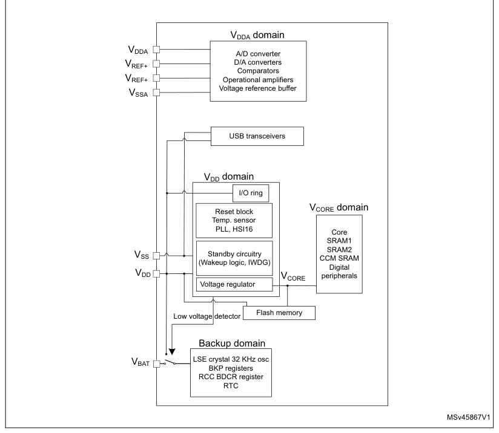
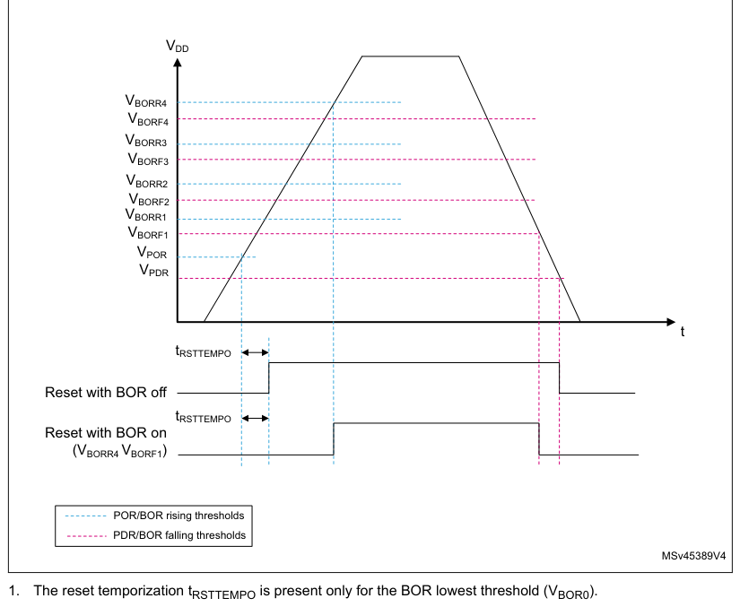
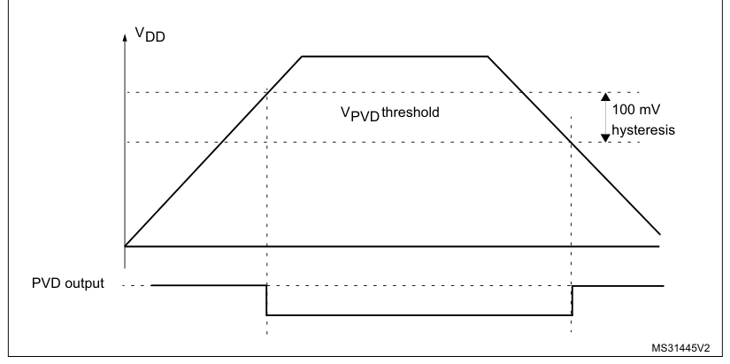
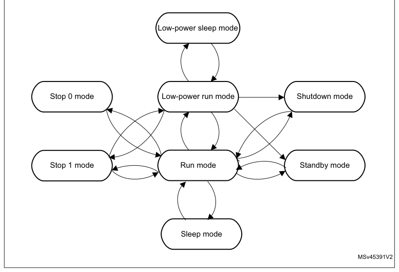

# 6 Power control (PWR)

[← RM0440 index](../STM32G4_RM0440.md)

## 6.1 Power supplies

The STM32G4 series devices require a 1.71 V to 3.6 V operating supply voltage (VDD). Analog
peripherals are supplied through independent power domain VDDA.

- VDD = 1.71 V to 3.6 V

VDD is the external power supply for the I/Os, the internal regulator and the system analog such as
reset, power management and internal clocks. It is provided externally through VDD pins.

- VDDA = 1.62 V (ADC/ COMP) / 1.71 V (DAC 1MSPS / DAC 15MSPS) / 2 V (OPAMP) / 2.4 V (VREFBUF)

VDDA is the external analog power supply for A/D converters, D/A converters, voltage reference
buffer, operational amplifiers and comparators. The VDDA voltage level is independent from the VDD
voltage. VDDA should be preferably connected to VDD when these peripherals are not used.

During power up and power down, the following power sequence is required:

- When VDD is below 1 V, then VDDA supply must remain below VDD \+ 300 mV
- When VDD is above 1 V, all power supplies became independent.

During power down phase, VDD can temporarily become lower then other supplies only if the energy
provided to the MCU remains below 1 mJ. This allows external decoupling capacitors to be discharged
with different time constants during the power down transient phase.

- VBAT = 1.55 V to 3.6 V

VBAT is the power supply for RTC, external clock 32 kHz oscillator and backup registers (through
power switch) when VDD is not present. VBAT is internally bonded to VDD for small packages without
dedicated pin.

- VREF-, VREF+

VREF+ is the input reference voltage for ADCs and DACs. It is also the output of the internal
voltage reference buffer when enabled.

When VDDA \< 2 V, VREF+ must be equal to VDDA.

When VDDA ≥ 2 V, VREF+ must be between 2 V and VDDA.

VREF+ can be grounded when ADC and DAC are not active.

The internal voltage reference buffer supports three output voltages, which are configured with VRS
bit in the VREFBUF_CSR register:

- VREF+ around 2.048 V. This requires VDDA equal to or higher than 2.4 V.
- VREF+ around 2.5 V. This requires VDDA equal to or higher than 2.8 V.
- VREF+ around 2.9 V. This requires VDDA equal to or higher than 3.135 V.

VREF+ pin is not available on all packages. When not available on the package, it is bonded to VDDA.
When the VREF+ is double-bonded with VDDA in a package, the internal voltage reference buffer
(VREFBUF) is not available and must be kept disable (refer to related device datasheet for packages
pinout description).

VREF-is internally double bonded with VSSA.

An embedded linear voltage regulator is used to supply the internal digital power VCORE. VCORE is
the power supply for digital peripherals SRAM1, SRAM2 and CCM SRAM. The Flash is supplied by VCORE
and VDD.

**Figure 12. STM32G4 series power supply overview**

### 6.1.1 Independent analog peripherals supply

To improve ADC and DAC conversion accuracy and to extend the supply flexibility, the analog
peripherals have an independent power supply which can be separately filtered and shielded from
noise on the PCB.

- The analog peripherals voltage supply input is available on a separate VDDA pin.
- An isolated supply ground connection is provided on VSSA pin.

The VDDA supply voltage can be different from VDD. The presence of VDDA must be checked before
enabling any of the analog peripherals supplied by VDDA (A/D converter, D/A converter, comparators,
operational amplifiers, voltage reference buffer).

The VDDA supply can be monitored by the Peripheral Voltage Monitoring, and compared with thresholds.
Refer to [Section 6.2.3](#623-peripheral-voltage-monitoring-pvm): Peripheral Voltage Monitoring (PVM) for more details.

When a single supply is used, VDDA can be externally connected to VDD through the external filtering
circuit in order to ensure a noise-free VDDA reference voltage.

#### ADC and DAC reference voltage

To ensure a better accuracy on low-voltage inputs and outputs, the user can connect to VREF+ a
separate reference voltage lower than VDDA. VREF+ is the highest voltage, represented by the full
scale value, for an analog input (ADC) or output (DAC) signal.

VREF+ can be provided either by an external reference of by an internal buffered voltage reference
(VREFBUF).

The internal buffered voltage reference (VREFBUF) is enabled by setting the ENVR bit in the Section
23.4.1: VREFBUF control and status register (VREFBUF_CSR). The internal buffered voltage reference
(VREFBUF) is set to 2.048 V, 2.5 V or 2.9 V according the VRS[1:0] bits setting. The internal
buffered voltage reference can also provide the voltage to external components through VREF+ pin.
Refer to the device datasheet and to [Section 23](chapter-23.md#23-voltage-reference-buffer-vrefbuf): Voltage reference buffer (VREFBUF) for further
information.

### 6.1.2 USB transceivers supply

The USB transceivers are supplied from VDD power supply pin. VDD range for USB usage is from 3.0 V
to 3.6 V.

### 6.1.3 Battery backup domain

To retain the content of the Backup registers and supply the RTC function when VDD is turned off,
the VBAT pin can be connected to an optional backup voltage supplied by a battery or by another
source.

The VBAT pin powers the RTC unit, the LSE oscillator and the PC13 to PC15 I/Os, allowing the RTC to
operate even when the main power supply is turned off. The switch to the VBAT supply is controlled
by the power-down reset embedded in the Reset block.

> **Warning:** During tRSTTEMPO (temporization at VDD startup) or after a PDR
> has been detected, the power switch between VBAT and VDD remains connected to VBAT. During the
> startup phase, if VDD is established in less than tRSTTEMPO (refer to the datasheet for the value of
> tRSTTEMPO) and VDD > VBAT \+ 0.6 V, a current may be injected into VBAT through an internal diode
> connected between VDD and the power switch (VBAT). If the power supply/battery connected to the VBAT
> pin cannot support this current injection, it is strongly recommended to connect an external
> low-drop diode between this power supply and the VBAT pin.

If no external battery is used in the application, it is recommended to connect VBAT externally to
VDD with a 100 nF external ceramic decoupling capacitor.

When the backup domain is supplied by VDD (analog switch connected to VDD), the following pins are
available:

- PC13, PC14 and PC15, which can be used as GPIO pins
- PC13, PC14 and PC15, which can be configured by RTC or LSE (refer to [Section 37.3](chapter-37.md#373-rtc-functional-description):

RTC functional description)

- PA0/RTC_TAMP2 and PE6/RTC_TAMP3 when they are configured by the RTC as tamper pins

> **Note:** As the analog switch can transfer only a limited amount of current (3 mA), the use of GPIO

PC13 to PC15 in output mode is restricted: the speed must be limited to 2 MHz with a maximum load of
30 pF, and these I/Os must not be used as a current source (e.g. to drive a LED).

When the backup domain is supplied by VBAT (analog switch connected to VBAT because VDD is not
present), the following functions are available:

- PC13, PC14 and PC15 can be controlled only by RTC or LSE (refer to [Section 37.3](chapter-37.md#373-rtc-functional-description): RTC functional
  description)
- PA0/RTC_TAMP2 and PE6/RTC_TAMP3 when they are configured by the RTC as tamper pins

#### Backup domain access

After a system reset, the backup domain (RTC registers and backup registers) is protected against
possible unwanted write accesses. To enable access to the backup domain, proceed as follows:

1. Enable the power interface clock by setting the PWREN bits in the APB1 peripheral
   clock enable register 1 (RCC_APB1ENR1)
2. Set the DBP bit in the Power control register 1 (PWR_CR1) to enable access to the
   backup domain
3. Select the RTC clock source in the RTC domain control register (RCC_BDCR).
4. Enable the RTC clock by setting the RTCEN [15] bit in the RTC domain control register

(RCC_BDCR).

#### VBAT battery charging

When VDD is present, it is possible to charge the external battery on VBAT through an internal
resistance. This charging is done through a 5 or a 1.5 kΩ resistor, depending upon the VBRS bit
value in the PWR_CR4 register.

The battery charging is enabled by setting VBE bit in the PWR_CR4 register. It is automatically
disabled in VBAT mode.

### 6.1.4 Voltage regulator

Two embedded linear voltage regulators supply all the digital circuitries, except for the Standby
circuitry and the backup domain. The main regulator output voltage (VCORE) can be programmed by
software to two different power ranges (Range 1 and Range 2) in order to optimize the consumption
depending on the system’s maximum operating frequency (refer to [Section 7.2.8](chapter-07.md#728-clock-source-frequency-versus-voltage-scaling): Clock source
frequency versus voltage scaling and to [Section 3.3.3](chapter-03.md#333-read-access-latency): Read access latency.

The voltage regulators are always enabled after a reset. Depending on the application modes, the
VCORE supply is provided either by the main regulator (MR) or by the low-power regulator (LPR).

- In Run, Sleep and Stop 0 modes, both regulators are enabled and the main regulator (MR) supplies
  full power to the VCORE domain (core, memories and digital peripherals).
- In low-power run and low-power sleep modes, the main regulator is off and the low-
  power regulator (LPR) supplies low power to the VCORE domain, preserving the contents of the
  registers, SRAM1, SRAM2 and CCM SRAM.
- In Stop 1 modes, the main regulator is off and the low-power regulator (LPR) supplies low power to
  the VCORE domain, preserving the contents of the registers, SRAM1, SRAM2 and CCM SRAM.
- In Standby mode with SRAM2 content preserved (RRS bit is set in the PWR_CR3 register), the main
  regulator (MR) is off and the low-power regulator (LPR) provides the supply to SRAM2 only. The
  core, digital peripherals (except Standby circuitry and backup domain) SRAM1 and CCM SRAM are
  powered off.
- In Standby mode, both regulators are powered off. The contents of the registers, SRAM1, SRAM2 and
  CCM SRAM is lost except for the Standby circuitry and the backup domain.
- In Shutdown mode, both regulators are powered off. When exiting from Shutdown mode, a power-on
  reset is generated. Consequently, the contents of the registers, SRAM1, SRAM2 and CCM SRAM is
  lost, except for the backup domain.

### 6.1.5 Dynamic voltage scaling management

The dynamic voltage scaling is a power management technique which consists in increasing or
decreasing the voltage used for the digital peripherals (VCORE), according to the application
performance and power consumption needs.

Dynamic voltage scaling to increase VCORE is known as overvolting. It allows to improve the device
performance.

Dynamic voltage scaling to decrease VCORE is known as undervolting. It is performed to save power,
particularly in laptop and other mobile devices where the energy comes from a battery and is thus
limited.

- Range 1: High-performance range.

In range 1, the main regulator operates in two modes following the R1MODE bit in the PWR_CR5
register:

- Main regulator range 1 normal mode: provides a typical output voltage at 1.2 V. It is used when
  the system clock frequency is up to 150 MHz. The Flash access time for read access is minimum,
  write and erase operations are possible.
- Main regulator range 1 boost mode: provides a typical output voltage at 1.28 V. It is used when
  the system clock frequency is up to 170 MHz. The Flash access time for read access is minimum,
  write and erase operations are possible. To optimize the power consumption it is recommended to
  select the range1 boost mode when the system clock frequency is greater than 150 MHz. See Table
  38.

**Table 38. Range 1 boost mode configuration**

| System frequency | SYSCLK ≤ 150 MHz | SYSCLK ≤ 170 MHz |
| --- | --- | --- |
| R1MODE bit configuration | 1 | 0 |

- Range 2: Low-power range.

The main regulator provides a typical output voltage at 1.0 V. The system clock frequency can be up
to 26 MHz. The Flash access time for a read access is increased as compared to Range 1; write and
erase operations are not possible.

Voltage scaling is selected through the VOS bit in the [Section 6.4.1](#641-power-control-register-1-pwr_cr1): Power control register 1
(PWR_CR1) register.

The sequence to go from Range 1 (Normal/Boost) to Range 2 is:

1. In case of switching from Range 1 boost mode to Range 2, the system clock must be
   divided by 2 using the AHB prescaler before switching to a lower system frequency for at least 1us
   and then reconfigure the AHB prescaler.
2. Reduce the system frequency to a value lower than 26 MHz.
3. Adjust number of wait states according new frequency target in Range 2 (LATENCY
   bits in the FLASH_ACR).
4. Program the VOS bits to “10” in the PWR_CR1 register.

The sequence to go from Range 2 to Range 1 (normal/boost mode) is:

1. Program the VOS bits to “01” in the PWR_CR1 register.
2. Wait until the VOSF flag is cleared in the PWR_SR2 register.
3. Adjust number of wait states according new frequency target in Range 1 (LATENCY
   bits in the FLASH_ACR).
4. Increase the system frequency by following below procedure:

- If the system frequency is 26 MHz \< SYSCLK ≤ 150 MHz:
  - Select the Range 1 normal mode by setting R1MODE bit in the PWR_CR5 register.
  - Configure and switch to PLL for a new system frequency.
- If the system frequency is SYSCLK > 150 MHz:
  - The system clock must be divided by 2 using the AHB prescaler before switching to a higher
    system frequency.
  - Select the Range 1 boost mode by clearing the R1MODE bit is in the PWR_CR5 register.
  - Configure and switch to PLL for a new system frequency.
  - Wait for at least 1us and then reconfigure the AHB prescaler to get the needed HCLK clock
    frequency.

The sequence to switch from Range1 normal mode to Range1 boost mode is:

1. The system clock must be divided by 2 using the AHB prescaler before switching to a
   higher system frequency.
2. Clear the R1MODE bit is in the PWR_CR5 register.
3. Adjust the number of wait states according to the new frequency target in range1 boost
   mode
4. Configure and switch to new system frequency.
5. Wait for at least 1us and then reconfigure the AHB prescaler to get the needed HCLK
   clock frequency.

The sequence to switch from Range1 boost mode to Range1 normal mode is:

1. Set the R1MODE bit is in the PWR_CR5 register.
2. Adjust the number of wait states according new frequency target in Range1 default
   mode.
3. Configure and switch to new system frequency.

## 6.2 Power supply supervisor

### 6.2.1 Power-on reset (POR) / power-down reset (PDR) / brown-out reset (BOR)

The device has an integrated power-on reset (POR) / power-down reset (PDR), coupled with a brown-out
reset (BOR) circuitry. The BOR is active in all power modes except Shutdown mode, and cannot be
disabled.

Five BOR thresholds can be selected through option bytes.

During power-on, the BOR keeps the device under reset until the supply voltage VDD reaches the
specified VBORx threshold. When VDD drops below the selected threshold, a device reset is generated.
When VDD is above the VBORx upper limit, the device reset is released and the system can start.

For more details on the brown-out reset thresholds, refer to the electrical characteristics section
in the datasheet.

**Figure 13. Brown-out reset waveform**

VDD

VBORR4

VBORF4

VBORR3

VBORF3

VBORR2

VBORF2

VBORR1

VBORF1

VPOR VPDR
t
tRSTTEMPO

Reset with BOR off
tRSTTEMPO

Reset with BOR on

(VBORR4 VBORF1)

POR/BOR rising thresholds

PDR/BOR falling thresholds

MSv45389V4

1. The reset temporization tRSTTEMPO is present only for the BOR lowest threshold (VBOR0).

### 6.2.2 Programmable voltage detector (PVD)

You can use the PVD to monitor the VDD power supply by comparing it to a threshold selected by the
PLS[2:0] bits in the Power control register 2 (PWR_CR2).

The PVD is enabled by setting the PVDE bit.

A PVDO flag is available, in the Power status register 2 (PWR_SR2), to indicate if VDD is higher or
lower than the PVD threshold. This event is internally connected to the EXTI line16 and can generate
an interrupt if enabled through the EXTI registers. The PVD output interrupt can be generated when
VDD drops below the PVD threshold and/or when VDD rises above the PVD threshold depending on EXTI
line16 rising/falling edge configuration. As an example, the service routine could perform emergency
shutdown tasks.

**Figure 14. PVD thresholds**

### 6.2.3 Peripheral Voltage Monitoring (PVM)

Only VDD is monitored by default, as it is the only supply required for all system-related
functions. The VDDA can be independent from VDD and can be monitored with two peripheral voltage
monitoring (PVM).

Each of the PVMx (x=1, 2) is a comparator between a fixed threshold VPVMx and the VDDA power supply.
PVMOx flags indicate if the independent power supply is higher or lower than the PVMx threshold:
PVMOx flag is cleared when the supply voltage is above the PVMx threshold, and is set when the
supply voltage is below the PVMx threshold.

Each PVM output is connected to an EXTI line and can generate an interrupt if enabled through the
EXTI registers. The PVMx output interrupt is generated when the independent power supply drops below
the PVMx threshold and/or when it rises above the PVMx threshold, depending on EXTI line
rising/falling edge configuration.

Each PVM can remain active in Stop 0 and Stop 1 modes, and the PVM interrupt can wake up from the
Stop mode.

**Table 39. PVM features**

| PVM | Power supply | PVM threshold | EXTI line |
| --- | --- | --- | --- |
| PVM1 | VDDA | VPVM1 (around 1.65 V) | 40 |
| PVM2 | VDDA | VPVM2 (around 1.8 V) | 41 |

The independent analog supply VDDA is not considered as present by default, and a logical and
electrical isolation is applied to ignore any information coming from the peripherals supplied by
this dedicated supply.

- If VDDA is shorted externally to VDD, the application should assume it is available without
  enabling any Peripheral Voltage Monitoring.
- If VDDA is independent from VDD, the Peripheral Voltage Monitoring (PVM) can be enabled to confirm
  whether the supply is present or not.

## 6.3 Low-power modes

By default, the microcontroller is in Run mode after a system or a power Reset. Several low-power
modes are available to save power when the CPU does not need to be kept running, for example when
waiting for an external event. It is up to the user to select the mode that gives the best
compromise between low-power consumption, short startup time and available wakeup sources.

The device features seven low-power modes:

- Sleep mode: CPU clock off, all peripherals including Cortex®-M4 with FPU core peripherals such as
  NVIC, SysTick, etc. can run and wake up the CPU when an interrupt or an event occurs. Refer to
  [Section 6.3.4](#634-sleep-mode): Sleep mode.
- Low-power run mode: This mode is achieved when the CPU clock frequency is reduced below 2 MHz. The
  code is executed from the SRAM or the Flash memory. The regulator is in low-power mode to minimize
  the regulator's operating current. Refer to [Section 6.3.2](#632-low-power-run-mode-lp-run): Low-power run mode (LP run).
- Low-power sleep mode: This mode is entered from the Low-power run mode: Cortex®- M4 with FPU is
  off. Refer to [Section 6.3.5](#635-low-power-sleep-mode-lp-sleep): Low-power sleep mode (LP sleep).
- Stop 0 and Stop 1 modes: SRAM and all registers content are retained. All clocks in the VCORE
  domain are stopped, the PLL, the HSI16 and the HSE are disabled. The LSI and the LSE can be kept
  running.

The RTC and TAMP can remain active (Stop mode with RTC, Stop mode without RTC).

Some peripherals with the wakeup capability can enable the HSI16 RC during the Stop mode to detect
their wakeup condition.

In Stop 0 mode, the main regulator remain ON, which allows the fastest wakeup time but with higher
consumption. The active peripherals and the wakeup sources are the same as in Stop 1 mode.

The system clock, when exiting from Stop 0 or Stop 1 mode, is the HSI16 clock. If the device is
configured to wake up in low-power run mode, the HPRE bits in RCC_CFGR register must be configured
prior to entering Stop mode to provide a frequency not greater than 2 MHz.

Refer to [Section 6.3.6](#636-stop-0-mode): Stop 0 mode for details on Stop 0 mode.

- Standby mode: VCORE domain is powered off. However, it is possible to preserve the SRAM contents:
  - Standby mode with SRAM2 retention when the bit RRS is set in PWR_CR3 register. In this case,
    SRAM2 is supplied by the low-power regulator.
  - Standby mode when the bit RRS is cleared in PWR_CR3 register. In this case the main regulator
    and the low-power regulator are powered off.

All clocks in the VCORE domain are stopped, the PLL, the HSI16 and the HSE oscillator
are disabled. The LSI and the LSE can be kept running.

The RTC can remain active (Standby mode with RTC, Standby mode without RTC).

The system clock, when exiting Standby modes, is the HSI16 oscillator clock.

Refer to [Section 6.3.8](#638-standby-mode): Standby mode.

- Shutdown mode: VCORE domain is powered off. All clocks in the VCORE domain are stopped, the PLL,
  the HSI16, the LSI and the HSE are disabled. The LSE can be kept running. The system clock, when
  exiting the Shutdown mode, is HSI16 oscillator clock. In this mode, the supply voltage monitoring
  is disabled and the product behavior is not guaranteed in case of a power voltage drop. Refer to
  [Section 6.3.9](#639-shutdown-mode): Shutdown mode.

In addition, the power consumption in Run mode can be reduced by one of the following means:

- Slowing down the system clocks
- Gating the clocks to the APB and AHB peripherals when they are unused.

**Figure 15. Low-power modes possible transitions**

**Table 40. Low-power mode summary**

| Source row | Column 1 | Column 2 | Column 3 |
| ---: | --- | --- | --- |
| 1 | `Voltage` |  |  |
| 2 | `Wakeup` | `Wakeup` | `regulators` |
| 3 | `Mode name` | `Entry` | `Effect on clocks` |
| 4 | `source(1)` | `system clock` |  |
| 5 | `MR LPR` |  |  |
| 6 | `WFI or Return` |  |  |
| 7 | `Sleep` | `Same as before` | `CPU clock OFF` |
| 8 | `Any interrupt` |  |  |
| 9 | `from ISR` | `entering Sleep` | `ON` |
| 10 | `(Sleep-now or` | `no effect on other clocks` |  |
| 11 | `Sleep-on-exit)` | `mode` | `or analog clock sources` |
| 12 | `WFE` | `Wakeup event` |  |
| 13 | `Low-power` | `Same as Low-` |  |
| 14 | `Set LPR bit` | `Clear LPR bit` | `None` |
| 15 | `run` | `power run clock` |  |
| 16 | `Set LPR bit +` |  |  |
| 17 | `WFI or Return` | `Same as before` |  |
| 18 | `Any interrupt` | `CPU clock OFF` | `OFF` |
| 19 | `Low-power` | `entering Low-` |  |
| 20 | `from ISR` |  |  |
| 21 | `no effect on other clocks` |  |  |
| 22 | `sleep` | `power sleep` |  |
| 23 | `or analog clock sources` |  |  |
| 24 | `Set LPR bit +` | `mode` |  |
| 25 | `Wakeup event` |  |  |
| 26 | `WFE` |  |  |
| 27 | `LPMS=”000” +` |  |  |
| 28 | `ON` |  |  |
| 29 | `SLEEPDEEP bit` |  |  |
| 30 | `Any EXTI line` |  |  |
| 31 | `Stop 0` | `ON` |  |
| 32 | `+ WFI or Return` |  |  |
| 33 | `(configured in the` |  |  |
| 34 | `from ISR or WFE` | `EXTI registers)` |  |
| 35 | `LPMS=”001” +` | `Specific` |  |
| 36 | `SLEEPDEEP bit` | `peripherals` |  |
| 37 | `Stop 1` |  |  |
| 38 | `events` |  |  |
| 39 | `+ WFI or Return` |  |  |
| 40 | `from ISR or WFE` |  |  |
| 41 | `All clocks OFF except` |  |  |
| 42 | `LPMS=”011”+` |  |  |
| 43 | `LSI and LSE` |  |  |
| 44 | `Set RRS bit +` |  |  |
| 45 | `Standby with` |  |  |
| 46 | `SLEEPDEEP bit` |  |  |
| 47 | `SRAM2` |  |  |
| 48 | `+ WFI or Return` | `WKUP pin edge,` | `HSI16` |
| 49 | `RTC event, TAMP` |  |  |
| 50 | `from ISR or WFE` |  |  |
| 51 | `event, external` |  |  |
| 52 | `OFF` |  |  |
| 53 | `LPMS=”011” +` |  |  |
| 54 | `reset on NRST` |  |  |
| 55 | `Clear RRS bit +` |  |  |
| 56 | `pin, IWDG reset` |  |  |
| 57 | `Standby` | `SLEEPDEEP bit` |  |
| 58 | `+ WFI or Return` |  |  |
| 59 | `from ISR or WFE` |  |  |
| 60 | `OFF` |  |  |
| 61 | `WKUP pin edge,` |  |  |
| 62 | `LPMS=”1--” +` |  |  |
| 63 | `RTC event, TAMP` |  |  |
| 64 | `SLEEPDEEP bit` | `All clocks OFF except` |  |
| 65 | `Shutdown` | `event, external` |  |
| 66 | `+ WFI or Return` | `LSE` |  |
| 67 | `reset on NRST` |  |  |
| 68 | `from ISR or WFE` |  |  |
| 69 | `pin` |  |  |

1. Refer to Table 41: Functionalities depending on the working mode.

**Table 41. Functionalities depending on the working mode(1)**

| Source row | Column 1 | Column 2 | Column 3 | Column 4 | Column 5 | Column 6 | Column 7 | Column 8 | Column 9 | Column 10 | Column 11 | Column 12 |
| ---: | --- | --- | --- | --- | --- | --- | --- | --- | --- | --- | --- | --- |
| 1 | `Stop 0/1` | `Standby` | `Shutdown` |  |  |  |  |  |  |  |  |  |
| 2 | `Peripheral` | `Run` | `Sleep` | `VBAT` |  |  |  |  |  |  |  |  |
| 3 | `-` | `-` | `-` |  |  |  |  |  |  |  |  |  |
| 4 | `Low-power run` |  |  |  |  |  |  |  |  |  |  |  |
| 5 | `Low-power sleep` |  |  |  |  |  |  |  |  |  |  |  |
| 6 | `Wakeup capability` | `Wakeup capability` | `Wakeup capability` |  |  |  |  |  |  |  |  |  |
| 7 | `CPU` | `Y` | `-` | `Y` | `-` | `-` | `-` | `-` | `-` | `-` | `-` | `-` |
| 8 | `Flash memory` | `O(2)` | `O(2)` | `O(2)` | `O(2)` | `-` | `-` | `-` | `-` | `-` | `-` | `-` |
| 9 | `SRAM1` | `Y` | `Y(3)` | `Y` | `Y(3)` | `Y` | `-` | `-` | `-` | `-` | `-` | `-` |
| 10 | `SRAM2` | `Y` | `Y(3)` | `Y` | `Y(3)` | `Y` | `-` | `O(4)` | `-` | `-` | `-` | `-` |
| 11 | `CCM SRAM` | `Y` | `Y(3)` | `Y` | `Y(3)` | `Y` | `-` | `-` | `-` | `-` | `-` | `-` |
| 12 | `FSMC` | `O` | `O` | `O` | `O` | `-` | `-` | `-` | `-` | `-` | `-` | `-` |
| 13 | `QUADSPI` | `O` | `O` | `O` | `O` | `-` | `-` | `-` | `-` | `-` | `-` | `-` |
| 14 | `Backup Registers` | `Y` | `Y` | `Y` | `Y` | `Y` | `-` | `Y` | `-` | `Y` | `-` | `Y` |
| 15 | `Brown-out reset (BOR)` | `Y` | `Y` | `Y` | `Y` | `Y` | `Y` | `Y` | `Y` | `-` | `-` | `-` |
| 16 | `Programmable Voltage Detector (PVD)` | `O` | `O` | `O` | `O` | `O` | `O` | `-` | `-` | `-` | `-` | `-` |
| 17 | `Peripheral Voltage Monitor (PVM)` | `O` | `O` | `O` | `O` | `O` | `O` | `-` | `-` | `-` | `-` | `-` |
| 18 | `DMA` | `O` | `O` | `O` | `O` | `-` | `-` | `-` | `-` | `-` | `-` | `-` |
| 19 | `(5)` |  |  |  |  |  |  |  |  |  |  |  |
| 20 | `Oscillator HSI16` | `O` | `O` | `O` | `O` | `-` | `-` | `-` | `-` | `-` | `-` |  |
| 21 | `Oscillator HSI48` | `O` | `O` | `-` | `-` | `-` | `-` | `-` | `-` | `-` | `-` | `-` |
| 22 | `High Speed External (HSE)` | `O` | `O` | `O` | `O` | `-` | `-` | `-` | `-` | `-` | `-` | `-` |
| 23 | `Low Speed Internal (LSI)` | `O` | `O` | `O` | `O` | `O` | `-` | `O` | `-` | `-` | `-` | `-` |
| 24 | `Low Speed External (LSE)` | `O` | `O` | `O` | `O` | `O` | `-` | `O` | `-` | `O` | `-` | `O` |
| 25 | `Clock Security System (CSS)` | `O` | `O` | `O` | `O` | `-` | `-` | `-` | `-` | `-` | `-` | `-` |
| 26 | `Clock Security System on LSE` | `O` | `O` | `O` | `O` | `O` | `O` | `O` | `O` | `-` | `-` | `-` |
| 27 | `RTC / Auto wakeup` | `O` | `O` | `O` | `O` | `O` | `O` | `O` | `O` | `O` | `O` | `O` |
| 28 | `Number of RTC Tamper pins` | `3` | `3` | `3` | `3` | `3` | `O` | `3` | `O` | `3` | `O` | `3` |
| 29 | `USB` | `O(8)` | `O(8)` | `-` | `-` | `-` | `O` | `-` | `-` | `-` | `-` | `-` |
| 30 | `O O` |  |  |  |  |  |  |  |  |  |  |  |
| 31 | `USARTx (x=1,2,3,4,5)` | `O` | `O` | `O` | `O` | `-` | `-` | `-` | `-` | `-` |  |  |
| 32 | `(6) (6)` |  |  |  |  |  |  |  |  |  |  |  |
| 33 | `O O` |  |  |  |  |  |  |  |  |  |  |  |
| 34 | `Low-power UART (LPUART1)` | `O` | `O` | `O` | `O` | `-` | `-` | `-` | `-` | `-` |  |  |
| 35 | `(6) (6)` |  |  |  |  |  |  |  |  |  |  |  |
| 36 | `O O` |  |  |  |  |  |  |  |  |  |  |  |
| 37 | `I2Cx (x=1,2,3,4)` | `O` | `O` | `O` | `O` | `-` | `-` | `-` | `-` | `-` |  |  |
| 38 | `(7) (7)` |  |  |  |  |  |  |  |  |  |  |  |

**Table 41. Functionalities depending on the working mode(1) (continued)**

| Source row | Column 1 | Column 2 | Column 3 | Column 4 | Column 5 | Column 6 | Column 7 | Column 8 | Column 9 | Column 10 | Column 11 | Column 12 |
| ---: | --- | --- | --- | --- | --- | --- | --- | --- | --- | --- | --- | --- |
| 1 | `Stop 0/1` | `Standby` | `Shutdown` |  |  |  |  |  |  |  |  |  |
| 2 | `Peripheral` | `Run` | `Sleep` | `VBAT` |  |  |  |  |  |  |  |  |
| 3 | `-` | `-` | `-` |  |  |  |  |  |  |  |  |  |
| 4 | `Low-power run` |  |  |  |  |  |  |  |  |  |  |  |
| 5 | `Low-power sleep` |  |  |  |  |  |  |  |  |  |  |  |
| 6 | `Wakeup capability` | `Wakeup capability` | `Wakeup capability` |  |  |  |  |  |  |  |  |  |
| 7 | `SPIx (1,2,3,4)` | `O` | `O` | `O` | `O` | `-` | `-` | `-` | `-` | `-` | `-` | `-` |
| 8 | `FDCANx (1,2,3)` | `O` | `O` | `O` | `O` | `-` | `-` | `-` | `-` | `-` | `-` | `-` |
| 9 | `SAI1` | `O` | `O` | `O` | `O` | `-` | `-` | `-` | `-` | `-` | `-` | `-` |
| 10 | `ADCx (x=1,2,3,4,5)` | `O` | `O` | `O` | `O` | `-` | `-` | `-` | `-` | `-` | `-` | `-` |
| 11 | `DACx (x=1,2,3,4)` | `O` | `O` | `O` | `O` | `O` | `-` | `-` | `-` | `-` | `-` | `-` |
| 12 | `VREFBUF` | `O` | `O` | `O` | `O` | `O` | `-` | `-` | `-` | `-` | `-` | `-` |
| 13 | `OPAMPx (x=1,2,3,4,5,6)` | `O` | `O` | `O` | `O` | `O` | `-` | `-` | `-` | `-` | `-` | `-` |
| 14 | `COMPx (x=1,2,3,4,5,6,7)` | `O` | `O` | `O` | `O` | `O` | `O` | `-` | `-` | `-` | `-` | `-` |
| 15 | `Temperature sensor` | `O` | `O` | `O` | `O` | `-` | `-` | `-` | `-` | `-` | `-` | `-` |
| 16 | `Timers (TIMx)` | `O` | `O` | `O` | `O` | `-` | `-` | `-` | `-` | `-` | `-` | `-` |
| 17 | `High resolution timer 1 (HRTIM1)` | `O` | `O` | `O` | `O` | `-` | `-` | `-` | `-` | `-` | `-` | `-` |
| 18 | `Low-power timer 1 (LPTIM1)` | `O` | `O` | `O` | `O` | `O` | `O` | `-` | `-` | `-` | `-` | `-` |
| 19 | `Independent watchdog (IWDG)` | `O` | `O` | `O` | `O` | `O` | `O` | `O` | `O` | `-` | `-` | `-` |
| 20 | `Window watchdog (WWDG)` | `O` | `O` | `O` | `O` | `-` | `-` | `-` | `-` | `-` | `-` | `-` |
| 21 | `SysTick timer` | `O` | `O` | `O` | `O` | `-` | `-` | `-` | `-` | `-` | `-` | `-` |
| 22 | `Random number generator (RNG)` | `O(8)` | `O(8)` | `-` | `-` | `-` | `-` | `-` | `-` | `-` | `-` | `-` |
| 23 | `AES hardware accelerator` | `O` | `O` | `O` | `O` | `-` | `-` | `-` | `-` | `-` | `-` | `-` |
| 24 | `CRC calculation unit` | `O` | `O` | `O` | `O` | `-` | `-` | `-` | `-` | `-` | `-` | `-` |
| 25 | `5` | `5` |  |  |  |  |  |  |  |  |  |  |
| 26 | `(9)` | `(11)` |  |  |  |  |  |  |  |  |  |  |
| 27 | `GPIOs` | `O` | `O` | `O` | `O` | `O` | `O` | `pins` | `pins` | `-` |  |  |
| 28 | `(10)` | `(10)` |  |  |  |  |  |  |  |  |  |  |
| 29 | `Filter Mathematical Accelerator (FMAC)` | `O` | `O` | `O` | `O` | `-` | `-` | `-` | `-` | `-` | `-` | `-` |
| 30 | `CORDIC co-processor (CORDIC)` | `O` | `O` | `O` | `O` | `-` | `-` | `-` | `-` | `-` | `-` | `-` |

1. Legend: Y = Yes (Enable). O = Optional (Disable by default. Can be enabled by software). - = Not
   available, wakeup
   highlighted in gray.
2. The Flash can be configured in power-down mode. By default, it is not in power-down mode.
3. The SRAM clock can be gated on or off.
4. SRAM2 content is preserved when the bit RRS is set in PWR_CR3 register.
5. Some peripherals with wakeup from Stop capability can request HSI16 to be enabled. In this case,
   HSI16 is woken up by
   the peripheral, and only feeds the peripheral which requested it. HSI16 is automatically put off
   when the peripheral does not
   need it anymore.
6. UART and LPUART reception is functional in Stop mode, and generates a wakeup interrupt on Start,
   address match or
   received frame event.
7. I2C address detection is functional in Stop mode, and generates a wakeup interrupt in case of
   address match.
8. Voltage scaling Range 1 only.
9. I/Os can be configured with internal pull-up, pull-down or floating in Standby mode.
10. The I/Os with wakeup from Standby/Shutdown capability are: PA0, PC13, PE6, PA2, PC5.
11. I/Os can be configured with internal pull-up, pull-down or floating in Shutdown mode but the
    configuration is lost when
    exiting the Shutdown mode.

### Debug mode

By default, the debug connection is lost if the application puts the MCU in Stop 0, Stop1, Standby
or Shutdown mode while the debug features are used. This is due to the fact that the Cortex®-M4 with
FPU core is no longer clocked.

However, by setting some configuration bits in the DBGMCU_CR register, the software can be debugged
even when using the low-power modes extensively. For more details, refer to [Section 47.16.1](chapter-47.md#47161-debug-support-for-low-power-modes): Debug
support for low-power modes.

### 6.3.1 Run mode

#### Slowing down system clocks

In Run mode, the speed of the system clocks (SYSCLK, HCLK, PCLK) can be reduced by programming the
prescaler registers. These prescalers can also be used to slow down the peripherals before entering
the Sleep mode.

For more details, refer to [Section 7.4.3](chapter-07.md#743-clock-configuration-register-rcc_cfgr): Clock configuration register (RCC_CFGR).

#### Peripheral clock gating

In Run mode, the HCLK and PCLK for individual peripherals and memories can be stopped at any time to
reduce the power consumption.

To further reduce the power consumption in Sleep mode, the peripheral clocks can be disabled prior
to executing the WFI or WFE instructions.

The peripheral clock gating is controlled by the RCC_AHBxENR and RCC_APBxENR registers.

Disabling the peripherals clocks in Sleep mode can be performed automatically by resetting the
corresponding bit in the RCC_AHBxSMENR and RCC_APBxSMENR registers.

### 6.3.2 Low-power run mode (LP run)

To further reduce the consumption when the system is in Run mode, the regulator can be configured in
low-power mode. In this mode, the CPU frequency should not exceed 2 MHz.

Please refer to the product datasheet for more details on voltage regulator and peripherals
operating conditions.

#### I/O states in Low-power run mode

In Low-power run mode, all I/O pins keep the same state as in Run mode.

#### Entering the Low-power run mode

To enter the Low-power run mode, proceed as follows:

1. Optional: Jump into the SRAM and power-down the Flash by setting the RUN_PD bit in
   the Flash access control register (FLASH_ACR).
2. Decrease the CPU clock frequency below 2 MHz.
3. Force the regulator in low-power mode by setting the LPR bit in the PWR_CR1 register.

Refer to Table 42: Low-power run on how to enter the Low-power run mode.

#### Exiting the Low-power run mode

To exit the Low-power run mode, proceed as follows:

1. Force the regulator in main mode by clearing the LPR bit in the PWR_CR1 register.
2. Wait until REGLPF bit is cleared in the PWR_SR2 register.
3. Increase the CPU clock frequency.

Refer to Table 42: Low-power run on how to exit the Low-power run mode.

**Table 42. Low-power run**

| Source row | Column 1 | Column 2 |
| ---: | --- | --- |
| 1 | `Low-power run mode` | `Description` |
| 2 | `Decrease the CPU clock frequency below 2 MHz` |  |
| 3 | `Mode entry` |  |
| 4 | `LPR = 1` |  |
| 5 | `LPR = 0` |  |
| 6 | `Mode exit` | `Wait until REGLPF = 0` |
| 7 | `Increase the CPU clock frequency` |  |
| 8 | `Wakeup latency` | `Regulator wakeup time from low-power mode` |

### 6.3.3 Low power modes

#### Entering low power mode

Low power modes are entered by the MCU by executing the WFI (Wait For Interrupt), or

WFE (Wait for Event) instructions, or when the SLEEPONEXIT bit in the Cortex®-M4 with

FPU System Control register is set on Return from ISR.

Entering Low-power mode through WFI or WFE is executed only if no interrupt is pending or
no event is pending.

#### Exiting low power mode

From Sleep modes, and Stop modes the MCU exit low power mode depending on the way
the low power mode was entered:

- If the WFI instruction or Return from ISR was used to enter the low power mode, any peripheral
  interrupt acknowledged by the NVIC can wake up the device.
- If the WFE instruction is used to enter the low power mode, the MCU exits the low power mode as
  soon as an event occurs. The wakeup event can be generated either
  by:
- NVIC IRQ interrupt.
- When SEVONPEND = 0 in the Cortex®-M4 with FPU System Control register. By enabling an interrupt in
  the peripheral control register and in the NVIC. When the MCU resumes from WFE, the peripheral
  interrupt pending bit and the NVIC peripheral IRQ channel pending bit (in the NVIC interrupt clear
  pending register) have to be cleared.

Only NVIC interrupts with sufficient priority wakeup and interrupt the MCU.

- When SEVONPEND = 1 in the Cortex®-M4 with FPU System Control register.

By enabling an interrupt in the peripheral control register and optionally in the NVIC. When the MCU
resumes from WFE, the peripheral interrupt pending bit and when enabled the NVIC peripheral IRQ
channel pending bit (in the NVIC interrupt clear pending register) have to be cleared.

All NVIC interrupts wakeup the MCU, even the disabled ones. Only enabled NVIC interrupts with
sufficient priority wakeup and interrupt the MCU.

- Event

Configuring a EXTI line in event mode. When the CPU resumes from WFE, it is not necessary to clear
the EXTI peripheral interrupt pending bit or the NVIC IRQ channel pending bit as the pending bits
corresponding to the event line is not set.

It may be necessary to clear the interrupt flag in the peripheral.

From Standby modes, and Shutdown modes the MCU exit low power mode through an
external reset (NRST pin), an IWDG reset, a rising edge on one of the enabled WKUPx pins
or a RTC event occurs (see Figure 532: RTC block diagrams).

After waking up from Standby or Shutdown mode, program execution restarts in the same
way as after a Reset (boot pin sampling, option bytes loading, reset vector is fetched, etc.).

### 6.3.4 Sleep mode

#### I/O states in Sleep mode

In Sleep mode, all I/O pins keep the same state as in Run mode.

#### Entering the Sleep mode

The Sleep mode is entered according Section: Entering low power mode, when the

SLEEPDEEP bit in the Cortex®-M4 with FPU System Control register is clear.

Refer to Table 43: Sleep for details on how to enter the Sleep mode.

#### Exiting the Sleep mode

The Sleep mode is exit according Section: Exiting low power mode.

Refer to Table 43: Sleep for more details on how to exit the Sleep mode.

**Table 43. Sleep**

| Source row | Column 1 | Column 2 |
| ---: | --- | --- |
| 1 | `Sleep-now mode` | `Description` |
| 2 | `WFI (Wait for Interrupt) or WFE (Wait for Event) while:` |  |

- SLEEPDEEP = 0
- No interrupt (for WFI) or event (for WFE) is pending

Refer to the Cortex®-M4 with FPU System Control register.

Mode entry

On return from ISR while:

- SLEEPDEEP = 0 and
- SLEEPONEXIT = 1
- No interrupt is pending

Refer to the Cortex®-M4 with FPU System Control register.

If WFI or return from ISR was used for entry

Interrupt: refer to Table 100: STM32G4 series vector table

If WFE was used for entry and SEVONPEND = 0:

Wakeup event: refer to [Section 15.3.2](chapter-15.md#1532-wake-up-event-management): Wake-up event management

Mode exit

If WFE was used for entry and SEVONPEND = 1:

Interrupt even when disabled in NVIC: refer to Table 100: STM32G4 series vector table or Wakeup
event: refer to [Section 15.3.2](chapter-15.md#1532-wake-up-event-management): Wake-up event management

| Source row | Column 1 | Column 2 |
| ---: | --- | --- |
| 1 | `Wakeup latency` | `None` |

### 6.3.5 Low-power sleep mode (LP sleep)

Please refer to the product datasheet for more details on voltage regulator and peripherals
operating conditions.

#### I/O states in Low-power sleep mode

In Low-power sleep mode, all I/O pins keep the same state as in Run mode.

#### Entering the Low-power sleep mode

The Low-power sleep mode is entered from low-power run mode according Section: Entering low power
mode, when the SLEEPDEEP bit in the Cortex®-M4 with FPU System Control register is clear.

Refer to Table 44: Low-power sleep for details on how to enter the Low-power sleep mode.

#### Exiting the Low-power sleep mode

The low-power Sleep mode is exit according Section: Exiting low power mode. When exiting the
Low-power sleep mode by issuing an interrupt or an event, the MCU is in Low-power run mode.

Refer to Table 44: Low-power sleep for details on how to exit the Low-power sleep mode.

**Table 44. Low-power sleep**

Low-power sleep-now

Description
mode

Low-power sleep mode is entered from the Low-power run mode.

WFI (Wait for Interrupt) or WFE (Wait for Event) while:

- SLEEPDEEP = 0
- No interrupt (for WFI) or event (for WFE) is pending

Refer to the Cortex®-M4 with FPU System Control register.

Mode entry

Low-power sleep mode is entered from the Low-power run mode. On return from ISR while:

- SLEEPDEEP = 0 and
- SLEEPONEXIT = 1
- No interrupt is pending

Refer to the Cortex®-M4 with FPU System Control register.

If WFI or Return from ISR was used for entry

Interrupt: refer to Table 100: STM32G4 series vector table

If WFE was used for entry and SEVONPEND = 0:

Wakeup event: refer to [Section 15.3.2](chapter-15.md#1532-wake-up-event-management): Wake-up event management

If WFE was used for entry and SEVONPEND = 1:

Mode exit

Interrupt even when disabled in NVIC: refer to Table 100: STM32G4 series vector table Wakeup event:
refer to [Section 15.3.2](chapter-15.md#1532-wake-up-event-management): Wake-up event management

After exiting the Low-power sleep mode, the MCU is in Low-power run mode.

| Source row | Column 1 | Column 2 |
| ---: | --- | --- |
| 1 | `Wakeup latency` | `None` |

### 6.3.6 Stop 0 mode

The Stop 0 mode is based on the Cortex®-M4 with FPU deepsleep mode combined with the peripheral
clock gating. The voltage regulator is configured in main regulator mode. In Stop 0 mode, all clocks
in the VCORE domain are stopped; the PLL, the HSI16 and the HSE oscillators are disabled. Some
peripherals with the wakeup capability (I2Cx (x=1,2,3,4), U(S)ARTx(x=1,2...5) and LPUART) can switch
on the HSI16 to receive a frame, and switch off the HSI16 after receiving the frame if it is not a
wakeup frame. In this case, the HSI16 clock is propagated only to the peripheral requesting it.

SRAM1, SRAM2, CCM SRAM and register contents are preserved.

The BOR is always available in Stop 0 mode. The consumption is increased when thresholds higher than
VBOR0 are used.

#### I/O states in Stop 0 mode

In the Stop 0 mode, all I/O pins keep the same state as in the Run mode.

#### Entering the Stop 0 mode

The Stop 0 mode is entered according Section: Entering low power mode, when the

SLEEPDEEP bit in the Cortex®-M4 with FPU System Control register is set.

Refer to Table 45: Stop 0 mode for details on how to enter the Stop 0 mode.

If Flash memory programming is ongoing, the Stop 0 mode entry is delayed until the memory access is
finished.

If an access to the APB domain is ongoing, The Stop 0 mode entry is delayed until the APB access is
finished.

In Stop 0 mode, the following features can be selected by programming individual control bits:

- Independent watchdog (IWDG): the IWDG is started by writing to its Key register or by hardware
  option. Once started, it cannot be stopped except by a Reset. See [Section 35.3](chapter-35.md#353-iwdg-functional-description): IWDG functional
  description.
- real-time clock (RTC): this is configured by the RTCEN bit in the RTC domain control register
  (RCC_BDCR)
- Internal RC oscillator (LSI): this is configured by the LSION bit in the Control/status register
  (RCC_CSR).
- External 32.768 kHz oscillator (LSE): this is configured by the LSEON bit in the RTC domain
  control register (RCC_BDCR).

Several peripherals can be used in Stop 0 mode and can add consumption if they are enabled and
clocked by LSI or LSE, or when they request the HSI16 clock: LPTIM1, I2Cx (x=1,2,3,4)
U(S)ARTx(x=1,2...5), LPUART.

The DACx (x=1,2,3,4), the OPAMPs and the comparators can be used in Stop 0 mode, the PVM and the PVD
as well. If they are not needed, they must be disabled by software to save their power consumptions.

The ADCx (x=1,2,3,4,5), temperature sensor and VREFBUF buffer can consume power during the Stop 0
mode, unless they are disabled before entering this mode.

#### Exiting the Stop 0 mode

The Stop 0 mode is exit according Entering low power mode.

Refer to Table 45: Stop 0 mode for details on how to exit Stop 0 mode.

When exiting Stop 0 mode by issuing an interrupt or a wakeup event, the HSI16 oscillator is selected
as system clock. If the device is configured to wake up in Low-power run mode, the HPRE bits in
RCC_CFGR register must be configured prior to entering Stop 0 mode to provide a frequency not
greater than 2 MHz.

When the voltage regulator operates in low-power mode, an additional startup delay is incurred when
waking up from Stop 0 mode with HSI16. By keeping the internal regulator ON during Stop 0 mode, the
consumption is higher although the startup time is reduced.

When exiting the Stop 0 mode, the MCU is either in Run mode (Range 1 or Range 2 depending on VOS bit
in PWR_CR1) or in Low-power run mode if the bit LPR is set in the Power control register 1
(PWR_CR1).

**Table 45. Stop 0 mode**

| Source row | Column 1 | Column 2 |
| ---: | --- | --- |
| 1 | `Stop 0 mode` | `Description` |
| 2 | `WFI (Wait for Interrupt) or WFE (Wait for Event) while:` |  |

- SLEEPDEEP bit is set in Cortex®-M4 with FPU System Control register
- No interrupt (for WFI) or event (for WFE) is pending
- LPMS = “000” in PWR_CR1

On Return from ISR while:

- SLEEPDEEP bit is set in Cortex®-M4 with FPU System Control register

Mode entry

- SLEEPONEXIT = 1
- No interrupt is pending
- LPMS = “000” in PWR_CR1

> **Note:** To enter Stop 0 mode, all EXTI Line pending bits (in Pending register 1 (EXTI_PR1)), and the peripheral flags generating wakeup interrupts must be cleared. Otherwise, the Stop 0 mode entry procedure is ignored and program execution continues.

If WFI or Return from ISR was used for entry

Any EXTI Line configured in Interrupt mode (the corresponding EXTI Interrupt vector must be enabled
in the NVIC). The interrupt source can be external interrupts or peripherals with wakeup capability.
Refer to Table 100: STM32G4 series vector table.

If WFE was used for entry and SEVONPEND = 0:

Any EXTI Line configured in event mode. Refer to [Section 15.3.2](chapter-15.md#1532-wake-up-event-management): Wake-

Mode exit
up event management.

If WFE was used for entry and SEVONPEND = 1:

Any EXTI Line configured in Interrupt mode (even if the corresponding EXTI Interrupt vector is
disabled in the NVIC). The interrupt source can be external interrupts or peripherals with wakeup
capability. Refer toTable 100: STM32G4 series vector table. Wakeup event: refer to [Section 15.3.2](chapter-15.md#1532-wake-up-event-management):
Wake-up event management

Longest wakeup time between: HSI16 wakeup time and Flash wakeup time

Wakeup latency
from Stop 0 mode.

### 6.3.7 Stop 1 mode

The Stop 1 mode is the same as Stop 0 mode except that the main regulator is OFF, and only the
low-power regulator is ON. Stop 1 mode can be entered from Run mode and from Low-power run mode.

Refer to Table 46: Stop 1 mode for details on how to enter and exit Stop 1 mode.

**Table 46. Stop 1 mode**

| Source row | Column 1 | Column 2 |
| ---: | --- | --- |
| 1 | `Stop 1 mode` | `Description` |
| 2 | `WFI (Wait for Interrupt) or WFE (Wait for Event) while:` |  |

- SLEEPDEEP bit is set in Cortex®-M4 with FPU System Control register
- No interrupt (for WFI) or event (for WFE) is pending
- LPMS = “001” in PWR_CR1

On Return from ISR while:

- SLEEPDEEP bit is set in Cortex®-M4 with FPU System Control register

| Source row | Column 1 | Column 2 |
| ---: | --- | --- |
| 1 | `Mode entry` | `– SLEEPONEXIT = 1` |

- No interrupt is pending
- LPMS = “001” in PWR_CR1

> **Note:** To enter Stop 1 mode, all EXTI Line pending bits (in [Section 15.5.6](chapter-15.md#1556-pending-register-1-exti_pr1): Pending register 1 (EXTI_PR1)), and the peripheral flags generating wakeup interrupts must be cleared. Otherwise, the Stop 1 mode entry procedure is ignored and program execution continues.

If WFI or Return from ISR was used for entry

Any EXTI Line configured in Interrupt mode (the corresponding EXTI Interrupt vector must be enabled
in the NVIC). The interrupt source can be external interrupts or peripherals with wakeup capability.
Refer to Table 100: STM32G4 series vector table.

If WFE was used for entry and SEVONPEND = 0:

Any EXTI Line configured in event mode. Refer to [Section 15.3.2](chapter-15.md#1532-wake-up-event-management): Wake-

Mode exit
up event management.

If WFE was used for entry and SEVONPEND = 1:

Any EXTI Line configured in Interrupt mode (even if the corresponding EXTI Interrupt vector is
disabled in the NVIC). The interrupt source can be external interrupts or peripherals with wakeup
capability. Refer toTable 100: STM32G4 series vector table. Wakeup event: refer to [Section 15.3.2](chapter-15.md#1532-wake-up-event-management):
Wake-up event management

Longest wakeup time between: HSI16 wakeup time and regulator wakeup

Wakeup latency
time from Low-power mode \+ Flash wakeup time from Stop 1 mode.

### 6.3.8 Standby mode

The Standby mode allows to achieve the lowest power consumption with BOR. It is based on the
Cortex®-M4 with FPU deepsleep mode, with the voltage regulators disabled (except when SRAM2 content
is preserved). The PLL, the HSI16, and the HSE oscillators are also switched off.

SRAM1 and register contents are lost except for registers in the Backup domain and Standby circuitry
(see Figure 12). SRAM2 content can be preserved if the bit RRS is set in the PWR_CR3 register. In
this case the Low-power regulator is ON and provides the supply to SRAM2 only.

The BOR is always available in Standby mode. The consumption is increased when thresholds higher
than VBOR0 are used.

#### I/O states in Standby mode

In the Standby mode, the I/Os can be configured either with a pull-up (refer to PWR_PUCRx registers
(x=A,B,C,D,E,F,G)), or with a pull-down (refer to PWR_PDCRx registers (x=A,B,C,D,E,F,G)), or can be
kept in analog state.

The RTC outputs on PC13 are functional in Standby mode. PC14 and PC15 used for LSE are also
functional. 5 wakeup pins (WKUPx, x=1,2...5) and the 3 RTC tampers are available.

#### Entering Standby mode

The Standby mode is entered according Section: Entering low power mode, when the

SLEEPDEEP bit in the Cortex®-M4 with FPU System Control register is set.

Refer to Table 47: Standby mode for details on how to enter Standby mode.

In Standby mode, the following features can be selected by programming individual control bits:

- Independent watchdog (IWDG): the IWDG is started by writing to its Key register or by hardware
  option. Once started it cannot be stopped except by a reset. See [Section 35.3](chapter-35.md#353-iwdg-functional-description): IWDG functional
  description in [Section 35](chapter-35.md#35-independent-watchdog-iwdg): Independent watchdog (IWDG).
- real-time clock (RTC): this is configured by the RTCEN bit in the Backup domain control register
  (RCC_BDCR)
- Internal RC oscillator (LSI): this is configured by the LSION bit in the Control/status register
  (RCC_CSR).
- External 32.768 kHz oscillator (LSE): this is configured by the LSEON bit in the Backup domain
  control register (RCC_BDCR)

#### Exiting Standby mode

The Standby mode is exit according Section: Entering low power mode. The SBF status
flag in the Power control register 3 (PWR_CR3) indicates that the MCU was in Standby
mode. All registers are reset after wakeup from Standby except for Power control register 3

(PWR_CR3).

Refer to Table 47: Standby mode for more details on how to exit Standby mode.

**Table 47. Standby mode**

| Source row | Column 1 | Column 2 |
| ---: | --- | --- |
| 1 | `Standby mode` | `Description` |
| 2 | `WFI (Wait for Interrupt) or WFE (Wait for Event) while:` |  |

- SLEEPDEEP bit is set in Cortex®-M4 with FPU System Control register
- No interrupt (for WFI) or event (for WFE) is pending
- LPMS = “011” in PWR_CR1
- WUFx bits are cleared in power status register 1 (PWR_SR1)

On return from ISR while:

Mode entry

- SLEEPDEEP bit is set in Cortex®-M4 with FPU System Control register
- SLEEPONEXIT = 1
- No interrupt is pending
- LPMS = “011” in PWR_CR1 and
- WUFx bits are cleared in power status register 1 (PWR_SR1)
- The RTC flag corresponding to the chosen wakeup source (RTC Alarm A, RTC Alarm B, RTC wakeup,
  tamper or timestamp flags) is cleared

WKUPx pin edge, RTC event, external Reset in NRST pin, IWDG Reset,

Mode exit

BOR reset

| Source row | Column 1 | Column 2 |
| ---: | --- | --- |
| 1 | `Wakeup latency` | `Reset phase` |

### 6.3.9 Shutdown mode

The Shutdown mode allows to achieve the lowest power consumption. It is based on the deepsleep mode,
with the voltage regulator disabled. The VCORE domain is consequently powered off. The PLL, the
HSI16, the LSI and the HSE oscillators are also switched off.

SRAM1, SRAM2, CCM SRAM and register contents are lost except for registers in the Backup domain. The
BOR is not available in Shutdown mode. No power voltage monitoring is possible in this mode,
therefore the switch to Backup domain is not supported.

#### I/O states in Shutdown mode

In the Shutdown mode, the I/Os can be configured either with a pull-up (refer to PWR_PUCRx registers
(x=A,B,C,D,E,F,G), or with a pull-down (refer to PWR_PDCRx registers (x=A,B,C,D,E,F,G)), or can be
kept in analog state. However this configuration is lost when exiting the Shutdown mode due to the
power-on reset.

The RTC outputs on PC13 are functional in Shutdown mode. PC14 and PC15 used for LSE are also
functional. 5 wakeup pins (WKUPx, x=1,2...5) and the 3 RTC tampers are available.

#### Entering Shutdown mode

The Shutdown mode is entered according Entering low power mode, when the

SLEEPDEEP bit in the Cortex®-M4 with FPU System Control register is set.

Refer to Table 48: Shutdown mode for details on how to enter Shutdown mode.

In Shutdown mode, the following features can be selected by programming individual control bits:

- real-time clock (RTC): this is configured by the RTCEN bit in the Backup domain control register
  (RCC_BDCR). Caution: in case of VDD power-down the RTC content is lost.
- external 32.768 kHz oscillator (LSE): this is configured by the LSEON bit in the Backup domain
  control register (RCC_BDCR)

#### Exiting Shutdown mode

The Shutdown mode is exit according Section: Exiting low power mode. A power-on reset
occurs when exiting from Shutdown mode. All registers (except for the ones in the Backup
domain) are reset after wakeup from Shutdown.

Refer to Table 48: Shutdown mode for more details on how to exit Shutdown mode.

**Table 48. Shutdown mode**

| Source row | Column 1 | Column 2 |
| ---: | --- | --- |
| 1 | `Shutdown mode` | `Description` |
| 2 | `WFI (Wait for Interrupt) or WFE (Wait for Event) while:` |  |

- SLEEPDEEP bit is set in Cortex®-M4 with FPU System Control register
- No interrupt (for WFI) or event (for WFE) is pending
- LPMS = “1XX” in PWR_CR1
- WUFx bits are cleared in power status register 1 (PWR_SR1)

On return from ISR while:

| Source row | Column 1 | Column 2 |
| ---: | --- | --- |
| 1 | `Mode entry` | `– SLEEPDEEP bit is set in Cortex®-M4 with FPU System Control` |
| 2 | `register` |  |

- SLEEPONEXT = 1
- No interrupt is pending
- LPMS = “1XX” in PWR_CR1 and
- WUFx bits are cleared in power status register 1 (PWR_SR1)
- The RTC flag corresponding to the chosen wakeup source (RTC Alarm A, RTC Alarm B, RTC wakeup,
  tamper or timestamp flags) is cleared

| Mode exit | WKUPx pin edge, RTC event, external Reset in NRST pin |
| --- | --- |
| Wakeup latency | Reset phase |

### 6.3.10 Auto-wakeup from low-power mode

The RTC can be used to wakeup the MCU from low-power mode without depending on an external interrupt
(Auto-wakeup mode). The RTC provides a programmable time base for waking up from Stop (0 or 1) or
Standby mode at regular intervals. For this purpose, two of the three alternative RTC clock sources
can be selected by programming the RTCSEL[1:0] bits in the RTC domain control register (RCC_BDCR):

- Low-power 32.768 kHz external crystal oscillator (LSE OSC) This clock source provides a precise
  time base with very low-power consumption.
- Low-power internal RC Oscillator (LSI) This clock source has the advantage of saving the cost of
  the 32.768 kHz crystal. This internal RC Oscillator is designed to add minimum power consumption.

To wakeup from Stop mode with an RTC alarm event, it is necessary to:

- Configure the EXTI Line 17 to be sensitive to rising edge
- Configure the RTC to generate the RTC alarm

To wakeup from Standby mode, there is no need to configure the EXTI Line 17.

To wakeup from Stop mode with an RTC wakeup event, it is necessary to:

- Configure the EXTI Line 20 to be sensitive to rising edge
- Configure the RTC to generate the RTC alarm

To wakeup from Standby mode, there is no need to configure the EXTI Line 20.

## 6.4 PWR registers

The peripheral registers can be accessed by half-words (16-bit) or words (32-bit).

### 6.4.1 Power control register 1 (PWR_CR1)

- **Address offset:** 0x00
- **Reset value:** 0x0000 0200

This register is reset after wakeup from Standby mode.

**Register bit layout**

| Bit | Field | Access | Summary |
| ---: | --- | :---: | --- |
| 31 | Reserved | — | kept at reset value. |
| 30 | Reserved | — | ↳ |
| 29 | Reserved | — | ↳ |
| 28 | Reserved | — | ↳ |
| 27 | Reserved | — | ↳ |
| 26 | Reserved | — | ↳ |
| 25 | Reserved | — | ↳ |
| 24 | Reserved | — | ↳ |
| 23 | Reserved | — | ↳ |
| 22 | Reserved | — | ↳ |
| 21 | Reserved | — | ↳ |
| 20 | Reserved | — | ↳ |
| 19 | Reserved | — | ↳ |
| 18 | Reserved | — | ↳ |
| 17 | Reserved | — | ↳ |
| 16 | Reserved | — | ↳ |
| 15 | Reserved | — | ↳ |
| 14 | `LPR` | rw | Low-power run |
| 13 | Reserved | — | kept at reset value. |
| 12 | Reserved | — | ↳ |
| 11 | Reserved | — | ↳ |
| 10 | `VOS[1]` | rw | Voltage scaling range selection |
| 9 | `VOS[0]` | rw | ↳ |
| 8 | `DBP` | rw | Disable backup domain write protection |
| 7 | Reserved | — | kept at reset value. |
| 6 | Reserved | — | ↳ |
| 5 | Reserved | — | ↳ |
| 4 | Reserved | — | ↳ |
| 3 | Reserved | — | ↳ |
| 2 | `LPMS[2]` | rw | Low-power mode selection |
| 1 | `LPMS[1]` | rw | ↳ |
| 0 | `LPMS[0]` | rw | ↳ |

**Bits 31:15 — Reserved:** kept at reset value.

**Bit 14 — `LPR`:** Low-power run

When this bit is set, the regulator is switched from main mode (MR) to low-power mode

(LPR).

**Bits 13:11 — Reserved:** kept at reset value.

**Bits 10:9 — `VOS[1:0]`:** Voltage scaling range selection

- `00`: Cannot be written (forbidden by hardware)
- `01`: Range 1
- `10`: Range 2
- `11`: Cannot be written (forbidden by hardware)

**Bit 8 — `DBP`:** Disable backup domain write protection

In reset state, the RTC and backup registers are protected against parasitic write access.

This bit must be set to enable write access to these registers.

- `0`: Access to RTC and Backup registers disabled
- `1`: Access to RTC and Backup registers enabled

**Bits 7:3 — Reserved:** kept at reset value.

**Bits 2:0 — `LPMS[2:0]`:** Low-power mode selection

These bits select the low-power mode entered when CPU enters the deepsleep mode.

- `000`: Stop 0 mode
- `001`: Stop 1 mode
- `010`: Reserved
- `011`: Standby mode
- `1xx`: Shutdown mode

> **Note:** In Standby mode, SRAM2 can be preserved or not, depending on RRS bit configuration
> in PWR_CR3.

### 6.4.2 Power control register 2 (PWR_CR2)

- **Address offset:** 0x04
- **Reset value:** 0x0000 0000

This register is reset when exiting Standby mode.

**Register bit layout**

| Bit | Field | Access | Summary |
| ---: | --- | :---: | --- |
| 31 | Reserved | — | kept at reset value. |
| 30 | Reserved | — | ↳ |
| 29 | Reserved | — | ↳ |
| 28 | Reserved | — | ↳ |
| 27 | Reserved | — | ↳ |
| 26 | Reserved | — | ↳ |
| 25 | Reserved | — | ↳ |
| 24 | Reserved | — | ↳ |
| 23 | Reserved | — | ↳ |
| 22 | Reserved | — | ↳ |
| 21 | Reserved | — | ↳ |
| 20 | Reserved | — | ↳ |
| 19 | Reserved | — | ↳ |
| 18 | Reserved | — | ↳ |
| 17 | Reserved | — | ↳ |
| 16 | Reserved | — | ↳ |
| 15 | Reserved | — | ↳ |
| 14 | Reserved | — | ↳ |
| 13 | Reserved | — | ↳ |
| 12 | Reserved | — | ↳ |
| 11 | Reserved | — | ↳ |
| 10 | Reserved | — | ↳ |
| 9 | Reserved | — | ↳ |
| 8 | Reserved | — | ↳ |
| 7 | `PVME2` | rw | Peripheral voltage monitoring 2 enable: VDDA vs. DAC 1MSPS /DAC 15MSPS min |
| 6 | `PVME1` | rw | Peripheral voltage monitoring 1 enable: VDDA vs. ADC/COMP min voltage 1.62V |
| 5 | Reserved | — | kept at reset value. |
| 4 | Reserved | — | ↳ |
| 3 | `PLS[2]` | rw | Programmable voltage detector level selection. |
| 2 | `PLS[1]` | rw | ↳ |
| 1 | `PLS[0]` | rw | ↳ |
| 0 | `PVDE` | rw | Programmable voltage detector enable |

**Bits 31:8 — Reserved:** kept at reset value.

**Bit 7 — `PVME2`:** Peripheral voltage monitoring 2 enable: VDDA vs. DAC 1MSPS /DAC 15MSPS min

voltage.

- `0`: PVM2 (VDDA monitoring vs. 1.8 V threshold) disable.
- `1`: PVM2 (VDDA monitoring vs. 1.8 V threshold) enable.

**Bit 6 — `PVME1`:** Peripheral voltage monitoring 1 enable: VDDA vs. ADC/COMP min voltage 1.62V

- `0`: PVM1 (VDDA monitoring vs. 1.62V threshold) disable.
- `1`: PVM1 (VDDA monitoring vs. 1.62V threshold) enable.

**Bits 5:4 — Reserved:** kept at reset value.

**Bits 3:1 — `PLS[2:0]`:** Programmable voltage detector level selection.

These bits select the PVD falling threshold:

- `000`: VPVD0 PVD threshold 0
- `001`: VPVD1 PVD threshold 1
- `010`: VPVD2 PVD threshold 2
- `011`: VPVD3 PVD threshold 3
- `100`: VPVD4 PVD threshold 4
- `101`: VPVD5 PVD threshold 5
- `110`: VPVD6 PVD threshold 6
- `111`: External input analog voltage PVD_IN (compared internally to VREFINT)

> **Note:** These bits are write-protected when the PVDL bit is set in the SYSCFG_CFGR2
> register. The protection can be reset only by a system reset.

**Bit 0 — `PVDE`:** Programmable voltage detector enable

- `0`: Programmable voltage detector disable.
- `1`: Programmable voltage detector enable.

> **Note:** This bit is write-protected when the PVDL bit is set in the SYSCFG_CFGR2 register.

The protection can be reset only by a system reset.

### 6.4.3 Power control register 3 (PWR_CR3)

- **Address offset:** 0x08
- **Reset value:** 0x0000 8000

This register is not reset when exiting Standby modes and with the PWRRST bit in the RCC_APB1RSTR1
register.

- **Access:** Additional APB cycles are needed to access this register vs. a standard APB access (3
  for a write and 2 for a read).

**Register bit layout**

| Bit | Field | Access | Summary |
| ---: | --- | :---: | --- |
| 31 | Reserved | — | kept at reset value. |
| 30 | Reserved | — | ↳ |
| 29 | Reserved | — | ↳ |
| 28 | Reserved | — | ↳ |
| 27 | Reserved | — | ↳ |
| 26 | Reserved | — | ↳ |
| 25 | Reserved | — | ↳ |
| 24 | Reserved | — | ↳ |
| 23 | Reserved | — | ↳ |
| 22 | Reserved | — | ↳ |
| 21 | Reserved | — | ↳ |
| 20 | Reserved | — | ↳ |
| 19 | Reserved | — | ↳ |
| 18 | Reserved | — | ↳ |
| 17 | Reserved | — | ↳ |
| 16 | Reserved | — | ↳ |
| 15 | `EIWUL` | rw | Enable internal wakeup line |
| 14 | `UCPD1_DBDIS` | rw | USB Type-C and Power Delivery Dead Battery disable. |
| 13 | `UCPD1_STDBY` | rw | UCPD1_STDBY USB Type-C and Power Delivery standby mode. |
| 12 | Reserved | — | kept at reset value. |
| 11 | Reserved | — | ↳ |
| 10 | `APC` | rw | Apply pull-up and pull-down configuration |
| 9 | Reserved | — | kept at reset value. |
| 8 | `RRS` | rw | SRAM2 retention in Standby mode |
| 7 | Reserved | — | kept at reset value. |
| 6 | Reserved | — | ↳ |
| 5 | Reserved | — | ↳ |
| 4 | `EWUP5` | rw | Enable Wakeup pin WKUP5 |
| 3 | `EWUP4` | rw | Enable Wakeup pin WKUP4 |
| 2 | `EWUP3` | rw | Enable Wakeup pin WKUP3 |
| 1 | `EWUP2` | rw | Enable Wakeup pin WKUP2 |
| 0 | `EWUP1` | rw | Enable Wakeup pin WKUP1 |

**Bits 31:16 — Reserved:** kept at reset value.

**Bit 15 — `EIWUL`:** Enable internal wakeup line

- `0`: Internal wakeup line disable.
- `1`: Internal wakeup line enable.

**Bit 14 — `UCPD1_DBDIS`:** USB Type-C and Power Delivery Dead Battery disable.

After exiting reset, the USB Type-C “dead battery” behavior is enabled, which may have
a pull-down effect on CC1 and CC2 pins. It is recommended to disable it in all cases, either
to stop this pull-down or to hand over control to the UCPD1 (which should therefore be
initialized before doing the disable).

- `0`: Enable USB Type-C dead battery pull-down behavior on UCPD1_CC1 and UCPD1_CC2
  pins.
- `1`: Disable USB Type-C dead battery pull-down behavior on UCPD1_CC1 and UCPD1_CC2
  pins.

**Bit 13 — `UCPD1_STDBY`:** UCPD1_STDBY USB Type-C and Power Delivery standby mode.

- `0`: Write ‘0’ immediately after standby exit when using UCPD1, (and before writing any

UCPD1 registers).

- `1`: Write ‘1’ just before entering standby when using UCPD1.

**Bits 12:11 — Reserved:** kept at reset value.

**Bit 10 — `APC`:** Apply pull-up and pull-down configuration

When this bit is set, the I/O pull-up and pull-down configurations defined in the PWR_PUCRx
and PWR_PDCRx registers are applied. When this bit is cleared, the PWR_PUCRx and

PWR_PDCRx registers are not applied to the I/Os.

**Bit 9 — Reserved:** kept at reset value.

**Bit 8 — `RRS`:** SRAM2 retention in Standby mode

- `0`: SRAM2 is powered off in Standby mode (SRAM2 content is lost).
- `1`: SRAM2 is powered by the low-power regulator in Standby mode (SRAM2 content is kept).

**Bits 7:5 — Reserved:** kept at reset value.

**Bit 4 — `EWUP5`:** Enable Wakeup pin WKUP5

When this bit is set, the external wakeup pin WKUP5 is enabled and triggers a wakeup from

Standby or Shutdown event when a rising or a falling edge occurs. The active edge is
configured via the WP5 bit in the PWR_CR4 register.

**Bit 3 — `EWUP4`:** Enable Wakeup pin WKUP4

When this bit is set, the external wakeup pin WKUP4 is enabled and triggers a wakeup from

Standby or Shutdown event when a rising or a falling edge occurs. The active edge is
configured via the WP4 bit in the PWR_CR4 register.

**Bit 2 — `EWUP3`:** Enable Wakeup pin WKUP3

When this bit is set, the external wakeup pin WKUP3 is enabled and triggers a wakeup from

Standby or Shutdown event when a rising or a falling edge occurs. The active edge is
configured via the WP3 bit in the PWR_CR4 register.

**Bit 1 — `EWUP2`:** Enable Wakeup pin WKUP2

When this bit is set, the external wakeup pin WKUP2 is enabled and triggers a wakeup from

Standby or Shutdown event when a rising or a falling edge occurs. The active edge is
configured via the WP2 bit in the PWR_CR4 register.

**Bit 0 — `EWUP1`:** Enable Wakeup pin WKUP1

When this bit is set, the external wakeup pin WKUP1 is enabled and triggers a wakeup from

Standby or Shutdown event when a rising or a falling edge occurs. The active edge is
configured via the WP1 bit in the PWR_CR4 register.

### 6.4.4 Power control register 4 (PWR_CR4)

- **Address offset:** 0x0C
- **Reset value:** 0x0000 0000

This register is not reset when exiting Standby modes and with the PWRRST bit in the RCC_APB1RSTR1
register.

- **Access:** Additional APB cycles are needed to access this register vs. a standard APB access (3
  for a write and 2 for a read).

**Register bit layout**

| Bit | Field | Access | Summary |
| ---: | --- | :---: | --- |
| 31 | Reserved | — | kept at reset value. |
| 30 | Reserved | — | ↳ |
| 29 | Reserved | — | ↳ |
| 28 | Reserved | — | ↳ |
| 27 | Reserved | — | ↳ |
| 26 | Reserved | — | ↳ |
| 25 | Reserved | — | ↳ |
| 24 | Reserved | — | ↳ |
| 23 | Reserved | — | ↳ |
| 22 | Reserved | — | ↳ |
| 21 | Reserved | — | ↳ |
| 20 | Reserved | — | ↳ |
| 19 | Reserved | — | ↳ |
| 18 | Reserved | — | ↳ |
| 17 | Reserved | — | ↳ |
| 16 | Reserved | — | ↳ |
| 15 | Reserved | — | ↳ |
| 14 | Reserved | — | ↳ |
| 13 | Reserved | — | ↳ |
| 12 | Reserved | — | ↳ |
| 11 | Reserved | — | ↳ |
| 10 | Reserved | — | ↳ |
| 9 | `VBRS` | rw | VBAT battery charging resistor selection |
| 8 | `VBE` | rw | VBAT battery charging enable |
| 7 | Reserved | — | kept at reset value. |
| 6 | Reserved | — | ↳ |
| 5 | Reserved | — | ↳ |
| 4 | `WP5` | rw | Wakeup pin WKUP5 polarity |
| 3 | `WP4` | rw | Wakeup pin WKUP4 polarity |
| 2 | `WP3` | rw | Wakeup pin WKUP3 polarity |
| 1 | `WP2` | rw | Wakeup pin WKUP2 polarity |
| 0 | `WP1` | rw | Wakeup pin WKUP1 polarity |

**Bits 31:10 — Reserved:** kept at reset value.

**Bit 9 — `VBRS`:** VBAT battery charging resistor selection

- `0`: Charge VBAT through a 5 kOhms resistor
- `1`: Charge VBAT through a 1.5 kOhms resistor

**Bit 8 — `VBE`:** VBAT battery charging enable

- `0`: VBAT battery charging disable
- `1`: VBAT battery charging enable

**Bits 7:5 — Reserved:** kept at reset value.

**Bit 4 — `WP5`:** Wakeup pin WKUP5 polarity

This bit defines the polarity used for an event detection on external wake-up pin, WKUP5

- `0`: Detection on high level (rising edge)
- `1`: Detection on low level (falling edge)

**Bit 3 — `WP4`:** Wakeup pin WKUP4 polarity

This bit defines the polarity used for an event detection on external wake-up pin, WKUP4

- `0`: Detection on high level (rising edge)
- `1`: Detection on low level (falling edge)

**Bit 2 — `WP3`:** Wakeup pin WKUP3 polarity

This bit defines the polarity used for an event detection on external wake-up pin, WKUP3

- `0`: Detection on high level (rising edge)
- `1`: Detection on low level (falling edge)

**Bit 1 — `WP2`:** Wakeup pin WKUP2 polarity

This bit defines the polarity used for an event detection on external wake-up pin, WKUP2

- `0`: Detection on high level (rising edge)
- `1`: Detection on low level (falling edge)

**Bit 0 — `WP1`:** Wakeup pin WKUP1 polarity

This bit defines the polarity used for an event detection on external wake-up pin, WKUP1

- `0`: Detection on high level (rising edge)
- `1`: Detection on low level (falling edge)

### 6.4.5 Power status register 1 (PWR_SR1)

- **Address offset:** 0x10
- **Reset value:** 0x0000 0000

This register is not reset when exiting Standby modes and with the PWRRST bit in the RCC_APB1RSTR1
register.

- **Access:** 2 additional APB cycles are needed to read this register vs. a standard APB read.

**Register bit layout**

| Bit | Field | Access | Summary |
| ---: | --- | :---: | --- |
| 31 | Reserved | — | kept at reset value. |
| 30 | Reserved | — | ↳ |
| 29 | Reserved | — | ↳ |
| 28 | Reserved | — | ↳ |
| 27 | Reserved | — | ↳ |
| 26 | Reserved | — | ↳ |
| 25 | Reserved | — | ↳ |
| 24 | Reserved | — | ↳ |
| 23 | Reserved | — | ↳ |
| 22 | Reserved | — | ↳ |
| 21 | Reserved | — | ↳ |
| 20 | Reserved | — | ↳ |
| 19 | Reserved | — | ↳ |
| 18 | Reserved | — | ↳ |
| 17 | Reserved | — | ↳ |
| 16 | Reserved | — | ↳ |
| 15 | `WUFI` | r | Wakeup flag internal |
| 14 | Reserved | — | kept at reset value. |
| 13 | Reserved | — | ↳ |
| 12 | Reserved | — | ↳ |
| 11 | Reserved | — | ↳ |
| 10 | Reserved | — | ↳ |
| 9 | Reserved | — | ↳ |
| 8 | `SBF` | r | Standby flag |
| 7 | Reserved | — | kept at reset value. |
| 6 | Reserved | — | ↳ |
| 5 | Reserved | — | ↳ |
| 4 | `WUF5` | r | Wakeup flag 5 |
| 3 | `WUF4` | r | Wakeup flag 4 |
| 2 | `WUF3` | r | Wakeup flag 3 |
| 1 | `WUF2` | r | Wakeup flag 2 |
| 0 | `WUF1` | r | Wakeup flag 1 |

**Bits 31:16 — Reserved:** kept at reset value.

**Bit 15 — `WUFI`:** Wakeup flag internal

This bit is set when a wakeup is detected on the internal wakeup line. It is cleared when all
internal wakeup sources are cleared.

**Bits 14:9 — Reserved:** kept at reset value.

**Bit 8 — `SBF`:** Standby flag

This bit is set by hardware when the device enters the Standby mode and is cleared by
setting the CSBF bit in the PWR_SCR register, or by a power-on reset. It is not cleared by the
system reset.

- `0`: The device did not enter the Standby mode
- `1`: The device entered the Standby mode

**Bits 7:5 — Reserved:** kept at reset value.

**Bit 4 — `WUF5`:** Wakeup flag 5

This bit is set when a wakeup event is detected on wakeup pin, WKUP5. It is cleared by
writing ‘1’ in the CWUF5 bit of the PWR_SCR register.

**Bit 3 — `WUF4`:** Wakeup flag 4

This bit is set when a wakeup event is detected on wakeup pin,WKUP4. It is cleared by
writing ‘1’ in the CWUF4 bit of the PWR_SCR register.

**Bit 2 — `WUF3`:** Wakeup flag 3

This bit is set when a wakeup event is detected on wakeup pin, WKUP3. It is cleared by
writing ‘1’ in the CWUF3 bit of the PWR_SCR register.

**Bit 1 — `WUF2`:** Wakeup flag 2

This bit is set when a wakeup event is detected on wakeup pin, WKUP2. It is cleared by
writing ‘1’ in the CWUF2 bit of the PWR_SCR register.

**Bit 0 — `WUF1`:** Wakeup flag 1

This bit is set when a wakeup event is detected on wakeup pin, WKUP1. It is cleared by
writing ‘1’ in the CWUF1 bit of the PWR_SCR register.

### 6.4.6 Power status register 2 (PWR_SR2)

- **Address offset:** 0x14
- **Reset value:** 0x0000 0000

This register is partially reset when exiting Standby/Shutdown modes.

**Register bit layout**

| Bit | Field | Access | Summary |
| ---: | --- | :---: | --- |
| 31 | Reserved | — | kept at reset value. |
| 30 | Reserved | — | ↳ |
| 29 | Reserved | — | ↳ |
| 28 | Reserved | — | ↳ |
| 27 | Reserved | — | ↳ |
| 26 | Reserved | — | ↳ |
| 25 | Reserved | — | ↳ |
| 24 | Reserved | — | ↳ |
| 23 | Reserved | — | ↳ |
| 22 | Reserved | — | ↳ |
| 21 | Reserved | — | ↳ |
| 20 | Reserved | — | ↳ |
| 19 | Reserved | — | ↳ |
| 18 | Reserved | — | ↳ |
| 17 | Reserved | — | ↳ |
| 16 | Reserved | — | ↳ |
| 15 | `PVMO2` | r | Peripheral voltage monitoring output: VDDA vs. 1.8 V |
| 14 | `PVMO1` | r | Peripheral voltage monitoring output: VDDA vs. 1.62 V |
| 13 | Reserved | — | kept at reset value. |
| 12 | Reserved | — | ↳ |
| 11 | `PVDO` | r | Programmable voltage detector output |
| 10 | `VOSF` | r | Voltage scaling flag |
| 9 | `REGLPF` | r | Low-power regulator flag |
| 8 | `REGLPS` | r | Low-power regulator started |
| 7 | `FLASH_RDY` | r | Flash ready flag |
| 6 | Reserved | — | kept at reset value. |
| 5 | Reserved | — | ↳ |
| 4 | Reserved | — | ↳ |
| 3 | Reserved | — | ↳ |
| 2 | Reserved | — | ↳ |
| 1 | Reserved | — | ↳ |
| 0 | Reserved | — | ↳ |

**Bits 31:16 — Reserved:** kept at reset value.

**Bit 15 — `PVMO2`:** Peripheral voltage monitoring output: VDDA vs. 1.8 V

- `0`: VDDA voltage is above PVM2 threshold (around 1.8 V).
- `1`: VDDA voltage is below PVM2 threshold (around 1.8 V).

> **Note:** PVMO2 is cleared when PVM2 is disabled (PVME2 = 0). After enabling PVM2, the

PVM2 output is valid after the PVM2 wakeup time.

**Bit 14 — `PVMO1`:** Peripheral voltage monitoring output: VDDA vs. 1.62 V

- `0`: VDDA voltage is above PVM1 threshold (around 1.62 V).
- `1`: VDDA voltage is below PVM1 threshold (around 1.62 V).

> **Note:** PVMO1 is cleared when PVM1 is disabled (PVME1 = 0). After enabling PVM1, the

PVM1 output is valid after the PVM1 wakeup time.

**Bits 13:12 — Reserved:** kept at reset value.

**Bit 11 — `PVDO`:** Programmable voltage detector output

- `0`: VDD is above the selected PVD threshold
- `1`: VDD is below the selected PVD threshold

**Bit 10 — `VOSF`:** Voltage scaling flag

A delay is required for the internal regulator to be ready after the voltage scaling has been
changed. VOSF indicates that the regulator reached the voltage level defined with VOS bits
of the PWR_CR1 register.

- `0`: The regulator is ready in the selected voltage range
- `1`: The regulator output voltage is changing to the required voltage level

**Bit 9 — `REGLPF`:** Low-power regulator flag

This bit is set by hardware when the MCU is in Low-power run mode. When the MCU exits
the Low-power run mode, this bit remains at 1 until the regulator is ready in main mode. A
polling on this bit must be done before increasing the product frequency.

This bit is cleared by hardware when the regulator is ready.

- `0`: The regulator is ready in main mode (MR)
- `1`: The regulator is in low-power mode (LPR)

**Bit 8 — `REGLPS`:** Low-power regulator started

This bit provides the information whether the low-power regulator is ready after a power-on
reset or a Standby/Shutdown. If the Standby mode is entered while REGLPS bit is still
cleared, the wakeup from Standby mode time may be increased.

- `0`: The low-power regulator is not ready
- `1`: The low-power regulator is ready

**Bit 7 — `FLASH_RDY`:** Flash ready flag

This bit is set by hardware to indicate when the Flash memory is ready to be accessed after
wakeup from power-down. To place the Flash memory in power-down, set either

FPD_LPRUN, FPD_LPSLP or FPD_STP bits.

- `0`: Flash memory in power-down
- `1`: Flash memory ready to be accessed

> **Note:** If the system boots from SRAM, the user application must wait till FLASH_RDY bit is
> set, prior to jumping to Flash memory.

**Bits 6:0 — Reserved:** kept at reset value.

### 6.4.7 Power status clear register (PWR_SCR)

- **Address offset:** 0x18
- **Reset value:** 0x0000 0000
- **Access:** 3 additional APB cycles are needed to write this register vs. a standard APB write.

**Register bit layout**

| Bit | Field | Access | Summary |
| ---: | --- | :---: | --- |
| 31 | Reserved | — | kept at reset value. |
| 30 | Reserved | — | ↳ |
| 29 | Reserved | — | ↳ |
| 28 | Reserved | — | ↳ |
| 27 | Reserved | — | ↳ |
| 26 | Reserved | — | ↳ |
| 25 | Reserved | — | ↳ |
| 24 | Reserved | — | ↳ |
| 23 | Reserved | — | ↳ |
| 22 | Reserved | — | ↳ |
| 21 | Reserved | — | ↳ |
| 20 | Reserved | — | ↳ |
| 19 | Reserved | — | ↳ |
| 18 | Reserved | — | ↳ |
| 17 | Reserved | — | ↳ |
| 16 | Reserved | — | ↳ |
| 15 | Reserved | — | ↳ |
| 14 | Reserved | — | ↳ |
| 13 | Reserved | — | ↳ |
| 12 | Reserved | — | ↳ |
| 11 | Reserved | — | ↳ |
| 10 | Reserved | — | ↳ |
| 9 | Reserved | — | ↳ |
| 8 | `CSBF` | w | Clear standby flag |
| 7 | Reserved | — | kept at reset value. |
| 6 | Reserved | — | ↳ |
| 5 | Reserved | — | ↳ |
| 4 | `CWUF5` | w | Clear wakeup flag 5 |
| 3 | `CWUF4` | w | Clear wakeup flag 4 |
| 2 | `CWUF3` | w | Clear wakeup flag 3 |
| 1 | `CWUF2` | w | Clear wakeup flag 2 |
| 0 | `CWUF1` | w | Clear wakeup flag 1 |

**Bits 31:9 — Reserved:** kept at reset value.

**Bit 8 — `CSBF`:** Clear standby flag

Setting this bit clears the SBF flag in the PWR_SR1 register.

**Bits 7:5 — Reserved:** kept at reset value.

**Bit 4 — `CWUF5`:** Clear wakeup flag 5

Setting this bit clears the WUF5 flag in the PWR_SR1 register.

**Bit 3 — `CWUF4`:** Clear wakeup flag 4

Setting this bit clears the WUF4 flag in the PWR_SR1 register.

**Bit 2 — `CWUF3`:** Clear wakeup flag 3

Setting this bit clears the WUF3 flag in the PWR_SR1 register.

**Bit 1 — `CWUF2`:** Clear wakeup flag 2

Setting this bit clears the WUF2 flag in the PWR_SR1 register.

**Bit 0 — `CWUF1`:** Clear wakeup flag 1

Setting this bit clears the WUF1 flag in the PWR_SR1 register.

### 6.4.8 Power Port A pull-up control register (PWR_PUCRA)

- **Address offset:** 0x20.
- **Reset value:** 0x0000 0000

This register is not reset when exiting Standby modes and with PWRRST bit in the RCC_APB1RSTR1
register.

- **Access:** Additional APB cycles are needed to access this register vs. a standard APB access (3
  for a write and 2 for a read).

**Register bit layout**

| Bit | Field | Access | Summary |
| ---: | --- | :---: | --- |
| 31 | Reserved | — | kept at reset value. |
| 30 | Reserved | — | ↳ |
| 29 | Reserved | — | ↳ |
| 28 | Reserved | — | ↳ |
| 27 | Reserved | — | ↳ |
| 26 | Reserved | — | ↳ |
| 25 | Reserved | — | ↳ |
| 24 | Reserved | — | ↳ |
| 23 | Reserved | — | ↳ |
| 22 | Reserved | — | ↳ |
| 21 | Reserved | — | ↳ |
| 20 | Reserved | — | ↳ |
| 19 | Reserved | — | ↳ |
| 18 | Reserved | — | ↳ |
| 17 | Reserved | — | ↳ |
| 16 | Reserved | — | ↳ |
| 15 | `PU15` | rw | Port A pull-up bit 15 |
| 14 | Reserved | — | kept at reset value. |
| 13 | `PUy` | rw | Port A pull-up bit y (y = 13 to 0) |
| 12 | `PUy` | rw | ↳ |
| 11 | `PUy` | rw | ↳ |
| 10 | `PUy` | rw | ↳ |
| 9 | `PUy` | rw | ↳ |
| 8 | `PUy` | rw | ↳ |
| 7 | `PUy` | rw | ↳ |
| 6 | `PUy` | rw | ↳ |
| 5 | `PUy` | rw | ↳ |
| 4 | `PUy` | rw | ↳ |
| 3 | `PUy` | rw | ↳ |
| 2 | `PUy` | rw | ↳ |
| 1 | `PUy` | rw | ↳ |
| 0 | `PUy` | rw | ↳ |

**Bits 31:16 — Reserved:** kept at reset value.

**Bit 15 — `PU15`:** Port A pull-up bit 15

When set, this bit activates the pull-up on PA[15] when APC bit is set in PWR_CR3 register.

The pull-up is not activated if the corresponding PD15 bit is also set.

**Bit 14 — Reserved:** kept at reset value.

**Bits 13:0 — `PUy`:** Port A pull-up bit y (y = 13 to 0)

When set, this bit activates the pull-up on PA[y] when APC bit is set in PWR_CR3 register.

The pull-up is not activated if the corresponding PDy bit is also set.

### 6.4.9 Power Port A pull-down control register (PWR_PDCRA)

- **Address offset:** 0x24.
- **Reset value:** 0x0000 0000

This register is not reset when exiting Standby modes and with PWRRST bit in the RCC_APB1RSTR1
register.

- **Access:** Additional APB cycles are needed to access this register vs. a standard APB access (3
  for a write and 2 for a read).

**Register bit layout**

| Bit | Field | Access | Summary |
| ---: | --- | :---: | --- |
| 31 | Reserved | — | kept at reset value. |
| 30 | Reserved | — | ↳ |
| 29 | Reserved | — | ↳ |
| 28 | Reserved | — | ↳ |
| 27 | Reserved | — | ↳ |
| 26 | Reserved | — | ↳ |
| 25 | Reserved | — | ↳ |
| 24 | Reserved | — | ↳ |
| 23 | Reserved | — | ↳ |
| 22 | Reserved | — | ↳ |
| 21 | Reserved | — | ↳ |
| 20 | Reserved | — | ↳ |
| 19 | Reserved | — | ↳ |
| 18 | Reserved | — | ↳ |
| 17 | Reserved | — | ↳ |
| 16 | Reserved | — | ↳ |
| 15 | Reserved | — | ↳ |
| 14 | `PD14` | rw | Port A pull-down bit 14 |
| 13 | Reserved | — | kept at reset value. |
| 12 | `PDy` | rw | Port A pull-down bit y (y = 12 to 0) |
| 11 | `PDy` | rw | ↳ |
| 10 | `PDy` | rw | ↳ |
| 9 | `PDy` | rw | ↳ |
| 8 | `PDy` | rw | ↳ |
| 7 | `PDy` | rw | ↳ |
| 6 | `PDy` | rw | ↳ |
| 5 | `PDy` | rw | ↳ |
| 4 | `PDy` | rw | ↳ |
| 3 | `PDy` | rw | ↳ |
| 2 | `PDy` | rw | ↳ |
| 1 | `PDy` | rw | ↳ |
| 0 | `PDy` | rw | ↳ |

**Bits 31:15 — Reserved:** kept at reset value.

**Bit 14 — `PD14`:** Port A pull-down bit 14

When set, this bit activates the pull-down on PA[14] when APC bit is set in PWR_CR3
register.

**Bit 13 — Reserved:** kept at reset value.

**Bits 12:0 — `PDy`:** Port A pull-down bit y (y = 12 to 0)

When set, this bit activates the pull-down on PA[y] when APC bit is set in PWR_CR3 register.

### 6.4.10 Power Port B pull-up control register (PWR_PUCRB)

- **Address offset:** 0x28.
- **Reset value:** 0x0000 0000

This register is not reset when exiting Standby modes and with PWRRST bit in the RCC_APB1RSTR1
register.

- **Access:** Additional APB cycles are needed to access this register vs. a standard APB access (3
  for a write and 2 for a read).

**Register bit layout**

| Bit | Field | Access | Summary |
| ---: | --- | :---: | --- |
| 31 | Reserved | — | kept at reset value. |
| 30 | Reserved | — | ↳ |
| 29 | Reserved | — | ↳ |
| 28 | Reserved | — | ↳ |
| 27 | Reserved | — | ↳ |
| 26 | Reserved | — | ↳ |
| 25 | Reserved | — | ↳ |
| 24 | Reserved | — | ↳ |
| 23 | Reserved | — | ↳ |
| 22 | Reserved | — | ↳ |
| 21 | Reserved | — | ↳ |
| 20 | Reserved | — | ↳ |
| 19 | Reserved | — | ↳ |
| 18 | Reserved | — | ↳ |
| 17 | Reserved | — | ↳ |
| 16 | Reserved | — | ↳ |
| 15 | `PUy` | rw | Port B pull-up bit y (y = 15 to 0) |
| 14 | `PUy` | rw | ↳ |
| 13 | `PUy` | rw | ↳ |
| 12 | `PUy` | rw | ↳ |
| 11 | `PUy` | rw | ↳ |
| 10 | `PUy` | rw | ↳ |
| 9 | `PUy` | rw | ↳ |
| 8 | `PUy` | rw | ↳ |
| 7 | `PUy` | rw | ↳ |
| 6 | `PUy` | rw | ↳ |
| 5 | `PUy` | rw | ↳ |
| 4 | `PUy` | rw | ↳ |
| 3 | `PUy` | rw | ↳ |
| 2 | `PUy` | rw | ↳ |
| 1 | `PUy` | rw | ↳ |
| 0 | `PUy` | rw | ↳ |

**Bits 31:16 — Reserved:** kept at reset value.

**Bits 15:0 — `PUy`:** Port B pull-up bit y (y = 15 to 0)

When set, this bit activates the pull-up on PB[y] when APC bit is set in PWR_CR3 register.

The pull-up is not activated if the corresponding PDy bit is also set.

### 6.4.11 Power Port B pull-down control register (PWR_PDCRB)

- **Address offset:** 0x2C.
- **Reset value:** 0x0000 0000

This register is not reset when exiting Standby modes and with PWRRST bit in the RCC_APB1RSTR1
register.

- **Access:** Additional APB cycles are needed to access this register vs. a standard APB access (3
  for a write and 2 for a read).

**Register bit layout**

| Bit | Field | Access | Summary |
| ---: | --- | :---: | --- |
| 31 | Reserved | — | kept at reset value. |
| 30 | Reserved | — | ↳ |
| 29 | Reserved | — | ↳ |
| 28 | Reserved | — | ↳ |
| 27 | Reserved | — | ↳ |
| 26 | Reserved | — | ↳ |
| 25 | Reserved | — | ↳ |
| 24 | Reserved | — | ↳ |
| 23 | Reserved | — | ↳ |
| 22 | Reserved | — | ↳ |
| 21 | Reserved | — | ↳ |
| 20 | Reserved | — | ↳ |
| 19 | Reserved | — | ↳ |
| 18 | Reserved | — | ↳ |
| 17 | Reserved | — | ↳ |
| 16 | Reserved | — | ↳ |
| 15 | `PDy` | rw | Port B pull-down bit y (y = 15 to 5) |
| 14 | `PDy` | rw | ↳ |
| 13 | `PDy` | rw | ↳ |
| 12 | `PDy` | rw | ↳ |
| 11 | `PDy` | rw | ↳ |
| 10 | `PDy` | rw | ↳ |
| 9 | `PDy` | rw | ↳ |
| 8 | `PDy` | rw | ↳ |
| 7 | `PDy` | rw | ↳ |
| 6 | `PDy` | rw | ↳ |
| 5 | `PDy` | rw | ↳ |
| 4 | Reserved | — | kept at reset value. |
| 3 | `PDy` | rw | Port B pull-down bit y (y = 3 to 0) |
| 2 | `PDy` | rw | ↳ |
| 1 | `PDy` | rw | ↳ |
| 0 | `PDy` | rw | ↳ |

**Bits 31:16 — Reserved:** kept at reset value.

**Bits 15:5 — `PDy`:** Port B pull-down bit y (y = 15 to 5)

When set, this bit activates the pull-down on PB[y] when APC bit is set in PWR_CR3 register.

**Bit 4 — Reserved:** kept at reset value.

**Bits 3:0 — `PDy`:** Port B pull-down bit y (y = 3 to 0)

When set, this bit activates the pull-down on PB[y] when APC bit is set in PWR_CR3 register.

### 6.4.12 Power Port C pull-up control register (PWR_PUCRC)

- **Address offset:** 0x30.
- **Reset value:** 0x0000 0000

This register is not reset when exiting Standby modes and with PWRRST bit in the RCC_APB1RSTR1
register.

- **Access:** Additional APB cycles are needed to access this register vs. a standard APB access (3
  for a write and 2 for a read).

**Register bit layout**

| Bit | Field | Access | Summary |
| ---: | --- | :---: | --- |
| 31 | Reserved | — | kept at reset value. |
| 30 | Reserved | — | ↳ |
| 29 | Reserved | — | ↳ |
| 28 | Reserved | — | ↳ |
| 27 | Reserved | — | ↳ |
| 26 | Reserved | — | ↳ |
| 25 | Reserved | — | ↳ |
| 24 | Reserved | — | ↳ |
| 23 | Reserved | — | ↳ |
| 22 | Reserved | — | ↳ |
| 21 | Reserved | — | ↳ |
| 20 | Reserved | — | ↳ |
| 19 | Reserved | — | ↳ |
| 18 | Reserved | — | ↳ |
| 17 | Reserved | — | ↳ |
| 16 | Reserved | — | ↳ |
| 15 | `PUy` | rw | Port C pull-up bit y (y = 15 to 0) |
| 14 | `PUy` | rw | ↳ |
| 13 | `PUy` | rw | ↳ |
| 12 | `PUy` | rw | ↳ |
| 11 | `PUy` | rw | ↳ |
| 10 | `PUy` | rw | ↳ |
| 9 | `PUy` | rw | ↳ |
| 8 | `PUy` | rw | ↳ |
| 7 | `PUy` | rw | ↳ |
| 6 | `PUy` | rw | ↳ |
| 5 | `PUy` | rw | ↳ |
| 4 | `PUy` | rw | ↳ |
| 3 | `PUy` | rw | ↳ |
| 2 | `PUy` | rw | ↳ |
| 1 | `PUy` | rw | ↳ |
| 0 | `PUy` | rw | ↳ |

**Bits 31:16 — Reserved:** kept at reset value.

**Bits 15:0 — `PUy`:** Port C pull-up bit y (y = 15 to 0)

When set, this bit activates the pull-up on PC[y] when APC bit is set in PWR_CR3 register.

The pull-up is not activated if the corresponding PDy bit is also set.

### 6.4.13 Power Port C pull-down control register (PWR_PDCRC)

- **Address offset:** 0x34.
- **Reset value:** 0x0000 0000

This register is not reset when exiting Standby modes and with PWRRST bit in the RCC_APB1RSTR1
register.

- **Access:** Additional APB cycles are needed to access this register vs. a standard APB access (3
  for a write and 2 for a read).

**Register bit layout**

| Bit | Field | Access | Summary |
| ---: | --- | :---: | --- |
| 31 | Reserved | — | kept at reset value. |
| 30 | Reserved | — | ↳ |
| 29 | Reserved | — | ↳ |
| 28 | Reserved | — | ↳ |
| 27 | Reserved | — | ↳ |
| 26 | Reserved | — | ↳ |
| 25 | Reserved | — | ↳ |
| 24 | Reserved | — | ↳ |
| 23 | Reserved | — | ↳ |
| 22 | Reserved | — | ↳ |
| 21 | Reserved | — | ↳ |
| 20 | Reserved | — | ↳ |
| 19 | Reserved | — | ↳ |
| 18 | Reserved | — | ↳ |
| 17 | Reserved | — | ↳ |
| 16 | Reserved | — | ↳ |
| 15 | `PDy` | rw | Port C pull-down bit y (y = 15 to 0) |
| 14 | `PDy` | rw | ↳ |
| 13 | `PDy` | rw | ↳ |
| 12 | `PDy` | rw | ↳ |
| 11 | `PDy` | rw | ↳ |
| 10 | `PDy` | rw | ↳ |
| 9 | `PDy` | rw | ↳ |
| 8 | `PDy` | rw | ↳ |
| 7 | `PDy` | rw | ↳ |
| 6 | `PDy` | rw | ↳ |
| 5 | `PDy` | rw | ↳ |
| 4 | `PDy` | rw | ↳ |
| 3 | `PDy` | rw | ↳ |
| 2 | `PDy` | rw | ↳ |
| 1 | `PDy` | rw | ↳ |
| 0 | `PDy` | rw | ↳ |

**Bits 31:16 — Reserved:** kept at reset value.

**Bits 15:0 — `PDy`:** Port C pull-down bit y (y = 15 to 0)

When set, this bit activates the pull-down on PC[y] when APC bit is set in PWR_CR3 register.

### 6.4.14 Power Port D pull-up control register (PWR_PUCRD)

- **Address offset:** 0x38.
- **Reset value:** 0x0000 0000

This register is not reset when exiting Standby modes and with PWRRST bit in the RCC_APB1RSTR1
register.

- **Access:** Additional APB cycles are needed to access this register vs. a standard APB access (3
  for a write and 2 for a read).

**Register bit layout**

| Bit | Field | Access | Summary |
| ---: | --- | :---: | --- |
| 31 | Reserved | — | kept at reset value. |
| 30 | Reserved | — | ↳ |
| 29 | Reserved | — | ↳ |
| 28 | Reserved | — | ↳ |
| 27 | Reserved | — | ↳ |
| 26 | Reserved | — | ↳ |
| 25 | Reserved | — | ↳ |
| 24 | Reserved | — | ↳ |
| 23 | Reserved | — | ↳ |
| 22 | Reserved | — | ↳ |
| 21 | Reserved | — | ↳ |
| 20 | Reserved | — | ↳ |
| 19 | Reserved | — | ↳ |
| 18 | Reserved | — | ↳ |
| 17 | Reserved | — | ↳ |
| 16 | Reserved | — | ↳ |
| 15 | `PUy` | rw | Port D pull-up bit y (y = 15 to 0) |
| 14 | `PUy` | rw | ↳ |
| 13 | `PUy` | rw | ↳ |
| 12 | `PUy` | rw | ↳ |
| 11 | `PUy` | rw | ↳ |
| 10 | `PUy` | rw | ↳ |
| 9 | `PUy` | rw | ↳ |
| 8 | `PUy` | rw | ↳ |
| 7 | `PUy` | rw | ↳ |
| 6 | `PUy` | rw | ↳ |
| 5 | `PUy` | rw | ↳ |
| 4 | `PUy` | rw | ↳ |
| 3 | `PUy` | rw | ↳ |
| 2 | `PUy` | rw | ↳ |
| 1 | `PUy` | rw | ↳ |
| 0 | `PUy` | rw | ↳ |

**Bits 31:16 — Reserved:** kept at reset value.

**Bits 15:0 — `PUy`:** Port D pull-up bit y (y = 15 to 0)

When set, this bit activates the pull-up on PD[y] when APC bit is set in PWR_CR3 register.

The pull-up is not activated if the corresponding PDy bit is also set.

### 6.4.15 Power Port D pull-down control register (PWR_PDCRD)

- **Address offset:** 0x3C.
- **Reset value:** 0x0000 0000

This register is not reset when exiting Standby modes and with PWRRST bit in the RCC_APB1RSTR1
register.

- **Access:** Additional APB cycles are needed to access this register vs. a standard APB access (3
  for a write and 2 for a read).

**Register bit layout**

| Bit | Field | Access | Summary |
| ---: | --- | :---: | --- |
| 31 | Reserved | — | kept at reset value. |
| 30 | Reserved | — | ↳ |
| 29 | Reserved | — | ↳ |
| 28 | Reserved | — | ↳ |
| 27 | Reserved | — | ↳ |
| 26 | Reserved | — | ↳ |
| 25 | Reserved | — | ↳ |
| 24 | Reserved | — | ↳ |
| 23 | Reserved | — | ↳ |
| 22 | Reserved | — | ↳ |
| 21 | Reserved | — | ↳ |
| 20 | Reserved | — | ↳ |
| 19 | Reserved | — | ↳ |
| 18 | Reserved | — | ↳ |
| 17 | Reserved | — | ↳ |
| 16 | Reserved | — | ↳ |
| 15 | `PDy` | rw | Port D pull-down bit y (y = 15 to 0) |
| 14 | `PDy` | rw | ↳ |
| 13 | `PDy` | rw | ↳ |
| 12 | `PDy` | rw | ↳ |
| 11 | `PDy` | rw | ↳ |
| 10 | `PDy` | rw | ↳ |
| 9 | `PDy` | rw | ↳ |
| 8 | `PDy` | rw | ↳ |
| 7 | `PDy` | rw | ↳ |
| 6 | `PDy` | rw | ↳ |
| 5 | `PDy` | rw | ↳ |
| 4 | `PDy` | rw | ↳ |
| 3 | `PDy` | rw | ↳ |
| 2 | `PDy` | rw | ↳ |
| 1 | `PDy` | rw | ↳ |
| 0 | `PDy` | rw | ↳ |

**Bits 31:16 — Reserved:** kept at reset value.

**Bits 15:0 — `PDy`:** Port D pull-down bit y (y = 15 to 0)

When set, this bit activates the pull-down on PD[y] when APC bit is set in PWR_CR3 register.

### 6.4.16 Power Port E pull-up control register (PWR_PUCRE)

- **Address offset:** 0x40.
- **Reset value:** 0x0000 0000

This register is not reset when exiting Standby modes and with PWRRST bit in the RCC_APB1RSTR1
register.

- **Access:** Additional APB cycles are needed to access this register vs. a standard APB access (3
  for a write and 2 for a read).

**Register bit layout**

| Bit | Field | Access | Summary |
| ---: | --- | :---: | --- |
| 31 | Reserved | — | kept at reset value. |
| 30 | Reserved | — | ↳ |
| 29 | Reserved | — | ↳ |
| 28 | Reserved | — | ↳ |
| 27 | Reserved | — | ↳ |
| 26 | Reserved | — | ↳ |
| 25 | Reserved | — | ↳ |
| 24 | Reserved | — | ↳ |
| 23 | Reserved | — | ↳ |
| 22 | Reserved | — | ↳ |
| 21 | Reserved | — | ↳ |
| 20 | Reserved | — | ↳ |
| 19 | Reserved | — | ↳ |
| 18 | Reserved | — | ↳ |
| 17 | Reserved | — | ↳ |
| 16 | Reserved | — | ↳ |
| 15 | `PUy` | rw | Port E pull-up bit y (y = 15 to 0) |
| 14 | `PUy` | rw | ↳ |
| 13 | `PUy` | rw | ↳ |
| 12 | `PUy` | rw | ↳ |
| 11 | `PUy` | rw | ↳ |
| 10 | `PUy` | rw | ↳ |
| 9 | `PUy` | rw | ↳ |
| 8 | `PUy` | rw | ↳ |
| 7 | `PUy` | rw | ↳ |
| 6 | `PUy` | rw | ↳ |
| 5 | `PUy` | rw | ↳ |
| 4 | `PUy` | rw | ↳ |
| 3 | `PUy` | rw | ↳ |
| 2 | `PUy` | rw | ↳ |
| 1 | `PUy` | rw | ↳ |
| 0 | `PUy` | rw | ↳ |

**Bits 31:16 — Reserved:** kept at reset value.

**Bits 15:0 — `PUy`:** Port E pull-up bit y (y = 15 to 0)

When set, this bit activates the pull-up on PE[y] when APC bit is set in PWR_CR3 register.

The pull-up is not activated if the corresponding PDy bit is also set.

### 6.4.17 Power Port E pull-down control register (PWR_PDCRE)

- **Address offset:** 0x44.
- **Reset value:** 0x0000 0000

This register is not reset when exiting Standby modes and with PWRRST bit in the RCC_APB1RSTR1
register.

- **Access:** Additional APB cycles are needed to access this register vs. a standard APB access (3
  for a write and 2 for a read).

**Register bit layout**

| Bit | Field | Access | Summary |
| ---: | --- | :---: | --- |
| 31 | Reserved | — | kept at reset value. |
| 30 | Reserved | — | ↳ |
| 29 | Reserved | — | ↳ |
| 28 | Reserved | — | ↳ |
| 27 | Reserved | — | ↳ |
| 26 | Reserved | — | ↳ |
| 25 | Reserved | — | ↳ |
| 24 | Reserved | — | ↳ |
| 23 | Reserved | — | ↳ |
| 22 | Reserved | — | ↳ |
| 21 | Reserved | — | ↳ |
| 20 | Reserved | — | ↳ |
| 19 | Reserved | — | ↳ |
| 18 | Reserved | — | ↳ |
| 17 | Reserved | — | ↳ |
| 16 | Reserved | — | ↳ |
| 15 | `PDy` | rw | Port E pull-down bit y (y = 15 to 0) |
| 14 | `PDy` | rw | ↳ |
| 13 | `PDy` | rw | ↳ |
| 12 | `PDy` | rw | ↳ |
| 11 | `PDy` | rw | ↳ |
| 10 | `PDy` | rw | ↳ |
| 9 | `PDy` | rw | ↳ |
| 8 | `PDy` | rw | ↳ |
| 7 | `PDy` | rw | ↳ |
| 6 | `PDy` | rw | ↳ |
| 5 | `PDy` | rw | ↳ |
| 4 | `PDy` | rw | ↳ |
| 3 | `PDy` | rw | ↳ |
| 2 | `PDy` | rw | ↳ |
| 1 | `PDy` | rw | ↳ |
| 0 | `PDy` | rw | ↳ |

**Bits 31:16 — Reserved:** kept at reset value.

**Bits 15:0 — `PDy`:** Port E pull-down bit y (y = 15 to 0)

When set, this bit activates the pull-down on PE[y] when APC bit is set in PWR_CR3 register.

### 6.4.18 Power Port F pull-up control register (PWR_PUCRF)

- **Address offset:** 0x48.
- **Reset value:** 0x0000 0000

This register is not reset when exiting Standby modes and with PWRRST bit in the RCC_APB1RSTR1
register.

- **Access:** Additional APB cycles are needed to access this register vs. a standard APB access (3
  for a write and 2 for a read).

**Register bit layout**

| Bit | Field | Access | Summary |
| ---: | --- | :---: | --- |
| 31 | Reserved | — | kept at reset value. |
| 30 | Reserved | — | ↳ |
| 29 | Reserved | — | ↳ |
| 28 | Reserved | — | ↳ |
| 27 | Reserved | — | ↳ |
| 26 | Reserved | — | ↳ |
| 25 | Reserved | — | ↳ |
| 24 | Reserved | — | ↳ |
| 23 | Reserved | — | ↳ |
| 22 | Reserved | — | ↳ |
| 21 | Reserved | — | ↳ |
| 20 | Reserved | — | ↳ |
| 19 | Reserved | — | ↳ |
| 18 | Reserved | — | ↳ |
| 17 | Reserved | — | ↳ |
| 16 | Reserved | — | ↳ |
| 15 | `PUy` | rw | Port F pull-up bit y (y = 15 to 0) |
| 14 | `PUy` | rw | ↳ |
| 13 | `PUy` | rw | ↳ |
| 12 | `PUy` | rw | ↳ |
| 11 | `PUy` | rw | ↳ |
| 10 | `PUy` | rw | ↳ |
| 9 | `PUy` | rw | ↳ |
| 8 | `PUy` | rw | ↳ |
| 7 | `PUy` | rw | ↳ |
| 6 | `PUy` | rw | ↳ |
| 5 | `PUy` | rw | ↳ |
| 4 | `PUy` | rw | ↳ |
| 3 | `PUy` | rw | ↳ |
| 2 | `PUy` | rw | ↳ |
| 1 | `PUy` | rw | ↳ |
| 0 | `PUy` | rw | ↳ |

**Bits 31:16 — Reserved:** kept at reset value.

**Bits 15:0 — `PUy`:** Port F pull-up bit y (y = 15 to 0)

When set, this bit activates the pull-up on PF[y] when APC bit is set in PWR_CR3 register.

The pull-up is not activated if the corresponding PDy bit is also set.

### 6.4.19 Power Port F pull-down control register (PWR_PDCRF)

- **Address offset:** 0x4C.
- **Reset value:** 0x0000 0000

This register is not reset when exiting Standby modes and with PWRRST bit in the RCC_APB1RSTR1
register.

- **Access:** Additional APB cycles are needed to access this register vs. a standard APB access (3
  for a write and 2 for a read).

**Register bit layout**

| Bit | Field | Access | Summary |
| ---: | --- | :---: | --- |
| 31 | Reserved | — | kept at reset value. |
| 30 | Reserved | — | ↳ |
| 29 | Reserved | — | ↳ |
| 28 | Reserved | — | ↳ |
| 27 | Reserved | — | ↳ |
| 26 | Reserved | — | ↳ |
| 25 | Reserved | — | ↳ |
| 24 | Reserved | — | ↳ |
| 23 | Reserved | — | ↳ |
| 22 | Reserved | — | ↳ |
| 21 | Reserved | — | ↳ |
| 20 | Reserved | — | ↳ |
| 19 | Reserved | — | ↳ |
| 18 | Reserved | — | ↳ |
| 17 | Reserved | — | ↳ |
| 16 | Reserved | — | ↳ |
| 15 | `PDy` | rw | Port F pull-down bit y (y = 15 to 0) |
| 14 | `PDy` | rw | ↳ |
| 13 | `PDy` | rw | ↳ |
| 12 | `PDy` | rw | ↳ |
| 11 | `PDy` | rw | ↳ |
| 10 | `PDy` | rw | ↳ |
| 9 | `PDy` | rw | ↳ |
| 8 | `PDy` | rw | ↳ |
| 7 | `PDy` | rw | ↳ |
| 6 | `PDy` | rw | ↳ |
| 5 | `PDy` | rw | ↳ |
| 4 | `PDy` | rw | ↳ |
| 3 | `PDy` | rw | ↳ |
| 2 | `PDy` | rw | ↳ |
| 1 | `PDy` | rw | ↳ |
| 0 | `PDy` | rw | ↳ |

**Bits 31:16 — Reserved:** kept at reset value.

**Bits 15:0 — `PDy`:** Port F pull-down bit y (y = 15 to 0)

When set, this bit activates the pull-down on PF[y] when APC bit is set in PWR_CR3 register.

### 6.4.20 Power Port G pull-up control register (PWR_PUCRG)

- **Address offset:** 0x50.
- **Reset value:** 0x0000 0000

This register is not reset when exiting Standby modes and with PWRRST bit in the RCC_APB1RSTR1
register.

- **Access:** Additional APB cycles are needed to access this register vs. a standard APB access (3
  for a write and 2 for a read).

**Register bit layout**

| Bit | Field | Access | Summary |
| ---: | --- | :---: | --- |
| 31 | Reserved | — | kept at reset value. |
| 30 | Reserved | — | ↳ |
| 29 | Reserved | — | ↳ |
| 28 | Reserved | — | ↳ |
| 27 | Reserved | — | ↳ |
| 26 | Reserved | — | ↳ |
| 25 | Reserved | — | ↳ |
| 24 | Reserved | — | ↳ |
| 23 | Reserved | — | ↳ |
| 22 | Reserved | — | ↳ |
| 21 | Reserved | — | ↳ |
| 20 | Reserved | — | ↳ |
| 19 | Reserved | — | ↳ |
| 18 | Reserved | — | ↳ |
| 17 | Reserved | — | ↳ |
| 16 | Reserved | — | ↳ |
| 15 | Reserved | — | ↳ |
| 14 | Reserved | — | ↳ |
| 13 | Reserved | — | ↳ |
| 12 | Reserved | — | ↳ |
| 11 | Reserved | — | ↳ |
| 10 | `PUy` | rw | Port G pull-up bit y (y = 10 to 0) |
| 9 | `PUy` | rw | ↳ |
| 8 | `PUy` | rw | ↳ |
| 7 | `PUy` | rw | ↳ |
| 6 | `PUy` | rw | ↳ |
| 5 | `PUy` | rw | ↳ |
| 4 | `PUy` | rw | ↳ |
| 3 | `PUy` | rw | ↳ |
| 2 | `PUy` | rw | ↳ |
| 1 | `PUy` | rw | ↳ |
| 0 | `PUy` | rw | ↳ |

**Bits 31:11 — Reserved:** kept at reset value.

**Bits 10:0 — `PUy`:** Port G pull-up bit y (y = 10 to 0)

When set, this bit activates the pull-up on PG[y] when APC bit is set in PWR_CR3 register.

The pull-up is not activated if the corresponding PDy bit is also set.

### 6.4.21 Power Port G pull-down control register (PWR_PDCRG)

- **Address offset:** 0x54.
- **Reset value:** 0x0000 0000

This register is not reset when exiting Standby modes and with PWRRST bit in the RCC_APB1RSTR1
register.

- **Access:** Additional APB cycles are needed to access this register vs. a standard APB access (3
  for a write and 2 for a read).

**Register bit layout**

| Bit | Field | Access | Summary |
| ---: | --- | :---: | --- |
| 31 | Reserved | — | kept at reset value. |
| 30 | Reserved | — | ↳ |
| 29 | Reserved | — | ↳ |
| 28 | Reserved | — | ↳ |
| 27 | Reserved | — | ↳ |
| 26 | Reserved | — | ↳ |
| 25 | Reserved | — | ↳ |
| 24 | Reserved | — | ↳ |
| 23 | Reserved | — | ↳ |
| 22 | Reserved | — | ↳ |
| 21 | Reserved | — | ↳ |
| 20 | Reserved | — | ↳ |
| 19 | Reserved | — | ↳ |
| 18 | Reserved | — | ↳ |
| 17 | Reserved | — | ↳ |
| 16 | Reserved | — | ↳ |
| 15 | Reserved | — | ↳ |
| 14 | Reserved | — | ↳ |
| 13 | Reserved | — | ↳ |
| 12 | Reserved | — | ↳ |
| 11 | Reserved | — | ↳ |
| 10 | `PDy` | rw | Port G pull-down bit y (y = 10 to 0) |
| 9 | `PDy` | rw | ↳ |
| 8 | `PDy` | rw | ↳ |
| 7 | `PDy` | rw | ↳ |
| 6 | `PDy` | rw | ↳ |
| 5 | `PDy` | rw | ↳ |
| 4 | `PDy` | rw | ↳ |
| 3 | `PDy` | rw | ↳ |
| 2 | `PDy` | rw | ↳ |
| 1 | `PDy` | rw | ↳ |
| 0 | `PDy` | rw | ↳ |

**Bits 31:11 — Reserved:** kept at reset value.

**Bits 10:0 — `PDy`:** Port G pull-down bit y (y = 10 to 0)

When set, this bit activates the pull-down on PG[y] when APC bit is set in PWR_CR3 register.

### 6.4.22 Power control register (PWR_CR5)

- **Address offset:** 0x80.
- **Reset value:** 0x0000 0100

This register is reset only by power on reset.

**Register bit layout**

| Bit | Field | Access | Summary |
| ---: | --- | :---: | --- |
| 31 | Reserved | — | kept at reset value. |
| 30 | Reserved | — | ↳ |
| 29 | Reserved | — | ↳ |
| 28 | Reserved | — | ↳ |
| 27 | Reserved | — | ↳ |
| 26 | Reserved | — | ↳ |
| 25 | Reserved | — | ↳ |
| 24 | Reserved | — | ↳ |
| 23 | Reserved | — | ↳ |
| 22 | Reserved | — | ↳ |
| 21 | Reserved | — | ↳ |
| 20 | Reserved | — | ↳ |
| 19 | Reserved | — | ↳ |
| 18 | Reserved | — | ↳ |
| 17 | Reserved | — | ↳ |
| 16 | Reserved | — | ↳ |
| 15 | Reserved | — | ↳ |
| 14 | Reserved | — | ↳ |
| 13 | Reserved | — | ↳ |
| 12 | Reserved | — | ↳ |
| 11 | Reserved | — | ↳ |
| 10 | Reserved | — | ↳ |
| 9 | Reserved | — | ↳ |
| 8 | `R1MODE` | rw | Main regular range 1 mode |
| 7 | Reserved | — | kept at reset value. |
| 6 | Reserved | — | ↳ |
| 5 | Reserved | — | ↳ |
| 4 | Reserved | — | ↳ |
| 3 | Reserved | — | ↳ |
| 2 | Reserved | — | ↳ |
| 1 | Reserved | — | ↳ |
| 0 | Reserved | — | ↳ |

**Bits 31:9 — Reserved:** kept at reset value.

**Bit 8 — `R1MODE`:** Main regular range 1 mode

This bit is only valid for the main regulator in range 1 and has no effect on range 2. It is
recommended to reset this bit when the system frequency is greater than 150 MHz. Refer to

Table 38: Range 1 boost mode configuration.

- `0`: Main regulator in range 1 boost mode.
- `1`: Main regulator in range 1 normal mode.

**Bits 7:0 — Reserved:** kept at reset value.

### 6.4.23 PWR register map and reset value table

**Register summary**

| Offset | Register | Reset value | Access |
| --- | --- | --- | --- |
| 0x00 | `PWR_CR1` | 0x0000 0200 | — |
| 0x04 | `PWR_CR2` | 0x0000 0000 | — |
| 0x08 | `PWR_CR3` | 0x0000 8000 | Additional APB cycles are needed to access this register vs. a standard APB access (3 |
| 0x0C | `PWR_CR4` | 0x0000 0000 | Additional APB cycles are needed to access this register vs. a standard APB access (3 |
| 0x10 | `PWR_SR1` | 0x0000 0000 | 2 additional APB cycles are needed to read this register vs. a standard APB read. |
| 0x14 | `PWR_SR2` | 0x0000 0000 | — |
| 0x18 | `PWR_SCR` | 0x0000 0000 | 3 additional APB cycles are needed to write this register vs. a standard APB write. |
| 0x20. | `PWR_PUCRA` | 0x0000 0000 | Additional APB cycles are needed to access this register vs. a standard APB access (3 |
| 0x24. | `PWR_PDCRA` | 0x0000 0000 | Additional APB cycles are needed to access this register vs. a standard APB access (3 |
| 0x28. | `PWR_PUCRB` | 0x0000 0000 | Additional APB cycles are needed to access this register vs. a standard APB access (3 |
| 0x2C. | `PWR_PDCRB` | 0x0000 0000 | Additional APB cycles are needed to access this register vs. a standard APB access (3 |
| 0x30. | `PWR_PUCRC` | 0x0000 0000 | Additional APB cycles are needed to access this register vs. a standard APB access (3 |
| 0x34. | `PWR_PDCRC` | 0x0000 0000 | Additional APB cycles are needed to access this register vs. a standard APB access (3 |
| 0x38. | `PWR_PUCRD` | 0x0000 0000 | Additional APB cycles are needed to access this register vs. a standard APB access (3 |
| 0x3C. | `PWR_PDCRD` | 0x0000 0000 | Additional APB cycles are needed to access this register vs. a standard APB access (3 |
| 0x40. | `PWR_PUCRE` | 0x0000 0000 | Additional APB cycles are needed to access this register vs. a standard APB access (3 |
| 0x44. | `PWR_PDCRE` | 0x0000 0000 | Additional APB cycles are needed to access this register vs. a standard APB access (3 |
| 0x48. | `PWR_PUCRF` | 0x0000 0000 | Additional APB cycles are needed to access this register vs. a standard APB access (3 |
| 0x4C. | `PWR_PDCRF` | 0x0000 0000 | Additional APB cycles are needed to access this register vs. a standard APB access (3 |
| 0x50. | `PWR_PUCRG` | 0x0000 0000 | Additional APB cycles are needed to access this register vs. a standard APB access (3 |
| 0x54. | `PWR_PDCRG` | 0x0000 0000 | Additional APB cycles are needed to access this register vs. a standard APB access (3 |
| 0x80. | `PWR_CR5` | 0x0000 0100 | — |

Refer to [Section 2.2](chapter-02.md#22-memory-organization) for the register boundary addresses.
