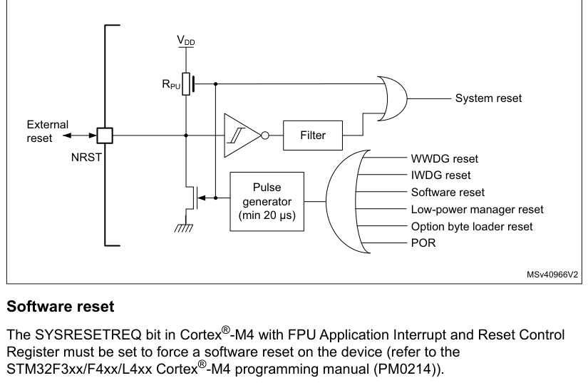
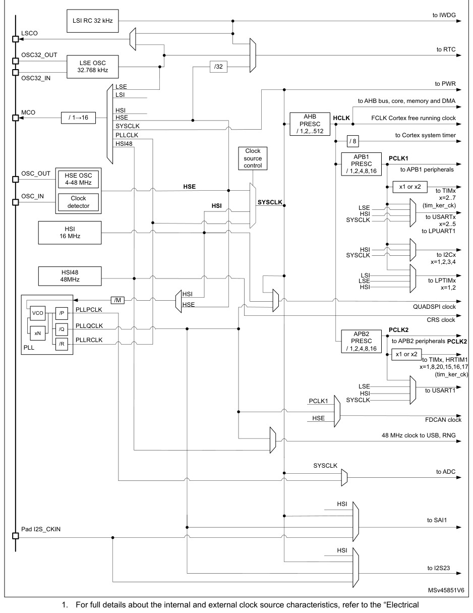
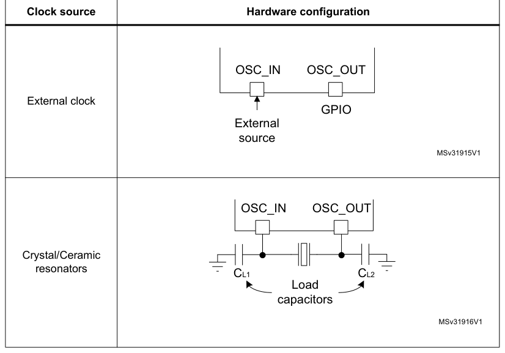
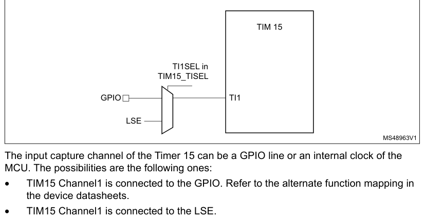
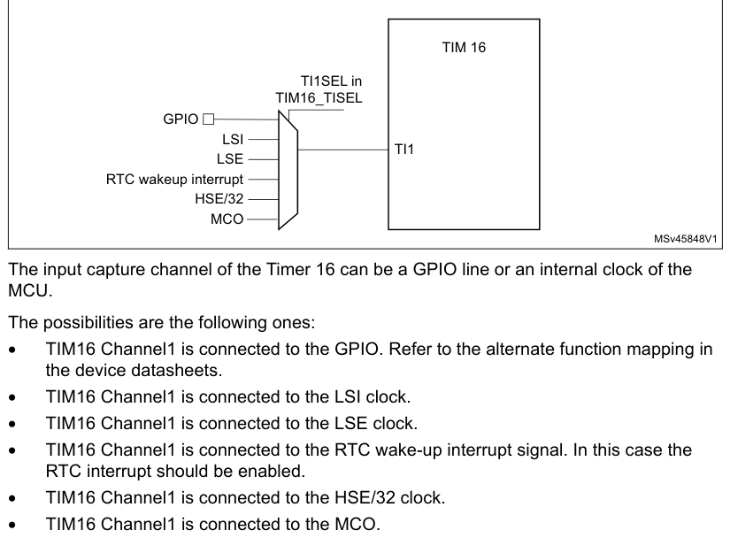
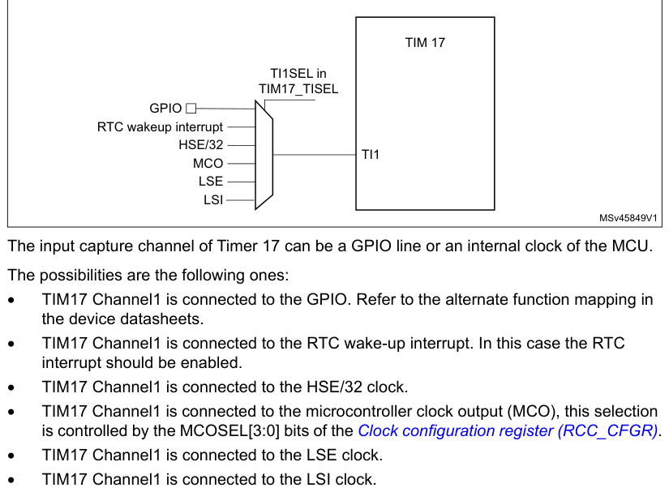
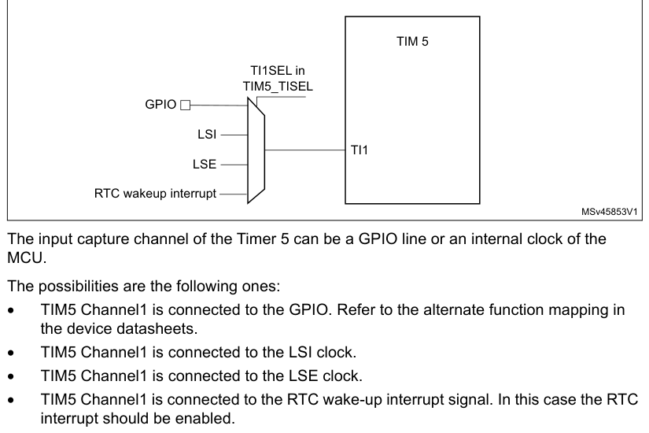

# 7 Reset and clock control (RCC)

[← RM0440 index](../STM32G4_RM0440.md)

## 7.1 Reset

There are three types of reset, defined as system reset, power reset and RTC domain reset.

### 7.1.1 Power reset

A power reset is generated when one of the following events occurs:

1. Power-on reset (POR) or brown-out reset (BOR)
2. When exiting from Standby mode
3. When exiting from Shutdown mode

A brown-out reset, including power-on or power-down reset (POR/PDR), sets all registers to their
reset values except the RTC domain.

When exiting Standby mode, all registers in the VCORE domain are set to their reset value. Registers
outside the VCORE domain (RTC, WKUP, IWDG, and Standby/Shutdown modes control) are not impacted.

When exiting Shutdown mode, a brown-out reset is generated, resetting all registers except those in
the RTC domain.

### 7.1.2 System reset

A system reset sets all registers to their reset values unless specified otherwise in the register
description. This reset is generated when one of the following events occurs:

1. A low level on the NRST pin (external reset)
2. Window watchdog event (WWDG reset)
3. Independent watchdog event (IWDG reset)
4. A software reset (SW reset) (see Software reset)
5. Low-power mode security reset (see Low-power mode security reset)
6. Option byte loader reset (see Option byte loader reset)
7. A brown-out reset

The reset source can be identified by checking the reset flags in the Control/Status register,
RCC_CSR (see [Section 7.4.28](#7428-controlstatus-register-rcc_csr)).

#### NRST pin (external reset)

Through specific option bits (NRST_MODE), the NRST pin is configurable for operating as:

- Reset input/output (default at device delivery) Any valid reset signal on the pin is propagated to
  device internal logic and all internal reset sources are externally driven through a pulse
  generator to this pin. The GPIO functionality (PG10) is not available. The pulse generator
  guarantees a minimum reset pulse duration of 20 µs for each internal reset source to be output on
  the NRST pin. An internal reset holder option can be used, if enabled in the option bytes, to
  ensure that the pin is pulled low until its voltage meets VIL threshold. This function guarantee
  the detection of internal reset sources by external components when the line faces a significant
  capacitive load. In case on an internal reset, the internal pull-up RPU is deactivated in order to
  save the power consumption through the pull-up resistor. This
  mode is always active (independently of the option bytes setting) during each device power-on-reset
  (until option bytes are loaded): power on the device or wake up from Shutdown mode.
- Reset input In this mode, any valid reset signal on the NRST pin is propagated to device internal
  logic, but resets generated internally by the device are not visible on the pin. In this
  configuration, GPIO functionality (PG10) is not available.
- GPIO In this mode, the pin can be used as PG10 standard GPIO. The reset function of the pin is not
  available. Reset is only possible from device internal reset sources and it is not propagated to
  the pin.

**Figure 16. Simplified diagram of the reset circuit**

VDD

RPU

System reset

External

Filter
reset

#### Software reset

The SYSRESETREQ bit in Cortex®-M4 with FPU Application Interrupt and Reset Control Register must be
set to force a software reset on the device (refer to the STM32F3xx/F4xx/L4xx Cortex®-M4 programming
manual (PM0214)).

#### Low-power mode security reset

To prevent that critical applications mistakenly enter a low-power mode, two low-power mode security
resets are available. If enabled in option bytes, the resets are generated in the following
conditions:

1. Entering Standby mode: this type of reset is enabled by resetting nRST_STDBY bit in

User option Bytes. In this case, whenever a Standby mode entry sequence is successfully executed,
the device is reset instead of entering Standby mode.

2. Entering Stop mode: this type of reset is enabled by resetting nRST_STOP bit in User
   option bytes. In this case, whenever a Stop mode entry sequence is successfully executed, the device
   is reset instead of entering Stop mode.
3. Entering Shutdown mode: this type of reset is enabled by resetting nRST_SHDW bit in

User option bytes. In this case, whenever a Shutdown mode entry sequence is successfully executed,
the device is reset instead of entering Shutdown mode.

For further information on the user option bytes refer to [Section 3.4.1](chapter-03.md#341-option-bytes-description).

#### Option byte loader reset

The option byte loader reset is generated when the OBL_LAUNCH bit (bit 27) is set in the FLASH_CR
register. This bit is used to launch the option byte loading by software.

### 7.1.3 RTC domain reset

The RTC domain has two specific resets.

A RTC domain reset is generated when one of the following events occurs:

1. Software reset, triggered by setting the BDRST bit in the RTC domain control register

(RCC_BDCR).

2. VDD or VBAT power on, if both supplies have previously been powered off.

A RTC domain reset only affects the LSE oscillator, the RTC, the Backup registers and the RCC RTC
domain control register.

## 7.2 Clocks

Three different clock sources can be used to drive the system clock (SYSCLK):

- HSI16 (high speed internal)16 MHz RC oscillator clock
- HSE oscillator clock, from 4 to 48 MHz
- PLL clock

The HSI16 is used as system clock source after startup from Reset.

The devices have the following additional clock sources:

- 32 kHz low speed internal RC (LSI RC) which drives the independent watchdog and optionally the RTC
  used for Auto-wake-up from Stop and Standby modes.
- 32.768 kHz low speed external crystal (LSE crystal) which optionally drives the real-time clock
  (RTCCLK).
- RC 48 MHz internal clock sources (HSI48) to potentially drive the USB FS and the RNG.

Each clock source can be switched on or off independently when it is not used, to optimize power
consumption.

Several prescalers can be used to configure the AHB frequency, the APB1 and APB2 domains. The
maximum frequency of AHB, APB1, and APB2 domains is 170 MHz.

All the peripheral clocks are derived from their bus clock (HCLK, PCLK1 or PCLK2) except:

- The 48 MHz clock, used for USB device FS, and RNG. This clock is derived (selected by software)
  from one of the four following sources:
  - PLL “Q” clock
  - HSI48 internal oscillator

When available, the HSI48 48 MHz clock can be coupled to the clock recovery system allowing adequate
clock connection for the USB OTG FS (Crystal less solution).

- The ADCs clock which is derived (selected by software) from one of the following sources:
  - System clock (SYSCLK)
  - PLL “P” clock
- The U(S)ARTs clocks which are derived (selected by software) from one of the four following
  sources:
  - System clock (SYSCLK)
  - HSI16 clock
  - LSE clock
  - APB1 or APB2 clock (PCLK1 or PCLK2 depending on which APB is mapped the U(S)ART)

The wake-up from Stop mode is supported only when the clock is HSI16 or LSE.

- The I2Cs clocks which are derived (selected by software) from one of the three following sources:
  - System clock (SYSCLK)
  - HSI16 clock
  - APB1 clock (PCLK1)

The wake-up from Stop mode is supported only when the clock is HSI16.

- The SAI1 clock which is derived (selected by software) from one of the following sources:
  - an external clock mapped on I2S_CKIN
  - System clock
  - PLL “Q” clock
  - HSI16 clock
- The QUADSPI kernel clock which is derived (selected by software) from one of the following
  sources:
  - System clock,
  - PLL “Q” clock
  - HSI16 clock
- The low-power timer (LPTIM1) clock which is derived (selected by software) from one of the five
  following sources:
  - LSI clock
  - LSE clock
  - HSI16 clock
  - APB1 clock (PCLK1)
  - External clock mapped on LPTIMx_IN1

The functionality in Stop mode (including wake-up) is supported only when the clock is

LSI or LSE, or in external clock mode.

- The RTC clock which is derived (selected by software) from one of the three following sources:
  - LSE clock
  - LSI clock
  - HSE clock divided by 32

The functionality in Stop mode (including wake-up) is supported only when the clock is LSI or LSE.

- The IWDG clock which is always the LSI clock.
- The UCPD1 clock, which is derived from HSI16 clock.
- The FDCAN1 clock, which is derived (selected by software) from one of the two following sources:
  - HSE clock
  - PLL “Q” clock
  - PCLK clock

The RCC feeds the Cortex® System Timer (SysTick) external clock with the AHB clock (HCLK) divided by
8\. The SysTick can work either with this clock or directly with the Cortex® clock (HCLK),
configurable in the SysTick Control and Status Register.

FCLK acts as Cortex®-M4 with FPU free-running clock. For more details refer to the Cortex®-M4
programming manual (PM0214).

**Figure 17. Clock tree**

to IWDG

LSI RC 32 kHz

LSCO
to RTC

OSC32_OUT

LSE OSC

/32

32.768 kHz

OSC32_IN
to PWR

LSE

LSI
to AHB bus, core, memory and DMA

HSI

MCO

1. For full details about the internal and external clock source characteristics, refer to the
   “Electrical
   characteristics” section of the datasheet.
2. The ADC clock can be derived from the AHB clock of the ADC bus interface, divided by a
   programmable
   factor (1, 2 or 4). When the programmable factor is 1, the AHB prescaler must be equal to 1.

### 7.2.1 HSE clock

The high speed external clock signal (HSE) can be generated from two possible clock sources:

- HSE external crystal/ceramic resonator
- HSE user external clock

The resonator and the load capacitors have to be placed as close as possible to the oscillator pins
to minimize output distortion and startup stabilization time. The loading capacitance values must be
adjusted according to the selected oscillator.

**Figure 18. HSE/ LSE clock sources**

#### External crystal/ceramic resonator (HSE crystal)

The 4 to 48 MHz external oscillator has the advantage of producing a very accurate rate on the main
clock. The associated hardware configuration is shown in Figure 18. Refer to the electrical
characteristics section of the datasheet for more details.

The HSERDY flag in the Clock control register (RCC_CR) indicates if the HSE oscillator is stable or
not. At startup, the clock is not released until this bit is set by hardware. An interrupt can be
generated if enabled in the Clock interrupt enable register (RCC_CIER).

The HSE Crystal can be switched on and off using the HSEON bit in the Clock control register
(RCC_CR).

#### External source (HSE bypass)

In this mode, an external clock source must be provided. It can have a frequency of up to 48 MHz.
You select this mode by setting the HSEBYP and HSEON bits in the Clock control register (RCC_CR).
The external clock signal (square, sinus or triangle) with ~40-60 % duty cycle depending on the
frequency (refer to the datasheet) has to drive the OSC_IN pin while the OSC_OUT pin can be used as
GPIO. See Figure 18.

### 7.2.2 HSI16 clock

The HSI16 clock signal is generated from an internal 16 MHz RC Oscillator.

The HSI16 RC oscillator has the advantage of providing a clock source at low cost (no external
components). It also has a faster startup time than the HSE crystal oscillator however, even with
calibration the frequency is less accurate than an external crystal oscillator or ceramic resonator.

The HSI16 clock can be selected as system clock after wake-up from Stop modes (Stop 0, Stop 1), see
[Section 7.3](#73-low-power-modes). It can also be used as a backup clock source (auxiliary clock) if the HSE crystal
oscillator fails. Refer to [Section 7.2.9](#729-clock-security-system-css).

#### Calibration

RC oscillator frequencies can vary from one chip to another due to manufacturing process variations,
this is why each device is factory calibrated by ST for 1 % accuracy at TA=25°C.

After reset, the factory calibration value is loaded in the HSICAL[7:0] bits in the Internal clock
sources calibration register (RCC_ICSCR).

If the application is subject to voltage or temperature variations this may affect the RC oscillator
speed. You can trim the HSI16 frequency in the application using the HSITRIM[6:0] in the Internal
clock sources calibration register (RCC_ICSCR).

For more details on how to measure the HSI16 frequency variation, refer to [Section 7.2.16](#7216-internalexternal-clock-measurement-with-tim5tim15tim16tim17).

The HSIRDY flag in the Clock control register (RCC_CR) indicates if the HSI16 oscillator is stable
or not. At startup, the HSI16 output clock is not released until this bit is set by hardware.

The HSI16 oscillator can be switched on and off using the HSION bit in the Clock control register
(RCC_CR).

The HSI16 signal can also be used as a backup source (Auxiliary clock) if the HSE crystal oscillator
fails. Refer to [Section 7.2.9](#729-clock-security-system-css).

### 7.2.3 HSI48 clock

The HSI48 clock signal is generated from an internal 48 MHz RC oscillator and can be used directly
for USB and for random number generator (RNG).

The internal 48 MHz RC oscillator is mainly dedicated to provide a high precision clock to the USB
peripheral by means of a special Clock Recovery System (CRS) circuitry. The CRS can use the LSE or
an external signal to automatically and quickly adjust the oscillator frequency on-fly. It is
disabled as soon as the system enters Stop or Standby mode. When the CRS is not used, the HSI48 RC
oscillator runs on its default frequency which is subject to manufacturing process variations.

The HSI48RDY flag in the Clock recovery RC register (RCC_CRRCR) indicates whether the HSI48 RC
oscillator is stable or not. At startup, the HSI48 RC oscillator output clock is not released until
this bit is set by hardware.

The HSI48 can be switched on and off using the HSI48ON bit in the Clock recovery RC register
(RCC_CRRCR).

### 7.2.4 PLL

The internal PLL can be used to multiply the HSI16 or HSE output clock frequency. The PLL input
frequency must be within the range defined in the device datasheet. The selected clock source is
divided by a programmable factor PLLM from 1 to 8 to provide a clock frequency in the requested
input range. Refer to Figure 17 and PLL configuration register (RCC_PLLCFGR).

The PLL configuration (selection of the input clock and multiplication factor) must be done before
enabling the PLL. Once the PLL is enabled, these parameters cannot be changed.

To modify the PLL configuration, proceed as follows:

1. Disable the PLL by setting PLLON to 0 in Clock control register (RCC_CR).
2. Wait until PLLRDY is cleared. The PLL is now fully stopped.
3. Change the desired parameter.
4. Enable the PLL again by setting PLLON to 1.
5. Enable the desired PLL outputs by configuring PLLPEN, PLLQEN, PLLREN in PLL
   configuration register (RCC_PLLCFGR).

An interrupt can be generated when the PLL is ready, if enabled in the Clock interrupt enable
register (RCC_CIER).

The PLL output frequency must not exceed 170 MHz.

The enable bit of each PLL output clock (PLLPEN, PLLQEN, PLLREN) can be modified at any time without
stopping the corresponding PLL. PLLREN cannot be cleared if PLLCLK is used as system clock.

### 7.2.5 LSE clock

The LSE crystal is a 32.768 kHz Low Speed External crystal or ceramic resonator. It has the
advantage of providing a low-power but highly accurate clock source to the real-time clock
peripheral (RTC) for clock/calendar or other timing functions.

The LSE crystal is switched on and off using the LSEON bit in RTC domain control register
(RCC_BDCR). The crystal oscillator driving strength can be changed at runtime using the LSEDRV[1:0]
bits in the RTC domain control register (RCC_BDCR) to obtain the best
compromise between robustness and short start-up time on one side and low-power-consumption on the
other side. The LSE drive can be decreased to the lower drive capability (LSEDRV = 00) when the LSE
is ON. However, once LSEDRV is selected, the drive capability can not be increased if LSEON = 1.

The LSERDY flag in the RTC domain control register (RCC_BDCR) indicates whether the LSE crystal is
stable or not. At startup, the LSE crystal output clock signal is not released until this bit is set
by hardware. An interrupt can be generated if enabled in the Clock interrupt enable register
(RCC_CIER).

#### External source (LSE bypass)

In this mode, an external clock source must be provided. It can have a frequency of up to 1 MHz. You
select this mode by setting the LSEBYP and LSEON bits in the AHB1 peripheral clocks enable in Sleep
and Stop modes register (RCC_AHB1SMENR). The external clock signal (square, sinus or triangle) with
~50 % duty cycle has to drive the OSC32_IN pin while the OSC32_OUT pin can be used as GPIO. See
Figure 18.

### 7.2.6 LSI clock

The LSI RC acts as a low-power clock source that can be kept running in Stop and Standby mode for
the independent watchdog (IWDG) and RTC. The clock frequency is 32 kHz. For more details, refer to
the electrical characteristics section of the datasheets.

The LSI RC can be switched on and off using the LSION bit in the Control/status register (RCC_CSR).

The LSIRDY flag in the Control/status register (RCC_CSR) indicates if the LSI oscillator is stable
or not. At startup, the clock is not released until this bit is set by hardware. An interrupt can be
generated if enabled in the Clock interrupt enable register (RCC_CIER).

### 7.2.7 System clock (SYSCLK) selection

Four different clock sources can be used to drive the system clock (SYSCLK):

- HSI16 oscillator
- HSE oscillator
- PLL

The system clock maximum frequency is 170 MHz. After a system reset, the HSI16 oscillator is
selected as system clock. When a clock source is used directly or through the PLL as a system clock,
it is not possible to stop it.

A switch from one clock source to another occurs only if the target clock source is ready (clock
stable after startup delay or PLL locked). If a clock source which is not yet ready is selected, the
switch occurs when the clock source becomes ready. Status bits in the RCC_CR and RCC_CFGR registers
indicate which clock(s) is (are) ready and which clock is currently used as a system clock.

To switch from low speed to high speed or from high speed to low speed system clock, it is
recommended to use a transition state with medium speed clock, for at least 1 µs.

Clock source switching conditions:

- Switching from HSE or HSI16 to PLL with AHB frequency (HCLK) higher than 80 MHz
- Switching from PLL with HCLK higher than 80 MHz to HSE or HSI16

Transition state:

- Set the AHB prescaler HPRE[3:0] bits to divide the system frequency by 2
- Switch system clock to PLL
- Wait at least 1 µs and then reconfigure AHB prescaler bits to the needed HCLK frequency

### 7.2.8 Clock source frequency versus voltage scaling

Table 50 gives the clock source frequencies, depending upon the product voltage range.

**Table 50. Clock source frequency**

| Source row | Column 1 | Column 2 | Column 3 | Column 4 |
| ---: | --- | --- | --- | --- |
| 1 | `Clock frequency` |  |  |  |
| 2 | `Product voltage range` |  |  |  |
| 3 | `HSI16` | `HSE` | `PLL` |  |
| 4 | `Range 1 Boost mode` | `16 MHz` | `48 MHz` | `170 MHz` |
| 5 | `Range 1 normal mode` | `16 MHz` | `48 MHz` | `150 MHz` |
| 6 | `Range 2` | `16 MHz` | `26 MHz` | `26 MHz` |

### 7.2.9 Clock security system (CSS)

Clock Security System can be activated by software. In this case, the clock detector is enabled
after the HSE oscillator startup delay, and disabled when this oscillator is stopped.

If a failure is detected on the HSE clock, the HSE oscillator is automatically disabled, a clock
failure event is sent to the break input of the advanced-control timers (TIM1/TIM8/TIM20 and
TIM15/16/17) and to the hrtim_sys_flt, and an interrupt is generated to inform the software about
the failure (Clock Security System Interrupt CSSI), allowing the MCU to perform rescue operations.
The CSSI is linked to the Cortex®-M4 with FPU NMI (Non- Maskable Interrupt) exception vector.

> **Note:** Once the CSS is enabled and if the HSE clock fails, the CSS interrupt occurs and a NMI is
> automatically generated. The NMI is executed indefinitely unless the CSS interrupt pending bit is
> cleared. As a consequence, in the NMI ISR user must clear the CSS interrupt by setting the CSSC bit
> in the Clock interrupt clear register (RCC_CICR).

If the HSE oscillator is used directly or indirectly as the system clock (indirectly means: it is
used as PLL input clock, and the PLL clock is used as system clock), a detected failure causes a
switch of the system clock to the HSI16 oscillator, and the disabling of the HSE oscillator. If the
HSE clock (divided or not) is the clock entry of the PLL used as system clock when the failure
occurs, the PLL is disabled too.

### 7.2.10 Clock security system on LSE

A Clock Security System on LSE can be activated by software writing the LSECSSON bit in the
Control/status register (RCC_CSR). This bit can be disabled only by a hardware reset or RTC software
reset, or after a failure detection on LSE. LSECSSON must be written after LSE and LSI are enabled
(LSEON and LSION enabled) and ready (LSERDY and LSIRDY set by hardware), and after the RTC clock has
been selected by RTCSEL.

The CSS on LSE is working in all modes except VBAT. It is working also under system reset (excluding
power on reset). If a failure is detected on the external 32 kHz oscillator, the LSE
clock is no longer supplied to the RTC but no hardware action is made to the registers. If the HSI16
was in PLL-mode, this mode is disabled.

In Standby mode a wake-up is generated. In other modes an interrupt can be sent to wake up the
software (see Clock interrupt enable register (RCC_CIER), Clock interrupt flag register (RCC_CIFR),
Clock interrupt clear register (RCC_CICR)).

The software MUST then disable the LSECSSON bit, stop the defective 32 kHz oscillator (disabling
LSEON), and change the RTC clock source (no clock or LSI or HSE, with RTCSEL), or take any required
action to secure the application.

The frequency of LSE oscillator have to be higher than 30 kHz to avoid false positive CSS detection.

### 7.2.11 ADC clock

The ADC clock is derived from the system clock, or from the PLL “P” output. It can be divided by the
following prescalers values: 1,2,4,6,8,10,12,16,32,64,128 or 256 by configuring the ADCx_CCR
register. It is asynchronous to the AHB clock. Alternatively, the ADC clock can be derived from the
AHB clock of the ADC bus interface, divided by a programmable factor (1, 2 or 4). This programmable
factor is configured using the CKMODE bit fields in the ADCx_CCR.

If the programmed factor is 1, the AHB prescaler must be set to 1.

Refer to the device datasheet for the maximum ADC clock.

### 7.2.12 RTC clock

The RTCCLK clock source can be either the HSE/32, LSE or LSI clock. It is selected by programming
the RTCSEL[1:0] bits in the RTC domain control register (RCC_BDCR). This selection cannot be
modified without resetting the RTC domain. The system must always be configured so as to get a PCLK
frequency greater then or equal to the RTCCLK frequency for a proper operation of the RTC.

The LSE clock is in the RTC domain, whereas the HSE and LSI clocks are not. Consequently:

- If LSE is selected as RTC clock:
  - The RTC continues to work even if the VDD supply is switched off, provided the VBAT supply is
    maintained.
- If LSI is selected as the RTC clock:
  - The RTC state is not guaranteed if the VDD supply is powered off.
- If the HSE clock divided by a prescaler is used as the RTC clock:
  - The RTC state is not guaranteed if the VDD supply is powered off or if the internal voltage
    regulator is powered off (removing power from the VCORE domain).

When the RTC clock is LSE or LSI, the RTC remains clocked and functional under system reset.

### 7.2.13 Timer clock

The timer clock frequencies (tim_ker_ck) are automatically defined by hardware. If the APB prescaler
equals 1, the timer clock frequencies are set to the same frequency of the APB domain, otherwise,
they are set to twice (×2) the frequency of the APB domain.

### 7.2.14 Watchdog clock

If the Independent watchdog (IWDG) is started by either hardware option or software access, the LSI
oscillator is forced ON and cannot be disabled. After the LSI oscillator temporization, the clock is
provided to the IWDG.

### 7.2.15 Clock-out capability

- MCO

The microcontroller clock output (MCO) capability allows the clock to be output onto the external
MCO pin. One of eight clock signals can be selected as the MCO clock.

- LSI
- LSE
- SYSCLK
- HSI16
- HSI48
- HSE
- PLLCLK

The selection is controlled by the MCOSEL[3:0] bits of the Clock configuration register (RCC_CFGR).
The selected clock can be divided with the MCOPRE[2:0] field of the Clock configuration register
(RCC_CFGR).

- LSCO

Another output (LSCO) allows a low speed clock to be output onto the external LSCO pin:

- LSI
- LSE

This output remains available in Stop (Stop 0 and Stop 1) and Standby modes. The selection is
controlled by the LSCOSEL, and enabled with the LSCOEN in the RTC domain control register
(RCC_BDCR).

The MCO clock output requires the corresponding alternate function selected on the MCO pin, the LSCO
pin should be left in default POR state.

### 7.2.16 Internal/external clock measurement with TIM5/TIM15/TIM16/TIM17

It is possible to indirectly measure the frequency of all on-board clock sources by mean of the
TIM5, TIM15, TIM16 or TIM17 channel 1 input capture, as represented on Figure 19 Figure 20, Figure
21 and Figure 22.

**Figure 19. Frequency measurement with TIM15 in capture mode**

The input capture channel of the Timer 15 can be a GPIO line or an internal clock of the MCU. The
possibilities are the following ones:

- TIM15 Channel1 is connected to the GPIO. Refer to the alternate function mapping in the device
  datasheets.
- TIM15 Channel1 is connected to the LSE.

**Figure 20. Frequency measurement with TIM16 in capture mode**

TIM 16

TI1SEL in

TIM16_TISEL

GPIO

LSI

TI1

LSE

RTC wakeup interrupt

HSE/32

MCO

MSv45848V1

The input capture channel of the Timer 16 can be a GPIO line or an internal clock of the MCU.

The possibilities are the following ones:

- TIM16 Channel1 is connected to the GPIO. Refer to the alternate function mapping in the device
  datasheets.
- TIM16 Channel1 is connected to the LSI clock.
- TIM16 Channel1 is connected to the LSE clock.
- TIM16 Channel1 is connected to the RTC wake-up interrupt signal. In this case the RTC interrupt
  should be enabled.
- TIM16 Channel1 is connected to the HSE/32 clock.
- TIM16 Channel1 is connected to the MCO.

**Figure 21. Frequency measurement with TIM17 in capture mode**

TIM 17

TI1SEL in

TIM17_TISEL

GPIO

RTC wakeup interrupt

HSE/32

TI1

MCO

LSE

LSI

MSv45849V1

The input capture channel of Timer 17 can be a GPIO line or an internal clock of the MCU.

The possibilities are the following ones:

- TIM17 Channel1 is connected to the GPIO. Refer to the alternate function mapping in the device
  datasheets.
- TIM17 Channel1 is connected to the RTC wake-up interrupt. In this case the RTC interrupt should be
  enabled.
- TIM17 Channel1 is connected to the HSE/32 clock.
- TIM17 Channel1 is connected to the microcontroller clock output (MCO), this selection is
  controlled by the MCOSEL[3:0] bits of the Clock configuration register (RCC_CFGR).
- TIM17 Channel1 is connected to the LSE clock.
- TIM17 Channel1 is connected to the LSI clock.

**Figure 22. Frequency measurement with TIM5 in capture mode**

TIM 5

TI1SEL in

TIM5_TISEL

GPIO

LSI

TI1

LSE

RTC wakeup interrupt

MSv45853V1

The input capture channel of the Timer 5 can be a GPIO line or an internal clock of the MCU.

The possibilities are the following ones:

- TIM5 Channel1 is connected to the GPIO. Refer to the alternate function mapping in the device
  datasheets.
- TIM5 Channel1 is connected to the LSI clock.
- TIM5 Channel1 is connected to the LSE clock.
- TIM5 Channel1 is connected to the RTC wake-up interrupt signal. In this case the RTC interrupt
  should be enabled.

#### Calibration of the HSI16

For TIM15 and TIM16, the primary purpose of connecting the LSE to the channel 1 input capture is to
be able to precisely measure the HSI16 system clocks (for this, the HSI16 should be used as the
system clock source). The number of HSI16 clock counts between consecutive edges of the LSE signal
provides a measure of the internal clock period. Taking advantage of the high precision of LSE
crystals (typically a few tens of ppm’s), it is possible to determine the internal clock frequency
with the same resolution, and trim the source to compensate for manufacturing, process, temperature
and/or voltage related frequency deviations.

The HSI16 oscillator has dedicated user-accessible calibration bits for this purpose.

The basic concept consists in providing a relative measurement (e.g. the HSI16/LSE ratio): the
precision is therefore closely related to the ratio between the two clock sources. The higher the
ratio is, the better the measurement is.

If LSE is not available, HSE/32 is the better option in order to reach the most precise calibration
possible.

#### Calibration of the LSI

The calibration of the LSI follows the same pattern that for the HSI16, but changing the reference
clock. It is necessary to connect LSI clock to the channel 1 input capture of the TIM16. Then define
the HSE as system clock source, the number of his clock counts between consecutive edges of the LSI
signal provides a measure of the internal low speed clock period.

The basic concept consists in providing a relative measurement (e.g. the HSE/LSI ratio): the
precision is therefore closely related to the ratio between the two clock sources. The higher the
ratio is, the better the measurement is.

### 7.2.17 Peripheral clock enable register (RCC_AHBxENR, RCC_APBxENRy)

Each peripheral clock can be enabled by the xxxxEN bit of the RCC_AHBxENR, RCC_APBxENRy registers.

When the peripheral clock is not active, the peripheral registers read or write accesses are not
supported.

The enable bit has a synchronization mechanism to create a glitch free clock for the peripheral.
After the enable bit is set, there is a 2 clock cycles delay before the clock be active.

> **Caution:** Just after enabling the clock for a peripheral, software must wait for a delay before
> accessing the peripheral registers.

## 7.3 Low-power modes

- AHB and APB peripheral clocks, including DMA clock, can be disabled by software.
- Sleep and Low Power Sleep modes stops the CPU clock. The memory interface clocks (Flash and SRAM1,
  SRAM2 and CCM SRAM interfaces) can be stopped by software during sleep mode. The AHB to APB bridge
  clocks are disabled by hardware during Sleep mode when all the clocks of the peripherals connected
  to them are disabled.
- Stop modes (Stop 0 and Stop 1) stops all the clocks in the VCORE domain and disables the PLL, the
  HSI16, and the HSE oscillators.

All U(S)ARTs, LPUARTs and I2Cs have the capability to enable the HSI16 oscillator even when the MCU
is in Stop mode (if HSI16 is selected as the clock source for that peripheral).

All U(S)ARTs and LPUARTs can also be driven by the LSE oscillator when the system is in Stop mode
(if LSE is selected as clock source for that peripheral) and the LSE oscillator is enabled (LSEON).
In that case the LSE remains always ON in Stop mode (they do not have the capability to turn on the
LSE oscillator).

- Standby and Shutdown modes stops all the clocks in the VCORE domain and disables the PLL, the
  HSI16, and the HSE oscillators.

The CPU’s deepsleep mode can be overridden for debugging by setting the DBG_STOP or DBG_STANDBY bits
in the DBGMCU_CR register.

When leaving the Stop modes (Stop 0, Stop 1 or standby), the system clock is HSI16.

If a Flash memory programming operation is on going, Stop, Standby and Shutdown modes entry is
delayed until the Flash memory interface access is finished. If an access to the APB domain is
ongoing, Stop, Standby and Shutdown modes entry is delayed until the APB access is finished.

## 7.4 RCC registers

### 7.4.1 Clock control register (RCC_CR)

- **Address offset:** 0x00
- **Reset value:** 0x0000 0500

HSEBYP is not affected by reset.

- **Access:** no wait state, word, half-word and byte access

**Register bit layout**

| Bit | Field | Access | Summary |
| ---: | --- | :---: | --- |
| 31 | Reserved | — | kept at reset value. |
| 30 | Reserved | — | ↳ |
| 29 | Reserved | — | ↳ |
| 28 | Reserved | — | ↳ |
| 27 | Reserved | — | ↳ |
| 26 | Reserved | — | ↳ |
| 25 | `PLLRDY` | r | Main PLL clock ready flag |
| 24 | `PLLON` | rw | Main PLL enable |
| 23 | Reserved | — | kept at reset value. |
| 22 | Reserved | — | ↳ |
| 21 | Reserved | — | ↳ |
| 20 | Reserved | — | ↳ |
| 19 | `CSSON` | rs | Clock security system enable |
| 18 | `HSEBYP` | rw | HSE crystal oscillator bypass |
| 17 | `HSERDY` | r | HSE clock ready flag |
| 16 | `HSEON` | rw | HSE clock enable |
| 15 | Reserved | — | kept at reset value. |
| 14 | Reserved | — | ↳ |
| 13 | Reserved | — | ↳ |
| 12 | Reserved | — | ↳ |
| 11 | Reserved | — | ↳ |
| 10 | `HSIRDY` | r | HSI16 clock ready flag |
| 9 | `HSIKERON` | rw | HSI16 always enable for peripheral kernels. |
| 8 | `HSION` | rw | HSI16 clock enable |
| 7 | Reserved | — | kept at reset value. |
| 6 | Reserved | — | ↳ |
| 5 | Reserved | — | ↳ |
| 4 | Reserved | — | ↳ |
| 3 | Reserved | — | ↳ |
| 2 | Reserved | — | ↳ |
| 1 | Reserved | — | ↳ |
| 0 | Reserved | — | ↳ |

**Bits 31:26 — Reserved:** kept at reset value.

**Bit 25 — `PLLRDY`:** Main PLL clock ready flag

Set by hardware to indicate that the main PLL is locked.

- `0`: PLL unlocked
- `1`: PLL locked

**Bit 24 — `PLLON`:** Main PLL enable

Set and cleared by software to enable the main PLL.

Cleared by hardware when entering Stop, Standby or Shutdown mode. This bit cannot be
reset if the PLL clock is used as the system clock.

- `0`: PLL OFF
- `1`: PLL ON

**Bits 23:20 — Reserved:** kept at reset value.

**Bit 19 — `CSSON`:** Clock security system enable

Set by software to enable the clock security system. When CSSON is set, the clock detector
is enabled by hardware when the HSE oscillator is ready, and disabled by hardware if a HSE
clock failure is detected. This bit is set only and is cleared by reset.

- `0`: Clock security system OFF (clock detector OFF)
- `1`: Clock security system ON (Clock detector ON if the HSE oscillator is stable, OFF if not).

**Bit 18 — `HSEBYP`:** HSE crystal oscillator bypass

Set and cleared by software to bypass the oscillator with an external clock. The external
clock must be enabled with the HSEON bit set, to be used by the device. The HSEBYP bit
can be written only if the HSE oscillator is disabled.

- `0`: HSE crystal oscillator not bypassed
- `1`: HSE crystal oscillator bypassed with external clock

**Bit 17 — `HSERDY`:** HSE clock ready flag

Set by hardware to indicate that the HSE oscillator is stable.

- `0`: HSE oscillator not ready
- `1`: HSE oscillator ready

> **Note:** Once the HSEON bit is cleared, HSERDY goes low after 6 HSE clock cycles.

**Bit 16 — `HSEON`:** HSE clock enable

Set and cleared by software.

Cleared by hardware to stop the HSE oscillator when entering Stop, Standby or Shutdown
mode. This bit cannot be reset if the HSE oscillator is used directly or indirectly as the system
clock.

- `0`: HSE oscillator OFF
- `1`: HSE oscillator ON

**Bits 15:11 — Reserved:** kept at reset value.

**Bit 10 — `HSIRDY`:** HSI16 clock ready flag

Set by hardware to indicate that HSI16 oscillator is stable. This bit is set only when HSI16 is
enabled by software by setting HSION.

- `0`: HSI16 oscillator not ready
- `1`: HSI16 oscillator ready

> **Note:** Once the HSION bit is cleared, HSIRDY goes low after 6 HSI16 clock cycles.

**Bit 9 — `HSIKERON`:** HSI16 always enable for peripheral kernels.

Set and cleared by software to force HSI16 ON even in Stop modes. The HSI16 can only
feed USARTs and I2Cs peripherals configured with HSI16 as kernel clock. Keeping the

HSI16 ON in Stop mode allows to avoid slowing down the communication speed because of
the HSI16 startup time. This bit has no effect on HSION value.

- `0`: No effect on HSI16 oscillator.
- `1`: HSI16 oscillator is forced ON even in Stop mode.

**Bit 8 — `HSION`:** HSI16 clock enable

Set and cleared by software.

Cleared by hardware to stop the HSI16 oscillator when entering Stop, Standby or Shutdown
mode.

Set by hardware to force the HSI16 oscillator ON when STOPWUCK=1 or HSIASFS = 1
when leaving Stop modes, or in case of failure of the HSE crystal oscillator.

This bit is set by hardware if the HSI16 is used directly or indirectly as system clock.

- `0`: HSI16 oscillator OFF
- `1`: HSI16 oscillator ON

**Bits 7:0 — Reserved:** kept at reset value.

### 7.4.2 Internal clock sources calibration register (RCC_ICSCR)

- **Address offset:** 0x04
- **Reset value:** 0x40XX 00XX
  where X is factory-programmed.
- **Access:** no wait state, word, half-word and byte access

**Register bit layout**

| Bit | Field | Access | Summary |
| ---: | --- | :---: | --- |
| 31 | Reserved | — | kept at reset value. |
| 30 | `HSITRIM[6]` | rw | HSI16 clock trimming |
| 29 | `HSITRIM[5]` | rw | ↳ |
| 28 | `HSITRIM[4]` | rw | ↳ |
| 27 | `HSITRIM[3]` | rw | ↳ |
| 26 | `HSITRIM[2]` | rw | ↳ |
| 25 | `HSITRIM[1]` | rw | ↳ |
| 24 | `HSITRIM[0]` | rw | ↳ |
| 23 | `HSICAL[7]` | r | HSI16 clock calibration |
| 22 | `HSICAL[6]` | r | ↳ |
| 21 | `HSICAL[5]` | r | ↳ |
| 20 | `HSICAL[4]` | r | ↳ |
| 19 | `HSICAL[3]` | r | ↳ |
| 18 | `HSICAL[2]` | r | ↳ |
| 17 | `HSICAL[1]` | r | ↳ |
| 16 | `HSICAL[0]` | r | ↳ |
| 15 | Reserved | — | kept at reset value. |
| 14 | Reserved | — | ↳ |
| 13 | Reserved | — | ↳ |
| 12 | Reserved | — | ↳ |
| 11 | Reserved | — | ↳ |
| 10 | Reserved | — | ↳ |
| 9 | Reserved | — | ↳ |
| 8 | Reserved | — | ↳ |
| 7 | Reserved | — | ↳ |
| 6 | Reserved | — | ↳ |
| 5 | Reserved | — | ↳ |
| 4 | Reserved | — | ↳ |
| 3 | Reserved | — | ↳ |
| 2 | Reserved | — | ↳ |
| 1 | Reserved | — | ↳ |
| 0 | Reserved | — | ↳ |

**Bit 31 — Reserved:** kept at reset value.

**Bits 30:24 — `HSITRIM[6:0]`:** HSI16 clock trimming

These bits provide an additional user-programmable trimming value that is added to the

HSICAL[7:0] bits. It can be programmed to adjust to variations in voltage and temperature
that influence the frequency of the HSI16.

The default value is 64, which, when added to the HSICAL value, trims HSI16 to

16 MHz ± 1 %.

**Bits 23:16 — `HSICAL[7:0]`:** HSI16 clock calibration

These bits are initialized at startup with the factory-programmed HSI16 calibration trim value.

When HSITRIM is written, HSICAL is updated with the sum of HSITRIM and the factory trim
value.

**Bits 15:0 — Reserved:** kept at reset value.

### 7.4.3 Clock configuration register (RCC_CFGR)

- **Address offset:** 0x08
- **Reset value:** 0x0000 0005
- **Access:** 0 ≤wait state ≤2, word, half-word and byte access

1 or 2 wait states inserted only if the access occurs during clock source switch.

From 0 to 15 wait states inserted if the access occurs when the APB or AHB prescalers values update
is on going.

**Register bit layout**

| Bit | Field | Access | Summary |
| ---: | --- | :---: | --- |
| 31 | Reserved | — | kept at reset value. |
| 30 | `MCOPRE[2]` | — | Microcontroller clock output prescaler |
| 29 | `MCOPRE[1]` | — | ↳ |
| 28 | `MCOPRE[0]` | — | ↳ |
| 27 | `MCOSEL[3]` | — | Microcontroller clock output |
| 26 | `MCOSEL[2]` | — | ↳ |
| 25 | `MCOSEL[1]` | — | ↳ |
| 24 | `MCOSEL[0]` | — | ↳ |
| 23 | Reserved | — | kept at reset value. |
| 22 | Reserved | — | ↳ |
| 21 | Reserved | — | ↳ |
| 20 | Reserved | — | ↳ |
| 19 | Reserved | — | ↳ |
| 18 | Reserved | — | ↳ |
| 17 | Reserved | — | ↳ |
| 16 | Reserved | — | ↳ |
| 15 | Reserved | — | ↳ |
| 14 | Reserved | — | ↳ |
| 13 | `PPRE2[2]` | — | APB2 prescaler |
| 12 | `PPRE2[1]` | — | ↳ |
| 11 | `PPRE2[0]` | — | ↳ |
| 10 | — | — | Not specified in extracted bit-field text. |
| 9 | — | — | Not specified in extracted bit-field text. |
| 8 | — | — | Not specified in extracted bit-field text. |
| 7 | `HPRE[3]` | — | AHB prescaler |
| 6 | `HPRE[2]` | — | ↳ |
| 5 | `HPRE[1]` | — | ↳ |
| 4 | `HPRE[0]` | — | ↳ |
| 3 | `SWS[1]` | — | System clock switch status |
| 2 | `SWS[0]` | — | ↳ |
| 1 | `SW[1]` | — | System clock switch |
| 0 | `SW[0]` | — | ↳ |

**Bit 31 — Reserved:** kept at reset value.

**Bits 30:28 — `MCOPRE[2:0]`:** Microcontroller clock output prescaler

These bits are set and cleared by software.

It is highly recommended to change this prescaler before MCO output is enabled.

- `000`: MCO is divided by 1
- `001`: MCO is divided by 2
- `010`: MCO is divided by 4
- `011`: MCO is divided by 8
- `100`: MCO is divided by 16

Others: not allowed

**Bits 27:24 — `MCOSEL[3:0]`:** Microcontroller clock output

Set and cleared by software.

- `0000`: MCO output disabled, no clock on MCO
- `0001`: SYSCLK system clock selected
- `0010`: Reserved, must be kept at reset value
- `0011`: HSI16 clock selected
- `0100`: HSE clock selected
- `0101`: Main PLL clock selected
- `0110`: LSI clock selected
- `0111`: LSE clock selected
- `1000`: Internal HSI48 clock selected

Others: Reserved

> **Note:** This clock output may have some truncated cycles at startup or during MCO clock
> source switching.

**Bits 23:14 — Reserved:** kept at reset value.

**Bits 13:11 — `PPRE2[2:0]`:** APB2 prescaler

Set and cleared by software to control the division factor of the APB2 clock (PCLK2).

- `0xx`: HCLK not divided
- `100`: HCLK divided by 2
- `101`: HCLK divided by 4
- `110`: HCLK divided by 8
- `111`: HCLK divided by 16

Bits 10:8 PPRE1[2:0]:APB1 prescaler

Set and cleared by software to control the division factor of the APB1 clock (PCLK1).

- `0xx`: HCLK not divided
- `100`: HCLK divided by 2
- `101`: HCLK divided by 4
- `110`: HCLK divided by 8
- `111`: HCLK divided by 16

**Bits 7:4 — `HPRE[3:0]`:** AHB prescaler

Set and cleared by software to control the division factor of the AHB clock.

> **Caution:** Depending on the device voltage range, the software must set correctly
> these bits to ensure that the system frequency does not exceed the maximum allowed frequency (for
> more details refer to [Section 6.1.5](chapter-06.md#615-dynamic-voltage-scaling-management): Dynamic voltage scaling management). After a write operation to
> these bits and before decreasing the voltage range, this register must be read to be sure that the
> new value has been taken into account.

- `0xxx`: SYSCLK not divided
- `1000`: SYSCLK divided by 2
- `1001`: SYSCLK divided by 4
- `1010`: SYSCLK divided by 8
- `1011`: SYSCLK divided by 16
- `1100`: SYSCLK divided by 64
- `1101`: SYSCLK divided by 128
- `1110`: SYSCLK divided by 256
- `1111`: SYSCLK divided by 512

**Bits 3:2 — `SWS[1:0]`:** System clock switch status

Set and cleared by hardware to indicate which clock source is used as system clock.

- `00`: Reserved, must be kept at reset value
- `01`: HSI16 oscillator used as system clock
- `10`: HSE used as system clock
- `11`: PLL used as system clock

**Bits 1:0 — `SW[1:0]`:** System clock switch

Set and cleared by software to select system clock source (SYSCLK).

Configured by hardware to force HSI16 oscillator selection when exiting Stop and Standby
modes or in case of failure of the HSE oscillator.

- `00`: Reserved, must be kept at reset value
- `01`: HSI16 selected as system clock
- `10`: HSE selected as system clock
- `11`: PLL selected as system clock

### 7.4.4 PLL configuration register (RCC_PLLCFGR)

- **Address offset:** 0x0C
- **Reset value:** 0x0000 1000
- **Access:** no wait state, word, half-word and byte access

This register is used to configure the PLL clock outputs according to the formulas:

- f(VCO clock) = f(PLL clock input) × (PLLN / PLLM)
- f(PLL_P) = f(VCO clock) / PLLP
- f(PLL_Q) = f(VCO clock) / PLLQ
- f(PLL_R) = f(VCO clock) / PLLR

**Register bit layout**

| Bit | Field | Access | Summary |
| ---: | --- | :---: | --- |
| 31 | `PLLPDIV[4]` | rw | Main PLLP division factor |
| 30 | `PLLPDIV[3]` | rw | ↳ |
| 29 | `PLLPDIV[2]` | rw | ↳ |
| 28 | `PLLPDIV[1]` | rw | ↳ |
| 27 | `PLLPDIV[0]` | rw | ↳ |
| 26 | `PLLR[1]` | rw | Main PLL division factor for PLL “R” clock (system clock) |
| 25 | `PLLR[0]` | rw | ↳ |
| 24 | `PLLREN` | rw | PLL “R” clock output enable |
| 23 | Reserved | — | kept at reset value. |
| 22 | `PLLQ[1]` | rw | Main PLL division factor for PLL “Q” clock. |
| 21 | `PLLQ[0]` | rw | ↳ |
| 20 | `PLLQEN` | rw | Main PLL “Q” clock output enable |
| 19 | Reserved | — | kept at reset value. |
| 18 | Reserved | — | ↳ |
| 17 | `PLLP` | rw | Main PLL division factor for PLL “P” clock. |
| 16 | `PLLPEN` | rw | Main PLL PLL “P” clock output enable |
| 15 | Reserved | — | kept at reset value. |
| 14 | `PLLN[6]` | rw | Main PLL multiplication factor for VCO |
| 13 | `PLLN[5]` | rw | ↳ |
| 12 | `PLLN[4]` | rw | ↳ |
| 11 | `PLLN[3]` | rw | ↳ |
| 10 | `PLLN[2]` | rw | ↳ |
| 9 | `PLLN[1]` | rw | ↳ |
| 8 | `PLLN[0]` | rw | ↳ |
| 7 | `PLLM[3]` | rw | Division factor for the main PLL input clock |
| 6 | `PLLM[2]` | rw | ↳ |
| 5 | `PLLM[1]` | rw | ↳ |
| 4 | `PLLM[0]` | rw | ↳ |
| 3 | Reserved | — | kept at reset value. |
| 2 | Reserved | — | ↳ |
| 1 | `PLLSRC[1]` | rw | Main PLL entry clock source |
| 0 | `PLLSRC[0]` | rw | ↳ |

**Bits 31:27 — `PLLPDIV[4:0]`:** Main PLLP division factor

Set and cleared by software to control the PLL “P” frequency. PLL “P” output clock frequency

= VCO frequency / PLLPDIV.

- `00000`: PLL “P” clock is controlled by the bit PLLP
- `00001`: Reserved.
- `00010`: PLL “P” clock = VCO / 2

....

- `11111`: PLL “P” clock = VCO / 31

**Bits 26:25 — `PLLR[1:0]`:** Main PLL division factor for PLL “R” clock (system clock)

Set and cleared by software to control the frequency of the main PLL output clock PLLCLK.

This output can be selected as system clock. These bits can be written only if PLL is
disabled.

PLL “R” output clock frequency = VCO frequency / PLLR with PLLR = 2, 4, 6, or 8

- `00`: PLLR = 2
- `01`: PLLR = 4
- `10`: PLLR = 6
- `11`: PLLR = 8

> **Caution:** These bits must be set so as not to exceed 170 MHz on this domain.

**Bit 24 — `PLLREN`:** PLL “R” clock output enable

Set and reset by software to enable the PLL “R” clock output of the PLL (used as system
clock).

This bit cannot be written when PLL “R” clock output of the PLL is used as System Clock.

In order to save power, when the PLL “R” clock output of the PLL is not used, the value of

PLLREN should be 0.

- `0`: PLL “R” clock output disabled
- `1`: PLL “R” clock output enabled

**Bit 23 — Reserved:** kept at reset value.

**Bits 22:21 — `PLLQ[1:0]`:** Main PLL division factor for PLL “Q” clock.

Set and cleared by software to control the frequency of the main PLL output clock PLL “Q”
clock. This output can be selected for USB, RNG, SAI (48 MHz clock). These bits can be
written only if PLL is disabled.

PLL “Q” output clock frequency = VCO frequency / PLLQ with PLLQ = 2, 4, 6, or 8

- `00`: PLLQ = 2
- `01`: PLLQ = 4
- `10`: PLLQ = 6
- `11`: PLLQ = 8

> **Caution:** These bits must be set so as not to exceed 170 MHz on this domain.

**Bit 20 — `PLLQEN`:** Main PLL “Q” clock output enable

Set and reset by software to enable the PLL “Q” clock output of the PLL.

In order to save power, when the PLL “Q” clock output of the PLL is not used, the value of

PLLQEN should be 0.

- `0`: PLL “Q” clock output disabled
- `1`: PLL “Q” clock output enabled

**Bits 19:18 — Reserved:** kept at reset value.

**Bit 17 — `PLLP`:** Main PLL division factor for PLL “P” clock.

Set and cleared by software to control the frequency of the main PLL output clock PLL “P”
clock. These bits can be written only if PLL is disabled.

When the PLLPDIV[4:0] is set to “00000”PLL “P” output clock frequency = VCO frequency /

PLLP with PLLP =7, or 17

- `0`: PLLP = 7
- `1`: PLLP = 17

> **Caution:** These bits must be set so as not to exceed 170 MHz on this domain.

**Bit 16 — `PLLPEN`:** Main PLL PLL “P” clock output enable

Set and reset by software to enable the PLL “P” clock output of the PLL.

To save power, when the PLL “P” clock output of the PLL is not used, the value of PLLPEN
should be 0.

- `0`: PLL “P” clock output disabled
- `1`: PLL “P” clock output enabled

**Bit 15 — Reserved:** kept at reset value.

**Bits 14:8 — `PLLN[6:0]`:** Main PLL multiplication factor for VCO

Set and cleared by software to control the multiplication factor of the VCO. These bits can be
written only when the PLL is disabled.

VCO output frequency = VCO input frequency x PLLN with 8 =\< PLLN =\< 127

- `0000000`: PLLN = 0 wrong configuration
- `0000001`: PLLN = 1 wrong configuration

...

- `0000111`: PLLN = 7 wrong configuration
- `0001000`: PLLN = 8
- `0001001`: PLLN = 9

...

- `1111111`: PLLN = 127

> **Caution:** The software must set correctly these bits to assure that the VCO output
> frequency is within the range defined in the datasheet.

**Bits 7:4 — `PLLM[3:0]`:** Division factor for the main PLL input clock

Set and cleared by software to divide the PLL input clock before the VCO. These bits can be
written only when all PLLs are disabled.

VCO input frequency = PLL input clock frequency / PLLM with 1 ≤ PLLM ≤ 16

- `0000`: PLLM = 1
- `0001`: PLLM = 2
- `0010`: PLLM = 3
- `0011`: PLLM = 4
- `0100`: PLLM = 5
- `0101`: PLLM = 6
- `0110`: PLLM = 7
- `0111`: PLLM = 8
- `1000`: PLLSYSM = 9

...

- `1111`: PLLSYSM= 16

> **Caution:** The software must set these bits correctly to ensure that the VCO input
> frequency is within the range defined in the datasheet.

**Bits 3:2 — Reserved:** kept at reset value.

**Bits 1:0 — `PLLSRC[1:0]`:** Main PLL entry clock source

Set and c.leared by software to select PLL clock source. These bits can be written only when

PLL is disabled.

In order to save power, when no PLL is used, the value of PLLSRC should be 00.

- `00`: No clock sent to PLL
- `01`: No clock sent to PLL
- `10`: HSI16 clock selected as PLL clock entry
- `11`: HSE clock selected as PLL clock entry

### 7.4.5 Clock interrupt enable register (RCC_CIER)

- **Address offset:** 0x18
- **Reset value:** 0x0000 0000
- **Access:** no wait state, word, half-word and byte access

**Register bit layout**

| Bit | Field | Access | Summary |
| ---: | --- | :---: | --- |
| 31 | Reserved | — | kept at reset value. |
| 30 | Reserved | — | ↳ |
| 29 | Reserved | — | ↳ |
| 28 | Reserved | — | ↳ |
| 27 | Reserved | — | ↳ |
| 26 | Reserved | — | ↳ |
| 25 | Reserved | — | ↳ |
| 24 | Reserved | — | ↳ |
| 23 | Reserved | — | ↳ |
| 22 | Reserved | — | ↳ |
| 21 | Reserved | — | ↳ |
| 20 | Reserved | — | ↳ |
| 19 | Reserved | — | ↳ |
| 18 | Reserved | — | ↳ |
| 17 | Reserved | — | ↳ |
| 16 | Reserved | — | ↳ |
| 15 | Reserved | — | ↳ |
| 14 | Reserved | — | ↳ |
| 13 | Reserved | — | ↳ |
| 12 | Reserved | — | ↳ |
| 11 | Reserved | — | ↳ |
| 10 | `HSI48RDYIE` | rw | HSI48 ready interrupt enable |
| 9 | `LSECSSIE` | rw | LSE clock security system interrupt enable |
| 8 | Reserved | — | kept at reset value. |
| 7 | Reserved | — | ↳ |
| 6 | Reserved | — | ↳ |
| 5 | `PLLRDYIE` | rw | PLL ready interrupt enable |
| 4 | `HSERDYIE` | rw | HSE ready interrupt enable |
| 3 | `HSIRDYIE` | rw | HSI16 ready interrupt enable |
| 2 | Reserved | — | kept at reset value. |
| 1 | `LSERDYIE` | rw | LSE ready interrupt enable |
| 0 | `LSIRDYIE` | rw | LSI ready interrupt enable |

**Bits 31:11 — Reserved:** kept at reset value.

**Bit 10 — `HSI48RDYIE`:** HSI48 ready interrupt enable

Set and cleared by software to enable/disable interrupt caused by the internal HSI48
oscillator.

- `0`: HSI48 ready interrupt disabled
- `1`: HSI48 ready interrupt enabled

**Bit 9 — `LSECSSIE`:** LSE clock security system interrupt enable

Set and cleared by software to enable/disable interrupt caused by the clock security system
on LSE.

- `0`: Clock security interrupt caused by LSE clock failure disabled
- `1`: Clock security interrupt caused by LSE clock failure enabled

**Bits 8:6 — Reserved:** kept at reset value.

**Bit 5 — `PLLRDYIE`:** PLL ready interrupt enable

Set and cleared by software to enable/disable interrupt caused by PLL lock.

- `0`: PLL lock interrupt disabled
- `1`: PLL lock interrupt enabled

**Bit 4 — `HSERDYIE`:** HSE ready interrupt enable

Set and cleared by software to enable/disable interrupt caused by the HSE oscillator
stabilization.

- `0`: HSE ready interrupt disabled
- `1`: HSE ready interrupt enabled

**Bit 3 — `HSIRDYIE`:** HSI16 ready interrupt enable

Set and cleared by software to enable/disable interrupt caused by the HSI16 oscillator
stabilization.

- `0`: HSI16 ready interrupt disabled
- `1`: HSI16 ready interrupt enabled

**Bit 2 — Reserved:** kept at reset value.

**Bit 1 — `LSERDYIE`:** LSE ready interrupt enable

Set and cleared by software to enable/disable interrupt caused by the LSE oscillator
stabilization.

- `0`: LSE ready interrupt disabled
- `1`: LSE ready interrupt enabled

**Bit 0 — `LSIRDYIE`:** LSI ready interrupt enable

Set and cleared by software to enable/disable interrupt caused by the LSI oscillator
stabilization.

- `0`: LSI ready interrupt disabled
- `1`: LSI ready interrupt enabled

### 7.4.6 Clock interrupt flag register (RCC_CIFR)

- **Address offset:** 0x1C
- **Reset value:** 0x0000 0000
- **Access:** no wait state, word, half-word and byte access

**Register bit layout**

| Bit | Field | Access | Summary |
| ---: | --- | :---: | --- |
| 31 | Reserved | — | kept at reset value. |
| 30 | Reserved | — | ↳ |
| 29 | Reserved | — | ↳ |
| 28 | Reserved | — | ↳ |
| 27 | Reserved | — | ↳ |
| 26 | Reserved | — | ↳ |
| 25 | Reserved | — | ↳ |
| 24 | Reserved | — | ↳ |
| 23 | Reserved | — | ↳ |
| 22 | Reserved | — | ↳ |
| 21 | Reserved | — | ↳ |
| 20 | Reserved | — | ↳ |
| 19 | Reserved | — | ↳ |
| 18 | Reserved | — | ↳ |
| 17 | Reserved | — | ↳ |
| 16 | Reserved | — | ↳ |
| 15 | Reserved | — | ↳ |
| 14 | Reserved | — | ↳ |
| 13 | Reserved | — | ↳ |
| 12 | Reserved | — | ↳ |
| 11 | Reserved | — | ↳ |
| 10 | `HSI48RDYF` | r | HSI48 ready interrupt flag |
| 9 | `LSECSSF` | r | LSE clock security system interrupt flag |
| 8 | `CSSF` | r | Clock security system interrupt flag |
| 7 | Reserved | — | kept at reset value. |
| 6 | Reserved | — | ↳ |
| 5 | `PLLRDYF` | r | PLL ready interrupt flag |
| 4 | `HSERDYF` | r | HSE ready interrupt flag |
| 3 | `HSIRDYF` | r | HSI16 ready interrupt flag |
| 2 | Reserved | — | kept at reset value. |
| 1 | `LSERDYF` | r | LSE ready interrupt flag |
| 0 | `LSIRDYF` | r | LSI ready interrupt flag |

**Bits 31:11 — Reserved:** kept at reset value.

**Bit 10 — `HSI48RDYF`:** HSI48 ready interrupt flag

Set by hardware when the HSI48 clock becomes stable and HSI48RDYIE is set in a
response to setting the HSI48ON (refer to Clock recovery RC register (RCC_CRRCR)).

Cleared by software setting the HSI48RDYC bit.

- `0`: No clock ready interrupt caused by the HSI48 oscillator
- `1`: Clock ready interrupt caused by the HSI48 oscillator

**Bit 9 — `LSECSSF`:** LSE clock security system interrupt flag

Set by hardware when a failure is detected in the LSE oscillator.

Cleared by software setting the LSECSSC bit.

- `0`: No clock security interrupt caused by LSE clock failure
- `1`: Clock security interrupt caused by LSE clock failure

**Bit 8 — `CSSF`:** Clock security system interrupt flag

Set by hardware when a failure is detected in the HSE oscillator.

Cleared by software setting the CSSC bit.

- `0`: No clock security interrupt caused by HSE clock failure
- `1`: Clock security interrupt caused by HSE clock failure

**Bits 7:6 — Reserved:** kept at reset value.

**Bit 5 — `PLLRDYF`:** PLL ready interrupt flag

Set by hardware when the PLL locks and PLLRDYIE is set.

Cleared by software setting the PLLRDYC bit.

- `0`: No clock ready interrupt caused by PLL lock
- `1`: Clock ready interrupt caused by PLL lock

**Bit 4 — `HSERDYF`:** HSE ready interrupt flag

Set by hardware when the HSE clock becomes stable and HSERDYIE is set.

Cleared by software setting the HSERDYC bit.

- `0`: No clock ready interrupt caused by the HSE oscillator
- `1`: Clock ready interrupt caused by the HSE oscillator

**Bit 3 — `HSIRDYF`:** HSI16 ready interrupt flag

Set by hardware when the HSI16 clock becomes stable and HSIRDYIE is set in a response
to setting the HSION (refer to Clock control register (RCC_CR)). When HSION is not set but
the HSI16 oscillator is enabled by the peripheral through a clock request, this bit is not set
and no interrupt is generated.

Cleared by software setting the HSIRDYC bit.

- `0`: No clock ready interrupt caused by the HSI16 oscillator
- `1`: Clock ready interrupt caused by the HSI16 oscillator

**Bit 2 — Reserved:** kept at reset value.

**Bit 1 — `LSERDYF`:** LSE ready interrupt flag

Set by hardware when the LSE clock becomes stable and LSERDYIE is set.

Cleared by software setting the LSERDYC bit.

- `0`: No clock ready interrupt caused by the LSE oscillator
- `1`: Clock ready interrupt caused by the LSE oscillator

**Bit 0 — `LSIRDYF`:** LSI ready interrupt flag

Set by hardware when the LSI clock becomes stable and LSIRDYIE is set.

Cleared by software setting the LSIRDYC bit.

- `0`: No clock ready interrupt caused by the LSI oscillator
- `1`: Clock ready interrupt caused by the LSI oscillator

### 7.4.7 Clock interrupt clear register (RCC_CICR)

- **Address offset:** 0x20
- **Reset value:** 0x0000 0000
- **Access:** no wait state, word, half-word and byte access

**Register bit layout**

| Bit | Field | Access | Summary |
| ---: | --- | :---: | --- |
| 31 | Reserved | — | kept at reset value. |
| 30 | Reserved | — | ↳ |
| 29 | Reserved | — | ↳ |
| 28 | Reserved | — | ↳ |
| 27 | Reserved | — | ↳ |
| 26 | Reserved | — | ↳ |
| 25 | Reserved | — | ↳ |
| 24 | Reserved | — | ↳ |
| 23 | Reserved | — | ↳ |
| 22 | Reserved | — | ↳ |
| 21 | Reserved | — | ↳ |
| 20 | Reserved | — | ↳ |
| 19 | Reserved | — | ↳ |
| 18 | Reserved | — | ↳ |
| 17 | Reserved | — | ↳ |
| 16 | Reserved | — | ↳ |
| 15 | Reserved | — | ↳ |
| 14 | Reserved | — | ↳ |
| 13 | Reserved | — | ↳ |
| 12 | Reserved | — | ↳ |
| 11 | Reserved | — | ↳ |
| 10 | `HSI48RDYC` | w | HSI48 oscillator ready interrupt clear |
| 9 | `LSECSSC` | w | LSE clock security system interrupt clear |
| 8 | `CSSC` | w | Clock security system interrupt clear |
| 7 | Reserved | — | kept at reset value. |
| 6 | Reserved | — | ↳ |
| 5 | `PLLRDYC` | w | PLL ready interrupt clear |
| 4 | `HSERDYC` | w | HSE ready interrupt clear |
| 3 | `HSIRDYC` | w | HSI16 ready interrupt clear |
| 2 | Reserved | — | kept at reset value. |
| 1 | `LSERDYC` | w | LSE ready interrupt clear |
| 0 | `LSIRDYC` | w | LSI ready interrupt clear |

**Bits 31:11 — Reserved:** kept at reset value.

**Bit 10 — `HSI48RDYC`:** HSI48 oscillator ready interrupt clear

This bit is set by software to clear the HSI48RDYF flag.

- `0`: No effect
- `1`: Clear the HSI48RDYC flag

**Bit 9 — `LSECSSC`:** LSE clock security system interrupt clear

This bit is set by software to clear the LSECSSF flag.

- `0`: No effect
- `1`: Clear LSECSSF flag

**Bit 8 — `CSSC`:** Clock security system interrupt clear

This bit is set by software to clear the CSSF flag.

- `0`: No effect
- `1`: Clear CSSF flag

**Bits 7:6 — Reserved:** kept at reset value.

**Bit 5 — `PLLRDYC`:** PLL ready interrupt clear

This bit is set by software to clear the PLLRDYF flag.

- `0`: No effect
- `1`: Clear PLLRDYF flag

**Bit 4 — `HSERDYC`:** HSE ready interrupt clear

This bit is set by software to clear the HSERDYF flag.

- `0`: No effect
- `1`: Clear HSERDYF flag

**Bit 3 — `HSIRDYC`:** HSI16 ready interrupt clear

This bit is set software to clear the HSIRDYF flag.

- `0`: No effect
- `1`: Clear HSIRDYF flag

**Bit 2 — Reserved:** kept at reset value.

**Bit 1 — `LSERDYC`:** LSE ready interrupt clear

This bit is set by software to clear the LSERDYF flag.

- `0`: No effect
- `1`: LSERDYF cleared

**Bit 0 — `LSIRDYC`:** LSI ready interrupt clear

This bit is set by software to clear the LSIRDYF flag.

- `0`: No effect
- `1`: LSIRDYF cleared

### 7.4.8 AHB1 peripheral reset register (RCC_AHB1RSTR)

- **Address offset:** 0x28
- **Reset value:** 0x0000 0000
- **Access:** no wait state, word, half-word and byte access

**Register bit layout**

| Bit | Field | Access | Summary |
| ---: | --- | :---: | --- |
| 31 | Reserved | — | kept at reset value. |
| 30 | Reserved | — | ↳ |
| 29 | Reserved | — | ↳ |
| 28 | Reserved | — | ↳ |
| 27 | Reserved | — | ↳ |
| 26 | Reserved | — | ↳ |
| 25 | Reserved | — | ↳ |
| 24 | Reserved | — | ↳ |
| 23 | Reserved | — | ↳ |
| 22 | Reserved | — | ↳ |
| 21 | Reserved | — | ↳ |
| 20 | Reserved | — | ↳ |
| 19 | Reserved | — | ↳ |
| 18 | Reserved | — | ↳ |
| 17 | Reserved | — | ↳ |
| 16 | Reserved | — | ↳ |
| 15 | Reserved | — | ↳ |
| 14 | Reserved | — | ↳ |
| 13 | Reserved | — | ↳ |
| 12 | `CRCRST` | rw | CRC reset |
| 11 | Reserved | — | kept at reset value. |
| 10 | Reserved | — | ↳ |
| 9 | Reserved | — | ↳ |
| 8 | `FLASHRST` | rw | Flash memory interface reset |
| 7 | Reserved | — | kept at reset value. |
| 6 | Reserved | — | ↳ |
| 5 | Reserved | — | ↳ |
| 4 | `FMACRST` | rw | Set and cleared by software |
| 3 | `CORDICRST` | rw | Set and cleared by software |
| 2 | `DMAMUX1RST` | rw | Set and cleared by software. |
| 1 | `DMA2RST` | rw | DMA2 reset |
| 0 | `DMA1RST` | rw | DMA1 reset |

**Bits 31:13 — Reserved:** kept at reset value.

**Bit 12 — `CRCRST`:** CRC reset

Set and cleared by software.

- `0`: No effect
- `1`: Reset CRC

**Bits 11:9 — Reserved:** kept at reset value.

**Bit 8 — `FLASHRST`:** Flash memory interface reset

Set and cleared by software. This bit can be activated only when the Flash memory is in
power down mode.

- `0`: No effect
- `1`: Reset Flash memory interface

**Bits 7:5 — Reserved:** kept at reset value.

**Bit 4 — `FMACRST`:** Set and cleared by software

- `0`: No effect
- `1`: Reset FMAC

**Bit 3 — `CORDICRST`:** Set and cleared by software

- `0`: No effect
- `1`: Reset CORDIC

**Bit 2 — `DMAMUX1RST`:** Set and cleared by software.

- `0`: No effect
- `1`: Reset DMAMUX1

**Bit 1 — `DMA2RST`:** DMA2 reset

Set and cleared by software.

- `0`: No effect
- `1`: Reset DMA2

**Bit 0 — `DMA1RST`:** DMA1 reset

Set and cleared by software.

- `0`: No effect
- `1`: Reset DMA1

### 7.4.9 AHB2 peripheral reset register (RCC_AHB2RSTR)

- **Address offset:** 0x2C
- **Reset value:** 0x0000 0000
- **Access:** no wait state, word, half-word and byte access

**Register bit layout**

| Bit | Field | Access | Summary |
| ---: | --- | :---: | --- |
| 31 | Reserved | — | kept at reset value. |
| 30 | Reserved | — | ↳ |
| 29 | Reserved | — | ↳ |
| 28 | Reserved | — | ↳ |
| 27 | Reserved | — | ↳ |
| 26 | `RNGRST` | rw | RNG reset |
| 25 | Reserved | — | kept at reset value. |
| 24 | `AESRST` | rw | AESRST reset |
| 23 | Reserved | — | kept at reset value. |
| 22 | Reserved | — | ↳ |
| 21 | Reserved | — | ↳ |
| 20 | Reserved | — | ↳ |
| 19 | `DAC4RST` | rw | DAC4 reset |
| 18 | `DAC3RST` | rw | DAC3 reset |
| 17 | `DAC2RST` | rw | DAC2 reset |
| 16 | `DAC1RST` | rw | DAC1 reset |
| 15 | Reserved | — | kept at reset value. |
| 14 | `ADC345RST` | rw | ADC345 reset |
| 13 | `ADC12RST` | rw | ADC12 reset |
| 12 | Reserved | — | kept at reset value. |
| 11 | Reserved | — | ↳ |
| 10 | Reserved | — | ↳ |
| 9 | Reserved | — | ↳ |
| 8 | Reserved | — | ↳ |
| 7 | Reserved | — | ↳ |
| 6 | `GPIOGRST` | rw | IO port G reset |
| 5 | `GPIOFRST` | rw | IO port F reset |
| 4 | `GPIOERST` | rw | IO port E reset |
| 3 | `GPIODRST` | rw | IO port D reset |
| 2 | `GPIOCRST` | rw | IO port C reset |
| 1 | `GPIOBRST` | rw | IO port B reset |
| 0 | `GPIOARST` | rw | IO port A reset |

**Bits 31:27 — Reserved:** kept at reset value.

**Bit 26 — `RNGRST`:** RNG reset

Set and cleared by software.

- `0`: No effect
- `1`: Reset RNG

**Bit 25 — Reserved:** kept at reset value.

**Bit 24 — `AESRST`:** AESRST reset

Set and cleared by software.

- `0`: No effect
- `1`: Reset AES

**Bits 23:20 — Reserved:** kept at reset value.

**Bit 19 — `DAC4RST`:** DAC4 reset

Set and cleared by software.

- `0`: No effect
- `1`: Reset DAC4

**Bit 18 — `DAC3RST`:** DAC3 reset

Set and cleared by software.

- `0`: No effect
- `1`: Reset DAC3

**Bit 17 — `DAC2RST`:** DAC2 reset

Set and cleared by software.

- `0`: No effect
- `1`: Reset DAC2

**Bit 16 — `DAC1RST`:** DAC1 reset

Set and cleared by software.

- `0`: No effect
- `1`: Reset DAC1

**Bit 15 — Reserved:** kept at reset value.

**Bit 14 — `ADC345RST`:** ADC345 reset

Set and cleared by software.

- `0`: No effect
- `1`: Reset ADC345

**Bit 13 — `ADC12RST`:** ADC12 reset

Set and cleared by software.

- `0`: No effect
- `1`: Reset ADC12 interface

**Bits 12:7 — Reserved:** kept at reset value.

**Bit 6 — `GPIOGRST`:** IO port G reset

Set and cleared by software.

- `0`: No effect
- `1`: Reset IO port G

**Bit 5 — `GPIOFRST`:** IO port F reset

Set and cleared by software.

- `0`: No effect
- `1`: Reset IO port F

**Bit 4 — `GPIOERST`:** IO port E reset

Set and cleared by software.

- `0`: No effect
- `1`: Reset IO port E

**Bit 3 — `GPIODRST`:** IO port D reset

Set and cleared by software.

- `0`: No effect
- `1`: Reset IO port D

**Bit 2 — `GPIOCRST`:** IO port C reset

Set and cleared by software.

- `0`: No effect
- `1`: Reset IO port C

**Bit 1 — `GPIOBRST`:** IO port B reset

Set and cleared by software.

- `0`: No effect
- `1`: Reset IO port B

**Bit 0 — `GPIOARST`:** IO port A reset

Set and cleared by software.

- `0`: No effect
- `1`: Reset IO port A

### 7.4.10 AHB3 peripheral reset register (RCC_AHB3RSTR)

- **Address offset:** 0x30
- **Reset value:** 0x0000 0000
- **Access:** no wait state, word, half-word and byte access

**Register bit layout**

| Bit | Field | Access | Summary |
| ---: | --- | :---: | --- |
| 31 | Reserved | — | kept at reset value. |
| 30 | Reserved | — | ↳ |
| 29 | Reserved | — | ↳ |
| 28 | Reserved | — | ↳ |
| 27 | Reserved | — | ↳ |
| 26 | Reserved | — | ↳ |
| 25 | Reserved | — | ↳ |
| 24 | Reserved | — | ↳ |
| 23 | Reserved | — | ↳ |
| 22 | Reserved | — | ↳ |
| 21 | Reserved | — | ↳ |
| 20 | Reserved | — | ↳ |
| 19 | Reserved | — | ↳ |
| 18 | Reserved | — | ↳ |
| 17 | Reserved | — | ↳ |
| 16 | Reserved | — | ↳ |
| 15 | Reserved | — | ↳ |
| 14 | Reserved | — | ↳ |
| 13 | Reserved | — | ↳ |
| 12 | Reserved | — | ↳ |
| 11 | Reserved | — | ↳ |
| 10 | Reserved | — | ↳ |
| 9 | Reserved | — | ↳ |
| 8 | `QSPIRST` | rw | QUADSPI reset |
| 7 | Reserved | — | kept at reset value. |
| 6 | Reserved | — | ↳ |
| 5 | Reserved | — | ↳ |
| 4 | Reserved | — | ↳ |
| 3 | Reserved | — | ↳ |
| 2 | Reserved | — | ↳ |
| 1 | Reserved | — | ↳ |
| 0 | `FMCRST` | rw | Flexible static memory controller reset |

**Bits 31:9 — Reserved:** kept at reset value.

**Bit 8 — `QSPIRST`:** QUADSPI reset

Set and cleared by software.

- `0`: No effect
- `1`: Reset QUADSPI

**Bits 7:1 — Reserved:** kept at reset value.

**Bit 0 — `FMCRST`:** Flexible static memory controller reset

Set and cleared by software.

- `0`: No effect
- `1`: Reset FSMC

### 7.4.11 APB1 peripheral reset register 1 (RCC_APB1RSTR1)

- **Address offset:** 0x38
- **Reset value:** 0x0000 0000
- **Access:** no wait state, word, half-word and byte access

**Register bit layout**

| Bit | Field | Access | Summary |
| ---: | --- | :---: | --- |
| 31 | `LPTIM1RST` | rw | Low Power Timer 1 reset |
| 30 | `I2C3RST` | rw | I2C3 reset |
| 29 | Reserved | — | kept at reset value. |
| 28 | `PWRRST` | rw | Power interface reset |
| 27 | Reserved | — | kept at reset value. |
| 26 | Reserved | — | ↳ |
| 25 | `FDCANRST` | rw | FDCAN reset |
| 24 | Reserved | — | kept at reset value. |
| 23 | `USBRST` | rw | USB device reset |
| 22 | `I2C2RST` | rw | I2C2 reset |
| 21 | `I2C1RST` | rw | I2C1 reset |
| 20 | `UART5RST` | rw | UART5 reset |
| 19 | `UART4RST` | rw | UART4 reset |
| 18 | `USART3RST` | rw | USART3 reset |
| 17 | `USART2RST` | rw | USART2 reset |
| 16 | Reserved | — | kept at reset value. |
| 15 | `SPI3RST` | rw | SPI3 reset |
| 14 | `SPI2RST` | rw | SPI2 reset |
| 13 | Reserved | — | kept at reset value. |
| 12 | Reserved | — | ↳ |
| 11 | Reserved | — | ↳ |
| 10 | Reserved | — | ↳ |
| 9 | Reserved | — | ↳ |
| 8 | `CRSRST` | rw | CRS reset |
| 7 | Reserved | — | kept at reset value. |
| 6 | Reserved | — | ↳ |
| 5 | `TIM7RST` | rw | TIM7 timer reset |
| 4 | `TIM6RST` | rw | TIM6 timer reset |
| 3 | `TIM5RST` | rw | TIM5 timer reset |
| 2 | `TIM4RST` | rw | TIM3 timer reset |
| 1 | `TIM3RST` | rw | TIM3 timer reset |
| 0 | `TIM2RST` | rw | TIM2 timer reset |

**Bit 31 — `LPTIM1RST`:** Low Power Timer 1 reset

Set and cleared by software.

- `0`: No effect
- `1`: Reset LPTIM1

**Bit 30 — `I2C3RST`:** I2C3 reset

Set and cleared by software.

- `0`: No effect
- `1`: Reset I2C3 interface

**Bit 29 — Reserved:** kept at reset value.

**Bit 28 — `PWRRST`:** Power interface reset

Set and cleared by software.

- `0`: No effect
- `1`: Reset PWR

**Bits 27:26 — Reserved:** kept at reset value.

**Bit 25 — `FDCANRST`:** FDCAN reset

Set and reset by software.

- `0`: No effect
- `1`: Reset the FDCAN

**Bit 24 — Reserved:** kept at reset value.

**Bit 23 — `USBRST`:** USB device reset

Set and reset by software.

- `0`: No effect
- `1`: Reset USB device

**Bit 22 — `I2C2RST`:** I2C2 reset

Set and cleared by software.

- `0`: No effect
- `1`: Reset I2C2

**Bit 21 — `I2C1RST`:** I2C1 reset

Set and cleared by software.

- `0`: No effect
- `1`: Reset I2C1

**Bit 20 — `UART5RST`:** UART5 reset

Set and cleared by software.

- `0`: No effect
- `1`: Reset UART5

**Bit 19 — `UART4RST`:** UART4 reset

Set and cleared by software.

- `0`: No effect
- `1`: Reset UART4

**Bit 18 — `USART3RST`:** USART3 reset

Set and cleared by software.

- `0`: No effect
- `1`: Reset USART3

**Bit 17 — `USART2RST`:** USART2 reset

Set and cleared by software.

- `0`: No effect
- `1`: Reset USART2

**Bit 16 — Reserved:** kept at reset value.

**Bit 15 — `SPI3RST`:** SPI3 reset

Set and cleared by software.

- `0`: No effect
- `1`: Reset SPI3

**Bit 14 — `SPI2RST`:** SPI2 reset

Set and cleared by software.

- `0`: No effect
- `1`: Reset SPI2

**Bits 13:9 — Reserved:** kept at reset value.

**Bit 8 — `CRSRST`:** CRS reset

Set and cleared by software.

- `0`: No effect
- `1`: Reset CRS

**Bits 7:6 — Reserved:** kept at reset value.

**Bit 5 — `TIM7RST`:** TIM7 timer reset

Set and cleared by software.

- `0`: No effect
- `1`: Reset TIM7

**Bit 4 — `TIM6RST`:** TIM6 timer reset

Set and cleared by software.

- `0`: No effect
- `1`: Reset TIM7

**Bit 3 — `TIM5RST`:** TIM5 timer reset

Set and cleared by software.

- `0`: No effect
- `1`: Reset TIM5

**Bit 2 — `TIM4RST`:** TIM3 timer reset

Set and cleared by software.

- `0`: No effect
- `1`: Reset TIM3

**Bit 1 — `TIM3RST`:** TIM3 timer reset

Set and cleared by software.

- `0`: No effect
- `1`: Reset TIM3

**Bit 0 — `TIM2RST`:** TIM2 timer reset

Set and cleared by software.

- `0`: No effect
- `1`: Reset TIM2

### 7.4.12 APB1 peripheral reset register 2 (RCC_APB1RSTR2)

- **Address offset:** 0x3C
- **Reset value:** 0x0000 0000
- **Access:** no wait state, word, half-word and byte access

**Register bit layout**

| Bit | Field | Access | Summary |
| ---: | --- | :---: | --- |
| 31 | Reserved | — | kept at reset value. |
| 30 | Reserved | — | ↳ |
| 29 | Reserved | — | ↳ |
| 28 | Reserved | — | ↳ |
| 27 | Reserved | — | ↳ |
| 26 | Reserved | — | ↳ |
| 25 | Reserved | — | ↳ |
| 24 | Reserved | — | ↳ |
| 23 | Reserved | — | ↳ |
| 22 | Reserved | — | ↳ |
| 21 | Reserved | — | ↳ |
| 20 | Reserved | — | ↳ |
| 19 | Reserved | — | ↳ |
| 18 | Reserved | — | ↳ |
| 17 | Reserved | — | ↳ |
| 16 | Reserved | — | ↳ |
| 15 | Reserved | — | ↳ |
| 14 | Reserved | — | ↳ |
| 13 | Reserved | — | ↳ |
| 12 | Reserved | — | ↳ |
| 11 | Reserved | — | ↳ |
| 10 | Reserved | — | ↳ |
| 9 | Reserved | — | ↳ |
| 8 | `UCPD1RST` | rw | UCPD1 reset |
| 7 | Reserved | — | kept at reset value. |
| 6 | Reserved | — | ↳ |
| 5 | Reserved | — | ↳ |
| 4 | Reserved | — | ↳ |
| 3 | Reserved | — | ↳ |
| 2 | Reserved | — | ↳ |
| 1 | `I2C4RST` | rw | I2C4 reset |
| 0 | `LPUART1RST` | rw | Low-power UART 1 reset |

**Bits 31:9 — Reserved:** kept at reset value.

**Bit 8 — `UCPD1RST`:** UCPD1 reset

Set and cleared by software.

- `0`: No effect
- `1`: Reset UCPD1

**Bits 7:2 — Reserved:** kept at reset value.

**Bit 1 — `I2C4RST`:** I2C4 reset

Set and cleared by software

- `0`: No effect
- `1`: Reset I2C4

**Bit 0 — `LPUART1RST`:** Low-power UART 1 reset

Set and cleared by software.

- `0`: No effect
- `1`: Reset LPUART1

### 7.4.13 APB2 peripheral reset register (RCC_APB2RSTR)

- **Address offset:** 0x40
- **Reset value:** 0x0000 0000
- **Access:** no wait state, word, half-word and byte access

**Register bit layout**

| Bit | Field | Access | Summary |
| ---: | --- | :---: | --- |
| 31 | Reserved | — | kept at reset value. |
| 30 | Reserved | — | ↳ |
| 29 | Reserved | — | ↳ |
| 28 | Reserved | — | ↳ |
| 27 | Reserved | — | ↳ |
| 26 | `HRTIM1RST` | rw | HRTIM1 reset |
| 25 | Reserved | — | kept at reset value. |
| 24 | Reserved | — | ↳ |
| 23 | Reserved | — | ↳ |
| 22 | Reserved | — | ↳ |
| 21 | `SAI1RST` | rw | Serial audio interface 1 (SAI1) reset |
| 20 | `TIM20RST` | rw | TIM20 reset |
| 19 | Reserved | — | kept at reset value. |
| 18 | `TIM17RST` | rw | TIM17 timer reset |
| 17 | `TIM16RST` | rw | TIM16 timer reset |
| 16 | `TIM15RST` | rw | TIM15 timer reset |
| 15 | `SPI4RST` | rw | SPI4 reset |
| 14 | `USART1RST` | rw | USART1 reset |
| 13 | `TIM8RST` | rw | TIM8 timer reset |
| 12 | `SPI1RST` | rw | SPI1 reset |
| 11 | `TIM1RST` | rw | TIM1 timer reset |
| 10 | Reserved | — | kept at reset value. |
| 9 | Reserved | — | ↳ |
| 8 | Reserved | — | ↳ |
| 7 | Reserved | — | ↳ |
| 6 | Reserved | — | ↳ |
| 5 | Reserved | — | ↳ |
| 4 | Reserved | — | ↳ |
| 3 | Reserved | — | ↳ |
| 2 | Reserved | — | ↳ |
| 1 | Reserved | — | ↳ |
| 0 | `SYSCFGRST` | rw | SYSCFG \+ COMP \+ OPAMP \+ VREFBUF reset |

**Bits 31:27 — Reserved:** kept at reset value.

**Bit 26 — `HRTIM1RST`:** HRTIM1 reset

Set and cleared by software.

- `0`: No effect
- `1`: Reset HRTIM1

**Bits 25:22 — Reserved:** kept at reset value.

**Bit 21 — `SAI1RST`:** Serial audio interface 1 (SAI1) reset

Set and cleared by software.

- `0`: No effect
- `1`: Reset SAI1

**Bit 20 — `TIM20RST`:** TIM20 reset

Set and cleared by software.

- `0`: No effect
- `1`: Reset TIM20

**Bit 19 — Reserved:** kept at reset value.

**Bit 18 — `TIM17RST`:** TIM17 timer reset

Set and cleared by software.

- `0`: No effect
- `1`: Reset TIM17 timer

**Bit 17 — `TIM16RST`:** TIM16 timer reset

Set and cleared by software.

- `0`: No effect
- `1`: Reset TIM16 timer

**Bit 16 — `TIM15RST`:** TIM15 timer reset

Set and cleared by software.

- `0`: No effect
- `1`: Reset TIM15 timer

**Bit 15 — `SPI4RST`:** SPI4 reset

Set and cleared by software.

- `0`: No effect
- `1`: Reset SPI4

**Bit 14 — `USART1RST`:** USART1 reset

Set and cleared by software.

- `0`: No effect
- `1`: Reset USART1

**Bit 13 — `TIM8RST`:** TIM8 timer reset

Set and cleared by software.

- `0`: No effect
- `1`: Reset TIM8 timer

**Bit 12 — `SPI1RST`:** SPI1 reset

Set and cleared by software.

- `0`: No effect
- `1`: Reset SPI1

**Bit 11 — `TIM1RST`:** TIM1 timer reset

Set and cleared by software.

- `0`: No effect
- `1`: Reset TIM1 timer

**Bits 10:1 — Reserved:** kept at reset value.

**Bit 0 — `SYSCFGRST`:** SYSCFG \+ COMP \+ OPAMP \+ VREFBUF reset

- `0`: No effect
- `1`: Reset SYSCFG \+ COMP \+ OPAMP \+ VREFBUF

### 7.4.14 AHB1 peripheral clock enable register (RCC_AHB1ENR)

- **Address offset:** 0x48
- **Reset value:** 0x0000 0100
- **Access:** no wait state, word, half-word and byte access

> **Note:** When the peripheral clock is not active, the peripheral registers read or write access is not
> supported.

**Register bit layout**

| Bit | Field | Access | Summary |
| ---: | --- | :---: | --- |
| 31 | Reserved | — | kept at reset value. |
| 30 | Reserved | — | ↳ |
| 29 | Reserved | — | ↳ |
| 28 | Reserved | — | ↳ |
| 27 | Reserved | — | ↳ |
| 26 | Reserved | — | ↳ |
| 25 | Reserved | — | ↳ |
| 24 | Reserved | — | ↳ |
| 23 | Reserved | — | ↳ |
| 22 | Reserved | — | ↳ |
| 21 | Reserved | — | ↳ |
| 20 | Reserved | — | ↳ |
| 19 | Reserved | — | ↳ |
| 18 | Reserved | — | ↳ |
| 17 | Reserved | — | ↳ |
| 16 | Reserved | — | ↳ |
| 15 | Reserved | — | ↳ |
| 14 | Reserved | — | ↳ |
| 13 | Reserved | — | ↳ |
| 12 | `CRCEN` | rw | CRC clock enable |
| 11 | Reserved | — | kept at reset value. |
| 10 | Reserved | — | ↳ |
| 9 | Reserved | — | ↳ |
| 8 | `FLASHEN` | rw | Flash memory interface clock enable |
| 7 | Reserved | — | kept at reset value. |
| 6 | Reserved | — | ↳ |
| 5 | Reserved | — | ↳ |
| 4 | `FMACEN` | rw | FMAC enable |
| 3 | `CORDICEN` | rw | CORDIC clock enable |
| 2 | `DMAMUX1EN` | rw | DMAMUX1 clock enable |
| 1 | `DMA2EN` | rw | DMA2 clock enable |
| 0 | `DMA1EN` | rw | DMA1 clock enable |

**Bits 31:13 — Reserved:** kept at reset value.

**Bit 12 — `CRCEN`:** CRC clock enable

Set and cleared by software.

- `0`: CRC clock disabled
- `1`: CRC clock enable

**Bits 11:9 — Reserved:** kept at reset value.

**Bit 8 — `FLASHEN`:** Flash memory interface clock enable

Set and cleared by software. This bit can be disabled only when the Flash is in power down
mode.

- `0`: Flash memory interface clock disabled
- `1`: Flash memory interface clock enabled

**Bits 7:5 — Reserved:** kept at reset value.

**Bit 4 — `FMACEN`:** FMAC enable

Set and reset by software.

- `0`: FMAC clock disabled
- `1`: FMAC clock enabled

**Bit 3 — `CORDICEN`:** CORDIC clock enable

Set and reset by software.

- `0`: CORDIC clock disabled
- `1`: CORDIC clock enabled

**Bit 2 — `DMAMUX1EN`:** DMAMUX1 clock enable

Set and reset by software.

- `0`: DMAMUX1 clock disabled
- `1`: DMAMUX1 clock enabled

**Bit 1 — `DMA2EN`:** DMA2 clock enable

Set and cleared by software.

- `0`: DMA2 clock disabled
- `1`: DMA2 clock enable

**Bit 0 — `DMA1EN`:** DMA1 clock enable

Set and cleared by software.

- `0`: DMA1 clock disabled
- `1`: DMA1 clock enable

### 7.4.15 AHB2 peripheral clock enable register (RCC_AHB2ENR)

- **Address offset:** 0x4C
- **Reset value:** 0x0000 0000
- **Access:** no wait state, word, half-word and byte access

> **Note:** When the peripheral clock is not active, the peripheral registers read or write access is not
> supported.

**Register bit layout**

| Bit | Field | Access | Summary |
| ---: | --- | :---: | --- |
| 31 | Reserved | — | kept at reset value. |
| 30 | Reserved | — | ↳ |
| 29 | Reserved | — | ↳ |
| 28 | Reserved | — | ↳ |
| 27 | Reserved | — | ↳ |
| 26 | `RNGEN` | rw | RNG enable |
| 25 | Reserved | — | kept at reset value. |
| 24 | `AESEN` | rw | AES clock enable |
| 23 | Reserved | — | kept at reset value. |
| 22 | Reserved | — | ↳ |
| 21 | Reserved | — | ↳ |
| 20 | Reserved | — | ↳ |
| 19 | `DAC4EN` | rw | DAC4 clock enable |
| 18 | `DAC3EN` | rw | DAC3 clock enable |
| 17 | `DAC2EN` | rw | DAC2 clock enable |
| 16 | `DAC1EN` | rw | DAC1 clock enable |
| 15 | Reserved | — | kept at reset value. |
| 14 | `ADC345EN` | rw | ADC345 clock enable |
| 13 | `ADC12EN` | rw | ADC12 clock enable |
| 12 | Reserved | — | kept at reset value. |
| 11 | Reserved | — | ↳ |
| 10 | Reserved | — | ↳ |
| 9 | Reserved | — | ↳ |
| 8 | Reserved | — | ↳ |
| 7 | Reserved | — | ↳ |
| 6 | `GPIOGEN` | rw | IO port G clock enable |
| 5 | `GPIOFEN` | rw | IO port F clock enable |
| 4 | `GPIOEEN` | rw | IO port E clock enable |
| 3 | `GPIODEN` | rw | IO port D clock enable |
| 2 | `GPIOCEN` | rw | IO port C clock enable |
| 1 | `GPIOBEN` | rw | IO port B clock enable |
| 0 | `GPIOAEN` | rw | IO port A clock enable |

**Bits 31:27 — Reserved:** kept at reset value.

**Bit 26 — `RNGEN`:** RNG enable

Set and cleared by software.

- `0`: RNG disabled
- `1`: RNG enabled

**Bit 25 — Reserved:** kept at reset value.

**Bit 24 — `AESEN`:** AES clock enable

Set and cleared by software.

- `0`: AES clock disabled
- `1`: AES clock enabled

**Bits 23:20 — Reserved:** kept at reset value.

**Bit 19 — `DAC4EN`:** DAC4 clock enable

Set and cleared by software.

- `0`: DAC4 clock disabled
- `1`: DAC4 clock enabled

**Bit 18 — `DAC3EN`:** DAC3 clock enable

Set and cleared by software.

- `0`: DAC3 clock disabled
- `1`: DAC3 clock enabled

**Bit 17 — `DAC2EN`:** DAC2 clock enable

Set and cleared by software.

- `0`: DAC2 clock disabled
- `1`: DAC2 clock enabled

**Bit 16 — `DAC1EN`:** DAC1 clock enable

Set and cleared by software.

- `0`: DAC1 clock disabled
- `1`: DAC1 clock enabled

**Bit 15 — Reserved:** kept at reset value.

**Bit 14 — `ADC345EN`:** ADC345 clock enable

Set and cleared by software

- `0`: ADC345 clock disabled
- `1`: ADC345 clock enabled

**Bit 13 — `ADC12EN`:** ADC12 clock enable

Set and cleared by software.

- `0`: ADC12 clock disabled
- `1`: ADC12 clock enabled

**Bits 12:7 — Reserved:** kept at reset value.

**Bit 6 — `GPIOGEN`:** IO port G clock enable

Set and cleared by software.

- `0`: IO port G clock disabled
- `1`: IO port G clock enabled

**Bit 5 — `GPIOFEN`:** IO port F clock enable

Set and cleared by software.

- `0`: IO port F clock disabled
- `1`: IO port F clock enabled

**Bit 4 — `GPIOEEN`:** IO port E clock enable

Set and cleared by software.

- `0`: IO port E clock disabled
- `1`: IO port E clock enabled

**Bit 3 — `GPIODEN`:** IO port D clock enable

Set and cleared by software.

- `0`: IO port D clock disabled
- `1`: IO port D clock enabled

**Bit 2 — `GPIOCEN`:** IO port C clock enable

Set and cleared by software.

- `0`: IO port C clock disabled
- `1`: IO port C clock enabled

**Bit 1 — `GPIOBEN`:** IO port B clock enable

Set and cleared by software.

- `0`: IO port B clock disabled
- `1`: IO port B clock enabled

**Bit 0 — `GPIOAEN`:** IO port A clock enable

Set and cleared by software.

- `0`: IO port A clock disabled
- `1`: IO port A clock enabled

### 7.4.16 AHB3 peripheral clock enable register(RCC_AHB3ENR)

- **Address offset:** 0x50
- **Reset value:** 0x0000 0000
- **Access:** no wait state, word, half-word and byte access

> **Note:** When the peripheral clock is not active, the peripheral registers read or write access is not
> supported.

**Register bit layout**

| Bit | Field | Access | Summary |
| ---: | --- | :---: | --- |
| 31 | Reserved | — | kept at reset value. |
| 30 | Reserved | — | ↳ |
| 29 | Reserved | — | ↳ |
| 28 | Reserved | — | ↳ |
| 27 | Reserved | — | ↳ |
| 26 | Reserved | — | ↳ |
| 25 | Reserved | — | ↳ |
| 24 | Reserved | — | ↳ |
| 23 | Reserved | — | ↳ |
| 22 | Reserved | — | ↳ |
| 21 | Reserved | — | ↳ |
| 20 | Reserved | — | ↳ |
| 19 | Reserved | — | ↳ |
| 18 | Reserved | — | ↳ |
| 17 | Reserved | — | ↳ |
| 16 | Reserved | — | ↳ |
| 15 | Reserved | — | ↳ |
| 14 | Reserved | — | ↳ |
| 13 | Reserved | — | ↳ |
| 12 | Reserved | — | ↳ |
| 11 | Reserved | — | ↳ |
| 10 | Reserved | — | ↳ |
| 9 | Reserved | — | ↳ |
| 8 | `QSPIEN` | rw | QUADSPI memory interface clock enable |
| 7 | Reserved | — | kept at reset value. |
| 6 | Reserved | — | ↳ |
| 5 | Reserved | — | ↳ |
| 4 | Reserved | — | ↳ |
| 3 | Reserved | — | ↳ |
| 2 | Reserved | — | ↳ |
| 1 | Reserved | — | ↳ |
| 0 | `FMCEN` | rw | Flexible static memory controller clock enable |

**Bits 31:9 — Reserved:** kept at reset value.

**Bit 8 — `QSPIEN`:** QUADSPI memory interface clock enable

Set and cleared by software.

- `0`: QUADSPI clock disabled
- `1`: QUADSPI clock enabled

**Bits 7:1 — Reserved:** kept at reset value.

**Bit 0 — `FMCEN`:** Flexible static memory controller clock enable

Set and cleared by software.

- `0`: FSMC clock disabled
- `1`: FSMC clock enabled

### 7.4.17 APB1 peripheral clock enable register 1 (RCC_APB1ENR1)

Address: 0x58

- **Reset value:** 0x0000 0400
- **Access:** no wait state, word, half-word and byte access

> **Note:** When the peripheral clock is not active, the peripheral registers read or write access is not
> supported.

**Register bit layout**

| Bit | Field | Access | Summary |
| ---: | --- | :---: | --- |
| 31 | `LPTIM1EN` | rw | Low power timer 1 clock enable |
| 30 | `I2C3EN` | rw | I2C3 clock enable |
| 29 | Reserved | — | kept at reset value. |
| 28 | `PWREN` | rw | Power interface clock enable |
| 27 | Reserved | — | kept at reset value. |
| 26 | Reserved | — | ↳ |
| 25 | `FDCANEN` | rw | FDCAN clock enable |
| 24 | Reserved | — | kept at reset value. |
| 23 | `USBEN` | rw | USB device clock enable |
| 22 | `I2C2EN` | rw | I2C2 clock enable |
| 21 | `I2C1EN` | rw | I2C1 clock enable |
| 20 | `UART5EN` | rw | UART5 clock enable |
| 19 | `UART4EN` | rw | UART4 clock enable |
| 18 | `USART3EN` | rw | USART3 clock enable |
| 17 | `USART2EN` | rw | USART2 clock enable |
| 16 | Reserved | — | kept at reset value. |
| 15 | `SPI3EN` | rw | SPI3 clock enable |
| 14 | `SPI2EN` | rw | SPI2 clock enable |
| 13 | Reserved | — | kept at reset value. |
| 12 | Reserved | — | ↳ |
| 11 | `WWDGEN` | rs | Window watchdog clock enable |
| 10 | `RTCAPBEN` | rw | RTC APB clock enable |
| 9 | Reserved | — | kept at reset value. |
| 8 | `CRSEN` | rw | CRS Recovery System clock enable |
| 7 | Reserved | — | kept at reset value. |
| 6 | Reserved | — | ↳ |
| 5 | `TIM7EN` | rw | TIM7 timer clock enable |
| 4 | `TIM6EN` | rw | TIM6 timer clock enable |
| 3 | `TIM5EN` | rw | TIM5 timer clock enable |
| 2 | `TIM4EN` | rw | TIM4 timer clock enable |
| 1 | `TIM3EN` | rw | TIM3 timer clock enable |
| 0 | `TIM2EN` | rw | TIM2 timer clock enable |

**Bit 31 — `LPTIM1EN`:** Low power timer 1 clock enable

Set and cleared by software.

- `0`: LPTIM1 clock disabled
- `1`: LPTIM1 clock enabled

**Bit 30 — `I2C3EN`:** I2C3 clock enable

Set and cleared by software.

- `0`: I2C3 clock disabled
- `1`: I2C3 clock enabled

**Bit 29 — Reserved:** kept at reset value.

**Bit 28 — `PWREN`:** Power interface clock enable

Set and cleared by software.

- `0`: Power interface clock disabled
- `1`: Power interface clock enabled

**Bits 27:26 — Reserved:** kept at reset value.

**Bit 25 — `FDCANEN`:** FDCAN clock enable

Set and cleared by software.

- `0`: FDCAN clock disabled
- `1`: FDCAN clock enabled

**Bit 24 — Reserved:** kept at reset value.

**Bit 23 — `USBEN`:** USB device clock enable

Set and cleared by software.

- `0`: USB device clock disabled
- `1`: USB device clock enabled

**Bit 22 — `I2C2EN`:** I2C2 clock enable

Set and cleared by software.

- `0`: I2C2 clock disabled
- `1`: I2C2 clock enabled

**Bit 21 — `I2C1EN`:** I2C1 clock enable

Set and cleared by software.

- `0`: I2C1 clock disabled
- `1`: I2C1 clock enabled

**Bit 20 — `UART5EN`:** UART5 clock enable

Set and cleared by software.

- `0`: UART5 clock disabled
- `1`: UART5 clock enabled

**Bit 19 — `UART4EN`:** UART4 clock enable

Set and cleared by software.

- `0`: UART4 clock disabled
- `1`: UART4 clock enabled

**Bit 18 — `USART3EN`:** USART3 clock enable

Set and cleared by software.

- `0`: USART3 clock disabled
- `1`: USART3 clock enabled

**Bit 17 — `USART2EN`:** USART2 clock enable

Set and cleared by software.

- `0`: USART2 clock disabled
- `1`: USART2 clock enabled

**Bit 16 — Reserved:** kept at reset value.

**Bit 15 — `SPI3EN`:** SPI3 clock enable

Set and cleared by software.

- `0`: SPI3 clock disabled
- `1`: SPI3 clock enabled

**Bit 14 — `SPI2EN`:** SPI2 clock enable

Set and cleared by software.

- `0`: SPI2 clock disabled
- `1`: SPI2 clock enabled

**Bits 13:12 — Reserved:** kept at reset value.

**Bit 11 — `WWDGEN`:** Window watchdog clock enable

Set by software to enable the window watchdog clock. Reset by hardware system reset.

This bit can also be set by hardware if the WWDG_SW option bit is reset.

- `0`: Window watchdog clock disabled
- `1`: Window watchdog clock enabled

**Bit 10 — `RTCAPBEN`:** RTC APB clock enable

Set and cleared by software

- `0`: RTC APB clock disabled
- `1`: RTC APB clock enabled

**Bit 9 — Reserved:** kept at reset value.

**Bit 8 — `CRSEN`:** CRS Recovery System clock enable

Set and cleared by software.

- `0`: CRS clock disabled
- `1`: CRS clock enabled

**Bits 7:6 — Reserved:** kept at reset value.

**Bit 5 — `TIM7EN`:** TIM7 timer clock enable

Set and cleared by software.

- `0`: TIM7 clock disabled
- `1`: TIM7 clock enabled

**Bit 4 — `TIM6EN`:** TIM6 timer clock enable

Set and cleared by software.

- `0`: TIM6 clock disabled
- `1`: TIM6 clock enabled

**Bit 3 — `TIM5EN`:** TIM5 timer clock enable

Set and cleared by software.

- `0`: TIM5 clock disabled
- `1`: TIM5 clock enabled

**Bit 2 — `TIM4EN`:** TIM4 timer clock enable

Set and cleared by software.

- `0`: TIM4 clock disabled
- `1`: TIM4 clock enabled

**Bit 1 — `TIM3EN`:** TIM3 timer clock enable

Set and cleared by software.

- `0`: TIM3 clock disabled
- `1`: TIM3 clock enabled

**Bit 0 — `TIM2EN`:** TIM2 timer clock enable

Set and cleared by software.

- `0`: TIM2 clock disabled
- `1`: TIM2 clock enabled

### 7.4.18 APB1 peripheral clock enable register 2 (RCC_APB1ENR2)

- **Address offset:** 0x5C
- **Reset value:** 0x0000 0000
- **Access:** no wait state, word, half-word and byte access

> **Note:** When the peripheral clock is not active, the peripheral registers read or write access is not
> supported.

**Register bit layout**

| Bit | Field | Access | Summary |
| ---: | --- | :---: | --- |
| 31 | Reserved | — | kept at reset value. |
| 30 | Reserved | — | ↳ |
| 29 | Reserved | — | ↳ |
| 28 | Reserved | — | ↳ |
| 27 | Reserved | — | ↳ |
| 26 | Reserved | — | ↳ |
| 25 | Reserved | — | ↳ |
| 24 | Reserved | — | ↳ |
| 23 | Reserved | — | ↳ |
| 22 | Reserved | — | ↳ |
| 21 | Reserved | — | ↳ |
| 20 | Reserved | — | ↳ |
| 19 | Reserved | — | ↳ |
| 18 | Reserved | — | ↳ |
| 17 | Reserved | — | ↳ |
| 16 | Reserved | — | ↳ |
| 15 | Reserved | — | ↳ |
| 14 | Reserved | — | ↳ |
| 13 | Reserved | — | ↳ |
| 12 | Reserved | — | ↳ |
| 11 | Reserved | — | ↳ |
| 10 | Reserved | — | ↳ |
| 9 | Reserved | — | ↳ |
| 8 | `UCPD1EN` | rw | UCPD1 clock enable |
| 7 | Reserved | — | kept at reset value. |
| 6 | Reserved | — | ↳ |
| 5 | Reserved | — | ↳ |
| 4 | Reserved | — | ↳ |
| 3 | Reserved | — | ↳ |
| 2 | Reserved | — | ↳ |
| 1 | `I2C4EN` | rw | I2C4 clock enable |
| 0 | `LPUART1EN` | rw | Low power UART 1 clock enable |

**Bits 31:9 — Reserved:** kept at reset value.

**Bit 8 — `UCPD1EN`:** UCPD1 clock enable

Set and cleared by software.

- `0`: UCPD1 clock disabled
- `1`: UCPD1 clock enabled

**Bits 7:2 — Reserved:** kept at reset value.

**Bit 1 — `I2C4EN`:** I2C4 clock enable

Set and cleared by software

- `0`: I2C4 clock disabled
- `1`: I2C4 clock enabled

**Bit 0 — `LPUART1EN`:** Low power UART 1 clock enable

Set and cleared by software.

- `0`: LPUART1 clock disabled
- `1`: LPUART1 clock enabled

### 7.4.19 APB2 peripheral clock enable register (RCC_APB2ENR)

Address: 0x60

- **Reset value:** 0x0000 0000
- **Access:** word, half-word and byte access

> **Note:** When the peripheral clock is not active, the peripheral registers read or write access is not
> supported.

**Register bit layout**

| Bit | Field | Access | Summary |
| ---: | --- | :---: | --- |
| 31 | Reserved | — | kept at reset value. |
| 30 | Reserved | — | ↳ |
| 29 | Reserved | — | ↳ |
| 28 | Reserved | — | ↳ |
| 27 | Reserved | — | ↳ |
| 26 | `HRTIM1EN` | rw | HRTIM1 clock enable |
| 25 | Reserved | — | kept at reset value. |
| 24 | Reserved | — | ↳ |
| 23 | Reserved | — | ↳ |
| 22 | Reserved | — | ↳ |
| 21 | `SAI1EN` | rw | SAI1 clock enable |
| 20 | `TIM20EN` | rw | TIM20 timer clock enable |
| 19 | Reserved | — | kept at reset value. |
| 18 | `TIM17EN` | rw | TIM17 timer clock enable |
| 17 | `TIM16EN` | rw | TIM16 timer clock enable |
| 16 | `TIM15EN` | rw | TIM15 timer clock enable |
| 15 | `SPI4EN` | rw | SPI4 clock enable |
| 14 | `USART1EN` | rw | USART1clock enable |
| 13 | `TIM8EN` | rw | TIM8 timer clock enable |
| 12 | `SPI1EN` | rw | SPI1 clock enable |
| 11 | `TIM1EN` | rw | TIM1 timer clock enable |
| 10 | Reserved | — | kept at reset value. |
| 9 | Reserved | — | ↳ |
| 8 | Reserved | — | ↳ |
| 7 | Reserved | — | ↳ |
| 6 | Reserved | — | ↳ |
| 5 | Reserved | — | ↳ |
| 4 | Reserved | — | ↳ |
| 3 | Reserved | — | ↳ |
| 2 | Reserved | — | ↳ |
| 1 | Reserved | — | ↳ |
| 0 | `SYSCFGEN` | rw | SYSCFG \+ COMP \+ VREFBUF \+ OPAMP clock enable |

**Bits 31:27 — Reserved:** kept at reset value.

**Bit 26 — `HRTIM1EN`:** HRTIM1 clock enable

Set and cleared by software.

- `0`: HRTIM1 clock disabled
- `1`: HRTIM1 clock enable

**Bits 25:22 — Reserved:** kept at reset value.

**Bit 21 — `SAI1EN`:** SAI1 clock enable

Set and cleared by software.

- `0`: SAI1 clock disabled
- `1`: SAI1 clock enabled

**Bit 20 — `TIM20EN`:** TIM20 timer clock enable

Set and cleared by software.

- `0`: TIM20 clock disabled
- `1`: TIM20 clock enabled

**Bit 19 — Reserved:** kept at reset value.

**Bit 18 — `TIM17EN`:** TIM17 timer clock enable

Set and cleared by software.

- `0`: TIM17 timer clock disabled
- `1`: TIM17 timer clock enabled

**Bit 17 — `TIM16EN`:** TIM16 timer clock enable

Set and cleared by software.

- `0`: TIM16 timer clock disabled
- `1`: TIM16 timer clock enabled

**Bit 16 — `TIM15EN`:** TIM15 timer clock enable

Set and cleared by software.

- `0`: TIM15 timer clock disabled
- `1`: TIM15 timer clock enabled

**Bit 15 — `SPI4EN`:** SPI4 clock enable

Set and cleared by software.

- `0`: SPI4 clock disabled
- `1`: SPI4 clock enabled

**Bit 14 — `USART1EN`:** USART1clock enable

Set and cleared by software.

- `0`: USART1clock disabled
- `1`: USART1clock enabled

**Bit 13 — `TIM8EN`:** TIM8 timer clock enable

Set and cleared by software.

- `0`: TIM8 timer clock disabled
- `1`: TIM8 timer clock enabled

**Bit 12 — `SPI1EN`:** SPI1 clock enable

Set and cleared by software.

- `0`: SPI1 clock disabled
- `1`: SPI1 clock enabled

**Bit 11 — `TIM1EN`:** TIM1 timer clock enable

Set and cleared by software.

- `0`: TIM1 timer clock disabled
- `1`: TIM1P timer clock enabled

**Bits 10:1 — Reserved:** kept at reset value.

**Bit 0 — `SYSCFGEN`:** SYSCFG \+ COMP \+ VREFBUF \+ OPAMP clock enable

Set and cleared by software.

- `0`: SYSCFG \+ COMP \+ VREFBUF \+ OPAMP clock disabled
- `1`: SYSCFG \+ COMP \+ VREFBUF \+ OPAMP clock enabled

### 7.4.20 AHB1 peripheral clocks enable in Sleep and Stop modes register (RCC_AHB1SMENR)

- **Address offset:** 0x68
- **Reset value:** 0x0000 131F
- **Access:** no wait state, word, half-word and byte access

**Register bit layout**

| Bit | Field | Access | Summary |
| ---: | --- | :---: | --- |
| 31 | Reserved | — | kept at reset value. |
| 30 | Reserved | — | ↳ |
| 29 | Reserved | — | ↳ |
| 28 | Reserved | — | ↳ |
| 27 | Reserved | — | ↳ |
| 26 | Reserved | — | ↳ |
| 25 | Reserved | — | ↳ |
| 24 | Reserved | — | ↳ |
| 23 | Reserved | — | ↳ |
| 22 | Reserved | — | ↳ |
| 21 | Reserved | — | ↳ |
| 20 | Reserved | — | ↳ |
| 19 | Reserved | — | ↳ |
| 18 | Reserved | — | ↳ |
| 17 | Reserved | — | ↳ |
| 16 | Reserved | — | ↳ |
| 15 | Reserved | — | ↳ |
| 14 | Reserved | — | ↳ |
| 13 | Reserved | — | ↳ |
| 12 | `CRCSMEN` | rw | CRC clocks enable during Sleep and Stop modes |
| 11 | Reserved | — | kept at reset value. |
| 10 | Reserved | — | ↳ |
| 9 | `SRAM1SMEN` | rw | SRAM1 interface clocks enable during Sleep and Stop modes |
| 8 | `FLASHSMEN` | rw | Flash memory interface clocks enable during Sleep and Stop modes |
| 7 | Reserved | — | kept at reset value. |
| 6 | Reserved | — | ↳ |
| 5 | Reserved | — | ↳ |
| 4 | `FMACSMEN` | rw | FMACSM clock enable. |
| 3 | `CORDICSMEN` | rw | CORDICSM clock enable. |
| 2 | `DMAMUX1SMEN` | rw | DMAMUX1 clock enable during Sleep and Stop modes. |
| 1 | `DMA2SMEN` | rw | DMA2 clocks enable during Sleep and Stop modes |
| 0 | `DMA1SMEN` | rw | DMA1 clocks enable during Sleep and Stop modes |

**Bits 31:13 — Reserved:** kept at reset value.

**Bit 12 — `CRCSMEN`:** CRC clocks enable during Sleep and Stop modes

Set and cleared by software.

- `0`: CRC clocks disabled by the clock gating(1) during Sleep and Stop modes
- `1`: CRC clocks enabled by the clock gating(1) during Sleep and Stop modes

**Bits 11:10 — Reserved:** kept at reset value.

**Bit 9 — `SRAM1SMEN`:** SRAM1 interface clocks enable during Sleep and Stop modes

Set and cleared by software.

- `0`: SRAM1 interface clocks disabled by the clock gating(1) during Sleep and Stop modes
- `1`: SRAM1 interface clocks enabled by the clock gating(1) during Sleep and Stop modes

**Bit 8 — `FLASHSMEN`:** Flash memory interface clocks enable during Sleep and Stop modes

Set and cleared by software.

- `0`: Flash memory interface clocks disabled by the clock gating(1) during Sleep and Stop
  modes
- `1`: Flash memory interface clocks enabled by the clock gating(1) during Sleep and Stop
  modes

**Bits 7:5 — Reserved:** kept at reset value.

**Bit 4 — `FMACSMEN`:** FMACSM clock enable.

Set and cleared by software.

- `0`: FMACSM clocks disabled by the clock gating(1) during Sleep and Stop modes
- `1`: FMACSM clocks enabled by the clock gating(1) during Sleep and Stop modes

**Bit 3 — `CORDICSMEN`:** CORDICSM clock enable.

Set and cleared by software.

- `0`: CORDICSM clocks disabled
- `1`: CORDICSM clocks enabled

**Bit 2 — `DMAMUX1SMEN`:** DMAMUX1 clock enable during Sleep and Stop modes.

Set and cleared by software.

- `0`: DMAMUX1 clocks disabled by the clock gating(1) during Sleep and Stop modes
- `1`: DMAMUX1 clocks enabled by the clock gating(1) during Sleep and Stop modes

**Bit 1 — `DMA2SMEN`:** DMA2 clocks enable during Sleep and Stop modes

Set and cleared by software during Sleep mode.

- `0`: DMA2 clocks disabled by the clock gating(1) during Sleep and Stop modes
- `1`: DMA2 clocks enabled by the clock gating(1) during Sleep and Stop modes

**Bit 0 — `DMA1SMEN`:** DMA1 clocks enable during Sleep and Stop modes

Set and cleared by software.

- `0`: DMA1 clocks disabled by the clock gating(1) during Sleep and Stop modes
- `1`: DMA1 clocks enabled by the clock gating(1) during Sleep and Stop modes

1. This register only configures the clock gating, not the clock source itself. Most of the
   peripherals are clocked by a single
   clock (AHB or APB clock), which is always disabled in Stop mode. In this case setting the bit has no
   effect in Stop mode.

### 7.4.21 AHB2 peripheral clocks enable in Sleep and Stop modes register (RCC_AHB2SMENR)

- **Address offset:** 0x6C
- **Reset value:** 0x050F 667F
- **Access:** no wait state, word, half-word and byte access

**Register bit layout**

| Bit | Field | Access | Summary |
| ---: | --- | :---: | --- |
| 31 | Reserved | — | kept at reset value. |
| 30 | Reserved | — | ↳ |
| 29 | Reserved | — | ↳ |
| 28 | Reserved | — | ↳ |
| 27 | Reserved | — | ↳ |
| 26 | `RNGEN` | rw | RNG enable |
| 25 | Reserved | — | kept at reset value. |
| 24 | `AESMEN` | rw | AESM clocks enable |
| 23 | Reserved | — | kept at reset value. |
| 22 | Reserved | — | ↳ |
| 21 | Reserved | — | ↳ |
| 20 | Reserved | — | ↳ |
| 19 | `DAC4SMEN` | rw | DAC4 clock enable |
| 18 | `DAC3SMEN` | rw | DAC3 clock enable |
| 17 | `DAC2SMEN` | rw | DAC2 clock enable |
| 16 | `DAC1SMEN` | rw | DAC1 clock enable |
| 15 | Reserved | — | kept at reset value. |
| 14 | `ADC345SMEN` | rw | ADC345 clock enable |
| 13 | `ADC12SMEN` | rw | ADC12 clocks enable during Sleep and Stop modes |
| 12 | Reserved | — | kept at reset value. |
| 11 | Reserved | — | ↳ |
| 10 | `SRAM2SMEN` | rw | SRAM2 interface clocks enable during Sleep and Stop modes |
| 9 | `CCMSRAMSMEN` | rw | CCM SRAM interface clocks enable during Sleep and Stop modes |
| 8 | Reserved | — | kept at reset value. |
| 7 | Reserved | — | ↳ |
| 6 | `GPIOGSMEN` | rw | IO port G clocks enable during Sleep and Stop modes |
| 5 | `GPIOFSMEN` | rw | IO port F clocks enable during Sleep and Stop modes |
| 4 | `GPIOESMEN` | rw | IO port E clocks enable during Sleep and Stop modes |
| 3 | `GPIODSMEN` | rw | IO port D clocks enable during Sleep and Stop modes |
| 2 | `GPIOCSMEN` | rw | IO port C clocks enable during Sleep and Stop modes |
| 1 | `GPIOBSMEN` | rw | IO port B clocks enable during Sleep and Stop modes |
| 0 | `GPIOASMEN` | rw | IO port A clocks enable during Sleep and Stop modes |

**Bits 31:27 — Reserved:** kept at reset value.

**Bit 26 — `RNGEN`:** RNG enable

Set and cleared by software.

- `0`: RNG disabled
- `1`: RNG enabled

**Bit 25 — Reserved:** kept at reset value.

**Bit 24 — `AESMEN`:** AESM clocks enable

Set and cleared by software.

- `0`: AESM clocks disabled
- `1`: AESM clocks enabled

**Bits 23:20 — Reserved:** kept at reset value.

**Bit 19 — `DAC4SMEN`:** DAC4 clock enable

Set and cleared by software.

- `0`: DAC4 clock disabled
- `1`: DAC4 clock enabled during Sleep and Stop modes

**Bit 18 — `DAC3SMEN`:** DAC3 clock enable

Set and cleared by software.

- `0`: DAC3 clock disabled
- `1`: DAC3 clock enabled during Sleep and Stop modes

**Bit 17 — `DAC2SMEN`:** DAC2 clock enable

Set and cleared by software.

- `0`: DAC2 clock disabled
- `1`: DAC2 clock enabled during Sleep and Stop modes

**Bit 16 — `DAC1SMEN`:** DAC1 clock enable

Set and cleared by software.

- `0`: DAC1 clock disabled
- `1`: DAC1 clock enabled during Sleep and Stop modes

**Bit 15 — Reserved:** kept at reset value.

**Bit 14 — `ADC345SMEN`:** ADC345 clock enable

Set and cleared by software.

- `0`: ADC345 clock disabled
- `1`: ADC345 clock enabled

**Bit 13 — `ADC12SMEN`:** ADC12 clocks enable during Sleep and Stop modes

Set and cleared by software.

- `0`: ADC12 clocks disabled by the clock gating(1) during Sleep and Stop modes
- `1`: ADC12 clocks enabled by the clock gating(1) during Sleep and Stop modes

**Bits 12:11 — Reserved:** kept at reset value.

**Bit 10 — `SRAM2SMEN`:** SRAM2 interface clocks enable during Sleep and Stop modes

Set and cleared by software.

- `0`: SRAM2 interface clocks disabled by the clock gating(1) during Sleep and Stop modes
- `1`: SRAM2 interface clocks enabled by the clock gating(1) during Sleep and Stop modes

**Bit 9 — `CCMSRAMSMEN`:** CCM SRAM interface clocks enable during Sleep and Stop modes

Set and cleared by software.

- `0`: CCM SRAM interface clocks disabled by the clock gating(1) during Sleep and Stop modes
- `1`: CCM SRAM interface clocks enabled by the clock gating(1) during Sleep and Stop modes

**Bits 8:7 — Reserved:** kept at reset value.

**Bit 6 — `GPIOGSMEN`:** IO port G clocks enable during Sleep and Stop modes

Set and cleared by software.

- `0`: IO port G clocks disabled by the clock gating(1) during Sleep and Stop modes
- `1`: IO port G clocks enabled by the clock gating(1) during Sleep and Stop modes

**Bit 5 — `GPIOFSMEN`:** IO port F clocks enable during Sleep and Stop modes

Set and cleared by software.

- `0`: IO port F clocks disabled by the clock gating(1) during Sleep and Stop modes
- `1`: IO port F clocks enabled by the clock gating(1) during Sleep and Stop modes

**Bit 4 — `GPIOESMEN`:** IO port E clocks enable during Sleep and Stop modes

Set and cleared by software.

- `0`: IO port E clocks disabled by the clock gating(1) during Sleep and Stop modes
- `1`: IO port E clocks enabled by the clock gating(1) during Sleep and Stop modes

**Bit 3 — `GPIODSMEN`:** IO port D clocks enable during Sleep and Stop modes

Set and cleared by software.

- `0`: IO port D clocks disabled by the clock gating(1) during Sleep and Stop modes
- `1`: IO port D clocks enabled by the clock gating(1) during Sleep and Stop modes

**Bit 2 — `GPIOCSMEN`:** IO port C clocks enable during Sleep and Stop modes

Set and cleared by software.

- `0`: IO port C clocks disabled by the clock gating(1) during Sleep and Stop modes
- `1`: IO port C clocks enabled by the clock gating(1) during Sleep and Stop modes

**Bit 1 — `GPIOBSMEN`:** IO port B clocks enable during Sleep and Stop modes

Set and cleared by software.

- `0`: IO port B clocks disabled by the clock gating(1) during Sleep and Stop modes
- `1`: IO port B clocks enabled by the clock gating(1) during Sleep and Stop modes

**Bit 0 — `GPIOASMEN`:** IO port A clocks enable during Sleep and Stop modes

Set and cleared by software.

- `0`: IO port A clocks disabled by the clock gating(1) during Sleep and Stop modes
- `1`: IO port A clocks enabled by the clock gating(1) during Sleep and Stop modes

1. This register only configures the clock gating, not the clock source itself. Most of the
   peripherals are clocked by a single
   clock (AHB or APB clock), which is always disabled in Stop mode. In this case setting the bit has no
   effect in Stop mode.

### 7.4.22 AHB3 peripheral clocks enable in Sleep and Stop modes register (RCC_AHB3SMENR)

- **Address offset:** 0x70
- **Reset value:** 0x0000 0101
- **Access:** no wait state, word, half-word and byte access

**Register bit layout**

| Bit | Field | Access | Summary |
| ---: | --- | :---: | --- |
| 31 | Reserved | — | kept at reset value. |
| 30 | Reserved | — | ↳ |
| 29 | Reserved | — | ↳ |
| 28 | Reserved | — | ↳ |
| 27 | Reserved | — | ↳ |
| 26 | Reserved | — | ↳ |
| 25 | Reserved | — | ↳ |
| 24 | Reserved | — | ↳ |
| 23 | Reserved | — | ↳ |
| 22 | Reserved | — | ↳ |
| 21 | Reserved | — | ↳ |
| 20 | Reserved | — | ↳ |
| 19 | Reserved | — | ↳ |
| 18 | Reserved | — | ↳ |
| 17 | Reserved | — | ↳ |
| 16 | Reserved | — | ↳ |
| 15 | Reserved | — | ↳ |
| 14 | Reserved | — | ↳ |
| 13 | Reserved | — | ↳ |
| 12 | Reserved | — | ↳ |
| 11 | Reserved | — | ↳ |
| 10 | Reserved | — | ↳ |
| 9 | Reserved | — | ↳ |
| 8 | `QSPISMEN` | rw | QUADSPI memory interface clock enable during Sleep and Stop modes |
| 7 | Reserved | — | kept at reset value. |
| 6 | Reserved | — | ↳ |
| 5 | Reserved | — | ↳ |
| 4 | Reserved | — | ↳ |
| 3 | Reserved | — | ↳ |
| 2 | Reserved | — | ↳ |
| 1 | Reserved | — | ↳ |
| 0 | `FMCSMEN` | rw | Flexible static memory controller clocks enable during Sleep and Stop modes |

**Bits 31:9 — Reserved:** kept at reset value.

**Bit 8 — `QSPISMEN`:** QUADSPI memory interface clock enable during Sleep and Stop modes

Set and cleared by software.

- `0`: QUADSPI clock disabled by the clock gating(1) during Sleep and Stop modes
- `1`: QUADSPI clock enabled by the clock gating(1) during Sleep and Stop modes

**Bits 7:1 — Reserved:** kept at reset value.

**Bit 0 — `FMCSMEN`:** Flexible static memory controller clocks enable during Sleep and Stop modes

Set and cleared by software.

- `0`: FSMC clocks disabled by the clock gating(1) during Sleep and Stop modes
- `1`: FSMC clocks enabled by the clock gating(1) during Sleep and Stop modes

1. This register only configures the clock gating, not the clock source itself. Most of the
   peripherals are clocked by a single
   clock (AHB or APB clock), which is always disabled in Stop mode. In this case setting the bit has no
   effect in Stop mode

### 7.4.23 APB1 peripheral clocks enable in Sleep and Stop modes register 1 (RCC_APB1SMENR1)

Address: 0x78

- **Reset value:** 0xD2FE CD3F
- **Access:** no wait state, word, half-word and byte access

**Register bit layout**

| Bit | Field | Access | Summary |
| ---: | --- | :---: | --- |
| 31 | `LPTIM1SMEN` | rw | Low power timer 1 clocks enable during Sleep and Stop modes |
| 30 | `I2C3SMEN` | rw | I2C3 clocks enable during Sleep and Stop modes |
| 29 | Reserved | — | kept at reset value. |
| 28 | `PWRSMEN` | rw | Power interface clocks enable during Sleep and Stop modes |
| 27 | Reserved | — | kept at reset value. |
| 26 | Reserved | — | ↳ |
| 25 | `FDCANSMEN` | rw | FDCAN clocks enable during Sleep and Stop modes |
| 24 | Reserved | — | kept at reset value. |
| 23 | `USBSMEN` | rw | USB device clocks enable during Sleep and Stop modes |
| 22 | `I2C2SMEN` | rw | I2C2 clocks enable during Sleep and Stop modes |
| 21 | `I2C1SMEN` | rw | I2C1 clocks enable during Sleep and Stop modes |
| 20 | `UART5SMEN` | rw | UART5 clocks enable during Sleep and Stop modes |
| 19 | `UART4SMEN` | rw | UART4 clocks enable during Sleep and Stop modes |
| 18 | `USART3SMEN` | rw | USART3 clocks enable during Sleep and Stop modes |
| 17 | `USART2SMEN` | rw | USART2 clocks enable during Sleep and Stop modes |
| 16 | Reserved | — | kept at reset value. |
| 15 | `SPI3SMEN` | rw | SPI3 clocks enable during Sleep and Stop modes |
| 14 | `SPI2SMEN` | rw | SPI2 clocks enable during Sleep and Stop modes |
| 13 | Reserved | — | kept at reset value. |
| 12 | Reserved | — | ↳ |
| 11 | `WWDGSMEN` | rw | Window watchdog clocks enable during Sleep and Stop modes |
| 10 | `RTCAPBSMEN` | rw | RTC APB clock enable during Sleep and Stop modes |
| 9 | Reserved | — | kept at reset value. |
| 8 | `CRSSMEN` | rw | CRS timer clocks enable during Sleep and Stop modes |
| 7 | Reserved | — | kept at reset value. |
| 6 | Reserved | — | ↳ |
| 5 | `TIM7SMEN` | rw | TIM7 timer clocks enable during Sleep and Stop modes |
| 4 | `TIM6SMEN` | rw | TIM6 timer clocks enable during Sleep and Stop modes |
| 3 | `TIM5SMEN` | rw | TIM5 timer clocks enable during Sleep and Stop modes |
| 2 | `TIM4SMEN` | rw | TIM4 timer clocks enable during Sleep and Stop modes |
| 1 | `TIM3SMEN` | rw | TIM3 timer clocks enable during Sleep and Stop modes |
| 0 | `TIM2SMEN` | rw | TIM2 timer clocks enable during Sleep and Stop modes |

**Bit 31 — `LPTIM1SMEN`:** Low power timer 1 clocks enable during Sleep and Stop modes

Set and cleared by software.

- `0`: LPTIM1 clocks disabled by the clock gating(1) during Sleep and Stop modes
- `1`: LPTIM1 clocks enabled by the clock gating(1) during Sleep and Stop modes

**Bit 30 — `I2C3SMEN`:** I2C3 clocks enable during Sleep and Stop modes

Set and cleared by software.

- `0`: I2C3 clocks disabled by the clock gating(1) during Sleep and Stop modes
- `1`: I2C3 clocks enabled by the clock gating(1) during Sleep and Stop modes

**Bit 29 — Reserved:** kept at reset value.

**Bit 28 — `PWRSMEN`:** Power interface clocks enable during Sleep and Stop modes

Set and cleared by software.

- `0`: Power interface clocks disabled by the clock gating(1) during Sleep and Stop modes
- `1`: Power interface clocks enabled by the clock gating(1) during Sleep and Stop modes

**Bits 27:26 — Reserved:** kept at reset value.

**Bit 25 — `FDCANSMEN`:** FDCAN clocks enable during Sleep and Stop modes

Set and cleared by software.

- `0`: FDCAN clocks disabled by the clock gating(1) during Sleep and Stop modes
- `1`: FDCAN clocks enabled by the clock gating(1) during Sleep and Stop modes

**Bit 24 — Reserved:** kept at reset value.

**Bit 23 — `USBSMEN`:** USB device clocks enable during Sleep and Stop modes

Set and cleared by software.

- `0`: USB device clocks disabled by the clock gating(1) during Sleep and Stop modes
- `1`: USB device clocks enabled by the clock gating(1) during Sleep and Stop modes

**Bit 22 — `I2C2SMEN`:** I2C2 clocks enable during Sleep and Stop modes

Set and cleared by software.

- `0`: I2C2 clocks disabled by the clock gating(1) during Sleep and Stop modes
- `1`: I2C2 clocks enabled by the clock gating(1) during Sleep and Stop modes

**Bit 21 — `I2C1SMEN`:** I2C1 clocks enable during Sleep and Stop modes

Set and cleared by software.

- `0`: I2C1 clocks disabled by the clock gating(1) during Sleep and Stop modes
- `1`: I2C1 clocks enabled by the clock gating(1) during Sleep and Stop modes

**Bit 20 — `UART5SMEN`:** UART5 clocks enable during Sleep and Stop modes

Set and cleared by software.

- `0`: UART5 clocks disabled by the clock gating(1) during Sleep and Stop modes
- `1`: UART5 clocks enabled by the clock gating(1) during Sleep and Stop modes

**Bit 19 — `UART4SMEN`:** UART4 clocks enable during Sleep and Stop modes

Set and cleared by software.

- `0`: UART4 clocks disabled by the clock gating(1) during Sleep and Stop modes
- `1`: UART4 clocks enabled by the clock gating(1) during Sleep and Stop modes

**Bit 18 — `USART3SMEN`:** USART3 clocks enable during Sleep and Stop modes

Set and cleared by software.

- `0`: USART3 clocks disabled by the clock gating(1) during Sleep and Stop modes
- `1`: USART3 clocks enabled by the clock gating(1) during Sleep and Stop modes

**Bit 17 — `USART2SMEN`:** USART2 clocks enable during Sleep and Stop modes

Set and cleared by software.

- `0`: USART2 clocks disabled by the clock gating(1) during Sleep and Stop modes
- `1`: USART2 clocks enabled by the clock gating(1) during Sleep and Stop modes

**Bit 16 — Reserved:** kept at reset value.

**Bit 15 — `SPI3SMEN`:** SPI3 clocks enable during Sleep and Stop modes

Set and cleared by software.

- `0`: SPI3 clocks disabled by the clock gating(1) during Sleep and Stop modes
- `1`: SPI3 clocks enabled by the clock gating(1) during Sleep and Stop modes

**Bit 14 — `SPI2SMEN`:** SPI2 clocks enable during Sleep and Stop modes

Set and cleared by software.

- `0`: SPI2 clocks disabled by the clock gating(1) during Sleep and Stop modes
- `1`: SPI2 clocks enabled by the clock gating(1) during Sleep and Stop modes

**Bits 13:12 — Reserved:** kept at reset value.

**Bit 11 — `WWDGSMEN`:** Window watchdog clocks enable during Sleep and Stop modes

Set and cleared by software. This bit is forced to 1 by hardware when the hardware WWDG
option is activated.

- `0`: Window watchdog clocks disabled by the clock gating(1) during Sleep and Stop modes
- `1`: Window watchdog clocks enabled by the clock gating(1) during Sleep and Stop modes

**Bit 10 — `RTCAPBSMEN`:** RTC APB clock enable during Sleep and Stop modes

Set and cleared by software

- `0`: RTC APB clock disabled by the clock gating(1) during Sleep and Stop modes
- `1`: RTC APB clock enabled by the clock gating(1) during Sleep and Stop modes

**Bit 9 — Reserved:** kept at reset value.

**Bit 8 — `CRSSMEN`:** CRS timer clocks enable during Sleep and Stop modes

Set and cleared by software.

- `0`: CRS clocks disabled by the clock gating(1) during Sleep and Stop modes
- `1`: CRS clocks enabled by the clock gating(1) during Sleep and Stop modes

**Bits 7:6 — Reserved:** kept at reset value.

**Bit 5 — `TIM7SMEN`:** TIM7 timer clocks enable during Sleep and Stop modes

Set and cleared by software.

- `0`: TIM7 clocks disabled by the clock gating(1) during Sleep and Stop modes
- `1`: TIM7 clocks enabled by the clock gating(1) during Sleep and Stop modes

**Bit 4 — `TIM6SMEN`:** TIM6 timer clocks enable during Sleep and Stop modes

Set and cleared by software.

- `0`: TIM6 clocks disabled by the clock gating(1) during Sleep and Stop modes
- `1`: TIM6 clocks enabled by the clock gating(1) during Sleep and Stop modes

**Bit 3 — `TIM5SMEN`:** TIM5 timer clocks enable during Sleep and Stop modes

Set and cleared by software.

- `0`: TIM5 clocks disabled by the clock gating(1) during Sleep and Stop modes
- `1`: TIM5 clocks enabled by the clock gating(1) during Sleep and Stop modes

**Bit 2 — `TIM4SMEN`:** TIM4 timer clocks enable during Sleep and Stop modes

Set and cleared by software.

- `0`: TIM4 clocks disabled by the clock gating(1) during Sleep and Stop modes
- `1`: TIM4 clocks enabled by the clock gating(1) during Sleep and Stop modes

**Bit 1 — `TIM3SMEN`:** TIM3 timer clocks enable during Sleep and Stop modes

Set and cleared by software.

- `0`: TIM3 clocks disabled by the clock gating(1) during Sleep and Stop modes
- `1`: TIM3 clocks enabled by the clock gating(1) during Sleep and Stop modes

**Bit 0 — `TIM2SMEN`:** TIM2 timer clocks enable during Sleep and Stop modes

Set and cleared by software.

- `0`: TIM2 clocks disabled by the clock gating(1) during Sleep and Stop modes
- `1`: TIM2 clocks enabled by the clock gating(1) during Sleep and Stop modes

1. This register only configures the clock gating, not the clock source itself. Most of the
   peripherals are clocked by a single
   clock (AHB or APB clock), which is always disabled in Stop mode. In this case setting the bit has no
   effect in Stop mode.

### 7.4.24 APB1 peripheral clocks enable in Sleep and Stop modes register 2 (RCC_APB1SMENR2)

- **Address offset:** 0x7C
- **Reset value:** 0x0000 0103
- **Access:** no wait state, word, half-word and byte access

**Register bit layout**

| Bit | Field | Access | Summary |
| ---: | --- | :---: | --- |
| 31 | Reserved | — | kept at reset value. |
| 30 | Reserved | — | ↳ |
| 29 | Reserved | — | ↳ |
| 28 | Reserved | — | ↳ |
| 27 | Reserved | — | ↳ |
| 26 | Reserved | — | ↳ |
| 25 | Reserved | — | ↳ |
| 24 | Reserved | — | ↳ |
| 23 | Reserved | — | ↳ |
| 22 | Reserved | — | ↳ |
| 21 | Reserved | — | ↳ |
| 20 | Reserved | — | ↳ |
| 19 | Reserved | — | ↳ |
| 18 | Reserved | — | ↳ |
| 17 | Reserved | — | ↳ |
| 16 | Reserved | — | ↳ |
| 15 | Reserved | — | ↳ |
| 14 | Reserved | — | ↳ |
| 13 | Reserved | — | ↳ |
| 12 | Reserved | — | ↳ |
| 11 | Reserved | — | ↳ |
| 10 | Reserved | — | ↳ |
| 9 | Reserved | — | ↳ |
| 8 | `UCPD1SMEN` | rw | UCPD1 clocks enable during Sleep and Stop modes |
| 7 | Reserved | — | kept at reset value. |
| 6 | Reserved | — | ↳ |
| 5 | Reserved | — | ↳ |
| 4 | Reserved | — | ↳ |
| 3 | Reserved | — | ↳ |
| 2 | Reserved | — | ↳ |
| 1 | `I2C4SMEN` | rw | I2C4 clocks enable during Sleep and Stop modes |
| 0 | `LPUART1SMEN` | rw | Low power UART 1 clocks enable during Sleep and Stop modes |

**Bits 31:9 — Reserved:** kept at reset value.

**Bit 8 — `UCPD1SMEN`:** UCPD1 clocks enable during Sleep and Stop modes

Set and cleared by software.

- `0`: UCPD1 clocks disabled by the clock gating(1) during Sleep and Stop modes
- `1`: UCPD1 clocks enabled by the clock gating(1) during Sleep and Stop modes

**Bits 7:2 — Reserved:** kept at reset value.

**Bit 1 — `I2C4SMEN`:** I2C4 clocks enable during Sleep and Stop modes

Set and cleared by software

- `0`: I2C4 clocks disabled by the clock gating(2) during Sleep and Stop modes
- `1`: I2C4 clock enabled by the clock gating(1) during Sleep and Stop modes

**Bit 0 — `LPUART1SMEN`:** Low power UART 1 clocks enable during Sleep and Stop modes

Set and cleared by software.

- `0`: LPUART1 clocks disabled by the clock gating(1) during Sleep and Stop modes
- `1`: LPUART1 clocks enabled by the clock gating(1) during Sleep and Stop modes

1. This register only configures the clock gating, not the clock source itself. Most of the
   peripherals are clocked by a single
   clock (AHB or APB clock), which is always disabled in Stop mode. In this case setting the bit has no
   effect in Stop mode.
2. This register only configures the clock gating, not the clock source itself. Most of the
   peripherals are clocked by a single
   clock (AHB or APB clock), which is always disabled in Stop mode. In this case setting the bit has no
   effect in Stop mode.

### 7.4.25 APB2 peripheral clocks enable in Sleep and Stop modes register (RCC_APB2SMENR)

Address: 0x80

- **Reset value:** 0x0437 F801
- **Access:** word, half-word and byte access

**Register bit layout**

| Bit | Field | Access | Summary |
| ---: | --- | :---: | --- |
| 31 | Reserved | — | kept at reset value. |
| 30 | Reserved | — | ↳ |
| 29 | Reserved | — | ↳ |
| 28 | Reserved | — | ↳ |
| 27 | Reserved | — | ↳ |
| 26 | `HRTIM1SMEN` | rw | HRTIM1 timer clocks enable during Sleep and Stop modes |
| 25 | Reserved | — | kept at reset value. |
| 24 | Reserved | — | ↳ |
| 23 | Reserved | — | ↳ |
| 22 | Reserved | — | ↳ |
| 21 | `SAI1SMEN` | rw | SAI1 clocks enable during Sleep and Stop modes |
| 20 | `TIM20SMEN` | rw | TIM20 timer clocks enable during Sleep and Stop modes |
| 19 | Reserved | — | kept at reset value. |
| 18 | `TIM17SMEN` | rw | TIM17 timer clocks enable during Sleep and Stop modes |
| 17 | `TIM16SMEN` | rw | TIM16 timer clocks enable during Sleep and Stop modes |
| 16 | `TIM15SMEN` | rw | TIM15 timer clocks enable during Sleep and Stop modes |
| 15 | `SPI4SMEN` | rw | SPI4 timer clocks enable during Sleep and Stop modes |
| 14 | `USART1SMEN` | rw | USART1clocks enable during Sleep and Stop modes |
| 13 | `TIM8SMEN` | rw | TIM8 timer clocks enable during Sleep and Stop modes |
| 12 | `SPI1SMEN` | rw | SPI1 clocks enable during Sleep and Stop modes |
| 11 | `TIM1SMEN` | rw | TIM1 timer clocks enable during Sleep and Stop modes |
| 10 | Reserved | — | kept at reset value. |
| 9 | Reserved | — | ↳ |
| 8 | Reserved | — | ↳ |
| 7 | Reserved | — | ↳ |
| 6 | Reserved | — | ↳ |
| 5 | Reserved | — | ↳ |
| 4 | Reserved | — | ↳ |
| 3 | Reserved | — | ↳ |
| 2 | Reserved | — | ↳ |
| 1 | Reserved | — | ↳ |
| 0 | `SYSCFGSMEN` | rw | SYSCFG \+ COMP \+ VREFBUF \+ OPAMP clocks enable during Sleep and |

**Bits 31:27 — Reserved:** kept at reset value.

**Bit 26 — `HRTIM1SMEN`:** HRTIM1 timer clocks enable during Sleep and Stop modes

Set and cleared by software.

- `0`: HRTIM1 clocks disabled by the clock gating(1) during Sleep and Stop modes
- `1`: HRTIM1 clocks enabled by the clock gating(1) during Sleep and Stop modes

**Bits 25:22 — Reserved:** kept at reset value.

**Bit 21 — `SAI1SMEN`:** SAI1 clocks enable during Sleep and Stop modes

Set and cleared by software.

- `0`: SAI1 clocks disabled by the clock gating(1) during Sleep and Stop modes
- `1`: SAI1 clocks enabled by the clock gating(1) during Sleep and Stop modes

**Bit 20 — `TIM20SMEN`:** TIM20 timer clocks enable during Sleep and Stop modes

Set and cleared by software.

- `0`: TIM20 clocks disabled by the clock gating(1) during Sleep and Stop modes
- `1`: TIM20 clocks enabled by the clock gating(1) during Sleep and Stop modes

**Bit 19 — Reserved:** kept at reset value.

**Bit 18 — `TIM17SMEN`:** TIM17 timer clocks enable during Sleep and Stop modes

Set and cleared by software.

- `0`: TIM17 timer clocks disabled by the clock gating(1) during Sleep and Stop modes
- `1`: TIM17 timer clocks enabled by the clock gating(1) during Sleep and Stop modes

**Bit 17 — `TIM16SMEN`:** TIM16 timer clocks enable during Sleep and Stop modes

Set and cleared by software.

- `0`: TIM16 timer clocks disabled by the clock gating(1) during Sleep and Stop modes
- `1`: TIM16 timer clocks enabled by the clock gating(1) during Sleep and Stop modes

**Bit 16 — `TIM15SMEN`:** TIM15 timer clocks enable during Sleep and Stop modes

Set and cleared by software.

- `0`: TIM15 timer clocks disabled by the clock gating(1) during Sleep and Stop modes
- `1`: TIM15 timer clocks enabled by the clock gating(1) during Sleep and Stop mode

**Bit 15 — `SPI4SMEN`:** SPI4 timer clocks enable during Sleep and Stop modes

Set and cleared by software.

- `0`: SPI4 clocks disabled by the clock gating(1) during Sleep and Stop modes
- `1`: SPI4 clocks enabled by the clock gating(1) during Sleep and Stop mode

**Bit 14 — `USART1SMEN`:** USART1clocks enable during Sleep and Stop modes

Set and cleared by software.

- `0`: USART1clocks disabled by the clock gating(1) during Sleep and Stop modes
- `1`: USART1clocks enabled by the clock gating(1) during Sleep and Stop modes

**Bit 13 — `TIM8SMEN`:** TIM8 timer clocks enable during Sleep and Stop modes

Set and cleared by software.

- `0`: TIM8 timer clocks disabled by the clock gating(1) during Sleep and Stop modes
- `1`: TIM8 timer clocks enabled by the clock gating(1) during Sleep and Stop modes

**Bit 12 — `SPI1SMEN`:** SPI1 clocks enable during Sleep and Stop modes

Set and cleared by software.

- `0`: SPI1 clocks disabled by the clock gating during(1) Sleep and Stop modes
- `1`: SPI1 clocks enabled by the clock gating during(1) Sleep and Stop modes

**Bit 11 — `TIM1SMEN`:** TIM1 timer clocks enable during Sleep and Stop modes

Set and cleared by software.

- `0`: TIM1 timer clocks disabled by the clock gating(1) during Sleep and Stop modes
- `1`: TIM1P timer clocks enabled by the clock gating(1) during Sleep and Stop modes

**Bits 10:1 — Reserved:** kept at reset value.

**Bit 0 — `SYSCFGSMEN`:** SYSCFG \+ COMP \+ VREFBUF \+ OPAMP clocks enable during Sleep and

Stop modes

Set and cleared by software.

- `0`: SYSCFG \+ COMP \+ VREFBUF \+ OPAMP clocks disabled by the clock gating(1) during

Sleep and Stop modes

- `1`: SYSCFG \+ COMP \+ VREFBUF \+ OPAMP clocks enabled by the clock gating(1) during

Sleep and Stop modes

1. This register only configures the clock gating, not the clock source itself. Most of the
   peripherals are clocked by a single
   clock (AHB or APB clock), which is always disabled in Stop mode. In this case setting the bit has no
   effect in Stop mode.

### 7.4.26 Peripherals independent clock configuration register (RCC_CCIPR)

Address: 0x88

- **Reset value:** 0x0000 0000
- **Access:** no wait states, word, half-word and byte access

**Register bit layout**

| Bit | Field | Access | Summary |
| ---: | --- | :---: | --- |
| 31 | `ADC345SEL[1]` | rw | ADC3/4/5 clock source selection |
| 30 | `ADC345SEL[0]` | rw | ↳ |
| 29 | `ADC12SEL[1]` | rw | ADC1/2 clock source selection |
| 28 | `ADC12SEL[0]` | rw | ↳ |
| 27 | `CLK48SEL[1]` | rw | 48 MHz clock source selection |
| 26 | `CLK48SEL[0]` | rw | ↳ |
| 25 | `FDCANSEL[1]` | rw | clock source selection |
| 24 | `FDCANSEL[0]` | rw | ↳ |
| 23 | `I2S23SEL[1]` | rw | clock source selection |
| 22 | `I2S23SEL[0]` | rw | ↳ |
| 21 | `SAI1SEL[1]` | rw | clock source selection |
| 20 | `SAI1SEL[0]` | rw | ↳ |
| 19 | `LPTIM1SEL[1]` | rw | Low power timer 1 clock source selection |
| 18 | `LPTIM1SEL[0]` | rw | ↳ |
| 17 | `I2C3SEL[1]` | rw | I2C3 clock source selection |
| 16 | `I2C3SEL[0]` | rw | ↳ |
| 15 | `I2C2SEL[1]` | rw | I2C2 clock source selection |
| 14 | `I2C2SEL[0]` | rw | ↳ |
| 13 | `I2C1SEL[1]` | rw | I2C1 clock source selection |
| 12 | `I2C1SEL[0]` | rw | ↳ |
| 11 | `LPUART1SEL[1]` | rw | LPUART1 clock source selection |
| 10 | `LPUART1SEL[0]` | rw | ↳ |
| 9 | `UART5SEL[1]` | rw | UART5 clock source selection |
| 8 | `UART5SEL[0]` | rw | ↳ |
| 7 | `UART4SEL[1]` | rw | UART4 clock source selection |
| 6 | `UART4SEL[0]` | rw | ↳ |
| 5 | `USART3SEL[1]` | rw | USART3 clock source selection |
| 4 | `USART3SEL[0]` | rw | ↳ |
| 3 | `USART2SEL[1]` | rw | USART2 clock source selection |
| 2 | `USART2SEL[0]` | rw | ↳ |
| 1 | `USART1SEL[1]` | rw | USART1 clock source selection |
| 0 | `USART1SEL[0]` | rw | ↳ |

**Bits 31:30 — `ADC345SEL[1:0]`:** ADC3/4/5 clock source selection

These bits are set and cleared by software to select the clock source used by the ADC345
interface.

- `00`: No clock selected
- `01`: PLL “P” clock selected as ADC345 clock
- `10`: System clock selected as ADC3/4/5 clock
- `11`: Reserved.

**Bits 29:28 — `ADC12SEL[1:0]`:** ADC1/2 clock source selection

These bits are set and cleared by software to select the clock source used by the ADC
interface.

- `00`: No clock selected
- `01`: PLL “P” clock selected as ADC1/2 clock
- `10`: System clock selected as ADC1/2 clock
- `11`: Reserved

**Bits 27:26 — `CLK48SEL[1:0]`:** 48 MHz clock source selection

These bits are set and cleared by software to select the 48 MHz clock source used by USB
device FS and RNG.

- `00`: HSI48 clock selected as 48 MHz clock
- `01`: Reserved
- `10`: PLL “Q” clock (PLL48M1CLK) selected as 48 MHz clock
- `11`: Reserved, must be kept at reset value

**Bits 25:24 — `FDCANSEL[1:0]`:** clock source selection

These bits are set and cleared by software to select the FDCAN clock source.

- `00`: HSE clock selected as FDCAN clock
- `01`: PLL “Q” clock selected as FDCAN clock
- `10`: PCLK clock selected as FDCAN clock
- `11`: Reserved, must be kept at reset value.

**Bits 23:22 — `I2S23SEL[1:0]`:** clock source selection

These bits are set and cleared by software to select the I2S23 clock source.

- `00`: System clock selected as I2S23 clock
- `01`: PLL “Q” clock selected as I2S23 clock
- `10`: Clock provided on I2S_CKIN pin is selected as I2S23 clock
- `11`: HSI16 clock selected as I2S23 clock.

**Bits 21:20 — `SAI1SEL[1:0]`:** clock source selection

These bits are set and cleared by software to select the SAI clock source.

- `00`: System clock selected as SAI clock
- `01`: PLL “Q” clock selected as SAI clock
- `10`: Clock provided on I2S_CKIN pin selected as SAI clock
- `11`: HSI16 clock selected as SAI clock

**Bits 19:18 — `LPTIM1SEL[1:0]`:** Low power timer 1 clock source selection

These bits are set and cleared by software to select the LPTIM1 clock source.

- `00`: PCLK selected as LPTIM1 clock
- `01`: LSI clock selected as LPTIM1 clock
- `10`: HSI16 clock selected as LPTIM1 clock
- `11`: LSE clock selected as LPTIM1 clock

**Bits 17:16 — `I2C3SEL[1:0]`:** I2C3 clock source selection

These bits are set and cleared by software to select the I2C3 clock source.

- `00`: PCLK selected as I2C3 clock
- `01`: System clock (SYSCLK) selected as I2C3 clock
- `10`: HSI16 clock selected as I2C3 clock
- `11`: Reserved

**Bits 15:14 — `I2C2SEL[1:0]`:** I2C2 clock source selection

These bits are set and cleared by software to select the I2C2 clock source.

- `00`: PCLK selected as I2C2 clock
- `01`: System clock (SYSCLK) selected as I2C2 clock
- `10`: HSI16 clock selected as I2C2 clock
- `11`: Reserved

**Bits 13:12 — `I2C1SEL[1:0]`:** I2C1 clock source selection

These bits are set and cleared by software to select the I2C1 clock source.

- `00`: PCLK selected as I2C1 clock
- `01`: System clock (SYSCLK) selected as I2C1 clock
- `10`: HSI16 clock selected as I2C1 clock
- `11`: Reserved

**Bits 11:10 — `LPUART1SEL[1:0]`:** LPUART1 clock source selection

These bits are set and cleared by software to select the LPUART1 clock source.

- `00`: PCLK selected as LPUART1 clock
- `01`: System clock (SYSCLK) selected as LPUART1 clock
- `10`: HSI16 clock selected as LPUART1 clock
- `11`: LSE clock selected as LPUART1 clock

**Bits 9:8 — `UART5SEL[1:0]`:** UART5 clock source selection

These bits are set and cleared by software to select the UART5 clock source.

- `00`: PCLK selected as UART5 clock
- `01`: System clock (SYSCLK) selected as UART5 clock
- `10`: HSI16 clock selected as UART5 clock
- `11`: LSE clock selected as UART5 clock

**Bits 7:6 — `UART4SEL[1:0]`:** UART4 clock source selection

This bit is set and cleared by software to select the UART4 clock source.

- `00`: PCLK selected as UART4 clock
- `01`: System clock (SYSCLK) selected as UART4 clock
- `10`: HSI16 clock selected as UART4 clock
- `11`: LSE clock selected as UART4 clock

**Bits 5:4 — `USART3SEL[1:0]`:** USART3 clock source selection

This bit is set and cleared by software to select the USART3 clock source.

- `00`: PCLK selected as USART3 clock
- `01`: System clock (SYSCLK) selected as USART3 clock
- `10`: HSI16 clock selected as USART3 clock
- `11`: LSE clock selected as USART3 clock

**Bits 3:2 — `USART2SEL[1:0]`:** USART2 clock source selection

This bit is set and cleared by software to select the USART2 clock source.

- `00`: PCLK selected as USART2 clock
- `01`: System clock (SYSCLK) selected as USART2 clock
- `10`: HSI16 clock selected as USART2 clock
- `11`: LSE clock selected as USART2 clock

**Bits 1:0 — `USART1SEL[1:0]`:** USART1 clock source selection

This bit is set and cleared by software to select the USART1 clock source.

- `00`: PCLK selected as USART1 clock
- `01`: System clock (SYSCLK) selected as USART1 clock
- `10`: HSI16 clock selected as USART1 clock
- `11`: LSE clock selected as USART1 clock

### 7.4.27 RTC domain control register (RCC_BDCR)

- **Address offset:** 0x90
- **Reset value:** 0x0000 0000

Reset by RTC domain Reset, except LSCOSEL, LSCOEN and BDRST, which are reset only by RTC domain
power-on reset.

- **Access:** 0 ≤wait state ≤3, word, half-word and byte access Wait states are inserted in case of
  successive accesses to this register.

> **Note:** The bits of this register are outside the VCORE domain. As a result, after Reset, they are
> write-protected and the DBP bit in the [Section 6.4.1](chapter-06.md#641-power-control-register-1-pwr_cr1): Power control register 1 (PWR_CR1) has to be
> set before these can be modified. Refer to [Section 6.1.3](chapter-06.md#613-battery-backup-domain): Battery backup domain for further
> information. These bits (except LSCOSEL, LSCOEN and BDRST) are reset only after an RTC domain reset
(see [Section 7.1.3](#713-rtc-domain-reset)). Any internal or external reset does not have any effect on these bits.

**Register bit layout**

| Bit | Field | Access | Summary |
| ---: | --- | :---: | --- |
| 31 | Reserved | — | kept at reset value. |
| 30 | Reserved | — | ↳ |
| 29 | Reserved | — | ↳ |
| 28 | Reserved | — | ↳ |
| 27 | Reserved | — | ↳ |
| 26 | Reserved | — | ↳ |
| 25 | `LSCOSEL` | rw | Low speed clock output selection |
| 24 | `LSCOEN` | rw | Low speed clock output enable |
| 23 | Reserved | — | kept at reset value. |
| 22 | Reserved | — | ↳ |
| 21 | Reserved | — | ↳ |
| 20 | Reserved | — | ↳ |
| 19 | Reserved | — | ↳ |
| 18 | Reserved | — | ↳ |
| 17 | Reserved | — | ↳ |
| 16 | `BDRST` | rw | RTC domain software reset |
| 15 | `RTCEN` | rw | RTC clock enable |
| 14 | Reserved | — | kept at reset value. |
| 13 | Reserved | — | ↳ |
| 12 | Reserved | — | ↳ |
| 11 | Reserved | — | ↳ |
| 10 | Reserved | — | ↳ |
| 9 | `RTCSEL[1]` | rw | RTC clock source selection |
| 8 | `RTCSEL[0]` | rw | ↳ |
| 7 | Reserved | — | kept at reset value. |
| 6 | `LSECSSD` | r | CSS on LSE failure detection |
| 5 | `LSECSSON` | rw | CSS on LSE enable |
| 4 | `LSEDRV[1]` | rw | LSE oscillator drive capability |
| 3 | `LSEDRV[0]` | rw | ↳ |
| 2 | `LSEBYP` | rw | LSE oscillator bypass |
| 1 | `LSERDY` | r | LSE oscillator ready |
| 0 | `LSEON` | rw | LSE oscillator enable |

**Bits 31:26 — Reserved:** kept at reset value.

**Bit 25 — `LSCOSEL`:** Low speed clock output selection

Set and cleared by software.

- `0`: LSI clock selected
- `1`: LSE clock selected

**Bit 24 — `LSCOEN`:** Low speed clock output enable

Set and cleared by software.

- `0`: Low speed clock output (LSCO) disable
- `1`: Low speed clock output (LSCO) enable

**Bits 23:17 — Reserved:** kept at reset value.

**Bit 16 — `BDRST`:** RTC domain software reset

Set and cleared by software.

- `0`: Reset not activated
- `1`: Reset the entire RTC domain

**Bit 15 — `RTCEN`:** RTC clock enable

Set and cleared by software.

- `0`: RTC clock disabled
- `1`: RTC clock enabled

**Bits 14:10 — Reserved:** kept at reset value.

**Bits 9:8 — `RTCSEL[1:0]`:** RTC clock source selection

Set by software to select the clock source for the RTC. Once the RTC clock source has been
selected, it cannot be changed anymore unless the RTC domain is reset, or unless a failure
is detected on LSE (LSECSSD is set). The BDRST bit can be used to reset them.

- `00`: No clock
- `01`: LSE oscillator clock used as RTC clock
- `10`: LSI oscillator clock used as RTC clock
- `11`: HSE oscillator clock divided by 32 used as RTC clock

**Bit 7 — Reserved:** kept at reset value.

**Bit 6 — `LSECSSD`:** CSS on LSE failure detection

Set by hardware to indicate when a failure has been detected by the Clock Security System
on the external 32 kHz oscillator (LSE).

- `0`: No failure detected on LSE (32 kHz oscillator)
- `1`: Failure detected on LSE (32 kHz oscillator)

**Bit 5 — `LSECSSON`:** CSS on LSE enable

Set by software to enable the Clock Security System on LSE (32 kHz oscillator).

LSECSSON must be enabled after the LSE oscillator is enabled (LSEON bit enabled) and
ready (LSERDY flag set by hardware), and after the RTCSEL bit is selected.

Once enabled this bit cannot be disabled, except after a LSE failure detection (LSECSSD

=1). In that case the software MUST disable the LSECSSON bit.

- `0`: CSS on LSE (32 kHz external oscillator) OFF
- `1`: CSS on LSE (32 kHz external oscillator) ON

**Bits 4:3 — `LSEDRV[1:0]`:** LSE oscillator drive capability

Set by software to modulate the LSE oscillator’s drive capability.

- `00`: ‘Xtal mode’ lower driving capability
- `01`: ‘Xtal mode’ medium low driving capability
- `10`: ‘Xtal mode’ medium high driving capability
- `11`: ‘Xtal mode’ higher driving capability

The oscillator is in Xtal mode when it is not in bypass mode.

**Bit 2 — `LSEBYP`:** LSE oscillator bypass

Set and cleared by software to bypass oscillator. This bit can be written only when the
external 32 kHz oscillator is disabled (LSEON = 0 and LSERDY = 0).

- `0`: LSE oscillator not bypassed
- `1`: LSE oscillator bypassed

**Bit 1 — `LSERDY`:** LSE oscillator ready

Set and cleared by hardware to indicate when the external 32 kHz oscillator is stable. After
the LSEON bit is cleared, LSERDY goes low after six external low-speed oscillator clock
cycles.

- `0`: LSE oscillator not ready
- `1`: LSE oscillator ready

**Bit 0 — `LSEON`:** LSE oscillator enable

Set and cleared by software.

- `0`: LSE oscillator OFF
- `1`: LSE oscillator ON

### 7.4.28 Control/status register (RCC_CSR)

Address: 0x94

- **Reset value:** 0x0C00 0000

Reset by system Reset, except reset flags by power Reset only.

- **Access:** 0 ≤wait state ≤3, word, half-word and byte access

Wait states are inserted in case of successive accesses to this register.

**Register bit layout**

| Bit | Field | Access | Summary |
| ---: | --- | :---: | --- |
| 31 | `LPWRRSTF` | — | Low-power reset flag |
| 30 | `WWDGRSTF` | — | Window watchdog reset flag |
| 29 | `IWDGRSTF` | — | Independent window watchdog reset flag |
| 28 | `SFTRSTF` | — | Software reset flag |
| 27 | `BORRSTF` | — | BOR flag |
| 26 | `PINRSTF` | — | Pin reset flag |
| 25 | `OBLRSTF` | — | Option byte loader reset flag |
| 24 | Reserved | — | kept at reset value. |
| 23 | `RMVF` | — | Remove reset flag |
| 22 | Reserved | — | kept at reset value. |
| 21 | Reserved | — | ↳ |
| 20 | Reserved | — | ↳ |
| 19 | Reserved | — | ↳ |
| 18 | Reserved | — | ↳ |
| 17 | Reserved | — | ↳ |
| 16 | Reserved | — | ↳ |
| 15 | Reserved | — | ↳ |
| 14 | Reserved | — | ↳ |
| 13 | Reserved | — | ↳ |
| 12 | Reserved | — | ↳ |
| 11 | Reserved | — | ↳ |
| 10 | Reserved | — | ↳ |
| 9 | Reserved | — | ↳ |
| 8 | Reserved | — | ↳ |
| 7 | Reserved | — | ↳ |
| 6 | Reserved | — | ↳ |
| 5 | Reserved | — | ↳ |
| 4 | Reserved | — | ↳ |
| 3 | Reserved | — | ↳ |
| 2 | Reserved | — | ↳ |
| 1 | `LSIRDY` | — | LSI oscillator ready |
| 0 | `LSION` | — | LSI oscillator enable |

**Bit 31 — `LPWRRSTF`:** Low-power reset flag

Set by hardware when a reset occurs due to illegal Stop, Standby or Shutdown mode entry.

Cleared by writing to the RMVF bit.

- `0`: No illegal mode reset occurred
- `1`: Illegal mode reset occurred

**Bit 30 — `WWDGRSTF`:** Window watchdog reset flag

Set by hardware when a window watchdog reset occurs.

Cleared by writing to the RMVF bit.

- `0`: No window watchdog reset occurred
- `1`: Window watchdog reset occurred

**Bit 29 — `IWDGRSTF`:** Independent window watchdog reset flag

Set by hardware when an independent watchdog reset domain occurs.

Cleared by writing to the RMVF bit.

- `0`: No independent watchdog reset occurred
- `1`: Independent watchdog reset occurred

**Bit 28 — `SFTRSTF`:** Software reset flag

Set by hardware when a software reset occurs.

Cleared by writing to the RMVF bit.

- `0`: No software reset occurred
- `1`: Software reset occurred

**Bit 27 — `BORRSTF`:** BOR flag

Set by hardware when a BOR occurs.

Cleared by writing to the RMVF bit.

- `0`: No BOR occurred
- `1`: BOR occurred

**Bit 26 — `PINRSTF`:** Pin reset flag

Set by hardware when a reset from the NRST pin occurs.

Cleared by writing to the RMVF bit.

- `0`: No reset from NRST pin occurred
- `1`: Reset from NRST pin occurred

**Bit 25 — `OBLRSTF`:** Option byte loader reset flag

Set by hardware when a reset from the Option Byte loading occurs.

Cleared by writing to the RMVF bit.

- `0`: No reset from Option Byte loading occurred
- `1`: Reset from Option Byte loading occurred

**Bit 24 — Reserved:** kept at reset value.

**Bit 23 — `RMVF`:** Remove reset flag

Set by software to clear the reset flags.

- `0`: No effect
- `1`: Clear the reset flags

**Bits 22:2 — Reserved:** kept at reset value.

**Bit 1 — `LSIRDY`:** LSI oscillator ready

Set and cleared by hardware to indicate when the LSI oscillator is stable. After the LSION bit
is cleared, LSIRDY goes low after 3 LSI oscillator clock cycles. This bit can be set even if

LSION = 0 if the LSI is requested by the Clock Security System on LSE, by the Independent

Watchdog or by the RTC.

- `0`: LSI oscillator not ready
- `1`: LSI oscillator ready

**Bit 0 — `LSION`:** LSI oscillator enable

Set and cleared by software.

- `0`: LSI oscillator OFF
- `1`: LSI oscillator ON

### 7.4.29 Clock recovery RC register (RCC_CRRCR)

Address: 0x98

- **Reset value:** 0x0000 XXX0

Where X is factory-programmed.

- **Access:** no wait state, word, half-word and byte access

**Register bit layout**

| Bit | Field | Access | Summary |
| ---: | --- | :---: | --- |
| 31 | Reserved | — | kept at reset value. |
| 30 | Reserved | — | ↳ |
| 29 | Reserved | — | ↳ |
| 28 | Reserved | — | ↳ |
| 27 | Reserved | — | ↳ |
| 26 | Reserved | — | ↳ |
| 25 | Reserved | — | ↳ |
| 24 | Reserved | — | ↳ |
| 23 | Reserved | — | ↳ |
| 22 | Reserved | — | ↳ |
| 21 | Reserved | — | ↳ |
| 20 | Reserved | — | ↳ |
| 19 | Reserved | — | ↳ |
| 18 | Reserved | — | ↳ |
| 17 | Reserved | — | ↳ |
| 16 | Reserved | — | ↳ |
| 15 | `HSI48CAL[8]` | r | HSI48 clock calibration |
| 14 | `HSI48CAL[7]` | r | ↳ |
| 13 | `HSI48CAL[6]` | r | ↳ |
| 12 | `HSI48CAL[5]` | r | ↳ |
| 11 | `HSI48CAL[4]` | r | ↳ |
| 10 | `HSI48CAL[3]` | r | ↳ |
| 9 | `HSI48CAL[2]` | r | ↳ |
| 8 | `HSI48CAL[1]` | r | ↳ |
| 7 | `HSI48CAL[0]` | r | ↳ |
| 6 | Reserved | — | kept at reset value. |
| 5 | Reserved | — | ↳ |
| 4 | Reserved | — | ↳ |
| 3 | Reserved | — | ↳ |
| 2 | Reserved | — | ↳ |
| 1 | `HSI48RDY` | r | HSI48 clock ready flag |
| 0 | `HSI48ON` | rw | HSI48 clock enable |

**Bits 31:16 — Reserved:** kept at reset value.

**Bits 15:7 — `HSI48CAL[8:0]`:** HSI48 clock calibration

These bits are initialized at startup with the factory-programmed HSI48 calibration trim value.

They are ready only.

**Bits 6:2 — Reserved:** kept at reset value.

**Bit 1 — `HSI48RDY`:** HSI48 clock ready flag

Set by hardware to indicate that HSI48 oscillator is stable. This bit is set only when HSI48 is
enabled by software by setting HSI48ON.

- `0`: HSI48 oscillator not ready
- `1`: HSI48 oscillator ready

**Bit 0 — `HSI48ON`:** HSI48 clock enable

Set and cleared by software.

Cleared by hardware to stop the HSI48 when entering in Stop, Standby or Shutdown modes.

- `0`: HSI48 oscillator OFF
- `1`: HSI48 oscillator ON

### 7.4.30 Peripherals independent clock configuration register (RCC_CCIPR2)

Address: 0x9C

- **Reset value:** 0x0000 0000
- **Access:** no wait state, word, half-word and byte access

Wait states are inserted in case of successive accesses to this register.

**Register bit layout**

| Bit | Field | Access | Summary |
| ---: | --- | :---: | --- |
| 31 | Reserved | — | kept at reset value. |
| 30 | Reserved | — | ↳ |
| 29 | Reserved | — | ↳ |
| 28 | Reserved | — | ↳ |
| 27 | Reserved | — | ↳ |
| 26 | Reserved | — | ↳ |
| 25 | Reserved | — | ↳ |
| 24 | Reserved | — | ↳ |
| 23 | Reserved | — | ↳ |
| 22 | Reserved | — | ↳ |
| 21 | `QSPISEL[1]` | — | QUADSPI clock source selection |
| 20 | `QSPISEL[0]` | — | ↳ |
| 19 | Reserved | — | kept at reset value. |
| 18 | Reserved | — | ↳ |
| 17 | Reserved | — | ↳ |
| 16 | Reserved | — | ↳ |
| 15 | Reserved | — | ↳ |
| 14 | Reserved | — | ↳ |
| 13 | Reserved | — | ↳ |
| 12 | Reserved | — | ↳ |
| 11 | Reserved | — | ↳ |
| 10 | Reserved | — | ↳ |
| 9 | Reserved | — | ↳ |
| 8 | Reserved | — | ↳ |
| 7 | Reserved | — | ↳ |
| 6 | Reserved | — | ↳ |
| 5 | Reserved | — | ↳ |
| 4 | Reserved | — | ↳ |
| 3 | Reserved | — | ↳ |
| 2 | Reserved | — | ↳ |
| 1 | `I2C4SEL[1]` | — | I2C4 clock source selection |
| 0 | `I2C4SEL[0]` | — | ↳ |

**Bits 31:22 — Reserved:** kept at reset value.

**Bits 21:20 — `QSPISEL[1:0]`:** QUADSPI clock source selection

Set and reset by software.

- `00`: system clock selected as QUADSPI kernel clock
- `01`: HSI16 clock selected as QUADSPI kernel clock
- `10`: PLL “Q” clock selected as QUADSPI kernel clock
- `11`: reserved

**Bits 19:2 — Reserved:** kept at reset value.

**Bits 1:0 — `I2C4SEL[1:0]`:** I2C4 clock source selection

These bits are set and cleared by software to select the I2C4 clock source.

- `00`: PCLK selected as I2C4 clock
- `01`: System clock (SYSCLK) selected as I2C4 clock
- `10`: HSI16 clock selected as I2C4 clock
- `11`: reserved

### 7.4.31 RCC register map

The following table gives the RCC register map and the reset values.

**Register summary**

| Offset | Register | Reset value | Access |
| --- | --- | --- | --- |
| 0x00 | `RCC_CR` | 0x0000 0500 | no wait state, word, half-word and byte access |
| 0x04 | `RCC_ICSCR` | 0x40XX 00XX | no wait state, word, half-word and byte access |
| 0x08 | `RCC_CFGR` | 0x0000 0005 | 0 ≤wait state ≤2, word, half-word and byte access |
| 0x0C | `RCC_PLLCFGR` | 0x0000 1000 | no wait state, word, half-word and byte access |
| 0x18 | `RCC_CIER` | 0x0000 0000 | no wait state, word, half-word and byte access |
| 0x1C | `RCC_CIFR` | 0x0000 0000 | no wait state, word, half-word and byte access |
| 0x20 | `RCC_CICR` | 0x0000 0000 | no wait state, word, half-word and byte access |
| 0x28 | `RCC_AHB1RSTR` | 0x0000 0000 | no wait state, word, half-word and byte access |
| 0x2C | `RCC_AHB2RSTR` | 0x0000 0000 | no wait state, word, half-word and byte access |
| 0x30 | `RCC_AHB3RSTR` | 0x0000 0000 | no wait state, word, half-word and byte access |
| 0x38 | `RCC_APB1RSTR1` | 0x0000 0000 | no wait state, word, half-word and byte access |
| 0x3C | `RCC_APB1RSTR2` | 0x0000 0000 | no wait state, word, half-word and byte access |
| 0x40 | `RCC_APB2RSTR` | 0x0000 0000 | no wait state, word, half-word and byte access |
| 0x48 | `RCC_AHB1ENR` | 0x0000 0100 | no wait state, word, half-word and byte access |
| 0x4C | `RCC_AHB2ENR` | 0x0000 0000 | no wait state, word, half-word and byte access |
| 0x50 | `RCC_AHB3ENR` | 0x0000 0000 | no wait state, word, half-word and byte access |
| — | `RCC_APB1ENR1` | 0x0000 0400 | no wait state, word, half-word and byte access |
| 0x5C | `RCC_APB1ENR2` | 0x0000 0000 | no wait state, word, half-word and byte access |
| — | `RCC_APB2ENR` | 0x0000 0000 | word, half-word and byte access |
| 0x68 | `RCC_AHB1SMENR` | 0x0000 131F | no wait state, word, half-word and byte access |
| 0x6C | `RCC_AHB2SMENR` | 0x050F 667F | no wait state, word, half-word and byte access |
| 0x70 | `RCC_AHB3SMENR` | 0x0000 0101 | no wait state, word, half-word and byte access |
| — | `RCC_APB1SMENR1` | 0xD2FE CD3F | no wait state, word, half-word and byte access |
| 0x7C | `RCC_APB1SMENR2` | 0x0000 0103 | no wait state, word, half-word and byte access |
| — | `RCC_APB2SMENR` | 0x0437 F801 | word, half-word and byte access |
| — | `RCC_CCIPR` | 0x0000 0000 | no wait states, word, half-word and byte access |
| 0x90 | `RCC_BDCR` | 0x0000 0000 | 0 ≤wait state ≤3, word, half-word and byte access Wait states are inserted in case of |
| — | `RCC_CSR` | 0x0C00 0000 | 0 ≤wait state ≤3, word, half-word and byte access |
| — | `RCC_CRRCR` | 0x0000 XXX0 | no wait state, word, half-word and byte access |
| — | `RCC_CCIPR2` | 0x0000 0000 | no wait state, word, half-word and byte access |

Refer to [Section 2.2](chapter-02.md#22-memory-organization) for the register boundary addresses.
