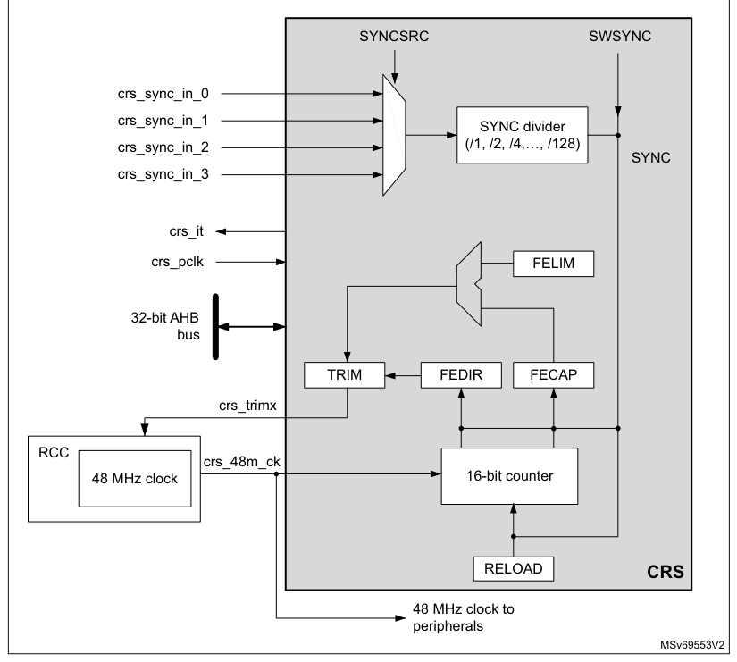
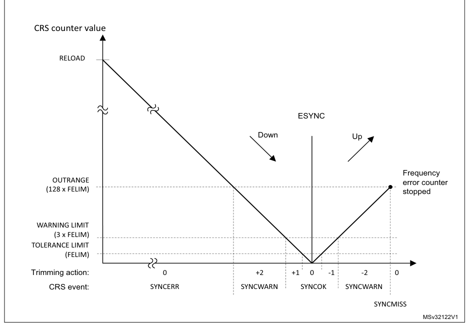

# 8 Clock recovery system (CRS)

[← RM0440 index](../STM32G4_RM0440.md)

## 8.1 CRS introduction

The clock recovery system (CRS) is an advanced digital controller acting on the internal
fine-granularity trimmable RC oscillator HSI48. The CRS provides powerful means to evaluate the
oscillator output frequency, based on comparison with a selectable synchronization signal. The CRS
can perform automatic trimming adjustments based on the measured frequency error value, while
keeping the possibility of a manual trimming.

The CRS is ideally suited to provide a precise clock to the USB peripheral. In this case, the
synchronization signal can be derived from the start-of-frame (SOF) packet signalization on the USB
bus, sent by a USB host at 1 ms intervals.

The synchronization signal can also be derived from alternative synchronization or generated by the
user software.

## 8.2 CRS main features

- Selectable synchronization source with programmable prescaler and polarity (see [Section 8.4.2](#842-crs-internal-signals): CRS
  internal signals)
- Possibility to generate synchronization pulses by software
- Automatic oscillator trimming capability with no need of CPU action
- Manual control option for faster startup convergence
- 16-bit frequency error counter with automatic error value capture and reload
- Programmable limit for automatic frequency error value evaluation and status reporting
- Maskable interrupts/events:
  - Expected synchronization (ESYNC)
  - Synchronization OK (SYNCOK)
  - Synchronization warning (SYNCWARN)
  - Synchronization or trimming error (ERR)

## 8.3 CRS implementation

**Table 52. CRS features**

| Feature | CRS |
| --- | --- |
| TRIM width | 7 bits |

## 8.4 CRS functional description

### 8.4.1 CRS block diagram

**Figure 23. CRS block diagram**

### 8.4.2 CRS internal signals

Below the list of CRS internal signals.

**Table 53. CRS internal input/output signals**

| Internal signal name | Signal type | Description |
| --- | --- | --- |
| crs_it | Digital output | CRS interrupt |
| crs_pclk | Digital input | AHB bus clock |
| crs_48m_ck | Digital input | HSI48 48 MHz clock |
| crs_trim[0:6] | Digital output | HSI48 oscillator smooth trimming value |

**Table 53. CRS internal input/output signals (continued)**

| Source row | Column 1 | Column 2 | Column 3 |
| ---: | --- | --- | --- |
| 1 | `Internal signal name` | `Signal type` | `Description` |
| 2 | `crs_sync_in_0` |  |  |
| 3 | `crs_sync_in_1` |  |  |
| 4 | `Digital input` | `SYNC signal source` |  |
| 5 | `crs_sync_in_2` |  |  |
| 6 | `crs_sync_in_3` |  |  |

**Table 54. CRS interconnection**

| Internal signal name | Source |
| --- | --- |
| crs_sync_in_0 | GPIO selected as SYNC signal source |
| crs_sync_in_1 | LSE selected as SYNC signal source |
| crs_sync_in_2 | USB SOF selected as SYNC signal source (default) |
| crs_sync_in_3 | Reserved |

### 8.4.3 Synchronization input

The CRS synchronization source (crs_sync_in_x) can be selected through SYNCSRC[1:0] bitfield of
CRS_CFGR register (refer to [Section 8.4.2](#842-crs-internal-signals): CRS internal signals for the possible sources). For a
better robustness of the crs_sync_in_x input, a simple digital filter (2 out of 3 majority votes,
sampled by the 48 MHz clock) is implemented to filter out glitches. In addition, the source signal
has a configurable polarity (selected through SYNCPOL bit of CRS_CFGR). The signal can then be
divided by a programmable binary prescaler to obtain a synchronization signal in a suitable
frequency range (usually around 1 kHz).

For more information on the CRS synchronization source configuration, refer to CRS_CFGR register.

It is also possible to generate a synchronization event by software, by setting the SWSYNC bit in
the CRS_CR register.

For more information on the CRS synchronization source configuration, refer to CRS configuration
register (CRS_CFGR).

It is also possible to generate a synchronization event by software, by setting the SWSYNC bit in
the CRS_CR register.

### 8.4.4 Frequency error measurement

The frequency error counter is a 16-bit down/up counter, reloaded with the RELOAD value on each SYNC
event. It starts counting down until it reaches the zero value, where the ESYNC (expected
synchronization) event is generated. Then it starts counting up to the OUTRANGE limit, where it
eventually stops (if no SYNC event is received), and generates a SYNCMISS event. The OUTRANGE limit
is defined as the frequency error limit (FELIM field of the CRS_CFGR register) multiplied by 128.

When the SYNC event is detected, the actual value of the frequency error counter and its counting
direction are stored in the FECAP (frequency error capture) field and in the FEDIR (frequency error
direction) bit of the CRS_ISR register. When the SYNC event is detected during the down-counting
phase (before reaching the zero value), it means that the actual
frequency is lower than the target (the TRIM value must be incremented). When it is detected during
the up-counting phase, it means that the actual frequency is higher (the TRIM value must be
decremented).

**Figure 24. CRS counter behavior**

### 8.4.5 Frequency error evaluation and automatic trimming

The measured frequency error is evaluated by comparing its value with a set of limits:

- TOLERANCE LIMIT, given directly in the FELIM field of the CRS_CFGR register
- WARNING LIMIT, defined as 3 × FELIM value
- OUTRANGE (error limit), defined as 128 × FELIM value

The result of this comparison is used to generate the status indication and also to control the
automatic trimming, which is enabled by setting the AUTOTRIMEN bit in the CRS_CR register:

- When the frequency error is below the tolerance limit, it means that the actual trimming value in
  the TRIM field is the optimal one, hence no trimming action is needed.
  - SYNCOK status indicated
  - TRIM value not changed in AUTOTRIM mode
- When the frequency error is below the warning limit but above or equal to the tolerance limit, it
  means that some trimming action is necessary but that adjustment by one trimming step is enough to
  reach the optimal TRIM value.
  - SYNCOK status indicated
- TRIM value adjusted by one trimming step in AUTOTRIM mode
- When the frequency error is above or equal to the warning limit but below the error limit, a
  stronger trimming action is necessary, and there is a risk that the optimal TRIM value is not
  reached for the next period.
  - SYNCWARN status indicated
  - TRIM value adjusted by two trimming steps in AUTOTRIM mode
- When the frequency error is above or equal to the error limit, the frequency is out of the
  trimming range. This can also happen when the SYNC input is not clean, or when some SYNC pulse is
  missing (for example when one USB SOF is corrupted).
  - SYNCERR or SYNCMISS status indicated
  - TRIM value not changed in AUTOTRIM mode

> **Note:** If the actual value of the TRIM field is close to its limits and the automatic trimming can force
> it to overflow or underflow, the TRIM value is set to the limit, and the TRIMOVF status is
> indicated.

In AUTOTRIM mode (AUTOTRIMEN bit set in the CRS_CR register), the TRIM field of CRS_CR is adjusted
by hardware and is read-only.

### 8.4.6 CRS initialization and configuration

#### RELOAD value

The RELOAD value must be selected according to the ratio between the target frequency and the
frequency of the synchronization source after prescaling. This value is decreased by 1, to reach the
expected synchronization on the zero value. The formula is the following:

RELOAD = (fTARGET / fSYNC) - 1

The reset value of the RELOAD field corresponds to a target frequency of 48 MHz and a
synchronization signal frequency of 1 kHz (SOF signal from USB).

#### FELIM value

The selection of the FELIM value is closely coupled with the HSI48 oscillator characteristics and
its typical trimming step size. The optimal value corresponds to half of the trimming step size,
expressed as a number of oscillator clock ticks. The following formula can be used:

FELIM = (fTARGET / fSYNC) \* STEP[%] / 100% / 2

The result must be always rounded up to the nearest integer value to obtain the best trimming
response. If frequent trimming actions are not needed in the application, the hysteresis can be
increased by slightly increasing the FELIM value.

The reset value of the FELIM field corresponds to (fTARGET / fSYNC) = 48000, and to a typical
trimming step size of 0.14%.

> **Note:** The trimming step size depends upon the product, check the datasheet for accurate setting.

> **Caution:** There is no hardware protection from a wrong configuration of the RELOAD and FELIM
> fields, this can lead to an erratic trimming response. The expected operational mode requires proper
> setup of the RELOAD value (according to the synchronization source frequency), which is also greater
> than 128 \* FELIM value (OUTRANGE limit).

## 8.5 CRS in low-power modes

**Table 55. Effect of low-power modes on CRS**

| Source row | Column 1 | Column 2 |
| ---: | --- | --- |
| 1 | `Mode` | `Description` |
| 2 | `Sleep` | `No effect. CRS interrupts cause the device to exit the Sleep mode.` |
| 3 | `CRS registers are frozen. The CRS stops operating until the Stop mode is exited and the` |  |
| 4 | `Stop` |  |
| 5 | `HSI48 oscillator is restarted.` |  |
| 6 | `Standby` | `The peripheral is powered down and must be reinitialized after exiting Standby mode.` |
| 7 | `Shutdown` | `The peripheral is powered down and must be reinitialized after exiting Shutdown mode.` |

## 8.6 CRS interrupts

**Table 56. Interrupt control bits**

| Source row | Column 1 | Column 2 | Column 3 | Column 4 |
| ---: | --- | --- | --- | --- |
| 1 | `Enable` | `Clear` |  |  |
| 2 | `Interrupt event` | `Event flag` |  |  |
| 3 | `control bit` | `flag bit` |  |  |
| 4 | `Expected synchronization` | `ESYNCF` | `ESYNCIE` | `ESYNCC` |
| 5 | `Synchronization OK` | `SYNCOKF` | `SYNCOKIE` | `SYNCOKC` |
| 6 | `Synchronization warning` | `SYNCWARNF` | `SYNCWARNIE` | `SYNCWARNC` |
| 7 | `Synchronization or trimming error` |  |  |  |
| 8 | `ERRF` | `ERRIE` | `ERRC` |  |
| 9 | `(TRIMOVF, SYNCMISS, SYNCERR)` |  |  |  |

## 8.7 CRS registers

Refer to [Section 1.2](chapter-01.md#12-list-of-abbreviations-for-registers) for a list of abbreviations used in register descriptions.

The peripheral registers can be accessed only by words (32-bit).

### 8.7.1 CRS control register (CRS_CR)

- **Address offset:** 0x00
- **Reset value:** 0x0000 4000

**Register bit layout**

| Bit | Field | Access | Summary |
| ---: | --- | :---: | --- |
| 31 | Reserved | — | kept at reset value. |
| 30 | Reserved | — | ↳ |
| 29 | Reserved | — | ↳ |
| 28 | Reserved | — | ↳ |
| 27 | Reserved | — | ↳ |
| 26 | Reserved | — | ↳ |
| 25 | Reserved | — | ↳ |
| 24 | Reserved | — | ↳ |
| 23 | Reserved | — | ↳ |
| 22 | Reserved | — | ↳ |
| 21 | Reserved | — | ↳ |
| 20 | Reserved | — | ↳ |
| 19 | Reserved | — | ↳ |
| 18 | Reserved | — | ↳ |
| 17 | Reserved | — | ↳ |
| 16 | Reserved | — | ↳ |
| 15 | Reserved | — | ↳ |
| 14 | `TRIM[6]` | rw | HSI48 oscillator smooth trimming |
| 13 | `TRIM[5]` | rw | ↳ |
| 12 | `TRIM[4]` | rw | ↳ |
| 11 | `TRIM[3]` | rw | ↳ |
| 10 | `TRIM[2]` | rw | ↳ |
| 9 | `TRIM[1]` | rw | ↳ |
| 8 | `TRIM[0]` | rw | ↳ |
| 7 | `SWSYNC` | rt_w1 | Generate software SYNC event |
| 6 | `AUTOTRIMEN` | rw | Automatic trimming enable |
| 5 | `CEN` | rw | Frequency error counter enable |
| 4 | Reserved | — | kept at reset value. |
| 3 | `ESYNCIE` | rw | Expected SYNC interrupt enable |
| 2 | `ERRIE` | rw | Synchronization or trimming error interrupt enable |
| 1 | `SYNCWARNIE` | rw | SYNC warning interrupt enable |
| 0 | `SYNCOKIE` | rw | SYNC event OK interrupt enable |

**Bits 31:15 — Reserved:** kept at reset value.

**Bits 14:8 — `TRIM[6:0]`:** HSI48 oscillator smooth trimming

The default value of the HSI48 oscillator smooth trimming is 64, which corresponds to the
middle of the trimming interval.

**Bit 7 — `SWSYNC`:** Generate software SYNC event

This bit is set by software in order to generate a software SYNC event. It is automatically
cleared by hardware.

- `0`: No action
- `1`: A software SYNC event is generated.

**Bit 6 — `AUTOTRIMEN`:** Automatic trimming enable

This bit enables the automatic hardware adjustment of TRIM bits according to the measured
frequency error between two SYNC events. If this bit is set, the TRIM bits are read-only. The

TRIM value can be adjusted by hardware by one or two steps at a time, depending on the
measured frequency error value. Refer to [Section 8.4.5](#845-frequency-error-evaluation-and-automatic-trimming) for more details.

- `0`: Automatic trimming disabled, TRIM bits can be adjusted by the user.
- `1`: Automatic trimming enabled, TRIM bits are read-only and under hardware control.

**Bit 5 — `CEN`:** Frequency error counter enable

This bit enables the oscillator clock for the frequency error counter.

- `0`: Frequency error counter disabled
- `1`: Frequency error counter enabled

When this bit is set, the CRS_CFGR register is write-protected and cannot be modified.

**Bit 4 — Reserved:** kept at reset value.

**Bit 3 — `ESYNCIE`:** Expected SYNC interrupt enable

- `0`: Expected SYNC (ESYNCF) interrupt disabled
- `1`: Expected SYNC (ESYNCF) interrupt enabled

**Bit 2 — `ERRIE`:** Synchronization or trimming error interrupt enable

- `0`: Synchronization or trimming error (ERRF) interrupt disabled
- `1`: Synchronization or trimming error (ERRF) interrupt enabled

**Bit 1 — `SYNCWARNIE`:** SYNC warning interrupt enable

- `0`: SYNC warning (SYNCWARNF) interrupt disabled
- `1`: SYNC warning (SYNCWARNF) interrupt enabled

**Bit 0 — `SYNCOKIE`:** SYNC event OK interrupt enable

- `0`: SYNC event OK (SYNCOKF) interrupt disabled
- `1`: SYNC event OK (SYNCOKF) interrupt enabled

### 8.7.2 CRS configuration register (CRS_CFGR)

This register can be written only when the frequency error counter is disabled (the CEN bit is
cleared in CRS_CR). When the counter is enabled, this register is write-protected.

- **Address offset:** 0x04
- **Reset value:** 0x2022 BB7F

**Register bit layout**

| Bit | Field | Access | Summary |
| ---: | --- | :---: | --- |
| 31 | `SYNCPOL` | rw | SYNC polarity selection |
| 30 | Reserved | — | kept at reset value. |
| 29 | `SYNCSRC[1]` | rw | SYNC signal source selection |
| 28 | `SYNCSRC[0]` | rw | ↳ |
| 27 | Reserved | — | kept at reset value. |
| 26 | `SYNCDIV[2]` | rw | SYNC divider |
| 25 | `SYNCDIV[1]` | rw | ↳ |
| 24 | `SYNCDIV[0]` | rw | ↳ |
| 23 | `FELIM[7]` | rw | Frequency error limit |
| 22 | `FELIM[6]` | rw | ↳ |
| 21 | `FELIM[5]` | rw | ↳ |
| 20 | `FELIM[4]` | rw | ↳ |
| 19 | `FELIM[3]` | rw | ↳ |
| 18 | `FELIM[2]` | rw | ↳ |
| 17 | `FELIM[1]` | rw | ↳ |
| 16 | `FELIM[0]` | rw | ↳ |
| 15 | `RELOAD[15]` | rw | Counter reload value |
| 14 | `RELOAD[14]` | rw | ↳ |
| 13 | `RELOAD[13]` | rw | ↳ |
| 12 | `RELOAD[12]` | rw | ↳ |
| 11 | `RELOAD[11]` | rw | ↳ |
| 10 | `RELOAD[10]` | rw | ↳ |
| 9 | `RELOAD[9]` | rw | ↳ |
| 8 | `RELOAD[8]` | rw | ↳ |
| 7 | `RELOAD[7]` | rw | ↳ |
| 6 | `RELOAD[6]` | rw | ↳ |
| 5 | `RELOAD[5]` | rw | ↳ |
| 4 | `RELOAD[4]` | rw | ↳ |
| 3 | `RELOAD[3]` | rw | ↳ |
| 2 | `RELOAD[2]` | rw | ↳ |
| 1 | `RELOAD[1]` | rw | ↳ |
| 0 | `RELOAD[0]` | rw | ↳ |

**Bit 31 — `SYNCPOL`:** SYNC polarity selection

This bit is set and cleared by software to select the input polarity for the SYNC signal source.

- `0`: SYNC active on rising edge (default)
- `1`: SYNC active on falling edge

**Bit 30 — Reserved:** kept at reset value.

**Bits 29:28 — `SYNCSRC[1:0]`:** SYNC signal source selection

These bits are set and cleared by software to select the SYNC signal source (see

[Section 8.4.2](#842-crs-internal-signals): CRS internal signals).

- `00`: crs_sync_in_0 selected as SYNC signal source
- `01`: crs_sync_in_1 selected as SYNC signal source
- `10`: crs_sync_in_2 selected as SYNC signal source
- `11`: crs_sync_in_3 selected as SYNC signal source

> **Note:** When using USB LPM (link power management) and the device is in Sleep mode, the
> periodic USB SOF is not generated by the host. No SYNC signal is therefore provided
> to the CRS to calibrate the 48 MHz clock on the run. To guarantee the required clock
> precision after waking up from Sleep mode, the LSE clock or the SYNC pin must be
> used as SYNC signal.

**Bit 27 — Reserved:** kept at reset value.

**Bits 26:24 — `SYNCDIV[2:0]`:** SYNC divider

These bits are set and cleared by software to control the division factor of the SYNC signal.

- `000`: SYNC not divided (default)
- `001`: SYNC divided by 2
- `010`: SYNC divided by 4
- `011`: SYNC divided by 8
- `100`: SYNC divided by 16
- `101`: SYNC divided by 32
- `110`: SYNC divided by 64
- `111`: SYNC divided by 128

**Bits 23:16 — `FELIM[7:0]`:** Frequency error limit

FELIM contains the value to be used to evaluate the captured frequency error value latched
in the FECAP[15:0] bits of the CRS_ISR register. Refer to [Section 8.4.5](#845-frequency-error-evaluation-and-automatic-trimming) for more details
about FECAP evaluation.

**Bits 15:0 — `RELOAD[15:0]`:** Counter reload value

RELOAD is the value to be loaded in the frequency error counter with each SYNC event.

Refer to [Section 8.4.4](#844-frequency-error-measurement) for more details about counter behavior.

### 8.7.3 CRS interrupt and status register (CRS_ISR)

- **Address offset:** 0x08
- **Reset value:** 0x0000 0000

**Register bit layout**

| Bit | Field | Access | Summary |
| ---: | --- | :---: | --- |
| 31 | `FECAP[15]` | r | Frequency error capture |
| 30 | `FECAP[14]` | r | ↳ |
| 29 | `FECAP[13]` | r | ↳ |
| 28 | `FECAP[12]` | r | ↳ |
| 27 | `FECAP[11]` | r | ↳ |
| 26 | `FECAP[10]` | r | ↳ |
| 25 | `FECAP[9]` | r | ↳ |
| 24 | `FECAP[8]` | r | ↳ |
| 23 | `FECAP[7]` | r | ↳ |
| 22 | `FECAP[6]` | r | ↳ |
| 21 | `FECAP[5]` | r | ↳ |
| 20 | `FECAP[4]` | r | ↳ |
| 19 | `FECAP[3]` | r | ↳ |
| 18 | `FECAP[2]` | r | ↳ |
| 17 | `FECAP[1]` | r | ↳ |
| 16 | `FECAP[0]` | r | ↳ |
| 15 | `FEDIR` | r | Frequency error direction |
| 14 | Reserved | — | kept at reset value. |
| 13 | Reserved | — | ↳ |
| 12 | Reserved | — | ↳ |
| 11 | Reserved | — | ↳ |
| 10 | `TRIMOVF` | r | Trimming overflow or underflow |
| 9 | `SYNCMISS` | r | SYNC missed |
| 8 | `SYNCERR` | r | SYNC error |
| 7 | Reserved | — | kept at reset value. |
| 6 | Reserved | — | ↳ |
| 5 | Reserved | — | ↳ |
| 4 | Reserved | — | ↳ |
| 3 | `ESYNCF` | r | Expected SYNC flag |
| 2 | `ERRF` | r | Error flag |
| 1 | `SYNCWARNF` | r | SYNC warning flag |
| 0 | `SYNCOKF` | r | SYNC event OK flag |

**Bits 31:16 — `FECAP[15:0]`:** Frequency error capture

FECAP is the frequency error counter value latched in the time of the last SYNC event.

Refer to [Section 8.4.5](#845-frequency-error-evaluation-and-automatic-trimming) for more details about FECAP usage.

**Bit 15 — `FEDIR`:** Frequency error direction

FEDIR is the counting direction of the frequency error counter latched in the time of the last

SYNC event. It shows whether the actual frequency is below or above the target.

- `0`: Up-counting direction, the actual frequency is above the target
- `1`: Down-counting direction, the actual frequency is below the target

**Bits 14:11 — Reserved:** kept at reset value.

**Bit 10 — `TRIMOVF`:** Trimming overflow or underflow

This flag is set by hardware when the automatic trimming tries to over-or under-flow the

TRIM value. An interrupt is generated if the ERRIE bit is set in the CRS_CR register. It is
cleared by software by setting the ERRC bit in the CRS_ICR register.

- `0`: No trimming error signaled
- `1`: Trimming error signaled

**Bit 9 — `SYNCMISS`:** SYNC missed

This flag is set by hardware when the frequency error counter reaches value FELIM \* 128
and no SYNC is detected, meaning either that a SYNC pulse was missed, or the frequency
error is too big (internal frequency too high) to be compensated by adjusting the TRIM value,
hence some other action must be taken. At this point, the frequency error counter is stopped

(waiting for a next SYNC), and an interrupt is generated if the ERRIE bit is set in the

CRS_CR register. It is cleared by software by setting the ERRC bit in the CRS_ICR register.

- `0`: No SYNC missed error signaled
- `1`: SYNC missed error signaled

**Bit 8 — `SYNCERR`:** SYNC error

This flag is set by hardware when the SYNC pulse arrives before the ESYNC event and the
measured frequency error is greater than or equal to FELIM \* 128. This means that the
frequency error is too big (internal frequency too low) to be compensated by adjusting the

TRIM value, and that some other action has to be taken. An interrupt is generated if the

ERRIE bit is set in the CRS_CR register. It is cleared by software by setting the ERRC bit in
the CRS_ICR register.

- `0`: No SYNC error signaled
- `1`: SYNC error signaled

**Bits 7:4 — Reserved:** kept at reset value.

**Bit 3 — `ESYNCF`:** Expected SYNC flag

This flag is set by hardware when the frequency error counter reached a zero value. An
interrupt is generated if the ESYNCIE bit is set in the CRS_CR register. It is cleared by
software by setting the ESYNCC bit in the CRS_ICR register.

- `0`: No expected SYNC signaled
- `1`: Expected SYNC signaled

**Bit 2 — `ERRF`:** Error flag

This flag is set by hardware in case of any synchronization or trimming error. It is the logical

OR of the TRIMOVF, SYNCMISS and SYNCERR bits. An interrupt is generated if the ERRIE
bit is set in the CRS_CR register. It is cleared by software in reaction to setting the ERRC bit
in the CRS_ICR register, which clears the TRIMOVF, SYNCMISS and SYNCERR bits.

- `0`: No synchronization or trimming error signaled
- `1`: Synchronization or trimming error signaled

**Bit 1 — `SYNCWARNF`:** SYNC warning flag

This flag is set by hardware when the measured frequency error is greater than or equal to

FELIM \* 3, but smaller than FELIM \* 128. This means that to compensate the frequency
error, the TRIM value must be adjusted by two steps or more. An interrupt is generated if the

SYNCWARNIE bit is set in the CRS_CR register. It is cleared by software by setting the

SYNCWARNC bit in the CRS_ICR register.

- `0`: No SYNC warning signaled
- `1`: SYNC warning signaled

**Bit 0 — `SYNCOKF`:** SYNC event OK flag

This flag is set by hardware when the measured frequency error is smaller than FELIM \* 3.

This means that either no adjustment of the TRIM value is needed or that an adjustment by
one trimming step is enough to compensate the frequency error. An interrupt is generated if
the SYNCOKIE bit is set in the CRS_CR register. It is cleared by software by setting the

SYNCOKC bit in the CRS_ICR register.

- `0`: No SYNC event OK signaled
- `1`: SYNC event OK signaled

### 8.7.4 CRS interrupt flag clear register (CRS_ICR)

- **Address offset:** 0x0C
- **Reset value:** 0x0000 0000

**Register bit layout**

| Bit | Field | Access | Summary |
| ---: | --- | :---: | --- |
| 31 | Reserved | — | kept at reset value. |
| 30 | Reserved | — | ↳ |
| 29 | Reserved | — | ↳ |
| 28 | Reserved | — | ↳ |
| 27 | Reserved | — | ↳ |
| 26 | Reserved | — | ↳ |
| 25 | Reserved | — | ↳ |
| 24 | Reserved | — | ↳ |
| 23 | Reserved | — | ↳ |
| 22 | Reserved | — | ↳ |
| 21 | Reserved | — | ↳ |
| 20 | Reserved | — | ↳ |
| 19 | Reserved | — | ↳ |
| 18 | Reserved | — | ↳ |
| 17 | Reserved | — | ↳ |
| 16 | Reserved | — | ↳ |
| 15 | Reserved | — | ↳ |
| 14 | Reserved | — | ↳ |
| 13 | Reserved | — | ↳ |
| 12 | Reserved | — | ↳ |
| 11 | Reserved | — | ↳ |
| 10 | Reserved | — | ↳ |
| 9 | Reserved | — | ↳ |
| 8 | Reserved | — | ↳ |
| 7 | Reserved | — | ↳ |
| 6 | Reserved | — | ↳ |
| 5 | Reserved | — | ↳ |
| 4 | Reserved | — | ↳ |
| 3 | `ESYNCC` | rw | Expected SYNC clear flag |
| 2 | `ERRC` | rw | Error clear flag |
| 1 | `SYNCWARNC` | rw | SYNC warning clear flag |
| 0 | `SYNCOKC` | rw | SYNC event OK clear flag |

**Bits 31:4 — Reserved:** kept at reset value.

**Bit 3 — `ESYNCC`:** Expected SYNC clear flag

Writing 1 to this bit clears the ESYNCF flag in the CRS_ISR register.

**Bit 2 — `ERRC`:** Error clear flag

Writing 1 to this bit clears TRIMOVF, SYNCMISS, and SYNCERR bits and consequently also
the ERRF flag in the CRS_ISR register.

**Bit 1 — `SYNCWARNC`:** SYNC warning clear flag

Writing 1 to this bit clears the SYNCWARNF flag in the CRS_ISR register.

**Bit 0 — `SYNCOKC`:** SYNC event OK clear flag

Writing 1 to this bit clears the SYNCOKF flag in the CRS_ISR register.

### 8.7.5 CRS register map

**Register summary**

| Offset | Register | Reset value |
| --- | --- | --- |
| 0x00 | `CRS_CR` | 0x0000 4000 |
| 0x04 | `CRS_CFGR` | 0x2022 BB7F |
| 0x08 | `CRS_ISR` | 0x0000 0000 |
| 0x0C | `CRS_ICR` | 0x0000 0000 |

Refer to [Section 2.2](chapter-02.md#22-memory-organization) for the register boundary addresses.
