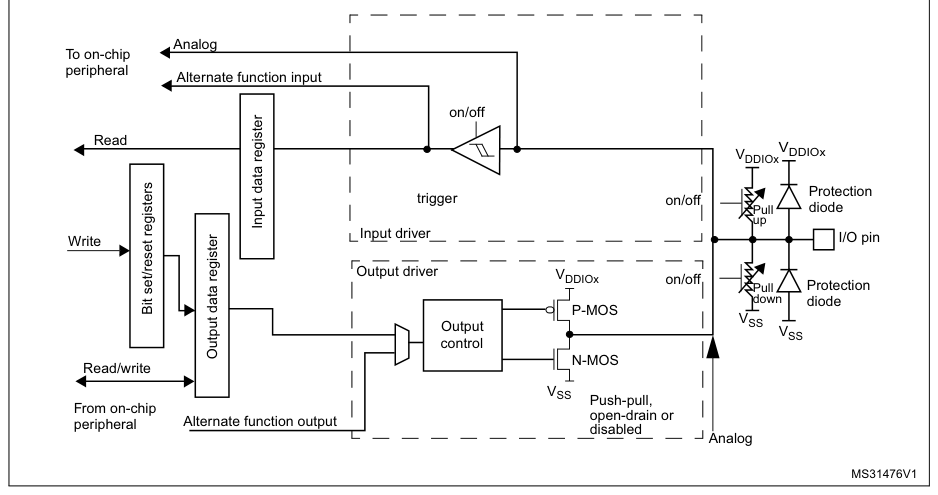
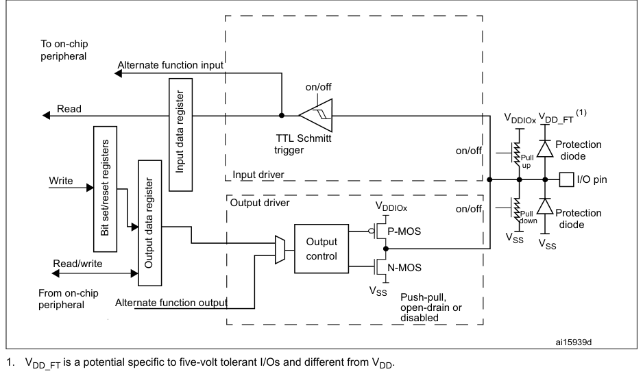
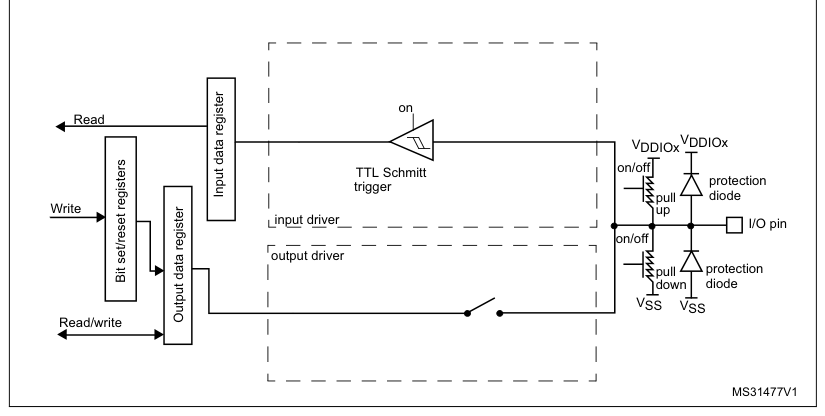
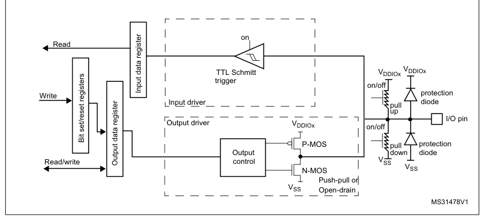
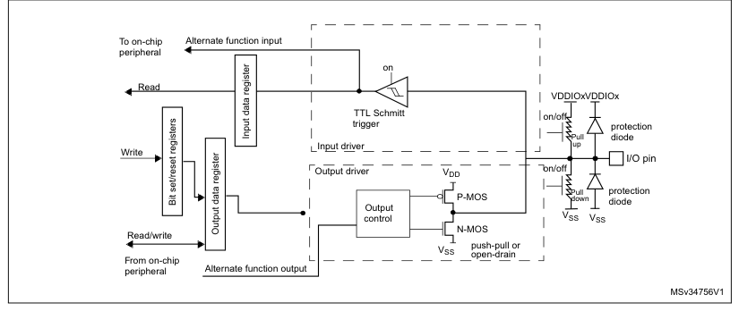
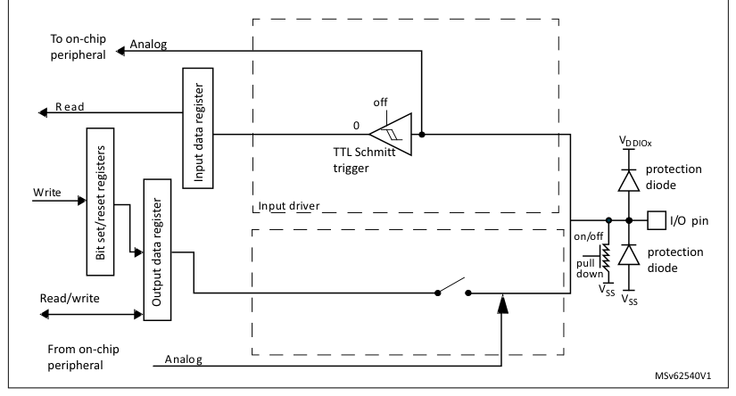

# 9 General-purpose I/Os (GPIO)

[← RM0440 index](../STM32G4_RM0440.md)

## 9.1 Introduction

Each general-purpose I/O port has four 32-bit configuration registers (GPIOx_MODER, GPIOx_OTYPER,
GPIOx_OSPEEDR and GPIOx_PUPDR), two 32-bit data registers (GPIOx_IDR and GPIOx_ODR), and a 32-bit
set/reset register (GPIOx_BSRR). In addition, all GPIOs have a 32-bit locking register (GPIOx_LCKR)
and two 32-bit alternate function selection registers (GPIOx_AFRH and GPIOx_AFRL).

## 9.2 GPIO main features

- Output states: push-pull or open drain \+ pull-up/down
- Output data from output data register (GPIOx_ODR) or peripheral (alternate function output)
- Speed selection for each I/O
- Input states: floating, pull-up/down, analog
- Input data to input data register (GPIOx_IDR) or peripheral (alternate function input)
- Bit set and reset register (GPIOx_BSRR) for bitwise write access to GPIOx_ODR
- Locking mechanism (GPIOx_LCKR) provided to freeze the I/O port configurations
- Analog function
- Alternate function selection registers
- Fast toggle capable of changing every two clock cycles
- Highly flexible pin multiplexing allows the use of I/O pins as GPIOs or as one of several
  peripheral functions

## 9.3 GPIO functional description

Subject to the specific hardware characteristics of each I/O port listed in the datasheet, each bit
of the general-purpose I/O (GPIO) ports can be individually configured by software in several modes:

- Input floating
- Input pull-up
- Input-pull-down
- Analog
- Output open-drain with pull-up or pull-down capability
- Output push-pull with pull-up or pull-down capability
- Alternate function push-pull with pull-up or pull-down capability
- Alternate function open-drain with pull-up or pull-down capability

Each I/O port bit is freely programmable, however the I/O port registers must be accessed as 32-bit
words, half-words, or bytes. The the GPIOx_BSRR registers can be used for atomic read/modify
accesses to any of the GPIOx_ODR registers. In this way, there is no risk of an IRQ occurring
between the read and the modify access.

Figure 25 and Figure 26 show, respectively, the basic structures of a standard and a 3- or 5-Volt
tolerant I/O port bit. Table 58 gives the possible port bit configurations.

**Figure 25. Basic structure of an I/O port bit**

Analog

To on-chip
peripheral

Alternate function input
on/off

Read

VDDIOx

VDDIOx

Protection

**Figure 26. Basic structure of a 3- or 5-Volt tolerant I/O port bit**

To on-chip
peripheral

Alternate function input
on/off

Read

(1)

VDDIOx VDD_FT

TTL Schmitt

Protection

1. VDD_FT is a potential specific to five-volt tolerant I/Os and different from VDD.

**Table 58. Port bit configuration table(1)**

| Source row | Column 1 | Column 2 | Column 3 | Column 4 | Column 5 | Column 6 | Column 7 |
| ---: | --- | --- | --- | --- | --- | --- | --- |
| 1 | `MODE(i)` | `OSPEED(i)` | `PUPD(i)` |  |  |  |  |
| 2 | `OTYPE(i)` | `I/O configuration` |  |  |  |  |  |
| 3 | `[1:0]` | `[1:0]` | `[1:0]` |  |  |  |  |
| 4 | `0` | `0` | `0` | `GP output` | `PP` |  |  |
| 5 | `0` | `0` | `1` | `GP output` | `PP + PU` |  |  |
| 6 | `0` | `1` | `0` | `GP output` | `PP + PD` |  |  |
| 7 | `0` | `SPEED` | `1` | `1` | `Reserved` |  |  |
| 8 | `01` |  |  |  |  |  |  |
| 9 | `1` | `[1:0]` | `0` | `0` | `GP output` | `OD` |  |
| 10 | `1` | `0` | `1` | `GP output` | `OD + PU` |  |  |
| 11 | `1` | `1` | `0` | `GP output` | `OD + PD` |  |  |
| 12 | `1` | `1` | `1` | `Reserved (GP output OD)` |  |  |  |
| 13 | `0` | `0` | `0` | `AF` | `PP` |  |  |
| 14 | `0` | `0` | `1` | `AF` | `PP + PU` |  |  |
| 15 | `0` | `1` | `0` | `AF` | `PP + PD` |  |  |
| 16 | `0` | `SPEED` | `1` | `1` | `Reserved` |  |  |
| 17 | `10` |  |  |  |  |  |  |
| 18 | `1` | `[1:0]` | `0` | `0` | `AF` | `OD` |  |
| 19 | `1` | `0` | `1` | `AF` | `OD + PU` |  |  |
| 20 | `1` | `1` | `0` | `AF` | `OD + PD` |  |  |
| 21 | `1` | `1` | `1` | `Reserved` |  |  |  |
| 22 | `x` | `x` | `x` | `0` | `0` | `Input` | `Floating` |
| 23 | `x` | `x` | `x` | `0` | `1` | `Input` | `PU` |
| 24 | `00` |  |  |  |  |  |  |
| 25 | `x` | `x` | `x` | `1` | `0` | `Input` | `PD` |
| 26 | `x` | `x` | `x` | `1` | `1` | `Reserved (input floating)` |  |
| 27 | `x` | `x` | `x` | `0` | `0` | `Input/output` | `Analog` |
| 28 | `x` | `x` | `x` | `0` | `1` | `Reserved` |  |
| 29 | `11` |  |  |  |  |  |  |
| 30 | `x` | `x` | `x` | `1` | `0` | `Input/output` | `Analog, PD` |
| 31 | `x` | `x` | `x` | `1` | `1` | `Reserved` |  |

1. GP = general-purpose, PP = push-pull, PU = pull-up, PD = pull-down, OD = open-drain, AF =
   alternate
   function.

### 9.3.1 General-purpose I/O (GPIO)

During and just after reset, the alternate functions are not active and most of the I/O ports are
configured in analog mode.

The debug pins are in AF pull-up/pull-down after reset:

- PA15: JTDI in pull-up
- PA14: JTCK/SWCLK in pull-down
- PA13: JTMS/SWDAT in pull-up
- PB4: NJTRST in pull-up
- PB3: JTDO in floating state no pull-up/pull-down

PB8/BOOT0 is in input mode during the reset until at least the end of the option byte loading phase.
See [Section 9.3.15](#9315-using-pb8-as-gpio): Using PB8 as GPIO.

When the pin is configured as output, the value written to the output data register (GPIOx_ODR) is
output on the I/O pin. It is possible to use the output driver in push-pull mode or open-drain mode
(only the low level is driven, high level is HI-Z).

The input data register (GPIOx_IDR) captures the data present on the I/O pin at every AHB clock
cycle.

All GPIO pins have weak internal pull-up and pull-down resistors, which can be activated or not
depending on the value in the GPIOx_PUPDR register.

### 9.3.2 I/O pin alternate function multiplexer and mapping

The device I/O pins are connected to on-board peripherals/modules through a multiplexer that allows
only one peripheral alternate function (AF) connected to an I/O pin at a time. In this way, there
can be no conflict between peripherals available on the same I/O pin.

Each I/O pin has a multiplexer with up to sixteen alternate function inputs (AF0 to AF15) that can
be configured through the GPIOx_AFRL (for pin 0 to 7) and GPIOx_AFRH (for pin 8 to 15) registers:

- After reset the multiplexer selection is alternate function 0 (AF0). The I/Os are configured in
  alternate function mode through GPIOx_MODER register.
- The specific alternate function assignments for each pin are detailed in the device datasheet.

In addition to this flexible I/O multiplexing architecture, each peripheral has alternate functions
mapped onto different I/O pins to optimize the number of peripherals available in smaller packages.

To use an I/O in a given configuration, the user has to proceed as follows:

- Debug function: after each device reset these pins are assigned as alternate function pins
  immediately usable by the debugger host
- GPIO: configure the desired I/O as output, input or analog in the GPIOx_MODER register.
- Peripheral alternate function:
  - Connect the I/O to the desired AFx in one of the GPIOx_AFRL or GPIOx_AFRH register.
  - Select the type, pull-up/pull-down and output speed via the GPIOx_OTYPER, GPIOx_PUPDR and
    GPIOx_OSPEEDER registers, respectively.
- Configure the desired I/O as an alternate function in the GPIOx_MODER register.
- Cortex®-M4 alternate function (EVENTOUT)
  - The output EVENTOUT signal can be used by configuring the I/O pin to output at AF15. An event
    can be signaled through the configured pin after executing SEV instruction.
  - EVENTOUT signal can be used internally as a trigger for some peripherals (see [Section 11](chapter-11.md#11-peripherals-interconnect-matrix):
    Peripherals interconnect matrix)
- Additional functions:
  - For the ADC, DAC, OPAMP and COMP, configure the desired I/O in analog mode in the GPIOx_MODER
    register and configure the required function in the ADC, DAC, OPAMP, and COMP registers.

As indicated above, for the additional functions (such as DAC or OPAMP), the output is controlled by
the corresponding peripheral. Care must be taken to select the I/O port analog function before
enabling the additional function output in the peripheral control register.

- For the additional functions like RTC, WKUPx and oscillators, configure the required function in
  the related RTC, PWR and RCC registers. These functions have priority over the configuration in
  the standard GPIO registers.

Refer to the “Alternate function mapping” table in the device datasheet for the detailed mapping of
the alternate function I/O pins.

### 9.3.3 I/O port control registers

Each of the GPIO ports has four 32-bit memory-mapped control registers (GPIOx_MODER, GPIOx_OTYPER,
GPIOx_OSPEEDR, GPIOx_PUPDR) to configure up to 16 I/Os. The GPIOx_MODER register is used to select
the I/O mode (input, output, AF, analog). The GPIOx_OTYPER and GPIOx_OSPEEDR registers are used to
select the output type (push-pull or open-drain) and speed. The GPIOx_PUPDR register is used to
select the pull-up/pull-down whatever the I/O direction.

### 9.3.4 I/O port data registers

Each GPIO has two 16-bit memory-mapped data registers: input and output data registers (GPIOx_IDR
and GPIOx_ODR). GPIOx_ODR stores the data to be output, it is read/write accessible. The data input
through the I/O are stored into the input data register (GPIOx_IDR), a read-only register.

See [Section 9.4.5](#945-gpio-port-input-data-register-gpiox_idr-x--a-to-g): GPIO port input data register (GPIOx_IDR) (x = A to G) and [Section 9.4.6](#946-gpio-port-output-data-register-gpiox_odr-x--a-to-g): GPIO
port output data register (GPIOx_ODR) (x = A to G) for the register descriptions.

### 9.3.5 I/O data bitwise handling

The bit set reset register (GPIOx_BSRR) is a 32-bit register which allows the application to set and
reset each individual bit in the output data register (GPIOx_ODR). The bit set reset register has
twice the size of GPIOx_ODR.

To each bit in GPIOx_ODR, correspond two control bits in GPIOx_BSRR: BS(i) and BR(i). When written
to 1, bit BS(i) sets the corresponding ODR(i) bit. When written to 1, bit BR(i) resets the ODR(i)
corresponding bit.

Writing any bit to 0 in GPIOx_BSRR does not have any effect on the corresponding bit in GPIOx_ODR.
If there is an attempt to both set and reset a bit in GPIOx_BSRR, the set action takes priority.

Using the GPIOx_BSRR register to change the values of individual bits in GPIOx_ODR is a “one-shot”
effect that does not lock the GPIOx_ODR bits. The GPIOx_ODR bits can always be accessed directly.
The GPIOx_BSRR register provides a way of performing atomic bitwise handling.

There is no need for the software to disable interrupts when programming the GPIOx_ODR at bit level:
it is possible to modify one or more bits in a single atomic AHB write access.

### 9.3.6 GPIO locking mechanism

It is possible to freeze the GPIO control registers by applying a specific write sequence to the
GPIOx_LCKR register. The frozen registers are GPIOx_MODER, GPIOx_OTYPER, GPIOx_OSPEEDR, GPIOx_PUPDR,
GPIOx_AFRL and GPIOx_AFRH.

To write the GPIOx_LCKR register, a specific write / read sequence has to be applied. When the right
LOCK sequence is applied to bit 16 in this register, the value of LCKR[15:0] is used to lock the
configuration of the I/Os (during the write sequence the LCKR[15:0] value must be the same). When
the LOCK sequence has been applied to a port bit, the value of the port bit can no longer be
modified until the next MCU reset or peripheral reset. Each GPIOx_LCKR bit freezes the corresponding
bit in the control registers (GPIOx_MODER, GPIOx_OTYPER, GPIOx_OSPEEDR, GPIOx_PUPDR, GPIOx_AFRL and
GPIOx_AFRH.

The LOCK sequence (refer to [Section 9.4.8](#948-gpio-port-configuration-lock-register-gpiox_lckr-x--a-to-g): GPIO port configuration lock register (GPIOx_LCKR) (x = A
to G)) can only be performed using a word (32-bit long) access to the GPIOx_LCKR register due to the
fact that GPIOx_LCKR bit 16 has to be set at the same time as the [15:0] bits.

For more details refer to LCKR register description in [Section 9.4.8](#948-gpio-port-configuration-lock-register-gpiox_lckr-x--a-to-g): GPIO port configuration lock
register (GPIOx_LCKR) (x = A to G).

### 9.3.7 I/O alternate function input/output

Two registers are provided to select one of the alternate function inputs/outputs available for each
I/O. With these registers, the user can connect an alternate function to some other pin as required
by the application.

This means that a number of possible peripheral functions are multiplexed on each GPIO using the
GPIOx_AFRL and GPIOx_AFRH alternate function registers. The application can thus select any one of
the possible functions for each I/O. The AF selection signal being common to the alternate function
input and alternate function output, a single channel is selected for the alternate function
input/output of a given I/O.

To know which functions are multiplexed on each GPIO pin refer to the device datasheet.

### 9.3.8 External interrupt/wakeup lines

All ports have external interrupt capability. To use external interrupt lines, the port must be
configured in input mode.

Refer to [Section 15](chapter-15.md#15-extended-interrupts-and-events-controller-exti): Extended interrupts and events controller (EXTI) and to [Section 15.3.2](chapter-15.md#1532-wake-up-event-management): Wake-up
event management.

### 9.3.9 Input configuration

When the I/O port is programmed as input:

- The output buffer is disabled
- The Schmitt trigger input is activated
- The pull-up and pull-down resistors are activated depending on the value in the GPIOx_PUPDR
  register
- The data present on the I/O pin are sampled into the input data register every AHB clock cycle
- A read access to the input data register provides the I/O state

Figure 27 shows the input configuration of the I/O port bit.

**Figure 27. Input floating/pull up/pull down configurations**

on

Read

VDDIOx

VDDIOx
on/off

TTL Schmitt
protection
trigger

### 9.3.10 Output configuration

When the I/O port is programmed as output:

- The output buffer is enabled:
  - Open drain mode: A “0” in the Output register activates the N-MOS whereas a “1” in the Output
    register leaves the port in Hi-Z (the P-MOS is never activated)
  - Push-pull mode: A “0” in the Output register activates the N-MOS whereas a “1” in the Output
    register activates the P-MOS
- The Schmitt trigger input is activated
- The pull-up and pull-down resistors are activated depending on the value in the GPIOx_PUPDR
  register
- The data present on the I/O pin are sampled into the input data register every AHB clock cycle
- A read access to the input data register gets the I/O state
- A read access to the output data register gets the last written value

Figure 28 shows the output configuration of the I/O port bit.

**Figure 28. Output configuration**

### 9.3.11 Alternate function configuration

When the I/O port is programmed as alternate function:

- The output buffer can be configured in open-drain or push-pull mode
- The output buffer is driven by the signals coming from the peripheral (transmitter enable and
  data)
- The Schmitt trigger input is activated
- The weak pull-up and pull-down resistors are activated or not depending on the value in the
  GPIOx_PUPDR register
- The data present on the I/O pin are sampled into the input data register every AHB clock cycle
- A read access to the input data register gets the I/O state

Figure 29 shows the Alternate function configuration of the I/O port bit.

**Figure 29. Alternate function configuration**

To on-chip Alternate function input
peripheral
on

Read

VDDIOx VDDIOx

### 9.3.12 Analog configuration

When the I/O port is programmed as analog configuration:

- The output buffer is disabled
- The Schmitt trigger input is deactivated, providing zero consumption for every analog value of the
  I/O pin. The output of the Schmitt trigger is forced to a constant value (0).
- The weak pull-up is disabled by Hardware. The weak pull-down is configurable.
- Read access to the input data register gets the value “0”

Figure 30 shows the high-impedance, analog-input configuration of the I/O port bits.

**Figure 30. High impedance-analog configuration**

To on-chip

Analog
peripheral
off

R ead

0

VDDIOx

TTL Schmitt

### 9.3.13 Using the HSE or LSE oscillator pins as GPIOs

When the HSE or LSE oscillator is switched OFF (default state after reset), the related oscillator
pins can be used as normal GPIOs.

When the HSE or LSE oscillator is switched ON (by setting the HSEON or LSEON bit in the RCC_CSR
register) the oscillator takes control of its associated pins and the GPIO configuration of these
pins has no effect.

When the oscillator is configured in a user external clock mode, only the OSC_IN or OSC32_IN pin is
reserved for clock input and the OSC_OUT or OSC32_OUT pin can still be used as normal GPIO.

### 9.3.14 Using the GPIO pins in the RTC supply domain

The PC13/PC14/PC15 GPIO functionality is lost when the core supply domain is powered off (when the
device enters Standby mode). In this case, if their GPIO configuration is not bypassed by the RTC
configuration, these pins are set in an analog input mode.

For details about I/O control by the RTC, refer to [Section 37.3](chapter-37.md#373-rtc-functional-description): RTC functional description.

### 9.3.15 Using PB8 as GPIO

PB8 may be used as boot pin (BOOT0) or as a GPIO. Depending on the nSWBOOT0 bit in the user option
byte, it switches from the input mode to the analog input mode:

- After the option byte loading phase if nSWBOOT0 = 1.
- After reset if nSWBOOT0 = 0.

> **Note:** It is recommended to set PB8 in another mode than analog mode to limit consumption if the
> pin is left unconnected.

### 9.3.16 Using PG10 as GPIO

PG10 may be used as reset pin (NRST) or as a GPIO. Depending on the NRST_MODE bits in the user
option byte, it switches to those mode:

- Reset input/output: default at power-on reset or after option bytes loading NRST_MODE = 3
- Reset input only: after option bytes loading NRST_MODE = 1
- GPIO PG10 mode: after option bytes loading NRST_MODE = 2

See description on the NRST pin in [Section 7.1.2](chapter-07.md#712-system-reset): System reset

## 9.4 GPIO registers

This section gives a detailed description of the GPIO registers.

For a summary of register bits, register address offsets and reset values, refer to Table 59.

The peripheral registers can be written in word, half word or byte mode.

### 9.4.1 GPIO port mode register (GPIOx_MODER) (x =A to G)

- **Address offset:** 0x00
- **Reset value:** 0xABFF FFFF (for port A)
- **Reset value:** 0xFFFF FEBF (for port B)
- **Reset value:** 0xFFFF FFFF (for ports C..G)

**Register bit layout**

| Bit | Field | Access | Summary |
| ---: | --- | :---: | --- |
| 31 | `MODE[15:0][1:0]` | rw | Port x configuration I/O pin y (y = 15 to 0) |
| 30 | `MODE[15:0][1:0]` | rw | ↳ |
| 29 | `MODE[15:0][1:0]` | rw | ↳ |
| 28 | `MODE[15:0][1:0]` | rw | ↳ |
| 27 | `MODE[15:0][1:0]` | rw | ↳ |
| 26 | `MODE[15:0][1:0]` | rw | ↳ |
| 25 | `MODE[15:0][1:0]` | rw | ↳ |
| 24 | `MODE[15:0][1:0]` | rw | ↳ |
| 23 | `MODE[15:0][1:0]` | rw | ↳ |
| 22 | `MODE[15:0][1:0]` | rw | ↳ |
| 21 | `MODE[15:0][1:0]` | rw | ↳ |
| 20 | `MODE[15:0][1:0]` | rw | ↳ |
| 19 | `MODE[15:0][1:0]` | rw | ↳ |
| 18 | `MODE[15:0][1:0]` | rw | ↳ |
| 17 | `MODE[15:0][1:0]` | rw | ↳ |
| 16 | `MODE[15:0][1:0]` | rw | ↳ |
| 15 | `MODE[15:0][1:0]` | rw | ↳ |
| 14 | `MODE[15:0][1:0]` | rw | ↳ |
| 13 | `MODE[15:0][1:0]` | rw | ↳ |
| 12 | `MODE[15:0][1:0]` | rw | ↳ |
| 11 | `MODE[15:0][1:0]` | rw | ↳ |
| 10 | `MODE[15:0][1:0]` | rw | ↳ |
| 9 | `MODE[15:0][1:0]` | rw | ↳ |
| 8 | `MODE[15:0][1:0]` | rw | ↳ |
| 7 | `MODE[15:0][1:0]` | rw | ↳ |
| 6 | `MODE[15:0][1:0]` | rw | ↳ |
| 5 | `MODE[15:0][1:0]` | rw | ↳ |
| 4 | `MODE[15:0][1:0]` | rw | ↳ |
| 3 | `MODE[15:0][1:0]` | rw | ↳ |
| 2 | `MODE[15:0][1:0]` | rw | ↳ |
| 1 | `MODE[15:0][1:0]` | rw | ↳ |
| 0 | `MODE[15:0][1:0]` | rw | ↳ |

**Bits 31:0 — `MODE[15:0][1:0]`:** Port x configuration I/O pin y (y = 15 to 0)

These bits are written by software to configure the I/O mode.

- `00`: Input mode
- `01`: General purpose output mode
- `10`: Alternate function mode
- `11`: Analog mode (reset state)

> **Note:** It is recommended to set PB8 to a different mode than the analog one to limit the
> consumption that would occur if the pin is left unconnected.

### 9.4.2 GPIO port output type register (GPIOx_OTYPER) (x = A to G)

- **Address offset:** 0x04
- **Reset value:** 0x0000 0000

**Register bit layout**

| Bit | Field | Access | Summary |
| ---: | --- | :---: | --- |
| 31 | Reserved | — | kept at reset value. |
| 30 | Reserved | — | ↳ |
| 29 | Reserved | — | ↳ |
| 28 | Reserved | — | ↳ |
| 27 | Reserved | — | ↳ |
| 26 | Reserved | — | ↳ |
| 25 | Reserved | — | ↳ |
| 24 | Reserved | — | ↳ |
| 23 | Reserved | — | ↳ |
| 22 | Reserved | — | ↳ |
| 21 | Reserved | — | ↳ |
| 20 | Reserved | — | ↳ |
| 19 | Reserved | — | ↳ |
| 18 | Reserved | — | ↳ |
| 17 | Reserved | — | ↳ |
| 16 | Reserved | — | ↳ |
| 15 | `OT[15]` | rw | Port x configuration I/O pin y (y = 15 to 0) |
| 14 | `OT[14]` | rw | ↳ |
| 13 | `OT[13]` | rw | ↳ |
| 12 | `OT[12]` | rw | ↳ |
| 11 | `OT[11]` | rw | ↳ |
| 10 | `OT[10]` | rw | ↳ |
| 9 | `OT[9]` | rw | ↳ |
| 8 | `OT[8]` | rw | ↳ |
| 7 | `OT[7]` | rw | ↳ |
| 6 | `OT[6]` | rw | ↳ |
| 5 | `OT[5]` | rw | ↳ |
| 4 | `OT[4]` | rw | ↳ |
| 3 | `OT[3]` | rw | ↳ |
| 2 | `OT[2]` | rw | ↳ |
| 1 | `OT[1]` | rw | ↳ |
| 0 | `OT[0]` | rw | ↳ |

**Bits 31:16 — Reserved:** kept at reset value.

**Bits 15:0 — `OT[15:0]`:** Port x configuration I/O pin y (y = 15 to 0)

These bits are written by software to configure the I/O output type.

- `0`: Output push-pull (reset state)
- `1`: Output open-drain

### 9.4.3 GPIO port output speed register (GPIOx_OSPEEDR) (x = A to G)

- **Address offset:** 0x08
- **Reset value:** 0x0C00 0000 (for port A)
- **Reset value:** 0x0000 0000 (for the other ports)

**Register bit layout**

| Bit | Field | Access | Summary |
| ---: | --- | :---: | --- |
| 31 | `OSPEED[15:0][1:0]` | rw | Port x configuration I/O pin y (y = 15 to 0) |
| 30 | `OSPEED[15:0][1:0]` | rw | ↳ |
| 29 | `OSPEED[15:0][1:0]` | rw | ↳ |
| 28 | `OSPEED[15:0][1:0]` | rw | ↳ |
| 27 | `OSPEED[15:0][1:0]` | rw | ↳ |
| 26 | `OSPEED[15:0][1:0]` | rw | ↳ |
| 25 | `OSPEED[15:0][1:0]` | rw | ↳ |
| 24 | `OSPEED[15:0][1:0]` | rw | ↳ |
| 23 | `OSPEED[15:0][1:0]` | rw | ↳ |
| 22 | `OSPEED[15:0][1:0]` | rw | ↳ |
| 21 | `OSPEED[15:0][1:0]` | rw | ↳ |
| 20 | `OSPEED[15:0][1:0]` | rw | ↳ |
| 19 | `OSPEED[15:0][1:0]` | rw | ↳ |
| 18 | `OSPEED[15:0][1:0]` | rw | ↳ |
| 17 | `OSPEED[15:0][1:0]` | rw | ↳ |
| 16 | `OSPEED[15:0][1:0]` | rw | ↳ |
| 15 | `OSPEED[15:0][1:0]` | rw | ↳ |
| 14 | `OSPEED[15:0][1:0]` | rw | ↳ |
| 13 | `OSPEED[15:0][1:0]` | rw | ↳ |
| 12 | `OSPEED[15:0][1:0]` | rw | ↳ |
| 11 | `OSPEED[15:0][1:0]` | rw | ↳ |
| 10 | `OSPEED[15:0][1:0]` | rw | ↳ |
| 9 | `OSPEED[15:0][1:0]` | rw | ↳ |
| 8 | `OSPEED[15:0][1:0]` | rw | ↳ |
| 7 | `OSPEED[15:0][1:0]` | rw | ↳ |
| 6 | `OSPEED[15:0][1:0]` | rw | ↳ |
| 5 | `OSPEED[15:0][1:0]` | rw | ↳ |
| 4 | `OSPEED[15:0][1:0]` | rw | ↳ |
| 3 | `OSPEED[15:0][1:0]` | rw | ↳ |
| 2 | `OSPEED[15:0][1:0]` | rw | ↳ |
| 1 | `OSPEED[15:0][1:0]` | rw | ↳ |
| 0 | `OSPEED[15:0][1:0]` | rw | ↳ |

**Bits 31:0 — `OSPEED[15:0][1:0]`:** Port x configuration I/O pin y (y = 15 to 0)

These bits are written by software to configure the I/O output speed.

- `00`: Low speed
- `01`: Medium speed
- `10`: High speed
- `11`: Very high speed

> **Note:** Refer to the device datasheet for the frequency specifications and the power supply
> and load conditions for each speed..

### 9.4.4 GPIO port pull-up/pull-down register (GPIOx_PUPDR) (x = A to G)

- **Address offset:** 0x0C
- **Reset value:** 0x6400 0000 (for port A)
- **Reset value:** 0x0000 0100 (for port B)
- **Reset value:** 0x0000 0000 (for other ports)

**Register bit layout**

| Bit | Field | Access | Summary |
| ---: | --- | :---: | --- |
| 31 | `PUPD[15:0][1:0]` | rw | Port x configuration I/O pin y (y = 15 to 0) |
| 30 | `PUPD[15:0][1:0]` | rw | ↳ |
| 29 | `PUPD[15:0][1:0]` | rw | ↳ |
| 28 | `PUPD[15:0][1:0]` | rw | ↳ |
| 27 | `PUPD[15:0][1:0]` | rw | ↳ |
| 26 | `PUPD[15:0][1:0]` | rw | ↳ |
| 25 | `PUPD[15:0][1:0]` | rw | ↳ |
| 24 | `PUPD[15:0][1:0]` | rw | ↳ |
| 23 | `PUPD[15:0][1:0]` | rw | ↳ |
| 22 | `PUPD[15:0][1:0]` | rw | ↳ |
| 21 | `PUPD[15:0][1:0]` | rw | ↳ |
| 20 | `PUPD[15:0][1:0]` | rw | ↳ |
| 19 | `PUPD[15:0][1:0]` | rw | ↳ |
| 18 | `PUPD[15:0][1:0]` | rw | ↳ |
| 17 | `PUPD[15:0][1:0]` | rw | ↳ |
| 16 | `PUPD[15:0][1:0]` | rw | ↳ |
| 15 | `PUPD[15:0][1:0]` | rw | ↳ |
| 14 | `PUPD[15:0][1:0]` | rw | ↳ |
| 13 | `PUPD[15:0][1:0]` | rw | ↳ |
| 12 | `PUPD[15:0][1:0]` | rw | ↳ |
| 11 | `PUPD[15:0][1:0]` | rw | ↳ |
| 10 | `PUPD[15:0][1:0]` | rw | ↳ |
| 9 | `PUPD[15:0][1:0]` | rw | ↳ |
| 8 | `PUPD[15:0][1:0]` | rw | ↳ |
| 7 | `PUPD[15:0][1:0]` | rw | ↳ |
| 6 | `PUPD[15:0][1:0]` | rw | ↳ |
| 5 | `PUPD[15:0][1:0]` | rw | ↳ |
| 4 | `PUPD[15:0][1:0]` | rw | ↳ |
| 3 | `PUPD[15:0][1:0]` | rw | ↳ |
| 2 | `PUPD[15:0][1:0]` | rw | ↳ |
| 1 | `PUPD[15:0][1:0]` | rw | ↳ |
| 0 | `PUPD[15:0][1:0]` | rw | ↳ |

**Bits 31:0 — `PUPD[15:0][1:0]`:** Port x configuration I/O pin y (y = 15 to 0)

These bits are written by software to configure the I/O pull-up or pull-down

- `00`: No pull-up, pull-down
- `01`: Pull-up
- `10`: Pull-down
- `11`: Reserved

### 9.4.5 GPIO port input data register (GPIOx_IDR) (x = A to G)

- **Address offset:** 0x10
- **Reset value:** 0x0000 XXXX

**Register bit layout**

| Bit | Field | Access | Summary |
| ---: | --- | :---: | --- |
| 31 | Reserved | — | kept at reset value. |
| 30 | Reserved | — | ↳ |
| 29 | Reserved | — | ↳ |
| 28 | Reserved | — | ↳ |
| 27 | Reserved | — | ↳ |
| 26 | Reserved | — | ↳ |
| 25 | Reserved | — | ↳ |
| 24 | Reserved | — | ↳ |
| 23 | Reserved | — | ↳ |
| 22 | Reserved | — | ↳ |
| 21 | Reserved | — | ↳ |
| 20 | Reserved | — | ↳ |
| 19 | Reserved | — | ↳ |
| 18 | Reserved | — | ↳ |
| 17 | Reserved | — | ↳ |
| 16 | Reserved | — | ↳ |
| 15 | `ID[15]` | r | Port x input data I/O pin y (y = 15 to 0) |
| 14 | `ID[14]` | r | ↳ |
| 13 | `ID[13]` | r | ↳ |
| 12 | `ID[12]` | r | ↳ |
| 11 | `ID[11]` | r | ↳ |
| 10 | `ID[10]` | r | ↳ |
| 9 | `ID[9]` | r | ↳ |
| 8 | `ID[8]` | r | ↳ |
| 7 | `ID[7]` | r | ↳ |
| 6 | `ID[6]` | r | ↳ |
| 5 | `ID[5]` | r | ↳ |
| 4 | `ID[4]` | r | ↳ |
| 3 | `ID[3]` | r | ↳ |
| 2 | `ID[2]` | r | ↳ |
| 1 | `ID[1]` | r | ↳ |
| 0 | `ID[0]` | r | ↳ |

**Bits 31:16 — Reserved:** kept at reset value.

**Bits 15:0 — `ID[15:0]`:** Port x input data I/O pin y (y = 15 to 0)

These bits are read-only. They contain the input value of the corresponding I/O port.

### 9.4.6 GPIO port output data register (GPIOx_ODR) (x = A to G)

- **Address offset:** 0x14
- **Reset value:** 0x0000 0000

**Register bit layout**

| Bit | Field | Access | Summary |
| ---: | --- | :---: | --- |
| 31 | Reserved | — | kept at reset value. |
| 30 | Reserved | — | ↳ |
| 29 | Reserved | — | ↳ |
| 28 | Reserved | — | ↳ |
| 27 | Reserved | — | ↳ |
| 26 | Reserved | — | ↳ |
| 25 | Reserved | — | ↳ |
| 24 | Reserved | — | ↳ |
| 23 | Reserved | — | ↳ |
| 22 | Reserved | — | ↳ |
| 21 | Reserved | — | ↳ |
| 20 | Reserved | — | ↳ |
| 19 | Reserved | — | ↳ |
| 18 | Reserved | — | ↳ |
| 17 | Reserved | — | ↳ |
| 16 | Reserved | — | ↳ |
| 15 | `OD[15]` | rw | Port output data I/O pin y (y = 15 to 0) |
| 14 | `OD[14]` | rw | ↳ |
| 13 | `OD[13]` | rw | ↳ |
| 12 | `OD[12]` | rw | ↳ |
| 11 | `OD[11]` | rw | ↳ |
| 10 | `OD[10]` | rw | ↳ |
| 9 | `OD[9]` | rw | ↳ |
| 8 | `OD[8]` | rw | ↳ |
| 7 | `OD[7]` | rw | ↳ |
| 6 | `OD[6]` | rw | ↳ |
| 5 | `OD[5]` | rw | ↳ |
| 4 | `OD[4]` | rw | ↳ |
| 3 | `OD[3]` | rw | ↳ |
| 2 | `OD[2]` | rw | ↳ |
| 1 | `OD[1]` | rw | ↳ |
| 0 | `OD[0]` | rw | ↳ |

**Bits 31:16 — Reserved:** kept at reset value.

**Bits 15:0 — `OD[15:0]`:** Port output data I/O pin y (y = 15 to 0)

These bits can be read and written by software.

> **Note:** For atomic bit set/reset, the OD bits can be individually set and/or reset by writing to the

GPIOx_BSRR register (x = A..F).

### 9.4.7 GPIO port bit set/reset register (GPIOx_BSRR) (x = A to G)

- **Address offset:** 0x18
- **Reset value:** 0x0000 0000

**Register bit layout**

| Bit | Field | Access | Summary |
| ---: | --- | :---: | --- |
| 31 | `BR[15]` | w | Port x reset I/O pin y (y = 15 to 0) |
| 30 | `BR[14]` | w | ↳ |
| 29 | `BR[13]` | w | ↳ |
| 28 | `BR[12]` | w | ↳ |
| 27 | `BR[11]` | w | ↳ |
| 26 | `BR[10]` | w | ↳ |
| 25 | `BR[9]` | w | ↳ |
| 24 | `BR[8]` | w | ↳ |
| 23 | `BR[7]` | w | ↳ |
| 22 | `BR[6]` | w | ↳ |
| 21 | `BR[5]` | w | ↳ |
| 20 | `BR[4]` | w | ↳ |
| 19 | `BR[3]` | w | ↳ |
| 18 | `BR[2]` | w | ↳ |
| 17 | `BR[1]` | w | ↳ |
| 16 | `BR[0]` | w | ↳ |
| 15 | `BS[15]` | w | Port x set I/O pin y (y = 15 to 0) |
| 14 | `BS[14]` | w | ↳ |
| 13 | `BS[13]` | w | ↳ |
| 12 | `BS[12]` | w | ↳ |
| 11 | `BS[11]` | w | ↳ |
| 10 | `BS[10]` | w | ↳ |
| 9 | `BS[9]` | w | ↳ |
| 8 | `BS[8]` | w | ↳ |
| 7 | `BS[7]` | w | ↳ |
| 6 | `BS[6]` | w | ↳ |
| 5 | `BS[5]` | w | ↳ |
| 4 | `BS[4]` | w | ↳ |
| 3 | `BS[3]` | w | ↳ |
| 2 | `BS[2]` | w | ↳ |
| 1 | `BS[1]` | w | ↳ |
| 0 | `BS[0]` | w | ↳ |

**Bits 31:16 — `BR[15:0]`:** Port x reset I/O pin y (y = 15 to 0)

These bits are write-only. A read to these bits returns the value 0x0000.

- `0`: No action on the corresponding ODx bit
- `1`: Resets the corresponding ODx bit

> **Note:** If both BSx and BRx are set, BSx has priority.

**Bits 15:0 — `BS[15:0]`:** Port x set I/O pin y (y = 15 to 0)

These bits are write-only. A read to these bits returns the value 0x0000.

- `0`: No action on the corresponding ODx bit
- `1`: Sets the corresponding ODx bit

### 9.4.8 GPIO port configuration lock register (GPIOx_LCKR) (x = A to G)

This register is used to lock the configuration of the port bits when a correct write sequence is
applied to bit 16 (LCKK). The value of bits [15:0] is used to lock the configuration of the GPIO.
During the write sequence, the value of LCKR[15:0] must not change. When the LOCK sequence has been
applied on a port bit, the value of this port bit can no longer be modified until the next MCU reset
or peripheral reset.

> **Note:** A specific write sequence is used to write to the GPIOx_LCKR register. Only word access

(32-bit long) is allowed during this locking sequence.

Each lock bit freezes a specific configuration register (control and alternate function registers).

- **Address offset:** 0x1C
- **Reset value:** 0x0000 0000

**Register bit layout**

| Bit | Field | Access | Summary |
| ---: | --- | :---: | --- |
| 31 | Reserved | — | kept at reset value. |
| 30 | Reserved | — | ↳ |
| 29 | Reserved | — | ↳ |
| 28 | Reserved | — | ↳ |
| 27 | Reserved | — | ↳ |
| 26 | Reserved | — | ↳ |
| 25 | Reserved | — | ↳ |
| 24 | Reserved | — | ↳ |
| 23 | Reserved | — | ↳ |
| 22 | Reserved | — | ↳ |
| 21 | Reserved | — | ↳ |
| 20 | Reserved | — | ↳ |
| 19 | Reserved | — | ↳ |
| 18 | Reserved | — | ↳ |
| 17 | Reserved | — | ↳ |
| 16 | `LCKK` | rw | Lock key |
| 15 | `LCK[15]` | rw | Port x lock I/O pin y (y = 15 to 0) |
| 14 | `LCK[14]` | rw | ↳ |
| 13 | `LCK[13]` | rw | ↳ |
| 12 | `LCK[12]` | rw | ↳ |
| 11 | `LCK[11]` | rw | ↳ |
| 10 | `LCK[10]` | rw | ↳ |
| 9 | `LCK[9]` | rw | ↳ |
| 8 | `LCK[8]` | rw | ↳ |
| 7 | `LCK[7]` | rw | ↳ |
| 6 | `LCK[6]` | rw | ↳ |
| 5 | `LCK[5]` | rw | ↳ |
| 4 | `LCK[4]` | rw | ↳ |
| 3 | `LCK[3]` | rw | ↳ |
| 2 | `LCK[2]` | rw | ↳ |
| 1 | `LCK[1]` | rw | ↳ |
| 0 | `LCK[0]` | rw | ↳ |

**Bits 31:17 — Reserved:** kept at reset value.

**Bit 16 — `LCKK`:** Lock key

This bit can be read any time. It can only be modified using the lock key write sequence.

- `0`: Port configuration lock key not active
- `1`: Port configuration lock key active. The GPIOx_LCKR register is locked until the next MCU
  reset or peripheral reset.

LOCK key write sequence:

WR LCKR[16] = ‘1’ \+ LCKR[15:0]

WR LCKR[16] = ‘0’ \+ LCKR[15:0]

WR LCKR[16] = ‘1’ \+ LCKR[15:0]

RD LCKR

RD LCKR[16] = ‘1’ (this read operation is optional but it confirms that the lock is active)

> **Note:** During the LOCK key write sequence, the value of LCK[15:0] must not change.

Any error in the lock sequence aborts the lock.

After the first lock sequence on any bit of the port, any read access on the LCKK bit
returns ‘1’ until the next MCU reset or peripheral reset.

**Bits 15:0 — `LCK[15:0]`:** Port x lock I/O pin y (y = 15 to 0)

These bits are read/write but can only be written when the LCKK bit is ‘0.

- `0`: Port configuration not locked
- `1`: Port configuration locked

### 9.4.9 GPIO alternate function low register (GPIOx_AFRL) (x = A to G)

- **Address offset:** 0x20
- **Reset value:** 0x0000 0000

**Register bit layout**

| Bit | Field | Access | Summary |
| ---: | --- | :---: | --- |
| 31 | `AFSEL[7:0][3:0]` | rw | Alternate function selection for port x I/O pin y (y = 7 to 0) |
| 30 | `AFSEL[7:0][3:0]` | rw | ↳ |
| 29 | `AFSEL[7:0][3:0]` | rw | ↳ |
| 28 | `AFSEL[7:0][3:0]` | rw | ↳ |
| 27 | `AFSEL[7:0][3:0]` | rw | ↳ |
| 26 | `AFSEL[7:0][3:0]` | rw | ↳ |
| 25 | `AFSEL[7:0][3:0]` | rw | ↳ |
| 24 | `AFSEL[7:0][3:0]` | rw | ↳ |
| 23 | `AFSEL[7:0][3:0]` | rw | ↳ |
| 22 | `AFSEL[7:0][3:0]` | rw | ↳ |
| 21 | `AFSEL[7:0][3:0]` | rw | ↳ |
| 20 | `AFSEL[7:0][3:0]` | rw | ↳ |
| 19 | `AFSEL[7:0][3:0]` | rw | ↳ |
| 18 | `AFSEL[7:0][3:0]` | rw | ↳ |
| 17 | `AFSEL[7:0][3:0]` | rw | ↳ |
| 16 | `AFSEL[7:0][3:0]` | rw | ↳ |
| 15 | `AFSEL[7:0][3:0]` | rw | ↳ |
| 14 | `AFSEL[7:0][3:0]` | rw | ↳ |
| 13 | `AFSEL[7:0][3:0]` | rw | ↳ |
| 12 | `AFSEL[7:0][3:0]` | rw | ↳ |
| 11 | `AFSEL[7:0][3:0]` | rw | ↳ |
| 10 | `AFSEL[7:0][3:0]` | rw | ↳ |
| 9 | `AFSEL[7:0][3:0]` | rw | ↳ |
| 8 | `AFSEL[7:0][3:0]` | rw | ↳ |
| 7 | `AFSEL[7:0][3:0]` | rw | ↳ |
| 6 | `AFSEL[7:0][3:0]` | rw | ↳ |
| 5 | `AFSEL[7:0][3:0]` | rw | ↳ |
| 4 | `AFSEL[7:0][3:0]` | rw | ↳ |
| 3 | `AFSEL[7:0][3:0]` | rw | ↳ |
| 2 | `AFSEL[7:0][3:0]` | rw | ↳ |
| 1 | `AFSEL[7:0][3:0]` | rw | ↳ |
| 0 | `AFSEL[7:0][3:0]` | rw | ↳ |

**Bits 31:0 — `AFSEL[7:0][3:0]`:** Alternate function selection for port x I/O pin y (y = 7 to 0)

These bits are written by software to configure alternate function I/Os.

- `0000`: AF0
- `0001`: AF1
- `0010`: AF2
- `0011`: AF3
- `0100`: AF4
- `0101`: AF5
- `0110`: AF6
- `0111`: AF7
- `1000`: AF8
- `1001`: AF9
- `1010`: AF10
- `1011`: AF11
- `1100`: AF12
- `1101`: AF13
- `1110`: AF14
- `1111`: AF15

### 9.4.10 GPIO alternate function high register (GPIOx_AFRH) (x = A to G)

- **Address offset:** 0x24
- **Reset value:** 0x0000 0000

**Register bit layout**

| Bit | Field | Access | Summary |
| ---: | --- | :---: | --- |
| 31 | `AFSEL[15:8][3:0]` | rw | Alternate function selection for port x I/O pin y (y = 15 to 8) |
| 30 | `AFSEL[15:8][3:0]` | rw | ↳ |
| 29 | `AFSEL[15:8][3:0]` | rw | ↳ |
| 28 | `AFSEL[15:8][3:0]` | rw | ↳ |
| 27 | `AFSEL[15:8][3:0]` | rw | ↳ |
| 26 | `AFSEL[15:8][3:0]` | rw | ↳ |
| 25 | `AFSEL[15:8][3:0]` | rw | ↳ |
| 24 | `AFSEL[15:8][3:0]` | rw | ↳ |
| 23 | `AFSEL[15:8][3:0]` | rw | ↳ |
| 22 | `AFSEL[15:8][3:0]` | rw | ↳ |
| 21 | `AFSEL[15:8][3:0]` | rw | ↳ |
| 20 | `AFSEL[15:8][3:0]` | rw | ↳ |
| 19 | `AFSEL[15:8][3:0]` | rw | ↳ |
| 18 | `AFSEL[15:8][3:0]` | rw | ↳ |
| 17 | `AFSEL[15:8][3:0]` | rw | ↳ |
| 16 | `AFSEL[15:8][3:0]` | rw | ↳ |
| 15 | `AFSEL[15:8][3:0]` | rw | ↳ |
| 14 | `AFSEL[15:8][3:0]` | rw | ↳ |
| 13 | `AFSEL[15:8][3:0]` | rw | ↳ |
| 12 | `AFSEL[15:8][3:0]` | rw | ↳ |
| 11 | `AFSEL[15:8][3:0]` | rw | ↳ |
| 10 | `AFSEL[15:8][3:0]` | rw | ↳ |
| 9 | `AFSEL[15:8][3:0]` | rw | ↳ |
| 8 | `AFSEL[15:8][3:0]` | rw | ↳ |
| 7 | `AFSEL[15:8][3:0]` | rw | ↳ |
| 6 | `AFSEL[15:8][3:0]` | rw | ↳ |
| 5 | `AFSEL[15:8][3:0]` | rw | ↳ |
| 4 | `AFSEL[15:8][3:0]` | rw | ↳ |
| 3 | `AFSEL[15:8][3:0]` | rw | ↳ |
| 2 | `AFSEL[15:8][3:0]` | rw | ↳ |
| 1 | `AFSEL[15:8][3:0]` | rw | ↳ |
| 0 | `AFSEL[15:8][3:0]` | rw | ↳ |

**Bits 31:0 — `AFSEL[15:8][3:0]`:** Alternate function selection for port x I/O pin y (y = 15 to 8)

These bits are written by software to configure alternate function I/Os.

- `0000`: AF0
- `0001`: AF1
- `0010`: AF2
- `0011`: AF3
- `0100`: AF4
- `0101`: AF5
- `0110`: AF6
- `0111`: AF7
- `1000`: AF8
- `1001`: AF9
- `1010`: AF10
- `1011`: AF11
- `1100`: AF12
- `1101`: AF13
- `1110`: AF14
- `1111`: AF15

### 9.4.11 GPIO port bit reset register (GPIOx_BRR) (x = A to G)

- **Address offset:** 0x28
- **Reset value:** 0x0000 0000

**Register bit layout**

| Bit | Field | Access | Summary |
| ---: | --- | :---: | --- |
| 31 | Reserved | — | kept at reset value. |
| 30 | Reserved | — | ↳ |
| 29 | Reserved | — | ↳ |
| 28 | Reserved | — | ↳ |
| 27 | Reserved | — | ↳ |
| 26 | Reserved | — | ↳ |
| 25 | Reserved | — | ↳ |
| 24 | Reserved | — | ↳ |
| 23 | Reserved | — | ↳ |
| 22 | Reserved | — | ↳ |
| 21 | Reserved | — | ↳ |
| 20 | Reserved | — | ↳ |
| 19 | Reserved | — | ↳ |
| 18 | Reserved | — | ↳ |
| 17 | Reserved | — | ↳ |
| 16 | Reserved | — | ↳ |
| 15 | `BR[15]` | w | Port x reset IO pin y (y = 15 to 0) |
| 14 | `BR[14]` | w | ↳ |
| 13 | `BR[13]` | w | ↳ |
| 12 | `BR[12]` | w | ↳ |
| 11 | `BR[11]` | w | ↳ |
| 10 | `BR[10]` | w | ↳ |
| 9 | `BR[9]` | w | ↳ |
| 8 | `BR[8]` | w | ↳ |
| 7 | `BR[7]` | w | ↳ |
| 6 | `BR[6]` | w | ↳ |
| 5 | `BR[5]` | w | ↳ |
| 4 | `BR[4]` | w | ↳ |
| 3 | `BR[3]` | w | ↳ |
| 2 | `BR[2]` | w | ↳ |
| 1 | `BR[1]` | w | ↳ |
| 0 | `BR[0]` | w | ↳ |

**Bits 31:16 — Reserved:** kept at reset value.

**Bits 15:0 — `BR[15:0]`:** Port x reset IO pin y (y = 15 to 0)

These bits are write-only. A read to these bits returns the value 0x0000.

- `0`: No action on the corresponding ODx bit
- `1`: Reset the corresponding ODx bit

### 9.4.12 GPIO register map

The following table gives the GPIO register map and reset values.

**Register summary**

| Offset | Register | Reset value |
| --- | --- | --- |
| 0x00 | `GPIOx_MODER` | 0xABFF FFFF (for port A); 0xFFFF FEBF (for port B); 0xFFFF FFFF (for ports C..G) |
| 0x04 | `GPIOx_OTYPER` | 0x0000 0000 |
| 0x08 | `GPIOx_OSPEEDR` | 0x0C00 0000 (for port A); 0x0000 0000 (for the other ports) |
| 0x0C | `GPIOx_PUPDR` | 0x6400 0000 (for port A); 0x0000 0100 (for port B); 0x0000 0000 (for other ports) |
| 0x10 | `GPIOx_IDR` | 0x0000 XXXX |
| 0x14 | `GPIOx_ODR` | 0x0000 0000 |
| 0x18 | `GPIOx_BSRR` | 0x0000 0000 |
| 0x1C | `GPIOx_LCKR` | 0x0000 0000 |
| 0x20 | `GPIOx_AFRL` | 0x0000 0000 |
| 0x24 | `GPIOx_AFRH` | 0x0000 0000 |
| 0x28 | `GPIOx_BRR` | 0x0000 0000 |

Refer to [Section 2.2](chapter-02.md#22-memory-organization) for the register boundary addresses.
