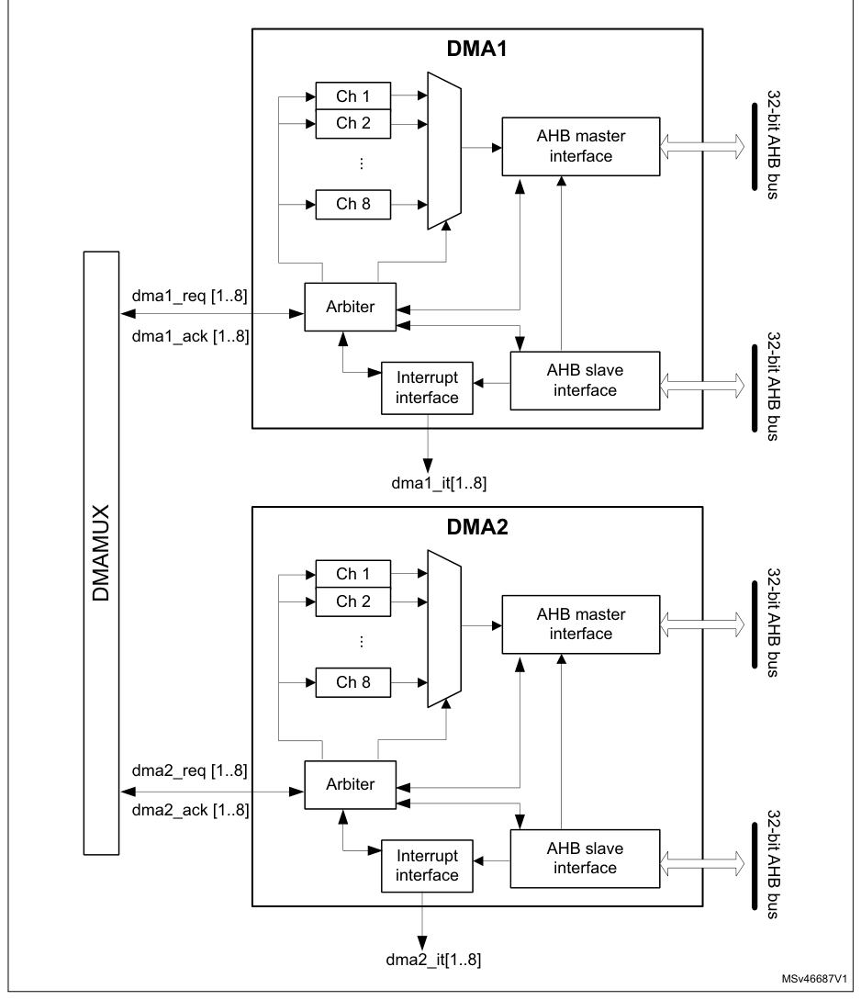

# 12 Direct memory access controller (DMA)

[← RM0440 index](../STM32G4_RM0440.md)

## 12.1 Introduction

The direct memory access (DMA) controller is a bus master and system peripheral.

The DMA is used to perform programmable data transfers between memory-mapped peripherals and/or
memories, upon the control of an off-loaded CPU.

The DMA controller features a single AHB master architecture.

There are two instances of DMA, DMA1 and DMA2 (See Table 87: DMA1 and DMA2 implementation for number
of supported channels).

Each channel is dedicated to managing memory access requests from one or more peripherals. Each DMA
includes an arbiter for handling the priority between DMA requests.

## 12.2 DMA main features

- Single AHB master
- Peripheral-to-memory, memory-to-peripheral, memory-to-memory, and peripheral-to-peripheral data
  transfers
- Access, as source and destination, to on-chip memory-mapped devices such as flash memory, SRAM,
  and AHB and APB peripherals
- All DMA channels are independently configurable:
  - Each channel is associated either with a DMA request signal coming from a peripheral, or with a
    software trigger in memory-to-memory transfers. This configuration is done by software.
  - Priority between the requests is programmable by software (four levels per channel: very high,
    high, medium, low) and by hardware in case of equality (such as request to channel 1 has
    priority over request to channel 2).
  - Transfer size of source and destination are independent (byte, half-word, word), emulating
    packing and unpacking. Source and destination addresses must be aligned on the data size.
  - Support of transfers from/to peripherals to/from memory with circular buffer management
  - Programmable number of data to be transferred: 0 to 216 - 1
- Generation of an interrupt request per channel. Each interrupt request is caused from any of the
  three DMA events: transfer complete, half transfer, or transfer error.

## 12.3 DMA implementation

### 12.3.1 DMA1 and DMA2

DMA1 and DMA2 are implemented with the hardware configuration parameters shown in the table below.

**Table 87. DMA1 and DMA2 implementation**

| Source row | Column 1 | Column 2 | Column 3 | Column 4 |
| ---: | --- | --- | --- | --- |
| 1 | `Feature` | `DMA1` | `DMA2` |  |
| 2 | `Category 2 devices(1)` | `6` | `6` |  |
| 3 | `Number of channels` | `Category 3 devices(1)` | `8` | `8` |
| 4 | `Category 4 devices(1)` | `8` | `8` |  |

1. See Table 1: STM32G4 series memory density.

### 12.3.2 DMA request mapping

For the mapping of the different requests, refer to the DMAMUX section.

## 12.4 DMA functional description

### 12.4.1 DMA block diagram

The DMA block diagram is shown in the figure below.

**Figure 31. DMA block diagram**

DMA1

32-bit AHB bus

Ch 1

Ch 2

AHB master

...

interface

Ch 8
dma1_req [1..8]

Arbiter

32-bit AHB bus
dma1_ack [1..8]

AHB slave

Interrupt
interface
interface
dma1_it[1..8]

DMA2

32-bit AHB bus

Ch 1

DMAMUX

Ch 2

AHB master

...

interface

Ch 8
dma2_req [1..8]

Arbiter

32-bit AHB bus
dma2_ack [1..8]

AHB slave

Interrupt
interface
interface
dma2_it[1..8]

MSv46687V1

> **Note:** See Figure 31: DMA block diagram for feature implementation.

The DMA controller performs direct memory transfer by sharing the AHB system bus with other system
masters. The bus matrix implements round-robin scheduling. DMA requests may stop the CPU access to
the system bus for a number of bus cycles, when CPU and DMA target the same destination (memory or
peripheral).

According to its configuration through the AHB slave interface, the DMA controller arbitrates
between the DMA channels and their associated received requests. The DMA controller also schedules
the DMA data transfers over the single AHB port master.

The DMA controller generates an interrupt per channel to the interrupt controller.

### 12.4.2 DMA pins and internal signals

**Table 88. DMA internal input/output signals**

| Signal name | Signal type | Description |
| --- | --- | --- |
| dma_req[x] | Input | DMA channel x request |
| dma_ack[x] | Output | DMA channel x acknowledge |
| dma_it[x] | Output | DMA channel x interrupt |

### 12.4.3 DMA transfers

The software configures the DMA controller at channel level, to perform a block transfer, composed
of a sequence of AHB bus transfers.

A DMA block transfer may be requested from a peripheral, or triggered by the software in case of
memory-to-memory transfer.

After an event, the following steps of a single DMA transfer occur:

1. The peripheral sends a single DMA request signal to the DMA controller.
2. The DMA controller serves the request, depending on the priority of the channel
   associated to this peripheral request.
3. As soon as the DMA controller grants the peripheral, an acknowledge is sent to the
   peripheral by the DMA controller.
4. The peripheral releases its request as soon as it gets the acknowledge from the DMA
   controller.
5. Once the request is deasserted by the peripheral, the DMA controller releases the
   acknowledge.

The peripheral may order a further single request and initiate another single DMA transfer.

The request/acknowledge protocol is used when a peripheral is either the source or the destination
of the transfer. For example, in case of memory-to-peripheral transfer, the peripheral initiates the
transfer by driving its single request signal to the DMA controller. The DMA controller reads then a
single data in the memory and writes this data to the peripheral.

For a given channel x, a DMA block transfer consists of a repeated sequence of:

- a single DMA transfer, encapsulating two AHB transfers of a single data, over the DMA AHB bus
  master:
  - a single data read (byte, half-word, or word) from the peripheral data register or a location in
    the memory, addressed through an internal current peripheral/memory
    address register. The start address used for the first single transfer is the base address of the
    peripheral or memory, and is programmed in the DMA_CPARx or DMA_CMARx register.
- a single data write (byte, half-word, or word) to the peripheral data register or a location in
  the memory, addressed through an internal current peripheral/memory address register. The start
  address used for the first transfer is the base address of the peripheral or memory, and is
  programmed in the DMA_CPARx or DMA_CMARx register.
- postdecrementing of the programmed DMA_CNDTRx register This register contains the remaining number
  of data items to transfer (number of AHB ‘read followed by write’ transfers).

This sequence is repeated until DMA_CNDTRx is null.

> **Note:** The AHB master bus source/destination address must be aligned with the programmed size
> of the transferred single data to the source/destination.

### 12.4.4 DMA arbitration

The DMA arbiter manages the priority between the different channels.

When an active channel x is granted by the arbiter (hardware requested or software triggered), a
single DMA transfer is issued (such as an AHB ‘read followed by write’ transfer of a single data).
Then, the arbiter considers again the set of active channels and selects the one with the highest
priority.

The priorities are managed in two stages:

- software: priority of each channel is configured in the DMA_CCRx register, to one of the four
  different levels:
  - very high
  - high
  - medium
  - low
- hardware: if two requests have the same software priority level, the channel with the lowest index
  gets priority. For example, channel 2 gets priority over channel 4.

When a channel x is programmed for a block transfer in memory-to-memory mode, re arbitration is
considered between each single DMA transfer of this channel x. Whenever there is another concurrent
active requested channel, the DMA arbiter automatically alternates and grants the other
highest-priority requested channel, which may be of lower priority than the memory-to-memory
channel.

### 12.4.5 DMA channels

Each channel may handle a DMA transfer between a peripheral register located at a fixed address, and
a memory address. The number of data items to transfer is programmable. The register that contains
the number of data items to transfer is decremented after each transfer.

A DMA channel is programmed at block transfer level.

#### Programmable data sizes

The transfer sizes of a single data (byte, half-word, or word) to the peripheral and memory are
programmable through, respectively, the PSIZE[1:0] and MSIZE[1:0] fields of the DMA_CCRx register.

#### Pointer incrementation

The peripheral and memory pointers may be automatically incremented after each transfer, depending
on the PINC and MINC bits of the DMA_CCRx register.

If the incremented mode is enabled (PINC or MINC set to 1), the address of the next transfer is the
address of the previous one incremented by 1, 2 or 4, depending on the data size defined in
PSIZE[1:0] or MSIZE[1:0]. The first transfer address is the one programmed in the DMA_CPARx or
DMA_CMARx register. During transfers, these registers keep the initially programmed value. The
current transfer addresses (in the current internal peripheral/memory address register) are not
accessible by software.

If the channel x is configured in noncircular mode, no DMA request is served after the last data
transfer (once the number of single data to transfer reaches zero). The DMA channel must be disabled
to reload a new number of data items into the DMA_CNDTRx register.

> **Note:** If the channel x is disabled, the DMA registers are not reset. The DMA channel registers

(DMA_CCRx, DMA_CPARx and DMA_CMARx) retain the initial values programmed during the channel
configuration phase.

In circular mode, after the last data transfer, the DMA_CNDTRx register is automatically reloaded
with the initially programmed value. The current internal address registers are reloaded with the
base address values from the DMA_CPARx and DMA_CMARx registers.

#### Channel configuration procedure

The following sequence is needed to configure a DMA channel x:

1. Set the peripheral register address in the DMA_CPARx register.

The data is moved from/to this address to/from the memory after the peripheral event, or after the
channel is enabled in memory-to-memory mode.

2. Set the memory address in the DMA_CMARx register.

The data is written to/read from the memory after the peripheral event or after the channel is
enabled in memory-to-memory mode.

3. Configure the total number of data to transfer in the DMA_CNDTRx register.

After each data transfer, this value is decremented.

4. Configure the parameters listed below in the DMA_CCRx register:
   - the channel priority
   - the data transfer direction
   - the circular mode
   - the peripheral and memory incremented mode
   - the peripheral and memory data size
   - the interrupt enable at half and/or full transfer and/or transfer error

5. Activate the channel by setting the EN bit in the DMA_CCRx register.

A channel, as soon as enabled, may serve any DMA request from the peripheral connected to this
channel, or may start a memory-to-memory block transfer.

> **Note:** The two last steps of the channel configuration procedure may be merged into a single
> access to the DMA_CCRx register, to configure and enable the channel.

#### Channel state and disabling a channel

A channel x in the active state is an enabled channel (read DMA_CCRx.EN = 1). An active channel x is
a channel that must have been enabled by the software (DMA_CCRx.EN set to 1) and afterwards with no
occurred transfer error (DMA_ISR.TEIFx = 0). In case there is a transfer error, the channel is
automatically disabled by hardware (DMA_CCRx.EN = 0).

The three following use cases may happen:

- Suspend and resume a channel

This corresponds to the two following actions:

- An active channel is disabled by software (writing DMA_CCRx.EN = 0 whereas DMA_CCRx.EN = 1).
- The software enables the channel again (DMA_CCRx.EN set to 1) without reconfiguring the other
  channel registers (such as DMA_CNDTRx, DMA_CPARx and DMA_CMARx).

This case is not supported by the DMA hardware, which does not guarantee that the remaining data
transfers are performed correctly.

- Stop and abort a channel

If the application does not need anymore the channel, this active channel can be disabled by
software. The channel is stopped and aborted but the DMA_CNDTRx register content may not correctly
reflect the remaining data transfers versus the aborted source and destination buffer/register.

- Abort and restart a channel

This corresponds to the software sequence: disable an active channel, then reconfigure the channel
and enable it again.

This is supported by the hardware if the following conditions are met:

- The application guarantees that, when the software is disabling the channel, a DMA data transfer
  is not occurring at the same time over its master port. For example, the application can first
  disable the peripheral in DMA mode, to ensure that there is no pending hardware DMA request from
  this peripheral.
- The software must operate separated write accesses to the same DMA_CCRx register: First disable
  the channel. Second reconfigure the channel for a next block transfer including the DMA_CCRx if a
  configuration change is needed. There are read-only DMA_CCRx register fields when DMA_CCRx.EN=1.
  Finally enable again the channel.

When a channel transfer error occurs, the EN bit of the DMA_CCRx register is cleared by hardware.
This EN bit cannot be set again by software to reactivate the channel x, until the TEIFx bit of the
DMA_ISR register is set.

#### Circular mode (in memory-to-peripheral/peripheral-to-memory transfers)

The circular mode is available to handle circular buffers and continuous data flows (such as ADC
scan mode). This feature is enabled using the CIRC bit in the DMA_CCRx register.

> **Note:** The circular mode must not be used in memory-to-memory mode. Before enabling a
> channel in circular mode (CIRC = 1), the software must clear the MEM2MEM bit of the DMA_CCRx
> register. When the circular mode is activated, the amount of data to transfer is
> automatically reloaded with the initial value programmed during the channel configuration phase, and
> the DMA requests continue to be served.

To stop a circular transfer, the software needs to stop the peripheral from generating DMA requests
(such as quit the ADC scan mode), before disabling the DMA channel. The software must explicitly
program the DMA_CNDTRx value before starting/enabling a transfer, and after having stopped a
circular transfer.

#### Memory-to-memory mode

The DMA channels may operate without being triggered by a request from a peripheral. This mode is
called memory-to-memory mode, and is initiated by software.

If the MEM2MEM bit in the DMA_CCRx register is set, the channel, if enabled, initiates transfers.
The transfer stops once the DMA_CNDTRx register reaches zero.

> **Note:** The memory-to-memory mode must not be used in circular mode. Before enabling a
> channel in memory-to-memory mode (MEM2MEM = 1), the software must clear the CIRC bit of the DMA_CCRx
> register.

#### Peripheral-to-peripheral mode

Any DMA channel can operate in peripheral-to-peripheral mode:

- when the hardware request from a peripheral is selected to trigger the DMA channel

This peripheral is the DMA initiator and paces the data transfer from/to this peripheral to/from a
register belonging to another memory-mapped peripheral (this one being not configured in DMA mode).

- when no peripheral request is selected and connected to the DMA channel

The software configures a register-to-register transfer by setting the MEM2MEM bit of the DMA_CCRx
register.

#### Programming transfer direction, assigning source/destination

The value of the DIR bit of the DMA_CCRx register sets the direction of the transfer, and
consequently, it identifies the source and the destination, regardless of the source/destination
type (peripheral or memory):

- DIR = 1 defines typically a memory-to-peripheral transfer. More generally, if DIR = 1:
  - The source attributes are defined by the DMA_MARx register, the MSIZE[1:0] field, and the MINC
    bit of the DMA_CCRx register. Regardless of their usual naming, these ‘memory’ register, field,
    and bit are used to define the source peripheral in peripheral-to-peripheral mode.
  - The destination attributes are defined by the DMA_PARx register, the PSIZE[1:0] field and the
    PINC bit of the DMA_CCRx register. Regardless of their usual naming, these ‘peripheral’
    register, field, and bit are used to define the destination memory in memory-to-memory mode.
- DIR = 0 defines typically a peripheral-to-memory transfer. More generally, if DIR = 0:
  - The source attributes are defined by the DMA_PARx register, the PSIZE[1:0] field and the PINC
    bit of the DMA_CCRx register. Regardless of their usual naming, these ‘peripheral’ register,
    field, and bit are used to define the source memory in memory-to-memory mode
  - The destination attributes are defined by the DMA_MARx register, the MSIZE[1:0] field and the
    MINC bit of the DMA_CCRx register.

Regardless of their usual naming, these ‘memory’ register, field, and bit are used to define the
destination peripheral in peripheral-to-peripheral mode.

### 12.4.6 DMA data width, alignment, and endianness

When PSIZE[1:0] and MSIZE[1:0] are not equal, the DMA controller performs some data alignments as
described in the table below.

**Table 89. Programmable data width and endian behavior (when PINC = MINC = 1)**

| Source row | Column 1 | Column 2 | Column 3 |
| ---: | --- | --- | --- |
| 1 | `Source Destinat` |  |  |
| 2 | `port` | `ion port` | `Destination` |
| 3 | `Number Source content:` |  |  |
| 4 | `width` | `width` | `content:` |
| 5 | `of data address / data` |  |  |
| 6 | `(MSIZE` | `(PSIZE` | `address / data` |
| 7 | `items to` | `(DMA_CMARx if` | `DMA transfers` |
| 8 | `if` | `if` | `(DMA_CPARx if` |
| 9 | `transfer DIR = 1, else` |  |  |
| 10 | `DIR = 1,` | `DIR = 1,` | `DIR = 1, else` |
| 11 | `(NDT) DMA_CPARx)` |  |  |
| 12 | `else` | `else` | `DMA_CMARx)` |
| 13 | `PSIZE) MSIZE)` |  |  |
| 14 | `@0x0 / B0` | `1: read B0[7:0] @0x0 then write B0[7:0] @0x0` | `@0x0 / B0` |
| 15 | `@0x1 / B1` | `2: read B1[7:0] @0x1 then write B1[7:0] @0x1` | `@0x1 / B1` |
| 16 | `8` | `8` | `4` |
| 17 | `@0x2 / B2` | `3: read B2[7:0] @0x2 then write B2[7:0] @0x2` | `@0x2 / B2` |
| 18 | `@0x3 / B3` | `4: read B3[7:0] @0x3 then write B3[7:0] @0x3` | `@0x3 / B3` |
| 19 | `@0x0 / B0` | `1: read B0[7:0] @0x0 then write 00B0[15:0] @0x0` | `@0x0 / 00B0` |
| 20 | `@0x1 / B1` | `2: read B1[7:0] @0x1 then write 00B1[15:0] @0x2` | `@0x2 / 00B1` |
| 21 | `8` | `16` | `4` |
| 22 | `@0x2 / B2` | `3: read B2[7:0] @0x2 then write 00B2[15:0] @0x4` | `@0x4 / 00B2` |
| 23 | `@0x3 / B3` | `4: read B3[7:0] @0x3 then write 00B3[15:0] @0x6` | `@0x6 / 00B3` |
| 24 | `@0x0 / B0` | `1: read B0[7:0] @0x0 then write 000000B0[31:0] @0x0` | `@0x0 / 000000B0` |
| 25 | `@0x1 / B1` | `2: read B1[7:0] @0x1 then write 000000B1[31:0] @0x4` | `@0x4 / 000000B1` |
| 26 | `8` | `32` | `4` |
| 27 | `@0x2 / B2` | `3: read B2[7:0] @0x2 then write 000000B2[31:0] @0x8` | `@0x8 / 000000B2` |
| 28 | `@0x3 / B3` | `4: read B3[7:0] @0x3 then write 000000B3[31:0] @0xC` | `@0xC / 000000B3` |
| 29 | `@0x0 / B1B0` | `1: read B1B0[15:0] @0x0 then write B0[7:0] @0x0` | `@0x0 / B0` |
| 30 | `@0x2 / B3B2` | `2: read B3B2[15:0] @0x2 then write B2[7:0] @0x1` | `@0x1 / B2` |
| 31 | `16` | `8` | `4` |
| 32 | `@0x4 / B5B4` | `3: read B5B4[15:0] @0x4 then write B4[7:0] @0x2` | `@0x2 / B4` |
| 33 | `@0x6 / B7B6` | `4: read B7B6[15:0] @0x6 then write B6[7:0] @0x3` | `@0x3 / B6` |
| 34 | `@0x0 / B1B0` | `1: read B1B0[15:0] @0x0 then write B1B0[15:0] @0x0` | `@0x0 / B1B0` |
| 35 | `@0x2 / B3B2` | `2: read B3B2[15:0] @0x2 then write B3B2[15:0] @0x2` | `@0x2 / B3B2` |
| 36 | `16` | `16` | `4` |
| 37 | `@0x4 / B5B4` | `3: read B5B4[15:0] @0x4 then write B5B4[15:0] @0x4` | `@0x4 / B5B4` |
| 38 | `@0x6 / B7B6` | `4: read B7B6[15:0] @0x6 then write B7B6[15:0] @0x6` | `@0x6 / B7B6` |
| 39 | `@0x0 / B1B0` | `1: read B1B0[15:0] @0x0 then write 0000B1B0[31:0] @0x0` | `@0x0 / 0000B1B0` |
| 40 | `@0x2 / B3B2` | `2: read B3B2[15:0] @0x2 then write 0000B3B2[31:0] @0x4` | `@0x4 / 0000B3B2` |
| 41 | `16` | `32` | `4` |
| 42 | `@0x4 / B5B4` | `3: read B5B4[15:0] @0x4 then write 0000B5B4[31:0] @0x8` | `@0x8 / 0000B5B4` |
| 43 | `@0x6 / B7B6` | `4: read B7B6[15:0] @0x6 then write 0000B7B6[31:0] @0xC` | `@0xC / 0000B7B6` |
| 44 | `@0x0 / B3B2B1B0` | `1: read B3B2B1B0[31:0] @0x0 then write B0[7:0] @0x0` | `@0x0 / B0` |
| 45 | `@0x4 / B7B6B5B4` | `2: read B7B6B5B4[31:0] @0x4 then write B4[7:0] @0x1` | `@0x1 / B4` |
| 46 | `32` | `8` | `4` |
| 47 | `@0x8 / BBBAB9B8` | `3: read BBBAB9B8[31:0] @0x8 then write B8[7:0] @0x2` | `@0x2 / B8` |
| 48 | `@0xC / BFBEBDBC` | `4: read BFBEBDBC[31:0] @0xC then write BC[7:0] @0x3` | `@0x3 / BC` |
| 49 | `@0x0 / B3B2B1B0` | `1: read B3B2B1B0[31:0] @0x0 then write B1B0[15:0] @0x0` | `@0x0 / B1B0` |
| 50 | `@0x4 / B7B6B5B4` | `2: read B7B6B5B4[31:0] @0x4 then write B5B4[15:0] @0x2` | `@0x2 / B5B4` |
| 51 | `32` | `16` | `4` |
| 52 | `@0x8 / BBBAB9B8` | `3: read BBBAB9B8[31:0] @0x8 then write B9B8[15:0] @0x4` | `@0x4 / B9B8` |
| 53 | `@0xC / BFBEBDBC` | `4: read BFBEBDBC[31:0] @0xC then write BDBC[15:0] @0x6` | `@0x6 / BDBC` |
| 54 | `@0x0 / B3B2B1B0` | `1: read B3B2B1B0[31:0] @0x0 then write B3B2B1B0[31:0] @0x0` | `@0x0 / B3B2B1B0` |
| 55 | `@0x4 / B7B6B5B4` | `2: read B7B6B5B4[31:0] @0x4 then write B7B6B5B4[31:0] @0x4` | `@0x4 / B7B6B5B4` |
| 56 | `32` | `32` | `4` |
| 57 | `@0x8 / BBBAB9B8` | `3: read BBBAB9B8[31:0] @0x8 then write BBBAB9B8[31:0] @0x8` | `@0x8 / BBBAB9B8` |
| 58 | `@0xC / BFBEBDBC` | `4: read BFBEBDBC[31:0] @0xC then write BFBEBDBC[31:0] @0xC` | `@0xC / BFBEBDBC` |

#### Addressing AHB peripherals not supporting byte/half-word write transfers

When the DMA controller initiates an AHB byte or half-word write transfer, the data are duplicated
on the unused lanes of the AHB master 32-bit data bus (HWDATA[31:0]).

When the AHB slave peripheral does not support byte or half-word write transfers and does not
generate any error, the DMA controller writes the 32 HWDATA bits as shown in the two examples below:

- To write the half-word 0xABCD, the DMA controller sets the HWDATA bus to 0xABCDABCD with a
  half-word data size (HSIZE = HalfWord in the AHB master bus).
- To write the byte 0xAB, the DMA controller sets the HWDATA bus to 0xABABABAB with a byte data size
  (HSIZE = Byte in the AHB master bus).

Assuming the AHB/APB bridge is an AHB 32-bit slave peripheral that does not take into account the
HSIZE data, any AHB byte or half-word transfer is changed into a 32-bit APB transfer as described
below:

- An AHB byte write transfer of 0xB0 to one of the 0x0, 0x1, 0x2, or 0x3 addresses, is converted to
  an APB word write transfer of 0xB0B0B0B0 to the 0x0 address.
- An AHB half-word write transfer of 0xB1B0 to the 0x0 or 0x2 addresses is converted to an APB word
  write transfer of 0xB1B0B1B0 to the 0x0 address.

### 12.4.7 DMA error management

A DMA transfer error is generated when reading from or writing to a reserved address space. When a
DMA transfer error occurs during a DMA read or write access, the faulty channel x is automatically
disabled through a hardware clear of its EN bit in the corresponding DMA_CCRx register.

The TEIFx bit of the DMA_ISR register is set. An interrupt is then generated if the TEIE bit of the
DMA_CCRx register is set.

The EN bit of the DMA_CCRx register cannot be set again by software (channel x reactivated) until
the TEIFx bit of the DMA_ISR register is cleared (by setting the CTEIFx bit of the DMA_IFCR
register).

When the software is notified with a transfer error over a channel, which involves a peripheral, the
software has first to stop this peripheral in DMA mode, in order to disable any pending or future
DMA request. Then software may normally reconfigure both the DMA and the peripheral in DMA mode for
a new transfer.

## 12.5 DMA interrupts

An interrupt can be generated on a half transfer, transfer complete, or transfer error for each DMA
channel x. Separate interrupt enable bits are available for flexibility.

**Table 90. DMA interrupt requests**

| Source row | Column 1 | Column 2 | Column 3 |
| ---: | --- | --- | --- |
| 1 | `Interrupt` |  |  |
| 2 | `Interrupt request` | `Interrupt event` | `Event flag` |
| 3 | `enable bit` |  |  |
| 4 | `Half transfer on channel x` | `HTIFx` | `HTIEx` |
| 5 | `Transfer complete on channel x` | `TCIFx` | `TCIEx` |
| 6 | `Channel x interrupt` |  |  |
| 7 | `Transfer error on channel x` | `TEIFx` | `TEIEx` |
| 8 | `Half transfer or transfer complete or transfer error on channel x` | `GIFx` | `-` |

## 12.6 DMA registers

Refer to [Section 1.2](chapter-01.md#12-list-of-abbreviations-for-registers) for a list of abbreviations used in register descriptions.

The DMA registers have to be accessed by words (32-bit).

> **Note:** See Figure 31: DMA block diagram for feature implementation.

### 12.6.1 DMA interrupt status register (DMA_ISR)

- **Address offset:** 0x00
- **Reset value:** 0x0000 0000

Every status bit is cleared by hardware when the software sets the corresponding clear bit or the
corresponding global clear bit CGIFx, in the DMA_IFCR register.

**Register bit layout**

| Bit | Field | Access | Summary |
| ---: | --- | :---: | --- |
| 31 | `TEIF8` | r | Transfer error (TE) flag for channel 8 |
| 30 | `HTIF8` | r | Half transfer (HT) flag for channel 8 |
| 29 | `TCIF8` | r | Transfer complete (TC) flag for channel 8 |
| 28 | `GIF8` | r | Global interrupt flag for channel 8 |
| 27 | `TEIF7` | r | Transfer error (TE) flag for channel 7 |
| 26 | `HTIF7` | r | Half transfer (HT) flag for channel 7 |
| 25 | `TCIF7` | r | Transfer complete (TC) flag for channel 7 |
| 24 | `GIF7` | r | Global interrupt flag for channel 7 |
| 23 | `TEIF6` | r | Transfer error (TE) flag for channel 6 |
| 22 | `HTIF6` | r | Half transfer (HT) flag for channel 6 |
| 21 | `TCIF6` | r | Transfer complete (TC) flag for channel 6 |
| 20 | `GIF6` | r | Global interrupt flag for channel 6 |
| 19 | `TEIF5` | r | Transfer error (TE) flag for channel 5 |
| 18 | `HTIF5` | r | Half transfer (HT) flag for channel 5 |
| 17 | `TCIF5` | r | Transfer complete (TC) flag for channel 5 |
| 16 | `GIF5` | r | global interrupt flag for channel 5 |
| 15 | `TEIF4` | r | Transfer error (TE) flag for channel 4 |
| 14 | `HTIF4` | r | Half transfer (HT) flag for channel 4 |
| 13 | `TCIF4` | r | Transfer complete (TC) flag for channel 4 |
| 12 | `GIF4` | r | global interrupt flag for channel 4 |
| 11 | `TEIF3` | r | Transfer error (TE) flag for channel 3 |
| 10 | `HTIF3` | r | Half transfer (HT) flag for channel 3 |
| 9 | `TCIF3` | r | Transfer complete (TC) flag for channel 3 |
| 8 | `GIF3` | r | Global interrupt flag for channel 3 |
| 7 | `TEIF2` | r | Transfer error (TE) flag for channel 2 |
| 6 | `HTIF2` | r | Half transfer (HT) flag for channel 2 |
| 5 | `TCIF2` | r | Transfer complete (TC) flag for channel 2 |
| 4 | `GIF2` | r | Global interrupt flag for channel 2 |
| 3 | `TEIF1` | r | Transfer error (TE) flag for channel 1 |
| 2 | `HTIF1` | r | Half transfer (HT) flag for channel 1 |
| 1 | `TCIF1` | r | Transfer complete (TC) flag for channel 1 |
| 0 | `GIF1` | r | Global interrupt flag for channel 1 |

**Bit 31 — `TEIF8`:** Transfer error (TE) flag for channel 8

- `0`: No TE event
- `1`: A TE event occurred.

**Bit 30 — `HTIF8`:** Half transfer (HT) flag for channel 8

- `0`: No HT event
- `1`: An HT event occurred.

**Bit 29 — `TCIF8`:** Transfer complete (TC) flag for channel 8

- `0`: No TC event
- `1`: A TC event occurred.

**Bit 28 — `GIF8`:** Global interrupt flag for channel 8

- `0`: No TE, HT, or TC event
- `1`: A TE, HT, or TC event occurred.

**Bit 27 — `TEIF7`:** Transfer error (TE) flag for channel 7

- `0`: No TE event
- `1`: A TE event occurred.

**Bit 26 — `HTIF7`:** Half transfer (HT) flag for channel 7

- `0`: No HT event
- `1`: An HT event occurred.

**Bit 25 — `TCIF7`:** Transfer complete (TC) flag for channel 7

- `0`: No TC event
- `1`: A TC event occurred.

**Bit 24 — `GIF7`:** Global interrupt flag for channel 7

- `0`: No TE, HT, or TC event
- `1`: A TE, HT, or TC event occurred.

**Bit 23 — `TEIF6`:** Transfer error (TE) flag for channel 6

- `0`: No TE event
- `1`: A TE event occurred.

**Bit 22 — `HTIF6`:** Half transfer (HT) flag for channel 6

- `0`: No HT event

1:An HT event occurred.

**Bit 21 — `TCIF6`:** Transfer complete (TC) flag for channel 6

- `0`: No TC event
- `1`: A TC event occurred.

**Bit 20 — `GIF6`:** Global interrupt flag for channel 6

- `0`: No TE, HT, or TC event
- `1`: A TE, HT, or TC event occurred.

**Bit 19 — `TEIF5`:** Transfer error (TE) flag for channel 5

- `0`: No TE event
- `1`: A TE event occurred.

**Bit 18 — `HTIF5`:** Half transfer (HT) flag for channel 5

- `0`: No HT event
- `1`: An HT event occurred.

**Bit 17 — `TCIF5`:** Transfer complete (TC) flag for channel 5

- `0`: No TC event
- `1`: A TC event occurred.

**Bit 16 — `GIF5`:** global interrupt flag for channel 5

- `0`: No TE, HT, or TC event
- `1`: A TE, HT, or TC event occurred.

**Bit 15 — `TEIF4`:** Transfer error (TE) flag for channel 4

- `0`: No TE event
- `1`: A TE event occurred.

**Bit 14 — `HTIF4`:** Half transfer (HT) flag for channel 4

- `0`: No HT event
- `1`: An HT event occurred.

**Bit 13 — `TCIF4`:** Transfer complete (TC) flag for channel 4

- `0`: No TC event
- `1`: A TC event occurred.

**Bit 12 — `GIF4`:** global interrupt flag for channel 4

- `0`: No TE, HT, or TC event
- `1`: A TE, HT, or TC event occurred.

**Bit 11 — `TEIF3`:** Transfer error (TE) flag for channel 3

- `0`: No TE event
- `1`: A TE event occurred.

**Bit 10 — `HTIF3`:** Half transfer (HT) flag for channel 3

- `0`: No HT event
- `1`: An HT event occurred.

**Bit 9 — `TCIF3`:** Transfer complete (TC) flag for channel 3

- `0`: No TC event
- `1`: A TC event occurred.

**Bit 8 — `GIF3`:** Global interrupt flag for channel 3

- `0`: No TE, HT, or TC event
- `1`: A TE, HT, or TC event occurred.

**Bit 7 — `TEIF2`:** Transfer error (TE) flag for channel 2

- `0`: No TE event
- `1`: A TE event occurred.

**Bit 6 — `HTIF2`:** Half transfer (HT) flag for channel 2

- `0`: No HT event
- `1`: An HT event occurred.

**Bit 5 — `TCIF2`:** Transfer complete (TC) flag for channel 2

- `0`: No TC event
- `1`: A TC event occurred.

**Bit 4 — `GIF2`:** Global interrupt flag for channel 2

- `0`: No TE, HT, or TC event
- `1`: A TE, HT, or TC event occurred.

**Bit 3 — `TEIF1`:** Transfer error (TE) flag for channel 1

- `0`: No TE event
- `1`: A TE event occurred.

**Bit 2 — `HTIF1`:** Half transfer (HT) flag for channel 1

- `0`: No HT event
- `1`: An HT event occurred.

**Bit 1 — `TCIF1`:** Transfer complete (TC) flag for channel 1

- `0`: No TC event
- `1`: A TC event occurred.

**Bit 0 — `GIF1`:** Global interrupt flag for channel 1

- `0`: No TE, HT, or TC event
- `1`: A TE, HT, or TC event occurred.

### 12.6.2 DMA interrupt flag clear register (DMA_IFCR)

- **Address offset:** 0x04
- **Reset value:** 0x0000 0000

Setting the global clear bit CGIFx of the channel x in this DMA_IFCR register, causes the DMA
hardware to clear the corresponding GIFx bit and any individual flag among TEIFx, HTIFx, TCIFx, in
the DMA_ISR register.

Setting any individual clear bit among CTEIFx, CHTIFx, CTCIFx in this DMA_IFCR register, causes the
DMA hardware to clear the corresponding individual flag and the global flag GIFx in the DMA_ISR
register, provided that none of the two other individual flags is set.

Writing 0 into any flag clear bit has no effect.

**Register bit layout**

| Bit | Field | Access | Summary |
| ---: | --- | :---: | --- |
| 31 | `CTEIF8` | w | Transfer error flag clear for channel 8 |
| 30 | `CHTIF8` | w | Half transfer flag clear for channel 8 |
| 29 | `CTCIF8` | w | Transfer complete flag clear for channel 8 |
| 28 | `CGIF8` | w | Global interrupt flag clear for channel 8 |
| 27 | `CTEIF7` | w | Transfer error flag clear for channel 7 |
| 26 | `CHTIF7` | w | Half transfer flag clear for channel 7 |
| 25 | `CTCIF7` | w | Transfer complete flag clear for channel 7 |
| 24 | `CGIF7` | w | Global interrupt flag clear for channel 7 |
| 23 | `CTEIF6` | w | Transfer error flag clear for channel 6 |
| 22 | `CHTIF6` | w | Half transfer flag clear for channel 6 |
| 21 | `CTCIF6` | w | Transfer complete flag clear for channel 6 |
| 20 | `CGIF6` | w | Global interrupt flag clear for channel 6 |
| 19 | `CTEIF5` | w | Transfer error flag clear for channel 5 |
| 18 | `CHTIF5` | w | Half transfer flag clear for channel 5 |
| 17 | `CTCIF5` | w | Transfer complete flag clear for channel 5 |
| 16 | `CGIF5` | w | Global interrupt flag clear for channel 5 |
| 15 | `CTEIF4` | w | Transfer error flag clear for channel 4 |
| 14 | `CHTIF4` | w | Half transfer flag clear for channel 4 |
| 13 | `CTCIF4` | w | Transfer complete flag clear for channel 4 |
| 12 | `CGIF4` | w | Global interrupt flag clear for channel 4 |
| 11 | `CTEIF3` | w | Transfer error flag clear for channel 3 |
| 10 | `CHTIF3` | w | Half transfer flag clear for channel 3 |
| 9 | `CTCIF3` | w | Transfer complete flag clear for channel 3 |
| 8 | `CGIF3` | w | Global interrupt flag clear for channel 3 |
| 7 | `CTEIF2` | w | Transfer error flag clear for channel 2 |
| 6 | `CHTIF2` | w | Half transfer flag clear for channel 2 |
| 5 | `CTCIF2` | w | Transfer complete flag clear for channel 2 |
| 4 | `CGIF2` | w | Global interrupt flag clear for channel 2 |
| 3 | `CTEIF1` | w | Transfer error flag clear for channel 1 |
| 2 | `CHTIF1` | w | Half transfer flag clear for channel 1 |
| 1 | `CTCIF1` | w | Transfer complete flag clear for channel 1 |
| 0 | `CGIF1` | w | Global interrupt flag clear for channel 1 |

**Bit 31 — `CTEIF8`:** Transfer error flag clear for channel 8

**Bit 30 — `CHTIF8`:** Half transfer flag clear for channel 8

**Bit 29 — `CTCIF8`:** Transfer complete flag clear for channel 8

**Bit 28 — `CGIF8`:** Global interrupt flag clear for channel 8

**Bit 27 — `CTEIF7`:** Transfer error flag clear for channel 7

**Bit 26 — `CHTIF7`:** Half transfer flag clear for channel 7

**Bit 25 — `CTCIF7`:** Transfer complete flag clear for channel 7

**Bit 24 — `CGIF7`:** Global interrupt flag clear for channel 7

**Bit 23 — `CTEIF6`:** Transfer error flag clear for channel 6

**Bit 22 — `CHTIF6`:** Half transfer flag clear for channel 6

**Bit 21 — `CTCIF6`:** Transfer complete flag clear for channel 6

**Bit 20 — `CGIF6`:** Global interrupt flag clear for channel 6

**Bit 19 — `CTEIF5`:** Transfer error flag clear for channel 5

**Bit 18 — `CHTIF5`:** Half transfer flag clear for channel 5

**Bit 17 — `CTCIF5`:** Transfer complete flag clear for channel 5

**Bit 16 — `CGIF5`:** Global interrupt flag clear for channel 5

**Bit 15 — `CTEIF4`:** Transfer error flag clear for channel 4

**Bit 14 — `CHTIF4`:** Half transfer flag clear for channel 4

**Bit 13 — `CTCIF4`:** Transfer complete flag clear for channel 4

**Bit 12 — `CGIF4`:** Global interrupt flag clear for channel 4

**Bit 11 — `CTEIF3`:** Transfer error flag clear for channel 3

**Bit 10 — `CHTIF3`:** Half transfer flag clear for channel 3

**Bit 9 — `CTCIF3`:** Transfer complete flag clear for channel 3

**Bit 8 — `CGIF3`:** Global interrupt flag clear for channel 3

**Bit 7 — `CTEIF2`:** Transfer error flag clear for channel 2

**Bit 6 — `CHTIF2`:** Half transfer flag clear for channel 2

**Bit 5 — `CTCIF2`:** Transfer complete flag clear for channel 2

**Bit 4 — `CGIF2`:** Global interrupt flag clear for channel 2

**Bit 3 — `CTEIF1`:** Transfer error flag clear for channel 1

**Bit 2 — `CHTIF1`:** Half transfer flag clear for channel 1

**Bit 1 — `CTCIF1`:** Transfer complete flag clear for channel 1

**Bit 0 — `CGIF1`:** Global interrupt flag clear for channel 1

### 12.6.3 DMA channel x configuration register (DMA_CCRx)

- **Address offset:** 0x08 \+ 0x14 \* (x - 1), (x = 1 to 8)
- **Reset value:** 0x0000 0000

The register fields/bits MEM2MEM, PL[1:0], MSIZE[1:0], PSIZE[1:0], MINC, PINC, and DIR are read-only
when EN = 1.

The states of MEM2MEM and CIRC bits must not be both high at the same time.

**Register bit layout**

| Bit | Field | Access | Summary |
| ---: | --- | :---: | --- |
| 31 | Reserved | — | kept at reset value. |
| 30 | Reserved | — | ↳ |
| 29 | Reserved | — | ↳ |
| 28 | Reserved | — | ↳ |
| 27 | Reserved | — | ↳ |
| 26 | Reserved | — | ↳ |
| 25 | Reserved | — | ↳ |
| 24 | Reserved | — | ↳ |
| 23 | Reserved | — | ↳ |
| 22 | Reserved | — | ↳ |
| 21 | Reserved | — | ↳ |
| 20 | Reserved | — | ↳ |
| 19 | Reserved | — | ↳ |
| 18 | Reserved | — | ↳ |
| 17 | Reserved | — | ↳ |
| 16 | Reserved | — | ↳ |
| 15 | Reserved | — | ↳ |
| 14 | `MEM2MEM` | rw | Memory-to-memory mode |
| 13 | `PL[1]` | rw | Priority level |
| 12 | `PL[0]` | rw | ↳ |
| 11 | `MSIZE[1]` | rw | Memory size |
| 10 | `MSIZE[0]` | rw | ↳ |
| 9 | `PSIZE[1]` | rw | Peripheral size |
| 8 | `PSIZE[0]` | rw | ↳ |
| 7 | `MINC` | rw | Memory increment mode |
| 6 | `PINC` | rw | Peripheral increment mode |
| 5 | `CIRC` | rw | Circular mode |
| 4 | `DIR` | rw | Data transfer direction |
| 3 | `TEIE` | rw | Transfer error interrupt enable |
| 2 | `HTIE` | rw | Half transfer interrupt enable |
| 1 | `TCIE` | rw | Transfer complete interrupt enable |
| 0 | `EN` | rw | Channel enable |

**Bits 31:15 — Reserved:** kept at reset value.

**Bit 14 — `MEM2MEM`:** Memory-to-memory mode

- `0`: Disabled
- `1`: Enabled

> **Note:** This bit is set and cleared by software. It must not be written when the channel is
> enabled (EN = 1). It is read-only when the channel is enabled (EN = 1).

**Bits 13:12 — `PL[1:0]`:** Priority level

- `00`: Low
- `01`: Medium
- `10`: High
- `11`: Very high

> **Note:** This bitfield is set and cleared by software. It must not be written when the channel is
> enabled (EN = 1). It is read-only when the channel is enabled (EN = 1).

**Bits 11:10 — `MSIZE[1:0]`:** Memory size

Defines the data size of each DMA transfer to the identified memory.

In memory-to-memory mode, this bitfield identifies the memory source if DIR = 1 and the
memory destination if DIR = 0.

In peripheral-to-peripheral mode, this bitfield identifies the peripheral source if DIR = 1 and
the peripheral destination if DIR = 0.

- `00`: 8 bits
- `01`: 16 bits
- `10`: 32 bits
- `11`: Reserved

> **Note:** This bitfield is set and cleared by software. It must not be written when the channel is
> enabled (EN = 1). It is read-only when the channel is enabled (EN = 1).

**Bits 9:8 — `PSIZE[1:0]`:** Peripheral size

Defines the data size of each DMA transfer to the identified peripheral.

In memory-to-memory mode, this bitfield identifies the memory destination if DIR = 1 and the
memory source if DIR = 0.

In peripheral-to-peripheral mode, this bitfield identifies the peripheral destination if DIR = 1
and the peripheral source if DIR = 0.

- `00`: 8 bits
- `01`: 16 bits
- `10`: 32 bits
- `11`: Reserved

> **Note:** This bitfield is set and cleared by software. It must not be written when the channel is
> enabled (EN = 1). It is read-only when the channel is enabled (EN = 1).

**Bit 7 — `MINC`:** Memory increment mode

Defines the increment mode for each DMA transfer to the identified memory.

In memory-to-memory mode, this bit identifies the memory source if DIR = 1 and the memory
destination if DIR = 0.

In peripheral-to-peripheral mode, this bit identifies the peripheral source if DIR = 1 and the
peripheral destination if DIR = 0.

- `0`: Disabled
- `1`: Enabled

> **Note:** This bit is set and cleared by software. It must not be written when the channel is
> enabled (EN = 1). It is read-only when the channel is enabled (EN = 1).

**Bit 6 — `PINC`:** Peripheral increment mode

Defines the increment mode for each DMA transfer to the identified peripheral.

n memory-to-memory mode, this bit identifies the memory destination if DIR = 1 and the
memory source if DIR = 0.

In peripheral-to-peripheral mode, this bit identifies the peripheral destination if DIR = 1 and
the peripheral source if DIR = 0.

- `0`: Disabled
- `1`: Enabled

> **Note:** This bit is set and cleared by software. It must not be written when the channel is
> enabled (EN = 1). It is read-only when the channel is enabled (EN = 1).

**Bit 5 — `CIRC`:** Circular mode

- `0`: Disabled
- `1`: Enabled

> **Note:** This bit is set and cleared by software. It must not be written when the channel is
> enabled (EN = 1). It is not read-only when the channel is enabled (EN = 1).

**Bit 4 — `DIR`:** Data transfer direction

This bit must be set only in memory-to-peripheral and peripheral-to-memory modes.

- `0`: Read from peripheral
  - Source attributes are defined by PSIZE and PINC, plus the DMA_CPARx register.

This is still valid in a memory-to-memory mode.

- Destination attributes are defined by MSIZE and MINC, plus the DMA_CMARx
  register. This is still valid in a peripheral-to-peripheral mode.
- `1`: Read from memory
  - Destination attributes are defined by PSIZE and PINC, plus the DMA_CPARx
    register. This is still valid in a memory-to-memory mode.
- Source attributes are defined by MSIZE and MINC, plus the DMA_CMARx register.

This is still valid in a peripheral-to-peripheral mode.

> **Note:** This bit is set and cleared by software. It must not be written when the channel is
> enabled (EN = 1). It is read-only when the channel is enabled (EN = 1).

**Bit 3 — `TEIE`:** Transfer error interrupt enable

- `0`: Disabled
- `1`: Enabled

> **Note:** This bit is set and cleared by software. It must not be written when the channel is
> enabled (EN = 1). It is not read-only when the channel is enabled (EN = 1).

**Bit 2 — `HTIE`:** Half transfer interrupt enable

- `0`: Disabled
- `1`: Enabled

> **Note:** This bit is set and cleared by software. It must not be written when the channel is
> enabled (EN = 1). It is not read-only when the channel is enabled (EN = 1).

**Bit 1 — `TCIE`:** Transfer complete interrupt enable

- `0`: Disabled
- `1`: Enabled

> **Note:** This bit is set and cleared by software. It must not be written when the channel is
> enabled (EN = 1). It is not read-only when the channel is enabled (EN = 1).

**Bit 0 — `EN`:** Channel enable

When a channel transfer error occurs, this bit is cleared by hardware. It can not be set again
by software (channel x re-activated) until the TEIFx bit of the DMA_ISR register is cleared

(by setting the CTEIFx bit of the DMA_IFCR register).

- `0`: Disabled
- `1`: Enabled

> **Note:** This bit is set and cleared by software.

### 12.6.4 DMA channel x number of data to transfer register (DMA_CNDTRx)

- **Address offset:** 0x0C \+ 0x14 \* (x - 1), (x = 1 to 8)
- **Reset value:** 0x0000 0000

**Register bit layout**

| Bit | Field | Access | Summary |
| ---: | --- | :---: | --- |
| 31 | Reserved | — | kept at reset value. |
| 30 | Reserved | — | ↳ |
| 29 | Reserved | — | ↳ |
| 28 | Reserved | — | ↳ |
| 27 | Reserved | — | ↳ |
| 26 | Reserved | — | ↳ |
| 25 | Reserved | — | ↳ |
| 24 | Reserved | — | ↳ |
| 23 | Reserved | — | ↳ |
| 22 | Reserved | — | ↳ |
| 21 | Reserved | — | ↳ |
| 20 | Reserved | — | ↳ |
| 19 | Reserved | — | ↳ |
| 18 | Reserved | — | ↳ |
| 17 | Reserved | — | ↳ |
| 16 | Reserved | — | ↳ |
| 15 | `NDT[15]` | rw | Number of data to transfer (0 to 216 - 1) |
| 14 | `NDT[14]` | rw | ↳ |
| 13 | `NDT[13]` | rw | ↳ |
| 12 | `NDT[12]` | rw | ↳ |
| 11 | `NDT[11]` | rw | ↳ |
| 10 | `NDT[10]` | rw | ↳ |
| 9 | `NDT[9]` | rw | ↳ |
| 8 | `NDT[8]` | rw | ↳ |
| 7 | `NDT[7]` | rw | ↳ |
| 6 | `NDT[6]` | rw | ↳ |
| 5 | `NDT[5]` | rw | ↳ |
| 4 | `NDT[4]` | rw | ↳ |
| 3 | `NDT[3]` | rw | ↳ |
| 2 | `NDT[2]` | rw | ↳ |
| 1 | `NDT[1]` | rw | ↳ |
| 0 | `NDT[0]` | rw | ↳ |

**Bits 31:16 — Reserved:** kept at reset value.

**Bits 15:0 — `NDT[15:0]`:** Number of data to transfer (0 to 216 - 1)

This bitfield is updated by hardware when the channel is enabled:

- It is decremented after each single DMA ‘read followed by write’ transfer, indicating
  the remaining amount of data items to transfer.
- It is kept at zero when the programmed amount of data to transfer is reached, if the
  channel is not in circular mode (CIRC = 0 in the DMA_CCRx register).
- It is reloaded automatically by the previously programmed value, when the transfer
  is complete, if the channel is in circular mode (CIRC = 1).

If this bitfield is zero, no transfer can be served whatever the channel status (enabled or not).

> **Note:** This bitfield is set and cleared by software. It must not be written when the channel is
> enabled (EN = 1). It is read-only when the channel is enabled (EN = 1).

### 12.6.5 DMA channel x peripheral address register (DMA_CPARx)

- **Address offset:** 0x10 \+ 0x14 \* (x - 1), (x = 1 to 8)
- **Reset value:** 0x0000 0000

**Register bit layout**

| Bit | Field | Access | Summary |
| ---: | --- | :---: | --- |
| 31 | `PA[31]` | rw | Peripheral address |
| 30 | `PA[30]` | rw | ↳ |
| 29 | `PA[29]` | rw | ↳ |
| 28 | `PA[28]` | rw | ↳ |
| 27 | `PA[27]` | rw | ↳ |
| 26 | `PA[26]` | rw | ↳ |
| 25 | `PA[25]` | rw | ↳ |
| 24 | `PA[24]` | rw | ↳ |
| 23 | `PA[23]` | rw | ↳ |
| 22 | `PA[22]` | rw | ↳ |
| 21 | `PA[21]` | rw | ↳ |
| 20 | `PA[20]` | rw | ↳ |
| 19 | `PA[19]` | rw | ↳ |
| 18 | `PA[18]` | rw | ↳ |
| 17 | `PA[17]` | rw | ↳ |
| 16 | `PA[16]` | rw | ↳ |
| 15 | `PA[15]` | rw | ↳ |
| 14 | `PA[14]` | rw | ↳ |
| 13 | `PA[13]` | rw | ↳ |
| 12 | `PA[12]` | rw | ↳ |
| 11 | `PA[11]` | rw | ↳ |
| 10 | `PA[10]` | rw | ↳ |
| 9 | `PA[9]` | rw | ↳ |
| 8 | `PA[8]` | rw | ↳ |
| 7 | `PA[7]` | rw | ↳ |
| 6 | `PA[6]` | rw | ↳ |
| 5 | `PA[5]` | rw | ↳ |
| 4 | `PA[4]` | rw | ↳ |
| 3 | `PA[3]` | rw | ↳ |
| 2 | `PA[2]` | rw | ↳ |
| 1 | `PA[1]` | rw | ↳ |
| 0 | `PA[0]` | rw | ↳ |

**Bits 31:0 — `PA[31:0]`:** Peripheral address

It contains the base address of the peripheral data register from/to which the data is
read/written.

When PSIZE[1:0] = 01 (16 bits), bit 0 of PA[31:0] is ignored. Access is automatically aligned
to a half-word address.

When PSIZE[1:0] = 10 (32 bits), bits 1 and 0 of PA[31:0] are ignored. Access is automatically
aligned to a word address.

In memory-to-memory mode, this bitfield identifies the memory destination address if DIR = 1
and the memory source address if DIR = 0.

In peripheral-to-peripheral mode, this bitfield identifies the peripheral destination address if

DIR = 1 and the peripheral source address if DIR = 0.

> **Note:** This bitfield is set and cleared by software. It must not be written when the channel is
> enabled (EN = 1). It is not read-only when the channel is enabled (EN = 1).

### 12.6.6 DMA channel x memory address register (DMA_CMARx)

- **Address offset:** 0x14 \+ 0x14 \* (x - 1), (x = 1 to 8)
- **Reset value:** 0x0000 0000

**Register bit layout**

| Bit | Field | Access | Summary |
| ---: | --- | :---: | --- |
| 31 | `MA[31]` | rw | Peripheral address |
| 30 | `MA[30]` | rw | ↳ |
| 29 | `MA[29]` | rw | ↳ |
| 28 | `MA[28]` | rw | ↳ |
| 27 | `MA[27]` | rw | ↳ |
| 26 | `MA[26]` | rw | ↳ |
| 25 | `MA[25]` | rw | ↳ |
| 24 | `MA[24]` | rw | ↳ |
| 23 | `MA[23]` | rw | ↳ |
| 22 | `MA[22]` | rw | ↳ |
| 21 | `MA[21]` | rw | ↳ |
| 20 | `MA[20]` | rw | ↳ |
| 19 | `MA[19]` | rw | ↳ |
| 18 | `MA[18]` | rw | ↳ |
| 17 | `MA[17]` | rw | ↳ |
| 16 | `MA[16]` | rw | ↳ |
| 15 | `MA[15]` | rw | ↳ |
| 14 | `MA[14]` | rw | ↳ |
| 13 | `MA[13]` | rw | ↳ |
| 12 | `MA[12]` | rw | ↳ |
| 11 | `MA[11]` | rw | ↳ |
| 10 | `MA[10]` | rw | ↳ |
| 9 | `MA[9]` | rw | ↳ |
| 8 | `MA[8]` | rw | ↳ |
| 7 | `MA[7]` | rw | ↳ |
| 6 | `MA[6]` | rw | ↳ |
| 5 | `MA[5]` | rw | ↳ |
| 4 | `MA[4]` | rw | ↳ |
| 3 | `MA[3]` | rw | ↳ |
| 2 | `MA[2]` | rw | ↳ |
| 1 | `MA[1]` | rw | ↳ |
| 0 | `MA[0]` | rw | ↳ |

**Bits 31:0 — `MA[31:0]`:** Peripheral address

It contains the base address of the memory from/to which the data is read/written.

When MSIZE[1:0] = 01 (16 bits), bit 0 of MA[31:0] is ignored. Access is automatically aligned
to a half-word address.

When MSIZE[1:0] = 10 (32 bits), bits 1 and 0 of MA[31:0] are ignored. Access is automatically
aligned to a word address.

In memory-to-memory mode, this bitfield identifies the memory source address if DIR = 1 and
the memory destination address if DIR = 0.

In peripheral-to-peripheral mode, this bitfield identifies the peripheral source address if

DIR = 1 and the peripheral destination address if DIR = 0.

> **Note:** This bitfield is set and cleared by software. It must not be written when the channel is
> enabled (EN = 1). It is not read-only when the channel is enabled (EN = 1).

### 12.6.7 DMA register map

**Register summary**

| Offset | Register | Reset value |
| --- | --- | --- |
| 0x00 | `DMA_ISR` | 0x0000 0000 |
| 0x04 | `DMA_IFCR` | 0x0000 0000 |
| 0x08 \+ 0x14 \* (x - 1), (x = 1 to 8) | `DMA_CCRx` | 0x0000 0000 |
| 0x0C \+ 0x14 \* (x - 1), (x = 1 to 8) | `DMA_CNDTRx` | 0x0000 0000 |
| 0x10 \+ 0x14 \* (x - 1), (x = 1 to 8) | `DMA_CPARx` | 0x0000 0000 |
| 0x14 \+ 0x14 \* (x - 1), (x = 1 to 8) | `DMA_CMARx` | 0x0000 0000 |

Refer to [Section 2.2](chapter-02.md#22-memory-organization) for the register boundary addresses.
