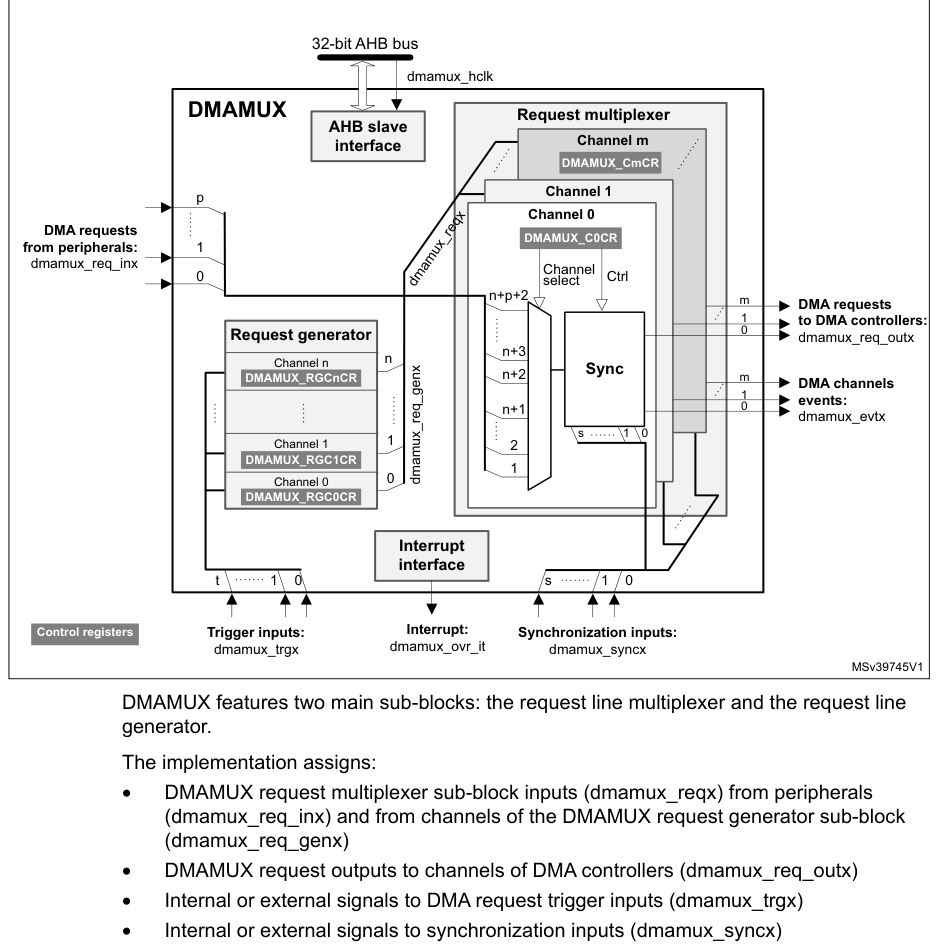
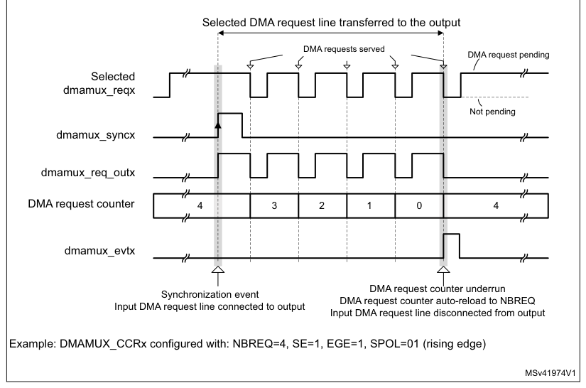
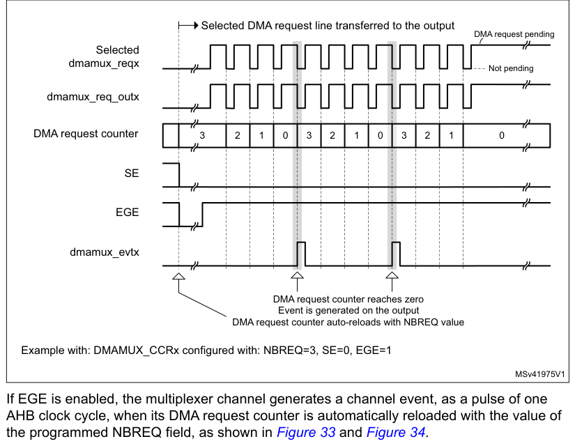

# 13 DMA request multiplexer (DMAMUX)

[← RM0440 index](../STM32G4_RM0440.md)

## 13.1 Introduction

A peripheral indicates a request for DMA transfer by setting its DMA request signal. The DMA request
is pending until served by the DMA controller that generates a DMA acknowledge signal, and the
corresponding DMA request signal is deasserted.

In this document, the set of control signals required for the DMA request/acknowledge protocol is
not explicitly shown or described, and it is referred to as DMA request line.

The DMAMUX request multiplexer enables routing a DMA request line between the peripherals and the
DMA controllers of the product. The routing function is ensured by a programmable multi-channel DMA
request line multiplexer. Each channel selects a unique DMA request line, unconditionally or
synchronously with events from its DMAMUX synchronization inputs. The DMAMUX may also be used as a
DMA request generator from programmable events on its input trigger signals.

The number of DMAMUX instances and their main characteristics are specified in [Section 13.3.1](#1331-dmamux-instantiation).

The assignment of DMAMUX request multiplexer inputs to the DMA request lines from peripherals and to
the DMAMUX request generator outputs, the assignment of DMAMUX request multiplexer outputs to DMA
controller channels, and the assignment of DMAMUX synchronizations and trigger inputs to internal
and external signals depend upon product implementation. They are detailed in [Section 13.3.2](#1332-dmamux-mapping).

## 13.2 DMAMUX main features

- Up to 16-channel programmable DMA request line multiplexer output
- 4-channel DMA request generator
- 21 trigger inputs to DMA request generator
- 21 synchronization inputs
- Per DMA request generator channel:
  - DMA request trigger input selector
  - DMA request counter
  - Event overrun flag for selected DMA request trigger input
- Per DMA request line multiplexer channel output:
  - 115 input DMA request lines from peripherals
  - One DMA request line output
  - Synchronization input selector
  - DMA request counter
  - Event overrun flag for selected synchronization input
  - One event output, for DMA request chaining

## 13.3 DMAMUX implementation

### 13.3.1 DMAMUX instantiation

DMAMUX is instantiated with the hardware configuration parameters listed in the following table.

**Table 92. DMAMUX instantiation**

| Source row | Column 1 | Column 2 | Column 3 |
| ---: | --- | --- | --- |
| 1 | `Feature` | `DMAMUX` |  |
| 2 | `Category 2 devices(1)` | `12` |  |
| 3 | `Number of DMAMUX output request channels` | `Category 3 devices(1)` | `16` |
| 4 | `Category 4 devices(1)` | `16` |  |
| 5 | `Number of DMAMUX request generator channels` | `4` |  |
| 6 | `Number of DMAMUX request trigger inputs` | `21` |  |
| 7 | `Number of DMAMUX synchronization inputs` | `21` |  |
| 8 | `Number of DMAMUX peripheral request inputs` | `115` |  |

1. See Table 1: STM32G4 series memory density

### 13.3.2 DMAMUX mapping

The mapping of resources to DMAMUX is hardwired.

DMAMUX is used with DMA1 and DMA2:

For category 3 and category 4 devices:

- DMAMUX channels 0 to 7 are connected to DMA1 channels 1 to 8
- DMAMUX channels 8 to 15 are connected to DMA2 channels 1 to 8

For category 2 devices:

- DMAMUX channels 0 to 5 are connected to DMA1 channels 1 to 6
- DMAMUX channels 6 to 11 are connected to DMA2 channels 1 to 6

**Table 93. DMAMUX: assignment of multiplexer inputs to resources(1)**

| Source row | Column 1 | Column 2 | Column 3 | Column 4 | Column 5 | Column 6 |
| ---: | --- | --- | --- | --- | --- | --- |
| 1 | `DMA` | `DMA` | `DMA` |  |  |  |
| 2 | `request` | `Resource` | `request` | `Resource` | `request` | `Resource` |
| 3 | `MUX input` | `MUX input` | `MUX input` |  |  |  |
| 4 | `1` | `DMAMUX_Req G0` | `44` | `TIM1_CH3` | `87` | `TIM20_CH2` |
| 5 | `2` | `DMAMUX_Req G1` | `45` | `TIM1_CH4` | `88` | `TIM20_CH3` |
| 6 | `3` | `DMAMUX_Req G2` | `46` | `TIM1_UP` | `89` | `TIM20_CH4` |
| 7 | `4` | `DMAMUX_Req G3` | `47` | `TIM1_TRIG` | `90` | `TIM20_UP` |
| 8 | `5` | `ADC1` | `48` | `TIM1_COM` | `91` | `AES_IN` |
| 9 | `6` | `DAC1_CH1` | `49` | `TIM8_CH1` | `92` | `AES_OUT` |
| 10 | `7` | `DAC1_CH2` | `50` | `TIM8_CH2` | `93` | `TIM20_TRIG` |
| 11 | `8` | `TIM6_UP` | `51` | `TIM8_CH3` | `94` | `TIM20_COM` |
| 12 | `9` | `TIM7_UP` | `52` | `TIM8_CH4` | `95` | `HRTIM_MASTER (hrtim_dma1)` |
| 13 | `10` | `SPI1_RX` | `53` | `TIM8_UP` | `96` | `HRTIM_TIMA (hrtim_dma2)` |
| 14 | `11` | `SPI1_TX` | `54` | `TIM8_TRIG` | `97` | `HRTIM_TIMB (hrtim_dma3)` |
| 15 | `12` | `SPI2_RX` | `55` | `TIM8_COM` | `98` | `HRTIM_TIMC (hrtim_dma4)` |
| 16 | `13` | `SPI2_TX` | `56` | `TIM2_CH1` | `99` | `HRTIM_TIMD (hrtim_dma5)` |
| 17 | `14` | `SPI3_RX` | `57` | `TIM2_CH2` | `100` | `HRTIM_TIME (hrtim_dma6` |
| 18 | `15` | `SPI3_TX` | `58` | `TIM2_CH3` | `101` | `HRTIM_TIMF (hrtim_dma7)` |
| 19 | `16` | `I2C1_RX` | `59` | `TIM2_CH4` | `102` | `DAC3_CH1` |
| 20 | `17` | `I2C1_TX` | `60` | `TIM2_UP` | `103` | `DAC3_CH2` |
| 21 | `18` | `I2C2_RX` | `61` | `TIM3_CH1` | `104` | `DAC4_CH1` |
| 22 | `19` | `I2C2_TX` | `62` | `TIM3_CH2` | `105` | `DAC4_CH2` |
| 23 | `20` | `I2C3_RX` | `63` | `TIM3_CH3` | `106` | `SPI4_RX` |
| 24 | `21` | `I2C3_TX` | `64` | `TIM3_CH4` | `107` | `SPI4_TX` |
| 25 | `22` | `I2C4_RX` | `65` | `TIM3_UP` | `108` | `SAI1_A` |
| 26 | `23` | `I2C4_TX` | `66` | `TIM3_TRIG` | `109` | `SAI1_B` |
| 27 | `24` | `USART1_RX` | `67` | `TIM4_CH1` | `110` | `FMAC_Read` |
| 28 | `25` | `USART1_TX` | `68` | `TIM4_CH2` | `111` | `FMAC_Write` |
| 29 | `26` | `USART2_RX` | `69` | `TIM4_CH3` | `112` | `Cordic_Read` |
| 30 | `27` | `USART2_TX` | `70` | `TIM4_CH4` | `113` | `Cordic_Write` |
| 31 | `28` | `USART3_RX` | `71` | `TIM4_UP` | `114` | `UCPD1_RX` |
| 32 | `29` | `USART3_TX` | `72` | `TIM5_CH1` | `115` | `UCPD1_TX` |
| 33 | `30` | `UART4_RX` | `73` | `TIM5_CH2` | `116` | `Reserved` |
| 34 | `31` | `UART4_TX` | `74` | `TIM5_CH3` | `117` | `Reserved` |
| 35 | `32` | `UART5_RX` | `75` | `TIM5_CH4` | `118` | `Reserved` |

**Table 93. DMAMUX: assignment of multiplexer inputs to resources(1) (continued)**

| Source row | Column 1 | Column 2 | Column 3 | Column 4 | Column 5 | Column 6 |
| ---: | --- | --- | --- | --- | --- | --- |
| 1 | `DMA` | `DMA` | `DMA` |  |  |  |
| 2 | `request` | `Resource` | `request` | `Resource` | `request` | `Resource` |
| 3 | `MUX input` | `MUX input` | `MUX input` |  |  |  |
| 4 | `33` | `UART5_TX` | `76` | `TIM5_UP` | `119` | `Reserved` |
| 5 | `34` | `LPUART1_RX` | `77` | `TIM5_TRIG` | `120` | `Reserved` |
| 6 | `35` | `LPUART1_TX` | `78` | `TIM15_CH1` | `121` | `Reserved` |
| 7 | `36` | `ADC2` | `79` | `TIM15_UP` | `122` | `Reserved` |
| 8 | `37` | `ADC3` | `80` | `TIM15_TRIG` | `123` | `Reserved` |
| 9 | `38` | `ADC4` | `81` | `TIM15_COM` | `124` | `Reserved` |
| 10 | `39` | `ADC5` | `82` | `TIM16_CH1` | `125` | `Reserved` |
| 11 | `40` | `QUADSPI` | `83` | `TIM16_UP` | `126` | `Reserved` |
| 12 | `41` | `DAC2_CH1` | `84` | `TIM17_CH1` | `127` | `Reserved` |
| 13 | `42` | `TIM1_CH1` | `85` | `TIM17_UP` | `-` | `-` |
| 14 | `43` | `TIM1_CH2` | `86` | `TIM20_CH1` | `-` | `-` |

1. See Table 2: Product specific features for available resources.

**Table 94. DMAMUX: assignment of trigger inputs to resources**

| Trigger input | Resource | Trigger input | Resource |
| --- | --- | --- | --- |
| 0 | EXTI LINE0 | 16 | DMAMUX1_ch0_event |
| 1 | EXTI LINE1 | 17 | DMAMUX1_ch1_event |
| 2 | EXTI LINE2 | 18 | DMAMUX1_ch2_event |
| 3 | EXTI LINE3 | 19 | DMAMUX1_ch3_event |
| 4 | EXTI LINE4 | 20 | LPTIM1_OUT |
| 5 | EXTI LINE5 | 21 | Reserved |
| 6 | EXTI LINE6 | 22 | Reserved |
| 7 | EXTI LINE7 | 23 | Reserved |
| 8 | EXTI LINE8 | 24 | Reserved |
| 9 | EXTI LINE9 | 25 | Reserved |
| 10 | EXTI LINE10 | 26 | Reserved |
| 11 | EXTI LINE11 | 27 | Reserved |
| 12 | EXTI LINE12 | 28 | Reserved |
| 13 | EXTI LINE13 | 29 | Reserved |
| 14 | EXTI LINE14 | 30 | Reserved |
| 15 | EXTI LINE15 | 31 | Reserved |

**Table 95. DMAMUX: assignment of synchronization inputs to resources**

| Sync. input | Resource | Sync. input | Resource |
| --- | --- | --- | --- |
| 0 | EXTI LINE0 | 16 | DMAMUX1_ch0_event |
| 1 | EXTI LINE1 | 17 | DMAMUX1_ch1_event |

**Table 95. DMAMUX: assignment of synchronization inputs to resources (continued)**

| Sync. input | Resource | Sync. input | Resource |
| --- | --- | --- | --- |
| 2 | EXTI LINE2 | 18 | DMAMUX1_ch2_event |
| 3 | EXTI LINE3 | 19 | DMAMUX1_ch3_event |
| 4 | EXTI LINE4 | 20 | LPTIM1_OUT |
| 5 | EXTI LINE5 | 21 | Reserved |
| 6 | EXTI LINE6 | 22 | Reserved |
| 7 | EXTI LINE7 | 23 | Reserved |
| 8 | EXTI LINE8 | 24 | Reserved |
| 9 | EXTI LINE9 | 25 | Reserved |
| 10 | EXTI LINE10 | 26 | Reserved |
| 11 | EXTI LINE11 | 27 | Reserved |
| 12 | EXTI LINE12 | 28 | Reserved |
| 13 | EXTI LINE13 | 29 | Reserved |
| 14 | EXTI LINE14 | 30 | Reserved |
| 15 | EXTI LINE15 | 31 | Reserved |

## 13.4 DMAMUX functional description

### 13.4.1 DMAMUX block diagram

Figure 32 shows the DMAMUX block diagram.

**Figure 32. DMAMUX block diagram**

32-bit AHB bus
dmamux_hclk

DMAMUX

Request multiplexer

AHB slave

DMAMUX features two main sub-blocks: the request line multiplexer and the request line generator.

The implementation assigns:

- DMAMUX request multiplexer sub-block inputs (dmamux_reqx) from peripherals (dmamux_req_inx) and
  from channels of the DMAMUX request generator sub-block (dmamux_req_genx)
- DMAMUX request outputs to channels of DMA controllers (dmamux_req_outx)
- Internal or external signals to DMA request trigger inputs (dmamux_trgx)
- Internal or external signals to synchronization inputs (dmamux_syncx)

### 13.4.2 DMAMUX signals

Table 96 lists the DMAMUX signals.

**Table 96. DMAMUX signals**

| Source row | Column 1 | Column 2 |
| ---: | --- | --- |
| 1 | `Signal name` | `Description` |
| 2 | `dmamux_hclk` | `DMAMUX AHB clock` |
| 3 | `dmamux_req_inx` | `DMAMUX DMA request line inputs from peripherals` |
| 4 | `dmamux_trgx` | `DMAMUX DMA request triggers inputs (to request generator sub-block)` |
| 5 | `dmamux_req_genx` | `DMAMUX request generator sub-block channels outputs` |
| 6 | `DMAMUX request multiplexer sub-block inputs (from peripheral` |  |
| 7 | `dmamux_reqx` |  |
| 8 | `requests and request generator channels)` |  |
| 9 | `dmamux_syncx` | `DMAMUX synchronization inputs (to request multiplexer sub-block)` |
| 10 | `dmamux_req_outx` | `DMAMUX requests outputs (to DMA controllers)` |
| 11 | `dmamux_evtx` | `DMAMUX events outputs` |
| 12 | `dmamux_ovr_it` | `DMAMUX overrun interrupts` |

### 13.4.3 DMAMUX channels

A DMAMUX channel is a request multiplexer channel that can include, depending upon the selected
input of the request multiplexer, an additional DMAMUX request generator channel.

A DMAMUX request multiplexer channel is connected and dedicated to a single channel of DMA
controller(s).

#### Channel configuration procedure

Follow the sequence below to configure a DMAMUX x channel and the related DMA channel y:

1. Set and configure completely the DMA channel y, except enabling the channel y.
2. Set and configure completely the related DMAMUX y channel.
3. Last, activate the DMA channel y by setting the EN bit in the DMA y channel register.

### 13.4.4 DMAMUX request line multiplexer

The DMAMUX request multiplexer with its multiple channels ensures the actual routing of DMA
request/acknowledge control signals, named DMA request lines.

Each DMA request line is connected in parallel to all the channels of the DMAMUX request line
multiplexer.

A DMA request is sourced either from the peripherals, or from the DMAMUX request generator.

The DMAMUX request line multiplexer channel x selects the DMA request line number as configured by
the DMAREQ_ID field in the DMAMUX_CxCR register.

> **Note:** The null value in the field DMAREQ_ID corresponds to no DMA request line selected.

> **Caution:** A same non-null DMAREQ_ID cannot be programmed to different x and y DMAMUX
> request multiplexer channels (via DMAMUX_CxCR and DMAMUX_CyCR), except when the application
> guarantees that the two connected DMA channels are not simultaneously active.

On top of the DMA request selection, the synchronization mode and/or the event generation may be
configured and enabled, if required.

#### Synchronization mode and channel event generation

Each DMAMUX request line multiplexer channel x can be individually synchronized by setting the
synchronization enable (SE) bit in the DMAMUX_CxCR register.

DMAMUX has multiple synchronization inputs. The synchronization inputs are connected in parallel to
all the channels of the request multiplexer.

The synchronization input is selected via the SYNC_ID field in the DMAMUX_CxCR register of a given
channel x.

When a channel is in this synchronization mode, the selected input DMA request line is propagated to
the multiplexer channel output, once a programmable rising/falling edge is detected on the selected
input synchronization signal, via the SPOL[1:0] field of the DMAMUX_CxCR register.

Additionally, internally to the DMAMUX request multiplexer, there is a programmable DMA request
counter, which can be used for the channel request output generation, and for an event generation.
An event generation on the channel x output is enabled through the EGE bit (event generation enable)
of the DMAMUX_CxCR register.

As shown in Figure 34, upon the detected edge of the synchronization input, the pending selected
input DMA request line is connected to the DMAMUX multiplexer channel x output.

> **Note:** If a synchronization event occurs while there is no pending selected input DMA request line,
> it is discarded. The following asserted input request lines is not connected to the DMAMUX
> multiplexer channel output until a synchronization event occurs again.

From this point on, each time the connected DMAMUX request is served by the DMA controller (a served
request is deasserted), the DMAMUX request counter is decremented. At its underrun, the DMA request
counter is automatically loaded with the value in the NBREQ field of the DMAMUX_CxCR register and
the input DMA request line is disconnected from the multiplexer channel x output.

Thus, the number of DMA requests transferred to the multiplexer channel x output following a
detected synchronization event, is equal to the value in the NBREQ field, plus one.

> **Note:** The NBREQ field value can be written by software only when both synchronization enable
> bit (SE) and event generation enable bit (EGE) of the corresponding multiplexer channel x are
> disabled.

**Figure 33. Synchronization mode of the DMAMUX request line multiplexer channel**

Selected DMA request line transferred to the output

DMA requests served

DMA request pending

Selected
dmamux_reqx

Not pending
dmamux_syncx
dmamux_req_outx

**Figure 34. Event generation of the DMA request line multiplexer channel**

Selected DMA request line transferred to the output

DMA request pending

Selected
dmamux_reqx

Not pending
dmamux_req_outx

If EGE is enabled, the multiplexer channel generates a channel event, as a pulse of one AHB clock
cycle, when its DMA request counter is automatically reloaded with the value of the programmed NBREQ
field, as shown in Figure 33 and Figure 34.

> **Note:** If EGE is enabled and NBREQ = 0, an event is generated after each served DMA request.

> **Note:** A synchronization event (edge) is detected if the state following the edge remains stable for
> more than two AHB clock cycles.

Upon writing into DMAMUX_CxCR register, the synchronization events are masked during three AHB clock
cycles.

#### Synchronization overrun and interrupt

If a new synchronization event occurs before the request counter underrun (the internal request
counter programmed via the NBREQ field of the DMAMUX_CxCR register), the synchronization overrun
flag bit SOFx is set in the DMAMUX_CSR register.

> **Note:** The request multiplexer channel x synchronization must be disabled

(DMAMUX_CxCR.SE = 0) when the use of the related channel of the DMA controller is completed. Else,
upon a new detected synchronization event, there is a synchronization overrun due to the absence of
a DMA acknowledge (that is, no served request) received from the DMA controller.

The overrun flag SOFx is reset by setting the associated clear synchronization overrun flag bit
CSOFx in the DMAMUX_CFR register.

Setting the synchronization overrun flag generates an interrupt if the synchronization overrun
interrupt enable bit SOIE is set in the DMAMUX_CxCR register.

### 13.4.5 DMAMUX request generator

The DMAMUX request generator produces DMA requests following trigger events on its DMA request
trigger inputs.

The DMAMUX request generator has multiple channels. DMA request trigger inputs are connected in
parallel to all channels.

The outputs of DMAMUX request generator channels are inputs to the DMAMUX request line multiplexer.

Each DMAMUX request generator channel x has an enable bit GE (generator enable) in the corresponding
DMAMUX_RGxCR register.

The DMA request trigger input for the DMAMUX request generator channel x is selected through the
SIG_ID (trigger signal ID) field in the corresponding DMAMUX_RGxCR register.

Trigger events on a DMA request trigger input can be rising edge, falling edge or either edge. The
active edge is selected through the GPOL (generator polarity) field in the corresponding
DMAMUX_RGxCR register.

Upon the trigger event, the corresponding generator channel starts generating DMA requests on its
output. Each time the DMAMUX generated request is served by the connected DMA controller (a served
request is deasserted), a built-in (inside the DMAMUX request generator) DMA request counter is
decremented. At its underrun, the request generator channel stops generating DMA requests and the
DMA request counter is automatically reloaded to its programmed value upon the next trigger event.

Thus, the number of DMA requests generated after the trigger event is GNBREQ \+ 1.

> **Note:** The GNBREQ field value can be written by software only when the enable GE bit of the
> corresponding generator channel x is disabled.

There is no hardware write protection.

A trigger event (edge) is detected if the state following the edge remains stable for more than two
AHB clock cycles.

Upon writing into DMAMUX_RGxCR register, the trigger events are masked during three AHB clock
cycles.

#### Trigger overrun and interrupt

If a new DMA request trigger event occurs before the DMAMUX request generator counter underrun (the
internal counter programmed via the GNBREQ field of the DMAMUX_RGxCR register), and if the request
generator channel x was enabled via GE, then the request trigger event overrun flag bit OFx is
asserted by the hardware in the DMAMUX_RGSR register.

> **Note:** The request generator channel x must be disabled (DMAMUX_RGxCR.GE = 0) when the
> usage of the related channel of the DMA controller is completed. Else, upon a new detected trigger
> event, there is a trigger overrun due to the absence of an acknowledge (that is, no served request)
> received from the DMA.

The overrun flag OFx is reset by setting the associated clear overrun flag bit COFx in the
DMAMUX_RGCFR register.

Setting the DMAMUX request trigger overrun flag generates an interrupt if the DMA request trigger
event overrun interrupt enable bit OIE is set in the DMAMUX_RGxCR register.

## 13.5 DMAMUX interrupts

An interrupt can be generated upon:

- a synchronization event overrun in each DMA request line multiplexer channel
- a trigger event overrun in each DMA request generator channel

For each case, per-channel in.dividual interrupt enable, status, and clear flag register bits are
available.

**Table 97. DMAMUX interrupts**

| Source row | Column 1 | Column 2 | Column 3 | Column 4 | Column 5 |
| ---: | --- | --- | --- | --- | --- |
| 1 | `Interrupt signal` | `Interrupt event` | `Event flag` | `Clear bit` | `Enable bit` |
| 2 | `Synchronization event overrun` |  |  |  |  |
| 3 | `on channel x of the` | `SOFx` | `CSOFx` | `SOIE` |  |
| 4 | `DMAMUX request line multiplexer` |  |  |  |  |
| 5 | `dmamuxovr_it` |  |  |  |  |
| 6 | `Trigger event overrun` |  |  |  |  |
| 7 | `on channel x of the` | `OFx` | `COFx` | `OIE` |  |
| 8 | `DMAMUX request generator` |  |  |  |  |

## 13.6 DMAMUX registers

Refer to the table containing register boundary addresses for the DMAMUX base address.

DMAMUX registers may be accessed per byte (8-bit), half-word (16-bit), or word (32-bit). The address
must be aligned with the data size.

### 13.6.1 DMAMUX request line multiplexer channel x configuration register (DMAMUX_CxCR)

- **Address offset:** 0x000 \+ 0x04 \* x (x = 0 to 15)(a)
- **Reset value:** 0x0000 0000

**Register bit layout**

| Bit | Field | Access | Summary |
| ---: | --- | :---: | --- |
| 31 | Reserved | — | kept at reset value. |
| 30 | Reserved | — | ↳ |
| 29 | Reserved | — | ↳ |
| 28 | `SYNC_ID[4]` | rw | Synchronization identification |
| 27 | `SYNC_ID[3]` | rw | ↳ |
| 26 | `SYNC_ID[2]` | rw | ↳ |
| 25 | `SYNC_ID[1]` | rw | ↳ |
| 24 | `SYNC_ID[0]` | rw | ↳ |
| 23 | `NBREQ[4]` | rw | Number of DMA requests minus 1 to forward |
| 22 | `NBREQ[3]` | rw | ↳ |
| 21 | `NBREQ[2]` | rw | ↳ |
| 20 | `NBREQ[1]` | rw | ↳ |
| 19 | `NBREQ[0]` | rw | ↳ |
| 18 | `SPOL[1]` | rw | Synchronization polarity |
| 17 | `SPOL[0]` | rw | ↳ |
| 16 | `SE` | rw | Synchronization enable |
| 15 | Reserved | — | kept at reset value. |
| 14 | Reserved | — | ↳ |
| 13 | Reserved | — | ↳ |
| 12 | Reserved | — | ↳ |
| 11 | Reserved | — | ↳ |
| 10 | Reserved | — | ↳ |
| 9 | `EGE` | rw | Event generation enable |
| 8 | `SOIE` | rw | Synchronization overrun interrupt enable |
| 7 | Reserved | — | kept at reset value. |
| 6 | `DMAREQ_ID[6]` | rw | DMA request identification |
| 5 | `DMAREQ_ID[5]` | rw | ↳ |
| 4 | `DMAREQ_ID[4]` | rw | ↳ |
| 3 | `DMAREQ_ID[3]` | rw | ↳ |
| 2 | `DMAREQ_ID[2]` | rw | ↳ |
| 1 | `DMAREQ_ID[1]` | rw | ↳ |
| 0 | `DMAREQ_ID[0]` | rw | ↳ |

**Bits 31:29 — Reserved:** kept at reset value.

**Bits 28:24 — `SYNC_ID[4:0]`:** Synchronization identification

Selects the synchronization input (see Table 95: DMAMUX: assignment of synchronization
inputs to resources).

**Bits 23:19 — `NBREQ[4:0]`:** Number of DMA requests minus 1 to forward

Defines the number of DMA requests to forward to the DMA controller after a synchronization
event, and/or the number of DMA requests before an output event is generated.

This field must only be written when both SE and EGE bits are low.

**Bits 18:17 — `SPOL[1:0]`:** Synchronization polarity

Defines the edge polarity of the selected synchronization input:

- `00`: No event (no synchronization, no detection).
- `01`: Rising edge
- `10`: Falling edge
- `11`: Rising and falling edges

**Bit 16 — `SE`:** Synchronization enable

- `0`: Synchronization disabled
- `1`: Synchronization enabled

**Bits 15:10 — Reserved:** kept at reset value.

**Bit 9 — `EGE`:** Event generation enable

- `0`: Event generation disabled
- `1`: Event generation enabled

**Bit 8 — `SOIE`:** Synchronization overrun interrupt enable

- `0`: Interrupt disabled
- `1`: Interrupt enabled
  a. For category 2 devices, only 12 DMAMUX channels are available, namely DMAMUX channels 0 to 5 for
  x = 0 to 5, and DMAMUX channels 6 to 11 for x = 8 to 13.

**Bit 7 — Reserved:** kept at reset value.

**Bits 6:0 — `DMAREQ_ID[6:0]`:** DMA request identification

Selects the input DMA request. See the DMAMUX table about assignments of multiplexer
inputs to resources.

### 13.6.2 DMAMUX request line multiplexer interrupt channel status register (DMAMUX_CSR)

- **Address offset:** 0x080
- **Reset value:** 0x0000 0000

**Register bit layout**

| Bit | Field | Access | Summary |
| ---: | --- | :---: | --- |
| 31 | Reserved | — | kept at reset value. |
| 30 | Reserved | — | ↳ |
| 29 | Reserved | — | ↳ |
| 28 | Reserved | — | ↳ |
| 27 | Reserved | — | ↳ |
| 26 | Reserved | — | ↳ |
| 25 | Reserved | — | ↳ |
| 24 | Reserved | — | ↳ |
| 23 | Reserved | — | ↳ |
| 22 | Reserved | — | ↳ |
| 21 | Reserved | — | ↳ |
| 20 | Reserved | — | ↳ |
| 19 | Reserved | — | ↳ |
| 18 | Reserved | — | ↳ |
| 17 | Reserved | — | ↳ |
| 16 | Reserved | — | ↳ |
| 15 | `SOF[15]` | r | Synchronization overrun event flag |
| 14 | `SOF[14]` | r | ↳ |
| 13 | `SOF[13]` | r | ↳ |
| 12 | `SOF[12]` | r | ↳ |
| 11 | `SOF[11]` | r | ↳ |
| 10 | `SOF[10]` | r | ↳ |
| 9 | `SOF[9]` | r | ↳ |
| 8 | `SOF[8]` | r | ↳ |
| 7 | `SOF[7]` | r | ↳ |
| 6 | `SOF[6]` | r | ↳ |
| 5 | `SOF[5]` | r | ↳ |
| 4 | `SOF[4]` | r | ↳ |
| 3 | `SOF[3]` | r | ↳ |
| 2 | `SOF[2]` | r | ↳ |
| 1 | `SOF[1]` | r | ↳ |
| 0 | `SOF[0]` | r | ↳ |

**Bits 31:16 — Reserved:** kept at reset value.

**Bits 15:0 — `SOF[15:0]`:** Synchronization overrun event flag

The flag is set when a synchronization event occurs on a DMA request line multiplexer
channel x, while the DMA request counter value is lower than NBREQ.

The flag is cleared by writing 1 to the corresponding CSOFx bit in DMAMUX_CFR register.

### 13.6.3 DMAMUX request line multiplexer interrupt clear flag register (DMAMUX_CFR)

- **Address offset:** 0x084
- **Reset value:** 0x0000 0000

**Register bit layout**

| Bit | Field | Access | Summary |
| ---: | --- | :---: | --- |
| 31 | Reserved | — | kept at reset value. |
| 30 | Reserved | — | ↳ |
| 29 | Reserved | — | ↳ |
| 28 | Reserved | — | ↳ |
| 27 | Reserved | — | ↳ |
| 26 | Reserved | — | ↳ |
| 25 | Reserved | — | ↳ |
| 24 | Reserved | — | ↳ |
| 23 | Reserved | — | ↳ |
| 22 | Reserved | — | ↳ |
| 21 | Reserved | — | ↳ |
| 20 | Reserved | — | ↳ |
| 19 | Reserved | — | ↳ |
| 18 | Reserved | — | ↳ |
| 17 | Reserved | — | ↳ |
| 16 | Reserved | — | ↳ |
| 15 | `CSOF[15]` | w | Clear synchronization overrun event flag |
| 14 | `CSOF[14]` | w | ↳ |
| 13 | `CSOF[13]` | w | ↳ |
| 12 | `CSOF[12]` | w | ↳ |
| 11 | `CSOF[11]` | w | ↳ |
| 10 | `CSOF[10]` | w | ↳ |
| 9 | `CSOF[9]` | w | ↳ |
| 8 | `CSOF[8]` | w | ↳ |
| 7 | `CSOF[7]` | w | ↳ |
| 6 | `CSOF[6]` | w | ↳ |
| 5 | `CSOF[5]` | w | ↳ |
| 4 | `CSOF[4]` | w | ↳ |
| 3 | `CSOF[3]` | w | ↳ |
| 2 | `CSOF[2]` | w | ↳ |
| 1 | `CSOF[1]` | w | ↳ |
| 0 | `CSOF[0]` | w | ↳ |

**Bits 31:16 — Reserved:** kept at reset value.

**Bits 15:0 — `CSOF[15:0]`:** Clear synchronization overrun event flag

Writing 1 in each bit clears the corresponding overrun flag SOFx in the DMAMUX_CSR
register.

### 13.6.4 DMAMUX request generator channel x configuration register (DMAMUX_RGxCR)

- **Address offset:** 0x100 \+ 0x04 \* x (x = 0 to 3)
- **Reset value:** 0x0000 0000

**Register bit layout**

| Bit | Field | Access | Summary |
| ---: | --- | :---: | --- |
| 31 | Reserved | — | kept at reset value. |
| 30 | Reserved | — | ↳ |
| 29 | Reserved | — | ↳ |
| 28 | Reserved | — | ↳ |
| 27 | Reserved | — | ↳ |
| 26 | Reserved | — | ↳ |
| 25 | Reserved | — | ↳ |
| 24 | Reserved | — | ↳ |
| 23 | `GNBREQ[4]` | rw | Number of DMA requests to be generated (minus 1) |
| 22 | `GNBREQ[3]` | rw | ↳ |
| 21 | `GNBREQ[2]` | rw | ↳ |
| 20 | `GNBREQ[1]` | rw | ↳ |
| 19 | `GNBREQ[0]` | rw | ↳ |
| 18 | `GPOL[1]` | rw | DMA request generator trigger polarity |
| 17 | `GPOL[0]` | rw | ↳ |
| 16 | `GE` | rw | DMA request generator channel x enable |
| 15 | Reserved | — | kept at reset value. |
| 14 | Reserved | — | ↳ |
| 13 | Reserved | — | ↳ |
| 12 | Reserved | — | ↳ |
| 11 | Reserved | — | ↳ |
| 10 | Reserved | — | ↳ |
| 9 | Reserved | — | ↳ |
| 8 | `OIE` | rw | Trigger overrun interrupt enable |
| 7 | Reserved | — | kept at reset value. |
| 6 | Reserved | — | ↳ |
| 5 | Reserved | — | ↳ |
| 4 | `SIG_ID[4]` | rw | Signal identification |
| 3 | `SIG_ID[3]` | rw | ↳ |
| 2 | `SIG_ID[2]` | rw | ↳ |
| 1 | `SIG_ID[1]` | rw | ↳ |
| 0 | `SIG_ID[0]` | rw | ↳ |

**Bits 31:24 — Reserved:** kept at reset value.

**Bits 23:19 — `GNBREQ[4:0]`:** Number of DMA requests to be generated (minus 1)

Defines the number of DMA requests to be generated after a trigger event. The actual
number of generated DMA requests is GNBREQ +1.

> **Note:** This field must be written only when GE bit is disabled.

**Bits 18:17 — `GPOL[1:0]`:** DMA request generator trigger polarity

Defines the edge polarity of the selected trigger input

- `00`: No event, i.e. no trigger detection nor generation.
- `01`: Rising edge
- `10`: Falling edge
- `11`: Rising and falling edges

**Bit 16 — `GE`:** DMA request generator channel x enable

- `0`: DMA request generator channel x disabled
- `1`: DMA request generator channel x enabled

**Bits 15:9 — Reserved:** kept at reset value.

**Bit 8 — `OIE`:** Trigger overrun interrupt enable

- `0`: Interrupt on a trigger overrun event occurrence is disabled
- `1`: Interrupt on a trigger overrun event occurrence is enabled

**Bits 7:5 — Reserved:** kept at reset value.

**Bits 4:0 — `SIG_ID[4:0]`:** Signal identification

Selects the DMA request trigger input used for the channel x of the DMA request generator

### 13.6.5 DMAMUX request generator interrupt status register (DMAMUX_RGSR)

- **Address offset:** 0x140
- **Reset value:** 0x0000 0000

**Register bit layout**

| Bit | Field | Access | Summary |
| ---: | --- | :---: | --- |
| 31 | Reserved | — | kept at reset value. |
| 30 | Reserved | — | ↳ |
| 29 | Reserved | — | ↳ |
| 28 | Reserved | — | ↳ |
| 27 | Reserved | — | ↳ |
| 26 | Reserved | — | ↳ |
| 25 | Reserved | — | ↳ |
| 24 | Reserved | — | ↳ |
| 23 | Reserved | — | ↳ |
| 22 | Reserved | — | ↳ |
| 21 | Reserved | — | ↳ |
| 20 | Reserved | — | ↳ |
| 19 | Reserved | — | ↳ |
| 18 | Reserved | — | ↳ |
| 17 | Reserved | — | ↳ |
| 16 | Reserved | — | ↳ |
| 15 | Reserved | — | ↳ |
| 14 | Reserved | — | ↳ |
| 13 | Reserved | — | ↳ |
| 12 | Reserved | — | ↳ |
| 11 | Reserved | — | ↳ |
| 10 | Reserved | — | ↳ |
| 9 | Reserved | — | ↳ |
| 8 | Reserved | — | ↳ |
| 7 | Reserved | — | ↳ |
| 6 | Reserved | — | ↳ |
| 5 | Reserved | — | ↳ |
| 4 | Reserved | — | ↳ |
| 3 | `OF[3]` | r | Trigger overrun event flag |
| 2 | `OF[2]` | r | ↳ |
| 1 | `OF[1]` | r | ↳ |
| 0 | `OF[0]` | r | ↳ |

**Bits 31:4 — Reserved:** kept at reset value.

**Bits 3:0 — `OF[3:0]`:** Trigger overrun event flag

The flag is set when a new trigger event occurs on DMA request generator channel x, before
the request counter underrun (the internal request counter programmed via the GNBREQ
field of the DMAMUX_RGxCR register).

The flag is cleared by writing 1 to the corresponding COFx bit in the DMAMUX_RGCFR
register.

### 13.6.6 DMAMUX request generator interrupt clear flag register (DMAMUX_RGCFR)

- **Address offset:** 0x144
- **Reset value:** 0x0000 0000

**Register bit layout**

| Bit | Field | Access | Summary |
| ---: | --- | :---: | --- |
| 31 | Reserved | — | kept at reset value. |
| 30 | Reserved | — | ↳ |
| 29 | Reserved | — | ↳ |
| 28 | Reserved | — | ↳ |
| 27 | Reserved | — | ↳ |
| 26 | Reserved | — | ↳ |
| 25 | Reserved | — | ↳ |
| 24 | Reserved | — | ↳ |
| 23 | Reserved | — | ↳ |
| 22 | Reserved | — | ↳ |
| 21 | Reserved | — | ↳ |
| 20 | Reserved | — | ↳ |
| 19 | Reserved | — | ↳ |
| 18 | Reserved | — | ↳ |
| 17 | Reserved | — | ↳ |
| 16 | Reserved | — | ↳ |
| 15 | Reserved | — | ↳ |
| 14 | Reserved | — | ↳ |
| 13 | Reserved | — | ↳ |
| 12 | Reserved | — | ↳ |
| 11 | Reserved | — | ↳ |
| 10 | Reserved | — | ↳ |
| 9 | Reserved | — | ↳ |
| 8 | Reserved | — | ↳ |
| 7 | Reserved | — | ↳ |
| 6 | Reserved | — | ↳ |
| 5 | Reserved | — | ↳ |
| 4 | Reserved | — | ↳ |
| 3 | `COF[3]` | w | Clear trigger overrun event flag |
| 2 | `COF[2]` | w | ↳ |
| 1 | `COF[1]` | w | ↳ |
| 0 | `COF[0]` | w | ↳ |

**Bits 31:4 — Reserved:** kept at reset value.

**Bits 3:0 — `COF[3:0]`:** Clear trigger overrun event flag

Writing 1 in each bit clears the corresponding overrun flag OFx in the DMAMUX_RGSR
register.

### 13.6.7 DMAMUX register map

The following table summarizes the DMAMUX registers and reset values. Refer to the register boundary
address table for the DMAMUX register base address.

**Register summary**

| Offset | Register | Reset value |
| --- | --- | --- |
| 0x000 \+ 0x04 \* x (x = 0 to 15)(a) | `DMAMUX_CxCR` | 0x0000 0000 |
| 0x080 | `DMAMUX_CSR` | 0x0000 0000 |
| 0x084 | `DMAMUX_CFR` | 0x0000 0000 |
| 0x100 \+ 0x04 \* x (x = 0 to 3) | `DMAMUX_RGxCR` | 0x0000 0000 |
| 0x140 | `DMAMUX_RGSR` | 0x0000 0000 |
| 0x144 | `DMAMUX_RGCFR` | 0x0000 0000 |

Refer to [Section 2.2](chapter-02.md#22-memory-organization) for the register boundary addresses.
