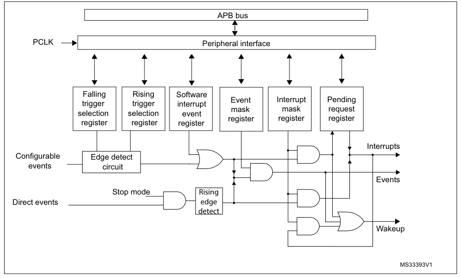
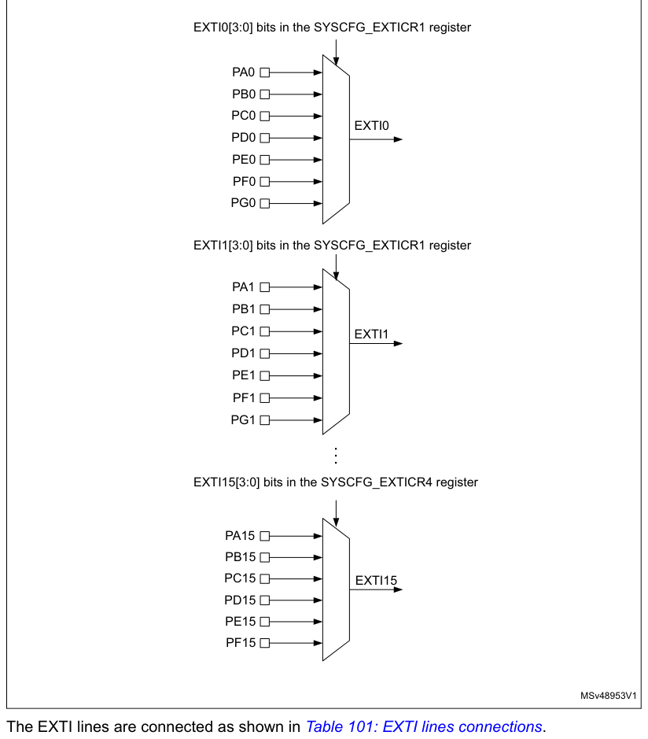

# 15 Extended interrupts and events controller (EXTI)

[← RM0440 index](../STM32G4_RM0440.md)

## 15.1 Introduction

The EXTI main features are:

- Generation of up to 42 event/interrupt requests
  - 29 configurable lines
  - 13 direct lines
- Independent mask on each event/interrupt line
- Configurable rising or falling edge (configurable lines only)
- Dedicated status bit (configurable lines only)
- Emulation of event/interrupt requests (configurable lines only)

## 15.2 EXTI main features

The extended interrupts and events controller (EXTI) manages the external and internal asynchronous
events/interrupts and generates the event request to the CPU/Interrupt Controller and a wake-up
request to the Power Controller.

The EXTI allows the management of up to 42 event lines which can wake up from the Stop mode.

The lines are either configurable or direct:

- The lines are configurable: the active edge can be chosen independently, and a status flag
  indicates the source of the interrupt. The configurable lines are used by the I/Os external
  interrupts, and by few peripherals.
- The lines are direct: they are used by some peripherals to generate a wake-up from Stop event or
  interrupt. The status flag is provided by the peripheral.

Each line can be masked independently for an interrupt or an event generation.

This controller also allows to emulate events or interrupts by software, multiplexed with the
corresponding hardware event line, by writing to a dedicated register.

## 15.3 EXTI functional description

For the configurable interrupt lines, the interrupt line should be configured and enabled in order
to generate an interrupt. This is done by programming the two trigger registers with the desired
edge detection and by enabling the interrupt request by writing 1 to the corresponding bit in the
interrupt mask register. When the selected edge occurs on the interrupt line, an interrupt request
is generated. The pending bit corresponding to the interrupt line is also set. This request is
cleared by writing 1 in the pending register.

For the direct interrupt lines, the interrupt is enabled by default in the interrupt mask register
and there is no corresponding pending bit in the pending register.

To generate an event, the event line should be configured and enabled. This is done by programming
the two trigger registers with the desired edge detection and by enabling the event request by
writing 1 to the corresponding bit in the event mask register. When the
selected edge occurs on the event line, an event pulse is generated. The pending bit corresponding
to the event line is not set.

For the configurable lines, an interrupt/event request can also be generated by software by writing
1 in the software interrupt/event register.

> **Note:** The interrupts or events associated to the direct lines are triggered only when the system is
> in Stop mode. If the system is still running, no interrupt/event is generated by the EXTI.

### 15.3.1 EXTI block diagram

The extended interrupt/event block diagram is shown on Figure 35.

**Figure 35. Configurable interrupt/event block diagram**

### 15.3.2 Wake-up event management

The devices handle external or internal events to wake up the core (WFE). The wake-up event can be
generated either by:

- enabling an interrupt in the peripheral control register but not in the NVIC, and enabling the
  SEVONPEND bit in the CortexTM-M4 System Control register. When the MCU resumes from WFE, the EXTI
  peripheral interrupt pending bit and the peripheral NVIC IRQ channel pending bit (in the NVIC
  interrupt clear pending register) have to be cleared
- or by configuring an EXTI line in event mode. When the CPU resumes from WFE, it is not necessary
  to clear the peripheral interrupt pending bit or the NVIC IRQ channel pending bit as the pending
  bit corresponding to the event line is not set.

### 15.3.3 Peripherals asynchronous Interrupts

Some peripherals are able to generate events when the system is in run mode and also when the system
is in Stop mode, allowing to wake up the system from Stop mode.

To accomplish this, the peripheral generates both a synchronized (to the system clock, e.g. APB
clock) and an asynchronous version of the event. This asynchronous event is connected to an EXTI
direct line.

> **Note:** Few peripherals with wake-up from Stop capability are connected to an EXTI configurable
> line. In this case, the EXTI configuration is necessary to allow the wake-up from Stop mode.

### 15.3.4 Hardware interrupt selection

To configure a line as an interrupt source, use the following procedure:

1. Configure the corresponding mask bit in the EXTI_IMR register.
2. Configure the Trigger Selection bits of the Interrupt line (EXTI_RTSR and EXTI_FTSR).
3. Configure the enable and mask bits that control the NVIC IRQ channel mapped to the

EXTI so that an interrupt coming from one of the EXTI lines can be correctly acknowledged.

> **Note:** The direct lines do not require any EXTI configuration.

### 15.3.5 Hardware event selection

To configure a line as an event source, use the following procedure:

1. Configure the corresponding mask bit in the EXTI_EMR register.
2. Configure the Trigger Selection bits of the Event line (EXTI_RTSR and EXTI_FTSR).

### 15.3.6 Software interrupt/event selection

Any of the configurable lines can be configured as a software interrupt/event line. The procedure to
generate a software interrupt is as follows:

1. Configure the corresponding mask bit (EXTI_IMR, EXTI_EMR).
2. Set the required bit of the software interrupt register (EXTI_SWIER).

## 15.4 EXTI interrupt/event line mapping

In the STM32G4 series, 42 interrupt/event lines are available. The GPIOs are connected to 16
configurable interrupt/event lines (see Figure 36).

**Figure 36. External interrupt/event GPIO mapping**

EXTI0[3:0] bits in the SYSCFG_EXTICR1 register

PA0

PB0

PC0

EXTI0

PD0

PE0

PF0

PG0

EXTI1[3:0] bits in the SYSCFG_EXTICR1 register

PA1

PB1

...

EXTI15[3:0] bits in the SYSCFG_EXTICR4 register

PA15

PB15

The EXTI lines are connected as shown in Table 101: EXTI lines connections.

**Table 101. EXTI lines connections**

| EXTI line | Line source | Line type |
| --- | --- | --- |
| 0-15 | GPIO | Configurable |
| 16 | PVD | Configurable |
| 17 | RTC alarm event | Configurable |
| 18 | USB Device FS wake-up event | Direct |
| 19 | Timestamp or CSS_LSE | Configurable |
| 20 | RTC wake-up timer | Configurable |

**Table 101. EXTI lines connections (continued)**

| EXTI line | Line source | Line type |
| --- | --- | --- |
| 21 | COMP1 output | Configurable |
| 22 | COMP2 output | Configurable |
| 23 | I2C1 wake-up | Direct |
| 24 | I2C2 wake-up | Direct |
| 25 | USART1 wake-up | Direct |
| 26 | USART2 wake-up | Direct |
| 27 | I2C3 wake-up | Direct |
| 28 | USART3 wake-up | Direct |
| 29 | COMP3 output | Configurable |
| 30 | COMP4 output | Configurable |
| 31 | COMP5 output | Configurable |
| 32 | COMP6 output | Configurable |
| 33 | COMP7 output | Configurable |
| 34 | UART4 wake-up | Direct |
| 35 | UART5 wake-up | Direct |
| 36 | LPUART1 wake-up | Direct |
| 37 | LPTIM1 wake-up | Direct |
| 40 | PVM1 wake-up | Configurable |
| 41 | PVM2 wake-up | Configurable |
| 42 | I2C4 wake-up | Direct |
| 43 | UCPD1 | Direct |

## 15.5 EXTI registers

Refer to [Section 1.2](chapter-01.md#12-list-of-abbreviations-for-registers) for a list of abbreviations used in register descriptions.

The peripheral registers have to be accessed by words (32-bit).

### 15.5.1 Interrupt mask register 1 (EXTI_IMR1)

- **Address offset:** 0x00
- **Reset value:** Direct lines are set to 1, others lines are set to 0. See Table 101.

**Register bit layout**

| Bit | Field | Access | Summary |
| ---: | --- | :---: | --- |
| 31 | `IMx` | rw | Interrupt mask on line x (x = 31 to 0) |
| 30 | `IMx` | rw | ↳ |
| 29 | `IMx` | rw | ↳ |
| 28 | `IMx` | rw | ↳ |
| 27 | `IMx` | rw | ↳ |
| 26 | `IMx` | rw | ↳ |
| 25 | `IMx` | rw | ↳ |
| 24 | `IMx` | rw | ↳ |
| 23 | `IMx` | rw | ↳ |
| 22 | `IMx` | rw | ↳ |
| 21 | `IMx` | rw | ↳ |
| 20 | `IMx` | rw | ↳ |
| 19 | `IMx` | rw | ↳ |
| 18 | `IMx` | rw | ↳ |
| 17 | `IMx` | rw | ↳ |
| 16 | `IMx` | rw | ↳ |
| 15 | `IMx` | rw | ↳ |
| 14 | `IMx` | rw | ↳ |
| 13 | `IMx` | rw | ↳ |
| 12 | `IMx` | rw | ↳ |
| 11 | `IMx` | rw | ↳ |
| 10 | `IMx` | rw | ↳ |
| 9 | `IMx` | rw | ↳ |
| 8 | `IMx` | rw | ↳ |
| 7 | `IMx` | rw | ↳ |
| 6 | `IMx` | rw | ↳ |
| 5 | `IMx` | rw | ↳ |
| 4 | `IMx` | rw | ↳ |
| 3 | `IMx` | rw | ↳ |
| 2 | `IMx` | rw | ↳ |
| 1 | `IMx` | rw | ↳ |
| 0 | `IMx` | rw | ↳ |

**Bits 31:0 — `IMx`:** Interrupt mask on line x (x = 31 to 0)

- `0`: Interrupt request from Line x is masked
- `1`: Interrupt request from Line x is not masked

> **Note:** The reset value for the direct lines is set to 1 to enable the interrupt by default.

### 15.5.2 Event mask register 1 (EXTI_EMR1)

- **Address offset:** 0x04
- **Reset value:** 0x0000 0000

**Register bit layout**

| Bit | Field | Access | Summary |
| ---: | --- | :---: | --- |
| 31 | `EMx` | rw | Event mask on line x (x = 31 to 0) |
| 30 | `EMx` | rw | ↳ |
| 29 | `EMx` | rw | ↳ |
| 28 | `EMx` | rw | ↳ |
| 27 | `EMx` | rw | ↳ |
| 26 | `EMx` | rw | ↳ |
| 25 | `EMx` | rw | ↳ |
| 24 | `EMx` | rw | ↳ |
| 23 | `EMx` | rw | ↳ |
| 22 | `EMx` | rw | ↳ |
| 21 | `EMx` | rw | ↳ |
| 20 | `EMx` | rw | ↳ |
| 19 | `EMx` | rw | ↳ |
| 18 | `EMx` | rw | ↳ |
| 17 | `EMx` | rw | ↳ |
| 16 | `EMx` | rw | ↳ |
| 15 | `EMx` | rw | ↳ |
| 14 | `EMx` | rw | ↳ |
| 13 | `EMx` | rw | ↳ |
| 12 | `EMx` | rw | ↳ |
| 11 | `EMx` | rw | ↳ |
| 10 | `EMx` | rw | ↳ |
| 9 | `EMx` | rw | ↳ |
| 8 | `EMx` | rw | ↳ |
| 7 | `EMx` | rw | ↳ |
| 6 | `EMx` | rw | ↳ |
| 5 | `EMx` | rw | ↳ |
| 4 | `EMx` | rw | ↳ |
| 3 | `EMx` | rw | ↳ |
| 2 | `EMx` | rw | ↳ |
| 1 | `EMx` | rw | ↳ |
| 0 | `EMx` | rw | ↳ |

**Bits 31:0 — `EMx`:** Event mask on line x (x = 31 to 0)

- `0`: Event request from line x is masked
- `1`: Event request from line x is not masked

### 15.5.3 Rising trigger selection register 1 (EXTI_RTSR1)

- **Address offset:** 0x08
- **Reset value:** 0x0000 0000

**Register bit layout**

| Bit | Field | Access | Summary |
| ---: | --- | :---: | --- |
| 31 | `RTx` | rw | Rising trigger event configuration bit of line x (x = 31 to 29) |
| 30 | `RTx` | rw | ↳ |
| 29 | `RTx` | rw | ↳ |
| 28 | Reserved | — | kept at reset value. |
| 27 | Reserved | — | ↳ |
| 26 | Reserved | — | ↳ |
| 25 | Reserved | — | ↳ |
| 24 | Reserved | — | ↳ |
| 23 | Reserved | — | ↳ |
| 22 | `RTx` | rw | Rising trigger event configuration bit of line x (x = 22 to 19) |
| 21 | `RTx` | rw | ↳ |
| 20 | `RTx` | rw | ↳ |
| 19 | `RTx` | rw | ↳ |
| 18 | Reserved | — | kept at reset value. |
| 17 | `RTx` | rw | Rising trigger event configuration bit of line x (x = 17 to 0) |
| 16 | `RTx` | rw | ↳ |
| 15 | `RTx` | rw | ↳ |
| 14 | `RTx` | rw | ↳ |
| 13 | `RTx` | rw | ↳ |
| 12 | `RTx` | rw | ↳ |
| 11 | `RTx` | rw | ↳ |
| 10 | `RTx` | rw | ↳ |
| 9 | `RTx` | rw | ↳ |
| 8 | `RTx` | rw | ↳ |
| 7 | `RTx` | rw | ↳ |
| 6 | `RTx` | rw | ↳ |
| 5 | `RTx` | rw | ↳ |
| 4 | `RTx` | rw | ↳ |
| 3 | `RTx` | rw | ↳ |
| 2 | `RTx` | rw | ↳ |
| 1 | `RTx` | rw | ↳ |
| 0 | `RTx` | rw | ↳ |

**Bits 31:29 — `RTx`:** Rising trigger event configuration bit of line x (x = 31 to 29)

- `0`: Rising trigger disabled (for Event and Interrupt) for input line
- `1`: Rising trigger enabled (for Event and Interrupt) for input line

**Bits 28:23 — Reserved:** kept at reset value.

**Bits 22:19 — `RTx`:** Rising trigger event configuration bit of line x (x = 22 to 19)

- `0`: Rising trigger disabled (for Event and Interrupt) for input line
- `1`: Rising trigger enabled (for Event and Interrupt) for input line

**Bit 18 — Reserved:** kept at reset value.

**Bits 17:0 — `RTx`:** Rising trigger event configuration bit of line x (x = 17 to 0)

- `0`: Rising trigger disabled (for Event and Interrupt) for input line
- `1`: Rising trigger enabled (for Event and Interrupt) for input line

> **Note:** The configurable wake-up lines are edge-triggered. No glitch must be generated on these
> lines. If a rising edge on a configurable interrupt line occurs during a write operation in the
EXTI_RTSR register, the pending bit is not set.

Rising and falling edge triggers can be set for the same interrupt line. In this case, both generate
a trigger condition.

### 15.5.4 Falling trigger selection register 1 (EXTI_FTSR1)

- **Address offset:** 0x0C
- **Reset value:** 0x0000 0000

**Register bit layout**

| Bit | Field | Access | Summary |
| ---: | --- | :---: | --- |
| 31 | `FTx` | rw | Falling trigger event configuration bit of line x (x = 31 to 29) |
| 30 | `FTx` | rw | ↳ |
| 29 | `FTx` | rw | ↳ |
| 28 | Reserved | — | kept at reset value. |
| 27 | Reserved | — | ↳ |
| 26 | Reserved | — | ↳ |
| 25 | Reserved | — | ↳ |
| 24 | Reserved | — | ↳ |
| 23 | Reserved | — | ↳ |
| 22 | `FTx` | rw | Falling trigger event configuration bit of line x (x = 22 to 19) |
| 21 | `FTx` | rw | ↳ |
| 20 | `FTx` | rw | ↳ |
| 19 | `FTx` | rw | ↳ |
| 18 | Reserved | — | kept at reset value. |
| 17 | `FTx` | rw | Falling trigger event configuration bit of line x (x = 17 to 0) |
| 16 | `FTx` | rw | ↳ |
| 15 | `FTx` | rw | ↳ |
| 14 | `FTx` | rw | ↳ |
| 13 | `FTx` | rw | ↳ |
| 12 | `FTx` | rw | ↳ |
| 11 | `FTx` | rw | ↳ |
| 10 | `FTx` | rw | ↳ |
| 9 | `FTx` | rw | ↳ |
| 8 | `FTx` | rw | ↳ |
| 7 | `FTx` | rw | ↳ |
| 6 | `FTx` | rw | ↳ |
| 5 | `FTx` | rw | ↳ |
| 4 | `FTx` | rw | ↳ |
| 3 | `FTx` | rw | ↳ |
| 2 | `FTx` | rw | ↳ |
| 1 | `FTx` | rw | ↳ |
| 0 | `FTx` | rw | ↳ |

**Bits 31:29 — `FTx`:** Falling trigger event configuration bit of line x (x = 31 to 29)

- `0`: Falling trigger disabled (for Event and Interrupt) for input line
- `1`: Falling trigger enabled (for Event and Interrupt) for input line

**Bits 28:23 — Reserved:** kept at reset value.

**Bits 22:19 — `FTx`:** Falling trigger event configuration bit of line x (x = 22 to 19)

- `0`: Falling trigger disabled (for Event and Interrupt) for input line
- `1`: Falling trigger enabled (for Event and Interrupt) for input line

**Bit 18 — Reserved:** kept at reset value.

**Bits 17:0 — `FTx`:** Falling trigger event configuration bit of line x (x = 17 to 0)

- `0`: Falling trigger disabled (for Event and Interrupt) for input line
- `1`: Falling trigger enabled (for Event and Interrupt) for input line

> **Note:** The configurable wake-up lines are edge-triggered. No glitch must be generated on these
> lines. If a falling edge on a configurable interrupt line occurs during a write operation to the
EXTI_FTSR register, the pending bit is not set.

Rising and falling edge triggers can be set for the same interrupt line. In this case, both generate
a trigger condition.

### 15.5.5 Software interrupt event register 1 (EXTI_SWIER1)

- **Address offset:** 0x10
- **Reset value:** 0x0000 0000

**Register bit layout**

| Bit | Field | Access | Summary |
| ---: | --- | :---: | --- |
| 31 | `SWIx` | rw | Software interrupt on line x (x = 31 o 29) |
| 30 | `SWIx` | rw | ↳ |
| 29 | `SWIx` | rw | ↳ |
| 28 | Reserved | — | kept at reset value. |
| 27 | Reserved | — | ↳ |
| 26 | Reserved | — | ↳ |
| 25 | Reserved | — | ↳ |
| 24 | Reserved | — | ↳ |
| 23 | Reserved | — | ↳ |
| 22 | — | — | Not specified in extracted bit-field text. |
| 21 | — | — | Not specified in extracted bit-field text. |
| 20 | — | — | Not specified in extracted bit-field text. |
| 19 | — | — | Not specified in extracted bit-field text. |
| 18 | Reserved | — | kept at reset value. |
| 17 | `SWIx` | rw | Software interrupt on line x (x = 17 to 0) |
| 16 | `SWIx` | rw | ↳ |
| 15 | `SWIx` | rw | ↳ |
| 14 | `SWIx` | rw | ↳ |
| 13 | `SWIx` | rw | ↳ |
| 12 | `SWIx` | rw | ↳ |
| 11 | `SWIx` | rw | ↳ |
| 10 | `SWIx` | rw | ↳ |
| 9 | `SWIx` | rw | ↳ |
| 8 | `SWIx` | rw | ↳ |
| 7 | `SWIx` | rw | ↳ |
| 6 | `SWIx` | rw | ↳ |
| 5 | `SWIx` | rw | ↳ |
| 4 | `SWIx` | rw | ↳ |
| 3 | `SWIx` | rw | ↳ |
| 2 | `SWIx` | rw | ↳ |
| 1 | `SWIx` | rw | ↳ |
| 0 | `SWIx` | rw | ↳ |

**Bits 31:29 — `SWIx`:** Software interrupt on line x (x = 31 o 29)

If the interrupt is enabled on this line in the EXTI_IMR, writing 1 to this bit when it is at 0 sets
the corresponding pending bit in EXTI_PR resulting in an interrupt request generation.

This bit is cleared by clearing the corresponding bit in the EXTI_PR register (by writing 1 into the
bit).

**Bits 28:23 — Reserved:** kept at reset value.

Bits 22: 19 SWIx: Software interrupt on line x (x = 22 o 19)

If the interrupt is enabled on this line in the EXTI_IMR, writing 1 to this bit when it is at 0 sets
the corresponding pending bit in EXTI_PR resulting in an interrupt request generation.

This bit is cleared by clearing the corresponding bit in the EXTI_PR register (by writing 1 into the
bit).

**Bit 18 — Reserved:** kept at reset value.

**Bits 17:0 — `SWIx`:** Software interrupt on line x (x = 17 to 0)

If the interrupt is enabled on this line in the EXTI_IMR, writing 1 to this bit when it is at 0 sets
the corresponding pending bit in EXTI_PR resulting in an interrupt request generation. This bit is
cleared by clearing the corresponding bit of EXTI_PR (by writing 1 into the bit).

### 15.5.6 Pending register 1 (EXTI_PR1)

- **Address offset:** 0x14
- **Reset value:** 0x0000 0000

**Register bit layout**

| Bit | Field | Access | Summary |
| ---: | --- | :---: | --- |
| 31 | `PIFx` | rc_w1 | Pending interrupt flag on line x (x = 31 to 29) |
| 30 | `PIFx` | rc_w1 | ↳ |
| 29 | `PIFx` | rc_w1 | ↳ |
| 28 | Reserved | — | kept at reset value. |
| 27 | Reserved | — | ↳ |
| 26 | Reserved | — | ↳ |
| 25 | Reserved | — | ↳ |
| 24 | Reserved | — | ↳ |
| 23 | Reserved | — | ↳ |
| 22 | `PIFx` | rc_w1 | Pending interrupt flag on line x (x = 22 to 19) |
| 21 | `PIFx` | rc_w1 | ↳ |
| 20 | `PIFx` | rc_w1 | ↳ |
| 19 | `PIFx` | rc_w1 | ↳ |
| 18 | Reserved | — | kept at reset value. |
| 17 | `PIFx` | rc_w1 | Pending interrupt flag on line x (x = 17 to 0) |
| 16 | `PIFx` | rc_w1 | ↳ |
| 15 | `PIFx` | rc_w1 | ↳ |
| 14 | `PIFx` | rc_w1 | ↳ |
| 13 | `PIFx` | rc_w1 | ↳ |
| 12 | `PIFx` | rc_w1 | ↳ |
| 11 | `PIFx` | rc_w1 | ↳ |
| 10 | `PIFx` | rc_w1 | ↳ |
| 9 | `PIFx` | rc_w1 | ↳ |
| 8 | `PIFx` | rc_w1 | ↳ |
| 7 | `PIFx` | rc_w1 | ↳ |
| 6 | `PIFx` | rc_w1 | ↳ |
| 5 | `PIFx` | rc_w1 | ↳ |
| 4 | `PIFx` | rc_w1 | ↳ |
| 3 | `PIFx` | rc_w1 | ↳ |
| 2 | `PIFx` | rc_w1 | ↳ |
| 1 | `PIFx` | rc_w1 | ↳ |
| 0 | `PIFx` | rc_w1 | ↳ |

**Bits 31:29 — `PIFx`:** Pending interrupt flag on line x (x = 31 to 29)

- `0`: No trigger request occurred
- `1`: Selected trigger request occurred This bit is set when the selected edge event arrives on the
  interrupt line. This bit is cleared by writing 1 to the bit.

**Bits 28:23 — Reserved:** kept at reset value.

**Bits 22:19 — `PIFx`:** Pending interrupt flag on line x (x = 22 to 19)

- `0`: No trigger request occurred
- `1`: Selected trigger request occurred This bit is set when the selected edge event arrives on the
  interrupt line. This bit is cleared by writing 1 to the bit.

**Bit 18 — Reserved:** kept at reset value.

**Bits 17:0 — `PIFx`:** Pending interrupt flag on line x (x = 17 to 0)

- `0`: No trigger request occurred
- `1`: Selected trigger request occurred This bit is set when the selected edge event arrives on the
  interrupt line. This bit is cleared by writing 1 to the bit.

### 15.5.7 Interrupt mask register 2 (EXTI_IMR2)

- **Address offset:** 0x20
- **Reset value:** Direct lines are set to 1, others lines are set to 0. See Table 101.

**Register bit layout**

| Bit | Field | Access | Summary |
| ---: | --- | :---: | --- |
| 31 | Reserved | — | kept at reset value |
| 30 | Reserved | — | ↳ |
| 29 | Reserved | — | ↳ |
| 28 | Reserved | — | ↳ |
| 27 | Reserved | — | ↳ |
| 26 | Reserved | — | ↳ |
| 25 | Reserved | — | ↳ |
| 24 | Reserved | — | ↳ |
| 23 | Reserved | — | ↳ |
| 22 | Reserved | — | ↳ |
| 21 | Reserved | — | ↳ |
| 20 | Reserved | — | ↳ |
| 19 | Reserved | — | ↳ |
| 18 | Reserved | — | ↳ |
| 17 | Reserved | — | ↳ |
| 16 | Reserved | — | ↳ |
| 15 | Reserved | — | ↳ |
| 14 | Reserved | — | ↳ |
| 13 | Reserved | — | ↳ |
| 12 | Reserved | — | ↳ |
| 11 | `IMx` | rw | Interrupt mask on line x (x = 43 to 40) |
| 10 | `IMx` | rw | ↳ |
| 9 | `IMx` | rw | ↳ |
| 8 | `IMx` | rw | ↳ |
| 7 | Reserved | — | kept at reset value |
| 6 | Reserved | — | ↳ |
| 5 | `IMx` | rw | Interrupt mask on line x (x = 37 to 32) |
| 4 | `IMx` | rw | ↳ |
| 3 | `IMx` | rw | ↳ |
| 2 | `IMx` | rw | ↳ |
| 1 | `IMx` | rw | ↳ |
| 0 | `IMx` | rw | ↳ |

**Bits 31:12 — Reserved:** kept at reset value

**Bits 11:8 — `IMx`:** Interrupt mask on line x (x = 43 to 40)

- `0`: Interrupt request from line x is masked
- `1`: Interrupt request from line x is not masked

**Bits 7:6 — Reserved:** kept at reset value

**Bits 5:0 — `IMx`:** Interrupt mask on line x (x = 37 to 32)

- `0`: Interrupt request from line x is masked
- `1`: Interrupt request from line x is not masked

> **Note:** The reset value for the direct lines is set to 1 to enable the interrupt by default.

### 15.5.8 Event mask register 2 (EXTI_EMR2)

- **Address offset:** 0x24
- **Reset value:** 0x0000 0000

**Register bit layout**

| Bit | Field | Access | Summary |
| ---: | --- | :---: | --- |
| 31 | Reserved | — | kept at reset value. |
| 30 | Reserved | — | ↳ |
| 29 | Reserved | — | ↳ |
| 28 | Reserved | — | ↳ |
| 27 | Reserved | — | ↳ |
| 26 | Reserved | — | ↳ |
| 25 | Reserved | — | ↳ |
| 24 | Reserved | — | ↳ |
| 23 | Reserved | — | ↳ |
| 22 | Reserved | — | ↳ |
| 21 | Reserved | — | ↳ |
| 20 | Reserved | — | ↳ |
| 19 | Reserved | — | ↳ |
| 18 | Reserved | — | ↳ |
| 17 | Reserved | — | ↳ |
| 16 | Reserved | — | ↳ |
| 15 | Reserved | — | ↳ |
| 14 | Reserved | — | ↳ |
| 13 | Reserved | — | ↳ |
| 12 | Reserved | — | ↳ |
| 11 | `EMx` | rw | Event mask on line x (x = 43 to 40) |
| 10 | `EMx` | rw | ↳ |
| 9 | `EMx` | rw | ↳ |
| 8 | `EMx` | rw | ↳ |
| 7 | Reserved | — | kept at reset value. |
| 6 | Reserved | — | ↳ |
| 5 | `EMx` | rw | Event mask on line x (x = 37 to 32) |
| 4 | `EMx` | rw | ↳ |
| 3 | `EMx` | rw | ↳ |
| 2 | `EMx` | rw | ↳ |
| 1 | `EMx` | rw | ↳ |
| 0 | `EMx` | rw | ↳ |

**Bits 31:12 — Reserved:** kept at reset value.

**Bits 11:8 — `EMx`:** Event mask on line x (x = 43 to 40)

- `0`: Event request from line x is masked
- `1`: Event request from line x is not masked

**Bits 7:6 — Reserved:** kept at reset value.

**Bits 5:0 — `EMx`:** Event mask on line x (x = 37 to 32)

- `0`: Event request from line x is masked
- `1`: Event request from line x is not masked

### 15.5.9 Rising trigger selection register 2 (EXTI_RTSR2)

- **Address offset:** 0x28
- **Reset value:** 0x0000 0000

**Register bit layout**

| Bit | Field | Access | Summary |
| ---: | --- | :---: | --- |
| 31 | Reserved | — | kept at reset value. |
| 30 | Reserved | — | ↳ |
| 29 | Reserved | — | ↳ |
| 28 | Reserved | — | ↳ |
| 27 | Reserved | — | ↳ |
| 26 | Reserved | — | ↳ |
| 25 | Reserved | — | ↳ |
| 24 | Reserved | — | ↳ |
| 23 | Reserved | — | ↳ |
| 22 | Reserved | — | ↳ |
| 21 | Reserved | — | ↳ |
| 20 | Reserved | — | ↳ |
| 19 | Reserved | — | ↳ |
| 18 | Reserved | — | ↳ |
| 17 | Reserved | — | ↳ |
| 16 | Reserved | — | ↳ |
| 15 | Reserved | — | ↳ |
| 14 | Reserved | — | ↳ |
| 13 | Reserved | — | ↳ |
| 12 | Reserved | — | ↳ |
| 11 | Reserved | — | ↳ |
| 10 | Reserved | — | ↳ |
| 9 | `RTx` | rw | Rising trigger event configuration bit of line x (x = 40 to 41) |
| 8 | `RTx` | rw | ↳ |
| 7 | Reserved | — | kept at reset value. |
| 6 | Reserved | — | ↳ |
| 5 | Reserved | — | ↳ |
| 4 | Reserved | — | ↳ |
| 3 | Reserved | — | ↳ |
| 2 | Reserved | — | ↳ |
| 1 | `RTx` | rw | Rising trigger event configuration bit of line x (x = 32 to 33) |
| 0 | `RTx` | rw | ↳ |

**Bits 31:10 — Reserved:** kept at reset value.

**Bits 9:8 — `RTx`:** Rising trigger event configuration bit of line x (x = 40 to 41)

- `0`: Rising trigger disabled (for Event and Interrupt) for input line
- `1`: Rising trigger enabled (for Event and Interrupt) for input line

**Bits 7:2 — Reserved:** kept at reset value.

**Bits 1:0 — `RTx`:** Rising trigger event configuration bit of line x (x = 32 to 33)

- `0`: Rising trigger disabled (for Event and Interrupt) for input line
- `1`: Rising trigger enabled (for Event and Interrupt) for input line

> **Note:** The configurable wake-up lines are edge-triggered. No glitch must be generated on these
> lines. If a rising edge on a configurable interrupt line occurs during a write operation to the
EXTI_RTSR register, the pending bit is not set.

Rising and falling edge triggers can be set for the same interrupt line. In this case, both generate
a trigger condition.

### 15.5.10 Falling trigger selection register 2 (EXTI_FTSR2)

- **Address offset:** 0x2C
- **Reset value:** 0x0000 0000

**Register bit layout**

| Bit | Field | Access | Summary |
| ---: | --- | :---: | --- |
| 31 | Reserved | — | kept at reset value. |
| 30 | Reserved | — | ↳ |
| 29 | Reserved | — | ↳ |
| 28 | Reserved | — | ↳ |
| 27 | Reserved | — | ↳ |
| 26 | Reserved | — | ↳ |
| 25 | Reserved | — | ↳ |
| 24 | Reserved | — | ↳ |
| 23 | Reserved | — | ↳ |
| 22 | Reserved | — | ↳ |
| 21 | Reserved | — | ↳ |
| 20 | Reserved | — | ↳ |
| 19 | Reserved | — | ↳ |
| 18 | Reserved | — | ↳ |
| 17 | Reserved | — | ↳ |
| 16 | Reserved | — | ↳ |
| 15 | Reserved | — | ↳ |
| 14 | Reserved | — | ↳ |
| 13 | Reserved | — | ↳ |
| 12 | Reserved | — | ↳ |
| 11 | Reserved | — | ↳ |
| 10 | Reserved | — | ↳ |
| 9 | `FTx` | rw | Falling trigger event configuration bit of line x (x = 40 to 41) |
| 8 | `FTx` | rw | ↳ |
| 7 | Reserved | — | kept at reset value. |
| 6 | Reserved | — | ↳ |
| 5 | Reserved | — | ↳ |
| 4 | Reserved | — | ↳ |
| 3 | Reserved | — | ↳ |
| 2 | Reserved | — | ↳ |
| 1 | `FTx` | rw | Falling trigger event configuration bit of line x (x = 32 to 33) |
| 0 | `FTx` | rw | ↳ |

**Bits 31:10 — Reserved:** kept at reset value.

**Bits 9:8 — `FTx`:** Falling trigger event configuration bit of line x (x = 40 to 41)

- `0`: Falling trigger disabled (for Event and Interrupt) for input line
- `1`: Falling trigger enabled (for Event and Interrupt) for input line

**Bits 7:2 — Reserved:** kept at reset value.

**Bits 1:0 — `FTx`:** Falling trigger event configuration bit of line x (x = 32 to 33)

- `0`: Falling trigger disabled (for Event and Interrupt) for input line
- `1`: Falling trigger enabled (for Event and Interrupt) for input line

> **Note:** The configurable wake-up lines are edge-triggered. No glitch must be generated on these
> lines. If a falling edge on a configurable interrupt line occurs during a write operation to the
EXTI_FTSR register, the pending bit is not set.

Rising and falling edge triggers can be set for the same interrupt line. In this case, both generate
a trigger condition.

### 15.5.11 Software interrupt event register 2 (EXTI_SWIER2)

- **Address offset:** 0x30
- **Reset value:** 0x0000 0000

**Register bit layout**

| Bit | Field | Access | Summary |
| ---: | --- | :---: | --- |
| 31 | Reserved | — | kept at reset value. |
| 30 | Reserved | — | ↳ |
| 29 | Reserved | — | ↳ |
| 28 | Reserved | — | ↳ |
| 27 | Reserved | — | ↳ |
| 26 | Reserved | — | ↳ |
| 25 | Reserved | — | ↳ |
| 24 | Reserved | — | ↳ |
| 23 | Reserved | — | ↳ |
| 22 | Reserved | — | ↳ |
| 21 | Reserved | — | ↳ |
| 20 | Reserved | — | ↳ |
| 19 | Reserved | — | ↳ |
| 18 | Reserved | — | ↳ |
| 17 | Reserved | — | ↳ |
| 16 | Reserved | — | ↳ |
| 15 | Reserved | — | ↳ |
| 14 | Reserved | — | ↳ |
| 13 | Reserved | — | ↳ |
| 12 | Reserved | — | ↳ |
| 11 | Reserved | — | ↳ |
| 10 | Reserved | — | ↳ |
| 9 | `SWIx` | rw | Software interrupt on line x (x = 40 to 41) |
| 8 | `SWIx` | rw | ↳ |
| 7 | Reserved | — | kept at reset value. |
| 6 | Reserved | — | ↳ |
| 5 | Reserved | — | ↳ |
| 4 | Reserved | — | ↳ |
| 3 | Reserved | — | ↳ |
| 2 | Reserved | — | ↳ |
| 1 | `SWIx` | rw | Software interrupt on line x (x = 32 to 33) |
| 0 | `SWIx` | rw | ↳ |

**Bits 31:10 — Reserved:** kept at reset value.

**Bits 9:8 — `SWIx`:** Software interrupt on line x (x = 40 to 41)

If the interrupt is enabled on this line in EXTI_IMR, writing 1 to this bit when it is at 0 sets the
corresponding pending bit of EXTI_PR resulting in an interrupt request generation. This bit is
cleared by clearing the corresponding bit of EXTI_PR (by writing 1 to the bit).

**Bits 7:2 — Reserved:** kept at reset value.

**Bits 1:0 — `SWIx`:** Software interrupt on line x (x = 32 to 33)

If the interrupt is enabled on this line in EXTI_IMR, writing 1 to this bit when it is at 0 sets the
corresponding pending bit of EXTI_PR resulting in an interrupt request generation. This bit is
cleared by clearing the corresponding bit of EXTI_PR (by writing 1 to the bit).

### 15.5.12 Pending register 2 (EXTI_PR2)

- **Address offset:** 0x34
- **Reset value:** 0x0000 0000

**Register bit layout**

| Bit | Field | Access | Summary |
| ---: | --- | :---: | --- |
| 31 | Reserved | — | kept at reset value. |
| 30 | Reserved | — | ↳ |
| 29 | Reserved | — | ↳ |
| 28 | Reserved | — | ↳ |
| 27 | Reserved | — | ↳ |
| 26 | Reserved | — | ↳ |
| 25 | Reserved | — | ↳ |
| 24 | Reserved | — | ↳ |
| 23 | Reserved | — | ↳ |
| 22 | Reserved | — | ↳ |
| 21 | Reserved | — | ↳ |
| 20 | Reserved | — | ↳ |
| 19 | Reserved | — | ↳ |
| 18 | Reserved | — | ↳ |
| 17 | Reserved | — | ↳ |
| 16 | Reserved | — | ↳ |
| 15 | Reserved | — | ↳ |
| 14 | Reserved | — | ↳ |
| 13 | Reserved | — | ↳ |
| 12 | Reserved | — | ↳ |
| 11 | Reserved | — | ↳ |
| 10 | Reserved | — | ↳ |
| 9 | `PIFx` | rc_w1 | Pending interrupt flag on line x (x = 40 to 41) |
| 8 | `PIFx` | rc_w1 | ↳ |
| 7 | Reserved | — | kept at reset value. |
| 6 | Reserved | — | ↳ |
| 5 | Reserved | — | ↳ |
| 4 | Reserved | — | ↳ |
| 3 | Reserved | — | ↳ |
| 2 | Reserved | — | ↳ |
| 1 | `PIFx` | rc_w1 | Pending interrupt flag on line x (x = 32 to 33) |
| 0 | `PIFx` | rc_w1 | ↳ |

**Bits 31:10 — Reserved:** kept at reset value.

**Bits 9:8 — `PIFx`:** Pending interrupt flag on line x (x = 40 to 41)

- `0`: No trigger request occurred
- `1`: Selected trigger request occurred This bit is set when the selected edge event arrives on the
  interrupt line. This bit is cleared by writing 1 into the bit.

**Bits 7:2 — Reserved:** kept at reset value.

**Bits 1:0 — `PIFx`:** Pending interrupt flag on line x (x = 32 to 33)

- `0`: No trigger request occurred
- `1`: Selected trigger request occurred This bit is set when the selected edge event arrives on the
  interrupt line. This bit is cleared by writing 1 into the bit.

### 15.5.13 EXTI register map

Table 102 gives the EXTI register map and the reset values.

**Register summary**

| Offset | Register | Reset value |
| --- | --- | --- |
| 0x00 | `EXTI_IMR1` | Direct lines are set to 1, others lines are set to 0. See Table 101. |
| 0x04 | `EXTI_EMR1` | 0x0000 0000 |
| 0x08 | `EXTI_RTSR1` | 0x0000 0000 |
| 0x0C | `EXTI_FTSR1` | 0x0000 0000 |
| 0x10 | `EXTI_SWIER1` | 0x0000 0000 |
| 0x14 | `EXTI_PR1` | 0x0000 0000 |
| 0x20 | `EXTI_IMR2` | Direct lines are set to 1, others lines are set to 0. See Table 101. |
| 0x24 | `EXTI_EMR2` | 0x0000 0000 |
| 0x28 | `EXTI_RTSR2` | 0x0000 0000 |
| 0x2C | `EXTI_FTSR2` | 0x0000 0000 |
| 0x30 | `EXTI_SWIER2` | 0x0000 0000 |
| 0x34 | `EXTI_PR2` | 0x0000 0000 |

Refer to [Section 2.2](chapter-02.md#22-memory-organization) for the register boundary addresses.
