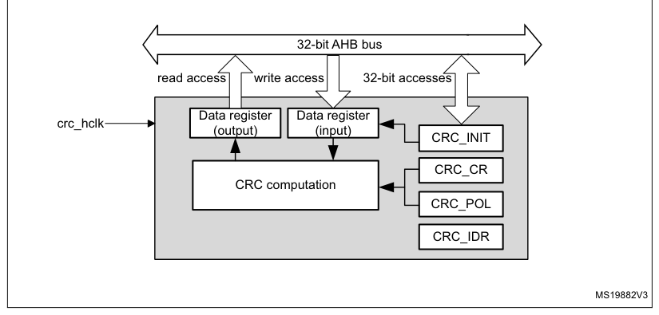

# 16 Cyclic redundancy check calculation unit (CRC)

[← RM0440 index](../STM32G4_RM0440.md)

## 16.1 Introduction

The CRC (cyclic redundancy check) calculation unit is used to get a CRC code from 8-, 16- or 32-bit
data word and a generator polynomial.

Among other applications, CRC-based techniques are used to verify data transmission or storage
integrity. In the scope of the functional safety standards, they offer a means of verifying the
flash memory integrity. The CRC calculation unit helps compute a signature of the software during
runtime, to be compared with a reference signature generated at link time and stored at a given
memory location.

## 16.2 CRC main features

- Uses CRC-32 (Ethernet) polynomial: 0x4C11DB7

X32 \+ X26 \+ X23 \+ X22 \+ X16 \+ X12 \+ X11 \+ X10 +X8 \+ X7 \+ X5 \+ X4 \+ X2+ X +1

- Alternatively, uses fully programmable polynomial with programmable size (7, 8, 16, 32 bits)
- Handles 8-,16-, 32-bit data size
- Programmable CRC initial value
- Single input/output 32-bit data register
- Input buffer to avoid bus stall during calculation
- CRC computation done in 4 AHB clock cycles (HCLK) for the 32-bit data size
- General-purpose 8-bit register (can be used for temporary storage)
- Reversibility option on I/O data
- Accessed through AHB slave peripheral by 32-bit words only, with the exception of CRC_DR register
  that can be accessed by words, right-aligned half-words and right-aligned bytes

## 16.3 CRC functional description

### 16.3.1 CRC block diagram

**Figure 37. CRC calculation unit block diagram**

### 16.3.2 CRC internal signals

**Table 103. CRC internal input/output signals**

| Signal name | Signal type | Description |
| --- | --- | --- |
| crc_hclk | Digital input | AHB clock |

### 16.3.3 CRC operation

The CRC calculation unit has a single 32-bit read/write data register (CRC_DR). It is used to input
new data (write access), and holds the result of the previous CRC calculation (read access).

Each write operation to the data register creates a combination of the previous CRC value (stored in
CRC_DR) and the new one. CRC computation is done on the whole 32-bit data word or byte by byte
depending on the format of the data being written.

The CRC_DR register can be accessed by word, right-aligned half-word and right-aligned byte. For the
other registers only 32-bit accesses are allowed.

The duration of the computation depends on data width:

- 4 AHB clock cycles for 32 bits
- 2 AHB clock cycles for 16 bits
- 1 AHB clock cycles for 8 bits

An input buffer allows a second data to be immediately written without waiting for any wait-states
due to the previous CRC calculation.

The data size can be dynamically adjusted to minimize the number of write accesses for a given
number of bytes. For instance, a CRC for 5 bytes can be computed with a word write followed by a
byte write.

The input data can be reversed to manage the various endianness schemes. The reversing operation can
be performed on 8 bits, 16 bits and 32 bits depending on the REV_IN[1:0] bits in the CRC_CR
register.

For example, 0x1A2B3C4D input data are used for CRC calculation as:

- 0x58D43CB2 with bit-reversal done by byte
- 0xD458B23C with bit-reversal done by half-word
- 0xB23CD458 with bit-reversal done on the full word

The output data can also be reversed by setting the REV_OUT bit in the CRC_CR register.

The operation is done at bit level. For example, 0x11223344 output data are converted to 0x22CC4488.

The CRC calculator can be initialized to a programmable value using the RESET control bit in the
CRC_CR register (the default value is 0xFFFFFFFF).

The initial CRC value can be programmed with the CRC_INIT register. The CRC_DR register is
automatically initialized upon CRC_INIT register write access.

The CRC_IDR register can be used to hold a temporary value related to CRC calculation. It is not
affected by the RESET bit in the CRC_CR register.

#### Polynomial programmability

The polynomial coefficients are fully programmable through the CRC_POL register, and the polynomial
size can be configured to be 7, 8, 16 or 32 bits by programming the POLYSIZE[1:0] bits in the CRC_CR
register. Even polynomials are not supported.

> **Note:** The type of an even polynomial is X+X2+..+Xn, while the type of an odd polynomial is

1+X+X2+..+Xn.

If the CRC data is less than 32-bit, its value can be read from the least significant bits of the
CRC_DR register.

To obtain a reliable CRC calculation, the change on-fly of the polynomial value or size can not be
performed during a CRC calculation. As a result, if a CRC calculation is ongoing, the application
must either reset it or perform a CRC_DR read before changing the polynomial.

The default polynomial value is the CRC-32 (Ethernet) polynomial: 0x4C11DB7.

## 16.4 CRC registers

The CRC_DR register can be accessed by words, right-aligned half-words and right-aligned bytes. For
the other registers only 32-bit accesses are allowed.

### 16.4.1 CRC data register (CRC_DR)

- **Address offset:** 0x00
- **Reset value:** 0xFFFF FFFF

**Register bit layout**

| Bit | Field | Access | Summary |
| ---: | --- | :---: | --- |
| 31 | `DR[31]` | rw | Data register bits |
| 30 | `DR[30]` | rw | ↳ |
| 29 | `DR[29]` | rw | ↳ |
| 28 | `DR[28]` | rw | ↳ |
| 27 | `DR[27]` | rw | ↳ |
| 26 | `DR[26]` | rw | ↳ |
| 25 | `DR[25]` | rw | ↳ |
| 24 | `DR[24]` | rw | ↳ |
| 23 | `DR[23]` | rw | ↳ |
| 22 | `DR[22]` | rw | ↳ |
| 21 | `DR[21]` | rw | ↳ |
| 20 | `DR[20]` | rw | ↳ |
| 19 | `DR[19]` | rw | ↳ |
| 18 | `DR[18]` | rw | ↳ |
| 17 | `DR[17]` | rw | ↳ |
| 16 | `DR[16]` | rw | ↳ |
| 15 | `DR[15]` | rw | ↳ |
| 14 | `DR[14]` | rw | ↳ |
| 13 | `DR[13]` | rw | ↳ |
| 12 | `DR[12]` | rw | ↳ |
| 11 | `DR[11]` | rw | ↳ |
| 10 | `DR[10]` | rw | ↳ |
| 9 | `DR[9]` | rw | ↳ |
| 8 | `DR[8]` | rw | ↳ |
| 7 | `DR[7]` | rw | ↳ |
| 6 | `DR[6]` | rw | ↳ |
| 5 | `DR[5]` | rw | ↳ |
| 4 | `DR[4]` | rw | ↳ |
| 3 | `DR[3]` | rw | ↳ |
| 2 | `DR[2]` | rw | ↳ |
| 1 | `DR[1]` | rw | ↳ |
| 0 | `DR[0]` | rw | ↳ |

**Bits 31:0 — `DR[31:0]`:** Data register bits

This register is used to write new data to the CRC calculator.

It holds the previous CRC calculation result when it is read.

If the data size is less than 32 bits, the least significant bits are used to write/read the correct
value.

### 16.4.2 CRC independent data register (CRC_IDR)

- **Address offset:** 0x04
- **Reset value:** 0x0000 0000

**Register bit layout**

| Bit | Field | Access | Summary |
| ---: | --- | :---: | --- |
| 31 | `IDR[31]` | rw | General-purpose 32-bit data register bits |
| 30 | `IDR[30]` | rw | ↳ |
| 29 | `IDR[29]` | rw | ↳ |
| 28 | `IDR[28]` | rw | ↳ |
| 27 | `IDR[27]` | rw | ↳ |
| 26 | `IDR[26]` | rw | ↳ |
| 25 | `IDR[25]` | rw | ↳ |
| 24 | `IDR[24]` | rw | ↳ |
| 23 | `IDR[23]` | rw | ↳ |
| 22 | `IDR[22]` | rw | ↳ |
| 21 | `IDR[21]` | rw | ↳ |
| 20 | `IDR[20]` | rw | ↳ |
| 19 | `IDR[19]` | rw | ↳ |
| 18 | `IDR[18]` | rw | ↳ |
| 17 | `IDR[17]` | rw | ↳ |
| 16 | `IDR[16]` | rw | ↳ |
| 15 | `IDR[15]` | rw | ↳ |
| 14 | `IDR[14]` | rw | ↳ |
| 13 | `IDR[13]` | rw | ↳ |
| 12 | `IDR[12]` | rw | ↳ |
| 11 | `IDR[11]` | rw | ↳ |
| 10 | `IDR[10]` | rw | ↳ |
| 9 | `IDR[9]` | rw | ↳ |
| 8 | `IDR[8]` | rw | ↳ |
| 7 | `IDR[7]` | rw | ↳ |
| 6 | `IDR[6]` | rw | ↳ |
| 5 | `IDR[5]` | rw | ↳ |
| 4 | `IDR[4]` | rw | ↳ |
| 3 | `IDR[3]` | rw | ↳ |
| 2 | `IDR[2]` | rw | ↳ |
| 1 | `IDR[1]` | rw | ↳ |
| 0 | `IDR[0]` | rw | ↳ |

**Bits 31:0 — `IDR[31:0]`:** General-purpose 32-bit data register bits

These bits can be used as a temporary storage location for four bytes.

This register is not affected by CRC resets generated by the RESET bit in the CRC_CR
register

### 16.4.3 CRC control register (CRC_CR)

- **Address offset:** 0x08
- **Reset value:** 0x0000 0000

**Register bit layout**

| Bit | Field | Access | Summary |
| ---: | --- | :---: | --- |
| 31 | Reserved | — | kept at reset value. |
| 30 | Reserved | — | ↳ |
| 29 | Reserved | — | ↳ |
| 28 | Reserved | — | ↳ |
| 27 | Reserved | — | ↳ |
| 26 | Reserved | — | ↳ |
| 25 | Reserved | — | ↳ |
| 24 | Reserved | — | ↳ |
| 23 | Reserved | — | ↳ |
| 22 | Reserved | — | ↳ |
| 21 | Reserved | — | ↳ |
| 20 | Reserved | — | ↳ |
| 19 | Reserved | — | ↳ |
| 18 | Reserved | — | ↳ |
| 17 | Reserved | — | ↳ |
| 16 | Reserved | — | ↳ |
| 15 | Reserved | — | ↳ |
| 14 | Reserved | — | ↳ |
| 13 | Reserved | — | ↳ |
| 12 | Reserved | — | ↳ |
| 11 | Reserved | — | ↳ |
| 10 | Reserved | — | ↳ |
| 9 | Reserved | — | ↳ |
| 8 | Reserved | — | ↳ |
| 7 | `REV_OUT` | rw | Reverse output data |
| 6 | `REV_IN[1]` | rw | Reverse input data |
| 5 | `REV_IN[0]` | rw | ↳ |
| 4 | `POLYSIZE[1]` | rw | Polynomial size |
| 3 | `POLYSIZE[0]` | rw | ↳ |
| 2 | Reserved | — | kept at reset value. |
| 1 | Reserved | — | ↳ |
| 0 | `RESET` | rs | RESET bit |

**Bits 31:8 — Reserved:** kept at reset value.

**Bit 7 — `REV_OUT`:** Reverse output data

This bit controls the reversal of the bit order of the output data.

- `0`: Bit order not affected
- `1`: Bit-reversed output format

**Bits 6:5 — `REV_IN[1:0]`:** Reverse input data

This bitfield controls the reversal of the bit order of the input data

- `00`: Bit order not affected
- `01`: Bit reversal done by byte
- `10`: Bit reversal done by half-word
- `11`: Bit reversal done by word

**Bits 4:3 — `POLYSIZE[1:0]`:** Polynomial size

These bits control the size of the polynomial.

- `00`: 32 bit polynomial
- `01`: 16 bit polynomial
- `10`: 8 bit polynomial
- `11`: 7 bit polynomial

**Bits 2:1 — Reserved:** kept at reset value.

**Bit 0 — `RESET`:** RESET bit

This bit is set by software to reset the CRC calculation unit and set the data register to the
value stored in the CRC_INIT register. This bit can only be set, it is automatically cleared by
hardware

### 16.4.4 CRC initial value (CRC_INIT)

- **Address offset:** 0x10
- **Reset value:** 0xFFFF FFFF

**Register bit layout**

| Bit | Field | Access | Summary |
| ---: | --- | :---: | --- |
| 31 | `CRC_INIT[31]` | rw | Programmable initial CRC value |
| 30 | `CRC_INIT[30]` | rw | ↳ |
| 29 | `CRC_INIT[29]` | rw | ↳ |
| 28 | `CRC_INIT[28]` | rw | ↳ |
| 27 | `CRC_INIT[27]` | rw | ↳ |
| 26 | `CRC_INIT[26]` | rw | ↳ |
| 25 | `CRC_INIT[25]` | rw | ↳ |
| 24 | `CRC_INIT[24]` | rw | ↳ |
| 23 | `CRC_INIT[23]` | rw | ↳ |
| 22 | `CRC_INIT[22]` | rw | ↳ |
| 21 | `CRC_INIT[21]` | rw | ↳ |
| 20 | `CRC_INIT[20]` | rw | ↳ |
| 19 | `CRC_INIT[19]` | rw | ↳ |
| 18 | `CRC_INIT[18]` | rw | ↳ |
| 17 | `CRC_INIT[17]` | rw | ↳ |
| 16 | `CRC_INIT[16]` | rw | ↳ |
| 15 | `CRC_INIT[15]` | rw | ↳ |
| 14 | `CRC_INIT[14]` | rw | ↳ |
| 13 | `CRC_INIT[13]` | rw | ↳ |
| 12 | `CRC_INIT[12]` | rw | ↳ |
| 11 | `CRC_INIT[11]` | rw | ↳ |
| 10 | `CRC_INIT[10]` | rw | ↳ |
| 9 | `CRC_INIT[9]` | rw | ↳ |
| 8 | `CRC_INIT[8]` | rw | ↳ |
| 7 | `CRC_INIT[7]` | rw | ↳ |
| 6 | `CRC_INIT[6]` | rw | ↳ |
| 5 | `CRC_INIT[5]` | rw | ↳ |
| 4 | `CRC_INIT[4]` | rw | ↳ |
| 3 | `CRC_INIT[3]` | rw | ↳ |
| 2 | `CRC_INIT[2]` | rw | ↳ |
| 1 | `CRC_INIT[1]` | rw | ↳ |
| 0 | `CRC_INIT[0]` | rw | ↳ |

**Bits 31:0 — `CRC_INIT[31:0]`:** Programmable initial CRC value

This register is used to write the CRC initial value.

### 16.4.5 CRC polynomial (CRC_POL)

- **Address offset:** 0x14
- **Reset value:** 0x04C1 1DB7

**Register bit layout**

| Bit | Field | Access | Summary |
| ---: | --- | :---: | --- |
| 31 | `POL[31]` | rw | Programmable polynomial |
| 30 | `POL[30]` | rw | ↳ |
| 29 | `POL[29]` | rw | ↳ |
| 28 | `POL[28]` | rw | ↳ |
| 27 | `POL[27]` | rw | ↳ |
| 26 | `POL[26]` | rw | ↳ |
| 25 | `POL[25]` | rw | ↳ |
| 24 | `POL[24]` | rw | ↳ |
| 23 | `POL[23]` | rw | ↳ |
| 22 | `POL[22]` | rw | ↳ |
| 21 | `POL[21]` | rw | ↳ |
| 20 | `POL[20]` | rw | ↳ |
| 19 | `POL[19]` | rw | ↳ |
| 18 | `POL[18]` | rw | ↳ |
| 17 | `POL[17]` | rw | ↳ |
| 16 | `POL[16]` | rw | ↳ |
| 15 | `POL[15]` | rw | ↳ |
| 14 | `POL[14]` | rw | ↳ |
| 13 | `POL[13]` | rw | ↳ |
| 12 | `POL[12]` | rw | ↳ |
| 11 | `POL[11]` | rw | ↳ |
| 10 | `POL[10]` | rw | ↳ |
| 9 | `POL[9]` | rw | ↳ |
| 8 | `POL[8]` | rw | ↳ |
| 7 | `POL[7]` | rw | ↳ |
| 6 | `POL[6]` | rw | ↳ |
| 5 | `POL[5]` | rw | ↳ |
| 4 | `POL[4]` | rw | ↳ |
| 3 | `POL[3]` | rw | ↳ |
| 2 | `POL[2]` | rw | ↳ |
| 1 | `POL[1]` | rw | ↳ |
| 0 | `POL[0]` | rw | ↳ |

**Bits 31:0 — `POL[31:0]`:** Programmable polynomial

This register is used to write the coefficients of the polynomial to be used for CRC
calculation.

If the polynomial size is less than 32 bits, the least significant bits have to be used to program
the correct value.

### 16.4.6 CRC register map

**Register summary**

| Offset | Register | Reset value |
| --- | --- | --- |
| 0x00 | `CRC_DR` | 0xFFFF FFFF |
| 0x04 | `CRC_IDR` | 0x0000 0000 |
| 0x08 | `CRC_CR` | 0x0000 0000 |
| 0x10 | `CRC_INIT` | 0xFFFF FFFF |
| 0x14 | `CRC_POL` | 0x04C1 1DB7 |

Refer to [Section 2.2](chapter-02.md#22-memory-organization): Memory organization for the register boundary addresses.
