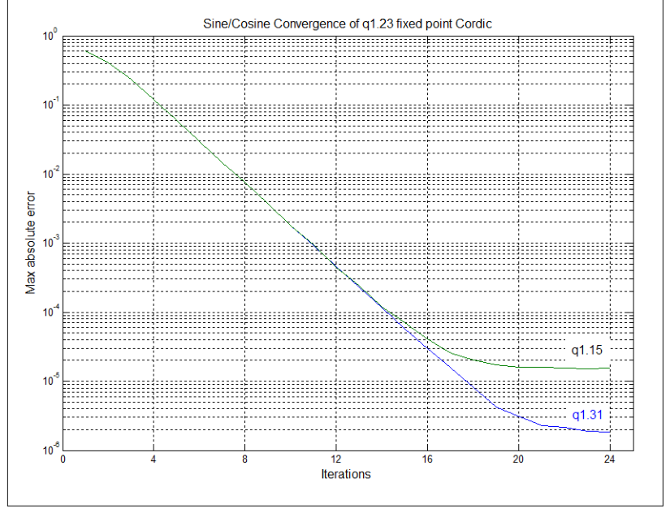
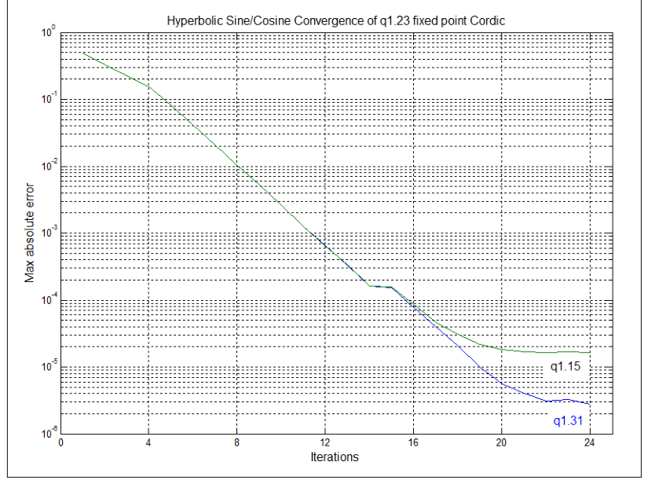
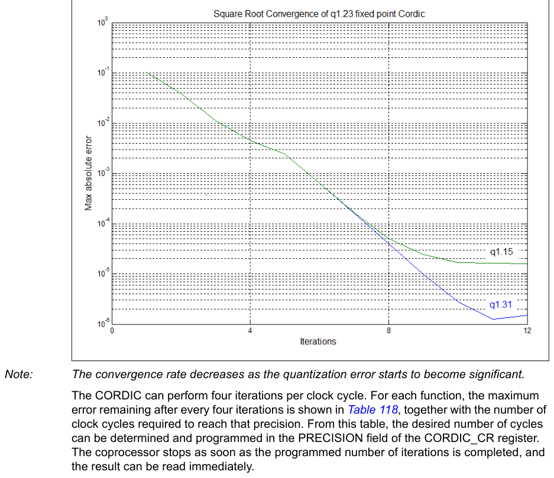

# 17 CORDIC coprocessor (CORDIC)

[← RM0440 index](../STM32G4_RM0440.md)

## 17.1 CORDIC introduction

The CORDIC coprocessor provides hardware acceleration of mathematical functions (mainly
trigonometric ones) commonly used in motor control, metering, signal processing, and many other
applications.

It speeds up the calculation of these functions compared to a software implementation, making
possible the use of a lower operating frequency, or freeing up processor cycles to perform other
tasks.

## 17.2 CORDIC main features

- 24-bit CORDIC rotation engine
- Circular and Hyperbolic modes
- Rotation and Vectoring modes
- Functions: sine, cosine, sinh, cosh, atan, atan2, atanh, modulus, square root, natural logarithm
- Programmable precision
- Low latency AHB slave interface
- Results can be read as soon as ready, without polling or interrupt
- DMA read and write channels
- Multiple register read/write by DMA

## 17.3 CORDIC functional description

### 17.3.1 General description

The CORDIC is a cost-efficient successive approximation algorithm for evaluating trigonometric and
hyperbolic functions.

In trigonometric (circular) mode, the sine and cosine of an angle θ are determined by rotating the
unit vector [1, 0] through decreasing angles until the cumulative sum of the rotation angles equals
the input angle θ. The x and y cartesian components of the rotated vector then correspond,
respectively, to the cosine and sine of θ. Inversely, the angle of a vector [x, y] corresponding to
arctangent (y / x), is determined by rotating [x, y] through successively decreasing angles to
obtain the unit vector [1, 0]. The cumulative sum of the rotation angles gives the angle of the
original vector.

The CORDIC algorithm can also be used for calculating hyperbolic functions (sinh, cosh, atanh), by
replacing the successive circular rotations by steps along a hyperbole.

Other functions can be derived from the basic functions described above.

### 17.3.2 CORDIC functions

The first step when using the coprocessor is to select the required function, by programming the
FUNC field of the CORDIC_CR register.

Table 105 lists the functions supported by the CORDIC coprocessor.

**Table 105. CORDIC functions**

| Source row | Column 1 | Column 2 | Column 3 | Column 4 | Column 5 | Column 6 | Column 7 | Column 8 | Column 9 | Column 10 | Column 11 |
| ---: | --- | --- | --- | --- | --- | --- | --- | --- | --- | --- | --- |
| 1 | `Primary` | `Secondary` | `Primary` | `Secondary` |  |  |  |  |  |  |  |
| 2 | `Function` |  |  |  |  |  |  |  |  |  |  |
| 3 | `argument (ARG1)` | `argument (ARG2)` | `result (RES1)` | `result (RES2)` |  |  |  |  |  |  |  |
| 4 | `Cosine` | `angle θ` | `modulus m` | `m` | `⋅` | `cos` | `θ` | `m` | `⋅` | `sin` | `θ` |
| 5 | `Sine` | `angle θ` | `modulus m` | `m` | `⋅` | `sin` | `θ` | `m` | `⋅` | `cos` | `θ` |
| 6 | `Phase` | `x` | `y` | `atan2(y,x)` |  |  |  |  |  |  |  |
| 7 | `x2 + y2` |  |  |  |  |  |  |  |  |  |  |
| 8 | `Modulus` | `x` | `y` | `atan2(y,x)` |  |  |  |  |  |  |  |
| 9 | `x2 + y2` |  |  |  |  |  |  |  |  |  |  |
| 10 | `Arctangent` | `x` | `none` | `tan-1 x` | `none` |  |  |  |  |  |  |
| 11 | `Hyperbolic cosine` | `x` | `none` | `cosh x` | `sinh x` |  |  |  |  |  |  |
| 12 | `Hyperbolic sine` | `x` | `none` | `sinh x` | `cosh x` |  |  |  |  |  |  |
| 13 | `Hyperbolic arctangent` | `x` | `none` | `tanh-1 x` | `none` |  |  |  |  |  |  |
| 14 | `Natural logarithm` | `x` | `none` | `ln x` | `none` |  |  |  |  |  |  |
| 15 | `Square root` | `x` | `none` | `none` |  |  |  |  |  |  |  |
| 16 | `x` |  |  |  |  |  |  |  |  |  |  |

Several functions take two input arguments (ARG1 and ARG2), and some generate two results (RES1 and
RES2) simultaneously. This is a side-effect of the algorithm and means that only one operation is
needed to obtain two values. This is the case, for example, when performing polar-to-rectangular
conversion: sin θ also generates cos θ, and cos θ also generates sin θ. Similarly for
rectangular-to-polar conversion (phase(x,y), modulus(x,y)) and for hyperbolic functions (cosh θ,
sinh θ).

> **Note:** The exponential function, exp x, can be obtained as the sum of sinh x and cosh x.

Furthermore, base N logarithms, logN x, can be derived by multiplying ln x by a constant K, where K
= 1/ln N.

For certain functions (atan, log, sqrt) a scaling factor (see [Section 17.3.4](#1734-scaling-factor)) can be applied to
extend the range beyond the maximum [-1, 1] supported by the q1.31 fixed point format. The scaling
factor must be set to 0 for all other circular functions, and to 1 for hyperbolic functions.

#### Cosine

**Table 106. Cosine parameters**

| Parameter | Description | Range |
| --- | --- | --- |
| ARG1 | Angle θ in radians, divided by π | [-1, 1] |
| ARG2 | Modulus m | [0, 1] |
| RES1 | m · cos θ | [-1, 1] |

**Table 106. Cosine parameters (continued)**

| Parameter | Description | Range |
| --- | --- | --- |
| RES2 | m · sin θ | [-1, 1] |
| SCALE | Not applicable | 0 |

This function calculates the cosine of an angle in the range -π to π. It can also be used to perform
polar to rectangular conversion.

The primary argument is the angle θ in radians. It must be divided by π before programming ARG1.

The secondary argument is the modulus m. If m is greater than 1, a scaling must be applied in
software to adapt it to the q1.31 range of ARG2.

The primary result, RES1, is the cosine of the angle, multiplied by the modulus.

The secondary result, RES2, is the sine of the angle, multiplied by the modulus.

#### Sine

**Table 107. Sine parameters**

| Parameter | Description | Range |
| --- | --- | --- |
| ARG1 | Angle θ in radians, divided by π | [-1, 1] |
| ARG2 | Modulus m | [0, 1] |
| RES1 | m · sin θ | [-1, 1] |
| RES2 | m · cos θ | [-1, 1] |
| SCALE | Not applicable | 0 |

This function calculates the sine of an angle in the range -π to π. It can also be used to perform
polar to rectangular conversion.

The primary argument is the angle θ in radians. It must be divided by π before programming ARG1.

The secondary argument is the modulus m. If m is greater than 1, a scaling must be applied in
software to adapt it to the q1.31 range of ARG2.

The primary result, RES1, is the sine of the angle, multiplied by the modulus.

The secondary result, RES2, is the cosine of the angle, multiplied by the modulus.

#### Phase

**Table 108. Phase parameters**

| Parameter | Description | Range |
| --- | --- | --- |
| ARG1 | x coordinate | [-1, 1] |
| ARG2 | y coordinate | [-1, 1] |
| RES1 | Phase angle θ in radians, divided by π | [-1, 1] |

**Table 108. Phase parameters (continued)**

| Parameter | Description | Range |
| --- | --- | --- |
| RES2 | Modulus m | [0, 1] |
| SCALE | Not applicable | 0 |

This function calculates the phase angle in the range -π to π of a vector v = [x y] (also known as
atan2(y,x). It can also be used to perform rectangular to polar conversion.

The primary argument is the x coordinate, that is, the magnitude of the vector in the direction of
the x axis. If |x| > 1, a scaling must be applied in software to adapt it to the q1.31 range of
ARG1.

The secondary argument is the y coordinate, that is, the magnitude of the vector in the direction of
the y axis. If |y| > 1, a scaling must be applied in software to adapt it to the q1.31 range of
ARG2.

The primary result, RES1, is the phase angle θ of the vector v. RES1 must be multiplied by π to
obtain the angle in radians. Note that values close to π may sometimes wrap to -π due to the
circular nature of the phase angle.

| Source row | Column 1 | Column 2 | Column 3 | Column 4 | Column 5 | Column 6 | Column 7 | Column 8 | Column 9 |
| ---: | --- | --- | --- | --- | --- | --- | --- | --- | --- |
| 1 | `The secondary result, RES2, is the modulus, given by:` | `v` | `=` | `x2` | `+` | `y2` | `. If` | `v` | `> 1 the result in` |

RES2 is saturated to 1.

#### Modulus

**Table 109. Modulus parameters**

| Parameter | Description | Range |
| --- | --- | --- |
| ARG1 | x coordinate | [-1, 1] |
| ARG2 | y coordinate | [-1, 1] |
| RES1 | Modulus m | [0, 1] |
| RES2 | Phase angle θ | [-1, 1] |
| SCALE | Not applicable | 0 |

This function calculates the magnitude, or modulus, of a vector v = [x y]. It can also be used to
perform rectangular to polar conversion.

The primary argument is the x coordinate, that is, the magnitude of the vector in the direction of
the x axis. If |x| > 1, a scaling must be applied in software to adapt it to the q1.31 range of
ARG1.

The secondary argument is the y coordinate, that is, the magnitude of the vector in the direction of
the y axis. If |y| > 1, a scaling must be applied in software to adapt it to the q1.31 range of
ARG2.

| Source row | Column 1 | Column 2 | Column 3 | Column 4 | Column 5 | Column 6 | Column 7 | Column 8 | Column 9 |
| ---: | --- | --- | --- | --- | --- | --- | --- | --- | --- |
| 1 | `The primary result, RES1, is the modulus, given by:` | `v` | `=` | `x2` | `+` | `y2` | `. If` | `v` | `> 1 the result in` |

RES1 is saturated to 1.

The secondary result, RES2, is the phase angle θ of the vector v. RES2 must be multiplied by π to
obtain the angle in radians. Note that values close to π may sometimes wrap to -π due to the
circular nature of the phase angle.

#### Arctangent

**Table 110. Arctangent parameters**

| Source row | Column 1 | Column 2 | Column 3 |
| ---: | --- | --- | --- |
| 1 | `Parameter` | `Description` | `Range` |
| 2 | `ARG1` | `–` | `[-1, 1]` |
| 3 | `x ⋅ 2 n` |  |  |
| 4 | `ARG2` | `Not applicable` | `-` |
| 5 | `RES1` | `2-n · tan-1 x, in radians, divided by p` | `[-1, 1]` |
| 6 | `RES2` | `Not applicable` | `-` |
| 7 | `SCALE` | `n` | `[0 7]` |

This function calculates the arctangent, or inverse tangent, of the input argument x.

The primary argument, ARG1, is the input value, x = tan θ. If |x| > 1, a scaling factor of 2-n must
be applied in software such that -1 \< x · 2-n \< 1. The scaled value x · 2-n is programmed in ARG1
and the scale factor n must be programmed in the SCALE parameter.

Note that the maximum input value allowed is tan θ = 128, which corresponds to an angle θ = 89.55
degrees. For |x| > 128, a software method must be used to find tan-1 x.

The secondary argument, ARG2, is unused.

The primary result, RES1, is the angle θ = tan-1 x. RES1 must be multiplied by 2n · π to obtain the
angle in radians.

The secondary result, RES2, is unused.

#### Hyperbolic cosine

**Table 111. Hyperbolic cosine parameters**

| Source row | Column 1 | Column 2 | Column 3 |
| ---: | --- | --- | --- |
| 1 | `Parameter` | `Description` | `Range` |
| 2 | `ARG1` | `–` | `[-0.559 0.559]` |
| 3 | `x ⋅ 2 n` |  |  |
| 4 | `ARG2` | `Not applicable` | `-` |
| 5 | `RES1` | `–` | `[0.5 0.846]` |
| 6 | `2 n ⋅ cosh x` |  |  |
| 7 | `RES2` | `–` | `[-0.683 0.683]` |
| 8 | `2 n ⋅ sinh x` |  |  |
| 9 | `SCALE` | `n` | `1` |

This function calculates the hyperbolic cosine of a hyperbolic angle x. It can also be used to
calculate the exponential functions ex = cosh x \+ sinh x, and e-x = cosh x - sinh x.

The primary argument is the hyperbolic angle x. Only values of x in the range -1.118 to +1.118 are
supported. Since the minimum value of cosh x is 1, which is beyond the range of the q1.31 format, a
scaling factor of 2-n must be applied in software. The factor n = 1 must be programmed in the SCALE
parameter.

The secondary argument is not used.

The primary result, RES1, is the hyperbolic cosine, cosh x. RES1 must be multiplied by 2 to obtain
the correct result.

The secondary result, RES2, is the hyperbolic sine, sinh x. RES2 must be multiplied by 2 to obtain
the correct result.

#### Hyperbolic sine

**Table 112. Hyperbolic sine parameters**

| Source row | Column 1 | Column 2 | Column 3 |
| ---: | --- | --- | --- |
| 1 | `Parameter` | `Description` | `Range` |
| 2 | `ARG1` | `–` | `[-0.559, 0.559]` |
| 3 | `x ⋅ 2 n` |  |  |
| 4 | `ARG2` | `Not applicable` | `-` |
| 5 | `RES1` | `–` | `[-0.683, 0.683]` |
| 6 | `2 n ⋅ sinh x` |  |  |
| 7 | `RES2` | `–` | `[0.5, 0.846]` |
| 8 | `2 n ⋅ cosh x` |  |  |
| 9 | `SCALE` | `n` | `1` |

This function calculates the hyperbolic sine of a hyperbolic angle x. It can also be used to
calculate the exponential functions ex = cosh x \+ sinh x, and e-x = cosh x-sinh x.

The primary argument is the hyperbolic angle x. Only values of x in the range -1.118 to +1.118 are
supported. For all input values, a scaling factor of 2-n must be applied in software, where n = 1.
The scaled value x · 0.5 is programmed in ARG1 and the factor n = 1 must be programmed in the SCALE
parameter.

The secondary argument is not used.

The primary result, RES1, is the hyperbolic sine, sinh x. RES1 must be multiplied by 2 to obtain the
correct result.

The secondary result, RES2, is the hyperbolic cosine, cosh x. RES2 must be multiplied by 2 to obtain
the correct result.

#### Hyperbolic arctangent

**Table 113. Hyperbolic arctangent parameters**

| Parameter | Description | Range |
| --- | --- | --- |
| ARG1 | x · 2-n | [-0.403 0.403] |
| ARG2 | Not applicable | - |
| RES1 | 2-n·atanh x | [-0.559 0.559] |
| RES2 | Not applicable | - |
| SCALE | n | 1 |

This function calculates the hyperbolic arctangent of the input argument x.

The primary argument is the input value x. Only values of x in the -0.806 to +0.806 range are
supported. The value x must be scaled by a factor 2-n, where n = 1. The scaled value
x · 0.5 is programmed in ARG1 and the factor n = 1 must be programmed in the SCALE parameter.

The secondary argument is not used.

The primary result is the hyperbolic arctangent, atanh x. RES1 must be multiplied by 2 to obtain the
correct value.

The secondary result is not used.

#### Natural logarithm

**Table 114. Natural logarithm parameters**

| Parameter | Description | Range |
| --- | --- | --- |
| ARG1 | x · 2-n | [0.054 0.875] |
| ARG2 | Not applicable | - |
| RES1 | 2-(n+1).ln x | [-0.279 0.137] |
| RES2 | Not applicable | - |
| SCALE | n | [1 4] |

This function calculates the natural logarithm of the input argument x.

The primary argument is the input value x. Only values of x in the range 0.107 to 9.35 are
supported. The value x must be scaled by a factor 2-n, such that x · 2-n \< 1-2-n. The scaled value x
· 2-n is programmed in ARG1 and the factor n must be programmed in the SCALE parameter.

Table 115 lists the valid scaling factors, n, and the corresponding ranges of x and ARG1.

**Table 115. Natural log scaling factors and corresponding ranges**

| n | x range | ARG1 range |
| --- | --- | --- |
| 1 | 0.107 ≤ x \< 1 | 0.0535 ≤ ARG1 \< 0.5 |
| 2 | 1 ≤ x \< 3 | 0.25 ≤ ARG1 \< 0.75 |
| 3 | 3 ≤ x \< 7 | 0.375 ≤ ARG1 \< 0.875 |
| 4 | 7 ≤ x ≤ 9.35 | 0.4375 ≤ ARG1 \< 0.584 |

The secondary argument is not used.

The primary result is the natural logarithm, ln x. RES1 must be multiplied by 2(n+1) to obtain the
correct value.

The secondary result is not used.

#### Square root

**Table 116. Square root parameters**

| Source row | Column 1 | Column 2 | Column 3 | Column 4 |
| ---: | --- | --- | --- | --- |
| 1 | `Parameter` | `Description` | `Range` |  |
| 2 | `ARG1` | `x · 2-n` | `[0.027 0.875]` |  |
| 3 | `ARG2` | `Not applicable` | `-` |  |
| 4 | `-···` |  |  |  |
| 5 | `RES1` | `2 n` | `x` | `[0.04 1]` |
| 6 | `RES2` | `Not applicable` | `-` |  |
| 7 | `SCALE` | `n` | `[0 2]` |  |

This function calculates the square root of the input argument x.

The primary argument is the input value x. Only values of x in the range 0.027 to 2.34 are
supported. The value x must be scaled by a factor 2-n, such that x · 2-n \< (1 - 2(-n-2)).

The scaled value x · 2-n is programmed in ARG1 and the factor n must be programmed in the SCALE
parameter.

Table 117 lists the valid scaling factors, n, and the corresponding ranges of x and ARG1.

**Table 117. Square root scaling factors and corresponding ranges**

| n | x range | ARG1 range |
| --- | --- | --- |
| 0 | 0.027 ≤ x \< 0.75 | 0.027 ≤ARG1 \< 0.75 |
| 1 | 0.75 ≤ x \< 1.75 | 0.375 ≤ARG1 \< 0.875 |
| 2 | 1.75 ≤ x ≤ 2.341 | 0.4375 ≤ARG1 ≤0.585 |

The secondary argument is not used.

The primary result is the square root of x. RES1 must be multiplied by 2n to obtain the correct
value.

The secondary result is not used.

### 17.3.3 Fixed point representation

The CORDIC operates in fixed point signed integer format. Input and output values can be either
q1.31 or q1.15.

In q1.31 format, numbers are represented by one sign bit and 31 fractional bits (binary decimal
places). The numeric range is therefore -1 (0x80000000) to 1 - 2-31 (0x7FFFFFFF).

In q1.15 format, the numeric range is 1 (0x8000) to 1 - 2-15 (0x7FFF). This format has the advantage
that two input arguments can be packed into a single 32-bit write, and two results can be fetched in
one 32-bit read.

### 17.3.4 Scaling factor

Several of the functions listed in [Section 17.3.2](#1732-cordic-functions) specify a scaling factor, SCALE. This allows the
function input range to be extended to cover the full range of values supported by the CORDIC,
without saturating the input, output, or internal registers. If the scaling factor is
required, it must be calculated by software and programmed into the SCALE field of the CORDIC_CSR
register. The input arguments must be scaled accordingly before programming the scaled values in the
CORDIC_WDATA register. The scaling must also be undone on the results read from the CORDIC_RDATA
register.

> **Note:** The scaling factor entails a loss of precision due to truncation of the scaled value.

### 17.3.5 Precision

The precision of the result is dependent on the number of CORDIC iterations. The algorithm converges
at a constant rate of one binary digit per iteration for trigonometric functions (sine, cosine,
phase, modulus), see Figure 38.

For hyperbolic functions (hyperbolic sine, hyperbolic cosine, natural logarithm), the convergence
rate is less constant due to the peculiarities of the CORDIC algorithm (see Figure 39). The square
root function converges at roughly twice the speed of the hyperbolic functions (see Figure 40).

**Figure 38. CORDIC convergence for trigonometric functions**

**Figure 39. CORDIC convergence for hyperbolic functions**

**Figure 40. CORDIC convergence for square root**

> **Note:** The convergence rate decreases as the quantization error starts to become significant.

The CORDIC can perform four iterations per clock cycle. For each function, the maximum error
remaining after every four iterations is shown in Table 118, together with the number of clock
cycles required to reach that precision. From this table, the desired number of cycles can be
determined and programmed in the PRECISION field of the CORDIC_CR register. The coprocessor stops as
soon as the programmed number of iterations is completed, and the result can be read immediately.

**Table 118. Precision vs. number of iterations**

| Source row | Column 1 | Column 2 | Column 3 | Column 4 |
| ---: | --- | --- | --- | --- |
| 1 | `Max residual error(1)` |  |  |  |
| 2 | `Number of` | `Number of` |  |  |
| 3 | `Function` |  |  |  |
| 4 | `iterations` | `cycles` |  |  |
| 5 | `q1.31 format` | `q1.15 format` |  |  |
| 6 | `4` | `1` | `2-3` | `2-3` |
| 7 | `8` | `2` | `2-7` | `2-7` |
| 8 | `Sin, Cos,` |  |  |  |
| 9 | `12` | `3` | `2-11` | `2-11` |
| 10 | `Phase(2), Mod,` |  |  |  |
| 11 | `16` | `4` | `2-15` | `2-15` |
| 12 | `Atan(4)` |  |  |  |
| 13 | `20` | `5` | `2-18` | `2-16` |
| 14 | `24` | `6` | `2-19` | `2-16` |

**Table 118. Precision vs. number of iterations (continued)**

| Source row | Column 1 | Column 2 | Column 3 | Column 4 | Column 5 |
| ---: | --- | --- | --- | --- | --- |
| 1 | `Max residual error(1)` |  |  |  |  |
| 2 | `Number of` | `Number of` |  |  |  |
| 3 | `Function` |  |  |  |  |
| 4 | `iterations` | `cycles` |  |  |  |
| 5 | `q1.31 format` | `q1.15 format` |  |  |  |
| 6 | `4` | `1` | `2-2` | `2-2` |  |
| 7 | `8` | `2` | `2-6` | `2-6` |  |
| 8 | `12` | `3` | `2-10` | `2-10` |  |
| 9 | `Sinh, Cosh,` |  |  |  |  |
| 10 | `Atanh, Ln(3)` |  |  |  |  |
| 11 | `16` | `4` | `2-13` | `2-13` |  |
| 12 | `20` | `5` | `2-17` | `2-15` |  |
| 13 | `24` | `6` | `2-18` | `2-15` |  |
| 14 | `4` | `1` | `2-7` | `2-7` |  |
| 15 | `Sqrt(4)` | `8` | `2` | `2-14` | `2-14` |
| 16 | `12` | `3` | `2-19` | `2-15` |  |

1. Max residual error is the maximum error remaining after the given number of iterations, compared
   to the
   identical calculation performed in double precision floating point. An additional rounding error may
   be
   incurred, of up to 2-16 for q15 format or 2-20 for q31 format.
2. For modulus > 0.5. The achievable precision reduces proportionally to the magnitude of the
   modulus, as
   quantization error becomes significant.
3. SCALE = 1. If a higher scaling factor is used, the achievable precision is reduced
   proportionally.
4. SCALE = 0. If a higher scaling factor is used, the achievable precision is reduced
   proportionally.

### 17.3.6 Zero-overhead mode

The fastest way to use the coprocessor is to preprogram the CORDIC_CSR register with the function to
be performed (FUNC), the desired number of clock cycles (PRECISION), the size of the input and
output values (ARGSIZE, RESSIZE), the number of input arguments (NARGS) and/or results (NRES), and
the scaling factor (SCALE), if applicable.

The calculation is triggered by writing the input arguments to the CORDIC_WDATA register. As soon as
the correct number of input arguments has been written (and any ongoing calculation has finished), a
new calculation is launched using these input arguments and the current CORDIC_CSR settings. There
is no need to reprogram the CORDIC_CSR register if there is no change.

If a dual 32-bit input argument is needed (ARGSIZE = 0, NARGS = 1), the primary input argument
(ARG1) must be written first, followed by the secondary argument (ARG2). If the secondary argument
remains unchanged for a series of calculations, the second write can be avoided, by reprogramming
the number of arguments to one (NARGS = 0), once the first calculation has started. The secondary
argument retains its programmed value as long as the function is not changed.

> **Note:** ARG2 is set to +1 (0x7FFFFFFF) after a reset.

If two 16-bit arguments are used (ARGSIZE = 1) they must be packed into a 32-bit word, with ARG1 in
the least significant half-word and ARG2 in the most significant half-word. The packed 32-bit word
is then written to the CORDIC_WDATA register. Only one write is needed in this case (NARGS = 0).

For functions taking only one input argument, ARG1, it is recommended to set NARGS = 0. If NARGS =
1, a second write to CORDIC_WDATA must be performed to trigger the calculation. The ARG2 data in
this case is not used.

Once the calculation starts, any attempt to read the CORDIC_RDATA register inserts bus wait-states
until the calculation is completed, before returning the result. It is then possible for the
software to write the input and immediately read the result without polling to see if it is valid.
Alternatively, the processor can wait for the appropriate number of clock cycles before reading the
result. This time can be used to program the CORDIC_CSR register for the next calculation, and
prepare the next input data, if needed. The CORDIC_CSR register can be reprogrammed while a
calculation is in progress, without affecting the result of the ongoing calculation. In the same
way, the CORDIC_WDATA register can be updated with the next argument(s) once the previous ones have
been taken into account. The next arguments and settings remain pending until the previous
calculation has completed.

When a calculation is finished, the result(s) can be read from the CORDIC_RDATA register. If two
32-bit results are expected (NRES = 1, RESSIZE = 0), the primary result (RES1) is read out first,
followed by the secondary result (RES2). If only one 32-bit result is expected (NRES = 0, RESSIZE =
0), then RES1 is output on the first read.

If 16-bit results are expected (RESSIZE = 1), a single read to CORDIC_RDATA fetches both results
packed into a 32-bit word. RES1 is in the lower half-word, and RES2 in the upper half-word. In this
case, it is recommended to program NRES = 0. IF NRES = 1, a second read of CORDIC_RDATA must be
performed to free up the CORDIC for the next operation. The data from this second read must be
discarded.

The next calculation starts when the expected number of results has been read, provided the expected
number of arguments has been written. This means that at any time, there can be a calculation in
progress, or waiting for the results to be read, and an operation pending. Any further access to
CORDIC_WDATA while an operation is pending cancels it and overwrites the data.

The following sequence summarizes the use of the CORDIC_IP in zero-overhead mode:

1. Program the CORDIC_CSR register with the appropriate settings
2. Program the argument(s) for the first calculation in the CORDIC_WDATA register. This
   launches the first calculation.
3. If needed, update the CORDIC_CSR register settings for the next calculation.
4. Program the argument(s) for the next calculation in the CORDIC_WDATA register.
5. Read the result(s) from the CORDIC_RDATA register. This triggers the next
   calculation.
6. Go to step 3.

### 17.3.7 Polling mode

When a new result is available in the CORDIC_RDATA register, the RRDY flag is set in the CORDIC_CSR
register. The flag can be polled by reading the register. It is reset by reading the CORDIC_RDATA
register (once or twice, depending on the NRES field of the CORDIC_CSR register).

Polling the RRDY flag takes slightly longer than reading the CORDIC_RDATA register directly, since
the result is not read as soon as it is available. The processor and bus interface are not stalled
while reading the CORDIC_CSR register, so this mode may be of interest if stalling the processor is
not acceptable (for example, if low latency interrupts must be serviced).

### 17.3.8 Interrupt mode

By setting the interrupt enable (IE) bit in the CORDIC_CSR register, an interrupt is generated
whenever the RRDY flag is set. The interrupt is cleared when the flag is reset.

This mode allows the result of the calculation to be read under interrupt service routine, and hence
given a priority relative to other tasks. However, it is slower than directly reading the result, or
polling the flag, due to the interrupt handling delays.

### 17.3.9 DMA mode

If the DMA write enable (DMAWEN) bit is set in the CORDIC_CSR register, and no operation is pending,
a DMA write channel request is generated. The DMA controller can transfer a primary input argument
(ARG1) from memory into the CORDIC_WDATA register. Writing into the register deasserts the DMA
request. If NARGS = 1 in the CORDIC_CSR register, a second DMA write channel request is generated to
transfer the secondary input argument (ARG2) into the CORDIC_WDATA register. When all input
arguments have been written, and any ongoing calculation has been completed (by reading the
results), a new calculation is started and another DMA write channel request is generated.

If the DMA read enable (DMAREN) bit is set in the CORDIC_CSR register, the RRDY flag going active
generates a DMA read channel request. The DMA controller can then transfer the primary result (RES1)
from the CORDIC_RDATA register to memory. Reading the register deasserts the DMA request. If NRES =
1 in the CORDIC_CSR register, a second DMA request is generated to read out the secondary result
(RES2). When all results have been read, the RRDY flag is deasserted.

The DMA read and write channels can be enabled separately. If both channels are enabled, the CORDIC
can autonomously perform repeated calculations on a buffer of data without processor intervention.
This allows the processor to perform other tasks. The DMA controller is operating in
memory-to-peripheral mode for the write channel, and peripheral-to-memory mode for the read channel.
The sequence is started by the processor setting the DMAWEN flag, the DMA read and write requests
are generated as fast as the CORDIC can process the data.

In some cases, the input data may be stored in memory, and the output is transferred at regular
intervals to another peripheral, such as a digital-to-analog converter. In this case, the
destination peripheral generates a DMA request each time it needs a new data. The DMA controller can
directly fetch the next sample from the CORDIC_RDATA register (in this case the DMA controller is
operating in memory-to-peripheral mode, even though the source is a peripheral register). The act of
reading the result allows the CORDIC to start a new calculation, which in turn generates a DMA write
channel request, and the DMA controller transfers the next input value to the CORDIC_WDATA register.
The DMA write channel is enabled (DMAWEN = 1), but the read channel must not be enabled.

In a similar way, data coming from another peripheral, such as an ADC, can be transferred directly
to the CORDIC_WDATA register (in peripheral-to-memory mode). The DMA write channel must not be
enabled. The CORDIC processes the input data and generates a DMA read request when complete, if
DMAREN = 1. The DMA controller then transfers the result from CORDIC_RDATA register to memory
(peripheral-to-memory mode).

> **Note:** No DMA request is generated to program the CORDIC_CSR register. DMA mode is
> therefore useful only when repeatedly performing the same function with the same settings. The scale
> factor cannot be changed during a series of DMA transfers.

> **Note:** Each DMA request must be acknowledged, as a result of the DMA performing an access to
> the CORDIC_WDATA or CORDIC_RDATA register. If an extraneous access to the relevant register occurs
> before this, the acknowledge is asserted prematurely, and may block the DMA channel. Therefore, when
> the DMA read channel is enabled, CPU access to the CORDIC_RDATA register must be avoided. Similarly,
> the processor must avoid accessing the CORDIC_WDATA register when the DMA write channel is enabled.

## 17.4 CORDIC registers

The CORDIC registers can be accessed only in 32-bit word format

### 17.4.1 CORDIC control/status register (CORDIC_CSR)

- **Address offset:** 0x00
- **Reset value:** 0x0000 0050

**Register bit layout**

| Bit | Field | Access | Summary |
| ---: | --- | :---: | --- |
| 31 | `RRDY` | r | Result ready flag |
| 30 | Reserved | — | kept at reset value. |
| 29 | Reserved | — | ↳ |
| 28 | Reserved | — | ↳ |
| 27 | Reserved | — | ↳ |
| 26 | Reserved | — | ↳ |
| 25 | Reserved | — | ↳ |
| 24 | Reserved | — | ↳ |
| 23 | Reserved | — | ↳ |
| 22 | `ARGSIZE` | rw | Width of input data |
| 21 | `RESSIZE` | rw | Width of output data |
| 20 | `NARGS` | rw | Number of arguments expected by the CORDIC_WDATA register |
| 19 | `NRES` | rw | Number of results in the CORDIC_RDATA register |
| 18 | `DMAWEN` | rw | Enable DMA write channel |
| 17 | `DMAREN` | rw | Enable DMA read channel |
| 16 | `IEN` | rw | Enable interrupt. |
| 15 | Reserved | — | kept at reset value. |
| 14 | Reserved | — | ↳ |
| 13 | Reserved | — | ↳ |
| 12 | Reserved | — | ↳ |
| 11 | Reserved | — | ↳ |
| 10 | `SCALE[2]` | rw | Scaling factor |
| 9 | `SCALE[1]` | rw | ↳ |
| 8 | `SCALE[0]` | rw | ↳ |
| 7 | `PRECISION[3]` | rw | Precision required (number of iterations) |
| 6 | `PRECISION[2]` | rw | ↳ |
| 5 | `PRECISION[1]` | rw | ↳ |
| 4 | `PRECISION[0]` | rw | ↳ |
| 3 | `FUNC[3]` | rw | Function |
| 2 | `FUNC[2]` | rw | ↳ |
| 1 | `FUNC[1]` | rw | ↳ |
| 0 | `FUNC[0]` | rw | ↳ |

**Bit 31 — `RRDY`:** Result ready flag

- `0`: No new data in output register
- `1`: CORDIC_RDATA register contains new data.

This bit is set by hardware when a CORDIC operation completes. It is reset by hardware
when the CORDIC_RDATA register is read (NRES+1) times.

When this bit is set, if the IEN bit is also set, the CORDIC interrupt is asserted. If the

DMAREN bit is set, a DMA read channel request is generated. While this bit is set, no new
calculation is started.

**Bits 30:23 — Reserved:** kept at reset value.

**Bit 22 — `ARGSIZE`:** Width of input data

- `0`: 32-bit
- `1`: 16-bit

ARGSIZE selects the number of bits used to represent input data.

If 32-bit data is selected, the CORDIC_WDATA register expects arguments in q1.31 format.

If 16-bit data is selected, the CORDIC_WDATA register expects arguments in q1.15 format.

The primary argument (ARG1) is written to the least significant half-word, and the secondary
argument (ARG2) to the most significant half-word.

**Bit 21 — `RESSIZE`:** Width of output data

- `0`: 32-bit
- `1`: 16-bit

RESSIZE selects the number of bits used to represent output data.

If 32-bit data is selected, the CORDIC_RDATA register contains results in q1.31 format.

If 16-bit data is selected, the least significant half-word of CORDIC_RDATA contains the
primary result (RES1) in q1.15 format, and the most significant half-word contains the
secondary result (RES2), also in q1.15 format.

**Bit 20 — `NARGS`:** Number of arguments expected by the CORDIC_WDATA register

- `0`: Only one 32-bit write (or two 16-bit values if ARGSIZE = 1) is needed for the next
  calculation.
- `1`: Two 32-bit values must be written to the CORDIC_WDATA register to trigger the next
  calculation.

Reads return the current state of the bit.

**Bit 19 — `NRES`:** Number of results in the CORDIC_RDATA register

- `0`: Only one 32-bit value (or two 16-bit values if RESSIZE = 1) is transferred to the

CORDIC_RDATA register on completion of the next calculation. One read from

CORDIC_RDATA resets the RRDY flag.

- `1`: Two 32-bit values are transferred to the CORDIC_RDATA register on completion of the
  next calculation. Two reads from CORDIC_RDATA are necessary to reset the RRDY flag.

Reads return the current state of the bit.

**Bit 18 — `DMAWEN`:** Enable DMA write channel

- `0`: Disabled. No DMA write requests are generated.
- `1`: Enabled. Requests are generated on the DMA write channel whenever no operation is
  pending

This bit is set and cleared by software. A read returns the current state of the bit.

**Bit 17 — `DMAREN`:** Enable DMA read channel

- `0`: Disabled. No DMA read requests are generated.
- `1`: Enabled. Requests are generated on the DMA read channel whenever the RRDY flag is
  set.

This bit is set and cleared by software. A read returns the current state of the bit.

**Bit 16 — `IEN`:** Enable interrupt.

- `0`: Disabled. No interrupt requests are generated.
- `1`: Enabled. An interrupt request is generated whenever the RRDY flag is set.

This bit is set and cleared by software. A read returns the current state of the bit.

**Bits 15:11 — Reserved:** kept at reset value.

**Bits 10:8 — `SCALE[2:0]`:** Scaling factor

The value of this field indicates the scaling factor applied to the arguments and/or results. A
value n implies that the arguments have been multiplied by a factor 2-n, and/or the results
need to be multiplied by 2n. Refer to [Section 17.3.2](#1732-cordic-functions) for the applicability of the scaling factor
for each function and the appropriate range.

**Bits 7:4 — `PRECISION[3:0]`:** Precision required (number of iterations)

- `0`: reserved

1 to 15: (Number of iterations)/4

To determine the number of iterations needed for a given accuracy refer to Table 118.

Note that for most functions, the recommended range for this field is 3 to 6.

**Bits 3:0 — `FUNC[3:0]`:** Function

- `0`: Cosine
- `1`: Sine

2: Phase

3: Modulus

4: Arctangent

5: Hyperbolic cosine

6: Hyperbolic sine

7: Arctanh

8: Natural logarithm

9: Square root

10 to 15: Reserved

### 17.4.2 CORDIC argument register (CORDIC_WDATA)

- **Address offset:** 0x04
- **Reset value:** 0xXXXX XXXX

**Register bit layout**

| Bit | Field | Access | Summary |
| ---: | --- | :---: | --- |
| 31 | `ARG[31]` | w | Function input arguments |
| 30 | `ARG[30]` | w | ↳ |
| 29 | `ARG[29]` | w | ↳ |
| 28 | `ARG[28]` | w | ↳ |
| 27 | `ARG[27]` | w | ↳ |
| 26 | `ARG[26]` | w | ↳ |
| 25 | `ARG[25]` | w | ↳ |
| 24 | `ARG[24]` | w | ↳ |
| 23 | `ARG[23]` | w | ↳ |
| 22 | `ARG[22]` | w | ↳ |
| 21 | `ARG[21]` | w | ↳ |
| 20 | `ARG[20]` | w | ↳ |
| 19 | `ARG[19]` | w | ↳ |
| 18 | `ARG[18]` | w | ↳ |
| 17 | `ARG[17]` | w | ↳ |
| 16 | `ARG[16]` | w | ↳ |
| 15 | `ARG[15]` | w | ↳ |
| 14 | `ARG[14]` | w | ↳ |
| 13 | `ARG[13]` | w | ↳ |
| 12 | `ARG[12]` | w | ↳ |
| 11 | `ARG[11]` | w | ↳ |
| 10 | `ARG[10]` | w | ↳ |
| 9 | `ARG[9]` | w | ↳ |
| 8 | `ARG[8]` | w | ↳ |
| 7 | `ARG[7]` | w | ↳ |
| 6 | `ARG[6]` | w | ↳ |
| 5 | `ARG[5]` | w | ↳ |
| 4 | `ARG[4]` | w | ↳ |
| 3 | `ARG[3]` | w | ↳ |
| 2 | `ARG[2]` | w | ↳ |
| 1 | `ARG[1]` | w | ↳ |
| 0 | `ARG[0]` | w | ↳ |

**Bits 31:0 — `ARG[31:0]`:** Function input arguments

This register is programmed with the input arguments for the function selected in the

CORDIC_CSR register FUNC field.

If 32-bit format is selected (CORDIC_CSR.ARGSIZE = 0) and two input arguments are
required (CORDIC_CSR.NARGS = 1), two successive writes are required to this register.

The first writes the primary argument (ARG1), the second writes the secondary argument

(ARG2).

If 32-bit format is selected and only one input argument is required (NARGS = 0), only one
write is required to this register, containing the primary argument (ARG1).

If 16-bit format is selected (CORDIC_CSR.ARGSIZE = 1), one write to this register contains
both arguments. The primary argument (ARG1) is in the lower half, ARG[15:0], and the
secondary argument (ARG2) is in the upper half, ARG[31:16]. In this case, NARGS must be
set to 0.

Refer to [Section 17.3.2](#1732-cordic-functions) for the arguments required by each function, and their permitted
range.

When the required number of arguments has been written, the CORDIC evaluates the
function designated by CORDIC_CSR.FUNC using the supplied input arguments, provided
any previous calculation has completed. If a calculation is ongoing, the ARG1 and ARG 2
values are held pending until the calculation is completed and the results read. During this
time, a write to the register cancels the pending operation and overwrite the argument data.

### 17.4.3 CORDIC result register (CORDIC_RDATA)

- **Address offset:** 0x08
- **Reset value:** 0x0000 0000

**Register bit layout**

| Bit | Field | Access | Summary |
| ---: | --- | :---: | --- |
| 31 | `RES[31]` | r | Function result |
| 30 | `RES[30]` | r | ↳ |
| 29 | `RES[29]` | r | ↳ |
| 28 | `RES[28]` | r | ↳ |
| 27 | `RES[27]` | r | ↳ |
| 26 | `RES[26]` | r | ↳ |
| 25 | `RES[25]` | r | ↳ |
| 24 | `RES[24]` | r | ↳ |
| 23 | `RES[23]` | r | ↳ |
| 22 | `RES[22]` | r | ↳ |
| 21 | `RES[21]` | r | ↳ |
| 20 | `RES[20]` | r | ↳ |
| 19 | `RES[19]` | r | ↳ |
| 18 | `RES[18]` | r | ↳ |
| 17 | `RES[17]` | r | ↳ |
| 16 | `RES[16]` | r | ↳ |
| 15 | `RES[15]` | r | ↳ |
| 14 | `RES[14]` | r | ↳ |
| 13 | `RES[13]` | r | ↳ |
| 12 | `RES[12]` | r | ↳ |
| 11 | `RES[11]` | r | ↳ |
| 10 | `RES[10]` | r | ↳ |
| 9 | `RES[9]` | r | ↳ |
| 8 | `RES[8]` | r | ↳ |
| 7 | `RES[7]` | r | ↳ |
| 6 | `RES[6]` | r | ↳ |
| 5 | `RES[5]` | r | ↳ |
| 4 | `RES[4]` | r | ↳ |
| 3 | `RES[3]` | r | ↳ |
| 2 | `RES[2]` | r | ↳ |
| 1 | `RES[1]` | r | ↳ |
| 0 | `RES[0]` | r | ↳ |

**Bits 31:0 — `RES[31:0]`:** Function result

If 32-bit format is selected (CORDIC_CSR.RESSIZE = 0) and two output values are
expected (CORDIC_CSR.NRES = 1), this register must be read twice when the RRDY flag
is set. The first read fetches the primary result (RES1). The second read fetches the
secondary result (RES2) and resets RRDY.

If 32-bit format is selected and only one output value is expected (NRES = 0), only one read
of this register is required to fetch the primary result (RES1) and reset the RRDY flag.

If 16-bit format is selected (CORDIC_CSR.RESSIZE = 1), this register contains the primary
result (RES1) in the lower half, RES[15:0], and the secondary result (RES2) in the upper
half, RES[31:16]. In this case, NRES must be set to 0, and only one read performed.

A read from this register resets the RRDY flag in the CORDIC_CSR register.

### 17.4.4 CORDIC register map

**Register summary**

| Offset | Register | Reset value |
| --- | --- | --- |
| 0x00 | `CORDIC_CSR` | 0x0000 0050 |
| 0x04 | `CORDIC_WDATA` | 0xXXXX XXXX |
| 0x08 | `CORDIC_RDATA` | 0x0000 0000 |

Refer to [Section 2.2](chapter-02.md#22-memory-organization) for the register boundary addresses.
