# 18 Filter math accelerator (FMAC)

[← RM0440 index](../STM32G4_RM0440.md)

## 18.1 FMAC introduction

The filter math accelerator unit performs arithmetic operations on vectors. It comprises a
multiplier/accumulator (MAC) unit, together with address generation logic which allows it to index
vector elements held in local memory.

The unit includes support for circular buffers on input and output, which allows digital filters to
be implemented. Both finite and infinite impulse response filters can be realized.

The unit allows frequent or lengthy filtering operations to be offloaded from the CPU, freeing up
the processor for other tasks. In many cases it can accelerate such calculations compared to a
software implementation, resulting in a speed-up of time critical tasks.

## 18.2 FMAC main features

- 16 x 16-bit multiplier
- 24 \+ 2-bit accumulator with addition and subtraction
- 16-bit input and output data
- 256 x 16-bit local memory
- Up to three areas can be defined in memory for data buffers (two input, one output), defined by
  programmable base address pointers and associated size registers
- Input and output buffers can be circular
- Filter functions: FIR, IIR (direct form 1)
- Vector functions: Dot product, convolution, correlation
- AHB slave interface
- DMA read and write data channels

## 18.3 FMAC functional description

### 18.3.1 General description

The FMAC is shown in Figure 41.

**Figure 41. Block diagram**

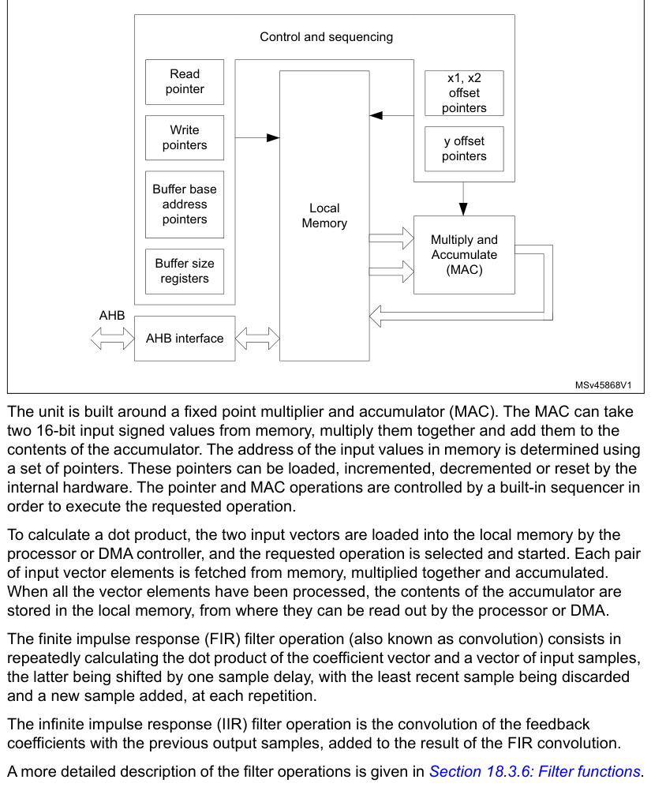

Control and sequencing

Read
x1, x2
pointer
offset
pointers

Write
y offset
pointers
pointers

Buffer base
address

Local
pointers

Memory

Multiply and Accumulate

Buffer size

(MAC)
registers

AHB

AHB interface

MSv45868V1

The unit is built around a fixed point multiplier and accumulator (MAC). The MAC can take two 16-bit
input signed values from memory, multiply them together and add them to the contents of the
accumulator. The address of the input values in memory is determined using a set of pointers. These
pointers can be loaded, incremented, decremented or reset by the internal hardware. The pointer and
MAC operations are controlled by a built-in sequencer in order to execute the requested operation.

To calculate a dot product, the two input vectors are loaded into the local memory by the processor
or DMA controller, and the requested operation is selected and started. Each pair of input vector
elements is fetched from memory, multiplied together and accumulated. When all the vector elements
have been processed, the contents of the accumulator are stored in the local memory, from where they
can be read out by the processor or DMA.

The finite impulse response (FIR) filter operation (also known as convolution) consists in
repeatedly calculating the dot product of the coefficient vector and a vector of input samples, the
latter being shifted by one sample delay, with the least recent sample being discarded and a new
sample added, at each repetition.

The infinite impulse response (IIR) filter operation is the convolution of the feedback coefficients
with the previous output samples, added to the result of the FIR convolution.

A more detailed description of the filter operations is given in [Section 18.3.6](#1836-filter-functions): Filter functions.

### 18.3.2 Local memory and buffers

The unit contains a 256 x 16-bit read/write memory which is used for local storage:

- Input values (the elements of the input vectors) are stored in two buffers, X1 and X2.
- Output values (the results of the operations) are stored in another buffer, Y.
- The locations and sizes of the buffers are designated as follows:
  - x1_base: the base address of the X1 buffer
  - x2_base: the base address of the X2 buffer
  - y_base: the base address of the Y buffer
  - x1_buf_size: the number of 16-bit addresses allocated to the X1 buffer
  - x2_buf_size: the number of 16-bit addresses allocated to the X2 buffer
  - y_buf_size: the number of 16-bit addresses allocated to the Y buffer.

These parameters are programmed in the corresponding registers when configuring the unit.

The CPU (or DMA controller) can initialize the contents of each buffer using the Initialization
functions ([Section 18.3.5](#1835-initialization-functions): Initialization functions) and writing to the write data register. The
data is transferred to the location within the target buffer indicated by a write pointer. After
each new write, the write pointer is incremented. When the write pointer reaches the end of the
allocated buffer space, it wraps back to the base address. This feature is used to load the elements
of a vector prior to an operation, or to initialize a filter and load filter coefficients.

#### Buffer configuration

The buffer sizes and base address offsets must be configured in the X1, X2 and Y buffer
configuration registers. For each function, the required buffer size is specified in the function
description in [Section 18.3.6](#1836-filter-functions): Filter functions. The base addresses can be chosen anywhere in
internal memory, provided that all buffers fit within the internal memory address range (0x00 to
0xFF), that is, base address \+ buffer size must be less than 256.

There is no constraint on the size and location of the buffers (they can overlap or even coincide
exactly). For filter functions it is recommended not to overlap buffers as this can lead to
erroneous behavior.

When circular buffer operation is required, an optional “headroom”, d, can be added to the buffer
size. Furthermore, a watermark level can be set, to regulate the CPU or DMA activity. The value of d
and the watermark level must be chosen according to the application performance requirements. For
maximum throughput, the input buffer must never go empty, so d must be somewhat greater than the
watermark level, allowing for any interrupt or DMA latency. On the other hand, if the input data can
not be provided as fast as the unit can process them, the buffer can be allowed to empty waiting for
the next data to be written, so d can be equal to the watermark level (to ensure that no overflow
occurs on the input).

### 18.3.3 Input buffers

The X1 and X2 buffers are used to store data for input to the MAC. Each multiplication takes a value
from the X1 buffer and a value from the X2 buffer and multiplies them together. A pointer in the
control unit generates the read address offset (relative to the buffer base address) for each value.
The pointers are managed by hardware according to the current function.

**Figure 42. Input buffer areas**

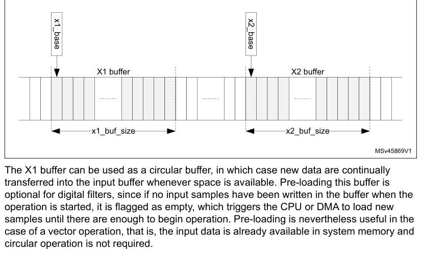

The X1 buffer can be used as a circular buffer, in which case new data are continually transferred
into the input buffer whenever space is available. Pre-loading this buffer is optional for digital
filters, since if no input samples have been written in the buffer when the operation is started, it
is flagged as empty, which triggers the CPU or DMA to load new samples until there are enough to
begin operation. Pre-loading is nevertheless useful in the case of a vector operation, that is, the
input data is already available in system memory and circular operation is not required.

**Figure 43. Circular input buffer**

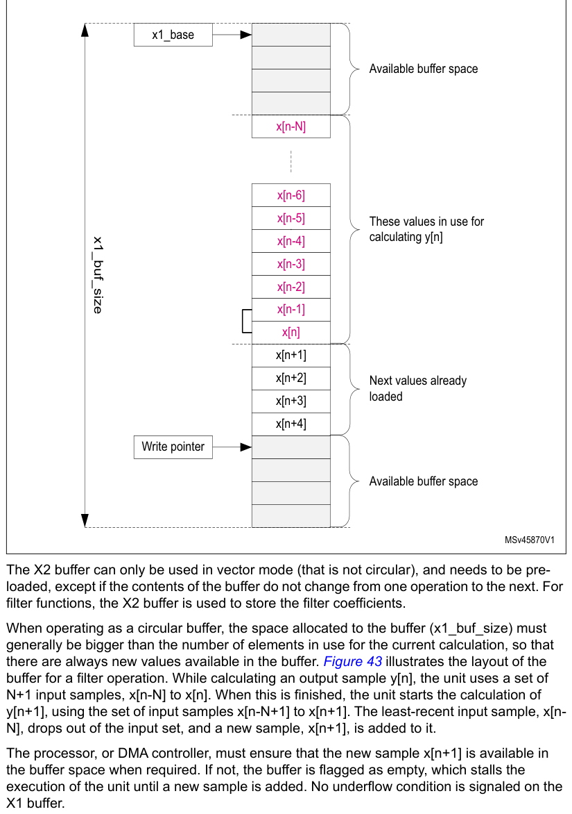

x1_base

Available buffer space
x[n-N]
x[n-6]
x[n-5]

These values in use for
x1_buf_size
calculating y[n]
x[n-4]
x[n-3]
x[n-2]
x[n-1]
x[n]
x[n+1]

The X2 buffer can only be used in vector mode (that is not circular), and needs to be pre-loaded,
except if the contents of the buffer do not change from one operation to the next. For filter
functions, the X2 buffer is used to store the filter coefficients.

When operating as a circular buffer, the space allocated to the buffer (x1_buf_size) must generally
be bigger than the number of elements in use for the current calculation, so that there are always
new values available in the buffer. Figure 43 illustrates the layout of the buffer for a filter
operation. While calculating an output sample y[n], the unit uses a set of N+1 input samples, x[n-N]
to x[n]. When this is finished, the unit starts the calculation of y[n+1], using the set of input
samples x[n-N+1] to x[n+1]. The least-recent input sample, x[n- N], drops out of the input set, and
a new sample, x[n+1], is added to it.

The processor, or DMA controller, must ensure that the new sample x[n+1] is available in the buffer
space when required. If not, the buffer is flagged as empty, which stalls the execution of the unit
until a new sample is added. No underflow condition is signaled on the X1 buffer.

> **Note:** If the flow of samples is controlled by a timer or other peripheral such as an ADC, the buffer
> regularly goes empty, since the filter processes each new sample faster than the source can provide
> it. This is an essential feature of filter operation.

If the number of free spaces in the buffer is less than the watermark threshold programmed in the
FULL_WM bitfield of the FMAC_X1BUFCFG register, the buffer is flagged as full. As long as the full
flag is not set, interrupts are generated, if enabled, to request more data for the buffer. The
watermark allows several data to be transferred under one interrupt, without danger of overflow.
Nevertheless, if an overflow does occur, the OVFL error flag is set and the write data is ignored.
The write pointer is not incremented in the event of an overflow.

The operation of the X1 buffer during a filtering operation is illustrated in Figure 44. This
example shows an 8-tap FIR filter with a watermark set to four.

**Figure 44. Circular input buffer operation**

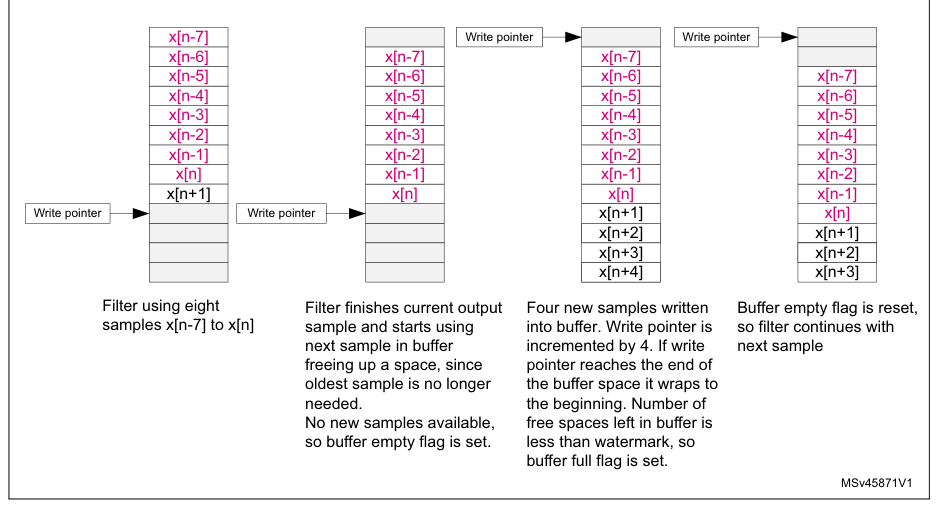

buffer full flag is set.

MSv45871V1

### 18.3.4 Output buffer

The Y (output) buffer is used to store the output of an accumulation. Each new output value is
stored in the buffer until it is read by the processor or DMA controller. Each time a read access is
made to the read data register, the read data is fetched from the address indicated by the read
pointer. This pointer is incremented after each read, and wraps back to the base address when it
reaches the end of the allocated Y buffer space.

**Figure 45. Circular output buffer**

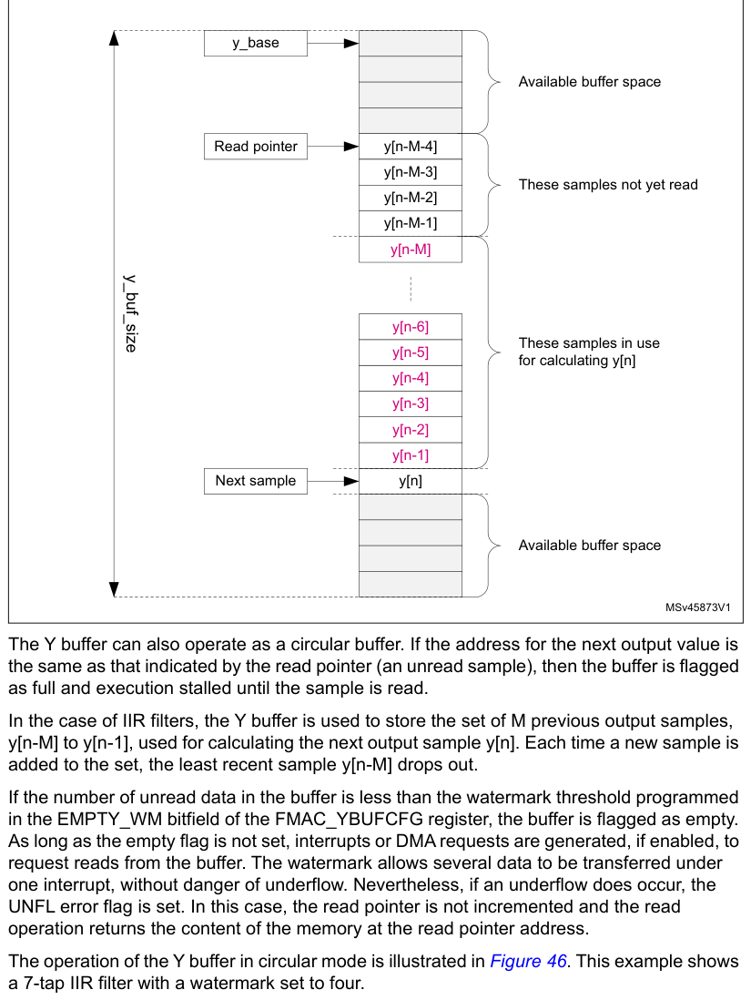

The Y buffer can also operate as a circular buffer. If the address for the next output value is the
same as that indicated by the read pointer (an unread sample), then the buffer is flagged as full
and execution stalled until the sample is read.

In the case of IIR filters, the Y buffer is used to store the set of M previous output samples,
y[n-M] to y[n-1], used for calculating the next output sample y[n]. Each time a new sample is added
to the set, the least recent sample y[n-M] drops out.

If the number of unread data in the buffer is less than the watermark threshold programmed in the
EMPTY_WM bitfield of the FMAC_YBUFCFG register, the buffer is flagged as empty. As long as the empty
flag is not set, interrupts or DMA requests are generated, if enabled, to request reads from the
buffer. The watermark allows several data to be transferred under one interrupt, without danger of
underflow. Nevertheless, if an underflow does occur, the UNFL error flag is set. In this case, the
read pointer is not incremented and the read operation returns the content of the memory at the read
pointer address.

The operation of the Y buffer in circular mode is illustrated in Figure 46. This example shows a
7-tap IIR filter with a watermark set to four.

**Figure 46. Circular output buffer operation**

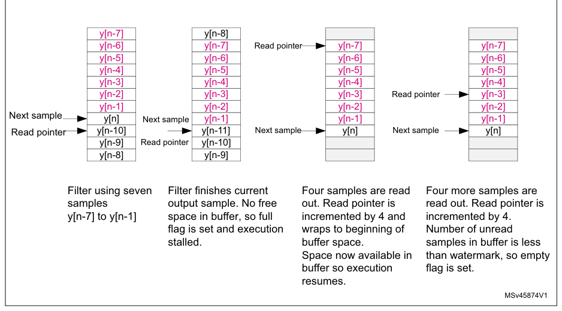

resumes.

MSv45874V1

### 18.3.5 Initialization functions

The following functions initialize the FMAC unit. They are triggered by writing the appropriate
value in the FUNC bitfield of the FMAC_PARAM register, with the START bit set. The P and Q bitfields
must also contain the appropriate parameter values for each function as detailed below. The R
bitfield is not used. When the function completes, the START bit is automatically reset by hardware.

During initialization, it is recommended that the DMA requests and interrupts be disabled. The
transfer of data into the FMAC memory can be done by software or by memory-to-memory DMA transfers,
since no flow control is required.

#### Load X1 buffer

This function pre-loads the X1 buffer with N values, starting from the address in X1_BASE.
Successive writes to the FMAC_WDATA register load the write data into the X1 buffer and increment
the write address. The write pointer points to the address X1_BASE \+ N when the function completes.

The function can be used to pre-load the buffer with the elements of a vector, or to initialize the
input storage elements of a filter.

Parameters

- The parameter P contains the number of values, N, to be loaded into the X1 buffer.
- The parameters Q and R are not used.

The function completes when N writes have been performed to the FMAC_WDATA register.

#### Load X2 buffer

This function pre-loads the X2 buffer with N \+ M values, starting from the address in X2_BASE.
Successive writes to the FMAC_WDATA register load the write data into the X2 buffer and increment
the write address.

The function can be used to pre-load the buffer with the elements of a vector, or the coefficients
of a filter. In the case of an IIR, the N feed-forward and M feed-back coefficients are concatenated
and loaded together into the X2 buffer. The total number of coefficients is equal to N \+ M. For an
FIR, there are no feedback coefficients, so M = 0.

Parameters

- The parameter P contains the number of values, N, to be loaded into the X2 buffer starting from
  address X2_BASE.
- The parameter Q contains the number of values, M, to be loaded into the X2 buffer starting from
  address X2_BASE \+ N.
- The parameter R is not used.

The function completes when N \+ M writes have been performed to the FMAC_WDATA register.

#### Load Y buffer

This function pre-loads the Y buffer with N values, starting from the address in Y_BASE. Successive
writes to the FMAC_WDATA register load the write data into the Y buffer and increment the write
address. The read pointer points to the address Y_BASE \+ N when the function completes.

The function can be used to pre-load the feedback storage elements of an IIR filter.

Parameters

- The parameter P contains the number of values to be loaded into the Y buffer.
- The parameters Q and R are not used.

The function completes when N writes have been performed to the FMAC_WDATA register.

### 18.3.6 Filter functions

The following filter functions are supported by the FMAC unit. These functions are triggered by
writing the corresponding value in the FUNC bitfield of the FMAC_PARAM register with the START bit
set. The P, Q and R bitfields must also contain the appropriate parameter values for each function
as detailed below. The filter functions continue to run until the START bit is reset by software.

#### Convolution (FIR filter)

Y = B*X

N

> **Extracted layout**
>
> `yn` · `=` · `2R` · `⋅` · `∑` · `bkxn`  

- k
  k = 0

This function performs a convolution of a vector B of length N+1 and a vector X of indefinite
length. The elements of Y for incrementing values of n are calculated as the dot product,
yn = B. Xn, where Xn = [xn-N,...,xn] is composed of the N+1 elements of X at indexes n - N to n.

This function corresponds to a finite impulse response (FIR) filter, where vector B contains the
filter coefficients and vector X the sampled data.

The structure of the filter (direct form) is shown in Figure 47.

**Figure 47. FIR filter structure**

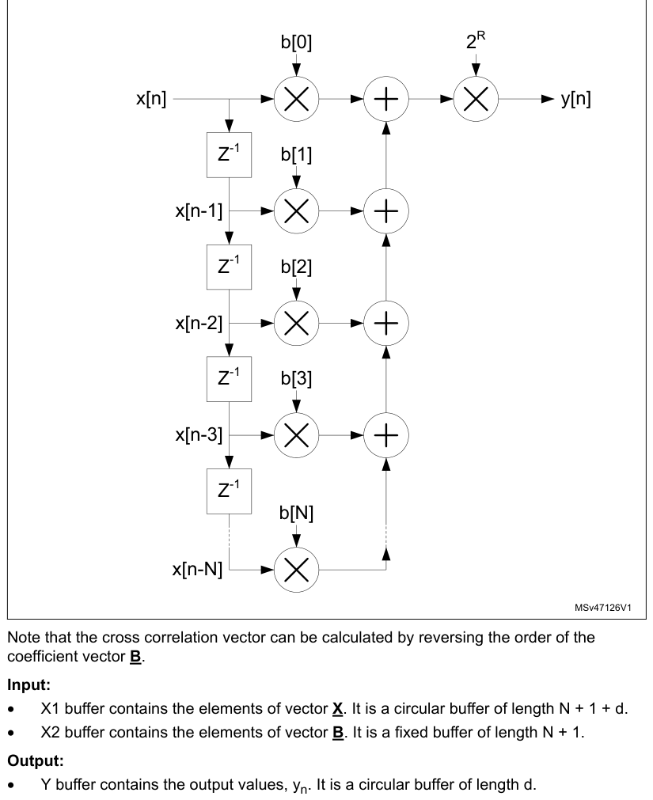

Note that the cross correlation vector can be calculated by reversing the order of the coefficient
vector B.

Input:

- X1 buffer contains the elements of vector X. It is a circular buffer of length N \+ 1 \+ d.
- X2 buffer contains the elements of vector B. It is a fixed buffer of length N \+ 1.

Output:

- Y buffer contains the output values, yn. It is a circular buffer of length d.

Parameters:

- The parameter P contains the length, N+1, of the coefficient vector B in the range [2:127].
- The parameter R contains the gain to be applied to the accumulator output. The value output to the
  Y buffer is multiplied by 2R, where R is in the range [0:7]
- The parameter Q is not used.

The function completes when the START bit in the FMAC_PARAM register is reset by software.

#### IIR filter

Y = B*X+A*Y’

> **Extracted layout**
>
> `N` · `M`  
> `⎛` · `⎞`  
> `⎜` · `⎟`  
> `yn` · `=` · `2R` · `⋅` · `∑` · `bkxn` · `+` · `∑` · `akyn`  
> `⎜` · `–` · `k` · `–` · `k` · `⎟`  
> `⎝` · `⎠`  
> `k` · `=` · `0` · `k` · `=` · `1`  

This function implements an infinite impulse response (IIR) filter. The filter output vector Y is
the convolution of a coefficient vector B of length N+1 and a vector X of indefinite length, plus
the convolution of the delayed output vector Y’ with a second coefficient vector A, of length M. The
elements of Y for incrementing values of n are calculated as yn = B. Xn \+ A. Yn-1, where Xn =
[xn-N,...,xn] comprises the N+1 elements of X at indexes n - N to n, while Yn-1 = [yn-M,...,yn-1]
comprises the M elements of Y at indexes n - M to n - 1. The structure of the filter (direct form 1)
is shown in Figure 48.

**Figure 48. IIR filter structure (direct form 1)**

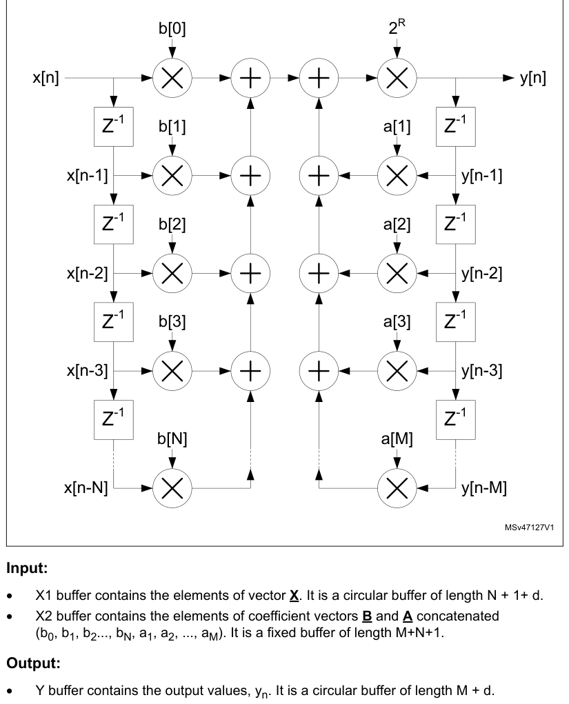

#### Input

- X1 buffer contains the elements of vector X. It is a circular buffer of length N \+ 1+ d.
- X2 buffer contains the elements of coefficient vectors B and A concatenated (b0, b1, b2..., bN,
  a1, a2, ..., aM). It is a fixed buffer of length M+N+1.

#### Output

- Y buffer contains the output values, yn. It is a circular buffer of length M \+ d.

#### Parameters

- The parameter P contains the length, N \+ 1, of the coefficient vector B in the range [2:64].
- The parameter Q contains the length, M, of the coefficient vector A in the range [1:63].
- The parameter R contains the gain to be applied to the accumulator output. The value output to the
  Y buffer is multiplied by 2R, where R is in the range [0:7].

The function completes when the START bit in the FMAC_PARAM register is reset by software.

### 18.3.7 Fixed point representation

The FMAC operates in fixed point signed integer format. Input and output values are q1.15.

In q1.15 format, numbers are represented by one sign bit and 15 fractional bits (binary decimal
places). The numeric range is therefore -1 (0x8000) to 1 - 2-15 (0x7FFF).

The accumulator has 26 bits, of which 22 are fractional and 4 are integer/sign (q4.22). This allows
it to support partial accumulation sums in the range -8 (0x2000000) to +7.99999976 (0x1FFFFFF). A
programmable gain from 0dB to 42dB in steps of 6dB can be applied at the output of the accumulator.

Note that the content of the accumulator is not saturated if the numeric range is exceeded. Partial
sums whose value is greater than +7.99999976 or less than -8, wrap but this is harmless provided
subsequent accumulations undo the wrapping. Nevertheless, the SAT flag in the FMAC_SR register is
set if wrapping occurs, and generates an interrupt if the SATIEN bit is set in the FMAC_CR register.
This helps in debugging the filter.

The data output by the accumulator can optionally be saturated, after application of the
programmable gain, by setting the CLIPEN bit in the FMAC_CR register. If this bit is set, then any
value which exceeds the numeric range of the q1.15 output, is set to 1 - 2-15 or -1, according to
the sign. If clipping is not enabled, the unused accumulator bits after applying the gain is simply
truncated.

### 18.3.8 Implementing FIR filters with the FMAC

The FMAC supports FIR filters of length N, where N is the number of taps or coefficients. The
minimum local memory requirement for a FIR filter of length N is 2N \+ 1:

- N coefficients
- N input samples
- 1 output sample

Since the local memory size is 256, the maximum value for N is 127.

If maximum throughput is required, it may be necessary to allocate a small amount of extra space, d1
and d2, to the input and output sample buffers respectively, to ensure that the filter never stalls
waiting for a new input sample, or waiting for the output sample to be read. In this case, the local
memory requirement is 2N \+ d1 \+ d2.

The buffers must be configured as follows:

- X1_BUF_SIZE = N \+ d1;
- X2_BUF_SIZE = N;
- Y_BUF_SIZE = d2 (or 1 if no extra space is required)

The buffer base addresses can be allocated anywhere, but the X2 buffer must not overlap with the
others, or else the coefficients are overwritten. An example configuration is:

- X2_BASE = 0;
- X1_BASE = N;
- Y_BASE = 2N \+ d1

However, if the memory space is limited, the X1 and Y buffer areas can be overlapped, such that each
output sample takes the place of the oldest input sample, which is no longer required:

- X2_BASE = 0;
- X1_BASE = N;
- Y_BASE = N

In this case, Y_BUF_SIZE = X1_BUF_SIZE = N \+ d1, so that the buffers remain in sync.

> **Note:** The FULL_WM bitfield of X1 buffer configuration register must be programmed with a value
> less than or equal to log2(d1), otherwise the buffer is flagged full before N input samples have
> been written, and no more samples are requested. Similarly, the EMPTY_WM bitfield of the Y buffer
> configuration register must be less than or equal to log2(d2).

The filter coefficients must be pre-loaded into the X2 buffer, using the Load X2 Buffer function.
The X1 buffer can optionally be pre-loaded with any number of samples up to a maximum of N. There is
no point in pre-loading the Y buffer, since for the FIR filter there is no feedback path.

After configuring and initializing the buffers, the FMAC_CR register must be programmed according to
the method used for writing and reading data to and from the FMAC memory.

Three methods are supported:

- Polling: No DMA request or Interrupt request is generated. Software must check that the X1_FULL
  flag is low before writing to WDATA, or that the Y_EMPTY flag is low before reading from RDATA.
- Interrupt: The interrupt request is asserted while the X1_FULL flag is low, for writes, or when
  the Y_EMPTY flag is low, for reads.
- DMA: DMA requests are asserted on the DMA write channel while the X1_FULL flag is low, and on the
  read channel while the Y_EMPTY flag is low.

Different methods can be used for read and for write. However it is not recommended to use both
interrupts and DMA requests for the same operation(a). The valid combinations are listed in Table
120.

**Table 120. Valid combinations for read and write methods**

| WIEN | RIEN | DMAWEN | DMAREN | Write | Read |
| --- | --- | --- | --- | --- | --- |
| 0 | 0 | 0 | 0 | Polling | Polling |
| 0 | 1 | 0 | 0 | Polling | Interrupt |
| 1 | 0 | 0 | 0 | Interrupt | Polling |
| 1 | 1 | 0 | 0 | Interrupt | Interrupt |
| 0 | 0 | 0 | 1 | Polling | DMA |
| 0 | 0 | 1 | 0 | DMA | Polling |
| 0 | 0 | 1 | 1 | DMA | DMA |
| 0 | 1 | 1 | 0 | DMA | Interrupt |
| 1 | 0 | 0 | 1 | Interrupt | DMA |

a. If both interrupts and DMA requests are enabled then only DMA must perform the transfer.

The filter is started by writing to the FMAC_PARAM register with the following bitfield values:

- FUNC = 8 (FIR filter);
- P = N (number of coefficients);
- Q = “Don’t care”;
- R = Gain;
- START = 1;

If less than N \+ d - 2FULL_WM values have been pre-loaded in the X1 buffer, the X1FULL flag remains
low. If the WIEN bit is set in the FMAC_CR register, then the interrupt request is asserted
immediately to request the processor to write 2FULL_WM additional samples into the buffer, via the
FMAC_WDATA register. It remains asserted until the X1FULL flag goes high in the FMAC_SR register.
The interrupt service routine must check the X1FULL flag after every 2FULL_WM writes to the
FMAC_WDATA register, and repeat the transfer until the flag goes high. Similarly, if the DMAWEN bit
is set in the FMAC_CR register, DMA write channel requests are generated until the X1FULL flag goes
high.

The filter calculates the first output sample when at least N samples have been written into the X1
buffer (including any pre-loaded samples).

When 2EMPTY_WM output samples have been written into the Y buffer, the YEMPTY flag in the FMAC_SR
register goes low. If the RIEN bit is set in the FMAC_CR register, the interrupt request is asserted
to request the processor to read 2EMPTY_WM samples from the buffer, via the FMAC_RDATA register. It
remains asserted until the YEMPTY flag goes high. The interrupt service routine must check the
YEMPTY flag after every 2EMPTY_WM reads from the FMAC_RDATA register, and repeat the transfer until
the flag goes high. If the DMAREN bit is set in the FMAC_CR, DMA read channel requests are generated
until the YEMPTY flag goes high.

The filter continues to operate in this fashion until it is stopped by the software resetting the
START bit.

### 18.3.9 Implementing IIR filters with the FMAC

The FMAC supports IIR filters of length N, where N is the number of feed-forward taps or
coefficients. The number of feedback coefficients, M, can be any value from 1 to N-1. Only direct
form 1 implementations can be realized, so filters designed for other forms need to be converted.

The minimum memory requirement for an IIR filter with N feed-forward coefficients and M feed-back
coefficients is 2N \+ 2M:

- N \+ M coefficients
- N input samples
- M output samples

If M = N-1, then the maximum filter length that can be implemented is N = 64.

As for the FIR, for maximum throughput, a small amount of additional space, d1 and d2, is allowed in
the input and output buffer size respectively, making the total memory requirement 2M \+ 2N \+ d1 +
d2.

The buffers must be configured as follows:

- X1_BUF_SIZE = N \+ d1;
- X2_BUF_SIZE = N \+ M;
- Y_BUF_SIZE = M \+ d2;

The buffer base addresses can be allocated anywhere, but must not overlap. An example configuration
is given below:

- X2_BASE = 0;
- X1_BASE = N \+ M;
- Y_BASE = 2N \+ M \+ d1;

> **Note:** The FULL_WM bitfield of X1 buffer configuration register must be programmed with a value
> less than or equal to log2(d1), otherwise the buffer is flagged full before N input samples have
> been written, and no more samples are requested. Similarly, the EMPTY_WM bitfield of the Y buffer
> configuration register must be less than or equal to log2(d2).

The filter coefficients (N feed-forward followed by M feedback) must be pre-loaded into the X2
buffer, using the Load X2 Buffer function. The X1 buffer can optionally be pre-loaded with any
number of samples up to a maximum of N. The Y buffer can optionally be pre-loaded with any number of
values up to a maximum of M. This has the effect of initializing the feedback delay line.

After configuring the buffers, the FMAC_CR register must be programmed in the same way as for the
FIR filter (see [Section 18.3.8](#1838-implementing-fir-filters-with-the-fmac): Implementing FIR filters with the FMAC).

The filter is started by writing to the FMAC_PARAM register with the following bitfield values:

- FUNC = 9 (IIR filter);
- P = N (number of feed-forward coefficients);
- Q = M (number of feed-back coefficients);
- R = Gain;
- START = 1;

If less than N \+ d - 2FULL_WM values have been pre-loaded in the X1 buffer, the X1FULL flag remains
low. If the WIEN bit is set in the FMAC_CR register, then the interrupt request is asserted
immediately to request the processor to write 2FULL_WM additional samples into the buffer, via the
FMAC_WDATA register. It remains asserted until the X1FULL flag goes high in the FMAC_SR register.
The interrupt service routine must check the X1FULL flag after every 2FULL_WM writes to the
FMAC_WDATA register, and repeat the transfer until the flag goes high. Similarly, if the DMAWEN bit
is set in the FMAC_CR register, DMA write channel requests are generated until the X1FULL flag goes
high.

The filter calculates the first output sample when at least N samples have been written into the X1
buffer (including any pre-loaded samples). The first sample is calculated using the first N samples
in the X1 buffer, and the first M samples in the Y buffer (whether or not they are preloaded. The
first output sample is written into the Y buffer at Y_BASE \+ M.

When 2EMPTY_WM new output samples have been written into the Y buffer, the YEMPTY flag in the
FMAC_SR register goes low. If the RIEN bit is set in the FMAC_CR register, the interrupt request is
asserted to request the processor to read 2EMPTY_WM samples from the buffer, via the FMAC_RDATA
register. It remains asserted until the YEMPTY flag goes high. The interrupt service routine must
check the YEMPTY flag after every 2EMPTY_WM reads from the FMAC_RDATA register, and repeat the
transfer until the flag goes high. If the DMAREN bit is set in the FMAC_CR, DMA read channel
requests are generated until the YEMPTY flag goes high

The filter continues to operate in this fashion until it is stopped by the software resetting the
START bit.

### 18.3.10 Examples of filter initialization

**Figure 49. X1 buffer initialization**

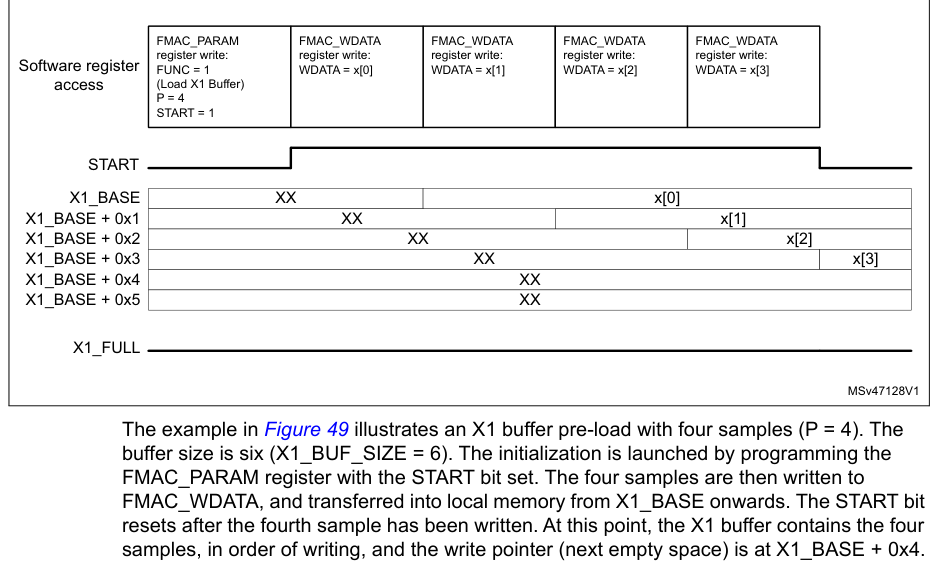

The example in Figure 49 illustrates an X1 buffer pre-load with four samples (P = 4). The buffer
size is six (X1_BUF_SIZE = 6). The initialization is launched by programming the FMAC_PARAM register
with the START bit set. The four samples are then written to FMAC_WDATA, and transferred into local
memory from X1_BASE onwards. The START bit resets after the fourth sample has been written. At this
point, the X1 buffer contains the four samples, in order of writing, and the write pointer (next
empty space) is at X1_BASE \+ 0x4.

### 18.3.11 Examples of filter operation

**Figure 50. Filtering example 1**

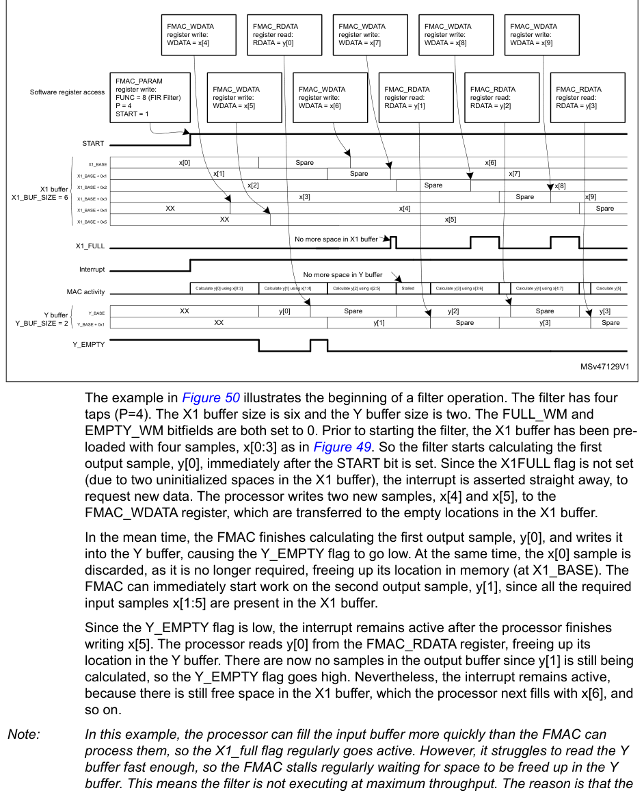

The example in Figure 50 illustrates the beginning of a filter operation. The filter has four taps
(P=4). The X1 buffer size is six and the Y buffer size is two. The FULL_WM and EMPTY_WM bitfields
are both set to 0. Prior to starting the filter, the X1 buffer has been pre-loaded with four
samples, x[0:3] as in Figure 49. So the filter starts calculating the first output sample, y[0],
immediately after the START bit is set. Since the X1FULL flag is not set (due to two uninitialized
spaces in the X1 buffer), the interrupt is asserted straight away, to request new data. The
processor writes two new samples, x[4] and x[5], to the FMAC_WDATA register, which are transferred
to the empty locations in the X1 buffer.

In the mean time, the FMAC finishes calculating the first output sample, y[0], and writes it into
the Y buffer, causing the Y_EMPTY flag to go low. At the same time, the x[0] sample is discarded, as
it is no longer required, freeing up its location in memory (at X1_BASE). The FMAC can immediately
start work on the second output sample, y[1], since all the required input samples x[1:5] are
present in the X1 buffer.

Since the Y_EMPTY flag is low, the interrupt remains active after the processor finishes writing
x[5]. The processor reads y[0] from the FMAC_RDATA register, freeing up its location in the Y
buffer. There are now no samples in the output buffer since y[1] is still being calculated, so the
Y_EMPTY flag goes high. Nevertheless, the interrupt remains active, because there is still free
space in the X1 buffer, which the processor next fills with x[6], and so on.

> **Note:** In this example, the processor can fill the input buffer more quickly than the FMAC can
> process them, so the X1_full flag regularly goes active. However, it struggles to read the Y buffer
> fast enough, so the FMAC stalls regularly waiting for space to be freed up in the Y buffer. This
> means the filter is not executing at maximum throughput. The reason is that the
> filter length is small and the processor relatively slow, in this example. So increasing the Y
> buffer size would not help.

**Figure 51. Filtering example 2**

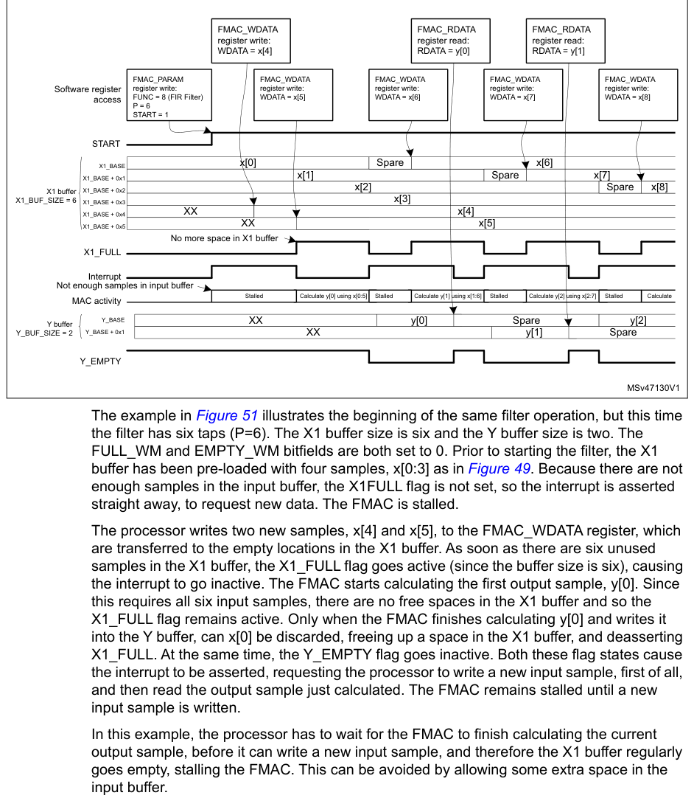

The example in Figure 51 illustrates the beginning of the same filter operation, but this time the
filter has six taps (P=6). The X1 buffer size is six and the Y buffer size is two. The FULL_WM and
EMPTY_WM bitfields are both set to 0. Prior to starting the filter, the X1 buffer has been
pre-loaded with four samples, x[0:3] as in Figure 49. Because there are not enough samples in the
input buffer, the X1FULL flag is not set, so the interrupt is asserted straight away, to request new
data. The FMAC is stalled.

The processor writes two new samples, x[4] and x[5], to the FMAC_WDATA register, which are
transferred to the empty locations in the X1 buffer. As soon as there are six unused samples in the
X1 buffer, the X1_FULL flag goes active (since the buffer size is six), causing the interrupt to go
inactive. The FMAC starts calculating the first output sample, y[0]. Since this requires all six
input samples, there are no free spaces in the X1 buffer and so the X1_FULL flag remains active.
Only when the FMAC finishes calculating y[0] and writes it into the Y buffer, can x[0] be discarded,
freeing up a space in the X1 buffer, and deasserting X1_FULL. At the same time, the Y_EMPTY flag
goes inactive. Both these flag states cause the interrupt to be asserted, requesting the processor
to write a new input sample, first of all, and then read the output sample just calculated. The FMAC
remains stalled until a new input sample is written.

In this example, the processor has to wait for the FMAC to finish calculating the current output
sample, before it can write a new input sample, and therefore the X1 buffer regularly goes empty,
stalling the FMAC. This can be avoided by allowing some extra space in the input buffer.

### 18.3.12 Filter design tips

The FMAC architecture imposes some constraints detailed below, on the design of digital filters.

1. Implementation of direct form 2, or transposed forms, is not efficient. Filters which have
   been designed for such forms must be converted to direct form 1.
2. Cascaded filters must either be combined into a single stage, or implemented as
   separate filters. In the latter case, multiple sets of filter coefficients can be pre-loaded into
   the memory, one set per stage, and only the X2_BASE address changed to select which set is used. The
   most efficient method of implementing a multi-stage filter is to pre-load a large X1 buffer with
   input samples, run the IIR filter function on it using the first stage coefficients, and store the
   output samples back in memory. Then change the X2_BASE pointer to point to the 2nd stage
   coefficients, and reload the input buffer with the output of the first stage (with a gain if
   required), before running the IIR function again. The procedure is repeated for all stages. Once the
   final stage samples have been transferred back into system memory, the input buffer can be loaded
   with the next set of input samples, and a new round of calculations started. Note that the N sample
   input buffer of each stage must be pre-loaded first of all with the N-1 last inputs from the
   previous round, plus one new sample, in order to keep continuity between each round. Similarly, the
   output buffer of each stage must be loaded with the last M samples from the previous round, for the
   same reason.
3. The use of direct form 1 for IIR designs can lead to large positive or negative partial
   sums in the accumulator, if for example a large step occurs on the input, or some of the filter
   coefficients’ absolute values are >1. Since the accumulator is limited to 26 bits, the biggest value
   that it can handle without wrapping (changing sign) is 0x1FFFFFF positive or 0x2000000 negative.
   This corresponds to 3.99999988 and -4 respectively in q3.23 fixed point format. Wrapping does not
   represent a problem provided the wrapping is “undone” before the end of the accumulation. However
   this is not always the case when a filter is starting up and can lead to unexpected results.
   Consider pre-loading the output buffer with suitable values to avoid this.
4. The IIR filter has feed-forward (numerator) coefficients [b0, b1, ..., bN-1], and feed-back

(denominator) coefficients [1, a1, ..., aM]. Many IIR filters require some of the denominator
coefficients to have an absolute value greater than 1 to achieve a steep roll-off in the frequency
response. Given that the coefficients are coded in fixed point q1.15 format, this is not possible.
Nevertheless, by scaling the denominator coefficients by a factor 2-R, such that 2-R.[1, a1, ...,
aM] are all less than 1, such filters can be implemented. However an inverse gain of 2R must be
applied at the output of the accumulator to compensate the scaling. This has an adverse effect on
the signal-to-noise ratio.

## 18.4 FMAC registers

### 18.4.1 FMAC X1 buffer configuration register (FMAC_X1BUFCFG)

- **Address offset:** 0x00
- **Reset value:** 0x0000 0000
- **Access:** word access

This register can only be modified if START = 0 in the FMAC_PARAM register.

**Register bit layout**

| Bit | Field | Access | Summary |
| ---: | --- | :---: | --- |
| 31 | Reserved | — | kept at reset value. |
| 30 | Reserved | — | ↳ |
| 29 | Reserved | — | ↳ |
| 28 | Reserved | — | ↳ |
| 27 | Reserved | — | ↳ |
| 26 | Reserved | — | ↳ |
| 25 | `FULL_WM[1]` | rw | Watermark for buffer full flag |
| 24 | `FULL_WM[0]` | rw | ↳ |
| 23 | Reserved | — | kept at reset value. |
| 22 | Reserved | — | ↳ |
| 21 | Reserved | — | ↳ |
| 20 | Reserved | — | ↳ |
| 19 | Reserved | — | ↳ |
| 18 | Reserved | — | ↳ |
| 17 | Reserved | — | ↳ |
| 16 | Reserved | — | ↳ |
| 15 | `X1_BUF_SIZE[7]` | rw | Allocated size of X1 buffer in 16-bit words |
| 14 | `X1_BUF_SIZE[6]` | rw | ↳ |
| 13 | `X1_BUF_SIZE[5]` | rw | ↳ |
| 12 | `X1_BUF_SIZE[4]` | rw | ↳ |
| 11 | `X1_BUF_SIZE[3]` | rw | ↳ |
| 10 | `X1_BUF_SIZE[2]` | rw | ↳ |
| 9 | `X1_BUF_SIZE[1]` | rw | ↳ |
| 8 | `X1_BUF_SIZE[0]` | rw | ↳ |
| 7 | `X1_BASE[7]` | rw | Base address of X1 buffer |
| 6 | `X1_BASE[6]` | rw | ↳ |
| 5 | `X1_BASE[5]` | rw | ↳ |
| 4 | `X1_BASE[4]` | rw | ↳ |
| 3 | `X1_BASE[3]` | rw | ↳ |
| 2 | `X1_BASE[2]` | rw | ↳ |
| 1 | `X1_BASE[1]` | rw | ↳ |
| 0 | `X1_BASE[0]` | rw | ↳ |

**Bits 31:26 — Reserved:** kept at reset value.

**Bits 25:24 — `FULL_WM[1:0]`:** Watermark for buffer full flag

Defines the threshold for setting the X1 buffer full flag when operating in circular mode. The
flag is set if the number of free spaces in the buffer is less than 2FULL_WM.

- `0`: Threshold = 1
- `1`: Threshold = 2

2: Threshold = 4

3: Threshold = 8

Setting a threshold greater than 1 allows several data to be transferred into the buffer under
one interrupt.

Threshold must be set to 1 if DMA write requests are enabled (DMAWEN = 1 in FMAC_CR
register).

**Bits 23:16 — Reserved:** kept at reset value.

**Bits 15:8 — `X1_BUF_SIZE[7:0]`:** Allocated size of X1 buffer in 16-bit words

The minimum buffer size is the number of feed-forward taps in the filter (+ the watermark
threshold - 1).

**Bits 7:0 — `X1_BASE[7:0]`:** Base address of X1 buffer

### 18.4.2 FMAC X2 buffer configuration register (FMAC_X2BUFCFG)

- **Address offset:** 0x04
- **Reset value:** 0x0000 0000
- **Access:** word access

**Register bit layout**

| Bit | Field | Access | Summary |
| ---: | --- | :---: | --- |
| 31 | Reserved | — | kept at reset value. |
| 30 | Reserved | — | ↳ |
| 29 | Reserved | — | ↳ |
| 28 | Reserved | — | ↳ |
| 27 | Reserved | — | ↳ |
| 26 | Reserved | — | ↳ |
| 25 | Reserved | — | ↳ |
| 24 | Reserved | — | ↳ |
| 23 | Reserved | — | ↳ |
| 22 | Reserved | — | ↳ |
| 21 | Reserved | — | ↳ |
| 20 | Reserved | — | ↳ |
| 19 | Reserved | — | ↳ |
| 18 | Reserved | — | ↳ |
| 17 | Reserved | — | ↳ |
| 16 | Reserved | — | ↳ |
| 15 | `X2_BUF_SIZE[7]` | rw | Size of X2 buffer in 16-bit words |
| 14 | `X2_BUF_SIZE[6]` | rw | ↳ |
| 13 | `X2_BUF_SIZE[5]` | rw | ↳ |
| 12 | `X2_BUF_SIZE[4]` | rw | ↳ |
| 11 | `X2_BUF_SIZE[3]` | rw | ↳ |
| 10 | `X2_BUF_SIZE[2]` | rw | ↳ |
| 9 | `X2_BUF_SIZE[1]` | rw | ↳ |
| 8 | `X2_BUF_SIZE[0]` | rw | ↳ |
| 7 | `X2_BASE[7]` | rw | Base address of X2 buffer |
| 6 | `X2_BASE[6]` | rw | ↳ |
| 5 | `X2_BASE[5]` | rw | ↳ |
| 4 | `X2_BASE[4]` | rw | ↳ |
| 3 | `X2_BASE[3]` | rw | ↳ |
| 2 | `X2_BASE[2]` | rw | ↳ |
| 1 | `X2_BASE[1]` | rw | ↳ |
| 0 | `X2_BASE[0]` | rw | ↳ |

**Bits 31:16 — Reserved:** kept at reset value.

**Bits 15:8 — `X2_BUF_SIZE[7:0]`:** Size of X2 buffer in 16-bit words

This bitfield can not be modified when a function is ongoing (START = 1).

**Bits 7:0 — `X2_BASE[7:0]`:** Base address of X2 buffer

The X2 buffer base address can be modified while START=1, for example to change
coefficient values. The filter must be stalled when doing this, since changing the coefficients
while a calculation is ongoing affects the result.

### 18.4.3 FMAC Y buffer configuration register (FMAC_YBUFCFG)

- **Address offset:** 0x08
- **Reset value:** 0x0000 0000
- **Access:** word access

This register can only be modified if START = 0 in the FMAC_PARAM register.

**Register bit layout**

| Bit | Field | Access | Summary |
| ---: | --- | :---: | --- |
| 31 | Reserved | — | kept at reset value. |
| 30 | Reserved | — | ↳ |
| 29 | Reserved | — | ↳ |
| 28 | Reserved | — | ↳ |
| 27 | Reserved | — | ↳ |
| 26 | Reserved | — | ↳ |
| 25 | `EMPTY_WM[1]` | rw | Watermark for buffer empty flag |
| 24 | `EMPTY_WM[0]` | rw | ↳ |
| 23 | Reserved | — | kept at reset value. |
| 22 | Reserved | — | ↳ |
| 21 | Reserved | — | ↳ |
| 20 | Reserved | — | ↳ |
| 19 | Reserved | — | ↳ |
| 18 | Reserved | — | ↳ |
| 17 | Reserved | — | ↳ |
| 16 | Reserved | — | ↳ |
| 15 | `Y_BUF_SIZE[7]` | rw | Size of Y buffer in 16-bit words |
| 14 | `Y_BUF_SIZE[6]` | rw | ↳ |
| 13 | `Y_BUF_SIZE[5]` | rw | ↳ |
| 12 | `Y_BUF_SIZE[4]` | rw | ↳ |
| 11 | `Y_BUF_SIZE[3]` | rw | ↳ |
| 10 | `Y_BUF_SIZE[2]` | rw | ↳ |
| 9 | `Y_BUF_SIZE[1]` | rw | ↳ |
| 8 | `Y_BUF_SIZE[0]` | rw | ↳ |
| 7 | `Y_BASE[7]` | rw | Base address of Y buffer |
| 6 | `Y_BASE[6]` | rw | ↳ |
| 5 | `Y_BASE[5]` | rw | ↳ |
| 4 | `Y_BASE[4]` | rw | ↳ |
| 3 | `Y_BASE[3]` | rw | ↳ |
| 2 | `Y_BASE[2]` | rw | ↳ |
| 1 | `Y_BASE[1]` | rw | ↳ |
| 0 | `Y_BASE[0]` | rw | ↳ |

**Bits 31:26 — Reserved:** kept at reset value.

**Bits 25:24 — `EMPTY_WM[1:0]`:** Watermark for buffer empty flag

Defines the threshold for setting the Y buffer empty flag when operating in circular mode.

The flag is set if the number of unread values in the buffer is less than 2EMPTY_WM.

- `0`: Threshold = 1
- `1`: Threshold = 2

2: Threshold = 4

3: Threshold = 8

Setting a threshold greater than 1 allows several data to be transferred from the buffer under
one interrupt.

Threshold must be set to 1 if DMA read requests are enabled (DMAREN = 1 in FMAC_CR
register).

**Bits 23:16 — Reserved:** kept at reset value.

**Bits 15:8 — `Y_BUF_SIZE[7:0]`:** Size of Y buffer in 16-bit words

For FIR filters, the minimum buffer size is 1 (+ the watermark threshold). For IIR filters the
minimum buffer size is the number of feedback taps (+ the watermark threshold).

**Bits 7:0 — `Y_BASE[7:0]`:** Base address of Y buffer

### 18.4.4 FMAC parameter register (FMAC_PARAM)

- **Address offset:** 0x0C
- **Reset value:** 0x0000 0000
- **Access:** word access

**Register bit layout**

| Bit | Field | Access | Summary |
| ---: | --- | :---: | --- |
| 31 | `START` | rw | Enable execution |
| 30 | `FUNC[6]` | rw | Function |
| 29 | `FUNC[5]` | rw | ↳ |
| 28 | `FUNC[4]` | rw | ↳ |
| 27 | `FUNC[3]` | rw | ↳ |
| 26 | `FUNC[2]` | rw | ↳ |
| 25 | `FUNC[1]` | rw | ↳ |
| 24 | `FUNC[0]` | rw | ↳ |
| 23 | `R[7]` | rw | Input parameter R. |
| 22 | `R[6]` | rw | ↳ |
| 21 | `R[5]` | rw | ↳ |
| 20 | `R[4]` | rw | ↳ |
| 19 | `R[3]` | rw | ↳ |
| 18 | `R[2]` | rw | ↳ |
| 17 | `R[1]` | rw | ↳ |
| 16 | `R[0]` | rw | ↳ |
| 15 | `Q[7]` | rw | Input parameter Q. |
| 14 | `Q[6]` | rw | ↳ |
| 13 | `Q[5]` | rw | ↳ |
| 12 | `Q[4]` | rw | ↳ |
| 11 | `Q[3]` | rw | ↳ |
| 10 | `Q[2]` | rw | ↳ |
| 9 | `Q[1]` | rw | ↳ |
| 8 | `Q[0]` | rw | ↳ |
| 7 | `P[7]` | rw | Input parameter P. |
| 6 | `P[6]` | rw | ↳ |
| 5 | `P[5]` | rw | ↳ |
| 4 | `P[4]` | rw | ↳ |
| 3 | `P[3]` | rw | ↳ |
| 2 | `P[2]` | rw | ↳ |
| 1 | `P[1]` | rw | ↳ |
| 0 | `P[0]` | rw | ↳ |

**Bit 31 — `START`:** Enable execution

- `0`: Stop execution
- `1`: Start execution

Setting this bit triggers the execution of the function selected in the FUNC bitfield. Resetting
it by software stops any ongoing function. For initialization functions, this bit is reset by
hardware.

**Bits 30:24 — `FUNC[6:0]`:** Function

- `0`: Reserved
- `1`: Load X1 buffer

2: Load X2 buffer

3: Load Y buffer

4 to 7: Reserved

8: Convolution (FIR filter)

9: IIR filter (direct form 1)

10 to 127: Reserved

This bitfield can not be modified when a function is ongoing (START = 1)

**Bits 23:16 — `R[7:0]`:** Input parameter R.

The value of this parameter is dependent on the function.

This bitfield can not be modified when a function is ongoing (START = 1)

**Bits 15:8 — `Q[7:0]`:** Input parameter Q.

The value of this parameter is dependent on the function.

This bitfield can not be modified when a function is ongoing (START = 1)

**Bits 7:0 — `P[7:0]`:** Input parameter P.

The value of this parameter is dependent on the function

This bitfield can not be modified when a function is ongoing (START = 1)

### 18.4.5 FMAC control register (FMAC_CR)

- **Address offset:** 0x10
- **Reset value:** 0x0000 0000
- **Access:** word access

**Register bit layout**

| Bit | Field | Access | Summary |
| ---: | --- | :---: | --- |
| 31 | Reserved | — | kept at reset value. |
| 30 | Reserved | — | ↳ |
| 29 | Reserved | — | ↳ |
| 28 | Reserved | — | ↳ |
| 27 | Reserved | — | ↳ |
| 26 | Reserved | — | ↳ |
| 25 | Reserved | — | ↳ |
| 24 | Reserved | — | ↳ |
| 23 | Reserved | — | ↳ |
| 22 | Reserved | — | ↳ |
| 21 | Reserved | — | ↳ |
| 20 | Reserved | — | ↳ |
| 19 | Reserved | — | ↳ |
| 18 | Reserved | — | ↳ |
| 17 | Reserved | — | ↳ |
| 16 | `RESET` | rw | Reset FMAC unit |
| 15 | `CLIPEN` | rw | Enable clipping |
| 14 | Reserved | — | kept at reset value. |
| 13 | Reserved | — | ↳ |
| 12 | Reserved | — | ↳ |
| 11 | Reserved | — | ↳ |
| 10 | Reserved | — | ↳ |
| 9 | `DMAWEN` | rw | Enable DMA write channel requests |
| 8 | `DMAREN` | rw | Enable DMA read channel requests |
| 7 | Reserved | — | kept at reset value. |
| 6 | Reserved | — | ↳ |
| 5 | Reserved | — | ↳ |
| 4 | `SATIEN` | rw | Enable saturation error interrupts |
| 3 | `UNFLIEN` | rw | Enable underflow error interrupts |
| 2 | `OVFLIEN` | rw | Enable overflow error interrupts |
| 1 | `WIEN` | rw | Enable write interrupt |
| 0 | `RIEN` | rw | Enable read interrupt |

**Bits 31:17 — Reserved:** kept at reset value.

**Bit 16 — `RESET`:** Reset FMAC unit

This resets the write and read pointers, the internal control logic, the FMAC_SR register and
the FMAC_PARAM register, including the START bit if active. Other register settings are not
affected. This bit is reset by hardware.

- `0`: Reset inactive
- `1`: Reset active

**Bit 15 — `CLIPEN`:** Enable clipping

- `0`: Clipping disabled. Values at the output of the accumulator which exceed the q1.15 range,
  wrap.
- `1`: Clipping enabled. Values at the output of the accumulator which exceed the q1.15 range
  are saturated to the maximum positive or negative value (+1 or -1) according to the sign.

**Bits 14:10 — Reserved:** kept at reset value.

**Bit 9 — `DMAWEN`:** Enable DMA write channel requests

- `0`: Disable. No DMA requests are generated
- `1`: Enable. DMA requests are generated while the X1 buffer is not full.

This bit can only be modified when START= 0 in the FMAC_PARAM register. A read returns
the current state of the bit.

**Bit 8 — `DMAREN`:** Enable DMA read channel requests

- `0`: Disable. No DMA requests are generated
- `1`: Enable. DMA requests are generated while the Y buffer is not empty.

This bit can only be modified when START= 0 in the FMAC_PARAM register. A read returns
the current state of the bit.

**Bits 7:5 — Reserved:** kept at reset value.

**Bit 4 — `SATIEN`:** Enable saturation error interrupts

- `0`: Disabled. No interrupts are generated upon saturation detection.
- `1`: Enabled. An interrupt request is generated if the SAT flag is set

This bit is set and cleared by software. A read returns the current state of the bit.

**Bit 3 — `UNFLIEN`:** Enable underflow error interrupts

- `0`: Disabled. No interrupts are generated upon underflow detection.
- `1`: Enabled. An interrupt request is generated if the UNFL flag is set

This bit is set and cleared by software. A read returns the current state of the bit.

**Bit 2 — `OVFLIEN`:** Enable overflow error interrupts

- `0`: Disabled. No interrupts are generated upon overflow detection.
- `1`: Enabled. An interrupt request is generated if the OVFL flag is set

This bit is set and cleared by software. A read returns the current state of the bit.

**Bit 1 — `WIEN`:** Enable write interrupt

- `0`: Disabled. No write interrupt requests are generated.
- `1`: Enabled. An interrupt request is generated while the X1 buffer FULL flag is not set.

This bit is set and cleared by software. A read returns the current state of the bit.

**Bit 0 — `RIEN`:** Enable read interrupt

- `0`: Disabled. No read interrupt requests are generated.
- `1`: Enabled. An interrupt request is generated while the Y buffer EMPTY flag is not set.

This bit is set and cleared by software. A read returns the current state of the bit.

### 18.4.6 FMAC status register (FMAC_SR)

- **Address offset:** 0x14
- **Reset value:** 0x0000 0001
- **Access:** word access

**Register bit layout**

| Bit | Field | Access | Summary |
| ---: | --- | :---: | --- |
| 31 | Reserved | — | kept at reset value. |
| 30 | Reserved | — | ↳ |
| 29 | Reserved | — | ↳ |
| 28 | Reserved | — | ↳ |
| 27 | Reserved | — | ↳ |
| 26 | Reserved | — | ↳ |
| 25 | Reserved | — | ↳ |
| 24 | Reserved | — | ↳ |
| 23 | Reserved | — | ↳ |
| 22 | Reserved | — | ↳ |
| 21 | Reserved | — | ↳ |
| 20 | Reserved | — | ↳ |
| 19 | Reserved | — | ↳ |
| 18 | Reserved | — | ↳ |
| 17 | Reserved | — | ↳ |
| 16 | Reserved | — | ↳ |
| 15 | Reserved | — | ↳ |
| 14 | Reserved | — | ↳ |
| 13 | Reserved | — | ↳ |
| 12 | Reserved | — | ↳ |
| 11 | Reserved | — | ↳ |
| 10 | `SAT` | r | Saturation error flag |
| 9 | `UNFL` | r | Underflow error flag |
| 8 | `OVFL` | r | Overflow error flag |
| 7 | Reserved | — | kept at reset value. |
| 6 | Reserved | — | ↳ |
| 5 | Reserved | — | ↳ |
| 4 | Reserved | — | ↳ |
| 3 | Reserved | — | ↳ |
| 2 | Reserved | — | ↳ |
| 1 | `X1FULL` | r | X1 buffer full flag |
| 0 | `YEMPTY` | r | Y buffer empty flag |

**Bits 31:11 — Reserved:** kept at reset value.

**Bit 10 — `SAT`:** Saturation error flag

Saturation occurs when the result of an accumulation exceeds the numeric range of the
accumulator.

- `0`: No saturation detected
- `1`: Saturation detected. If the SATIEN bit is set, an interrupt is generated.

This flag is cleared by a reset of the unit.

**Bit 9 — `UNFL`:** Underflow error flag

An underflow occurs when a read is made from FMAC_RDATA when no valid data is
available in the Y buffer.

- `0`: No underflow detected
- `1`: Underflow detected. If the UNFLIEN bit is set, an interrupt is generated.

This flag is cleared by a reset of the unit.

**Bit 8 — `OVFL`:** Overflow error flag

An overflow occurs when a write is made to FMAC_WDATA when no free space is available
in the X1 buffer.

- `0`: No overflow detected
- `1`: Overflow detected. If the OVFLIEN bit is set, an interrupt is generated.

This flag is cleared by a reset of the unit.

**Bits 7:2 — Reserved:** kept at reset value.

**Bit 1 — `X1FULL`:** X1 buffer full flag

The buffer is flagged as full if the number of available spaces is less than the FULL_WM
threshold. The number of available spaces is the difference between the write pointer and
the least recent sample currently in use.

- `0`: X1 buffer not full. If the WIEN bit is set, the interrupt request is asserted until the flag
  is
  set. If DMAWEN is set, DMA write channel requests are generated until the flag is set.
- `1`: X1 buffer full.

This flag is set and cleared by hardware, or by a reset.

> **Note:** after the last available space in the X1 buffer is filled there is a delay of 3 clock cycles
> before the X1FULL flag goes high. To avoid any risk of overflow it is recommended to
> insert a software delay after writing to the X1 buffer before reading the FMAC_SR.

Alternatively, a FULL_WM threshold of 2 can be used.

**Bit 0 — `YEMPTY`:** Y buffer empty flag

The buffer is flagged as empty if the number of unread data is less than the EMPTY_WM
threshold. The number of unread data is the difference between the read pointer and the
current output destination address.

- `0`: Y buffer not empty. If the RIEN bit is set, the interrupt request is asserted until the flag
  is
  set. If DMAREN is set, DMA read channel requests are generated until the flag is set.
- `1`: Y buffer empty.

This flag is set and cleared by hardware, or by a reset.

> **Note:** after the last sample is read from the Y buffer there is a delay of 3 clock cycles before
> the YEMPTY flag goes high. To avoid any risk of underflow it is recommended to insert
> a software delay after reading from the Y buffer before reading the FMAC_SR.

Alternatively, an EMPTY_WM threshold of 2 can be used.

### 18.4.7 FMAC write data register (FMAC_WDATA)

- **Address offset:** 0x18
- **Reset value:** 0x0000 0000
- **Access:** word access

**Register bit layout**

| Bit | Field | Access | Summary |
| ---: | --- | :---: | --- |
| 31 | Reserved | — | kept at reset value. |
| 30 | Reserved | — | ↳ |
| 29 | Reserved | — | ↳ |
| 28 | Reserved | — | ↳ |
| 27 | Reserved | — | ↳ |
| 26 | Reserved | — | ↳ |
| 25 | Reserved | — | ↳ |
| 24 | Reserved | — | ↳ |
| 23 | Reserved | — | ↳ |
| 22 | Reserved | — | ↳ |
| 21 | Reserved | — | ↳ |
| 20 | Reserved | — | ↳ |
| 19 | Reserved | — | ↳ |
| 18 | Reserved | — | ↳ |
| 17 | Reserved | — | ↳ |
| 16 | Reserved | — | ↳ |
| 15 | `WDATA[15]` | w | Write data |
| 14 | `WDATA[14]` | w | ↳ |
| 13 | `WDATA[13]` | w | ↳ |
| 12 | `WDATA[12]` | w | ↳ |
| 11 | `WDATA[11]` | w | ↳ |
| 10 | `WDATA[10]` | w | ↳ |
| 9 | `WDATA[9]` | w | ↳ |
| 8 | `WDATA[8]` | w | ↳ |
| 7 | `WDATA[7]` | w | ↳ |
| 6 | `WDATA[6]` | w | ↳ |
| 5 | `WDATA[5]` | w | ↳ |
| 4 | `WDATA[4]` | w | ↳ |
| 3 | `WDATA[3]` | w | ↳ |
| 2 | `WDATA[2]` | w | ↳ |
| 1 | `WDATA[1]` | w | ↳ |
| 0 | `WDATA[0]` | w | ↳ |

**Bits 31:16 — Reserved:** kept at reset value.

**Bits 15:0 — `WDATA[15:0]`:** Write data

When a write access to this register occurs, the write data are transferred to the address
offset indicated by the write pointer. The pointer address is automatically incremented after
each write access.

### 18.4.8 FMAC read data register (FMAC_RDATA)

- **Address offset:** 0x1C
- **Reset value:** 0x0000 0000
- **Access:** word access

**Register bit layout**

| Bit | Field | Access | Summary |
| ---: | --- | :---: | --- |
| 31 | Reserved | — | kept at reset value. |
| 30 | Reserved | — | ↳ |
| 29 | Reserved | — | ↳ |
| 28 | Reserved | — | ↳ |
| 27 | Reserved | — | ↳ |
| 26 | Reserved | — | ↳ |
| 25 | Reserved | — | ↳ |
| 24 | Reserved | — | ↳ |
| 23 | Reserved | — | ↳ |
| 22 | Reserved | — | ↳ |
| 21 | Reserved | — | ↳ |
| 20 | Reserved | — | ↳ |
| 19 | Reserved | — | ↳ |
| 18 | Reserved | — | ↳ |
| 17 | Reserved | — | ↳ |
| 16 | Reserved | — | ↳ |
| 15 | `RDATA[15]` | r | Read data |
| 14 | `RDATA[14]` | r | ↳ |
| 13 | `RDATA[13]` | r | ↳ |
| 12 | `RDATA[12]` | r | ↳ |
| 11 | `RDATA[11]` | r | ↳ |
| 10 | `RDATA[10]` | r | ↳ |
| 9 | `RDATA[9]` | r | ↳ |
| 8 | `RDATA[8]` | r | ↳ |
| 7 | `RDATA[7]` | r | ↳ |
| 6 | `RDATA[6]` | r | ↳ |
| 5 | `RDATA[5]` | r | ↳ |
| 4 | `RDATA[4]` | r | ↳ |
| 3 | `RDATA[3]` | r | ↳ |
| 2 | `RDATA[2]` | r | ↳ |
| 1 | `RDATA[1]` | r | ↳ |
| 0 | `RDATA[0]` | r | ↳ |

**Bits 31:16 — Reserved:** kept at reset value.

**Bits 15:0 — `RDATA[15:0]`:** Read data

When a read access to this register occurs, the read data are the contents of the Y output
buffer at the address offset indicated by the READ pointer. The pointer address is
automatically incremented after each read access.

### 18.4.9 FMAC register map

**Register summary**

| Offset | Register | Reset value | Access |
| --- | --- | --- | --- |
| 0x00 | `FMAC_X1BUFCFG` | 0x0000 0000 | word access |
| 0x04 | `FMAC_X2BUFCFG` | 0x0000 0000 | word access |
| 0x08 | `FMAC_YBUFCFG` | 0x0000 0000 | word access |
| 0x0C | `FMAC_PARAM` | 0x0000 0000 | word access |
| 0x10 | `FMAC_CR` | 0x0000 0000 | word access |
| 0x14 | `FMAC_SR` | 0x0000 0001 | word access |
| 0x18 | `FMAC_WDATA` | 0x0000 0000 | word access |
| 0x1C | `FMAC_RDATA` | 0x0000 0000 | word access |

Refer to [Section 2.2](chapter-02.md#22-memory-organization) for the register boundary addresses.
