# 19 Flexible static memory controller (FSMC)

[← RM0440 index](../STM32G4_RM0440.md)

## 19.1 Introduction

The flexible static memory controller (FSMC) includes two memory controllers:

- The NOR/PSRAM memory controller
- The NAND memory controller

This memory controller is also named flexible memory controller (FMC).

## 19.2 FMC main features

The FMC functional block makes the interface with: synchronous and asynchronous static memories, and
NAND flash memory. Its main purposes are:

- to translate AHB transactions into the appropriate external device protocol
- to meet the access time requirements of the external memory devices

All external memories share the addresses, data and control signals with the controller. Each
external device is accessed by means of a unique chip select. The FMC performs only one access at a
time to an external device.

The main features of the FMC controller are the following:

- Interface with static-memory mapped devices including:
  - Static random access memory (SRAM)
  - NOR flash memory/OneNAND flash memory
  - PSRAM (4 memory banks)
  - Ferroelectric RAM (FRAM)
  - NAND flash memory with ECC hardware to check up to 8 Kbytes of data
- Interface with parallel LCD modules, supporting Intel 8080 and Motorola 6800 modes.
- Burst mode support for faster access to synchronous devices such as NOR flash memory, PSRAM)
- Programmable continuous clock output for asynchronous and synchronous accesses
- 8-,16-bit wide data bus
- Independent chip select control for each memory bank
- Independent configuration for each memory bank
- Write enable and byte lane select outputs for use with PSRAM, SRAM devices
- External asynchronous wait control
- Write FIFO with 16 x32-bit depth

The Write FIFO is common to all memory controllers and consists of:

- a Write Data FIFO which stores the AHB data to be written to the memory (up to 32 bits) plus one
  bit for the AHB transfer (burst or not sequential mode)
- a Write Address FIFO which stores the AHB address (up to 28 bits) plus the AHB data size (up to 2
  bits). When operating in burst mode, only the start address is stored except when crossing a page
  boundary (for PSRAM). In this case, the AHB burst is broken into two FIFO entries.

At startup the FMC pins must be configured by the user application. The FMC I/O pins which are not
used by the application can be used for other purposes.

The FMC registers that define the external device type and associated characteristics are usually
set at boot time and do not change until the next reset or power-up. However, the settings can be
changed at any time.

## 19.3 FMC block diagram

The FMC consists of the following main blocks:

- The AHB interface (including the FMC configuration registers)
- The NOR flash/PSRAM/SRAM controller

The block diagram is shown in the figure below.

**Figure 52. FMC block diagram**

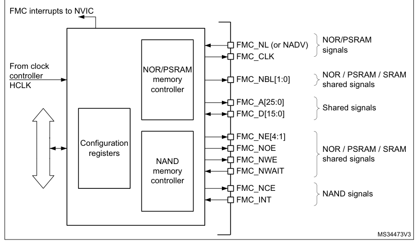

FMC interrupts to NVIC

NOR/PSRAM

FMC_NL (or NADV)
signals

FMC_CLK

From clock

NOR/PSRAM

## 19.4 AHB interface

The AHB slave interface allows internal CPUs and other bus master peripherals to access the external
memories.

AHB transactions are translated into the external device protocol. In particular, if the selected
external memory is 16- or 8-bit wide, 32-bit wide transactions on the AHB are split into consecutive
16- or 8-bit accesses. The FMC chip select (FMC_NEx) does not toggle between the consecutive
accesses except in case of Access mode D when the Extended mode is enabled.

The FMC generates an AHB error in the following conditions:

- When reading or writing to a FMC bank (Bank 1 to 4) which is not enabled.
- When reading or writing to the NOR flash bank while the FACCEN bit is reset in the FMC_BCRx
  register.

The effect of an AHB error depends on the AHB master which has attempted the R/W access:

- If the access has been attempted by the Cortex®-M4 with FPU CPU, a hard fault interrupt is
  generated.
- If the access has been performed by a DMA controller, a DMA transfer error is generated and the
  corresponding DMA channel is automatically disabled.

The AHB clock (HCLK) is the reference clock for the FMC.

### 19.4.1 Supported memories and transactions

#### General transaction rules

The requested AHB transaction data size can be 8-, 16- or 32-bit wide whereas the accessed external
device has a fixed data width. This may lead to inconsistent transfers.

Therefore, some simple transaction rules must be followed:

- AHB transaction size and memory data size are equal

There is no issue in this case.

- AHB transaction size is greater than the memory size:

In this case, the FMC splits the AHB transaction into smaller consecutive memory accesses to meet
the external data width. The FMC chip select (FMC_NEx) does not toggle between the consecutive
accesses. If the bus turnaround timings is configured to any other value than 0, the FMC chip select
(FMC_NEx) toggles between the consecutive accesses. This feature is required when interfacing with
FRAM memory.

- AHB transaction size is smaller than the memory size:

The transfer may or not be consistent depending on the type of external device:

- Accesses to devices that have the byte select feature (SRAM, ROM, PSRAM)

In this case, the FMC allows read/write transactions and accesses to the right data through its byte
lanes NBL[1:0].

Bytes to be written are addressed by NBL[1:0].

All memory bytes are read (NBL[1:0] are driven low during read transaction) and the useless ones are
discarded.

- Accesses to devices that do not have the byte select feature (NOR and NAND flash memories)

This situation occurs when a byte access is requested to a 16-bit wide flash memory. Since the
device cannot be accessed in Byte mode (only 16-bit words can be read/written from/to the flash
memory), Write transactions and Read transactions are allowed (the controller reads the entire
16-bit memory word and uses only the required byte).

#### Wrap support for NOR flash/PSRAM

Wrap burst mode for synchronous memories is not supported. The memories must be configured in Linear
burst mode of undefined length.

#### Configuration registers

The FMC can be configured through a set of registers. Refer to [Section 19.6.6](#1966-norpsram-controller-registers), for a detailed
description of the NOR flash/PSRAM controller registers. Refer to [Section 19.7.7](#1977-nand-flash-controller-registers), for a detailed
description of the NAND flash registers.

## 19.5 External device address mapping

From the FMC point of view, the external memory is divided into fixed-size banks of 256 Mbytes each
(see Figure 53):

- Bank 1 used to address up to 4 NOR flash memory or PSRAM devices. This bank is split into 4
  NOR/PSRAM subbanks with 4 dedicated chip selects, as follows:
  - Bank 1 - NOR/PSRAM 1
  - Bank 1 - NOR/PSRAM 2
  - Bank 1 - NOR/PSRAM 3
  - Bank 1 - NOR/PSRAM 4
- Bank 3 used to address NAND flash memory devices. The MPU memory attribute for this space must be
  reconfigured by software to Device.

For each bank the type of memory to be used can be configured by the user application through the
Configuration register.

**Figure 53. FMC memory banks**

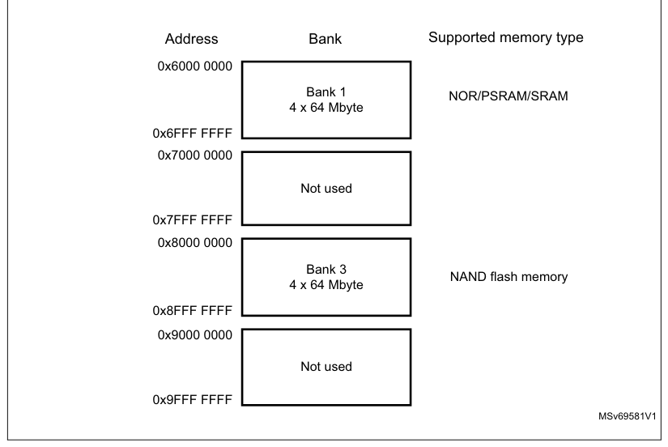

### 19.5.1 NOR/PSRAM address mapping

HADDR[27:26] bits are used to select one of the four memory banks as shown in Table 122.

**Table 122. NOR/PSRAM bank selection**

| HADDR[27:26]\(1) | Selected bank |
| --- | --- |
| 00 | Bank 1 - NOR/PSRAM 1 |
| 01 | Bank 1 - NOR/PSRAM 2 |

**Table 122. NOR/PSRAM bank selection (continued)**

| HADDR[27:26]\(1) | Selected bank |
| --- | --- |
| 10 | Bank 1 - NOR/PSRAM 3 |
| 11 | Bank 1 - NOR/PSRAM 4 |

1. HADDR are internal AHB address lines that are translated to external memory.

The HADDR[25:0] bits contain the external memory address. Since HADDR is a byte address whereas the
memory is addressed at word level, the address actually issued to the memory varies according to the
memory data width, as shown in the following table.

**Table 123. NOR/PSRAM External memory address**

| Memory width(1) | Data address issued to the memory | Maximum memory capacity (bits) |
| --- | --- | --- |
| 8-bit | HADDR[25:0] | 64 Mbytes x 8 = 512 Mbits |
| 16-bit | HADDR[25:1] >> 1 | 64 Mbytes/2 x 16 = 512 Mbits |

1. In case of a 16-bit external memory width, the FMC internally uses HADDR[25:1] to generate the
   address
   for external memory FMC_A[24:0].

Whatever the external memory width, FMC_A[0] must be connected to external memory address A[0].

### 19.5.2 NAND flash memory address mapping

The NAND bank is divided into memory areas as indicated in Table 124.

**Table 124. NAND memory mapping and timing registers**

| Source row | Column 1 | Column 2 | Column 3 | Column 4 | Column 5 |
| ---: | --- | --- | --- | --- | --- |
| 1 | `Start address` | `End address` | `FMC bank` | `Memory space` | `Timing register` |
| 2 | `0x8800 0000` | `0x8BFF FFFF` | `Attribute` | `FMC_PATT (0x8C)` |  |
| 3 | `Bank 3 - NAND flash` |  |  |  |  |
| 4 | `0x8000 0000` | `0x83FF FFFF` | `Common` | `FMC_PMEM (0x88)` |  |

For NAND flash memory, the common and attribute memory spaces are subdivided into three sections
(see in Table 125 below) located in the lower 256 Kbytes:

- Data section (first 64 Kbytes in the common/attribute memory space)
- Command section (second 64 Kbytes in the common / attribute memory space)
- Address section (next 128 Kbytes in the common / attribute memory space)

**Table 125. NAND bank selection**

| Source row | Column 1 | Column 2 | Column 3 |
| ---: | --- | --- | --- |
| 1 | `Section name` | `HADDR[17:16]` | `Address range` |
| 2 | `Address section` | `1X` | `0x020000-0x03FFFF` |
| 3 | `Command section` | `01` | `0x010000-0x01FFFF` |
| 4 | `Data section` | `00` | `0x000000-0x0FFFF` |
| 5 | `The application software uses the 3 sections to access the NAND flash memory:` |  |  |

- To sending a command to NAND flash memory, the software must write the command value to any memory
  location in the command section.
- To specify the NAND flash address that must be read or written, the software must write the
  address value to any memory location in the address section. Since an address can be 4 or 5 bytes
  long (depending on the actual memory size), several consecutive write operations to the address
  section are required to specify the full address.
- To read or write data, the software reads or writes the data from/to any memory location in the
  data section.

Since the NAND flash memory automatically increments addresses, there is no need to increment the
address of the data section to access consecutive memory locations.

## 19.6 NOR flash/PSRAM controller

The FMC generates the appropriate signal timings to drive the following types of memories:

- Asynchronous SRAM, FRAM and ROM
  - 8 bits
  - 16 bits
- PSRAM (CellularRAM™)
  - Asynchronous mode
  - Burst mode for synchronous accesses
  - Multiplexed or non-multiplexed
- NOR flash memory
  - Asynchronous mode
  - Burst mode for synchronous accesses
  - Multiplexed or non-multiplexed

The FMC outputs a unique chip select signal, NE[4:1], per bank. All the other signals (addresses,
data and control) are shared.

The FMC supports a wide range of devices through a programmable timings among which:

- Programmable wait states (up to 15)
- Programmable bus turnaround cycles (up to 15)
- Programmable output enable and write enable delays (up to 15)
- Independent read and write timings and protocol to support the widest variety of memories and
  timings
- Programmable continuous clock (FMC_CLK) output.

The FMC Clock (FMC_CLK) is a submultiple of the HCLK clock. It can be delivered to the selected
external device either during synchronous accesses only or during asynchronous and synchronous
accesses depending on the CCKEN bit configuration in the FMC_BCR1 register:

- If the CCLKEN bit is reset, the FMC generates the clock (CLK) only during synchronous accesses
  (Read/write transactions).
- If the CCLKEN bit is set, the FMC generates a continuous clock during asynchronous and synchronous
  accesses. To generate the FMC_CLK continuous clock, Bank 1 must
  be configured in Synchronous mode (see [Section 19.6.6](#1966-norpsram-controller-registers): NOR/PSRAM controller registers). Since the
  same clock is used for all synchronous memories, when a continuous output clock is generated and
  synchronous accesses are performed, the AHB data size has to be the same as the memory data width
  (MWID) otherwise the FMC_CLK frequency is changed depending on AHB data transaction (refer to
  [Section 19.6.5](#1965-synchronous-transactions): Synchronous transactions for FMC_CLK divider ratio formula).

The size of each bank is fixed and equal to 64 Mbytes. Each bank is configured through dedicated
registers (see [Section 19.6.6](#1966-norpsram-controller-registers): NOR/PSRAM controller registers).

The programmable memory parameters include access times (see Table 126) and support for wait
management (for PSRAM and NOR flash accessed in Burst mode).

**Table 126. Programmable NOR/PSRAM access parameters**

| Source row | Column 1 | Column 2 | Column 3 | Column 4 | Column 5 | Column 6 |
| ---: | --- | --- | --- | --- | --- | --- |
| 1 | `Parameter` | `Function` | `Access mode` | `Unit` | `Min.` | `Max.` |
| 2 | `Address` | `Duration of the address` | `AHB clock cycle` |  |  |  |
| 3 | `Asynchronous` | `0` | `15` |  |  |  |
| 4 | `setup` | `setup phase` | `(HCLK)` |  |  |  |
| 5 | `Duration of the address hold` | `Asynchronous,` | `AHB clock cycle` |  |  |  |
| 6 | `Address hold` | `1` | `15` |  |  |  |
| 7 | `phase` | `muxed I/Os` | `(HCLK)` |  |  |  |
| 8 | `Duration of the byte lanes` | `AHB clock cycle` |  |  |  |  |
| 9 | `NBL setup` | `Asynchronous` | `0` | `3` |  |  |
| 10 | `setup phase` | `(HCLK)` |  |  |  |  |
| 11 | `Duration of the data setup` | `AHB clock cycle` |  |  |  |  |
| 12 | `Data setup` | `Asynchronous` | `1` | `256` |  |  |
| 13 | `phase` | `(HCLK)` |  |  |  |  |
| 14 | `Duration of the data hold` | `AHB clock cycle` |  |  |  |  |
| 15 | `Data hold` | `Asynchronous` | `0` | `3` |  |  |
| 16 | `phase` | `(HCLK)` |  |  |  |  |
| 17 | `Asynchronous and` |  |  |  |  |  |
| 18 | `Duration of the bus` | `AHB clock cycle` |  |  |  |  |
| 19 | `Bust turn` | `synchronous read` | `0` | `15` |  |  |
| 20 | `turnaround phase` | `(HCLK)` |  |  |  |  |
| 21 | `/ write` |  |  |  |  |  |
| 22 | `Number of AHB clock cycles` |  |  |  |  |  |
| 23 | `Clock divide` | `AHB clock cycle` |  |  |  |  |
| 24 | `(HCLK) to build one memory` | `Synchronous` | `2` | `16` |  |  |
| 25 | `ratio` | `(HCLK)` |  |  |  |  |
| 26 | `clock cycle (CLK)` |  |  |  |  |  |
| 27 | `Number of clock cycles to` |  |  |  |  |  |
| 28 | `Memory clock` |  |  |  |  |  |
| 29 | `Data latency` | `issue to the memory before` | `Synchronous` | `2` | `17` |  |
| 30 | `cycle (CLK)` |  |  |  |  |  |
| 31 | `the first data of the burst` |  |  |  |  |  |

### 19.6.1 External memory interface signals

Table 127, Table 128 and Table 129 list the signals that are typically used to interface with NOR
flash memory, SRAM and PSRAM.

> **Note:** The prefix “N” identifies the signals that are active low.

#### NOR flash memory, non-multiplexed I/Os

**Table 127. Non-multiplexed I/O NOR flash memory**

| FMC signal name | I/O | Function |
| --- | --- | --- |
| CLK | O | Clock (for synchronous access) |
| A[25:0] | O | Address bus |

**Table 127. Non-multiplexed I/O NOR flash memory (continued)**

| Source row | Column 1 | Column 2 | Column 3 |
| ---: | --- | --- | --- |
| 1 | `FMC signal name` | `I/O` | `Function` |
| 2 | `D[15:0]` | `I/O` | `Bidirectional data bus` |
| 3 | `NE[x]` | `O` | `Chip select, x = 1..4` |
| 4 | `NOE` | `O` | `Output enable` |
| 5 | `NWE` | `O` | `Write enable` |
| 6 | `Latch enable (this signal is called address` |  |  |
| 7 | `NL(=NADV)` | `O` |  |
| 8 | `valid, NADV, by some NOR flash devices)` |  |  |
| 9 | `NWAIT` | `I` | `NOR flash wait input signal to the FMC` |

The maximum capacity is 512 Mbits (26 address lines).

#### NOR flash memory, 16-bit multiplexed I/Os

**Table 128. 16-bit multiplexed I/O NOR flash memory**

| Source row | Column 1 | Column 2 | Column 3 |
| ---: | --- | --- | --- |
| 1 | `FMC signal name` | `I/O` | `Function` |
| 2 | `CLK` | `O` | `Clock (for synchronous access)` |
| 3 | `A[25:16]` | `O` | `Address bus` |
| 4 | `16-bit multiplexed, bidirectional address/data bus (the 16-bit address` |  |  |
| 5 | `AD[15:0]` | `I/O` |  |
| 6 | `A[15:0] and data D[15:0] are multiplexed on the databus)` |  |  |
| 7 | `NE[x]` | `O` | `Chip select, x = 1..4` |
| 8 | `NOE` | `O` | `Output enable` |
| 9 | `NWE` | `O` | `Write enable` |
| 10 | `Latch enable (this signal is called address valid, NADV, by some NOR` |  |  |
| 11 | `NL(=NADV)` | `O` |  |
| 12 | `flash devices)` |  |  |
| 13 | `NWAIT` | `I` | `NOR flash wait input signal to the FMC` |

The maximum capacity is 512 Mbits.

#### PSRAM/FRAM/SRAM, non-multiplexed I/Os

**Table 129. Non-multiplexed I/Os PSRAM/SRAM**

| FMC signal name | I/O | Function |
| --- | --- | --- |
| CLK | O | Clock (only for PSRAM synchronous access) |
| A[25:0] | O | Address bus |
| D[15:0] | I/O | Data bidirectional bus |
| NE[x] | O | Chip select, x = 1..4 (called NCE by PSRAM (CellularRAM™ i.e. CRAM)) |
| NOE | O | Output enable |
| NWE | O | Write enable |
| NL(= NADV) | O | Address valid only for PSRAM input (memory signal name: NADV) |

**Table 129. Non-multiplexed I/Os PSRAM/SRAM (continued)**

| FMC signal name | I/O | Function |
| --- | --- | --- |
| NWAIT | I | PSRAM wait input signal to the FMC |
| NBL[1:0] | O | Byte lane output. Byte 0 and Byte 1 control (upper and lower byte enable) |

The maximum capacity is 512 Mbits.

#### PSRAM, 16-bit multiplexed I/Os

**Table 130. 16-Bit multiplexed I/O PSRAM**

| Source row | Column 1 | Column 2 | Column 3 |
| ---: | --- | --- | --- |
| 1 | `FMC signal name` | `I/O` | `Function` |
| 2 | `CLK` | `O` | `Clock (for synchronous access)` |
| 3 | `A[25:16]` | `O` | `Address bus` |
| 4 | `16-bit multiplexed, bidirectional address/data bus (the 16-bit address` |  |  |
| 5 | `AD[15:0]` | `I/O` |  |
| 6 | `A[15:0] and data D[15:0] are multiplexed on the databus)` |  |  |
| 7 | `NE[x]` | `O` | `Chip select, x = 1..4 (called NCE by PSRAM (CellularRAM™ i.e. CRAM))` |
| 8 | `NOE` | `O` | `Output enable` |
| 9 | `NWE` | `O` | `Write enable` |
| 10 | `NL(= NADV)` | `O` | `Address valid PSRAM input (memory signal name: NADV)` |
| 11 | `NWAIT` | `I` | `PSRAM wait input signal to the FMC` |
| 12 | `NBL[1:0]` | `O` | `Byte lane output. Byte 0 and Byte 1 control (upper and lower byte enable)` |

The maximum capacity is 512 Mbits (26 address lines).

### 19.6.2 Supported memories and transactions

Table 131 below shows an example of the supported devices, access modes and transactions when the
memory data bus is 16-bit wide for NOR flash memory, PSRAM and SRAM. The transactions not allowed
(or not supported) by the FMC are shown in gray in this example.

**Table 131. NOR flash/PSRAM: example of supported memories**

| Source row | Column 1 | Column 2 | Column 3 | Column 4 | Column 5 | Column 6 |
| ---: | --- | --- | --- | --- | --- | --- |
| 1 | `and transactions` |  |  |  |  |  |
| 2 | `AHB` | `Allowed/` |  |  |  |  |
| 3 | `Memory` |  |  |  |  |  |
| 4 | `Device` | `Mode` | `R/W` | `data` | `not` | `Comments` |
| 5 | `data size` |  |  |  |  |  |
| 6 | `size` | `allowed` |  |  |  |  |
| 7 | `Asynchronous` | `R` | `8` | `16` | `Y` | `-` |
| 8 | `Asynchronous` | `W` | `8` | `16` | `N` | `-` |
| 9 | `Asynchronous` | `R` | `16` | `16` | `Y` | `-` |
| 10 | `Asynchronous` | `W` | `16` | `16` | `Y` | `-` |
| 11 | `NOR flash` |  |  |  |  |  |
| 12 | `Asynchronous` | `R` | `32` | `16` | `Y` | `Split into 2 FMC accesses` |
| 13 | `(muxed I/Os` |  |  |  |  |  |
| 14 | `Asynchronous` | `W` | `32` | `16` | `Y` | `Split into 2 FMC accesses` |
| 15 | `and nonmuxed` |  |  |  |  |  |
| 16 | `I/Os)` |  |  |  |  |  |
| 17 | `Asynchronous` |  |  |  |  |  |
| 18 | `R` | `-` | `16` | `N` | `Mode is not supported` |  |
| 19 | `page` |  |  |  |  |  |
| 20 | `Synchronous` | `R` | `8` | `16` | `N` | `-` |
| 21 | `Synchronous` | `R` | `16` | `16` | `Y` | `-` |
| 22 | `Synchronous` | `R` | `32` | `16` | `Y` | `-` |
| 23 | `Asynchronous` | `R` | `8` | `16` | `Y` | `-` |
| 24 | `Asynchronous` | `W` | `8` | `16` | `Y` | `Use of byte lanes NBL[1:0]` |
| 25 | `Asynchronous` | `R` | `16` | `16` | `Y` | `-` |
| 26 | `Asynchronous` | `W` | `16` | `16` | `Y` | `-` |
| 27 | `Asynchronous` | `R` | `32` | `16` | `Y` | `Split into 2 FMC accesses` |
| 28 | `PSRAM` |  |  |  |  |  |
| 29 | `Asynchronous` | `W` | `32` | `16` | `Y` | `Split into 2 FMC accesses` |
| 30 | `(multiplexed` |  |  |  |  |  |
| 31 | `I/Os and non-` |  |  |  |  |  |
| 32 | `Asynchronous` |  |  |  |  |  |
| 33 | `R` | `-` | `16` | `N` | `Mode is not supported` |  |
| 34 | `multiplexed` |  |  |  |  |  |
| 35 | `page` |  |  |  |  |  |
| 36 | `I/Os)` |  |  |  |  |  |
| 37 | `Synchronous` | `R` | `8` | `16` | `N` | `-` |
| 38 | `Synchronous` | `R` | `16` | `16` | `Y` | `-` |
| 39 | `Synchronous` | `R` | `32` | `16` | `Y` | `-` |
| 40 | `Synchronous` | `W` | `8` | `16` | `Y` | `Use of byte lanes NBL[1:0]` |
| 41 | `Synchronous` | `W` | `16/32` | `16` | `Y` | `-` |
| 42 | `Asynchronous` | `R` | `8 / 16` | `16` | `Y` | `-` |
| 43 | `Asynchronous` | `W` | `8 / 16` | `16` | `Y` | `Use of byte lanes NBL[1:0]` |
| 44 | `SRAM and` |  |  |  |  |  |
| 45 | `Asynchronous` | `R` | `32` | `16` | `Y` | `Split into 2 FMC accesses` |
| 46 | `ROM` |  |  |  |  |  |
| 47 | `Split into 2 FMC accesses` |  |  |  |  |  |
| 48 | `Asynchronous` | `W` | `32` | `16` | `Y` |  |
| 49 | `Use of byte lanes NBL[1:0]` |  |  |  |  |  |

### 19.6.3 General timing rules

#### Signals synchronization

- All controller output signals change on the rising edge of the internal clock (HCLK)
- In Synchronous mode (read or write), all output signals change on the rising edge of HCLK.
  Whatever the CLKDIV value, all outputs change as follows:
  - NOEL/NWEL/ NEL/NADVL/ NADVH /NBLL/ Address valid outputs change on the falling edge of FMC_CLK
    clock.
  - NOEH/ NWEH / NEH/ NOEH/NBLH/ Address invalid outputs change on the rising edge of FMC_CLK clock.

### 19.6.4 NOR flash/PSRAM controller asynchronous transactions

#### Asynchronous static memories (NOR flash, PSRAM, SRAM, FRAM)

- Signals are synchronized by the internal clock HCLK. This clock is not issued to the memory
- The FMC always samples the data before de-asserting the NOE signal. This guarantees that the
  memory data hold timing constraint is met (minimum Chip Enable high to data transition is usually
  0 ns)
- If the Extended mode is enabled (EXTMOD bit is set in the FMC_BCRx register), up to four extended
  modes (A, B, C and D) are available. It is possible to mix A, B, C and D modes for read and write
  operations. For example, read operation can be performed in mode A and write in mode B.
- If the Extended mode is disabled (EXTMOD bit is reset in the FMC_BCRx register), the FMC can
  operate in mode 1 or mode 2 as follows:
  - Mode 1 is the default mode when SRAM/PSRAM memory type is selected (MTYP = 0x0 or 0x01 in the
    FMC_BCRx register)
  - Mode 2 is the default mode when NOR memory type is selected (MTYP = 0x10 in the FMC_BCRx
    register).

#### Mode 1 - SRAM/FRAM/PSRAM (CRAM)

The next figures show the read and write transactions for the supported modes followed by the
required configuration of FMC_BCRx, and FMC_BTRx/FMC_BWTRx registers.

**Figure 54. Mode 1 read access waveforms**

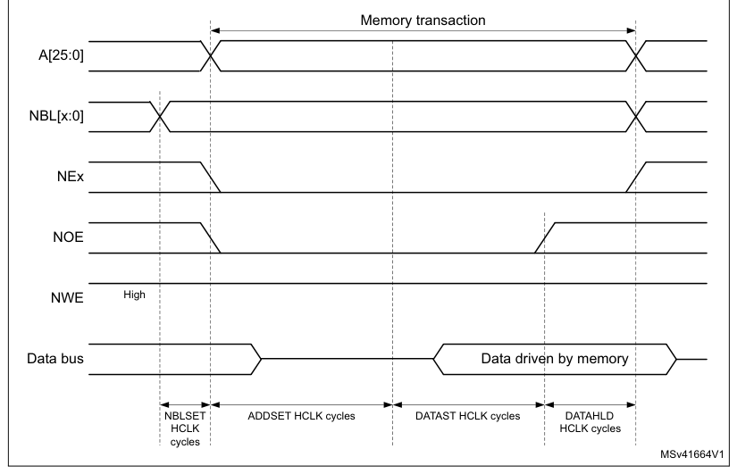

Memory transaction

A[25:0]

NBL[x:0]

NEx

NOE

NWE High

**Figure 55. Mode 1 write access waveforms**

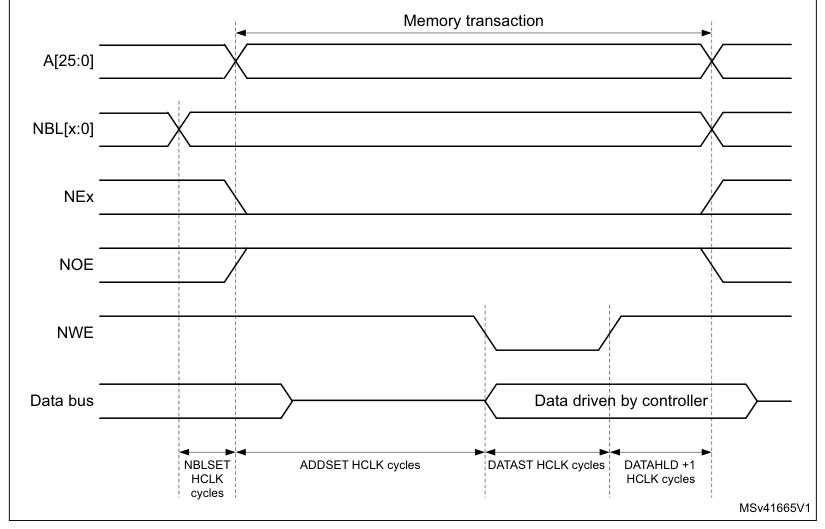

Memory transaction

A[25:0]

NBL[x:0]

NEx

NOE

NWE

The DATAHLD time at the end of the read and write transactions guarantee the address and data hold
time after the NOE/NWE rising edge. The DATAST value must be greater than zero (DATAST > 0).

**Table 132. FMC_BCRx bitfields (mode 1)**

| Bit number | Bit name | Value to set |
| --- | --- | --- |
| 31:24 | Reserved | 0x000 |
| 23:22 | NBLSET[1:0] | As needed |
| 20 | CCLKEN | As needed |
| 19 | CBURSTRW | 0x0 (no effect in Asynchronous mode) |
| 18:16 | CPSIZE | 0x0 (no effect in Asynchronous mode) |
| 15 | ASYNCWAIT | Set to 1 if the memory supports this feature. Otherwise keep at 0. |
| 14 | EXTMOD | 0x0 |
| 13 | WAITEN | 0x0 (no effect in Asynchronous mode) |
| 12 | WREN | As needed |
| 10 | Reserved | 0x0 |
| 9 | WAITPOL | Meaningful only if bit 15 is 1 |
| 8 | BURSTEN | 0x0 |
| 7 | Reserved | 0x1 |
| 6 | FACCEN | Don’t care |
| 5:4 | MWID | As needed |
| 3:2 | MTYP | As needed, exclude 0x2 (NOR flash memory) |
| 1 | MUXE | 0x0 |
| 0 | MBKEN | 0x1 |

**Table 133. FMC_BTRx bitfields (mode 1)**

| Source row | Column 1 | Column 2 | Column 3 |
| ---: | --- | --- | --- |
| 1 | `Bit number` | `Bit name` | `Value to set` |
| 2 | `Duration of the data hold phase (DATAHLD HCLK cycles for read` |  |  |
| 3 | `31:30` | `DATAHLD` |  |
| 4 | `accesses, DATAHLD+1 HCLK cycles for write accesses).` |  |  |
| 5 | `29:28` | `ACCMOD` | `Don’t care` |
| 6 | `27:24` | `DATLAT` | `Don’t care` |
| 7 | `23:20` | `CLKDIV` | `Don’t care` |
| 8 | `19:16` | `BUSTURN` | `Time between NEx high to NEx low (BUSTURN HCLK).` |
| 9 | `15:8` | `DATAST` | `Duration of the second access phase (DATAST HCLK cycles).` |
| 10 | `7:4` | `ADDHLD` | `Don’t care` |
| 11 | `Duration of the first access phase (ADDSET HCLK cycles).` |  |  |
| 12 | `3:0` | `ADDSET` |  |

Minimum value for ADDSET is 0.

#### Mode A - SRAM/FRAM/PSRAM (CRAM) OE toggling

**Figure 56. Mode A read access waveforms**

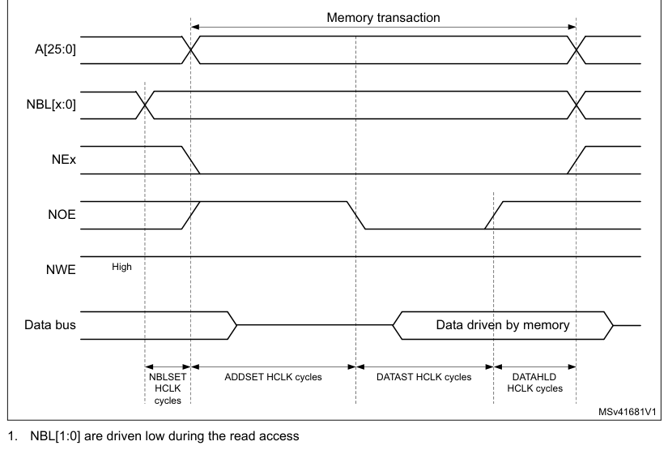

Memory transaction

A[25:0]

NBL[x:0]

NEx

NOE

NWE High

1. NBL[1:0] are driven low during the read access

**Figure 57. Mode A write access waveforms**

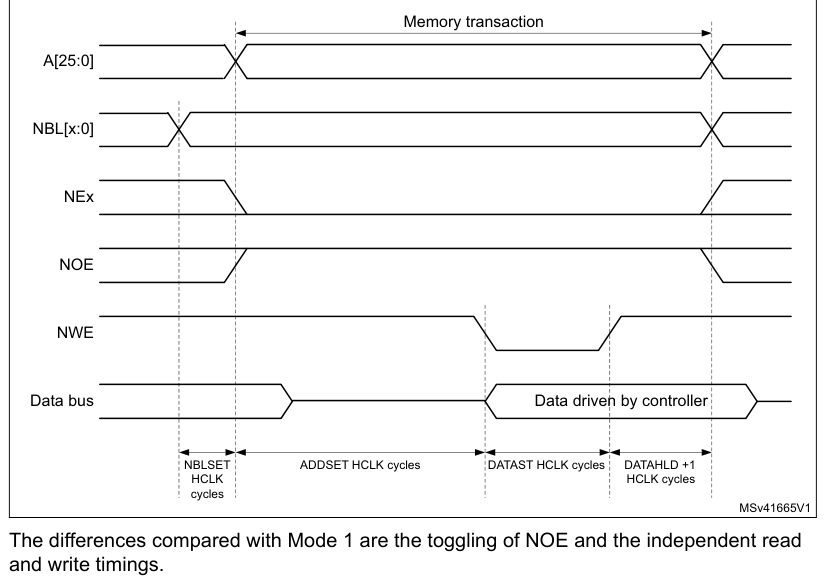

Memory transaction

A[25:0]

NBL[x:0]

NEx

NOE

NWE

The differences compared with Mode 1 are the toggling of NOE and the independent read and write
timings.

**Table 134. FMC_BCRx bitfields (mode A)**

| Bit number | Bit name | Value to set |
| --- | --- | --- |
| 31:24 | Reserved | 0x000 |
| 23:22 | NBLSET[1:0] | As needed |
| 20 | CCLKEN | As needed |
| 19 | CBURSTRW | 0x0 (no effect in Asynchronous mode) |
| 18:16 | CPSIZE | 0x0 (no effect in Asynchronous mode) |
| 15 | ASYNCWAIT | Set to 1 if the memory supports this feature. Otherwise keep at 0. |
| 14 | EXTMOD | 0x1 |
| 13 | WAITEN | 0x0 (no effect in Asynchronous mode) |
| 12 | WREN | As needed |
| 11 | WAITCFG | Don’t care |
| 10 | Reserved | 0x0 |
| 9 | WAITPOL | Meaningful only if bit 15 is 1 |
| 8 | BURSTEN | 0x0 |
| 7 | Reserved | 0x1 |
| 6 | FACCEN | Don’t care |
| 5:4 | MWID | As needed |
| 3:2 | MTYP | As needed, exclude 0x2 (NOR flash memory) |
| 1 | MUXEN | 0x0 |
| 0 | MBKEN | 0x1 |

**Table 135. FMC_BTRx bitfields (mode A)**

| Source row | Column 1 | Column 2 | Column 3 |
| ---: | --- | --- | --- |
| 1 | `Bit number` | `Bit name` | `Value to set` |
| 2 | `Duration of the data hold phase (DATAHLD HCLK cycles for read` |  |  |
| 3 | `31:30` | `DATAHLD` |  |
| 4 | `accesses).` |  |  |
| 5 | `29:28` | `ACCMOD` | `0x0` |
| 6 | `27:24` | `DATLAT` | `Don’t care` |
| 7 | `23:20` | `CLKDIV` | `Don’t care` |
| 8 | `19:16` | `BUSTURN` | `Time between NEx high to NEx low (BUSTURN HCLK).` |
| 9 | `Duration of the second access phase (DATAST HCLK cycles) for read` |  |  |
| 10 | `15:8` | `DATAST` |  |
| 11 | `accesses.` |  |  |
| 12 | `7:4` | `ADDHLD` | `Don’t care` |
| 13 | `Duration of the first access phase (ADDSET HCLK cycles) for read` |  |  |
| 14 | `3:0` | `ADDSET` | `accesses.` |

Minimum value for ADDSET is 0.

**Table 136. FMC_BWTRx bitfields (mode A)**

| Source row | Column 1 | Column 2 | Column 3 |
| ---: | --- | --- | --- |
| 1 | `Bit number` | `Bit name` | `Value to set` |
| 2 | `Duration of the data hold phase (DATAHLD+1 HCLK cycles for write` |  |  |
| 3 | `31:30` | `DATAHLD` |  |
| 4 | `accesses).` |  |  |
| 5 | `29:28` | `ACCMOD` | `0x0` |
| 6 | `27:24` | `DATLAT` | `Don’t care` |
| 7 | `23:20` | `CLKDIV` | `Don’t care` |
| 8 | `19:16` | `BUSTURN` | `Time between NEx high to NEx low (BUSTURN HCLK).` |
| 9 | `Duration of the second access phase (DATAST HCLK cycles) for write` |  |  |
| 10 | `15:8` | `DATAST` |  |
| 11 | `accesses.` |  |  |
| 12 | `7:4` | `ADDHLD` | `Don’t care` |
| 13 | `Duration of the first access phase (ADDSET HCLK cycles) for write` |  |  |
| 14 | `3:0` | `ADDSET` | `accesses.` |

Minimum value for ADDSET is 0.

#### Mode 2/B - NOR flash

**Figure 58. Mode 2 and mode B read access waveforms**

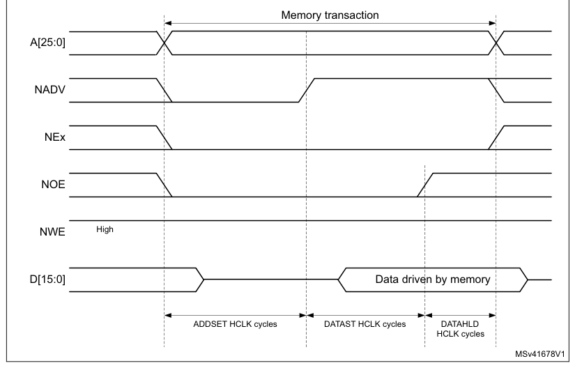

Memory transaction

A[25:0]

NADV

NEx

NOE

NWE High

**Figure 59. Mode 2 write access waveforms**

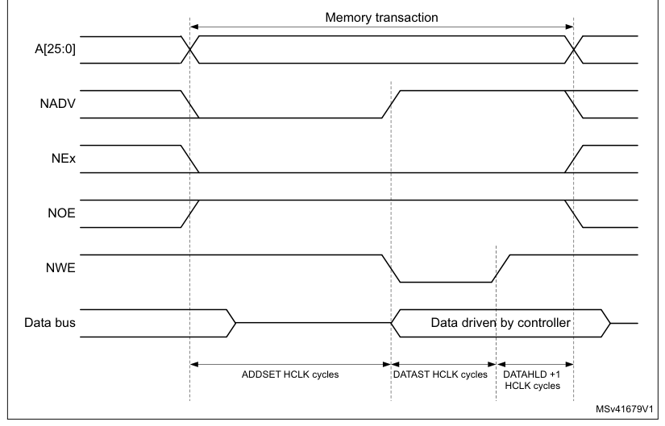

Memory transaction

A[25:0]

NADV

NEx

NOE

NWE

**Figure 60. Mode B write access waveforms**

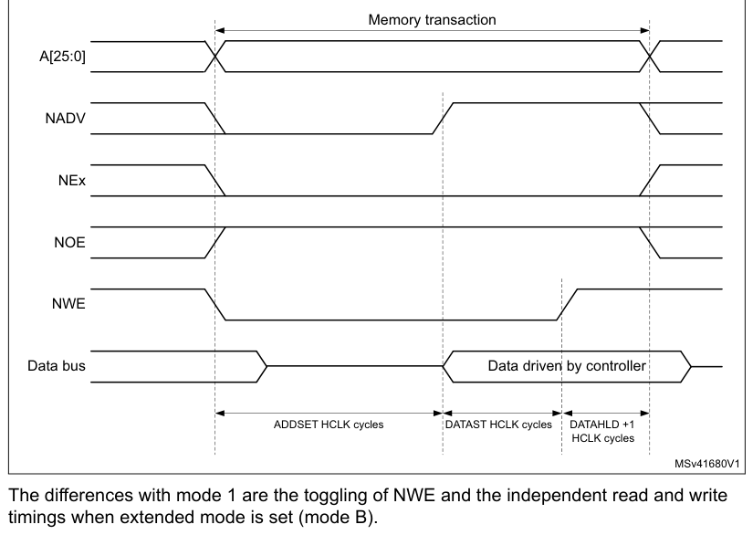

Memory transaction

A[25:0]

NADV

NEx

NOE

NWE

The differences with mode 1 are the toggling of NWE and the independent read and write timings when
extended mode is set (mode B).

**Table 137. FMC_BCRx bitfields (mode 2/B)**

| Bit number | Bit name | Value to set |
| --- | --- | --- |
| 31:24 | Reserved | 0x000 |
| 23:22 | NBLSET[1:0] | Don’t care |
| 20 | CCLKEN | As needed |
| 19 | CBURSTRW | 0x0 (no effect in Asynchronous mode) |
| 18:16 | CPSIZE | 0x0 (no effect in Asynchronous mode) |
| 15 | ASYNCWAIT | Set to 1 if the memory supports this feature. Otherwise keep at 0. |
| 14 | EXTMOD | 0x1 for mode B, 0x0 for mode 2 |
| 13 | WAITEN | 0x0 (no effect in Asynchronous mode) |
| 12 | WREN | As needed |
| 11 | WAITCFG | Don’t care |
| 10 | Reserved | 0x0 |
| 9 | WAITPOL | Meaningful only if bit 15 is 1 |
| 8 | BURSTEN | 0x0 |
| 7 | Reserved | 0x1 |
| 6 | FACCEN | 0x1 |
| 5:4 | MWID | As needed |
| 3:2 | MTYP | 0x2 (NOR flash memory) |
| 1 | MUXEN | 0x0 |
| 0 | MBKEN | 0x1 |

**Table 138. FMC_BTRx bitfields (mode 2/B)**

| Source row | Column 1 | Column 2 | Column 3 |
| ---: | --- | --- | --- |
| 1 | `Bit number` | `Bit name` | `Value to set` |
| 2 | `Duration of the data hold phase (DATAHLD HCLK cycles for read` |  |  |
| 3 | `31:30` | `DATAHLD` | `accesses and DATAHLD+1 HCLK cycles for write accesses when` |
| 4 | `Extended mode is disabled).` |  |  |
| 5 | `29:28` | `ACCMOD` | `0x1 if Extended mode is set` |
| 6 | `27:24` | `DATLAT` | `Don’t care` |
| 7 | `23:20` | `CLKDIV` | `Don’t care` |
| 8 | `19:16` | `BUSTURN` | `Time between NEx high to NEx low (BUSTURN HCLK).` |
| 9 | `Duration of the access second phase (DATAST HCLK cycles) for` |  |  |
| 10 | `15:8` | `DATAST` |  |
| 11 | `read accesses.` |  |  |
| 12 | `7:4` | `ADDHLD` | `Don’t care` |
| 13 | `Duration of the access first phase (ADDSET HCLK cycles) for read` |  |  |
| 14 | `3:0` | `ADDSET` |  |

accesses. Minimum value for ADDSET is 0.

**Table 139. FMC_BWTRx bitfields (mode 2/B)**

| Source row | Column 1 | Column 2 | Column 3 |
| ---: | --- | --- | --- |
| 1 | `Bit number` | `Bit name` | `Value to set` |
| 2 | `Duration of the data hold phase (DATAHLD+1 HCLK cycles for write` |  |  |
| 3 | `31:30` | `DATAHLD` |  |
| 4 | `accesses).` |  |  |
| 5 | `29:28` | `ACCMOD` | `0x1 if Extended mode is set` |
| 6 | `27:24` | `DATLAT` | `Don’t care` |
| 7 | `23:20` | `CLKDIV` | `Don’t care` |
| 8 | `19:16` | `BUSTURN` | `Time between NEx high to NEx low (BUSTURN HCLK).` |
| 9 | `Duration of the access second phase (DATAST HCLK cycles) for` |  |  |
| 10 | `15:8` | `DATAST` |  |
| 11 | `write accesses.` |  |  |
| 12 | `7:4` | `ADDHLD` | `Don’t care` |
| 13 | `Duration of the access first phase (ADDSET HCLK cycles) for write` |  |  |
| 14 | `3:0` | `ADDSET` |  |

accesses. Minimum value for ADDSET is 0.

> **Note:** The FMC_BWTRx register is valid only if the Extended mode is set (mode B), otherwise its
> content is don’t care.

#### Mode C - NOR flash - OE toggling

**Figure 61. Mode C read access waveforms**

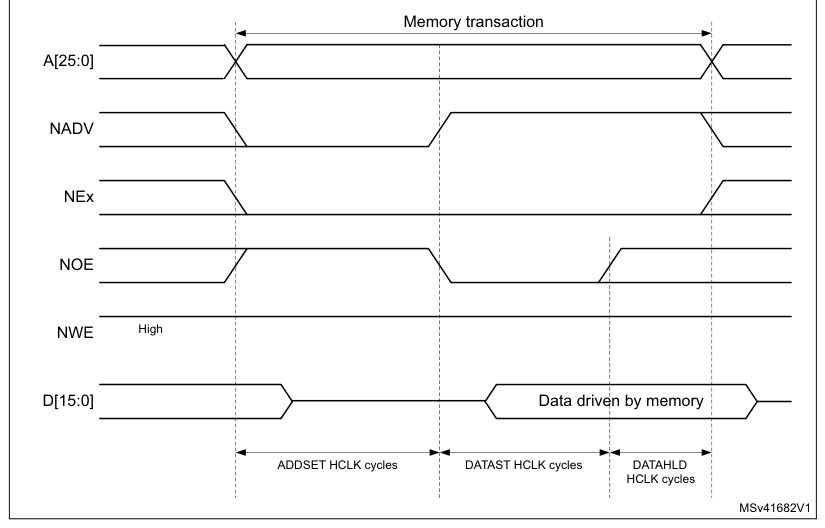

Memory transaction

A[25:0]

NADV

NEx

NOE

NWE High

**Figure 62. Mode C write access waveforms**

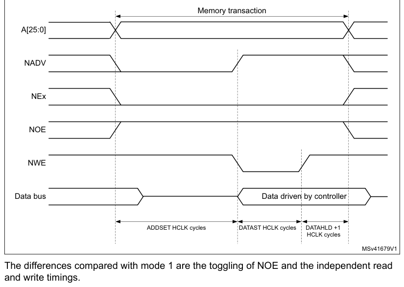

Memory transaction

A[25:0]

NADV

NEx

NOE

NWE

The differences compared with mode 1 are the toggling of NOE and the independent read and write
timings.

**Table 140. FMC_BCRx bitfields (mode C)**

| Bit number | Bit name | Value to set |
| --- | --- | --- |
| 31:24 | Reserved | 0x000 |
| 23:22 | NBLSET[1:0] | Don’t care |
| 20 | CCLKEN | As needed |
| 19 | CBURSTRW | 0x0 (no effect in Asynchronous mode) |
| 18:16 | CPSIZE | 0x0 (no effect in Asynchronous mode) |
| 15 | ASYNCWAIT | Set to 1 if the memory supports this feature. Otherwise keep at 0. |
| 14 | EXTMOD | 0x1 |
| 13 | WAITEN | 0x0 (no effect in Asynchronous mode) |
| 12 | WREN | As needed |
| 11 | WAITCFG | Don’t care |
| 10 | Reserved | 0x0 |
| 9 | WAITPOL | Meaningful only if bit 15 is 1 |
| 8 | BURSTEN | 0x0 |
| 7 | Reserved | 0x1 |
| 6 | FACCEN | 0x1 |
| 5:4 | MWID | As needed |

**Table 140. FMC_BCRx bitfields (mode C) (continued)**

| Bit number | Bit name | Value to set |
| --- | --- | --- |
| 3:2 | MTYP | 0x02 (NOR flash memory) |
| 1 | MUXEN | 0x0 |
| 0 | MBKEN | 0x1 |

**Table 141. FMC_BTRx bitfields (mode C)**

| Source row | Column 1 | Column 2 | Column 3 |
| ---: | --- | --- | --- |
| 1 | `Bit number` | `Bit name` | `Value to set` |
| 2 | `Duration of the data hold phase (DATAHLD HCLK cycles for read` |  |  |
| 3 | `31:30` | `DATAHLD` |  |
| 4 | `accesses).` |  |  |
| 5 | `29:28` | `ACCMOD` | `0x2` |
| 6 | `27:24` | `DATLAT` | `0x0` |
| 7 | `23:20` | `CLKDIV` | `0x0` |
| 8 | `19:16` | `BUSTURN` | `Time between NEx high to NEx low (BUSTURN HCLK).` |
| 9 | `Duration of the second access phase (DATAST HCLK cycles) for` |  |  |
| 10 | `15:8` | `DATAST` |  |
| 11 | `read accesses.` |  |  |
| 12 | `7:4` | `ADDHLD` | `Don’t care` |
| 13 | `Duration of the first access phase (ADDSET HCLK cycles) for read` |  |  |
| 14 | `3:0` | `ADDSET` |  |

accesses. Minimum value for ADDSET is 0.

**Table 142. FMC_BWTRx bitfields (mode C)**

| Source row | Column 1 | Column 2 | Column 3 |
| ---: | --- | --- | --- |
| 1 | `Bit number` | `Bit name` | `Value to set` |
| 2 | `Duration of the data hold phase (DATAHLD+1 HCLK cycles for write` |  |  |
| 3 | `31:30` | `DATAHLD` |  |
| 4 | `accesses).` |  |  |
| 5 | `29:28` | `ACCMOD` | `0x2` |
| 6 | `27:24` | `DATLAT` | `Don’t care` |
| 7 | `23:20` | `CLKDIV` | `Don’t care` |
| 8 | `19:16` | `BUSTURN` | `Time between NEx high to NEx low (BUSTURN HCLK).` |
| 9 | `Duration of the second access phase (DATAST HCLK cycles) for` |  |  |
| 10 | `15:8` | `DATAST` |  |
| 11 | `write accesses.` |  |  |
| 12 | `7:4` | `ADDHLD` | `Don’t care` |
| 13 | `Duration of the first access phase (ADDSET HCLK cycles) for write` |  |  |
| 14 | `3:0` | `ADDSET` |  |

accesses. Minimum value for ADDSET is 0.

#### Mode D - asynchronous access with extended address

**Figure 63. Mode D read access waveforms**

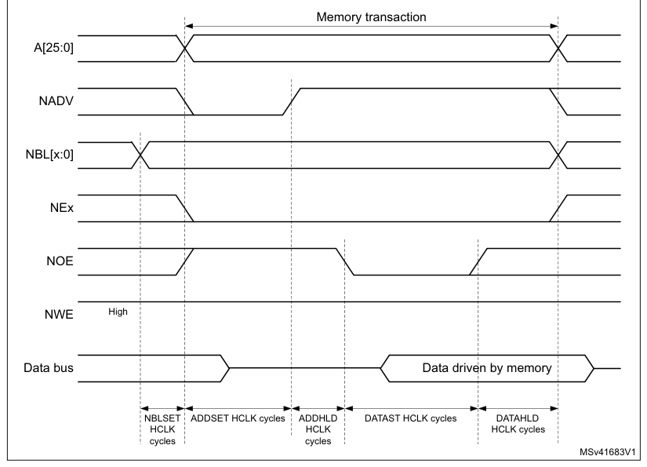

Memory transaction

A[25:0]

NADV

NBL[x:0]

NEx

NOE

NWE High

**Figure 64. Mode D write access waveforms**

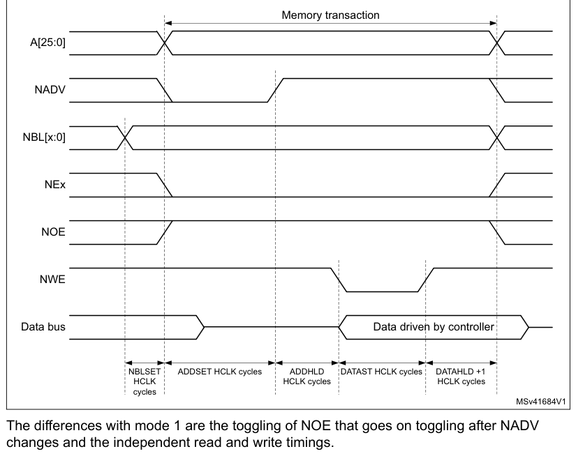

Memory transaction

A[25:0]

NADV

NBL[x:0]

NEx

NOE

NWE

The differences with mode 1 are the toggling of NOE that goes on toggling after NADV changes and the
independent read and write timings.

**Table 143. FMC_BCRx bitfields (mode D)**

| Bit number | Bit name | Value to set |
| --- | --- | --- |
| 31:24 | Reserved | 0x000 |
| 23:22 | NBLSET[1:0] | As needed |
| 20 | CCLKEN | As needed |
| 19 | CBURSTRW | 0x0 (no effect in Asynchronous mode) |
| 18:16 | CPSIZE | 0x0 (no effect in Asynchronous mode) |
| 15 | ASYNCWAIT | Set to 1 if the memory supports this feature. Otherwise keep at 0. |
| 14 | EXTMOD | 0x1 |
| 13 | WAITEN | 0x0 (no effect in Asynchronous mode) |
| 12 | WREN | As needed |
| 11 | WAITCFG | Don’t care |
| 10 | Reserved | 0x0 |
| 9 | WAITPOL | Meaningful only if bit 15 is 1 |
| 8 | BURSTEN | 0x0 |
| 7 | Reserved | 0x1 |

**Table 143. FMC_BCRx bitfields (mode D) (continued)**

| Bit number | Bit name | Value to set |
| --- | --- | --- |
| 6 | FACCEN | Set according to memory support |
| 5:4 | MWID | As needed |
| 3:2 | MTYP | As needed |
| 1 | MUXEN | 0x0 |
| 0 | MBKEN | 0x1 |

**Table 144. FMC_BTRx bitfields (mode D)**

| Source row | Column 1 | Column 2 | Column 3 |
| ---: | --- | --- | --- |
| 1 | `Bit number` | `Bit name` | `Value to set` |
| 2 | `Duration of the data hold phase (DATAHLD HCLK cycles for read` |  |  |
| 3 | `31:30` | `DATAHLD` |  |
| 4 | `accesses).` |  |  |
| 5 | `29:28` | `ACCMOD` | `0x3` |
| 6 | `27:24` | `DATLAT` | `Don’t care` |
| 7 | `23:20` | `CLKDIV` | `Don’t care` |
| 8 | `19:16` | `BUSTURN` | `Time between NEx high to NEx low (BUSTURN HCLK).` |
| 9 | `Duration of the second access phase (DATAST HCLK cycles) for read` |  |  |
| 10 | `15:8` | `DATAST` |  |

accesses.

Duration of the middle phase of the read access (ADDHLD HCLK

| Source row | Column 1 | Column 2 |
| ---: | --- | --- |
| 1 | `7:4` | `ADDHLD` |
| 2 | `cycles)` |  |
| 3 | `Duration of the first access phase (ADDSET HCLK cycles) for read` |  |
| 4 | `3:0` | `ADDSET` |

accesses. Minimum value for ADDSET is 1.

**Table 145. FMC_BWTRx bitfields (mode D)**

| Source row | Column 1 | Column 2 | Column 3 |
| ---: | --- | --- | --- |
| 1 | `Bit number` | `Bit name` | `Value to set` |
| 2 | `Duration of the data hold phase (DATAHLD+1 HCLK cycles for write` |  |  |
| 3 | `31:30` | `DATAHLD` |  |
| 4 | `accesses).` |  |  |
| 5 | `29:28` | `ACCMOD` | `0x3` |
| 6 | `27:24` | `DATLAT` | `Don’t care` |
| 7 | `23:20` | `CLKDIV` | `Don’t care` |
| 8 | `19:16` | `BUSTURN` | `Time between NEx high to NEx low (BUSTURN HCLK).` |
| 9 | `15:8` | `DATAST` | `Duration of the second access phase (DATAST HCLK cycles).` |
| 10 | `Duration of the middle phase of the write access (ADDHLD HCLK` |  |  |
| 11 | `7:4` | `ADDHLD` |  |
| 12 | `cycles)` |  |  |
| 13 | `Duration of the first access phase (ADDSET HCLK cycles) for write` |  |  |
| 14 | `3:0` | `ADDSET` |  |

accesses. Minimum value for ADDSET is 1.

#### Muxed mode - multiplexed asynchronous access to NOR flash memory

**Figure 65. Muxed read access waveforms**

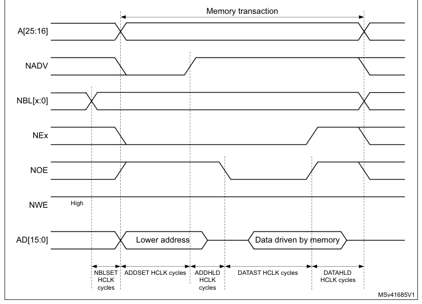

Memory transaction

A[25:16]

NADV

NBL[x:0]

NEx

NOE

NWE High

**Figure 66. Muxed write access waveforms**

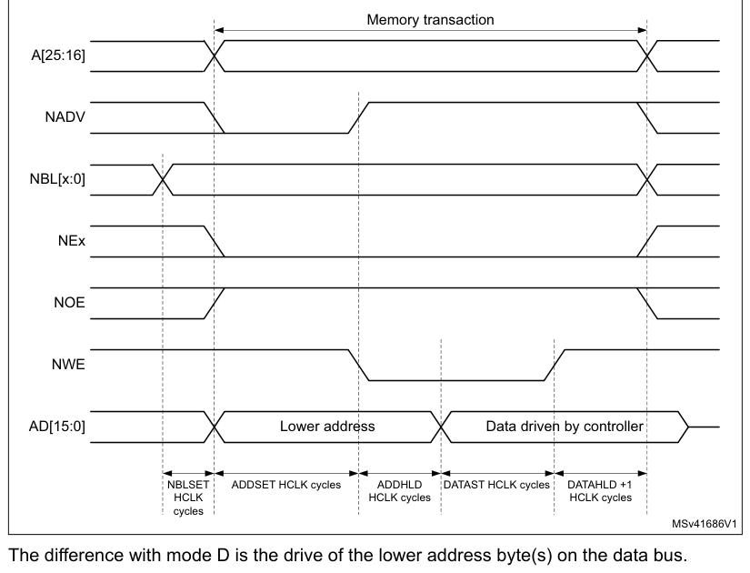

Memory transaction

A[25:16]

NADV

NBL[x:0]

NEx

NOE

NWE

The difference with mode D is the drive of the lower address byte(s) on the data bus.

**Table 146. FMC_BCRx bitfields (Muxed mode)**

| Bit number | Bit name | Value to set |
| --- | --- | --- |
| 31:24 | Reserved | 0x000 |
| 23:22 | NBLSET[1:0] | As needed |
| 20 | CCLKEN | As needed |
| 19 | CBURSTRW | 0x0 (no effect in Asynchronous mode) |
| 18:16 | CPSIZE | 0x0 (no effect in Asynchronous mode) |
| 15 | ASYNCWAIT | Set to 1 if the memory supports this feature. Otherwise keep at 0. |
| 14 | EXTMOD | 0x0 |
| 13 | WAITEN | 0x0 (no effect in Asynchronous mode) |
| 12 | WREN | As needed |
| 11 | WAITCFG | Don’t care |
| 10 | Reserved | 0x0 |
| 9 | WAITPOL | Meaningful only if bit 15 is 1 |
| 8 | BURSTEN | 0x0 |
| 7 | Reserved | 0x1 |
| 6 | FACCEN | 0x1 |

**Table 146. FMC_BCRx bitfields (Muxed mode) (continued)**

| Bit number | Bit name | Value to set |
| --- | --- | --- |
| 5:4 | MWID | As needed |
| 3:2 | MTYP | 0x2 (NOR flash memory) or 0x1(PSRAM) |
| 1 | MUXEN | 0x1 |
| 0 | MBKEN | 0x1 |

**Table 147. FMC_BTRx bitfields (Muxed mode)**

| Source row | Column 1 | Column 2 | Column 3 |
| ---: | --- | --- | --- |
| 1 | `Bit number` | `Bit name` | `Value to set` |
| 2 | `Duration of the data hold phase (DATAHLD HCLK cycles for read` |  |  |
| 3 | `31:30` | `DATAHLD` |  |
| 4 | `accesses, DATAHLD+1 HCLK cycles for write accesses).` |  |  |
| 5 | `29:28` | `ACCMOD` | `0x0` |
| 6 | `27:24` | `DATLAT` | `Don’t care` |
| 7 | `23:20` | `CLKDIV` | `Don’t care` |
| 8 | `19:16` | `BUSTURN` | `Time between NEx high to NEx low (BUSTURN HCLK).` |
| 9 | `15:8` | `DATAST` | `Duration of the second access phase (DATAST HCLK cycles).` |
| 10 | `7:4` | `ADDHLD` | `Duration of the middle phase of the access (ADDHLD HCLK cycles).` |
| 11 | `Duration of the first access phase (ADDSET HCLK cycles). Minimum` |  |  |
| 12 | `3:0` | `ADDSET` |  |

value for ADDSET is 1.

#### WAIT management in asynchronous accesses

If the asynchronous memory asserts the WAIT signal to indicate that it is not yet ready to accept or
to provide data, the ASYNCWAIT bit has to be set in FMC_BCRx register.

If the WAIT signal is active (high or low depending on the WAITPOL bit), the second access phase
(Data setup phase), programmed by the DATAST bits, is extended until WAIT becomes inactive. Unlike
the data setup phase, the first access phases (Address setup and Address hold phases), programmed by
the ADDSET and ADDHLD bits, are not WAIT sensitive and so they are not prolonged.

The data setup phase must be programmed so that WAIT can be detected 4 HCLK cycles before the end of
the memory transaction. The following cases must be considered:

1. The memory asserts the WAIT signal aligned to NOE/NWE which toggles:

> **Extracted layout**
>
> `DATAST` · `≥` · `(` · `4` · `×` · `HCLK` · `)` · `+` · `max_wait_assertion_time`  

2. The memory asserts the WAIT signal aligned to NEx (or NOE/NWE not toggling):

if

> **Extracted layout**
>
> `max_wait_assertion_time` · `>` · `address_phase` · `+` · `hold_phase`  
> `then:`  
> `DATAST` · `≥` · `(` · `4` · `×` · `HCLK` · `)` · `+` · `(` · `max_wait_assertion_time` · `–` · `address_phase` · `–` · `hold_phase` · `)`  
> `otherwise`  
> `DATAST` · `≥` · `4` · `×` · `HCLK`  

where max_wait_assertion_time is the maximum time taken by the memory to assert the WAIT signal once
NEx/NOE/NWE is low.

Figure 67 and Figure 68 show the number of HCLK clock cycles that are added to the memory access
phase after WAIT is released by the asynchronous memory (independently of the above cases).

**Figure 67. Asynchronous wait during a read access waveforms**

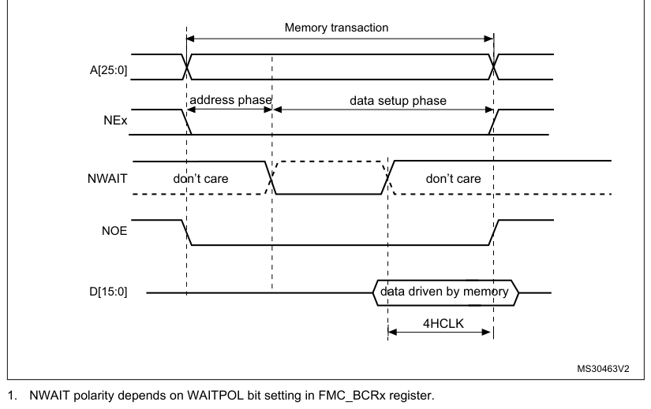

1. NWAIT polarity depends on WAITPOL bit setting in FMC_BCRx register.

**Figure 68. Asynchronous wait during a write access waveforms**

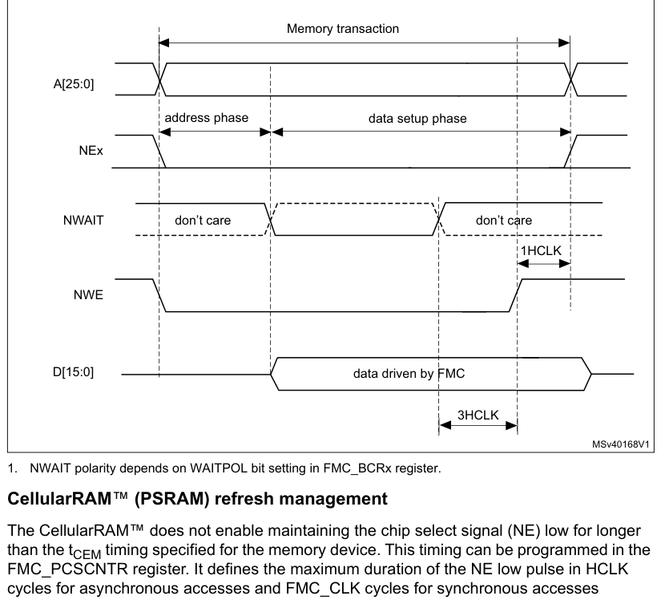

1. NWAIT polarity depends on WAITPOL bit setting in FMC_BCRx register.

#### CellularRAM™ (PSRAM) refresh management

The CellularRAM™ does not enable maintaining the chip select signal (NE) low for longer than the
tCEM timing specified for the memory device. This timing can be programmed in the FMC_PCSCNTR
register. It defines the maximum duration of the NE low pulse in HCLK cycles for asynchronous
accesses and FMC_CLK cycles for synchronous accesses

### 19.6.5 Synchronous transactions

The memory clock, FMC_CLK, is a submultiple of HCLK. It depends on the value of CLKDIV and the MWID/
AHB data size, following the formula given below:

Whatever MWID size: 16 or 8-bit, the FMC_CLK divider ratio is always defined by the programmed
CLKDIV value.

Example:

- If CLKDIV=1, MWID = 16 bits, AHB data size=8 bits, FMC_CLK=HCLK/2.

NOR flash memories specify a minimum time from NADV assertion to CLK high. To meet this constraint,
the FMC does not issue the clock to the memory during the first internal clock cycle of the
synchronous access (before NADV assertion). This guarantees that the rising edge of the memory clock
occurs in the middle of the NADV low pulse.

#### Data latency versus NOR memory latency

The data latency is the number of cycles to wait before sampling the data. The DATLAT value must be
consistent with the latency value specified in the NOR flash configuration
register. The FMC does not include the clock cycle when NADV is low in the data latency count.

> **Caution:** Some NOR flash memories include the NADV Low cycle in the data latency count, so that
> the exact relation between the NOR flash latency and the FMC DATLAT parameter can be either:

- NOR flash latency = (DATLAT \+ 2) CLK clock cycles
- or NOR flash latency = (DATLAT \+ 3) CLK clock cycles

Some recent memories assert NWAIT during the latency phase. In such cases DATLAT can be set to its
minimum value. As a result, the FMC samples the data and waits long enough to evaluate if the data
are valid. Thus the FMC detects when the memory exits latency and real data are processed.

Other memories do not assert NWAIT during latency. In this case the latency must be set correctly
for both the FMC and the memory, otherwise invalid data are mistaken for good data, or valid data
are lost in the initial phase of the memory access.

#### Single-burst transfer

When the selected bank is configured in Burst mode for synchronous accesses, if for example an AHB
single-burst transaction is requested on 16-bit memories, the FMC performs a burst transaction of
length 1 (if the AHB transfer is 16 bits), or length 2 (if the AHB transfer is 32 bits) and
de-assert the chip select signal when the last data is strobed.

Such transfers are not the most efficient in terms of cycles compared to asynchronous read
operations. Nevertheless, a random asynchronous access would first require to re-program the memory
access mode, which would altogether last longer.

#### Cross boundary page for CellularRAM™ 1.5

CellularRAM™ 1.5 does not allow burst access to cross the page boundary. The FMC controller is used
to split automatically the burst access when the memory page size is reached by configuring the
CPSIZE bits in the FMC_BCR1 register following the memory page size.

#### Wait management

For synchronous NOR flash memories, NWAIT is evaluated after the programmed latency period, which
corresponds to (DATLAT+2) CLK clock cycles.

If NWAIT is active (low level when WAITPOL = 0, high level when WAITPOL = 1), wait states are
inserted until NWAIT is inactive (high level when WAITPOL = 0, low level when WAITPOL = 1).

When NWAIT is inactive, the data is considered valid either immediately (bit WAITCFG = 1) or on the
next clock edge (bit WAITCFG = 0).

During wait-state insertion via the NWAIT signal, the controller continues to send clock pulses to
the memory, keeping the chip select and output enable signals valid. It does not consider the data
as valid.

In Burst mode, there are two timing configurations for the NOR flash NWAIT signal:

- The flash memory asserts the NWAIT signal one data cycle before the wait state (default after
  reset).
- The flash memory asserts the NWAIT signal during the wait state

The FMC supports both NOR flash wait state configurations, for each chip select, thanks to the
WAITCFG bit in the FMC_BCRx registers (x = 0..3).

**Figure 69. Wait configuration waveforms**

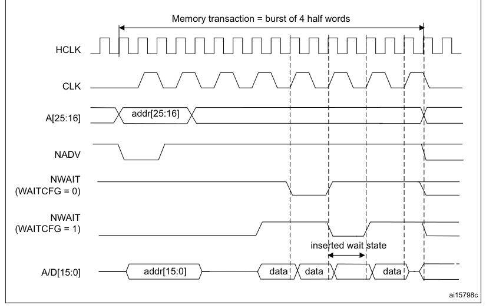

Memory transaction = burst of 4 half words

HCLK

CLK
addr[25:16]

A[25:16]

NADV

NWAIT

(WAITCFG = 0)

NWAIT

(WAITCFG = 1)
inserted wait state

**Figure 70. Synchronous multiplexed read mode waveforms - NOR, PSRAM (CRAM)**

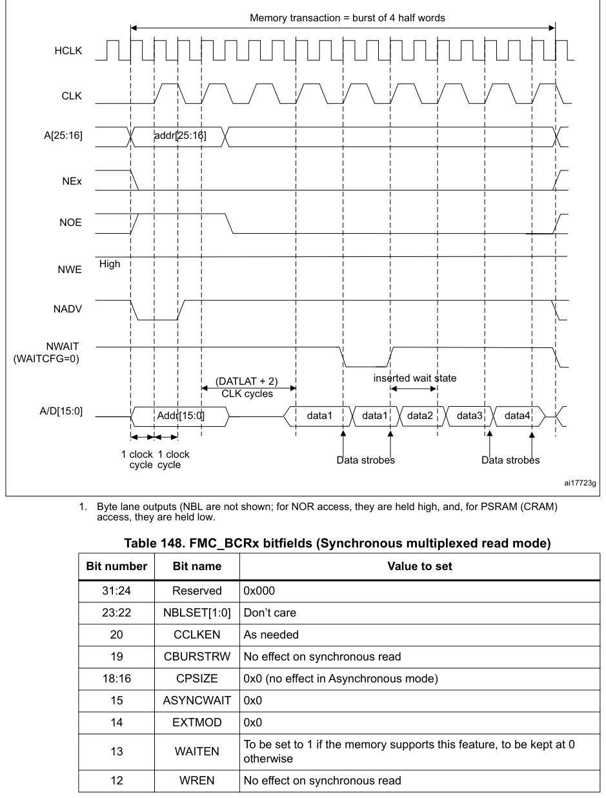

1. Byte lane outputs (NBL are not shown; for NOR access, they are held high, and, for PSRAM (CRAM)
   access, they are held low.

**Table 148. FMC_BCRx bitfields (Synchronous multiplexed read mode)**

| Source row | Column 1 | Column 2 | Column 3 |
| ---: | --- | --- | --- |
| 1 | `Bit number` | `Bit name` | `Value to set` |
| 2 | `31:24` | `Reserved` | `0x000` |
| 3 | `23:22` | `NBLSET[1:0]` | `Don’t care` |
| 4 | `20` | `CCLKEN` | `As needed` |
| 5 | `19` | `CBURSTRW` | `No effect on synchronous read` |
| 6 | `18:16` | `CPSIZE` | `0x0 (no effect in Asynchronous mode)` |
| 7 | `15` | `ASYNCWAIT` | `0x0` |
| 8 | `14` | `EXTMOD` | `0x0` |
| 9 | `To be set to 1 if the memory supports this feature, to be kept at 0` |  |  |
| 10 | `13` | `WAITEN` |  |
| 11 | `otherwise` |  |  |
| 12 | `12` | `WREN` | `No effect on synchronous read` |

**Table 148. FMC_BCRx bitfields (Synchronous multiplexed read mode) (continued)**

| Bit number | Bit name | Value to set |
| --- | --- | --- |
| 11 | WAITCFG | To be set according to memory |
| 10 | Reserved | 0x0 |
| 9 | WAITPOL | To be set according to memory |
| 8 | BURSTEN | 0x1 |
| 7 | Reserved | 0x1 |
| 6 | FACCEN | Set according to memory support (NOR flash memory) |
| 5-4 | MWID | As needed |
| 3-2 | MTYP | 0x1 or 0x2 |
| 1 | MUXEN | As needed |
| 0 | MBKEN | 0x1 |

**Table 149. FMC_BTRx bitfields (Synchronous multiplexed read mode)**

| Source row | Column 1 | Column 2 | Column 3 |
| ---: | --- | --- | --- |
| 1 | `Bit number` | `Bit name` | `Value to set` |
| 2 | `31:30` | `DATAHLD` | `Don’t care` |
| 3 | `29:28` | `ACCMOD` | `0x0` |
| 4 | `27-24` | `DATLAT` | `Data latency` |
| 5 | `27-24` | `DATLAT` | `Data latency` |
| 6 | `0x0 to get CLK = HCLK` |  |  |
| 7 | `23-20` | `CLKDIV` | `0x1 to get CLK = 2 × HCLK` |
| 8 | `..` |  |  |
| 9 | `19-16` | `BUSTURN` | `Time between NEx high to NEx low (BUSTURN HCLK).` |
| 10 | `15-8` | `DATAST` | `Don’t care` |
| 11 | `7-4` | `ADDHLD` | `Don’t care` |
| 12 | `3-0` | `ADDSET` | `Don’t care` |

**Figure 71. Synchronous multiplexed write mode waveforms - PSRAM (CRAM)**

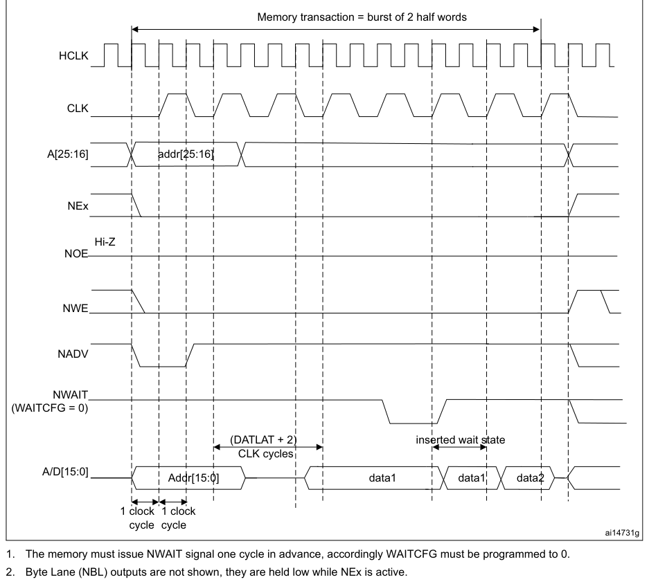

1. The memory must issue NWAIT signal one cycle in advance, accordingly WAITCFG must be programmed
   to 0.
2. Byte Lane (NBL) outputs are not shown, they are held low while NEx is active.

**Table 150. FMC_BCRx bitfields (Synchronous multiplexed write mode)**

| Source row | Column 1 | Column 2 | Column 3 |
| ---: | --- | --- | --- |
| 1 | `Bit number` | `Bit name` | `Value to set` |
| 2 | `31:24` | `Reserved` | `0x000` |
| 3 | `23:22` | `NBLSET[1:0]` | `Don’t care` |
| 4 | `20` | `CCLKEN` | `As needed` |
| 5 | `19` | `CBURSTRW` | `0x1` |
| 6 | `18:16` | `CPSIZE` | `As needed (0x1 for CRAM 1.5)` |
| 7 | `15` | `ASYNCWAIT` | `0x0` |
| 8 | `14` | `EXTMOD` | `0x0` |
| 9 | `To be set to 1 if the memory supports this feature, to be kept at 0` |  |  |
| 10 | `13` | `WAITEN` |  |

otherwise.

**Table 150. FMC_BCRx bitfields (Synchronous multiplexed write mode) (continued)**

| Bit number | Bit name | Value to set |
| --- | --- | --- |
| 12 | WREN | 0x1 |
| 11 | WAITCFG | 0x0 |
| 10 | Reserved | 0x0 |
| 9 | WAITPOL | to be set according to memory |
| 8 | BURSTEN | no effect on synchronous write |
| 7 | Reserved | 0x1 |
| 6 | FACCEN | Set according to memory support |
| 5-4 | MWID | As needed |
| 3-2 | MTYP | 0x1 |
| 1 | MUXEN | As needed |
| 0 | MBKEN | 0x1 |

**Table 151. FMC_BTRx bitfields (Synchronous multiplexed write mode)**

| Source row | Column 1 | Column 2 | Column 3 |
| ---: | --- | --- | --- |
| 1 | `Bit number` | `Bit name` | `Value to set` |
| 2 | `31-30` | `DATAHLD` | `Don’t care` |
| 3 | `29:28` | `ACCMOD` | `0x0` |
| 4 | `27-24` | `DATLAT` | `Data latency` |
| 5 | `0x0 to get CLK = HCLK` |  |  |
| 6 | `23-20` | `CLKDIV` |  |
| 7 | `0x1 to get CLK = 2 × HCLK` |  |  |
| 8 | `19-16` | `BUSTURN` | `Time between NEx high to NEx low (BUSTURN HCLK).` |
| 9 | `15-8` | `DATAST` | `Don’t care` |
| 10 | `7-4` | `ADDHLD` | `Don’t care` |
| 11 | `3-0` | `ADDSET` | `Don’t care` |

### 19.6.6 NOR/PSRAM controller registers

#### SRAM/NOR-flash chip-select control register for bank x (FMC_BCRx)

- **Address offset:** 0x00 \+ 0x8 \* (x - 1), (x = 1 to 4)
- **Reset value:** 0x0000 30DB, 0x0000 30D2, 0x0000 30D2, 0x0000 30D2

This register contains the control information of each memory bank, used for SRAMs, PSRAM, FRAM and
NOR flash memories.

**Register bit layout**

| Bit | Field | Access | Summary |
| ---: | --- | :---: | --- |
| 31 | Reserved | — | kept at reset value. |
| 30 | Reserved | — | ↳ |
| 29 | Reserved | — | ↳ |
| 28 | Reserved | — | ↳ |
| 27 | Reserved | — | ↳ |
| 26 | Reserved | — | ↳ |
| 25 | Reserved | — | ↳ |
| 24 | Reserved | — | ↳ |
| 23 | `NBLSET[1]` | rw | Byte lane (NBL) setup |
| 22 | `NBLSET[0]` | rw | ↳ |
| 21 | `WFDIS` | rw | Write FIFO disable |
| 20 | `CCLKEN` | rw | Continuous clock enable |
| 19 | `CBURSTRW` | rw | Write burst enable |
| 18 | `CPSIZE[2]` | rw | CRAM page size |
| 17 | `CPSIZE[1]` | rw | ↳ |
| 16 | `CPSIZE[0]` | rw | ↳ |
| 15 | `ASYNCWAIT` | rw | Wait signal during asynchronous transfers |
| 14 | `EXTMOD` | rw | Extended mode enable |
| 13 | `WAITEN` | rw | Wait enable bit |
| 12 | `WREN` | rw | Write enable bit |
| 11 | `WAITCFG` | rw | Wait timing configuration |
| 10 | Reserved | — | kept at reset value. |
| 9 | `WAITPOL` | rw | Wait signal polarity bit |
| 8 | `BURSTEN` | rw | Burst enable bit |
| 7 | Reserved | — | kept at reset value. |
| 6 | `FACCEN` | rw | Flash access enable |
| 5 | `MWID[1]` | rw | Memory data bus width |
| 4 | `MWID[0]` | rw | ↳ |
| 3 | `MTYP[1]` | rw | Memory type |
| 2 | `MTYP[0]` | rw | ↳ |
| 1 | `MUXEN` | rw | Address/data multiplexing enable bit |
| 0 | `MBKEN` | rw | Memory bank enable bit |

**Bits 31:24 — Reserved:** kept at reset value.

**Bits 23:22 — `NBLSET[1:0]`:** Byte lane (NBL) setup

These bits configure the NBL setup timing from NBLx low to chip select NEx low.

- `00`: NBL setup time is 0 AHB clock cycle
- `01`: NBL setup time is 1 AHB clock cycle
- `10`: NBL setup time is 2 AHB clock cycles
- `11`: NBL setup time is 3 AHB clock cycles

**Bit 21 — `WFDIS`:** Write FIFO disable

This bit disables the Write FIFO used by the FMC controller.

- `0`: Write FIFO enabled (Default after reset)
- `1`: Write FIFO disabled

> **Note:** The WFDIS bit of the FMC_BCR2..4 registers is don’t care. It is only enabled through the

FMC_BCR1 register.

**Bit 20 — `CCLKEN`:** Continuous clock enable

This bit enables the FMC_CLK clock output to external memory devices.

- `0`: The FMC_CLK is only generated during the synchronous memory access (read/write
  transaction). The FMC_CLK clock ratio is specified by the programmed CLKDIV value in the

FMC_BCRx register (default after reset).

- `1`: The FMC_CLK is generated continuously during asynchronous and synchronous access. The

FMC_CLK clock is activated when the CCLKEN is set.

> **Note:** The CCLKEN bit of the FMC_BCR2..4 registers is don’t care. It is only enabled through the

FMC_BCR1 register. Bank 1 must be configured in Synchronous mode to generate the

FMC_CLK continuous clock.

> **Note:** If CCLKEN bit is set, the FMC_CLK clock ratio is specified by CLKDIV value in the FMC_BTR1
> register. CLKDIV in FMC_BWTR1 is don’t care.

> **Note:** If the Synchronous mode is used and CCLKEN bit is set, the synchronous memories
> connected to other banks than Bank 1 are clocked by the same clock (the CLKDIV value in the

FMC_BTR2..4 and FMC_BWTR2..4 registers for other banks has no effect.)

**Bit 19 — `CBURSTRW`:** Write burst enable

For PSRAM (CRAM) operating in Burst mode, the bit enables synchronous accesses during write
operations. The enable bit for synchronous read accesses is the BURSTEN bit in the FMC_BCRx
register.

- `0`: Write operations are always performed in Asynchronous mode.
- `1`: Write operations are performed in Synchronous mode.

**Bits 18:16 — `CPSIZE[2:0]`:** CRAM page size

These are used for CellularRAM™ 1.5 which does not allow burst access to cross the address
boundaries between pages. When these bits are configured, the FMC controller splits automatically
the burst access when the memory page size is reached (refer to memory datasheet for page size).

- `000`: No burst split when crossing page boundary (default after reset)
- `001`: 128 bytes
- `010`: 256 bytes
- `011`: 512 bytes
- `100`: 1024 bytes

Others: Reserved, must not be used

**Bit 15 — `ASYNCWAIT`:** Wait signal during asynchronous transfers

This bit enables/disables the FMC to use the wait signal even during an asynchronous protocol.

- `0`: NWAIT signal is not taken in to account when running an asynchronous protocol (default after
  reset).
- `1`: NWAIT signal is taken in to account when running an asynchronous protocol.

**Bit 14 — `EXTMOD`:** Extended mode enable

This bit enables the FMC to program the write timings for non multiplexed asynchronous accesses
inside the FMC_BWTR register, thus resulting in different timings for read and write operations.

- `0`: values inside FMC_BWTR register are not taken into account (default after reset)
- `1`: values inside FMC_BWTR register are taken into account

> **Note:** When the Extended mode is disabled, the FMC can operate in mode 1 or mode 2 as follows:

- Mode 1 is the default mode when the SRAM/PSRAM memory type is selected

(MTYP = 0x0 or 0x01)

- Mode 2 is the default mode when the NOR memory type is selected (MTYP = 0x10).

**Bit 13 — `WAITEN`:** Wait enable bit

This bit enables/disables wait-state insertion via the NWAIT signal when accessing the memory in

Synchronous mode.

- `0`: NWAIT signal is disabled (its level not taken into account, no wait state inserted after the
  programmed flash latency period).
- `1`: NWAIT signal is enabled (its level is taken into account after the programmed latency period
  to
  insert wait states if asserted) (default after reset).

**Bit 12 — `WREN`:** Write enable bit

This bit indicates whether write operations are enabled/disabled in the bank by the FMC.

- `0`: Write operations are disabled in the bank by the FMC, an AHB error is reported.
- `1`: Write operations are enabled for the bank by the FMC (default after reset).

**Bit 11 — `WAITCFG`:** Wait timing configuration

The NWAIT signal indicates whether the data from the memory are valid or if a wait state must be
inserted when accessing the memory in Synchronous mode. This configuration bit determines if

NWAIT is asserted by the memory one clock cycle before the wait state or during the wait state:

- `0`: NWAIT signal is active one data cycle before wait state (default after reset).
- `1`: NWAIT signal is active during wait state (not used for PSRAM).

**Bit 10 — Reserved:** kept at reset value.

**Bit 9 — `WAITPOL`:** Wait signal polarity bit

Defines the polarity of the wait signal from memory used for either in Synchronous or Asynchronous
mode.

- `0`: NWAIT active low (default after reset)
- `1`: NWAIT active high

**Bit 8 — `BURSTEN`:** Burst enable bit

This bit enables/disables synchronous accesses during read operations. It is valid only for
synchronous memories operating in Burst mode.

- `0`: Burst mode disabled (default after reset). Read accesses are performed in Asynchronous mode.
- `1`: Burst mode enable. Read accesses are performed in Synchronous mode.

**Bit 7 — Reserved:** kept at reset value.

**Bit 6 — `FACCEN`:** Flash access enable

Enables NOR flash memory access operations.

- `0`: Corresponding NOR flash memory access is disabled.
- `1`: Corresponding NOR flash memory access is enabled (default after reset).

**Bits 5:4 — `MWID[1:0]`:** Memory data bus width

Defines the external memory device width, valid for all type of memories.

- `00`: 8 bits
- `01`: 16 bits (default after reset)
- `10`: reserved
- `11`: reserved

**Bits 3:2 — `MTYP[1:0]`:** Memory type

Defines the type of external memory attached to the corresponding memory bank.

- `00`: SRAM/FRAM (default after reset for Bank 2...4)
- `01`: PSRAM (CRAM) / FRAM
- `10`: NOR flash/OneNAND flash (default after reset for Bank 1)
- `11`: reserved

**Bit 1 — `MUXEN`:** Address/data multiplexing enable bit

When this bit is set, the address and data values are multiplexed on the data bus, valid only with

NOR and PSRAM memories:

- `0`: Address/data non multiplexed
- `1`: Address/data multiplexed on databus (default after reset)

**Bit 0 — `MBKEN`:** Memory bank enable bit

Enables the memory bank. After reset Bank1 is enabled, all others are disabled. Accessing a
disabled bank causes an ERROR on AHB bus.

- `0`: Corresponding memory bank is disabled.
- `1`: Corresponding memory bank is enabled.

#### SRAM/NOR-flash chip-select timing register for bank x (FMC_BTRx)

- **Address offset:** 0x04 \+ 0x8 \* (x - 1), (x = 1 to 4)
- **Reset value:** 0x0FFF FFFF

This register contains the control information of each memory bank, used for SRAMs, PSRAM and NOR
flash memories. If the EXTMOD bit is set in the FMC_BCRx register, then this register is partitioned
for write and read access, that is, 2 registers are available: one to
configure read accesses (this register) and one to configure write accesses (FMC_BWTRx registers).

**Register bit layout**

| Bit | Field | Access | Summary |
| ---: | --- | :---: | --- |
| 31 | `DATAHLD[1]` | rw | Data hold phase duration |
| 30 | `DATAHLD[0]` | rw | ↳ |
| 29 | `ACCMOD[1]` | rw | Access mode |
| 28 | `ACCMOD[0]` | rw | ↳ |
| 27 | `DATLAT[3]` | rw | (see note below bit descriptions): Data latency for synchronous |
| 26 | `DATLAT[2]` | rw | ↳ |
| 25 | `DATLAT[1]` | rw | ↳ |
| 24 | `DATLAT[0]` | rw | ↳ |
| 23 | `CLKDIV[3]` | rw | Clock divide ratio (for FMC_CLK signal) |
| 22 | `CLKDIV[2]` | rw | ↳ |
| 21 | `CLKDIV[1]` | rw | ↳ |
| 20 | `CLKDIV[0]` | rw | ↳ |
| 19 | `BUSTURN[3]` | rw | Bus turnaround phase duration |
| 18 | `BUSTURN[2]` | rw | ↳ |
| 17 | `BUSTURN[1]` | rw | ↳ |
| 16 | `BUSTURN[0]` | rw | ↳ |
| 15 | `DATAST[7]` | rw | Data-phase duration |
| 14 | `DATAST[6]` | rw | ↳ |
| 13 | `DATAST[5]` | rw | ↳ |
| 12 | `DATAST[4]` | rw | ↳ |
| 11 | `DATAST[3]` | rw | ↳ |
| 10 | `DATAST[2]` | rw | ↳ |
| 9 | `DATAST[1]` | rw | ↳ |
| 8 | `DATAST[0]` | rw | ↳ |
| 7 | `ADDHLD[3]` | rw | Address-hold phase duration |
| 6 | `ADDHLD[2]` | rw | ↳ |
| 5 | `ADDHLD[1]` | rw | ↳ |
| 4 | `ADDHLD[0]` | rw | ↳ |
| 3 | `ADDSET[3]` | rw | Address setup phase duration |
| 2 | `ADDSET[2]` | rw | ↳ |
| 1 | `ADDSET[1]` | rw | ↳ |
| 0 | `ADDSET[0]` | rw | ↳ |

**Bits 31:30 — `DATAHLD[1:0]`:** Data hold phase duration

These bits are written by software to define the duration of the data hold phase in HCLK
cycles (refer to Figure 54 to Figure 66), used in asynchronous accesses:

For read accesses

- `00`: DATAHLD phase duration = 0 × HCLK clock cycle (default)
- `01`: DATAHLD phase duration = 1 × HCLK clock cycle
- `10`: DATAHLD phase duration = 2 × HCLK clock cycle
- `11`: DATAHLD phase duration = 3 × HCLK clock cycle

For write accesses

- `00`: DATAHLD phase duration = 1 × HCLK clock cycle (default)
- `01`: DATAHLD phase duration = 2 × HCLK clock cycle
- `10`: DATAHLD phase duration = 3 × HCLK clock cycle
- `11`: DATAHLD phase duration = 4 × HCLK clock cycle

**Bits 29:28 — `ACCMOD[1:0]`:** Access mode

Specifies the asynchronous access modes as shown in the timing diagrams. These bits are
taken into account only when the EXTMOD bit in the FMC_BCRx register is 1.

- `00`: Access mode A
- `01`: Access mode B
- `10`: Access mode C
- `11`: Access mode D

**Bits 27:24 — `DATLAT[3:0]`:** (see note below bit descriptions): Data latency for synchronous
memory

For synchronous access with read/write Burst mode enabled (BURSTEN / CBURSTRW bits
set), defines the number of memory clock cycles (+2) to issue to the memory before
reading/writing the first data:

This timing parameter is not expressed in HCLK periods, but in FMC_CLK periods.

For asynchronous access, this value is don't care.

- `0000`: Data latency of 2 CLK clock cycles for first burst access
- `1111`: Data latency of 17 CLK clock cycles for first burst access (default value after reset)

**Bits 23:20 — `CLKDIV[3:0]`:** Clock divide ratio (for FMC_CLK signal)

Defines the period of FMC_CLK clock output signal, expressed in number of HCLK cycles:

- `0000`: FMC_CLK period= 1x HCLK period
- `0001`: FMC_CLK period = 2 × HCLK periods
- `0010`: FMC_CLK period = 3 × HCLK periods
- `1111`: FMC_CLK period = 16 × HCLK periods (default value after reset)

In asynchronous NOR flash, SRAM or PSRAM accesses, this value is don’t care.

> **Note:** Refer to [Section 19.6.5](#1965-synchronous-transactions): Synchronous transactions for FMC_CLK divider ratio formula)

**Bits 19:16 — `BUSTURN[3:0]`:** Bus turnaround phase duration

These bits are written by software to add a delay at the end of current read or write
transaction to next transaction on the same bank.

This delay is used to match the minimum time between consecutive transactions (tEHEL from

NEx high to NEx low) and the maximum time needed by the memory to free the data bus
after a read access (tEHQZ, chip enable high to output Hi-Z). This delay is recommended for
mode D and muxed mode. For non-muxed memory, the bus turnaround delay can be set to
minimum value.

(BUSTURN \+ 1)HCLK period ≥ max(tEHEL min, tEHQZ max)

For FRAM memories, the bus turnaround delay must be configured to match the minimum
tPC (precharge time) timings. The bus turnaround delay is inserted between any consecutive
transactions on the same bank (read/read, write/write, read/write and write/read) to match the
tPC memory timing. The chip select is toggling between any consecutive accesses.

(BUSTURN \+ 1)HCLK period ≥ tPC min

- `0000`: BUSTURN phase duration = 1 HCLK clock cycle added

...

- `1111`: BUSTURN phase duration = 16 x HCLK clock cycles added (default value after reset)

**Bits 15:8 — `DATAST[7:0]`:** Data-phase duration

These bits are written by software to define the duration of the data phase (refer to Figure 54
to Figure 66), used in asynchronous accesses:

0000 0000: Reserved

0000 0001: DATAST phase duration = 1 × HCLK clock cycles

0000 0010: DATAST phase duration = 2 × HCLK clock cycles

...

1111 1111: DATAST phase duration = 255 × HCLK clock cycles (default value after reset)

For each memory type and access mode data-phase duration, refer to the respective figure

(Figure 54 to Figure 66).

Example: Mode 1, write access, DATAST=1: Data-phase duration= DATAST+1 = 2 HCLK
clock cycles.

> **Note:** In synchronous accesses, this value is don’t care.

**Bits 7:4 — `ADDHLD[3:0]`:** Address-hold phase duration

These bits are written by software to define the duration of the address hold phase (refer to

Figure 54 to Figure 66), used in mode D or multiplexed accesses:

- `0000`: Reserved
- `0001`: ADDHLD phase duration =1 × HCLK clock cycle
- `0010`: ADDHLD phase duration = 2 × HCLK clock cycle

...

- `1111`: ADDHLD phase duration = 15 × HCLK clock cycles (default value after reset)

For each access mode address-hold phase duration, refer to the respective figure (Figure 54
to Figure 66).

> **Note:** In synchronous accesses, this value is not used, the address hold phase is always 1
> memory clock period duration.

**Bits 3:0 — `ADDSET[3:0]`:** Address setup phase duration

These bits are written by software to define the duration of the address setup phase (refer to

Figure 54 to Figure 66), used in SRAMs, ROMs, asynchronous NOR flash and PSRAM:

- `0000`: ADDSET phase duration = 0 × HCLK clock cycle

...

- `1111`: ADDSET phase duration = 15 × HCLK clock cycles (default value after reset)

For each access mode address setup phase duration, refer to the respective figure

(Figure 54 to Figure 66).

> **Note:** In synchronous accesses, this value is don’t care.

In Muxed mode or mode D, the minimum value for ADDSET is 1.

In mode 1 and PSRAM memory, the minimum value for ADDSET is 1.

> **Note:** PSRAMs (CRAMs) have a variable latency due to internal refresh. Therefore these
> memories issue the NWAIT signal during the whole latency phase to prolong the latency as needed.
With PSRAMs (CRAMs) the filled DATLAT must be set to 0, so that the FMC exits its latency phase soon
and starts sampling NWAIT from memory, then starts to read or write when the memory is ready. This
method can be used also with the latest generation of synchronous flash memories that issue the
NWAIT signal, unlike older flash memories (check the datasheet of the specific flash memory being
used).

#### SRAM/NOR-flash write timing registers x (FMC_BWTRx)

- **Address offset:** 0x104 \+ 0x8 \* (x - 1), (x = 1 to 4)
- **Reset value:** 0x0FFF FFFF

This register contains the control information of each memory bank. It is used for SRAMs, PSRAMs and
NOR flash memories. When the EXTMOD bit is set in the FMC_BCRx register, then this register is
active for write access.

**Register bit layout**

| Bit | Field | Access | Summary |
| ---: | --- | :---: | --- |
| 31 | `DATAHLD[1]` | rw | Data hold phase duration |
| 30 | `DATAHLD[0]` | rw | ↳ |
| 29 | `ACCMOD[1]` | rw | Access mode. |
| 28 | `ACCMOD[0]` | rw | ↳ |
| 27 | Reserved | — | kept at reset value. |
| 26 | Reserved | — | ↳ |
| 25 | Reserved | — | ↳ |
| 24 | Reserved | — | ↳ |
| 23 | Reserved | — | ↳ |
| 22 | Reserved | — | ↳ |
| 21 | Reserved | — | ↳ |
| 20 | Reserved | — | ↳ |
| 19 | `BUSTURN[3]` | rw | Bus turnaround phase duration |
| 18 | `BUSTURN[2]` | rw | ↳ |
| 17 | `BUSTURN[1]` | rw | ↳ |
| 16 | `BUSTURN[0]` | rw | ↳ |
| 15 | `DATAST[7]` | rw | Data-phase duration. |
| 14 | `DATAST[6]` | rw | ↳ |
| 13 | `DATAST[5]` | rw | ↳ |
| 12 | `DATAST[4]` | rw | ↳ |
| 11 | `DATAST[3]` | rw | ↳ |
| 10 | `DATAST[2]` | rw | ↳ |
| 9 | `DATAST[1]` | rw | ↳ |
| 8 | `DATAST[0]` | rw | ↳ |
| 7 | `ADDHLD[3]` | rw | Address-hold phase duration. |
| 6 | `ADDHLD[2]` | rw | ↳ |
| 5 | `ADDHLD[1]` | rw | ↳ |
| 4 | `ADDHLD[0]` | rw | ↳ |
| 3 | `ADDSET[3]` | rw | Address setup phase duration. |
| 2 | `ADDSET[2]` | rw | ↳ |
| 1 | `ADDSET[1]` | rw | ↳ |
| 0 | `ADDSET[0]` | rw | ↳ |

**Bits 31:30 — `DATAHLD[1:0]`:** Data hold phase duration

These bits are written by software to define the duration of the data hold phase in HCLK cycles

(refer to Figure 54 to Figure 66), used in asynchronous write accesses:

- `00`: DATAHLD phase duration = 1 × HCLK clock cycle (default)
- `01`: DATAHLD phase duration = 2 × HCLK clock cycle
- `10`: DATAHLD phase duration = 3 × HCLK clock cycle
- `11`: DATAHLD phase duration = 4 × HCLK clock cycle

**Bits 29:28 — `ACCMOD[1:0]`:** Access mode.

Specifies the asynchronous access modes as shown in the next timing diagrams. These bits are
taken into account only when the EXTMOD bit in the FMC_BCRx register is 1.

- `00`: Access mode A
- `01`: Access mode B
- `10`: Access mode C
- `11`: Access mode D

**Bits 27:20 — Reserved:** kept at reset value.

**Bits 19:16 — `BUSTURN[3:0]`:** Bus turnaround phase duration

These bits are written by software to add a delay at the end of current write transaction to next
transaction on the same bank.

For FRAM memories, the bus turnaround delay must be configured to match the minimum tPC

(precharge time) timings. The bus turnaround delay is inserted between any consecutive
transactions on the same bank (read/read, write/write, read/write and write/read). The chip select
is
toggling between any consecutive accesses.

(BUSTURN \+ 1)HCLK period ≥ tPC min

- `0000`: BUSTURN phase duration = 1 HCLK clock cycle added

...

- `1111`: BUSTURN phase duration = 16 x HCLK clock cycles added (default value after reset)

**Bits 15:8 — `DATAST[7:0]`:** Data-phase duration.

These bits are written by software to define the duration of the data phase (refer to Figure 54 to

Figure 66), used in asynchronous SRAM, PSRAM and NOR flash memory accesses:

0000 0000: Reserved

0000 0001: DATAST phase duration = 1 × HCLK clock cycles

0000 0010: DATAST phase duration = 2 × HCLK clock cycles

...

1111 1111: DATAST phase duration = 255 × HCLK clock cycles (default value after reset)

**Bits 7:4 — `ADDHLD[3:0]`:** Address-hold phase duration.

These bits are written by software to define the duration of the address hold phase (refer to

Figure 63 to Figure 66), used in asynchronous multiplexed accesses:

- `0000`: Reserved
- `0001`: ADDHLD phase duration = 1 × HCLK clock cycle
- `0010`: ADDHLD phase duration = 2 × HCLK clock cycle

...

- `1111`: ADDHLD phase duration = 15 × HCLK clock cycles (default value after reset)

> **Note:** In synchronous NOR flash accesses, this value is not used, the address hold phase is always

1 flash clock period duration.

**Bits 3:0 — `ADDSET[3:0]`:** Address setup phase duration.

These bits are written by software to define the duration of the address setup phase in HCLK cycles

(refer to Figure 54 to Figure 66), used in asynchronous accesses:

- `0000`: ADDSET phase duration = 0 × HCLK clock cycle

...

- `1111`: ADDSET phase duration = 15 × HCLK clock cycles (default value after reset)

> **Note:** In synchronous accesses, this value is not used, the address setup phase is always 1 flash
> clock period duration. In muxed mode, the minimum ADDSET value is 1.

#### PSRAM chip select counter register (FMC_PCSCNTR)

- **Address offset:** 0x20
- **Reset value:** 0x0000 0000

This register contains the PSRAM chip select counter value for Synchronous and Asynchronous modes.
The chip select counter is common to all banks and can be enabled separately on each bank. During
PSRAM read or write accesses, this value is loaded into a timer which is decremented while the NE
signal is held low. When the timer reaches 0, the PSRAM controller splits the current access,
toggles NE to allow PSRAM device refresh, and restarts a new access. The programmed counter value
guarantees a maximum NE pulse width (tCEM) as specified for PSRAM devices. The counter is reloaded
and starts decrementing each time a new access is started by a transition of NE from high to low.

h

**Register bit layout**

| Bit | Field | Access | Summary |
| ---: | --- | :---: | --- |
| 31 | Reserved | — | kept at reset value. |
| 30 | Reserved | — | ↳ |
| 29 | Reserved | — | ↳ |
| 28 | Reserved | — | ↳ |
| 27 | Reserved | — | ↳ |
| 26 | Reserved | — | ↳ |
| 25 | Reserved | — | ↳ |
| 24 | Reserved | — | ↳ |
| 23 | Reserved | — | ↳ |
| 22 | Reserved | — | ↳ |
| 21 | Reserved | — | ↳ |
| 20 | Reserved | — | ↳ |
| 19 | `CNTB4EN` | rw | Counter Bank 4 enable |
| 18 | `CNTB3EN` | rw | Counter Bank 3 enable |
| 17 | `CNTB2EN` | rw | Counter Bank 2 enable |
| 16 | `CNTB1EN` | rw | Counter Bank 1 enable |
| 15 | `CSCOUNT[15]` | rw | Chip select counter. |
| 14 | `CSCOUNT[14]` | rw | ↳ |
| 13 | `CSCOUNT[13]` | rw | ↳ |
| 12 | `CSCOUNT[12]` | rw | ↳ |
| 11 | `CSCOUNT[11]` | rw | ↳ |
| 10 | `CSCOUNT[10]` | rw | ↳ |
| 9 | `CSCOUNT[9]` | rw | ↳ |
| 8 | `CSCOUNT[8]` | rw | ↳ |
| 7 | `CSCOUNT[7]` | rw | ↳ |
| 6 | `CSCOUNT[6]` | rw | ↳ |
| 5 | `CSCOUNT[5]` | rw | ↳ |
| 4 | `CSCOUNT[4]` | rw | ↳ |
| 3 | `CSCOUNT[3]` | rw | ↳ |
| 2 | `CSCOUNT[2]` | rw | ↳ |
| 1 | `CSCOUNT[1]` | rw | ↳ |
| 0 | `CSCOUNT[0]` | rw | ↳ |

**Bits 31:20 — Reserved:** kept at reset value.

**Bit 19 — `CNTB4EN`:** Counter Bank 4 enable

This bit enables the chip select counter for PSRAM/NOR Bank 4.

- `0`: Counter disabled for Bank 4
- `1`: Counter enabled for Bank 4

**Bit 18 — `CNTB3EN`:** Counter Bank 3 enable

This bit enables the chip select counter for PSRAM/NOR Bank 3.

- `0`: Counter disabled for Bank 3.
- `1`: Counter enabled for Bank 3

**Bit 17 — `CNTB2EN`:** Counter Bank 2 enable

This bit enables the chip select counter for PSRAM/NOR Bank 2.

- `0`: Counter disabled for Bank 2
- `1`: Counter enabled for Bank 2

**Bit 16 — `CNTB1EN`:** Counter Bank 1 enable

This bit enables the chip select counter for PSRAM/NOR Bank 1.

- `0`: Counter disabled for Bank 1
- `1`: Counter enabled for Bank 1

**Bits 15:0 — `CSCOUNT[15:0]`:** Chip select counter.

This bitfield is used to define the maximum duration of the chip select low, which is obtained by
the
formula:

CSCOUNT[15:0] \* TAHB, where TAHB is the AHB clock period.

For refresh considerations, the PSRAM chip select must not stay low for more than tCEM = ~4 μs.

CSCOUNT[15:0] applies both to asynchronous and synchronous modes.

When CSCOUNT[15:0] = 0x0000, the feature is disabled.

## 19.7 NAND flash controller

The FMC generates the appropriate signal timings to drive the following types of device:

- 8- and 16-bit NAND flash memories

The NAND bank is configured through dedicated registers ([Section 19.7.7](#1977-nand-flash-controller-registers)). The programmable memory
parameters include access timings (shown in Table 152) and ECC configuration.

**Table 152. Programmable NAND flash access parameters**

| Source row | Column 1 | Column 2 | Column 3 | Column 4 | Column 5 |
| ---: | --- | --- | --- | --- | --- |
| 1 | `Parameter` | `Function` | `Access mode` | `Unit` | `Min. Max.` |
| 2 | `Number of clock cycles (HCLK)` |  |  |  |  |
| 3 | `Memory setup` | `AHB clock cycle` |  |  |  |
| 4 | `required to set up the address` | `Read/Write` | `1` | `255` |  |
| 5 | `time` | `(HCLK)` |  |  |  |
| 6 | `before the command assertion` |  |  |  |  |
| 7 | `Minimum duration (in HCLK clock` | `AHB clock cycle` |  |  |  |
| 8 | `Memory wait` | `Read/Write` | `2` | `255` |  |
| 9 | `cycles) of the command assertion` | `(HCLK)` |  |  |  |
| 10 | `Number of clock cycles (HCLK)` |  |  |  |  |
| 11 | `during which the address must be` |  |  |  |  |
| 12 | `AHB clock cycle` |  |  |  |  |
| 13 | `Memory hold` | `held (as well as the data if a write` | `Read/Write` | `1` | `254` |
| 14 | `(HCLK)` |  |  |  |  |
| 15 | `access is performed) after the` |  |  |  |  |
| 16 | `command de-assertion` |  |  |  |  |
| 17 | `Number of clock cycles (HCLK)` |  |  |  |  |
| 18 | `Memory` | `during which the data bus is kept` | `AHB clock cycle` |  |  |
| 19 | `Write` | `1` | `255` |  |  |
| 20 | `databus high-Z` | `in high-Z state after a write` | `(HCLK)` |  |  |
| 21 | `access has started` |  |  |  |  |

### 19.7.1 External memory interface signals

The following tables list the signals that are typically used to interface NAND flash memory.

> **Note:** The prefix “N” identifies the signals which are active low.

#### 8-bit NAND flash memory

**Table 153. 8-bit NAND flash**

| FMC signal name | I/O | Function |
| --- | --- | --- |
| A[17] | O | NAND flash address latch enable (ALE) signal |
| A[16] | O | NAND flash command latch enable (CLE) signal |
| D[7:0] | I/O | 8-bit multiplexed, bidirectional address/data bus |
| NCE | O | Chip select |
| NOE(= NRE) | O | Output enable (memory signal name: read enable, NRE) |
| NWE | O | Write enable |
| NWAIT/INT | I | NAND flash ready/busy input signal to the FMC |

Theoretically, there is no capacity limitation as the FMC can manage as many address cycles as
needed.

#### 16-bit NAND flash memory

**Table 154. 16-bit NAND flash**

| FMC signal name | I/O | Function |
| --- | --- | --- |
| A[17] | O | NAND flash address latch enable (ALE) signal |
| A[16] | O | NAND flash command latch enable (CLE) signal |
| D[15:0] | I/O | 16-bit multiplexed, bidirectional address/data bus |
| NCE | O | Chip select |
| NOE(= NRE) | O | Output enable (memory signal name: read enable, NRE) |
| NWE | O | Write enable |
| NWAIT/INT | I | NAND flash ready/busy input signal to the FMC |

Theoretically, there is no capacity limitation as the FMC can manage as many address cycles as
needed.

### 19.7.2 NAND flash supported memories and transactions

Table 155 shows the supported devices, access modes and transactions. Transactions not allowed (or
not supported) by the NAND flash controller are shown in gray.

**Table 155. Supported memories and transactions**

| Source row | Column 1 | Column 2 | Column 3 | Column 4 | Column 5 | Column 6 |
| ---: | --- | --- | --- | --- | --- | --- |
| 1 | `AHB` | `Memory` | `Allowed/` |  |  |  |
| 2 | `Device` | `Mode` | `R/W` | `Comments` |  |  |
| 3 | `data size` | `data size` | `not allowed` |  |  |  |
| 4 | `Asynchronous` | `R` | `8` | `8` | `Y` | `-` |
| 5 | `Asynchronous` | `W` | `8` | `8` | `Y` | `-` |
| 6 | `Asynchronous` | `R` | `16` | `8` | `Y` | `Split into 2 FMC accesses` |
| 7 | `NAND 8-bit` |  |  |  |  |  |
| 8 | `Asynchronous` | `W` | `16` | `8` | `Y` | `Split into 2 FMC accesses` |
| 9 | `Asynchronous` | `R` | `32` | `8` | `Y` | `Split into 4 FMC accesses` |
| 10 | `Asynchronous` | `W` | `32` | `8` | `Y` | `Split into 4 FMC accesses` |
| 11 | `Asynchronous` | `R` | `8` | `16` | `Y` | `-` |
| 12 | `Asynchronous` | `W` | `8` | `16` | `N` | `-` |
| 13 | `Asynchronous` | `R` | `16` | `16` | `Y` | `-` |
| 14 | `NAND 16-bit` |  |  |  |  |  |
| 15 | `Asynchronous` | `W` | `16` | `16` | `Y` | `-` |
| 16 | `Asynchronous` | `R` | `32` | `16` | `Y` | `Split into 2 FMC accesses` |
| 17 | `Asynchronous` | `W` | `32` | `16` | `Y` | `Split into 2 FMC accesses` |

### 19.7.3 Timing diagrams for NAND flash memory

The NAND flash memory bank is managed through a set of registers:

- Control register: FMC_PCR
- Interrupt status register: FMC_SR
- ECC register: FMC_ECCR
- Timing register for Common memory space: FMC_PMEM
- Timing register for Attribute memory space: FMC_PATT

Each timing configuration register contains three parameters used to define number of HCLK cycles
for the three phases of any NAND flash access, plus one parameter that defines the timing for
starting driving the data bus when a write access is performed. Figure 72 shows the timing parameter
definitions for common memory accesses, knowing that Attribute memory space access timings are
similar.

**Figure 72. NAND flash controller waveforms for common memory access**

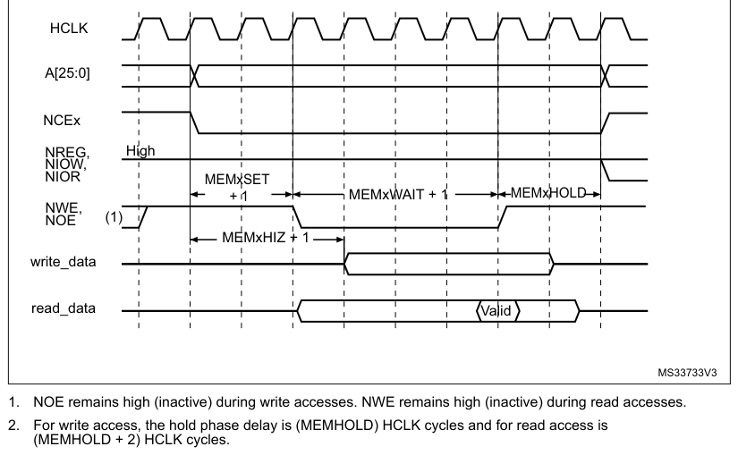

1. NOE remains high (inactive) during write accesses. NWE remains high (inactive) during read
   accesses.
2. For write access, the hold phase delay is (MEMHOLD) HCLK cycles and for read access is

(MEMHOLD \+ 2) HCLK cycles.

### 19.7.4 NAND flash operations

The command latch enable (CLE) and address latch enable (ALE) signals of the NAND flash memory
device are driven by address signals from the FMC controller. This means that to send a command or
an address to the NAND flash memory, the CPU has to perform a write to a specific address in its
memory space.

A typical page read operation from the NAND flash device requires the following steps:

1. Program and enable the corresponding memory bank by configuring the FMC_PCR
   and FMC_PMEM (and for some devices, FMC_PATT, see [Section 19.7.5](#1975-nand-flash-prewait-functionality): NAND flash prewait functionality)
   registers according to the characteristics of the NAND flash memory (PWID bits for the data bus
   width of the NAND flash, PTYP = 1, PWAITEN = 0
   or 1 as needed, see [Section 19.5.2](#1952-nand-flash-memory-address-mapping): NAND flash memory address mapping for timing configuration).
2. The CPU performs a byte write to the common memory space, with data byte equal to
   one flash command byte (for example 0x00 for Samsung NAND flash devices). The LE input of the NAND
   flash memory is active during the write strobe (low pulse on NWE), thus the written byte is
   interpreted as a command by the NAND flash memory. Once the command is latched by the memory device,
   it does not need to be written again for the following page read operations.
3. The CPU can send the start address (STARTAD) for a read operation by writing four
   bytes (or three for smaller capacity devices), STARTAD[7:0], STARTAD[16:9], STARTAD[24:17] and
   finally STARTAD[25] (for 64 Mb x 8 bit NAND flash memories) in the common memory or attribute space.
   The ALE input of the NAND flash device is active during the write strobe (low pulse on NWE), thus
   the written bytes are interpreted as the start address for read operations. Using the attribute
   memory space makes it possible to use a different timing configuration of the FMC, which can be used
   to implement the prewait functionality needed by some NAND flash memories (see details in Section
   19.7.5: NAND flash prewait functionality).
4. The controller waits for the NAND flash memory to be ready (R/NB signal high), before
   starting a new access to the same or another memory bank. While waiting, the controller holds the
   NCE signal active (low).
5. The CPU can then perform byte read operations from the common memory space to
   read the NAND flash page (data field \+ Spare field) byte by byte.
6. The next NAND flash page can be read without any CPU command or address write
   operation. This can be done in three different ways:

- by simply performing the operation described in step 5
- a new random address can be accessed by restarting the operation at step 3
- a new command can be sent to the NAND flash device by restarting at step 2

### 19.7.5 NAND flash prewait functionality

Some NAND flash devices require that, after writing the last part of the address, the controller
waits for the R/NB signal to go low. (see Figure 73).

**Figure 73. Access to non ‘CE don’t care’ NAND-flash**

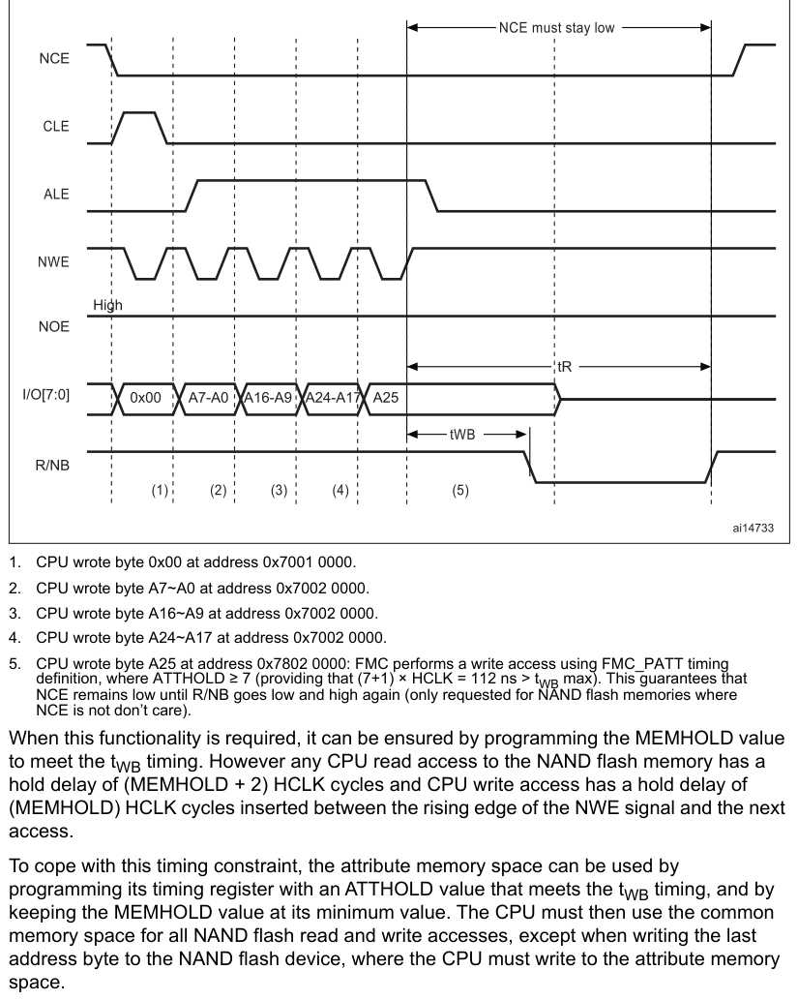

1. CPU wrote byte 0x00 at address 0x7001 0000.
2. CPU wrote byte A7~A0 at address 0x7002 0000.
3. CPU wrote byte A16~A9 at address 0x7002 0000.
4. CPU wrote byte A24~A17 at address 0x7002 0000.
5. CPU wrote byte A25 at address 0x7802 0000: FMC performs a write access using FMC_PATT timing
   definition, where ATTHOLD ≥ 7 (providing that (7+1) × HCLK = 112 ns > tWB max). This guarantees that

NCE remains low until R/NB goes low and high again (only requested for NAND flash memories where

NCE is not don’t care).

When this functionality is required, it can be ensured by programming the MEMHOLD value to meet the
tWB timing. However any CPU read access to the NAND flash memory has a hold delay of (MEMHOLD \+ 2)
HCLK cycles and CPU write access has a hold delay of (MEMHOLD) HCLK cycles inserted between the
rising edge of the NWE signal and the next access.

To cope with this timing constraint, the attribute memory space can be used by programming its
timing register with an ATTHOLD value that meets the tWB timing, and by keeping the MEMHOLD value at
its minimum value. The CPU must then use the common memory space for all NAND flash read and write
accesses, except when writing the last address byte to the NAND flash device, where the CPU must
write to the attribute memory space.

### 19.7.6 Computation of the error correction code (ECC) in NAND flash memory

The FMC NAND Card controller includes two error correction code computation hardware blocks, one per
memory bank. They reduce the host CPU workload when processing the ECC by software.

These two ECC blocks are identical and associated with Bank 2 and Bank 3. As a consequence, no
hardware ECC computation is available for memories connected to Bank 4.

The ECC algorithm implemented in the FMC can perform 1-bit error correction and 2-bit error
detection per 256, 512, 1 024, 2 048, 4 096 or 8 192 bytes read or written from/to the NAND flash
memory. It is based on the Hamming coding algorithm and consists in calculating the row and column
parity.

The ECC modules monitor the NAND flash data bus and read/write signals (NCE and NWE) each time the
NAND flash memory bank is active.

The ECC operates as follows:

- When accessing NAND flash memory bank 2 or bank 3, the data present on the D[15:0] bus is latched
  and used for ECC computation.
- When accessing any other address in NAND flash memory, the ECC logic is idle, and does not perform
  any operation. As a result, write operations to define commands or addresses to the NAND flash
  memory are not taken into account for ECC computation.

Once the desired number of bytes has been read/written from/to the NAND flash memory by the host
CPU, the FMC_ECCR registers must be read to retrieve the computed value. Once read, they must be
cleared by resetting the ECCEN bit to ‘0’. To compute a new data block, the ECCEN bit must be set to
one in the FMC_PCR registers.

To perform an ECC computation:

1. Enable the ECCEN bit in the FMC_PCR register.
2. Write data to the NAND flash memory page. While the NAND page is written, the ECC
   block computes the ECC value.
3. Read the ECC value available in the FMC_ECCR register and store it in a variable.
4. Clear the ECCEN bit and then enable it in the FMC_PCR register before reading back
   the written data from the NAND page. While the NAND page is read, the ECC block computes the ECC
   value.
5. Read the new ECC value available in the FMC_ECCR register.
6. If the two ECC values are the same, no correction is required, otherwise there is an

ECC error and the software correction routine returns information on whether the error can be
corrected or not.

### 19.7.7 NAND flash controller registers

#### NAND flash control registers (FMC_PCR)

- **Address offset:** 0x80
- **Reset value:** 0x0000 0018

**Register bit layout**

| Bit | Field | Access | Summary |
| ---: | --- | :---: | --- |
| 31 | Reserved | — | kept at reset value. |
| 30 | Reserved | — | ↳ |
| 29 | Reserved | — | ↳ |
| 28 | Reserved | — | ↳ |
| 27 | Reserved | — | ↳ |
| 26 | Reserved | — | ↳ |
| 25 | Reserved | — | ↳ |
| 24 | Reserved | — | ↳ |
| 23 | Reserved | — | ↳ |
| 22 | Reserved | — | ↳ |
| 21 | Reserved | — | ↳ |
| 20 | Reserved | — | ↳ |
| 19 | `ECCPS[2]` | rw | ECC page size |
| 18 | `ECCPS[1]` | rw | ↳ |
| 17 | `ECCPS[0]` | rw | ↳ |
| 16 | `TAR[3]` | rw | ALE to RE delay |
| 15 | `TAR[2]` | rw | ↳ |
| 14 | `TAR[1]` | rw | ↳ |
| 13 | `TAR[0]` | rw | ↳ |
| 12 | `TCLR[3]` | rw | CLE to RE delay |
| 11 | `TCLR[2]` | rw | ↳ |
| 10 | `TCLR[1]` | rw | ↳ |
| 9 | `TCLR[0]` | rw | ↳ |
| 8 | Reserved | — | kept at reset value. |
| 7 | Reserved | — | ↳ |
| 6 | `ECCEN` | rw | ECC computation logic enable bit |
| 5 | `PWID[1]` | rw | Data bus width |
| 4 | `PWID[0]` | rw | ↳ |
| 3 | `PTYP` | rw | Memory type |
| 2 | `PBKEN` | rw | NAND flash memory bank enable bit |
| 1 | `PWAITEN` | rw | Wait feature enable bit |
| 0 | Reserved | — | kept at reset value. |

**Bits 31:20 — Reserved:** kept at reset value.

**Bits 19:17 — `ECCPS[2:0]`:** ECC page size

Defines the page size for the extended ECC:

- `000`: 256 bytes
- `001`: 512 bytes
- `010`: 1024 bytes
- `011`: 2048 bytes
- `100`: 4096 bytes
- `101`: 8192 bytes

**Bits 16:13 — `TAR[3:0]`:** ALE to RE delay

Sets time from ALE low to RE low in number of AHB clock cycles (HCLK).

Time is: t_ar = (TAR \+ SET \+ 2) × THCLK where THCLK is the HCLK clock period

- `0000`: 1 HCLK cycle (default)
- `1111`: 16 HCLK cycles

> **Note:** SET is MEMSET or ATTSET according to the addressed space.

**Bits 12:9 — `TCLR[3:0]`:** CLE to RE delay

Sets time from CLE low to RE low in number of AHB clock cycles (HCLK).

Time is t_clr = (TCLR \+ SET \+ 2) × THCLK where THCLK is the HCLK clock period

- `0000`: 1 HCLK cycle (default)
- `1111`: 16 HCLK cycles

> **Note:** SET is MEMSET or ATTSET according to the addressed space.

**Bits 8:7 — Reserved:** kept at reset value.

**Bit 6 — `ECCEN`:** ECC computation logic enable bit

- `0`: ECC logic is disabled and reset (default after reset),
- `1`: ECC logic is enabled.

**Bits 5:4 — `PWID[1:0]`:** Data bus width

Defines the external memory device width.

- `00`: 8 bits
- `01`: 16 bits (default after reset).
- `10`: reserved.
- `11`: reserved.

**Bit 3 — `PTYP`:** Memory type

Defines the type of device attached to the corresponding memory bank:

- `0`: Reserved, must be kept at reset value
- `1`: NAND flash (default after reset)

**Bit 2 — `PBKEN`:** NAND flash memory bank enable bit

Enables the memory bank. Accessing a disabled memory bank causes an ERROR on AHB
bus

- `0`: Corresponding memory bank is disabled (default after reset)
- `1`: Corresponding memory bank is enabled

**Bit 1 — `PWAITEN`:** Wait feature enable bit

Enables the Wait feature for the NAND flash memory bank:

- `0`: disabled
- `1`: enabled

**Bit 0 — Reserved:** kept at reset value.

#### FIFO status and interrupt register (FMC_SR)

- **Address offset:** 0x84
- **Reset value:** 0x0000 0040

This register contains information about the FIFO status and interrupt. The FMC features a FIFO that
is used when writing to memories to transfer up to 16 words of data from the AHB.

This is used to quickly write to the FIFO and free the AHB for transactions to peripherals other
than the FMC, while the FMC is draining its FIFO into the memory. One of these register bits
indicates the status of the FIFO, for ECC purposes.

The ECC is calculated while the data are written to the memory. To read the correct ECC, the
software must consequently wait until the FIFO is empty.

**Register bit layout**

| Bit | Field | Access | Summary |
| ---: | --- | :---: | --- |
| 31 | Reserved | — | kept at reset value. |
| 30 | Reserved | — | ↳ |
| 29 | Reserved | — | ↳ |
| 28 | Reserved | — | ↳ |
| 27 | Reserved | — | ↳ |
| 26 | Reserved | — | ↳ |
| 25 | Reserved | — | ↳ |
| 24 | Reserved | — | ↳ |
| 23 | Reserved | — | ↳ |
| 22 | Reserved | — | ↳ |
| 21 | Reserved | — | ↳ |
| 20 | Reserved | — | ↳ |
| 19 | Reserved | — | ↳ |
| 18 | Reserved | — | ↳ |
| 17 | Reserved | — | ↳ |
| 16 | Reserved | — | ↳ |
| 15 | Reserved | — | ↳ |
| 14 | Reserved | — | ↳ |
| 13 | Reserved | — | ↳ |
| 12 | Reserved | — | ↳ |
| 11 | Reserved | — | ↳ |
| 10 | Reserved | — | ↳ |
| 9 | Reserved | — | ↳ |
| 8 | Reserved | — | ↳ |
| 7 | Reserved | — | ↳ |
| 6 | `FEMPT` | r | FIFO empty |
| 5 | `IFEN` | rw | Interrupt falling edge detection enable bit |
| 4 | `ILEN` | rw | Interrupt high-level detection enable bit |
| 3 | `IREN` | rw | Interrupt rising edge detection enable bit |
| 2 | `IFS` | rw | Interrupt falling edge status |
| 1 | `ILS` | rw | Interrupt high-level status |
| 0 | `IRS` | rw | Interrupt rising edge status |

**Bits 31:7 — Reserved:** kept at reset value.

**Bit 6 — `FEMPT`:** FIFO empty

Read-only bit that provides the status of the FIFO

- `0`: FIFO not empty
- `1`: FIFO empty

**Bit 5 — `IFEN`:** Interrupt falling edge detection enable bit

- `0`: Interrupt falling edge detection request disabled
- `1`: Interrupt falling edge detection request enabled

**Bit 4 — `ILEN`:** Interrupt high-level detection enable bit

- `0`: Interrupt high-level detection request disabled
- `1`: Interrupt high-level detection request enabled

**Bit 3 — `IREN`:** Interrupt rising edge detection enable bit

- `0`: Interrupt rising edge detection request disabled
- `1`: Interrupt rising edge detection request enabled

**Bit 2 — `IFS`:** Interrupt falling edge status

The flag is set by hardware and reset by software.

- `0`: No interrupt falling edge occurred
- `1`: Interrupt falling edge occurred

> **Note:** If this bit is written by software to 1 it is set.

**Bit 1 — `ILS`:** Interrupt high-level status

The flag is set by hardware and reset by software.

- `0`: No Interrupt high-level occurred
- `1`: Interrupt high-level occurred

**Bit 0 — `IRS`:** Interrupt rising edge status

The flag is set by hardware and reset by software.

- `0`: No interrupt rising edge occurred
- `1`: Interrupt rising edge occurred

> **Note:** If this bit is written by software to 1 it is set.

#### Common memory space timing register (FMC_PMEM)

- **Address offset:** 0x88
- **Reset value:** 0xFCFC FCFC

The FMC_PMEM read/write register contains the timing information for NAND flash memory bank. This
information is used to access either the common memory space of the NAND flash for command, address
write access and data read/write access.

**Register bit layout**

| Bit | Field | Access | Summary |
| ---: | --- | :---: | --- |
| 31 | `MEMHIZ[7]` | rw | Common memory x data bus Hi-Z time |
| 30 | `MEMHIZ[6]` | rw | ↳ |
| 29 | `MEMHIZ[5]` | rw | ↳ |
| 28 | `MEMHIZ[4]` | rw | ↳ |
| 27 | `MEMHIZ[3]` | rw | ↳ |
| 26 | `MEMHIZ[2]` | rw | ↳ |
| 25 | `MEMHIZ[1]` | rw | ↳ |
| 24 | `MEMHIZ[0]` | rw | ↳ |
| 23 | `MEMHOLD[7]` | rw | Common memory hold time |
| 22 | `MEMHOLD[6]` | rw | ↳ |
| 21 | `MEMHOLD[5]` | rw | ↳ |
| 20 | `MEMHOLD[4]` | rw | ↳ |
| 19 | `MEMHOLD[3]` | rw | ↳ |
| 18 | `MEMHOLD[2]` | rw | ↳ |
| 17 | `MEMHOLD[1]` | rw | ↳ |
| 16 | `MEMHOLD[0]` | rw | ↳ |
| 15 | `MEMWAIT[7]` | rw | Common memory wait time |
| 14 | `MEMWAIT[6]` | rw | ↳ |
| 13 | `MEMWAIT[5]` | rw | ↳ |
| 12 | `MEMWAIT[4]` | rw | ↳ |
| 11 | `MEMWAIT[3]` | rw | ↳ |
| 10 | `MEMWAIT[2]` | rw | ↳ |
| 9 | `MEMWAIT[1]` | rw | ↳ |
| 8 | `MEMWAIT[0]` | rw | ↳ |
| 7 | `MEMSET[7]` | rw | Common memory x setup time |
| 6 | `MEMSET[6]` | rw | ↳ |
| 5 | `MEMSET[5]` | rw | ↳ |
| 4 | `MEMSET[4]` | rw | ↳ |
| 3 | `MEMSET[3]` | rw | ↳ |
| 2 | `MEMSET[2]` | rw | ↳ |
| 1 | `MEMSET[1]` | rw | ↳ |
| 0 | `MEMSET[0]` | rw | ↳ |

**Bits 31:24 — `MEMHIZ[7:0]`:** Common memory x data bus Hi-Z time

Defines the number of HCLK clock cycles during which the data bus is kept Hi-Z after the
start of a NAND flash write access to common memory space on socket. This is only valid for
write transactions:

0000 0000: 1 HCLK cycle

1111 1110: 255 HCLK cycles

1111 1111: reserved.

**Bits 23:16 — `MEMHOLD[7:0]`:** Common memory hold time

Defines the number of HCLK clock cycles for write access and HCLK (+2) clock cycles for
read access during which the address is held (and data for write accesses) after the
command is deasserted (NWE, NOE), for NAND flash read or write access to common
memory space on socket x:

0000 0000: reserved.

0000 0001: 1 HCLK cycle for write access / 3 HCLK cycles for read access

1111 1110: 254 HCLK cycles for write access / 256 HCLK cycles for read access

1111 1111: reserved.

**Bits 15:8 — `MEMWAIT[7:0]`:** Common memory wait time

Defines the minimum number of HCLK (+1) clock cycles to assert the command (NWE,

NOE), for NAND flash read or write access to common memory space on socket. The
duration of command assertion is extended if the wait signal (NWAIT) is active (low) at the
end of the programmed value of HCLK:

0000 0000: reserved

0000 0001: 2HCLK cycles (+ wait cycle introduced by deasserting NWAIT)

1111 1110: 255 HCLK cycles (+ wait cycle introduced by deasserting NWAIT)

1111 1111: reserved.

**Bits 7:0 — `MEMSET[7:0]`:** Common memory x setup time

Defines the number of HCLK (+1) clock cycles to set up the address before the command
assertion (NWE, NOE), for NAND flash read or write access to common memory space on
socket x:

0000 0000: 1 HCLK cycle

1111 1110: 255 HCLK cycles

1111 1111: reserved

#### Attribute memory space timing register (FMC_PATT)

- **Address offset:** 0x8C
- **Reset value:** 0xFCFC FCFC

The FMC_PATT read/write register contains the timing information for NAND flash memory bank. It is
used for 8-bit accesses to the attribute memory space of the NAND flash for the last address write
access if the timing must differ from that of previous accesses (for Ready/Busy management, refer to
[Section 19.7.5](#1975-nand-flash-prewait-functionality): NAND flash prewait functionality).

**Register bit layout**

| Bit | Field | Access | Summary |
| ---: | --- | :---: | --- |
| 31 | `ATTHIZ[7]` | rw | Attribute memory data bus Hi-Z time |
| 30 | `ATTHIZ[6]` | rw | ↳ |
| 29 | `ATTHIZ[5]` | rw | ↳ |
| 28 | `ATTHIZ[4]` | rw | ↳ |
| 27 | `ATTHIZ[3]` | rw | ↳ |
| 26 | `ATTHIZ[2]` | rw | ↳ |
| 25 | `ATTHIZ[1]` | rw | ↳ |
| 24 | `ATTHIZ[0]` | rw | ↳ |
| 23 | `ATTHOLD[7]` | rw | Attribute memory hold time |
| 22 | `ATTHOLD[6]` | rw | ↳ |
| 21 | `ATTHOLD[5]` | rw | ↳ |
| 20 | `ATTHOLD[4]` | rw | ↳ |
| 19 | `ATTHOLD[3]` | rw | ↳ |
| 18 | `ATTHOLD[2]` | rw | ↳ |
| 17 | `ATTHOLD[1]` | rw | ↳ |
| 16 | `ATTHOLD[0]` | rw | ↳ |
| 15 | `ATTWAIT[7]` | rw | Attribute memory wait time |
| 14 | `ATTWAIT[6]` | rw | ↳ |
| 13 | `ATTWAIT[5]` | rw | ↳ |
| 12 | `ATTWAIT[4]` | rw | ↳ |
| 11 | `ATTWAIT[3]` | rw | ↳ |
| 10 | `ATTWAIT[2]` | rw | ↳ |
| 9 | `ATTWAIT[1]` | rw | ↳ |
| 8 | `ATTWAIT[0]` | rw | ↳ |
| 7 | `ATTSET[7]` | rw | Attribute memory setup time |
| 6 | `ATTSET[6]` | rw | ↳ |
| 5 | `ATTSET[5]` | rw | ↳ |
| 4 | `ATTSET[4]` | rw | ↳ |
| 3 | `ATTSET[3]` | rw | ↳ |
| 2 | `ATTSET[2]` | rw | ↳ |
| 1 | `ATTSET[1]` | rw | ↳ |
| 0 | `ATTSET[0]` | rw | ↳ |

**Bits 31:24 — `ATTHIZ[7:0]`:** Attribute memory data bus Hi-Z time

Defines the number of HCLK clock cycles during which the data bus is kept in Hi-Z after the
start of a NAND flash write access to attribute memory space on socket. Only valid for writ
transaction:

0000 0000: 1 HCLK cycle

1111 1110: 255 HCLK cycles

1111 1111: reserved.

**Bits 23:16 — `ATTHOLD[7:0]`:** Attribute memory hold time

Defines the number of HCLK clock cycles for write access and HCLK (+2) clock cycles for
read access during which the address is held (and data for write access) after the command
deassertion (NWE, NOE), for NAND flash read or write access to attribute memory space on
socket:

0000 0000: reserved

0000 0001: 1 HCLK cycle for write access / 3 HCLK cycles for read access

1111 1110: 254 HCLK cycles for write access / 256 HCLK cycles for read access

1111 1111: reserved.

**Bits 15:8 — `ATTWAIT[7:0]`:** Attribute memory wait time

Defines the minimum number of HCLK (+1) clock cycles to assert the command (NWE,

NOE), for NAND flash read or write access to attribute memory space on socket x. The
duration for command assertion is extended if the wait signal (NWAIT) is active (low) at the
end of the programmed value of HCLK:

0000 0000: reserved

0000 0001: 2 HCLK cycles (+ wait cycle introduced by deassertion of NWAIT)

1111 1110: 255 HCLK cycles (+ wait cycle introduced by deasserting NWAIT)

1111 1111: reserved.

**Bits 7:0 — `ATTSET[7:0]`:** Attribute memory setup time

Defines the number of HCLK (+1) clock cycles to set up address before the command
assertion (NWE, NOE), for NAND flash read or write access to attribute memory space on
socket:

0000 0000: 1 HCLK cycle

1111 1110: 255 HCLK cycles

1111 1111: reserved.

#### ECC result registers (FMC_ECCR)

- **Address offset:** 0x94
- **Reset value:** 0x0000 0000

This register contain the current error correction code value computed by the ECC computation
modules of the FMC NAND controller. When the CPU reads the data from a NAND flash memory page at the
correct address (refer to [Section 19.7.6](#1976-computation-of-the-error-correction-code-ecc-in-nand-flash-memory): Computation of the error correction code (ECC) in NAND
flash memory), the data read/written from/to the NAND flash memory are processed automatically by
the ECC computation module. When X bytes have been read (according to the ECCPS field in the FMC_PCR
registers), the CPU must read the computed ECC value from the FMC_ECC registers. It then verifies if
these computed parity data are the same as the parity value recorded in the spare area, to determine
whether a page is valid, and, to correct it otherwise. The FMC_ECCR register must be cleared after
being read by setting the ECCEN bit to 0. To compute a new data block, the ECCEN bit must be set to
1.

**Register bit layout**

| Bit | Field | Access | Summary |
| ---: | --- | :---: | --- |
| 31 | `ECC[31]` | r | ECC result |
| 30 | `ECC[30]` | r | ↳ |
| 29 | `ECC[29]` | r | ↳ |
| 28 | `ECC[28]` | r | ↳ |
| 27 | `ECC[27]` | r | ↳ |
| 26 | `ECC[26]` | r | ↳ |
| 25 | `ECC[25]` | r | ↳ |
| 24 | `ECC[24]` | r | ↳ |
| 23 | `ECC[23]` | r | ↳ |
| 22 | `ECC[22]` | r | ↳ |
| 21 | `ECC[21]` | r | ↳ |
| 20 | `ECC[20]` | r | ↳ |
| 19 | `ECC[19]` | r | ↳ |
| 18 | `ECC[18]` | r | ↳ |
| 17 | `ECC[17]` | r | ↳ |
| 16 | `ECC[16]` | r | ↳ |
| 15 | `ECC[15]` | r | ↳ |
| 14 | `ECC[14]` | r | ↳ |
| 13 | `ECC[13]` | r | ↳ |
| 12 | `ECC[12]` | r | ↳ |
| 11 | `ECC[11]` | r | ↳ |
| 10 | `ECC[10]` | r | ↳ |
| 9 | `ECC[9]` | r | ↳ |
| 8 | `ECC[8]` | r | ↳ |
| 7 | `ECC[7]` | r | ↳ |
| 6 | `ECC[6]` | r | ↳ |
| 5 | `ECC[5]` | r | ↳ |
| 4 | `ECC[4]` | r | ↳ |
| 3 | `ECC[3]` | r | ↳ |
| 2 | `ECC[2]` | r | ↳ |
| 1 | `ECC[1]` | r | ↳ |
| 0 | `ECC[0]` | r | ↳ |

**Bits 31:0 — `ECC[31:0]`:** ECC result

This field contains the value computed by the ECC computation logic. Table 156 describes
the contents of these bitfields.

**Table 156. ECC result relevant bits**

| ECCPS[2:0] | Page size in bytes | ECC bits |
| --- | --- | --- |
| 000 | 256 | ECC[21:0] |
| 001 | 512 | ECC[23:0] |
| 010 | 1024 | ECC[25:0] |
| 011 | 2048 | ECC[27:0] |
| 100 | 4096 | ECC[29:0] |
| 101 | 8192 | ECC[31:0] |

### 19.7.8 FMC register map

**Register summary**

| Offset | Register | Reset value |
| --- | --- | --- |
| 0x00 \+ 0x8 \* (x - 1), (x = 1 to 4) | `FMC_BCRx` | 0x0000 30DB, 0x0000 30D2, 0x0000 30D2, 0x0000 30D2 |
| 0x04 \+ 0x8 \* (x - 1), (x = 1 to 4) | `FMC_BTRx` | 0x0FFF FFFF |
| 0x104 \+ 0x8 \* (x - 1), (x = 1 to 4) | `FMC_BWTRx` | 0x0FFF FFFF |
| 0x20 | `FMC_PCSCNTR` | 0x0000 0000 |
| 0x80 | `FMC_PCR` | 0x0000 0018 |
| 0x84 | `FMC_SR` | 0x0000 0040 |
| 0x88 | `FMC_PMEM` | 0xFCFC FCFC |
| 0x8C | `FMC_PATT` | 0xFCFC FCFC |
| 0x94 | `FMC_ECCR` | 0x0000 0000 |

Refer to [Section 2.2](chapter-02.md#22-memory-organization) for the register boundary addresses.
