# 21 Analog-to-digital converters (ADC)

[← RM0440 index](../STM32G4_RM0440.md)

## 21.1 Introduction

This section describes the implementation of up to 5 ADCs:

- ADC1 and ADC2 are tightly coupled and can operate in dual mode (ADC1 is master).
- ADC3 and ADC4 are tightly coupled and can operate in dual mode (ADC3 is master).
- ADC5 is controlled independently.

Each ADC consists of a 12-bit successive approximation analog-to-digital converter.

Each ADC has up to 19 multiplexed channels. A/D conversion of the various channels can be performed
in single, continuous, scan or discontinuous mode. The result of the ADC is stored in a left-aligned
or right-aligned 16-bit data register.

The ADCs are mapped on the AHB bus to allow fast data handling.

The analog watchdog features allow the application to detect if the input voltage goes outside the
user-defined high or low thresholds.

A built-in hardware oversampler allows to improve analog performance while off-loading the related
computational burden from the CPU.

An efficient low-power mode is implemented to allow very low consumption at low frequency.

## 21.2 ADC main features

- High-performance features
  - Up to 5 ADCs, out of which four of them ((in pairs) can operate in dual mode:

ADC1 is connected to 14 external channels \+ 4 internal channels

ADC2 is connected to 16 external channels \+ 2 internal channels

ADC3 is connected to 15 external channels \+ 3 internal channels

ADC4 is connected to 16 external channels \+ 2 internal channels

ADC5 is connected to 13 external channels \+ 5 internal channels

- 12, 10, 8 or 6-bit configurable resolution
- ADC conversion time is independent from the AHB bus clock frequency
- Faster conversion time by lowering resolution
- Manage single-ended or differential inputs
- AHB slave bus interface to allow fast data handling
- Self-calibration
- Channel-wise programmable sampling time
- Flexible sampling time control
- Up to four injected channels (analog inputs assignment to regular or injected channels is fully
  configurable)
- Hardware assistant to prepare the context of the injected channels to allow fast context switching
- Data alignment with in-built data coherency
- Data can be managed by DMA for regular channel conversions
- 4 dedicated data registers for the injected channels
- Oversampler
  - 16-bit data register
  - Oversampling ratio adjustable from 2 to 256
  - Programmable data shift up to 8-bit
- Data preconditioning
  - Gain compensation
  - Offset compensation
- Low-power features
  - Speed adaptive low-power mode to reduce ADC consumption when operating at low frequency
  - Allows slow bus frequency application while keeping optimum ADC performance
  - Provides automatic control to avoid ADC overrun in low AHB bus clock frequency
    application (auto-delayed mode)
- Number of external analog input channels per ADC
  - Up to 5 fast channels from GPIO pads
  - Up to 13 slow channels from GPIO pads
- In addition, there are several internal dedicated channels
  - The internal reference voltage (VREFINT), connected to ADC1, 3, 4 and 5
  - The internal temperature sensor (VTS), connected to ADC1 and 5
  - The VBAT monitoring channel (VBAT/3), connected to ADC1, 3 (for category 3 devices only) and 5
  - The OPAMP1 internal output connected to ADC1
  - The OPAMP2 and OPAMP3 internal outputs connected to ADC2
  - The OPAMP3 internal output connected to ADC3
  - The OPAMP6 internal output connected to ADC4 (for category 3 devices) or ADC3 (for category 4
    devices)
  - The OPAMP4 and OPAMP5 internal outputs connected to ADC5
- Start-of-conversion can be initiated:
  - By software for both regular and injected conversions
  - By hardware triggers with configurable polarity (internal timers events or GPIO input events)
    for both regular and injected conversions
- Conversion modes
  - Each ADC can convert a single channel or can scan a sequence of channels
  - Single mode converts selected inputs once per trigger
  - Continuous mode converts selected inputs continuously
  - Discontinuous mode
- Dual ADC mode for ADC1, ADC2, ADC3 and ADC4
- Interrupt generation at ADC ready, the end of sampling, the end of conversion (regular or
  injected), end of sequence conversion (regular or injected), analog watchdog 1, 2 or 3 or overrun
  events
- 3 analog watchdogs per ADC
  - Watchdog can perform filtering to ignore out-of-range data
- ADC input range: VREF– ≤ VIN ≤ VREF+

Figure 82 shows the block diagram of one ADC.

Refer to the OPAMP electrical characteristics section of the product datasheet for the ADC sampling
time value to be applied when converting the OPAMP output voltage.

## 21.3 ADC implementation

**Table 161. ADC features**

| Source row | Column 1 | Column 2 | Column 3 | Column 4 | Column 5 | Column 6 |
| ---: | --- | --- | --- | --- | --- | --- |
| 1 | `ADC modes/features` | `ADC1` | `ADC2` | `ADC3` | `ADC4` | `ADC5` |
| 2 | `Dual mode` | `X (coupled together) X (coupled together)` | `-` |  |  |  |

## 21.4 ADC functional description

### 21.4.1 ADC block diagram

Figure 82 shows the ADC block diagram and Table 163 gives the ADC pin description.

**Figure 82. ADC block diagram**

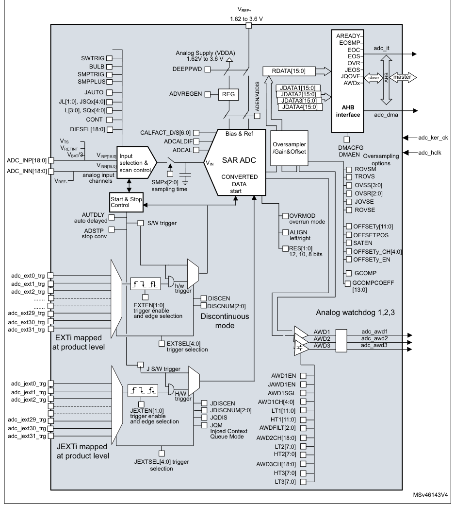

VREF+

1.62 to 3.6 V

AREADY

EOSMP

EOC adc_it

Analog Supply (VDDA)

### 21.4.2 ADC pins and internal signals

**Table 162. ADC internal input/output signals**

| Source row | Column 1 | Column 2 |
| ---: | --- | --- |
| 1 | `Signal` |  |
| 2 | `Internal signal name` | `Description` |
| 3 | `type` |  |
| 4 | `Up to 32 external trigger inputs for the regular conversions (can be connected to on-chip timers).` |  |
| 5 | `adc_ext_trg[31:0]` | `Inputs` |

These inputs are shared between the ADC master and the ADC slave.

Up to 31 external trigger inputs for the injected conversions (can be connected to on-chip timers).

| Source row | Column 1 | Column 2 |
| ---: | --- | --- |
| 1 | `adc_jext_trg[31:0]` | `Inputs` |

These inputs are shared between the ADC master and the ADC slave.

Internal analog watchdog output signal connected to

| Source row | Column 1 | Column 2 | Column 3 |
| ---: | --- | --- | --- |
| 1 | `adc_awdx_out` | `Output` |  |
| 2 | `on-chip timers (x = Analog watchdog number 1,2,3)` |  |  |
| 3 | `adc_ker_ck` | `Output` | `ADC kernel clock` |
| 4 | `adc_hclk` | `Input` | `ADC peripheral clock` |
| 5 | `adc_it` | `Output` | `ADC interrupt` |
| 6 | `adc_dma` | `Output` | `ADC DMA request` |
| 7 | `VTS` | `Input` | `Output voltage from internal temperature sensor` |
| 8 | `VREFINT` | `Input` | `Output voltage from internal reference voltage` |
| 9 | `Input` |  |  |
| 10 | `VBAT` | `External battery voltage supply` |  |
| 11 | `supply` |  |  |

**Table 163. ADC input/output pins**

| Source row | Column 1 | Column 2 | Column 3 |
| ---: | --- | --- | --- |
| 1 | `Pin name` | `Signal type` | `Comments` |
| 2 | `Input, analog reference` |  |  |
| 3 | `VREF+` | `The higher/positive reference voltage for the ADC` |  |
| 4 | `positive` |  |  |
| 5 | `VDDA` | `Input, analog supply` | `Analog power supply equal VDDA` |
| 6 | `Input, analog reference` | `The lower/negative reference voltage for the ADC.` |  |
| 7 | `VREF−` |  |  |
| 8 | `negative` | `VREF− is internally connected to VSSA` |  |
| 9 | `Ground for analog power supply. On device package` |  |  |
| 10 | `Input, analog supply` |  |  |
| 11 | `VSSA` | `which do not have a dedicated VSSA pin, VSSA is` |  |
| 12 | `ground` |  |  |

internally connected to VSS.

Connected either to ADCx_INPi external channels or

Positive analog input

| Source row | Column 1 | Column 2 |
| ---: | --- | --- |
| 1 | `VINPi` | `to internal channels. This input is converted in single-` |
| 2 | `channels for each ADC` |  |
| 3 | `ended mode` |  |
| 4 | `Negative analog input` | `Connected either to VREF− or to external channels:` |
| 5 | `VINNi` |  |
| 6 | `channels for each ADC` | `ADCx_INNi and ADCx_INP[i+1].` |

**Table 163. ADC input/output pins (continued)**

| Source row | Column 1 | Column 2 | Column 3 |
| ---: | --- | --- | --- |
| 1 | `Pin name` | `Signal type` | `Comments` |
| 2 | `Up to 19 analog input channels (x = ADC number = 1,` |  |  |
| 3 | `Negative external analog` | `2, 3, 4 or 5).` |  |
| 4 | `ADCx_INNi` |  |  |
| 5 | `input signals` | `Refer to Section 21.4.4: ADC1/2/3/4/5 connectivity for` |  |

details.

Up to 19 analog input channels (x = ADC number = 1,

| Source row | Column 1 | Column 2 |
| ---: | --- | --- |
| 1 | `Positive external analog` | `2, 3, 4 or 5).` |
| 2 | `ADCx_INPi` |  |
| 3 | `input signals` | `Refer to Section 21.4.4: ADC1/2/3/4/5 connectivity for` |
| 4 | `details` |  |

### 21.4.3 ADC clocks

#### Dual clock domain architecture

The dual clock-domain architecture means that the ADC clock is independent from the AHB bus clock.

The input clock is the same for all ADCs and can be selected between two different clock sources
(see Figure 83: ADC clock scheme):

1. The ADC clock can be a specific clock source, derived from the following clock
   sources:

- The system clock
- PLL “P” clock

Refer to RCC Section for more information on how to generate ADC dedicated clock. To select this
scheme, bits CKMODE[1:0] of the ADCx_CCR register must be reset.

2. The ADC clock can be derived from the AHB clock of the ADC bus interface, divided by
   a programmable factor (1, 2 or 4). In this mode, a programmable divider factor can be selected (/1,
   2 or 4 according to bits CKMODE[1:0]).

To select this scheme, bits CKMODE[1:0] of the ADCx_CCR register must be different from 00.

> **Note:** For option 2), a prescaling factor of 1 (CKMODE[1:0] = 01) can be used only if the AHB
> prescaler is set (HPRE[3:0] = 0xxx in RCC_CFGR register).

Option 1) has the advantage of reaching the maximum ADC clock frequency whatever the AHB clock
scheme selected. The ADC clock can eventually be divided by the following ratio: 1, 2, 4, 6, 8, 12,
16, 32, 64, 128, 256; using the prescaler configured with bits PRESC[3:0] in the ADCx_CCR register.

Option 2) has the advantage of bypassing the clock domain resynchronizations. This can be useful
when the ADC is triggered by a timer and if the application requires that the ADC is precisely
triggered without any uncertainty (otherwise, an uncertainty of the trigger instant time is added by
the resynchronizations between the two clock domains).

**Figure 83. ADC clock scheme**

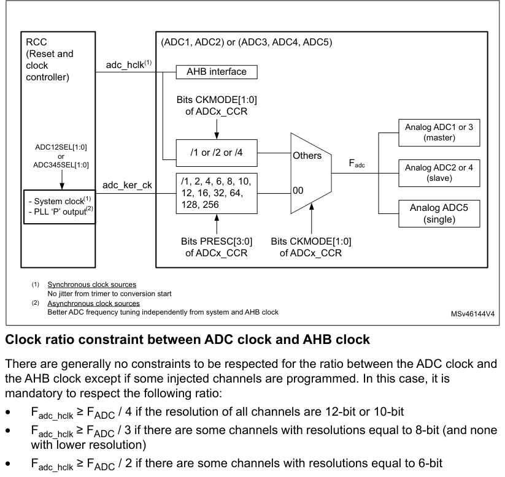

- System clock (1)

128, 256

- PLL ‘P’ output

(single)

#### Clock ratio constraint between ADC clock and AHB clock

There are generally no constraints to be respected for the ratio between the ADC clock and the AHB
clock except if some injected channels are programmed. In this case, it is mandatory to respect the
following ratio:

- Fadc_hclk ≥ FADC / 4 if the resolution of all channels are 12-bit or 10-bit
- Fadc_hclk ≥ FADC / 3 if there are some channels with resolutions equal to 8-bit (and none with
  lower resolution)
- Fadc_hclk ≥ FADC / 2 if there are some channels with resolutions equal to 6-bit

### 21.4.4 ADC1/2/3/4/5 connectivity

ADC1, ADC2, ADC3, ADC4 and ADC5 are tightly coupled and share some external channels as described in
the below figures.

ADCy_INPx correspond to ADCy_INx pins defined in the product datasheet.

**Figure 84. ADC1 connectivity**

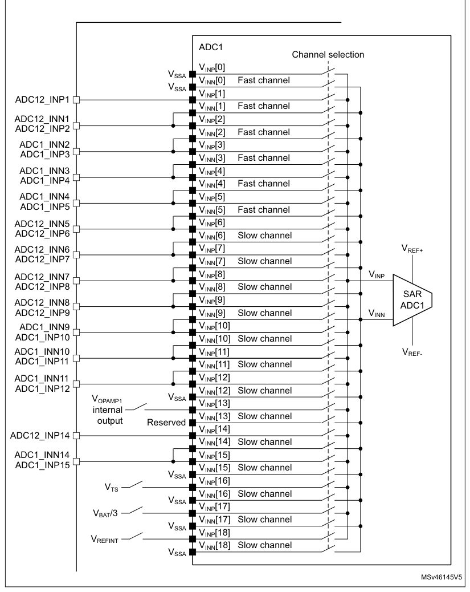

ADC1

Channel selection

VINP[0]

VSSA

VINN[0] Fast channel

VSSA

VINP[1]

ADC12_INP1

VINN[1] Fast channel

**Figure 85. ADC2 connectivity**

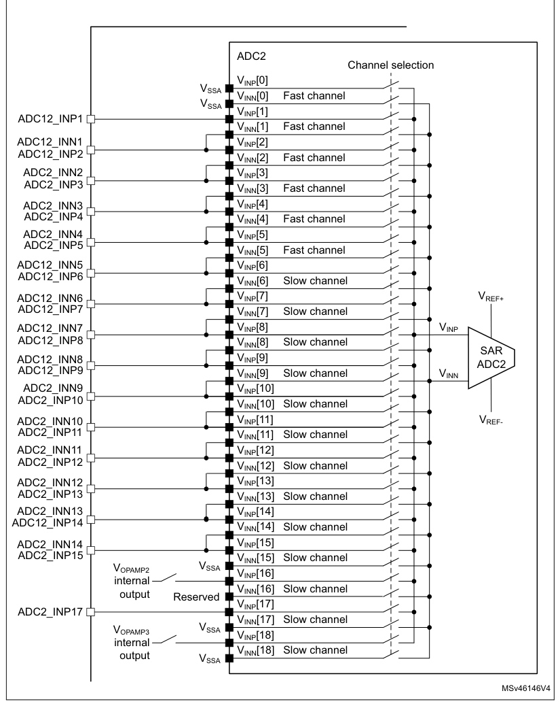

ADC2

Channel selection

VINP[0]

VSSA

VINN[0] Fast channel

VSSA

VINP[1]

ADC12_INP1

VINN[1] Fast channel

**Figure 86. ADC3 connectivity**

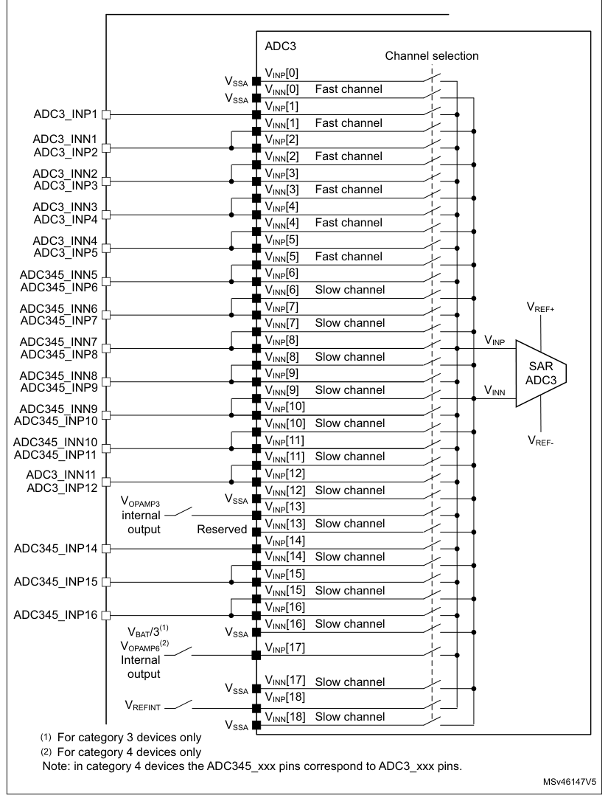

ADC3

Channel selection

VINP[0]

VSSA

VINN[0] Fast channel

VSSA

VINP[1]

ADC3_INP1

VINN[1] Fast channel

> **Note:** in category 4 devices the ADC345_xxx pins correspond to ADC3_xxx pins.

MSv46147V5

**Figure 87. ADC4 connectivity**

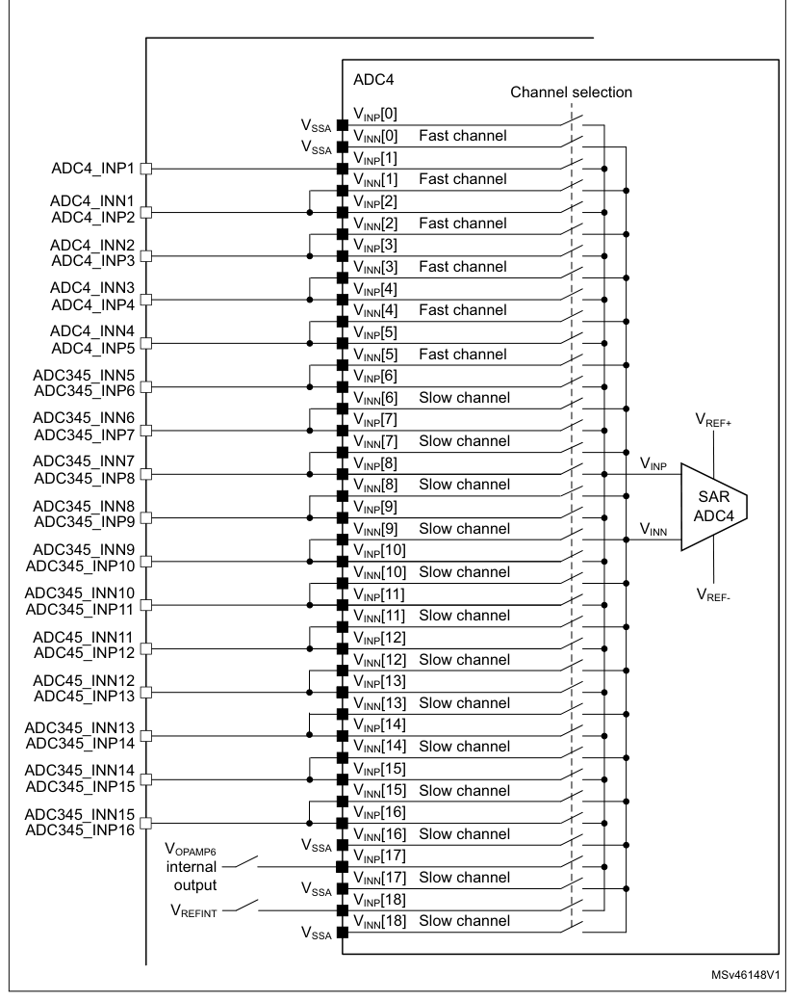

ADC4

Channel selection

VINP[0]

VSSA

VINN[0] Fast channel

VSSA

VINP[1]

ADC4_INP1

VINN[1] Fast channel

**Figure 88. ADC5 connectivity**

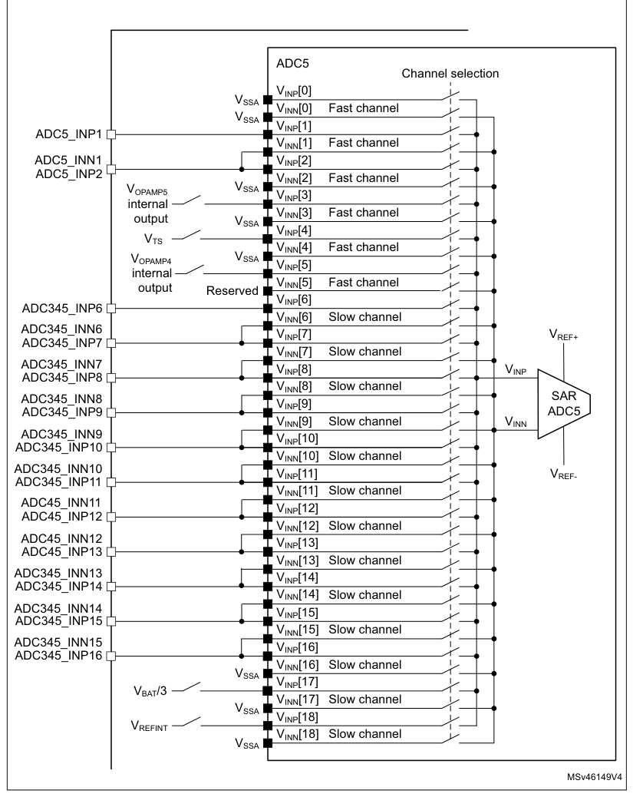

ADC5

Channel selection

VINP[0]

VSSA

VINN[0] Fast channel

VSSA

VINP[1]

ADC5_INP1

VINN[1] Fast channel

### 21.4.5 Slave AHB interface

The ADCs implement an AHB slave port for control/status register and data access. The features of
the AHB interface are listed below:

- Word (32-bit) accesses
- Single cycle response
- Response to all read/write accesses to the registers with zero wait states.

The AHB slave interface does not support split/retry requests, and never generates AHB errors.

### 21.4.6 ADC Deep-power-down mode (DEEPPWD) and ADC voltage regulator (ADVREGEN)

By default, the ADC is in Deep-power-down mode where its supply is internally switched off to reduce
the leakage currents (the reset state of bit DEEPPWD is 1 in the ADC_CR register).

To start ADC operations, follow the sequence below:

1. Exit Deep-power-down mode by clearing DEEPPWD bit.
2. Enable the ADC voltage regulator by setting ADVREGEN.
3. Wait for the startup time to configure the ADC (refer to the device datasheet for the
   value of the startup time).

When ADC operations are complete, the ADC can be disabled (ADEN = 0). It is possible to save power
by also disabling the ADC voltage regulator. This is done by writing bit ADVREGEN = 0.

Then, to save more power by reducing the leakage currents, it is also possible to re-enter in ADC
Deep-power-down mode by setting bit DEEPPWD = 1 into ADC_CR register. This is particularly
interesting before entering Stop mode.

> **Note:** Writing DEEPPWD = 1 automatically disables the ADC voltage regulator and bit

ADVREGEN is automatically cleared.

When the internal voltage regulator is disabled (ADVREGEN = 0), the internal analog calibration is
kept.

In ADC Deep-power-down mode (DEEPPWD = 1), the internal analog calibration is lost and it is
necessary to either relaunch a calibration or re-apply the calibration factor which was previously
saved (refer to [Section 21.4.8](#2148-calibration-adcal-adcaldif-adc_calfact): Calibration (ADCAL, ADCALDIF, ADC_CALFACT)).

### 21.4.7 Single-ended and differential input channels

Channels can be configured to be either single-ended input or differential input by programming
DIFSEL[i] bits in the ADC_DIFSEL register. This configuration must be written while the ADC is
disabled (ADEN = 0). Note that the DIFSEL[i] bits corresponding to single-ended channels are always
programmed at 0.

In single-ended input mode, the analog voltage to be converted for channel “i” is the difference
between the ADCy_INPx external voltage equal to VINP[i] (positive input) and VREF− (negative input).

In differential input mode, the analog voltage to be converted for channel “i” is the difference
between the ADCy_INPx external voltage positive input equal to VINP[i], and the ADCy_INNx negative
input equal to VINN[i].

The input voltage in differential mode ranges from VREF-to VREF+, which makes a full scale range of
2xVREF+. When VINP[i] equals VREF-, VINN[i] equals VREF+and the maximum negative input differential
voltage (VREF-) corresponds to 0x000 ADC output. When VINP[i] equals VREF+, VINN[i] equals VREF-and
the maximum positive input differential voltage (VREF+) corresponds to 0xFFF ADC output. When
VINP[i] and VINN[i] are connected together, the zero input differential voltage corresponds to 0x800
ADC output.

The ADC sensitivity in differential mode is twice smaller than in single-ended mode.

When ADC is configured as differential mode, both inputs should be biased at (VREF+) / 2 voltage.
Refer to the device datasheet for the allowed common mode input voltage VCMIN.

The input signals are supposed to be differential (common mode voltage should be fixed).

Internal channels (such as VTS and VREFINT) are used in single-ended mode only.

For a complete description of how the input channels are connected for each ADC, refer to Section
21.4.4: ADC1/2/3/4/5 connectivity.

> **Caution:** When configuring the channel “i” in differential input mode, its negative input voltage VINN[i]
> is connected to another channel. As a consequence, this channel is no longer usable in single-ended
> mode or in differential mode and must never be configured to be converted. Some channels are shared
> between ADC1/ADC2/ADC3/ADC4/ADC5: this can make the channel on the other ADC unusable. The only
> exception is when ADC master and the slave operate in interleaved mode.

### 21.4.8 Calibration (ADCAL, ADCALDIF, ADC_CALFACT)

Each ADC provides an automatic calibration procedure which drives all the calibration sequence
including the power-on/off sequence of the ADC. During the procedure, the ADC calculates a
calibration factor which is 7-bit wide and which is applied internally to the ADC until the next ADC
power-off. During the calibration procedure, the application must not use the ADC and must wait
until calibration is complete.

Calibration is preliminary to any ADC operation. It removes the offset error which may vary from
chip to chip due to process or bandgap variation.

The calibration factor to be applied for single-ended input conversions is different from the factor
to be applied for differential input conversions:

- Write ADCALDIF = 0 before launching a calibration to be applied for single-ended input
  conversions.
- Write ADCALDIF = 1 before launching a calibration to be applied for differential input
  conversions.

The calibration is then initiated by software by setting bit ADCAL = 1. Calibration can only be
initiated when the ADC is disabled (when ADEN = 0). ADCAL bit stays at 1 during all the calibration
sequence. It is then cleared by hardware as soon the calibration completes. At this time, the
associated calibration factor is stored internally in the analog ADC and also in the bits
CALFACT_S[6:0] or CALFACT_D[6:0] of ADC_CALFACT register (depending on single-ended or differential
input calibration)

The internal analog calibration is kept if the ADC is disabled (ADEN = 0). However, if the ADC is
disabled for extended periods, then it is recommended that a new calibration cycle is run before
re-enabling the ADC.

The internal analog calibration is lost each time the power of the ADC is removed (example, when the
product enters in Standby or VBAT mode). In this case, to avoid spending time recalibrating the ADC,
it is possible to re-write the calibration factor into the ADC_CALFACT register without
recalibrating, supposing that the software has previously saved the calibration factor delivered
during the previous calibration.

The calibration factor can be written if the ADC is enabled but not converting (ADEN = 1 and ADSTART
= 0 and JADSTART = 0). Then, at the next start of conversion, the calibration factor is
automatically injected into the analog ADC. This loading is transparent and does not add any cycle
latency to the start of the conversion. It is recommended to recalibrate when VREF+ voltage changed
more than 10%.

#### Software procedure to calibrate the ADC

1. Ensure DEEPPWD = 0, ADVREGEN = 1 and that ADC voltage regulator startup time
   has elapsed.
2. Ensure that ADEN = 0.
3. Select the input mode for this calibration by setting ADCALDIF = 0 (single-ended input)
   or ADCALDIF = 1 (differential input).
4. Set ADCAL.
5. Wait until ADCAL = 0.
6. The calibration factor can be read from ADC_CALFACT register.

**Figure 89. ADC calibration**

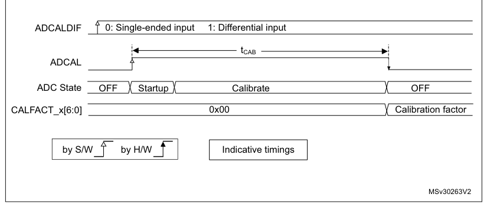

#### Software procedure to re-inject a calibration factor into the ADC

1. Ensure ADEN = 1 and ADSTART = 0 and JADSTART = 0 (ADC enabled and no
   conversion is ongoing).
2. Write CALFACT_S and CALFACT_D with the new calibration factors.
3. When a conversion is launched, the calibration factor is injected into the analog ADC
   only if the internal analog calibration factor differs from the one stored in bits CALFACT_S for
   single-ended input channel or bits CALFACT_D for differential input channel.

**Figure 90. Updating the ADC calibration factor**

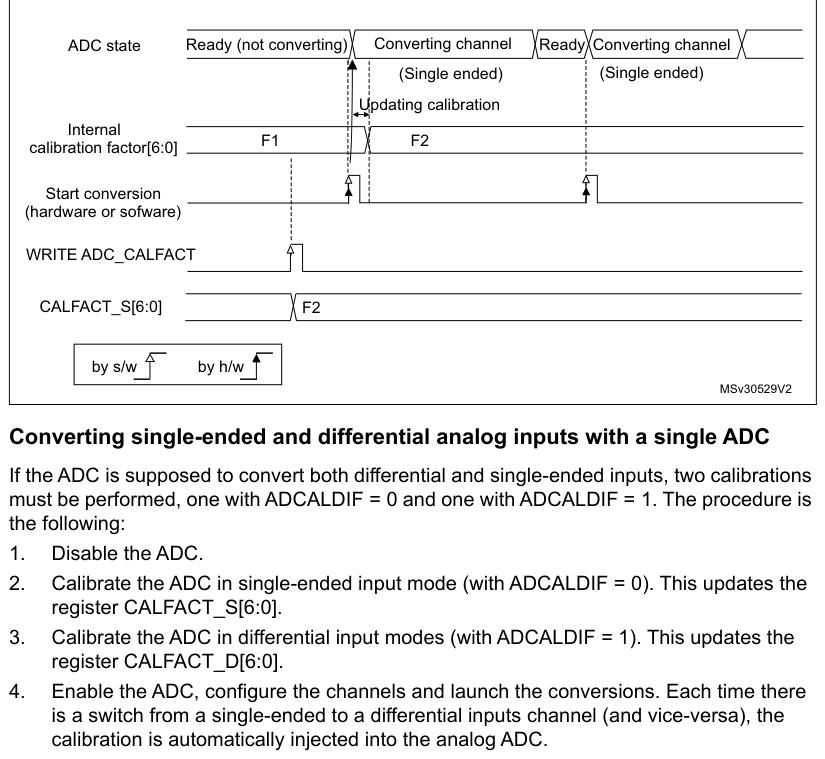

#### Converting single-ended and differential analog inputs with a single ADC

If the ADC is supposed to convert both differential and single-ended inputs, two calibrations must
be performed, one with ADCALDIF = 0 and one with ADCALDIF = 1. The procedure is the following:

1. Disable the ADC.
2. Calibrate the ADC in single-ended input mode (with ADCALDIF = 0). This updates the
   register CALFACT_S[6:0].
3. Calibrate the ADC in differential input modes (with ADCALDIF = 1). This updates the
   register CALFACT_D[6:0].
4. Enable the ADC, configure the channels and launch the conversions. Each time there
   is a switch from a single-ended to a differential inputs channel (and vice-versa), the calibration
   is automatically injected into the analog ADC.

**Figure 91. Mixing single-ended and differential channels**

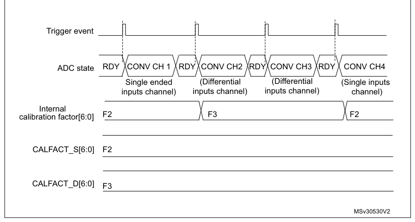

### 21.4.9 ADC on-off control (ADEN, ADDIS, ADRDY)

First of all, follow the procedure explained in [Section 21.4.6](#2146-adc-deep-power-down-mode-deeppwd-and-adc-voltage-regulator-advregen): ADC Deep-power-down mode (DEEPPWD)
and ADC voltage regulator (ADVREGEN)).

Once DEEPPWD = 0 and ADVREGEN = 1, the ADC can be enabled and the ADC needs a stabilization time of
tSTAB before it starts converting accurately, as shown in Figure 92. Two control bits enable or
disable the ADC:

- ADEN = 1 enables the ADC. The flag ADRDY is set once the ADC is ready for operation.
- ADDIS = 1 disables the ADC. ADEN and ADDIS are then automatically cleared by hardware as soon as
  the analog ADC is effectively disabled.

Regular conversion can then start either by setting ADSTART = 1 (refer to [Section 21.4.18](#21418-conversion-on-external-trigger-and-trigger-polarity-extsel-exten-jextsel-jexten):
Conversion on external trigger and trigger polarity (EXTSEL, EXTEN, JEXTSEL, JEXTEN)) or when an
external trigger event occurs, if triggers are enabled.

Injected conversions start by setting JADSTART = 1 or when an external injected trigger event
occurs, if injected triggers are enabled.

#### Software procedure to enable the ADC

1. Clear the ADRDY bit in the ADC_ISR register by writing 1.
2. Set ADEN.
3. Wait until ADRDY = 1 (ADRDY is set after the ADC startup time). This can be done
   using the associated interrupt (setting ADRDYIE = 1).
4. Clear the ADRDY bit in the ADC_ISR register by writing 1 (optional).

> **Caution:** ADEN bit cannot be set when ADCAL is set and during four ADC clock cycles after the

ADCAL bit is cleared by hardware (end of the calibration).

#### Software procedure to disable the ADC

1. Check that both ADSTART = 0 and JADSTART = 0 to ensure that no conversion is
   ongoing. If required, stop any regular and injected conversion ongoing by setting ADSTP = 1 and
   JADSTP = 1 and then wait until ADSTP = 0 and JADSTP = 0.
2. Set ADDIS.
3. If required by the application, wait until ADEN = 0, until the analog ADC is effectively
   disabled (ADDIS is automatically reset once ADEN = 0).

**Figure 92. Enabling / disabling the ADC**

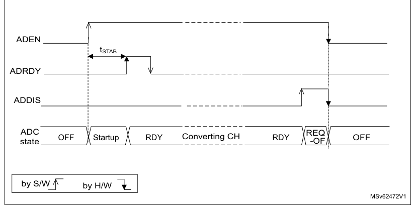

### 21.4.10 Constraints when writing the ADC control bits

The software is allowed to write the RCC control bits to configure and enable the ADC clock (refer
to RCC Section), the DIFSEL[i] control bits in the ADC_DIFSEL register and the control bits ADCAL
and ADEN in the ADC_CR register, only if the ADC is disabled (ADEN must be equal to 0).

The software is then allowed to write the control bits ADSTART, JADSTART and ADDIS of the ADC_CR
register only if the ADC is enabled and there is no pending request to disable the ADC (ADEN must be
equal to 1 and ADDIS to 0).

For all the other control bits of the ADC_CFGR, ADC_SMPRx, ADC_TRy, ADC_SQRy, ADC_JDRy, ADC_OFRy,
ADC_OFCHRy and ADC_IER registers:

- For control bits related to configuration of regular conversions, the software is allowed to write
  them only if the ADC is enabled (ADEN = 1) and if there is no regular conversion ongoing (ADSTART
  must be equal to 0).
- For control bits related to configuration of injected conversions, the software is allowed to
  write them only if the ADC is enabled (ADEN = 1) and if there is no injected conversion ongoing
  (JADSTART must be equal to 0).
- ADC_TRy registers can be modified when an analog-to-digital conversion is ongoing (refer to
  [Section 21.4.28](#21428-analog-window-watchdog-awd1en-jawd1en-awd1sgl-awd1ch-awd2ch-awd3ch-awd_htx-awd_ltx-awdx): Analog window watchdog (AWD1EN, JAWD1EN, AWD1SGL, AWD1CH, AWD2CH, AWD3CH,
  AWD_HTx, AWD_LTx, AWDx)for details).

The software is allowed to write the ADSTP or JADSTP control bits of the ADC_CR register only if the
ADC is enabled, possibly converting, and if there is no pending request to disable the ADC (ADSTART
or JADSTART must be equal to 1 and ADDIS to 0).

The software can write the register ADC_JSQR at any time, when the ADC is enabled (ADEN = 1) and
JADSTART is cleared. The software is allowed to modify on-the-fly the ADC_JSQR register when
JADSTART is set (injected conversions are ongoing) only when the context queue is enabled (JQDIS = 0
in the ADC_CFGR register). Refer to [Section 21.7.16](#21716-adc-injected-sequence-register-adc_jsqr): ADC injected sequence register (ADC_JSQR) for
additional details.

> **Note:** There is no hardware protection to prevent these forbidden write accesses and ADC
> behavior may become in an unknown state. To recover from this situation, the ADC must be disabled
(clear ADEN as well as all the bits of ADC_CR register).

### 21.4.11 Channel selection (ADC_SQRy, ADC_JSQR)

There are up to 19 multiplexed channels per ADC:

- Up to 13 slow analog inputs coming from GPIO pads (ADCx_INP/INN[6:18])

Depending on the products, not all of them are available on GPIO pads.

- The ADCs are connected to the following internal analog inputs:
  - The internal reference voltage (VREFINT) is connected to ADC1_INP18, ADC3_INP18, ADC4_INP18 and
    ADC5_INP18.
  - The internal temperature sensor (VTS) is connected to ADC1_INP16 and ADC5_INP4.
  - The VBAT monitoring channel (VBAT/3) is connected to ADC1_INP17, ADC3_INP17 and ADC5_INP17.

> **Note:** To convert one of the internal analog channels, the corresponding analog sources must first
> be enabled by programming bits VREFEN, VBATSEL or VSENSESEL in the ADCx_CCR registers.

It is possible to organize the conversions in two groups: regular and injected. A group consists of
a sequence of conversions that can be done on any channel and in any order. For instance, it is
possible to implement the conversion sequence in the following order: ADCx_INP/INN3, ADCx_INP/INN8,
ADCx_INP/INN2, ADCx_INN/INP2, ADCx_INP/INN0, ADCx_INP/INN2, ADCx_INP/INN2, ADCx_INP/INN15.

- A regular group is composed of up to 16 conversions. The regular channels and their order in the
  conversion sequence must be selected in the ADC_SQRy registers. The total number of conversions in
  the regular group must be written in the L[3:0] bits in the ADC_SQR1 register.
- An injected group is composed of up to 4 conversions. The injected channels and their order in the
  conversion sequence must be selected in the ADC_JSQR register. The total number of conversions in
  the injected group must be written in the L[1:0] bits in the ADC_JSQR register.

ADC_SQRy registers must not be modified while regular conversions can occur. For this, the ADC
regular conversions must be first stopped by writing ADSTP = 1 (refer to [Section 21.4.17](#21417-stopping-an-ongoing-conversion-adstp-jadstp): Stopping
an ongoing conversion (ADSTP, JADSTP)).

The software is allowed to modify on-the-fly the ADC_JSQR register when JADSTART is set (injected
conversions ongoing) only when the context queue is enabled (JQDIS = 0 in ADC_CFGR register). Refer
to [Section 21.4.21](#21421-queue-of-context-for-injected-conversions): Queue of context for injected conversions

### 21.4.12 Channel-wise programmable sampling time (SMPR1, SMPR2)

Before starting a conversion, the ADC must establish a direct connection between the voltage source
under measurement and the embedded sampling capacitor of the ADC. This sampling time must be enough
for the input voltage source to charge the embedded capacitor to the input voltage level.

Each channel can be sampled with a different sampling time which is programmable using the SMP[2:0]
bits in the ADC_SMPR1 and ADC registers. It is therefore possible to select among the following
sampling time values:

- SMP = 000: 2.5 ADC clock cycles
- SMP = 001: 6.5 ADC clock cycles
- SMP = 010: 12.5 ADC clock cycles
- SMP = 011: 24.5 ADC clock cycles
- SMP = 100: 47.5 ADC clock cycles
- SMP = 101: 92.5 ADC clock cycles
- SMP = 110: 247.5 ADC clock cycles
- SMP = 111: 640.5 ADC clock cycles

The total conversion time is calculated as follows:

TCONV = Sampling time \+ 12.5 ADC clock cycles

Example:

With Fadc_ker_ck = 30 MHz and a sampling time of 2.5 ADC clock cycles:

TCONV = (2.5 \+ 12.5) ADC clock cycles = 15 ADC clock cycles = 500 ns

The ADC notifies the end of the sampling phase by setting the status bit EOSMP (only for regular
conversion).

#### Constraints on the sampling time

For each channel, SMP[2:0] bits must be programmed to respect a minimum sampling time as specified
in the ADC characteristics section of the datasheets.

#### Bulb sampling mode

When the BULB bit is set in ADC register, the sampling period starts immediately after the last ADC
conversion. A hardware or software trigger starts the conversion after the sampling time has been
programmed in ADC_SMPR1 register. The very first ADC conversion, after the ADC is enabled, is
performed with the sampling time programmed in SMP bits. The Bulb mode is effective starting from
the second conversion.

The maximum sampling time is limited (refer to the ADC characteristics section of the datasheet).

The Bulb mode is neither compatible with the continuous conversion mode nor with the injected
channel conversion.

When the BULB bit is set, it is not allowed to set SMPTRIG bit in ADC_CFGR2.

**Figure 93. Bulb mode timing diagram**

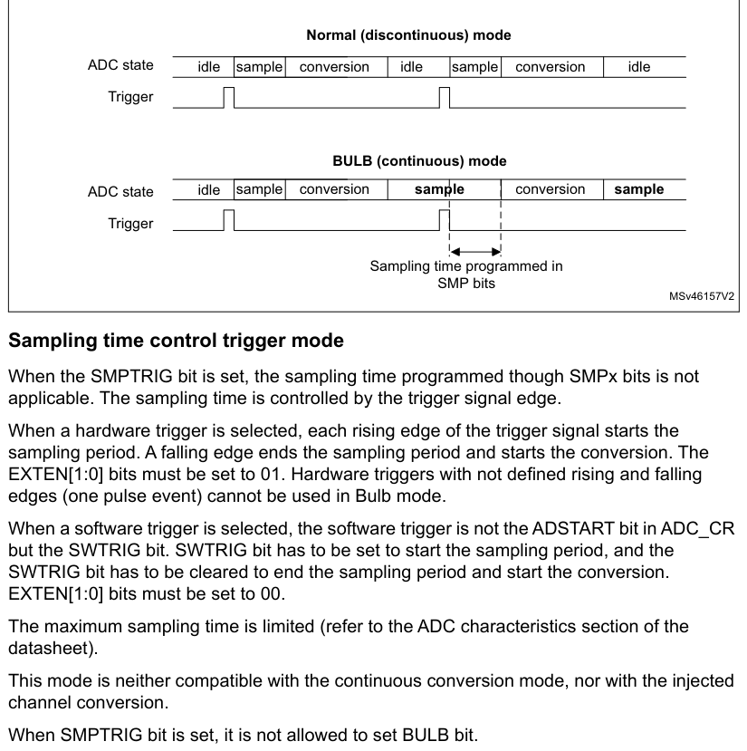

#### Sampling time control trigger mode

When the SMPTRIG bit is set, the sampling time programmed though SMPx bits is not applicable. The
sampling time is controlled by the trigger signal edge.

When a hardware trigger is selected, each rising edge of the trigger signal starts the sampling
period. A falling edge ends the sampling period and starts the conversion. The EXTEN[1:0] bits must
be set to 01. Hardware triggers with not defined rising and falling edges (one pulse event) cannot
be used in Bulb mode.

When a software trigger is selected, the software trigger is not the ADSTART bit in ADC_CR but the
SWTRIG bit. SWTRIG bit has to be set to start the sampling period, and the SWTRIG bit has to be
cleared to end the sampling period and start the conversion. EXTEN[1:0] bits must be set to 00.

The maximum sampling time is limited (refer to the ADC characteristics section of the datasheet).

This mode is neither compatible with the continuous conversion mode, nor with the injected channel
conversion.

When SMPTRIG bit is set, it is not allowed to set BULB bit.

#### I/O analog switch voltage booster

The resistance of the I/O analog switches increases when the VDDA voltage is too low. The sampling
time must consequently be adapted accordingly (refer to the device datasheet for the corresponding
electrical characteristics). This resistance can be minimized at low VDDA voltage by enabling an
internal voltage booster through the BOOSTEN bit of the SYSCFG_CFGR1 register.

#### SMPPLUS control bit

When a sampling time of 2.5 ADC clock cycles is selected, the total conversion time becomes 15
cycles in 12-bit mode. If the dual interleaved mode is used (see Section: Interleaved mode with
independent injected), the sampling interval cannot be equal to the value specified since an even
number of cycles is required for the conversion. The SMPPLUS bit can be used to change the sampling
time 2.5 ADC clock cycles into 3.5 ADC clock cycles. In this way, the total conversion time becomes
16 clock cycles, thus making possible to interleave every 8 cycles.

### 21.4.13 Single conversion mode (CONT = 0)

In Single conversion mode, the ADC performs once all the conversions of the channels. This mode is
started with the CONT bit at 0 by either:

- Setting the ADSTART bit in the ADC_CR register (for a regular channel)
- Setting the JADSTART bit in the ADC_CR register (for an injected channel)
- External hardware trigger event (for a regular or injected channel)

Inside the regular sequence, after each conversion is complete:

- The converted data are stored into the 16-bit ADC_DR register
- The EOC (end of regular conversion) flag is set
- An interrupt is generated if the EOCIE bit is set

Inside the injected sequence, after each conversion is complete:

- The converted data are stored into one of the four 16-bit ADC_JDRy registers
- The JEOC (end of injected conversion) flag is set
- An interrupt is generated if the JEOCIE bit is set

After the regular sequence is complete:

- The EOS (end of regular sequence) flag is set
- An interrupt is generated if the EOSIE bit is set

After the injected sequence is complete:

- The JEOS (end of injected sequence) flag is set
- An interrupt is generated if the JEOSIE bit is set

Then the ADC stops until a new external regular or injected trigger occurs or until bit ADSTART or
JADSTART is set again.

> **Note:** To convert a single channel, program a sequence with a length of 1.

### 21.4.14 Continuous conversion mode (CONT = 1)

This mode applies to regular channels only.

In continuous conversion mode, when a software or hardware regular trigger event occurs, the ADC
performs once all the regular conversions of the channels and then automatically restarts and
continuously converts each conversions of the sequence. This mode is started with the CONT bit at 1
either by external trigger or by setting the ADSTART bit in the ADC_CR register.

Inside the regular sequence, after each conversion is complete:

- The converted data are stored into the 16-bit ADC_DR register
- The EOC (end of conversion) flag is set
- An interrupt is generated if the EOCIE bit is set

After the sequence of conversions is complete:

- The EOS (end of sequence) flag is set
- An interrupt is generated if the EOSIE bit is set

Then, a new sequence restarts immediately and the ADC continuously repeats the conversion sequence.

> **Note:** To convert a single channel, program a sequence with a length of 1.

It is not possible to have both discontinuous mode and continuous mode enabled: it is forbidden to
set both DISCEN = 1 and CONT = 1.

Injected channels cannot be converted continuously. The only exception is when an injected channel
is configured to be converted automatically after regular channels in continuous mode (using JAUTO
bit), refer to Auto-injection mode section).

### 21.4.15 Starting conversions (ADSTART, JADSTART)

Software starts ADC regular conversions by setting ADSTART = 1.

When ADSTART is set, the conversion starts:

- Immediately: if EXTEN[1:0] = 00 (software trigger)
- At the next active edge of the selected regular hardware trigger: if EXTEN[1:0] is not equal to 00

Software starts ADC injected conversions by setting JADSTART = 1.

When JADSTART is set, the conversion starts:

- Immediately, if JEXTEN[1:0] = 00 (software trigger)
- At the next active edge of the selected injected hardware trigger: if JEXTEN[1:0] is not equal to
  00

> **Note:** In auto-injection mode (JAUTO = 1), use ADSTART bit to start the regular conversions
> followed by the auto-injected conversions (JADSTART must be kept cleared).

ADSTART and JADSTART also provide information on whether any ADC operation is currently ongoing. It
is possible to re-configure the ADC while ADSTART = 0 and JADSTART = 0 are both true, indicating
that the ADC is idle.

ADSTART is cleared by hardware:

- In single mode with software regular trigger (CONT = 0, EXTSEL = 0x0)
  - At any end of regular conversion sequence (EOS assertion) or at any end of subgroup processing
    if DISCEN = 1
- In all cases (CONT=x, EXTSEL=x)
  - After execution of the ADSTP procedure asserted by the software.

> **Note:** In continuous mode (CONT = 1), ADSTART is not cleared by hardware with the assertion of

EOS because the sequence is automatically relaunched.

When a hardware trigger is selected in single mode (CONT = 0 and EXTSEL≠0x00), ADSTART is not
cleared by hardware with the assertion of EOS to help the software which does not need to reset
ADSTART again for the next hardware trigger event. This ensures that no further hardware triggers
are missed.

JADSTART is cleared by hardware:

- In single mode with software injected trigger (JEXTSEL = 0x0)
  - At any end of injected conversion sequence (JEOS assertion) or at any end of subgroup processing
    if JDISCEN = 1
- in all cases (JEXTSEL=x)
  - After execution of the JADSTP procedure asserted by the software.

> **Note:** When the software trigger is selected, ADSTART bit should not be set if the EOC flag is still
> high.

### 21.4.16 ADC timing

The elapsed time between the start of a conversion and the end of conversion is the sum of the
configured sampling time plus the successive approximation time depending on data resolution:

TCONV= TSMPL \+ TSAR = [2.5 |min \+ 12.5 |12bit] x TADC_CLK

TCONV = TSMPL \+ TSAR = 83.33 ns |min \+ 416.67 ns |12bit = 500.0 ns (for FADC = 30 MHz)

**Figure 94. Analog-to-digital conversion time**

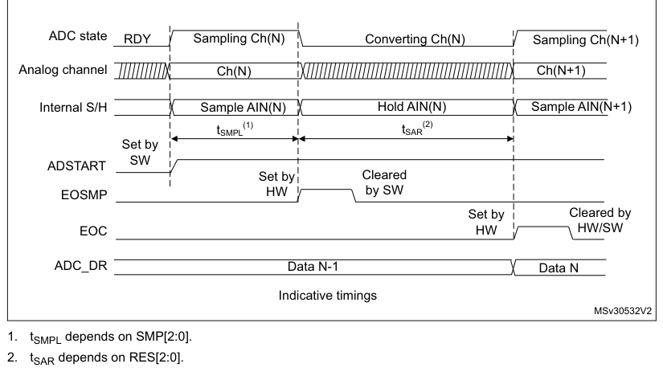

1. tSMPL depends on SMP[2:0].
2. tSAR depends on RES[2:0].

### 21.4.17 Stopping an ongoing conversion (ADSTP, JADSTP)

The software can decide to stop regular conversions ongoing by setting ADSTP = 1 and injected
conversions ongoing by setting JADSTP = 1.

Stopping conversions resets the ongoing ADC operation. Then the ADC can be reconfigured (ex:
changing the channel selection or the trigger) ready for a new operation.

Note that it is possible to stop injected conversions while regular conversions are still operating
and vice-versa. This allows, for instance, re-configuration of the injected conversion sequence and
triggers while regular conversions are still operating (and vice-versa).

When the ADSTP bit is set by software, any ongoing regular conversion is aborted with partial result
discarded (ADC_DR register is not updated with the current conversion).

When the JADSTP bit is set by software, any ongoing injected conversion is aborted with partial
result discarded (ADC_JDRy register is not updated with the current conversion). The scan sequence
is also aborted and reset (meaning that relaunching the ADC would restart a new sequence).

Once this procedure is complete, bits ADSTP/ADSTART (in case of regular conversion), or
JADSTP/JADSTART (in case of injected conversion) are cleared by hardware and the
software must poll ADSTART (or JADSTART) until the bit is reset before assuming the ADC is
completely stopped.

> **Note:** In auto-injection mode (JAUTO = 1), setting ADSTP bit aborts both regular and injected
> conversions (JADSTP must not be used).

**Figure 95. Stopping ongoing regular conversions**

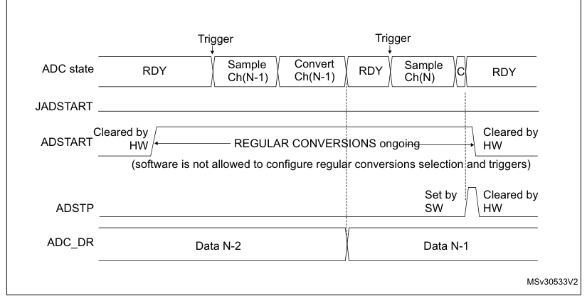

**Figure 96. Stopping ongoing regular and injected conversions**

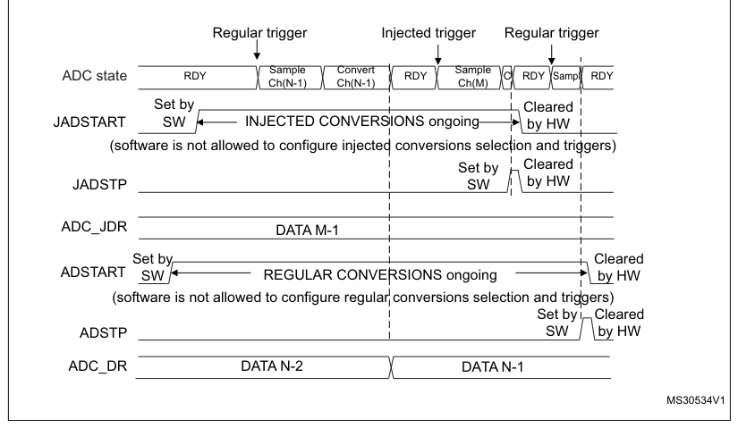

### 21.4.18 Conversion on external trigger and trigger polarity (EXTSEL, EXTEN, JEXTSEL, JEXTEN)

A conversion or a sequence of conversions can be triggered either by software or by an external
event (e.g. timer capture, input pins). If the EXTEN[1:0] control bits (for a regular conversion) or
JEXTEN[1:0] bits (for an injected conversion) are different from 00, then external events are able
to trigger a conversion with the selected polarity.

When the Injected Queue is enabled (bit JQDIS = 0), injected software triggers are not possible.

The regular trigger selection is effective once software has set bit ADSTART = 1 and the injected
trigger selection is effective once software has set bit JADSTART = 1.

Any hardware triggers which occur while a conversion is ongoing are ignored.

- If bit ADSTART = 0, any regular hardware triggers which occur are ignored.
- If bit JADSTART = 0, any injected hardware triggers which occur are ignored.

Table 164 provides the correspondence between the EXTEN[1:0] and JEXTEN[1:0] values and the trigger
polarity.

**Table 164. Configuring the trigger polarity for regular external triggers**

| EXTEN[1:0] | Source |
| --- | --- |
| 00 | Hardware Trigger detection disabled, software trigger detection enabled |
| 01 | Hardware Trigger with detection on the rising edge |
| 10 | Hardware Trigger with detection on the falling edge |
| 11 | Hardware Trigger with detection on both the rising and falling edges |

> **Note:** The polarity of the regular trigger cannot be changed on-the-fly.

**Table 165. Configuring the trigger polarity for injected external triggers**

| Source row | Column 1 | Column 2 |
| ---: | --- | --- |
| 1 | `JEXTEN[1:0]` | `Source` |

- If JQDIS = 1 (Queue disabled): Hardware trigger detection disabled, software trigger detection
  enabled

00

- If JQDIS = 0 (Queue enabled), Hardware and software trigger detection disabled

| 01 | Hardware Trigger with detection on the rising edge |
| --- | --- |
| 10 | Hardware Trigger with detection on the falling edge |
| 11 | Hardware Trigger with detection on both the rising and falling edges |

> **Note:** The polarity of the injected trigger can be anticipated and changed on-the-fly when the
> queue is enabled (JQDIS = 0). Refer to [Section 21.4.21](#21421-queue-of-context-for-injected-conversions): Queue of context for injected conversions.

The EXTSEL and JEXTSEL control bits select which out of 32 possible events can trigger conversion
for the regular and injected groups.

A regular group conversion can be interrupted by an injected trigger.

> **Note:** The regular trigger selection cannot be changed on-the-fly.

The injected trigger selection can be anticipated and changed on-the-fly. Refer to [Section 21.4.21](#21421-queue-of-context-for-injected-conversions):
Queue of context for injected conversions

Each ADC master shares the same input triggers with its ADC slave as described in

Figure 97.

**Figure 97. Triggers sharing between ADC master and ADC slave**

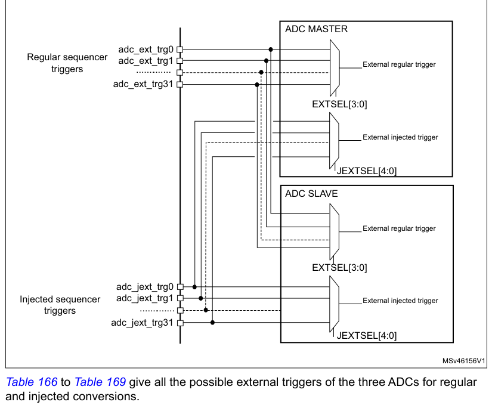

ADC MASTER
adc_ext_trg0

Regular sequencer
adc_ext_trg1

External regular trigger

Table 166 to Table 169 give all the possible external triggers of the three ADCs for regular and
injected conversions.

**Table 166. ADC1/2 - External triggers for regular channels**

| Name | Source | Type | EXTSEL[4:0] |
| --- | --- | --- | --- |
| adc_ext_trg | tim1_oc1 | Internal signal from on-chip timers | 00000 |
| adc_ext_trg1 | tim1_oc2 | Internal signal from on-chip timers | 00001 |
| adc_ext_trg2 | tim1_oc3 | Internal signal from on-chip timers | 00010 |
| adc_ext_trg3 | tim2_oc2 | Internal signal from on-chip timers | 00011 |
| adc_ext_trg4 | tim3_trgo | Internal signal from on-chip timers | 00100 |
| adc_ext_trg5 | tim4_oc4 | Internal signal from on-chip timers | 00101 |
| adc_ext_trg6 | EXTI line 11 | External pin | 00110 |
| adc_ext_trg7 | tim8_trgo | Internal signal from on-chip timers | 00111 |
| adc_ext_trg8 | tim8_trgo2 | Internal signal from on-chip timers | 01000 |

**Table 166. ADC1/2 - External triggers for regular channels (continued)**

| Name | Source | Type | EXTSEL[4:0] |
| --- | --- | --- | --- |
| adc_ext_trg9 | tim1_trgo | Internal signal from on-chip timers | 01001 |
| adc_ext_trg10 | tim1_trgo2 | Internal signal from on-chip timers | 01010 |
| adc_ext_trg11 | tim2_trgo | Internal signal from on-chip timers | 01011 |
| adc_ext_trg12 | tim4_trgo | Internal signal from on-chip timers | 01100 |
| adc_ext_trg13 | tim6_trgo | Internal signal from on-chip timers | 01101 |
| adc_ext_trg14 | tim15_trgo | Internal signal from on-chip timers | 01110 |
| adc_ext_trg15 | tim3_oc4 | Internal signal from on-chip timers | 01111 |
| adc_ext_trg16 | tim20_trgo | Internal signal from on-chip timers | 10000 |
| adc_ext_trg17 | tim20_trgo2 | Internal signal from on-chip timers | 10001 |
| adc_ext_trg18 | tim20_oc1 | Internal signal from on-chip timers | 10010 |
| adc_ext_trg19 | tim20_oc2 | Internal signal from on-chip timers | 10011 |
| adc_ext_trg20 | tim20_oc3 | Internal signal from on-chip timers | 10100 |
| adc_ext_trg21 | hrtim_adc_trg1 | Internal signal from on-chip timers | 10101 |
| adc_ext_trg22 | hrtim_adc_trg3 | Internal signal from on-chip timers | 10110 |
| adc_ext_trg23 | hrtim_adc_trg5 | Internal signal from on-chip timers | 10111 |
| adc_ext_trg24 | hrtim_adc_trg6 | Internal signal from on-chip timers | 11000 |
| adc_ext_trg25 | hrtim_adc_trg7 | Internal signal from on-chip timers | 11001 |
| adc_ext_trg26 | hrtim_adc_trg8 | Internal signal from on-chip timers | 11010 |
| adc_ext_trg27 | hrtim_adc_trg9 | Internal signal from on-chip timers | 11011 |
| adc_ext_trg28 | hrtim_adc_trg10 | Internal signal from on-chip timers | 11100 |
| adc_ext_trg29 | lptim_out | Internal signal from on-chip timers | 11101 |
| adc_ext_trg30 | tim7_trgo | Internal signal from on-chip timers | 11110 |
| adc_ext_trg31 | reserved | - | 11111 |

**Table 167. ADC1/2 - External trigger for injected channels**

| Name | Source | Type | JEXTSEL[4:0] |
| --- | --- | --- | --- |
| adc_jext_trg0 | tim1_trgo | Internal signal from on-chip timers | 00000 |
| adc_jext_trg1 | tim1_oc4 | Internal signal from on-chip timers | 00001 |
| adc_jext_trg2 | tim2_trgo | Internal signal from on-chip timers | 00010 |
| adc_jext_trg3 | tim2_oc1 | Internal signal from on-chip timers | 00011 |
| adc_jext_trg4 | tim3_oc4 | Internal signal from on-chip timers | 00100 |
| adc_jext_trg5 | tim4_trgo | Internal signal from on-chip timers | 00101 |
| adc_jext_trg6 | EXTI line 15 | External pin | 00110 |
| adc_jext_trg7 | tim8_oc4 | Internal signal from on-chip timers | 00111 |
| adc_jext_trg8 | tim1_trgo2 | Internal signal from on-chip timers | 01000 |

**Table 167. ADC1/2 - External trigger for injected channels (continued)**

| Name | Source | Type | JEXTSEL[4:0] |
| --- | --- | --- | --- |
| adc_jext_trg9 | tim8_trgo | Internal signal from on-chip timers | 01001 |
| adc_jext_trg10 | tim8_trgo2 | Internal signal from on-chip timers | 01010 |
| adc_jext_trg11 | tim3_oc3 | Internal signal from on-chip timers | 01011 |
| adc_jext_trg12 | tim3_trgo | Internal signal from on-chip timers | 01100 |
| adc_jext_trg13 | tim3_oc1 | Internal signal from on-chip timers | 01101 |
| adc_jext_trg14 | tim6_trgo | Internal signal from on-chip timers | 01110 |
| adc_jext_trg15 | tim15_trgo | Internal signal from on-chip timers | 01111 |
| adc_jext_trg16 | tim20_trgo | Internal signal from on-chip timers | 10000 |
| adc_jext_trg17 | tim20_trgo2 | Internal signal from on-chip timers | 10001 |
| adc_jext_trg18 | tim20_oc4 | Internal signal from on-chip timers | 10010 |
| adc_jext_trg19 | hrtim_adc_trg2 | Internal signal from on-chip timers | 10011 |
| adc_jext_trg20 | hrtim_adc_trg4 | Internal signal from on-chip timers | 10100 |
| adc_jext_trg21 | hrtim_adc_trg5 | Internal signal from on-chip timers | 10101 |
| adc_jext_trg22 | hrtim_adc_trg6 | Internal signal from on-chip timers | 10110 |
| adc_jext_trg23 | hrtim_adc_trg7 | Internal signal from on-chip timers | 10111 |
| adc_jext_trg24 | hrtim_adc_trg8 | Internal signal from on-chip timers | 11000 |
| adc_jext_trg25 | hrtim_adc_trg9 | Internal signal from on-chip timers | 11001 |
| adc_jext_trg26 | hrtim_adc_trg10 | Internal signal from on-chip timers | 11010 |
| adc_jext_trg27 | tim16_oc1 | Internal signal from on-chip timers | 11011 |
| adc_jext_trg28 | reserved | - | 11100 |
| adc_jext_trg29 | lptim_out | Internal signal from on-chip timers | 11101 |
| adc_jext_trg30 | tim7_trgo | Internal signal from on-chip timers | 11110 |
| adc_jext_trg31 | reserved | - | 11111 |

**Table 168. ADC3/4/5 - External triggers for regular channels**

| Name | Source | Type | EXTSEL[4:0] |
| --- | --- | --- | --- |
| adc_ext_trg0 | tim3_oc1 | Internal signal from on-chip timers | 00000 |
| adc_ext_trg1 | tim2_oc3 | Internal signal from on-chip timers | 00001 |
| adc_ext_trg2 | tim1_oc3 | Internal signal from on-chip timers | 00010 |
| adc_ext_trg3 | tim8_oc1 | Internal signal from on-chip timers | 00011 |
| adc_ext_trg4 | tim3_trgo | Internal signal from on-chip timers | 00100 |
| adc_ext_trg5 | EXTI line 2 | External pin | 00101 |
| adc_ext_trg6 | tim4_oc1 | Internal signal from on-chip timers | 00110 |
| adc_ext_trg7 | tim8_trgo | Internal signal from on-chip timers | 00111 |

**Table 168. ADC3/4/5 - External triggers for regular channels (continued)**

| Name | Source | Type | EXTSEL[4:0] |
| --- | --- | --- | --- |
| adc_ext_trg8 | tim8_trgo2 | Internal signal from on-chip timers | 01000 |
| adc_ext_trg9 | tim1_trgo | Internal signal from on-chip timers | 01001 |
| adc_ext_trg10 | tim1_trgo2 | Internal signal from on-chip timers | 01010 |
| adc_ext_trg11 | tim2_trgo | Internal signal from on-chip timers | 01011 |
| adc_ext_trg12 | tim4_trgo | Internal signal from on-chip timers | 01100 |
| adc_ext_trg13 | tim6_trgo | Internal signal from on-chip timers | 01101 |
| adc_ext_trg14 | tim15_trgo | Internal signal from on-chip timers | 01110 |
| adc_ext_trg15 | tim2_oc1 | Internal signal from on-chip timers | 01111 |
| adc_ext_trg16 | tim20_trgo | Internal signal from on-chip timers | 10000 |
| adc_ext_trg17 | tim20_trgo2 | Internal signal from on-chip timers | 10001 |
| adc_ext_trg18 | tim20_oc1 | Internal signal from on-chip timers | 10010 |
| adc_ext_trg19 | hrtim_adc_trg2 | Internal signal from on-chip timers | 10011 |
| adc_ext_trg20 | hrtim_adc_trg4 | Internal signal from on-chip timers | 10100 |
| adc_ext_trg21 | hrtim_adc_trg1 | Internal signal from on-chip timers | 10101 |
| adc_ext_trg22 | hrtim_adc_trg3 | Internal signal from on-chip timers | 10110 |
| adc_ext_trg23 | hrtim_adc_trg5 | Internal signal from on-chip timers | 10111 |
| adc_ext_trg24 | hrtim_adc_trg6 | Internal signal from on-chip timers | 11000 |
| adc_ext_trg25 | hrtim_adc_trg7 | Internal signal from on-chip timers | 11001 |
| adc_ext_trg26 | hrtim_adc_trg8 | Internal signal from on-chip timers | 11010 |
| adc_ext_trg27 | hrtim_adc_trg9 | Internal signal from on-chip timers | 11011 |
| adc_ext_trg28 | hrtim_adc_trg10 | Internal signal from on-chip timers | 11100 |
| adc_ext_trg29 | lptim_out | Internal signal from on-chip timers | 11101 |
| adc_ext_trg30 | tim7_trgo | Internal signal from on-chip timers | 11110 |
| adc_ext_trg31 | reserved | - | 11111 |

**Table 169. ADC3/4/5 - External triggers for injected channels**

| Name | Source | Type | JEXTSEL[4:0] |
| --- | --- | --- | --- |
| adc_jext_trg0 | tim1_trgo | Internal signal from on-chip timers | 00000 |
| adc_jext_trg1 | tim1_oc4 | Internal signal from on-chip timers | 00001 |
| adc_jext_trg2 | tim2_trgo | Internal signal from on-chip timers | 00010 |
| adc_jext_trg3 | tim8_oc2 | Internal signal from on-chip timers | 00011 |
| adc_jext_trg4 | tim4_oc3 | Internal signal from on-chip timers | 00100 |
| adc_jext_trg5 | tim4_trgo | Internal signal from on-chip timers | 00101 |
| adc_jext_trg6 | tim4_oc4 | Internal signal from on-chip timers | 00110 |
| adc_jext_trg7 | tim8_oc4 | Internal signal from on-chip timers | 00111 |

**Table 169. ADC3/4/5 - External triggers for injected channels (continued)**

| Name | Source | Type | JEXTSEL[4:0] |
| --- | --- | --- | --- |
| adc_jext_trg8 | tim1_trgo2 | Internal signal from on-chip timers | 01000 |
| adc_jext_trg9 | tim8_trgo | Internal signal from on-chip timers | 01001 |
| adc_jext_trg10 | tim8_trgo2 | Internal signal from on-chip timers | 01010 |
| adc_jext_trg11 | tim1_oc3 | Internal signal from on-chip timers | 01011 |
| adc_jext_trg12 | tim3_trgo | Internal signal from on-chip timers | 01100 |
| adc_jext_trg13 | EXTI line 3 | External pin | 01101 |
| adc_jext_trg14 | tim6_trgo | Internal signal from on-chip timers | 01110 |
| adc_jext_trg15 | tim15_trgo | Internal signal from on-chip timers | 01111 |
| adc_jext_trg16 | tim20_trgo | Internal signal from on-chip timers | 10000 |
| adc_jext_trg17 | tim20_trgo2 | Internal signal from on-chip timers | 10001 |
| adc_jext_trg18 | tim20_oc2 | Internal signal from on-chip timers | 10010 |
| adc_jext_trg19 | hrtim_adc_trg2 | Internal signal from on-chip timers | 10011 |
| adc_jext_trg20 | hrtim_adc_trg4 | Internal signal from on-chip timers | 10100 |
| adc_jext_trg21 | hrtim_adc_trg5 | Internal signal from on-chip timers | 10101 |
| adc_jext_trg22 | hrtim_adc_trg6 | Internal signal from on-chip timers | 10110 |
| adc_jext_trg23 | hrtim_adc_trg7 | Internal signal from on-chip timers | 10111 |
| adc_jext_trg24 | hrtim_adc_trg8 | Internal signal from on-chip timers | 11000 |
| adc_jext_trg25 | hrtim_adc_trg9 | Internal signal from on-chip timers | 11001 |
| adc_jext_trg26 | hrtim_adc_trg10 | Internal signal from on-chip timers | 11010 |
| adc_jext_trg27 | hrtim_adc_trg1 | Internal signal from on-chip timers | 11011 |
| adc_jext_trg28 | hrtim_adc_trg3 | Internal signal from on-chip timers | 11100 |
| adc_jext_trg29 | lptim_out | Internal signal from on-chip timers | 11101 |
| adc_jext_trg30 | tim7_trgo | Internal signal from on-chip timers | 11110 |
| adc_jext_trg31 | reserved | - | 11111 |

### 21.4.19 Injected channel management

#### Triggered injection mode

To use triggered injection, the JAUTO bit in the ADC_CFGR register must be cleared.

1. Start the conversion of a group of regular channels either by an external trigger or by
   setting the ADSTART bit in the ADC_CR register.
2. If an external injected trigger occurs, or if the JADSTART bit in the ADC_CR register is
   set during the conversion of a regular group of channels, the current conversion is
   reset and the injected channel sequence switches are launched (all the injected channels are
   converted once).
3. Then, the regular conversion of the regular group of channels is resumed from the last
   interrupted regular conversion.
4. If a regular event occurs during an injected conversion, the injected conversion is not
   interrupted but the regular sequence is executed at the end of the injected sequence. Figure 98
   shows the corresponding timing diagram.

> **Note:** When using triggered injection, one must ensure that the interval between trigger events is
> longer than the injection sequence. For instance, if the sequence length is 30 ADC clock cycles
(that is two conversions with a sampling time of 2.5 clock periods), the minimum interval between
triggers must be 31 ADC clock cycles.

#### Auto-injection mode

If the JAUTO bit in the ADC_CFGR register is set, then the channels in the injected group are
automatically converted after the regular group of channels. This can be used to convert a sequence
of up to 20 conversions programmed in the ADC_SQRy and ADC_JSQR registers.

In this mode, the ADSTART bit in the ADC_CR register must be set to start regular conversions,
followed by injected conversions (JADSTART must be kept cleared). Setting the ADSTP bit aborts both
regular and injected conversions (JADSTP bit must not be used).

In this mode, external trigger on injected channels must be disabled.

If the CONT bit is also set in addition to the JAUTO bit, regular channels followed by injected
channels are continuously converted.

> **Note:** It is not possible to use both the auto-injected and discontinuous modes simultaneously.

When the DMA is used for exporting regular sequencer’s data in JAUTO mode, it is necessary to
program it in circular mode. If the single-shot mode is selected, the JAUTO sequence is stopped upon
DMA Transfer Complete event.

**Figure 98. Injected conversion latency**

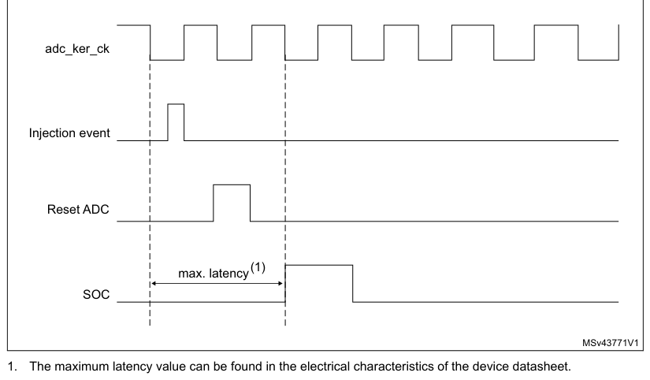

adc_ker_ck

Injection event

Reset ADC

(1)
max. latency

SOC

MSv43771V1

1. The maximum latency value can be found in the electrical characteristics of the device datasheet.

### 21.4.20 Discontinuous mode (DISCEN, DISCNUM, JDISCEN)

#### Regular group mode

This mode is enabled by setting the DISCEN bit in the ADC_CFGR register.

It is used to convert a short sequence (subgroup) of n conversions (n ≤ 8) that is part of the
sequence of conversions selected in the ADC_SQRy registers. The value of n is specified by writing
to the DISCNUM[2:0] bits in the ADC_CFGR register.

When an external trigger occurs, it starts the next n conversions selected in the ADC_SQRy registers
until all the conversions in the sequence are done. The total sequence length is defined by the
L[3:0] bits in the ADC_SQR1 register.

Example:

- DISCEN = 1, n = 3, channels to be converted = 1, 2, 3, 6, 7, 8, 9, 10, 11
  - first trigger: channels converted are 1, 2, 3 (an EOC event is generated at each conversion).
  - second trigger: channels converted are 6, 7, 8 (an EOC event is generated at each conversion).
  - third trigger: channels converted are 9, 10, 11 (an EOC event is generated at each conversion)
    and an EOS event is generated after the conversion of channel 11.
  - fourth trigger: channels converted are 1, 2, 3 (an EOC event is generated at each conversion).
  - ...
- DISCEN = 0, channels to be converted = 1, 2, 3, 6, 7, 8, 9, 10,11
  - first trigger: the complete sequence is converted: channel 1, then 2, 3, 6, 7, 8, 9, 10 and 11.
    Each conversion generates an EOC event and the last one also generates an EOS event.
  - All the next trigger events relaunch the complete sequence.

> **Note:** The channel numbers referred to in the above example might not be available on all
> microcontrollers.

When a regular group is converted in discontinuous mode, no rollover occurs (the last subgroup of
the sequence can have less than n conversions).

When all subgroups are converted, the next trigger starts the conversion of the first subgroup. In
the example above, the fourth trigger reconverts the channels 1, 2 and 3 in the first subgroup.

It is not possible to have both discontinuous mode and continuous mode enabled. In this case (if
DISCEN = 1, CONT = 1), the ADC behaves as if continuous mode was disabled.

#### Injected group mode

This mode is enabled by setting the JDISCEN bit in the ADC_CFGR register. It converts the sequence
selected in the ADC_JSQR register, channel by channel, after an external injected trigger event.
This is equivalent to discontinuous mode for regular channels where ‘n’ is fixed to 1.

When an external trigger occurs, it starts the next channel conversions selected in the ADC_JSQR
registers until all the conversions in the sequence are done. The total sequence length is defined
by the JL[1:0] bits in the ADC_JSQR register.

Example:

- JDISCEN = 1, channels to be converted = 1, 2, 3
  - first trigger: channel 1 converted (a JEOC event is generated)
  - second trigger: channel 2 converted (a JEOC event is generated)
  - third trigger: channel 3 converted and a JEOC event \+ a JEOS event are generated
  - ...

> **Note:** The channel numbers referred to in the above example might not be available on all
> microcontrollers.

When all injected channels have been converted, the next trigger starts the conversion of the first
injected channel. In the example above, the fourth trigger reconverts the first injected channel 1.

It is not possible to use both auto-injected mode and discontinuous mode simultaneously: the bits
DISCEN and JDISCEN must be kept cleared by software when JAUTO is set.

### 21.4.21 Queue of context for injected conversions

A queue of context is implemented to anticipate up to 2 contexts for the next injected sequence of
conversions. JQDIS bit of ADC_CFGR register must be reset to enable this feature. Only
hardware-triggered conversions are possible when the context queue is enabled.

This context consists of:

- Configuration of the injected triggers (bits JEXTEN[1:0] and JEXTSEL bits in ADC_JSQR register)
- Definition of the injected sequence (bits JSQx[4:0] and JL[1:0] in ADC_JSQR register)

All the parameters of the context are defined into a single register ADC_JSQR and this register
implements a queue of 2 buffers, allowing the bufferization of up to 2 sets of parameters:

- The ADC_JSQR register can be written at any moment even when injected conversions are ongoing.
- Each data written into the ADC_JSQR register is stored into the Queue of context.
- At the beginning, the Queue is empty and the first write access into the ADC_JSQR register
  immediately changes the context and the ADC is ready to receive injected triggers.
- Once an injected sequence is complete, the Queue is consumed and the context changes according to
  the next ADC_JSQR parameters stored in the Queue. This new context is applied for the next
  injected sequence of conversions.
- A Queue overflow occurs when writing into register ADC_JSQR while the Queue is full. This overflow
  is signaled by the assertion of the flag JQOVF. When an overflow occurs, the write access of
  ADC_JSQR register which has created the overflow is ignored and the queue of context is unchanged.
  An interrupt can be generated if bit JQOVFIE is set.
- Two possible behaviors are possible when the Queue becomes empty, depending on the value of the
  control bit JQM of register ADC_CFGR:
  - If JQM = 0, the Queue is empty just after enabling the ADC, but then it can never be empty
    during run operations: the Queue always maintains the last active context and any further valid
    start of injected sequence is served according to the last active context.
  - If JQM = 1, the Queue can be empty after the end of an injected sequence or if the Queue is
    flushed. When this occurs, there is no more context in the queue and hardware triggers are
    disabled. Therefore, any further hardware injected triggers are ignored until the software
    re-writes a new injected context into ADC_JSQR register.
- Reading ADC_JSQR register returns the current ADC_JSQR context which is active at that moment.
  When the ADC_JSQR context is empty, JSQi is read as 0x00.
- The Queue is flushed when stopping injected conversions by setting JADSTP = 1 or when disabling
  the ADC by setting ADDIS = 1:
  - If JQM = 0, the Queue is maintained with the last active context.
  - If JQM = 1, the Queue becomes empty and triggers are ignored.

> **Note:** When configured in discontinuous mode (bit JDISCEN = 1), only the last trigger of the
> injected sequence changes the context and consumes the Queue. The first trigger only consumes the
> queue but others are still valid triggers as shown by the discontinuous mode example below (length =
3 for both contexts):

- 1st trigger, discontinuous. Sequence 1: context 1 consumed, 1st conversion carried out
- 2nd trigger, discontinuous. Sequence 1: 2nd conversion.
- 3rd trigger, discontinuous. Sequence 1: 3rd conversion.
- 4th trigger, discontinuous. Sequence 2: context 2 consumed, 1st conversion carried out.
- 5th trigger, discontinuous. Sequence 2: 2nd conversion.
- 6th trigger, discontinuous. Sequence 2: 3rd conversion.

#### Behavior when changing the trigger or sequence context

The Figure 99 and Figure 100 show the behavior of the context Queue when changing the sequence or
the triggers.

**Figure 99. Example of ADC_JSQR queue of context (sequence change)**

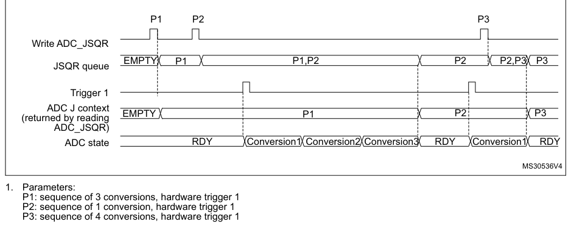

1. Parameters:

P1: sequence of 3 conversions, hardware trigger 1

P2: sequence of 1 conversion, hardware trigger 1

P3: sequence of 4 conversions, hardware trigger 1

**Figure 100. Example of ADC_JSQR queue of context (trigger change)**

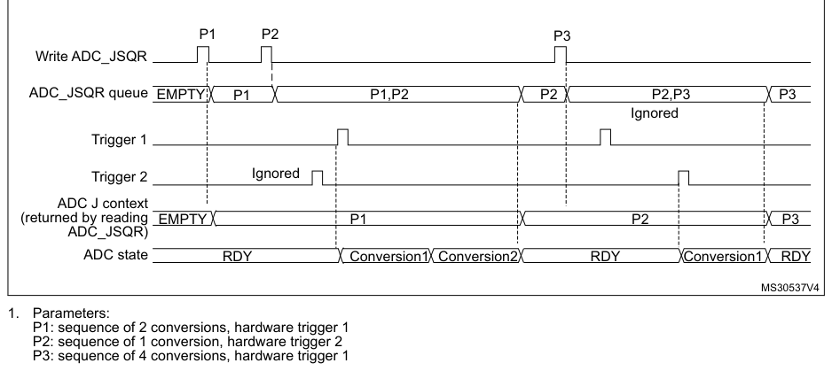

1. Parameters:

P1: sequence of 2 conversions, hardware trigger 1

P2: sequence of 1 conversion, hardware trigger 2

P3: sequence of 4 conversions, hardware trigger 1

#### Queue of context: Behavior when a queue overflow occurs

The Figure 101 and Figure 102 show the behavior of the context Queue if an overflow occurs before or
during a conversion.

**Figure 101. Example of ADC_JSQR queue of context with overflow before conversion**

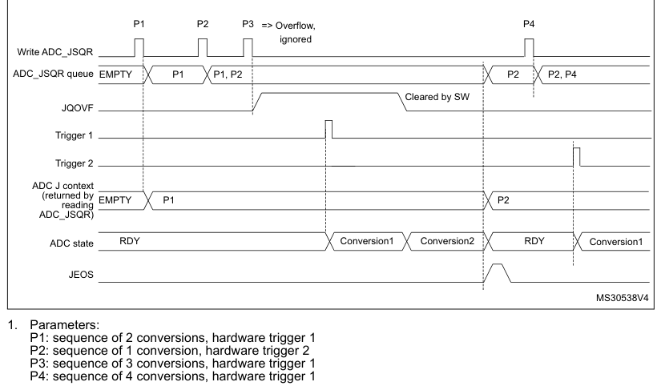

1. Parameters:

P1: sequence of 2 conversions, hardware trigger 1

P2: sequence of 1 conversion, hardware trigger 2

P3: sequence of 3 conversions, hardware trigger 1

P4: sequence of 4 conversions, hardware trigger 1

**Figure 102. Example of ADC_JSQR queue of context with overflow during conversion**

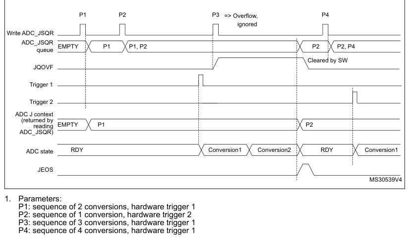

1. Parameters:

P1: sequence of 2 conversions, hardware trigger 1

P2: sequence of 1 conversion, hardware trigger 2

P3: sequence of 3 conversions, hardware trigger 1

P4: sequence of 4 conversions, hardware trigger 1

It is recommended to manage the queue overflows as described below:

- After each P context write into ADC_JSQR register, flag JQOVF shows if the write has been ignored
  or not (an interrupt can be generated).
- Avoid Queue overflows by writing the third context (P3) only once the flag JEOS of the previous
  context P2 has been set. This ensures that the previous context has been consumed and that the
  queue is not full.

#### Queue of context: Behavior when the queue becomes empty

Figure 103 and Figure 104 show the behavior of the context Queue when the Queue becomes empty in
both cases JQM = 0 or 1.

**Figure 103. Example of ADC_JSQR queue of context with empty queue (case JQM = 0)**

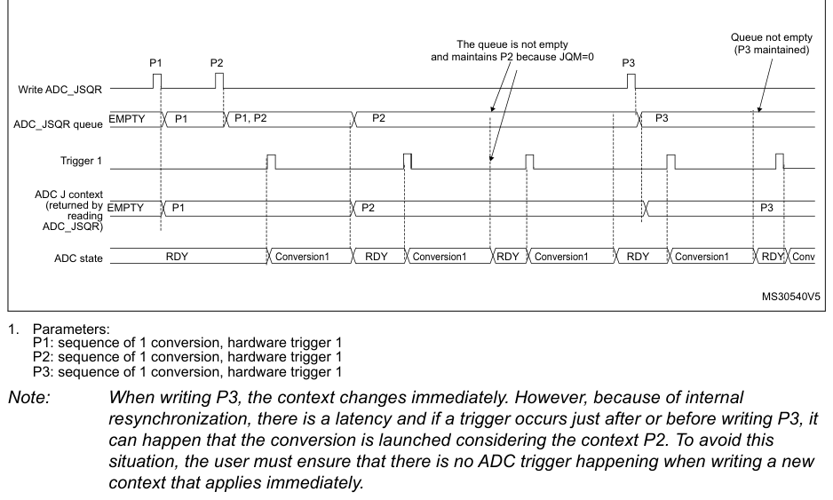

1. Parameters:

P1: sequence of 1 conversion, hardware trigger 1

P2: sequence of 1 conversion, hardware trigger 1

P3: sequence of 1 conversion, hardware trigger 1

> **Note:** When writing P3, the context changes immediately. However, because of internal
> resynchronization, there is a latency and if a trigger occurs just after or before writing P3, it
> can happen that the conversion is launched considering the context P2. To avoid this situation, the
> user must ensure that there is no ADC trigger happening when writing a new context that applies
> immediately.

**Figure 104. Example of ADC_JSQR queue of context with empty queue (case JQM = 1)**

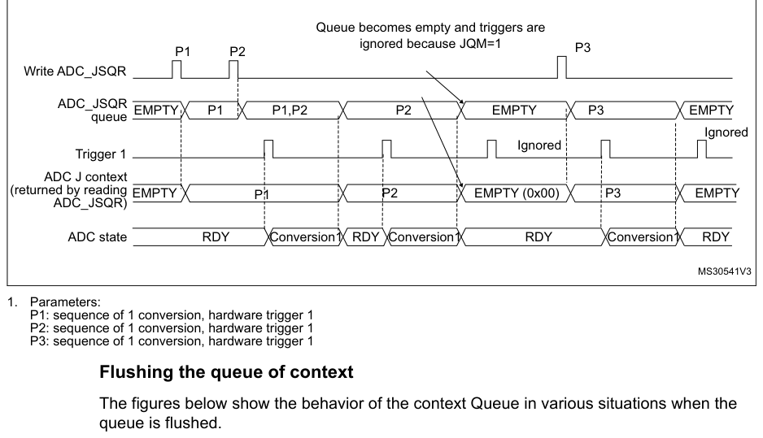

Queue becomes empty and triggers are
ignored because JQM=1

P3

P1 P2

Write ADC_JSQR

ADC_JSQR

1. Parameters:

P1: sequence of 1 conversion, hardware trigger 1

P2: sequence of 1 conversion, hardware trigger 1

P3: sequence of 1 conversion, hardware trigger 1

#### Flushing the queue of context

The figures below show the behavior of the context Queue in various situations when the queue is
flushed.

**Figure 105. Flushing ADC_JSQR queue of context by setting JADSTP = 1 (JQM = 0)**

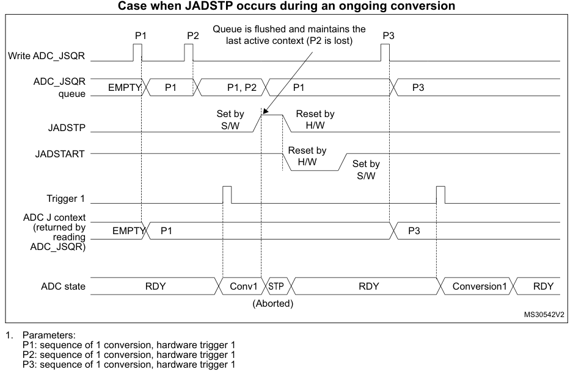

1. Parameters:

P1: sequence of 1 conversion, hardware trigger 1

P2: sequence of 1 conversion, hardware trigger 1

P3: sequence of 1 conversion, hardware trigger 1

**Figure 106. Flushing ADC_JSQR queue of context by setting JADSTP = 1 (JQM = 0)**

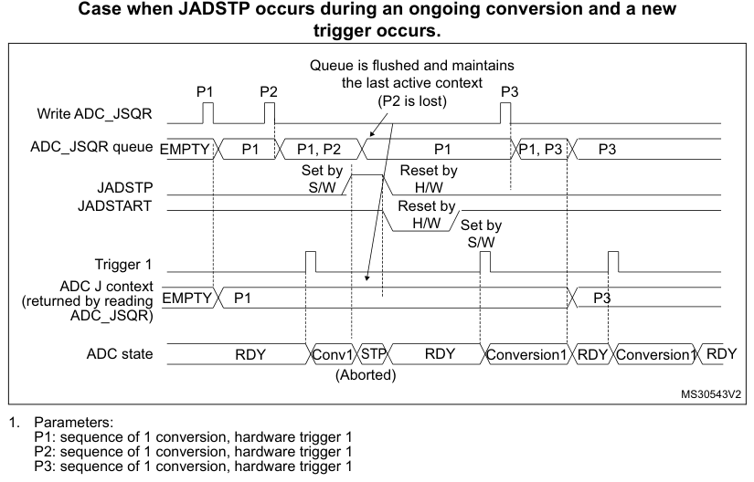

trigger occurs.

Queue is flushed and maintains
the last active context

1. Parameters:

P1: sequence of 1 conversion, hardware trigger 1

P2: sequence of 1 conversion, hardware trigger 1

P3: sequence of 1 conversion, hardware trigger 1

**Figure 107. Flushing ADC_JSQR queue of context by setting JADSTP = 1 (JQM = 0)**

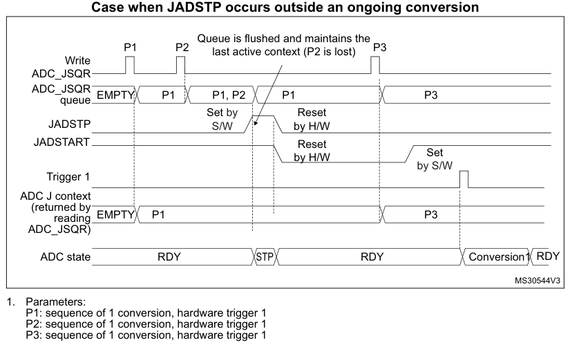

1. Parameters:

P1: sequence of 1 conversion, hardware trigger 1

P2: sequence of 1 conversion, hardware trigger 1

P3: sequence of 1 conversion, hardware trigger 1

**Figure 108. Flushing ADC_JSQR queue of context by setting JADSTP = 1 (JQM = 1)**

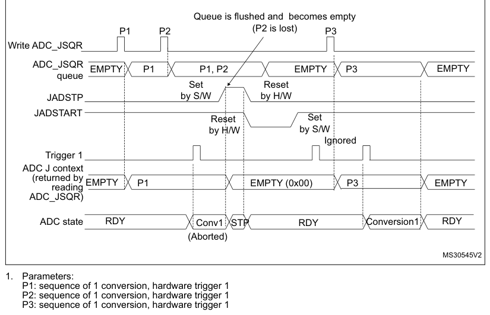

1. Parameters:

P1: sequence of 1 conversion, hardware trigger 1

P2: sequence of 1 conversion, hardware trigger 1

P3: sequence of 1 conversion, hardware trigger 1

**Figure 109. Flushing ADC_JSQR queue of context by setting ADDIS = 1 (JQM = 0)**

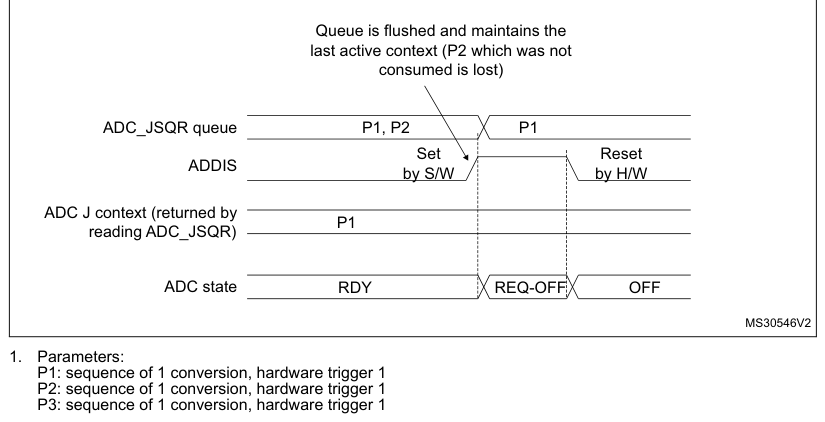

1. Parameters:

P1: sequence of 1 conversion, hardware trigger 1

P2: sequence of 1 conversion, hardware trigger 1

P3: sequence of 1 conversion, hardware trigger 1

**Figure 110. Flushing ADC_JSQR queue of context by setting ADDIS = 1 (JQM = 1)**

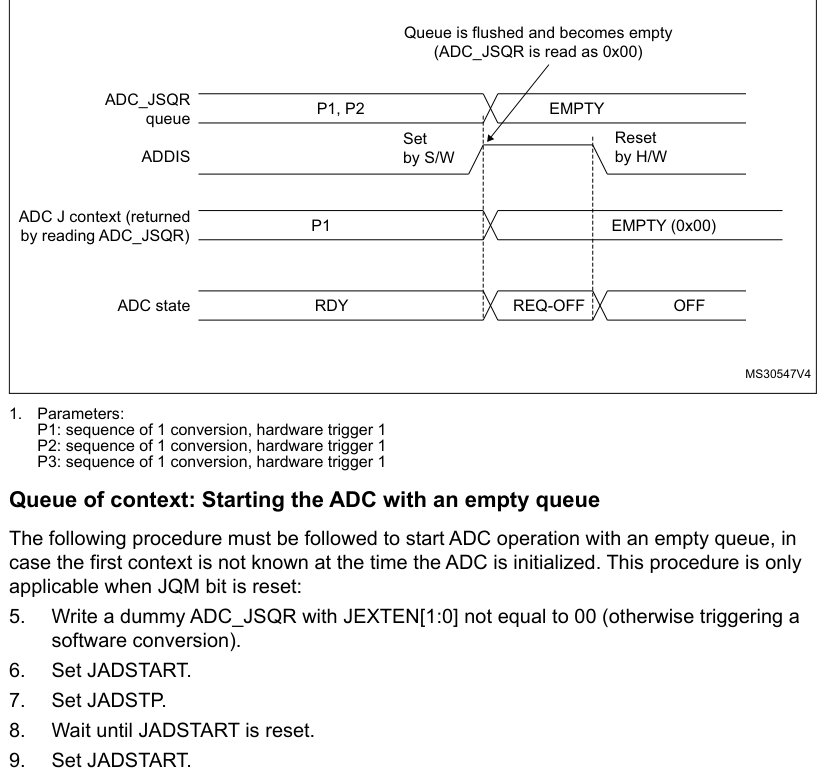

1. Parameters:

P1: sequence of 1 conversion, hardware trigger 1

P2: sequence of 1 conversion, hardware trigger 1

P3: sequence of 1 conversion, hardware trigger 1

#### Queue of context: Starting the ADC with an empty queue

The following procedure must be followed to start ADC operation with an empty queue, in case the
first context is not known at the time the ADC is initialized. This procedure is only applicable
when JQM bit is reset:

5. Write a dummy ADC_JSQR with JEXTEN[1:0] not equal to 00 (otherwise triggering a
   software conversion).
6. Set JADSTART.
7. Set JADSTP.
8. Wait until JADSTART is reset.
9. Set JADSTART.

#### Disabling the queue

It is possible to disable the queue by setting bit JQDIS = 1 into the ADC_CFGR register.

### 21.4.22 Programmable resolution (RES) - Fast conversion mode

It is possible to perform faster conversion by reducing the ADC resolution.

The resolution can be configured to be either 12, 10, 8, or 6 bits by programming the control bits
RES[1:0]. Figure 115, Figure 116, Figure 117 and Figure 118 show the conversion result format with
respect to the resolution as well as to the data alignment.

Lower resolution allows faster conversion time for applications where high-data precision is not
required. It reduces the conversion time spent by the successive approximation steps according to
Table 170.

**Table 170. TSAR timings depending on resolution**

| Source row | Column 1 | Column 2 | Column 3 | Column 4 | Column 5 |
| ---: | --- | --- | --- | --- | --- |
| 1 | `TCONV (ADC clock cycles)` |  |  |  |  |
| 2 | `RES` | `TSAR` | `TSAR (ns) at` | `TCONV (ns) at` |  |
| 3 | `(with Sampling Time=` |  |  |  |  |
| 4 | `(bits)` | `(ADC clock cycles)` | `FADC= 30 MHz` | `FADC= 30 MHz` |  |
| 5 | `2.5 ADC clock cycles)` |  |  |  |  |
| 6 | `12` | `12.5 ADC clock cycles` | `416.67 ns` | `15 ADC clock cycles` | `500.0 ns` |
| 7 | `10` | `10.5 ADC clock cycles` | `350.0 ns` | `13 ADC clock cycles` | `433.33 ns` |
| 8 | `8` | `8.5 ADC clock cycles` | `203.33 ns` | `11 ADC clock cycles` | `366.67 ns` |
| 9 | `6` | `6.5 ADC clock cycles` | `216.67 ns` | `9 ADC clock cycles` | `300.0 ns` |

### 21.4.23 End of conversion, end of sampling phase (EOC, JEOC, EOSMP)

The ADC notifies the application for each end of regular conversion (EOC) event and each injected
conversion (JEOC) event.

The ADC sets the EOC flag as soon as a new regular conversion data is available in the ADC_DR
register. An interrupt can be generated if bit EOCIE is set. EOC flag is cleared by the software
either by writing 1 to it or by reading ADC_DR.

The ADC sets the JEOC flag as soon as a new injected conversion data is available in one of the
ADC_JDRy register. An interrupt can be generated if bit JEOCIE is set. JEOC flag is cleared by the
software either by writing 1 to it or by reading the corresponding ADC_JDRy register.

The ADC also notifies the end of Sampling phase by setting the status bit EOSMP (for regular
conversions only). EOSMP flag is cleared by software by writing 1 to it. An interrupt can be
generated if bit EOSMPIE is set.

### 21.4.24 End of conversion sequence (EOS, JEOS)

The ADC notifies the application for each end of regular sequence (EOS) and for each end of injected
sequence (JEOS) event.

The ADC sets the EOS flag as soon as the last data of the regular conversion sequence is available
in the ADC_DR register. An interrupt can be generated if bit EOSIE is set. EOS flag is cleared by
the software either by writing 1 to it.

The ADC sets the JEOS flag as soon as the last data of the injected conversion sequence is complete.
An interrupt can be generated if bit JEOSIE is set. JEOS flag is cleared by the software either by
writing 1 to it.

### 21.4.25 Timing diagrams example (single/continuous modes, hardware/software triggers)

**Figure 111. Single conversions of a sequence, software trigger**

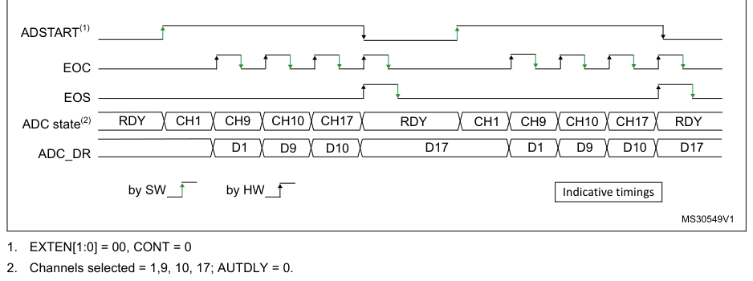

1. EXTEN[1:0] = 00, CONT = 0
2. Channels selected = 1,9, 10, 17; AUTDLY = 0.

**Figure 112. Continuous conversion of a sequence, software trigger**

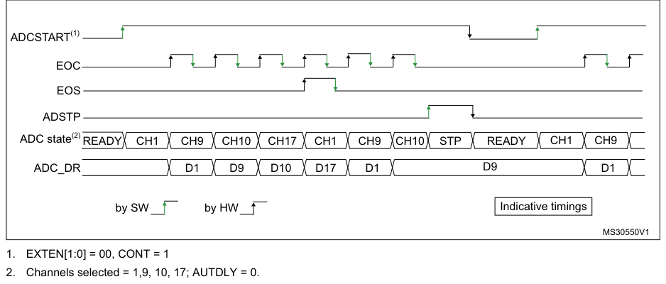

1. EXTEN[1:0] = 00, CONT = 1
2. Channels selected = 1,9, 10, 17; AUTDLY = 0.

**Figure 113. Single conversions of a sequence, hardware trigger**

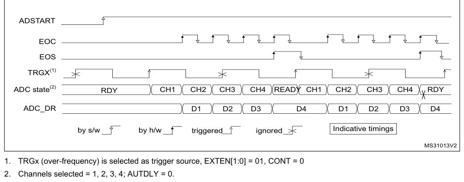

1. TRGx (over-frequency) is selected as trigger source, EXTEN[1:0] = 01, CONT = 0
2. Channels selected = 1, 2, 3, 4; AUTDLY = 0.

**Figure 114. Continuous conversions of a sequence, hardware trigger**

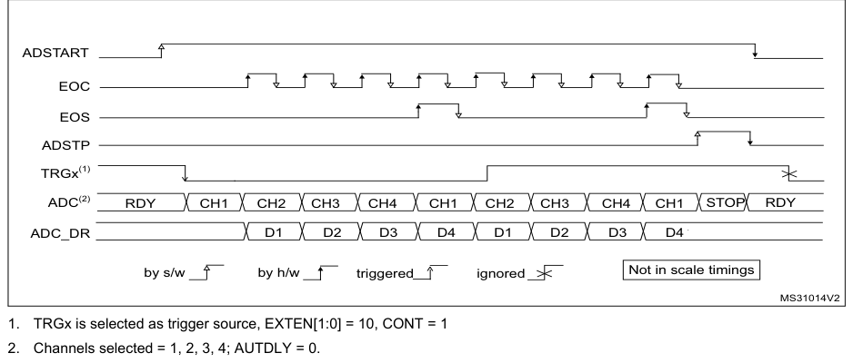

ADSTART

EOC

EOS

ADSTP

TRGx(1)

1. TRGx is selected as trigger source, EXTEN[1:0] = 10, CONT = 1
2. Channels selected = 1, 2, 3, 4; AUTDLY = 0.

### 21.4.26 Data management

#### Data register, data alignment and offset (ADC_DR, OFFSETy, OFFSETy_CH, ALIGN)

#### Data and alignment

At the end of each regular conversion channel (when EOC event occurs), the result of the converted
data is stored into the ADC_DR data register which is 16 bits wide.

At the end of each injected conversion channel (when JEOC event occurs), the result of the converted
data is stored into the corresponding ADC_JDRy data register which is 16 bits wide.

The ALIGN bit in the ADC_CFGR register selects the alignment of the data stored after conversion.
Data can be right-or left-aligned as shown in Figure 115, Figure 116, Figure 117 and Figure 118.

Special case: when left-aligned, the data are aligned on a half-word basis except when the
resolution is set to 6-bit. In that case, the data are aligned on a byte basis as shown in Figure
117 and Figure 118.

> **Note:** Left-alignment is not supported in oversampling mode. When ROVSE and/or JOVSE bit is
> set, the ALIGN bit value is ignored and the ADC only provides right-aligned data.

#### Offset

An offset y (y = 1,2,3,4) can be applied to a channel by setting the bit OFFSETy_EN = 1 into
ADC_OFRy register. The channel to which the offset is applied is programmed into the bits
OFFSETy_CH[4:0] of ADC_OFRy register. In this case, the converted value is decreased by the
user-defined offset written in the bits OFFSETy[11:0]. The result may be a negative value so the
read data is signed and the SEXT bit represents the extended sign value.

> **Note:** Offset correction is not supported in oversampling mode. When ROVSE and/or JOVSE bit is
> set, the value of the OFFSETy_EN bit in ADC_OFRy register is ignored (considered as reset).

Table 173 describes how the comparison is performed for all the possible resolutions for analog
watchdog 1.

**Table 171. Offset computation versus data resolution**

| Source row | Column 1 | Column 2 | Column 3 | Column 4 |
| ---: | --- | --- | --- | --- |
| 1 | `Subtraction between raw` |  |  |  |
| 2 | `converted data and offset` |  |  |  |
| 3 | `Resolution` |  |  |  |
| 4 | `(bits` | `Raw` | `Result` | `Comments` |
| 5 | `RES[1:0])` | `converted` |  |  |
| 6 | `Offset` |  |  |  |
| 7 | `Data, left` |  |  |  |
| 8 | `aligned` |  |  |  |
| 9 | `00: 12-bit` | `DATA[11:0]` | `OFFSET[11:0] Signed` | `-` |
| 10 | `12-bit data` |  |  |  |
| 11 | `The user must configure OFFSET[1:0]` |  |  |  |
| 12 | `01: 10-bit` | `DATA[11:2],00` | `OFFSET[11:0] Signed` |  |
| 13 | `10-bit data` | `to 00` |  |  |

**Table 171. Offset computation versus data resolution (continued)**

| Source row | Column 1 | Column 2 | Column 3 | Column 4 |
| ---: | --- | --- | --- | --- |
| 1 | `Subtraction between raw` |  |  |  |
| 2 | `converted data and offset` |  |  |  |
| 3 | `Resolution` |  |  |  |
| 4 | `(bits` | `Raw` | `Result` | `Comments` |
| 5 | `RES[1:0])` | `converted` |  |  |
| 6 | `Offset` |  |  |  |
| 7 | `Data, left` |  |  |  |
| 8 | `aligned` |  |  |  |
| 9 | `DATA[11:4],00` | `The user must configure OFFSET[3:0]` |  |  |
| 10 | `10: 8-bit` | `OFFSET[11:0] Signed` |  |  |
| 11 | `00` | `8-bit data` | `to 0000` |  |
| 12 | `DATA[11:6],00` | `The user must configure OFFSET[5:0]` |  |  |
| 13 | `11: 6-bit` | `OFFSET[11:0] Signed` |  |  |
| 14 | `0000` | `6-bit data` | `to 000000` |  |

When reading data from ADC_DR (regular channel) or from ADC_JDRy (injected channel, y = 1,2,3,4)
corresponding to the channel “i”:

- If one of the offsets is enabled (bit OFFSETy_EN = 1) for the corresponding channel, the read data
  is signed.
- If none of the four offsets is enabled for this channel, the read data is not signed.

Figure 115, Figure 116, Figure 117 and Figure 118 show alignments for signed and unsigned data.

**Figure 115. Right alignment (offset disabled, unsigned value)**

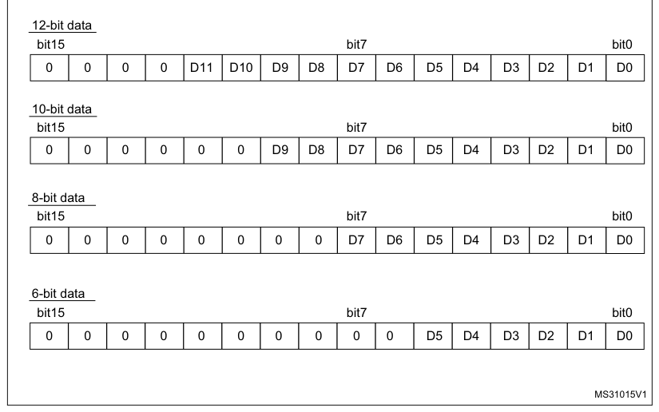

**Figure 116. Right alignment (offset enabled, signed value)**

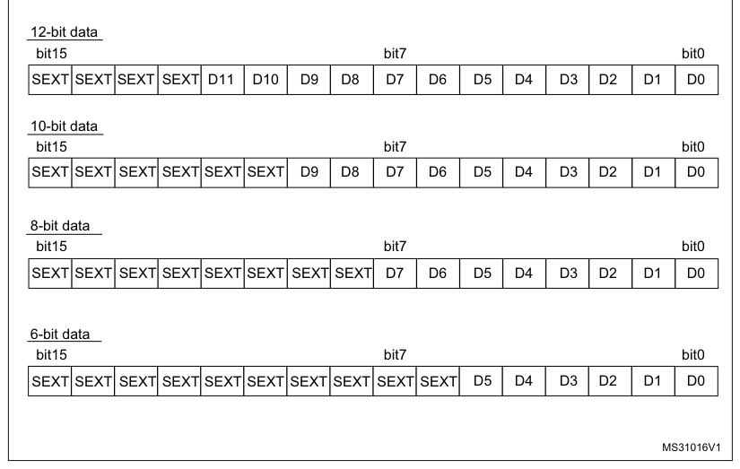

**Figure 117. Left alignment (offset disabled, unsigned value)**

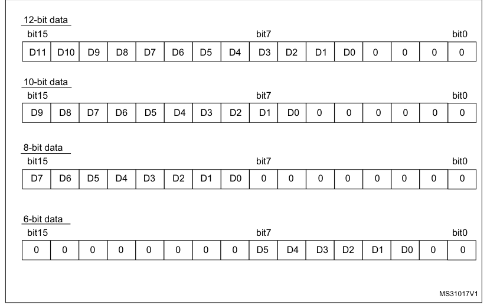

**Figure 118. Left alignment (offset enabled, signed value)**

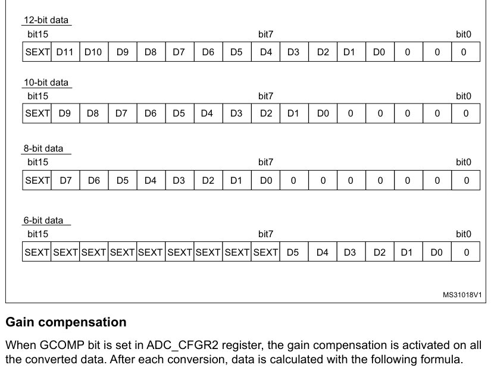

#### Gain compensation

When GCOMP bit is set in ADC_CFGR2 register, the gain compensation is activated on all the converted
data. After each conversion, data is calculated with the following formula.

> **Extracted layout**
>
> `DATA` · `=` · `DATA adc result` · `(` · `)` · `×` · `(` · `GCOMPCOEFF` · `)` · `⁄` · `4096`  

As GCOMPCOEFF can be programmed from 0 to 16383, the actual gain compensation factor can range from
0 to 3.999756.

Before storing the resulting data in RDATA or JDATAx registers, the LSB−1 value is evaluated to
round up the data and minimize the error.

The gain compensation is also effective for the oversampling. When the gain compensation is used for
the oversampling mode, the gain calculation is performed after the accumulation and right-shift
operations to minimize the power consumption (the gain calculation is done only once instead of at
each conversion).

#### Offset compensation

When SATEN bit is set in ADC_OFRy register during offset operation, data are unsigned. All the
offset data saturate at 0x000 (in 12-bit mode). When OFFSETPOS bit is set, the offset direction is
positive and the data saturate at 0xFFF (in 12-bit mode). In 8-bit mode, data saturate at 0x00 and
0xFF, respectively.

The analog watchdog comparison is performed on unsigned values, after offset and gain compensation.
For correct watchdog operation, the data after offset compensation must be in unsigned format (SATEN
bit set in ADC_OFRy register).

#### ADC overrun (OVR, OVRMOD)

The overrun flag (OSR) notifies of that a buffer overrun event occurred when the regular converted
data has not been read (by the CPU or the DMA) before new converted data became available.

The OVR flag is set if the EOC flag is still 1 at the time when a new conversion completes. An
interrupt can be generated if bit OVRIE = 1.

When an overrun condition occurs, the ADC is still operating and can continue converting unless the
software decides to stop and reset the sequence by setting bit ADSTP = 1.

OVR flag is cleared by software by writing 1 to it.

It is possible to configure if data is preserved or overwritten when an overrun event occurs by
programming the control bit OVRMOD:

- OVRMOD = 0: The overrun event preserves the data register from being overrun: the old data is
  maintained and the new conversion is discarded and lost. If OVR remains at 1, any further
  conversions occur but the result data is also discarded.
- OVRMOD = 1: The data register is overwritten with the last conversion result and the previous
  unread data is lost. If OVR remains at 1, any further conversions operate normally and the ADC_DR
  register always contains the latest converted data.

**Figure 119. Example of overrun (OVR)**

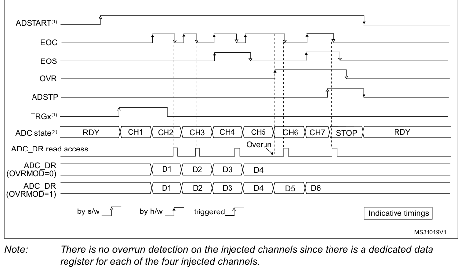

ADSTART(1)

EOC

EOS

OVR

ADSTP

TRGx(1)

> **Note:** There is no overrun detection on the injected channels since there is a dedicated data
> register for each of the four injected channels.

#### Managing a sequence of conversions without using the DMA

If the conversions are slow enough, the conversion sequence can be handled by the software. In this
case the software must use the EOC flag and its associated interrupt to handle each data. Each time
a conversion is complete, EOC is set and the ADC_DR register can be read. OVRMOD should be
configured to 0 to manage overrun events as an error.

#### Managing conversions without using the DMA and without overrun

It may be useful to let the ADC convert one or more channels without reading the data each time (if
there is an analog watchdog for instance). In this case, the OVRMOD bit must be configured to 1 and
OVR flag should be ignored by the software. An overrun event does not prevent the ADC from
continuing to convert and the ADC_DR register always contains the latest conversion.

#### Managing conversions using the DMA

Since converted channel values are stored into a unique data register, it is useful to use DMA for
conversion of more than one channel. This avoids the loss of the data already stored in the ADC_DR
register.

When the DMA mode is enabled (DMAEN bit set in the ADC_CFGR register in single ADC mode or MDMA
different from 00 in dual ADC mode), a DMA request is generated after each conversion of a channel.
This allows the transfer of the converted data from the ADC_DR register to the destination location
selected by the software.

Despite this, if an overrun occurs (OVR = 1) because the DMA could not serve the DMA transfer
request in time, the ADC stops generating DMA requests and the data corresponding to the new
conversion is not transferred by the DMA. Which means that all the data transferred to the RAM can
be considered as valid.

Depending on the configuration of OVRMOD bit, the data is either preserved or overwritten (refer to
Section: ADC overrun (OVR, OVRMOD)).

The DMA transfer requests are blocked until the software clears the OVR bit.

Two different DMA modes are proposed depending on the application use and are configured with bit
DMACFG of the ADC_CFGR register in single ADC mode, or with bit DMACFG of the ADC_CCR register in
dual ADC mode:

- DMA one shot mode (DMACFG = 0). This mode is suitable when the DMA is programmed to transfer a
  fixed number of data.
- DMA circular mode (DMACFG = 1) This mode is suitable when programming the DMA in circular mode.

#### DMA one shot mode (DMACFG = 0)

In this mode, the ADC generates a DMA transfer request each time a new conversion data is available
and stops generating DMA requests once the DMA has reached the last DMA transfer (when a transfer
complete interrupt occurs - refer to DMA section) even if a conversion has been started again.

When the DMA transfer is complete (all the transfers configured in the DMA controller have been
done):

- The content of the ADC data register is frozen.
- Any ongoing conversion is aborted with partial result discarded.
- No new DMA request is issued to the DMA controller. This avoids generating an overrun error if
  there are still conversions which are started.
- Scan sequence is stopped and reset.
- The DMA is stopped.

#### DMA circular mode (DMACFG = 1)

In this mode, the ADC generates a DMA transfer request each time a new conversion data is available
in the data register, even if the DMA has reached the last DMA transfer. This allows configuring the
DMA in circular mode to handle a continuous analog input data stream.

### 21.4.27 Dynamic low-power features

#### Auto-delayed conversion mode (AUTDLY)

The ADC implements an auto-delayed conversion mode controlled by the AUTDLY configuration bit.
Auto-delayed conversions are useful to simplify the software as well as to optimize performance of
an application clocked at low frequency where there would be risk of encountering an ADC overrun.

When AUTDLY = 1, a new conversion can start only if all the previous data of the same group has been
treated:

- For a regular conversion: once the ADC_DR register has been read or if the EOC bit has been
  cleared (see Figure 120).
- For an injected conversion: when the JEOS bit has been cleared (see Figure 121).

This is a way to automatically adapt the speed of the ADC to the speed of the system which reads the
data.

The delay is inserted after each regular conversion (whatever DISCEN = 0 or 1) and after each
sequence of injected conversions (whatever JDISCEN = 0 or 1).

> **Note:** There is no delay inserted between each conversions of the injected sequence, except after
> the last one.

During a conversion, a hardware trigger event (for the same group of conversions) occurring during
this delay is ignored.

> **Note:** This is not true for software triggers where it remains possible during this delay to set the
> bits ADSTART or JADSTART to restart a conversion: it is up to the software to read the data before
> launching a new conversion.

No delay is inserted between conversions of different groups (a regular conversion followed by an
injected conversion or conversely):

- If an injected trigger occurs during the automatic delay of a regular conversion, the injected
  conversion starts immediately (see Figure 121).
- Once the injected sequence is complete, the ADC waits for the delay (if not ended) of the previous
  regular conversion before launching a new regular conversion (see Figure 123).

The behavior is slightly different in auto-injected mode (JAUTO = 1) where a new regular conversion
can start only when the automatic delay of the previous injected sequence of conversion has ended
(when JEOS has been cleared). This is to ensure that the software can read all the data of a given
sequence before starting a new sequence (see Figure 124).

To stop a conversion in continuous auto-injection mode combined with autodelay mode (JAUTO = 1, CONT
= 1 and AUTDLY = 1), follow the following procedure:

1. Wait until JEOS = 1 (no more conversions are restarted)
2. Clear JEOS.
3. Set ADSTP.
4. Read the regular data.

If this procedure is not respected, a new regular sequence can restart if JEOS is cleared after
ADSTP has been set.

In AUTDLY mode, a hardware regular trigger event is ignored if it occurs during an already ongoing
regular sequence or during the delay that follows the last regular conversion of the sequence. It is
however considered pending if it occurs after this delay, even if it occurs during an injected
sequence of the delay that follows it. The conversion then starts at the end of the delay of the
injected sequence.

In AUTDLY mode, a hardware injected trigger event is ignored if it occurs during an already ongoing
injected sequence or during the delay that follows the last injected conversion of the sequence.

**Figure 120. AUTODLY = 1, regular conversion in continuous mode, software trigger**

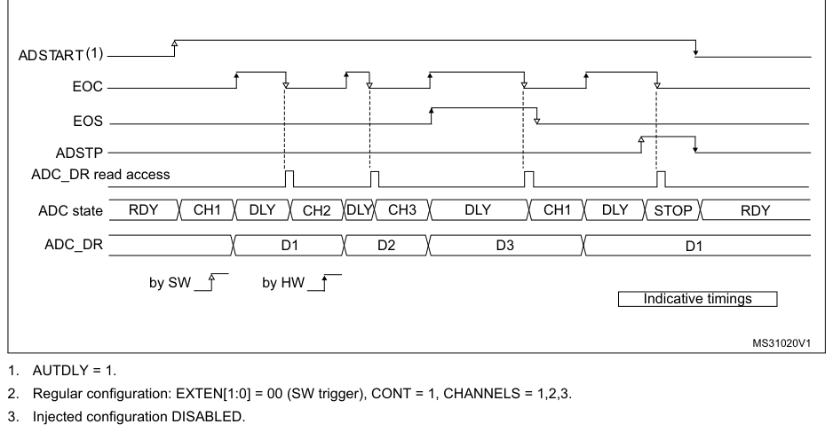

ADSTART(1)

EOC

EOS

ADSTP

ADC_DR read access

1. AUTDLY = 1.
2. Regular configuration: EXTEN[1:0] = 00 (SW trigger), CONT = 1, CHANNELS = 1,2,3.
3. Injected configuration DISABLED.

**Figure 121. AUTODLY = 1, regular HW conversions interrupted by injected conversions**

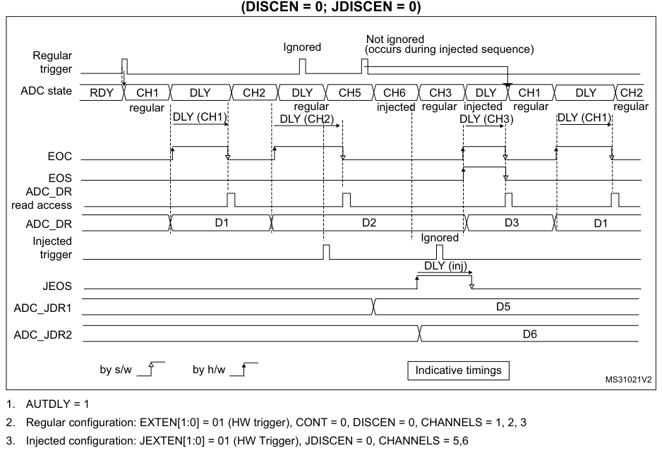

1. AUTDLY = 1
2. Regular configuration: EXTEN[1:0] = 01 (HW trigger), CONT = 0, DISCEN = 0, CHANNELS = 1, 2, 3
3. Injected configuration: JEXTEN[1:0] = 01 (HW Trigger), JDISCEN = 0, CHANNELS = 5,6

**Figure 122. AUTODLY = 1, regular HW conversions interrupted by injected conversions**

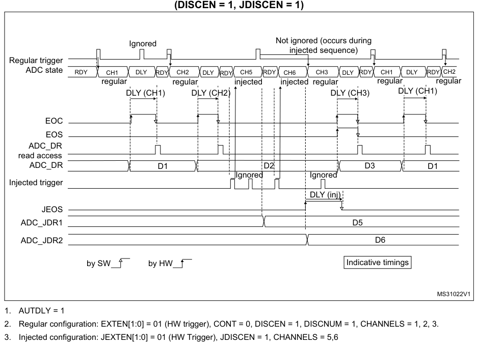

(DISCEN = 1, JDISCEN = 1)

Not ignored (occurs during

Ignored
injected sequence)

Regular trigger

ADC state

1. AUTDLY = 1
2. Regular configuration: EXTEN[1:0] = 01 (HW trigger), CONT = 0, DISCEN = 1, DISCNUM = 1, CHANNELS
   = 1, 2, 3.
3. Injected configuration: JEXTEN[1:0] = 01 (HW Trigger), JDISCEN = 1, CHANNELS = 5,6

**Figure 123. AUTODLY = 1, regular continuous conversions interrupted by injected conversions**

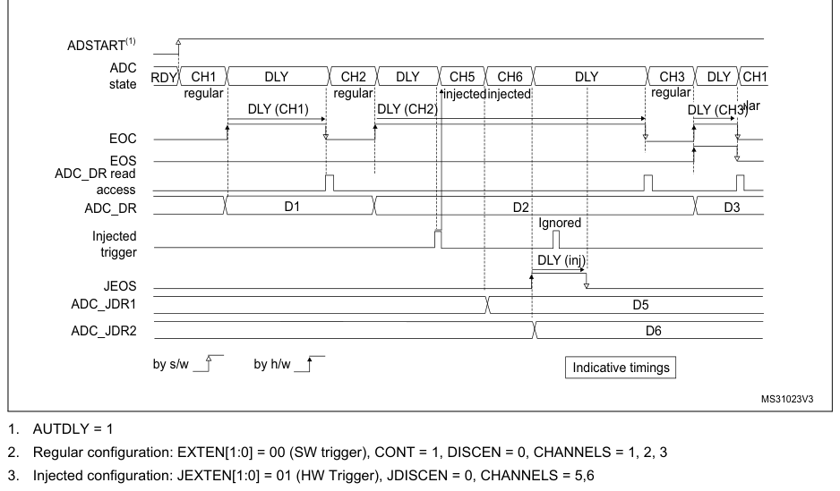

1. AUTDLY = 1
2. Regular configuration: EXTEN[1:0] = 00 (SW trigger), CONT = 1, DISCEN = 0, CHANNELS = 1, 2, 3
3. Injected configuration: JEXTEN[1:0] = 01 (HW Trigger), JDISCEN = 0, CHANNELS = 5,6

**Figure 124. AUTODLY = 1 in auto-injected mode (JAUTO = 1)**

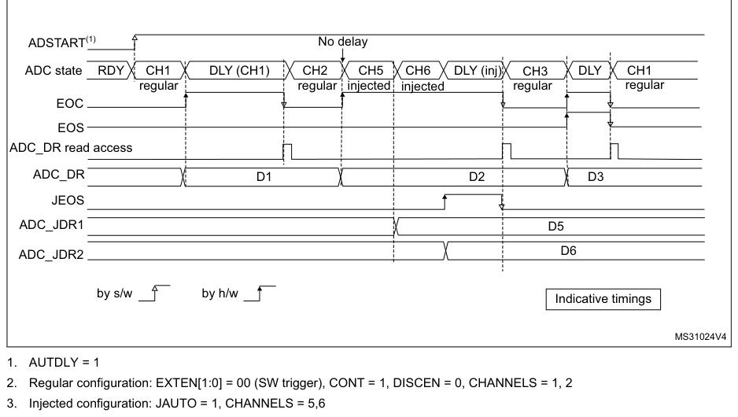

1. AUTDLY = 1
2. Regular configuration: EXTEN[1:0] = 00 (SW trigger), CONT = 1, DISCEN = 0, CHANNELS = 1, 2
3. Injected configuration: JAUTO = 1, CHANNELS = 5,6

### 21.4.28 Analog window watchdog (AWD1EN, JAWD1EN, AWD1SGL, AWD1CH, AWD2CH, AWD3CH, AWD_HTx, AWD_LTx, AWDx)

The three AWD analog watchdogs monitor whether some channels remain within a configured voltage
range (window).

**Figure 125. Analog watchdog guarded area**

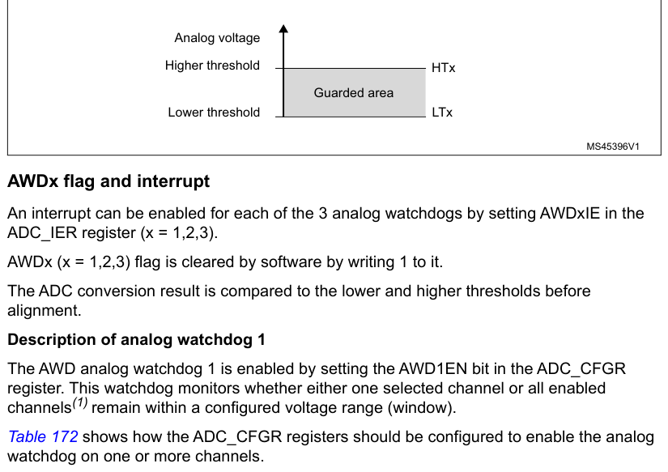

#### AWDx flag and interrupt

An interrupt can be enabled for each of the 3 analog watchdogs by setting AWDxIE in the ADC_IER
register (x = 1,2,3).

AWDx (x = 1,2,3) flag is cleared by software by writing 1 to it.

The ADC conversion result is compared to the lower and higher thresholds before alignment.

Description of analog watchdog 1

The AWD analog watchdog 1 is enabled by setting the AWD1EN bit in the ADC_CFGR register. This
watchdog monitors whether either one selected channel or all enabled channels(1) remain within a
configured voltage range (window).

Table 172 shows how the ADC_CFGR registers should be configured to enable the analog watchdog on one
or more channels.

**Table 172. Analog watchdog channel selection**

| Source row | Column 1 | Column 2 | Column 3 | Column 4 |
| ---: | --- | --- | --- | --- |
| 1 | `Channels guarded by the analog` |  |  |  |
| 2 | `AWD1SGL bit` | `AWD1EN bit` | `JAWD1EN bit` |  |
| 3 | `watchdog` |  |  |  |
| 4 | `None` | `x` | `0` | `0` |
| 5 | `All injected channels` | `0` | `0` | `1` |
| 6 | `All regular channels` | `0` | `1` | `0` |
| 7 | `All regular and injected channels` | `0` | `1` | `1` |
| 8 | `Single(1) injected channel` | `1` | `0` | `1` |
| 9 | `Single(1) regular channel` | `1` | `1` | `0` |
| 10 | `Single(1) regular or injected channel` | `1` | `1` | `1` |

1. Selected by the AWD1CH[4:0] bits. The channels must also be programmed to be converted in the
   appropriate regular or injected sequence.

The AWD1 analog watchdog status bit is set if the analog voltage converted by the ADC is below a
lower threshold or above a higher threshold.

These thresholds are programmed in bits HT1[11:0] and LT1[11:0] of the ADC_TR1 register for the
analog watchdog 1. When converting data with a resolution of less than 12 bits (according to bits
RES[1:0]), the LSB of the programmed thresholds must be kept cleared because the internal comparison
is always performed on the full 12-bit raw converted data (left aligned).

Table 173 describes how the comparison is performed for all the possible resolutions for analog
watchdog 1.

**Table 173. Analog watchdog 1 comparison**

| Source row | Column 1 | Column 2 | Column 3 |
| ---: | --- | --- | --- |
| 1 | `Analog watchdog comparison` |  |  |
| 2 | `Resolution(` | `between:` |  |
| 3 | `bit` | `Comments` |  |
| 4 | `RES[1:0])` | `Raw converted data,` |  |
| 5 | `Thresholds` |  |  |
| 6 | `left aligned(1)` |  |  |
| 7 | `LT1[11:0] and` |  |  |
| 8 | `00: 12-bit` | `DATA[11:0]` | `-` |
| 9 | `HT1[11:0]` |  |  |
| 10 | `LT1[11:0] and` | `User must configure LT1[1:0] and HT1[1:0]` |  |
| 11 | `01: 10-bit` | `DATA[11:2],00` |  |
| 12 | `HT1[11:0]` | `to 00` |  |
| 13 | `LT1[11:0] and` | `User must configure LT1[3:0] and HT1[3:0]` |  |
| 14 | `10: 8-bit` | `DATA[11:4],0000` |  |
| 15 | `HT1[11:0]` | `to 0000` |  |
| 16 | `LT1[11:0] and` | `User must configure LT1[5:0] and HT1[5:0]` |  |
| 17 | `11: 6-bit` | `DATA[11:6],000000` |  |
| 18 | `HT1[11:0]` | `to 000000` |  |

1. Refer to Section: Gain compensation for additional details on analog watchdog comparison.

Analog watchdog filter for watchdog 1

When an ADC is configured with only one input channel (selecting several channels in Scan mode not
allowed), a valid ADC conversion data filter can be configured:

- When converted data belong to the interval defined in ADC_TR1, the AWD1 flag remains cleared.
- If data are out-of-range a number of times higher than the value specified in AWDFILT bit of
  ADC_TR1, the AWD1 flag is set an the corresponding interrupt is issued.

Description of analog watchdog 2 and 3

The second and third analog watchdogs are more flexible and can guard several selected channels by
programming the corresponding bits in AWDxCH[18:0] (x=2,3).

The corresponding watchdog is enabled when any bit of AWDxCH[18:0] (x=2,3) is set.

They are limited to a resolution of 8 bits and only the 8 MSBs of the thresholds can be programmed
into HTx[7:0] and LTx[7:0]. Table 174 describes how the comparison is performed for all the possible
resolutions.

**Table 174. Analog watchdog 2 and 3 comparison**

| Source row | Column 1 | Column 2 | Column 3 | Column 4 |
| ---: | --- | --- | --- | --- |
| 1 | `Analog watchdog comparison between:` |  |  |  |
| 2 | `Resolution` |  |  |  |
| 3 | `Comments` |  |  |  |
| 4 | `(bits RES[1:0])` | `Raw converted data,` |  |  |
| 5 | `Thresholds` |  |  |  |
| 6 | `left aligned(1)` |  |  |  |
| 7 | `00: 12-bit` | `DATA[11:4]` | `LTx[7:0] and HTx[7:0]` | `DATA[3:0] are not relevant for the comparison` |
| 8 | `01: 10-bit` | `DATA[11:4]` | `LTx[7:0] and HTx[7:0]` | `DATA[3:2] are not relevant for the comparison` |
| 9 | `10: 8-bit` | `DATA[11:4]` | `LTx[7:0] and HTx[7:0]` | `-` |
| 10 | `11: 6-bit` | `DATA[11:6],00` | `LTx[7:0] and HTx[7:0]` | `User must configure LTx[1:0] and HTx[1:0] to 00` |

1. Refer to Section: Gain compensation for additional details on analog watchdog comparison.

#### ADCy_AWDx_OUT signal output generation

Each analog watchdog is associated to an internal hardware signal ADCy_AWDx_OUT (y=ADC number,
x=watchdog number) which is directly connected to the ETR input (external trigger) of some on-chip
timers. Refer to the on-chip timers section to understand how to select the ADCy_AWDx_OUT signal as
ETR.

ADCy_AWDx_OUT is activated when the associated analog watchdog is enabled:

- ADCy_AWDx_OUT is set when a guarded conversion is outside the programmed thresholds.
- ADCy_AWDx_OUT is reset after the end of the next guarded conversion which is inside the programmed
  thresholds (It remains at 1 if the next guarded conversions are still outside the programmed
  thresholds).
- ADCy_AWDx_OUT is also reset when disabling the ADC (when setting ADDIS = 1). Note that stopping
  regular or injected conversions (setting ADSTP = 1 or JADSTP = 1) has no influence on the
  generation of ADCy_AWDx_OUT.

> **Note:** AWDx flag is set by hardware and reset by software: AWDx flag has no influence on the
> generation of ADCy_AWDx_OUT (ex: ADCy_AWDx_OUT can toggle while AWDx flag remains at 1 if the
> software did not clear the flag).

**Figure 126. ADCy_AWDx_OUT signal generation (on all regular channels)**

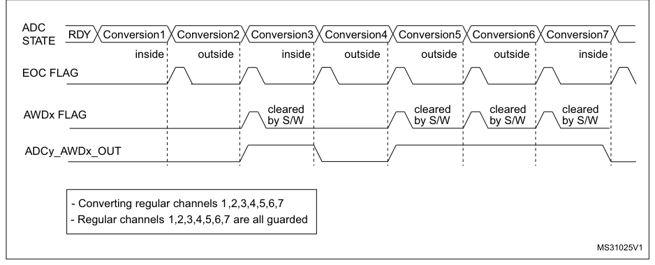

- Converting regular channels 1,2,3,4,5,6,7
- Regular channels 1,2,3,4,5,6,7 are all guarded

MS31025V1

**Figure 127. ADCy_AWDx_OUT signal generation (AWDx flag not cleared by software)**

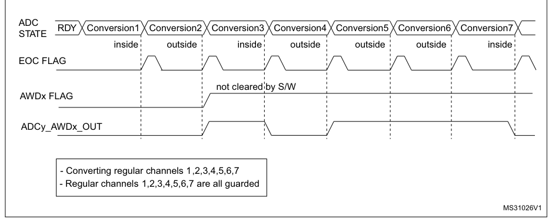

- Converting regular channels 1,2,3,4,5,6,7
- Regular channels 1,2,3,4,5,6,7 are all guarded

MS31026V1

**Figure 128. ADCy_AWDx_OUT signal generation (on a single regular channel)**

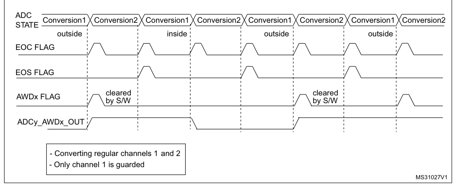

- Converting regular channels 1 and 2
- Only channel 1 is guarded

MS31027V1

**Figure 129. ADCy_AWDx_OUT signal generation (on all injected channels)**

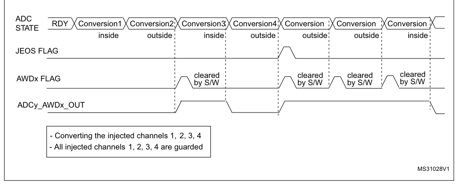

- Converting the injected channels 1, 2, 3, 4
- All injected channels 1, 2, 3, 4 are guarded

MS31028V1

#### Analog watchdog threshold control

LTx[11:0] and HTx[11:0] can be changed when an analog-to-digital conversion is ongoing (that is
between the start of conversion and the end of conversion of the ADC internal state). If LTx[11:0]
and HTx[11:0] are updated during the ADC conversion of the ADC guarded channel, the watchdog
function is masked for this conversion. This masking is removed at the next start of conversion,
resulting in a analog watchdog thresholds to be applied from the next ADC conversion. The analog
watchdog comparison is performed at each end of conversion. If the current ADC data is out of the
new interval, no interrupt and AWDx_OUT signal are issued. The Interrupt and the AWD generation only
happen at the end of the conversion which started after the threshold update. If AWD_xOUT is already
asserted, programming the new thresholds does not deassert the AWDx_OUT signal.

#### Analog watchdog with gain and offset compensation

When gain and offset compensation are enabled, the analog watchdog compares the threshold after the
compensated data.

> **Note:** When the offset compensation is enabled (OFFSETy_EN set in ADC_OFRy register), data
> overflow or underflow can result in a wrong watchdog result. When the saturation is enabled (SATEN
> set in ADC_OFRy), the watchdog provides a correct result. However this prevents from using the
> signed data format.

### 21.4.29 Oversampler

The oversampling unit performs data pre-processing to offload the CPU. It is able to handle multiple
conversions and average them into a single data with increased data width, up to 16-bit.

It provides a result with the following form, where N and M can be adjusted:

n = N – 1

1

> **Extracted layout**
>
> `Result` · `=` · `----` · `×` · `∑` · `Conversion tn` · `()`  
> `M`  
> `n = 0`  

It allows to perform by hardware the following functions: averaging, data rate reduction, SNR
improvement, basic filtering.

The oversampling ratio N is defined using the OVFS[2:0] bits in the ADC_CFGR2 register, and can
range from 2x to 256x. The division coefficient M consists of a right bit shift up to 8 bits, and is
defined using the OVSS[3:0] bits in the ADC_CFGR2 register.

The summation unit can yield a result up to 20 bits (256x 12-bit results), which is first shifted
right. It is then truncated to the 16 least significant bits, rounded to the nearest value using the
least significant bits left apart by the shifting, before being finally transferred into the ADC_DR
data register.

> **Note:** If the intermediary result after the shifting exceeds 16-bit, the result is truncated as is,
> without saturation.

**Figure 130. 20-bit to 16-bit result truncation**

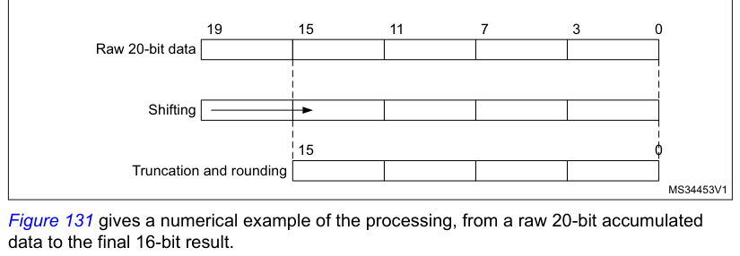

Figure 131 gives a numerical example of the processing, from a raw 20-bit accumulated data to the
final 16-bit result.

**Figure 131. Numerical example with 5-bit shift and rounding**

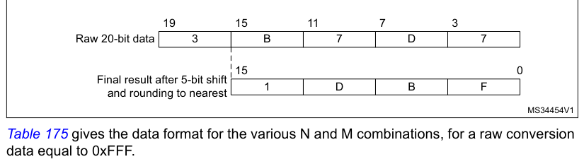

Table 175 gives the data format for the various N and M combinations, for a raw conversion data
equal to 0xFFF.

**Table 175. Maximum output results versus N and M (gray cells indicate truncation)**

| Source row | Column 1 | Column 2 | Column 3 | Column 4 | Column 5 | Column 6 | Column 7 | Column 8 | Column 9 | Column 10 | Column 11 |
| ---: | --- | --- | --- | --- | --- | --- | --- | --- | --- | --- | --- |
| 1 | `No-shift` | `1-bit` | `2-bit` | `3-bit` | `4-bit` | `5-bit` | `6-bit` | `7-bit` | `8-bit` |  |  |
| 2 | `Over` |  |  |  |  |  |  |  |  |  |  |
| 3 | `Max` | `shift` | `shift` | `shift` | `shift` | `shift` | `shift` | `shift` | `shift` |  |  |
| 4 | `sampling` |  |  |  |  |  |  |  |  |  |  |
| 5 | `Raw data` | `OVSS =` | `OVSS =` | `OVSS =` | `OVSS =` | `OVSS =` | `OVSS =` | `OVSS =` | `OVSS =` | `OVSS =` |  |
| 6 | `ratio` |  |  |  |  |  |  |  |  |  |  |
| 7 | `0000` | `0001` | `0010` | `0011` | `0100` | `0101` | `0110` | `0111` | `1000` |  |  |
| 8 | `2x` | `0x1FFE` | `0x1FFE` | `0x0FFF` | `0x0800` | `0x0400` | `0x0200` | `0x0100` | `0x0080` | `0x0040` | `0x020` |
| 9 | `4x` | `0x3FFC` | `0x3FFC` | `0x1FFE` | `0x0FFF` | `0x0800` | `0x0400` | `0x0200` | `0x0100` | `0x0080` | `0x0040` |
| 10 | `8x` | `0x7FF8` | `0x7FF8` | `0x3FFC` | `0x1FFE` | `0x0FFF` | `0x0800` | `0x0400` | `0x0200` | `0x0100` | `0x0080` |
| 11 | `16x` | `0xFFF0` | `0xFFF0` | `0x7FF8` | `0x3FFC` | `0x1FFE` | `0x0FFF` | `0x0800` | `0x0400` | `0x0200` | `0x0100` |
| 12 | `32x` | `0x1FFE0` | `0xFFE0` | `0xFFF0` | `0x7FF8` | `0x3FFC` | `0x1FFE` | `0x0FFF` | `0x0800` | `0x0400` | `0x0200` |
| 13 | `64x` | `0x3FFC0` | `0xFFC0` | `0xFFE0` | `0xFFF0` | `0x7FF8` | `0x3FFC` | `0x1FFE` | `0x0FFF` | `0x0800` | `0x0400` |
| 14 | `128x` | `0x7FF80` | `0xFF80` | `0xFFC0` | `0xFFE0` | `0xFFF0` | `0x7FF8` | `0x3FFC` | `0x1FFE` | `0x0FFF` | `0x0800` |
| 15 | `256x` | `0xFFF00` | `0xFF00` | `0xFF80` | `0xFFC0` | `0xFFE0` | `0xFFF0` | `0x7FF8` | `0x3FFC` | `0x1FFE` | `0x0FFF` |

There are no changes for conversion timings in oversampled mode: the sample time is maintained equal
during the whole oversampling sequence. A new data is provided every N
conversions, with an equivalent delay equal to N x TCONV = N x (tSMPL \+ tSAR). The flags are set as
follows:

- The end of the sampling phase (EOSMP) is set after each sampling phase
- The end of conversion (EOC) occurs once every N conversions, when the oversampled result is
  available
- The end of sequence (EOS) occurs once the sequence of oversampled data is completed (i.e. after N
  x sequence length conversions total)

#### ADC operating modes supported when oversampling (single ADC mode)

In oversampling mode, most of the ADC operating modes are maintained:

- Single or continuous mode conversions
- ADC conversions start either by software or with triggers
- ADC stop during a conversion (abort)
- Data read via CPU or DMA with overrun detection
- Low-power modes (AUTDLY)
- Programmable resolution: in this case, the reduced conversion values (as per RES[1:0] bits in
  ADC_CFGR1 register) are accumulated, truncated, rounded and shifted in the same way as 12-bit
  conversions are

> **Note:** The alignment mode is not available when working with oversampled data. The ALIGN bit in

ADC_CFGR1 is ignored and the data are always provided right-aligned.

Offset correction is not supported in oversampling mode. When ROVSE and/or JOVSE bit is set, the
value of the OFFSETy_EN bit in ADC_OFRy register is ignored (considered as reset).

#### Analog watchdog

The analog watchdog functionality is maintained, with the following difference:

- The RES[1:0] bits are ignored, comparison is always done using the full 12-bit values HT[11:0] and
  LT[11:0]
- the comparison is performed on the most significant 12-bit of the 16-bit oversampled results
  ADC_DR[15:4]

> **Note:** Care must be taken when using high shifting values, since this reduces the comparison
> range. For instance, if the oversampled result is shifted by 4 bits, thus yielding a 12-bit data
> right-aligned, the effective analog watchdog comparison can only be performed on 8 bits. The
> comparison is done between ADC_DR[11:4] and HT[0:7] / LT[[0:7], and HT[11:8] / LT[11:8] must be kept
> reset.

#### Triggered mode

The averager can also be used for basic filtering purpose. Although not a very powerful filter (slow
roll-off and limited stop band attenuation), it can be used as a notch filter to reject constant
parasitic frequencies (typically coming from the mains or from a switched mode power supply). For
this purpose, a specific discontinuous mode can be enabled with TROVS bit in ADC_CFGR2, to be able
to have an oversampling frequency defined by a user and independent from the conversion time itself.

Figure 132 below shows how conversions are started in response to triggers during discontinuous
mode.

If the TROVS bit is set, the content of the DISCEN bit is ignored and considered as 1.

**Figure 132. Triggered regular oversampling mode (TROVS bit = 1)**

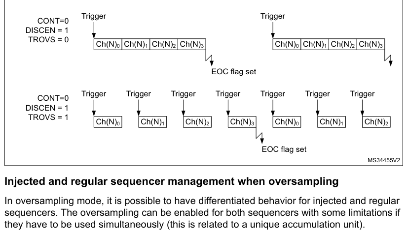

#### Injected and regular sequencer management when oversampling

In oversampling mode, it is possible to have differentiated behavior for injected and regular
sequencers. The oversampling can be enabled for both sequencers with some limitations if they have
to be used simultaneously (this is related to a unique accumulation unit).

#### Oversampling regular channels only

The regular oversampling mode bit ROVSM defines how the regular oversampling sequence is resumed if
it is interrupted by injected conversion:

- In continued mode, the accumulation restarts from the last valid data (prior to the conversion
  abort request due to the injected trigger). This ensures that oversampling is complete whatever
  the injection frequency (providing at least one regular conversion can be complete between
  triggers);
- In resumed mode, the accumulation restarts from 0 (previous conversion results are ignored). This
  mode allows to guarantee that all data used for oversampling were converted back-to-back within a
  single timeslot. Care must be taken to have a injection trigger period above the oversampling
  period length. If this condition is not respected, the oversampling cannot be complete and the
  regular sequencer is blocked.

Figure 133 gives examples for a 4x oversampling ratio.

**Figure 133. Regular oversampling modes (4x ratio)**

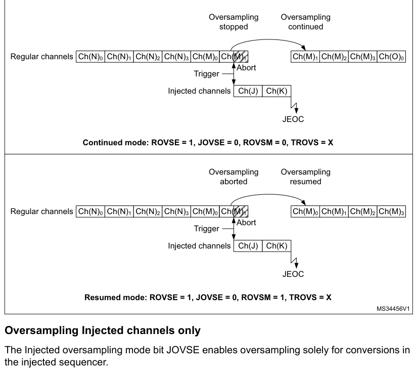

#### Oversampling Injected channels only

The Injected oversampling mode bit JOVSE enables oversampling solely for conversions in the injected
sequencer.

#### Oversampling regular and Injected channels

It is possible to have both ROVSE and JOVSE bits set. In this case, the regular oversampling mode is
forced to resumed mode (ROVSM bit ignored), as represented on Figure 134 below.

**Figure 134. Regular and injected oversampling modes used simultaneously**

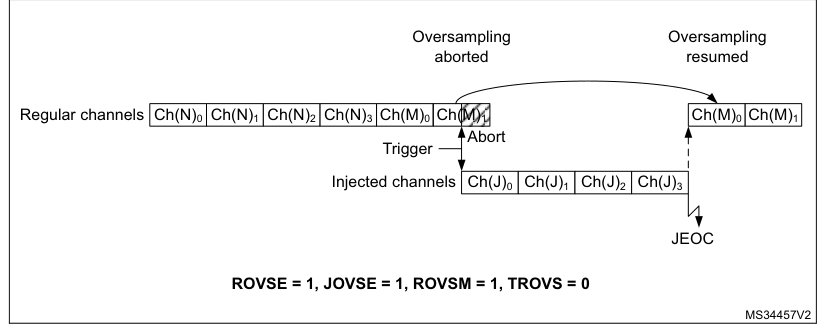

#### Triggered regular oversampling with injected conversions

It is possible to have triggered regular mode with injected conversions. In this case, the injected
mode oversampling mode must be disabled, and the ROVSM bit is ignored (resumed mode is forced). The
JOVSE bit must be reset. The behavior is represented on Figure 135 below.

**Figure 135. Triggered regular oversampling with injection**

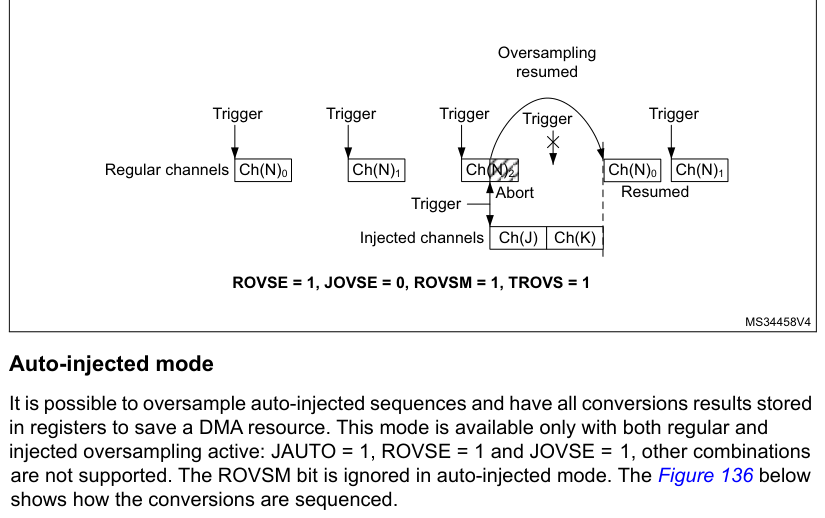

#### Auto-injected mode

It is possible to oversample auto-injected sequences and have all conversions results stored in
registers to save a DMA resource. This mode is available only with both regular and injected
oversampling active: JAUTO = 1, ROVSE = 1 and JOVSE = 1, other combinations are not supported. The
ROVSM bit is ignored in auto-injected mode. The Figure 136 below shows how the conversions are
sequenced.

**Figure 136. Oversampling in auto-injected mode**

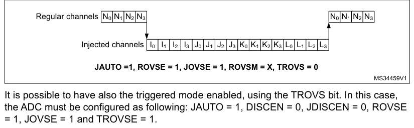

It is possible to have also the triggered mode enabled, using the TROVS bit. In this case, the ADC
must be configured as following: JAUTO = 1, DISCEN = 0, JDISCEN = 0, ROVSE = 1, JOVSE = 1 and TROVSE
= 1.

#### Dual ADC modes supported when oversampling

It is possible to have oversampling enabled when working in dual ADC configuration, for the injected
simultaneous mode and regular simultaneous mode. In this case, the two ADCs must be programmed with
the very same settings (including oversampling).

All other dual ADC modes are not supported when either regular or injected oversampling is enabled
(ROVSE = 1 or JOVSE = 1).

#### Combined modes summary

The Table 176 below summarizes all combinations, including modes not supported.

**Table 176. Oversampler operating modes summary**

| Source row | Column 1 | Column 2 | Column 3 | Column 4 | Column 5 |
| ---: | --- | --- | --- | --- | --- |
| 1 | `Oversampler` |  |  |  |  |
| 2 | `mode` |  |  |  |  |
| 3 | `Regular` | `Injected` | `Triggered` |  |  |
| 4 | `Oversampling` | `Oversampling` | `ROVSM` | `Regular mode` | `Comment` |
| 5 | `ROVSE` | `JOVSE` | `0 = continued` | `TROVS` |  |
| 6 | `1 = resumed` |  |  |  |  |
| 7 | `1` | `0` | `0` | `0` | `Regular continued mode` |
| 8 | `1` | `0` | `0` | `1` | `Not supported` |
| 9 | `1` | `0` | `1` | `0` | `Regular resumed mode` |
| 10 | `Triggered regular resumed` |  |  |  |  |
| 11 | `1` | `0` | `1` | `1` |  |
| 12 | `mode` |  |  |  |  |
| 13 | `1` | `1` | `0` | `X` | `Not supported` |
| 14 | `Injected and regular resumed` |  |  |  |  |
| 15 | `1` | `1` | `1` | `0` |  |
| 16 | `mode` |  |  |  |  |
| 17 | `1` | `1` | `1` | `1` | `Not supported` |
| 18 | `0` | `1` | `X` | `X` | `Injected oversampling` |

### 21.4.30 Dual ADC modes

Dual ADC modes can be used in devices with two ADCs or more (see Figure 137).

In dual ADC mode the start of conversion is triggered alternately or simultaneously by the ADCx
master to the ADC slave, depending on the mode selected by the bits DUAL[4:0] in the ADCx_CCR
register.

Four possible modes are implemented:

- Injected simultaneous mode
- Regular simultaneous mode
- Interleaved mode
- Alternate trigger mode

It is also possible to use these modes combined in the following ways:

- Injected simultaneous mode \+ Regular simultaneous mode
- Regular simultaneous mode \+ Alternate trigger mode
- Injected simultaneous mode \+ Interleaved mode

In dual ADC mode (when bits DUAL[4:0] in ADCx_CCR register are not equal to zero), the bits CONT,
AUTDLY, DISCEN, DISCNUM[2:0], JDISCEN, JQM, JAUTO of the ADC_CFGR register are shared between the
master and slave ADC: the bits in the slave ADC are always equal to the corresponding bits of the
master ADC.

To start a conversion in dual mode, the user must program the bits EXTEN[1:0], EXTSEL, JEXTEN[1:0],
JEXTSEL of the master ADC only, to configure a software or hardware trigger, and a regular or
injected trigger. (the bits EXTEN[1:0] and JEXTEN[1:0] of the slave ADC are don’t care).

In regular simultaneous or interleaved modes: once the user sets bit ADSTART or bit ADSTP of the
master ADC, the corresponding bit of the slave ADC is also automatically set. However, bit ADSTART
or bit ADSTP of the slave ADC is not necessary cleared at the same time as the master ADC bit.

In injected simultaneous or alternate trigger modes: once the user sets bit JADSTART or bit JADSTP
of the master ADC, the corresponding bit of the slave ADC is also automatically set. However, bit
JADSTART or bit JADSTP of the slave ADC is not necessary cleared at the same time as the master ADC
bit.

In dual ADC mode, the converted data of the master and slave ADC can be read in parallel, by reading
the ADC common data register (ADCx_CDR). The status bits can be also read in parallel by reading the
dual-mode status register (ADCx_CSR).

**Figure 137. Dual ADC block diagram(1)**

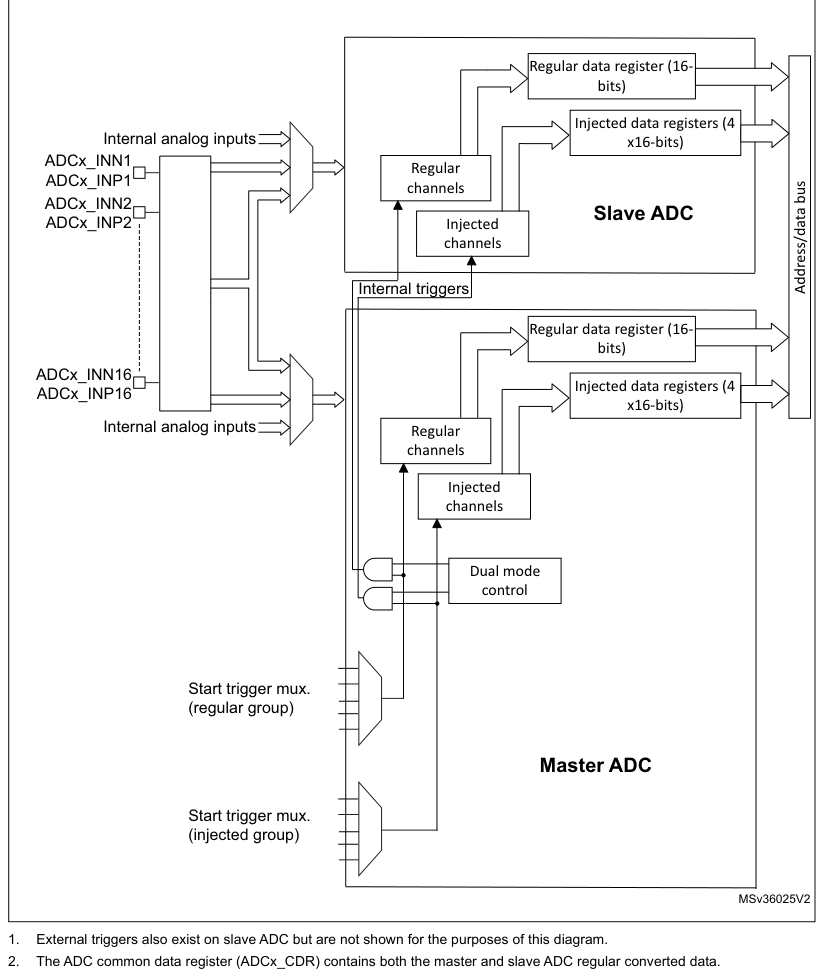

1. External triggers also exist on slave ADC but are not shown for the purposes of this diagram.
2. The ADC common data register (ADCx_CDR) contains both the master and slave ADC regular converted
   data.

#### Injected simultaneous mode

This mode is selected by programming bits DUAL[4:0] = 00101

This mode converts an injected group of channels. The external trigger source comes from the
injected group multiplexer of the master ADC (selected by the JEXTSEL bits in the ADC_JSQR
register).

> **Note:** Do not convert the same channel on the two ADCs (no overlapping sampling times for the
> two ADCs when converting the same channel).

In simultaneous mode, one must convert sequences with the same length or ensure that the interval
between triggers is longer than the longer of the 2 sequences. Otherwise, the ADC with the shortest
sequence may restart while the ADC with the longest sequence is completing the previous conversions.

Regular conversions can be performed on one or all ADCs. In that case, they are independent of each
other and are interrupted when an injected event occurs. They are resumed at the end of the injected
conversion group.

- At the end of injected sequence of conversion event (JEOS) on the master ADC, the converted data
  is stored into the master ADC_JDRy registers and a JEOS interrupt is generated (if enabled)
- At the end of injected sequence of conversion event (JEOS) on the slave ADC, the converted data is
  stored into the slave ADC_JDRy registers and a JEOS interrupt is generated (if enabled)
- If the duration of the master injected sequence is equal to the duration of the slave injected one
  (like in Figure 138), it is possible for the software to enable only one of the two JEOS interrupt
  (ex: master JEOS) and read both converted data (from master ADC_JDRy and slave ADC_JDRy
  registers).

**Figure 138. Injected simultaneous mode on 4 channels: dual ADC mode**

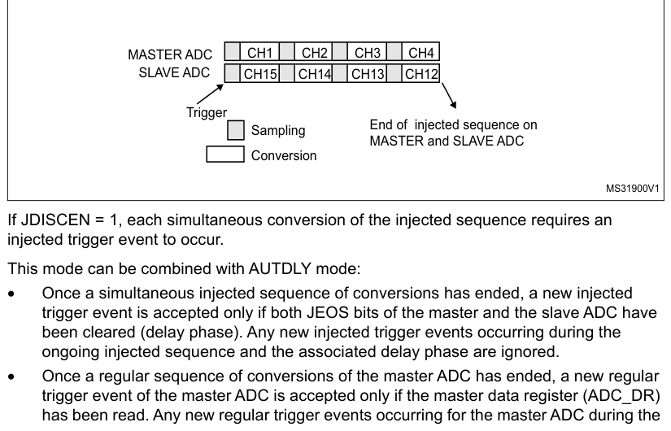

If JDISCEN = 1, each simultaneous conversion of the injected sequence requires an injected trigger
event to occur.

This mode can be combined with AUTDLY mode:

- Once a simultaneous injected sequence of conversions has ended, a new injected trigger event is
  accepted only if both JEOS bits of the master and the slave ADC have been cleared (delay phase).
  Any new injected trigger events occurring during the ongoing injected sequence and the associated
  delay phase are ignored.
- Once a regular sequence of conversions of the master ADC has ended, a new regular trigger event of
  the master ADC is accepted only if the master data register (ADC_DR) has been read. Any new
  regular trigger events occurring for the master ADC during the
  ongoing regular sequence and the associated delay phases are ignored. There is the same behavior for
  regular sequences occurring on the slave ADC.

#### Regular simultaneous mode with independent injected

This mode is selected by programming bits DUAL[4:0] = 00110.

This mode is performed on a regular group of channels. The external trigger source comes from the
regular group multiplexer of the master ADC (selected by the EXTSEL bits in the ADC_CFGR register).
A simultaneous trigger is provided to the slave ADC.

In this mode, independent injected conversions are supported. An injection request (either on master
or on the slave) aborts the current simultaneous conversions, which are restarted once the injected
conversion is completed.

> **Note:** Do not convert the same channel on the two ADCs (no overlapping sampling times for the
> two ADCs when converting the same channel).

In regular simultaneous mode, one must convert sequences with the same length or ensure that the
interval between triggers is longer than the longer conversion time of the 2 sequences. Otherwise,
the ADC with the shortest sequence may restart while the ADC with the longest sequence is completing
the previous conversions.

Software is notified by interrupts when it can read the data:

- At the end of each conversion event (EOC) on the master ADC, a master EOC interrupt is generated
  (if EOCIE is enabled) and software can read the ADC_DR of the master ADC.
- At the end of each conversion event (EOC) on the slave ADC, a slave EOC interrupt is generated (if
  EOCIE is enabled) and software can read the ADC_DR of the slave ADC.
- If the duration of the master regular sequence is equal to the duration of the slave one (like in
  Figure 139), it is possible for the software to enable only one of the two EOC interrupt (ex:
  master EOC) and read both converted data from the Common Data register (ADCx_CDR).

It is also possible to read the regular data using the DMA. Two methods are possible:

- Using two DMA channels (one for the master and one for the slave). In this case bits MDMA[1:0]
  must be kept cleared.
  - Configure the DMA master ADC channel to read ADC_DR from the master. DMA requests are generated
    at each EOC event of the master ADC.
  - Configure the DMA slave ADC channel to read ADC_DR from the slave. DMA requests are generated at
    each EOC event of the slave ADC.
- Using MDMA mode, which leaves one DMA channel free for other uses:
  - Configure MDMA[1:0] = 10 or 11 (depending on resolution).
  - A single DMA channel is used (the one of the master). Configure the DMA master ADC channel to
    read the common ADC register (ADCx_CDR)
  - A single DMA request is generated each time both master and slave EOC events have occurred. At
    that time, the slave ADC converted data is available in the upper half-word of the ADCx_CDR
    32-bit register and the master ADC converted data is available in the lower half-word of
    ADCx_CDR register.
  - Both EOC flags are cleared when the DMA reads the ADCx_CDR register.

> **Note:** In MDMA mode (MDMA[1:0] = 10 or 11), the user must program the same number of
> conversions in the master’s sequence as in the slave’s sequence. Otherwise, the remaining
> conversions does not generate a DMA request.

**Figure 139. Regular simultaneous mode on 16 channels: dual ADC mode**

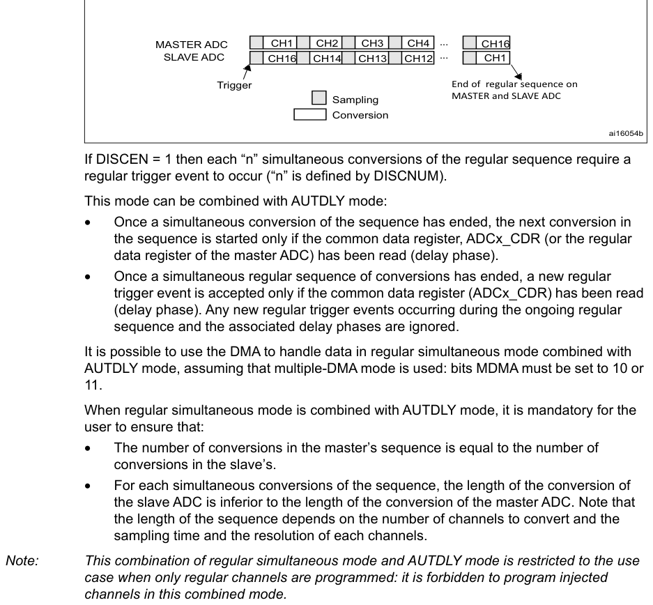

If DISCEN = 1 then each “n” simultaneous conversions of the regular sequence require a regular
trigger event to occur (“n” is defined by DISCNUM).

This mode can be combined with AUTDLY mode:

- Once a simultaneous conversion of the sequence has ended, the next conversion in the sequence is
  started only if the common data register, ADCx_CDR (or the regular data register of the master
  ADC) has been read (delay phase).
- Once a simultaneous regular sequence of conversions has ended, a new regular trigger event is
  accepted only if the common data register (ADCx_CDR) has been read (delay phase). Any new regular
  trigger events occurring during the ongoing regular sequence and the associated delay phases are
  ignored.

It is possible to use the DMA to handle data in regular simultaneous mode combined with AUTDLY mode,
assuming that multiple-DMA mode is used: bits MDMA must be set to 10 or 11.

When regular simultaneous mode is combined with AUTDLY mode, it is mandatory for the user to ensure
that:

- The number of conversions in the master’s sequence is equal to the number of conversions in the
  slave’s.
- For each simultaneous conversions of the sequence, the length of the conversion of the slave ADC
  is inferior to the length of the conversion of the master ADC. Note that the length of the
  sequence depends on the number of channels to convert and the sampling time and the resolution of
  each channels.

> **Note:** This combination of regular simultaneous mode and AUTDLY mode is restricted to the use
> case when only regular channels are programmed: it is forbidden to program injected channels in this
> combined mode.

#### Interleaved mode with independent injected

This mode is selected by programming bits DUAL[4:0] = 00111.

This mode can be started only on a regular group (usually one channel). The external trigger source
comes from the regular channel multiplexer of the master ADC.

After an external trigger occurs:

- The master ADC starts immediately.
- The slave ADC starts after a delay of several ADC clock cycles after the sampling phase of the
  master ADC has complete.

The minimum delay which separates two conversions in interleaved mode is configured in the DELAY
bits in the ADCx_CCR register. This delay starts counting one half cycle after the end of the
sampling phase of the master conversion. This way, an ADC cannot start a
conversion if the complementary ADC is still sampling its input (only one ADC can sample the input
signal at a given time).

- The minimum possible DELAY is 1 to ensure that there is at least one cycle time between the
  opening of the analog switch of the master ADC sampling phase and the closing of the analog switch
  of the slave ADC sampling phase.
- The maximum DELAY is equal to the number of cycles corresponding to the selected resolution.
  However the user must properly calculate this delay to ensure that an ADC does not start a
  conversion while the other ADC is still sampling its input.

If the CONT bit is set on both master and slave ADCs, the selected regular channels of both ADCs are
continuously converted.

The software is notified by interrupts when it can read the data at the end of each conversion event
(EOC) on the slave ADC. A slave and master EOC interrupts are generated (if EOCIE is enabled) and
the software can read the ADC_DR of the slave/master ADC.

> **Note:** It is possible to enable only the EOC interrupt of the slave and read the common data
> register (ADCx_CDR). But in this case, the user must ensure that the duration of the conversions are
> compatible to ensure that inside the sequence, a master conversion is always followed by a slave
> conversion before a new master conversion restarts. It is recommended to use the MDMA mode.

It is also possible to have the regular data transferred by DMA. In this case, individual DMA
requests on each ADC cannot be used and it is mandatory to use the MDMA mode, as following:

- Configure MDMA[1:0] = 10 or 11 (depending on resolution).
- A single DMA channel is used (the one of the master). Configure the DMA master ADC channel to read
  the common ADC register (ADCx_CDR).
- A single DMA request is generated each time both master and slave EOC events have occurred. At
  that time, the slave ADC converted data is available in the upper half-word of the ADCx_CDR 32-bit
  register and the master ADC converted data is available in the lower half-word of ADCx_CCR
  register.
- Both EOC flags are cleared when the DMA reads the ADCx_CCR register.

**Figure 140. Interleaved mode on 1 channel in continuous conversion mode: dual ADC**

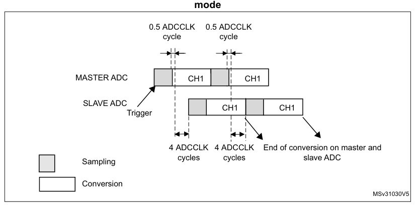

**Figure 141. Interleaved mode on 1 channel in single conversion mode: dual ADC**

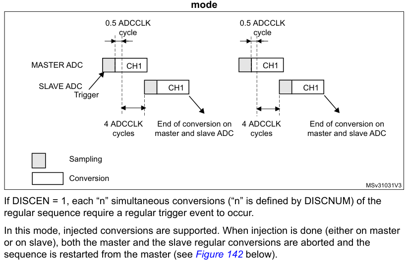

If DISCEN = 1, each “n” simultaneous conversions (“n” is defined by DISCNUM) of the regular sequence
require a regular trigger event to occur.

In this mode, injected conversions are supported. When injection is done (either on master or on
slave), both the master and the slave regular conversions are aborted and the sequence is restarted
from the master (see Figure 142 below).

**Figure 142. Interleaved conversion with injection**

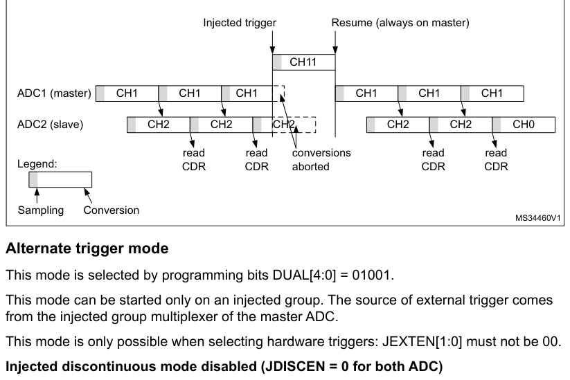

#### Alternate trigger mode

This mode is selected by programming bits DUAL[4:0] = 01001.

This mode can be started only on an injected group. The source of external trigger comes from the
injected group multiplexer of the master ADC.

This mode is only possible when selecting hardware triggers: JEXTEN[1:0] must not be 00.

Injected discontinuous mode disabled (JDISCEN = 0 for both ADC)

1. When the first trigger occurs, all injected master ADC channels in the group are
   converted.
2. When the second trigger occurs, all injected slave ADC channels in the group are
   converted.
3. And so on.

A JEOS interrupt, if enabled, is generated after all injected channels of the master ADC in the
group have been converted.

A JEOS interrupt, if enabled, is generated after all injected channels of the slave ADC in the group
have been converted.

JEOC interrupts, if enabled, can also be generated after each injected conversion.

If another external trigger occurs after all injected channels in the group have been converted then
the alternate trigger process restarts by converting the injected channels of the master ADC in the
group.

**Figure 143. Alternate trigger: injected group of each ADC**

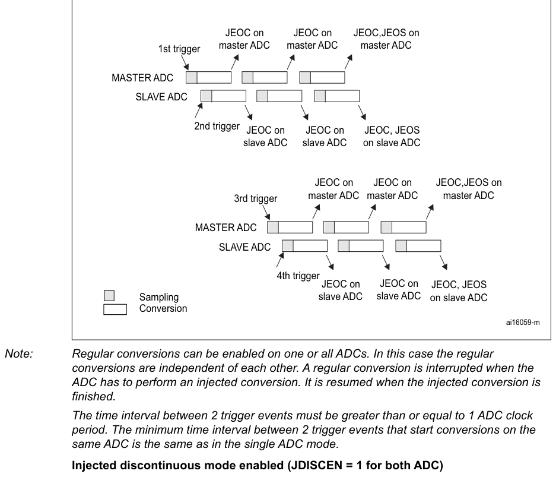

> **Note:** Regular conversions can be enabled on one or all ADCs. In this case the regular
> conversions are independent of each other. A regular conversion is interrupted when the ADC has to
> perform an injected conversion. It is resumed when the injected conversion is finished.

The time interval between 2 trigger events must be greater than or equal to 1 ADC clock period. The
minimum time interval between 2 trigger events that start conversions on the same ADC is the same as
in the single ADC mode.

Injected discontinuous mode enabled (JDISCEN = 1 for both ADC)

If the injected discontinuous mode is enabled for both master and slave ADCs:

- When the first trigger occurs, the first injected channel of the master ADC is converted.
- When the second trigger occurs, the first injected channel of the slave ADC is converted.
- And so on.

A JEOS interrupt, if enabled, is generated after all injected channels of the master ADC in the
group have been converted.

A JEOS interrupt, if enabled, is generated after all injected channels of the slave ADC in the group
have been converted.

JEOC interrupts, if enabled, can also be generated after each injected conversions.

If another external trigger occurs after all injected channels in the group have been converted then
the alternate trigger process restarts.

**Figure 144. Alternate trigger: 4 injected channels (each ADC) in discontinuous mode**

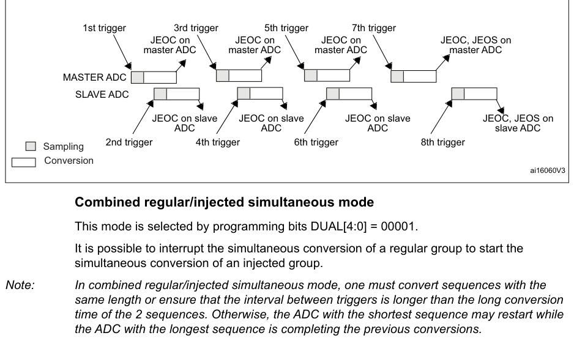

#### Combined regular/injected simultaneous mode

This mode is selected by programming bits DUAL[4:0] = 00001.

It is possible to interrupt the simultaneous conversion of a regular group to start the simultaneous
conversion of an injected group.

> **Note:** In combined regular/injected simultaneous mode, one must convert sequences with the
> same length or ensure that the interval between triggers is longer than the long conversion time of
> the 2 sequences. Otherwise, the ADC with the shortest sequence may restart while the ADC with the
> longest sequence is completing the previous conversions.

#### Combined regular simultaneous \+ alternate trigger mode

This mode is selected by programming bits DUAL[4:0] = 00010.

It is possible to interrupt the simultaneous conversion of a regular group to start the alternate
trigger conversion of an injected group. Figure 145 shows the behavior of an alternate trigger
interrupting a simultaneous regular conversion.

The injected alternate conversion is immediately started after the injected event. If a regular
conversion is already running, in order to ensure synchronization after the injected conversion, the
regular conversion of all (master/slave) ADCs is stopped and resumed synchronously at the end of the
injected conversion.

> **Note:** In combined regular simultaneous \+ alternate trigger mode, one must convert sequences
> with the same length or ensure that the interval between triggers is longer than the long conversion
> time of the 2 sequences. Otherwise, the ADC with the shortest sequence may restart while the ADC
> with the longest sequence is completing the previous conversions.

**Figure 145. Alternate \+ regular simultaneous**

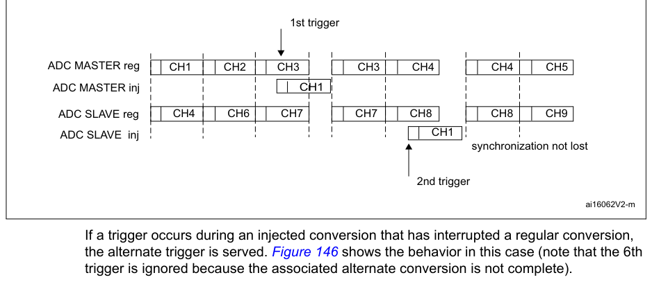

If a trigger occurs during an injected conversion that has interrupted a regular conversion, the
alternate trigger is served. Figure 146 shows the behavior in this case (note that the 6th trigger
is ignored because the associated alternate conversion is not complete).

**Figure 146. Case of trigger occurring during injected conversion**

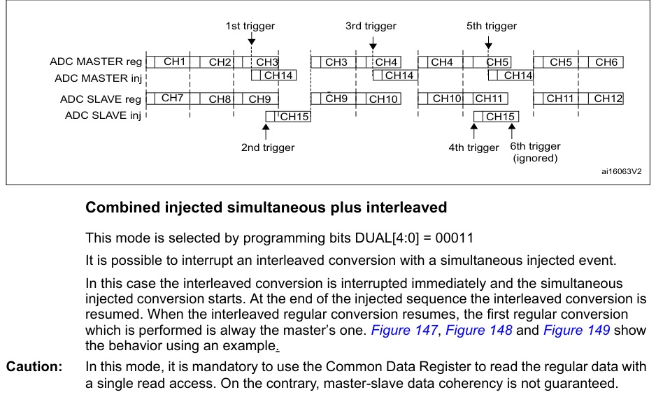

#### Combined injected simultaneous plus interleaved

This mode is selected by programming bits DUAL[4:0] = 00011

It is possible to interrupt an interleaved conversion with a simultaneous injected event.

In this case the interleaved conversion is interrupted immediately and the simultaneous injected
conversion starts. At the end of the injected sequence the interleaved conversion is resumed. When
the interleaved regular conversion resumes, the first regular conversion which is performed is alway
the master’s one. Figure 147, Figure 148 and Figure 149 show the behavior using an example.

> **Caution:** In this mode, it is mandatory to use the Common Data Register to read the regular data with
> a single read access. On the contrary, master-slave data coherency is not guaranteed.

**Figure 147. Interleaved single channel CH0 with injected sequence CH11, CH12**

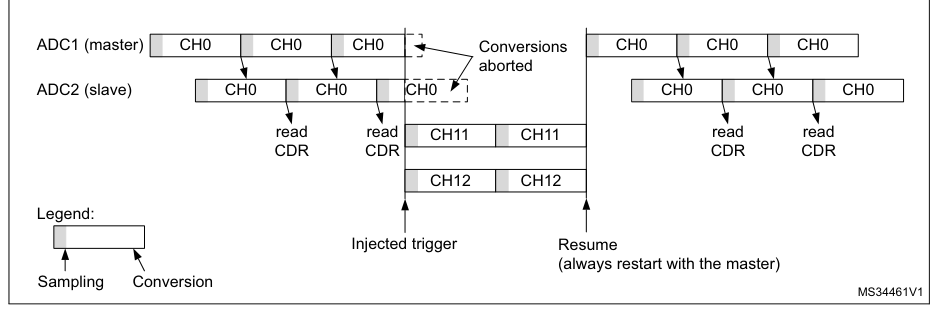

**Figure 148. Two Interleaved channels (CH1, CH2) with injected sequence CH11, CH12**

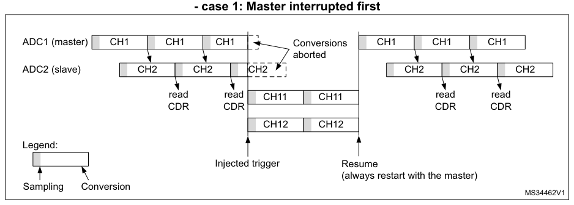

- case 1: Master interrupted first

**Figure 149. Two Interleaved channels (CH1, CH2) with injected sequence CH11, CH12**

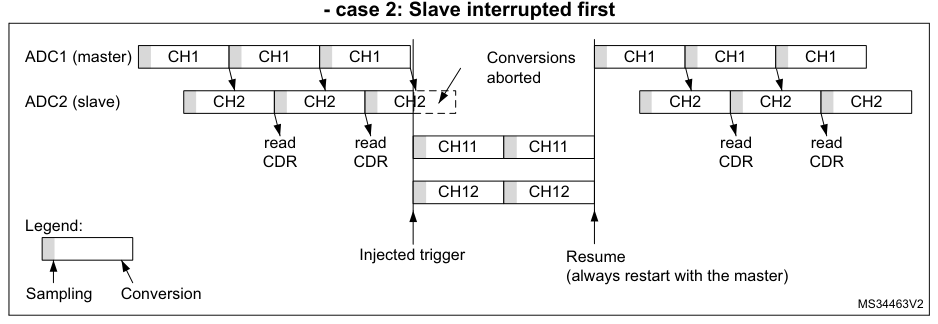

- case 2: Slave interrupted first

#### DMA requests in dual ADC mode

In all dual ADC modes, it is possible to use two DMA channels (one for the master, one for the
slave) to transfer the data, like in single mode (refer to Figure 150: DMA Requests in regular
simultaneous mode when MDMA = 00).

**Figure 150. DMA Requests in regular simultaneous mode when MDMA = 00**

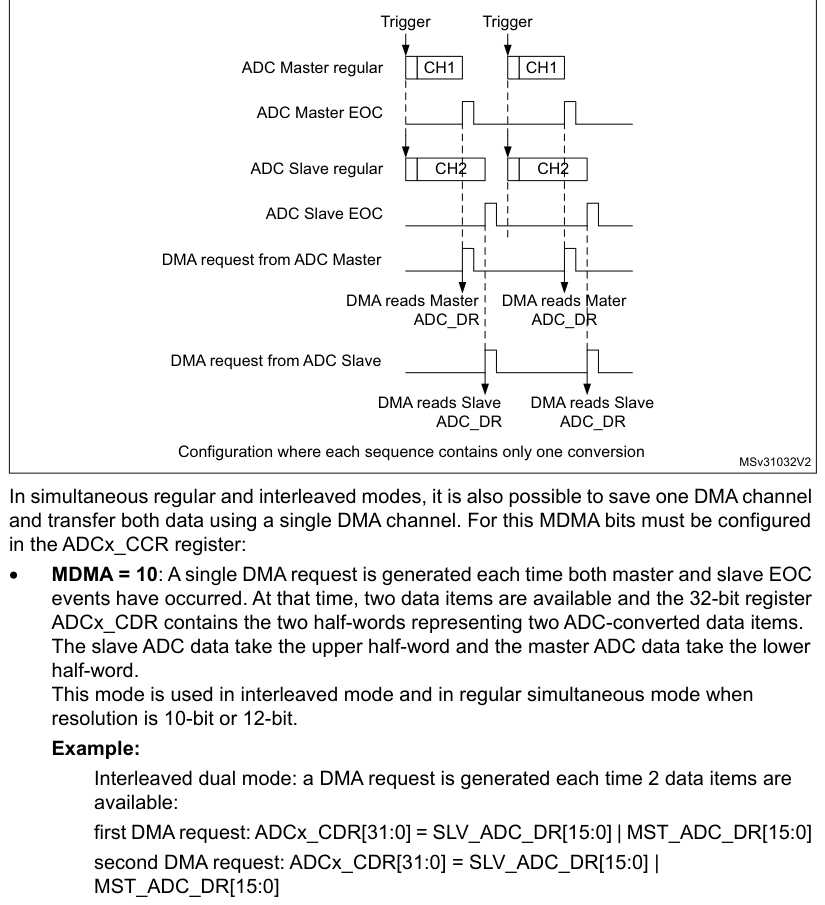

In simultaneous regular and interleaved modes, it is also possible to save one DMA channel and
transfer both data using a single DMA channel. For this MDMA bits must be configured in the ADCx_CCR
register:

- MDMA = 10: A single DMA request is generated each time both master and slave EOC events have
  occurred. At that time, two data items are available and the 32-bit register ADCx_CDR contains the
  two half-words representing two ADC-converted data items. The slave ADC data take the upper
  half-word and the master ADC data take the lower half-word. This mode is used in interleaved mode
  and in regular simultaneous mode when resolution is 10-bit or 12-bit.

Example:

Interleaved dual mode: a DMA request is generated each time 2 data items are available:

first DMA request: ADCx_CDR[31:0] = SLV_ADC_DR[15:0] | MST_ADC_DR[15:0]
second DMA request: ADCx_CDR[31:0] = SLV_ADC_DR[15:0] | MST_ADC_DR[15:0]

**Figure 151. DMA requests in regular simultaneous mode when MDMA = 10**

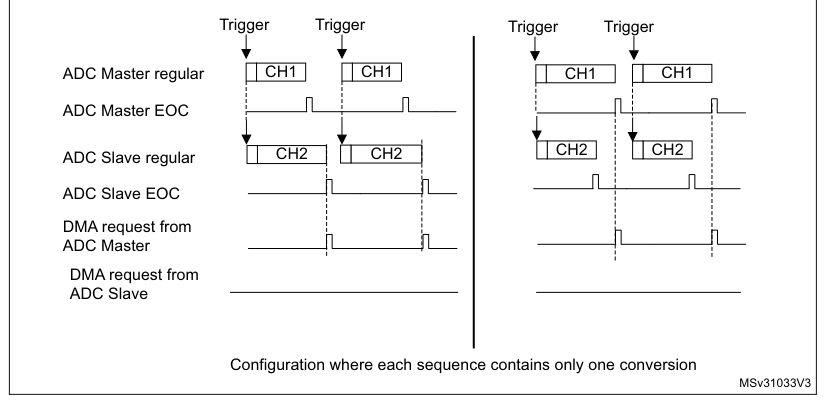

**Figure 152. DMA requests in interleaved mode when MDMA = 10**

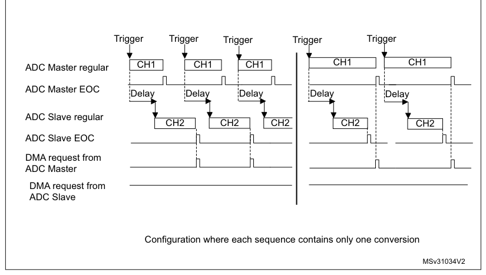

> **Note:** When using MDMA mode, the user must take care to configure properly the duration of the
> master and slave conversions so that a DMA request is generated and served for reading both data
(master \+ slave) before a new conversion is available.

- MDMA = 11: This mode is similar to the MDMA = 10. The only differences are that on each DMA
  request (two data items are available), two bytes representing two ADC converted data items are
  transferred as a half-word.

This mode is used in interleaved and regular simultaneous mode when resolution is 6- bit or when
resolution is 8-bit and data is not signed (offsets must be disabled for all the involved channels).

Example:

Interleaved dual mode: a DMA request is generated each time 2 data items are available:

first DMA request: ADCx_CDR[15:0] = SLV_ADC_DR[7:0] | MST_ADC_DR[7:0]
second DMA request: ADCx_CDR[15:0] = SLV_ADC_DR[7:0] | MST_ADC_DR[7:0]

#### Overrun detection

In dual ADC mode (when DUAL[4:0] is not equal to 00000), if an overrun is detected on one of the
ADCs, the DMA requests are no longer issued to ensure that all the data transferred to the RAM are
valid (this behavior occurs whatever the MDMA configuration). It may happen that the EOC bit
corresponding to one ADC remains set because the data register of this ADC contains valid data.

#### DMA one shot mode/ DMA circular mode when MDMA mode is selected

When MDMA mode is selected (10 or 11), bit DMACFG of the ADCx_CCR register must also be configured
to select between DMA one shot mode and circular mode, as explained in section Section: Managing
conversions using the DMA (bits DMACFG of master and slave ADC_CFGR are not relevant).

#### Stopping the conversions in dual ADC modes

The user must set the control bits ADSTP/JADSTP of the master ADC to stop the conversions of both
ADC in dual ADC mode. The other ADSTP control bit of the slave ADC has no effect in dual ADC mode.

Once both ADC are effectively stopped, the bits ADSTART/JADSTART of the master and slave ADCs are
both cleared by hardware.

### 21.4.31 Temperature sensor

The temperature sensor can be used to measure the junction temperature (Tj) of the device. The
temperature sensor is internally connected to the ADC input channels which are used to convert the
sensor output voltage to a digital value. When not in use, the sensor can be put in power down mode.
It support the temperature range –40 to 125 °C.

Figure 153 shows the block diagram of connections between the temperature sensor and the ADC.

The temperature sensor output voltage changes linearly with temperature. The offset of this line
varies from chip to chip due to process variation (up to 45 °C from one chip to another).

The uncalibrated internal temperature sensor is more suited for applications that detect temperature
variations instead of absolute temperatures. To improve the accuracy of the temperature sensor
measurement, calibration values are stored in system memory for each device by ST during production.

During the manufacturing process, the calibration data of the temperature sensor and the internal
voltage reference are stored in the system memory area. The user application can then read them and
use them to improve the accuracy of the temperature sensor or the internal reference (refer to the
datasheet for additional information).

The temperature sensor is internally connected to the ADC input channel which is used to convert the
sensor’s output voltage to a digital value. Refer to the electrical characteristics section of the
device datasheet for the sampling time value to be applied when converting the internal temperature
sensor.

When not in use, the sensor can be put in power-down mode.

Figure 153 shows the block diagram of the temperature sensor.

**Figure 153. Temperature sensor channel block diagram**

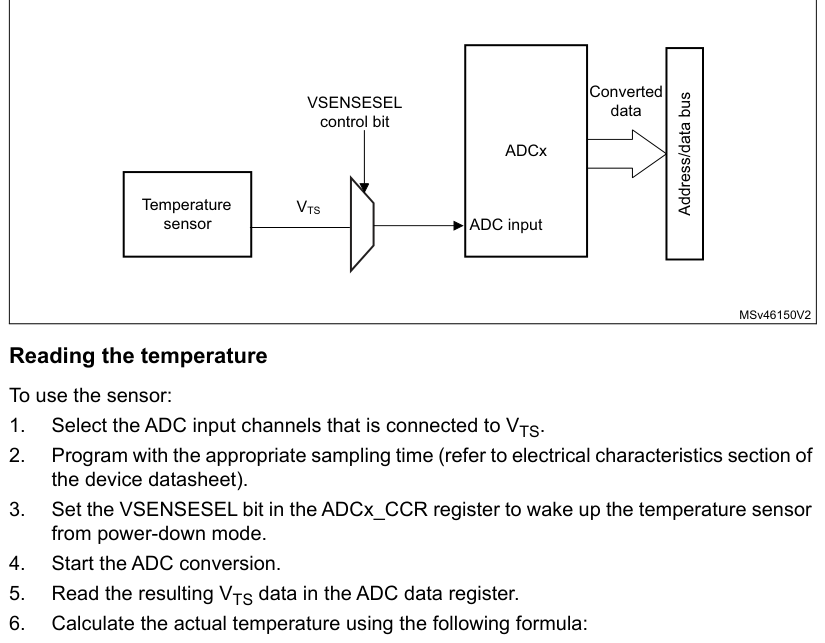

Converted

VSENSESEL
data
control bit

ADCx

#### Reading the temperature

To use the sensor:

1. Select the ADC input channels that is connected to VTS.
2. Program with the appropriate sampling time (refer to electrical characteristics section of
   the device datasheet).
3. Set the VSENSESEL bit in the ADCx_CCR register to wake up the temperature sensor
   from power-down mode.
4. Start the ADC conversion.
5. Read the resulting VTS data in the ADC data register.
6. Calculate the actual temperature using the following formula:

> **Extracted layout**
>
> `TS_CAL2_TEMP` · `–` · `TS_CAL1_TEMP`  
> `Temperature in °C` · `(` · `)` · `=` · `-------------------------------------------------------------------------------------------------` · `×` · `(` · `TS_DATA` · `–` · `TS_CAL1` · `)` · `+` · `TS_CAL1_TEMP`  
> `TS_CAL2 – TS_CAL1`  
> `Where:`  

- TS_CAL2 is the temperature sensor calibration value acquired at TS_CAL2_TEMP.
- TS_CAL1 is the temperature sensor calibration value acquired at TS_CAL1_TEMP.
- TS_DATA is the actual temperature sensor output value converted by ADC.

Refer to the device datasheet for more information about TS_CAL1 and TS_CAL2 calibration points.

> **Note:** The sensor has a startup time after waking from power-down mode before it can output VTS
> at the correct level. The ADC also has a startup time after power-on, so to minimize the delay, the
ADEN and VSENSESEL bits should be set at the same time.

The above formula is given for TS_DATA measurement done with the same VREF+voltage as
TS_CAL1/TS_CAL2 values. If VREF+ is different, the formula must be adapted. For example if VREF+ =
3.3 V and TS_CAL data are acquired at VREF+= 3.0 V, TS_DATA must be replaced by TS_DATA x (3.3/3.0).

### 21.4.32 VBAT supply monitoring

The VBATSEL bit in the ADCx_CCR register is used to switch to the battery voltage. As the VBAT
voltage could be higher than VDDA, to ensure the correct operation of the ADC, the VBAT pin is
internally connected to a bridge divider by 3. This bridge is automatically enabled when VBATSEL is
set, to connect VBAT/3 to the ADC input channels. As a consequence, the converted digital value is
one third of the VBAT voltage. To prevent any unwanted consumption on the battery, it is recommended
to enable the bridge divider only when needed, for ADC conversion.

Refer to the electrical characteristics of the device datasheet for the sampling time value to be
applied when converting the VBAT/3 voltage.

The figure below shows the block diagram of the VBAT sensing feature.

**Figure 154. VBAT channel block diagram**

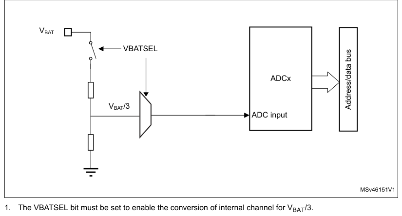

1. The VBATSEL bit must be set to enable the conversion of internal channel for VBAT/3.

### 21.4.33 Monitoring the internal voltage reference

It is possible to monitor the internal voltage reference (VREFINT) to have a reference point for
evaluating the ADC VREF+ voltage level.

The internal reference voltage (VREFINT) is internally connected to ADC1_INP18, ADC3_INP18,
ADC4_INP18 and ADC5_INP18.

Refer to the electrical characteristics section of the product datasheet for the sampling time value
to be applied when converting the internal voltage reference voltage.

Figure 155 shows the block diagram of the VREFINT sensing feature.

**Figure 155. VREFINT channel block diagram**

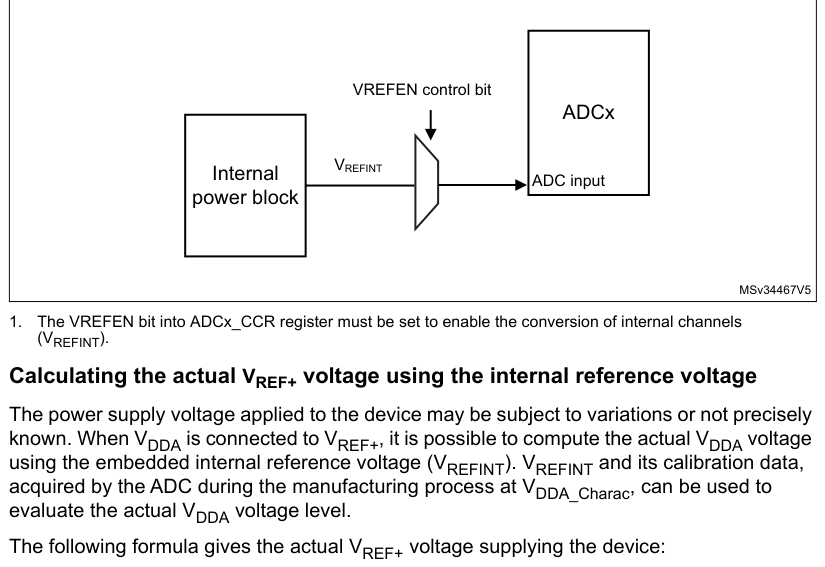

VREFEN control bit

ADCx

VREFINT

Internal

ADC input
power block

MSv34467V5

1. The VREFEN bit into ADCx_CCR register must be set to enable the conversion of internal channels

(VREFINT).

#### Calculating the actual VREF+ voltage using the internal reference voltage

The power supply voltage applied to the device may be subject to variations or not precisely known.
When VDDA is connected to VREF+, it is possible to compute the actual VDDA voltage using the
embedded internal reference voltage (VREFINT). VREFINT and its calibration data, acquired by the ADC
during the manufacturing process at VDDA_Charac, can be used to evaluate the actual VDDA voltage
level.

The following formula gives the actual VREF+ voltage supplying the device:

> **Extracted layout**
>
> `VREF+` · `=` · `VREF+_Charac` · `×` · `VREFINT_CAL` · `⁄` · `VREFINT_DATA`  
> `Where:`  

- VREF+_Charac is the value of VREF+ voltage characterized at VREFINT during the manufacturing
  process. It is specified in the device datasheet.
- VREFINT_CAL is the VREFINT calibration value
- VREFINT_DATA is the actual VREFINT output value converted by ADC

#### Converting a supply-relative ADC measurement to an absolute voltage value

The ADC is designed to deliver a digital value corresponding to the ratio between VREF+ and the
voltage applied on the converted channel.

For most applications VDDA value is unknown and ADC converted values are right-aligned. In this
case, it is necessary to convert this ratio into a voltage independent from VDDA:

VREF+

> **Extracted layout**
>
> `VCHANNELx` · `=` · `-------------------------------------` · `×` · `ADC_DATA`  
> `FULL_SCALE`  
> `By replacing VREF+ by the formula provided above, the absolute voltage value is given by the following formula`  
> `VREF+_Charac` · `×` · `VREFINT_CAL` · `×` · `ADC_DATA`  
> `VCHANNELx` · `=` · `------------------------------------------------------------------------------------------------------------------------`  
> `VREFINT_DATA` · `×` · `FULL_SCALE`  

For applications where VREF+ is known and ADC converted values are right-aligned, the absolute
voltage value can be obtained by using the following formula:

VREF+

> **Extracted layout**
>
> `VCHANNELx` · `=` · `-------------------------------------` · `×` · `ADC_DATA`  
> `FULL_SCALE`  
> `Where:`  

- VREF+_Charac is the value of VREF+ voltage characterized at VREFINT during the manufacturing
  process.
- VREFINT_CAL is the VREFINT calibration value
- ADC_DATA is the value measured by the ADC on channel x (right-aligned)
- VREFINT_DATA is the actual VREFINT output value converted by the ADC
- FULL_SCALE is the maximum digital value of the ADC output. For example with 12-bit resolution, it
  is 212 - 1 = 4095 or with 8-bit resolution, 28 - 1 = 255.

> **Note:** If ADC measurements are done using an output format other than 16-bit right-aligned, all
> the parameters must first be converted to a compatible format before the calculation is done.

## 21.5 ADC in low-power mode

**Table 177. Effect of low-power modes on the ADC**

| Source row | Column 1 | Column 2 |
| ---: | --- | --- |
| 1 | `Mode` | `Description` |

No effect.

Sleep

DMA requests are functional.

| Source row | Column 1 | Column 2 |
| ---: | --- | --- |
| 1 | `Low-power run` | `No effect.` |

No effect.

Low-power sleep

DMA requests are functional.

The ADC is not operational. Its state is kept.

| Source row | Column 1 | Column 2 |
| ---: | --- | --- |
| 1 | `Stop 0/Stop 1` | `The ADC consumes the static current recommended to disable the` |

peripheral in advance in order to reduce power consumption.

Standby

The ADC is powered down and must be reinitialized after exiting Standby or Shutdown mode.

Shutdown

## 21.6 ADC interrupts

For each ADC, an interrupt can be generated:

- After ADC power-up, when the ADC is ready (flag ADRDY)
- On the end of any conversion for regular groups (flag EOC)
- On the end of a sequence of conversion for regular groups (flag EOS)
- On the end of any conversion for injected groups (flag JEOC)
- On the end of a sequence of conversion for injected groups (flag JEOS)
- When an analog watchdog detection occurs (flag AWD1, AWD2 and AWD3)
- When the end of sampling phase occurs (flag EOSMP)
- When the data overrun occurs (flag OVR)
- When the injected sequence context queue overflows (flag JQOVF)

Separate interrupt enable bits are available for flexibility.

**Table 178. ADC interrupts per each ADC**

| Interrupt event | Event flag | Enable control bit |
| --- | --- | --- |
| ADC ready | ADRDY | ADRDYIE |
| End of conversion of a regular group | EOC | EOCIE |
| End of sequence of conversions of a regular group | EOS | EOSIE |
| End of conversion of a injected group | JEOC | JEOCIE |
| End of sequence of conversions of an injected group | JEOS | JEOSIE |
| Analog watchdog 1 status bit is set | AWD1 | AWD1IE |
| Analog watchdog 2 status bit is set | AWD2 | AWD2IE |
| Analog watchdog 3 status bit is set | AWD3 | AWD3IE |
| End of sampling phase | EOSMP | EOSMPIE |
| Overrun | OVR | OVRIE |
| Injected context queue overflows | JQOVF | JQOVFIE |

## 21.7 ADC registers (for each ADC)

Refer to [Section 1.2](chapter-01.md#12-list-of-abbreviations-for-registers) for a list of abbreviations used in register descriptions.

### 21.7.1 ADC interrupt and status register (ADC_ISR)

- **Address offset:** 0x00
- **Reset value:** 0x0000 0000

**Register bit layout**

| Bit | Field | Access | Summary |
| ---: | --- | :---: | --- |
| 31 | Reserved | — | kept at reset value. |
| 30 | Reserved | — | ↳ |
| 29 | Reserved | — | ↳ |
| 28 | Reserved | — | ↳ |
| 27 | Reserved | — | ↳ |
| 26 | Reserved | — | ↳ |
| 25 | Reserved | — | ↳ |
| 24 | Reserved | — | ↳ |
| 23 | Reserved | — | ↳ |
| 22 | Reserved | — | ↳ |
| 21 | Reserved | — | ↳ |
| 20 | Reserved | — | ↳ |
| 19 | Reserved | — | ↳ |
| 18 | Reserved | — | ↳ |
| 17 | Reserved | — | ↳ |
| 16 | Reserved | — | ↳ |
| 15 | Reserved | — | ↳ |
| 14 | Reserved | — | ↳ |
| 13 | Reserved | — | ↳ |
| 12 | Reserved | — | ↳ |
| 11 | Reserved | — | ↳ |
| 10 | `JQOVF` | rc_w1 | Injected context queue overflow |
| 9 | `AWD3` | rc_w1 | Analog watchdog 3 flag |
| 8 | `AWD2` | rc_w1 | Analog watchdog 2 flag |
| 7 | `AWD1` | rc_w1 | Analog watchdog 1 flag |
| 6 | `JEOS` | rc_w1 | Injected channel end of sequence flag |
| 5 | `JEOC` | rc_w1 | Injected channel end of conversion flag |
| 4 | `OVR` | rc_w1 | ADC overrun |
| 3 | `EOS` | rc_w1 | End of regular sequence flag |
| 2 | `EOC` | rc_w1 | End of conversion flag |
| 1 | `EOSMP` | rc_w1 | End of sampling flag |
| 0 | `ADRDY` | rc_w1 | ADC ready |

**Bits 31:11 — Reserved:** kept at reset value.

**Bit 10 — `JQOVF`:** Injected context queue overflow

This bit is set by hardware when an Overflow of the Injected Queue of Context occurs. It is cleared
by software writing 1 to it. Refer to [Section 21.4.21](#21421-queue-of-context-for-injected-conversions): Queue of context for injected conversions for
more information.

- `0`: No injected context queue overflow occurred (or the flag event was already acknowledged and
  cleared by software)
- `1`: Injected context queue overflow has occurred

**Bit 9 — `AWD3`:** Analog watchdog 3 flag

This bit is set by hardware when the converted voltage crosses the values programmed in the fields

LT3[7:0] and HT3[7:0] of ADC_TR3 register. It is cleared by software writing 1 to it.

- `0`: No analog watchdog 3 event occurred (or the flag event was already acknowledged and cleared
  by software)
- `1`: Analog watchdog 3 event occurred

**Bit 8 — `AWD2`:** Analog watchdog 2 flag

This bit is set by hardware when the converted voltage crosses the values programmed in the fields

LT2[7:0] and HT2[7:0] of ADC_TR2 register. It is cleared by software writing 1 to it.

- `0`: No analog watchdog 2 event occurred (or the flag event was already acknowledged and cleared
  by software)
- `1`: Analog watchdog 2 event occurred

**Bit 7 — `AWD1`:** Analog watchdog 1 flag

This bit is set by hardware when the converted voltage crosses the values programmed in the fields

LT1[11:0] and HT1[11:0] of ADC_TR1 register. It is cleared by software. writing 1 to it.

- `0`: No analog watchdog 1 event occurred (or the flag event was already acknowledged and cleared
  by software)
- `1`: Analog watchdog 1 event occurred

**Bit 6 — `JEOS`:** Injected channel end of sequence flag

This bit is set by hardware at the end of the conversions of all injected channels in the group. It
is
cleared by software writing 1 to it.

- `0`: Injected conversion sequence not complete (or the flag event was already acknowledged and
  cleared by software)
- `1`: Injected conversions complete

**Bit 5 — `JEOC`:** Injected channel end of conversion flag

This bit is set by hardware at the end of each injected conversion of a channel when a new data is
available in the corresponding ADC_JDRy register. It is cleared by software writing 1 to it or by
reading the corresponding ADC_JDRy register

- `0`: Injected channel conversion not complete (or the flag event was already acknowledged and
  cleared by software)
- `1`: Injected channel conversion complete

**Bit 4 — `OVR`:** ADC overrun

This bit is set by hardware when an overrun occurs on a regular channel, meaning that a new
conversion has completed while the EOC flag was already set. It is cleared by software writing 1 to
it.

- `0`: No overrun occurred (or the flag event was already acknowledged and cleared by software)
- `1`: Overrun has occurred

**Bit 3 — `EOS`:** End of regular sequence flag

This bit is set by hardware at the end of the conversions of a regular sequence of channels. It is
cleared by software writing 1 to it.

- `0`: Regular Conversions sequence not complete (or the flag event was already acknowledged and
  cleared by software)
- `1`: Regular Conversions sequence complete

**Bit 2 — `EOC`:** End of conversion flag

This bit is set by hardware at the end of each regular conversion of a channel when a new data is
available in the ADC_DR register. It is cleared by software writing 1 to it or by reading the ADC_DR
register

- `0`: Regular channel conversion not complete (or the flag event was already acknowledged and
  cleared by software)
- `1`: Regular channel conversion complete

**Bit 1 — `EOSMP`:** End of sampling flag

This bit is set by hardware during the conversion of any channel (only for regular channels), at the
end of the sampling phase.

- `0`: not at the end of the sampling phase (or the flag event was already acknowledged and cleared
  by
  software)
- `1`: End of sampling phase reached

**Bit 0 — `ADRDY`:** ADC ready

This bit is set by hardware after the ADC has been enabled (bit ADEN = 1) and when the ADC
reaches a state where it is ready to accept conversion requests.

It is cleared by software writing 1 to it.

- `0`: ADC not yet ready to start conversion (or the flag event was already acknowledged and cleared
  by software)
- `1`: ADC is ready to start conversion

### 21.7.2 ADC interrupt enable register (ADC_IER)

- **Address offset:** 0x04
- **Reset value:** 0x0000 0000

**Register bit layout**

| Bit | Field | Access | Summary |
| ---: | --- | :---: | --- |
| 31 | Reserved | — | kept at reset value. |
| 30 | Reserved | — | ↳ |
| 29 | Reserved | — | ↳ |
| 28 | Reserved | — | ↳ |
| 27 | Reserved | — | ↳ |
| 26 | Reserved | — | ↳ |
| 25 | Reserved | — | ↳ |
| 24 | Reserved | — | ↳ |
| 23 | Reserved | — | ↳ |
| 22 | Reserved | — | ↳ |
| 21 | Reserved | — | ↳ |
| 20 | Reserved | — | ↳ |
| 19 | Reserved | — | ↳ |
| 18 | Reserved | — | ↳ |
| 17 | Reserved | — | ↳ |
| 16 | Reserved | — | ↳ |
| 15 | Reserved | — | ↳ |
| 14 | Reserved | — | ↳ |
| 13 | Reserved | — | ↳ |
| 12 | Reserved | — | ↳ |
| 11 | Reserved | — | ↳ |
| 10 | `JQOVFIE` | rw | Injected context queue overflow interrupt enable |
| 9 | `AWD3IE` | rw | Analog watchdog 3 interrupt enable |
| 8 | `AWD2IE` | rw | Analog watchdog 2 interrupt enable |
| 7 | `AWD1IE` | rw | Analog watchdog 1 interrupt enable |
| 6 | `JEOSIE` | rw | End of injected sequence of conversions interrupt enable |
| 5 | `JEOCIE` | rw | End of injected conversion interrupt enable |
| 4 | `OVRIE` | rw | Overrun interrupt enable |
| 3 | `EOSIE` | rw | End of regular sequence of conversions interrupt enable |
| 2 | `EOCIE` | rw | End of regular conversion interrupt enable |
| 1 | `EOSMPIE` | rw | End of sampling flag interrupt enable for regular conversions |
| 0 | `ADRDYIE` | rw | ADC ready interrupt enable |

**Bits 31:11 — Reserved:** kept at reset value.

**Bit 10 — `JQOVFIE`:** Injected context queue overflow interrupt enable

This bit is set and cleared by software to enable/disable the Injected Context Queue Overflow
interrupt.

- `0`: Injected Context Queue Overflow interrupt disabled
- `1`: Injected Context Queue Overflow interrupt enabled. An interrupt is generated when the JQOVF
  bit
  is set.

> **Note:** The software is allowed to write this bit only when JADSTART = 0 (which ensures that no
> injected conversion is ongoing).

**Bit 9 — `AWD3IE`:** Analog watchdog 3 interrupt enable

This bit is set and cleared by software to enable/disable the analog watchdog 2 interrupt.

- `0`: Analog watchdog 3 interrupt disabled
- `1`: Analog watchdog 3 interrupt enabled

> **Note:** The software is allowed to write this bit only when ADSTART = 0 and JADSTART = 0 (which
> ensures that no conversion is ongoing).

**Bit 8 — `AWD2IE`:** Analog watchdog 2 interrupt enable

This bit is set and cleared by software to enable/disable the analog watchdog 2 interrupt.

- `0`: Analog watchdog 2 interrupt disabled
- `1`: Analog watchdog 2 interrupt enabled

> **Note:** The software is allowed to write this bit only when ADSTART = 0 and JADSTART = 0 (which
> ensures that no conversion is ongoing).

**Bit 7 — `AWD1IE`:** Analog watchdog 1 interrupt enable

This bit is set and cleared by software to enable/disable the analog watchdog 1 interrupt.

- `0`: Analog watchdog 1 interrupt disabled
- `1`: Analog watchdog 1 interrupt enabled

> **Note:** The software is allowed to write this bit only when ADSTART = 0 and JADSTART = 0 (which
> ensures that no conversion is ongoing).

**Bit 6 — `JEOSIE`:** End of injected sequence of conversions interrupt enable

This bit is set and cleared by software to enable/disable the end of injected sequence of
conversions
interrupt.

- `0`: JEOS interrupt disabled
- `1`: JEOS interrupt enabled. An interrupt is generated when the JEOS bit is set.

> **Note:** The software is allowed to write this bit only when JADSTART = 0 (which ensures that no
> injected conversion is ongoing).

**Bit 5 — `JEOCIE`:** End of injected conversion interrupt enable

This bit is set and cleared by software to enable/disable the end of an injected conversion
interrupt.

- `0`: JEOC interrupt disabled.
- `1`: JEOC interrupt enabled. An interrupt is generated when the JEOC bit is set.

> **Note:** The software is allowed to write this bit only when JADSTART = 0 (which ensures that no
> injected conversion is ongoing).

**Bit 4 — `OVRIE`:** Overrun interrupt enable

This bit is set and cleared by software to enable/disable the Overrun interrupt of a regular
conversion.

- `0`: Overrun interrupt disabled
- `1`: Overrun interrupt enabled. An interrupt is generated when the OVR bit is set.

> **Note:** The software is allowed to write this bit only when ADSTART = 0 (which ensures that no regular
> conversion is ongoing).

**Bit 3 — `EOSIE`:** End of regular sequence of conversions interrupt enable

This bit is set and cleared by software to enable/disable the end of regular sequence of conversions
interrupt.

- `0`: EOS interrupt disabled
- `1`: EOS interrupt enabled. An interrupt is generated when the EOS bit is set.

> **Note:** The software is allowed to write this bit only when ADSTART = 0 (which ensures that no regular
> conversion is ongoing).

**Bit 2 — `EOCIE`:** End of regular conversion interrupt enable

This bit is set and cleared by software to enable/disable the end of a regular conversion interrupt.

- `0`: EOC interrupt disabled.
- `1`: EOC interrupt enabled. An interrupt is generated when the EOC bit is set.

> **Note:** The software is allowed to write this bit only when ADSTART = 0 (which ensures that no regular
> conversion is ongoing).

**Bit 1 — `EOSMPIE`:** End of sampling flag interrupt enable for regular conversions

This bit is set and cleared by software to enable/disable the end of the sampling phase interrupt
for
regular conversions.

- `0`: EOSMP interrupt disabled.
- `1`: EOSMP interrupt enabled. An interrupt is generated when the EOSMP bit is set.

> **Note:** The software is allowed to write this bit only when ADSTART = 0 (which ensures that no regular
> conversion is ongoing).

**Bit 0 — `ADRDYIE`:** ADC ready interrupt enable

This bit is set and cleared by software to enable/disable the ADC Ready interrupt.

- `0`: ADRDY interrupt disabled
- `1`: ADRDY interrupt enabled. An interrupt is generated when the ADRDY bit is set.

> **Note:** The software is allowed to write this bit only when ADSTART = 0 and JADSTART = 0 (which
> ensures that no conversion is ongoing).

### 21.7.3 ADC control register (ADC_CR)

- **Address offset:** 0x08
- **Reset value:** 0x2000 0000

**Register bit layout**

| Bit | Field | Access | Summary |
| ---: | --- | :---: | --- |
| 31 | `ADCAL` | rs | ADC calibration |
| 30 | `ADCALDIF` | rw | Differential mode for calibration |
| 29 | `DEEPPWD` | rw | Deep-power-down enable |
| 28 | `ADVREGEN` | rw | ADC voltage regulator enable |
| 27 | Reserved | — | kept at reset value. |
| 26 | Reserved | — | ↳ |
| 25 | Reserved | — | ↳ |
| 24 | Reserved | — | ↳ |
| 23 | Reserved | — | ↳ |
| 22 | Reserved | — | ↳ |
| 21 | Reserved | — | ↳ |
| 20 | Reserved | — | ↳ |
| 19 | Reserved | — | ↳ |
| 18 | Reserved | — | ↳ |
| 17 | Reserved | — | ↳ |
| 16 | Reserved | — | ↳ |
| 15 | Reserved | — | ↳ |
| 14 | Reserved | — | ↳ |
| 13 | Reserved | — | ↳ |
| 12 | Reserved | — | ↳ |
| 11 | Reserved | — | ↳ |
| 10 | Reserved | — | ↳ |
| 9 | Reserved | — | ↳ |
| 8 | Reserved | — | ↳ |
| 7 | Reserved | — | ↳ |
| 6 | Reserved | — | ↳ |
| 5 | `JADSTP` | rs | ADC stop of injected conversion command |
| 4 | `ADSTP` | rs | ADC stop of regular conversion command |
| 3 | `JADSTART` | rs | ADC start of injected conversion |
| 2 | `ADSTART` | rs | ADC start of regular conversion |
| 1 | `ADDIS` | rs | ADC disable command |
| 0 | `ADEN` | rs | ADC enable control |

**Bit 31 — `ADCAL`:** ADC calibration

This bit is set by software to start the calibration of the ADC. Program first the bit ADCALDIF
to determine if this calibration applies for single-ended or differential inputs mode.

It is cleared by hardware after calibration is complete.

- `0`: Calibration complete
- `1`: Write 1 to calibrate the ADC. Read at 1 means that a calibration in progress.

> **Note:** The software is allowed to launch a calibration by setting ADCAL only when ADEN = 0.

The software is allowed to update the calibration factor by writing ADC_CALFACT only
when ADEN = 1 and ADSTART = 0 and JADSTART = 0 (ADC enabled and no
conversion is ongoing)

**Bit 30 — `ADCALDIF`:** Differential mode for calibration

This bit is set and cleared by software to configure the single-ended or differential inputs
mode for the calibration.

- `0`: Writing ADCAL launches a calibration in single-ended inputs mode.
- `1`: Writing ADCAL launches a calibration in differential inputs mode.

> **Note:** The software is allowed to write this bit only when the ADC is disabled and is not
> calibrating (ADCAL = 0, JADSTART = 0, JADSTP = 0, ADSTART = 0, ADSTP = 0,

ADDIS = 0 and ADEN = 0).

**Bit 29 — `DEEPPWD`:** Deep-power-down enable

This bit is set and cleared by software to put the ADC in Deep-power-down mode.

- `0`: ADC not in Deep-power down
- `1`: ADC in Deep-power-down (default reset state)

> **Note:** The software is allowed to write this bit only when the ADC is disabled (ADCAL = 0,

JADSTART = 0, JADSTP = 0, ADSTART = 0, ADSTP = 0, ADDIS = 0 and ADEN = 0).

**Bit 28 — `ADVREGEN`:** ADC voltage regulator enable

This bits is set by software to enable the ADC voltage regulator.

Before performing any operation such as launching a calibration or enabling the ADC, the

ADC voltage regulator must first be enabled and the software must wait for the regulator
start-up time.

- `0`: ADC Voltage regulator disabled
- `1`: ADC Voltage regulator enabled.

For more details about the ADC voltage regulator enable and disable sequences, refer to

[Section 21.4.6](#2146-adc-deep-power-down-mode-deeppwd-and-adc-voltage-regulator-advregen): ADC Deep-power-down mode (DEEPPWD) and ADC voltage regulator

(ADVREGEN).

The software can program this bit field only when the ADC is disabled (ADCAL = 0,

JADSTART = 0, ADSTART = 0, ADSTP = 0, ADDIS = 0 and ADEN = 0).

**Bits 27:6 — Reserved:** kept at reset value.

**Bit 5 — `JADSTP`:** ADC stop of injected conversion command

This bit is set by software to stop and discard an ongoing injected conversion (JADSTP

Command).

It is cleared by hardware when the conversion is effectively discarded and the ADC injected
sequence and triggers can be re-configured. The ADC is then ready to accept a new start of
injected conversions (JADSTART command).

- `0`: No ADC stop injected conversion command ongoing
- `1`: Write 1 to stop injected conversions ongoing. Read 1 means that an ADSTP command is
  in progress.

> **Note:** The software is allowed to set JADSTP only when JADSTART = 1 and ADDIS = 0 (ADC
> is enabled and eventually converting an injected conversion and there is no pending
> request to disable the ADC)

In Auto-injection mode (JAUTO = 1), setting ADSTP bit aborts both regular and injected
conversions (do not use JADSTP)

**Bit 4 — `ADSTP`:** ADC stop of regular conversion command

This bit is set by software to stop and discard an ongoing regular conversion (ADSTP

Command).

It is cleared by hardware when the conversion is effectively discarded and the ADC regular
sequence and triggers can be re-configured. The ADC is then ready to accept a new start of
regular conversions (ADSTART command).

- `0`: No ADC stop regular conversion command ongoing
- `1`: Write 1 to stop regular conversions ongoing. Read 1 means that an ADSTP command is in
  progress.

> **Note:** The software is allowed to set ADSTP only when ADSTART = 1 and ADDIS = 0 (ADC is
> enabled and eventually converting a regular conversion and there is no pending request
> to disable the ADC).

In auto-injection mode (JAUTO = 1), setting ADSTP bit aborts both regular and injected
conversions (do not use JADSTP).

In dual ADC regular simultaneous mode and interleaved mode, the bit ADSTP of the
master ADC must be used to stop regular conversions. The other ADSTP bit is inactive.

**Bit 3 — `JADSTART`:** ADC start of injected conversion

This bit is set by software to start ADC conversion of injected channels. Depending on the
configuration bits JEXTEN[1:0], a conversion starts immediately (software trigger
configuration) or once an injected hardware trigger event occurs (hardware trigger
configuration).

It is cleared by hardware:

- in single conversion mode when software trigger is selected (JEXTSEL = 0x0): at the
  assertion of the End of Injected Conversion Sequence (JEOS) flag.
- in all cases: after the execution of the JADSTP command, at the same time that JADSTP is
  cleared by hardware.
- `0`: No ADC injected conversion is ongoing.
- `1`: Write 1 to start injected conversions. Read 1 means that the ADC is operating and
  eventually converting an injected channel.

> **Note:** The software is allowed to set JADSTART only when ADEN = 1 and ADDIS = 0 (ADC is
> enabled and there is no pending request to disable the ADC).

In auto-injection mode (JAUTO = 1), regular and auto-injected conversions are started
by setting bit ADSTART (JADSTART must be kept cleared)

**Bit 2 — `ADSTART`:** ADC start of regular conversion

This bit is set by software to start ADC conversion of regular channels. Depending on the
configuration bits EXTEN[1:0], a conversion starts immediately (software trigger
configuration) or once a regular hardware trigger event occurs (hardware trigger
configuration).

It is cleared by hardware:

- in single conversion mode when software trigger is selected (EXTSEL = 0x0): at the
  assertion of the End of Regular Conversion Sequence (EOS) flag.
- in all cases: after the execution of the ADSTP command, at the same time that ADSTP is
  cleared by hardware.
- `0`: No ADC regular conversion is ongoing.
- `1`: Write 1 to start regular conversions. Read 1 means that the ADC is operating and
  eventually converting a regular channel.

> **Note:** The software is allowed to set ADSTART only when ADEN = 1 and ADDIS = 0 (ADC is
> enabled and there is no pending request to disable the ADC)

In auto-injection mode (JAUTO = 1), regular and auto-injected conversions are started
by setting bit ADSTART (JADSTART must be kept cleared)

**Bit 1 — `ADDIS`:** ADC disable command

This bit is set by software to disable the ADC (ADDIS command) and put it into power-down
state (OFF state).

It is cleared by hardware once the ADC is effectively disabled (ADEN is also cleared by
hardware at this time).

- `0`: no ADDIS command ongoing
- `1`: Write 1 to disable the ADC. Read 1 means that an ADDIS command is in progress.

> **Note:** The software is allowed to set ADDIS only when ADEN = 1 and both ADSTART = 0 and

JADSTART = 0 (which ensures that no conversion is ongoing)

**Bit 0 — `ADEN`:** ADC enable control

This bit is set by software to enable the ADC. The ADC is effectively ready to operate once
the flag ADRDY has been set.

It is cleared by hardware when the ADC is disabled, after the execution of the ADDIS
command.

- `0`: ADC is disabled (OFF state)
- `1`: Write 1 to enable the ADC.

> **Note:** The software is allowed to set ADEN only when all bits of ADC_CR registers are 0

(ADCAL = 0, JADSTART = 0, ADSTART = 0, ADSTP = 0, ADDIS = 0 and ADEN = 0)
except for bit ADVREGEN which must be 1 (and the software must have wait for the
startup time of the voltage regulator)

### 21.7.4 ADC configuration register (ADC_CFGR)

- **Address offset:** 0x0C
- **Reset value:** 0x8000 0000

**Register bit layout**

| Bit | Field | Access | Summary |
| ---: | --- | :---: | --- |
| 31 | `JQDIS` | rw | Injected Queue disable |
| 30 | `AWD1CH[4]` | rw | Analog watchdog 1 channel selection |
| 29 | `AWD1CH[3]` | rw | ↳ |
| 28 | `AWD1CH[2]` | rw | ↳ |
| 27 | `AWD1CH[1]` | rw | ↳ |
| 26 | `AWD1CH[0]` | rw | ↳ |
| 25 | `JAUTO` | rw | Automatic injected group conversion |
| 24 | `JAWD1EN` | rw | Analog watchdog 1 enable on injected channels |
| 23 | `AWD1EN` | rw | Analog watchdog 1 enable on regular channels |
| 22 | `AWD1SGL` | rw | Enable the watchdog 1 on a single channel or on all channels |
| 21 | `JQM` | rw | ADC_JSQR queue mode |
| 20 | `JDISCEN` | rw | Discontinuous mode on injected channels |
| 19 | `DISCNUM[2]` | rw | Discontinuous mode channel count |
| 18 | `DISCNUM[1]` | rw | ↳ |
| 17 | `DISCNUM[0]` | rw | ↳ |
| 16 | `DISCEN` | rw | Discontinuous mode for regular channels |
| 15 | `ALIGN` | rw | Data alignment |
| 14 | `AUTDLY` | rw | Delayed conversion mode |
| 13 | `CONT` | rw | Single / continuous conversion mode for regular conversions |
| 12 | `OVRMOD` | rw | Overrun mode |
| 11 | `EXTEN[1]` | rw | External trigger enable and polarity selection for regular channels |
| 10 | `EXTEN[0]` | rw | ↳ |
| 9 | `EXTSEL[4]` | rw | External trigger selection for regular group |
| 8 | `EXTSEL[3]` | rw | ↳ |
| 7 | `EXTSEL[2]` | rw | ↳ |
| 6 | `EXTSEL[1]` | rw | ↳ |
| 5 | `EXTSEL[0]` | rw | ↳ |
| 4 | `RES[1]` | rw | Data resolution |
| 3 | `RES[0]` | rw | ↳ |
| 2 | Reserved | — | kept at reset value. |
| 1 | `DMACFG` | rw | Direct memory access configuration |
| 0 | `DMAEN` | rw | Direct memory access enable |

**Bit 31 — `JQDIS`:** Injected Queue disable

These bits are set and cleared by software to disable the Injected Queue mechanism:

- `0`: Injected Queue enabled
- `1`: Injected Queue disabled

> **Note:** The software is allowed to write this bit only when ADSTART = 0 and JADSTART = 0 (which
> ensures that no regular nor injected conversion is ongoing).

A set or reset of JQDIS bit causes the injected queue to be flushed and the ADC_JSQR register
is cleared.

**Bits 30:26 — `AWD1CH[4:0]`:** Analog watchdog 1 channel selection

These bits are set and cleared by software. They select the input channel to be guarded by the
analog watchdog.

- `00000`: ADC analog input channel 0 monitored by AWD1
- `00001`: ADC analog input channel 1 monitored by AWD1

.....

- `10010`: ADC analog input channel 18 monitored by AWD1
  others: reserved, must not be used

> **Note:** Some channels are not connected physically. Keep the corresponding AWD1CH[4:0] setting to
> the reset value.

The channel selected by AWD1CH must be also selected into the SQi or JSQi bits.

The software is allowed to write these bits only when ADSTART = 0 and JADSTART = 0 (which
ensures that no conversion is ongoing).

**Bit 25 — `JAUTO`:** Automatic injected group conversion

This bit is set and cleared by software to enable/disable automatic injected group conversion after
regular group conversion.

- `0`: Automatic injected group conversion disabled
- `1`: Automatic injected group conversion enabled

> **Note:** The software is allowed to write this bit only when ADSTART = 0 and JADSTART = 0 (which
> ensures that no regular nor injected conversion is ongoing).

When dual mode is enabled (DUAL bits in ADCx_CCR register are not equal to zero), the bit

JAUTO of the slave ADC is no more writable and its content is equal to the bit JAUTO of the
master ADC.

**Bit 24 — `JAWD1EN`:** Analog watchdog 1 enable on injected channels

This bit is set and cleared by software

- `0`: Analog watchdog 1 disabled on injected channels
- `1`: Analog watchdog 1 enabled on injected channels

> **Note:** The software is allowed to write this bit only when JADSTART = 0 (which ensures that no
> injected conversion is ongoing).

**Bit 23 — `AWD1EN`:** Analog watchdog 1 enable on regular channels

This bit is set and cleared by software

- `0`: Analog watchdog 1 disabled on regular channels
- `1`: Analog watchdog 1 enabled on regular channels

> **Note:** The software is allowed to write this bit only when ADSTART = 0 (which ensures that no regular
> conversion is ongoing).

**Bit 22 — `AWD1SGL`:** Enable the watchdog 1 on a single channel or on all channels

This bit is set and cleared by software to enable the analog watchdog on the channel identified by
the AWD1CH[4:0] bits or on all the channels

- `0`: Analog watchdog 1 enabled on all channels
- `1`: Analog watchdog 1 enabled on a single channel

> **Note:** The software is allowed to write these bits only when ADSTART = 0 and JADSTART = 0 (which
> ensures that no conversion is ongoing).

**Bit 21 — `JQM`:** ADC_JSQR queue mode

This bit is set and cleared by software.

It defines how an empty Queue is managed.

- `0`: ADC_JSQR mode 0: The Queue is never empty and maintains the last written configuration into

ADC_JSQR.

- `1`: ADC_JSQR mode 1: The Queue can be empty and when this occurs, the software and hardware
  triggers of the injected sequence are both internally disabled just after the completion of the last
  valid
  injected sequence.

Refer to [Section 21.4.21](#21421-queue-of-context-for-injected-conversions): Queue of context for injected conversions for more information.

> **Note:** The software is allowed to write this bit only when JADSTART = 0 (which ensures that no
> injected conversion is ongoing).

When dual mode is enabled (DUAL bits in ADCx_CCR register are not equal to zero), the bit

JQM of the slave ADC is no more writable and its content is equal to the bit JQM of the master

ADC.

**Bit 20 — `JDISCEN`:** Discontinuous mode on injected channels

This bit is set and cleared by software to enable/disable discontinuous mode on the injected
channels of a group.

- `0`: Discontinuous mode on injected channels disabled
- `1`: Discontinuous mode on injected channels enabled

> **Note:** The software is allowed to write this bit only when JADSTART = 0 (which ensures that no
> injected conversion is ongoing).

It is not possible to use both auto-injected mode and discontinuous mode simultaneously: the
bits DISCEN and JDISCEN must be kept cleared by software when JAUTO is set.

When dual mode is enabled (bits DUAL of ADCx_CCR register are not equal to zero), the bit

JDISCEN of the slave ADC is no more writable and its content is equal to the bit JDISCEN of
the master ADC.

**Bits 19:17 — `DISCNUM[2:0]`:** Discontinuous mode channel count

These bits are written by software to define the number of regular channels to be converted in
discontinuous mode, after receiving an external trigger.

- `000`: 1 channel
- `001`: 2 channels

...

- `111`: 8 channels

> **Note:** The software is allowed to write these bits only when ADSTART = 0 (which ensures that no
> regular conversion is ongoing).

When dual mode is enabled (DUAL bits in ADCx_CCR register are not equal to zero), the bits

DISCNUM[2:0] of the slave ADC are no more writable and their content is equal to the bits

DISCNUM[2:0] of the master ADC.

**Bit 16 — `DISCEN`:** Discontinuous mode for regular channels

This bit is set and cleared by software to enable/disable Discontinuous mode for regular channels.

- `0`: Discontinuous mode for regular channels disabled
- `1`: Discontinuous mode for regular channels enabled

> **Note:** It is not possible to have both discontinuous mode and continuous mode enabled: it is forbidden
> to set both DISCEN = 1 and CONT = 1.

It is not possible to use both auto-injected mode and discontinuous mode simultaneously: the
bits DISCEN and JDISCEN must be kept cleared by software when JAUTO is set.

The software is allowed to write this bit only when ADSTART = 0 (which ensures that no regular
conversion is ongoing).

When dual mode is enabled (DUAL bits in ADCx_CCR register are not equal to zero), the bit

DISCEN of the slave ADC is no more writable and its content is equal to the bit DISCEN of the
master ADC.

**Bit 15 — `ALIGN`:** Data alignment

This bit is set and cleared by software to select right or left alignment. Refer to Data register,
data
alignment and offset (ADC_DR, OFFSETy, OFFSETy_CH, ALIGN).

- `0`: Right alignment
- `1`: Left alignment

> **Note:** The software is allowed to write this bit only when ADSTART = 0 and JADSTART = 0 (which
> ensures that no conversion is ongoing).

**Bit 14 — `AUTDLY`:** Delayed conversion mode

This bit is set and cleared by software to enable/disable the Auto Delayed Conversion mode.

- `0`: Auto-delayed conversion mode off
- `1`: Auto-delayed conversion mode on

> **Note:** The software is allowed to write this bit only when ADSTART = 0 and JADSTART = 0 (which
> ensures that no conversion is ongoing).

When dual mode is enabled (DUAL bits in ADCx_CCR register are not equal to zero), the bit

AUTDLY of the slave ADC is no more writable and its content is equal to the bit AUTDLY of the
master ADC.

**Bit 13 — `CONT`:** Single / continuous conversion mode for regular conversions

This bit is set and cleared by software. If it is set, regular conversion takes place continuously
until it
is cleared.

- `0`: Single conversion mode
- `1`: Continuous conversion mode

> **Note:** It is not possible to have both discontinuous mode and continuous mode enabled: it is forbidden
> to set both DISCEN = 1 and CONT = 1.

The software is allowed to write this bit only when ADSTART = 0 (which ensures that no regular
conversion is ongoing).

When dual mode is enabled (DUAL bits in ADCx_CCR register are not equal to zero), the bit

CONT of the slave ADC is no more writable and its content is equal to the bit CONT of the
master ADC.

**Bit 12 — `OVRMOD`:** Overrun mode

This bit is set and cleared by software and configure the way data overrun is managed.

- `0`: ADC_DR register is preserved with the old data when an overrun is detected.
- `1`: ADC_DR register is overwritten with the last conversion result when an overrun is detected.

> **Note:** The software is allowed to write this bit only when ADSTART = 0 (which ensures that no regular
> conversion is ongoing).

**Bits 11:10 — `EXTEN[1:0]`:** External trigger enable and polarity selection for regular channels

These bits are set and cleared by software to select the external trigger polarity and enable the
trigger of a regular group.

- `00`: Hardware trigger detection disabled (conversions can be launched by software)
- `01`: Hardware trigger detection on the rising edge
- `10`: Hardware trigger detection on the falling edge
- `11`: Hardware trigger detection on both the rising and falling edges

> **Note:** The software is allowed to write these bits only when ADSTART = 0 (which ensures that no
> regular conversion is ongoing).

**Bits 9:5 — `EXTSEL[4:0]`:** External trigger selection for regular group

These bits select the external event used to trigger the start of conversion of a regular group:

- `00000`: Event 0
- `00001`: Event 1
- `00010`: Event 2
- `00011`: Event 3
- `00100`: Event 4
- `00101`: Event 5
- `00110`: Event 6
- `00111`: Event 7

...

- `11111`: Event 31

> **Note:** The software is allowed to write these bits only when ADSTART = 0 (which ensures that no
> regular conversion is ongoing).

**Bits 4:3 — `RES[1:0]`:** Data resolution

These bits are written by software to select the resolution of the conversion.

- `00`: 12-bit
- `01`: 10-bit
- `10`: 8-bit
- `11`: 6-bit

> **Note:** The software is allowed to write these bits only when ADSTART = 0 and JADSTART = 0 (which
> ensures that no conversion is ongoing).

**Bit 2 — Reserved:** kept at reset value.

**Bit 1 — `DMACFG`:** Direct memory access configuration

This bit is set and cleared by software to select between two DMA modes of operation. It is
effective
only when DMAEN = 1 (single ADC mode), or MDMA[1:0] ≠00 (dual ADC mode).

- `0`: DMA One Shot mode selected
- `1`: DMA Circular mode selected

For more details, refer to Section: Managing conversions using the DMA

> **Note:** The software is allowed to write this bit only when ADSTART = 0 and JADSTART = 0 (which
> ensures that no conversion is ongoing).

In dual-ADC modes, this bit is not relevant and replaced by control bit DMACFG of the

ADCx_CCR register.

**Bit 0 — `DMAEN`:** Direct memory access enable

This bit is set and cleared by software to enable the generation of DMA requests. This allows to use
the DMA to manage automatically the converted data. For more details, refer to Section: Managing
conversions using the DMA.

- `0`: DMA disabled
- `1`: DMA enabled

> **Note:** The software is allowed to write this bit only when ADSTART = 0 and JADSTART = 0 (which
> ensures that no conversion is ongoing).

In dual-ADC modes, this bit is not relevant and replaced by control bits MDMA[1:0] of the

ADCx_CCR register.

### 21.7.5 ADC configuration register 2 (ADC_CFGR2)

- **Address offset:** 0x10
- **Reset value:** 0x0000 0000

**Register bit layout**

| Bit | Field | Access | Summary |
| ---: | --- | :---: | --- |
| 31 | Reserved | — | kept at reset value. |
| 30 | Reserved | — | ↳ |
| 29 | Reserved | — | ↳ |
| 28 | Reserved | — | ↳ |
| 27 | `SMPTRIG` | rw | Sampling time control trigger mode |
| 26 | `BULB` | rw | Bulb sampling mode |
| 25 | `SWTRIG` | rw | Software trigger bit for sampling time control trigger mode |
| 24 | Reserved | — | kept at reset value. |
| 23 | Reserved | — | ↳ |
| 22 | Reserved | — | ↳ |
| 21 | Reserved | — | ↳ |
| 20 | Reserved | — | ↳ |
| 19 | Reserved | — | ↳ |
| 18 | Reserved | — | ↳ |
| 17 | Reserved | — | ↳ |
| 16 | `GCOMP` | rw | Gain compensation mode |
| 15 | Reserved | — | kept at reset value. |
| 14 | Reserved | — | ↳ |
| 13 | Reserved | — | ↳ |
| 12 | Reserved | — | ↳ |
| 11 | Reserved | — | ↳ |
| 10 | `ROVSM` | rw | Regular Oversampling mode |
| 9 | `TROVS` | rw | Triggered Regular Oversampling |
| 8 | `OVSS[3]` | rw | Oversampling shift |
| 7 | `OVSS[2]` | rw | ↳ |
| 6 | `OVSS[1]` | rw | ↳ |
| 5 | `OVSS[0]` | rw | ↳ |
| 4 | `OVSR[2]` | rw | Oversampling ratio |
| 3 | `OVSR[1]` | rw | ↳ |
| 2 | `OVSR[0]` | rw | ↳ |
| 1 | `JOVSE` | rw | Injected Oversampling Enable |
| 0 | `ROVSE` | rw | Regular Oversampling Enable |

**Bits 31:28 — Reserved:** kept at reset value.

**Bit 27 — `SMPTRIG`:** Sampling time control trigger mode

This bit is set and cleared by software to enable the sampling time control trigger mode.

- `0`: Sampling time control trigger mode disabled
- `1`: Sampling time control trigger mode enabled

The sampling time starts on the trigger rising edge, and the conversion on the trigger falling edge.

EXTEN[1:0] bits should be set to 01. BULB bit must not be set when the SMPTRIG bit is set.

When EXTEN[1:0] bits are set to 00, set SWTRIG to start the sampling and clear SWTRIG bit to start
the conversion.

> **Note:** The software is allowed to write this bit only when ADSTART = 0 (which ensures that no
> conversion is ongoing).

**Bit 26 — `BULB`:** Bulb sampling mode

This bit is set and cleared by software to enable the bulb sampling mode.

- `0`: Bulb sampling mode disabled
- `1`: Bulb sampling mode enabled. The sampling period starts just after the previous end of
  conversion.

SAMPTRIG bit must not be set when the BULB bit is set.

The very first ADC conversion is performed with the sampling time specified in SMPx bits.

> **Note:** The software is allowed to write this bit only when ADSTART = 0 (which ensures that no
> conversion is ongoing).

**Bit 25 — `SWTRIG`:** Software trigger bit for sampling time control trigger mode

This bit is set and cleared by software to enable the bulb sampling mode.

- `0`: Software trigger starts the conversion for sampling time control trigger mode
- `1`: Software trigger starts the sampling for sampling time control trigger mode

> **Note:** The software is allowed to write this bit only when ADSTART = 0 (which ensures that no
> conversion is ongoing).

**Bits 24:17 — Reserved:** kept at reset value.

**Bit 16 — `GCOMP`:** Gain compensation mode

This bit is set and cleared by software to enable the gain compensation mode.

- `0`: Regular ADC operating mode
- `1`: Gain compensation enabled and applied on all channels

> **Note:** The software is allowed to write this bit only when ADSTART = 0 (which ensures that no
> conversion is ongoing).

**Bits 15:11 — Reserved:** kept at reset value.

**Bit 10 — `ROVSM`:** Regular Oversampling mode

This bit is set and cleared by software to select the regular oversampling mode.

- `0`: Continued mode: When injected conversions are triggered, the oversampling is temporary
  stopped and continued after the injection sequence (oversampling buffer is maintained during
  injected sequence)
- `1`: Resumed mode: When injected conversions are triggered, the current oversampling is aborted
  and resumed from start after the injection sequence (oversampling buffer is zeroed by injected
  sequence start)

> **Note:** The software is allowed to write this bit only when ADSTART = 0 (which ensures that no
> conversion is ongoing).

**Bit 9 — `TROVS`:** Triggered Regular Oversampling

This bit is set and cleared by software to enable triggered oversampling

- `0`: All oversampled conversions for a channel are done consecutively following a trigger
- `1`: Each oversampled conversion for a channel needs a new trigger

> **Note:** The software is allowed to write this bit only when ADSTART = 0 (which ensures that no
> conversion is ongoing).

**Bits 8:5 — `OVSS[3:0]`:** Oversampling shift

This bitfield is set and cleared by software to define the right shifting applied to the raw
oversampling
result.

- `0000`: No shift
- `0001`: Shift 1-bit
- `0010`: Shift 2-bits
- `0011`: Shift 3-bits
- `0100`: Shift 4-bits
- `0101`: Shift 5-bits
- `0110`: Shift 6-bits
- `0111`: Shift 7-bits
- `1000`: Shift 8-bits

Other codes reserved

> **Note:** The software is allowed to write these bits only when ADSTART = 0 (which ensures that no
> conversion is ongoing).

**Bits 4:2 — `OVSR[2:0]`:** Oversampling ratio

This bitfield is set and cleared by software to define the oversampling ratio.

- `000`: 2x
- `001`: 4x
- `010`: 8x
- `011`: 16x
- `100`: 32x
- `101`: 64x
- `110`: 128x
- `111`: 256x

> **Note:** The software is allowed to write these bits only when ADSTART = 0 (which ensures that no
> conversion is ongoing).

**Bit 1 — `JOVSE`:** Injected Oversampling Enable

This bit is set and cleared by software to enable injected oversampling.

- `0`: Injected Oversampling disabled
- `1`: Injected Oversampling enabled

> **Note:** The software is allowed to write this bit only when ADSTART = 0 and JADSTART = 0 (which
> ensures that no conversion is ongoing)

**Bit 0 — `ROVSE`:** Regular Oversampling Enable

This bit is set and cleared by software to enable regular oversampling.

- `0`: Regular Oversampling disabled
- `1`: Regular Oversampling enabled

> **Note:** The software is allowed to write this bit only when ADSTART = 0 and JADSTART = 0 (which
> ensures that no conversion is ongoing)

### 21.7.6 ADC sample time register 1 (ADC_SMPR1)

- **Address offset:** 0x14
- **Reset value:** 0x0000 0000

**Register bit layout**

| Bit | Field | Access | Summary |
| ---: | --- | :---: | --- |
| 31 | `SMPPLUS` | rw | Addition of one clock cycle to the sampling time |
| 30 | Reserved | — | kept at reset value. |
| 29 | `SMPx[2:0]` | rw | Channel x sampling time selection (x = 9 to 0) |
| 28 | `SMPx[2:0]` | rw | ↳ |
| 27 | `SMPx[2:0]` | rw | ↳ |
| 26 | `SMPx[2:0]` | rw | ↳ |
| 25 | `SMPx[2:0]` | rw | ↳ |
| 24 | `SMPx[2:0]` | rw | ↳ |
| 23 | `SMPx[2:0]` | rw | ↳ |
| 22 | `SMPx[2:0]` | rw | ↳ |
| 21 | `SMPx[2:0]` | rw | ↳ |
| 20 | `SMPx[2:0]` | rw | ↳ |
| 19 | `SMPx[2:0]` | rw | ↳ |
| 18 | `SMPx[2:0]` | rw | ↳ |
| 17 | `SMPx[2:0]` | rw | ↳ |
| 16 | `SMPx[2:0]` | rw | ↳ |
| 15 | `SMPx[2:0]` | rw | ↳ |
| 14 | `SMPx[2:0]` | rw | ↳ |
| 13 | `SMPx[2:0]` | rw | ↳ |
| 12 | `SMPx[2:0]` | rw | ↳ |
| 11 | `SMPx[2:0]` | rw | ↳ |
| 10 | `SMPx[2:0]` | rw | ↳ |
| 9 | `SMPx[2:0]` | rw | ↳ |
| 8 | `SMPx[2:0]` | rw | ↳ |
| 7 | `SMPx[2:0]` | rw | ↳ |
| 6 | `SMPx[2:0]` | rw | ↳ |
| 5 | `SMPx[2:0]` | rw | ↳ |
| 4 | `SMPx[2:0]` | rw | ↳ |
| 3 | `SMPx[2:0]` | rw | ↳ |
| 2 | `SMPx[2:0]` | rw | ↳ |
| 1 | `SMPx[2:0]` | rw | ↳ |
| 0 | `SMPx[2:0]` | rw | ↳ |

**Bit 31 — `SMPPLUS`:** Addition of one clock cycle to the sampling time

- `1`: 2.5 ADC clock cycle sampling time becomes 3.5 ADC clock cycles for the ADC_SMPR1
  and ADC_SMPR2 registers.
- `0`: The sampling time remains set to 2.5 ADC clock cycles remains

To make sure no conversion is ongoing, the software is allowed to write this bit only when

ADSTART= 0 and JADSTART= 0.

**Bit 30 — Reserved:** kept at reset value.

**Bits 29:0 — `SMPx[2:0]`:** Channel x sampling time selection (x = 9 to 0)

These bits are written by software to select the sampling time individually for each channel.

During sample cycles, the channel selection bits must remain unchanged.

- `000`: 2.5 ADC clock cycles
- `001`: 6.5 ADC clock cycles
- `010`: 12.5 ADC clock cycles
- `011`: 24.5 ADC clock cycles
- `100`: 47.5 ADC clock cycles
- `101`: 92.5 ADC clock cycles
- `110`: 247.5 ADC clock cycles
- `111`: 640.5 ADC clock cycles

> **Note:** The software is allowed to write these bits only when ADSTART = 0 and

JADSTART = 0 (which ensures that no conversion is ongoing).

Some channels are not connected physically. Keep the corresponding SMPx[2:0]
setting to the reset value.

### 21.7.7 ADC sample time register 2 (ADC_SMPR2)

- **Address offset:** 0x18
- **Reset value:** 0x0000 0000

**Register bit layout**

| Bit | Field | Access | Summary |
| ---: | --- | :---: | --- |
| 31 | Reserved | — | kept at reset value. |
| 30 | Reserved | — | ↳ |
| 29 | Reserved | — | ↳ |
| 28 | Reserved | — | ↳ |
| 27 | Reserved | — | ↳ |
| 26 | `SMPx[2:0]` | rw | Channel x sampling time selection (x = 18 to 10) |
| 25 | `SMPx[2:0]` | rw | ↳ |
| 24 | `SMPx[2:0]` | rw | ↳ |
| 23 | `SMPx[2:0]` | rw | ↳ |
| 22 | `SMPx[2:0]` | rw | ↳ |
| 21 | `SMPx[2:0]` | rw | ↳ |
| 20 | `SMPx[2:0]` | rw | ↳ |
| 19 | `SMPx[2:0]` | rw | ↳ |
| 18 | `SMPx[2:0]` | rw | ↳ |
| 17 | `SMPx[2:0]` | rw | ↳ |
| 16 | `SMPx[2:0]` | rw | ↳ |
| 15 | `SMPx[2:0]` | rw | ↳ |
| 14 | `SMPx[2:0]` | rw | ↳ |
| 13 | `SMPx[2:0]` | rw | ↳ |
| 12 | `SMPx[2:0]` | rw | ↳ |
| 11 | `SMPx[2:0]` | rw | ↳ |
| 10 | `SMPx[2:0]` | rw | ↳ |
| 9 | `SMPx[2:0]` | rw | ↳ |
| 8 | `SMPx[2:0]` | rw | ↳ |
| 7 | `SMPx[2:0]` | rw | ↳ |
| 6 | `SMPx[2:0]` | rw | ↳ |
| 5 | `SMPx[2:0]` | rw | ↳ |
| 4 | `SMPx[2:0]` | rw | ↳ |
| 3 | `SMPx[2:0]` | rw | ↳ |
| 2 | `SMPx[2:0]` | rw | ↳ |
| 1 | `SMPx[2:0]` | rw | ↳ |
| 0 | `SMPx[2:0]` | rw | ↳ |

**Bits 31:27 — Reserved:** kept at reset value.

**Bits 26:0 — `SMPx[2:0]`:** Channel x sampling time selection (x = 18 to 10)

These bits are written by software to select the sampling time individually for each channel.

During sampling cycles, the channel selection bits must remain unchanged.

- `000`: 2.5 ADC clock cycles
- `001`: 6.5 ADC clock cycles
- `010`: 12.5 ADC clock cycles
- `011`: 24.5 ADC clock cycles
- `100`: 47.5 ADC clock cycles
- `101`: 92.5 ADC clock cycles
- `110`: 247.5 ADC clock cycles
- `111`: 640.5 ADC clock cycles

> **Note:** The software is allowed to write these bits only when ADSTART = 0 and

JADSTART = 0 (which ensures that no conversion is ongoing).

Some channels are not connected physically. Keep the corresponding SMPx[2:0]
setting to the reset value.

### 21.7.8 ADC watchdog threshold register 1 (ADC_TR1)

- **Address offset:** 0x20
- **Reset value:** 0x0FFF 0000

**Register bit layout**

| Bit | Field | Access | Summary |
| ---: | --- | :---: | --- |
| 31 | Reserved | — | kept at reset value. |
| 30 | Reserved | — | ↳ |
| 29 | Reserved | — | ↳ |
| 28 | Reserved | — | ↳ |
| 27 | `HT1[11]` | rw | Analog watchdog 1 higher threshold |
| 26 | `HT1[10]` | rw | ↳ |
| 25 | `HT1[9]` | rw | ↳ |
| 24 | `HT1[8]` | rw | ↳ |
| 23 | `HT1[7]` | rw | ↳ |
| 22 | `HT1[6]` | rw | ↳ |
| 21 | `HT1[5]` | rw | ↳ |
| 20 | `HT1[4]` | rw | ↳ |
| 19 | `HT1[3]` | rw | ↳ |
| 18 | `HT1[2]` | rw | ↳ |
| 17 | `HT1[1]` | rw | ↳ |
| 16 | `HT1[0]` | rw | ↳ |
| 15 | Reserved | — | kept at reset value. |
| 14 | `AWDFILT` | rw | Analog watchdog filtering parameter |
| 13 | `AWDFILT` | rw | ↳ |
| 12 | `AWDFILT` | rw | ↳ |
| 11 | `LT1[11]` | rw | Analog watchdog 1 lower threshold |
| 10 | `LT1[10]` | rw | ↳ |
| 9 | `LT1[9]` | rw | ↳ |
| 8 | `LT1[8]` | rw | ↳ |
| 7 | `LT1[7]` | rw | ↳ |
| 6 | `LT1[6]` | rw | ↳ |
| 5 | `LT1[5]` | rw | ↳ |
| 4 | `LT1[4]` | rw | ↳ |
| 3 | `LT1[3]` | rw | ↳ |
| 2 | `LT1[2]` | rw | ↳ |
| 1 | `LT1[1]` | rw | ↳ |
| 0 | `LT1[0]` | rw | ↳ |

**Bits 31:28 — Reserved:** kept at reset value.

**Bits 27:16 — `HT1[11:0]`:** Analog watchdog 1 higher threshold

These bits are written by software to define the higher threshold for the analog watchdog 1.

Refer to [Section 21.4.28](#21428-analog-window-watchdog-awd1en-jawd1en-awd1sgl-awd1ch-awd2ch-awd3ch-awd_htx-awd_ltx-awdx): Analog window watchdog (AWD1EN, JAWD1EN, AWD1SGL, AWD1CH,

AWD2CH, AWD3CH, AWD_HTx, AWD_LTx, AWDx).

> **Note:** The software is allowed to write these bits only when ADSTART = 0 and JADSTART = 0 (which
> ensures that no conversion is ongoing).

**Bit 15 — Reserved:** kept at reset value.

**Bits 14:12 — `AWDFILT`:** Analog watchdog filtering parameter

This bit is set and cleared by software.

- `000`: No filtering
- `001`: two consecutive detection generates an AWDx flag or an interrupt

...

- `111`: Eight consecutive detection generates an AWDx flag or an interrupt

> **Note:** The software is allowed to write this bit only when ADSTART = 0 (which ensures that no
> conversion is ongoing).

**Bits 11:0 — `LT1[11:0]`:** Analog watchdog 1 lower threshold

These bits are written by software to define the lower threshold for the analog watchdog 1.

Refer to [Section 21.4.28](#21428-analog-window-watchdog-awd1en-jawd1en-awd1sgl-awd1ch-awd2ch-awd3ch-awd_htx-awd_ltx-awdx): Analog window watchdog (AWD1EN, JAWD1EN, AWD1SGL, AWD1CH,

AWD2CH, AWD3CH, AWD_HTx, AWD_LTx, AWDx)

> **Note:** The software is allowed to write these bits only when ADSTART = 0 and JADSTART = 0 (which
> ensures that no conversion is ongoing).

### 21.7.9 ADC watchdog threshold register 2 (ADC_TR2)

- **Address offset:** 0x24
- **Reset value:** 0x00FF 0000

**Register bit layout**

| Bit | Field | Access | Summary |
| ---: | --- | :---: | --- |
| 31 | Reserved | — | kept at reset value. |
| 30 | Reserved | — | ↳ |
| 29 | Reserved | — | ↳ |
| 28 | Reserved | — | ↳ |
| 27 | Reserved | — | ↳ |
| 26 | Reserved | — | ↳ |
| 25 | Reserved | — | ↳ |
| 24 | Reserved | — | ↳ |
| 23 | `HT2[7]` | rw | Analog watchdog 2 higher threshold |
| 22 | `HT2[6]` | rw | ↳ |
| 21 | `HT2[5]` | rw | ↳ |
| 20 | `HT2[4]` | rw | ↳ |
| 19 | `HT2[3]` | rw | ↳ |
| 18 | `HT2[2]` | rw | ↳ |
| 17 | `HT2[1]` | rw | ↳ |
| 16 | `HT2[0]` | rw | ↳ |
| 15 | Reserved | — | kept at reset value. |
| 14 | Reserved | — | ↳ |
| 13 | Reserved | — | ↳ |
| 12 | Reserved | — | ↳ |
| 11 | Reserved | — | ↳ |
| 10 | Reserved | — | ↳ |
| 9 | Reserved | — | ↳ |
| 8 | Reserved | — | ↳ |
| 7 | `LT2[7]` | rw | Analog watchdog 2 lower threshold |
| 6 | `LT2[6]` | rw | ↳ |
| 5 | `LT2[5]` | rw | ↳ |
| 4 | `LT2[4]` | rw | ↳ |
| 3 | `LT2[3]` | rw | ↳ |
| 2 | `LT2[2]` | rw | ↳ |
| 1 | `LT2[1]` | rw | ↳ |
| 0 | `LT2[0]` | rw | ↳ |

**Bits 31:24 — Reserved:** kept at reset value.

**Bits 23:16 — `HT2[7:0]`:** Analog watchdog 2 higher threshold

These bits are written by software to define the higher threshold for the analog watchdog 2.

Refer to [Section 21.4.28](#21428-analog-window-watchdog-awd1en-jawd1en-awd1sgl-awd1ch-awd2ch-awd3ch-awd_htx-awd_ltx-awdx): Analog window watchdog (AWD1EN, JAWD1EN, AWD1SGL, AWD1CH,

AWD2CH, AWD3CH, AWD_HTx, AWD_LTx, AWDx)

> **Note:** The software is allowed to write these bits only when ADSTART = 0 and JADSTART = 0 (which
> ensures that no conversion is ongoing).

**Bits 15:8 — Reserved:** kept at reset value.

**Bits 7:0 — `LT2[7:0]`:** Analog watchdog 2 lower threshold

These bits are written by software to define the lower threshold for the analog watchdog 2.

Refer to [Section 21.4.28](#21428-analog-window-watchdog-awd1en-jawd1en-awd1sgl-awd1ch-awd2ch-awd3ch-awd_htx-awd_ltx-awdx): Analog window watchdog (AWD1EN, JAWD1EN, AWD1SGL, AWD1CH,

AWD2CH, AWD3CH, AWD_HTx, AWD_LTx, AWDx)

> **Note:** The software is allowed to write these bits only when ADSTART = 0 and JADSTART = 0 (which
> ensures that no conversion is ongoing).

### 21.7.10 ADC watchdog threshold register 3 (ADC_TR3)

- **Address offset:** 0x28
- **Reset value:** 0x00FF 0000

**Register bit layout**

| Bit | Field | Access | Summary |
| ---: | --- | :---: | --- |
| 31 | Reserved | — | kept at reset value. |
| 30 | Reserved | — | ↳ |
| 29 | Reserved | — | ↳ |
| 28 | Reserved | — | ↳ |
| 27 | Reserved | — | ↳ |
| 26 | Reserved | — | ↳ |
| 25 | Reserved | — | ↳ |
| 24 | Reserved | — | ↳ |
| 23 | `HT3[7]` | rw | Analog watchdog 3 higher threshold |
| 22 | `HT3[6]` | rw | ↳ |
| 21 | `HT3[5]` | rw | ↳ |
| 20 | `HT3[4]` | rw | ↳ |
| 19 | `HT3[3]` | rw | ↳ |
| 18 | `HT3[2]` | rw | ↳ |
| 17 | `HT3[1]` | rw | ↳ |
| 16 | `HT3[0]` | rw | ↳ |
| 15 | Reserved | — | kept at reset value. |
| 14 | Reserved | — | ↳ |
| 13 | Reserved | — | ↳ |
| 12 | Reserved | — | ↳ |
| 11 | Reserved | — | ↳ |
| 10 | Reserved | — | ↳ |
| 9 | Reserved | — | ↳ |
| 8 | Reserved | — | ↳ |
| 7 | `LT3[7]` | rw | Analog watchdog 3 lower threshold |
| 6 | `LT3[6]` | rw | ↳ |
| 5 | `LT3[5]` | rw | ↳ |
| 4 | `LT3[4]` | rw | ↳ |
| 3 | `LT3[3]` | rw | ↳ |
| 2 | `LT3[2]` | rw | ↳ |
| 1 | `LT3[1]` | rw | ↳ |
| 0 | `LT3[0]` | rw | ↳ |

**Bits 31:24 — Reserved:** kept at reset value.

**Bits 23:16 — `HT3[7:0]`:** Analog watchdog 3 higher threshold

These bits are written by software to define the higher threshold for the analog watchdog 3.

Refer to [Section 21.4.28](#21428-analog-window-watchdog-awd1en-jawd1en-awd1sgl-awd1ch-awd2ch-awd3ch-awd_htx-awd_ltx-awdx): Analog window watchdog (AWD1EN, JAWD1EN, AWD1SGL, AWD1CH,

AWD2CH, AWD3CH, AWD_HTx, AWD_LTx, AWDx)

> **Note:** The software is allowed to write these bits only when ADSTART = 0 and JADSTART = 0 (which
> ensures that no conversion is ongoing).

**Bits 15:8 — Reserved:** kept at reset value.

**Bits 7:0 — `LT3[7:0]`:** Analog watchdog 3 lower threshold

These bits are written by software to define the lower threshold for the analog watchdog 3.

This watchdog compares the 8-bit of LT3 with the 8 MSB of the converted data.

> **Note:** The software is allowed to write these bits only when ADSTART = 0 and JADSTART = 0 (which
> ensures that no conversion is ongoing).

### 21.7.11 ADC regular sequence register 1 (ADC_SQR1)

- **Address offset:** 0x30
- **Reset value:** 0x0000 0000

**Register bit layout**

| Bit | Field | Access | Summary |
| ---: | --- | :---: | --- |
| 31 | Reserved | — | kept at reset value. |
| 30 | Reserved | — | ↳ |
| 29 | Reserved | — | ↳ |
| 28 | `SQ4[4]` | rw | fourth conversion in regular sequence |
| 27 | `SQ4[3]` | rw | ↳ |
| 26 | `SQ4[2]` | rw | ↳ |
| 25 | `SQ4[1]` | rw | ↳ |
| 24 | `SQ4[0]` | rw | ↳ |
| 23 | Reserved | — | kept at reset value. |
| 22 | `SQ3[4]` | rw | third conversion in regular sequence |
| 21 | `SQ3[3]` | rw | ↳ |
| 20 | `SQ3[2]` | rw | ↳ |
| 19 | `SQ3[1]` | rw | ↳ |
| 18 | `SQ3[0]` | rw | ↳ |
| 17 | Reserved | — | kept at reset value. |
| 16 | `SQ2[4]` | rw | second conversion in regular sequence |
| 15 | `SQ2[3]` | rw | ↳ |
| 14 | `SQ2[2]` | rw | ↳ |
| 13 | `SQ2[1]` | rw | ↳ |
| 12 | `SQ2[0]` | rw | ↳ |
| 11 | Reserved | — | kept at reset value. |
| 10 | `SQ1[4]` | rw | first conversion in regular sequence |
| 9 | `SQ1[3]` | rw | ↳ |
| 8 | `SQ1[2]` | rw | ↳ |
| 7 | `SQ1[1]` | rw | ↳ |
| 6 | `SQ1[0]` | rw | ↳ |
| 5 | Reserved | — | kept at reset value. |
| 4 | Reserved | — | ↳ |
| 3 | `L[3]` | rw | Regular channel sequence length |
| 2 | `L[2]` | rw | ↳ |
| 1 | `L[1]` | rw | ↳ |
| 0 | `L[0]` | rw | ↳ |

**Bits 31:29 — Reserved:** kept at reset value.

**Bits 28:24 — `SQ4[4:0]`:** fourth conversion in regular sequence

These bits are written by software with the channel number (0 to 18) assigned as the fourth
in the regular conversion sequence.

> **Note:** The software is allowed to write these bits only when ADSTART = 0 (which ensures
> that no regular conversion is ongoing).

**Bit 23 — Reserved:** kept at reset value.

**Bits 22:18 — `SQ3[4:0]`:** third conversion in regular sequence

These bits are written by software with the channel number (0 to 18) assigned as the third in
the regular conversion sequence.

> **Note:** The software is allowed to write these bits only when ADSTART = 0 (which ensures
> that no regular conversion is ongoing).

**Bit 17 — Reserved:** kept at reset value.

**Bits 16:12 — `SQ2[4:0]`:** second conversion in regular sequence

These bits are written by software with the channel number (0 to 18) assigned as the second
in the regular conversion sequence.

> **Note:** The software is allowed to write these bits only when ADSTART = 0 (which ensures
> that no regular conversion is ongoing).

**Bit 11 — Reserved:** kept at reset value.

**Bits 10:6 — `SQ1[4:0]`:** first conversion in regular sequence

These bits are written by software with the channel number (0 to 18) assigned as the first in
the regular conversion sequence.

> **Note:** The software is allowed to write these bits only when ADSTART = 0 (which ensures
> that no regular conversion is ongoing).

**Bits 5:4 — Reserved:** kept at reset value.

**Bits 3:0 — `L[3:0]`:** Regular channel sequence length

These bits are written by software to define the total number of conversions in the regular
channel conversion sequence.

- `0000`: 1 conversion
- `0001`: 2 conversions

...

- `1111`: 16 conversions

> **Note:** The software is allowed to write these bits only when ADSTART = 0 (which ensures
> that no regular conversion is ongoing).

> **Note:** Some channels are not connected physically and must not be selected for conversion.

### 21.7.12 ADC regular sequence register 2 (ADC_SQR2)

- **Address offset:** 0x34
- **Reset value:** 0x0000 0000

**Register bit layout**

| Bit | Field | Access | Summary |
| ---: | --- | :---: | --- |
| 31 | Reserved | — | kept at reset value. |
| 30 | Reserved | — | ↳ |
| 29 | Reserved | — | ↳ |
| 28 | `SQ9[4]` | rw | 9th conversion in regular sequence |
| 27 | `SQ9[3]` | rw | ↳ |
| 26 | `SQ9[2]` | rw | ↳ |
| 25 | `SQ9[1]` | rw | ↳ |
| 24 | `SQ9[0]` | rw | ↳ |
| 23 | Reserved | — | kept at reset value. |
| 22 | `SQ8[4]` | rw | 8th conversion in regular sequence |
| 21 | `SQ8[3]` | rw | ↳ |
| 20 | `SQ8[2]` | rw | ↳ |
| 19 | `SQ8[1]` | rw | ↳ |
| 18 | `SQ8[0]` | rw | ↳ |
| 17 | Reserved | — | kept at reset value. |
| 16 | `SQ7[4]` | rw | 7th conversion in regular sequence |
| 15 | `SQ7[3]` | rw | ↳ |
| 14 | `SQ7[2]` | rw | ↳ |
| 13 | `SQ7[1]` | rw | ↳ |
| 12 | `SQ7[0]` | rw | ↳ |
| 11 | Reserved | — | kept at reset value. |
| 10 | `SQ6[4]` | rw | 6th conversion in regular sequence |
| 9 | `SQ6[3]` | rw | ↳ |
| 8 | `SQ6[2]` | rw | ↳ |
| 7 | `SQ6[1]` | rw | ↳ |
| 6 | `SQ6[0]` | rw | ↳ |
| 5 | Reserved | — | kept at reset value. |
| 4 | `SQ5[4]` | rw | 5th conversion in regular sequence |
| 3 | `SQ5[3]` | rw | ↳ |
| 2 | `SQ5[2]` | rw | ↳ |
| 1 | `SQ5[1]` | rw | ↳ |
| 0 | `SQ5[0]` | rw | ↳ |

**Bits 31:29 — Reserved:** kept at reset value.

**Bits 28:24 — `SQ9[4:0]`:** 9th conversion in regular sequence

These bits are written by software with the channel number (0 to 18) assigned as the 9th in
the regular conversion sequence.

> **Note:** The software is allowed to write these bits only when ADSTART = 0 (which ensures
> that no regular conversion is ongoing).

**Bit 23 — Reserved:** kept at reset value.

**Bits 22:18 — `SQ8[4:0]`:** 8th conversion in regular sequence

These bits are written by software with the channel number (0 to 18) assigned as the 8th in
the regular conversion sequence

> **Note:** The software is allowed to write these bits only when ADSTART = 0 (which ensures
> that no regular conversion is ongoing).

**Bit 17 — Reserved:** kept at reset value.

**Bits 16:12 — `SQ7[4:0]`:** 7th conversion in regular sequence

These bits are written by software with the channel number (0 to 18) assigned as the 7th in
the regular conversion sequence.

> **Note:** The software is allowed to write these bits only when ADSTART = 0 (which ensures
> that no regular conversion is ongoing).

**Bit 11 — Reserved:** kept at reset value.

**Bits 10:6 — `SQ6[4:0]`:** 6th conversion in regular sequence

These bits are written by software with the channel number (0 to 18) assigned as the 6th in
the regular conversion sequence.

> **Note:** The software is allowed to write these bits only when ADSTART = 0 (which ensures
> that no regular conversion is ongoing).

**Bit 5 — Reserved:** kept at reset value.

**Bits 4:0 — `SQ5[4:0]`:** 5th conversion in regular sequence

These bits are written by software with the channel number (0 to 18) assigned as the 5th in
the regular conversion sequence.

> **Note:** The software is allowed to write these bits only when ADSTART = 0 (which ensures
> that no regular conversion is ongoing).

> **Note:** Some channels are not connected physically and must not be selected for conversion.

### 21.7.13 ADC regular sequence register 3 (ADC_SQR3)

- **Address offset:** 0x38
- **Reset value:** 0x0000 0000

**Register bit layout**

| Bit | Field | Access | Summary |
| ---: | --- | :---: | --- |
| 31 | Reserved | — | kept at reset value. |
| 30 | Reserved | — | ↳ |
| 29 | Reserved | — | ↳ |
| 28 | `SQ14[4]` | rw | 14th conversion in regular sequence |
| 27 | `SQ14[3]` | rw | ↳ |
| 26 | `SQ14[2]` | rw | ↳ |
| 25 | `SQ14[1]` | rw | ↳ |
| 24 | `SQ14[0]` | rw | ↳ |
| 23 | Reserved | — | kept at reset value. |
| 22 | `SQ13[4]` | rw | 13th conversion in regular sequence |
| 21 | `SQ13[3]` | rw | ↳ |
| 20 | `SQ13[2]` | rw | ↳ |
| 19 | `SQ13[1]` | rw | ↳ |
| 18 | `SQ13[0]` | rw | ↳ |
| 17 | Reserved | — | kept at reset value. |
| 16 | `SQ12[4]` | rw | 12th conversion in regular sequence |
| 15 | `SQ12[3]` | rw | ↳ |
| 14 | `SQ12[2]` | rw | ↳ |
| 13 | `SQ12[1]` | rw | ↳ |
| 12 | `SQ12[0]` | rw | ↳ |
| 11 | Reserved | — | kept at reset value. |
| 10 | `SQ11[4]` | rw | 11th conversion in regular sequence |
| 9 | `SQ11[3]` | rw | ↳ |
| 8 | `SQ11[2]` | rw | ↳ |
| 7 | `SQ11[1]` | rw | ↳ |
| 6 | `SQ11[0]` | rw | ↳ |
| 5 | Reserved | — | kept at reset value. |
| 4 | `SQ10[4]` | rw | 10th conversion in regular sequence |
| 3 | `SQ10[3]` | rw | ↳ |
| 2 | `SQ10[2]` | rw | ↳ |
| 1 | `SQ10[1]` | rw | ↳ |
| 0 | `SQ10[0]` | rw | ↳ |

**Bits 31:29 — Reserved:** kept at reset value.

**Bits 28:24 — `SQ14[4:0]`:** 14th conversion in regular sequence

These bits are written by software with the channel number (0 to 18) assigned as the 14th in
the regular conversion sequence.

> **Note:** The software is allowed to write these bits only when ADSTART = 0 (which ensures
> that no regular conversion is ongoing).

**Bit 23 — Reserved:** kept at reset value.

**Bits 22:18 — `SQ13[4:0]`:** 13th conversion in regular sequence

These bits are written by software with the channel number (0 to 18) assigned as the 13th in
the regular conversion sequence.

> **Note:** The software is allowed to write these bits only when ADSTART = 0 (which ensures
> that no regular conversion is ongoing).

**Bit 17 — Reserved:** kept at reset value.

**Bits 16:12 — `SQ12[4:0]`:** 12th conversion in regular sequence

These bits are written by software with the channel number (0 to 18) assigned as the 12th in
the regular conversion sequence.

> **Note:** The software is allowed to write these bits only when ADSTART = 0 (which ensures
> that no regular conversion is ongoing).

**Bit 11 — Reserved:** kept at reset value.

**Bits 10:6 — `SQ11[4:0]`:** 11th conversion in regular sequence

These bits are written by software with the channel number (0 to 18) assigned as the 11th in
the regular conversion sequence.

> **Note:** The software is allowed to write these bits only when ADSTART = 0 (which ensures
> that no regular conversion is ongoing).

**Bit 5 — Reserved:** kept at reset value.

**Bits 4:0 — `SQ10[4:0]`:** 10th conversion in regular sequence

These bits are written by software with the channel number (0 to 18) assigned as the 10th in
the regular conversion sequence.

> **Note:** The software is allowed to write these bits only when ADSTART = 0 (which ensures
> that no regular conversion is ongoing).

> **Note:** Some channels are not connected physically and must not be selected for conversion.

### 21.7.14 ADC regular sequence register 4 (ADC_SQR4)

- **Address offset:** 0x3C
- **Reset value:** 0x0000 0000

**Register bit layout**

| Bit | Field | Access | Summary |
| ---: | --- | :---: | --- |
| 31 | Reserved | — | kept at reset value. |
| 30 | Reserved | — | ↳ |
| 29 | Reserved | — | ↳ |
| 28 | Reserved | — | ↳ |
| 27 | Reserved | — | ↳ |
| 26 | Reserved | — | ↳ |
| 25 | Reserved | — | ↳ |
| 24 | Reserved | — | ↳ |
| 23 | Reserved | — | ↳ |
| 22 | Reserved | — | ↳ |
| 21 | Reserved | — | ↳ |
| 20 | Reserved | — | ↳ |
| 19 | Reserved | — | ↳ |
| 18 | Reserved | — | ↳ |
| 17 | Reserved | — | ↳ |
| 16 | Reserved | — | ↳ |
| 15 | Reserved | — | ↳ |
| 14 | Reserved | — | ↳ |
| 13 | Reserved | — | ↳ |
| 12 | Reserved | — | ↳ |
| 11 | Reserved | — | ↳ |
| 10 | `SQ16[4]` | rw | 16th conversion in regular sequence |
| 9 | `SQ16[3]` | rw | ↳ |
| 8 | `SQ16[2]` | rw | ↳ |
| 7 | `SQ16[1]` | rw | ↳ |
| 6 | `SQ16[0]` | rw | ↳ |
| 5 | Reserved | — | kept at reset value. |
| 4 | `SQ15[4]` | rw | 15th conversion in regular sequence |
| 3 | `SQ15[3]` | rw | ↳ |
| 2 | `SQ15[2]` | rw | ↳ |
| 1 | `SQ15[1]` | rw | ↳ |
| 0 | `SQ15[0]` | rw | ↳ |

**Bits 31:11 — Reserved:** kept at reset value.

**Bits 10:6 — `SQ16[4:0]`:** 16th conversion in regular sequence

These bits are written by software with the channel number (0 to 18) assigned as the 16th in
the regular conversion sequence.

> **Note:** The software is allowed to write these bits only when ADSTART = 0 (which ensures
> that no regular conversion is ongoing).

**Bit 5 — Reserved:** kept at reset value.

**Bits 4:0 — `SQ15[4:0]`:** 15th conversion in regular sequence

These bits are written by software with the channel number (0 to 18) assigned as the 15th in
the regular conversion sequence.

> **Note:** The software is allowed to write these bits only when ADSTART = 0 (which ensures
> that no regular conversion is ongoing).

> **Note:** Some channels are not connected physically and must not be selected for conversion.

### 21.7.15 ADC regular data register (ADC_DR)

- **Address offset:** 0x40
- **Reset value:** 0x0000 0000

**Register bit layout**

| Bit | Field | Access | Summary |
| ---: | --- | :---: | --- |
| 31 | Reserved | — | kept at reset value. |
| 30 | Reserved | — | ↳ |
| 29 | Reserved | — | ↳ |
| 28 | Reserved | — | ↳ |
| 27 | Reserved | — | ↳ |
| 26 | Reserved | — | ↳ |
| 25 | Reserved | — | ↳ |
| 24 | Reserved | — | ↳ |
| 23 | Reserved | — | ↳ |
| 22 | Reserved | — | ↳ |
| 21 | Reserved | — | ↳ |
| 20 | Reserved | — | ↳ |
| 19 | Reserved | — | ↳ |
| 18 | Reserved | — | ↳ |
| 17 | Reserved | — | ↳ |
| 16 | Reserved | — | ↳ |
| 15 | `RDATA[15]` | r | Regular data converted |
| 14 | `RDATA[14]` | r | ↳ |
| 13 | `RDATA[13]` | r | ↳ |
| 12 | `RDATA[12]` | r | ↳ |
| 11 | `RDATA[11]` | r | ↳ |
| 10 | `RDATA[10]` | r | ↳ |
| 9 | `RDATA[9]` | r | ↳ |
| 8 | `RDATA[8]` | r | ↳ |
| 7 | `RDATA[7]` | r | ↳ |
| 6 | `RDATA[6]` | r | ↳ |
| 5 | `RDATA[5]` | r | ↳ |
| 4 | `RDATA[4]` | r | ↳ |
| 3 | `RDATA[3]` | r | ↳ |
| 2 | `RDATA[2]` | r | ↳ |
| 1 | `RDATA[1]` | r | ↳ |
| 0 | `RDATA[0]` | r | ↳ |

**Bits 31:16 — Reserved:** kept at reset value.

**Bits 15:0 — `RDATA[15:0]`:** Regular data converted

These bits are read-only. They contain the conversion result from the last converted regular
channel.

The data are left-or right-aligned as described in [Section 21.4.26](#21426-data-management): Data management.

### 21.7.16 ADC injected sequence register (ADC_JSQR)

- **Address offset:** 0x4C
- **Reset value:** 0x0000 0000

**Register bit layout**

| Bit | Field | Access | Summary |
| ---: | --- | :---: | --- |
| 31 | `JSQ4[4]` | rw | fourth conversion in the injected sequence |
| 30 | `JSQ4[3]` | rw | ↳ |
| 29 | `JSQ4[2]` | rw | ↳ |
| 28 | `JSQ4[1]` | rw | ↳ |
| 27 | `JSQ4[0]` | rw | ↳ |
| 26 | Reserved | — | kept at reset value. |
| 25 | `JSQ3[4]` | rw | third conversion in the injected sequence |
| 24 | `JSQ3[3]` | rw | ↳ |
| 23 | `JSQ3[2]` | rw | ↳ |
| 22 | `JSQ3[1]` | rw | ↳ |
| 21 | `JSQ3[0]` | rw | ↳ |
| 20 | Reserved | — | kept at reset value. |
| 19 | `JSQ2[4]` | rw | second conversion in the injected sequence |
| 18 | `JSQ2[3]` | rw | ↳ |
| 17 | `JSQ2[2]` | rw | ↳ |
| 16 | `JSQ2[1]` | rw | ↳ |
| 15 | `JSQ2[0]` | rw | ↳ |
| 14 | Reserved | — | kept at reset value. |
| 13 | `JSQ1[4]` | rw | first conversion in the injected sequence |
| 12 | `JSQ1[3]` | rw | ↳ |
| 11 | `JSQ1[2]` | rw | ↳ |
| 10 | `JSQ1[1]` | rw | ↳ |
| 9 | `JSQ1[0]` | rw | ↳ |
| 8 | `JEXTEN[1]` | rw | External Trigger Enable and Polarity Selection for injected channels |
| 7 | `JEXTEN[0]` | rw | ↳ |
| 6 | `JEXTSEL[4]` | rw | External Trigger Selection for injected group |
| 5 | `JEXTSEL[3]` | rw | ↳ |
| 4 | `JEXTSEL[2]` | rw | ↳ |
| 3 | `JEXTSEL[1]` | rw | ↳ |
| 2 | `JEXTSEL[0]` | rw | ↳ |
| 1 | `JL[1]` | rw | Injected channel sequence length |
| 0 | `JL[0]` | rw | ↳ |

**Bits 31:27 — `JSQ4[4:0]`:** fourth conversion in the injected sequence

These bits are written by software with the channel number (0 to 18) assigned as the fourth
in the injected conversion sequence.c

> **Note:** The software is allowed to write these bits only when JADSTART = 0 (which ensures
> that no injected conversion is ongoing), unless the context queue is enabled

(JQDIS = 0 in the ADC_CFGR register).

**Bit 26 — Reserved:** kept at reset value.

**Bits 25:21 — `JSQ3[4:0]`:** third conversion in the injected sequence

These bits are written by software with the channel number (0 to 18) assigned as the third in
the injected conversion sequence.

> **Note:** The software is allowed to write these bits only when JADSTART = 0 (which ensures
> that no injected conversion is ongoing), unless the context queue is enabled

(JQDIS = 0 in the ADC_CFGR register).

**Bit 20 — Reserved:** kept at reset value.

**Bits 19:15 — `JSQ2[4:0]`:** second conversion in the injected sequence

These bits are written by software with the channel number (0 to 18) assigned as the second
in the injected conversion sequence.

> **Note:** The software is allowed to write these bits only when JADSTART = 0 (which ensures
> that no injected conversion is ongoing), unless the context queue is enabled

(JQDIS = 0 in the ADC_CFGR register).

**Bit 14 — Reserved:** kept at reset value.

**Bits 13:9 — `JSQ1[4:0]`:** first conversion in the injected sequence

These bits are written by software with the channel number (0 to 18) assigned as the first in
the injected conversion sequence.

> **Note:** The software is allowed to write these bits only when JADSTART = 0 (which ensures
> that no injected conversion is ongoing), unless the context queue is enabled

(JQDIS = 0 in the ADC_CFGR register).

**Bits 8:7 — `JEXTEN[1:0]`:** External Trigger Enable and Polarity Selection for injected channels

These bits are set and cleared by software to select the external trigger polarity and enable
the trigger of an injected group.

- `00`: If JQDIS = 0 (queue enabled), Hardware and software trigger detection disabled
- `00`: If JQDIS = 1 (queue disabled), Hardware trigger detection disabled (conversions can be
  launched by software)
- `01`: Hardware trigger detection on the rising edge
- `10`: Hardware trigger detection on the falling edge
- `11`: Hardware trigger detection on both the rising and falling edges

> **Note:** The software is allowed to write these bits only when JADSTART = 0 (which ensures
> that no injected conversion is ongoing).

If JQM = 1 and if the Queue of Context becomes empty, the software and hardware
triggers of the injected sequence are both internally disabled (refer to [Section 21.4.21](#21421-queue-of-context-for-injected-conversions):

Queue of context for injected conversions)

**Bits 6:2 — `JEXTSEL[4:0]`:** External Trigger Selection for injected group

These bits select the external event used to trigger the start of conversion of an injected
group:

- `00000`: Event 0
- `00001`: Event 1
- `00010`: Event 2
- `00011`: Event 3
- `00100`: Event 4
- `00101`: Event 5
- `00110`: Event 6
- `00111`: Event 7

...

- `11111`: Event 31

> **Note:** The software is allowed to write these bits only when JADSTART = 0 (which ensures
> that no injected conversion is ongoing).

**Bits 1:0 — `JL[1:0]`:** Injected channel sequence length

These bits are written by software to define the total number of conversions in the injected
channel conversion sequence.

- `00`: 1 conversion
- `01`: 2 conversions
- `10`: 3 conversions
- `11`: 4 conversions

> **Note:** The software is allowed to write these bits only when JADSTART = 0 (which ensures
> that no injected conversion is ongoing).

> **Note:** Some channels are not connected physically and must not be selected for conversion.

### 21.7.17 ADC offset y register (ADC_OFRy)

- **Address offset:** 0x60 \+ 0x04 \* (y -1), (y= 1 to 4)
- **Reset value:** 0x0000 0000

**Register bit layout**

| Bit | Field | Access | Summary |
| ---: | --- | :---: | --- |
| 31 | `OFFSET_EN` | rw | Offset y enable |
| 30 | `OFFSET_CH[4]` | rw | Channel selection for the data offset y |
| 29 | `OFFSET_CH[3]` | rw | ↳ |
| 28 | `OFFSET_CH[2]` | rw | ↳ |
| 27 | `OFFSET_CH[1]` | rw | ↳ |
| 26 | `OFFSET_CH[0]` | rw | ↳ |
| 25 | `SATEN` | rw | Saturation enable |
| 24 | `OFFSETPOS` | rw | Positive offset |
| 23 | Reserved | — | kept at reset value. |
| 22 | Reserved | — | ↳ |
| 21 | Reserved | — | ↳ |
| 20 | Reserved | — | ↳ |
| 19 | Reserved | — | ↳ |
| 18 | Reserved | — | ↳ |
| 17 | Reserved | — | ↳ |
| 16 | Reserved | — | ↳ |
| 15 | Reserved | — | ↳ |
| 14 | Reserved | — | ↳ |
| 13 | Reserved | — | ↳ |
| 12 | Reserved | — | ↳ |
| 11 | `OFFSET[11]` | rw | Data offset y for the channel programmed into bits OFFSETy_CH[4:0] |
| 10 | `OFFSET[10]` | rw | ↳ |
| 9 | `OFFSET[9]` | rw | ↳ |
| 8 | `OFFSET[8]` | rw | ↳ |
| 7 | `OFFSET[7]` | rw | ↳ |
| 6 | `OFFSET[6]` | rw | ↳ |
| 5 | `OFFSET[5]` | rw | ↳ |
| 4 | `OFFSET[4]` | rw | ↳ |
| 3 | `OFFSET[3]` | rw | ↳ |
| 2 | `OFFSET[2]` | rw | ↳ |
| 1 | `OFFSET[1]` | rw | ↳ |
| 0 | `OFFSET[0]` | rw | ↳ |

**Bit 31 — `OFFSET_EN`:** Offset y enable

This bit is written by software to enable or disable the offset programmed into bits

OFFSETy[11:0].

> **Note:** The software is allowed to write this bit only when ADSTART = 0 and JADSTART = 0

(which ensures that no conversion is ongoing).

**Bits 30:26 — `OFFSET_CH[4:0]`:** Channel selection for the data offset y

These bits are written by software to define the channel to which the offset programmed into
bits OFFSETy[11:0] applies.

> **Note:** The software is allowed to write these bits only when ADSTART = 0 and

JADSTART = 0 (which ensures that no conversion is ongoing).

Some channels are not connected physically and must not be selected for the data
offset y.

**Bit 25 — `SATEN`:** Saturation enable

This bit is set and cleared by software to enable the saturation at 0x000 and 0xFFF for the
offset function.

- `0`: No saturation control, offset result can be signed
- `1`: Saturation enabled, offset result unsigned and saturated at 0x000 and 0xFFF

> **Note:** The software is allowed to write these bits only when ADSTART = 0 and

JADSTART = 0 (which ensures that no conversion is ongoing).

**Bit 24 — `OFFSETPOS`:** Positive offset

This bit is set and cleared by software to enable the positive offset.

- `0`: Negative offset
- `1`: Positive offset

> **Note:** The software is allowed to write these bits only when ADSTART = 0 and

JADSTART = 0 (which ensures that no conversion is ongoing).

**Bits 23:12 — Reserved:** kept at reset value.

**Bits 11:0 — `OFFSET[11:0]`:** Data offset y for the channel programmed into bits OFFSETy_CH[4:0]

These bits are written by software to define the offset y to be subtracted from the raw
converted data when converting a channel (can be regular or injected). The channel to which
applies the data offset y must be programmed in the bits OFFSETy_CH[4:0]. The conversion
result can be read from in the ADC_DR (regular conversion) or from in the ADC_JDRyi
registers (injected conversion).

> **Note:** The software is allowed to write these bits only when ADSTART = 0 and

JADSTART = 0 (which ensures that no conversion is ongoing).

If several offset (OFFSETy) point to the same channel, only the offset with the lowest x
value is considered for the subtraction.

Ex: if OFFSET1_CH[4:0]=4 and OFFSET2_CH[4:0]=4, this is OFFSET1[11:0] which is
subtracted when converting channel 4.

### 21.7.18 ADC injected channel y data register (ADC_JDRy)

- **Address offset:** 0x80 \+ 0x04 \* (y - 1), (y = 1 to 4)
- **Reset value:** 0x0000 0000

**Register bit layout**

| Bit | Field | Access | Summary |
| ---: | --- | :---: | --- |
| 31 | Reserved | — | kept at reset value. |
| 30 | Reserved | — | ↳ |
| 29 | Reserved | — | ↳ |
| 28 | Reserved | — | ↳ |
| 27 | Reserved | — | ↳ |
| 26 | Reserved | — | ↳ |
| 25 | Reserved | — | ↳ |
| 24 | Reserved | — | ↳ |
| 23 | Reserved | — | ↳ |
| 22 | Reserved | — | ↳ |
| 21 | Reserved | — | ↳ |
| 20 | Reserved | — | ↳ |
| 19 | Reserved | — | ↳ |
| 18 | Reserved | — | ↳ |
| 17 | Reserved | — | ↳ |
| 16 | Reserved | — | ↳ |
| 15 | `JDATA[15]` | r | Injected data |
| 14 | `JDATA[14]` | r | ↳ |
| 13 | `JDATA[13]` | r | ↳ |
| 12 | `JDATA[12]` | r | ↳ |
| 11 | `JDATA[11]` | r | ↳ |
| 10 | `JDATA[10]` | r | ↳ |
| 9 | `JDATA[9]` | r | ↳ |
| 8 | `JDATA[8]` | r | ↳ |
| 7 | `JDATA[7]` | r | ↳ |
| 6 | `JDATA[6]` | r | ↳ |
| 5 | `JDATA[5]` | r | ↳ |
| 4 | `JDATA[4]` | r | ↳ |
| 3 | `JDATA[3]` | r | ↳ |
| 2 | `JDATA[2]` | r | ↳ |
| 1 | `JDATA[1]` | r | ↳ |
| 0 | `JDATA[0]` | r | ↳ |

**Bits 31:16 — Reserved:** kept at reset value.

**Bits 15:0 — `JDATA[15:0]`:** Injected data

These bits are read-only. They contain the conversion result from injected channel y. The
data are left -or right-aligned as described in [Section 21.4.26](#21426-data-management): Data management.

### 21.7.19 ADC analog watchdog 2 configuration register (ADC_AWD2CR)

- **Address offset:** 0xA0
- **Reset value:** 0x0000 0000

**Register bit layout**

| Bit | Field | Access | Summary |
| ---: | --- | :---: | --- |
| 31 | Reserved | — | kept at reset value. |
| 30 | Reserved | — | ↳ |
| 29 | Reserved | — | ↳ |
| 28 | Reserved | — | ↳ |
| 27 | Reserved | — | ↳ |
| 26 | Reserved | — | ↳ |
| 25 | Reserved | — | ↳ |
| 24 | Reserved | — | ↳ |
| 23 | Reserved | — | ↳ |
| 22 | Reserved | — | ↳ |
| 21 | Reserved | — | ↳ |
| 20 | Reserved | — | ↳ |
| 19 | Reserved | — | ↳ |
| 18 | `AWD2CH[18]` | rw | Analog watchdog 2 channel selection |
| 17 | `AWD2CH[17]` | rw | ↳ |
| 16 | `AWD2CH[16]` | rw | ↳ |
| 15 | `AWD2CH[15]` | rw | ↳ |
| 14 | `AWD2CH[14]` | rw | ↳ |
| 13 | `AWD2CH[13]` | rw | ↳ |
| 12 | `AWD2CH[12]` | rw | ↳ |
| 11 | `AWD2CH[11]` | rw | ↳ |
| 10 | `AWD2CH[10]` | rw | ↳ |
| 9 | `AWD2CH[9]` | rw | ↳ |
| 8 | `AWD2CH[8]` | rw | ↳ |
| 7 | `AWD2CH[7]` | rw | ↳ |
| 6 | `AWD2CH[6]` | rw | ↳ |
| 5 | `AWD2CH[5]` | rw | ↳ |
| 4 | `AWD2CH[4]` | rw | ↳ |
| 3 | `AWD2CH[3]` | rw | ↳ |
| 2 | `AWD2CH[2]` | rw | ↳ |
| 1 | `AWD2CH[1]` | rw | ↳ |
| 0 | `AWD2CH[0]` | rw | ↳ |

**Bits 31:19 — Reserved:** kept at reset value.

**Bits 18:0 — `AWD2CH[18:0]`:** Analog watchdog 2 channel selection

These bits are set and cleared by software. They enable and select the input channels to be guarded
by the analog watchdog 2.

AWD2CH[i] = 0: ADC analog input channel i is not monitored by AWD2

AWD2CH[i] = 1: ADC analog input channel i is monitored by AWD2

When AWD2CH[18:0] = 000..0, the analog watchdog 2 is disabled

> **Note:** The channels selected by AWD2CH must be also selected into the SQi or JSQi bits.

The software is allowed to write these bits only when ADSTART = 0 and JADSTART = 0 (which
ensures that no conversion is ongoing).

Some channels are not connected physically and must not be selected for the analog
watchdog.

### 21.7.20 ADC analog watchdog 3 configuration register (ADC_AWD3CR)

- **Address offset:** 0xA4
- **Reset value:** 0x0000 0000

**Register bit layout**

| Bit | Field | Access | Summary |
| ---: | --- | :---: | --- |
| 31 | Reserved | — | kept at reset value. |
| 30 | Reserved | — | ↳ |
| 29 | Reserved | — | ↳ |
| 28 | Reserved | — | ↳ |
| 27 | Reserved | — | ↳ |
| 26 | Reserved | — | ↳ |
| 25 | Reserved | — | ↳ |
| 24 | Reserved | — | ↳ |
| 23 | Reserved | — | ↳ |
| 22 | Reserved | — | ↳ |
| 21 | Reserved | — | ↳ |
| 20 | Reserved | — | ↳ |
| 19 | Reserved | — | ↳ |
| 18 | `AWD3CH[18]` | rw | Analog watchdog 3 channel selection |
| 17 | `AWD3CH[17]` | rw | ↳ |
| 16 | `AWD3CH[16]` | rw | ↳ |
| 15 | `AWD3CH[15]` | rw | ↳ |
| 14 | `AWD3CH[14]` | rw | ↳ |
| 13 | `AWD3CH[13]` | rw | ↳ |
| 12 | `AWD3CH[12]` | rw | ↳ |
| 11 | `AWD3CH[11]` | rw | ↳ |
| 10 | `AWD3CH[10]` | rw | ↳ |
| 9 | `AWD3CH[9]` | rw | ↳ |
| 8 | `AWD3CH[8]` | rw | ↳ |
| 7 | `AWD3CH[7]` | rw | ↳ |
| 6 | `AWD3CH[6]` | rw | ↳ |
| 5 | `AWD3CH[5]` | rw | ↳ |
| 4 | `AWD3CH[4]` | rw | ↳ |
| 3 | `AWD3CH[3]` | rw | ↳ |
| 2 | `AWD3CH[2]` | rw | ↳ |
| 1 | `AWD3CH[1]` | rw | ↳ |
| 0 | `AWD3CH[0]` | rw | ↳ |

**Bits 31:19 — Reserved:** kept at reset value.

**Bits 18:0 — `AWD3CH[18:0]`:** Analog watchdog 3 channel selection

These bits are set and cleared by software. They enable and select the input channels to be guarded
by the analog watchdog 3.

AWD3CH[i] = 0: ADC analog input channel i is not monitored by AWD3

AWD3CH[i] = 1: ADC analog input channel i is monitored by AWD3

When AWD3CH[18:0] = 000..0, the analog watchdog 3 is disabled

> **Note:** The channels selected by AWD3CH must be also selected into the SQi or JSQi bits.

The software is allowed to write these bits only when ADSTART = 0 and JADSTART = 0 (which
ensures that no conversion is ongoing).

Some channels are not connected physically and must not be selected for the analog
watchdog.

### 21.7.21 ADC differential mode selection register (ADC_DIFSEL)

- **Address offset:** 0xB0
- **Reset value:** 0x0000 0000

**Register bit layout**

| Bit | Field | Access | Summary |
| ---: | --- | :---: | --- |
| 31 | Reserved | — | kept at reset value. |
| 30 | Reserved | — | ↳ |
| 29 | Reserved | — | ↳ |
| 28 | Reserved | — | ↳ |
| 27 | Reserved | — | ↳ |
| 26 | Reserved | — | ↳ |
| 25 | Reserved | — | ↳ |
| 24 | Reserved | — | ↳ |
| 23 | Reserved | — | ↳ |
| 22 | Reserved | — | ↳ |
| 21 | Reserved | — | ↳ |
| 20 | Reserved | — | ↳ |
| 19 | Reserved | — | ↳ |
| 18 | `DIFSEL[18]` | rw | Differential mode for channels 18 to 0. |
| 17 | `DIFSEL[17]` | rw | ↳ |
| 16 | `DIFSEL[16]` | rw | ↳ |
| 15 | `DIFSEL[15]` | rw | ↳ |
| 14 | `DIFSEL[14]` | rw | ↳ |
| 13 | `DIFSEL[13]` | rw | ↳ |
| 12 | `DIFSEL[12]` | rw | ↳ |
| 11 | `DIFSEL[11]` | rw | ↳ |
| 10 | `DIFSEL[10]` | rw | ↳ |
| 9 | `DIFSEL[9]` | rw | ↳ |
| 8 | `DIFSEL[8]` | rw | ↳ |
| 7 | `DIFSEL[7]` | rw | ↳ |
| 6 | `DIFSEL[6]` | rw | ↳ |
| 5 | `DIFSEL[5]` | rw | ↳ |
| 4 | `DIFSEL[4]` | rw | ↳ |
| 3 | `DIFSEL[3]` | rw | ↳ |
| 2 | `DIFSEL[2]` | rw | ↳ |
| 1 | `DIFSEL[1]` | rw | ↳ |
| 0 | `DIFSEL[0]` | r | ↳ |

**Bits 31:19 — Reserved:** kept at reset value.

**Bits 18:0 — `DIFSEL[18:0]`:** Differential mode for channels 18 to 0.

These bits are set and cleared by software. They allow to select if a channel is configured as
single-
ended or differential mode.

DIFSEL[i] = 0: ADC analog input channel is configured in single ended mode

DIFSEL[i] = 1: ADC analog input channel i is configured in differential mode

> **Note:** The DIFSEL bits corresponding to channels that are either connected to a single-ended I/O port
> or to an internal channel must be kept their reset value (single-ended input mode).

The software is allowed to write these bits only when the ADC is disabled (ADCAL = 0,

JADSTART = 0, JADSTP = 0, ADSTART = 0, ADSTP = 0, ADDIS = 0 and ADEN = 0).

### 21.7.22 ADC calibration factors (ADC_CALFACT)

- **Address offset:** 0xB4
- **Reset value:** 0x0000 0000

**Register bit layout**

| Bit | Field | Access | Summary |
| ---: | --- | :---: | --- |
| 31 | Reserved | — | kept at reset value. |
| 30 | Reserved | — | ↳ |
| 29 | Reserved | — | ↳ |
| 28 | Reserved | — | ↳ |
| 27 | Reserved | — | ↳ |
| 26 | Reserved | — | ↳ |
| 25 | Reserved | — | ↳ |
| 24 | Reserved | — | ↳ |
| 23 | Reserved | — | ↳ |
| 22 | `CALFACT_D[6]` | rw | Calibration Factors in differential mode |
| 21 | `CALFACT_D[5]` | rw | ↳ |
| 20 | `CALFACT_D[4]` | rw | ↳ |
| 19 | `CALFACT_D[3]` | rw | ↳ |
| 18 | `CALFACT_D[2]` | rw | ↳ |
| 17 | `CALFACT_D[1]` | rw | ↳ |
| 16 | `CALFACT_D[0]` | rw | ↳ |
| 15 | Reserved | — | kept at reset value. |
| 14 | Reserved | — | ↳ |
| 13 | Reserved | — | ↳ |
| 12 | Reserved | — | ↳ |
| 11 | Reserved | — | ↳ |
| 10 | Reserved | — | ↳ |
| 9 | Reserved | — | ↳ |
| 8 | Reserved | — | ↳ |
| 7 | Reserved | — | ↳ |
| 6 | `CALFACT_S[6]` | rw | Calibration Factors In single-ended mode |
| 5 | `CALFACT_S[5]` | rw | ↳ |
| 4 | `CALFACT_S[4]` | rw | ↳ |
| 3 | `CALFACT_S[3]` | rw | ↳ |
| 2 | `CALFACT_S[2]` | rw | ↳ |
| 1 | `CALFACT_S[1]` | rw | ↳ |
| 0 | `CALFACT_S[0]` | rw | ↳ |

**Bits 31:23 — Reserved:** kept at reset value.

**Bits 22:16 — `CALFACT_D[6:0]`:** Calibration Factors in differential mode

These bits are written by hardware or by software.

Once a differential inputs calibration is complete, they are updated by hardware with the
calibration
factors.

Software can write these bits with a new calibration factor. If the new calibration factor is
different
from the current one stored into the analog ADC, it is then applied once a new differential
calibration
is launched.

> **Note:** The software is allowed to write these bits only when ADEN = 1, ADSTART = 0 and

JADSTART = 0 (ADC is enabled and no calibration is ongoing and no conversion is ongoing).

**Bits 15:7 — Reserved:** kept at reset value.

**Bits 6:0 — `CALFACT_S[6:0]`:** Calibration Factors In single-ended mode

These bits are written by hardware or by software.

Once a single-ended inputs calibration is complete, they are updated by hardware with the
calibration factors.

Software can write these bits with a new calibration factor. If the new calibration factor is
different
from the current one stored into the analog ADC, it is then applied once a new single-ended
calibration is launched.

> **Note:** The software is allowed to write these bits only when ADEN = 1, ADSTART = 0 and

JADSTART = 0 (ADC is enabled and no calibration is ongoing and no conversion is ongoing).

### 21.7.23 ADC Gain compensation Register (ADC_GCOMP)

- **Address offset:** 0xC0
- **Reset value:** 0x0000 0000

**Register bit layout**

| Bit | Field | Access | Summary |
| ---: | --- | :---: | --- |
| 31 | Reserved | — | kept at reset value. |
| 30 | Reserved | — | ↳ |
| 29 | Reserved | — | ↳ |
| 28 | Reserved | — | ↳ |
| 27 | Reserved | — | ↳ |
| 26 | Reserved | — | ↳ |
| 25 | Reserved | — | ↳ |
| 24 | Reserved | — | ↳ |
| 23 | Reserved | — | ↳ |
| 22 | Reserved | — | ↳ |
| 21 | Reserved | — | ↳ |
| 20 | Reserved | — | ↳ |
| 19 | Reserved | — | ↳ |
| 18 | Reserved | — | ↳ |
| 17 | Reserved | — | ↳ |
| 16 | Reserved | — | ↳ |
| 15 | Reserved | — | ↳ |
| 14 | Reserved | — | ↳ |
| 13 | `GCOMPCOEFF[13]` | rw | Gain compensation coefficient |
| 12 | `GCOMPCOEFF[12]` | rw | ↳ |
| 11 | `GCOMPCOEFF[11]` | rw | ↳ |
| 10 | `GCOMPCOEFF[10]` | rw | ↳ |
| 9 | `GCOMPCOEFF[9]` | rw | ↳ |
| 8 | `GCOMPCOEFF[8]` | rw | ↳ |
| 7 | `GCOMPCOEFF[7]` | rw | ↳ |
| 6 | `GCOMPCOEFF[6]` | rw | ↳ |
| 5 | `GCOMPCOEFF[5]` | rw | ↳ |
| 4 | `GCOMPCOEFF[4]` | rw | ↳ |
| 3 | `GCOMPCOEFF[3]` | rw | ↳ |
| 2 | `GCOMPCOEFF[2]` | rw | ↳ |
| 1 | `GCOMPCOEFF[1]` | rw | ↳ |
| 0 | `GCOMPCOEFF[0]` | rw | ↳ |

**Bits 31:14 — Reserved:** kept at reset value.

**Bits 13:0 — `GCOMPCOEFF[13:0]`:** Gain compensation coefficient

These bits are set and cleared by software to program the gain compensation coefficient.

00 1000 0000 0000: gain factor of 0.5

...

01 0000 0000 0000: gain factor of 1

10 0000 0000 0000: gain factor of 2

11 0000 0000 0000: gain factor of 3

...

The coefficient is divided by 4096 to get the gain factor ranging from 0 to 3.999756.

> **Note:** This gain compensation is only applied when GCOMP bit of ADC_CFGR2 register is 1.

## 21.8 ADC common registers

These registers define the control and status registers common to master and slave ADCs:

### 21.8.1 ADCx common status register (ADCx_CSR) (x = 12 or 345)

- **Address offset:** 0x300
- **Reset value:** 0x0000 0000

This register provides an image of the status bits of the different ADCs. Nevertheless it is
read-only and does not allow to clear the different status bits. Instead each status bit must be
cleared by writing 0 to it in the corresponding ADC_ISR register.

One interface controls ADC1 and ADC2, while the other interface controls ADC3, ADC4 and ADC5.

**Register bit layout**

| Bit | Field | Access | Summary |
| ---: | --- | :---: | --- |
| 31 | Reserved | — | kept at reset value. |
| 30 | Reserved | — | ↳ |
| 29 | Reserved | — | ↳ |
| 28 | Reserved | — | ↳ |
| 27 | Reserved | — | ↳ |
| 26 | `JQOVF_SLV` | r | Injected Context Queue Overflow flag of the slave ADC |
| 25 | `AWD3_SLV` | r | Analog watchdog 3 flag of the slave ADC |
| 24 | `AWD2_SLV` | r | Analog watchdog 2 flag of the slave ADC |
| 23 | `AWD1_SLV` | r | Analog watchdog 1 flag of the slave ADC |
| 22 | `JEOS_SLV` | r | End of injected sequence flag of the slave ADC |
| 21 | `JEOC_SLV` | r | End of injected conversion flag of the slave ADC |
| 20 | `OVR_SLV` | r | Overrun flag of the slave ADC |
| 19 | `EOS_SLV` | r | End of regular sequence flag of the slave ADC. This bit is a copy of the EOS |
| 18 | `EOC_SLV` | r | End of regular conversion of the slave ADC |
| 17 | `EOSMP_SLV` | r | End of Sampling phase flag of the slave ADC |
| 16 | `ADRDY_SLV` | r | Slave ADC ready |
| 15 | Reserved | — | kept at reset value. |
| 14 | Reserved | — | ↳ |
| 13 | Reserved | — | ↳ |
| 12 | Reserved | — | ↳ |
| 11 | Reserved | — | ↳ |
| 10 | `JQOVF_MST` | r | Injected Context Queue Overflow flag of the master ADC |
| 9 | `AWD3_MST` | r | Analog watchdog 3 flag of the master ADC |
| 8 | `AWD2_MST` | r | Analog watchdog 2 flag of the master ADC |
| 7 | `AWD1_MST` | r | Analog watchdog 1 flag of the master ADC |
| 6 | `JEOS_MST` | r | End of injected sequence flag of the master ADC |
| 5 | `JEOC_MST` | r | End of injected conversion flag of the master ADC |
| 4 | `OVR_MST` | r | Overrun flag of the master ADC |
| 3 | `EOS_MST` | r | End of regular sequence flag of the master ADC |
| 2 | `EOC_MST` | r | End of regular conversion of the master ADC |
| 1 | `EOSMP_MST` | r | End of Sampling phase flag of the master ADC |
| 0 | `ADRDY_MST` | r | Master ADC ready |

**Bits 31:27 — Reserved:** kept at reset value.

**Bit 26 — `JQOVF_SLV`:** Injected Context Queue Overflow flag of the slave ADC

This bit is a copy of the JQOVF bit in the corresponding ADC_ISR register.

**Bit 25 — `AWD3_SLV`:** Analog watchdog 3 flag of the slave ADC

This bit is a copy of the AWD3 bit in the corresponding ADC_ISR register.

**Bit 24 — `AWD2_SLV`:** Analog watchdog 2 flag of the slave ADC

This bit is a copy of the AWD2 bit in the corresponding ADC_ISR register.

**Bit 23 — `AWD1_SLV`:** Analog watchdog 1 flag of the slave ADC

This bit is a copy of the AWD1 bit in the corresponding ADC_ISR register.

**Bit 22 — `JEOS_SLV`:** End of injected sequence flag of the slave ADC

This bit is a copy of the JEOS bit in the corresponding ADC_ISR register.

**Bit 21 — `JEOC_SLV`:** End of injected conversion flag of the slave ADC

This bit is a copy of the JEOC bit in the corresponding ADC_ISR register.

**Bit 20 — `OVR_SLV`:** Overrun flag of the slave ADC

This bit is a copy of the OVR bit in the corresponding ADC_ISR register.

**Bit 19 — `EOS_SLV`:** End of regular sequence flag of the slave ADC. This bit is a copy of the EOS
bit in
the corresponding ADC_ISR register.

**Bit 18 — `EOC_SLV`:** End of regular conversion of the slave ADC

This bit is a copy of the EOC bit in the corresponding ADC_ISR register.

**Bit 17 — `EOSMP_SLV`:** End of Sampling phase flag of the slave ADC

This bit is a copy of the EOSMP2 bit in the corresponding ADC_ISR register.

**Bit 16 — `ADRDY_SLV`:** Slave ADC ready

This bit is a copy of the ADRDY bit in the corresponding ADC_ISR register.

**Bits 15:11 — Reserved:** kept at reset value.

**Bit 10 — `JQOVF_MST`:** Injected Context Queue Overflow flag of the master ADC

This bit is a copy of the JQOVF bit in the corresponding ADC_ISR register.

**Bit 9 — `AWD3_MST`:** Analog watchdog 3 flag of the master ADC

This bit is a copy of the AWD3 bit in the corresponding ADC_ISR register.

**Bit 8 — `AWD2_MST`:** Analog watchdog 2 flag of the master ADC

This bit is a copy of the AWD2 bit in the corresponding ADC_ISR register.

**Bit 7 — `AWD1_MST`:** Analog watchdog 1 flag of the master ADC

This bit is a copy of the AWD1 bit in the corresponding ADC_ISR register.

**Bit 6 — `JEOS_MST`:** End of injected sequence flag of the master ADC

This bit is a copy of the JEOS bit in the corresponding ADC_ISR register.

**Bit 5 — `JEOC_MST`:** End of injected conversion flag of the master ADC

This bit is a copy of the JEOC bit in the corresponding ADC_ISR register.

**Bit 4 — `OVR_MST`:** Overrun flag of the master ADC

This bit is a copy of the OVR bit in the corresponding ADC_ISR register.

**Bit 3 — `EOS_MST`:** End of regular sequence flag of the master ADC

This bit is a copy of the EOS bit in the corresponding ADC_ISR register.

**Bit 2 — `EOC_MST`:** End of regular conversion of the master ADC

This bit is a copy of the EOC bit in the corresponding ADC_ISR register.

**Bit 1 — `EOSMP_MST`:** End of Sampling phase flag of the master ADC

This bit is a copy of the EOSMP bit in the corresponding ADC_ISR register.

**Bit 0 — `ADRDY_MST`:** Master ADC ready

This bit is a copy of the ADRDY bit in the corresponding ADC_ISR register.

### 21.8.2 ADCx common control register (ADCx_CCR) (x = 12 or 345)

- **Address offset:** 0x308
- **Reset value:** 0x0000 0000

One interface controls ADC1 and ADC2, while the other interface controls ADC3, ADC4 and ADC5.

**Register bit layout**

| Bit | Field | Access | Summary |
| ---: | --- | :---: | --- |
| 31 | Reserved | — | kept at reset value. |
| 30 | Reserved | — | ↳ |
| 29 | Reserved | — | ↳ |
| 28 | Reserved | — | ↳ |
| 27 | Reserved | — | ↳ |
| 26 | Reserved | — | ↳ |
| 25 | Reserved | — | ↳ |
| 24 | `VBATSEL` | rw | VBAT selection |
| 23 | `VSENSESEL` | rw | VTS selection |
| 22 | `VREFEN` | rw | VREFINT enable |
| 21 | `PRESC[3]` | rw | ADC prescaler |
| 20 | `PRESC[2]` | rw | ↳ |
| 19 | `PRESC[1]` | rw | ↳ |
| 18 | `PRESC[0]` | rw | ↳ |
| 17 | `CKMODE[1]` | rw | ADC clock mode |
| 16 | `CKMODE[0]` | rw | ↳ |
| 15 | `MDMA[1]` | rw | Direct memory access mode for dual ADC mode |
| 14 | `MDMA[0]` | rw | ↳ |
| 13 | `DMACFG` | rw | DMA configuration (for dual ADC mode) |
| 12 | Reserved | — | kept at reset value. |
| 11 | `DELAY` | rw | Delay between 2 sampling phases |
| 10 | `DELAY` | rw | ↳ |
| 9 | `DELAY` | rw | ↳ |
| 8 | `DELAY` | rw | ↳ |
| 7 | Reserved | — | kept at reset value. |
| 6 | Reserved | — | ↳ |
| 5 | Reserved | — | ↳ |
| 4 | `DUAL[4]` | rw | Dual ADC mode selection |
| 3 | `DUAL[3]` | rw | ↳ |
| 2 | `DUAL[2]` | rw | ↳ |
| 1 | `DUAL[1]` | rw | ↳ |
| 0 | `DUAL[0]` | rw | ↳ |

**Bits 31:25 — Reserved:** kept at reset value.

**Bit 24 — `VBATSEL`:** VBAT selection

This bit is set and cleared by software to control VBAT.

- `0`: VBAT channel disabled.
- `1`: VBAT channel enabled

**Bit 23 — `VSENSESEL`:** VTS selection

This bit is set and cleared by software to control VTS.

- `0`: Temperature sensor channel disabled
- `1`: Temperature sensor channel enabled

**Bit 22 — `VREFEN`:** VREFINT enable

This bit is set and cleared by software to enable/disable the VREFINT channel.

- `0`: VREFINT channel disabled
- `1`: VREFINT channel enabled

**Bits 21:18 — `PRESC[3:0]`:** ADC prescaler

These bits are set and cleared by software to select the frequency of the clock to the ADC.

The clock is common for all the ADCs.

- `0000`: input ADC clock not divided
- `0001`: input ADC clock divided by 2
- `0010`: input ADC clock divided by 4
- `0011`: input ADC clock divided by 6
- `0100`: input ADC clock divided by 8
- `0101`: input ADC clock divided by 10
- `0110`: input ADC clock divided by 12
- `0111`: input ADC clock divided by 16
- `1000`: input ADC clock divided by 32
- `1001`: input ADC clock divided by 64
- `1010`: input ADC clock divided by 128
- `1011`: input ADC clock divided by 256
  other: reserved

> **Note:** The software is allowed to write these bits only when the ADC is disabled (ADCAL = 0,

JADSTART = 0, ADSTART = 0, ADSTP = 0, ADDIS = 0 and ADEN = 0). The ADC
prescaler value is applied only when CKMODE[1:0] = 00.

**Bits 17:16 — `CKMODE[1:0]`:** ADC clock mode

These bits are set and cleared by software to define the ADC clock scheme (which is
common to both master and slave ADCs):

- `00`: adc_ker_ck (x = 123) (Asynchronous clock mode), generated at product level (refer to

[Section 6](chapter-06.md#6-power-control-pwr): Reset and clock control (RCC))

- `01`: adc_hclk/1 (Synchronous clock mode). This configuration must be enabled only if the

AHB clock prescaler is set (HPRE[3:0] = 0xxx in RCC_CFGR register) and if the system
clock has a 50% duty cycle.

- `10`: adc_hclk/2 (Synchronous clock mode)
- `11`: adc_hclk/4 (Synchronous clock mode)

In all synchronous clock modes, there is no jitter in the delay from a timer trigger to the start
of a conversion.

> **Note:** The software is allowed to write these bits only when the ADCs are disabled

(ADCAL = 0, JADSTART = 0, ADSTART = 0, ADSTP = 0, ADDIS = 0 and ADEN = 0).

**Bits 15:14 — `MDMA[1:0]`:** Direct memory access mode for dual ADC mode

This bitfield is set and cleared by software. Refer to the DMA controller section for more
details.

- `00`: MDMA mode disabled
- `01`: Reserved
- `10`: MDMA mode enabled for 12 and 10-bit resolution
- `11`: MDMA mode enabled for 8 and 6-bit resolution

> **Note:** The software is allowed to write these bits only when ADSTART = 0 (which ensures that
> no regular conversion is ongoing).

**Bit 13 — `DMACFG`:** DMA configuration (for dual ADC mode)

This bit is set and cleared by software to select between two DMA modes of operation and is
effective only when DMAEN = 1.

- `0`: DMA One Shot mode selected
- `1`: DMA Circular mode selected

For more details, refer to Section: Managing conversions using the DMA

> **Note:** The software is allowed to write these bits only when ADSTART = 0 (which ensures that
> no regular conversion is ongoing).

**Bit 12 — Reserved:** kept at reset value.

**Bits 11:8 — `DELAY`:** Delay between 2 sampling phases

These bits are set and cleared by software. These bits are used in dual interleaved modes.

Refer to Table 179 for the value of ADC resolution versus DELAY bits values.

> **Note:** The software is allowed to write these bits only when the ADCs are disabled

(ADCAL = 0, JADSTART = 0, ADSTART = 0, ADSTP = 0, ADDIS = 0 and ADEN = 0).

**Bits 7:5 — Reserved:** kept at reset value.

**Bits 4:0 — `DUAL[4:0]`:** Dual ADC mode selection

These bits are written by software to select the operating mode.

All the ADCs independent:

- `00000`: Independent mode

00001 to 01001: Dual mode, master and slave ADCs working together

- `00001`: Combined regular simultaneous \+ injected simultaneous mode
- `00010`: Combined regular simultaneous \+ alternate trigger mode
- `00011`: Combined Interleaved mode \+ injected simultaneous mode
- `00100`: Reserved
- `00101`: Injected simultaneous mode only
- `00110`: Regular simultaneous mode only
- `00111`: Interleaved mode only
- `01001`: Alternate trigger mode only

All other combinations are reserved and must not be programmed

> **Note:** The software is allowed to write these bits only when the ADCs are disabled

(ADCAL = 0, JADSTART = 0, ADSTART = 0, ADSTP = 0, ADDIS = 0 and ADEN = 0).

**Table 179. DELAY bits versus ADC resolution**

| DELAY bits | 12-bit resolution | 10-bit resolution | 8-bit resolution | 6-bit resolution |
| --- | --- | --- | --- | --- |
| 0000 | 1 \* Tadc_ker_ck | 1 \* Tadc_ker_ck | 1 \* Tadc_ker_ck | 1 \* Tadc_ker_ck |
| 0001 | 2 \* Tadc_ker_ck | 2 \* Tadc_ker_ck | 2 \* Tadc_ker_ck | 2 \* Tadc_ker_ck |
| 0010 | 3 \* Tadc_ker_ck | 3 \* Tadc_ker_ck | 3 \* Tadc_ker_ck | 3 \* Tadc_ker_ck |

**Table 179. DELAY bits versus ADC resolution (continued)**

| DELAY bits | 12-bit resolution | 10-bit resolution | 8-bit resolution | 6-bit resolution |
| --- | --- | --- | --- | --- |
| 0011 | 4 \* Tadc_ker_ck | 4 \* Tadc_ker_ck | 4 \* Tadc_ker_ck | 4 \* Tadc_ker_ck |
| 0100 | 5 \* Tadc_ker_ck | 5 \* Tadc_ker_ck | 5 \* Tadc_ker_ck | 5 \* Tadc_ker_ck |
| 0101 | 6 \* Tadc_ker_ck | 6 \* Tadc_ker_ck | 6 \* Tadc_ker_ck | 6 \* Tadc_ker_ck |
| 0110 | 7 \* Tadc_ker_ck | 7 \* Tadc_ker_ck | 7 \* Tadc_ker_ck | 6 \* Tadc_ker_ck |
| 0111 | 8 \* Tadc_ker_ck | 8 \* Tadc_ker_ck | 8 \* Tadc_ker_ck | 6 \* Tadc_ker_ck |
| 1000 | 9 \* Tadc_ker_ck | 9 \* Tadc_ker_ck | 8 \* Tadc_ker_ck | 6 \* Tadc_ker_ck |
| 1001 | 10 \* Tadc_ker_ck | 10 \* Tadc_ker_ck | 8 \* Tadc_ker_ck | 6 \* Tadc_ker_ck |
| 1010 | 11 \* Tadc_ker_ck | 10 \* Tadc_ker_ck | 8 \* Tadc_ker_ck | 6 \* Tadc_ker_ck |
| 1011 | 12 \* Tadc_ker_ck | 10 \* Tadc_ker_ck | 8 \* Tadc_ker_ck | 6 \* Tadc_ker_ck |
| others | 12 \* Tadc_ker_ck | 10 \* Tadc_ker_ck | 8 \* Tadc_ker_ck | 6 \* Tadc_ker_ck |

### 21.8.3 ADCx common regular data register for dual mode (ADCx_CDR) (x = 12 or 345)

- **Address offset:** 0x30C
- **Reset value:** 0x0000 0000

One interface controls ADC1 and ADC2, while the other interface controls ADC3, ADC4 and ADC5.

**Register bit layout**

| Bit | Field | Access | Summary |
| ---: | --- | :---: | --- |
| 31 | `RDATA_SLV[15]` | r | Regular data of the slave ADC |
| 30 | `RDATA_SLV[14]` | r | ↳ |
| 29 | `RDATA_SLV[13]` | r | ↳ |
| 28 | `RDATA_SLV[12]` | r | ↳ |
| 27 | `RDATA_SLV[11]` | r | ↳ |
| 26 | `RDATA_SLV[10]` | r | ↳ |
| 25 | `RDATA_SLV[9]` | r | ↳ |
| 24 | `RDATA_SLV[8]` | r | ↳ |
| 23 | `RDATA_SLV[7]` | r | ↳ |
| 22 | `RDATA_SLV[6]` | r | ↳ |
| 21 | `RDATA_SLV[5]` | r | ↳ |
| 20 | `RDATA_SLV[4]` | r | ↳ |
| 19 | `RDATA_SLV[3]` | r | ↳ |
| 18 | `RDATA_SLV[2]` | r | ↳ |
| 17 | `RDATA_SLV[1]` | r | ↳ |
| 16 | `RDATA_SLV[0]` | r | ↳ |
| 15 | `RDATA_MST[15]` | r | Regular data of the master ADC. |
| 14 | `RDATA_MST[14]` | r | ↳ |
| 13 | `RDATA_MST[13]` | r | ↳ |
| 12 | `RDATA_MST[12]` | r | ↳ |
| 11 | `RDATA_MST[11]` | r | ↳ |
| 10 | `RDATA_MST[10]` | r | ↳ |
| 9 | `RDATA_MST[9]` | r | ↳ |
| 8 | `RDATA_MST[8]` | r | ↳ |
| 7 | `RDATA_MST[7]` | r | ↳ |
| 6 | `RDATA_MST[6]` | r | ↳ |
| 5 | `RDATA_MST[5]` | r | ↳ |
| 4 | `RDATA_MST[4]` | r | ↳ |
| 3 | `RDATA_MST[3]` | r | ↳ |
| 2 | `RDATA_MST[2]` | r | ↳ |
| 1 | `RDATA_MST[1]` | r | ↳ |
| 0 | `RDATA_MST[0]` | r | ↳ |

**Bits 31:16 — `RDATA_SLV[15:0]`:** Regular data of the slave ADC

In dual mode, these bits contain the regular data of the slave ADC. Refer to [Section 21.4.30](#21430-dual-adc-modes):

Dual ADC modes.

The data alignment is applied as described in Section: Data register, data alignment and
offset (ADC_DR, OFFSETy, OFFSETy_CH, ALIGN))

**Bits 15:0 — `RDATA_MST[15:0]`:** Regular data of the master ADC.

In dual mode, these bits contain the regular data of the master ADC. Refer to

[Section 21.4.30](#21430-dual-adc-modes): Dual ADC modes.

The data alignment is applied as described in Section: Data register, data alignment and
offset (ADC_DR, OFFSETy, OFFSETy_CH, ALIGN))

In MDMA = 11 mode, bits 15:8 contains SLV_ADC_DR[7:0], bits 7:0 contains

MST_ADC_DR[7:0].

## 21.9 ADC register map

The following table summarizes the ADC registers.

**Register summary**

| Offset | Register | Reset value |
| --- | --- | --- |
| 0x00 | `ADC_ISR` | 0x0000 0000 |
| 0x04 | `ADC_IER` | 0x0000 0000 |
| 0x08 | `ADC_CR` | 0x2000 0000 |
| 0x0C | `ADC_CFGR` | 0x8000 0000 |
| 0x10 | `ADC_CFGR2` | 0x0000 0000 |
| 0x14 | `ADC_SMPR1` | 0x0000 0000 |
| 0x18 | `ADC_SMPR2` | 0x0000 0000 |
| 0x20 | `ADC_TR1` | 0x0FFF 0000 |
| 0x24 | `ADC_TR2` | 0x00FF 0000 |
| 0x28 | `ADC_TR3` | 0x00FF 0000 |
| 0x30 | `ADC_SQR1` | 0x0000 0000 |
| 0x34 | `ADC_SQR2` | 0x0000 0000 |
| 0x38 | `ADC_SQR3` | 0x0000 0000 |
| 0x3C | `ADC_SQR4` | 0x0000 0000 |
| 0x40 | `ADC_DR` | 0x0000 0000 |
| 0x4C | `ADC_JSQR` | 0x0000 0000 |
| 0x60 \+ 0x04 \* (y -1), (y= 1 to 4) | `ADC_OFRy` | 0x0000 0000 |
| 0x80 \+ 0x04 \* (y - 1), (y = 1 to 4) | `ADC_JDRy` | 0x0000 0000 |
| 0xA0 | `ADC_AWD2CR` | 0x0000 0000 |
| 0xA4 | `ADC_AWD3CR` | 0x0000 0000 |
| 0xB0 | `ADC_DIFSEL` | 0x0000 0000 |
| 0xB4 | `ADC_CALFACT` | 0x0000 0000 |
| 0xC0 | `ADC_GCOMP` | 0x0000 0000 |
| 0x300 | `ADCx_CSR` | 0x0000 0000 |
| 0x308 | `ADCx_CCR` | 0x0000 0000 |
| 0x30C | `ADCx_CDR` | 0x0000 0000 |

| Offset | Register |
| --- | --- |
| 0x000 - 0x0FC | Master ADC1/ADC3 |
| 0x100 - 0x1FC | Slave ADC2/ADC4 |
| 0x200 - 0x2FC | Reserved/single ADC5 |
| 0x300 - 0x30C | Master and slave ADCs common registers |

Refer to [Section 2.2](chapter-02.md#22-memory-organization) for the register boundary addresses.
