# 22 Digital-to-analog converter (DAC)

[← RM0440 index](../STM32G4_RM0440.md)

## 22.1 Introduction

The DAC module is a 12-bit, voltage output digital-to-analog converter. The DAC can be configured in
8- or 12-bit mode and may be used in conjunction with the DMA controller. In 12-bit mode, the data
can be left-or right-aligned. The DAC features up to two output channels, each with its own
converter. In dual DAC channel mode, conversions can be done independently or simultaneously when
both channels are grouped together for synchronous update operations. An input reference pin, VREF+
(shared with others analog peripherals) is available for better resolution. An internal reference
can also be set on the same input. Refer to voltage reference buffer (VREFBUF) section.

The DACx_OUTy pin can be used as general purpose input/output (GPIO) when the DAC output is
disconnected from output pad and connected to on chip peripheral. The DAC output buffer can be
optionally enabled to obtain a high drive output current. An individual calibration can be applied
on each DAC output channel. The DAC output channels support a low power mode, the sample and hold
mode.

## 22.2 DAC main features

The DAC main features are the following (see Figure 156: Dual-channel DAC block diagram)

- Up to four DAC interfaces, maximum two output channels each
- Left or right data alignment in 12-bit mode
- Synchronized update capability
- Noise-wave and Triangular-wave generation
- Sawtooth wave generation
- Dual DAC channel for independent or simultaneous conversions
- DMA capability for each channel including DMA underrun error detection
- Double data DMA capability to reduce the bus activity
- External triggers for conversion
- DAC output channel buffered/unbuffered modes
- Buffer offset calibration
- Each DAC output can be disconnected from the DACx_OUTy output pin
- DAC output connection to on-chip peripherals
- Sample and hold mode for low power operation in Stop mode
- Input voltage reference from VREF+ pin or internal VREFBUF reference

Figure 156 shows the block diagram of a DAC channel and Table 184 gives the pin description.

## 22.3 DAC implementation

**Table 183. DAC features**

| Source row | Column 1 | Column 2 | Column 3 | Column 4 | Column 5 |
| ---: | --- | --- | --- | --- | --- |
| 1 | `DAC features` | `DAC1` | `DAC2` | `DAC3` | `DAC4` |
| 2 | `Dual channel` | `X` | `-` | `X` | `X` |
| 3 | `Output buffer` | `X` | `X` | `-` | `-` |
| 4 | `DAC1_OUT1 on PA4` |  |  |  |  |
| 5 | `I/O connection` | `DAC2_OUT1 on PA6` | `No connection to a GPIO` |  |  |
| 6 | `DAC1_OUT2 on PA5` |  |  |  |  |
| 7 | `Maximum sampling` |  |  |  |  |
| 8 | `1 Msps` | `15 Msps` |  |  |  |
| 9 | `time` |  |  |  |  |
| 10 | `Autonomous mode` | `-` |  |  |  |
| 11 | `VREF+ pin` | `X` |  |  |  |

## 22.4 DAC functional description

### 22.4.1 DAC block diagram

**Figure 156. Dual-channel DAC block diagram**

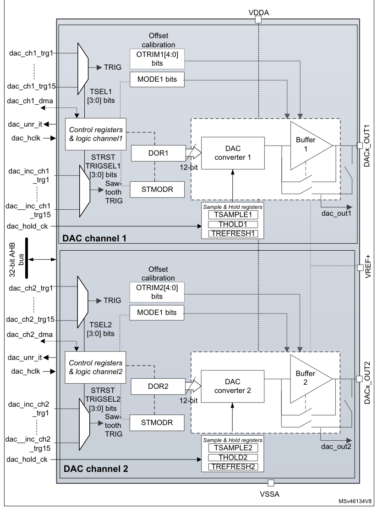

1. MODEx bits in the DAC_MCR control the output mode and allow switching between the normal mode in
   buffer/unbuffered configuration and the sample and hold mode.
2. Refer to [Section 22.3](#223-dac-implementation): DAC implementation for channel2 availability.
3. DAC channel2 is available only on DAC1, DAC3 and DAC4.

### 22.4.2 DAC pins and internal signals

The DAC includes:

- Up to two output channels
- The DACx_OUTy can be disconnected from the output pin and used as an ordinary GPIO
- The dac_outx can use an internal pin connection to on-chip peripherals such as comparator,
  operational amplifier and ADC (if available).
- DAC output channel buffered or non buffered
- Sample and hold block and registers operational in Stop mode, using the LSI/LSE clock source
  (dac_hold_ck) for static conversion.

The DAC includes up to two separate output channels. Each output channel can be connected to on-chip
peripherals such as comparator, operational amplifier and ADC (if available). In this case, the DAC
output channel can be disconnected from the DACx_OUTy output pin and the corresponding GPIO can be
used for another purpose.

The DAC output can be buffered or not. The sample and hold block and its associated registers can
run in Stop mode using the LSI/LSE clock source (dac_hold_ck).

**Table 184. DAC input/output pins**

| Source row | Column 1 | Column 2 | Column 3 |
| ---: | --- | --- | --- |
| 1 | `Pin name` | `Signal type` | `Remarks` |
| 2 | `Input, analog positive` | `The higher/positive reference voltage for the DAC,` |  |
| 3 | `VREF+` |  |  |
| 4 | `reference` | `VREF+ ≤VDDAmax (refer to datasheet)` |  |
| 5 | `VDDA` | `Input, analog supply` | `Analog power supply` |
| 6 | `VSSA` | `Input, analog supply ground` | `Ground for analog power supply` |
| 7 | `DACx_OUTy` | `Analog output signal` | `DACx channely analog output` |

**Table 185. DAC input/output signals**

| Source row | Column 1 | Column 2 | Column 3 |
| ---: | --- | --- | --- |
| 1 | `Internal signal name` | `Signal type` | `Description` |
| 2 | `dac_ch1_dma` | `Bidirectional` | `DAC channel1 DMA request/acknowledge` |
| 3 | `dac_ch2_dma` | `Bidirectional` | `DAC channel2 DMA request/acknowledge` |
| 4 | `dac_ch1_trgx (x = 1 to 15)` | `Inputs` | `DAC channel1 trigger inputs` |
| 5 | `dac_ch2_trgx (x = 1 to 15)` | `Inputs` | `DAC channel2 trigger inputs` |
| 6 | `dac_ch1_inc_trgx (x = 1 to 15)` | `Inputs` | `DAC channel1 sawtooth increment trigger inputs` |
| 7 | `dac_chn2_inc_trgx (x = 1 to 15)` | `Inputs` | `DAC channel1 sawtooth increment trigger inputs` |
| 8 | `dac_unr_it` | `Output` | `DAC underrun interrupt` |
| 9 | `dac_hclk` | `Input` | `DAC peripheral clock` |
| 10 | `DAC low-power clock used in sample and hold` |  |  |
| 11 | `dac_hold_ck` | `Input` |  |
| 12 | `mode` |  |  |

**Table 185. DAC input/output signals (continued)**

| Source row | Column 1 | Column 2 | Column 3 |
| ---: | --- | --- | --- |
| 1 | `Internal signal name` | `Signal type` | `Description` |
| 2 | `Analog` |  |  |
| 3 | `dac_out1` | `DAC channel1 output for on-chip peripherals` |  |
| 4 | `output` |  |  |
| 5 | `Analog` |  |  |
| 6 | `dac_out2` | `DAC channel2 output for on-chip peripherals` |  |
| 7 | `output` |  |  |

**Table 186. DAC1 interconnection**

| Source row | Column 1 | Column 2 | Column 3 |
| ---: | --- | --- | --- |
| 1 | `Signal name` | `Source` | `Source type` |
| 2 | `ck_lsi or ck_lse (selected in` |  |  |
| 3 | `dac_hold_ck` | `LSI or LSE clock selected in the RCC` |  |
| 4 | `the RCC)` |  |  |
| 5 | `dac_chx_trg1 (x = 1, 2)` | `TIM8_TRGO` | `Internal signal from on-chip timers` |
| 6 | `dac_chx_trg2 (x = 1, 2)` | `TIM7_TRGO` | `Internal signal from on-chip timers` |
| 7 | `dac_chx_trg3 (x = 1, 2)` | `TIM15_TRGO` | `Internal signal from on-chip timers` |
| 8 | `dac_chx_trg4 (x = 1, 2)` | `TIM2_TRGO` | `Internal signal from on-chip timers` |
| 9 | `dac_chx_trg5 (x = 1, 2)` | `TIM4_TRGO` | `Internal signal from on-chip timers` |
| 10 | `dac_chx_trg6 (x = 1, 2)` | `EXTI9` | `External pin` |
| 11 | `dac_chx_trg7 (x = 1, 2)` | `TIM6_TRGO` | `Internal signal from on-chip timers` |
| 12 | `dac_chx_trg8 (x = 1, 2)` | `TIM3_TRGO` | `Internal signal from on-chip timers` |
| 13 | `dac_chx_trg9 (x = 1, 2)` | `hrtim_dac_reset_trg1` | `Internal signal from on-chip timers` |
| 14 | `dac_chx_trg10 (x = 1, 2)` | `hrtim_dac_reset_trg2` | `Internal signal from on-chip timers` |
| 15 | `dac_chx_trg11 (x = 1, 2)` | `hrtim_dac_reset_trg3` | `Internal signal from on-chip timers` |
| 16 | `dac_chx_trg12 (x = 1, 2)` | `hrtim_dac_reset_trg4` | `Internal signal from on-chip timers` |
| 17 | `dac_chx_trg13 (x = 1, 2)` | `hrtim_dac_reset_trg5` | `Internal signal from on-chip timers` |
| 18 | `dac_chx_trg14 (x = 1, 2)` | `hrtim_dac_reset_trg6` | `Internal signal from on-chip timers` |
| 19 | `dac_chx_trg15 (x = 1, 2)` | `hrtim_dac_trg1` | `Internal signal from on-chip timers` |
| 20 | `dac_inc_chx_trg1 (x = 1, 2)` | `TIM8_TRGO` | `Internal signal from on-chip timers` |
| 21 | `dac_inc_chx_trg2 (x = 1, 2)` | `TIM7_TRGO` | `Internal signal from on-chip timers` |
| 22 | `dac_inc_chx_trg3 (x = 1, 2)` | `TIM15_TRGO` | `Internal signal from on-chip timers` |
| 23 | `dac_inc_chx_trg4 (x = 1, 2)` | `TIM2_TRGO` | `Internal signal from on-chip timers` |
| 24 | `dac_inc_chx_trg5 (x = 1, 2)` | `TIM4_TRGO` | `Internal signal from on-chip timers` |
| 25 | `dac_inc_chx_trg6 (x = 1, 2)` | `EXTI10` | `External pin` |
| 26 | `dac_inc_chx_trg7 (x = 1, 2)` | `TIM6_TRGO` | `Internal signal from on-chip timers` |
| 27 | `dac_inc_chx_trg8 (x = 1, 2)` | `TIM3_TRGO` | `Internal signal from on-chip timers` |
| 28 | `dac_inc_chx_trg9 (x = 1, 2)` | `hrtim_dac_step_trg1` | `Internal signal from on-chip timers` |
| 29 | `dac_inc_chx_trg10 (x = 1, 2)` | `hrtim_dac_step_trg2` | `Internal signal from on-chip timers` |
| 30 | `dac_inc_chx_trg11 (x = 1, 2)` | `hrtim_dac_step_trg3` | `Internal signal from on-chip timers` |
| 31 | `dac_inc_chx_trg12 (x = 1, 2)` | `hrtim_dac_step_trg4` | `Internal signal from on-chip timers` |

**Table 186. DAC1 interconnection (continued)**

| Signal name | Source | Source type |
| --- | --- | --- |
| dac_inc_chx_trg13 (x = 1, 2) | hrtim_dac_step_trg5 | Internal signal from on-chip timers |
| dac_inc_chx_trg14 (x = 1, 2) | hrtim_dac_step_trg6 | Internal signal from on-chip timers |

**Table 187. DAC2 interconnection**

| Source row | Column 1 | Column 2 | Column 3 |
| ---: | --- | --- | --- |
| 1 | `Signal name` | `Source` | `Source type` |
| 2 | `ck_lsi or ck_lse (selected in the` | `LSI or LSE clock selected in the` |  |
| 3 | `dac_hold_ck` |  |  |
| 4 | `RCC)` | `RCC` |  |
| 5 | `dac_ch1_trg1` | `TIM8_TRGO` | `Internal signal from on-chip timers` |
| 6 | `dac_ch1_trg2` | `TIM7_TRGO` | `Internal signal from on-chip timers` |
| 7 | `dac_ch1_trg3` | `TIM15_TRGO` | `Internal signal from on-chip timers` |
| 8 | `dac_ch1_trg4` | `TIM2_TRGO` | `Internal signal from on-chip timers` |
| 9 | `dac_ch1_trg5` | `TIM4_TRGO` | `Internal signal from on-chip timers` |
| 10 | `dac_ch1_trg6` | `EXTI9` | `External pin` |
| 11 | `dac_ch1_trg7` | `TIM6_TRGO` | `Internal signal from on-chip timers` |
| 12 | `dac_ch1_trg8` | `TIM3_TRGO` | `Internal signal from on-chip timers` |
| 13 | `dac_ch1_trg9` | `hrtim_dac_reset_trg1` | `Internal signal from on-chip timers` |
| 14 | `dac_ch1_trg10` | `hrtim_dac_reset_trg2` | `Internal signal from on-chip timers` |
| 15 | `dac_ch1_trg11` | `hrtim_dac_reset_trg3` | `Internal signal from on-chip timers` |
| 16 | `dac_ch1_trg12` | `hrtim_dac_reset_trg4` | `Internal signal from on-chip timers` |
| 17 | `dac_ch1_trg13` | `hrtim_dac_reset_trg5` | `Internal signal from on-chip timers` |
| 18 | `dac_ch1_trg14` | `hrtim_dac_reset_trg6` | `Internal signal from on-chip timers` |
| 19 | `dac_ch1_trg15` | `hrtim_dac_trg2` | `Internal signal from on-chip timers` |
| 20 | `dac_inc_ch1_trg1` | `TIM8_TRGO` | `Internal signal from on-chip timers` |
| 21 | `dac_inc_ch1_trg2` | `TIM7_TRGO` | `Internal signal from on-chip timers` |
| 22 | `dac_inc_ch1_trg3` | `TIM15_TRGO` | `Internal signal from on-chip timers` |
| 23 | `dac_inc_ch1_trg4` | `TIM2_TRGO` | `Internal signal from on-chip timers` |
| 24 | `dac_inc_ch1_trg5` | `TIM4_TRGO` | `Internal signal from on-chip timers` |
| 25 | `dac_inc_ch1_trg6` | `EXTI10` | `External pin` |
| 26 | `dac_inc_ch1_trg7` | `TIM6_TRGO` | `Internal signal from on-chip timers` |
| 27 | `dac_inc_ch1_trg8` | `TIM3_TRGO` | `Internal signal from on-chip timers` |
| 28 | `dac_inc_ch1_trg9` | `hrtim_dac_step_trg1` | `Internal signal from on-chip timers` |
| 29 | `dac_inc_ch1_trg10` | `hrtim_dac_step_trg2` | `Internal signal from on-chip timers` |
| 30 | `dac_inc_ch1_trg11` | `hrtim_dac_step_trg3` | `Internal signal from on-chip timers` |
| 31 | `dac_inc_ch1_trg12` | `hrtim_dac_step_trg4` | `Internal signal from on-chip timers` |

**Table 187. DAC2 interconnection (continued)**

| Signal name | Source | Source type |
| --- | --- | --- |
| dac_inc_ch1_trg13 | hrtim_dac_step_trg5 | Internal signal from on-chip timers |
| dac_inc_ch1_trg14 | hrtim_dac_step_trg6 | Internal signal from on-chip timers |

**Table 188. DAC3 interconnection**

| Source row | Column 1 | Column 2 | Column 3 |
| ---: | --- | --- | --- |
| 1 | `Signal name` | `Source` | `Source type` |
| 2 | `ck_lsi or ck_lse (selected in the` | `LSI or LSE clock selected in the` |  |
| 3 | `dac_hold_ck` |  |  |
| 4 | `RCC)` | `RCC` |  |
| 5 | `Internal signal from on-chip` |  |  |
| 6 | `dac_chx_trg1 (x = 1, 2)` | `TIM1_TRGO` |  |
| 7 | `timers` |  |  |
| 8 | `Internal signal from on-chip` |  |  |
| 9 | `dac_chx_trg2 (x = 1, 2)` | `TIM7_TRGO` |  |
| 10 | `timers` |  |  |
| 11 | `Internal signal from on-chip` |  |  |
| 12 | `dac_chx_trg3 (x = 1, 2)` | `TIM15_TRGO` |  |
| 13 | `timers` |  |  |
| 14 | `Internal signal from on-chip` |  |  |
| 15 | `dac_chx_trg4 (x = 1, 2)` | `TIM2_TRGO` |  |
| 16 | `timers` |  |  |
| 17 | `Internal signal from on-chip` |  |  |
| 18 | `dac_chx_trg5 (x = 1, 2)` | `TIM4_TRGO` |  |
| 19 | `timers` |  |  |
| 20 | `dac_chx_trg6 (x = 1, 2)` | `EXTI9` | `External pin` |
| 21 | `Internal signal from on-chip` |  |  |
| 22 | `dac_chx_trg7 (x = 1, 2)` | `TIM6_TRGO` |  |
| 23 | `timers` |  |  |
| 24 | `Internal signal from on-chip` |  |  |
| 25 | `dac_chx_trg8 (x = 1, 2)` | `TIM3_TRGO` |  |
| 26 | `timers` |  |  |
| 27 | `Internal signal from on-chip` |  |  |
| 28 | `dac_chx_trg9 (x = 1, 2)` | `hrtim_dac_reset_trg1` |  |
| 29 | `timers` |  |  |
| 30 | `Internal signal from on-chip` |  |  |
| 31 | `dac_chx_trg10 (x = 1, 2)` | `hrtim_dac_reset_trg2` |  |
| 32 | `timers` |  |  |
| 33 | `Internal signal from on-chip` |  |  |
| 34 | `dac_chx_trg11 (x = 1, 2)` | `hrtim_dac_reset_trg3` |  |
| 35 | `timers` |  |  |
| 36 | `Internal signal from on-chip` |  |  |
| 37 | `dac_chx_trg12 (x = 1, 2)` | `hrtim_dac_reset_trg4` |  |
| 38 | `timers` |  |  |
| 39 | `Internal signal from on-chip` |  |  |
| 40 | `dac_chx_trg13 (x = 1, 2)` | `hrtim_dac_reset_trg5` |  |
| 41 | `timers` |  |  |
| 42 | `Internal signal from on-chip` |  |  |
| 43 | `dac_chx_trg14 (x = 1, 2)` | `hrtim_dac_reset_trg6` |  |
| 44 | `timers` |  |  |
| 45 | `Internal signal from on-chip` |  |  |
| 46 | `dac_chx_trg15 (x = 1, 2)` | `hrtim_dac_trg3` |  |
| 47 | `timers` |  |  |
| 48 | `Internal signal from on-chip` |  |  |
| 49 | `dac_inc_chx_trg1 (x = 1, 2)` | `TIM1_TRGO` |  |
| 50 | `timers` |  |  |
| 51 | `Internal signal from on-chip` |  |  |
| 52 | `dac_inc_chx_trg2 (x = 1, 2)` | `TIM7_TRGO` |  |
| 53 | `timers` |  |  |

**Table 188. DAC3 interconnection (continued)**

| Source row | Column 1 | Column 2 | Column 3 |
| ---: | --- | --- | --- |
| 1 | `Signal name` | `Source` | `Source type` |
| 2 | `Internal signal from on-chip` |  |  |
| 3 | `dac_inc_chx_trg3 (x = 1, 2)` | `TIM15_TRGO` |  |
| 4 | `timers` |  |  |
| 5 | `Internal signal from on-chip` |  |  |
| 6 | `dac_inc_chx_trg4 (x = 1, 2)` | `TIM2_TRGO` |  |
| 7 | `timers` |  |  |
| 8 | `Internal signal from on-chip` |  |  |
| 9 | `dac_inc_chx_trg5 (x = 1, 2)` | `TIM4_TRGO` |  |
| 10 | `timers` |  |  |
| 11 | `dac_inc_chx_trg6 (x = 1, 2)` | `EXTI10` | `External pin` |
| 12 | `Internal signal from on-chip` |  |  |
| 13 | `dac_inc_chx_trg7 (x = 1, 2)` | `TIM6_TRGO` |  |
| 14 | `timers` |  |  |
| 15 | `Internal signal from on-chip` |  |  |
| 16 | `dac_inc_chx_trg8 (x = 1, 2)` | `TIM3_TRGO` |  |
| 17 | `timers` |  |  |
| 18 | `Internal signal from on-chip` |  |  |
| 19 | `dac_inc_chx_trg9 (x = 1, 2)` | `hrtim_dac_step_trg1` |  |
| 20 | `timers` |  |  |
| 21 | `Internal signal from on-chip` |  |  |
| 22 | `dac_inc_chx_trg10 (x = 1, 2)` | `hrtim_dac_step_trg2` |  |
| 23 | `timers` |  |  |
| 24 | `Internal signal from on-chip` |  |  |
| 25 | `dac_inc_chx_trg11 (x = 1, 2)` | `hrtim_dac_step_trg3` |  |
| 26 | `timers` |  |  |
| 27 | `Internal signal from on-chip` |  |  |
| 28 | `dac_inc_chx_trg12 (x = 1, 2)` | `hrtim_dac_step_trg4` |  |
| 29 | `timers` |  |  |
| 30 | `Internal signal from on-chip` |  |  |
| 31 | `dac_inc_chx_trg13 (x = 1, 2)` | `hrtim_dac_step_trg5` |  |
| 32 | `timers` |  |  |
| 33 | `Internal signal from on-chip` |  |  |
| 34 | `dac_inc_chx_trg14 (x = 1, 2)` | `hrtim_dac_step_trg6` |  |
| 35 | `timers` |  |  |

**Table 189. DAC4 interconnection**

| Source row | Column 1 | Column 2 | Column 3 |
| ---: | --- | --- | --- |
| 1 | `Signal name` | `Source` | `Source type` |
| 2 | `ck_lsi or ck_lse (selected in` | `LSI or LSE clock selected in the` |  |
| 3 | `dac_hold_ck` |  |  |
| 4 | `RCC)` | `RCC` |  |
| 5 | `Internal signal from on-chip` |  |  |
| 6 | `dac_chx_trg1 (x = 1, 2)` | `TIM8_TRGO` |  |
| 7 | `timers` |  |  |
| 8 | `Internal signal from on-chip` |  |  |
| 9 | `dac_chx_trg2 (x = 1, 2)` | `TIM7_TRGO` |  |
| 10 | `timers` |  |  |
| 11 | `Internal signal from on-chip` |  |  |
| 12 | `dac_chx_trg3 (x = 1, 2)` | `TIM15_TRGO` |  |
| 13 | `timers` |  |  |
| 14 | `Internal signal from on-chip` |  |  |
| 15 | `dac_chx_trg4 (x = 1, 2)` | `TIM2_TRGO` |  |
| 16 | `timers` |  |  |
| 17 | `Internal signal from on-chip` |  |  |
| 18 | `dac_chx_trg5 (x = 1, 2)` | `TIM4_TRGO` |  |
| 19 | `timers` |  |  |
| 20 | `dac_chx_trg6 (x = 1, 2)` | `EXTI9` | `External pin` |
| 21 | `Internal signal from on-chip` |  |  |
| 22 | `dac_chx_trg7 (x = 1, 2)` | `TIM6_TRGO` |  |
| 23 | `timers` |  |  |

**Table 189. DAC4 interconnection (continued)**

| Source row | Column 1 | Column 2 | Column 3 |
| ---: | --- | --- | --- |
| 1 | `Signal name` | `Source` | `Source type` |
| 2 | `Internal signal from on-chip` |  |  |
| 3 | `dac_chx_trg8 (x = 1, 2)` | `TIM3_TRGO` |  |
| 4 | `timers` |  |  |
| 5 | `Internal signal from on-chip` |  |  |
| 6 | `dac_chx_trg9 (x = 1, 2)` | `hrtim_dac_reset_trg1` |  |
| 7 | `timers` |  |  |
| 8 | `Internal signal from on-chip` |  |  |
| 9 | `dac_chx_trg10 (x = 1, 2)` | `hrtim_dac_reset_trg2` |  |
| 10 | `timers` |  |  |
| 11 | `Internal signal from on-chip` |  |  |
| 12 | `dac_chx_trg11 (x = 1, 2)` | `hrtim_dac_reset_trg3` |  |
| 13 | `timers` |  |  |
| 14 | `Internal signal from on-chip` |  |  |
| 15 | `dac_chx_trg12 (x = 1, 2)` | `hrtim_dac_reset_trg4` |  |
| 16 | `timers` |  |  |
| 17 | `Internal signal from on-chip` |  |  |
| 18 | `dac_chx_trg13 (x = 1, 2)` | `hrtim_dac_reset_trg5` |  |
| 19 | `timers` |  |  |
| 20 | `Internal signal from on-chip` |  |  |
| 21 | `dac_chx_trg14 (x = 1, 2)` | `hrtim_dac_reset_trg6` |  |
| 22 | `timers` |  |  |
| 23 | `Internal signal from on-chip` |  |  |
| 24 | `dac_chx_trg15 (x = 1, 2)` | `hrtim_dac_trg1` |  |
| 25 | `timers` |  |  |
| 26 | `Internal signal from on-chip` |  |  |
| 27 | `dac_inc_chx_trg1 (x = 1, 2)` | `TIM8_TRGO` |  |
| 28 | `timers` |  |  |
| 29 | `Internal signal from on-chip` |  |  |
| 30 | `dac_inc_chx_trg2 (x = 1, 2)` | `TIM7_TRGO` |  |
| 31 | `timers` |  |  |
| 32 | `Internal signal from on-chip` |  |  |
| 33 | `dac_inc_chx_trg3 (x = 1, 2)` | `TIM15_TRGO` |  |
| 34 | `timers` |  |  |
| 35 | `Internal signal from on-chip` |  |  |
| 36 | `dac_inc_chx_trg4 (x = 1, 2)` | `TIM2_TRGO` |  |
| 37 | `timers` |  |  |
| 38 | `Internal signal from on-chip` |  |  |
| 39 | `dac_inc_chx_trg5 (x = 1, 2)` | `TIM4_TRGO` |  |
| 40 | `timers` |  |  |
| 41 | `dac_inc_chx_trg6 (x = 1, 2)` | `EXTI10` | `External pin` |
| 42 | `Internal signal from on-chip` |  |  |
| 43 | `dac_inc_chx_trg7 (x = 1, 2)` | `TIM6_TRGO` |  |
| 44 | `timers` |  |  |
| 45 | `Internal signal from on-chip` |  |  |
| 46 | `dac_inc_chx_trg8 (x = 1, 2)` | `TIM3_TRGO` |  |
| 47 | `timers` |  |  |
| 48 | `Internal signal from on-chip` |  |  |
| 49 | `dac_inc_chx_trg9 (x = 1, 2)` | `hrtim_dac_step_trg1` |  |
| 50 | `timers` |  |  |
| 51 | `Internal signal from on-chip` |  |  |
| 52 | `dac_inc_chx_trg10 (x = 1, 2)` | `hrtim_dac_step_trg2` |  |
| 53 | `timers` |  |  |
| 54 | `Internal signal from on-chip` |  |  |
| 55 | `dac_inc_chx_trg11 (x = 1, 2)` | `hrtim_dac_step_trg3` |  |
| 56 | `timers` |  |  |
| 57 | `Internal signal from on-chip` |  |  |
| 58 | `dac_inc_chx_trg12 (x = 1, 2)` | `hrtim_dac_step_trg4` |  |
| 59 | `timers` |  |  |

**Table 189. DAC4 interconnection (continued)**

| Source row | Column 1 | Column 2 | Column 3 |
| ---: | --- | --- | --- |
| 1 | `Signal name` | `Source` | `Source type` |
| 2 | `Internal signal from on-chip` |  |  |
| 3 | `dac_inc_chx_trg13 (x = 1, 2)` | `hrtim_dac_step_trg5` |  |
| 4 | `timers` |  |  |
| 5 | `Internal signal from on-chip` |  |  |
| 6 | `dac_inc_chx_trg14 (x = 1, 2)` | `hrtim_dac_step_trg6` |  |
| 7 | `timers` |  |  |

### 22.4.3 DAC channel enable

Each DAC channel can be powered on by setting its corresponding ENx bit in the DAC_CR register. The
DAC channel is then enabled after a tWAKEUP startup time.

DACxRDY bit is set in the DAC_SR register when the DAC interface is ready to accept data. Writing
new data or asserting the trigger is not allowed when ENx bit is set while DACxRDY signal is reset.

> **Note:** The ENx bit enables the analog DAC channelx only. The DAC channelx digital interface is
> enabled even if the ENx bit is reset.

### 22.4.4 DAC data format

Depending on the selected configuration mode, the data have to be written into the specified
register as described below:

- Single DAC channel

There are three possibilities:

- 8-bit right alignment: the software has to load data into the DAC_DHR8Rx[7:0] bits (stored into
  the DHRx[11:4] bits)
- 12-bit left alignment: the software has to load data into the DAC_DHR12Lx [15:4] bits (stored into
  the DHRx[11:0] bits)
- 12-bit right alignment: the software has to load data into the DAC_DHR12Rx [11:0] bits (stored
  into the DHRx[11:0] bits)

Depending on the loaded DAC_DHRyyyx register, the data written by the user is shifted and stored
into the corresponding DAC_DHRx (data holding registerx, which are internal non-memory-mapped
registers). The DAC_DHRx register is then loaded into the DAC_DORx register either automatically, by
software trigger or by an external event trigger.

**Figure 157. Data registers in single DAC channel mode**

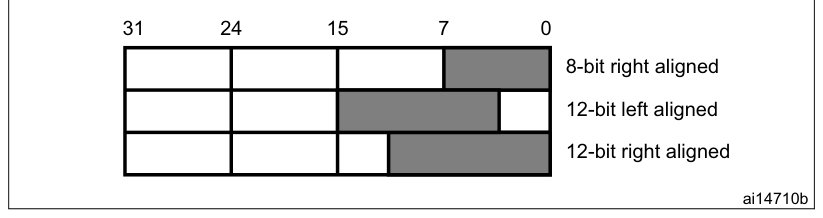

- Dual DAC channels (when available)

There are three possibilities:

- 8-bit right alignment: data for DAC channel1 to be loaded into the DAC_DHR8RD [7:0] bits (stored
  into the DHR1[11:4] bits) and data for DAC channel2 to be loaded into the DAC_DHR8RD [15:8] bits
  (stored into the DHR2[11:4] bits)
- 12-bit left alignment: data for DAC channel1 to be loaded into the DAC_DHR12LD [15:4] bits (stored
  into the DHR1[11:0] bits) and data for DAC channel2 to be loaded into the DAC_DHR12LD [31:20] bits
  (stored into the DHR2[11:0] bits)
- 12-bit right alignment: data for DAC channel1 to be loaded into the DAC_DHR12RD [11:0] bits
  (stored into the DHR1[11:0] bits) and data for DAC channel2 to be loaded into the DAC_DHR12RD
  [27:16] bits (stored into the DHR2[11:0] bits)

Depending on the loaded DAC_DHRyyyD register, the data written by the user is shifted and stored
into DHR1 and DHR2 (data holding registers, which are internal non-memory-mapped registers). The
DHR1 and DHR2 registers are then loaded into the DAC_DOR1 and DOR2 registers, respectively, either
automatically, by software trigger or by an external event trigger.

**Figure 158. Data registers in dual DAC channel mode**

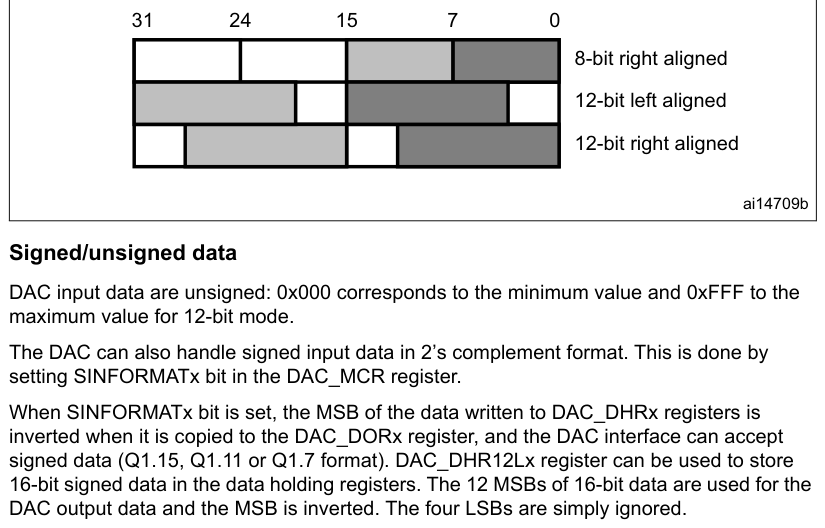

#### Signed/unsigned data

DAC input data are unsigned: 0x000 corresponds to the minimum value and 0xFFF to the maximum value
for 12-bit mode.

The DAC can also handle signed input data in 2’s complement format. This is done by setting
SINFORMATx bit in the DAC_MCR register.

When SINFORMATx bit is set, the MSB of the data written to DAC_DHRx registers is inverted when it is
copied to the DAC_DORx register, and the DAC interface can accept signed data (Q1.15, Q1.11 or Q1.7
format). DAC_DHR12Lx register can be used to store 16-bit signed data in the data holding registers.
The 12 MSBs of 16-bit data are used for the DAC output data and the MSB is inverted. The four LSBs
are simply ignored.

**Table 190. Data format (case of 12-bit data)**

| Source row | Column 1 | Column 2 | Column 3 |
| ---: | --- | --- | --- |
| 1 | `DATA written to DAC_DHRx` | `DATA transfered to DAC_DORx` |  |
| 2 | `SINFORMATx bit` |  |  |
| 3 | `register` | `register` |  |
| 4 | `0` | `0x000` | `0x000` |
| 5 | `0` | `0xFFF` | `0xFFF` |
| 6 | `1` | `0x7FF` | `0xFFF` |

**Table 190. Data format (case of 12-bit data) (continued)**

| Source row | Column 1 | Column 2 | Column 3 |
| ---: | --- | --- | --- |
| 1 | `DATA written to DAC_DHRx` | `DATA transfered to DAC_DORx` |  |
| 2 | `SINFORMATx bit` |  |  |
| 3 | `register` | `register` |  |
| 4 | `1` | `0x000` | `0x800` |
| 5 | `1` | `0xFFF` | `0x7FF` |
| 6 | `1` | `0x800` | `0x000` |

### 22.4.5 DAC conversion

The DAC_DORx cannot be written directly and any data transfer to the DAC channelx must be performed
by loading the DAC_DHRx register (write operation to DAC_DHR8Rx, DAC_DHR12Lx, DAC_DHR12Rx,
DAC_DHR8RD, DAC_DHR12RD or DAC_DHR12LD).

Data stored in the DAC_DHRx register are automatically transferred to the DAC_DORx register after
one dac_hclk clock cycle, if no hardware trigger is selected (TENx bit in DAC_CR register is reset).
However, when a hardware trigger is selected (TENx bit in DAC_CR register is set) and a trigger
occurs, the transfer is performed three dac_hclk clock cycles after the trigger signal.

When DAC_DORx is loaded with the DAC_DHRx contents, the analog output voltage becomes available
after a time tSETTLING that depends on the power supply voltage and the analog output load.

HFSEL bits of DAC_MCR must be set when dac_ker_ck clock speed is faster than 80 MHz.

Refer to Table HFSEL description below for the limitation of the DAC_DORx update rate depending on
HFSEL bits and NA clock frequency.

If the data is updated or a software/hardware trigger event occurs during the non-allowed period,
the peripheral behavior is unpredictable.

The above timing is only related to the limitation of the DAC interface. Refer also to the tSETTLING
parameter value in the product datasheet.

**Table 191. HFSEL description**

| HFSEL[1:0] | AHB frequency | Function |
| --- | --- | --- |
| 00 | \< 80 MHz | DAC_DOR update rate up to 3 AHB clock cycles |
| 01 | ≥80 MHz(1) | DAC_DOR update rate up to 5 AHB clock cycles |
| 10 | ≥ 160 MHz | DAC_DOR update rate up to 7 AHB clock cycles |
| 11 | Reserved | - |

1. Refer to the device datasheet for the value of the maximum AHB frequency.

**Figure 159. Timing diagram for conversion with trigger disabled TEN = 0**

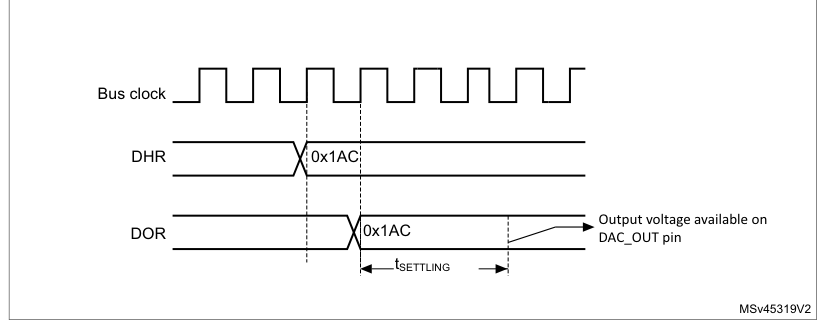

### 22.4.6 DAC output voltage

Digital inputs are converted to output voltages on a linear conversion between 0 and VREF+.

The analog output voltages on each DAC channel pin are determined by the following equation:

DOR

> **Extracted layout**
>
> `DAC output` · `=` · `VREF` · `×` · `-------------`  
> `4096`  

where all voltages are expressed in Volt.

### 22.4.7 DAC trigger selection

If the TENx control bit is set, the conversion can then be triggered by an external event (timer
counter, external interrupt line). The TSELx[3:0] control bits determine which out of 16 pos-sible
events triggers the conversion as shown in TSELx[3:0] bits of the DAC_CR register. These events can
be either the software trigger or hardware triggers. Refer to the intercon-nection table in Section
22.4.2.

Each time a DAC interface detects a rising edge on the selected trigger source (refer to the table
below), the last data stored into the DAC_DHRx register are transferred into the DAC_DORx register.
The DAC_DORx register is updated three dac_hclk cycles after the trigger occurs.

If the software trigger is selected, the conversion starts once the SWTRIG bit is set. SWTRIG is
reset by hardware once the DAC_DORx register has been loaded with the DAC_DHRx register contents.

The reset trigger selection and the increment trigger selection of the sawtooth generation are
performed through STRSTTRIGSELx and STINCTRIGSELx control bits, respectively. STRSTTRIGSELx mapping
is similar to TSELx. Refer to the [Section 22.4.2](#2242-dac-pins-and-internal-signals): DAC pins and internal signals for TSELx,
STRSTTRIGSELx, and STINCTRIGSELx mappings.

> **Note:** TSELx[3:0] bit cannot be changed when the ENx bit is set.

When software trigger is selected, the transfer from the DAC_DHRx register to the DAC_DORx register
takes only one dac_hclk clock cycle.

### 22.4.8 DMA requests

Each DAC channel has a DMA capability. Two DMA channels are used to service DAC channel DMA
requests.

When an external trigger (but not a software trigger) occurs while the DMAENx bit is set, the value
of the DAC_DHRx register is transferred into the DAC_DORx register when the transfer is complete,
and a DMA request is generated.

In dual mode, if both DMAENx bits are set, two DMA requests are generated. If only one DMA request
is needed, only the corresponding DMAENx bit must be set. In this way, the application can manage
both DAC channels in dual mode by using one DMA request and a unique DMA channel.

As DAC_DHRx to DAC_DORx data transfer occurred before the DMA request, the very first data has to be
written to the DAC_DHRx before the first trigger event occurs.

#### DMA underrun

The DAC DMA request is not queued so that if a second external trigger arrives before the
acknowledgment for the first external trigger is received (first request), then no new request is
issued and the DMA channelx underrun flag DMAUDRx in the DAC_SR register is set, reporting the error
condition. The DAC channelx continues to convert old data.

The software must clear the DMAUDRx flag by writing 1, clear the DMAEN bit of the used DMA stream
and re-initialize both DMA and DAC channelx to restart the transfer correctly. The software must
modify the DAC trigger conversion frequency or lighten the DMA workload to avoid a new DMA underrun.
Finally, the DAC conversion can be resumed by enabling both DMA data transfer and conversion
trigger.

For each DAC channelx, an interrupt is also generated if its corresponding DMAUDRIEx bit in the
DAC_CR register is enabled.

#### DMA double data mode

When the DMA controller is used in normal mode, only 12-bit (or 8-bit) data are transferred by a DMA
request. As the AHB width is 32 bits, two 12-bit data may be transferred simultaneously. To use this
mode, set the DMADOUBLEx bit of DAC_MCR register.

A DAC DMA request is generated every two external triggers (except for software triggers) when the
DMAENx bit is set:

1. When the first trigger is detected, the value of the DAC_DHRx and DAC_DHRBx
   registers are transferred into the DAC_DORx and DAC_DORBx registers. The actual DAC data is loaded
   into the DAC_DORx register. A DMA request is then generated. The DMA writes the new data to the
   DAC_DHRx and DAC_DHRBx data registers.
2. When the next trigger is detected, the actual DAC data is loaded into the DAC_DHRBx
   register. This second trigger does not generate any DMA request. The DORSTATx bit indicates which
   DOR data is actually loaded into the analog DAC input.

DMA underrun function is also supported in DMA double data mode.

The following conditions must be met to change from double data to single data mode or vice versa:

- The DAC must be disabled.
- DMAEN bit must be cleared (ENx = 0 and DMAEN = 0).

### 22.4.9 Noise generation

In order to generate a variable-amplitude pseudonoise, an LFSR (linear feedback shift register) is
available. DAC noise generation is selected by setting WAVEx[1:0] to 01. The preloaded value in LFSR
is 0xAAA. This register is updated three dac_hclk clock cycles after each trigger event, following a
specific calculation algorithm.

**Figure 160. DAC LFSR register calculation algorithm**

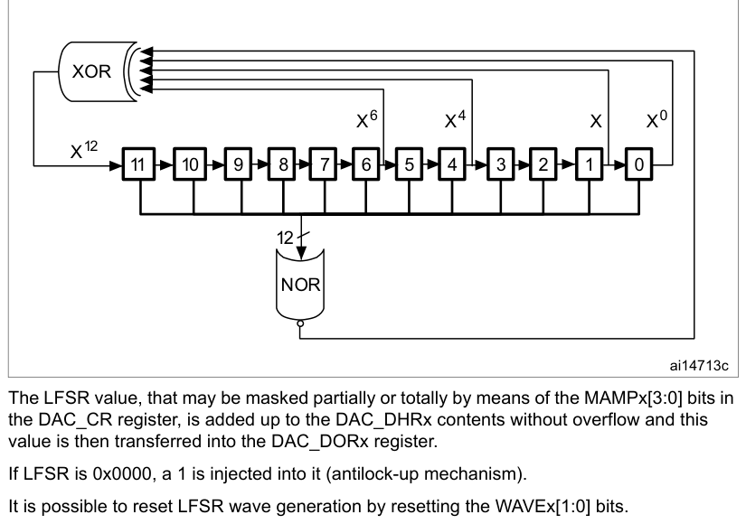

The LFSR value, that may be masked partially or totally by means of the MAMPx[3:0] bits in the
DAC_CR register, is added up to the DAC_DHRx contents without overflow and this value is then
transferred into the DAC_DORx register.

If LFSR is 0x0000, a 1 is injected into it (antilock-up mechanism).

It is possible to reset LFSR wave generation by resetting the WAVEx[1:0] bits.

**Figure 161. DAC conversion (SW trigger enabled) with LFSR wave generation**

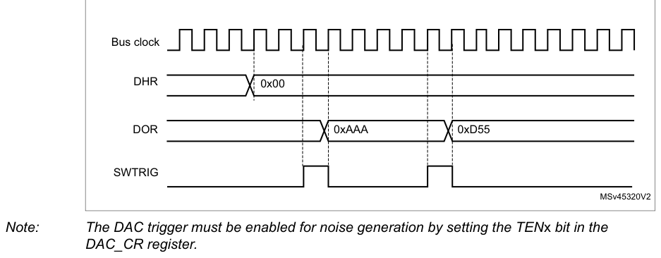

> **Note:** The DAC trigger must be enabled for noise generation by setting the TENx bit in the

DAC_CR register.

### 22.4.10 Triangle-wave generation

It is possible to add a small-amplitude triangular waveform on a DC or slowly varying signal. DAC
triangle-wave generation is selected by setting WAVEx[1:0] to 10. The amplitude is configured
through the MAMPx[3:0] bits in the DAC_CR register. An internal triangle counter is incremented
three dac_hclk clock cycles after each trigger event. The value of this counter is then added to the
DAC_DHRx register without overflow and the sum is transferred into the DAC_DORx register. The
triangle counter is incremented as long as it is less than the maximum amplitude defined by the
MAMPx[3:0] bits. Once the configured amplitude is reached, the counter is decremented down to 0,
then incremented again and so on.

It is possible to reset triangle wave generation by resetting the WAVEx[1:0] bits.

**Figure 162. DAC triangle wave generation**

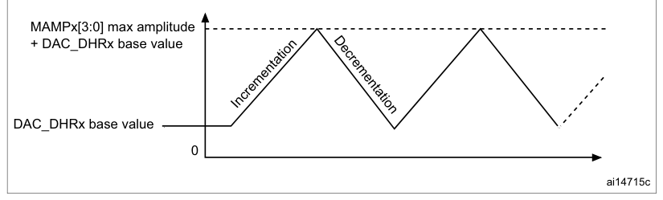

MAMPx[3:0] max amplitude

Decrementation

\+ DAC_DHRx base value

Incrementation

DAC_DHRx base value

0
ai14715c

**Figure 163. DAC conversion (SW trigger enabled) with triangle wave generation**

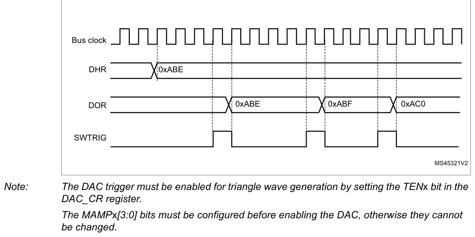

> **Note:** The DAC trigger must be enabled for triangle wave generation by setting the TENx bit in the

DAC_CR register.

The MAMPx[3:0] bits must be configured before enabling the DAC, otherwise they cannot be changed.

### 22.4.11 DAC sawtooth wave generation

The DAC can generate a sawtooth waveform. Specific register settings for the initial value,
increment value and direction control are required:

- DAC sawtooth wave generation is selected by setting WAVEx[1:0] to 11 in the DAC_CR register.
- The sawtooth counter initial value (reset value) is configured through STRSTDATAx[11:0] bits in
  the DAC_STRx register.
- The increment value is defined by the STINCDATAx[15:0] bits in the DAC_STRx register.
- The sawtooth direction is defined by STDIRx bit in the DAC_STRx register.

The sawtooth counter starts from STRSTDATAx[11:0] (bits 12 to 15 are set to 0b0000), each increment
trigger then increments (or decrements) STINCDATAx[15:0] value.

The DAC output is used from 12 MSBs of those counter value. When the counter reaches 0x0000 or
0xFFFF, the value is saturated. The sawtooth reset trigger signal initializes the counter value to
the STRSTDATAx[11:0] (bits 12 to 15 are set to 0b0000) value.

The increment trigger (STINCTRIG) and reset trigger (STRSTTRIG) must be selected through the
STINCTRIGSELx[3:0] and the STRSTTRIGSELx[3:0] bits.

**Figure 164. DAC sawtooth wave generation (STDIRx = 0)**

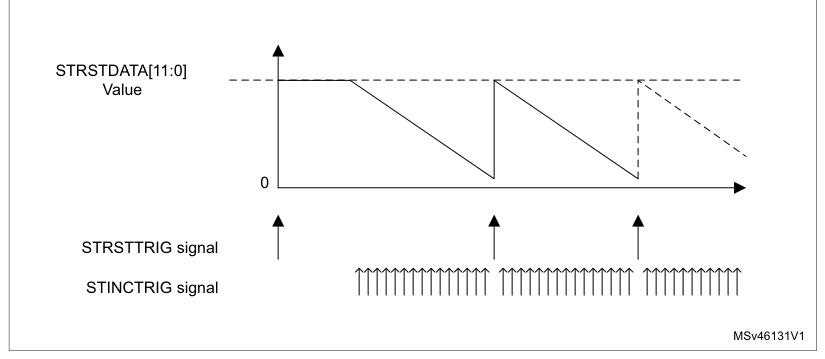

STRSTDATA[11:0]

Value

0

STRSTTRIG signal

STINCTRIG signal

MSv46131V1

**Figure 165. DAC sawtooth wave generation (STDIRx = 1)**

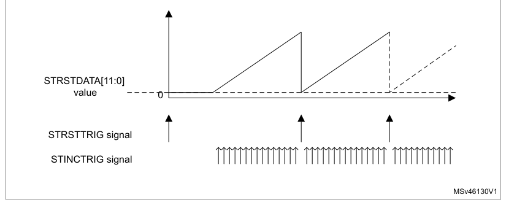

The STRSTTRIG signal has higher priority than STINCTRIG. The trigger signal cannot be faster than
the DAC_DORx update rate defined in Table HFSEL description. If STINCTRIG is asserted faster than
the allowed data update rate, the STINCTRIG trigger is ignored. If the STRSTTRIG signal is applied
after the STINCTRIG and before DAC_DORx update rate constraints, STRSTTRIG is put on hold. Then,
immediately after the data increment, the reset trigger is applied.

**Figure 166. DAC sawtooth STINCTRIG and STRSTTRIG priority (STDIR = 0)**

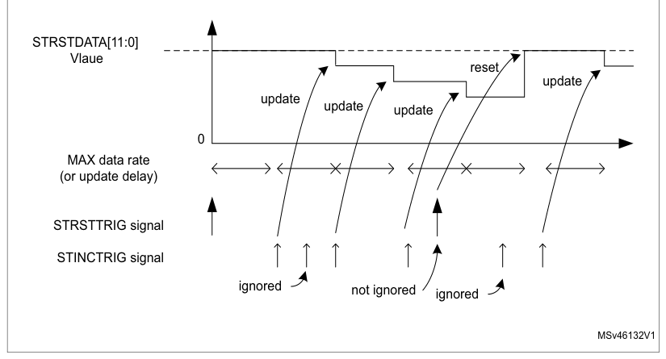

STRSTDATA[11:0]

Vlaue
reset
update
update
update
update

0

MAX data rate

(or update delay)

STRSTTRIG signal

STINCTRIG signal
ignored
not ignored
ignored

MSv46132V1

### 22.4.12 DAC channel modes

Each DAC channel can be configured in normal mode or sample and hold mode. The output buffer can be
enabled to obtain a high drive capability. Before enabling output buffer, the voltage offset needs
to be calibrated. This calibration is performed at the factory (loaded after reset) and can be
adjusted by software during application operation.

#### Normal mode

In normal mode, there are four combinations, by changing the buffer state and by changing the
DACx_OUTy pin interconnections.

To enable the output buffer, the MODEx[2:0] bits in DAC_MCR register must be:

- 000: DAC is connected to the external pin
- 001: DAC is connected to external pin and to on-chip peripherals

To disable the output buffer, the MODEx[2:0] bits in DAC_MCR register must be:

- 010: DAC is connected to the external pin
- 011: DAC is connected to on-chip peripherals

#### Sample and hold mode

In sample and hold mode, the DAC core converts data on a triggered conversion, and then holds the
converted voltage on a capacitor. When not converting, the DAC cores and buffer are completely
turned off between samples and the DAC output is tri-stated, therefore reducing the overall power
consumption. A stabilization period, which value depends on the buffer state, is required before
each new conversion.

In this mode, the DAC core and all corresponding logic and registers are driven by the LSI/LSE
low-speed clock (dac_hold_ck) in addition to the dac_hclk clock, allowing using the DAC channels in
deep low power modes such as Stop mode.

The LSI/LSE low-speed clock (dac_hold_ck) must not be stopped when the sample and hold mode is
enabled.

The sample/hold mode operations can be divided into three phases:

1. Sample phase: the sample/hold element is charged to the desired voltage. The
   charging time depends on capacitor value (internal or external, selected by the user). The sampling
   time is configured with the TSAMPLEx[9:0] bits in DAC_SHSRx register. During the write of the
   TSAMPLEx[9:0] bits, the BWSTx bit in DAC_SR register is set to 1 to synchronize between both clocks
   domains (AHB and low speed clock) and allowing the software to change the value of sample phase
   during the DAC channel operation
2. Hold phase: the DAC output channel is tri-stated, the DAC core and the buffer are
   turned off, to reduce the current consumption. The hold time is configured with the THOLDx[9:0] bits
   in DAC_SHHR register
3. Refresh phase: the refresh time is configured with the TREFRESHx[7:0] bits in

DAC_SHRR register

The timings for the three phases above are in units of LSI/LSE clock periods. As an example, to
configure a sample time of 350 µs, a hold time of 2 ms and a refresh time of 100 µs assuming LSI/LSE
~32 KHz is selected:

- 12 cycles are required for sample phase: TSAMPLEx[9:0] = 11.
- 62 cycles are required for hold phase: THOLDx[9:0] = 62.
- and 4 cycles are required for refresh period: TREFRESHx[7:0] = 4.

In this example, the power consumption is reduced by almost a factor of 15 versus normal modes.

The formulas to compute the right sample and refresh timings are described in the table below, the
Hold time depends on the leakage current.

**Table 192. Sample and refresh timings**

| Source row | Column 1 | Column 2 | Column 3 |
| ---: | --- | --- | --- |
| 1 | `Buffer` |  |  |
| 2 | `(1)(2)` | `tREFRESH` | `(2)(3)` |
| 3 | `tSAMP` |  |  |
| 4 | `State` |  |  |
| 5 | `Enable` | `7 μs + (10*RBON*CSH)` | `7 μs + (RBON*CSH)*ln(2*NLSB)` |
| 6 | `Disable` | `3 μs + (10*RBOFF*CSH)` | `3 μs + (RBOFF*CSH)*ln(2*NLSB)` |

1. In the above formula, the settling to the desired code value with ½ LSB or accuracy requires 10
   constant
   time for 12 bits resolution. For 8-bit resolution, the settling time is 7 constant time.
2. CSH is the capacitor in sample and hold mode.
3. The tolerated voltage drop during the hold phase “Vd” is represented by the number of LSBs after
   the
   capacitor discharging with the output leakage current. The settling back to the desired value with ½
   LSB
   error accuracy requires ln(2*Nlsb) constant time of the DAC.

#### Example of the sample and refresh time calculation with output buffer on

The values used in the example below are provided as indication only. Refer to the product datasheet
for product data.

CSH = 100 nF

VDDA = 3.0 V

Sampling phase:

tSAMP = 7 μs \+ (10 \* 2000 \* 100 \* 10-9) = 2.007 ms

(where RBON = 2 kΩ)

Refresh phase:

tREFRESH = 7 μs \+ (2000 \* 100 \* 10-9) \* ln(2*10) = 606.1 μs

(where NLSB = 10 (10 LSB drop during the hold phase)

Hold phase:

Dv = ileak \* thold / CSH = 0.0073 V (10 LSB of 12bit at 3 V)
ileak = 150 nA (worst case on the IO leakage on all the temperature range)
thold = 0.0073 \* 100 \* 10-9 / (150 \* 10-9) = 4.867 ms

**Figure 167. DAC sample and hold mode phase diagram**

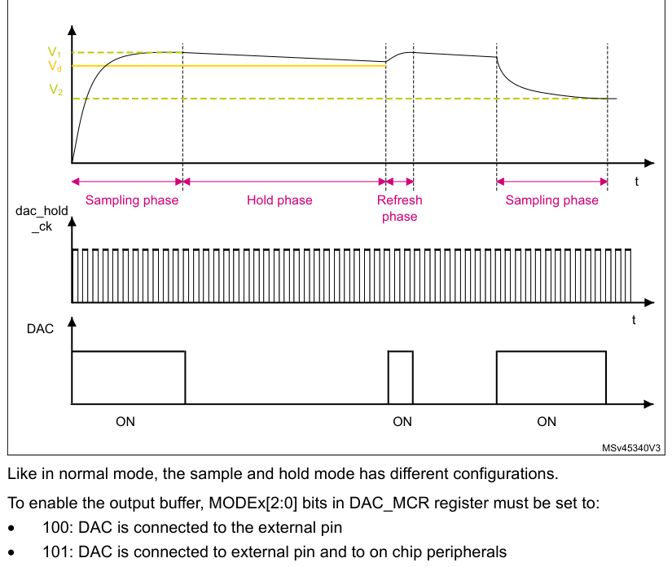

Like in normal mode, the sample and hold mode has different configurations.

To enable the output buffer, MODEx[2:0] bits in DAC_MCR register must be set to:

- 100: DAC is connected to the external pin
- 101: DAC is connected to external pin and to on chip peripherals

To disabled the output buffer, MODEx[2:0] bits in DAC_MCR register must be set to:

- 110: DAC is connected to external pin and to on chip peripherals
- 111: DAC is connected to on chip peripherals

When MODEx[2:0] bits are equal to 111, an internal capacitor, CLint, holds the voltage output of the
DAC core and then drive it to on-chip peripherals.

All sample and hold phases are interruptible, and any change in DAC_DHRx immediately triggers a new
sample phase.

> **Note:** The sawtooth wave generation is not supported in sample and hold mode operation.

**Table 193. Channel output modes summary**

| Source row | Column 1 | Column 2 | Column 3 | Column 4 |
| ---: | --- | --- | --- | --- |
| 1 | `MODEx[2:0]` | `Mode` | `Buffer` | `Output connections` |
| 2 | `0` | `0` | `0` | `Connected to external pin` |
| 3 | `Enabled` |  |  |  |
| 4 | `Connected to external pin and to on chip-peripherals (such as` |  |  |  |
| 5 | `0 0 1` |  |  |  |
| 6 | `comparators)` |  |  |  |
| 7 | `Normal mode` |  |  |  |
| 8 | `0` | `1` | `0` | `Connected to external pin` |
| 9 | `Disabled` |  |  |  |
| 10 | `0` | `1` | `1` | `Connected to on chip peripherals (such as comparators)` |
| 11 | `1` | `0` | `0` | `Connected to external pin` |
| 12 | `Enabled` |  |  |  |
| 13 | `Connected to external pin and to on chip peripherals (such as` |  |  |  |
| 14 | `1 0 1` |  |  |  |
| 15 | `comparators)` |  |  |  |
| 16 | `Sample and` |  |  |  |
| 17 | `hold mode` |  |  |  |
| 18 | `Connected to external pin and to on chip peripherals (such as` |  |  |  |
| 19 | `1 1 0` |  |  |  |
| 20 | `comparators)` |  |  |  |
| 21 | `Disabled` |  |  |  |
| 22 | `1` | `1` | `1` | `Connected to on chip peripherals (such as comparators)` |

### 22.4.13 DAC channel buffer calibration

The transfer function for an N-bit digital-to-analog converter (DAC) is:

> **Extracted layout**
>
> `⎛` · `⎞`  
> `Vout` · `=` · `(` · `D` · `⁄` · `2N` · `)` · `×` · `G` · `×` · `VREF` · `+` · `VOS`  
> `⎝` · `⎠`  

Where VOUT is the analog output, D is the digital input, G is the gain, VREF is the nominal
full-scale voltage, and VOS is the offset voltage. For an ideal DAC channel, G = 1 and VOS = 0.

Due to output buffer characteristics, the voltage offset may differ from part-to-part and introduce
an absolute offset error on the analog output. To compensate the VOS, a calibration is required by a
trimming technique.

The calibration is only valid when the DAC channelx is operating with buffer enabled (MODEx[2:0] =
0b000 or 0b001 or 0b100 or 0b101). if applied in other modes when the buffer is off, it has no
effect. During the calibration:

- The buffer output is disconnected from the pin internal/external connections and put in tristate
  mode (HiZ).
- The buffer acts as a comparator to sense the middle-code value 0x800 and compare it to VREF+/2
  signal through an internal bridge, then toggle its output signal to 0 or 1 depending on the
  comparison result (CAL_FLAGx bit).

Two calibration techniques are provided:

- Factory trimming (default setting)

The DAC buffer offset is factory trimmed. The default value of OTRIMx[4:0] bits in DAC_CCR register
is the factory trimming value and it is loaded once DAC digital interface is reset.

- User trimming

The user trimming can be done when the operating conditions differs from nominal factory trimming
conditions and in particular when VDDA voltage, temperature, VREF+ values change and can be done at
any point during application by software.

> **Note:** Refer to the datasheet for more details of the nominal factory trimming conditions.

In addition, when VDD is removed (example the device enters in Standby or VBAT modes) the
calibration is required.

The steps to perform a user trimming calibration are as below:

1. If the DAC channel is active, write 0 to ENx bit in DAC_CR to disable the channel.
2. Select a mode where the buffer is enabled, by writing to DAC_MCR register,

MODEx[2:0] = 0b000 or 0b001 or 0b100 or 0b101.

3. Start the DAC channelx calibration, by setting the CENx bit in DAC_CR register to 1.
4. Apply a trimming algorithm:

a) Write a code into OTRIMx[4:0] bits, starting by 0b00000.

b) Wait for tTRIM delay.

c) Check if CAL_FLAGx bit in DAC_SR is set to 1.

d) Until the CAL_FLAGx is read as 1 or the maximum trimming code is reached,
increment OTRIMx[4:0] and repeat substeps from (b) to (d).

The software algorithm may use either a successive approximation or dichotomy techniques to compute
and set the content of OTRIMx[4:0] bits in a faster way.

> **Note:** A tTRIM delay must be respected between the write to the OTRIMx[4:0] bits and the read of
> the CAL_FLAGx bit in DAC_SR register in order to get a correct value. This parameter is specified
> into datasheet electrical characteristics section.

If VDDA, VREF+ and temperature conditions do not change during device operation while it enters more
often in Standby and VBAT modes, the software may store the OTRIMx[4:0] bits found in the first user
calibration in the flash or in back-up registers. then to load/write them directly when the device
power is back again thus avoiding to wait for a new calibration time.

When CENx bit is set, it is not allowed to set ENx bit.

### 22.4.14 DAC channel conversion modes

Four conversion modes are possible.

#### Independent trigger without wave generation

To configure the DAC in this conversion mode, the following sequence is required:

1. Set the DAC channel trigger enable bit, TENx.
2. Configure the trigger sources by setting different values in the TSELx[3:0] bits.
3. Load the DAC channel data into the desired DHR registers (DAC_DHR12R1,

DAC_DHR12L1 or DAC_DHR8R1).

When a DAC channel trigger arrives, the DHRx register is transferred into DAC_DORx (three dac_hclk
clock cycles later).

#### Independent trigger with single LFSR generation

To configure the DAC in this conversion mode, the following sequence is required:

1. Set the DAC channel trigger enable bit, TENx.
2. Configure the trigger sources by setting different values in the TSELx[3:0] bits.
3. Configure the DAC channel WAVEx[1:0] bits as 01 and the same LFSR mask value in
   the MAMPx[3:0] bits.
4. Load the DAC channel data into the desired DHR register (DAC_DHR12R1,

DAC_DHR12L1 or DAC_DHR8R1).

When a DAC channel trigger arrives, the LFSR1 counter, with the same mask, is added to the DHR1
register and the sum is transferred into DAC_DOR1 (three dac_hclk clock cycles later). Then the
LFSR1 counter is updated.

#### Independent trigger with single triangle generation

To configure the DAC in this conversion mode, the following sequence is required:

1. Set the DAC channel trigger enable bits, TENx.
2. Configure the trigger sources by setting different values in the TSELx[3:0] bits.
3. Configure the DAC channel WAVEx[1:0] bits as 1x and the same maximum amplitude
   value in the MAMPx[3:0] bits.
4. Load the DAC channel data into the desired DHR register (DAC_DHR12R1,

DAC_DHR12L1 or DAC_DHR8R1).

When a DAC channel trigger arrives, the DAC channel triangle counter, with the same triangle
amplitude, is added to the DHRx register and the sum is transferred into DAC_DOR1 (three dac_hclk
clock cycles later). The DAC channel triangle counter is then updated.

#### Independent trigger with single sawtooth generation

To configure the DAC in this conversion mode, the following sequence is required:

1. Configure the trigger sources by setting different values in STRSTTRIGSELx[3:0] and

STINCTRIGSELx[3:0] bits.

2. Configure the DAC channel WAVEx[1:0] bits to 11 and set the same

STRSTDATAx[11:0], STINCDATAx[15:0] and STDIRx values for each register.

When a DAC channel trigger arrives, the DAC channel sawtooth counter updates the DHRx register and
transfers it into DAC_DOR1 (three AHB clock cycles later).

### 22.4.15 Dual DAC channel conversion modes (if dual channels are available)

To efficiently use the bus bandwidth in applications that require the two DAC channels at the same
time, three dual registers are implemented: DHR8RD, DHR12RD and DHR12LD. A unique register access is
then required to drive both DAC channels at the same time. For the wave generation, no accesses to
DHRxxxD registers are required. As a result, two output channels can be used either independently or
simultaneously.

15 conversion modes are possible using the two DAC channels and these dual registers. All the
conversion modes can nevertheless be obtained using separate DAC_DHRx registers if needed.

All modes are described in the paragraphs below.

#### Independent trigger without wave generation

To configure the DAC in this conversion mode, the following sequence is required:

1. Set the two DAC channel trigger enable bits TEN1 and TEN2.
2. Configure different trigger sources by setting different values in the TSEL1 and TSEL2
   bitfields.
3. Load the dual DAC channel data into the desired DHR register (DAC_DHR12RD,

DAC_DHR12LD or DAC_DHR8RD).

When a DAC channel1 trigger arrives, the DHR1 register is transferred into DAC_DOR1 (three dac_hclk
clock cycles later).

When a DAC channel2 trigger arrives, the DHR2 register is transferred into DAC_DOR2 (three dac_hclk
clock cycles later).

#### Independent trigger with single LFSR generation

To configure the DAC in this conversion mode, the following sequence is required:

1. Set the two DAC channel trigger enable bits TEN1 and TEN2.
2. Configure different trigger sources by setting different values in the TSEL1 and TSEL2
   bitfields.
3. Configure the two DAC channel WAVEx[1:0] bits as 01 and the same LFSR mask value
   in the MAMPx[3:0] bits.
4. Load the dual DAC channel data into the desired DHR register (DAC_DHR12RD,

DAC_DHR12LD or DAC_DHR8RD).

When a DAC channel1 trigger arrives, the LFSR1 counter, with the same mask, is added to the DHR1
register and the sum is transferred into DAC_DOR1 (three dac_hclk clock cycles later). Then the
LFSR1 counter is updated.

When a DAC channel2 trigger arrives, the LFSR2 counter, with the same mask, is added to the DHR2
register and the sum is transferred into DAC_DOR2 (three dac_hclk clock cycles later). Then the
LFSR2 counter is updated.

#### Independent trigger with different LFSR generation

To configure the DAC in this conversion mode, the following sequence is required:

1. Set the two DAC channel trigger enable bits TEN1 and TEN2.
2. Configure different trigger sources by setting different values in the TSEL1 and TSEL2
   bitfields.
3. Configure the two DAC channel WAVEx[1:0] bits as 01 and set different LFSR masks
   values in the MAMP1[3:0] and MAMP2[3:0] bits.
4. Load the dual DAC channel data into the desired DHR register (DAC_DHR12RD,

DAC_DHR12LD or DAC_DHR8RD).

When a DAC channel1 trigger arrives, the LFSR1 counter, with the mask configured by MAMP1[3:0], is
added to the DHR1 register and the sum is transferred into DAC_DOR1 (three dac_hclk clock cycles
later). Then the LFSR1 counter is updated.

When a DAC channel2 trigger arrives, the LFSR2 counter, with the mask configured by MAMP2[3:0], is
added to the DHR2 register and the sum is transferred into DAC_DOR2 (three dac_hclk clock cycles
later). Then the LFSR2 counter is updated.

#### Independent trigger with single triangle generation

To configure the DAC in this conversion mode, the following sequence is required:

1. Set the two DAC channel trigger enable bits TEN1 and TEN2.
2. Configure different trigger sources by setting different values in the TSEL1 and TSEL2
   bitfields.
3. Configure the two DAC channel WAVEx[1:0] bits as 1x and the same maximum
   amplitude value in the MAMPx[3:0] bits.
4. Load the dual DAC channel data into the desired DHR register (DAC_DHR12RD,

DAC_DHR12LD or DAC_DHR8RD).

When a DAC channel1 trigger arrives, the DAC channel1 triangle counter, with the same triangle
amplitude, is added to the DHR1 register and the sum is transferred into DAC_DOR1 (three dac_hclk
clock cycles later). The DAC channel1 triangle counter is then updated.

When a DAC channel2 trigger arrives, the DAC channel2 triangle counter, with the same triangle
amplitude, is added to the DHR2 register and the sum is transferred into DAC_DOR2 (three dac_hclk
clock cycles later). The DAC channel2 triangle counter is then updated.

#### Independent trigger with different triangle generation

To configure the DAC in this conversion mode, the following sequence is required:

1. Set the two DAC channel trigger enable bits TEN1 and TEN2.
2. Configure different trigger sources by setting different values in the TSEL1 and TSEL2
   bits.
3. Configure the two DAC channel WAVEx[1:0] bits as 1x and set different maximum
   amplitude values in the MAMP1[3:0] and MAMP2[3:0] bits.
4. Load the dual DAC channel data into the desired DHR register (DAC_DHR12RD,

DAC_DHR12LD or DAC_DHR8RD).

When a DAC channel1 trigger arrives, the DAC channel1 triangle counter, with a triangle amplitude
configured by MAMP1[3:0], is added to the DHR1 register and the sum is
transferred into DAC_DOR1 (three dac_hclk clock cycles later). The DAC channel1 triangle counter is
then updated.

When a DAC channel2 trigger arrives, the DAC channel2 triangle counter, with a triangle amplitude
configured by MAMP2[3:0], is added to the DHR2 register and the sum is transferred into DAC_DOR2
(three dac_hclk clock cycles later). The DAC channel2 triangle counter is then updated.

#### Independent trigger with single sawtooth generation

To configure the DAC in this conversion mode, the following sequence is required:

1. Configure different trigger sources by setting different values in STRSTTRIGSEL1[3:0],

STRSTTRIGSEL2[3:0], STINCTRIGSEL2[3:0] and STINCTRIGSEL1[3:0] bits.

2. Configure the two DAC channel WAVEx[1:0] bits to 11 and set the same

STRSTDATAx[11:0], STINCDATAx[15:0] and STDIRx values for each register.

When a DAC channel1 trigger arrives, the DAC channel1 sawtooth counter updates the DHR1 register and
transfers it into DAC_DOR1 (three AHB clock cycles later).

When a DAC channel2 trigger arrives, the DAC channel2 sawtooth counter updates the DHR1 register and
transfers it into DAC_DOR1 (three AHB clock cycles later).

#### Independent trigger with different sawtooth wave generation

To configure the DAC in this conversion mode, the following sequence is required:

1. Configure different trigger sources by setting different values in the

STRSTTRIGSEL1[23:0], STRSTTRIGSEL2[23:0], STINCTRIGSEL2[3:0] and STINCTRIGSEL1[3:0] bits.

2. Configure the two DAC channel WAVEx[1:0] bits as 11 and set different

STRSTDATAx[11:0], STINCDATAx[15:0] and STDIRx value for each register.

When a DAC channel1 trigger arrives, the DAC channel1 sawtooth counter updates the DHR1 register and
loads it into DAC_DOR1 (three AHB clock cycles later).

When a DAC channel2 trigger arrives, the DAC channel2 sawtooth counter updates the DHR2 register and
loads it into DAC_DOR1 (three AHB clock cycles later).

#### Simultaneous software start

To configure the DAC in this conversion mode, the following sequence is required:

- Load the dual DAC channel data to the desired DHR register (DAC_DHR12RD, DAC_DHR12LD or
  DAC_DHR8RD).

In this configuration, one dac_hclk clock cycle later, the DHR1 and DHR2 registers are transferred
into DAC_DOR1 and DAC_DOR2, respectively.

#### Simultaneous trigger without wave generation

To configure the DAC in this conversion mode, the following sequence is required:

1. Set the two DAC channel trigger enable bits TEN1 and TEN2.
2. Configure the same trigger source for both DAC channels by setting the same value in
   the TSEL1 and TSEL2 bitfields.
3. Load the dual DAC channel data to the desired DHR register (DAC_DHR12RD,

DAC_DHR12LD or DAC_DHR8RD).

When a trigger arrives, the DHR1 and DHR2 registers are transferred into DAC_DOR1 and DAC_DOR2,
respectively (after three dac_hclk clock cycles).

#### Simultaneous trigger with single LFSR generation

1. To configure the DAC in this conversion mode, the following sequence is required:
2. Set the two DAC channel trigger enable bits TEN1 and TEN2.
3. Configure the same trigger source for both DAC channels by setting the same value in
   the TSEL1 and TSEL2 bitfields.
4. Configure the two DAC channel WAVEx[1:0] bits as 01 and the same LFSR mask value
   in the MAMPx[3:0] bits.
5. Load the dual DAC channel data to the desired DHR register (DHR12RD, DHR12LD or

DHR8RD).

When a trigger arrives, the LFSR1 counter, with the same mask, is added to the DHR1 register and the
sum is transferred into DAC_DOR1 (three dac_hclk clock cycles later). The LFSR1 counter is then
updated. At the same time, the LFSR2 counter, with the same mask, is added to the DHR2 register and
the sum is transferred into DAC_DOR2 (three dac_hclk clock cycles later). The LFSR2 counter is then
updated.

#### Simultaneous trigger with different LFSR generation

To configure the DAC in this conversion mode, the following sequence is required:

1. Set the two DAC channel trigger enable bits TEN1 and TEN2
2. Configure the same trigger source for both DAC channels by setting the same value in
   the TSEL1 and TSEL2 bitfields.
3. Configure the two DAC channel WAVEx[1:0] bits as 01 and set different LFSR mask
   values using the MAMP1[3:0] and MAMP2[3:0] bits.
4. Load the dual DAC channel data into the desired DHR register (DAC_DHR12RD,

DAC_DHR12LD or DAC_DHR8RD).

When a trigger arrives, the LFSR1 counter, with the mask configured by MAMP1[3:0], is added to the
DHR1 register and the sum is transferred into DAC_DOR1 (three dac_hclk clock cycles later). The
LFSR1 counter is then updated. At the same time, the LFSR2 counter, with the mask configured by
MAMP2[3:0], is added to the DHR2 register and the sum is transferred into DAC_DOR2 (three dac_hclk
clock cycles later). The LFSR2 counter is then updated.

#### Simultaneous trigger with single triangle generation

To configure the DAC in this conversion mode, the following sequence is required:

1. Set the two DAC channel trigger enable bits TEN1 and TEN2
2. Configure the same trigger source for both DAC channels by setting the same value in
   the TSEL1 and TSEL2 bitfields.
3. Configure the two DAC channel WAVEx[1:0] bits as 1x and the same maximum
   amplitude value using the MAMPx[3:0] bits.
4. Load the dual DAC channel data into the desired DHR register (DAC_DHR12RD,

DAC_DHR12LD or DAC_DHR8RD).

When a trigger arrives, the DAC channel1 triangle counter, with the same triangle amplitude, is
added to the DHR1 register and the sum is transferred into DAC_DOR1 (three dac_hclk clock cycles
later). The DAC channel1 triangle counter is then updated.

At the same time, the DAC channel2 triangle counter, with the same triangle amplitude, is added to
the DHR2 register and the sum is transferred into DAC_DOR2 (three dac_hclk clock cycles later). The
DAC channel2 triangle counter is then updated.

#### Simultaneous trigger with different triangle generation

To configure the DAC in this conversion mode, the following sequence is required:

1. Set the two DAC channel trigger enable bits TEN1 and TEN2
2. Configure the same trigger source for both DAC channels by setting the same value in
   the TSEL1 and TSEL2 bitfields.
3. Configure the two DAC channel WAVEx[1:0] bits as 1x and set different maximum
   amplitude values in the MAMP1[3:0] and MAMP2[3:0] bits.
4. Load the dual DAC channel data into the desired DHR register (DAC_DHR12RD,

DAC_DHR12LD or DAC_DHR8RD).

When a trigger arrives, the DAC channel1 triangle counter, with a triangle amplitude configured by
MAMP1[3:0], is added to the DHR1 register and the sum is transferred into DAC_DOR1 (three AHB clock
cycles later). Then the DAC channel1 triangle counter is updated.

At the same time, the DAC channel2 triangle counter, with a triangle amplitude configured by
MAMP2[3:0], is added to the DHR2 register and the sum is transferred into DAC_DOR2 (three dac_hclk
clock cycles later). Then the DAC channel2 triangle counter is updated.

#### Simultaneous trigger with single sawtooth wave generation

To configure the DAC in this conversion mode, the following sequence is required:

1. Configure the same trigger source for both DAC channels by setting the same value in

STRSTTRIGSEL1[3:0],STRSTTRIGSEL2[3:0], STINCTRIGSEL2[3:0] and STINCTRIGSEL1[3:0] bits.

2. Configure the two DAC channel WAVEx[1:0] bits to 11 and set the same

STRSTDATAx[11:0], STINCDATAx[15:0] and STDIRx value for each register.

When a trigger arrives, the DAC channel1/2 sawtooth counter updates DHR1 and DHR2 registers and
loads them into DAC_DOR1/2 (three AHB clock cycles later).

#### Simultaneous trigger with different sawtooth wave generation

To configure the DAC in this conversion mode, the following sequence is required:

1. Configure the same trigger source for both DAC channels by setting the same value in

STRSTTRIGSEL1[3:0], STRSTTRIGSEL2[3:0], STINCTRIGSEL2[3:0] bits and STINCTRIGSEL1[3:0] bits.

2. Configure the two DAC channel WAVEx[1:0] bits to 11 and set different

STRSTDATAx[11:0], STINCDATAx[15:0], STDIRx values for each register.

When a trigger arrives, DAC channel1/2 sawtooth counter updates the DHR1 and DHR2 registers and
loads them independently into DAC_DOR1/2 (three AHB clock cycles later).

## 22.5 DAC in low-power modes

**Table 194. Effect of low-power modes on DAC**

| Source row | Column 1 | Column 2 |
| ---: | --- | --- |
| 1 | `Mode` | `Description` |
| 2 | `Sleep` | `No effect, DAC used with DMA.` |
| 3 | `LPRun` | `No effect.` |
| 4 | `LPSleep` | `No effect. DAC used with DMA.` |
| 5 | `the DAC remains active with a static value if the sample and hold mode is` |  |
| 6 | `Stop 0 / Stop 1` |  |

selected using LSI/LSE clock.

Standby

The DAC peripheral is powered down and must be reinitialized after exiting Standby or Shutdown mode.

Shutdown

## 22.6 DAC interrupts

**Table 195. DAC interrupts**

| Source row | Column 1 | Column 2 | Column 3 | Column 4 | Column 5 | Column 6 | Column 7 |
| ---: | --- | --- | --- | --- | --- | --- | --- |
| 1 | `Interrupt` | `Interrupt` | `Enable` | `Interrupt clear` | `Exit Sleep` | `Exit Stop` | `Exit Standby` |
| 2 | `Event flag` |  |  |  |  |  |  |
| 3 | `acronym` | `event` | `control bit` | `method` | `mode` | `mode` | `mode` |
| 4 | `DMA` | `DMAUDRI` | `Write` |  |  |  |  |
| 5 | `DAC` | `DMAUDRx` | `Yes` | `No` | `No` |  |  |
| 6 | `underrun` | `Ex` | `DMAUDRx = 1` |  |  |  |  |

## 22.7 DAC registers

Refer to [Section 1](chapter-01.md#1-documentation-conventions) for a list of abbreviations used in register descriptions.

The peripheral registers have to be accessed by words (32-bit).

### 22.7.1 DAC control register (DAC_CR)

- **Address offset:** 0x00
- **Reset value:** 0x0000 0000

**Register bit layout**

| Bit | Field | Access | Summary |
| ---: | --- | :---: | --- |
| 31 | Reserved | — | kept at reset value. |
| 30 | `CEN2` | rw | DAC channel2 calibration enable |
| 29 | `DMAUDRIE2` | rw | DAC channel2 DMA underrun interrupt enable |
| 28 | `DMAEN2` | rw | DAC channel2 DMA enable |
| 27 | `MAMP2[3]` | rw | DAC channel2 mask/amplitude selector |
| 26 | `MAMP2[2]` | rw | ↳ |
| 25 | `MAMP2[1]` | rw | ↳ |
| 24 | `MAMP2[0]` | rw | ↳ |
| 23 | `WAVE2[1]` | rw | DAC channel2 noise/triangle wave generation enable |
| 22 | `WAVE2[0]` | rw | ↳ |
| 21 | `TSEL2[3]` | rw | DAC channel2 trigger selection |
| 20 | `TSEL2[2]` | rw | ↳ |
| 19 | `TSEL2[1]` | rw | ↳ |
| 18 | `TSEL2[0]` | rw | ↳ |
| 17 | `TEN2` | rw | DAC channel2 trigger enable |
| 16 | `EN2` | rw | DAC channel2 enable |
| 15 | Reserved | — | kept at reset value. |
| 14 | `CEN1` | rw | DAC channel1 calibration enable |
| 13 | `DMAUDRIE1` | rw | DAC channel1 DMA Underrun Interrupt enable |
| 12 | `DMAEN1` | rw | DAC channel1 DMA enable |
| 11 | `MAMP1[3]` | rw | DAC channel1 mask/amplitude selector |
| 10 | `MAMP1[2]` | rw | ↳ |
| 9 | `MAMP1[1]` | rw | ↳ |
| 8 | `MAMP1[0]` | rw | ↳ |
| 7 | `WAVE1[1]` | rw | DAC channel1 noise/triangle wave generation enable |
| 6 | `WAVE1[0]` | rw | ↳ |
| 5 | `TSEL1[3]` | rw | DAC channel1 trigger selection |
| 4 | `TSEL1[2]` | rw | ↳ |
| 3 | `TSEL1[1]` | rw | ↳ |
| 2 | `TSEL1[0]` | rw | ↳ |
| 1 | `TEN1` | rw | DAC channel1 trigger enable |
| 0 | `EN1` | rw | DAC channel1 enable |

**Bit 31 — Reserved:** kept at reset value.

**Bit 30 — `CEN2`:** DAC channel2 calibration enable

This bit is set and cleared by software to enable/disable DAC channel2 calibration, it can be
written only if EN2 bit is set to 0 into DAC_CR (the calibration mode can be entered/exit only
when the DAC channel is disabled) Otherwise, the write operation is ignored.

- `0`: DAC channel2 in normal operating mode
- `1`: DAC channel2 in calibration mode

> **Note:** This bit is available only on dual-channel DACs. Refer to [Section 22.3](#223-dac-implementation): DAC
> implementation.

**Bit 29 — `DMAUDRIE2`:** DAC channel2 DMA underrun interrupt enable

This bit is set and cleared by software.

- `0`: DAC channel2 DMA underrun interrupt disabled
- `1`: DAC channel2 DMA underrun interrupt enabled

> **Note:** This bit is available only on dual-channel DACs. Refer to [Section 22.3](#223-dac-implementation): DAC
> implementation.

**Bit 28 — `DMAEN2`:** DAC channel2 DMA enable

This bit is set and cleared by software.

- `0`: DAC channel2 DMA mode disabled
- `1`: DAC channel2 DMA mode enabled

> **Note:** This bit is available only on dual-channel DACs. Refer to [Section 22.3](#223-dac-implementation): DAC
> implementation.

**Bits 27:24 — `MAMP2[3:0]`:** DAC channel2 mask/amplitude selector

These bits are written by software to select mask in wave generation mode or amplitude in
triangle generation mode.

- `0000`: Unmask bit0 of LFSR/ triangle amplitude equal to 1
- `0001`: Unmask bits[1:0] of LFSR/ triangle amplitude equal to 3
- `0010`: Unmask bits[2:0] of LFSR/ triangle amplitude equal to 7
- `0011`: Unmask bits[3:0] of LFSR/ triangle amplitude equal to 15
- `0100`: Unmask bits[4:0] of LFSR/ triangle amplitude equal to 31
- `0101`: Unmask bits[5:0] of LFSR/ triangle amplitude equal to 63
- `0110`: Unmask bits[6:0] of LFSR/ triangle amplitude equal to 127
- `0111`: Unmask bits[7:0] of LFSR/ triangle amplitude equal to 255
- `1000`: Unmask bits[8:0] of LFSR/ triangle amplitude equal to 511
- `1001`: Unmask bits[9:0] of LFSR/ triangle amplitude equal to 1023
- `1010`: Unmask bits[10:0] of LFSR/ triangle amplitude equal to 2047

≥ 1011: Unmask bits[11:0] of LFSR/ triangle amplitude equal to 4095

> **Note:** These bits are available only on dual-channel DACs. Refer to [Section 22.3](#223-dac-implementation): DAC
> implementation.

**Bits 23:22 — `WAVE2[1:0]`:** DAC channel2 noise/triangle wave generation enable

These bits are set/reset by software.

- `00`: wave generation disabled
- `01`: Noise wave generation enabled
- `10`: Triangle wave generation enabled
- `11`: Sawtooth wave generation enabled

> **Note:** Only used if bit TEN2 = 1 (DAC channel2 trigger enabled)

These bits are available only on dual-channel DACs. Refer to [Section 22.3](#223-dac-implementation): DAC
implementation.

**Bits 21:18 — `TSEL2[3:0]`:** DAC channel2 trigger selection

These bits select the external event used to trigger DAC channel2

- `0000`: SWTRIG2
- `0001`: dac_ch2_trg1
- `0010`: dac_ch2_trg2

...

- `1111`: dac_ch2_trg15

Refer to the trigger selection tables in [Section 22.4.2](#2242-dac-pins-and-internal-signals): DAC pins and internal signals for
details on trigger configuration and mapping.

> **Note:** Only used if bit TEN2 = 1 (DAC channel2 trigger enabled).

These bits are available only on dual-channel DACs. Refer to [Section 22.3](#223-dac-implementation): DAC
implementation.

**Bit 17 — `TEN2`:** DAC channel2 trigger enable

This bit is set and cleared by software to enable/disable DAC channel2 trigger

- `0`: DAC channel2 trigger disabled and data written into the DAC_DHR2 register are
  transferred one dac_hclk clock cycle later to the DAC_DOR2 register
- `1`: DAC channel2 trigger enabled and data from the DAC_DHR2 register are transferred
  three dac_hclk clock cycles later to the DAC_DOR2 register

> **Note:** When software trigger is selected, the transfer from the DAC_DHR2 register to the

DAC_DOR2 register takes only one dac_hclk clock cycle.

These bits are available only on dual-channel DACs. Refer to [Section 22.3](#223-dac-implementation): DAC
implementation.

**Bit 16 — `EN2`:** DAC channel2 enable

This bit is set and cleared by software to enable/disable DAC channel2.

- `0`: DAC channel2 disabled
- `1`: DAC channel2 enabled

> **Note:** These bits are available only on dual-channel DACs. Refer to [Section 22.3](#223-dac-implementation): DAC
> implementation.

**Bit 15 — Reserved:** kept at reset value.

**Bit 14 — `CEN1`:** DAC channel1 calibration enable

This bit is set and cleared by software to enable/disable DAC channel1 calibration, it can be
written only if bit EN1 = 0 into DAC_CR (the calibration mode can be entered/exit only when
the DAC channel is disabled) Otherwise, the write operation is ignored.

- `0`: DAC channel1 in normal operating mode
- `1`: DAC channel1 in calibration mode

**Bit 13 — `DMAUDRIE1`:** DAC channel1 DMA Underrun Interrupt enable

This bit is set and cleared by software.

- `0`: DAC channel1 DMA Underrun Interrupt disabled
- `1`: DAC channel1 DMA Underrun Interrupt enabled

**Bit 12 — `DMAEN1`:** DAC channel1 DMA enable

This bit is set and cleared by software.

- `0`: DAC channel1 DMA mode disabled
- `1`: DAC channel1 DMA mode enabled

**Bits 11:8 — `MAMP1[3:0]`:** DAC channel1 mask/amplitude selector

These bits are written by software to select mask in wave generation mode or amplitude in
triangle generation mode.

- `0000`: Unmask bit0 of LFSR/ triangle amplitude equal to 1
- `0001`: Unmask bits[1:0] of LFSR/ triangle amplitude equal to 3
- `0010`: Unmask bits[2:0] of LFSR/ triangle amplitude equal to 7
- `0011`: Unmask bits[3:0] of LFSR/ triangle amplitude equal to 15
- `0100`: Unmask bits[4:0] of LFSR/ triangle amplitude equal to 31
- `0101`: Unmask bits[5:0] of LFSR/ triangle amplitude equal to 63
- `0110`: Unmask bits[6:0] of LFSR/ triangle amplitude equal to 127
- `0111`: Unmask bits[7:0] of LFSR/ triangle amplitude equal to 255
- `1000`: Unmask bits[8:0] of LFSR/ triangle amplitude equal to 511
- `1001`: Unmask bits[9:0] of LFSR/ triangle amplitude equal to 1023
- `1010`: Unmask bits[10:0] of LFSR/ triangle amplitude equal to 2047

≥ 1011: Unmask bits[11:0] of LFSR/ triangle amplitude equal to 4095

**Bits 7:6 — `WAVE1[1:0]`:** DAC channel1 noise/triangle wave generation enable

These bits are set and cleared by software.

- `00`: wave generation disabled
- `01`: Noise wave generation enabled
- `10`: Triangle wave generation enabled
- `11`: Sawtooth wave generation enabled

Only used if bit TEN1 = 1 (DAC channel1 trigger enabled).

**Bits 5:2 — `TSEL1[3:0]`:** DAC channel1 trigger selection

These bits select the external event used to trigger DAC channel1

- `0000`: SWTRIG1
- `0001`: dac_ch1_trg1
- `0010`: dac_ch1_trg2

...

- `1111`: dac_ch1_trg15

Refer to the trigger selection tables in [Section 22.4.2](#2242-dac-pins-and-internal-signals): DAC pins and internal signals for
details on trigger configuration and mapping.

> **Note:** Only used if bit TEN1 = 1 (DAC channel1 trigger enabled).

**Bit 1 — `TEN1`:** DAC channel1 trigger enable

This bit is set and cleared by software to enable/disable DAC channel1 trigger.

- `0`: DAC channel1 trigger disabled and data written into the DAC_DHR1 register are
  transferred one dac_hclk clock cycle later to the DAC_DOR1 register
- `1`: DAC channel1 trigger enabled and data from the DAC_DHR1 register are transferred
  three dac_hclk clock cycles later to the DAC_DOR1 register

> **Note:** When software trigger is selected, the transfer from the DAC_DHR1 register to the

DAC_DOR1 register takes only one dac_hclk clock cycle.

**Bit 0 — `EN1`:** DAC channel1 enable

This bit is set and cleared by software to enable/disable DAC channel1.

- `0`: DAC channel1 disabled
- `1`: DAC channel1 enabled

### 22.7.2 DAC software trigger register (DAC_SWTRGR)

- **Address offset:** 0x04
- **Reset value:** 0x0000 0000

**Register bit layout**

| Bit | Field | Access | Summary |
| ---: | --- | :---: | --- |
| 31 | Reserved | — | kept at reset value. |
| 30 | Reserved | — | ↳ |
| 29 | Reserved | — | ↳ |
| 28 | Reserved | — | ↳ |
| 27 | Reserved | — | ↳ |
| 26 | Reserved | — | ↳ |
| 25 | Reserved | — | ↳ |
| 24 | Reserved | — | ↳ |
| 23 | Reserved | — | ↳ |
| 22 | Reserved | — | ↳ |
| 21 | Reserved | — | ↳ |
| 20 | Reserved | — | ↳ |
| 19 | Reserved | — | ↳ |
| 18 | Reserved | — | ↳ |
| 17 | `SWTRIGB2` | — | DAC channel2 software trigger B |
| 16 | `SWTRIGB1` | — | DAC channel1 software trigger B |
| 15 | Reserved | — | kept at reset value. |
| 14 | Reserved | — | ↳ |
| 13 | Reserved | — | ↳ |
| 12 | Reserved | — | ↳ |
| 11 | Reserved | — | ↳ |
| 10 | Reserved | — | ↳ |
| 9 | Reserved | — | ↳ |
| 8 | Reserved | — | ↳ |
| 7 | Reserved | — | ↳ |
| 6 | Reserved | — | ↳ |
| 5 | Reserved | — | ↳ |
| 4 | Reserved | — | ↳ |
| 3 | Reserved | — | ↳ |
| 2 | Reserved | — | ↳ |
| 1 | `SWTRIG2` | — | DAC channel2 software trigger |
| 0 | `SWTRIG1` | — | DAC channel1 software trigger |

**Bits 31:18 — Reserved:** kept at reset value.

**Bit 17 — `SWTRIGB2`:** DAC channel2 software trigger B

This bit is set by software to trigger the DAC in software trigger mode (sawtooth generation)

It is cleared by hardware.

- `0`: No trigger
- `1`: Trigger for sawtooth increment

> **Note:** This bit is available only on dual-channel DACs. Refer to [Section 22.3](#223-dac-implementation): DAC
> implementation.

**Bit 16 — `SWTRIGB1`:** DAC channel1 software trigger B

This bit is set by software to trigger the DAC in software trigger mode (sawtooth generation)

It is cleared by hardware.

- `0`: No trigger
- `1`: Trigger for sawtooth increment

**Bits 15:2 — Reserved:** kept at reset value.

**Bit 1 — `SWTRIG2`:** DAC channel2 software trigger

This bit is set by software to trigger the DAC in software trigger mode, or software reset
trigger mode for the sawtooth wave generation.

- `0`: No trigger
- `1`: Trigger

> **Note:** This bit is cleared by hardware (one dac_hclk clock cycle later) once the DAC_DHR2
> register value has been loaded into the DAC_DOR2 register.

This bit is available only on dual-channel DACs. Refer to [Section 22.3](#223-dac-implementation): DAC
implementation.

**Bit 0 — `SWTRIG1`:** DAC channel1 software trigger

This bit is set by software to trigger the DAC in software trigger mode, or software reset
trigger mode for the sawtooth wave generation.

- `0`: No trigger
- `1`: Trigger

> **Note:** This bit is cleared by hardware (one dac_hclk clock cycle later) once the DAC_DHR1
> register value has been loaded into the DAC_DOR1 register.

### 22.7.3 DAC channel1 12-bit right-aligned data holding register (DAC_DHR12R1)

- **Address offset:** 0x08
- **Reset value:** 0x0000 0000

**Register bit layout**

| Bit | Field | Access | Summary |
| ---: | --- | :---: | --- |
| 31 | Reserved | — | kept at reset value. |
| 30 | Reserved | — | ↳ |
| 29 | Reserved | — | ↳ |
| 28 | Reserved | — | ↳ |
| 27 | `DACC1DHRB[11]` | rw | DAC channel1 12-bit right-aligned data B |
| 26 | `DACC1DHRB[10]` | rw | ↳ |
| 25 | `DACC1DHRB[9]` | rw | ↳ |
| 24 | `DACC1DHRB[8]` | rw | ↳ |
| 23 | `DACC1DHRB[7]` | rw | ↳ |
| 22 | `DACC1DHRB[6]` | rw | ↳ |
| 21 | `DACC1DHRB[5]` | rw | ↳ |
| 20 | `DACC1DHRB[4]` | rw | ↳ |
| 19 | `DACC1DHRB[3]` | rw | ↳ |
| 18 | `DACC1DHRB[2]` | rw | ↳ |
| 17 | `DACC1DHRB[1]` | rw | ↳ |
| 16 | `DACC1DHRB[0]` | rw | ↳ |
| 15 | Reserved | — | kept at reset value. |
| 14 | Reserved | — | ↳ |
| 13 | Reserved | — | ↳ |
| 12 | Reserved | — | ↳ |
| 11 | `DACC1DHR[11]` | rw | DAC channel1 12-bit right-aligned data |
| 10 | `DACC1DHR[10]` | rw | ↳ |
| 9 | `DACC1DHR[9]` | rw | ↳ |
| 8 | `DACC1DHR[8]` | rw | ↳ |
| 7 | `DACC1DHR[7]` | rw | ↳ |
| 6 | `DACC1DHR[6]` | rw | ↳ |
| 5 | `DACC1DHR[5]` | rw | ↳ |
| 4 | `DACC1DHR[4]` | rw | ↳ |
| 3 | `DACC1DHR[3]` | rw | ↳ |
| 2 | `DACC1DHR[2]` | rw | ↳ |
| 1 | `DACC1DHR[1]` | rw | ↳ |
| 0 | `DACC1DHR[0]` | rw | ↳ |

**Bits 31:28 — Reserved:** kept at reset value.

**Bits 27:16 — `DACC1DHRB[11:0]`:** DAC channel1 12-bit right-aligned data B

These bits are written by software. They specify 12-bit data for DAC channel1 when the

DAC operates in double data mode.

**Bits 15:12 — Reserved:** kept at reset value.

**Bits 11:0 — `DACC1DHR[11:0]`:** DAC channel1 12-bit right-aligned data

These bits are written by software. They specify 12-bit data for DAC channel1.

### 22.7.4 DAC channel1 12-bit left aligned data holding register (DAC_DHR12L1)

- **Address offset:** 0x0C
- **Reset value:** 0x0000 0000

**Register bit layout**

| Bit | Field | Access | Summary |
| ---: | --- | :---: | --- |
| 31 | `DACC1DHRB[11]` | rw | DAC channel1 12-bit left-aligned data B |
| 30 | `DACC1DHRB[10]` | rw | ↳ |
| 29 | `DACC1DHRB[9]` | rw | ↳ |
| 28 | `DACC1DHRB[8]` | rw | ↳ |
| 27 | `DACC1DHRB[7]` | rw | ↳ |
| 26 | `DACC1DHRB[6]` | rw | ↳ |
| 25 | `DACC1DHRB[5]` | rw | ↳ |
| 24 | `DACC1DHRB[4]` | rw | ↳ |
| 23 | `DACC1DHRB[3]` | rw | ↳ |
| 22 | `DACC1DHRB[2]` | rw | ↳ |
| 21 | `DACC1DHRB[1]` | rw | ↳ |
| 20 | `DACC1DHRB[0]` | rw | ↳ |
| 19 | Reserved | — | kept at reset value. |
| 18 | Reserved | — | ↳ |
| 17 | Reserved | — | ↳ |
| 16 | Reserved | — | ↳ |
| 15 | `DACC1DHR[11]` | rw | DAC channel1 12-bit left-aligned data |
| 14 | `DACC1DHR[10]` | rw | ↳ |
| 13 | `DACC1DHR[9]` | rw | ↳ |
| 12 | `DACC1DHR[8]` | rw | ↳ |
| 11 | `DACC1DHR[7]` | rw | ↳ |
| 10 | `DACC1DHR[6]` | rw | ↳ |
| 9 | `DACC1DHR[5]` | rw | ↳ |
| 8 | `DACC1DHR[4]` | rw | ↳ |
| 7 | `DACC1DHR[3]` | rw | ↳ |
| 6 | `DACC1DHR[2]` | rw | ↳ |
| 5 | `DACC1DHR[1]` | rw | ↳ |
| 4 | `DACC1DHR[0]` | rw | ↳ |
| 3 | Reserved | — | kept at reset value. |
| 2 | Reserved | — | ↳ |
| 1 | Reserved | — | ↳ |
| 0 | Reserved | — | ↳ |

**Bits 31:20 — `DACC1DHRB[11:0]`:** DAC channel1 12-bit left-aligned data B

These bits are written by software. They specify 12-bit data for DAC channel1 when the DAC
operates in double data mode.

**Bits 19:16 — Reserved:** kept at reset value.

**Bits 15:4 — `DACC1DHR[11:0]`:** DAC channel1 12-bit left-aligned data

These bits are written by software.

They specify 12-bit data for DAC channel1.

**Bits 3:0 — Reserved:** kept at reset value.

### 22.7.5 DAC channel1 8-bit right aligned data holding register (DAC_DHR8R1)

- **Address offset:** 0x10
- **Reset value:** 0x0000 0000

**Register bit layout**

| Bit | Field | Access | Summary |
| ---: | --- | :---: | --- |
| 31 | Reserved | — | kept at reset value. |
| 30 | Reserved | — | ↳ |
| 29 | Reserved | — | ↳ |
| 28 | Reserved | — | ↳ |
| 27 | Reserved | — | ↳ |
| 26 | Reserved | — | ↳ |
| 25 | Reserved | — | ↳ |
| 24 | Reserved | — | ↳ |
| 23 | Reserved | — | ↳ |
| 22 | Reserved | — | ↳ |
| 21 | Reserved | — | ↳ |
| 20 | Reserved | — | ↳ |
| 19 | Reserved | — | ↳ |
| 18 | Reserved | — | ↳ |
| 17 | Reserved | — | ↳ |
| 16 | Reserved | — | ↳ |
| 15 | `DACC1DHRB[7]` | rw | DAC channel1 8-bit right-aligned data |
| 14 | `DACC1DHRB[6]` | rw | ↳ |
| 13 | `DACC1DHRB[5]` | rw | ↳ |
| 12 | `DACC1DHRB[4]` | rw | ↳ |
| 11 | `DACC1DHRB[3]` | rw | ↳ |
| 10 | `DACC1DHRB[2]` | rw | ↳ |
| 9 | `DACC1DHRB[1]` | rw | ↳ |
| 8 | `DACC1DHRB[0]` | rw | ↳ |
| 7 | `DACC1DHR[7]` | rw | DAC channel1 8-bit right-aligned data |
| 6 | `DACC1DHR[6]` | rw | ↳ |
| 5 | `DACC1DHR[5]` | rw | ↳ |
| 4 | `DACC1DHR[4]` | rw | ↳ |
| 3 | `DACC1DHR[3]` | rw | ↳ |
| 2 | `DACC1DHR[2]` | rw | ↳ |
| 1 | `DACC1DHR[1]` | rw | ↳ |
| 0 | `DACC1DHR[0]` | rw | ↳ |

**Bits 31:16 — Reserved:** kept at reset value.

**Bits 15:8 — `DACC1DHRB[7:0]`:** DAC channel1 8-bit right-aligned data

These bits are written by software. They specify 8-bit data for DAC channel1 when the DAC
operates in double data mode.

**Bits 7:0 — `DACC1DHR[7:0]`:** DAC channel1 8-bit right-aligned data

These bits are written by software. They specify 8-bit data for DAC channel1.

### 22.7.6 DAC channel2 12-bit right aligned data holding register (DAC_DHR12R2)

This register is available only on dual-channel DACs. Refer to [Section 22.3](#223-dac-implementation): DAC implementation.

- **Address offset:** 0x14
- **Reset value:** 0x0000 0000

**Register bit layout**

| Bit | Field | Access | Summary |
| ---: | --- | :---: | --- |
| 31 | Reserved | — | kept at reset value. |
| 30 | Reserved | — | ↳ |
| 29 | Reserved | — | ↳ |
| 28 | Reserved | — | ↳ |
| 27 | `DACC2DHRB[11]` | rw | DAC channel2 12-bit right-aligned data |
| 26 | `DACC2DHRB[10]` | rw | ↳ |
| 25 | `DACC2DHRB[9]` | rw | ↳ |
| 24 | `DACC2DHRB[8]` | rw | ↳ |
| 23 | `DACC2DHRB[7]` | rw | ↳ |
| 22 | `DACC2DHRB[6]` | rw | ↳ |
| 21 | `DACC2DHRB[5]` | rw | ↳ |
| 20 | `DACC2DHRB[4]` | rw | ↳ |
| 19 | `DACC2DHRB[3]` | rw | ↳ |
| 18 | `DACC2DHRB[2]` | rw | ↳ |
| 17 | `DACC2DHRB[1]` | rw | ↳ |
| 16 | `DACC2DHRB[0]` | rw | ↳ |
| 15 | Reserved | — | kept at reset value. |
| 14 | Reserved | — | ↳ |
| 13 | Reserved | — | ↳ |
| 12 | Reserved | — | ↳ |
| 11 | `DACC2DHR[11]` | rw | DAC channel2 12-bit right-aligned data |
| 10 | `DACC2DHR[10]` | rw | ↳ |
| 9 | `DACC2DHR[9]` | rw | ↳ |
| 8 | `DACC2DHR[8]` | rw | ↳ |
| 7 | `DACC2DHR[7]` | rw | ↳ |
| 6 | `DACC2DHR[6]` | rw | ↳ |
| 5 | `DACC2DHR[5]` | rw | ↳ |
| 4 | `DACC2DHR[4]` | rw | ↳ |
| 3 | `DACC2DHR[3]` | rw | ↳ |
| 2 | `DACC2DHR[2]` | rw | ↳ |
| 1 | `DACC2DHR[1]` | rw | ↳ |
| 0 | `DACC2DHR[0]` | rw | ↳ |

**Bits 31:28 — Reserved:** kept at reset value.

**Bits 27:16 — `DACC2DHRB[11:0]`:** DAC channel2 12-bit right-aligned data

These bits are written by software. They specify 12-bit data for DAC channel2 when the DAC
operates in DMA double data mode.

**Bits 15:12 — Reserved:** kept at reset value.

**Bits 11:0 — `DACC2DHR[11:0]`:** DAC channel2 12-bit right-aligned data

These bits are written by software. They specify 12-bit data for DAC channel2.

### 22.7.7 DAC channel2 12-bit left aligned data holding register (DAC_DHR12L2)

This register is available only on dual-channel DACs. Refer to [Section 22.3](#223-dac-implementation): DAC implementation.

- **Address offset:** 0x18
- **Reset value:** 0x0000 0000

**Register bit layout**

| Bit | Field | Access | Summary |
| ---: | --- | :---: | --- |
| 31 | `DACC2DHRB[11]` | rw | DAC channel2 12-bit left-aligned data B |
| 30 | `DACC2DHRB[10]` | rw | ↳ |
| 29 | `DACC2DHRB[9]` | rw | ↳ |
| 28 | `DACC2DHRB[8]` | rw | ↳ |
| 27 | `DACC2DHRB[7]` | rw | ↳ |
| 26 | `DACC2DHRB[6]` | rw | ↳ |
| 25 | `DACC2DHRB[5]` | rw | ↳ |
| 24 | `DACC2DHRB[4]` | rw | ↳ |
| 23 | `DACC2DHRB[3]` | rw | ↳ |
| 22 | `DACC2DHRB[2]` | rw | ↳ |
| 21 | `DACC2DHRB[1]` | rw | ↳ |
| 20 | `DACC2DHRB[0]` | rw | ↳ |
| 19 | Reserved | — | kept at reset value. |
| 18 | Reserved | — | ↳ |
| 17 | Reserved | — | ↳ |
| 16 | Reserved | — | ↳ |
| 15 | `DACC2DHR[11]` | rw | DAC channel2 12-bit left-aligned data |
| 14 | `DACC2DHR[10]` | rw | ↳ |
| 13 | `DACC2DHR[9]` | rw | ↳ |
| 12 | `DACC2DHR[8]` | rw | ↳ |
| 11 | `DACC2DHR[7]` | rw | ↳ |
| 10 | `DACC2DHR[6]` | rw | ↳ |
| 9 | `DACC2DHR[5]` | rw | ↳ |
| 8 | `DACC2DHR[4]` | rw | ↳ |
| 7 | `DACC2DHR[3]` | rw | ↳ |
| 6 | `DACC2DHR[2]` | rw | ↳ |
| 5 | `DACC2DHR[1]` | rw | ↳ |
| 4 | `DACC2DHR[0]` | rw | ↳ |
| 3 | Reserved | — | kept at reset value. |
| 2 | Reserved | — | ↳ |
| 1 | Reserved | — | ↳ |
| 0 | Reserved | — | ↳ |

**Bits 31:20 — `DACC2DHRB[11:0]`:** DAC channel2 12-bit left-aligned data B

These bits are written by software. They specify 12-bit data for DAC channel2 when the

DAC operates in double data mode.

**Bits 19:16 — Reserved:** kept at reset value.

**Bits 15:4 — `DACC2DHR[11:0]`:** DAC channel2 12-bit left-aligned data

These bits are written by software which specify 12-bit data for DAC channel2.

**Bits 3:0 — Reserved:** kept at reset value.

### 22.7.8 DAC channel2 8-bit right-aligned data holding register (DAC_DHR8R2)

This register is available only on dual-channel DACs. Refer to [Section 22.3](#223-dac-implementation): DAC implementation.

- **Address offset:** 0x1C
- **Reset value:** 0x0000 0000

**Register bit layout**

| Bit | Field | Access | Summary |
| ---: | --- | :---: | --- |
| 31 | Reserved | — | kept at reset value. |
| 30 | Reserved | — | ↳ |
| 29 | Reserved | — | ↳ |
| 28 | Reserved | — | ↳ |
| 27 | Reserved | — | ↳ |
| 26 | Reserved | — | ↳ |
| 25 | Reserved | — | ↳ |
| 24 | Reserved | — | ↳ |
| 23 | Reserved | — | ↳ |
| 22 | Reserved | — | ↳ |
| 21 | Reserved | — | ↳ |
| 20 | Reserved | — | ↳ |
| 19 | Reserved | — | ↳ |
| 18 | Reserved | — | ↳ |
| 17 | Reserved | — | ↳ |
| 16 | Reserved | — | ↳ |
| 15 | `DACC2DHRB[7]` | rw | DAC channel2 8-bit right-aligned data |
| 14 | `DACC2DHRB[6]` | rw | ↳ |
| 13 | `DACC2DHRB[5]` | rw | ↳ |
| 12 | `DACC2DHRB[4]` | rw | ↳ |
| 11 | `DACC2DHRB[3]` | rw | ↳ |
| 10 | `DACC2DHRB[2]` | rw | ↳ |
| 9 | `DACC2DHRB[1]` | rw | ↳ |
| 8 | `DACC2DHRB[0]` | rw | ↳ |
| 7 | `DACC2DHR[7]` | rw | DAC channel2 8-bit right-aligned data |
| 6 | `DACC2DHR[6]` | rw | ↳ |
| 5 | `DACC2DHR[5]` | rw | ↳ |
| 4 | `DACC2DHR[4]` | rw | ↳ |
| 3 | `DACC2DHR[3]` | rw | ↳ |
| 2 | `DACC2DHR[2]` | rw | ↳ |
| 1 | `DACC2DHR[1]` | rw | ↳ |
| 0 | `DACC2DHR[0]` | rw | ↳ |

**Bits 31:16 — Reserved:** kept at reset value.

**Bits 15:8 — `DACC2DHRB[7:0]`:** DAC channel2 8-bit right-aligned data

These bits are written by software. They specify 8-bit data for DAC channel2 when the DAC
operates in double data mode.

**Bits 7:0 — `DACC2DHR[7:0]`:** DAC channel2 8-bit right-aligned data

These bits are written by software which specifies 8-bit data for DAC channel2.

### 22.7.9 Dual DAC 12-bit right-aligned data holding register (DAC_DHR12RD)

- **Address offset:** 0x20
- **Reset value:** 0x0000 0000

**Register bit layout**

| Bit | Field | Access | Summary |
| ---: | --- | :---: | --- |
| 31 | Reserved | — | kept at reset value. |
| 30 | Reserved | — | ↳ |
| 29 | Reserved | — | ↳ |
| 28 | Reserved | — | ↳ |
| 27 | `DACC2DHR[11]` | rw | DAC channel2 12-bit right-aligned data |
| 26 | `DACC2DHR[10]` | rw | ↳ |
| 25 | `DACC2DHR[9]` | rw | ↳ |
| 24 | `DACC2DHR[8]` | rw | ↳ |
| 23 | `DACC2DHR[7]` | rw | ↳ |
| 22 | `DACC2DHR[6]` | rw | ↳ |
| 21 | `DACC2DHR[5]` | rw | ↳ |
| 20 | `DACC2DHR[4]` | rw | ↳ |
| 19 | `DACC2DHR[3]` | rw | ↳ |
| 18 | `DACC2DHR[2]` | rw | ↳ |
| 17 | `DACC2DHR[1]` | rw | ↳ |
| 16 | `DACC2DHR[0]` | rw | ↳ |
| 15 | Reserved | — | kept at reset value. |
| 14 | Reserved | — | ↳ |
| 13 | Reserved | — | ↳ |
| 12 | Reserved | — | ↳ |
| 11 | `DACC1DHR[11]` | rw | DAC channel1 12-bit right-aligned data |
| 10 | `DACC1DHR[10]` | rw | ↳ |
| 9 | `DACC1DHR[9]` | rw | ↳ |
| 8 | `DACC1DHR[8]` | rw | ↳ |
| 7 | `DACC1DHR[7]` | rw | ↳ |
| 6 | `DACC1DHR[6]` | rw | ↳ |
| 5 | `DACC1DHR[5]` | rw | ↳ |
| 4 | `DACC1DHR[4]` | rw | ↳ |
| 3 | `DACC1DHR[3]` | rw | ↳ |
| 2 | `DACC1DHR[2]` | rw | ↳ |
| 1 | `DACC1DHR[1]` | rw | ↳ |
| 0 | `DACC1DHR[0]` | rw | ↳ |

**Bits 31:28 — Reserved:** kept at reset value.

**Bits 27:16 — `DACC2DHR[11:0]`:** DAC channel2 12-bit right-aligned data

These bits are written by software which specifies 12-bit data for DAC channel2.

**Bits 15:12 — Reserved:** kept at reset value.

**Bits 11:0 — `DACC1DHR[11:0]`:** DAC channel1 12-bit right-aligned data

These bits are written by software which specifies 12-bit data for DAC channel1.

### 22.7.10 Dual DAC 12-bit left aligned data holding register (DAC_DHR12LD)

- **Address offset:** 0x24
- **Reset value:** 0x0000 0000

**Register bit layout**

| Bit | Field | Access | Summary |
| ---: | --- | :---: | --- |
| 31 | `DACC2DHR[11]` | rw | DAC channel2 12-bit left-aligned data |
| 30 | `DACC2DHR[10]` | rw | ↳ |
| 29 | `DACC2DHR[9]` | rw | ↳ |
| 28 | `DACC2DHR[8]` | rw | ↳ |
| 27 | `DACC2DHR[7]` | rw | ↳ |
| 26 | `DACC2DHR[6]` | rw | ↳ |
| 25 | `DACC2DHR[5]` | rw | ↳ |
| 24 | `DACC2DHR[4]` | rw | ↳ |
| 23 | `DACC2DHR[3]` | rw | ↳ |
| 22 | `DACC2DHR[2]` | rw | ↳ |
| 21 | `DACC2DHR[1]` | rw | ↳ |
| 20 | `DACC2DHR[0]` | rw | ↳ |
| 19 | Reserved | — | kept at reset value. |
| 18 | Reserved | — | ↳ |
| 17 | Reserved | — | ↳ |
| 16 | Reserved | — | ↳ |
| 15 | `DACC1DHR[11]` | rw | DAC channel1 12-bit left-aligned data |
| 14 | `DACC1DHR[10]` | rw | ↳ |
| 13 | `DACC1DHR[9]` | rw | ↳ |
| 12 | `DACC1DHR[8]` | rw | ↳ |
| 11 | `DACC1DHR[7]` | rw | ↳ |
| 10 | `DACC1DHR[6]` | rw | ↳ |
| 9 | `DACC1DHR[5]` | rw | ↳ |
| 8 | `DACC1DHR[4]` | rw | ↳ |
| 7 | `DACC1DHR[3]` | rw | ↳ |
| 6 | `DACC1DHR[2]` | rw | ↳ |
| 5 | `DACC1DHR[1]` | rw | ↳ |
| 4 | `DACC1DHR[0]` | rw | ↳ |
| 3 | Reserved | — | kept at reset value. |
| 2 | Reserved | — | ↳ |
| 1 | Reserved | — | ↳ |
| 0 | Reserved | — | ↳ |

**Bits 31:20 — `DACC2DHR[11:0]`:** DAC channel2 12-bit left-aligned data

These bits are written by software which specifies 12-bit data for DAC channel2.

**Bits 19:16 — Reserved:** kept at reset value.

**Bits 15:4 — `DACC1DHR[11:0]`:** DAC channel1 12-bit left-aligned data

These bits are written by software which specifies 12-bit data for DAC channel1.

**Bits 3:0 — Reserved:** kept at reset value.

### 22.7.11 Dual DAC 8-bit right aligned data holding register (DAC_DHR8RD)

- **Address offset:** 0x28
- **Reset value:** 0x0000 0000

**Register bit layout**

| Bit | Field | Access | Summary |
| ---: | --- | :---: | --- |
| 31 | Reserved | — | kept at reset value. |
| 30 | Reserved | — | ↳ |
| 29 | Reserved | — | ↳ |
| 28 | Reserved | — | ↳ |
| 27 | Reserved | — | ↳ |
| 26 | Reserved | — | ↳ |
| 25 | Reserved | — | ↳ |
| 24 | Reserved | — | ↳ |
| 23 | Reserved | — | ↳ |
| 22 | Reserved | — | ↳ |
| 21 | Reserved | — | ↳ |
| 20 | Reserved | — | ↳ |
| 19 | Reserved | — | ↳ |
| 18 | Reserved | — | ↳ |
| 17 | Reserved | — | ↳ |
| 16 | Reserved | — | ↳ |
| 15 | `DACC2DHR[7]` | rw | DAC channel2 8-bit right-aligned data |
| 14 | `DACC2DHR[6]` | rw | ↳ |
| 13 | `DACC2DHR[5]` | rw | ↳ |
| 12 | `DACC2DHR[4]` | rw | ↳ |
| 11 | `DACC2DHR[3]` | rw | ↳ |
| 10 | `DACC2DHR[2]` | rw | ↳ |
| 9 | `DACC2DHR[1]` | rw | ↳ |
| 8 | `DACC2DHR[0]` | rw | ↳ |
| 7 | `DACC1DHR[7]` | rw | DAC channel1 8-bit right-aligned data |
| 6 | `DACC1DHR[6]` | rw | ↳ |
| 5 | `DACC1DHR[5]` | rw | ↳ |
| 4 | `DACC1DHR[4]` | rw | ↳ |
| 3 | `DACC1DHR[3]` | rw | ↳ |
| 2 | `DACC1DHR[2]` | rw | ↳ |
| 1 | `DACC1DHR[1]` | rw | ↳ |
| 0 | `DACC1DHR[0]` | rw | ↳ |

**Bits 31:16 — Reserved:** kept at reset value.

**Bits 15:8 — `DACC2DHR[7:0]`:** DAC channel2 8-bit right-aligned data

These bits are written by software which specifies 8-bit data for DAC channel2.

**Bits 7:0 — `DACC1DHR[7:0]`:** DAC channel1 8-bit right-aligned data

These bits are written by software which specifies 8-bit data for DAC channel1.

### 22.7.12 DAC channel1 data output register (DAC_DOR1)

- **Address offset:** 0x2C
- **Reset value:** 0x0000 0000

**Register bit layout**

| Bit | Field | Access | Summary |
| ---: | --- | :---: | --- |
| 31 | Reserved | — | kept at reset value. |
| 30 | Reserved | — | ↳ |
| 29 | Reserved | — | ↳ |
| 28 | Reserved | — | ↳ |
| 27 | `DACC1DORB[11]` | r | DAC channel1 data output |
| 26 | `DACC1DORB[10]` | r | ↳ |
| 25 | `DACC1DORB[9]` | r | ↳ |
| 24 | `DACC1DORB[8]` | r | ↳ |
| 23 | `DACC1DORB[7]` | r | ↳ |
| 22 | `DACC1DORB[6]` | r | ↳ |
| 21 | `DACC1DORB[5]` | r | ↳ |
| 20 | `DACC1DORB[4]` | r | ↳ |
| 19 | `DACC1DORB[3]` | r | ↳ |
| 18 | `DACC1DORB[2]` | r | ↳ |
| 17 | `DACC1DORB[1]` | r | ↳ |
| 16 | `DACC1DORB[0]` | r | ↳ |
| 15 | Reserved | — | kept at reset value. |
| 14 | Reserved | — | ↳ |
| 13 | Reserved | — | ↳ |
| 12 | Reserved | — | ↳ |
| 11 | `DACC1DOR[11]` | r | DAC channel1 data output |
| 10 | `DACC1DOR[10]` | r | ↳ |
| 9 | `DACC1DOR[9]` | r | ↳ |
| 8 | `DACC1DOR[8]` | r | ↳ |
| 7 | `DACC1DOR[7]` | r | ↳ |
| 6 | `DACC1DOR[6]` | r | ↳ |
| 5 | `DACC1DOR[5]` | r | ↳ |
| 4 | `DACC1DOR[4]` | r | ↳ |
| 3 | `DACC1DOR[3]` | r | ↳ |
| 2 | `DACC1DOR[2]` | r | ↳ |
| 1 | `DACC1DOR[1]` | r | ↳ |
| 0 | `DACC1DOR[0]` | r | ↳ |

**Bits 31:28 — Reserved:** kept at reset value.

**Bits 27:16 — `DACC1DORB[11:0]`:** DAC channel1 data output

These bits are read-only. They contain data output for DAC channel1 B.

**Bits 15:12 — Reserved:** kept at reset value.

**Bits 11:0 — `DACC1DOR[11:0]`:** DAC channel1 data output

These bits are read-only, they contain data output for DAC channel1.

### 22.7.13 DAC channel2 data output register (DAC_DOR2)

This register is available only on dual-channel DACs. Refer to [Section 22.3](#223-dac-implementation): DAC implementation.

- **Address offset:** 0x30
- **Reset value:** 0x0000 0000

**Register bit layout**

| Bit | Field | Access | Summary |
| ---: | --- | :---: | --- |
| 31 | Reserved | — | kept at reset value. |
| 30 | Reserved | — | ↳ |
| 29 | Reserved | — | ↳ |
| 28 | Reserved | — | ↳ |
| 27 | `DACC2DORB[11]` | r | DAC channel2 data output |
| 26 | `DACC2DORB[10]` | r | ↳ |
| 25 | `DACC2DORB[9]` | r | ↳ |
| 24 | `DACC2DORB[8]` | r | ↳ |
| 23 | `DACC2DORB[7]` | r | ↳ |
| 22 | `DACC2DORB[6]` | r | ↳ |
| 21 | `DACC2DORB[5]` | r | ↳ |
| 20 | `DACC2DORB[4]` | r | ↳ |
| 19 | `DACC2DORB[3]` | r | ↳ |
| 18 | `DACC2DORB[2]` | r | ↳ |
| 17 | `DACC2DORB[1]` | r | ↳ |
| 16 | `DACC2DORB[0]` | r | ↳ |
| 15 | Reserved | — | kept at reset value. |
| 14 | Reserved | — | ↳ |
| 13 | Reserved | — | ↳ |
| 12 | Reserved | — | ↳ |
| 11 | `DACC2DOR[11]` | r | DAC channel2 data output |
| 10 | `DACC2DOR[10]` | r | ↳ |
| 9 | `DACC2DOR[9]` | r | ↳ |
| 8 | `DACC2DOR[8]` | r | ↳ |
| 7 | `DACC2DOR[7]` | r | ↳ |
| 6 | `DACC2DOR[6]` | r | ↳ |
| 5 | `DACC2DOR[5]` | r | ↳ |
| 4 | `DACC2DOR[4]` | r | ↳ |
| 3 | `DACC2DOR[3]` | r | ↳ |
| 2 | `DACC2DOR[2]` | r | ↳ |
| 1 | `DACC2DOR[1]` | r | ↳ |
| 0 | `DACC2DOR[0]` | r | ↳ |

**Bits 31:28 — Reserved:** kept at reset value.

**Bits 27:16 — `DACC2DORB[11:0]`:** DAC channel2 data output

These bits are read-only. They contain data output for DAC channel2 B.

**Bits 15:12 — Reserved:** kept at reset value.

**Bits 11:0 — `DACC2DOR[11:0]`:** DAC channel2 data output

These bits are read-only, they contain data output for DAC channel2.

### 22.7.14 DAC status register (DAC_SR)

- **Address offset:** 0x34
- **Reset value:** 0x0000 0000

**Register bit layout**

| Bit | Field | Access | Summary |
| ---: | --- | :---: | --- |
| 31 | `BWST2` | r | DAC channel2 busy writing sample time flag |
| 30 | `CAL_FLAG2` | r | DAC channel2 calibration offset status |
| 29 | `DMAUDR2` | rc_w1 | DAC channel2 DMA underrun flag |
| 28 | `DORSTAT2` | r | DAC channel2 output register status bit |
| 27 | `DAC2RDY` | r | DAC channel2 ready status bit |
| 26 | Reserved | — | kept at reset value. |
| 25 | Reserved | — | ↳ |
| 24 | Reserved | — | ↳ |
| 23 | Reserved | — | ↳ |
| 22 | Reserved | — | ↳ |
| 21 | Reserved | — | ↳ |
| 20 | Reserved | — | ↳ |
| 19 | Reserved | — | ↳ |
| 18 | Reserved | — | ↳ |
| 17 | Reserved | — | ↳ |
| 16 | Reserved | — | ↳ |
| 15 | `BWST1` | r | DAC channel1 busy writing sample time flag |
| 14 | `CAL_FLAG1` | r | DAC channel1 calibration offset status |
| 13 | `DMAUDR1` | rc_w1 | DAC channel1 DMA underrun flag |
| 12 | `DORSTAT1` | r | DAC channel1 output register status bit |
| 11 | `DAC1RDY` | r | DAC channel1 ready status bit |
| 10 | Reserved | — | kept at reset value. |
| 9 | Reserved | — | ↳ |
| 8 | Reserved | — | ↳ |
| 7 | Reserved | — | ↳ |
| 6 | Reserved | — | ↳ |
| 5 | Reserved | — | ↳ |
| 4 | Reserved | — | ↳ |
| 3 | Reserved | — | ↳ |
| 2 | Reserved | — | ↳ |
| 1 | Reserved | — | ↳ |
| 0 | Reserved | — | ↳ |

**Bit 31 — `BWST2`:** DAC channel2 busy writing sample time flag

This bit is systematically set just after sample and hold mode enable. It is set each time the
software writes the register DAC_SHSR2, It is cleared by hardware when the write operation
of DAC_SHSR2 is complete. (It takes about 3 LSI/LSE periods of synchronization).

0:There is no write operation of DAC_SHSR2 ongoing: DAC_SHSR2 can be written

1:There is a write operation of DAC_SHSR2 ongoing: DAC_SHSR2 cannot be written

> **Note:** This bit is available only on dual-channel DACs. Refer to [Section 22.3](#223-dac-implementation): DAC
> implementation.

**Bit 30 — `CAL_FLAG2`:** DAC channel2 calibration offset status

This bit is set and cleared by hardware

- `0`: calibration trimming value is lower than the offset correction value
- `1`: calibration trimming value is equal or greater than the offset correction value

> **Note:** This bit is available only on dual-channel DACs. Refer to [Section 22.3](#223-dac-implementation): DAC
> implementation.

**Bit 29 — `DMAUDR2`:** DAC channel2 DMA underrun flag

This bit is set by hardware and cleared by software (by writing it to 1).

- `0`: No DMA underrun error condition occurred for DAC channel2
- `1`: DMA underrun error condition occurred for DAC channel2 (the currently selected trigger is
  driving DAC channel2 conversion at a frequency higher than the DMA service capability
  rate).

> **Note:** This bit is available only on dual-channel DACs. Refer to [Section 22.3](#223-dac-implementation): DAC
> implementation.

**Bit 28 — `DORSTAT2`:** DAC channel2 output register status bit

This bit is set and cleared by hardware. It is applicable only when the DAC operates in
double data mode.

- `0`: DOR[11:0] is used actual DAC output
- `1`: DORB[11:0] is used actual DAC output

> **Note:** This bit is available only on dual-channel DACs. Refer to [Section 22.3](#223-dac-implementation): DAC
> implementation.

**Bit 27 — `DAC2RDY`:** DAC channel2 ready status bit

This bit is set and cleared by hardware.

- `0`: DAC channel2 is not yet ready to accept the trigger nor output data
- `1`: DAC channel2 is ready to accept the trigger or output data

> **Note:** This bit is available only on dual-channel DACs. Refer to [Section 22.3](#223-dac-implementation): DAC
> implementation.

**Bits 26:16 — Reserved:** kept at reset value.

**Bit 15 — `BWST1`:** DAC channel1 busy writing sample time flag

This bit is systematically set just after sample and hold mode enable and is set each time the
software writes the register DAC_SHSR1, It is cleared by hardware when the write operation of

DAC_SHSR1 is complete. (It takes about 3 LSI/LSE periods of synchronization).

0:There is no write operation of DAC_SHSR1 ongoing: DAC_SHSR1 can be written

1:There is a write operation of DAC_SHSR1 ongoing: DAC_SHSR1 cannot be written

**Bit 14 — `CAL_FLAG1`:** DAC channel1 calibration offset status

This bit is set and cleared by hardware

- `0`: calibration trimming value is lower than the offset correction value
- `1`: calibration trimming value is equal or greater than the offset correction value

**Bit 13 — `DMAUDR1`:** DAC channel1 DMA underrun flag

This bit is set by hardware and cleared by software (by writing it to 1).

- `0`: No DMA underrun error condition occurred for DAC channel1
- `1`: DMA underrun error condition occurred for DAC channel1 (the currently selected trigger is
  driving DAC channel1 conversion at a frequency higher than the DMA service capability rate)

**Bit 12 — `DORSTAT1`:** DAC channel1 output register status bit

This bit is set and cleared by hardware. It is applicable only when the DAC operates in
double data mode.

- `0`: DOR[11:0] is used actual DAC output
- `1`: DORB[11:0] is used actual DAC output

**Bit 11 — `DAC1RDY`:** DAC channel1 ready status bit

This bit is set and cleared by hardware.

- `0`: DAC channel1 is not yet ready to accept the trigger nor output data
- `1`: DAC channel1 is ready to accept the trigger or output data

**Bits 10:0 — Reserved:** kept at reset value.

### 22.7.15 DAC calibration control register (DAC_CCR)

- **Address offset:** 0x38
- **Reset value:** 0x00XX 00XX

**Register bit layout**

| Bit | Field | Access | Summary |
| ---: | --- | :---: | --- |
| 31 | Reserved | — | kept at reset value. |
| 30 | Reserved | — | ↳ |
| 29 | Reserved | — | ↳ |
| 28 | Reserved | — | ↳ |
| 27 | Reserved | — | ↳ |
| 26 | Reserved | — | ↳ |
| 25 | Reserved | — | ↳ |
| 24 | Reserved | — | ↳ |
| 23 | Reserved | — | ↳ |
| 22 | Reserved | — | ↳ |
| 21 | Reserved | — | ↳ |
| 20 | `OTRIM2[4]` | rw | DAC channel2 offset trimming value |
| 19 | `OTRIM2[3]` | rw | ↳ |
| 18 | `OTRIM2[2]` | rw | ↳ |
| 17 | `OTRIM2[1]` | rw | ↳ |
| 16 | `OTRIM2[0]` | rw | ↳ |
| 15 | Reserved | — | kept at reset value. |
| 14 | Reserved | — | ↳ |
| 13 | Reserved | — | ↳ |
| 12 | Reserved | — | ↳ |
| 11 | Reserved | — | ↳ |
| 10 | Reserved | — | ↳ |
| 9 | Reserved | — | ↳ |
| 8 | Reserved | — | ↳ |
| 7 | Reserved | — | ↳ |
| 6 | Reserved | — | ↳ |
| 5 | Reserved | — | ↳ |
| 4 | `OTRIM1[4]` | rw | DAC channel1 offset trimming value |
| 3 | `OTRIM1[3]` | rw | ↳ |
| 2 | `OTRIM1[2]` | rw | ↳ |
| 1 | `OTRIM1[1]` | rw | ↳ |
| 0 | `OTRIM1[0]` | rw | ↳ |

**Bits 31:21 — Reserved:** kept at reset value.

**Bits 20:16 — `OTRIM2[4:0]`:** DAC channel2 offset trimming value

These bits are available only on dual-channel DACs. Refer to [Section 22.3](#223-dac-implementation): DAC
implementation.

**Bits 15:5 — Reserved:** kept at reset value.

**Bits 4:0 — `OTRIM1[4:0]`:** DAC channel1 offset trimming value

### 22.7.16 DAC mode control register (DAC_MCR)

- **Address offset:** 0x3C
- **Reset value:** 0x0000 0000

**Register bit layout**

| Bit | Field | Access | Summary |
| ---: | --- | :---: | --- |
| 31 | Reserved | — | kept at reset value. |
| 30 | Reserved | — | ↳ |
| 29 | Reserved | — | ↳ |
| 28 | Reserved | — | ↳ |
| 27 | Reserved | — | ↳ |
| 26 | Reserved | — | ↳ |
| 25 | `SINFORMAT2` | rw | Enable signed format for DAC channel2 |
| 24 | `DMADOUBLE2` | rw | DAC channel2 DMA double data mode |
| 23 | Reserved | — | kept at reset value. |
| 22 | Reserved | — | ↳ |
| 21 | Reserved | — | ↳ |
| 20 | Reserved | — | ↳ |
| 19 | Reserved | — | ↳ |
| 18 | `MODE2[2]` | rw | DAC channel2 mode |
| 17 | `MODE2[1]` | rw | ↳ |
| 16 | `MODE2[0]` | rw | ↳ |
| 15 | `HFSEL[1]` | rw | High frequency interface mode selection |
| 14 | `HFSEL[0]` | rw | ↳ |
| 13 | Reserved | — | kept at reset value. |
| 12 | Reserved | — | ↳ |
| 11 | Reserved | — | ↳ |
| 10 | Reserved | — | ↳ |
| 9 | `SINFORMAT1` | rw | Enable signed format for DAC channel1 |
| 8 | `DMADOUBLE1` | rw | DAC channel1 DMA double data mode |
| 7 | Reserved | — | kept at reset value. |
| 6 | Reserved | — | ↳ |
| 5 | Reserved | — | ↳ |
| 4 | Reserved | — | ↳ |
| 3 | Reserved | — | ↳ |
| 2 | `MODE1[2]` | rw | DAC channel1 mode |
| 1 | `MODE1[1]` | rw | ↳ |
| 0 | `MODE1[0]` | rw | ↳ |

**Bits 31:26 — Reserved:** kept at reset value.

**Bit 25 — `SINFORMAT2`:** Enable signed format for DAC channel2

This bit is set and cleared by software.

- `0`: Input data is in unsigned format
- `1`: Input data is in signed format (2’s complement). The MSB bit represents the sign.

> **Note:** This bit is available only on dual-channel DACs. Refer to [Section 22.3](#223-dac-implementation): DAC
> implementation.

**Bit 24 — `DMADOUBLE2`:** DAC channel2 DMA double data mode

This bit is set and cleared by software.

- `0`: DMA normal mode selected
- `1`: DMA double data mode selected

> **Note:** This bit is available only on dual-channel DACs. Refer to [Section 22.3](#223-dac-implementation): DAC
> implementation.

**Bits 23:19 — Reserved:** kept at reset value.

**Bits 18:16 — `MODE2[2:0]`:** DAC channel2 mode

These bits can be written only when the DAC is disabled and not in the calibration mode

(when bit EN2 = 0 and bit CEN2 = 0 in the DAC_CR register). If EN2 = 1 or CEN2 = 1 the
write operation is ignored.

They can be set and cleared by software to select the DAC channel2 mode:

- DAC channel2 in normal mode
- `000`: DAC channel2 is connected to external pin with Buffer enabled
- `001`: DAC channel2 is connected to external pin and to on chip peripherals with buffer
  enabled
- `010`: DAC channel2 is connected to external pin with buffer disabled
- `011`: DAC channel2 is connected to on chip peripherals with Buffer disabled
  - DAC channel2 in sample and hold mode
- `100`: DAC channel2 is connected to external pin with Buffer enabled
- `101`: DAC channel2 is connected to external pin and to on chip peripherals with Buffer
  enabled
- `110`: DAC channel2 is connected to external pin and to on chip peripherals with Buffer
  disabled
- `111`: DAC channel2 is connected to on chip peripherals with Buffer disabled

> **Note:** This register can be modified only when EN2 = 0.

Refer to [Section 22.3](#223-dac-implementation): DAC implementation for the availability of DAC channel2.

**Bits 15:14 — `HFSEL[1:0]`:** High frequency interface mode selection

- `00`: High frequency interface mode disabled
- `01`: High frequency interface mode enabled for AHB clock frequency > 80 MHz
- `10`: High frequency interface mode enabled for AHB clock frequency >160 MHz
- `11`: Reserved

**Bits 13:10 — Reserved:** kept at reset value.

**Bit 9 — `SINFORMAT1`:** Enable signed format for DAC channel1

This bit is set and cleared by software.

- `0`: Input data is in unsigned format
- `1`: Input data is in signed format (2’s complement). The MSB bit represents the sign.

**Bit 8 — `DMADOUBLE1`:** DAC channel1 DMA double data mode

This bit is set and cleared by software.

- `0`: DMA normal mode selected
- `1`: DMA double data mode selected

**Bits 7:3 — Reserved:** kept at reset value.

**Bits 2:0 — `MODE1[2:0]`:** DAC channel1 mode

These bits can be written only when the DAC is disabled and not in the calibration mode

(when bit EN1 = 0 and bit CEN1 = 0 in the DAC_CR register). If EN1 = 1 or CEN1 = 1 the
write operation is ignored.

They can be set and cleared by software to select the DAC channel1 mode:

- DAC channel1 in normal mode
- `000`: DAC channel1 is connected to external pin with Buffer enabled
- `001`: DAC channel1 is connected to external pin and to on chip peripherals with Buffer
  enabled
- `010`: DAC channel1 is connected to external pin with Buffer disabled
- `011`: DAC channel1 is connected to on chip peripherals with Buffer disabled
  - DAC channel1 in sample & hold mode
- `100`: DAC channel1 is connected to external pin with Buffer enabled
- `101`: DAC channel1 is connected to external pin and to on chip peripherals with Buffer
  enabled
- `110`: DAC channel1 is connected to external pin and to on chip peripherals with Buffer
  disabled
- `111`: DAC channel1 is connected to on chip peripherals with Buffer disabled

> **Note:** This register can be modified only when EN1 = 0.

### 22.7.17 DAC channel1 sample and hold sample time register (DAC_SHSR1)

- **Address offset:** 0x40
- **Reset value:** 0x0000 0000

**Register bit layout**

| Bit | Field | Access | Summary |
| ---: | --- | :---: | --- |
| 31 | Reserved | — | kept at reset value. |
| 30 | Reserved | — | ↳ |
| 29 | Reserved | — | ↳ |
| 28 | Reserved | — | ↳ |
| 27 | Reserved | — | ↳ |
| 26 | Reserved | — | ↳ |
| 25 | Reserved | — | ↳ |
| 24 | Reserved | — | ↳ |
| 23 | Reserved | — | ↳ |
| 22 | Reserved | — | ↳ |
| 21 | Reserved | — | ↳ |
| 20 | Reserved | — | ↳ |
| 19 | Reserved | — | ↳ |
| 18 | Reserved | — | ↳ |
| 17 | Reserved | — | ↳ |
| 16 | Reserved | — | ↳ |
| 15 | Reserved | — | ↳ |
| 14 | Reserved | — | ↳ |
| 13 | Reserved | — | ↳ |
| 12 | Reserved | — | ↳ |
| 11 | Reserved | — | ↳ |
| 10 | Reserved | — | ↳ |
| 9 | `TSAMPLE1[9]` | rw | DAC channel1 sample time (only valid in sample and hold mode) |
| 8 | `TSAMPLE1[8]` | rw | ↳ |
| 7 | `TSAMPLE1[7]` | rw | ↳ |
| 6 | `TSAMPLE1[6]` | rw | ↳ |
| 5 | `TSAMPLE1[5]` | rw | ↳ |
| 4 | `TSAMPLE1[4]` | rw | ↳ |
| 3 | `TSAMPLE1[3]` | rw | ↳ |
| 2 | `TSAMPLE1[2]` | rw | ↳ |
| 1 | `TSAMPLE1[1]` | rw | ↳ |
| 0 | `TSAMPLE1[0]` | rw | ↳ |

**Bits 31:10 — Reserved:** kept at reset value.

**Bits 9:0 — `TSAMPLE1[9:0]`:** DAC channel1 sample time (only valid in sample and hold mode)

These bits can be written when the DAC channel1 is disabled or also during normal operation.

in the latter case, the write can be done only when BWST1 of DAC_SR register is low, If

BWST1 = 1, the write operation is ignored.

> **Note:** It represents the number of LSI/LSE clocks to perform a sample phase. Sampling time =

(TSAMPLE1[9:0] \+ 1) x LSI/LSE clock period.

### 22.7.18 DAC channel2 sample and hold sample time register (DAC_SHSR2)

This register is available only on dual-channel DACs. Refer to [Section 22.3](#223-dac-implementation): DAC implementation.

- **Address offset:** 0x44
- **Reset value:** 0x0000 0000

**Register bit layout**

| Bit | Field | Access | Summary |
| ---: | --- | :---: | --- |
| 31 | Reserved | — | kept at reset value. |
| 30 | Reserved | — | ↳ |
| 29 | Reserved | — | ↳ |
| 28 | Reserved | — | ↳ |
| 27 | Reserved | — | ↳ |
| 26 | Reserved | — | ↳ |
| 25 | Reserved | — | ↳ |
| 24 | Reserved | — | ↳ |
| 23 | Reserved | — | ↳ |
| 22 | Reserved | — | ↳ |
| 21 | Reserved | — | ↳ |
| 20 | Reserved | — | ↳ |
| 19 | Reserved | — | ↳ |
| 18 | Reserved | — | ↳ |
| 17 | Reserved | — | ↳ |
| 16 | Reserved | — | ↳ |
| 15 | Reserved | — | ↳ |
| 14 | Reserved | — | ↳ |
| 13 | Reserved | — | ↳ |
| 12 | Reserved | — | ↳ |
| 11 | Reserved | — | ↳ |
| 10 | Reserved | — | ↳ |
| 9 | `TSAMPLE2[9]` | rw | DAC channel2 sample time (only valid in sample and hold mode) |
| 8 | `TSAMPLE2[8]` | rw | ↳ |
| 7 | `TSAMPLE2[7]` | rw | ↳ |
| 6 | `TSAMPLE2[6]` | rw | ↳ |
| 5 | `TSAMPLE2[5]` | rw | ↳ |
| 4 | `TSAMPLE2[4]` | rw | ↳ |
| 3 | `TSAMPLE2[3]` | rw | ↳ |
| 2 | `TSAMPLE2[2]` | rw | ↳ |
| 1 | `TSAMPLE2[1]` | rw | ↳ |
| 0 | `TSAMPLE2[0]` | rw | ↳ |

**Bits 31:10 — Reserved:** kept at reset value.

**Bits 9:0 — `TSAMPLE2[9:0]`:** DAC channel2 sample time (only valid in sample and hold mode)

These bits can be written when the DAC channel2 is disabled or also during normal
operation. in the latter case, the write can be done only when BWST2 of DAC_SR register is
low, if BWST2 = 1, the write operation is ignored.

> **Note:** It represents the number of LSI/LSE clocks to perform a sample phase. Sampling time =

(TSAMPLE1[9:0] \+ 1) x LSI/LSE clock period.

### 22.7.19 DAC sample and hold time register (DAC_SHHR)

- **Address offset:** 0x48
- **Reset value:** 0x0001 0001

**Register bit layout**

| Bit | Field | Access | Summary |
| ---: | --- | :---: | --- |
| 31 | Reserved | — | kept at reset value. |
| 30 | Reserved | — | ↳ |
| 29 | Reserved | — | ↳ |
| 28 | Reserved | — | ↳ |
| 27 | Reserved | — | ↳ |
| 26 | Reserved | — | ↳ |
| 25 | `THOLD2[9]` | rw | DAC channel2 hold time (only valid in sample and hold mode). |
| 24 | `THOLD2[8]` | rw | ↳ |
| 23 | `THOLD2[7]` | rw | ↳ |
| 22 | `THOLD2[6]` | rw | ↳ |
| 21 | `THOLD2[5]` | rw | ↳ |
| 20 | `THOLD2[4]` | rw | ↳ |
| 19 | `THOLD2[3]` | rw | ↳ |
| 18 | `THOLD2[2]` | rw | ↳ |
| 17 | `THOLD2[1]` | rw | ↳ |
| 16 | `THOLD2[0]` | rw | ↳ |
| 15 | Reserved | — | kept at reset value. |
| 14 | Reserved | — | ↳ |
| 13 | Reserved | — | ↳ |
| 12 | Reserved | — | ↳ |
| 11 | Reserved | — | ↳ |
| 10 | Reserved | — | ↳ |
| 9 | `THOLD1[9]` | rw | DAC channel1 hold time (only valid in sample and hold mode) |
| 8 | `THOLD1[8]` | rw | ↳ |
| 7 | `THOLD1[7]` | rw | ↳ |
| 6 | `THOLD1[6]` | rw | ↳ |
| 5 | `THOLD1[5]` | rw | ↳ |
| 4 | `THOLD1[4]` | rw | ↳ |
| 3 | `THOLD1[3]` | rw | ↳ |
| 2 | `THOLD1[2]` | rw | ↳ |
| 1 | `THOLD1[1]` | rw | ↳ |
| 0 | `THOLD1[0]` | rw | ↳ |

**Bits 31:26 — Reserved:** kept at reset value.

**Bits 25:16 — `THOLD2[9:0]`:** DAC channel2 hold time (only valid in sample and hold mode).

Hold time = (THOLD[9:0]) x LSI/LSE clock period

These bits are available only on dual-channel DACs. Refer to [Section 22.3](#223-dac-implementation): DAC
implementation.

> **Note:** This register can be modified only when EN2 = 0.

**Bits 15:10 — Reserved:** kept at reset value.

**Bits 9:0 — `THOLD1[9:0]`:** DAC channel1 hold time (only valid in sample and hold mode)

Hold time = (THOLD[9:0]) x LSI/LSE clock period

> **Note:** This register can be modified only when EN1 = 0.

> **Note:** These bits can be written only when the DAC channel is disabled and in normal operating
> mode (when bit ENx = 0 and bit CENx = 0 in the DAC_CR register). If ENx = 1 or CENx = 1 the write
> operation is ignored.

### 22.7.20 DAC sample and hold refresh time register (DAC_SHRR)

- **Address offset:** 0x4C
- **Reset value:** 0x0001 0001

**Register bit layout**

| Bit | Field | Access | Summary |
| ---: | --- | :---: | --- |
| 31 | Reserved | — | kept at reset value. |
| 30 | Reserved | — | ↳ |
| 29 | Reserved | — | ↳ |
| 28 | Reserved | — | ↳ |
| 27 | Reserved | — | ↳ |
| 26 | Reserved | — | ↳ |
| 25 | Reserved | — | ↳ |
| 24 | Reserved | — | ↳ |
| 23 | `TREFRESH2[7]` | rw | DAC channel2 refresh time (only valid in sample and hold mode) |
| 22 | `TREFRESH2[6]` | rw | ↳ |
| 21 | `TREFRESH2[5]` | rw | ↳ |
| 20 | `TREFRESH2[4]` | rw | ↳ |
| 19 | `TREFRESH2[3]` | rw | ↳ |
| 18 | `TREFRESH2[2]` | rw | ↳ |
| 17 | `TREFRESH2[1]` | rw | ↳ |
| 16 | `TREFRESH2[0]` | rw | ↳ |
| 15 | Reserved | — | kept at reset value. |
| 14 | Reserved | — | ↳ |
| 13 | Reserved | — | ↳ |
| 12 | Reserved | — | ↳ |
| 11 | Reserved | — | ↳ |
| 10 | Reserved | — | ↳ |
| 9 | Reserved | — | ↳ |
| 8 | Reserved | — | ↳ |
| 7 | `TREFRESH1[7]` | rw | DAC channel1 refresh time (only valid in sample and hold mode) |
| 6 | `TREFRESH1[6]` | rw | ↳ |
| 5 | `TREFRESH1[5]` | rw | ↳ |
| 4 | `TREFRESH1[4]` | rw | ↳ |
| 3 | `TREFRESH1[3]` | rw | ↳ |
| 2 | `TREFRESH1[2]` | rw | ↳ |
| 1 | `TREFRESH1[1]` | rw | ↳ |
| 0 | `TREFRESH1[0]` | rw | ↳ |

**Bits 31:24 — Reserved:** kept at reset value.

**Bits 23:16 — `TREFRESH2[7:0]`:** DAC channel2 refresh time (only valid in sample and hold mode)

Refresh time = (TREFRESH[7:0]) x LSI/LSE clock period

These bits are available only on dual-channel DACs. Refer to [Section 22.3](#223-dac-implementation): DAC
implementation.

> **Note:** This register can be modified only when EN2 = 0.

**Bits 15:8 — Reserved:** kept at reset value.

**Bits 7:0 — `TREFRESH1[7:0]`:** DAC channel1 refresh time (only valid in sample and hold mode)

Refresh time = (TREFRESH[7:0]) x LSI/LSE clock period

> **Note:** This register can be modified only when EN1 = 0.

> **Note:** These bits can be written only when the DAC channel is disabled and in normal operating
> mode (when bit ENx = 0 and bit CENx = 0 in the DAC_CR register). If ENx = 1 or CENx = 1 the write
> operation is ignored.

### 22.7.21 DAC channel1 sawtooth register (DAC_STR1)

- **Address offset:** 0x58
- **Reset value:** 0x0000 0000

**Register bit layout**

| Bit | Field | Access | Summary |
| ---: | --- | :---: | --- |
| 31 | `STINCDATA1[15]` | rw | DAC channel1 sawtooth increment value (12.4 bit format) |
| 30 | `STINCDATA1[14]` | rw | ↳ |
| 29 | `STINCDATA1[13]` | rw | ↳ |
| 28 | `STINCDATA1[12]` | rw | ↳ |
| 27 | `STINCDATA1[11]` | rw | ↳ |
| 26 | `STINCDATA1[10]` | rw | ↳ |
| 25 | `STINCDATA1[9]` | rw | ↳ |
| 24 | `STINCDATA1[8]` | rw | ↳ |
| 23 | `STINCDATA1[7]` | rw | ↳ |
| 22 | `STINCDATA1[6]` | rw | ↳ |
| 21 | `STINCDATA1[5]` | rw | ↳ |
| 20 | `STINCDATA1[4]` | rw | ↳ |
| 19 | `STINCDATA1[3]` | rw | ↳ |
| 18 | `STINCDATA1[2]` | rw | ↳ |
| 17 | `STINCDATA1[1]` | rw | ↳ |
| 16 | `STINCDATA1[0]` | rw | ↳ |
| 15 | Reserved | — | kept at reset value. |
| 14 | Reserved | — | ↳ |
| 13 | Reserved | — | ↳ |
| 12 | `STDIR1` | rw | DAC channel1 sawtooth direction setting |
| 11 | `STRSTDATA1[11]` | rw | DAC channel1 sawtooth reset value |
| 10 | `STRSTDATA1[10]` | rw | ↳ |
| 9 | `STRSTDATA1[9]` | rw | ↳ |
| 8 | `STRSTDATA1[8]` | rw | ↳ |
| 7 | `STRSTDATA1[7]` | rw | ↳ |
| 6 | `STRSTDATA1[6]` | rw | ↳ |
| 5 | `STRSTDATA1[5]` | rw | ↳ |
| 4 | `STRSTDATA1[4]` | rw | ↳ |
| 3 | `STRSTDATA1[3]` | rw | ↳ |
| 2 | `STRSTDATA1[2]` | rw | ↳ |
| 1 | `STRSTDATA1[1]` | rw | ↳ |
| 0 | `STRSTDATA1[0]` | rw | ↳ |

**Bits 31:16 — `STINCDATA1[15:0]`:** DAC channel1 sawtooth increment value (12.4 bit format)

**Bits 15:13 — Reserved:** kept at reset value.

**Bit 12 — `STDIR1`:** DAC channel1 sawtooth direction setting

This bit is written by software to select the direction of sawtooth step direction:

- `0`: Decrement
- `1`: Increment

**Bits 11:0 — `STRSTDATA1[11:0]`:** DAC channel1 sawtooth reset value

### 22.7.22 DAC channel2 sawtooth register (DAC_STR2)

This register is available only on dual-channel DACs. Refer to [Section 22.3](#223-dac-implementation): DAC implementation.

- **Address offset:** 0x5C
- **Reset value:** 0x0000 0000

**Register bit layout**

| Bit | Field | Access | Summary |
| ---: | --- | :---: | --- |
| 31 | `STINCDATA2[15]` | rw | DAC channel2 Sawtooth increment value (12.4 bit format) |
| 30 | `STINCDATA2[14]` | rw | ↳ |
| 29 | `STINCDATA2[13]` | rw | ↳ |
| 28 | `STINCDATA2[12]` | rw | ↳ |
| 27 | `STINCDATA2[11]` | rw | ↳ |
| 26 | `STINCDATA2[10]` | rw | ↳ |
| 25 | `STINCDATA2[9]` | rw | ↳ |
| 24 | `STINCDATA2[8]` | rw | ↳ |
| 23 | `STINCDATA2[7]` | rw | ↳ |
| 22 | `STINCDATA2[6]` | rw | ↳ |
| 21 | `STINCDATA2[5]` | rw | ↳ |
| 20 | `STINCDATA2[4]` | rw | ↳ |
| 19 | `STINCDATA2[3]` | rw | ↳ |
| 18 | `STINCDATA2[2]` | rw | ↳ |
| 17 | `STINCDATA2[1]` | rw | ↳ |
| 16 | `STINCDATA2[0]` | rw | ↳ |
| 15 | Reserved | — | kept at reset value. |
| 14 | Reserved | — | ↳ |
| 13 | `STEXT2` | rw | DAC channel2 sawtooth extended setting |
| 12 | `STDIR2` | rw | DAC channel2 sawtooth direction setting |
| 11 | `STRSTDATA2[11]` | rw | DAC channel2 sawtooth reset value |
| 10 | `STRSTDATA2[10]` | rw | ↳ |
| 9 | `STRSTDATA2[9]` | rw | ↳ |
| 8 | `STRSTDATA2[8]` | rw | ↳ |
| 7 | `STRSTDATA2[7]` | rw | ↳ |
| 6 | `STRSTDATA2[6]` | rw | ↳ |
| 5 | `STRSTDATA2[5]` | rw | ↳ |
| 4 | `STRSTDATA2[4]` | rw | ↳ |
| 3 | `STRSTDATA2[3]` | rw | ↳ |
| 2 | `STRSTDATA2[2]` | rw | ↳ |
| 1 | `STRSTDATA2[1]` | rw | ↳ |
| 0 | `STRSTDATA2[0]` | rw | ↳ |

**Bits 31:16 — `STINCDATA2[15:0]`:** DAC channel2 Sawtooth increment value (12.4 bit format)

**Bits 15:14 — Reserved:** kept at reset value.

**Bit 13 — `STEXT2`:** DAC channel2 sawtooth extended setting

- `0`: Sawtooth reset value defined by STRSTDATA[11:0]
- `1`: Sawtooth reset value defined by STEXTRSTDATA[15:0]

**Bit 12 — `STDIR2`:** DAC channel2 sawtooth direction setting

This bit is written by software to select the direction of sawtooth step direction

- `0`: Decrement
- `1`: Increment

**Bits 11:0 — `STRSTDATA2[11:0]`:** DAC channel2 sawtooth reset value

### 22.7.23 DAC sawtooth mode register (DAC_STMODR)

- **Address offset:** 0x60
- **Reset value:** 0x0000 0000

**Register bit layout**

| Bit | Field | Access | Summary |
| ---: | --- | :---: | --- |
| 31 | Reserved | — | kept at reset value. |
| 30 | Reserved | — | ↳ |
| 29 | Reserved | — | ↳ |
| 28 | Reserved | — | ↳ |
| 27 | `STINCTRIGSEL2[3]` | rw | DAC channel2 sawtooth increment trigger (STINCTRIG) selection |
| 26 | `STINCTRIGSEL2[2]` | rw | ↳ |
| 25 | `STINCTRIGSEL2[1]` | rw | ↳ |
| 24 | `STINCTRIGSEL2[0]` | rw | ↳ |
| 23 | Reserved | — | kept at reset value. |
| 22 | Reserved | — | ↳ |
| 21 | Reserved | — | ↳ |
| 20 | Reserved | — | ↳ |
| 19 | `STRSTTRIGSEL2[3]` | rw | DAC channel2 sawtooth reset trigger (STRSTTRIG) selection |
| 18 | `STRSTTRIGSEL2[2]` | rw | ↳ |
| 17 | `STRSTTRIGSEL2[1]` | rw | ↳ |
| 16 | `STRSTTRIGSEL2[0]` | rw | ↳ |
| 15 | Reserved | — | kept at reset value. |
| 14 | Reserved | — | ↳ |
| 13 | Reserved | — | ↳ |
| 12 | Reserved | — | ↳ |
| 11 | `STINCTRIGSEL1[3]` | rw | DAC channel1 sawtooth increment trigger (STINCTRIG) selection |
| 10 | `STINCTRIGSEL1[2]` | rw | ↳ |
| 9 | `STINCTRIGSEL1[1]` | rw | ↳ |
| 8 | `STINCTRIGSEL1[0]` | rw | ↳ |
| 7 | Reserved | — | kept at reset value. |
| 6 | Reserved | — | ↳ |
| 5 | Reserved | — | ↳ |
| 4 | Reserved | — | ↳ |
| 3 | `STRSTTRIGSEL1[3]` | rw | DAC channel1 sawtooth reset trigger (STRSTTRIG) selection |
| 2 | `STRSTTRIGSEL1[2]` | rw | ↳ |
| 1 | `STRSTTRIGSEL1[1]` | rw | ↳ |
| 0 | `STRSTTRIGSEL1[0]` | rw | ↳ |

**Bits 31:28 — Reserved:** kept at reset value.

**Bits 27:24 — `STINCTRIGSEL2[3:0]`:** DAC channel2 sawtooth increment trigger (STINCTRIG) selection

Refer to the trigger selection tables in [Section 22.4.2](#2242-dac-pins-and-internal-signals): DAC pins and internal signals for
details on trigger configuration and mapping.

- `0000`: SWTRIGB2
- `0001`: dac_inc_ch2_trg1

....

- `1111`: dac_inc_ch2_trg15

> **Note:** These bits are available only on dual-channel DACs. Refer to [Section 22.3](#223-dac-implementation): DAC
> implementation.

**Bits 23:20 — Reserved:** kept at reset value.

**Bits 19:16 — `STRSTTRIGSEL2[3:0]`:** DAC channel2 sawtooth reset trigger (STRSTTRIG) selection

Refer to the trigger selection tables in [Section 22.4.2](#2242-dac-pins-and-internal-signals): DAC pins and internal signals for
details on trigger configuration and mapping.

- `0000`: SWTRIG2
- `0001`: dac_ch2_trg1

....

- `1111`: dac_ch2_trg15

The mapping is the same as for TSEL2[3:0].

> **Note:** These bits are available only on dual-channel DACs. Refer to [Section 22.3](#223-dac-implementation): DAC
> implementation.

**Bits 15:12 — Reserved:** kept at reset value.

**Bits 11:8 — `STINCTRIGSEL1[3:0]`:** DAC channel1 sawtooth increment trigger (STINCTRIG) selection

Refer to the trigger selection tables in [Section 22.4.2](#2242-dac-pins-and-internal-signals): DAC pins and internal signals for
details on trigger configuration and mapping.

- `0000`: SWTRIGB1
- `0001`: dac_inc_ch1_trg1

....

- `1111`: dac_inc_ch1_trg15

**Bits 7:4 — Reserved:** kept at reset value.

**Bits 3:0 — `STRSTTRIGSEL1[3:0]`:** DAC channel1 sawtooth reset trigger (STRSTTRIG) selection

Refer to the trigger selection tables in [Section 22.4.2](#2242-dac-pins-and-internal-signals): DAC pins and internal signals for
details on trigger configuration and mapping.

- `0000`: SWTRIG1
- `0001`: dac_ch1_trg1

....

- `1111`: dac_ch1_trg15

The mapping is the same as for TSEL1[3:0].

### 22.7.24 DAC register map

Table 196 summarizes the DAC registers.

**Register summary**

| Offset | Register | Reset value |
| --- | --- | --- |
| 0x00 | `DAC_CR` | 0x0000 0000 |
| 0x04 | `DAC_SWTRGR` | 0x0000 0000 |
| 0x08 | `DAC_DHR12R1` | 0x0000 0000 |
| 0x0C | `DAC_DHR12L1` | 0x0000 0000 |
| 0x10 | `DAC_DHR8R1` | 0x0000 0000 |
| 0x14 | `DAC_DHR12R2` | 0x0000 0000 |
| 0x18 | `DAC_DHR12L2` | 0x0000 0000 |
| 0x1C | `DAC_DHR8R2` | 0x0000 0000 |
| 0x20 | `DAC_DHR12RD` | 0x0000 0000 |
| 0x24 | `DAC_DHR12LD` | 0x0000 0000 |
| 0x28 | `DAC_DHR8RD` | 0x0000 0000 |
| 0x2C | `DAC_DOR1` | 0x0000 0000 |
| 0x30 | `DAC_DOR2` | 0x0000 0000 |
| 0x34 | `DAC_SR` | 0x0000 0000 |
| 0x38 | `DAC_CCR` | 0x00XX 00XX |
| 0x3C | `DAC_MCR` | 0x0000 0000 |
| 0x40 | `DAC_SHSR1` | 0x0000 0000 |
| 0x44 | `DAC_SHSR2` | 0x0000 0000 |
| 0x48 | `DAC_SHHR` | 0x0001 0001 |
| 0x4C | `DAC_SHRR` | 0x0001 0001 |
| 0x58 | `DAC_STR1` | 0x0000 0000 |
| 0x5C | `DAC_STR2` | 0x0000 0000 |
| 0x60 | `DAC_STMODR` | 0x0000 0000 |

Refer to [Section 2.2](chapter-02.md#22-memory-organization) for the register boundary addresses.
