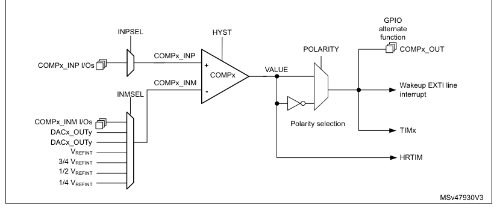
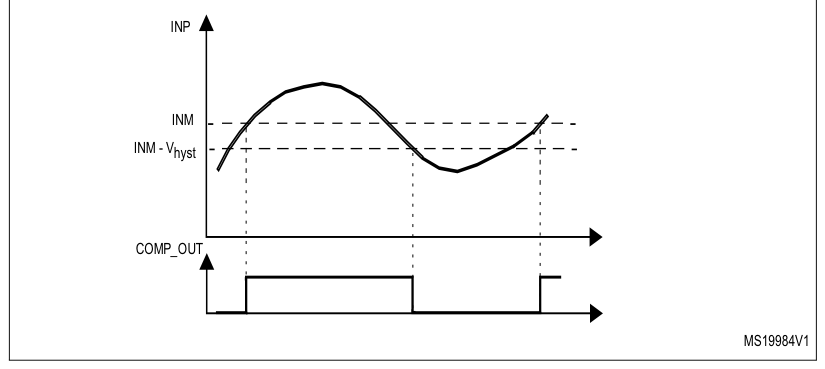
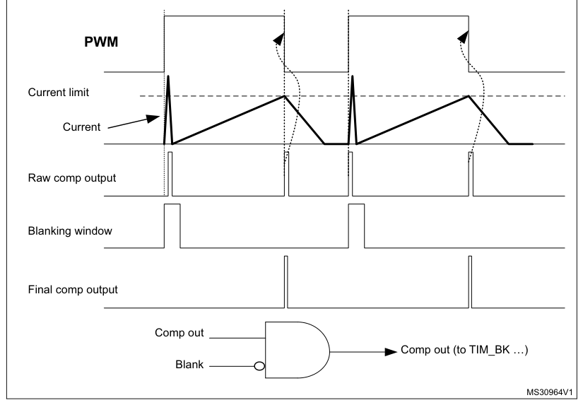

# 24 Comparator (COMP)

[← RM0440 index](../STM32G4_RM0440.md)

## 24.1 COMP introduction

The device embeds up to seven ultra-fast analog comparators.

The comparators can be used for a variety of functions including:

- Wake-up from low-power mode triggered by an analog signal,
- Analog signal conditioning,
- Cycle-by-cycle current control loop when combined with a PWM output from a timer.

## 24.2 COMP main features

- Each comparator has configurable plus and minus inputs used for flexible voltage selection:
  - Multiplexed I/O pins
  - DAC channels
  - Internal reference voltage and three submultiple values (1/4, 1/2, 3/4) provided by a scaler
    (buffered voltage divider)
- Programmable hysteresis
- Output redirection to I/Os or to timer inputs for triggering break events for fast PWM shutdowns
- Output blanking for immunity to switching noise
- Per-channel interrupt generation with wake-up from Sleep and Stop modes

## 24.3 COMP functional description

### 24.3.1 COMP block diagram

The block diagram of one comparator channel front-end is shown in Figure 168: Comparator block
diagram.

**Figure 168. Comparator block diagram**

### 24.3.2 COMP pins and internal signals

The I/Os used as comparators inputs must be configured in analog mode in the GPIOs registers.

The comparator output can be connected to the I/Os using the alternate function channel given in
“Alternate function mapping” table in the datasheet.

The output can also be internally redirected to a variety of timer input for the following purposes:

- Emergency shut-down of PWM signals, using BKIN and BKIN2 inputs
- Cycle-by-cycle current control, using OCREF_CLR inputs
- Input capture for timing measures

It is possible to have the comparator output simultaneously redirected internally and externally.

**Table 199. COMPx non-inverting input assignment**

| Source row | Column 1 | Column 2 | Column 3 | Column 4 | Column 5 | Column 6 | Column 7 | Column 8 |
| ---: | --- | --- | --- | --- | --- | --- | --- | --- |
| 1 | `COMP1_` | `COMP2_` | `COMP3_` | `COMP4_` | `COMP5_` | `COMP6_` | `COMP7_` |  |
| 2 | `INPSEL` |  |  |  |  |  |  |  |
| 3 | `INP` | `INP` | `INP` | `INP` | `INP` | `INP` | `INP` |  |
| 4 | `0` | `PA1` | `PA7` | `PA0` | `PB0` | `PB13` | `PB11` | `PB14` |
| 5 | `1` | `PB1` | `PA3` | `PC1` | `PE7` | `PD12` | `PD11` | `PD14` |

**Table 200. COMPx inverting input assignment**

| Source row | Column 1 | Column 2 | Column 3 | Column 4 | Column 5 | Column 6 | Column 7 | Column 8 |
| ---: | --- | --- | --- | --- | --- | --- | --- | --- |
| 1 | `INMSEL` | `COMP1_` | `COMP2_` | `COMP3_` | `COMP4_` | `COMP5_` | `COMP6_` | `COMP7_` |
| 2 | `[2:0]` | `INM` | `INM` | `INM` | `INM` | `INM` | `INM` | `INM` |
| 3 | `000` | `1/4 VREFINT` |  |  |  |  |  |  |
| 4 | `001` | `1/2 VREFINT` |  |  |  |  |  |  |
| 5 | `010` | `3/4 VREFINT` |  |  |  |  |  |  |
| 6 | `011` | `VREFINT` |  |  |  |  |  |  |
| 7 | `100` | `DAC3_CH1` | `DAC3_CH2` | `DAC3_CH1` | `DAC3_CH2` | `DAC4_CH1` | `DAC4_CH2` | `DAC4_CH1` |
| 8 | `101` | `DAC1_CH1` | `DAC1_CH2` | `DAC1_CH1` | `DAC1_CH1` | `DAC1_CH2` | `DAC2_CH1` | `DAC2_CH1` |
| 9 | `110` | `PA4` | `PA5` | `PF1` | `PE8` | `PB10` | `PD10` | `PD15` |
| 10 | `111` | `PA0` | `PA2` | `PC0` | `PB2` | `PD13` | `PB15` | `PB12` |

### 24.3.3 COMP reset and clocks

The COMP clock provided by the clock controller is synchronous with the APB2 clock.

There is no COMP-dedicated clock enable control bit in the RCC controller. Reset and clock enable
bits are common for COMP and SYSCFG.

> **Note:** Important: The polarity selection logic and the output redirection to the port works
> independently of APB clock. This allows the comparator to work even in Stop mode.

### 24.3.4 COMP LOCK mechanism

The comparators can be used for safety purposes, such as over-current or thermal protection. For
applications having specific functional safety requirements, it is necessary to insure that the
comparator programming cannot be altered in case of spurious register access or program counter
corruption.

For this purpose, the comparator control and status registers can be write-protected (read-only).

Once the programming is completed, the COMPx LOCK bit can be set. This causes the whole register to
become read-only, including the COMPx LOCK bit.

The write protection can only be removed by an MCU reset.

### 24.3.5 COMP hysteresis

The comparator includes a programmable hysteresis to avoid spurious output transitions with noisy
input signals. It is non-symmetrical and only acting to falling edge of the comparator output. The
internal hysteresis function can be disabled so as to set the amount of hysteresis with external
components, which can be useful for example when exiting a low-power mode.

**Figure 169. Comparator hysteresis**

INP

INM

INM - Vhyst

COMP_OUT

MS19984V1

### 24.3.6 COMP output blanking

The purpose of the blanking function is to prevent the current regulation from tripping upon short
current spikes at the beginning of PWM period (typically the recovery current in power switch
anti-parallel diodes). This goes through setting a dead window defined with a timer output compare
signal. The blanking source is selected individually per comparator channel by software through
BLANKSEL[2:0] bitfield of corresponding COMP_CxCSR register, as shown in Table 201: Blanking
sources. The inverted blanking signal is logical AND-ed with the comparator stage output to produce
the comparator channel x output. See the example provided in the following figure.

**Figure 170. Comparator output blanking**

PWM

Current limit

Current

Raw comp output

Blanking window

Final comp output

Comp out

Comp out (to TIM_BK …)

Blank

MS30964V1

**Table 201. Blanking sources**

| Source row | Column 1 | Column 2 | Column 3 | Column 4 | Column 5 | Column 6 | Column 7 | Column 8 |
| ---: | --- | --- | --- | --- | --- | --- | --- | --- |
| 1 | `BLANKSEL` |  |  |  |  |  |  |  |
| 2 | `COMP1` | `COMP2` | `COMP3` | `COMP4` | `COMP5` | `COMP6` | `COMP7` |  |
| 3 | `[2:0]` |  |  |  |  |  |  |  |
| 4 | `001` | `TIM1_OC5` | `TIM1_OC5` | `TIM1_OC5` | `TIM3_OC4` | `TIM2_OC3` | `TIM8_OC5` | `TIM1_OC5` |
| 5 | `010` | `TIM2_OC3` | `TIM2_OC3` | `TIM3_OC3` | `TIM8_OC5` | `TIM8_OC5` | `TIM2_OC4` | `TIM8_OC5` |
| 6 | `011` | `TIM3_OC3` | `TIM3_OC3` | `TIM2_OC4` | `TIM15_OC1` | `TIM3_OC3` | `TIM15_OC2` | `TIM3_OC3` |
| 7 | `100` | `TIM8_OC5` | `TIM8_OC5` | `TIM8_OC5` | `TIM1_OC5` | `TIM1_OC5` | `TIM1_OC5` | `TIM15_OC2` |
| 8 | `101` | `TIM20_OC5` | `TIM20_OC5` | `TIM20_OC5` | `TIM20_OC5` | `TIM20_OC5` | `TIM20_OC5` | `TIM20_OC5` |
| 9 | `110` | `TIM15_OC1` | `TIM15_OC1` | `TIM15_OC1` | `TIM15_OC1` | `TIM15_OC1` | `TIM15_OC1` | `TIM15_OC1` |
| 10 | `111` | `TIM4_OC3` | `TIM4_OC3` | `TIM4_OC3` | `TIM4_OC3` | `TIM4_OC3` | `TIM4_OC3` | `TIM4_OC3` |

## 24.4 COMP low-power modes

**Table 202. Comparator behavior in low-power modes**

| Source row | Column 1 | Column 2 |
| ---: | --- | --- |
| 1 | `Mode` | `Description` |

No effect on the comparators.

Sleep

Comparator interrupts cause the device to exit the Sleep mode.

| Source row | Column 1 | Column 2 |
| ---: | --- | --- |
| 1 | `Low-power run` | `No effect.` |

**Table 202. Comparator behavior in low-power modes (continued)**

| Mode | Description |
| --- | --- |
| Low-power sleep | No effect. COMP interrupts cause the device to exit the Low-power sleep mode. |

No effect on the comparators.

Stop

Comparator interrupts cause the device to exit the Stop mode.

| Standby, | The COMP registers are powered down and must be reinitialized after exiting |
| --- | --- |
| Shutdown | Standby or Shutdown mode. |

## 24.5 COMP interrupts

The comparator outputs are internally connected to the Extended interrupts and events controller.
Each comparator has its own EXTI line and can generate either interrupts or events. The same
mechanism is used to exit Sleep and Stop low-power modes.

Refer to Interrupt and events section for more details.

To enable the COMPx interrupt, it is required to follow this sequence:

1. Configure and enable the EXTI line corresponding to the COMPx output event in
   interrupt mode and select sensitivity to rising edge, falling edge or to both edges
2. Configure and enable the NVIC IRQ channel mapped to the corresponding EXTI lines
3. Enable COMPx

Interrupt events are flagged through flags in EXTI_PR1/EXTI_PR2 registers.

## 24.6 COMP registers

> **Extracted layout**
>
> `24.6.1` · `Comparator x control and status register (COMP_CxCSR)`  

For x = 1 through 7, the COMP_CxCSR register contains all bits and flags related to the comparator
x.

- **Address offset:** 4(x-1), where x = 1 to 7

System reset value: 0x0000 0000

**Register bit layout**

| Bit | Field | Access | Summary |
| ---: | --- | :---: | --- |
| 31 | `LOCK` | rw | COMP_CxCSR register lock |
| 30 | `VALUE` | r | Comparator x output status |
| 29 | Reserved | — | kept at reset value |
| 28 | Reserved | — | ↳ |
| 27 | Reserved | — | ↳ |
| 26 | Reserved | — | ↳ |
| 25 | Reserved | — | ↳ |
| 24 | Reserved | — | ↳ |
| 23 | `SCALEN` | rw | VREFINT scaler enable |
| 22 | `BRGEN` | rw | VREFINT scaler resistor bridge enable |
| 21 | `BLANKSEL[2]` | rw | Comparator x blanking signal select |
| 20 | `BLANKSEL[1]` | rw | ↳ |
| 19 | `BLANKSEL[0]` | rw | ↳ |
| 18 | `HYST[2]` | rw | Comparator x hysteresis |
| 17 | `HYST[1]` | rw | ↳ |
| 16 | `HYST[0]` | rw | ↳ |
| 15 | `POL` | rw | Comparator x polarity |
| 14 | Reserved | — | kept at reset value |
| 13 | Reserved | — | ↳ |
| 12 | Reserved | — | ↳ |
| 11 | Reserved | — | ↳ |
| 10 | Reserved | — | ↳ |
| 9 | Reserved | — | ↳ |
| 8 | `INPSEL` | rw | Comparator x signal select for non-inverting input |
| 7 | Reserved | — | kept at reset value |
| 6 | `INMSEL[2]` | rw | Comparator x signal select for inverting input |
| 5 | `INMSEL[1]` | rw | ↳ |
| 4 | `INMSEL[0]` | rw | ↳ |
| 3 | Reserved | — | kept at reset value |
| 2 | Reserved | — | ↳ |
| 1 | Reserved | — | ↳ |
| 0 | `EN` | rw | Comparator x enable |

**Bit 31 — `LOCK`:** COMP_CxCSR register lock

This bit is set by software and cleared by a hardware system reset. It locks the whole content
of the comparator x control register COMP_CxCSR[31:0]. When locked, all control bits and
flags can be read only but not written. When unlocked, the control bits can also be written by
software.

- `0`: Unlock
- `1`: Lock

**Bit 30 — `VALUE`:** Comparator x output status

This read-only flag reflects the level of the comparator x output before the polarity
selector and blanking, as indicated in Figure 168.

**Bits 29:24 — Reserved:** kept at reset value

**Bit 23 — `SCALEN`:** VREFINT scaler enable

This bit controlled by software enables the operation of VREFINT scaler at the inverting input
of all comparator. To disable the VREFINT scaler, SCALEN bits of all COMP_CxCSR registers
must be set to Disable state. When the VREFINT scaler is disabled, the 1/4 VREFINT, 1/2

VREFINT, 3/4 VREFINT and VREFINT inputs of the multiplexer should not be selected.

- `0`: Disable
- `1`: Enable

**Bit 22 — `BRGEN`:** VREFINT scaler resistor bridge enable

This bit controlled by software enables the operation of resistor bridge in the VREFINT scaler.

To disable the resistor bridge, BRGEN bits of all COMP_CxCSR registers must be set to

Disable state. When the resistor bridge is disabled, the 1/4 VREFINT, 1/2 VREFINT, and 3/4

VREFINT inputs of the input selector receive VREFINT voltage.

- `0`: Disable
- `1`: Enable

**Bits 21:19 — `BLANKSEL[2:0]`:** Comparator x blanking signal select

This bitfield controlled by software selects the blanking signal for comparator channel x, as
shown in Table 201: Blanking sources.

**Bits 18:16 — `HYST[2:0]`:** Comparator x hysteresis

This bitfield controlled by software selects the hysteresis of the comparator x:

- `000`: No hysteresis
- `001`: 10mV hysteresis
- `010`: 20mv hysteresis
- `011`: 30mV hysteresis
- `100`: 40mV hysteresis
- `101`: 50mV hysteresis
- `110`: 60mV hysteresis
- `111`: 70mV hysteresis

**Bit 15 — `POL`:** Comparator x polarity

This bit controlled by software selects the comparator x output polarity:

- `0`: Non-inverted
- `1`: Inverted

**Bits 14:9 — Reserved:** kept at reset value

**Bit 8 — `INPSEL`:** Comparator x signal select for non-inverting input

This bitfield controlled by software selects the signal for the non-inverting input COMPx_INP
of the comparator x, as shown in Table 199: COMPx non-inverting input assignment.

**Bit 7 — Reserved:** kept at reset value

**Bits 6:4 — `INMSEL[2:0]`:** Comparator x signal select for inverting input

This bitfield controlled by software selects the signal for the inverting input COMPx_INM of
the comparator x, as shown in Table 200: COMPx inverting input assignment.

**Bits 3:1 — Reserved:** kept at reset value

**Bit 0 — `EN`:** Comparator x enable

This bit controlled by software enables the operation of comparator x:

- `0`: Disable
- `1`: Enable

### 24.6.2 COMP register map

The following table summarizes the comparator registers.

The comparator registers share SYSCFG peripheral register base addresses.

**Register summary**

| Offset | Register | Reset value |
| --- | --- | --- |
| 0x00 | `COMP_C1CSR` | 0x0000 0000 |
| 0x04 | `COMP_C2CSR` | 0x0000 0000 |
| 0x08 | `COMP_C3CSR` | 0x0000 0000 |
| 0x0C | `COMP_C4CSR` | 0x0000 0000 |
| 0x10 | `COMP_C5CSR` | 0x0000 0000 |
| 0x14 | `COMP_C6CSR` | 0x0000 0000 |
| 0x18 | `COMP_C7CSR` | 0x0000 0000 |

Refer to [Section 2.2.2](chapter-02.md#222-memory-map-and-register-boundary-addresses): Memory map and register boundary addresses for the register boundary
addresses.
