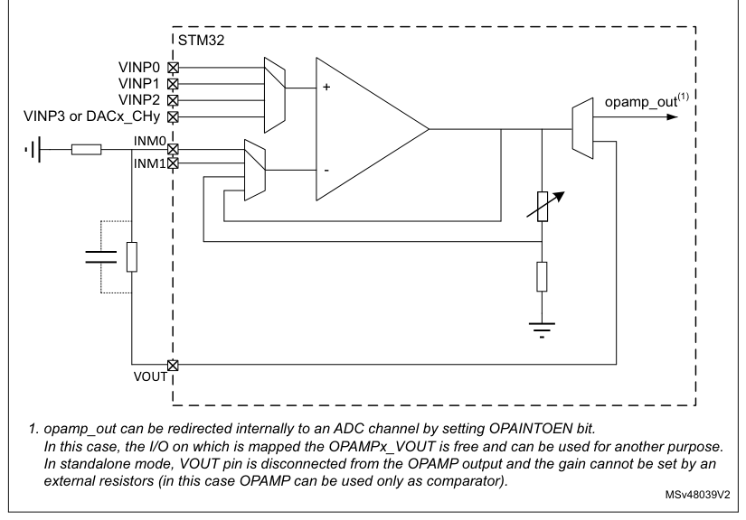
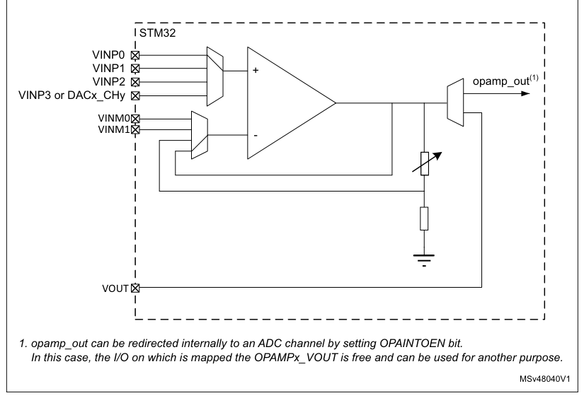
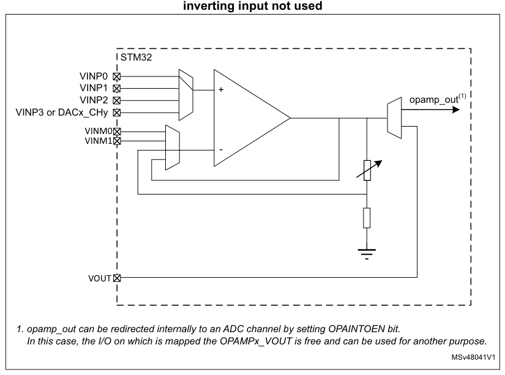
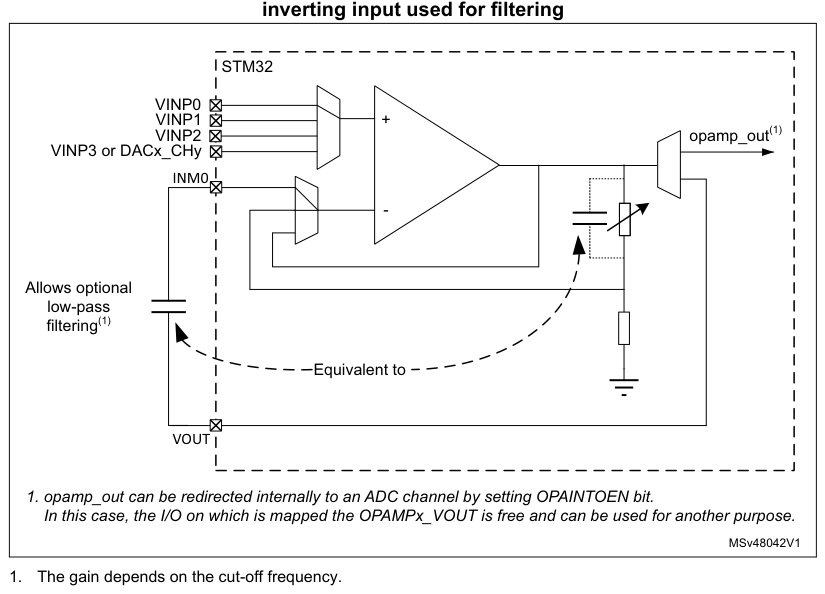
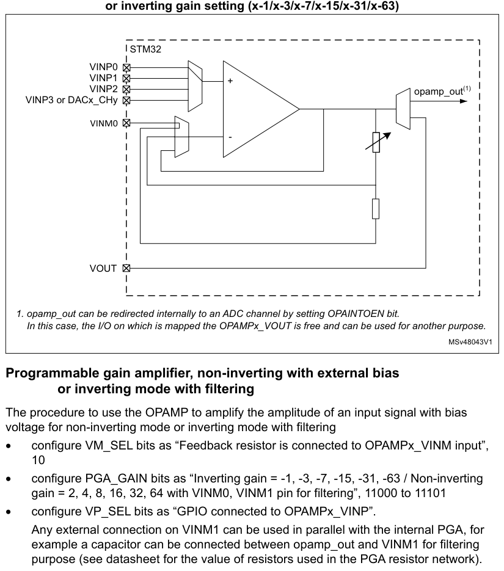
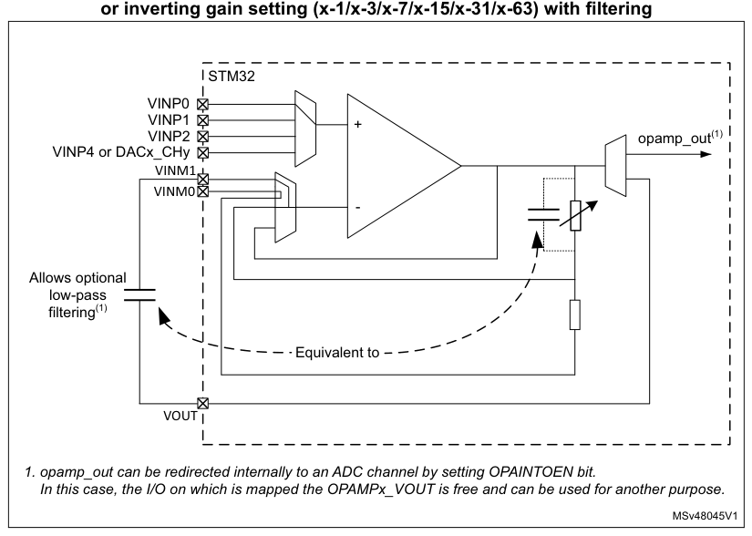
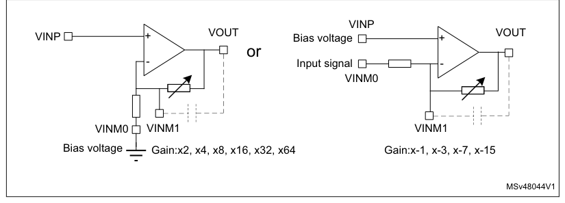
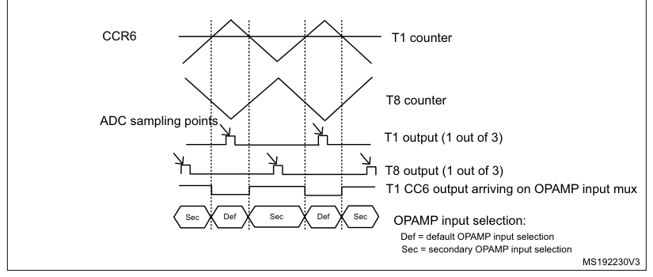

# 25 Operational amplifiers (OPAMP)

[← RM0440 index](../STM32G4_RM0440.md)

## 25.1 Introduction

The devices embed six operational amplifiers, each with two inputs and one output. The three I/Os
can be connected to the external pins, enabling any type of external interconnection. The
operational amplifiers can be configured internally as a follower, as an amplifier with a
non-inverting gain ranging from 2 to 64, or with inverting gain ranging from -1 to -63.

The positive input can be connected to the internal DAC.

The output can be connected to the internal ADC.

## 25.2 OPAMP main features

- Rail-to-rail input voltage range
- Low input bias current
- Low input offset voltage
- high frequency gain bandwidth
- High-speed mode to achieve a better slew rate

> **Note:** Refer to the product datasheet for detailed OPAMP characteristics.

## 25.3 OPAMP functional description

The OPAMP has several modes.

Each OPAMP can be individually enabled, when disabled the output is high-impedance. When enabled, it
can be in calibration mode, all input and output of the OPAMP are then disconnected, or in
functional mode.

In functional mode the inputs and output of the OPAMP are connected as described in [Section 25.3.4](#2534-signal-routing).

### 25.3.1 OPAMP output redirection to internal ADC channels

Operational amplifier output can be redirected internally to an ADC channel by setting OPAINTOEN bit
in OPAMPx_CSR register. In this case, the GPIO on which is mapped given OPAMPx_VOUT output is free
and can be used for another purpose. ADC can measure OPAMPx_VOUT voltage internally. See Figure 204
for assignment between OPAMPx internal outputs and ADC channels.

### 25.3.2 OPAMP reset and clocks

The OPAMP clock provided by the clock controller is synchronized with the PCLK2 (APB2 clock). There
is no clock enable control bit provided in the RCC controller. To use a clock source for the OPAMP,
the SYSCFG clock enable control bit must be set in the RCC controller.

The bit OPAEN enables and disables the OPAMP operation. The OPAMP registers configurations must be
changed before enabling the OPAEN bit in order to avoid spurious effects on the output.

When the output of the operational amplifier is no more needed the operational amplifier can be
disabled to save power. All the configurations previously set (including the calibration) are
maintained while OPAMP is disabled.

### 25.3.3 Initial configuration

The default configuration of the operational amplifier is a functional mode where the three
input/outputs are connected to external pins. In the default mode the operational amplifier uses the
factory trimming values for its offset calibration. The trimming values can be adjusted, see Section
25.3.7: Calibration for changing the trimming values. The default configuration uses the normal
mode, which provides the standard performance. The bit OPAHSM can be set in order to switch the
operational amplifier to high-speed mode for a better slew rate. Both normal and high-speed mode
characteristics are defined in the datasheet.

As soon as the OPAEN bit in OPAMPx_CSR register is set, the operational amplifier is functional. The
two input pins and the output pin are connected as defined in [Section 25.3.4](#2534-signal-routing): Signal routing and the
default connection settings can be changed.

> **Note:** The inputs and output pins must be configured in analog mode (default state) in the
> corresponding GPIOx_MODER register.

### 25.3.4 Signal routing

The routing for the operational amplifier pins is determined by OPAMPx_CSR and OPAMPx_TCMR
registers.

The connections of the six operational amplifiers (OPAMPx, x = 1...6) are described in the table
below.

**Table 204. Operational amplifier possible connection**

| Source row | Column 1 | Column 2 | Column 3 | Column 4 |
| ---: | --- | --- | --- | --- |
| 1 | `Signal` | `Pin` | `Internal` | `Comment` |
| 2 | `PA3 (VINM0)` |  |  |  |
| 3 | `OPAMP1_VINM` | `OPAMP1_VOUT or PGA` | `Controlled by bits PGA_GAIN and VM_SEL` |  |
| 4 | `PC5 (VINM1)` |  |  |  |
| 5 | `PA1 (VINP0)` |  |  |  |
| 6 | `OPAMP1_VINP` | `PA3 (VINP1)` | `DAC3_CH1` | `controlled by bit VP_SEL.` |
| 7 | `PA7 (VINP2)` |  |  |  |
| 8 | `The pin is connected when the OPAMP is` |  |  |  |
| 9 | `ADC1_IN3` |  |  |  |
| 10 | `OPAMP1_VOUT` | `PA2` | `enabled and OPAMP internal output is disabled.` |  |
| 11 | `ADC1_IN13(1)` |  |  |  |
| 12 | `The ADC input is controlled by ADC` |  |  |  |
| 13 | `PA5 (VINM0)` |  |  |  |
| 14 | `OPAMP2_VINM` | `OPAMP2_VOUT or PGA` | `controlled by bits PGA_GAIN and VM_SEL` |  |
| 15 | `PC5 (VINM1)` |  |  |  |
| 16 | `PA7 (VINP0)` |  |  |  |
| 17 | `PB14 (VINP1)` |  |  |  |
| 18 | `OPAMP2_VINP` | `-` | `controlled by bit VP_SEL` |  |
| 19 | `PB0 (VINP2)` |  |  |  |
| 20 | `PD14` |  |  |  |
| 21 | `(VINP3)` |  |  |  |

**Table 204. Operational amplifier possible connection (continued)**

| Source row | Column 1 | Column 2 | Column 3 | Column 4 |
| ---: | --- | --- | --- | --- |
| 1 | `Signal` | `Pin` | `Internal` | `Comment` |
| 2 | `The pin is connected when the OPAMP is` |  |  |  |
| 3 | `ADC2_IN3` |  |  |  |
| 4 | `OPAMP2_VOUT` | `PA6` | `enabled and OPAMP internal output is disabled.` |  |
| 5 | `ADC2_IN16(1)` |  |  |  |
| 6 | `The ADC input is controlled by ADC` |  |  |  |
| 7 | `PB2 (VINM0)` |  |  |  |
| 8 | `OPAMP3_VINM` | `PB10` | `OPAMP3_VOUT or PGA` | `Controlled by bits PGA_GAIN and VM_SEL` |
| 9 | `(VINM1)` |  |  |  |
| 10 | `PB0 (VINP0)` |  |  |  |
| 11 | `OPAMP3_VINP` | `PB13 (VINP1)` | `DAC3_CH2(2)(3)` | `Controlled by bit VP_SEL` |
| 12 | `PA1 (VINP2)` |  |  |  |
| 13 | `ADC3_IN1(2)(3)/ADC1_IN12` | `The pin is connected when the OPAMP is` |  |  |
| 14 | `OPAMP3_VOUT` | `PB1` | `ADC2_IN18(1)/` | `enabled and OPAMP internal output is disabled.` |
| 15 | `ADC3_IN13(1)(2)(3)` | `The ADC input is controlled by ADC` |  |  |
| 16 | `PB10` |  |  |  |
| 17 | `Controlled by bits PGA_GAIN` |  |  |  |
| 18 | `(VINM0)` |  |  |  |
| 19 | `OPAMP4_VINM` | `OPAMP4_VOUT or PGA` |  |  |
| 20 | `and VM_SEL` |  |  |  |
| 21 | `PD8 (VINM1)` |  |  |  |
| 22 | `PB13 (VINP0)` |  |  |  |
| 23 | `OPAMP4_VINP` | `PD11 (VINP1)` | `DAC4_CH1` | `Controlled by bit VP_SEL` |
| 24 | `PB11 (VINP2)` |  |  |  |
| 25 | `The pin is connected when the OPAMP is` |  |  |  |
| 26 | `ADC4_IN3/ADC1_IN11` |  |  |  |
| 27 | `OPAMP4_VOUT` | `PB12` | `enabled and OPAMP internal output is disabled.` |  |
| 28 | `ADC5_IN5(1)` |  |  |  |

The ADC input is controlled by ADC.

PB15

| Source row | Column 1 | Column 2 | Column 3 | Column 4 |
| ---: | --- | --- | --- | --- |
| 1 | `OPAMP5_VINM` | `(VINM0)` | `OPAMP5_VOUT or PGA` | `Controlled by bits PGA_GAIN and VM_SEL.` |
| 2 | `PA3 (VINM1)` |  |  |  |
| 3 | `PB14 (VINP0)` |  |  |  |
| 4 | `PD12` |  |  |  |
| 5 | `OPAMP5_VINP` | `DAC4_CH2` | `Controlled by bit VP_SEL.` |  |
| 6 | `(VINP1)` |  |  |  |
| 7 | `PC3 (VINP2)` |  |  |  |
| 8 | `The pin is connected when the OPAMP is` |  |  |  |
| 9 | `ADC5_IN1` |  |  |  |
| 10 | `OPAMP5_VOUT(4)` | `PA8` | `enabled and OPAMP internal output is disabled.` |  |
| 11 | `ADC5_IN3(1)` |  |  |  |
| 12 | `The ADC input is controlled by ADC.` |  |  |  |
| 13 | `PA1 (VINM0)` | `Controlled by bits PGA_GAIN` |  |  |
| 14 | `OPAMP6_VINM` | `OPAMP6_VOUT or PGA` |  |  |
| 15 | `PB1 (VINM1)` | `and VM_SEL.` |  |  |
| 16 | `PB12 (VINP0)` |  |  |  |
| 17 | `OPAMP6_VINP(5)` | `PD9 (VINP1)` | `DAC3_CH1` | `Controlled by bit VP_SEL.` |
| 18 | `PB13 (VINP2)` |  |  |  |
| 19 | `ADC12_IN14` | `The pin is connected when the OPAMP is` |  |  |
| 20 | `OPAMP6_VOUT` | `PB11` | `ADC4_IN17(1)(2)` | `enabled and OPAMP internal output is disabled.` |
| 21 | `ADC3_IN17(1)(3)` | `The ADC input is controlled by ADC.` |  |  |

1. This ADC channel is connected internally to the OPAMPx_VOUT when OPAINTOEN bit is set. In this
   case, the I/O on
   which the OPAMPx_VOUT is available, can be used for another purpose.
2. For category 3 devices only.
3. For category 4 devices only.
4. OPAMP4/5 are supported in category 3 devices only.
5. OPAMP6 is supported only in category 3 and category 4 devices.

### 25.3.5 OPAMP modes

The operational amplifier inputs and outputs are all accessible on terminals. The amplifiers can be
used in multiple configuration environments:

- Standalone mode (external gain setting mode)
- Follower configuration mode
- PGA modes

> **Note:** The impedance of the signal must be maintained below a level which avoids the input
> leakage to create significant artifacts (due to a resistive drop in the source). Please refer to the
> electrical characteristics section in the datasheet for further details.

#### Standalone mode (external gain setting mode)

The procedure to use the OPAMP in standalone mode is presented hereafter.

Starting from the default value of OPAMPx_CSR, and the default state of GPIOx_MODER, as soon as the
OPAEN bit is set, the two input pins and the output pin are connected to the operational amplifier.

This default configuration uses the factory trimming values and operates in normal mode (highest
performance). The behavior of the OPAMP can be changed as follows:

- OPAHSM can be set to “operational amplifier high-speed” mode in order to have high slew rate.
- USERTRIM can be set to modify the trimming values for input offsets.

**Figure 171. Standalone mode: external gain setting mode**

1. opamp_out can be redirected internally to an ADC channel by setting OPAINTOEN bit.

In this case, the I/O on which is mapped the OPAMPx_VOUT is free and can be used for another
purpose.

In standalone mode, VOUT pin is disconnected from the OPAMP output and the gain cannot be set by an
external resistors (in this case OPAMP can be used only as comparator).

MSv48039V2

#### Follower configuration mode

The procedure to use the OPAMP in follower mode is presented hereafter.

- configure VM_SEL bits as “opamp_out connected to OPAMPx_VINM input”, 11
- configure VP_SEL bits as “GPIO connected to OPAMPx_VINP”, 00
- As soon as the OPAEN bit is set, the voltage on pin OPAMPx_VINP is buffered to pin OPAMPx_VOUT.

> **Note:** The pin corresponding to OPAMPx_VINM is free for another usage.

The signal on the OPAMP output is also seen as an ADC input. As a consequence, the OPAMP configured
in follower mode can be used to perform impedance adaptation on input signals before feeding them to
the ADC input, assuming the input signal frequency is compatible with the operational amplifier gain
bandwidth specification.

**Figure 172. Follower configuration**

1. opamp_out can be redirected internally to an ADC channel by setting OPAINTOEN bit.

In this case, the I/O on which is mapped the OPAMPx_VOUT is free and can be used for another
purpose.

MSv48040V1

#### Programmable gain amplifier mode

The procedure to use the OPAMP as programmable gain amplifier is presented hereafter.

- configure VM_SEL bits as “Feedback resistor is connected to OPAMPx_VINM input”, 10
- configure PGA_GAIN bits as “internal Gain 2, 4, 8, 16,32, or 64”, 00000 to 00101
- configure VP_SEL bits as “GPIO connected to OPAMPx_VINP”, 00

As soon as the OPAEN bit is set, the voltage on pin OPAMPx_VINP is amplified by the selected gain
and visible on pin OPAMPx_VOUT.

> **Note:** To avoid saturation, the input voltage must stay below VDDA divided by the selected gain.

**Figure 173. PGA mode, internal gain setting (x2/x4/x8/x16/x32/x64),**

1. opamp_out can be redirected internally to an ADC channel by setting OPAINTOEN bit.

In this case, the I/O on which is mapped the OPAMPx_VOUT is free and can be used for another
purpose.

MSv48041V1

#### Programmable gain amplifier mode with external filtering

The procedure to use the OPAMP to amplify the amplitude of an input signal, with an external
filtering, is presented hereafter.

- configure VM_SEL bits as “Feedback resistor is connected to OPAMPx_VINM input”, 10
- configure PGA_GAIN bits as “internal Gain 2, 4, 8, 16, 32 or 64 with filtering on VINM0”, 10000 to
  10101
- configure VP_SEL bits as “GPIO connected to OPAMPx_VINP”.

Any external connection on VINM can be used in parallel with the internal PGA, for example a
capacitor can be connected between opamp_out and VINM for filtering purpose (see datasheet for the
value of resistors used in the PGA resistor network).

**Figure 174. PGA mode, internal gain setting (x2/x4/x8/x16/x32/x64),**

1. opamp_out can be redirected internally to an ADC channel by setting OPAINTOEN bit.

In this case, the I/O on which is mapped the OPAMPx_VOUT is free and can be used for another
purpose.

MSv48042V1

1. The gain depends on the cut-off frequency.

#### Programmable gain amplifier, non-inverting with external bias

or inverting mode

The procedure to use the OPAMP to amplify the amplitude of an input signal with bias voltage for
non-inverting mode or inverting mode.

- configure VM_SEL bits as “Feedback resistor is connected to OPAMPx_VINM input”, 10
- configure PGA_GAIN bits as “Inverting gain = -1, -3, -7, -15, -31, -63 / Non-inverting gain =2, 4,
  8, 16, 32, 64 with VINM0”, 01000 to 01101
- configure VP_SEL bits as “GPIO connected to OPAMPx_VINP”.

**Figure 175. PGA mode, non-inverting gain setting (x2/x4/x8/x16/x32/x64)**

1. opamp_out can be redirected internally to an ADC channel by setting OPAINTOEN bit.

In this case, the I/O on which is mapped the OPAMPx_VOUT is free and can be used for another
purpose.

MSv48043V1

#### Programmable gain amplifier, non-inverting with external bias

or inverting mode with filtering

The procedure to use the OPAMP to amplify the amplitude of an input signal with bias voltage for
non-inverting mode or inverting mode with filtering

- configure VM_SEL bits as “Feedback resistor is connected to OPAMPx_VINM input”, 10
- configure PGA_GAIN bits as “Inverting gain = -1, -3, -7, -15, -31, -63 / Non-inverting gain = 2,
  4, 8, 16, 32, 64 with VINM0, VINM1 pin for filtering”, 11000 to 11101
- configure VP_SEL bits as “GPIO connected to OPAMPx_VINP”.

Any external connection on VINM1 can be used in parallel with the internal PGA, for example a
capacitor can be connected between opamp_out and VINM1 for filtering purpose (see datasheet for the
value of resistors used in the PGA resistor network).

**Figure 176. PGA mode, non-inverting gain setting (x2/x4/x8/x16/x32/x64)**

1. opamp_out can be redirected internally to an ADC channel by setting OPAINTOEN bit.

In this case, the I/O on which is mapped the OPAMPx_VOUT is free and can be used for another
purpose.

MSv48045V1

**Figure 177. Example configuration**

### 25.3.6 OPAMP PGA gain

When the OPAMP is configured in PGA mode, the gain can be programmed to x2, x4, x8, x16, x32, x64 in
non-inverting configuration and x-1, x-3, x-7, x-15, x-31, x-63 for inverting configuration.

When the OPAMP is configured in non-inverting mode, the gain solely depends on internal resistive
divider. When it is configured as inverting mode, Gain factor is defined not only the on chip
feedback resistor but also the signal source output impedance. If signal source output impedance is
not negligible compare to the input feedback resistance of PGA, it creates the gain error.

### 25.3.7 Calibration

The OPAMP offset value is minimized using a trimming circuitry. At startup, the trimming values are
initialized with the preset ‘factory’ trimming value. Each operational amplifier can also be trimmed
by the user if the OPAMP is used in conditions different from the factory trimming conditions.

Each operational amplifier can be trimmed by the user. Specific registers allow to have different
trimming values for normal mode and for high-speed mode.

The aim of the calibration is to cancel as much as possible the OPAMP inputs offset voltage. The
calibration circuitry allows to reduce the input offset voltage to less than +/-3 mV within stable
voltage and temperature conditions.

For each operational amplifier and two trimming values (TRIMOFFSETP and TRIMOFFSETN in OPAMPx_CSR
register) need to be trimmed, one for N differential pair and one for P differential pair.

The user is able to switch from ‘factory’ values to ‘user’ trimmed values using the USERTRIM bit in
the OPAMPx_CSR register. This bit is reset at startup and so the ‘factory’ value are applied by
default to the OPAMP option registers.

The offset trimming TRIMOFFSETP and TRIMOFFSETN bits are typically configured after the calibration
operation is initialized by setting bit CALON to 1. When CALON = 1 the inputs of the operational
amplifier are disconnected from the I/Os.

- Setting CALSEL to 01 initializes the offset calibration for the P differential pair (low voltage
  reference used).
- Resetting CALSEL to 11 initializes the offset calibration for the N differential pair (high
  voltage reference used).

When CALON = 1, the bit CALOUT reflects the influence of the trimming value selected by CALSEL and
OPAHSM. The software must increment the TRIMOFFSETN bits in the OPAMP control register from 0x00 to
the first value that causes the CALOUT bit to change from 1 to 0 in the OPAMP register. If the
CALOUT bit is reset, the offset is calibrated correctly and the corresponding trimming value must be
stored. The CALOUT flag needs up to 2 ms after the trimming value is changed to become steady (see
tOFFTRIMmax delay specification in the electrical characteristics section of the datasheet).

> **Note:** The closer the trimming value is to the optimum trimming value, the longer it takes to
> stabilize (with a maximum stabilization time remaining below 2 ms in any case).

**Table 205. Operating modes and calibration**

| Source row | Column 1 | Column 2 | Column 3 | Column 4 | Column 5 | Column 6 | Column 7 |
| ---: | --- | --- | --- | --- | --- | --- | --- |
| 1 | `Control bits` | `Output` |  |  |  |  |  |
| 2 | `Mode` |  |  |  |  |  |  |
| 3 | `CALOUT` |  |  |  |  |  |  |
| 4 | `OPAEN` | `OPAHSM` | `CALON` | `CALSEL` | `VOUT` |  |  |
| 5 | `flag` |  |  |  |  |  |  |
| 6 | `Normal operating` |  |  |  |  |  |  |
| 7 | `1` | `0` | `0` | `X` | `analog` | `0` |  |
| 8 | `mode` |  |  |  |  |  |  |
| 9 | `High-speed mode` | `1` | `1` | `0` | `X` | `analog` | `0` |
| 10 | `Power down` | `0` | `X` | `X` | `X` | `Z` | `0` |
| 11 | `Offset cal N` | `1` | `X` | `1` | `11` | `analog` | `X` |
| 12 | `Offset cal P diff` | `1` | `X` | `1` | `01` | `analog` | `X` |

#### Calibration procedure

Here are the steps to perform a full calibration of either one of the operational amplifiers:

1. Set the OPAEN bit in OPAMPx_CSR to 1 to enable the operational amplifier.
2. Set the USERTRIM bit in the OPAMPx_CSR register to 1.
3. Choose a calibration mode (refer to Table 205: Operating modes and calibration). The
   steps 3 to 4 have to be repeated four times. For the first iteration select Normal mode and N
   differential pair. This calibration mode correspond to OPAHSM = 0 and CALSEL = 11 in the OPAMPx_CSR
   register.
4. Increment TRIMOFFSETN[4:0] in OPAMPx_OTR starting from 0b00000 until CALOUT
   changes to 0 in OPAMPx_CSR.

> **Note:** Between the write to the TRIMOFFSETP and TRIMOFFSETN bits and the read of the

CALOUT value, make sure to wait for the tOFFTRIMmax delay specified in the electrical
characteristics section of the datasheet, to get the correct CALOUT value.

The commutation means that the is correctly compensated and that the corresponding trim code must be
saved in the TRIMOFFSETP and TRIMOFFSETN bits.

Repeat steps 3 to 4 for:

- Normal mode and P differential pair, CALSEL = 01
- High-speed mode and N differential pair
- High-speed mode and P differential pair

If a mode is not used, it is not necessary to perform the corresponding calibration.

All operational amplifier can be calibrated at the same time.

> **Note:** During the whole calibration phase the external connection of the operational amplifier
> output must not pull up or down currents higher than 500 µA.

If the OPAMP output is internally connected to an ADC channel and disconnected from the output pin
(OPAINTOEN = 1 in the OPAMPx_CSR register), the offset trimming procedure differs from the case
where the OPAMP output is connected to the output pin (OPAINTOEN = 0). The calibration procedure is
the similar as above but the CALOUT bit change detection cannot be used as indicated in step 4.
Instead, the ADC output data must be used as indicator to detect the OPAMP output change: a change
of CALOUT from 1 to 0 corresponds to the change of ADC output data from values close to the maximum
ADC output to values close to the minimum ADC output (the ADC works as a comparator connected to the
OPAMP output). Another solution is to perform the calibration with OPAINTOEN = 0, and then change
OPAINTOEN to 1. In this case, the OPAMP output GPIO toggles during the calibration and care must be
taken that there is no conflict on this GPIO.

### 25.3.8 Timer controlled Multiplexer mode

The selection of the OPAMP inverting and non inverting inputs can be done automatically. In this
case, the switch from one input to another is done automatically. This automatic switch is triggered
by the TIM1 CC6 or TIM8 CC6 or TIM20 CC6 output arriving on the OPAMP input multiplexers.

This is useful for dual motor control with a need to measure the currents on the 3 phases
simultaneously on a first motor and then on the second motor.

The automatic switch is enabled by setting the TxCMEN bit, x = 1,8,20, in the OPAMP switch control
register. The inverting and non inverting inputs selection is performed using
the VPS_SEL and VMS_SEL bit fields in the OPAMP timer controlled mode register. If the TxCMEN bit is
cleared, the selection is done using the VP_SEL and VM_SEL bit fields in the OPAMP control/status
register.

**Figure 178. Timer controlled Multiplexer mode**

## 25.4 OPAMP low-power modes

**Table 206. Effect of low-power modes on the OPAMP**

| Source row | Column 1 | Column 2 |
| ---: | --- | --- |
| 1 | `Mode` | `Description` |
| 2 | `Sleep` | `No effect.` |
| 3 | `Low-power run` | `No effect.` |
| 4 | `Low-power sleep` | `No effect.` |
| 5 | `Stop 0 / Stop 1` | `No effect, OPAMP registers content is kept.` |
| 6 | `Standby` |  |

The OPAMP registers are powered down and must be re-initialized after exiting Standby or Shutdown
mode.

Shutdown

## 25.5 OPAMP registers

### 25.5.1 OPAMP1 control/status register (OPAMP1_CSR)

- **Address offset:** 0x00
- **Reset value:** 0x0000 0000

**Register bit layout**

| Bit | Field | Access | Summary |
| ---: | --- | :---: | --- |
| 31 | `LOCK` | rw | OPAMP1_CSR lock |
| 30 | `CALOUT` | r | Operational amplifier calibration output |
| 29 | Reserved | — | kept at reset value. |
| 28 | `TRIMOFFSETN[4]` | rw | Trim for NMOS differential pairs |
| 27 | `TRIMOFFSETN[3]` | rw | ↳ |
| 26 | `TRIMOFFSETN[2]` | rw | ↳ |
| 25 | `TRIMOFFSETN[1]` | rw | ↳ |
| 24 | `TRIMOFFSETN[0]` | rw | ↳ |
| 23 | `TRIMOFFSETP[4]` | rw | Trim for PMOS differential pairs |
| 22 | `TRIMOFFSETP[3]` | rw | ↳ |
| 21 | `TRIMOFFSETP[2]` | rw | ↳ |
| 20 | `TRIMOFFSETP[1]` | rw | ↳ |
| 19 | `TRIMOFFSETP[0]` | rw | ↳ |
| 18 | `PGA_GAIN[4]` | rw | Operational amplifier Programmable amplifier gain value |
| 17 | `PGA_GAIN[3]` | rw | ↳ |
| 16 | `PGA_GAIN[2]` | rw | ↳ |
| 15 | `PGA_GAIN[1]` | rw | ↳ |
| 14 | `PGA_GAIN[0]` | rw | ↳ |
| 13 | `CALSEL[1]` | rw | Calibration selection |
| 12 | `CALSEL[0]` | rw | ↳ |
| 11 | `CALON` | rw | Calibration mode enabled |
| 10 | Reserved | — | kept at reset value. |
| 9 | Reserved | — | ↳ |
| 8 | `OPAINTOEN` | rw | Operational amplifier internal output enable. |
| 7 | `OPAHSM` | rw | Operational amplifier high-speed mode |
| 6 | `VM_SEL[1]` | rw | Inverting input selection |
| 5 | `VM_SEL[0]` | rw | ↳ |
| 4 | `USERTRIM` | rw | User trimming enable |
| 3 | `VP_SEL[1]` | rw | Non inverted input selection |
| 2 | `VP_SEL[0]` | rw | ↳ |
| 1 | `FORCE_VP` | rw | Force internal reference on OPAMP VINP input (reserved for test) |
| 0 | `OPAEN` | rw | Operational amplifier Enable |

**Bit 31 — `LOCK`:** OPAMP1_CSR lock

This bit is write-once. It is set by software. It can only be cleared by a system reset.

This bit is used to configure the OPAMP1_CSR register as read-only.

- `0`: OPAMP1_CSR is read-write
- `1`: OPAMP1_CSR is read-only

**Bit 30 — `CALOUT`:** Operational amplifier calibration output

This bit shows the digital value of OPAMP output and is the calibration output status during
calibration offset mode (Calibration is successful when CALOUT switches from 1 to 0.)

**Bit 29 — Reserved:** kept at reset value.

**Bits 28:24 — `TRIMOFFSETN[4:0]`:** Trim for NMOS differential pairs

**Bits 23:19 — `TRIMOFFSETP[4:0]`:** Trim for PMOS differential pairs

At reset these bits are loaded by the factory trimming value. They can be modified only when

USER_TRIM =1

**Bits 18:14 — `PGA_GAIN[4:0]`:** Operational amplifier Programmable amplifier gain value

- `00000`: Non inverting internal gain =2
- `00001`: Non inverting internal gain =4
- `00010`: Non inverting internal gain =8
- `00011`: Non inverting internal gain =16
- `00100`: Non inverting internal gain =32
- `00101`: Non inverting internal gain =64
- `00110`: Not used
- `00111`: Not used
- `01000`: Inverting gain = -1 / non inverting gain =2 with VINM0 pin for input or bias
- `01001`: Inverting gain = -3 / non inverting gain =4 with VINM0 pin for input or bias
- `01010`: Inverting gain = -7 / non inverting gain =8 with VINM0 pin for input or bias
- `01011`: Inverting gain = -15/ non inverting gain =16 VINM0 pin for input or bias
- `01100`: Inverting gain = -31/ non inverting gain =32 VINM0 pin for input or bias
- `01101`: Inverting gain = -63/ non inverting gain =64 VINM0 pin for input or bias
- `01110`: Not used
- `01111`: Not used
- `10000`: Non inverting gain =2 with filtering on VINM0 pin
- `10001`: Non inverting gain =4 with filtering on VINM0 pin
- `10010`: Non inverting gain =8 with filtering on VINM0 pin
- `10011`: Non inverting gain =16 with filtering on VINM0 pin
- `10100`: Non inverting gain =32 with filtering on VINM0 pin
- `10101`: Non inverting gain =64 with filtering on VINM0 pin
- `10110`: Not used
- `10111`: Not used
- `11000`: Inverting gain = -1 / non inverting gain =2 with VINM0 pin for input or bias, VINM1 pin
  for filtering
- `11001`: Inverting gain = -3 / non inverting gain =4 with VINM0 pin for input or bias, VINM1 pin
  for filtering
- `11010`: Inverting gain = -7 / non inverting gain =8 with VINM0 pin for input or bias, VINM1 pin
  for filtering
- `11011`: Inverting gain = -15/ non inverting gain =16 with VINM0 pin for input or bias, VINM1
  pin for filtering
- `11100`: Inverting gain = -31/ non inverting gain =32 with VINM0 pin for input or bias, VINM1
  pin for filtering
- `11101`: Inverting gain = -63/ non inverting gain =64 with VINM0 pin for input or bias, VINM1
  pin for filtering
- `11110`: Not used
- `11111`: Not used

**Bits 13:12 — `CALSEL[1:0]`:** Calibration selection

It is used to select the offset calibration bus used to generate the internal reference voltage
when CALON = 1 or FORCE_VP= 1.

- `00`: 0.033*VDDA applied on OPAMP inputs
- `01`: 0.1*VDDA applied on OPAMP inputs (for PMOS calibration)
- `10`: 0.5*VDDA applied on OPAMP inputs
- `11`: 0.9*VDDA applied on OPAMP inputs (for NMOS calibration)

**Bit 11 — `CALON`:** Calibration mode enabled

- `0`: Normal mode
- `1`: Calibration mode (all switches opened by HW)

**Bits 10:9 — Reserved:** kept at reset value.

**Bit 8 — `OPAINTOEN`:** Operational amplifier internal output enable.

- `0`: The OPAMP output is connected to the output pin
- `1`: The OPAMP output is connected internally to an ADC channel and disconnected from the
  output pin

**Bit 7 — `OPAHSM`:** Operational amplifier high-speed mode

The operational amplifier must be disable to change this configuration.

- `0`: Operational amplifier in normal mode
- `1`: Operational amplifier in high-speed mode

**Bits 6:5 — `VM_SEL[1:0]`:** Inverting input selection

- `00`: VINM0 pin connected to OPAMP VINM input
- `01`: VINM1 pin connected to OPAMP VINM input
- `10`: Feedback resistor is connected to OPAMP VINM input (PGA mode), Inverting input
  selection is depends on the PGA_GAIN setting
- `11`: opamp_out connected to OPAMP VINM input (Follower mode)

**Bit 4 — `USERTRIM`:** User trimming enable

This bit allows to switch from ‘factory’ AOP offset trimmed values to ‘user’ AOP offset trimmed
values

This bit is active for both mode normal and high-power.

- `0`: ‘factory’ trim code used
- `1`: ‘user’ trim code used

**Bits 3:2 — `VP_SEL[1:0]`:** Non inverted input selection

- `00`: VINP0 pin connected to OPAMP1 VINP input
- `01`: VINP1 pin connected to OPAMP1 VINP input
- `10`: VINP2 pin connected to OPAMP1 VINP input
- `11`: DAC3_CH1 connected to OPAMP1 VINP input

**Bit 1 — `FORCE_VP`:** Force internal reference on OPAMP VINP input (reserved for test)

- `0`: Normal operating mode. Non-inverting input connected to inputs.
- `1`: Calibration verification mode: Non-inverting input connected to calibration reference
  voltage.

**Bit 0 — `OPAEN`:** Operational amplifier Enable

- `0`: Operational amplifier disabled
- `1`: Operational amplifier enabled

### 25.5.2 OPAMP2 control/status register (OPAMP2_CSR)

- **Address offset:** 0x04
- **Reset value:** 0x0000 0000

**Register bit layout**

| Bit | Field | Access | Summary |
| ---: | --- | :---: | --- |
| 31 | `LOCK` | rw | OPAMP2_CSR lock |
| 30 | `CALOUT` | r | Operational amplifier calibration output |
| 29 | Reserved | — | kept at reset value. |
| 28 | `TRIMOFFSETN[4]` | rw | Trim for NMOS differential pairs |
| 27 | `TRIMOFFSETN[3]` | rw | ↳ |
| 26 | `TRIMOFFSETN[2]` | rw | ↳ |
| 25 | `TRIMOFFSETN[1]` | rw | ↳ |
| 24 | `TRIMOFFSETN[0]` | rw | ↳ |
| 23 | `TRIMOFFSETP[4]` | rw | Trim for PMOS differential pairs |
| 22 | `TRIMOFFSETP[3]` | rw | ↳ |
| 21 | `TRIMOFFSETP[2]` | rw | ↳ |
| 20 | `TRIMOFFSETP[1]` | rw | ↳ |
| 19 | `TRIMOFFSETP[0]` | rw | ↳ |
| 18 | `PGA_GAIN[4]` | rw | Operational amplifier Programmable amplifier gain value |
| 17 | `PGA_GAIN[3]` | rw | ↳ |
| 16 | `PGA_GAIN[2]` | rw | ↳ |
| 15 | `PGA_GAIN[1]` | rw | ↳ |
| 14 | `PGA_GAIN[0]` | rw | ↳ |
| 13 | `CALSEL[1]` | rw | Calibration selection |
| 12 | `CALSEL[0]` | rw | ↳ |
| 11 | `CALON` | rw | Calibration mode enabled |
| 10 | Reserved | — | kept at reset value. |
| 9 | Reserved | — | ↳ |
| 8 | `OPAINTOEN` | rw | Operational amplifier internal output enable. |
| 7 | `OPAHSM` | rw | Operational amplifier high-speed mode |
| 6 | `VM_SEL[1]` | rw | Inverting input selection |
| 5 | `VM_SEL[0]` | rw | ↳ |
| 4 | `USERTRIM` | rw | User trimming enable |
| 3 | `VP_SEL[1]` | rw | Non inverted input selection |
| 2 | `VP_SEL[0]` | rw | ↳ |
| 1 | `FORCE_VP` | rw | Force internal reference on VP (reserved for test) |
| 0 | `OPAEN` | rw | Operational amplifier Enable |

**Bit 31 — `LOCK`:** OPAMP2_CSR lock

This bit is write-once. It is set by software. It can only be cleared by a system reset.

This bit is used to configure the OPAMP2_CSR register as read-only.

- `0`: OPAMP2_CSR is read-write
- `1`: OPAMP2_CSR is read-only

**Bit 30 — `CALOUT`:** Operational amplifier calibration output

This bit shows the digital value of OPAMP output and is the calibration output status during
calibration offset mode (Calibration is successful when CALOUT switches from 1 to 0.)

**Bit 29 — Reserved:** kept at reset value.

**Bits 28:24 — `TRIMOFFSETN[4:0]`:** Trim for NMOS differential pairs

**Bits 23:19 — `TRIMOFFSETP[4:0]`:** Trim for PMOS differential pairs

At reset these bits are loaded by the factory trimming value. They can be modified only when

USER_TRIM =1

**Bits 18:14 — `PGA_GAIN[4:0]`:** Operational amplifier Programmable amplifier gain value

- `00000`: Non inverting internal gain =2
- `00001`: Non inverting internal gain =4
- `00010`: Non inverting internal gain =8
- `00011`: Non inverting internal gain =16
- `00100`: Non inverting internal gain =32
- `00101`: Non inverting internal gain =64
- `00110`: Not used
- `00111`: Not used
- `01000`: Inverting gain = -1 / non inverting gain =2 with VINM0 pin for input or bias
- `01001`: Inverting gain = -3 / non inverting gain =4 with VINM0 pin for input or bias
- `01010`: Inverting gain = -7 / non inverting gain =8 with VINM0 pin for input or bias
- `01011`: Inverting gain = -15/ non inverting gain =16 VINM0 pin for input or bias
- `01100`: Inverting gain = -31/ non inverting gain =32 VINM0 pin for input or bias
- `01101`: Inverting gain = -63/ non inverting gain =64 VINM0 pin for input or bias
- `01110`: Not used
- `01111`: Not used
- `10000`: Non inverting gain =2 with filtering on VINM0 pin
- `10001`: Non inverting gain =4 with filtering on VINM0 pin
- `10010`: Non inverting gain =8 with filtering on VINM0 pin
- `10011`: Non inverting gain =16 with filtering on VINM0 pin
- `10100`: Non inverting gain =32 with filtering on VINM0 pin
- `10101`: Non inverting gain =64 with filtering on VINM0 pin
- `10110`: Not used
- `10111`: Not used
- `11000`: Inverting gain = -1 / non inverting gain =2 with VINM0 pin for input or bias, VINM1 pin
  for filtering
- `11001`: Inverting gain = -3 / non inverting gain =4 with VINM0 pin for input or bias, VINM1 pin
  for filtering
- `11010`: Inverting gain = -7 / non inverting gain =8 with VINM0 pin for input or bias, VINM1 pin
  for filtering
- `11011`: Inverting gain = -15/ non inverting gain =16 with VINM0 pin for input or bias, VINM1
  pin for filtering
- `11100`: Inverting gain = -31/ non inverting gain =32 with VINM0 pin for input or bias, VINM1
  pin for filtering
- `11101`: Inverting gain = -63/ non inverting gain =64 with VINM0 pin for input or bias, VINM1
  pin for filtering
- `11110`: Not used
- `11111`: Not used

**Bits 13:12 — `CALSEL[1:0]`:** Calibration selection

It is used to select the offset calibration bus used to generate the internal reference voltage
when CALON = 1 or FORCE_VP= 1.

- `00`: 0.033*VDDA applied on OPAMP inputs
- `01`: 0.1*VDDA applied on OPAMP inputs (for PMOS calibration)
- `10`: 0.5*VDDA applied on OPAMP inputs
- `11`: 0.9*VDDA applied on OPAMP inputs (for NMOS calibration)

**Bit 11 — `CALON`:** Calibration mode enabled

- `0`: Normal mode
- `1`: Calibration mode (all switches opened by HW)

**Bits 10:9 — Reserved:** kept at reset value.

**Bit 8 — `OPAINTOEN`:** Operational amplifier internal output enable.

- `0`: The OPAMP output is connected to the output pin
- `1`: The OPAMP output is connected internally to an ADC channel and disconnected from the
  output pin

**Bit 7 — `OPAHSM`:** Operational amplifier high-speed mode

The operational amplifier must be disable to change this configuration.

- `0`: Operational amplifier in normal mode
- `1`: Operational amplifier in high-speed mode

**Bits 6:5 — `VM_SEL[1:0]`:** Inverting input selection

- `00`: VINM0 pin connected to OPAMP VINM input
- `01`: VINM1 pin connected to OPAMP VINM input
- `10`: Feedback resistor is connected to OPAMP VINM input (PGA mode), Inverting input
  selection is depends on the PGA_GAIN setting
- `11`: opamp_out connected to OPAMP VINM input (Follower mode)

**Bit 4 — `USERTRIM`:** User trimming enable

This bit allows to switch from ‘factory’ AOP offset trimmed values to ‘user’ AOP offset trimmed
values

This bit is active for both mode normal and high-power.

- `0`: ‘factory’ trim code used
- `1`: ‘user’ trim code used

**Bits 3:2 — `VP_SEL[1:0]`:** Non inverted input selection

- `00`: VINP0 pin connected to OPAMP2 VINP input
- `01`: VINP1 pin connected to OPAMP2 VINP input
- `10`: VINP2 pin connected to OPAMP2 VINP input
- `11`: VINP3 pin connected to OPAMP2 VINP input

**Bit 1 — `FORCE_VP`:** Force internal reference on VP (reserved for test)

- `0`: Normal operating mode. Non-inverting input connected to inputs.
- `1`: Calibration verification mode: Non-inverting input connected to calibration reference
  voltage.

**Bit 0 — `OPAEN`:** Operational amplifier Enable

- `0`: Operational amplifier disabled
- `1`: Operational amplifier enabled

### 25.5.3 OPAMP3 control/status register (OPAMP3_CSR)

- **Address offset:** 0x08
- **Reset value:** 0x0000 0000

**Register bit layout**

| Bit | Field | Access | Summary |
| ---: | --- | :---: | --- |
| 31 | `LOCK` | rw | OPAMP3_CSR lock |
| 30 | `CALOUT` | r | Operational amplifier calibration output |
| 29 | Reserved | — | kept at reset value. |
| 28 | `TRIMOFFSETN[4]` | rw | Trim for NMOS differential pairs |
| 27 | `TRIMOFFSETN[3]` | rw | ↳ |
| 26 | `TRIMOFFSETN[2]` | rw | ↳ |
| 25 | `TRIMOFFSETN[1]` | rw | ↳ |
| 24 | `TRIMOFFSETN[0]` | rw | ↳ |
| 23 | `TRIMOFFSETP[4]` | rw | Trim for PMOS differential pairs |
| 22 | `TRIMOFFSETP[3]` | rw | ↳ |
| 21 | `TRIMOFFSETP[2]` | rw | ↳ |
| 20 | `TRIMOFFSETP[1]` | rw | ↳ |
| 19 | `TRIMOFFSETP[0]` | rw | ↳ |
| 18 | `PGA_GAIN[4]` | rw | Operational amplifier Programmable amplifier gain value |
| 17 | `PGA_GAIN[3]` | rw | ↳ |
| 16 | `PGA_GAIN[2]` | rw | ↳ |
| 15 | `PGA_GAIN[1]` | rw | ↳ |
| 14 | `PGA_GAIN[0]` | rw | ↳ |
| 13 | `CALSEL[1]` | rw | Calibration selection |
| 12 | `CALSEL[0]` | rw | ↳ |
| 11 | `CALON` | rw | Calibration mode enabled |
| 10 | Reserved | — | kept at reset value. |
| 9 | Reserved | — | ↳ |
| 8 | `OPAINTOEN` | rw | Operational amplifier internal output enable. |
| 7 | `OPAHSM` | rw | Operational amplifier high-speed mode |
| 6 | `VM_SEL[1]` | rw | Inverting input selection |
| 5 | `VM_SEL[0]` | rw | ↳ |
| 4 | `USERTRIM` | rw | User trimming enable |
| 3 | `VP_SEL[1]` | rw | Non inverted input selection |
| 2 | `VP_SEL[0]` | rw | ↳ |
| 1 | `FORCE_VP` | rw | Force internal reference on VP (reserved for test) |
| 0 | `OPAEN` | rw | Operational amplifier Enable |

**Bit 31 — `LOCK`:** OPAMP3_CSR lock

This bit is write-once. It is set by software. It can only be cleared by a system reset.

This bit is used to configure the OPAMP3_CSR register as read-only.

- `0`: OPAMP3_CSR is read-write
- `1`: OPAMP3_CSR is read-only

**Bit 30 — `CALOUT`:** Operational amplifier calibration output

This bit shows the digital value of OPAMP output and is the calibration output status during
calibration offset mode (Calibration is successful when CALOUT switches from 1 to 0.)

**Bit 29 — Reserved:** kept at reset value.

**Bits 28:24 — `TRIMOFFSETN[4:0]`:** Trim for NMOS differential pairs

**Bits 23:19 — `TRIMOFFSETP[4:0]`:** Trim for PMOS differential pairs

At reset these bits are loaded by the factory trimming value. They can be modified only when

USER_TRIM =1

**Bits 18:14 — `PGA_GAIN[4:0]`:** Operational amplifier Programmable amplifier gain value

- `00000`: Non inverting internal gain =2
- `00001`: Non inverting internal gain =4
- `00010`: Non inverting internal gain =8
- `00011`: Non inverting internal gain =16
- `00100`: Non inverting internal gain =32
- `00101`: Non inverting internal gain =64
- `00110`: Not used
- `00111`: Not used
- `01000`: Inverting gain = -1 / non inverting gain =2 with VINM0 pin for input or bias
- `01001`: Inverting gain = -3 / non inverting gain =4 with VINM0 pin for input or bias
- `01010`: Inverting gain = -7 / non inverting gain =8 with VINM0 pin for input or bias
- `01011`: Inverting gain = -15/ non inverting gain =16 VINM0 pin for input or bias
- `01100`: Inverting gain = -31/ non inverting gain =32 VINM0 pin for input or bias
- `01101`: Inverting gain = -63/ non inverting gain =64 VINM0 pin for input or bias
- `01110`: Not used
- `01111`: Not used
- `10000`: Non inverting gain =2 with filtering on VINM0 pin
- `10001`: Non inverting gain =4 with filtering on VINM0 pin
- `10010`: Non inverting gain =8 with filtering on VINM0 pin
- `10011`: Non inverting gain =16 with filtering on VINM0 pin
- `10100`: Non inverting gain =32 with filtering on VINM0 pin
- `10101`: Non inverting gain =64 with filtering on VINM0 pin
- `10110`: Not used
- `10111`: Not used
- `11000`: Inverting gain = -1 / non inverting gain =2 with VINM0 pin for input or bias, VINM1 pin
  for filtering
- `11001`: Inverting gain = -3 / non inverting gain =4 with VINM0 pin for input or bias, VINM1 pin
  for filtering
- `11010`: Inverting gain = -7 / non inverting gain =8 with VINM0 pin for input or bias, VINM1 pin
  for filtering
- `11011`: Inverting gain = -15/ non inverting gain =16 with VINM0 pin for input or bias, VINM1
  pin for filtering
- `11100`: Inverting gain = -31/ non inverting gain =32 with VINM0 pin for input or bias, VINM1
  pin for filtering
- `11101`: Inverting gain = -63/ non inverting gain =64 with VINM0 pin for input or bias, VINM1
  pin for filtering
- `11110`: Not used
- `11111`: Not used

**Bits 13:12 — `CALSEL[1:0]`:** Calibration selection

It is used to select the offset calibration bus used to generate the internal reference voltage
when CALON = 1 or FORCE_VP= 1.

- `00`: 0.033*VDDA applied on OPAMP inputs
- `01`: 0.1*VDDA applied on OPAMP inputs (for PMOS calibration)
- `10`: 0.5*VDDA applied on OPAMP inputs
- `11`: 0.9*VDDA applied on OPAMP inputs (for NMOS calibration)

**Bit 11 — `CALON`:** Calibration mode enabled

- `0`: Normal mode
- `1`: Calibration mode (all switches opened by HW)

**Bits 10:9 — Reserved:** kept at reset value.

**Bit 8 — `OPAINTOEN`:** Operational amplifier internal output enable.

- `0`: The OPAMP output is connected to the output pin
- `1`: The OPAMP output is connected internally to an ADC channel and disconnected from the
  output pin

**Bit 7 — `OPAHSM`:** Operational amplifier high-speed mode

The operational amplifier must be disable to change this configuration.

- `0`: Operational amplifier in normal mode
- `1`: Operational amplifier in high-speed mode

**Bits 6:5 — `VM_SEL[1:0]`:** Inverting input selection

- `00`: VINM0 pin connected to OPAMP VINM input
- `01`: VINM1 pin connected to OPAMP VINM input
- `10`: Feedback resistor is connected to OPAMP VINM input (PGA mode), Inverting input
  selection is depends on the PGA_GAIN setting
- `11`: opamp_out connected to OPAMP VINM input (Follower mode)

**Bit 4 — `USERTRIM`:** User trimming enable

This bit allows to switch from ‘factory’ AOP offset trimmed values to ‘user’ AOP offset trimmed
values

This bit is active for both mode normal and high-power.

- `0`: ‘factory’ trim code used
- `1`: ‘user’ trim code used

**Bits 3:2 — `VP_SEL[1:0]`:** Non inverted input selection

- `00`: VINP0 pin connected to OPAMP3 VINP input
- `01`: VINP1 pin connected to OPAMP3 VINP input
- `10`: VINP2 pin connected to OPAMP3 VINP input
- `11`: DAC3_CH2 connected to OPAMP3 VINP input

**Bit 1 — `FORCE_VP`:** Force internal reference on VP (reserved for test)

- `0`: Normal operating mode. Non-inverting input connected to inputs.
- `1`: Calibration verification mode: Non-inverting input connected to calibration reference
  voltage.

**Bit 0 — `OPAEN`:** Operational amplifier Enable

- `0`: Operational amplifier disabled
- `1`: Operational amplifier enabled

### 25.5.4 OPAMP4 control/status register (OPAMP4_CSR)

- **Address offset:** 0x0C
- **Reset value:** 0x0000 0000

**Register bit layout**

| Bit | Field | Access | Summary |
| ---: | --- | :---: | --- |
| 31 | `LOCK` | rw | OPAMP4_CSR lock |
| 30 | `CALOUT` | r | Operational amplifier calibration output |
| 29 | Reserved | — | kept at reset value. |
| 28 | `TRIMOFFSETN[4]` | rw | Trim for NMOS differential pairs |
| 27 | `TRIMOFFSETN[3]` | rw | ↳ |
| 26 | `TRIMOFFSETN[2]` | rw | ↳ |
| 25 | `TRIMOFFSETN[1]` | rw | ↳ |
| 24 | `TRIMOFFSETN[0]` | rw | ↳ |
| 23 | `TRIMOFFSETP[4]` | rw | Trim for PMOS differential pairs |
| 22 | `TRIMOFFSETP[3]` | rw | ↳ |
| 21 | `TRIMOFFSETP[2]` | rw | ↳ |
| 20 | `TRIMOFFSETP[1]` | rw | ↳ |
| 19 | `TRIMOFFSETP[0]` | rw | ↳ |
| 18 | `PGA_GAIN[4]` | rw | Operational amplifier Programmable amplifier gain value |
| 17 | `PGA_GAIN[3]` | rw | ↳ |
| 16 | `PGA_GAIN[2]` | rw | ↳ |
| 15 | `PGA_GAIN[1]` | rw | ↳ |
| 14 | `PGA_GAIN[0]` | rw | ↳ |
| 13 | `CALSEL[1]` | rw | Calibration selection |
| 12 | `CALSEL[0]` | rw | ↳ |
| 11 | `CALON` | rw | Calibration mode enabled |
| 10 | Reserved | — | kept at reset value. |
| 9 | Reserved | — | ↳ |
| 8 | `OPAINTOEN` | rw | Operational amplifier internal output enable. |
| 7 | `OPAHSM` | rw | Operational amplifier high-speed mode |
| 6 | `VM_SEL[1]` | rw | Inverting input selection |
| 5 | `VM_SEL[0]` | rw | ↳ |
| 4 | `USERTRIM` | rw | User trimming enable |
| 3 | `VP_SEL[1]` | rw | Non inverted input selection |
| 2 | `VP_SEL[0]` | rw | ↳ |
| 1 | `FORCE_VP` | rw | Force internal reference on VP (reserved for test) |
| 0 | `OPAEN` | rw | Operational amplifier Enable |

**Bit 31 — `LOCK`:** OPAMP4_CSR lock

This bit is write-once. It is set by software. It can only be cleared by a system reset.

This bit is used to configure the OPAMP4_CSR register as read-only.

- `0`: OPAMP4_CSR is read-write
- `1`: OPAMP4_CSR is read-only

**Bit 30 — `CALOUT`:** Operational amplifier calibration output

This bit shows the digital value of OPAMP output and is the calibration output status during
calibration offset mode (Calibration is successful when CALOUT switches from 1 to 0.)

**Bit 29 — Reserved:** kept at reset value.

**Bits 28:24 — `TRIMOFFSETN[4:0]`:** Trim for NMOS differential pairs

**Bits 23:19 — `TRIMOFFSETP[4:0]`:** Trim for PMOS differential pairs

At reset these bits are loaded by the factory trimming value. They can be modified only when

USER_TRIM =1

**Bits 18:14 — `PGA_GAIN[4:0]`:** Operational amplifier Programmable amplifier gain value

- `00000`: Non inverting internal gain =2
- `00001`: Non inverting internal gain =4
- `00010`: Non inverting internal gain =8
- `00011`: Non inverting internal gain =16
- `00100`: Non inverting internal gain =32
- `00101`: Non inverting internal gain =64
- `00110`: Not used
- `00111`: Not used
- `01000`: Inverting gain = -1 / non inverting gain =2 with VINM0 pin for input or bias
- `01001`: Inverting gain = -3 / non inverting gain =4 with VINM0 pin for input or bias
- `01010`: Inverting gain = -7 / non inverting gain =8 with VINM0 pin for input or bias
- `01011`: Inverting gain = -15/ non inverting gain =16 VINM0 pin for input or bias
- `01100`: Inverting gain = -31/ non inverting gain =32 VINM0 pin for input or bias
- `01101`: Inverting gain = -63/ non inverting gain =64 VINM0 pin for input or bias
- `01110`: Not used
- `01111`: Not used
- `10000`: Non inverting gain =2 with filtering on VINM0 pin
- `10001`: Non inverting gain =4 with filtering on VINM0 pin
- `10010`: Non inverting gain =8 with filtering on VINM0 pin
- `10011`: Non inverting gain =16 with filtering on VINM0 pin
- `10100`: Non inverting gain =32 with filtering on VINM0 pin
- `10101`: Non inverting gain =64 with filtering on VINM0 pin
- `10110`: Not used
- `10111`: Not used
- `11000`: Inverting gain = -1 / non inverting gain =2 with VINM0 pin for input or bias, VINM1 pin
  for filtering
- `11001`: Inverting gain = -3 / non inverting gain =4 with VINM0 pin for input or bias, VINM1 pin
  for filtering
- `11010`: Inverting gain = -7 / non inverting gain =8 with VINM0 pin for input or bias, VINM1 pin
  for filtering
- `11011`: Inverting gain = -15/ non inverting gain =16 with VINM0 pin for input or bias, VINM1
  pin for filtering
- `11100`: Inverting gain = -31/ non inverting gain =32 with VINM0 pin for input or bias, VINM1
  pin for filtering
- `11101`: Inverting gain = -63/ non inverting gain =64 with VINM0 pin for input or bias, VINM1
  pin for filtering
- `11110`: Not used
- `11111`: Not used

**Bits 13:12 — `CALSEL[1:0]`:** Calibration selection

It is used to select the offset calibration bus used to generate the internal reference voltage
when CALON = 1 or FORCE_VP= 1.

- `00`: 0.033*VDDA applied on OPAMP inputs
- `01`: 0.1*VDDA applied on OPAMP inputs (for PMOS calibration)
- `10`: 0.5*VDDA applied on OPAMP inputs
- `11`: 0.9*VDDA applied on OPAMP inputs (for NMOS calibration)

**Bit 11 — `CALON`:** Calibration mode enabled

- `0`: Normal mode
- `1`: Calibration mode (all switches opened by HW)

**Bits 10:9 — Reserved:** kept at reset value.

**Bit 8 — `OPAINTOEN`:** Operational amplifier internal output enable.

- `0`: The OPAMP output is connected to the output pin
- `1`: The OPAMP output is connected internally to an ADC channel and disconnected from the
  output pin

**Bit 7 — `OPAHSM`:** Operational amplifier high-speed mode

The operational amplifier must be disable to change this configuration.

- `0`: Operational amplifier in normal mode
- `1`: Operational amplifier in high-speed mode

**Bits 6:5 — `VM_SEL[1:0]`:** Inverting input selection

- `00`: VINM0 pin connected to OPAMP VINM input
- `01`: VINM1 pin connected to OPAMP VINM input
- `10`: Feedback resistor is connected to OPAMP VINM input (PGA mode), Inverting input
  selection is depends on the PGA_GAIN setting
- `11`: opamp_out connected to OPAMP VINM input (Follower mode)

**Bit 4 — `USERTRIM`:** User trimming enable

This bit allows to switch from ‘factory’ AOP offset trimmed values to ‘user’ AOP offset trimmed
values

This bit is active for both mode normal and high-power.

- `0`: ‘factory’ trim code used
- `1`: ‘user’ trim code used

**Bits 3:2 — `VP_SEL[1:0]`:** Non inverted input selection

- `00`: VINP0 pin connected to OPAMP4 VINP input
- `01`: VINP1 pin connected to OPAMP4 VINP input
- `10`: VINP2 pin connected to OPAMP4 VINP input
- `11`: DAC4_CH1 connected to OPAMP4 VINP input

**Bit 1 — `FORCE_VP`:** Force internal reference on VP (reserved for test)

- `0`: Normal operating mode. Non-inverting input connected to inputs.
- `1`: Calibration verification mode: Non-inverting input connected to calibration reference
  voltage.

**Bit 0 — `OPAEN`:** Operational amplifier Enable

- `0`: Operational amplifier disabled
- `1`: Operational amplifier enabled

### 25.5.5 OPAMP5 control/status register (OPAMP5_CSR)

- **Address offset:** 0x10
- **Reset value:** 0x0000 0000

**Register bit layout**

| Bit | Field | Access | Summary |
| ---: | --- | :---: | --- |
| 31 | `LOCK` | rw | OPAMP5_CSR lock |
| 30 | `CALOUT` | r | Operational amplifier calibration output |
| 29 | Reserved | — | kept at reset value. |
| 28 | `TRIMOFFSETN[4]` | rw | Trim for NMOS differential pairs |
| 27 | `TRIMOFFSETN[3]` | rw | ↳ |
| 26 | `TRIMOFFSETN[2]` | rw | ↳ |
| 25 | `TRIMOFFSETN[1]` | rw | ↳ |
| 24 | `TRIMOFFSETN[0]` | rw | ↳ |
| 23 | `TRIMOFFSETP[4]` | rw | Trim for PMOS differential pairs |
| 22 | `TRIMOFFSETP[3]` | rw | ↳ |
| 21 | `TRIMOFFSETP[2]` | rw | ↳ |
| 20 | `TRIMOFFSETP[1]` | rw | ↳ |
| 19 | `TRIMOFFSETP[0]` | rw | ↳ |
| 18 | `PGA_GAIN[4]` | rw | Operational amplifier Programmable amplifier gain value |
| 17 | `PGA_GAIN[3]` | rw | ↳ |
| 16 | `PGA_GAIN[2]` | rw | ↳ |
| 15 | `PGA_GAIN[1]` | rw | ↳ |
| 14 | `PGA_GAIN[0]` | rw | ↳ |
| 13 | `CALSEL[1]` | rw | Calibration selection |
| 12 | `CALSEL[0]` | rw | ↳ |
| 11 | `CALON` | rw | Calibration mode enabled |
| 10 | Reserved | — | kept at reset value. |
| 9 | Reserved | — | ↳ |
| 8 | `OPAINTOEN` | rw | Operational amplifier internal output enable. |
| 7 | `OPAHSM` | rw | Operational amplifier high-speed mode |
| 6 | `VM_SEL[1]` | rw | Inverting input selection |
| 5 | `VM_SEL[0]` | rw | ↳ |
| 4 | `USERTRIM` | rw | User trimming enable |
| 3 | `VP_SEL[1]` | rw | Non inverted input selection |
| 2 | `VP_SEL[0]` | rw | ↳ |
| 1 | `FORCE_VP` | rw | Force internal reference on VP (reserved for test) |
| 0 | `OPAEN` | rw | Operational amplifier Enable |

**Bit 31 — `LOCK`:** OPAMP5_CSR lock

This bit is write-once. It is set by software. It can only be cleared by a system reset.

This bit is used to configure the OPAMP5_CSR register as read-only.

- `0`: OPAMP5_CSR is read-write
- `1`: OPAMP5_CSR is read-only

**Bit 30 — `CALOUT`:** Operational amplifier calibration output

This bit shows the digital value of OPAMP output and is the calibration output status during
calibration offset mode (Calibration is successful when CALOUT switches from 1 to 0.)

**Bit 29 — Reserved:** kept at reset value.

**Bits 28:24 — `TRIMOFFSETN[4:0]`:** Trim for NMOS differential pairs

**Bits 23:19 — `TRIMOFFSETP[4:0]`:** Trim for PMOS differential pairs

At reset these bits are loaded by the factory trimming value. They can be modified only when

USER_TRIM =1

**Bits 18:14 — `PGA_GAIN[4:0]`:** Operational amplifier Programmable amplifier gain value

- `00000`: Non inverting internal gain =2
- `00001`: Non inverting internal gain =4
- `00010`: Non inverting internal gain =8
- `00011`: Non inverting internal gain =16
- `00100`: Non inverting internal gain =32
- `00101`: Non inverting internal gain =64
- `00110`: Not used
- `00111`: Not used
- `01000`: Inverting gain = -1 / non inverting gain =2 with VINM0 pin for input or bias
- `01001`: Inverting gain = -3 / non inverting gain =4 with VINM0 pin for input or bias
- `01010`: Inverting gain = -7 / non inverting gain =8 with VINM0 pin for input or bias
- `01011`: Inverting gain = -15/ non inverting gain =16 VINM0 pin for input or bias
- `01100`: Inverting gain = -31/ non inverting gain =32 VINM0 pin for input or bias
- `01101`: Inverting gain = -63/ non inverting gain =64 VINM0 pin for input or bias
- `01110`: Not used
- `01111`: Not used
- `10000`: Non inverting gain =2 with filtering on VINM0 pin
- `10001`: Non inverting gain =4 with filtering on VINM0 pin
- `10010`: Non inverting gain =8 with filtering on VINM0 pin
- `10011`: Non inverting gain =16 with filtering on VINM0 pin
- `10100`: Non inverting gain =32 with filtering on VINM0 pin
- `10101`: Non inverting gain =64 with filtering on VINM0 pin
- `10110`: Not used
- `10111`: Not used
- `11000`: Inverting gain = -1 / non inverting gain =2 with VINM0 pin for input or bias, VINM1 pin
  for filtering
- `11001`: Inverting gain = -3 / non inverting gain =4 with VINM0 pin for input or bias, VINM1 pin
  for filtering
- `11010`: Inverting gain = -7 / non inverting gain =8 with VINM0 pin for input or bias, VINM1 pin
  for filtering
- `11011`: Inverting gain = -15/ non inverting gain =16 with VINM0 pin for input or bias, VINM1
  pin for filtering
- `11100`: Inverting gain = -31/ non inverting gain =32 with VINM0 pin for input or bias, VINM1
  pin for filtering
- `11101`: Inverting gain = -63/ non inverting gain =64 with VINM0 pin for input or bias, VINM1
  pin for filtering
- `11110`: Not used
- `11111`: Not used

**Bits 13:12 — `CALSEL[1:0]`:** Calibration selection

It is used to select the offset calibration bus used to generate the internal reference voltage
when CALON = 1 or FORCE_VP= 1.

- `00`: 0.033*VDDA applied on OPAMP inputs
- `01`: 0.1*VDDA applied on OPAMP inputs (for PMOS calibration)
- `10`: 0.5*VDDA applied on OPAMP inputs
- `11`: 0.9*VDDA applied on OPAMP inputs (for NMOS calibration)

**Bit 11 — `CALON`:** Calibration mode enabled

- `0`: Normal mode
- `1`: Calibration mode (all switches opened by HW)

**Bits 10:9 — Reserved:** kept at reset value.

**Bit 8 — `OPAINTOEN`:** Operational amplifier internal output enable.

- `0`: The OPAMP output is connected to the output pin
- `1`: The OPAMP output is connected internally to an ADC channel and disconnected from the
  output pin

**Bit 7 — `OPAHSM`:** Operational amplifier high-speed mode

The operational amplifier must be disable to change this configuration.

- `0`: Operational amplifier in normal mode
- `1`: Operational amplifier in high-speed mode

**Bits 6:5 — `VM_SEL[1:0]`:** Inverting input selection

- `00`: VINM0 pin connected to OPAMP VINM input
- `01`: VINM1 pin connected to OPAMP VINM input
- `10`: Feedback resistor is connected to OPAMP VINM input (PGA mode), Inverting input
  selection is depends on the PGA_GAIN setting
- `11`: opamp_out connected to OPAMP VINM input (Follower mode)

**Bit 4 — `USERTRIM`:** User trimming enable

This bit allows to switch from ‘factory’ AOP offset trimmed values to ‘user’ AOP offset trimmed
values

This bit is active for both mode normal and high-power.

- `0`: ‘factory’ trim code used
- `1`: ‘user’ trim code used

**Bits 3:2 — `VP_SEL[1:0]`:** Non inverted input selection

- `00`: VINP0 pin connected to OPAMP5 VINP input
- `01`: VINP1 pin connected to OPAMP5 VINP input
- `10`: VINP2 pin connected to OPAMP5 VINP input
- `11`: DAC4_CH2 connected to OPAMP5 VINP input

**Bit 1 — `FORCE_VP`:** Force internal reference on VP (reserved for test)

- `0`: Normal operating mode. Non-inverting input connected to inputs.
- `1`: Calibration verification mode: Non-inverting input connected to calibration reference
  voltage.

**Bit 0 — `OPAEN`:** Operational amplifier Enable

- `0`: Operational amplifier disabled
- `1`: Operational amplifier enabled

### 25.5.6 OPAMP6 control/status register (OPAMP6_CSR)

- **Address offset:** 0x14
- **Reset value:** 0x0000 0000
  rw

**Register bit layout**

| Bit | Field | Access | Summary |
| ---: | --- | :---: | --- |
| 31 | `LOCK` | rw | OPAMP6_CSR lock |
| 30 | `CALOUT` | r | Operational amplifier calibration output |
| 29 | Reserved | — | kept at reset value. |
| 28 | `TRIMOFFSETN[4]` | rw | Trim for NMOS differential pairs |
| 27 | `TRIMOFFSETN[3]` | rw | ↳ |
| 26 | `TRIMOFFSETN[2]` | rw | ↳ |
| 25 | `TRIMOFFSETN[1]` | rw | ↳ |
| 24 | `TRIMOFFSETN[0]` | rw | ↳ |
| 23 | `TRIMOFFSETP[4]` | rw | Trim for PMOS differential pairs |
| 22 | `TRIMOFFSETP[3]` | rw | ↳ |
| 21 | `TRIMOFFSETP[2]` | rw | ↳ |
| 20 | `TRIMOFFSETP[1]` | rw | ↳ |
| 19 | `TRIMOFFSETP[0]` | rw | ↳ |
| 18 | `PGA_GAIN[4]` | rw | Operational amplifier Programmable amplifier gain value |
| 17 | `PGA_GAIN[3]` | rw | ↳ |
| 16 | `PGA_GAIN[2]` | rw | ↳ |
| 15 | `PGA_GAIN[1]` | rw | ↳ |
| 14 | `PGA_GAIN[0]` | rw | ↳ |
| 13 | `CALSEL[1]` | rw | Calibration selection |
| 12 | `CALSEL[0]` | rw | ↳ |
| 11 | `CALON` | rw | Calibration mode enabled |
| 10 | Reserved | — | kept at reset value. |
| 9 | Reserved | — | ↳ |
| 8 | `OPAINTOEN` | rw | Operational amplifier internal output enable. |
| 7 | `OPAHSM` | rw | Operational amplifier high-speed mode |
| 6 | `VM_SEL[1]` | rw | Inverting input selection |
| 5 | `VM_SEL[0]` | rw | ↳ |
| 4 | `USERTRIM` | rw | User trimming enable |
| 3 | `VP_SEL[1]` | rw | Non inverted input selection |
| 2 | `VP_SEL[0]` | rw | ↳ |
| 1 | `FORCE_VP` | rw | Force internal reference on VP (reserved for test) |
| 0 | `OPAEN` | rw | Operational amplifier Enable |

**Bit 31 — `LOCK`:** OPAMP6_CSR lock

This bit is write-once. It is set by software. It can only be cleared by a system reset.

This bit is used to configure the OPAMP6_CSR register as read-only.

- `0`: OPAMP6_CSR is read-write
- `1`: OPAMP6_CSR is read-only

**Bit 30 — `CALOUT`:** Operational amplifier calibration output

This bit shows the digital value of OPAMP output and is the calibration output status during
calibration offset mode (Calibration is successful when CALOUT switches from 1 to 0.)

**Bit 29 — Reserved:** kept at reset value.

**Bits 28:24 — `TRIMOFFSETN[4:0]`:** Trim for NMOS differential pairs

**Bits 23:19 — `TRIMOFFSETP[4:0]`:** Trim for PMOS differential pairs

At reset these bits are loaded by the factory trimming value. They can be modified only when

USER_TRIM =1

**Bits 18:14 — `PGA_GAIN[4:0]`:** Operational amplifier Programmable amplifier gain value

- `00000`: Non inverting internal gain =2
- `00001`: Non inverting internal gain =4
- `00010`: Non inverting internal gain =8
- `00011`: Non inverting internal gain =16
- `00100`: Non inverting internal gain =32
- `00101`: Non inverting internal gain =64
- `00110`: Not used
- `00111`: Not used
- `01000`: Inverting gain = -1 / non inverting gain =2 with VINM0 pin for input or bias
- `01001`: Inverting gain = -3 / non inverting gain =4 with VINM0 pin for input or bias
- `01010`: Inverting gain = -7 / non inverting gain =8 with VINM0 pin for input or bias
- `01011`: Inverting gain = -15/ non inverting gain =16 VINM0 pin for input or bias
- `01100`: Inverting gain = -31/ non inverting gain =32 VINM0 pin for input or bias
- `01101`: Inverting gain = -63/ non inverting gain =64 VINM0 pin for input or bias
- `01110`: Not used
- `01111`: Not used
- `10000`: Non inverting gain =2 with filtering on VINM0 pin
- `10001`: Non inverting gain =4 with filtering on VINM0 pin
- `10010`: Non inverting gain =8 with filtering on VINM0 pin
- `10011`: Non inverting gain =16 with filtering on VINM0 pin
- `10100`: Non inverting gain =32 with filtering on VINM0 pin
- `10101`: Non inverting gain =64 with filtering on VINM0 pin
- `10110`: Not used
- `10111`: Not used
- `11000`: Inverting gain = -1 / non inverting gain =2 with VINM0 pin for input or bias, VINM1 pin
  for filtering
- `11001`: Inverting gain = -3 / non inverting gain =4 with VINM0 pin for input or bias, VINM1 pin
  for filtering
- `11010`: Inverting gain = -7 / non inverting gain =8 with VINM0 pin for input or bias, VINM1 pin
  for filtering
- `11011`: Inverting gain = -15/ non inverting gain =16 with VINM0 pin for input or bias, VINM1
  pin for filtering
- `11100`: Inverting gain = -31/ non inverting gain =32 with VINM0 pin for input or bias, VINM1
  pin for filtering
- `11101`: Inverting gain = -63/ non inverting gain =64 with VINM0 pin for input or bias, VINM1
  pin for filtering
- `11110`: Not used
- `11111`: Not used

**Bits 13:12 — `CALSEL[1:0]`:** Calibration selection

It is used to select the offset calibration bus used to generate the internal reference voltage
when CALON = 1 or FORCE_VP= 1.

- `00`: 0.033*VDDA applied on OPAMP inputs
- `01`: 0.1*VDDA applied on OPAMP inputs (for PMOS calibration)
- `10`: 0.5*VDDA applied on OPAMP inputs
- `11`: 0.9*VDDA applied on OPAMP inputs (for NMOS calibration)

**Bit 11 — `CALON`:** Calibration mode enabled

- `0`: Normal mode
- `1`: Calibration mode (all switches opened by HW)

**Bits 10:9 — Reserved:** kept at reset value.

**Bit 8 — `OPAINTOEN`:** Operational amplifier internal output enable.

- `0`: The OPAMP output is connected to the output pin
- `1`: The OPAMP output is connected internally to an ADC channel and disconnected from the
  output pin

**Bit 7 — `OPAHSM`:** Operational amplifier high-speed mode

The operational amplifier must be disable to change this configuration.

- `0`: Operational amplifier in normal mode
- `1`: Operational amplifier in high-speed mode

**Bits 6:5 — `VM_SEL[1:0]`:** Inverting input selection

- `00`: VINM0 pin connected to OPAMP VINM input
- `01`: VINM1 pin connected to OPAMP VINM input
- `10`: Feedback resistor is connected to OPAMP VINM input (PGA mode), Inverting input
  selection is depends on the PGA_GAIN setting
- `11`: opamp_out connected to OPAMP VINM input (Follower mode)

**Bit 4 — `USERTRIM`:** User trimming enable

This bit allows to switch from ‘factory’ AOP offset trimmed values to ‘user’ AOP offset trimmed
values

This bit is active for both mode normal and high-power.

- `0`: ‘factory’ trim code used
- `1`: ‘user’ trim code used

**Bits 3:2 — `VP_SEL[1:0]`:** Non inverted input selection

- `00`: VINP0 pin connected to OPAMP6 VINP input
- `01`: VINP1 pin connected to OPAMP6 VINP input
- `10`: VINP2 pin connected to OPAMP6 VINP input
- `11`: DAC3_CH1 connected to OPAMP6 VINP input

**Bit 1 — `FORCE_VP`:** Force internal reference on VP (reserved for test)

- `0`: Normal operating mode. Non-inverting input connected to inputs.
- `1`: Calibration verification mode: Non-inverting input connected to calibration reference
  voltage.

**Bit 0 — `OPAEN`:** Operational amplifier Enable

- `0`: Operational amplifier disabled
- `1`: Operational amplifier enabled

### 25.5.7 OPAMP1 timer controlled mode register (OPAMPx_TCMR) (x = 1...6)

- **Address offset:** 0x18
- **Reset value:** 0x0000 0000

**Register bit layout**

| Bit | Field | Access | Summary |
| ---: | --- | :---: | --- |
| 31 | `LOCK` | rw | OPAMP1_TCMR lock |
| 30 | Reserved | — | kept at reset value. |
| 29 | Reserved | — | ↳ |
| 28 | Reserved | — | ↳ |
| 27 | Reserved | — | ↳ |
| 26 | Reserved | — | ↳ |
| 25 | Reserved | — | ↳ |
| 24 | Reserved | — | ↳ |
| 23 | Reserved | — | ↳ |
| 22 | Reserved | — | ↳ |
| 21 | Reserved | — | ↳ |
| 20 | Reserved | — | ↳ |
| 19 | Reserved | — | ↳ |
| 18 | Reserved | — | ↳ |
| 17 | Reserved | — | ↳ |
| 16 | Reserved | — | ↳ |
| 15 | Reserved | — | ↳ |
| 14 | Reserved | — | ↳ |
| 13 | Reserved | — | ↳ |
| 12 | Reserved | — | ↳ |
| 11 | Reserved | — | ↳ |
| 10 | Reserved | — | ↳ |
| 9 | Reserved | — | ↳ |
| 8 | Reserved | — | ↳ |
| 7 | Reserved | — | ↳ |
| 6 | Reserved | — | ↳ |
| 5 | `T20CM_EN` | rw | TIM20 controlled mux mode enable |
| 4 | `T8CM_EN` | rw | TIM8 controlled mux mode enable |
| 3 | `T1CM_EN` | rw | TIM1 controlled mux mode enable |
| 2 | `VPS_SEL[1]` | rw | OPAMP1 Non inverting input secondary selection. |
| 1 | `VPS_SEL[0]` | rw | ↳ |
| 0 | `VMS_SEL` | rw | OPAMP1 inverting input secondary selection |

**Bit 31 — `LOCK`:** OPAMP1_TCMR lock

This bit is write-once. It is set by software. It can only be cleared by a system reset.

This bit is used to configure the OPAMP1_TCMR register as read-only.

- `0`: OPAMP1_TCMR is read-write
- `1`: OPAMP1_TCMR is read-only

**Bits 30:6 — Reserved:** kept at reset value.

**Bit 5 — `T20CM_EN`:** TIM20 controlled mux mode enable

This bit is set and cleared by software. It is used to control automatically the switch between the
default selection (VP_SEL and VM_SEL) and the secondary selection (VPS_SEL and

VMS_SEL) of the inverting and non inverting inputs. This automatic switch is triggered by the

TIM20 CC6 output arriving on the OPAMPx input multiplexers.

- `0`: Automatic switch is disabled.
- `1`: Automatic switch is enabled.

**Bit 4 — `T8CM_EN`:** TIM8 controlled mux mode enable

This bit is set and cleared by software. It is used to control automatically the switch between the
default selection (VP_SEL and VM_SEL) and the secondary selection (VPS_SEL and

VMS_SEL) of the inverting and non inverting inputs. This automatic switch is triggered by the

TIM8 CC6 output arriving on the OPAMPx input multiplexers.

- `0`: Automatic switch is disabled.
- `1`: Automatic switch is enabled.

**Bit 3 — `T1CM_EN`:** TIM1 controlled mux mode enable

This bit is set and cleared by software. It is used to control automatically the switch between the
default selection (VP_SEL and VM_SEL) and the secondary selection (VPS_SEL and

VMS_SEL) of the inverting and non inverting inputs. This automatic switch is triggered by the

TIM1 CC6 output arriving on the OPAMPx input multiplexers.

- `0`: Automatic switch is disabled.
- `1`: Automatic switch is enabled.

**Bits 2:1 — `VPS_SEL[1:0]`:** OPAMP1 Non inverting input secondary selection.

These bits are set and cleared by software. They are used to select the OPAMPx non
inverting input when the controlled mux mode is enabled (T1CM_EN = 1 or T8CM_EN = 1 or

T20CM_EN = 1)

- `00`: VINP0 pin connected to OPAMP1 VINP input
- `01`: VINP1 pin connected to OPAMP1 VINP input
- `10`: VINP2 pin connected to OPAMP1 VINP input
- `11`: DAC3_CH1 connected to OPAMP1 VINP input

**Bit 0 — `VMS_SEL`:** OPAMP1 inverting input secondary selection

This bit is set and cleared by software. It is used to select the OPAMPx inverting input when the
controlled mux mode is enabled (T1CM_EN = 1 or T8CM_EN = 1 or T20CM_EN = 1)

When standalone mode is used (i.e. VM_SEL = “00” or “01”):

- `0`: Input from VINM0
- `1`: Input from VINM1

When PGA (VM_SEL = “10”) or Follower mode (VM_SEL = “11”) is used:

- `0`: Resistor feedback output selected (PGA mode)
- `1`: VOUT selected as input minus (follower mode)

### 25.5.8 OPAMP2 timer controlled mode register (OPAMPx_TCMR) (x = 1...6)

- **Address offset:** 0x1C
- **Reset value:** 0x0000 0000

**Register bit layout**

| Bit | Field | Access | Summary |
| ---: | --- | :---: | --- |
| 31 | `LOCK` | rw | OPAMP2_TCMR lock |
| 30 | Reserved | — | kept at reset value. |
| 29 | Reserved | — | ↳ |
| 28 | Reserved | — | ↳ |
| 27 | Reserved | — | ↳ |
| 26 | Reserved | — | ↳ |
| 25 | Reserved | — | ↳ |
| 24 | Reserved | — | ↳ |
| 23 | Reserved | — | ↳ |
| 22 | Reserved | — | ↳ |
| 21 | Reserved | — | ↳ |
| 20 | Reserved | — | ↳ |
| 19 | Reserved | — | ↳ |
| 18 | Reserved | — | ↳ |
| 17 | Reserved | — | ↳ |
| 16 | Reserved | — | ↳ |
| 15 | Reserved | — | ↳ |
| 14 | Reserved | — | ↳ |
| 13 | Reserved | — | ↳ |
| 12 | Reserved | — | ↳ |
| 11 | Reserved | — | ↳ |
| 10 | Reserved | — | ↳ |
| 9 | Reserved | — | ↳ |
| 8 | Reserved | — | ↳ |
| 7 | Reserved | — | ↳ |
| 6 | Reserved | — | ↳ |
| 5 | `T20CM_EN` | rw | TIM20 controlled mux mode enable |
| 4 | `T8CM_EN` | rw | TIM8 controlled mux mode enable |
| 3 | `T1CM_EN` | rw | TIM1 controlled mux mode enable |
| 2 | `VPS_SEL[1]` | rw | OPAMP2 Non inverting input secondary selection. |
| 1 | `VPS_SEL[0]` | rw | ↳ |
| 0 | `VMS_SEL` | rw | OPAMP2 inverting input secondary selection |

**Bit 31 — `LOCK`:** OPAMP2_TCMR lock

This bit is write-once. It is set by software. It can only be cleared by a system reset.

This bit is used to configure the OPAMP2_TCMR register as read-only.

- `0`: OPAMP2_TCMR is read-write
- `1`: OPAMP2_TCMR is read-only

**Bits 30:6 — Reserved:** kept at reset value.

**Bit 5 — `T20CM_EN`:** TIM20 controlled mux mode enable

This bit is set and cleared by software. It is used to control automatically the switch between the
default selection (VP_SEL and VM_SEL) and the secondary selection (VPS_SEL and

VMS_SEL) of the inverting and non inverting inputs. This automatic switch is triggered by the

TIM20 CC6 output arriving on the OPAMP2 input multiplexers.

- `0`: Automatic switch is disabled.
- `1`: Automatic switch is enabled.

**Bit 4 — `T8CM_EN`:** TIM8 controlled mux mode enable

This bit is set and cleared by software. It is used to control automatically the switch between the
default selection (VP_SEL and VM_SEL) and the secondary selection (VPS_SEL and

VMS_SEL) of the inverting and non inverting inputs. This automatic switch is triggered by the

TIM8 CC6 output arriving on the OPAMP2 input multiplexers.

- `0`: Automatic switch is disabled.
- `1`: Automatic switch is enabled.

**Bit 3 — `T1CM_EN`:** TIM1 controlled mux mode enable

This bit is set and cleared by software. It is used to control automatically the switch between the
default selection (VP_SEL and VM_SEL) and the secondary selection (VPS_SEL and

VMS_SEL) of the inverting and non inverting inputs. This automatic switch is triggered by the

TIM1 CC6 output arriving on the OPAMP2 input multiplexers.

- `0`: Automatic switch is disabled.
- `1`: Automatic switch is enabled.

**Bits 2:1 — `VPS_SEL[1:0]`:** OPAMP2 Non inverting input secondary selection.

These bits are set and cleared by software. They are used to select the OPAMP2 non
inverting input when the controlled mux mode is enabled (T1CM_EN = 1 or T8CM_EN = 1 or

T20CM_EN = 1)

- `00`: VINP0 pin connected to OPAMP2 VINP input
- `01`: VINP1 pin connected to OPAMP2 VINP input
- `10`: VINP2 pin connected to OPAMP2 VINP input
- `11`: VINP3 pin connected to OPAMP2 VINP input

**Bit 0 — `VMS_SEL`:** OPAMP2 inverting input secondary selection

This bit is set and cleared by software. It is used to select the OPAMPx inverting input when the
controlled mux mode is enabled (T1CM_EN = 1 or T8CM_EN = 1 or T20CM_EN = 1)

When standalone mode is used (i.e. VM_SEL = “00” or “01”):

- `0`: Input from VINM0
- `1`: Input from VINM1

When PGA (VM_SEL = “10”) or Follower mode (VM_SEL = “11”) is used:

- `0`: Resistor feedback output selected (PGA mode)
- `1`: VOUT selected as input minus (follower mode)

### 25.5.9 OPAMP3 timer controlled mode register (OPAMPx_TCMR) (x = 1...6)

- **Address offset:** 0x20
- **Reset value:** 0x0000 0000

**Register bit layout**

| Bit | Field | Access | Summary |
| ---: | --- | :---: | --- |
| 31 | `LOCK` | rw | OPAMP3_TCMR lock |
| 30 | Reserved | — | kept at reset value. |
| 29 | Reserved | — | ↳ |
| 28 | Reserved | — | ↳ |
| 27 | Reserved | — | ↳ |
| 26 | Reserved | — | ↳ |
| 25 | Reserved | — | ↳ |
| 24 | Reserved | — | ↳ |
| 23 | Reserved | — | ↳ |
| 22 | Reserved | — | ↳ |
| 21 | Reserved | — | ↳ |
| 20 | Reserved | — | ↳ |
| 19 | Reserved | — | ↳ |
| 18 | Reserved | — | ↳ |
| 17 | Reserved | — | ↳ |
| 16 | Reserved | — | ↳ |
| 15 | Reserved | — | ↳ |
| 14 | Reserved | — | ↳ |
| 13 | Reserved | — | ↳ |
| 12 | Reserved | — | ↳ |
| 11 | Reserved | — | ↳ |
| 10 | Reserved | — | ↳ |
| 9 | Reserved | — | ↳ |
| 8 | Reserved | — | ↳ |
| 7 | Reserved | — | ↳ |
| 6 | Reserved | — | ↳ |
| 5 | `T20CM_EN` | rw | TIM20 controlled mux mode enable |
| 4 | `T8CM_EN` | rw | TIM8 controlled mux mode enable |
| 3 | `T1CM_EN` | rw | TIM1 controlled mux mode enable |
| 2 | `VPS_SEL[1]` | rw | OPAMP3 Non inverting input secondary selection. |
| 1 | `VPS_SEL[0]` | rw | ↳ |
| 0 | `VMS_SEL` | rw | OPAMP3 inverting input secondary selection |

**Bit 31 — `LOCK`:** OPAMP3_TCMR lock

This bit is write-once. It is set by software. It can only be cleared by a system reset.

This bit is used to configure the OPAMP3_TCMR register as read-only.

- `0`: OPAMP3_TCMR is read-write
- `1`: OPAMP3_TCMR is read-only

**Bits 30:6 — Reserved:** kept at reset value.

**Bit 5 — `T20CM_EN`:** TIM20 controlled mux mode enable

This bit is set and cleared by software. It is used to control automatically the switch between the
default selection (VP_SEL and VM_SEL) and the secondary selection (VPS_SEL and

VMS_SEL) of the inverting and non inverting inputs. This automatic switch is triggered by the

TIM20 CC6 output arriving on the OPAMP3 input multiplexers.

- `0`: Automatic switch is disabled.
- `1`: Automatic switch is enabled.

**Bit 4 — `T8CM_EN`:** TIM8 controlled mux mode enable

This bit is set and cleared by software. It is used to control automatically the switch between the
default selection (VP_SEL and VM_SEL) and the secondary selection (VPS_SEL and

VMS_SEL) of the inverting and non inverting inputs. This automatic switch is triggered by the

TIM8 CC6 output arriving on the OPAMP3 input multiplexers.

- `0`: Automatic switch is disabled.
- `1`: Automatic switch is enabled.

**Bit 3 — `T1CM_EN`:** TIM1 controlled mux mode enable

This bit is set and cleared by software. It is used to control automatically the switch between the
default selection (VP_SEL and VM_SEL) and the secondary selection (VPS_SEL and

VMS_SEL) of the inverting and non inverting inputs. This automatic switch is triggered by the

TIM1 CC6 output arriving on the OPAMP3 input multiplexers.

- `0`: Automatic switch is disabled.
- `1`: Automatic switch is enabled.

**Bits 2:1 — `VPS_SEL[1:0]`:** OPAMP3 Non inverting input secondary selection.

These bits are set and cleared by software. They are used to select the OPAMP3 non
inverting input when the controlled mux mode is enabled (T1CM_EN = 1 or T8CM_EN = 1 or

T20CM_EN = 1)

- `00`: VINP0 pin connected to OPAMP3 VINP input
- `01`: VINP1 pin connected to OPAMP3 VINP input
- `10`: VINP2 pin connected to OPAMP3 VINP input
- `11`: DAC3_CH2 connected to OPAMP3 VINP input

**Bit 0 — `VMS_SEL`:** OPAMP3 inverting input secondary selection

This bit is set and cleared by software. It is used to select the OPAMPx inverting input when the
controlled mux mode is enabled (T1CM_EN = 1 or T8CM_EN = 1 or T20CM_EN = 1)

When standalone mode is used (i.e. VM_SEL = “00” or “01”):

- `0`: Input from VINM0
- `1`: Input from VINM1

When PGA (VM_SEL = “10”) or Follower mode (VM_SEL = “11”) is used:

- `0`: Resistor feedback output selected (PGA mode)
- `1`: VOUT selected as input minus (follower mode)

### 25.5.10 OPAMP4 timer controlled mode register (OPAMPx_TCMR) (x = 1...6)

- **Address offset:** 0x24
- **Reset value:** 0x0000 0000

**Register bit layout**

| Bit | Field | Access | Summary |
| ---: | --- | :---: | --- |
| 31 | `LOCK` | rw | OPAMP4_TCMR lock |
| 30 | Reserved | — | kept at reset value. |
| 29 | Reserved | — | ↳ |
| 28 | Reserved | — | ↳ |
| 27 | Reserved | — | ↳ |
| 26 | Reserved | — | ↳ |
| 25 | Reserved | — | ↳ |
| 24 | Reserved | — | ↳ |
| 23 | Reserved | — | ↳ |
| 22 | Reserved | — | ↳ |
| 21 | Reserved | — | ↳ |
| 20 | Reserved | — | ↳ |
| 19 | Reserved | — | ↳ |
| 18 | Reserved | — | ↳ |
| 17 | Reserved | — | ↳ |
| 16 | Reserved | — | ↳ |
| 15 | Reserved | — | ↳ |
| 14 | Reserved | — | ↳ |
| 13 | Reserved | — | ↳ |
| 12 | Reserved | — | ↳ |
| 11 | Reserved | — | ↳ |
| 10 | Reserved | — | ↳ |
| 9 | Reserved | — | ↳ |
| 8 | Reserved | — | ↳ |
| 7 | Reserved | — | ↳ |
| 6 | Reserved | — | ↳ |
| 5 | `T20CM_EN` | rw | TIM20 controlled mux mode enable |
| 4 | `T8CM_EN` | rw | TIM8 controlled mux mode enable |
| 3 | `T1CM_EN` | rw | TIM1 controlled mux mode enable |
| 2 | `VPS_SEL[1]` | rw | OPAMP4 Non inverting input secondary selection. |
| 1 | `VPS_SEL[0]` | rw | ↳ |
| 0 | `VMS_SEL` | rw | OPAMP4 inverting input secondary selection |

**Bit 31 — `LOCK`:** OPAMP4_TCMR lock

This bit is write-once. It is set by software. It can only be cleared by a system reset.

This bit is used to configure the OPAMP4_TCMR register as read-only.

- `0`: OPAMP4_TCMR is read-write
- `1`: OPAMP4_TCMR is read-only

**Bits 30:6 — Reserved:** kept at reset value.

**Bit 5 — `T20CM_EN`:** TIM20 controlled mux mode enable

This bit is set and cleared by software. It is used to control automatically the switch between the
default selection (VP_SEL and VM_SEL) and the secondary selection (VPS_SEL and

VMS_SEL) of the inverting and non inverting inputs. This automatic switch is triggered by the

TIM20 CC6 output arriving on the OPAMP4 input multiplexers.

- `0`: Automatic switch is disabled.
- `1`: Automatic switch is enabled.

**Bit 4 — `T8CM_EN`:** TIM8 controlled mux mode enable

This bit is set and cleared by software. It is used to control automatically the switch between the
default selection (VP_SEL and VM_SEL) and the secondary selection (VPS_SEL and

VMS_SEL) of the inverting and non inverting inputs. This automatic switch is triggered by the

TIM8 CC6 output arriving on the OPAMP4 input multiplexers.

- `0`: Automatic switch is disabled.
- `1`: Automatic switch is enabled.

**Bit 3 — `T1CM_EN`:** TIM1 controlled mux mode enable

This bit is set and cleared by software. It is used to control automatically the switch between the
default selection (VP_SEL and VM_SEL) and the secondary selection (VPS_SEL and

VMS_SEL) of the inverting and non inverting inputs. This automatic switch is triggered by the

TIM1 CC6 output arriving on the OPAMP4 input multiplexers.

- `0`: Automatic switch is disabled.
- `1`: Automatic switch is enabled.

**Bits 2:1 — `VPS_SEL[1:0]`:** OPAMP4 Non inverting input secondary selection.

These bits are set and cleared by software. They are used to select the OPAMP4 non
inverting input when the controlled mux mode is enabled (T1CM_EN = 1 or T8CM_EN = 1 or

T20CM_EN = 1)

- `00`: VINP0 pin connected to OPAMP4 VINP input
- `01`: VINP1 pin connected to OPAMP4 VINP input
- `10`: VINP2 pin connected to OPAMP4 VINP input
- `11`: DAC4_CH1 connected to OPAMP4 VINP input

**Bit 0 — `VMS_SEL`:** OPAMP4 inverting input secondary selection

This bit is set and cleared by software. It is used to select the OPAMP4 inverting input when the
controlled mux mode is enabled (T1CM_EN = 1 or T8CM_EN = 1 or T20CM_EN = 1).

When standalone mode is used (i.e. VM_SEL = “00” or “01”):

- `0`: Input from VINM0
- `1`: Input from VINM1

When PGA (VM_SEL = “10”) or Follower mode (VM_SEL = “11”) is used:

- `0`: Resistor feedback output selected (PGA mode)
- `1`: VOUT selected as input minus (follower mode)

### 25.5.11 OPAMP5 timer controlled mode register (OPAMPx_TCMR) (x = 1...6)

- **Address offset:** 0x28
- **Reset value:** 0x0000 0000

**Register bit layout**

| Bit | Field | Access | Summary |
| ---: | --- | :---: | --- |
| 31 | `LOCK` | rw | OPAMP5_TCMR lock |
| 30 | Reserved | — | kept at reset value. |
| 29 | Reserved | — | ↳ |
| 28 | Reserved | — | ↳ |
| 27 | Reserved | — | ↳ |
| 26 | Reserved | — | ↳ |
| 25 | Reserved | — | ↳ |
| 24 | Reserved | — | ↳ |
| 23 | Reserved | — | ↳ |
| 22 | Reserved | — | ↳ |
| 21 | Reserved | — | ↳ |
| 20 | Reserved | — | ↳ |
| 19 | Reserved | — | ↳ |
| 18 | Reserved | — | ↳ |
| 17 | Reserved | — | ↳ |
| 16 | Reserved | — | ↳ |
| 15 | Reserved | — | ↳ |
| 14 | Reserved | — | ↳ |
| 13 | Reserved | — | ↳ |
| 12 | Reserved | — | ↳ |
| 11 | Reserved | — | ↳ |
| 10 | Reserved | — | ↳ |
| 9 | Reserved | — | ↳ |
| 8 | Reserved | — | ↳ |
| 7 | Reserved | — | ↳ |
| 6 | Reserved | — | ↳ |
| 5 | `T20CM_EN` | rw | TIM20 controlled mux mode enable |
| 4 | `T8CM_EN` | rw | TIM8 controlled mux mode enable |
| 3 | `T1CM_EN` | rw | TIM1 controlled mux mode enable |
| 2 | `VPS_SEL[1]` | rw | OPAMP5 Non inverting input secondary selection. |
| 1 | `VPS_SEL[0]` | rw | ↳ |
| 0 | `VMS_SEL` | rw | OPAMP5 inverting input secondary selection |

**Bit 31 — `LOCK`:** OPAMP5_TCMR lock

This bit is write-once. It is set by software. It can only be cleared by a system reset.

This bit is used to configure the OPAMP5_TCMR register as read-only.

- `0`: OPAMP5_TCMR is read-write
- `1`: OPAMP5_TCMR is read-only

**Bits 30:6 — Reserved:** kept at reset value.

**Bit 5 — `T20CM_EN`:** TIM20 controlled mux mode enable

This bit is set and cleared by software. It is used to control automatically the switch between the
default selection (VP_SEL and VM_SEL) and the secondary selection (VPS_SEL and

VMS_SEL) of the inverting and non inverting inputs. This automatic switch is triggered by the

TIM20 CC6 output arriving on the OPAMP5 input multiplexers.

- `0`: Automatic switch is disabled.
- `1`: Automatic switch is enabled.

**Bit 4 — `T8CM_EN`:** TIM8 controlled mux mode enable

This bit is set and cleared by software. It is used to control automatically the switch between the
default selection (VP_SEL and VM_SEL) and the secondary selection (VPS_SEL and

VMS_SEL) of the inverting and non inverting inputs. This automatic switch is triggered by the

TIM8 CC6 output arriving on the OPAMP5 input multiplexers.

- `0`: Automatic switch is disabled.
- `1`: Automatic switch is enabled.

**Bit 3 — `T1CM_EN`:** TIM1 controlled mux mode enable

This bit is set and cleared by software. It is used to control automatically the switch between the
default selection (VP_SEL and VM_SEL) and the secondary selection (VPS_SEL and

VMS_SEL) of the inverting and non inverting inputs. This automatic switch is triggered by the

TIM1 CC6 output arriving on the OPAMP5 input multiplexers.

- `0`: Automatic switch is disabled.
- `1`: Automatic switch is enabled.

**Bits 2:1 — `VPS_SEL[1:0]`:** OPAMP5 Non inverting input secondary selection.

These bits are set and cleared by software. They are used to select the OPAMP5 non
inverting input when the controlled mux mode is enabled (T1CM_EN = 1 or T8CM_EN = 1 or

T20CM_EN = 1)

- `00`: VINP0 pin connected to OPAMP5 VINP input
- `01`: VINP1 pin connected to OPAMP5 VINP input
- `10`: VINP2 pin connected to OPAMP5 VINP input
- `11`: DAC4_CH2 connected to OPAMP5 VINP input

**Bit 0 — `VMS_SEL`:** OPAMP5 inverting input secondary selection

This bit is set and cleared by software. It is used to select the OPAMP5 inverting input when the
controlled mux mode is enabled (T1CM_EN = 1 or T8CM_EN = 1 or T20CM_EN = 1)

When standalone mode is used (i.e. VM_SEL = “00” or “01”):

- `0`: Input from VINM0
- `1`: Input from VINM1

When PGA (VM_SEL = “10”) or Follower mode (VM_SEL = “11”) is used:

- `0`: Resistor feedback output selected (PGA mode)
- `1`: VOUT selected as input minus (follower mode)

### 25.5.12 OPAMP6 timer controlled mode register (OPAMPx_TCMR) (x = 1...6)

- **Address offset:** 0x2C
- **Reset value:** 0x0000 0000

**Register bit layout**

| Bit | Field | Access | Summary |
| ---: | --- | :---: | --- |
| 31 | `LOCK` | rw | OPAMP6_TCMR lock |
| 30 | Reserved | — | kept at reset value. |
| 29 | Reserved | — | ↳ |
| 28 | Reserved | — | ↳ |
| 27 | Reserved | — | ↳ |
| 26 | Reserved | — | ↳ |
| 25 | Reserved | — | ↳ |
| 24 | Reserved | — | ↳ |
| 23 | Reserved | — | ↳ |
| 22 | Reserved | — | ↳ |
| 21 | Reserved | — | ↳ |
| 20 | Reserved | — | ↳ |
| 19 | Reserved | — | ↳ |
| 18 | Reserved | — | ↳ |
| 17 | Reserved | — | ↳ |
| 16 | Reserved | — | ↳ |
| 15 | Reserved | — | ↳ |
| 14 | Reserved | — | ↳ |
| 13 | Reserved | — | ↳ |
| 12 | Reserved | — | ↳ |
| 11 | Reserved | — | ↳ |
| 10 | Reserved | — | ↳ |
| 9 | Reserved | — | ↳ |
| 8 | Reserved | — | ↳ |
| 7 | Reserved | — | ↳ |
| 6 | Reserved | — | ↳ |
| 5 | `T20CM_EN` | rw | TIM20 controlled mux mode enable |
| 4 | `T8CM_EN` | rw | TIM8 controlled mux mode enable |
| 3 | `T1CM_EN` | rw | TIM1 controlled mux mode enable |
| 2 | `VPS_SEL[1]` | rw | OPAMP6 Non inverting input secondary selection. |
| 1 | `VPS_SEL[0]` | rw | ↳ |
| 0 | `VMS_SEL` | rw | OPAMP6 inverting input secondary selection |

**Bit 31 — `LOCK`:** OPAMP6_TCMR lock

This bit is write-once. It is set by software. It can only be cleared by a system reset.

This bit is used to configure the OPAMP6_TCMR register as read-only.

- `0`: OPAMP6_TCMR is read-write
- `1`: OPAMP6_TCMR is read-only

**Bits 30:6 — Reserved:** kept at reset value.

**Bit 5 — `T20CM_EN`:** TIM20 controlled mux mode enable

This bit is set and cleared by software. It is used to control automatically the switch between the
default selection (VP_SEL and VM_SEL) and the secondary selection (VPS_SEL and

VMS_SEL) of the inverting and non inverting inputs. This automatic switch is triggered by the

TIM20 CC6 output arriving on the OPAMP6 input multiplexers.

- `0`: Automatic switch is disabled.
- `1`: Automatic switch is enabled.

**Bit 4 — `T8CM_EN`:** TIM8 controlled mux mode enable

This bit is set and cleared by software. It is used to control automatically the switch between the
default selection (VP_SEL and VM_SEL) and the secondary selection (VPS_SEL and

VMS_SEL) of the inverting and non inverting inputs. This automatic switch is triggered by the

TIM8 CC6 output arriving on the OPAMP6 input multiplexers.

- `0`: Automatic switch is disabled.
- `1`: Automatic switch is enabled.

**Bit 3 — `T1CM_EN`:** TIM1 controlled mux mode enable

This bit is set and cleared by software. It is used to control automatically the switch between the
default selection (VP_SEL and VM_SEL) and the secondary selection (VPS_SEL and

VMS_SEL) of the inverting and non inverting inputs. This automatic switch is triggered by the

TIM1 CC6 output arriving on the OPAMP6 input multiplexers.

- `0`: Automatic switch is disabled.
- `1`: Automatic switch is enabled.

**Bits 2:1 — `VPS_SEL[1:0]`:** OPAMP6 Non inverting input secondary selection.

These bits are set and cleared by software. They are used to select the OPAMP6 non
inverting input when the controlled mux mode is enabled (T1CM_EN = 1 or T8CM_EN = 1 or

T20CM_EN = 1)

- `00`: VINP0 pin connected to OPAMP6 VINP input
- `01`: VINP1 pin connected to OPAMP6 VINP input
- `10`: VINP2 pin connected to OPAMP6 VINP input
- `11`: DAC3_CH1 connected to OPAMP6 VINP input

**Bit 0 — `VMS_SEL`:** OPAMP6 inverting input secondary selection

This bit is set and cleared by software. It is used to select the OPAMP6 inverting input when the
controlled mux mode is enabled (T1CM_EN = 1 or T8CM_EN = 1 or T20CM_EN = 1)

When standalone mode is used (i.e. VM_SEL = “00” or “01”):

- `0`: Input from VINM0
- `1`: Input from VINM1

When PGA (VM_SEL = “10”) or Follower mode (VM_SEL = “11”) is used:

- `0`: Resistor feedback output selected (PGA mode)
- `1`: VOUT selected as input minus (follower mode)

### 25.5.13 OPAMP register map

**Register summary**

| Offset | Register | Reset value |
| --- | --- | --- |
| 0x00 | `OPAMP1_CSR` | 0x0000 0000 |
| 0x04 | `OPAMP2_CSR` | 0x0000 0000 |
| 0x08 | `OPAMP3_CSR` | 0x0000 0000 |
| 0x0C | `OPAMP4_CSR` | 0x0000 0000 |
| 0x10 | `OPAMP5_CSR` | 0x0000 0000 |
| 0x14 | `OPAMP6_CSR` | 0x0000 0000 |
| 0x18 | `OPAMPx_TCMR` | 0x0000 0000 |
| 0x1C | `OPAMPx_TCMR` | 0x0000 0000 |
| 0x20 | `OPAMPx_TCMR` | 0x0000 0000 |
| 0x24 | `OPAMPx_TCMR` | 0x0000 0000 |
| 0x28 | `OPAMPx_TCMR` | 0x0000 0000 |
| 0x2C | `OPAMPx_TCMR` | 0x0000 0000 |

Refer to [Section 2.2](chapter-02.md#22-memory-organization) for the register boundary addresses.
