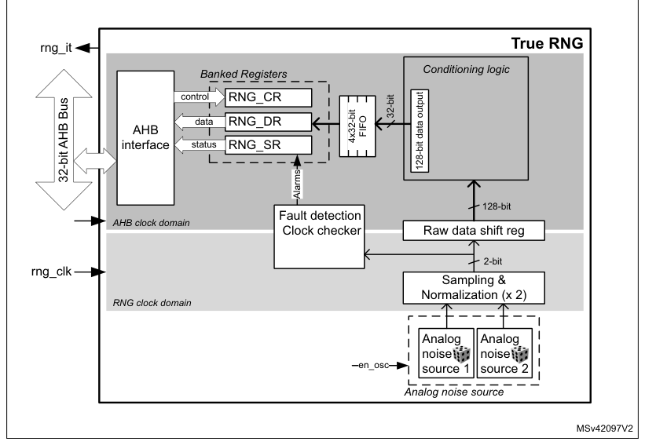
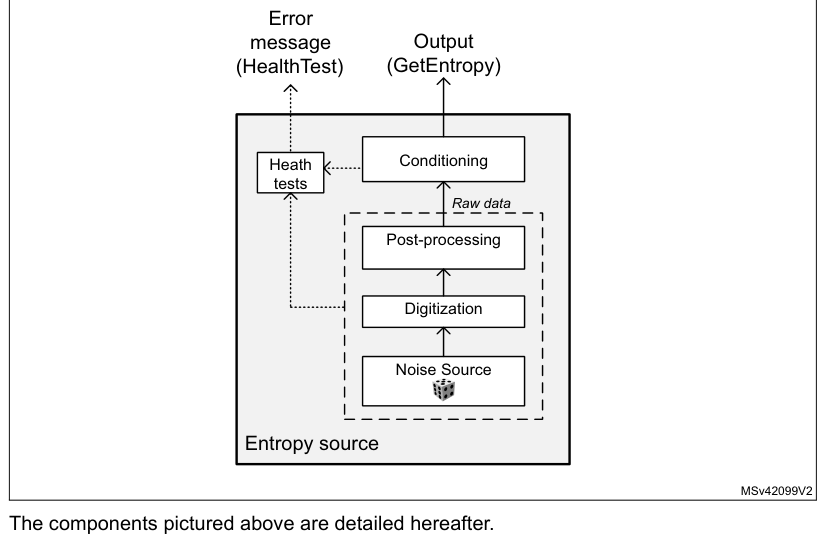
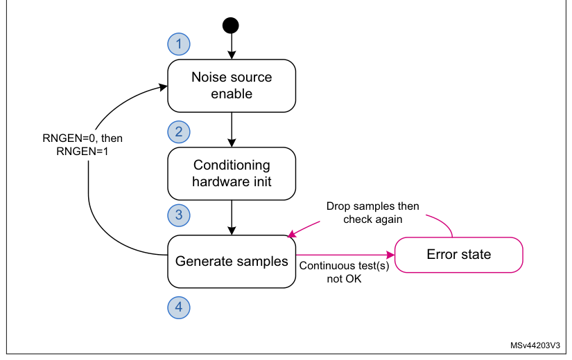

# 26 True random number generator (RNG)

[← RM0440 index](../STM32G4_RM0440.md)

## 26.1 Introduction

The RNG is a true random number generator that provides full entropy outputs to the application as
32-bit samples. It is composed of a live entropy source (analog) and an internal conditioning
component.

The RNG can be used to construct a NIST compliant deterministic random bit generator (DRBG), acting
as a live entropy source.

The RNG true random number generator has been tested using the German BSI statistical tests of
AIS-31 (T0 to T8).

## 26.2 RNG main features

- The RNG delivers 32-bit true random numbers, produced by an analog entropy source processed by a
  high quality conditioning stage.

fAHB

- In the NIST configuration, it produces four 32-bit random samples every 16x ------------
  fRNG

AHB clock cycles, if value is higher than 213 cycles (213 cycles otherwise).

- It allows embedded continuous basic health tests with associated error management
  - Includes too low sampling clock detection and repetition count tests.
- It can be disabled to reduce power consumption.
- It has an AMBA® AHB slave peripheral, accessible through 32-bit word single accesses only (else an
  AHB bus error is generated, and the write accesses are ignored).

## 26.3 RNG functional description

### 26.3.1 RNG block diagram

Figure 179 shows the RNG block diagram.

**Figure 179. RNG block diagram**

True RNG
rng_it

Conditioning logic

Banked Registers
control RNG_CR

32-bit
data RNG_DR

AHB

FIFO

4x32-bit

### 26.3.2 RNG internal signals

Table 208 describes a list of useful-to-know internal signals available at the RNG level, not at the
STM32 product level (on pads).

**Table 208. RNG internal input/output signals**

| Signal name | Signal type | Description |
| --- | --- | --- |
| rng_it | Digital output | RNG global interrupt request |
| rng_hclk | Digital input | AHB clock |
| rng_clk | Digital input | RNG dedicated clock, asynchronous to rng_hclk |

### 26.3.3 Random number generation

The true random number generator (RNG) delivers truly random data through its AHB interface at
deterministic intervals. Within its boundary the RNG implements the entropy source model pictured on
Figure 180.

It includes an analog noise source, a digitization stage with post-processing, a conditioning
algorithm, a health monitoring block and two interfaces that are used to interact with the entropy
source: GetEntropy and HealthTest.

**Figure 180. Entropy source model**

The components pictured above are detailed hereafter.

#### Noise source

The noise source is the component that contains the non-deterministic, entropy-providing activity
that is ultimately responsible for the uncertainty associated with the bitstring output by the
entropy source. It is composed of:

- Two analog noise sources, each based on three XORed free-running ring oscillator outputs. It is
  possible to disable those analog oscillators to save power, as described in [Section 26.3.8](#2638-rng-low-power-use).
- A sampling stage of these outputs clocked by a dedicated clock input (rng_clk), delivering a 2-bit
  raw data output.

This noise source sampling is independent to the AHB interface clock frequency (rng_hclk).

> **Note:** In [Section 26.6](#266-rng-entropy-source-validation) the recommended RNG clock frequencies are given.

#### Post processing

The sample values obtained from a true random noise source consist of 2-bit bitstrings. Because this
noise source output is biased, the RNG implements a post-processing component that reduces that bias
to a tolerable level.

More specifically, for each of the two noise source bits the RNG takes half of the bits from the
sampled noise source, and half of the bits from the inverted sampled noise source. Thus, if the
source generates more ‘1’ than ‘0’ (or the opposite), it is filtered.

#### Conditioning

The conditioning component in the RNG is a deterministic function that increases the entropy rate of
the resulting fixed-length bitstrings output (128-bit).

Also note that post-processing computations are triggered when at least 32 bits of raw datum is
received and when output FIFO needs a refill. Thus, the RNG output entropy is maximum when the RNG
128-bit FIFO is emptied by application after 64 RNG clock cycles.

The times required between two random number generations, and between the RNG initialization and
availability of first sample are described in [Section 26.5](#265-rng-processing-time).

The conditioning component is clocked by the faster AHB clock.

#### Output buffer

A data output buffer can store up to four 32-bit words, which have been output from the conditioning
component. When four words have been read from the output FIFO through the RNG_DR register, the
content of the 128-bit conditioning output register is pushed into the output FIFO, and a new
conditioning round is automatically started. Four new words are added to the conditioning output
register 213 AHB clock cycles later.

Whenever a random number is available through the RNG_DR register, the DRDY flag changes from 0 to
1\. This flag remains high until the output buffer becomes empty after reading four words from the
RNG_DR register.

> **Note:** When interrupts are enabled an interrupt is generated when this data ready flag transitions
> from 0 to 1. Interrupt is then cleared automatically by the RNG as explained above.

#### Health checks

This component ensures that the entire entropy source (with its noise source) starts then operates
as expected, obtaining assurance that failures are caught quickly and with a high probability and
reliability.

The RNG implements the following health check features.

1. Continuous health tests, running indefinitely on the output of the noise source
   - Repetition count test, flagging an error when:

a) One of the noise source has provided more than 64 consecutive bits at a constant
value (“0” or “1”), or more than 32 consecutive occurrence of two bits patterns (“01” or “10”)
b) Both noise sources have delivered more than 32 consecutive bits at a constant
value (“0” or “1”), or more than 16 consecutive occurrence of two bits patterns (“01” or “10”)

2. Vendor specific continuous test
   - Real-time “too slow” sampling clock detector, flagging an error when one RNG clock cycle is
    smaller than AHB clock cycle divided by 32.

The CECS and SECS status bits in the RNG_SR register indicate when an error condition is detected,
as detailed in [Section 26.3.7](#2637-error-management).

> **Note:** An interrupt can be generated when an error is detected.

### 26.3.4 RNG initialization

The RNG simplified state machine is pictured on Figure 181.

After enabling the RNG (RNGEN = 1 in RNG_CR), the following chain of events occurs:

1. The analog noise source is enabled, and logic immediately starts sampling the analog
   output, filling the 128-bit conditioning shift register.
2. The conditioning logic is enabled and the post-processing context is initialized using
   two 128 noise source bits.
3. The conditioning stage internal input data buffer is filled again with 128-bit and one
   conditioning round is performed. The output buffer is then filled with the post processing result.
4. The output buffer is refilled automatically according to the RNG usage.

The associated initialization time can be found in [Section 26.5](#265-rng-processing-time).

**Figure 181. RNG initialization overview**

1

Noise source
enable

2

RNGEN=0, then

RNGEN=1

Conditioning hardware init

Drop samples then

3
check again

Error state

Generate samples

Continuous test(s)
not OK

4

MSv44203V3

### 26.3.5 RNG operation

#### Normal operation

To run the RNG using interrupts, the following steps are recommended:

1. Enable the interrupts by setting the IE bit in the RNG_CR register. At the same time,
   enable the RNG by setting the bit RNGEN=1.
2. An interrupt is now generated when a random number is ready or when an error
   occurs. Therefore, at each interrupt, check that:

- No error occurred. The SEIS and CEIS bits must be set to 0 in the RNG_SR register.
- A random number is ready. The DRDY bit must be set to 1 in the RNG_SR register.
- If the above two conditions are true the content of the RNG_DR register can be read up to four
  consecutive times. If valid data is available in the conditioning output buffer, four additional
  words can be read by the application (in this case the DRDY bit is still high). If one or both of
  the above conditions are false, the RNG_DR register must not be read. If an error occurred, the
  error recovery sequence described in [Section 26.3.7](#2637-error-management) must be used.

To run the RNG in polling mode following steps are recommended:

1. Enable the random number generation by setting the RNGEN bit to “1” in the RNG_CR
   register.
2. Read the RNG_SR register and check that:
   - No error occurred (the SEIS and CEIS bits must be set to 0)
   - A random number is ready (the DRDY bit must be set to 1)

3. If above conditions are true read the content of the RNG_DR register up to four
   consecutive times. If valid data is available in the conditioning output buffer four additional
   words can be read by the application (in this case the DRDY bit is still high). If one or both of
   the above conditions are false, the RNG_DR register must not be read. If an error occurred, the
   error recovery sequence described in [Section 26.3.7](#2637-error-management) must be used.

> **Note:** When data is not ready (DRDY = 0) RNG_DR returns zero.

It is recommended to always verify that RNG_DR is different from zero. Because when it is the case a
seed error occurred between RNG_SR polling and RND_DR output reading (rare event).

#### Low-power operation

If the power consumption is a concern to the application, low-power strategies can be used, as
described in [Section 26.3.8](#2638-rng-low-power-use).

#### Software post-processing

If a NIST approved DRBG with 128 bits of security strength is required an approved random generator
software must be built around the RNG true random number generator.

Built-in health check functions are described in [Section 26.3.3](#2633-random-number-generation): Random number generation.

### 26.3.6 RNG clocking

The RNG runs on two different clocks: the AHB bus clock and a dedicated RNG clock.

The AHB clock is used to clock the AHB banked registers and conditioning component. The RNG clock is
used for noise source sampling. Recommended clock configurations are detailed in [Section 26.6](#266-rng-entropy-source-validation): RNG
entropy source validation.

> **Note:** When the CED bit in the RNG_CR register is set to 0, the RNG clock frequency the must
> be higher than the AHB clock frequency divided by 32, otherwise the clock checker always flags a
> clock error (CECS = 1 in the RNG_SR register).

See [Section 26.3.1](#2631-rng-block-diagram): RNG block diagram for details (AHB and RNG clock domains).

### 26.3.7 Error management

In parallel to random number generation a health check block verifies the correct noise source
behavior and the frequency of the RNG source clock as detailed in this section. Associated error
state is also described.

#### Clock error detection

When the clock error detection is enabled (CED = 0) and if the RNG clock frequency is too low, the
RNG sets to 1 both the CEIS and CECS bits to indicate that a clock error occurred. In this case, the
application must check that the RNG clock is configured correctly (see [Section 26.3.6](#2636-rng-clocking): RNG clocking)
and then it must clear the CEIS bit interrupt flag. The CECS bit is automatically cleared when the
clocking condition is normal.

> **Note:** The clock error has no impact on generated random numbers that is the application can still
> read the RNG_DR register.

CEIS is set only when CECS is set to 1 by RNG.

#### Noise source error detection

When a noise source (or seed) error occurs, the RNG stops generating random numbers and sets to 1
both SEIS and SECS bits to indicate that a seed error occurred. If a value is available in the
RNG_DR register, it must not be used as it may not have enough entropy. If the error was detected
during the initialization phase the whole initialization sequence is automatically restarted by the
RNG.

The following sequence must be used to fully recover from a seed error after the RNG initialization:

1. Clear the SEIS bit by writing it to “0”.
2. Read out 12 words from the RNG_DR register, and discard each of them in order to
   clean the pipeline.
3. Confirm that SEIS is still cleared. Random number generation is back to normal.

### 26.3.8 RNG low-power use

If power consumption is a concern, the RNG can be disabled as soon as the DRDY bit is set to 1 by
setting the RNGEN bit to 0 in the RNG_CR register. As the post-processing logic and the output
buffer remain operational while RNGEN = 0 following features are available to the software:

- If there are valid words in the output buffer four random numbers can still be read from the
  RNG_DR register.
- If there are valid bits in the conditioning output internal register four additional random
  numbers can be still be read from the RNG_DR register. If it is not the case the RNG must be
  re-enabled by the application until at least 32 new bits are collected from the noise source and a
  complete conditioning round is done. It corresponds to 16 RNG clock cycles to sample new bits, and
  216 AHB clock cycles to run a conditioning round.

When disabling the RNG the user deactivates all the analog seed generators, whose power consumption
is given in the datasheet electrical characteristics section. The user also gates all the logic
clocked by the RNG clock. Note that this strategy is adding latency before a random sample is
available on the RNG_DR register, because of the RNG initialization time.

If the RNG block is disabled during initialization (that is well before the DRDY bit rises for the
first time), the initialization sequence resumes from where it was stopped when RNGEN bit is set to
1.

## 26.4 RNG interrupts

In the RNG an interrupt can be produced on the following events:

- Data ready flag
- Seed error, see [Section 26.3.7](#2637-error-management): Error management
- Clock error, see [Section 26.3.7](#2637-error-management): Error management

Dedicated interrupt enable control bits are available as shown in Table 209.

**Table 209. RNG interrupt requests**

| Source row | Column 1 | Column 2 | Column 3 | Column 4 | Column 5 |
| ---: | --- | --- | --- | --- | --- |
| 1 | `Interrupt acronym` | `Interrupt event` | `Event flag` | `Enable control bit` | `Interrupt clear method` |
| 2 | `Data ready flag` | `DRDY` | `IE` | `None (automatic)` |  |
| 3 | `RNG` | `Seed error flag` | `SEIS` | `IE` | `Write 0 to SEIS.` |
| 4 | `Clock error flag` | `CEIS` | `IE` | `Write 0 to CEIS` |  |

The user can enable or disable the above interrupt sources individually by changing the mask bits or
the general interrupt control bit IE in the RNG_CR register. The status of the individual interrupt
sources can be read from the RNG_SR register.

> **Note:** Interrupts are generated only when RNG is enabled.

## 26.5 RNG processing time

fAHB

> **Extracted layout**
>
> `The conditioning stage can produce four 32-bit random numbers every 16x` · `------------` · `clock`  
> `fRNG`  

cycles, if the value is higher than 213 cycles (213 cycles otherwise). More time is needed for the
first set of random numbers after the device exits reset (see

[Section 26.3.4](#2634-rng-initialization): RNG initialization). Indeed, after enabling the RNG for the first time, random data
is first available after either:

- 128 RNG clock cycles \+ 426 AHB cycles, if fAHB \< fthreshold
- 192 RNG clock cycles \+ 213 AHB cycles, if fAHB ≥ fthreshold

With fthreshold = (213 x fRNG)/ 64

## 26.6 RNG entropy source validation

### 26.6.1 Introduction

In order to assess the amount of entropy available from the RNG, STMicroelectronics has tested the
peripheral using the German BSI AIS-31 statistical tests (T0 to T8). The results can be provided on
demand or the customer can reproduce the tests.

### 26.6.2 Validation conditions

STMicroelectronics has tested the RNG true random number generator in the following conditions:

- RNG clock rng_clk= 48 MHz (CED bit = ‘0’ in RNG_CR register) and rng_clk = 400 kHz (CED bit = ‘1’
  in RNG_CR register).

**Table 210. RNG configurations**

| Source row | Column 1 | Column 2 | Column 3 | Column 4 | Column 5 | Column 6 | Column 7 |
| ---: | --- | --- | --- | --- | --- | --- | --- |
| 1 | `RNG_CR bits` |  |  |  |  |  |  |
| 2 | `Loop` | `RNG_` | `RNG_` |  |  |  |  |
| 3 | `Configuration` | `RNG_` | `RNG_` | `RNG_` | `number` | `HTCR` | `NSCR` |
| 4 | `NISTC` | `CLKDIV` | `CED` |  |  |  |  |
| 5 | `CONFIG1` | `CONFIG2` | `CONFIG3` | `(N)` | `register` | `register` |  |
| 6 | `bit` | `[3:0]` | `bit` |  |  |  |  |
| 7 | `[5:0]` | `[2:0](1)` | `[3:0](2)` |  |  |  |  |

Refer to NIST compliant RNG configuration table in AN4230 available from [www.st.com](https://www.st.com).

This application note also indicates if this configuration is part of an existing NIST SP800-90B

A

Entropy Certificate listed on [https://csrc.nist.gov/projects/cryptographic-module-validation-program](https://csrc.nist.gov/projects/cryptographic-module-validation-program).

| Source row | Column 1 | Column 2 | Column 3 | Column 4 | Column 5 | Column 6 | Column 7 | Column 8 |
| ---: | --- | --- | --- | --- | --- | --- | --- | --- |
| 1 | `B` | `1` | `0x18` | `0x0` | `0x0` | `0` | `1` | `default` |
| 2 | `0x0000` |  |  |  |  |  |  |  |
| 3 | `0x0(3)` |  |  |  |  |  |  |  |
| 4 | `NA(4)` |  |  |  |  |  |  |  |
| 5 | `C` | `0` | `0x0F` | `0x0` | `0xD` | `0` | `2` | `default` |

1. 0x1 value is recommended instead of 0x0 for RNG_CONFIG2[2:0], when RNG power consumption is
   critical. See the end
   of [Section 26.3.8](#2638-rng-low-power-use) for details.
2. RNG_CONFIG3[1:0] defines the loop number N: 0x0 corresponds to N=1, 0x1 to N=2, 0x2 to N=3, 0x3
   to N=4
3. The noise source sampling must be NA or less. Hence, if the RNG clock is different from NA, this
   value of CLKDIV must be
   adapted. See the CLKDIV bitfield description in [Section 26.7.1](#2671-rng-control-register-rng_cr) for details.
4. This value can be fixed in the RNG driver (it does not depend upon the STM32 product).

### 26.6.3 Data collection

In order to run statistical tests, it is required to collect samples from the entropy source at the
raw data level as well as at the output of the entropy source. For details on data collection and
the running of statistical test suites refer to AN4230 “STM32 microcontrollers random number
generation validation using NIST statistical test suite” available from [www.st.com](https://www.st.com).

In bypass mode the bits [31:30] of the fourth word are always stuck at 0. Hence the continuous
capture of samples is started from the fifth word.

## 26.7 RNG registers

The RNG is associated with a control register, a data register and a status register.

### 26.7.1 RNG control register (RNG_CR)

- **Address offset:** 0x000
- **Reset value:** 0x0000 0000

**Register bit layout**

| Bit | Field | Access | Summary |
| ---: | --- | :---: | --- |
| 31 | Reserved | — | kept at reset value. |
| 30 | Reserved | — | ↳ |
| 29 | Reserved | — | ↳ |
| 28 | Reserved | — | ↳ |
| 27 | Reserved | — | ↳ |
| 26 | Reserved | — | ↳ |
| 25 | Reserved | — | ↳ |
| 24 | Reserved | — | ↳ |
| 23 | Reserved | — | ↳ |
| 22 | Reserved | — | ↳ |
| 21 | Reserved | — | ↳ |
| 20 | Reserved | — | ↳ |
| 19 | Reserved | — | ↳ |
| 18 | Reserved | — | ↳ |
| 17 | Reserved | — | ↳ |
| 16 | Reserved | — | ↳ |
| 15 | Reserved | — | ↳ |
| 14 | Reserved | — | ↳ |
| 13 | Reserved | — | ↳ |
| 12 | Reserved | — | ↳ |
| 11 | Reserved | — | ↳ |
| 10 | Reserved | — | ↳ |
| 9 | Reserved | — | ↳ |
| 8 | Reserved | — | ↳ |
| 7 | Reserved | — | ↳ |
| 6 | Reserved | — | ↳ |
| 5 | `CED` | rw | Clock error detection |
| 4 | Reserved | — | kept at reset value. |
| 3 | `IE` | rw | Interrupt enable |
| 2 | `RNGEN` | rw | True random number generator enable |
| 1 | Reserved | — | kept at reset value. |
| 0 | Reserved | — | ↳ |

**Bits 31:6 — Reserved:** kept at reset value.

**Bit 5 — `CED`:** Clock error detection

- `0`: Clock error detection enabled
- `1`: Clock error detection is disabled

The clock error detection cannot be enabled nor disabled on-the-fly when the RNG is
enabled, that is to enable or disable CED, the RNG must be disabled.

**Bit 4 — Reserved:** kept at reset value.

**Bit 3 — `IE`:** Interrupt enable

- `0`: RNG interrupt is disabled
- `1`: RNG interrupt is enabled. An interrupt is pending as soon as the DRDY, SEIS, or CEIS is
  set in the RNG_SR register.

**Bit 2 — `RNGEN`:** True random number generator enable

- `0`: True random number generator is disabled. Analog noise sources are powered off and
  logic clocked by the RNG clock is gated.
- `1`: True random number generator is enabled.

**Bits 1:0 — Reserved:** kept at reset value.

### 26.7.2 RNG status register (RNG_SR)

- **Address offset:** 0x004
- **Reset value:** 0x0000 0000

**Register bit layout**

| Bit | Field | Access | Summary |
| ---: | --- | :---: | --- |
| 31 | Reserved | — | kept at reset value. |
| 30 | Reserved | — | ↳ |
| 29 | Reserved | — | ↳ |
| 28 | Reserved | — | ↳ |
| 27 | Reserved | — | ↳ |
| 26 | Reserved | — | ↳ |
| 25 | Reserved | — | ↳ |
| 24 | Reserved | — | ↳ |
| 23 | Reserved | — | ↳ |
| 22 | Reserved | — | ↳ |
| 21 | Reserved | — | ↳ |
| 20 | Reserved | — | ↳ |
| 19 | Reserved | — | ↳ |
| 18 | Reserved | — | ↳ |
| 17 | Reserved | — | ↳ |
| 16 | Reserved | — | ↳ |
| 15 | Reserved | — | ↳ |
| 14 | Reserved | — | ↳ |
| 13 | Reserved | — | ↳ |
| 12 | Reserved | — | ↳ |
| 11 | Reserved | — | ↳ |
| 10 | Reserved | — | ↳ |
| 9 | Reserved | — | ↳ |
| 8 | Reserved | — | ↳ |
| 7 | Reserved | — | ↳ |
| 6 | `SEIS` | rc_w0 | Seed error interrupt status |
| 5 | `CEIS` | rc_w0 | Clock error interrupt status |
| 4 | Reserved | — | kept at reset value. |
| 3 | Reserved | — | ↳ |
| 2 | `SECS` | r | Seed error current status |
| 1 | `CECS` | r | Clock error current status |
| 0 | `DRDY` | r | Data ready |

**Bits 31:7 — Reserved:** kept at reset value.

**Bit 6 — `SEIS`:** Seed error interrupt status

This bit is set at the same time as SECS. It is cleared by writing 0. Writing 1 has no effect.

- `0`: No faulty sequence detected
- `1`: At least one faulty sequence is detected. See SECS bit description for details.

An interrupt is pending if IE = 1 in the RNG_CR register.

**Bit 5 — `CEIS`:** Clock error interrupt status

This bit is set at the same time as CECS. It is cleared by writing 0. Writing 1 has no effect.

- `0`: The RNG clock is correct (fRNGCLK> fHCLK/32)
- `1`: The RNG is detected too slow (fRNGCLK\< fHCLK/32)

An interrupt is pending if IE = 1 in the RNG_CR register.

**Bits 4:3 — Reserved:** kept at reset value.

**Bit 2 — `SECS`:** Seed error current status

- `0`: No faulty sequence has currently been detected. If the SEIS bit is set, this means that a
  faulty sequence was detected and the situation has been recovered.
- `1`: At least one of the following faulty sequences has been detected:
  - One of the noise sources has provided more than 64 consecutive bits at a constant
    value (“0” or “1”), or more than 32 consecutive occurrence of two bit patterns (“01” or “10”)
- Both noise sources have delivered more than 32 consecutive bits at a constant
  value (“0” or “1”), or more than 16 consecutive occurrence of two bit patterns (“01” or “10”)

**Bit 1 — `CECS`:** Clock error current status

- `0`: The RNG clock is correct (fRNGCLK> fHCLK/32). If the CEIS bit is set, this means that a
  slow clock was detected and the situation has been recovered.
- `1`: The RNG clock is too slow (fRNGCLK\< fHCLK/32).

> **Note:** CECS bit is valid only if the CED bit in the RNG_CR register is set to 0.

**Bit 0 — `DRDY`:** Data ready

- `0`: The RNG_DR register is not yet valid, no random data is available.
- `1`: The RNG_DR register contains valid random data.

Once the output buffer becomes empty (after reading the RNG_DR register), this bit returns
to 0 until a new random value is generated.

> **Note:** The DRDY bit can rise when the peripheral is disabled (RNGEN = 0 in the RNG_CR
> register).

If IE=1 in the RNG_CR register, an interrupt is generated when DRDY = 1.

### 26.7.3 RNG data register (RNG_DR)

- **Address offset:** 0x008
- **Reset value:** 0x0000 0000

The RNG_DR register is a read-only register that delivers a 32-bit random value when read. After
being read, this register delivers a new random value after 216 periods of AHB clock if the output
FIFO is empty.

The content of this register is valid when the DRDY = 1 and the value is not 0x0, even if RNGEN = 0.

**Register bit layout**

| Bit | Field | Access | Summary |
| ---: | --- | :---: | --- |
| 31 | `RNDATA[31]` | r | Random data |
| 30 | `RNDATA[30]` | r | ↳ |
| 29 | `RNDATA[29]` | r | ↳ |
| 28 | `RNDATA[28]` | r | ↳ |
| 27 | `RNDATA[27]` | r | ↳ |
| 26 | `RNDATA[26]` | r | ↳ |
| 25 | `RNDATA[25]` | r | ↳ |
| 24 | `RNDATA[24]` | r | ↳ |
| 23 | `RNDATA[23]` | r | ↳ |
| 22 | `RNDATA[22]` | r | ↳ |
| 21 | `RNDATA[21]` | r | ↳ |
| 20 | `RNDATA[20]` | r | ↳ |
| 19 | `RNDATA[19]` | r | ↳ |
| 18 | `RNDATA[18]` | r | ↳ |
| 17 | `RNDATA[17]` | r | ↳ |
| 16 | `RNDATA[16]` | r | ↳ |
| 15 | `RNDATA[15]` | r | ↳ |
| 14 | `RNDATA[14]` | r | ↳ |
| 13 | `RNDATA[13]` | r | ↳ |
| 12 | `RNDATA[12]` | r | ↳ |
| 11 | `RNDATA[11]` | r | ↳ |
| 10 | `RNDATA[10]` | r | ↳ |
| 9 | `RNDATA[9]` | r | ↳ |
| 8 | `RNDATA[8]` | r | ↳ |
| 7 | `RNDATA[7]` | r | ↳ |
| 6 | `RNDATA[6]` | r | ↳ |
| 5 | `RNDATA[5]` | r | ↳ |
| 4 | `RNDATA[4]` | r | ↳ |
| 3 | `RNDATA[3]` | r | ↳ |
| 2 | `RNDATA[2]` | r | ↳ |
| 1 | `RNDATA[1]` | r | ↳ |
| 0 | `RNDATA[0]` | r | ↳ |

**Bits 31:0 — `RNDATA[31:0]`:** Random data

32-bit random data, which are valid when DRDY = 1. When DRDY = 0, the RNDATA value
is zero.

When DRDY is set, it is recommended to always verify that RNG_DR is different from zero.

The zero value means that a seed error occurred between RNG_SR polling and RND_DR
output reading (a rare event).

### 26.7.4 RNG register map

**Register summary**

| Offset | Register | Reset value |
| --- | --- | --- |
| 0x000 | `RNG_CR` | 0x0000 0000 |
| 0x004 | `RNG_SR` | 0x0000 0000 |
| 0x008 | `RNG_DR` | 0x0000 0000 |

Refer to [Section 2.2](chapter-02.md#22-memory-organization): Memory organization for the register boundary addresses.
