# 27 AES hardware accelerator (AES)

[← RM0440 index](../STM32G4_RM0440.md)

## 27.1 Introduction

The AES hardware accelerator (AES) encrypts or decrypts data, using an algorithm and implementation
fully compliant with the advanced encryption standard (AES) defined in Federal information
processing standards (FIPS) publication 197.

The peripheral supports CTR, GCM, GMAC, CCM, ECB, and CBC chaining modes for key sizes of 128 or 256
bits.

AES is an AMBA AHB slave peripheral accessible through 32-bit single accesses only. Other access
types generate an AHB error, and other than 32-bit writes may corrupt the register content.

The peripheral supports DMA single transfers for incoming and outgoing data (two DMA channels
required).

## 27.2 AES main features

- Compliance with NIST “Advanced encryption standard (AES), FIPS publication 197” from November 2001
- 128-bit data block processing
- Support for cipher key lengths of 128-bit and 256-bit
- Encryption and decryption with multiple chaining modes:
  - Electronic codebook (ECB) mode
  - Cipher block chaining (CBC) mode
  - Counter (CTR) mode
  - Galois counter mode (GCM)
  - Galois message authentication code (GMAC) mode
  - Counter with CBC-MAC (CCM) mode
- 51 or 75 clock cycle latency in ECB mode for processing one 128-bit block of data with,
  respectively, 128-bit or 256-bit key
- Integrated round key scheduler to compute the last round key for ECB/CBC decryption
- AMBA AHB slave peripheral, accessible through 32-bit word single accesses only
- 256-bit register for storing the cryptographic key (eight 32-bit registers)
- 128-bit register for storing initialization vector (four 32-bit registers)
- 32-bit buffer for data input and output
- Automatic data flow control with support of single-transfer direct memory access (DMA) using two
  channels (one for incoming data, one for processed data)
- Data-swapping logic to support 1-, 8-, 16- or 32-bit data
- Possibility for software to suspend a message if AES needs to process another message with a
  higher priority, then resume the original message

## 27.3 AES implementation

The devices have one AES peripheral.

## 27.4 AES functional description

### 27.4.1 AES block diagram

Figure 182 shows the block diagram of AES.

**Figure 182. AES block diagram**

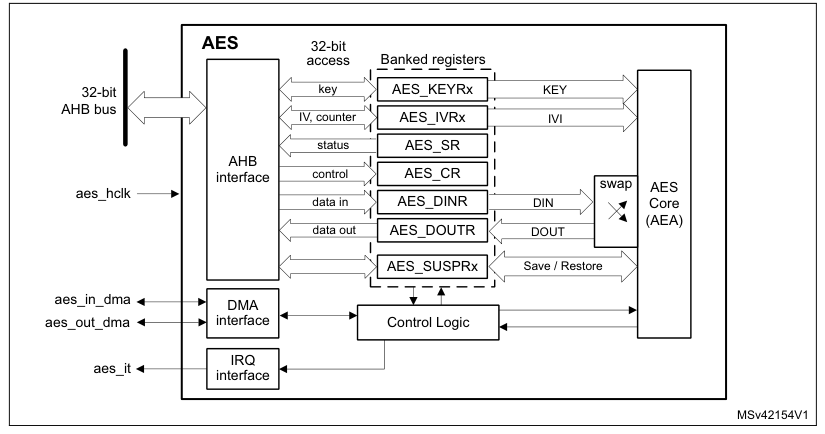

### 27.4.2 AES internal signals

Table 212 describes the user relevant internal signals interfacing the AES peripheral.

**Table 212. AES internal input/output signals**

| Signal name | Signal type | Description |
| --- | --- | --- |
| aes_hclk | Input | AHB bus clock |
| aes_it | Output | AES interrupt request |
| aes_in_dma | Input/Output | Input DMA single request/acknowledge |
| aes_out_dma | Input/Output | Output DMA single request/acknowledge |

### 27.4.3 AES cryptographic core

#### Overview

The AES cryptographic core consists of the following components:

- AES core algorithm (AEA)
- multiplier over a binary Galois field (GF2mul)
- key input
- initialization vector (IV) input
- chaining algorithm logic (XOR, feedback/counter, mask)

The AES core works on 128-bit data blocks (four words) with 128-bit or 256-bit key length. Depending
on the chaining mode, the AES requires zero or one 128-bit initialization vector IV.

The AES features the following modes of operation:

- Mode 1:

Plaintext encryption using a key stored in the AES_KEYRx registers

- Mode 2:

ECB or CBC decryption key preparation. It must be used prior to selecting Mode 3 with ECB or CBC
chaining modes. The key prepared for decryption is stored automatically in the AES_KEYRx registers.
Now the AES peripheral is ready to switch to Mode 3 for executing data decryption.

- Mode 3:

Ciphertext decryption using a key stored in the AES_KEYRx registers. When ECB and CBC chaining modes
are selected, the key must be prepared beforehand, through Mode 2.

- Mode 4:

ECB or CBC ciphertext single decryption using the key stored in the AES_KEYRx registers (the initial
key is derived automatically).

> **Note:** Mode 2 and mode 4 are only used when performing ECB and CBC decryption.

When Mode 4 is selected only one decryption can be done, therefore usage of Mode 2 and Mode 3 is
recommended instead.

The operating mode is selected by programming the MODE[1:0] bitfield of the AES_CR register. It may
be done only when the AES peripheral is disabled.

#### Typical data processing

Typical usage of the AES is described in [Section 27.4.4](#2744-aes-procedure-to-perform-a-cipher-operation): AES procedure to perform a cipher
operation.

> **Note:** The outputs of the intermediate AEA stages are never revealed outside the cryptographic
> boundary, with the exclusion of the IVI bitfield.

#### Chaining modes

The following chaining modes are supported by AES, selected through the CHMOD[2:0] bitfield of the
AES_CR register:

- Electronic code book (ECB)
- Cipher block chaining (CBC)
- Counter (CTR)
- Galois counter mode (GCM)
- Galois message authentication code (GMAC)
- Counter with CBC-MAC (CCM)

> **Note:** The chaining mode may be changed only when AES is disabled (bit EN of the AES_CR
> register cleared).

Principle of each AES chaining mode is provided in the following subsections.

Detailed information is in dedicated sections, starting from [Section 27.4.8](#2748-aes-basic-chaining-modes-ecb-cbc): AES basic chaining
modes (ECB, CBC).

#### Electronic codebook (ECB) mode

**Figure 183. ECB encryption and decryption principle**

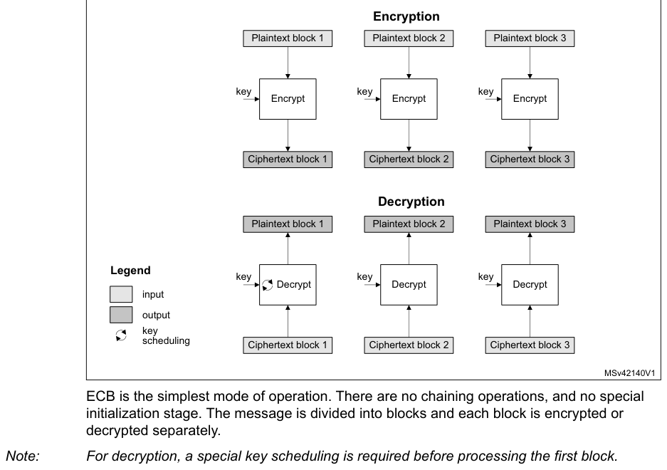

ECB is the simplest mode of operation. There are no chaining operations, and no special
initialization stage. The message is divided into blocks and each block is encrypted or decrypted
separately.

> **Note:** For decryption, a special key scheduling is required before processing the first block.

#### Cipher block chaining (CBC) mode

**Figure 184. CBC encryption and decryption principle**

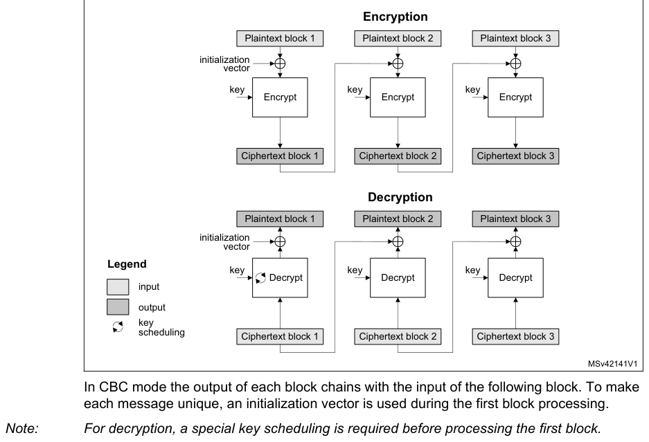

In CBC mode the output of each block chains with the input of the following block. To make each
message unique, an initialization vector is used during the first block processing.

> **Note:** For decryption, a special key scheduling is required before processing the first block.

#### Counter (CTR) mode

**Figure 185. CTR encryption and decryption principle**

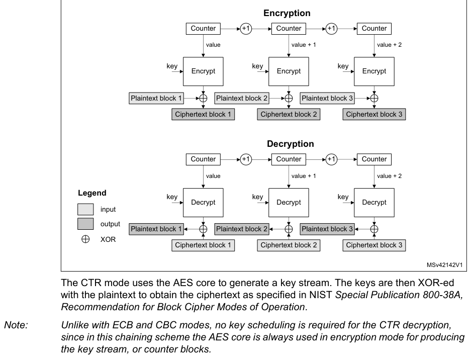

The CTR mode uses the AES core to generate a key stream. The keys are then XOR-ed with the plaintext
to obtain the ciphertext as specified in NIST Special Publication 800-38A, Recommendation for Block
Cipher Modes of Operation.

> **Note:** Unlike with ECB and CBC modes, no key scheduling is required for the CTR decryption,
> since in this chaining scheme the AES core is always used in encryption mode for producing the key
> stream, or counter blocks.

#### Galois/counter mode (GCM)

**Figure 186. GCM encryption and authentication principle**

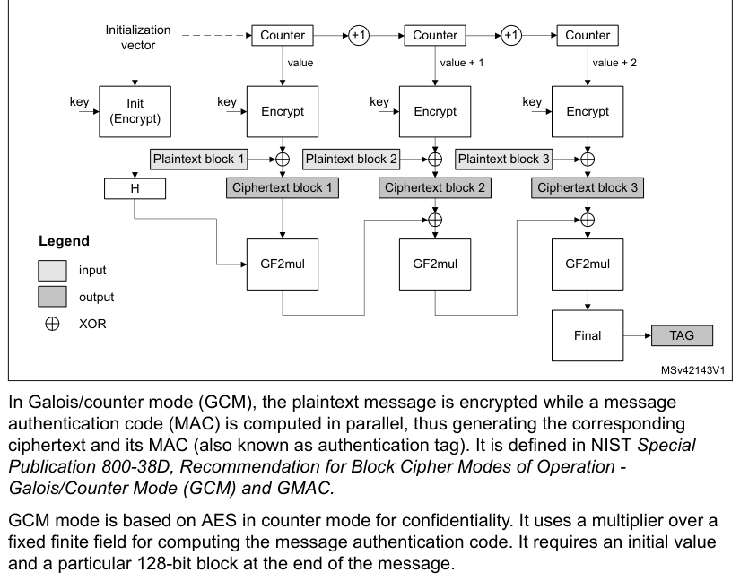

In Galois/counter mode (GCM), the plaintext message is encrypted while a message authentication code
(MAC) is computed in parallel, thus generating the corresponding ciphertext and its MAC (also known
as authentication tag). It is defined in NIST Special Publication 800-38D, Recommendation for Block
Cipher Modes of Operation - Galois/Counter Mode (GCM) and GMAC.

GCM mode is based on AES in counter mode for confidentiality. It uses a multiplier over a fixed
finite field for computing the message authentication code. It requires an initial value and a
particular 128-bit block at the end of the message.

#### Galois message authentication code (GMAC) principle

**Figure 187. GMAC authentication principle**

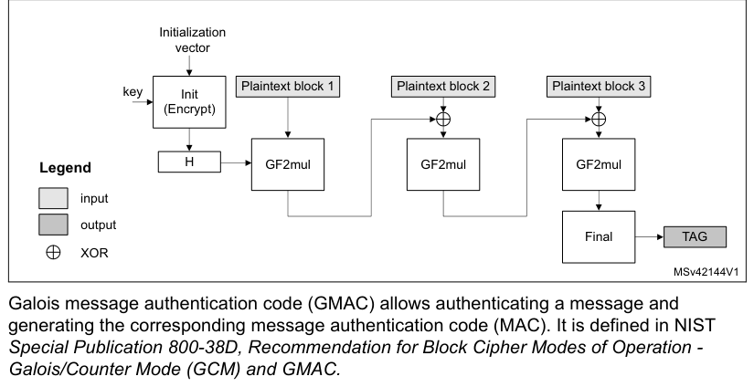

Galois message authentication code (GMAC) allows authenticating a message and generating the
corresponding message authentication code (MAC). It is defined in NIST Special Publication 800-38D,
Recommendation for Block Cipher Modes of Operation - Galois/Counter Mode (GCM) and GMAC.

GMAC is similar to GCM, except that it is applied on a message composed only by plaintext
authenticated data (that is, only header, no payload).

#### Counter with CBC-MAC (CCM) principle

**Figure 188. CCM encryption and authentication principle**

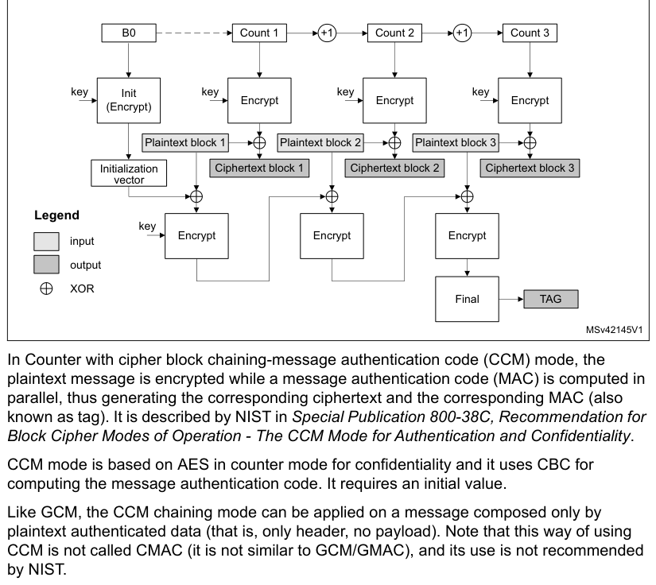

In Counter with cipher block chaining-message authentication code (CCM) mode, the plaintext message
is encrypted while a message authentication code (MAC) is computed in parallel, thus generating the
corresponding ciphertext and the corresponding MAC (also known as tag). It is described by NIST in
Special Publication 800-38C, Recommendation for Block Cipher Modes of Operation - The CCM Mode for
Authentication and Confidentiality.

CCM mode is based on AES in counter mode for confidentiality and it uses CBC for computing the
message authentication code. It requires an initial value.

Like GCM, the CCM chaining mode can be applied on a message composed only by plaintext authenticated
data (that is, only header, no payload). Note that this way of using CCM is not called CMAC (it is
not similar to GCM/GMAC), and its use is not recommended by NIST.

### 27.4.4 AES procedure to perform a cipher operation

#### Introduction

A typical cipher operation is explained below. Detailed information is provided in sections starting
from [Section 27.4.8](#2748-aes-basic-chaining-modes-ecb-cbc): AES basic chaining modes (ECB, CBC).

#### Initialization of AES

To initialize AES, first disable it by clearing the EN bit of the AES_CR register. Then perform the
following steps in any order:

- Configure the AES mode, by programming the MODE[1:0] bitfield of the AES_CR register.
  - For encryption, select Mode 1 (MODE[1:0] = 00).
  - For decryption, select Mode 3 (MODE[1:0] = 10), unless ECB or CBC chaining modes are used. In
    this latter case, perform an initial key derivation of the encryption key, as described in
    [Section 27.4.5](#2745-aes-decryption-round-key-preparation): AES decryption round key preparation.
- Select the chaining mode, by programming the CHMOD[2:0] bitfield of the AES_CR register.
- Configure the data type (1-, 8-, 16- or 32-bit), with the DATATYPE[1:0] bitfield in the AES_CR
  register.
- When it is required (for example in CBC or CTR chaining modes), write the initialization vector
  into the AES_IVRx registers.
- Configure the key size (128-bit or 256-bit), with the KEYSIZE bitfield of the AES_CR register.
- Write a symmetric key into the AES_KEYRx registers (4 or 8 registers depending on the key size).

#### Data append

This section describes different ways of appending data for processing, where the size of data to
process is not a multiple of 128 bits.

For ECB or CBC mode, refer to [Section 27.4.6](#2746-aes-ciphertext-stealing-and-data-padding): AES ciphertext stealing and data padding. The last
block management in these cases is more complex than in the sequence described in this section.

Data append through polling

This method uses flag polling to control the data append through the following sequence:

1. Enable the AES peripheral by setting the EN bit of the AES_CR register.
2. Repeat the following sub-sequence until the payload is entirely processed:

a) Write four input data words into the AES_DINR register.

b) Wait until the status flag CCF is set in the AES_SR, then read the four data words
from the AES_DOUTR register.

c) Clear the CCF flag, by setting the CCFC bit of the AES_CR register.

d) If the data block just processed is the second-last block of the message and the
significant data in the last block to process is inferior to 128 bits, pad the remainder of the last
block with zeros and, in case of GCM payload encryption or CCM payload decryption, specify the
number of non-valid bytes, using the NPBLB bitfield of the AES_CR register, for AES to compute a
correct tag;.

3. As it is the last block, discard the data that is not part of the data, then disable the AES
   peripheral by clearing the EN bit of the AES_CR register.

> **Note:** Up to three wait cycles are automatically inserted between two consecutive writes to the

AES_DINR register, to allow sending the key to the AES processor.

NPBLB bits are not used in header phase of GCM, GMAC and CCM chaining modes.

Data append using interrupt

The method uses interrupt from the AES peripheral to control the data append, through the following
sequence:

1. Enable interrupts from AES by setting the CCFIE bit of the AES_CR register.
2. Enable the AES peripheral by setting the EN bit of the AES_CR register.
3. Write first four input data words into the AES_DINR register.
4. Handle the data in the AES interrupt service routine, upon interrupt:

a) Read four output data words from the AES_DOUTR register.

b) Clear the CCF flag and thus the pending interrupt, by setting the CCFC bit of the

AES_CR register.

c) If the data block just processed is the second-last block of an message and the
significant data in the last block to process is inferior to 128 bits, pad the remainder of the last
block with zeros and, in case of GCM payload encryption or CCM payload decryption, specify the
number of non-valid bytes, using the NPBLB bitfield of the AES_CR register, for AES to compute a
correct tag;. Then proceed with point 4e).

d) If the data block just processed is the last block of the message, discard the data
that is not part of the data, then disable the AES peripheral by clearing the EN bit of the AES_CR
register and quit the interrupt service routine.

e) Write next four input data words into the AES_DINR register and quit the interrupt
service routine.

> **Note:** AES is tolerant of delays between consecutive read or write operations, which allows, for
> example, an interrupt from another peripheral to be served between two AES computations.

NPBLB bits are not used in header phase of GCM, GMAC and CCM chaining modes.

Data append using DMA

With this method, all the transfers and processing are managed by DMA and AES. To use the method,
proceed as follows:

1. Prepare the last four-word data block (if the data to process does not fill it completely),
   by padding the remainder of the block with zeros.
2. Configure the DMA controller so as to transfer the data to process from the memory to
   the AES peripheral input and the processed data from the AES peripheral output to the memory, as
   described in [Section 27.4.16](#27416-aes-dma-interface): AES DMA interface. Configure the DMA controller so as to generate an
   interrupt on transfer completion. In case of GCM payload encryption or CCM payload decryption, DMA
   transfer must not include the last four-word block if padded with zeros. The sequence described in
   Data append through polling must be used instead for this last block, because NPBLB bits must be
   setup before processing the block, for AES to compute a correct tag.
3. Enable the AES peripheral by setting the EN bit of the AES_CR register
4. Enable DMA requests by setting the DMAINEN and DMAOUTEN bits of the AES_CR
   register.
5. Upon DMA interrupt indicating the transfer completion, get the AES-processed data
   from the memory.

> **Note:** The CCF flag has no use with this method, because the reading of the AES_DOUTR
> register is managed by DMA automatically, without any software action, at the end of the computation
> phase.

NPBLB bits are not used in header phase of GCM, GMAC, and CCM chaining modes.

### 27.4.5 AES decryption round key preparation

Internal key schedule is used to generate AES round keys. In AES encryption, the round 0 key is the
one stored in the key registers. AES decryption must start using the last round key. As the
encryption key is stored in memory, a special key scheduling must be performed to obtain the
decryption key. This key scheduling is only required for AES decryption in ECB and CBC modes.

Recommended method is to select the Mode 2 by setting to 01 the MODE[1:0] bitfield of the AES_CR
(key process only), then proceed with the decryption by setting MODE[1:0] to 10 (Mode 3, decryption
only). Mode 2 usage is described below:

1. Disable the AES peripheral by clearing the EN bit of the AES_CR register.
2. Select Mode 2 by setting to 01 the MODE[1:0] bitfield of the AES_CR. The

CHMOD[2:0] bitfield is not significant in this case because this key derivation mode is independent
of the chaining algorithm selected.

3. Set key length to 128 or 256 bits, via KEYSIZE bit of AES_CR register.
4. Write the AES_KEYRx registers (128 or 256 bits) with encryption key, as shown in

Figure 189. Writes to the AES_IVRx registers have no effect.

5. Enable the AES peripheral, by setting the EN bit of the AES_CR register.
6. Wait until the CCF flag is set in the AES_SR register.
7. Clear the CCF flag. Derived key is available in AES core, ready to use for decryption.

Application can also read the AES_KEYRx register to obtain the derived key if needed, as shown in
Figure 189 (the processed key is loaded automatically into the AES_KEYRx registers).

> **Note:** The AES is disabled by hardware when the derivation key is available.

To restart a derivation key computation, repeat steps 4, 5, 6, and 7.

**Figure 189. Encryption key derivation for ECB/CBC decryption (Mode 2)**

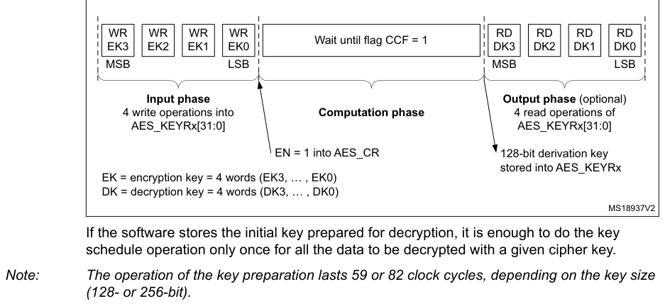

If the software stores the initial key prepared for decryption, it is enough to do the key schedule
operation only once for all the data to be decrypted with a given cipher key.

> **Note:** The operation of the key preparation lasts 59 or 82 clock cycles, depending on the key size

(128- or 256-bit).

### 27.4.6 AES ciphertext stealing and data padding

When using AES in ECB or CBC modes to manage messages the size of which is not a multiple of the
block size (128 bits), ciphertext stealing techniques are used, such as those described in NIST
Special Publication 800-38A, Recommendation for Block Cipher Modes of Operation: Three Variants of
Ciphertext Stealing for CBC Mode. Since the AES peripheral does not support such techniques, the
application must complete the last block of input data using data from the second last block.

> **Note:** Ciphertext stealing techniques are not documented in this reference manual.

Similarly, when AES is used in other modes than ECB or CBC, an incomplete input data block (that is,
block with input data shorter than 128 bits) must be padded with zeros prior to encryption (that is,
extra bits must be appended to the trailing end of the data string). After decryption, the extra
bits must be discarded. As AES does not implement automatic data padding operation to the last
block, the application must follow the recommendation given in [Section 27.4.4](#2744-aes-procedure-to-perform-a-cipher-operation): AES procedure to
perform a cipher operation to manage messages the size of which is not a multiple of 128 bits.

> **Note:** Padding data are swapped in a similar way as normal data, according to the

DATATYPE[1:0] field of the AES_CR register (see [Section 27.4.13](#27413-aes-data-registers-and-data-swapping): AES data registers and data
swapping for details).

### 27.4.7 AES task suspend and resume

A message can be suspended if another message with a higher priority must be processed. When this
highest priority message is sent, the suspended message can resume in both encryption or decryption
mode.

Suspend/resume operations do not break the chaining operation and the message processing can resume
as soon as AES is enabled again to receive the next data block.

Figure 190 gives an example of suspend/resume operation: Message 1 is suspended in order to send a
shorter and higher-priority Message 2.

**Figure 190. Example of suspend mode management**

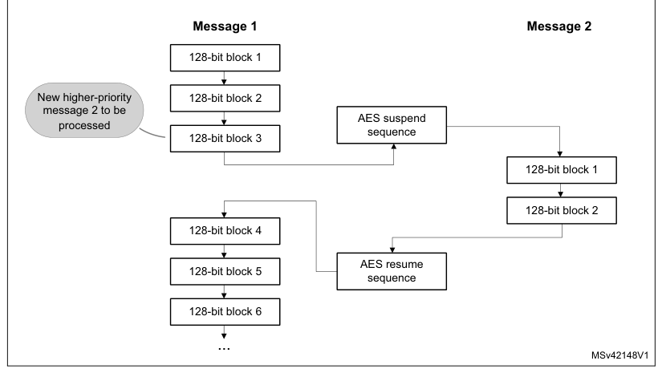

...

MSv42148V1

A detailed description of suspend/resume operations is in the sections dedicated to each AES mode.

### 27.4.8 AES basic chaining modes (ECB, CBC)

#### Overview

This section gives a brief explanation of the four basic operation modes provided by the AES core:
ECB encryption, ECB decryption, CBC encryption and CBC decryption. For detailed information, refer
to the FIPS publication 197 from November 26, 2001.

Figure 191 illustrates the electronic codebook (ECB) encryption.

**Figure 191. ECB encryption**

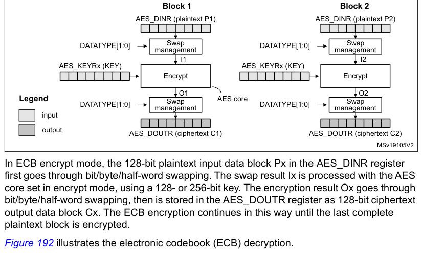

In ECB encrypt mode, the 128-bit plaintext input data block Px in the AES_DINR register first goes
through bit/byte/half-word swapping. The swap result Ix is processed with the AES core set in
encrypt mode, using a 128- or 256-bit key. The encryption result Ox goes through bit/byte/half-word
swapping, then is stored in the AES_DOUTR register as 128-bit ciphertext output data block Cx. The
ECB encryption continues in this way until the last complete plaintext block is encrypted.

Figure 192 illustrates the electronic codebook (ECB) decryption.

**Figure 192. ECB decryption**

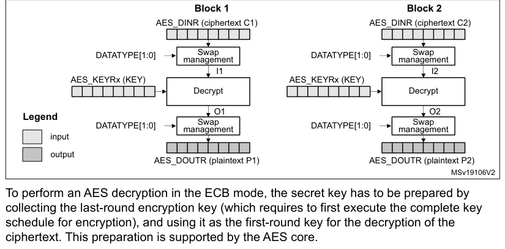

To perform an AES decryption in the ECB mode, the secret key has to be prepared by collecting the
last-round encryption key (which requires to first execute the complete key schedule for
encryption), and using it as the first-round key for the decryption of the ciphertext. This
preparation is supported by the AES core.

In ECB decrypt mode, the 128-bit ciphertext input data block C1 in the AES_DINR register first goes
through bit/byte/half-word swapping. The keying sequence is reversed compared to that of the ECB
encryption. The swap result I1 is processed with the AES core set in decrypt mode, using the
formerly prepared decryption key. The decryption result goes through bit/byte/half-word swapping,
then is stored in the AES_DOUTR register as 128-bit plaintext output data block P1. The ECB
decryption continues in this way until the last complete ciphertext block is decrypted.

Figure 193 illustrates the cipher block chaining (CBC) encryption.

**Figure 193. CBC encryption**

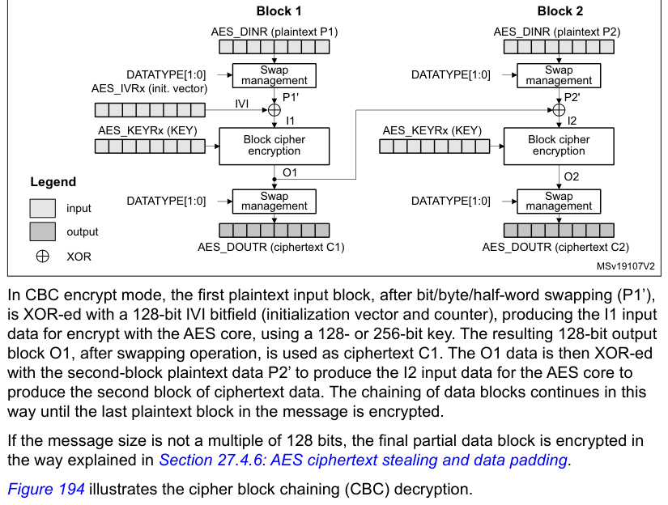

In CBC encrypt mode, the first plaintext input block, after bit/byte/half-word swapping (P1’), is
XOR-ed with a 128-bit IVI bitfield (initialization vector and counter), producing the I1 input data
for encrypt with the AES core, using a 128- or 256-bit key. The resulting 128-bit output block O1,
after swapping operation, is used as ciphertext C1. The O1 data is then XOR-ed with the second-block
plaintext data P2’ to produce the I2 input data for the AES core to produce the second block of
ciphertext data. The chaining of data blocks continues in this way until the last plaintext block in
the message is encrypted.

If the message size is not a multiple of 128 bits, the final partial data block is encrypted in the
way explained in [Section 27.4.6](#2746-aes-ciphertext-stealing-and-data-padding): AES ciphertext stealing and data padding.

Figure 194 illustrates the cipher block chaining (CBC) decryption.

**Figure 194. CBC decryption**

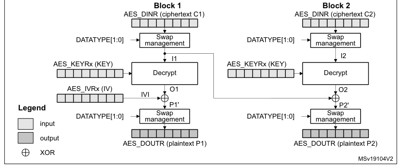

In CBC decrypt mode, like in ECB decrypt mode, the secret key must be prepared to perform an AES
decryption.

After the key preparation process, the decryption goes as follows: the first 128-bit ciphertext
block (after the swap operation) is used directly as the AES core input block I1 for decrypt
operation, using the 128-bit or 256-bit key. Its output O1 is XOR-ed with the 128-bit IVI field
(that must be identical to that used during encryption) to produce the first plaintext block P1.

The second ciphertext block is processed in the same way as the first block, except that the I1 data
from the first block is used in place of the initialization vector.

The decryption continues in this way until the last complete ciphertext block is decrypted.

If the message size is not a multiple of 128 bits, the final partial data block is decrypted in the
way explained in [Section 27.4.6](#2746-aes-ciphertext-stealing-and-data-padding): AES ciphertext stealing and data padding.

For more information on data swapping, refer to [Section 27.4.13](#27413-aes-data-registers-and-data-swapping): AES data registers and data
swapping.

#### ECB/CBC encryption sequence

The sequence of events to perform an ECB/CBC encryption (more detail in [Section 27.4.4](#2744-aes-procedure-to-perform-a-cipher-operation)):

1. Disable the AES peripheral by clearing the EN bit of the AES_CR register.
2. Select the Mode 1 by setting to 00 the MODE[1:0] bitfield of the AES_CR register and
   select ECB or CBC chaining mode by setting the CHMOD[2:0] bitfield of the AES_CR register to 000 or
   001, respectively. Data type can also be defined, using DATATYPE[1:0] bitfield.
3. Select 128- or 256-bit key length through the KEYSIZE bit of the AES_CR register.
4. Write the AES_KEYRx registers (128 or 256 bits) with encryption key. Fill the

AES_IVRx registers with the initialization vector data if CBC mode has been selected.

5. Enable the AES peripheral by setting the EN bit of the AES_CR register.
6. Write the AES_DINR register four times to input the plaintext (MSB first), as shown in

Figure 195.

7. Wait until the CCF flag is set in the AES_SR register.
8. Read the AES_DOUTR register four times to get the ciphertext (MSB first) as shown in

Figure 195. Then clear the CCF flag by setting the CCFC bit of the AES_CR register.

9. Repeat steps 6-7-8 to process all the blocks with the same encryption key.

**Figure 195. ECB/CBC encryption (Mode 1)**

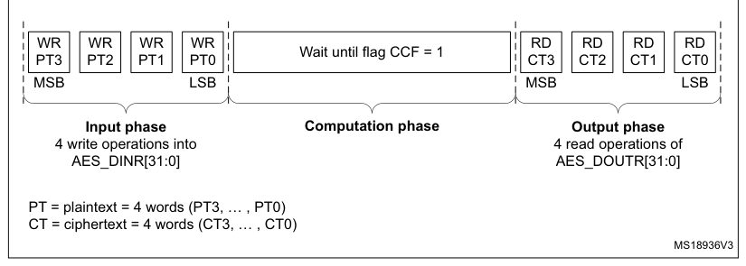

#### ECB/CBC decryption sequence

The sequence of events to perform an AES ECB/CBC decryption is as follows (More detail in Section
27.4.4).

1. Follow the steps described in [Section 27.4.5](#2745-aes-decryption-round-key-preparation): AES decryption round key preparation, in
   order to prepare the decryption key in AES core.
2. Select the Mode 3 by setting to 10 the MODE[1:0] bitfield of the AES_CR register and
   select ECB or CBC chaining mode by setting the CHMOD[2:0] bitfield of the AES_CR register to 000 or
   001, respectively. Data type can also be defined, using DATATYPE[1:0] bitfield. KEYSIZE bitfield
   must be kept as-is.
3. Write the AES_IVRx registers with the initialization vector (required in CBC mode only).
4. Enable AES by setting the EN bit of the AES_CR register.
5. Write the AES_DINR register four times to input the cipher text (MSB first), as shown in

Figure 196.

6. Wait until the CCF flag is set in the AES_SR register.
7. Read the AES_DOUTR register four times to get the plain text (MSB first), as shown in

Figure 196. Then clear the CCF flag by setting the CCFC bit of the AES_CR register.

8. Repeat steps 5-6-7 to process all the blocks encrypted with the same key.

**Figure 196. ECB/CBC decryption (Mode 3)**

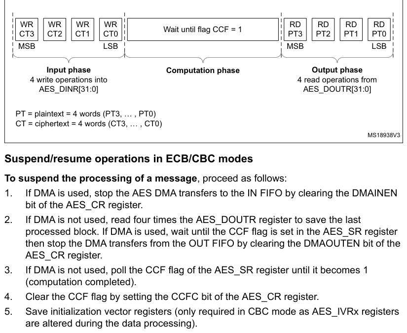

#### Suspend/resume operations in ECB/CBC modes

To suspend the processing of a message, proceed as follows:

1. If DMA is used, stop the AES DMA transfers to the IN FIFO by clearing the DMAINEN
   bit of the AES_CR register.
2. If DMA is not used, read four times the AES_DOUTR register to save the last
   processed block. If DMA is used, wait until the CCF flag is set in the AES_SR register then stop the
   DMA transfers from the OUT FIFO by clearing the DMAOUTEN bit of the AES_CR register.
3. If DMA is not used, poll the CCF flag of the AES_SR register until it becomes 1

(computation completed).

4. Clear the CCF flag by setting the CCFC bit of the AES_CR register.
5. Save initialization vector registers (only required in CBC mode as AES_IVRx registers
   are altered during the data processing).
6. Disable the AES peripheral by clearing the bit EN of the AES_CR register.
7. Save the AES_CR register and clear the key registers if they are not needed, to
   process the higher priority message.
8. If DMA is used, save the DMA controller status (pointers for IN and OUT data transfers,
   number of remaining bytes, and so on).

> **Note:** In point 7, the derived key information stored in AES_KEYRx registers can optionally be
> saved in memory if the interrupted process is a decryption. Otherwise those registers do not need to
> be saved as the original key value is known by the application

To resume the processing of a message, proceed as follows:

1. If DMA is used, configure the DMA controller so as to complete the rest of the FIFO IN
   and FIFO OUT transfers.
2. Disable the AES peripheral by clearing the EN bit of the AES_CR register.
3. Restore AES_CR register (with correct KEYSIZE) then restore AES_KEYRx registers.

In case of decryption, derived key information can be written in AES_KEYRx register instead of the
original key value.

4. Prepare the decryption key as described in [Section 27.4.5](#2745-aes-decryption-round-key-preparation): AES decryption round key
   preparation (only required for ECB or CBC decryption). This step is not necessary if derived key
   information is loaded in AES_KEYRx registers.
5. Restore AES_IVRx registers using the saved configuration (only required in CBC
   mode).
6. Enable the AES peripheral by setting the EN bit of the AES_CR register.
7. If DMA is used, enable AES DMA transfers by setting the DMAINEN and DMAOUTEN
   bits of the AES_CR register.

Alternative single ECB/CBC decryption using Mode 4

The sequence of events to perform a single round of ECB/CBC decryption using Mode 4 is:

1. Disable the AES peripheral by clearing the EN bit of the AES_CR register.
2. Select the Mode 4 by setting to 11 the MODE[1:0] bitfield of the AES_CR register and
   select ECB or CBC chaining mode by setting the CHMOD[2:0] bitfield of the AES_CR register to 0x0 or
   0x1, respectively.
3. Select key length of 128 or 256 bits via KEYSIZE bitfield of the AES_CR register.
4. Write the AES_KEYRx registers with the encryption key. Write the AES_IVRx registers
   if the CBC mode is selected.
5. Enable the AES peripheral by setting the EN bit of the AES_CR register.
6. Write the AES_DINR register four times to input the cipher text (MSB first).
7. Wait until the CCF flag is set in the AES_SR register.
8. Read the AES_DOUTR register four times to get the plain text (MSB first). Then clear
   the CCF flag by setting the CCFC bit of the AES_CR register.

> **Note:** When mode 4 is selected mode 3 cannot be used.

In mode 4, the AES_KEYRx registers contain the encryption key during all phases of the processing.
No derivation key is stored in these registers. It is stored internally in AES.

### 27.4.9 AES counter (CTR) mode

#### Overview

The counter mode (CTR) uses AES as a key-stream generator. The generated keys are then XOR-ed with
the plaintext to obtain the ciphertext.

CTR chaining is defined in NIST Special Publication 800-38A, Recommendation for Block Cipher Modes
of Operation. A typical message construction in CTR mode is given in

Figure 197.

**Figure 197. Message construction in CTR mode**

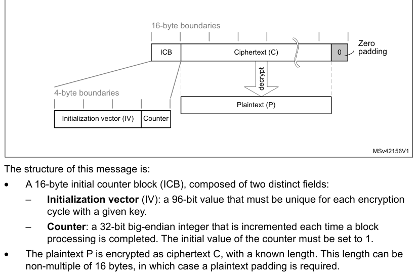

- A 16-byte initial counter block (ICB), composed of two distinct fields:
  - Initialization vector (IV): a 96-bit value that must be unique for each encryption cycle with a
    given key.
  - Counter: a 32-bit big-endian integer that is incremented each time a block processing is
    completed. The initial value of the counter must be set to 1.
- The plaintext P is encrypted as ciphertext C, with a known length. This length can be non-multiple
  of 16 bytes, in which case a plaintext padding is required.

#### CTR encryption and decryption

Figure 198 and Figure 199 describe the CTR encryption and decryption process, respectively, as
implemented in the AES peripheral. The CTR mode is selected by writing 010 to the CHMOD[2:0]
bitfield of AES_CR register.

**Figure 198. CTR encryption**

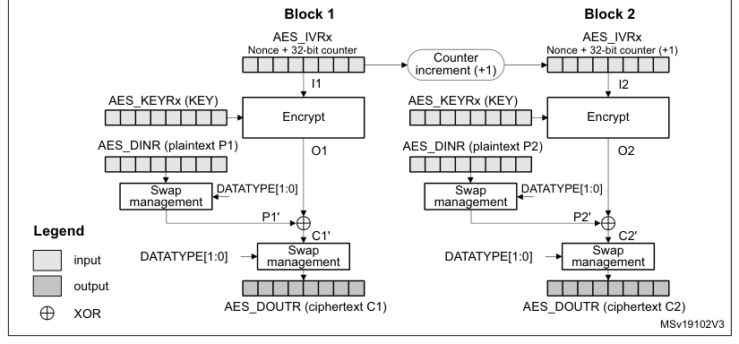

**Figure 199. CTR decryption**

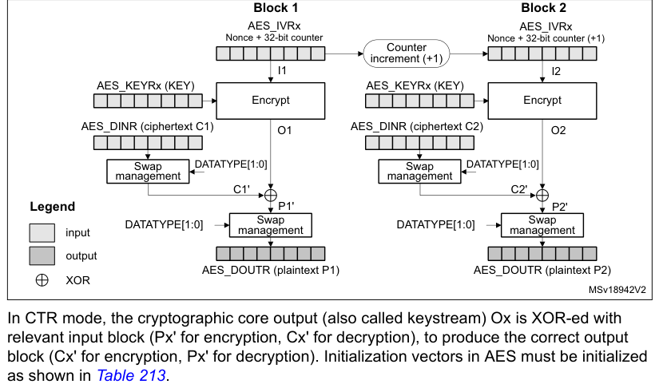

In CTR mode, the cryptographic core output (also called keystream) Ox is XOR-ed with relevant input
block (Px' for encryption, Cx' for decryption), to produce the correct output block (Cx' for
encryption, Px' for decryption). Initialization vectors in AES must be initialized as shown in Table
213.

**Table 213. CTR mode initialization vector definition**

| Source row | Column 1 | Column 2 | Column 3 | Column 4 |
| ---: | --- | --- | --- | --- |
| 1 | `AES_IVR3[31:0]` | `AES_IVR2[31:0]` | `AES_IVR1[31:0]` | `AES_IVR0[31:0]` |
| 2 | `IVI[31:0}` |  |  |  |
| 3 | `IVI[127:96]` | `IVI[95:64]` | `IVI[63:32]` |  |
| 4 | `32-bit counter = 0x0001` |  |  |  |

Unlike in CBC mode that uses the AES_IVRx registers only once when processing the first data block,
in CTR mode AES_IVRx registers are used for processing each data block, and the AES peripheral
increments the counter bits of the initialization vector (leaving the nonce bits unchanged).

CTR decryption does not differ from CTR encryption, since the core always encrypts the current
counter block to produce the key stream that is then XOR-ed with the plaintext (CTR encryption) or
ciphertext (CTR decryption) input. In CTR mode, the MODE[1:0] bitfield setting 01 (key derivation)
is forbidden and all the other settings default to encryption mode.

The sequence of events to perform an encryption or a decryption in CTR chaining mode:

1. Disable the AES peripheral by clearing the EN bit of the AES_CR register.
2. Select CTR chaining mode by setting to 010 the CHMOD[2:0] bitfield of the AES_CR
   register. Set MODE[1:0] bitfield to any value other than 01.
3. Initialize the AES_KEYRx registers, and load the AES_IVRx registers as described in

Table 213.

4. Set the EN bit of the AES_CR register, to start encrypting the current counter (EN is
   automatically reset when the calculation finishes).
5. If it is the last block, pad the data with zeros to have a complete block, if needed.
6. Append data in AES, and read the result. The three possible scenarios are described in

[Section 27.4.4](#2744-aes-procedure-to-perform-a-cipher-operation): AES procedure to perform a cipher operation.

7. Repeat the previous step till the second-last block is processed. For the last block,
   apply the two previous steps and discard the bits that are not part of the payload (if the size of
   the significant data in the last input block is less than 16 bytes).

#### Suspend/resume operations in CTR mode

Like for the CBC mode, it is possible to interrupt a message to send a higher priority message, and
resume the message that was interrupted. Detailed CBC suspend/resume sequence is described in
[Section 27.4.8](#2748-aes-basic-chaining-modes-ecb-cbc): AES basic chaining modes (ECB, CBC).

> **Note:** Like for CBC mode, the AES_IVRx registers must be reloaded during the resume operation.

### 27.4.10 AES Galois/counter mode (GCM)

#### Overview

The AES Galois/counter mode (GCM) allows encrypting and authenticating a plaintext message into the
corresponding ciphertext and tag (also known as message authentication code). To ensure
confidentiality, GCM algorithm is based on AES counter mode. It uses a multiplier over a fixed
finite field to generate the tag.

GCM chaining is defined in NIST Special Publication 800-38D, Recommendation for Block Cipher Modes
of Operation - Galois/Counter Mode (GCM) and GMAC. A typical message construction in GCM mode is
given in Figure 200.

**Figure 200. Message construction in GCM**

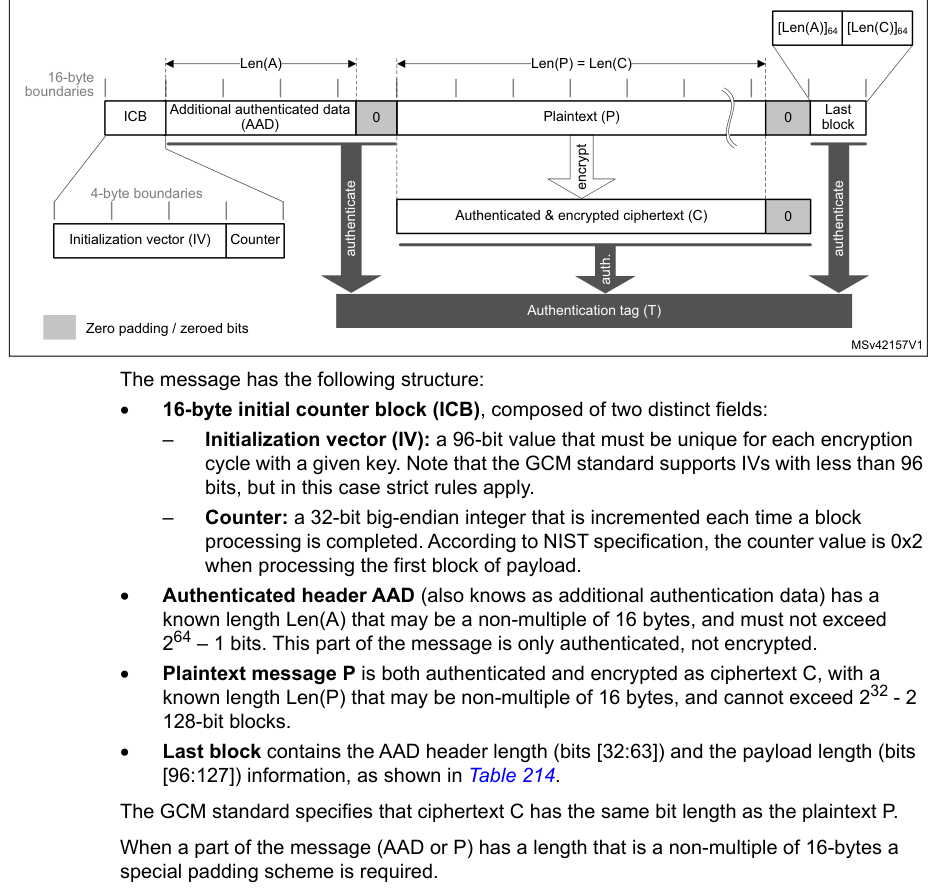

auth.

Authentication tag (T)

Zero padding / zeroed bits

MSv42157V1

The message has the following structure:

- 16-byte initial counter block (ICB), composed of two distinct fields:
  - Initialization vector (IV): a 96-bit value that must be unique for each encryption cycle with a
    given key. Note that the GCM standard supports IVs with less than 96 bits, but in this case
    strict rules apply.
  - Counter: a 32-bit big-endian integer that is incremented each time a block processing is
    completed. According to NIST specification, the counter value is 0x2 when processing the first
    block of payload.
- Authenticated header AAD (also knows as additional authentication data) has a known length Len(A)
  that may be a non-multiple of 16 bytes, and must not exceed 264 – 1 bits. This part of the message
  is only authenticated, not encrypted.
- Plaintext message P is both authenticated and encrypted as ciphertext C, with a known length
  Len(P) that may be non-multiple of 16 bytes, and cannot exceed 232 - 2 128-bit blocks.
- Last block contains the AAD header length (bits [32:63]) and the payload length (bits [96:127])
  information, as shown in Table 214.

The GCM standard specifies that ciphertext C has the same bit length as the plaintext P.

When a part of the message (AAD or P) has a length that is a non-multiple of 16-bytes a special
padding scheme is required.

**Table 214. GCM last block definition**

| Endianness | Bit[0] ---------- Bit[31] | Bit[32]---------- Bit[63] | Bit[64] -------- Bit[95] | Bit[96] --------- Bit[127] |
| --- | --- | --- | --- | --- |
| Input data | 0x0 | AAD length[31:0] | 0x0 | Payload length[31:0] |

#### GCM processing

Figure 201 describes the GCM implementation in the AES peripheral. The GCM is selected by writing
011 to the CHMOD[2:0] bitfield of the AES_CR register.

**Figure 201. GCM authenticated encryption**

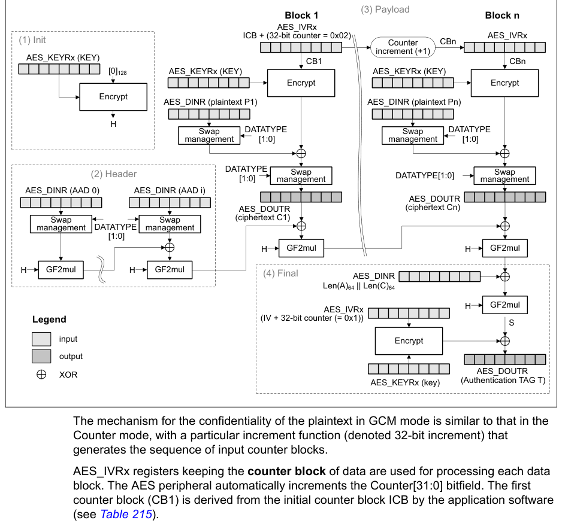

The mechanism for the confidentiality of the plaintext in GCM mode is similar to that in the Counter
mode, with a particular increment function (denoted 32-bit increment) that generates the sequence of
input counter blocks.

AES_IVRx registers keeping the counter block of data are used for processing each data block. The
AES peripheral automatically increments the Counter[31:0] bitfield. The first counter block (CB1) is
derived from the initial counter block ICB by the application software (see Table 215).

**Table 215. Initialization of AES_IVRx registers in GCM mode**

| Source row | Column 1 | Column 2 | Column 3 | Column 4 |
| ---: | --- | --- | --- | --- |
| 1 | `AES_IVR3[31:0]` | `AES_IVR2[31:0]` | `AES_IVR1[31:0]` | `AES_IVR0[31:0]` |
| 2 | `ICB[31:0]` |  |  |  |
| 3 | `ICB[127:96]` | `ICB[95:64]` | `ICB[63:32]` |  |
| 4 | `32-bit counter = 0x0002` |  |  |  |

> **Note:** In this mode, the settings 01 and 11 of the MODE[1:0] bitfield are forbidden.

The authentication mechanism in GCM mode is based on a hash function called GF2mul that performs
multiplication by a fixed parameter, called hash subkey (H), within a binary Galois field.

A GCM message is processed through the following phases, further described in next subsections:

- Init phase: AES prepares the GCM hash subkey (H).
- Header phase: AES processes the additional authenticated data (AAD), with hash computation only.
- Payload phase: AES processes the plaintext (P) with hash computation, counter block encryption and
  data XOR-ing. It operates in a similar way for ciphertext (C).
- Final phase: AES generates the authenticated tag (T) using the last block of the message.

GCM init phase

During this first step, the GCM hash subkey (H) is calculated and saved internally, to be used for
processing all the blocks. The recommended sequence is:

1. Disable the AES peripheral by clearing the EN bit of the AES_CR register.
2. Select GCM chaining mode, by setting to 011 the CHMOD[2:0] bitfield of the AES_CR
   register, and optionally, set the DATATYPE[1:0] bitfield.
3. Indicate the Init phase, by setting to 00 the GCMPH[1:0] bitfield of the AES_CR
   register.
4. Set the MODE[1:0] bitfield of the AES_CR register to 00 or 10. Although the bitfield is
   only used in payload phase, it is recommended to set it in the Init phase and keep it unchanged in
   all subsequent phases.
5. Initialize the AES_KEYRx registers with a key, and initialize AES_IVRx registers with
   the information as defined in Table 215.
6. Start the calculation of the hash key, by setting to 1 the EN bit of the AES_CR register

(EN is automatically reset when the calculation finishes).

7. Wait until the end of computation, indicated by the CCF flag of the AES_SR transiting
   to 1. Alternatively, use the corresponding interrupt.
8. Clear the CCF flag of the AES_SR register, by setting the CCFC bit of the AES_CR
   register.

GCM header phase

This phase coming after the GCM Init phase must be completed before the payload phase. The sequence
to execute, identical for encryption and decryption, is:

1. Indicate the header phase, by setting to 01 the GCMPH[1:0] bitfield of the AES_CR
   register. Do not modify the MODE[1:0] bitfield as set in the Init phase.
2. Enable the AES peripheral by setting the EN bit of the AES_CR register.
3. If it is the last block and the AAD size in the block is inferior to 128 bits, pad the
   remainder of the block with zeros. Then append the data block into AES in one of ways described in
   [Section 27.4.4](#2744-aes-procedure-to-perform-a-cipher-operation): AES procedure to perform a cipher operation. No data is read during this phase.
4. Repeat the step 3 until the last additional authenticated data block is processed.

> **Note:** The header phase can be skipped if there is no AAD, that is, Len(A) = 0.

GCM payload phase

This phase, identical for encryption and decryption, is executed after the GCM header phase. During
this phase, the encrypted/decrypted payload is stored in the AES_DOUTR register. The sequence to
execute is:

1. Indicate the payload phase, by setting to 10 the GCMPH[1:0] bitfield of the AES_CR
   register. Do not modify the MODE[1:0] bitfield as set in the Init phase.
2. If the header phase was skipped, enable the AES peripheral by setting the EN bit of the

AES_CR register.

3. If it is the last block and the plaintext (encryption) or ciphertext (decryption) size in the
   block is inferior to 128 bits, pad the remainder of the block with zeros.
4. Append the data block into AES in one of ways described in [Section 27.4.4](#2744-aes-procedure-to-perform-a-cipher-operation): AES
   procedure to perform a cipher operation, and read the result.
5. Repeat the previous step till the second-last plaintext block is encrypted or till the last
   block of ciphertext is decrypted. For the last block of plaintext (encryption only), execute the two
   previous steps. For the last block, discard the bits that are not part of the payload when the last
   block size is less than 16 bytes.

> **Note:** The payload phase can be skipped if there is no payload data, that is, Len(C) = 0 (see

GMAC mode).

GCM final phase

In this last phase, the AES peripheral generates the GCM authentication tag and stores it in the
AES_DOUTR register. The sequence to execute is:

1. Indicate the final phase, by setting to 11 the GCMPH[1:0] bitfield of the AES_CR
   register.
2. Compose the data of the block, by concatenating the AAD bit length and the payload
   bit length, as shown in Table 214. Write the block into the AES_DINR register.
3. Wait until the end of computation, indicated by the CCF flag of the AES_SR transiting
   to 1.
4. Get the GCM authentication tag, by reading the AES_DOUTR register four times.
5. Clear the CCF flag of the AES_SR register, by setting the CCFC bit of the AES_CR
   register.
6. Disable the AES peripheral, by clearing the bit EN of the AES_CR register. If it is an
   authenticated decryption, compare the generated tag with the expected tag passed with the message.

> **Note:** In the final phase, data is written to AES_DINR normally (no swapping), while swapping is
> applied to tag data read from AES_DOUTR.

When transiting from the header or the payload phase to the final phase, the AES peripheral must not
be disabled, otherwise the result is wrong.

#### Suspend/resume operations in GCM mode

To suspend the processing of a message, proceed as follows:

1. If DMA is used, stop the AES DMA transfers to the IN FIFO by clearing the DMAINEN
   bit of the AES_CR register. If DMA is not used, make sure that the current computation is completed,
   which is indicated by the CCF flag of the AES_SR register set to 1.
2. In the payload phase, if DMA is not used, read four times the AES_DOUTR register to
   save the last-processed block. If DMA is used, wait until the CCF flag is set in the AES_SR register
   then stop the DMA transfers from the OUT FIFO by clearing the DMAOUTEN bit of the AES_CR register.
3. Clear the CCF flag of the AES_SR register, by setting the CCFC bit of the AES_CR
   register.
4. Save the AES_SUSPxR registers in the memory, where x is from 0 to 7.
5. In the payload phase, save the AES_IVRx registers as, during the data processing,
   they changed from their initial values. In the header phase, this step is not required.
6. Disable the AES peripheral, by clearing the EN bit of the AES_CR register.
7. Save the current AES configuration in the memory, excluding the initialization vector
   registers AES_IVRx. Key registers do not need to be saved as the original key value is known by the
   application.
8. If DMA is used, save the DMA controller status (pointers for IN data transfers, number
   of remaining bytes, and so on). In the payload phase, pointers for OUT data transfers must also be
   saved.

To resume the processing of a message, proceed as follows:

1. If DMA is used, configure the DMA controller in order to complete the rest of the FIFO

IN transfers. In the payload phase, the rest of the FIFO OUT transfers must also be configured in
the DMA controller.

2. Disable the AES peripheral by clearing the EN bit of the AES_CR register.
3. Write the suspend register values, previously saved in the memory, back into their
   corresponding AES_SUSPxR registers, where x is from 0 to 7.
4. In the payload phase, write the initialization vector register values, previously saved in
   the memory, back into their corresponding AES_IVRx registers. In the header phase, write initial
   setting values back into the AES_IVRx registers.
5. Restore the initial setting values in the AES_CR and AES_KEYRx registers.
6. Enable the AES peripheral by setting the EN bit of the AES_CR register.

If DMA is used, enable AES DMA requests by setting the DMAINEN bit (and DMAOUTEN bit if in payload
phase) of the AES_CR register.

### 27.4.11 AES Galois message authentication code (GMAC)

#### Overview

The Galois message authentication code (GMAC) allows the authentication of a plaintext, generating
the corresponding tag information (also known as message authentication code). It is based on GCM
algorithm, as defined in NIST Special Publication 800-38D, Recommendation for Block Cipher Modes of
Operation - Galois/Counter Mode (GCM) and GMAC.

A typical message construction for GMAC is given in Figure 202.

**Figure 202. Message construction in GMAC mode**

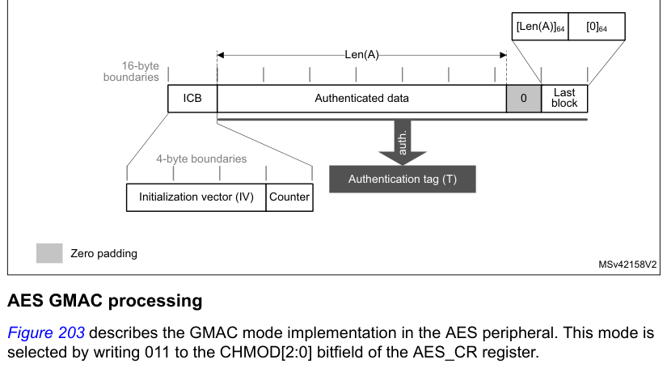

[Len(A)]64 [0]64

Len(A)

16-byte
boundaries

Last

auth.

4-byte boundaries

Authentication tag (T)

#### AES GMAC processing

Figure 203 describes the GMAC mode implementation in the AES peripheral. This mode is selected by
writing 011 to the CHMOD[2:0] bitfield of the AES_CR register.

**Figure 203. GMAC authentication mode**

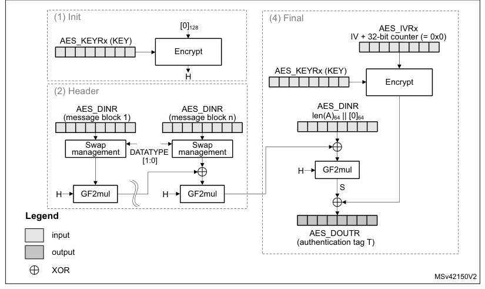

The GMAC algorithm corresponds to the GCM algorithm applied on a message only containing a header.
As a consequence, all steps and settings are the same as with the GCM, except that the payload phase
is omitted.

#### Suspend/resume operations in GMAC

In GMAC mode, the sequence described for the GCM applies except that only the header phase can be
interrupted.

### 27.4.12 AES counter with CBC-MAC (CCM)

#### Overview

The AES counter with cipher block chaining-message authentication code (CCM) algorithm allows
encryption and authentication of plaintext, generating the corresponding ciphertext and tag (also
known as message authentication code). To ensure confidentiality, the CCM algorithm is based on AES
in counter mode. It uses cipher block chaining technique to generate the message authentication
code. This is commonly called CBC- MAC.

> **Note:** NIST does not approve this CBC-MAC as an authentication mode outside the context of the

CCM specification.

CCM chaining is specified in NIST Special Publication 800-38C, Recommendation for Block Cipher Modes
of Operation - The CCM Mode for Authentication and Confidentiality. A typical message construction
for CCM is given in Figure 204.

**Figure 204. Message construction in CCM mode**

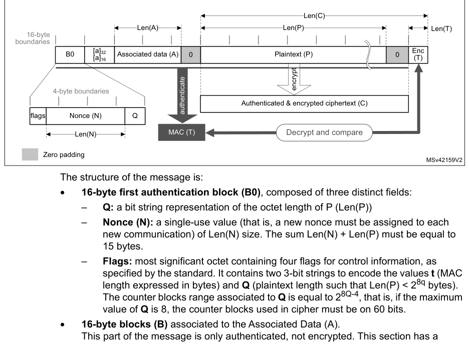

- 16-byte first authentication block (B0), composed of three distinct fields:
  - Q: a bit string representation of the octet length of P (Len(P))
  - Nonce (N): a single-use value (that is, a new nonce must be assigned to each new communication)
    of Len(N) size. The sum Len(N) \+ Len(P) must be equal to 15 bytes.
  - Flags: most significant octet containing four flags for control information, as specified by the
    standard. It contains two 3-bit strings to encode the values t (MAC length expressed in bytes)
    and Q (plaintext length such that Len(P) \< 28q bytes). The counter blocks range associated to Q
    is equal to 28Q-4, that is, if the maximum value of Q is 8, the counter blocks used in cipher
    must be on 60 bits.
- 16-byte blocks (B) associated to the Associated Data (A). This part of the message is only
  authenticated, not encrypted. This section has a
  known length Len(A) that can be a non-multiple of 16 bytes (see Figure 204). The standard also
  states that, on MSB bits of the first message block (B1), the associated data length expressed in
  bytes (a) must be encoded as follows:
- If 0 \< a \< 216 - 28, then it is encoded as [a]16, that is, on two bytes.
- If 216 - 28 \< a \< 232, then it is encoded as 0xff || 0xfe || [a]32, that is, on six bytes.
- If 232 \< a \< 264, then it is encoded as 0xff || 0xff || [a]64, that is, on ten bytes.
- 16-byte blocks (B) associated to the plaintext message P, which is both authenticated and
  encrypted as ciphertext C, with a known length Len(P). This length can be a non-multiple of 16
  bytes (see Figure 204).
- Encrypted MAC (T) of length Len(T) appended to the ciphertext C of overall length Len(C).

When a part of the message (A or P) has a length that is a non-multiple of 16-bytes, a special
padding scheme is required.

> **Note:** CCM chaining mode can also be used with associated data only (that is, no payload).

As an example, the C.1 section in NIST Special Publication 800-38C gives the following values
(hexadecimal numbers):

N: 10111213 141516 (Len(N) = 56 bits or 7 bytes)

A: 00010203 04050607 (Len(A) = 64 bits or 8 bytes)

P: 20212223 (Len(P) = 32 bits or 4 bytes)

T: 6084341B (Len(T) = 32 bits or t = 4)

B0: 4F101112 13141516 00000000 00000004 B1: 00080001 02030405 06070000 00000000 B2: 20212223
00000000 00000000 00000000

CTR0: 0710111213 141516 00000000 00000000

CTR1: 0710111213 141516 00000000 00000001

Generation of formatted input data blocks Bx (especially B0 and B1) must be managed by the
application.

#### CCM processing

Figure 205 describes the CCM implementation within the AES peripheral (encryption example). This
mode is selected by writing 100 into the CHMOD[2:0] bitfield of the AES_CR register.

**Figure 205. CCM mode authenticated encryption**

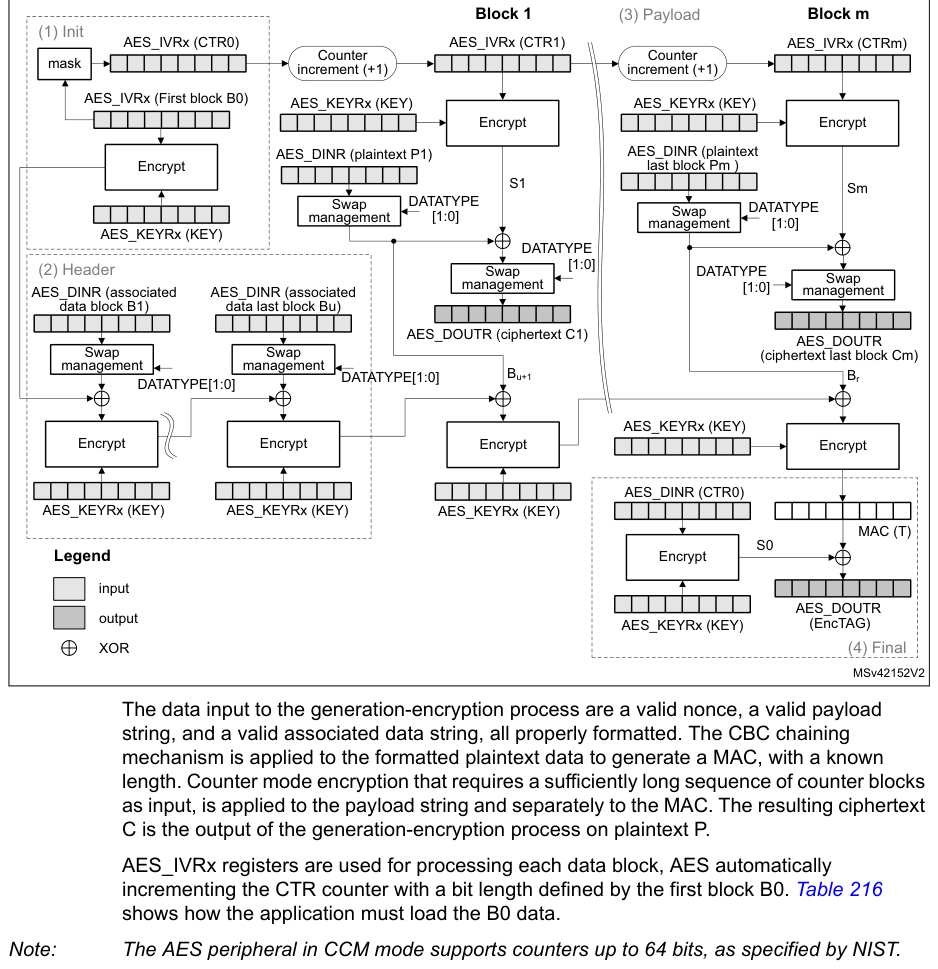

The data input to the generation-encryption process are a valid nonce, a valid payload string, and a
valid associated data string, all properly formatted. The CBC chaining mechanism is applied to the
formatted plaintext data to generate a MAC, with a known length. Counter mode encryption that
requires a sufficiently long sequence of counter blocks as input, is applied to the payload string
and separately to the MAC. The resulting ciphertext C is the output of the generation-encryption
process on plaintext P.

AES_IVRx registers are used for processing each data block, AES automatically incrementing the CTR
counter with a bit length defined by the first block B0. Table 216 shows how the application must
load the B0 data.

> **Note:** The AES peripheral in CCM mode supports counters up to 64 bits, as specified by NIST.

**Table 216. Initialization of AES_IVRx registers in CCM mode**

| AES_IVR3[31:0] | AES_IVR2[31:0] | AES_IVR1[31:0] | AES_IVR0[31:0] |
| --- | --- | --- | --- |
| B0[127:96] | B0[95:64] | B0[63:32] | B0[31:0] |

> **Note:** In this mode, the settings 01 and 11 of the MODE[1:0] bitfield are forbidden.

A CCM message is processed through the following phases, further described in next subsections:

- Init phase: AES processes the first block and prepares the first counter block.
- Header phase: AES processes associated data (A), with tag computation only.
- Payload phase: IP processes plaintext (P), with tag computation, counter block encryption, and
  data XOR-ing. It works in a similar way for ciphertext (C).
- Final phase: AES generates the message authentication code (MAC).

CCM Init phase

In this phase, the first block B0 of the CCM message is written into the AES_IVRx register. The
AES_DOUTR register does not contain any output data. The recommended sequence is:

1. Disable the AES peripheral by clearing the EN bit of the AES_CR register.
2. Select CCM chaining mode, by setting to 100 the CHMOD[2:0] bitfield of the AES_CR
   register, and optionally, set the DATATYPE[1:0] bitfield.
3. Indicate the Init phase, by setting to 00 the GCMPH[1:0] bitfield of the AES_CR
   register.
4. Set the MODE[1:0] bitfield of the AES_CR register to 00 or 10. Although the bitfield is
   only used in payload phase, it is recommended to set it in the Init phase and keep it unchanged in
   all subsequent phases.
5. Initialize the AES_KEYRx registers with a key, and initialize AES_IVRx registers with

B0 data as described in Table 216.

6. Start the calculation of the counter, by setting to 1 the EN bit of the AES_CR register

(EN is automatically reset when the calculation finishes).

7. Wait until the end of computation, indicated by the CCF flag of the AES_SR transiting
   to 1. Alternatively, use the corresponding interrupt.
8. Clear the CCF flag in the AES_SR register, by setting to 1 the CCFC bit of the AES_CR
   register.

CCM header phase

This phase coming after the GCM Init phase must be completed before the payload phase. During this
phase, the AES_DOUTR register does not contain any output data.

The sequence to execute, identical for encryption and decryption, is:

1. Indicate the header phase, by setting to 01 the GCMPH[1:0] bitfield of the AES_CR
   register. Do not modify the MODE[1:0] bitfield as set in the Init phase.
2. Enable the AES peripheral by setting the EN bit of the AES_CR register.
3. If it is the last block and the AAD size in the block is inferior to 128 bits, pad the
   remainder of the block with zeros. Then append the data block into AES in one of ways described in
   [Section 27.4.4](#2744-aes-procedure-to-perform-a-cipher-operation): AES procedure to perform a cipher operation. No data is read during this phase.
4. Repeat the step 3 until the last additional authenticated data block is processed.

> **Note:** The header phase can be skipped if there is no associated data, that is, Len(A) = 0.

The first block of the associated data (B1) must be formatted by software, with the associated data
length.

CCM payload phase (encryption or decryption)

This phase, identical for encryption and decryption, is executed after the CCM header phase. During
this phase, the encrypted/decrypted payload is stored in the AES_DOUTR register. The sequence to
execute is:

1. Indicate the payload phase, by setting to 10 the GCMPH[1:0] bitfield of the AES_CR
   register. Do not modify the MODE[1:0] bitfield as set in the Init phase.
2. If the header phase was skipped, enable the AES peripheral by setting the EN bit of the

AES_CR register.

3. If it is the last data block to encrypt and the plaintext size in the block is inferior to 128
   bits, pad the remainder of the block with zeros.
4. Append the data block into AES in one of ways described in [Section 27.4.4](#2744-aes-procedure-to-perform-a-cipher-operation): AES
   procedure to perform a cipher operation, and read the result.
5. Repeat the previous step till the second-last plaintext block is encrypted or till the last
   block of ciphertext is decrypted. For the last block of plaintext (encryption only), apply the two
   previous steps. For the last block, discard the data that is not part of the payload when the last
   block size is less than 16 bytes.

> **Note:** The payload phase can be skipped if there is no payload data, that is, Len(P) = 0 or

Len(C) = Len(T).

Remove LSBLen(T)(C) encrypted tag information when decrypting ciphertext C.

CCM final phase

In this last phase, the AES peripheral generates the GCM authentication tag and stores it in the
AES_DOUTR register. The sequence to execute is:

1. Indicate the final phase, by setting to 11 the GCMPH[1:0] bitfield of the AES_CR
   register.
2. Wait until the end-of-computation flag CCF of the AES_SR register is set.
3. Read four times the AES_DOUTR register: the output corresponds to the CCM
   authentication tag.
4. Clear the CCF flag of the AES_SR register by setting the CCFC bit of the AES_CR
   register.
5. Disable the AES peripheral, by clearing the EN bit of the AES_CR register.
6. For authenticated decryption, compare the generated encrypted tag with the encrypted
   tag padded in the ciphertext.

> **Note:** In this final phase, swapping is applied to tag data read from AES_DOUTR register.

When transiting from the header phase to the final phase, the AES peripheral must not be disabled,
otherwise the result is wrong.

Application must mask the authentication tag output with tag length to obtain a valid tag.

#### Suspend/resume operations in CCM mode

To suspend the processing of a message in header or payload phase, proceed as follows:

1. If DMA is used, stop the AES DMA transfers to the IN FIFO by clearing the DMAINEN
   bit of the AES_CR register. If DMA is not used, make sure that the current computation is completed,
   which is indicated by the CCF flag of the AES_SR register set to 1.
2. In the payload phase, if DMA is not used, read four times the AES_DOUTR register to
   save the last-processed block. If DMA is used, wait until the CCF flag is set in the

AES_SR register then stop the DMA transfers from the OUT FIFO by clearing the DMAOUTEN bit of the
AES_CR register.

3. Clear the CCF flag of the AES_SR register, by setting to 1 the CCFC bit of the AES_CR
   register.
4. Save the AES_SUSPxR registers (where x is from 0 to 7) in the memory.
5. Save the AES_IVRx registers as, during the data processing, they changed from their
   initial values.
6. Disable the AES peripheral, by clearing the EN bit of the AES_CR register.
7. Save the current AES configuration in the memory, excluding the initialization vector
   registers AES_IVRx. Key registers do not need to be saved as the original key value is known by the
   application.
8. If DMA is used, save the DMA controller status (pointers for IN data transfers, number
   of remaining bytes, and so on). In the payload phase, pointers for OUT data transfers must also be
   saved.

To resume the processing of a message, proceed as follows:

1. If DMA is used, configure the DMA controller in order to complete the rest of the FIFO

IN transfers. In the payload phase, the rest of the FIFO OUT transfers must also be configured in
the DMA controller.

2. Disable the AES peripheral by clearing the EN bit of the AES_CR register.
3. Write the suspend register values, previously saved in the memory, back into their
   corresponding AES_SUSPxR registers (where x is from 0 to 7).
4. Write the initialization vector register values, previously saved in the memory, back into
   their corresponding AES_IVRx registers.
5. Restore the initial setting values in the AES_CR and AES_KEYRx registers.
6. Enable the AES peripheral by setting the EN bit of the AES_CR register.
7. If DMA is used, enable AES DMA requests by setting to 1 the DMAINEN bit (and

DMAOUTEN bit if in payload phase) of the AES_CR register.

### 27.4.13 AES data registers and data swapping

#### Data input and output

A 128-bit data block is entered into the AES peripheral with four successive 32-bit word writes into
the AES_DINR register (bitfield DIN[31:0]), the most significant word (bits [127:96]) first, the
least significant word (bits [31:0]) last.

A 128-bit data block is retrieved from the AES peripheral with four successive 32-bit word reads
from the AES_DOUTR register (bitfield DOUT[31:0]), the most significant word (bits [127:96]) first,
the least significant word (bits [31:0]) last.

The 32-bit data word for AES_DINR register or from AES_DOUTR register is organized in big endian
order, that is:

- the most significant byte of a word to write into AES_DINR must be put on the lowest address out
  of the four adjacent memory locations keeping the word to write, or
- the most significant byte of a word read from AES_DOUTR goes to the lowest address out of the four
  adjacent memory locations receiving the word

For using DMA for input data block write into AES, the four words of the input block must be stored
in the memory consecutively and in big-endian order, that is, the most significant word on the
lowest address. See [Section 27.4.16](#27416-aes-dma-interface): AES DMA interface.

#### Data swapping

The AES peripheral can be configured to perform a bit-, a byte-, a half-word-, or no swapping on the
input data word in the AES_DINR register, before loading it to the AES processing core, and on the
data output from the AES processing core, before sending it to the AES_DOUTR register. The choice
depends on the type of data. For example, a byte swapping is used for an ASCII text stream.

The data swap type is selected through the DATATYPE[1:0] bitfield of the AES_CR register. The
selection applies both to the input and the output of the AES core.

For different data swap types, Figure 206 shows the construction of AES processing core input buffer
data P127 to P0, from the input data entered through the AES_DINR register, or the construction of
the output data available through the AES_DOUTR register, from the AES processing core output buffer
data P127 to P0.

**Figure 206. 128-bit block construction with respect to data swap**

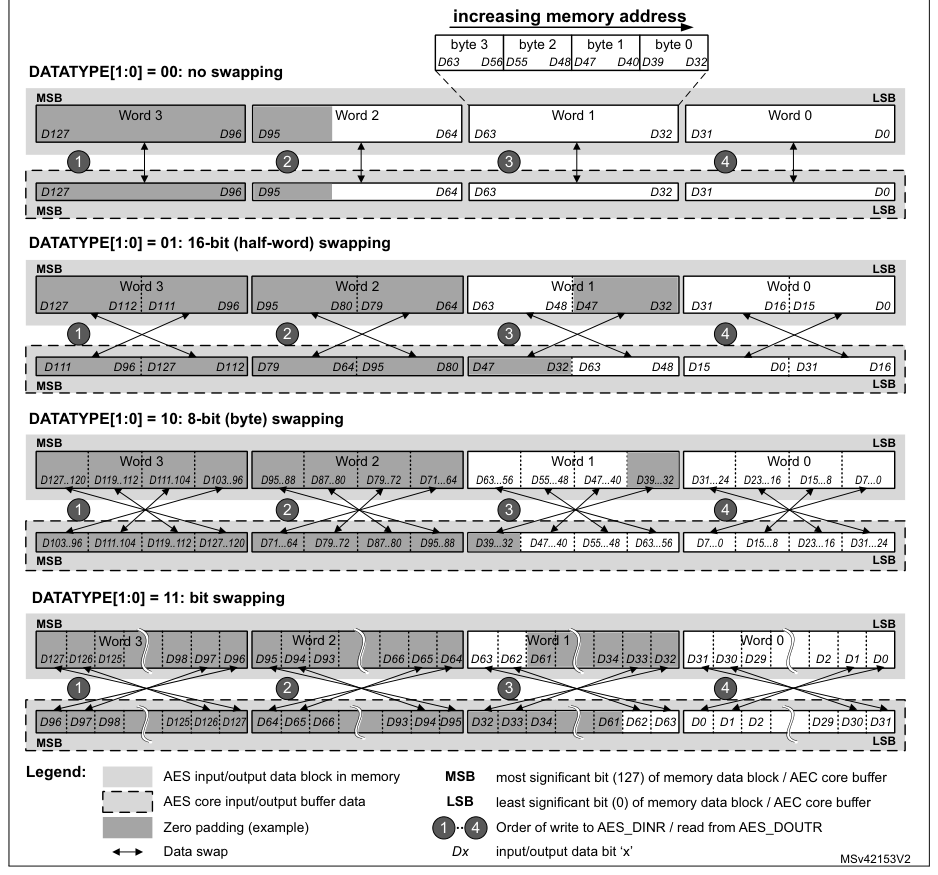

> **Note:** The data in AES key registers (AES_KEYRx) and initialization registers (AES_IVRx) are not
> sensitive to the swap mode selection.

#### Data padding

Figure 206 also gives an example of memory data block padding with zeros such that the zeroed bits
after the data swap form a contiguous zone at the MSB end of the AES core input buffer. The example
shows the padding of an input data block containing:

- 48 message bits, with DATATYPE[1:0] = 01
- 56 message bits, with DATATYPE[1:0] = 10
- 34 message bits, with DATATYPE[1:0] = 11

### 27.4.14 AES key registers

The AES_KEYRx registers store the encryption or decryption key bitfield KEY[127:0] or KEY[255:0].
The data to write to or to read from each register is organized in the memory in little-endian
order, that is, with most significant byte on the highest address.

The key is spread over eight registers as shown in Table 217.

**Table 217. Key endianness in AES_KEYRx registers (128- or 256-bit key length)**

| AES_KEYR7 | AES_KEYR6 | AES_KEYR5 | AES_KEYR4 | AES_KEYR3 | AES_KEYR2 | AES_KEYR1 | AES_KEYR0 |
| --- | --- | --- | --- | --- | --- | --- | --- |
| [31:0] | [31:0] | [31:0] | [31:0] | [31:0] | [31:0] | [31:0] | [31:0] |
| - | - | - | - | KEY[127:96] | KEY[95:64] | KEY[63:32] | KEY[31:0] |
| KEY[255:224] | KEY[223:192] | KEY[191:160] | KEY[159:128] | KEY[127:96] | KEY[95:64] | KEY[63:32] | KEY[31:0] |

The key for encryption or decryption may be written into these registers when the AES peripheral is
disabled, by clearing the EN bit of the AES_CR register.

The key registers are not affected by the data swapping controlled by DATATYPE[1:0] bitfield of the
AES_CR register.

### 27.4.15 AES initialization vector registers

The four AES_IVRx registers keep the initialization vector input bitfield IVI[127:0]. The data to
write to or to read from each register is organized in the memory in little-endian order, that is,
with most significant byte on the highest address. The registers are also ordered from lowest
address (AES_IVR0) to highest address (AES_IVR3).

The signification of data in the bitfield depends on the chaining mode selected. When used, the
bitfield is updated upon each computation cycle of the AES core.

Write operations to the AES_IVRx registers when the AES peripheral is enabled have no effect to the
register contents. For modifying the contents of the AES_IVRx registers, the EN bit of the AES_CR
register must first be cleared.

Reading the AES_IVRx registers returns the latest counter value (useful for managing suspend mode).

The AES_IVRx registers are not affected by the data swapping feature controlled by the DATATYPE[1:0]
bitfield of the AES_CR register.

### 27.4.16 AES DMA interface

The AES peripheral provides an interface to connect to the DMA (direct memory access) controller.
The DMA operation is controlled through the AES_CR register.

#### Data input using DMA

Setting the DMAINEN bit of the AES_CR register enables DMA writing into AES. The AES peripheral then
initiates a DMA request during the input phase each time it requires to write a 128-bit block
(quadruple word) to the AES_DINR register, as shown in Figure 207.

> **Note:** According to the algorithm and the mode selected, special padding / ciphertext stealing
> might be required. For example, in case of AES GCM encryption or AES CCM decryption, a DMA transfer
> must not include the last block. For details, refer to [Section 27.4.4](#2744-aes-procedure-to-perform-a-cipher-operation): AES procedure to perform a
> cipher operation.

**Figure 207. DMA transfer of a 128-bit data block during input phase**

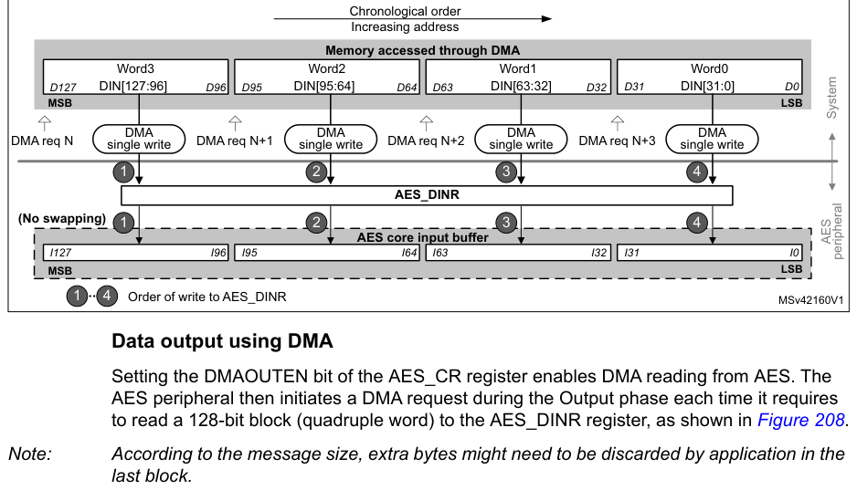

#### Data output using DMA

Setting the DMAOUTEN bit of the AES_CR register enables DMA reading from AES. The AES peripheral
then initiates a DMA request during the Output phase each time it requires to read a 128-bit block
(quadruple word) to the AES_DINR register, as shown in Figure 208.

> **Note:** According to the message size, extra bytes might need to be discarded by application in the
> last block.

**Figure 208. DMA transfer of a 128-bit data block during output phase**

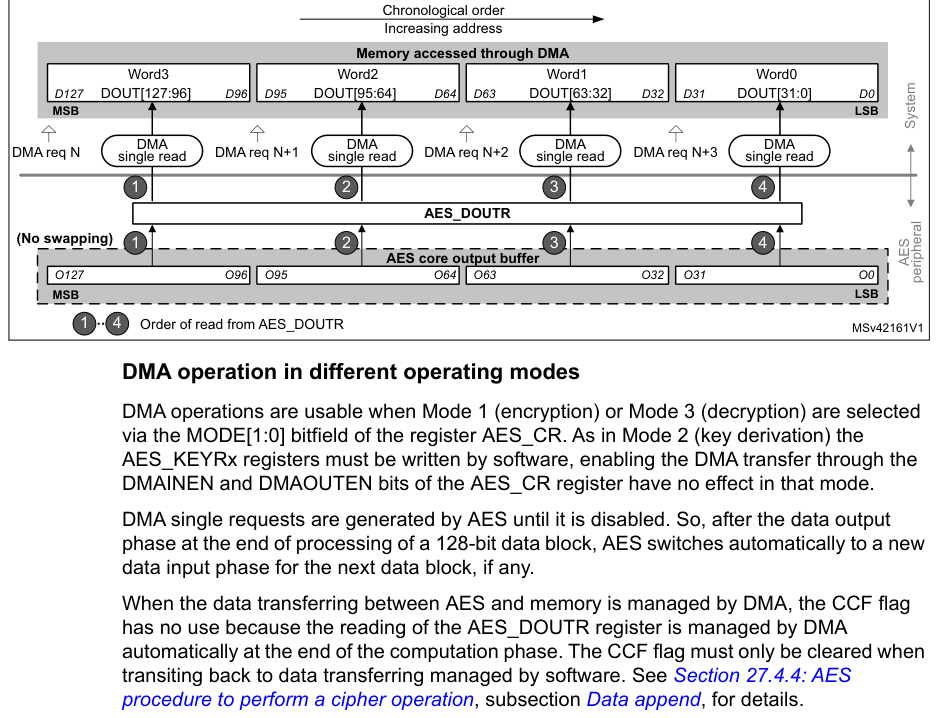

#### DMA operation in different operating modes

DMA operations are usable when Mode 1 (encryption) or Mode 3 (decryption) are selected via the
MODE[1:0] bitfield of the register AES_CR. As in Mode 2 (key derivation) the AES_KEYRx registers
must be written by software, enabling the DMA transfer through the DMAINEN and DMAOUTEN bits of the
AES_CR register have no effect in that mode.

DMA single requests are generated by AES until it is disabled. So, after the data output phase at
the end of processing of a 128-bit data block, AES switches automatically to a new data input phase
for the next data block, if any.

When the data transferring between AES and memory is managed by DMA, the CCF flag has no use because
the reading of the AES_DOUTR register is managed by DMA automatically at the end of the computation
phase. The CCF flag must only be cleared when transiting back to data transferring managed by
software. See [Section 27.4.4](#2744-aes-procedure-to-perform-a-cipher-operation): AES procedure to perform a cipher operation, subsection Data append,
for details.

### 27.4.17 AES error management

AES configuration can be changed at any moment by clearing the EN bit of the AES_CR register.

#### Read error flag (RDERR)

Unexpected read attempt of the AES_DOUTR register sets the RDERR flag of the AES_SR register, and
returns zero.

RDERR is triggered during the computation phase or during the input phase.

> **Note:** AES is not disabled upon a RDERR error detection and continues processing.

An interrupt is generated if the ERRIE bit of the AES_CR register is set. For more details, refer to
[Section 27.5](#275-aes-interrupts): AES interrupts.

The RDERR flag is cleared by setting the ERRIE bit of the AES_CR register.

#### Write error flag (WDERR)

Unexpected write attempt of the AES_DINR register sets the WRERR flag of the AES_SR register, and
has no effect on the AES_DINR register. The WRERR is triggered during the computation phase or
during the output phase.

> **Note:** AES is not disabled after a WRERR error detection and continues processing.

An interrupt is generated if the ERRIE bit of the AES_CR register is set. For more details, refer to
[Section 27.5](#275-aes-interrupts): AES interrupts.

The WRERR flag is cleared by setting the ERRC bit of the AES_CR register.

## 27.5 AES interrupts

Individual maskable interrupt sources generated by the AES peripheral signal the following events:

- computation completed
- read error
- write error

These sources are combined into a common interrupt signal from the AES peripheral that connects to
the Arm® Cortex® interrupt controller. Each can individually be enabled/disabled, by
setting/clearing the corresponding enable bit of the AES_CR register, and cleared by setting the
corresponding bit of the AES_CR register.

The status of each can be read from the AES_SR register.

Table 218 gives a summary of the interrupt sources, their event flags and enable bits.

**Table 218. AES interrupt requests**

| Source row | Column 1 | Column 2 | Column 3 | Column 4 |
| ---: | --- | --- | --- | --- |
| 1 | `Interrupt` | `Interrupt clear` |  |  |
| 2 | `AES interrupt event` | `Event flag` | `Enable bit` |  |
| 3 | `acronym` | `method` |  |  |
| 4 | `computation completed flag` | `CCF` | `CCFIE` | `set CCFC(1)` |
| 5 | `AES` | `read error flag` | `RDERR` |  |
| 6 | `ERRIE` | `set ERRC(1)` |  |  |
| 7 | `write error flag` | `WRERR` |  |  |

1. Bit of the AES_CR register.

## 27.6 AES processing latency

The tables below summarize the latency to process a 128-bit block for each mode of operation.

**Table 219. Processing latency for ECB, CBC and CTR**

| Source row | Column 1 | Column 2 | Column 3 |
| ---: | --- | --- | --- |
| 1 | `Clock` |  |  |
| 2 | `Key size` | `Mode of operation` | `Algorithm` |
| 3 | `cycles` |  |  |
| 4 | `Mode 1: Encryption` | `ECB, CBC, CTR` | `51` |
| 5 | `Mode 2: Key derivation` | `-` | `59` |
| 6 | `128-bit` |  |  |
| 7 | `Mode 3: Decryption` | `ECB, CBC, CTR` | `51` |
| 8 | `Mode 4: Key derivation then decryption` | `ECB, CBC` | `106` |

**Table 219. Processing latency for ECB, CBC and CTR (continued)**

| Source row | Column 1 | Column 2 | Column 3 |
| ---: | --- | --- | --- |
| 1 | `Clock` |  |  |
| 2 | `Key size` | `Mode of operation` | `Algorithm` |
| 3 | `cycles` |  |  |
| 4 | `Mode 1: Encryption` | `ECB, CBC, CTR` | `75` |
| 5 | `Mode 2: Key derivation` | `-` | `82` |
| 6 | `256-bit` |  |  |
| 7 | `Mode 3: Decryption` | `ECB, CBC, CTR` | `75` |
| 8 | `Mode 4: Key derivation then decryption` | `ECB, CBC` | `145` |

**Table 220. Processing latency for GCM and CCM (in clock cycles)**

| Source row | Column 1 | Column 2 | Column 3 | Column 4 | Column 5 |
| ---: | --- | --- | --- | --- | --- |
| 1 | `Header` | `Payload` |  |  |  |
| 2 | `Key size` | `Mode of operation` | `Algorithm` | `Init Phase` | `Tag phase(1)` |
| 3 | `phase(1)` | `phase(1)` |  |  |  |
| 4 | `GCM` | `64` | `35` | `51` | `59` |
| 5 | `Mode 1: Encryption/` |  |  |  |  |
| 6 | `128-bit` |  |  |  |  |
| 7 | `Mode 3: Decryption` |  |  |  |  |
| 8 | `CCM` | `63` | `55` | `114` | `58` |
| 9 | `GCM` | `88` | `35` | `75` | `75` |
| 10 | `Mode 1: Encryption/` |  |  |  |  |
| 11 | `256-bit` |  |  |  |  |
| 12 | `Mode 3: Decryption` |  |  |  |  |
| 13 | `CCM` | `87` | `79` | `162` | `82` |

1. Data insertion can include wait states forced by AES on the AHB bus (maximum 3 cycles, typical 1
   cycle).

## 27.7 AES registers

### 27.7.1 AES control register (AES_CR)

- **Address offset:** 0x00
- **Reset value:** 0x0000 0000

**Register bit layout**

| Bit | Field | Access | Summary |
| ---: | --- | :---: | --- |
| 31 | Reserved | — | kept at reset value. |
| 30 | Reserved | — | ↳ |
| 29 | Reserved | — | ↳ |
| 28 | Reserved | — | ↳ |
| 27 | Reserved | — | ↳ |
| 26 | Reserved | — | ↳ |
| 25 | Reserved | — | ↳ |
| 24 | Reserved | — | ↳ |
| 23 | `NPBLB[3]` | rw | Number of padding bytes in last block |
| 22 | `NPBLB[2]` | rw | ↳ |
| 21 | `NPBLB[1]` | rw | ↳ |
| 20 | `NPBLB[0]` | rw | ↳ |
| 19 | Reserved | — | kept at reset value. |
| 18 | `KEYSIZE` | rw | Key size selection |
| 17 | Reserved | — | kept at reset value. |
| 16 | — | — | Not specified in extracted bit-field text. |
| 15 | Reserved | — | kept at reset value. |
| 14 | `GCMPH[1]` | rw | GCM or CCM phase selection |
| 13 | `GCMPH[0]` | rw | ↳ |
| 12 | `DMAOUTEN` | rw | DMA output enable |
| 11 | `DMAINEN` | rw | DMA input enable |
| 10 | `ERRIE` | rw | Error interrupt enable |
| 9 | `CCFIE` | rw | CCF interrupt enable |
| 8 | `ERRC` | rw | Error flag clear |
| 7 | `CCFC` | rw | Computation complete flag clear |
| 6 | — | — | Not specified in extracted bit-field text. |
| 5 | — | — | Not specified in extracted bit-field text. |
| 4 | `MODE[1]` | rw | AES operating mode |
| 3 | `MODE[0]` | rw | ↳ |
| 2 | `DATATYPE[1]` | rw | Data type selection |
| 1 | `DATATYPE[0]` | rw | ↳ |
| 0 | `EN` | rw | AES enable |

**Bits 31:24 — Reserved:** kept at reset value.

**Bits 23:20 — `NPBLB[3:0]`:** Number of padding bytes in last block

The bitfield sets the number of padding bytes in last block of payload:

- `0000`: All bytes are valid (no padding)
- `0001`: Padding for one least-significant byte of last block

...

- `1111`: Padding for 15 least-significant bytes of last block

**Bit 19 — Reserved:** kept at reset value.

**Bit 18 — `KEYSIZE`:** Key size selection

This bitfield defines the length of the key used in the AES cryptographic core, in bits:

- `0`: 128
- `1`: 256

Attempts to write the bit are ignored when the EN bit of the AES_CR register is set before the write
access and it is not cleared by that write access.

**Bit 17 — Reserved:** kept at reset value.

**Bit 15 — Reserved:** kept at reset value.

**Bits 14:13 — `GCMPH[1:0]`:** GCM or CCM phase selection

This bitfield selects the phase of GCM, GMAC or CCM algorithm:

- `00`: Init phase
- `01`: Header phase
- `10`: Payload phase
- `11`: Final phase

The bitfield has no effect if other than GCM, GMAC or CCM algorithms are selected (through the

ALGOMODE bitfield).

**Bit 12 — `DMAOUTEN`:** DMA output enable

This bit enables/disables data transferring with DMA, in the output phase:

- `0`: Disable
- `1`: Enable

When the bit is set, DMA requests are automatically generated by AES during the output data
phase. This feature is only effective when Mode 1 or Mode 3 is selected through the MODE[1:0]
bitfield. It is not effective for Mode 2 (key derivation).

Use of DMA with Mode 4 (single decryption) is not recommended.

**Bit 11 — `DMAINEN`:** DMA input enable

This bit enables/disables data transferring with DMA, in the input phase:

- `0`: Disable
- `1`: Enable

When the bit is set, DMA requests are automatically generated by AES during the input data phase.

This feature is only effective when Mode 1 or Mode 3 is selected through the MODE[1:0] bitfield. It
is
not effective for Mode 2 (key derivation).

Use of DMA with Mode 4 (single decryption) is not recommended.

**Bit 10 — `ERRIE`:** Error interrupt enable

This bit enables or disables (masks) the AES interrupt generation when RDERR and/or WRERR is
set:

- `0`: Disable (mask)
- `1`: Enable

**Bit 9 — `CCFIE`:** CCF interrupt enable

This bit enables or disables (masks) the AES interrupt generation when CCF (computation complete
flag) is set:

- `0`: Disable (mask)
- `1`: Enable

**Bit 8 — `ERRC`:** Error flag clear

Upon written to 1, this bit clears the RDERR and WRERR error flags in the AES_SR register:

- `0`: No effect
- `1`: Clear RDERR and WRERR flags

Reading the flag always returns zero.

**Bit 7 — `CCFC`:** Computation complete flag clear

Upon written to 1, this bit clears the computation complete flag (CCF) in the AES_SR register:

- `0`: No effect
- `1`: Clear CCF

Reading the flag always returns zero.

Bits 16, 6:5 CHMOD[2:0]: Chaining mode selection

This bitfield selects the AES chaining mode:

- `000`: Electronic codebook (ECB)
- `001`: Cipher-block chaining (CBC)
- `010`: Counter mode (CTR)
- `011`: Galois counter mode (GCM) and Galois message authentication code (GMAC)
- `100`: Counter with CBC-MAC (CCM)
  others: Reserved

Attempts to write the bitfield are ignored when the EN bit of the AES_CR register is set before the
write access and it is not cleared by that write access.

**Bits 4:3 — `MODE[1:0]`:** AES operating mode

This bitfield selects the AES operating mode:

- `00`: Mode 1: encryption
- `01`: Mode 2: key derivation (or key preparation for ECB/CBC decryption)
- `10`: Mode 3: decryption
- `11`: Mode 4: key derivation then single decryption

Attempts to write the bitfield are ignored when the EN bit of the AES_CR register is set before the
write access and it is not cleared by that write access. Any attempt to selecting Mode 4 while
either

ECB or CBC chaining mode is not selected, defaults to effective selection of Mode 3. It is not
possible to select a Mode 3 following a Mode 4.

**Bits 2:1 — `DATATYPE[1:0]`:** Data type selection

This bitfield defines the format of data written in the AES_DINR register or read from the

AES_DOUTR register, through selecting the mode of data swapping:

- `00`: None
- `01`: Half-word (16-bit)
- `10`: Byte (8-bit)
- `11`: Bit

For more details, refer to [Section 27.4.13](#27413-aes-data-registers-and-data-swapping): AES data registers and data swapping.

Attempts to write the bitfield are ignored when the EN bit of the AES_CR register is set before the
write access and it is not cleared by that write access.

**Bit 0 — `EN`:** AES enable

This bit enables/disables the AES peripheral:

- `0`: Disable
- `1`: Enable

At any moment, clearing then setting the bit re-initializes the AES peripheral.

This bit is automatically cleared by hardware upon the completion of the key preparation (Mode 2)
and upon the completion of GCM/GMAC/CCM initial phase.

### 27.7.2 AES status register (AES_SR)

- **Address offset:** 0x04
- **Reset value:** 0x0000 0000

**Register bit layout**

| Bit | Field | Access | Summary |
| ---: | --- | :---: | --- |
| 31 | Reserved | — | kept at reset value. |
| 30 | Reserved | — | ↳ |
| 29 | Reserved | — | ↳ |
| 28 | Reserved | — | ↳ |
| 27 | Reserved | — | ↳ |
| 26 | Reserved | — | ↳ |
| 25 | Reserved | — | ↳ |
| 24 | Reserved | — | ↳ |
| 23 | Reserved | — | ↳ |
| 22 | Reserved | — | ↳ |
| 21 | Reserved | — | ↳ |
| 20 | Reserved | — | ↳ |
| 19 | Reserved | — | ↳ |
| 18 | Reserved | — | ↳ |
| 17 | Reserved | — | ↳ |
| 16 | Reserved | — | ↳ |
| 15 | Reserved | — | ↳ |
| 14 | Reserved | — | ↳ |
| 13 | Reserved | — | ↳ |
| 12 | Reserved | — | ↳ |
| 11 | Reserved | — | ↳ |
| 10 | Reserved | — | ↳ |
| 9 | Reserved | — | ↳ |
| 8 | Reserved | — | ↳ |
| 7 | Reserved | — | ↳ |
| 6 | Reserved | — | ↳ |
| 5 | Reserved | — | ↳ |
| 4 | Reserved | — | ↳ |
| 3 | `BUSY` | r | Busy |
| 2 | `WRERR` | r | Write error |
| 1 | `RDERR` | r | Read error flag |
| 0 | `CCF` | r | Computation completed flag |

**Bits 31:4 — Reserved:** kept at reset value.

**Bit 3 — `BUSY`:** Busy

This flag indicates whether AES is idle or busy during GCM payload encryption phase:

- `0`: Idle
- `1`: Busy

When the flag indicates “idle”, the current GCM encryption processing may be suspended to
process a higher-priority message. In other chaining modes, or in GCM phases other than payload
encryption, the flag must be ignored for the suspend process.

**Bit 2 — `WRERR`:** Write error

This flag indicates the detection of an unexpected write operation to the AES_DINR register (during
computation or data output phase):

- `0`: Not detected
- `1`: Detected

The flag is set by hardware. It is cleared by software upon setting the ERRC bit of the AES_CR
register.

Upon the flag setting, an interrupt is generated if enabled through the ERRIE bit of the AES_CR
register.

The flag setting has no impact on the AES operation. Unexpected write is ignored.

**Bit 1 — `RDERR`:** Read error flag

This flag indicates the detection of an unexpected read operation from the AES_DOUTR register

(during computation or data input phase):

- `0`: Not detected
- `1`: Detected

The flag is set by hardware. It is cleared by software upon setting the ERRC bit of the AES_CR
register.

Upon the flag setting, an interrupt is generated if enabled through the ERRIE bit of the AES_CR
register.

The flag setting has no impact on the AES operation. Unexpected read returns zero.

**Bit 0 — `CCF`:** Computation completed flag

This flag indicates whether the computation is completed:

- `0`: Not completed
- `1`: Completed

The flag is set by hardware upon the completion of the computation. It is cleared by software, upon
setting the CCFC bit of the AES_CR register.

Upon the flag setting, an interrupt is generated if enabled through the CCFIE bit of the AES_CR
register.

The flag is significant only when the DMAOUTEN bit is 0. It may stay high when DMA_EN is 1.

### 27.7.3 AES data input register (AES_DINR)

- **Address offset:** 0x08
- **Reset value:** 0x0000 0000

Only 32-bit access type is supported.

**Register bit layout**

| Bit | Field | Access | Summary |
| ---: | --- | :---: | --- |
| 31 | `DIN[31]` | rw | Input data word |
| 30 | `DIN[30]` | rw | ↳ |
| 29 | `DIN[29]` | rw | ↳ |
| 28 | `DIN[28]` | rw | ↳ |
| 27 | `DIN[27]` | rw | ↳ |
| 26 | `DIN[26]` | rw | ↳ |
| 25 | `DIN[25]` | rw | ↳ |
| 24 | `DIN[24]` | rw | ↳ |
| 23 | `DIN[23]` | rw | ↳ |
| 22 | `DIN[22]` | rw | ↳ |
| 21 | `DIN[21]` | rw | ↳ |
| 20 | `DIN[20]` | rw | ↳ |
| 19 | `DIN[19]` | rw | ↳ |
| 18 | `DIN[18]` | rw | ↳ |
| 17 | `DIN[17]` | rw | ↳ |
| 16 | `DIN[16]` | rw | ↳ |
| 15 | `DIN[15]` | rw | ↳ |
| 14 | `DIN[14]` | rw | ↳ |
| 13 | `DIN[13]` | rw | ↳ |
| 12 | `DIN[12]` | rw | ↳ |
| 11 | `DIN[11]` | rw | ↳ |
| 10 | `DIN[10]` | rw | ↳ |
| 9 | `DIN[9]` | rw | ↳ |
| 8 | `DIN[8]` | rw | ↳ |
| 7 | `DIN[7]` | rw | ↳ |
| 6 | `DIN[6]` | rw | ↳ |
| 5 | `DIN[5]` | rw | ↳ |
| 4 | `DIN[4]` | rw | ↳ |
| 3 | `DIN[3]` | rw | ↳ |
| 2 | `DIN[2]` | rw | ↳ |
| 1 | `DIN[1]` | rw | ↳ |
| 0 | `DIN[0]` | rw | ↳ |

**Bits 31:0 — `DIN[31:0]`:** Input data word

A four-fold sequential write to this bitfield during the input phase results in writing a complete
128-bit
block of input data to the AES peripheral. From the first to the fourth write, the corresponding
data
weights are [127:96], [95:64], [63:32], and [31:0]. Upon each write, the data from the 32-bit input
buffer are handled by the data swap block according to the DATATYPE[1:0] bitfield, then written into
the AES core 128-bit input buffer.

The data signification of the input data block depends on the AES operating mode:

- Mode 1 (encryption): plaintext
- Mode 2 (key derivation): the bitfield is not used (AES_KEYRx registers used for input)
- Mode 3 (decryption) and Mode 4 (key derivation then single decryption): ciphertext

The data swap operation is described in [Section 27.4.13](#27413-aes-data-registers-and-data-swapping): AES data registers and data swapping on
page 863.

### 27.7.4 AES data output register (AES_DOUTR)

- **Address offset:** 0x0C
- **Reset value:** 0x0000 0000

Only 32-bit read access type is supported.

**Register bit layout**

| Bit | Field | Access | Summary |
| ---: | --- | :---: | --- |
| 31 | `DOUT[31]` | r | Output data word |
| 30 | `DOUT[30]` | r | ↳ |
| 29 | `DOUT[29]` | r | ↳ |
| 28 | `DOUT[28]` | r | ↳ |
| 27 | `DOUT[27]` | r | ↳ |
| 26 | `DOUT[26]` | r | ↳ |
| 25 | `DOUT[25]` | r | ↳ |
| 24 | `DOUT[24]` | r | ↳ |
| 23 | `DOUT[23]` | r | ↳ |
| 22 | `DOUT[22]` | r | ↳ |
| 21 | `DOUT[21]` | r | ↳ |
| 20 | `DOUT[20]` | r | ↳ |
| 19 | `DOUT[19]` | r | ↳ |
| 18 | `DOUT[18]` | r | ↳ |
| 17 | `DOUT[17]` | r | ↳ |
| 16 | `DOUT[16]` | r | ↳ |
| 15 | `DOUT[15]` | r | ↳ |
| 14 | `DOUT[14]` | r | ↳ |
| 13 | `DOUT[13]` | r | ↳ |
| 12 | `DOUT[12]` | r | ↳ |
| 11 | `DOUT[11]` | r | ↳ |
| 10 | `DOUT[10]` | r | ↳ |
| 9 | `DOUT[9]` | r | ↳ |
| 8 | `DOUT[8]` | r | ↳ |
| 7 | `DOUT[7]` | r | ↳ |
| 6 | `DOUT[6]` | r | ↳ |
| 5 | `DOUT[5]` | r | ↳ |
| 4 | `DOUT[4]` | r | ↳ |
| 3 | `DOUT[3]` | r | ↳ |
| 2 | `DOUT[2]` | r | ↳ |
| 1 | `DOUT[1]` | r | ↳ |
| 0 | `DOUT[0]` | r | ↳ |

**Bits 31:0 — `DOUT[31:0]`:** Output data word

This read-only bitfield fetches a 32-bit output buffer. A four-fold sequential read of this
bitfield, upon
the computation completion (CCF set), virtually reads a complete 128-bit block of output data from
the AES peripheral. Before reaching the output buffer, the data produced by the AES core are
handled by the data swap block according to the DATATYPE[1:0] bitfield.

Data weights from the first to the fourth read operation are: [127:96], [95:64], [63:32], and
[31:0].

The data signification of the output data block depends on the AES operating mode:

- Mode 1 (encryption): ciphertext
- Mode 2 (key derivation): the bitfield is not used (AES_KEYRx registers used for output)
- Mode 3 (decryption) and Mode 4 (key derivation then single decryption): plaintext

The data swap operation is described in [Section 27.4.13](#27413-aes-data-registers-and-data-swapping): AES data registers and data swapping on
page 863.

### 27.7.5 AES key register 0 (AES_KEYR0)

- **Address offset:** 0x10
- **Reset value:** 0x0000 0000

**Register bit layout**

| Bit | Field | Access | Summary |
| ---: | --- | :---: | --- |
| 31 | `KEY[31]` | rw | Cryptographic key, bits [31:0] |
| 30 | `KEY[30]` | rw | ↳ |
| 29 | `KEY[29]` | rw | ↳ |
| 28 | `KEY[28]` | rw | ↳ |
| 27 | `KEY[27]` | rw | ↳ |
| 26 | `KEY[26]` | rw | ↳ |
| 25 | `KEY[25]` | rw | ↳ |
| 24 | `KEY[24]` | rw | ↳ |
| 23 | `KEY[23]` | rw | ↳ |
| 22 | `KEY[22]` | rw | ↳ |
| 21 | `KEY[21]` | rw | ↳ |
| 20 | `KEY[20]` | rw | ↳ |
| 19 | `KEY[19]` | rw | ↳ |
| 18 | `KEY[18]` | rw | ↳ |
| 17 | `KEY[17]` | rw | ↳ |
| 16 | `KEY[16]` | rw | ↳ |
| 15 | `KEY[15]` | rw | ↳ |
| 14 | `KEY[14]` | rw | ↳ |
| 13 | `KEY[13]` | rw | ↳ |
| 12 | `KEY[12]` | rw | ↳ |
| 11 | `KEY[11]` | rw | ↳ |
| 10 | `KEY[10]` | rw | ↳ |
| 9 | `KEY[9]` | rw | ↳ |
| 8 | `KEY[8]` | rw | ↳ |
| 7 | `KEY[7]` | rw | ↳ |
| 6 | `KEY[6]` | rw | ↳ |
| 5 | `KEY[5]` | rw | ↳ |
| 4 | `KEY[4]` | rw | ↳ |
| 3 | `KEY[3]` | rw | ↳ |
| 2 | `KEY[2]` | rw | ↳ |
| 1 | `KEY[1]` | rw | ↳ |
| 0 | `KEY[0]` | rw | ↳ |

**Bits 31:0 — `KEY[31:0]`:** Cryptographic key, bits [31:0]

This bitfield contains the bits [31:0] of the AES encryption or decryption key, depending on the
operating mode:

- In Mode 1 (encryption), Mode 2 (key derivation) and Mode 4 (key derivation then single
  decryption): the value to write into the bitfield is the encryption key.
- In Mode 3 (decryption): the value to write into the bitfield is the encryption key to be derived
  before
  being used for decryption. After writing the encryption key into the bitfield, its reading before
  enabling AES returns the same value. Its reading after enabling AES and after the CCF flag is set
  returns the decryption key derived from the encryption key.

> **Note:** In mode 4 (key derivation then single decryption) the bitfield always contains the encryption
> key.

The AES_KEYRx registers may be written only when KEYSIZE value is correct and when the AES
peripheral is disabled (EN bit of the AES_CR register cleared). Note that, if, the key is directly
loaded to AES_KEYRx registers (hence writes to key register is ignored and KEIF is set).

Refer to [Section 27.4.14](#27414-aes-key-registers): AES key registers for more details.

### 27.7.6 AES key register 1 (AES_KEYR1)

- **Address offset:** 0x14
- **Reset value:** 0x0000 0000

**Register bit layout**

| Bit | Field | Access | Summary |
| ---: | --- | :---: | --- |
| 31 | `KEY[63]` | rw | Cryptographic key, bits [63:32] |
| 30 | `KEY[62]` | rw | ↳ |
| 29 | `KEY[61]` | rw | ↳ |
| 28 | `KEY[60]` | rw | ↳ |
| 27 | `KEY[59]` | rw | ↳ |
| 26 | `KEY[58]` | rw | ↳ |
| 25 | `KEY[57]` | rw | ↳ |
| 24 | `KEY[56]` | rw | ↳ |
| 23 | `KEY[55]` | rw | ↳ |
| 22 | `KEY[54]` | rw | ↳ |
| 21 | `KEY[53]` | rw | ↳ |
| 20 | `KEY[52]` | rw | ↳ |
| 19 | `KEY[51]` | rw | ↳ |
| 18 | `KEY[50]` | rw | ↳ |
| 17 | `KEY[49]` | rw | ↳ |
| 16 | `KEY[48]` | rw | ↳ |
| 15 | `KEY[47]` | rw | ↳ |
| 14 | `KEY[46]` | rw | ↳ |
| 13 | `KEY[45]` | rw | ↳ |
| 12 | `KEY[44]` | rw | ↳ |
| 11 | `KEY[43]` | rw | ↳ |
| 10 | `KEY[42]` | rw | ↳ |
| 9 | `KEY[41]` | rw | ↳ |
| 8 | `KEY[40]` | rw | ↳ |
| 7 | `KEY[39]` | rw | ↳ |
| 6 | `KEY[38]` | rw | ↳ |
| 5 | `KEY[37]` | rw | ↳ |
| 4 | `KEY[36]` | rw | ↳ |
| 3 | `KEY[35]` | rw | ↳ |
| 2 | `KEY[34]` | rw | ↳ |
| 1 | `KEY[33]` | rw | ↳ |
| 0 | `KEY[32]` | rw | ↳ |

**Bits 31:0 — `KEY[63:32]`:** Cryptographic key, bits [63:32]

Refer to the AES_KEYR0 register for description of the KEY[255:0] bitfield.

### 27.7.7 AES key register 2 (AES_KEYR2)

- **Address offset:** 0x18
- **Reset value:** 0x0000 0000

**Register bit layout**

| Bit | Field | Access | Summary |
| ---: | --- | :---: | --- |
| 31 | `KEY[95]` | rw | Cryptographic key, bits [95:64] |
| 30 | `KEY[94]` | rw | ↳ |
| 29 | `KEY[93]` | rw | ↳ |
| 28 | `KEY[92]` | rw | ↳ |
| 27 | `KEY[91]` | rw | ↳ |
| 26 | `KEY[90]` | rw | ↳ |
| 25 | `KEY[89]` | rw | ↳ |
| 24 | `KEY[88]` | rw | ↳ |
| 23 | `KEY[87]` | rw | ↳ |
| 22 | `KEY[86]` | rw | ↳ |
| 21 | `KEY[85]` | rw | ↳ |
| 20 | `KEY[84]` | rw | ↳ |
| 19 | `KEY[83]` | rw | ↳ |
| 18 | `KEY[82]` | rw | ↳ |
| 17 | `KEY[81]` | rw | ↳ |
| 16 | `KEY[80]` | rw | ↳ |
| 15 | `KEY[79]` | rw | ↳ |
| 14 | `KEY[78]` | rw | ↳ |
| 13 | `KEY[77]` | rw | ↳ |
| 12 | `KEY[76]` | rw | ↳ |
| 11 | `KEY[75]` | rw | ↳ |
| 10 | `KEY[74]` | rw | ↳ |
| 9 | `KEY[73]` | rw | ↳ |
| 8 | `KEY[72]` | rw | ↳ |
| 7 | `KEY[71]` | rw | ↳ |
| 6 | `KEY[70]` | rw | ↳ |
| 5 | `KEY[69]` | rw | ↳ |
| 4 | `KEY[68]` | rw | ↳ |
| 3 | `KEY[67]` | rw | ↳ |
| 2 | `KEY[66]` | rw | ↳ |
| 1 | `KEY[65]` | rw | ↳ |
| 0 | `KEY[64]` | rw | ↳ |

**Bits 31:0 — `KEY[95:64]`:** Cryptographic key, bits [95:64]

Refer to the AES_KEYR0 register for description of the KEY[255:0] bitfield.

### 27.7.8 AES key register 3 (AES_KEYR3)

- **Address offset:** 0x1C
- **Reset value:** 0x0000 0000

**Register bit layout**

| Bit | Field | Access | Summary |
| ---: | --- | :---: | --- |
| 31 | `KEY[127]` | rw | Cryptographic key, bits [127:96] |
| 30 | `KEY[126]` | rw | ↳ |
| 29 | `KEY[125]` | rw | ↳ |
| 28 | `KEY[124]` | rw | ↳ |
| 27 | `KEY[123]` | rw | ↳ |
| 26 | `KEY[122]` | rw | ↳ |
| 25 | `KEY[121]` | rw | ↳ |
| 24 | `KEY[120]` | rw | ↳ |
| 23 | `KEY[119]` | rw | ↳ |
| 22 | `KEY[118]` | rw | ↳ |
| 21 | `KEY[117]` | rw | ↳ |
| 20 | `KEY[116]` | rw | ↳ |
| 19 | `KEY[115]` | rw | ↳ |
| 18 | `KEY[114]` | rw | ↳ |
| 17 | `KEY[113]` | rw | ↳ |
| 16 | `KEY[112]` | rw | ↳ |
| 15 | `KEY[111]` | rw | ↳ |
| 14 | `KEY[110]` | rw | ↳ |
| 13 | `KEY[109]` | rw | ↳ |
| 12 | `KEY[108]` | rw | ↳ |
| 11 | `KEY[107]` | rw | ↳ |
| 10 | `KEY[106]` | rw | ↳ |
| 9 | `KEY[105]` | rw | ↳ |
| 8 | `KEY[104]` | rw | ↳ |
| 7 | `KEY[103]` | rw | ↳ |
| 6 | `KEY[102]` | rw | ↳ |
| 5 | `KEY[101]` | rw | ↳ |
| 4 | `KEY[100]` | rw | ↳ |
| 3 | `KEY[99]` | rw | ↳ |
| 2 | `KEY[98]` | rw | ↳ |
| 1 | `KEY[97]` | rw | ↳ |
| 0 | `KEY[96]` | rw | ↳ |

**Bits 31:0 — `KEY[127:96]`:** Cryptographic key, bits [127:96]

Refer to the AES_KEYR0 register for description of the KEY[255:0] bitfield.

### 27.7.9 AES initialization vector register 0 (AES_IVR0)

- **Address offset:** 0x20
- **Reset value:** 0x0000 0000

**Register bit layout**

| Bit | Field | Access | Summary |
| ---: | --- | :---: | --- |
| 31 | `IVI[31]` | rw | Initialization vector input, bits [31:0] |
| 30 | `IVI[30]` | rw | ↳ |
| 29 | `IVI[29]` | rw | ↳ |
| 28 | `IVI[28]` | rw | ↳ |
| 27 | `IVI[27]` | rw | ↳ |
| 26 | `IVI[26]` | rw | ↳ |
| 25 | `IVI[25]` | rw | ↳ |
| 24 | `IVI[24]` | rw | ↳ |
| 23 | `IVI[23]` | rw | ↳ |
| 22 | `IVI[22]` | rw | ↳ |
| 21 | `IVI[21]` | rw | ↳ |
| 20 | `IVI[20]` | rw | ↳ |
| 19 | `IVI[19]` | rw | ↳ |
| 18 | `IVI[18]` | rw | ↳ |
| 17 | `IVI[17]` | rw | ↳ |
| 16 | `IVI[16]` | rw | ↳ |
| 15 | `IVI[15]` | rw | ↳ |
| 14 | `IVI[14]` | rw | ↳ |
| 13 | `IVI[13]` | rw | ↳ |
| 12 | `IVI[12]` | rw | ↳ |
| 11 | `IVI[11]` | rw | ↳ |
| 10 | `IVI[10]` | rw | ↳ |
| 9 | `IVI[9]` | rw | ↳ |
| 8 | `IVI[8]` | rw | ↳ |
| 7 | `IVI[7]` | rw | ↳ |
| 6 | `IVI[6]` | rw | ↳ |
| 5 | `IVI[5]` | rw | ↳ |
| 4 | `IVI[4]` | rw | ↳ |
| 3 | `IVI[3]` | rw | ↳ |
| 2 | `IVI[2]` | rw | ↳ |
| 1 | `IVI[1]` | rw | ↳ |
| 0 | `IVI[0]` | rw | ↳ |

**Bits 31:0 — `IVI[31:0]`:** Initialization vector input, bits [31:0]

Refer to [Section 27.4.15](#27415-aes-initialization-vector-registers): AES initialization vector registers for description of the

IVI[127:0] bitfield.

The initialization vector is only used in chaining modes other than ECB.

The AES_IVRx registers may be written only when the AES peripheral is disabled

### 27.7.10 AES initialization vector register 1 (AES_IVR1)

- **Address offset:** 0x24
- **Reset value:** 0x0000 0000

**Register bit layout**

| Bit | Field | Access | Summary |
| ---: | --- | :---: | --- |
| 31 | `IVI[63]` | rw | Initialization vector input, bits [63:32] |
| 30 | `IVI[62]` | rw | ↳ |
| 29 | `IVI[61]` | rw | ↳ |
| 28 | `IVI[60]` | rw | ↳ |
| 27 | `IVI[59]` | rw | ↳ |
| 26 | `IVI[58]` | rw | ↳ |
| 25 | `IVI[57]` | rw | ↳ |
| 24 | `IVI[56]` | rw | ↳ |
| 23 | `IVI[55]` | rw | ↳ |
| 22 | `IVI[54]` | rw | ↳ |
| 21 | `IVI[53]` | rw | ↳ |
| 20 | `IVI[52]` | rw | ↳ |
| 19 | `IVI[51]` | rw | ↳ |
| 18 | `IVI[50]` | rw | ↳ |
| 17 | `IVI[49]` | rw | ↳ |
| 16 | `IVI[48]` | rw | ↳ |
| 15 | `IVI[47]` | rw | ↳ |
| 14 | `IVI[46]` | rw | ↳ |
| 13 | `IVI[45]` | rw | ↳ |
| 12 | `IVI[44]` | rw | ↳ |
| 11 | `IVI[43]` | rw | ↳ |
| 10 | `IVI[42]` | rw | ↳ |
| 9 | `IVI[41]` | rw | ↳ |
| 8 | `IVI[40]` | rw | ↳ |
| 7 | `IVI[39]` | rw | ↳ |
| 6 | `IVI[38]` | rw | ↳ |
| 5 | `IVI[37]` | rw | ↳ |
| 4 | `IVI[36]` | rw | ↳ |
| 3 | `IVI[35]` | rw | ↳ |
| 2 | `IVI[34]` | rw | ↳ |
| 1 | `IVI[33]` | rw | ↳ |
| 0 | `IVI[32]` | rw | ↳ |

**Bits 31:0 — `IVI[63:32]`:** Initialization vector input, bits [63:32]

Refer to the AES_IVR0 register for description of the IVI[128:0] bitfield.

### 27.7.11 AES initialization vector register 2 (AES_IVR2)

- **Address offset:** 0x28
- **Reset value:** 0x0000 0000

**Register bit layout**

| Bit | Field | Access | Summary |
| ---: | --- | :---: | --- |
| 31 | `IVI[95]` | rw | Initialization vector input, bits [95:64] |
| 30 | `IVI[94]` | rw | ↳ |
| 29 | `IVI[93]` | rw | ↳ |
| 28 | `IVI[92]` | rw | ↳ |
| 27 | `IVI[91]` | rw | ↳ |
| 26 | `IVI[90]` | rw | ↳ |
| 25 | `IVI[89]` | rw | ↳ |
| 24 | `IVI[88]` | rw | ↳ |
| 23 | `IVI[87]` | rw | ↳ |
| 22 | `IVI[86]` | rw | ↳ |
| 21 | `IVI[85]` | rw | ↳ |
| 20 | `IVI[84]` | rw | ↳ |
| 19 | `IVI[83]` | rw | ↳ |
| 18 | `IVI[82]` | rw | ↳ |
| 17 | `IVI[81]` | rw | ↳ |
| 16 | `IVI[80]` | rw | ↳ |
| 15 | `IVI[79]` | rw | ↳ |
| 14 | `IVI[78]` | rw | ↳ |
| 13 | `IVI[77]` | rw | ↳ |
| 12 | `IVI[76]` | rw | ↳ |
| 11 | `IVI[75]` | rw | ↳ |
| 10 | `IVI[74]` | rw | ↳ |
| 9 | `IVI[73]` | rw | ↳ |
| 8 | `IVI[72]` | rw | ↳ |
| 7 | `IVI[71]` | rw | ↳ |
| 6 | `IVI[70]` | rw | ↳ |
| 5 | `IVI[69]` | rw | ↳ |
| 4 | `IVI[68]` | rw | ↳ |
| 3 | `IVI[67]` | rw | ↳ |
| 2 | `IVI[66]` | rw | ↳ |
| 1 | `IVI[65]` | rw | ↳ |
| 0 | `IVI[64]` | rw | ↳ |

**Bits 31:0 — `IVI[95:64]`:** Initialization vector input, bits [95:64]

Refer to the AES_IVR0 register for description of the IVI[128:0] bitfield.

### 27.7.12 AES initialization vector register 3 (AES_IVR3)

- **Address offset:** 0x2C
- **Reset value:** 0x0000 0000

**Register bit layout**

| Bit | Field | Access | Summary |
| ---: | --- | :---: | --- |
| 31 | `IVI[127]` | rw | Initialization vector input, bits [127:96] |
| 30 | `IVI[126]` | rw | ↳ |
| 29 | `IVI[125]` | rw | ↳ |
| 28 | `IVI[124]` | rw | ↳ |
| 27 | `IVI[123]` | rw | ↳ |
| 26 | `IVI[122]` | rw | ↳ |
| 25 | `IVI[121]` | rw | ↳ |
| 24 | `IVI[120]` | rw | ↳ |
| 23 | `IVI[119]` | rw | ↳ |
| 22 | `IVI[118]` | rw | ↳ |
| 21 | `IVI[117]` | rw | ↳ |
| 20 | `IVI[116]` | rw | ↳ |
| 19 | `IVI[115]` | rw | ↳ |
| 18 | `IVI[114]` | rw | ↳ |
| 17 | `IVI[113]` | rw | ↳ |
| 16 | `IVI[112]` | rw | ↳ |
| 15 | `IVI[111]` | rw | ↳ |
| 14 | `IVI[110]` | rw | ↳ |
| 13 | `IVI[109]` | rw | ↳ |
| 12 | `IVI[108]` | rw | ↳ |
| 11 | `IVI[107]` | rw | ↳ |
| 10 | `IVI[106]` | rw | ↳ |
| 9 | `IVI[105]` | rw | ↳ |
| 8 | `IVI[104]` | rw | ↳ |
| 7 | `IVI[103]` | rw | ↳ |
| 6 | `IVI[102]` | rw | ↳ |
| 5 | `IVI[101]` | rw | ↳ |
| 4 | `IVI[100]` | rw | ↳ |
| 3 | `IVI[99]` | rw | ↳ |
| 2 | `IVI[98]` | rw | ↳ |
| 1 | `IVI[97]` | rw | ↳ |
| 0 | `IVI[96]` | rw | ↳ |

**Bits 31:0 — `IVI[127:96]`:** Initialization vector input, bits [127:96]

Refer to the AES_IVR0 register for description of the IVI[128:0] bitfield.

### 27.7.13 AES key register 4 (AES_KEYR4)

- **Address offset:** 0x30
- **Reset value:** 0x0000 0000

**Register bit layout**

| Bit | Field | Access | Summary |
| ---: | --- | :---: | --- |
| 31 | `KEY[159]` | rw | Cryptographic key, bits [159:128] |
| 30 | `KEY[158]` | rw | ↳ |
| 29 | `KEY[157]` | rw | ↳ |
| 28 | `KEY[156]` | rw | ↳ |
| 27 | `KEY[155]` | rw | ↳ |
| 26 | `KEY[154]` | rw | ↳ |
| 25 | `KEY[153]` | rw | ↳ |
| 24 | `KEY[152]` | rw | ↳ |
| 23 | `KEY[151]` | rw | ↳ |
| 22 | `KEY[150]` | rw | ↳ |
| 21 | `KEY[149]` | rw | ↳ |
| 20 | `KEY[148]` | rw | ↳ |
| 19 | `KEY[147]` | rw | ↳ |
| 18 | `KEY[146]` | rw | ↳ |
| 17 | `KEY[145]` | rw | ↳ |
| 16 | `KEY[144]` | rw | ↳ |
| 15 | `KEY[143]` | rw | ↳ |
| 14 | `KEY[142]` | rw | ↳ |
| 13 | `KEY[141]` | rw | ↳ |
| 12 | `KEY[140]` | rw | ↳ |
| 11 | `KEY[139]` | rw | ↳ |
| 10 | `KEY[138]` | rw | ↳ |
| 9 | `KEY[137]` | rw | ↳ |
| 8 | `KEY[136]` | rw | ↳ |
| 7 | `KEY[135]` | rw | ↳ |
| 6 | `KEY[134]` | rw | ↳ |
| 5 | `KEY[133]` | rw | ↳ |
| 4 | `KEY[132]` | rw | ↳ |
| 3 | `KEY[131]` | rw | ↳ |
| 2 | `KEY[130]` | rw | ↳ |
| 1 | `KEY[129]` | rw | ↳ |
| 0 | `KEY[128]` | rw | ↳ |

**Bits 31:0 — `KEY[159:128]`:** Cryptographic key, bits [159:128]

Refer to the AES_KEYR0 register for description of the KEY[255:0] bitfield.

### 27.7.14 AES key register 5 (AES_KEYR5)

- **Address offset:** 0x34
- **Reset value:** 0x0000 0000

**Register bit layout**

| Bit | Field | Access | Summary |
| ---: | --- | :---: | --- |
| 31 | `KEY[191]` | rw | Cryptographic key, bits [191:160] |
| 30 | `KEY[190]` | rw | ↳ |
| 29 | `KEY[189]` | rw | ↳ |
| 28 | `KEY[188]` | rw | ↳ |
| 27 | `KEY[187]` | rw | ↳ |
| 26 | `KEY[186]` | rw | ↳ |
| 25 | `KEY[185]` | rw | ↳ |
| 24 | `KEY[184]` | rw | ↳ |
| 23 | `KEY[183]` | rw | ↳ |
| 22 | `KEY[182]` | rw | ↳ |
| 21 | `KEY[181]` | rw | ↳ |
| 20 | `KEY[180]` | rw | ↳ |
| 19 | `KEY[179]` | rw | ↳ |
| 18 | `KEY[178]` | rw | ↳ |
| 17 | `KEY[177]` | rw | ↳ |
| 16 | `KEY[176]` | rw | ↳ |
| 15 | `KEY[175]` | rw | ↳ |
| 14 | `KEY[174]` | rw | ↳ |
| 13 | `KEY[173]` | rw | ↳ |
| 12 | `KEY[172]` | rw | ↳ |
| 11 | `KEY[171]` | rw | ↳ |
| 10 | `KEY[170]` | rw | ↳ |
| 9 | `KEY[169]` | rw | ↳ |
| 8 | `KEY[168]` | rw | ↳ |
| 7 | `KEY[167]` | rw | ↳ |
| 6 | `KEY[166]` | rw | ↳ |
| 5 | `KEY[165]` | rw | ↳ |
| 4 | `KEY[164]` | rw | ↳ |
| 3 | `KEY[163]` | rw | ↳ |
| 2 | `KEY[162]` | rw | ↳ |
| 1 | `KEY[161]` | rw | ↳ |
| 0 | `KEY[160]` | rw | ↳ |

**Bits 31:0 — `KEY[191:160]`:** Cryptographic key, bits [191:160]

Refer to the AES_KEYR0 register for description of the KEY[255:0] bitfield.

### 27.7.15 AES key register 6 (AES_KEYR6)

- **Address offset:** 0x38
- **Reset value:** 0x0000 0000

**Register bit layout**

| Bit | Field | Access | Summary |
| ---: | --- | :---: | --- |
| 31 | `KEY[223]` | rw | Cryptographic key, bits [223:192] |
| 30 | `KEY[222]` | rw | ↳ |
| 29 | `KEY[221]` | rw | ↳ |
| 28 | `KEY[220]` | rw | ↳ |
| 27 | `KEY[219]` | rw | ↳ |
| 26 | `KEY[218]` | rw | ↳ |
| 25 | `KEY[217]` | rw | ↳ |
| 24 | `KEY[216]` | rw | ↳ |
| 23 | `KEY[215]` | rw | ↳ |
| 22 | `KEY[214]` | rw | ↳ |
| 21 | `KEY[213]` | rw | ↳ |
| 20 | `KEY[212]` | rw | ↳ |
| 19 | `KEY[211]` | rw | ↳ |
| 18 | `KEY[210]` | rw | ↳ |
| 17 | `KEY[209]` | rw | ↳ |
| 16 | `KEY[208]` | rw | ↳ |
| 15 | `KEY[207]` | rw | ↳ |
| 14 | `KEY[206]` | rw | ↳ |
| 13 | `KEY[205]` | rw | ↳ |
| 12 | `KEY[204]` | rw | ↳ |
| 11 | `KEY[203]` | rw | ↳ |
| 10 | `KEY[202]` | rw | ↳ |
| 9 | `KEY[201]` | rw | ↳ |
| 8 | `KEY[200]` | rw | ↳ |
| 7 | `KEY[199]` | rw | ↳ |
| 6 | `KEY[198]` | rw | ↳ |
| 5 | `KEY[197]` | rw | ↳ |
| 4 | `KEY[196]` | rw | ↳ |
| 3 | `KEY[195]` | rw | ↳ |
| 2 | `KEY[194]` | rw | ↳ |
| 1 | `KEY[193]` | rw | ↳ |
| 0 | `KEY[192]` | rw | ↳ |

**Bits 31:0 — `KEY[223:192]`:** Cryptographic key, bits [223:192]

Refer to the AES_KEYR0 register for description of the KEY[255:0] bitfield.

### 27.7.16 AES key register 7 (AES_KEYR7)

- **Address offset:** 0x3C
- **Reset value:** 0x0000 0000

**Register bit layout**

| Bit | Field | Access | Summary |
| ---: | --- | :---: | --- |
| 31 | `KEY[255]` | rw | Cryptographic key, bits [255:224] |
| 30 | `KEY[254]` | rw | ↳ |
| 29 | `KEY[253]` | rw | ↳ |
| 28 | `KEY[252]` | rw | ↳ |
| 27 | `KEY[251]` | rw | ↳ |
| 26 | `KEY[250]` | rw | ↳ |
| 25 | `KEY[249]` | rw | ↳ |
| 24 | `KEY[248]` | rw | ↳ |
| 23 | `KEY[247]` | rw | ↳ |
| 22 | `KEY[246]` | rw | ↳ |
| 21 | `KEY[245]` | rw | ↳ |
| 20 | `KEY[244]` | rw | ↳ |
| 19 | `KEY[243]` | rw | ↳ |
| 18 | `KEY[242]` | rw | ↳ |
| 17 | `KEY[241]` | rw | ↳ |
| 16 | `KEY[240]` | rw | ↳ |
| 15 | `KEY[239]` | rw | ↳ |
| 14 | `KEY[238]` | rw | ↳ |
| 13 | `KEY[237]` | rw | ↳ |
| 12 | `KEY[236]` | rw | ↳ |
| 11 | `KEY[235]` | rw | ↳ |
| 10 | `KEY[234]` | rw | ↳ |
| 9 | `KEY[233]` | rw | ↳ |
| 8 | `KEY[232]` | rw | ↳ |
| 7 | `KEY[231]` | rw | ↳ |
| 6 | `KEY[230]` | rw | ↳ |
| 5 | `KEY[229]` | rw | ↳ |
| 4 | `KEY[228]` | rw | ↳ |
| 3 | `KEY[227]` | rw | ↳ |
| 2 | `KEY[226]` | rw | ↳ |
| 1 | `KEY[225]` | rw | ↳ |
| 0 | `KEY[224]` | rw | ↳ |

**Bits 31:0 — `KEY[255:224]`:** Cryptographic key, bits [255:224]

Refer to the AES_KEYR0 register for description of the KEY[255:0] bitfield.

> **Note:** The key registers from 4 to 7 are used only when the key length of 256 bits is selected. They
> have no effect when the key length of 128 bits is selected (only key registers 0 to 3 are used in
> that case).

### 27.7.17 AES suspend registers (AES_SUSPxR)

- **Address offset:** 0x040 \+ 0x4 \* x, (x = 0 to 7)
- **Reset value:** 0x0000 0000

These registers contain the complete internal register states of the AES processor when the AES
processing of the current task is suspended to process a higher-priority task.

Upon suspend, the software reads and saves the AES_SUSPxR register contents (where x
is from 0 to 7) into memory, before using the AES processor for the higher-priority task.

Upon completion, the software restores the saved contents back into the corresponding
suspend registers, before resuming the original task.

> **Note:** These registers are used only when GCM, GMAC, or CCM chaining mode is selected.

These registers can be read only when AES is enabled. Reading these registers while AES is disabled
returns 0x0000 0000.

**Register bit layout**

| Bit | Field | Access | Summary |
| ---: | --- | :---: | --- |
| 31 | `SUSP[31]` | rw | AES suspend |
| 30 | `SUSP[30]` | rw | ↳ |
| 29 | `SUSP[29]` | rw | ↳ |
| 28 | `SUSP[28]` | rw | ↳ |
| 27 | `SUSP[27]` | rw | ↳ |
| 26 | `SUSP[26]` | rw | ↳ |
| 25 | `SUSP[25]` | rw | ↳ |
| 24 | `SUSP[24]` | rw | ↳ |
| 23 | `SUSP[23]` | rw | ↳ |
| 22 | `SUSP[22]` | rw | ↳ |
| 21 | `SUSP[21]` | rw | ↳ |
| 20 | `SUSP[20]` | rw | ↳ |
| 19 | `SUSP[19]` | rw | ↳ |
| 18 | `SUSP[18]` | rw | ↳ |
| 17 | `SUSP[17]` | rw | ↳ |
| 16 | `SUSP[16]` | rw | ↳ |
| 15 | `SUSP[15]` | rw | ↳ |
| 14 | `SUSP[14]` | rw | ↳ |
| 13 | `SUSP[13]` | rw | ↳ |
| 12 | `SUSP[12]` | rw | ↳ |
| 11 | `SUSP[11]` | rw | ↳ |
| 10 | `SUSP[10]` | rw | ↳ |
| 9 | `SUSP[9]` | rw | ↳ |
| 8 | `SUSP[8]` | rw | ↳ |
| 7 | `SUSP[7]` | rw | ↳ |
| 6 | `SUSP[6]` | rw | ↳ |
| 5 | `SUSP[5]` | rw | ↳ |
| 4 | `SUSP[4]` | rw | ↳ |
| 3 | `SUSP[3]` | rw | ↳ |
| 2 | `SUSP[2]` | rw | ↳ |
| 1 | `SUSP[1]` | rw | ↳ |
| 0 | `SUSP[0]` | rw | ↳ |

**Bits 31:0 — `SUSP[31:0]`:** AES suspend

Upon suspend operation, this bitfield of the corresponding AES_SUSPxR register takes the value of
one of internal AES registers.

### 27.7.18 AES register map

**Register summary**

| Offset | Register | Reset value |
| --- | --- | --- |
| 0x00 | `AES_CR` | 0x0000 0000 |
| 0x04 | `AES_SR` | 0x0000 0000 |
| 0x08 | `AES_DINR` | 0x0000 0000 |
| 0x0C | `AES_DOUTR` | 0x0000 0000 |
| 0x10 | `AES_KEYR0` | 0x0000 0000 |
| 0x14 | `AES_KEYR1` | 0x0000 0000 |
| 0x18 | `AES_KEYR2` | 0x0000 0000 |
| 0x1C | `AES_KEYR3` | 0x0000 0000 |
| 0x20 | `AES_IVR0` | 0x0000 0000 |
| 0x24 | `AES_IVR1` | 0x0000 0000 |
| 0x28 | `AES_IVR2` | 0x0000 0000 |
| 0x2C | `AES_IVR3` | 0x0000 0000 |
| 0x30 | `AES_KEYR4` | 0x0000 0000 |
| 0x34 | `AES_KEYR5` | 0x0000 0000 |
| 0x38 | `AES_KEYR6` | 0x0000 0000 |
| 0x3C | `AES_KEYR7` | 0x0000 0000 |
| 0x040 \+ 0x4 \* x, (x = 0 to 7) | `AES_SUSPxR` | 0x0000 0000 |

Refer to [Section 2.2](chapter-02.md#22-memory-organization) for the register boundary addresses.
