# 28 High-resolution timer (HRTIM)

[← RM0440 index](../STM32G4_RM0440.md)

## 28.1 Introduction

The high-resolution timer can generate up to 12 digital signals with highly accurate timings. It is
primarily intended to drive power conversion systems such as switch mode power supplies or lighting
systems, but can be of general purpose usage, whenever a very fine timing resolution is expected.

Its modular architecture allows to generate either independent or coupled waveforms. The wave-shape
is defined by self-contained timings (using counters and compare units) and a broad range of
external events, such as analog or digital feedbacks and synchronization signals. This allows to
produce a large variety of control signal (PWM, phase-shifted, constant Ton,...) and address most of
conversion topologies.

For control and monitoring purposes, the timer has also timing measure capabilities and links to
built-in ADC and DAC converters. Last, it features light-load management mode and is able to handle
various fault schemes for safe shut-down purposes.

## 28.2 Main features

- High-resolution timing units
  - 184 ps resolution, compensated against voltage and temperature variations
  - Duty cycle, frequency, phase shift and pulse width (triggered one-pulse mode) can be adjusted
    with full resolution, on all outputs
  - 6 16-bit timing units (each one with an independent counter and 4 compare units)
  - 12 outputs that can be controlled by any timing unit, up to 32 set/reset sources per channel
  - Modular architecture to address either multiple independent converters with 1 or 2 switches or
    few large multi-switch topologies
- Up to 10 external events, available for any timing unit
  - suitable for peak current control, zero voltage and zero current detection (ZVS and ZCS
    operation) and counter reset (variable frequency operation)
  - 4 sources per external events (digital inputs, built-in comparators outputs, ADC's analog
    watchdogs and general purpose timer's trigger outputs)
  - Programmable polarity and edge sensitivity
  - 5 events with a fast asynchronous mode
  - 5 events with a programmable digital filter
  - Spurious events filtering with blanking and windowing modes
- Direct connections to built-in analog peripherals
  - 10 triggers to ADC converters
  - 9 triggers for DAC converters, among which 6 with slope compensation capabilities
  - Comparator outputs (including filtering and blanking features)
- Versatile protection scheme
  - suitable for over-current, short-circuit and over-voltage / under-voltage protection
  - 6 fault inputs can be combined and associated to any timing unit
  - 3 sources per fault channel (digital inputs, built-in comparators outputs and external events)
  - Programmable polarity, edge sensitivity, and programmable digital filter
  - Dedicated delayed protections for resonant converters
- Multiple HRTIM instances can be synchronized with external synchronization inputs/outputs
- Versatile output stage
  - High-resolution deadtime insertion (down to 735 ps)
  - Programmable output polarity
  - Chopper mode
- Burst mode controller to handle light-load operation synchronously on multiple converters
- 8 interrupt vectors, each one with up to 14 sources
- 7 DMA requests with up to 14 sources, with a burst mode for multiple registers update

## 28.3 Functional description

### 28.3.1 General description

The HRTIM can be partitioned into several sub entities:

- The master timer
- The timing units (timer A to timer F)
- The output stage
- The burst mode controller
- An external event and fault signal conditioning logic that is shared by all timers
- The system interface

The master timer is based on a 16-bit up counter. It can set/reset any of the 12 outputs via 4
compare units and it provides synchronization signals to the 6 timer units. Its main purpose is to
have the timer units controlled by a unique source. An interleaved buck converter is a typical
application example where the master timer manages the phase-shifts between the multiple units.

The timer units are working either independently or coupled with the other timers including the
master timer. Each timer contains the controls for two outputs. The outputs set/reset events are
triggered either by the timing units compare registers or by events coming from the master timer,
from the other timers or from external events.

The output stage has several duties

- Addition of deadtime when the 2 outputs are configured in complementary PWM mode
- Addition of a carrier frequency on top of the modulating signal
- Management of fault events, by asynchronously asserting the outputs to a predefined safe level

The burst mode controller can take over the control of one or multiple timers in case of light-load
operation. The burst length and period can be programmed, as well as the idle state of the outputs.

The external event and fault signal conditioning logic includes:

- The input selection MUXes (for instance for selecting a digital input or an on-chip source for a
  given external event channel)
- Polarity and edge-sensitivity programming
- Digital filtering (for 5 channels out of 12)

The system interface allows the HRTIM to interact with the rest of the MCU:

- Interrupt requests to the CPU
- DMA controller for automatic accesses to/from the memories, including an HRTIM specific burst mode
- Triggers for the ADC and DAC converters

The HRTIM registers are split into 8 groups:

- Master timer registers
- Timer A to timer F registers
- Common registers for features shared by all timer units

> **Note:** As a writing convention, references to the 6 timing units in the text and in registers are
> generalized using the “x” letter, where x can be any value from A to F.

The block diagram of the timer is shown in Figure 209.

**Figure 209. High-resolution timer overview**

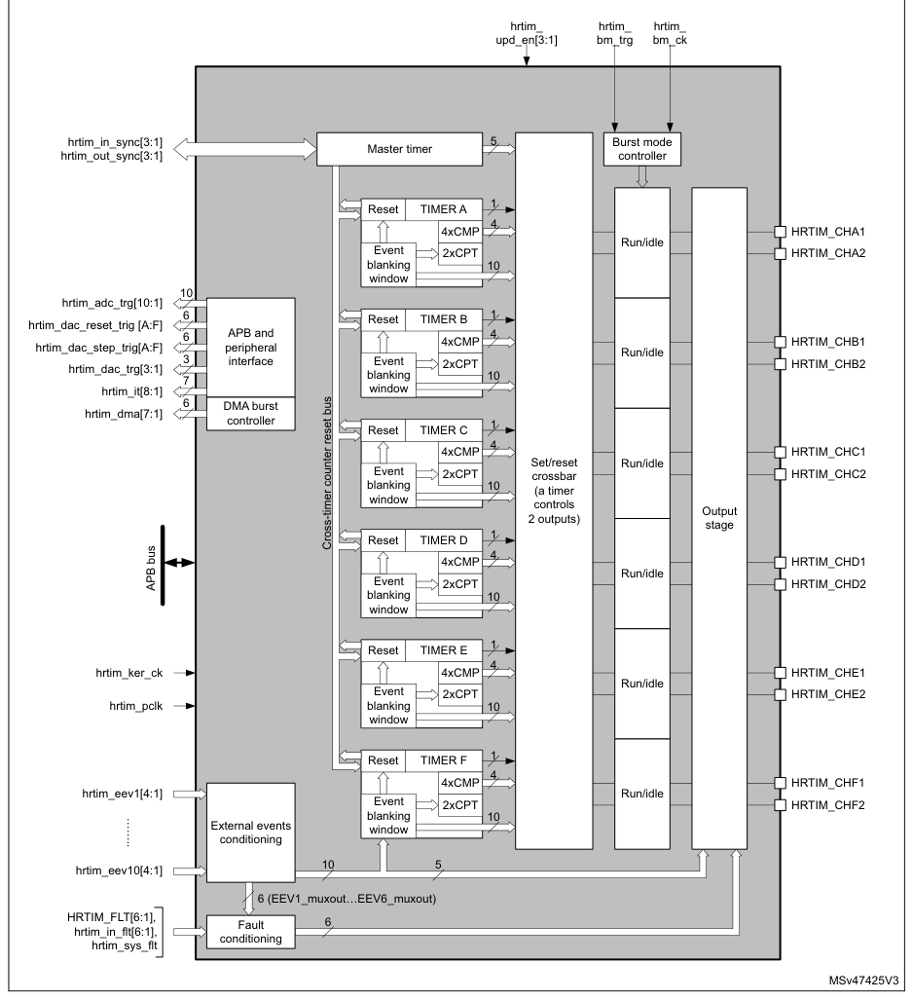

### 28.3.2 HRTIM pins and internal signals

The tables in this section summarize the HRTIM inputs and outputs, both on-chip and off-chip.

**Table 222. HRTIM inputs/outputs summary**

| Source row | Column 1 | Column 2 | Column 3 |
| ---: | --- | --- | --- |
| 1 | `Signal name` | `Signal type` | `Description` |
| 2 | `HRTIM_CHA1,` |  |  |
| 3 | `HRTIM_CHA2,` |  |  |
| 4 | `HRTIM_CHB1,` |  |  |
| 5 | `HRTIM_CHB2,` |  |  |
| 6 | `HRTIM_CHC1,` |  |  |
| 7 | `HRTIM_CHC2,` | `Main HRTIM timer outputs. They can be coupled by pairs (HRTIM_CHx1` |  |
| 8 | `Outputs` |  |  |
| 9 | `HRTIM_CHD1,` | `& HRTIM_CHx2) with deadtime insertion or work independently.` |  |
| 10 | `HRTIM_CHD2,` |  |  |
| 11 | `HRTIM_CHE1,` |  |  |
| 12 | `HRTIM_CHE2,` |  |  |
| 13 | `HRTIM_CHF1,` |  |  |
| 14 | `HRTIM_CHF2` |  |  |
| 15 | `HRTIM_FLT[6:1]` | `Fault inputs: immediately disable the HRTIM outputs when asserted (12` |  |
| 16 | `Digital input` |  |  |
| 17 | `hrtim_in_flt[6:1]` | `on-chip inputs and 6 off-chip HRTIM_FLTx inputs).` |  |
| 18 | `hrtim_sys_flt` | `Digital input` | `System fault gathering MCU internal fault events.` |
| 19 | `Synchronization inputs to synchronize the whole HRTIM with other internal or external timer resources:` |  |  |
| 20 | `hrtim_in_sync1: Reserved` |  |  |
| 21 | `hrtim_in_sync[3:1]` | `Digital Input` |  |
| 22 | `hrtim_in_sync2: the source is the TIM1_TRGO output (see Table 227:` |  |  |
| 23 | `Internal synchronization source)` |  |  |
| 24 | `hrtim_in_sync3: the source is HRTIM_SCIN input pins` |  |  |
| 25 | `The purpose of this output is to cascade or synchronize several HRTIM instances, either on-chip or off-chip:` |  |  |
| 26 | `hrtim_out_sync[2:1]` | `Digital output` | `hrtim_out_sync1: Reserved` |
| 27 | `hrtim_out_sync2: the destination is an off-chip HRTIM or peripheral (via` |  |  |
| 28 | `HRTIM_SCOUT output pins)` |  |  |
| 29 | `hrtim_eev1[4:1]` |  |  |
| 30 | `hrtim_eev2[4:1]` |  |  |
| 31 | `hrtim_eev3[4:1]` |  |  |
| 32 | `hrtim_eev4[4:1]` |  |  |
| 33 | `External events. Each of the 10 events can be selected among 4` |  |  |
| 34 | `hrtim_eev5[4:1]` |  |  |
| 35 | `sources, either on-chip (from other built-in peripherals: comparator, ADC` |  |  |
| 36 | `Digital input` |  |  |
| 37 | `analog watchdog, TIMx timers, trigger outputs) or off-chip` |  |  |
| 38 | `hrtim_eev6[4:1]` |  |  |

(HRTIM_EEVx input pins).

hrtim_eev7[4:1]
hrtim_eev8[4:1]
hrtim_eev9[4:1]
hrtim_eev10[4:1]

A pulse on the update enable inputs hrtim_upd_end[3:1] (on-chip

| Source row | Column 1 | Column 2 |
| ---: | --- | --- |
| 1 | `hrtim_upd_en[3:1]` | `Digital input` |
| 2 | `interconnect) triggers the transfer from shadow to active registers` |  |

**Table 222. HRTIM inputs/outputs summary (continued)**

| Source row | Column 1 | Column 2 | Column 3 |
| ---: | --- | --- | --- |
| 1 | `Signal name` | `Signal type` | `Description` |
| 2 | `A pulse on this input triggers a burst mode entry. This input is connected` |  |  |
| 3 | `hrtim_bm_trg` | `Digital input` |  |
| 4 | `to an internal source (see Table 226: Burst mode trigger source).` |  |  |
| 5 | `hrtim_bm_ck[4:1]` | `Digital input` | `Burst mode clock (on-chip interconnect)` |
| 6 | `ADC start of conversion triggers. The hrtim_adc_trg1 .. hrtim_adc_trg10` |  |  |
| 7 | `hrtim_adc_trg[10:1]` | `Digital output` |  |
| 8 | `outputs are here-after referred to as ADC trigger 1 to ADC trigger 10.` |  |  |
| 9 | `hrtim_dac_trg[3:1]` | `Digital output` | `DAC conversion update triggers` |
| 10 | `hrtim_dac_reset_trg[6:1]` |  |  |
| 11 | `Digital output` | `Dual channel DAC triggers` |  |
| 12 | `hrtim_dac_step_trg[6:1]` |  |  |
| 13 | `hrtim_it[8:1]` | `Digital output` | `Interrupt requests` |
| 14 | `hrtim_dma[7:1]` | `Digital output` | `DMA requests` |
| 15 | `hrtim_pclk` | `-` | `APB clock` |
| 16 | `hrtim_ker_ck` | `-` | `HRTIM kernel clock` |

**Table 223. External events mapping and associated features**

| Source row | Column 1 | Column 2 | Column 3 | Column 4 | Column 5 | Column 6 | Column 7 |
| ---: | --- | --- | --- | --- | --- | --- | --- |
| 1 | `Comparator and` |  |  |  |  |  |  |
| 2 | `Balanc` | `Balanc` | `input sources` |  |  |  |  |
| 3 | `Source (EExSRC[1:0])` |  |  |  |  |  |  |
| 4 | `External` | `-ed` | `-ed` | `available per` |  |  |  |
| 5 | `Fast Digital` |  |  |  |  |  |  |
| 6 | `event` | `fault` | `fault` | `package` |  |  |  |
| 7 | `mode filter` |  |  |  |  |  |  |
| 8 | `channel` | `timer` | `timer` |  |  |  |  |
| 9 | `A,B,C` | `D,E,F` | `Src1` | `Src2` | `Src3` | `Src4` | `64-pin and` |
| 10 | `48-pin` |  |  |  |  |  |  |
| 11 | `(00)` | `(01)` | `(10)` | `(11)` | `100-pin` |  |  |
| 12 | `hrtim_eev` | `tim1_` | `adc1_` | `Comp &` |  |  |  |
| 13 | `Yes` | `-` | `-` | `-` | `PC12` | `COMP2` | `Comp` |
| 14 | `1[4:1]` | `trgo` | `awd1` | `input` |  |  |  |
| 15 | `hrtim_eev` | `tim2_` | `adc1_` | `Comp &` |  |  |  |
| 16 | `Yes` | `-` | `-` | `-` | `PC11` | `COMP4` | `Comp` |
| 17 | `2[4:1]` | `trgo` | `awd2` | `input` |  |  |  |
| 18 | `hrtim_eev` | `tim3_` | `adc1_` | `Comp &` | `Comp &` |  |  |
| 19 | `Yes` | `-` | `-` | `-` | `PB7` | `COMP6` |  |
| 20 | `3[4:1]` | `trgo` | `awd3` | `input` | `input` |  |  |
| 21 | `hrtim_eev` | `adc2_` | `Comp &` | `Comp &` |  |  |  |
| 22 | `Yes` | `-` | `-` | `-` | `PB6` | `COMP1` | `COMP5` |
| 23 | `4[4:1]` | `awd1` | `input` | `input` |  |  |  |
| 24 | `hrtim_eev` | `adc2_` | `Comp &` | `Comp &` |  |  |  |
| 25 | `Yes` | `-` | `-` | `-` | `PB9` | `COMP3` | `COMP7` |
| 26 | `5[4:1]` | `awd2` | `input` | `input` |  |  |  |
| 27 | `hrtim_eev` | `adc2_` | `Comp &` | `Comp &` |  |  |  |
| 28 | `-` | `Yes` | `Yes` | `-` | `PB5` | `COMP2` | `COMP1` |
| 29 | `6[4:1]` | `awd3` | `input` | `input` |  |  |  |
| 30 | `hrtim_eev` | `tim7_` | `adc3_` | `Comp &` | `Comp &` |  |  |
| 31 | `-` | `Yes` | `Yes` | `-` | `PB4` | `COMP4` |  |
| 32 | `7[4:1]` | `trgo` | `awd1` | `input` | `input` |  |  |
| 33 | `hrtim_eev` | `adc4_` | `Comp &` | `Comp &` |  |  |  |
| 34 | `-` | `Yes` | `-` | `Yes` | `PB8` | `COMP6` | `COMP3` |
| 35 | `8[4:1]` | `awd1` | `input` | `input` |  |  |  |
| 36 | `hrtim_eev` | `tim15_` | `Comp &` | `Comp &` |  |  |  |
| 37 | `-` | `Yes` | `-` | `Yes` | `PB3` | `COMP5` | `COMP4` |
| 38 | `9[4:1]` | `trgo` | `input` | `input` |  |  |  |
| 39 | `hrtim_eev` | `PC5/` | `tim6_` | `adc5_` | `Comp &` |  |  |
| 40 | `-` | `Yes` | `-` | `-` | `COMP7` | `-` |  |
| 41 | `10[4:1]` | `PC6` | `trgo` | `awd1` | `input` |  |  |

**Table 224. Update enable inputs and sources**

| hrtim_upd_en[3:1] | Update source |
| --- | --- |
| hrtim_upd_en1 | tim16_oc1 |
| hrtim_upd_en2 | tim17_oc1 |
| hrtim_upd_en3 | tim6_trgo |

**Table 225. Burst mode clock sources**

| hrtim_bm_ck[4:1] | BMCLK[3:0] | Clock source |
| --- | --- | --- |
| hrtim_bm_ck1 | 0110 | tim16_oc1 |
| hrtim_bm_ck2 | 0111 | tim17_oc1 |
| hrtim_bm_ck3 | 1000 | tim17_trgo |
| hrtim_bm_ck4 | 1001 | Reserved |

**Table 226. Burst mode trigger source**

| - | trigger source |
| --- | --- |
| hrtim_bm_trg | tim7_trgo |

**Table 227. Internal synchronization source**

| - | synchornization source |
| --- | --- |
| hrtim_in_sync2 | tim1_trgo |

**Table 228. Fault inputs**

| Source row | Column 1 | Column 2 | Column 3 | Column 4 | Column 5 |
| ---: | --- | --- | --- | --- | --- |
| 1 | `External Input` | `On-chip source` | `On-chip source` | `On-chip source` |  |
| 2 | `FLTxSRC[1:0] =` | `FLTxSRC[1:0] =` | `FLTxSRC[1:0] =` | `FLTxSRC[1:0] =` |  |
| 3 | `Fault channel` |  |  |  |  |
| 4 | `00` | `01` | `10` | `11` |  |
| 5 | `HRTIM_FLT[6:1]` | `hrtim_in_flt[6:1]` | `hrtim internal` | `hrtim internal` |  |
| 6 | `Fault 1` | `PA12` | `COMP2` | `EEV1_muxout` | `N/A` |
| 7 | `Fault 2` | `PA15` | `COMP4` | `EEV2_muxout` | `N/A` |
| 8 | `Fault 3` | `PB10` | `COMP6` | `EEV3_muxout` | `N/A` |
| 9 | `Fault 4` | `PB11` | `COMP1` | `EEV4_muxout` | `N/A` |
| 10 | `Fault 5` | `PB0/PC7` | `COMP3` | `EEV5_muxout` | `N/A` |
| 11 | `Fault 6` | `PC10` | `COMP5` | `EEV6_muxout` | `N/A` |

**Table 229. HRTIM DAC triggers connections**

| Source row | Column 1 | Column 2 | Column 3 | Column 4 | Column 5 |
| ---: | --- | --- | --- | --- | --- |
| 1 | `DAC1_CH1` | `DAC3_CH1` | `DAC4_CH1` |  |  |
| 2 | `HRTIM DAC triggers` | `DAC2_CH1` |  |  |  |
| 3 | `DAC_CH2` | `DAC3_CH2` | `DAC4_CH2` |  |  |
| 4 | `hrtim_dac_trg1` | `Yes` | `-` | `-` | `Yes` |
| 5 | `hrtim_dac_trig2` | `-` | `Yes` | `-` | `-` |
| 6 | `hrtim_dac_trig3` | `-` | `-` | `Yes` | `-` |
| 7 | `hrtim_dac_reset_trg1` |  |  |  |  |
| 8 | `Yes` | `Yes` | `Yes` | `Yes` |  |
| 9 | `hrtim_dac_step_trg1` |  |  |  |  |
| 10 | `hrtim_dac_reset_trg2` |  |  |  |  |
| 11 | `Yes` | `Yes` | `Yes` | `Yes` |  |
| 12 | `hrtim_dac_step_trg2` |  |  |  |  |
| 13 | `hrtim_dac_reset_trg3` |  |  |  |  |
| 14 | `Yes` | `Yes` | `Yes` | `Yes` |  |
| 15 | `hrtim_dac_step_trg3` |  |  |  |  |
| 16 | `hrtim_dac_reset_trg4` |  |  |  |  |
| 17 | `Yes` | `Yes` | `Yes` | `Yes` |  |
| 18 | `hrtim_dac_step_trg4` |  |  |  |  |
| 19 | `hrtim_dac_reset_trg5` |  |  |  |  |
| 20 | `Yes` | `Yes` | `Yes` | `Yes` |  |
| 21 | `hrtim_dac_step_trg5` |  |  |  |  |
| 22 | `hrtim_dac_reset_trg6` |  |  |  |  |
| 23 | `Yes` | `Yes` | `Yes` | `Yes` |  |
| 24 | `hrtim_dac_step_trg6` |  |  |  |  |

**Table 230. System fault connected to hrtim_sys_flt input**

| Source | Enable bit in SYSCFGR2 register |
| --- | --- |
| Cortex®-M4 with FPU LOCKUP | CLL |
| Programmable Voltage Detector (PVD) | PVDL |
| SRAM parity error | SPL |
| Flash double ECC error | ECCL |
| Clock Security System (CSS) | None (always enabled) |

### 28.3.3 Clocks

The HRTIM must be supplied by the tHRTIM APB2 clock to offer a full resolution. The tHRTIM clock
period is evenly divided into up to 32 intermediate steps using an edge positioning logic. All
clocks present in the HRTIM are derived from this reference clock.

#### Definition of terms

> **Extracted layout**
>
> `fHRTIM:` · `main HRTIM clock (hrtim_ker_ck). All subsequent clocks are derived and`  
> `synchronous with this source.`  
> `fHRCK:` · `high-resolution equivalent clock. Considering the fHRTIM clock period division`  
> `by 32, it is equivalent to a frequency of 32 × fHRTIM.`  
> `fDTG:` · `deadtime generator clock. For convenience, only the tDTG period (tDTG =`  
> `1/fDTG) is used in this document.`  
> `fCHPFRQ:` · `chopper stage clock source.`  
> `f1STPW:` · `clock source defining the length of the initial pulse in chopper mode. For`  
> `convenience, only the t1STPW period (t1STPW = 1/f1STPW) is used in this document.`  
> `fBRST:` · `burst mode controller counter clock.`  
> `fSAMPLING:` · `clock needed to sample the fault or the external events inputs.`  
> `fFLTS:` · `clock derived from fHRTIM which is used as a source for`  
> `fSAMPLING to filter fault events.`  
> `fEEVS:` · `clock derived from fHRTIM which is used as a source for`  

fSAMPLING to filter external events.

#### Timer clock and prescaler

Each timer in the HRTIM has its own individual clock prescaler, which allows you to adjust the timer
resolution (see Table 231).

**Table 231. Timer resolution and min. PWM frequency for fHRTIM = 170 MHz**

| Source row | Column 1 | Column 2 | Column 3 | Column 4 | Column 5 |
| ---: | --- | --- | --- | --- | --- |
| 1 | `fHRCK` |  |  |  |  |
| 2 | `Prescal-` |  |  |  |  |
| 3 | `CKPSC[2:0]` | `Resolution` | `Min PWM frequency` |  |  |
| 4 | `ing ratio` |  |  |  |  |
| 5 | `equivalent frequency` |  |  |  |  |
| 6 | `000` | `1` | `170 x 32 MHz = 5.44 GHz` | `184 ps` | `83.0 kHz` |
| 7 | `001` | `2` | `170 x 16 MHz = 2.72 GHz` | `368 ps` | `41.5 kHz` |
| 8 | `010` | `4` | `170 x 8 MHz = 1.36 GHz` | `735 ps` | `20.8 kHz` |

**Table 231. Timer resolution and min. PWM frequency for fHRTIM = 170 MHz (continued)**

| Source row | Column 1 | Column 2 | Column 3 | Column 4 | Column 5 |
| ---: | --- | --- | --- | --- | --- |
| 1 | `Prescal-` | `fHRCK` |  |  |  |
| 2 | `CKPSC[2:0]` | `Resolution` | `Min PWM frequency` |  |  |
| 3 | `ing ratio` |  |  |  |  |
| 4 | `equivalent frequency` |  |  |  |  |
| 5 | `011` | `8` | `170 x 4 MHz = 680 MHz` | `1.47 ns` | `10.4 kHz` |
| 6 | `100` | `16` | `170 x 2 MHz = 340 MHz` | `2.94 ns` | `5.19 kHz` |
| 7 | `101` | `32` | `170 MHz` | `5.88 ns` | `2.59 kHz` |
| 8 | `110` | `64` | `170/2 MHz = 85 MHz` | `11.76 ns` | `1.30 kHz` |
| 9 | `111` | `128` | `170/4 MHz = 42.5 MHz` | `23.53 ns` | `0.65 kHz` |

The high-resolution is available for edge positioning, PWM period adjustment and externally
triggered pulse duration.

The high-resolution is not available for the following features

- Timer counter read and write accesses
- Capture unit

For clock prescaling ratios below 32 (CKPSC[2:0] \< 5), the least significant bits of the counter and
capture registers are not significant. The least significant bits cannot be written (counter
register only) and return 0 when read.

For instance, if CKPSC[2:0] = 2 (prescaling by 4), writing 0xFFFF into the counter register yields
an effective value of 0xFFF8. Conversely, any counter value between 0xFFFF and 0xFFF8 is read as
0xFFF8.

**Figure 210. Counter and capture register format vs clock prescaling factor**

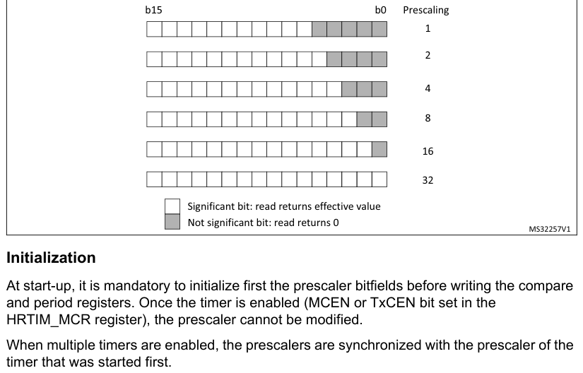

#### Initialization

At start-up, it is mandatory to initialize first the prescaler bitfields before writing the compare
and period registers. Once the timer is enabled (MCEN or TxCEN bit set in the HRTIM_MCR register),
the prescaler cannot be modified.

When multiple timers are enabled, the prescalers are synchronized with the prescaler of the timer
that was started first.

> **Warning:** It is possible to have different prescaling ratios in the master
> and TIMA..E timers only if the counter and output behavior does not depend on other timers’
> information and signals. It is mandatory to configure identical prescaling ratios in these timers
> when one of the following events is propagated from one timing unit (or master timer) to another:
> output set/reset event, counter reset event, update event, external event filter or capture
> triggers. Prescaler factors not equal yield to unpredictable results.

#### Deadtime generator clock

The deadtime prescaler is supplied by (fHRTIM x 8) / 2(DTPRSC[2:0]), programmed with DTPRSC[2:0]
bits in the HRTIM_DTxR register.

tDTG ranges from 735 ps to 94.1 ns for fHRTIM = 170 MHz.

#### Chopper stage clock

The chopper stage clock source fCHPFRQ is derived from fHRTIM with a division factor ranging from 16
to 256, so that 664 kHz ≤ fCHPFRQ ≤ 10.625 MHz for fHRTIM = 170 MHz.

t1STPW is the length of the initial pulse in chopper mode, programmed with the STRPW[3:0] bits in
the HRTIM_CHPxR register, as follows:

t1STPW = (STRPW[3:0]+1) x 16 x tHRTIM.

It uses fHRTIM / 16 as clock source (10.625 MHz for fHRTIM= 170 MHz).

#### Burst mode prescaler

The burst mode controller counter clock fBRST can be supplied by several sources, among which one is
derived from fHRTIM.

In this case, fBRST ranges from fHRTIM to fHRTIM / 32768 (5.19 kHz for fHRTIM = 170 MHz).

#### Fault input sampling clock

The fault input noise rejection filter has a time constant defined with fSAMPLING which can be
either fHRTIM or fFLTS.

fFLTS is derived from fHRTIM and ranges from 170 MHz to 21.25 MHz for fHRTIM = 170 MHz.

#### External event input sampling clock

The fault input noise rejection filter has a time constant defined with fSAMPLING which can be
either fHRTIM or fEEVS.

fEEVS is derived from fHRTIM and ranges from 170 MHz to 21.25 MHz for fHRTIM = 170 MHz.

### 28.3.4 Timer A..F timing units

The HRTIM embeds 6 identical timing units made of a 16-bit up-counter with an auto-reload mechanism
to define the counting period, 4 compare and 2 capture units, as per Figure 211. Each unit includes
all control features for 2 outputs, so that it operates as a standalone timer.

**Figure 211. Timer A..F overview**

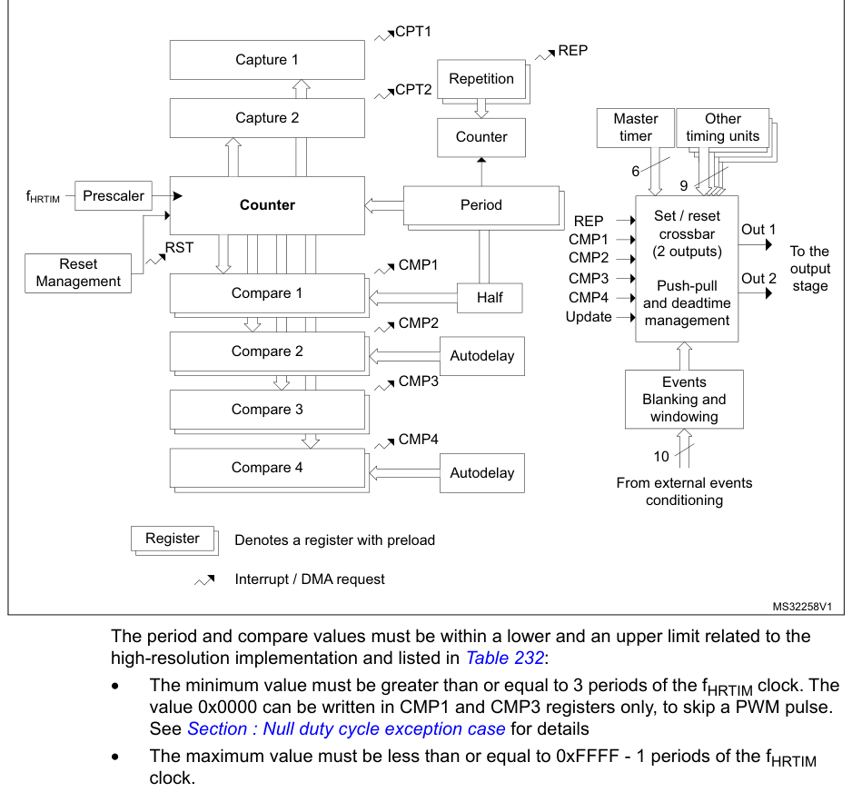

CPT1

REP

Capture 1

Repetition

CPT2

The period and compare values must be within a lower and an upper limit related to the
high-resolution implementation and listed in Table 232:

- The minimum value must be greater than or equal to 3 periods of the fHRTIM clock. The value 0x0000
  can be written in CMP1 and CMP3 registers only, to skip a PWM pulse. See Section: Null duty cycle
  exception case for details
- The maximum value must be less than or equal to 0xFFFF - 1 periods of the fHRTIM clock.

**Table 232. Period and compare registers min and max values**

| CKPSC[2:0] value | Min(1) | Max |
| --- | --- | --- |
| 0 | 0x0060 | 0xFFDF |
| 1 | 0x0030 | 0xFFEF |
| 2 | 0x0018 | 0xFFF7 |
| 3 | 0x000C | 0xFFFB |
| 4 | 0x0006 | 0xFFFD |
| ≥ 5 | 0x0003 | 0xFFFD |

1. The value 0x0000 can be written in CMP1 and CMP3 registers only, to skip a PWM pulse. See
   Section:

Null duty cycle exception case for details.

> **Note:** A compare value greater than the period register value does not generate a compare match
> event.

#### Counter operating mode

Timer A..F operate in continuous (free-running) mode or in single-shot manner where counting is
started by a reset event, using the CONT bit in the HRTIM_TIMxCR control register. An additional
RETRIG bit allows you to select whether the single-shot operation is retriggerable or
non-retriggerable. Details of operation are summarized on Table 233 and on Figure 212 and Figure
213.

**Table 233. Timer operating modes**

Start / stop conditions

CONT RETRIG Operating mode

Clocking and event generation

Setting the TxEN bit enables the timer but does not start the counter.

A first reset event starts the counting and any subsequent reset is ignored

Single-shot

| Source row | Column 1 | Column 2 | Column 3 |
| ---: | --- | --- | --- |
| 1 | `0` | `0` | `until the counter reaches the PER value.` |
| 2 | `Non-retriggerable` |  |  |

The PER event is then generated and the counter is stopped.

A reset event re-starts the counting operation from 0x0000.

Setting the TxEN bit enables the timer but does not start the counter.

A reset event starts the counting if the counter is stopped, otherwise it

Single-shot

| Source row | Column 1 | Column 2 | Column 3 |
| ---: | --- | --- | --- |
| 1 | `0` | `1` | `clears the counter. When the counter reaches the PER value, the PER` |
| 2 | `Retriggerable` |  |  |

event is generated and the counter is stopped.

A reset event re-starts the counting operation from 0x0000.

Setting the TxEN bit enables the timer and starts the counter simultaneously.

| Source row | Column 1 | Column 2 | Column 3 | Column 4 |
| ---: | --- | --- | --- | --- |
| 1 | `1` | `X` | `Continuous mode` | `When the counter reaches the PER value, it rolls-over to 0x0000 and` |

resumes counting.

The counter can be reset at any time.

The TxEN bit can be cleared at any time to disable the timer and stop the counting.

**Figure 212. Continuous timer operation**

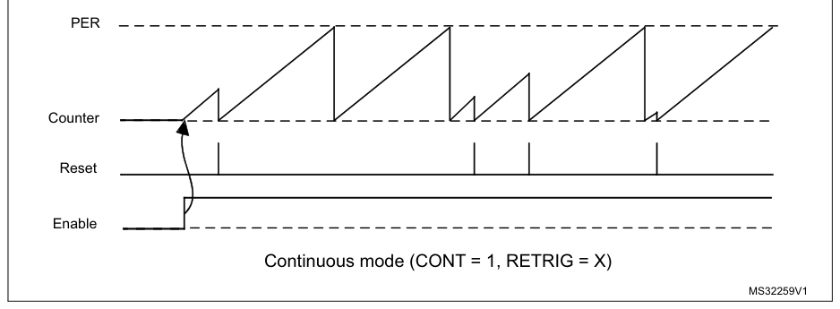

PER

Counter

Reset

Enable

Continuous mode (CONT = 1, RETRIG = X)

MS32259V1

**Figure 213. Single-shot timer operation**

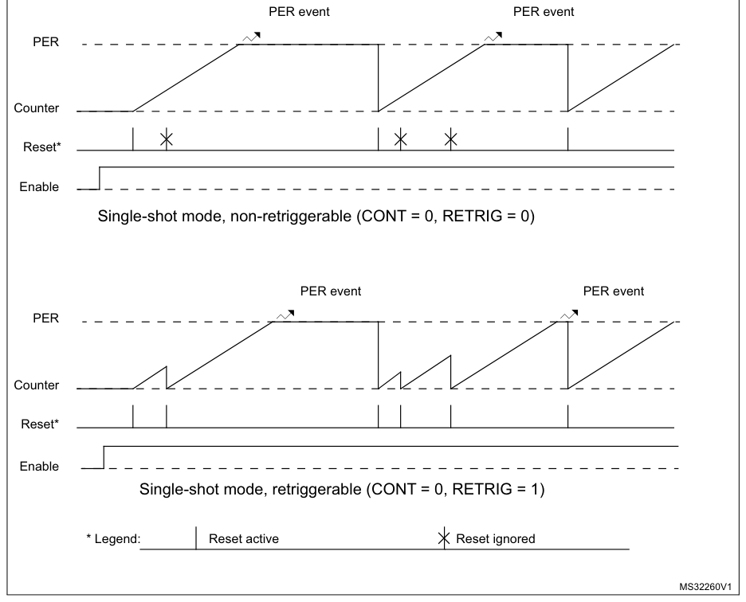

#### Roll-over event

A counter roll-over event is generated when the counter goes back to 0 after having reached the
period value set in the HRTIM_PERxR register in continuous mode.

This event is used for multiple purposes in the HRTIM:

- To set/reset the outputs
- To trigger the register content update (transfer from preload to active)
- To trigger an IRQ or a DMA request
- To serve as a burst mode clock source or a burst start trigger
- As an ADC trigger
- To decrement the repetition counter

If the initial counter value is above the period value when the timer is started, or if a new period
is set while the counter is already above this value, the counter is not reset: it overflows at the
maximum period value and the repetition counter does not decrement.

#### Timer reset

The reset of the timing unit counter can be triggered by up to 30 events that can be selected
simultaneously in the HRTIM_RSTxR register, among the following sources:

- The timing unit: compare 2, compare 4 and update (3 events)
- The master timer: reset and compare 1..4 (5 events)
- The external events EXTEVNT1..10 (10 events)
- All other timing units (e.g. timer B..F for timer A): compare 1, 2 and 4 (12 events)

Several events can be selected simultaneously to handle multiple reset sources. In this case, the
multiple reset requests are ORed. When 2 counter reset events are generated within the same fHRTIM
clock cycle, the last counter reset is taken into account.

Additionally, it is possible to do a software reset of the counter using the TxRST bits in the
HRTIM_CR2 register. These control bits are grouped into a single register to allow the simultaneous
reset of several counters.

The reset requests are taken into account only once the related counters are enabled (TxCEN bit
set).

When the fHRTIM clock prescaling ratio is above 32 (counting period above fHRTIM), the counter reset
event is delayed to the next active edge of the prescaled clock. This allows to maintain a
jitterless waveform generation when an output transition is synchronized to the reset event
(typically a constant Ton time converter).

Figure 214 shows how the reset is handled for a clock prescaling ratio of 128 (fHRTIM divided by 4).

**Figure 214. Timer reset resynchronization (prescaling ratio above 32)**

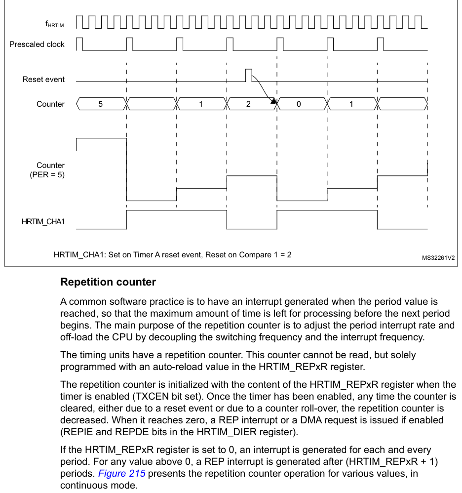

#### Repetition counter

A common software practice is to have an interrupt generated when the period value is reached, so
that the maximum amount of time is left for processing before the next period begins. The main
purpose of the repetition counter is to adjust the period interrupt rate and off-load the CPU by
decoupling the switching frequency and the interrupt frequency.

The timing units have a repetition counter. This counter cannot be read, but solely programmed with
an auto-reload value in the HRTIM_REPxR register.

The repetition counter is initialized with the content of the HRTIM_REPxR register when the timer is
enabled (TXCEN bit set). Once the timer has been enabled, any time the counter is cleared, either
due to a reset event or due to a counter roll-over, the repetition counter is decreased. When it
reaches zero, a REP interrupt or a DMA request is issued if enabled (REPIE and REPDE bits in the
HRTIM_DIER register).

If the HRTIM_REPxR register is set to 0, an interrupt is generated for each and every period. For
any value above 0, a REP interrupt is generated after (HRTIM_REPxR \+ 1) periods. Figure 215 presents
the repetition counter operation for various values, in continuous mode.

**Figure 215. Repetition rate versus HRTIM_REPxR content in continuous mode**

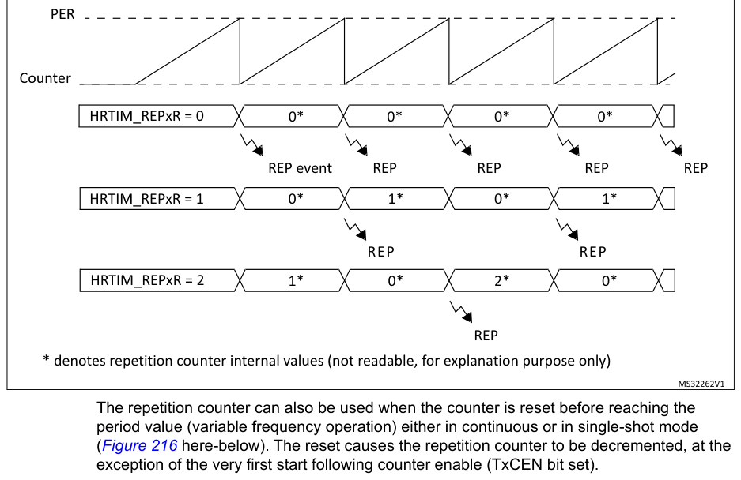

The repetition counter can also be used when the counter is reset before reaching the period value
(variable frequency operation) either in continuous or in single-shot mode (Figure 216 here-below).
The reset causes the repetition counter to be decremented, at the exception of the very first start
following counter enable (TxCEN bit set).

**Figure 216. Repetition counter behavior in single-shot mode**

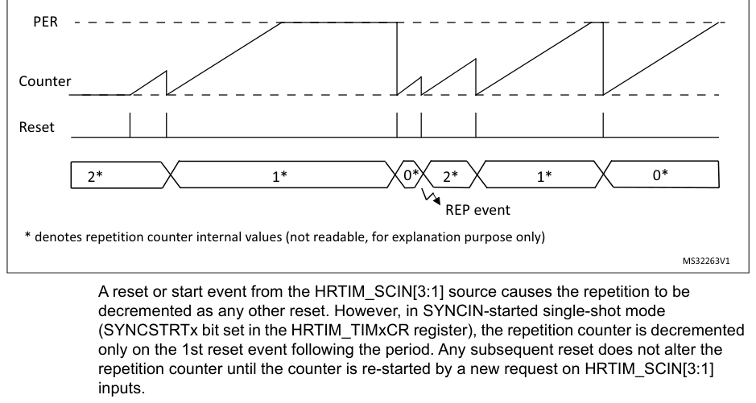

A reset or start event from the HRTIM_SCIN[3:1] source causes the repetition to be decremented as
any other reset. However, in SYNCIN-started single-shot mode (SYNCSTRTx bit set in the HRTIM_TIMxCR
register), the repetition counter is decremented only on the 1st reset event following the period.
Any subsequent reset does not alter the repetition counter until the counter is re-started by a new
request on HRTIM_SCIN[3:1] inputs.

#### Set / reset crossbar

A “set” event correspond to a transition to the output active state, while a “reset” event
corresponds to a transition to the output inactive state.

The polarity of the waveform is defined in the output stage to accommodate positive or negative
logic external components: an active level corresponds to a logic level 1 for a positive polarity
(POLx = 0), and to a logic level 0 for a negative polarity (POLx = 1).

Each of the timing units handles the set/reset crossbar for two outputs. These 2 outputs can be set,
reset or toggled by up to 32 events that can be selected among the following sources:

- The timing unit: period, compare 1..4, register update (6 events)
- The master timer: period, compare 1..4, HRTIM synchronization (6 events)
- All other timing units (e.g. timer B..F for timer A): TIMEVNT1..9 (9 events described in Table
  234)
- The external events EXTEVNT1..10 (10 events)
- A software forcing (1 event)

> **Note:** In up/down mode (UDM bit set to 1), the counter period event is defined as per the

OUTROM[1:0] bit setting.

The event sources are ORed and multiple events can be simultaneously selected.

Each output is controlled by two 32-bit registers, one coding for the set (HRTIM_SETxyR) and another
one for the reset (HRTIM_RSTxyR), where x stands for the timing unit: A..F and y stands for the
output 1or 2 (e.g. HRTIM_SETA1R, HRTIM_RSTC2R,...).

If the same event is selected for both set and reset, it toggles the output. It is not possible to
toggle the output state more than one time per tHRTIM period: in case of two consecutive toggling
events within the same cycle, only the first one is considered.

The set and reset requests are taken into account only once the counter is enabled (TxCEN bit set),
except if the software is forcing a request to allow the prepositioning of the outputs at timer
start-up.

Table 234 summarizes the events from other timing units that can be used to set and reset the
outputs. The number corresponds to the timer events (such as TIMEVNTx) listed in the register, and
empty locations are indicating non-available events.

For instance, timer A outputs can be set or reset by the following events: timer B compare 1 and 2,
timer C compare 2 and 3,... and timer E compare 3 is listed as TIMEVNT7 in HRTIM_SETA1R.

**Table 234. Events mapping across timer A to F**

| Source row | Extracted cells |
| ---: | --- |
| 1 | `Timer A` · `Timer B` · `Timer C` · `Timer D` · `Timer E` · `Timer F` |
| 2 | `Source` |
| 3 | `CMP1` · `CMP2` · `CMP3` · `CMP4` · `CMP1` · `CMP2` · `CMP3` · `CMP4` · `CMP1` · `CMP2` · `CMP3` · `CMP4` · `CMP1` · `CMP2` · `CMP3` · `CMP4` · `CMP1` · `CMP2` · `CMP3` · `CMP4` · `CMP1` · `CMP2` · `CMP3` · `CMP4` |
| 4 | `TA` · `-` · `-` · `-` · `-` · `1` · `2` · `-` · `-` · `-` · `3` · `4` · `-` · `5` · `6` · `-` · `-` · `-` · `-` · `7` · `8` · `-` · `-` · `-` · `9` |
| 5 | `TB` · `1` · `2` · `-` · `-` · `-` · `-` · `-` · `-` · `-` · `-` · `3` · `4` · `-` · `-` · `5` · `6` · `7` · `8` · `-` · `-` · `-` · `-` · `9` · `-` |
| 6 | `TC` · `-` · `1` · `2` · `-` · `-` · `3` · `4` · `-` · `-` · `-` · `-` · `-` · `-` · `5` · `-` · `6` · `-` · `-` · `7` · `8` · `-` · `9` · `-` · `-` |
| 7 | `TD` · `1` · `-` · `-` · `2` · `-` · `3` · `-` · `4` · `-` · `-` · `-` · `5` · `-` · `-` · `-` · `-` · `6` · `-` · `-` · `7` · `8` · `-` · `9` · `-` |
| 8 | `Destination` |
| 9 | `TE` · `-` · `-` · `-` · `1` · `-` · `-` · `2` · `3` · `4` · `5` · `-` · `-` · `6` · `7` · `-` · `-` · `-` · `-` · `-` · `-` · `-` · `-` · `8` · `9` |
| 10 | `TF` · `-` · `-` · `1` · `-` · `2` · `-` · `-` · `3` · `4` · `-` · `-` · `5` · `-` · `-` · `6` · `7` · `-` · `8` · `9` · `-` · `-` · `-` · `-` · `-` |

Figure 217 represents how a PWM signal is generated using two compare events.

**Figure 217. Compare events action on outputs: set on compare 1, reset on compare 2**

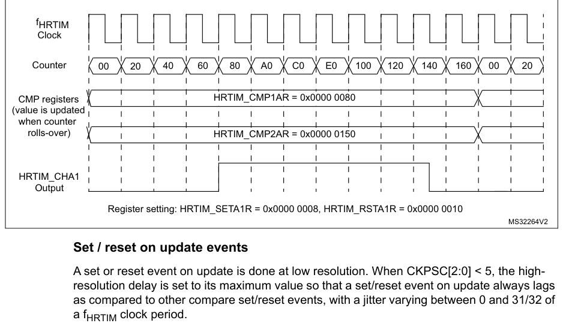

#### Set / reset on update events

A set or reset event on update is done at low resolution. When CKPSC[2:0] \< 5, the high-resolution
delay is set to its maximum value so that a set/reset event on update always lags as compared to
other compare set/reset events, with a jitter varying between 0 and 31/32 of a fHRTIM clock period.

#### Half mode

This mode aims at generating square signal with fixed 50% duty cycle and variable frequency
(typically for converters using resonant topologies). It allows to have the duty cycle automatically
forced to half of the period value when a new period is programmed.

This mode is enabled by writing HALF bit to 1 in the HRTIM_TIMxCR register. When the HRTIM_PERxR
register is written, it causes an automatic update of the compare 1 value with HRTIM_PERxR/2 value.

The output on which a square wave is generated must be programmed to have one transition on CMP1
event, and one transition on the period event, as follows:

- HRTIM_SETxyR = 0x0000 0008, HRTIM_RSTxyR = 0x0000 0004, or
- HRTIM_SETxyR = 0x0000 0004, HRTIM_RSTxyR = 0x0000 0008

The HALF mode overrides the content of the HRTIM_CMP1xR register. The access to the HRTIM_PERxR
register only causes compare 1 internal register to be updated. The user-accessible HRTIM_CMP1xR
register is not updated with the HRTIM_PERxR / 2 value.

When the preload is enabled (PREEN = 1, MUDIS, TxUDIS), compare 1 active register is refreshed on
the update event. If the preload is disabled (PREEN= 0), compare 1 active register is updated as
soon as HRTIM_PERxR is written.

The period must be greater than or equal to 6 periods of the fHRTIM clock (0xC0 if CKPSC[2:0] = 0,
0x60 if CKPSC[2:0] = 1, 0x30 if CKPSC[2:0] = 2,...) when the HALF mode is enabled.

#### Interleaved mode

This mode complements the Half mode and helps the implementation of interleaved topologies.

It allows to re-compute automatically the content of compare registers when the HRTIM_PERxR value is
updated.

The selection is done using the HALF bit and the IL[1:0] bits in HRTIM_MCR and HRTIM_TIMxCR
registers, as shown on the Table 235 below.

**Table 235. Interleaved mode selection**

| Source row | Column 1 | Column 2 | Column 3 |
| ---: | --- | --- | --- |
| 1 | `INTLVD` |  |  |
| 2 | `HALF bit` | `Mode` |  |
| 3 | `[1:0] bits` |  |  |
| 4 | `0` | `00` | `Disabled` |
| 5 | `0` | `01` | `Triple interleaved (120°)` |
| 6 | `0` | `10` | `Quad interleaved (90°)` |
| 7 | `0` | `11` | `Reserved` |
| 8 | `1` | `xx` | `Dual interleaved (180°)` |

Table 236 gives the compare values for the 3 available modes. The content of the compare registers
is overridden. The corresponding compare events can be used to trigger an output set / reset or to
reset a slave timer.

**Table 236. Compare 1..3 values in interleaved mode**

| Source row | Column 1 | Column 2 | Column 3 | Column 4 |
| ---: | --- | --- | --- | --- |
| 1 | `Dual interleaved` | `Triple interleaved` | `Quad interleaved` |  |
| 2 | `Mode` |  |  |  |
| 3 | `180°` | `120°` | `90°` |  |
| 4 | `CMP1 value` | `PERxR/2` | `PERxR/3` | `PERxR/4` |
| 5 | `CMP2 value` | `Not affected` | `2x (PERxR/3)` | `PERxR/2` |
| 6 | `CMP3 value` | `Not affected` | `Not affected` | `3x (PERxR/4)` |

> **Note:** In half and interleaved modes, the compare registers are controlled by hardware and writing
> them has no effect. However the written value is stored in the preload register and becomes active
> on the update event following the exit of these modes.

> **Note:** The triple and quad interleaved modes must not be used simultaneously with other modes
> using CMP2 (dual channel dac trigger and triggered-half modes).

#### Null duty cycle exception case

The high-resolution behavior is not supported for pulses narrower than 3 tHRTIM periods (see Section
28.3.7: Set / reset events priorities and narrow pulses management) and any value strictly below 3
periods of the fHRTIM clock (that is 0x60 if CKPSC[2:0] = 0, 0x30 if CKPSC[2:0] = 1, 0x18 if
CKPSC[2:0] = 2,...) in the HRTIM_TIMxCMPy register is forbidden (see 28.5.19: HRTIM timer x compare
1 register (HRTIM_CMP1xR) (x = A to F)).

However, it is possible to skip an output pulse and have a null duty cycle by simply writing a null
value in the following two registers: HRTIM_TIMxCMP1 and HRTIM_TIMxCMP3, if and only if the
following conditions are met:

- the output SET event is generated by the PERIOD event
- the output RESET if generated by the compare 1 (respectively compare 3) event
- the compare 1 (compare 3) event is active within the timer unit itself, and not used for other
  timing units

For any other use case, this can be done by programming the SET and RESET events with the very same
compare values, above 3 periods of the fHRTIM clock. In this case, the output is reset forced
(following the set/reset priority scheme defined in the [Section 28.3.7](#2837-set--reset-events-priorities-and-narrow-pulses-management): Set / reset events
priorities and narrow pulses management).

#### Swap mode

This mode allows to swap the two outputs with a single bit access: the output 1 signal is connected
to the output 2 pin and the output 2 signal is connected to output 1 pin. The output swap is
triggered with the SWPx bits in the HRTIM_CR2 register and is effective on the next update event.

The outputs are swapped prior to the set/reset crossbar unit, as following:

- if SWPx = 0, HRTIM_SETx1R and HRTIM_RSTx1R are coding for the output 1, HRTIM_SETx2R and
  HRTIM_RSTx2R are coding for the output 2
- if SWPx = 1, HRTIM_SETx1R and HRTIM_RSTx1R are coding for the output 2, HRTIM_SETx2R and
  HRTIM_RSTx2R are coding for the output 1

The swap mode is only affecting the preload register, and not the active registers.

> **Note:** The preload mode must be enabled when using the swap mode.

Consequently, it does not modify the auxiliary outputs in parallel with the regular outputs going to
the output stage (see [Section 28.3.18](#28318-auxiliary-outputs) for details). They provide the following internal status,
events and signals:

- O1CPY, O2CPY, SETxy and RSTxy status flags, together with the corresponding interrupts and DMA
  requests
- Capture triggers upon output set/reset (TA2, TB2, TC2, TD2, TE2, TF2)
- External event filters generated with a Tx2 output copy

For instance the SETx1 flag is related to the output 1 when SWP = 0 and is related to the output 2
when SWPx = 1.

Similarly, the swap mode does not change the attribution of control bits in the HRTIM_OUTxR register
(DIDLx, CHPx, FAULTx[1:0], IDLESx, POLx bits). For instance, the POL1 bit controls the output 1
polarity whatever the SWP bit value.

> **Note:** The SWPx bits are ignored in push-pull mode (PSHPLL = 1 in the HRTIM_TIMxCR
> register).

#### Capture

The timing unit has the capability to capture the counter value, triggered by internal and external
events. The purpose is to:

- measure events arrival timings or occurrence intervals
- update compare 2 and compare 4 values in auto-delayed mode (see Section: Auto-delayed mode).

The capture is done with fHRTIM resolution: for a clock prescaling ratio below 32 (CKPSC[2:0] \< 5),
the least significant bits of the register are not significant (read as 0).

The timer has 2 capture registers: HRTIM_CPT1xR and HRTIM_CPT2xR. The capture triggers are
programmed in the HRTIM_CPT1xCR and HRTIM_CPT2xCR registers.

The capture of the timing unit counter can be triggered by up to 28 events that can be selected
simultaneously in the HRTIM_CPT1xCR and HRTIM_CPT2xCR registers, among the following sources:

- The external events, EXTEVNT1..10 (10 events)
- All other timing units (e.g. timer B..F for timer A): compare 1, 2 and output 1 set/reset events
  (16 events)
- The timing unit: update (1 event)
- A software capture (1 event)

Several events can be selected simultaneously to handle multiple capture triggers. In this case, the
concurrent trigger requests are ORed. The capture can generate an interrupt or a DMA request when
CPTxIE and CPTxDE bits are set in the HRTIM_TIMxDIER register.

Over-capture is not prevented by the circuitry: a new capture is triggered even if the previous
value was not read, or if the capture flag was not cleared.

**Figure 218. Timer A timing unit capture circuitry**

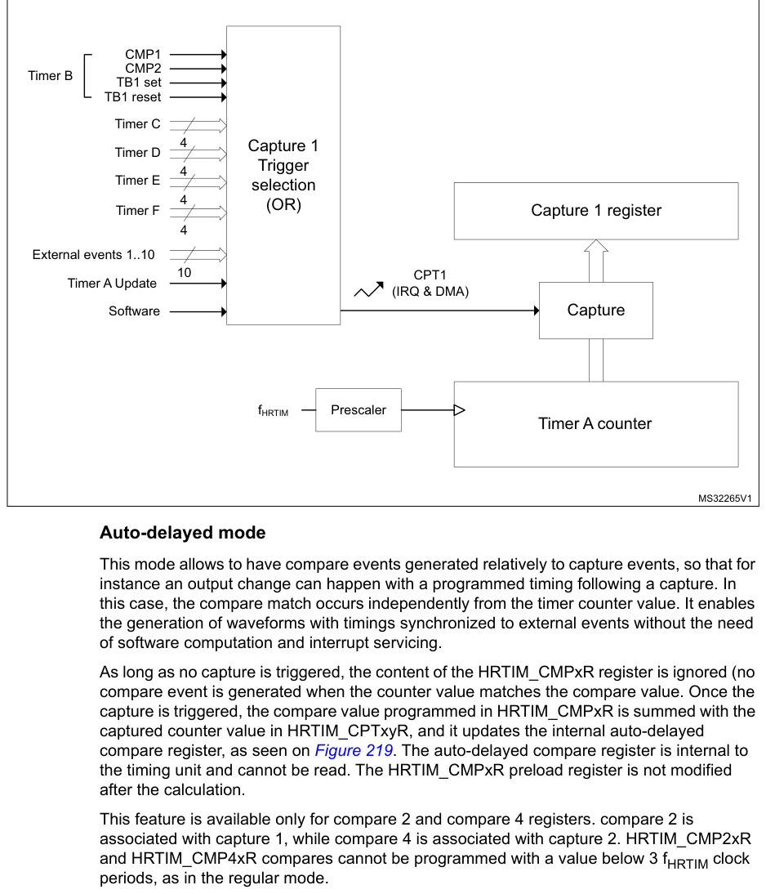

CMP1

CMP2

Timer B

TB1 set

TB1 reset

Timer C

4 Capture 1

Timer D

Trigger

4

#### Auto-delayed mode

This mode allows to have compare events generated relatively to capture events, so that for instance
an output change can happen with a programmed timing following a capture. In this case, the compare
match occurs independently from the timer counter value. It enables the generation of waveforms with
timings synchronized to external events without the need of software computation and interrupt
servicing.

As long as no capture is triggered, the content of the HRTIM_CMPxR register is ignored (no compare
event is generated when the counter value matches the compare value. Once the capture is triggered,
the compare value programmed in HRTIM_CMPxR is summed with the captured counter value in
HRTIM_CPTxyR, and it updates the internal auto-delayed compare register, as seen on Figure 219. The
auto-delayed compare register is internal to the timing unit and cannot be read. The HRTIM_CMPxR
preload register is not modified after the calculation.

This feature is available only for compare 2 and compare 4 registers. compare 2 is associated with
capture 1, while compare 4 is associated with capture 2. HRTIM_CMP2xR and HRTIM_CMP4xR compares
cannot be programmed with a value below 3 fHRTIM clock periods, as in the regular mode.

**Figure 219. Auto-delayed overview (compare 2 only)**

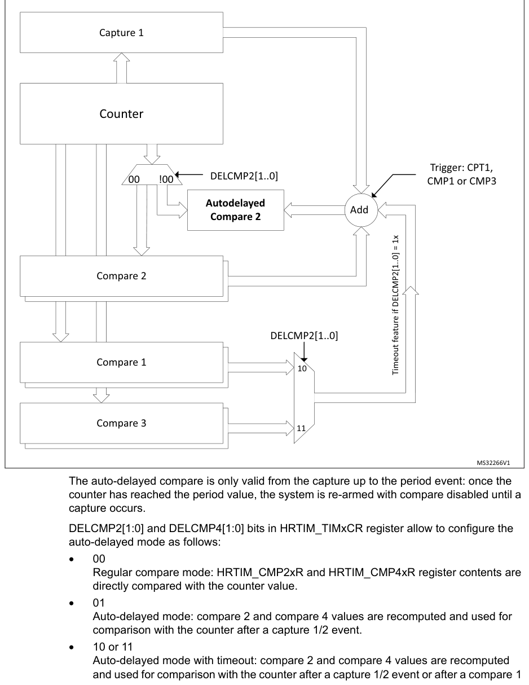

The auto-delayed compare is only valid from the capture up to the period event: once the counter has
reached the period value, the system is re-armed with compare disabled until a capture occurs.

DELCMP2[1:0] and DELCMP4[1:0] bits in HRTIM_TIMxCR register allow to configure the auto-delayed mode
as follows:

- 00 Regular compare mode: HRTIM_CMP2xR and HRTIM_CMP4xR register contents are directly compared
  with the counter value.
- 01 Auto-delayed mode: compare 2 and compare 4 values are recomputed and used for comparison with
  the counter after a capture 1/2 event.
- 10 or 11 Auto-delayed mode with timeout: compare 2 and compare 4 values are recomputed and used
  for comparison with the counter after a capture 1/2 event or after a compare 1
  match (DELCMPx[1:0]= 10) or a compare 3 match (DELCMPx[1:0]= 11) to have a timeout function if
  capture 1/2 event is missing.

When the capture occurs, the comparison is done with the (HRTIM_CMP2/4xR \+ HRTIM_CPT1/2xR) value. If
no capture is triggered within the period, the behavior depends on the DELCMPx[1:0] value:

- DELCMPx[1:0] = 01: the compare event is not generated
- DELCMPx[1:0] = 10 or 11: the comparison is done with the sum of the 2 compares (for instance
  HRTIM_CMP2xR \+ HRTIM_CMP1xR). The captures are not taken into account if they are triggered after
  CMPx \+ CMP1 (resp. CMPx \+ CMP3).

The captures are enabled again at the beginning of the next PWM period.

If the result of the auto-delayed summation is above 0xFFFF (overflow), the value is ignored and no
compare event is generated until a new period is started.

> **Note:** DELCMPx[1:0] bitfield must be reset when reprogrammed from one value to the other to re-
> initialize properly the auto-delayed mechanism, for instance:

- DELCMPx[1:0] = 10
- DELCMPx[1:0] = 00
- DELCMPx[1:0] = 11

As an example, Figure 220 shows how the following signal is generated:

- Output set when the counter is equal to compare 1 value
- Output reset 5 cycles after a falling edge on a given external event

> **Note:** To simplify the figure, the high-resolution is not used in this example (CKPSC[2:0] = 101),
> thus the counter is incremented at the fHRTIM rate. Similarly, the external event signal is shown
> without any resynchronization delay: practically, there is a delay of 1 to 2 fHRTIM clock periods
> between the falling edge and the capture event due to an internal resynchronization stage which is
> necessary to process external input signals.

**Figure 220. Auto-delayed compare**

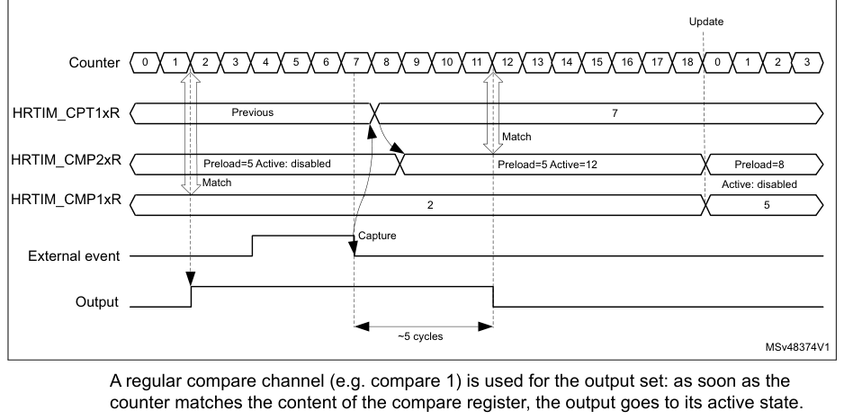

A regular compare channel (e.g. compare 1) is used for the output set: as soon as the counter
matches the content of the compare register, the output goes to its active state.

A delayed compare is used for the output reset: the compare event can be generated only if a capture
event has occurred. No event is generated when the counter matches the delayed compare value
(counter = 4). Once the capture event has been triggered by the external event, the content of the
capture register is summed to the delayed compare value to have the new compare value. In the
example, the auto-delayed value 4 is summed to the capture equal to 7 to give a value of 12 in the
auto-delayed compare register. From this time on, the compare event can be generated and happens
when the counter is equal to 12, causing the output to be reset.

Overcapture management in auto-delayed mode

Overcapture is prevented when the auto-delayed mode is enabled (DELCMPx[1:0] = 01, 10, 11).

When multiple capture requests occur within the same counting period, only the first capture is
taken into account to compute the auto-delayed compare value. A new capture is possible only:

- Once the auto-delayed compare has matched the counter value (compare event)
- Once the counter has rolled over (period)
- Once the timer has been reset

Changing auto-delayed compare values

When the auto-delayed compare value is preloaded (PREEN bit set), the new compare value is taken
into account on the next coming update event (for instance on the period event), regardless of when
the compare register was written and if the capture occurred (see Figure 220, where the delay is
changed when the counter rolls over).

When the preload is disabled (PREEN bit reset), the new compare value is taken into account
immediately, even if it is modified after the capture event has occurred, as per the example below:

1. At t1, DELCMP2 = 1.
2. At t2, CMP2_act = 0x40 => comparison disabled
3. At t3, a capture event occurs capturing the value CPTR1 = 0x20. => comparison
   enabled, compare value = 0x60
4. At t4, CMP2_act = 0x100 (before the counter reached value CPTR1 \+ 0x40) =>
   comparison still enabled, new compare value = 0x120
5. At t5, the counter reaches the period value => comparison disabled, cmp2_act = 0x100

Similarly, if the CMP1(CMP3) value changes while DELCMPx = 10 or 11, and preload is disabled:

1. At t1, DELCMP2 = 2.
2. At t2, CMP2_act = 0x40 => comparison disabled
3. At t3, CMP3 event occurs - CMP3_act = 0x50 before capture 1 event occurs =>
   comparison enabled, compare value = 0x90
4. At t4, CMP3_act = 0x100 (before the counter reached value 0x90) => comparison still
   enabled, compare 2 event occurs at = 0x140

#### Triggered-half mode

The purpose of this mode is to allow the synchronization of 2 interleaved converters that have
variable frequency operation and require a 180° phase-shift. The basic principle is to
have a master-slave system. The slave converter synchronization is continuously adjusted based on
the previous switching period of the master converter.

This is done using the capture unit. The switching period of the master converter is captured,
divided by 2 and then stored in the compare 2 register by hardware. The compare 2 register contains
a value equal to half of the captured period, which is the master converter switching period. The
compare 2 event can then be used to trigger a second timing unit that manages the slave converter.

This mode is enabled by setting the TRGHLF bit in the HRTIM_TIMxCR2 register. This bit cannot be
changed once the timer is operating (TxEN bit set).

The triggered-half mode must not be used simultaneously with other modes using CMP2 (dual channel
dac trigger, interleaved and balanced idle modes).

The initial value CMP2 can be written by the user, but is ignored once the first capture is
triggered. The preload mechanism is disabled for CMP2 when the TRGHLF bit is reset.

**Figure 221. Triggered-half mode example**

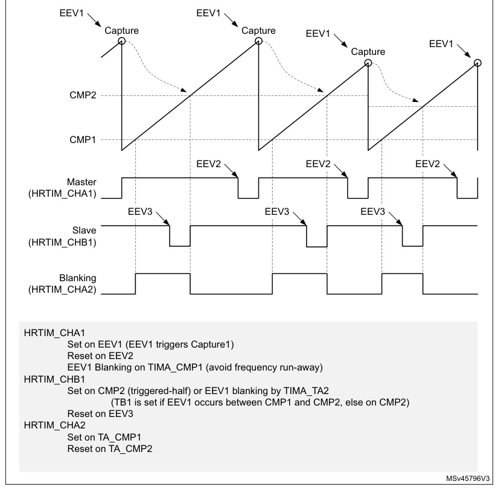

> **Note:** In triggered half mode, the compare2 register is controlled by hardware and writing it has no
> effect. However the written value is stored in the preload register and becomes active on the update
> event following the exit of this mode.

#### Push-pull mode

This mode primarily aims at driving converters using push-pull topologies. It also needs to be
enabled when the delayed idle protection is required, typically for resonant converters (refer to
[Section 28.3.10](#28310-delayed-protection): Delayed protection).

The push-pull mode is enabled by setting PSHPLL bit in the HRTIM_TIMxCR register.

It applies the signals generated by the crossbar to output 1 and output 2 alternatively, on the
period basis, maintaining the other output to its inactive state. The redirection rate (push-pull
frequency) is defined by the timer’s period event, as shown on Figure 222. The push-pull period is
twice the timer counting period.

**Figure 222. Push-pull mode block diagram**

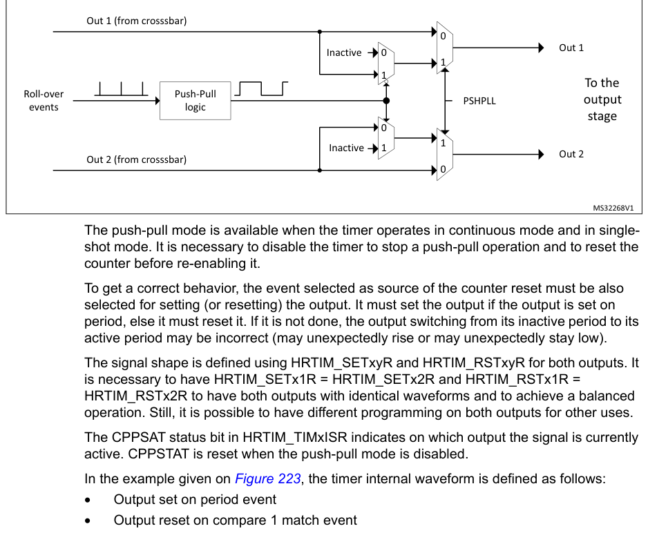

Out 1 (from crosssbar)

0

Out 1

Inactive 0

1

1

To the

The push-pull mode is available when the timer operates in continuous mode and in single-shot mode.
It is necessary to disable the timer to stop a push-pull operation and to reset the counter before
re-enabling it.

To get a correct behavior, the event selected as source of the counter reset must be also selected
for setting (or resetting) the output. It must set the output if the output is set on period, else
it must reset it. If it is not done, the output switching from its inactive period to its active
period may be incorrect (may unexpectedly rise or may unexpectedly stay low).

The signal shape is defined using HRTIM_SETxyR and HRTIM_RSTxyR for both outputs. It is necessary to
have HRTIM_SETx1R = HRTIM_SETx2R and HRTIM_RSTx1R = HRTIM_RSTx2R to have both outputs with identical
waveforms and to achieve a balanced operation. Still, it is possible to have different programming
on both outputs for other uses.

The CPPSAT status bit in HRTIM_TIMxISR indicates on which output the signal is currently active.
CPPSTAT is reset when the push-pull mode is disabled.

In the example given on Figure 223, the timer internal waveform is defined as follows:

- Output set on period event
- Output reset on compare 1 match event

**Figure 223. Push-pull mode example**

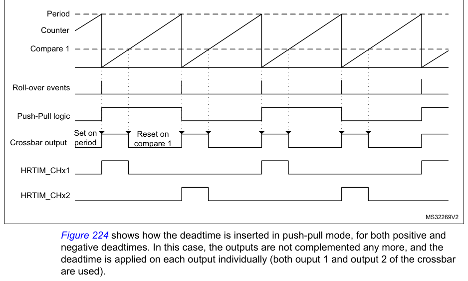

Period

Counter

Compare 1

Roll-over events

Push-Pull logic

Figure 224 shows how the deadtime is inserted in push-pull mode, for both positive and negative
deadtimes. In this case, the outputs are not complemented any more, and the deadtime is applied on
each output individually (both ouput 1 and output 2 of the crossbar are used).

**Figure 224. Push-pull with deadtime**

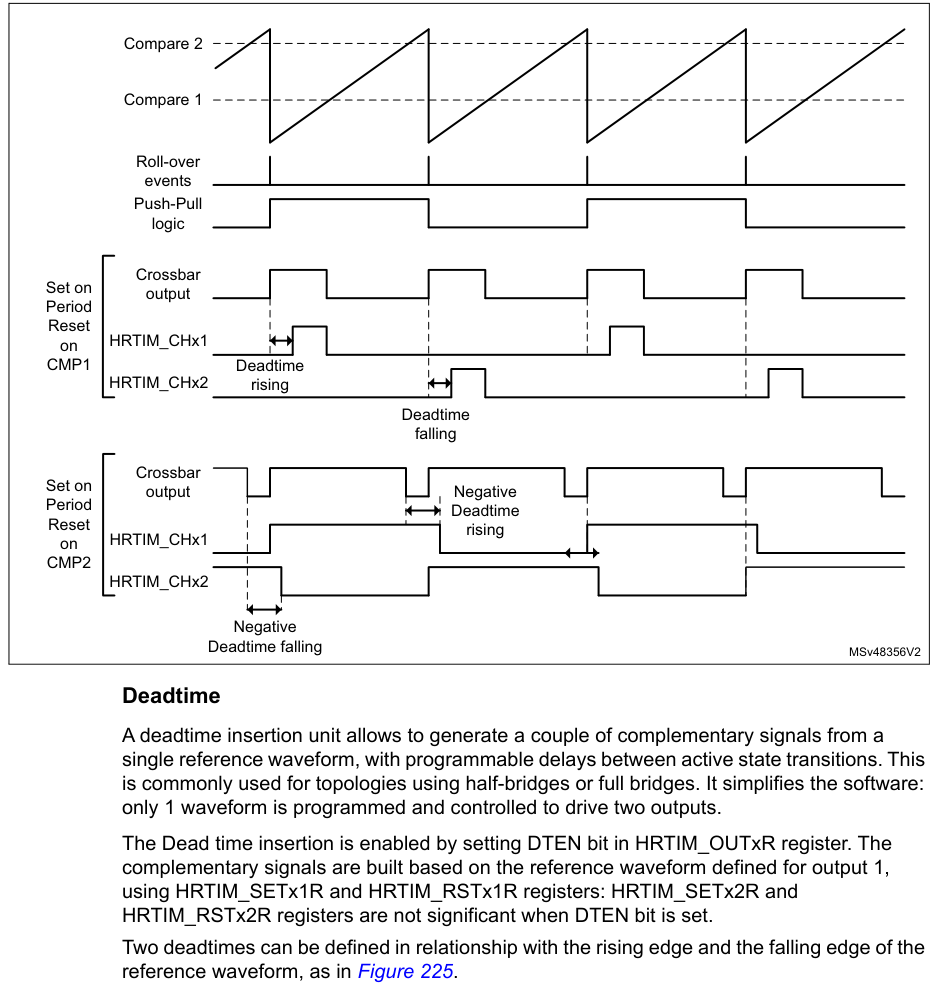

Compare 2

Compare 1

Roll-over
events

Push-Pull
logic

Crossbar

Set on
output

Period

Reset

HRTIM_CHx1
on

#### Deadtime

A deadtime insertion unit allows to generate a couple of complementary signals from a single
reference waveform, with programmable delays between active state transitions. This is commonly used
for topologies using half-bridges or full bridges. It simplifies the software: only 1 waveform is
programmed and controlled to drive two outputs.

The Dead time insertion is enabled by setting DTEN bit in HRTIM_OUTxR register. The complementary
signals are built based on the reference waveform defined for output 1, using HRTIM_SETx1R and
HRTIM_RSTx1R registers: HRTIM_SETx2R and HRTIM_RSTx2R registers are not significant when DTEN bit is
set.

Two deadtimes can be defined in relationship with the rising edge and the falling edge of the
reference waveform, as in Figure 225.

**Figure 225. Complementary outputs with deadtime insertion**

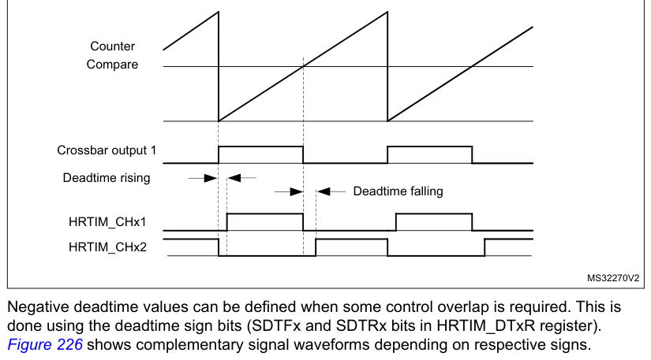

Counter

Compare

Crossbar output 1

Deadtime rising

Deadtime falling

HRTIM_CHx1

HRTIM_CHx2

MS32270V2

Negative deadtime values can be defined when some control overlap is required. This is done using
the deadtime sign bits (SDTFx and SDTRx bits in HRTIM_DTxR register). Figure 226 shows complementary
signal waveforms depending on respective signs.

**Figure 226. Deadtime insertion versus deadtime sign (1 indicates negative deadtime)**

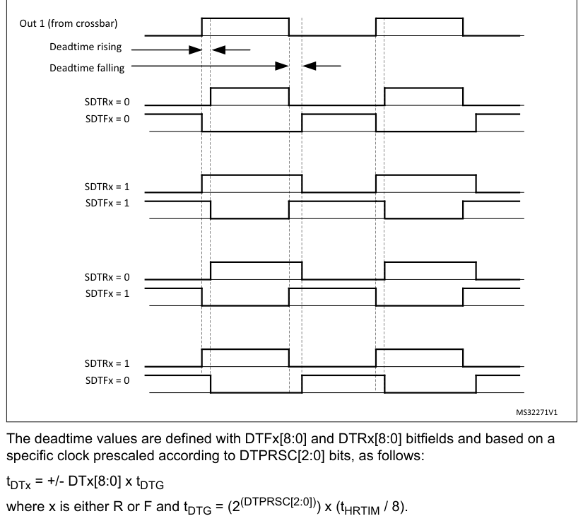

Out 1 (from crossbar)

Deadtime rising

Deadtime falling

SDTRx = 0

SDTFx = 0

SDTRx = 1

SDTFx = 1

SDTRx = 0

SDTFx = 1

SDTRx = 1

SDTFx = 0

MS32271V1

The deadtime values are defined with DTFx[8:0] and DTRx[8:0] bitfields and based on a specific clock
prescaled according to DTPRSC[2:0] bits, as follows:

tDTx = +/- DTx[8:0] x tDTG
where x is either R or F and tDTG = (2(DTPRSC[2:0])) x (tHRTIM / 8).

Table 237 gives the resolution and maximum absolute values depending on the prescaler value.

**Table 237. Deadtime resolution and max absolute values**

| Source row | Column 1 | Column 2 | Column 3 | Column 4 |
| ---: | --- | --- | --- | --- |
| 1 | `fHRTIM= 170 MHz` |  |  |  |
| 2 | `DTPRSC[2:0]` | `tDTG` | `tDTx max` |  |
| 3 | `tDTG (ns)` |  | `tDTx` | `max (µs)` |
| 4 | `000` | `tHRTIM / 8` | `0.73` | `0.38` |
| 5 | `001` | `tHRTIM / 4` | `1.47` | `0.75` |
| 6 | `010` | `tHRTIM / 2` | `2.94` | `1.50` |
| 7 | `011` | `tHRTIM` | `5.89` | `3.01` |
| 8 | `511 * tDTG` |  |  |  |
| 9 | `100` | `2 * tHRTIM` | `11.76` | `6.01` |
| 10 | `101` | `4 * tHRTIM` | `23.53` | `12.03` |
| 11 | `110` | `8 * tHRTIM` | `47.06` | `24.04` |
| 12 | `111` | `16 * tHRTIM` | `94.12` | `48.10` |

Figure 227 to Figure 230 present how the deadtime generator behaves for reference waveforms with
pulsewidth below the deadtime values, for all deadtime configurations.

**Figure 227. Complementary outputs for low pulsewidth (SDTRx = SDTFx = 0)**

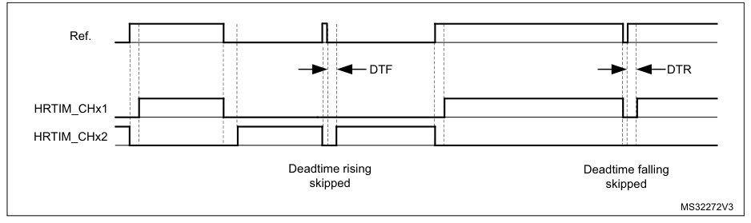

Ref.

**Figure 228. Complementary outputs for low pulsewidth (SDTRx = SDTFx = 1)**

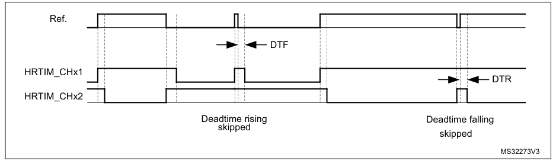

Ref.

DTF

HRTIM_CHx1

DTR

HRTIM_CHx2

**Figure 229. Complementary outputs for low pulsewidth (SDTRx = 0, SDTFx = 1)**

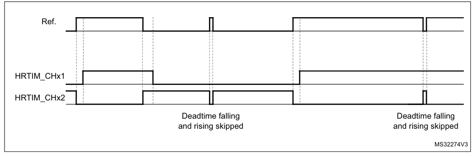

Ref.

HRTIM_CHx1

HRTIM_CHx2

**Figure 230. Complementary outputs for low pulsewidth (SDTRx = 1, SDTFx=0)**

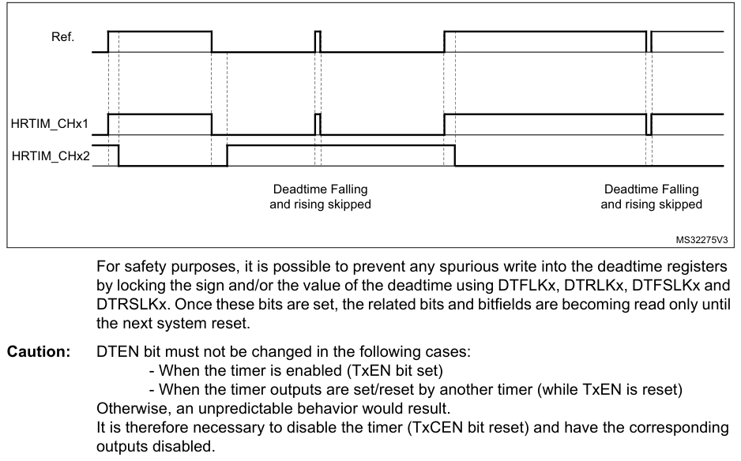

Ref.

HRTIM_CHx1

HRTIM_CHx2

For safety purposes, it is possible to prevent any spurious write into the deadtime registers by
locking the sign and/or the value of the deadtime using DTFLKx, DTRLKx, DTFSLKx and DTRSLKx. Once
these bits are set, the related bits and bitfields are becoming read only until the next system
reset.

> **Caution:** DTEN bit must not be changed in the following cases:

- When the timer is enabled (TxEN bit set) - When the timer outputs are set/reset by another timer
  (while TxEN is reset)

Otherwise, an unpredictable behavior would result. It is therefore necessary to disable the timer
(TxCEN bit reset) and have the corresponding outputs disabled.

For the particular case where DTEN must be set while the burst mode is enabled with a deadtime upon
entry (BME = 1, DIDL = 1, IDLEM = 1), it is necessary to force the two outputs in their IDLES state
by software commands (SST, RST bits) before setting DTEN bit. This is to avoid any side effect
resulting from a burst mode entry that would happen immediately before a deadtime enable.

### 28.3.5 Master timer

The main purpose of the master timer is to provide common signals to the 6 timing units, either for
synchronization purpose or to set/reset outputs. It does not have direct control over any outputs,
but still can be used indirectly by the set/reset crossbars.

Figure 231 provides an overview of the master timer.

**Figure 231. Master timer overview**

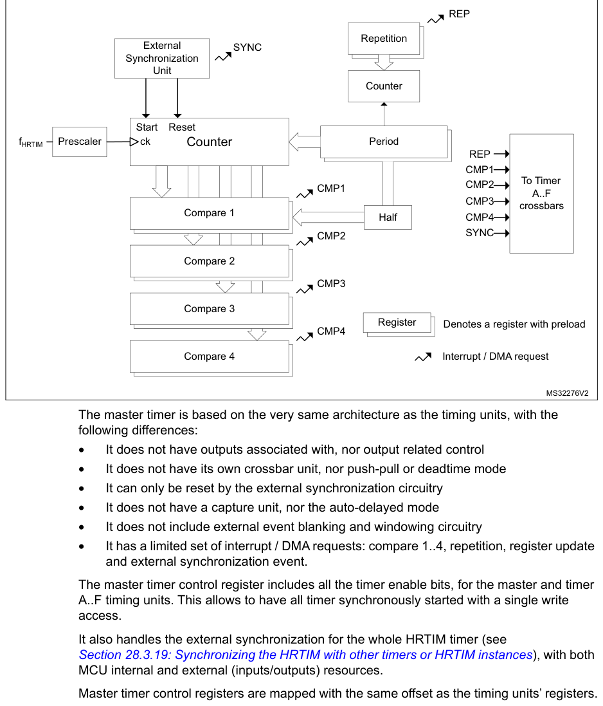

- It does not have outputs associated with, nor output related control
- It does not have its own crossbar unit, nor push-pull or deadtime mode
- It can only be reset by the external synchronization circuitry
- It does not have a capture unit, nor the auto-delayed mode
- It does not include external event blanking and windowing circuitry
- It has a limited set of interrupt / DMA requests: compare 1..4, repetition, register update and
  external synchronization event.

The master timer control register includes all the timer enable bits, for the master and timer A..F
timing units. This allows to have all timer synchronously started with a single write access.

It also handles the external synchronization for the whole HRTIM timer (see [Section 28.3.19](#28319-synchronizing-the-hrtim-with-other-timers-or-hrtim-instances):
Synchronizing the HRTIM with other timers or HRTIM instances), with both MCU internal and external
(inputs/outputs) resources.

Master timer control registers are mapped with the same offset as the timing units’ registers.

### 28.3.6 Up-down counting mode

The HRTIM is natively designed with up-counters. It offers however an operating mode with up-down
counters, also called center-aligned mode.

This mode is enabled using the UDM bit in the HRTIM_TIMxCR2 register. This bit must not be changed
once the timer is operating (TxEN bit set). It is only available for the TIMA..F. The master timer
only works in up-counting mode.

Not all HRTIM features are supported in up-down counting. This section details the functional
differences versus up-counting mode.

The period in HRTIM_PERxR must be preloaded (or static) in up-down mode. It can be updated only on
period event or on counter reset.

The set/reset crossbar programming differs as follows:

The events coming from the timing units are setting/resetting the outputs depending on the counter
up/down direction:

- If the event is enabled in the HRTIM_SETxyR register, it sets the output during up-counting and
  reset it during down-counting.
- If the event is enabled in the HRTIM_RSTxyR register, it resets the output during up-counting and
  set it during down-counting.
- If the events are enabled both in HRTIM_SETxyR and HRTIM_RSTxyR registers, the output toggles.

This applies to:

- The timing unit: period, compare 1..4, register update (6 events)
- The master timer: period, compare 1..4, HRTIM synchronization (6 events)
- All other timing units (e.g. timer B..F for timer A): TIMEVNT1..9 (9 events described in Table
  234)

The Figure 232 below shows how to generate basic waveforms.

**Figure 232. Basic symmetric waveform in up-down counting mode**

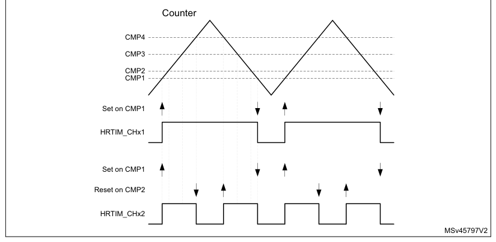

Counter

CMP4

CMP3

CMP2 CMP1

Set on CMP1

HRTIM_CHx1

Set on CMP1

Reset on CMP2

HRTIM_CHx2

MSv45797V2

The Figure 233 below shows how to generate some more complex waveforms, using the 4 available
compare units and the toggle mode.

**Figure 233. Complex symmetric waveform in up-down counting mode**

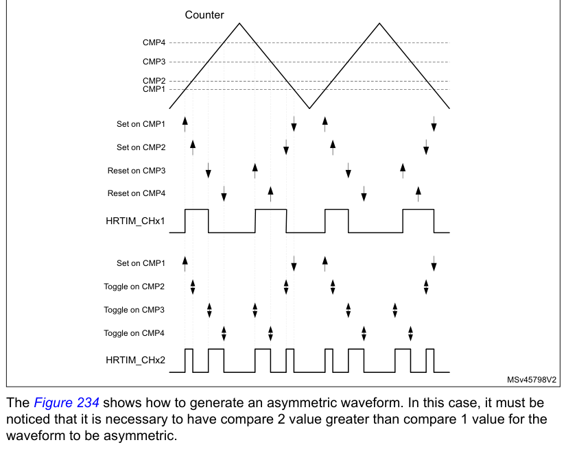

Counter

CMP4

CMP3

CMP2 CMP1

Set on CMP1

Set on CMP2

Reset on CMP3

Reset on CMP4

HRTIM_CHx1

Set on CMP1

Toggle on CMP2

Toggle on CMP3

Toggle on CMP4

HRTIM_CHx2

MSv45798V2

The Figure 234 shows how to generate an asymmetric waveform. In this case, it must be noticed that
it is necessary to have compare 2 value greater than compare 1 value for the waveform to be
asymmetric.

**Figure 234. Asymmetric waveform in up-down counting mode**

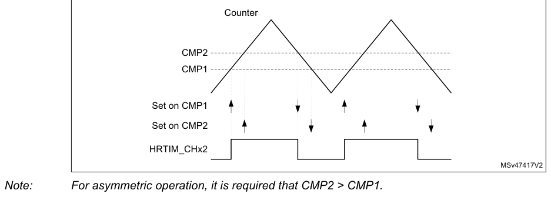

Counter

CMP2

CMP1

Set on CMP1

Set on CMP2

HRTIM_CHx2

MSv47417V2

> **Note:** For asymmetric operation, it is required that CMP2 > CMP1.

The behavior of the software forcing bits and external events EXTEVNT1..10 is identical for up-only
and up-down counting mode. The Figure 235 below shows how a pulse can be shorten in response to
external events.

**Figure 235. External event management in up-down counting mode**

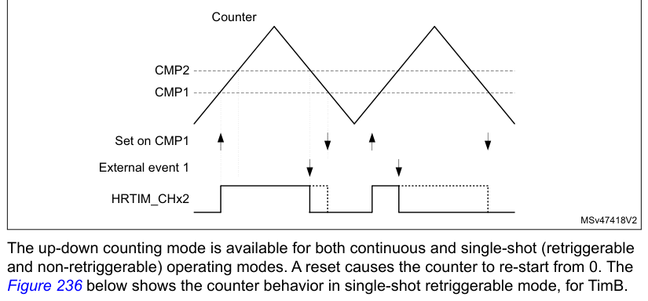

Counter

CMP2

CMP1

Set on CMP1

External event 1

HRTIM_CHx2

MSv47418V2

The up-down counting mode is available for both continuous and single-shot (retriggerable and
non-retriggerable) operating modes. A reset causes the counter to re-start from 0. The Figure 236
below shows the counter behavior in single-shot retriggerable mode, for TimB.

**Figure 236. Interleaved up-down counter operation**

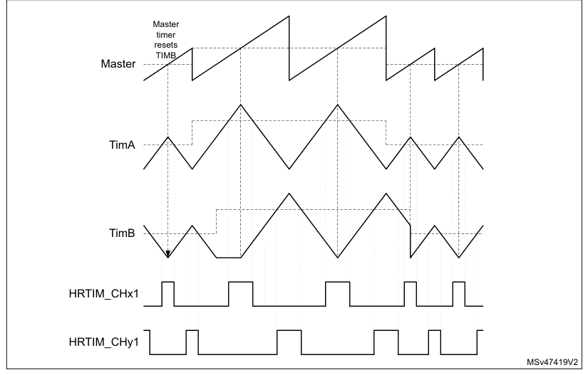

Master
timer resets TIMB

Master

TimA

TimB

HRTIM_CHx1

HRTIM_CHy1

MSv47419V2

**Figure 237. Interleaved up-down counter operation**

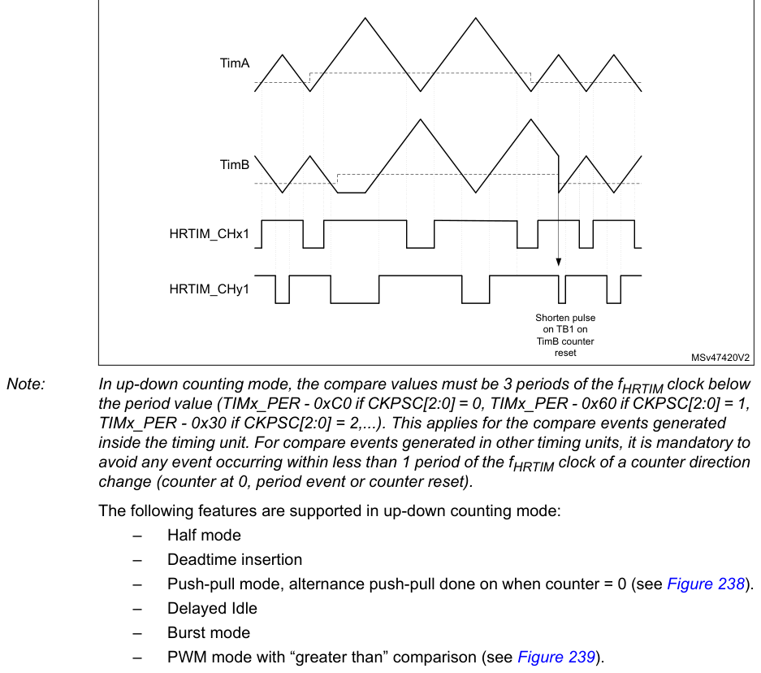

TimA

TimB

HRTIM_CHx1

HRTIM_CHy1

Shorten pulse
on TB1 on

TimB counter
reset

MSv47420V2

> **Note:** In up-down counting mode, the compare values must be 3 periods of the fHRTIM clock below
> the period value (TIMx_PER - 0xC0 if CKPSC[2:0] = 0, TIMx_PER - 0x60 if CKPSC[2:0] = 1, TIMx_PER -
0x30 if CKPSC[2:0] = 2,...). This applies for the compare events generated inside the timing unit.
For compare events generated in other timing units, it is mandatory to avoid any event occurring
within less than 1 period of the fHRTIM clock of a counter direction change (counter at 0, period
event or counter reset).

The following features are supported in up-down counting mode:

- Half mode
- Deadtime insertion
- Push-pull mode, alternance push-pull done on when counter = 0 (see Figure 238).
- Delayed Idle
- Burst mode
- PWM mode with “greater than” comparison (see Figure 239).

**Figure 238. Push-pull up-down mode example**

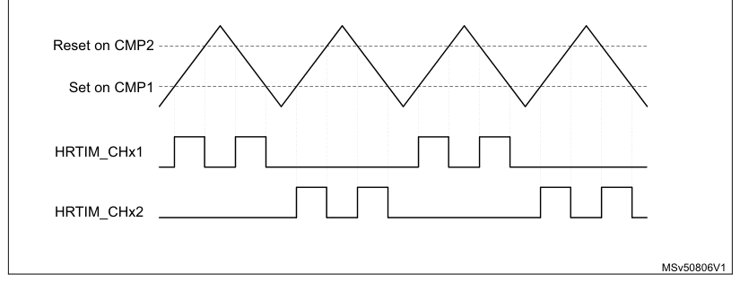

Reset on CMP2

Set on CMP1

HRTIM_CHx1

HRTIM_CHx2

MSv50806V1

**Figure 239. Up-down mode with “greater than” comparison**

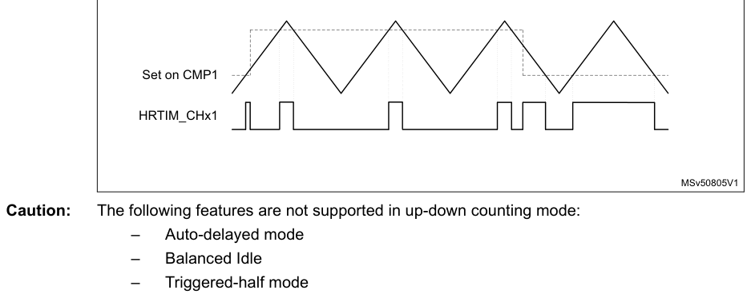

Set on CMP1

HRTIM_CHx1

MSv50805V1

> **Caution:** The following features are not supported in up-down counting mode:

- Auto-delayed mode
- Balanced Idle
- Triggered-half mode

The capture function is supported with the following differences:

- the capture value is referred to counting start, when up-counting
- the capture value is referred to the PER event when down counting
- the bit 16 of the capture register holds the counting direction status

The counter roll-over event is defined differently in-up-down counting mode to support various
operating condition. It can be either generated:

- when the counter is equal to 0 (“valley” mode)
- when the counter reaches the period value set in the HRTIM_PERxR (“crest” mode)
- when both conditions are met (either 0 or HRTIM_PERxR value)

This event is used for multiple purposes in the HRTIM. The generation mode (valley, crest or both)
can be programmed individually depending on the destination. Table 238 summarizes the use cases and
associated roll-over mode (xxROM[1:0]) programming bits in the HRTIM_TIMxCR2 register.

**Table 238. Roll-over event destination and mode programming**

| Roll-over event use | Programming bits |
| --- | --- |
| Output set/reset | OUTROM[1:0] |
| Register content update trigger (transfer from preload to active) | ROM[1:0] |
| IRQ and/or DMA request trigger | ROM[1:0] |
| Burst mode clock source and /or burst start trigger | BMROM[1:0] |
| ADC trigger (see Section: ADC post-scaler for details) | ADROM[1:0] |
| External event filtering | ROM[1:0] |
| Repetition counter decrement | ROM[1:0] |
| Fault and event counter | FEROM[1:0] |

> **Note:** For events where both reset and roll-over are considered (IRQ/DMA and TxRSTU), the

ROM[1:0] only influences the roll-over generation. The reset event is always taken into account
whatever the ROM[1:0] value.

The roll-over event generation is defined as per following xxROM[1:0] bitfield setting:

- xxROM[1:0] = 00: event generated when both conditions are met (either 0 or HRTIM_PERxR value)
- xxROM[1:0] = 01: event generated when the counter is equal to 0 (“valley” mode) or when the
  counter is reset
- xxROM[1:0] = 10: event generated when the counter reaches the period value set in the HRTIM_PERxR
  (“crest” mode)

Figure 240 here-below shows a push-pull up-down mode with set on period event and OUTROM[1:0] =10.

**Figure 240. Up-down mode with output set on period event, for OUTROM[1:0]=10**

![Figure 240: Up-down mode with output set on period event, for OUTROM\[1:0\]=10](../STM32G4_RM0440_figures/figure-0240.png)

Set on Period

Reset on CMP2

Set on CMP1

HRTIM_CHx1

HRTIM_CHx2

MSv50807V1

Figure 241 below shows how the repetition counter is decremented in up-down counting mode.

**Figure 241. Repetition counter behavior in up-down counting mode**

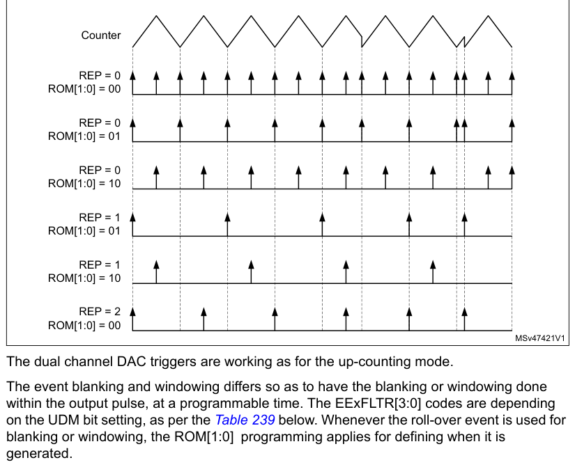

Counter

REP = 0

ROM[1:0] = 00

REP = 0

ROM[1:0] = 01

REP = 0

ROM[1:0] = 10

REP = 1

ROM[1:0] = 01

REP = 1

ROM[1:0] = 10

REP = 2

ROM[1:0] = 00

MSv47421V1

The dual channel DAC triggers are working as for the up-counting mode.

The event blanking and windowing differs so as to have the blanking or windowing done within the
output pulse, at a programmable time. The EExFLTR[3:0] codes are depending on the UDM bit setting,
as per the Table 239 below. Whenever the roll-over event is used for blanking or windowing, the
ROM[1:0] programming applies for defining when it is generated.

**Table 239. EExFLTR[3:0] codes depending on UDM bit setting**

| Source row | Column 1 | Column 2 | Column 3 |
| ---: | --- | --- | --- |
| 1 | `Up-counting mode` | `Up/down-counting mode` |  |
| 2 | `EE1FLTR[3:0]` |  |  |
| 3 | `(UDM = 0)` | `(UDM = 1)` |  |
| 4 | `Blanking from counter reset/roll-over to` | `Blanking from compare 1 to compare 2,` |  |
| 5 | `0010` |  |  |
| 6 | `compare 2` | `only during the up-counting phase` |  |
| 7 | `Blanking from counter reset/roll-over to` | `Blanking from compare 3 to compare 4,` |  |
| 8 | `0100` |  |  |
| 9 | `compare 4` | `only during the up-counting phase` |  |
| 10 | `Windowing from counter reset/roll-over` | `Windowing from compare 2 to compare` |  |
| 11 | `1101` |  |  |
| 12 | `to compare 2` | `3, only during the up-counting phase` |  |
| 13 | `Windowing from counter reset/roll-over` | `Windowing from compare 2 to compare` |  |
| 14 | `1110` |  |  |
| 15 | `to compare 3` | `3, only during the down-counting phase` |  |
| 16 | `Windowing from another timing unit:` | `Windowing from compare 2 during the` |  |
| 17 | `1111` | `TIMWIN source (see Table 243 for` | `up-counting phase to compare 3 during` |
| 18 | `details)` | `the down-counting phase` |  |

### 28.3.7 Set / reset events priorities and narrow pulses management

This section describes how the output waveform is generated when several set and/or reset requests
are occurring within 3 consecutive tHRTIM periods.

Case 1: clock prescaler CKPSC[2:0] \< 5

An arbitration is performed during each tHRTIM period, in 3 steps:

1. For each active event, the desired output transition is determined (set, reset or toggle).
2. A predefined arbitration is performed among the active events (from highest to lowest
   priority CMP4 → CMP3 → CMP2 → CMP1 → PER, see Section: Concurrent set requests/ Concurrent reset
   requests).
3. A high-resolution delay-based arbitration is performed with reset having the highest
   priority, among the low-resolution events and events having won the predefined arbitration.

When set and reset requests from two different sources are simultaneous, the reset action has the
highest priority. If the interval between set and reset requests is below 2 fHRTIM period, the
behavior depends on the time interval and on the alignment with the fHRTIM clock, as shown on Figure
242.

> **Note:** If the set and reset requests are simultaneous and coming from the same timing unit, the

CMPx priority applies, as shown in step 2 here-above. For instance, taking CMP2 = CMP4:

- If CMP2 does a set and CMP4 a reset, the output is reset.
- If CMP2 does a reset and CMP4 a set, the output is set.

**Figure 242. Short distance set/reset management for narrow pulse generation**

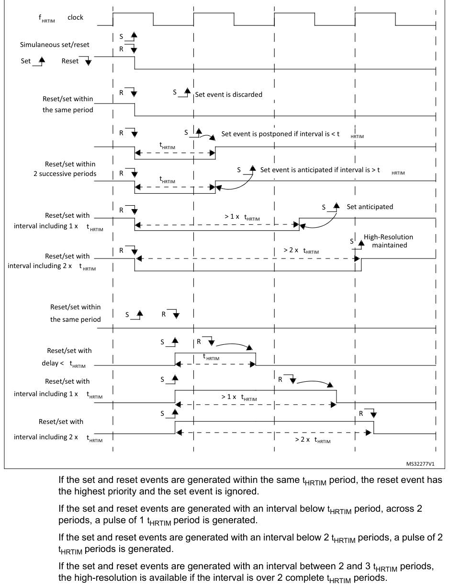

fHRTIM clock

S

Simulaneous set/reset

R

Set Reset

> 1 x tHRTIM

> 2 x tHRTIM

MS32277V1

If the set and reset events are generated within the same tHRTIM period, the reset event has the
highest priority and the set event is ignored.

If the set and reset events are generated with an interval below tHRTIM period, across 2 periods, a
pulse of 1 tHRTIM period is generated.

If the set and reset events are generated with an interval below 2 tHRTIM periods, a pulse of 2
tHRTIM periods is generated.

If the set and reset events are generated with an interval between 2 and 3 tHRTIM periods, the
high-resolution is available if the interval is over 2 complete tHRTIM periods.

If the set and reset events are generated with an interval above 3 tHRTIM periods, the
high-resolution is always available.

Concurrent set requests/ Concurrent reset requests

When multiple sources are selected for a set event, an arbitration is performed when the set
requests occur within the same fHRTIM clock period.

In case of multiple requests from adjacent timers (TIMEVNT1..9), the request which occurs first is
taken into account. The arbitration is done in 2 steps, depending on:

1. the source (CMP4 → CMP3 → CMP2 → CMP1),
2. the delay.

If multiple requests from the master timer occur within the same fHRTIM clock period, a predefined
arbitration is applied and a single request is taken into account, whatever the effective
high-resolution setting (from the highest to the lowest priority):

MSTCMP4 → MSTCMP3 → MSTCMP2 → MSTCMP1 → MSTCMPER

> **Note:** It is advised to avoid generating multiple set (reset) requests from the master timer to a
> given timer with an interval below 3x tHRTIM to maintain the high-resolution.

When multiple requests internal to the timer occur within the same fHRTIM clock period, a predefined
arbitration is applied and the requests are taken with the following priority, whatever the
effective timing (from highest to lowest):

CMP4 → CMP3 → CMP2 → CMP1 → PER

> **Note:** Practically, this is of a primary importance when multiple compare events can be
> simultaneously generated or when using auto-delayed compare 2 and compare 4 simultaneously (i.e.
> when the effective set/reset cannot be determined a priori because it is related to an external
> event). In this case, the highest priority signal must be affected to the CMP4 event.

Last, the highest priority is given to low-resolution events: EXTEVNT1..10, RESYNC (coming from SYNC
event if SYNCRSTx or SYNCSTRTx is set or from a software reset), update and software set (SST). The
update event is considered as having the largest delay (0x1F if PSC = 0).

As a summary, in case of a close vicinity (events occurring within the same fHRTIM clock period),
the effective set (reset) event is arbitrated between:

- Any TIMEVNT1..9 event
- A single source from the master (as per the fixed arbitration given above)
- A single source from the timer
- The “low-resolution events”.

The same arbitration principle applies for concurrent reset requests. In this case, the reset
request has the highest priority.

Case 2: clock prescaler CKPSC[2:0] ≥ 5

The narrow pulse management is simplified when the high-resolution is not effective.

A set or reset event occurring within the prescaler clock cycle is delayed to the next active edge
of the prescaled clock (as for a counter reset), even if the arbitration is still performed every
tHRTIM cycle.

If a reset event is followed by a set event within the same prescaler clock cycle, the latest event
is considered.

### 28.3.8 External events global conditioning

The HRTIM timer can handle events not generated within the timer, referred to as “external event”.
These external events come from multiple sources, either on-chip or off-chip:

- built-in comparators,
- digital input pins (typically connected to off-chip comparators and zero-crossing detectors),
- on-chip events for other peripheral (ADC’s analog watchdogs and general purpose timer trigger
  outputs).

The external events conditioning circuitry allows to select the signal source for a given channel
(with a 4:1 multiplexer) and to convert it into an information that can be processed by the crossbar
unit (for instance, to have an output reset triggered by a falling edge detection on an external
event channel).

Up to 10 external event channels can be conditioned and are available simultaneously for any of the
6 timers. This conditioning is common to all timers, since this is usually dictated by external
components (such as a zero-crossing detector) and environmental conditions (typically the filter
set-up is related to the applications noise level and signature). Figure 243 presents an overview of
the conditioning logic for a single channel.

**Figure 243. External event conditioning overview (1 channel represented)**

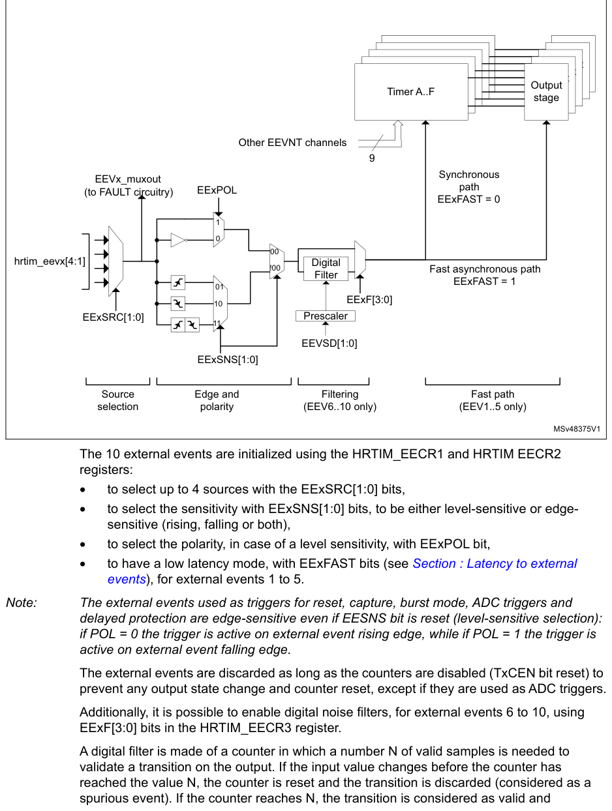

- to select up to 4 sources with the EExSRC[1:0] bits,
- to select the sensitivity with EExSNS[1:0] bits, to be either level-sensitive or edge-sensitive
  (rising, falling or both),
- to select the polarity, in case of a level sensitivity, with EExPOL bit,
- to have a low latency mode, with EExFAST bits (see Section: Latency to external events), for
  external events 1 to 5.

> **Note:** The external events used as triggers for reset, capture, burst mode, ADC triggers and
> delayed protection are edge-sensitive even if EESNS bit is reset (level-sensitive selection): if POL
= 0 the trigger is active on external event rising edge, while if POL = 1 the trigger is active on
external event falling edge.

The external events are discarded as long as the counters are disabled (TxCEN bit reset) to prevent
any output state change and counter reset, except if they are used as ADC triggers.

Additionally, it is possible to enable digital noise filters, for external events 6 to 10, using
EExF[3:0] bits in the HRTIM_EECR3 register.

A digital filter is made of a counter in which a number N of valid samples is needed to validate a
transition on the output. If the input value changes before the counter has reached the value N, the
counter is reset and the transition is discarded (considered as a spurious event). If the counter
reaches N, the transition is considered as valid and
transmitted as a correct external event. Consequently, the digital filter adds a latency to the
external events being filtered, depending on the sampling clock and on the filter length (number of
valid samples expected).

The sampling clock is either the fHRTIM clock or a specific prescaled clock fEEVS derived from
fHRTIM, defined with EEVSD[1:0] bits in HRTIM_EECR3 register.

Table 240 summarizes the available features associated with each of the 10 external events channels.
The features and sources are summarized in Table 223.

**Table 240. External events features**

| Source row | Column 1 | Column 2 | Column 3 | Column 4 | Column 5 |
| ---: | --- | --- | --- | --- | --- |
| 1 | `External event` | `Balanced fault` | `Balanced fault` |  |  |
| 2 | `Fast mode` | `Digital filter` |  |  |  |
| 3 | `channel` | `timer A,B,C` | `timer D,E,F` |  |  |
| 4 | `hrtim_eev1[4:1]` | `Yes` | `-` | `-` | `-` |
| 5 | `hrtim_eev2[4:1]` | `Yes` | `-` | `-` | `-` |
| 6 | `hrtim_eev3[4:1]` | `Yes` | `-` | `-` | `-` |
| 7 | `hrtim_eev4[4:1]` | `Yes` | `-` | `-` | `-` |
| 8 | `hrtim_eev5[4:1]` | `Yes` | `-` | `-` | `-` |
| 9 | `hrtim_eev6[4:1]` | `-` | `Yes` | `Yes` | `-` |
| 10 | `hrtim_eev7[4:1]` | `-` | `Yes` | `Yes` | `-` |
| 11 | `hrtim_eev8[4:1]` | `-` | `Yes` | `-` | `Yes` |
| 12 | `hrtim_eev9[4:1]` | `-` | `Yes` | `-` | `Yes` |
| 13 | `hrtim_eev10[4:1]` | `-` | `Yes` | `-` | `-` |

#### Latency to external events

The external event conditioning gives the possibility to adjust the external event processing time
(and associated latency) depending on performance expectations:

- A regular operating mode, in which the external event is resampled with the clock before acting on
  the output crossbar. This adds some latency but gives access to all crossbar functionalities. It
  enables the generation of an externally triggered high-resolution pulse.
- A fast operating mode, in which the latency between the external event and the action on the
  output is minimized. This mode is convenient for ultra-fast over-current protections, for
  instance.

EExFAST bits in the HRTIM_EECR1 register allow to define the operating for channels 1 to

5. This influences the latency and the jitter present on the output pulses, as summarized in the
   table below.

**Table 241. Output set/reset latency and jitter versus external event operating mode**

| Source row | Column 1 | Column 2 | Column 3 |
| ---: | --- | --- | --- |
| 1 | `Response time` | `Jitter on output pulse` |  |
| 2 | `EExFAST` | `Response time jitter` |  |
| 3 | `latency` | `(counter reset by ext. event)` |  |
| 4 | `5 to 6 cycles of fHRTIM` | `1 cycles of fHRTIM` | `No jitter, pulse width maintained with` |
| 5 | `0` |  |  |
| 6 | `clock` | `clock` | `high-resolution` |
| 7 | `Minimal latency` |  |  |
| 8 | `(depends whether the` | `1 cycle of fHRTIM clock jitter pulse width` |  |
| 9 | `1` | `Minimal jitter` |  |
| 10 | `comparator or digital` | `resolution down to tHRTIM` |  |
| 11 | `input is used)` |  |  |

The EExFAST mode is only available with level-sensitive programming (EExSNS[1:0] = 00); the
edge-sensitivity cannot be programmed.

It is possible to apply event filtering to external events (both blanking and windowing with
EExFLTR[3:0]!= 0000, see [Section 28.3.9](#2839-external-event-filtering-in-timing-units)). In this case, EExLTCHx bit must be reset: the postponed
mode is not supported, neither the windowing timeout feature.

> **Note:** The external event configuration (source and polarity) must not be modified once the related

EExFAST bit is set.

A fast external event cannot be used to toggle an output: if must be enabled either in HRTIM_SETxyR
or HRTIM_RSTxyR registers, not in both.

When a set and a reset event - from 2 independent fast external events - occur simultaneously, the
reset has the highest priority in the crossbar and the output becomes inactive.

When EExFAST bit is set, the output cannot be changed during the 11 fHRTIM clock periods following
the external event.

Figure 244 and Figure 245 give practical examples of the reaction time to external events, for
output set/reset and counter reset.

**Figure 244. Latency to external events (counter reset and output set)**

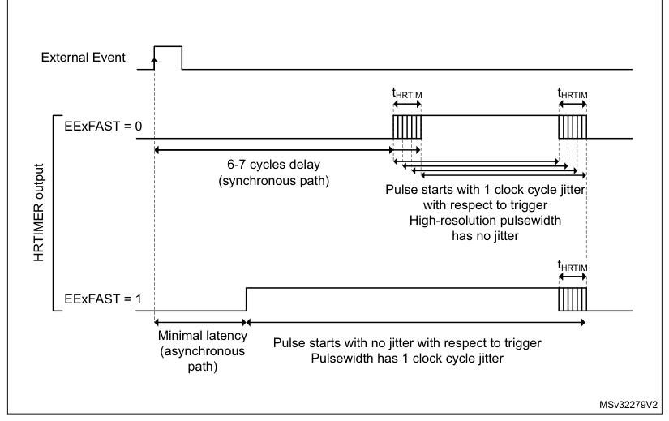

**Figure 245. Latency to external events (output reset on external event)**

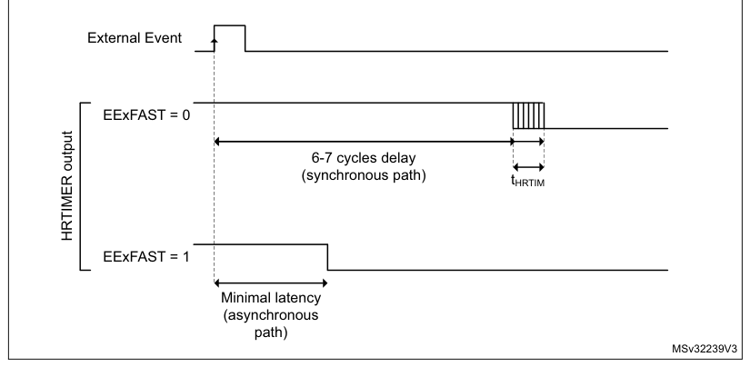

External Event

EExFAST = 0

6-7 cycles delay

(synchronous path)
tHRTIM

HRTIMER output

EExFAST = 1

Minimal latency (asynchronous
path)

MSv32239V3

### 28.3.9 External event filtering in timing units

Once conditioned, the 10 external events are available for all timing units.

They can be used directly and are active as soon as the timing unit counter is enabled (TxCEN bit
set).

They can also be filtered to have an action limited in time, usually related to the counting period.
Two operations can be performed:

- blanking, to mask external events during a defined time period,
- windowing, to enable external events only during a defined time period.

These modes are enabled using HRTIM_EExFLTR[3:0] bits in the HRTIM_EEFxR1 and HRTIM_EEFxR2
registers. Each of the 6 timer A..F timing units has its own programmable filter settings for the 10
external events.

#### Blanking mode

In event blanking mode (see Figure 246), the external event is ignored if it happens during a given
blanking period. This is convenient, for instance, to avoid a current limit to trip on switching
noise at the beginning of a PWM period. This mode is active for EExFLTR[3:0] bitfield values ranging
from 0001 to 1100.

**Figure 246. Event blanking mode**

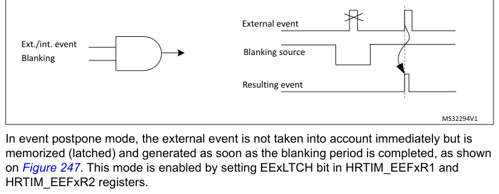

External event

Ext./int. event

Blanking source

Blanking

Resulting event

MS32294V1

In event postpone mode, the external event is not taken into account immediately but is memorized
(latched) and generated as soon as the blanking period is completed, as shown on Figure 247. This
mode is enabled by setting EExLTCH bit in HRTIM_EEFxR1 and HRTIM_EEFxR2 registers.

**Figure 247. Event postpone mode**

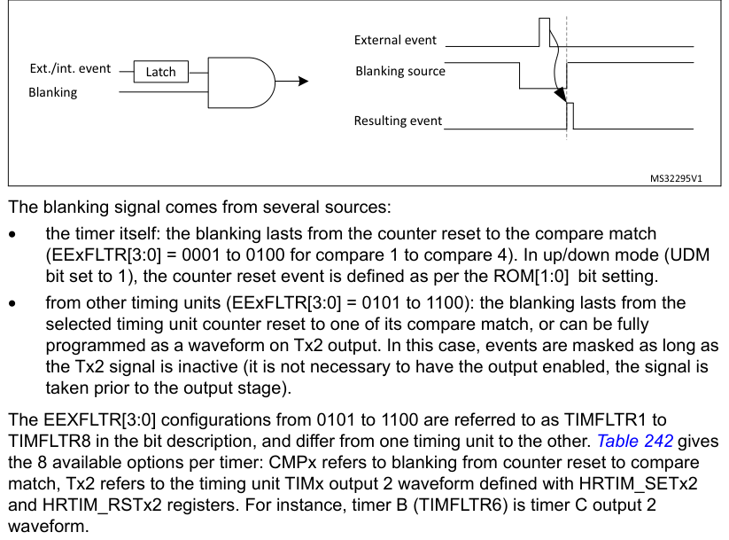

- the timer itself: the blanking lasts from the counter reset to the compare match (EExFLTR[3:0] =
  0001 to 0100 for compare 1 to compare 4). In up/down mode (UDM bit set to 1), the counter reset
  event is defined as per the ROM[1:0] bit setting.
- from other timing units (EExFLTR[3:0] = 0101 to 1100): the blanking lasts from the selected timing
  unit counter reset to one of its compare match, or can be fully programmed as a waveform on Tx2
  output. In this case, events are masked as long as the Tx2 signal is inactive (it is not necessary
  to have the output enabled, the signal is taken prior to the output stage).

The EEXFLTR[3:0] configurations from 0101 to 1100 are referred to as TIMFLTR1 to TIMFLTR8 in the bit
description, and differ from one timing unit to the other. Table 242 gives the 8 available options
per timer: CMPx refers to blanking from counter reset to compare match, Tx2 refers to the timing
unit TIMx output 2 waveform defined with HRTIM_SETx2 and HRTIM_RSTx2 registers. For instance, timer
B (TIMFLTR6) is timer C output 2 waveform.

**Table 242. Filtering signals mapping per timer**

| Source row | Extracted cells |
| ---: | --- |
| 1 | `Timer A` · `Timer B` · `Timer C` · `Timer D` · `Timer E` · `Timer F` |
| 2 | `Source` |
| 3 | `TA2` · `TB2` · `TC2` · `TD2` · `TE2` · `TF2` |
| 4 | `CMP1` · `CMP2` · `CMP4` · `CMP1` · `CMP2` · `CMP4` · `CMP1` · `CMP2` · `CMP4` · `CMP1` · `CMP2` · `CMP4` · `CMP1` · `CMP2` · `CMP4` · `CMP1` · `CMP2` · `CMP4` |
| 5 | `Timer A` · `-` · `1` · `-` · `2` · `3` · `4` · `-` · `5` · `-` · `7` · `-` · `-` · `-` · `-` · `8` · `-` · `-` · `6` · `-` · `-` · `-` |
| 6 | `Timer B` · `1` · `-` · `2` · `3` · `-` · `4` · `5` · `-` · `-` · `-` · `7` · `-` · `-` · `8` · `-` · `-` · `-` · `-` · `6` · `-` · `-` |
| 7 | `Timer C` · `-` · `1` · `-` · `-` · `2` · `-` · `3` · `-` · `-` · `5` · `-` · `6` · `7` · `-` · `-` · `8` · `-` · `4` · `-` · `-` · `-` |
| 8 | `Timer D` · `1` · `-` · `-` · `-` · `-` · `2` · `-` · `-` · `3` · `4` · `-` · `5` · `-` · `6` · `-` · `7` · `-` · `-` · `-` · `8` · `-` |
| 9 | `Destination` |
| 10 | `Timer E` · `-` · `1` · `-` · `-` · `2` · `-` · `-` · `-` · `3` · `-` · `-` · `-` · `6` · `-` · `7` · `8` · `-` · `-` · `-` · `4` · `5` |
| 11 | `Timer F` · `-` · `-` · `1` · `-` · `-` · `2` · `-` · `-` · `-` · `-` · `3` · `-` · `-` · `4` · `5` · `-` · `6` · `-` · `7` · `8` · `-` |

Figure 248 and Figure 249 give an example of external event blanking for all edge and level
sensitivities, in regular and postponed modes.

**Figure 248. External trigger blanking with edge-sensitive trigger**

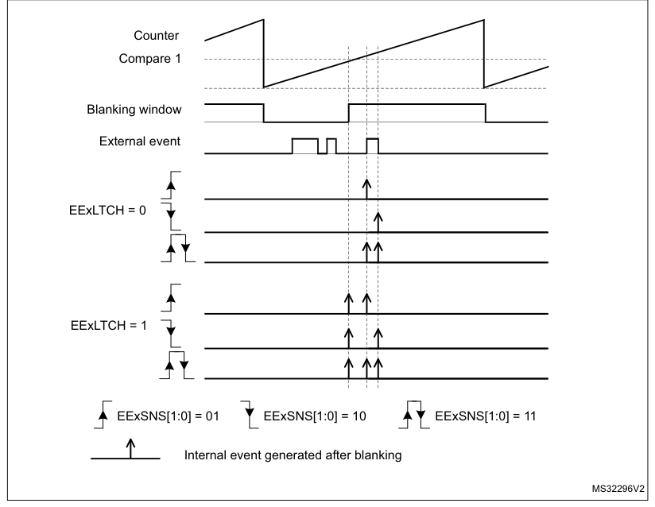

Counter

Compare 1

Blanking window

External event

EExLTCH = 0

EExLTCH = 1

**Figure 249. External trigger blanking, level sensitive triggering**

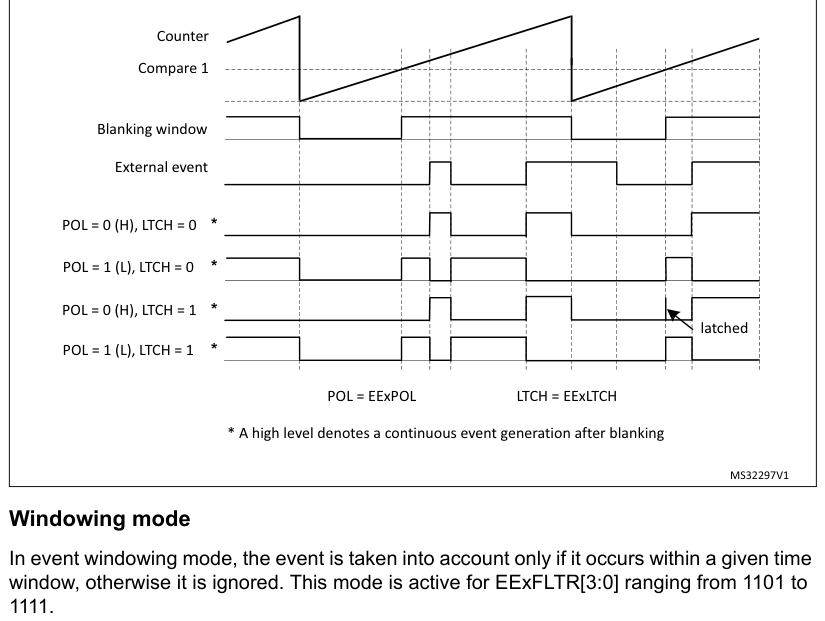

#### Windowing mode

In event windowing mode, the event is taken into account only if it occurs within a given time
window, otherwise it is ignored. This mode is active for EExFLTR[3:0] ranging from 1101 to 1111.

**Figure 250. Event windowing mode**

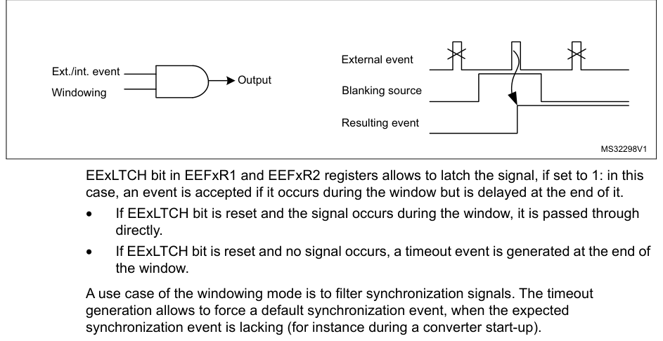

EExLTCH bit in EEFxR1 and EEFxR2 registers allows to latch the signal, if set to 1: in this case, an
event is accepted if it occurs during the window but is delayed at the end of it.

- If EExLTCH bit is reset and the signal occurs during the window, it is passed through directly.
- If EExLTCH bit is reset and no signal occurs, a timeout event is generated at the end of the
  window.

A use case of the windowing mode is to filter synchronization signals. The timeout generation allows
to force a default synchronization event, when the expected synchronization event is lacking (for
instance during a converter start-up).

There are 3 sources for each external event windowing, coded as follows:

- 1101 and 1110: the windowing lasts from the counter reset to the compare match (respectively
  compare 2 and compare 3). In up/down mode (UDM bit set to 1), the counter reset event is defined
  as per the ROM[1:0] bit setting.
- 1111: the windowing is related to another timing unit and lasts from its counter reset to its
  compare 2 match. The source is described as TIMWIN in the bit description and is given in Table
  243. As an example, the external events in timer B can be filtered by a window starting from timer
  A counter reset to timer A compare 2.

**Table 243. Windowing signals mapping per timer (EEFLTR[3:0] = 1111)**

| Source row | Column 1 | Column 2 | Column 3 | Column 4 | Column 5 | Column 6 | Column 7 |
| ---: | --- | --- | --- | --- | --- | --- | --- |
| 1 | `Destination` | `Timer A` | `Timer B` | `Timer C` | `Timer D` | `Timer E` | `Timer F` |
| 2 | `Timer B` | `Timer A` | `Timer D` | `Timer C` | `Timer F` | `Timer E` |  |
| 3 | `TIMWIN (source)` |  |  |  |  |  |  |
| 4 | `CMP2` | `CMP2` | `CMP2` | `CMP2` | `CMP2` | `CMP2` |  |

> **Note:** The timeout event generation is not supported if the external event is programmed in fast
> mode.

Figure 251 and Figure 252 present how the events are generated for the various edge and level
sensitivities, as well as depending on EExLTCH bit setting. Timeout events are specifically
mentioned for clarity reasons.

**Figure 251. External trigger windowing with edge-sensitive trigger**

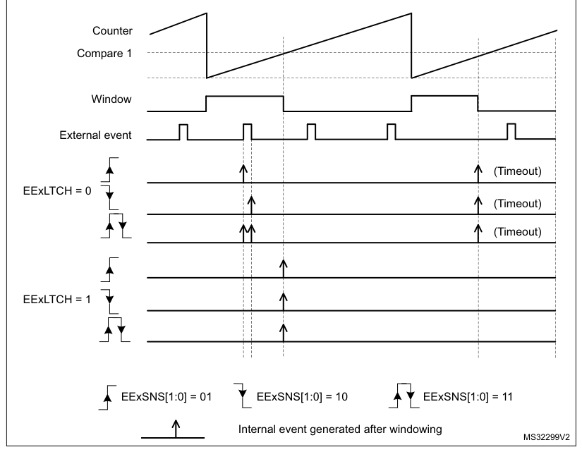

Counter

Compare 1

Window

External event

(Timeout)

EExLTCH = 0

(Timeout)

(Timeout)

EExLTCH = 1

**Figure 252. External trigger windowing, level sensitive triggering**

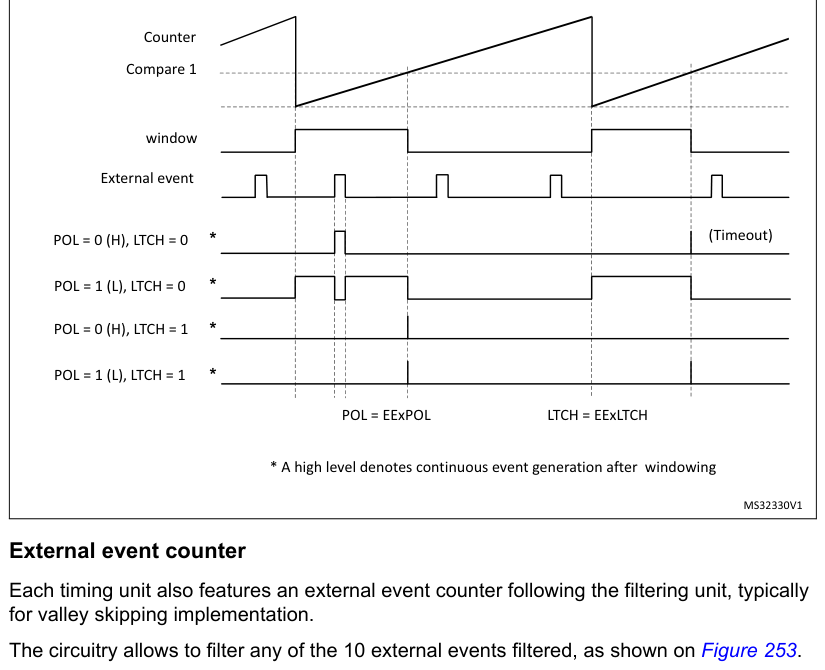

#### External event counter

Each timing unit also features an external event counter following the filtering unit, typically for
valley skipping implementation.

The circuitry allows to filter any of the 10 external events filtered, as shown on Figure 253.

**Figure 253. External event counter – channel A**

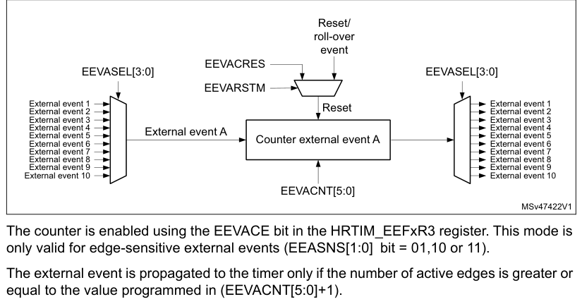

The counter is enabled using the EEVACE bit in the HRTIM_EEFxR3 register. This mode is only valid
for edge-sensitive external events (EEASNS[1:0] bit = 01,10 or 11).

The external event is propagated to the timer only if the number of active edges is greater or equal
to the value programmed in (EEVACNT[5:0]+1).

Two operating modes are available:

- when the EEVARSTM bit is reset, the external event counter is reset on each reset/roll-over event:
  the external event is active only if it appears several times within a given PWM period
- when the EEVARSTM/ bit is set, the external event counter is reset only if the event did not on
  appear during the last PWM period. This a cumulative mode, where the event must occur at least
  once during multiple PWM period, as shown on Figure 254 below.

The external event counter must be enabled after having programmed the counter value (the EEVACE bit
must be set after having written the EEVACNT[5:0] bits).

Once the counter is enabled, the EEVACNT[5:0] bits can then be changed on-the-fly at any time. The
new value is taken into account on the following reset/rollover event as per the EEVARSTM bit
programming, or after a software reset (EEVACRES bit set).

The EEVASEL[3:0]bits must not be modified once the EEVACE bit is set.

**Figure 254. External event counter cumulative mode (EEVxRSTM = 1, EEVxCNT = 2)**

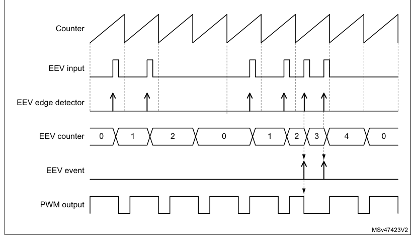

### 28.3.10 Delayed protection

The HRTIM features specific protection schemes, typically for resonant converters when it is
necessary to shut down the PWM outputs in a delayed manner, either once the active pulse is
completed or once a push-pull period is completed. These features are enabled with DLYPRTEN bit in
the HRTIM_OUTxR register, and are using specific external event channels.

#### Delayed idle

In this mode, the active pulse is completed before the protection is activated. The selected
external event causes the output to enter in idle mode at the end of the active pulse (defined by an
output reset event in HRTIM_RSTx1R or HRTIM_RSTx2R).

Once the protection is triggered, the idle mode is permanently maintained but the counter continues
to run, until the output is re-enabled. Tx1OEN and Tx2OEN bits are not affected
by the delayed idle entry. To exit from delayed idle and resume operation, it is necessary to
overwrite Tx1OEN and Tx2OEN bits to 1. The output state changes on the first transition to an active
state following the output enable command.

> **Note:** The delayed idle mode cannot be exited immediately after having been entered, before the
> active pulse is completed: it is mandatory to make sure that the outputs are in idle state before
> resuming the run mode. This can be done by waiting up to the next period, for instance, or by
> polling the O1CPY and/or O2CPY status bits in the TIMxISR register.

The delayed idle mode can be applied to a single output (DLYPRT[2:0] = x00 or x01) or to both
outputs (DLYPRT[2:0] = x10).

An interrupt or a DMA request can be generated in response to a Delayed Idle mode entry. The DLYPRT
flag in HRTIM_TIMxISR is set as soon as the external event arrives, independently from the end of
the active pulse on output.

When the Delayed Idle mode is triggered, the output states can be determined using O1STAT and O2STAT
in HRTIM_TIMxISR. Both status bits are updated even if the delayed idle is applied to a single
output. When the push-pull mode is enabled, the IPPSTAT flag in HRTIM_TIMxISR indicates during which
period the delayed protection request occurred.

This mode is available whatever the timer operating mode (regular, push-pull, deadtime). It is
available with 2 external events only:

- hrtim_eev6 and hrtim_eev7 for timer A, B and C
- hrtim_eev8 and hrtim_eev9 for timer D, E and F

The delayed protection mode can be triggered only when the counter is enabled (TxCEN bit set). It
remains active even if the TxEN bit is reset, until the TxyOEN bits are set.

**Figure 255. Delayed Idle mode entry**

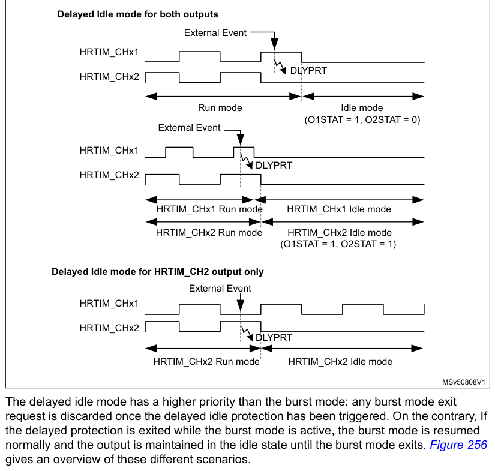

Delayed Idle mode for both outputs

External Event

HRTIM_CHx1

DLYPRT

HRTIM_CHx2

The delayed idle mode has a higher priority than the burst mode: any burst mode exit request is
discarded once the delayed idle protection has been triggered. On the contrary, If the delayed
protection is exited while the burst mode is active, the burst mode is resumed normally and the
output is maintained in the idle state until the burst mode exits. Figure 256 gives an overview of
these different scenarios.

**Figure 256. Burst mode and delayed protection priorities (DIDL = 0)**

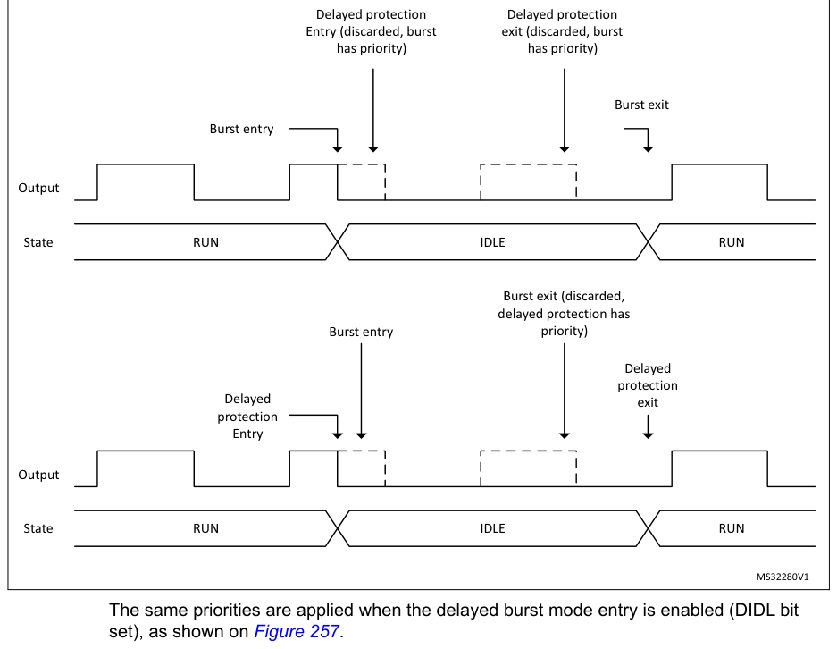

The same priorities are applied when the delayed burst mode entry is enabled (DIDL bit set), as
shown on Figure 257.

**Figure 257. Burst mode and delayed protection priorities (DIDL = 1)**

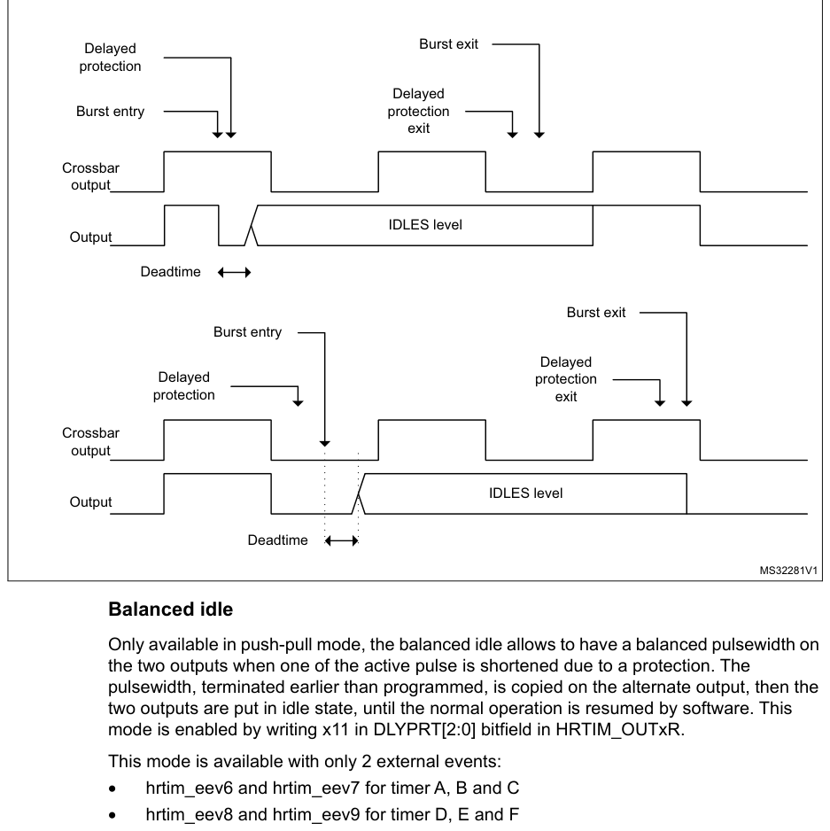

#### Balanced idle

Only available in push-pull mode, the balanced idle allows to have a balanced pulsewidth on the two
outputs when one of the active pulse is shortened due to a protection. The pulsewidth, terminated
earlier than programmed, is copied on the alternate output, then the two outputs are put in idle
state, until the normal operation is resumed by software. This mode is enabled by writing x11 in
DLYPRT[2:0] bitfield in HRTIM_OUTxR.

This mode is available with only 2 external events:

- hrtim_eev6 and hrtim_eev7 for timer A, B and C
- hrtim_eev8 and hrtim_eev9 for timer D, E and F

**Figure 258. Balanced Idle protection example**

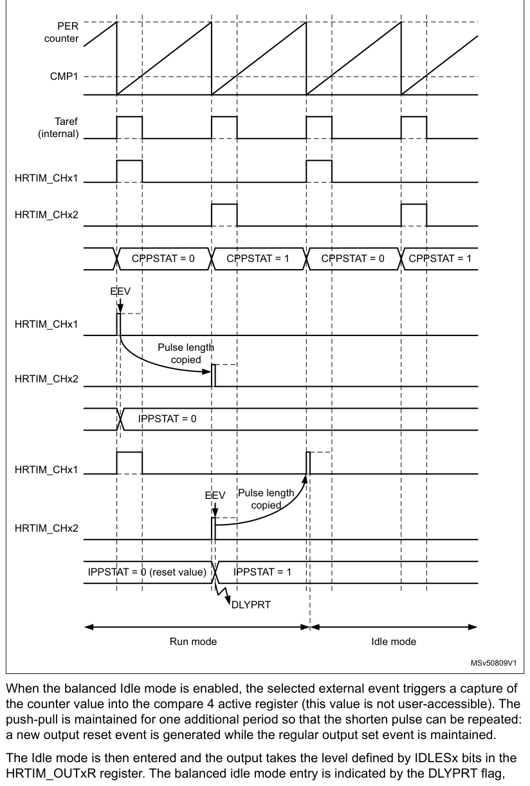

PER
counter

CMP1

Taref

(internal)

HRTIM_CHx1

HRTIM_CHx2

When the balanced Idle mode is enabled, the selected external event triggers a capture of the
counter value into the compare 4 active register (this value is not user-accessible). The push-pull
is maintained for one additional period so that the shorten pulse can be repeated: a new output
reset event is generated while the regular output set event is maintained.

The Idle mode is then entered and the output takes the level defined by IDLESx bits in the
HRTIM_OUTxR register. The balanced idle mode entry is indicated by the DLYPRT flag,
while the IPPSTAT flag indicates during which period the external event occurred, to determine the
sequence of shorten pulses (A1 then A2 or vice versa).

The timer operation is not interrupted (the counter continues to run).

To enable the balanced idle mode, it is necessary to have the following initialization:

- timer operating in continuous mode (CONT = 1)
- Push-pull mode enabled
- HRTIM_CMP4xR must be set to 0 and the content transferred into the active register (for instance
  by forcing a software update)
- DELCMP4[1:0] bit field must be set to 00 (auto-delayed mode disabled)
- DLYPRT[2:0] = x11 (delayed protection enable)

> **Note:** The HRTIM_CMP4xR register must not be written during a balanced idle operation. The

CMP4 event is reserved and cannot be used for another purpose.

In balanced idle mode, it is recommended to avoid multiple external events or software-based reset
events causing an output reset. If such an event arrives before a balanced idle request within the
same period, it causes the output pulses to be unbalanced (1st pulse length defined by the external
event or software reset, while the 2nd pulse is defined by the balanced idle mode entry).

The minimum pulsewidth that can be handled in balanced idle mode is 4 fHRTIM clock periods (0x80 if
CKPSC[2:0] = 0, 0x40 if CKPSC[2:0] = 1, 0x20 if CKPSC[2:0] = 2,...).

If the capture occurs before the counter has reached this minimum value, the current pulse is
extended up to 4 fHRTIM clock periods before being copied into the secondary output. In any case,
the pulsewidths are always balanced.

Tx1OEN and Tx2OEN bits are not affected by the balanced idle entry. To exit from balanced idle and
resume the operation, it is necessary to overwrite Tx1OEN and Tx2OEN bits to 1 simultaneously. The
output state changes on the first active transition following the output enable.

It is possible to resume operation similarly to the delayed idle entry. For instance, if the
external event arrives while output 1 is active (delayed idle effective after output 2 pulse), the
re-start sequence can be initiated for output 1 first. To do so, it is necessary to poll CPPSTAT bit
in the HRTIM_TIMxISR register. Using the above example (IPPSTAT flag equal to 0), the operation is
resumed when CPPSTAT bit is 0.

In order to have a specific re-start sequence, it is possible to poll the CPPSTAT to know which
output is active first. This allows, for instance, to re-start with the same sequence as the idle
entry sequence: if the external event arrives during output 1 active, the re-start sequence is
initiated when the output 1 is active (CPPSTAT = 0).

> **Note:** The balanced idle mode must not be disabled while a pulse balancing sequence is on-
> going. It is necessary to wait until the CMP4 flag is set, thus indicating that the sequence is
> completed, to reset the DLYPRTEN bit.

The balanced idle protection mode can be triggered only when the counter is enabled (TxCEN bit set).
It remains active even if the TxCEN bit is reset, until TxyOEN bits are set.

Balanced idle can be used together with the burst mode under the following conditions:

- TxBM bit must be reset (counter clock maintained during the burst, see [Section 28.3.15](#28315-burst-mode-controller)),
- No balanced idle protection must be triggered while the outputs are in a burst idle state.

The balanced idle mode has a higher priority than the burst mode: any burst mode exit request is
discarded once the balanced idle protection has been triggered. On the contrary, if the delayed
protection is exited while the burst mode is active, the burst mode is resumed normally.

> **Note:** Although the output state is frozen in idle mode, a number of events are still generated on
> the auxiliary outputs (see [Section 28.3.18](#28318-auxiliary-outputs)) during the idle period following the delayed protection:
- Output set/reset interrupt or DMA requests - External event filtering based on output signal -
Capture events triggered by set/reset

#### Balanced idle automatic resuming

The balanced Idle mode can be configured to have an automatic resuming of operation after a trigger.

Once the shorten pulse has been copied to the alternate output, the pulse width is reset to its
original value and the timer resumes operation: the two outputs keep on being in RUN mode.

This is enabled by setting the BIAR bit in the HRTIM_OUTxR register.

This mode must be used only when the period in HRTIM_PERxR is greater than 6 periods of the fHRTIM
clock (0xC0 if CKPSC[2:0] = 0, 0x60 if CKPSC[2:0] = 1, 0x30 if CKPSC[2:0] = 2, ...).

> **Note:** This bit is only significant if DLYPRT[2:0] = 011 or 111, it is ignored otherwise.

> **Note:** In balanced idle automatic resuming mode, it is mandatory to set the IDLES state to
> inactive.

### 28.3.11 Register preload and update management

Most of HRTIM registers are buffered and can be preloaded if needed. Typically, this allows to
prevent the waveforms from being altered by a register update not synchronized with the active
events (set/reset).

When the preload mode is enabled, accessed registers are shadow registers. Their content is
transferred into the active register after an update request, either software or synchronized with
an event.

By default, PREEN bits in HRTIM_MCR and HRTIM_TIMxCR registers are reset and the registers are not
preloaded: any write directly updates the active registers. If PREEN bit is reset while the timer is
running and preload was enabled, the content of the preload registers is directly transferred into
the active registers.

Each timing unit and the master timer have their own PREEN bit. If PRREN is set, the preload
registers are enabled and transferred to the active register only upon an update event.

There are two options to initialize the timer when the preload feature is needed:

- Enable PREEN bit at the very end of the timer initialization to have the preload registers
  transferred into the active registers before the timer is enabled (by setting MCEN and TxCEN
  bits).
- enable PREEN bit at any time during the initialization and force a software update immediately
  before starting.

Table 244 lists the registers which can be preloaded, together with a summary of available update
events.

**Table 244. HRTIM preloadable control registers and associated update sources**

| Source row | Column 1 | Column 2 | Column 3 | Column 4 |
| ---: | --- | --- | --- | --- |
| 1 | `Timer` | `Preloadable registers` | `Preload enable` | `Update sources` |
| 2 | `HRTIM_DIER` |  |  |  |
| 3 | `HRTIM_MPER` | `Software` |  |  |
| 4 | `HRTIM_MREP` | `Repetition event` |  |  |
| 5 | `PREEN bit in` |  |  |  |
| 6 | `Master timer` | `HRTIM_MCMP1R` | `Burst DMA event` |  |
| 7 | `HRTIM_MCR` |  |  |  |
| 8 | `HRTIM_MCMP2R` | `Repetition event following a burst` |  |  |
| 9 | `HRTIM_MCMP3R` | `DMA event` |  |  |
| 10 | `HRTIM_MCMP4R` |  |  |  |
| 11 | `HRTIM_TIMxDIER` |  |  |  |
| 12 | `HRTIM_TIMxPER` | `Software` |  |  |
| 13 | `HRTIM_TIMxREP` | `TIMx repetition event` |  |  |
| 14 | `HRTIM_TIMxCMP1R` | `TIMx reset event` |  |  |
| 15 | `HRTIM_TIMxCMP1CR` | `Burst DMA event` |  |  |
| 16 | `HRTIM_TIMxCMP2R` | `Update event from other timers` |  |  |
| 17 | `(TIMy, master)` |  |  |  |
| 18 | `Timer x` | `HRTIM_TIMxCMP3R` | `PREEN bit in` |  |
| 19 | `Update event following a burst` |  |  |  |
| 20 | `x = A..F` | `HRTIM_TIMxCMP4R` | `HRTIM_TIMxCR` |  |
| 21 | `DMA event` |  |  |  |
| 22 | `HRTIM_DTxR` |  |  |  |
| 23 | `Update enable inputs` |  |  |  |
| 24 | `HRTIM_SETx1R` |  |  |  |
| 25 | `hrtim_upd_en[3:1]` |  |  |  |
| 26 | `HRTIM_RSTx1R` |  |  |  |
| 27 | `Update event following an update` |  |  |  |
| 28 | `HRTIM_SETx2R` |  |  |  |
| 29 | `enable input following an update` |  |  |  |
| 30 | `HRTIM_RSTx2R` | `event on hrtim_upd_en[3:1] inputs` |  |  |
| 31 | `HRTIM_RSTxR` |  |  |  |
| 32 | `HRTIM_ADC1R` |  |  |  |
| 33 | `TIMx or master timer Update, depending on` |  |  |  |
| 34 | `HRTIM` | `HRTIM_ADC2R` |  |  |
| 35 | `ADxUSRC[2:0] bits in HRTIM_CR1, if PREEN = 1 in the` |  |  |  |
| 36 | `Common` | `HRTIM_ADC3R` |  |  |
| 37 | `selected timer` |  |  |  |
| 38 | `HRTIM_ADC4R` |  |  |  |
| 39 | `The master timer has 4 update options:` |  |  |  |

1. Software: writing 1 into MSWU bit in HRTIM_CR2 forces an immediate update of the
   registers. In this case, any pending hardware update request is cancelled.
2. Update done when the master counter rolls over and the master repetition counter is
   equal to 0. This is enabled when MREPU bit is set in HRTIM_MCR.
3. Update done once burst DMA is completed (see [Section 28.3.23](#28323-dma) for details). This is
   enabled when BRSTDMA[1:0] = 01 in HRTIM_MCR. It is possible to have both MREPU=1 and BRSTDMA=01.
   Note: The update can take place immediately after the end of the burst sequence if SWU bit is set
   (i.e. forced update mode). If SWU bit is reset, the update is done on the next update event
   following the end of the burst sequence.
4. Update done when the master counter rolls over following a burst DMA completion.

This is enabled when BRSTDMA[1:0] = 10 in HRTIM_MCR.

An interrupt or a DMA request can be generated by the master update event.

Each timer (TIMA..F) can also have the update done as follows:

- By software: writing 1 into TxSWU bit in HRTIM_CR2 forces an immediate update of the registers. In
  this case, any pending hardware update request is canceled.
- Update done when the counter rolls over and the repetition counter is equal to 0. This is enabled
  when TxREPU bit is set in HRTIM_TIMxCR.
- Update done when the counter is reset or rolls over in continuous mode. This is enabled when
  TxRSTU bit is set in HRTIM_TIMxCR. This is used for a timer operating in single-shot mode, for
  instance.
- Update done once a burst DMA is completed. This is enabled when UPDGAT[3:0] = 0001 in
  HRTIM_TIMxCR.
- Update done on the update event following a burst DMA completion (the event can be enabled with
  TxRSTU, TxREPU, MSTU or TxU). This is enabled when UPDGAT[3:0] = 0010 in HRTIM_TIMxCR.
- Update done when receiving a request on hrtim_upd_en[3:1]. This is enabled when UPDGAT[3:0] =
  0011, 0100, 0101 in HRTIM_TIMxCR.
- Update done on the update event following a request on hrtim_upd_en[3:1] (the event can be enabled
  with TxRSTU, TxREPU, MSTU or TxU). This is enabled when UPDGAT[3:0] = 0110, 0111, 1000 in
  HRTIM_TIMxCR
- Update done synchronously with any other timer or master update (for instance TIMA can be updated
  simultaneously with TIMB). This is used for converters requiring several timers, and is enabled by
  setting bits MSTU and TxU in HRTIM_TIMxCR register.

The update enable inputs hrtim_upd_en[3:1] allow to have an update event synchronized with on-chip
events coming from the general-purpose timers. These inputs are rising-edge sensitive.

Table 224 lists the connections between update enable inputs and the on-chip sources.

This allows to synchronize low frequency update requests with high-frequency signals (for instance
an update on the counter roll-over of a 100 kHz PWM that has to be done at a 100 Hz rate).

> **Note:** The update events are synchronized to the prescaler clock when CKPSC[2:0] > 5.

The update coming from adjacent timers (when MSTU, TAU, TBU, TCU, TDU, TEU, TFU bit is set) or from
a software update (TxSWU bit) can either be taken into account immediately or re-synchronized with
the timers reset/roll-over event. This is done with the RSYNCU bit in the HRTIM_TIMxCR register, as
show on Figure 259 below):

- RSYNCU = 0: The update coming from adjacent timers is taken into account immediately
- RSYNCU = 1: The update coming from adjacent timers is taken into account on the following
  reset/roll-over event.

The RSYNCU bit is significant only when UPDGAT[3:0] = 0000, it is ignored otherwise.

An interrupt or a DMA request can be generated by the Timx update event.

**Figure 259. Resynchronized timer update (TAU=1 in HRTIM_TIMBCR)**

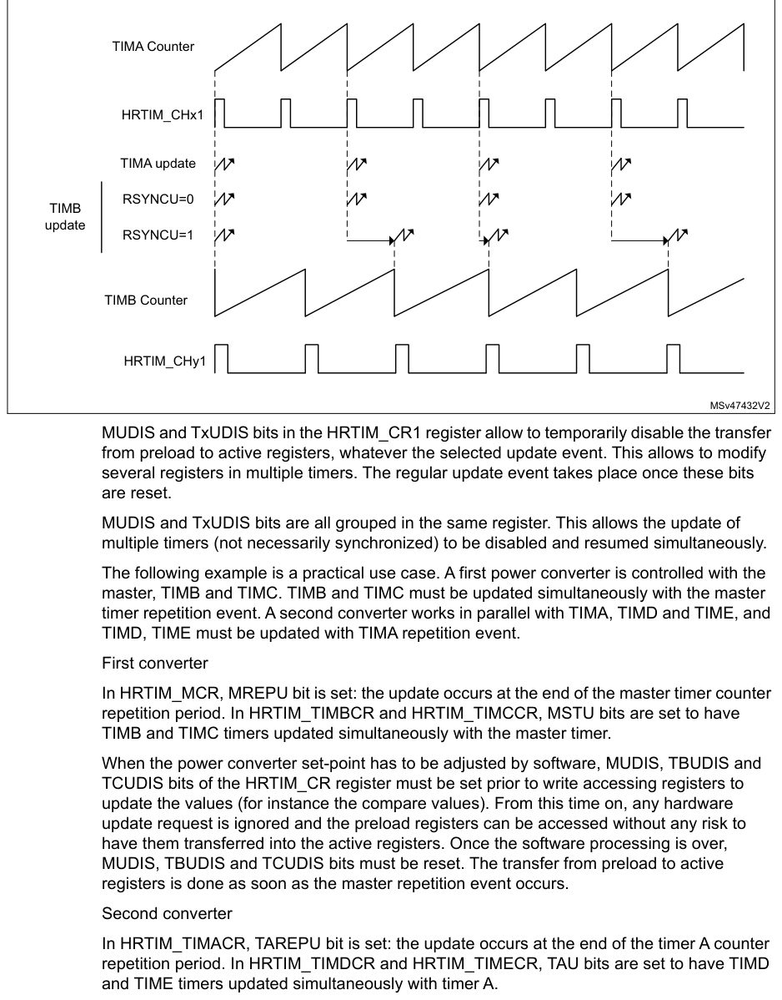

TIMA Counter

HRTIM_CHx1

TIMA update

RSYNCU=0

TIMB
update

RSYNCU=1

TIMB Counter

HRTIM_CHy1

MSv47432V2

MUDIS and TxUDIS bits in the HRTIM_CR1 register allow to temporarily disable the transfer from
preload to active registers, whatever the selected update event. This allows to modify several
registers in multiple timers. The regular update event takes place once these bits are reset.

MUDIS and TxUDIS bits are all grouped in the same register. This allows the update of multiple
timers (not necessarily synchronized) to be disabled and resumed simultaneously.

The following example is a practical use case. A first power converter is controlled with the
master, TIMB and TIMC. TIMB and TIMC must be updated simultaneously with the master timer repetition
event. A second converter works in parallel with TIMA, TIMD and TIME, and TIMD, TIME must be updated
with TIMA repetition event.

First converter

In HRTIM_MCR, MREPU bit is set: the update occurs at the end of the master timer counter repetition
period. In HRTIM_TIMBCR and HRTIM_TIMCCR, MSTU bits are set to have TIMB and TIMC timers updated
simultaneously with the master timer.

When the power converter set-point has to be adjusted by software, MUDIS, TBUDIS and TCUDIS bits of
the HRTIM_CR register must be set prior to write accessing registers to update the values (for
instance the compare values). From this time on, any hardware update request is ignored and the
preload registers can be accessed without any risk to have them transferred into the active
registers. Once the software processing is over, MUDIS, TBUDIS and TCUDIS bits must be reset. The
transfer from preload to active registers is done as soon as the master repetition event occurs.

Second converter

In HRTIM_TIMACR, TAREPU bit is set: the update occurs at the end of the timer A counter repetition
period. In HRTIM_TIMDCR and HRTIM_TIMECR, TAU bits are set to have TIMD and TIME timers updated
simultaneously with timer A.

When the power converter set-point has to be adjusted by software, TAUDIS, TDUDIS and TEUDIS bits of
the HRTIM_CR register must be set prior to write accessing the registers to update the values (for
instance the compare values). From this time on, any hardware update request is ignored and the
preload registers can be accessed without any risk to have them transferred into the active
registers. Once the software processing is over, TAUDIS, TDUDIS and TEUDIS bits can be reset: the
transfer from preload to active registers is done as soon as the timer A repetition event occurs.

### 28.3.12 PWM mode with “greater than” comparison

A specific no-latency update mode is available for PWM signals generated with the CMP1 and CMP3
registers. It allows to have a new duty cycle value applied as soon as possible within the PWM
cycle, without having to wait the completion of the current PWM period. This reduces the overall
delay time in software control loops. As shown on Figure 260 below, this eventually allows to have:

- an early turn-off of the output if the new compare value is below the current counter value and
  the current compare value is above the counter, at the time the new value is written.
- an early turn-on of the output, re-enabling the output if the new compare value is above the
  counter value and the current compare value is above the counter, at the time the new value is
  written.

The output signal is left unchanged when the new compare value and current compare value are both
below the counter.

This feature is only available for CMP1 or CMP3 RESET events, and is enabled using the GTCMP1 and
GTCMP3 enable bits in the HRTIM_TIMxCR2 register.

The preload mechanism is inactive for a compare register when the corresponding GTCMPx bit is set,
whatever the PREEN bit value. This mode is intended to have the new compare value taken into account
as soon as possible after a new value write, without waiting for the preload to active register
transfer.

These bits are defining the compare 1 and compare 3 operating modes as following

- GTCMPx = 0: the compare x event is generated when the counter is equal to the compare value
  (compare match mode). If the compare value is changed on-the-fly, the compare event may not be
  generated.
- GTCMPx = 1: the compare x event is generated when the counter is greater than the compare value.
  If the compare value is changed on-the-fly, the new compare value is compared with the current
  counter value and an output SET or RESET can be generated.

The “greater than” compare mode causes the crossbar to act differently depending on comparison
result. Let’s consider the CMP1 event is doing an output RESET. When the new compare value is
written, two cases are considered

- If the new compare value is below the counter value, the RESET event is issued and can eventually
  cause an early turn-OFF
- If the new compare value is above the counter value, a SET event is generated so as to re-arm the
  output value before it is actually RESET when the counter exceeds the counter value (early
  turn-ON).

The “greater than” compare mode is supported for both SET and RESET actions.

The “greater than” compare mode must only be used for the following configuration:

1. In the fixed frequency configuration, the period event must trigger the output set and
   the “greater than” compare triggers the output reset (or vice versa the period must trigger the
   reset if the “greater-than” compare triggers the set).
2. For variable frequency configuration, the event selected as counter reset source must
   also be selected as set or reset source for the timer output (opposite direction as the “greater
   than” compare event).

> **Note:** The “greater-than” modes must not be used when the CMP1 and/or CMP3 modes are
> controlled by hardware in half and interleaved modes.

**Figure 260. Early turn-ON and early turn-OFF behavior in “greater than” PWM mode**

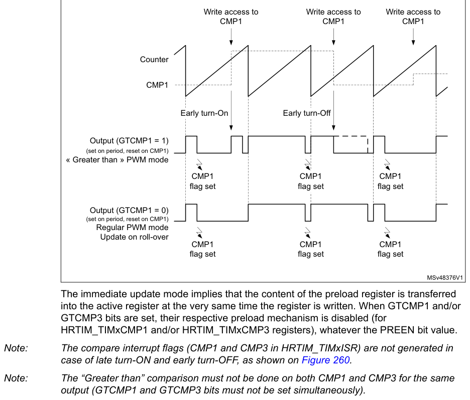

The immediate update mode implies that the content of the preload register is transferred into the
active register at the very same time the register is written. When GTCMP1 and/or GTCMP3 bits are
set, their respective preload mechanism is disabled (for HRTIM_TIMxCMP1 and/or HRTIM_TIMxCMP3
registers), whatever the PREEN bit value.

> **Note:** The compare interrupt flags (CMP1 and CMP3 in HRTIM_TIMxISR) are not generated in
> case of late turn-ON and early turn-OFF, as shown on Figure 260.

> **Note:** The “Greater than” comparison must not be done on both CMP1 and CMP3 for the same
> output (GTCMP1 and GTCMP3 bits must not be set simultaneously).

### 28.3.13 Events propagation within or across multiple timers

The HRTIM offers many possibilities for cascading events or sharing them across multiple timing
units, including the master timer, to get full benefits from its modular architecture. These are key
features for converters requiring multiple synchronized outputs.

This section summarizes the various options and specifies whether and how an event is propagated
within the HRTIM.

#### TIMx update triggered by the master timer update

The sources listed in Table 245 are generating a master timer update. The table indicates if the
source event can be used to trigger a simultaneous update in any of TIMx timing units.

Operating condition: MSTU bit is set in HRTIM_TIMxCR register.

**Table 245. Master timer update event propagation**

| Source row | Column 1 | Column 2 | Column 3 | Column 4 |
| ---: | --- | --- | --- | --- |
| 1 | `Source` | `Condition` | `Propagation` | `Comment` |
| 2 | `Burst DMA end` | `BRSTDMA[1:0] = 01` | `No` | `Must be done in TIMxCR (UPDGAT[3:0] = 0001)` |
| 3 | `Roll-over event following` |  |  |  |
| 4 | `BRSTDMA[1:0] = 10` | `Yes` | `-` |  |
| 5 | `a burst DMA end` |  |  |  |
| 6 | `Repetition event caused` |  |  |  |
| 7 | `Yes -` |  |  |  |
| 8 | `by a counter roll-over` |  |  |  |
| 9 | `Repetition event caused` |  |  |  |
| 10 | `MREPU = 1` |  |  |  |
| 11 | `by a counter reset (from` |  |  |  |
| 12 | `No -` |  |  |  |
| 13 | `HRTIM_SCIN or` |  |  |  |
| 14 | `software)` |  |  |  |
| 15 | `All software update bits (TxSWU) are grouped in` |  |  |  |
| 16 | `Software update` | `MSWU = 1` | `No` | `the HRTIM_CR2 register and can be used for a` |
| 17 | `simultaneous update` |  |  |  |

#### TIMx update triggered by the TIMy update

The sources listed in Table 246 are generating a TIMy update. The table indicates if the given event
can be used to trigger a simultaneous update in another or multiple TIMx timers.

Operating condition: TyU bit set in HRTIM_TIMxCR register (source = TIMy and destination = TIMx).

**Table 246. TIMx update event propagation**

| Source row | Column 1 | Column 2 | Column 3 | Column 4 |
| ---: | --- | --- | --- | --- |
| 1 | `Source` | `Condition` | `Propagation` | `Comment` |
| 2 | `Must be done directly in HRTIM_TIMxCR` |  |  |  |
| 3 | `Burst DMA end` | `UPDGAT[3:0] = 0001` | `No` |  |
| 4 | `(UPDGAT[3:0] = 0001)` |  |  |  |
| 5 | `Update caused by the` |  |  |  |
| 6 | `UPDGAT[3:0] = 0011,` | `Must be done directly in HRTIM_TIMxCR` |  |  |
| 7 | `update enable inputs` | `No` |  |  |
| 8 | `0100, 0101` | `(UPDGAT[3:0] = 0011, 0100, 0101` |  |  |
| 9 | `hrtim_upd_en[3:1]` |  |  |  |
| 10 | `MSTU = 1 in` | `Must be done with MSTU = 1 in HRTIM_TIMxCR` |  |  |
| 11 | `Master update` | `No` |  |  |
| 12 | `HRTIM_TIMyCR` |  |  |  |
| 13 | `TzU=1 in` | `Must be done with TzU=1 in HRTIM_TIMxCR` |  |  |
| 14 | `Another TIMx update` |  |  |  |
| 15 | `HRTIM_TIMyCR` | `No` | `TzU=1 in HRTIM_TIMyCR` |  |
| 16 | `(TIMz>TIMy>TIMx)` |  |  |  |
| 17 | `TyU=1 in TIMxCR` |  |  |  |
| 18 | `Repetition event caused` |  |  |  |
| 19 | `TyREPU = 1` | `Yes` | `-` |  |
| 20 | `by a counter roll-over` |  |  |  |
| 21 | `Repetition event caused` |  |  |  |
| 22 | `TyREPU = 1` | `-` | `Refer to counter reset cases below` |  |
| 23 | `by a counter reset` |  |  |  |
| 24 | `Counter roll-over` | `TyRSTU = 1` | `Yes` | `-` |

**Table 246. TIMx update event propagation (continued)**

| Source row | Column 1 | Column 2 | Column 3 | Column 4 |
| ---: | --- | --- | --- | --- |
| 1 | `Source` | `Condition` | `Propagation` | `Comment` |
| 2 | `TyRST=1 in` | `Can be done simultaneously with update in` |  |  |
| 3 | `Counter software reset` | `No` |  |  |
| 4 | `HRTIM_CR2` | `HRTIM_CR2 register` |  |  |
| 5 | `Counter reset caused` | `TIMzCMPn in` |  |  |
| 6 | `Yes -` |  |  |  |
| 7 | `by a TIMz compare` | `HRTIM_RSTyR` |  |  |
| 8 | `Counter reset caused` | `EXTEVNTn in` |  |  |
| 9 | `Yes -` |  |  |  |
| 10 | `by external events` | `HRTIM_RSTyR` |  |  |
| 11 | `Counter reset caused` | `MSTCMPn or` |  |  |
| 12 | `by a master compare or` | `MSTPER in` | `Yes` | `-` |
| 13 | `a master period` | `HRTIM_RSTyR` |  |  |
| 14 | `Counter reset caused` | `CMPn in` |  |  |
| 15 | `Yes -` |  |  |  |
| 16 | `by a TIMy compare` | `HRTIM_RSTyR` |  |  |
| 17 | `Counter reset caused` | `UPDT in` | `Propagation would result in a lock-up situation` |  |
| 18 | `No` |  |  |  |
| 19 | `by an update` | `HRTIM_RSTyR` | `(update causing reset causing update)` |  |
| 20 | `Counter reset caused` | `SYNCRSTy in` |  |  |
| 21 | `No -` |  |  |  |
| 22 | `by HRTIM_SCIN` | `HRTIM_TIMyCR` |  |  |
| 23 | `All software update bits (TxSWU) are grouped in` |  |  |  |
| 24 | `Software update` | `TySWU = 1` | `No` | `the HRTIM_CR2 register and can be used for a` |
| 25 | `simultaneous update` |  |  |  |

#### TIMx counter reset causing a TIMx update

Table 247 lists the counter reset sources and indicates whether they can be used to generate an
update.

Operating condition: TxRSTU bit in HRTIM_TIMxCR register.

**Table 247. Reset events able to generate an update**

| Source row | Column 1 | Column 2 | Column 3 | Column 4 |
| ---: | --- | --- | --- | --- |
| 1 | `Source` | `Condition` | `Propagation` | `Comment` |
| 2 | `Counter roll-over` | `-` | `Yes` | `-` |
| 3 | `Propagation would result in a lock-up` |  |  |  |
| 4 | `UPDT in` |  |  |  |
| 5 | `Update event` | `No` | `situation (update causing a reset causing` |  |
| 6 | `HRTIM_RSTxR` |  |  |  |
| 7 | `an update)` |  |  |  |
| 8 | `EXTEVNTn in` |  |  |  |
| 9 | `External event` | `Yes` | `-` |  |
| 10 | `HRTIM_RSTxR` |  |  |  |
| 11 | `TIMyCMPn in` |  |  |  |
| 12 | `TIMy compare` | `Yes` | `-` |  |
| 13 | `HRTIM_RSTxR` |  |  |  |
| 14 | `MSTCMPn in` |  |  |  |
| 15 | `Master compare` | `Yes` | `-` |  |
| 16 | `HRTIM_RSTxR` |  |  |  |
| 17 | `MSTPER in` |  |  |  |
| 18 | `Master period` | `Yes` | `-` |  |
| 19 | `HRTIM_RSTxR` |  |  |  |
| 20 | `CMPn in` |  |  |  |
| 21 | `Compare 2 and 4` | `Yes` | `-` |  |
| 22 | `HRTIM_RSTxR` |  |  |  |
| 23 | `TxRST=1 in` |  |  |  |
| 24 | `Software` | `Yes` | `-` |  |
| 25 | `HRTIM_CR2` |  |  |  |
| 26 | `SYNCRSTx in` |  |  |  |
| 27 | `HRTIM_SCIN` | `Yes` | `-` |  |
| 28 | `HRTIM_TIMxCR` |  |  |  |

#### TIMx update causing a TIMx counter reset

Table 248 lists the update event sources and indicates whether they can be used to generate a
counter reset.

Operating condition: UPDT bit set in HRTIM_RSTxR.

**Table 248. Update event propagation for a timer reset**

| Source row | Column 1 | Column 2 | Column 3 | Column 4 |
| ---: | --- | --- | --- | --- |
| 1 | `Source` | `Condition` | `Propagation` | `Comment` |
| 2 | `Burst DMA end` | `UPDGAT[3:0] = 0001` | `Yes` | `-` |
| 3 | `Update caused by the` |  |  |  |
| 4 | `UPDGAT[3:0] =` |  |  |  |
| 5 | `update enable inputs` | `Yes` | `-` |  |
| 6 | `0011, 0100, 0101` |  |  |  |
| 7 | `hrtim_upd_en[3:1]` |  |  |  |
| 8 | `MSTU = 1 in` |  |  |  |
| 9 | `Master update caused by a` | `HRTIM_TIMxCR` |  |  |
| 10 | `Yes` | `-` |  |  |
| 11 | `roll-over after a burst DMA` | `BRSTDMA[1:0] = 10` |  |  |
| 12 | `in HRTIM_MCR` |  |  |  |

**Table 248. Update event propagation for a timer reset (continued)**

| Source row | Column 1 | Column 2 | Column 3 | Column 4 |
| ---: | --- | --- | --- | --- |
| 1 | `Source` | `Condition` | `Propagation` | `Comment` |
| 2 | `Master update caused by a` |  |  |  |
| 3 | `repetition event following a` | `Yes` | `-` |  |
| 4 | `MSTU = 1 in` |  |  |  |
| 5 | `roll-over` |  |  |  |
| 6 | `HRTIM_TIMxCR` |  |  |  |
| 7 | `Master update caused by a` |  |  |  |
| 8 | `MREPU = 1 in` |  |  |  |
| 9 | `repetition event following a` |  |  |  |
| 10 | `HRTIM_MCR` | `No` | `-` |  |
| 11 | `counter reset (software or` |  |  |  |
| 12 | `due to HRTIM_SCIN)` |  |  |  |
| 13 | `All software update bits` |  |  |  |
| 14 | `MSTU = 1 in` |  |  |  |
| 15 | `(TxSWU) are grouped in the` |  |  |  |
| 16 | `HRTIM_TIMxCR` |  |  |  |
| 17 | `Software triggered master` |  |  |  |
| 18 | `No HRTIM_CR2 register and can` |  |  |  |
| 19 | `timer update` | `MSWU = 1` |  |  |
| 20 | `be used for a simultaneous` |  |  |  |
| 21 | `in HRTIM_CR2` |  |  |  |
| 22 | `update` |  |  |  |
| 23 | `TyU = 1 in` |  |  |  |
| 24 | `TIMy update caused by a` | `HRTIM_TIMxCR` |  |  |
| 25 | `Yes` | `-` |  |  |
| 26 | `TIMy counter roll-over` | `TyRSTU = 1 in` |  |  |
| 27 | `HRTIM_TIMyCR` |  |  |  |
| 28 | `TyU = 1 in` |  |  |  |
| 29 | `TIMy update caused by a` | `HRTIM_TIMxCR` |  |  |
| 30 | `Yes` | `-` |  |  |
| 31 | `TIMy repetition event` | `TyREPU = 1 in` |  |  |
| 32 | `HRTIM_TIMyCR` |  |  |  |
| 33 | `TyU = 1 in` |  |  |  |
| 34 | `HRTIM_TIMxCR` |  |  |  |
| 35 | `TIMy update caused by an` |  |  |  |
| 36 | `TyRSTU = 1 in` |  |  |  |
| 37 | `external event or a TIMy` |  |  |  |
| 38 | `HRTIM_TIMyCR` | `Yes` | `-` |  |
| 39 | `compare (through a TIMy` |  |  |  |
| 40 | `EXTEVNTn or` |  |  |  |
| 41 | `reset)` |  |  |  |
| 42 | `CMP4/2` |  |  |  |
| 43 | `in HRTIM_RSTyCR` |  |  |  |
| 44 | `TIMy update caused by` |  |  |  |
| 45 | `TyU = 1 in` |  |  |  |
| 46 | `sources other than those` | `No` | `-` |  |
| 47 | `HRTIM_TIMxCR` |  |  |  |
| 48 | `listed above` |  |  |  |
| 49 | `Repetition event following a` |  |  |  |
| 50 | `Yes` | `-` |  |  |
| 51 | `roll-over` |  |  |  |
| 52 | `TxREPU = 1 in` |  |  |  |
| 53 | `HRTIM_TIMxCR` |  |  |  |
| 54 | `Repetition event following a` |  |  |  |
| 55 | `No` | `-` |  |  |
| 56 | `counter reset` |  |  |  |
| 57 | `Propagation would result in a` |  |  |  |
| 58 | `TxRSTU = 1 in` |  |  |  |
| 59 | `Timer reset` | `No` | `lock-up situation (reset causing` |  |
| 60 | `HRTIM_TIMxCR` |  |  |  |
| 61 | `an update causing a reset)` |  |  |  |
| 62 | `TxSWU in` |  |  |  |
| 63 | `Software` | `No` | `-` |  |
| 64 | `HRTIM_CR2` |  |  |  |

### 28.3.14 Output management

Each timing unit controls a pair of outputs. The outputs have three operating states:

- RUN: this is the main operating mode, where the output can take the active or inactive level as
  programmed in the crossbar unit.
- IDLE: this state is the default operating state after an HRTIM reset, when the outputs are
  disabled by software or during a burst mode operation (where outputs are temporary disabled during
  a normal operating mode; refer to [Section 28.3.15](#28315-burst-mode-controller) for more details). It is either permanently
  active or inactive.
- FAULT: this is the safety state, entered in case of a shut-down request on FAULTx inputs. It can
  be permanently active, inactive or Hi-Z.

The output status is indicated by TxyOEN bit in HRTIM_OENR register and TxyODS bit in HRTIM_ODSR
register, as in Table 249.

**Table 249. Output state programming, x= A..F, y = 1 or 2**

| Source row | Column 1 | Column 2 | Column 3 |
| ---: | --- | --- | --- |
| 1 | `TxyOEN (control/status)` |  |  |
| 2 | `(set by software,` | `TxyODS (status)` | `Output operating state` |
| 3 | `cleared by hardware)` |  |  |
| 4 | `1` | `x` | `RUN` |
| 5 | `0` | `0` | `IDLE` |
| 6 | `0` | `1` | `FAULT` |

TxyOEN bit is both a control and a status bit: it must be set by software to have the output in RUN
mode. It is cleared by hardware when the output goes back in IDLE or FAULT mode. When TxyOEN bit is
cleared, TxyODS bit indicates whether the output is in the IDLE or FAULT state. A third bit in the
HRTIM_ODISR register allows to disable the output by software.

**Figure 261. Output management overview**

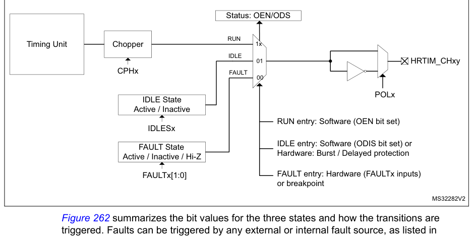

Figure 262 summarizes the bit values for the three states and how the transitions are triggered.
Faults can be triggered by any external or internal fault source, as listed in

[Section 28.3.17](#28317-fault-protection), while the Idle state can be entered when the burst mode or delayed protections are
active.

**Figure 262. HRTIM output states and transitions**

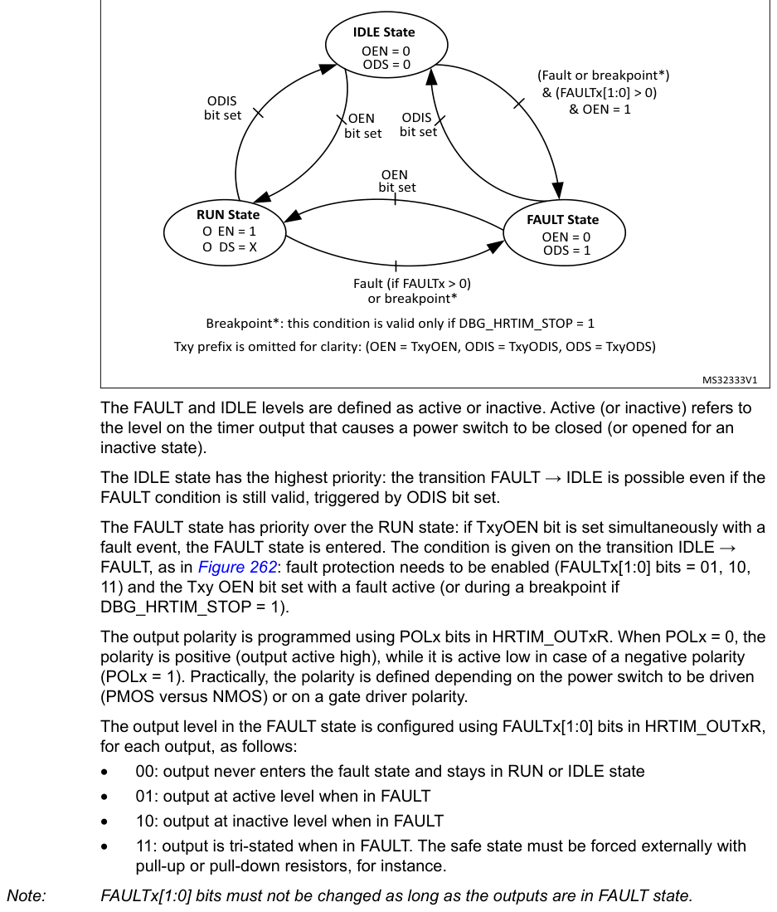

IDLE State

OEN = 0 ODS = 0

(Fault or breakpoint*)

& (FAULTx[1:0] > 0)

ODIS

& OEN = 1

The FAULT and IDLE levels are defined as active or inactive. Active (or inactive) refers to the
level on the timer output that causes a power switch to be closed (or opened for an inactive state).

The IDLE state has the highest priority: the transition FAULT → IDLE is possible even if the FAULT
condition is still valid, triggered by ODIS bit set.

The FAULT state has priority over the RUN state: if TxyOEN bit is set simultaneously with a fault
event, the FAULT state is entered. The condition is given on the transition IDLE → FAULT, as in
Figure 262: fault protection needs to be enabled (FAULTx[1:0] bits = 01, 10, 11) and the Txy OEN bit
set with a fault active (or during a breakpoint if DBG_HRTIM_STOP = 1).

The output polarity is programmed using POLx bits in HRTIM_OUTxR. When POLx = 0, the polarity is
positive (output active high), while it is active low in case of a negative polarity (POLx = 1).
Practically, the polarity is defined depending on the power switch to be driven (PMOS versus NMOS)
or on a gate driver polarity.

The output level in the FAULT state is configured using FAULTx[1:0] bits in HRTIM_OUTxR, for each
output, as follows:

- 00: output never enters the fault state and stays in RUN or IDLE state
- 01: output at active level when in FAULT
- 10: output at inactive level when in FAULT
- 11: output is tri-stated when in FAULT. The safe state must be forced externally with pull-up or
  pull-down resistors, for instance.

> **Note:** FAULTx[1:0] bits must not be changed as long as the outputs are in FAULT state.

The level of the output in IDLE state is configured using IDLESx bit in HRTIM_OUTxR, as follows:

- 0: output at inactive level when in IDLE
- 1: output at active level when in IDLE

When TxyOEN bit is set to enter the RUN state, the output is immediately connected to the crossbar
output. If the timer clock is stopped, the level is either inactive (after an HRTIM reset) or
corresponds to the RUN level (when the timer is stopped and the output disabled).

During the HRTIM initialization, the output level can be prepositioned prior to have it in RUN mode,
using the software forced output set and reset in the HRTIM_SETx1R and HRTIM_RSTx1R registers.

### 28.3.15 Burst mode controller

The burst mode controller allows to have the outputs alternatively in IDLE and RUN state, by
hardware, so as to skip some switching periods with a programmable periodicity and duty cycle.

Burst mode operation is of common use in power converters when operating under light loads. It can
significantly increase the efficiency of the converter by reducing the number of transitions on the
outputs and the associated switching losses.

When operating in burst mode, one or a few pulses are outputs followed by an idle period equal to
several counting periods, typically, where no output pulses are produced, as shown in the example on
Figure 263.

**Figure 263. Burst mode operation example**

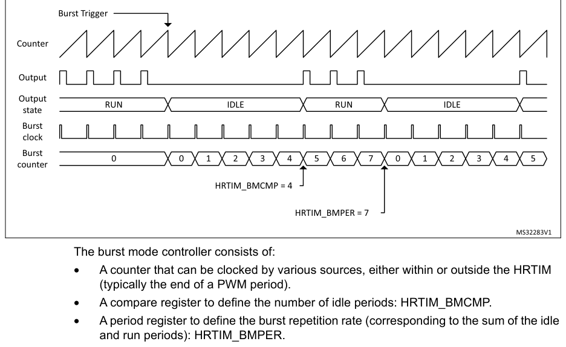

- A counter that can be clocked by various sources, either within or outside the HRTIM (typically
  the end of a PWM period).
- A compare register to define the number of idle periods: HRTIM_BMCMP.
- A period register to define the burst repetition rate (corresponding to the sum of the idle and
  run periods): HRTIM_BMPER.

The burst mode controller is able to take over the control of any of the 10 PWM outputs. The state
of each output during a burst mode operation is programmed using IDLESx and IDLEMx bits in the
HRTIM_OUTxR register, as in Table 250.

**Table 250. Timer output programming for burst mode**

| IDLEMx | IDLESx | Output state during burst mode |
| --- | --- | --- |
| 0 | X | No action: the output is not affected by the burst mode operation. |
| 1 | 0 | Output inactive during the burst |
| 1 | 1 | Output active during the burst |

> **Note:** IDLEMx bit must not be changed while the burst mode is active.

The burst mode controller only acts on the output stage. A number of events are still generated
during the idle period:

- Output set/reset interrupt or DMA requests
- External event filtering based on Tx2 output signal
- Capture events triggered by output set/reset

During the burst mode, neither start nor reset events are generated on the hrtim_out_sync[2:1]
output, even if TxBM bit is set.

#### Operating mode

It is necessary to have the counter enabled (TxCEN bit set) before using the burst mode on a given
timing unit. The burst mode is enabled with BME bit in the HRTIM_BMCR register.

It can operate in continuous or single-shot mode, using BMOM bit in the HRTIM_BMCR register. The
continuous mode is enabled when BMOM = 1. The burst operation is maintained until BMSTAT bit in
HRTIM_BMCR is reset to terminate it.

In single-shot mode (BMOM = 0), the idle sequence is executed once, following the burst mode
trigger, and the normal timer operation is resumed immediately after.

The duration of the idle and run periods is defined with a burst mode counter and 2 registers. The
HRTIM_BMCMPR register defines the number of counts during which the selected timer(s) are in an idle
state (idle period). HRTIM_BMPER defines the overall burst mode period (sum of the idle and run
periods). Once the initial burst mode trigger has occurred, the idle period length is
HRTIM_BMCMPR+1, the overall burst period is HRTIM_BMPER+1.

> **Note:** The burst mode period must not be less than or equal to the deadtime duration defined with

DTRx[8:0] and DTFx[8:0] bitfields.

The counters of the timing units and the master timer can be stopped and reset during the burst mode
operation. HRTIM_BMCR holds 6 control bits for this purpose: MTBM (master) and TABM..TEBM for timer
A..E.

When MTBM or TxBM bit is reset, the counter clock is maintained. This allows to keep a phase
relationship with other timers in multiphase systems, for instance.

When MTBM or TxBM bit is set, the corresponding counter is stopped and maintained in reset state
during the burst idle period. This allows to have the timer restarting a full period when exiting
from idle. If SYNCSRC[1:0] = 00 or 10 (synchronization output on the master
start or timer A start), a pulse is sent on the HRTIM_SCOUT output when exiting the burst mode.

> **Note:** TxBM bit must not be set when the balanced idle mode is active (DLYPRT[1:0] = 0x11).

#### Burst mode clock

The burst mode controller counter can be clocked by several sources, selected with BMCLK[3:0] bits
in the HRTIM_BMCR register:

- BMCLK[3:0] = 0000 to 0101: master timer and TIMA..E reset/roll-over events. This allows to have
  burst mode idle and run periods aligned with the timing unit counting period (both in free-running
  and counter reset mode).
- BMCLK[3:0] = 0110 to 1001: The clocking is provided by the hrtim_bm_ck[4:1] inputs connected to
  general purpose timers, as in Table 225. In this case, the burst mode idle and run periods are not
  necessarily aligned with timing unit counting period (a pulse on the output may be interrupted,
  resulting a waveform with modified duty cycle for instance.
- BMCLK[3:0] = 1010: The fHRTIM clock prescaled by a factor defined with BMPRSC[3:0] bits in
  HRTIM_BMCR register. In this case, the burst mode idle and run periods are not necessarily aligned
  with the timing unit counting period (a pulse on the output may be interrupted, resulting in a
  waveform with a modified duty cycle, for instance.

The pulse width on TIMx OC output must be at least N fHRTIM clock cycles long to be detected by the
HRTIM burst mode controller.

#### Burst mode triggers

To trigger the burst operation, 32 sources are available and are selected using the HRTIM_BMTRGR
register:

- Software trigger (set by software and reset by hardware)
- 6 master timer events: repetition, reset/roll-over, compare 1 to 4
- 5 x 4 events from timers A..F: repetition, reset/roll-over, compare 1 and 2
- External event 7 (including TIMA event filtering) and 8 (including TIMD event filtering)
- Timer A period following external event 7 (including TIMA event filtering)
- Timer D period following external event 8 (including TIMD event filtering)
- An on-chip event on the hrtim_bm_trg input (connected to the general-purpose timer TRGO output),
  see Table 222 for details.

These sources can be combined to have multiple concurrent triggers.

Burst mode is not re-triggerable. In continuous mode, new triggers are ignored until the burst mode
is terminated, while in single-shot mode, the triggers are ignored until the current burst
completion including run periods (HRTIM_BMPER+1 cycles). This is also valid for software trigger
(the software bit is reset by hardware even if it is discarded).

Figure 264 shows how the burst mode is started in response to an external event, either immediately
or on the timer period following the event.

**Figure 264. Burst mode trigger on external event**

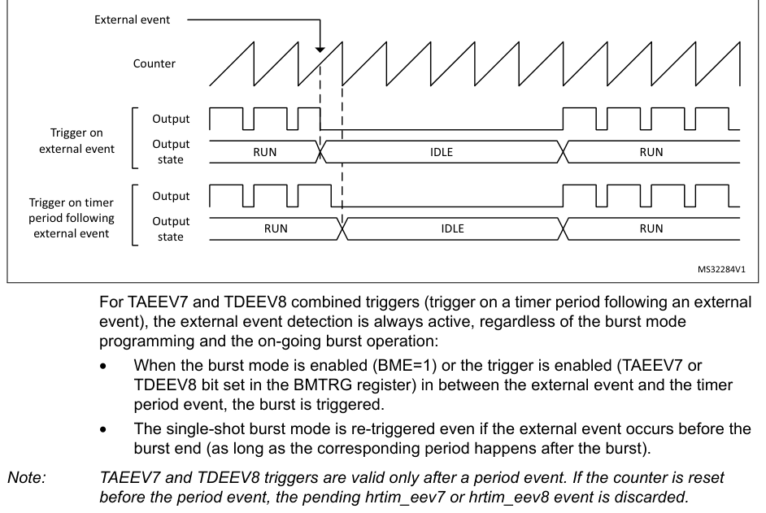

External event

Counter

Output

Trigger on

Output

For TAEEV7 and TDEEV8 combined triggers (trigger on a timer period following an external event), the
external event detection is always active, regardless of the burst mode programming and the on-going
burst operation:

- When the burst mode is enabled (BME=1) or the trigger is enabled (TAEEV7 or TDEEV8 bit set in the
  BMTRG register) in between the external event and the timer period event, the burst is triggered.
- The single-shot burst mode is re-triggered even if the external event occurs before the burst end
  (as long as the corresponding period happens after the burst).

> **Note:** TAEEV7 and TDEEV8 triggers are valid only after a period event. If the counter is reset
> before the period event, the pending hrtim_eev7 or hrtim_eev8 event is discarded.

#### Burst mode delayed entry

By default, the outputs are taking their idle level (as per IDLES1 and IDLES2 setting) immediately
after the burst mode trigger.

It is also possible to delay the burst mode entry and force the output to an inactive state during a
programmable period before the output takes its idle state. This is useful when driving two
complementary outputs, one of them having an active idle state, to avoid a deadtime violation as
shown on Figure 265. This prevents any risk of shoot through current in half-bridges, but causes a
delayed response to the burst mode entry.

**Figure 265. Delayed burst mode entry with deadtime enabled and IDLESx = 1**

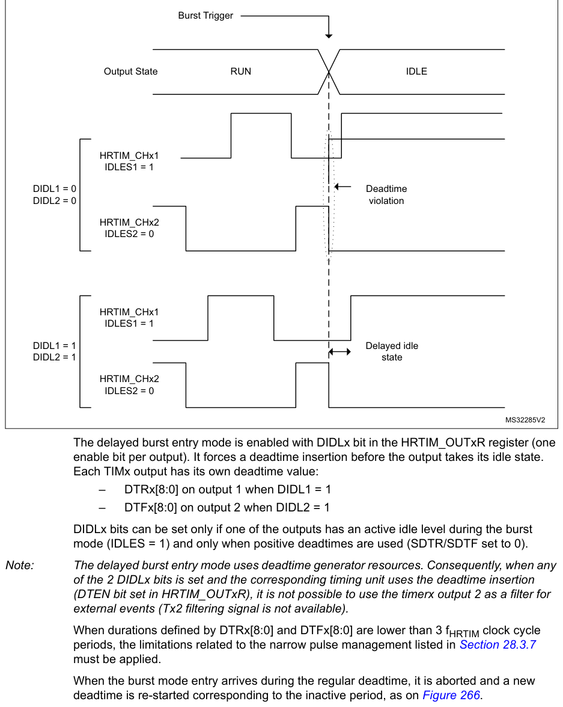

The delayed burst entry mode is enabled with DIDLx bit in the HRTIM_OUTxR register (one enable bit
per output). It forces a deadtime insertion before the output takes its idle state. Each TIMx output
has its own deadtime value:

- DTRx[8:0] on output 1 when DIDL1 = 1
- DTFx[8:0] on output 2 when DIDL2 = 1

DIDLx bits can be set only if one of the outputs has an active idle level during the burst mode
(IDLES = 1) and only when positive deadtimes are used (SDTR/SDTF set to 0).

> **Note:** The delayed burst entry mode uses deadtime generator resources. Consequently, when any
> of the 2 DIDLx bits is set and the corresponding timing unit uses the deadtime insertion (DTEN bit
> set in HRTIM_OUTxR), it is not possible to use the timerx output 2 as a filter for external events
(Tx2 filtering signal is not available).

When durations defined by DTRx[8:0] and DTFx[8:0] are lower than 3 fHRTIM clock cycle periods, the
limitations related to the narrow pulse management listed in [Section 28.3.7](#2837-set--reset-events-priorities-and-narrow-pulses-management) must be applied.

When the burst mode entry arrives during the regular deadtime, it is aborted and a new deadtime is
re-started corresponding to the inactive period, as on Figure 266.

**Figure 266. Delayed burst mode entry during deadtime**

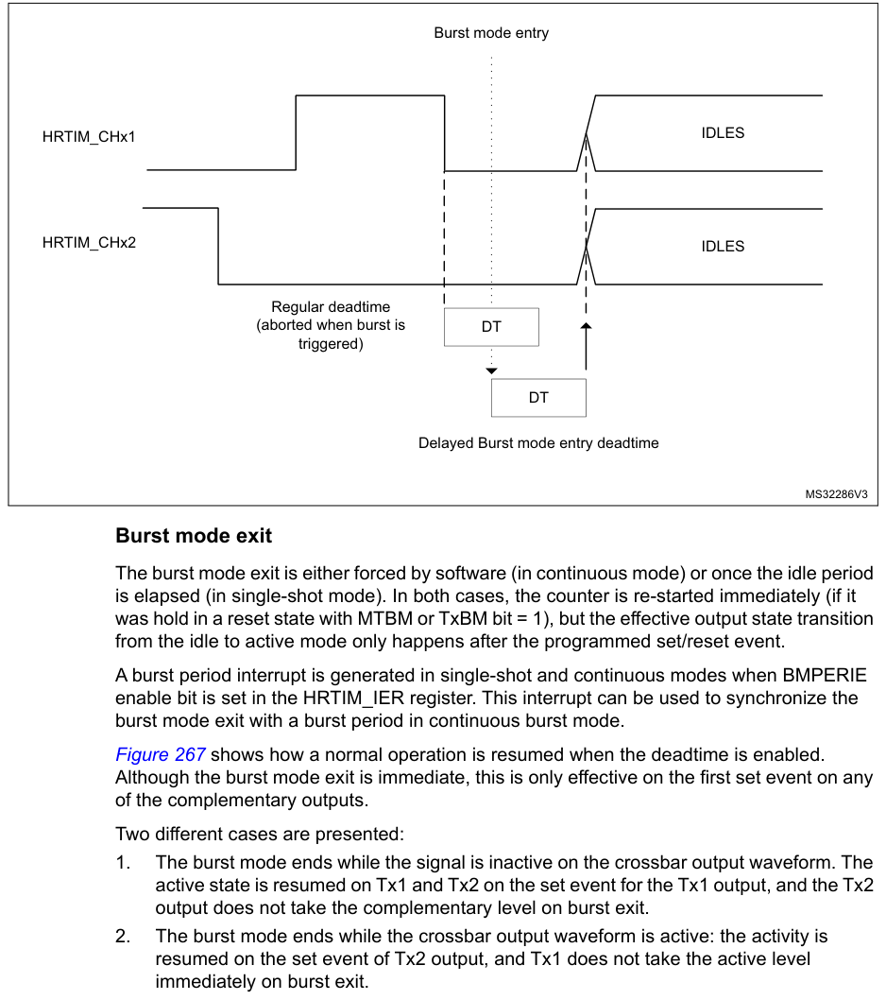

#### Burst mode exit

The burst mode exit is either forced by software (in continuous mode) or once the idle period is
elapsed (in single-shot mode). In both cases, the counter is re-started immediately (if it was hold
in a reset state with MTBM or TxBM bit = 1), but the effective output state transition from the idle
to active mode only happens after the programmed set/reset event.

A burst period interrupt is generated in single-shot and continuous modes when BMPERIE enable bit is
set in the HRTIM_IER register. This interrupt can be used to synchronize the burst mode exit with a
burst period in continuous burst mode.

Figure 267 shows how a normal operation is resumed when the deadtime is enabled. Although the burst
mode exit is immediate, this is only effective on the first set event on any of the complementary
outputs.

Two different cases are presented:

1. The burst mode ends while the signal is inactive on the crossbar output waveform. The
   active state is resumed on Tx1 and Tx2 on the set event for the Tx1 output, and the Tx2 output does
   not take the complementary level on burst exit.
2. The burst mode ends while the crossbar output waveform is active: the activity is
   resumed on the set event of Tx2 output, and Tx1 does not take the active level immediately on burst
   exit.

**Figure 267. Burst mode exit when the deadtime generator is enabled**

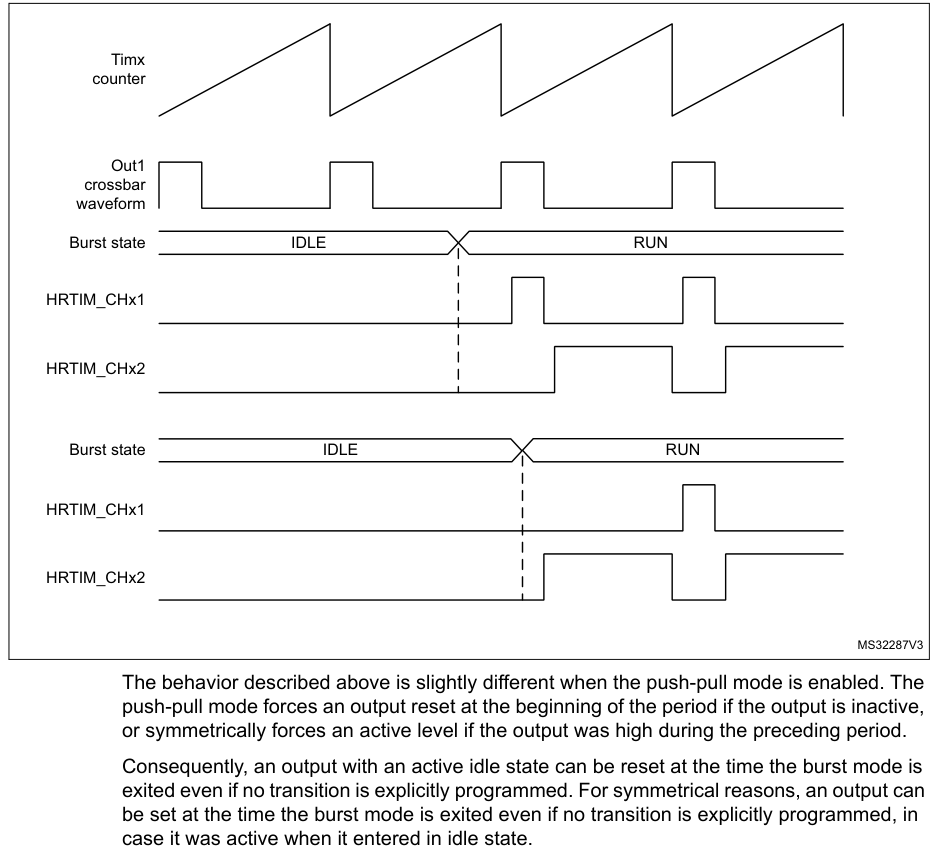

Timx
counter

Out1
crossbar
waveform

The behavior described above is slightly different when the push-pull mode is enabled. The push-pull
mode forces an output reset at the beginning of the period if the output is inactive, or
symmetrically forces an active level if the output was high during the preceding period.

Consequently, an output with an active idle state can be reset at the time the burst mode is exited
even if no transition is explicitly programmed. For symmetrical reasons, an output can be set at the
time the burst mode is exited even if no transition is explicitly programmed, in case it was active
when it entered in idle state.

#### Burst mode registers preloading and update

BMPREN bit (burst mode preload enable) allows to have the burst mode compare and period registers
preloaded (HRTIM_BMCMP and HRTIM_BMPER).

When BMPREN is set, the transfer from preload to active register happens:

- when the burst mode is enabled (BME = 1),
- at the end of the burst mode period.

A write into the HRTIM_BMPER period register disables the update temporarily, until the HRTIM_BMCMP
compare register is written, to ensure the consistency of the two registers when they are modified.

If the compare register only needs to be changed, a single write is necessary. If the period only
needs to be changed, it is also necessary to re-write the compare to have the new values taken into
account.

When BMPREN bits is reset, the write access into BMCMPR and BMPER directly updates the active
register. In this case, it is necessary to consider when the update is done during the overall burst
period, for the 2 cases below:

a) Compare register update

If the new compare value is above the current burst mode counter value, the new compare is taken
into account in the current period.

If the new compare value is below the current burst mode counter value, the new compare is taken
into account in the next burst period in continuous mode, and ignored in single-shot mode (no
compare match occurs and the idle state lasts until the end of the idle period).

b) Period register update

If the new period value is above the current burst mode counter value, the change is taken into
account in the current period.

> **Note:** If the new period value is below the current burst mode counter value, the new period is not
> taken into account, the burst mode counter overflows (at 0xFFFF) and the change is effective in the
> next period. In single-shot mode, the counter rolls over at 0xFFFF and the burst mode re-starts for
> another period up to the new programmed value.

Burst mode emulation using a compound register

The burst mode controller only controls one or a set of timers for a single converter. When the
burst mode is necessary for multiple independent timers, it is possible to emulate a simple burst
mode controller using the DMA and the HRTIM_CMP1CxR compound register, which holds aliases of both
the repetition and the compare 1 registers.

This is applicable to a converter which only requires a simple PWM (typically a buck converter),
where the duty cycle only needs to be updated. In this case, the CMP1 register is used to reset the
output (and define the duty cycle), while it is set on the period event.

In this case, a single 32-bit write access in CMP1CxR is sufficient to define the duty cycle (with
the CMP1 value) and the number of periods during which this duty cycle is maintained (with the
repetition value). To implement a burst mode, it is then only necessary to transfer by DMA (upon
repetition event) two 32-bit data in continuous mode, organized as follows:

CMPC1xR = {REP_Idle; CMP1 = Duty_Cycle}, {REP_Run; CMP1 = 0}

For instance, the values:

{0x0001 0000}: CMP1 = 0 for 2 periods during Idle

{0x0003 0800}: CMP1 = 0x0800 for 4 periods during Run
provide a burst mode with 2 periods active every 6 PWM periods, as shown on Figure 268.

**Figure 268. Burst mode emulation example**

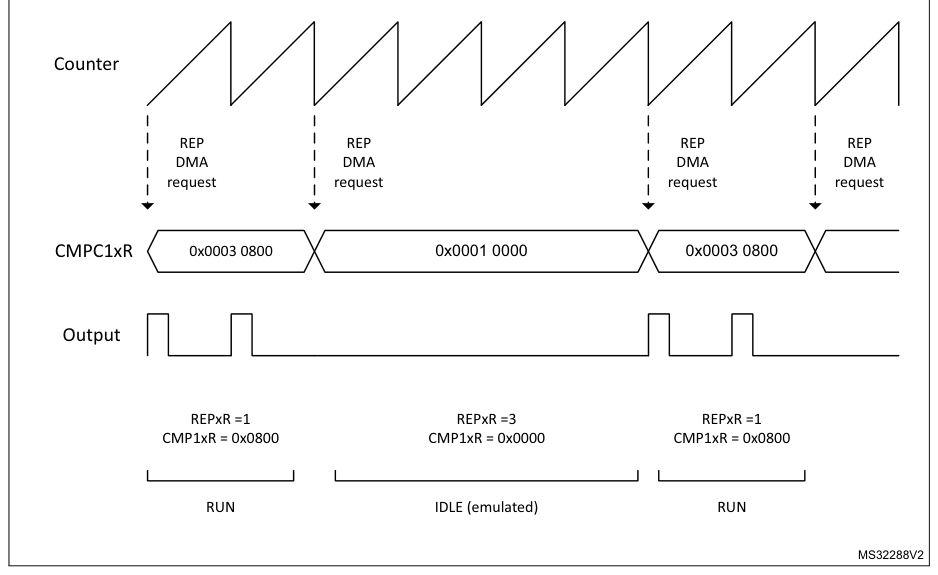

### 28.3.16 Chopper

A high-frequency carrier can be added on top of the timing unit output signals to drive isolation
transformers. This is done in the output stage before the polarity insertion, as shown on Figure
269, using CHP1 and CHP2 bits in the HRTIM_OUTxR register, to enable chopper on outputs 1 and 2,
respectively.

**Figure 269. Carrier frequency signal insertion**

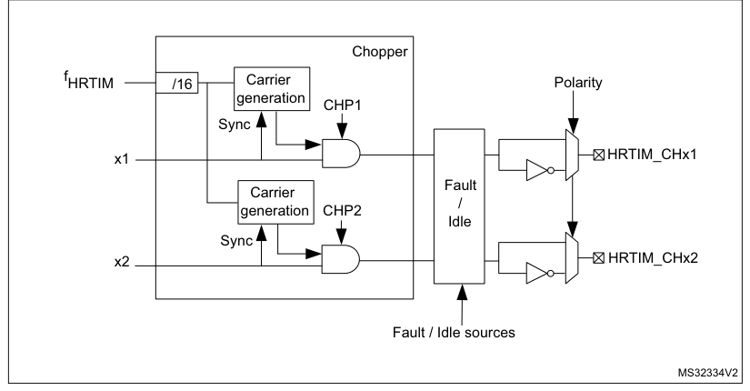

The chopper parameters can be adjusted using the HRIM_CHPxR register, with the possibility to define
a specific pulsewidth at the beginning of the pulse, to be followed by a carrier frequency with
programmable frequency and duty cycle, as in Figure 270.

CARFRQ[3:0] bits define the frequency, ranging from 664 kHz to 10.625 MHz (for fHRTIM = 170 MHz)
following the formula FCHPFRQ = fHRTIM / (16 x (CARFRQ[3:0]+1)).

The duty cycle can be adjusted by 1/8 step with CARDTY[2:0], from 0/8 up to 7/8 duty cycle. When
CARDTY[2:0] = 000 (duty cycle = 0/8), the output waveform only contains the starting pulse following
the rising edge of the reference waveform, without any added carrier.

The pulsewidth of the initial pulse is defined using the STRPW[3:0] bitfield as follows: t1STPW =
(STRPW[3:0]+1) x 16 x tHRTIM and ranges from 94.1 ns to 1.51 μs (for fHRTIM = 170 MHz).

The carrier frequency parameters are defined based on the fHRTIM frequency, and are not dependent
from the CKPSC[2:0] setting.

In chopper mode, the carrier frequency and the initial pulsewidth are combined with the reference
waveform using an AND function. A synchronization is performed at the end of the initial pulse to
have a repetitive signal shape.

The chopping signal is stopped at the end of the output waveform active state, without waiting for
the current carrier period to be completed. It can thus contain shorter pulses than programmed.

**Figure 270. HRTIM outputs with Chopper mode enabled**

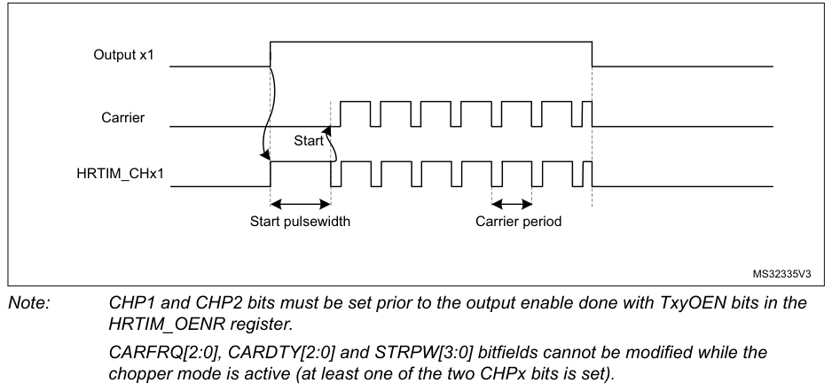

> **Note:** CHP1 and CHP2 bits must be set prior to the output enable done with TxyOEN bits in the

HRTIM_OENR register.

CARFRQ[2:0], CARDTY[2:0] and STRPW[3:0] bitfields cannot be modified while the chopper mode is
active (at least one of the two CHPx bits is set).

### 28.3.17 Fault protection

The HRTIM has a versatile fault protection circuitry to disable the outputs in case of an abnormal
operation. Once a fault has been triggered, the outputs take a predefined safe state. This state is
maintained until the output is re-enabled by software. In case of a permanent fault request, the
output remains in its fault state, even if the software attempts to re-enable them, until the fault
source disappears.

The HRTIM has 6 FAULT input channels; all of them are available and can be combined for each of the
6 timing units, as shown on Figure 271.

**Figure 271. Fault protection circuitry (FAULT1 fully represented, FAULT2..6 partially)**

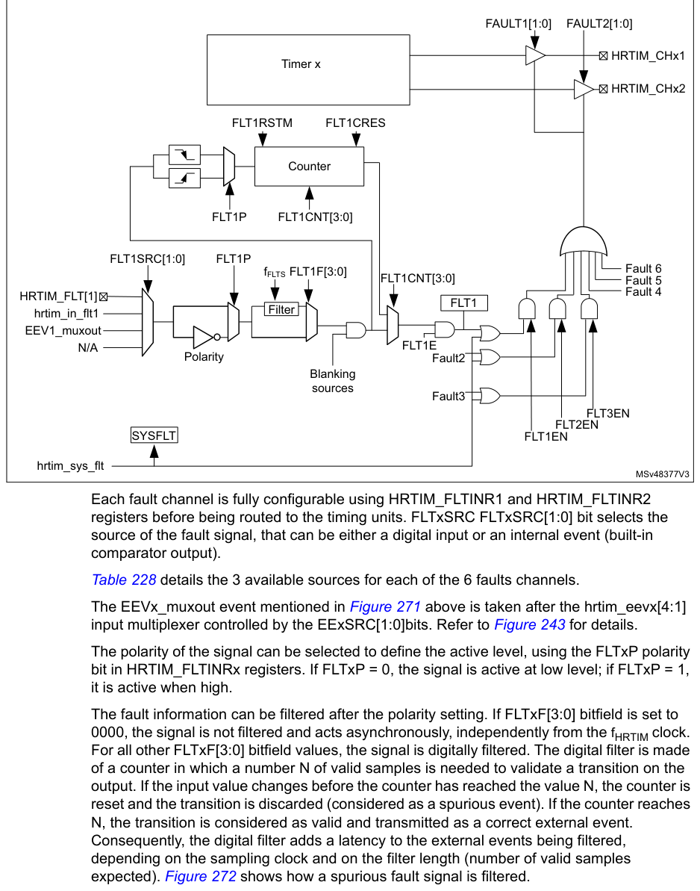

Each fault channel is fully configurable using HRTIM_FLTINR1 and HRTIM_FLTINR2 registers before
being routed to the timing units. FLTxSRC FLTxSRC[1:0] bit selects the source of the fault signal,
that can be either a digital input or an internal event (built-in comparator output).

Table 228 details the 3 available sources for each of the 6 faults channels.

The EEVx_muxout event mentioned in Figure 271 above is taken after the hrtim_eevx[4:1] input
multiplexer controlled by the EExSRC[1:0]bits. Refer to Figure 243 for details.

The polarity of the signal can be selected to define the active level, using the FLTxP polarity bit
in HRTIM_FLTINRx registers. If FLTxP = 0, the signal is active at low level; if FLTxP = 1, it is
active when high.

The fault information can be filtered after the polarity setting. If FLTxF[3:0] bitfield is set to
0000, the signal is not filtered and acts asynchronously, independently from the fHRTIM clock. For
all other FLTxF[3:0] bitfield values, the signal is digitally filtered. The digital filter is made
of a counter in which a number N of valid samples is needed to validate a transition on the output.
If the input value changes before the counter has reached the value N, the counter is reset and the
transition is discarded (considered as a spurious event). If the counter reaches N, the transition
is considered as valid and transmitted as a correct external event. Consequently, the digital filter
adds a latency to the external events being filtered, depending on the sampling clock and on the
filter length (number of valid samples expected). Figure 272 shows how a spurious fault signal is
filtered.

**Figure 272. Fault signal filtering (FLTxF[3:0] = 0010: fSAMPLING = fHRTIM, N = 4)**

![Figure 272: Fault signal filtering (FLTxF\[3:0\] = 0010: fSAMPLING = fHRTIM, N = 4)](../STM32G4_RM0440_figures/figure-0272.png)

The filtering period ranges from 2 cycles of the fHRTIM clock up to 8 cycles of the fFLTS clock
divided by 32. fFLTS is defined using FLTSD[1:0] bits in the HRTIM_FLTINR2 register. Table 251
summarizes the sampling rate and the filter length. A jitter of 1 sampling clock period must be
subtracted from the filter length to take into account the uncertainty due to the sampling and have
the effective filtering.

**Table 251. Sampling rate and filter length vs FLTFxF[3:0] and clock setting**

| Source row | Column 1 | Column 2 | Column 3 | Column 4 | Column 5 | Column 6 | Column 7 |
| ---: | --- | --- | --- | --- | --- | --- | --- |
| 1 | `-` | `fFLTS vs FLTSD[1:0]` | `Filter length for fHRTIM = 170 MHz` |  |  |  |  |
| 2 | `FLTFxF[3:0]` | `00` | `01` | `10` | `11` | `Min` | `Max` |
| 3 | `fHRTIM, N =2` | `fHRTIM, N =8` |  |  |  |  |  |
| 4 | `0001,0010,0011` | `fHRTIM` | `fHRTIM` | `fHRTIM` | `fHRTIM` |  |  |
| 5 | `11.8 ns` | `47.1 ns` |  |  |  |  |  |
| 6 | `fHRTIM /2, N = 6` | `fHRTIM /16, N = 8` |  |  |  |  |  |
| 7 | `0100, 0101` | `fHRTIM /2` | `fHRTIM /4` | `fHRTIM /8` | `fHRTIM /16` |  |  |
| 8 | `70.6 ns` | `753 ns` |  |  |  |  |  |
| 9 | `fHRTIM /4, N = 6` | `fHRTIM /32, N = 8` |  |  |  |  |  |
| 10 | `0110, 0111` | `fHRTIM /4` | `fHRTIM /8` | `fHRTIM /16` | `fHRTIM /32` |  |  |
| 11 | `141 ns` | `1.51 µs` |  |  |  |  |  |
| 12 | `fHRTIM /8, N = 6` | `fHRTIM /64, N = 8` |  |  |  |  |  |
| 13 | `1000, 1001` | `fHRTIM /8` | `fHRTIM /16` | `fHRTIM /32` | `fHRTIM /64` |  |  |
| 14 | `282 ns` | `3.01 µs` |  |  |  |  |  |
| 15 | `fHRTIM /16, N = 5` | `fHRTIM /128, N = 8` |  |  |  |  |  |
| 16 | `1010, 1011, 1100` | `fHRTIM /16` | `fHRTIM /32` | `fHRTIM /64` | `fHRTIM /128` |  |  |
| 17 | `471 ns` | `6.02 µs` |  |  |  |  |  |
| 18 | `fHRTIM /32, N = 5` | `fHRTIM /256, N = 8` |  |  |  |  |  |
| 19 | `1101, 1110, 1111` | `fHRTIM /32` | `fHRTIM /64` | `fHRTIM /128` | `fHRTIM /256` |  |  |
| 20 | `941 ns` | `12.05 µs` |  |  |  |  |  |

#### Fault blanking and event counting

The fault inputs can be temporary disabled to blank spurious fault events. The blanking sources are
listed in the Table 252 below.

**Table 252. Fault input blanking events**

| Source row | Column 1 | Column 2 | Column 3 | Column 4 | Column 5 |
| ---: | --- | --- | --- | --- | --- |
| 1 | `-` | `FLTxBLKS = 0, reset-aligned window` | `FLTxBLKS = 1 moving window` |  |  |
| 2 | `Fault input` | `Blanking window start Blanking window end Blanking window start Blanking window end` |  |  |  |
| 3 | `Fault 1` | `Timer A reset/roll-over` | `Timer A CMP3 event` | `Timer A CMP4 event` | `Timer A CMP3 event` |
| 4 | `Fault 2` | `Timer B reset/roll-over` | `Timer B CMP3 event` | `Timer B CMP4 event` | `Timer B CMP3 event` |
| 5 | `Fault 3` | `Timer C reset/roll-over` | `Timer C CMP3 event` | `Timer C CMP4 event` | `Timer C CMP3 event` |
| 6 | `Fault 4` | `Timer D reset/roll-over` | `Timer D CMP3 event` | `Timer D CMP4 event` | `Timer D CMP3 event` |
| 7 | `Fault 5` | `Timer E reset/roll-over` | `Timer E CMP3 event` | `Timer E CMP4 event` | `Timer E CMP3 event` |
| 8 | `Fault 6` | `Timer F reset/roll-over` | `Timer F CMP3 event` | `Timer F CMP4 event` | `Timer F CMP3 event` |

A fault counter also allows to discard multiple spurious fault events and define an acceptance
criteria.

The FLTxCNT[3:0] bitfield selects the FAULTx counter threshold. A fault is considered valid when the
number of events is equal to the FLTxCNT[3:0] value.

This FLTxRSTM selects the FAULTx counter reset mode

- 0: fault counter hardware reset on reset / roll-over event, as per the Table 253 below.
- 1: fault counter reset on each reset / roll-over event only if no event occurs during last
  counting period, as shown on Figure 273 below.

The fault counter can be reset by software with the FLTxCRES bit at anytime.

**Figure 273. Fault counter cumulative mode (FLTxRSTM = 1, FLTxCNT[3:0] = 2)**

![Figure 273: Fault counter cumulative mode (FLTxRSTM = 1, FLTxCNT\[3:0\] = 2)](../STM32G4_RM0440_figures/figure-0273.png)

A given FLTx input counter can be reset by a single source. The Table 253 indicates which timer unit
associated with a given fault. This does not prevent to have a fault line shared by multiple timer
(e.g. FLT1 with event counter enabled, acting on timer A, timer B and timer C simultaneously).

**Table 253. Fault 1..6 counter reset source**

| Source row | Column 1 | Column 2 |
| ---: | --- | --- |
| 1 | `Fault Input` | `Fault counter reset source` |
| 2 | `Fault 1` | `Timer A reset/roll-over` |
| 3 | `Fault 2` | `Timer B reset/roll-over` |
| 4 | `Fault 3` | `Timer C reset/roll-over` |
| 5 | `Fault 4` | `Timer D reset/roll-over` |
| 6 | `Fault 5` | `Timer E reset/roll-over` |
| 7 | `Fault 6` | `Timer F reset/roll-over` |
| 8 | `System fault input (hrtim_sys_flt)` |  |
| 9 | `This input overrides the FAULT inputs and disables all outputs having FAULTy[1:0] = 01, 10,` |  |

11. Refer to Table 230 for the list of system faults connected to this input.

For each FAULT channel, a write-once FLTxLCK bit in the HRTIM_FLTxR register allows to lock FLTxE,
FLTxP, FLTxSRC, FLTxF[3:0] bits (it renders them read-only), for functional safety purpose. If
enabled, the fault conditioning set-up is frozen until the next HRTIM or system reset.

Once the fault signal is conditioned as explained above, it is routed to the timing units. For any
of them, the 6 fault channels are enabled using bits FLT1EN to FLT6EN in the HRTIM_FLTxR register,
and they can be selected simultaneously (the sysfault is automatically enabled as long as the output
is protected by the fault mechanism). This allows to have, for instance:

- One fault channel simultaneously disabling several timing units
- Multiple fault channels being ORed to disable a single timing unit

A write-once FLTLCK bit in the HRTIM_FLTxR register allows to lock FLTxEN bits (it renders them
read-only) until the next reset, for functional safety purpose. If enabled, the timing unit
fault-related set-up is frozen until the next HRTIM or system reset.

For each of the timers, the output state during a fault is defined with FAULT1[1:0] and FAULT2[1:0]
bits in the HRTIM_OUTxR register (see [Section 28.3.14](#28314-output-management)).

### 28.3.18 Auxiliary outputs

Timer A to E have auxiliary outputs in parallel with the regular outputs going to the output stage.
They provide the following internal status, events and signals:

- SETxy and RSTxy status flags, together with the corresponding interrupts and DMA requests
- Capture triggers upon output set/reset
- External event filters following a Tx2 output copy (see details in [Section 28.3.9](#2839-external-event-filtering-in-timing-units))

The auxiliary outputs are taken either before or after the burst mode controller, depending on the
HRTIM operating mode. An overview is given on Figure 274.

**Figure 274. Auxiliary outputs**

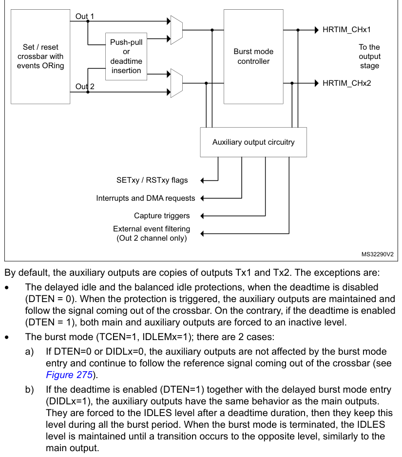

- The delayed idle and the balanced idle protections, when the deadtime is disabled (DTEN = 0). When
  the protection is triggered, the auxiliary outputs are maintained and follow the signal coming out
  of the crossbar. On the contrary, if the deadtime is enabled (DTEN = 1), both main and auxiliary
  outputs are forced to an inactive level.
- The burst mode (TCEN=1, IDLEMx=1); there are 2 cases:

a) If DTEN=0 or DIDLx=0, the auxiliary outputs are not affected by the burst mode
entry and continue to follow the reference signal coming out of the crossbar (see Figure 275).

b) If the deadtime is enabled (DTEN=1) together with the delayed burst mode entry

(DIDLx=1), the auxiliary outputs have the same behavior as the main outputs. They are forced to the
IDLES level after a deadtime duration, then they keep this level during all the burst period. When
the burst mode is terminated, the IDLES level is maintained until a transition occurs to the
opposite level, similarly to the main output.

**Figure 275. Auxiliary and main outputs during burst mode (DIDLx = 0)**

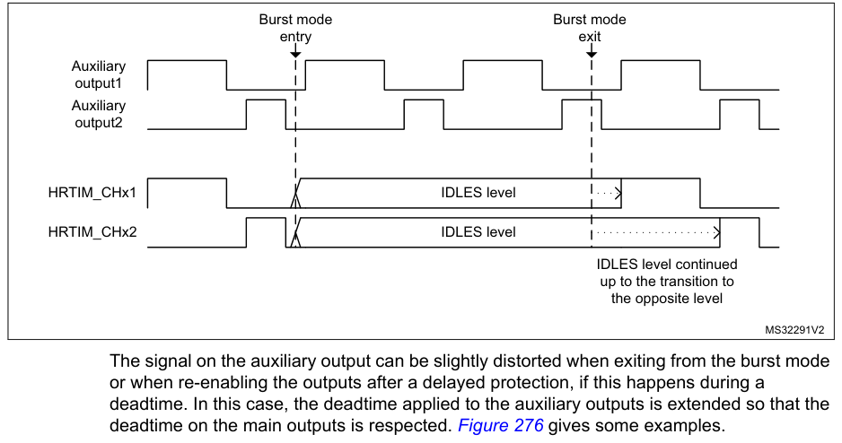

The signal on the auxiliary output can be slightly distorted when exiting from the burst mode or
when re-enabling the outputs after a delayed protection, if this happens during a deadtime. In this
case, the deadtime applied to the auxiliary outputs is extended so that the deadtime on the main
outputs is respected. Figure 276 gives some examples.

**Figure 276. Deadtime distortion on auxiliary output when exiting burst mode**

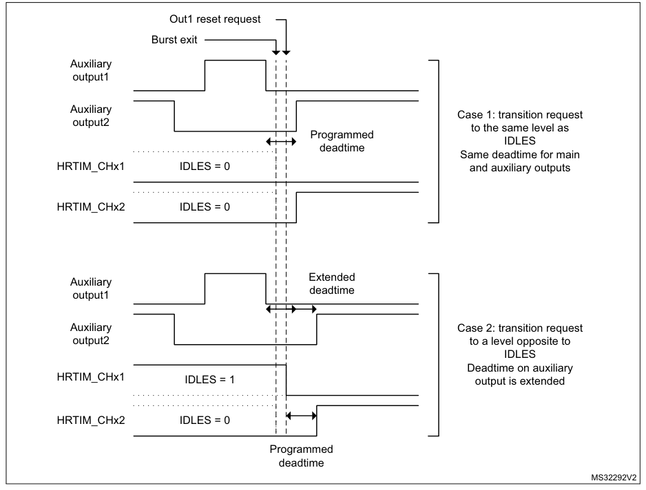

Out1 reset request

Burst exit

Auxiliary
output1

Auxiliary

Case 1: transition request
output2
to the same level as

Programmed

IDLES
deadtime

Same deadtime for main

### 28.3.19 Synchronizing the HRTIM with other timers or HRTIM instances

The HRTIM provides options for synchronizing multiple HRTIM instances, as a master unit (generating
a synchronization signal) or as a slave (waiting for a trigger to be synchronized). This feature can
also be used to synchronize the HRTIM with other timers, either external or on-chip. The
synchronization circuitry is controlled inside the master timer.

#### Synchronization output

This section explains how the HRTIM must be configured to synchronize external resources and act as
a master unit.

Four events can be selected as the source to be sent to the synchronization output. This is done
using SYNCSRC[1:0] bits in the HRTIM_MCR register, as follows:

- 00: master timer start This event is generated when MCEN bit is set or when the timer is
  re-started after having reached the period value in single-shot mode. It is also generated on a
  reset which occurs during the counting (when CONT or RETRIG bits are set).
- 01: master timer compare 1 event
- 10: timer A start This event is generated when TACEN bit is set or when the counter is reset and
  re-starts counting in response to this reset. The following counter reset events are not
  propagated to the synchronization output: counter roll-over in continuous mode, and discarded
  reset request in single-shot non-retriggerable mode. The reset is only taken into account when it
  occurs during the counting (CONT or RETRIG bits are set).
- 11: timer A compare 1 event

SYNCOUT[1:0] bits in the HRTIM_MCR register specify how the synchronization event is generated.

The synchronization pulses can be generated on the HRTIM_SCOUT output pin, with SYNCOUT[1:0] = 1x.
SYNCOUT[0] bit specifies the polarity of the synchronization signal. If SYNCOUT[0] = 0, the
HRTIM_SCOUT pin has a low idle level and issues a positive pulse of 16 fHRTIM clock cycles length
for the synchronization). If SYNCOUT[0] = 1, the idle level is high and a negative pulse is
generated.

> **Note:** The synchronization pulse is followed by an idle level of 16 fHRTIM clock cycles during which
> any new synchronization request is discarded. Consequently, the maximum synchronization frequency is
> fHRTIM/32.

The idle level on the HRTIM_SCOUT pin is applied as soon as the SYNCOUT[1:0] bits are enabled (i.e.
the bitfield value is different from 00).

The synchronization output initialization procedure must be done prior to the configuration of the
MCU outputs and counter enable, in the following order:

1. SYNCOUT[1:0] and SYNCSRC[1:0] bitfield configuration in HRTIM_MCR
2. HRTIM_SCOUT pin configuration (see the General-purpose I/Os section)
3. Master or timer A counter enable (MCEN or TACEN bit set)

When the synchronization input mode is enabled and starts the counter (using SYNCSTRTM/SYNCSTRTx
bits) simultaneously with the synchronization output mode (SYNCSRC[1:0] = 00 or 10), the output
pulse is generated only when the counter is starting or is reset while running. Any reset request
clearing the counter without causing it to start does not affect the synchronization output.

#### Synchronization input

The HRTIM can be synchronized by external sources, as per the programming of the SYNCIN[1:0] bits in
the HRTIM_MCR register:

- 00: synchronization input is disabled
- 01: reserved configuration
- 10: the On-chip timer TRGO output connected to hrtim_in_sync[2] input (refer to Table 222 for
  details).
- 11: a positive pulse on the HRTIM_SCIN input pin (hrtim_in_sync[3])

This bitfield cannot be changed once the destination timer (master timer or timing unit) is enabled
(MCEN and/or TxCEN bit set).

The HRTIM_SCIN input is rising-edge sensitive. The timer behavior is defined with the following bits
present in HRTIM_MCR and HRTIM_TIMxCR registers (see Table 254 for details):

- Synchronous start: the incoming signal starts the timer’s counter (SYNCSTRTM and/or SYNCSTRTx bits
  set). TxCEN (MCEN) bits must be set to have the timer enabled and the counter ready to start. In
  continuous mode, the counter does not start until the synchronization signal is received.
- Synchronous reset: the incoming signal resets the counter (SYNCRSTM and/or SYNCRSTx bits set).
  This event decrements the repetition counter as any other reset event.

The synchronization events are taken into account only once the related counters are enabled (MCEN
or TxCEN bit set). A synchronization request triggers a SYNC interrupt.

> **Note:** A synchronized start event resets the counter if the current counter value is above the active
> period value.

The effect of the synchronization event depends on the timer operating mode, as summarized in Table
254.

**Table 254. Effect of sync event versus timer operating modes**

| Source row | Column 1 | Column 2 |
| ---: | --- | --- |
| 1 | `SYNC SYNC` |  |
| 2 | `Operating mode` | `Behavior following a SYNC reset or start event` |
| 3 | `RSTx STRTx` |  |
| 4 | `Start events are taken into account when the counter is stopped and:` |  |

- once the MCEN or TxCEN bits are set
- once the period has been reached.

0 1

A start occurring when the counter is stopped at the period value resets the counter. A reset
request clears the counter but does not start it (the counter can solely be re-started with the
synchronization). Any reset occurring

Single-shot
during the counting is ignored (as during regular non-retriggerable mode).

non-retriggerable

Reset events are starting the timer counting. They are taken into account only if the counter is
stopped and:

- once the MCEN or TxCEN bits are set

1 X

- once the period has been reached.

When multiple reset requests are selected (from HRTIM_SCIN and from internal events), only the first
arriving request is taken into account.

**Table 254. Effect of sync event versus timer operating modes (continued)**

| Source row | Column 1 | Column 2 |
| ---: | --- | --- |
| 1 | `SYNC SYNC` |  |
| 2 | `Operating mode` | `Behavior following a SYNC reset or start event` |
| 3 | `RSTx STRTx` |  |

The counter start is effective only if the counter is not started or period is elapsed. Any
synchronization event occurring after counter start has no effect.

| Source row | Column 1 | Column 2 | Column 3 |
| ---: | --- | --- | --- |
| 1 | `0` | `1` | `A start occurring when the counter is stopped at the period value resets the` |
| 2 | `counter. A reset request clears the counter but does not start it (the counter` |  |  |
| 3 | `Single-shot` | `can solely be started by the synchronization). A reset occurring during` |  |

counting is taken into account (as during regular retriggerable mode).

retriggerable

The reset from HRTIM_SCIN is taken into account as any HRTIM’s timer counter reset from internal
events and is starting or re-starting the timer

| Source row | Column 1 | Column 2 | Column 3 |
| ---: | --- | --- | --- |
| 1 | `1` | `X` | `counting.` |

When multiple reset requests are selected, the first arriving request is taken into account.

The timer is enabled (MCEN or TxCEN bit set) and is waiting for the synchronization event to start
the counter. Any synchronization event

| Source row | Column 1 | Column 2 | Column 3 |
| ---: | --- | --- | --- |
| 1 | `0` | `1` | `occurring after the counter start has no effect (the counter can solely be` |

started by the synchronization). A reset request clears the counter but does not start it.

Continuous mode

The reset from HRTIM_SCIN is taken into account as any HRTIM’s timer counter reset from internal
events and is starting or re-starting the timer

1 X
counting. When multiple reset requests are selected, the first arriving request is taken into
account.

When a synchronization reset event occurs within the same fHRTIM clock cycle as the period event,
this reset is postponed to a programmed period event (since both events are causing a counter
roll-over). This applies only when the high-resolution is active (CKPSC[2:0] \< 5).

Figure 277 presents how the synchronized start is done in single-shot mode.

**Figure 277. Counter behavior in synchronized start mode**

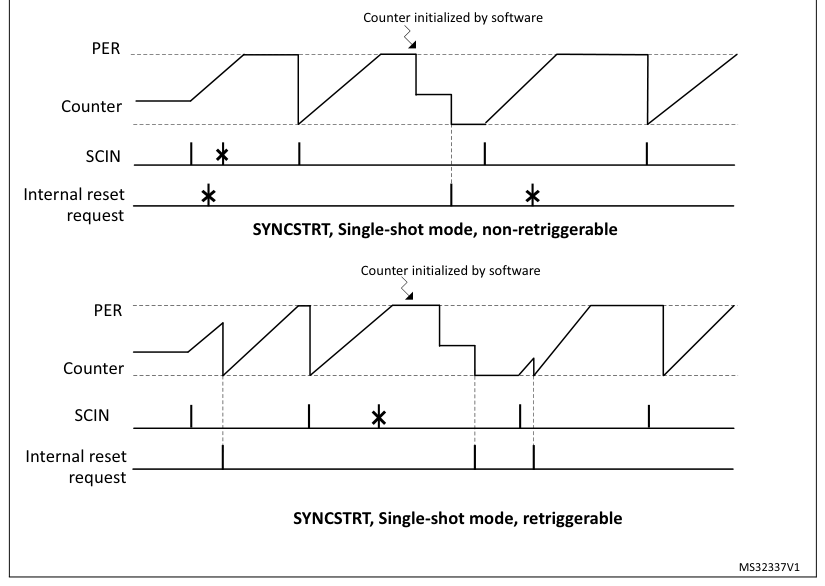

Counter initialized by software

PER

Counter

SCIN

Internal reset
request

SYNCSTRT, Single-shot mode, non-retriggerable

Counter initialized by software

PER

Counter

SCIN

Internal reset
request

SYNCSTRT, Single-shot mode, retriggerable

MS32337V1

### 28.3.20 ADC triggers

The ADCs can be triggered by the master and the 6 timing units.

10 independent triggers are available for both the regular and the injected sequencers of the ADCs.
The external events can be used as triggers. They are taken right after the conditioning defined in
the HRTIM_EECRx registers, and are not depending on the EEFxR1 and EEFxR2 register settings.

Up to 32 events can be combined (ORed) for ADC triggers 1 to 4, in HRTIM_ADC1R to HRTIM_ADC4R
registers, as shown on Figure 278. The ADC triggers 1/3 and 2/4 are using the same source set. A
multiple triggering is possible within a single switching period by selecting several sources
simultaneously. A typical use case is for a non-overlapping multiphase converter, where all phases
can be sampled in a row using a single ADC trigger output.

**Figure 278. ADC trigger selection overview**

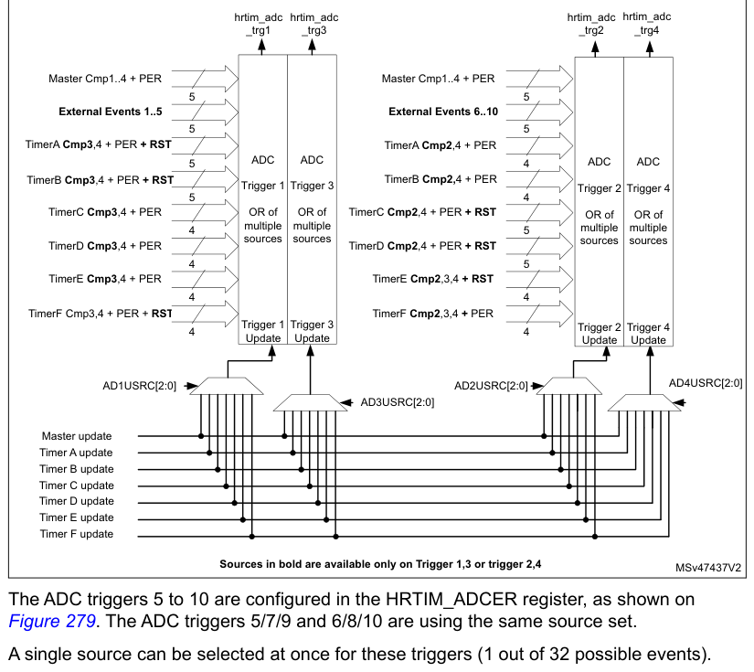

Figure 279. The ADC triggers 5/7/9 and 6/8/10 are using the same source set.

A single source can be selected at once for these triggers (1 out of 32 possible events).

**Figure 279. ADC triggers**

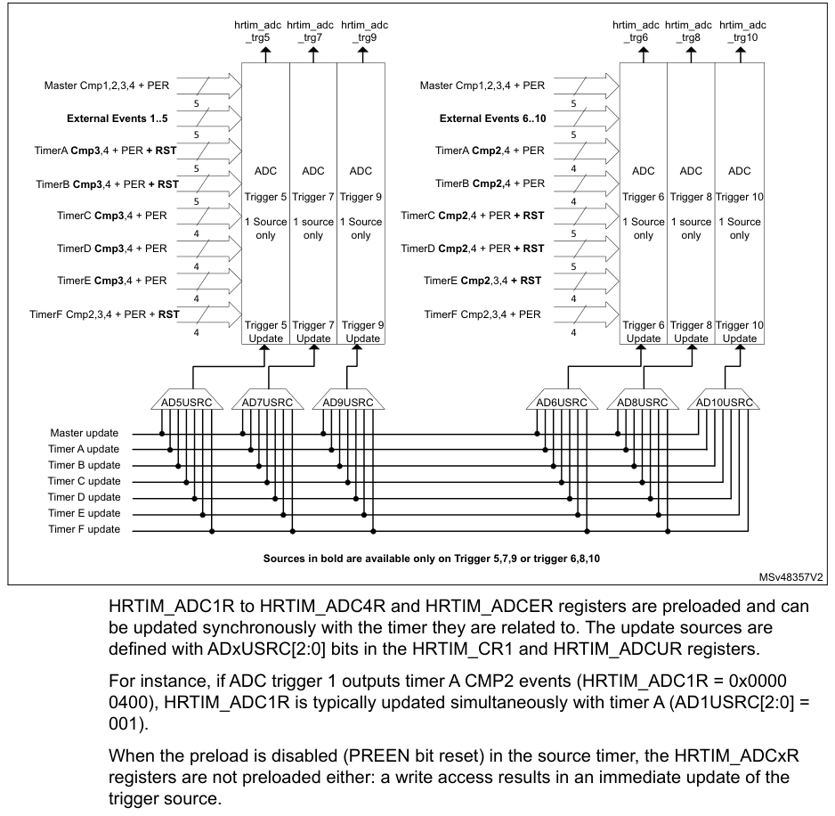

HRTIM_ADC1R to HRTIM_ADC4R and HRTIM_ADCER registers are preloaded and can be updated synchronously
with the timer they are related to. The update sources are defined with ADxUSRC[2:0] bits in the
HRTIM_CR1 and HRTIM_ADCUR registers.

For instance, if ADC trigger 1 outputs timer A CMP2 events (HRTIM_ADC1R = 0x0000 0400), HRTIM_ADC1R
is typically updated simultaneously with timer A (AD1USRC[2:0] = 001).

When the preload is disabled (PREEN bit reset) in the source timer, the HRTIM_ADCxR registers are
not preloaded either: a write access results in an immediate update of the trigger source.

#### ADC post-scaler

A post-scaling unit allows to reduce the ADC trigger rate with respect to the switching frequency.

Each ADC trigger rate can be individually adjusted using the ADCxPSC[4:0] bits in the HRTIM_ADCxPS1
and HRTIM_ADCxPS2 registers as shown in Figure 280 below for the up-counting mode.

In the center-aligned mode, the ADC post-scaling is done on events selected with the ADROM[1:0]
bitfield, programmed in the source timer, as shown in Figure 281. The

ADROM[1:0] bitfield is coding for any event that can trigger the ADC: reset, roll-over (period) and
compare event:

- ADROM[1:0] = 00: event generated both during up and down-counting phases
- ADROM[1:0] = 01: event generated during down-counting phases
- ADROM[1:0] = 10: event generated during up-counting phases

The ADC post-scaler programming register are preloaded and can be updated on-the-fly without
stopping the timers.

**Figure 280. ADC trigger post-scaling in up-counting mode**

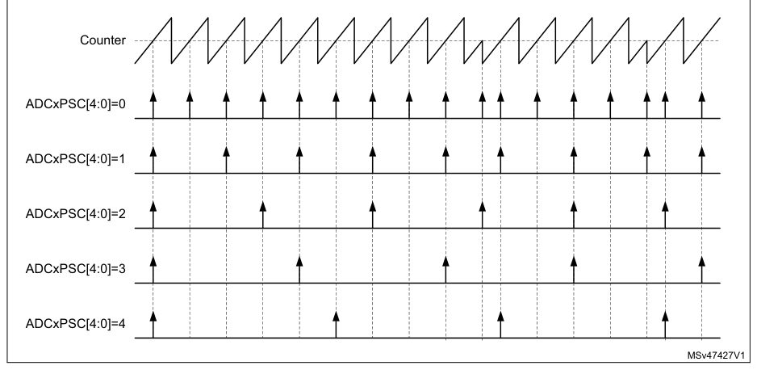

Counter

ADCxPSC[4:0]=0

ADCxPSC[4:0]=1

ADCxPSC[4:0]=2

ADCxPSC[4:0]=3

ADCxPSC[4:0]=4

MSv47427V1

**Figure 281. ADC trigger post-scaling in up/down counting mode**

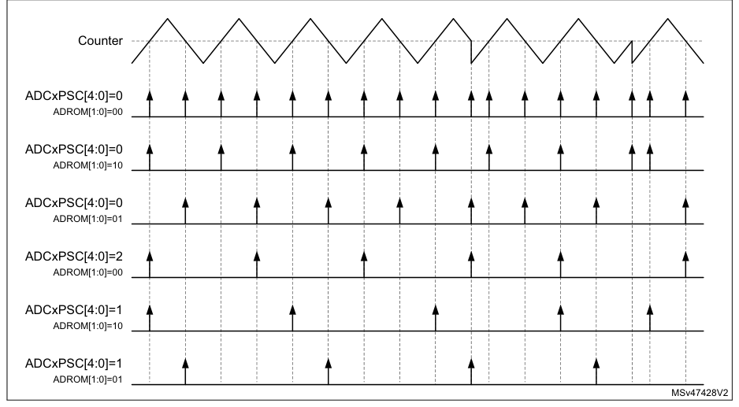

Counter

ADCxPSC[4:0]=0

ADROM[1:0]=00

ADCxPSC[4:0]=0

ADROM[1:0]=10

ADCxPSC[4:0]=0

ADROM[1:0]=01

ADCxPSC[4:0]=2

ADROM[1:0]=00

ADCxPSC[4:0]=1

ADROM[1:0]=10

ADCxPSC[4:0]=1

ADROM[1:0]=01

MSv47428V2

### 28.3.21 DAC triggers

The HRTIM allows to have the embedded DACs updated synchronously with the timer updates.

The update events from the master timer and the timer units can generate DAC update triggers on any
of the 3 hrtim_dac_trgx outputs.

> **Note:** Each timer has its own DAC-related control register.

DACSYNC[1:0] bits of the HRTIM_MCR and HRTIM_TIMxCR registers are programmed as follows:

- 00: No update generated
- 01: Update generated on hrtim_dac_trg1
- 10: Update generated on hrtim_dac_trg2
- 11: Update generated on hrtim_dac_trg3

An output pulse of 1 fHRTIM clock periods is generated on the hrtim_dac_trgx output.

When DACSYNC[1:0] bits are enabled in multiple timers, the hrtim_dac_trgx output consists of an OR
of all timers’ update events. For instance, if DACSYNC = 1 in timer A and in timer B, the update
event in timer A is ORed with the update event in timer B to generate a DAC update trigger on the
corresponding hrtim_dac_trgx output, as shown on Figure 282.

**Figure 282. Combining several updates on a single hrtim_dac_trgx output**

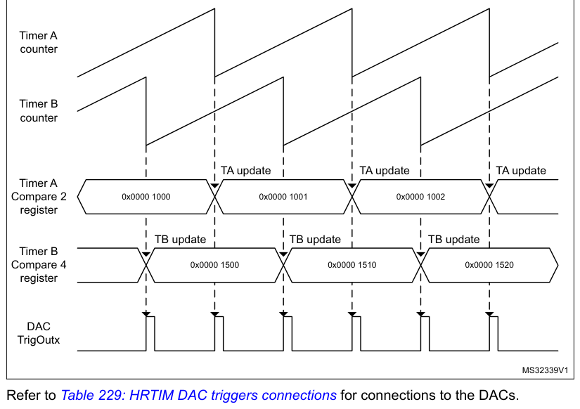

Refer to Table 229: HRTIM DAC triggers connections for connections to the DACs.

#### Dual channel DAC trigger

Slope compensation techniques and hysteretic control to be easily implemented using HRTIM built-in
features and the DAC sawtooth generator. The principle is to have a DAC generating a decreasing
saw-tooth synchronized with the PWM period, or a square wave synchronized with PWM signal.

This mode is enabled with the DCDE bit in the TIMxCR2 register. This bit cannot be changed once the
timer is operating (TxEN bit set).

It uses two trigger outputs, as shown on the Figure 283 below:

- the hrtim_dac_reset_trgx generates DAC reset/update events
- the hrtim_dac_step_trgx generates requests for incremental DAC value changes

The DCDR bit in the TIMxCR2 register defines when the hrtim_dac_reset_trgx trigger is generated:

- DCDR = 0: the trigger is generated on counter reset or roll-over event
- DCDR = 1: the trigger is generated on output 1 set event

> **Note:** The DCDR bit is not significant when the DCDE bit is reset (Dual channel DAC trigger
> disabled).

The DCDS bit in the TIMxCR2 register defines when the hrtim_dac_step_trgx trigger is generated:

- DCDS = 0: the trigger is generated on compare 2 event
- DCDS = 1: the trigger is generated on output 1 reset event

The DCDR and DCDS bits allows the following use cases to be covered:

- Edge-aligned slope compensation (DCDR = DCDS = 0): the DAC’s sawtooth starts on PWM period
  beginning and multiple triggers are generated during the period
- Center-aligned slope compensation (DCDR = 1 DCDS = 0): the DAC’s sawtooth starts on the output set
  event and multiple triggers are generated during the period
- Hysteretic controller: the DAC value must be changed twice per period, when the output state
  changes. 2 triggers are generated per PWM period. In edge-aligned mode (DCDR=0, DCDS =1), the
  triggers are generated on counter reset or roll-over. In center-aligned mode (DCDR=1, DCDS=1), the
  triggers are generated when the output is set.

The compare 2 has a particular operating mode when the DCDE is set and the DCDS bit is reset. The
active comparison value is automatically updated as soon as a compare match has occured, so that the
trigger can be repeated periodically with a period equal to the CMP2 value, as represented on Figure
283\. The dual channel DAC trigger with DCDS bit reset (compare 2 event used) must not be used
simultaneously with modes using CMP2 (triple / quad interleaved and triggered-half modes).

> **Note:** The CMP2 value can be changed on-the-fly. The new value is taken into account on the
> next coming compare match.

> **Note:** When the DCDS bit is reset, the CMP2 value must not be modified by other mechanisms:

the interleaved, triggered half and balanced idle modes must be disabled.

Table 255 below gives an example, for generating 6 triggers within a PWM period. It shows that it is
necessary to round up the division result to the upper value.

Let’s consider a counter period TIMxPER = 8192. Dividing 8192 by 6 yields 1365.33.

- Round down value: 1365: 7 triggers are generated, the 6th and 7th being very close (respectively
  for counter = 8190 and 8192)
- Round up value:1366: 6 triggers are generated. The 6th trigger on dac_step_trg (for counter =
  8192) is aborted by the counter roll-over from 8192 to 0.

**Table 255. DAC dual channel trigger example**

| Source row | Column 1 | Column 2 | Column 3 | Column 4 | Column 5 | Column 6 | Column 7 |
| ---: | --- | --- | --- | --- | --- | --- | --- |
| 1 | `-` | `CMP2 = 1365` | `dac_trg` | `dac_step_trg` | `CMP2 = 1366` | `dac_trg` | `dac_step_trg` |
| 2 | `1365` | `-` | `1` | `1366` | `-` | `1` |  |
| 3 | `2730` | `-` | `2` | `2732` | `-` | `2` |  |
| 4 | `4095` | `-` | `3` | `4098` | `-` | `3` |  |
| 5 | `5460` | `-` | `4` | `5464` | `-` | `4` |  |
| 6 | `Counter value` | `6825` | `-` | `5` | `6830` | `-` | `5` |
| 7 | `8190` | `-` | `6` | `8192` | `6` | `-` |  |
| 8 | `8192` | `7` | `-` | `1366` | `-` | `1` |  |
| 9 | `1365` | `-` | `1` | `2732` | `-` | `2` |  |
| 10 | `...` | `-` | `-` | `...` | `-` | `-` |  |

> **Note:** In centered-pattern mode, it is mandatory to have an even number of triggers per switching
> period, so as to avoid unevenly spaced triggers around counter’s peak value.

**Figure 283. DAC triggers for slope compensation**

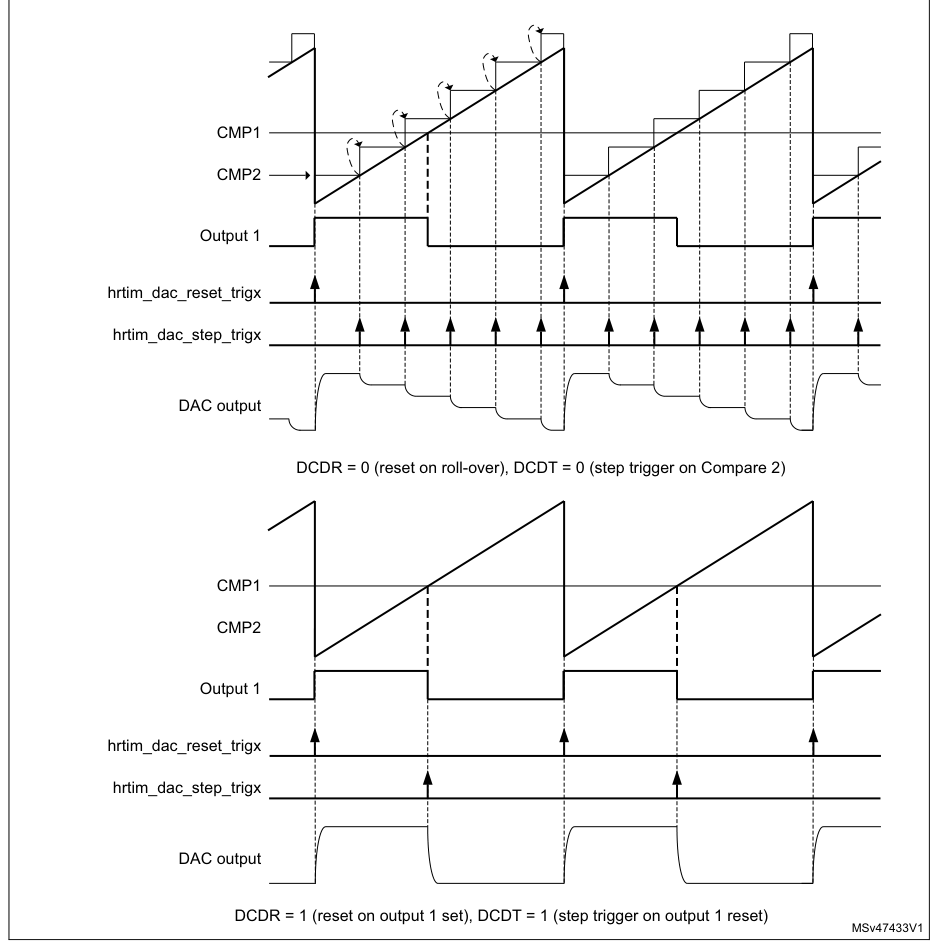

CMP1

CMP2

Output 1
hrtim_dac_reset_trigx
hrtim_dac_step_trigx

DAC output

DCDR = 0 (reset on roll-over), DCDT = 0 (step trigger on Compare 2)

CMP1

CMP2

Output 1
hrtim_dac_reset_trigx
hrtim_dac_step_trigx

DAC output

DCDR = 1 (reset on output 1 set), DCDT = 1 (step trigger on output 1 reset)

MSv47433V1

The Figure 284 below provides an overview of all the available DAC triggers.

**Figure 284. DAC triggers overview**

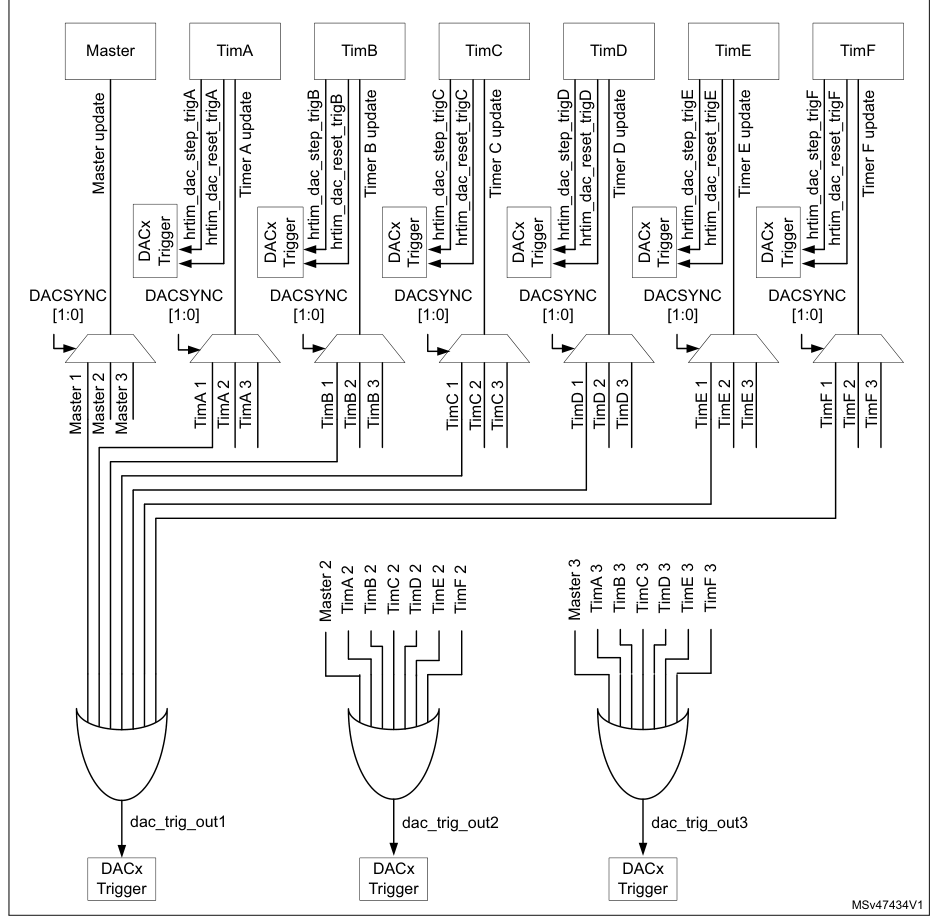

### 28.3.22 Interrupts

7 interrupts can be generated by the master timer:

- Master timer registers update
- Synchronization event received
- Master timer repetition event
- Master compare 1 to 4 event

14 interrupts can be generated by each timing unit:

- Delayed protection triggered
- Counter reset or roll-over event
- Output 1 and output 2 reset (transition active to inactive)
- Output 1 and output 2 set (transition inactive to active)
- Capture 1 and 2 events
- Timing unit registers update
- Repetition event
- Compare 1 to 4 event

8 global interrupts are generated for the whole HRTIM:

- System fault and fault 1 to 6 (regardless of the timing unit attribution)
- DLL calibration done
- Burst mode period completed

The interrupt requests are grouped in 8 vectors as follows:

- hrtim_it1: master timer interrupts (master update, sync Input, repetition, MCMP1..4) and global
  interrupt except faults (burst mode period and DLL ready interrupts)
- hrtim_it2: TIMA interrupts
- hrtim_it3: TIMB interrupts
- hrtim_it4: TIMC interrupts
- hrtim_it5: TIMD interrupts
- hrtim_it6: TIME interrupts
- hrtim_it7: TIMF interrupts
- hrtim_it8: Dedicated vector all fault interrupts to allow high-priority interrupt handling

Table 256 is a summary of the interrupt requests, their mapping and associated control, and status
bits.

**Table 256. HRTIM interrupt summary**

| Source row | Column 1 | Column 2 | Column 3 | Column 4 | Column 5 |
| ---: | --- | --- | --- | --- | --- |
| 1 | `Interrupt` | `Enable` | `Flag clearing` |  |  |
| 2 | `Interrupt event` | `Event flag` |  |  |  |
| 3 | `vector` | `control bit` | `bit` |  |  |
| 4 | `Burst mode period completed` | `BMPER` | `BMPERIE` | `BMPERC` |  |
| 5 | `DLL calibration done` | `DLLRDY` | `DLLRDYIE` | `DLLRDYC` |  |
| 6 | `Master timer registers update` | `MUPD` | `MUPDIE` | `MUPDC` |  |
| 7 | `Synchronization event received` | `SYNC` | `SYNCIE` | `SYNCC` |  |
| 8 | `hrtim_it1` | `Master timer repetition event` | `MREP` | `MREPIE` | `MREPC` |
| 9 | `MCMP1` | `MCMP1IE` | `MCP1C` |  |  |
| 10 | `MCMP2` | `MCMP2IE` | `MCP2C` |  |  |
| 11 | `Master compare 1 to 4 event` |  |  |  |  |
| 12 | `MCMP3` | `MCMP3IE` | `MCP3C` |  |  |
| 13 | `MCMP4` | `MCMP4IE` | `MCP4C` |  |  |

**Table 256. HRTIM interrupt summary (continued)**

| Source row | Column 1 | Column 2 | Column 3 | Column 4 |
| ---: | --- | --- | --- | --- |
| 1 | `Interrupt` | `Enable` | `Flag clearing` |  |
| 2 | `Interrupt event` | `Event flag` |  |  |
| 3 | `vector` | `control bit` | `bit` |  |
| 4 | `Delayed protection triggered` | `DLYPRT` | `DLYPRTIE` | `DLYPRTC` |
| 5 | `Counter reset or roll-over event` | `RST` | `RSTIE` | `RSTC` |
| 6 | `RSTx1` | `RSTx1IE` | `RSTx1C` |  |
| 7 | `Output 1 and output 2 reset (transition` |  |  |  |
| 8 | `active to inactive)` |  |  |  |
| 9 | `RSTx2` | `RSTx2IE` | `RSTx2C` |  |
| 10 | `SETx1` | `SETx1IE` | `SETx1C` |  |
| 11 | `Output 1 and output 2 set (transition` |  |  |  |
| 12 | `hrtim_it2` |  |  |  |
| 13 | `inactive to active)` |  |  |  |
| 14 | `SETx2` | `SETx2IE` | `SETx2C` |  |
| 15 | `hrtim_it3` |  |  |  |
| 16 | `CPT1` | `CPT1IE` | `CPT1C` |  |
| 17 | `hrtim_it4` |  |  |  |
| 18 | `Capture 1 and 2 events` |  |  |  |
| 19 | `hrtim_it5` | `CPT2` | `CPT2IE` | `CPT2C` |
| 20 | `hrtim_it6` |  |  |  |
| 21 | `Timing unit registers update` | `UPD` | `UPDIE` | `UPDC` |
| 22 | `hrtim_it7` |  |  |  |
| 23 | `Repetition event` | `REP` | `REPIE` | `REPC` |
| 24 | `CMP1` | `CMP1IE` | `CMP1C` |  |
| 25 | `CMP2` | `CMP2IE` | `CMP2C` |  |
| 26 | `Compare 1 to 4 event` |  |  |  |
| 27 | `CMP3` | `CMP3IE` | `CMP3C` |  |
| 28 | `CMP4` | `CMP4IE` | `CMP4C` |  |
| 29 | `System fault` | `SYSFLT` | `SYSFLTIE` | `SYSFLTC` |
| 30 | `FLT1` | `FLT1IE` | `FLT1C` |  |
| 31 | `FLT2` | `FLT2IE` | `FLT2C` |  |
| 32 | `hrtim_it8` | `FLT3` | `FLT3IE` | `FLT3C` |
| 33 | `Fault 1 to 6` |  |  |  |
| 34 | `FLT4` | `FLT4IE` | `FLT4C` |  |
| 35 | `FLT5` | `FLT5IE` | `FLT5C` |  |
| 36 | `FLT6` | `FLT6IE` | `FLT6C` |  |

### 28.3.23 DMA

Most of the events able to generate an interrupt can also generate a DMA request, even both
simultaneously. Each timer (master, TIMA...F) has its own DMA enable register.

The individual DMA requests are ORed into 7 channels as follows:

- 1 channel for the master timer
- 1 channel per timing unit (TIMA...F)

> **Note:** Before disabling a DMA channel (DMA enable bit reset in TIMxDIER), it is necessary to
> disable first the DMA controller.

Table 257 is a summary of the events with their associated DMA enable bits.

**Table 257. HRTIM DMA request summary**

| Source row | Column 1 | Column 2 | Column 3 |
| ---: | --- | --- | --- |
| 1 | `DMA DMA enable` |  |  |
| 2 | `DMA Channel` | `Event` |  |
| 3 | `capable` | `bit` |  |
| 4 | `Burst mode period completed` | `No` | `N/A` |
| 5 | `DLL calibration done` | `No` | `N/A` |
| 6 | `Master timer registers update` | `Yes` | `MUPDDE` |
| 7 | `Synchronization event received` | `Yes` | `SYNCDE` |
| 8 | `hrtim_dma1` |  |  |
| 9 | `Master timer repetition event` | `Yes` | `MREPDE` |
| 10 | `(master timer)` |  |  |
| 11 | `Yes MCMP1DE` |  |  |
| 12 | `Yes MCMP2DE` |  |  |
| 13 | `Master compare 1 to 4 event` |  |  |
| 14 | `Yes MCMP3DE` |  |  |
| 15 | `Yes MCMP4DE` |  |  |
| 16 | `Delayed protection triggered` | `Yes` | `DLYPRTDE` |
| 17 | `Counter reset or roll-over event` | `Yes` | `RSTDE` |
| 18 | `Yes RSTx1DE` |  |  |
| 19 | `Output 1 and output 2 reset (transition active to inactive)` |  |  |
| 20 | `Yes RSTx2DE` |  |  |
| 21 | `Yes SETx1DE` |  |  |
| 22 | `Output 1 and output 2 set (transition` |  |  |
| 23 | `hrtim_dma2 (timer A)` |  |  |
| 24 | `inactive to active)` |  |  |
| 25 | `Yes SETx2DE` |  |  |
| 26 | `hrtim_dma3 (timer B)` |  |  |
| 27 | `Yes` | `CPT1DE` |  |
| 28 | `hrtim_dma4 (timer C)` |  |  |
| 29 | `Capture 1 and 2 events` |  |  |
| 30 | `hrtim_dma5 (timer D)` |  |  |
| 31 | `Yes` | `CPT2DE` |  |
| 32 | `hrtim_dma6 (timer E)` |  |  |
| 33 | `Timing unit registers update` | `Yes` | `UPDDE` |
| 34 | `hrtim_dma7 (timer F)` |  |  |
| 35 | `Repetition event` | `Yes` | `REPDE` |
| 36 | `Yes CMP1DE` |  |  |
| 37 | `Yes CMP2DE` |  |  |
| 38 | `Compare 1 to 4 event` |  |  |
| 39 | `Yes CMP3DE` |  |  |
| 40 | `Yes CMP4DE` |  |  |
| 41 | `System fault` | `No` | `N/A` |
| 42 | `Fault 1 to 6` | `No` | `N/A` |
| 43 | `N/A` |  |  |
| 44 | `Burst mode period completed` | `No` | `N/A` |
| 45 | `DLL calibration done` | `No` | `N/A` |

#### Burst DMA transfers

In addition to the standard DMA requests, the HRTIM features a DMA burst controller to have multiple
registers updated with a single DMA request. This allows to:

- update multiple data registers with one DMA channel only,
- reprogram dynamically one or several timing units, for converters using multiple timer outputs.

The burst DMA feature is only available for one DMA channel, but any of the 6 channels can be
selected for burst DMA transfers.

The principle is to program which registers are to be written by DMA. The master timer and TIMA..E
have the burst DMA update register, where most of their control and data registers are associated
with a selection bit: HRTIM_BDMUPR, HRTIM_BDTAUPR to HRTIM_BDTEUPR (this is applicable only for
registers with write accesses). A redirection mechanism allows to forward the DMA write accesses to
the HRTIM registers automatically, as shown on Figure 285.

**Figure 285. DMA burst overview**

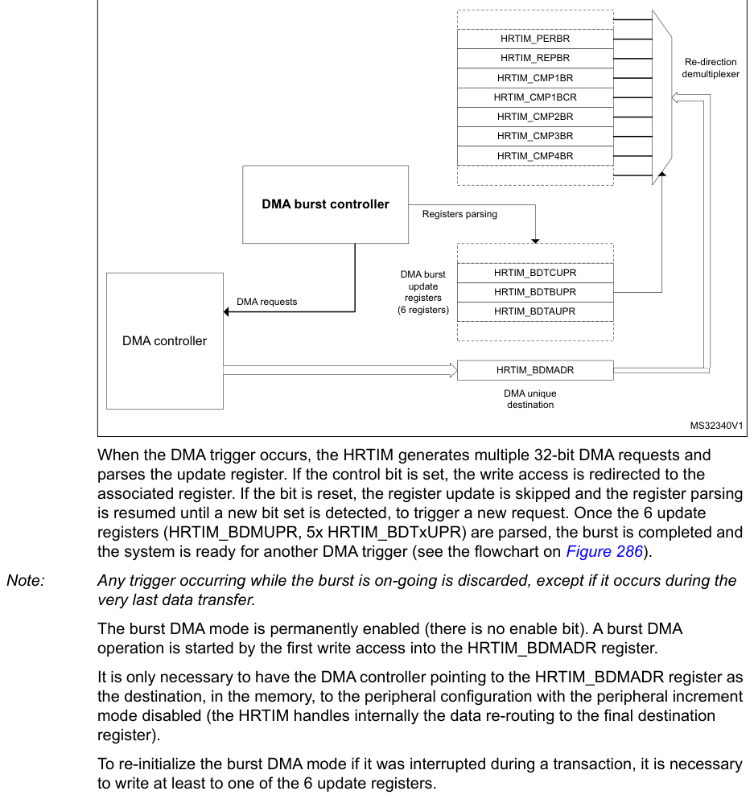

HRTIM_PERBR

HRTIM_REPBR

Re-direction demultiplexer

HRTIM_CMP1BR

HRTIM_CMP1BCR

HRTIM_CMP2BR

HRTIM_CMP3BR

HRTIM_CMP4BR

DMA burst controller

Registers parsing

When the DMA trigger occurs, the HRTIM generates multiple 32-bit DMA requests and parses the update
register. If the control bit is set, the write access is redirected to the associated register. If
the bit is reset, the register update is skipped and the register parsing is resumed until a new bit
set is detected, to trigger a new request. Once the 6 update registers (HRTIM_BDMUPR, 5x
HRTIM_BDTxUPR) are parsed, the burst is completed and the system is ready for another DMA trigger
(see the flowchart on Figure 286).

> **Note:** Any trigger occurring while the burst is on-going is discarded, except if it occurs during the
> very last data transfer.

The burst DMA mode is permanently enabled (there is no enable bit). A burst DMA operation is started
by the first write access into the HRTIM_BDMADR register.

It is only necessary to have the DMA controller pointing to the HRTIM_BDMADR register as the
destination, in the memory, to the peripheral configuration with the peripheral increment mode
disabled (the HRTIM handles internally the data re-routing to the final destination register).

To re-initialize the burst DMA mode if it was interrupted during a transaction, it is necessary to
write at least to one of the 6 update registers.

**Figure 286. Burst DMA operation flowchart**

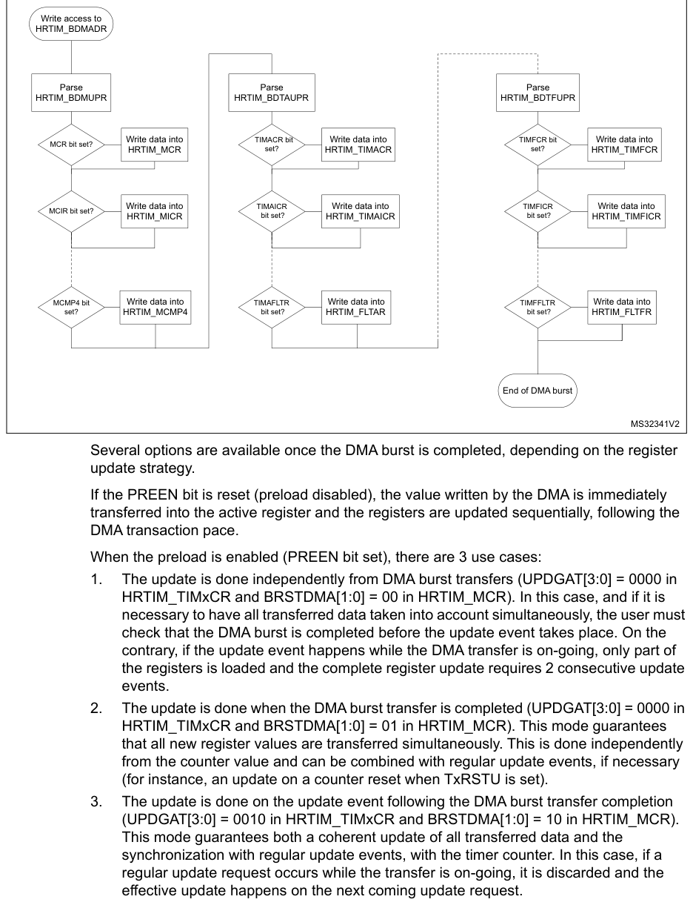

Several options are available once the DMA burst is completed, depending on the register update
strategy.

If the PREEN bit is reset (preload disabled), the value written by the DMA is immediately
transferred into the active register and the registers are updated sequentially, following the DMA
transaction pace.

When the preload is enabled (PREEN bit set), there are 3 use cases:

1. The update is done independently from DMA burst transfers (UPDGAT[3:0] = 0000 in

HRTIM_TIMxCR and BRSTDMA[1:0] = 00 in HRTIM_MCR). In this case, and if it is necessary to have all
transferred data taken into account simultaneously, the user must check that the DMA burst is
completed before the update event takes place. On the contrary, if the update event happens while
the DMA transfer is on-going, only part of the registers is loaded and the complete register update
requires 2 consecutive update events.

2. The update is done when the DMA burst transfer is completed (UPDGAT[3:0] = 0000 in

HRTIM_TIMxCR and BRSTDMA[1:0] = 01 in HRTIM_MCR). This mode guarantees that all new register values
are transferred simultaneously. This is done independently from the counter value and can be
combined with regular update events, if necessary (for instance, an update on a counter reset when
TxRSTU is set).

3. The update is done on the update event following the DMA burst transfer completion

(UPDGAT[3:0] = 0010 in HRTIM_TIMxCR and BRSTDMA[1:0] = 10 in HRTIM_MCR). This mode guarantees both a
coherent update of all transferred data and the synchronization with regular update events, with the
timer counter. In this case, if a regular update request occurs while the transfer is on-going, it
is discarded and the effective update happens on the next coming update request.

The chronogram on Figure 287 presents the active register content for 3 cases: PREEN=0, UPDGAT[3:0]
= 0001 and UPDGAT[3:0] = 0001 (when PREEN = 1).

**Figure 287. Registers update following DMA burst transfer**

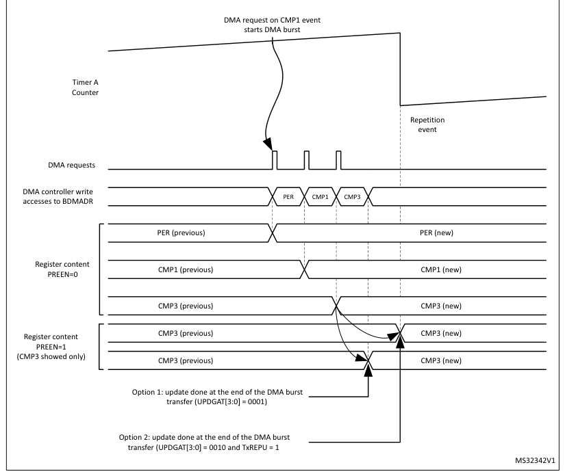

DMA request on CMP1 event
starts DMA burst

Timer A

Counter

Repetition
event

DMA requests

DMA controller write

PER CMP1 CMP3
accesses to BDMADR

### 28.3.24 HRTIM initialization

This section describes the recommended HRTIM initialization procedure, including other related MCU
peripherals.

The HRTIM clock source must be enabled in the reset and clock control unit (RCC), while respecting
the fHRTIM range for the DLL lock.

The DLL calibration must be started by setting CAL bit in HRTIM_DLLCR register.

The HRTIM master and timing units can be started only once the high-resolution unit is ready. This
is indicated by the DLLRDY flag set. The DLLRDY flag can be polled before resuming the
initialization or the calibration can run in background while other registers of the HRTIM or other
MCU peripherals are initialized. In this case, the DLLRDY flag must be checked before starting the
counters (an end-of-calibration interrupt can be issued if necessary, enabled with DLLRDYIE flag in
HRTIM_IER). Once the DLL calibration is done, CALEN bit must be set to have it done periodically and
compensate for potential voltage and temperature drifts. The calibration periodicity is defined
using the CALRTE[1:0] bitfield in the HRTIM_DLLCR register.

The HRTIM control registers can be initialized as per the power converter topology and the timing
units use case. All inputs have to be configured (source, polarity, edge-sensitivity).

The HRTIM outputs must be set up eventually, with the following sequence:

- the polarity must be defined using POLx bits in HRTIM_OUTxR
- the FAULT and IDLE states must be configured using FAULTx[1:0] and IDLESx bits in HRTIM_OUTxR

The HRTIM outputs are ready to be connected to the MCU I/Os. In the GPIO controller, the selected
HRTIM I/Os have to be configured as per the alternate function mapping table in the product
datasheet.

From this point on, the HRTIM controls the outputs, which are in the IDLE state.

The outputs are configured in RUN mode by setting TxyOEN bits in the HRTIM_OENR register. The 2
outputs are in the inactive state until the first valid set/reset event in RUN mode. Any output
set/reset event (except software requests using SST, SRT) are ignored as long as TxCEN bit is reset,
as well as burst mode requests (IDLEM bit value is ignored). Similarly, any counter reset request
coming from the burst mode controller is ignored (if TxBM bit is set).

> **Note:** When the deadtime insertion is enabled (DTEN bit set), it is necessary to force the output
> state by software, using SST and RST bits, to have the outputs in a complementary state as soon as
> the RUN mode is entered.

The HRTIM operation can eventually be started by setting TxCEN or MCEN bits in HRTIM_MCR.

If the HRTIM peripheral is reset with the Reset and Clock Controller, the output control is released
to the GPIO controller and the outputs are tri stated.

### 28.3.25 Debug

When a microcontroller enters the debug mode (Cortex®-M4 with FPU core halted), the TIMx counter
either continues to work normally or stops, depending on DBG_HRTIM_STOP configuration bit in DBG
module:

- DBG_HRTIM_STOP = 0: no behavior change, the HRTIM continues to operate.
- DBG_HRTIM_STOP = 1: all HRTIM timers, including the master, are stopped. The outputs in RUN mode
  enter the FAULT state if FAULTx[1:0] = 01,10,11, or keep their current state if FAULTx[1:0] = 00.
  The outputs in idle state are maintained in this state. This is permanently maintained even if the
  MCU exits the halt mode. This allows to maintain a safe state during the execution stepping. The
  outputs can be enabled again by settings TxyOEN bit (requires the use of the debugger).

Timer behavior during MCU halt when DBG_HRTIM_STOP = 1

The set/reset crossbar, the dead-time and push-pull unit, the idle/balanced fault detection and all
the logic driving the normal output in RUN mode are not affected by debug. The output keeps on
toggling internally, so as to retrieve regular signals of the outputs when TxyOEN is set again
(during or after the MCU halt). Associated triggers and filters are also following internal
waveforms when the outputs are disabled.

FAULT inputs and events (any source) are enabled during the MCU halt.

Fault status bits can be set and TxyOEN bits reset during the MCU halt if a fault occurs at that
time (TxyOEN and TxyODS are not affected by DBG_HRTIM_STOP bit state).

Synchronization, counter reset, start and reset-start events are discarded in debug mode, as well as
capture events. This is to keep all related registers stable as long as the MCU is halted.

The counter stops counting when a breakpoint is reached. However, the counter enable signal is not
reset; consequently no start event is emitted when exiting from debug. All counter reset and capture
triggers are disabled, as well as external events (ignored as long as the MCU is halted). The
outputs SET and RST flags are frozen, except in case of forced software set/reset. A level-sensitive
event is masked during the debug but is active again as soon as the debug is exited. For
edge-sensitive events, if the signal is maintained active during the MCU halt, a new edge is not
generated when exiting from debug.

The update events are discarded. This prevents any update trigger on hrtim_upd_en[3:1] inputs. DMA
triggers are disabled. The burst mode circuit is frozen: the triggers are ignored and the burst mode
counter stopped.

DLL calibration is not blocked while the MCU is halted (the DLLRDY flag can be set).

## 28.4 Application use cases

### 28.4.1 Buck converter

Buck converters are of common use as step-down converters. The HRTIM can control up to 12 buck
converters with 7 independent switching frequencies.

The converter usually operates at a fixed frequency and the Vin/Vout ratio depends on the duty cycle
D applied to the power switch:.

> **Extracted layout**
>
> `Vout` · `=` · `D` · `×` · `V`  
> `in`  

The topology is given on Figure 288 with the connection to the ADC for voltage reading.

**Figure 288. Buck converter topology**

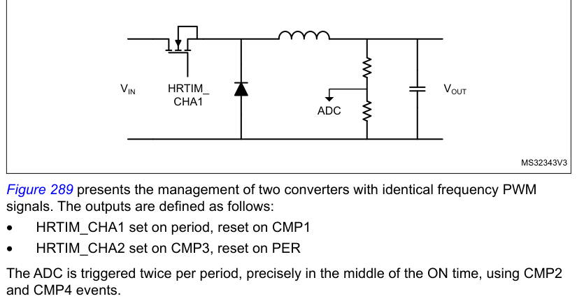

Figure 289 presents the management of two converters with identical frequency PWM signals. The
outputs are defined as follows:

- HRTIM_CHA1 set on period, reset on CMP1
- HRTIM_CHA2 set on CMP3, reset on PER

The ADC is triggered twice per period, precisely in the middle of the ON time, using CMP2 and CMP4
events.

**Figure 289. Dual Buck converter management**

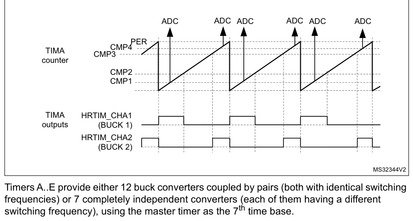

Timers A..E provide either 12 buck converters coupled by pairs (both with identical switching
frequencies) or 7 completely independent converters (each of them having a different switching
frequency), using the master timer as the 7th time base.

### 28.4.2 Buck converter with synchronous rectification

Synchronous rectification allows to minimize losses in buck converters, by means of a FET replacing
the freewheeling diode. Synchronous rectification can be turned on or off on the fly depending on
the output current level, as shown on Figure 290.

**Figure 290. Synchronous rectification depending on output current**

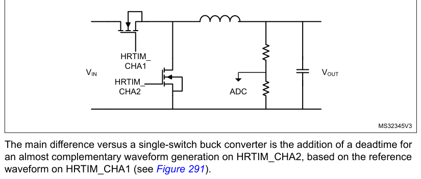

The main difference versus a single-switch buck converter is the addition of a deadtime for an
almost complementary waveform generation on HRTIM_CHA2, based on the reference waveform on
HRTIM_CHA1 (see Figure 291).

**Figure 291. Buck with synchronous rectification**

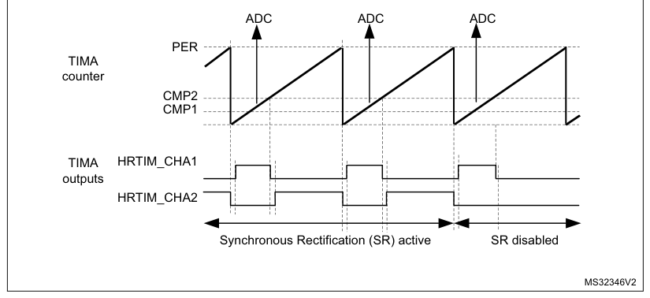

### 28.4.3 Multiphase converters

Multiphase techniques can be applied to multiple power conversion topologies (buck, flyback). Their
main benefits are:

- Reduction of the current ripple on the input and output capacitors
- Reduced EMI
- Higher efficiency at light load by dynamically changing the number of phases (phase shedding)

The HRTIM manages multiple converters. The number of converters that can be controlled depends on
the topologies and resources used (including the ADC triggers):

- 5 buck converters with synchronous rectification (SR), using the master timer and the 5 timers
- 4 buck converters (without SR), using the master timer and 2 timers

Figure 292 presents the topology of a 3-phase interleaved buck converter.

**Figure 292. 3-phase interleaved buck converter**

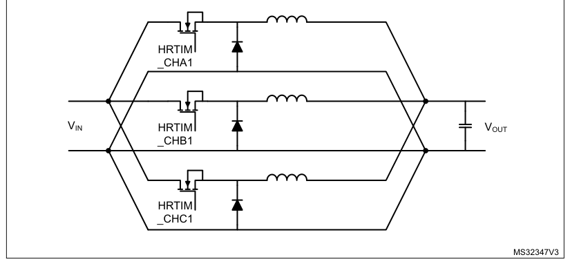

The master timer is responsible for the phase management: it defines the phase relationship between
the converters by resetting the timers periodically. The phase-shift is 360° divided by the number
of phases, 120° in the given example.

The duty cycle is then programmed into each of the timers. The outputs are defined as follows:

- HRTIM_CHA1 set on master timer period, reset on TACMP1
- HRTIM_CHB1 set on master timer MCMP1, reset on TBCMP1
- HRTIM_CHC1 set on master timer MCMP2, reset on TCCMP1

The ADC trigger can be generated on TxCMP2 compare event. Since all ADC trigger sources are
phase-shifted because of the converter topology, it is possible to have all of them combined into a
single ADC trigger to save ADC resources (for instance 1 ADC regular channel for the full
multi-phase converter).

**Figure 293. 3-phase interleaved buck converter control**

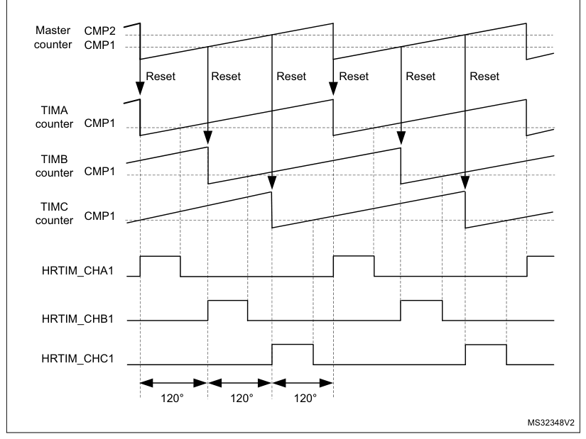

### 28.4.4 Transition mode power factor correction

The basic operating principle is to build up current into an inductor during a fixed Ton time. This
current then decays during the Toff time, and the period is re-started when it becomes null. This is
detected using a Zero Crossing Detection circuitry (ZCD), as shown on

Figure 294. With a constant Ton time, the peak current value in the inductor is proportional to the
rectified AC input voltage, which provides the power factor correction.

**Figure 294. Transition mode PFC**

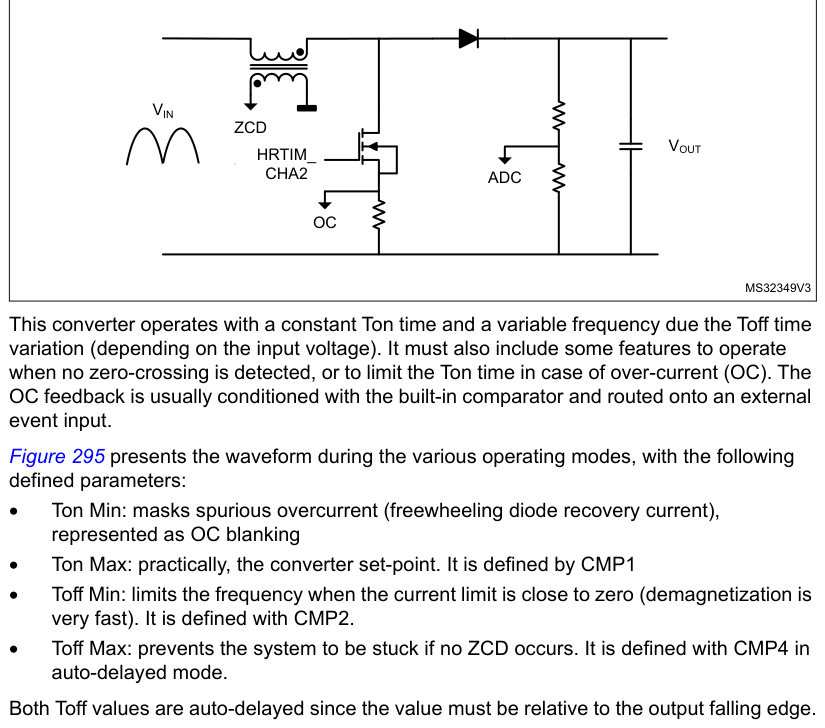

This converter operates with a constant Ton time and a variable frequency due the Toff time
variation (depending on the input voltage). It must also include some features to operate when no
zero-crossing is detected, or to limit the Ton time in case of over-current (OC). The OC feedback is
usually conditioned with the built-in comparator and routed onto an external event input.

Figure 295 presents the waveform during the various operating modes, with the following defined
parameters:

- Ton Min: masks spurious overcurrent (freewheeling diode recovery current), represented as OC
  blanking
- Ton Max: practically, the converter set-point. It is defined by CMP1
- Toff Min: limits the frequency when the current limit is close to zero (demagnetization is very
  fast). It is defined with CMP2.
- Toff Max: prevents the system to be stuck if no ZCD occurs. It is defined with CMP4 in
  auto-delayed mode.

Both Toff values are auto-delayed since the value must be relative to the output falling edge.

**Figure 295. Transition mode PFC waveforms**

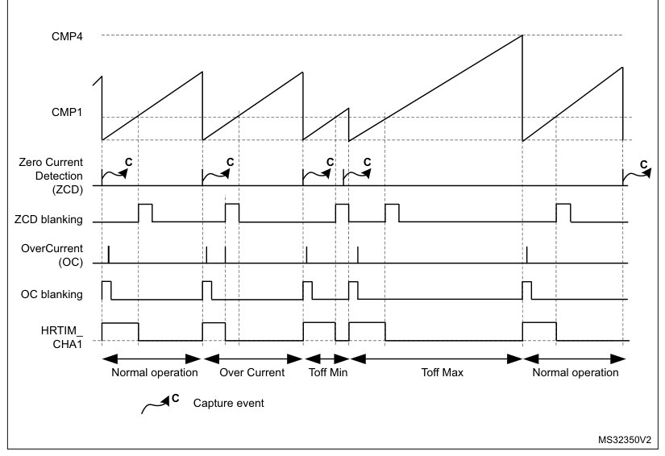

## 28.5 HRTIM registers

### 28.5.1 HRTIM master timer control register (HRTIM_MCR)

- **Address offset:** 0x000
- **Reset value:** 0x0000 0000

**Register bit layout**

| Bit | Field | Access | Summary |
| ---: | --- | :---: | --- |
| 31 | `BRSTDMA[1]` | rw | Burst DMA update |
| 30 | `BRSTDMA[0]` | rw | ↳ |
| 29 | `MREPU` | rw | Master timer repetition update |
| 28 | Reserved | — | kept at reset value. |
| 27 | `PREEN` | rw | Preload enable |
| 26 | `DACSYNC[1]` | rw | DAC synchronization |
| 25 | `DACSYNC[0]` | rw | ↳ |
| 24 | Reserved | — | kept at reset value. |
| 23 | Reserved | — | ↳ |
| 22 | `TFCEN` | rw | Timer F counter enable |
| 21 | `TECEN` | rw | Timer E counter enable |
| 20 | `TDCEN` | rw | Timer D counter enable |
| 19 | `TCCEN` | rw | Timer C counter enable |
| 18 | `TBCEN` | rw | Timer B counter enable |
| 17 | `TACEN` | rw | Timer A counter enable |
| 16 | `MCEN` | rw | Master timer counter enable |
| 15 | `SYNCSRC[1]` | rw | Synchronization source |
| 14 | `SYNCSRC[0]` | rw | ↳ |
| 13 | `SYNCOUT[1]` | rw | Synchronization output |
| 12 | `SYNCOUT[0]` | rw | ↳ |
| 11 | `SYNCSTRTM` | rw | Synchronization starts master |
| 10 | `SYNCRSTM` | rw | Synchronization resets master |
| 9 | `SYNCIN[1]` | rw | Synchronization input |
| 8 | `SYNCIN[0]` | rw | ↳ |
| 7 | `INTLVD[1]` | rw | Interleaved mode |
| 6 | `INTLVD[0]` | rw | ↳ |
| 5 | `HALF` | rw | Half mode |
| 4 | `RETRIG` | rw | Re-triggerable mode |
| 3 | `CONT` | rw | Continuous mode |
| 2 | `CKPSC[2]` | rw | Clock prescaler |
| 1 | `CKPSC[1]` | rw | ↳ |
| 0 | `CKPSC[0]` | rw | ↳ |

**Bits 31:30 — `BRSTDMA[1:0]`:** Burst DMA update

These bits define how the update occurs relatively to a burst DMA transaction.

- `00`: Update done independently from the DMA burst transfer completion
- `01`: Update done when the DMA burst transfer is completed
- `10`: Update done on master timer roll-over following a DMA burst transfer completion. This mode
  only works in continuous mode.
- `11`: Reserved

**Bit 29 — `MREPU`:** Master timer repetition update

This bit defines whether an update occurs when the master timer repetition period is completed

(either due to roll-over or reset events). MREPU can be set only if BRSTDMA[1:0] = 00 or 01.

- `0`: Update on repetition disabled
- `1`: Update on repetition enabled

**Bit 28 — Reserved:** kept at reset value.

**Bit 27 — `PREEN`:** Preload enable

This bit enables the registers preload mechanism and defines whether the write accesses to the
memory mapped registers are done into HRTIM’s active or preload registers.

- `0`: Preload disabled: the write access is directly done into the active register
- `1`: Preload enabled: the write access is done into the preload register

**Bits 26:25 — `DACSYNC[1:0]`:** DAC synchronization

A DAC synchronization event can be enabled and generated when the master timer update occurs.

These bits are defining on which output the DAC synchronization is sent (refer to [Section 28.3.21](#28321-dac-triggers):

DAC triggers for connections details).

- `00`: No DAC trigger generated
- `01`: Trigger generated on hrtim_dac_trg1
- `10`: Trigger generated on hrtim_dac_trg2
- `11`: Trigger generated on hrtim_dac_trg3

**Bits 24:23 — Reserved:** kept at reset value.

**Bit 22 — `TFCEN`:** Timer F counter enable

This bit starts the timer F counter.

- `0`: Timer F counter disabled
- `1`: Timer F counter enabled

> **Note:** This bit must not be changed within a minimum of 8 cycles of fHRTIM clock.

**Bit 21 — `TECEN`:** Timer E counter enable

This bit starts the timer E counter.

- `0`: Timer E counter disabled
- `1`: Timer E counter enabled

> **Note:** This bit must not be changed within a minimum of 8 cycles of fHRTIM clock.

**Bit 20 — `TDCEN`:** Timer D counter enable

This bit starts the timer D counter.

- `0`: Timer D counter disabled
- `1`: Timer D counter enabled

> **Note:** This bit must not be changed within a minimum of 8 cycles of fHRTIM clock.

**Bit 19 — `TCCEN`:** Timer C counter enable

This bit starts the timer C counter.

- `0`: Timer C counter disabled
- `1`: Timer C counter enabled

> **Note:** This bit must not be changed within a minimum of 8 cycles of fHRTIM clock.

**Bit 18 — `TBCEN`:** Timer B counter enable

This bit starts the timer B counter.

- `0`: Timer B counter disabled
- `1`: Timer B counter enabled

> **Note:** This bit must not be changed within a minimum of 8 cycles of fHRTIM clock.

**Bit 17 — `TACEN`:** Timer A counter enable

This bit starts the timer A counter.

- `0`: Timer A counter disabled
- `1`: Timer A counter enabled

> **Note:** This bit must not be changed within a minimum of 8 cycles of fHRTIM clock.

**Bit 16 — `MCEN`:** Master timer counter enable

This bit starts the master timer counter.

- `0`: Master counter disabled
- `1`: Master counter enabled

> **Note:** This bit must not be changed within a minimum of 8 cycles of fHRTIM clock.

**Bits 15:14 — `SYNCSRC[1:0]`:** Synchronization source

These bits define the source and event to be sent on the synchronization outputs SYNCOUT[2:1]

- `00`: Master timer start
- `01`: Master timer compare 1 event
- `10`: Timer A start/reset
- `11`: Timer A compare 1 event

**Bits 13:12 — `SYNCOUT[1:0]`:** Synchronization output

These bits define the routing and conditioning of the synchronization output event.

- `00`: Disabled
- `01`: Reserved
- `10`: Positive pulse on HRTIM_SCOUT output (16x fHRTIM clock cycles)
- `11`: Negative pulse on HRTIM_SCOUT output (16x fHRTIM clock cycles)

> **Note:** This bitfield must not be modified once the counter is enabled (TxCEN bit set)

**Bit 11 — `SYNCSTRTM`:** Synchronization starts master

This bit enables the master timer start when receiving a synchronization input event:

- `0`: No effect on the master timer
- `1`: A synchronization input event starts the master timer

**Bit 10 — `SYNCRSTM`:** Synchronization resets master

This bit enables the master timer reset when receiving a synchronization input event:

- `0`: No effect on the master timer
- `1`: A synchronization input event resets the master timer

**Bits 9:8 — `SYNCIN[1:0]`:** Synchronization input

These bits are defining the synchronization input source.

- `00`: Disabled. HRTIM is not synchronized and runs in standalone mode.
- `01`: Reserved
- `10`: Internal event on hrtim_in_sync[2]: the HRTIM is synchronized with the on-chip timer (see

Section: Synchronization input).

- `11`: External event on hrtim_in_sync[3]: a positive pulse on HRTIM_SCIN input triggers the HRTIM.

> **Note:** This parameter cannot be changed once the impacted timers are enabled.

**Bits 7:6 — `INTLVD[1:0]`:** Interleaved mode

This bitfield is significant only when the HALF bit is reset. It enables the interleaved mode.

- `00`: Interleaved mode disabled
- `01`: Triple interleaved mode: when HRTIM_MPER register is written, the HRTIM_MCMP1R active
  register is automatically updated with HRTIM_MPER/3 value, and the HRTIM_MCMP2R active
  register is automatically updated with 2x (HRTIM_MPER/3) value.
- `10`: Quad interleaved mode: when HRTIM_MPER register is written, the HRTIM_MCMP1R active
  register is automatically updated with HRTIM_MPER/4 value, the HRTIM_MCMP2R active
  register is automatically updated with HRTIM_MPER/2 value and the HRTIM_MCMP3R active
  register is automatically updated with 3x (HRTIM_MPER/4) value.
- `11`: Interleaved mode disabled

**Bit 5 — `HALF`:** Half mode

This bit enables the half duty-cycle mode: the HRTIM_MCMP1R active register is automatically
updated with HRTIM_MPER/2 value when HRTIM_MPER register is written.

- `0`: Half mode disabled
- `1`: Half mode enabled

**Bit 4 — `RETRIG`:** Re-triggerable mode

This bit defines the behavior of the master timer counter in single-shot mode.

- `0`: The timer is not re-triggerable: a counter reset can be done only if the counter is stopped
  (period
  elapsed)
- `1`: The timer is re-triggerable: a counter reset is done whatever the counter state (running or
  stopped)

**Bit 3 — `CONT`:** Continuous mode

- `0`: The timer operates in single-shot mode and stops when it reaches the MPER value
- `1`: The timer operates in continuous (free-running) mode and rolls over to zero when it reaches
  the

MPER value

**Bits 2:0 — `CKPSC[2:0]`:** Clock prescaler

These bits define the master timer high-resolution clock prescaler ratio.

The counter clock equivalent frequency (fCOUNTER) is equal to fHRCK / 2CKPSC[2:0].

The prescaling ratio cannot be modified once the timer is enabled.

### 28.5.2 HRTIM master timer interrupt status register (HRTIM_MISR)

- **Address offset:** 0x004
- **Reset value:** 0x0000 0000

**Register bit layout**

| Bit | Field | Access | Summary |
| ---: | --- | :---: | --- |
| 31 | Reserved | — | kept at reset value. |
| 30 | Reserved | — | ↳ |
| 29 | Reserved | — | ↳ |
| 28 | Reserved | — | ↳ |
| 27 | Reserved | — | ↳ |
| 26 | Reserved | — | ↳ |
| 25 | Reserved | — | ↳ |
| 24 | Reserved | — | ↳ |
| 23 | Reserved | — | ↳ |
| 22 | Reserved | — | ↳ |
| 21 | Reserved | — | ↳ |
| 20 | Reserved | — | ↳ |
| 19 | Reserved | — | ↳ |
| 18 | Reserved | — | ↳ |
| 17 | Reserved | — | ↳ |
| 16 | Reserved | — | ↳ |
| 15 | Reserved | — | ↳ |
| 14 | Reserved | — | ↳ |
| 13 | Reserved | — | ↳ |
| 12 | Reserved | — | ↳ |
| 11 | Reserved | — | ↳ |
| 10 | Reserved | — | ↳ |
| 9 | Reserved | — | ↳ |
| 8 | Reserved | — | ↳ |
| 7 | Reserved | — | ↳ |
| 6 | `MUPD` | r | Master update interrupt flag |
| 5 | `SYNC` | r | Sync input interrupt flag |
| 4 | `MREP` | r | Master repetition interrupt flag |
| 3 | `MCMP4` | r | Master compare 4 interrupt flag |
| 2 | `MCMP3` | r | Master compare 3 interrupt flag |
| 1 | `MCMP2` | r | Master compare 2 interrupt flag |
| 0 | `MCMP1` | r | Master compare 1 interrupt flag |

**Bits 31:7 — Reserved:** kept at reset value.

**Bit 6 — `MUPD`:** Master update interrupt flag

This bit is set by hardware when the master timer registers are updated.

- `0`: No master update interrupt occurred
- `1`: Master update interrupt occurred

**Bit 5 — `SYNC`:** Sync input interrupt flag

This bit is set by hardware when a synchronization input event is received.

- `0`: No sync input interrupt occurred
- `1`: Sync input interrupt occurred

**Bit 4 — `MREP`:** Master repetition interrupt flag

This bit is set by hardware when the master timer repetition period has elapsed.

- `0`: No master repetition interrupt occurred
- `1`: Master repetition interrupt occurred

**Bit 3 — `MCMP4`:** Master compare 4 interrupt flag

Refer to MCMP1 description

**Bit 2 — `MCMP3`:** Master compare 3 interrupt flag

Refer to MCMP1 description

**Bit 1 — `MCMP2`:** Master compare 2 interrupt flag

Refer to MCMP1 description

**Bit 0 — `MCMP1`:** Master compare 1 interrupt flag

This bit is set by hardware when the master timer counter matches the value programmed in the
master compare 1 register.

- `0`: No master compare 1 interrupt occurred
- `1`: Master compare 1 interrupt occurred

### 28.5.3 HRTIM master timer interrupt clear register (HRTIM_MICR)

- **Address offset:** 0x008
- **Reset value:** 0x0000 0000

**Register bit layout**

| Bit | Field | Access | Summary |
| ---: | --- | :---: | --- |
| 31 | Reserved | — | kept at reset value. |
| 30 | Reserved | — | ↳ |
| 29 | Reserved | — | ↳ |
| 28 | Reserved | — | ↳ |
| 27 | Reserved | — | ↳ |
| 26 | Reserved | — | ↳ |
| 25 | Reserved | — | ↳ |
| 24 | Reserved | — | ↳ |
| 23 | Reserved | — | ↳ |
| 22 | Reserved | — | ↳ |
| 21 | Reserved | — | ↳ |
| 20 | Reserved | — | ↳ |
| 19 | Reserved | — | ↳ |
| 18 | Reserved | — | ↳ |
| 17 | Reserved | — | ↳ |
| 16 | Reserved | — | ↳ |
| 15 | Reserved | — | ↳ |
| 14 | Reserved | — | ↳ |
| 13 | Reserved | — | ↳ |
| 12 | Reserved | — | ↳ |
| 11 | Reserved | — | ↳ |
| 10 | Reserved | — | ↳ |
| 9 | Reserved | — | ↳ |
| 8 | Reserved | — | ↳ |
| 7 | Reserved | — | ↳ |
| 6 | `MUPDC` | w | Master update interrupt flag clear |
| 5 | `SYNCC` | w | Sync input interrupt flag clear |
| 4 | `MREPC` | w | Repetition interrupt flag clear |
| 3 | `MCMP4C` | w | Master compare 4 interrupt flag clear |
| 2 | `MCMP3C` | w | Master compare 3 interrupt flag clear |
| 1 | `MCMP2C` | w | Master compare 2 interrupt flag clear |
| 0 | `MCMP1C` | w | Master compare 1 interrupt flag clear |

**Bits 31:7 — Reserved:** kept at reset value.

**Bit 6 — `MUPDC`:** Master update interrupt flag clear

Writing 1 to this bit clears the MUPDC flag in HRTIM_MISR register.

**Bit 5 — `SYNCC`:** Sync input interrupt flag clear

Writing 1 to this bit clears the SYNC flag in HRTIM_MISR register.

**Bit 4 — `MREPC`:** Repetition interrupt flag clear

Writing 1 to this bit clears the MREP flag in HRTIM_MISR register.

**Bit 3 — `MCMP4C`:** Master compare 4 interrupt flag clear

Writing 1 to this bit clears the MCMP4 flag in HRTIM_MISR register.

**Bit 2 — `MCMP3C`:** Master compare 3 interrupt flag clear

Writing 1 to this bit clears the MCMP3 flag in HRTIM_MISR register.

**Bit 1 — `MCMP2C`:** Master compare 2 interrupt flag clear

Writing 1 to this bit clears the MCMP2 flag in HRTIM_MISR register.

**Bit 0 — `MCMP1C`:** Master compare 1 interrupt flag clear

Writing 1 to this bit clears the MCMP1 flag in HRTIM_MISR register.

### 28.5.4 HRTIM master timer DMA interrupt enable register (HRTIM_MDIER)

- **Address offset:** 0x00C
- **Reset value:** 0x0000 0000

**Register bit layout**

| Bit | Field | Access | Summary |
| ---: | --- | :---: | --- |
| 31 | Reserved | — | kept at reset value. |
| 30 | Reserved | — | ↳ |
| 29 | Reserved | — | ↳ |
| 28 | Reserved | — | ↳ |
| 27 | Reserved | — | ↳ |
| 26 | Reserved | — | ↳ |
| 25 | Reserved | — | ↳ |
| 24 | Reserved | — | ↳ |
| 23 | Reserved | — | ↳ |
| 22 | `MUPDDE` | rw | Master update DMA request enable |
| 21 | `SYNCDE` | rw | Sync input DMA request enable |
| 20 | `MREPDE` | rw | Master repetition DMA request enable |
| 19 | `MCMP4DE` | rw | Master compare 4 DMA request enable |
| 18 | `MCMP3DE` | rw | Master compare 3 DMA request enable |
| 17 | `MCMP2DE` | rw | Master compare 2 DMA request enable |
| 16 | `MCMP1DE` | rw | Master compare 1 DMA request enable |
| 15 | Reserved | — | kept at reset value. |
| 14 | Reserved | — | ↳ |
| 13 | Reserved | — | ↳ |
| 12 | Reserved | — | ↳ |
| 11 | Reserved | — | ↳ |
| 10 | Reserved | — | ↳ |
| 9 | Reserved | — | ↳ |
| 8 | Reserved | — | ↳ |
| 7 | Reserved | — | ↳ |
| 6 | `MUPDIE` | rw | Master update interrupt enable |
| 5 | `SYNCIE` | rw | Sync input interrupt enable |
| 4 | `MREPIE` | rw | Master repetition interrupt enable |
| 3 | `MCMP4IE` | rw | Master compare 4 interrupt enable |
| 2 | `MCMP3IE` | rw | Master compare 3 interrupt enable |
| 1 | `MCMP2IE` | rw | Master compare 2 interrupt enable |
| 0 | `MCMP1IE` | rw | Master compare 1 interrupt enable |

**Bits 31:23 — Reserved:** kept at reset value.

**Bit 22 — `MUPDDE`:** Master update DMA request enable

This bit is set and cleared by software to enable/disable the master update DMA requests.

- `0`: Master update DMA request disabled
- `1`: Master update DMA request enabled

**Bit 21 — `SYNCDE`:** Sync input DMA request enable

This bit is set and cleared by software to enable/disable the sync input DMA requests.

- `0`: Sync input DMA request disabled
- `1`: Sync input DMA request enabled

**Bit 20 — `MREPDE`:** Master repetition DMA request enable

This bit is set and cleared by software to enable/disable the master timer repetition DMA requests.

- `0`: Repetition DMA request disabled
- `1`: Repetition DMA request enabled

**Bit 19 — `MCMP4DE`:** Master compare 4 DMA request enable

Refer to MCMP1DE description

**Bit 18 — `MCMP3DE`:** Master compare 3 DMA request enable

Refer to MCMP1DE description

**Bit 17 — `MCMP2DE`:** Master compare 2 DMA request enable

Refer to MCMP1DE description

**Bit 16 — `MCMP1DE`:** Master compare 1 DMA request enable

This bit is set and cleared by software to enable/disable the master timer compare 1 DMA requests.

- `0`: Compare 1 DMA request disabled
- `1`: Compare 1 DMA request enabled

**Bits 15:7 — Reserved:** kept at reset value.

**Bit 6 — `MUPDIE`:** Master update interrupt enable

This bit is set and cleared by software to enable/disable the master timer registers update
interrupts

- `0`: Master update interrupts disabled
- `1`: Master update interrupts enabled

**Bit 5 — `SYNCIE`:** Sync input interrupt enable

This bit is set and cleared by software to enable/disable the sync input interrupts

- `0`: Sync input interrupts disabled
- `1`: Sync input interrupts enabled

**Bit 4 — `MREPIE`:** Master repetition interrupt enable

This bit is set and cleared by software to enable/disable the master timer repetition interrupts

- `0`: Master repetition interrupt disabled
- `1`: Master repetition interrupt enabled

**Bit 3 — `MCMP4IE`:** Master compare 4 interrupt enable

Refer to MCMP1IE description

**Bit 2 — `MCMP3IE`:** Master compare 3 interrupt enable

Refer to MCMP1IE description

**Bit 1 — `MCMP2IE`:** Master compare 2 interrupt enable

Refer to MCMP1IE description

**Bit 0 — `MCMP1IE`:** Master compare 1 interrupt enable

This bit is set and cleared by software to enable/disable the master timer compare 1 interrupt

- `0`: Compare 1 interrupt disabled
- `1`: Compare 1 interrupt enabled

### 28.5.5 HRTIM master timer counter register (HRTIM_MCNTR)

- **Address offset:** 0x010
- **Reset value:** 0x0000 0000

**Register bit layout**

| Bit | Field | Access | Summary |
| ---: | --- | :---: | --- |
| 31 | Reserved | — | kept at reset value. |
| 30 | Reserved | — | ↳ |
| 29 | Reserved | — | ↳ |
| 28 | Reserved | — | ↳ |
| 27 | Reserved | — | ↳ |
| 26 | Reserved | — | ↳ |
| 25 | Reserved | — | ↳ |
| 24 | Reserved | — | ↳ |
| 23 | Reserved | — | ↳ |
| 22 | Reserved | — | ↳ |
| 21 | Reserved | — | ↳ |
| 20 | Reserved | — | ↳ |
| 19 | Reserved | — | ↳ |
| 18 | Reserved | — | ↳ |
| 17 | Reserved | — | ↳ |
| 16 | Reserved | — | ↳ |
| 15 | `MCNT[15]` | rw | Counter value |
| 14 | `MCNT[14]` | rw | ↳ |
| 13 | `MCNT[13]` | rw | ↳ |
| 12 | `MCNT[12]` | rw | ↳ |
| 11 | `MCNT[11]` | rw | ↳ |
| 10 | `MCNT[10]` | rw | ↳ |
| 9 | `MCNT[9]` | rw | ↳ |
| 8 | `MCNT[8]` | rw | ↳ |
| 7 | `MCNT[7]` | rw | ↳ |
| 6 | `MCNT[6]` | rw | ↳ |
| 5 | `MCNT[5]` | rw | ↳ |
| 4 | `MCNT[4]` | rw | ↳ |
| 3 | `MCNT[3]` | rw | ↳ |
| 2 | `MCNT[2]` | rw | ↳ |
| 1 | `MCNT[1]` | rw | ↳ |
| 0 | `MCNT[0]` | rw | ↳ |

**Bits 31:16 — Reserved:** kept at reset value.

**Bits 15:0 — `MCNT[15:0]`:** Counter value

Holds the master timer counter value. This register can only be written when the master timer is
stopped (MCEN = 0 in HRTIM_MCR).

> **Note:** For HR clock prescaling ratio below 32 (CKPSCCKPSC[2:0] \< 5), the least significant bits of the
> counter are not significant. They cannot be written and return 0 when read.

> **Note:** The timer behavior is not guaranteed if the counter value is set above the HRTIM_MPER
> register value.

### 28.5.6 HRTIM master timer period register (HRTIM_MPER)

- **Address offset:** 0x014
- **Reset value:** 0x0000 FFDF

**Register bit layout**

| Bit | Field | Access | Summary |
| ---: | --- | :---: | --- |
| 31 | Reserved | — | kept at reset value. |
| 30 | Reserved | — | ↳ |
| 29 | Reserved | — | ↳ |
| 28 | Reserved | — | ↳ |
| 27 | Reserved | — | ↳ |
| 26 | Reserved | — | ↳ |
| 25 | Reserved | — | ↳ |
| 24 | Reserved | — | ↳ |
| 23 | Reserved | — | ↳ |
| 22 | Reserved | — | ↳ |
| 21 | Reserved | — | ↳ |
| 20 | Reserved | — | ↳ |
| 19 | Reserved | — | ↳ |
| 18 | Reserved | — | ↳ |
| 17 | Reserved | — | ↳ |
| 16 | Reserved | — | ↳ |
| 15 | `MPER[15]` | rw | Master timer period value |
| 14 | `MPER[14]` | rw | ↳ |
| 13 | `MPER[13]` | rw | ↳ |
| 12 | `MPER[12]` | rw | ↳ |
| 11 | `MPER[11]` | rw | ↳ |
| 10 | `MPER[10]` | rw | ↳ |
| 9 | `MPER[9]` | rw | ↳ |
| 8 | `MPER[8]` | rw | ↳ |
| 7 | `MPER[7]` | rw | ↳ |
| 6 | `MPER[6]` | rw | ↳ |
| 5 | `MPER[5]` | rw | ↳ |
| 4 | `MPER[4]` | rw | ↳ |
| 3 | `MPER[3]` | rw | ↳ |
| 2 | `MPER[2]` | rw | ↳ |
| 1 | `MPER[1]` | rw | ↳ |
| 0 | `MPER[0]` | rw | ↳ |

**Bits 31:16 — Reserved:** kept at reset value.

**Bits 15:0 — `MPER[15:0]`:** Master timer period value

This register defines the counter overflow value.

The period value must be above or equal to 3 periods of the fHRTIM clock, that is 0x60 if

CKPSC[2:0] = 0, 0x30 if CKPSC[2:0] = 1, 0x18 if CKPSC[2:0] = 2,...

The maximum value is 0x0000 FFDF.

### 28.5.7 HRTIM master timer repetition register (HRTIM_MREP)

- **Address offset:** 0x018
- **Reset value:** 0x0000 0000

**Register bit layout**

| Bit | Field | Access | Summary |
| ---: | --- | :---: | --- |
| 31 | Reserved | — | kept at reset value. |
| 30 | Reserved | — | ↳ |
| 29 | Reserved | — | ↳ |
| 28 | Reserved | — | ↳ |
| 27 | Reserved | — | ↳ |
| 26 | Reserved | — | ↳ |
| 25 | Reserved | — | ↳ |
| 24 | Reserved | — | ↳ |
| 23 | Reserved | — | ↳ |
| 22 | Reserved | — | ↳ |
| 21 | Reserved | — | ↳ |
| 20 | Reserved | — | ↳ |
| 19 | Reserved | — | ↳ |
| 18 | Reserved | — | ↳ |
| 17 | Reserved | — | ↳ |
| 16 | Reserved | — | ↳ |
| 15 | Reserved | — | ↳ |
| 14 | Reserved | — | ↳ |
| 13 | Reserved | — | ↳ |
| 12 | Reserved | — | ↳ |
| 11 | Reserved | — | ↳ |
| 10 | Reserved | — | ↳ |
| 9 | Reserved | — | ↳ |
| 8 | Reserved | — | ↳ |
| 7 | `MREP[7]` | rw | Master timer repetition period value |
| 6 | `MREP[6]` | rw | ↳ |
| 5 | `MREP[5]` | rw | ↳ |
| 4 | `MREP[4]` | rw | ↳ |
| 3 | `MREP[3]` | rw | ↳ |
| 2 | `MREP[2]` | rw | ↳ |
| 1 | `MREP[1]` | rw | ↳ |
| 0 | `MREP[0]` | rw | ↳ |

**Bits 31:8 — Reserved:** kept at reset value.

**Bits 7:0 — `MREP[7:0]`:** Master timer repetition period value

This register holds the repetition period value for the master counter. It is either the preload
register
or the active register if preload is disabled.

### 28.5.8 HRTIM master timer compare 1 register (HRTIM_MCMP1R)

- **Address offset:** 0x01C
- **Reset value:** 0x0000 0000

**Register bit layout**

| Bit | Field | Access | Summary |
| ---: | --- | :---: | --- |
| 31 | Reserved | — | kept at reset value. |
| 30 | Reserved | — | ↳ |
| 29 | Reserved | — | ↳ |
| 28 | Reserved | — | ↳ |
| 27 | Reserved | — | ↳ |
| 26 | Reserved | — | ↳ |
| 25 | Reserved | — | ↳ |
| 24 | Reserved | — | ↳ |
| 23 | Reserved | — | ↳ |
| 22 | Reserved | — | ↳ |
| 21 | Reserved | — | ↳ |
| 20 | Reserved | — | ↳ |
| 19 | Reserved | — | ↳ |
| 18 | Reserved | — | ↳ |
| 17 | Reserved | — | ↳ |
| 16 | Reserved | — | ↳ |
| 15 | `MCMP1[15]` | rw | Master timer compare 1 value |
| 14 | `MCMP1[14]` | rw | ↳ |
| 13 | `MCMP1[13]` | rw | ↳ |
| 12 | `MCMP1[12]` | rw | ↳ |
| 11 | `MCMP1[11]` | rw | ↳ |
| 10 | `MCMP1[10]` | rw | ↳ |
| 9 | `MCMP1[9]` | rw | ↳ |
| 8 | `MCMP1[8]` | rw | ↳ |
| 7 | `MCMP1[7]` | rw | ↳ |
| 6 | `MCMP1[6]` | rw | ↳ |
| 5 | `MCMP1[5]` | rw | ↳ |
| 4 | `MCMP1[4]` | rw | ↳ |
| 3 | `MCMP1[3]` | rw | ↳ |
| 2 | `MCMP1[2]` | rw | ↳ |
| 1 | `MCMP1[1]` | rw | ↳ |
| 0 | `MCMP1[0]` | rw | ↳ |

**Bits 31:16 — Reserved:** kept at reset value.

**Bits 15:0 — `MCMP1[15:0]`:** Master timer compare 1 value

This register holds the master timer compare 1 value. It is either the preload register or the
active
register if preload is disabled.

The compare value must be above or equal to 3 periods of the fHRTIM clock, that is 0x60 if

CKPSC[2:0] = 0, 0x30 if CKPSC[2:0] = 1, 0x18 if CKPSC[2:0] = 2,...

### 28.5.9 HRTIM master timer compare 2 register (HRTIM_MCMP2R)

- **Address offset:** 0x024
- **Reset value:** 0x0000 0000

**Register bit layout**

| Bit | Field | Access | Summary |
| ---: | --- | :---: | --- |
| 31 | Reserved | — | kept at reset value. |
| 30 | Reserved | — | ↳ |
| 29 | Reserved | — | ↳ |
| 28 | Reserved | — | ↳ |
| 27 | Reserved | — | ↳ |
| 26 | Reserved | — | ↳ |
| 25 | Reserved | — | ↳ |
| 24 | Reserved | — | ↳ |
| 23 | Reserved | — | ↳ |
| 22 | Reserved | — | ↳ |
| 21 | Reserved | — | ↳ |
| 20 | Reserved | — | ↳ |
| 19 | Reserved | — | ↳ |
| 18 | Reserved | — | ↳ |
| 17 | Reserved | — | ↳ |
| 16 | Reserved | — | ↳ |
| 15 | `MCMP2[15]` | rw | Master timer compare 2 value |
| 14 | `MCMP2[14]` | rw | ↳ |
| 13 | `MCMP2[13]` | rw | ↳ |
| 12 | `MCMP2[12]` | rw | ↳ |
| 11 | `MCMP2[11]` | rw | ↳ |
| 10 | `MCMP2[10]` | rw | ↳ |
| 9 | `MCMP2[9]` | rw | ↳ |
| 8 | `MCMP2[8]` | rw | ↳ |
| 7 | `MCMP2[7]` | rw | ↳ |
| 6 | `MCMP2[6]` | rw | ↳ |
| 5 | `MCMP2[5]` | rw | ↳ |
| 4 | `MCMP2[4]` | rw | ↳ |
| 3 | `MCMP2[3]` | rw | ↳ |
| 2 | `MCMP2[2]` | rw | ↳ |
| 1 | `MCMP2[1]` | rw | ↳ |
| 0 | `MCMP2[0]` | rw | ↳ |

**Bits 31:16 — Reserved:** kept at reset value.

**Bits 15:0 — `MCMP2[15:0]`:** Master timer compare 2 value

This register holds the master timer compare 2 value. It is either the preload register or the
active
register if preload is disabled.

The compare value must be above or equal to 3 periods of the fHRTIM clock, that is 0x60 if

CKPSC[2:0] = 0, 0x30 if CKPSC[2:0] = 1, 0x18 if CKPSC[2:0] = 2,...

### 28.5.10 HRTIM master timer compare 3 register (HRTIM_MCMP3R)

- **Address offset:** 0x028
- **Reset value:** 0x0000 0000

**Register bit layout**

| Bit | Field | Access | Summary |
| ---: | --- | :---: | --- |
| 31 | Reserved | — | kept at reset value. |
| 30 | Reserved | — | ↳ |
| 29 | Reserved | — | ↳ |
| 28 | Reserved | — | ↳ |
| 27 | Reserved | — | ↳ |
| 26 | Reserved | — | ↳ |
| 25 | Reserved | — | ↳ |
| 24 | Reserved | — | ↳ |
| 23 | Reserved | — | ↳ |
| 22 | Reserved | — | ↳ |
| 21 | Reserved | — | ↳ |
| 20 | Reserved | — | ↳ |
| 19 | Reserved | — | ↳ |
| 18 | Reserved | — | ↳ |
| 17 | Reserved | — | ↳ |
| 16 | Reserved | — | ↳ |
| 15 | `MCMP3[15]` | rw | Master timer compare 3 value |
| 14 | `MCMP3[14]` | rw | ↳ |
| 13 | `MCMP3[13]` | rw | ↳ |
| 12 | `MCMP3[12]` | rw | ↳ |
| 11 | `MCMP3[11]` | rw | ↳ |
| 10 | `MCMP3[10]` | rw | ↳ |
| 9 | `MCMP3[9]` | rw | ↳ |
| 8 | `MCMP3[8]` | rw | ↳ |
| 7 | `MCMP3[7]` | rw | ↳ |
| 6 | `MCMP3[6]` | rw | ↳ |
| 5 | `MCMP3[5]` | rw | ↳ |
| 4 | `MCMP3[4]` | rw | ↳ |
| 3 | `MCMP3[3]` | rw | ↳ |
| 2 | `MCMP3[2]` | rw | ↳ |
| 1 | `MCMP3[1]` | rw | ↳ |
| 0 | `MCMP3[0]` | rw | ↳ |

**Bits 31:16 — Reserved:** kept at reset value.

**Bits 15:0 — `MCMP3[15:0]`:** Master timer compare 3 value

This register holds the master timer compare 3 value. It is either the preload register or the
active
register if preload is disabled.

The compare value must be above or equal to 3 periods of the fHRTIM clock, that is 0x60 if

CKPSC[2:0] = 0, 0x30 if CKPSC[2:0] = 1, 0x18 if CKPSC[2:0] = 2,...

### 28.5.11 HRTIM master timer compare 4 register (HRTIM_MCMP4R)

- **Address offset:** 0x02C
- **Reset value:** 0x0000 0000

**Register bit layout**

| Bit | Field | Access | Summary |
| ---: | --- | :---: | --- |
| 31 | Reserved | — | kept at reset value. |
| 30 | Reserved | — | ↳ |
| 29 | Reserved | — | ↳ |
| 28 | Reserved | — | ↳ |
| 27 | Reserved | — | ↳ |
| 26 | Reserved | — | ↳ |
| 25 | Reserved | — | ↳ |
| 24 | Reserved | — | ↳ |
| 23 | Reserved | — | ↳ |
| 22 | Reserved | — | ↳ |
| 21 | Reserved | — | ↳ |
| 20 | Reserved | — | ↳ |
| 19 | Reserved | — | ↳ |
| 18 | Reserved | — | ↳ |
| 17 | Reserved | — | ↳ |
| 16 | Reserved | — | ↳ |
| 15 | `MCMP4[15]` | rw | Master timer compare 4 value |
| 14 | `MCMP4[14]` | rw | ↳ |
| 13 | `MCMP4[13]` | rw | ↳ |
| 12 | `MCMP4[12]` | rw | ↳ |
| 11 | `MCMP4[11]` | rw | ↳ |
| 10 | `MCMP4[10]` | rw | ↳ |
| 9 | `MCMP4[9]` | rw | ↳ |
| 8 | `MCMP4[8]` | rw | ↳ |
| 7 | `MCMP4[7]` | rw | ↳ |
| 6 | `MCMP4[6]` | rw | ↳ |
| 5 | `MCMP4[5]` | rw | ↳ |
| 4 | `MCMP4[4]` | rw | ↳ |
| 3 | `MCMP4[3]` | rw | ↳ |
| 2 | `MCMP4[2]` | rw | ↳ |
| 1 | `MCMP4[1]` | rw | ↳ |
| 0 | `MCMP4[0]` | rw | ↳ |

**Bits 31:16 — Reserved:** kept at reset value.

**Bits 15:0 — `MCMP4[15:0]`:** Master timer compare 4 value

This register holds the master timer compare 4 value. It is either the preload register or the
active
register if preload is disabled.

The compare value must be above or equal to 3 periods of the fHRTIM clock, that is 0x60 if

CKPSC[2:0] = 0, 0x30 if CKPSC[2:0] = 1, 0x18 if CKPSC[2:0] = 2,...

### 28.5.12 HRTIM timer x control register (HRTIM_TIMxCR) (x = A to F)

- **Address offset:** Block A: 0x080
- **Address offset:** Block B: 0x100
- **Address offset:** Block C: 0x180
- **Address offset:** Block D: 0x200
- **Address offset:** Block E: 0x280
- **Address offset:** Block F: 0x300
- **Reset value:** 0x0000 0000

**Register bit layout**

| Bit | Field | Access | Summary |
| ---: | --- | :---: | --- |
| 31 | `UPDGAT[3]` | rw | Update gating |
| 30 | `UPDGAT[2]` | rw | ↳ |
| 29 | `UPDGAT[1]` | rw | ↳ |
| 28 | `UPDGAT[0]` | rw | ↳ |
| 27 | `PREEN` | rw | Preload enable |
| 26 | `DACSYNC[1]` | rw | DAC synchronization |
| 25 | `DACSYNC[0]` | rw | ↳ |
| 24 | `MSTU` | rw | Master timer update |
| 23 | `TEU` | rw | Timer E update |
| 22 | `TDU` | rw | Timer D update |
| 21 | `TCU` | rw | Timer C update |
| 20 | `TBU` | rw | Timer B update |
| 19 | `TAU` | rw | Timer A update |
| 18 | `TxRSTU` | rw | Timer x reset update |
| 17 | `TxREPU` | rw | Timer x repetition update |
| 16 | `TFU` | rw | Timer F update |
| 15 | `DELCMP4[1]` | rw | CMP4 auto-delayed mode |
| 14 | `DELCMP4[0]` | rw | ↳ |
| 13 | `DELCMP2[1]` | rw | CMP2 auto-delayed mode |
| 12 | `DELCMP2[0]` | rw | ↳ |
| 11 | `SYNCSTRTx` | rw | Synchronization starts timer x |
| 10 | `SYNCRSTx` | rw | Synchronization resets timer x |
| 9 | `RSYNCU` | rw | Re-synchronized update |
| 8 | `INTLVD[1]` | rw | Interleaved mode |
| 7 | `INTLVD[0]` | rw | ↳ |
| 6 | `PSHPLL` | rw | Push-pull mode enable |
| 5 | `HALF` | rw | Half mode enable |
| 4 | `RETRIG` | rw | Re-triggerable mode |
| 3 | `CONT` | rw | Continuous mode |
| 2 | `CKPSCx[2]` | rw | HRTIM timer x clock prescaler |
| 1 | `CKPSCx[1]` | rw | ↳ |
| 0 | `CKPSCx[0]` | rw | ↳ |

**Bits 31:28 — `UPDGAT[3:0]`:** Update gating

These bits define how the update occurs relatively to the burst DMA transaction and the external
update request on update enable inputs hrtim_upd_en[3:1] (see Table 224).

The update events, as mentioned below, can be: MSTU, TFU, TEU, TDU, TCU, TBU, TAU, TxRSTU,

TxREPU.

- `0000`: The update occurs independently from the DMA burst transfer
- `0001`: The update occurs when the DMA burst transfer is completed
- `0010`: The update occurs on the update event following the DMA burst transfer completion
- `0011`: The update occurs on a rising edge on hrtim_upd_en1
- `0100`: The update occurs on a rising edge on hrtim_upd_en2
- `0101`: The update occurs on a rising edge on hrtim_upd_en3
- `0110`: The update occurs on the update event following a rising edge on hrtim_upd_en1
- `0111`: The update occurs on the update event following a rising edge on hrtim_upd_en2
- `1000`: The update occurs on the update event following a rising edge on hrtim_upd_en3

Others: Reserved

> **Note:** This bitfield must be reset before programming a new value.

For UPDGAT[3:0] values equal to 0001, 0011, 0100, 0101, it is possible to have multiple
concurrent update source (for instance RSTU and DMA burst).

**Bit 27 — `PREEN`:** Preload enable

This bit enables the registers preload mechanism and defines whether a write access into a preload-
able register is done into the active or the preload register.

- `0`: Preload disabled: the write access is directly done into the active register
- `1`: Preload enabled: the write access is done into the preload register

**Bits 26:25 — `DACSYNC[1:0]`:** DAC synchronization

A DAC synchronization event is generated when the timer update occurs. These bits are defining on
which output the DAC synchronization is sent (refer to [Section 28.3.21](#28321-dac-triggers): DAC triggers for connections
details).

- `00`: No DAC trigger generated
- `01`: Trigger generated on hrtim_dac_trg1
- `10`: Trigger generated on hrtim_dac_trg2
- `11`: Trigger generated on hrtim_dac_trg3

**Bit 24 — `MSTU`:** Master timer update

Register update is triggered by the master timer update.

- `0`: Update by master timer disabled
- `1`: Update by master timer enabled

**Bit 23 — `TEU`:** Timer E update

Register update is triggered by the timer E update

- `0`: Update by timer E disabled
- `1`: Update by timer E enabled

> **Note:** This bit is reserved for HRTIM_TIMECR. It is only available for HRTIM_TIMACR,

HRTIM_TIMBCR, HRTIM_TIMCCR, HRTIM_TIMDCR, HRTIM_TIMFCR.

**Bit 22 — `TDU`:** Timer D update

Register update is triggered by the timer D update

- `0`: Update by timer D disabled
- `1`: Update by timer D enabled

> **Note:** This bit is reserved for HRTIM_TIMDCR. It is only available for HRTIM_TIMACR,

HRTIM_TIMBCR, HRTIM_TIMCCR, HRTIM_TIMECR, HRTIM_TIMFCR.

**Bit 21 — `TCU`:** Timer C update

Register update is triggered by the timer C update

- `0`: Update by timer C disabled
- `1`: Update by timer C enabled

> **Note:** This bit is reserved for HRTIM_TIMCCR. It is only available for HRTIM_TIMACR,

HRTIM_TIMBCR, HRTIM_TIMDCR, HRTIM_TIMECR, HRTIM_TIMFCR.

**Bit 20 — `TBU`:** Timer B update

Register update is triggered by the timer B update

- `0`: Update by timer B disabled
- `1`: Update by timer B enabled

> **Note:** This bit is reserved for HRTIM_TIMBCR. It is only available for HRTIM_TIMACR,

HRTIM_TIMCCR, HRTIM_TIMDCR, HRTIM_TIMECR, HRTIM_TIMFCR.

**Bit 19 — `TAU`:** Timer A update

Register update is triggered by the timer A update

- `0`: Update by timer A disabled
- `1`: Update by timer A enabled

> **Note:** This bit is reserved for HRTIM_TIMBCR. It is only available for HRTIM_TIMBCR,

HRTIM_TIMCCR, HRTIM_TIMDCR, HRTIM_TIMECR, HRTIM_TIMFCR.

**Bit 18 — `TxRSTU`:** Timer x reset update

Register update is triggered by timer x counter reset or roll-over to 0 after reaching the period
value
in continuous mode.

- `0`: Update by timer x reset / roll-over disabled
- `1`: Update by timer x reset / roll-over enabled

**Bit 17 — `TxREPU`:** Timer x repetition update

Register update is triggered when the counter rolls over and HRTIM_REPx = 0

- `0`: Update on repetition disabled
- `1`: Update on repetition enabled

**Bit 16 — `TFU`:** Timer F update

Register update is triggered by the timer F update

- `0`: Update by timer F disabled
- `1`: Update by timer F enabled

> **Note:** This bit is reserved for HRTIM_TIMFCR. It is only available for HRTIM_TIMACR,

HRTIM_TIMBCR, HRTIM_TIMCCR, HRTIM_TIMDCR, HRTIM_TIMECR.

**Bits 15:14 — `DELCMP4[1:0]`:** CMP4 auto-delayed mode

This bitfield defines whether the compare register is behaving in standard mode (compare match
issued as soon as counter equal compare), or in auto-delayed mode (see Section: Auto-delayed
mode).

- `00`: CMP4 register is always active (standard compare mode)
- `01`: CMP4 value is recomputed and is active following a capture 2 event
- `10`: CMP4 value is recomputed and is active following a capture 2 event, or is recomputed and
  active after Compare 1 match (timeout function if capture 2 event is missing)
- `11`: CMP4 value is recomputed and is active following a capture 2 event, or is recomputed and
  active after Compare 3 match (timeout function if capture event is missing)

> **Note:** This bitfield must not be modified once the counter is enabled (TxCEN bit set).

**Bits 13:12 — `DELCMP2[1:0]`:** CMP2 auto-delayed mode

This bitfield defines whether the compare register is behaving in standard mode (compare match
issued as soon as counter equal compare), or in auto-delayed mode (see Section: Auto-delayed
mode).

- `00`: CMP2 register is always active (standard compare mode)
- `01`: CMP2 value is recomputed and is active following a capture 1 event
- `10`: CMP2 value is recomputed and is active following a capture 1 event, or is recomputed and
  active after compare 1 match (timeout function if capture event is missing)
- `11`: CMP2 value is recomputed and is active following a capture 1 event, or is recomputed and
  active after compare 3 match (timeout function if capture event is missing)

> **Note:** This bitfield must not be modified once the counter is enabled (TxCEN bit set).

**Bit 11 — `SYNCSTRTx`:** Synchronization starts timer x

This bit defines the timer x behavior following the synchronization event:

- `0`: No effect on timer x
- `1`: A synchronization input event starts the timer x

**Bit 10 — `SYNCRSTx`:** Synchronization resets timer x

This bit defines the timer x behavior following the synchronization event:

- `0`: No effect on timer x
- `1`: A synchronization input event resets the timer x

**Bit 9 — `RSYNCU`:** Re-synchronized update

This bit specifies whether update source coming outside from the timing unit must be synchronized:

- `0`: The update coming from adjacent timers (when MSTU, TAU, TBU, TCU, TDU, TEU, TFU bit is
  set) or from a software update (TxSWU bit) is taken into account immediately
- `1`: The update coming from adjacent timers (when MSTU, TAU, TBU, TCU, TDU, TEU, TFU bit is
  set) or from a software update (TxSWU bit) is taken into account on the following reset/roll-over
  event.

> **Note:** This bit is significant only when UPDGAT[3:0] = 0000, it is ignored otherwise.

**Bits 8:7 — `INTLVD[1:0]`:** Interleaved mode

This bitfield is significant only when the HALF bit is reset. It enables the interleaved mode.

- `00`: Interleaved mode disabled
- `01`: Triple interleaved mode: when HRTIM_PERxR register is written, the HRTIM_CMP1xR active
  register is automatically updated with HRTIM_PERxR/3 value, and the HRTIM_CMP2xR active
  register is automatically updated with 2x (HRTIM_PERxR/3) value.
- `10`: Quad interleaved mode: when HRTIM_PERxR register is written, the HRTIM_CMP1xR active
  register is automatically updated with HRTIM_PERxR/4 value, the HRTIM_CMP2xR active
  register is automatically updated with HRTIM_PERxR/2 value and the HRTIM_CMP3xR active
  register is automatically updated with 3x (HRTIM_PERxR/4) value.
- `11`: Interleaved mode disabled

**Bit 6 — `PSHPLL`:** Push-pull mode enable

This bit enables the push-pull mode.

- `0`: Push-pull mode disabled
- `1`: Push-pull mode enabled

> **Note:** This bitfield must not be modified once the counter is enabled (TxCEN bit set).

**Bit 5 — `HALF`:** Half mode enable

This bit enables the half duty-cycle mode: the HRTIM_CMP1xR active register is automatically
updated with HRTIM_PERxR/2 value when HRTIM_PERxR register is written.

- `0`: Half mode disabled
- `1`: Half mode enabled

**Bit 4 — `RETRIG`:** Re-triggerable mode

This bit defines the counter behavior in single shot mode.

- `0`: The timer is not re-triggerable: a counter reset is done if the counter is stopped (period
  elapsed in
  single-shot mode or counter stopped in continuous mode)
- `1`: The timer is re-triggerable: a counter reset is done whatever the counter state.

**Bit 3 — `CONT`:** Continuous mode

This bit defines the timer operating mode.

- `0`: The timer operates in single-shot mode and stops when it reaches TIMxPER value
- `1`: The timer operates in continuous mode and rolls over to zero when it reaches TIMxPER value

**Bits 2:0 — `CKPSCx[2:0]`:** HRTIM timer x clock prescaler

These bits define the master timer high-resolution clock prescaler ratio.

The counter clock equivalent frequency (fCOUNTER) is equal to fHRCK / 2CKPSC[2:0].

The prescaling ratio cannot be modified once the timer is enabled.

### 28.5.13 HRTIM timer x interrupt status register (HRTIM_TIMxISR) (x = A to F)

- **Address offset:** Block A: 0x084
- **Address offset:** Block B: 0x104
- **Address offset:** Block C: 0x184
- **Address offset:** Block D: 0x204
- **Address offset:** Block E: 0x284
- **Address offset:** Block F: 0x304
- **Reset value:** 0x0000 0000

**Register bit layout**

| Bit | Field | Access | Summary |
| ---: | --- | :---: | --- |
| 31 | Reserved | — | kept at reset value. |
| 30 | Reserved | — | ↳ |
| 29 | Reserved | — | ↳ |
| 28 | Reserved | — | ↳ |
| 27 | Reserved | — | ↳ |
| 26 | Reserved | — | ↳ |
| 25 | Reserved | — | ↳ |
| 24 | Reserved | — | ↳ |
| 23 | Reserved | — | ↳ |
| 22 | Reserved | — | ↳ |
| 21 | `O2CPY` | — | Output 2 copy |
| 20 | `O1CPY` | — | Output 1 copy |
| 19 | `O2STAT` | — | Output 2 status |
| 18 | `O1STAT` | — | Output 1 status |
| 17 | `IPPSTAT` | — | Idle push-pull Status |
| 16 | `CPPSTAT` | — | Current push-pull status |
| 15 | Reserved | — | kept at reset value. |
| 14 | `DLYPRT` | — | Delayed protection flag |
| 13 | `RST` | — | Reset and/or roll-over interrupt flag |
| 12 | `RSTx2` | — | Output 2 reset interrupt flag timer x |
| 11 | `SETx2` | — | Output 2 set interrupt flag timer x |
| 10 | `RSTx1` | — | Output 1 reset interrupt flag timer x |
| 9 | `SETx1` | — | Output 1 set interrupt flag timer x |
| 8 | `CPT2` | — | Capture 2 interrupt flag |
| 7 | `CPT1` | — | Capture 1 interrupt flag |
| 6 | `UPD` | — | Update interrupt flag |
| 5 | Reserved | — | kept at reset value. |
| 4 | `REP` | — | Repetition interrupt flag |
| 3 | `CMP4` | — | Compare 4 interrupt flag |
| 2 | `CMP3` | — | Compare 3 interrupt flag |
| 1 | `CMP2` | — | Compare 2 interrupt flag |
| 0 | `CMP1` | — | Compare 1 interrupt flag |

**Bits 31:22 — Reserved:** kept at reset value.

**Bit 21 — `O2CPY`:** Output 2 copy

This status bit is a raw copy of the output 2 state, before the output stage (chopper, polarity). It
allows
to check the current output state before re-enabling the output after a delayed protection.

- `0`: Output 2 is inactive
- `1`: Output 2 is active

**Bit 20 — `O1CPY`:** Output 1 copy

This status bit is a raw copy of the output 1 state, before the output stage (chopper, polarity). It
allows
to check the current output state before re-enabling the output after a delayed protection.

- `0`: Output 1 is inactive
- `1`: Output 1 is active

**Bit 19 — `O2STAT`:** Output 2 status

This status bit indicates the output 2 state when the delayed idle protection was triggered. This
bit is
updated upon any new delayed protection entry. This bit is not updated in balanced idle.

- `0`: Output 2 was inactive
- `1`: Output 2 was active

**Bit 18 — `O1STAT`:** Output 1 status

This status bit indicates the output 1 state when the delayed idle protection was triggered. This
bit is
updated upon any new delayed protection entry. This bit is not updated in balanced idle.

- `0`: Output 1 was inactive
- `1`: Output 1 was active

**Bit 17 — `IPPSTAT`:** Idle push-pull Status

This status bit indicates on which output the signal was applied, in push-pull mode balanced fault
mode or delayed idle mode, when the protection was triggered (whatever the output state, active or
inactive).

- `0`: Protection occurred when the output 1 was active and output 2 forced inactive
- `1`: Protection occurred when the output 2 was active and output 1 forced inactive

**Bit 16 — `CPPSTAT`:** Current push-pull status

This status bit indicates on which output the signal is currently applied, in push-pull mode. It is
only
significant in this configuration.

- `0`: Signal applied on output 1 and output 2 forced inactive
- `1`: Signal applied on output 2 and output 1 forced inactive

**Bit 15 — Reserved:** kept at reset value.

**Bit 14 — `DLYPRT`:** Delayed protection flag

- `0`: No delayed protection interrupt occured
- `1`: Delayed Idle or balanced Idle mode entry occured

**Bit 13 — `RST`:** Reset and/or roll-over interrupt flag

This bit is set by hardware when the timer x counter is reset or rolls over in continuous mode.

- `0`: No TIMx counter reset/roll-over interrupt occurred
- `1`: TIMX counter reset/roll-over interrupt occurred

**Bit 12 — `RSTx2`:** Output 2 reset interrupt flag timer x

Refer to RSTx1 description

**Bit 11 — `SETx2`:** Output 2 set interrupt flag timer x

Refer to SETx1 description

**Bit 10 — `RSTx1`:** Output 1 reset interrupt flag timer x

This bit is set by hardware when the Tx1 output is reset (goes from active to inactive mode).

- `0`: No Tx1 output reset interrupt occurred
- `1`: Tx1 output reset interrupt occurred

**Bit 9 — `SETx1`:** Output 1 set interrupt flag timer x

This bit is set by hardware when the Tx1 output is set (goes from inactive to active mode).

- `0`: No Tx1 output set interrupt occurred
- `1`: Tx1 output set interrupt occurred

**Bit 8 — `CPT2`:** Capture 2 interrupt flag

Refer to CPT1 description

**Bit 7 — `CPT1`:** Capture 1 interrupt flag

This bit is set by hardware when the timer x capture 1 event occurs.

- `0`: No timer x capture 1 interrupt occurred
- `1`: Timer x capture 1 interrupt occurred

**Bit 6 — `UPD`:** Update interrupt flag

This bit is set by hardware when the timer x update event occurs.

- `0`: No timer x update interrupt occurred
- `1`: Timer x update interrupt occurred

**Bit 5 — Reserved:** kept at reset value.

**Bit 4 — `REP`:** Repetition interrupt flag

This bit is set by hardware when the timer x repetition period has elapsed.

- `0`: No timer x repetition interrupt occurred
- `1`: Timer x repetition interrupt occurred

**Bit 3 — `CMP4`:** Compare 4 interrupt flag

Refer to CMP1 description

**Bit 2 — `CMP3`:** Compare 3 interrupt flag

Refer to CMP1 description

**Bit 1 — `CMP2`:** Compare 2 interrupt flag

Refer to CMP1 description

**Bit 0 — `CMP1`:** Compare 1 interrupt flag

This bit is set by hardware when the timer x counter matches the value programmed in the
compare 1 register.

- `0`: No compare 1 interrupt occurred
- `1`: Compare 1 interrupt occurred

### 28.5.14 HRTIM timer x interrupt clear register (HRTIM_TIMxICR) (x = A to F)

- **Address offset:** Block A: 0x088
- **Address offset:** Block B: 0x108
- **Address offset:** Block C: 0x188
- **Address offset:** Block D: 0x208
- **Address offset:** Block E: 0x288
- **Address offset:** Block F: 0x308
- **Reset value:** 0x0000 0000

**Register bit layout**

| Bit | Field | Access | Summary |
| ---: | --- | :---: | --- |
| 31 | Reserved | — | kept at reset value. |
| 30 | Reserved | — | ↳ |
| 29 | Reserved | — | ↳ |
| 28 | Reserved | — | ↳ |
| 27 | Reserved | — | ↳ |
| 26 | Reserved | — | ↳ |
| 25 | Reserved | — | ↳ |
| 24 | Reserved | — | ↳ |
| 23 | Reserved | — | ↳ |
| 22 | Reserved | — | ↳ |
| 21 | Reserved | — | ↳ |
| 20 | Reserved | — | ↳ |
| 19 | Reserved | — | ↳ |
| 18 | Reserved | — | ↳ |
| 17 | Reserved | — | ↳ |
| 16 | Reserved | — | ↳ |
| 15 | Reserved | — | ↳ |
| 14 | `DLYPRTC` | w | Delayed protection flag clear |
| 13 | `RSTC` | w | Reset interrupt flag clear |
| 12 | `RSTx2C` | w | Output 2 reset flag clear timer x |
| 11 | `SETx2C` | w | Output 2 set flag clear timer x |
| 10 | `RSTx1C` | w | Output 1 reset flag clear timer x |
| 9 | `SETx1C` | w | Output 1 set flag clear timer x |
| 8 | `CPT2C` | w | Capture 2 interrupt flag clear |
| 7 | `CPT1C` | w | Capture 1 interrupt flag clear |
| 6 | `UPDC` | w | Update interrupt flag clear |
| 5 | Reserved | — | kept at reset value. |
| 4 | `REPC` | w | Repetition interrupt flag clear |
| 3 | `CMP4C` | w | Compare 4 interrupt flag clear |
| 2 | `CMP3C` | w | Compare 3 interrupt flag clear |
| 1 | `CMP2C` | w | Compare 2 interrupt flag clear |
| 0 | `CMP1C` | w | Compare 1 interrupt flag clear |

**Bits 31:15 — Reserved:** kept at reset value.

**Bit 14 — `DLYPRTC`:** Delayed protection flag clear

Writing 1 to this bit clears the DLYPRT flag in HRTIM_TIMxISR register

**Bit 13 — `RSTC`:** Reset interrupt flag clear

Writing 1 to this bit clears the RST flag in HRTIM_TIMxISR register

**Bit 12 — `RSTx2C`:** Output 2 reset flag clear timer x

Writing 1 to this bit clears the RSTx2 flag in HRTIM_TIMxISR register

**Bit 11 — `SETx2C`:** Output 2 set flag clear timer x

Writing 1 to this bit clears the SETx2 flag in HRTIM_TIMxISR register

**Bit 10 — `RSTx1C`:** Output 1 reset flag clear timer x

Writing 1 to this bit clears the RSTx1 flag in HRTIM_TIMxISR register

**Bit 9 — `SETx1C`:** Output 1 set flag clear timer x

Writing 1 to this bit clears the SETx1 flag in HRTIM_TIMxISR register

**Bit 8 — `CPT2C`:** Capture 2 interrupt flag clear

Writing 1 to this bit clears the CPT2 flag in HRTIM_TIMxISR register

**Bit 7 — `CPT1C`:** Capture 1 interrupt flag clear

Writing 1 to this bit clears the CPT1 flag in HRTIM_TIMxISR register

**Bit 6 — `UPDC`:** Update interrupt flag clear

Writing 1 to this bit clears the UPD flag in HRTIM_TIMxISR register

**Bit 5 — Reserved:** kept at reset value.

**Bit 4 — `REPC`:** Repetition interrupt flag clear

Writing 1 to this bit clears the REP flag in HRTIM_TIMxISR register

**Bit 3 — `CMP4C`:** Compare 4 interrupt flag clear

Writing 1 to this bit clears the CMP4 flag in HRTIM_TIMxISR register

**Bit 2 — `CMP3C`:** Compare 3 interrupt flag clear

Writing 1 to this bit clears the CMP3 flag in HRTIM_TIMxISR register

**Bit 1 — `CMP2C`:** Compare 2 interrupt flag clear

Writing 1 to this bit clears the CMP2 flag in HRTIM_TIMxISR register

**Bit 0 — `CMP1C`:** Compare 1 interrupt flag clear

Writing 1 to this bit clears the CMP1 flag in HRTIM_TIMxISR register

### 28.5.15 HRTIM timer x DMA interrupt enable register (HRTIM_TIMxDIER) (x = A to F)

- **Address offset:** Block A: 0x08C
- **Address offset:** Block B: 0x10C
- **Address offset:** Block C: 0x18C
- **Address offset:** Block D: 0x20C
- **Address offset:** Block E: 0x28C
- **Address offset:** Block F: 0x30C
- **Reset value:** 0x0000 0000

**Register bit layout**

| Bit | Field | Access | Summary |
| ---: | --- | :---: | --- |
| 31 | Reserved | — | kept at reset value. |
| 30 | `DLYPRTDE` | rw | Delayed protection DMA request enable |
| 29 | `RSTDE` | rw | Reset/roll-over DMA request enable |
| 28 | `RSTx2DE` | rw | Output 2 reset DMA request enable timer x |
| 27 | `SETx2DE` | rw | Output 2 set DMA request enable timer x |
| 26 | `RSTx1DE` | rw | Output 1 reset DMA request enable timer x |
| 25 | `SETx1DE` | rw | Output 1 set DMA request enable timer x |
| 24 | `CPT2DE` | rw | Capture 2 DMA request enable |
| 23 | `CPT1DE` | rw | Capture 1 DMA request enable |
| 22 | `UPDDE` | rw | Update DMA request enable |
| 21 | Reserved | — | kept at reset value. |
| 20 | `REPDE` | rw | Repetition DMA request enable |
| 19 | `CMP4DE` | rw | Compare 4 DMA request enable |
| 18 | `CMP3DE` | rw | Compare 3 DMA request enable |
| 17 | `CMP2DE` | rw | Compare 2 DMA request enable |
| 16 | `CMP1DE` | rw | Compare 1 DMA request enable |
| 15 | Reserved | — | kept at reset value. |
| 14 | `DLYPRTIE` | rw | Delayed protection interrupt enable |
| 13 | `RSTIE` | rw | Reset/roll-over interrupt enable |
| 12 | `RSTx2IE` | rw | Output 2 reset interrupt enable timer x |
| 11 | `SETx2IE` | rw | Output 2 set interrupt enable timer x |
| 10 | `RSTx1IE` | rw | Output 1 reset interrupt enable timer x |
| 9 | `SETx1IE` | rw | Output 1 set interrupt enable timer x |
| 8 | `CPT2IE` | rw | Capture interrupt enable |
| 7 | `CPT1IE` | rw | Capture interrupt enable |
| 6 | `UPDIE` | rw | Update interrupt enable |
| 5 | Reserved | — | kept at reset value. |
| 4 | `REPIE` | rw | Repetition interrupt enable |
| 3 | `CMP4IE` | rw | Compare 4 interrupt enable |
| 2 | `CMP3IE` | rw | Compare 3 interrupt enable |
| 1 | `CMP2IE` | rw | Compare 2 interrupt enable |
| 0 | `CMP1IE` | rw | Compare 1 interrupt enable |

**Bit 31 — Reserved:** kept at reset value.

**Bit 30 — `DLYPRTDE`:** Delayed protection DMA request enable

This bit is set and cleared by software to enable/disable DMA requests on delayed protection.

- `0`: Delayed protection DMA request disabled
- `1`: Delayed protection DMA request enabled

**Bit 29 — `RSTDE`:** Reset/roll-over DMA request enable

This bit is set and cleared by software to enable/disable DMA requests on timer x counter reset or
roll-over in continuous mode.

- `0`: Timer x counter reset/roll-over DMA request disabled
- `1`: Timer x counter reset/roll-over DMA request enabled

**Bit 28 — `RSTx2DE`:** Output 2 reset DMA request enable timer x

Refer to RSTx1DE description

**Bit 27 — `SETx2DE`:** Output 2 set DMA request enable timer x

Refer to SETx1DE description

**Bit 26 — `RSTx1DE`:** Output 1 reset DMA request enable timer x

This bit is set and cleared by software to enable/disable Tx1 output reset DMA requests.

- `0`: Tx1 output reset DMA request disabled
- `1`: Tx1 output reset DMA request enabled

**Bit 25 — `SETx1DE`:** Output 1 set DMA request enable timer x

This bit is set and cleared by software to enable/disable Tx1 output set DMA requests.

- `0`: Tx1 output set DMA request disabled
- `1`: Tx1 output set DMA request enabled

**Bit 24 — `CPT2DE`:** Capture 2 DMA request enable

Refer to CPT1DE description

**Bit 23 — `CPT1DE`:** Capture 1 DMA request enable

This bit is set and cleared by software to enable/disable capture 1 DMA requests.

- `0`: Capture 1 DMA request disabled
- `1`: Capture 1 DMA request enabled

**Bit 22 — `UPDDE`:** Update DMA request enable

This bit is set and cleared by software to enable/disable DMA requests on update event.

- `0`: Update DMA request disabled
- `1`: Update DMA request enabled

**Bit 21 — Reserved:** kept at reset value.

**Bit 20 — `REPDE`:** Repetition DMA request enable

This bit is set and cleared by software to enable/disable DMA requests on repetition event.

- `0`: Repetition DMA request disabled
- `1`: Repetition DMA request enabled

**Bit 19 — `CMP4DE`:** Compare 4 DMA request enable

Refer to CMP1DE description

**Bit 18 — `CMP3DE`:** Compare 3 DMA request enable

Refer to CMP1DE description

**Bit 17 — `CMP2DE`:** Compare 2 DMA request enable

Refer to CMP1DE description

**Bit 16 — `CMP1DE`:** Compare 1 DMA request enable

This bit is set and cleared by software to enable/disable the compare 1 DMA requests.

- `0`: Compare 1 DMA request disabled
- `1`: Compare 1 DMA request enabled

**Bit 15 — Reserved:** kept at reset value.

**Bit 14 — `DLYPRTIE`:** Delayed protection interrupt enable

This bit is set and cleared by software to enable/disable interrupts on delayed protection.

- `0`: Delayed protection interrupts disabled
- `1`: Delayed protection interrupts enabled

**Bit 13 — `RSTIE`:** Reset/roll-over interrupt enable

This bit is set and cleared by software to enable/disable interrupts on timer x counter reset or
roll-
over in continuous mode.

- `0`: Timer x counter reset/roll-over interrupt disabled
- `1`: Timer x counter reset/roll-over interrupt enabled

**Bit 12 — `RSTx2IE`:** Output 2 reset interrupt enable timer x

Refer to RSTx1IE description

**Bit 11 — `SETx2IE`:** Output 2 set interrupt enable timer x

Refer to SETx1IE description

**Bit 10 — `RSTx1IE`:** Output 1 reset interrupt enable timer x

This bit is set and cleared by software to enable/disable Tx1 output reset interrupts.

- `0`: Tx1 output reset interrupts disabled
- `1`: Tx1 output reset interrupts enabled

**Bit 9 — `SETx1IE`:** Output 1 set interrupt enable timer x

This bit is set and cleared by software to enable/disable Tx1 output set interrupts.

- `0`: Tx1 output set interrupts disabled
- `1`: Tx1 output set interrupts enabled

**Bit 8 — `CPT2IE`:** Capture interrupt enable

Refer to CPT1IE description

**Bit 7 — `CPT1IE`:** Capture interrupt enable

This bit is set and cleared by software to enable/disable capture 1 interrupts.

- `0`: Capture 1 interrupts disabled
- `1`: Capture 1 interrupts enabled

**Bit 6 — `UPDIE`:** Update interrupt enable

This bit is set and cleared by software to enable/disable update event interrupts.

- `0`: Update interrupts disabled
- `1`: Update interrupts enabled

**Bit 5 — Reserved:** kept at reset value.

**Bit 4 — `REPIE`:** Repetition interrupt enable

This bit is set and cleared by software to enable/disable repetition event interrupts.

- `0`: Repetition interrupts disabled
- `1`: Repetition interrupts enabled

**Bit 3 — `CMP4IE`:** Compare 4 interrupt enable

Refer to CMP1IE description

**Bit 2 — `CMP3IE`:** Compare 3 interrupt enable

Refer to CMP1IE description

**Bit 1 — `CMP2IE`:** Compare 2 interrupt enable

Refer to CMP1IE description

**Bit 0 — `CMP1IE`:** Compare 1 interrupt enable

This bit is set and cleared by software to enable/disable the compare 1 interrupts.

- `0`: Compare 1 interrupt disabled
- `1`: Compare 1 interrupt enabled

### 28.5.16 HRTIM timer x counter register (HRTIM_CNTxR) (x = A to F)

- **Address offset:** Block A: 0x090
- **Address offset:** Block B: 0x110
- **Address offset:** Block C: 0x190
- **Address offset:** Block D: 0x210
- **Address offset:** Block E: 0x290
- **Address offset:** Block F: 0x310
- **Reset value:** 0x0000 0000

**Register bit layout**

| Bit | Field | Access | Summary |
| ---: | --- | :---: | --- |
| 31 | Reserved | — | kept at reset value. |
| 30 | Reserved | — | ↳ |
| 29 | Reserved | — | ↳ |
| 28 | Reserved | — | ↳ |
| 27 | Reserved | — | ↳ |
| 26 | Reserved | — | ↳ |
| 25 | Reserved | — | ↳ |
| 24 | Reserved | — | ↳ |
| 23 | Reserved | — | ↳ |
| 22 | Reserved | — | ↳ |
| 21 | Reserved | — | ↳ |
| 20 | Reserved | — | ↳ |
| 19 | Reserved | — | ↳ |
| 18 | Reserved | — | ↳ |
| 17 | Reserved | — | ↳ |
| 16 | Reserved | — | ↳ |
| 15 | `CNTx[15]` | rw | Timer x counter value |
| 14 | `CNTx[14]` | rw | ↳ |
| 13 | `CNTx[13]` | rw | ↳ |
| 12 | `CNTx[12]` | rw | ↳ |
| 11 | `CNTx[11]` | rw | ↳ |
| 10 | `CNTx[10]` | rw | ↳ |
| 9 | `CNTx[9]` | rw | ↳ |
| 8 | `CNTx[8]` | rw | ↳ |
| 7 | `CNTx[7]` | rw | ↳ |
| 6 | `CNTx[6]` | rw | ↳ |
| 5 | `CNTx[5]` | rw | ↳ |
| 4 | `CNTx[4]` | rw | ↳ |
| 3 | `CNTx[3]` | rw | ↳ |
| 2 | `CNTx[2]` | rw | ↳ |
| 1 | `CNTx[1]` | rw | ↳ |
| 0 | `CNTx[0]` | rw | ↳ |

**Bits 31:16 — Reserved:** kept at reset value.

**Bits 15:0 — `CNTx[15:0]`:** Timer x counter value

This register holds the timer x counter value. It can only be written when the timer is stopped
(TxCEN

= 0 in HRTIM_TIMxCR).

> **Note:** For HR clock prescaling ratio below 32 (CKPSC[2:0] \< 5), the least significant bits of the counter
> are not significant. They cannot be written and return 0 when read.

> **Note:** The timer behavior is not guaranteed if the counter value is above the HRTIM_PERxR register
> value.

### 28.5.17 HRTIM timer x period register (HRTIM_PERxR) (x = A to F)

- **Address offset:** Block A: 0x094
- **Address offset:** Block B: 0x114
- **Address offset:** Block C: 0x194
- **Address offset:** Block D: 0x214
- **Address offset:** Block E: 0x294
- **Address offset:** Block F: 0x314
- **Reset value:** 0x0000 FFDF

**Register bit layout**

| Bit | Field | Access | Summary |
| ---: | --- | :---: | --- |
| 31 | Reserved | — | kept at reset value. |
| 30 | Reserved | — | ↳ |
| 29 | Reserved | — | ↳ |
| 28 | Reserved | — | ↳ |
| 27 | Reserved | — | ↳ |
| 26 | Reserved | — | ↳ |
| 25 | Reserved | — | ↳ |
| 24 | Reserved | — | ↳ |
| 23 | Reserved | — | ↳ |
| 22 | Reserved | — | ↳ |
| 21 | Reserved | — | ↳ |
| 20 | Reserved | — | ↳ |
| 19 | Reserved | — | ↳ |
| 18 | Reserved | — | ↳ |
| 17 | Reserved | — | ↳ |
| 16 | Reserved | — | ↳ |
| 15 | `PERx[15]` | rw | Timer x period value |
| 14 | `PERx[14]` | rw | ↳ |
| 13 | `PERx[13]` | rw | ↳ |
| 12 | `PERx[12]` | rw | ↳ |
| 11 | `PERx[11]` | rw | ↳ |
| 10 | `PERx[10]` | rw | ↳ |
| 9 | `PERx[9]` | rw | ↳ |
| 8 | `PERx[8]` | rw | ↳ |
| 7 | `PERx[7]` | rw | ↳ |
| 6 | `PERx[6]` | rw | ↳ |
| 5 | `PERx[5]` | rw | ↳ |
| 4 | `PERx[4]` | rw | ↳ |
| 3 | `PERx[3]` | rw | ↳ |
| 2 | `PERx[2]` | rw | ↳ |
| 1 | `PERx[1]` | rw | ↳ |
| 0 | `PERx[0]` | rw | ↳ |

**Bits 31:16 — Reserved:** kept at reset value.

**Bits 15:0 — `PERx[15:0]`:** Timer x period value

This register holds timer x period value.

This register holds either the content of the preload register or the content of the active register
if
preload is disabled.

The period value must be above or equal to 3 periods of the fHRTIM clock, that is 0x60 if

CKPSC[2:0] = 0, 0x30 if CKPSC[2:0] = 1, 0x18 if CKPSC[2:0] = 2,...

The maximum value is 0x0000 FFDF.

### 28.5.18 HRTIM timer x repetition register (HRTIM_REPxR) (x = A to F)

- **Address offset:** Block A: 0x098
- **Address offset:** Block B: 0x118
- **Address offset:** Block C: 0x198
- **Address offset:** Block D: 0x218
- **Address offset:** Block E: 0x298
- **Address offset:** Block F: 0x318
- **Reset value:** 0x0000 0000

**Register bit layout**

| Bit | Field | Access | Summary |
| ---: | --- | :---: | --- |
| 31 | Reserved | — | kept at reset value. |
| 30 | Reserved | — | ↳ |
| 29 | Reserved | — | ↳ |
| 28 | Reserved | — | ↳ |
| 27 | Reserved | — | ↳ |
| 26 | Reserved | — | ↳ |
| 25 | Reserved | — | ↳ |
| 24 | Reserved | — | ↳ |
| 23 | Reserved | — | ↳ |
| 22 | Reserved | — | ↳ |
| 21 | Reserved | — | ↳ |
| 20 | Reserved | — | ↳ |
| 19 | Reserved | — | ↳ |
| 18 | Reserved | — | ↳ |
| 17 | Reserved | — | ↳ |
| 16 | Reserved | — | ↳ |
| 15 | Reserved | — | ↳ |
| 14 | Reserved | — | ↳ |
| 13 | Reserved | — | ↳ |
| 12 | Reserved | — | ↳ |
| 11 | Reserved | — | ↳ |
| 10 | Reserved | — | ↳ |
| 9 | Reserved | — | ↳ |
| 8 | Reserved | — | ↳ |
| 7 | `REPx[7]` | rw | Timer x repetition period value |
| 6 | `REPx[6]` | rw | ↳ |
| 5 | `REPx[5]` | rw | ↳ |
| 4 | `REPx[4]` | rw | ↳ |
| 3 | `REPx[3]` | rw | ↳ |
| 2 | `REPx[2]` | rw | ↳ |
| 1 | `REPx[1]` | rw | ↳ |
| 0 | `REPx[0]` | rw | ↳ |

**Bits 31:8 — Reserved:** kept at reset value.

**Bits 7:0 — `REPx[7:0]`:** Timer x repetition period value

This register holds the repetition period value.

This register holds either the content of the preload register or the content of the active register
if
preload is disabled.

### 28.5.19 HRTIM timer x compare 1 register (HRTIM_CMP1xR) (x = A to F)

- **Address offset:** Block A: 0x09C
- **Address offset:** Block B: 0x11C
- **Address offset:** Block C: 0x19C
- **Address offset:** Block D: 0x21C
- **Address offset:** Block E: 0x29C
- **Address offset:** Block F: 0x31C
- **Reset value:** 0x0000 0000

**Register bit layout**

| Bit | Field | Access | Summary |
| ---: | --- | :---: | --- |
| 31 | Reserved | — | kept at reset value. |
| 30 | Reserved | — | ↳ |
| 29 | Reserved | — | ↳ |
| 28 | Reserved | — | ↳ |
| 27 | Reserved | — | ↳ |
| 26 | Reserved | — | ↳ |
| 25 | Reserved | — | ↳ |
| 24 | Reserved | — | ↳ |
| 23 | Reserved | — | ↳ |
| 22 | Reserved | — | ↳ |
| 21 | Reserved | — | ↳ |
| 20 | Reserved | — | ↳ |
| 19 | Reserved | — | ↳ |
| 18 | Reserved | — | ↳ |
| 17 | Reserved | — | ↳ |
| 16 | Reserved | — | ↳ |
| 15 | `CMP1x[15]` | rw | Timer x compare 1 value |
| 14 | `CMP1x[14]` | rw | ↳ |
| 13 | `CMP1x[13]` | rw | ↳ |
| 12 | `CMP1x[12]` | rw | ↳ |
| 11 | `CMP1x[11]` | rw | ↳ |
| 10 | `CMP1x[10]` | rw | ↳ |
| 9 | `CMP1x[9]` | rw | ↳ |
| 8 | `CMP1x[8]` | rw | ↳ |
| 7 | `CMP1x[7]` | rw | ↳ |
| 6 | `CMP1x[6]` | rw | ↳ |
| 5 | `CMP1x[5]` | rw | ↳ |
| 4 | `CMP1x[4]` | rw | ↳ |
| 3 | `CMP1x[3]` | rw | ↳ |
| 2 | `CMP1x[2]` | rw | ↳ |
| 1 | `CMP1x[1]` | rw | ↳ |
| 0 | `CMP1x[0]` | rw | ↳ |

**Bits 31:16 — Reserved:** kept at reset value.

**Bits 15:0 — `CMP1x[15:0]`:** Timer x compare 1 value

This register holds the compare 1 value.

This register holds either the content of the preload register or the content of the active register
if
preload is disabled.

The compare value must be either null or above or equal to 3 periods of the fHRTIM clock, that is
0x60
if CKPSC[2:0] = 0, 0x30 if CKPSC[2:0] = 1, 0x18 if CKPSC[2:0] = 2,...

The null value is programmed following the use case described in Section: Null duty cycle exception
case.

### 28.5.20 HRTIM timer x compare 1 compound register (HRTIM_CMP1CxR) (x = A to F)

- **Address offset:** Block A: 0x0A0
- **Address offset:** Block B: 0x120
- **Address offset:** Block C: 0x1A0
- **Address offset:** Block D: 0x220
- **Address offset:** Block E: 0x2A0
- **Address offset:** Block F: 0x320
- **Reset value:** 0x0000 0000

**Register bit layout**

| Bit | Field | Access | Summary |
| ---: | --- | :---: | --- |
| 31 | Reserved | — | kept at reset value. |
| 30 | Reserved | — | ↳ |
| 29 | Reserved | — | ↳ |
| 28 | Reserved | — | ↳ |
| 27 | Reserved | — | ↳ |
| 26 | Reserved | — | ↳ |
| 25 | Reserved | — | ↳ |
| 24 | Reserved | — | ↳ |
| 23 | `REPx[7]` | rw | Timer x repetition value aliased from HRTIM_REPx register |
| 22 | `REPx[6]` | rw | ↳ |
| 21 | `REPx[5]` | rw | ↳ |
| 20 | `REPx[4]` | rw | ↳ |
| 19 | `REPx[3]` | rw | ↳ |
| 18 | `REPx[2]` | rw | ↳ |
| 17 | `REPx[1]` | rw | ↳ |
| 16 | `REPx[0]` | rw | ↳ |
| 15 | `CMP1x[15]` | rw | Timer x compare 1 value |
| 14 | `CMP1x[14]` | rw | ↳ |
| 13 | `CMP1x[13]` | rw | ↳ |
| 12 | `CMP1x[12]` | rw | ↳ |
| 11 | `CMP1x[11]` | rw | ↳ |
| 10 | `CMP1x[10]` | rw | ↳ |
| 9 | `CMP1x[9]` | rw | ↳ |
| 8 | `CMP1x[8]` | rw | ↳ |
| 7 | `CMP1x[7]` | rw | ↳ |
| 6 | `CMP1x[6]` | rw | ↳ |
| 5 | `CMP1x[5]` | rw | ↳ |
| 4 | `CMP1x[4]` | rw | ↳ |
| 3 | `CMP1x[3]` | rw | ↳ |
| 2 | `CMP1x[2]` | rw | ↳ |
| 1 | `CMP1x[1]` | rw | ↳ |
| 0 | `CMP1x[0]` | rw | ↳ |

**Bits 31:24 — Reserved:** kept at reset value.

**Bits 23:16 — `REPx[7:0]`:** Timer x repetition value aliased from HRTIM_REPx register

This bitfield is an alias from the REPx[7:0] bitfield in the HRTIMx_REPxR register.

**Bits 15:0 — `CMP1x[15:0]`:** Timer x compare 1 value

This bitfield is an alias from the CMP1x[15:0] bitfield in the HRTIMx_CMP1xR register.

### 28.5.21 HRTIM timer x compare 2 register (HRTIM_CMP2xR) (x = A to F)

- **Address offset:** Block A: 0x0A4
- **Address offset:** Block B: 0x124
- **Address offset:** Block C: 0x1A4
- **Address offset:** Block D: 0x224
- **Address offset:** Block E: 0x2A4
- **Address offset:** Block F: 0x324
- **Reset value:** 0x0000 0000

**Register bit layout**

| Bit | Field | Access | Summary |
| ---: | --- | :---: | --- |
| 31 | Reserved | — | kept at reset value. |
| 30 | Reserved | — | ↳ |
| 29 | Reserved | — | ↳ |
| 28 | Reserved | — | ↳ |
| 27 | Reserved | — | ↳ |
| 26 | Reserved | — | ↳ |
| 25 | Reserved | — | ↳ |
| 24 | Reserved | — | ↳ |
| 23 | Reserved | — | ↳ |
| 22 | Reserved | — | ↳ |
| 21 | Reserved | — | ↳ |
| 20 | Reserved | — | ↳ |
| 19 | Reserved | — | ↳ |
| 18 | Reserved | — | ↳ |
| 17 | Reserved | — | ↳ |
| 16 | Reserved | — | ↳ |
| 15 | `CMP2x[15]` | rw | Timer x compare 2 value |
| 14 | `CMP2x[14]` | rw | ↳ |
| 13 | `CMP2x[13]` | rw | ↳ |
| 12 | `CMP2x[12]` | rw | ↳ |
| 11 | `CMP2x[11]` | rw | ↳ |
| 10 | `CMP2x[10]` | rw | ↳ |
| 9 | `CMP2x[9]` | rw | ↳ |
| 8 | `CMP2x[8]` | rw | ↳ |
| 7 | `CMP2x[7]` | rw | ↳ |
| 6 | `CMP2x[6]` | rw | ↳ |
| 5 | `CMP2x[5]` | rw | ↳ |
| 4 | `CMP2x[4]` | rw | ↳ |
| 3 | `CMP2x[3]` | rw | ↳ |
| 2 | `CMP2x[2]` | rw | ↳ |
| 1 | `CMP2x[1]` | rw | ↳ |
| 0 | `CMP2x[0]` | rw | ↳ |

**Bits 31:16 — Reserved:** kept at reset value.

**Bits 15:0 — `CMP2x[15:0]`:** Timer x compare 2 value

This register holds the compare 2 value.

This register holds either the content of the preload register or the content of the active register
if
preload is disabled.

The compare value must be above or equal to 3 periods of the fHRTIM clock, that is 0x60 if

CKPSC[2:0] = 0, 0x30 if CKPSC[2:0] = 1, 0x18 if CKPSC[2:0] = 2,...

This register behaves as an auto-delayed compare register, if enabled with DELCMP2[1:0] bits in

HRTIM_TIMxCR.

### 28.5.22 HRTIM timer x compare 3 register (HRTIM_CMP3xR) (x = A to F)

- **Address offset:** Block A: 0x0A8
- **Address offset:** Block B: 0x128
- **Address offset:** Block C: 0x1A8
- **Address offset:** Block D: 0x228
- **Address offset:** Block E: 0x2A8
- **Address offset:** Block F: 0x328
- **Reset value:** 0x0000 0000

**Register bit layout**

| Bit | Field | Access | Summary |
| ---: | --- | :---: | --- |
| 31 | Reserved | — | kept at reset value. |
| 30 | Reserved | — | ↳ |
| 29 | Reserved | — | ↳ |
| 28 | Reserved | — | ↳ |
| 27 | Reserved | — | ↳ |
| 26 | Reserved | — | ↳ |
| 25 | Reserved | — | ↳ |
| 24 | Reserved | — | ↳ |
| 23 | Reserved | — | ↳ |
| 22 | Reserved | — | ↳ |
| 21 | Reserved | — | ↳ |
| 20 | Reserved | — | ↳ |
| 19 | Reserved | — | ↳ |
| 18 | Reserved | — | ↳ |
| 17 | Reserved | — | ↳ |
| 16 | Reserved | — | ↳ |
| 15 | `CMP3x[15]` | rw | Timer x compare 3 value |
| 14 | `CMP3x[14]` | rw | ↳ |
| 13 | `CMP3x[13]` | rw | ↳ |
| 12 | `CMP3x[12]` | rw | ↳ |
| 11 | `CMP3x[11]` | rw | ↳ |
| 10 | `CMP3x[10]` | rw | ↳ |
| 9 | `CMP3x[9]` | rw | ↳ |
| 8 | `CMP3x[8]` | rw | ↳ |
| 7 | `CMP3x[7]` | rw | ↳ |
| 6 | `CMP3x[6]` | rw | ↳ |
| 5 | `CMP3x[5]` | rw | ↳ |
| 4 | `CMP3x[4]` | rw | ↳ |
| 3 | `CMP3x[3]` | rw | ↳ |
| 2 | `CMP3x[2]` | rw | ↳ |
| 1 | `CMP3x[1]` | rw | ↳ |
| 0 | `CMP3x[0]` | rw | ↳ |

**Bits 31:16 — Reserved:** kept at reset value.

**Bits 15:0 — `CMP3x[15:0]`:** Timer x compare 3 value

This register holds the compare 3 value.

This register holds either the content of the preload register or the content of the active register
if
preload is disabled.

The compare value must be either null or above or equal to 3 periods of the fHRTIM clock (0x60 if

CKPSC[2:0] = 0, 0x30 if CKPSC[2:0] = 1, 0x18 if CKPSC[2:0] = 2,...).

The null value is programmed following the use case described in Section: Null duty cycle exception
case.

### 28.5.23 HRTIM timer x compare 4 register (HRTIM_CMP4xR) (x = A to F)

- **Address offset:** Block A: 0x0AC
- **Address offset:** Block B: 0x12C
- **Address offset:** Block C: 0x1AC
- **Address offset:** Block D: 0x22C
- **Address offset:** Block E: 0x2AC
- **Address offset:** Block F: 0x32C
- **Reset value:** 0x0000 0000

**Register bit layout**

| Bit | Field | Access | Summary |
| ---: | --- | :---: | --- |
| 31 | Reserved | — | kept at reset value. |
| 30 | Reserved | — | ↳ |
| 29 | Reserved | — | ↳ |
| 28 | Reserved | — | ↳ |
| 27 | Reserved | — | ↳ |
| 26 | Reserved | — | ↳ |
| 25 | Reserved | — | ↳ |
| 24 | Reserved | — | ↳ |
| 23 | Reserved | — | ↳ |
| 22 | Reserved | — | ↳ |
| 21 | Reserved | — | ↳ |
| 20 | Reserved | — | ↳ |
| 19 | Reserved | — | ↳ |
| 18 | Reserved | — | ↳ |
| 17 | Reserved | — | ↳ |
| 16 | Reserved | — | ↳ |
| 15 | `CMP4x[15]` | rw | Timer x compare 4 value |
| 14 | `CMP4x[14]` | rw | ↳ |
| 13 | `CMP4x[13]` | rw | ↳ |
| 12 | `CMP4x[12]` | rw | ↳ |
| 11 | `CMP4x[11]` | rw | ↳ |
| 10 | `CMP4x[10]` | rw | ↳ |
| 9 | `CMP4x[9]` | rw | ↳ |
| 8 | `CMP4x[8]` | rw | ↳ |
| 7 | `CMP4x[7]` | rw | ↳ |
| 6 | `CMP4x[6]` | rw | ↳ |
| 5 | `CMP4x[5]` | rw | ↳ |
| 4 | `CMP4x[4]` | rw | ↳ |
| 3 | `CMP4x[3]` | rw | ↳ |
| 2 | `CMP4x[2]` | rw | ↳ |
| 1 | `CMP4x[1]` | rw | ↳ |
| 0 | `CMP4x[0]` | rw | ↳ |

**Bits 31:16 — Reserved:** kept at reset value.

**Bits 15:0 — `CMP4x[15:0]`:** Timer x compare 4 value

This register holds the compare 4 value.

This register holds either the content of the preload register or the content of the active register
if
preload is disabled.

The compare value must be above or equal to 3 periods of the fHRTIM clock, that is 0x60 if

CKPSC[2:0] = 0, 0x30 if CKPSC[2:0] = 1, 0x18 if CKPSC[2:0] = 2,...

This register can behave as an auto-delayed compare register, if enabled with DELCMP4[1:0] bits in

HRTIM_TIMxCR.

### 28.5.24 HRTIM timer x capture 1 register (HRTIM_CPT1xR) (x = A to F)

- **Address offset:** Block A: 0x0B0
- **Address offset:** Block B: 0x130
- **Address offset:** Block C: 0x1B0
- **Address offset:** Block D: 0x230
- **Address offset:** Block E: 0x2B0
- **Address offset:** Block F: 0x330
- **Reset value:** 0x0000 0000

**Register bit layout**

| Bit | Field | Access | Summary |
| ---: | --- | :---: | --- |
| 31 | Reserved | — | kept at reset value. |
| 30 | Reserved | — | ↳ |
| 29 | Reserved | — | ↳ |
| 28 | Reserved | — | ↳ |
| 27 | Reserved | — | ↳ |
| 26 | Reserved | — | ↳ |
| 25 | Reserved | — | ↳ |
| 24 | Reserved | — | ↳ |
| 23 | Reserved | — | ↳ |
| 22 | Reserved | — | ↳ |
| 21 | Reserved | — | ↳ |
| 20 | Reserved | — | ↳ |
| 19 | Reserved | — | ↳ |
| 18 | Reserved | — | ↳ |
| 17 | Reserved | — | ↳ |
| 16 | `DIR` | r | Timer x capture 1 direction status |
| 15 | `CPT1x[15]` | r | Timer x capture 1 value |
| 14 | `CPT1x[14]` | r | ↳ |
| 13 | `CPT1x[13]` | r | ↳ |
| 12 | `CPT1x[12]` | r | ↳ |
| 11 | `CPT1x[11]` | r | ↳ |
| 10 | `CPT1x[10]` | r | ↳ |
| 9 | `CPT1x[9]` | r | ↳ |
| 8 | `CPT1x[8]` | r | ↳ |
| 7 | `CPT1x[7]` | r | ↳ |
| 6 | `CPT1x[6]` | r | ↳ |
| 5 | `CPT1x[5]` | r | ↳ |
| 4 | `CPT1x[4]` | r | ↳ |
| 3 | `CPT1x[3]` | r | ↳ |
| 2 | `CPT1x[2]` | r | ↳ |
| 1 | `CPT1x[1]` | r | ↳ |
| 0 | `CPT1x[0]` | r | ↳ |

**Bits 31:17 — Reserved:** kept at reset value.

**Bit 16 — `DIR`:** Timer x capture 1 direction status

This register holds the counting direction value when the capture 1 event occurred:

- `0`: timer is up-counting
- `1`: timer is down-counting

In up-counting mode (UDM bit reset), the DIR bit is always read as 0.

**Bits 15:0 — `CPT1x[15:0]`:** Timer x capture 1 value

This register holds the counter value when the capture 1 event occurred.

> **Note:** In up/down mode (UDM bit set to 1), the capture value is referred to:

- counting reset, when up-counting - the PER event when down counting

The DIR bit allows to discriminate the up-down phases when reading the captured value.

> **Note:** This is a regular resolution register: for HR clock prescaling ratio below 32

(CKPSC[2:0] \< 5), the least significant bits of the counter are not significant. They cannot be
written and return 0 when read.

### 28.5.25 HRTIM timer x capture 2 register (HRTIM_CPT2xR) (x = A to F)

- **Address offset:** Block A: 0x0B4
- **Address offset:** Block B: 0x134
- **Address offset:** Block C: 0x1B4
- **Address offset:** Block D: 0x234
- **Address offset:** Block E: 0x2B4
- **Address offset:** Block F: 0x334
- **Reset value:** 0x0000 0000

**Register bit layout**

| Bit | Field | Access | Summary |
| ---: | --- | :---: | --- |
| 31 | Reserved | — | kept at reset value. |
| 30 | Reserved | — | ↳ |
| 29 | Reserved | — | ↳ |
| 28 | Reserved | — | ↳ |
| 27 | Reserved | — | ↳ |
| 26 | Reserved | — | ↳ |
| 25 | Reserved | — | ↳ |
| 24 | Reserved | — | ↳ |
| 23 | Reserved | — | ↳ |
| 22 | Reserved | — | ↳ |
| 21 | Reserved | — | ↳ |
| 20 | Reserved | — | ↳ |
| 19 | Reserved | — | ↳ |
| 18 | Reserved | — | ↳ |
| 17 | Reserved | — | ↳ |
| 16 | `DIR` | r | Timer x capture 1 direction status |
| 15 | `CPT2x[15]` | r | Timer x capture 2 value |
| 14 | `CPT2x[14]` | r | ↳ |
| 13 | `CPT2x[13]` | r | ↳ |
| 12 | `CPT2x[12]` | r | ↳ |
| 11 | `CPT2x[11]` | r | ↳ |
| 10 | `CPT2x[10]` | r | ↳ |
| 9 | `CPT2x[9]` | r | ↳ |
| 8 | `CPT2x[8]` | r | ↳ |
| 7 | `CPT2x[7]` | r | ↳ |
| 6 | `CPT2x[6]` | r | ↳ |
| 5 | `CPT2x[5]` | r | ↳ |
| 4 | `CPT2x[4]` | r | ↳ |
| 3 | `CPT2x[3]` | r | ↳ |
| 2 | `CPT2x[2]` | r | ↳ |
| 1 | `CPT2x[1]` | r | ↳ |
| 0 | `CPT2x[0]` | r | ↳ |

**Bits 31:17 — Reserved:** kept at reset value.

**Bit 16 — `DIR`:** Timer x capture 1 direction status

This register holds the counting direction value when the capture 1 event occurred:

- `0`: timer is up-counting
- `1`: timer is down-counting

In up-counting mode (UDM bit reset), the DIR bit is always read as 0.

**Bits 15:0 — `CPT2x[15:0]`:** Timer x capture 2 value

This register holds the counter value when the capture 2 event occurred.

> **Note:** In up/down mode (UDM bit set to 1), the capture value is referred to:

- counting reset, when up-counting - the PER event when down counting

The DIR bit allows to discriminate the up-down phases when reading the captured value.

> **Note:** This is a regular resolution register: for HR clock prescaling ratio below 32

(CKPSC[2:0] \< 5), the least significant bits of the counter are not significant. They cannot be
written and return 0 when read.

### 28.5.26 HRTIM timer x deadtime register (HRTIM_DTxR) (x = A to F)

- **Address offset:** Block A: 0x0B8
- **Address offset:** Block B: 0x138
- **Address offset:** Block C: 0x1B8
- **Address offset:** Block D: 0x238
- **Address offset:** Block E: 0x2B8
- **Address offset:** Block F: 0x338
- **Reset value:** 0x0000 0000

**Register bit layout**

| Bit | Field | Access | Summary |
| ---: | --- | :---: | --- |
| 31 | `DTFLKx` | rwo | Deadtime falling lock timer x |
| 30 | `DTFSLKx` | rwo | Deadtime falling sign lock timer x |
| 29 | Reserved | — | kept at reset value. |
| 28 | Reserved | — | ↳ |
| 27 | Reserved | — | ↳ |
| 26 | Reserved | — | ↳ |
| 25 | `SDTFx` | rw | Sign deadtime falling value timer x |
| 24 | `DTFx[8]` | rw | Deadtime falling value timer x |
| 23 | `DTFx[7]` | rw | ↳ |
| 22 | `DTFx[6]` | rw | ↳ |
| 21 | `DTFx[5]` | rw | ↳ |
| 20 | `DTFx[4]` | rw | ↳ |
| 19 | `DTFx[3]` | rw | ↳ |
| 18 | `DTFx[2]` | rw | ↳ |
| 17 | `DTFx[1]` | rw | ↳ |
| 16 | `DTFx[0]` | rw | ↳ |
| 15 | `DTRLKx` | rwo | Deadtime rising lock timer x |
| 14 | `DTRSLKx` | rwo | Deadtime rising sign lock timer x |
| 13 | Reserved | — | kept at reset value. |
| 12 | `DTPRSC[2]` | rw | Deadtime prescaler |
| 11 | `DTPRSC[1]` | rw | ↳ |
| 10 | `DTPRSC[0]` | rw | ↳ |
| 9 | `SDTRx` | rw | Sign deadtime rising value timer x |
| 8 | `DTRx[8]` | rw | Deadtime rising value timer x |
| 7 | `DTRx[7]` | rw | ↳ |
| 6 | `DTRx[6]` | rw | ↳ |
| 5 | `DTRx[5]` | rw | ↳ |
| 4 | `DTRx[4]` | rw | ↳ |
| 3 | `DTRx[3]` | rw | ↳ |
| 2 | `DTRx[2]` | rw | ↳ |
| 1 | `DTRx[1]` | rw | ↳ |
| 0 | `DTRx[0]` | rw | ↳ |

**Bit 31 — `DTFLKx`:** Deadtime falling lock timer x

This write-once bit prevents the deadtime (sign and value) to be modified, if enabled.

- `0`: Deadtime falling value and sign is writable
- `1`: Deadtime falling value and sign is read-only

> **Note:** This bit is not preloaded

**Bit 30 — `DTFSLKx`:** Deadtime falling sign lock timer x

This write-once bit prevents the sign of falling deadtime to be modified, if enabled.

- `0`: Deadtime falling sign is writable
- `1`: Deadtime falling sign is read-only

> **Note:** This bit is not preloaded.

**Bits 29:26 — Reserved:** kept at reset value.

**Bit 25 — `SDTFx`:** Sign deadtime falling value timer x

This register determines whether the deadtime is positive (signals not overlapping) or negative

(signals overlapping).

- `0`: Positive deadtime on falling edge
- `1`: Negative deadtime on falling edge

**Bits 24:16 — `DTFx[8:0]`:** Deadtime falling value timer x

This register holds the value of the deadtime following a falling edge of reference PWM signal.

tDTF = DTFx[8:0] x tDTG

**Bit 15 — `DTRLKx`:** Deadtime rising lock timer x

This write-once bit prevents the deadtime (sign and value) to be modified, if enabled.

- `0`: Deadtime rising value and sign is writable
- `1`: Deadtime rising value and sign is read-only

> **Note:** This bit is not preloaded.

**Bit 14 — `DTRSLKx`:** Deadtime rising sign lock timer x

This write-once bit prevents the sign of deadtime to be modified, if enabled.

- `0`: Deadtime rising sign is writable
- `1`: Deadtime rising sign is read-only

> **Note:** This bit is not preloaded.

**Bit 13 — Reserved:** kept at reset value.

**Bits 12:10 — `DTPRSC[2:0]`:** Deadtime prescaler

This register holds the value of the deadtime clock prescaler determined by the following formula:

tDTG = (2(DTPRSC[2:0])) x (tHRTIM / 8)

(see Table 237: Deadtime resolution and max absolute values)

This bitfield is read-only as soon as any of the lock bit is enabled (DTFLKs, DTFSLKx, DTRLKx,

DTRSLKx).

**Bit 9 — `SDTRx`:** Sign deadtime rising value timer x

This register determines whether the deadtime is positive or negative (overlapping signals).

- `0`: Positive deadtime on rising edge
- `1`: Negative deadtime on rising edge

**Bits 8:0 — `DTRx[8:0]`:** Deadtime rising value timer x

This register holds the value of the deadtime following a rising edge of reference PWM signal.

tDTR = DTRx[8:0] x tDTG

### 28.5.27 HRTIM timer x output 1 set register (HRTIM_SETx1R) (x = A to F)

- **Address offset:** Block A: 0x0BC
- **Address offset:** Block B: 0x13C
- **Address offset:** Block C: 0x1BC
- **Address offset:** Block D: 0x23C
- **Address offset:** Block E: 0x2BC
- **Address offset:** Block F: 0x33C
- **Reset value:** 0x0000 0000

**Register bit layout**

| Bit | Field | Access | Summary |
| ---: | --- | :---: | --- |
| 31 | `UPDATE` | rw | Registers update (transfer preload to active) |
| 30 | `EXTEVNT10` | rw | External event 10 |
| 29 | `EXTEVNT9` | rw | External event 9 |
| 28 | `EXTEVNT8` | rw | External event 8 |
| 27 | `EXTEVNT7` | rw | External event 7 |
| 26 | `EXTEVNT6` | rw | External event 6 |
| 25 | `EXTEVNT5` | rw | External event 5 |
| 24 | `EXTEVNT4` | rw | External event 4 |
| 23 | `EXTEVNT3` | rw | External event 3 |
| 22 | `EXTEVNT2` | rw | External event 2 |
| 21 | `EXTEVNT1` | rw | External event 1 |
| 20 | `TIMEVNT9` | rw | Timer event 9 |
| 19 | `TIMEVNT8` | rw | Timer event 8 |
| 18 | `TIMEVNT7` | rw | Timer event 7 |
| 17 | `TIMEVNT6` | rw | Timer event 6 |
| 16 | `TIMEVNT5` | rw | Timer event 5 |
| 15 | `TIMEVNT4` | rw | Timer event 4 |
| 14 | `TIMEVNT3` | rw | Timer event 3 |
| 13 | `TIMEVNT2` | rw | Timer event 2 |
| 12 | — | — | Not specified in extracted bit-field text. |
| 11 | `MSTCMP4` | rw | Master compare 4 |
| 10 | `MSTCMP3` | rw | Master compare 3 |
| 9 | `MSTCMP2` | rw | Master compare 2 |
| 8 | `MSTCMP1` | rw | Master compare 1 |
| 7 | `MSTPER` | rw | Master period |
| 6 | `CMP4` | rw | Timer x compare 4 |
| 5 | `CMP3` | rw | Timer x compare 3 |
| 4 | `CMP2` | rw | Timer x compare 2 |
| 3 | `CMP1` | rw | Timer x compare 1 |
| 2 | `PER` | rw | Timer x period |
| 1 | `RESYNC` | rw | Timer A resynchronization |
| 0 | `SST` | rw | Software set trigger |

**Bit 31 — `UPDATE`:** Registers update (transfer preload to active)

Register update event forces the output to its active state.

**Bit 30 — `EXTEVNT10`:** External event 10

Refer to EXTEVNT1 description.

**Bit 29 — `EXTEVNT9`:** External event 9

Refer to EXTEVNT1 description.

**Bit 28 — `EXTEVNT8`:** External event 8

Refer to EXTEVNT1 description.

**Bit 27 — `EXTEVNT7`:** External event 7

Refer to EXTEVNT1 description.

**Bit 26 — `EXTEVNT6`:** External event 6

Refer to EXTEVNT1 description.

**Bit 25 — `EXTEVNT5`:** External event 5

Refer to EXTEVNT1 description.

**Bit 24 — `EXTEVNT4`:** External event 4

Refer to EXTEVNT1 description.

**Bit 23 — `EXTEVNT3`:** External event 3

Refer to EXTEVNT1 description.

**Bit 22 — `EXTEVNT2`:** External event 2

Refer to EXTEVNT1 description.

**Bit 21 — `EXTEVNT1`:** External event 1

External event 1 forces the output to its active state.

**Bit 20 — `TIMEVNT9`:** Timer event 9

Refer to TIMEVNT1 description.

**Bit 19 — `TIMEVNT8`:** Timer event 8

Refer to TIMEVNT1 description.

**Bit 18 — `TIMEVNT7`:** Timer event 7

Refer to TIMEVNT1 description.

**Bit 17 — `TIMEVNT6`:** Timer event 6

Refer to TIMEVNT1 description.

**Bit 16 — `TIMEVNT5`:** Timer event 5

Refer to TIMEVNT1 description.

**Bit 15 — `TIMEVNT4`:** Timer event 4

Refer to TIMEVNT1 description.

**Bit 14 — `TIMEVNT3`:** Timer event 3

Refer to TIMEVNT1 description.

**Bit 13 — `TIMEVNT2`:** Timer event 2

Refer to TIMEVNT1 description.

Bit 12 TIMEVNT1:Timer event 1

Timers event 1 forces the output to its active state (refer to Table 234 for timer events
assignments).

**Bit 11 — `MSTCMP4`:** Master compare 4

Master timer compare 4 event forces the output to its active state.

**Bit 10 — `MSTCMP3`:** Master compare 3

Master timer compare 3 event forces the output to its active state.

**Bit 9 — `MSTCMP2`:** Master compare 2

Master timer compare 2 event forces the output to its active state.

**Bit 8 — `MSTCMP1`:** Master compare 1

Master timer compare 1 event forces the output to its active state.

**Bit 7 — `MSTPER`:** Master period

The master timer counter roll-over in continuous mode, or to the master timer reset in single-shot
mode forces the output to its active state.

**Bit 6 — `CMP4`:** Timer x compare 4

Timer A compare 4 event forces the output to its active state.

**Bit 5 — `CMP3`:** Timer x compare 3

Timer A compare 3 event forces the output to its active state.

**Bit 4 — `CMP2`:** Timer x compare 2

Timer A compare 2 event forces the output to its active state.

**Bit 3 — `CMP1`:** Timer x compare 1

Timer A compare 1 event forces the output to its active state.

**Bit 2 — `PER`:** Timer x period

Timer A period event forces the output to its active state.

> **Note:** In up/down mode (UDM bit set to 1), the counter period event is defined as per the

OUTROM[1:0] bit setting.

**Bit 1 — `RESYNC`:** Timer A resynchronization

Timer A reset event coming solely from software or SYNC input forces the output to its active state.

> **Note:** Other timer reset are not affecting the output when RESYNC=1.

**Bit 0 — `SST`:** Software set trigger

This bit forces the output to its active state. This bit can only be set by software and is reset by
hardware.

> **Note:** This bit is not preloaded.

### 28.5.28 HRTIM timer x output 1 reset register (HRTIM_RSTx1R) (x = A to F)

- **Address offset:** Block A: 0x0C0
- **Address offset:** Block B: 0x140
- **Address offset:** Block C: 0x1C0
- **Address offset:** Block D: 0x240
- **Address offset:** Block E: 0x2C0
- **Address offset:** Block F: 0x340
- **Reset value:** 0x0000 0000

**Register bit layout**

| Bit | Field | Access | Summary |
| ---: | --- | :---: | --- |
| 31 | `UPDATE` | rw | Registers update (transfer preload to active) |
| 30 | `EXTEVNT10` | rw | External event 10 |
| 29 | `EXTEVNT9` | rw | External event 9 |
| 28 | `EXTEVNT8` | rw | External event 8 |
| 27 | `EXTEVNT7` | rw | External event 7 |
| 26 | `EXTEVNT6` | rw | External event 6 |
| 25 | `EXTEVNT5` | rw | External event 5 |
| 24 | `EXTEVNT4` | rw | External event 4 |
| 23 | `EXTEVNT3` | rw | External event 3 |
| 22 | `EXTEVNT2` | rw | External event 2 |
| 21 | `EXTEVNT1` | rw | External event 1 |
| 20 | `TIMEVNT9` | rw | Timer event 9 |
| 19 | `TIMEVNT8` | rw | Timer event 8 |
| 18 | `TIMEVNT7` | rw | Timer event 7 |
| 17 | `TIMEVNT6` | rw | Timer event 6 |
| 16 | `TIMEVNT5` | rw | Timer event 5 |
| 15 | `TIMEVNT4` | rw | Timer event 4 |
| 14 | `TIMEVNT3` | rw | Timer event 3 |
| 13 | `TIMEVNT2` | rw | Timer event 2 |
| 12 | — | — | Not specified in extracted bit-field text. |
| 11 | `MSTCMP4` | rw | Master compare 4 |
| 10 | `MSTCMP3` | rw | Master compare 3 |
| 9 | `MSTCMP2` | rw | Master compare 2 |
| 8 | `MSTCMP1` | rw | Master compare 1 |
| 7 | `MSTPER` | rw | Master period |
| 6 | `CMP4` | rw | Timer x compare 4 |
| 5 | `CMP3` | rw | Timer x compare 3 |
| 4 | `CMP2` | rw | Timer x compare 2 |
| 3 | `CMP1` | rw | Timer x compare 1 |
| 2 | `PER` | rw | Timer x period |
| 1 | `RESYNC` | rw | Timer A resynchronization |
| 0 | `SST` | rw | Software set trigger |

**Bit 31 — `UPDATE`:** Registers update (transfer preload to active)

Register update event forces the output to its active state.

**Bit 30 — `EXTEVNT10`:** External event 10

Refer to EXTEVNT1 description.

**Bit 29 — `EXTEVNT9`:** External event 9

Refer to EXTEVNT1 description.

**Bit 28 — `EXTEVNT8`:** External event 8

Refer to EXTEVNT1 description.

**Bit 27 — `EXTEVNT7`:** External event 7

Refer to EXTEVNT1 description.

**Bit 26 — `EXTEVNT6`:** External event 6

Refer to EXTEVNT1 description.

**Bit 25 — `EXTEVNT5`:** External event 5

Refer to EXTEVNT1 description.

**Bit 24 — `EXTEVNT4`:** External event 4

Refer to EXTEVNT1 description.

**Bit 23 — `EXTEVNT3`:** External event 3

Refer to EXTEVNT1 description.

**Bit 22 — `EXTEVNT2`:** External event 2

Refer to EXTEVNT1 description.

**Bit 21 — `EXTEVNT1`:** External event 1

External event 1 forces the output to its active state.

**Bit 20 — `TIMEVNT9`:** Timer event 9

Refer to TIMEVNT1 description.

**Bit 19 — `TIMEVNT8`:** Timer event 8

Refer to TIMEVNT1 description.

**Bit 18 — `TIMEVNT7`:** Timer event 7

Refer to TIMEVNT1 description.

**Bit 17 — `TIMEVNT6`:** Timer event 6

Refer to TIMEVNT1 description.

**Bit 16 — `TIMEVNT5`:** Timer event 5

Refer to TIMEVNT1 description.

**Bit 15 — `TIMEVNT4`:** Timer event 4

Refer to TIMEVNT1 description.

**Bit 14 — `TIMEVNT3`:** Timer event 3

Refer to TIMEVNT1 description.

**Bit 13 — `TIMEVNT2`:** Timer event 2

Refer to TIMEVNT1 description.

Bit 12 TIMEVNT1:Timer event 1

Timers event 1 forces the output to its active state (refer to Table 234 for timer events
assignments).

**Bit 11 — `MSTCMP4`:** Master compare 4

Master timer compare 4 event forces the output to its active state.

**Bit 10 — `MSTCMP3`:** Master compare 3

Master timer compare 3 event forces the output to its active state.

**Bit 9 — `MSTCMP2`:** Master compare 2

Master timer compare 2 event forces the output to its active state.

**Bit 8 — `MSTCMP1`:** Master compare 1

Master timer compare 1 event forces the output to its active state.

**Bit 7 — `MSTPER`:** Master period

The master timer counter roll-over in continuous mode, or to the master timer reset in single-shot
mode forces the output to its active state.

**Bit 6 — `CMP4`:** Timer x compare 4

Timer A compare 4 event forces the output to its active state.

**Bit 5 — `CMP3`:** Timer x compare 3

Timer A compare 3 event forces the output to its active state.

**Bit 4 — `CMP2`:** Timer x compare 2

Timer A compare 2 event forces the output to its active state.

**Bit 3 — `CMP1`:** Timer x compare 1

Timer A compare 1 event forces the output to its active state.

**Bit 2 — `PER`:** Timer x period

Timer A period event forces the output to its active state.

> **Note:** In up/down mode (UDM bit set to 1), the counter period event is defined as per the

OUTROM[1:0] bit setting.

**Bit 1 — `RESYNC`:** Timer A resynchronization

Timer A reset event coming solely from software or SYNC input forces the output to its active state.

> **Note:** Other timer reset are not affecting the output when RESYNC=1.

**Bit 0 — `SST`:** Software set trigger

This bit forces the output to its active state. This bit can only be set by software and is reset by
hardware.

> **Note:** This bit is not preloaded.

### 28.5.29 HRTIM timer x output 2 set register (HRTIM_SETx2R) (x = A to F)

- **Address offset:** Block A: 0x0C4
- **Address offset:** Block B: 0x144
- **Address offset:** Block C: 0x1C4
- **Address offset:** Block D: 0x244
- **Address offset:** Block E: 0x2C4
- **Address offset:** Block F: 0x344
- **Reset value:** 0x0000 0000

**Register bit layout**

| Bit | Field | Access | Summary |
| ---: | --- | :---: | --- |
| 31 | `UPDATE` | rw | Registers update (transfer preload to active) |
| 30 | `EXTEVNT10` | rw | External event 10 |
| 29 | `EXTEVNT9` | rw | External event 9 |
| 28 | `EXTEVNT8` | rw | External event 8 |
| 27 | `EXTEVNT7` | rw | External event 7 |
| 26 | `EXTEVNT6` | rw | External event 6 |
| 25 | `EXTEVNT5` | rw | External event 5 |
| 24 | `EXTEVNT4` | rw | External event 4 |
| 23 | `EXTEVNT3` | rw | External event 3 |
| 22 | `EXTEVNT2` | rw | External event 2 |
| 21 | `EXTEVNT1` | rw | External event 1 |
| 20 | `TIMEVNT9` | rw | Timer event 9 |
| 19 | `TIMEVNT8` | rw | Timer event 8 |
| 18 | `TIMEVNT7` | rw | Timer event 7 |
| 17 | `TIMEVNT6` | rw | Timer event 6 |
| 16 | `TIMEVNT5` | rw | Timer event 5 |
| 15 | `TIMEVNT4` | rw | Timer event 4 |
| 14 | `TIMEVNT3` | rw | Timer event 3 |
| 13 | `TIMEVNT2` | rw | Timer event 2 |
| 12 | — | — | Not specified in extracted bit-field text. |
| 11 | `MSTCMP4` | rw | Master compare 4 |
| 10 | `MSTCMP3` | rw | Master compare 3 |
| 9 | `MSTCMP2` | rw | Master compare 2 |
| 8 | `MSTCMP1` | rw | Master compare 1 |
| 7 | `MSTPER` | rw | Master period |
| 6 | `CMP4` | rw | Timer x compare 4 |
| 5 | `CMP3` | rw | Timer x compare 3 |
| 4 | `CMP2` | rw | Timer x compare 2 |
| 3 | `CMP1` | rw | Timer x compare 1 |
| 2 | `PER` | rw | Timer x period |
| 1 | `RESYNC` | rw | Timer A resynchronization |
| 0 | `SST` | rw | Software set trigger |

**Bit 31 — `UPDATE`:** Registers update (transfer preload to active)

Register update event forces the output to its active state.

**Bit 30 — `EXTEVNT10`:** External event 10

Refer to EXTEVNT1 description.

**Bit 29 — `EXTEVNT9`:** External event 9

Refer to EXTEVNT1 description.

**Bit 28 — `EXTEVNT8`:** External event 8

Refer to EXTEVNT1 description.

**Bit 27 — `EXTEVNT7`:** External event 7

Refer to EXTEVNT1 description.

**Bit 26 — `EXTEVNT6`:** External event 6

Refer to EXTEVNT1 description.

**Bit 25 — `EXTEVNT5`:** External event 5

Refer to EXTEVNT1 description.

**Bit 24 — `EXTEVNT4`:** External event 4

Refer to EXTEVNT1 description.

**Bit 23 — `EXTEVNT3`:** External event 3

Refer to EXTEVNT1 description.

**Bit 22 — `EXTEVNT2`:** External event 2

Refer to EXTEVNT1 description.

**Bit 21 — `EXTEVNT1`:** External event 1

External event 1 forces the output to its active state.

**Bit 20 — `TIMEVNT9`:** Timer event 9

Refer to TIMEVNT1 description.

**Bit 19 — `TIMEVNT8`:** Timer event 8

Refer to TIMEVNT1 description.

**Bit 18 — `TIMEVNT7`:** Timer event 7

Refer to TIMEVNT1 description.

**Bit 17 — `TIMEVNT6`:** Timer event 6

Refer to TIMEVNT1 description.

**Bit 16 — `TIMEVNT5`:** Timer event 5

Refer to TIMEVNT1 description.

**Bit 15 — `TIMEVNT4`:** Timer event 4

Refer to TIMEVNT1 description.

**Bit 14 — `TIMEVNT3`:** Timer event 3

Refer to TIMEVNT1 description.

**Bit 13 — `TIMEVNT2`:** Timer event 2

Refer to TIMEVNT1 description.

Bit 12 TIMEVNT1:Timer event 1

Timers event 1 forces the output to its active state (refer to Table 234 for timer events
assignments).

**Bit 11 — `MSTCMP4`:** Master compare 4

Master timer compare 4 event forces the output to its active state.

**Bit 10 — `MSTCMP3`:** Master compare 3

Master timer compare 3 event forces the output to its active state.

**Bit 9 — `MSTCMP2`:** Master compare 2

Master timer compare 2 event forces the output to its active state.

**Bit 8 — `MSTCMP1`:** Master compare 1

Master timer compare 1 event forces the output to its active state.

**Bit 7 — `MSTPER`:** Master period

The master timer counter roll-over in continuous mode, or to the master timer reset in single-shot
mode forces the output to its active state.

**Bit 6 — `CMP4`:** Timer x compare 4

Timer A compare 4 event forces the output to its active state.

**Bit 5 — `CMP3`:** Timer x compare 3

Timer A compare 3 event forces the output to its active state.

**Bit 4 — `CMP2`:** Timer x compare 2

Timer A compare 2 event forces the output to its active state.

**Bit 3 — `CMP1`:** Timer x compare 1

Timer A compare 1 event forces the output to its active state.

**Bit 2 — `PER`:** Timer x period

Timer A period event forces the output to its active state.

> **Note:** In up/down mode (UDM bit set to 1), the counter period event is defined as per the

OUTROM[1:0] bit setting.

**Bit 1 — `RESYNC`:** Timer A resynchronization

Timer A reset event coming solely from software or SYNC input forces the output to its active state.

> **Note:** Other timer reset are not affecting the output when RESYNC=1.

**Bit 0 — `SST`:** Software set trigger

This bit forces the output to its active state. This bit can only be set by software and is reset by
hardware.

> **Note:** This bit is not preloaded.

### 28.5.30 HRTIM timer x output 2 reset register (HRTIM_RSTx2R) (x = A to F)

- **Address offset:** Block A: 0x0C8
- **Address offset:** Block B: 0x148
- **Address offset:** Block C: 0x1C8
- **Address offset:** Block D: 0x248
- **Address offset:** Block E: 0x2C8
- **Address offset:** Block F: 0x348
- **Reset value:** 0x0000 0000

**Register bit layout**

| Bit | Field | Access | Summary |
| ---: | --- | :---: | --- |
| 31 | `UPDATE` | rw | Registers update (transfer preload to active) |
| 30 | `EXTEVNT10` | rw | External event 10 |
| 29 | `EXTEVNT9` | rw | External event 9 |
| 28 | `EXTEVNT8` | rw | External event 8 |
| 27 | `EXTEVNT7` | rw | External event 7 |
| 26 | `EXTEVNT6` | rw | External event 6 |
| 25 | `EXTEVNT5` | rw | External event 5 |
| 24 | `EXTEVNT4` | rw | External event 4 |
| 23 | `EXTEVNT3` | rw | External event 3 |
| 22 | `EXTEVNT2` | rw | External event 2 |
| 21 | `EXTEVNT1` | rw | External event 1 |
| 20 | `TIMEVNT9` | rw | Timer event 9 |
| 19 | `TIMEVNT8` | rw | Timer event 8 |
| 18 | `TIMEVNT7` | rw | Timer event 7 |
| 17 | `TIMEVNT6` | rw | Timer event 6 |
| 16 | `TIMEVNT5` | rw | Timer event 5 |
| 15 | `TIMEVNT4` | rw | Timer event 4 |
| 14 | `TIMEVNT3` | rw | Timer event 3 |
| 13 | `TIMEVNT2` | rw | Timer event 2 |
| 12 | — | — | Not specified in extracted bit-field text. |
| 11 | `MSTCMP4` | rw | Master compare 4 |
| 10 | `MSTCMP3` | rw | Master compare 3 |
| 9 | `MSTCMP2` | rw | Master compare 2 |
| 8 | `MSTCMP1` | rw | Master compare 1 |
| 7 | `MSTPER` | rw | Master period |
| 6 | `CMP4` | rw | Timer x compare 4 |
| 5 | `CMP3` | rw | Timer x compare 3 |
| 4 | `CMP2` | rw | Timer x compare 2 |
| 3 | `CMP1` | rw | Timer x compare 1 |
| 2 | `PER` | rw | Timer x period |
| 1 | `RESYNC` | rw | Timer A resynchronization |
| 0 | `SST` | rw | Software set trigger |

**Bit 31 — `UPDATE`:** Registers update (transfer preload to active)

Register update event forces the output to its active state.

**Bit 30 — `EXTEVNT10`:** External event 10

Refer to EXTEVNT1 description.

**Bit 29 — `EXTEVNT9`:** External event 9

Refer to EXTEVNT1 description.

**Bit 28 — `EXTEVNT8`:** External event 8

Refer to EXTEVNT1 description.

**Bit 27 — `EXTEVNT7`:** External event 7

Refer to EXTEVNT1 description.

**Bit 26 — `EXTEVNT6`:** External event 6

Refer to EXTEVNT1 description.

**Bit 25 — `EXTEVNT5`:** External event 5

Refer to EXTEVNT1 description.

**Bit 24 — `EXTEVNT4`:** External event 4

Refer to EXTEVNT1 description.

**Bit 23 — `EXTEVNT3`:** External event 3

Refer to EXTEVNT1 description.

**Bit 22 — `EXTEVNT2`:** External event 2

Refer to EXTEVNT1 description.

**Bit 21 — `EXTEVNT1`:** External event 1

External event 1 forces the output to its active state.

**Bit 20 — `TIMEVNT9`:** Timer event 9

Refer to TIMEVNT1 description.

**Bit 19 — `TIMEVNT8`:** Timer event 8

Refer to TIMEVNT1 description.

**Bit 18 — `TIMEVNT7`:** Timer event 7

Refer to TIMEVNT1 description.

**Bit 17 — `TIMEVNT6`:** Timer event 6

Refer to TIMEVNT1 description.

**Bit 16 — `TIMEVNT5`:** Timer event 5

Refer to TIMEVNT1 description.

**Bit 15 — `TIMEVNT4`:** Timer event 4

Refer to TIMEVNT1 description.

**Bit 14 — `TIMEVNT3`:** Timer event 3

Refer to TIMEVNT1 description.

**Bit 13 — `TIMEVNT2`:** Timer event 2

Refer to TIMEVNT1 description.

Bit 12 TIMEVNT1:Timer event 1

Timers event 1 forces the output to its active state (refer to Table 234 for timer events
assignments).

**Bit 11 — `MSTCMP4`:** Master compare 4

Master timer compare 4 event forces the output to its active state.

**Bit 10 — `MSTCMP3`:** Master compare 3

Master timer compare 3 event forces the output to its active state.

**Bit 9 — `MSTCMP2`:** Master compare 2

Master timer compare 2 event forces the output to its active state.

**Bit 8 — `MSTCMP1`:** Master compare 1

Master timer compare 1 event forces the output to its active state.

**Bit 7 — `MSTPER`:** Master period

The master timer counter roll-over in continuous mode, or to the master timer reset in single-shot
mode forces the output to its active state.

**Bit 6 — `CMP4`:** Timer x compare 4

Timer A compare 4 event forces the output to its active state.

**Bit 5 — `CMP3`:** Timer x compare 3

Timer A compare 3 event forces the output to its active state.

**Bit 4 — `CMP2`:** Timer x compare 2

Timer A compare 2 event forces the output to its active state.

**Bit 3 — `CMP1`:** Timer x compare 1

Timer A compare 1 event forces the output to its active state.

**Bit 2 — `PER`:** Timer x period

Timer A period event forces the output to its active state.

> **Note:** In up/down mode (UDM bit set to 1), the counter period event is defined as per the

OUTROM[1:0] bit setting.

**Bit 1 — `RESYNC`:** Timer A resynchronization

Timer A reset event coming solely from software or SYNC input forces the output to its active state.

> **Note:** Other timer reset are not affecting the output when RESYNC=1.

**Bit 0 — `SST`:** Software set trigger

This bit forces the output to its active state. This bit can only be set by software and is reset by
hardware.

> **Note:** This bit is not preloaded.

### 28.5.31 HRTIM timer x external event filtering register 1 (HRTIM_EEFxR1) (x = A to F)

- **Address offset:** Block A: 0x0CC
- **Address offset:** Block B: 0x14C
- **Address offset:** Block C: 0x1CC
- **Address offset:** Block D: 0x24C
- **Address offset:** Block E: 0x2CC
- **Address offset:** Block F: 0x34C
- **Reset value:** 0x0000 0000

**Register bit layout**

| Bit | Field | Access | Summary |
| ---: | --- | :---: | --- |
| 31 | Reserved | — | kept at reset value. |
| 30 | Reserved | — | ↳ |
| 29 | Reserved | — | ↳ |
| 28 | `EE5FLTR[3]` | rw | External event 5 filter |
| 27 | `EE5FLTR[2]` | rw | ↳ |
| 26 | `EE5FLTR[1]` | rw | ↳ |
| 25 | `EE5FLTR[0]` | rw | ↳ |
| 24 | `EE5LTCH` | rw | External event 5 latch |
| 23 | Reserved | — | kept at reset value. |
| 22 | `EE4FLTR[3]` | rw | External event 4 filter |
| 21 | `EE4FLTR[2]` | rw | ↳ |
| 20 | `EE4FLTR[1]` | rw | ↳ |
| 19 | `EE4FLTR[0]` | rw | ↳ |
| 18 | `EE4LTCH` | rw | External event 4 latch |
| 17 | Reserved | — | kept at reset value. |
| 16 | `EE3FLTR[3]` | rw | External event 3 filter |
| 15 | `EE3FLTR[2]` | rw | ↳ |
| 14 | `EE3FLTR[1]` | rw | ↳ |
| 13 | `EE3FLTR[0]` | rw | ↳ |
| 12 | `EE3LTCH` | rw | External event 3 latch |
| 11 | Reserved | — | kept at reset value. |
| 10 | `EE2FLTR[3]` | rw | External event 2 filter |
| 9 | `EE2FLTR[2]` | rw | ↳ |
| 8 | `EE2FLTR[1]` | rw | ↳ |
| 7 | `EE2FLTR[0]` | rw | ↳ |
| 6 | `EE2LTCH` | rw | External event 2 latch |
| 5 | Reserved | — | kept at reset value. |
| 4 | `EE1FLTR[3]` | rw | External event 1 filter |
| 3 | `EE1FLTR[2]` | rw | ↳ |
| 2 | `EE1FLTR[1]` | rw | ↳ |
| 1 | `EE1FLTR[0]` | rw | ↳ |
| 0 | `EE1LTCH` | rw | External event 1 latch |

**Bits 31:29 — Reserved:** kept at reset value.

**Bits 28:25 — `EE5FLTR[3:0]`:** External event 5 filter

Refer to EE1FLTR[3:0] description.

**Bit 24 — `EE5LTCH`:** External event 5 latch

Refer to EE1LTCH description

**Bit 23 — Reserved:** kept at reset value.

**Bits 22:19 — `EE4FLTR[3:0]`:** External event 4 filter

Refer to EE1FLTR[3:0] description.

**Bit 18 — `EE4LTCH`:** External event 4 latch

Refer to EE1LTCH description

**Bit 17 — Reserved:** kept at reset value.

**Bits 16:13 — `EE3FLTR[3:0]`:** External event 3 filter

Refer to EE1FLTR[3:0] description.

**Bit 12 — `EE3LTCH`:** External event 3 latch

Refer to EE1LTCH description

**Bit 11 — Reserved:** kept at reset value.

**Bits 10:7 — `EE2FLTR[3:0]`:** External event 2 filter

Refer to EE1FLTR[3:0] description.

**Bit 6 — `EE2LTCH`:** External event 2 latch

Refer to EE1LTCH description.

**Bit 5 — Reserved:** kept at reset value.

**Bits 4:1 — `EE1FLTR[3:0]`:** External event 1 filter

- `0000`: No filtering
- `0001`: Blanking from counter reset/roll-over to compare 1
- `0010`: Blanking from counter reset/roll-over to compare 2 in up-counting mode (UDM bit reset)

In up-down counting mode (UDM bit set): blanking from compare 1 to compare 2, only during
the up-counting phase.

- `0011`: Blanking from counter reset/roll-over to compare 3
- `0100`: Blanking from counter reset/roll-over to compare 4
- `0100`: Blanking from counter reset/roll-over to compare 4 in up-counting mode (UDM bit reset)

In up-down counting mode (UDM bit set): blanking from compare 3 to compare 4, only during
the up-counting phase.

- `0101`: Blanking from another timing unit: TIMFLTR1 source (see Table 242 for details)
- `0110`: Blanking from another timing unit: TIMFLTR2 source (see Table 242 for details)
- `0111`: Blanking from another timing unit: TIMFLTR3 source (see Table 242 for details)
- `1000`: Blanking from another timing unit: TIMFLTR4 source (see Table 242 for details)
- `1001`: Blanking from another timing unit: TIMFLTR5 source (see Table 242 for details)
- `1010`: Blanking from another timing unit: TIMFLTR6 source (see Table 242 for details)
- `1011`: Blanking from another timing unit: TIMFLTR7 source (see Table 242 for details)
- `1100`: Blanking from another timing unit: TIMFLTR8 source (see Table 242 for details)
- `1101`: Windowing from counter reset/roll-over to compare 2 in up-counting mode (UDM bit reset)

In up-down counting mode (UDM bit set): windowing from compare 2 to compare 3, only
during the up-counting phase.

- `1110`: Windowing from counter reset/roll-over to compare 3 in up-counting mode (UDM bit reset)

In up-down counting mode (UDM bit set): windowing from compare 2 to compare 3, only
during the down-counting phase.

- `1111`: Windowing from another timing unit: TIMWIN source (see Table 243 for details) in up-
  counting mode (UDM bit reset)

In up-down counting mode (UDM bit set): windowing from compare 2 during the up-counting
phase to compare 3 during the down-counting phase.

> **Note:** Whenever a compare register is used for filtering, the value must be strictly above 0.

This bitfield must not be modified once the counter is enabled (TxCEN bit set)

**Bit 0 — `EE1LTCH`:** External event 1 latch

- `0`: Event 1 is ignored if it happens during a blank, or passed through during a window.
- `1`: Event 1 is latched and delayed till the end of the blanking or windowing period.

> **Note:** A timeout event is generated in window mode (EE1FLTR[3:0]=1101, 1110, 1111) if

EE1LTCH = 0, except if the external event is programmed in fast mode (EExFAST = 1).

This bitfield must not be modified once the counter is enabled (TxCEN bit set).

### 28.5.32 HRTIM timer x external event filtering register 2 (HRTIM_EEFxR2) (x = A to F)

- **Address offset:** Block A: 0x0D0
- **Address offset:** Block B: 0x150
- **Address offset:** Block C: 0x1D0
- **Address offset:** Block D: 0x250
- **Address offset:** Block E: 0x2D0
- **Address offset:** Block F: 0x350
- **Reset value:** 0x0000 0000

**Register bit layout**

| Bit | Field | Access | Summary |
| ---: | --- | :---: | --- |
| 31 | Reserved | — | kept at reset value. |
| 30 | Reserved | — | ↳ |
| 29 | Reserved | — | ↳ |
| 28 | `EE10FLTR[3]` | rw | External event 10 filter |
| 27 | `EE10FLTR[2]` | rw | ↳ |
| 26 | `EE10FLTR[1]` | rw | ↳ |
| 25 | `EE10FLTR[0]` | rw | ↳ |
| 24 | `EE10LTCH` | rw | External event 10 latch |
| 23 | Reserved | — | kept at reset value. |
| 22 | `EE9FLTR[3]` | rw | External event 9 filter |
| 21 | `EE9FLTR[2]` | rw | ↳ |
| 20 | `EE9FLTR[1]` | rw | ↳ |
| 19 | `EE9FLTR[0]` | rw | ↳ |
| 18 | `EE9LTCH` | rw | External event 9 latch |
| 17 | Reserved | — | kept at reset value. |
| 16 | `EE8FLTR[3]` | rw | External event 8 filter |
| 15 | `EE8FLTR[2]` | rw | ↳ |
| 14 | `EE8FLTR[1]` | rw | ↳ |
| 13 | `EE8FLTR[0]` | rw | ↳ |
| 12 | `EE8LTCH` | rw | External event 8 latch |
| 11 | Reserved | — | kept at reset value. |
| 10 | `EE7FLTR[3]` | rw | External event 7 filter |
| 9 | `EE7FLTR[2]` | rw | ↳ |
| 8 | `EE7FLTR[1]` | rw | ↳ |
| 7 | `EE7FLTR[0]` | rw | ↳ |
| 6 | `EE7LTCH` | rw | External event 7 latch |
| 5 | Reserved | — | kept at reset value. |
| 4 | `EE6FLTR[3]` | rw | External event 6 filter |
| 3 | `EE6FLTR[2]` | rw | ↳ |
| 2 | `EE6FLTR[1]` | rw | ↳ |
| 1 | `EE6FLTR[0]` | rw | ↳ |
| 0 | `EE6LTCH` | rw | External event 6 latch |

**Bits 31:29 — Reserved:** kept at reset value.

**Bits 28:25 — `EE10FLTR[3:0]`:** External event 10 filter

Refer to EE1FLTR[3:0] description.

**Bit 24 — `EE10LTCH`:** External event 10 latch

Refer to EE1LTCH description.

**Bit 23 — Reserved:** kept at reset value.

**Bits 22:19 — `EE9FLTR[3:0]`:** External event 9 filter

Refer to EE1FLTR[3:0] description.

**Bit 18 — `EE9LTCH`:** External event 9 latch

Refer to EE1LTCH description.

**Bit 17 — Reserved:** kept at reset value.

**Bits 16:13 — `EE8FLTR[3:0]`:** External event 8 filter

Refer to EE1FLTR[3:0] description.

**Bit 12 — `EE8LTCH`:** External event 8 latch

Refer to EE1LTCH description.

**Bit 11 — Reserved:** kept at reset value.

**Bits 10:7 — `EE7FLTR[3:0]`:** External event 7 filter

Refer to EE1FLTR[3:0] description.

**Bit 6 — `EE7LTCH`:** External event 7 latch

Refer to EE1LTCH description.

**Bit 5 — Reserved:** kept at reset value.

**Bits 4:1 — `EE6FLTR[3:0]`:** External event 6 filter

Refer to EE1FLTR[3:0] description.

**Bit 0 — `EE6LTCH`:** External event 6 latch

Refer to EE1LTCH description.

### 28.5.33 HRTIM timer A reset register (HRTIM_RSTAR)

- **Address offset:** 0x0D4
- **Reset value:** 0x0000 0000

**Register bit layout**

| Bit | Field | Access | Summary |
| ---: | --- | :---: | --- |
| 31 | `TIMFCMP2` | rw | Timer F compare 2 |
| 30 | `TIMECMP4` | rw | Timer E compare 4 |
| 29 | `TIMECMP2` | rw | Timer E compare 2 |
| 28 | `TIMECMP1` | rw | Timer E compare 1 |
| 27 | `TIMDCMP4` | rw | Timer D compare 4 |
| 26 | `TIMDCMP2` | rw | Timer D compare 2 |
| 25 | `TIMDCMP1` | rw | Timer D compare 1 |
| 24 | `TIMCCMP4` | rw | Timer C compare 4 |
| 23 | `TIMCCMP2` | rw | Timer C compare 2 |
| 22 | `TIMCCMP1` | rw | Timer C compare 1 |
| 21 | `TIMBCMP4` | rw | Timer B compare 4 |
| 20 | `TIMBCMP2` | rw | Timer B compare 2 |
| 19 | `TIMBCMP1` | rw | Timer B compare 1 |
| 18 | `EXTEVNT10` | rw | External event |
| 17 | `EXTEVNT9` | rw | External event 9 |
| 16 | `EXTEVNT8` | rw | External event 8 |
| 15 | `EXTEVNT7` | rw | External event 7 |
| 14 | `EXTEVNT6` | rw | External event 6 |
| 13 | `EXTEVNT5` | rw | External event 5 |
| 12 | `EXTEVNT4` | rw | External event 4 |
| 11 | `EXTEVNT3` | rw | External event 3 |
| 10 | `EXTEVNT2` | rw | External event 2 |
| 9 | `EXTEVNT1` | rw | External event 1 |
| 8 | `MSTCMP4` | rw | Master compare 4 |
| 7 | `MSTCMP3` | rw | Master compare 3 |
| 6 | `MSTCMP2` | rw | Master compare 2 |
| 5 | `MSTCMP1` | rw | Master compare 1 |
| 4 | `MSTPER` | rw | Master timer period |
| 3 | `CMP4` | rw | Timer A compare 4 reset |
| 2 | `CMP2` | rw | Timer A compare 2 reset |
| 1 | `UPDT` | rw | Timer A update reset |
| 0 | `TIMFCMP1` | rw | Timer F compare 1 |

**Bit 31 — `TIMFCMP2`:** Timer F compare 2

The timer A counter is reset upon timer F Compare 2 event.

**Bit 30 — `TIMECMP4`:** Timer E compare 4

The timer A counter is reset upon timer E compare 4 event.

**Bit 29 — `TIMECMP2`:** Timer E compare 2

The timer A counter is reset upon timer E compare 2 event.

**Bit 28 — `TIMECMP1`:** Timer E compare 1

The timer A counter is reset upon timer E compare 1 event.

**Bit 27 — `TIMDCMP4`:** Timer D compare 4

The timer A counter is reset upon timer D compare 4 event.

**Bit 26 — `TIMDCMP2`:** Timer D compare 2

The timer A counter is reset upon timer D compare 2 event.

**Bit 25 — `TIMDCMP1`:** Timer D compare 1

The timer A counter is reset upon timer D compare 1 event.

**Bit 24 — `TIMCCMP4`:** Timer C compare 4

The timer A counter is reset upon timer C compare 4 event.

**Bit 23 — `TIMCCMP2`:** Timer C compare 2

The timer A counter is reset upon timer C compare 2 event.

**Bit 22 — `TIMCCMP1`:** Timer C compare 1

The timer A counter is reset upon timer C compare 1 event.

**Bit 21 — `TIMBCMP4`:** Timer B compare 4

The timer A counter is reset upon timer B compare 4 event.

**Bit 20 — `TIMBCMP2`:** Timer B compare 2

The timer A counter is reset upon timer B compare 2 event.

**Bit 19 — `TIMBCMP1`:** Timer B compare 1

The timer A counter is reset upon timer B compare 1 event.

**Bit 18 — `EXTEVNT10`:** External event

The timer A counter is reset upon external event 10.

**Bit 17 — `EXTEVNT9`:** External event 9

The timer A counter is reset upon external event 9.

**Bit 16 — `EXTEVNT8`:** External event 8

The timer A counter is reset upon external event 8.

**Bit 15 — `EXTEVNT7`:** External event 7

The timer A counter is reset upon external event 7.

**Bit 14 — `EXTEVNT6`:** External event 6

The timer A counter is reset upon external event 6.

**Bit 13 — `EXTEVNT5`:** External event 5

The timer A counter is reset upon external event 5.

**Bit 12 — `EXTEVNT4`:** External event 4

The timer A counter is reset upon external event 4.

**Bit 11 — `EXTEVNT3`:** External event 3

The timer A counter is reset upon external event 3.

**Bit 10 — `EXTEVNT2`:** External event 2

The timer A counter is reset upon external event 2.

**Bit 9 — `EXTEVNT1`:** External event 1

The timer A counter is reset upon external event 1.

**Bit 8 — `MSTCMP4`:** Master compare 4

The timer A counter is reset upon master timer compare 4 event.

**Bit 7 — `MSTCMP3`:** Master compare 3

The timer A counter is reset upon master timer compare 3 event.

**Bit 6 — `MSTCMP2`:** Master compare 2

The timer A counter is reset upon master timer compare 2 event.

**Bit 5 — `MSTCMP1`:** Master compare 1

The timer A counter is reset upon master timer compare 1 event.

**Bit 4 — `MSTPER`:** Master timer period

The timer A counter is reset upon master timer period event.

**Bit 3 — `CMP4`:** Timer A compare 4 reset

The timer A counter is reset upon timer A compare 4 event.

**Bit 2 — `CMP2`:** Timer A compare 2 reset

The timer A counter is reset upon timer A compare 2 event.

**Bit 1 — `UPDT`:** Timer A update reset

The timer A counter is reset upon update event.

**Bit 0 — `TIMFCMP1`:** Timer F compare 1

The timer A counter is reset upon timer F compare 1 event.

### 28.5.34 HRTIM timer B reset register (HRTIM_RSTBR)

- **Address offset:** 0x154
- **Reset value:** 0x0000 0000

**Register bit layout**

| Bit | Field | Access | Summary |
| ---: | --- | :---: | --- |
| 31 | `TIMFCMP2` | rw | Timer F compare 2 |
| 30 | `TIMECMP4` | rw | Timer E compare 4 |
| 29 | `TIMECMP2` | rw | Timer E compare 2 |
| 28 | `TIMECMP1` | rw | Timer E compare 1 |
| 27 | `TIMDCMP4` | rw | Timer D compare 4 |
| 26 | `TIMDCMP2` | rw | Timer D compare 2 |
| 25 | `TIMDCMP1` | rw | Timer D compare 1 |
| 24 | `TIMCCMP4` | rw | Timer C compare 4 |
| 23 | `TIMCCMP2` | rw | Timer C compare 2 |
| 22 | `TIMCCMP1` | rw | Timer C compare 1 |
| 21 | `TIMACMP4` | rw | Timer A compare 4 |
| 20 | `TIMACMP2` | rw | Timer A compare 2 |
| 19 | `TIMACMP1` | rw | Timer A compare 1 |
| 18 | `EXTEVNT10` | rw | External event |
| 17 | `EXTEVNT9` | rw | External event 9 |
| 16 | `EXTEVNT8` | rw | External event 8 |
| 15 | `EXTEVNT7` | rw | External event 7 |
| 14 | `EXTEVNT6` | rw | External event 6 |
| 13 | `EXTEVNT5` | rw | External event 5 |
| 12 | `EXTEVNT4` | rw | External event 4 |
| 11 | `EXTEVNT3` | rw | External event 3 |
| 10 | `EXTEVNT2` | rw | External event 2 |
| 9 | `EXTEVNT1` | rw | External event 1 |
| 8 | `MSTCMP4` | rw | Master compare 4 |
| 7 | `MSTCMP3` | rw | Master compare 3 |
| 6 | `MSTCMP2` | rw | Master compare 2 |
| 5 | `MSTCMP1` | rw | Master compare 1 |
| 4 | `MSTPER` | rw | Master timer period |
| 3 | `CMP4` | rw | Timer B compare 4 reset |
| 2 | `CMP2` | rw | Timer B compare 2 reset |
| 1 | `UPDT` | rw | Timer B update reset |
| 0 | `TIMFCMP1` | rw | Timer F compare 1 |

**Bit 31 — `TIMFCMP2`:** Timer F compare 2

The timer B counter is reset upon timer F Compare 2 event.

**Bit 30 — `TIMECMP4`:** Timer E compare 4

The timer B counter is reset upon timer E compare 4 event.

**Bit 29 — `TIMECMP2`:** Timer E compare 2

The timer B counter is reset upon timer E compare 2 event.

**Bit 28 — `TIMECMP1`:** Timer E compare 1

The timer B counter is reset upon timer E compare 1 event.

**Bit 27 — `TIMDCMP4`:** Timer D compare 4

The timer B counter is reset upon timer D compare 4 event.

**Bit 26 — `TIMDCMP2`:** Timer D compare 2

The timer B counter is reset upon timer D compare 2 event.

**Bit 25 — `TIMDCMP1`:** Timer D compare 1

The timer B counter is reset upon timer D compare 1 event.

**Bit 24 — `TIMCCMP4`:** Timer C compare 4

The timer B counter is reset upon timer C compare 4 event.

**Bit 23 — `TIMCCMP2`:** Timer C compare 2

The timer B counter is reset upon timer C compare 2 event.

**Bit 22 — `TIMCCMP1`:** Timer C compare 1

The timer B counter is reset upon timer C compare 1 event.

**Bit 21 — `TIMACMP4`:** Timer A compare 4

The timer B counter is reset upon timer A compare 4 event.

**Bit 20 — `TIMACMP2`:** Timer A compare 2

The timer B counter is reset upon timer A compare 2 event.

**Bit 19 — `TIMACMP1`:** Timer A compare 1

The timer B counter is reset upon timer A compare 1 event.

**Bit 18 — `EXTEVNT10`:** External event

The timer B counter is reset upon external event 10.

**Bit 17 — `EXTEVNT9`:** External event 9

The timer B counter is reset upon external event 9.

**Bit 16 — `EXTEVNT8`:** External event 8

The timer B counter is reset upon external event 8.

**Bit 15 — `EXTEVNT7`:** External event 7

The timer B counter is reset upon external event 7.

**Bit 14 — `EXTEVNT6`:** External event 6

The timer B counter is reset upon external event 6.

**Bit 13 — `EXTEVNT5`:** External event 5

The timer B counter is reset upon external event 5.

**Bit 12 — `EXTEVNT4`:** External event 4

The timer B counter is reset upon external event 4.

**Bit 11 — `EXTEVNT3`:** External event 3

The timer B counter is reset upon external event 3.

**Bit 10 — `EXTEVNT2`:** External event 2

The timer B counter is reset upon external event 2.

**Bit 9 — `EXTEVNT1`:** External event 1

The timer B counter is reset upon external event 1.

**Bit 8 — `MSTCMP4`:** Master compare 4

The timer B counter is reset upon master timer compare 4 event.

**Bit 7 — `MSTCMP3`:** Master compare 3

The timer B counter is reset upon master timer compare 3 event.

**Bit 6 — `MSTCMP2`:** Master compare 2

The timer B counter is reset upon master timer compare 2 event.

**Bit 5 — `MSTCMP1`:** Master compare 1

The timer B counter is reset upon master timer compare 1 event.

**Bit 4 — `MSTPER`:** Master timer period

The timer B counter is reset upon master timer period event.

**Bit 3 — `CMP4`:** Timer B compare 4 reset

The timer B counter is reset upon timer B compare 4 event.

**Bit 2 — `CMP2`:** Timer B compare 2 reset

The timer B counter is reset upon timer B compare 2 event.

**Bit 1 — `UPDT`:** Timer B update reset

The timer B counter is reset upon update event.

**Bit 0 — `TIMFCMP1`:** Timer F compare 1

The timer B counter is reset upon timer F compare 1 event.

### 28.5.35 HRTIM timer C reset register (HRTIM_RSTCR)

- **Address offset:** 0x1D4
- **Reset value:** 0x0000 0000

**Register bit layout**

| Bit | Field | Access | Summary |
| ---: | --- | :---: | --- |
| 31 | `TIMFCMP2` | rw | Timer F compare 2 |
| 30 | `TIMECMP4` | rw | Timer E compare 4 |
| 29 | `TIMECMP2` | rw | Timer E compare 2 |
| 28 | `TIMECMP1` | rw | Timer E compare 1 |
| 27 | `TIMDCMP4` | rw | Timer D compare 4 |
| 26 | `TIMDCMP2` | rw | Timer D compare 2 |
| 25 | `TIMDCMP1` | rw | Timer D compare 1 |
| 24 | `TIMBCMP4` | rw | Timer B compare 4 |
| 23 | `TIMBCMP2` | rw | Timer B compare 2 |
| 22 | `TIMBCMP1` | rw | Timer B compare 1 |
| 21 | `TIMACMP4` | rw | Timer A compare 4 |
| 20 | `TIMACMP2` | rw | Timer A compare 2 |
| 19 | `TIMACMP1` | rw | Timer A compare 1 |
| 18 | `EXTEVNT10` | rw | External event |
| 17 | `EXTEVNT9` | rw | External event 9 |
| 16 | `EXTEVNT8` | rw | External event 8 |
| 15 | `EXTEVNT7` | rw | External event 7 |
| 14 | `EXTEVNT6` | rw | External event 6 |
| 13 | `EXTEVNT5` | rw | External event 5 |
| 12 | `EXTEVNT4` | rw | External event 4 |
| 11 | `EXTEVNT3` | rw | External event 3 |
| 10 | `EXTEVNT2` | rw | External event 2 |
| 9 | `EXTEVNT1` | rw | External event 1 |
| 8 | `MSTCMP4` | rw | Master compare 4 |
| 7 | `MSTCMP3` | rw | Master compare 3 |
| 6 | `MSTCMP2` | rw | Master compare 2 |
| 5 | `MSTCMP1` | rw | Master compare 1 |
| 4 | `MSTPER` | rw | Master timer period |
| 3 | `CMP4` | rw | Timer C compare 4 reset |
| 2 | `CMP2` | rw | Timer C compare 2 reset |
| 1 | `UPDT` | rw | Timer C update reset |
| 0 | `TIMFCMP1` | rw | Timer F compare 1 |

**Bit 31 — `TIMFCMP2`:** Timer F compare 2

The timer C counter is reset upon timer F Compare 2 event.

**Bit 30 — `TIMECMP4`:** Timer E compare 4

The timer C counter is reset upon timer E compare 4 event.

**Bit 29 — `TIMECMP2`:** Timer E compare 2

The timer C counter is reset upon timer E compare 2 event.

**Bit 28 — `TIMECMP1`:** Timer E compare 1

The timer C counter is reset upon timer E compare 1 event.

**Bit 27 — `TIMDCMP4`:** Timer D compare 4

The timer C counter is reset upon timer D compare 4 event.

**Bit 26 — `TIMDCMP2`:** Timer D compare 2

The timer C counter is reset upon timer D compare 2 event.

**Bit 25 — `TIMDCMP1`:** Timer D compare 1

The timer C counter is reset upon timer D compare 1 event.

**Bit 24 — `TIMBCMP4`:** Timer B compare 4

The timer C counter is reset upon timer B compare 4 event.

**Bit 23 — `TIMBCMP2`:** Timer B compare 2

The timer C counter is reset upon timer B compare 2 event.

**Bit 22 — `TIMBCMP1`:** Timer B compare 1

The timer C counter is reset upon timer B compare 1 event.

**Bit 21 — `TIMACMP4`:** Timer A compare 4

The timer C counter is reset upon timer A compare 4 event.

**Bit 20 — `TIMACMP2`:** Timer A compare 2

The timer C counter is reset upon timer A compare 2 event.

**Bit 19 — `TIMACMP1`:** Timer A compare 1

The timer C counter is reset upon timer A compare 1 event.

**Bit 18 — `EXTEVNT10`:** External event

The timer C counter is reset upon external event 10.

**Bit 17 — `EXTEVNT9`:** External event 9

The timer C counter is reset upon external event 9.

**Bit 16 — `EXTEVNT8`:** External event 8

The timer C counter is reset upon external event 8.

**Bit 15 — `EXTEVNT7`:** External event 7

The timer C counter is reset upon external event 7.

**Bit 14 — `EXTEVNT6`:** External event 6

The timer C counter is reset upon external event 6.

**Bit 13 — `EXTEVNT5`:** External event 5

The timer C counter is reset upon external event 5.

**Bit 12 — `EXTEVNT4`:** External event 4

The timer C counter is reset upon external event 4.

**Bit 11 — `EXTEVNT3`:** External event 3

The timer C counter is reset upon external event 3.

**Bit 10 — `EXTEVNT2`:** External event 2

The timer C counter is reset upon external event 2.

**Bit 9 — `EXTEVNT1`:** External event 1

The timer C counter is reset upon external event 1.

**Bit 8 — `MSTCMP4`:** Master compare 4

The timer C counter is reset upon master timer compare 4 event.

**Bit 7 — `MSTCMP3`:** Master compare 3

The timer C counter is reset upon master timer compare 3 event.

**Bit 6 — `MSTCMP2`:** Master compare 2

The timer C counter is reset upon master timer compare 2 event.

**Bit 5 — `MSTCMP1`:** Master compare 1

The timer C counter is reset upon master timer compare 1 event.

**Bit 4 — `MSTPER`:** Master timer period

The timer C counter is reset upon master timer period event.

**Bit 3 — `CMP4`:** Timer C compare 4 reset

The timer C counter is reset upon timer C compare 4 event.

**Bit 2 — `CMP2`:** Timer C compare 2 reset

The timer C counter is reset upon timer C compare 2 event.

**Bit 1 — `UPDT`:** Timer C update reset

The timer C counter is reset upon update event.

**Bit 0 — `TIMFCMP1`:** Timer F compare 1

The timer C counter is reset upon timer F compare 1 event.

### 28.5.36 HRTIM timer D reset register (HRTIM_RSTDR)

- **Address offset:** 0x254
- **Reset value:** 0x0000 0000

**Register bit layout**

| Bit | Field | Access | Summary |
| ---: | --- | :---: | --- |
| 31 | `TIMFCMP2` | rw | Timer F compare 2 |
| 30 | `TIMECMP4` | rw | Timer E compare 4 |
| 29 | `TIMECMP2` | rw | Timer E compare 2 |
| 28 | `TIMECMP1` | rw | Timer E compare 1 |
| 27 | `TIMCCMP4` | rw | Timer C compare 4 |
| 26 | `TIMCCMP2` | rw | Timer C compare 2 |
| 25 | `TIMCCMP1` | rw | Timer C compare 1 |
| 24 | `TIMBCMP4` | rw | Timer B compare 4 |
| 23 | `TIMBCMP2` | rw | Timer B compare 2 |
| 22 | `TIMBCMP1` | rw | Timer B compare 1 |
| 21 | `TIMACMP4` | rw | Timer A compare 4 |
| 20 | `TIMACMP2` | rw | Timer A compare 2 |
| 19 | `TIMACMP1` | rw | Timer A compare 1 |
| 18 | `EXTEVNT10` | rw | External event |
| 17 | `EXTEVNT9` | rw | External event 9 |
| 16 | `EXTEVNT8` | rw | External event 8 |
| 15 | `EXTEVNT7` | rw | External event 7 |
| 14 | `EXTEVNT6` | rw | External event 6 |
| 13 | `EXTEVNT5` | rw | External event 5 |
| 12 | `EXTEVNT4` | rw | External event 4 |
| 11 | `EXTEVNT3` | rw | External event 3 |
| 10 | `EXTEVNT2` | rw | External event 2 |
| 9 | `EXTEVNT1` | rw | External event 1 |
| 8 | `MSTCMP4` | rw | Master compare 4 |
| 7 | `MSTCMP3` | rw | Master compare 3 |
| 6 | `MSTCMP2` | rw | Master compare 2 |
| 5 | `MSTCMP1` | rw | Master compare 1 |
| 4 | `MSTPER` | rw | Master timer period |
| 3 | `CMP4` | rw | Timer D compare 4 reset |
| 2 | `CMP2` | rw | Timer D compare 2 reset |
| 1 | `UPDT` | rw | Timer D update reset |
| 0 | `TIMFCMP1` | rw | Timer F compare 1 |

**Bit 31 — `TIMFCMP2`:** Timer F compare 2

The timer D counter is reset upon timer F Compare 2 event.

**Bit 30 — `TIMECMP4`:** Timer E compare 4

The timer D counter is reset upon timer E compare 4 event.

**Bit 29 — `TIMECMP2`:** Timer E compare 2

The timer D counter is reset upon timer E compare 2 event.

**Bit 28 — `TIMECMP1`:** Timer E compare 1

The timer D counter is reset upon timer E compare 1 event.

**Bit 27 — `TIMCCMP4`:** Timer C compare 4

The timer D counter is reset upon timer C compare 4 event.

**Bit 26 — `TIMCCMP2`:** Timer C compare 2

The timer D counter is reset upon timer C compare 2 event.

**Bit 25 — `TIMCCMP1`:** Timer C compare 1

The timer D counter is reset upon timer C compare 1 event.

**Bit 24 — `TIMBCMP4`:** Timer B compare 4

The timer D counter is reset upon timer B compare 4 event.

**Bit 23 — `TIMBCMP2`:** Timer B compare 2

The timer D counter is reset upon timer B compare 2 event.

**Bit 22 — `TIMBCMP1`:** Timer B compare 1

The timer D counter is reset upon timer B compare 1 event.

**Bit 21 — `TIMACMP4`:** Timer A compare 4

The timer D counter is reset upon timer A compare 4 event.

**Bit 20 — `TIMACMP2`:** Timer A compare 2

The timer D counter is reset upon timer A compare 2 event.

**Bit 19 — `TIMACMP1`:** Timer A compare 1

The timer D counter is reset upon timer A compare 1 event.

**Bit 18 — `EXTEVNT10`:** External event

The timer D counter is reset upon external event 10.

**Bit 17 — `EXTEVNT9`:** External event 9

The timer D counter is reset upon external event 9.

**Bit 16 — `EXTEVNT8`:** External event 8

The timer D counter is reset upon external event 8.

**Bit 15 — `EXTEVNT7`:** External event 7

The timer D counter is reset upon external event 7.

**Bit 14 — `EXTEVNT6`:** External event 6

The timer D counter is reset upon external event 6.

**Bit 13 — `EXTEVNT5`:** External event 5

The timer D counter is reset upon external event 5.

**Bit 12 — `EXTEVNT4`:** External event 4

The timer D counter is reset upon external event 4.

**Bit 11 — `EXTEVNT3`:** External event 3

The timer D counter is reset upon external event 3.

**Bit 10 — `EXTEVNT2`:** External event 2

The timer D counter is reset upon external event 2.

**Bit 9 — `EXTEVNT1`:** External event 1

The timer D counter is reset upon external event 1.

**Bit 8 — `MSTCMP4`:** Master compare 4

The timer D counter is reset upon master timer compare 4 event.

**Bit 7 — `MSTCMP3`:** Master compare 3

The timer D counter is reset upon master timer compare 3 event.

**Bit 6 — `MSTCMP2`:** Master compare 2

The timer D counter is reset upon master timer compare 2 event.

**Bit 5 — `MSTCMP1`:** Master compare 1

The timer D counter is reset upon master timer compare 1 event.

**Bit 4 — `MSTPER`:** Master timer period

The timer D counter is reset upon master timer period event.

**Bit 3 — `CMP4`:** Timer D compare 4 reset

The timer D counter is reset upon timer D compare 4 event.

**Bit 2 — `CMP2`:** Timer D compare 2 reset

The timer D counter is reset upon timer D compare 2 event.

**Bit 1 — `UPDT`:** Timer D update reset

The timer D counter is reset upon update event.

**Bit 0 — `TIMFCMP1`:** Timer F compare 1

The timer D counter is reset upon timer F compare 1 event.

### 28.5.37 HRTIM timer E reset register (HRTIM_RSTER)

- **Address offset:** 0x2D4
- **Reset value:** 0x0000 0000

**Register bit layout**

| Bit | Field | Access | Summary |
| ---: | --- | :---: | --- |
| 31 | `TIMFCMP2` | rw | Timer F compare 2 |
| 30 | `TIMDCMP4` | rw | Timer D compare 4 |
| 29 | `TIMDCMP2` | rw | Timer D compare 2 |
| 28 | `TIMDCMP1` | rw | Timer D compare 1 |
| 27 | `TIMCCMP4` | rw | Timer C compare 4 |
| 26 | `TIMCCMP2` | rw | Timer C compare 2 |
| 25 | `TIMCCMP1` | rw | Timer C compare 1 |
| 24 | `TIMBCMP4` | rw | Timer B compare 4 |
| 23 | `TIMBCMP2` | rw | Timer B compare 2 |
| 22 | `TIMBCMP1` | rw | Timer B compare 1 |
| 21 | `TIMACMP4` | rw | Timer A compare 4 |
| 20 | `TIMACMP2` | rw | Timer A compare 2 |
| 19 | `TIMACMP1` | rw | Timer A compare 1 |
| 18 | `EXTEVNT10` | rw | External event |
| 17 | `EXTEVNT9` | rw | External event 9 |
| 16 | `EXTEVNT8` | rw | External event 8 |
| 15 | `EXTEVNT7` | rw | External event 7 |
| 14 | `EXTEVNT6` | rw | External event 6 |
| 13 | `EXTEVNT5` | rw | External event 5 |
| 12 | `EXTEVNT4` | rw | External event 4 |
| 11 | `EXTEVNT3` | rw | External event 3 |
| 10 | `EXTEVNT2` | rw | External event 2 |
| 9 | `EXTEVNT1` | rw | External event 1 |
| 8 | `MSTCMP4` | rw | Master compare 4 |
| 7 | `MSTCMP3` | rw | Master compare 3 |
| 6 | `MSTCMP2` | rw | Master compare 2 |
| 5 | `MSTCMP1` | rw | Master compare 1 |
| 4 | `MSTPER` | rw | Master timer period |
| 3 | `CMP4` | rw | Timer E compare 4 reset |
| 2 | `CMP2` | rw | Timer E compare 2 reset |
| 1 | `UPDT` | rw | Timer E update reset |
| 0 | `TIMFCMP1` | rw | Timer F compare 1 |

**Bit 31 — `TIMFCMP2`:** Timer F compare 2

The timer E counter is reset upon timer F Compare 2 event.

**Bit 30 — `TIMDCMP4`:** Timer D compare 4

The timer E counter is reset upon timer D compare 4 event.

**Bit 29 — `TIMDCMP2`:** Timer D compare 2

The timer E counter is reset upon timer D compare 2 event.

**Bit 28 — `TIMDCMP1`:** Timer D compare 1

The timer E counter is reset upon timer D compare 1 event.

**Bit 27 — `TIMCCMP4`:** Timer C compare 4

The timer E counter is reset upon timer C compare 4 event.

**Bit 26 — `TIMCCMP2`:** Timer C compare 2

The timer E counter is reset upon timer C compare 2 event.

**Bit 25 — `TIMCCMP1`:** Timer C compare 1

The timer E counter is reset upon timer C compare 1 event.

**Bit 24 — `TIMBCMP4`:** Timer B compare 4

The timer E counter is reset upon timer B compare 4 event.

**Bit 23 — `TIMBCMP2`:** Timer B compare 2

The timer E counter is reset upon timer B compare 2 event.

**Bit 22 — `TIMBCMP1`:** Timer B compare 1

The timer E counter is reset upon timer B compare 1 event.

**Bit 21 — `TIMACMP4`:** Timer A compare 4

The timer E counter is reset upon timer A compare 4 event.

**Bit 20 — `TIMACMP2`:** Timer A compare 2

The timer E counter is reset upon timer A compare 2 event.

**Bit 19 — `TIMACMP1`:** Timer A compare 1

The timer E counter is reset upon timer A compare 1 event.

**Bit 18 — `EXTEVNT10`:** External event

The timer E counter is reset upon external event 10.

**Bit 17 — `EXTEVNT9`:** External event 9

The timer E counter is reset upon external event 9.

**Bit 16 — `EXTEVNT8`:** External event 8

The timer E counter is reset upon external event 8.

**Bit 15 — `EXTEVNT7`:** External event 7

The timer E counter is reset upon external event 7.

**Bit 14 — `EXTEVNT6`:** External event 6

The timer E counter is reset upon external event 6.

**Bit 13 — `EXTEVNT5`:** External event 5

The timer E counter is reset upon external event 5.

**Bit 12 — `EXTEVNT4`:** External event 4

The timer E counter is reset upon external event 4.

**Bit 11 — `EXTEVNT3`:** External event 3

The timer E counter is reset upon external event 3.

**Bit 10 — `EXTEVNT2`:** External event 2

The timer E counter is reset upon external event 2.

**Bit 9 — `EXTEVNT1`:** External event 1

The timer E counter is reset upon external event 1.

**Bit 8 — `MSTCMP4`:** Master compare 4

The timer E counter is reset upon master timer compare 4 event.

**Bit 7 — `MSTCMP3`:** Master compare 3

The timer E counter is reset upon master timer compare 3 event.

**Bit 6 — `MSTCMP2`:** Master compare 2

The timer E counter is reset upon master timer compare 2 event.

**Bit 5 — `MSTCMP1`:** Master compare 1

The timer E counter is reset upon master timer compare 1 event.

**Bit 4 — `MSTPER`:** Master timer period

The timer E counter is reset upon master timer period event.

**Bit 3 — `CMP4`:** Timer E compare 4 reset

The timer E counter is reset upon timer E compare 4 event.

**Bit 2 — `CMP2`:** Timer E compare 2 reset

The timer E counter is reset upon timer E compare 2 event.

**Bit 1 — `UPDT`:** Timer E update reset

The timer E counter is reset upon update event.

**Bit 0 — `TIMFCMP1`:** Timer F compare 1

The timer E counter is reset upon timer F compare 1 event.

### 28.5.38 HRTIM timer F reset register (HRTIM_RSTFR)

- **Address offset:** 0x354
- **Reset value:** 0x0000 0000

**Register bit layout**

| Bit | Field | Access | Summary |
| ---: | --- | :---: | --- |
| 31 | `TIMECMP2` | rw | Timer E compare 2 |
| 30 | `TIMDCMP4` | rw | Timer D compare 4 |
| 29 | `TIMDCMP2` | rw | Timer D compare 2 |
| 28 | `TIMDCMP1` | rw | Timer D compare 1 |
| 27 | `TIMCCMP4` | rw | Timer C compare 4 |
| 26 | `TIMCCMP2` | rw | Timer C compare 2 |
| 25 | `TIMCCMP1` | rw | Timer C compare 1 |
| 24 | `TIMBCMP4` | rw | Timer B compare 4 |
| 23 | `TIMBCMP2` | rw | Timer B compare 2 |
| 22 | `TIMBCMP1` | rw | Timer B compare 1 |
| 21 | `TIMACMP4` | rw | Timer A compare 4 |
| 20 | `TIMACMP2` | rw | Timer A compare 2 |
| 19 | `TIMACMP1` | rw | Timer A compare 1 |
| 18 | `EXTEVNT10` | rw | External event |
| 17 | `EXTEVNT9` | rw | External event 9 |
| 16 | `EXTEVNT8` | rw | External event 8 |
| 15 | `EXTEVNT7` | rw | External event 7 |
| 14 | `EXTEVNT6` | rw | External event 6 |
| 13 | `EXTEVNT5` | rw | External event 5 |
| 12 | `EXTEVNT4` | rw | External event 4 |
| 11 | `EXTEVNT3` | rw | External event 3 |
| 10 | `EXTEVNT2` | rw | External event 2 |
| 9 | `EXTEVNT1` | rw | External event 1 |
| 8 | `MSTCMP4` | rw | Master compare 4 |
| 7 | `MSTCMP3` | rw | Master compare 3 |
| 6 | `MSTCMP2` | rw | Master compare 2 |
| 5 | `MSTCMP1` | rw | Master compare 1 |
| 4 | `MSTPER` | rw | Master timer period |
| 3 | `CMP4` | rw | Timer F compare 4 reset |
| 2 | `CMP2` | rw | Timer F compare 2 reset |
| 1 | `UPDT` | rw | Timer F update reset |
| 0 | `TIMECMP1` | rw | Timer E compare 1 |

**Bit 31 — `TIMECMP2`:** Timer E compare 2

The timer F counter is reset upon timer E Compare 2 event.

**Bit 30 — `TIMDCMP4`:** Timer D compare 4

The timer F counter is reset upon timer D compare 4 event.

**Bit 29 — `TIMDCMP2`:** Timer D compare 2

The timer F counter is reset upon timer D compare 2 event.

**Bit 28 — `TIMDCMP1`:** Timer D compare 1

The timer F counter is reset upon timer D compare 1 event.

**Bit 27 — `TIMCCMP4`:** Timer C compare 4

The timer F counter is reset upon timer C compare 4 event.

**Bit 26 — `TIMCCMP2`:** Timer C compare 2

The timer F counter is reset upon timer C compare 2 event.

**Bit 25 — `TIMCCMP1`:** Timer C compare 1

The timer F counter is reset upon timer C compare 1 event.

**Bit 24 — `TIMBCMP4`:** Timer B compare 4

The timer F counter is reset upon timer B compare 4 event.

**Bit 23 — `TIMBCMP2`:** Timer B compare 2

The timer F counter is reset upon timer B compare 2 event.

**Bit 22 — `TIMBCMP1`:** Timer B compare 1

The timer F counter is reset upon timer B compare 1 event.

**Bit 21 — `TIMACMP4`:** Timer A compare 4

The timer F counter is reset upon timer A compare 4 event.

**Bit 20 — `TIMACMP2`:** Timer A compare 2

The timer F counter is reset upon timer A compare 2 event.

**Bit 19 — `TIMACMP1`:** Timer A compare 1

The timer F counter is reset upon timer A compare 1 event.

**Bit 18 — `EXTEVNT10`:** External event

The timer F counter is reset upon external event 10.

**Bit 17 — `EXTEVNT9`:** External event 9

The timer F counter is reset upon external event 9.

**Bit 16 — `EXTEVNT8`:** External event 8

The timer F counter is reset upon external event 8.

**Bit 15 — `EXTEVNT7`:** External event 7

The timer F counter is reset upon external event 7.

**Bit 14 — `EXTEVNT6`:** External event 6

The timer F counter is reset upon external event 6.

**Bit 13 — `EXTEVNT5`:** External event 5

The timer F counter is reset upon external event 5.

**Bit 12 — `EXTEVNT4`:** External event 4

The timer F counter is reset upon external event 4.

**Bit 11 — `EXTEVNT3`:** External event 3

The timer F counter is reset upon external event 3.

**Bit 10 — `EXTEVNT2`:** External event 2

The timer F counter is reset upon external event 2.

**Bit 9 — `EXTEVNT1`:** External event 1

The timer F counter is reset upon external event 1.

**Bit 8 — `MSTCMP4`:** Master compare 4

The timer F counter is reset upon master timer compare 4 event.

**Bit 7 — `MSTCMP3`:** Master compare 3

The timer F counter is reset upon master timer compare 3 event.

**Bit 6 — `MSTCMP2`:** Master compare 2

The timer F counter is reset upon master timer compare 2 event.

**Bit 5 — `MSTCMP1`:** Master compare 1

The timer F counter is reset upon master timer compare 1 event.

**Bit 4 — `MSTPER`:** Master timer period

The timer F counter is reset upon master timer period event.

**Bit 3 — `CMP4`:** Timer F compare 4 reset

The timer F counter is reset upon timer F compare 4 event.

**Bit 2 — `CMP2`:** Timer F compare 2 reset

The timer F counter is reset upon timer F compare 2 event.

**Bit 1 — `UPDT`:** Timer F update reset

The timer F counter is reset upon update event.

**Bit 0 — `TIMECMP1`:** Timer E compare 1

The timer F counter is reset upon timer E compare 1 event.

### 28.5.39 HRTIM timer x chopper register (HRTIM_CHPxR) (x = A to F)

- **Address offset:** Block A: 0x0D8
- **Address offset:** Block B: 0x158
- **Address offset:** Block C: 0x1D8
- **Address offset:** Block D: 0x258
- **Address offset:** Block E: 0x2D8
- **Address offset:** Block F: 0x358
- **Reset value:** 0x0000 0000

**Register bit layout**

| Bit | Field | Access | Summary |
| ---: | --- | :---: | --- |
| 31 | Reserved | — | kept at reset value. |
| 30 | Reserved | — | ↳ |
| 29 | Reserved | — | ↳ |
| 28 | Reserved | — | ↳ |
| 27 | Reserved | — | ↳ |
| 26 | Reserved | — | ↳ |
| 25 | Reserved | — | ↳ |
| 24 | Reserved | — | ↳ |
| 23 | Reserved | — | ↳ |
| 22 | Reserved | — | ↳ |
| 21 | Reserved | — | ↳ |
| 20 | Reserved | — | ↳ |
| 19 | Reserved | — | ↳ |
| 18 | Reserved | — | ↳ |
| 17 | Reserved | — | ↳ |
| 16 | Reserved | — | ↳ |
| 15 | Reserved | — | ↳ |
| 14 | Reserved | — | ↳ |
| 13 | Reserved | — | ↳ |
| 12 | Reserved | — | ↳ |
| 11 | Reserved | — | ↳ |
| 10 | `STRTPW[3]` | rw | Timer x start pulsewidth |
| 9 | `STRTPW[2]` | rw | ↳ |
| 8 | `STRTPW[1]` | rw | ↳ |
| 7 | `STRTPW[0]` | rw | ↳ |
| 6 | `CARDTY[2]` | rw | Timer x chopper duty cycle value |
| 5 | `CARDTY[1]` | rw | ↳ |
| 4 | `CARDTY[0]` | rw | ↳ |
| 3 | `CARFRQ[3]` | rw | Timer x carrier frequency value |
| 2 | `CARFRQ[2]` | rw | ↳ |
| 1 | `CARFRQ[1]` | rw | ↳ |
| 0 | `CARFRQ[0]` | rw | ↳ |

**Bits 31:11 — Reserved:** kept at reset value.

**Bits 10:7 — `STRTPW[3:0]`:** Timer x start pulsewidth

This register defines the initial pulsewidth following a rising edge on output signal.

This bitfield cannot be modified when one of the CHPx bits is set.

t1STPW = (STRPW[3:0]+1) x 16 x tHRTIM.

- `0000`: 94.1 ns (1/10.625 MHz)

...

- `1111`: 1.51 μs (16/10.625 MHz)

**Bits 6:4 — `CARDTY[2:0]`:** Timer x chopper duty cycle value

This register defines the duty cycle of the carrier signal. This bitfield cannot be modified when
one of
the CHPx bits is set.

- `000`: 0/8 (i.e. only 1st pulse is present)

...

- `111`: 7/8

**Bits 3:0 — `CARFRQ[3:0]`:** Timer x carrier frequency value

This register defines the carrier frequency FCHPFRQ = fHRTIM / (16 x (CARFRQ[3:0]+1)).

This bitfield cannot be modified when one of the CHPx bits is set.

- `0000`: 10.625 MHz (fHRTIM/ 16)

...

- `1111`: 664 kHz (fHRTIM / 256)

### 28.5.40 HRTIM timer A capture 1 control register (HRTIM_CPT1ACR)

- **Address offset:** 0x0DC
- **Reset value:** 0x0000 0000

**Register bit layout**

| Bit | Field | Access | Summary |
| ---: | --- | :---: | --- |
| 31 | `TECMP2` | rw | Timer E compare 2 |
| 30 | `TECMP1` | rw | Timer E compare 1 |
| 29 | `TE1RST` | rw | Timer E output 1 reset |
| 28 | `TE1SET` | rw | Timer E output 1 set |
| 27 | `TDCMP2` | rw | Timer D compare 2 |
| 26 | — | — | Not specified in extracted bit-field text. |
| 25 | `TD1RST` | rw | Timer D output 1 reset |
| 24 | `TD1SET` | rw | Timer D output 1 set |
| 23 | `TCCMP2` | rw | Timer C compare 2 |
| 22 | — | — | Not specified in extracted bit-field text. |
| 21 | `TC1RST` | rw | Timer C output 1 reset |
| 20 | `TC1SET` | rw | Timer C output 1 set |
| 19 | `TBCMP2` | rw | Timer B compare 2 |
| 18 | `TBCMP1` | rw | Timer B compare 1 |
| 17 | `TB1RST` | rw | Timer B output 1 reset |
| 16 | `TB1SET` | rw | Timer B output 1 set |
| 15 | `TFCMP2` | rw | Timer E compare 2 |
| 14 | `TFCMP1` | rw | Timer F compare 1 |
| 13 | `TF1RST` | rw | Timer F output 1 reset |
| 12 | `TF1SET` | rw | Timer F output 1 set |
| 11 | `EXEV10CPT` | rw | External event 10 capture |
| 10 | `EXEV9CPT` | rw | External event 9 capture |
| 9 | `EXEV8CPT` | rw | External event 8 capture |
| 8 | `EXEV7CPT` | rw | External event 7 capture |
| 7 | `EXEV6CPT` | rw | External event 6 capture |
| 6 | `EXEV5CPT` | rw | External event 5 capture |
| 5 | `EXEV4CPT` | rw | External event 4 capture |
| 4 | `EXEV3CPT` | rw | External event 3 capture |
| 3 | `EXEV2CPT` | rw | External event 2 capture |
| 2 | `EXEV1CPT` | rw | External event 1 capture |
| 1 | `UPDCPT` | rw | Update capture |
| 0 | `SWCPT` | rw | Software capture |

**Bit 31 — `TECMP2`:** Timer E compare 2

Refer to TACMP2 description.

**Bit 30 — `TECMP1`:** Timer E compare 1

Refer to TACMP1 description.

**Bit 29 — `TE1RST`:** Timer E output 1 reset

Refer to TA1RST description.

**Bit 28 — `TE1SET`:** Timer E output 1 set

Refer to TA1SET description.

**Bit 27 — `TDCMP2`:** Timer D compare 2

Refer to TACMP2 description.

Bit 26 TDCMP1:Timer D compare 1

Refer to TACMP1 description.

**Bit 25 — `TD1RST`:** Timer D output 1 reset

Refer to TA1RST description.

**Bit 24 — `TD1SET`:** Timer D output 1 set

Refer to TA1SET description.

**Bit 23 — `TCCMP2`:** Timer C compare 2

Refer to TACMP2 description.

Bit 22 TCCMP1:Timer C compare 1

Refer to TACMP1 description.

**Bit 21 — `TC1RST`:** Timer C output 1 reset

Refer to TA1RST description.

**Bit 20 — `TC1SET`:** Timer C output 1 set

Refer to TA1SET description.

**Bit 19 — `TBCMP2`:** Timer B compare 2

Refer to TACMP2 description.

**Bit 18 — `TBCMP1`:** Timer B compare 1

Refer to TACMP1 description.

**Bit 17 — `TB1RST`:** Timer B output 1 reset

Refer to TA1RST description.

**Bit 16 — `TB1SET`:** Timer B output 1 set

Refer to TA1SET description.

**Bit 15 — `TFCMP2`:** Timer E compare 2

Refer to TACMP2 description.

**Bit 14 — `TFCMP1`:** Timer F compare 1

Refer to TACMP1 description.

**Bit 13 — `TF1RST`:** Timer F output 1 reset

Refer to TA1RST description.

**Bit 12 — `TF1SET`:** Timer F output 1 set

Refer to TA1SET description.

**Bit 11 — `EXEV10CPT`:** External event 10 capture

Refer to EXEV1CPT description

**Bit 10 — `EXEV9CPT`:** External event 9 capture

Refer to EXEV1CPT description.

**Bit 9 — `EXEV8CPT`:** External event 8 capture

Refer to EXEV1CPT description.

**Bit 8 — `EXEV7CPT`:** External event 7 capture

Refer to EXEV1CPT description.

**Bit 7 — `EXEV6CPT`:** External event 6 capture

Refer to EXEV1CPT description.

**Bit 6 — `EXEV5CPT`:** External event 5 capture

Refer to EXEV1CPT description.

**Bit 5 — `EXEV4CPT`:** External event 4 capture

Refer to EXEV1CPT description.

**Bit 4 — `EXEV3CPT`:** External event 3 capture

Refer to EXEV1CPT description.

**Bit 3 — `EXEV2CPT`:** External event 2 capture

Refer to EXEV1CPT description.

**Bit 2 — `EXEV1CPT`:** External event 1 capture

- `0`: No action
- `1`: The external event 1 triggers the capture 2

**Bit 1 — `UPDCPT`:** Update capture

- `0`: No action
- `1`: The update event triggers the capture 2

**Bit 0 — `SWCPT`:** Software capture

- `0`: No action
- `1`: This bit forces the capture 2 by software. This bit is set only, reset by hardware.

### 28.5.41 HRTIM timer B capture 1 control register (HRTIM_CPT1BCR)

- **Address offset:** 0x15C
- **Reset value:** 0x0000 0000

**Register bit layout**

| Bit | Field | Access | Summary |
| ---: | --- | :---: | --- |
| 31 | `TECMP2` | rw | Timer E compare 2 |
| 30 | `TECMP1` | rw | Timer E compare 1 |
| 29 | `TE1RST` | rw | Timer E output 1 reset |
| 28 | `TE1SET` | rw | Timer E output 1 set |
| 27 | `TDCMP2` | rw | Timer D compare 2 |
| 26 | — | — | Not specified in extracted bit-field text. |
| 25 | `TD1RST` | rw | Timer D output 1 reset |
| 24 | `TD1SET` | rw | Timer D output 1 set |
| 23 | `TCCMP2` | rw | Timer C compare 2 |
| 22 | — | — | Not specified in extracted bit-field text. |
| 21 | `TC1RST` | rw | Timer C output 1 reset |
| 20 | `TC1SET` | rw | Timer C output 1 set |
| 19 | `TFCMP2` | rw | Timer F compare 2 |
| 18 | `TFCMP1` | rw | Timer F compare 1 |
| 17 | `TF1RST` | rw | Timer F output 1 reset |
| 16 | `TF1SET` | rw | Timer F output 1 set |
| 15 | `TACMP2` | rw | Timer A compare 2 |
| 14 | `TACMP1` | rw | Timer A compare 1 |
| 13 | `TA1RST` | rw | Timer B output 1 reset |
| 12 | `TA1SET` | rw | Timer B output 1 set |
| 11 | `EXEV10CPT` | rw | External event 10 capture |
| 10 | `EXEV9CPT` | rw | External event 9 capture |
| 9 | `EXEV8CPT` | rw | External event 8 capture |
| 8 | `EXEV7CPT` | rw | External event 7 capture |
| 7 | `EXEV6CPT` | rw | External event 6 capture |
| 6 | `EXEV5CPT` | rw | External event 5 capture |
| 5 | `EXEV4CPT` | rw | External event 4 capture |
| 4 | `EXEV3CPT` | rw | External event 3 capture |
| 3 | `EXEV2CPT` | rw | External event 2 capture |
| 2 | `EXEV1CPT` | rw | External event 1 capture |
| 1 | `UPDCPT` | rw | Update capture |
| 0 | `SWCPT` | rw | Software capture |

**Bit 31 — `TECMP2`:** Timer E compare 2

Refer to TACMP2 description.

**Bit 30 — `TECMP1`:** Timer E compare 1

Refer to TACMP1 description.

**Bit 29 — `TE1RST`:** Timer E output 1 reset

Refer to TA1RST description.

**Bit 28 — `TE1SET`:** Timer E output 1 set

Refer to TA1SET description.

**Bit 27 — `TDCMP2`:** Timer D compare 2

Refer to TACMP2 description.

Bit 26 TDCMP1:Timer D compare 1

Refer to TACMP1 description.

**Bit 25 — `TD1RST`:** Timer D output 1 reset

Refer to TA1RST description.

**Bit 24 — `TD1SET`:** Timer D output 1 set

Refer to TA1SET description.

**Bit 23 — `TCCMP2`:** Timer C compare 2

Refer to TACMP2 description.

Bit 22 TCCMP1:Timer C compare 1

Refer to TACMP1 description.

**Bit 21 — `TC1RST`:** Timer C output 1 reset

Refer to TA1RST description.

**Bit 20 — `TC1SET`:** Timer C output 1 set

Refer to TA1SET description.

**Bit 19 — `TFCMP2`:** Timer F compare 2

Refer to TACMP2 description.

**Bit 18 — `TFCMP1`:** Timer F compare 1

Refer to TACMP1 description.

**Bit 17 — `TF1RST`:** Timer F output 1 reset

Refer to TA1RST description.

**Bit 16 — `TF1SET`:** Timer F output 1 set

Refer to TA1SET description.

**Bit 15 — `TACMP2`:** Timer A compare 2

- `0`: No action
- `1`: Timer A compare 2 triggers capture 2

**Bit 14 — `TACMP1`:** Timer A compare 1

- `0`: No action
- `1`: Timer A compare 1 triggers capture 2

**Bit 13 — `TA1RST`:** Timer B output 1 reset

- `0`: No action
- `1`: Capture 2 is triggered by TA1 output active to inactive transition

**Bit 12 — `TA1SET`:** Timer B output 1 set

- `0`: No action
- `1`: Capture 2 is triggered by TA1 output inactive to active transition

**Bit 11 — `EXEV10CPT`:** External event 10 capture

Refer to EXEV1CPT description

**Bit 10 — `EXEV9CPT`:** External event 9 capture

Refer to EXEV1CPT description.

**Bit 9 — `EXEV8CPT`:** External event 8 capture

Refer to EXEV1CPT description.

**Bit 8 — `EXEV7CPT`:** External event 7 capture

Refer to EXEV1CPT description.

**Bit 7 — `EXEV6CPT`:** External event 6 capture

Refer to EXEV1CPT description.

**Bit 6 — `EXEV5CPT`:** External event 5 capture

Refer to EXEV1CPT description.

**Bit 5 — `EXEV4CPT`:** External event 4 capture

Refer to EXEV1CPT description.

**Bit 4 — `EXEV3CPT`:** External event 3 capture

Refer to EXEV1CPT description.

**Bit 3 — `EXEV2CPT`:** External event 2 capture

Refer to EXEV1CPT description.

**Bit 2 — `EXEV1CPT`:** External event 1 capture

- `0`: No action
- `1`: The external event 1 triggers the capture 2

**Bit 1 — `UPDCPT`:** Update capture

- `0`: No action
- `1`: The update event triggers the capture 2

**Bit 0 — `SWCPT`:** Software capture

- `0`: No action
- `1`: This bit forces the capture 2 by software. This bit is set only, reset by hardware.

### 28.5.42 HRTIM timer C capture 1 control register (HRTIM_CPT1CCR)

- **Address offset:** 0x1DC
- **Reset value:** 0x0000 0000

**Register bit layout**

| Bit | Field | Access | Summary |
| ---: | --- | :---: | --- |
| 31 | `TECMP2` | rw | Timer E compare 2 |
| 30 | `TECMP1` | rw | Timer E compare 1 |
| 29 | `TE1RST` | rw | Timer E output 1 reset |
| 28 | `TE1SET` | rw | Timer E output 1 set |
| 27 | `TDCMP2` | rw | Timer D compare 2 |
| 26 | — | — | Not specified in extracted bit-field text. |
| 25 | `TD1RST` | rw | Timer D output 1 reset |
| 24 | `TD1SET` | rw | Timer D output 1 set |
| 23 | `TFCMP2` | rw | Timer F compare 2 |
| 22 | — | — | Not specified in extracted bit-field text. |
| 21 | `TF1RST` | rw | Timer F output 1 reset |
| 20 | `TF1SET` | rw | Timer F output 1 set |
| 19 | `TBCMP2` | rw | Timer B compare 2 |
| 18 | `TBCMP1` | rw | Timer B compare 1 |
| 17 | `TB1RST` | rw | Timer B output 1 reset |
| 16 | `TB1SET` | rw | Timer B output 1 set |
| 15 | `TACMP2` | rw | Timer A compare 2 |
| 14 | `TACMP1` | rw | Timer A compare 1 |
| 13 | `TA1RST` | rw | Timer B output 1 reset |
| 12 | `TA1SET` | rw | Timer B output 1 set |
| 11 | `EXEV10CPT` | rw | External event 10 capture |
| 10 | `EXEV9CPT` | rw | External event 9 capture |
| 9 | `EXEV8CPT` | rw | External event 8 capture |
| 8 | `EXEV7CPT` | rw | External event 7 capture |
| 7 | `EXEV6CPT` | rw | External event 6 capture |
| 6 | `EXEV5CPT` | rw | External event 5 capture |
| 5 | `EXEV4CPT` | rw | External event 4 capture |
| 4 | `EXEV3CPT` | rw | External event 3 capture |
| 3 | `EXEV2CPT` | rw | External event 2 capture |
| 2 | `EXEV1CPT` | rw | External event 1 capture |
| 1 | `UPDCPT` | rw | Update capture |
| 0 | `SWCPT` | rw | Software capture |

**Bit 31 — `TECMP2`:** Timer E compare 2

Refer to TACMP2 description.

**Bit 30 — `TECMP1`:** Timer E compare 1

Refer to TACMP1 description.

**Bit 29 — `TE1RST`:** Timer E output 1 reset

Refer to TA1RST description.

**Bit 28 — `TE1SET`:** Timer E output 1 set

Refer to TA1SET description.

**Bit 27 — `TDCMP2`:** Timer D compare 2

Refer to TACMP2 description.

Bit 26 TDCMP1:Timer D compare 1

Refer to TACMP1 description.

**Bit 25 — `TD1RST`:** Timer D output 1 reset

Refer to TA1RST description.

**Bit 24 — `TD1SET`:** Timer D output 1 set

Refer to TA1SET description.

**Bit 23 — `TFCMP2`:** Timer F compare 2

Refer to TACMP2 description.

Bit 22 TFCMP1:Timer F compare 1

Refer to TACMP1 description.

**Bit 21 — `TF1RST`:** Timer F output 1 reset

Refer to TA1RST description.

**Bit 20 — `TF1SET`:** Timer F output 1 set

Refer to TA1SET description.

**Bit 19 — `TBCMP2`:** Timer B compare 2

Refer to TACMP2 description.

**Bit 18 — `TBCMP1`:** Timer B compare 1

Refer to TACMP1 description.

**Bit 17 — `TB1RST`:** Timer B output 1 reset

Refer to TA1RST description.

**Bit 16 — `TB1SET`:** Timer B output 1 set

Refer to TA1SET description.

**Bit 15 — `TACMP2`:** Timer A compare 2

- `0`: No action
- `1`: Timer A compare 2 triggers capture 2

**Bit 14 — `TACMP1`:** Timer A compare 1

- `0`: No action
- `1`: Timer A compare 1 triggers capture 2

**Bit 13 — `TA1RST`:** Timer B output 1 reset

- `0`: No action
- `1`: Capture 2 is triggered by TA1 output active to inactive transition

**Bit 12 — `TA1SET`:** Timer B output 1 set

- `0`: No action
- `1`: Capture 2 is triggered by TA1 output inactive to active transition

**Bit 11 — `EXEV10CPT`:** External event 10 capture

Refer to EXEV1CPT description

**Bit 10 — `EXEV9CPT`:** External event 9 capture

Refer to EXEV1CPT description.

**Bit 9 — `EXEV8CPT`:** External event 8 capture

Refer to EXEV1CPT description.

**Bit 8 — `EXEV7CPT`:** External event 7 capture

Refer to EXEV1CPT description.

**Bit 7 — `EXEV6CPT`:** External event 6 capture

Refer to EXEV1CPT description.

**Bit 6 — `EXEV5CPT`:** External event 5 capture

Refer to EXEV1CPT description.

**Bit 5 — `EXEV4CPT`:** External event 4 capture

Refer to EXEV1CPT description.

**Bit 4 — `EXEV3CPT`:** External event 3 capture

Refer to EXEV1CPT description.

**Bit 3 — `EXEV2CPT`:** External event 2 capture

Refer to EXEV1CPT description.

**Bit 2 — `EXEV1CPT`:** External event 1 capture

- `0`: No action
- `1`: The external event 1 triggers the capture 2

**Bit 1 — `UPDCPT`:** Update capture

- `0`: No action
- `1`: The update event triggers the capture 2

**Bit 0 — `SWCPT`:** Software capture

- `0`: No action
- `1`: This bit forces the capture 2 by software. This bit is set only, reset by hardware.

### 28.5.43 HRTIM timer D capture 1 control register (HRTIM_CPT1DCR)

- **Address offset:** 0x25C
- **Reset value:** 0x0000 0000

**Register bit layout**

| Bit | Field | Access | Summary |
| ---: | --- | :---: | --- |
| 31 | `TECMP2` | rw | Timer E compare 2 |
| 30 | `TECMP1` | rw | Timer E compare 1 |
| 29 | `TE1RST` | rw | Timer E output 1 reset |
| 28 | `TE1SET` | rw | Timer E output 1 set |
| 27 | `TFCMP2` | rw | Timer F compare 2 |
| 26 | `TFCMP1` | rw | Timer F compare 1 |
| 25 | `TF1RST` | rw | Timer F output 1 reset |
| 24 | `TF1SET` | rw | Timer F output 1 set |
| 23 | `TCCMP2` | rw | Timer C compare 2 |
| 22 | — | — | Not specified in extracted bit-field text. |
| 21 | `TC1RST` | rw | Timer C output 1 reset |
| 20 | `TC1SET` | rw | Timer C output 1 set |
| 19 | `TBCMP2` | rw | Timer B compare 2 |
| 18 | `TBCMP1` | rw | Timer B compare 1 |
| 17 | `TB1RST` | rw | Timer B output 1 reset |
| 16 | `TB1SET` | rw | Timer B output 1 set |
| 15 | `TACMP2` | rw | Timer A compare 2 |
| 14 | `TACMP1` | rw | Timer A compare 1 |
| 13 | `TA1RST` | rw | Timer B output 1 reset |
| 12 | `TA1SET` | rw | Timer B output 1 set |
| 11 | `EXEV10CPT` | rw | External event 10 capture |
| 10 | `EXEV9CPT` | rw | External event 9 capture |
| 9 | `EXEV8CPT` | rw | External event 8 capture |
| 8 | `EXEV7CPT` | rw | External event 7 capture |
| 7 | `EXEV6CPT` | rw | External event 6 capture |
| 6 | `EXEV5CPT` | rw | External event 5 capture |
| 5 | `EXEV4CPT` | rw | External event 4 capture |
| 4 | `EXEV3CPT` | rw | External event 3 capture |
| 3 | `EXEV2CPT` | rw | External event 2 capture |
| 2 | `EXEV1CPT` | rw | External event 1 capture |
| 1 | `UPDCPT` | rw | Update capture |
| 0 | `SWCPT` | rw | Software capture |

**Bit 31 — `TECMP2`:** Timer E compare 2

Refer to TACMP2 description.

**Bit 30 — `TECMP1`:** Timer E compare 1

Refer to TACMP1 description.

**Bit 29 — `TE1RST`:** Timer E output 1 reset

Refer to TA1RST description.

**Bit 28 — `TE1SET`:** Timer E output 1 set

Refer to TA1SET description.

**Bit 27 — `TFCMP2`:** Timer F compare 2

Refer to TACMP2 description.

**Bit 26 — `TFCMP1`:** Timer F compare 1

Refer to TACMP1 description.

**Bit 25 — `TF1RST`:** Timer F output 1 reset

Refer to TA1RST description.

**Bit 24 — `TF1SET`:** Timer F output 1 set

Refer to TA1SET description.

**Bit 23 — `TCCMP2`:** Timer C compare 2

Refer to TACMP2 description.

Bit 22 TCCMP1:Timer C compare 1

Refer to TACMP1 description.

**Bit 21 — `TC1RST`:** Timer C output 1 reset

Refer to TA1RST description.

**Bit 20 — `TC1SET`:** Timer C output 1 set

Refer to TA1SET description.

**Bit 19 — `TBCMP2`:** Timer B compare 2

Refer to TACMP2 description.

**Bit 18 — `TBCMP1`:** Timer B compare 1

Refer to TACMP1 description.

**Bit 17 — `TB1RST`:** Timer B output 1 reset

Refer to TA1RST description.

**Bit 16 — `TB1SET`:** Timer B output 1 set

Refer to TA1SET description.

**Bit 15 — `TACMP2`:** Timer A compare 2

- `0`: No action
- `1`: Timer A compare 2 triggers capture 2

**Bit 14 — `TACMP1`:** Timer A compare 1

- `0`: No action
- `1`: Timer A compare 1 triggers capture 2

**Bit 13 — `TA1RST`:** Timer B output 1 reset

- `0`: No action
- `1`: Capture 2 is triggered by TA1 output active to inactive transition

**Bit 12 — `TA1SET`:** Timer B output 1 set

- `0`: No action
- `1`: Capture 2 is triggered by TA1 output inactive to active transition

**Bit 11 — `EXEV10CPT`:** External event 10 capture

Refer to EXEV1CPT description

**Bit 10 — `EXEV9CPT`:** External event 9 capture

Refer to EXEV1CPT description.

**Bit 9 — `EXEV8CPT`:** External event 8 capture

Refer to EXEV1CPT description.

**Bit 8 — `EXEV7CPT`:** External event 7 capture

Refer to EXEV1CPT description.

**Bit 7 — `EXEV6CPT`:** External event 6 capture

Refer to EXEV1CPT description.

**Bit 6 — `EXEV5CPT`:** External event 5 capture

Refer to EXEV1CPT description.

**Bit 5 — `EXEV4CPT`:** External event 4 capture

Refer to EXEV1CPT description.

**Bit 4 — `EXEV3CPT`:** External event 3 capture

Refer to EXEV1CPT description.

**Bit 3 — `EXEV2CPT`:** External event 2 capture

Refer to EXEV1CPT description.

**Bit 2 — `EXEV1CPT`:** External event 1 capture

- `0`: No action
- `1`: The external event 1 triggers the capture 2

**Bit 1 — `UPDCPT`:** Update capture

- `0`: No action
- `1`: The update event triggers the capture 2

**Bit 0 — `SWCPT`:** Software capture

- `0`: No action
- `1`: This bit forces the capture 2 by software. This bit is set only, reset by hardware.

### 28.5.44 HRTIM timer E capture 1 control register (HRTIM_CPT1ECR)

- **Address offset:** 0x2DC
- **Reset value:** 0x0000 0000

**Register bit layout**

| Bit | Field | Access | Summary |
| ---: | --- | :---: | --- |
| 31 | `TFCMP2` | rw | Timer F compare 2 |
| 30 | `TFCMP1` | rw | Timer F compare 1 |
| 29 | `TF1RST` | rw | Timer F output 1 reset |
| 28 | `TF1SET` | rw | Timer F output 1 set |
| 27 | `TDCMP2` | rw | Timer D compare 2 |
| 26 | — | — | Not specified in extracted bit-field text. |
| 25 | `TD1RST` | rw | Timer D output 1 reset |
| 24 | `TD1SET` | rw | Timer D output 1 set |
| 23 | `TCCMP2` | rw | Timer C compare 2 |
| 22 | — | — | Not specified in extracted bit-field text. |
| 21 | `TC1RST` | rw | Timer C output 1 reset |
| 20 | `TC1SET` | rw | Timer C output 1 set |
| 19 | `TBCMP2` | rw | Timer B compare 2 |
| 18 | `TBCMP1` | rw | Timer B compare 1 |
| 17 | `TB1RST` | rw | Timer B output 1 reset |
| 16 | `TB1SET` | rw | Timer B output 1 set |
| 15 | `TACMP2` | rw | Timer A compare 2 |
| 14 | `TACMP1` | rw | Timer A compare 1 |
| 13 | `TA1RST` | rw | Timer B output 1 reset |
| 12 | `TA1SET` | rw | Timer B output 1 set |
| 11 | `EXEV10CPT` | rw | External event 10 capture |
| 10 | `EXEV9CPT` | rw | External event 9 capture |
| 9 | `EXEV8CPT` | rw | External event 8 capture |
| 8 | `EXEV7CPT` | rw | External event 7 capture |
| 7 | `EXEV6CPT` | rw | External event 6 capture |
| 6 | `EXEV5CPT` | rw | External event 5 capture |
| 5 | `EXEV4CPT` | rw | External event 4 capture |
| 4 | `EXEV3CPT` | rw | External event 3 capture |
| 3 | `EXEV2CPT` | rw | External event 2 capture |
| 2 | `EXEV1CPT` | rw | External event 1 capture |
| 1 | `UPDCPT` | rw | Update capture |
| 0 | `SWCPT` | rw | Software capture |

**Bit 31 — `TFCMP2`:** Timer F compare 2

Refer to TACMP2 description.

**Bit 30 — `TFCMP1`:** Timer F compare 1

Refer to TACMP1 description.

**Bit 29 — `TF1RST`:** Timer F output 1 reset

Refer to TA1RST description.

**Bit 28 — `TF1SET`:** Timer F output 1 set

Refer to TA1SET description.

**Bit 27 — `TDCMP2`:** Timer D compare 2

Refer to TACMP2 description.

Bit 26 TDCMP1:Timer D compare 1

Refer to TACMP1 description.

**Bit 25 — `TD1RST`:** Timer D output 1 reset

Refer to TA1RST description.

**Bit 24 — `TD1SET`:** Timer D output 1 set

Refer to TA1SET description.

**Bit 23 — `TCCMP2`:** Timer C compare 2

Refer to TACMP2 description.

Bit 22 TCCMP1:Timer C compare 1

Refer to TACMP1 description.

**Bit 21 — `TC1RST`:** Timer C output 1 reset

Refer to TA1RST description.

**Bit 20 — `TC1SET`:** Timer C output 1 set

Refer to TA1SET description.

**Bit 19 — `TBCMP2`:** Timer B compare 2

Refer to TACMP2 description.

**Bit 18 — `TBCMP1`:** Timer B compare 1

Refer to TACMP1 description.

**Bit 17 — `TB1RST`:** Timer B output 1 reset

Refer to TA1RST description.

**Bit 16 — `TB1SET`:** Timer B output 1 set

Refer to TA1SET description.

**Bit 15 — `TACMP2`:** Timer A compare 2

- `0`: No action
- `1`: Timer A compare 2 triggers capture 2

**Bit 14 — `TACMP1`:** Timer A compare 1

- `0`: No action
- `1`: Timer A compare 1 triggers capture 2

**Bit 13 — `TA1RST`:** Timer B output 1 reset

- `0`: No action
- `1`: Capture 2 is triggered by TA1 output active to inactive transition

**Bit 12 — `TA1SET`:** Timer B output 1 set

- `0`: No action
- `1`: Capture 2 is triggered by TA1 output inactive to active transition

**Bit 11 — `EXEV10CPT`:** External event 10 capture

Refer to EXEV1CPT description

**Bit 10 — `EXEV9CPT`:** External event 9 capture

Refer to EXEV1CPT description.

**Bit 9 — `EXEV8CPT`:** External event 8 capture

Refer to EXEV1CPT description.

**Bit 8 — `EXEV7CPT`:** External event 7 capture

Refer to EXEV1CPT description.

**Bit 7 — `EXEV6CPT`:** External event 6 capture

Refer to EXEV1CPT description.

**Bit 6 — `EXEV5CPT`:** External event 5 capture

Refer to EXEV1CPT description.

**Bit 5 — `EXEV4CPT`:** External event 4 capture

Refer to EXEV1CPT description.

**Bit 4 — `EXEV3CPT`:** External event 3 capture

Refer to EXEV1CPT description.

**Bit 3 — `EXEV2CPT`:** External event 2 capture

Refer to EXEV1CPT description.

**Bit 2 — `EXEV1CPT`:** External event 1 capture

- `0`: No action
- `1`: The external event 1 triggers the capture 2

**Bit 1 — `UPDCPT`:** Update capture

- `0`: No action
- `1`: The update event triggers the capture 2

**Bit 0 — `SWCPT`:** Software capture

- `0`: No action
- `1`: This bit forces the capture 2 by software. This bit is set only, reset by hardware.

### 28.5.45 HRTIM timer F capture 1 control register (HRTIM_CPT1FCR)

- **Address offset:** 0x35C
- **Reset value:** 0x0000 0000

**Register bit layout**

| Bit | Field | Access | Summary |
| ---: | --- | :---: | --- |
| 31 | `TECMP2` | rw | Timer E compare 2 |
| 30 | `TECMP1` | rw | Timer E compare 1 |
| 29 | `TE1RST` | rw | Timer E output 1 reset |
| 28 | `TE1SET` | rw | Timer E output 1 set |
| 27 | `TDCMP2` | rw | Timer D compare 2 |
| 26 | — | — | Not specified in extracted bit-field text. |
| 25 | `TD1RST` | rw | Timer D output 1 reset |
| 24 | `TD1SET` | rw | Timer D output 1 set |
| 23 | `TCCMP2` | rw | Timer C compare 2 |
| 22 | — | — | Not specified in extracted bit-field text. |
| 21 | `TC1RST` | rw | Timer C output 1 reset |
| 20 | `TC1SET` | rw | Timer C output 1 set |
| 19 | `TBCMP2` | rw | Timer B compare 2 |
| 18 | `TBCMP1` | rw | Timer B compare 1 |
| 17 | `TB1RST` | rw | Timer B output 1 reset |
| 16 | `TB1SET` | rw | Timer B output 1 set |
| 15 | `TACMP2` | rw | Timer A compare 2 |
| 14 | `TACMP1` | rw | Timer A compare 1 |
| 13 | `TA1RST` | rw | Timer B output 1 reset |
| 12 | `TA1SET` | rw | Timer B output 1 set |
| 11 | `EXEV10CPT` | rw | External event 10 capture |
| 10 | `EXEV9CPT` | rw | External event 9 capture |
| 9 | `EXEV8CPT` | rw | External event 8 capture |
| 8 | `EXEV7CPT` | rw | External event 7 capture |
| 7 | `EXEV6CPT` | rw | External event 6 capture |
| 6 | `EXEV5CPT` | rw | External event 5 capture |
| 5 | `EXEV4CPT` | rw | External event 4 capture |
| 4 | `EXEV3CPT` | rw | External event 3 capture |
| 3 | `EXEV2CPT` | rw | External event 2 capture |
| 2 | `EXEV1CPT` | rw | External event 1 capture |
| 1 | `UPDCPT` | rw | Update capture |
| 0 | `SWCPT` | rw | Software capture |

**Bit 31 — `TECMP2`:** Timer E compare 2

Refer to TACMP2 description.

**Bit 30 — `TECMP1`:** Timer E compare 1

Refer to TACMP1 description.

**Bit 29 — `TE1RST`:** Timer E output 1 reset

Refer to TA1RST description.

**Bit 28 — `TE1SET`:** Timer E output 1 set

Refer to TA1SET description.

**Bit 27 — `TDCMP2`:** Timer D compare 2

Refer to TACMP2 description.

Bit 26 TDCMP1:Timer D compare 1

Refer to TACMP1 description.

**Bit 25 — `TD1RST`:** Timer D output 1 reset

Refer to TA1RST description.

**Bit 24 — `TD1SET`:** Timer D output 1 set

Refer to TA1SET description.

**Bit 23 — `TCCMP2`:** Timer C compare 2

Refer to TACMP2 description.

Bit 22 TCCMP1:Timer C compare 1

Refer to TACMP1 description.

**Bit 21 — `TC1RST`:** Timer C output 1 reset

Refer to TA1RST description.

**Bit 20 — `TC1SET`:** Timer C output 1 set

Refer to TA1SET description.

**Bit 19 — `TBCMP2`:** Timer B compare 2

Refer to TACMP2 description.

**Bit 18 — `TBCMP1`:** Timer B compare 1

Refer to TACMP1 description.

**Bit 17 — `TB1RST`:** Timer B output 1 reset

Refer to TA1RST description.

**Bit 16 — `TB1SET`:** Timer B output 1 set

Refer to TA1SET description.

**Bit 15 — `TACMP2`:** Timer A compare 2

- `0`: No action
- `1`: Timer A compare 2 triggers capture 2

**Bit 14 — `TACMP1`:** Timer A compare 1

- `0`: No action
- `1`: Timer A compare 1 triggers capture 2

**Bit 13 — `TA1RST`:** Timer B output 1 reset

- `0`: No action
- `1`: Capture 2 is triggered by TA1 output active to inactive transition

**Bit 12 — `TA1SET`:** Timer B output 1 set

- `0`: No action
- `1`: Capture 2 is triggered by TA1 output inactive to active transition

**Bit 11 — `EXEV10CPT`:** External event 10 capture

Refer to EXEV1CPT description

**Bit 10 — `EXEV9CPT`:** External event 9 capture

Refer to EXEV1CPT description.

**Bit 9 — `EXEV8CPT`:** External event 8 capture

Refer to EXEV1CPT description.

**Bit 8 — `EXEV7CPT`:** External event 7 capture

Refer to EXEV1CPT description.

**Bit 7 — `EXEV6CPT`:** External event 6 capture

Refer to EXEV1CPT description.

**Bit 6 — `EXEV5CPT`:** External event 5 capture

Refer to EXEV1CPT description.

**Bit 5 — `EXEV4CPT`:** External event 4 capture

Refer to EXEV1CPT description.

**Bit 4 — `EXEV3CPT`:** External event 3 capture

Refer to EXEV1CPT description.

**Bit 3 — `EXEV2CPT`:** External event 2 capture

Refer to EXEV1CPT description.

**Bit 2 — `EXEV1CPT`:** External event 1 capture

- `0`: No action
- `1`: The external event 1 triggers the capture 2

**Bit 1 — `UPDCPT`:** Update capture

- `0`: No action
- `1`: The update event triggers the capture 2

**Bit 0 — `SWCPT`:** Software capture

- `0`: No action
- `1`: This bit forces the capture 2 by software. This bit is set only, reset by hardware.

### 28.5.46 HRTIM timer A capture 2 control register (HRTIM_CPT2ACR)

- **Address offset:** 0x0E0
- **Reset value:** 0x0000 0000

**Register bit layout**

| Bit | Field | Access | Summary |
| ---: | --- | :---: | --- |
| 31 | `TECMP2` | rw | Timer E compare 2 |
| 30 | `TECMP1` | rw | Timer E compare 1 |
| 29 | `TE1RST` | rw | Timer E output 1 reset |
| 28 | `TE1SET` | rw | Timer E output 1 set |
| 27 | `TDCMP2` | rw | Timer D compare 2 |
| 26 | — | — | Not specified in extracted bit-field text. |
| 25 | `TD1RST` | rw | Timer D output 1 reset |
| 24 | `TD1SET` | rw | Timer D output 1 set |
| 23 | `TCCMP2` | rw | Timer C compare 2 |
| 22 | — | — | Not specified in extracted bit-field text. |
| 21 | `TC1RST` | rw | Timer C output 1 reset |
| 20 | `TC1SET` | rw | Timer C output 1 set |
| 19 | `TBCMP2` | rw | Timer B compare 2 |
| 18 | `TBCMP1` | rw | Timer B compare 1 |
| 17 | `TB1RST` | rw | Timer B output 1 reset |
| 16 | `TB1SET` | rw | Timer B output 1 set |
| 15 | `TFCMP2` | rw | Timer E compare 2 |
| 14 | `TFCMP1` | rw | Timer F compare 1 |
| 13 | `TF1RST` | rw | Timer F output 1 reset |
| 12 | `TF1SET` | rw | Timer F output 1 set |
| 11 | `EXEV10CPT` | rw | External event 10 capture |
| 10 | `EXEV9CPT` | rw | External event 9 capture |
| 9 | `EXEV8CPT` | rw | External event 8 capture |
| 8 | `EXEV7CPT` | rw | External event 7 capture |
| 7 | `EXEV6CPT` | rw | External event 6 capture |
| 6 | `EXEV5CPT` | rw | External event 5 capture |
| 5 | `EXEV4CPT` | rw | External event 4 capture |
| 4 | `EXEV3CPT` | rw | External event 3 capture |
| 3 | `EXEV2CPT` | rw | External event 2 capture |
| 2 | `EXEV1CPT` | rw | External event 1 capture |
| 1 | `UPDCPT` | rw | Update capture |
| 0 | `SWCPT` | rw | Software capture |

**Bit 31 — `TECMP2`:** Timer E compare 2

Refer to TACMP2 description.

**Bit 30 — `TECMP1`:** Timer E compare 1

Refer to TACMP1 description.

**Bit 29 — `TE1RST`:** Timer E output 1 reset

Refer to TA1RST description.

**Bit 28 — `TE1SET`:** Timer E output 1 set

Refer to TA1SET description.

**Bit 27 — `TDCMP2`:** Timer D compare 2

Refer to TACMP2 description.

Bit 26 TDCMP1:Timer D compare 1

Refer to TACMP1 description.

**Bit 25 — `TD1RST`:** Timer D output 1 reset

Refer to TA1RST description.

**Bit 24 — `TD1SET`:** Timer D output 1 set

Refer to TA1SET description.

**Bit 23 — `TCCMP2`:** Timer C compare 2

Refer to TACMP2 description.

Bit 22 TCCMP1:Timer C compare 1

Refer to TACMP1 description.

**Bit 21 — `TC1RST`:** Timer C output 1 reset

Refer to TA1RST description.

**Bit 20 — `TC1SET`:** Timer C output 1 set

Refer to TA1SET description.

**Bit 19 — `TBCMP2`:** Timer B compare 2

Refer to TACMP2 description.

**Bit 18 — `TBCMP1`:** Timer B compare 1

Refer to TACMP1 description.

**Bit 17 — `TB1RST`:** Timer B output 1 reset

Refer to TA1RST description.

**Bit 16 — `TB1SET`:** Timer B output 1 set

Refer to TA1SET description.

**Bit 15 — `TFCMP2`:** Timer E compare 2

Refer to TACMP2 description.

**Bit 14 — `TFCMP1`:** Timer F compare 1

Refer to TACMP1 description.

**Bit 13 — `TF1RST`:** Timer F output 1 reset

Refer to TA1RST description.

**Bit 12 — `TF1SET`:** Timer F output 1 set

Refer to TA1SET description.

**Bit 11 — `EXEV10CPT`:** External event 10 capture

Refer to EXEV1CPT description

**Bit 10 — `EXEV9CPT`:** External event 9 capture

Refer to EXEV1CPT description.

**Bit 9 — `EXEV8CPT`:** External event 8 capture

Refer to EXEV1CPT description.

**Bit 8 — `EXEV7CPT`:** External event 7 capture

Refer to EXEV1CPT description.

**Bit 7 — `EXEV6CPT`:** External event 6 capture

Refer to EXEV1CPT description.

**Bit 6 — `EXEV5CPT`:** External event 5 capture

Refer to EXEV1CPT description.

**Bit 5 — `EXEV4CPT`:** External event 4 capture

Refer to EXEV1CPT description.

**Bit 4 — `EXEV3CPT`:** External event 3 capture

Refer to EXEV1CPT description.

**Bit 3 — `EXEV2CPT`:** External event 2 capture

Refer to EXEV1CPT description.

**Bit 2 — `EXEV1CPT`:** External event 1 capture

- `0`: No action
- `1`: The external event 1 triggers the capture 2

**Bit 1 — `UPDCPT`:** Update capture

- `0`: No action
- `1`: The update event triggers the capture 2

**Bit 0 — `SWCPT`:** Software capture

- `0`: No action
- `1`: This bit forces the capture 2 by software. This bit is set only, reset by hardware.

### 28.5.47 HRTIM timer B capture 2 control register (HRTIM_CPT2BCR)

- **Address offset:** 0x160
- **Reset value:** 0x0000 0000

**Register bit layout**

| Bit | Field | Access | Summary |
| ---: | --- | :---: | --- |
| 31 | `TECMP2` | rw | Timer E compare 2 |
| 30 | `TECMP1` | rw | Timer E compare 1 |
| 29 | `TE1RST` | rw | Timer E output 1 reset |
| 28 | `TE1SET` | rw | Timer E output 1 set |
| 27 | `TDCMP2` | rw | Timer D compare 2 |
| 26 | — | — | Not specified in extracted bit-field text. |
| 25 | `TD1RST` | rw | Timer D output 1 reset |
| 24 | `TD1SET` | rw | Timer D output 1 set |
| 23 | `TCCMP2` | rw | Timer C compare 2 |
| 22 | — | — | Not specified in extracted bit-field text. |
| 21 | `TC1RST` | rw | Timer C output 1 reset |
| 20 | `TC1SET` | rw | Timer C output 1 set |
| 19 | `TFCMP2` | rw | Timer F compare 2 |
| 18 | `TFCMP1` | rw | Timer F compare 1 |
| 17 | `TF1RST` | rw | Timer F output 1 reset |
| 16 | `TF1SET` | rw | Timer F output 1 set |
| 15 | `TACMP2` | rw | Timer A compare 2 |
| 14 | `TACMP1` | rw | Timer A compare 1 |
| 13 | `TA1RST` | rw | Timer B output 1 reset |
| 12 | `TA1SET` | rw | Timer B output 1 set |
| 11 | `EXEV10CPT` | rw | External event 10 capture |
| 10 | `EXEV9CPT` | rw | External event 9 capture |
| 9 | `EXEV8CPT` | rw | External event 8 capture |
| 8 | `EXEV7CPT` | rw | External event 7 capture |
| 7 | `EXEV6CPT` | rw | External event 6 capture |
| 6 | `EXEV5CPT` | rw | External event 5 capture |
| 5 | `EXEV4CPT` | rw | External event 4 capture |
| 4 | `EXEV3CPT` | rw | External event 3 capture |
| 3 | `EXEV2CPT` | rw | External event 2 capture |
| 2 | `EXEV1CPT` | rw | External event 1 capture |
| 1 | `UPDCPT` | rw | Update capture |
| 0 | `SWCPT` | rw | Software capture |

**Bit 31 — `TECMP2`:** Timer E compare 2

Refer to TACMP2 description.

**Bit 30 — `TECMP1`:** Timer E compare 1

Refer to TACMP1 description.

**Bit 29 — `TE1RST`:** Timer E output 1 reset

Refer to TA1RST description.

**Bit 28 — `TE1SET`:** Timer E output 1 set

Refer to TA1SET description.

**Bit 27 — `TDCMP2`:** Timer D compare 2

Refer to TACMP2 description.

Bit 26 TDCMP1:Timer D compare 1

Refer to TACMP1 description.

**Bit 25 — `TD1RST`:** Timer D output 1 reset

Refer to TA1RST description.

**Bit 24 — `TD1SET`:** Timer D output 1 set

Refer to TA1SET description.

**Bit 23 — `TCCMP2`:** Timer C compare 2

Refer to TACMP2 description.

Bit 22 TCCMP1:Timer C compare 1

Refer to TACMP1 description.

**Bit 21 — `TC1RST`:** Timer C output 1 reset

Refer to TA1RST description.

**Bit 20 — `TC1SET`:** Timer C output 1 set

Refer to TA1SET description.

**Bit 19 — `TFCMP2`:** Timer F compare 2

Refer to TACMP2 description.

**Bit 18 — `TFCMP1`:** Timer F compare 1

Refer to TACMP1 description.

**Bit 17 — `TF1RST`:** Timer F output 1 reset

Refer to TA1RST description.

**Bit 16 — `TF1SET`:** Timer F output 1 set

Refer to TA1SET description.

**Bit 15 — `TACMP2`:** Timer A compare 2

- `0`: No action
- `1`: Timer A compare 2 triggers capture 2

**Bit 14 — `TACMP1`:** Timer A compare 1

- `0`: No action
- `1`: Timer A compare 1 triggers capture 2

**Bit 13 — `TA1RST`:** Timer B output 1 reset

- `0`: No action
- `1`: Capture 2 is triggered by TA1 output active to inactive transition

**Bit 12 — `TA1SET`:** Timer B output 1 set

- `0`: No action
- `1`: Capture 2 is triggered by TA1 output inactive to active transition

**Bit 11 — `EXEV10CPT`:** External event 10 capture

Refer to EXEV1CPT description

**Bit 10 — `EXEV9CPT`:** External event 9 capture

Refer to EXEV1CPT description.

**Bit 9 — `EXEV8CPT`:** External event 8 capture

Refer to EXEV1CPT description.

**Bit 8 — `EXEV7CPT`:** External event 7 capture

Refer to EXEV1CPT description.

**Bit 7 — `EXEV6CPT`:** External event 6 capture

Refer to EXEV1CPT description.

**Bit 6 — `EXEV5CPT`:** External event 5 capture

Refer to EXEV1CPT description.

**Bit 5 — `EXEV4CPT`:** External event 4 capture

Refer to EXEV1CPT description.

**Bit 4 — `EXEV3CPT`:** External event 3 capture

Refer to EXEV1CPT description.

**Bit 3 — `EXEV2CPT`:** External event 2 capture

Refer to EXEV1CPT description.

**Bit 2 — `EXEV1CPT`:** External event 1 capture

- `0`: No action
- `1`: The external event 1 triggers the capture 2

**Bit 1 — `UPDCPT`:** Update capture

- `0`: No action
- `1`: The update event triggers the capture 2

**Bit 0 — `SWCPT`:** Software capture

- `0`: No action
- `1`: This bit forces the capture 2 by software. This bit is set only, reset by hardware.

### 28.5.48 HRTIM timer C capture 2 control register (HRTIM_CPT2CCR)

- **Address offset:** 0x1E0
- **Reset value:** 0x0000 0000

**Register bit layout**

| Bit | Field | Access | Summary |
| ---: | --- | :---: | --- |
| 31 | `TECMP2` | rw | Timer E compare 2 |
| 30 | `TECMP1` | rw | Timer E compare 1 |
| 29 | `TE1RST` | rw | Timer E output 1 reset |
| 28 | `TE1SET` | rw | Timer E output 1 set |
| 27 | `TDCMP2` | rw | Timer D compare 2 |
| 26 | — | — | Not specified in extracted bit-field text. |
| 25 | `TD1RST` | rw | Timer D output 1 reset |
| 24 | `TD1SET` | rw | Timer D output 1 set |
| 23 | `TFCMP2` | rw | Timer F compare 2 |
| 22 | — | — | Not specified in extracted bit-field text. |
| 21 | `TF1RST` | rw | Timer F output 1 reset |
| 20 | `TF1SET` | rw | Timer F output 1 set |
| 19 | `TBCMP2` | rw | Timer B compare 2 |
| 18 | `TBCMP1` | rw | Timer B compare 1 |
| 17 | `TB1RST` | rw | Timer B output 1 reset |
| 16 | `TB1SET` | rw | Timer B output 1 set |
| 15 | `TACMP2` | rw | Timer A compare 2 |
| 14 | `TACMP1` | rw | Timer A compare 1 |
| 13 | `TA1RST` | rw | Timer B output 1 reset |
| 12 | `TA1SET` | rw | Timer B output 1 set |
| 11 | `EXEV10CPT` | rw | External event 10 capture |
| 10 | `EXEV9CPT` | rw | External event 9 capture |
| 9 | `EXEV8CPT` | rw | External event 8 capture |
| 8 | `EXEV7CPT` | rw | External event 7 capture |
| 7 | `EXEV6CPT` | rw | External event 6 capture |
| 6 | `EXEV5CPT` | rw | External event 5 capture |
| 5 | `EXEV4CPT` | rw | External event 4 capture |
| 4 | `EXEV3CPT` | rw | External event 3 capture |
| 3 | `EXEV2CPT` | rw | External event 2 capture |
| 2 | `EXEV1CPT` | rw | External event 1 capture |
| 1 | `UPDCPT` | rw | Update capture |
| 0 | `SWCPT` | rw | Software capture |

**Bit 31 — `TECMP2`:** Timer E compare 2

Refer to TACMP2 description.

**Bit 30 — `TECMP1`:** Timer E compare 1

Refer to TACMP1 description.

**Bit 29 — `TE1RST`:** Timer E output 1 reset

Refer to TA1RST description.

**Bit 28 — `TE1SET`:** Timer E output 1 set

Refer to TA1SET description.

**Bit 27 — `TDCMP2`:** Timer D compare 2

Refer to TACMP2 description.

Bit 26 TDCMP1:Timer D compare 1

Refer to TACMP1 description.

**Bit 25 — `TD1RST`:** Timer D output 1 reset

Refer to TA1RST description.

**Bit 24 — `TD1SET`:** Timer D output 1 set

Refer to TA1SET description.

**Bit 23 — `TFCMP2`:** Timer F compare 2

Refer to TACMP2 description.

Bit 22 TFCMP1:Timer F compare 1

Refer to TACMP1 description.

**Bit 21 — `TF1RST`:** Timer F output 1 reset

Refer to TA1RST description.

**Bit 20 — `TF1SET`:** Timer F output 1 set

Refer to TA1SET description.

**Bit 19 — `TBCMP2`:** Timer B compare 2

Refer to TACMP2 description.

**Bit 18 — `TBCMP1`:** Timer B compare 1

Refer to TACMP1 description.

**Bit 17 — `TB1RST`:** Timer B output 1 reset

Refer to TA1RST description.

**Bit 16 — `TB1SET`:** Timer B output 1 set

Refer to TA1SET description.

**Bit 15 — `TACMP2`:** Timer A compare 2

- `0`: No action
- `1`: Timer A compare 2 triggers capture 2

**Bit 14 — `TACMP1`:** Timer A compare 1

- `0`: No action
- `1`: Timer A compare 1 triggers capture 2

**Bit 13 — `TA1RST`:** Timer B output 1 reset

- `0`: No action
- `1`: Capture 2 is triggered by TA1 output active to inactive transition

**Bit 12 — `TA1SET`:** Timer B output 1 set

- `0`: No action
- `1`: Capture 2 is triggered by TA1 output inactive to active transition

**Bit 11 — `EXEV10CPT`:** External event 10 capture

Refer to EXEV1CPT description

**Bit 10 — `EXEV9CPT`:** External event 9 capture

Refer to EXEV1CPT description.

**Bit 9 — `EXEV8CPT`:** External event 8 capture

Refer to EXEV1CPT description.

**Bit 8 — `EXEV7CPT`:** External event 7 capture

Refer to EXEV1CPT description.

**Bit 7 — `EXEV6CPT`:** External event 6 capture

Refer to EXEV1CPT description.

**Bit 6 — `EXEV5CPT`:** External event 5 capture

Refer to EXEV1CPT description.

**Bit 5 — `EXEV4CPT`:** External event 4 capture

Refer to EXEV1CPT description.

**Bit 4 — `EXEV3CPT`:** External event 3 capture

Refer to EXEV1CPT description.

**Bit 3 — `EXEV2CPT`:** External event 2 capture

Refer to EXEV1CPT description.

**Bit 2 — `EXEV1CPT`:** External event 1 capture

- `0`: No action
- `1`: The external event 1 triggers the capture 2

**Bit 1 — `UPDCPT`:** Update capture

- `0`: No action
- `1`: The update event triggers the capture 2

**Bit 0 — `SWCPT`:** Software capture

- `0`: No action
- `1`: This bit forces the capture 2 by software. This bit is set only, reset by hardware.

### 28.5.49 HRTIM timer D capture 2 control register (HRTIM_CPT2DCR)

- **Address offset:** 0x260
- **Reset value:** 0x0000 0000

**Register bit layout**

| Bit | Field | Access | Summary |
| ---: | --- | :---: | --- |
| 31 | `TECMP2` | rw | Timer E compare 2 |
| 30 | `TECMP1` | rw | Timer E compare 1 |
| 29 | `TE1RST` | rw | Timer E output 1 reset |
| 28 | `TE1SET` | rw | Timer E output 1 set |
| 27 | `TFCMP2` | rw | Timer F compare 2 |
| 26 | `TFCMP1` | rw | Timer F compare 1 |
| 25 | `TF1RST` | rw | Timer F output 1 reset |
| 24 | `TF1SET` | rw | Timer F output 1 set |
| 23 | `TCCMP2` | rw | Timer C compare 2 |
| 22 | — | — | Not specified in extracted bit-field text. |
| 21 | `TC1RST` | rw | Timer C output 1 reset |
| 20 | `TC1SET` | rw | Timer C output 1 set |
| 19 | `TBCMP2` | rw | Timer B compare 2 |
| 18 | `TBCMP1` | rw | Timer B compare 1 |
| 17 | `TB1RST` | rw | Timer B output 1 reset |
| 16 | `TB1SET` | rw | Timer B output 1 set |
| 15 | `TACMP2` | rw | Timer A compare 2 |
| 14 | `TACMP1` | rw | Timer A compare 1 |
| 13 | `TA1RST` | rw | Timer B output 1 reset |
| 12 | `TA1SET` | rw | Timer B output 1 set |
| 11 | `EXEV10CPT` | rw | External event 10 capture |
| 10 | `EXEV9CPT` | rw | External event 9 capture |
| 9 | `EXEV8CPT` | rw | External event 8 capture |
| 8 | `EXEV7CPT` | rw | External event 7 capture |
| 7 | `EXEV6CPT` | rw | External event 6 capture |
| 6 | `EXEV5CPT` | rw | External event 5 capture |
| 5 | `EXEV4CPT` | rw | External event 4 capture |
| 4 | `EXEV3CPT` | rw | External event 3 capture |
| 3 | `EXEV2CPT` | rw | External event 2 capture |
| 2 | `EXEV1CPT` | rw | External event 1 capture |
| 1 | `UPDCPT` | rw | Update capture |
| 0 | `SWCPT` | rw | Software capture |

**Bit 31 — `TECMP2`:** Timer E compare 2

Refer to TACMP2 description.

**Bit 30 — `TECMP1`:** Timer E compare 1

Refer to TACMP1 description.

**Bit 29 — `TE1RST`:** Timer E output 1 reset

Refer to TA1RST description.

**Bit 28 — `TE1SET`:** Timer E output 1 set

Refer to TA1SET description.

**Bit 27 — `TFCMP2`:** Timer F compare 2

Refer to TACMP2 description.

**Bit 26 — `TFCMP1`:** Timer F compare 1

Refer to TACMP1 description.

**Bit 25 — `TF1RST`:** Timer F output 1 reset

Refer to TA1RST description.

**Bit 24 — `TF1SET`:** Timer F output 1 set

Refer to TA1SET description.

**Bit 23 — `TCCMP2`:** Timer C compare 2

Refer to TACMP2 description.

Bit 22 TCCMP1:Timer C compare 1

Refer to TACMP1 description.

**Bit 21 — `TC1RST`:** Timer C output 1 reset

Refer to TA1RST description.

**Bit 20 — `TC1SET`:** Timer C output 1 set

Refer to TA1SET description.

**Bit 19 — `TBCMP2`:** Timer B compare 2

Refer to TACMP2 description.

**Bit 18 — `TBCMP1`:** Timer B compare 1

Refer to TACMP1 description.

**Bit 17 — `TB1RST`:** Timer B output 1 reset

Refer to TA1RST description.

**Bit 16 — `TB1SET`:** Timer B output 1 set

Refer to TA1SET description.

**Bit 15 — `TACMP2`:** Timer A compare 2

- `0`: No action
- `1`: Timer A compare 2 triggers capture 2

**Bit 14 — `TACMP1`:** Timer A compare 1

- `0`: No action
- `1`: Timer A compare 1 triggers capture 2

**Bit 13 — `TA1RST`:** Timer B output 1 reset

- `0`: No action
- `1`: Capture 2 is triggered by TA1 output active to inactive transition

**Bit 12 — `TA1SET`:** Timer B output 1 set

- `0`: No action
- `1`: Capture 2 is triggered by TA1 output inactive to active transition

**Bit 11 — `EXEV10CPT`:** External event 10 capture

Refer to EXEV1CPT description

**Bit 10 — `EXEV9CPT`:** External event 9 capture

Refer to EXEV1CPT description.

**Bit 9 — `EXEV8CPT`:** External event 8 capture

Refer to EXEV1CPT description.

**Bit 8 — `EXEV7CPT`:** External event 7 capture

Refer to EXEV1CPT description.

**Bit 7 — `EXEV6CPT`:** External event 6 capture

Refer to EXEV1CPT description.

**Bit 6 — `EXEV5CPT`:** External event 5 capture

Refer to EXEV1CPT description.

**Bit 5 — `EXEV4CPT`:** External event 4 capture

Refer to EXEV1CPT description.

**Bit 4 — `EXEV3CPT`:** External event 3 capture

Refer to EXEV1CPT description.

**Bit 3 — `EXEV2CPT`:** External event 2 capture

Refer to EXEV1CPT description.

**Bit 2 — `EXEV1CPT`:** External event 1 capture

- `0`: No action
- `1`: The external event 1 triggers the capture 2

**Bit 1 — `UPDCPT`:** Update capture

- `0`: No action
- `1`: The update event triggers the capture 2

**Bit 0 — `SWCPT`:** Software capture

- `0`: No action
- `1`: This bit forces the capture 2 by software. This bit is set only, reset by hardware.

### 28.5.50 HRTIM timer E capture 2 control register (HRTIM_CPT2ECR)

- **Address offset:** 0x2E0
- **Reset value:** 0x0000 0000

**Register bit layout**

| Bit | Field | Access | Summary |
| ---: | --- | :---: | --- |
| 31 | `TFCMP2` | rw | Timer F compare 2 |
| 30 | `TFCMP1` | rw | Timer F compare 1 |
| 29 | `TF1RST` | rw | Timer F output 1 reset |
| 28 | `TF1SET` | rw | Timer F output 1 set |
| 27 | `TDCMP2` | rw | Timer D compare 2 |
| 26 | — | — | Not specified in extracted bit-field text. |
| 25 | `TD1RST` | rw | Timer D output 1 reset |
| 24 | `TD1SET` | rw | Timer D output 1 set |
| 23 | `TCCMP2` | rw | Timer C compare 2 |
| 22 | — | — | Not specified in extracted bit-field text. |
| 21 | `TC1RST` | rw | Timer C output 1 reset |
| 20 | `TC1SET` | rw | Timer C output 1 set |
| 19 | `TBCMP2` | rw | Timer B compare 2 |
| 18 | `TBCMP1` | rw | Timer B compare 1 |
| 17 | `TB1RST` | rw | Timer B output 1 reset |
| 16 | `TB1SET` | rw | Timer B output 1 set |
| 15 | `TACMP2` | rw | Timer A compare 2 |
| 14 | `TACMP1` | rw | Timer A compare 1 |
| 13 | `TA1RST` | rw | Timer B output 1 reset |
| 12 | `TA1SET` | rw | Timer B output 1 set |
| 11 | `EXEV10CPT` | rw | External event 10 capture |
| 10 | `EXEV9CPT` | rw | External event 9 capture |
| 9 | `EXEV8CPT` | rw | External event 8 capture |
| 8 | `EXEV7CPT` | rw | External event 7 capture |
| 7 | `EXEV6CPT` | rw | External event 6 capture |
| 6 | `EXEV5CPT` | rw | External event 5 capture |
| 5 | `EXEV4CPT` | rw | External event 4 capture |
| 4 | `EXEV3CPT` | rw | External event 3 capture |
| 3 | `EXEV2CPT` | rw | External event 2 capture |
| 2 | `EXEV1CPT` | rw | External event 1 capture |
| 1 | `UPDCPT` | rw | Update capture |
| 0 | `SWCPT` | rw | Software capture |

**Bit 31 — `TFCMP2`:** Timer F compare 2

Refer to TACMP2 description.

**Bit 30 — `TFCMP1`:** Timer F compare 1

Refer to TACMP1 description.

**Bit 29 — `TF1RST`:** Timer F output 1 reset

Refer to TA1RST description.

**Bit 28 — `TF1SET`:** Timer F output 1 set

Refer to TA1SET description.

**Bit 27 — `TDCMP2`:** Timer D compare 2

Refer to TACMP2 description.

Bit 26 TDCMP1:Timer D compare 1

Refer to TACMP1 description.

**Bit 25 — `TD1RST`:** Timer D output 1 reset

Refer to TA1RST description.

**Bit 24 — `TD1SET`:** Timer D output 1 set

Refer to TA1SET description.

**Bit 23 — `TCCMP2`:** Timer C compare 2

Refer to TACMP2 description.

Bit 22 TCCMP1:Timer C compare 1

Refer to TACMP1 description.

**Bit 21 — `TC1RST`:** Timer C output 1 reset

Refer to TA1RST description.

**Bit 20 — `TC1SET`:** Timer C output 1 set

Refer to TA1SET description.

**Bit 19 — `TBCMP2`:** Timer B compare 2

Refer to TACMP2 description.

**Bit 18 — `TBCMP1`:** Timer B compare 1

Refer to TACMP1 description.

**Bit 17 — `TB1RST`:** Timer B output 1 reset

Refer to TA1RST description.

**Bit 16 — `TB1SET`:** Timer B output 1 set

Refer to TA1SET description.

**Bit 15 — `TACMP2`:** Timer A compare 2

- `0`: No action
- `1`: Timer A compare 2 triggers capture 2

**Bit 14 — `TACMP1`:** Timer A compare 1

- `0`: No action
- `1`: Timer A compare 1 triggers capture 2

**Bit 13 — `TA1RST`:** Timer B output 1 reset

- `0`: No action
- `1`: Capture 2 is triggered by TA1 output active to inactive transition

**Bit 12 — `TA1SET`:** Timer B output 1 set

- `0`: No action
- `1`: Capture 2 is triggered by TA1 output inactive to active transition

**Bit 11 — `EXEV10CPT`:** External event 10 capture

Refer to EXEV1CPT description

**Bit 10 — `EXEV9CPT`:** External event 9 capture

Refer to EXEV1CPT description.

**Bit 9 — `EXEV8CPT`:** External event 8 capture

Refer to EXEV1CPT description.

**Bit 8 — `EXEV7CPT`:** External event 7 capture

Refer to EXEV1CPT description.

**Bit 7 — `EXEV6CPT`:** External event 6 capture

Refer to EXEV1CPT description.

**Bit 6 — `EXEV5CPT`:** External event 5 capture

Refer to EXEV1CPT description.

**Bit 5 — `EXEV4CPT`:** External event 4 capture

Refer to EXEV1CPT description.

**Bit 4 — `EXEV3CPT`:** External event 3 capture

Refer to EXEV1CPT description.

**Bit 3 — `EXEV2CPT`:** External event 2 capture

Refer to EXEV1CPT description.

**Bit 2 — `EXEV1CPT`:** External event 1 capture

- `0`: No action
- `1`: The external event 1 triggers the capture 2

**Bit 1 — `UPDCPT`:** Update capture

- `0`: No action
- `1`: The update event triggers the capture 2

**Bit 0 — `SWCPT`:** Software capture

- `0`: No action
- `1`: This bit forces the capture 2 by software. This bit is set only, reset by hardware.

### 28.5.51 HRTIM timer F capture 2 control register (HRTIM_CPT2FCR)

- **Address offset:** 0x360
- **Reset value:** 0x0000 0000

**Register bit layout**

| Bit | Field | Access | Summary |
| ---: | --- | :---: | --- |
| 31 | `TECMP2` | rw | Timer E compare 2 |
| 30 | `TECMP1` | rw | Timer E compare 1 |
| 29 | `TE1RST` | rw | Timer E output 1 reset |
| 28 | `TE1SET` | rw | Timer E output 1 set |
| 27 | `TDCMP2` | rw | Timer D compare 2 |
| 26 | — | — | Not specified in extracted bit-field text. |
| 25 | `TD1RST` | rw | Timer D output 1 reset |
| 24 | `TD1SET` | rw | Timer D output 1 set |
| 23 | `TCCMP2` | rw | Timer C compare 2 |
| 22 | — | — | Not specified in extracted bit-field text. |
| 21 | `TC1RST` | rw | Timer C output 1 reset |
| 20 | `TC1SET` | rw | Timer C output 1 set |
| 19 | `TBCMP2` | rw | Timer B compare 2 |
| 18 | `TBCMP1` | rw | Timer B compare 1 |
| 17 | `TB1RST` | rw | Timer B output 1 reset |
| 16 | `TB1SET` | rw | Timer B output 1 set |
| 15 | `TACMP2` | rw | Timer A compare 2 |
| 14 | `TACMP1` | rw | Timer A compare 1 |
| 13 | `TA1RST` | rw | Timer B output 1 reset |
| 12 | `TA1SET` | rw | Timer B output 1 set |
| 11 | `EXEV10CPT` | rw | External event 10 capture |
| 10 | `EXEV9CPT` | rw | External event 9 capture |
| 9 | `EXEV8CPT` | rw | External event 8 capture |
| 8 | `EXEV7CPT` | rw | External event 7 capture |
| 7 | `EXEV6CPT` | rw | External event 6 capture |
| 6 | `EXEV5CPT` | rw | External event 5 capture |
| 5 | `EXEV4CPT` | rw | External event 4 capture |
| 4 | `EXEV3CPT` | rw | External event 3 capture |
| 3 | `EXEV2CPT` | rw | External event 2 capture |
| 2 | `EXEV1CPT` | rw | External event 1 capture |
| 1 | `UPDCPT` | rw | Update capture |
| 0 | `SWCPT` | rw | Software capture |

**Bit 31 — `TECMP2`:** Timer E compare 2

Refer to TACMP2 description.

**Bit 30 — `TECMP1`:** Timer E compare 1

Refer to TACMP1 description.

**Bit 29 — `TE1RST`:** Timer E output 1 reset

Refer to TA1RST description.

**Bit 28 — `TE1SET`:** Timer E output 1 set

Refer to TA1SET description.

**Bit 27 — `TDCMP2`:** Timer D compare 2

Refer to TACMP2 description.

Bit 26 TDCMP1:Timer D compare 1

Refer to TACMP1 description.

**Bit 25 — `TD1RST`:** Timer D output 1 reset

Refer to TA1RST description.

**Bit 24 — `TD1SET`:** Timer D output 1 set

Refer to TA1SET description.

**Bit 23 — `TCCMP2`:** Timer C compare 2

Refer to TACMP2 description.

Bit 22 TCCMP1:Timer C compare 1

Refer to TACMP1 description.

**Bit 21 — `TC1RST`:** Timer C output 1 reset

Refer to TA1RST description.

**Bit 20 — `TC1SET`:** Timer C output 1 set

Refer to TA1SET description.

**Bit 19 — `TBCMP2`:** Timer B compare 2

Refer to TACMP2 description.

**Bit 18 — `TBCMP1`:** Timer B compare 1

Refer to TACMP1 description.

**Bit 17 — `TB1RST`:** Timer B output 1 reset

Refer to TA1RST description.

**Bit 16 — `TB1SET`:** Timer B output 1 set

Refer to TA1SET description.

**Bit 15 — `TACMP2`:** Timer A compare 2

- `0`: No action
- `1`: Timer A compare 2 triggers capture 2

**Bit 14 — `TACMP1`:** Timer A compare 1

- `0`: No action
- `1`: Timer A compare 1 triggers capture 2

**Bit 13 — `TA1RST`:** Timer B output 1 reset

- `0`: No action
- `1`: Capture 2 is triggered by TA1 output active to inactive transition

**Bit 12 — `TA1SET`:** Timer B output 1 set

- `0`: No action
- `1`: Capture 2 is triggered by TA1 output inactive to active transition

**Bit 11 — `EXEV10CPT`:** External event 10 capture

Refer to EXEV1CPT description

**Bit 10 — `EXEV9CPT`:** External event 9 capture

Refer to EXEV1CPT description.

**Bit 9 — `EXEV8CPT`:** External event 8 capture

Refer to EXEV1CPT description.

**Bit 8 — `EXEV7CPT`:** External event 7 capture

Refer to EXEV1CPT description.

**Bit 7 — `EXEV6CPT`:** External event 6 capture

Refer to EXEV1CPT description.

**Bit 6 — `EXEV5CPT`:** External event 5 capture

Refer to EXEV1CPT description.

**Bit 5 — `EXEV4CPT`:** External event 4 capture

Refer to EXEV1CPT description.

**Bit 4 — `EXEV3CPT`:** External event 3 capture

Refer to EXEV1CPT description.

**Bit 3 — `EXEV2CPT`:** External event 2 capture

Refer to EXEV1CPT description.

**Bit 2 — `EXEV1CPT`:** External event 1 capture

- `0`: No action
- `1`: The external event 1 triggers the capture 2

**Bit 1 — `UPDCPT`:** Update capture

- `0`: No action
- `1`: The update event triggers the capture 2

**Bit 0 — `SWCPT`:** Software capture

- `0`: No action
- `1`: This bit forces the capture 2 by software. This bit is set only, reset by hardware.

### 28.5.52 HRTIM timer x output register (HRTIM_OUTxR) (x = A to F)

- **Address offset:** Block A: 0x0E4
- **Address offset:** Block B: 0x164
- **Address offset:** Block C: 0x1E4
- **Address offset:** Block D: 0x264
- **Address offset:** Block E: 0x2E4
- **Address offset:** Block F: 0x364
- **Reset value:** 0x0000 0000

**Register bit layout**

| Bit | Field | Access | Summary |
| ---: | --- | :---: | --- |
| 31 | Reserved | — | kept at reset value. |
| 30 | Reserved | — | ↳ |
| 29 | Reserved | — | ↳ |
| 28 | Reserved | — | ↳ |
| 27 | Reserved | — | ↳ |
| 26 | Reserved | — | ↳ |
| 25 | Reserved | — | ↳ |
| 24 | Reserved | — | ↳ |
| 23 | `DIDL2` | rw | Output 2 deadtime upon burst mode Idle entry |
| 22 | `CHP2` | rw | Output 2 chopper enable |
| 21 | `FAULT2[1]` | rw | Output 2 fault state |
| 20 | `FAULT2[0]` | rw | ↳ |
| 19 | `IDLES2` | rw | Output 2 idle state |
| 18 | `IDLEM2` | rw | Output 2 idle mode |
| 17 | `POL2` | rw | Output 2 polarity |
| 16 | Reserved | — | kept at reset value. |
| 15 | Reserved | — | ↳ |
| 14 | `BIAR` | rw | Balanced Idle Automatic Resume |
| 13 | Reserved | — | kept at reset value. |
| 12 | `DLYPRT[2]` | rw | Delayed protection |
| 11 | `DLYPRT[1]` | rw | ↳ |
| 10 | `DLYPRT[0]` | rw | ↳ |
| 9 | `DLYPRTEN` | rw | Delayed protection enable |
| 8 | `DTEN` | rw | Deadtime enable |
| 7 | `DIDL1` | rw | Output 1 deadtime upon burst mode idle entry |
| 6 | `CHP1` | rw | Output 1 chopper enable |
| 5 | `FAULT1[1]` | rw | Output 1 fault state |
| 4 | `FAULT1[0]` | rw | ↳ |
| 3 | `IDLES1` | rw | Output 1 Idle State |
| 2 | `IDLEM1` | rw | Output 1 Idle mode |
| 1 | `POL1` | rw | Output 1 polarity |
| 0 | Reserved | — | kept at reset value. |

**Bits 31:24 — Reserved:** kept at reset value.

**Bit 23 — `DIDL2`:** Output 2 deadtime upon burst mode Idle entry

This bit delays the idle mode entry by forcing a deadtime insertion before switching the outputs to
their idle state. This setting only applies when entering in idle state during a burst mode
operation.

- `0`: The programmed Idle state is applied immediately to the output 2
- `1`: Deadtime (inactive level) is inserted on output 2 before entering the idle mode. The deadtime
  value is set by DTFx[8:0].

> **Note:** This parameter cannot be changed once the timer x is enabled.

DIDL=1 is set only if one of the outputs is active during the burst mode (IDLES=1), and with
positive deadtimes (SDTR/SDTF set to 0).

**Bit 22 — `CHP2`:** Output 2 chopper enable

This bit enables the chopper on output 2.

- `0`: Output signal is not altered
- `1`: Output signal is chopped by a carrier signal

> **Note:** This parameter cannot be changed once the timer x is enabled.

**Bits 21:20 — `FAULT2[1:0]`:** Output 2 fault state

These bits select the output 2 state after a fault event.

- `00`: No action: the output is not affected by the fault input and stays in run mode.
- `01`: Active
- `10`: Inactive
- `11`: High-Z

> **Note:** This parameter cannot be changed once the timer x is enabled (TxCEN bit set), if FLTENx bit is
> set or if the output is in FAULT state.

**Bit 19 — `IDLES2`:** Output 2 idle state

This bit selects the output 2 idle state.

- `0`: Inactive
- `1`: Active

> **Note:** This parameter must be set prior to have the HRTIM controlling the outputs.

**Bit 18 — `IDLEM2`:** Output 2 idle mode

This bit selects the output 2 idle mode.

- `0`: No action: the output is not affected by the burst mode operation.
- `1`: The output is in idle state when requested by the burst mode controller.

> **Note:** This bit is preloaded and is changed during run-time, but must not be changed while the burst
> mode is active.

**Bit 17 — `POL2`:** Output 2 polarity

This bit selects the output 2 polarity.

- `0`: Positive polarity (output active high)
- `1`: Negative polarity (output active low)

> **Note:** This parameter cannot be changed once the timer x is enabled.

**Bits 16:15 — Reserved:** kept at reset value.

**Bit 14 — `BIAR`:** Balanced Idle Automatic Resume

This bit selects is the outputs are automatically re-enabled after a balanced idle event.

This bit is only significant if DLYPRT[2:0] = 011 or 111, it is ignored otherwise.

- `0`: Disabled
- `1`: Enabled

> **Note:** This parameter cannot be changed once the timer x is enabled.

**Bit 13 — Reserved:** kept at reset value.

**Bits 12:10 — `DLYPRT[2:0]`:** Delayed protection

These bits define the source and outputs on which the delayed protection schemes are applied.

In HRTIM_OUTAR, HRTIM_OUTBR, HRTIM_OUTCR:

- `000`: Output 1 delayed idle on external event 6
- `001`: Output 2 delayed idle on external event 6
- `010`: Output 1 and output 2 delayed idle on external event 6
- `011`: Balanced idle on external event 6
- `100`: Output 1 delayed idle on external event 7
- `101`: Output 2 delayed idle on external event 7
- `110`: Output 1 and output 2 delayed idle on external event 7
- `111`: Balanced idle on external event 7

In HRTIM_OUTDR, HRTIM_OUTER, HRTIM_OUTFR:

- `000`: Output 1 delayed idle on external event 8
- `001`: Output 2 delayed idle on external event 8
- `010`: Output 1 and output 2 delayed idle on external event 8
- `011`: Balanced idle on external event 8
- `100`: Output 1 delayed idle on external event 9
- `101`: Output 2 delayed idle on external event 9
- `110`: Output 1 and output 2 delayed idle on external event 9
- `111`: Balanced idle on external event 9

> **Note:** This bitfield must not be modified once the delayed protection is enabled (DLYPRTEN bit set).

**Bit 9 — `DLYPRTEN`:** Delayed protection enable

This bit enables the delayed protection scheme.

- `0`: No action
- `1`: Delayed protection is enabled, as per DLYPRT[2:0] bits

> **Note:** This parameter cannot be changed once the timer x is enabled (TxEN bit set).

**Bit 8 — `DTEN`:** Deadtime enable

This bit enables the deadtime insertion on output 1 and output 2.

- `0`: Output 1 and output 2 signals are independent.
- `1`: Deadtime is inserted between output 1 and output 2 (reference signal is output 1 signal
  generator)

> **Note:** This parameter cannot be changed once the timer is operating (TxEN bit set) or if its outputs are
> enabled and set/reset by another timer.

**Bit 7 — `DIDL1`:** Output 1 deadtime upon burst mode idle entry

This bit delays the idle mode entry by forcing a deadtime insertion before switching the outputs to
their idle state. This setting only applies when entering the idle state during a burst mode
operation.

- `0`: The programmed idle state is applied immediately to the output 1
- `1`: Deadtime (inactive level) is inserted on output 1 before entering the idle mode. The deadtime
  value is set by DTRx[8:0].

> **Note:** This parameter cannot be changed once the timer x is enabled.

DIDL=1 is set only if one of the outputs is active during the burst mode (IDLES=1), and with
positive deadtimes (SDTR/SDTF set to 0).

**Bit 6 — `CHP1`:** Output 1 chopper enable

This bit enables the chopper on output 1.

- `0`: Output signal is not altered
- `1`: Output signal is chopped by a carrier signal

> **Note:** This parameter cannot be changed once the timer x is enabled.

**Bits 5:4 — `FAULT1[1:0]`:** Output 1 fault state

These bits select the output 1 state after a fault event

- `00`: No action: the output is not affected by the fault input and stays in run mode.
- `01`: Active
- `10`: Inactive
- `11`: High-Z

> **Note:** This parameter cannot be changed once the timer x is enabled (TxCEN bit set), if FLTENx bit is
> set or if the output is in FAULT state.

**Bit 3 — `IDLES1`:** Output 1 Idle State

This bit selects the output 1 idle state.

- `0`: Inactive
- `1`: Active

> **Note:** This parameter must be set prior to HRTIM controlling the outputs.

**Bit 2 — `IDLEM1`:** Output 1 Idle mode

This bit selects the output 1 idle mode.

- `0`: No action: the output is not affected by the burst mode operation.
- `1`: The output is in idle state when requested by the burst mode controller.

> **Note:** This bit is preloaded and is changed during runtime, but must not be changed while burst mode
> is active.

**Bit 1 — `POL1`:** Output 1 polarity

This bit selects the output 1 polarity.

- `0`: Positive polarity (output active high)
- `1`: Negative polarity (output active low)

> **Note:** This parameter cannot be changed once the timer x is enabled.

**Bit 0 — Reserved:** kept at reset value.

### 28.5.53 HRTIM timer x fault register (HRTIM_FLTxR) (x = A to F)

- **Address offset:** Block A: 0x0E8
- **Address offset:** Block B: 0x168
- **Address offset:** Block C: 0x1E8
- **Address offset:** Block D: 0x268
- **Address offset:** Block E: 0x2E8
- **Address offset:** Block F: 0x368
- **Reset value:** 0x0000 0000

**Register bit layout**

| Bit | Field | Access | Summary |
| ---: | --- | :---: | --- |
| 31 | `FLTLCK` | rwo | Fault sources lock |
| 30 | Reserved | — | kept at reset value. |
| 29 | Reserved | — | ↳ |
| 28 | Reserved | — | ↳ |
| 27 | Reserved | — | ↳ |
| 26 | Reserved | — | ↳ |
| 25 | Reserved | — | ↳ |
| 24 | Reserved | — | ↳ |
| 23 | Reserved | — | ↳ |
| 22 | Reserved | — | ↳ |
| 21 | Reserved | — | ↳ |
| 20 | Reserved | — | ↳ |
| 19 | Reserved | — | ↳ |
| 18 | Reserved | — | ↳ |
| 17 | Reserved | — | ↳ |
| 16 | Reserved | — | ↳ |
| 15 | Reserved | — | ↳ |
| 14 | Reserved | — | ↳ |
| 13 | Reserved | — | ↳ |
| 12 | Reserved | — | ↳ |
| 11 | Reserved | — | ↳ |
| 10 | Reserved | — | ↳ |
| 9 | Reserved | — | ↳ |
| 8 | Reserved | — | ↳ |
| 7 | Reserved | — | ↳ |
| 6 | Reserved | — | ↳ |
| 5 | `FLT6EN` | rw | Fault 6 enable |
| 4 | `FLT5EN` | rw | Fault 5 enable |
| 3 | `FLT4EN` | rw | Fault 4 enable |
| 2 | `FLT3EN` | rw | Fault 3 enable |
| 1 | `FLT2EN` | rw | Fault 2 enable |
| 0 | `FLT1EN` | rw | Fault 1 enable |

**Bit 31 — `FLTLCK`:** Fault sources lock

- `0`: FLT1EN..FLT6EN bits are read/write
- `1`: FLT1EN..FLT6EN bits are read only

The FLTLCK bit is write-once. Once it has been set, it cannot be modified till the next system
reset.

**Bits 30:6 — Reserved:** kept at reset value.

**Bit 5 — `FLT6EN`:** Fault 6 enable

- `0`: Fault 6 input ignored
- `1`: Fault 6 input is active and disables HRTIM outputs

**Bit 4 — `FLT5EN`:** Fault 5 enable

- `0`: Fault 5 input ignored
- `1`: Fault 5 input is active and disables HRTIM outputs

**Bit 3 — `FLT4EN`:** Fault 4 enable

- `0`: Fault 4 input ignored
- `1`: Fault 4 input is active and disables HRTIM outputs

**Bit 2 — `FLT3EN`:** Fault 3 enable

- `0`: Fault 3 input ignored
- `1`: Fault 3 input is active and disables HRTIM outputs

**Bit 1 — `FLT2EN`:** Fault 2 enable

- `0`: Fault 2 input ignored
- `1`: Fault 2 input is active and disables HRTIM outputs

**Bit 0 — `FLT1EN`:** Fault 1 enable

- `0`: Fault 1 input ignored
- `1`: Fault 1 input is active and disables HRTIM outputs

### 28.5.54 HRTIM timer x control register 2 (HRTIM_TIMxCR2) (x = A to F)

- **Address offset:** Block A: 0x0EC
- **Address offset:** Block B: 0x16C
- **Address offset:** Block C: 0x1EC
- **Address offset:** Block D: 0x26C
- **Address offset:** Block E: 0x2EC
- **Address offset:** Block F: 0x36C
- **Reset value:** 0x0000 0000

**Register bit layout**

| Bit | Field | Access | Summary |
| ---: | --- | :---: | --- |
| 31 | Reserved | — | kept at reset value. |
| 30 | Reserved | — | ↳ |
| 29 | Reserved | — | ↳ |
| 28 | Reserved | — | ↳ |
| 27 | Reserved | — | ↳ |
| 26 | Reserved | — | ↳ |
| 25 | Reserved | — | ↳ |
| 24 | Reserved | — | ↳ |
| 23 | Reserved | — | ↳ |
| 22 | Reserved | — | ↳ |
| 21 | Reserved | — | ↳ |
| 20 | `TRGHLF` | rw | Triggered-half mode |
| 19 | Reserved | — | kept at reset value. |
| 18 | Reserved | — | ↳ |
| 17 | `GTCMP3` | rw | Greater than compare 3 PWM mode |
| 16 | `GTCMP1` | rw | Greater than compare 1 PWM mode |
| 15 | `FEROM[1]` | rw | Fault and event roll-over mode |
| 14 | `FEROM[0]` | rw | ↳ |
| 13 | `BMROM[1]` | rw | Burst mode roll-over mode |
| 12 | `BMROM[0]` | rw | ↳ |
| 11 | `ADROM[1]` | rw | ADC roll-over mode |
| 10 | `ADROM[0]` | rw | ↳ |
| 9 | `OUTROM[1]` | rw | Output roll-over mode |
| 8 | `OUTROM[0]` | rw | ↳ |
| 7 | `ROM[1]` | rw | Roll-over mode |
| 6 | `ROM[0]` | rw | ↳ |
| 5 | Reserved | — | kept at reset value. |
| 4 | `UDM` | rw | Up-Down mode |
| 3 | Reserved | — | kept at reset value. |
| 2 | `DCDR` | rw | Dual channel DAC reset trigger |
| 1 | `DCDS` | rw | Dual channel DAC Step trigger |
| 0 | `DCDE` | rw | Dual channel DAC trigger enable |

**Bits 31:21 — Reserved:** kept at reset value.

**Bit 20 — `TRGHLF`:** Triggered-half mode

This bitfield defines whether the compare 2 register is behaving in standard mode (compare match
issued as soon as counter equal compare), or in triggered-half mode (see Section: Triggered-half
mode).

- `0`: CMP2 register is written by the user only (standard compare mode)
- `1`: CMP2 value is set by hardware as soon as a capture 1 event occurs. It is loaded with the

(capture 1 divided by 2) value. The initial value can be written by the user (as long as TRGHLF is
reset), but is ignored once the first capture has been triggered (the preload mechanism is
disabled for CMP2 when the TRGHLF bit is set).

> **Note:** This bitfield must not be modified once the counter is enabled (TxCEN bit set).

**Bits 19:18 — Reserved:** kept at reset value.

**Bit 17 — `GTCMP3`:** Greater than compare 3 PWM mode

This bit defines the compare 3 operating mode.

- `0`: The compare 3 event is generated when the counter is equal to the compare value (compare
  match mode)
- `1`: The compare 3 event is generated when the counter is greater than the compare value. If the
  compare value is changed on-the-fly, the new compare value is compared with the current counter
  value and an output SET or RESET can be generated.

**Bit 16 — `GTCMP1`:** Greater than compare 1 PWM mode

This bit defines the compare 1 operating mode.

- `0`: The compare 1 event is generated when the counter is equal to the compare value (compare
  match mode)
- `1`: The compare 1 event is generated when the counter is greater than the compare value. If the
  compare value is changed on-the-fly, the new compare value is compared with the current counter
  value and an output SET or RESET can be generated.

**Bits 15:14 — `FEROM[1:0]`:** Fault and event roll-over mode

This bit defines when the roll-over is generated, in up-down counting mode. It only concerns the
Roll-
over event used by the fault and event counters.

- `00`: Event generated when the counter is equal to 0 or to HRTIM_PERxR value
- `01`: Event generated when the counter is equal to 0
- `10`: Event generated when the counter is equal to HRTIM_PERxR
- `11`: Reserved

> **Note:** This setting only applies when the UDM bit is set. It is not significant otherwise.

> **Note:** This bitfield cannot be changed once the timer is operating (TxEN bit set).

**Bits 13:12 — `BMROM[1:0]`:** Burst mode roll-over mode

This bit defines when the roll-over is generated, in up-down counting mode. It only concerns the
roll-
over event used in the burst mode controller, as clock as burst mode trigger.

- `00`: Event generated when the counter is equal to 0 or to HRTIM_PERxR value
- `01`: Event generated when the counter is equal to 0
- `10`: Event generated when the counter is equal to HRTIM_PERxR
- `11`: Reserved

> **Note:** This setting only applies when the UDM bit is set. It is not significant otherwise.

> **Note:** This parameter cannot be changed once the timer is operating (TxEN bit set).

**Bits 11:10 — `ADROM[1:0]`:** ADC roll-over mode

This bit defines when the roll-over is generated, in up-down counting mode. It only concerns the
roll-
over event which triggers the ADC.

- `00`: Event generated when the counter is equal to 0 or to HRTIM_PERxR value
- `01`: Event generated when the counter is equal to 0
- `10`: Event generated when the counter is equal to HRTIM_PERxR
- `11`: Reserved

> **Note:** This setting only applies when the UDM bit is set. It is not significant otherwise.

> **Note:** This bitfield cannot be changed once the timer is operating (TxEN bit set).

**Bits 9:8 — `OUTROM[1:0]`:** Output roll-over mode

This bit defines when the roll-over is generated, in up-down counting mode. It only concerns the
roll-
over event which sets and/or resets the ouputs, as per HRTIM_SETxyR and HRTIM_RSTxyR
settings.

- `00`: Event generated when the counter is equal to 0 or to HRTIM_PERxR value
- `01`: Event generated when the counter is equal to 0
- `10`: Event generated when the counter is equal to HRTIM_PERxR
- `11`: Reserved

> **Note:** This setting only applies when the UDM bit is set. It is not significant otherwise.

> **Note:** This bitfield cannot be changed once the timer is operating (TxEN bit set).

**Bits 7:6 — `ROM[1:0]`:** Roll-over mode

This bit defines when the roll-over is generated, in up-down counting mode. It only concerns the
roll-
over event with the following destinations: update trigger (to transfer content from preload to
active
registers), IRQ and DMA requests, repetition counter decrement and external event filtering.

- `00`: Event generated when the counter is equal to 0 or to HRTIM_PERxR value
- `01`: Event generated when the counter is equal to 0
- `10`: Event generated when the counter is equal to HRTIM_PERxR
- `11`: Reserved

> **Note:** This setting only applies when the UDM bit is set. It is not significant otherwise.

> **Note:** This bitfield cannot be changed once the timer is operating (TxEN bit set).

**Bit 5 — Reserved:** kept at reset value.

**Bit 4 — `UDM`:** Up-Down mode

This bit defines if the counter is operating in up or up-down counting mode.

- `0`: The counter is operating in up-counting mode
- `1`: The counter is operating in up-down counting mode

> **Note:** This bit cannot be changed once the timer is operating (TxEN bit set).

**Bit 3 — Reserved:** kept at reset value.

**Bit 2 — `DCDR`:** Dual channel DAC reset trigger

This bit defines when the hrtim_dac_reset_trgx trigger is generated.

- `0`: The trigger is generated on counter reset or roll-over event
- `1`: The trigger is generated on output 1 set event

> **Note:** The DCDR bit is not significant when the DCDE bit is reset (Dual channel DAC trigger
> disabled).

**Bit 1 — `DCDS`:** Dual channel DAC Step trigger

This bit defines when the hrtim_dac_step_trgx trigger is generated.

- `0`: The trigger is generated on compare 2 event
- `1`: The trigger is generated on output 1 reset event

> **Note:** The DCDR bit is not significant when the DCDE bit is reset (Dual channel DAC trigger
> disabled).

**Bit 0 — `DCDE`:** Dual channel DAC trigger enable

This bit enables the dual channel DAC triggering mechanism.

- `0`: Dual channel DAC trigger disabled
- `1`: Dual channel DAC trigger enabled

> **Note:** This bit cannot be changed once the timer is operating (TxEN bit set).

### 28.5.55 HRTIM timer x external event filtering register 3 (HRTIM_TIMxEEFR3) (x = A to F)

- **Address offset:** Block A: 0x0F0
- **Address offset:** Block B: 0x170
- **Address offset:** Block C: 0x1F0
- **Address offset:** Block D: 0x270
- **Address offset:** Block E: 0x2F0
- **Address offset:** Block F: 0x370
- **Reset value:** 0x0000 0000

**Register bit layout**

| Bit | Field | Access | Summary |
| ---: | --- | :---: | --- |
| 31 | Reserved | — | kept at reset value. |
| 30 | Reserved | — | ↳ |
| 29 | Reserved | — | ↳ |
| 28 | Reserved | — | ↳ |
| 27 | Reserved | — | ↳ |
| 26 | Reserved | — | ↳ |
| 25 | Reserved | — | ↳ |
| 24 | Reserved | — | ↳ |
| 23 | Reserved | — | ↳ |
| 22 | Reserved | — | ↳ |
| 21 | Reserved | — | ↳ |
| 20 | Reserved | — | ↳ |
| 19 | Reserved | — | ↳ |
| 18 | Reserved | — | ↳ |
| 17 | Reserved | — | ↳ |
| 16 | Reserved | — | ↳ |
| 15 | Reserved | — | ↳ |
| 14 | Reserved | — | ↳ |
| 13 | `EEVACNT[5]` | rw | External event A counter |
| 12 | `EEVACNT[4]` | rw | ↳ |
| 11 | `EEVACNT[3]` | rw | ↳ |
| 10 | `EEVACNT[2]` | rw | ↳ |
| 9 | `EEVACNT[1]` | rw | ↳ |
| 8 | `EEVACNT[0]` | rw | ↳ |
| 7 | `EEVASEL[3]` | rw | External event A Selection |
| 6 | `EEVASEL[2]` | rw | ↳ |
| 5 | `EEVASEL[1]` | rw | ↳ |
| 4 | `EEVASEL[0]` | rw | ↳ |
| 3 | Reserved | — | kept at reset value. |
| 2 | `EEVARSTM` | rw | External event A reset mode |
| 1 | `EEVACRES` | rw | External event A counter reset |
| 0 | `EEVACE` | rw | External event A counter enable |

**Bits 31:14 — Reserved:** kept at reset value.

**Bits 13:8 — `EEVACNT[5:0]`:** External event A counter

This bitfield selects the external event A counter threshold. An event is considered valid when the
number of events is equal to the (EEVACNT[5:0]+1) value.

**Bits 7:4 — `EEVASEL[3:0]`:** External event A Selection

This bit selects the external event A source.

- `0`: External event 1 is used as external event A source
- `1`: External event 2 is used as external event A source

...

9: External event 10 is used as external event A source

Others: Reserved

**Bit 3 — Reserved:** kept at reset value.

**Bit 2 — `EEVARSTM`:** External event A reset mode

This bit selects the external event x counter reset mode.

- `0`: External event counter A is reset on each reset / roll-over event
- `1`: External event counter A is reset on each reset / roll-over event only if no event occurs
  during last
  counting period

**Bit 1 — `EEVACRES`:** External event A counter reset

This bit resets the external event A counter. It is set by software and reset by hardware.

- `0`: No action
- `1`: External event counter A is reset

**Bit 0 — `EEVACE`:** External event A counter enable

This bit enables the external event x counter.

- `0`: External event A counter disabled
- `1`: External event A counter enabled

### 28.5.56 HRTIM control register 1 (HRTIM_CR1)

- **Address offset:** 0x380
- **Reset value:** 0x0000 0000

**Register bit layout**

| Bit | Field | Access | Summary |
| ---: | --- | :---: | --- |
| 31 | Reserved | — | kept at reset value. |
| 30 | Reserved | — | ↳ |
| 29 | Reserved | — | ↳ |
| 28 | Reserved | — | ↳ |
| 27 | `AD4USRC[2]` | rw | ADC trigger 4 update source |
| 26 | `AD4USRC[1]` | rw | ↳ |
| 25 | `AD4USRC[0]` | rw | ↳ |
| 24 | `AD3USRC[2]` | rw | ADC trigger 3 update source |
| 23 | `AD3USRC[1]` | rw | ↳ |
| 22 | `AD3USRC[0]` | rw | ↳ |
| 21 | `AD2USRC[2]` | rw | ADC trigger 2 update source |
| 20 | `AD2USRC[1]` | rw | ↳ |
| 19 | `AD2USRC[0]` | rw | ↳ |
| 18 | `AD1USRC[2]` | rw | ADC trigger 1 update source |
| 17 | `AD1USRC[1]` | rw | ↳ |
| 16 | `AD1USRC[0]` | rw | ↳ |
| 15 | Reserved | — | kept at reset value. |
| 14 | Reserved | — | ↳ |
| 13 | Reserved | — | ↳ |
| 12 | Reserved | — | ↳ |
| 11 | Reserved | — | ↳ |
| 10 | Reserved | — | ↳ |
| 9 | Reserved | — | ↳ |
| 8 | Reserved | — | ↳ |
| 7 | Reserved | — | ↳ |
| 6 | `TFUDIS` | rw | Timer F update disable |
| 5 | `TEUDIS` | rw | Timer E update disable |
| 4 | `TDUDIS` | rw | Timer D update disable |
| 3 | `TCUDIS` | rw | Timer C update disable |
| 2 | `TBUDIS` | rw | Timer B update disable |
| 1 | `TAUDIS` | rw | Timer A update disable |
| 0 | `MUDIS` | rw | Master update disable |

**Bits 31:28 — Reserved:** kept at reset value.

**Bits 27:25 — `AD4USRC[2:0]`:** ADC trigger 4 update source

Refer to AD1USRC[2:0] description.

**Bits 24:22 — `AD3USRC[2:0]`:** ADC trigger 3 update source

Refer to AD1USRC[2:0] description.

**Bits 21:19 — `AD2USRC[2:0]`:** ADC trigger 2 update source

Refer to AD1USRC[2:0] description.

**Bits 18:16 — `AD1USRC[2:0]`:** ADC trigger 1 update source

These bits define the source which triggers the update of the HRTIM_ADC1R register (transfer from
preload to active register). It only defines the source timer. The precise condition is defined
within the
timer itself, in HRTIM_MCR or HRTIM_TIMxCR.

- `000`: Master timer
- `001`: Timer A
- `010`: Timer B
- `011`: Timer C
- `100`: Timer D
- `101`: Timer E
- `110`: Timer F
- `111`: Reserved

**Bits 15:7 — Reserved:** kept at reset value.

**Bit 6 — `TFUDIS`:** Timer F update disable

Refer to TAUDIS description.

**Bit 5 — `TEUDIS`:** Timer E update disable

Refer to TAUDIS description

**Bit 4 — `TDUDIS`:** Timer D update disable

Refer to TAUDIS description.

**Bit 3 — `TCUDIS`:** Timer C update disable

Refer to TAUDIS description.

**Bit 2 — `TBUDIS`:** Timer B update disable

Refer to TAUDIS description.

**Bit 1 — `TAUDIS`:** Timer A update disable

This bit is set and cleared by software to enable/disable an update event generation temporarily on
timer A.

- `0`: Update enabled. The update occurs upon generation of the selected source.
- `1`: Update disabled. The updates are temporarily disabled to allow the software to write multiple
  registers that have to be simultaneously taken into account.

**Bit 0 — `MUDIS`:** Master update disable

This bit is set and cleared by software to enable/disable an update event generation temporarily.

- `0`: Update enabled.
- `1`: Update disabled. The updates are temporarily disabled to allow the software to write multiple
  registers that have to be simultaneously taken into account.

### 28.5.57 HRTIM control register 2 (HRTIM_CR2)

- **Address offset:** 0x384
- **Reset value:** 0x0000 0000

**Register bit layout**

| Bit | Field | Access | Summary |
| ---: | --- | :---: | --- |
| 31 | Reserved | — | kept at reset value. |
| 30 | Reserved | — | ↳ |
| 29 | Reserved | — | ↳ |
| 28 | Reserved | — | ↳ |
| 27 | Reserved | — | ↳ |
| 26 | Reserved | — | ↳ |
| 25 | Reserved | — | ↳ |
| 24 | Reserved | — | ↳ |
| 23 | Reserved | — | ↳ |
| 22 | Reserved | — | ↳ |
| 21 | `SWPF` | rw | Swap timer F outputs |
| 20 | `SWPE` | rw | Swap timer E outputs |
| 19 | `SWPD` | rw | Swap timer D outputs |
| 18 | `SWPC` | rw | Swap timer C outputs |
| 17 | `SWPB` | rw | Swap timer B outputs |
| 16 | `SWPA` | rw | Swap timer A outputs |
| 15 | Reserved | — | kept at reset value. |
| 14 | `TFRST` | rw | Timer F counter software reset |
| 13 | `TERST` | rw | Timer E counter software reset |
| 12 | `TDRST` | rw | Timer D counter software reset |
| 11 | `TCRST` | rw | Timer C counter software reset |
| 10 | `TBRST` | rw | Timer B counter software reset |
| 9 | `TARST` | rw | Timer A counter software reset |
| 8 | `MRST` | rw | Master counter software reset |
| 7 | Reserved | — | kept at reset value. |
| 6 | `TFSWU` | rw | Timer F software update |
| 5 | `TESWU` | rw | Timer E software update |
| 4 | `TDSWU` | rw | Timer D software update |
| 3 | `TCSWU` | rw | Timer C software update |
| 2 | `TBSWU` | rw | Timer B software update |
| 1 | `TASWU` | rw | Timer A software update |
| 0 | `MSWU` | rw | Master timer software update |

**Bits 31:22 — Reserved:** kept at reset value.

**Bit 21 — `SWPF`:** Swap timer F outputs

Refer to SWPA description.

> **Note:** This bit is not significant when the Push-pull mode is enabled (PSHPLL = 1).

**Bit 20 — `SWPE`:** Swap timer E outputs

Refer to SWPA description.

> **Note:** This bit is not significant when the Push-pull mode is enabled (PSHPLL = 1).

**Bit 19 — `SWPD`:** Swap timer D outputs

Refer to SWPA description.

> **Note:** This bit is not significant when the Push-pull mode is enabled (PSHPLL = 1).

**Bit 18 — `SWPC`:** Swap timer C outputs

Refer to SWPA description.

> **Note:** This bit is not significant when the Push-pull mode is enabled (PSHPLL = 1).

**Bit 17 — `SWPB`:** Swap timer B outputs

Refer to SWPA description.

> **Note:** This bit is not significant when the Push-pull mode is enabled (PSHPLL = 1).

**Bit 16 — `SWPA`:** Swap timer A outputs

This bit allows to swap the timer A outputs.

- `0`: HRTIM_SETA1R and HRTIM_RSTA1R are coding for the output A1, HRTIM_SETA2R and

HRTIM_RSTA2R are coding for the output A2

- `1`: HRTIM_SETA1R and HRTIM_RSTA1R are coding for the output A2, HRTIM_SETA2R and

HRTIM_RSTA2R are coding for the output A1

> **Note:** This bit is not significant when the Push-pull mode is enabled (PSHPLL = 1).

**Bit 15 — Reserved:** kept at reset value.

**Bit 14 — `TFRST`:** Timer F counter software reset

Refer to TARST description.

**Bit 13 — `TERST`:** Timer E counter software reset

Refer to TARST description.

**Bit 12 — `TDRST`:** Timer D counter software reset

Refer to TARST description.

**Bit 11 — `TCRST`:** Timer C counter software reset

Refer to TARST description.

**Bit 10 — `TBRST`:** Timer B counter software reset

Refer to TARST description.

**Bit 9 — `TARST`:** Timer A counter software reset

Setting this bit resets the timer A counter.

The bit is automatically reset by hardware.

**Bit 8 — `MRST`:** Master counter software reset

Setting this bit resets the master timer counter.

The bit is automatically reset by hardware.

**Bit 7 — Reserved:** kept at reset value.

**Bit 6 — `TFSWU`:** Timer F software update

Refer to TASWU description.

**Bit 5 — `TESWU`:** Timer E software update

Refer to TASWU description.

**Bit 4 — `TDSWU`:** Timer D software update

Refer to TASWU description.

**Bit 3 — `TCSWU`:** Timer C software update

Refer to TASWU description.

**Bit 2 — `TBSWU`:** Timer B software update

Refer to TASWU description.

**Bit 1 — `TASWU`:** Timer A software update

This bit is set by software and automatically reset by hardware. It forces an immediate transfer
from
the preload to the active register and any pending update request is canceled.

**Bit 0 — `MSWU`:** Master timer software update

This bit is set by software and automatically reset by hardware. It forces an immediate transfer
from
the preload to the active register in the master timer and any pending update request is canceled.

### 28.5.58 HRTIM interrupt status register (HRTIM_ISR)

- **Address offset:** 0x388
- **Reset value:** 0x0000 0000

**Register bit layout**

| Bit | Field | Access | Summary |
| ---: | --- | :---: | --- |
| 31 | Reserved | — | kept at reset value. |
| 30 | Reserved | — | ↳ |
| 29 | Reserved | — | ↳ |
| 28 | Reserved | — | ↳ |
| 27 | Reserved | — | ↳ |
| 26 | Reserved | — | ↳ |
| 25 | Reserved | — | ↳ |
| 24 | Reserved | — | ↳ |
| 23 | Reserved | — | ↳ |
| 22 | Reserved | — | ↳ |
| 21 | Reserved | — | ↳ |
| 20 | Reserved | — | ↳ |
| 19 | Reserved | — | ↳ |
| 18 | Reserved | — | ↳ |
| 17 | `BMPER` | — | Burst mode period interrupt flag |
| 16 | `DLLRDY` | — | DLL Ready Interrupt Flag |
| 15 | Reserved | — | kept at reset value. |
| 14 | Reserved | — | ↳ |
| 13 | Reserved | — | ↳ |
| 12 | Reserved | — | ↳ |
| 11 | Reserved | — | ↳ |
| 10 | Reserved | — | ↳ |
| 9 | Reserved | — | ↳ |
| 8 | Reserved | — | ↳ |
| 7 | Reserved | — | ↳ |
| 6 | `FLT6` | — | Fault 6 interrupt flag |
| 5 | `SYSFLT` | — | System fault interrupt flag |
| 4 | `FLT5` | — | Fault 5 interrupt flag |
| 3 | `FLT4` | — | Fault 4 interrupt flag |
| 2 | `FLT3` | — | Fault 3 interrupt flag |
| 1 | `FLT2` | — | Fault 2 interrupt flag |
| 0 | `FLT1` | — | Fault 1 interrupt flag |

**Bits 31:18 — Reserved:** kept at reset value.

**Bit 17 — `BMPER`:** Burst mode period interrupt flag

This bit is set by hardware when a single-shot burst mode operation is completed or at the end of a
burst mode period in continuous mode. It is cleared by software writing it at 1.

- `0`: No burst mode period interrupt occurred
- `1`: Burst mode period interrupt occurred

**Bit 16 — `DLLRDY`:** DLL Ready Interrupt Flag

This bit is set by hardware when the DLL calibration is completed. It is cleared by software writing
it
at 1.

- `0`: No DLL calibration ready interrupt occurred
- `1`: DLL calibration ready interrupt occurred

**Bits 15:7 — Reserved:** kept at reset value.

**Bit 6 — `FLT6`:** Fault 6 interrupt flag

Refer to FLT1 description.

**Bit 5 — `SYSFLT`:** System fault interrupt flag

Refer to FLT1 description.

**Bit 4 — `FLT5`:** Fault 5 interrupt flag

Refer to FLT1 description.

**Bit 3 — `FLT4`:** Fault 4 interrupt flag

Refer to FLT1 description.

**Bit 2 — `FLT3`:** Fault 3 interrupt flag

Refer to FLT1 description.

**Bit 1 — `FLT2`:** Fault 2 interrupt flag

Refer to FLT1 description.

**Bit 0 — `FLT1`:** Fault 1 interrupt flag

This bit is set by hardware when fault 1 event occurs. It is cleared by software writing it at 1.

- `0`: No fault 1 interrupt occurred
- `1`: Fault 1 interrupt occurred

### 28.5.59 HRTIM interrupt clear register (HRTIM_ICR)

- **Address offset:** 0x38C
- **Reset value:** 0x0000 0000

**Register bit layout**

| Bit | Field | Access | Summary |
| ---: | --- | :---: | --- |
| 31 | Reserved | — | kept at reset value. |
| 30 | Reserved | — | ↳ |
| 29 | Reserved | — | ↳ |
| 28 | Reserved | — | ↳ |
| 27 | Reserved | — | ↳ |
| 26 | Reserved | — | ↳ |
| 25 | Reserved | — | ↳ |
| 24 | Reserved | — | ↳ |
| 23 | Reserved | — | ↳ |
| 22 | Reserved | — | ↳ |
| 21 | Reserved | — | ↳ |
| 20 | Reserved | — | ↳ |
| 19 | Reserved | — | ↳ |
| 18 | Reserved | — | ↳ |
| 17 | `BMPERC` | w | Burst mode period flag clear |
| 16 | `DLLRDYC` | w | DLL Ready Interrupt flag Clear |
| 15 | Reserved | — | kept at reset value. |
| 14 | Reserved | — | ↳ |
| 13 | Reserved | — | ↳ |
| 12 | Reserved | — | ↳ |
| 11 | Reserved | — | ↳ |
| 10 | Reserved | — | ↳ |
| 9 | Reserved | — | ↳ |
| 8 | Reserved | — | ↳ |
| 7 | Reserved | — | ↳ |
| 6 | `FLT6C` | w | Fault 6 interrupt flag clear |
| 5 | `SYSFLTC` | w | System fault interrupt flag clear |
| 4 | `FLT5C` | w | Fault 5 interrupt flag clear |
| 3 | `FLT4C` | w | Fault 4 interrupt flag clear |
| 2 | `FLT3C` | w | Fault 3 interrupt flag clear |
| 1 | `FLT2C` | w | Fault 2 interrupt flag clear |
| 0 | `FLT1C` | w | Fault 1 interrupt flag clear |

**Bits 31:18 — Reserved:** kept at reset value.

**Bit 17 — `BMPERC`:** Burst mode period flag clear

Writing 1 to this bit clears the BMPER flag in HRTIM_ISR register.

**Bit 16 — `DLLRDYC`:** DLL Ready Interrupt flag Clear

Writing 1 to this bit clears the DLLRDY flag in HRTIM_ISR register.

**Bits 15:7 — Reserved:** kept at reset value.

**Bit 6 — `FLT6C`:** Fault 6 interrupt flag clear

Writing 1 to this bit clears the FLT6 flag in HRTIM_ISR register.

**Bit 5 — `SYSFLTC`:** System fault interrupt flag clear

Writing 1 to this bit clears the SYSFLT flag in HRTIM_ISR register.

**Bit 4 — `FLT5C`:** Fault 5 interrupt flag clear

Writing 1 to this bit clears the FLT5 flag in HRTIM_ISR register.

**Bit 3 — `FLT4C`:** Fault 4 interrupt flag clear

Writing 1 to this bit clears the FLT4 flag in HRTIM_ISR register.

**Bit 2 — `FLT3C`:** Fault 3 interrupt flag clear

Writing 1 to this bit clears the FLT3 flag in HRTIM_ISR register.

**Bit 1 — `FLT2C`:** Fault 2 interrupt flag clear

Writing 1 to this bit clears the FLT2 flag in HRTIM_ISR register.

**Bit 0 — `FLT1C`:** Fault 1 interrupt flag clear

Writing 1 to this bit clears the FLT1 flag in HRTIM_ISR register.

### 28.5.60 HRTIM interrupt enable register (HRTIM_IER)

- **Address offset:** 0x390
- **Reset value:** 0x0000 0000

**Register bit layout**

| Bit | Field | Access | Summary |
| ---: | --- | :---: | --- |
| 31 | Reserved | — | kept at reset value. |
| 30 | Reserved | — | ↳ |
| 29 | Reserved | — | ↳ |
| 28 | Reserved | — | ↳ |
| 27 | Reserved | — | ↳ |
| 26 | Reserved | — | ↳ |
| 25 | Reserved | — | ↳ |
| 24 | Reserved | — | ↳ |
| 23 | Reserved | — | ↳ |
| 22 | Reserved | — | ↳ |
| 21 | Reserved | — | ↳ |
| 20 | Reserved | — | ↳ |
| 19 | Reserved | — | ↳ |
| 18 | Reserved | — | ↳ |
| 17 | `BMPERIE` | rw | Burst mode period interrupt enable |
| 16 | `DLLRDYIE` | rw | DLL Ready Interrupt Enable |
| 15 | Reserved | — | kept at reset value. |
| 14 | Reserved | — | ↳ |
| 13 | Reserved | — | ↳ |
| 12 | Reserved | — | ↳ |
| 11 | Reserved | — | ↳ |
| 10 | Reserved | — | ↳ |
| 9 | Reserved | — | ↳ |
| 8 | Reserved | — | ↳ |
| 7 | Reserved | — | ↳ |
| 6 | `FLT6IE` | rw | Fault 6 interrupt enable |
| 5 | `SYSFLTIE` | rw | System fault interrupt enable |
| 4 | `FLT5IE` | rw | Fault 5 interrupt enable |
| 3 | `FLT4IE` | rw | Fault 4 interrupt enable |
| 2 | `FLT3IE` | rw | Fault 3 interrupt enable |
| 1 | `FLT2IE` | rw | Fault 2 interrupt enable |
| 0 | `FLT1IE` | rw | Fault 1 interrupt enable |

**Bits 31:18 — Reserved:** kept at reset value.

**Bit 17 — `BMPERIE`:** Burst mode period interrupt enable

This bit is set and cleared by software to enable/disable the burst mode period interrupt.

- `0`: Burst mode period interrupt disabled
- `1`: Burst mode period interrupt enabled

**Bit 16 — `DLLRDYIE`:** DLL Ready Interrupt Enable

This bit is set and cleared by software to enable/disable the DLL ready interrupt.

- `0`: DLL ready interrupt disabled
- `1`: DLL ready interrupt enabled

**Bits 15:7 — Reserved:** kept at reset value.

**Bit 6 — `FLT6IE`:** Fault 6 interrupt enable

Refer to FLT1IE description.

**Bit 5 — `SYSFLTIE`:** System fault interrupt enable

Refer to FLT1IE description.

**Bit 4 — `FLT5IE`:** Fault 5 interrupt enable

Refer to FLT1IE description.

**Bit 3 — `FLT4IE`:** Fault 4 interrupt enable

Refer to FLT1IE description.

**Bit 2 — `FLT3IE`:** Fault 3 interrupt enable

Refer to FLT1IE description.

**Bit 1 — `FLT2IE`:** Fault 2 interrupt enable

Refer to FLT1IE description.

**Bit 0 — `FLT1IE`:** Fault 1 interrupt enable

This bit is set and cleared by software to enable/disable the fault 1 interrupt.

- `0`: Fault 1 interrupt disabled
- `1`: Fault 1 interrupt enabled

### 28.5.61 HRTIM output enable register (HRTIM_OENR)

- **Address offset:** 0x394
- **Reset value:** 0x0000 0000

**Register bit layout**

| Bit | Field | Access | Summary |
| ---: | --- | :---: | --- |
| 31 | Reserved | — | kept at reset value. |
| 30 | Reserved | — | ↳ |
| 29 | Reserved | — | ↳ |
| 28 | Reserved | — | ↳ |
| 27 | Reserved | — | ↳ |
| 26 | Reserved | — | ↳ |
| 25 | Reserved | — | ↳ |
| 24 | Reserved | — | ↳ |
| 23 | Reserved | — | ↳ |
| 22 | Reserved | — | ↳ |
| 21 | Reserved | — | ↳ |
| 20 | Reserved | — | ↳ |
| 19 | Reserved | — | ↳ |
| 18 | Reserved | — | ↳ |
| 17 | Reserved | — | ↳ |
| 16 | Reserved | — | ↳ |
| 15 | Reserved | — | ↳ |
| 14 | Reserved | — | ↳ |
| 13 | Reserved | — | ↳ |
| 12 | Reserved | — | ↳ |
| 11 | `TF2OEN` | rs | Timer F output 2 enable |
| 10 | `TF1OEN` | rs | Timer F output 1 enable |
| 9 | `TE2OEN` | rs | Timer E output 2 enable |
| 8 | `TE1OEN` | rs | Timer E output 1 enable |
| 7 | `TD2OEN` | rs | Timer D output 2 enable |
| 6 | `TD1OEN` | rs | Timer D output 1 enable |
| 5 | `TC2OEN` | rs | Timer C output 2 enable |
| 4 | `TC1OEN` | rs | Timer C output 1 enable |
| 3 | `TB2OEN` | rs | Timer B output 2 enable |
| 2 | `TB1OEN` | rs | Timer B output 1 enable |
| 1 | `TA2OEN` | rs | Timer A output 2 enable |
| 0 | `TA1OEN` | rs | Timer A output 1 enable |

**Bits 31:12 — Reserved:** kept at reset value.

**Bit 11 — `TF2OEN`:** Timer F output 2 enable

Refer to TA1OEN description.

**Bit 10 — `TF1OEN`:** Timer F output 1 enable

Refer to TA1OEN description

**Bit 9 — `TE2OEN`:** Timer E output 2 enable

Refer to TA1OEN description.

**Bit 8 — `TE1OEN`:** Timer E output 1 enable

Refer to TA1OEN description.

**Bit 7 — `TD2OEN`:** Timer D output 2 enable

Refer to TA1OEN description.

**Bit 6 — `TD1OEN`:** Timer D output 1 enable

Refer to TA1OEN description.

**Bit 5 — `TC2OEN`:** Timer C output 2 enable

Refer to TA1OEN description.

**Bit 4 — `TC1OEN`:** Timer C output 1 enable

Refer to TA1OEN description.

**Bit 3 — `TB2OEN`:** Timer B output 2 enable

Refer to TA1OEN description.

**Bit 2 — `TB1OEN`:** Timer B output 1 enable

Refer to TA1OEN description.

**Bit 1 — `TA2OEN`:** Timer A output 2 enable

Refer to TA1OEN description.

**Bit 0 — `TA1OEN`:** Timer A output 1 enable

Setting this bit enables the timer A output 1. Writing “0” has no effect.

Reading the bit returns the output enable/disable status.

This bit is cleared asynchronously by hardware as soon as the timer-related fault input(s) is (are)
active.

- `0`: output A1 disabled. The output is either in fault or Idle state.
- `1`: output A1 enabled

> **Note:** The disable status corresponds to both idle and fault states. The output disable status is given
> by TA1ODS bit in the HRTIM_ODSR register.

### 28.5.62 HRTIM output disable register (HRTIM_ODISR)

- **Address offset:** 0x398
- **Reset value:** 0x0000 0000

**Register bit layout**

| Bit | Field | Access | Summary |
| ---: | --- | :---: | --- |
| 31 | Reserved | — | kept at reset value. |
| 30 | Reserved | — | ↳ |
| 29 | Reserved | — | ↳ |
| 28 | Reserved | — | ↳ |
| 27 | Reserved | — | ↳ |
| 26 | Reserved | — | ↳ |
| 25 | Reserved | — | ↳ |
| 24 | Reserved | — | ↳ |
| 23 | Reserved | — | ↳ |
| 22 | Reserved | — | ↳ |
| 21 | Reserved | — | ↳ |
| 20 | Reserved | — | ↳ |
| 19 | Reserved | — | ↳ |
| 18 | Reserved | — | ↳ |
| 17 | Reserved | — | ↳ |
| 16 | Reserved | — | ↳ |
| 15 | Reserved | — | ↳ |
| 14 | Reserved | — | ↳ |
| 13 | Reserved | — | ↳ |
| 12 | Reserved | — | ↳ |
| 11 | `TF2ODIS` | w | Timer F output 2 disable |
| 10 | `TF1ODIS` | w | Timer F output 1 disable |
| 9 | `TE2ODIS` | w | Timer E output 2 disable |
| 8 | `TE1ODIS` | w | Timer E output 1 disable |
| 7 | `TD2ODIS` | w | Timer D output 2 disable |
| 6 | `TD1ODIS` | w | Timer D output 1 disable |
| 5 | `TC2ODIS` | w | Timer C output 2 disable |
| 4 | `TC1ODIS` | w | Timer C output 1 disable |
| 3 | `TB2ODIS` | w | Timer B output 2 disable |
| 2 | `TB1ODIS` | w | Timer B output 1 disable |
| 1 | `TA2ODIS` | w | Timer A output 2 disable |
| 0 | `TA1ODIS` | w | Timer A output 1 disable |

**Bits 31:12 — Reserved:** kept at reset value.

**Bit 11 — `TF2ODIS`:** Timer F output 2 disable

Refer to TA1ODIS description.

**Bit 10 — `TF1ODIS`:** Timer F output 1 disable

Refer to TA1ODIS description

**Bit 9 — `TE2ODIS`:** Timer E output 2 disable

Refer to TA1ODIS description.

**Bit 8 — `TE1ODIS`:** Timer E output 1 disable

Refer to TA1ODIS description.

**Bit 7 — `TD2ODIS`:** Timer D output 2 disable

Refer to TA1ODIS description.

**Bit 6 — `TD1ODIS`:** Timer D output 1 disable

Refer to TA1ODIS description.

**Bit 5 — `TC2ODIS`:** Timer C output 2 disable

Refer to TA1ODIS description.

**Bit 4 — `TC1ODIS`:** Timer C output 1 disable

Refer to TA1ODIS description.

**Bit 3 — `TB2ODIS`:** Timer B output 2 disable

Refer to TA1ODIS description.

**Bit 2 — `TB1ODIS`:** Timer B output 1 disable

Refer to TA1ODIS description.

**Bit 1 — `TA2ODIS`:** Timer A output 2 disable

Refer to TA1ODIS description.

**Bit 0 — `TA1ODIS`:** Timer A output 1 disable

Setting this bit disables the timer A output 1. The output enters the idle state, either from the
run state
or from the fault state.

Writing “0” has no effect.

### 28.5.63 HRTIM output disable status register (HRTIM_ODSR)

- **Address offset:** 0x39C
- **Reset value:** 0x0000 0000

**Register bit layout**

| Bit | Field | Access | Summary |
| ---: | --- | :---: | --- |
| 31 | Reserved | — | kept at reset value. |
| 30 | Reserved | — | ↳ |
| 29 | Reserved | — | ↳ |
| 28 | Reserved | — | ↳ |
| 27 | Reserved | — | ↳ |
| 26 | Reserved | — | ↳ |
| 25 | Reserved | — | ↳ |
| 24 | Reserved | — | ↳ |
| 23 | Reserved | — | ↳ |
| 22 | Reserved | — | ↳ |
| 21 | Reserved | — | ↳ |
| 20 | Reserved | — | ↳ |
| 19 | Reserved | — | ↳ |
| 18 | Reserved | — | ↳ |
| 17 | Reserved | — | ↳ |
| 16 | Reserved | — | ↳ |
| 15 | Reserved | — | ↳ |
| 14 | Reserved | — | ↳ |
| 13 | Reserved | — | ↳ |
| 12 | Reserved | — | ↳ |
| 11 | `TF2ODS` | r | Timer F output 2 disable status |
| 10 | `TF1ODS` | r | Timer F output 1 disable status |
| 9 | `TE2ODS` | r | Timer E output 2 disable status |
| 8 | `TE1ODS` | r | Timer E output 1 disable status |
| 7 | `TD2ODS` | r | Timer D output 2 disable status |
| 6 | `TD1ODS` | r | Timer D output 1 disable status |
| 5 | `TC2ODS` | r | Timer C output 2 disable status |
| 4 | `TC1ODS` | r | Timer C output 1 disable status |
| 3 | `TB2ODS` | r | Timer B output 2 disable status |
| 2 | `TB1ODS` | r | Timer B output 1 disable status |
| 1 | `TA2ODS` | r | Timer A output 2 disable status |
| 0 | `TA1ODS` | r | Timer A output 1 disable status |

**Bits 31:12 — Reserved:** kept at reset value.

**Bit 11 — `TF2ODS`:** Timer F output 2 disable status

Refer to TA1ODS description.

**Bit 10 — `TF1ODS`:** Timer F output 1 disable status

Refer to TA1ODS description.

**Bit 9 — `TE2ODS`:** Timer E output 2 disable status

Refer to TA1ODS description.

**Bit 8 — `TE1ODS`:** Timer E output 1 disable status

Refer to TA1ODS description.

**Bit 7 — `TD2ODS`:** Timer D output 2 disable status

Refer to TA1ODS description.

**Bit 6 — `TD1ODS`:** Timer D output 1 disable status

Refer to TA1ODS description.

**Bit 5 — `TC2ODS`:** Timer C output 2 disable status

Refer to TA1ODS description.

**Bit 4 — `TC1ODS`:** Timer C output 1 disable status

Refer to TA1ODS description.

**Bit 3 — `TB2ODS`:** Timer B output 2 disable status

Refer to TA1ODS description.

**Bit 2 — `TB1ODS`:** Timer B output 1 disable status

Refer to TA1ODS description.

**Bit 1 — `TA2ODS`:** Timer A output 2 disable status

Refer to TA1ODS description.

**Bit 0 — `TA1ODS`:** Timer A output 1 disable status

Reading the bit returns the output disable status. It is not significant when the output is active

(Tx1OEN or Tx2OEN = 1).

- `0`: Output A1 disabled, in Idle state.
- `1`: Output A1 disabled, in fault state.

### 28.5.64 HRTIM burst mode control register (HRTIM_BMCR)

- **Address offset:** 0x3A0
- **Reset value:** 0x0000 0000

**Register bit layout**

| Bit | Field | Access | Summary |
| ---: | --- | :---: | --- |
| 31 | `BMSTAT` | — | Burst mode status |
| 30 | Reserved | — | kept at reset value. |
| 29 | Reserved | — | ↳ |
| 28 | Reserved | — | ↳ |
| 27 | Reserved | — | ↳ |
| 26 | Reserved | — | ↳ |
| 25 | Reserved | — | ↳ |
| 24 | Reserved | — | ↳ |
| 23 | Reserved | — | ↳ |
| 22 | `TFBM` | — | Timer F burst mode |
| 21 | `TEBM` | — | Timer E burst mode |
| 20 | `TDBM` | — | Timer D burst mode |
| 19 | `TCBM` | — | Timer C burst mode |
| 18 | `TBBM` | — | Timer B burst mode |
| 17 | `TABM` | — | Timer A burst mode |
| 16 | `MTBM` | — | Master timer burst mode |
| 15 | Reserved | — | kept at reset value. |
| 14 | Reserved | — | ↳ |
| 13 | Reserved | — | ↳ |
| 12 | Reserved | — | ↳ |
| 11 | Reserved | — | ↳ |
| 10 | `BMPREN` | — | Burst mode preload enable |
| 9 | `BMPRSC[3]` | — | Burst mode prescaler |
| 8 | `BMPRSC[2]` | — | ↳ |
| 7 | `BMPRSC[1]` | — | ↳ |
| 6 | `BMPRSC[0]` | — | ↳ |
| 5 | `BMCLK[3]` | — | Burst mode clock source |
| 4 | `BMCLK[2]` | — | ↳ |
| 3 | `BMCLK[1]` | — | ↳ |
| 2 | `BMCLK[0]` | — | ↳ |
| 1 | `BMOM` | — | Burst mode operating mode |
| 0 | `BME` | — | Burst mode enable |

**Bit 31 — `BMSTAT`:** Burst mode status

This bit gives the current operating state.

- `0`: Normal operation
- `1`: Burst operation on-going. Writing this bit to 0 causes a burst mode early termination.

**Bits 30:23 — Reserved:** kept at reset value.

**Bit 22 — `TFBM`:** Timer F burst mode

Refer to TABM description.

**Bit 21 — `TEBM`:** Timer E burst mode

Refer to TABM description.

**Bit 20 — `TDBM`:** Timer D burst mode

Refer to TABM description.

**Bit 19 — `TCBM`:** Timer C burst mode

Refer to TABM description.

**Bit 18 — `TBBM`:** Timer B burst mode

Refer to TABM description.

**Bit 17 — `TABM`:** Timer A burst mode

This bit defines how the timer behaves during a burst mode operation. This bitfield cannot be
changed while the burst mode is enabled.

- `0`: TA counter clock is maintained and the timer operates normally
- `1`: TA counter clock is stopped and the counter is reset

> **Note:** This bit must not be set when the balanced idle mode is active (DLYPRT[2:0] = 0x11).

**Bit 16 — `MTBM`:** Master timer burst mode

This bit defines how the timer behaves during a burst mode operation. This bitfield cannot be
changed while the burst mode is enabled.

- `0`: Master Timer counter clock is maintained and the timer operates normally
- `1`: Master Timer counter clock is stopped and the counter is reset

**Bits 15:11 — Reserved:** kept at reset value.

**Bit 10 — `BMPREN`:** Burst mode preload enable

This bit enables the registers preload mechanism and defines whether a write access into a preload-
able register (HRTIM_BMCMPR, HRTIM_BMPER) is done into the active or the preload register.

- `0`: Preload disabled: the write access is directly done into active registers
- `1`: Preload enabled: the write access is done into preload registers

**Bits 9:6 — `BMPRSC[3:0]`:** Burst mode prescaler

Defines the prescaling ratio of the fHRTIM clock for the burst mode controller. This bitfield cannot
be
changed while the burst mode is enabled.

- `0000`: Clock not divided
- `0001`: Division by 2
- `0010`: Division by 4
- `0011`: Division by 8
- `0100`: Division by 16
- `0101`: Division by 32
- `0110`: Division by 64
- `0111`: Division by 128
- `1000`: Division by 256
- `1001`: Division by 512
- `1010`: Division by 1024
- `1011`: Division by 2048
- `1100`: Division by 4096
- `1101`: Division by 8192
- `1110`: Division by 16384
- `1111`: Division by 32768

**Bits 5:2 — `BMCLK[3:0]`:** Burst mode clock source

This bitfield defines the clock source for the burst mode counter. It cannot be changed while the
burst
mode is enabled (refer to Table 225 for on-chip events 1..4 connections details).

- `0000`: Master timer counter reset/roll-over
- `0001`: Timer A counter reset/roll-over
- `0010`: Timer B counter reset/roll-over
- `0011`: Timer C counter reset/roll-over
- `0100`: Timer D counter reset/roll-over
- `0101`: Timer E counter reset/roll-over
- `0110`: On-chip event 1 (hrtim_bm_ck1), acting as a burst mode counter clock
- `0111`: On-chip event 2 (hrtim_bm_ck2) acting as a burst mode counter clock
- `1000`: On-chip event 3 (hrtim_bm_ck3) acting as a burst mode counter clock
- `1001`: On-chip event 4 (hrtim_bm_ck4) acting as a burst mode counter clock
- `1010`: Prescaled fHRTIM clock (as per BMPRSC[3:0] setting)
- `1011`: Timer F counter reset/roll-over

Others: Reserved

**Bit 1 — `BMOM`:** Burst mode operating mode

This bit defines if the burst mode is entered once or if it is continuously operating.

- `0`: Single-shot mode
- `1`: Continuous operation

**Bit 0 — `BME`:** Burst mode enable

This bit starts the burst mode controller which becomes ready to receive the start trigger.

Writing this bit to 0 causes a burst mode early termination.

- `0`: Burst mode disabled
- `1`: Burst mode enabled

### 28.5.65 HRTIM burst mode trigger register (HRTIM_BMTRGR)

- **Address offset:** 0x3A4
- **Reset value:** 0x0000 0000

**Register bit layout**

| Bit | Field | Access | Summary |
| ---: | --- | :---: | --- |
| 31 | `OCHPEV` | rw | On-chip event |
| 30 | `EEV8` | rw | External event 8 (TIMD filters applied) |
| 29 | `EEV7` | rw | External event 7 (TIMA filters applied) |
| 28 | `TDEEV8` | rw | Timer D period following external event 8 |
| 27 | `TAEEV7` | rw | Timer A period following external event 7 |
| 26 | `TECMP2` | rw | Timer E compare 2 event |
| 25 | `TECMP1` | rw | Timer E compare 1 event |
| 24 | `TEREP` | rw | Timer E repetition |
| 23 | `TFCMP1` | rw | Timer F compare 1 event |
| 22 | `TDCMP2` | rw | Timer D compare 2 event |
| 21 | `TFREP` | rw | Timer F repetition |
| 20 | `TDREP` | rw | Timer D repetition |
| 19 | `TDRST` | rw | Timer D reset or roll-over |
| 18 | `TFRST` | rw | Timer F reset |
| 17 | `TCCMP1` | rw | Timer C compare 1 event |
| 16 | `TCREP` | rw | Timer C repetition |
| 15 | `TCRST` | rw | Timer C reset or roll-over |
| 14 | `TBCMP2` | rw | Timer B compare 2 event |
| 13 | `TBCMP1` | rw | Timer B compare 1 event |
| 12 | `TBREP` | rw | Timer B repetition |
| 11 | `TBRST` | rw | Timer B reset or roll-over |
| 10 | `TACMP2` | rw | Timer A compare 2 event |
| 9 | `TACMP1` | rw | Timer A compare 1 event |
| 8 | `TAREP` | rw | Timer A repetition |
| 7 | `TARST` | rw | Timer A reset or roll-over |
| 6 | `MSTCMP4` | rw | Master compare 4 |
| 5 | `MSTCMP3` | rw | Master compare 3 |
| 4 | `MSTCMP2` | rw | Master compare 2 |
| 3 | `MSTCMP1` | rw | Master compare 1 |
| 2 | `MSTREP` | rw | Master repetition |
| 1 | `MSTRST` | rw | Master reset or roll-over |
| 0 | `SW` | rw | Software start |

**Bit 31 — `OCHPEV`:** On-chip event

A rising edge on the hrtim_bm_trg input (connected to general purpose timer TRGO output) triggers
a burst mode entry (see Table 222 for details).

**Bit 30 — `EEV8`:** External event 8 (TIMD filters applied)

The external event 8 conditioned by TIMD filters is starting the burst mode operation.

**Bit 29 — `EEV7`:** External event 7 (TIMA filters applied)

The external event 7 conditioned by TIMA filters is starting the burst mode operation.

**Bit 28 — `TDEEV8`:** Timer D period following external event 8

The timer D period following an external event 8 (conditioned by TIMD filters) is starting the burst
mode operation.

**Bit 27 — `TAEEV7`:** Timer A period following external event 7

The timer A period following an external event 7 (conditioned by TIMA filters) is starting the burst
mode operation.

**Bit 26 — `TECMP2`:** Timer E compare 2 event

Refer to TACMP1 description.

**Bit 25 — `TECMP1`:** Timer E compare 1 event

Refer to TACMP1 description.

**Bit 24 — `TEREP`:** Timer E repetition

Refer to TAREP description.

**Bit 23 — `TFCMP1`:** Timer F compare 1 event

Refer to TACMP1 description.

**Bit 22 — `TDCMP2`:** Timer D compare 2 event

Refer to TACMP1 description.

**Bit 21 — `TFREP`:** Timer F repetition

Refer to TAREP description.

**Bit 20 — `TDREP`:** Timer D repetition

Refer to TAREP description.

**Bit 19 — `TDRST`:** Timer D reset or roll-over

Refer to TARST description.

**Bit 18 — `TFRST`:** Timer F reset

Refer to TARST description.

**Bit 17 — `TCCMP1`:** Timer C compare 1 event

Refer to TACMP1 description.

**Bit 16 — `TCREP`:** Timer C repetition

Refer to TAREP description.

**Bit 15 — `TCRST`:** Timer C reset or roll-over

Refer to TARST description.

**Bit 14 — `TBCMP2`:** Timer B compare 2 event

Refer to TACMP1 description.

**Bit 13 — `TBCMP1`:** Timer B compare 1 event

Refer to TACMP1 description.

**Bit 12 — `TBREP`:** Timer B repetition

Refer to TAREP description.

**Bit 11 — `TBRST`:** Timer B reset or roll-over

Refer to TARST description.

**Bit 10 — `TACMP2`:** Timer A compare 2 event

Refer to TACMP1 description.

**Bit 9 — `TACMP1`:** Timer A compare 1 event

The timer A compare 1 event is starting the burst mode operation.

**Bit 8 — `TAREP`:** Timer A repetition

The Timer A repetition event is starting the burst mode operation.

**Bit 7 — `TARST`:** Timer A reset or roll-over

The Timer A reset or roll-over event is starting the burst mode operation.

**Bit 6 — `MSTCMP4`:** Master compare 4

Refer to MSTCMP1 description.

**Bit 5 — `MSTCMP3`:** Master compare 3

Refer to MSTCMP1 description.

**Bit 4 — `MSTCMP2`:** Master compare 2

Refer to MSTCMP1 description.

**Bit 3 — `MSTCMP1`:** Master compare 1

The master timer compare 1 event is starting the burst mode operation.

**Bit 2 — `MSTREP`:** Master repetition

The master timer repetition event is starting the burst mode operation.

**Bit 1 — `MSTRST`:** Master reset or roll-over

The master timer reset and roll-over event is starting the burst mode operation.

**Bit 0 — `SW`:** Software start

This bit is set by software and automatically reset by hardware.

When set, It starts the burst mode operation immediately.

This bit is not active if the burst mode is not enabled (BME bit is reset).

### 28.5.66 HRTIM burst mode compare register (HRTIM_BMCMPR)

- **Address offset:** 0x3A8
- **Reset value:** 0x0000 0000

**Register bit layout**

| Bit | Field | Access | Summary |
| ---: | --- | :---: | --- |
| 31 | Reserved | — | kept at reset value. |
| 30 | Reserved | — | ↳ |
| 29 | Reserved | — | ↳ |
| 28 | Reserved | — | ↳ |
| 27 | Reserved | — | ↳ |
| 26 | Reserved | — | ↳ |
| 25 | Reserved | — | ↳ |
| 24 | Reserved | — | ↳ |
| 23 | Reserved | — | ↳ |
| 22 | Reserved | — | ↳ |
| 21 | Reserved | — | ↳ |
| 20 | Reserved | — | ↳ |
| 19 | Reserved | — | ↳ |
| 18 | Reserved | — | ↳ |
| 17 | Reserved | — | ↳ |
| 16 | Reserved | — | ↳ |
| 15 | `BMCMP[15]` | rw | Burst mode compare value |
| 14 | `BMCMP[14]` | rw | ↳ |
| 13 | `BMCMP[13]` | rw | ↳ |
| 12 | `BMCMP[12]` | rw | ↳ |
| 11 | `BMCMP[11]` | rw | ↳ |
| 10 | `BMCMP[10]` | rw | ↳ |
| 9 | `BMCMP[9]` | rw | ↳ |
| 8 | `BMCMP[8]` | rw | ↳ |
| 7 | `BMCMP[7]` | rw | ↳ |
| 6 | `BMCMP[6]` | rw | ↳ |
| 5 | `BMCMP[5]` | rw | ↳ |
| 4 | `BMCMP[4]` | rw | ↳ |
| 3 | `BMCMP[3]` | rw | ↳ |
| 2 | `BMCMP[2]` | rw | ↳ |
| 1 | `BMCMP[1]` | rw | ↳ |
| 0 | `BMCMP[0]` | rw | ↳ |

**Bits 31:16 — Reserved:** kept at reset value.

**Bits 15:0 — `BMCMP[15:0]`:** Burst mode compare value

Defines the number of periods during which the selected timers are in idle state.

This register holds either the content of the preload register or the content of the active register
if the
preload is disabled.

> **Note:** BMCMP[15:0] cannot be set to 0x0000 when using the fHRTIM clock without a prescaler as the
> burst mode clock source (BMCLK[3:0] = 1010 and BMPRESC[3:0] = 0000).

### 28.5.67 HRTIM burst mode period register (HRTIM_BMPER)

- **Address offset:** 0x3AC
- **Reset value:** 0x0000 0000

**Register bit layout**

| Bit | Field | Access | Summary |
| ---: | --- | :---: | --- |
| 31 | Reserved | — | kept at reset value. |
| 30 | Reserved | — | ↳ |
| 29 | Reserved | — | ↳ |
| 28 | Reserved | — | ↳ |
| 27 | Reserved | — | ↳ |
| 26 | Reserved | — | ↳ |
| 25 | Reserved | — | ↳ |
| 24 | Reserved | — | ↳ |
| 23 | Reserved | — | ↳ |
| 22 | Reserved | — | ↳ |
| 21 | Reserved | — | ↳ |
| 20 | Reserved | — | ↳ |
| 19 | Reserved | — | ↳ |
| 18 | Reserved | — | ↳ |
| 17 | Reserved | — | ↳ |
| 16 | Reserved | — | ↳ |
| 15 | `BMPER[15]` | rw | Burst mode period |
| 14 | `BMPER[14]` | rw | ↳ |
| 13 | `BMPER[13]` | rw | ↳ |
| 12 | `BMPER[12]` | rw | ↳ |
| 11 | `BMPER[11]` | rw | ↳ |
| 10 | `BMPER[10]` | rw | ↳ |
| 9 | `BMPER[9]` | rw | ↳ |
| 8 | `BMPER[8]` | rw | ↳ |
| 7 | `BMPER[7]` | rw | ↳ |
| 6 | `BMPER[6]` | rw | ↳ |
| 5 | `BMPER[5]` | rw | ↳ |
| 4 | `BMPER[4]` | rw | ↳ |
| 3 | `BMPER[3]` | rw | ↳ |
| 2 | `BMPER[2]` | rw | ↳ |
| 1 | `BMPER[1]` | rw | ↳ |
| 0 | `BMPER[0]` | rw | ↳ |

**Bits 31:16 — Reserved:** kept at reset value.

**Bits 15:0 — `BMPER[15:0]`:** Burst mode period

Defines the burst mode repetition period.

This register holds either the content of the preload register or the content of the active register
if
preload is disabled.

> **Note:** The BMPER[15:0] must not be null when the burst mode is enabled.

### 28.5.68 HRTIM timer external event control register 1 (HRTIM_EECR1)

- **Address offset:** 0x3B0
- **Reset value:** 0x0000 0000

**Register bit layout**

| Bit | Field | Access | Summary |
| ---: | --- | :---: | --- |
| 31 | Reserved | — | kept at reset value. |
| 30 | Reserved | — | ↳ |
| 29 | `EE5FAST` | rw | External event 5 fast mode |
| 28 | `EE5SNS[1]` | rw | External event 5 sensitivity |
| 27 | `EE5SNS[0]` | rw | ↳ |
| 26 | `EE5POL` | rw | External event 5 polarity |
| 25 | `EE5SRC[1]` | rw | External event 5 source |
| 24 | `EE5SRC[0]` | rw | ↳ |
| 23 | `EE4FAST` | rw | External event 4 fast mode |
| 22 | `EE4SNS[1]` | rw | External event 4 sensitivity |
| 21 | `EE4SNS[0]` | rw | ↳ |
| 20 | `EE4POL` | rw | External event 4 polarity |
| 19 | `EE4SRC[1]` | rw | External event 4 source |
| 18 | `EE4SRC[0]` | rw | ↳ |
| 17 | `EE3FAST` | rw | External event 3 fast mode |
| 16 | `EE3SNS[1]` | rw | External event 3 sensitivity |
| 15 | `EE3SNS[0]` | rw | ↳ |
| 14 | `EE3POL` | rw | External event 3 polarity |
| 13 | `EE3SRC[1]` | rw | External event 3 source |
| 12 | `EE3SRC[0]` | rw | ↳ |
| 11 | `EE2FAST` | rw | External event 2 fast mode |
| 10 | `EE2SNS[1]` | rw | External event 2 sensitivity |
| 9 | `EE2SNS[0]` | rw | ↳ |
| 8 | `EE2POL` | rw | External event 2 polarity |
| 7 | `EE2SRC[1]` | rw | External event 2 source |
| 6 | `EE2SRC[0]` | rw | ↳ |
| 5 | `EE1FAST` | rw | External event 1 fast mode |
| 4 | `EE1SNS[1]` | rw | External event 1 sensitivity |
| 3 | `EE1SNS[0]` | rw | ↳ |
| 2 | `EE1POL` | rw | External event 1 polarity |
| 1 | `EE1SRC[1]` | rw | External event 1 source |
| 0 | `EE1SRC[0]` | rw | ↳ |

**Bits 31:30 — Reserved:** kept at reset value.

**Bit 29 — `EE5FAST`:** External event 5 fast mode

Refer to EE1FAST description.

**Bits 28:27 — `EE5SNS[1:0]`:** External event 5 sensitivity

Refer to EE1SNS[1:0] description.

**Bit 26 — `EE5POL`:** External event 5 polarity

Refer to EE1POL description.

**Bits 25:24 — `EE5SRC[1:0]`:** External event 5 source

Refer to EE1SRC[1:0] description.

**Bit 23 — `EE4FAST`:** External event 4 fast mode

Refer to EE1FAST description.

**Bits 22:21 — `EE4SNS[1:0]`:** External event 4 sensitivity

Refer to EE1SNS[1:0] description.

**Bit 20 — `EE4POL`:** External event 4 polarity

Refer to EE1POL description.

**Bits 19:18 — `EE4SRC[1:0]`:** External event 4 source

Refer to EE1SRC[1:0] description.

**Bit 17 — `EE3FAST`:** External event 3 fast mode

Refer to EE1FAST description.

**Bits 16:15 — `EE3SNS[1:0]`:** External event 3 sensitivity

Refer to EE1SNS[1:0] description.

**Bit 14 — `EE3POL`:** External event 3 polarity

Refer to EE1POL description.

**Bits 13:12 — `EE3SRC[1:0]`:** External event 3 source

Refer to EE1SRC[1:0] description.

**Bit 11 — `EE2FAST`:** External event 2 fast mode

Refer to EE1FAST description.

**Bits 10:9 — `EE2SNS[1:0]`:** External event 2 sensitivity

Refer to EE1SNS[1:0] description.

**Bit 8 — `EE2POL`:** External event 2 polarity

Refer to EE1POL description.

**Bits 7:6 — `EE2SRC[1:0]`:** External event 2 source

Refer to EE1SRC[1:0] description.

**Bit 5 — `EE1FAST`:** External event 1 fast mode

- `0`: External event 1 is re-synchronized by the HRTIM logic before acting on outputs, which adds a
  fHRTIM clock-related latency
- `1`: External event 1 is acting asynchronously on outputs (low latency mode)

> **Note:** This bit must not be modified once the counter in which the event is used is enabled (TxCEN bit
> set).

**Bits 4:3 — `EE1SNS[1:0]`:** External event 1 sensitivity

- `00`: On active level defined by EE1POL bit
- `01`: Rising edge, whatever EE1POL bit value
- `10`: Falling edge, whatever EE1POL bit value
- `11`: Both edges, whatever EE1POL bit value

**Bit 2 — `EE1POL`:** External event 1 polarity

This bit is only significant if EE1SNS[1:0] = 00.

- `0`: External event is active high
- `1`: External event is active low

> **Note:** This parameter cannot be changed once the timer x is enabled. It must be configured prior to
> setting EE1FAST bit.

**Bits 1:0 — `EE1SRC[1:0]`:** External event 1 source

This bitfield selects the External event 1 source. See Table 223 for details.

- `00`: hrtim_eev1_1
- `01`: hrtim_eev1_2
- `10`: hrtim_eev1_3
- `11`: hrtim_eev1_4

> **Note:** This parameter cannot be changed once the timer x is enabled. It must be configured prior to
> setting EE1FAST bit.

### 28.5.69 HRTIM timer external event control register 2 (HRTIM_EECR2)

- **Address offset:** 0x3B4
- **Reset value:** 0x0000 0000

**Register bit layout**

| Bit | Field | Access | Summary |
| ---: | --- | :---: | --- |
| 31 | Reserved | — | kept at reset value. |
| 30 | Reserved | — | ↳ |
| 29 | Reserved | — | ↳ |
| 28 | `EE10SNS[1]` | rw | External event 10 sensitivity |
| 27 | `EE10SNS[0]` | rw | ↳ |
| 26 | `EE10POL` | rw | External event 10 polarity |
| 25 | `EE10SRC[1]` | rw | External event 10 source |
| 24 | `EE10SRC[0]` | rw | ↳ |
| 23 | Reserved | — | kept at reset value. |
| 22 | `EE9SNS[1]` | rw | External event 9 sensitivity |
| 21 | `EE9SNS[0]` | rw | ↳ |
| 20 | `EE9POL` | rw | External event 9 polarity |
| 19 | `EE9SRC[1]` | rw | External event 9 source |
| 18 | `EE9SRC[0]` | rw | ↳ |
| 17 | Reserved | — | kept at reset value. |
| 16 | `EE8SNS[1]` | rw | External event 8 sensitivity |
| 15 | `EE8SNS[0]` | rw | ↳ |
| 14 | `EE8POL` | rw | External event 8 polarity |
| 13 | `EE8SRC[1]` | rw | External event 8 source |
| 12 | `EE8SRC[0]` | rw | ↳ |
| 11 | Reserved | — | kept at reset value. |
| 10 | `EE7SNS[1]` | rw | External event 7 sensitivity |
| 9 | `EE7SNS[0]` | rw | ↳ |
| 8 | `EE7POL` | rw | External event 7 polarity |
| 7 | `EE7SRC[1]` | rw | External event 7 source |
| 6 | `EE7SRC[0]` | rw | ↳ |
| 5 | Reserved | — | kept at reset value. |
| 4 | `EE6SNS[1]` | rw | External event 6 sensitivity |
| 3 | `EE6SNS[0]` | rw | ↳ |
| 2 | `EE6POL` | rw | External event 6 polarity |
| 1 | `EE6SRC[1]` | rw | External event 6 source |
| 0 | `EE6SRC[0]` | rw | ↳ |

**Bits 31:29 — Reserved:** kept at reset value.

**Bits 28:27 — `EE10SNS[1:0]`:** External event 10 sensitivity

Refer to EE1SNS[1:0] description.

**Bit 26 — `EE10POL`:** External event 10 polarity

Refer to EE1POL description.

**Bits 25:24 — `EE10SRC[1:0]`:** External event 10 source

Refer to EE1SRC[1:0] description.

**Bit 23 — Reserved:** kept at reset value.

**Bits 22:21 — `EE9SNS[1:0]`:** External event 9 sensitivity

Refer to EE1SNS[1:0] description.

**Bit 20 — `EE9POL`:** External event 9 polarity

Refer to EE1POL description.

**Bits 19:18 — `EE9SRC[1:0]`:** External event 9 source

Refer to EE1SRC[1:0] description.

**Bit 17 — Reserved:** kept at reset value.

**Bits 16:15 — `EE8SNS[1:0]`:** External event 8 sensitivity

Refer to EE1SNS[1:0] description.

**Bit 14 — `EE8POL`:** External event 8 polarity

Refer to EE1POL description.

**Bits 13:12 — `EE8SRC[1:0]`:** External event 8 source

Refer to EE1SRC[1:0] description.

**Bit 11 — Reserved:** kept at reset value.

**Bits 10:9 — `EE7SNS[1:0]`:** External event 7 sensitivity

Refer to EE1SNS[1:0] description.

**Bit 8 — `EE7POL`:** External event 7 polarity

Refer to EE1POL description.

**Bits 7:6 — `EE7SRC[1:0]`:** External event 7 source

Refer to EE1SRC[1:0] description.

**Bit 5 — Reserved:** kept at reset value.

**Bits 4:3 — `EE6SNS[1:0]`:** External event 6 sensitivity

Refer to EE1SNS[1:0] description.

**Bit 2 — `EE6POL`:** External event 6 polarity

Refer to EE1POL description.

**Bits 1:0 — `EE6SRC[1:0]`:** External event 6 source

Refer to EE1SRC[1:0] description.

### 28.5.70 HRTIM timer external event control register 3 (HRTIM_EECR3)

- **Address offset:** 0x3B8
- **Reset value:** 0x0000 0000

**Register bit layout**

| Bit | Field | Access | Summary |
| ---: | --- | :---: | --- |
| 31 | `EEVSD[1]` | rw | External event sampling clock division |
| 30 | `EEVSD[0]` | rw | ↳ |
| 29 | Reserved | — | kept at reset value. |
| 28 | Reserved | — | ↳ |
| 27 | `EE10F[3]` | rw | External event 10 filter |
| 26 | `EE10F[2]` | rw | ↳ |
| 25 | `EE10F[1]` | rw | ↳ |
| 24 | `EE10F[0]` | rw | ↳ |
| 23 | Reserved | — | kept at reset value. |
| 22 | Reserved | — | ↳ |
| 21 | `EE9F[3]` | rw | External event 9 filter |
| 20 | `EE9F[2]` | rw | ↳ |
| 19 | `EE9F[1]` | rw | ↳ |
| 18 | `EE9F[0]` | rw | ↳ |
| 17 | Reserved | — | kept at reset value. |
| 16 | Reserved | — | ↳ |
| 15 | `EE8F[3]` | rw | External event 8 filter |
| 14 | `EE8F[2]` | rw | ↳ |
| 13 | `EE8F[1]` | rw | ↳ |
| 12 | `EE8F[0]` | rw | ↳ |
| 11 | Reserved | — | kept at reset value. |
| 10 | Reserved | — | ↳ |
| 9 | `EE7F[3]` | rw | External event 7 filter |
| 8 | `EE7F[2]` | rw | ↳ |
| 7 | `EE7F[1]` | rw | ↳ |
| 6 | `EE7F[0]` | rw | ↳ |
| 5 | Reserved | — | kept at reset value. |
| 4 | Reserved | — | ↳ |
| 3 | `EE6F[3]` | rw | External event 6 filter |
| 2 | `EE6F[2]` | rw | ↳ |
| 1 | `EE6F[1]` | rw | ↳ |
| 0 | `EE6F[0]` | rw | ↳ |

**Bits 31:30 — `EEVSD[1:0]`:** External event sampling clock division

This bitfield indicates the division ratio between the timer clock frequency (fHRTIM) and the
external
event signal sampling clock (fEEVS) used by the digital filters.

- `00`: fEEVS=fHRTIM
- `01`: fEEVS=fHRTIM / 2
- `10`: fEEVS=fHRTIM / 4
- `11`: fEEVS=fHRTIM / 8

**Bits 29:28 — Reserved:** kept at reset value.

**Bits 27:24 — `EE10F[3:0]`:** External event 10 filter

Refer to EE6F[3:0] description.

**Bits 23:22 — Reserved:** kept at reset value.

**Bits 21:18 — `EE9F[3:0]`:** External event 9 filter

Refer to EE6F[3:0] description.

**Bits 17:16 — Reserved:** kept at reset value.

**Bits 15:12 — `EE8F[3:0]`:** External event 8 filter

Refer to EE6F[3:0] description.

**Bits 11:10 — Reserved:** kept at reset value.

**Bits 9:6 — `EE7F[3:0]`:** External event 7 filter

Refer to EE6F[3:0] description.

**Bits 5:4 — Reserved:** kept at reset value.

**Bits 3:0 — `EE6F[3:0]`:** External event 6 filter

This bitfield defines the frequency used to sample external event 6 input and the length of the
digital
filter applied to EEV6. The digital filter is made of a counter in which N valid samples are
needed to validate a transition on the output.

- `0000`: Filter disabled
- `0001`: fSAMPLING= fHRTIM, N=2
- `0010`: fSAMPLING= fHRTIM, N=4
- `0011`: fSAMPLING= fHRTIM, N=8
- `0100`: fSAMPLING= fEEVS/2, N=6
- `0101`: fSAMPLING= fEEVS/2, N=8
- `0110`: fSAMPLING= fEEVS/4, N=6
- `0111`: fSAMPLING= fEEVS/4, N=8
- `1000`: fSAMPLING= fEEVS/8, N=6
- `1001`: fSAMPLING= fEEVS/8, N=8
- `1010`: fSAMPLING= fEEVS/16, N=5
- `1011`: fSAMPLING= fEEVS/16, N=6
- `1100`: fSAMPLING= fEEVS/16, N=8
- `1101`: fSAMPLING= fEEVS/32, N=5
- `1110`: fSAMPLING= fEEVS/32, N=6
- `1111`: fSAMPLING= fEEVS/32, N=8

### 28.5.71 HRTIM ADC trigger 1 register (HRTIM_ADC1R)

- **Address offset:** 0x3BC
- **Reset value:** 0x0000 0000

**Register bit layout**

| Bit | Field | Access | Summary |
| ---: | --- | :---: | --- |
| 31 | `ADC1TEPER` | rw | ADC trigger 1 on timer E period |
| 30 | `ADC1TEC4` | rw | ADC trigger 1 on timer E compare 4 |
| 29 | `ADC1TEC3` | rw | ADC trigger 1 on timer E compare 3 |
| 28 | `ADC1TFRST` | rw | ADC trigger 1 on timer F reset and counter roll-over(1) |
| 27 | `ADC1TDPER` | rw | ADC trigger 1 on timer D period |
| 26 | `ADC1TDC4` | rw | ADC trigger 1 on timer D compare 4 |
| 25 | `ADC1TDC3` | rw | ADC trigger 1 on timer D compare 3 |
| 24 | `ADC1TFPER` | rw | ADC trigger 1 on timer F period |
| 23 | `ADC1TCPER` | rw | ADC trigger 1 on timer C period |
| 22 | `ADC1TCC4` | rw | ADC trigger 1 on timer C compare 4 |
| 21 | `ADC1TCC3` | rw | ADC trigger 1 on timer C compare 3 |
| 20 | `ADC1TFC4` | rw | ADC trigger 1 on timer F compare 4 |
| 19 | `ADC1TBRST` | rw | ADC trigger 1 on timer B reset and counter roll-over(1) |
| 18 | `ADC1TBPER` | rw | ADC trigger 1 on timer B period |
| 17 | `ADC1TBC4` | rw | ADC trigger 1 on timer B compare 4 |
| 16 | `ADC1TBC3` | rw | ADC trigger 1 on timer B compare 3 |
| 15 | `ADC1TFC3` | rw | ADC trigger 1 on timer F compare 3 |
| 14 | `ADC1TARST` | rw | ADC trigger 1 on timer A reset and counter roll-over(1) |
| 13 | `ADC1TAPER` | rw | ADC trigger 1 on timer A period |
| 12 | `ADC1TAC4` | rw | ADC trigger 1 on timer A compare 4 |
| 11 | `ADC1TAC3` | rw | ADC trigger 1 on timer A compare 3 |
| 10 | `ADC1TFC2` | rw | ADC trigger 1 on timer F compare 2 |
| 9 | `ADC1EEV5` | rw | ADC trigger 1 on external event 5(1) |
| 8 | `ADC1EEV4` | rw | ADC trigger 1 on external event 4(1) |
| 7 | `ADC1EEV3` | rw | ADC trigger 1 on external event 3(1) |
| 6 | `ADC1EEV2` | rw | ADC trigger 1 on external event 2(1) |
| 5 | `ADC1EEV1` | rw | ADC trigger 1 on external event 1(1) |
| 4 | `ADC1MPER` | rw | ADC trigger 1 on master period |
| 3 | `ADC1MC4` | rw | ADC trigger 1 on master compare 4 |
| 2 | `ADC1MC3` | rw | ADC trigger 1 on master compare 3 |
| 1 | `ADC1MC2` | rw | ADC trigger 1 on master compare 2 |
| 0 | `ADC1MC1` | rw | ADC trigger 1 on master compare 1 |

**Bit 31 — `ADC1TEPER`:** ADC trigger 1 on timer E period

Refer to ADC1TAPER description.

**Bit 30 — `ADC1TEC4`:** ADC trigger 1 on timer E compare 4

Refer to ADC1TFC2 description.

**Bit 29 — `ADC1TEC3`:** ADC trigger 1 on timer E compare 3

Refer to ADC1TFC2 description.

**Bit 28 — `ADC1TFRST`:** ADC trigger 1 on timer F reset and counter roll-over(1)

Refer to ADC1TARST description.

**Bit 27 — `ADC1TDPER`:** ADC trigger 1 on timer D period

Refer to ADC1TAPER description.

**Bit 26 — `ADC1TDC4`:** ADC trigger 1 on timer D compare 4

Refer to ADC1TFC2 description.

**Bit 25 — `ADC1TDC3`:** ADC trigger 1 on timer D compare 3

Refer to ADC1TFC2 description.

**Bit 24 — `ADC1TFPER`:** ADC trigger 1 on timer F period

Refer to ADC1TAPER description.

**Bit 23 — `ADC1TCPER`:** ADC trigger 1 on timer C period

Refer to ADC1TAPER description.

**Bit 22 — `ADC1TCC4`:** ADC trigger 1 on timer C compare 4

Refer to ADC1TFC2 description.

**Bit 21 — `ADC1TCC3`:** ADC trigger 1 on timer C compare 3

Refer to ADC1TFC2 description.

**Bit 20 — `ADC1TFC4`:** ADC trigger 1 on timer F compare 4

Refer to ADC1TAC2 description.

**Bit 19 — `ADC1TBRST`:** ADC trigger 1 on timer B reset and counter roll-over(1)

This bit enables the generation of an ADC trigger upon timer B reset and roll-over event, on ADC
trigger 1 output.

**Bit 18 — `ADC1TBPER`:** ADC trigger 1 on timer B period

Refer to ADC1TAPER description.

**Bit 17 — `ADC1TBC4`:** ADC trigger 1 on timer B compare 4

Refer to ADC1TFC2 description.

**Bit 16 — `ADC1TBC3`:** ADC trigger 1 on timer B compare 3

Refer to ADC1TFC2 description.

**Bit 15 — `ADC1TFC3`:** ADC trigger 1 on timer F compare 3

Refer to ADC1TFC2 description.

**Bit 14 — `ADC1TARST`:** ADC trigger 1 on timer A reset and counter roll-over(1)

This bit enables the generation of an ADC trigger upon timer A reset and roll-over event, on ADC
trigger 1 output.

**Bit 13 — `ADC1TAPER`:** ADC trigger 1 on timer A period

This bit enables the generation of an ADC trigger upon timer A period event, on ADC trigger 1
output.

**Bit 12 — `ADC1TAC4`:** ADC trigger 1 on timer A compare 4

Refer to ADC1TFC2 description.

**Bit 11 — `ADC1TAC3`:** ADC trigger 1 on timer A compare 3

Refer to ADC1TFC2 description.

**Bit 10 — `ADC1TFC2`:** ADC trigger 1 on timer F compare 2

This bit enables the generation of an ADC trigger upon timer F compare 2 event, on ADC trigger 1
output.

**Bit 9 — `ADC1EEV5`:** ADC trigger 1 on external event 5(1)

Refer to ADC1EEV1 description.

**Bit 8 — `ADC1EEV4`:** ADC trigger 1 on external event 4(1)

Refer to ADC1EEV1 description.

**Bit 7 — `ADC1EEV3`:** ADC trigger 1 on external event 3(1)

Refer to ADC1EEV1 description.

**Bit 6 — `ADC1EEV2`:** ADC trigger 1 on external event 2(1)

Refer to ADC1EEV1 description.

**Bit 5 — `ADC1EEV1`:** ADC trigger 1 on external event 1(1)

This bit enables the generation of an ADC trigger upon external event 1, on ADC trigger 1 output.

**Bit 4 — `ADC1MPER`:** ADC trigger 1 on master period

This bit enables the generation of an ADC trigger upon master timer period event, on ADC trigger 1
output.

**Bit 3 — `ADC1MC4`:** ADC trigger 1 on master compare 4

Refer to ADC1MC1 description.

**Bit 2 — `ADC1MC3`:** ADC trigger 1 on master compare 3

Refer to ADC1MC1 description.

**Bit 1 — `ADC1MC2`:** ADC trigger 1 on master compare 2

Refer to ADC1MC1 description.

**Bit 0 — `ADC1MC1`:** ADC trigger 1 on master compare 1

This bit enables the generation of an ADC trigger upon master compare 1 event, on ADC trigger 1
output.

1. These triggers are differing from HRTIM_ADC2R/HRTIM_ADC4R to HRTIM_ADC1R/HRTIM_ADC3R.

### 28.5.72 HRTIM ADC trigger 2 register (HRTIM_ADC2R)

- **Address offset:** 0x3C0
- **Reset value:** 0x0000 0000

**Register bit layout**

| Bit | Field | Access | Summary |
| ---: | --- | :---: | --- |
| 31 | `ADC2TERST` | rw | ADC trigger 2 on timer E reset and counter roll-over(1) |
| 30 | `ADC2TEC4` | rw | ADC trigger 2 on timer E compare 4 |
| 29 | `ADC2TEC3` | rw | ADC trigger 2 on timer E compare 3 |
| 28 | `ADC2TEC2` | rw | ADC trigger 2 on timer E compare 2 |
| 27 | `ADC2TDRST` | rw | ADC trigger 2 on timer D reset and counter roll-over(1) |
| 26 | `ADC2TDPER` | rw | ADC trigger 2 on timer D period |
| 25 | `ADC2TDC4` | rw | ADC trigger 2 on timer D compare 4 |
| 24 | `ADC2TFPER` | rw | ADC trigger 2 on timer F period |
| 23 | `ADC2TDC2` | rw | ADC trigger 2 on timer D compare 2 |
| 22 | `ADC2TCRST` | rw | ADC trigger 2 on timer C reset and counter roll-over(1) |
| 21 | `ADC2TCPER` | rw | ADC trigger 2 on timer C period |
| 20 | `ADC2TCC4` | rw | ADC trigger 2 on timer C compare 4 |
| 19 | `ADC2TFC4` | rw | ADC trigger 2 on timer F compare 4 |
| 18 | `ADC2TCC2` | rw | ADC trigger 2 on timer C compare 2 |
| 17 | `ADC2TBPER` | rw | ADC trigger 2 on timer B period |
| 16 | `ADC2TBC4` | rw | ADC trigger 2 on timer B compare 4 |
| 15 | `ADC2TFC3` | rw | ADC trigger 2 on timer F compare 3 |
| 14 | `ADC2TBC2` | rw | ADC trigger 2 on timer B compare 2 |
| 13 | `ADC2TAPER` | rw | ADC trigger 2 on timer A period |
| 12 | `ADC2TAC4` | rw | ADC trigger 2 on timer A compare 4 |
| 11 | `ADC2TFC2` | rw | ADC trigger 2 on timer F compare 2 |
| 10 | `ADC2TAC2` | rw | ADC trigger 2 on timer A compare 2 |
| 9 | `ADC2EEV10` | rw | ADC trigger 2 on external event 10(1) |
| 8 | `ADC2EEV9` | rw | ADC trigger 2 on external event 9(1) |
| 7 | `ADC2EEV8` | rw | ADC trigger 2 on external event 8(1) |
| 6 | `ADC2EEV7` | rw | ADC trigger 2 on external event 7(1) |
| 5 | `ADC2EEV6` | rw | ADC trigger 2 on external event 6(1) |
| 4 | `ADC2MPER` | rw | ADC trigger 2 on master period |
| 3 | `ADC2MC4` | rw | ADC trigger 2 on master compare 4 |
| 2 | `ADC2MC3` | rw | ADC trigger 2 on master compare 3 |
| 1 | `ADC2MC2` | rw | ADC trigger 2 on master compare 2 |
| 0 | `ADC2MC1` | rw | ADC trigger 2 on master compare 1 |

**Bit 31 — `ADC2TERST`:** ADC trigger 2 on timer E reset and counter roll-over(1)

Refer to ADC2TCRST description.

**Bit 30 — `ADC2TEC4`:** ADC trigger 2 on timer E compare 4

Refer to ADC2TAC2 description.

**Bit 29 — `ADC2TEC3`:** ADC trigger 2 on timer E compare 3

Refer to ADC2TAC2 description.

**Bit 28 — `ADC2TEC2`:** ADC trigger 2 on timer E compare 2

Refer to ADC2TAC2 description.

**Bit 27 — `ADC2TDRST`:** ADC trigger 2 on timer D reset and counter roll-over(1)

Refer to ADC2TCRST description.

**Bit 26 — `ADC2TDPER`:** ADC trigger 2 on timer D period

Refer to ADC2TAPER description.

**Bit 25 — `ADC2TDC4`:** ADC trigger 2 on timer D compare 4

Refer to ADC2TAC2 description.

**Bit 24 — `ADC2TFPER`:** ADC trigger 2 on timer F period

Refer to ADC2TAPER description.

**Bit 23 — `ADC2TDC2`:** ADC trigger 2 on timer D compare 2

Refer to ADC2TAC2 description.

**Bit 22 — `ADC2TCRST`:** ADC trigger 2 on timer C reset and counter roll-over(1)

This bit enables the generation of an ADC trigger upon timer C reset and roll-over event, on ADC
trigger 1 output.

**Bit 21 — `ADC2TCPER`:** ADC trigger 2 on timer C period

Refer to ADC2TAPER description.

**Bit 20 — `ADC2TCC4`:** ADC trigger 2 on timer C compare 4

Refer to ADC2TAC2 description.

**Bit 19 — `ADC2TFC4`:** ADC trigger 2 on timer F compare 4

Refer to ADC2TAC2 description.

**Bit 18 — `ADC2TCC2`:** ADC trigger 2 on timer C compare 2

Refer to ADC2TAC2 description.

**Bit 17 — `ADC2TBPER`:** ADC trigger 2 on timer B period

Refer to ADC2TAPER description.

**Bit 16 — `ADC2TBC4`:** ADC trigger 2 on timer B compare 4

Refer to ADC2TAC2 description.

**Bit 15 — `ADC2TFC3`:** ADC trigger 2 on timer F compare 3

Refer to ADC2TAC2 description.

**Bit 14 — `ADC2TBC2`:** ADC trigger 2 on timer B compare 2

Refer to ADC2TAC2 description.

**Bit 13 — `ADC2TAPER`:** ADC trigger 2 on timer A period

This bit enables the generation of an ADC trigger upon timer A event, on ADC trigger 2 output.

**Bit 12 — `ADC2TAC4`:** ADC trigger 2 on timer A compare 4

Refer to ADC2TAC2 description.

**Bit 11 — `ADC2TFC2`:** ADC trigger 2 on timer F compare 2

Refer to ADC2TAC2 description.

**Bit 10 — `ADC2TAC2`:** ADC trigger 2 on timer A compare 2

This bit enables the generation of an ADC trigger upon timer A compare 2, on ADC trigger 2 output.

**Bit 9 — `ADC2EEV10`:** ADC trigger 2 on external event 10(1)

Refer to ADC2EEV6 description.

**Bit 8 — `ADC2EEV9`:** ADC trigger 2 on external event 9(1)

Refer to ADC2EEV6 description.

**Bit 7 — `ADC2EEV8`:** ADC trigger 2 on external event 8(1)

Refer to ADC2EEV6 description.

**Bit 6 — `ADC2EEV7`:** ADC trigger 2 on external event 7(1)

Refer to ADC2EEV6 description.

**Bit 5 — `ADC2EEV6`:** ADC trigger 2 on external event 6(1)

This bit enables the generation of an ADC trigger upon external event 6, on ADC trigger 2 output.

**Bit 4 — `ADC2MPER`:** ADC trigger 2 on master period

This bit enables the generation of an ADC trigger upon master period event, on ADC trigger 2 output.

**Bit 3 — `ADC2MC4`:** ADC trigger 2 on master compare 4

Refer to ADC2MC1 description.

**Bit 2 — `ADC2MC3`:** ADC trigger 2 on master compare 3

Refer to ADC2MC1 description.

**Bit 1 — `ADC2MC2`:** ADC trigger 2 on master compare 2

Refer to ADC2MC1 description.

**Bit 0 — `ADC2MC1`:** ADC trigger 2 on master compare 1

This bit enables the generation of an ADC trigger upon master compare 1 event, on ADC trigger 2
output.

1. These triggers are differing from HRTIM_ADC1R/HRTIM_ADC3R to HRTIM_ADC2R/HRTIM_ADC4R.

### 28.5.73 HRTIM ADC trigger 3 register (HRTIM_ADC3R)

- **Address offset:** 0x3C4
- **Reset value:** 0x0000 0000

**Register bit layout**

| Bit | Field | Access | Summary |
| ---: | --- | :---: | --- |
| 31 | `ADC3TEPER` | rw | ADC trigger 3 on timer E period |
| 30 | `ADC3TEC4` | rw | ADC trigger 3 on timer E compare 4 |
| 29 | `ADC3TEC3` | rw | ADC trigger 3 on timer E compare 3 |
| 28 | `ADC3TFRST` | rw | ADC trigger 3 on timer F reset and counter roll-over(1) |
| 27 | `ADC3TDPER` | rw | ADC trigger 3 on timer D period |
| 26 | `ADC3TDC4` | rw | ADC trigger 3 on timer D compare 4 |
| 25 | `ADC3TDC3` | rw | ADC trigger 3 on timer D compare 3 |
| 24 | `ADC3TFPER` | rw | ADC trigger 3 on timer F period |
| 23 | `ADC3TCPER` | rw | ADC trigger 3 on timer C period |
| 22 | `ADC3TCC4` | rw | ADC trigger 3 on timer C compare 4 |
| 21 | `ADC3TCC3` | rw | ADC trigger 3 on timer C compare 3 |
| 20 | `ADC3TFC4` | rw | ADC trigger 3 on timer F compare 4 |
| 19 | `ADC3TBRST` | rw | ADC trigger 3 on timer B reset and counter roll-over(1) |
| 18 | `ADC3TBPER` | rw | ADC trigger 3 on timer B period |
| 17 | `ADC3TBC4` | rw | ADC trigger 3 on timer B compare 4 |
| 16 | `ADC3TBC3` | rw | ADC trigger 3 on timer B compare 3 |
| 15 | `ADC3TFC3` | rw | ADC trigger 3 on timer F compare 3 |
| 14 | `ADC3TARST` | rw | ADC trigger 3 on timer A reset and counter roll-over(1) |
| 13 | `ADC3TAPER` | rw | ADC trigger 3 on timer A period |
| 12 | `ADC3TAC4` | rw | ADC trigger 3 on timer A compare 4 |
| 11 | `ADC3TAC3` | rw | ADC trigger 3 on timer A compare 3 |
| 10 | `ADC3TFC2` | rw | ADC trigger 3 on timer F compare 2 |
| 9 | `ADC3EEV5` | rw | ADC trigger 3 on external event 5(1) |
| 8 | `ADC3EEV4` | rw | ADC trigger 3 on external event 4(1) |
| 7 | `ADC3EEV3` | rw | ADC trigger 3 on external event 3(1) |
| 6 | `ADC3EEV2` | rw | ADC trigger 3 on external event 2(1) |
| 5 | `ADC3EEV1` | rw | ADC trigger 3 on external event 1(1) |
| 4 | `ADC3MPER` | rw | ADC trigger 3 on master period |
| 3 | `ADC3MC4` | rw | ADC trigger 3 on master compare 4 |
| 2 | `ADC3MC3` | rw | ADC trigger 3 on master compare 3 |
| 1 | `ADC3MC2` | rw | ADC trigger 3 on master compare 2 |
| 0 | `ADC3MC1` | rw | ADC trigger 3 on master compare 1 |

**Bit 31 — `ADC3TEPER`:** ADC trigger 3 on timer E period

Refer to ADC3TAPER description.

**Bit 30 — `ADC3TEC4`:** ADC trigger 3 on timer E compare 4

Refer to ADC3TFC2 description.

**Bit 29 — `ADC3TEC3`:** ADC trigger 3 on timer E compare 3

Refer to ADC3TFC2 description.

**Bit 28 — `ADC3TFRST`:** ADC trigger 3 on timer F reset and counter roll-over(1)

Refer to ADC3TARST description.

**Bit 27 — `ADC3TDPER`:** ADC trigger 3 on timer D period

Refer to ADC3TAPER description.

**Bit 26 — `ADC3TDC4`:** ADC trigger 3 on timer D compare 4

Refer to ADC3TFC2 description.

**Bit 25 — `ADC3TDC3`:** ADC trigger 3 on timer D compare 3

Refer to ADC3TFC2 description.

**Bit 24 — `ADC3TFPER`:** ADC trigger 3 on timer F period

Refer to ADC3TAPER description.

**Bit 23 — `ADC3TCPER`:** ADC trigger 3 on timer C period

Refer to ADC3TAPER description.

**Bit 22 — `ADC3TCC4`:** ADC trigger 3 on timer C compare 4

Refer to ADC3TFC2 description.

**Bit 21 — `ADC3TCC3`:** ADC trigger 3 on timer C compare 3

Refer to ADC3TFC2 description.

**Bit 20 — `ADC3TFC4`:** ADC trigger 3 on timer F compare 4

Refer to ADC3TAC2 description.

**Bit 19 — `ADC3TBRST`:** ADC trigger 3 on timer B reset and counter roll-over(1)

This bit enables the generation of an ADC trigger upon timer B reset and roll-over event, on ADC
trigger 1 output.

**Bit 18 — `ADC3TBPER`:** ADC trigger 3 on timer B period

Refer to ADC3TAPER description.

**Bit 17 — `ADC3TBC4`:** ADC trigger 3 on timer B compare 4

Refer to ADC3TFC2 description.

**Bit 16 — `ADC3TBC3`:** ADC trigger 3 on timer B compare 3

Refer to ADC3TFC2 description.

**Bit 15 — `ADC3TFC3`:** ADC trigger 3 on timer F compare 3

Refer to ADC3TFC2 description.

**Bit 14 — `ADC3TARST`:** ADC trigger 3 on timer A reset and counter roll-over(1)

This bit enables the generation of an ADC trigger upon timer A reset and roll-over event, on ADC
trigger 1 output.

**Bit 13 — `ADC3TAPER`:** ADC trigger 3 on timer A period

This bit enables the generation of an ADC trigger upon timer A period event, on ADC trigger 1
output.

**Bit 12 — `ADC3TAC4`:** ADC trigger 3 on timer A compare 4

Refer to ADC3TFC2 description.

**Bit 11 — `ADC3TAC3`:** ADC trigger 3 on timer A compare 3

Refer to ADC3TFC2 description.

**Bit 10 — `ADC3TFC2`:** ADC trigger 3 on timer F compare 2

This bit enables the generation of an ADC trigger upon timer F compare 2 event, on ADC trigger 3
output.

**Bit 9 — `ADC3EEV5`:** ADC trigger 3 on external event 5(1)

Refer to ADC3EEV1 description.

**Bit 8 — `ADC3EEV4`:** ADC trigger 3 on external event 4(1)

Refer to ADC3EEV1 description.

**Bit 7 — `ADC3EEV3`:** ADC trigger 3 on external event 3(1)

Refer to ADC3EEV1 description.

**Bit 6 — `ADC3EEV2`:** ADC trigger 3 on external event 2(1)

Refer to ADC3EEV1 description.

**Bit 5 — `ADC3EEV1`:** ADC trigger 3 on external event 1(1)

This bit enables the generation of an ADC trigger upon external event 1, on ADC trigger 3 output.

**Bit 4 — `ADC3MPER`:** ADC trigger 3 on master period

This bit enables the generation of an ADC trigger upon master timer period event, on ADC trigger 3
output.

**Bit 3 — `ADC3MC4`:** ADC trigger 3 on master compare 4

Refer to ADC3MC1 description.

**Bit 2 — `ADC3MC3`:** ADC trigger 3 on master compare 3

Refer to ADC3MC1 description.

**Bit 1 — `ADC3MC2`:** ADC trigger 3 on master compare 2

Refer to ADC3MC1 description.

**Bit 0 — `ADC3MC1`:** ADC trigger 3 on master compare 1

This bit enables the generation of an ADC trigger upon master compare 1 event, on ADC trigger 3
output.

1. These triggers are differing from HRTIM_ADC2R/HRTIM_ADC4R to HRTIM_ADC1R/HRTIM_ADC3R.

### 28.5.74 HRTIM ADC trigger 4 register (HRTIM_ADC4R)

- **Address offset:** 0x3C8
- **Reset value:** 0x0000 0000

**Register bit layout**

| Bit | Field | Access | Summary |
| ---: | --- | :---: | --- |
| 31 | `ADC4TERST` | rw | ADC trigger 4 on timer E reset and counter roll-over(1) |
| 30 | `ADC4TEC4` | rw | ADC trigger 4 on timer E compare 4 |
| 29 | `ADC4TEC3` | rw | ADC trigger 4 on timer E compare 3 |
| 28 | `ADC4TEC2` | rw | ADC trigger 4 on timer E compare 2 |
| 27 | `ADC4TDRST` | rw | ADC trigger 4 on timer D reset and counter roll-over(1) |
| 26 | `ADC4TDPER` | rw | ADC trigger 4 on timer D period |
| 25 | `ADC4TDC4` | rw | ADC trigger 4 on timer D compare 4 |
| 24 | `ADC4TFPER` | rw | ADC trigger 4 on timer F period |
| 23 | `ADC4TDC2` | rw | ADC trigger 2 on timer D compare 2 |
| 22 | `ADC4TCRST` | rw | ADC trigger 4 on timer C reset and counter roll-over(1) |
| 21 | `ADC4TCPER` | rw | ADC trigger 4 on timer C period |
| 20 | `ADC4TCC4` | rw | ADC trigger 4 on timer C compare 4 |
| 19 | `ADC4TFC4` | rw | ADC trigger 4 on timer F compare 4 |
| 18 | `ADC4TCC2` | rw | ADC trigger 4 on timer C compare 2 |
| 17 | `ADC4TBPER` | rw | ADC trigger 4 on timer B period |
| 16 | `ADC4TBC4` | rw | ADC trigger 4 on timer B compare 4 |
| 15 | `ADC4TFC3` | rw | ADC trigger 4 on timer F compare 3 |
| 14 | `ADC4TBC2` | rw | ADC trigger 4 on timer B compare 2 |
| 13 | `ADC4TAPER` | rw | ADC trigger 4 on timer A period |
| 12 | `ADC4TAC4` | rw | ADC trigger 4 on timer A compare 4 |
| 11 | `ADC4TFC2` | rw | ADC trigger 4 on timer F compare 2 |
| 10 | `ADC4TAC2` | rw | ADC trigger 4 on timer A compare 2 |
| 9 | `ADC4EEV10` | rw | ADC trigger 4 on external event 10(1) |
| 8 | `ADC4EEV9` | rw | ADC trigger 4 on external event 9(1) |
| 7 | `ADC4EEV8` | rw | ADC trigger 4 on external event 8(1) |
| 6 | `ADC4EEV7` | rw | ADC trigger 4 on external event 7(1) |
| 5 | `ADC4EEV6` | rw | ADC trigger 4 on external event 6(1) |
| 4 | `ADC4MPER` | rw | ADC trigger 4 on master period |
| 3 | `ADC4MC4` | rw | ADC trigger 4 on master compare 4 |
| 2 | `ADC4MC3` | rw | ADC trigger 4 on master compare 3 |
| 1 | `ADC4MC2` | rw | ADC trigger 4 on master compare 2 |
| 0 | `ADC4MC1` | rw | ADC trigger 4 on master compare 1 |

**Bit 31 — `ADC4TERST`:** ADC trigger 4 on timer E reset and counter roll-over(1)

Refer to ADC4TCRST description.

**Bit 30 — `ADC4TEC4`:** ADC trigger 4 on timer E compare 4

Refer to ADC4TAC2 description.

**Bit 29 — `ADC4TEC3`:** ADC trigger 4 on timer E compare 3

Refer to ADC4TAC2 description.

**Bit 28 — `ADC4TEC2`:** ADC trigger 4 on timer E compare 2

Refer to ADC4TAC2 description.

**Bit 27 — `ADC4TDRST`:** ADC trigger 4 on timer D reset and counter roll-over(1)

Refer to ADC4TCRST description.

**Bit 26 — `ADC4TDPER`:** ADC trigger 4 on timer D period

Refer to ADC4TAPER description.

**Bit 25 — `ADC4TDC4`:** ADC trigger 4 on timer D compare 4

Refer to ADC4TAC2 description.

**Bit 24 — `ADC4TFPER`:** ADC trigger 4 on timer F period

Refer to ADC4TAPER description.

**Bit 23 — `ADC4TDC2`:** ADC trigger 2 on timer D compare 2

Refer to ADC4TAC2 description.

**Bit 22 — `ADC4TCRST`:** ADC trigger 4 on timer C reset and counter roll-over(1)

This bit enables the generation of an ADC trigger upon timer C reset and roll-over event, on ADC
trigger 1 output.

**Bit 21 — `ADC4TCPER`:** ADC trigger 4 on timer C period

Refer to ADC4TAPER description.

**Bit 20 — `ADC4TCC4`:** ADC trigger 4 on timer C compare 4

Refer to ADC4TAC2 description.

**Bit 19 — `ADC4TFC4`:** ADC trigger 4 on timer F compare 4

Refer to ADC4TAC2 description.

**Bit 18 — `ADC4TCC2`:** ADC trigger 4 on timer C compare 2

Refer to ADC4TAC2 description.

**Bit 17 — `ADC4TBPER`:** ADC trigger 4 on timer B period

Refer to ADC4TAPER description.

**Bit 16 — `ADC4TBC4`:** ADC trigger 4 on timer B compare 4

Refer to ADC4TAC2 description.

**Bit 15 — `ADC4TFC3`:** ADC trigger 4 on timer F compare 3

Refer to ADC4TAC2 description.

**Bit 14 — `ADC4TBC2`:** ADC trigger 4 on timer B compare 2

Refer to ADC4TAC2 description.

**Bit 13 — `ADC4TAPER`:** ADC trigger 4 on timer A period

This bit enables the generation of an ADC trigger upon timer A event, on ADC trigger 2 output.

**Bit 12 — `ADC4TAC4`:** ADC trigger 4 on timer A compare 4

Refer to ADC4TAC2 description.

**Bit 11 — `ADC4TFC2`:** ADC trigger 4 on timer F compare 2

Refer to ADC4TAC2 description.

**Bit 10 — `ADC4TAC2`:** ADC trigger 4 on timer A compare 2

This bit enables the generation of an ADC trigger upon timer A compare 2, on ADC trigger 2 output.

**Bit 9 — `ADC4EEV10`:** ADC trigger 4 on external event 10(1)

Refer to ADC4EEV6 description.

**Bit 8 — `ADC4EEV9`:** ADC trigger 4 on external event 9(1)

Refer to ADC4EEV6 description.

**Bit 7 — `ADC4EEV8`:** ADC trigger 4 on external event 8(1)

Refer to ADC4EEV6 description.

**Bit 6 — `ADC4EEV7`:** ADC trigger 4 on external event 7(1)

Refer to ADC4EEV6 description.

**Bit 5 — `ADC4EEV6`:** ADC trigger 4 on external event 6(1)

This bit enables the generation of an ADC trigger upon external event 6, on ADC trigger 2 output.

**Bit 4 — `ADC4MPER`:** ADC trigger 4 on master period

This bit enables the generation of an ADC trigger upon master period event, on ADC trigger 2 output.

**Bit 3 — `ADC4MC4`:** ADC trigger 4 on master compare 4

Refer to ADC4MC1 description.

**Bit 2 — `ADC4MC3`:** ADC trigger 4 on master compare 3

Refer to ADC4MC1 description.

**Bit 1 — `ADC4MC2`:** ADC trigger 4 on master compare 2

Refer to ADC4MC1 description.

**Bit 0 — `ADC4MC1`:** ADC trigger 4 on master compare 1

This bit enables the generation of an ADC trigger upon master compare 1 event, on ADC trigger 2
output.

1. These triggers are differing from HRTIM_ADC1R/HRTIM_ADC3R to HRTIM_ADC2R/HRTIM_ADC4R.

### 28.5.75 HRTIM DLL control register (HRTIM_DLLCR)

- **Address offset:** 0x3CC
- **Reset value:** 0x0000 0000

**Register bit layout**

| Bit | Field | Access | Summary |
| ---: | --- | :---: | --- |
| 31 | Reserved | — | kept at reset value. |
| 30 | Reserved | — | ↳ |
| 29 | Reserved | — | ↳ |
| 28 | Reserved | — | ↳ |
| 27 | Reserved | — | ↳ |
| 26 | Reserved | — | ↳ |
| 25 | Reserved | — | ↳ |
| 24 | Reserved | — | ↳ |
| 23 | Reserved | — | ↳ |
| 22 | Reserved | — | ↳ |
| 21 | Reserved | — | ↳ |
| 20 | Reserved | — | ↳ |
| 19 | Reserved | — | ↳ |
| 18 | Reserved | — | ↳ |
| 17 | Reserved | — | ↳ |
| 16 | Reserved | — | ↳ |
| 15 | Reserved | — | ↳ |
| 14 | Reserved | — | ↳ |
| 13 | Reserved | — | ↳ |
| 12 | Reserved | — | ↳ |
| 11 | Reserved | — | ↳ |
| 10 | Reserved | — | ↳ |
| 9 | Reserved | — | ↳ |
| 8 | Reserved | — | ↳ |
| 7 | Reserved | — | ↳ |
| 6 | Reserved | — | ↳ |
| 5 | Reserved | — | ↳ |
| 4 | Reserved | — | ↳ |
| 3 | `CALRTE[1]` | rw | DLL Calibration rate |
| 2 | `CALRTE[0]` | rw | ↳ |
| 1 | `CALEN` | rw | DLL Calibration Enable |
| 0 | `CAL` | w | DLL Calibration Start |

**Bits 31:4 — Reserved:** kept at reset value.

**Bits 3:2 — `CALRTE[1:0]`:** DLL Calibration rate

This defines the DLL calibration periodicity.

- `00`: 1048576 \* tHRTIM (6.168 ms for fHRTIM = 170 MHz)
- `01`: 131072 \* tHRTIM (771 µs for fHRTIM = 170 MHz)
- `10`: 16384 \* tHRTIM (96 µs for fHRTIM = 170 MHz)
- `11`: 2048 \* tHRTIM (12 µs for fHRTIM = 170 MHz)

**Bit 1 — `CALEN`:** DLL Calibration Enable

This bit enables the periodic DLL calibration, as per CALRTE[1:0] bit setting. When CALEN bit is
reset, the calibration can be started in single-shot mode with CAL bit.

- `0`: Periodic calibration disabled
- `1`: Calibration is performed periodically, as per CALRTE[1:0] setting

> **Note:** CALEN must not be set simultaneously with CAL bit

**Bit 0 — `CAL`:** DLL Calibration Start

This bit starts the DLL calibration process. It is write-only.

- `0`: No calibration request
- `1`: Calibration start

> **Note:** CAL must not be set simultaneously with CALEN bit

### 28.5.76 HRTIM fault input register 1 (HRTIM_FLTINR1)

- **Address offset:** 0x3D0
- **Reset value:** 0x0000 0000

**Register bit layout**

| Bit | Field | Access | Summary |
| ---: | --- | :---: | --- |
| 31 | `FLT4LCK` | rwo | Fault 4 lock |
| 30 | `FLT4F[3]` | rw | Fault 4 filter |
| 29 | `FLT4F[2]` | rw | ↳ |
| 28 | `FLT4F[1]` | rw | ↳ |
| 27 | `FLT4F[0]` | rw | ↳ |
| 26 | `FLT4SRC[0]` | rw | Fault 4 source bit 0 |
| 25 | `FLT4P` | rw | Fault 4 polarity |
| 24 | `FLT4E` | rw | Fault 4 enable |
| 23 | `FLT3LCK` | rw | Fault 3 lock |
| 22 | `FLT3F[3]` | rw | Fault 3 filter |
| 21 | `FLT3F[2]` | rw | ↳ |
| 20 | `FLT3F[1]` | rw | ↳ |
| 19 | `FLT3F[0]` | rw | ↳ |
| 18 | `FLT3SRC[0]` | rw | Fault 3 source bit 0 |
| 17 | `FLT3P` | rw | Fault 3 polarity |
| 16 | `FLT3E` | rw | Fault 3 enable |
| 15 | `FLT2LCK` | rwo | Fault 2 lock |
| 14 | `FLT2F[3]` | rw | Fault 2 filter |
| 13 | `FLT2F[2]` | rw | ↳ |
| 12 | `FLT2F[1]` | rw | ↳ |
| 11 | `FLT2F[0]` | rw | ↳ |
| 10 | `FLT2SRC[0]` | rw | Fault 2 source bit 0 |
| 9 | `FLT2P` | rw | Fault 2 polarity |
| 8 | `FLT2E` | rw | Fault 2 enable |
| 7 | `FLT1LCK` | rw | Fault 1 lock |
| 6 | `FLT1F[3]` | rw | Fault 1 filter |
| 5 | `FLT1F[2]` | rw | ↳ |
| 4 | `FLT1F[1]` | rw | ↳ |
| 3 | `FLT1F[0]` | rw | ↳ |
| 2 | `FLT1SRC[0]` | rw | Fault 1 source bit 0 |
| 1 | `FLT1P` | rw | Fault 1 polarity |
| 0 | `FLT1E` | rw | Fault 1 enable |

**Bit 31 — `FLT4LCK`:** Fault 4 lock

Refer to FLT5LCK description in HRTIM_FLTINR2 register.

**Bits 30:27 — `FLT4F[3:0]`:** Fault 4 filter

Refer to FLT5F[3:0] description in HRTIM_FLTINR2 register.

**Bit 26 — `FLT4SRC[0]`:** Fault 4 source bit 0

Refer to FLT5SRC[0] description in HRTIM_FLTINR2 register.

**Bit 25 — `FLT4P`:** Fault 4 polarity

Refer to FLT5P description in HRTIM_FLTINR2 register.

**Bit 24 — `FLT4E`:** Fault 4 enable

Refer to FLT5E description in HRTIM_FLTINR2 register.

**Bit 23 — `FLT3LCK`:** Fault 3 lock

Refer to FLT5LCK description in HRTIM_FLTINR2 register.

**Bits 22:19 — `FLT3F[3:0]`:** Fault 3 filter

Refer to FLT5F[3:0] description in HRTIM_FLTINR2 register.

**Bit 18 — `FLT3SRC[0]`:** Fault 3 source bit 0

Refer to FLT5SRC[0] description in HRTIM_FLTINR2 register.

**Bit 17 — `FLT3P`:** Fault 3 polarity

Refer to FLT5P description in HRTIM_FLTINR2 register.

**Bit 16 — `FLT3E`:** Fault 3 enable

Refer to FLT5E description in HRTIM_FLTINR2 register.

**Bit 15 — `FLT2LCK`:** Fault 2 lock

Refer to FLT5LCK description in HRTIM_FLTINR2 register.

**Bits 14:11 — `FLT2F[3:0]`:** Fault 2 filter

Refer to FLT5F[3:0] description in HRTIM_FLTINR2 register.

**Bit 10 — `FLT2SRC[0]`:** Fault 2 source bit 0

Refer to FLT5SRC[0] description in HRTIM_FLTINR2 register.

**Bit 9 — `FLT2P`:** Fault 2 polarity

Refer to FLT2P description in HRTIM_FLTINR2 register.

**Bit 8 — `FLT2E`:** Fault 2 enable

Refer to FLT5E description in HRTIM_FLTINR2 register.

**Bit 7 — `FLT1LCK`:** Fault 1 lock

Refer to FLT5LCK description in HRTIM_FLTINR2 register.

**Bits 6:3 — `FLT1F[3:0]`:** Fault 1 filter

Refer to FLT5F[3:0] description in HRTIM_FLTINR2 register.

**Bit 2 — `FLT1SRC[0]`:** Fault 1 source bit 0

Refer to FLT5SRC[0] description in HRTIM_FLTINR2 register.

**Bit 1 — `FLT1P`:** Fault 1 polarity

Refer to FLT5P description in HRTIM_FLTINR2 register.

**Bit 0 — `FLT1E`:** Fault 1 enable

Refer to FLT5E description in HRTIM_FLTINR2 register.

### 28.5.77 HRTIM fault input register 2 (HRTIM_FLTINR2)

- **Address offset:** 0x3D4
- **Reset value:** 0x0000 0000

**Register bit layout**

| Bit | Field | Access | Summary |
| ---: | --- | :---: | --- |
| 31 | Reserved | — | kept at reset value. |
| 30 | Reserved | — | ↳ |
| 29 | Reserved | — | ↳ |
| 28 | Reserved | — | ↳ |
| 27 | Reserved | — | ↳ |
| 26 | Reserved | — | ↳ |
| 25 | `FLTSD[1]` | rw | Fault sampling clock division |
| 24 | `FLTSD[0]` | rw | ↳ |
| 23 | Reserved | — | kept at reset value. |
| 22 | Reserved | — | ↳ |
| 21 | `FLT6SRC[1]` | rw | Fault 6 source bit 1 |
| 20 | `FLT5SRC[1]` | rw | Fault 5 source bit 1 |
| 19 | `FLT4SRC[1]` | rw | Fault 4 source bit 1 |
| 18 | `FLT3SRC[1]` | rw | Fault 3 source bit 1 |
| 17 | `FLT2SRC[1]` | rw | Fault 2 source bit 1 |
| 16 | `FLT1SRC[1]` | rw | Fault 1 source bit 1 |
| 15 | `FLT6LCK` | rwo | Fault 6 lock |
| 14 | `FLT6F[3]` | rw | Fault 6 filter |
| 13 | `FLT6F[2]` | rw | ↳ |
| 12 | `FLT6F[1]` | rw | ↳ |
| 11 | `FLT6F[0]` | rw | ↳ |
| 10 | `FLT6SRC[0]` | rw | Fault 6 source bit 0 |
| 9 | `FLT6P` | rw | Fault 6 polarity |
| 8 | `FLT6E` | rw | Fault 6 enable |
| 7 | `FLT5LCK` | rwo | Fault 5 lock |
| 6 | `FLT5F[3]` | rw | Fault 5 filter |
| 5 | `FLT5F[2]` | rw | ↳ |
| 4 | `FLT5F[1]` | rw | ↳ |
| 3 | `FLT5F[0]` | rw | ↳ |
| 2 | `FLT5SRC[0]` | rw | Fault 5 source bit 0 |
| 1 | `FLT5P` | rw | Fault 5 polarity |
| 0 | `FLT5E` | rw | Fault 5 enable |

**Bits 31:26 — Reserved:** kept at reset value.

**Bits 25:24 — `FLTSD[1:0]`:** Fault sampling clock division

This bitfield indicates the division ratio between the timer clock frequency (fHRTIM) and the fault
signal sampling clock (fFLTS) used by the digital filters.

- `00`: fFLTS=fHRTIM
- `01`: fFLTS=fHRTIM / 2
- `10`: fFLTS=fHRTIM / 4
- `11`: fFLTS=fHRTIM / 8

> **Note:** This bitfield must be written prior to any of the FLTxE enable bits.

**Bits 23:22 — Reserved:** kept at reset value.

**Bit 21 — `FLT6SRC[1]`:** Fault 6 source bit 1

Refer to FLT5SRC[0] description.

**Bit 20 — `FLT5SRC[1]`:** Fault 5 source bit 1

Refer to FLT5SRC[0] description.

**Bit 19 — `FLT4SRC[1]`:** Fault 4 source bit 1

Refer to FLT5SRC[0] description.

**Bit 18 — `FLT3SRC[1]`:** Fault 3 source bit 1

Refer to FLT5SRC[0] description.

**Bit 17 — `FLT2SRC[1]`:** Fault 2 source bit 1

Refer to FLT5SRC[0] description.

**Bit 16 — `FLT1SRC[1]`:** Fault 1 source bit 1

Refer to FLT5SRC[0] description.

**Bit 15 — `FLT6LCK`:** Fault 6 lock

Refer to FLT5LCK description.

**Bits 14:11 — `FLT6F[3:0]`:** Fault 6 filter

Refer to FLT5F[3:0] description.

**Bit 10 — `FLT6SRC[0]`:** Fault 6 source bit 0

Refer to FLT5SRC[0] description.

**Bit 9 — `FLT6P`:** Fault 6 polarity

Refer to FLT5P description.

**Bit 8 — `FLT6E`:** Fault 6 enable

Refer to FLT5E description.

**Bit 7 — `FLT5LCK`:** Fault 5 lock

The FLT5LCK bit modifies the write attributes of the fault programming bit, so that they are
protected
against spurious write accesses.

This bit is write-once. Once it has been set, it cannot be modified till the next system reset.

- `0`: FLT5E, FLT5P, FLT5SRC[1:0], FLT5F[3:0] and FLT5BLK bits are read/write.
- `1`: FLT5E, FLT5P, FLT5SRC[1:0], FLT5F[3:0] and FLT5BLK bits cannot be written (read-only mode)

**Bits 6:3 — `FLT5F[3:0]`:** Fault 5 filter

This bitfield defines the frequency used to sample FLT5 input and the length of the digital filter
applied to FLT5. The digital filter is made of an event counter in which N events are needed to
validate a transition on the output.

- `0000`: No filter, FLT5 acts asynchronously
- `0001`: fSAMPLING = fHRTIM, N = 2
- `0010`: fSAMPLING = fHRTIM, N = 4
- `0011`: fSAMPLING = fHRTIM, N = 8
- `0100`: fSAMPLING = fFLTS/2, N = 6
- `0101`: fSAMPLING = fFLTS/2, N = 8
- `0110`: fSAMPLING = fFLTS/4, N = 6
- `0111`: fSAMPLING = fFLTS/4, N = 8
- `1000`: fSAMPLING = fFLTS/8, N = 6
- `1001`: fSAMPLING = fFLTS/8, N = 8
- `1010`: fSAMPLING = fFLTS/16, N = 5
- `1011`: fSAMPLING = fFLTS/16, N = 6
- `1100`: fSAMPLING = fFLTS/16, N = 8
- `1101`: fSAMPLING = fFLTS/32, N = 5
- `1110`: fSAMPLING = fFLTS/32, N = 6
- `1111`: fSAMPLING = fFLTS/32, N = 8

> **Note:** This bitfield is written only when FLT5E enable bit is reset.

This bitfield is modified when FLT5LOCK has been programmed.

**Bit 2 — `FLT5SRC[0]`:** Fault 5 source bit 0

The FTL5SRC[1:0] bitfield selects the FAULT5 input source (refer to Table 222 for connection
details).

- `00`: Fault 5 input is HRTIM_FLT5 input pin
- `01`: Fault 5 input is connected to a COMPx output
- `10`: Fault 5 input is EEV5_muxout input pin
- `01`: Reserved

> **Note:** This bitfield is written only when FLT5E enable bit is reset.

**Bit 1 — `FLT5P`:** Fault 5 polarity

This bit selects the FAULT5 input polarity.

- `0`: Fault 5 input is active low
- `1`: Fault 5 input is active high

> **Note:** This bitfield is written only when FLT5E enable bit is reset.

**Bit 0 — `FLT5E`:** Fault 5 enable

This bit enables the global FAULT5 input circuitry.

- `0`: Fault 5 input disabled
- `1`: Fault 5 input enabled

### 28.5.78 HRTIM burst DMA master timer update register (HRTIM_BDMUPR)

- **Address offset:** 0x3D8
- **Reset value:** 0x0000 0000

**Register bit layout**

| Bit | Field | Access | Summary |
| ---: | --- | :---: | --- |
| 31 | Reserved | — | kept at reset value. |
| 30 | Reserved | — | ↳ |
| 29 | Reserved | — | ↳ |
| 28 | Reserved | — | ↳ |
| 27 | Reserved | — | ↳ |
| 26 | Reserved | — | ↳ |
| 25 | Reserved | — | ↳ |
| 24 | Reserved | — | ↳ |
| 23 | Reserved | — | ↳ |
| 22 | Reserved | — | ↳ |
| 21 | Reserved | — | ↳ |
| 20 | Reserved | — | ↳ |
| 19 | Reserved | — | ↳ |
| 18 | Reserved | — | ↳ |
| 17 | Reserved | — | ↳ |
| 16 | Reserved | — | ↳ |
| 15 | Reserved | — | ↳ |
| 14 | Reserved | — | ↳ |
| 13 | Reserved | — | ↳ |
| 12 | Reserved | — | ↳ |
| 11 | Reserved | — | ↳ |
| 10 | Reserved | — | ↳ |
| 9 | `MCMP4` | rw | MCMP4R register update enable |
| 8 | `MCMP3` | rw | MCMP3R register update enable |
| 7 | `MCMP2` | rw | MCMP2R register update enable |
| 6 | `MCMP1` | rw | MCMP1R register update enable |
| 5 | `MREP` | rw | MREP register update enable |
| 4 | `MPER` | rw | MPER register update enable |
| 3 | `MCNT` | rw | MCNTR register update enable |
| 2 | `MDIER` | rw | MDIER register update enable |
| 1 | `MICR` | rw | MICR register update enable |
| 0 | `MCR` | rw | MCR register update enable |

**Bits 31:10 — Reserved:** kept at reset value.

**Bit 9 — `MCMP4`:** MCMP4R register update enable

Refer to MCR description.

**Bit 8 — `MCMP3`:** MCMP3R register update enable

Refer to MCR description.

**Bit 7 — `MCMP2`:** MCMP2R register update enable

Refer to MCR description.

**Bit 6 — `MCMP1`:** MCMP1R register update enable

Refer to MCR description.

**Bit 5 — `MREP`:** MREP register update enable

Refer to MCR description.

**Bit 4 — `MPER`:** MPER register update enable

Refer to MCR description.

**Bit 3 — `MCNT`:** MCNTR register update enable

Refer to MCR description.

**Bit 2 — `MDIER`:** MDIER register update enable

Refer to MCR description.

**Bit 1 — `MICR`:** MICR register update enable

Refer to MCR description.

**Bit 0 — `MCR`:** MCR register update enable

This bit defines if the master timer MCR register is part of the list of registers to be updated by
the
burst DMA.

- `0`: MCR register is not updated by burst DMA accesses
- `1`: MCR register is updated by burst DMA accesses

### 28.5.79 HRTIM burst DMA timer x update register (HRTIM_BDTxUPR) (x = A to F)

- **Address offset:** Block A: 0x3DC
- **Address offset:** Block B: 0x3E0
- **Address offset:** Block C: 0x3E4
- **Address offset:** Block D: 0x3E8
- **Address offset:** Block E: 0x3EC
- **Address offset:** Block F: 0x3F4
- **Reset value:** 0x0000 0000

**Register bit layout**

| Bit | Field | Access | Summary |
| ---: | --- | :---: | --- |
| 31 | Reserved | — | kept at reset value. |
| 30 | Reserved | — | ↳ |
| 29 | Reserved | — | ↳ |
| 28 | Reserved | — | ↳ |
| 27 | Reserved | — | ↳ |
| 26 | Reserved | — | ↳ |
| 25 | Reserved | — | ↳ |
| 24 | Reserved | — | ↳ |
| 23 | Reserved | — | ↳ |
| 22 | `TIMxEEFR3` | rw | HRTIM_EEFxR3 register update enable timer x |
| 21 | `TIMxCR2` | rw | HRTIM_TIMxCR2 register update enable timer x |
| 20 | `TIMxFLTR` | rw | HRTIM_FLTxR register update enable timer x |
| 19 | `TIMxOUTR` | rw | HRTIM_OUTxR register update enable timer x |
| 18 | `TIMxCHPR` | rw | HRTIM_CHPxR register update enable timer x |
| 17 | `TIMxRSTR` | rw | HRTIM_RSTxR register update enable timer x |
| 16 | `TIMxEEFR2` | rw | HRTIM_EEFxR2 register update enable timer x |
| 15 | `TIMxEEFR1` | rw | HRTIM_EEFxR1 register update enable timer x |
| 14 | `TIMxRST2R` | rw | HRTIM_RST2xR register update enable timer x |
| 13 | `TIMxSET2R` | rw | HRTIM_SET2xR register update enable timer x |
| 12 | `TIMxRST1R` | rw | HRTIM_RST1xR register update enable timer x |
| 11 | `TIMxSET1R` | rw | HRTIM_SET1xR register update enable timer x |
| 10 | `TIMxDTR` | rw | HRTIM_DTxR register update enable timer x |
| 9 | `TIMxCMP4` | rw | HRTIM_CMP4xR register update enable timer x |
| 8 | `TIMxCMP3` | rw | HRTIM_CMP3xR register update enable timer x |
| 7 | `TIMxCMP2` | rw | HRTIM_CMP2xR register update enable timer x |
| 6 | `TIMxCMP1` | rw | HRTIM_CMP1xR register update enable timer x |
| 5 | `TIMxREP` | rw | HRTIM_REPxR register update enable timer x |
| 4 | `TIMxPER` | rw | HRTIM_PERxR register update enable timer x |
| 3 | `TIMxCNT` | rw | HRTIM_CNTxR register update enable timer x |
| 2 | `TIMxDIER` | rw | HRTIM_TIMxDIER register update enable timer x |
| 1 | `TIMxICR` | rw | HRTIM_TIMxICR register update enable timer x |
| 0 | `TIMxCR` | rw | HRTIM_TIMxCR register update enable timer x |

**Bits 31:23 — Reserved:** kept at reset value.

**Bit 22 — `TIMxEEFR3`:** HRTIM_EEFxR3 register update enable timer x

Refer to TIMxCR description.

**Bit 21 — `TIMxCR2`:** HRTIM_TIMxCR2 register update enable timer x

Refer to TIMxCR description.

**Bit 20 — `TIMxFLTR`:** HRTIM_FLTxR register update enable timer x

Refer to TIMxCR description.

**Bit 19 — `TIMxOUTR`:** HRTIM_OUTxR register update enable timer x

Refer to TIMxCR description.

**Bit 18 — `TIMxCHPR`:** HRTIM_CHPxR register update enable timer x

Refer to TIMxCR description.

**Bit 17 — `TIMxRSTR`:** HRTIM_RSTxR register update enable timer x

Refer to TIMxCR description.

**Bit 16 — `TIMxEEFR2`:** HRTIM_EEFxR2 register update enable timer x

Refer to TIMxCR description.

**Bit 15 — `TIMxEEFR1`:** HRTIM_EEFxR1 register update enable timer x

Refer to TIMxCR description.

**Bit 14 — `TIMxRST2R`:** HRTIM_RST2xR register update enable timer x

Refer to TIMxCR description.

**Bit 13 — `TIMxSET2R`:** HRTIM_SET2xR register update enable timer x

Refer to TIMxCR description.

**Bit 12 — `TIMxRST1R`:** HRTIM_RST1xR register update enable timer x

Refer to TIMxCR description.

**Bit 11 — `TIMxSET1R`:** HRTIM_SET1xR register update enable timer x

Refer to TIMxCR description.

**Bit 10 — `TIMxDTR`:** HRTIM_DTxR register update enable timer x

Refer to TIMxCR description.

**Bit 9 — `TIMxCMP4`:** HRTIM_CMP4xR register update enable timer x

Refer to TIMxCR description.

**Bit 8 — `TIMxCMP3`:** HRTIM_CMP3xR register update enable timer x

Refer to TIMxCR description.

**Bit 7 — `TIMxCMP2`:** HRTIM_CMP2xR register update enable timer x

Refer to TIMxCR description.

**Bit 6 — `TIMxCMP1`:** HRTIM_CMP1xR register update enable timer x

Refer to TIMxCR description.

**Bit 5 — `TIMxREP`:** HRTIM_REPxR register update enable timer x

Refer to TIMxCR description.

**Bit 4 — `TIMxPER`:** HRTIM_PERxR register update enable timer x

Refer to TIMxCR description.

**Bit 3 — `TIMxCNT`:** HRTIM_CNTxR register update enable timer x

Refer to TIMxCR description.

**Bit 2 — `TIMxDIER`:** HRTIM_TIMxDIER register update enable timer x

Refer to TIMxCR description.

**Bit 1 — `TIMxICR`:** HRTIM_TIMxICR register update enable timer x

Refer to TIMxCR description.

**Bit 0 — `TIMxCR`:** HRTIM_TIMxCR register update enable timer x

This bit defines if the master timer MCR register is part of the list of registers to be updated by
the
burst DMA.

- `0`: HRTIM_TIMxCR register is not updated by burst DMA accesses
- `1`: HRTIM_TIMxCR register is updated by burst DMA accesses

### 28.5.80 HRTIM burst DMA data register (HRTIM_BDMADR)

- **Address offset:** 0x3F0
- **Reset value:** 0x0000 0000

**Register bit layout**

| Bit | Field | Access | Summary |
| ---: | --- | :---: | --- |
| 31 | `BDMADR[31]` | w | Burst DMA data register |
| 30 | `BDMADR[30]` | w | ↳ |
| 29 | `BDMADR[29]` | w | ↳ |
| 28 | `BDMADR[28]` | w | ↳ |
| 27 | `BDMADR[27]` | w | ↳ |
| 26 | `BDMADR[26]` | w | ↳ |
| 25 | `BDMADR[25]` | w | ↳ |
| 24 | `BDMADR[24]` | w | ↳ |
| 23 | `BDMADR[23]` | w | ↳ |
| 22 | `BDMADR[22]` | w | ↳ |
| 21 | `BDMADR[21]` | w | ↳ |
| 20 | `BDMADR[20]` | w | ↳ |
| 19 | `BDMADR[19]` | w | ↳ |
| 18 | `BDMADR[18]` | w | ↳ |
| 17 | `BDMADR[17]` | w | ↳ |
| 16 | `BDMADR[16]` | w | ↳ |
| 15 | `BDMADR[15]` | w | ↳ |
| 14 | `BDMADR[14]` | w | ↳ |
| 13 | `BDMADR[13]` | w | ↳ |
| 12 | `BDMADR[12]` | w | ↳ |
| 11 | `BDMADR[11]` | w | ↳ |
| 10 | `BDMADR[10]` | w | ↳ |
| 9 | `BDMADR[9]` | w | ↳ |
| 8 | `BDMADR[8]` | w | ↳ |
| 7 | `BDMADR[7]` | w | ↳ |
| 6 | `BDMADR[6]` | w | ↳ |
| 5 | `BDMADR[5]` | w | ↳ |
| 4 | `BDMADR[4]` | w | ↳ |
| 3 | `BDMADR[3]` | w | ↳ |
| 2 | `BDMADR[2]` | w | ↳ |
| 1 | `BDMADR[1]` | w | ↳ |
| 0 | `BDMADR[0]` | w | ↳ |

**Bits 31:0 — `BDMADR[31:0]`:** Burst DMA data register

Write accesses to this register triggers:

- the copy of the data value into the registers enabled in BDTxUPR and BDMUPR register
  bits
- the increment of the register pointer to the next location to be filled

### 28.5.81 HRTIM ADC extended trigger register (HRTIM_ADCER)

- **Address offset:** 0x3F8
- **Reset value:** 0x0000 0000

**Register bit layout**

| Bit | Field | Access | Summary |
| ---: | --- | :---: | --- |
| 31 | Reserved | — | kept at reset value. |
| 30 | `ADC10TRG[4]` | rw | ADC trigger 10 selection |
| 29 | `ADC10TRG[3]` | rw | ↳ |
| 28 | `ADC10TRG[2]` | rw | ↳ |
| 27 | `ADC10TRG[1]` | rw | ↳ |
| 26 | `ADC10TRG[0]` | rw | ↳ |
| 25 | `ADC9TRG[4]` | rw | ADC trigger 9 selection |
| 24 | `ADC9TRG[3]` | rw | ↳ |
| 23 | `ADC9TRG[2]` | rw | ↳ |
| 22 | `ADC9TRG[1]` | rw | ↳ |
| 21 | `ADC9TRG[0]` | rw | ↳ |
| 20 | `ADC8TRG[4]` | rw | ADC trigger 8 selection |
| 19 | `ADC8TRG[3]` | rw | ↳ |
| 18 | `ADC8TRG[2]` | rw | ↳ |
| 17 | `ADC8TRG[1]` | rw | ↳ |
| 16 | `ADC8TRG[0]` | rw | ↳ |
| 15 | Reserved | — | kept at reset value. |
| 14 | `ADC7TRG[4]` | rw | ADC trigger 7 selection |
| 13 | `ADC7TRG[3]` | rw | ↳ |
| 12 | `ADC7TRG[2]` | rw | ↳ |
| 11 | `ADC7TRG[1]` | rw | ↳ |
| 10 | `ADC7TRG[0]` | rw | ↳ |
| 9 | `ADC6TRG[4]` | rw | ADC trigger 6 selection |
| 8 | `ADC6TRG[3]` | rw | ↳ |
| 7 | `ADC6TRG[2]` | rw | ↳ |
| 6 | `ADC6TRG[1]` | rw | ↳ |
| 5 | `ADC6TRG[0]` | rw | ↳ |
| 4 | `ADC5TRG[4]` | rw | ADC trigger 5 selection |
| 3 | `ADC5TRG[3]` | rw | ↳ |
| 2 | `ADC5TRG[2]` | rw | ↳ |
| 1 | `ADC5TRG[1]` | rw | ↳ |
| 0 | `ADC5TRG[0]` | rw | ↳ |

**Bit 31 — Reserved:** kept at reset value.

**Bits 30:26 — `ADC10TRG[4:0]`:** ADC trigger 10 selection

This bit selects the ADC trigger 10 source.

Refer to ADC6TRG[4:0] description.

**Bits 25:21 — `ADC9TRG[4:0]`:** ADC trigger 9 selection

This bit selects the ADC trigger 9 source.

Refer to ADC5TRG[4:0] description.

**Bits 20:16 — `ADC8TRG[4:0]`:** ADC trigger 8 selection

This bit selects the ADC trigger 8 source.

Refer to ADC6TRG[4:0] description.

**Bit 15 — Reserved:** kept at reset value.

**Bits 14:10 — `ADC7TRG[4:0]`:** ADC trigger 7 selection

This bit selects the ADC trigger 7 source.

Refer to ADC5TRG[4:0] description.

**Bits 9:5 — `ADC6TRG[4:0]`:** ADC trigger 6 selection

This bit selects the ADC trigger 6 source.

- `0`: Trigger on master compare 1
- `1`: Trigger on master compare 2

2: Trigger on master compare 3

3: Trigger on master compare 4

4: Trigger on master period

5: Trigger on external event 6

6: Trigger on external event 7

7: Trigger on external event 8

8: Trigger on external event 9

9: Trigger on external event 10

- `10`: Trigger on timer A compare 2
- `11`: Trigger on timer A compare 4

12: Trigger on timer A period

13: Trigger on timer B compare 2

14: Trigger on timer B compare 4

15: Trigger on timer B period

16: Trigger on timer C compare 2

17: Trigger on timer C compare 4

18: Trigger on timer C period

19: Trigger on timer C reset and counter roll-over

20: Trigger on timer D compare 2

21: Trigger on timer D compare 4

22: Trigger on timer D period

23: Trigger on timer D reset and counter roll-over

24: Trigger on timer E compare 2

25: Trigger on timer E compare 3

26: Trigger on timer E compare 4

27: Trigger on timer E reset and counter roll-over

28: Trigger on timer F compare 2

29: Trigger on timer F compare 3

30: Trigger on timer F compare 4

31: Trigger on timer F period

**Bits 4:0 — `ADC5TRG[4:0]`:** ADC trigger 5 selection

This bit selects the ADC trigger 5 source.

- `0`: Trigger on master compare 1
- `1`: Trigger on master compare 2

2: Trigger on master compare 3

3: Trigger on master compare 4

4: Trigger on master period

5: Trigger on external event 1

6: Trigger on external event 2

7: Trigger on external event 3

8: Trigger on external event 4

9: Trigger on external event 5

- `10`: Trigger on timer A compare 3
- `11`: Trigger on timer A compare 4

12: Trigger on timer A period

13: Trigger on timer A reset and counter roll-over

14: Trigger on timer B compare 3

15: Trigger on timer B compare 4

16: Trigger on timer B period

17: Trigger on timer B reset and counter roll-over

18: Trigger on timer C compare 3

19: Trigger on timer C compare 4

20: Trigger on timer C period

21: Trigger on timer D compare 3

22: Trigger on timer D compare 4

23: Trigger on timer D period

24: Trigger on timer E compare 3

25: Trigger on timer E compare 4

26: Trigger on timer E period

27: Trigger on timer F compare 2

28: Trigger on timer F compare 3

29: Trigger on timer F compare 4

30: Trigger on timer F period

31: Trigger on timer F reset and counter roll-over

### 28.5.82 HRTIM ADC trigger update register (HRTIM_ADCUR)

- **Address offset:** 0x3FC
- **Reset value:** 0x0000 0000

**Register bit layout**

| Bit | Field | Access | Summary |
| ---: | --- | :---: | --- |
| 31 | Reserved | — | kept at reset value. |
| 30 | Reserved | — | ↳ |
| 29 | Reserved | — | ↳ |
| 28 | Reserved | — | ↳ |
| 27 | Reserved | — | ↳ |
| 26 | Reserved | — | ↳ |
| 25 | Reserved | — | ↳ |
| 24 | Reserved | — | ↳ |
| 23 | Reserved | — | ↳ |
| 22 | `AD10USRC[2]` | rw | ADC trigger 10 update source |
| 21 | `AD10USRC[1]` | rw | ↳ |
| 20 | `AD10USRC[0]` | rw | ↳ |
| 19 | Reserved | — | kept at reset value. |
| 18 | `AD9USRC[2]` | rw | ADC trigger 9 update source |
| 17 | `AD9USRC[1]` | rw | ↳ |
| 16 | `AD9USRC[0]` | rw | ↳ |
| 15 | Reserved | — | kept at reset value. |
| 14 | `AD8USRC[2]` | rw | ADC trigger 8 update source |
| 13 | `AD8USRC[1]` | rw | ↳ |
| 12 | `AD8USRC[0]` | rw | ↳ |
| 11 | Reserved | — | kept at reset value. |
| 10 | `AD7USRC[2]` | rw | ADC trigger 7 update source |
| 9 | `AD7USRC[1]` | rw | ↳ |
| 8 | `AD7USRC[0]` | rw | ↳ |
| 7 | Reserved | — | kept at reset value. |
| 6 | `AD6USRC[2]` | rw | ADC trigger 6 update source |
| 5 | `AD6USRC[1]` | rw | ↳ |
| 4 | `AD6USRC[0]` | rw | ↳ |
| 3 | Reserved | — | kept at reset value. |
| 2 | `AD5USRC[2]` | rw | ADC trigger 5 update source |
| 1 | `AD5USRC[1]` | rw | ↳ |
| 0 | `AD5USRC[0]` | rw | ↳ |

**Bits 31:23 — Reserved:** kept at reset value.

**Bits 22:20 — `AD10USRC[2:0]`:** ADC trigger 10 update source

Refer to AD5USRC[2:0] description.

**Bit 19 — Reserved:** kept at reset value.

**Bits 18:16 — `AD9USRC[2:0]`:** ADC trigger 9 update source

Refer to AD5USRC[2:0] description.

**Bit 15 — Reserved:** kept at reset value.

**Bits 14:12 — `AD8USRC[2:0]`:** ADC trigger 8 update source

Refer to AD5USRC[2:0] description.

**Bit 11 — Reserved:** kept at reset value.

**Bits 10:8 — `AD7USRC[2:0]`:** ADC trigger 7 update source

Refer to AD5USRC[2:0] description.

**Bit 7 — Reserved:** kept at reset value.

**Bits 6:4 — `AD6USRC[2:0]`:** ADC trigger 6 update source

Refer to AD5USRC[2:0] description.

**Bit 3 — Reserved:** kept at reset value.

**Bits 2:0 — `AD5USRC[2:0]`:** ADC trigger 5 update source

These bits define the source which triggers the update of the ADC5TRG[4:0] bitfield in the

HRTIM_ADCER register (transfer from preload to active register). It only defines the source timer.

The precise condition is defined within the timer itself, with the BRSTDMA[1:0] bitfield in

HRTIM_MCR or the UPDGAT[3:0] bitfield in HRTIM_TIMxCR register.

- `000`: Master timer
- `001`: Timer A
- `010`: Timer B
- `011`: Timer C
- `100`: Timer D
- `101`: Timer E
- `110`: Timer F
- `111`: Reserved

### 28.5.83 HRTIM ADC post scaler register 1 (HRTIM_ADCPS1)

- **Address offset:** 0x400
- **Reset value:** 0x0000 0000

**Register bit layout**

| Bit | Field | Access | Summary |
| ---: | --- | :---: | --- |
| 31 | Reserved | — | kept at reset value. |
| 30 | Reserved | — | ↳ |
| 29 | Reserved | — | ↳ |
| 28 | `ADC5PSC[4]` | rw | ADC 5 post scaler |
| 27 | `ADC5PSC[3]` | rw | ↳ |
| 26 | `ADC5PSC[2]` | rw | ↳ |
| 25 | `ADC5PSC[1]` | rw | ↳ |
| 24 | `ADC5PSC[0]` | rw | ↳ |
| 23 | Reserved | — | kept at reset value. |
| 22 | `ADC4PSC[4]` | rw | ADC 4 post scaler |
| 21 | `ADC4PSC[3]` | rw | ↳ |
| 20 | `ADC4PSC[2]` | rw | ↳ |
| 19 | `ADC4PSC[1]` | rw | ↳ |
| 18 | `ADC4PSC[0]` | rw | ↳ |
| 17 | Reserved | — | kept at reset value. |
| 16 | `ADC3PSC[4]` | rw | ADC 3 post scaler |
| 15 | `ADC3PSC[3]` | rw | ↳ |
| 14 | `ADC3PSC[2]` | rw | ↳ |
| 13 | `ADC3PSC[1]` | rw | ↳ |
| 12 | `ADC3PSC[0]` | rw | ↳ |
| 11 | Reserved | — | kept at reset value. |
| 10 | `ADC2PSC[4]` | rw | ADC 2 post scaler |
| 9 | `ADC2PSC[3]` | rw | ↳ |
| 8 | `ADC2PSC[2]` | rw | ↳ |
| 7 | `ADC2PSC[1]` | rw | ↳ |
| 6 | `ADC2PSC[0]` | rw | ↳ |
| 5 | Reserved | — | kept at reset value. |
| 4 | `ADC1PSC[4]` | rw | ADC 1 post scaler |
| 3 | `ADC1PSC[3]` | rw | ↳ |
| 2 | `ADC1PSC[2]` | rw | ↳ |
| 1 | `ADC1PSC[1]` | rw | ↳ |
| 0 | `ADC1PSC[0]` | rw | ↳ |

**Bits 31:29 — Reserved:** kept at reset value.

**Bits 28:24 — `ADC5PSC[4:0]`:** ADC 5 post scaler

Refer to ADC1PSC[4:0] description.

**Bit 23 — Reserved:** kept at reset value.

**Bits 22:18 — `ADC4PSC[4:0]`:** ADC 4 post scaler

Refer to ADC1PSC[4:0] description.

**Bit 17 — Reserved:** kept at reset value.

**Bits 16:12 — `ADC3PSC[4:0]`:** ADC 3 post scaler

Refer to ADC1PSC[4:0] description.

**Bit 11 — Reserved:** kept at reset value.

**Bits 10:6 — `ADC2PSC[4:0]`:** ADC 2 post scaler

Refer to ADC1PSC[4:0] description.

**Bit 5 — Reserved:** kept at reset value.

**Bits 4:0 — `ADC1PSC[4:0]`:** ADC 1 post scaler

This bit selects the ADC 1 Post scaler ratio.

### 28.5.84 HRTIM ADC post scaler register 2 (HRTIM_ADCPS2)

- **Address offset:** 0x404
- **Reset value:** 0x0000 0000

**Register bit layout**

| Bit | Field | Access | Summary |
| ---: | --- | :---: | --- |
| 31 | Reserved | — | kept at reset value. |
| 30 | Reserved | — | ↳ |
| 29 | Reserved | — | ↳ |
| 28 | `ADC10PSC[4]` | rw | ADC 10 post scaler |
| 27 | `ADC10PSC[3]` | rw | ↳ |
| 26 | `ADC10PSC[2]` | rw | ↳ |
| 25 | `ADC10PSC[1]` | rw | ↳ |
| 24 | `ADC10PSC[0]` | rw | ↳ |
| 23 | Reserved | — | kept at reset value. |
| 22 | `ADC9PSC[4]` | rw | ADC 9 post scaler |
| 21 | `ADC9PSC[3]` | rw | ↳ |
| 20 | `ADC9PSC[2]` | rw | ↳ |
| 19 | `ADC9PSC[1]` | rw | ↳ |
| 18 | `ADC9PSC[0]` | rw | ↳ |
| 17 | Reserved | — | kept at reset value. |
| 16 | `ADC8PSC[4]` | rw | ADC 8 post scaler |
| 15 | `ADC8PSC[3]` | rw | ↳ |
| 14 | `ADC8PSC[2]` | rw | ↳ |
| 13 | `ADC8PSC[1]` | rw | ↳ |
| 12 | `ADC8PSC[0]` | rw | ↳ |
| 11 | Reserved | — | kept at reset value. |
| 10 | `ADC7PSC[4]` | rw | ADC 7 post scaler |
| 9 | `ADC7PSC[3]` | rw | ↳ |
| 8 | `ADC7PSC[2]` | rw | ↳ |
| 7 | `ADC7PSC[1]` | rw | ↳ |
| 6 | `ADC7PSC[0]` | rw | ↳ |
| 5 | Reserved | — | kept at reset value. |
| 4 | `ADC6PSC[4]` | rw | ADC 6 post scaler |
| 3 | `ADC6PSC[3]` | rw | ↳ |
| 2 | `ADC6PSC[2]` | rw | ↳ |
| 1 | `ADC6PSC[1]` | rw | ↳ |
| 0 | `ADC6PSC[0]` | rw | ↳ |

**Bits 31:29 — Reserved:** kept at reset value.

**Bits 28:24 — `ADC10PSC[4:0]`:** ADC 10 post scaler

Refer to ADC1PSC[4:0] description.

**Bit 23 — Reserved:** kept at reset value.

**Bits 22:18 — `ADC9PSC[4:0]`:** ADC 9 post scaler

Refer to ADC1PSC[4:0] description.

**Bit 17 — Reserved:** kept at reset value.

**Bits 16:12 — `ADC8PSC[4:0]`:** ADC 8 post scaler

Refer to ADC1PSC[4:0] description.

**Bit 11 — Reserved:** kept at reset value.

**Bits 10:6 — `ADC7PSC[4:0]`:** ADC 7 post scaler

Refer to ADC1PSC[4:0] description.

**Bit 5 — Reserved:** kept at reset value.

**Bits 4:0 — `ADC6PSC[4:0]`:** ADC 6 post scaler

Refer to ADC1PSC[4:0] description.

### 28.5.85 HRTIM fault input register 3 (HRTIM_FLTINR3)

- **Address offset:** 0x408
- **Reset value:** 0x0000 0000

**Register bit layout**

| Bit | Field | Access | Summary |
| ---: | --- | :---: | --- |
| 31 | `FLT4RSTM` | rw | Fault 4 reset mode |
| 30 | `FLT4CRES` | rw | Fault 4 counter reset |
| 29 | `FLT4CNT[3]` | rw | Fault 4 counter |
| 28 | `FLT4CNT[2]` | rw | ↳ |
| 27 | `FLT4CNT[1]` | rw | ↳ |
| 26 | `FLT4CNT[0]` | rw | ↳ |
| 25 | `FLT4BLKS` | rw | Fault 4 blanking source |
| 24 | `FLT4BLKE` | rw | Fault 4 blanking enable |
| 23 | `FLT3RSTM` | rw | Fault 3 reset mode |
| 22 | `FLT3CRES` | rw | Fault 3 counter reset |
| 21 | `FLT3CNT[3]` | rw | Fault 3 counter |
| 20 | `FLT3CNT[2]` | rw | ↳ |
| 19 | `FLT3CNT[1]` | rw | ↳ |
| 18 | `FLT3CNT[0]` | rw | ↳ |
| 17 | `FLT3BLKS` | rw | Fault 3 blanking source |
| 16 | `FLT3BLKE` | rw | Fault 3 blanking enable |
| 15 | `FLT2RSTM` | rw | Fault 2 reset mode |
| 14 | `FLT2CRES` | rw | Fault 2 counter reset |
| 13 | `FLT2CNT[3]` | rw | Fault 2 counter |
| 12 | `FLT2CNT[2]` | rw | ↳ |
| 11 | `FLT2CNT[1]` | rw | ↳ |
| 10 | `FLT2CNT[0]` | rw | ↳ |
| 9 | `FLT2BLKS` | rw | Fault 2 blanking source |
| 8 | `FLT2BLKE` | rw | Fault 2 blanking enable |
| 7 | `FLT1RSTM` | rw | Fault 1 reset mode |
| 6 | `FLT1CRES` | rw | Fault 1 counter reset |
| 5 | `FLT1CNT[3]` | rw | Fault 1 counter |
| 4 | `FLT1CNT[2]` | rw | ↳ |
| 3 | `FLT1CNT[1]` | rw | ↳ |
| 2 | `FLT1CNT[0]` | rw | ↳ |
| 1 | `FLT1BLKS` | rw | Fault 1 blanking source |
| 0 | `FLT1BLKE` | rw | Fault 1 blanking enable |

**Bit 31 — `FLT4RSTM`:** Fault 4 reset mode

Refer to FLT5RSTM description.

**Bit 30 — `FLT4CRES`:** Fault 4 counter reset

Refer to FLT5CRES description.

**Bits 29:26 — `FLT4CNT[3:0]`:** Fault 4 counter

Refer to FLT5CNT description.

**Bit 25 — `FLT4BLKS`:** Fault 4 blanking source

Refer to FLT5BLKS description.

**Bit 24 — `FLT4BLKE`:** Fault 4 blanking enable

Refer to FLT5BLKE description.

**Bit 23 — `FLT3RSTM`:** Fault 3 reset mode

Refer to FLT5RSTM description.

**Bit 22 — `FLT3CRES`:** Fault 3 counter reset

Refer to FLT5CRES description.

**Bits 21:18 — `FLT3CNT[3:0]`:** Fault 3 counter

Refer to FLT5CNT description.

**Bit 17 — `FLT3BLKS`:** Fault 3 blanking source

Refer to FLT5BLKS description.

**Bit 16 — `FLT3BLKE`:** Fault 3 blanking enable

Refer to FLT5BLKE description.

**Bit 15 — `FLT2RSTM`:** Fault 2 reset mode

Refer to FLT5RSTM description.

**Bit 14 — `FLT2CRES`:** Fault 2 counter reset

Refer to FLT5CRES description.

**Bits 13:10 — `FLT2CNT[3:0]`:** Fault 2 counter

Refer to FLT5CNT description.

**Bit 9 — `FLT2BLKS`:** Fault 2 blanking source

Refer to FLT5BLKS description.

**Bit 8 — `FLT2BLKE`:** Fault 2 blanking enable

Refer to FLT5BLKE description.

**Bit 7 — `FLT1RSTM`:** Fault 1 reset mode

Refer to FLT5RSTM description.

**Bit 6 — `FLT1CRES`:** Fault 1 counter reset

Refer to FLT5CRES description.

**Bits 5:2 — `FLT1CNT[3:0]`:** Fault 1 counter

Refer to FLT5CNT description.

**Bit 1 — `FLT1BLKS`:** Fault 1 blanking source

Refer to FLT5BLKS description.

**Bit 0 — `FLT1BLKE`:** Fault 1 blanking enable

Refer to FLT5BLKE description.

### 28.5.86 HRTIM fault input register 4 (HRTIM_FLTINR4)

- **Address offset:** 0x40C
- **Reset value:** 0x0000 0000

**Register bit layout**

| Bit | Field | Access | Summary |
| ---: | --- | :---: | --- |
| 31 | Reserved | — | kept at reset value. |
| 30 | Reserved | — | ↳ |
| 29 | Reserved | — | ↳ |
| 28 | Reserved | — | ↳ |
| 27 | Reserved | — | ↳ |
| 26 | Reserved | — | ↳ |
| 25 | Reserved | — | ↳ |
| 24 | Reserved | — | ↳ |
| 23 | Reserved | — | ↳ |
| 22 | Reserved | — | ↳ |
| 21 | Reserved | — | ↳ |
| 20 | Reserved | — | ↳ |
| 19 | Reserved | — | ↳ |
| 18 | Reserved | — | ↳ |
| 17 | Reserved | — | ↳ |
| 16 | Reserved | — | ↳ |
| 15 | `FLT6RSTM` | rw | Fault 6 reset mode |
| 14 | `FLT6CRES` | rw | Fault 6 counter reset |
| 13 | `FLT6CNT[3]` | rw | Fault 6 counter |
| 12 | `FLT6CNT[2]` | rw | ↳ |
| 11 | `FLT6CNT[1]` | rw | ↳ |
| 10 | `FLT6CNT[0]` | rw | ↳ |
| 9 | `FLT6BLKS` | rw | Fault 6 blanking source |
| 8 | `FLT6BLKE` | rw | Fault 6 blanking enable |
| 7 | `FLT5RSTM` | rw | Fault 5 reset mode |
| 6 | `FLT5CRES` | rw | Fault 5 counter reset |
| 5 | `FLT5CNT[3]` | rw | Fault 5 counter |
| 4 | `FLT5CNT[2]` | rw | ↳ |
| 3 | `FLT5CNT[1]` | rw | ↳ |
| 2 | `FLT5CNT[0]` | rw | ↳ |
| 1 | `FLT5BLKS` | rw | Fault 5 blanking source |
| 0 | `FLT5BLKE` | rw | Fault 5 blanking enable |

**Bits 31:16 — Reserved:** kept at reset value.

**Bit 15 — `FLT6RSTM`:** Fault 6 reset mode

Refer to FLT5RSTM description.

**Bit 14 — `FLT6CRES`:** Fault 6 counter reset

Refer to FLT5CRES description.

**Bits 13:10 — `FLT6CNT[3:0]`:** Fault 6 counter

Refer to FLT5CNT description.

**Bit 9 — `FLT6BLKS`:** Fault 6 blanking source

Refer to FLT5BLKS description.

**Bit 8 — `FLT6BLKE`:** Fault 6 blanking enable

Refer to FLT5BLKE description.

**Bit 7 — `FLT5RSTM`:** Fault 5 reset mode

This bit selects the FAULT5 counter reset mode

- `0`: Fault 5 counter is reset on each reset / roll-over event
- `1`: Fault 5 counter is reset on each reset / roll-over event only if no fault occurred during
  last counting
  period.

> **Note:** This bitfield is written only when FLT5E enable bit is reset.

**Bit 6 — `FLT5CRES`:** Fault 5 counter reset

This bit resets the FAULT5 counter. It is set by software and reset by hardware.

- `0`: No action
- `1`: Fault 5 counter is reset

**Bits 5:2 — `FLT5CNT[3:0]`:** Fault 5 counter

This bitfield selects the FAULT5 counter threshold. A fault is considered valid when the number of
events is equal to the (FLT5CNT[3:0]+1) value.

**Bit 1 — `FLT5BLKS`:** Fault 5 blanking source

The FTL5BLKS bit selects the FAULT5 blanking source (refer to Table 252 for details).

- `0`: Fault 5 reset-aligned blanking window
- `1`: Fault 5 Moving blanking window

> **Note:** This bitfield is written only when FLT5E enable bit is reset.

**Bit 0 — `FLT5BLKE`:** Fault 5 blanking enable

The FTL5BLKE bit selects the FAULT5 blanking mode. The blanking source is defined by the

FLT5BLKS bit.

- `0`: No blanking on fault 5
- `1`: Fault 5 blanking mode

> **Note:** This bitfield is written only when FLT5E enable bit is reset

### 28.5.87 HRTIM register map

The tables below summarize the HRTIM registers mapping.

**Register summary**

| Offset | Register | Reset value |
| --- | --- | --- |
| 0x000 | `HRTIM_MCR` | 0x0000 0000 |
| 0x004 | `HRTIM_MISR` | 0x0000 0000 |
| 0x008 | `HRTIM_MICR` | 0x0000 0000 |
| 0x00C | `HRTIM_MDIER` | 0x0000 0000 |
| 0x010 | `HRTIM_MCNTR` | 0x0000 0000 |
| 0x014 | `HRTIM_MPER` | 0x0000 FFDF |
| 0x018 | `HRTIM_MREP` | 0x0000 0000 |
| 0x01C | `HRTIM_MCMP1R` | 0x0000 0000 |
| 0x024 | `HRTIM_MCMP2R` | 0x0000 0000 |
| 0x028 | `HRTIM_MCMP3R` | 0x0000 0000 |
| 0x02C | `HRTIM_MCMP4R` | 0x0000 0000 |
| Block A: 0x080; Block B: 0x100; Block C: 0x180; Block D: 0x200; Block E: 0x280; Block F: 0x300 | `HRTIM_TIMxCR` | 0x0000 0000 |
| Block A: 0x084; Block B: 0x104; Block C: 0x184; Block D: 0x204; Block E: 0x284; Block F: 0x304 | `HRTIM_TIMxISR` | 0x0000 0000 |
| Block A: 0x088; Block B: 0x108; Block C: 0x188; Block D: 0x208; Block E: 0x288; Block F: 0x308 | `HRTIM_TIMxICR` | 0x0000 0000 |
| Block A: 0x08C; Block B: 0x10C; Block C: 0x18C; Block D: 0x20C; Block E: 0x28C; Block F: 0x30C | `HRTIM_TIMxDIER` | 0x0000 0000 |
| Block A: 0x090; Block B: 0x110; Block C: 0x190; Block D: 0x210; Block E: 0x290; Block F: 0x310 | `HRTIM_CNTxR` | 0x0000 0000 |
| Block A: 0x094; Block B: 0x114; Block C: 0x194; Block D: 0x214; Block E: 0x294; Block F: 0x314 | `HRTIM_PERxR` | 0x0000 FFDF |
| Block A: 0x098; Block B: 0x118; Block C: 0x198; Block D: 0x218; Block E: 0x298; Block F: 0x318 | `HRTIM_REPxR` | 0x0000 0000 |
| Block A: 0x09C; Block B: 0x11C; Block C: 0x19C; Block D: 0x21C; Block E: 0x29C; Block F: 0x31C | `HRTIM_CMP1xR` | 0x0000 0000 |
| Block A: 0x0A0; Block B: 0x120; Block C: 0x1A0; Block D: 0x220; Block E: 0x2A0; Block F: 0x320 | `HRTIM_CMP1CxR` | 0x0000 0000 |
| Block A: 0x0A4; Block B: 0x124; Block C: 0x1A4; Block D: 0x224; Block E: 0x2A4; Block F: 0x324 | `HRTIM_CMP2xR` | 0x0000 0000 |
| Block A: 0x0A8; Block B: 0x128; Block C: 0x1A8; Block D: 0x228; Block E: 0x2A8; Block F: 0x328 | `HRTIM_CMP3xR` | 0x0000 0000 |
| Block A: 0x0AC; Block B: 0x12C; Block C: 0x1AC; Block D: 0x22C; Block E: 0x2AC; Block F: 0x32C | `HRTIM_CMP4xR` | 0x0000 0000 |
| Block A: 0x0B0; Block B: 0x130; Block C: 0x1B0; Block D: 0x230; Block E: 0x2B0; Block F: 0x330 | `HRTIM_CPT1xR` | 0x0000 0000 |
| Block A: 0x0B4; Block B: 0x134; Block C: 0x1B4; Block D: 0x234; Block E: 0x2B4; Block F: 0x334 | `HRTIM_CPT2xR` | 0x0000 0000 |
| Block A: 0x0B8; Block B: 0x138; Block C: 0x1B8; Block D: 0x238; Block E: 0x2B8; Block F: 0x338 | `HRTIM_DTxR` | 0x0000 0000 |
| Block A: 0x0BC; Block B: 0x13C; Block C: 0x1BC; Block D: 0x23C; Block E: 0x2BC; Block F: 0x33C | `HRTIM_SETx1R` | 0x0000 0000 |
| Block A: 0x0C0; Block B: 0x140; Block C: 0x1C0; Block D: 0x240; Block E: 0x2C0; Block F: 0x340 | `HRTIM_RSTx1R` | 0x0000 0000 |
| Block A: 0x0C4; Block B: 0x144; Block C: 0x1C4; Block D: 0x244; Block E: 0x2C4; Block F: 0x344 | `HRTIM_SETx2R` | 0x0000 0000 |
| Block A: 0x0C8; Block B: 0x148; Block C: 0x1C8; Block D: 0x248; Block E: 0x2C8; Block F: 0x348 | `HRTIM_RSTx2R` | 0x0000 0000 |
| Block A: 0x0CC; Block B: 0x14C; Block C: 0x1CC; Block D: 0x24C; Block E: 0x2CC; Block F: 0x34C | `HRTIM_EEFxR1` | 0x0000 0000 |
| Block A: 0x0D0; Block B: 0x150; Block C: 0x1D0; Block D: 0x250; Block E: 0x2D0; Block F: 0x350 | `HRTIM_EEFxR2` | 0x0000 0000 |
| 0x0D4 | `HRTIM_RSTAR` | 0x0000 0000 |
| 0x154 | `HRTIM_RSTBR` | 0x0000 0000 |
| 0x1D4 | `HRTIM_RSTCR` | 0x0000 0000 |
| 0x254 | `HRTIM_RSTDR` | 0x0000 0000 |
| 0x2D4 | `HRTIM_RSTER` | 0x0000 0000 |
| 0x354 | `HRTIM_RSTFR` | 0x0000 0000 |
| Block A: 0x0D8; Block B: 0x158; Block C: 0x1D8; Block D: 0x258; Block E: 0x2D8; Block F: 0x358 | `HRTIM_CHPxR` | 0x0000 0000 |
| 0x0DC | `HRTIM_CPT1ACR` | 0x0000 0000 |
| 0x15C | `HRTIM_CPT1BCR` | 0x0000 0000 |
| 0x1DC | `HRTIM_CPT1CCR` | 0x0000 0000 |
| 0x25C | `HRTIM_CPT1DCR` | 0x0000 0000 |
| 0x2DC | `HRTIM_CPT1ECR` | 0x0000 0000 |
| 0x35C | `HRTIM_CPT1FCR` | 0x0000 0000 |
| 0x0E0 | `HRTIM_CPT2ACR` | 0x0000 0000 |
| 0x160 | `HRTIM_CPT2BCR` | 0x0000 0000 |
| 0x1E0 | `HRTIM_CPT2CCR` | 0x0000 0000 |
| 0x260 | `HRTIM_CPT2DCR` | 0x0000 0000 |
| 0x2E0 | `HRTIM_CPT2ECR` | 0x0000 0000 |
| 0x360 | `HRTIM_CPT2FCR` | 0x0000 0000 |
| Block A: 0x0E4; Block B: 0x164; Block C: 0x1E4; Block D: 0x264; Block E: 0x2E4; Block F: 0x364 | `HRTIM_OUTxR` | 0x0000 0000 |
| Block A: 0x0E8; Block B: 0x168; Block C: 0x1E8; Block D: 0x268; Block E: 0x2E8; Block F: 0x368 | `HRTIM_FLTxR` | 0x0000 0000 |
| Block A: 0x0EC; Block B: 0x16C; Block C: 0x1EC; Block D: 0x26C; Block E: 0x2EC; Block F: 0x36C | `HRTIM_TIMxCR2` | 0x0000 0000 |
| Block A: 0x0F0; Block B: 0x170; Block C: 0x1F0; Block D: 0x270; Block E: 0x2F0; Block F: 0x370 | `HRTIM_TIMxEEFR3` | 0x0000 0000 |
| 0x380 | `HRTIM_CR1` | 0x0000 0000 |
| 0x384 | `HRTIM_CR2` | 0x0000 0000 |
| 0x388 | `HRTIM_ISR` | 0x0000 0000 |
| 0x38C | `HRTIM_ICR` | 0x0000 0000 |
| 0x390 | `HRTIM_IER` | 0x0000 0000 |
| 0x394 | `HRTIM_OENR` | 0x0000 0000 |
| 0x398 | `HRTIM_ODISR` | 0x0000 0000 |
| 0x39C | `HRTIM_ODSR` | 0x0000 0000 |
| 0x3A0 | `HRTIM_BMCR` | 0x0000 0000 |
| 0x3A4 | `HRTIM_BMTRGR` | 0x0000 0000 |
| 0x3A8 | `HRTIM_BMCMPR` | 0x0000 0000 |
| 0x3AC | `HRTIM_BMPER` | 0x0000 0000 |
| 0x3B0 | `HRTIM_EECR1` | 0x0000 0000 |
| 0x3B4 | `HRTIM_EECR2` | 0x0000 0000 |
| 0x3B8 | `HRTIM_EECR3` | 0x0000 0000 |
| 0x3BC | `HRTIM_ADC1R` | 0x0000 0000 |
| 0x3C0 | `HRTIM_ADC2R` | 0x0000 0000 |
| 0x3C4 | `HRTIM_ADC3R` | 0x0000 0000 |
| 0x3C8 | `HRTIM_ADC4R` | 0x0000 0000 |
| 0x3CC | `HRTIM_DLLCR` | 0x0000 0000 |
| 0x3D0 | `HRTIM_FLTINR1` | 0x0000 0000 |
| 0x3D4 | `HRTIM_FLTINR2` | 0x0000 0000 |
| 0x3D8 | `HRTIM_BDMUPR` | 0x0000 0000 |
| Block A: 0x3DC; Block B: 0x3E0; Block C: 0x3E4; Block D: 0x3E8; Block E: 0x3EC; Block F: 0x3F4 | `HRTIM_BDTxUPR` | 0x0000 0000 |
| 0x3F0 | `HRTIM_BDMADR` | 0x0000 0000 |
| 0x3F8 | `HRTIM_ADCER` | 0x0000 0000 |
| 0x3FC | `HRTIM_ADCUR` | 0x0000 0000 |
| 0x400 | `HRTIM_ADCPS1` | 0x0000 0000 |
| 0x404 | `HRTIM_ADCPS2` | 0x0000 0000 |
| 0x408 | `HRTIM_FLTINR3` | 0x0000 0000 |
| 0x40C | `HRTIM_FLTINR4` | 0x0000 0000 |

1. This register can be preloaded (see Table 244).

1. This register can be preloaded (see Table 244).

Res. Res.

0x3B0

1. This register can be preloaded (see Table 244).

Refer to [Section 2.2](chapter-02.md#22-memory-organization) for the register boundary addresses.
