# 29 Advanced-control timers (TIM1/TIM8/TIM20)

[← RM0440 index](../STM32G4_RM0440.md)

## 29.1 TIM1/TIM8/TIM20 introduction

The advanced-control timers (TIM1/TIM8/TIM20) consist of a 16-bit autoreload counter driven by a
programmable prescaler.

It may be used for a variety of purposes, including measuring the pulse lengths of input signals
(input capture) or generating output waveforms (output compare, PWM, complementary PWM with
dead-time insertion).

Pulse lengths and waveform periods can be modulated from a few microseconds to several milliseconds
using the timer prescaler and the RCC clock controller prescalers.

The advanced-control (TIM1/TIM8/TIM20) and general-purpose (TIMy) timers are completely independent,
and do not share any resources. They can be synchronized together as described in [Section 29.3.30](#29330-timer-synchronization):
Timer synchronization.

## 29.2 TIM1/TIM8/TIM20 main features

TIM1/TIM8/TIM20 timer features include:

- 16-bit up, down, up/down autoreload counter.
- 16-bit programmable prescaler allowing dividing (also “on the fly”) the counter clock frequency by
  any factor from 1 to 65536.
- Up to six independent channels for:
  - Input capture (but channels 5 and 6)
  - Output compare
  - PWM generation (edge and center-aligned mode)
  - One-pulse mode output
- Complementary outputs with programmable dead-time
- Synchronization circuit to control the timer with external signals and to interconnect several
  timers together.
- Repetition counter to update the timer registers only after a given number of cycles of the
  counter.
- 2 break inputs to put the timer’s output signals in a safe user selectable configuration.
- Interrupt/DMA generation on the following events:
  - Update: counter overflow/underflow, counter initialization (by software or internal/external
    trigger)
  - Trigger event (counter start, stop, initialization, or count by internal/external trigger)
  - Input capture
  - Output compare
- Supports incremental (quadrature) encoder and hall-sensor circuitry for positioning purposes
- Trigger input for external clock or cycle-by-cycle current management

## 29.3 TIM1/TIM8/TIM20 functional description

### 29.3.1 Block diagram

**Figure 296. Advanced-control timer block diagram**

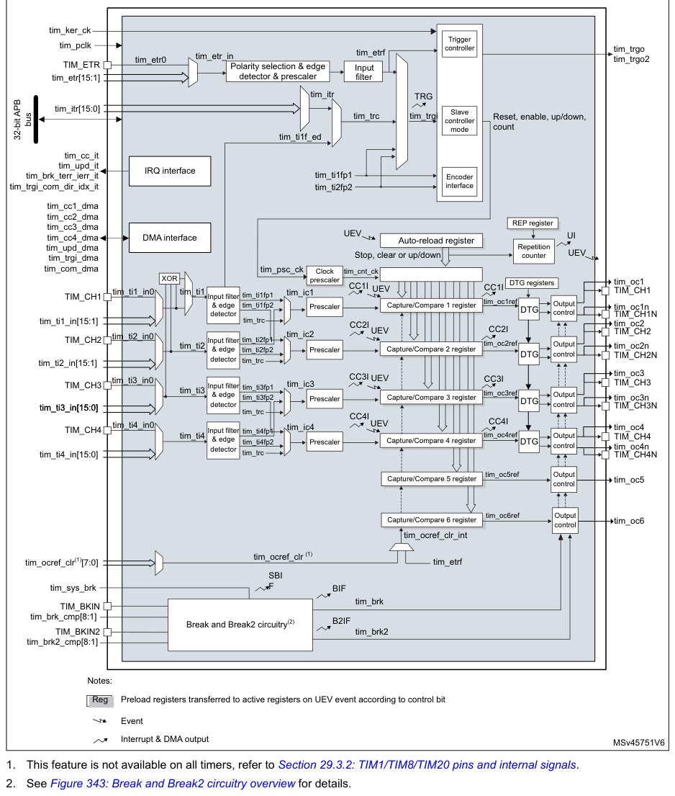

1. This feature is not available on all timers, refer to [Section 29.3.2](#2932-tim1tim8tim20-pins-and-internal-signals): TIM1/TIM8/TIM20 pins and
   internal signals.
2. See Figure 343: Break and Break2 circuitry overview for details.

### 29.3.2 TIM1/TIM8/TIM20 pins and internal signals

The tables in this section summarize the TIM inputs and outputs

**Table 261. TIM input/output pins**

| Source row | Column 1 | Column 2 | Column 3 |
| ---: | --- | --- | --- |
| 1 | `Pin name` | `Signal type` | `Description` |

Timer multi-purpose channels.

Each channel can be used for capture, compare or PWM.

TIM_CH1

TIM_CH1 and TIM_CH2 can also be used

| Source row | Column 1 | Column 2 |
| ---: | --- | --- |
| 1 | `TIM_CH2` | `as external clock (below 1/4 of the` |
| 2 | `Input/output` |  |
| 3 | `TIM_CH3` | `tim_ker_ck clock), external trigger and` |
| 4 | `TIM_CH4` | `quadrature encoder inputs.` |

TIM_CH1, TIM_CH2 and TIM_CH3 can be used to interface with digital hall effect sensors.

TIM_CH1N

Timer complementary outputs, derived from

TIM_CH2N

| Source row | Column 1 | Column 2 |
| ---: | --- | --- |
| 1 | `Output` | `TIM_CHx outputs with the possibility to have` |
| 2 | `TIM_CH3N` |  |

deadtime insertion.

TIM_CH4N

External trigger input. This input can be used as external trigger or as external clock

| Source row | Column 1 | Column 2 | Column 3 |
| ---: | --- | --- | --- |
| 1 | `TIM_ETR` | `Input` | `source. This input can receive a clock with a` |
| 2 | `frequency higher than the tim_ker_ck if the tim_etr_in prescaler is used.` |  |  |
| 3 | `TIM_BKIN` | `Break and Break2 inputs. These inputs can` |  |
| 4 | `Input/output` |  |  |
| 5 | `TIM_BKIN2` | `also be configured in bidirectional mode.` |  |

**Table 262. TIM internal input/output signals**

| Source row | Column 1 | Column 2 | Column 3 |
| ---: | --- | --- | --- |
| 1 | `Internal signal name` | `Signal type` | `Description` |
| 2 | `Internal timer inputs bus. The` |  |  |
| 3 | `tim_ti1_in[15:0]` |  |  |
| 4 | `tim_ti1_in[15:0] and tim_ti2_in[15:0] inputs` |  |  |
| 5 | `tim_ti2_in[15:0]` |  |  |
| 6 | `Input` | `can be used for capture or as external clock` |  |
| 7 | `tim_ti3_in[15:0]` |  |  |
| 8 | `(below 1/4 of the tim_ker_ck clock) and for` |  |  |
| 9 | `tim_ti4_in[15:0]` |  |  |

quadrature encoder signals.

External trigger internal input bus. These inputs can be used as trigger, external clock or for
hardware cycle-by-cycle pulsewidth

| Source row | Column 1 | Column 2 |
| ---: | --- | --- |
| 1 | `tim_etr[15:0]` | `Input` |

control. These inputs can receive clock with a frequency higher than the tim_ker_ck if the
tim_etr_in prescaler is used.

Internal trigger input bus. These inputs can be used for the slave mode controller or as a

| Source row | Column 1 | Column 2 |
| ---: | --- | --- |
| 1 | `tim_itr[15:0]` | `Input` |

input clock (below 1/4 of the tim_ker_ck clock).

Internal trigger outputs. These triggers are

| Source row | Column 1 | Column 2 | Column 3 |
| ---: | --- | --- | --- |
| 1 | `tim_trgo/tim_trgo2` | `Output` | `used by other timers and /or other` |

peripherals.

**Table 262. TIM internal input/output signals (continued)**

| Source row | Column 1 | Column 2 | Column 3 |
| ---: | --- | --- | --- |
| 1 | `Internal signal name` | `Signal type` | `Description` |
| 2 | `Timer tim_ocref_clr input bus. These inputs can be used to clear the tim ocxref signals,` |  |  |
| 3 | `tim_ocref_clr[7:0]` | `Input` |  |
| 4 | `typically for hardware cycle-by-cycle pulsewidth control.` |  |  |
| 5 | `tim_brk_cmp[8:1]` | `Input` | `Break input for internal signals` |
| 6 | `tim_brk2_cmp[8:1]` | `Input` | `Break2 input for internal signals` |
| 7 | `System break input. This input gathers the` |  |  |
| 8 | `tim_sys_brk[n:0]` | `Input` |  |
| 9 | `MCU’s system level errors.` |  |  |
| 10 | `tim_pclk` | `Input` | `Timer APB clock` |
| 11 | `tim_ker_ck` | `Input` | `Timer kernel clock` |
| 12 | `tim_cc_it` | `Output` | `Timer capture/compare interrupt` |
| 13 | `tim_upd_it` | `Output` | `Timer update event interrupt` |
| 14 | `Timer break, break2, transition error and` |  |  |
| 15 | `tim_brk_terr_ierr_it` | `Output` |  |
| 16 | `index error interrupt` |  |  |
| 17 | `Timer trigger, commutation, direction and` |  |  |
| 18 | `tim_trgi_com_dir_idx_it` | `Output` |  |
| 19 | `index interrupt` |  |  |
| 20 | `tim_cc1_dma` |  |  |
| 21 | `tim_cc2_dma` |  |  |
| 22 | `Output` | `Timer capture / compare 1..4 dma requests` |  |
| 23 | `tim_cc3_dma` |  |  |
| 24 | `tim_cc4_dma` |  |  |
| 25 | `tim_upd_dma` | `Output` | `Timer update dma request` |
| 26 | `tim_trgi_dma` | `Output` | `Timer trigger dma request` |
| 27 | `tim_com_dma` | `Output` | `Timer commutation dma request` |

Table 263, Table 264, Table 265 and Table 266 list the sources connected to the tim_ti[4:1] input
multiplexers.

**Table 263. Interconnect to the tim_ti1 input multiplexer**

| Source row | Column 1 | Column 2 | Column 3 | Column 4 |
| ---: | --- | --- | --- | --- |
| 1 | `Sources` |  |  |  |
| 2 | `tim_ti1 inputs` |  |  |  |
| 3 | `TIM1` | `TIM8` | `TIM20` |  |
| 4 | `tim_ti1_in0` | `TIM1_CH1` | `TIM8_CH1` | `TIM20_CH1` |
| 5 | `tim_ti1_in1` | `comp1_out` | `comp1_out` | `comp1_out` |
| 6 | `tim_ti1_in2` | `comp2_out` | `comp2_out` | `comp2_out` |
| 7 | `tim_ti1_in3` | `comp3_out` | `comp3_out` | `comp3_out` |
| 8 | `tim_ti1_in4` | `comp4_out` | `comp4_out` | `comp4_out` |
| 9 | `tim_ti1_in[15:5]` | `Reserved` |  |  |

**Table 264. Interconnect to the tim_ti2 input multiplexer**

| Source row | Column 1 | Column 2 | Column 3 | Column 4 |
| ---: | --- | --- | --- | --- |
| 1 | `Sources` |  |  |  |
| 2 | `tim_ti2 inputs` |  |  |  |
| 3 | `TIM1` | `TIM8` | `TIM20` |  |
| 4 | `tim_ti2_in0` | `TIM1_CH2` | `TIM8_CH2` | `TIM20_CH2` |
| 5 | `tim_ti2_in[15:1]` | `Reserved` |  |  |

**Table 265. Interconnect to the tim_ti3 input multiplexer**

| Source row | Column 1 | Column 2 | Column 3 | Column 4 |
| ---: | --- | --- | --- | --- |
| 1 | `Sources` |  |  |  |
| 2 | `tim_ti3 inputs` |  |  |  |
| 3 | `TIM1` | `TIM8` | `TIM20` |  |
| 4 | `tim_ti3_in0` | `TIM1_CH3` | `TIM8_CH3` | `TIM20_CH3` |
| 5 | `tim_ti3_in[15:1]` | `Reserved` |  |  |

**Table 266. Interconnect to the tim_ti4 input multiplexer**

| Source row | Column 1 | Column 2 | Column 3 | Column 4 |
| ---: | --- | --- | --- | --- |
| 1 | `Sources` |  |  |  |
| 2 | `tim_ti4 inputs` |  |  |  |
| 3 | `TIM1` | `TIM8` | `TIM20` |  |
| 4 | `tim_ti4_in0` | `TIM1_CH4` | `TIM8_CH4` | `TIM20_CH4` |
| 5 | `tim_ti4_in[15:1]` | `Reserved` |  |  |

Table 267 lists the internal sources connected to the tim_itr input multiplexer.

**Table 267. Internal trigger connection**

| Source row | Column 1 | Column 2 | Column 3 | Column 4 |
| ---: | --- | --- | --- | --- |
| 1 | `Timer internal` |  |  |  |
| 2 | `trigger input` | `TIM1` | `TIM8` | `TIM20` |
| 3 | `signal` |  |  |  |
| 4 | `tim_itr0` | `Reserved` | `tim1_trgo` | `tim1_trgo` |
| 5 | `tim_itr1` | `tim2_trgo` | `tim2_trgo` | `tim2_trgo` |
| 6 | `tim_itr2` | `tim3_trgo` | `tim3_trgo` | `tim3_trgo` |
| 7 | `tim_itr3` | `tim4_trgo` | `tim4_trgo` | `tim4_trgo` |
| 8 | `tim_itr4` | `tim5_trgo` | `tim5_trgo` | `tim5_trgo` |
| 9 | `tim_itr5` | `tim8_trgo` | `Reserved` | `tim8_trgo` |
| 10 | `tim_itr6` | `tim15_trgo` | `tim15_trgo` | `tim15_trgo` |
| 11 | `tim_itr7` | `tim16_oc1` | `tim16_oc1` | `tim16_oc1` |
| 12 | `tim_itr8` | `tim17_oc1` | `tim17_oc1` | `tim17_oc1` |
| 13 | `tim_itr9` | `tim20_trgo` | `tim20_trgo` | `Reserved` |
| 14 | `tim_itr10` | `hrtim_out_sync2` | `hrtim_out_sync2` | `hrtim_out_sync2` |
| 15 | `tim_itr[15:11]` | `Reserved` |  |  |

Table 268 lists the internal sources connected to the tim_etr input multiplexer.

**Table 268. Interconnect to the tim_etr input multiplexer**

| Source row | Column 1 | Column 2 | Column 3 | Column 4 |
| ---: | --- | --- | --- | --- |
| 1 | `Timer external trigger signals assignment` |  |  |  |
| 2 | `Timer external trigger` |  |  |  |
| 3 | `input signal` |  |  |  |
| 4 | `TIM1` | `TIM8` | `TIM20` |  |
| 5 | `tim_etr0` | `TIM1_ETR` | `TIM8_ETR` | `TIM20_ETR` |
| 6 | `tim_etr1` | `comp1_out` | `comp1_out` | `comp1_out` |
| 7 | `tim_etr2` | `comp2_out` | `comp2_out` | `comp2_out` |
| 8 | `tim_etr3` | `comp3_out` | `comp3_out` | `comp3_out` |
| 9 | `tim_etr4` | `comp4_out` | `comp4_out` | `comp4_out` |
| 10 | `tim_etr5` | `comp5_out` | `comp5_out` | `comp5_out` |
| 11 | `tim_etr6` | `comp6_out` | `comp6_out` | `comp6_out` |
| 12 | `tim_etr7` | `comp7_out` | `comp7_out` | `comp7_out` |
| 13 | `tim_etr8` | `adc1_awd1` | `adc2_awd1` | `adc3_awd1` |
| 14 | `tim_etr9` | `adc1_awd2` | `adc2_awd2` | `adc3_awd2` |
| 15 | `tim_etr10` | `adc1_awd3` | `adc2_awd3` | `adc3_awd3` |
| 16 | `tim_etr11` | `adc4_awd1` | `adc3_awd1` | `adc5_awd1` |
| 17 | `tim_etr12` | `adc4_awd2` | `adc3_awd2` | `adc5_awd2` |
| 18 | `tim_etr13` | `adc4_awd3` | `adc3_awd3` | `adc5_awd3` |
| 19 | `tim_etr[15:14]` | `Reserved` |  |  |

Table 269, Table 270 and Table 271 list the sources connected to the tim_brk and tim_brk2inputs.

**Table 269. Timer break interconnect**

| Source row | Column 1 | Column 2 | Column 3 | Column 4 |
| ---: | --- | --- | --- | --- |
| 1 | `tim_brk inputs` | `TIM1` | `TIM8` | `TIM20` |
| 2 | `TIM_BKIN` | `TIM1_BKIN pin` | `TIM8_BKIN pin` | `TIM20_BKIN pin` |
| 3 | `tim_brk_cmp1` | `comp1_out` | `comp1_out` | `comp1_out` |
| 4 | `tim_brk_cmp2` | `comp2_out` | `comp2_out` | `comp2_out` |
| 5 | `tim_brk_cmp3` | `comp3_out` | `comp3_out` | `comp3_out` |
| 6 | `tim_brk_cmp4` | `comp4_out` | `comp4_out` | `comp4_out` |
| 7 | `tim_brk_cmp5` | `comp5_out` | `comp5_out` | `comp5_out` |
| 8 | `tim_brk_cmp6` | `comp6_out` | `comp6_out` | `comp6_out` |
| 9 | `tim_brk_cmp7` | `comp7_out` | `comp7_out` | `comp7_out` |
| 10 | `tim_brk_cmp8` | `Reserved` |  |  |

**Table 270. Timer break2 interconnect**

| Source row | Column 1 | Column 2 | Column 3 | Column 4 |
| ---: | --- | --- | --- | --- |
| 1 | `tim_brk2 inputs` | `TIM1` | `TIM8` | `TIM20` |
| 2 | `TIM_BKIN2` | `TIM1_BKIN2 pin` | `TIM8_BKIN2 pin` | `TIM20_BKIN2 pin` |
| 3 | `tim_brk2_cmp1` | `comp1_out` | `comp1_out` | `comp1_out` |
| 4 | `tim_brk2_cmp2` | `comp2_out` | `comp2_out` | `comp2_out` |
| 5 | `tim_brk2_cmp3` | `comp3_out` | `comp3_out` | `comp3_out` |
| 6 | `tim_brk2_cmp4` | `comp4_out` | `comp4_out` | `comp4_out` |
| 7 | `tim_brk2_cmp5` | `comp5_out` | `comp5_out` | `comp5_out` |
| 8 | `tim_brk2_cmp6` | `comp6_out` | `comp6_out` | `comp6_out` |
| 9 | `tim_brk2_cmp7` | `comp7_out` | `comp7_out` | `comp7_out` |
| 10 | `tim_brk2_cmp8` | `Reserved` |  |  |

**Table 271. System break interconnect**

| Source row | Column 1 | Column 2 | Column 3 |
| ---: | --- | --- | --- |
| 1 | `tim_sys_brk` | `Enable bit in SYSCFG_CFGR2` |  |
| 2 | `TIM1 / TIM8 / TIM20` |  |  |
| 3 | `inputs` | `register` |  |
| 4 | `tim_sys_brk0` | `Cortex®-M4 with FPU LOCKUP` | `CLL` |
| 5 | `tim_sys_brk1` | `Programmable Voltage Detector (PVD)` | `PVDL` |
| 6 | `tim_sys_brk2` | `SRAM parity error` | `SPL` |
| 7 | `tim_sys_brk3` | `Flash memory double ECC error` | `ECCL` |
| 8 | `tim_sys_brk4` | `Clock Security System (CSS)` | `None (always enabled)` |

Table 272 lists the internal sources connected to the tim_ocref_clr input multiplexer.

**Table 272. Interconnect to the ocref_clr input multiplexer**

| Source row | Column 1 | Column 2 | Column 3 | Column 4 |
| ---: | --- | --- | --- | --- |
| 1 | `Timer OCREF clear signals assignment` |  |  |  |
| 2 | `Timer OCREF clear` |  |  |  |
| 3 | `signal` |  |  |  |
| 4 | `TIM1` | `TIM8` | `TIM20` |  |
| 5 | `tim_ocref_clr0` | `comp1_out` | `comp1_out` | `comp1_out` |
| 6 | `tim_ocref_clr1` | `comp2_out` | `comp2_out` | `comp2_out` |
| 7 | `tim_ocref_clr2` | `comp3_out` | `comp3_out` | `comp3_out` |
| 8 | `tim_ocref_clr3` | `comp4_out` | `comp4_out` | `comp4_out` |
| 9 | `tim_ocref_clr4` | `comp5_out` | `comp5_out` | `comp5_out` |
| 10 | `tim_ocref_clr5` | `comp6_out` | `comp6_out` | `comp6_out` |
| 11 | `tim_ocref_clr6` | `comp7_out` | `comp7_out` | `comp7_out` |
| 12 | `tim_ocref_clr7` | `Reserved` |  |  |

### 29.3.3 Time-base unit

The main block of the programmable advanced-control timer is a 16-bit counter with its related
autoreload register. The counter can count up, down or both up and down. The counter clock can be
divided by a prescaler.

The counter, the autoreload register and the prescaler register can be written or read by software,
even when the counter is running.

The time-base unit includes:

- Counter register (TIMx_CNT)
- Prescaler register (TIMx_PSC)
- Autoreload register (TIMx_ARR)
- Repetition counter register (TIMx_RCR)

The autoreload register is preloaded. Writing to or reading from the autoreload register accesses
the preload register. The content of the preload register are transferred into the shadow register
permanently or at each update event (UEV), depending on the autoreload preload enable bit (ARPE) in
TIMx_CR1 register. The update event is sent when the counter reaches the overflow (or underflow when
downcounting) and if the UDIS bit equals 0 in the TIMx_CR1 register. It can also be generated by
software. The generation of the update event is described in detailed for each configuration.

The counter is clocked by the prescaler output tim_cnt_ck, which is enabled only when the counter
enable bit (CEN) in TIMx_CR1 register is set (refer also to the slave mode controller description to
get more details on counter enabling).

> **Note:** The counter starts counting 1 clock cycle after setting the CEN bit in the TIMx_CR1 register.

#### Prescaler description

The prescaler divides the counter clock frequency by any factor from 1 to 65536. It is based on a
16-bit counter controlled through a 16-bit register (in the TIMx_PSC register). It can be changed on
the fly as this control register is buffered. The new prescaler ratio is taken into account at the
next update event.

Figure 297 and Figure 298 give some examples of the counter behavior when the prescaler ratio is
changed on the fly.

**Figure 297. Counter timing diagram with prescaler division change from 1 to 2**

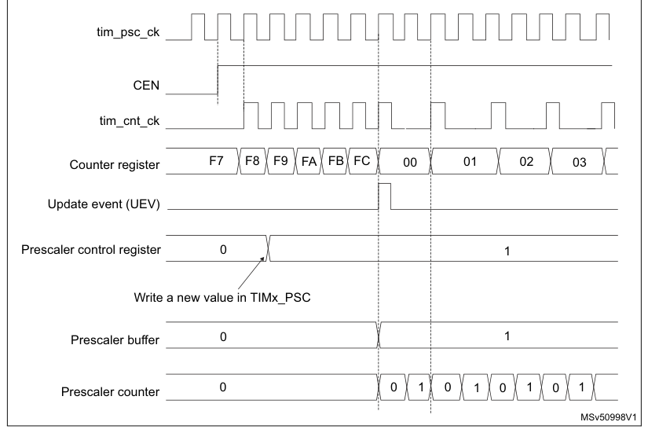

**Figure 298. Counter timing diagram with prescaler division change from 1 to 4**

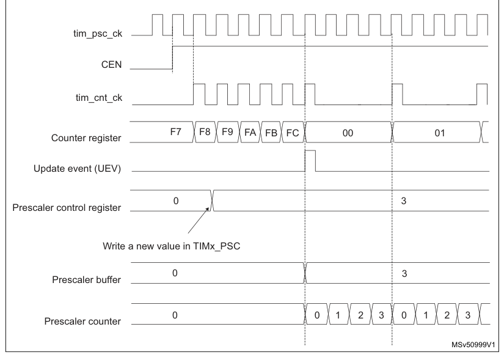

### 29.3.4 Counter modes

#### Upcounting mode

In upcounting mode, the counter counts from 0 to the autoreload value (content of the TIMx_ARR
register), then restarts from 0 and generates a counter overflow event.

If the repetition counter is used, the update event (UEV) is generated after upcounting is repeated
for the number of times programmed in the repetition counter register (TIMx_RCR) \+ 1. Else the
update event is generated at each counter overflow.

Setting the UG bit in the TIMx_EGR register (by software or by using the slave mode controller) also
generates an update event.

The UEV event can be disabled by software by setting the UDIS bit in the TIMx_CR1 register. This is
to avoid updating the shadow registers while writing new values in the preload registers. Then no
update event occurs until the UDIS bit has been written to 0. However, the counter restarts from 0,
as well as the counter of the prescaler (but the prescale rate does not change). In addition, if the
URS bit (update request selection) in TIMx_CR1 register is set, setting the UG bit generates an
update event UEV but without setting the UIF flag (thus no interrupt or DMA request is sent). This
is to avoid generating both update and capture interrupts when clearing the counter on the capture
event.

When an update event occurs, all the registers are updated and the update flag (UIF bit in TIMx_SR
register) is set (depending on the URS bit):

- The repetition counter is reloaded with the content of TIMx_RCR register,
- The autoreload shadow register is updated with the preload value (TIMx_ARR),
- The buffer of the prescaler is reloaded with the preload value (content of the TIMx_PSC register).

The following figures show some examples of the counter behavior for different clock frequencies
when TIMx_ARR = 0x36.

**Figure 299. Counter timing diagram, internal clock divided by 1**

**Figure 300. Counter timing diagram, internal clock divided by 2**

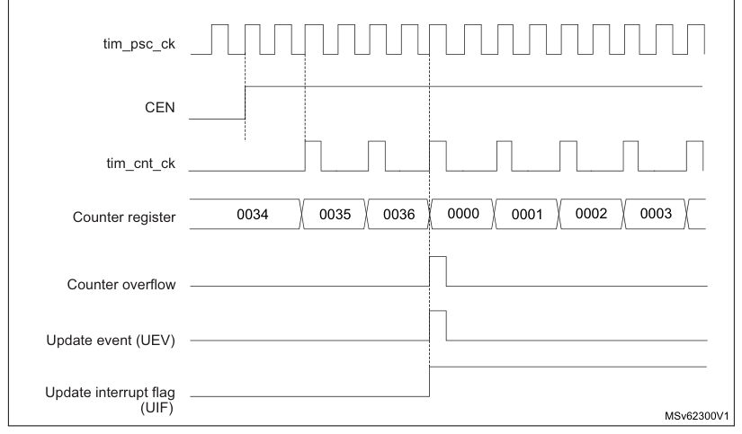

**Figure 301. Counter timing diagram, internal clock divided by 4**

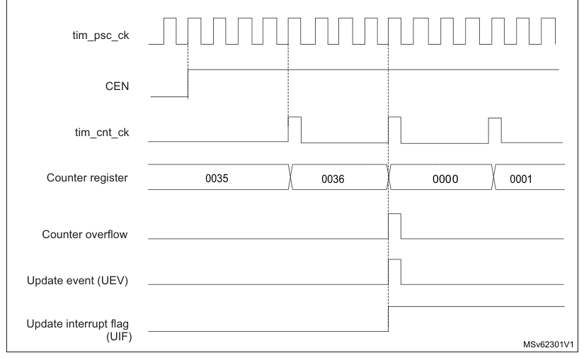

**Figure 302. Counter timing diagram, internal clock divided by N**

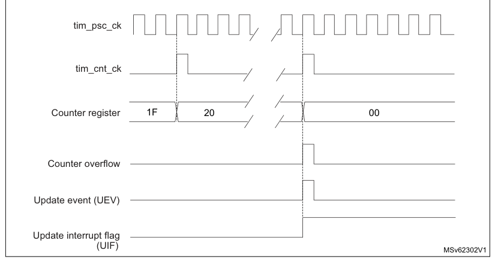

**Figure 303. Counter timing diagram, update event when ARPE = 0**

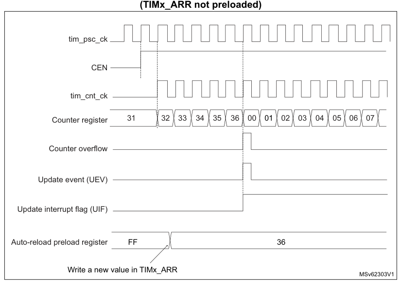

**Figure 304. Counter timing diagram, update event when ARPE = 1**

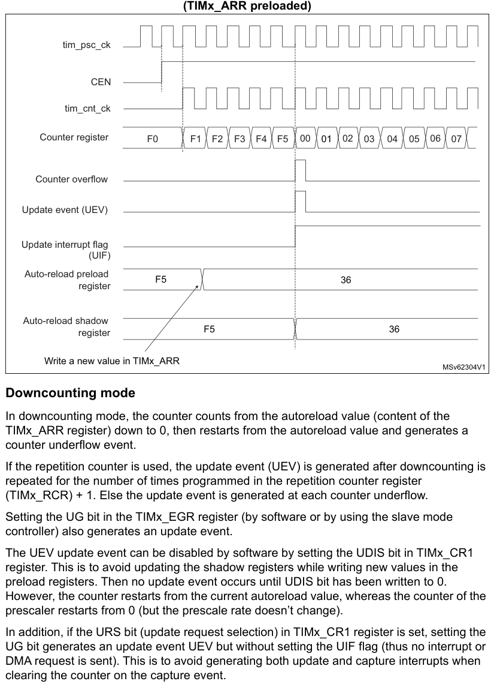

#### Downcounting mode

In downcounting mode, the counter counts from the autoreload value (content of the TIMx_ARR
register) down to 0, then restarts from the autoreload value and generates a counter underflow
event.

If the repetition counter is used, the update event (UEV) is generated after downcounting is
repeated for the number of times programmed in the repetition counter register (TIMx_RCR) \+ 1. Else
the update event is generated at each counter underflow.

Setting the UG bit in the TIMx_EGR register (by software or by using the slave mode controller) also
generates an update event.

The UEV update event can be disabled by software by setting the UDIS bit in TIMx_CR1 register. This
is to avoid updating the shadow registers while writing new values in the preload registers. Then no
update event occurs until UDIS bit has been written to 0. However, the counter restarts from the
current autoreload value, whereas the counter of the prescaler restarts from 0 (but the prescale
rate doesn’t change).

In addition, if the URS bit (update request selection) in TIMx_CR1 register is set, setting the UG
bit generates an update event UEV but without setting the UIF flag (thus no interrupt or DMA request
is sent). This is to avoid generating both update and capture interrupts when clearing the counter
on the capture event.

When an update event occurs, all the registers are updated and the update flag (UIF bit in TIMx_SR
register) is set (depending on the URS bit):

- The repetition counter is reloaded with the content of TIMx_RCR register.
- The buffer of the prescaler is reloaded with the preload value (content of the TIMx_PSC register).
- The autoreload active register is updated with the preload value (content of the TIMx_ARR
  register). Note that the autoreload is updated before the counter is reloaded, so that the next
  period is the expected one.

The following figures show some examples of the counter behavior for different clock frequencies
when TIMx_ARR = 0x36.

**Figure 305. Counter timing diagram, internal clock divided by 1**

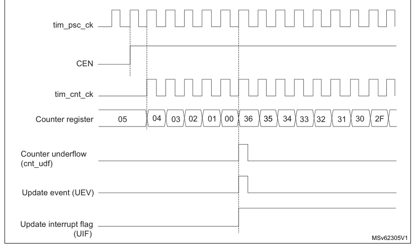

**Figure 306. Counter timing diagram, internal clock divided by 2**

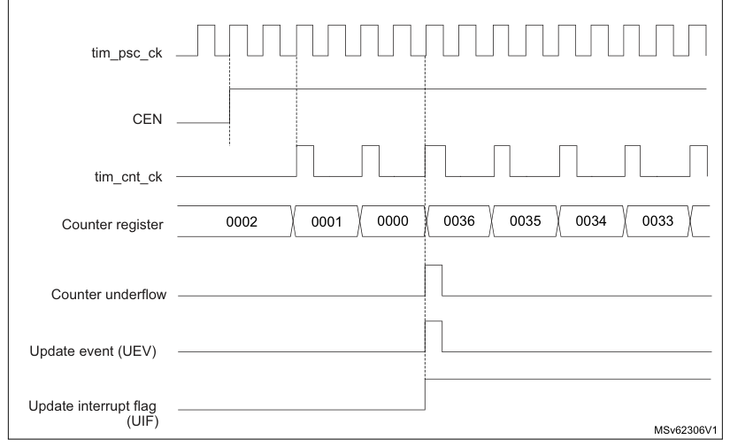

**Figure 307. Counter timing diagram, internal clock divided by 4**

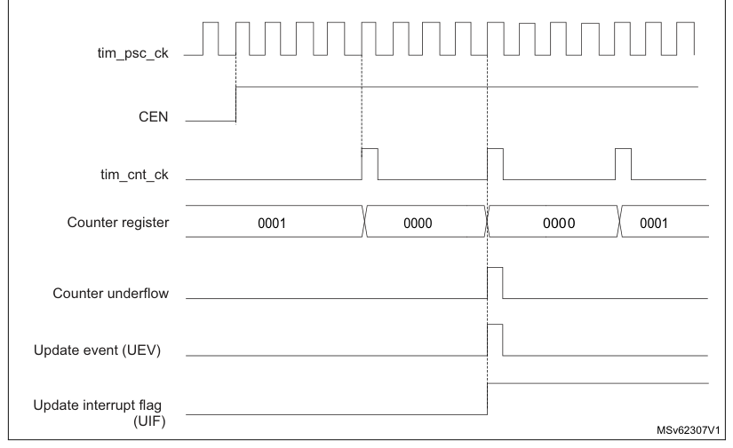

**Figure 308. Counter timing diagram, internal clock divided by N**

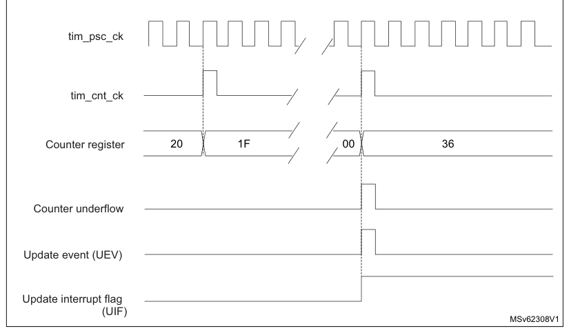

**Figure 309. Counter timing diagram, update event when repetition counter is not used**

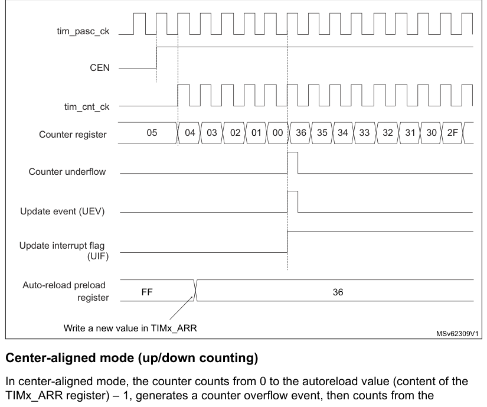

#### Center-aligned mode (up/down counting)

In center-aligned mode, the counter counts from 0 to the autoreload value (content of the TIMx_ARR
register) – 1, generates a counter overflow event, then counts from the
autoreload value down to 1 and generates a counter underflow event. Then it restarts counting from
0.

Center-aligned mode is active when the CMS bits in TIMx_CR1 register are not equal to 00. The Output
compare interrupt flag of channels configured in output is set when: the counter counts down (Center
aligned mode 1, CMS = 01), the counter counts up (Center aligned mode 2, CMS = 10) the counter
counts up and down (Center aligned mode 3, CMS = 11).

In this mode, the DIR direction bit in the TIMx_CR1 register cannot be written. It is updated by
hardware and gives the current direction of the counter.

The update event can be generated at each counter overflow and at each counter underflow or by
setting the UG bit in the TIMx_EGR register (by software or by using the slave mode controller) also
generates an update event. In this case, the counter restarts counting from 0, as well as the
counter of the prescaler.

The UEV update event can be disabled by software by setting the UDIS bit in the TIMx_CR1 register.
This is to avoid updating the shadow registers while writing new values in the preload registers.
Then no update event occurs until UDIS bit has been written to 0. However, the counter continues
counting up and down, based on the current autoreload value.

In addition, if the URS bit (update request selection) in TIMx_CR1 register is set, setting the UG
bit generates an UEV update event but without setting the UIF flag (thus no interrupt or DMA request
is sent). This is to avoid generating both update and capture interrupts when clearing the counter
on the capture event.

When an update event occurs, all the registers are updated and the update flag (UIF bit in TIMx_SR
register) is set (depending on the URS bit):

- The repetition counter is reloaded with the content of TIMx_RCR register
- The buffer of the prescaler is reloaded with the preload value (content of the TIMx_PSC register)
- The autoreload active register is updated with the preload value (content of the TIMx_ARR
  register). Note that if the update source is a counter overflow, the autoreload is updated before
  the counter is reloaded, so that the next period is the expected one (the counter is loaded with
  the new value).

The following figures show some examples of the counter behavior for different clock frequencies.

**Figure 310. Counter timing diagram, internal clock divided by 1, TIMx_ARR = 0x6**

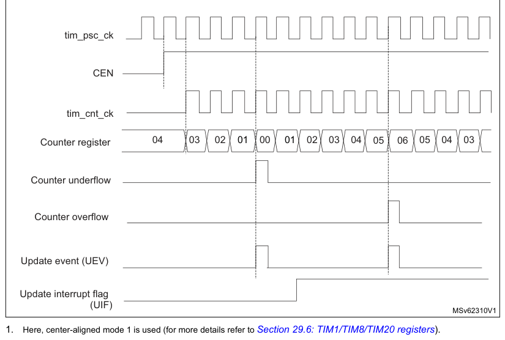

1. Here, center-aligned mode 1 is used (for more details refer to [Section 29.6](#296-tim1tim8tim20-registers): TIM1/TIM8/TIM20
   registers).

**Figure 311. Counter timing diagram, internal clock divided by 2**

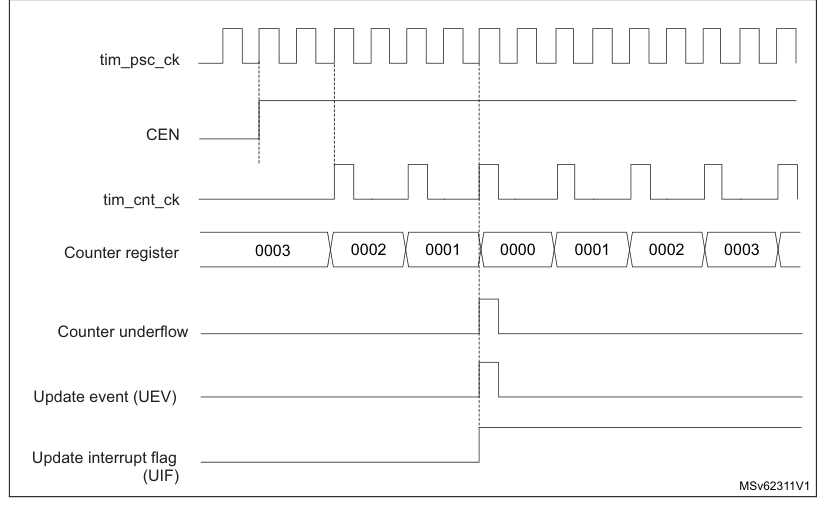

**Figure 312. Counter timing diagram, internal clock divided by 4, TIMx_ARR = 0x36**

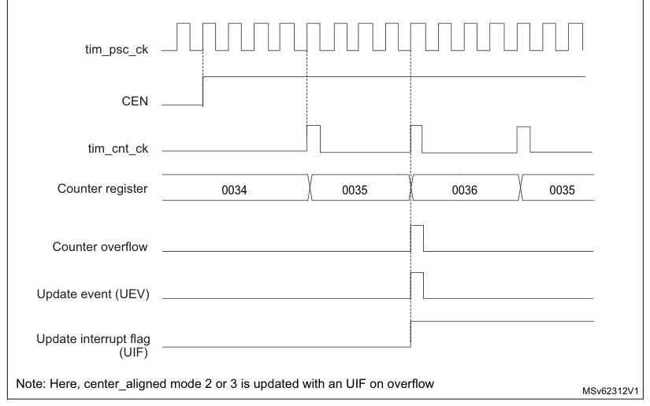

> **Note:** Here, center_aligned mode 2 or 3 is updated with an UIF on overflow

MSv62312V1

**Figure 313. Counter timing diagram, internal clock divided by N**

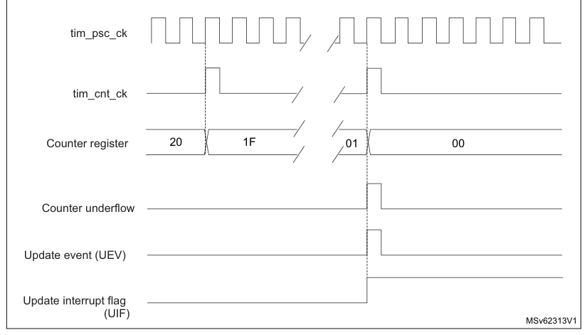

**Figure 314. Counter timing diagram, update event with ARPE = 1 (counter underflow)**

**Figure 315. Counter timing diagram, Update event with ARPE = 1 (counter overflow)**

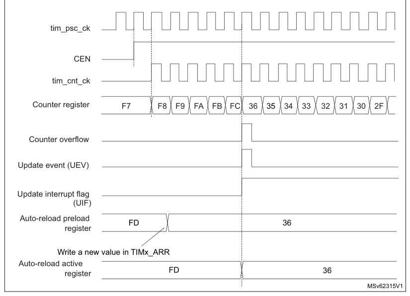

### 29.3.5 Repetition counter

[Section 29.3.3](#2933-time-base-unit): Time-base unit describes how the update event (UEV) is generated with respect to the
counter overflows/underflows. It is actually generated only when the repetition counter has reached
zero. This can be useful when generating PWM signals.

This means that data are transferred from the preload registers to the shadow registers (TIMx_ARR
autoreload register, TIMx_PSC prescaler register, but also TIMx_CCRx capture/compare registers in
compare mode) every N+1 counter overflows or underflows, where N is the value in the TIMx_RCR
repetition counter register.

The repetition counter is decremented:

- At each counter overflow in upcounting mode,
- At each counter underflow in downcounting mode,
- At each counter overflow and at each counter underflow in center-aligned mode. Although this
  limits the maximum number of repetition to 32768 PWM cycles, it makes it possible to update the
  duty cycle twice per PWM period. When refreshing compare registers only once per PWM period in
  center-aligned mode, maximum resolution is 2xTck, due to the symmetry of the pattern.

The repetition counter is an autoreload type; the repetition rate is maintained as defined by the
TIMx_RCR register value (refer to Figure 316). When the update event is generated by software (by
setting the UG bit in TIMx_EGR register) or by hardware through the slave mode controller, it occurs
immediately whatever the value of the repetition counter is and the repetition counter is reloaded
with the content of the TIMx_RCR register.

In Center aligned mode, for odd values of RCR, the update event occurs either on the overflow or on
the underflow depending on when the RCR register was written and when the counter was launched: if
the RCR was written before launching the counter, the UEV occurs on the underflow. If the RCR was
written after launching the counter, the UEV occurs on the overflow.

For example, for RCR = 3, the UEV is generated each 4th overflow or underflow event depending on
when the RCR was written.

**Figure 316. Update rate examples depending on mode and TIMx_RCR register settings**

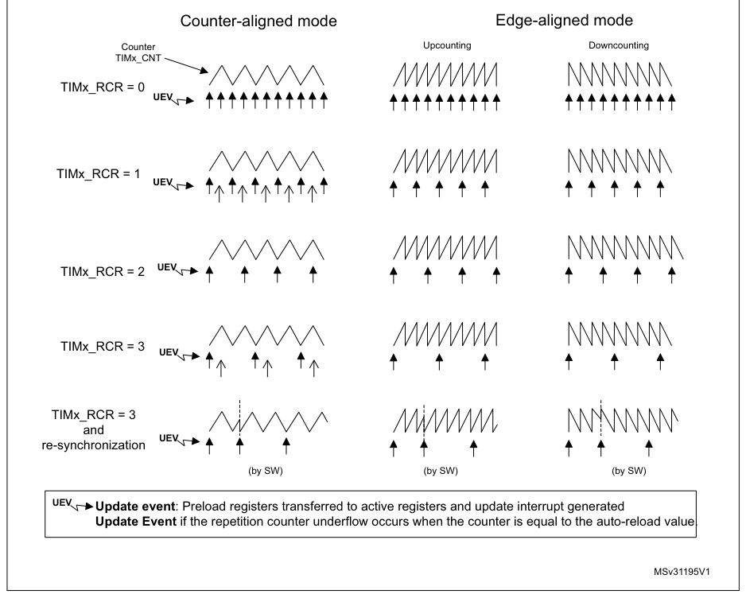

Update Event if the repetition counter underflow occurs when the counter is equal to the auto-reload
value.

MSv31195V1

### 29.3.6 External trigger input

The timer features an external trigger input tim_etr_in. It can be used as:

- external clock (external clock mode 2, see [Section 29.3.7](#2937-clock-selection))
- trigger for the slave mode (see [Section 29.3.30](#29330-timer-synchronization))
- PWM reset input for cycle-by-cycle current regulation (see [Section 29.3.9](#2939-input-capture-mode))

Figure 317 below describes the tim_etr_in input conditioning. The input polarity is defined with the
ETP bit in TIMxSMCR register. The trigger can be prescaled with the divider programmed by the
ETPS[1:0] bitfield and digitally filtered with the ETF[3:0] bitfield. The resulting signal
(tim_etrf) is available for three purposes: as an external clock, to condition
the output (typically to reset a PWM output for a current limitation), and as a trigger for the
Slave mode controller.

**Figure 317. External trigger input block**

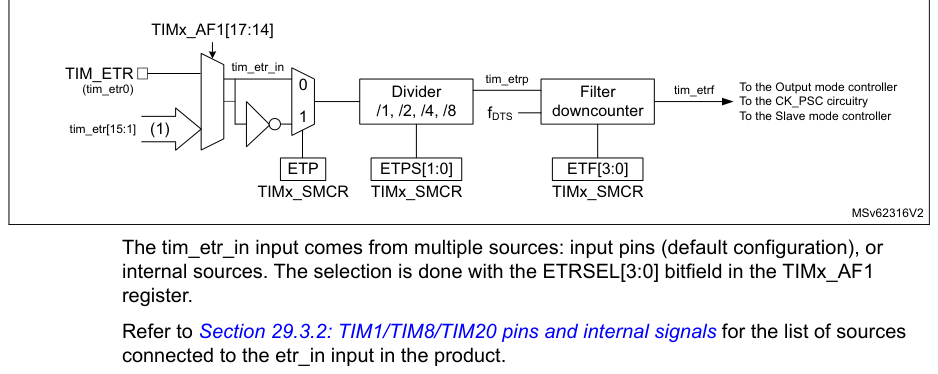

The tim_etr_in input comes from multiple sources: input pins (default configuration), or internal
sources. The selection is done with the ETRSEL[3:0] bitfield in the TIMx_AF1 register.

Refer to [Section 29.3.2](#2932-tim1tim8tim20-pins-and-internal-signals): TIM1/TIM8/TIM20 pins and internal signals for the list of sources connected
to the etr_in input in the product.

### 29.3.7 Clock selection

The counter clock can be provided by the following clock sources:

- Internal clock (tim_ker_ck)
- External clock mode1: external input pin (tim_ti1 or tim_ti2)
- External clock mode2: external trigger input (tim_etr_in)
- Encoder mode

#### Internal clock source (tim_ker_ck)

If the slave mode controller is disabled (SMS = 000), then the CEN, DIR (in the TIMx_CR1 register)
and UG bits (in the TIMx_EGR register) are actual control bits and can be changed only by software
(except UG which remains cleared automatically). As soon as the CEN bit is written to 1, the
prescaler is clocked by the internal clock tim_ker_ck.

Figure 318 shows the behavior of the control circuit and the upcounter in normal mode, without
prescaler.

**Figure 318. Control circuit in normal mode, internal clock divided by 1**

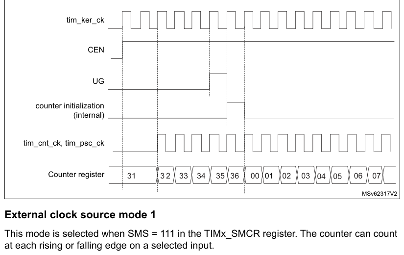

tim_ker_ck

CEN

UG
counter initialization

(internal)
tim_cnt_ck, tim_psc_ck

This mode is selected when SMS = 111 in the TIMx_SMCR register. The counter can count at each rising
or falling edge on a selected input.

**Figure 319. tim_ti2 external clock connection example**

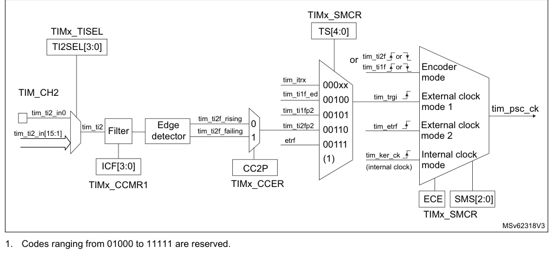

1. Codes ranging from 01000 to 11111 are reserved.

For example, to configure the upcounter to count in response to a rising edge on the tim_ti2 input,
use the following procedure:

1. Configure channel 2 to detect rising edges on the tim_ti2 input by writing CC2S = 01 in
   the TIMx_CCMR1 register.
2. Configure the input filter duration by writing the IC2F[3:0] bits in the TIMx_CCMR1
   register (if no filter is needed, keep IC2F = 0000).
3. Select rising edge polarity by writing CC2P = 0 and CC2NP = 0 in the TIMx_CCER
   register.
4. Configure the timer in external clock mode 1 by writing SMS = 111 in the TIMx_SMCR
   register.
5. Select tim_ti2 as the trigger input source by writing TS = 00110 in the TIMx_SMCR
   register.
6. Enable the counter by writing CEN = 1 in the TIMx_CR1 register.

> **Note:** The capture prescaler is not used for triggering, it is not necessary to configure it.

When a rising edge occurs on tim_ti2, the counter counts once and the TIF flag is set.

The delay between the rising edge on tim_ti2 and the actual clock of the counter is due to the
resynchronization circuit on tim_ti2 input.

**Figure 320. Control circuit in external clock mode 1**

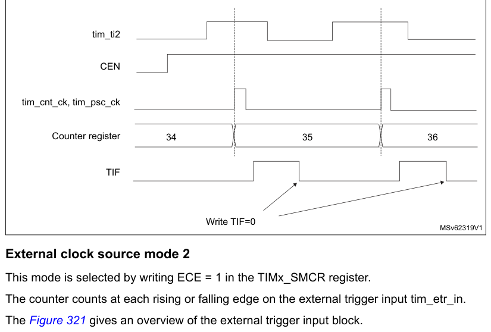

This mode is selected by writing ECE = 1 in the TIMx_SMCR register.

The counter counts at each rising or falling edge on the external trigger input tim_etr_in.

The Figure 321 gives an overview of the external trigger input block.

**Figure 321. External trigger input block**

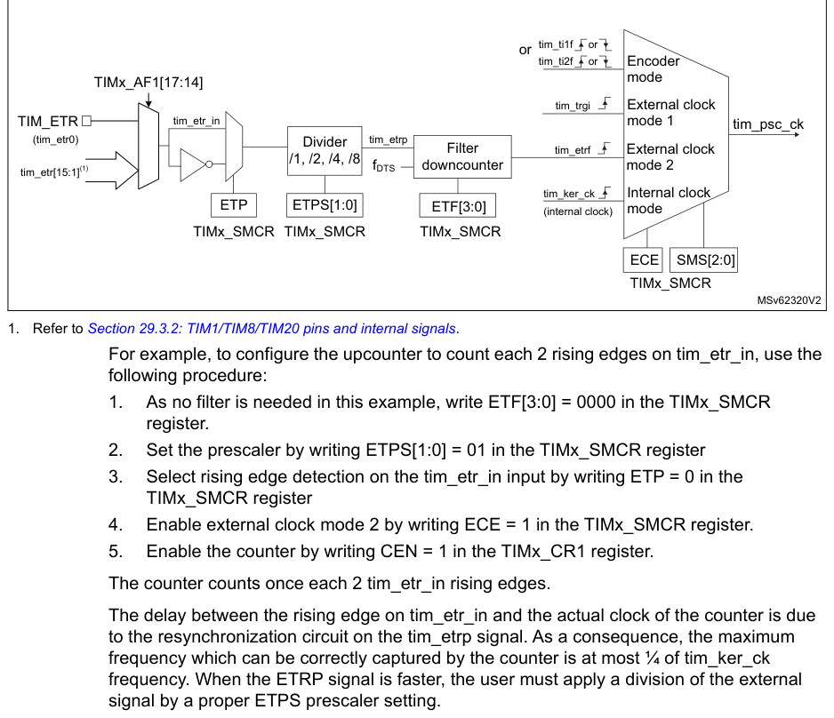

1. Refer to [Section 29.3.2](#2932-tim1tim8tim20-pins-and-internal-signals): TIM1/TIM8/TIM20 pins and internal signals.

For example, to configure the upcounter to count each 2 rising edges on tim_etr_in, use the
following procedure:

1. As no filter is needed in this example, write ETF[3:0] = 0000 in the TIMx_SMCR
   register.
2. Set the prescaler by writing ETPS[1:0] = 01 in the TIMx_SMCR register
3. Select rising edge detection on the tim_etr_in input by writing ETP = 0 in the

TIMx_SMCR register

4. Enable external clock mode 2 by writing ECE = 1 in the TIMx_SMCR register.
5. Enable the counter by writing CEN = 1 in the TIMx_CR1 register.

The counter counts once each 2 tim_etr_in rising edges.

The delay between the rising edge on tim_etr_in and the actual clock of the counter is due to the
resynchronization circuit on the tim_etrp signal. As a consequence, the maximum frequency which can
be correctly captured by the counter is at most ¼ of tim_ker_ck frequency. When the ETRP signal is
faster, the user must apply a division of the external signal by a proper ETPS prescaler setting.

**Figure 322. Control circuit in external clock mode 2**

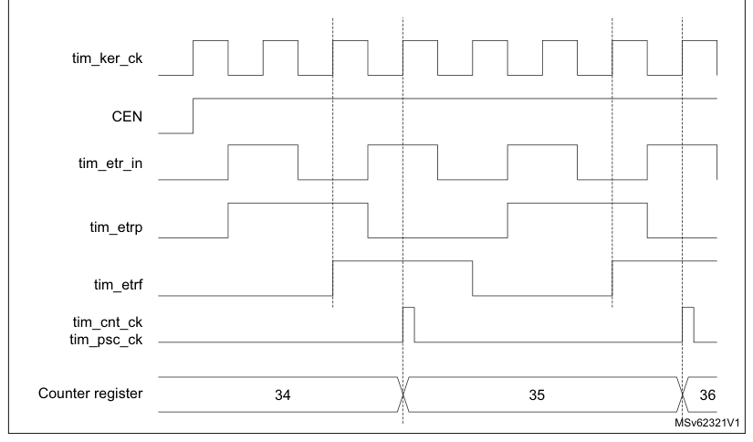

tim_ker_ck

CEN
tim_etr_in
tim_etrp
tim_etrf
tim_cnt_ck
tim_psc_ck

### 29.3.8 Capture/compare channels

Each capture/compare channel is built around a capture/compare register (including a shadow
register), an input stage for capture (with digital filter, multiplexing, and prescaler, except for
channels 5 and 6) and an output stage (with comparator and output control).

Figure 323 to Figure 326 give an overview of one capture/compare channel.

The input stage samples the corresponding tim_tix input to generate a filtered signal tim_tixf.
Then, an edge detector with polarity selection generates a signal (tim_tixfpy) which can be used as
trigger input by the slave mode controller or as the capture command. It is prescaled before the
capture register (ICxPS).

**Figure 323. Capture/compare channel (example: channel 1 input stage)**

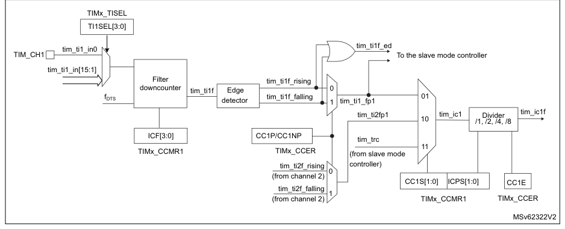

The output stage generates an intermediate waveform which is then used for reference: tim_ocxref
(active high). The polarity acts at the end of the chain.

**Figure 324. Capture/compare channel 1 main circuit**

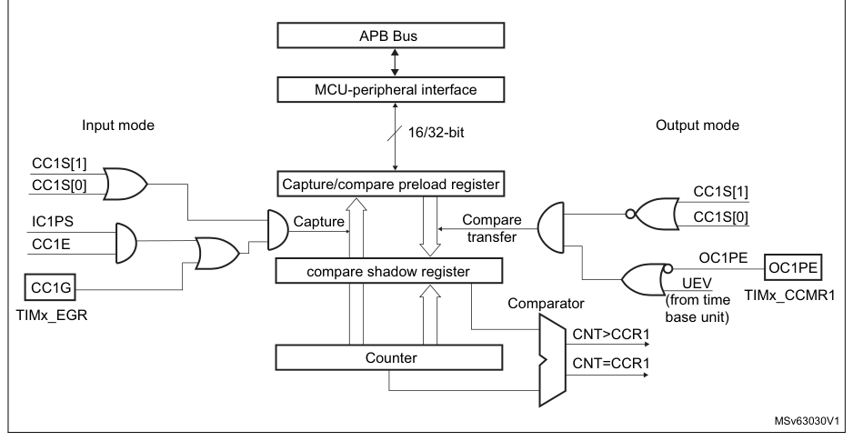

**Figure 325. Output stage of capture/compare channel (channel 1, idem ch. 2, 3 and 4)**

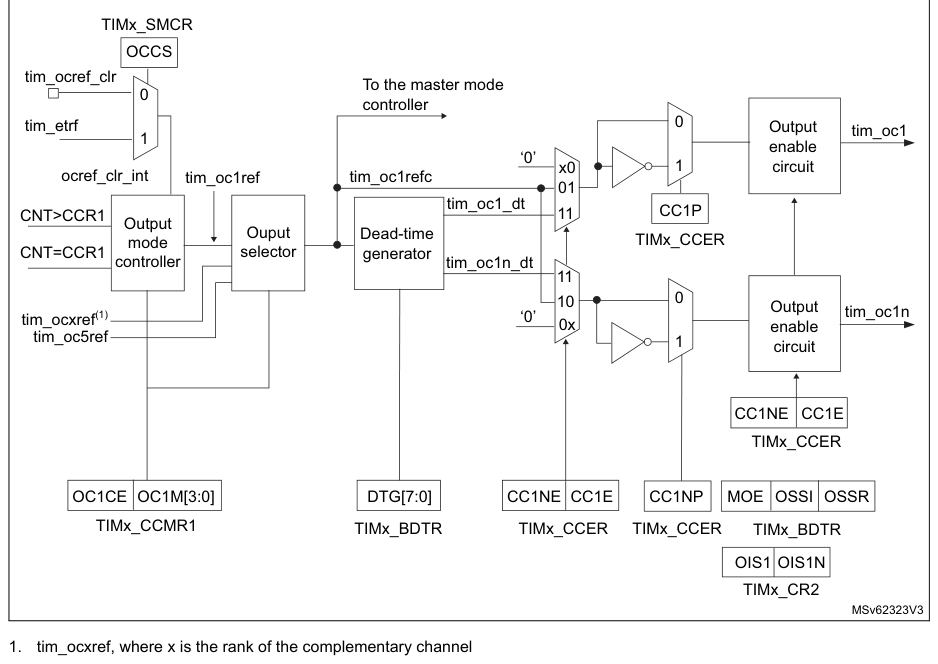

TIMx_SMCR

OCCS
tim_ocref_clr

To the master mode

0
controller

1. tim_ocxref, where x is the rank of the complementary channel

**Figure 326. Output stage of capture/compare channel (channel 5, idem ch. 6)**

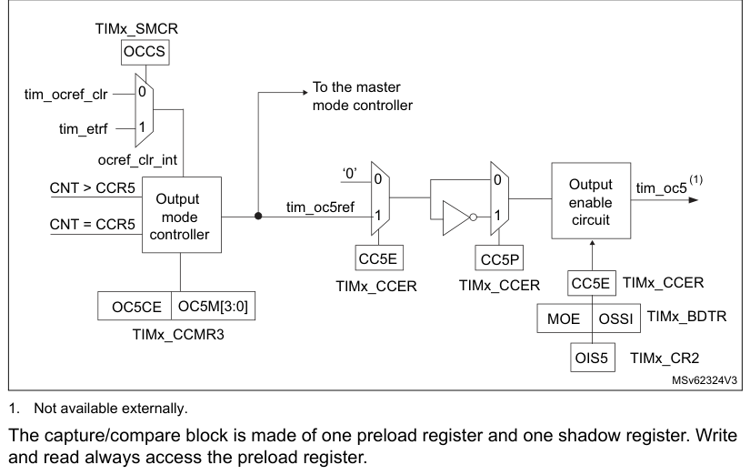

1. Not available externally.

The capture/compare block is made of one preload register and one shadow register. Write and read
always access the preload register.

In capture mode, captures are actually done in the shadow register, which is copied into the preload
register.

In compare mode, the content of the preload register is copied into the shadow register which is
compared to the counter.

### 29.3.9 Input capture mode

In Input capture mode, the capture/compare registers (TIMx_CCRx) are used to latch the value of the
counter after a transition detected by the corresponding ICx signal. When a capture occurs, the
corresponding CCXIF flag (TIMx_SR register) is set and an interrupt or a DMA request can be sent if
they are enabled. If a capture occurs while the CCxIF flag was already high, then the overcapture
flag CCxOF (TIMx_SR register) is set. CCxIF can be cleared by software by writing it to 0 or by
reading the captured data stored in the TIMx_CCRx register. CCxOF is cleared when it is written with
0.

The following example shows how to capture the counter value in TIMx_CCR1 when tim_ti1 input rises.
To do this, use the following procedure:

- Select the active input: TIMx_CCR1 must be linked to the tim_ti1 input, so write the CC1S bits to
  01 in the TIMx_CCMR1 register. As soon as CC1S becomes different from 00, the channel is
  configured in input, and the TIMx_CCR1 register becomes read-only.
- Program the appropriate input filter duration in relation with the signal connected to the timer
  (when the input is one of the tim_tix (ICxF bits in the TIMx_CCMRx register). Let’s imagine that,
  when toggling, the input signal is not stable during at must five internal clock cycles. We must
  program a filter duration longer than these five clock cycles. We can validate a transition on
  tim_ti1 when eight consecutive samples with the new level have been detected (sampled at fDTS
  frequency). Then write IC1F bits to 0011 in the TIMx_CCMR1 register.
- Select the edge of the active transition on the tim_ti1 channel by writing CC1P and CC1NP bits to
  0 in the TIMx_CCER register (rising edge in this case).
- Program the input prescaler. In our example, we wish the capture to be performed at each valid
  transition, so the prescaler is disabled (write IC1PS bits to 00 in the TIMx_CCMR1 register).
- Enable capture from the counter into the capture register by setting the CC1E bit in the TIMx_CCER
  register.
- If needed, enable the related interrupt request by setting the CC1IE bit in the TIMx_DIER
  register, and/or the DMA request by setting the CC1DE bit in the TIMx_DIER register.

When an input capture occurs:

- The TIMx_CCR1 register gets the value of the counter on the active transition.
- CC1IF flag is set (interrupt flag). CC1OF is also set if at least two consecutive captures
  occurred whereas the flag was not cleared.
- An interrupt is generated depending on the CC1IE bit.
- A DMA request is generated depending on the CC1DE bit.

In order to handle the overcapture, it is recommended to read the data before the overcapture flag.
This is to avoid missing an overcapture which may happen after reading the flag and before reading
the data.

> **Note:** IC interrupt and/or DMA requests can be generated by software by setting the
> corresponding CCxG bit in the TIMx_EGR register.

### 29.3.10 PWM input mode

This mode is used to measure both the period and the duty cycle of a PWM signal connected to single
tim_tix input:

- The TIMx_CCR1 register holds the period value (interval between two consecutive rising edges).
- The TIM_CCR2 register holds the pulsewidth (interval between two consecutive rising and falling
  edges.

This mode is a particular case of input capture mode. The set-up procedure is similar with the
following differences:

- Two ICx signals are mapped on the same tim_tixfp1 input.
- These two ICx signals are active on edges with opposite polarity.
- One of the two tim_tixfp signals is selected as trigger input and the slave mode controller is
  configured in reset mode.

The period and the pulsewidth of a PWM signal applied on tim_ti1 can be measured using the following
procedure:

- Select the active input for TIMx_CCR1: write the CC1S bits to 01 in the TIMx_CCMR1 register
  (tim_ti1 selected).
- Select the active polarity for tim_ti1fp1 (used both for capture in TIMx_CCR1 and counter clear):
  write the CC1P and CC1NP bits to 0 (active on rising edge).
- Select the active input for TIMx_CCR2: write the CC2S bits to 10 in the TIMx_CCMR1 register
  (tim_ti1 selected).
- Select the active polarity for tim_ti1fp2 (used for capture in TIMx_CCR2): write the CC2P and
  CC2NP bits to CC2P/CC2NP = 10 (active on falling edge).
- Select the valid trigger input: write the TS bits to 00101 in the TIMx_SMCR register (tim_ti1fp1
  selected).
- Configure the slave mode controller in reset mode: write the SMS bits to 0100 in the TIMx_SMCR
  register.
- Enable the captures: write the CC1E and CC2E bits to 1 in the TIMx_CCER register.

**Figure 327. PWM input mode timing**

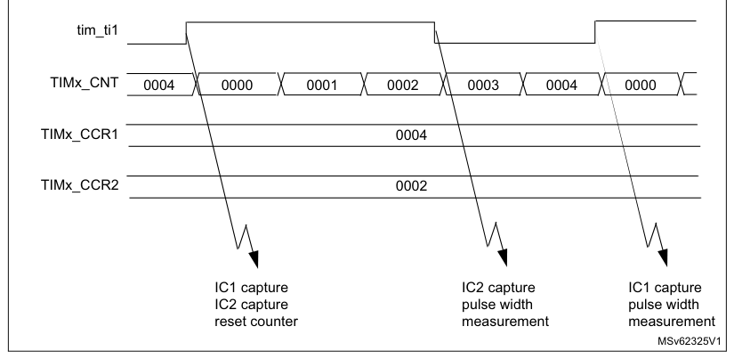

### 29.3.11 Forced output mode

In output mode (CCxS bits = 00 in the TIMx_CCMRx register), each output compare signal (tim_ocxref
and then tim_ocx/tim_ocxn) can be forced to active or inactive level directly by software,
independently of any comparison between the output compare register and the counter.

To force an output compare signal (tim_ocxref/tim_ocx) to its active level, user just needs to write
0101 in the OCxM bits in the corresponding TIMx_CCMRx register. Thus tim_ocxref is forced high
(tim_ocxref is always active high) and tim_ocx get opposite value to CCxP polarity bit.

For example: CCxP = 0 (tim_ocx active high) => tim_ocx is forced to high level.

The tim_ocxref signal can be forced low by writing the OCxM bits to 0100 in the TIMx_CCMRx register.

Anyway, the comparison between the TIMx_CCRx shadow register and the counter is still performed and
allows the flag to be set. Interrupt and DMA requests can be sent accordingly. This is described in
the output compare mode section below.

### 29.3.12 Output compare mode

This function is used to control an output waveform or indicate when a period of time has elapsed.
Channels 1 to 4 can be output, while channel 5 and 6 are only available inside the microcontroller
(for instance, for compound waveform generation or for ADC triggering).

When a match is found between the capture/compare register and the counter, the output compare
function:

- Assigns the corresponding output pin to a programmable value defined by the output compare mode
  (OCxM bits in the TIMx_CCMRx register) and the output polarity (CCxP bit in the TIMx_CCER
  register). The output pin can keep its level (OCXM = 0000), be
  set active (OCxM = 0001), be set inactive (OCxM = 0010) or can toggle (OCxM = 0011) on match.
- Sets a flag in the interrupt status register (CCxIF bit in the TIMx_SR register).
- Generates an interrupt if the corresponding interrupt mask is set (CCXIE bit in the TIMx_DIER
  register).
- Sends a DMA request if the corresponding enable bit is set (CCxDE bit in the TIMx_DIER register,
  CCDS bit in the TIMx_CR2 register for the DMA request selection).

The TIMx_CCRx registers can be programmed with or without preload registers using the OCxPE bit in
the TIMx_CCMRx register.

In output compare mode, the update event UEV has no effect on tim_ocxref and tim_ocx output. The
timing resolution is one count of the counter. Output compare mode can also be used to output a
single pulse (in One-pulse mode).

#### Procedure

1. Select the counter clock (internal, external, prescaler).
2. Write the desired data in the TIMx_ARR and TIMx_CCRx registers.
3. Set the CCxIE bit if an interrupt request is to be generated.
4. Select the output mode. For example:
   - Write OCxM = 0011 to toggle tim_ocx output pin when CNT matches CCRx
   - Write OCxPE = 0 to disable preload register
   - Write CCxP = 0 to select active high polarity
   - Write CCxE = 1 to enable the output

5. Enable the counter by setting the CEN bit in the TIMx_CR1 register.

The TIMx_CCRx register can be updated at any time by software to control the output waveform,
provided that the preload register is not enabled (OCxPE = 0, else TIMx_CCRx shadow register is
updated only at the next update event UEV). An example is given in

Figure 328.

**Figure 328. Output compare mode, toggle on tim_oc1**

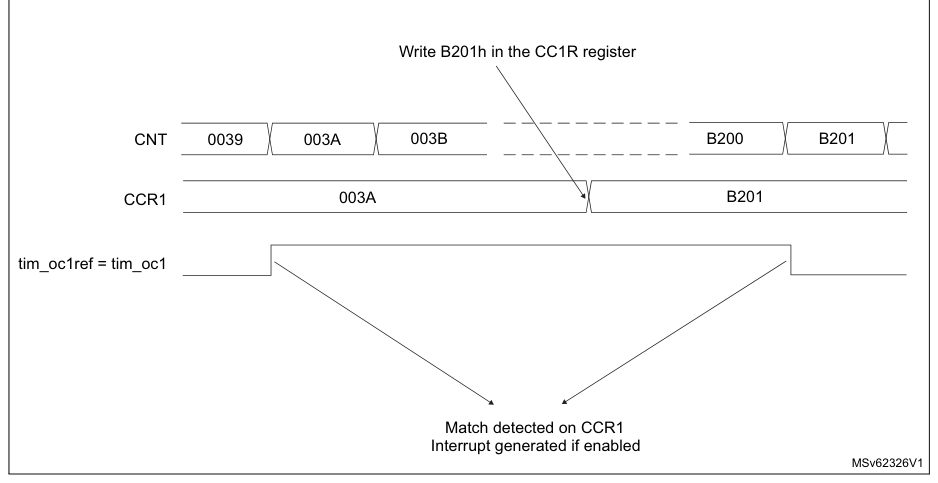

### 29.3.13 PWM mode

Pulse width modulation mode is used to generate a signal with a frequency determined by the value of
the TIMx_ARR register and a duty cycle determined by the value of the TIMx_CCRx register.

The PWM mode can be selected independently on each channel (one PWM per tim_ocx output) by writing
0110 (PWM mode 1) or 0111 (PWM mode 2) in the OCxM bits in the TIMx_CCMRx register. The
corresponding preload register must be enabled by setting the OCxPE bit in the TIMx_CCMRx register,
and eventually the autoreload preload register (in upcounting or center-aligned modes) by setting
the ARPE bit in the TIMx_CR1 register.

As the preload registers are transferred to the shadow registers only when an update event occurs,
before starting the counter, all registers must be initialized by setting the UG bit in the TIMx_EGR
register.

tim_ocx polarity is software programmable using the CCxP bit in the TIMx_CCER register. It can be
programmed as active high or active low. tim_ocx output is enabled by a combination of the CCxE,
CCxNE, MOE, OSSI, and OSSR bits (TIMx_CCER and TIMx_BDTR registers). Refer to the TIMx_CCER register
description for more details.

In PWM mode (1 or 2), TIMx_CNT and TIMx_CCRx are always compared to determine whether TIMx_CCRx
≤TIMx_CNT or TIMx_CNT ≤TIMx_CCRx (depending on the direction of the counter).

The timer is able to generate PWM in edge-aligned mode or center-aligned mode depending on the CMS
bits in the TIMx_CR1 register.

#### PWM edge-aligned mode

- Upcounting configuration

Upcounting is active when the DIR bit in the TIMx_CR1 register is low. Refer to Upcounting mode.

In the following example, the mode is PWM mode 1. The reference PWM signal tim_ocxref is high as
long as TIMx_CNT \< TIMx_CCRx else it becomes low. If the compare value in TIMx_CCRx is greater than
the autoreload value (in TIMx_ARR) then tim_ocxref is held at 1. If the compare value is zero then
tim_ocxref is held at 0. Figure 329 shows some edge-aligned PWM waveforms in an example where
TIMx_ARR = 8.

**Figure 329. Edge-aligned PWM waveforms (ARR = 8)**

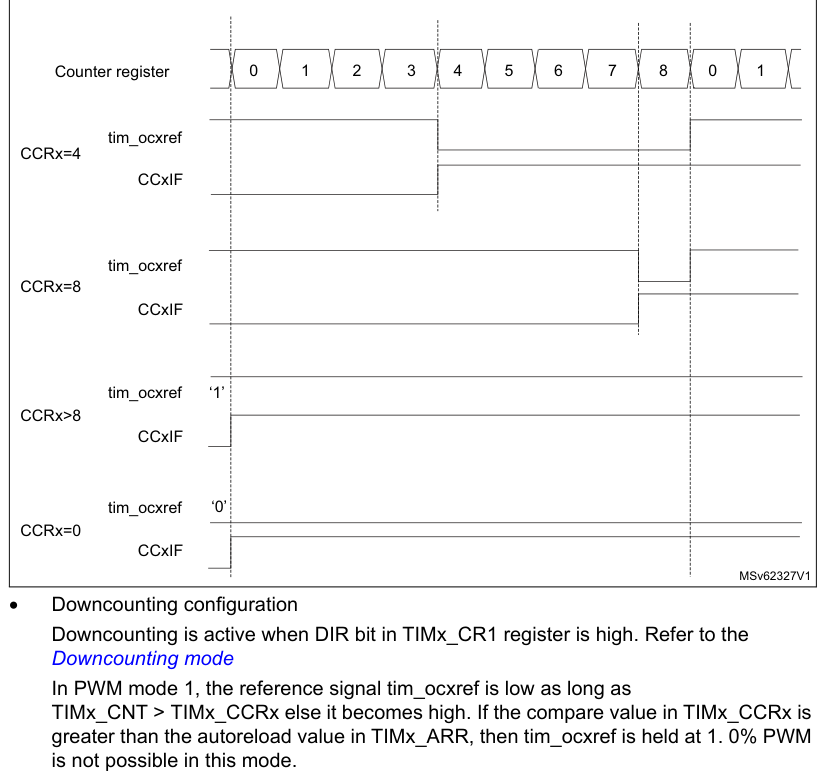

- Downcounting configuration

Downcounting is active when DIR bit in TIMx_CR1 register is high. Refer to the Downcounting mode

In PWM mode 1, the reference signal tim_ocxref is low as long as TIMx_CNT > TIMx_CCRx else it
becomes high. If the compare value in TIMx_CCRx is greater than the autoreload value in TIMx_ARR,
then tim_ocxref is held at 1. 0% PWM is not possible in this mode.

#### PWM center-aligned mode

Center-aligned mode is active when the CMS bits in TIMx_CR1 register are different from 00 (all the
remaining configurations having the same effect on the tim_ocxref/tim_ocx signals). The compare flag
is set when the counter counts up, when it counts down or both when it counts up and down depending
on the CMS bits configuration. The direction bit

(DIR) in the TIMx_CR1 register is updated by hardware and must not be changed by software. Refer to
Center-aligned mode (up/down counting).

Figure 330 shows some center-aligned PWM waveforms in an example where:

- TIMx_ARR = 8
- PWM mode is the PWM mode 1
- The flag is set when the counter counts down corresponding to the center-aligned mode 1 selected
  for CMS = 01 in TIMx_CR1 register.

**Figure 330. Center-aligned PWM waveforms (ARR = 8)**

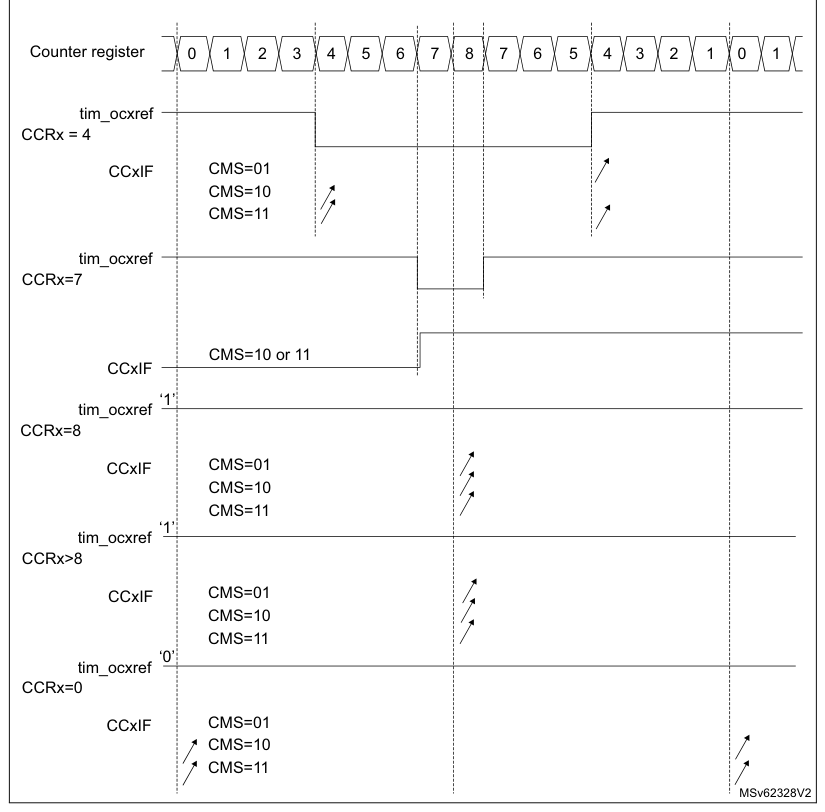

- When starting in center-aligned mode, the current up-down configuration is used. It means that the
  counter counts up or down depending on the value written in the DIR bit in the TIMx_CR1 register.
  Moreover, the DIR and CMS bits must not be changed at the same time by the software.
- Writing to the counter while running in center-aligned mode is not recommended as it can lead to
  unexpected results. In particular:
  - The direction is not updated if a value greater than the autoreload value is written in the
    counter (TIMx_CNT > TIMx_ARR). For example, if the counter was counting up, it continues to
    count up.
  - The direction is updated if 0 or the TIMx_ARR value is written in the counter but no update
    event UEV is generated.
- The safest way to use center-aligned mode is to generate an update by software (setting the UG bit
  in the TIMx_EGR register) just before starting the counter and not to write the counter while it
  is running.

#### Dithering mode

The PWM mode effective resolution can be increased by enabling the dithering mode, using the DITHEN
bit in the TIMx_CR1 register. This applies to both the CCR (for duty cycle resolution increase) and
ARR (for PWM frequency resolution increase).

The operating principle is to have the actual CCR (or ARR) value slightly changed (adding or not one
timer clock period) over 16 consecutive PWM periods, with predefined patterns. This allows a 16-fold
resolution increase, considering the average duty cycle or PWM period. Figure 331 presents the
dithering principle applied to four consecutive PWM cycles.

**Figure 331. Dithering principle**

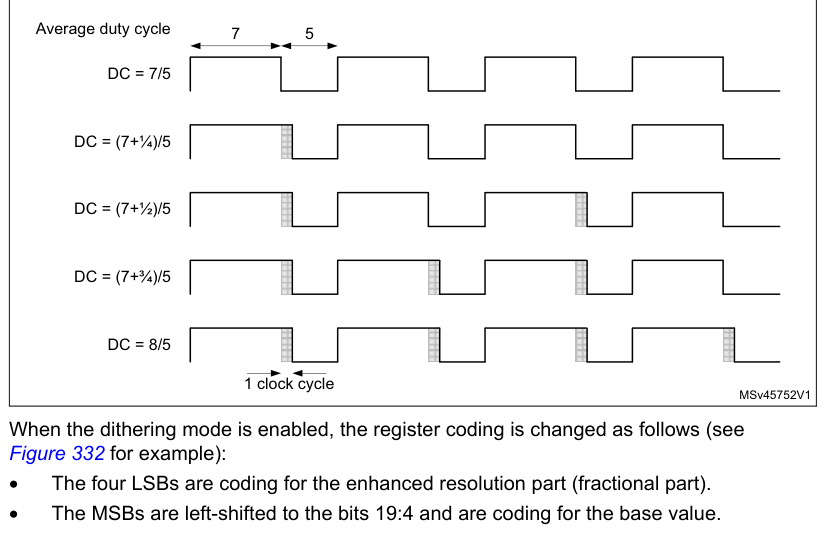

Average duty cycle

7 5

DC = 7/5

DC = (7+¼)/5

DC = (7+½)/5

DC = (7+¾)/5

DC = 8/5

1 clock cycle

MSv45752V1

When the dithering mode is enabled, the register coding is changed as follows (see Figure 332 for
example):

- The four LSBs are coding for the enhanced resolution part (fractional part).
- The MSBs are left-shifted to the bits 19:4 and are coding for the base value.

> **Note:** The ARR and CCR values will be updated automatically if the DITHEN bit is set / reset (for
> instance, if ARR= 0x05 with DITHEN = 0, it will be updated to ARR = 0x50 with DITHEN = 1). The
> following sequence must be followed when resetting the DITHEN bit:

1. CEN and ARPE bits must be reset.
2. The ARR[3:0] bits must be reset.
3. The DITHEN bit must be reset.
4. The CCIF flags must be cleared.
5. The CEN bit can be set (eventually with ARPE = 1).

**Figure 332. Data format and register coding in dithering mode**

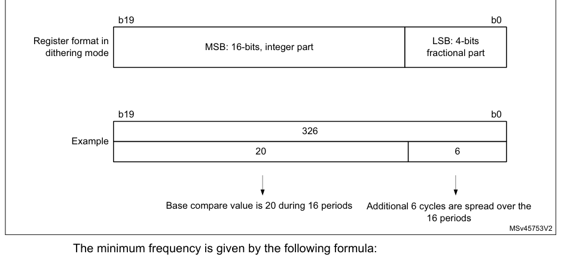

> **Note:** The maximum TIMx_ARR and TIMxCCRy values are limited to 0xFFFEF in dithering mode

(corresponds to 65534 for the integer part and 15 for the dithered part).

As shown on Figure 333, the dithering mode is used to increase the PWM resolution whatever the PWM
frequency.

**Figure 333. PWM resolution vs frequency**

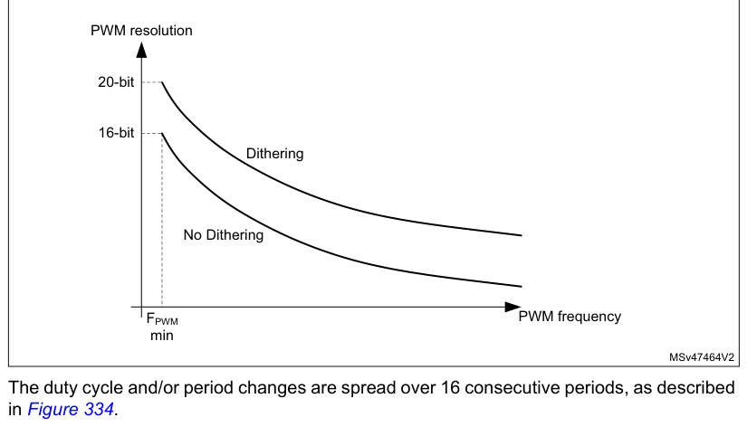

PWM resolution

20-bit

16-bit

Dithering

No Dithering

The duty cycle and/or period changes are spread over 16 consecutive periods, as described in Figure
334.

**Figure 334. PWM dithering pattern**

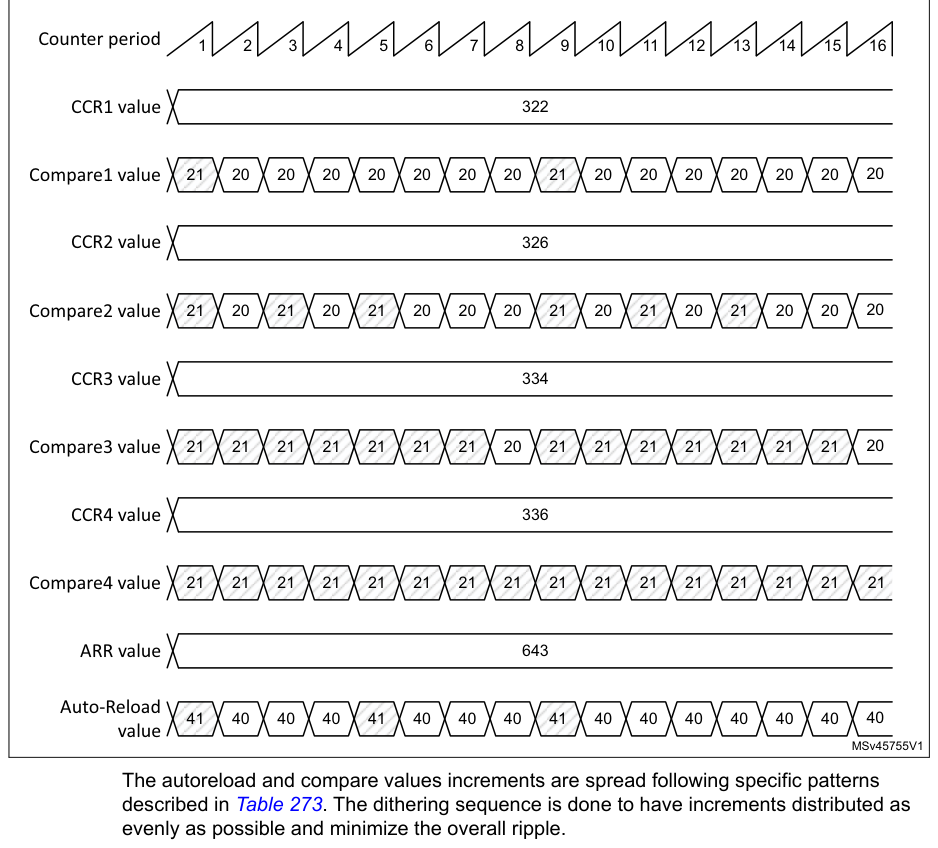

The autoreload and compare values increments are spread following specific patterns described in
Table 273. The dithering sequence is done to have increments distributed as evenly as possible and
minimize the overall ripple.

**Table 273. CCR and ARR register change dithering pattern**

| Source row | Extracted cells |
| ---: | --- |
| 1 | `PWM period` |
| 2 | `LSB value` |
| 3 | `1` · `2` · `3` · `4` · `5` · `6` · `7` · `8` · `9` · `10` · `11` · `12` · `13` · `14` · `15` · `16` |
| 4 | `0000` · `-` · `-` · `-` · `-` · `-` · `-` · `-` · `-` · `-` · `-` · `-` · `-` · `-` · `-` · `-` · `-` |
| 5 | `0001` · `+1` · `-` · `-` · `-` · `-` · `-` · `-` · `-` · `-` · `-` · `-` · `-` · `-` · `-` · `-` · `-` |
| 6 | `0010` · `+1` · `-` · `-` · `-` · `-` · `-` · `-` · `-` · `+1` · `-` · `-` · `-` · `-` · `-` · `-` · `-` |
| 7 | `0011` · `+1` · `-` · `-` · `-` · `+1` · `-` · `-` · `-` · `+1` · `-` · `-` · `-` · `-` · `-` · `-` · `-` |
| 8 | `0100` · `+1` · `-` · `-` · `-` · `+1` · `-` · `-` · `-` · `+1` · `-` · `-` · `-` · `+1` · `-` · `-` · `-` |
| 9 | `0101` · `+1` · `-` · `+1` · `-` · `+1` · `-` · `-` · `-` · `+1` · `-` · `-` · `-` · `+1` · `-` · `-` · `-` |
| 10 | `0110` · `+1` · `-` · `+1` · `-` · `+1` · `-` · `-` · `-` · `+1` · `-` · `+1` · `-` · `+1` · `-` · `-` · `-` |

**Table 273. CCR and ARR register change dithering pattern (continued)**

| Source row | Extracted cells |
| ---: | --- |
| 1 | `PWM period` |
| 2 | `LSB value` |
| 3 | `1` · `2` · `3` · `4` · `5` · `6` · `7` · `8` · `9` · `10` · `11` · `12` · `13` · `14` · `15` · `16` |
| 4 | `0111` · `+1` · `-` · `+1` · `-` · `+1` · `-` · `+1` · `-` · `+1` · `-` · `+1` · `-` · `+1` · `-` · `-` · `-` |
| 5 | `1000` · `+1` · `-` · `+1` · `-` · `+1` · `-` · `+1` · `-` · `+1` · `-` · `+1` · `-` · `+1` · `-` · `+1` · `-` |
| 6 | `1001` · `+1` · `+1` · `+1` · `-` · `+1` · `-` · `+1` · `-` · `+1` · `-` · `+1` · `-` · `+1` · `-` · `+1` · `-` |
| 7 | `1010` · `+1` · `+1` · `+1` · `-` · `+1` · `-` · `+1` · `-` · `+1` · `+1` · `+1` · `-` · `+1` · `-` · `+1` · `-` |
| 8 | `1011` · `+1` · `+1` · `+1` · `-` · `+1` · `+1` · `+1` · `-` · `+1` · `+1` · `+1` · `-` · `+1` · `-` · `+1` · `-` |
| 9 | `1100` · `+1` · `+1` · `+1` · `-` · `+1` · `+1` · `+1` · `-` · `+1` · `+1` · `+1` · `-` · `+1` · `+1` · `+1` · `-` |
| 10 | `1101` · `+1` · `+1` · `+1` · `+1` · `+1` · `+1` · `+1` · `-` · `+1` · `+1` · `+1` · `-` · `+1` · `+1` · `+1` · `-` |
| 11 | `1110` · `+1` · `+1` · `+1` · `+1` · `+1` · `+1` · `+1` · `-` · `+1` · `+1` · `+1` · `+1` · `+1` · `+1` · `+1` · `-` |
| 12 | `1111` · `+1` · `+1` · `+1` · `+1` · `+1` · `+1` · `+1` · `+1` · `+1` · `+1` · `+1` · `+1` · `+1` · `+1` · `+1` · `-` |

The dithering mode is also available in center-aligned PWM mode (CMS bits in TIMx_CR1 register are
not equal to 00). In this case, the dithering pattern is applied over eight consecutive PWM periods,
considering the up and down counting phases as shown in

Figure 335.

**Figure 335. Dithering effect on duty cycle in center-aligned PWM mode**

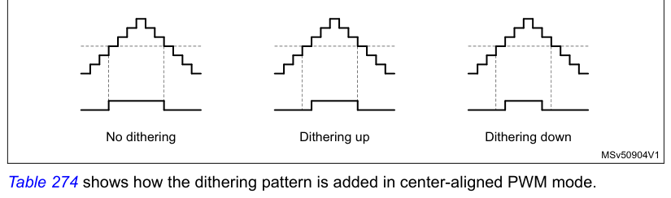

Table 274 shows how the dithering pattern is added in center-aligned PWM mode.

**Table 274. CCR register change dithering pattern in center-aligned PWM mode**

| Source row | Extracted cells |
| ---: | --- |
| 1 | `PWM period` |
| 2 | `LSB` |
| 3 | `1` · `2` · `3` · `4` · `5` · `6` · `7` · `8` |
| 4 | `value` |
| 5 | `Up` · `Dn` · `Up` · `Dn` · `Up` · `Dn` · `Up` · `Dn` · `Up` · `Dn` · `Up` · `Dn` · `Up` · `Dn` · `Up` · `Dn` |
| 6 | `0000` · `-` · `-` · `-` · `-` · `-` · `-` · `-` · `-` · `-` · `-` · `-` · `-` · `-` · `-` · `-` · `-` |
| 7 | `0001` · `+1` · `-` · `-` · `-` · `-` · `-` · `-` · `-` · `-` · `-` · `-` · `-` · `-` · `-` · `-` · `-` |
| 8 | `0010` · `+1` · `-` · `-` · `-` · `-` · `-` · `-` · `-` · `+1` · `-` · `-` · `-` · `-` · `-` · `-` · `-` |
| 9 | `0011` · `+1` · `-` · `-` · `-` · `+1` · `-` · `-` · `-` · `+1` · `-` · `-` · `-` · `-` · `-` · `-` · `-` |
| 10 | `0100` · `+1` · `-` · `-` · `-` · `+1` · `-` · `-` · `-` · `+1` · `-` · `-` · `-` · `+1` · `-` · `-` · `-` |
| 11 | `0101` · `+1` · `-` · `+1` · `-` · `+1` · `-` · `-` · `-` · `+1` · `-` · `-` · `-` · `+1` · `-` · `-` · `-` |
| 12 | `0110` · `+1` · `-` · `+1` · `-` · `+1` · `-` · `-` · `-` · `+1` · `-` · `+1` · `-` · `+1` · `-` · `-` · `-` |

**Table 274. CCR register change dithering pattern in center-aligned PWM mode (continued)**

| Source row | Extracted cells |
| ---: | --- |
| 1 | `PWM period` |
| 2 | `LSB` |
| 3 | `1` · `2` · `3` · `4` · `5` · `6` · `7` · `8` |
| 4 | `value` |
| 5 | `Up` · `Dn` · `Up` · `Dn` · `Up` · `Dn` · `Up` · `Dn` · `Up` · `Dn` · `Up` · `Dn` · `Up` · `Dn` · `Up` · `Dn` |
| 6 | `0111` · `+1` · `-` · `+1` · `-` · `+1` · `-` · `+1` · `-` · `+1` · `-` · `+1` · `-` · `+1` · `-` · `-` · `-` |
| 7 | `1000` · `+1` · `-` · `+1` · `-` · `+1` · `-` · `+1` · `-` · `+1` · `-` · `+1` · `-` · `+1` · `-` · `+1` · `-` |
| 8 | `1001` · `+1` · `+1` · `+1` · `-` · `+1` · `-` · `+1` · `-` · `+1` · `-` · `+1` · `-` · `+1` · `-` · `+1` · `-` |
| 9 | `1010` · `+1` · `+1` · `+1` · `-` · `+1` · `-` · `+1` · `-` · `+1` · `+1` · `+1` · `-` · `+1` · `-` · `+1` · `-` |
| 10 | `1011` · `+1` · `+1` · `+1` · `-` · `+1` · `+1` · `+1` · `-` · `+1` · `+1` · `+1` · `-` · `+1` · `-` · `+1` · `-` |
| 11 | `1100` · `+1` · `+1` · `+1` · `-` · `+1` · `+1` · `+1` · `-` · `+1` · `+1` · `+1` · `-` · `+1` · `+1` · `+1` · `-` |
| 12 | `1101` · `+1` · `+1` · `+1` · `+1` · `+1` · `+1` · `+1` · `-` · `+1` · `+1` · `+1` · `-` · `+1` · `+1` · `+1` · `-` |
| 13 | `1110` · `+1` · `+1` · `+1` · `+1` · `+1` · `+1` · `+1` · `-` · `+1` · `+1` · `+1` · `+1` · `+1` · `+1` · `+1` · `-` |
| 14 | `1111` · `+1` · `+1` · `+1` · `+1` · `+1` · `+1` · `+1` · `+1` · `+1` · `+1` · `+1` · `+1` · `+1` · `+1` · `+1` · `-` |

### 29.3.14 Asymmetric PWM mode

Asymmetric mode allows two center-aligned PWM signals to be generated with a programmable phase
shift. While the frequency is determined by the value of the TIMx_ARR register, the duty cycle and
the phase-shift are determined by a pair of TIMx_CCRx register. One register controls the PWM during
up-counting, the second during down counting, so that PWM is adjusted every half PWM cycle:

- tim_oc1refc (or tim_oc2refc) is controlled by TIMx_CCR1 and TIMx_CCR2
- tim_oc3refc (or tim_oc4refc) is controlled by TIMx_CCR3 and TIMx_CCR4

Asymmetric PWM mode can be selected independently on two channel (one tim_ocx output per pair of CCR
registers) by writing 1110 (Asymmetric PWM mode 1) or 1111 (Asymmetric PWM mode 2) in the OCxM bits
in the TIMx_CCMRx register.

> **Note:** The OCxM[3:0] bitfield is split into two parts for compatibility reasons, the most significant bit
> is not contiguous with the three least significant ones.

When a given channel is used as asymmetric PWM channel, its complementary channel can also be used.
For instance, if an tim_oc1refc signal is generated on channel 1 (Asymmetric PWM mode 1), it is
possible to output either the tim_oc2ref signal on channel 2, or an tim_oc2refc signal resulting
from asymmetric PWM mode 1.

Figure 336 represents an example of signals that can be generated using asymmetric PWM mode
(channels 1 to 4 are configured in asymmetric PWM mode 2). Together with the deadtime generator,
this allows a full-bridge phase-shifted DC to DC converter to be controlled.

**Figure 336. Generation of 2 phase-shifted PWM signals with 50% duty cycle**

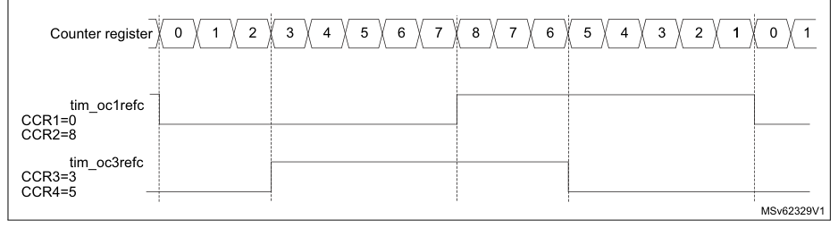

### 29.3.15 Combined PWM mode

Combined PWM mode allows two edge or center-aligned PWM signals to be generated with programmable
delay and phase shift between respective pulses. While the frequency is determined by the value of
the TIMx_ARR register, the duty cycle and delay are determined by the two TIMx_CCRx registers. The
resulting signals, tim_ocxrefc, are made of an OR or AND logical combination of two reference PWMs:

- tim_oc1refc (or tim_oc2refc) is controlled by TIMx_CCR1 and TIMx_CCR2
- tim_oc3refc (or tim_oc4refc) is controlled by TIMx_CCR3 and TIMx_CCR4

Combined PWM mode can be selected independently on two channels (one tim_ocx output per pair of CCR
registers) by writing 1100 (Combined PWM mode 1) or 1101 (Combined PWM mode 2) in the OCxM bits in
the TIMx_CCMRx register.

When a given channel is used as combined PWM channel, its complementary channel must be configured
in the opposite PWM mode (for instance, one in Combined PWM mode 1 and the other in Combined PWM
mode 2).

> **Note:** The OCxM[3:0] bitfield is split into two parts for compatibility reasons, the most significant bit
> is not contiguous with the three least significant ones.

Figure 337 represents an example of signals that can be generated using combined PWM mode, obtained
with the following configuration:

- Channel 1 is configured in Combined PWM mode 2.
- Channel 2 is configured in PWM mode 1.
- Channel 3 is configured in Combined PWM mode 2.
- Channel 4 is configured in PWM mode 1.

**Figure 337. Combined PWM mode on channel 1 and 3**

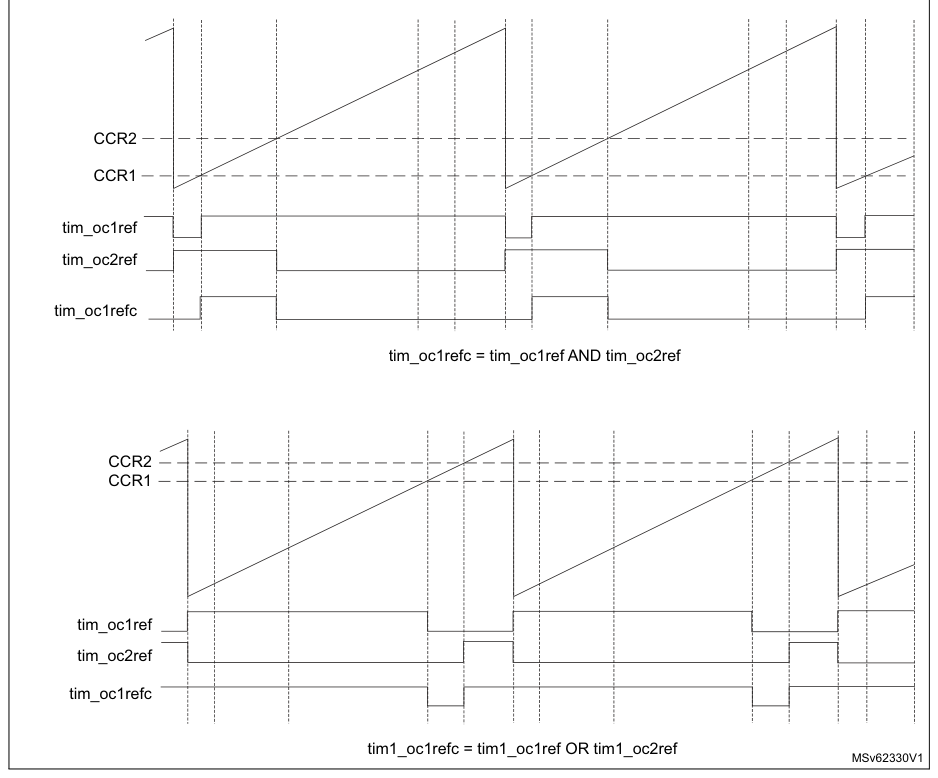

CCR2

CCR1
tim_oc1ref
tim_oc2ref
tim_oc1refc
tim_oc1refc = tim_oc1ref AND tim_oc2ref

CCR2

CCR1
tim_oc1ref
tim_oc2ref
tim_oc1refc
tim1_oc1refc = tim1_oc1ref OR tim1_oc2ref

MSv62330V1

### 29.3.16 Combined 3-phase PWM mode

Combined 3-phase PWM mode allows one to three center-aligned PWM signals to be generated with a
single programmable signal ANDed in the middle of the pulses. The tim_oc5ref signal is used to
define the resulting combined signal. The 3-bits GC5C[3:1] in the TIMx_CCR5 allow selection on which
reference signal the tim_oc5ref is combined. The resulting signals, tim_ocxrefc, are made of an AND
logical combination of two reference PWMs:

- If GC5C1 is set, tim_oc1refc is controlled by TIMx_CCR1 and TIMx_CCR5.
- If GC5C2 is set, tim_oc2refc is controlled by TIMx_CCR2 and TIMx_CCR5.
- If GC5C3 is set, tim_oc3refc is controlled by TIMx_CCR3 and TIMx_CCR5.

Combined 3-phase PWM mode can be selected independently on channels 1 to 3 by setting at least one
of the 3-bits GC5C[3:1].

**Figure 338. 3-phase combined PWM signals with multiple trigger pulses per period**

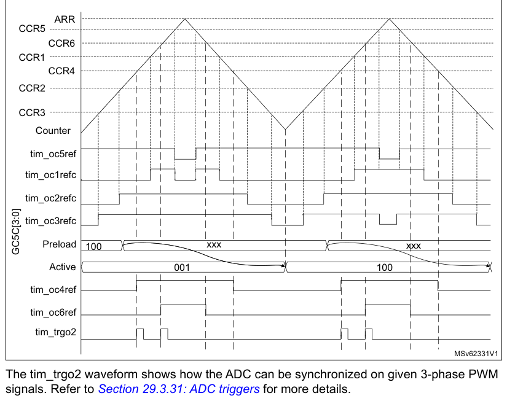

ARR

CCR5

CCR6

CCR1

CCR4

CCR2

CCR3

Counter
tim_oc5ref
tim_oc1refc
tim_oc2refc
tim_oc3refc

The tim_trgo2 waveform shows how the ADC can be synchronized on given 3-phase PWM signals. Refer to
[Section 29.3.31](#29331-adc-triggers): ADC triggers for more details.

### 29.3.17 Complementary outputs and dead-time insertion

The advanced-control timers (TIM1/TIM8/TIM20) can output two complementary signals and manage the
switching-off and the switching-on instants of the outputs.

This time is generally known as dead-time and it has to be adjusted depending on the devices that
are connected to the outputs and their characteristics (such as intrinsic delays of level-shifters,
or delays due to power switches).

The polarity of the outputs (main output tim_ocx or complementary tim_ocxn) can be selected
independently for each output. This is done by writing to the CCxP and CCxNP bits in the TIMx_CCER
register.

The complementary signals tim_ocx and tim_ocxn are activated by a combination of several control
bits: the CCxE and CCxNE bits in the TIMx_CCER register and the MOE, OISx, OISxN, OSSI, and OSSR
bits in the TIMx_BDTR and TIMx_CR2 registers. Refer to Table 282: Output control bits for
complementary tim_ocx and tim_ocxn channels with break feature for more details. In particular, the
dead-time is activated when switching to the idle state (MOE falling down to 0).

Dead-time insertion is enabled by setting both CCxE and CCxNE bits, and the MOE bit if the break
circuit is present. There is one 10-bit dead-time generator for each channel. From a
reference waveform tim_ocxref, it generates two outputs tim_ocx and tim_ocxn. If tim_ocx and
tim_ocxn are active high:

- The tim_ocx output signal is the same as the reference signal except for the rising edge, which is
  delayed relative to the reference rising edge.
- The tim_ocxn output signal is the opposite of the reference signal except for the rising edge,
  which is delayed relative to the reference falling edge.

If the delay is greater than the width of the active output (tim_ocx or tim_ocxn) then the
corresponding pulse is not generated.

The following figures show the relationships between the output signals of the dead-time generator
and the reference signal tim_ocxref considering CCxP = 0, CCxNP = 0, MOE = 1, CCxE = 1 and CCxNE = 1
in these examples.

**Figure 339. Complementary output with symmetrical dead-time insertion**

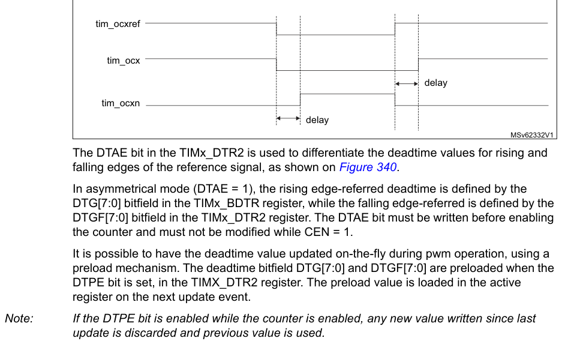

tim_ocxref
tim_ocx
delay
tim_ocxn
delay

MSv62332V1

The DTAE bit in the TIMx_DTR2 is used to differentiate the deadtime values for rising and falling
edges of the reference signal, as shown on Figure 340.

In asymmetrical mode (DTAE = 1), the rising edge-referred deadtime is defined by the DTG[7:0]
bitfield in the TIMx_BDTR register, while the falling edge-referred is defined by the DTGF[7:0]
bitfield in the TIMx_DTR2 register. The DTAE bit must be written before enabling the counter and
must not be modified while CEN = 1.

It is possible to have the deadtime value updated on-the-fly during pwm operation, using a preload
mechanism. The deadtime bitfield DTG[7:0] and DTGF[7:0] are preloaded when the DTPE bit is set, in
the TIMX_DTR2 register. The preload value is loaded in the active register on the next update event.

> **Note:** If the DTPE bit is enabled while the counter is enabled, any new value written since last
> update is discarded and previous value is used.

**Figure 340. Asymmetrical deadtime**

tim_ocxref
tim_ocx

Symmetrical deadtime

(DTAE = 0)
tim_ocxn

**Figure 341. Dead-time waveforms with delay greater than the negative pulse**

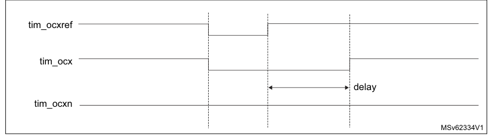

tim_ocxref
tim_ocx
delay
tim_ocxn

MSv62334V1

**Figure 342. Dead-time waveforms with delay greater than the positive pulse**

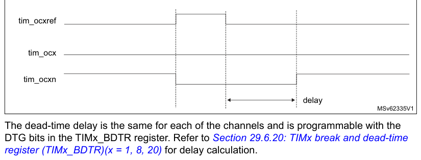

tim_ocxref
tim_ocx
tim_ocxn
delay

MSv62335V1

The dead-time delay is the same for each of the channels and is programmable with the DTG bits in
the TIMx_BDTR register. Refer to [Section 29.6.20](#29620-timx-break-and-dead-time-register-timx_bdtrx--1-8-20): TIMx break and dead-time register (TIMx_BDTR)(x =
1, 8, 20) for delay calculation.

#### Redirecting tim_ocxref to tim_ocx or tim_ocxn

In output mode (forced, output compare or PWM), tim_ocxref can be redirected to the tim_ocx output
or to tim_ocxn output by configuring the CCxE and CCxNE bits in the TIMx_CCER register.

This is used to send a specific waveform (such as PWM or static active level) on one output while
the complementary remains at its inactive level. Other alternative possibilities are to have both
outputs at inactive level or both outputs active and complementary with dead-time.

> **Note:** When only tim_ocxn is enabled (CCxE = 0, CCxNE = 1), it is not complemented and
> becomes active as soon as tim_ocxref is high. For example, if CCxNP = 0 then tim_ocxn = tim_ocxref.
On the other hand, when both tim_ocx and tim_ocxn are enabled (CCxE = CCxNE = 1) tim_ocx becomes
active when tim_ocxref is high whereas tim_ocxn is complemented and becomes active when tim_ocxref
is low.

### 29.3.18 Using the break function

The purpose of the break function is to protect power switches driven by PWM signals generated with
the timers. The two break inputs are usually connected to fault outputs of power stages and 3-phase
inverters. When activated, the break circuitry shuts down the PWM outputs and forces them to a
predefined safe state. A number of internal MCU events can also be selected to trigger an output
shut-down.

The break features two channels. A break channel which gathers both system-level fault (clock
failure, ECC/parity errors,...) and application fault (from input pins and built-in comparator), and
can force the outputs to a predefined level (either active or inactive) after a deadtime duration. A
break2 channel which only includes application faults and is able to force the outputs to an
inactive state.

The output enable signal and output levels during break are depending on several control bits:

- The MOE bit in TIMx_BDTR register is used to enable/disable the outputs by software and is reset
  in case of break or break2 event.
- The OSSI bit in the TIMx_BDTR register defines whether the timer controls the output in inactive
  state or releases the control to the GPIO controller (typically to have it in Hi- Z mode)
- The OISx and OISxN bits in the TIMx_CR2 register which are setting the output shut-down level,
  either active or inactive. The tim_ocx and tim_ocxn outputs cannot be set both to active level at
  a given time, whatever the OISx and OISxN values. Refer to Table 282: Output control bits for
  complementary tim_ocx and tim_ocxn channels with break feature for more details.

When exiting from reset, the break circuit is disabled and the MOE bit is low. The break functions
can be enabled by setting the BKE and BK2E bits in the TIMx_BDTR register. The break input
polarities can be selected by configuring the BKP and BK2P bits in the same register. BKEx and BKPx
can be modified at the same time. When the BKEx and BKPx bits are written, a delay of one APB clock
cycle is applied before the writing is effective. Consequently, it is necessary to wait one APB
clock period to correctly read back the bit after the write operation.

Because MOE falling edge can be asynchronous, a resynchronization circuit has been inserted between
the actual signal (acting on the outputs) and the synchronous control bit (accessed in the TIMx_BDTR
register). It results in some delays between the asynchronous
and the synchronous signals. In particular, if MOE is set to 1 whereas it was low, a delay must be
inserted (dummy instruction) before reading it correctly. This is because the write acts on the
asynchronous signal whereas the read reflects the synchronous signal.

The sources for break (tim_brk) channel are:

- External sources connected to one of the TIMx_BKIN pin (as per selection done in the GPIO
  alternate function selection registers), with polarity selection and optional digital filtering
- Internal sources:
  - coming from a tim_brk_cmpx input (refer to [Section 29.3.2](#2932-tim1tim8tim20-pins-and-internal-signals): TIM1/TIM8/TIM20 pins and internal
    signals for product specific implementation)
  - coming from a system break request (refer to [Section 29.3.2](#2932-tim1tim8tim20-pins-and-internal-signals): TIM1/TIM8/TIM20 pins and internal
    signals for product specific implementation)

The sources for break2 (tim_brk2) are:

- External sources connected to one of the TIMx_BKIN2 pin (as per selection done in the GPIO
  alternate function selection registers), with polarity selection and optional digital filtering
- Internal sources coming from a tim_brk2_cmpx input (refer to [Section 29.3.2](#2932-tim1tim8tim20-pins-and-internal-signals): TIM1/TIM8/TIM20 pins
  and internal signals for product specific implementation)

Break events can also be generated by software using BG and B2G bits in the TIMx_EGR register.

All sources are ORed before entering the timer tim_brk or tim_brk2 inputs, as per Figure 343 below.

**Figure 343. Break and Break2 circuitry overview**

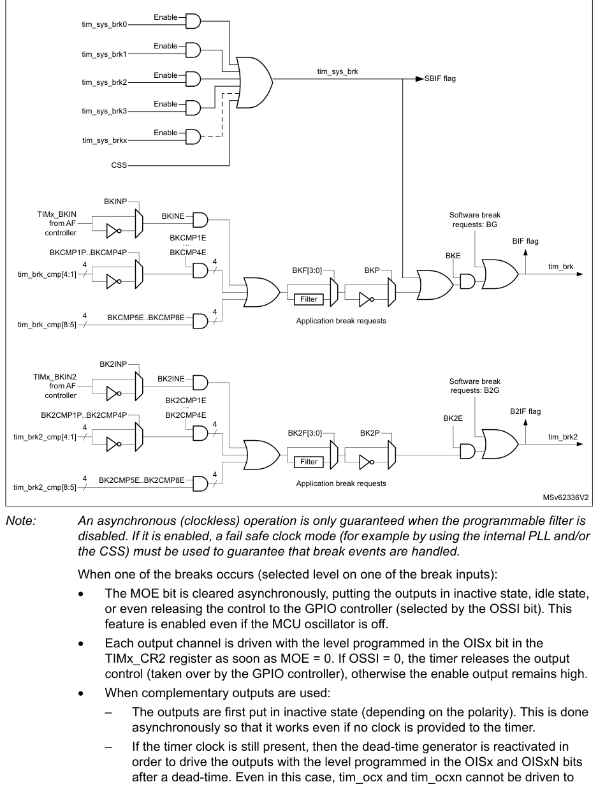

Enable
tim_sys_brk0

Enable
tim_sys_brk1
tim_sys_brk

Enable

SBIF flag
tim_sys_brk2

Enable
tim_sys_brk3

Enable
tim_sys_brkx

CSS

BKINP

...

B2IF flag

> **Note:** An asynchronous (clockless) operation is only guaranteed when the programmable filter is
> disabled. If it is enabled, a fail safe clock mode (for example by using the internal PLL and/or the
CSS) must be used to guarantee that break events are handled.

When one of the breaks occurs (selected level on one of the break inputs):

- The MOE bit is cleared asynchronously, putting the outputs in inactive state, idle state, or even
  releasing the control to the GPIO controller (selected by the OSSI bit). This feature is enabled
  even if the MCU oscillator is off.
- Each output channel is driven with the level programmed in the OISx bit in the TIMx_CR2 register
  as soon as MOE = 0. If OSSI = 0, the timer releases the output control (taken over by the GPIO
  controller), otherwise the enable output remains high.
- When complementary outputs are used:
  - The outputs are first put in inactive state (depending on the polarity). This is done
    asynchronously so that it works even if no clock is provided to the timer.
  - If the timer clock is still present, then the dead-time generator is reactivated in order to
    drive the outputs with the level programmed in the OISx and OISxN bits after a dead-time. Even
    in this case, tim_ocx and tim_ocxn cannot be driven to
    their active level together. Note that because of the resynchronization on MOE, the dead-time
    duration is slightly longer than usual (around 2 tim_ker_ck clock cycles).
- If OSSI = 0, the timer releases the output control (taken over by the GPIO controller which forces
  a Hi-Z state), otherwise the enable outputs remain or become high as soon as one of the CCxE or
  CCxNE bits is high.
- The break status flag (SBIF, BIF, and B2IF bits in the TIMx_SR register) is set. An interrupt is
  generated if the BIE bit in the TIMx_DIER register is set. A DMA request can be sent if the BDE
  bit in the TIMx_DIER register is set.
- If the AOE bit in the TIMx_BDTR register is set, the MOE bit is automatically set again at the
  next update event (UEV). As an example, this can be used to perform a regulation. Otherwise, MOE
  remains low until the application sets it to 1 again. In this case, it can be used for security
  and the break input can be connected to an alarm from power drivers, thermal sensors, or any
  security components.

> **Note:** If the MOE is reset by the CPU while the AOE bit is set, the outputs are in idle state and
> forced to inactive level or Hi-Z depending on OSSI value. If both the MOE and AOE bits are reset by
> the CPU, the outputs are in disabled state and driven with the level programmed in the OISx bit in
> the TIMx_CR2 register.

The break inputs are active on level. Thus, the MOE cannot be set while the break input is active
(neither automatically nor by software). In the meantime, the status flag BIF and B2IF cannot be
cleared.

In addition to the break input and the output management, a write protection has been implemented
inside the break circuit to safeguard the application. It is used to freeze the configuration of
several parameters (dead-time duration, tim_ocx/tim_ocxn polarities and state when disabled, OCxM
configurations, break enable, and polarity). The application can choose from three levels of
protection selected by the LOCK bits in the TIMx_BDTR register. Refer to [Section 29.6.20](#29620-timx-break-and-dead-time-register-timx_bdtrx--1-8-20). The LOCK
bits can be written only once after an MCU reset.

Figure 344 shows an example of behavior of the outputs in response to a break.

**Figure 344. Various output behavior in response to a break event on tim_brk (OSSI = 1)**

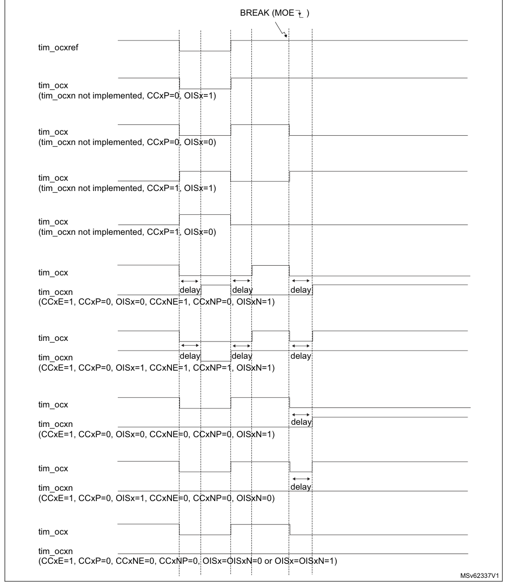

BREAK (MOE)
tim_ocxref
tim_ocx

(tim_ocxn not implemented, CCxP=0, OISx=1)
tim_ocx

(tim_ocxn not implemented, CCxP=0, OISx=0)
tim_ocx

(tim_ocxn not implemented, CCxP=1, OISx=1)
tim_ocx

(tim_ocxn not implemented, CCxP=1, OISx=0)
tim_ocx

- The tim_brk input can either disable (inactive state) or force the PWM outputs to a predefined
  safe state.
- tim_brk2 can only disable (inactive state) the PWM outputs.

The tim_brk has a higher priority than tim_brk2 input, as described in Table 275.

> **Note:** tim_brk2 must only be used with OSSR = OSSI = 1.

**Table 275. Behavior of timer outputs versus tim_brk/tim_brk2 inputs**

| Source row | Column 1 | Column 2 | Column 3 |
| ---: | --- | --- | --- |
| 1 | `Typical use case` |  |  |
| 2 | `Timer outputs` |  |  |
| 3 | `tim_brk` | `tim_brk2` |  |
| 4 | `state` | `tim_ocxn output` | `tim_ocx output` |
| 5 | `(low side switches)` | `(high side switches)` |  |

- Inactive then forced output state (after a deadtime)

ON after deadtime

| Source row | Column 1 | Column 2 | Column 3 | Column 4 | Column 5 |
| ---: | --- | --- | --- | --- | --- |
| 1 | `Active` | `X` | `– Outputs disabled` | `OFF` |  |
| 2 | `insertion` |  |  |  |  |
| 3 | `if OSSI = 0 (control taken over by GPIO logic)` |  |  |  |  |
| 4 | `Inactive` | `Active` | `Inactive` | `OFF` | `OFF` |

Figure 345 gives an example of tim_ocx and tim_ocxn output behavior in case of active signals on
tim_brk and tim_brk2 inputs. In this case, both outputs have active high polarities (CCxP = CCxNP =
0 in TIMx_CCER register).

**Figure 345. PWM output state following tim_brk and tim_brk2 assertion (OSSI = 1)**

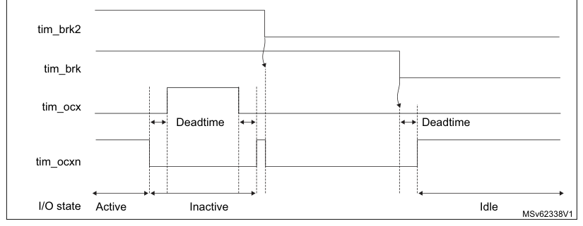

**Figure 346. PWM output state following tim_brk assertion (OSSI = 0)**

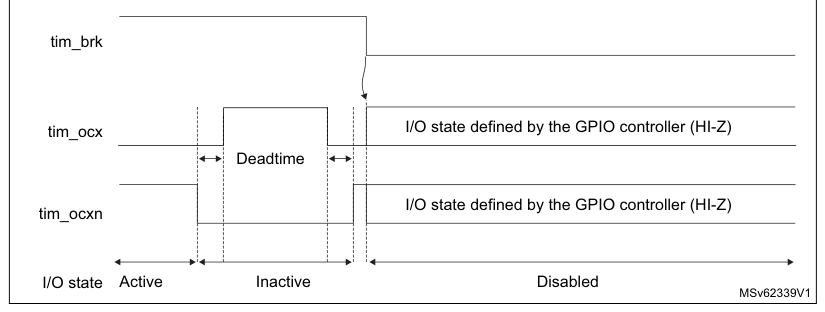

tim_brk

I/O state defined by the GPIO controller (HI-Z)
tim_ocx

Deadtime

I/O state defined by the GPIO controller (HI-Z)
tim_ocxn

### 29.3.19 Bidirectional break inputs

The TIM1/TIM8/TIM20 feature bidirectional break I/Os, as represented on Figure 347.

This provides support for:

- A board-level global break signal available for signaling faults to external MCUs or gate drivers,
  with a unique pin being both an input and an output status pin.
- Internal break sources and multiple external open drain sources ORed together to trigger a unique
  break event, when multiple internal and external break sources must be merged.

The tim_brk and tim_brk2 inputs are configured in bidirectional mode using the BKBID and BK2BID bits
in the TIMxBDTR register. The BKBID programming bits can be locked in read-only mode using the LOCK
bits in the TIMxBDTR register (in LOCK level 1 or above).

The bidirectional mode is available for both the tim_brk and tim_brk2 inputs, and require the I/O to
be configured in open-drain mode with active low polarity (using BKINP, BKP, BK2INP and BK2P bits).
Any break request coming either from system (for example CSS), from on-chip peripherals, or from
break inputs forces a low level on the break input to signal the fault event. The bidirectional mode
is inhibited if the polarity bits are not correctly set (active high polarity), for safety purposes.

The break software events (BG and B2G) also cause the break I/O to be forced to 0 to indicate to the
external components that the timer is entered in break state. However, this is valid only if the
break is enabled (BKE or B2KE = 1). When a software break event is generated with BKE or B2KE = 0),
the outputs are put in safe state and the break flag is set, but there is no effect on the TIMx_BKIN
and TIMx_BKIN2 I/Os.

A safe disarming mechanism prevents the system to be definitively locked-up (a low level on the
break input triggers a break which enforces a low level on the same input).

When the BKDSRM (BK2DSRM) bit is set to 1, this releases the break output to clear a fault signal
and to give the possibility to re-arm the system.

At no point the break protection circuitry can be disabled:

- The break input path is always active: a break event is active even if the BKDSRM (BK2DSRM) bit is
  set and the open drain control is released. This prevents the PWM output to be restarted as long
  as the break condition is present.
- The BKDSRM (BK2DSRM) bit cannot disarm the break protection as long as the outputs are enabled
  (MOE bit is set) (see Table 276).

**Table 276. Break protection disarming conditions**

| Source row | Column 1 | Column 2 | Column 3 | Column 4 |
| ---: | --- | --- | --- | --- |
| 1 | `BKBID` | `BKDSRM` |  |  |
| 2 | `MOE` | `Break protection state` |  |  |
| 3 | `(BK2BID)` | `(BK2DSRM)` |  |  |
| 4 | `0` | `0` | `X` | `Armed` |
| 5 | `0` | `1` | `0` | `Armed` |
| 6 | `0` | `1` | `1` | `Disarmed` |
| 7 | `1` | `X` | `X` | `Armed` |

#### Arming and rearming break circuitry

The break circuitry (in input or bidirectional mode) is armed by default (peripheral reset
configuration).

The following procedure must be followed to re-arm the protection after a break (break2) event:

- The BKDSRM (BK2DSRM) bit must be set to release the output control.
- The software must wait until the system break condition disappears (if any) and clear the SBIF
  status flag (or clear it systematically before rearming).
- The software must poll the BKDSRM (BK2DSRM) bit until it is cleared by hardware (when the
  application break condition disappears).

From this point, the break circuitry is armed and active, and the MOE bit can be set to re-enable
the PWM outputs.

**Figure 347. Output redirection (tim_brk2 request not represented)**

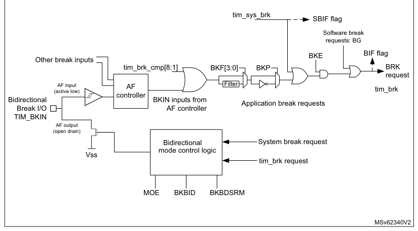

tim_sys_brk

SBIF flag

Software break
requests: BG

BIF flag

BKE

Other break inputs

### 29.3.20 Clearing the tim_ocxref signal on an external event

The tim_ocxref signal of a given channel can be cleared when a high level is applied on the
tim_ocref_clr_int input (OCxCE enable bit in the corresponding TIMx_CCMRx register set to 1).
tim_ocxref remains low until the next transition to the active state, on the following PWM
cycle. This function can only be used in Output compare and PWM modes. It does not work in Forced
mode. tim_ocref_clr_int input can be selected between the tim_ocref_clr input and tim_etrf
(tim_etr_in after the filter) by configuring the OCCS bit in the TIMx_SMCR register.

The tim_ocref_clr input can be selected among several inputs, using the OCRSEL[2:0] bitfield in the
TIMx_AF2 register, as shown on the Figure 348 below. Refer to [Section 29.3.2](#2932-tim1tim8tim20-pins-and-internal-signals): TIM1/TIM8/TIM20 pins
and internal signals for a list of sources available in the product.

**Figure 348. tim_ocref_clr input selection multiplexer**

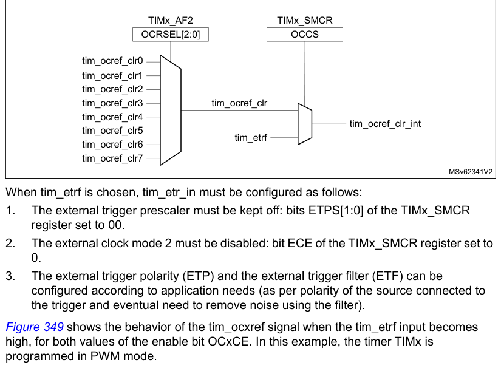

1. The external trigger prescaler must be kept off: bits ETPS[1:0] of the TIMx_SMCR
   register set to 00.
2. The external clock mode 2 must be disabled: bit ECE of the TIMx_SMCR register set to

0.

3. The external trigger polarity (ETP) and the external trigger filter (ETF) can be
   configured according to application needs (as per polarity of the source connected to the trigger
   and eventual need to remove noise using the filter).

Figure 349 shows the behavior of the tim_ocxref signal when the tim_etrf input becomes high, for
both values of the enable bit OCxCE. In this example, the timer TIMx is programmed in PWM mode.

**Figure 349. Clearing TIMx tim_ocxref**

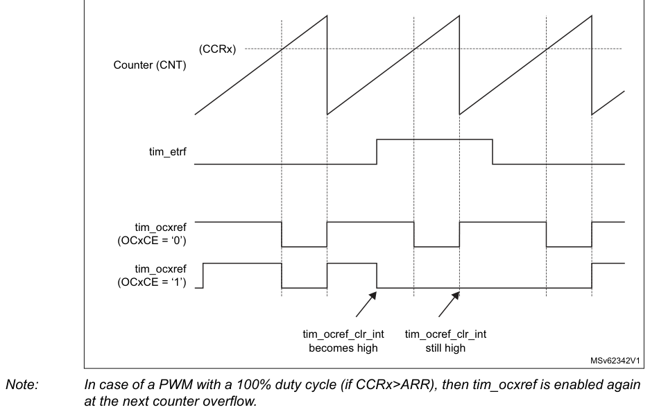

(CCRx)

Counter (CNT)
tim_etrf
tim_ocxref

(OCxCE = ‘0’)
tim_ocxref

(OCxCE = ‘1’)

> **Note:** In case of a PWM with a 100% duty cycle (if CCRx>ARR), then tim_ocxref is enabled again
> at the next counter overflow.

### 29.3.21 6-step PWM generation

When complementary outputs are used on a channel, preload bits are available on the OCxM, CCxE, and
CCxNE bits. The preload bits are transferred to the shadow bits at the COM commutation event. Thus
one can program in advance the configuration for the next step and change the configuration of all
the channels at the same time. COM can be generated by software by setting the COM bit in the
TIMx_EGR register or by hardware (on tim_trgi rising edge).

A flag is set when the COM event occurs (COMIF bit in the TIMx_SR register), which can generate an
interrupt (if the COMIE bit is set in the TIMx_DIER register) or a DMA request (if the COMDE bit is
set in the TIMx_DIER register).

Figure 350 describes the behavior of the tim_ocx and tim_ocxn outputs when a COM event occurs, in
three different examples of programmed configurations.

**Figure 350. 6-step generation, COM example (OSSR = 1)**

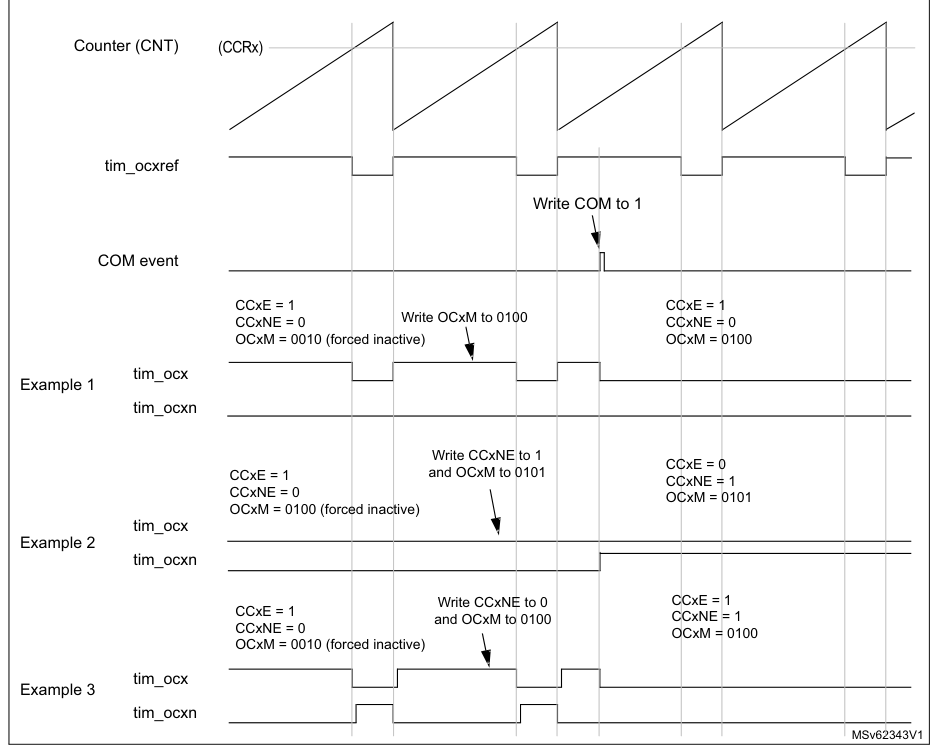

### 29.3.22 One-pulse mode

One-pulse mode (OPM) is a particular case of the previous modes. It allows the counter to be started
in response to a stimulus and to generate a pulse with a programmable length after a programmable
delay.

Starting the counter can be controlled through the slave mode controller. Generating the waveform
can be done in output compare mode or PWM mode. One-pulse mode is selected by setting the OPM bit in
the TIMx_CR1 register. This makes the counter stop automatically at the next update event UEV.

A pulse can be correctly generated only if the compare value is different from the counter initial
value. Before starting (when the timer is waiting for the trigger), the configuration must be:

- In upcounting: CNT \< CCRx ≤ ARR (in particular, 0 \< CCRx)
- In downcounting: CNT > CCRx

**Figure 351. Example of one pulse mode.**

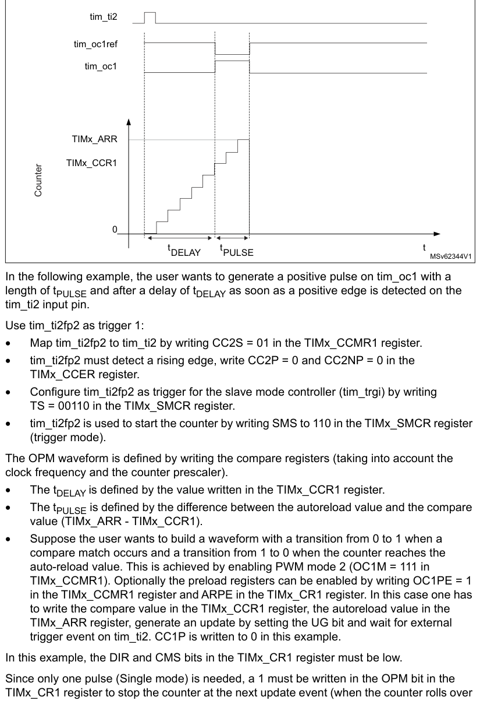

tim_ti2
tim_oc1ref
tim_oc1

TIMx_ARR

TIMx_CCR1

Counter

0

In the following example, the user wants to generate a positive pulse on tim_oc1 with a length of
tPULSE and after a delay of tDELAY as soon as a positive edge is detected on the tim_ti2 input pin.

Use tim_ti2fp2 as trigger 1:

- Map tim_ti2fp2 to tim_ti2 by writing CC2S = 01 in the TIMx_CCMR1 register.
- tim_ti2fp2 must detect a rising edge, write CC2P = 0 and CC2NP = 0 in the TIMx_CCER register.
- Configure tim_ti2fp2 as trigger for the slave mode controller (tim_trgi) by writing TS = 00110 in
  the TIMx_SMCR register.
- tim_ti2fp2 is used to start the counter by writing SMS to 110 in the TIMx_SMCR register (trigger
  mode).

The OPM waveform is defined by writing the compare registers (taking into account the clock
frequency and the counter prescaler).

- The tDELAY is defined by the value written in the TIMx_CCR1 register.
- The tPULSE is defined by the difference between the autoreload value and the compare value
  (TIMx_ARR - TIMx_CCR1).
- Suppose the user wants to build a waveform with a transition from 0 to 1 when a compare match
  occurs and a transition from 1 to 0 when the counter reaches the auto-reload value. This is
  achieved by enabling PWM mode 2 (OC1M = 111 in TIMx_CCMR1). Optionally the preload registers can
  be enabled by writing OC1PE = 1 in the TIMx_CCMR1 register and ARPE in the TIMx_CR1 register. In
  this case one has to write the compare value in the TIMx_CCR1 register, the autoreload value in
  the TIMx_ARR register, generate an update by setting the UG bit and wait for external trigger
  event on tim_ti2. CC1P is written to 0 in this example.

In this example, the DIR and CMS bits in the TIMx_CR1 register must be low.

Since only one pulse (Single mode) is needed, a 1 must be written in the OPM bit in the TIMx_CR1
register to stop the counter at the next update event (when the counter rolls over
from the autoreload value back to 0). When OPM bit in the TIMx_CR1 register is set to 0, so the
Repetitive mode is selected.

Particular case: tim_ocx fast enable:

In One-pulse mode, the edge detection on tim_tix input set the CEN bit which enables the counter.
Then the comparison between the counter and the compare value makes the output toggle. But several
clock cycles are needed for these operations and it limits the minimum delay tDELAY min that can be
achieved.

To output a waveform with the minimum delay, the OCxFE bit can be set in the TIMx_CCMRx register.
Then tim_ocxref (and tim_ocx) are forced in response to the stimulus, without taking in account the
comparison. Its new level is the same as if a compare match had occurred. OCxFE acts only if the
channel is configured in PWM1 or PWM2 mode.

### 29.3.23 Retriggerable One-pulse mode

This mode allows the counter to be started in response to a stimulus and to generate a pulse with a
programmable length, but with the following differences with nonretriggerable one-pulse mode
described in [Section 29.3.22](#29322-one-pulse-mode):

- The pulse starts as soon as the trigger occurs (no programmable delay).
- The pulse is extended if a new trigger occurs before the previous one is completed.

The timer must be in Slave mode, with the bits SMS[3:0] = 1000 (Combined Reset \+ trigger mode) in
the TIMx_SMCR register, and the OCxM[3:0] bits set to 1000 or 1001 for retriggerable OPM mode 1 or
2.

If the timer is configured in Up-counting mode, the corresponding CCRx must be set to 0 (the ARR
register sets the pulse length). If the timer is configured in Down-counting mode, CCRx must be
above or equal to ARR.

> **Note:** The OCxM[3:0] and SMS[3:0] bitfields are split into two parts for compatibility reasons, the
> most significant bit are not contiguous with the three least significant ones.

This mode must not be used with center-aligned PWM modes. It is mandatory to have CMS[1:0] = 00 in
TIMx_CR1.

**Figure 352. Retriggerable one-pulse mode**

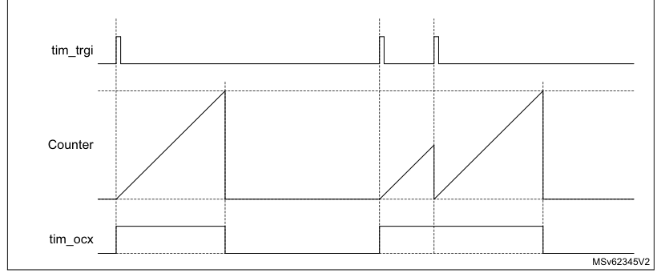

tim_trgi

Counter
tim_ocx

MSv62345V2

### 29.3.24 Pulse on compare mode

A pulse can be generated upon compare match event. A signal with a programmable pulsewidth generated
when the counter value equals a given compare value, for debugging or synchronization purposes.

This mode is available for any slave mode selection, including encoder modes, in edge and center
aligned counting modes. It is solely available for channel 3 and channel 4. The pulse generator is
unique and is shared by the two channels, as shown on Figure 353.

**Figure 353. Pulse generator circuitry**

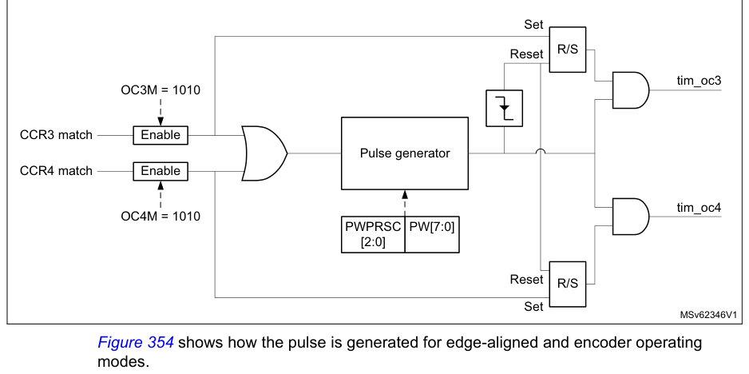

Set

R/S

Reset
tim_oc3

OC3M = 1010

Figure 354 shows how the pulse is generated for edge-aligned and encoder operating modes.

**Figure 354. Pulse generation on compare event, for edge-aligned and encoder modes**

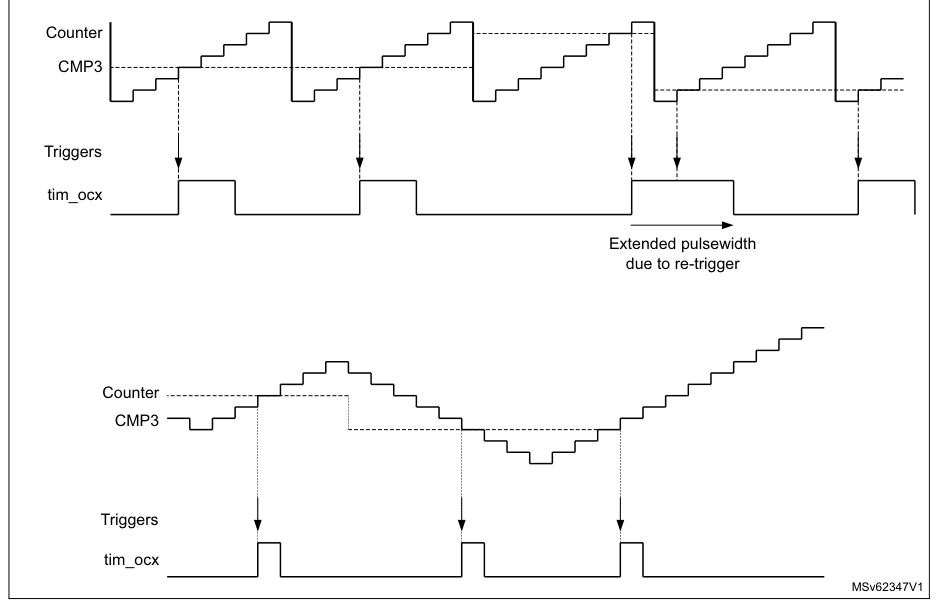

Counter

CMP3

Triggers
tim_ocx

Extended pulsewidth
due to re-trigger

Counter

CMP3

Triggers
tim_ocx

MSv62347V1

This output compare mode is selected using the OC3M[3:0] and OC4M[3:0] bitfields in TIMx_CCMR2
register.

The pulsewidth is programmed using the PW[7:0] bitfield in the register, using a specific clock
prescaled according to PWPRSC[2:0] bits, as follows:

tPW = PW[7:0] x tPWG
where tPWG = (2(PWPRSC[2:0])) x ttim_ker_ck
gives the resolution and maximum values depending on the prescaler value.

The pulse is retriggerable: a new trigger while the pulse is ongoing, causes the pulse to be
extended.

> **Note:** If the two channels are enabled simultaneously, the pulses are issued independently as long
> as the trigger on one channel is not overlapping the pulse generated on the concurrent output. On
> the opposite, if the two triggers are overlapping, the pulse width related to the first arriving
> trigger is extended (because of the retrigger), while the pulse width of the last arriving trigger
> is correct (as shown on Figure 355).

**Figure 355. Extended pulsewidth in case of concurrent triggers**

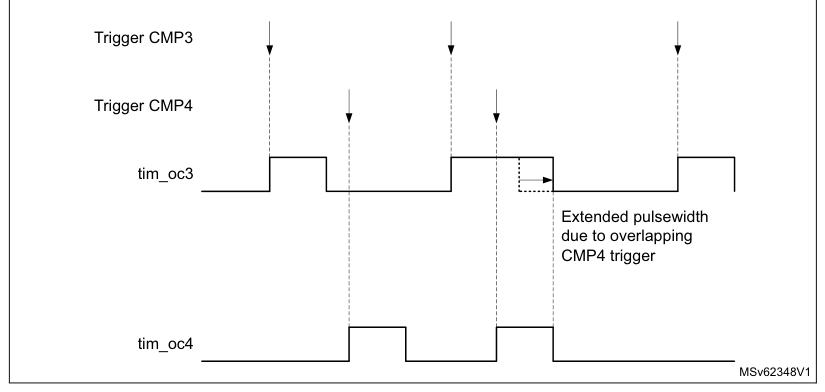

Trigger CMP3

Trigger CMP4
tim_oc3

Extended pulsewidth due to overlapping CMP4 trigger
tim_oc4

MSv62348V1

### 29.3.25 Encoder interface mode

#### Quadrature encoder

To select Encoder Interface mode write SMS = 0001 in the TIMx_SMCR register if the counter is
counting on tim_ti1 edges only, SMS = 0010 if it is counting on tim_ti2 edges only and SMS = 0011 if
it is counting on both tim_ti1 and tim_ti2 edges.

Select the tim_ti1 and tim_ti2 polarity by programming the CC1P and CC2P bits in the TIMx_CCER
register. When needed, the input filter can be programmed as well. CC1NP and CC2NP must be kept low.

The two inputs tim_ti1 and tim_ti2 are used to interface to an quadrature encoder. Refer to

Table 277. The counter is clocked by each valid transition on tim_ti1fp1 or tim_ti2fp2 (tim_ti1 and
tim_ti2 after input filter and polarity selection, tim_ti1fp1 = tim_ti1 if not filtered and not
inverted, tim_ti2fp2 = tim_ti2 if not filtered and not inverted) assuming that it is enabled (CEN
bit in TIMx_CR1 register written to 1). The sequence of transitions of the two inputs is evaluated
and generates count pulses as well as the direction signal. Depending on the sequence the counter
counts up or down, the DIR bit in the TIMx_CR1 register is modified by hardware accordingly. The DIR
bit is calculated at each transition on any input (tim_ti1 or tim_ti2), whatever the counter is
counting on tim_ti1 only, tim_ti2 only or both tim_ti1 and tim_ti2.

Encoder interface mode acts simply as an external clock with direction selection. This means that
the counter just counts continuously between 0 and the autoreload value in the TIMx_ARR register (0
to ARR or ARR down to 0 depending on the direction). So the TIMx_ARR must be configured before
starting. In the same way, the capture, compare, prescaler, repetition counter, trigger output
features continue to work as normal. Encoder mode and External clock mode 2 are not compatible and
must not be selected together.

In this mode, the counter is modified automatically following the speed and the direction of the
quadrature encoder and its content, therefore, always represents the encoder’s position. The count
direction correspond to the rotation direction of the connected sensor. The table summarizes the
possible combinations, assuming tim_ti1 and tim_ti2 do not switch at the same time.

**Table 277. Counting direction versus encoder signals (CC1P = CC2P = 0)**

| Source row | Column 1 | Column 2 | Column 3 | Column 4 | Column 5 | Column 6 |
| ---: | --- | --- | --- | --- | --- | --- |
| 1 | `Level on` | `tim_ti1fp1 signal` | `tim_ti2fp2 signal` |  |  |  |
| 2 | `opposite` |  |  |  |  |  |
| 3 | `signal` |  |  |  |  |  |
| 4 | `Active edge` | `SMS[3:0]` | `(tim_ti1fp1 for` |  |  |  |
| 5 | `tim_ti2,` | `Rising` | `Falling` | `Rising` | `Falling` |  |
| 6 | `tim_ti2fp2 for` |  |  |  |  |  |
| 7 | `tim_ti1)` |  |  |  |  |  |
| 8 | `Counting on` | `High` | `Down` | `Up` | `No count` | `No count` |
| 9 | `tim_ti1 only` | `1110` |  |  |  |  |
| 10 | `Low` | `No count` | `No count` | `No count` | `No count` |  |
| 11 | `x1 mode` |  |  |  |  |  |
| 12 | `Counting on` | `High` | `No count` | `No count` | `Up` | `Down` |
| 13 | `tim_ti2 only` | `1111` |  |  |  |  |
| 14 | `Low` | `No count` | `No count` | `No count` | `No count` |  |
| 15 | `x1 mode` |  |  |  |  |  |
| 16 | `Counting on` | `High` | `Down` | `Up` | `No count` | `No count` |
| 17 | `tim_ti1 only` | `0001` |  |  |  |  |
| 18 | `Low` | `Up` | `Down` | `No count` | `No count` |  |
| 19 | `x2 mode` |  |  |  |  |  |
| 20 | `Counting on` | `High` | `No count` | `No count` | `Up` | `Down` |
| 21 | `tim_ti2 only` | `0010` |  |  |  |  |
| 22 | `Low` | `No count` | `No count` | `Down` | `Up` |  |
| 23 | `x2 mode` |  |  |  |  |  |
| 24 | `Counting on` | `High` | `Down` | `Up` | `Up` | `Down` |
| 25 | `tim_ti1 and` |  |  |  |  |  |
| 26 | `0011` |  |  |  |  |  |
| 27 | `tim_ti2` |  |  |  |  |  |
| 28 | `Low` | `Up` | `Down` | `Down` | `Up` |  |
| 29 | `x4 mode` |  |  |  |  |  |

A quadrature encoder can be connected directly to the MCU without external interface logic. However,
comparators are normally be used to convert the encoder’s differential outputs to digital signals.
This greatly increases noise immunity. The third encoder output which indicate the mechanical zero
position, may be connected to the external trigger input and trigger a counter reset.

Figure 356 gives an example of counter operation, showing count signal generation and direction
control. It also shows how input jitter is compensated where both edges are selected. This might
occur if the sensor is positioned near to one of the switching points. For this example the
configuration is the following:

- CC1S = 01 (TIMx_CCMR1 register, tim_ti1fp1 mapped on tim_ti1).
- CC2S = 01 (TIMx_CCMR1 register, tim_ti2fp2 mapped on tim_ti2).
- CC1P = 0 and CC1NP = 0 (TIMx_CCER register, tim_ti1fp1 noninverted, tim_ti1fp1 = tim_ti1).
- CC2P = 0 and CC2NP = 0 (TIMx_CCER register, tim_ti1fp2 noninverted, tim_ti1fp2= tim_ti2).
- SMS = 0011 (TIMx_SMCR register, both inputs are active on both rising and falling edges).
- CEN = 1 (TIMx_CR1 register, Counter enabled).

**Figure 356. Example of counter operation in encoder interface mode.**

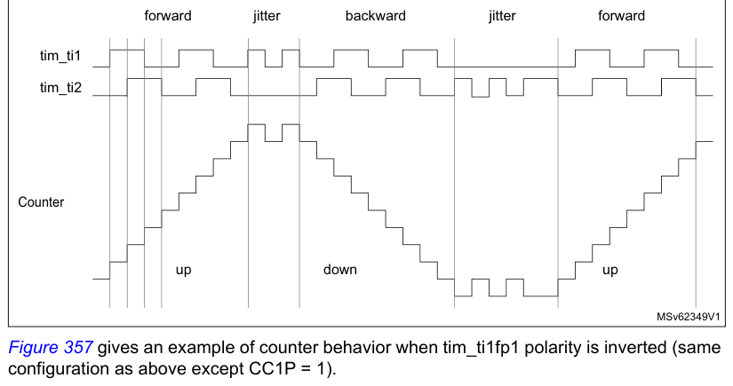

Figure 357 gives an example of counter behavior when tim_ti1fp1 polarity is inverted (same
configuration as above except CC1P = 1).

**Figure 357. Example of encoder interface mode with tim_ti1fp1 polarity inverted.**

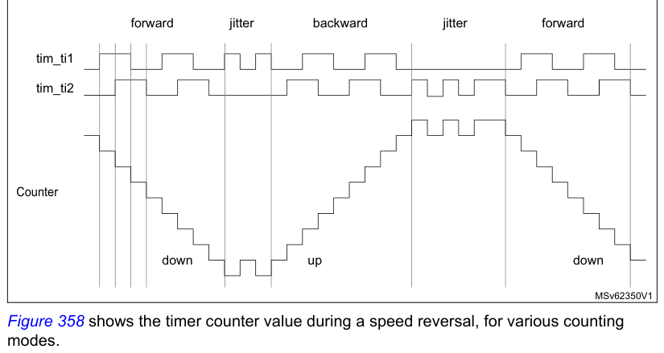

Figure 358 shows the timer counter value during a speed reversal, for various counting modes.

**Figure 358. Quadrature encoder counting modes**

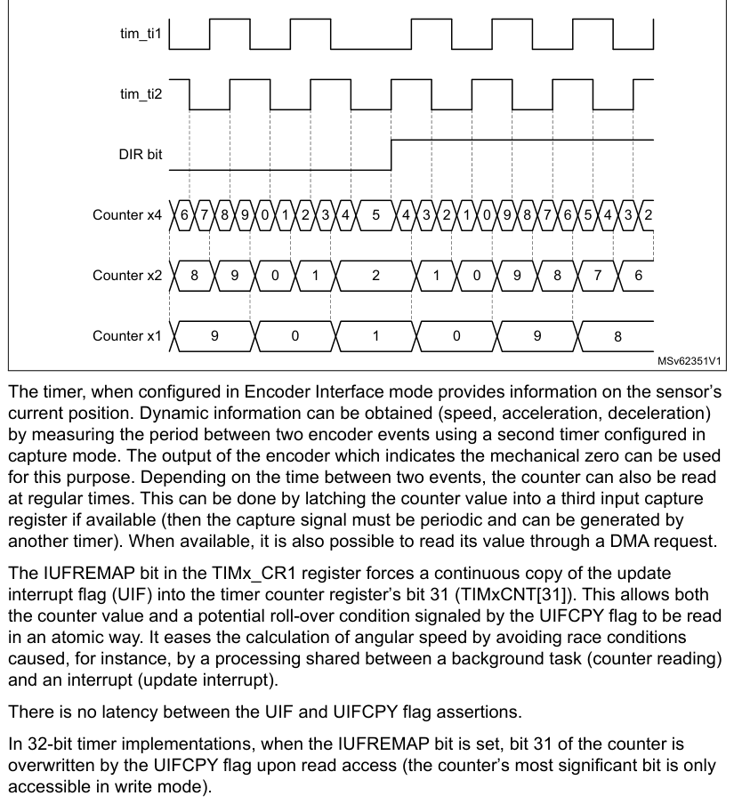

The timer, when configured in Encoder Interface mode provides information on the sensor’s current
position. Dynamic information can be obtained (speed, acceleration, deceleration) by measuring the
period between two encoder events using a second timer configured in capture mode. The output of the
encoder which indicates the mechanical zero can be used for this purpose. Depending on the time
between two events, the counter can also be read at regular times. This can be done by latching the
counter value into a third input capture register if available (then the capture signal must be
periodic and can be generated by another timer). When available, it is also possible to read its
value through a DMA request.

The IUFREMAP bit in the TIMx_CR1 register forces a continuous copy of the update interrupt flag
(UIF) into the timer counter register’s bit 31 (TIMxCNT[31]). This allows both the counter value and
a potential roll-over condition signaled by the UIFCPY flag to be read in an atomic way. It eases
the calculation of angular speed by avoiding race conditions caused, for instance, by a processing
shared between a background task (counter reading) and an interrupt (update interrupt).

There is no latency between the UIF and UIFCPY flag assertions.

In 32-bit timer implementations, when the IUFREMAP bit is set, bit 31 of the counter is overwritten
by the UIFCPY flag upon read access (the counter’s most significant bit is only accessible in write
mode).

#### Clock plus direction encoder mode

In addition to the quadrature encoder mode, the timer offers support for other types of encoders.

In the clock plus direction mode shown on Figure 359, the clock is provided on a single line, on
tim_ti2, while the direction is forced using the tim_ti1 input.

This mode is enabled with the SMS[3:0] bitfield in the TIMx_SMCR register, as following:

- 1010: x2 mode, the counter is updated on both rising and falling edges of the clock
- 1011: x1 mode, the counter is updated on a single clock edge, as per CC2P bit value: CC2P = 0
  corresponds to rising edge sensitivity and CC2P = 1 corresponds to falling edge sensitivity

The polarity of the direction signal on tim_ti1 is set with the CC1P bit: 0 corresponds to positive
polarity (up-counting when tim_ti1 is high and down-counting when tim_ti1 is low) and CC1P = 1
corresponds to negative polarity (up-counting when tim_ti1 is low).

**Figure 359. Direction plus clock encoder mode**

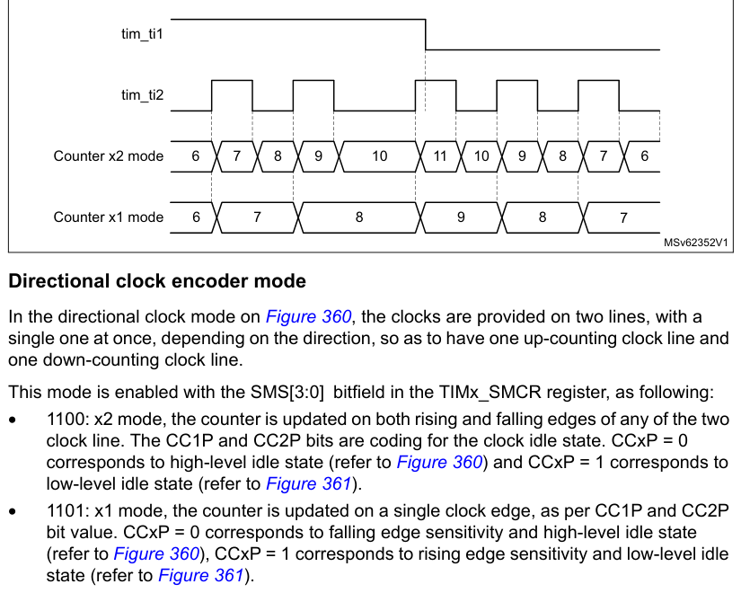

#### Directional clock encoder mode

In the directional clock mode on Figure 360, the clocks are provided on two lines, with a single one
at once, depending on the direction, so as to have one up-counting clock line and one down-counting
clock line.

This mode is enabled with the SMS[3:0] bitfield in the TIMx_SMCR register, as following:

- 1100: x2 mode, the counter is updated on both rising and falling edges of any of the two clock
  line. The CC1P and CC2P bits are coding for the clock idle state. CCxP = 0 corresponds to
  high-level idle state (refer to Figure 360) and CCxP = 1 corresponds to low-level idle state
  (refer to Figure 361).
- 1101: x1 mode, the counter is updated on a single clock edge, as per CC1P and CC2P bit value. CCxP
  = 0 corresponds to falling edge sensitivity and high-level idle state (refer to Figure 360), CCxP
  = 1 corresponds to rising edge sensitivity and low-level idle state (refer to Figure 361).

**Figure 360. Directional clock encoder mode (CC1P = CC2P = 0)**

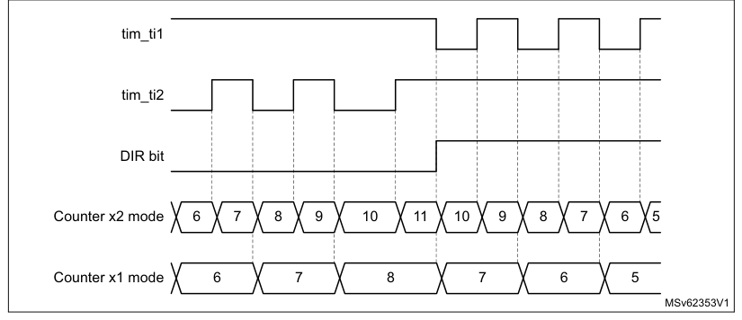

**Figure 361. Directional clock encoder mode (CC1P = CC2P = 1)**

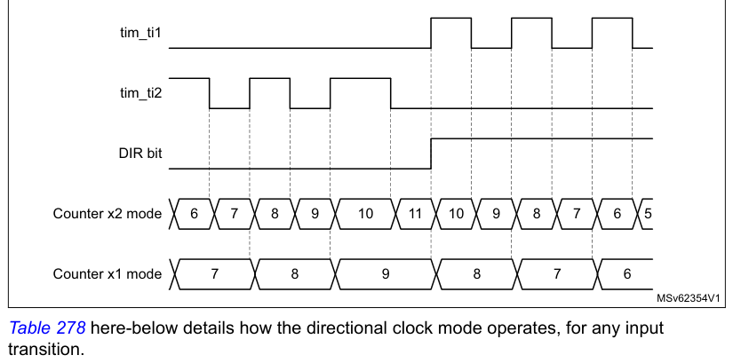

Table 278 here-below details how the directional clock mode operates, for any input transition.

**Table 278. Counting direction versus encoder signals and polarity settings**

| Source row | Column 1 | Column 2 | Column 3 | Column 4 | Column 5 | Column 6 |
| ---: | --- | --- | --- | --- | --- | --- |
| 1 | `Level on` | `tim_ti1fp1 signal` | `tim_ti2fp2 signal` |  |  |  |
| 2 | `opposite` |  |  |  |  |  |
| 3 | `signal` |  |  |  |  |  |
| 4 | `Directional` |  |  |  |  |  |
| 5 | `SMS[3:0]` | `(tim_ti1fp1 for` |  |  |  |  |
| 6 | `clock mode` |  |  |  |  |  |
| 7 | `tim_ti2,` | `Rising` | `Falling` | `Rising` | `Falling` |  |
| 8 | `tim_ti2fp2 for` |  |  |  |  |  |
| 9 | `tim_ti1)` |  |  |  |  |  |
| 10 | `x2 mode` | `High` | `Down` | `Down` | `Up` | `Up` |
| 11 | `1100` |  |  |  |  |  |
| 12 | `CCxP = 0` | `Low` | `No count` | `No count` | `No count` | `No count` |
| 13 | `x2 mode` | `High` | `No count` | `No count` | `No count` | `No count` |
| 14 | `1100` |  |  |  |  |  |
| 15 | `CCxP = 1` | `Low` | `Down` | `Down` | `Up` | `Up` |
| 16 | `High` | `No count` | `Down` | `No count` | `Up` |  |
| 17 | `x1 mode` |  |  |  |  |  |
| 18 | `1101` |  |  |  |  |  |
| 19 | `CCxP = 0` |  |  |  |  |  |
| 20 | `Low` | `No count` | `No count` | `No count` | `No count` |  |
| 21 | `x1 mode` | `High` | `No count` | `No count` | `No count` | `No count` |
| 22 | `1101` |  |  |  |  |  |
| 23 | `CCxP = 1` | `Low` | `Down` | `No count` | `Up` | `No count` |

#### Index input

The counter can be reset by an index signal coming from the encoder, indicating an absolute
reference position. The index signal must be connected to the tim_etr_in input. It can be filtered
using the digital input filter.

The index functionality is enabled with the IE bit in the TIMX_ECR register. The IE bit must be set
only in encoder mode, when the SMS[3:0] bitfield has the following values: 0001, 0010, 011, 1010,
1011, 1100, 1101, 1110, 1111.

Available encoders are proposed with several options for index pulse conditioning, as per Figure
362:

- gated with A and B: the pulsewidth is 1/4 of one channel period, aligned with both A and B edges
- gated with A (or gated with B): the pulsewidth is 1/2 of one channel period, aligned with the two
  edges on channel A (resp. channel B)
- ungated: the pulsewidth is up to one channel period, without any alignment to the edges

**Figure 362. Index gating options**

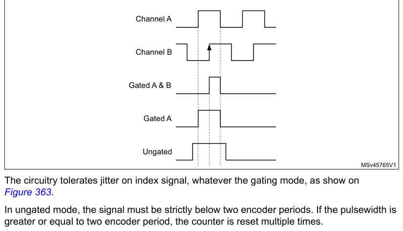

Channel A

Channel B

Gated A & B

Gated A

Ungated

MSv45765V1

The circuitry tolerates jitter on index signal, whatever the gating mode, as show on

Figure 363.

In ungated mode, the signal must be strictly below two encoder periods. If the pulsewidth is greater
or equal to two encoder period, the counter is reset multiple times.

**Figure 363. Jittered Index signals**

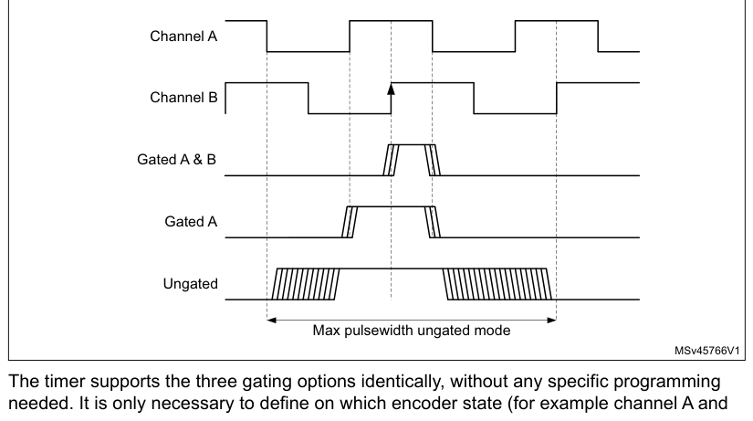

Channel A

Channel B

Gated A & B

Gated A

Ungated

Max pulsewidth ungated mode

MSv45766V1

The timer supports the three gating options identically, without any specific programming needed. It
is only necessary to define on which encoder state (for example channel A and
channel B state combination) the index must be synchronized, using the IPOS[1:0] bitfield in the
TIMx_ECR register.

The index detection event acts differently depending on counting direction to ensure symmetrical
operation during speed reversal:

- The counter is reset during up-counting (DIR bit = 0).
- The counter is set to TIMx_ARR when down counting.

This allows the index to be generated on the very same mechanical angular position whatever the
counting direction. Figure 364 shows at which position is the index generated, for a simplistic
example (an encoder providing four edges par mechanical rotation).

**Figure 364. Index generation for IPOS[1:0] = 11**

![Figure 364: Index generation for IPOS\[1:0\] = 11](../STM32G4_RM0440_figures/figure-0364.png)

Figure 365 presents waveforms and corresponding values for IPOS[1:0] = 11. It shows that the instant
at which the counter value is forced is automatically adjusted depending on the counting direction:

- Counter set to 0 when encoder state is 11 (ChA = 1, ChB = 1), when up-counting (DIR bit = 0).
- Counter set to TIMx_ARR when exiting the 11 state, when down-counting (DIR bit = 1).

An interrupt can be issued upon index detection event.

The arrows are indicating on which transition is the index event interrupt generated.

**Figure 365. Counter reading with index gated on channel A (IPOS[1:0] = 11)**

![Figure 365: Counter reading with index gated on channel A (IPOS\[1:0\] = 11)](../STM32G4_RM0440_figures/figure-0365.png)

Figure 366. presents waveforms and corresponding values for the ungated mode. The arrows are
indicating on which transition is the index event generated.

**Figure 366. Counter reading with index ungated (IPOS[1:0] = 00)**

![Figure 366: Counter reading with index ungated (IPOS\[1:0\] = 00)](../STM32G4_RM0440_figures/figure-0366.png)

Figure 367. shows how the ‘gated on A & B’ mode is handled, for various pulse alignment scenario.
The arrows are indicating on which transition is the index event generated.

**Figure 367. Counter reading with index gated on channel A and B**

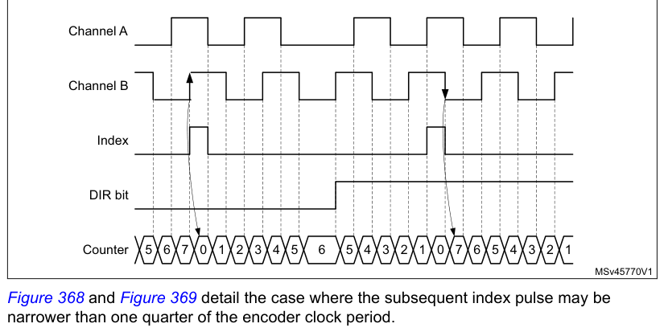

Figure 368 and Figure 369 detail the case where the subsequent index pulse may be narrower than one
quarter of the encoder clock period.

**Figure 368. Encoder mode behavior in case of narrow index pulse (IPOS[1:0] = 11)**

![Figure 368: Encoder mode behavior in case of narrow index pulse (IPOS\[1:0\] = 11)](../STM32G4_RM0440_figures/figure-0368.png)

**Figure 369. Counter reset Narrow index pulse (closer view, ARR = 0x07)**

Figure 370 shows how the index is managed in x1 and x2 modes.

**Figure 370. Index behavior in x1 and x2 mode (IPOS[1:0] = 01)**

![Figure 370: Index behavior in x1 and x2 mode (IPOS\[1:0\] = 01)](../STM32G4_RM0440_figures/figure-0370.png)

AB = IPOS[1:0] = 01

Channel A

Channel B

Index

DIR bit

#### Directional index sensitivity

The IDIR[1:0] bitfield in the TIMx_ECR register allows the index to be active only in a selected
counting direction.

Figure 371 shows the relationship between index and counter reset events, depending on IDIR[1:0]
value.

> **Note:** The IDR[1:0] bitfield must be written when IE bit is reset (index mode disabled).

> **Note:** The directional index sensitivity is not supported in clock \+ direction mode. When

SMS[3:0] = 1010 or 1011, the IDIR[1:0] must be set to 00.

**Figure 371. Directional index sensitivity**

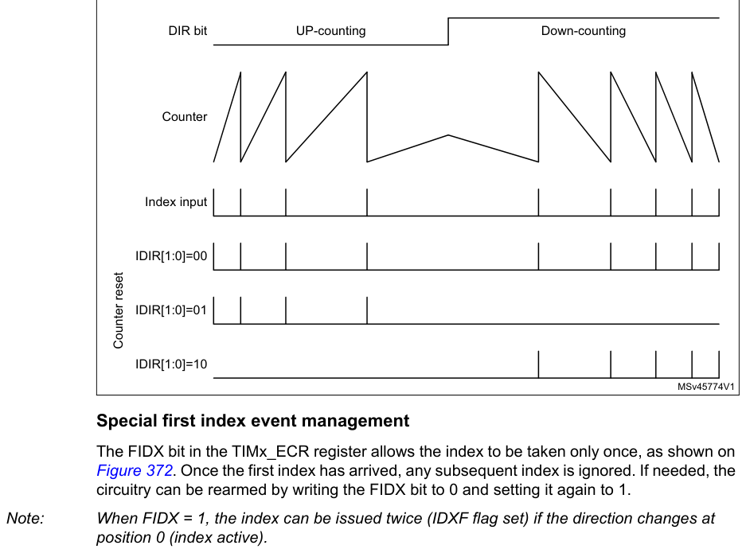

#### Special first index event management

The FIDX bit in the TIMx_ECR register allows the index to be taken only once, as shown on

Figure 372. Once the first index has arrived, any subsequent index is ignored. If needed, the
circuitry can be rearmed by writing the FIDX bit to 0 and setting it again to 1.

> **Note:** When FIDX = 1, the index can be issued twice (IDXF flag set) if the direction changes at
> position 0 (index active).

**Figure 372. Counter reset as function of FIDX bit setting**

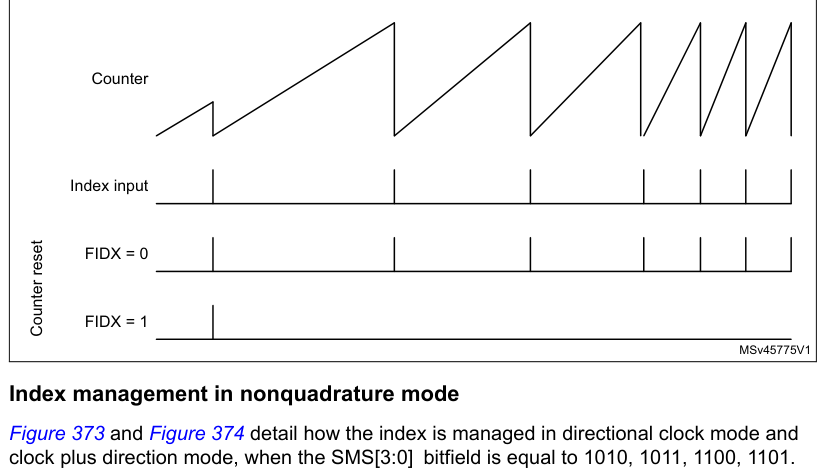

Counter

Index input

FIDX = 0

FIDX = 1

Counter reset

MSv45775V1

#### Index management in nonquadrature mode

Figure 373 and Figure 374 detail how the index is managed in directional clock mode and clock plus
direction mode, when the SMS[3:0] bitfield is equal to 1010, 1011, 1100, 1101.

For both of these modes, the index sensitivity is set with the IPOS[0] bit as following:

- IPOS[0] = 0: Index is detected on clock low level
- IPOS[0] = 1: Index is detected on clock high level

The IPOS[1] bit is not-significant.

**Figure 373. Index behavior in clock \+ direction mode, IPOS[0] = 1**

![Figure 373: Index behavior in clock \+ direction mode, IPOS\[0\] = 1](../STM32G4_RM0440_figures/figure-0373.png)

**Figure 374. Index behavior in directional clock mode, IPOS[0] = 1**

![Figure 374: Index behavior in directional clock mode, IPOS\[0\] = 1](../STM32G4_RM0440_figures/figure-0374.png)

#### Encoder error management

For encoder configurations where two quadrature signals are available, it is possible to detect
transition errors. The reading on the two inputs corresponds to a 2-bit gray code which can be
represented as a state diagram, on Figure 375.. A single bit is expected to change at once. An
erroneous transition sets the TERRF interrupt flag in the TIMx_SR status register. A transition
error interrupt is generated if the TERRIE bit is set in the TIMx_DIER register.

**Figure 375. State diagram for quadrature encoded signals**

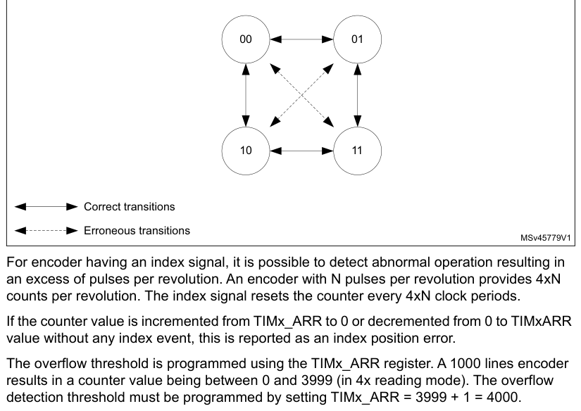

For encoder having an index signal, it is possible to detect abnormal operation resulting in an
excess of pulses per revolution. An encoder with N pulses per revolution provides 4xN counts per
revolution. The index signal resets the counter every 4xN clock periods.

If the counter value is incremented from TIMx_ARR to 0 or decremented from 0 to TIMxARR value
without any index event, this is reported as an index position error.

The overflow threshold is programmed using the TIMx_ARR register. A 1000 lines encoder results in a
counter value being between 0 and 3999 (in 4x reading mode). The overflow detection threshold must
be programmed by setting TIMx_ARR = 3999 \+ 1 = 4000.

The error assertion is delayed to the transition 0 to 1 when in up-counting. This is cope with
narrow index pulses in gated A and B mode, as shown on Figure 376.

**Figure 376. Up-counting encoder error detection**

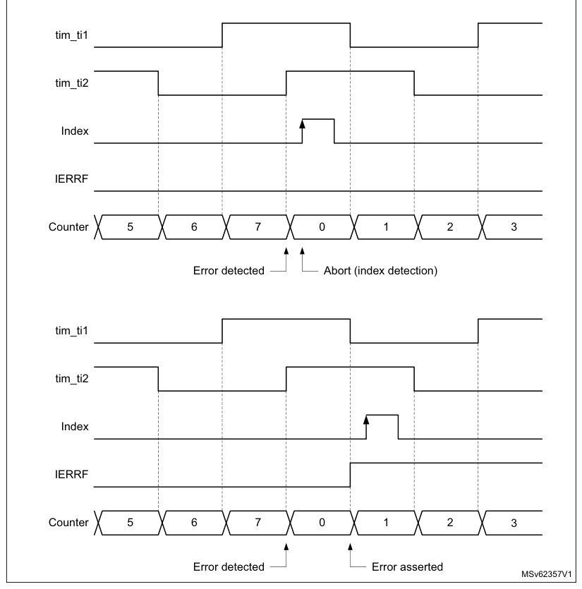

In down-counting mode, the detection is conditioned by a preliminary transition from 1 to 0. This is
to cope with narrow index pulses in gated A and B mode, as shown on Figure 377, to avoid any false
error detection in case the encoder dithers between TIMx_ARR and 0 immediately after the index
detection.

**Figure 377. Down-counting encode error detection**

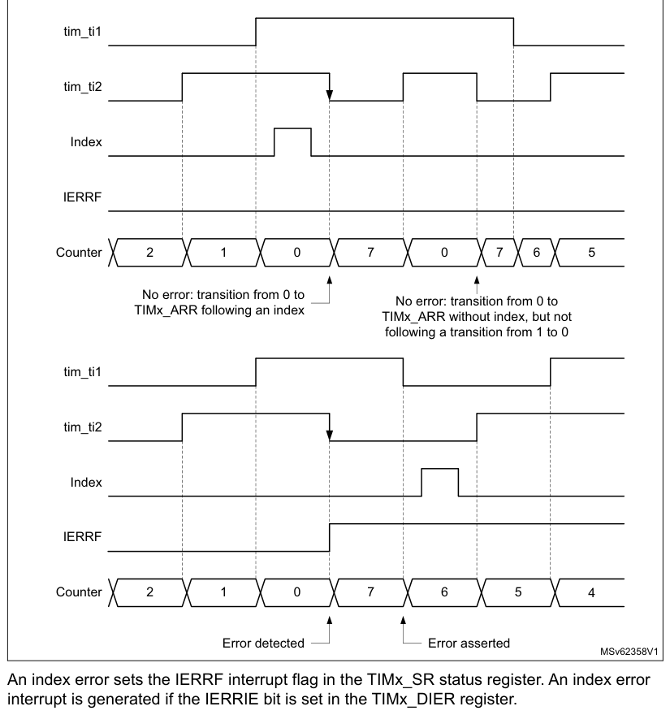

An index error sets the IERRF interrupt flag in the TIMx_SR status register. An index error
interrupt is generated if the IERRIE bit is set in the TIMx_DIER register.

#### Functional encoder interrupts

The following interrupts are also available in encoder mode

- Direction change: any change of the counting direction in encoder mode causes the DIR bit in the
  TIMx_CR1 register to toggle. The direction change sets the DIRF interrupt flag in the TIMx_SR
  status register. A direction change interrupt is generated if the DIRIE bit is set in the
  TIMx_DIER register.
- Index event: the index event sets the IDXF interrupt flag in the TIMx_SR status register. An index
  interrupt is generated if the IDXIE bit is set in the TIMx_DIER register.

#### Slave mode selection preload for run-time encoder mode update

It may be necessary to switch from one encoder mode to another during run-time. This is typically
done at high-speed to decrease the update interrupt rate, by switching from x4 to x2 to x1 mode, as
shown on Figure 378.

For this purpose, the SMS[3:0] bit can be preloaded. This is enabled by setting the SMSPE enable bit
in the TIMx_SMCR register. The trigger for the transfer from SMS[3:0] preload to active value can be
selected with the SMSPS bit in the TIMx_SMCR register.

- SMSPS = 0: the transfer is triggered by the update event (UEV) occurring when the counter
  overflows when upcounting, and underflows when downcounting. This mode must be used only when
  index is disabled (bit IE = 0).
- SMSPS = 1: the transfer is triggered by the index event.

**Figure 378. Encoder mode change with preload transferred on update (SMSPS = 0)**

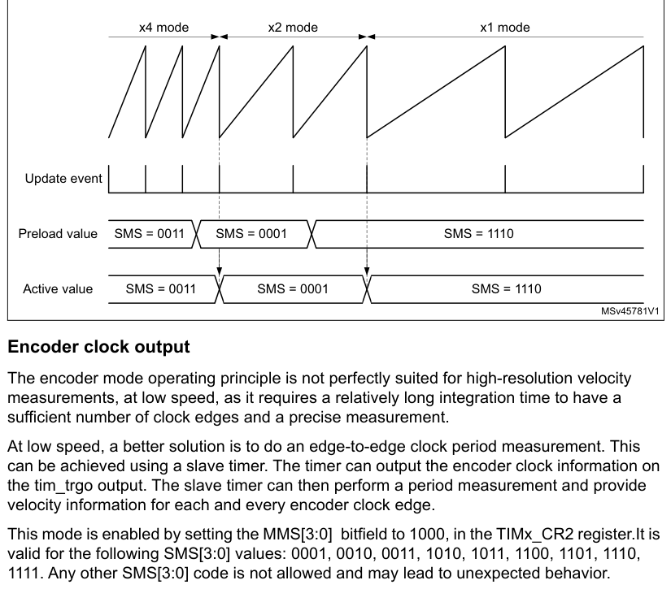

#### Encoder clock output

The encoder mode operating principle is not perfectly suited for high-resolution velocity
measurements, at low speed, as it requires a relatively long integration time to have a sufficient
number of clock edges and a precise measurement.

At low speed, a better solution is to do an edge-to-edge clock period measurement. This can be
achieved using a slave timer. The timer can output the encoder clock information on the tim_trgo
output. The slave timer can then perform a period measurement and provide velocity information for
each and every encoder clock edge.

This mode is enabled by setting the MMS[3:0] bitfield to 1000, in the TIMx_CR2 register. It is valid
for the following SMS[3:0] values: 0001, 0010, 0011, 1010, 1011, 1100, 1101, 1110,

1111. Any other SMS[3:0] code is not allowed and may lead to unexpected behavior.

### 29.3.26 Direction bit output

Its is possible to output a direction signal out of the timer, on the tim_oc3n and tim_oc4 output
signals (copy of the DIR bit in the TIMx_CR1 register). This is achieved by setting the OC3M[3:0] or
the OC4M[3:0] bitfield to 1011 in the TIMx_CCMR2 register.

This feature can be used for monitoring the counting direction (or rotation direction) in encoder
mode, or to have a signal indicating the up/down phases in center-aligned PWM mode.

### 29.3.27 UIF bit remapping

The IUFREMAP bit in the TIMx_CR1 register forces a continuous copy of the update interrupt flag UIF
into the timer counter register’s bit 31 (TIMxCNT[31]). This allows both the counter value and a
potential roll-over condition signaled by the UIFCPY flag to be read in an atomic way. In particular
cases, it can ease the calculations by avoiding race conditions, caused for instance by a processing
shared between a background task (counter reading) and an interrupt (update interrupt).

There is no latency between the UIF and UIFCPY flags assertion.

### 29.3.28 Timer input XOR function

The TI1S bit in the TIMx_CR2 register, allows the input filter of channel 1 to be connected to the
output of an XOR gate, combining the three input pins tim_ti1, tim_ti2 and tim_ti3.

The XOR output can be used with all the timer input functions such as trigger or input capture. It
is convenient to measure the interval between edges on two input signals, as per

Figure 379.

**Figure 379. Measuring time interval between edges on three signals**

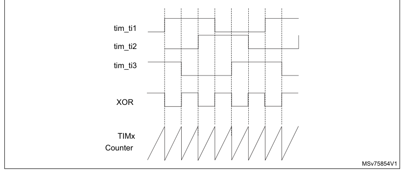

tim_ti1
tim_ti2
tim_ti3

XOR

TIMx

Counter

MSv75854V1

### 29.3.29 Interfacing with Hall sensors

This is done using the advanced-control timers to generate PWM signals to drive the motor and
another timer TIMx referred to as “interfacing timer” in Figure 380. The “interfacing timer”
captures the three timer input pins (tim_ti1, tim_ti2 and tim_ti3) connected through a XOR to the
tim_ti1 input channel (selected by setting the TI1S bit in the TIMx_CR2 register).

The slave mode controller is configured in reset mode; the slave input is tim_ti1f_ed. Thus, each
time one of the three inputs toggles, the counter restarts counting from 0. This creates a time base
triggered by any change on the Hall inputs.

On the “interfacing timer”, capture/compare channel 1 is configured in capture mode, capture signal
is tim_trc (See Figure 323). The captured value, which corresponds to the time elapsed between two
changes on the inputs, gives information about motor speed.

The “interfacing timer” can be used in output mode to generate a pulse which changes the
configuration of the channels of the advanced-control timer (by triggering a COM event). The
advanced-control timer is used to generate PWM signals to drive the motor. To do this, the
interfacing timer channel must be programmed so that a positive pulse is generated after a
programmed delay (in output compare or PWM mode). This pulse is sent to the advanced-control timer
through the tim_trgo output.

In this example the user wants to change the PWM configuration of the advanced-control timer after a
programmed delay each time a change occurs on the Hall inputs connected to one of the TIMx timers.

- Configure three timer inputs ORed to the tim_ti1 input channel by writing the TI1S bit in the
  TIMx_CR2 register to 1.
- Program the time base: write the TIMx_ARR to the max value (the counter must be cleared by the
  tim_ti1 change. Set the prescaler to get a maximum counter period longer than the time between two
  changes on the sensors.
- Program the channel 1 in capture mode (tim_trc selected): write the CC1S bits in the TIMx_CCMR1
  register to 01. The digital filter can also be programmed if needed.
- Program the channel 2 in PWM 2 mode with the desired delay: write the OC2M bits to 111 and the
  CC2S bits to 00 in the TIMx_CCMR1 register.
- Select tim_oc2ref as trigger output on tim_trgo: write the MMS bits in the TIMx_CR2 register to
  101.

In the advanced-control timer, the right tim_itrx input must be selected as trigger input, the timer
is programmed to generate PWM signals, the capture/compare control signals are preloaded (CCPC = 1
in the TIMx_CR2 register) and the COM event is controlled by the trigger input (CCUS = 1 in the
TIMx_CR2 register). The PWM control bits (CCxE, OCxM) are written after a COM event for the next
step (this can be done in an interrupt subroutine generated by the rising edge of tim_oc2ref).

Figure 380 describes this example.

**Figure 380. Example of Hall sensor interface**

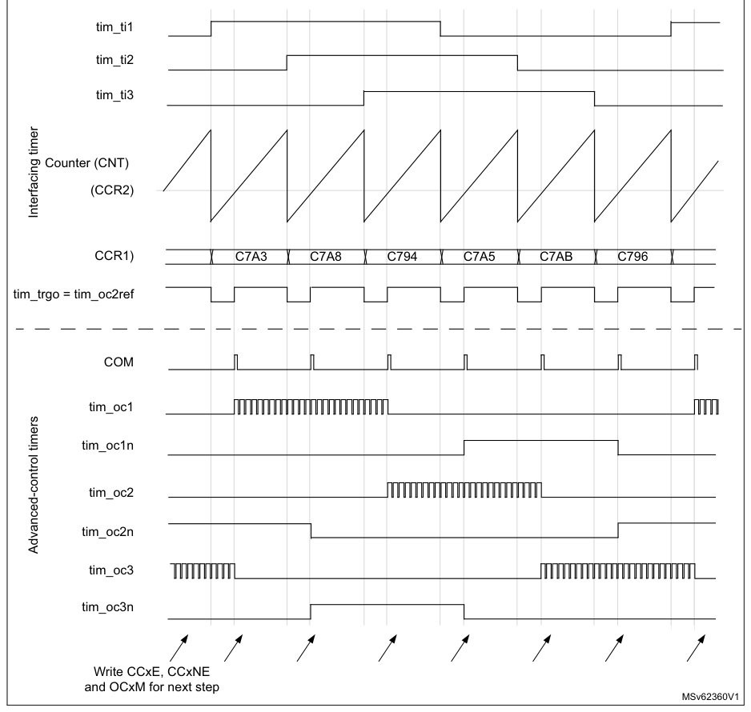

tim_ti1
tim_ti2
tim_ti3

Counter (CNT)

(CCR2)

Interfacing timer

### 29.3.30 Timer synchronization

The TIMx timers are linked together internally for timer synchronization or chaining. Refer to
[Section 30.4.23](chapter-30.md#30423-timer-synchronization): Timer synchronization for details. They can be synchronized in several modes: Reset
mode, Gated mode, Trigger mode, Reset \+ trigger, and gated \+ reset modes.

#### Slave mode: Reset mode

The counter and its prescaler can be reinitialized in response to an event on a trigger input.
Moreover, if the URS bit from the TIMx_CR1 register is low, an update event UEV is generated. Then
all the preloaded registers (TIMx_ARR, TIMx_CCRx) are updated.

In the following example, the upcounter is cleared in response to a rising edge on tim_ti1 input:

- Configure the channel 1 to detect rising edges on tim_ti1. Configure the input filter duration (in
  this example, we do not need any filter, so we keep IC1F = 0000). The capture prescaler is not
  used for triggering, so it does not need to be configured. The CC1S bits select the input capture
  source only, CC1S = 01 in the TIMx_CCMR1 register. Write CC1P = 0 and CC1NP = 0 in TIMx_CCER
  register to validate the polarity (and detect rising edges only).
- Configure the timer in reset mode by writing SMS = 100 in TIMx_SMCR register. Select tim_ti1 as
  the input source by writing TS = 00101 in TIMx_SMCR register.
- Start the counter by writing CEN = 1 in the TIMx_CR1 register.

The counter starts counting on the internal clock, then behaves normally until tim_ti1 rising edge.
When tim_ti1 rises, the counter is cleared and restarts from 0. In the meantime, the trigger flag is
set (TIF bit in the TIMx_SR register) and an interrupt request, or a DMA request can be sent if
enabled (depending on the TIE and TDE bits in TIMx_DIER register).

The following figure shows this behavior when the autoreload register TIMx_ARR = 0x36. The delay
between the rising edge on tim_ti1 and the actual reset of the counter is due to the
resynchronization circuit on tim_ti1 input.

**Figure 381. Control circuit in reset mode**

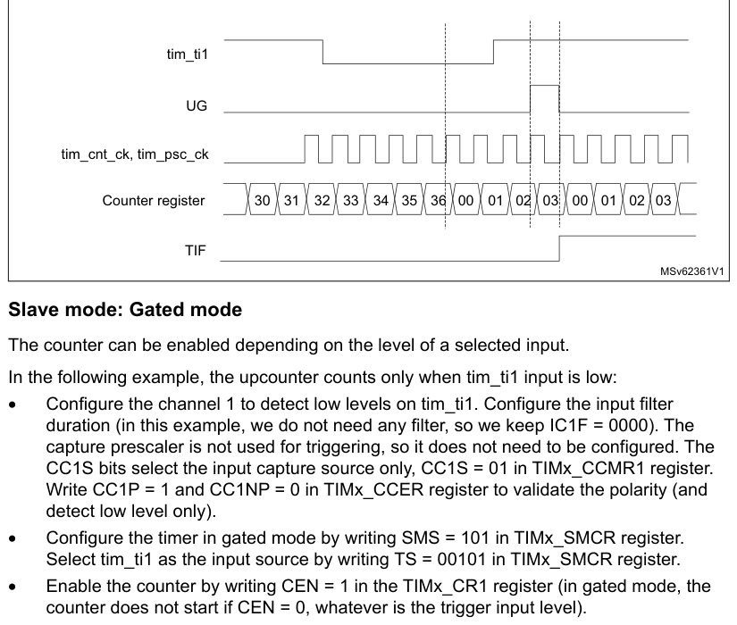

#### Slave mode: Gated mode

The counter can be enabled depending on the level of a selected input.

In the following example, the upcounter counts only when tim_ti1 input is low:

- Configure the channel 1 to detect low levels on tim_ti1. Configure the input filter duration (in
  this example, we do not need any filter, so we keep IC1F = 0000). The capture prescaler is not
  used for triggering, so it does not need to be configured. The CC1S bits select the input capture
  source only, CC1S = 01 in TIMx_CCMR1 register. Write CC1P = 1 and CC1NP = 0 in TIMx_CCER register
  to validate the polarity (and detect low level only).
- Configure the timer in gated mode by writing SMS = 101 in TIMx_SMCR register. Select tim_ti1 as
  the input source by writing TS = 00101 in TIMx_SMCR register.
- Enable the counter by writing CEN = 1 in the TIMx_CR1 register (in gated mode, the counter does
  not start if CEN = 0, whatever is the trigger input level).

The counter starts counting on the internal clock as long as tim_ti1 is low and stops as soon as
tim_ti1 becomes high. The TIF flag in the TIMx_SR register is set both when the counter starts or
stops.

The delay between the rising edge on tim_ti1 and the actual stop of the counter is due to the
resynchronization circuit on tim_ti1 input.

**Figure 382. Control circuit in Gated mode**

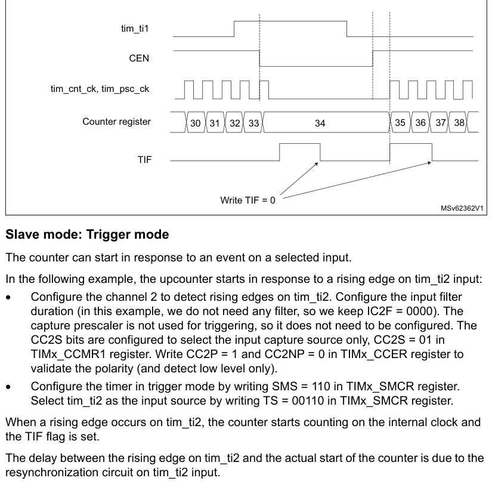

#### Slave mode: Trigger mode

The counter can start in response to an event on a selected input.

In the following example, the upcounter starts in response to a rising edge on tim_ti2 input:

- Configure the channel 2 to detect rising edges on tim_ti2. Configure the input filter duration (in
  this example, we do not need any filter, so we keep IC2F = 0000). The capture prescaler is not
  used for triggering, so it does not need to be configured. The CC2S bits are configured to select
  the input capture source only, CC2S = 01 in TIMx_CCMR1 register. Write CC2P = 1 and CC2NP = 0 in
  TIMx_CCER register to validate the polarity (and detect low level only).
- Configure the timer in trigger mode by writing SMS = 110 in TIMx_SMCR register. Select tim_ti2 as
  the input source by writing TS = 00110 in TIMx_SMCR register.

When a rising edge occurs on tim_ti2, the counter starts counting on the internal clock and the TIF
flag is set.

The delay between the rising edge on tim_ti2 and the actual start of the counter is due to the
resynchronization circuit on tim_ti2 input.

**Figure 383. Control circuit in trigger mode**

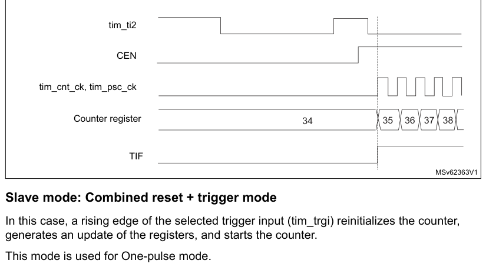

#### Slave mode: Combined reset \+ trigger mode

In this case, a rising edge of the selected trigger input (tim_trgi) reinitializes the counter,
generates an update of the registers, and starts the counter.

This mode is used for One-pulse mode.

#### Slave mode: Combined gated \+ reset mode

The counter clock is enabled when the trigger input (tim_trgi) is high. The counter stops and is
reset) as soon as the trigger becomes low. Both start and stop of the counter are controlled.

This mode is used to detect out-of-range PWM signal (duty cycle exceeding a maximum expected value).

#### Slave mode: external clock mode 2 \+ trigger mode

The external clock mode 2 can be used in addition to another slave mode (except external clock mode
1 and encoder mode). In this case, the tim_etr_in signal is used as external clock input, and
another input can be selected as trigger input (in reset mode, gated mode or trigger mode). It is
recommended not to select tim_etr_in as tim_trgi through the TS bits of TIMx_SMCR register.

In the following example, the upcounter is incremented at each rising edge of the tim_etr_in signal
as soon as a rising edge of tim_ti1 occurs:

1. Configure the external trigger input circuit by programming the TIMx_SMCR register as
   follows:

- ETF = 0000: no filter
- ETPS = 00: prescaler disabled
- ETP = 0: detection of rising edges on tim_etr_in and ECE = 1 to enable the external clock mode 2.

2. Configure the channel 1 as follows, to detect rising edges on TI:
   - IC1F = 0000: no filter.
   - The capture prescaler is not used for triggering and does not need to be configured.
   - CC1S = 01in TIMx_CCMR1 register to select only the input capture source
   - CC1P = 0 and CC1NP = 0 in TIMx_CCER register to validate the polarity (and detect rising edge
    only).

3. Configure the timer in trigger mode by writing SMS = 110 in TIMx_SMCR register.

Select tim_ti1 as the input source by writing TS = 00101 in TIMx_SMCR register.

A rising edge on tim_ti1 enables the counter and sets the TIF flag. The counter then counts on
tim_etr_in rising edges.

The delay between the rising edge of the tim_etr_in signal and the actual reset of the counter is
due to the resynchronization circuit on tim_etrp input.

**Figure 384. Control circuit in external clock mode 2 \+ trigger mode**

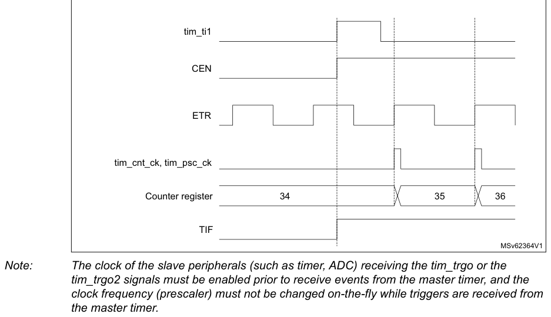

> **Note:** The clock of the slave peripherals (such as timer, ADC) receiving the tim_trgo or the
> tim_trgo2 signals must be enabled prior to receive events from the master timer, and the clock
> frequency (prescaler) must not be changed on-the-fly while triggers are received from the master
> timer.

### 29.3.31 ADC triggers

The timer can generate an ADC triggering event with various internal signals, such as reset, enable
or compare events. It is also possible to generate a pulse issued by internal edge detectors, such
as:

- Rising and falling edges of OC4ref
- Rising edge on OC5ref or falling edge on OC6ref

The triggers are issued on the tim_trgo2 internal line which is redirected to the ADC. There is a
total of 16 possible events, which can be selected using the MMS2[3:0] bits in the TIMx_CR2
register.

An example of an application for 3-phase motor drives is given in Figure 338.

> **Note:** The clock of the slave peripherals (timer, ADC, ...) receiving the tim_trgo or the tim_trgo2
> signals must be enabled prior to receive events from the master timer, and the clock frequency
(prescaler) must not be changed on-the-fly while triggers are received from the master timer.

The clock of the ADC must be enabled prior to receive events from the master timer, and must not be
changed on-the-fly while triggers are received from the timer.

### 29.3.32 DMA burst mode

The TIMx timers have the capability to generate multiple DMA requests upon a single event. The main
purpose is to be able to reprogram part of the timer multiple times without software overhead, but
it can also be used to read several registers in a row, at regular intervals.

The DMA controller destination is unique and must point to the virtual register TIMx_DMAR. On a
given timer event, the timer launches a sequence of DMA requests (burst). Each write into the
TIMx_DMAR register is actually redirected to one of the timer registers.

The DBL[4:0] bits in the TIMx_DCR register set the DMA burst length. The timer recognizes a burst
transfer when a read or a write access is done to the TIMx_DMAR address), i.e. the number of
transfers (either in half-words or in bytes).

The DBA[4:0] bits in the TIMx_DCR register define the DMA base address for DMA transfers (when
read/write access are done through the TIMx_DMAR address). DBA is defined as an offset starting from
the address of the TIMx_CR1 register:

Example:

- `00000`: TIMx_CR1
- `00001`: TIMx_CR2
- `00010`: TIMx_SMCR

As an example, the timer DMA burst feature is used to update the contents of the CCRx registers (x =
2, 3, 4) upon an update event, with the DMA transferring half words into the CCRx registers.

This is done in the following steps:

1. Configure the corresponding DMA channel as follows:
   - DMA channel peripheral address is the DMAR register address.
   - DMA channel memory address is the address of the buffer in the RAM containing the data to be
    transferred by DMA into CCRx registers.
   - Number of data to transfer = 3 (see note below).
   - Circular mode disabled.

2. Configure the DCR register by configuring the DBA and DBL bitfields as follows:

DBL = 3 transfers, DBA = 0xE.

3. Enable the TIMx update DMA request (set the UDE bit in the DIER register).
4. Enable TIMx.
5. Enable the DMA channel.

This example is for the case where every CCRx register to be updated once. If every CCRx register is
to be updated twice for example, the number of data to transfer must be 6. Let’s take the example of
a buffer in the RAM containing data1, data2, data3, data4, data5, and data6. The data is transferred
to the CCRx registers as follows: on the first update DMA request, data1 is transferred to CCR2,
data2 is transferred to CCR3, data3 is transferred to CCR4 and on the second update DMA request,
data4 is transferred to CCR2, data5 is transferred to CCR3, and data6 is transferred to CCR4.

> **Note:** A null value can be written to the reserved registers.

### 29.3.33 TIM1/TIM8/TIM20 DMA requests

The TIM1/TIM8/TIM20 can generate a DMA request, as shown in the table below.

**Table 279. DMA request**

| DMA request signal | DMA acronym | DMA request | Enable control bit |
| --- | --- | --- | --- |
| tim_upd_dma | TIM_UP | Update | UDE |
| tim_cc1_dma | TIM_CH1 | Capture/compare 1 | CC1DE |
| tim_cc2_dma | TIM_CH2 | Capture/compare 2 | CC2DE |
| tim_cc3_dma | TIM_CH3 | Capture/compare 3 | CC3DE |
| tim_cc4_dma | TIM_CH4 | Capture/compare 4 | CC4DE |
| tim_com_dma | TIM_COM | Commutation (COM) | COMDE |
| tim_trgi_dma | TIM_TRIG | Trigger | TDE |

### 29.3.34 Debug mode

When the microcontroller enters debug mode (Cortex®-M4 with FPU core halted), the TIMx counter can
either continue to work normally or stop, depending on DBG_TIMx_STOP configuration bit in DBG
module.

The behavior in debug mode can be programmed with a dedicated configuration bit per timer in the
Debug support (DBG) module.

For safety purposes, when the counter is stopped, the outputs are disabled (as if the MOE bit was
reset). The outputs can either be forced to an inactive state (OSSI bit = 1), or have their control
taken over by the GPIO controller (OSSI bit = 0), typically to force a Hi-Z.

For more details, refer to section Debug support (DBG).

## 29.4 TIM1/TIM8/TIM20 low-power modes

**Table 280. Effect of low-power modes on TIM1/TIM8/TIM20**

| Source row | Column 1 | Column 2 |
| ---: | --- | --- |
| 1 | `Mode` | `Description` |
| 2 | `No effect, peripheral is active. The interrupts can cause the device to exit from Sleep` |  |
| 3 | `Sleep` |  |

mode.

The timer operation is stopped and the register content is kept. No interrupt can be

Stop
generated.

| Source row | Column 1 | Column 2 |
| ---: | --- | --- |
| 1 | `Standby` | `The timer is powered-down and must be reinitialized after exiting the Standby mode.` |

## 29.5 TIM1/TIM8/TIM20 interrupts

The TIM1/TIM8/TIM20 can generate multiple interrupts, as shown in Table 281.

**Table 281. Interrupt requests**

| Source row | Column 1 | Column 2 | Column 3 | Column 4 | Column 5 | Column 6 | Column 7 |
| ---: | --- | --- | --- | --- | --- | --- | --- |
| 1 | `Exit` |  |  |  |  |  |  |
| 2 | `Exit from` |  |  |  |  |  |  |
| 3 | `Enable` |  |  |  |  |  |  |
| 4 | `Event` | `Interrupt clear` | `from` | `Stop` |  |  |  |
| 5 | `Interrupt acronym` | `Interrupt event` | `control` |  |  |  |  |
| 6 | `flag` | `method` | `Sleep` | `and` |  |  |  |
| 7 | `bit` |  |  |  |  |  |  |
| 8 | `mode Standby` |  |  |  |  |  |  |
| 9 | `mode` |  |  |  |  |  |  |
| 10 | `TIM_UPD` | `Update` | `UIF` | `UIE` | `write 0 in UIF` | `Yes` | `No` |
| 11 | `Capture/compare 1` | `CC1IF` | `CC1IE` | `write 0 in CC1IF` | `Yes` | `No` |  |
| 12 | `Capture/compare 2` | `CC2IF` | `CC2IE` | `write 0 in CC2IF` | `Yes` | `No` |  |
| 13 | `TIM_CC` |  |  |  |  |  |  |
| 14 | `Capture/compare 3` | `CC3IF` | `CC3IE` | `write 0 in CC3IF` | `Yes` | `No` |  |
| 15 | `Capture/compare 4` | `CC4IF` | `CC4IE` | `write 0 in CC4IF` | `Yes` | `No` |  |
| 16 | `TIM_COM` | `Commutation (COM) COMIF` | `COMIE` | `write 0 in COMIF` | `Yes` | `No` |  |
| 17 | `TIM_TRGI` | `Trigger` | `TIF` | `TIE` | `write 0 in TIF` | `Yes` | `No` |
| 18 | `TIM_TRGI_COM_` |  |  |  |  |  |  |
| 19 | `DIR_IDX` |  |  |  |  |  |  |
| 20 | `TIM_IDX` | `Index` | `IDXF` | `IDXIE` | `write 0 in IDXF` | `Yes` | `No` |
| 21 | `TIM_DIR` | `Direction` | `DIRF` | `DIRIE` | `write 0 in DIRF` | `Yes` | `No` |
| 22 | `Break` | `BIF` | `write 0 in BIF` | `Yes` | `No` |  |  |
| 23 | `TIM_BRK` | `Break2` | `B2IF` | `BIE` | `write 0 in B2IF` | `Yes` | `No` |
| 24 | `TIM_BRK_TERR_` |  |  |  |  |  |  |
| 25 | `System Break` | `SBIF` | `write 0 in SBIF` | `Yes` | `No` |  |  |
| 26 | `IERR` |  |  |  |  |  |  |
| 27 | `TIM_IERR` | `Index Error` | `IERRF` | `IERRIE` | `write 0 in IERRF` | `Yes` | `No` |
| 28 | `TIM_TERR Transition Error` | `TERRF` | `TERRIE write 0 in TERRF` | `Yes` | `No` |  |  |

## 29.6 TIM1/TIM8/TIM20 registers

Refer to [Section 1.2](chapter-01.md#12-list-of-abbreviations-for-registers) for a list of abbreviations used in register descriptions.

The peripheral registers can be accessed by half-words (16-bit) or words (32-bit).

### 29.6.1 TIMx control register 1 (TIMx_CR1)(x = 1, 8, 20)

- **Address offset:** 0x000
- **Reset value:** 0x0000

**Register bit layout**

| Bit | Field | Access | Summary |
| ---: | --- | :---: | --- |
| 15 | Reserved | — | kept at reset value. |
| 14 | Reserved | — | ↳ |
| 13 | Reserved | — | ↳ |
| 12 | `DITHEN` | rw | Dithering enable |
| 11 | `UIFREMAP` | rw | UIF status bit remapping |
| 10 | Reserved | — | kept at reset value. |
| 9 | `CKD[1]` | rw | Clock division |
| 8 | `CKD[0]` | rw | ↳ |
| 7 | `ARPE` | rw | Autoreload preload enable |
| 6 | `CMS[1]` | rw | Center-aligned mode selection |
| 5 | `CMS[0]` | rw | ↳ |
| 4 | `DIR` | rw | Direction |
| 3 | `OPM` | rw | One-pulse mode |
| 2 | `URS` | rw | Update request source |
| 1 | `UDIS` | rw | Update disable |
| 0 | `CEN` | rw | Counter enable |

**Bits 15:13 — Reserved:** kept at reset value.

**Bit 12 — `DITHEN`:** Dithering enable

- `0`: Dithering disabled
- `1`: Dithering enabled

> **Note:** The DITHEN bit can only be modified when CEN bit is reset.

**Bit 11 — `UIFREMAP`:** UIF status bit remapping

- `0`: No remapping. UIF status bit is not copied to TIMx_CNT register bit 31.
- `1`: Remapping enabled. UIF status bit is copied to TIMx_CNT register bit 31.

**Bit 10 — Reserved:** kept at reset value.

**Bits 9:8 — `CKD[1:0]`:** Clock division

This bitfield indicates the division ratio between the timer clock (tim_ker_ck) frequency and
the dead-time and sampling clock (tDTS)used by the dead-time generators and the digital
filters (tim_etr_in, tim_tix),

- `00`: tDTS = ttim_ker_ck
- `01`: tDTS = 2*ttim_ker_ck
- `10`: tDTS = 4*ttim_ker_ck
- `11`: Reserved, do not program this value

**Bit 7 — `ARPE`:** Autoreload preload enable

- `0`: TIMx_ARR register is not buffered
- `1`: TIMx_ARR register is buffered

**Bits 6:5 — `CMS[1:0]`:** Center-aligned mode selection

- `00`: Edge-aligned mode. The counter counts up or down depending on the direction bit

(DIR).

- `01`: Center-aligned mode 1. The counter counts up and down alternatively. Output compare
  interrupt flags of channels configured in output (CCxS = 00 in TIMx_CCMRx register) are
  set only when the counter is counting down.
- `10`: Center-aligned mode 2. The counter counts up and down alternatively. Output compare
  interrupt flags of channels configured in output (CCxS = 00 in TIMx_CCMRx register) are
  set only when the counter is counting up.
- `11`: Center-aligned mode 3. The counter counts up and down alternatively. Output compare
  interrupt flags of channels configured in output (CCxS = 00 in TIMx_CCMRx register) are
  set both when the counter is counting up or down.

> **Note:** It is not allowed to switch from edge-aligned mode to center-aligned mode as long as
> the counter is enabled (CEN = 1)

**Bit 4 — `DIR`:** Direction

- `0`: Counter used as upcounter
- `1`: Counter used as downcounter

> **Note:** This bit is read only when the timer is configured in Center-aligned mode or Encoder
> mode.

**Bit 3 — `OPM`:** One-pulse mode

- `0`: Counter is not stopped at update event
- `1`: Counter stops counting at the next update event (clearing the bit CEN)

**Bit 2 — `URS`:** Update request source

This bit is set and cleared by software to select the UEV event sources.

0:Any of the following events generate an update interrupt or DMA request if enabled.

These events can be:

- Counter overflow/underflow
- Setting the UG bit
- Update generation through the slave mode controller

1:Only counter overflow/underflow generates an update interrupt or DMA request if enabled.

**Bit 1 — `UDIS`:** Update disable

This bit is set and cleared by software to enable/disable UEV event generation.

0:UEV enabled. The Update (UEV) event is generated by one of the following events:

- Counter overflow/underflow
- Setting the UG bit
- Update generation through the slave mode controller

Buffered registers are then loaded with their preload values.

1:UEV disabled. The Update event is not generated, shadow registers keep their value

(ARR, PSC, CCRx). However the counter and the prescaler are reinitialized if the UG bit is
set or if a hardware reset is received from the slave mode controller.

**Bit 0 — `CEN`:** Counter enable

- `0`: Counter disabled
- `1`: Counter enabled

> **Note:** External clock, gated mode and encoder mode can work only if the CEN bit has been
> previously set by software. However trigger mode can set the CEN bit automatically by
> hardware.

### 29.6.2 TIMx control register 2 (TIMx_CR2)(x = 1, 8, 20)

- **Address offset:** 0x004
- **Reset value:** 0x0000 0000

**Register bit layout**

| Bit | Field | Access | Summary |
| ---: | --- | :---: | --- |
| 31 | Reserved | — | kept at reset value. |
| 30 | Reserved | — | ↳ |
| 29 | Reserved | — | ↳ |
| 28 | Reserved | — | ↳ |
| 27 | Reserved | — | ↳ |
| 26 | Reserved | — | ↳ |
| 25 | — | — | Not specified in extracted bit-field text. |
| 24 | Reserved | — | kept at reset value. |
| 23 | `MMS2[3]` | rw | Master mode selection 2 |
| 22 | `MMS2[2]` | rw | ↳ |
| 21 | `MMS2[1]` | rw | ↳ |
| 20 | `MMS2[0]` | rw | ↳ |
| 19 | Reserved | — | kept at reset value. |
| 18 | `OIS6` | rw | Output idle state 6 (tim_oc6 output) |
| 17 | Reserved | — | kept at reset value. |
| 16 | `OIS5` | rw | Output idle state 5 (tim_oc5 output) |
| 15 | `OIS4N` | rw | Output idle state 4 (tim_oc4n output) |
| 14 | `OIS4` | rw | Output idle state 4 (tim_oc4 output) |
| 13 | `OIS3N` | rw | Output idle state 3 (tim_oc3n output) |
| 12 | `OIS3` | rw | Output idle state 3 (tim_oc3n output) |
| 11 | `OIS2N` | rw | Output idle state 2 (tim_oc2n output) |
| 10 | `OIS2` | rw | Output idle state 2 (tim_oc2 output) |
| 9 | `OIS1N` | rw | Output idle state 1 (tim_oc1n output) |
| 8 | `OIS1` | rw | Output idle state 1 (tim_oc1 output) |
| 7 | `TI1S` | rw | tim_ti1 selection |
| 6 | — | — | Not specified in extracted bit-field text. |
| 5 | — | — | Not specified in extracted bit-field text. |
| 4 | — | — | Not specified in extracted bit-field text. |
| 3 | `CCDS` | rw | Capture/compare DMA selection |
| 2 | `CCUS` | rw | Capture/compare control update selection |
| 1 | Reserved | — | kept at reset value. |
| 0 | `CCPC` | rw | Capture/compare preloaded control |

**Bits 31:26 — Reserved:** kept at reset value.

**Bit 24 — Reserved:** kept at reset value.

**Bits 23:20 — `MMS2[3:0]`:** Master mode selection 2

These bits allow the information to be sent to ADC for synchronization (tim_trgo2) to be
selected. The combination is as follows:

- `0000`: Reset - the UG bit from the TIMx_EGR register is used as trigger output (tim_trgo2). If
  the reset is generated by the trigger input (slave mode controller configured in reset
  mode), the signal on tim_trgo2 is delayed compared to the actual reset.
- `0001`: Enable - the Counter Enable signal CNT_EN is used as trigger output (tim_trgo2). It
  is useful to start several timers at the same time or to control a window in which a
  slave timer is enabled. The Counter Enable signal is generated by a logic AND
  between the CEN control bit and the trigger input when configured in Gated mode.

When the Counter Enable signal is controlled by the trigger input, there is a delay on
tim_trgo2, except if the Master/Slave mode is selected (see the MSM bit description in

TIMx_SMCR register).

- `0010`: Update - the update event is selected as trigger output (tim_trgo2). For instance, a
  master timer can then be used as a prescaler for a slave timer.
- `0011`: Compare pulse - the trigger output sends a positive pulse when the CC1IF flag is to
  be set (even if it was already high), as soon as a capture or compare match occurs

(tim_trgo2).

- `0100`: Compare - tim_oc1refc signal is used as trigger output (tim_trgo2)
- `0101`: Compare - tim_oc2refc signal is used as trigger output (tim_trgo2)
- `0110`: Compare - tim_oc3refc signal is used as trigger output (tim_trgo2)
- `0111`: Compare - tim_oc4refc signal is used as trigger output (tim_trgo2)
- `1000`: Compare - tim_oc5refc signal is used as trigger output (tim_trgo2)
- `1001`: Compare - tim_oc6refc signal is used as trigger output (tim_trgo2)
- `1010`: Compare Pulse - tim_oc4refc rising or falling edges generate pulses on tim_trgo2
- `1011`: Compare pulse - tim_oc6refc rising or falling edges generate pulses on tim_trgo2
- `1100`: Compare pulse - tim_oc4refc or tim_oc6refc rising edges generate pulses on
  tim_trgo2
- `1101`: Compare pulse - tim_oc4refc rising or tim_oc6refc falling edges generate pulses on
  tim_trgo2
- `1110`: Compare pulse - tim_oc5refc or tim_oc6refc rising edges generate pulses on
  tim_trgo2
- `1111`: Compare pulse - tim_oc5refc rising or tim_oc6refc falling edges generate pulses on
  tim_trgo2

> **Note:** The clock of the slave timer or ADC must be enabled prior to receive events from the
> master timer, and must not be changed on-the-fly while triggers are received from the
> master timer.

**Bit 19 — Reserved:** kept at reset value.

**Bit 18 — `OIS6`:** Output idle state 6 (tim_oc6 output)

Refer to OIS1 bit

**Bit 17 — Reserved:** kept at reset value.

**Bit 16 — `OIS5`:** Output idle state 5 (tim_oc5 output)

Refer to OIS1 bit

**Bit 15 — `OIS4N`:** Output idle state 4 (tim_oc4n output)

Refer to OIS1N bit

**Bit 14 — `OIS4`:** Output idle state 4 (tim_oc4 output)

Refer to OIS1 bit

**Bit 13 — `OIS3N`:** Output idle state 3 (tim_oc3n output)

Refer to OIS1N bit

**Bit 12 — `OIS3`:** Output idle state 3 (tim_oc3n output)

Refer to OIS1 bit

**Bit 11 — `OIS2N`:** Output idle state 2 (tim_oc2n output)

Refer to OIS1N bit

**Bit 10 — `OIS2`:** Output idle state 2 (tim_oc2 output)

Refer to OIS1 bit

**Bit 9 — `OIS1N`:** Output idle state 1 (tim_oc1n output)

- `0`: tim_oc1n = 0 after a dead-time when MOE = 0
- `1`: tim_oc1n = 1 after a dead-time when MOE = 0

> **Note:** This bit can not be modified as long as LOCK level 1, 2 or 3 has been programmed

(LOCK bits in TIMx_BDTR register).

**Bit 8 — `OIS1`:** Output idle state 1 (tim_oc1 output)

- `0`: tim_oc1 = 0 (after a dead-time) when MOE = 0
- `1`: tim_oc1 = 1 (after a dead-time) when MOE = 0

> **Note:** This bit can not be modified as long as LOCK level 1, 2 or 3 has been programmed

(LOCK bits in TIMx_BDTR register).

**Bit 7 — `TI1S`:** tim_ti1 selection

- `0`: The tim_ti1_in[15:0] multiplexer output is connected to tim_ti1 input
- `1`: tim_ti1_in[15:0], tim_ti2_in[15:0] and tim_ti3_in[15:0] multiplexers outputs are XORed and
  connected to the tim_ti1 input

Bits 25, 6:4 MMS[3:0]: Master mode selection

These bits select the information to be sent in master mode to slave timers for
synchronization (tim_trgo). The combination is as follows:

- `0000`: Reset - the UG bit from the TIMx_EGR register is used as trigger output (tim_trgo). If
  the reset is generated by the trigger input (slave mode controller configured in reset
  mode) then the signal on tim_trgo is delayed compared to the actual reset.
- `0001`: Enable - the Counter Enable signal CNT_EN is used as trigger output (tim_trgo). It is
  useful to start several timers at the same time or to control a window in which a slave
  timer is enable. The Counter Enable signal is generated by a logic AND between CEN
  control bit and the trigger input when configured in gated mode. When the Counter

Enable signal is controlled by the trigger input, there is a delay on tim_trgo, except if
the master/slave mode is selected (see the MSM bit description in TIMx_SMCR
register).

- `0010`: Update - The update event is selected as trigger output (tim_trgo). For instance a
  master timer can then be used as a prescaler for a slave timer.
- `0011`: Compare Pulse - The trigger output send a positive pulse when the CC1IF flag is to
  be set (even if it was already high), as soon as a capture or a compare match
  occurred. (tim_trgo).
- `0100`: Compare - tim_oc1refc signal is used as trigger output (tim_trgo)
- `0101`: Compare - tim_oc2refc signal is used as trigger output (tim_trgo)
- `0110`: Compare - tim_oc3refc signal is used as trigger output (tim_trgo)
- `0111`: Compare - tim_oc4refc signal is used as trigger output (tim_trgo)
- `1000`: Encoder Clock output - The encoder clock signal is used as trigger output

(tim_trgo). This code is valid for the following SMS[3:0] values: 0001, 0010, 0011,

1010, 1011, 1100, 1101, 1110, 1111. Any other SMS[3:0] code is not allowed and may
lead to unexpected behavior.

Other codes reserved

> **Note:** The clock of the slave timer or ADC must be enabled prior to receive events from the
> master timer, and must not be changed on-the-fly while triggers are received from the
> master timer.

**Bit 3 — `CCDS`:** Capture/compare DMA selection

- `0`: CCx DMA request sent when CCx event occurs
- `1`: CCx DMA requests sent when update event occurs

**Bit 2 — `CCUS`:** Capture/compare control update selection

0:When capture/compare control bits are preloaded (CCPC = 1), they are updated by
setting the COMG bit only

1:When capture/compare control bits are preloaded (CCPC = 1), they are updated by
setting the COMG bit or when an rising edge occurs on tim_trgi

> **Note:** This bit acts only on channels that have a complementary output.

**Bit 1 — Reserved:** kept at reset value.

**Bit 0 — `CCPC`:** Capture/compare preloaded control

0:CCxE, CCxNE and OCxM bits are not preloaded

1:CCxE, CCxNE and OCxM bits are preloaded, after having been written, they are updated
only when a commutation event (COM) occurs (COMG bit set or rising edge detected on
tim_trgi, depending on the CCUS bit).

> **Note:** This bit acts only on channels that have a complementary output.

### 29.6.3 TIMx slave mode control register (TIMx_SMCR)(x = 1, 8, 20)

- **Address offset:** 0x008
- **Reset value:** 0x0000 0000

**Register bit layout**

| Bit | Field | Access | Summary |
| ---: | --- | :---: | --- |
| 31 | Reserved | — | kept at reset value. |
| 30 | Reserved | — | ↳ |
| 29 | Reserved | — | ↳ |
| 28 | Reserved | — | ↳ |
| 27 | Reserved | — | ↳ |
| 26 | Reserved | — | ↳ |
| 25 | `SMSPS` | rw | SMS preload source |
| 24 | `SMSPE` | rw | SMS preload enable |
| 23 | Reserved | — | kept at reset value. |
| 22 | Reserved | — | ↳ |
| 21 | `TS[4]` | rw | Trigger selection - bit 4:3 |
| 20 | `TS[3]` | rw | ↳ |
| 19 | Reserved | — | kept at reset value. |
| 18 | Reserved | — | ↳ |
| 17 | Reserved | — | ↳ |
| 16 | — | — | Not specified in extracted bit-field text. |
| 15 | `ETP` | rw | External trigger polarity |
| 14 | `ECE` | rw | External clock enable |
| 13 | `ETPS[1]` | rw | External trigger prescaler |
| 12 | `ETPS[0]` | rw | ↳ |
| 11 | `ETF[3]` | rw | External trigger filter |
| 10 | `ETF[2]` | rw | ↳ |
| 9 | `ETF[1]` | rw | ↳ |
| 8 | `ETF[0]` | rw | ↳ |
| 7 | `MSM` | rw | Master/slave mode |
| 6 | `TS[2]` | rw | Trigger selection |
| 5 | `TS[1]` | rw | ↳ |
| 4 | `TS[0]` | rw | ↳ |
| 3 | `OCCS` | rw | OCREF clear selection |
| 2 | — | — | Not specified in extracted bit-field text. |
| 1 | — | — | Not specified in extracted bit-field text. |
| 0 | — | — | Not specified in extracted bit-field text. |

**Bits 31:26 — Reserved:** kept at reset value.

**Bit 25 — `SMSPS`:** SMS preload source

This bit selects whether the events that triggers the SMS[3:0] bitfield transfer from preload to
active

- `0`: The transfer is triggered by the Timer’s Update event
- `1`: The transfer is triggered by the Index event

**Bit 24 — `SMSPE`:** SMS preload enable

This bit selects whether the SMS[3:0] bitfield is preloaded

- `0`: SMS[3:0] bitfield is not preloaded
- `1`: SMS[3:0] preload is enabled

**Bits 23:22 — Reserved:** kept at reset value.

**Bits 21:20 — `TS[4:3]`:** Trigger selection - bit 4:3

Refer to TS[2:0] description - bits 6:4

**Bits 19:17 — Reserved:** kept at reset value.

**Bit 15 — `ETP`:** External trigger polarity

This bit selects whether tim_etr_in or tim_etr_in is used for trigger operations

- `0`: tim_etr_in is non-inverted, active at high level or rising edge.
- `1`: tim_etr_in is inverted, active at low level or falling edge.

**Bit 14 — `ECE`:** External clock enable

This bit enables External clock mode 2.

0:External clock mode 2 disabled

1:External clock mode 2 enabled. The counter is clocked by any active edge on the tim_etrf
signal.

> **Note:** Setting the ECE bit has the same effect as selecting external clock mode 1 with tim_trgi
> connected to tim_etrf (SMS = 111 and TS = 00111).

It is possible to simultaneously use external clock mode 2 with the following slave
modes: reset mode, gated mode and trigger mode. Nevertheless, tim_trgi must not be
connected to tim_etrf in this case (TS bits must not be 00111).

If external clock mode 1 and external clock mode 2 are enabled at the same time, the
external clock input is tim_etrf.

**Bits 13:12 — `ETPS[1:0]`:** External trigger prescaler

External trigger signal tim_etrp frequency must be at most 1/4 of TIMxCLK frequency. A
prescaler can be enabled to reduce tim_etrp frequency. It is useful when inputting fast
external clocks on tim_etr_in.

- `00`: Prescaler OFF
- `01`: tim_etr_in frequency divided by 2
- `10`: tim_etr_in frequency divided by 4
- `11`: tim_etr_in frequency divided by 8

**Bits 11:8 — `ETF[3:0]`:** External trigger filter

This bitfield then defines the frequency used to sample tim_etrp signal and the length of the
digital filter applied to tim_etrp. The digital filter is made of an event counter in which N
consecutive events are needed to validate a transition on the output:

- `0000`: No filter, sampling is done at fDTS
- `0001`: fSAMPLING = ftim_ker_ck, N = 2
- `0010`: fSAMPLING = ftim_ker_ck, N = 4
- `0011`: fSAMPLING = ftim_ker_ck, N = 8
- `0100`: fSAMPLING = fDTS/2, N = 6
- `0101`: fSAMPLING = fDTS/2, N = 8
- `0110`: fSAMPLING = fDTS/4, N = 6
- `0111`: fSAMPLING = fDTS/4, N = 8
- `1000`: fSAMPLING = fDTS/8, N = 6
- `1001`: fSAMPLING = fDTS/8, N = 8
- `1010`: fSAMPLING = fDTS/16, N = 5
- `1011`: fSAMPLING = fDTS/16, N = 6
- `1100`: fSAMPLING = fDTS/16, N = 8
- `1101`: fSAMPLING = fDTS/32, N = 5
- `1110`: fSAMPLING = fDTS/32, N = 6
- `1111`: fSAMPLING = fDTS/32, N = 8

**Bit 7 — `MSM`:** Master/slave mode

0:No action

1:The effect of an event on the trigger input (tim_trgi) is delayed to allow a perfect
synchronization between the current timer and its slaves (through tim_trgo). It is useful if
we want to synchronize several timers on a single external event.

**Bits 6:4 — `TS[2:0]`:** Trigger selection

This bitfield is combined with TS[4:3] bits.

This bitfield selects the trigger input to be used to synchronize the counter.

- `00000`: Internal Trigger 0 (tim_itr0)
- `00001`: Internal Trigger 1 (tim_itr1)
- `00010`: Internal Trigger 2 (tim_itr2)
- `00011`: Internal Trigger 3 (tim_itr3)
- `00100`: tim_ti1 Edge Detector (tim_ti1f_ed)
- `00101`: Filtered Timer Input 1 (tim_ti1fp1)
- `00110`: Filtered Timer Input 2 (tim_ti2fp2)
- `00111`: External Trigger input (tim_etrf)
- `01000`: Internal Trigger 4 (tim_itr4)
- `01001`: Internal Trigger 5 (tim_itr5)
- `01010`: Internal Trigger 6 (tim_itr6)
- `01011`: Internal Trigger 7 (tim_itr7)
- `01100`: Internal Trigger 8 (tim_itr8)
- `01101`: Internal Trigger 9 (tim_itr9)
- `01110`: Internal Trigger 10 (tim_itr10)
- `01111`: Internal trigger 11 (tim_itr11)
- `10000`: Internal trigger 12 (tim_itr12)
- `10001`: Internal trigger 13 (tim_itr13)
- `10010`: Internal trigger 14 (tim_itr14)
- `10011`: Internal trigger 15 (tim_itr15)

Others: Reserved

See Table 267: Internal trigger connection for more details on tim_itrx meaning for each

Timer.

> **Note:** These bits must be changed only when they are not used (for example when

SMS = 000) to avoid wrong edge detections at the transition.

**Bit 3 — `OCCS`:** OCREF clear selection

This bit is used to select the OCREF clear source.

- `0`: tim_ocref_clr_int is connected to the tim_ocref_clr input
- `1`: tim_ocref_clr_int is connected to tim_etrf

Bits 16, 2:0 SMS[3:0]: Slave mode selection

When external signals are selected the active edge of the trigger signal (tim_trgi) is linked to
the polarity selected on the external input (refer to ETP bit in TIMx_SMCR for tim_etr_in and

CCxP/CCxNP bits in TIMx_CCER register for tim_ti1fp1 and tim_ti2fp2).

- `0000`: Slave mode disabled - if CEN = 1 then the prescaler is clocked directly by the internal
  clock.
- `0001`: Quadrature encoder mode 1, x2 mode- Counter counts up/down on tim_ti1fp1 edge
  depending on tim_ti2fp2 level.
- `0010`: Quadrature encoder mode 2, x2 mode - Counter counts up/down on tim_ti2fp2 edge
  depending on tim_ti1fp1 level.
- `0011`: Quadrature encoder mode 3, x4 mode - Counter counts up/down on both tim_ti1fp1
  and tim_ti2fp2 edges depending on the level of the other input.
- `0100`: Reset mode - Rising edge of the selected trigger input (tim_trgi) reinitializes the
  counter and generates an update of the registers.
- `0101`: Gated mode - The counter clock is enabled when the trigger input (tim_trgi) is high.

The counter stops (but is not reset) as soon as the trigger becomes low. Both start
and stop of the counter are controlled.

- `0110`: Trigger mode - The counter starts at a rising edge of the trigger tim_trgi (but it is not
  reset). Only the start of the counter is controlled.
- `0111`: External Clock mode 1 - Rising edges of the selected trigger (tim_trgi) clock the
  counter.
- `1000`: Combined reset \+ trigger mode - Rising edge of the selected trigger input (tim_trgi)
  reinitializes the counter, generates an update of the registers and starts the counter.
- `1001`: Combined gated \+ reset mode - The counter clock is enabled when the trigger input

(tim_trgi) is high. The counter stops and is reset) as soon as the trigger becomes low.

Both start and stop of the counter are controlled.

- `1010`: Encoder mode: Clock plus direction, x2 mode.
- `1011`: Encoder mode: Clock plus direction, x1 mode, tim_ti2fp2 edge sensitivity is set by

CC2P

- `1100`: Encoder mode: Directional Clock, x2 mode.
- `1101`: Encoder mode: Directional Clock, x1 mode, tim_ti1fp1 and tim_ti2fp2 edge sensitivity
  is set by CC1P and CC2P.
- `1110`: Quadrature encoder mode: x1 mode, counting on tim_ti1fp1 edges only, edge
  sensitivity is set by CC1P.
- `1111`: Quadrature encoder mode: x1 mode, counting on tim_ti2fp2 edges only, edge
  sensitivity is set by CC2P.

> **Note:** The gated mode must not be used if tim_ti1f_ed is selected as the trigger input (TS =

00100). Indeed, tim_ti1f_ed outputs 1 pulse for each transition on TI1F, whereas the
gated mode checks the level of the trigger signal.

> **Note:** The clock of the slave peripherals (timer, ADC, ...) receiving the tim_trgo or the
> tim_trgo2 signals must be enabled prior to receive events from the master timer, and
> the clock frequency (prescaler) must not be changed on-the-fly while triggers are
> received from the master timer.

### 29.6.4 TIMx DMA/interrupt enable register (TIMx_DIER)(x = 1, 8, 20)

- **Address offset:** 0x00C
- **Reset value:** 0x0000 0000

**Register bit layout**

| Bit | Field | Access | Summary |
| ---: | --- | :---: | --- |
| 31 | Reserved | — | kept at reset value. |
| 30 | Reserved | — | ↳ |
| 29 | Reserved | — | ↳ |
| 28 | Reserved | — | ↳ |
| 27 | Reserved | — | ↳ |
| 26 | Reserved | — | ↳ |
| 25 | Reserved | — | ↳ |
| 24 | Reserved | — | ↳ |
| 23 | `TERRIE` | rw | Transition error interrupt enable |
| 22 | `IERRIE` | rw | Index error interrupt enable |
| 21 | `DIRIE` | rw | Direction change interrupt enable |
| 20 | `IDXIE` | rw | Index interrupt enable |
| 19 | Reserved | — | kept at reset value. |
| 18 | Reserved | — | ↳ |
| 17 | Reserved | — | ↳ |
| 16 | Reserved | — | ↳ |
| 15 | Reserved | — | ↳ |
| 14 | `TDE` | rw | Trigger DMA request enable |
| 13 | `COMDE` | rw | COM DMA request enable |
| 12 | `CC4DE` | rw | Capture/compare 4 DMA request enable |
| 11 | `CC3DE` | rw | Capture/compare 3 DMA request enable |
| 10 | `CC2DE` | rw | Capture/compare 2 DMA request enable |
| 9 | `CC1DE` | rw | Capture/compare 1 DMA request enable |
| 8 | `UDE` | rw | Update DMA request enable |
| 7 | `BIE` | rw | Break interrupt enable |
| 6 | `TIE` | rw | Trigger interrupt enable |
| 5 | `COMIE` | rw | COM interrupt enable |
| 4 | `CC4IE` | rw | Capture/compare 4 interrupt enable |
| 3 | `CC3IE` | rw | Capture/compare 3 interrupt enable |
| 2 | `CC2IE` | rw | Capture/compare 2 interrupt enable |
| 1 | `CC1IE` | rw | Capture/compare 1 interrupt enable |
| 0 | `UIE` | rw | Update interrupt enable |

**Bits 31:24 — Reserved:** kept at reset value.

**Bit 23 — `TERRIE`:** Transition error interrupt enable

- `0`: Transition error interrupt disabled
- `1`: Transition error interrupt enabled

**Bit 22 — `IERRIE`:** Index error interrupt enable

- `0`: Index error interrupt disabled
- `1`: Index error interrupt enabled

**Bit 21 — `DIRIE`:** Direction change interrupt enable

- `0`: Direction Change interrupt disabled
- `1`: Direction Change interrupt enabled

**Bit 20 — `IDXIE`:** Index interrupt enable

- `0`: Index interrupt disabled
- `1`: Index Change interrupt enabled

**Bits 19:15 — Reserved:** kept at reset value.

**Bit 14 — `TDE`:** Trigger DMA request enable

- `0`: Trigger DMA request disabled
- `1`: Trigger DMA request enabled

**Bit 13 — `COMDE`:** COM DMA request enable

- `0`: COM DMA request disabled
- `1`: COM DMA request enabled

**Bit 12 — `CC4DE`:** Capture/compare 4 DMA request enable

- `0`: CC4 DMA request disabled
- `1`: CC4 DMA request enabled

**Bit 11 — `CC3DE`:** Capture/compare 3 DMA request enable

- `0`: CC3 DMA request disabled
- `1`: CC3 DMA request enabled

**Bit 10 — `CC2DE`:** Capture/compare 2 DMA request enable

- `0`: CC2 DMA request disabled
- `1`: CC2 DMA request enabled

**Bit 9 — `CC1DE`:** Capture/compare 1 DMA request enable

- `0`: CC1 DMA request disabled
- `1`: CC1 DMA request enabled

**Bit 8 — `UDE`:** Update DMA request enable

- `0`: Update DMA request disabled
- `1`: Update DMA request enabled

**Bit 7 — `BIE`:** Break interrupt enable

- `0`: Break interrupt disabled
- `1`: Break interrupt enabled

**Bit 6 — `TIE`:** Trigger interrupt enable

- `0`: Trigger interrupt disabled
- `1`: Trigger interrupt enabled

**Bit 5 — `COMIE`:** COM interrupt enable

- `0`: COM interrupt disabled
- `1`: COM interrupt enabled

**Bit 4 — `CC4IE`:** Capture/compare 4 interrupt enable

- `0`: CC4 interrupt disabled
- `1`: CC4 interrupt enabled

**Bit 3 — `CC3IE`:** Capture/compare 3 interrupt enable

- `0`: CC3 interrupt disabled
- `1`: CC3 interrupt enabled

**Bit 2 — `CC2IE`:** Capture/compare 2 interrupt enable

- `0`: CC2 interrupt disabled
- `1`: CC2 interrupt enabled

**Bit 1 — `CC1IE`:** Capture/compare 1 interrupt enable

- `0`: CC1 interrupt disabled
- `1`: CC1 interrupt enabled

**Bit 0 — `UIE`:** Update interrupt enable

- `0`: Update interrupt disabled
- `1`: Update interrupt enabled

### 29.6.5 TIMx status register (TIMx_SR)(x = 1, 8, 20)

- **Address offset:** 0x010
- **Reset value:** 0x0000 0000

**Register bit layout**

| Bit | Field | Access | Summary |
| ---: | --- | :---: | --- |
| 31 | Reserved | — | kept at reset value. |
| 30 | Reserved | — | ↳ |
| 29 | Reserved | — | ↳ |
| 28 | Reserved | — | ↳ |
| 27 | Reserved | — | ↳ |
| 26 | Reserved | — | ↳ |
| 25 | Reserved | — | ↳ |
| 24 | Reserved | — | ↳ |
| 23 | `TERRF` | rc_w0 | Transition error interrupt flag |
| 22 | `IERRF` | rc_w0 | Index error interrupt flag |
| 21 | `DIRF` | rc_w0 | Direction change interrupt flag |
| 20 | `IDXF` | rc_w0 | Index interrupt flag |
| 19 | Reserved | — | kept at reset value. |
| 18 | Reserved | — | ↳ |
| 17 | `CC6IF` | rc_w0 | Compare 6 interrupt flag |
| 16 | `CC5IF` | rc_w0 | Compare 5 interrupt flag |
| 15 | Reserved | — | kept at reset value. |
| 14 | Reserved | — | ↳ |
| 13 | `SBIF` | rc_w0 | System break interrupt flag |
| 12 | `CC4OF` | rc_w0 | Capture/compare 4 overcapture flag |
| 11 | `CC3OF` | rc_w0 | Capture/compare 3 overcapture flag |
| 10 | `CC2OF` | rc_w0 | Capture/compare 2 overcapture flag |
| 9 | `CC1OF` | rc_w0 | Capture/compare 1 overcapture flag |
| 8 | `B2IF` | rc_w0 | Break 2 interrupt flag |
| 7 | `BIF` | rc_w0 | Break interrupt flag |
| 6 | `TIF` | rc_w0 | Trigger interrupt flag |
| 5 | `COMIF` | rc_w0 | COM interrupt flag |
| 4 | `CC4IF` | rc_w0 | Capture/compare 4 interrupt flag |
| 3 | `CC3IF` | rc_w0 | Capture/compare 3 interrupt flag |
| 2 | `CC2IF` | rc_w0 | Capture/compare 2 interrupt flag |
| 1 | `CC1IF` | rc_w0 | Capture/compare 1 interrupt flag |
| 0 | `UIF` | rc_w0 | Update interrupt flag |

**Bits 31:24 — Reserved:** kept at reset value.

**Bit 23 — `TERRF`:** Transition error interrupt flag

This flag is set by hardware when a transition error is detected in encoder mode. It is
cleared by software by writing it to 0.

- `0`: No encoder transition error has been detected.
- `1`: An encoder transition error has been detected

**Bit 22 — `IERRF`:** Index error interrupt flag

This flag is set by hardware when an index error is detected. It is cleared by software by
writing it to 0.

- `0`: No index error has been detected.
- `1`: An index error has been detected

**Bit 21 — `DIRF`:** Direction change interrupt flag

This flag is set by hardware when the direction changes in encoder mode (DIR bit value in

TIMx_CR is changing). It is cleared by software by writing it to 0.

- `0`: No direction change
- `1`: Direction change

**Bit 20 — `IDXF`:** Index interrupt flag

This flag is set by hardware when an index event is detected. It is cleared by software by
writing it to 0.

- `0`: No index event occurred.
- `1`: An index event has occurred

**Bits 19:18 — Reserved:** kept at reset value.

**Bit 17 — `CC6IF`:** Compare 6 interrupt flag

Refer to CC1IF description

> **Note:** Channel 6 can only be configured as output.

**Bit 16 — `CC5IF`:** Compare 5 interrupt flag

Refer to CC1IF description

> **Note:** Channel 5 can only be configured as output.

**Bits 15:14 — Reserved:** kept at reset value.

**Bit 13 — `SBIF`:** System break interrupt flag

This flag is set by hardware as soon as the system break input goes active. It can be
cleared by software if the system break input is not active.

This flag must be reset to re-start PWM operation.

0:No break event occurred.

1:An active level has been detected on the system break input. An interrupt is generated if

BIE = 1 in the TIMx_DIER register.

**Bit 12 — `CC4OF`:** Capture/compare 4 overcapture flag

Refer to CC1OF description

**Bit 11 — `CC3OF`:** Capture/compare 3 overcapture flag

Refer to CC1OF description

**Bit 10 — `CC2OF`:** Capture/compare 2 overcapture flag

Refer to CC1OF description

**Bit 9 — `CC1OF`:** Capture/compare 1 overcapture flag

This flag is set by hardware only when the corresponding channel is configured in input
capture mode. It is cleared by software by writing it to 0.

0:No overcapture has been detected.

1:The counter value has been captured in TIMx_CCR1 register while CC1IF flag was
already set

**Bit 8 — `B2IF`:** Break 2 interrupt flag

This flag is set by hardware as soon as the break 2 input goes active. It can be cleared by
software if the break 2 input is not active.

0:No break event occurred.

1:An active level has been detected on the break 2 input. An interrupt is generated if

BIE = 1 in the TIMx_DIER register.

**Bit 7 — `BIF`:** Break interrupt flag

This flag is set by hardware as soon as the break input goes active. It can be cleared by
software if the break input is not active.

0:No break event occurred.

1:An active level has been detected on the break input. An interrupt is generated if BIE = 1
in the TIMx_DIER register.

**Bit 6 — `TIF`:** Trigger interrupt flag

This flag is set by hardware on the TRG trigger event (active edge detected on tim_trgi input
when the slave mode controller is enabled in all modes but gated mode. It is set when the
counter starts or stops when gated mode is selected. It is cleared by software.

- `0`: No trigger event occurred.
- `1`: Trigger interrupt pending.

**Bit 5 — `COMIF`:** COM interrupt flag

This flag is set by hardware on COM event (when capture/compare Control bits - CCxE,

CCxNE, OCxM - have been updated). It is cleared by software.

- `0`: No COM event occurred.
- `1`: COM interrupt pending.

**Bit 4 — `CC4IF`:** Capture/compare 4 interrupt flag

Refer to CC1IF description

**Bit 3 — `CC3IF`:** Capture/compare 3 interrupt flag

Refer to CC1IF description

**Bit 2 — `CC2IF`:** Capture/compare 2 interrupt flag

Refer to CC1IF description

**Bit 1 — `CC1IF`:** Capture/compare 1 interrupt flag

This flag is set by hardware. It is cleared by software (input capture or output compare
mode) or by reading the TIMx_CCR1 register (input capture mode only).

- `0`: No compare match / No input capture occurred
- `1`: A compare match or an input capture occurred

If channel CC1 is configured as output: this flag is set when the content of the counter

TIMx_CNT matches the content of the TIMx_CCR1 register. When the content of

TIMx_CCR1 is greater than the content of TIMx_ARR, the CC1IF bit goes high on the
counter overflow (in up-counting and up/down-counting modes) or underflow (in
downcounting mode). There are 3 possible options for flag setting in center-aligned mode,
refer to the CMS bits in the TIMx_CR1 register for the full description.

If channel CC1 is configured as input: this bit is set when counter value has been
captured in TIMx_CCR1 register (an edge has been detected on IC1, as per the edge
sensitivity defined with the CC1P and CC1NP bits setting, in TIMx_CCER).

**Bit 0 — `UIF`:** Update interrupt flag

This bit is set by hardware on an update event. It is cleared by software.

- `0`: No update occurred.
- `1`: Update interrupt pending. This bit is set by hardware when the registers are updated:

  -At overflow or underflow regarding the repetition counter value (update if repetition counter

= 0) and if the UDIS = 0 in the TIMx_CR1 register.

-When CNT is reinitialized by software using the UG bit in TIMx_EGR register, if URS = 0
and UDIS = 0 in the TIMx_CR1 register.

-When CNT is reinitialized by a trigger event (refer to [Section 29.6.3](#2963-timx-slave-mode-control-register-timx_smcrx--1-8-20): TIMx slave mode
control register (TIMx_SMCR)(x = 1, 8, 20)), if URS = 0 and UDIS = 0 in the TIMx_CR1
register.

### 29.6.6 TIMx event generation register (TIMx_EGR)(x = 1, 8, 20)

- **Address offset:** 0x014
- **Reset value:** 0x0000

**Register bit layout**

| Bit | Field | Access | Summary |
| ---: | --- | :---: | --- |
| 15 | Reserved | — | kept at reset value. |
| 14 | Reserved | — | ↳ |
| 13 | Reserved | — | ↳ |
| 12 | Reserved | — | ↳ |
| 11 | Reserved | — | ↳ |
| 10 | Reserved | — | ↳ |
| 9 | Reserved | — | ↳ |
| 8 | `B2G` | w | Break 2 generation |
| 7 | `BG` | w | Break generation |
| 6 | `TG` | w | Trigger generation |
| 5 | `COMG` | w | Capture/compare control update generation |
| 4 | `CC4G` | w | Capture/compare 4 generation |
| 3 | `CC3G` | w | Capture/compare 3 generation |
| 2 | `CC2G` | w | Capture/compare 2 generation |
| 1 | `CC1G` | w | Capture/compare 1 generation |
| 0 | `UG` | w | Update generation |

**Bits 15:9 — Reserved:** kept at reset value.

**Bit 8 — `B2G`:** Break 2 generation

This bit is set by software in order to generate an event, it is automatically cleared by
hardware.

0:No action

1:A break 2 event is generated. MOE bit is cleared and B2IF flag is set. Related interrupt
can occur if enabled.

**Bit 7 — `BG`:** Break generation

This bit is set by software in order to generate an event, it is automatically cleared by
hardware.

0:No action

1:A break event is generated. MOE bit is cleared and BIF flag is set. Related interrupt or

DMA transfer can occur if enabled.

**Bit 6 — `TG`:** Trigger generation

This bit is set by software in order to generate an event, it is automatically cleared by
hardware.

0:No action

1:The TIF flag is set in TIMx_SR register. Related interrupt or DMA transfer can occur if
enabled.

**Bit 5 — `COMG`:** Capture/compare control update generation

This bit can be set by software, it is automatically cleared by hardware

- `0`: No action
- `1`: CCxE, CCxNE and OCxM bits update (providing CCPC bit is set)

> **Note:** This bit acts only on channels having a complementary output.

**Bit 4 — `CC4G`:** Capture/compare 4 generation

Refer to CC1G description

**Bit 3 — `CC3G`:** Capture/compare 3 generation

Refer to CC1G description

**Bit 2 — `CC2G`:** Capture/compare 2 generation

Refer to CC1G description

**Bit 1 — `CC1G`:** Capture/compare 1 generation

This bit is set by software in order to generate an event, it is automatically cleared by
hardware.

- `0`: No action
- `1`: A capture/compare event is generated on channel 1:

If channel CC1 is configured as output:

CC1IF flag is set, Corresponding interrupt or DMA request is sent if enabled.

If channel CC1 is configured as input:

The current value of the counter is captured in TIMx_CCR1 register. The CC1IF flag is set,
the corresponding interrupt or DMA request is sent if enabled. The CC1OF flag is set if the

CC1IF flag was already high.

**Bit 0 — `UG`:** Update generation

This bit can be set by software, it is automatically cleared by hardware.

0:No action

1:Reinitialize the counter and generates an update of the registers. Note that the prescaler
counter is cleared too (anyway the prescaler ratio is not affected). The counter is cleared if
the center-aligned mode is selected or if DIR = 0 (upcounting), else it takes the autoreload
value (TIMx_ARR) if DIR = 1 (downcounting).

### 29.6.7 TIMx capture/compare mode register 1 (TIMx_CCMR1) (x = 1, 8, 20)

- **Address offset:** 0x018
- **Reset value:** 0x0000 0000

The same register can be used for input capture mode (this section) or for output compare mode (next
section). The direction of a channel is defined by configuring the corresponding CCxS bits. All the
other bits of this register have a different function for input capture and for output compare
modes. It is possible to combine both modes independently (for example channel 1 in input capture
mode and channel 2 in output compare mode).

**Register bit layout**

| Bit | Field | Access | Summary |
| ---: | --- | :---: | --- |
| 31 | Reserved | — | kept at reset value. |
| 30 | Reserved | — | ↳ |
| 29 | Reserved | — | ↳ |
| 28 | Reserved | — | ↳ |
| 27 | Reserved | — | ↳ |
| 26 | Reserved | — | ↳ |
| 25 | Reserved | — | ↳ |
| 24 | Reserved | — | ↳ |
| 23 | Reserved | — | ↳ |
| 22 | Reserved | — | ↳ |
| 21 | Reserved | — | ↳ |
| 20 | Reserved | — | ↳ |
| 19 | Reserved | — | ↳ |
| 18 | Reserved | — | ↳ |
| 17 | Reserved | — | ↳ |
| 16 | Reserved | — | ↳ |
| 15 | `IC2F[3]` | rw | Input capture 2 filter |
| 14 | `IC2F[2]` | rw | ↳ |
| 13 | `IC2F[1]` | rw | ↳ |
| 12 | `IC2F[0]` | rw | ↳ |
| 11 | `IC2PSC[1]` | rw | Input capture 2 prescaler |
| 10 | `IC2PSC[0]` | rw | ↳ |
| 9 | `CC2S[1]` | rw | Capture/compare 2 selection |
| 8 | `CC2S[0]` | rw | ↳ |
| 7 | `IC1F[3]` | rw | Input capture 1 filter |
| 6 | `IC1F[2]` | rw | ↳ |
| 5 | `IC1F[1]` | rw | ↳ |
| 4 | `IC1F[0]` | rw | ↳ |
| 3 | `IC1PSC[1]` | rw | Input capture 1 prescaler |
| 2 | `IC1PSC[0]` | rw | ↳ |
| 1 | `CC1S[1]` | rw | Capture/compare 1 Selection |
| 0 | `CC1S[0]` | rw | ↳ |

**Bits 31:16 — Reserved:** kept at reset value.

**Bits 15:12 — `IC2F[3:0]`:** Input capture 2 filter

**Bits 11:10 — `IC2PSC[1:0]`:** Input capture 2 prescaler

**Bits 9:8 — `CC2S[1:0]`:** Capture/compare 2 selection

This bitfield defines the direction of the channel (input/output) as well as the used input.

- `00`: CC2 channel is configured as output
- `01`: CC2 channel is configured as input, tim_ic2 is mapped on tim_ti2
- `10`: CC2 channel is configured as input, tim_ic2 is mapped on tim_ti1
- `11`: CC2 channel is configured as input, tim_ic2 is mapped on tim_trc. This mode is working only
  if an
  internal trigger input is selected through TS bit (TIMx_SMCR register)

> **Note:** CC2S bits are writable only when the channel is OFF (CC2E = 0 in TIMx_CCER).

**Bits 7:4 — `IC1F[3:0]`:** Input capture 1 filter

This bitfield defines the frequency used to sample tim_ti1 input and the length of the digital
filter
applied to tim_ti1. The digital filter is made of an event counter in which N consecutive events are
needed to validate a transition on the output:

- `0000`: No filter, sampling is done at fDTS
- `0001`: fSAMPLING = ftim_ker_ck, N = 2
- `0010`: fSAMPLING = ftim_ker_ck, N = 4
- `0011`: fSAMPLING = ftim_ker_ck, N = 8
- `0100`: fSAMPLING = fDTS/2, N = 6
- `0101`: fSAMPLING = fDTS/2, N = 8
- `0110`: fSAMPLING = fDTS/4, N = 6
- `0111`: fSAMPLING = fDTS/4, N = 8
- `1000`: fSAMPLING = fDTS/8, N = 6
- `1001`: fSAMPLING = fDTS/8, N = 8
- `1010`: fSAMPLING = fDTS/16, N = 5
- `1011`: fSAMPLING = fDTS/16, N = 6
- `1100`: fSAMPLING = fDTS/16, N = 8
- `1101`: fSAMPLING = fDTS/32, N = 5
- `1110`: fSAMPLING = fDTS/32, N = 6
- `1111`: fSAMPLING = fDTS/32, N = 8

**Bits 3:2 — `IC1PSC[1:0]`:** Input capture 1 prescaler

This bitfield defines the ratio of the prescaler acting on CC1 input (tim_ic1). The prescaler is
reset as
soon as CC1E = 0 (TIMx_CCER register).

- `00`: no prescaler, capture is done each time an edge is detected on the capture input
- `01`: capture is done once every 2 events
- `10`: capture is done once every 4 events
- `11`: capture is done once every 8 events

**Bits 1:0 — `CC1S[1:0]`:** Capture/compare 1 Selection

This bitfield defines the direction of the channel (input/output) as well as the used input.

- `00`: CC1 channel is configured as output
- `01`: CC1 channel is configured as input, tim_ic1 is mapped on tim_ti1
- `10`: CC1 channel is configured as input, tim_ic1 is mapped on tim_ti2
- `11`: CC1 channel is configured as input, tim_ic1 is mapped on tim_trc. This mode is working only
  if an
  internal trigger input is selected through TS bit (TIMx_SMCR register)

> **Note:** CC1S bits are writable only when the channel is OFF (CC1E = 0 in TIMx_CCER).

### 29.6.8 TIMx capture/compare mode register 1 [alternate] (TIMx_CCMR1)(x = 1, 8, 20)

- **Address offset:** 0x018
- **Reset value:** 0x0000 0000

The same register can be used for output compare mode (this section) or for input capture mode
(previous section). The direction of a channel is defined by configuring the corresponding CCxS
bits. All the other bits of this register have a different function for input capture and for output
compare modes. It is possible to combine both modes independently (for example channel 1 in input
capture mode and channel 2 in output compare mode).

**Register bit layout**

| Bit | Field | Access | Summary |
| ---: | --- | :---: | --- |
| 31 | Reserved | — | kept at reset value. |
| 30 | Reserved | — | ↳ |
| 29 | Reserved | — | ↳ |
| 28 | Reserved | — | ↳ |
| 27 | Reserved | — | ↳ |
| 26 | Reserved | — | ↳ |
| 25 | Reserved | — | ↳ |
| 24 | — | — | Not specified in extracted bit-field text. |
| 23 | Reserved | — | kept at reset value. |
| 22 | Reserved | — | ↳ |
| 21 | Reserved | — | ↳ |
| 20 | Reserved | — | ↳ |
| 19 | Reserved | — | ↳ |
| 18 | Reserved | — | ↳ |
| 17 | Reserved | — | ↳ |
| 16 | — | — | Not specified in extracted bit-field text. |
| 15 | `OC2CE` | rw | Output compare 2 clear enable |
| 14 | — | — | Not specified in extracted bit-field text. |
| 13 | — | — | Not specified in extracted bit-field text. |
| 12 | — | — | Not specified in extracted bit-field text. |
| 11 | `OC2PE` | rw | Output compare 2 preload enable |
| 10 | `OC2FE` | rw | Output compare 2 fast enable |
| 9 | `CC2S[1]` | rw | Capture/compare 2 selection |
| 8 | `CC2S[0]` | rw | ↳ |
| 7 | `OC1CE` | rw | Output compare 1 clear enable |
| 6 | — | — | Not specified in extracted bit-field text. |
| 5 | — | — | Not specified in extracted bit-field text. |
| 4 | — | — | Not specified in extracted bit-field text. |
| 3 | `OC1PE` | rw | Output compare 1 preload enable |
| 2 | `OC1FE` | rw | Output compare 1 fast enable |
| 1 | `CC1S[1]` | rw | Capture/compare 1 selection |
| 0 | `CC1S[0]` | rw | ↳ |

**Bits 31:25 — Reserved:** kept at reset value.

**Bits 23:17 — Reserved:** kept at reset value.

**Bit 15 — `OC2CE`:** Output compare 2 clear enable

Bits 24, 14:12 OC2M[3:0]: Output compare 2 mode

**Bit 11 — `OC2PE`:** Output compare 2 preload enable

**Bit 10 — `OC2FE`:** Output compare 2 fast enable

**Bits 9:8 — `CC2S[1:0]`:** Capture/compare 2 selection

This bitfield defines the direction of the channel (input/output) as well as the used input.

- `00`: CC2 channel is configured as output
- `01`: CC2 channel is configured as input, tim_ic2 is mapped on tim_ti2
- `10`: CC2 channel is configured as input, tim_ic2 is mapped on tim_ti1
- `11`: CC2 channel is configured as input, tim_ic2 is mapped on tim_trc. This mode is working
  only if an internal trigger input is selected through the TS bit (TIMx_SMCR register)

> **Note:** CC2S bits are writable only when the channel is OFF (CC2E = 0 in TIMx_CCER).

**Bit 7 — `OC1CE`:** Output compare 1 clear enable

- `0`: tim_oc1ref is not affected by the tim_ocref_clr_int signal
- `1`: tim_oc1ref is cleared as soon as a High level is detected on tim_ocref_clr_int signal

(tim_ocref_clr input or tim_etrf input)

Bits 16, 6:4 OC1M[3:0]: Output compare 1 mode

These bits define the behavior of the output reference signal tim_oc1ref from which tim_oc1
and tim_oc1n are derived. tim_oc1ref is active high whereas tim_oc1 and tim_oc1n active
level depends on CC1P and CC1NP bits.

- `0000`: Frozen - The comparison between the output compare register TIMx_CCR1 and the
  counter TIMx_CNT has no effect on the outputs. This mode can be used when the
  timer serves as a software timebase. When the frozen mode is enabled during timer
  operation, the ouput keeps the state (active or inactive) it had before entering the
  frozen state.
- `0001`: Set channel 1 to active level on match. tim_oc1ref signal is forced high when the
  counter TIMx_CNT matches the capture/compare register 1 (TIMx_CCR1).
- `0010`: Set channel 1 to inactive level on match. tim_oc1ref signal is forced low when the
  counter TIMx_CNT matches the capture/compare register 1 (TIMx_CCR1).
- `0011`: Toggle - tim_oc1ref toggles when TIMx_CNT = TIMx_CCR1.
- `0100`: Force inactive level - tim_oc1ref is forced low.
- `0101`: Force active level - tim_oc1ref is forced high.
- `0110`: PWM mode 1 - In upcounting, channel 1 is active as long as TIMx_CNT\<TIMx_CCR1
  else inactive. In downcounting, channel 1 is inactive (tim_oc1ref = 0) as long as

TIMx_CNT>TIMx_CCR1 else active (tim_oc1ref = 1).

- `0111`: PWM mode 2 - In upcounting, channel 1 is inactive as long as

TIMx_CNT\<TIMx_CCR1 else active. In downcounting, channel 1 is active as long as

TIMx_CNT>TIMx_CCR1 else inactive.

- `1000`: Retrigerrable OPM mode 1 - In up-counting mode, the channel is active until a trigger
  event is detected (on tim_trgi signal). Then, a comparison is performed as in PWM
  mode 1 and the channels becomes active again at the next update. In down-counting
  mode, the channel is inactive until a trigger event is detected (on tim_trgi signal).

Then, a comparison is performed as in PWM mode 1 and the channels becomes
inactive again at the next update.

- `1001`: Retrigerrable OPM mode 2 - In up-counting mode, the channel is inactive until a
  trigger event is detected (on tim_trgi signal). Then, a comparison is performed as in

PWM mode 2 and the channels becomes inactive again at the next update. In down-
counting mode, the channel is active until a trigger event is detected (on tim_trgi
signal). Then, a comparison is performed as in PWM mode 1 and the channels
becomes active again at the next update.

- `1010`: Reserved,
- `1011`: Reserved,
- `1100`: Combined PWM mode 1 - tim_oc1ref has the same behavior as in PWM mode 1.

tim_oc1refc is the logical OR between tim_oc1ref and tim_oc2ref.

- `1101`: Combined PWM mode 2 - tim_oc1ref has the same behavior as in PWM mode 2.

tim_oc1refc is the logical AND between tim_oc1ref and tim_oc2ref.

- `1110`: Asymmetric PWM mode 1 - tim_oc1ref has the same behavior as in PWM mode 1.

tim_oc1refc outputs tim_oc1ref when the counter is counting up, tim_oc2ref when it is
counting down.

- `1111`: Asymmetric PWM mode 2 - tim_oc1ref has the same behavior as in PWM mode 2.

tim_oc1refc outputs tim_oc1ref when the counter is counting up, tim_oc2ref when it is
counting down.

> **Note:** These bits can not be modified as long as LOCK level 3 has been programmed (LOCK
> bits in TIMx_BDTR register) and CC1S = 00 (the channel is configured in output).

> **Note:** In PWM mode, the OCREF level changes when the result of the comparison changes,
> when the output compare mode switches from “frozen” mode to “PWM” mode and
> when the output compare mode switches from “force active/inactive” mode to “PWM”
> mode.

> **Note:** On channels having a complementary output, this bitfield is preloaded. If the CCPC bit
> is set in the TIMx_CR2 register then the OC1M active bits take the new value from the
> preloaded bits only when a COM event is generated.

**Bit 3 — `OC1PE`:** Output compare 1 preload enable

0:Preload register on TIMx_CCR1 disabled. TIMx_CCR1 can be written at anytime, the new
value is taken in account immediately.

1:Preload register on TIMx_CCR1 enabled. Read/Write operations access the preload
register. TIMx_CCR1 preload value is loaded in the active register at each update event.

> **Note:** These bits can not be modified as long as LOCK level 3 has been programmed (LOCK
> bits in TIMx_BDTR register) and CC1S = 00 (the channel is configured in output).

**Bit 2 — `OC1FE`:** Output compare 1 fast enable

This bit decreases the latency between a trigger event and a transition on the timer output.

It must be used in one-pulse mode (OPM bit set in TIMx_CR1 register), to have the output
pulse starting as soon as possible after the starting trigger.

0:CC1 behaves normally depending on counter and CCR1 values even when the trigger is

ON. The minimum delay to activate CC1 output when an edge occurs on the trigger input
is 5 clock cycles.

1:An active edge on the trigger input acts like a compare match on CC1 output. Then, OC is
set to the compare level independently from the result of the comparison. Delay to sample
the trigger input and to activate CC1 output is reduced to 3 clock cycles. OCFE acts only
if the channel is configured in PWM1 or PWM2 mode.

**Bits 1:0 — `CC1S[1:0]`:** Capture/compare 1 selection

This bitfield defines the direction of the channel (input/output) as well as the used input.

- `00`: CC1 channel is configured as output
- `01`: CC1 channel is configured as input, tim_ic1 is mapped on tim_ti1
- `10`: CC1 channel is configured as input, tim_ic1 is mapped on tim_ti2
- `11`: CC1 channel is configured as input, tim_ic1 is mapped on tim_trc. This mode is working
  only if an internal trigger input is selected through TS bit (TIMx_SMCR register)

> **Note:** CC1S bits are writable only when the channel is OFF (CC1E = 0 in TIMx_CCER).

### 29.6.9 TIMx capture/compare mode register 2 (TIMx_CCMR2) (x = 1, 8, 20)

- **Address offset:** 0x01C
- **Reset value:** 0x0000 0000

The same register can be used for input capture mode (this section) or for output compare mode (next
section). The direction of a channel is defined by configuring the corresponding CCxS bits. All the
other bits of this register have a different function for input capture and for output compare
modes. It is possible to combine both modes independently (for example channel 3 in input capture
mode and channel 4 in output compare mode).

**Register bit layout**

| Bit | Field | Access | Summary |
| ---: | --- | :---: | --- |
| 31 | Reserved | — | kept at reset value. |
| 30 | Reserved | — | ↳ |
| 29 | Reserved | — | ↳ |
| 28 | Reserved | — | ↳ |
| 27 | Reserved | — | ↳ |
| 26 | Reserved | — | ↳ |
| 25 | Reserved | — | ↳ |
| 24 | Reserved | — | ↳ |
| 23 | Reserved | — | ↳ |
| 22 | Reserved | — | ↳ |
| 21 | Reserved | — | ↳ |
| 20 | Reserved | — | ↳ |
| 19 | Reserved | — | ↳ |
| 18 | Reserved | — | ↳ |
| 17 | Reserved | — | ↳ |
| 16 | Reserved | — | ↳ |
| 15 | `IC4F[3]` | rw | Input capture 4 filter |
| 14 | `IC4F[2]` | rw | ↳ |
| 13 | `IC4F[1]` | rw | ↳ |
| 12 | `IC4F[0]` | rw | ↳ |
| 11 | `IC4PSC[1]` | rw | Input capture 4 prescaler |
| 10 | `IC4PSC[0]` | rw | ↳ |
| 9 | `CC4S[1]` | rw | Capture/compare 4 selection |
| 8 | `CC4S[0]` | rw | ↳ |
| 7 | `IC3F[3]` | rw | Input capture 3 filter |
| 6 | `IC3F[2]` | rw | ↳ |
| 5 | `IC3F[1]` | rw | ↳ |
| 4 | `IC3F[0]` | rw | ↳ |
| 3 | `IC3PSC[1]` | rw | Input capture 3 prescaler |
| 2 | `IC3PSC[0]` | rw | ↳ |
| 1 | `CC3S[1]` | rw | Capture/compare 3 selection |
| 0 | `CC3S[0]` | rw | ↳ |

**Bits 31:16 — Reserved:** kept at reset value.

**Bits 15:12 — `IC4F[3:0]`:** Input capture 4 filter

**Bits 11:10 — `IC4PSC[1:0]`:** Input capture 4 prescaler

**Bits 9:8 — `CC4S[1:0]`:** Capture/compare 4 selection

This bitfield defines the direction of the channel (input/output) as well as the used input.

- `00`: CC4 channel is configured as output
- `01`: CC4 channel is configured as input, tim_ic4 is mapped on tim_ti4
- `10`: CC4 channel is configured as input, tim_ic4 is mapped on tim_ti3
- `11`: CC4 channel is configured as input, tim_ic4 is mapped on tim_trc. This mode is working
  only if an internal trigger input is selected through TS bit (TIMx_SMCR register)

> **Note:** CC4S bits are writable only when the channel is OFF (CC4E = 0 in TIMx_CCER).

**Bits 7:4 — `IC3F[3:0]`:** Input capture 3 filter

**Bits 3:2 — `IC3PSC[1:0]`:** Input capture 3 prescaler

**Bits 1:0 — `CC3S[1:0]`:** Capture/compare 3 selection

This bitfield defines the direction of the channel (input/output) as well as the used input.

- `00`: CC3 channel is configured as output
- `01`: CC3 channel is configured as input, tim_ic3 is mapped on tim_ti3
- `10`: CC3 channel is configured as input, tim_ic3 is mapped on tim_ti4
- `11`: CC3 channel is configured as input, tim_ic3 is mapped on tim_trc. This mode is working
  only if an internal trigger input is selected through TS bit (TIMx_SMCR register)

> **Note:** CC3S bits are writable only when the channel is OFF (CC3E = 0 in TIMx_CCER).

### 29.6.10 TIMx capture/compare mode register 2 [alternate] (TIMx_CCMR2)(x = 1, 8, 20)

- **Address offset:** 0x01C
- **Reset value:** 0x0000 0000

The same register can be used for output compare mode (this section) or for input capture mode
(previous section). The direction of a channel is defined by configuring the corresponding CCxS
bits. All the other bits of this register have a different function for input capture and for output
compare modes. It is possible to combine both modes independently (for example channel 3 in input
capture mode and channel 4 in output compare mode).

**Register bit layout**

| Bit | Field | Access | Summary |
| ---: | --- | :---: | --- |
| 31 | Reserved | — | kept at reset value. |
| 30 | Reserved | — | ↳ |
| 29 | Reserved | — | ↳ |
| 28 | Reserved | — | ↳ |
| 27 | Reserved | — | ↳ |
| 26 | Reserved | — | ↳ |
| 25 | Reserved | — | ↳ |
| 24 | — | — | Not specified in extracted bit-field text. |
| 23 | Reserved | — | kept at reset value. |
| 22 | Reserved | — | ↳ |
| 21 | Reserved | — | ↳ |
| 20 | Reserved | — | ↳ |
| 19 | Reserved | — | ↳ |
| 18 | Reserved | — | ↳ |
| 17 | Reserved | — | ↳ |
| 16 | — | — | Not specified in extracted bit-field text. |
| 15 | `OC4CE` | rw | Output compare 4 clear enable |
| 14 | — | — | Not specified in extracted bit-field text. |
| 13 | — | — | Not specified in extracted bit-field text. |
| 12 | — | — | Not specified in extracted bit-field text. |
| 11 | `OC4PE` | rw | Output compare 4 preload enable |
| 10 | `OC4FE` | rw | Output compare 4 fast enable |
| 9 | `CC4S[1]` | rw | Capture/compare 4 selection |
| 8 | `CC4S[0]` | rw | ↳ |
| 7 | `OC3CE` | rw | Output compare 3 clear enable |
| 6 | — | — | Not specified in extracted bit-field text. |
| 5 | — | — | Not specified in extracted bit-field text. |
| 4 | — | — | Not specified in extracted bit-field text. |
| 3 | `OC3PE` | rw | Output compare 3 preload enable |
| 2 | `OC3FE` | rw | Output compare 3 fast enable |
| 1 | `CC3S[1]` | rw | Capture/compare 3 selection |
| 0 | `CC3S[0]` | rw | ↳ |

**Bits 31:25 — Reserved:** kept at reset value.

**Bits 23:17 — Reserved:** kept at reset value.

**Bit 15 — `OC4CE`:** Output compare 4 clear enable

Bits 24, 14:12 OC4M[3:0]: Output compare 4 mode

Refer to OC3M[3:0] bit description

**Bit 11 — `OC4PE`:** Output compare 4 preload enable

**Bit 10 — `OC4FE`:** Output compare 4 fast enable

**Bits 9:8 — `CC4S[1:0]`:** Capture/compare 4 selection

This bitfield defines the direction of the channel (input/output) as well as the used input.

- `00`: CC4 channel is configured as output
- `01`: CC4 channel is configured as input, tim_ic4 is mapped on tim_ti4
- `10`: CC4 channel is configured as input, tim_ic4 is mapped on tim_ti3
- `11`: CC4 channel is configured as input, tim_ic4 is mapped on tim_trc. This mode is working
  only if an internal trigger input is selected through TS bit (TIMx_SMCR register)

> **Note:** CC4S bits are writable only when the channel is OFF (CC4E = 0 in TIMx_CCER).

**Bit 7 — `OC3CE`:** Output compare 3 clear enable

Bits 16, 6:4 OC3M[3:0]: Output compare 3 mode

These bits define the behavior of the output reference signal tim_oc3ref from which tim_oc3
and tim_oc3n are derived. tim_oc3ref is active high whereas tim_oc3 and tim_oc3n active
level depends on CC3P and CC3NP bits.

- `0000`: Frozen - The comparison between the output compare register TIMx_CCR3 and the
  counter TIMx_CNT has no effect on the outputs.(this mode is used to generate a
  timing base).
- `0001`: Set channel 3 to active level on match. tim_oc3ref signal is forced high when the
  counter TIMx_CNT matches the capture/compare register 3 (TIMx_CCR3).
- `0010`: Set channel 3 to inactive level on match. tim_oc3ref signal is forced low when the
  counter TIMx_CNT matches the capture/compare register 3 (TIMx_CCR3).
- `0011`: Toggle - tim_oc3ref toggles when TIMx_CNT = TIMx_CCR3.
- `0100`: Force inactive level - tim_oc3ref is forced low.
- `0101`: Force active level - tim_oc3ref is forced high.
- `0110`: PWM mode 1 - In upcounting, channel 3 is active as long as TIMx_CNT\<TIMx_CCR3
  else inactive. In downcounting, channel 3 is inactive (tim_oc3ref = 0) as long as

TIMx_CNT>TIMx_CCR3 else active (tim_oc3ref = 1).

- `0111`: PWM mode 2 - In upcounting, channel 3 is inactive as long as

TIMx_CNT\<TIMx_CCR3 else active. In downcounting, channel 3 is active as long as

TIMx_CNT>TIMx_CCR3 else inactive.

- `1000`: Retrigerrable OPM mode 1 - In up-counting mode, the channel is active until a trigger
  event is detected (on tim_trgi signal). Then, a comparison is performed as in PWM
  mode 1 and the channels becomes active again at the next update. In down-counting
  mode, the channel is inactive until a trigger event is detected (on tim_trgi signal).

Then, a comparison is performed as in PWM mode 1 and the channels becomes
inactive again at the next update.

- `1001`: Retrigerrable OPM mode 2 - In up-counting mode, the channel is inactive until a
  trigger event is detected (on tim_trgi signal). Then, a comparison is performed as in

PWM mode 2 and the channels becomes inactive again at the next update. In down-
counting mode, the channel is active until a trigger event is detected (on tim_trgi
signal). Then, a comparison is performed as in PWM mode 1 and the channels
becomes active again at the next update.

- `1010`: Pulse on compare: a pulse is generated on tim_oc3ref upon CCR3 match event, as
  per PWPRSC[2:0] and PW[7:0] bitfields programming in TIMxECR.
- `1011`: Direction output. The tim_oc3ref signal is overridden by a copy of the DIR bit.
- `1100`: Combined PWM mode 1 - tim_oc3ref has the same behavior as in PWM mode 1.

tim_oc3refc is the logical OR between tim_oc3ref and tim_oc4ref.

- `1101`: Combined PWM mode 2 - tim_oc3ref has the same behavior as in PWM mode 2.

tim_oc3refc is the logical AND between tim_oc3ref and tim_oc4ref.

- `1110`: Asymmetric PWM mode 1 - tim_oc3ref has the same behavior as in PWM mode 1.

tim_oc3refc outputs tim_oc3ref when the counter is counting up, tim_oc4ref when it is
counting down.

- `1111`: Asymmetric PWM mode 2 - tim_oc3ref has the same behavior as in PWM mode 2.

tim_oc3refc outputs tim_oc3ref when the counter is counting up, tim_oc4ref when it is
counting down.

> **Note:** These bits can not be modified as long as LOCK level 3 has been programmed (LOCK
> bits in TIMx_BDTR register) and CC1S = 00 (the channel is configured in output).

> **Note:** In PWM mode, the OCREF level changes only when the result of the comparison
> changes or when the output compare mode switches from “frozen” mode to “PWM”
> mode.

On channels having a complementary output, this bitfield is preloaded. If the CCPC bit is set in
the TIMx_CR2 register then the OC3M active bits take the new value from the preloaded bits
only when a COM event is generated.

**Bit 3 — `OC3PE`:** Output compare 3 preload enable

**Bit 2 — `OC3FE`:** Output compare 3 fast enable

**Bits 1:0 — `CC3S[1:0]`:** Capture/compare 3 selection

This bitfield defines the direction of the channel (input/output) as well as the used input.

- `00`: CC3 channel is configured as output
- `01`: CC3 channel is configured as input, tim_ic3 is mapped on tim_ti3
- `10`: CC3 channel is configured as input, tim_ic3 is mapped on tim_ti4
- `11`: CC3 channel is configured as input, tim_ic3 is mapped on tim_trc. This mode is working
  only if an internal trigger input is selected through TS bit (TIMx_SMCR register)

> **Note:** CC3S bits are writable only when the channel is OFF (CC3E = 0 in TIMx_CCER).

### 29.6.11 TIMx capture/compare enable register (TIMx_CCER)(x = 1, 8, 20)

- **Address offset:** 0x020
- **Reset value:** 0x0000 0000

**Register bit layout**

| Bit | Field | Access | Summary |
| ---: | --- | :---: | --- |
| 31 | Reserved | — | kept at reset value. |
| 30 | Reserved | — | ↳ |
| 29 | Reserved | — | ↳ |
| 28 | Reserved | — | ↳ |
| 27 | Reserved | — | ↳ |
| 26 | Reserved | — | ↳ |
| 25 | Reserved | — | ↳ |
| 24 | Reserved | — | ↳ |
| 23 | Reserved | — | ↳ |
| 22 | Reserved | — | ↳ |
| 21 | `CC6P` | rw | Capture/compare 6 output polarity |
| 20 | `CC6E` | rw | Capture/compare 6 output enable |
| 19 | Reserved | — | kept at reset value. |
| 18 | Reserved | — | ↳ |
| 17 | `CC5P` | rw | Capture/compare 5 output polarity |
| 16 | `CC5E` | rw | Capture/compare 5 output enable |
| 15 | `CC4NP` | rw | Capture/compare 4 complementary output polarity |
| 14 | `CC4NE` | rw | Capture/compare 4 complementary output enable |
| 13 | `CC4P` | rw | Capture/compare 4 output polarity |
| 12 | `CC4E` | rw | Capture/compare 4 output enable |
| 11 | `CC3NP` | rw | Capture/compare 3 complementary output polarity |
| 10 | `CC3NE` | rw | Capture/compare 3 complementary output enable |
| 9 | `CC3P` | rw | Capture/compare 3 output polarity |
| 8 | `CC3E` | rw | Capture/compare 3 output enable |
| 7 | `CC2NP` | rw | Capture/compare 2 complementary output polarity |
| 6 | `CC2NE` | rw | Capture/compare 2 complementary output enable |
| 5 | `CC2P` | rw | Capture/compare 2 output polarity |
| 4 | `CC2E` | rw | Capture/compare 2 output enable |
| 3 | `CC1NP` | rw | Capture/compare 1 complementary output polarity |
| 2 | `CC1NE` | rw | Capture/compare 1 complementary output enable |
| 1 | `CC1P` | rw | Capture/compare 1 output polarity |
| 0 | `CC1E` | rw | Capture/compare 1 output enable |

**Bits 31:22 — Reserved:** kept at reset value.

**Bit 21 — `CC6P`:** Capture/compare 6 output polarity

Refer to CC1P description

**Bit 20 — `CC6E`:** Capture/compare 6 output enable

Refer to CC1E description

**Bits 19:18 — Reserved:** kept at reset value.

**Bit 17 — `CC5P`:** Capture/compare 5 output polarity

Refer to CC1P description

**Bit 16 — `CC5E`:** Capture/compare 5 output enable

Refer to CC1E description

**Bit 15 — `CC4NP`:** Capture/compare 4 complementary output polarity

Refer to CC1NP description

**Bit 14 — `CC4NE`:** Capture/compare 4 complementary output enable

Refer to CC1NE description

**Bit 13 — `CC4P`:** Capture/compare 4 output polarity

Refer to CC1P description

**Bit 12 — `CC4E`:** Capture/compare 4 output enable

Refer to CC1E description

**Bit 11 — `CC3NP`:** Capture/compare 3 complementary output polarity

Refer to CC1NP description

**Bit 10 — `CC3NE`:** Capture/compare 3 complementary output enable

Refer to CC1NE description

**Bit 9 — `CC3P`:** Capture/compare 3 output polarity

Refer to CC1P description

**Bit 8 — `CC3E`:** Capture/compare 3 output enable

Refer to CC1E description

**Bit 7 — `CC2NP`:** Capture/compare 2 complementary output polarity

Refer to CC1NP description

**Bit 6 — `CC2NE`:** Capture/compare 2 complementary output enable

Refer to CC1NE description

**Bit 5 — `CC2P`:** Capture/compare 2 output polarity

Refer to CC1P description

**Bit 4 — `CC2E`:** Capture/compare 2 output enable

Refer to CC1E description

**Bit 3 — `CC1NP`:** Capture/compare 1 complementary output polarity

CC1 channel configured as output:

- `0`: tim_oc1n active high.
- `1`: tim_oc1n active low.

CC1 channel configured as input:

This bit is used in conjunction with CC1P to define the polarity of tim_ti1fp1 and tim_ti2fp1.

Refer to CC1P description.

> **Note:** This bit is not writable as soon as LOCK level 2 or 3 has been programmed (LOCK bits
> in TIMx_BDTR register) and CC1S = 00 (channel configured as output).

> **Note:** On channels having a complementary output, this bit is preloaded. If the CCPC bit is
> set in the TIMx_CR2 register then the CC1NP active bit takes the new value from the
> preloaded bit only when a Commutation event is generated.

**Bit 2 — `CC1NE`:** Capture/compare 1 complementary output enable

0:Off - tim_oc1n is not active. tim_oc1n level is then function of MOE, OSSI, OSSR, OIS1,

OIS1N and CC1E bits.

1:On - tim_oc1n signal is output on the corresponding output pin depending on MOE, OSSI,

OSSR, OIS1, OIS1N and CC1E bits.

> **Note:** On channels having a complementary output, this bit is preloaded. If the CCPC bit is
> set in the TIMx_CR2 register then the CC1NE active bit takes the new value from the
> preloaded bit only when a Commutation event is generated.

**Bit 1 — `CC1P`:** Capture/compare 1 output polarity

- `0`: OC1 active high (output mode) / Edge sensitivity selection (input mode, see below)
- `1`: OC1 active low (output mode) / Edge sensitivity selection (input mode, see below)

When CC1 channel is configured as input, both CC1NP/CC1P bits select the active polarity
of TI1FP1 and TI2FP1 for trigger or capture operations.

CC1NP = 0, CC1P = 0:non-inverted/rising edge. The circuit is sensitive to TIxFP1 rising
edge (capture or trigger operations in reset, external clock or trigger mode), TIxFP1 is not
inverted (trigger operation in gated mode or encoder mode).

CC1NP = 0, CC1P = 1:inverted/falling edge. The circuit is sensitive to TIxFP1 falling edge

(capture or trigger operations in reset, external clock or trigger mode), TIxFP1 is inverted
(trigger operation in gated mode or encoder mode).

CC1NP = 1, CC1P = 1: non-inverted/both edges/ The circuit is sensitive to both TIxFP1
rising and falling edges (capture or trigger operations in reset, external clock or trigger mode),
TIxFP1is not inverted (trigger operation in gated mode). This configuration must not be used in
encoder mode.

CC1NP = 1, CC1P = 0:the configuration is reserved, it must not be used.

> **Note:** This bit is not writable as soon as LOCK level 2 or 3 has been programmed (LOCK bits
> in TIMx_BDTR register).

> **Note:** On channels having a complementary output, this bit is preloaded. If the CCPC bit is
> set in the TIMx_CR2 register then the CC1P active bit takes the new value from the
> preloaded bit only when a Commutation event is generated.

**Bit 0 — `CC1E`:** Capture/compare 1 output enable

- `0`: Capture mode disabled / OC1 is not active (see below)
- `1`: Capture mode enabled / OC1 signal is output on the corresponding output pin

When CC1 channel is configured as output, the OC1 level depends on MOE, OSSI,

OSSR, OIS1, OIS1N and CC1NE bits, regardless of the CC1E bits state. Refer to Table 282
for details.

> **Note:** On channels having a complementary output, this bit is preloaded. If the CCPC bit is
> set in the TIMx_CR2 register then the CC1E active bit takes the new value from the
> preloaded bit only when a Commutation event is generated.

**Table 282. Output control bits for complementary tim_ocx and tim_ocxn channels**

| Source row | Column 1 | Column 2 | Column 3 | Column 4 | Column 5 |
| ---: | --- | --- | --- | --- | --- |
| 1 | `with break feature` |  |  |  |  |
| 2 | `Control bits` | `Output states(1)` |  |  |  |
| 3 | `MOE bit OSSI bit OSSR bit CCxE bit CCxNE bit` | `tim_ocx output state` | `tim_ocxn output state` |  |  |
| 4 | `Output disabled (not driven by the timer: Hi-Z)` |  |  |  |  |
| 5 | `X` | `0` | `0` |  |  |
| 6 | `tim_ocx = 0, tim_ocxn = 0` |  |  |  |  |
| 7 | `Output disabled (not driven` |  |  |  |  |
| 8 | `tim_ocxref + Polarity tim_ocxn` |  |  |  |  |
| 9 | `0` | `0` | `1` | `by the timer: Hi-Z)` |  |
| 10 | `= tim_ocxref xor CCxNP` |  |  |  |  |
| 11 | `tim_ocx = 0` |  |  |  |  |
| 12 | `tim_ocxref + Polarity` | `Output Disabled (not driven by` |  |  |  |
| 13 | `0` | `1` | `0` | `tim_ocx = tim_ocxref xor` | `the timer: Hi-Z)` |
| 14 | `CCxP` | `tim_ocxn = 0` |  |  |  |
| 15 | `1 X` |  |  |  |  |
| 16 | `OCREF + Polarity + dead-` | `Complementary to OCREF (not` |  |  |  |
| 17 | `X` | `1` | `1` |  |  |
| 18 | `time` | `OCREF) + Polarity + dead-time` |  |  |  |
| 19 | `Off-State (output enabled` | `tim_ocxref + Polarity` |  |  |  |
| 20 | `1` | `0` | `1` | `with inactive state)` | `tim_ocxn = tim_ocxref x or` |
| 21 | `tim_ocx = CCxP` | `CCxNP` |  |  |  |
| 22 | `tim_ocxref + Polarity` | `Off-State (output enabled with` |  |  |  |
| 23 | `1` | `1` | `0` | `tim_ocx = tim_ocxref xor` | `inactive state)` |
| 24 | `CCxP` | `tim_ocxn = CCxNP` |  |  |  |
| 25 | `0` | `X` | `X` |  |  |
| 26 | `Output disabled (not driven by the timer: Hi-Z).` |  |  |  |  |
| 27 | `0` | `0` |  |  |  |
| 28 | `0` | `1` | `Off-State (output enabled with inactive state)` |  |  |
| 29 | `Asynchronously: tim_ocx = CCxP, tim_ocxn = CCxNP (if` |  |  |  |  |
| 30 | `1` | `0` |  |  |  |
| 31 | `tim_brk or tim_brk2 is triggered).` |  |  |  |  |
| 32 | `0` | `X` |  |  |  |
| 33 | `Then (this is valid only if tim_brk is triggered), if the clock is` |  |  |  |  |
| 34 | `1` |  |  |  |  |
| 35 | `present: tim_ocx = OISx and tim_ocxn = OISxN after a dead-time, assuming that OISx and OISxN do not correspond to` |  |  |  |  |
| 36 | `1` | `1` |  |  |  |

OCX and tim_ocxn both in active state (may cause a short circuit when driving switches in
half-bridge configuration).

> **Note:** tim_brk2 can only be used if OSSI = OSSR = 1.

1. When both outputs of a channel are not used (control taken over by GPIO), the OISx, OISxN, CCxP
   and CCxNP bits must
   be kept cleared.

> **Note:** The state of the external I/O pins connected to the complementary tim_ocx and tim_ocxn
> channels depends on the tim_ocx and tim_ocxn channel state and the GPIO registers.

### 29.6.12 TIMx counter (TIMx_CNT)(x = 1, 8, 20)

- **Address offset:** 0x024
- **Reset value:** 0x0000 0000

**Register bit layout**

| Bit | Field | Access | Summary |
| ---: | --- | :---: | --- |
| 31 | `UIFCPY` | r | UIF copy |
| 30 | Reserved | — | kept at reset value. |
| 29 | Reserved | — | ↳ |
| 28 | Reserved | — | ↳ |
| 27 | Reserved | — | ↳ |
| 26 | Reserved | — | ↳ |
| 25 | Reserved | — | ↳ |
| 24 | Reserved | — | ↳ |
| 23 | Reserved | — | ↳ |
| 22 | Reserved | — | ↳ |
| 21 | Reserved | — | ↳ |
| 20 | Reserved | — | ↳ |
| 19 | Reserved | — | ↳ |
| 18 | Reserved | — | ↳ |
| 17 | Reserved | — | ↳ |
| 16 | Reserved | — | ↳ |
| 15 | `CNT[15]` | rw | Counter value |
| 14 | `CNT[14]` | rw | ↳ |
| 13 | `CNT[13]` | rw | ↳ |
| 12 | `CNT[12]` | rw | ↳ |
| 11 | `CNT[11]` | rw | ↳ |
| 10 | `CNT[10]` | rw | ↳ |
| 9 | `CNT[9]` | rw | ↳ |
| 8 | `CNT[8]` | rw | ↳ |
| 7 | `CNT[7]` | rw | ↳ |
| 6 | `CNT[6]` | rw | ↳ |
| 5 | `CNT[5]` | rw | ↳ |
| 4 | `CNT[4]` | rw | ↳ |
| 3 | `CNT[3]` | rw | ↳ |
| 2 | `CNT[2]` | rw | ↳ |
| 1 | `CNT[1]` | rw | ↳ |
| 0 | `CNT[0]` | rw | ↳ |

**Bit 31 — `UIFCPY`:** UIF copy

This bit is a read-only copy of the UIF bit of the TIMx_ISR register. If the UIFREMAP bit in
the TIMxCR1 is reset, bit 31 is reserved and read at 0.

**Bits 30:16 — Reserved:** kept at reset value.

**Bits 15:0 — `CNT[15:0]`:** Counter value

Non-dithering mode (DITHEN = 0)

The register holds the counter value.

Dithering mode (DITHEN = 1)

The register only holds the non-dithered part in CNT[15:0]. The fractional part is not
available.

### 29.6.13 TIMx prescaler (TIMx_PSC)(x = 1, 8, 20)

- **Address offset:** 0x028
- **Reset value:** 0x0000

**Register bit layout**

| Bit | Field | Access | Summary |
| ---: | --- | :---: | --- |
| 15 | `PSC[15]` | rw | Prescaler value |
| 14 | `PSC[14]` | rw | ↳ |
| 13 | `PSC[13]` | rw | ↳ |
| 12 | `PSC[12]` | rw | ↳ |
| 11 | `PSC[11]` | rw | ↳ |
| 10 | `PSC[10]` | rw | ↳ |
| 9 | `PSC[9]` | rw | ↳ |
| 8 | `PSC[8]` | rw | ↳ |
| 7 | `PSC[7]` | rw | ↳ |
| 6 | `PSC[6]` | rw | ↳ |
| 5 | `PSC[5]` | rw | ↳ |
| 4 | `PSC[4]` | rw | ↳ |
| 3 | `PSC[3]` | rw | ↳ |
| 2 | `PSC[2]` | rw | ↳ |
| 1 | `PSC[1]` | rw | ↳ |
| 0 | `PSC[0]` | rw | ↳ |

**Bits 15:0 — `PSC[15:0]`:** Prescaler value

The counter clock frequency (ftim_cnt_ck) is equal to ftim_psc_ck / (PSC[15:0] \+ 1).

PSC contains the value to be loaded in the active prescaler register at each update event

(including when the counter is cleared through UG bit of TIMx_EGR register or through
trigger controller when configured in “reset mode”).

### 29.6.14 TIMx autoreload register (TIMx_ARR)(x = 1, 8, 20)

- **Address offset:** 0x02C
- **Reset value:** 0x0000 FFFF

**Register bit layout**

| Bit | Field | Access | Summary |
| ---: | --- | :---: | --- |
| 31 | Reserved | — | kept at reset value. |
| 30 | Reserved | — | ↳ |
| 29 | Reserved | — | ↳ |
| 28 | Reserved | — | ↳ |
| 27 | Reserved | — | ↳ |
| 26 | Reserved | — | ↳ |
| 25 | Reserved | — | ↳ |
| 24 | Reserved | — | ↳ |
| 23 | Reserved | — | ↳ |
| 22 | Reserved | — | ↳ |
| 21 | Reserved | — | ↳ |
| 20 | Reserved | — | ↳ |
| 19 | `ARR[19]` | rw | Autoreload value |
| 18 | `ARR[18]` | rw | ↳ |
| 17 | `ARR[17]` | rw | ↳ |
| 16 | `ARR[16]` | rw | ↳ |
| 15 | `ARR[15]` | rw | ↳ |
| 14 | `ARR[14]` | rw | ↳ |
| 13 | `ARR[13]` | rw | ↳ |
| 12 | `ARR[12]` | rw | ↳ |
| 11 | `ARR[11]` | rw | ↳ |
| 10 | `ARR[10]` | rw | ↳ |
| 9 | `ARR[9]` | rw | ↳ |
| 8 | `ARR[8]` | rw | ↳ |
| 7 | `ARR[7]` | rw | ↳ |
| 6 | `ARR[6]` | rw | ↳ |
| 5 | `ARR[5]` | rw | ↳ |
| 4 | `ARR[4]` | rw | ↳ |
| 3 | `ARR[3]` | rw | ↳ |
| 2 | `ARR[2]` | rw | ↳ |
| 1 | `ARR[1]` | rw | ↳ |
| 0 | `ARR[0]` | rw | ↳ |

**Bits 31:20 — Reserved:** kept at reset value.

**Bits 19:0 — `ARR[19:0]`:** Autoreload value

ARR is the value to be loaded in the actual autoreload register.

Refer to the [Section 29.3.3](#2933-time-base-unit): Time-base unit for more details about ARR update and
behavior.

The counter is blocked while the autoreload value is null.

Non-dithering mode (DITHEN = 0)

The register holds the autoreload value.

Dithering mode (DITHEN = 1)

The register holds the integer part in ARR[19:4]. The ARR[3:0] bitfield contains the dithered
part.

### 29.6.15 TIMx repetition counter register (TIMx_RCR)(x = 1, 8, 20)

- **Address offset:** 0x030
- **Reset value:** 0x0000

**Register bit layout**

| Bit | Field | Access | Summary |
| ---: | --- | :---: | --- |
| 15 | `REP[15]` | rw | Repetition counter reload value |
| 14 | `REP[14]` | rw | ↳ |
| 13 | `REP[13]` | rw | ↳ |
| 12 | `REP[12]` | rw | ↳ |
| 11 | `REP[11]` | rw | ↳ |
| 10 | `REP[10]` | rw | ↳ |
| 9 | `REP[9]` | rw | ↳ |
| 8 | `REP[8]` | rw | ↳ |
| 7 | `REP[7]` | rw | ↳ |
| 6 | `REP[6]` | rw | ↳ |
| 5 | `REP[5]` | rw | ↳ |
| 4 | `REP[4]` | rw | ↳ |
| 3 | `REP[3]` | rw | ↳ |
| 2 | `REP[2]` | rw | ↳ |
| 1 | `REP[1]` | rw | ↳ |
| 0 | `REP[0]` | rw | ↳ |

**Bits 15:0 — `REP[15:0]`:** Repetition counter reload value

This bitfield defines the update rate of the compare registers (i.e. periodic transfers from
preload to active registers) when preload registers are enable. It also defines the update
interrupt generation rate, if this interrupt is enable.

When the repetition down-counter reaches zero, an update event is generated and it
restarts counting from REP value. As the repetition counter is reloaded with REP value only
at the repetition update event UEV, any write to the TIMx_RCR register is not taken in
account until the next repetition update event.

It means in PWM mode (REP+1) corresponds to:

- the number of PWM periods in edge-aligned mode
- the number of half PWM period in center-aligned mode.

### 29.6.16 TIMx capture/compare register 1 (TIMx_CCR1)(x = 1, 8, 20)

- **Address offset:** 0x034
- **Reset value:** 0x0000 0000

**Register bit layout**

| Bit | Field | Access | Summary |
| ---: | --- | :---: | --- |
| 31 | Reserved | — | kept at reset value. |
| 30 | Reserved | — | ↳ |
| 29 | Reserved | — | ↳ |
| 28 | Reserved | — | ↳ |
| 27 | Reserved | — | ↳ |
| 26 | Reserved | — | ↳ |
| 25 | Reserved | — | ↳ |
| 24 | Reserved | — | ↳ |
| 23 | Reserved | — | ↳ |
| 22 | Reserved | — | ↳ |
| 21 | Reserved | — | ↳ |
| 20 | Reserved | — | ↳ |
| 19 | `CCR1[19]` | rw | Capture/compare 1 value |
| 18 | `CCR1[18]` | rw | ↳ |
| 17 | `CCR1[17]` | rw | ↳ |
| 16 | `CCR1[16]` | rw | ↳ |
| 15 | `CCR1[15]` | rw | ↳ |
| 14 | `CCR1[14]` | rw | ↳ |
| 13 | `CCR1[13]` | rw | ↳ |
| 12 | `CCR1[12]` | rw | ↳ |
| 11 | `CCR1[11]` | rw | ↳ |
| 10 | `CCR1[10]` | rw | ↳ |
| 9 | `CCR1[9]` | rw | ↳ |
| 8 | `CCR1[8]` | rw | ↳ |
| 7 | `CCR1[7]` | rw | ↳ |
| 6 | `CCR1[6]` | rw | ↳ |
| 5 | `CCR1[5]` | rw | ↳ |
| 4 | `CCR1[4]` | rw | ↳ |
| 3 | `CCR1[3]` | rw | ↳ |
| 2 | `CCR1[2]` | rw | ↳ |
| 1 | `CCR1[1]` | rw | ↳ |
| 0 | `CCR1[0]` | rw | ↳ |

**Bits 31:20 — Reserved:** kept at reset value.

**Bits 19:0 — `CCR1[19:0]`:** Capture/compare 1 value

If channel CC1 is configured as output: CCR1 is the value to be loaded in the actual
capture/compare 1 register (preload value).

It is loaded permanently if the preload feature is not selected in the TIMx_CCMR1 register

(bit OC1PE). Else the preload value is copied in the active capture/compare 1 register when
an update event occurs.

The active capture/compare register contains the value to be compared to the counter

TIMx_CNT and signaled on tim_oc1 output.

Non-dithering mode (DITHEN = 0)

The register holds the compare value in CCR1[15:0]. The CCR1[19:16] bits are reset.

Dithering mode (DITHEN = 1)

The register holds the integer part in CCR1[19:4]. The CCR1[3:0] bitfield contains the
dithered part.

If channel CC1 is configured as input: CR1 is the counter value transferred by the last
input capture 1 event (tim_ic1). The TIMx_CCR1 register is read-only and cannot be
programmed.

Non-dithering mode (DITHEN = 0)

The register holds the capture value in CCR1[15:0]. The CCR1[19:16] bits are reset.

Dithering mode (DITHEN = 1)

The register holds the capture in CCR1[19:4]. The CCR1[3:0] bits are reset.

### 29.6.17 TIMx capture/compare register 2 (TIMx_CCR2)(x = 1, 8, 20)

- **Address offset:** 0x038
- **Reset value:** 0x0000 0000

**Register bit layout**

| Bit | Field | Access | Summary |
| ---: | --- | :---: | --- |
| 31 | Reserved | — | kept at reset value. |
| 30 | Reserved | — | ↳ |
| 29 | Reserved | — | ↳ |
| 28 | Reserved | — | ↳ |
| 27 | Reserved | — | ↳ |
| 26 | Reserved | — | ↳ |
| 25 | Reserved | — | ↳ |
| 24 | Reserved | — | ↳ |
| 23 | Reserved | — | ↳ |
| 22 | Reserved | — | ↳ |
| 21 | Reserved | — | ↳ |
| 20 | Reserved | — | ↳ |
| 19 | `CCR2[19]` | rw | Capture/compare 2 value |
| 18 | `CCR2[18]` | rw | ↳ |
| 17 | `CCR2[17]` | rw | ↳ |
| 16 | `CCR2[16]` | rw | ↳ |
| 15 | `CCR2[15]` | rw | ↳ |
| 14 | `CCR2[14]` | rw | ↳ |
| 13 | `CCR2[13]` | rw | ↳ |
| 12 | `CCR2[12]` | rw | ↳ |
| 11 | `CCR2[11]` | rw | ↳ |
| 10 | `CCR2[10]` | rw | ↳ |
| 9 | `CCR2[9]` | rw | ↳ |
| 8 | `CCR2[8]` | rw | ↳ |
| 7 | `CCR2[7]` | rw | ↳ |
| 6 | `CCR2[6]` | rw | ↳ |
| 5 | `CCR2[5]` | rw | ↳ |
| 4 | `CCR2[4]` | rw | ↳ |
| 3 | `CCR2[3]` | rw | ↳ |
| 2 | `CCR2[2]` | rw | ↳ |
| 1 | `CCR2[1]` | rw | ↳ |
| 0 | `CCR2[0]` | rw | ↳ |

**Bits 31:20 — Reserved:** kept at reset value.

**Bits 19:0 — `CCR2[19:0]`:** Capture/compare 2 value

If channel CC2 is configured as output: CCR2 is the value to be loaded in the actual
capture/compare 2 register (preload value).

It is loaded permanently if the preload feature is not selected in the TIMx_CCMR1 register

(bit OC2PE). Else the preload value is copied in the active capture/compare 2 register when
an update event occurs.

The active capture/compare register contains the value to be compared to the counter

TIMx_CNT and signaled on tim_oc2 output.

Non-dithering mode (DITHEN = 0)

The register holds the compare value in CCR2[15:0]. The CCR2[19:16] bits are reset.

Dithering mode (DITHEN = 1)

The register holds the integer part in CCR2[19:4]. The CCR2[3:0] bitfield contains the
dithered part.

If channel CC2 is configured as input: CCR2 is the counter value transferred by the last
input capture 2 event (tim_ic2). The TIMx_CCR2 register is read-only and cannot be
programmed.

Non-dithering mode (DITHEN = 0)

The register holds the capture value in CCR2[15:0]. The CCR2[19:16] bits are reset.

Dithering mode (DITHEN = 1)

The register holds the capture in CCR2[19:4]. The CCR2[3:0] bits are reset.

### 29.6.18 TIMx capture/compare register 3 (TIMx_CCR3)(x = 1, 8, 20)

- **Address offset:** 0x03C
- **Reset value:** 0x0000 0000

**Register bit layout**

| Bit | Field | Access | Summary |
| ---: | --- | :---: | --- |
| 31 | Reserved | — | kept at reset value. |
| 30 | Reserved | — | ↳ |
| 29 | Reserved | — | ↳ |
| 28 | Reserved | — | ↳ |
| 27 | Reserved | — | ↳ |
| 26 | Reserved | — | ↳ |
| 25 | Reserved | — | ↳ |
| 24 | Reserved | — | ↳ |
| 23 | Reserved | — | ↳ |
| 22 | Reserved | — | ↳ |
| 21 | Reserved | — | ↳ |
| 20 | Reserved | — | ↳ |
| 19 | `CCR3[19]` | rw | Capture/compare value |
| 18 | `CCR3[18]` | rw | ↳ |
| 17 | `CCR3[17]` | rw | ↳ |
| 16 | `CCR3[16]` | rw | ↳ |
| 15 | `CCR3[15]` | rw | ↳ |
| 14 | `CCR3[14]` | rw | ↳ |
| 13 | `CCR3[13]` | rw | ↳ |
| 12 | `CCR3[12]` | rw | ↳ |
| 11 | `CCR3[11]` | rw | ↳ |
| 10 | `CCR3[10]` | rw | ↳ |
| 9 | `CCR3[9]` | rw | ↳ |
| 8 | `CCR3[8]` | rw | ↳ |
| 7 | `CCR3[7]` | rw | ↳ |
| 6 | `CCR3[6]` | rw | ↳ |
| 5 | `CCR3[5]` | rw | ↳ |
| 4 | `CCR3[4]` | rw | ↳ |
| 3 | `CCR3[3]` | rw | ↳ |
| 2 | `CCR3[2]` | rw | ↳ |
| 1 | `CCR3[1]` | rw | ↳ |
| 0 | `CCR3[0]` | rw | ↳ |

**Bits 31:20 — Reserved:** kept at reset value.

**Bits 19:0 — `CCR3[19:0]`:** Capture/compare value

If channel CC3 is configured as output: CCR3 is the value to be loaded in the actual
capture/compare 3 register (preload value).

It is loaded permanently if the preload feature is not selected in the TIMx_CCMR2 register

(bit OC3PE). Else the preload value is copied in the active capture/compare 3 register when
an update event occurs.

The active capture/compare register contains the value to be compared to the counter

TIMx_CNT and signaled on tim_oc3 output.

Non-dithering mode (DITHEN = 0)

The register holds the compare value in CCR3[15:0]. The CCR3[19:16] bits are reset.

Dithering mode (DITHEN = 1)

The register holds the integer part in CCR3[19:4]. The CCR3[3:0] bitfield contains the
dithered part.

If channel CC3 is configured as input: CCR3 is the counter value transferred by the last
input capture 3 event (tim_ic3). The TIMx_CCR3 register is read-only and cannot be
programmed.

Non-dithering mode (DITHEN = 0)

The register holds the capture value in CCR3[15:0]. The CCR3[19:16] bits are reset.

Dithering mode (DITHEN = 1)

The register holds the capture in CCR3[19:4]. The CCR3[3:0] bits are reset.

### 29.6.19 TIMx capture/compare register 4 (TIMx_CCR4)(x = 1, 8, 20)

- **Address offset:** 0x040
- **Reset value:** 0x0000 0000

**Register bit layout**

| Bit | Field | Access | Summary |
| ---: | --- | :---: | --- |
| 31 | Reserved | — | kept at reset value. |
| 30 | Reserved | — | ↳ |
| 29 | Reserved | — | ↳ |
| 28 | Reserved | — | ↳ |
| 27 | Reserved | — | ↳ |
| 26 | Reserved | — | ↳ |
| 25 | Reserved | — | ↳ |
| 24 | Reserved | — | ↳ |
| 23 | Reserved | — | ↳ |
| 22 | Reserved | — | ↳ |
| 21 | Reserved | — | ↳ |
| 20 | Reserved | — | ↳ |
| 19 | `CCR4[19]` | rw | Capture/compare value |
| 18 | `CCR4[18]` | rw | ↳ |
| 17 | `CCR4[17]` | rw | ↳ |
| 16 | `CCR4[16]` | rw | ↳ |
| 15 | `CCR4[15]` | rw | ↳ |
| 14 | `CCR4[14]` | rw | ↳ |
| 13 | `CCR4[13]` | rw | ↳ |
| 12 | `CCR4[12]` | rw | ↳ |
| 11 | `CCR4[11]` | rw | ↳ |
| 10 | `CCR4[10]` | rw | ↳ |
| 9 | `CCR4[9]` | rw | ↳ |
| 8 | `CCR4[8]` | rw | ↳ |
| 7 | `CCR4[7]` | rw | ↳ |
| 6 | `CCR4[6]` | rw | ↳ |
| 5 | `CCR4[5]` | rw | ↳ |
| 4 | `CCR4[4]` | rw | ↳ |
| 3 | `CCR4[3]` | rw | ↳ |
| 2 | `CCR4[2]` | rw | ↳ |
| 1 | `CCR4[1]` | rw | ↳ |
| 0 | `CCR4[0]` | rw | ↳ |

**Bits 31:20 — Reserved:** kept at reset value.

**Bits 19:0 — `CCR4[19:0]`:** Capture/compare value

If channel CC4 is configured as output: CCR4 is the value to be loaded in the actual
capture/compare 4 register (preload value).

It is loaded permanently if the preload feature is not selected in the TIMx_CCMR2 register

(bit OC4PE). Else the preload value is copied in the active capture/compare 4 register when
an update event occurs.

The active capture/compare register contains the value to be compared to the counter

TIMx_CNT and signalled on tim_oc4 output.

Non-dithering mode (DITHEN = 0)

The register holds the compare value in CCR4[15:0]. The CCR4[19:16] bits are reset.

Dithering mode (DITHEN = 1)

The register holds the integer part in CCR4[19:4]. The CCR4[3:0] bitfield contains the
dithered part.

If channel CC4 is configured as input: CCR4 is the counter value transferred by the last
input capture 4 event (tim_ic4). The TIMx_CCR4 register is read-only and cannot be
programmed.

Non-dithering mode (DITHEN = 0)

The register holds the capture value in CCR4[15:0]. The CCR4[19:16] bits are reset.

Dithering mode (DITHEN = 1)

The register holds the capture in CCR4[19:4]. The CCR4[3:0] bits are reset.

### 29.6.20 TIMx break and dead-time register (TIMx_BDTR)(x = 1, 8, 20)

- **Address offset:** 0x044
- **Reset value:** 0x0000 0000

**Register bit layout**

| Bit | Field | Access | Summary |
| ---: | --- | :---: | --- |
| 31 | Reserved | — | kept at reset value. |
| 30 | Reserved | — | ↳ |
| 29 | `BK2BID` | rw | Break2 bidirectional |
| 28 | `BKBID` | rw | Break bidirectional |
| 27 | `BK2DSRM` | rw | Break2 disarm |
| 26 | `BKDSRM` | rw | Break disarm |
| 25 | `BK2P` | rw | Break 2 polarity |
| 24 | `BK2E` | rw | Break 2 enable |
| 23 | `BK2F[3]` | rw | Break 2 filter |
| 22 | `BK2F[2]` | rw | ↳ |
| 21 | `BK2F[1]` | rw | ↳ |
| 20 | `BK2F[0]` | rw | ↳ |
| 19 | `BKF[3]` | rw | Break filter |
| 18 | `BKF[2]` | rw | ↳ |
| 17 | `BKF[1]` | rw | ↳ |
| 16 | `BKF[0]` | rw | ↳ |
| 15 | `MOE` | rw | Main output enable |
| 14 | `AOE` | rw | Automatic output enable |
| 13 | `BKP` | rw | Break polarity |
| 12 | `BKE` | rw | Break enable |
| 11 | `OSSR` | rw | Off-state selection for Run mode |
| 10 | `OSSI` | rw | Off-state selection for idle mode |
| 9 | `LOCK[1]` | rw | Lock configuration |
| 8 | `LOCK[0]` | rw | ↳ |
| 7 | `DTG[7]` | rw | Dead-time generator setup |
| 6 | `DTG[6]` | rw | ↳ |
| 5 | `DTG[5]` | rw | ↳ |
| 4 | `DTG[4]` | rw | ↳ |
| 3 | `DTG[3]` | rw | ↳ |
| 2 | `DTG[2]` | rw | ↳ |
| 1 | `DTG[1]` | rw | ↳ |
| 0 | `DTG[0]` | rw | ↳ |

> **Note:** As the bits BKBID/BK2BID/BK2P, BK2E, BK2F[3:0], BKF[3:0], AOE, BKP, BKE, OSSI,

OSSR, and DTG[7:0] can be write-locked depending on the LOCK configuration, it can be necessary to
configure all of them during the first write access to the TIMx_BDTR register.

**Bits 31:30 — Reserved:** kept at reset value.

**Bit 29 — `BK2BID`:** Break2 bidirectional

Refer to BKBID description

**Bit 28 — `BKBID`:** Break bidirectional

- `0`: Break input tim_brk in input mode
- `1`: Break input tim_brk in bidirectional mode

In the bidirectional mode (BKBID bit set to 1), the break input is configured both in input
mode and in open drain output mode. Any active break event asserts a low logic level on the

Break input to indicate an internal break event to external devices.

> **Note:** This bit cannot be modified as long as LOCK level 1 has been programmed (LOCK bits
> in TIMx_BDTR register).

> **Note:** Any write operation to this bit takes a delay of 1 APB clock cycle to become effective.

**Bit 27 — `BK2DSRM`:** Break2 disarm

Refer to BKDSRM description

**Bit 26 — `BKDSRM`:** Break disarm

- `0`: Break input tim_brk is armed
- `1`: Break input tim_brk is disarmed

This bit is cleared by hardware when no break source is active.

The BKDSRM bit must be set by software to release the bidirectional output control (open-
drain output in Hi-Z state) and then be polled it until it is reset by hardware, indicating that the
fault condition has disappeared.

> **Note:** Any write operation to this bit takes a delay of 1 APB clock cycle to become effective.

**Bit 25 — `BK2P`:** Break 2 polarity

- `0`: Break input tim_brk2 is active low
- `1`: Break input tim_brk2 is active high

> **Note:** This bit cannot be modified as long as LOCK level 1 has been programmed (LOCK bits
> in TIMx_BDTR register).

> **Note:** Any write operation to this bit takes a delay of 1 APB clock cycle to become effective.

**Bit 24 — `BK2E`:** Break 2 enable

This bit enables the complete break 2 protection, see Figure 343: Break and Break2 circuitry
overview).

- `0`: Break2 function disabled
- `1`: Break2 function enabled

> **Note:** The BRKIN2 must only be used with OSSR = OSSI = 1.

> **Note:** This bit cannot be modified when LOCK level 1 has been programmed (LOCK bits in

TIMx_BDTR register).

> **Note:** Any write operation to this bit takes a delay of 1 APB clock cycle to become effective.

**Bits 23:20 — `BK2F[3:0]`:** Break 2 filter

This bitfield defines the frequency used to sample tim_brk2 input and the length of the digital
filter applied to tim_brk2. The digital filter is made of an event counter in which N consecutive
events are needed to validate a transition on the output:

- `0000`: No filter, tim_brk2 acts asynchronously
- `0001`: fSAMPLING = ftim_ker_ck, N = 2
- `0010`: fSAMPLING = ftim_ker_ck, N = 4
- `0011`: fSAMPLING = ftim_ker_ck, N = 8
- `0100`: fSAMPLING = fDTS/2, N = 6
- `0101`: fSAMPLING = fDTS/2, N = 8
- `0110`: fSAMPLING = fDTS/4, N = 6
- `0111`: fSAMPLING = fDTS/4, N = 8
- `1000`: fSAMPLING = fDTS/8, N = 6
- `1001`: fSAMPLING = fDTS/8, N = 8
- `1010`: fSAMPLING = fDTS/16, N = 5
- `1011`: fSAMPLING = fDTS/16, N = 6
- `1100`: fSAMPLING = fDTS/16, N = 8
- `1101`: fSAMPLING = fDTS/32, N = 5
- `1110`: fSAMPLING = fDTS/32, N = 6
- `1111`: fSAMPLING = fDTS/32, N = 8

> **Note:** This bit cannot be modified when LOCK level 1 has been programmed (LOCK bits in

TIMx_BDTR register).

**Bits 19:16 — `BKF[3:0]`:** Break filter

This bitfield defines the frequency used to sample tim_brk input and the length of the digital
filter applied to tim_brk. The digital filter is made of an event counter in which N consecutive
events are needed to validate a transition on the output:

- `0000`: No filter, tim_brk acts asynchronously
- `0001`: fSAMPLING = ftim_ker_ck, N = 2
- `0010`: fSAMPLING = ftim_ker_ck, N = 4
- `0011`: fSAMPLING = ftim_ker_ck, N = 8
- `0100`: fSAMPLING = fDTS/2, N = 6
- `0101`: fSAMPLING = fDTS/2, N = 8
- `0110`: fSAMPLING = fDTS/4, N = 6
- `0111`: fSAMPLING = fDTS/4, N = 8
- `1000`: fSAMPLING = fDTS/8, N = 6
- `1001`: fSAMPLING = fDTS/8, N = 8
- `1010`: fSAMPLING = fDTS/16, N = 5
- `1011`: fSAMPLING = fDTS/16, N = 6
- `1100`: fSAMPLING = fDTS/16, N = 8
- `1101`: fSAMPLING = fDTS/32, N = 5
- `1110`: fSAMPLING = fDTS/32, N = 6
- `1111`: fSAMPLING = fDTS/32, N = 8

> **Note:** This bit cannot be modified when LOCK level 1 has been programmed (LOCK bits in

TIMx_BDTR register).

**Bit 15 — `MOE`:** Main output enable

This bit is cleared asynchronously by hardware as soon as one of the break inputs is active

(tim_brk or tim_brk2). It is set by software or automatically depending on the AOE bit. It is
acting only on the channels which are configured in output.

0:In response to a break 2 event. OC and OCN outputs are disabled

In response to a break event or if MOE is written to 0: OC and OCN outputs are disabled or
forced to idle state depending on the OSSI bit.

1:OC and OCN outputs are enabled if their respective enable bits are set (CCxE, CCxNE in

TIMx_CCER register).

See OC/OCN enable description for more details ([Section 29.6.11](#29611-timx-capturecompare-enable-register-timx_ccerx--1-8-20): TIMx capture/compare
enable register (TIMx_CCER)(x = 1, 8, 20)).

**Bit 14 — `AOE`:** Automatic output enable

0:MOE can be set only by software

1:MOE can be set by software or automatically at the next update event (if none of the break
inputs tim_brk and tim_brk2 is active)

> **Note:** This bit can not be modified as long as LOCK level 1 has been programmed (LOCK bits
> in TIMx_BDTR register).

**Bit 13 — `BKP`:** Break polarity

- `0`: Break input tim_brk is active low
- `1`: Break input tim_brk is active high

> **Note:** This bit can not be modified as long as LOCK level 1 has been programmed (LOCK bits
> in TIMx_BDTR register).

> **Note:** Any write operation to this bit takes a delay of 1 APB clock cycle to become effective.

**Bit 12 — `BKE`:** Break enable

This bit enables the complete break protection (including all sources connected to
tim_sys_brk and BKIN sources, as per Figure 343: Break and Break2 circuitry overview).

- `0`: Break function disabled
- `1`: Break function enabled

> **Note:** This bit cannot be modified when LOCK level 1 has been programmed (LOCK bits in

TIMx_BDTR register).

> **Note:** Any write operation to this bit takes a delay of 1 APB clock cycle to become effective.

**Bit 11 — `OSSR`:** Off-state selection for Run mode

This bit is used when MOE = 1 on channels having a complementary output which are
configured as outputs. OSSR is not implemented if no complementary output is implemented
in the timer.

See OC/OCN enable description for more details ([Section 29.6.11](#29611-timx-capturecompare-enable-register-timx_ccerx--1-8-20): TIMx capture/compare
enable register (TIMx_CCER)(x = 1, 8, 20)).

0:When inactive, OC/OCN outputs are disabled (the timer releases the output control which
is taken over by the GPIO logic, which forces a Hi-Z state).

1:When inactive, OC/OCN outputs are enabled with their inactive level as soon as CCxE = 1
or CCxNE = 1 (the output is still controlled by the timer).

> **Note:** This bit can not be modified as soon as the LOCK level 2 has been programmed (LOCK
> bits in TIMx_BDTR register).

**Bit 10 — `OSSI`:** Off-state selection for idle mode

This bit is used when MOE = 0 due to a break event or by a software write, on channels
configured as outputs.

See OC/OCN enable description for more details ([Section 29.6.11](#29611-timx-capturecompare-enable-register-timx_ccerx--1-8-20): TIMx capture/compare
enable register (TIMx_CCER)(x = 1, 8, 20)).

0:When inactive, OC/OCN outputs are disabled (the timer releases the output control which
is taken over by the GPIO logic and which imposes a Hi-Z state).

1:When inactive, OC/OCN outputs are first forced with their inactive level then forced to their
idle level after the deadtime. The timer maintains its control over the output.

> **Note:** This bit can not be modified as soon as the LOCK level 2 has been programmed (LOCK
> bits in TIMx_BDTR register).

**Bits 9:8 — `LOCK[1:0]`:** Lock configuration

These bits offer a write protection against software errors.

- `00`: LOCK OFF - No bit is write protected.
- `01`: LOCK Level 1 = DTG bits in TIMx_BDTR register, OISx and OISxN bits in TIMx_CR2
  register and BKBID/BK2BID/BKE/BKP/AOE bits in TIMx_BDTR register can no longer be
  written.
- `10`: LOCK Level 2 = LOCK Level 1 \+ CC Polarity bits (CCxP/CCxNP bits in TIMx_CCER
  register, as long as the related channel is configured in output through the CCxS bits) as
  well as OSSR and OSSI bits can no longer be written.
- `11`: LOCK Level 3 = LOCK Level 2 \+ CC Control bits (OCxM and OCxPE bits in

TIMx_CCMRx registers, as long as the related channel is configured in output through
the CCxS bits) can no longer be written.

> **Note:** The LOCK bits can be written only once after the reset. Once the TIMx_BDTR register
> has been written, their content is frozen until the next reset.

**Bits 7:0 — `DTG[7:0]`:** Dead-time generator setup

This bitfield defines the duration of the dead-time inserted between the complementary
outputs. DT correspond to this duration.

DTG[7:5] = 0xx => DT = DTG[7:0]x tdtg with tdtg = tDTS.

DTG[7:5] = 10x => DT = (64+DTG[5:0])xtdtg with Tdtg = 2xtDTS.

DTG[7:5] = 110 => DT = (32+DTG[4:0])xtdtg with Tdtg = 8xtDTS.

DTG[7:5] = 111 => DT = (32+DTG[4:0])xtdtg with Tdtg = 16xtDTS.

Example if TDTS = 125 ns (8 MHz), dead-time possible values are:

0 to 15875 ns by 125 ns steps,

16 μs to 31750 ns by 250 ns steps,

32 μs to 63 μs by 1 μs steps,

64 μs to 126 μs by 2 μs steps

> **Note:** This bitfield can not be modified as long as LOCK level 1, 2 or 3 has been programmed

(LOCK bits in TIMx_BDTR register).

### 29.6.21 TIMx capture/compare register 5 (TIMx_CCR5)(x = 1, 8, 20)

- **Address offset:** 0x048
- **Reset value:** 0x0000 0000

**Register bit layout**

| Bit | Field | Access | Summary |
| ---: | --- | :---: | --- |
| 31 | `GC5C3` | rw | Group channel 5 and channel 3 |
| 30 | `GC5C2` | rw | Group channel 5 and channel 2 |
| 29 | `GC5C1` | rw | Group channel 5 and channel 1 |
| 28 | Reserved | — | kept at reset value. |
| 27 | Reserved | — | ↳ |
| 26 | Reserved | — | ↳ |
| 25 | Reserved | — | ↳ |
| 24 | Reserved | — | ↳ |
| 23 | Reserved | — | ↳ |
| 22 | Reserved | — | ↳ |
| 21 | Reserved | — | ↳ |
| 20 | Reserved | — | ↳ |
| 19 | `CCR5[19]` | rw | Capture/compare 5 value |
| 18 | `CCR5[18]` | rw | ↳ |
| 17 | `CCR5[17]` | rw | ↳ |
| 16 | `CCR5[16]` | rw | ↳ |
| 15 | `CCR5[15]` | rw | ↳ |
| 14 | `CCR5[14]` | rw | ↳ |
| 13 | `CCR5[13]` | rw | ↳ |
| 12 | `CCR5[12]` | rw | ↳ |
| 11 | `CCR5[11]` | rw | ↳ |
| 10 | `CCR5[10]` | rw | ↳ |
| 9 | `CCR5[9]` | rw | ↳ |
| 8 | `CCR5[8]` | rw | ↳ |
| 7 | `CCR5[7]` | rw | ↳ |
| 6 | `CCR5[6]` | rw | ↳ |
| 5 | `CCR5[5]` | rw | ↳ |
| 4 | `CCR5[4]` | rw | ↳ |
| 3 | `CCR5[3]` | rw | ↳ |
| 2 | `CCR5[2]` | rw | ↳ |
| 1 | `CCR5[1]` | rw | ↳ |
| 0 | `CCR5[0]` | rw | ↳ |

**Bit 31 — `GC5C3`:** Group channel 5 and channel 3

Distortion on channel 3 output:

- `0`: No effect of tim_oc5ref on tim_oc3refc
- `1`: tim_oc3refc is the logical AND of tim_oc3ref and tim_oc5ref

This bit can either have immediate effect or be preloaded and taken into account after an
update event (if preload feature is selected in TIMxCCMR2).

> **Note:** it is also possible to apply this distortion on combined PWM signals.

**Bit 30 — `GC5C2`:** Group channel 5 and channel 2

Distortion on channel 2 output:

- `0`: No effect of tim_oc5ref on tim_oc2refc
- `1`: tim_oc2refc is the logical AND of tim_oc2ref and tim_oc5ref

This bit can either have immediate effect or be preloaded and taken into account after an
update event (if preload feature is selected in TIMxCCMR1).

> **Note:** it is also possible to apply this distortion on combined PWM signals.

**Bit 29 — `GC5C1`:** Group channel 5 and channel 1

Distortion on channel 1 output:

- `0`: No effect of oc5ref on oc1refc
- `1`: oc1refc is the logical AND of oc1ref and oc5ref

This bit can either have immediate effect or be preloaded and taken into account after an
update event (if preload feature is selected in TIMxCCMR1).

> **Note:** it is also possible to apply this distortion on combined PWM signals.

**Bits 28:20 — Reserved:** kept at reset value.

**Bits 19:0 — `CCR5[19:0]`:** Capture/compare 5 value

CCR5 is the value to be loaded in the actual capture/compare 5 register (preload value).

It is loaded permanently if the preload feature is not selected in the TIMx_CCMR3 register

(bit OC5PE). Else the preload value is copied in the active capture/compare 5 register when
an update event occurs.

The active capture/compare register contains the value to be compared to the counter

TIMx_CNT and signaled on tim_oc5 output.

Non-dithering mode (DITHEN = 0)

The register holds the compare value in CCR5[15:0]. The CCR5[19:16] bits are reset.

Dithering mode (DITHEN = 1)

The register holds the integer part in CCR5[19:4]. The CCR5[3:0] bitfield contains the
dithered part.

### 29.6.22 TIMx capture/compare register 6 (TIMx_CCR6)(x = 1, 8, 20)

- **Address offset:** 0x04C
- **Reset value:** 0x0000 0000

**Register bit layout**

| Bit | Field | Access | Summary |
| ---: | --- | :---: | --- |
| 31 | Reserved | — | kept at reset value. |
| 30 | Reserved | — | ↳ |
| 29 | Reserved | — | ↳ |
| 28 | Reserved | — | ↳ |
| 27 | Reserved | — | ↳ |
| 26 | Reserved | — | ↳ |
| 25 | Reserved | — | ↳ |
| 24 | Reserved | — | ↳ |
| 23 | Reserved | — | ↳ |
| 22 | Reserved | — | ↳ |
| 21 | Reserved | — | ↳ |
| 20 | Reserved | — | ↳ |
| 19 | `CCR6[19]` | rw | Capture/compare 6 value |
| 18 | `CCR6[18]` | rw | ↳ |
| 17 | `CCR6[17]` | rw | ↳ |
| 16 | `CCR6[16]` | rw | ↳ |
| 15 | `CCR6[15]` | rw | ↳ |
| 14 | `CCR6[14]` | rw | ↳ |
| 13 | `CCR6[13]` | rw | ↳ |
| 12 | `CCR6[12]` | rw | ↳ |
| 11 | `CCR6[11]` | rw | ↳ |
| 10 | `CCR6[10]` | rw | ↳ |
| 9 | `CCR6[9]` | rw | ↳ |
| 8 | `CCR6[8]` | rw | ↳ |
| 7 | `CCR6[7]` | rw | ↳ |
| 6 | `CCR6[6]` | rw | ↳ |
| 5 | `CCR6[5]` | rw | ↳ |
| 4 | `CCR6[4]` | rw | ↳ |
| 3 | `CCR6[3]` | rw | ↳ |
| 2 | `CCR6[2]` | rw | ↳ |
| 1 | `CCR6[1]` | rw | ↳ |
| 0 | `CCR6[0]` | rw | ↳ |

**Bits 31:20 — Reserved:** kept at reset value.

**Bits 19:0 — `CCR6[19:0]`:** Capture/compare 6 value

CCR6 is the value to be loaded in the actual capture/compare 6 register (preload value).

It is loaded permanently if the preload feature is not selected in the TIMx_CCMR3 register

(bit OC6PE). Else the preload value is copied in the active capture/compare 6 register when
an update event occurs.

The active capture/compare register contains the value to be compared to the counter

TIMx_CNT and signaled on tim_oc6 output.

Non-dithering mode (DITHEN = 0)

The register holds the compare value in CCR6[15:0]. The CCR6[19:16] bits are reset.

Dithering mode (DITHEN = 1)

The register holds the integer part in CCR6[19:4]. The CCR6[3:0] bitfield contains the
dithered part.

### 29.6.23 TIMx capture/compare mode register 3 (TIMx_CCMR3) (x = 1, 8, 20)

- **Address offset:** 0x050
- **Reset value:** 0x0000 0000

Refer to the above CCMR1 register description. Channels 5 and 6 can only be configured in output.

**Register bit layout**

| Bit | Field | Access | Summary |
| ---: | --- | :---: | --- |
| 31 | Reserved | — | kept at reset value. |
| 30 | Reserved | — | ↳ |
| 29 | Reserved | — | ↳ |
| 28 | Reserved | — | ↳ |
| 27 | Reserved | — | ↳ |
| 26 | Reserved | — | ↳ |
| 25 | Reserved | — | ↳ |
| 24 | — | — | Not specified in extracted bit-field text. |
| 23 | Reserved | — | kept at reset value. |
| 22 | Reserved | — | ↳ |
| 21 | Reserved | — | ↳ |
| 20 | Reserved | — | ↳ |
| 19 | Reserved | — | ↳ |
| 18 | Reserved | — | ↳ |
| 17 | Reserved | — | ↳ |
| 16 | — | — | Not specified in extracted bit-field text. |
| 15 | `OC6CE` | rw | Output compare 6 clear enable |
| 14 | — | — | Not specified in extracted bit-field text. |
| 13 | — | — | Not specified in extracted bit-field text. |
| 12 | — | — | Not specified in extracted bit-field text. |
| 11 | `OC6PE` | rw | Output compare 6 preload enable |
| 10 | `OC6FE` | rw | Output compare 6 fast enable |
| 9 | Reserved | — | kept at reset value. |
| 8 | Reserved | — | ↳ |
| 7 | `OC5CE` | rw | Output compare 5 clear enable |
| 6 | — | — | Not specified in extracted bit-field text. |
| 5 | — | — | Not specified in extracted bit-field text. |
| 4 | — | — | Not specified in extracted bit-field text. |
| 3 | `OC5PE` | rw | Output compare 5 preload enable |
| 2 | `OC5FE` | rw | Output compare 5 fast enable |
| 1 | Reserved | — | kept at reset value. |
| 0 | Reserved | — | ↳ |

**Bits 31:25 — Reserved:** kept at reset value.

**Bits 23:17 — Reserved:** kept at reset value.

**Bit 15 — `OC6CE`:** Output compare 6 clear enable

Bits 24, 14:12 OC6M[3:0]: Output compare 6 mode

**Bit 11 — `OC6PE`:** Output compare 6 preload enable

**Bit 10 — `OC6FE`:** Output compare 6 fast enable

**Bits 9:8 — Reserved:** kept at reset value.

**Bit 7 — `OC5CE`:** Output compare 5 clear enable

Bits 16, 6:4 OC5M[3:0]: Output compare 5 mode

**Bit 3 — `OC5PE`:** Output compare 5 preload enable

**Bit 2 — `OC5FE`:** Output compare 5 fast enable

**Bits 1:0 — Reserved:** kept at reset value.

### 29.6.24 TIMx timer deadtime register 2 (TIMx_DTR2)(x = 1, 8, 20)

- **Address offset:** 0x054
- **Reset value:** 0x0000 0000

**Register bit layout**

| Bit | Field | Access | Summary |
| ---: | --- | :---: | --- |
| 31 | Reserved | — | kept at reset value. |
| 30 | Reserved | — | ↳ |
| 29 | Reserved | — | ↳ |
| 28 | Reserved | — | ↳ |
| 27 | Reserved | — | ↳ |
| 26 | Reserved | — | ↳ |
| 25 | Reserved | — | ↳ |
| 24 | Reserved | — | ↳ |
| 23 | Reserved | — | ↳ |
| 22 | Reserved | — | ↳ |
| 21 | Reserved | — | ↳ |
| 20 | Reserved | — | ↳ |
| 19 | Reserved | — | ↳ |
| 18 | Reserved | — | ↳ |
| 17 | `DTPE` | rw | Deadtime preload enable |
| 16 | `DTAE` | rw | Deadtime asymmetric enable |
| 15 | Reserved | — | kept at reset value. |
| 14 | Reserved | — | ↳ |
| 13 | Reserved | — | ↳ |
| 12 | Reserved | — | ↳ |
| 11 | Reserved | — | ↳ |
| 10 | Reserved | — | ↳ |
| 9 | Reserved | — | ↳ |
| 8 | Reserved | — | ↳ |
| 7 | `DTGF[7]` | rw | Dead-time falling edge generator setup |
| 6 | `DTGF[6]` | rw | ↳ |
| 5 | `DTGF[5]` | rw | ↳ |
| 4 | `DTGF[4]` | rw | ↳ |
| 3 | `DTGF[3]` | rw | ↳ |
| 2 | `DTGF[2]` | rw | ↳ |
| 1 | `DTGF[1]` | rw | ↳ |
| 0 | `DTGF[0]` | rw | ↳ |

**Bits 31:18 — Reserved:** kept at reset value.

**Bit 17 — `DTPE`:** Deadtime preload enable

- `0`: Deadtime value is not preloaded
- `1`: Deadtime value preload is enabled

> **Note:** This bit can not be modified as long as LOCK level 1, 2 or 3 has been programmed

(LOCK bits in TIMx_BDTR register).

**Bit 16 — `DTAE`:** Deadtime asymmetric enable

- `0`: Deadtime on rising and falling edges are identical, and defined with DTG[7:0] register
- `1`: Deadtime on rising edge is defined with DTG[7:0] register and deadtime on falling edge is
  defined with DTGF[7:0] bits.

> **Note:** This bit can not be modified as long as LOCK level 1, 2 or 3 has been programmed

(LOCK bits in TIMx_BDTR register).

**Bits 15:8 — Reserved:** kept at reset value.

**Bits 7:0 — `DTGF[7:0]`:** Dead-time falling edge generator setup

This bitfield defines the duration of the dead-time inserted between the complementary
outputs, on the falling edge.

DTGF[7:5] = 0xx => DTF = DTGF[7:0]x tdtg with tdtg = tDTS.

DTGF[7:5] = 10x => DTF = (64+DTGF[5:0])xtdtg with Tdtg = 2xtDTS.

DTGF[7:5] = 110 => DTF = (32+DTGF[4:0])xtdtg with Tdtg = 8xtDTS.

DTGF[7:5] = 111 => DTF = (32+DTGF[4:0])xtdtg with Tdtg = 16xtDTS.

Example if TDTS = 125 ns (8 MHz), dead-time possible values are:

0 to 15875 ns by 125 ns steps,

16 μs to 31750 ns by 250 ns steps,

32 μs to 63 μs by 1 μs steps,

64 μs to 126 μs by 2 μs steps

> **Note:** This bitfield can not be modified as long as LOCK level 1, 2 or 3 has been programmed

(LOCK bits in TIMx_BDTR register).

### 29.6.25 TIMx timer encoder control register (TIMx_ECR)(x = 1, 8, 20)

- **Address offset:** 0x058
- **Reset value:** 0x0000 0000

**Register bit layout**

| Bit | Field | Access | Summary |
| ---: | --- | :---: | --- |
| 31 | Reserved | — | kept at reset value. |
| 30 | Reserved | — | ↳ |
| 29 | Reserved | — | ↳ |
| 28 | Reserved | — | ↳ |
| 27 | Reserved | — | ↳ |
| 26 | `PWPRSC[2]` | rw | Pulse width prescaler |
| 25 | `PWPRSC[1]` | rw | ↳ |
| 24 | `PWPRSC[0]` | rw | ↳ |
| 23 | `PW[7]` | rw | Pulse width |
| 22 | `PW[6]` | rw | ↳ |
| 21 | `PW[5]` | rw | ↳ |
| 20 | `PW[4]` | rw | ↳ |
| 19 | `PW[3]` | rw | ↳ |
| 18 | `PW[2]` | rw | ↳ |
| 17 | `PW[1]` | rw | ↳ |
| 16 | `PW[0]` | rw | ↳ |
| 15 | Reserved | — | kept at reset value. |
| 14 | Reserved | — | ↳ |
| 13 | Reserved | — | ↳ |
| 12 | Reserved | — | ↳ |
| 11 | Reserved | — | ↳ |
| 10 | Reserved | — | ↳ |
| 9 | Reserved | — | ↳ |
| 8 | Reserved | — | ↳ |
| 7 | `IPOS[1]` | rw | Index positioning |
| 6 | `IPOS[0]` | rw | ↳ |
| 5 | `FIDX` | rw | First index |
| 4 | Reserved | — | kept at reset value. |
| 3 | Reserved | — | ↳ |
| 2 | `IDIR[1]` | rw | Index direction |
| 1 | `IDIR[0]` | rw | ↳ |
| 0 | `IE` | rw | Index enable |

**Bits 31:27 — Reserved:** kept at reset value.

**Bits 26:24 — `PWPRSC[2:0]`:** Pulse width prescaler

This bitfield sets the clock prescaler for the pulse generator, as following:

tPWG = (2(PWPRSC[2:0])) x ttim_ker_ck

**Bits 23:16 — `PW[7:0]`:** Pulse width

This bitfield defines the pulse duration, as following:

tPW = PW[7:0] x tPWG

**Bits 15:8 — Reserved:** kept at reset value.

**Bits 7:6 — `IPOS[1:0]`:** Index positioning

In quadrature encoder mode (SMS[3:0] = 0001, 0010, 0011, 1110, 1111), this bit indicates in
which AB input configuration the Index event resets the counter.

- `00`: Index resets the counter when AB = 00
- `01`: Index resets the counter when AB = 01
- `10`: Index resets the counter when AB = 10
- `11`: Index resets the counter when AB = 11

In directional clock mode or clock plus direction mode (SMS[3:0] = 1010, 1011, 1100, 1101),
these bits indicates on which level the Index event resets the counter. In bidirectional clock
mode, this applies for both clock inputs.

- `x0`: Index resets the counter when clock is 0
- `x1`: Index resets the counter when clock is 1

> **Note:** IPOS[1] bit is not significant

**Bit 5 — `FIDX`:** First index

This bit indicates if the first index only is taken into account

- `0`: Index is always active
- `1`: the first Index only resets the counter

**Bits 4:3 — Reserved:** kept at reset value.

**Bits 2:1 — `IDIR[1:0]`:** Index direction

This bit indicates in which direction the Index event resets the counter.

- `00`: Index resets the counter whatever the direction
- `01`: Index resets the counter when up-counting only
- `10`: Index resets the counter when down-counting only
- `11`: Reserved

> **Note:** The IDR[1:0] bitfield must be written when IE bit is reset (index disabled).

**Bit 0 — `IE`:** Index enable

This bit indicates if the Index event resets the counter.

- `0`: Index disabled
- `1`: Index enabled

### 29.6.26 TIMx timer input selection register (TIMx_TISEL)(x = 1, 8, 20)

- **Address offset:** 0x05C
- **Reset value:** 0x0000 0000

**Register bit layout**

| Bit | Field | Access | Summary |
| ---: | --- | :---: | --- |
| 31 | Reserved | — | kept at reset value. |
| 30 | Reserved | — | ↳ |
| 29 | Reserved | — | ↳ |
| 28 | Reserved | — | ↳ |
| 27 | `TI4SEL[3]` | rw | Selects tim_ti4[15:0] input |
| 26 | `TI4SEL[2]` | rw | ↳ |
| 25 | `TI4SEL[1]` | rw | ↳ |
| 24 | `TI4SEL[0]` | rw | ↳ |
| 23 | Reserved | — | kept at reset value. |
| 22 | Reserved | — | ↳ |
| 21 | Reserved | — | ↳ |
| 20 | Reserved | — | ↳ |
| 19 | `TI3SEL[3]` | rw | Selects tim_ti3[15:0] input |
| 18 | `TI3SEL[2]` | rw | ↳ |
| 17 | `TI3SEL[1]` | rw | ↳ |
| 16 | `TI3SEL[0]` | rw | ↳ |
| 15 | Reserved | — | kept at reset value. |
| 14 | Reserved | — | ↳ |
| 13 | Reserved | — | ↳ |
| 12 | Reserved | — | ↳ |
| 11 | `TI2SEL[3]` | rw | Selects tim_ti2[15:0] input |
| 10 | `TI2SEL[2]` | rw | ↳ |
| 9 | `TI2SEL[1]` | rw | ↳ |
| 8 | `TI2SEL[0]` | rw | ↳ |
| 7 | Reserved | — | kept at reset value. |
| 6 | Reserved | — | ↳ |
| 5 | Reserved | — | ↳ |
| 4 | Reserved | — | ↳ |
| 3 | `TI1SEL[3]` | rw | Selects tim_ti1[15:0] input |
| 2 | `TI1SEL[2]` | rw | ↳ |
| 1 | `TI1SEL[1]` | rw | ↳ |
| 0 | `TI1SEL[0]` | rw | ↳ |

**Bits 31:28 — Reserved:** kept at reset value.

**Bits 27:24 — `TI4SEL[3:0]`:** Selects tim_ti4[15:0] input

- `0000`: tim_ti4_in0: TIMx_CH4
- `0001`: tim_ti4_in1

...

- `1111`: tim_ti4_in15

Refer to [Section 29.3.2](#2932-tim1tim8tim20-pins-and-internal-signals): TIM1/TIM8/TIM20 pins and internal signals for interconnects list.

**Bits 23:20 — Reserved:** kept at reset value.

**Bits 19:16 — `TI3SEL[3:0]`:** Selects tim_ti3[15:0] input

- `0000`: tim_ti3_in0: TIMx_CH2
- `0001`: tim_ti3_in1

...

- `1111`: tim_ti3_in15

Refer to [Section 29.3.2](#2932-tim1tim8tim20-pins-and-internal-signals): TIM1/TIM8/TIM20 pins and internal signals for interconnects list.

**Bits 15:12 — Reserved:** kept at reset value.

**Bits 11:8 — `TI2SEL[3:0]`:** Selects tim_ti2[15:0] input

- `0000`: tim_ti2_in0: TIMx_CH2
- `0001`: tim_ti2_in1

...

- `1111`: tim_ti2_in15

Refer to [Section 29.3.2](#2932-tim1tim8tim20-pins-and-internal-signals): TIM1/TIM8/TIM20 pins and internal signals for interconnects list.

**Bits 7:4 — Reserved:** kept at reset value.

**Bits 3:0 — `TI1SEL[3:0]`:** Selects tim_ti1[15:0] input

- `0000`: tim_ti1_in0: TIMx_CH1
- `0001`: tim_ti1_in1

...

- `1111`: tim_ti1_in15

Refer to [Section 29.3.2](#2932-tim1tim8tim20-pins-and-internal-signals): TIM1/TIM8/TIM20 pins and internal signals for interconnects list.

### 29.6.27 TIMx alternate function option register 1 (TIMx_AF1)(x = 1, 8, 20)

- **Address offset:** 0x060
- **Reset value:** 0x0000 0001

**Register bit layout**

| Bit | Field | Access | Summary |
| ---: | --- | :---: | --- |
| 31 | Reserved | — | kept at reset value. |
| 30 | Reserved | — | ↳ |
| 29 | Reserved | — | ↳ |
| 28 | Reserved | — | ↳ |
| 27 | Reserved | — | ↳ |
| 26 | Reserved | — | ↳ |
| 25 | Reserved | — | ↳ |
| 24 | Reserved | — | ↳ |
| 23 | Reserved | — | ↳ |
| 22 | Reserved | — | ↳ |
| 21 | Reserved | — | ↳ |
| 20 | Reserved | — | ↳ |
| 19 | Reserved | — | ↳ |
| 18 | Reserved | — | ↳ |
| 17 | `ETRSEL[3]` | rw | etr_in source selection |
| 16 | `ETRSEL[2]` | rw | ↳ |
| 15 | `ETRSEL[1]` | rw | ↳ |
| 14 | `ETRSEL[0]` | rw | ↳ |
| 13 | `BKCMP4P` | rw | tim_brk_cmp4 input polarity |
| 12 | `BKCMP3P` | rw | tim_brk_cmp3 input polarity |
| 11 | `BKCMP2P` | rw | tim_brk_cmp2 input polarity |
| 10 | `BKCMP1P` | rw | tim_brk_cmp1 input polarity |
| 9 | `BKINP` | rw | TIMx_BKIN input polarity |
| 8 | `BKCMP8E` | rw | tim_brk_cmp8 enable |
| 7 | `BKCMP7E` | rw | tim_brk_cmp7 enable |
| 6 | `BKCMP6E` | rw | tim_brk_cmp6 enable |
| 5 | `BKCMP5E` | rw | tim_brk_cmp5 enable |
| 4 | `BKCMP4E` | rw | tim_brk_cmp4 enable |
| 3 | `BKCMP3E` | rw | tim_brk_cmp3 enable |
| 2 | `BKCMP2E` | rw | tim_brk_cmp2 enable |
| 1 | `BKCMP1E` | rw | tim_brk_cmp1 enable |
| 0 | `BKINE` | rw | TIMx_BKIN input enable |

**Bits 31:18 — Reserved:** kept at reset value.

**Bits 17:14 — `ETRSEL[3:0]`:** etr_in source selection

These bits select the etr_in input source.

- `0000`: tim_etr0: TIMx_ETR input
- `0001`: tim_etr1

...

- `1111`: tim_etr15

Refer to [Section 29.3.2](#2932-tim1tim8tim20-pins-and-internal-signals): TIM1/TIM8/TIM20 pins and internal signals for product specific
implementation.

> **Note:** These bits can not be modified as long as LOCK level 1 has been programmed (LOCK
> bits in TIMx_BDTR register).

**Bit 13 — `BKCMP4P`:** tim_brk_cmp4 input polarity

This bit selects the tim_brk_cmp4 input sensitivity. It must be programmed together with the

BKP polarity bit.

- `0`: tim_brk_cmp4 input polarity is not inverted (active low if BKP = 0, active high if BKP = 1)
- `1`: tim_brk_cmp4 input polarity is inverted (active high if BKP = 0, active low if BKP = 1)

> **Note:** This bit can not be modified as long as LOCK level 1 has been programmed (LOCK bits
> in TIMx_BDTR register).

**Bit 12 — `BKCMP3P`:** tim_brk_cmp3 input polarity

This bit selects the tim_brk_cmp3 input sensitivity. It must be programmed together with the

BKP polarity bit.

- `0`: tim_brk_cmp3 input polarity is not inverted (active low if BKP = 0, active high if BKP = 1)
- `1`: tim_brk_cmp3 input polarity is inverted (active high if BKP = 0, active low if BKP = 1)

> **Note:** This bit can not be modified as long as LOCK level 1 has been programmed (LOCK bits
> in TIMx_BDTR register).

**Bit 11 — `BKCMP2P`:** tim_brk_cmp2 input polarity

This bit selects the tim_brk_cmp2 input sensitivity. It must be programmed together with the

BKP polarity bit.

- `0`: tim_brk_cmp2 input polarity is not inverted (active low if BKP = 0, active high if BKP = 1)
- `1`: tim_brk_cmp2 input polarity is inverted (active high if BKP = 0, active low if BKP = 1)

> **Note:** This bit can not be modified as long as LOCK level 1 has been programmed (LOCK bits
> in TIMx_BDTR register).

**Bit 10 — `BKCMP1P`:** tim_brk_cmp1 input polarity

This bit selects the tim_brk_cmp1 input sensitivity. It must be programmed together with the

BKP polarity bit.

- `0`: tim_brk_cmp1 input polarity is not inverted (active low if BKP = 0, active high if BKP = 1)
- `1`: tim_brk_cmp1 input polarity is inverted (active high if BKP = 0, active low if BKP = 1)

> **Note:** This bit can not be modified as long as LOCK level 1 has been programmed (LOCK bits
> in TIMx_BDTR register).

**Bit 9 — `BKINP`:** TIMx_BKIN input polarity

This bit selects the TIMx_BKIN alternate function input sensitivity. It must be programmed
together with the BKP polarity bit.

- `0`: TIMx_BKIN input polarity is not inverted (active low if BKP = 0, active high if BKP = 1)
- `1`: TIMx_BKIN input polarity is inverted (active high if BKP = 0, active low if BKP = 1)

> **Note:** This bit can not be modified as long as LOCK level 1 has been programmed (LOCK bits
> in TIMx_BDTR register).

**Bit 8 — `BKCMP8E`:** tim_brk_cmp8 enable

This bit enables the tim_brk_cmp8 for the timer’s tim_brk input. tim_brk_cmp8 output is

‘ORed’ with the other tim_brk sources.

- `0`: tim_brk_cmp8 input disabled
- `1`: tim_brk_cmp8 input enabled

> **Note:** This bit can not be modified as long as LOCK level 1 has been programmed (LOCK bits
> in TIMx_BDTR register).

**Bit 7 — `BKCMP7E`:** tim_brk_cmp7 enable

This bit enables the tim_brk_cmp7 for the timer’s tim_brk input. tim_brk_cmp7 output is

‘ORed’ with the other tim_brk sources.

- `0`: tim_brk_cmp7 input disabled
- `1`: tim_brk_cmp7 input enabled

> **Note:** This bit can not be modified as long as LOCK level 1 has been programmed (LOCK bits
> in TIMx_BDTR register).

**Bit 6 — `BKCMP6E`:** tim_brk_cmp6 enable

This bit enables the tim_brk_cmp6 for the timer’s tim_brk input. tim_brk_cmp6 output is

‘ORed’ with the other tim_brk sources.

- `0`: tim_brk_cmp6 input disabled
- `1`: tim_brk_cmp6 input enabled

> **Note:** This bit can not be modified as long as LOCK level 1 has been programmed (LOCK bits
> in TIMx_BDTR register).

**Bit 5 — `BKCMP5E`:** tim_brk_cmp5 enable

This bit enables the tim_brk_cmp5 for the timer’s tim_brk input. tim_brk_cmp5 output is

‘ORed’ with the other tim_brk sources.

- `0`: tim_brk_cmp5 input disabled
- `1`: tim_brk_cmp5 input enabled

> **Note:** This bit can not be modified as long as LOCK level 1 has been programmed (LOCK bits
> in TIMx_BDTR register).

**Bit 4 — `BKCMP4E`:** tim_brk_cmp4 enable

This bit enables the tim_brk_cmp4 for the timer’s tim_brk input. tim_brk_cmp4 output is

‘ORed’ with the other tim_brk sources.

- `0`: tim_brk_cmp4 input disabled
- `1`: tim_brk_cmp4 input enabled

> **Note:** This bit can not be modified as long as LOCK level 1 has been programmed (LOCK bits
> in TIMx_BDTR register).

**Bit 3 — `BKCMP3E`:** tim_brk_cmp3 enable

This bit enables the tim_brk_cmp3 for the timer’s tim_brk input. tim_brk_cmp3 output is

‘ORed’ with the other tim_brk sources.

- `0`: tim_brk_cmp3 input disabled
- `1`: tim_brk_cmp3 input enabled

> **Note:** This bit can not be modified as long as LOCK level 1 has been programmed (LOCK bits
> in TIMx_BDTR register).

**Bit 2 — `BKCMP2E`:** tim_brk_cmp2 enable

This bit enables the tim_brk_cmp2 for the timer’s tim_brk input. tim_brk_cmp2 output is

‘ORed’ with the other tim_brk sources.

- `0`: tim_brk_cmp2 input disabled
- `1`: tim_brk_cmp2 input enabled

> **Note:** This bit can not be modified as long as LOCK level 1 has been programmed (LOCK bits
> in TIMx_BDTR register).

**Bit 1 — `BKCMP1E`:** tim_brk_cmp1 enable

This bit enables the tim_brk_cmp1 for the timer’s tim_brk input. tim_brk_cmp1 output is

‘ORed’ with the other tim_brk sources.

- `0`: tim_brk_cmp1 input disabled
- `1`: tim_brk_cmp1 input enabled

> **Note:** This bit can not be modified as long as LOCK level 1 has been programmed (LOCK bits
> in TIMx_BDTR register).

**Bit 0 — `BKINE`:** TIMx_BKIN input enable

This bit enables the TIMx_BKIN alternate function input for the timer’s tim_brk input.

TIMx_BKIN input is ‘ORed’ with the other tim_brk sources.

- `0`: TIMx_BKIN input disabled
- `1`: TIMx_BKIN input enabled

> **Note:** This bit can not be modified as long as LOCK level 1 has been programmed (LOCK bits
> in TIMx_BDTR register).

> **Note:** Refer to [Section 29.3.2](#2932-tim1tim8tim20-pins-and-internal-signals): TIM1/TIM8/TIM20 pins and internal signals for product specific
> implementation.

### 29.6.28 TIMx alternate function register 2 (TIMx_AF2)(x = 1, 8, 20)

- **Address offset:** 0x064
- **Reset value:** 0x0000 0001

**Register bit layout**

| Bit | Field | Access | Summary |
| ---: | --- | :---: | --- |
| 31 | Reserved | — | kept at reset value. |
| 30 | Reserved | — | ↳ |
| 29 | Reserved | — | ↳ |
| 28 | Reserved | — | ↳ |
| 27 | Reserved | — | ↳ |
| 26 | Reserved | — | ↳ |
| 25 | Reserved | — | ↳ |
| 24 | Reserved | — | ↳ |
| 23 | Reserved | — | ↳ |
| 22 | Reserved | — | ↳ |
| 21 | Reserved | — | ↳ |
| 20 | Reserved | — | ↳ |
| 19 | Reserved | — | ↳ |
| 18 | `OCRSEL[2]` | rw | ocref_clr source selection |
| 17 | `OCRSEL[1]` | rw | ↳ |
| 16 | `OCRSEL[0]` | rw | ↳ |
| 15 | Reserved | — | kept at reset value. |
| 14 | Reserved | — | ↳ |
| 13 | `BK2CMP4P` | rw | tim_brk2_cmp4 input polarity |
| 12 | `BK2CMP3P` | rw | tim_brk2_cmp3 input polarity |
| 11 | `BK2CMP2P` | rw | tim_brk2_cmp2 input polarity |
| 10 | `BK2CMP1P` | rw | tim_brk2_cmp1 input polarity |
| 9 | `BK2INP` | rw | TIMx_BKIN2 input polarity |
| 8 | `BK2CMP8E` | rw | tim_brk2_cmp8 enable |
| 7 | `BK2CMP7E` | rw | tim_brk2_cmp7 enable |
| 6 | `BK2CMP6E` | rw | tim_brk2_cmp6 enable |
| 5 | `BK2CMP5E` | rw | tim_brk2_cmp5 enable |
| 4 | `BK2CMP4E` | rw | tim_brk2_cmp4 enable |
| 3 | `BK2CMP3E` | rw | tim_brk2_cmp3 enable |
| 2 | `BK2CMP2E` | rw | tim_brk2_cmp2 enable |
| 1 | `BK2CMP1E` | rw | tim_brk2_cmp1 enable |
| 0 | `BK2INE` | rw | TIMx_BKIN2 input enable |

**Bits 31:19 — Reserved:** kept at reset value.

**Bits 18:16 — `OCRSEL[2:0]`:** ocref_clr source selection

These bits select the ocref_clr input source.

- `000`: tim_ocref_clr0
- `001`: tim_ocref_clr1

...

- `111`: tim_ocref_clr7

Refer to [Section 29.3.2](#2932-tim1tim8tim20-pins-and-internal-signals): TIM1/TIM8/TIM20 pins and internal signals for product specific
information.

> **Note:** These bits can not be modified as long as LOCK level 1 has been programmed (LOCK
> bits in TIMx_BDTR register).

**Bits 15:14 — Reserved:** kept at reset value.

**Bit 13 — `BK2CMP4P`:** tim_brk2_cmp4 input polarity

This bit selects the tim_brk2_cmp4 input sensitivity. It must be programmed together with the

BK2P polarity bit.

- `0`: tim_brk2_cmp4 input polarity is not inverted (active low if BK2P = 0, active high if

BK2P = 1)

- `1`: tim_brk2_cmp4 input polarity is inverted (active high if BK2P = 0, active low if BK2P = 1)

> **Note:** This bit can not be modified as long as LOCK level 1 has been programmed (LOCK bits
> in TIMx_BDTR register).

**Bit 12 — `BK2CMP3P`:** tim_brk2_cmp3 input polarity

This bit selects the tim_brk2_cmp3 input sensitivity. It must be programmed together with the

BK2P polarity bit.

- `0`: tim_brk2_cmp3 input polarity is not inverted (active low if BK2P = 0, active high if

BK2P = 1)

- `1`: tim_brk2_cmp3 input polarity is inverted (active high if BK2P = 0, active low if BK2P = 1)

> **Note:** This bit can not be modified as long as LOCK level 1 has been programmed (LOCK bits
> in TIMx_BDTR register).

**Bit 11 — `BK2CMP2P`:** tim_brk2_cmp2 input polarity

This bit selects the tim_brk2_cmp2 input sensitivity. It must be programmed together with the

BK2P polarity bit.

- `0`: tim_brk2_cmp2 input polarity is not inverted (active low if BK2P = 0, active high if

BK2P = 1)

- `1`: tim_brk2_cmp2 input polarity is inverted (active high if BK2P = 0, active low if BK2P = 1)

> **Note:** This bit can not be modified as long as LOCK level 1 has been programmed (LOCK bits
> in TIMx_BDTR register).

**Bit 10 — `BK2CMP1P`:** tim_brk2_cmp1 input polarity

This bit selects the tim_brk2_cmp1 input sensitivity. It must be programmed together with the

BK2P polarity bit.

- `0`: tim_brk2_cmp1 input polarity is not inverted (active low if BK2P = 0, active high if

BK2P = 1)

- `1`: tim_brk2_cmp1 input polarity is inverted (active high if BK2P = 0, active low if BK2P = 1)

> **Note:** This bit can not be modified as long as LOCK level 1 has been programmed (LOCK bits
> in TIMx_BDTR register).

**Bit 9 — `BK2INP`:** TIMx_BKIN2 input polarity

This bit selects the TIMx_BKIN2 alternate function input sensitivity. It must be programmed
together with the BK2P polarity bit.

- `0`: TIMx_BKIN2 input polarity is not inverted (active low if BK2P = 0, active high if BK2P = 1)
- `1`: TIMx_BKIN2 input polarity is inverted (active high if BK2P = 0, active low if BK2P = 1)

> **Note:** This bit can not be modified as long as LOCK level 1 has been programmed (LOCK bits
> in TIMx_BDTR register).

**Bit 8 — `BK2CMP8E`:** tim_brk2_cmp8 enable

This bit enables the tim_brk2_cmp8 for the timer’s tim_brk2 input. tim_brk2_cmp8 output is

‘ORed’ with the other tim_brk2 sources.

- `0`: tim_brk2_cmp8 input disabled
- `1`: tim_brk2_cmp8 input enabled

> **Note:** This bit can not be modified as long as LOCK level 1 has been programmed (LOCK bits
> in TIMx_BDTR register).

**Bit 7 — `BK2CMP7E`:** tim_brk2_cmp7 enable

This bit enables the tim_brk2_cmp7 for the timer’s tim_brk2 input. tim_brk2_cmp7 output is

‘ORed’ with the other tim_brk2 sources.

- `0`: tim_brk2_cmp7 input disabled
- `1`: tim_brk2_cmp7 input enabled

> **Note:** This bit can not be modified as long as LOCK level 1 has been programmed (LOCK bits
> in TIMx_BDTR register).

**Bit 6 — `BK2CMP6E`:** tim_brk2_cmp6 enable

This bit enables the tim_brk2_cmp6 for the timer’s tim_brk2 input. tim_brk2_cmp6 output is

‘ORed’ with the other tim_brk2 sources.

- `0`: tim_brk2_cmp6 input disabled
- `1`: tim_brk2_cmp6 input enabled

> **Note:** This bit can not be modified as long as LOCK level 1 has been programmed (LOCK bits
> in TIMx_BDTR register).

**Bit 5 — `BK2CMP5E`:** tim_brk2_cmp5 enable

This bit enables the tim_brk2_cmp5 for the timer’s tim_brk2 input. tim_brk2_cmp5 output is

‘ORed’ with the other tim_brk2 sources.

- `0`: tim_brk2_cmp5 input disabled
- `1`: tim_brk2_cmp5 input enabled

> **Note:** This bit can not be modified as long as LOCK level 1 has been programmed (LOCK bits
> in TIMx_BDTR register).

**Bit 4 — `BK2CMP4E`:** tim_brk2_cmp4 enable

This bit enables the tim_brk2_cmp4 for the timer’s tim_brk2 input. tim_brk2_cmp4 output is

‘ORed’ with the other tim_brk2 sources.

- `0`: tim_brk2_cmp4 input disabled
- `1`: tim_brk2_cmp4 input enabled

> **Note:** This bit can not be modified as long as LOCK level 1 has been programmed (LOCK bits
> in TIMx_BDTR register).

**Bit 3 — `BK2CMP3E`:** tim_brk2_cmp3 enable

This bit enables the tim_brk2_cmp3 for the timer’s tim_brk2 input. tim_brk2_cmp3 output is

‘ORed’ with the other tim_brk2 sources.

- `0`: tim_brk2_cmp3 input disabled
- `1`: tim_brk2_cmp3 input enabled

> **Note:** This bit can not be modified as long as LOCK level 1 has been programmed (LOCK bits
> in TIMx_BDTR register).

**Bit 2 — `BK2CMP2E`:** tim_brk2_cmp2 enable

This bit enables the tim_brk2_cmp2 for the timer’s tim_brk2 input. tim_brk2_cmp2 output is

‘ORed’ with the other tim_brk2 sources.

- `0`: tim_brk2_cmp2 input disabled
- `1`: tim_brk2_cmp2 input enabled

> **Note:** This bit can not be modified as long as LOCK level 1 has been programmed (LOCK bits
> in TIMx_BDTR register).

**Bit 1 — `BK2CMP1E`:** tim_brk2_cmp1 enable

This bit enables the tim_brk2_cmp1 for the timer’s tim_brk2 input. tim_brk2_cmp1 output is

‘ORed’ with the other tim_brk2 sources.

- `0`: tim_brk2_cmp1 input disabled
- `1`: tim_brk2_cmp1 input enabled

> **Note:** This bit can not be modified as long as LOCK level 1 has been programmed (LOCK bits
> in TIMx_BDTR register).

**Bit 0 — `BK2INE`:** TIMx_BKIN2 input enable

This bit enables the TIMx_BKIN2 alternate function input for the timer’s tim_brk2 input.

TIMx_BKIN2 input is ‘ORed’ with the other tim_brk2 sources.

- `0`: TIMx_BKIN2 input disabled
- `1`: TIMx_BKIN2 input enabled

> **Note:** This bit can not be modified as long as LOCK level 1 has been programmed (LOCK bits
> in TIMx_BDTR register).

> **Note:** Refer to [Section 29.3.2](#2932-tim1tim8tim20-pins-and-internal-signals): TIM1/TIM8/TIM20 pins and internal signals for product specific
> implementation.

### 29.6.29 TIMx DMA control register (TIMx_DCR)(x = 1, 8, 20)

- **Address offset:** 0x3DC
- **Reset value:** 0x0000 0000

**Register bit layout**

| Bit | Field | Access | Summary |
| ---: | --- | :---: | --- |
| 31 | Reserved | — | kept at reset value. |
| 30 | Reserved | — | ↳ |
| 29 | Reserved | — | ↳ |
| 28 | Reserved | — | ↳ |
| 27 | Reserved | — | ↳ |
| 26 | Reserved | — | ↳ |
| 25 | Reserved | — | ↳ |
| 24 | Reserved | — | ↳ |
| 23 | Reserved | — | ↳ |
| 22 | Reserved | — | ↳ |
| 21 | Reserved | — | ↳ |
| 20 | Reserved | — | ↳ |
| 19 | Reserved | — | ↳ |
| 18 | Reserved | — | ↳ |
| 17 | Reserved | — | ↳ |
| 16 | Reserved | — | ↳ |
| 15 | Reserved | — | ↳ |
| 14 | Reserved | — | ↳ |
| 13 | Reserved | — | ↳ |
| 12 | `DBL[4]` | rw | DMA burst length |
| 11 | `DBL[3]` | rw | ↳ |
| 10 | `DBL[2]` | rw | ↳ |
| 9 | `DBL[1]` | rw | ↳ |
| 8 | `DBL[0]` | rw | ↳ |
| 7 | Reserved | — | kept at reset value. |
| 6 | Reserved | — | ↳ |
| 5 | Reserved | — | ↳ |
| 4 | `DBA[4]` | rw | DMA base address |
| 3 | `DBA[3]` | rw | ↳ |
| 2 | `DBA[2]` | rw | ↳ |
| 1 | `DBA[1]` | rw | ↳ |
| 0 | `DBA[0]` | rw | ↳ |

**Bits 31:13 — Reserved:** kept at reset value.

**Bits 12:8 — `DBL[4:0]`:** DMA burst length

This 5-bit vector defines the length of DMA transfers (the timer recognizes a burst transfer
when a read or a write access is done to the TIMx_DMAR address), i.e. the number of
transfers. Transfers can be in half-words or in bytes (see example below).

- `00000`: 1 transfer
- `00001`: 2 transfers
- `00010`: 3 transfers

...

- `11010`: 26 transfers

Example: Let us consider the following transfer: DBL = 7 bytes & DBA = TIM2_CR1.

-If DBL = 7 bytes and DBA = TIM2_CR1 represents the address of the byte to be
transferred, the address of the transfer is given by the following equation:

(TIMx_CR1 address) \+ DBA \+ (DMA index), where DMA index = DBL

In this example, 7 bytes are added to (TIMx_CR1 address) \+ DBA, which gives us the
address from/to which the data are copied. In this case, the transfer is done to 7 registers
starting from the following address: (TIMx_CR1 address) \+ DBA

According to the configuration of the DMA Data Size, several cases may occur:

-If the DMA Data Size is configured in half-words, 16-bit data are transferred to each of the 7
registers.

-If the DMA Data Size is configured in bytes, the data are also transferred to 7 registers: the
first register contains the first MSB byte, the second register, the first LSB byte and so on.

So with the transfer Timer, one also has to specify the size of data transferred by DMA.

**Bits 7:5 — Reserved:** kept at reset value.

**Bits 4:0 — `DBA[4:0]`:** DMA base address

This 5-bits vector defines the base-address for DMA transfers (when read/write access are
done through the TIMx_DMAR address). DBA is defined as an offset starting from the
address of the TIMx_CR1 register.

Example:

- `00000`: TIMx_CR1
- `00001`: TIMx_CR2
- `00010`: TIMx_SMCR

...

### 29.6.30 TIMx DMA address for full transfer (TIMx_DMAR)(x = 1, 8, 20)

- **Address offset:** 0x3E0
- **Reset value:** 0x0000 0000

**Register bit layout**

| Bit | Field | Access | Summary |
| ---: | --- | :---: | --- |
| 31 | `DMAB[31]` | rw | DMA register for burst accesses |
| 30 | `DMAB[30]` | rw | ↳ |
| 29 | `DMAB[29]` | rw | ↳ |
| 28 | `DMAB[28]` | rw | ↳ |
| 27 | `DMAB[27]` | rw | ↳ |
| 26 | `DMAB[26]` | rw | ↳ |
| 25 | `DMAB[25]` | rw | ↳ |
| 24 | `DMAB[24]` | rw | ↳ |
| 23 | `DMAB[23]` | rw | ↳ |
| 22 | `DMAB[22]` | rw | ↳ |
| 21 | `DMAB[21]` | rw | ↳ |
| 20 | `DMAB[20]` | rw | ↳ |
| 19 | `DMAB[19]` | rw | ↳ |
| 18 | `DMAB[18]` | rw | ↳ |
| 17 | `DMAB[17]` | rw | ↳ |
| 16 | `DMAB[16]` | rw | ↳ |
| 15 | `DMAB[15]` | rw | ↳ |
| 14 | `DMAB[14]` | rw | ↳ |
| 13 | `DMAB[13]` | rw | ↳ |
| 12 | `DMAB[12]` | rw | ↳ |
| 11 | `DMAB[11]` | rw | ↳ |
| 10 | `DMAB[10]` | rw | ↳ |
| 9 | `DMAB[9]` | rw | ↳ |
| 8 | `DMAB[8]` | rw | ↳ |
| 7 | `DMAB[7]` | rw | ↳ |
| 6 | `DMAB[6]` | rw | ↳ |
| 5 | `DMAB[5]` | rw | ↳ |
| 4 | `DMAB[4]` | rw | ↳ |
| 3 | `DMAB[3]` | rw | ↳ |
| 2 | `DMAB[2]` | rw | ↳ |
| 1 | `DMAB[1]` | rw | ↳ |
| 0 | `DMAB[0]` | rw | ↳ |

**Bits 31:0 — `DMAB[31:0]`:** DMA register for burst accesses

A read or write operation to the DMAR register accesses the register located at the address

(TIMx_CR1 address) \+ (DBA \+ DMA index) x 4
where TIMx_CR1 address is the address of the control register 1, DBA is the DMA base
address configured in TIMx_DCR register, DMA index is automatically controlled by the DMA
transfer, and ranges from 0 to DBL (DBL configured in TIMx_DCR).

### 29.6.31 TIMx register map

TIMx registers are mapped as 16-bit addressable registers as described in the table below:

**Register summary**

| Offset | Register | Reset value |
| --- | --- | --- |
| 0x000 | `TIMx_CR1` | 0x0000 |
| 0x004 | `TIMx_CR2` | 0x0000 0000 |
| 0x008 | `TIMx_SMCR` | 0x0000 0000 |
| 0x00C | `TIMx_DIER` | 0x0000 0000 |
| 0x010 | `TIMx_SR` | 0x0000 0000 |
| 0x014 | `TIMx_EGR` | 0x0000 |
| 0x018 | `TIMx_CCMR1` | 0x0000 0000 |
| 0x018 | `TIMx_CCMR1` | 0x0000 0000 |
| 0x01C | `TIMx_CCMR2` | 0x0000 0000 |
| 0x01C | `TIMx_CCMR2` | 0x0000 0000 |
| 0x020 | `TIMx_CCER` | 0x0000 0000 |
| 0x024 | `TIMx_CNT` | 0x0000 0000 |
| 0x028 | `TIMx_PSC` | 0x0000 |
| 0x02C | `TIMx_ARR` | 0x0000 FFFF |
| 0x030 | `TIMx_RCR` | 0x0000 |
| 0x034 | `TIMx_CCR1` | 0x0000 0000 |
| 0x038 | `TIMx_CCR2` | 0x0000 0000 |
| 0x03C | `TIMx_CCR3` | 0x0000 0000 |
| 0x040 | `TIMx_CCR4` | 0x0000 0000 |
| 0x044 | `TIMx_BDTR` | 0x0000 0000 |
| 0x048 | `TIMx_CCR5` | 0x0000 0000 |
| 0x04C | `TIMx_CCR6` | 0x0000 0000 |
| 0x050 | `TIMx_CCMR3` | 0x0000 0000 |
| 0x054 | `TIMx_DTR2` | 0x0000 0000 |
| 0x058 | `TIMx_ECR` | 0x0000 0000 |
| 0x05C | `TIMx_TISEL` | 0x0000 0000 |
| 0x060 | `TIMx_AF1` | 0x0000 0001 |
| 0x064 | `TIMx_AF2` | 0x0000 0001 |
| 0x3DC | `TIMx_DCR` | 0x0000 0000 |
| 0x3E0 | `TIMx_DMAR` | 0x0000 0000 |

Refer to [Section 2.2](chapter-02.md#22-memory-organization): Memory organization for the register boundary addresses.
