# 30 General-purpose timers (TIM2/TIM3/TIM4/TIM5)

[← RM0440 index](../STM32G4_RM0440.md)

## 30.1 TIM2/TIM3/TIM4/TIM5 introduction

The general-purpose timers consist of a 16-bit or 32-bit autoreload counter driven by a programmable
prescaler.

They can be used for a variety of purposes, including measuring the pulse lengths of input signals
(input capture) or generating output waveforms (output compare and PWM).

Pulse lengths and waveform periods can be modulated from a few microseconds to several milliseconds
using the timer prescaler and the RCC clock controller prescalers.

The timers are completely independent, and do not share any resources. They can be synchronized
together as described in [Section 30.4.23](#30423-timer-synchronization): Timer synchronization.

## 30.2 TIM2/TIM3/TIM4/TIM5 main features

General-purpose TIMx timer features include:

- 16-bit or 32-bit up, down, up/down autoreload counter.
- 16-bit programmable prescaler used to divide (also “on the fly”) the counter clock frequency by
  any factor between 1 and 65535.
- Up to four independent channels for:
  - Input capture.
  - Output compare.
  - PWM generation (edge-and center-aligned modes).
  - One-pulse mode output.
- Synchronization circuit to control the timer with external signals and to interconnect several
  timers.
- Interrupt/DMA generation on the following events:
  - Update: counter overflow/underflow, counter initialization (by software or internal/external
    trigger).
  - Trigger event (counter start, stop, initialization, or count by internal/external trigger).
  - Input capture.
  - Output compare.
- Supports incremental (quadrature) encoder and hall-sensor circuitry for positioning purposes.
- Trigger input for external clock or cycle-by-cycle current management.

## 30.3 TIM2/TIM3/TIM4/TIM5 implementation

**Table 284. STM32G4 series general purpose timers**

| Source row | Column 1 | Column 2 | Column 3 | Column 4 | Column 5 |
| ---: | --- | --- | --- | --- | --- |
| 1 | `Timer instance` | `TIM2` | `TIM3` | `TIM4` | `TIM5` |
| 2 | `Resolution` | `32-bit` | `16-bit` | `16-bit` | `32-bit` |
| 3 | `OCREF clear` | `Yes` | `Yes` | `No` | `No` |
| 4 | `selection` |  |  |  |  |
| 5 | `Sources` | `tim_etrf` | `tim_etrf` | `tim_etrf` | `tim_etrf` |
| 6 | `tim_ocref_clr[7:0]` | `tim_ocref_clr[7:0]` | `-` | `-` |  |

## 30.4 TIM2/TIM3/TIM4/TIM5 functional description

### 30.4.1 Block diagram

**Figure 385. General-purpose timer block diagram**

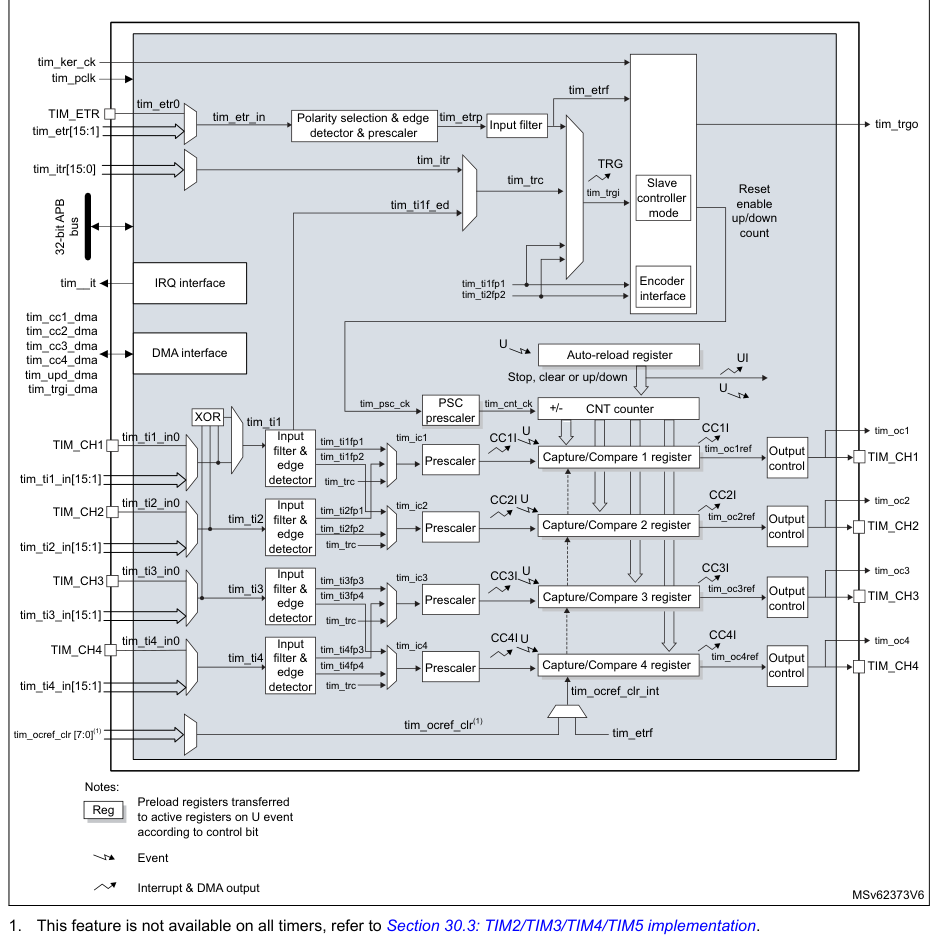

1. This feature is not available on all timers, refer to [Section 30.3](#303-tim2tim3tim4tim5-implementation): TIM2/TIM3/TIM4/TIM5
   implementation.

Table 285 and Table 286 in this section summarize the TIM inputs and outputs.

**Table 285. TIM input/output pins**

| Source row | Column 1 | Column 2 | Column 3 |
| ---: | --- | --- | --- |
| 1 | `Pin name` | `Signal type` | `Description` |

Timer multi-purpose channels.

Each channel be used for capture, compare, or PWM.

TIM_CH1

TIM_CH1 and TIM_CH2 can also be used

| Source row | Column 1 | Column 2 |
| ---: | --- | --- |
| 1 | `TIM_CH2` | `as external clock (below 1/4 of the` |
| 2 | `Input/Output` |  |
| 3 | `TIM_CH3` | `tim_ker_ck clock), external trigger and` |
| 4 | `TIM_CH4` | `quadrature encoder inputs.` |

TIM_CH1, TIM_CH2 and TIM_CH3 can be used to interface with digital hall effect sensors.

External trigger input. This input can be used as external trigger or as external clock

| Source row | Column 1 | Column 2 | Column 3 |
| ---: | --- | --- | --- |
| 1 | `TIM_ETR` | `Input` | `source. This input can receive a clock with a` |

frequency higher than the tim_ker_ck if the tim_etr_in prescaler is used.

**Table 286. TIM internal input/output signals**

| Source row | Column 1 | Column 2 | Column 3 |
| ---: | --- | --- | --- |
| 1 | `Internal signal name` | `Signal type` | `Description` |
| 2 | `Internal timer inputs bus. The` |  |  |
| 3 | `tim_ti1_in[15:0]` |  |  |
| 4 | `tim_ti1_in[15:0] and tim_ti2_in[15:0] inputs` |  |  |
| 5 | `tim_ti2_in[15:0]` |  |  |
| 6 | `Input` | `can be used for capture or as external clock` |  |
| 7 | `tim_ti3_in[15:0]` |  |  |
| 8 | `(below 1/4 of the tim_ker_ck clock) and for` |  |  |
| 9 | `tim_ti4_in[15:0]` |  |  |

quadrature encoder signals.

External trigger internal input bus. These inputs can be used as trigger, external clock or for
hardware cycle-by-cycle pulse width

| Source row | Column 1 | Column 2 |
| ---: | --- | --- |
| 1 | `tim_etr[15:0]` | `Input` |

control. These inputs can receive clock with a frequency higher than the tim_ker_ck if the
tim_etr_in prescaler is used.

Internal trigger input bus. These inputs can be used for the slave mode controller or as a

| Source row | Column 1 | Column 2 |
| ---: | --- | --- |
| 1 | `tim_itr[15:0]` | `Input` |

input clock (below 1/4 of the tim_ker_ck clock).

Internal trigger output. This trigger can

| Source row | Column 1 | Column 2 |
| ---: | --- | --- |
| 1 | `tim_trgo` | `Output` |

trigger other on-chip peripherals.

Timer tim_ocref_clr input bus. These inputs can be used to clear the tim_ocxref signals,

| Source row | Column 1 | Column 2 | Column 3 |
| ---: | --- | --- | --- |
| 1 | `tim_ocref_clr[7:0]` | `Input` |  |
| 2 | `typically for hardware cycle-by-cycle pulse width control.` |  |  |
| 3 | `tim_pclk` | `Input` | `Timer APB clock.` |
| 4 | `tim_ker_ck` | `Input` | `Timer kernel clock` |

**Table 286. TIM internal input/output signals (continued)**

| Source row | Column 1 | Column 2 | Column 3 |
| ---: | --- | --- | --- |
| 1 | `Internal signal name` | `Signal type` | `Description` |
| 2 | `Global Timer interrupt, gathering` |  |  |
| 3 | `tim_it` | `Output` | `capture/compare, update and break trigger` |

requests.

tim_cc1_dma
tim_cc2_dma

| Source row | Column 1 | Column 2 | Column 3 |
| ---: | --- | --- | --- |
| 1 | `Output` | `Timer capture/compare [4:1] dma requests.` |  |
| 2 | `tim_cc3_dma` |  |  |
| 3 | `tim_cc4_dma` |  |  |
| 4 | `tim_upd_dma` | `Output` | `Timer update dma request.` |
| 5 | `tim_trgi_dma` | `Output` | `Timer trigger dma request.` |

Table 287, Table 288, Table 289 and Table 290 are listing the sources connected to the tim_ti[4:1]
input multiplexers.

**Table 287. Interconnect to the tim_ti1 input multiplexer**

| Source row | Column 1 | Column 2 | Column 3 | Column 4 | Column 5 |
| ---: | --- | --- | --- | --- | --- |
| 1 | `Sources` |  |  |  |  |
| 2 | `tim_ti1 inputs` |  |  |  |  |
| 3 | `TIM2` | `TIM3` | `TIM4` | `TIM5` |  |
| 4 | `tim_ti1_in0` | `TIM2_CH1` | `TIM3_CH1` | `TIM4_CH1` | `TIM5_CH1` |
| 5 | `tim_ti1_in1` | `comp1_out` | `comp1_out` | `comp1_out` | `LSI` |
| 6 | `tim_ti1_in2` | `comp2_out` | `comp2_out` | `comp2_out` | `LSE` |
| 7 | `tim_ti1_in3` | `comp3_out` | `comp3_out` | `comp3_out` | `RTC wake-up` |
| 8 | `tim_ti1_in4` | `comp4_out` | `comp4_out` | `comp4_out` | `comp1_out` |
| 9 | `tim_ti1_in5` | `comp5_out` | `comp5_out` | `comp5_out` | `comp2_out` |
| 10 | `tim_ti1_in6` | `comp6_out` | `comp6_out` | `comp3_out` |  |
| 11 | `tim_ti1_in7` | `comp7_out` | `comp7_out` | `comp4_out` |  |
| 12 | `tim_ti1_in8` | `Reserved` | `comp5_out` |  |  |
| 13 | `tim_ti1_in9` | `Reserved` | `Reserved` | `comp6_out` |  |
| 14 | `tim_ti1_in10` | `comp7_out` |  |  |  |
| 15 | `tim_ti1_in[15:11]` | `Reserved` |  |  |  |

**Table 288. Interconnect to the tim_ti2 input multiplexer**

| Source row | Column 1 | Column 2 | Column 3 | Column 4 | Column 5 |
| ---: | --- | --- | --- | --- | --- |
| 1 | `Sources` |  |  |  |  |
| 2 | `tim_ti2 inputs` |  |  |  |  |
| 3 | `TIM2` | `TIM3` | `TIM4` | `TIM5` |  |
| 4 | `tim_ti2_in0` | `TIM2_CH2` | `TIM3_CH2` | `TIM4_CH2` | `TIM5_CH2` |
| 5 | `tim_ti2_in1` | `comp1_out` | `comp1_out` | `comp1_out` | `comp1_out` |
| 6 | `tim_ti2_in2` | `comp2_out` | `comp2_out` | `comp2_out` | `comp2_out` |
| 7 | `tim_ti2_in3` | `comp3_out` | `comp3_out` | `comp3_out` | `comp3_out` |

**Table 288. Interconnect to the tim_ti2 input multiplexer (continued)**

| Source row | Column 1 | Column 2 | Column 3 | Column 4 | Column 5 |
| ---: | --- | --- | --- | --- | --- |
| 1 | `Sources` |  |  |  |  |
| 2 | `tim_ti2 inputs` |  |  |  |  |
| 3 | `TIM2` | `TIM3` | `TIM4` | `TIM5` |  |
| 4 | `tim_ti2_in4` | `comp4_out` | `comp4_out` | `comp4_out` | `comp4_out` |
| 5 | `tim_ti2_in5` | `comp6_out` | `comp5_out` | `comp5_out` | `comp5_out` |
| 6 | `tim_ti2_in6` | `comp6_out` | `comp6_out` | `comp6_out` |  |
| 7 | `Reserved` |  |  |  |  |
| 8 | `tim_ti2_in7` | `comp7_out` | `comp7_out` | `comp7_out` |  |
| 9 | `tim_ti2_in[15:8]` | `Reserved` |  |  |  |

**Table 289. Interconnect to the tim_ti3 input multiplexer**

| Source row | Column 1 | Column 2 | Column 3 | Column 4 | Column 5 |
| ---: | --- | --- | --- | --- | --- |
| 1 | `Sources` |  |  |  |  |
| 2 | `tim_ti3 inputs` |  |  |  |  |
| 3 | `TIM2` | `TIM3` | `TIM4` | `TIM5` |  |
| 4 | `tim_ti3_in0` | `TIM2_CH3` | `TIM3_CH3` | `TIM4_CH3` | `TIM5_CH3` |
| 5 | `tim_ti3_in1` | `comp4_out` | `comp3_out` | `comp5_out` | `Reserved` |
| 6 | `tim_ti3_in[15:2]` | `Reserved` |  |  |  |

**Table 290. Interconnect to the tim_ti4 input multiplexer**

| Source row | Column 1 | Column 2 | Column 3 | Column 4 | Column 5 |
| ---: | --- | --- | --- | --- | --- |
| 1 | `Sources` |  |  |  |  |
| 2 | `tim_ti4 inputs` |  |  |  |  |
| 3 | `TIM2` | `TIM3` | `TIM4` | `TIM5` |  |
| 4 | `tim_ti4_in0` | `TIM2_CH4` | `TIM3_CH4` | `TIM4_CH4` | `TIM5_CH4` |
| 5 | `tim_ti4_in1` | `comp1_out` | `comp6_out` |  |  |
| 6 | `Reserved` | `Reserved` |  |  |  |
| 7 | `tim_ti4_in2` | `comp2_out` | `Reserved` |  |  |
| 8 | `tim_ti4_in[15:3]` | `Reserved` |  |  |  |

Table 291 lists the internal sources connected to the tim_itr input multiplexer.

**Table 291. TIMx internal trigger connection**

| TIMx | TIM2 | TIM3 | TIM4 | TIM5 |
| --- | --- | --- | --- | --- |
| tim_itr0 | tim1_trgo | tim1_trgo | tim1_trgo | tim1_trgo |
| tim_itr1 | Reserved | tim2_trgo | tim2_trgo | tim2_trgo |
| tim_itr2 | tim3_trgo | Reserved | tim3_trgo | tim3_trgo |
| tim_itr3 | tim4_trgo | tim4_trgo | Reserved | tim4_trgo |
| tim_itr4 | tim5_trgo | tim5_trgo | tim5_trgo | Reserved |
| tim_itr5 | tim8_trgo | tim8_trgo | tim8_trgo | tim8_trgo |
| tim_itr6 | tim15_trgo | tim15_trgo | tim15_trgo | tim15_trgo |
| tim_itr7 | tim16_oc1 | tim16_oc1 | tim16_oc1 | tim16_oc1 |

**Table 291. TIMx internal trigger connection (continued)**

| Source row | Column 1 | Column 2 | Column 3 | Column 4 | Column 5 |
| ---: | --- | --- | --- | --- | --- |
| 1 | `TIMx` | `TIM2` | `TIM3` | `TIM4` | `TIM5` |
| 2 | `tim_itr8` | `tim17_oc1` | `tim17_oc1` | `tim17_oc1` | `tim17_oc1` |
| 3 | `tim_itr9` | `tim20_trgo` | `tim20_trgo` | `tim20_trgo` | `tim20_trgo` |
| 4 | `tim_itr10` | `hrtim_out_sync2` | `hrtim_out_sync2` | `hrtim_out_sync2` | `hrtim_out_sync2` |
| 5 | `tim_itr11` | `USB SOF SYNC` | `Reserved` | `Reserved` | `Reserved` |
| 6 | `tim_itr[15:12]` | `Reserved` |  |  |  |

Table 292 lists the internal sources connected to the tim_etr input multiplexer.

**Table 292. Interconnect to the tim_etr input multiplexer**

| Source row | Column 1 | Column 2 | Column 3 | Column 4 | Column 5 |
| ---: | --- | --- | --- | --- | --- |
| 1 | `Timer external` | `Timer external trigger signals assignment` |  |  |  |
| 2 | `trigger input` |  |  |  |  |
| 3 | `signal` | `TIM2` | `TIM3` | `TIM4` | `TIM5` |
| 4 | `tim_etr0` | `TIM2_ETR` | `TIM3_ETR` | `TIM4_ETR` | `TIM5_ETR` |
| 5 | `tim_etr1` | `comp1_out` | `comp1_out` | `comp1_out` | `comp1_out` |
| 6 | `tim_etr2` | `comp2_out` | `comp2_out` | `comp2_out` | `comp2_out` |
| 7 | `tim_etr3` | `comp3_out` | `comp3_out` | `comp3_out` | `comp3_out` |
| 8 | `tim_etr4` | `comp4_out` | `comp4_out` | `comp4_out` | `comp4_out` |
| 9 | `tim_etr5` | `comp5_out` | `comp5_out` | `comp5_out` | `comp5_out` |
| 10 | `tim_etr6` | `comp6_out` | `comp6_out` | `comp6_out` | `comp6_out` |
| 11 | `tim_etr7` | `comp7_out` | `comp7_out` | `comp7_out` | `comp7_out` |
| 12 | `tim_etr8` | `TIM3_ETR` | `TIM2_ETR` | `TIM3_ETR` | `TIM2_ETR` |
| 13 | `tim_etr9` | `TIM4_ETR` | `TIM4_ETR` | `TIM5_ETR` | `TIM3_ETR` |
| 14 | `tim_etr10` | `TIM5_ETR` | `Reserved` |  |  |
| 15 | `tim_etr11` | `LSE` | `adc2_awd1` |  |  |
| 16 | `Reserved` | `Reserved` |  |  |  |
| 17 | `tim_etr12` | `adc2_awd2` |  |  |  |
| 18 | `Reserved` |  |  |  |  |
| 19 | `tim_etr13` | `adc2_awd3` |  |  |  |
| 20 | `tim_etr[15:14]` | `Reserved` |  |  |  |

Table 293 lists the internal sources connected to the tim_ocref_clr input multiplexer.

**Table 293. Interconnect to the tim_ocref_clr input multiplexer**

| Source row | Column 1 | Column 2 | Column 3 | Column 4 | Column 5 |
| ---: | --- | --- | --- | --- | --- |
| 1 | `Timer` | `Timer tim_ocref_clr signals assignment` |  |  |  |
| 2 | `tim_ocref_clr` |  |  |  |  |
| 3 | `signal` | `TIM2` | `TIM3` | `TIM4` | `TIM5` |
| 4 | `tim_ocref_clr0` | `comp1_out` | `comp1_out` |  |  |
| 5 | `tim_ocref_clr1` | `comp2_out` | `comp2_out` |  |  |
| 6 | `tim_ocref_clr2` | `comp3_out` | `comp3_out` |  |  |
| 7 | `tim_ocref_clr3` | `comp4_out` | `comp4_out` | `Reserved` | `Reserved` |
| 8 | `tim_ocref_clr4` | `comp5_out` | `comp5_out` |  |  |
| 9 | `tim_ocref_clr5` | `comp6_out` | `comp6_out` |  |  |
| 10 | `tim_ocref_clr6` | `comp7_out` | `comp7_out` |  |  |
| 11 | `tim_ocref_clr7` | `Reserved` |  |  |  |

### 30.4.3 Time-base unit

The main block of the programmable timer is a 16-bit/32-bit counter with its related autoreload
register. The counter can count up, down or both up and down. The counter clock can be divided by a
prescaler.

The counter, the autoreload register and the prescaler register can be written or read by software.
This is true even when the counter is running.

The time-base unit includes:

- Counter register (TIMx_CNT)
- Prescaler register (TIMx_PSC)
- Autoreload register (TIMx_ARR).

The autoreload register is preloaded. Writing to or reading from the autoreload register accesses
the preload register. The content of the preload register is transferred into the shadow register
permanently or at each update event (UEV), depending on the autoreload preload enable bit (ARPE) in
TIMx_CR1 register. The update event is sent when the counter reaches the overflow (or underflow when
down-counting) and if the UDIS bit equals 0 in the TIMx_CR1 register. It can also be generated by
software. The generation of the update event is described in detail for each configuration.

The counter is clocked by the prescaler output tim_cnt_ck, which is enabled only when the counter
enable bit (CEN) in TIMx_CR1 register is set (refer also to the slave mode controller description to
get more details on counter enabling).

Note that the actual counter enable signal CNT_EN is set one clock cycle after CEN.

#### Prescaler description

The prescaler can divide the counter clock frequency by any factor between 1 and 65536. It is based
on a 16-bit counter controlled through a 16-bit/32-bit register (in the TIMx_PSC register). It can
be changed on the fly as this control register is buffered. The new prescaler ratio is taken into
account at the next update event.

Figure 386 and Figure 387 give some examples of the counter behavior when the prescaler ratio is
changed on the fly:

**Figure 386. Counter timing diagram with prescaler division change from 1 to 2**

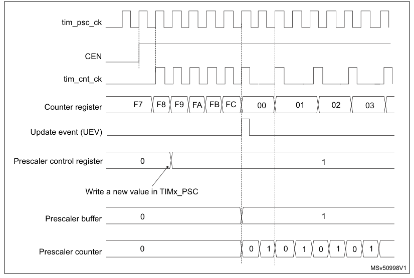

**Figure 387. Counter timing diagram with prescaler division change from 1 to 4**

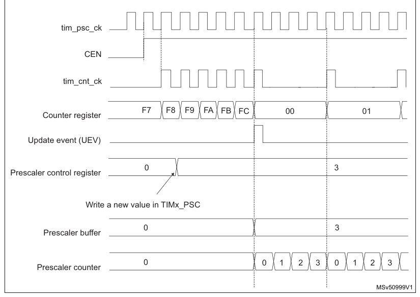

### 30.4.4 Counter modes

#### Up-counting mode

In up-counting mode, the counter counts from 0 to the autoreload value (content of the TIMx_ARR
register), then restarts from 0 and generates a counter overflow event.

An update event can be generated at each counter overflow or by setting the UG bit in the TIMx_EGR
register (by software or by using the slave mode controller).

The UEV event can be disabled by software by setting the UDIS bit in TIMx_CR1 register. This is to
avoid updating the shadow registers while writing new values in the preload registers. Then no
update event occurs until the UDIS bit has been written to 0. However, the counter restarts from 0,
as well as the counter of the prescaler (but the prescale rate does not change). In addition, if the
URS bit (update request selection) in TIMx_CR1 register is set, setting the UG bit generates an
update event UEV but without setting the UIF flag (thus no interrupt or DMA request is sent). This
is to avoid generating both update and capture interrupts when clearing the counter on the capture
event.

When an update event occurs, all the registers are updated and the update flag (UIF bit in TIMx_SR
register) is set (depending on the URS bit):

- The buffer of the prescaler is reloaded with the preload value (content of the TIMx_PSC register).
- The autoreload shadow register is updated with the preload value (TIMx_ARR).

The following figures show some examples of the counter behavior for different clock frequencies
when TIMx_ARR = 0x36.

**Figure 388. Counter timing diagram, internal clock divided by 1**

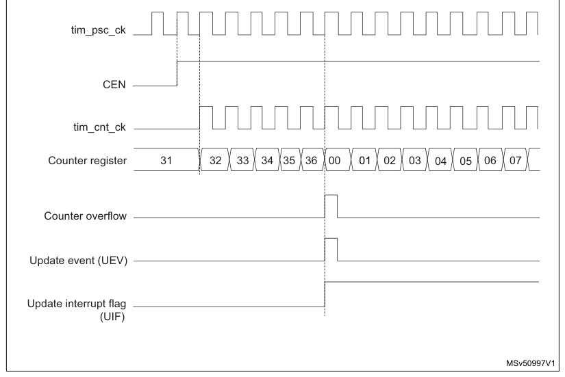

**Figure 389. Counter timing diagram, internal clock divided by 2**

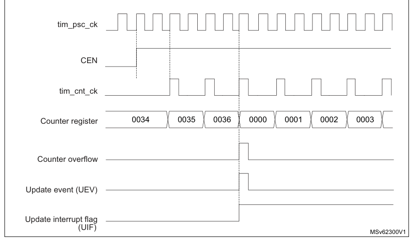

**Figure 390. Counter timing diagram, internal clock divided by 4**

**Figure 391. Counter timing diagram, internal clock divided by N**

**Figure 392. Counter timing diagram, Update event when ARPE = 0 (TIMx_ARR not**

**Figure 393. Counter timing diagram, Update event when ARPE = 1 (TIMx_ARR**

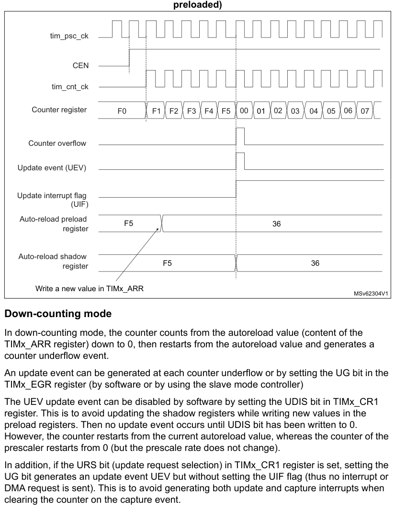

#### Down-counting mode

In down-counting mode, the counter counts from the autoreload value (content of the TIMx_ARR
register) down to 0, then restarts from the autoreload value and generates a counter underflow
event.

An update event can be generated at each counter underflow or by setting the UG bit in the TIMx_EGR
register (by software or by using the slave mode controller)

The UEV update event can be disabled by software by setting the UDIS bit in TIMx_CR1 register. This
is to avoid updating the shadow registers while writing new values in the preload registers. Then no
update event occurs until UDIS bit has been written to 0. However, the counter restarts from the
current autoreload value, whereas the counter of the prescaler restarts from 0 (but the prescale
rate does not change).

In addition, if the URS bit (update request selection) in TIMx_CR1 register is set, setting the UG
bit generates an update event UEV but without setting the UIF flag (thus no interrupt or DMA request
is sent). This is to avoid generating both update and capture interrupts when clearing the counter
on the capture event.

When an update event occurs, all the registers are updated and the update flag (UIF bit in TIMx_SR
register) is set (depending on the URS bit):

- The buffer of the prescaler is reloaded with the preload value (content of the TIMx_PSC register).
- The autoreload active register is updated with the preload value (content of the TIMx_ARR
  register). Note that the autoreload is updated before the counter is reloaded, so that the next
  period is the expected one.

The following figures show some examples of the counter behavior for different clock frequencies
when TIMx_ARR = 0x36.

**Figure 394. Counter timing diagram, internal clock divided by 1**

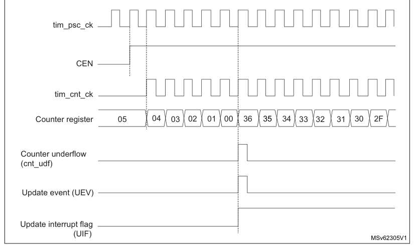

**Figure 395. Counter timing diagram, internal clock divided by 2**

**Figure 396. Counter timing diagram, internal clock divided by 4**

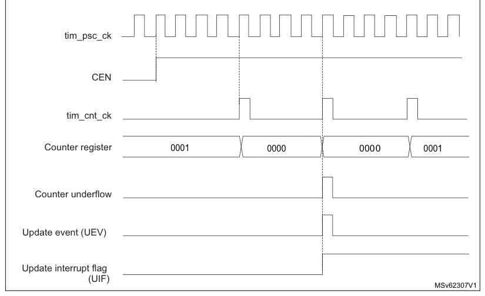

**Figure 397. Counter timing diagram, internal clock divided by N**

**Figure 398. Counter timing diagram, Update event**

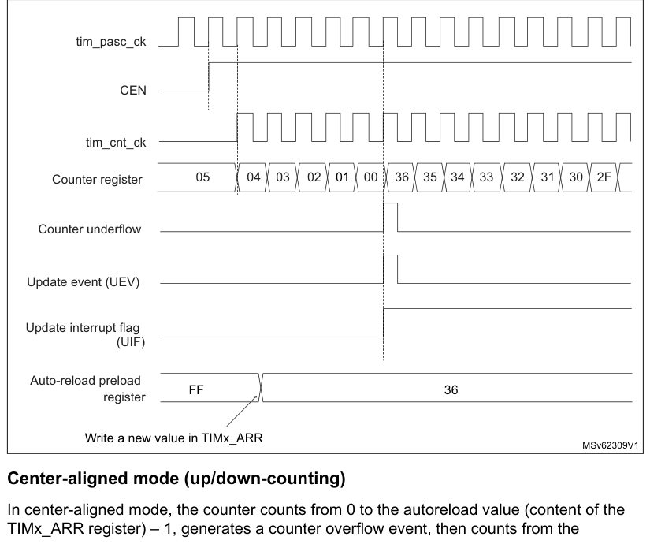

#### Center-aligned mode (up/down-counting)

In center-aligned mode, the counter counts from 0 to the autoreload value (content of the TIMx_ARR
register) – 1, generates a counter overflow event, then counts from the
autoreload value down to 1 and generates a counter underflow event. Then it restarts counting from
0.

Center-aligned mode is active when the CMS bits in TIMx_CR1 register are not equal to 00. The output
compare interrupt flag of channels configured in output is set when: the counter counts down (Center
aligned mode 1, CMS = 01), the counter counts up (Center aligned mode 2, CMS = 10) the counter
counts up and down (Center aligned mode 3, CMS = 11).

In this mode, the direction bit (DIR from TIMx_CR1 register) cannot be written. It is updated by
hardware and gives the current direction of the counter.

The update event can be generated at each counter overflow and at each counter underflow or by
setting the UG bit in the TIMx_EGR register (by software or by using the slave mode controller) also
generates an update event. In this case, the counter restarts counting from 0, as well as the
counter of the prescaler.

The UEV update event can be disabled by software by setting the UDIS bit in TIMx_CR1 register. This
is to avoid updating the shadow registers while writing new values in the preload registers. Then no
update event occurs until the UDIS bit has been written to 0. However, the counter continues
counting up and down, based on the current autoreload value.

In addition, if the URS bit (update request selection) in TIMx_CR1 register is set, setting the UG
bit generates an update event UEV but without setting the UIF flag (thus no interrupt or DMA request
is sent). This is to avoid generating both update and capture interrupts when clearing the counter
on the capture event.

When an update event occurs, all the registers are updated and the update flag (UIF bit in TIMx_SR
register) is set (depending on the URS bit):

- The buffer of the prescaler is reloaded with the preload value (content of the TIMx_PSC register).
- The autoreload active register is updated with the preload value (content of the TIMx_ARR
  register). Note that if the update source is a counter overflow, the autoreload is updated before
  the counter is reloaded, so that the next period is the expected one (the counter is loaded with
  the new value).

The following figures show some examples of the counter behavior for different clock frequencies.

**Figure 399. Counter timing diagram, internal clock divided by 1, TIMx_ARR = 0x6**

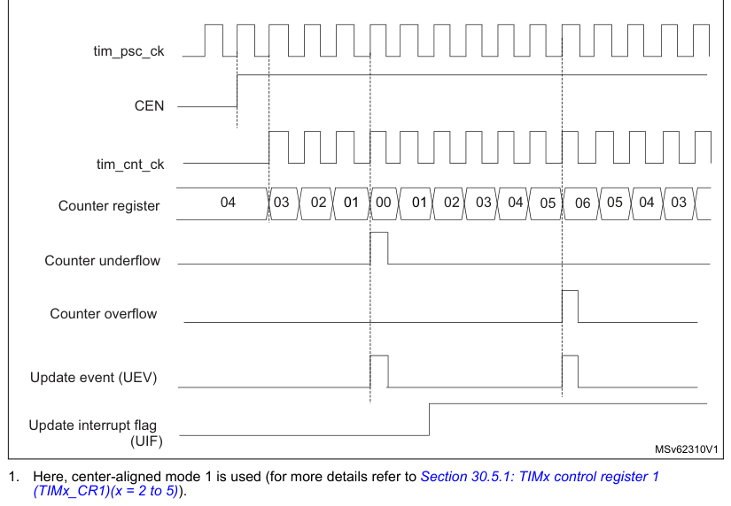

1. Here, center-aligned mode 1 is used (for more details refer to [Section 30.5.1](#3051-timx-control-register-1-timx_cr1x--2-to-5): TIMx control
   register 1

(TIMx_CR1)(x = 2 to 5)).

**Figure 400. Counter timing diagram, internal clock divided by 2**

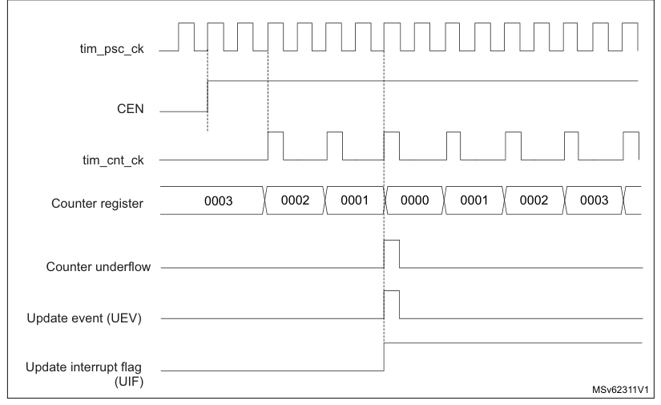

**Figure 401. Counter timing diagram, internal clock divided by 4, TIMx_ARR = 0x36**

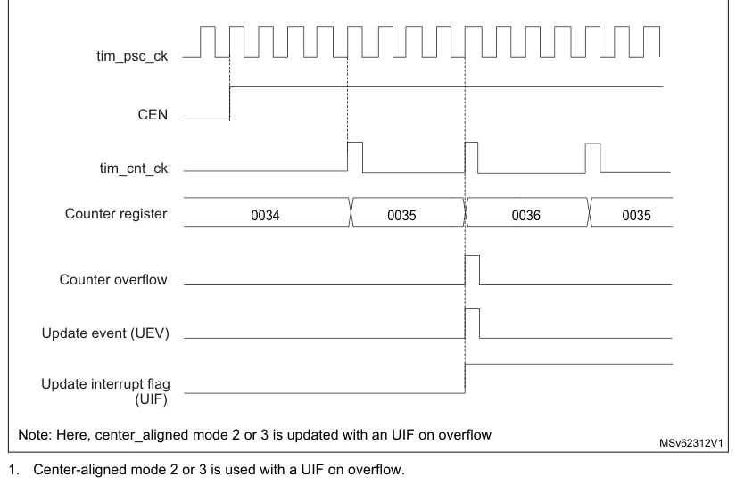

> **Note:** Here, center_aligned mode 2 or 3 is updated with an UIF on overflow

MSv62312V1

1. Center-aligned mode 2 or 3 is used with a UIF on overflow.

**Figure 402. Counter timing diagram, internal clock divided by N**

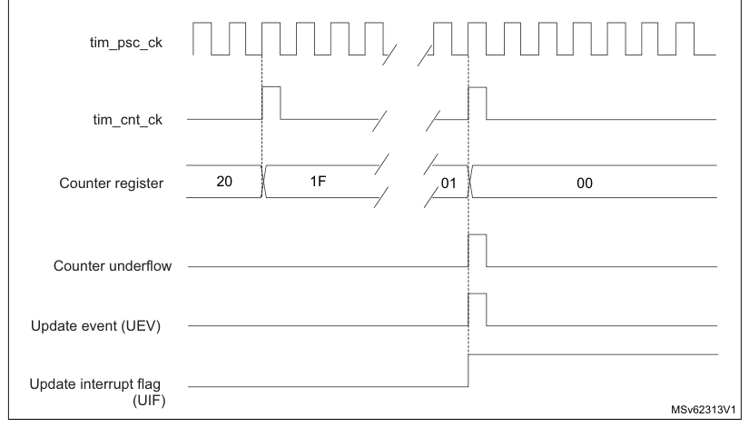

**Figure 403. Counter timing diagram, Update event with ARPE = 1 (counter underflow)**

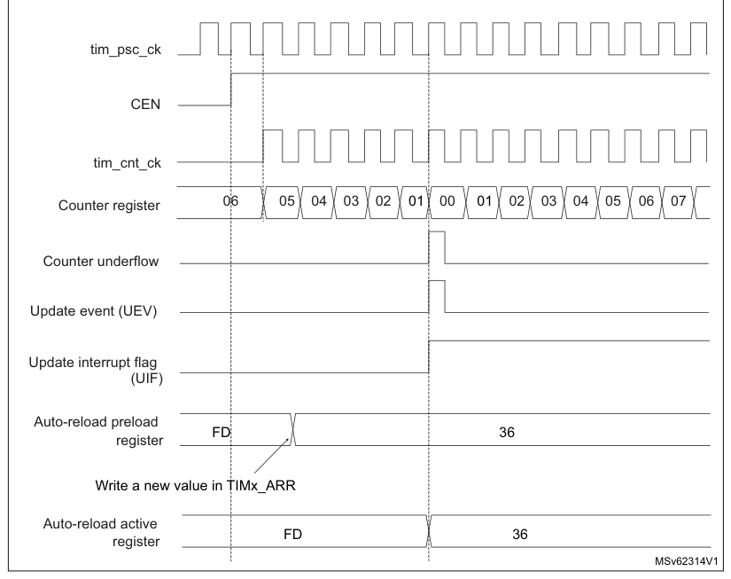

**Figure 404. Counter timing diagram, Update event with ARPE = 1 (counter overflow)**

### 30.4.5 Clock selection

The counter clock can be provided by the following clock sources:

- Internal clock (tim_ker_ck).
- External clock mode1: external input pin (tim_ti1 or tim_ti2).
- External clock mode2: external trigger input (tim_etr_in).
- Internal trigger inputs (tim_itr): using one timer as prescaler for another timer, for example,
  timer 1 can be configured to act as a prescaler for timer 2. Refer to Using one timer as prescaler
  for another timer for more details.

#### Internal clock source (tim_ker_ck)

If the slave mode controller is disabled (SMS = 000 in the TIMx_SMCR register), then the CEN, DIR
(in the TIMx_CR1 register), and UG bits (in the TIMx_EGR register) are actual control bits and can
be changed only by software (except UG which remains cleared automatically). As soon as the CEN bit
is written to 1, the prescaler is clocked by the internal clock tim_ker_ck.

Figure 405 shows the behavior of the control circuit and the upcounter in normal mode, without
prescaler.

**Figure 405. Control circuit in normal mode, internal clock divided by 1**

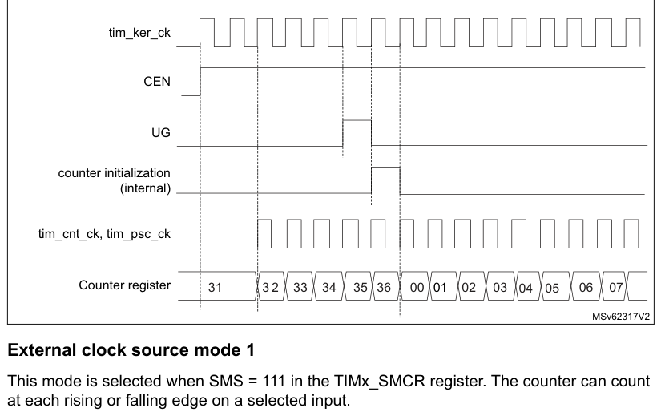

tim_ker_ck

CEN

UG
counter initialization

(internal)
tim_cnt_ck, tim_psc_ck

This mode is selected when SMS = 111 in the TIMx_SMCR register. The counter can count at each rising
or falling edge on a selected input.

**Figure 406. tim_ti2 external clock connection example**

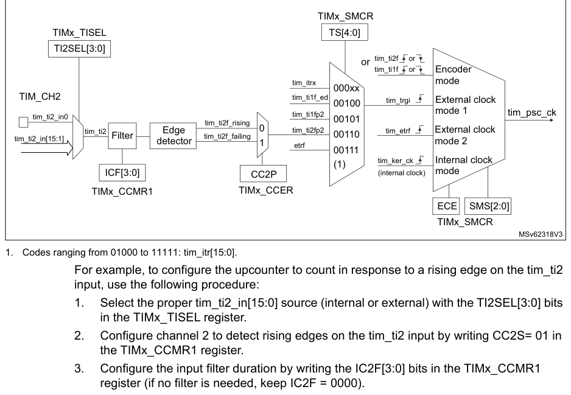

1. Codes ranging from 01000 to 11111: tim_itr[15:0].

For example, to configure the upcounter to count in response to a rising edge on the tim_ti2 input,
use the following procedure:

1. Select the proper tim_ti2_in[15:0] source (internal or external) with the TI2SEL[3:0] bits
   in the TIMx_TISEL register.
2. Configure channel 2 to detect rising edges on the tim_ti2 input by writing CC2S= 01 in
   the TIMx_CCMR1 register.
3. Configure the input filter duration by writing the IC2F[3:0] bits in the TIMx_CCMR1
   register (if no filter is needed, keep IC2F = 0000).

> **Note:** The capture prescaler is not used for triggering, so it does not need to be configured.

4. Select rising edge polarity by writing CC2P = 0 and CC2NP = 0 in the TIMx_CCER
   register.
5. Configure the timer in external clock mode 1 by writing SMS = 111 in the TIMx_SMCR
   register.
6. Select tim_ti2 as the input source by writing TS = 00110 in the TIMx_SMCR register.
7. Enable the counter by writing CEN = 1 in the TIMx_CR1 register.

When a rising edge occurs on tim_ti2, the counter counts once and the TIF flag is set.

The delay between the rising edge on tim_ti2 and the actual clock of the counter is due to the
resynchronization circuit on tim_ti2 input.

**Figure 407. Control circuit in external clock mode 1**

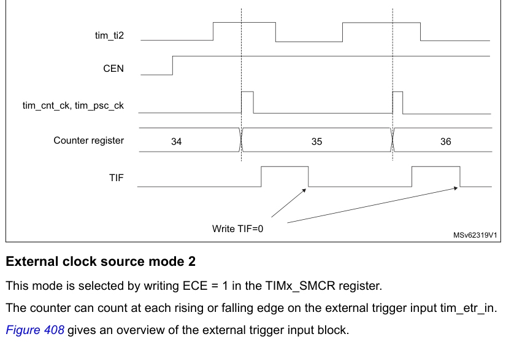

This mode is selected by writing ECE = 1 in the TIMx_SMCR register.

The counter can count at each rising or falling edge on the external trigger input tim_etr_in.

Figure 408 gives an overview of the external trigger input block.

**Figure 408. External trigger input block**

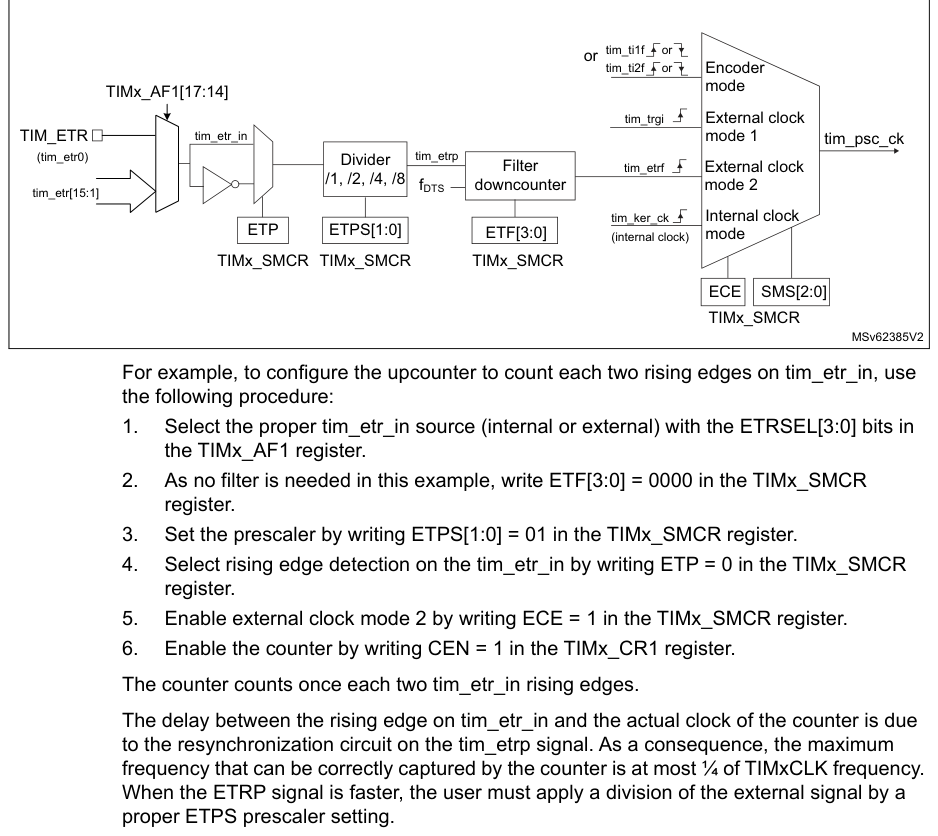

1. Select the proper tim_etr_in source (internal or external) with the ETRSEL[3:0] bits in
   the TIMx_AF1 register.
2. As no filter is needed in this example, write ETF[3:0] = 0000 in the TIMx_SMCR
   register.
3. Set the prescaler by writing ETPS[1:0] = 01 in the TIMx_SMCR register.
4. Select rising edge detection on the tim_etr_in by writing ETP = 0 in the TIMx_SMCR
   register.
5. Enable external clock mode 2 by writing ECE = 1 in the TIMx_SMCR register.
6. Enable the counter by writing CEN = 1 in the TIMx_CR1 register.

The counter counts once each two tim_etr_in rising edges.

The delay between the rising edge on tim_etr_in and the actual clock of the counter is due to the
resynchronization circuit on the tim_etrp signal. As a consequence, the maximum frequency that can
be correctly captured by the counter is at most ¼ of TIMxCLK frequency. When the ETRP signal is
faster, the user must apply a division of the external signal by a proper ETPS prescaler setting.

**Figure 409. Control circuit in external clock mode 2**

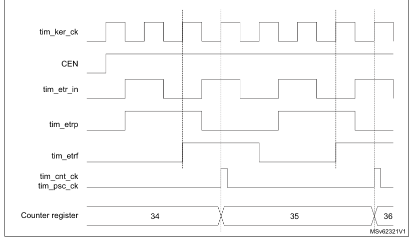

tim_ker_ck

CEN
tim_etr_in
tim_etrp
tim_etrf
tim_cnt_ck
tim_psc_ck

### 30.4.6 Capture/compare channels

Each Capture/Compare channel is built around a capture/compare register (including a shadow
register), an input stage for capture (with digital filter, multiplexing and prescaler) and an
output stage (with comparator and output control).

The following figure gives an overview of one Capture/Compare channel.

The input stage samples the corresponding tim_tix input to generate a filtered signal tim_tixf.
Then, an edge detector with polarity selection generates a signal (tim_tixfpy) which can be used as
trigger input by the slave mode controller or as the capture command. It is prescaled before the
capture register (ICxPS).

**Figure 410. Capture/compare channel (example: channel 1 input stage)**

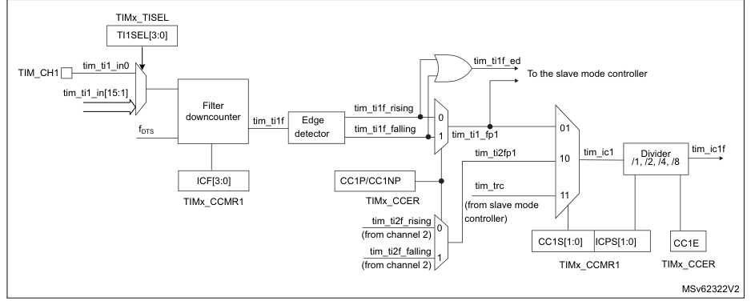

The output stage generates an intermediate waveform which is then used for reference: tim_ocxref
(active high). The polarity acts at the end of the chain.

**Figure 411. Capture/compare channel 1 main circuit**

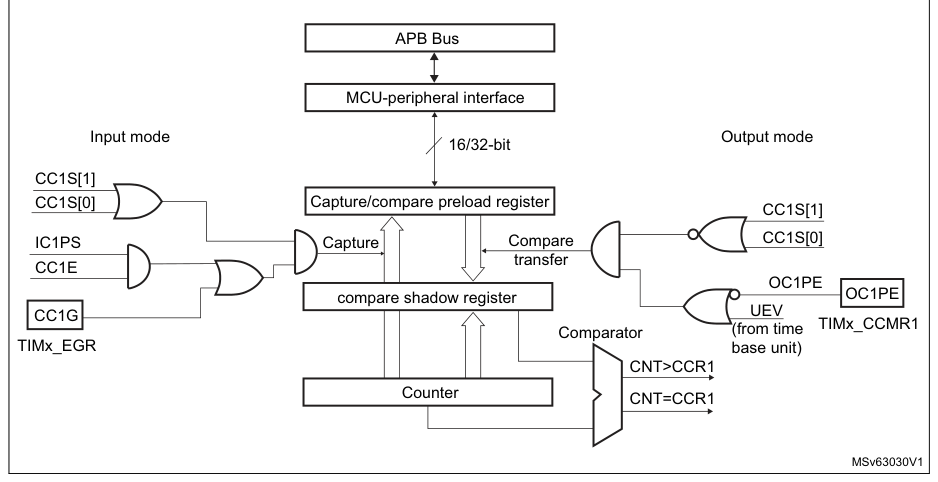

**Figure 412. Output stage of capture/compare channel (channel 1, idem ch.2, 3 and 4)**

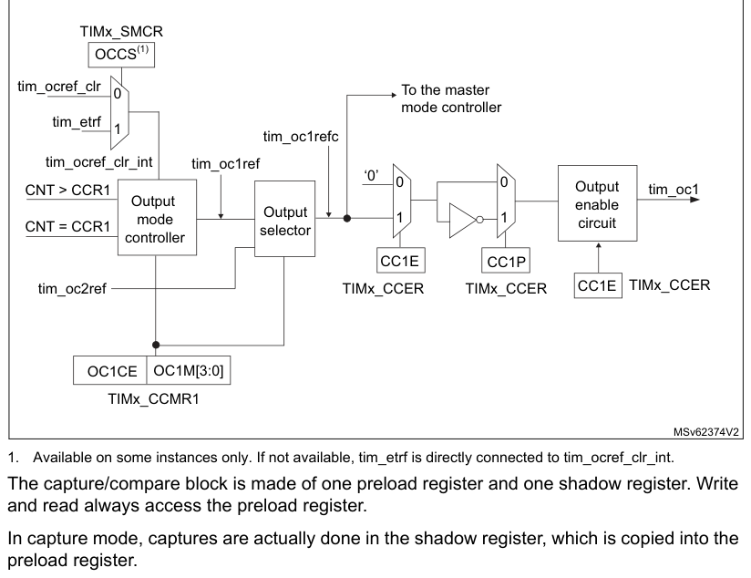

1. Available on some instances only. If not available, tim_etrf is directly connected to
   tim_ocref_clr_int.

The capture/compare block is made of one preload register and one shadow register. Write and read
always access the preload register.

In capture mode, captures are actually done in the shadow register, which is copied into the preload
register.

In compare mode, the content of the preload register is copied into the shadow register which is
compared to the counter.

### 30.4.7 Input capture mode

In input capture mode, the capture/compare registers (TIMx_CCRx) are used to latch the value of the
counter after a transition detected by the corresponding ICx signal. When a capture occurs, the
corresponding CCXIF flag (TIMx_SR register) is set and an interrupt or a DMA request can be sent if
they are enabled. If a capture occurs while the CCxIF flag was already high, then the overcapture
flag CCxOF (TIMx_SR register) is set. CCxIF can be cleared by software by writing it to 0 or by
reading the captured data stored in the TIMx_CCRx register. CCxOF is cleared when it is written with
0.

The following example shows how to capture the counter value in TIMx_CCR1 when tim_ti1 input rises.
To do this, use the following procedure:

1. Select the proper tim_tix_in[15:0] source (internal or external) with the TI1SEL[3:0] bits
   in the TIMx_TISEL register.
2. Select the active input: TIMx_CCR1 must be linked to the tim_ti1 input, so write the

CC1S bits to 01 in the TIMx_CCMR1 register. As soon as CC1S becomes different from 00, the channel
is configured in input and the TIMx_CCR1 register becomes read-only.

3. Program the needed input filter duration in relation with the signal connected to the
   timer (when the input is one of the tim_tix (ICxF bits in the TIMx_CCMRx register). Let’s imagine
   that, when toggling, the input signal is not stable during at most five internal clock cycles. We
   must program a filter duration longer than these five clock cycles. We can validate a transition on
   tim_ti1 when eight consecutive samples with the new level have been detected (sampled at fDTS
   frequency). Then write IC1F bits to 0011 in the TIMx_CCMR1 register.
4. Select the edge of the active transition on the tim_ti1 channel by writing the CC1P and

CC1NP bits to 000 in the TIMx_CCER register (rising edge in this case).

5. Program the input prescaler. In this example, the capture is to be performed at each
   valid transition, so the prescaler is disabled (write IC1PS bits to 00 in the TIMx_CCMR1 register).
6. Enable capture from the counter into the capture register by setting the CC1E bit in the

TIMx_CCER register.

7. If needed, enable the related interrupt request by setting the CC1IE bit in the

TIMx_DIER register, and/or the DMA request by setting the CC1DE bit in the TIMx_DIER register.

When an input capture occurs:

- The TIMx_CCR1 register gets the value of the counter on the active transition.
- CC1IF flag is set (interrupt flag). CC1OF is also set if at least two consecutive captures
  occurred whereas the flag was not cleared.
- An interrupt is generated depending on the CC1IE bit.
- A DMA request is generated depending on the CC1DE bit.

In order to handle the overcapture, it is recommended to read the data before the overcapture flag.
This is to avoid missing an overcapture which may happen after reading the flag and before reading
the data.

> **Note:** IC interrupt and/or DMA requests can be generated by software by setting the
> corresponding CCxG bit in the TIMx_EGR register.

### 30.4.8 PWM input mode

This mode is used to measure both the period and the duty cycle of a PWM signal connected to single
tim_tix input:

- The TIMx_CCR1 register holds the period value (interval between two consecutive rising edges).
- The TIM_CCR2 register holds the pulse width (interval between two consecutive rising and falling
  edges).

This mode is a particular case of input capture mode. The set-up procedure is similar with the
following differences:

- Two ICx signals are mapped on the same tim_tix input.
- These two ICx signals are active on edges with opposite polarity.
- One of the two TIxFP signals is selected as trigger input and the slave mode controller is
  configured in reset mode.

The period and the pulse width of a PWM signal applied on tim_ti1 can be measured using the
following procedure:

1. Select the proper tim_tix_in[15:0] source (internal or external) with the TI1SEL[3:0] bits
   in the TIMx_TISEL register.
2. Select the active input for TIMx_CCR1: write the CC1S bits to 01 in the TIMx_CCMR1
   register (tim_ti1 selected).
3. Select the active polarity for tim_ti1fp1 (used both for capture in TIMx_CCR1 and
   counter clear): write the CC1P to 0 and the CC1NP bit to 0 (active on rising edge).
4. Select the active input for TIMx_CCR2: write the CC2S bits to 10 in the TIMx_CCMR1
   register (tim_ti1 selected).
5. Select the active polarity for tim_ti1fp2 (used for capture in TIMx_CCR2): write the

CC2P bit to 1 and the CC2NP bit to 0 (active on falling edge).

6. Select the valid trigger input: write the TS bits to 00101 in the TIMx_SMCR register

(tim_ti1fp1 selected).

7. Configure the slave mode controller in reset mode: write the SMS bits to 100 in the

TIMx_SMCR register.

8. Enable the captures: write the CC1E and CC2E bits to 1 in the TIMx_CCER register.

**Figure 413. PWM input mode timing**

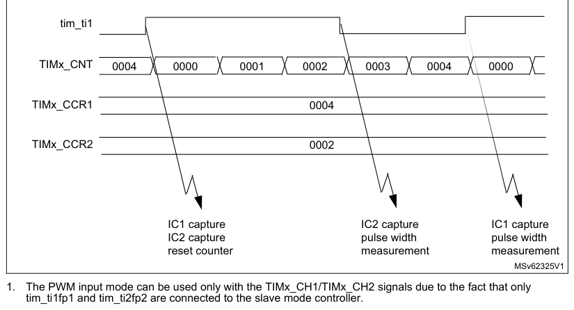

1. The PWM input mode can be used only with the TIMx_CH1/TIMx_CH2 signals due to the fact that only
   tim_ti1fp1 and tim_ti2fp2 are connected to the slave mode controller.

### 30.4.9 Forced output mode

In output mode (CCxS bits = 00 in the TIMx_CCMRx register), each output compare signal (tim_ocxref
and then tim_ocx) can be forced to active or inactive level directly by software, independently of
any comparison between the output compare register and the counter.

To force an output compare signal (tim_ocxref/tim_ocx) to its active level, the user just needs to
write 101 in the OCxM bits in the corresponding TIMx_CCMRx register. Thus tim_ocxref is forced high
(tim_ocxref is always active high) and tim_ocx get opposite value to CCxP polarity bit.

For example: CCxP = 0 (tim_ocx active high) => tim_ocx is forced to high level.

tim_ocxref signal can be forced low by writing the OCxM bits to 100 in the TIMx_CCMRx register.

Anyway, the comparison between the TIMx_CCRx shadow register and the counter is still performed and
allows the flag to be set. Interrupt and DMA requests can be sent accordingly. This is described in
the Output Compare mode section.

### 30.4.10 Output compare mode

This function is used to control an output waveform or indicating when a period of time has elapsed.

When a match is found between the capture/compare register and the counter, the output compare
function:

- Assigns the corresponding output pin to a programmable value defined by the output compare mode
  (OCxM bits in the TIMx_CCMRx register) and the output polarity (CCxP bit in the TIMx_CCER
  register). The output pin can keep its level (OCXM = 000), be set
  active (OCxM = 001), be set inactive (OCxM = 010) or can toggle (OCxM = 011) on match.
- Sets a flag in the interrupt status register (CCxIF bit in the TIMx_SR register).
- Generates an interrupt if the corresponding interrupt mask is set (CCXIE bit in the TIMx_DIER
  register).
- Sends a DMA request if the corresponding enable bit is set (CCxDE bit in the TIMx_DIER register,
  CCDS bit in the TIMx_CR2 register for the DMA request selection).

The TIMx_CCRx registers can be programmed with or without preload registers using the OCxPE bit in
the TIMx_CCMRx register.

In output compare mode, the update event UEV has no effect on tim_ocxref and tim_ocx output. The
timing resolution is one count of the counter. Output compare mode can also be used to output a
single pulse (in One-pulse mode).

#### Procedure

1. Select the counter clock (internal, external, prescaler).
2. Write the desired data in the TIMx_ARR and TIMx_CCRx registers.
3. Set the CCxIE and/or CCxDE bits if an interrupt and/or a DMA request is to be
   generated.
4. Select the output mode. For example:

a) Write OCxM = 0011 to toggle tim_ocx output pin when CNT matches CCRx.

b) Write OCxPE = 0 to disable preload register.

c) Write CCxP = 0 to select active high polarity.

d) Write CCxE = 1 to enable the output.

5. Enable the counter by setting the CEN bit in the TIMx_CR1 register.

The TIMx_CCRx register can be updated at any time by software to control the output waveform,
provided that the preload register is not enabled (OCxPE = 0, else TIMx_CCRx shadow register is
updated only at the next update event UEV). An example is given in

Figure 414.

**Figure 414. Output compare mode, toggle on tim_oc1**

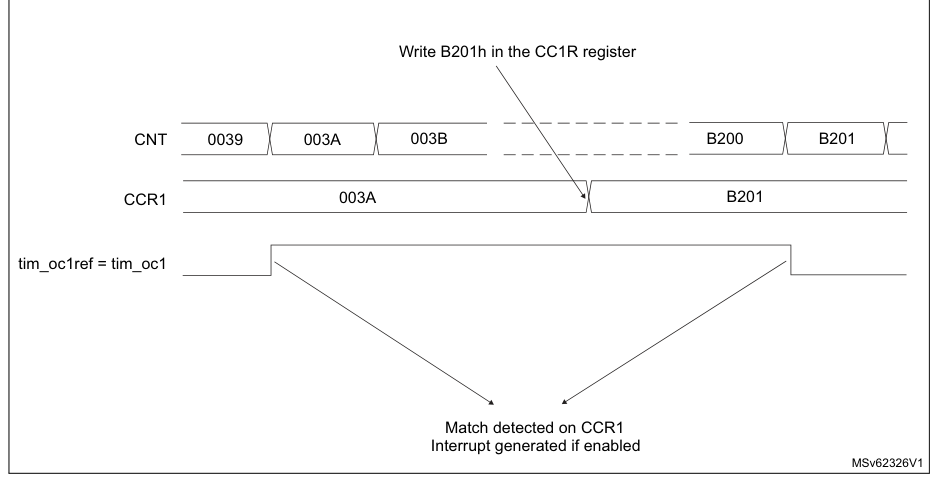

### 30.4.11 PWM mode

Pulse width modulation mode is used to generate a signal with a frequency determined by the value of
the TIMx_ARR register and a duty cycle determined by the value of the TIMx_CCRx register.

The PWM mode can be selected independently on each channel (one PWM per tim_ocx output) by writing
110 (PWM mode 1) or 111 (PWM mode 2) in the OCxM bits in the TIMx_CCMRx register. The corresponding
preload register must be enabled by setting the OCxPE bit in the TIMx_CCMRx register, and eventually
the autoreload preload register (in up-counting or center-aligned modes) by setting the ARPE bit in
the TIMx_CR1 register.

As the preload registers are transferred to the shadow registers only when an update event occurs,
before starting the counter, all registers must be initialized by setting the UG bit in the TIMx_EGR
register.

tim_ocx polarity is software programmable using the CCxP bit in the TIMx_CCER register. It can be
programmed as active high or active low. tim_ocx output is enabled by the CCxE bit in the TIMx_CCER
register. Refer to the TIMx_CCERx register description for more details.

In PWM mode (1 or 2), TIMx_CNT and TIMx_CCRx are always compared to determine whether TIMx_CCRx ≤
TIMx_CNT or TIMx_CNT ≤ TIMx_CCRx (depending on the direction of the counter). The tim_ocref_clr can
be cleared by an external event through the tim_etr_in or the tim_oceref_clr signals. In this case
the tim_ocref_clr signal is asserted only:

- After a compare match event.
- When the output compare mode (OCxM bits in TIMx_CCMRx register) switches from the “frozen”
  configuration (no comparison, OCxM = 000) to one of the PWM modes (OCxM = 110 or 111). This forces
  the PWM by software while the timer is running.

The timer is able to generate PWM in edge-aligned mode or center-aligned mode depending on the CMS
bits in the TIMx_CR1 register.

#### PWM edge-aligned mode

- Up-counting configuration
- Up-counting is active when the DIR bit in the TIMx_CR1 register is low. Refer to Up-counting mode.

In the following example, we consider PWM mode 1. The reference PWM signal tim_ocxref is high as
long as TIMx_CNT \<TIMx_CCRx else it becomes low. If the compare value in TIMx_CCRx is greater than
the autoreload value (in TIMx_ARR) then tim_ocxref is held at 1. If the compare value is 0 then
tim_ocxref is held at 0. Figure 415 shows some edge-aligned PWM waveforms in an example where
TIMx_ARR = 8.

**Figure 415. Edge-aligned PWM waveforms (ARR = 8)**

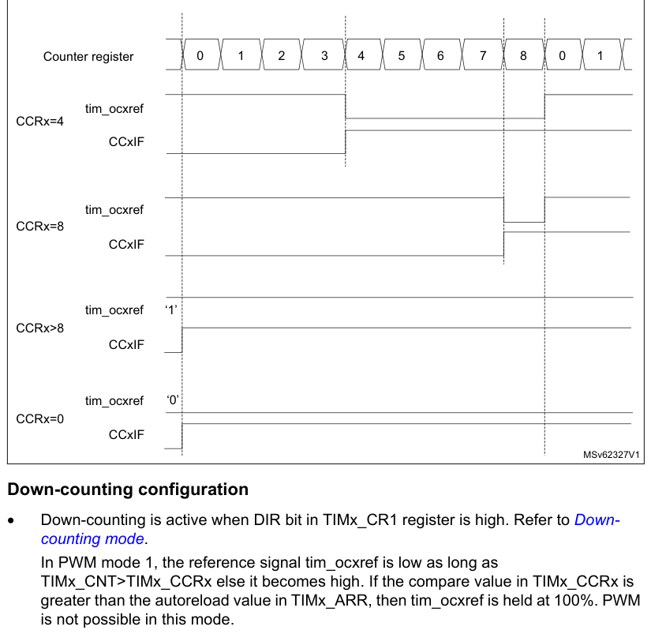

#### Down-counting configuration

- Down-counting is active when DIR bit in TIMx_CR1 register is high. Refer to Down-counting mode.

In PWM mode 1, the reference signal tim_ocxref is low as long as TIMx_CNT>TIMx_CCRx else it becomes
high. If the compare value in TIMx_CCRx is greater than the autoreload value in TIMx_ARR, then
tim_ocxref is held at 100%. PWM is not possible in this mode.

#### PWM center-aligned mode

Center-aligned mode is active when the CMS bits in TIMx_CR1 register are different from 00 (all the
remaining configurations having the same effect on the tim_ocxref/tim_ocx signals). The compare flag
is set when the counter counts up, when it counts down or both when it counts up and down depending
on the CMS bits configuration. The direction bit

(DIR) in the TIMx_CR1 register is updated by hardware and must not be changed by software. Refer to
Center-aligned mode (up/down-counting).

Figure 416 shows some center-aligned PWM waveforms in an example where:

- TIMx_ARR = 8.
- PWM mode is the PWM mode 1.
- The flag is set when the counter counts down corresponding to the center-aligned mode 1 selected
  for CMS = 01 in TIMx_CR1 register.

**Figure 416. Center-aligned PWM waveforms (ARR = 8)**

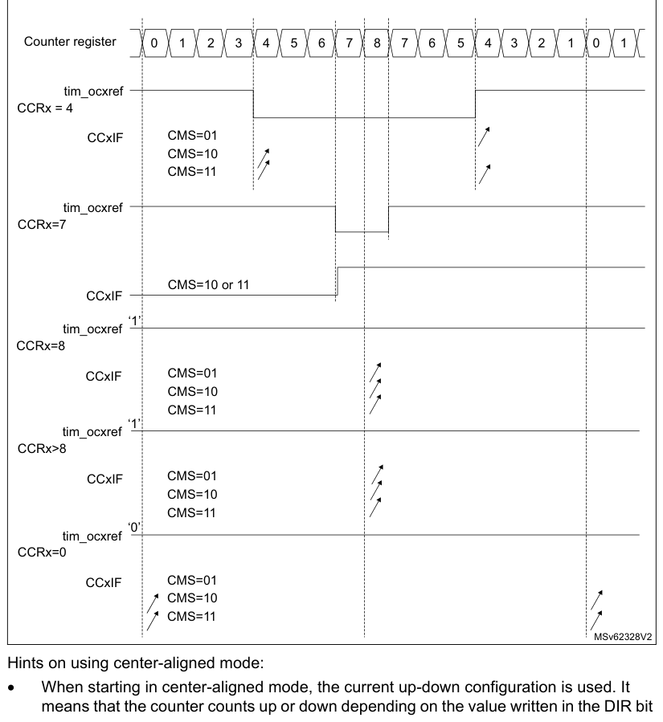

- When starting in center-aligned mode, the current up-down configuration is used. It means that the
  counter counts up or down depending on the value written in the DIR bit
  in the TIMx_CR1 register. Moreover, the DIR and CMS bits must not be changed at the same time by the
  software.
- Writing to the counter while running in center-aligned mode is not recommended as it can lead to
  unexpected results. In particular:
  - The direction is not updated if a value greater than the autoreload value is written in the
    counter (TIMx_CNT>TIMx_ARR). For example, if the counter was counting up, it continues to count
    up.
  - The direction is updated if 0 or the TIMx_ARR value is written in the counter but no update
    event UEV is generated.
- The safest way to use center-aligned mode is to generate an update by software (setting the UG bit
  in the TIMx_EGR register) just before starting the counter and not to write the counter while it
  is running.

#### Dithering mode

The PWM mode effective resolution can be increased by enabling the dithering mode, using the DITHEN
bit in the TIMx_CR1 register. This applies to both the CCR (for duty cycle resolution increase) and
ARR (for PWM frequency resolution increase).

The operating principle is to have the actual CCR (or ARR) value slightly changed (adding or not one
timer clock period) over 16 consecutive PWM periods, with predefined patterns. This allows a 16-fold
resolution increase, considering the average duty cycle or PWM period. Figure 417 presents the
dithering principle applied to four consecutive PWM cycles.

**Figure 417. Dithering principle**

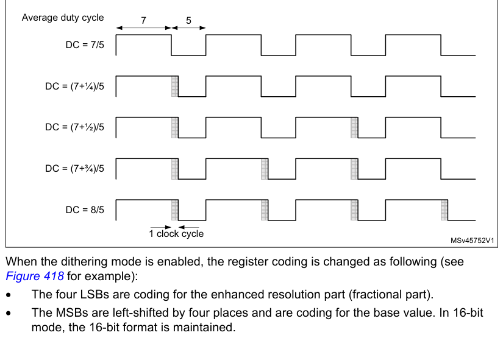

Average duty cycle

7 5

DC = 7/5

DC = (7+¼)/5

DC = (7+½)/5

DC = (7+¾)/5

DC = 8/5

1 clock cycle

MSv45752V1

When the dithering mode is enabled, the register coding is changed as following (see Figure 418 for
example):

- The four LSBs are coding for the enhanced resolution part (fractional part).
- The MSBs are left-shifted by four places and are coding for the base value. In 16-bit mode, the
  16-bit format is maintained.

> **Note:** The ARR and CCR values will be updated automatically if the DITHEN bit is set/reset (for
> instance, if ARR= 0x05 with DITHEN = 0, it will be updated to ARR = 0x50 with DITHEN = 1). The
> following sequence must be followed when resetting the DITHEN bit:

1. CEN and ARPE bits must be reset.
2. The ARR[3:0] bits must be reset.
3. The DITHEN bit must be reset.
4. The CCIF flags must be cleared.
5. The CEN bit can be set (eventually with ARPE = 1).

**Figure 418. Data format and register coding in dithering mode**

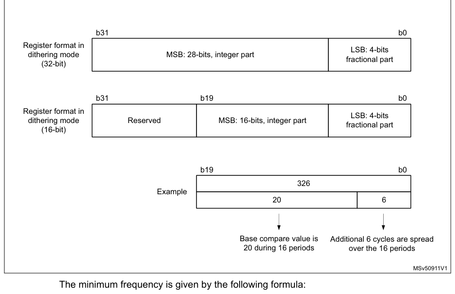

> **Note:** For 16-bit timers, the maximum TIMx_ARR and TIMxCCRy values are limited to 0xFFFEF
> in dithering mode (corresponds to 65534 for the integer part and 15 for the dithered part). For
32-bit timers, the maximum TIMx_ARR and TIMxCCRy values are limited to 0xFFFFFFEF in dithering mode
(corresponds to 264435454 for the integer part and 15 for the dithered part).

As shown on Figure 419 and Figure 420, the dithering mode is used to increase the PWM resolution.

**Figure 419. PWM resolution vs frequency (16-bit mode)**

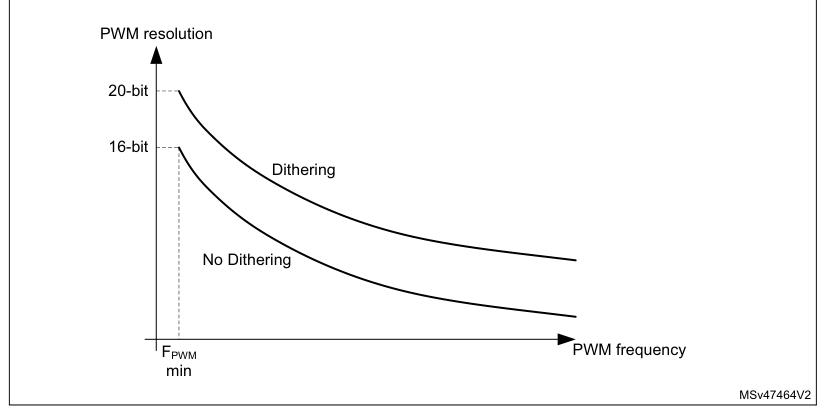

PWM resolution

20-bit

16-bit

Dithering

No Dithering

**Figure 420. PWM resolution vs frequency (32-bit mode)**

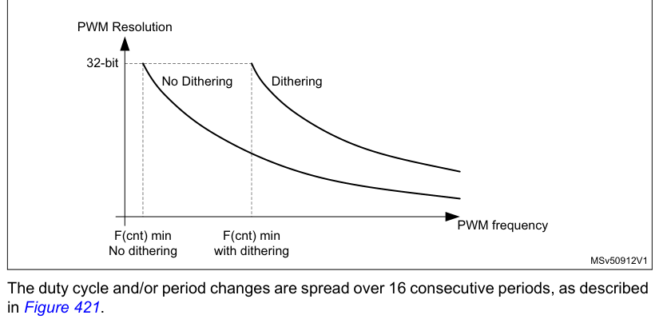

The duty cycle and/or period changes are spread over 16 consecutive periods, as described in Figure
421.

**Figure 421. PWM dithering pattern**

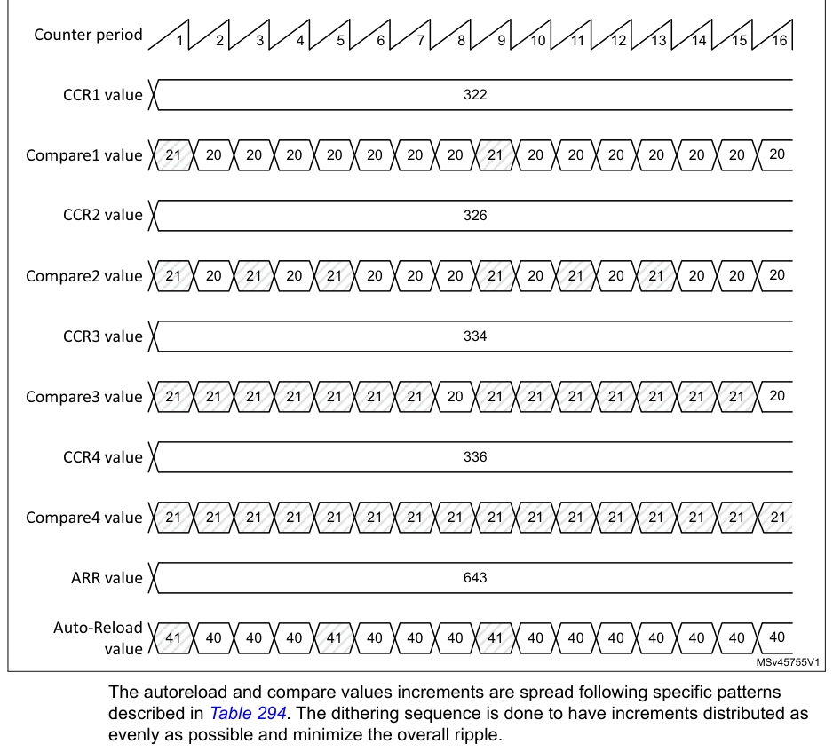

The autoreload and compare values increments are spread following specific patterns described in
Table 294. The dithering sequence is done to have increments distributed as evenly as possible and
minimize the overall ripple.

**Table 294. CCR and ARR register change dithering pattern**

| Source row | Extracted cells |
| ---: | --- |
| 1 | `PWM period` |
| 2 | `LSB value` |
| 3 | `1` · `2` · `3` · `4` · `5` · `6` · `7` · `8` · `9` · `10` · `11` · `12` · `13` · `14` · `15` · `16` |
| 4 | `0000` · `-` · `-` · `-` · `-` · `-` · `-` · `-` · `-` · `-` · `-` · `-` · `-` · `-` · `-` · `-` · `-` |
| 5 | `0001` · `+1` · `-` · `-` · `-` · `-` · `-` · `-` · `-` · `-` · `-` · `-` · `-` · `-` · `-` · `-` · `-` |
| 6 | `0010` · `+1` · `-` · `-` · `-` · `-` · `-` · `-` · `-` · `+1` · `-` · `-` · `-` · `-` · `-` · `-` · `-` |
| 7 | `0011` · `+1` · `-` · `-` · `-` · `+1` · `-` · `-` · `-` · `+1` · `-` · `-` · `-` · `-` · `-` · `-` · `-` |
| 8 | `0100` · `+1` · `-` · `-` · `-` · `+1` · `-` · `-` · `-` · `+1` · `-` · `-` · `-` · `+1` · `-` · `-` · `-` |
| 9 | `0101` · `+1` · `-` · `+1` · `-` · `+1` · `-` · `-` · `-` · `+1` · `-` · `-` · `-` · `+1` · `-` · `-` · `-` |
| 10 | `0110` · `+1` · `-` · `+1` · `-` · `+1` · `-` · `-` · `-` · `+1` · `-` · `+1` · `-` · `+1` · `-` · `-` · `-` |
| 11 | `0111` · `+1` · `-` · `+1` · `-` · `+1` · `-` · `+1` · `-` · `+1` · `-` · `+1` · `-` · `+1` · `-` · `-` · `-` |
| 12 | `1000` · `+1` · `-` · `+1` · `-` · `+1` · `-` · `+1` · `-` · `+1` · `-` · `+1` · `-` · `+1` · `-` · `+1` · `-` |
| 13 | `1001` · `+1` · `+1` · `+1` · `-` · `+1` · `-` · `+1` · `-` · `+1` · `-` · `+1` · `-` · `+1` · `-` · `+1` · `-` |
| 14 | `1010` · `+1` · `+1` · `+1` · `-` · `+1` · `-` · `+1` · `-` · `+1` · `+1` · `+1` · `-` · `+1` · `-` · `+1` · `-` |
| 15 | `1011` · `+1` · `+1` · `+1` · `-` · `+1` · `+1` · `+1` · `-` · `+1` · `+1` · `+1` · `-` · `+1` · `-` · `+1` · `-` |
| 16 | `1100` · `+1` · `+1` · `+1` · `-` · `+1` · `+1` · `+1` · `-` · `+1` · `+1` · `+1` · `-` · `+1` · `+1` · `+1` · `-` |
| 17 | `1101` · `+1` · `+1` · `+1` · `+1` · `+1` · `+1` · `+1` · `-` · `+1` · `+1` · `+1` · `-` · `+1` · `+1` · `+1` · `-` |
| 18 | `1110` · `+1` · `+1` · `+1` · `+1` · `+1` · `+1` · `+1` · `-` · `+1` · `+1` · `+1` · `+1` · `+1` · `+1` · `+1` · `-` |
| 19 | `1111` · `+1` · `+1` · `+1` · `+1` · `+1` · `+1` · `+1` · `+1` · `+1` · `+1` · `+1` · `+1` · `+1` · `+1` · `+1` · `-` |

The dithering mode is also available in center-aligned PWM mode (CMS bits in TIMx_CR1 register are
not equal to 00). In this case, the dithering pattern is applied over eight consecutive PWM periods,
considering the up and down-counting phases as shown in

Figure 422.

**Figure 422. Dithering effect on duty cycle in center-aligned PWM mode**

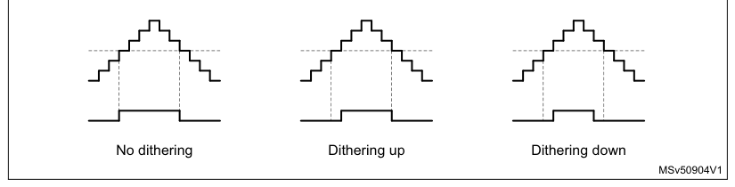

Table 295 shows how the dithering pattern is added in center-aligned PWM mode.

**Table 295. CCR register change dithering pattern in center-aligned PWM mode**

| Source row | Extracted cells |
| ---: | --- |
| 1 | `PWM period` |
| 2 | `LSB` |
| 3 | `1` · `2` · `3` · `4` · `5` · `6` · `7` · `8` |
| 4 | `value` |
| 5 | `Up` · `Dn` · `Up` · `Dn` · `Up` · `Dn` · `Up` · `Dn` · `Up` · `Dn` · `Up` · `Dn` · `Up` · `Dn` · `Up` · `Dn` |
| 6 | `0000` · `-` · `-` · `-` · `-` · `-` · `-` · `-` · `-` · `-` · `-` · `-` · `-` · `-` · `-` · `-` · `-` |
| 7 | `0001` · `+1` · `-` · `-` · `-` · `-` · `-` · `-` · `-` · `-` · `-` · `-` · `-` · `-` · `-` · `-` · `-` |
| 8 | `0010` · `+1` · `-` · `-` · `-` · `-` · `-` · `-` · `-` · `+1` · `-` · `-` · `-` · `-` · `-` · `-` · `-` |
| 9 | `0011` · `+1` · `-` · `-` · `-` · `+1` · `-` · `-` · `-` · `+1` · `-` · `-` · `-` · `-` · `-` · `-` · `-` |
| 10 | `0100` · `+1` · `-` · `-` · `-` · `+1` · `-` · `-` · `-` · `+1` · `-` · `-` · `-` · `+1` · `-` · `-` · `-` |
| 11 | `0101` · `+1` · `-` · `+1` · `-` · `+1` · `-` · `-` · `-` · `+1` · `-` · `-` · `-` · `+1` · `-` · `-` · `-` |
| 12 | `0110` · `+1` · `-` · `+1` · `-` · `+1` · `-` · `-` · `-` · `+1` · `-` · `+1` · `-` · `+1` · `-` · `-` · `-` |
| 13 | `0111` · `+1` · `-` · `+1` · `-` · `+1` · `-` · `+1` · `-` · `+1` · `-` · `+1` · `-` · `+1` · `-` · `-` · `-` |
| 14 | `1000` · `+1` · `-` · `+1` · `-` · `+1` · `-` · `+1` · `-` · `+1` · `-` · `+1` · `-` · `+1` · `-` · `+1` · `-` |
| 15 | `1001` · `+1` · `+1` · `+1` · `-` · `+1` · `-` · `+1` · `-` · `+1` · `-` · `+1` · `-` · `+1` · `-` · `+1` · `-` |
| 16 | `1010` · `+1` · `+1` · `+1` · `-` · `+1` · `-` · `+1` · `-` · `+1` · `+1` · `+1` · `-` · `+1` · `-` · `+1` · `-` |
| 17 | `1011` · `+1` · `+1` · `+1` · `-` · `+1` · `+1` · `+1` · `-` · `+1` · `+1` · `+1` · `-` · `+1` · `-` · `+1` · `-` |
| 18 | `1100` · `+1` · `+1` · `+1` · `-` · `+1` · `+1` · `+1` · `-` · `+1` · `+1` · `+1` · `-` · `+1` · `+1` · `+1` · `-` |
| 19 | `1101` · `+1` · `+1` · `+1` · `+1` · `+1` · `+1` · `+1` · `-` · `+1` · `+1` · `+1` · `-` · `+1` · `+1` · `+1` · `-` |
| 20 | `1110` · `+1` · `+1` · `+1` · `+1` · `+1` · `+1` · `+1` · `-` · `+1` · `+1` · `+1` · `+1` · `+1` · `+1` · `+1` · `-` |
| 21 | `1111` · `+1` · `+1` · `+1` · `+1` · `+1` · `+1` · `+1` · `+1` · `+1` · `+1` · `+1` · `+1` · `+1` · `+1` · `+1` · `-` |

### 30.4.12 Asymmetric PWM mode

Asymmetric mode allows two center-aligned PWM signals to be generated with a programmable phase
shift. While the frequency is determined by the value of the TIMx_ARR register, the duty cycle and
the phase-shift are determined by a pair of TIMx_CCRx registers. One register controls the PWM
during up-counting, the second during down-counting, so that PWM is adjusted every half PWM cycle:

- tim_oc1refc (or tim_oc2refc) is controlled by TIMx_CCR1 and TIMx_CCR2.
- tim_oc3refc (or tim_oc4refc) is controlled by TIMx_CCR3 and TIMx_CCR4.

Asymmetric PWM mode can be selected independently on two channels (one tim_ocx output per pair of
CCR registers) by writing 1110 (Asymmetric PWM mode 1) or 1111 (Asymmetric PWM mode 2) in the OCxM
bits in the TIMx_CCMRx register.

> **Note:** The OCxM[3:0] bitfield is split into two parts for compatibility reasons, the most significant bit
> is not contiguous with the three least significant ones.

When a given channel is used as asymmetric PWM channel, its secondary channel can also be used. For
instance, if an tim_oc1refc signal is generated on channel 1 (Asymmetric PWM mode 1), it is possible
to output either the tim_oc2ref signal on channel 2, or an tim_oc2refc signal resulting from
asymmetric PWM mode 2.

Figure 423 shows an example of signals that can be generated using asymmetric PWM mode (channels 1
to 4 are configured in asymmetric PWM mode 2).

**Figure 423. Generation of two phase-shifted PWM signals with 50% duty cycle**

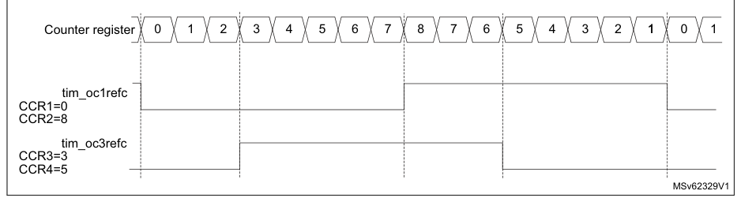

### 30.4.13 Combined PWM mode

Combined PWM mode allows two edge or center-aligned PWM signals to be generated with programmable
delay and phase shift between respective pulses. While the frequency is determined by the value of
the TIMx_ARR register, the duty cycle and delay are determined by the two TIMx_CCRx registers. The
resulting signals, tim_ocxrefc, are made of an OR or AND logical combination of two reference PWMs:

- tim_oc1refc (or tim_oc2refc) is controlled by TIMx_CCR1 and TIMx_CCR2
- tim_oc3refc (or tim_oc4refc) is controlled by TIMx_CCR3 and TIMx_CCR4

Combined PWM mode can be selected independently on two channels (one tim_ocx output per pair of CCR
registers) by writing 1100 (Combined PWM mode 1) or 1101 (Combined PWM mode 2) in the OCxM bits in
the TIMx_CCMRx register.

When a given channel is used as combined PWM channel, its secondary channel must be configured in
the opposite PWM mode (for instance, one in Combined PWM mode 1 and the other in Combined PWM mode
2).

> **Note:** The OCxM[3:0] bitfield is split into two parts for compatibility reasons, the most significant bit
> is not contiguous with the three least significant ones.

Figure 424 shows an example of signals that can be generated using combined PWM mode, obtained with
the following configuration:

- Channel 1 is configured in Combined PWM mode 2.
- Channel 2 is configured in PWM mode 1.
- Channel 3 is configured in Combined PWM mode 2.
- Channel 4 is configured in PWM mode 1.

**Figure 424. Combined PWM mode on channels 1 and 3**

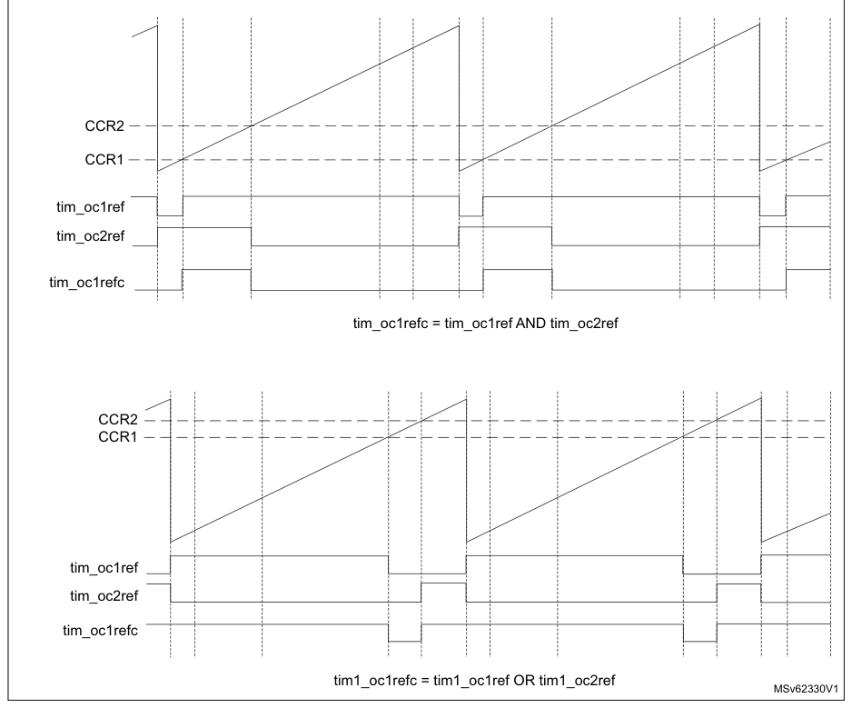

CCR2

CCR1
tim_oc1ref
tim_oc2ref
tim_oc1refc
tim_oc1refc = tim_oc1ref AND tim_oc2ref

CCR2

CCR1
tim_oc1ref
tim_oc2ref
tim_oc1refc
tim1_oc1refc = tim1_oc1ref OR tim1_oc2ref

MSv62330V1

### 30.4.14 Clearing the tim_ocxref signal on an external event

The tim_ocxref signal of a given channel can be cleared when a high level is applied on the
tim_ocref_clr_int input (OCxCE enable bit in the corresponding TIMx_CCMRx register set to 1).
tim_ocxref remains low until the next transition to the active state, on the following PWM cycle.
This function can only be used in Output compare and PWM modes. It does not work in Forced mode.

The tim_ocref_clr_int source depends on the OCREF clear selection feature implementation, refer to
[Section 30.3](#303-tim2tim3tim4tim5-implementation): TIM2/TIM3/TIM4/TIM5 implementation.

If the OCREF clear selection feature is implemented, the tim_ocref_clr_int can be selected between
the tim_ocref_clr input and the tim_etrf input (tim_etr_in after the filter) by configuring the OCCS
bit in the TIMx_SMCR register. The tim_ocref_clr input can be selected among several
tim_ocref_clr[7:0] inputs, using the OCRSEL[2:0] bitfield in the TIMx_AF2 register, as shown in
Figure 425.

**Figure 425. OCREF_CLR input selection multiplexer**

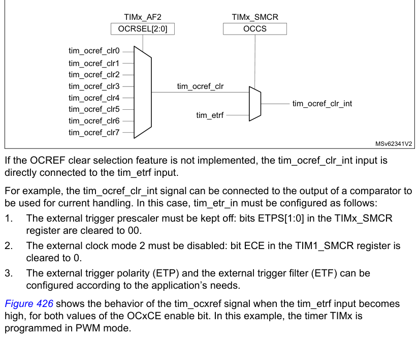

If the OCREF clear selection feature is not implemented, the tim_ocref_clr_int input is directly
connected to the tim_etrf input.

For example, the tim_ocref_clr_int signal can be connected to the output of a comparator to be used
for current handling. In this case, tim_etr_in must be configured as follows:

1. The external trigger prescaler must be kept off: bits ETPS[1:0] in the TIMx_SMCR
   register are cleared to 00.
2. The external clock mode 2 must be disabled: bit ECE in the TIM1_SMCR register is
   cleared to 0.
3. The external trigger polarity (ETP) and the external trigger filter (ETF) can be
   configured according to the application’s needs.

Figure 426 shows the behavior of the tim_ocxref signal when the tim_etrf input becomes high, for
both values of the OCxCE enable bit. In this example, the timer TIMx is programmed in PWM mode.

**Figure 426. Clearing TIMx tim_ocxref**

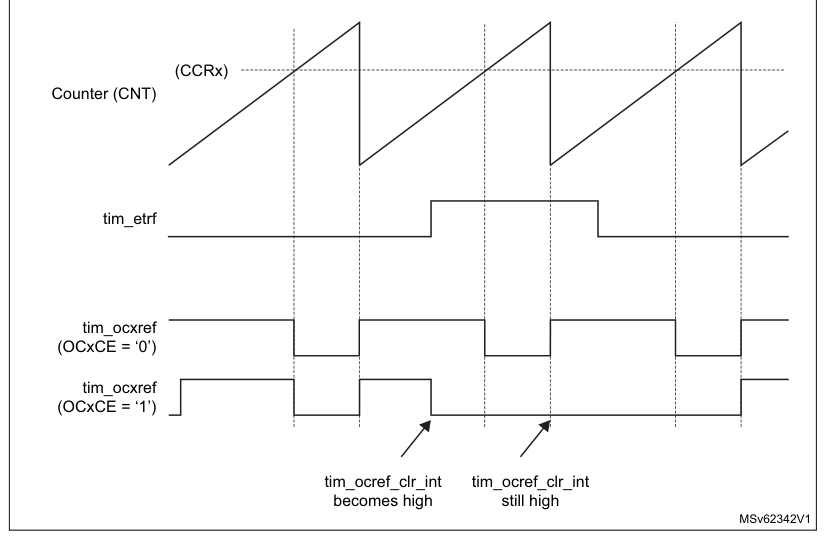

(CCRx)

Counter (CNT)
tim_etrf
tim_ocxref

(OCxCE = ‘0’)
tim_ocxref

(OCxCE = ‘1’)

> **Note:** In case of a PWM with a 100% duty cycle (if CCRx>ARR), tim_ocxref is enabled again at
> the next counter overflow.

### 30.4.15 One-pulse mode

One-pulse mode (OPM) is a particular case of the previous modes. It allows the counter to be started
in response to a stimulus and to generate a pulse with a programmable length after a programmable
delay.

Starting the counter can be controlled through the slave mode controller. Generating the waveform
can be done in output compare mode or PWM mode. One-pulse mode is selected by setting the OPM bit in
the TIMx_CR1 register. This makes the counter stop automatically at the next update event UEV.

A pulse can be correctly generated only if the compare value is different from the counter initial
value. Before starting (when the timer is waiting for the trigger), the configuration must be:

CNT\<CCRx ≤ ARR (in particular, 0\<CCRx).

**Figure 427. Example of One-pulse mode**

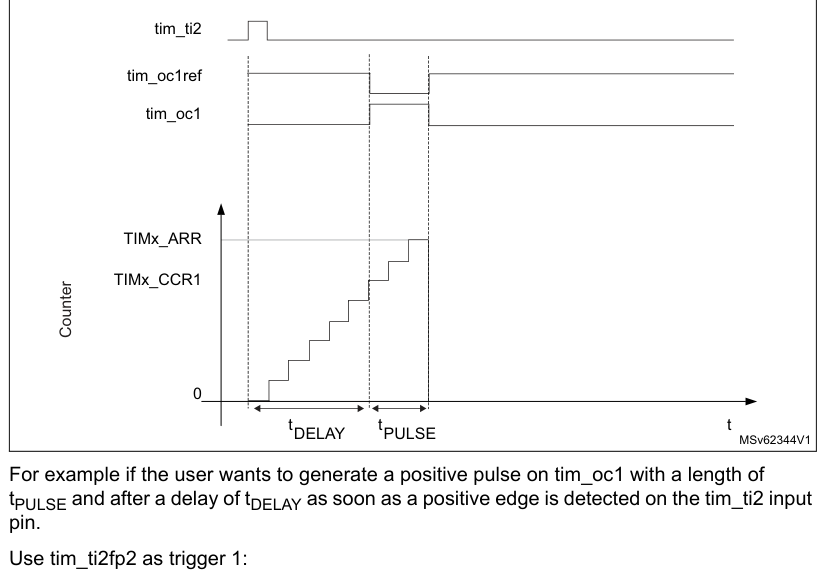

tim_ti2
tim_oc1ref
tim_oc1

TIMx_ARR

TIMx_CCR1

Counter

0

For example if the user wants to generate a positive pulse on tim_oc1 with a length of tPULSE and
after a delay of tDELAY as soon as a positive edge is detected on the tim_ti2 input pin.

Use tim_ti2fp2 as trigger 1:

1. Select the proper tim_ti2_in[15:0] source (internal or external) with the TI2SEL[3:0] bits
   in the TIMx_TISEL register.
2. Map tim_ti2fp2 on tim_ti2 by writing CC2S = 01 in the TIMx_CCMR1 register.
3. tim_ti2fp2 must detect a rising edge, write CC2P = 0 and CC2NP = 0 in the

TIMx_CCER register.

4. Configure tim_ti2fp2 as trigger for the slave mode controller (tim_trgi) by writing TS =

00110 in the TIMx_SMCR register.

5. tim_ti2fp2 is used to start the counter by writing SMS to 110 in the TIMx_SMCR register

(trigger mode).

The OPM waveform is defined by writing the compare registers (taking into account the clock
frequency and the counter prescaler).

- The tDELAY is defined by the value written in the TIMx_CCR1 register.
- The tPULSE is defined by the difference between the autoreload value and the compare value
  (TIMx_ARR - TIMx_CCR1).
- Suppose the user wants to build a waveform with a transition from 0 to 1 when a compare match
  occurs and a transition from 1 to 0 when the counter reaches the autoreload value. To do this PWM
  mode 2 must be enabled by writing OC1M = 111 in the TIMx_CCMR1 register. Optionally the preload
  registers can be enabled by writing OC1PE = 1 in the TIMx_CCMR1 register and ARPE in the TIMx_CR1
  register. In this case one has to write the compare value in the TIMx_CCR1 register, the
  autoreload value in the TIMx_ARR register, generate an update by setting the UG bit and wait for
  external trigger event on tim_ti2. CC1P is written to 0 in this example.

In this example, the DIR and CMS bits in the TIMx_CR1 register must be low.

Since only one pulse (Single mode) is needed, a one must be written in the OPM bit in the TIMx_CR1
register to stop the counter at the next update event (when the counter rolls over from the
autoreload value back to 0). When OPM bit in the TIMx_CR1 register is set to 0, so the Repetitive
mode is selected.

#### Particular case: tim_ocx fast enable

In One-pulse mode, the edge detection on tim_tix input set the CEN bit which enables the counter.
Then the comparison between the counter and the compare value makes the output toggle. But several
clock cycles are needed for these operations and it limits the minimum delay tDELAY min we can get.

If one wants to output a waveform with the minimum delay, the OCxFE bit can be set in the TIMx_CCMRx
register. Then tim_ocxref (and tim_ocx) is forced in response to the stimulus, without taking in
account the comparison. Its new level is the same as if a compare match had occurred. OCxFE acts
only if the channel is configured in PWM1 or PWM2 mode.

### 30.4.16 Retriggerable one-pulse mode

This mode allows the counter to be started in response to a stimulus and to generate a pulse with a
programmable length, but with the following differences with non-retriggerable one-pulse mode
described in [Section 30.4.15](#30415-one-pulse-mode):

- The pulse starts as soon as the trigger occurs (no programmable delay).
- The pulse is extended if a new trigger occurs before the previous one is completed.

The timer must be in Slave mode, with the bits SMS[3:0] = 1000 (Combined Reset \+ trigger mode) in
the TIMx_SMCR register, and the OCxM[3:0] bits set to 1000 or 1001 for Retriggerable OPM mode 1 or
2.

If the timer is configured in Up-counting mode, the corresponding CCRx must be set to 0 (the ARR
register sets the pulse length). If the timer is configured in down-counting mode CCRx must be above
or equal to ARR.

> **Note:** In Retriggerable one-pulse mode, the CCxIF flag is not significant.

The OCxM[3:0] and SMS[3:0] bitfields are split into two parts for compatibility reasons, the most
significant bit is not contiguous with the three least significant ones.

This mode must not be used with center-aligned PWM modes. It is mandatory to have CMS[1:0] = 00 in
TIMx_CR1.

**Figure 428. Retriggerable one-pulse mode**

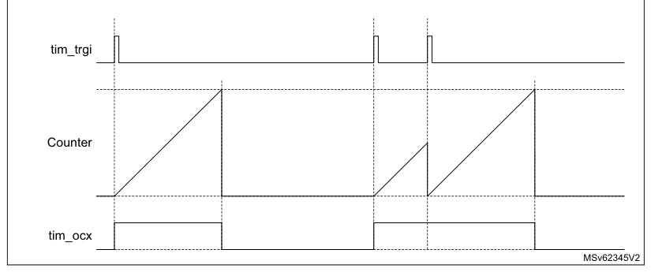

tim_trgi

Counter
tim_ocx

MSv62345V2

### 30.4.17 Pulse on compare mode

A pulse can be generated upon compare match event. A signal with a programmable pulse width
generated when the counter value equals a given compare value, for debugging or synchronization
purposes.

This mode is available for any slave mode selection, including encoder modes, in edge and center
aligned counting modes. It is solely available for channel 3 and channel 4. The pulse generator is
unique and is shared by the two channels, as shown on Figure 429.

**Figure 429. Pulse generator circuitry**

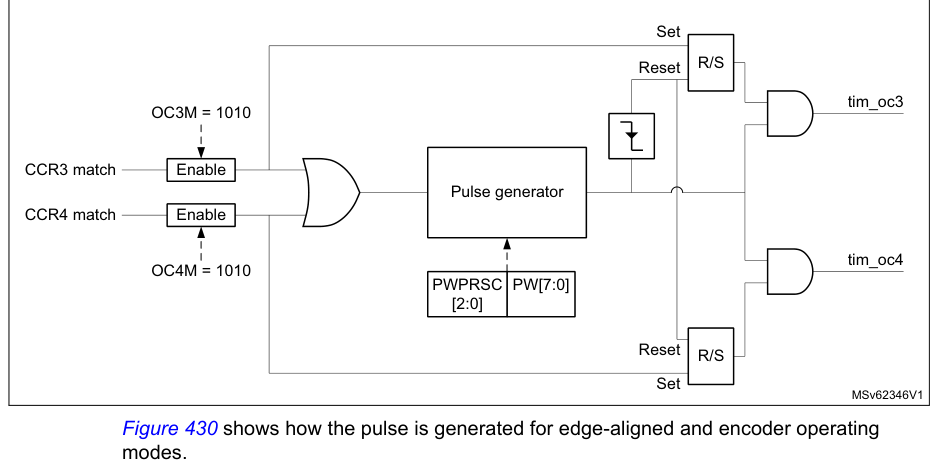

Set

R/S

Reset
tim_oc3

OC3M = 1010

Figure 430 shows how the pulse is generated for edge-aligned and encoder operating modes.

**Figure 430. Pulse generation on compare event, for edge-aligned and encoder modes**

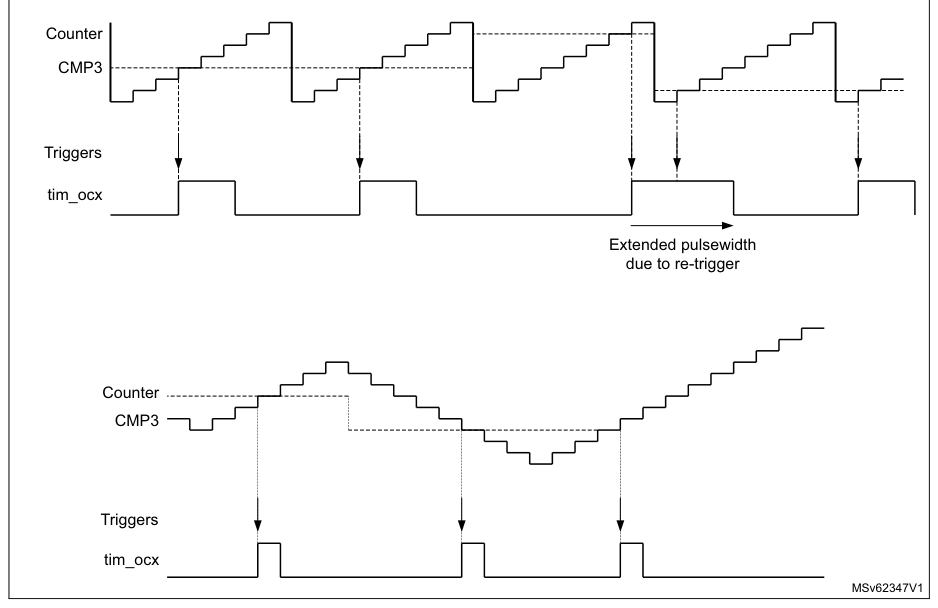

Counter

CMP3

Triggers
tim_ocx

Extended pulsewidth
due to re-trigger

Counter

CMP3

Triggers
tim_ocx

MSv62347V1

This output compare mode is selected using the OC3M[3:0] and OC4M[3:0] bitfields in TIMx_CCMR2
register.

The pulse width is programmed using the PW[7:0] bitfield in the register, using a specific clock
prescaled according to PWPRSC[2:0] bits, as follows:

tPW = PW[7:0] x tPWG
where tPWG = (2(PWPRSC[2:0])) x ttim_ker_ck.

gives the resolution and maximum values depending on the prescaler value.

The pulse is retriggerable: a new trigger while the pulse is ongoing, causes the pulse to be
extended.

> **Note:** If the two channels are enabled simultaneously, the pulses are issued independently as long
> as the trigger on one channel is not overlapping the pulse generated on the concurrent output. On
> the opposite, if the two triggers are overlapping, the pulse width related to the first arriving
> trigger is extended (because of the retrigger), while the pulse width of the last arriving trigger
> is correct (as shown on Figure 431).

**Figure 431. Extended pulse width in case of concurrent triggers**

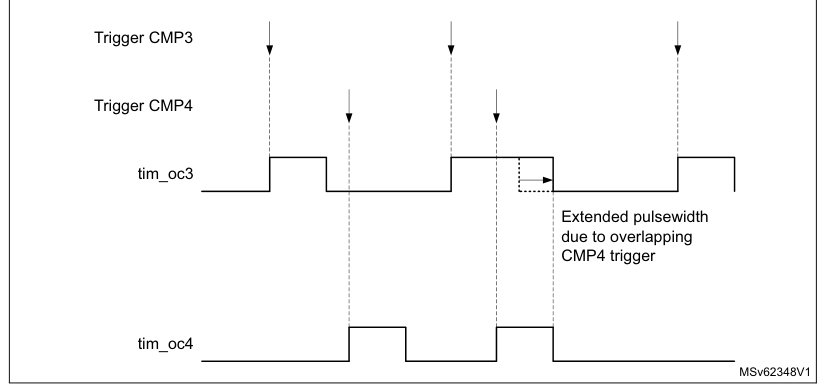

Trigger CMP3

Trigger CMP4
tim_oc3

Extended pulsewidth due to overlapping CMP4 trigger
tim_oc4

MSv62348V1

### 30.4.18 Encoder interface mode

#### Quadrature encoder

To select Encoder interface mode write SMS = 0001 in the TIMx_SMCR register if the counter is
counting on tim_ti1 edges only, SMS = 0010 if it is counting on tim_ti2 edges only and SMS = 0011 if
it is counting on both tim_ti1 and tim_ti2 edges.

Select the tim_ti1 and tim_ti2 polarity by programming the CC1P and CC2P bits in the TIMx_CCER
register. CC1NP and CC2NP must be kept cleared. When needed, the input filter can be programmed as
well.

The two inputs tim_ti1 and tim_ti2 are used to interface to an incremental encoder. Refer to

Table 296. The counter is clocked by each valid transition on tim_ti1fp1 or tim_ti2fp2 (tim_ti1 and
tim_ti2 after input filter and polarity selection, tim_ti1fp1 = tim_ti1 if not filtered and not
inverted, tim_ti2fp2 = tim_ti2 if not filtered and not inverted) assuming that it is enabled (CEN
bit in TIMx_CR1 register written to 1). The sequence of transitions of the two inputs is evaluated
and generates count pulses as well as the direction signal. Depending on the sequence the counter
counts up or down, the DIR bit in the TIMx_CR1 register is modified by hardware accordingly. The DIR
bit is calculated at each transition on any input (tim_ti1 or
tim_ti2), whatever the counter is counting on tim_ti1 only, tim_ti2 only or both tim_ti1 and
tim_ti2.

Encoder interface mode acts simply as an external clock with direction selection. This means that
the counter just counts continuously between 0 and the autoreload value in the TIMx_ARR register (0
to ARR or ARR down to 0 depending on the direction). So the TIMx_ARR must be configured before
starting. In the same way, the capture, compare, prescaler, trigger output features continue to work
as normal. Encoder mode and External clock mode 2 are not compatible and must not be selected
together.

In this mode, the counter is modified automatically following the speed and the direction of the
quadrature encoder and its content, therefore, always represents the encoder’s position. The count
direction corresponds to the rotation direction of the connected sensor. The table summarizes the
possible combinations, assuming tim_ti1 and tim_ti2 do not switch at the same time.

**Table 296. Counting direction versus encoder signals(CC1P = CC2P = 0)**

| Source row | Column 1 | Column 2 | Column 3 | Column 4 | Column 5 | Column 6 |
| ---: | --- | --- | --- | --- | --- | --- |
| 1 | `Level on opposite` | `tim_ti1fp1 signal` | `tim_ti2fp2 signal` |  |  |  |
| 2 | `signal (tim_ti1fp1` |  |  |  |  |  |
| 3 | `Active edge` | `SMS[3:0]` | `for tim_ti2,` |  |  |  |
| 4 | `tim_ti2fp2 for` | `Rising` | `Falling` | `Rising` | `Falling` |  |
| 5 | `tim_ti1)` |  |  |  |  |  |
| 6 | `Counting on` | `High` | `Down` | `Up` | `No count` | `No count` |
| 7 | `tim_ti1 only` | `1110` |  |  |  |  |
| 8 | `Low` | `No count` | `No count` | `No count` | `No count` |  |
| 9 | `x1 mode` |  |  |  |  |  |
| 10 | `Counting on` | `High` | `No count` | `No count` | `Up` | `Down` |
| 11 | `tim_ti2 only` | `1111` |  |  |  |  |
| 12 | `Low` | `No count` | `No count` | `No count` | `No count` |  |
| 13 | `x1 mode` |  |  |  |  |  |
| 14 | `Counting on` | `High` | `Down` | `Up` | `No count` | `No count` |
| 15 | `tim_ti1 only` | `0001` |  |  |  |  |
| 16 | `Low` | `Up` | `Down` | `No count` | `Down` |  |
| 17 | `x2 mode` |  |  |  |  |  |
| 18 | `Counting on` | `High` | `No count` | `No count` | `Up` | `Down` |
| 19 | `tim_ti2 only` | `0010` |  |  |  |  |
| 20 | `Low` | `No count` | `No count` | `Down` | `Up` |  |
| 21 | `x2 mode` |  |  |  |  |  |
| 22 | `Counting on` | `High` | `Down` | `Up` | `Up` | `Down` |
| 23 | `tim_ti1 and` |  |  |  |  |  |
| 24 | `0011` |  |  |  |  |  |
| 25 | `tim_ti2` |  |  |  |  |  |
| 26 | `Low` | `Up` | `Down` | `Down` | `Up` |  |
| 27 | `x4 mode` |  |  |  |  |  |

A quadrature encoder can be connected directly to the MCU without external interface logic. However,
comparators are normally be used to convert the encoder’s differential outputs to digital signals.
This greatly increases noise immunity. The third encoder output which indicates the mechanical zero
position, can be connected to the external trigger input and trigger a counter reset.

Figure 432 gives an example of counter operation, showing count signal generation and direction
control. It also shows how input jitter is compensated where both edges are
selected. This might occur if the sensor is positioned near to one of the switching points. For this
example we assume that the configuration is the following:

- CC1S = 01 (TIMx_CCMR1 register, tim_ti1fp1 mapped on tim_ti1).
- CC2S = 01 (TIMx_CCMR1 register, tim_ti2fp2 mapped on tim_ti2).
- CC1P and CC1NP = 0 (TIMx_CCER register, tim_ti1fp1 noninverted, tim_ti1fp1 = tim_ti1).
- CC2P and CC2NP = 0 (TIMx_CCER register, tim_ti2fp2 noninverted, tim_ti2fp2 = tim_ti2).
- SMS = 0011 (TIMx_SMCR register, both inputs are active on both rising and falling edges).
- CEN = 1 (TIMx_CR1 register, counter is enabled).

**Figure 432. Example of counter operation in encoder interface mode**

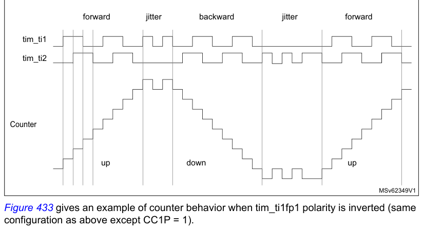

Figure 433 gives an example of counter behavior when tim_ti1fp1 polarity is inverted (same
configuration as above except CC1P = 1).

**Figure 433. Example of encoder interface mode with tim_ti1fp1 polarity inverted**

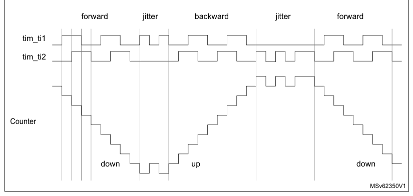

Figure 434 shows the timer counter value during a speed reversal, for various counting modes.

**Figure 434. Quadrature encoder counting modes**

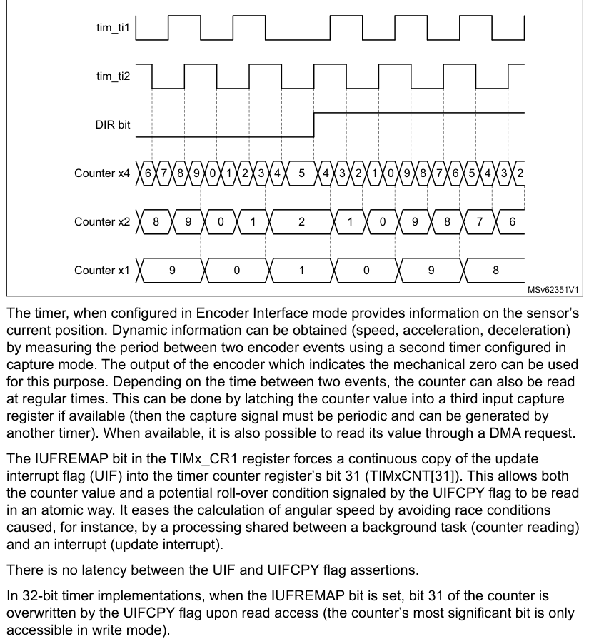

The timer, when configured in Encoder Interface mode provides information on the sensor’s current
position. Dynamic information can be obtained (speed, acceleration, deceleration) by measuring the
period between two encoder events using a second timer configured in capture mode. The output of the
encoder which indicates the mechanical zero can be used for this purpose. Depending on the time
between two events, the counter can also be read at regular times. This can be done by latching the
counter value into a third input capture register if available (then the capture signal must be
periodic and can be generated by another timer). When available, it is also possible to read its
value through a DMA request.

The IUFREMAP bit in the TIMx_CR1 register forces a continuous copy of the update interrupt flag
(UIF) into the timer counter register’s bit 31 (TIMxCNT[31]). This allows both the counter value and
a potential roll-over condition signaled by the UIFCPY flag to be read in an atomic way. It eases
the calculation of angular speed by avoiding race conditions caused, for instance, by a processing
shared between a background task (counter reading) and an interrupt (update interrupt).

There is no latency between the UIF and UIFCPY flag assertions.

In 32-bit timer implementations, when the IUFREMAP bit is set, bit 31 of the counter is overwritten
by the UIFCPY flag upon read access (the counter’s most significant bit is only accessible in write
mode).

#### Clock plus direction encoder mode

In addition to the quadrature encoder mode, the timer offers support for other types of encoders.

In the “clock plus direction” mode shown on Figure 435, the clock is provided on a single line, on
tim_ti2, while the direction is forced using the tim_ti1 input.

This mode is enabled with the SMS[3:0] bitfield in the TIMx_SMCR register, as following:

- 1010: x2 mode, the counter is updated on both rising and falling edges of the clock.
- 1011: x1 mode, the counter is updated on a single clock edge, as per CC2P bit value: CC2P = 0
  corresponds to rising edge sensitivity and CC2P = 1 corresponds to falling edge sensitivity.

The polarity of the direction signal on tim_ti1 is set with the CC1P bit: 0 corresponds to positive
polarity (up-counting when tim_ti1 is high and down-counting when tim_ti1 is low) and CC1P = 1
corresponds to negative polarity (up-counting when tim_ti1 is low).

**Figure 435. Direction plus clock encoder mode**

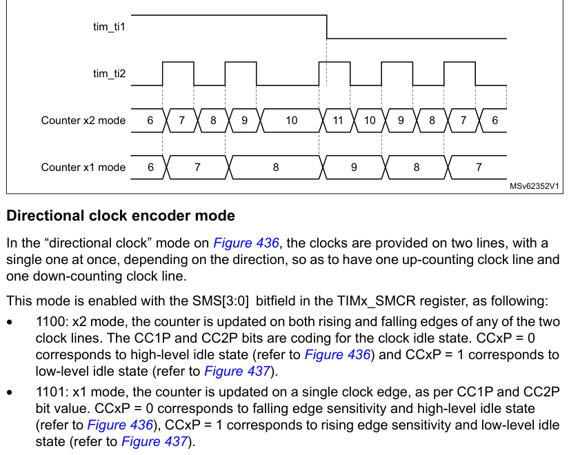

#### Directional clock encoder mode

In the “directional clock” mode on Figure 436, the clocks are provided on two lines, with a single
one at once, depending on the direction, so as to have one up-counting clock line and one
down-counting clock line.

This mode is enabled with the SMS[3:0] bitfield in the TIMx_SMCR register, as following:

- 1100: x2 mode, the counter is updated on both rising and falling edges of any of the two clock
  lines. The CC1P and CC2P bits are coding for the clock idle state. CCxP = 0 corresponds to
  high-level idle state (refer to Figure 436) and CCxP = 1 corresponds to low-level idle state
  (refer to Figure 437).
- 1101: x1 mode, the counter is updated on a single clock edge, as per CC1P and CC2P bit value. CCxP
  = 0 corresponds to falling edge sensitivity and high-level idle state (refer to Figure 436), CCxP
  = 1 corresponds to rising edge sensitivity and low-level idle state (refer to Figure 437).

**Figure 436. Directional clock encoder mode (CC1P = CC2P = 0)**

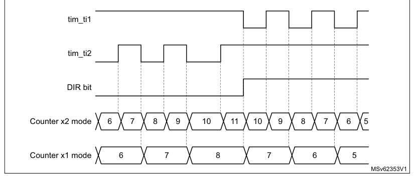

**Figure 437. Directional clock encoder mode (CC1P = CC2P = 1)**

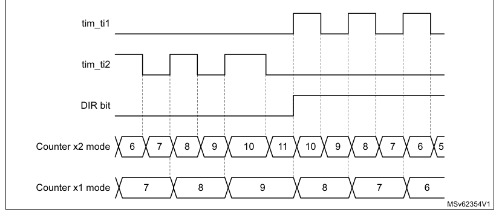

Table 297 details how the directional clock mode operates, for any input transition.

**Table 297. Counting direction versus encoder signals and polarity settings**

| Source row | Column 1 | Column 2 | Column 3 | Column 4 | Column 5 | Column 6 |
| ---: | --- | --- | --- | --- | --- | --- |
| 1 | `Level on` | `tim_ti1fp1 signal` | `tim_ti2fp2 signal` |  |  |  |
| 2 | `opposite` |  |  |  |  |  |
| 3 | `signal` |  |  |  |  |  |
| 4 | `Directional` |  |  |  |  |  |
| 5 | `SMS[3:0]` | `(tim_ti1fp1 for` |  |  |  |  |
| 6 | `clock mode` |  |  |  |  |  |
| 7 | `tim_ti2,` | `Rising` | `Falling` | `Rising` | `Falling` |  |
| 8 | `tim_ti2fp2 for` |  |  |  |  |  |
| 9 | `tim_ti1)` |  |  |  |  |  |
| 10 | `High` | `Down` | `Down` | `Up` | `Up` |  |
| 11 | `x2 mode` |  |  |  |  |  |
| 12 | `1100` |  |  |  |  |  |
| 13 | `CCxP = 0` |  |  |  |  |  |
| 14 | `Low` | `No count` | `No count` | `No count` | `No count` |  |
| 15 | `x2 mode` | `High` | `No count` | `No count` | `No count` | `No count` |
| 16 | `1100` |  |  |  |  |  |
| 17 | `CCxP = 1` | `Low` | `Down` | `Down` | `Up` | `Up` |
| 18 | `x1 mode` | `High` | `No count` | `Down` | `No count` | `Up` |
| 19 | `1101` |  |  |  |  |  |
| 20 | `CCxP = 0` | `Low` | `No count` | `No count` | `No count` | `No count` |
| 21 | `x1 mode` | `High` | `No count` | `No count` | `No count` | `No count` |
| 22 | `1101` |  |  |  |  |  |
| 23 | `CCxP = 1` | `Low` | `Down` | `No count` | `Up` | `No count` |

#### Index input

The counter can be reset by an index signal coming from the encoder, indicating an absolute
reference position. The index signal must be connected to the tim_etr_in input. It can be filtered
using the digital input filter.

The index functionality is enabled with the IE bit in the TIMx_ECR register. The IE bit must be set
only in encoder mode, when the SMS[3:0] bitfield has the following values: 0001, 0010, 011, 1010,
1011, 1100, 1101, 1110, 1111.

Available encoders are proposed with several options for index pulse conditioning, as per Figure
438:

- Gated with A and B: the pulse width is 1/4 of one channel period, aligned with both A and B edges.
- Gated with A (or gated with B): the pulse width is 1/2 of one channel period, aligned with the two
  edges on channel A (resp. channel B).
- Ungated: the pulse width is up to one channel period, without any alignment to the edges.

**Figure 438. Index gating options**

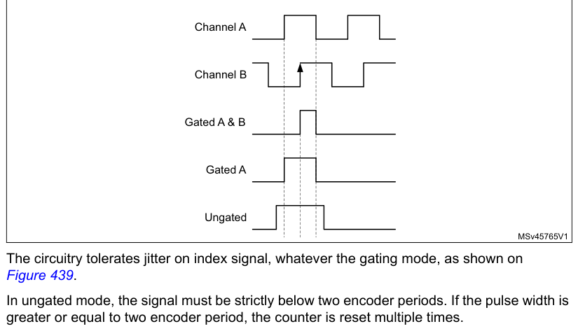

Channel A

Channel B

Gated A & B

Gated A

Ungated

MSv45765V1

The circuitry tolerates jitter on index signal, whatever the gating mode, as shown on

Figure 439.

In ungated mode, the signal must be strictly below two encoder periods. If the pulse width is
greater or equal to two encoder period, the counter is reset multiple times.

**Figure 439. Jittered Index signals**

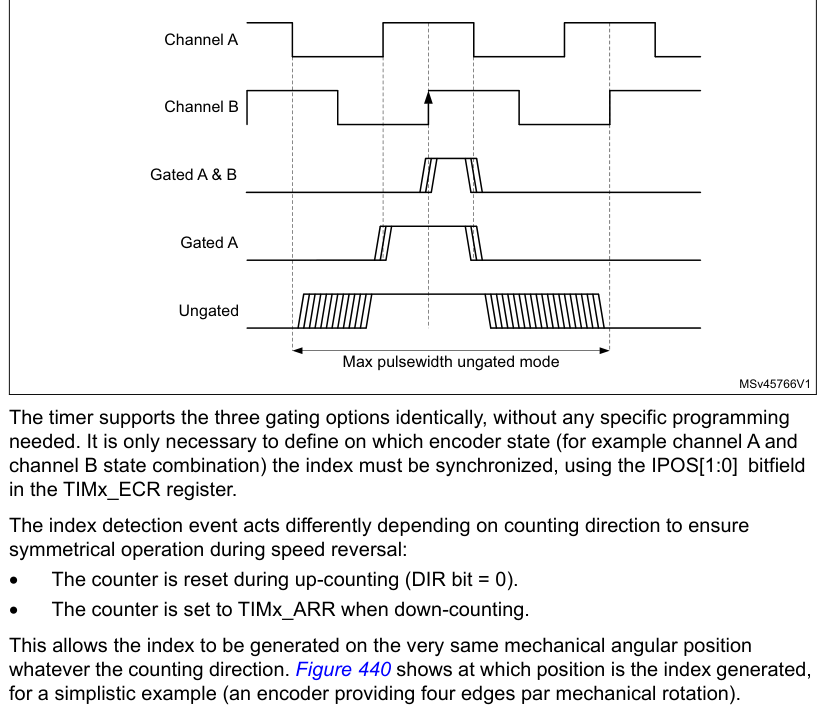

Channel A

Channel B

Gated A & B

Gated A

Ungated

Max pulsewidth ungated mode

MSv45766V1

The timer supports the three gating options identically, without any specific programming needed. It
is only necessary to define on which encoder state (for example channel A and channel B state
combination) the index must be synchronized, using the IPOS[1:0] bitfield in the TIMx_ECR register.

The index detection event acts differently depending on counting direction to ensure symmetrical
operation during speed reversal:

- The counter is reset during up-counting (DIR bit = 0).
- The counter is set to TIMx_ARR when down-counting.

This allows the index to be generated on the very same mechanical angular position whatever the
counting direction. Figure 440 shows at which position is the index generated, for a simplistic
example (an encoder providing four edges par mechanical rotation).

**Figure 440. Index generation for IPOS[1:0] = 11**

![Figure 440: Index generation for IPOS\[1:0\] = 11](../STM32G4_RM0440_figures/figure-0440.png)

Figure 441 presents waveforms and corresponding values for IPOS[1:0] = 11. It shows that the instant
at which the counter value is forced is automatically adjusted depending on the counting direction:

- Counter set to 0 when encoder state is 11 (ChA = 1, ChB = 1), when up-counting (DIR bit = 0).
- Counter set to TIMx_ARR when exiting the 11 state, when down-counting (DIR bit = 1).

An interrupt can be issued upon index detection event.

The arrows are indicating on which transition is the index event interrupt generated.

**Figure 441. Counter reading with index gated on channel A (IPOS[1:0] = 11)**

![Figure 441: Counter reading with index gated on channel A (IPOS\[1:0\] = 11)](../STM32G4_RM0440_figures/figure-0441.png)

Figure 442 presents waveforms and corresponding values for the ungated mode. The arrows are
indicating on which transition is the index event generated.

**Figure 442. Counter reading with index ungated (IPOS[1:0] = 00)**

![Figure 442: Counter reading with index ungated (IPOS\[1:0\] = 00)](../STM32G4_RM0440_figures/figure-0442.png)

Figure 443 shows how the gated on A & B mode is handled, for various pulse alignment scenarios. The
arrows are indicating on which transition is the index event generated.

**Figure 443. Counter reading with index gated on channel A and B**

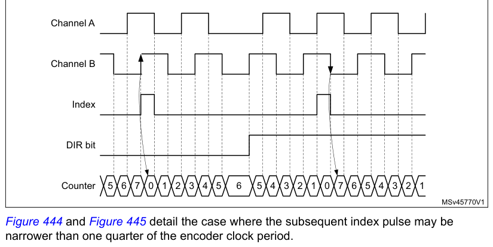

Figure 444 and Figure 445 detail the case where the subsequent index pulse may be narrower than one
quarter of the encoder clock period.

**Figure 444. Encoder mode behavior in case of narrow index pulse (IPOS[1:0] = 11)**

![Figure 444: Encoder mode behavior in case of narrow index pulse (IPOS\[1:0\] = 11)](../STM32G4_RM0440_figures/figure-0444.png)

**Figure 445. Counter reset Narrow index pulse (closer view, ARR = 0x07)**

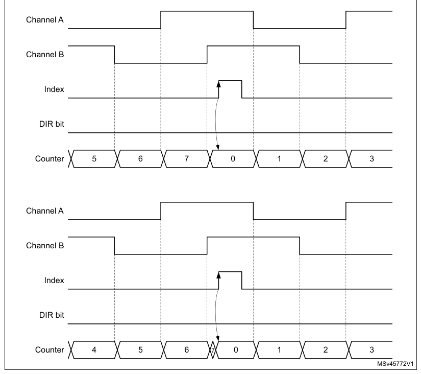

Figure 446 shows how the index is managed in x1 and x2 modes.

**Figure 446. Index behavior in x1 and x2 mode (IPOS[1:0] = 01)**

![Figure 446: Index behavior in x1 and x2 mode (IPOS\[1:0\] = 01)](../STM32G4_RM0440_figures/figure-0446.png)

AB = IPOS[1:0] = 01

Channel A

Channel B

Index

DIR bit

#### Directional index sensitivity

The IDIR[1:0] bitfield in the TIMx_ECR register allows the index to be active only in a selected
counting direction.

Figure 447 shows the relationship between index and counter reset events, depending on IDIR[1:0]
value.

> **Note:** The IDR[1:0] bitfield must be written when IE bit is reset (index mode disabled).

The directional index sensitivity is not supported in clock \+ direction mode. When SMS[3:0] = 1010
or 1011, the IDIR[1:0] must be set to 00.

**Figure 447. Directional index sensitivity**

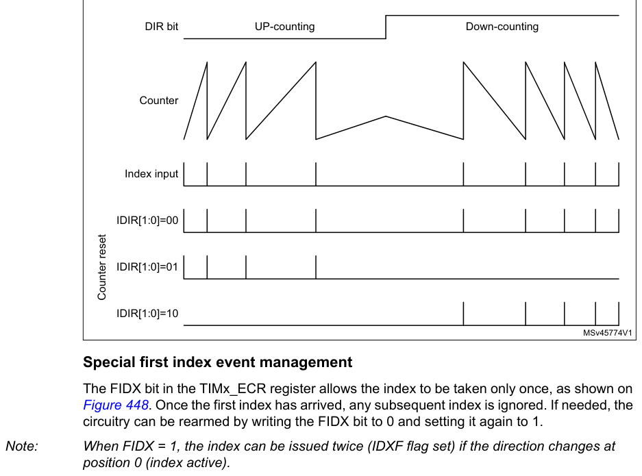

#### Special first index event management

The FIDX bit in the TIMx_ECR register allows the index to be taken only once, as shown on

Figure 448. Once the first index has arrived, any subsequent index is ignored. If needed, the
circuitry can be rearmed by writing the FIDX bit to 0 and setting it again to 1.

> **Note:** When FIDX = 1, the index can be issued twice (IDXF flag set) if the direction changes at
> position 0 (index active).

**Figure 448. Counter reset as function of FIDX bit setting**

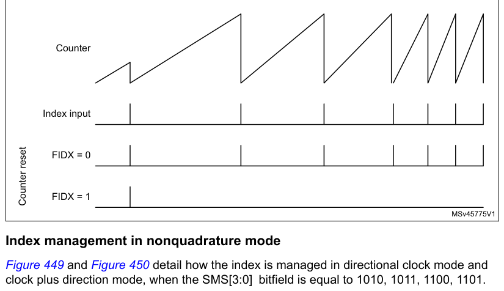

Counter

Index input

FIDX = 0

FIDX = 1

Counter reset

MSv45775V1

#### Index management in nonquadrature mode

Figure 449 and Figure 450 detail how the index is managed in directional clock mode and clock plus
direction mode, when the SMS[3:0] bitfield is equal to 1010, 1011, 1100, 1101.

For both of these modes, the index sensitivity is set with the IPOS[0] bit as following:

- IPOS[0] = 0: Index is detected on clock low level.
- IPOS[0] = 1: Index is detected on clock high level.

The IPOS[1] bit is not-significant.

**Figure 449. Index behavior in clock \+ direction mode, IPOS[0] = 1**

![Figure 449: Index behavior in clock \+ direction mode, IPOS\[0\] = 1](../STM32G4_RM0440_figures/figure-0449.png)

**Figure 450. Index behavior in directional clock mode, IPOS[0] = 1**

![Figure 450: Index behavior in directional clock mode, IPOS\[0\] = 1](../STM32G4_RM0440_figures/figure-0450.png)

#### Encoder error management

For encoder configurations where two quadrature signals are available, it is possible to detect
transition errors. The reading on the two inputs corresponds to a 2-bit gray code which can be
represented as a state diagram, on Figure 451. A single bit is expected to change at once. An
erroneous transition sets the TERRF interrupt flag in the TIMx_SR status register. A transition
error interrupt is generated if the TERRIE bit is set in the TIMx_DIER register.

**Figure 451. State diagram for quadrature encoded signals**

For encoder having an index signal, it is possible to detect abnormal operation resulting in an
excess of pulses per revolution. An encoder with N pulses per revolution provides 4xN counts per
revolution. The index signal resets the counter every 4xN clock periods.

If the counter value is incremented from TIMx_ARR to 0 or decremented from 0 to TIMxARR value
without any index event, this is reported as an index position error.

The overflow threshold is programmed using the TIMx_ARR register. A 1000 lines encoder results in a
counter value being between 0 and 3999 (in 4x reading mode). The overflow detection threshold must
be programmed by setting TIMx_ARR = 3999 \+ 1 = 4000.

The error assertion is delayed to the transition 0 to 1 when in up-counting. This is to cope with
narrow index pulses in gated A and B mode, as shown on Figure 452.

**Figure 452. Up-counting encoder error detection**

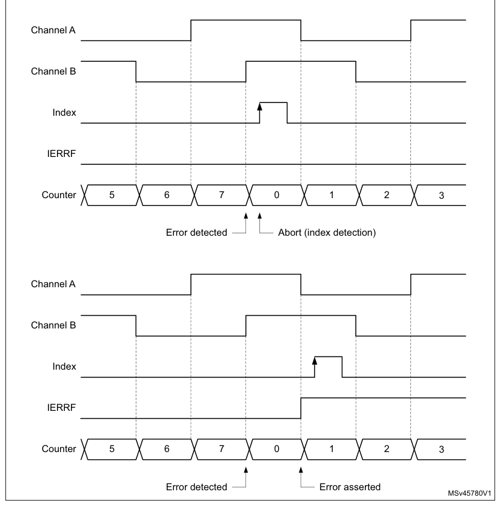

In down-counting mode, the detection is conditioned by a preliminary transition from 1 to 0. This is
to cope with narrow index pulses in gated A and B mode, as shown on Figure 453, to avoid any false
error detection in case the encoder dithers between TIMx_ARR and 0 immediately after the index
detection.

**Figure 453. Down-counting encode error detection**

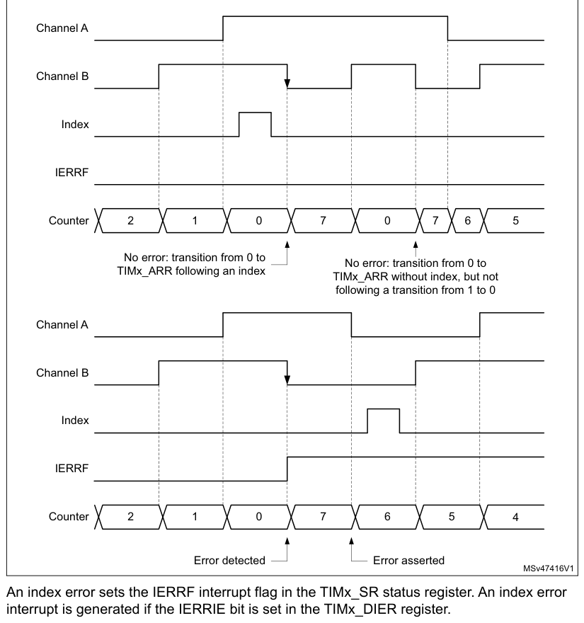

An index error sets the IERRF interrupt flag in the TIMx_SR status register. An index error
interrupt is generated if the IERRIE bit is set in the TIMx_DIER register.

#### Functional encoder interrupts

The following interrupts are also available in encoder mode

- Direction change: any change of the counting direction in encoder mode causes the DIR bit in the
  TIMx_CR1 register to toggle. The direction change sets the DIRF interrupt flag in the TIMx_SR
  status register. A direction change interrupt is generated if the DIRIE bit is set in the
  TIMx_DIER register.
- Index event: the index event sets the IDXF interrupt flag in the TIMx_SR status register. An index
  interrupt is generated if the IDXIE bit is set in the TIMx_DIER register.

#### Slave mode selection preload for run-time encoder mode update

It can be necessary to switch from one encoder mode to another during run-time. This is typically
done at high-speed to decrease the update interrupt rate, by switching from x4 to x2 to x1 mode, as
shown on Figure 454.

For this purpose, the SMS[3:0] bit can be preloaded. This is enabled by setting the SMSPE enable bit
in the TIMx_SMCR register. The trigger for the transfer from SMS[3:0] preload to active value can be
selected with the SMSPS bit in the TIMx_SMCR register.

- SMSPS = 0: the transfer is triggered by the update event (UEV) occurring when the counter
  overflows when up-counting, and underflows when down-counting. This mode must be used only when
  index is disabled (bit IE = 0).
- SMSPS = 1: the transfer is triggered by the index event.

**Figure 454. Encoder mode change with preload transferred on update (SMSPS = 0)**

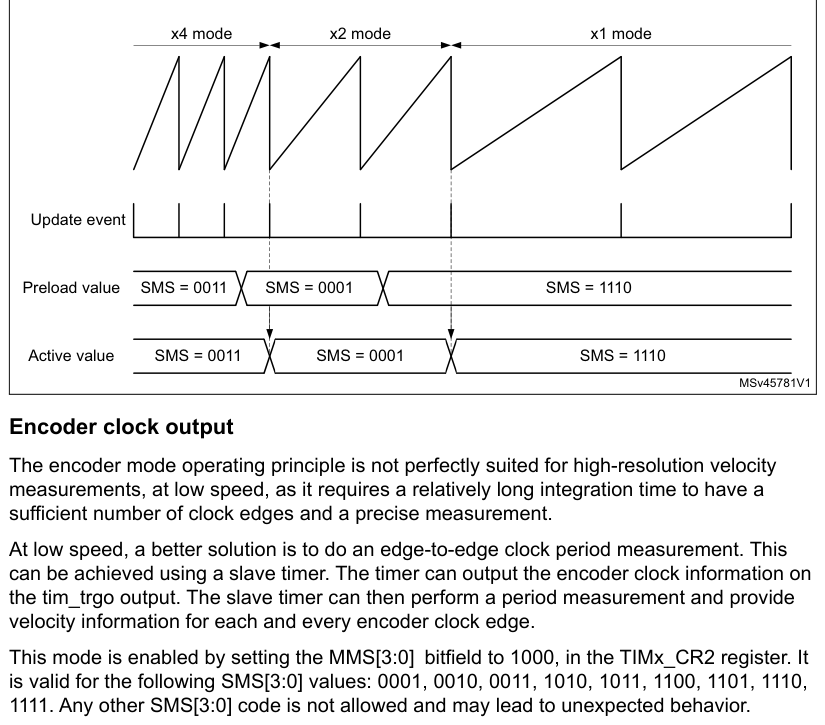

#### Encoder clock output

The encoder mode operating principle is not perfectly suited for high-resolution velocity
measurements, at low speed, as it requires a relatively long integration time to have a sufficient
number of clock edges and a precise measurement.

At low speed, a better solution is to do an edge-to-edge clock period measurement. This can be
achieved using a slave timer. The timer can output the encoder clock information on the tim_trgo
output. The slave timer can then perform a period measurement and provide velocity information for
each and every encoder clock edge.

This mode is enabled by setting the MMS[3:0] bitfield to 1000, in the TIMx_CR2 register. It is valid
for the following SMS[3:0] values: 0001, 0010, 0011, 1010, 1011, 1100, 1101, 1110,

1111. Any other SMS[3:0] code is not allowed and may lead to unexpected behavior.

### 30.4.19 Direction bit output

It is possible to output a direction signal out of the timer, on the tim_oc3 and tim_oc4 output
signals (copy of the DIR bit in the TIMx_CR1 register). This is achieved by setting the OC3M[3:0] or
the OC4M[3:0] bitfield to 1011 in the TIMx_CCMR2 register.

This feature can be used for monitoring the counting direction (or rotation direction) in encoder
mode, or to have a signal indicating the up/down phases in center-aligned PWM mode.

### 30.4.20 UIF bit remapping

The IUFREMAP bit in the TIMx_CR1 register forces a continuous copy of the update interrupt flag
(UIF) into bit 31 of the timer counter register’s bit 31 (TIMxCNT[31]). This is used to atomically
read both the counter value and a potential roll-over condition signaled by the UIFCPY flag. It
eases the calculation of angular speed by avoiding race conditions caused, for instance, by a
processing shared between a background task (counter reading) and an interrupt (update interrupt).

There is no latency between the UIF and UIFCPY flag assertions.

In 32-bit timer implementations, when the IUFREMAP bit is set, bit 31 of the counter is overwritten
by the UIFCPY flag upon read access (the counter’s most significant bit is only accessible in write
mode).

### 30.4.21 Timer input XOR function

The TI1S bit in the TIM1xx_CR2 register, allows the input filter of channel 1 to be connected to the
output of an XOR gate, combining the three input pins tim_ti1, tim_ti2 and tim_ti3.

The XOR output can be used with all the timer input functions such as trigger or input capture.

An example of this feature used to interface Hall sensors is given in [Section 29.3.29](chapter-29.md#29329-interfacing-with-hall-sensors): Interfacing
with Hall sensors.

### 30.4.22 Timers and external trigger synchronization

The TIMx timers can be synchronized with an external trigger in several modes: Reset mode, Gated
mode, Trigger mode, Reset \+ trigger and gated \+ reset modes.

#### Slave mode: Reset mode

The counter and its prescaler can be reinitialized in response to an event on a trigger input.
Moreover, if the URS bit from the TIMx_CR1 register is low, an update event UEV is generated. Then
all the preloaded registers (TIMx_ARR, TIMx_CCRx) are updated.

In the following example, the upcounter is cleared in response to a rising edge on tim_ti1 input:

1. Configure the channel 1 to detect rising edges on tim_ti1. Configure the input filter
   duration (in this example, we do not need any filter, so we keep IC1F = 0000). The capture prescaler
   is not used for triggering, so it does not need to be configured. The CC1S bits select the input
   capture source only, CC1S = 01 in the TIMx_CCMR1 register. Write CC1P = 0 and CC1NP = 0 in TIMx_CCER
   register to validate the polarity (and detect rising edges only).
2. Configure the timer in reset mode by writing SMS = 100 in TIMx_SMCR register. Select
   tim_ti1 as the input source by writing TS = 00101 in TIMx_SMCR register.
3. Start the counter by writing CEN = 1 in the TIMx_CR1 register.

The counter starts counting on the internal clock, then behaves normally until tim_ti1 rising edge.
When tim_ti1 rises, the counter is cleared and restarts from 0. In the meantime, the
trigger flag is set (TIF bit in the TIMx_SR register) and an interrupt request, or a DMA request can
be sent if enabled (depending on the TIE and TDE bits in TIMx_DIER register).

The following figure shows this behavior when the autoreload register TIMx_ARR = 0x36. The delay
between the rising edge on tim_ti1 and the actual reset of the counter is due to the
resynchronization circuit on tim_ti1 input.

**Figure 455. Control circuit in reset mode**

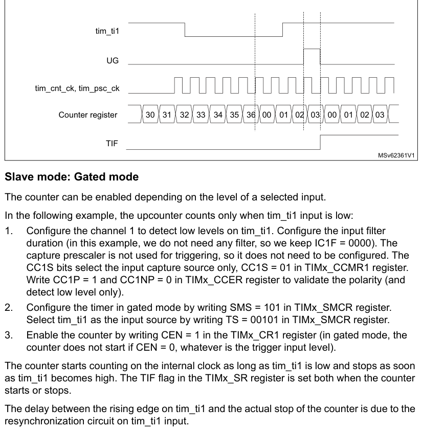

#### Slave mode: Gated mode

The counter can be enabled depending on the level of a selected input.

In the following example, the upcounter counts only when tim_ti1 input is low:

1. Configure the channel 1 to detect low levels on tim_ti1. Configure the input filter
   duration (in this example, we do not need any filter, so we keep IC1F = 0000). The capture prescaler
   is not used for triggering, so it does not need to be configured. The CC1S bits select the input
   capture source only, CC1S = 01 in TIMx_CCMR1 register. Write CC1P = 1 and CC1NP = 0 in TIMx_CCER
   register to validate the polarity (and detect low level only).
2. Configure the timer in gated mode by writing SMS = 101 in TIMx_SMCR register.

Select tim_ti1 as the input source by writing TS = 00101 in TIMx_SMCR register.

3. Enable the counter by writing CEN = 1 in the TIMx_CR1 register (in gated mode, the
   counter does not start if CEN = 0, whatever is the trigger input level).

The counter starts counting on the internal clock as long as tim_ti1 is low and stops as soon as
tim_ti1 becomes high. The TIF flag in the TIMx_SR register is set both when the counter starts or
stops.

The delay between the rising edge on tim_ti1 and the actual stop of the counter is due to the
resynchronization circuit on tim_ti1 input.

**Figure 456. Control circuit in gated mode**

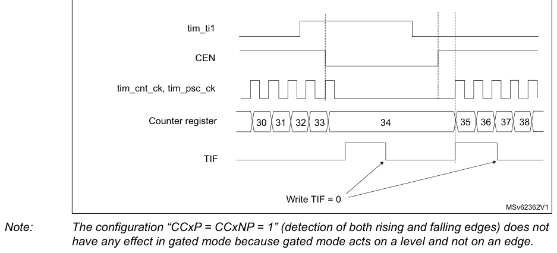

> **Note:** The configuration “CCxP = CCxNP = 1” (detection of both rising and falling edges) does not
> have any effect in gated mode because gated mode acts on a level and not on an edge.

#### Slave mode: Trigger mode

The counter can start in response to an event on a selected input.

In the following example, the upcounter starts in response to a rising edge on tim_ti2 input:

1. Configure the channel 2 to detect rising edges on tim_ti2. Configure the input filter
   duration (in this example, we do not need any filter, so we keep IC2F = 0000). The capture prescaler
   is not used for triggering, so it does not need to be configured. CC2S bits are selecting the input
   capture source only, CC2S = 01 in TIMx_CCMR1 register. Write CC2P = 1 and CC2NP = 0 in TIMx_CCER
   register to validate the polarity (and detect low level only).
2. Configure the timer in trigger mode by writing SMS = 110 in TIMx_SMCR register.

Select tim_ti2 as the input source by writing TS = 00110 in TIMx_SMCR register.

When a rising edge occurs on tim_ti2, the counter starts counting on the internal clock and the TIF
flag is set.

The delay between the rising edge on tim_ti2 and the actual start of the counter is due to the
resynchronization circuit on tim_ti2 input.

**Figure 457. Control circuit in trigger mode**

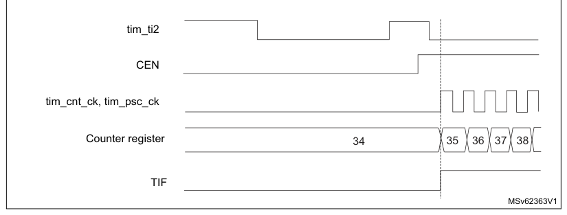

#### Slave mode selection preload for run-time encoder mode update

The SMS[3:0] bit can be preloaded. This is enabled by setting the SMSPE enable bit in the TIMx_SMCR
register. The trigger for the transfer from SMS[3:0] preload to active value is the update event
(UEV) occurring when the counter overflows.

#### Slave mode – combined reset \+ trigger mode

In this case, a rising edge of the selected trigger input (tim_trgi) reinitializes the counter,
generates an update of the registers, and starts the counter.

This mode is used for one-pulse mode.

#### Slave mode – combined gated \+ reset mode

The counter clock is enabled when the trigger input (tim_trgi) is high. The counter stops and is
reset as soon as the trigger becomes low. Both start and stop of the counter are controlled.

This mode is used to detect out-of-range PWM signal (duty cycle exceeding a maximum expected value).

#### Slave mode – external clock mode 2 \+ trigger mode

The external clock mode 2 can be used in addition to another slave mode (except external clock mode
1 and encoder mode). In this case, the tim_etr_in signal is used as external clock input, and
another input can be selected as trigger input when operating in reset mode, gated mode, or trigger
mode. It is recommended not to select tim_etr_in as tim_trgi through the TS bits of TIMx_SMCR
register.

In the following example, the upcounter is incremented at each rising edge of the tim_etr_in signal
as soon as a rising edge of tim_ti1 occurs:

1. Configure the external trigger input circuit by programming the TIMx_SMCR register as
   follows:

- ETF = 0000: no filter.
- ETPS = 00: prescaler disabled.
- ETP = 0: detection of rising edges on tim_etr_in and ECE = 1 to enable the external clock mode 2.

2. Configure the channel 1 as follows, to detect rising edges on TI:
   - IC1F = 0000: no filter.
   - The capture prescaler is not used for triggering and does not need to be configured.
   - CC1S = 01in TIMx_CCMR1 register to select only the input capture source.
   - CC1P = 0 and CC1NP = 0 in TIMx_CCER register to validate the polarity (and detect rising edge
    only).

3. Configure the timer in trigger mode by writing SMS = 110 in TIMx_SMCR register.

Select tim_ti1 as the input source by writing TS = 00101 in TIMx_SMCR register.

A rising edge on tim_ti1 enables the counter and sets the TIF flag. The counter then counts on
tim_etr_in rising edges.

The delay between the rising edge of the tim_etr_in signal and the actual reset of the counter is
due to the resynchronization circuit on tim_etrp input.

**Figure 458. Control circuit in external clock mode 2 \+ trigger mode**

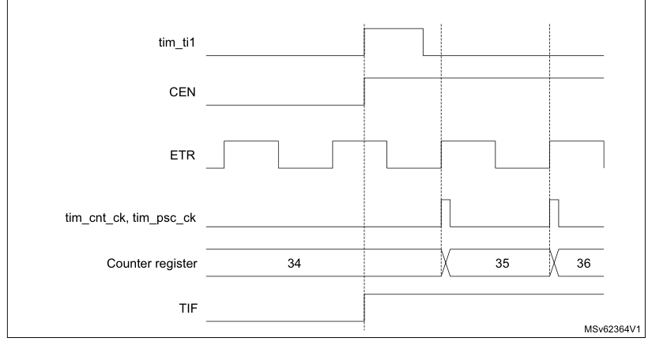

### 30.4.23 Timer synchronization

The TIMx timers are linked together internally for timer synchronization or chaining. When one timer
is configured in Master mode, it can reset, start, stop, or clock the counter of another timer
configured in Slave mode.

Figure 459 and Figure 460 show examples of master/slave timer connections.

**Figure 459. Master/Slave timer example**

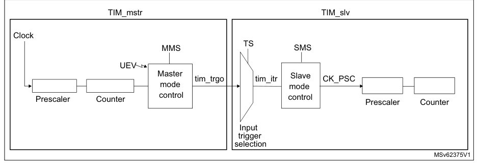

**Figure 460. Master/slave connection example with 1 channel only timers**

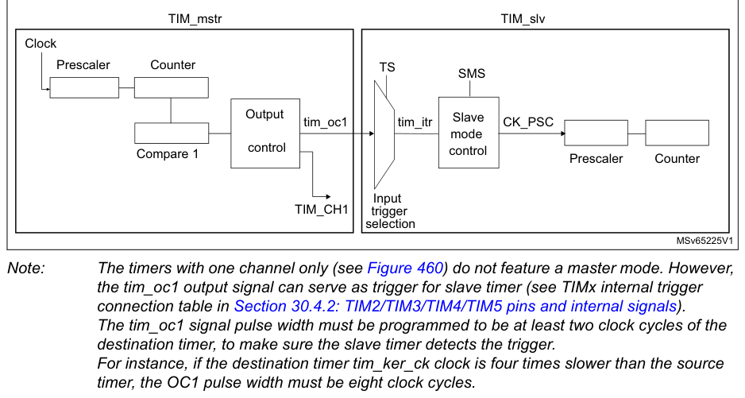

> **Note:** The timers with one channel only (see Figure 460) do not feature a master mode. However,
> the tim_oc1 output signal can serve as trigger for slave timer (see TIMx internal trigger connection
> table in Section 30.4.2: TIM2/TIM3/TIM4/TIM5 pins and internal signals). The tim_oc1 signal pulse
> width must be programmed to be at least two clock cycles of the destination timer, to make sure the
> slave timer detects the trigger. For instance, if the destination timer tim_ker_ck clock is four
> times slower than the source timer, the OC1 pulse width must be eight clock cycles.

#### Using one timer as prescaler for another timer

For example, TIM_mstr can be configured to act as a prescaler for TIM_slv. Refer to

Figure 459. To do this:

1. Configure TIM_mstr in master mode so that it outputs a periodic trigger signal on each
   update event UEV. If MMS = 010 is written in the TIM_mstr_CR2 register, a rising edge is output on
   tim_trgo each time an update event is generated.
2. To connect the tim_trgo output of TIM_mstr to TIM_slv, TIM_slv must be configured in
   slave mode using ITR2 as internal trigger. This is selected through the TS bits in the TIM_slv_SMCR
   register (writing TS = 00010).
3. Then the slave mode controller must be put in external clock mode 1 (write SMS = 111
   in the TIM_slv_SMCR register). This causes TIM_slv to be clocked by the rising edge of the periodic
   TIM_mstr trigger signal (which correspond to the TIM_mstr counter overflow).
4. Finally both timers must be enabled by setting their respective CEN bits (TIMx_CR1
   register).

> **Note:** If tim_ocx is selected on TIM_mstr as the trigger output (MMS = 1xx), its rising edge is used
> to clock the counter of TIM_slv.

#### Using one timer to enable another timer

In this example, we control the enable of TIM_slv with the output compare 1 of TIM_mstr. Refer to
Figure 459 for connections. TIM_slv counts on the divided internal clock only when tim_oc1ref of
TIM_mstr is high. Both counter clock frequencies are divided by 3 by the prescaler compared to
tim_ker_ck (ftim_cnt_ck = ftim_ker_ck/3).

1. Configure TIM_mstr master mode to send its output compare 1 reference (tim_oc1ref)
   signal as trigger output (MMS = 100 in the TIM_mstr_CR2 register).
2. Configure the TIM_mstr tim_oc1ref waveform (TIM_mstr_CCMR1 register).
3. Configure TIM_slv to get the input trigger from TIM_mstr (TS = 00010 in the

TIM_slv_SMCR register).

4. Configure TIM_slv in gated mode (SMS = 101 in TIM_slv_SMCR register).
5. Enable TIM_slv by writing 1 in the CEN bit (TIM_slv_CR1 register).
6. Start TIM_mstr by writing 1 in the CEN bit (TIM_mstr_CR1 register).

> **Note:** The slave timer counter clock is not synchronized with the master timer counter clock, this
> mode only affects the TIM_slv counter enable signal.

**Figure 461. Gating TIM_slv with tim_oc1ref of TIM_mstr**

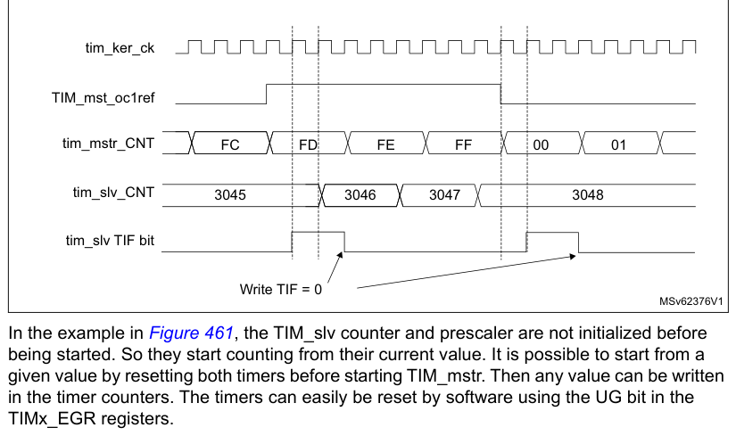

In the example in Figure 461, the TIM_slv counter and prescaler are not initialized before being
started. So they start counting from their current value. It is possible to start from a given value
by resetting both timers before starting TIM_mstr. Then any value can be written in the timer
counters. The timers can easily be reset by software using the UG bit in the TIMx_EGR registers.

In the next example (refer to Figure 462), we synchronize TIM_mstr and TIM_slv. TIM_mstr is the
master and starts from 0. TIM_slv is the slave and starts from 0xE7. The prescaler ratio is the same
for both timers. TIM_slv stops when TIM_mstr is disabled by writing 0 to the CEN bit in the
TIM_mstr_CR1 register:

1. Configure TIM_mstr master mode to send its output compare 1 reference (tim_oc1ref)
   signal as trigger output (MMS = 100 in the TIM_mstr_CR2 register).
2. Configure the TIM_mstr tim_oc1ref waveform (TIM_mstr_CCMR1 register).
3. Configure TIM_slv to get the input trigger from TIM_mstr (TS = 00010 in the

TIM_slv_SMCR register).

4. Configure TIM_slv in gated mode (SMS = 101 in TIM_slv_SMCR register).
5. Reset TIM_mstr by writing 1 in UG bit (TIM_mstr_EGR register).
6. Reset TIM_slv by writing 1 in UG bit (TIM_slv_EGR register).
7. Initialize TIM_slv to 0xE7 by writing 0xE7 in the TIM_slv counter (TIM_slv_CNT).
8. Enable TIM_slv by writing 1 in the CEN bit (TIM_slv_CR1 register).
9. Start TIM_mstr by writing 1 in the CEN bit (TIM_mstr_CR1 register).
10. Stop TIM_mstr by writing 0 in the CEN bit (TIM_mstr_CR1 register).

**Figure 462. Gating TIM_slv with Enable of TIM_mstr**

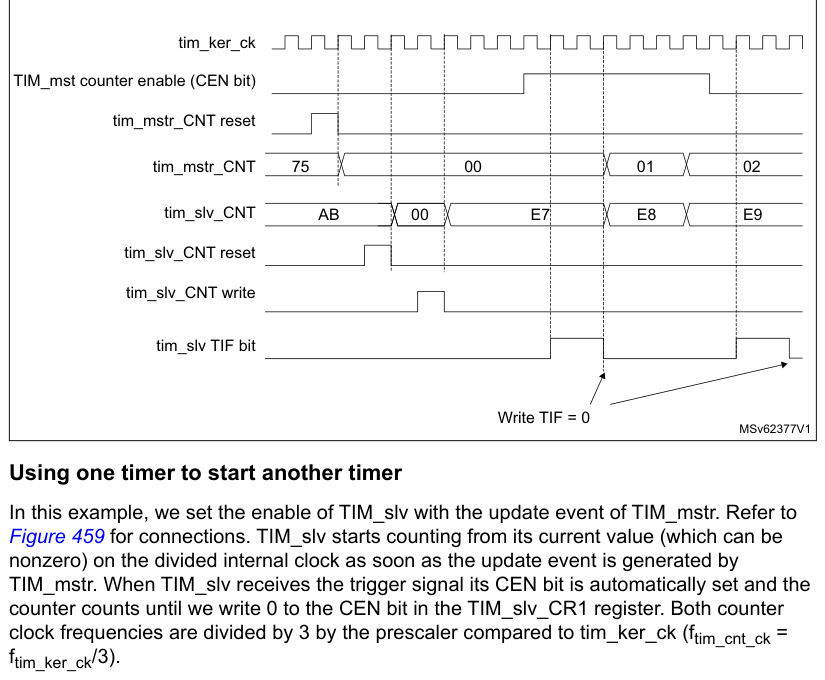

#### Using one timer to start another timer

In this example, we set the enable of TIM_slv with the update event of TIM_mstr. Refer to Figure 459
for connections. TIM_slv starts counting from its current value (which can be nonzero) on the
divided internal clock as soon as the update event is generated by TIM_mstr. When TIM_slv receives
the trigger signal its CEN bit is automatically set and the counter counts until we write 0 to the
CEN bit in the TIM_slv_CR1 register. Both counter clock frequencies are divided by 3 by the
prescaler compared to tim_ker_ck (ftim_cnt_ck = ftim_ker_ck/3).

1. Configure TIM_mstr master mode to send its update event (UEV) as trigger output

(MMS = 010 in the TIM_mstr_CR2 register).

2. Configure the TIM_mstr period (TIM_mstr_ARR registers).
3. Configure TIM_slv to get the input trigger from TIM_mstr (TS = 00010 in the

TIM_slv_SMCR register).

4. Configure TIM_slv in trigger mode (SMS = 110 in TIM_slv_SMCR register).
5. Start TIM_mstr by writing 1 in the CEN bit (TIM_mstr_CR1 register).

**Figure 463. Triggering TIM_slv with update of TIM_mstr**

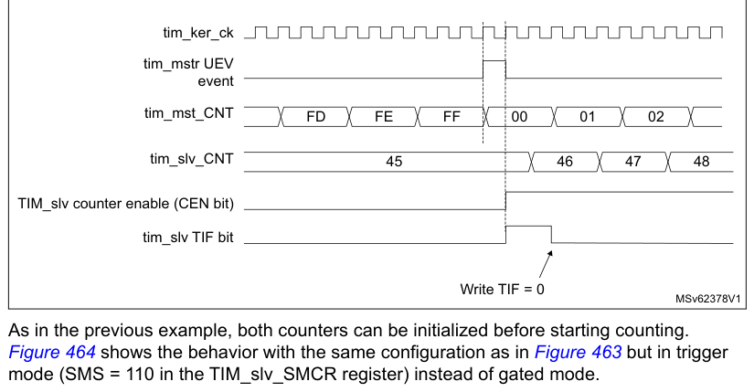

As in the previous example, both counters can be initialized before starting counting. Figure 464
shows the behavior with the same configuration as in Figure 463 but in trigger mode (SMS = 110 in
the TIM_slv_SMCR register) instead of gated mode.

**Figure 464. Triggering TIM_slv with Enable of TIM_mstr**

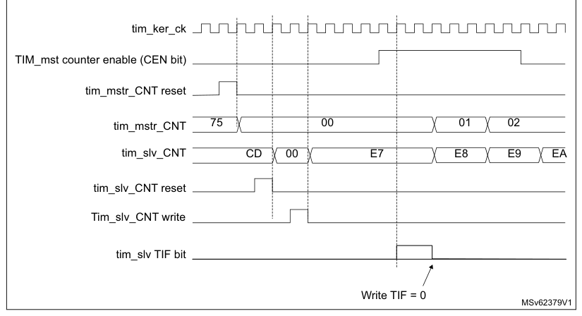

#### Starting two timers synchronously in response to an external trigger

In this example, we set the enable of TIM_mstr when its tim_ti1 input rises, and the enable of
TIM_slv with the enable of TIM_mstr. Refer to Figure 459 for connections. To ensure the counters are
aligned, TIM_mstr must be configured in Master/Slave mode (slave with respect to tim_ti1, master
with respect to TIM_slv):

1. Configure TIM_mstr master mode to send its enable as trigger output (MMS = 001 in
   the TIM_mstr_CR2 register).
2. Configure TIM_mstr slave mode to get the input trigger from tim_ti1 (TS = 00100 in the

TIM_mstr_SMCR register).

3. Configure TIM_mstr in trigger mode (SMS = 110 in the TIM_mstr_SMCR register).
4. Configure the TIM_mstr in Master/Slave mode by writing MSM = 1 (TIM_mstr_SMCR
   register).
5. Configure TIM_slv to get the input trigger from TIM_mstr (TS = 00000 in the

TIM_slv_SMCR register).

6. Configure TIM_slv in trigger mode (SMS = 110 in the TIM_slv_SMCR register).

When a rising edge occurs on tim_ti1 (TIM_mstr), both counters start counting synchronously on the
internal clock and both TIF flags are set.

> **Note:** In this example both timers are initialized before starting (by setting their respective UG
> bits). Both counters starts from 0, but an offset can easily be inserted between them by writing any
> of the counter registers (TIMx_CNT). One can see that the master/slave mode inserts a delay between
CNT_EN and CK_PSC on TIM_mstr.

**Figure 465. Triggering TIM_mstr and TIM_slv with TIM_mstr tim_ti1 input**

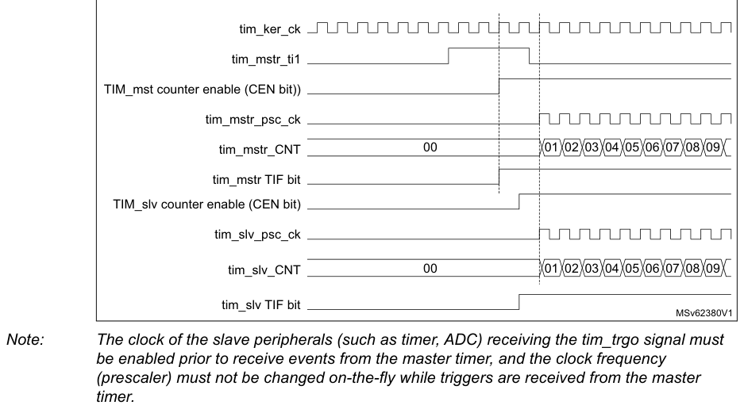

> **Note:** The clock of the slave peripherals (such as timer, ADC) receiving the tim_trgo signal must
> be enabled prior to receive events from the master timer, and the clock frequency (prescaler) must
> not be changed on-the-fly while triggers are received from the master timer.

### 30.4.24 ADC triggers

The timer can generate an ADC triggering event with various internal signals, such as reset, enable
or compare events.

> **Note:** The clock of the slave peripherals (such as timer, ADC) receiving the tim_trgo signal must
> be enabled prior to receive events from the master timer, and the clock frequency (prescaler) must
> not be changed on-the-fly while triggers are received from the master timer.

### 30.4.25 DMA burst mode

The TIMx timers have the capability to generate multiple DMA requests upon a single event. The main
purpose is to be able to reprogram part of the timer multiple times without software overhead, but
it can also be used to read several registers in a row, at regular intervals.

The DMA controller destination is unique and must point to the virtual register TIMx_DMAR. On a
given timer event, the timer launches a sequence of DMA requests (burst). Each write into the
TIMx_DMAR register is actually redirected to one of the timer registers.

The DBL[4:0] bits in the TIMx_DCR register set the DMA burst length. The timer recognizes a burst
transfer when a read or a write access is done to the TIMx_DMAR address), i.e. the number of
transfers (either in half-words or in bytes).

The DBA[4:0] bits in the TIMx_DCR registers define the DMA base address for DMA transfers (when
read/write accesses are done through the TIMx_DMAR address). DBA is defined as an offset starting
from the address of the TIMx_CR1 register:

Example:

- `00000`: TIMx_CR1
- `00001`: TIMx_CR2
- `00010`: TIMx_SMCR

As an example, the timer DMA burst feature is used to update the contents of the CCRx registers (x =
2, 3, 4) upon an update event, with the DMA transferring half words into the CCRx registers.

This is done in the following steps:

1. Configure the corresponding DMA channel as follows:
   - DMA channel peripheral address is the DMAR register address.
   - DMA channel memory address is the address of the buffer in the RAM containing the data to be
    transferred by DMA into CCRx registers.
   - Number of data to transfer = 3 (See note below).
   - Circular mode disabled.

2. Configure the DCR register by configuring the DBA and DBL bitfields as follows:

DBL = 3 transfers, DBA = 0xE.

3. Enable the TIMx update DMA request (set the UDE bit in the DIER register).
4. Enable TIMx.
5. Enable the DMA channel.

This example is for the case where every CCRx register has to be updated once. If every CCRx
register is to be updated twice for example, the number of data to transfer must be 6. Let's take
the example of a buffer in the RAM containing data1, data2, data3, data4, data5, and data6. The data
is transferred to the CCRx registers as follows: on the first update DMA request, data1 is
transferred to CCR2, data2 is transferred to CCR3, data3 is transferred to

CCR4 and on the second update DMA request, data4 is transferred to CCR2, data5 is transferred to
CCR3, and data6 is transferred to CCR4.

> **Note:** A null value can be written to the reserved registers.

### 30.4.26 TIM2/TIM3/TIM4/TIM5 DMA requests

The TIM2/TIM3/TIM4/TIM5 can generate a DMA request, as shown in Table 298.

**Table 298. DMA request**

| Source row | Column 1 | Column 2 | Column 3 | Column 4 |
| ---: | --- | --- | --- | --- |
| 1 | `Enable` |  |  |  |
| 2 | `DMA request signal` | `DMA acronym` | `DMA request` |  |
| 3 | `control bit` |  |  |  |
| 4 | `tim_upd_dma` | `TIM_UP` | `Update` | `UDE` |
| 5 | `tim_cc1_dma` | `TIM_CH1` | `Capture/compare 1` | `CC1DE` |
| 6 | `tim_cc2_dma` | `TIM_CH2` | `Capture/compare 2` | `CC2DE` |
| 7 | `tim_cc3_dma` | `TIM_CH3` | `Capture/compare 3` | `CC3DE` |
| 8 | `tim_cc4_dma` | `TIM_CH4` | `Capture/compare 4` | `CC4DE` |
| 9 | `tim_trgi_dma` | `TIM_TRIG` | `Trigger` | `TDE` |

> **Note:** Some timer's DMA requests may not be connected to the DMA controller. Refer to the DMA
> section(s) for more details.

### 30.4.27 Debug mode

When the microcontroller enters debug mode (Cortex®-M4 with FPU core halted), the TIMx counter can
either continue to work normally or stops.

The behavior in debug mode can be programmed with a dedicated configuration bit per timer in the
Debug support (DBG) module.

For more details, refer to section Debug support (DBG).

### 30.4.28 TIM2/TIM3/TIM4/TIM5 low-power modes

**Table 299. Effect of low-power modes on TIM2/TIM3/TIM4/TIM5**

| Source row | Column 1 | Column 2 |
| ---: | --- | --- |
| 1 | `Mode` | `Description` |
| 2 | `No effect, peripheral is active. The interrupts can cause the device to exit from Sleep` |  |
| 3 | `Sleep` |  |

mode.

The timer operation is stopped and the register content is kept. No interrupt can be

Stop
generated.

| Source row | Column 1 | Column 2 |
| ---: | --- | --- |
| 1 | `Standby` | `The timer is powered-down and must be reinitialized after exiting the Standby mode.` |

### 30.4.29 TIM2/TIM3/TIM4/TIM5 interrupts

The TIM2/TIM3/TIM4/TIM5 can generate multiple interrupts, as shown in Table 300.

**Table 300. Interrupt requests**

| Source row | Column 1 | Column 2 | Column 3 | Column 4 | Column 5 | Column 6 | Column 7 |
| ---: | --- | --- | --- | --- | --- | --- | --- |
| 1 | `Exit Exit from` |  |  |  |  |  |  |
| 2 | `Interrupt` | `Event` | `Enable` | `Interrupt clear` | `from` | `Stop and` |  |
| 3 | `Interrupt event` |  |  |  |  |  |  |
| 4 | `acronym` | `flag` | `control bit` | `method` | `Sleep` | `Standby` |  |
| 5 | `mode mode` |  |  |  |  |  |  |
| 6 | `TIM_UP` | `Update` | `UIF` | `UIE` | `write 0 in UIF` | `Yes` | `No` |
| 7 | `Capture/compare 1` | `CC1IF` | `CC1IE` | `write 0 in CC1IF` | `Yes` | `No` |  |
| 8 | `Capture/compare 2` | `CC2IF` | `CC2IE` | `write 0 in CC2IF` | `Yes` | `No` |  |
| 9 | `TIM_CC` |  |  |  |  |  |  |
| 10 | `Capture/compare 3` | `CC3IF` | `CC3IE` | `write 0 in CC3IF` | `Yes` | `No` |  |
| 11 | `Capture/compare 4` | `CC4IF` | `CC4IE` | `write 0 in CC4IF` | `Yes` | `No` |  |
| 12 | `TIM_TRG` | `Trigger` | `TIF` | `TIE` | `write 0 in TIF` | `Yes` | `No` |
| 13 | `TIM_DIR` | `Index` | `IDXF` | `IDXIE` | `write 0 in IDXF` | `Yes` | `No` |
| 14 | `_IDX` | `Direction` | `DIRF` | `DIRIE` | `write 0 in DIRF` | `Yes` | `No` |
| 15 | `TIM_IERR` | `Index Error` | `IERRF` | `IERRIE` | `write 0 in IERRF` | `Yes` | `No` |
| 16 | `write 0 in` |  |  |  |  |  |  |
| 17 | `TIM_TER` | `Transition Error` | `TERRF` | `TERRIE` | `Yes` | `No` |  |
| 18 | `TERRF` |  |  |  |  |  |  |

## 30.5 TIM2/TIM3/TIM4/TIM5 registers

Refer to [Section 1.2](chapter-01.md#12-list-of-abbreviations-for-registers) for a list of abbreviations used in register descriptions.

The peripheral registers can be accessed by half-words (16-bit) or words (32-bit).

### 30.5.1 TIMx control register 1 (TIMx_CR1)(x = 2 to 5)

- **Address offset:** 0x000
- **Reset value:** 0x0000

**Register bit layout**

| Bit | Field | Access | Summary |
| ---: | --- | :---: | --- |
| 15 | Reserved | — | kept at reset value. |
| 14 | Reserved | — | ↳ |
| 13 | Reserved | — | ↳ |
| 12 | `DITHEN` | rw | Dithering Enable |
| 11 | `UIFREMAP` | rw | UIF status bit remapping |
| 10 | Reserved | — | kept at reset value. |
| 9 | `CKD[1]` | rw | Clock division |
| 8 | `CKD[0]` | rw | ↳ |
| 7 | `ARPE` | rw | Autoreload preload enable |
| 6 | `CMS[1]` | rw | Center-aligned mode selection |
| 5 | `CMS[0]` | rw | ↳ |
| 4 | `DIR` | rw | Direction |
| 3 | `OPM` | rw | One-pulse mode |
| 2 | `URS` | rw | Update request source |
| 1 | `UDIS` | rw | Update disable |
| 0 | `CEN` | rw | Counter enable |

**Bits 15:13 — Reserved:** kept at reset value.

**Bit 12 — `DITHEN`:** Dithering Enable

- `0`: Dithering disabled
- `1`: Dithering enabled

> **Note:** The DITHEN bit can only be modified when CEN bit is reset.

**Bit 11 — `UIFREMAP`:** UIF status bit remapping

- `0`: No remapping. UIF status bit is not copied to TIMx_CNT register bit 31.
- `1`: Remapping enabled. UIF status bit is copied to TIMx_CNT register bit 31.

**Bit 10 — Reserved:** kept at reset value.

**Bits 9:8 — `CKD[1:0]`:** Clock division

This bitfield indicates the division ratio between the timer clock (tim_ker_ck) frequency and
sampling clock used by the digital filters (tim_etr_in, tim_tix),

- `00`: tDTS = ttim_ker_ck
- `01`: tDTS = 2 × ttim_ker_ck
- `10`: tDTS = 4 × ttim_ker_ck
- `11`: Reserved

**Bit 7 — `ARPE`:** Autoreload preload enable

- `0`: TIMx_ARR register is not buffered
- `1`: TIMx_ARR register is buffered

**Bits 6:5 — `CMS[1:0]`:** Center-aligned mode selection

- `00`: Edge-aligned mode. The counter counts up or down depending on the direction bit

(DIR).

- `01`: Center-aligned mode 1. The counter counts up and down alternatively. Output compare
  interrupt flags of channels configured in output (CCxS = 00 in TIMx_CCMRx register) are set
  only when the counter is counting down.
- `10`: Center-aligned mode 2. The counter counts up and down alternatively. Output compare
  interrupt flags of channels configured in output (CCxS = 00 in TIMx_CCMRx register) are set
  only when the counter is counting up.
- `11`: Center-aligned mode 3. The counter counts up and down alternatively. Output compare
  interrupt flags of channels configured in output (CCxS = 00 in TIMx_CCMRx register) are set
  both when the counter is counting up or down.

> **Note:** It is not allowed to switch from edge-aligned mode to center-aligned mode as long as
> the counter is enabled (CEN = 1)

**Bit 4 — `DIR`:** Direction

- `0`: Counter used as upcounter
- `1`: Counter used as downcounter

> **Note:** This bit is read only when the timer is configured in Center-aligned mode or Encoder
> mode.

**Bit 3 — `OPM`:** One-pulse mode

- `0`: Counter is not stopped at update event
- `1`: Counter stops counting at the next update event (clearing the bit CEN)

**Bit 2 — `URS`:** Update request source

This bit is set and cleared by software to select the UEV event sources.

- `0`: Any of the following events generate an update interrupt or DMA request if enabled.

These events can be:

- Counter overflow/underflow
- Setting the UG bit
- Update generation through the slave mode controller
- `1`: Only counter overflow/underflow generates an update interrupt or DMA request if
  enabled.

**Bit 1 — `UDIS`:** Update disable

This bit is set and cleared by software to enable/disable UEV event generation.

- `0`: UEV enabled. The Update (UEV) event is generated by one of the following events:
- Counter overflow/underflow
- Setting the UG bit
- Update generation through the slave mode controller

Buffered registers are then loaded with their preload values.

- `1`: UEV disabled. The Update event is not generated, shadow registers keep their value

(ARR, PSC, CCRx). However the counter and the prescaler are reinitialized if the UG bit is
set or if a hardware reset is received from the slave mode controller.

**Bit 0 — `CEN`:** Counter enable

- `0`: Counter disabled
- `1`: Counter enabled

> **Note:** External clock, gated mode and encoder mode can work only if the CEN bit has been
> previously set by software. However trigger mode can set the CEN bit automatically by
> hardware.

CEN is cleared automatically in one-pulse mode, when an update event occurs.

### 30.5.2 TIMx control register 2 (TIMx_CR2)(x = 2 to 5)

- **Address offset:** 0x004
- **Reset value:** 0x0000 0000

**Register bit layout**

| Bit | Field | Access | Summary |
| ---: | --- | :---: | --- |
| 31 | Reserved | — | kept at reset value. |
| 30 | Reserved | — | ↳ |
| 29 | Reserved | — | ↳ |
| 28 | Reserved | — | ↳ |
| 27 | Reserved | — | ↳ |
| 26 | Reserved | — | ↳ |
| 25 | — | — | Not specified in extracted bit-field text. |
| 24 | Reserved | — | kept at reset value. |
| 23 | Reserved | — | ↳ |
| 22 | Reserved | — | ↳ |
| 21 | Reserved | — | ↳ |
| 20 | Reserved | — | ↳ |
| 19 | Reserved | — | ↳ |
| 18 | Reserved | — | ↳ |
| 17 | Reserved | — | ↳ |
| 16 | Reserved | — | ↳ |
| 15 | Reserved | — | ↳ |
| 14 | Reserved | — | ↳ |
| 13 | Reserved | — | ↳ |
| 12 | Reserved | — | ↳ |
| 11 | Reserved | — | ↳ |
| 10 | Reserved | — | ↳ |
| 9 | Reserved | — | ↳ |
| 8 | Reserved | — | ↳ |
| 7 | `TI1S` | rw | tim_ti1 selection |
| 6 | — | — | Not specified in extracted bit-field text. |
| 5 | — | — | Not specified in extracted bit-field text. |
| 4 | — | — | Not specified in extracted bit-field text. |
| 3 | `CCDS` | rw | Capture/compare DMA selection |
| 2 | Reserved | — | kept at reset value. |
| 1 | Reserved | — | ↳ |
| 0 | Reserved | — | ↳ |

**Bits 31:26 — Reserved:** kept at reset value.

**Bits 24:8 — Reserved:** kept at reset value.

**Bit 7 — `TI1S`:** tim_ti1 selection

- `0`: The tim_ti1_in[15:0] multiplexer output is to tim_ti1 input
- `1`: The tim_ti1_in[15:0], tim_ti2_in[15:0] and tim_ti3_in[15:0] multiplexers outputs are XORed
  and connected to the tim_ti1 input. See also [Section 29.3.29](chapter-29.md#29329-interfacing-with-hall-sensors): Interfacing with Hall sensors.

Bits 25, 6, 5, 4 MMS[3:0]: Master mode selection

These bits are used to select the information to be sent in master mode to slave timers for
synchronization (tim_trgo). The combination is as follows:

- `0000`: Reset - the UG bit from the TIMx_EGR register is used as trigger output (tim_trgo). If
  the reset is generated by the trigger input (slave mode controller configured in reset
  mode) then the signal on tim_trgo is delayed compared to the actual reset.
- `0001`: Enable - the Counter enable signal, CNT_EN, is used as trigger output (tim_trgo). It is
  useful to start several timers at the same time or to control a window in which a slave
  timer is enabled. The Counter Enable signal is generated by a logic AND between

CEN control bit and the trigger input when configured in gated mode.

When the Counter Enable signal is controlled by the trigger input, there is a delay on
tim_trgo, except if the master/slave mode is selected (see the MSM bit description in

TIMx_SMCR register).

- `0010`: Update - The update event is selected as trigger output (tim_trgo). For instance a
  master timer can then be used as a prescaler for a slave timer.
- `0011`: Compare Pulse - The trigger output send a positive pulse when the CC1IF flag is to
  be set (even if it was already high), as soon as a capture or a compare match
  occurred (tim_trgo).
- `0100`: Compare - tim_oc1refc signal is used as trigger output (tim_trgo)
- `0101`: Compare - tim_oc2refc signal is used as trigger output (tim_trgo)
- `0110`: Compare - tim_oc3refc signal is used as trigger output (tim_trgo)
- `0111`: Compare - tim_oc4refc signal is used as trigger output (tim_trgo)
- `1000`: Encoder clock output - The encoder clock signal is used as trigger output (tim_trgo).

This code is valid for the following SMS[3:0] values: 0001, 0010, 0011, 1010, 1011,

1100, 1101, 1110, 1111. Any other SMS[3:0] code is not allowed and may lead to
unexpected behavior.

Others: Reserved

> **Note:** The clock of the slave timer or ADC must be enabled prior to receive events from the
> master timer, and must not be changed on-the-fly while triggers are received from the
> master timer.

**Bit 3 — `CCDS`:** Capture/compare DMA selection

- `0`: CCx DMA request sent when CCx event occurs
- `1`: CCx DMA requests sent when update event occurs

**Bits 2:0 — Reserved:** kept at reset value.

### 30.5.3 TIMx slave mode control register (TIMx_SMCR)(x = 2 to 5)

- **Address offset:** 0x008
- **Reset value:** 0x0000 0000

**Register bit layout**

| Bit | Field | Access | Summary |
| ---: | --- | :---: | --- |
| 31 | Reserved | — | kept at reset value. |
| 30 | Reserved | — | ↳ |
| 29 | Reserved | — | ↳ |
| 28 | Reserved | — | ↳ |
| 27 | Reserved | — | ↳ |
| 26 | Reserved | — | ↳ |
| 25 | `SMSPS` | rw | SMS preload source |
| 24 | `SMSPE` | rw | SMS preload enable |
| 23 | Reserved | — | kept at reset value. |
| 22 | Reserved | — | ↳ |
| 21 | — | — | Not specified in extracted bit-field text. |
| 20 | — | — | Not specified in extracted bit-field text. |
| 19 | Reserved | — | kept at reset value. |
| 18 | Reserved | — | ↳ |
| 17 | Reserved | — | ↳ |
| 16 | — | — | Not specified in extracted bit-field text. |
| 15 | `ETP` | rw | External trigger polarity |
| 14 | `ECE` | rw | External clock enable |
| 13 | `ETPS[1]` | rw | External trigger prescaler |
| 12 | `ETPS[0]` | rw | ↳ |
| 11 | `ETF[3]` | rw | External trigger filter |
| 10 | `ETF[2]` | rw | ↳ |
| 9 | `ETF[1]` | rw | ↳ |
| 8 | `ETF[0]` | rw | ↳ |
| 7 | `MSM` | rw | Master/Slave mode |
| 6 | — | — | Not specified in extracted bit-field text. |
| 5 | — | — | Not specified in extracted bit-field text. |
| 4 | — | — | Not specified in extracted bit-field text. |
| 3 | `OCCS` | rw | OCREF clear selection |
| 2 | — | — | Not specified in extracted bit-field text. |
| 1 | — | — | Not specified in extracted bit-field text. |
| 0 | — | — | Not specified in extracted bit-field text. |

**Bits 31:26 — Reserved:** kept at reset value.

**Bit 25 — `SMSPS`:** SMS preload source

This bit selects whether the events that triggers the SMS[3:0] bitfield transfer from preload to
active

- `0`: The transfer is triggered by the Timer’s Update event
- `1`: The transfer is triggered by the Index event

**Bit 24 — `SMSPE`:** SMS preload enable

This bit selects whether the SMS[3:0] bitfield is preloaded

- `0`: SMS[3:0] bitfield is not preloaded
- `1`: SMS[3:0] preload is enabled

**Bits 23:22 — Reserved:** kept at reset value.

**Bits 19:17 — Reserved:** kept at reset value.

**Bit 15 — `ETP`:** External trigger polarity

This bit selects whether tim_etr_in or tim_etr_in is used for trigger operations

- `0`: tim_etr_in is non-inverted, active at high level or rising edge
- `1`: tim_etr_in is inverted, active at low level or falling edge

**Bit 14 — `ECE`:** External clock enable

This bit enables External clock mode 2.

- `0`: External clock mode 2 disabled
- `1`: External clock mode 2 enabled. The counter is clocked by any active edge on the tim_etrf
  signal.

> **Note:** Setting the ECE bit has the same effect as selecting external clock mode 1 with tim_trgi
> connected to tim_etrf (SMS = 111 and TS = 00111).

It is possible to simultaneously use external clock mode 2 with the following slave
modes: reset mode, gated mode and trigger mode. Nevertheless, tim_trgi must not be
connected to tim_etrf in this case (TS bits must not be 00111).

If external clock mode 1 and external clock mode 2 are enabled at the same time, the
external clock input is tim_etrf.

**Bits 13:12 — `ETPS[1:0]`:** External trigger prescaler

External trigger signal tim_etrp frequency must be at most 1/4 of tim_ker_ck frequency. A
prescaler can be enabled to reduce tim_etrp frequency. It is useful when inputting fast
external clocks on tim_etr_in.

- `00`: Prescaler OFF
- `01`: tim_etrp frequency divided by 2
- `10`: tim_etrp frequency divided by 4
- `11`: tim_etrp frequency divided by 8

**Bits 11:8 — `ETF[3:0]`:** External trigger filter

This bitfield then defines the frequency used to sample tim_etrp signal and the length of the
digital filter applied to tim_etrp. The digital filter is made of an event counter in which N
consecutive events are needed to validate a transition on the output:

- `0000`: No filter, sampling is done at fDTS
- `0001`: fSAMPLING = ftim_ker_ck, N = 2
- `0010`: fSAMPLING = ftim_ker_ck, N = 4
- `0011`: fSAMPLING = ftim_ker_ck, N = 8
- `0100`: fSAMPLING = fDTS/2, N = 6
- `0101`: fSAMPLING = fDTS/2, N = 8
- `0110`: fSAMPLING = fDTS/4, N = 6
- `0111`: fSAMPLING = fDTS/4, N = 8
- `1000`: fSAMPLING = fDTS/8, N = 6
- `1001`: fSAMPLING = fDTS/8, N = 8
- `1010`: fSAMPLING = fDTS/16, N = 5
- `1011`: fSAMPLING = fDTS/16, N = 6
- `1100`: fSAMPLING = fDTS/16, N = 8
- `1101`: fSAMPLING = fDTS/32, N = 5
- `1110`: fSAMPLING = fDTS/32, N = 6
- `1111`: fSAMPLING = fDTS/32, N = 8

**Bit 7 — `MSM`:** Master/Slave mode

- `0`: No action
- `1`: The effect of an event on the trigger input (tim_trgi) is delayed to allow a perfect
  synchronization between the current timer and its slaves (through tim_trgo). It is useful if we
  want to synchronize several timers on a single external event.

Bits 21, 20, 6, 5, 4 TS[4:0]: Trigger selection

This bitfield selects the trigger input to be used to synchronize the counter.

- `00000`: Internal trigger 0 (tim_itr0)
- `00001`: Internal trigger 1 (tim_itr1)
- `00010`: Internal trigger 2 (tim_itr2)
- `00011`: Internal trigger 3 (tim_itr3)
- `00100`: tim_ti1 edge detector (tim_ti1f_ed)
- `00101`: Filtered timer input 1 (tim_ti1fp1)
- `00110`: Filtered timer input 2 (tim_ti2fp2)
- `00111`: External trigger input (tim_etrf)
- `01000`: Internal trigger 4 (tim_itr4)
- `01001`: Internal trigger 5 (tim_itr5)
- `01010`: Internal trigger 6 (tim_itr6)
- `01011`: Internal trigger 7 (tim_itr7)
- `01100`: Internal trigger 8 (tim_itr8)
- `01101`: Internal trigger 9 (tim_itr9)
- `01110`: Internal trigger 10 (tim_itr10)
- `01111`: Internal trigger 11 (tim_itr11)
- `10000`: Internal trigger 12 (tim_itr12)
- `10001`: Internal trigger 13 (tim_itr13)
- `10010`: Internal trigger 14 (tim_itr14)
- `10011`: Internal trigger 15 (tim_itr15)

Others: Reserved

See Section 30.4.2: TIM2/TIM3/TIM4/TIM5 pins and internal signals for product specific
implementation details.

> **Note:** These bits must be changed only when they are not used (for example when

SMS = 000) to avoid wrong edge detections at the transition.

**Bit 3 — `OCCS`:** OCREF clear selection

This bit is used to select the OCREF clear source

- `0`: tim_ocref_clr_int is connected to the tim_ocref_clr input
- `1`: tim_ocref_clr_int is connected to tim_etrf

> **Note:** If the OCREF clear selection feature is not supported, this bit is reserved and forced by
> hardware to 0. [Section 30.3](#303-tim2tim3tim4tim5-implementation): TIM2/TIM3/TIM4/TIM5 implementation.

Bits 16, 2, 1, 0 SMS[3:0]: Slave mode selection

When external signals are selected the active edge of the trigger signal (tim_trgi) is linked to
the polarity selected on the external input (refer to ETP bit in TIMx_SMCR for tim_etr_in and

CCxP/CCxNP bits in TIMx_CCER register for tim_ti1fp1 and tim_ti2fp2).

0000:Slave mode disabled - if CEN = 1 then the prescaler is clocked directly by the internal
clock.

0001:Encoder mode 1 - Counter counts up/down on tim_ti1fp1 edge depending on
tim_ti2fp2 level.

0010:Encoder mode 2 - Counter counts up/down on tim_ti2fp2 edge depending on
tim_ti1fp1 level.

0011:Encoder mode 3 - Counter counts up/down on both tim_ti1fp1 and tim_ti2fp2 edges
depending on the level of the other input.

0100:Reset mode - Rising edge of the selected trigger input (tim_trgi) reinitializes the
counter and generates an update of the registers.

0101:Gated mode - The counter clock is enabled when the trigger input (tim_trgi) is high.

The counter stops (but is not reset) as soon as the trigger becomes low. Both start and
stop of the counter are controlled.

0110:Trigger mode - The counter starts at a rising edge of the trigger tim_trgi (but it is not
reset). Only the start of the counter is controlled.

0111:External clock mode 1 - Rising edges of the selected trigger (tim_trgi) clock the
counter.

1000:Combined reset \+ trigger mode - Rising edge of the selected trigger input (tim_trgi)
reinitializes the counter, generates an update of the registers and starts the counter.

1001:Combined gated \+ reset mode - The counter clock is enabled when the trigger input

(tim_trgi) is high. The counter stops and is reset) as soon as the trigger becomes low.

Both start and stop of the counter are controlled.

1010:Encoder mode: Clock plus direction, x2 mode.

1011:Encoder mode: Clock plus direction, x1 mode, tim_ti2fp2 edge sensitivity is set by

CC2P.

1100:Encoder mode: Directional clock, x2 mode.

1101:Encoder mode: Directional clock, x1 mode, tim_ti1fp1 and tim_ti2fp2 edge sensitivity is
set by CC1P and CC2P.

1110:Quadrature encoder mode: x1 mode, counting on tim_ti1fp1 edges only, edge
sensitivity is set by CC1P.

1111:Quadrature encoder mode: x1 mode, counting on tim_ti2fp2 edges only, edge
sensitivity is set by CC2P.

> **Note:** The gated mode must not be used if tim_ti1f_ed is selected as the trigger input (TS =

00100). Indeed, tim_ti1f_ed outputs 1 pulse for each transition on tim_ti1f, whereas the
gated mode checks the level of the trigger signal.

> **Note:** The clock of the slave peripherals (such as timer, ADC) receiving the tim_trgo signal
> must be enabled prior to receive events from the master timer, and the clock frequency

(prescaler) must not be changed on-the-fly while triggers are received from the master
timer.

### 30.5.4 TIMx DMA/Interrupt enable register (TIMx_DIER)(x = 2 to 5)

- **Address offset:** 0x00C
- **Reset value:** 0x0000 0000

**Register bit layout**

| Bit | Field | Access | Summary |
| ---: | --- | :---: | --- |
| 31 | Reserved | — | kept at reset value. |
| 30 | Reserved | — | ↳ |
| 29 | Reserved | — | ↳ |
| 28 | Reserved | — | ↳ |
| 27 | Reserved | — | ↳ |
| 26 | Reserved | — | ↳ |
| 25 | Reserved | — | ↳ |
| 24 | Reserved | — | ↳ |
| 23 | `TERRIE` | rw | Transition error interrupt enable |
| 22 | `IERRIE` | rw | Index error interrupt enable |
| 21 | `DIRIE` | rw | Direction change interrupt enable |
| 20 | `IDXIE` | rw | Index interrupt enable |
| 19 | Reserved | — | kept at reset value. |
| 18 | Reserved | — | ↳ |
| 17 | Reserved | — | ↳ |
| 16 | Reserved | — | ↳ |
| 15 | Reserved | — | ↳ |
| 14 | `TDE` | rw | Trigger DMA request enable |
| 13 | Reserved | — | kept at reset value. |
| 12 | `CC4DE` | rw | Capture/Compare 4 DMA request enable |
| 11 | `CC3DE` | rw | Capture/Compare 3 DMA request enable |
| 10 | `CC2DE` | rw | Capture/Compare 2 DMA request enable |
| 9 | `CC1DE` | rw | Capture/Compare 1 DMA request enable |
| 8 | `UDE` | rw | Update DMA request enable |
| 7 | Reserved | — | kept at reset value. |
| 6 | `TIE` | rw | Trigger interrupt enable |
| 5 | Reserved | — | kept at reset value. |
| 4 | `CC4IE` | rw | Capture/Compare 4 interrupt enable |
| 3 | `CC3IE` | rw | Capture/Compare 3 interrupt enable |
| 2 | `CC2IE` | rw | Capture/Compare 2 interrupt enable |
| 1 | `CC1IE` | rw | Capture/Compare 1 interrupt enable |
| 0 | `UIE` | rw | Update interrupt enable |

**Bits 31:24 — Reserved:** kept at reset value.

**Bit 23 — `TERRIE`:** Transition error interrupt enable

- `0`: Transition error interrupt disabled
- `1`: Transition error interrupt enabled

**Bit 22 — `IERRIE`:** Index error interrupt enable

- `0`: Index error interrupt disabled
- `1`: Index error interrupt enabled

**Bit 21 — `DIRIE`:** Direction change interrupt enable

- `0`: Direction change interrupt disabled
- `1`: Direction change interrupt enabled

**Bit 20 — `IDXIE`:** Index interrupt enable

- `0`: Index interrupt disabled
- `1`: Index interrupt enabled

**Bits 19:15 — Reserved:** kept at reset value.

**Bit 14 — `TDE`:** Trigger DMA request enable

- `0`: Trigger DMA request disabled.
- `1`: Trigger DMA request enabled.

**Bit 13 — Reserved:** kept at reset value.

**Bit 12 — `CC4DE`:** Capture/Compare 4 DMA request enable

- `0`: CC4 DMA request disabled.
- `1`: CC4 DMA request enabled.

**Bit 11 — `CC3DE`:** Capture/Compare 3 DMA request enable

- `0`: CC3 DMA request disabled.
- `1`: CC3 DMA request enabled.

**Bit 10 — `CC2DE`:** Capture/Compare 2 DMA request enable

- `0`: CC2 DMA request disabled.
- `1`: CC2 DMA request enabled.

**Bit 9 — `CC1DE`:** Capture/Compare 1 DMA request enable

- `0`: CC1 DMA request disabled.
- `1`: CC1 DMA request enabled.

**Bit 8 — `UDE`:** Update DMA request enable

- `0`: Update DMA request disabled.
- `1`: Update DMA request enabled.

**Bit 7 — Reserved:** kept at reset value.

**Bit 6 — `TIE`:** Trigger interrupt enable

- `0`: Trigger interrupt disabled.
- `1`: Trigger interrupt enabled.

**Bit 5 — Reserved:** kept at reset value.

**Bit 4 — `CC4IE`:** Capture/Compare 4 interrupt enable

- `0`: CC4 interrupt disabled.
- `1`: CC4 interrupt enabled.

**Bit 3 — `CC3IE`:** Capture/Compare 3 interrupt enable

- `0`: CC3 interrupt disabled.
- `1`: CC3 interrupt enabled.

**Bit 2 — `CC2IE`:** Capture/Compare 2 interrupt enable

- `0`: CC2 interrupt disabled.
- `1`: CC2 interrupt enabled.

**Bit 1 — `CC1IE`:** Capture/Compare 1 interrupt enable

- `0`: CC1 interrupt disabled.
- `1`: CC1 interrupt enabled.

**Bit 0 — `UIE`:** Update interrupt enable

- `0`: Update interrupt disabled.
- `1`: Update interrupt enabled.

### 30.5.5 TIMx status register (TIMx_SR)(x = 2 to 5)

- **Address offset:** 0x010
- **Reset value:** 0x0000 0000

**Register bit layout**

| Bit | Field | Access | Summary |
| ---: | --- | :---: | --- |
| 31 | Reserved | — | kept at reset value. |
| 30 | Reserved | — | ↳ |
| 29 | Reserved | — | ↳ |
| 28 | Reserved | — | ↳ |
| 27 | Reserved | — | ↳ |
| 26 | Reserved | — | ↳ |
| 25 | Reserved | — | ↳ |
| 24 | Reserved | — | ↳ |
| 23 | `TERRF` | rc_w0 | Transition error interrupt flag |
| 22 | `IERRF` | rc_w0 | Index error interrupt flag |
| 21 | `DIRF` | rc_w0 | Direction change interrupt flag |
| 20 | `IDXF` | rc_w0 | Index interrupt flag |
| 19 | Reserved | — | kept at reset value. |
| 18 | Reserved | — | ↳ |
| 17 | Reserved | — | ↳ |
| 16 | Reserved | — | ↳ |
| 15 | Reserved | — | ↳ |
| 14 | Reserved | — | ↳ |
| 13 | Reserved | — | ↳ |
| 12 | `CC4OF` | rc_w0 | Capture/Compare 4 overcapture flag |
| 11 | `CC3OF` | rc_w0 | Capture/Compare 3 overcapture flag |
| 10 | `CC2OF` | rc_w0 | Capture/compare 2 overcapture flag |
| 9 | `CC1OF` | rc_w0 | Capture/Compare 1 overcapture flag |
| 8 | Reserved | — | kept at reset value. |
| 7 | Reserved | — | ↳ |
| 6 | `TIF` | rc_w0 | Trigger interrupt flag |
| 5 | Reserved | — | kept at reset value. |
| 4 | `CC4IF` | rc_w0 | Capture/Compare 4 interrupt flag |
| 3 | `CC3IF` | rc_w0 | Capture/Compare 3 interrupt flag |
| 2 | `CC2IF` | rc_w0 | Capture/Compare 2 interrupt flag |
| 1 | `CC1IF` | rc_w0 | Capture/compare 1 interrupt flag |
| 0 | `UIF` | rc_w0 | Update interrupt flag |

**Bits 31:24 — Reserved:** kept at reset value.

**Bit 23 — `TERRF`:** Transition error interrupt flag

This flag is set by hardware when a transition error is detected in encoder mode. It is cleared
by software by writing it to 0.

- `0`: No encoder transition error has been detected.
- `1`: An encoder transition error has been detected

**Bit 22 — `IERRF`:** Index error interrupt flag

This flag is set by hardware when an index error is detected. It is cleared by software by
writing it to 0.

- `0`: No index error has been detected.
- `1`: An index error has been detected

**Bit 21 — `DIRF`:** Direction change interrupt flag

This flag is set by hardware when the direction changes in encoder mode (DIR bit value in

TIMx_CR is changing). It is cleared by software by writing it to 0.

- `0`: No direction change
- `1`: Direction change

**Bit 20 — `IDXF`:** Index interrupt flag

This flag is set by hardware when an index event is detected. It is cleared by software by
writing it to 0.

- `0`: No index event occurred.
- `1`: An index event has occurred

**Bits 19:13 — Reserved:** kept at reset value.

**Bit 12 — `CC4OF`:** Capture/Compare 4 overcapture flag

refer to CC1OF description

**Bit 11 — `CC3OF`:** Capture/Compare 3 overcapture flag

refer to CC1OF description

**Bit 10 — `CC2OF`:** Capture/compare 2 overcapture flag

refer to CC1OF description

**Bit 9 — `CC1OF`:** Capture/Compare 1 overcapture flag

This flag is set by hardware only when the corresponding channel is configured in input
capture mode. It is cleared by software by writing it to 0.

- `0`: No overcapture has been detected.
- `1`: The counter value has been captured in TIMx_CCR1 register while CC1IF flag was
  already set

**Bits 8:7 — Reserved:** kept at reset value.

**Bit 6 — `TIF`:** Trigger interrupt flag

This flag is set by hardware on the TRG trigger event (active edge detected on tim_trgi input)
when the slave mode controller is enabled in all modes but gated mode. It is set when the
counter starts or stops when gated mode is selected. It is cleared by software.

- `0`: No trigger event occurred.
- `1`: Trigger interrupt pending.

**Bit 5 — Reserved:** kept at reset value.

**Bit 4 — `CC4IF`:** Capture/Compare 4 interrupt flag

Refer to CC1IF description

**Bit 3 — `CC3IF`:** Capture/Compare 3 interrupt flag

Refer to CC1IF description

**Bit 2 — `CC2IF`:** Capture/Compare 2 interrupt flag

Refer to CC1IF description

**Bit 1 — `CC1IF`:** Capture/compare 1 interrupt flag

This flag is set by hardware. It is cleared by software (input capture or output compare mode)
or by reading the TIMx_CCR1 register (input capture mode only).

- `0`: No compare match / No input capture occurred
- `1`: A compare match or an input capture occurred

If channel CC1 is configured as output: this flag is set when the content of the counter

TIMx_CNT matches the content of the TIMx_CCR1 register. When the content of

TIMx_CCR1 is greater than the content of TIMx_ARR, the CC1IF bit goes high on the
counter overflow (in up-counting and up/down-counting modes) or underflow (in down-
counting mode). There are three possible options for flag setting in center-aligned mode,
refer to the CMS bits in the TIMx_CR1 register for the full description.

If channel CC1 is configured as input: this bit is set when counter value has been captured
in TIMx_CCR1 register (an edge has been detected on IC1, as per the edge sensitivity
defined with the CC1P and CC1NP bits setting, in TIMx_CCER).

**Bit 0 — `UIF`:** Update interrupt flag

This bit is set by hardware on an update event. It is cleared by software.

- `0`: No update occurred
- `1`: Update interrupt pending. This bit is set by hardware when the registers are updated:

At overflow or underflow and if UDIS = 0 in the TIMx_CR1 register.

When CNT is reinitialized by software using the UG bit in TIMx_EGR register, if URS = 0 and

UDIS = 0 in the TIMx_CR1 register.

When CNT is reinitialized by a trigger event (refer to the synchro control register description),
if URS = 0 and UDIS = 0 in the TIMx_CR1 register.

### 30.5.6 TIMx event generation register (TIMx_EGR)(x = 2 to 5)

- **Address offset:** 0x014
- **Reset value:** 0x0000

**Register bit layout**

| Bit | Field | Access | Summary |
| ---: | --- | :---: | --- |
| 15 | Reserved | — | kept at reset value. |
| 14 | Reserved | — | ↳ |
| 13 | Reserved | — | ↳ |
| 12 | Reserved | — | ↳ |
| 11 | Reserved | — | ↳ |
| 10 | Reserved | — | ↳ |
| 9 | Reserved | — | ↳ |
| 8 | Reserved | — | ↳ |
| 7 | Reserved | — | ↳ |
| 6 | `TG` | w | Trigger generation |
| 5 | Reserved | — | kept at reset value. |
| 4 | `CC4G` | w | Capture/compare 4 generation |
| 3 | `CC3G` | w | Capture/compare 3 generation |
| 2 | `CC2G` | w | Capture/compare 2 generation |
| 1 | `CC1G` | w | Capture/compare 1 generation |
| 0 | `UG` | w | Update generation |

**Bits 15:7 — Reserved:** kept at reset value.

**Bit 6 — `TG`:** Trigger generation

This bit is set by software in order to generate an event, it is automatically cleared by
hardware.

- `0`: No action
- `1`: The TIF flag is set in TIMx_SR register. Related interrupt or DMA transfer can occur if
  enabled.

**Bit 5 — Reserved:** kept at reset value.

**Bit 4 — `CC4G`:** Capture/compare 4 generation

Refer to CC1G description

**Bit 3 — `CC3G`:** Capture/compare 3 generation

Refer to CC1G description

**Bit 2 — `CC2G`:** Capture/compare 2 generation

Refer to CC1G description

**Bit 1 — `CC1G`:** Capture/compare 1 generation

This bit is set by software in order to generate an event, it is automatically cleared by
hardware.

- `0`: No action
- `1`: A capture/compare event is generated on channel 1:

If channel CC1 is configured as output:

CC1IF flag is set, Corresponding interrupt or DMA request is sent if enabled.

If channel CC1 is configured as input:

The current value of the counter is captured in TIMx_CCR1 register. The CC1IF flag is set,
the corresponding interrupt or DMA request is sent if enabled. The CC1OF flag is set if the

CC1IF flag was already high.

**Bit 0 — `UG`:** Update generation

This bit can be set by software, it is automatically cleared by hardware.

- `0`: No action
- `1`: Re-initialize the counter and generates an update of the registers. Note that the prescaler
  counter is cleared too (anyway the prescaler ratio is not affected). The counter is cleared if
  the center-aligned mode is selected or if DIR = 0 (up-counting), else it takes the autoreload
  value (TIMx_ARR) if DIR = 1 (down-counting).

### 30.5.7 TIMx capture/compare mode register 1 (TIMx_CCMR1)(x = 2 to 5)

- **Address offset:** 0x018
- **Reset value:** 0x0000 0000

The same register can be used for input capture mode (this section) or for output compare mode (next
section). The direction of a channel is defined by configuring the corresponding CCxS bits. All the
other bits of this register have a different function for input capture and for output compare
modes. It is possible to combine both modes independently (for example channel 1 in input capture
mode and channel 2 in output compare mode).

**Register bit layout**

| Bit | Field | Access | Summary |
| ---: | --- | :---: | --- |
| 31 | Reserved | — | kept at reset value. |
| 30 | Reserved | — | ↳ |
| 29 | Reserved | — | ↳ |
| 28 | Reserved | — | ↳ |
| 27 | Reserved | — | ↳ |
| 26 | Reserved | — | ↳ |
| 25 | Reserved | — | ↳ |
| 24 | Reserved | — | ↳ |
| 23 | Reserved | — | ↳ |
| 22 | Reserved | — | ↳ |
| 21 | Reserved | — | ↳ |
| 20 | Reserved | — | ↳ |
| 19 | Reserved | — | ↳ |
| 18 | Reserved | — | ↳ |
| 17 | Reserved | — | ↳ |
| 16 | Reserved | — | ↳ |
| 15 | `IC2F[3]` | rw | Input capture 2 filter |
| 14 | `IC2F[2]` | rw | ↳ |
| 13 | `IC2F[1]` | rw | ↳ |
| 12 | `IC2F[0]` | rw | ↳ |
| 11 | `IC2PSC[1]` | rw | Input capture 2 prescaler |
| 10 | `IC2PSC[0]` | rw | ↳ |
| 9 | `CC2S[1]` | rw | Capture/compare 2 selection |
| 8 | `CC2S[0]` | rw | ↳ |
| 7 | `IC1F[3]` | rw | Input capture 1 filter |
| 6 | `IC1F[2]` | rw | ↳ |
| 5 | `IC1F[1]` | rw | ↳ |
| 4 | `IC1F[0]` | rw | ↳ |
| 3 | `IC1PSC[1]` | rw | Input capture 1 prescaler |
| 2 | `IC1PSC[0]` | rw | ↳ |
| 1 | `CC1S[1]` | rw | Capture/Compare 1 selection |
| 0 | `CC1S[0]` | rw | ↳ |

**Bits 31:16 — Reserved:** kept at reset value.

**Bits 15:12 — `IC2F[3:0]`:** Input capture 2 filter

**Bits 11:10 — `IC2PSC[1:0]`:** Input capture 2 prescaler

**Bits 9:8 — `CC2S[1:0]`:** Capture/compare 2 selection

This bitfield defines the direction of the channel (input/output) as well as the used input.

- `00`: CC2 channel is configured as output.
- `01`: CC2 channel is configured as input, tim_ic2 is mapped on tim_ti2.
- `10`: CC2 channel is configured as input, tim_ic2 is mapped on tim_ti1.
- `11`: CC2 channel is configured as input, tim_ic2 is mapped on tim_trc. This mode is working
  only if an internal trigger input is selected through TS bit (TIMx_SMCR register)

> **Note:** CC2S bits are writable only when the channel is OFF (CC2E = 0 in TIMx_CCER).

**Bits 7:4 — `IC1F[3:0]`:** Input capture 1 filter

This bitfield defines the frequency used to sample tim_ti1 input and the length of the digital
filter applied to tim_ti1. The digital filter is made of an event counter in which N consecutive
events are needed to validate a transition on the output:

0000:No filter, sampling is done at fDTS

0001:fSAMPLING = ftim_ker_ck, N = 2

0010:fSAMPLING = ftim_ker_ck, N = 4

0011:fSAMPLING = ftim_ker_ck, N = 8

0100:fSAMPLING = fDTS/2, N = 6

0101:fSAMPLING = fDTS/2, N = 8

0110:fSAMPLING = fDTS/4, N = 6

0111:fSAMPLING = fDTS/4, N = 8

1000:fSAMPLING = fDTS/8, N = 6

1001:fSAMPLING = fDTS/8, N = 8

1010:fSAMPLING = fDTS/16, N = 5

1011:fSAMPLING = fDTS/16, N = 6

1100:fSAMPLING = fDTS/16, N = 8

1101:fSAMPLING = fDTS/32, N = 5

1110:fSAMPLING = fDTS/32, N = 6

1111:fSAMPLING = fDTS/32, N = 8

**Bits 3:2 — `IC1PSC[1:0]`:** Input capture 1 prescaler

This bitfield defines the ratio of the prescaler acting on CC1 input (tim_ic1). The prescaler is
reset as soon as CC1E = 0 (TIMx_CCER register).

- `00`: no prescaler, capture is done each time an edge is detected on the capture input
- `01`: capture is done once every 2 events
- `10`: capture is done once every 4 events
- `11`: capture is done once every 8 events

**Bits 1:0 — `CC1S[1:0]`:** Capture/Compare 1 selection

This bitfield defines the direction of the channel (input/output) as well as the used input.

- `00`: CC1 channel is configured as output
- `01`: CC1 channel is configured as input, tim_ic1 is mapped on tim_ti1
- `10`: CC1 channel is configured as input, tim_ic1 is mapped on tim_ti2
- `11`: CC1 channel is configured as input, tim_ic1 is mapped on tim_trc. This mode is working
  only if an internal trigger input is selected through TS bit (TIMx_SMCR register)

> **Note:** CC1S bits are writable only when the channel is OFF (CC1E = 0 in TIMx_CCER).

### 30.5.8 TIMx capture/compare mode register 1 [alternate] (TIMx_CCMR1)(x = 2 to 5)

- **Address offset:** 0x018
- **Reset value:** 0x0000 0000

The same register can be used for output compare mode (this section) or for input capture mode
(previous section). The direction of a channel is defined by configuring the corresponding CCxS
bits. All the other bits of this register have a different function for input capture and for output
compare modes. It is possible to combine both modes independently (for example channel 1 in input
capture mode and channel 2 in output compare mode).

**Register bit layout**

| Bit | Field | Access | Summary |
| ---: | --- | :---: | --- |
| 31 | Reserved | — | kept at reset value. |
| 30 | Reserved | — | ↳ |
| 29 | Reserved | — | ↳ |
| 28 | Reserved | — | ↳ |
| 27 | Reserved | — | ↳ |
| 26 | Reserved | — | ↳ |
| 25 | Reserved | — | ↳ |
| 24 | — | — | Not specified in extracted bit-field text. |
| 23 | Reserved | — | kept at reset value. |
| 22 | Reserved | — | ↳ |
| 21 | Reserved | — | ↳ |
| 20 | Reserved | — | ↳ |
| 19 | Reserved | — | ↳ |
| 18 | Reserved | — | ↳ |
| 17 | Reserved | — | ↳ |
| 16 | — | — | Not specified in extracted bit-field text. |
| 15 | `OC2CE` | rw | Output compare 2 clear enable |
| 14 | — | — | Not specified in extracted bit-field text. |
| 13 | — | — | Not specified in extracted bit-field text. |
| 12 | — | — | Not specified in extracted bit-field text. |
| 11 | `OC2PE` | rw | Output compare 2 preload enable |
| 10 | `OC2FE` | rw | Output compare 2 fast enable |
| 9 | `CC2S[1]` | rw | Capture/Compare 2 selection |
| 8 | `CC2S[0]` | rw | ↳ |
| 7 | `OC1CE` | rw | Output compare 1 clear enable |
| 6 | — | — | Not specified in extracted bit-field text. |
| 5 | — | — | Not specified in extracted bit-field text. |
| 4 | — | — | Not specified in extracted bit-field text. |
| 3 | `OC1PE` | rw | Output compare 1 preload enable |
| 2 | `OC1FE` | rw | Output compare 1 fast enable |
| 1 | `CC1S[1]` | rw | Capture/Compare 1 selection |
| 0 | `CC1S[0]` | rw | ↳ |

**Bits 31:25 — Reserved:** kept at reset value.

**Bits 23:17 — Reserved:** kept at reset value.

**Bit 15 — `OC2CE`:** Output compare 2 clear enable

Bits 24, 14:12 OC2M[3:0]: Output compare 2 mode
refer to OC1M description on bits 6:4

**Bit 11 — `OC2PE`:** Output compare 2 preload enable

**Bit 10 — `OC2FE`:** Output compare 2 fast enable

**Bits 9:8 — `CC2S[1:0]`:** Capture/Compare 2 selection

This bitfield defines the direction of the channel (input/output) as well as the used input.

- `00`: CC2 channel is configured as output
- `01`: CC2 channel is configured as input, tim_ic2 is mapped on tim_ti2
- `10`: CC2 channel is configured as input, tim_ic2 is mapped on tim_ti1
- `11`: CC2 channel is configured as input, tim_ic2 is mapped on tim_trc. This mode is working
  only if an internal trigger input is selected through the TS bit (TIMx_SMCR register)

> **Note:** CC2S bits are writable only when the channel is OFF (CC2E = 0 in TIMx_CCER).

**Bit 7 — `OC1CE`:** Output compare 1 clear enable

- `0`: tim_oc1ref is not affected by the tim_ocref_clr_int input
- `1`: tim_oc1ref is cleared as soon as a High level is detected on tim_ocref_clr_int input

Bits 16, 6:4 OC1M[3:0]: Output compare 1 mode

These bits define the behavior of the output reference signal tim_oc1ref from which tim_oc1
is derived. tim_oc1ref is active high whereas tim_oc1 active level depends on CC1P bit.

- `0000`: Frozen - The comparison between the output compare register TIMx_CCR1 and the
  counter TIMx_CNT has no effect on the outputs. This mode can be used when the
  timer serves as a software timebase. When the frozen mode is enabled during timer
  operation, the ouput keeps the state (active or inactive) it had before entering the
  frozen state.
- `0001`: Set channel 1 to active level on match. tim_oc1ref signal is forced high when the
  counter TIMx_CNT matches the capture/compare register 1 (TIMx_CCR1).
- `0010`: Set channel 1 to inactive level on match. tim_oc1ref signal is forced low when the
  counter TIMx_CNT matches the capture/compare register 1 (TIMx_CCR1).
- `0011`: Toggle - tim_oc1ref toggles when TIMx_CNT = TIMx_CCR1.
- `0100`: Force inactive level - tim_oc1ref is forced low.
- `0101`: Force active level - tim_oc1ref is forced high.
- `0110`: PWM mode 1 - In up-counting, channel 1 is active as long as

TIMx_CNT\<TIMx_CCR1 else inactive. In down-counting, channel 1 is inactive

(tim_oc1ref = 0) as long as TIMx_CNT>TIMx_CCR1 else active (tim_oc1ref = 1).

- `0111`: PWM mode 2 - In up-counting, channel 1 is inactive as long as

TIMx_CNT\<TIMx_CCR1 else active. In down-counting, channel 1 is active as long as

TIMx_CNT>TIMx_CCR1 else inactive.

- `1000`: Retriggerable OPM mode 1 - In up-counting mode, the channel is active until a trigger
  event is detected (on tim_trgi signal). Then, a comparison is performed as in PWM
  mode 1 and the channels becomes inactive again at the next update. In down-
  counting mode, the channel is inactive until a trigger event is detected (on tim_trgi
  signal). Then, a comparison is performed as in PWM mode 1 and the channels
  becomes inactive again at the next update.
- `1001`: Retriggerable OPM mode 2 - In up-counting mode, the channel is inactive until a
  trigger event is detected (on tim_trgi signal). Then, a comparison is performed as in

PWM mode 2 and the channels becomes inactive again at the next update. In down-
counting mode, the channel is active until a trigger event is detected (on tim_trgi
signal). Then, a comparison is performed as in PWM mode 1 and the channels
becomes active again at the next update.

- `1010`: Reserved.
- `1011`: Reserved.
- `1100`: Combined PWM mode 1 - tim_oc1ref has the same behavior as in PWM mode 1.

tim_oc1refc is the logical OR between tim_oc1ref and tim_oc2ref.

- `1101`: Combined PWM mode 2 - tim_oc1ref has the same behavior as in PWM mode 2.

tim_oc1refc is the logical AND between tim_oc1ref and tim_oc2ref.

- `1110`: Asymmetric PWM mode 1 - tim_oc1ref has the same behavior as in PWM mode 1.

tim_oc1refc outputs tim_oc1ref when the counter is counting up, tim_oc2ref when it is
counting down.

- `1111`: Asymmetric PWM mode 2 - tim_oc1ref has the same behavior as in PWM mode 2.

tim_oc1refc outputs tim_oc1ref when the counter is counting up, tim_oc2ref when it is
counting down.

> **Note:** In PWM mode, the OCREF level changes when the result of the comparison changes,
> when the output compare mode switches from “frozen” mode to “PWM” mode and
> when the output compare mode switches from “force active/inactive” mode to “PWM”
> mode.

**Bit 3 — `OC1PE`:** Output compare 1 preload enable

- `0`: Preload register on TIMx_CCR1 disabled. TIMx_CCR1 can be written at anytime, the
  new value is taken in account immediately.
- `1`: Preload register on TIMx_CCR1 enabled. Read/Write operations access the preload
  register. TIMx_CCR1 preload value is loaded in the active register at each update event.

**Bit 2 — `OC1FE`:** Output compare 1 fast enable

This bit decreases the latency between a trigger event and a transition on the timer output.

It must be used in one-pulse mode (OPM bit set in TIMx_CR1 register), to have the output
pulse starting as soon as possible after the starting trigger.

- `0`: CC1 behaves normally depending on counter and CCR1 values even when the trigger is

ON. The minimum delay to activate CC1 output when an edge occurs on the trigger input is

5 clock cycles.

- `1`: An active edge on the trigger input acts like a compare match on CC1 output. Then, OC
  is set to the compare level independently from the result of the comparison. Delay to sample
  the trigger input and to activate CC1 output is reduced to three clock cycles. OCFE acts
  only if the channel is configured in PWM1 or PWM2 mode.

**Bits 1:0 — `CC1S[1:0]`:** Capture/Compare 1 selection

This bitfield defines the direction of the channel (input/output) as well as the used input.

- `00`: CC1 channel is configured as output.
- `01`: CC1 channel is configured as input, tim_ic1 is mapped on tim_ti1.
- `10`: CC1 channel is configured as input, tim_ic1 is mapped on tim_ti2.
- `11`: CC1 channel is configured as input, tim_ic1 is mapped on tim_trc. This mode is working
  only if an internal trigger input is selected through TS bit (TIMx_SMCR register)

> **Note:** CC1S bits are writable only when the channel is OFF (CC1E = 0 in TIMx_CCER).

### 30.5.9 TIMx capture/compare mode register 2 (TIMx_CCMR2)(x = 2 to 5)

- **Address offset:** 0x01C
- **Reset value:** 0x0000 0000

The same register can be used for input capture mode (this section) or for output compare mode (next
section). The direction of a channel is defined by configuring the corresponding CCxS bits. All the
other bits of this register have a different function for input capture and for output compare
modes. It is possible to combine both modes independently (for example channel 1 in input capture
mode and channel 2 in output compare mode).

**Register bit layout**

| Bit | Field | Access | Summary |
| ---: | --- | :---: | --- |
| 31 | Reserved | — | kept at reset value. |
| 30 | Reserved | — | ↳ |
| 29 | Reserved | — | ↳ |
| 28 | Reserved | — | ↳ |
| 27 | Reserved | — | ↳ |
| 26 | Reserved | — | ↳ |
| 25 | Reserved | — | ↳ |
| 24 | Reserved | — | ↳ |
| 23 | Reserved | — | ↳ |
| 22 | Reserved | — | ↳ |
| 21 | Reserved | — | ↳ |
| 20 | Reserved | — | ↳ |
| 19 | Reserved | — | ↳ |
| 18 | Reserved | — | ↳ |
| 17 | Reserved | — | ↳ |
| 16 | Reserved | — | ↳ |
| 15 | `IC4F[3]` | rw | Input capture 4 filter |
| 14 | `IC4F[2]` | rw | ↳ |
| 13 | `IC4F[1]` | rw | ↳ |
| 12 | `IC4F[0]` | rw | ↳ |
| 11 | `IC4PSC[1]` | rw | Input capture 4 prescaler |
| 10 | `IC4PSC[0]` | rw | ↳ |
| 9 | `CC4S[1]` | rw | Capture/Compare 4 selection |
| 8 | `CC4S[0]` | rw | ↳ |
| 7 | `IC3F[3]` | rw | Input capture 3 filter |
| 6 | `IC3F[2]` | rw | ↳ |
| 5 | `IC3F[1]` | rw | ↳ |
| 4 | `IC3F[0]` | rw | ↳ |
| 3 | `IC3PSC[1]` | rw | Input capture 3 prescaler |
| 2 | `IC3PSC[0]` | rw | ↳ |
| 1 | `CC3S[1]` | rw | Capture/Compare 3 selection |
| 0 | `CC3S[0]` | rw | ↳ |

**Bits 31:16 — Reserved:** kept at reset value.

**Bits 15:12 — `IC4F[3:0]`:** Input capture 4 filter

**Bits 11:10 — `IC4PSC[1:0]`:** Input capture 4 prescaler

**Bits 9:8 — `CC4S[1:0]`:** Capture/Compare 4 selection

This bitfield defines the direction of the channel (input/output) as well as the used input.

- `00`: CC4 channel is configured as output
- `01`: CC4 channel is configured as input, tim_ic4 is mapped on tim_ti4
- `10`: CC4 channel is configured as input, tim_ic4 is mapped on tim_ti3
- `11`: CC4 channel is configured as input, tim_ic4 is mapped on tim_trc. This mode is working
  only if an internal trigger input is selected through TS bit (TIMx_SMCR register)

> **Note:** CC4S bits are writable only when the channel is OFF (CC4E = 0 in TIMx_CCER).

**Bits 7:4 — `IC3F[3:0]`:** Input capture 3 filter

**Bits 3:2 — `IC3PSC[1:0]`:** Input capture 3 prescaler

**Bits 1:0 — `CC3S[1:0]`:** Capture/Compare 3 selection

This bitfield defines the direction of the channel (input/output) as well as the used input.

- `00`: CC3 channel is configured as output
- `01`: CC3 channel is configured as input, tim_ic3 is mapped on tim_ti3
- `10`: CC3 channel is configured as input, tim_ic3 is mapped on tim_ti4
- `11`: CC3 channel is configured as input, tim_ic3 is mapped on tim_trc. This mode is working
  only if an internal trigger input is selected through TS bit (TIMx_SMCR register)

> **Note:** CC3S bits are writable only when the channel is OFF (CC3E = 0 in TIMx_CCER).

### 30.5.10 TIMx capture/compare mode register 2 [alternate] (TIMx_CCMR2)(x = 2 to 5)

- **Address offset:** 0x01C
- **Reset value:** 0x0000 0000

The same register can be used for output compare mode (this section) or for input capture mode
(previous section). The direction of a channel is defined by configuring the corresponding CCxS
bits. All the other bits of this register have a different function for input capture and for output
compare modes. It is possible to combine both modes independently (for example channel 1 in input
capture mode and channel 2 in output compare mode).

**Register bit layout**

| Bit | Field | Access | Summary |
| ---: | --- | :---: | --- |
| 31 | Reserved | — | kept at reset value. |
| 30 | Reserved | — | ↳ |
| 29 | Reserved | — | ↳ |
| 28 | Reserved | — | ↳ |
| 27 | Reserved | — | ↳ |
| 26 | Reserved | — | ↳ |
| 25 | Reserved | — | ↳ |
| 24 | — | — | Not specified in extracted bit-field text. |
| 23 | Reserved | — | kept at reset value. |
| 22 | Reserved | — | ↳ |
| 21 | Reserved | — | ↳ |
| 20 | Reserved | — | ↳ |
| 19 | Reserved | — | ↳ |
| 18 | Reserved | — | ↳ |
| 17 | Reserved | — | ↳ |
| 16 | — | — | Not specified in extracted bit-field text. |
| 15 | `OC4CE` | rw | Output compare 4 clear enable |
| 14 | — | — | Not specified in extracted bit-field text. |
| 13 | — | — | Not specified in extracted bit-field text. |
| 12 | — | — | Not specified in extracted bit-field text. |
| 11 | `OC4PE` | rw | Output compare 4 preload enable |
| 10 | `OC4FE` | rw | Output compare 4 fast enable |
| 9 | `CC4S[1]` | rw | Capture/Compare 4 selection |
| 8 | `CC4S[0]` | rw | ↳ |
| 7 | `OC3CE` | rw | Output compare 3 clear enable |
| 6 | — | — | Not specified in extracted bit-field text. |
| 5 | — | — | Not specified in extracted bit-field text. |
| 4 | — | — | Not specified in extracted bit-field text. |
| 3 | `OC3PE` | rw | Output compare 3 preload enable |
| 2 | `OC3FE` | rw | Output compare 3 fast enable |
| 1 | `CC3S[1]` | rw | Capture/Compare 3 selection |
| 0 | `CC3S[0]` | rw | ↳ |

**Bits 31:25 — Reserved:** kept at reset value.

**Bits 23:17 — Reserved:** kept at reset value.

**Bit 15 — `OC4CE`:** Output compare 4 clear enable

Bits 24, 14:12 OC4M[3:0]: Output compare 4 mode

Refer to OC3M[3:0]

**Bit 11 — `OC4PE`:** Output compare 4 preload enable

**Bit 10 — `OC4FE`:** Output compare 4 fast enable

**Bits 9:8 — `CC4S[1:0]`:** Capture/Compare 4 selection

This bitfield defines the direction of the channel (input/output) as well as the used input.

- `00`: CC4 channel is configured as output
- `01`: CC4 channel is configured as input, tim_ic4 is mapped on tim_ti4
- `10`: CC4 channel is configured as input, tim_ic4 is mapped on tim_ti3
- `11`: CC4 channel is configured as input, tim_ic4 is mapped on tim_trc. This mode is working
  only if an internal trigger input is selected through TS bit (TIMx_SMCR register)

> **Note:** CC4S bits are writable only when the channel is OFF (CC4E = 0 in TIMx_CCER).

**Bit 7 — `OC3CE`:** Output compare 3 clear enable

Bits 16, 6:4 OC3M[3:0]: Output compare 3 mode

These bits define the behavior of the output reference signal tim_oc3ref from which tim_oc3
and tim_oc3n are derived. tim_oc3ref is active high whereas tim_oc3 and tim_oc3n active
level depends on CC3P and CC3NP bits.

0000:Frozen - The comparison between the output compare register TIMx_CCR3 and the
counter TIMx_CNT has no effect on the outputs.(this mode is used to generate a
timing base).

0001:Set channel 3 to active level on match. tim_oc3ref signal is forced high when the
counter TIMx_CNT matches the capture/compare register 3 (TIMx_CCR3).

0010:Set channel 3 to inactive level on match. tim_oc3ref signal is forced low when the
counter TIMx_CNT matches the capture/compare register 3 (TIMx_CCR3).

0011:Toggle - tim_oc3ref toggles when TIMx_CNT = TIMx_CCR3.

0100:Force inactive level - tim_oc3ref is forced low.

0101:Force active level - tim_oc3ref is forced high.

0110:PWM mode 1 - In up-counting, channel 3 is active as long as TIMx_CNT\<TIMx_CCR3
else inactive. In down-counting, channel 3 is inactive (tim_oc3ref = 0) as long as

TIMx_CNT>TIMx_CCR3 else active (tim_oc3ref = 1).

0111:PWM mode 2 - In up-counting, channel 3 is inactive as long as

TIMx_CNT\<TIMx_CCR3 else active. In down-counting, channel 3 is active as long as

TIMx_CNT>TIMx_CCR3 else inactive.

1000:Retrigerrable OPM mode 1 - In up-counting mode, the channel is active until a trigger
event is detected (on tim_trgi signal). Then, a comparison is performed as in PWM
mode 1 and the channels becomes active again at the next update. In down-counting
mode, the channel is inactive until a trigger event is detected (on tim_trgi signal).

Then, a comparison is performed as in PWM mode 1 and the channels becomes
inactive again at the next update.

1001:Retrigerrable OPM mode 2 - In up-counting mode, the channel is inactive until a trigger
event is detected (on tim_trgi signal). Then, a comparison is performed as in PWM
mode 2 and the channels becomes inactive again at the next update. In down-
counting mode, the channel is active until a trigger event is detected (on tim_trgi
signal). Then, a comparison is performed as in PWM mode 1 and the channels
becomes active again at the next update.

1010:Pulse on compare: a pulse is generated on tim_oc3ref upon CCR3 match event, as per

PWPRSC[2:0] and PW[7:0] bitfields programming in TIMxECR.

1011:Direction output. The tim_oc3ref signal is overridden by a copy of the DIR bit.

1100:Combined PWM mode 1 - tim_oc3ref has the same behavior as in PWM mode 1.

tim_oc3refc is the logical OR between tim_oc3ref and tim_oc4ref.

- `1101`: Combined PWM mode 2 - tim_oc3ref has the same behavior as in PWM mode 2.

tim_oc3refc is the logical AND between tim_oc3ref and tim_oc4ref.

1110:Asymmetric PWM mode 1 - tim_oc3ref has the same behavior as in PWM mode 1.

tim_oc3refc outputs tim_oc3ref when the counter is counting up, tim_oc4ref when it is
counting down.

1111:Asymmetric PWM mode 2 - tim_oc3ref has the same behavior as in PWM mode 2.

tim_oc3refc outputs tim_oc3ref when the counter is counting up, tim_oc4ref when it is
counting down.

> **Note:** These bits can not be modified as long as LOCK level 3 has been programmed (LOCK
> bits in TIMx_BDTR register) and CC1S = 00 (the channel is configured in output).

> **Note:** In PWM mode, the OCREF level changes only when the result of the comparison
> changes or when the output compare mode switches from “frozen” mode to “PWM”
> mode.

On channels having a complementary output, this bitfield is preloaded. If the CCPC bit is set in
the TIMx_CR2 register then the OC3M active bits take the new value from the preloaded bits
only when a COM event is generated.

**Bit 3 — `OC3PE`:** Output compare 3 preload enable

**Bit 2 — `OC3FE`:** Output compare 3 fast enable

**Bits 1:0 — `CC3S[1:0]`:** Capture/Compare 3 selection

This bitfield defines the direction of the channel (input/output) as well as the used input.

- `00`: CC3 channel is configured as output
- `01`: CC3 channel is configured as input, tim_ic3 is mapped on tim_ti3
- `10`: CC3 channel is configured as input, tim_ic3 is mapped on tim_ti4
- `11`: CC3 channel is configured as input, tim_ic3 is mapped on tim_trc. This mode is working
  only if an internal trigger input is selected through TS bit (TIMx_SMCR register)

> **Note:** CC3S bits are writable only when the channel is OFF (CC3E = 0 in TIMx_CCER).

### 30.5.11 TIMx capture/compare enable register (TIMx_CCER)(x = 2 to 5)

- **Address offset:** 0x020
- **Reset value:** 0x0000

**Register bit layout**

| Bit | Field | Access | Summary |
| ---: | --- | :---: | --- |
| 15 | `CC4NP` | rw | Capture/Compare 4 output Polarity. |
| 14 | Reserved | — | kept at reset value. |
| 13 | `CC4P` | rw | Capture/Compare 4 output Polarity. |
| 12 | `CC4E` | rw | Capture/Compare 4 output enable. |
| 11 | `CC3NP` | rw | Capture/Compare 3 output Polarity. |
| 10 | Reserved | — | kept at reset value. |
| 9 | `CC3P` | rw | Capture/Compare 3 output Polarity. |
| 8 | `CC3E` | rw | Capture/Compare 3 output enable. |
| 7 | `CC2NP` | rw | Capture/Compare 2 output Polarity. |
| 6 | Reserved | — | kept at reset value. |
| 5 | `CC2P` | rw | Capture/Compare 2 output Polarity. |
| 4 | `CC2E` | rw | Capture/Compare 2 output enable. |
| 3 | `CC1NP` | rw | Capture/Compare 1 output Polarity. |
| 2 | Reserved | — | kept at reset value. |
| 1 | `CC1P` | rw | Capture/Compare 1 output Polarity. |
| 0 | `CC1E` | rw | Capture/Compare 1 output enable. |

**Bit 15 — `CC4NP`:** Capture/Compare 4 output Polarity.

Refer to CC1NP description

**Bit 14 — Reserved:** kept at reset value.

**Bit 13 — `CC4P`:** Capture/Compare 4 output Polarity.

Refer to CC1P description

**Bit 12 — `CC4E`:** Capture/Compare 4 output enable.

refer to CC1E description

**Bit 11 — `CC3NP`:** Capture/Compare 3 output Polarity.

Refer to CC1NP description

**Bit 10 — Reserved:** kept at reset value.

**Bit 9 — `CC3P`:** Capture/Compare 3 output Polarity.

Refer to CC1P description

**Bit 8 — `CC3E`:** Capture/Compare 3 output enable.

Refer to CC1E description

**Bit 7 — `CC2NP`:** Capture/Compare 2 output Polarity.

Refer to CC1NP description

**Bit 6 — Reserved:** kept at reset value.

**Bit 5 — `CC2P`:** Capture/Compare 2 output Polarity.

refer to CC1P description

**Bit 4 — `CC2E`:** Capture/Compare 2 output enable.

Refer to CC1E description

**Bit 3 — `CC1NP`:** Capture/Compare 1 output Polarity.

CC1 channel configured as output: CC1NP must be kept cleared in this case.

CC1 channel configured as input: This bit is used in conjunction with CC1P to define
tim_ti1fp1/tim_ti2fp1 polarity. refer to CC1P description.

**Bit 2 — Reserved:** kept at reset value.

**Bit 1 — `CC1P`:** Capture/Compare 1 output Polarity.

- `0`: OC1 active high (output mode) / Edge sensitivity selection (input mode, see below)
- `1`: OC1 active low (output mode) / Edge sensitivity selection (input mode, see below)

When CC1 channel is configured as input, both CC1NP/CC1P bits select the active polarity
of TI1FP1 and TI2FP1 for trigger or capture operations.

CC1NP = 0, CC1P = 0:non-inverted/rising edge. The circuit is sensitive to TIxFP1 rising
edge (capture or trigger operations in reset, external clock or trigger mode), TIxFP1 is not
inverted (trigger operation in gated mode or encoder mode).

CC1NP = 0, CC1P = 1:inverted/falling edge. The circuit is sensitive to TIxFP1 falling edge

(capture or trigger operations in reset, external clock or trigger mode), TIxFP1 is inverted
(trigger operation in gated mode or encoder mode).

CC1NP = 1, CC1P = 1:non-inverted/both edges. The circuit is sensitive to both TIxFP1
rising and falling edges (capture or trigger operations in reset, external clock or trigger mode),
TIxFP1is not inverted (trigger operation in gated mode). This configuration must not be used in
encoder mode.

CC1NP = 1, CC1P = 0:this configuration is reserved, it must not be used.

**Bit 0 — `CC1E`:** Capture/Compare 1 output enable.

- `0`: Capture mode disabled / OC1 is not active
- `1`: Capture mode enabled / OC1 signal is output on the corresponding output pin

**Table 301. Output control bit for standard tim_ocx channels**

| CCxE bit | tim_ocx output state |
| --- | --- |
| 0 | Output disabled (not driven by the timer: Hi-Z) |
| 1 | Output enabled (tim_ocx = tim_ocxref \+ Polarity) |

> **Note:** The state of the external IO pins connected to the standard tim_ocx channels depends only
> on the GPIO registers when CCxE = 0.

### 30.5.12 TIMx counter (TIMx_CNT)(x = 3, 4)

- **Address offset:** 0x024
- **Reset value:** 0x0000 0000

**Register bit layout**

| Bit | Field | Access | Summary |
| ---: | --- | :---: | --- |
| 31 | `UIFCPY` | rw | Value depends on IUFREMAP in TIMx_CR1. |
| 30 | Reserved | — | kept at reset value. |
| 29 | Reserved | — | ↳ |
| 28 | Reserved | — | ↳ |
| 27 | Reserved | — | ↳ |
| 26 | Reserved | — | ↳ |
| 25 | Reserved | — | ↳ |
| 24 | Reserved | — | ↳ |
| 23 | Reserved | — | ↳ |
| 22 | Reserved | — | ↳ |
| 21 | Reserved | — | ↳ |
| 20 | Reserved | — | ↳ |
| 19 | Reserved | — | ↳ |
| 18 | Reserved | — | ↳ |
| 17 | Reserved | — | ↳ |
| 16 | Reserved | — | ↳ |
| 15 | `CNT[15]` | rw | Counter value |
| 14 | `CNT[14]` | rw | ↳ |
| 13 | `CNT[13]` | rw | ↳ |
| 12 | `CNT[12]` | rw | ↳ |
| 11 | `CNT[11]` | rw | ↳ |
| 10 | `CNT[10]` | rw | ↳ |
| 9 | `CNT[9]` | rw | ↳ |
| 8 | `CNT[8]` | rw | ↳ |
| 7 | `CNT[7]` | rw | ↳ |
| 6 | `CNT[6]` | rw | ↳ |
| 5 | `CNT[5]` | rw | ↳ |
| 4 | `CNT[4]` | rw | ↳ |
| 3 | `CNT[3]` | rw | ↳ |
| 2 | `CNT[2]` | rw | ↳ |
| 1 | `CNT[1]` | rw | ↳ |
| 0 | `CNT[0]` | rw | ↳ |

**Bit 31 — `UIFCPY`:** Value depends on IUFREMAP in TIMx_CR1.

If UIFREMAP = 0

Reserved

If UIFREMAP = 1

UIFCPY: UIF Copy

This bit is a read-only copy of the UIF bit of the TIMx_ISR register

**Bits 30:16 — Reserved:** kept at reset value.

**Bits 15:0 — `CNT[15:0]`:** Counter value

Non-dithering mode (DITHEN = 0)

The register holds the counter value.

Dithering mode (DITHEN = 1)

The register holds the non-dithered part in CNT[15:0]. The fractional part is not available.

### 30.5.13 TIMx counter (TIMx_CNT)(x = 2, 5)

- **Address offset:** 0x024
- **Reset value:** 0x0000 0000

**Register bit layout**

| Bit | Field | Access | Summary |
| ---: | --- | :---: | --- |
| 31 | `UIFCPY_CNT[31]` | rw | Value depends on IUFREMAP in TIMx_CR1. |
| 30 | `CNT[30]` | rw | Least significant part of counter value |
| 29 | `CNT[29]` | rw | ↳ |
| 28 | `CNT[28]` | rw | ↳ |
| 27 | `CNT[27]` | rw | ↳ |
| 26 | `CNT[26]` | rw | ↳ |
| 25 | `CNT[25]` | rw | ↳ |
| 24 | `CNT[24]` | rw | ↳ |
| 23 | `CNT[23]` | rw | ↳ |
| 22 | `CNT[22]` | rw | ↳ |
| 21 | `CNT[21]` | rw | ↳ |
| 20 | `CNT[20]` | rw | ↳ |
| 19 | `CNT[19]` | rw | ↳ |
| 18 | `CNT[18]` | rw | ↳ |
| 17 | `CNT[17]` | rw | ↳ |
| 16 | `CNT[16]` | rw | ↳ |
| 15 | `CNT[15]` | rw | ↳ |
| 14 | `CNT[14]` | rw | ↳ |
| 13 | `CNT[13]` | rw | ↳ |
| 12 | `CNT[12]` | rw | ↳ |
| 11 | `CNT[11]` | rw | ↳ |
| 10 | `CNT[10]` | rw | ↳ |
| 9 | `CNT[9]` | rw | ↳ |
| 8 | `CNT[8]` | rw | ↳ |
| 7 | `CNT[7]` | rw | ↳ |
| 6 | `CNT[6]` | rw | ↳ |
| 5 | `CNT[5]` | rw | ↳ |
| 4 | `CNT[4]` | rw | ↳ |
| 3 | `CNT[3]` | rw | ↳ |
| 2 | `CNT[2]` | rw | ↳ |
| 1 | `CNT[1]` | rw | ↳ |
| 0 | `CNT[0]` | rw | ↳ |

**Bit 31 — `UIFCPY_CNT[31]`:** Value depends on IUFREMAP in TIMx_CR1.

If UIFREMAP = 0

CNT[31]: Most significant bit of counter value

If UIFREMAP = 1

UIFCPY: UIF Copy

This bit is a read-only copy of the UIF bit of the TIMx_ISR register

**Bits 30:0 — `CNT[30:0]`:** Least significant part of counter value

Non-dithering mode (DITHEN = 0)

The register holds the counter value.

Dithering mode (DITHEN = 1)

The register holds the non-dithered part in CNT[30:0]. The fractional part is not available.

### 30.5.14 TIMx prescaler (TIMx_PSC)(x = 2 to 5)

- **Address offset:** 0x028
- **Reset value:** 0x0000

**Register bit layout**

| Bit | Field | Access | Summary |
| ---: | --- | :---: | --- |
| 15 | `PSC[15]` | rw | Prescaler value |
| 14 | `PSC[14]` | rw | ↳ |
| 13 | `PSC[13]` | rw | ↳ |
| 12 | `PSC[12]` | rw | ↳ |
| 11 | `PSC[11]` | rw | ↳ |
| 10 | `PSC[10]` | rw | ↳ |
| 9 | `PSC[9]` | rw | ↳ |
| 8 | `PSC[8]` | rw | ↳ |
| 7 | `PSC[7]` | rw | ↳ |
| 6 | `PSC[6]` | rw | ↳ |
| 5 | `PSC[5]` | rw | ↳ |
| 4 | `PSC[4]` | rw | ↳ |
| 3 | `PSC[3]` | rw | ↳ |
| 2 | `PSC[2]` | rw | ↳ |
| 1 | `PSC[1]` | rw | ↳ |
| 0 | `PSC[0]` | rw | ↳ |

**Bits 15:0 — `PSC[15:0]`:** Prescaler value

The counter clock frequency tim_cnt_ck is equal to ftim_psc_ck / (PSC[15:0] \+ 1).

PSC contains the value to be loaded in the active prescaler register at each update event

(including when the counter is cleared through UG bit of TIMx_EGR register or through
trigger controller when configured in “reset mode”).

### 30.5.15 TIMx autoreload register (TIMx_ARR)(x = 3, 4)

- **Address offset:** 0x02C
- **Reset value:** 0x0000 FFFF

**Register bit layout**

| Bit | Field | Access | Summary |
| ---: | --- | :---: | --- |
| 31 | Reserved | — | kept at reset value. |
| 30 | Reserved | — | ↳ |
| 29 | Reserved | — | ↳ |
| 28 | Reserved | — | ↳ |
| 27 | Reserved | — | ↳ |
| 26 | Reserved | — | ↳ |
| 25 | Reserved | — | ↳ |
| 24 | Reserved | — | ↳ |
| 23 | Reserved | — | ↳ |
| 22 | Reserved | — | ↳ |
| 21 | Reserved | — | ↳ |
| 20 | Reserved | — | ↳ |
| 19 | `ARR[19]` | rw | Low autoreload value |
| 18 | `ARR[18]` | rw | ↳ |
| 17 | `ARR[17]` | rw | ↳ |
| 16 | `ARR[16]` | rw | ↳ |
| 15 | `ARR[15]` | rw | ↳ |
| 14 | `ARR[14]` | rw | ↳ |
| 13 | `ARR[13]` | rw | ↳ |
| 12 | `ARR[12]` | rw | ↳ |
| 11 | `ARR[11]` | rw | ↳ |
| 10 | `ARR[10]` | rw | ↳ |
| 9 | `ARR[9]` | rw | ↳ |
| 8 | `ARR[8]` | rw | ↳ |
| 7 | `ARR[7]` | rw | ↳ |
| 6 | `ARR[6]` | rw | ↳ |
| 5 | `ARR[5]` | rw | ↳ |
| 4 | `ARR[4]` | rw | ↳ |
| 3 | `ARR[3]` | rw | ↳ |
| 2 | `ARR[2]` | rw | ↳ |
| 1 | `ARR[1]` | rw | ↳ |
| 0 | `ARR[0]` | rw | ↳ |

**Bits 31:20 — Reserved:** kept at reset value.

**Bits 19:0 — `ARR[19:0]`:** Low autoreload value

ARR is the value to be loaded in the actual autoreload register.

Refer to the [Section 30.4.3](#3043-time-base-unit): Time-base unit for more details about ARR update and
behavior.

The counter is blocked while the autoreload value is null.

Non-dithering mode (DITHEN = 0)

The register holds the autoreload value.

Dithering mode (DITHEN = 1)

The register holds the integer part in ARR[19:4]. The ARR[3:0] bitfield contains the dithered
part.

### 30.5.16 TIMx autoreload register (TIMx_ARR)(x = 2, 5)

- **Address offset:** 0x02C
- **Reset value:** 0xFFFF FFFF

**Register bit layout**

| Bit | Field | Access | Summary |
| ---: | --- | :---: | --- |
| 31 | `ARR[31]` | rw | Autoreload value |
| 30 | `ARR[30]` | rw | ↳ |
| 29 | `ARR[29]` | rw | ↳ |
| 28 | `ARR[28]` | rw | ↳ |
| 27 | `ARR[27]` | rw | ↳ |
| 26 | `ARR[26]` | rw | ↳ |
| 25 | `ARR[25]` | rw | ↳ |
| 24 | `ARR[24]` | rw | ↳ |
| 23 | `ARR[23]` | rw | ↳ |
| 22 | `ARR[22]` | rw | ↳ |
| 21 | `ARR[21]` | rw | ↳ |
| 20 | `ARR[20]` | rw | ↳ |
| 19 | `ARR[19]` | rw | ↳ |
| 18 | `ARR[18]` | rw | ↳ |
| 17 | `ARR[17]` | rw | ↳ |
| 16 | `ARR[16]` | rw | ↳ |
| 15 | `ARR[15]` | rw | ↳ |
| 14 | `ARR[14]` | rw | ↳ |
| 13 | `ARR[13]` | rw | ↳ |
| 12 | `ARR[12]` | rw | ↳ |
| 11 | `ARR[11]` | rw | ↳ |
| 10 | `ARR[10]` | rw | ↳ |
| 9 | `ARR[9]` | rw | ↳ |
| 8 | `ARR[8]` | rw | ↳ |
| 7 | `ARR[7]` | rw | ↳ |
| 6 | `ARR[6]` | rw | ↳ |
| 5 | `ARR[5]` | rw | ↳ |
| 4 | `ARR[4]` | rw | ↳ |
| 3 | `ARR[3]` | rw | ↳ |
| 2 | `ARR[2]` | rw | ↳ |
| 1 | `ARR[1]` | rw | ↳ |
| 0 | `ARR[0]` | rw | ↳ |

**Bits 31:0 — `ARR[31:0]`:** Autoreload value

ARR is the value to be loaded in the actual autoreload register.

Refer to the [Section 30.4.3](#3043-time-base-unit): Time-base unit for more details about ARR update and
behavior.

The counter is blocked while the autoreload value is null.

Non-dithering mode (DITHEN = 0)

The register holds the autoreload value.

Dithering mode (DITHEN = 1)

The register holds the integer part in ARR[31:4]. The ARR[3:0] bitfield contains the dithered
part.

### 30.5.17 TIMx capture/compare register 1 (TIMx_CCR1)(x = 3, 4)

- **Address offset:** 0x034
- **Reset value:** 0x0000 0000

**Register bit layout**

| Bit | Field | Access | Summary |
| ---: | --- | :---: | --- |
| 31 | Reserved | — | kept at reset value. |
| 30 | Reserved | — | ↳ |
| 29 | Reserved | — | ↳ |
| 28 | Reserved | — | ↳ |
| 27 | Reserved | — | ↳ |
| 26 | Reserved | — | ↳ |
| 25 | Reserved | — | ↳ |
| 24 | Reserved | — | ↳ |
| 23 | Reserved | — | ↳ |
| 22 | Reserved | — | ↳ |
| 21 | Reserved | — | ↳ |
| 20 | Reserved | — | ↳ |
| 19 | `CCR1[19]` | rw | Capture/compare 1 value |
| 18 | `CCR1[18]` | rw | ↳ |
| 17 | `CCR1[17]` | rw | ↳ |
| 16 | `CCR1[16]` | rw | ↳ |
| 15 | `CCR1[15]` | rw | ↳ |
| 14 | `CCR1[14]` | rw | ↳ |
| 13 | `CCR1[13]` | rw | ↳ |
| 12 | `CCR1[12]` | rw | ↳ |
| 11 | `CCR1[11]` | rw | ↳ |
| 10 | `CCR1[10]` | rw | ↳ |
| 9 | `CCR1[9]` | rw | ↳ |
| 8 | `CCR1[8]` | rw | ↳ |
| 7 | `CCR1[7]` | rw | ↳ |
| 6 | `CCR1[6]` | rw | ↳ |
| 5 | `CCR1[5]` | rw | ↳ |
| 4 | `CCR1[4]` | rw | ↳ |
| 3 | `CCR1[3]` | rw | ↳ |
| 2 | `CCR1[2]` | rw | ↳ |
| 1 | `CCR1[1]` | rw | ↳ |
| 0 | `CCR1[0]` | rw | ↳ |

**Bits 31:20 — Reserved:** kept at reset value.

**Bits 19:0 — `CCR1[19:0]`:** Capture/compare 1 value

If channel CC1 is configured as output:

CCR1 is the value to be loaded in the actual capture/compare 1 register (preload value). It is
loaded permanently if the preload feature is not selected in the TIMx_CCMR1 register (bit

OC1PE). Else the preload value is copied in the active capture/compare 1 register when an
update event occurs.

The active capture/compare register contains the value to be compared to the counter

TIMx_CNT and signaled on tim_oc1 output.

Non-dithering mode (DITHEN = 0)

The register holds the compare value in CCR1[15:0]. The CCR1[19:16] bits are reset.

Dithering mode (DITHEN = 1)

The register holds the integer part in CCR1[19:4]. The CCR1[3:0] bitfield contains the
dithered part.

If channel CC1 is configured as input:

CCR1 is the counter value transferred by the last input capture 1 event (tim_ic1). The

TIMx_CCR1 register is read-only and cannot be programmed.

Non-dithering mode (DITHEN = 0)

The CCR1[15:0] bits hold the capture value. The CCR1[19:16] bits are reserved.

Dithering mode (DITHEN = 1)

The register holds the capture in CCR1[19:0]. The CCR1[3:0] bits are reset.

### 30.5.18 TIMx capture/compare register 1 (TIMx_CCR1)(x = 2, 5)

- **Address offset:** 0x034
- **Reset value:** 0x0000 0000

**Register bit layout**

| Bit | Field | Access | Summary |
| ---: | --- | :---: | --- |
| 31 | `CCR1[31]` | rw | Capture/compare 1 value |
| 30 | `CCR1[30]` | rw | ↳ |
| 29 | `CCR1[29]` | rw | ↳ |
| 28 | `CCR1[28]` | rw | ↳ |
| 27 | `CCR1[27]` | rw | ↳ |
| 26 | `CCR1[26]` | rw | ↳ |
| 25 | `CCR1[25]` | rw | ↳ |
| 24 | `CCR1[24]` | rw | ↳ |
| 23 | `CCR1[23]` | rw | ↳ |
| 22 | `CCR1[22]` | rw | ↳ |
| 21 | `CCR1[21]` | rw | ↳ |
| 20 | `CCR1[20]` | rw | ↳ |
| 19 | `CCR1[19]` | rw | ↳ |
| 18 | `CCR1[18]` | rw | ↳ |
| 17 | `CCR1[17]` | rw | ↳ |
| 16 | `CCR1[16]` | rw | ↳ |
| 15 | `CCR1[15]` | rw | ↳ |
| 14 | `CCR1[14]` | rw | ↳ |
| 13 | `CCR1[13]` | rw | ↳ |
| 12 | `CCR1[12]` | rw | ↳ |
| 11 | `CCR1[11]` | rw | ↳ |
| 10 | `CCR1[10]` | rw | ↳ |
| 9 | `CCR1[9]` | rw | ↳ |
| 8 | `CCR1[8]` | rw | ↳ |
| 7 | `CCR1[7]` | rw | ↳ |
| 6 | `CCR1[6]` | rw | ↳ |
| 5 | `CCR1[5]` | rw | ↳ |
| 4 | `CCR1[4]` | rw | ↳ |
| 3 | `CCR1[3]` | rw | ↳ |
| 2 | `CCR1[2]` | rw | ↳ |
| 1 | `CCR1[1]` | rw | ↳ |
| 0 | `CCR1[0]` | rw | ↳ |

**Bits 31:0 — `CCR1[31:0]`:** Capture/compare 1 value

If channel CC1 is configured as output:

CCR1 is the value to be loaded in the actual capture/compare 1 register (preload value). It is
loaded permanently if the preload feature is not selected in the TIMx_CCMR1 register (bit

OC1PE). Else the preload value is copied in the active capture/compare 1 register when an
update event occurs.

The active capture/compare register contains the value to be compared to the counter

TIMx_CNT and signaled on tim_oc1 output.

Non-dithering mode (DITHEN = 0)

The register holds the compare value.

Dithering mode (DITHEN = 1)

The register holds the integer part in CCR1[31:4]. The CCR1[3:0] bitfield contains the
dithered part.

If channel CC1 is configured as input:

CCR1 is the counter value transferred by the last input capture 1 event (tim_ic1). The

TIMx_CCR1 register is read-only and cannot be programmed.

Non-dithering mode (DITHEN = 0)

The register holds the capture value.

Dithering mode (DITHEN = 1)

The register holds the capture in CCR1[31:0]. The CCR1[3:0] bits are reset.

### 30.5.19 TIMx capture/compare register 2 (TIMx_CCR2)(x = 3, 4)

- **Address offset:** 0x038
- **Reset value:** 0x0000 0000

**Register bit layout**

| Bit | Field | Access | Summary |
| ---: | --- | :---: | --- |
| 31 | Reserved | — | kept at reset value. |
| 30 | Reserved | — | ↳ |
| 29 | Reserved | — | ↳ |
| 28 | Reserved | — | ↳ |
| 27 | Reserved | — | ↳ |
| 26 | Reserved | — | ↳ |
| 25 | Reserved | — | ↳ |
| 24 | Reserved | — | ↳ |
| 23 | Reserved | — | ↳ |
| 22 | Reserved | — | ↳ |
| 21 | Reserved | — | ↳ |
| 20 | Reserved | — | ↳ |
| 19 | `CCR2[19]` | rw | Capture/compare 1 value |
| 18 | `CCR2[18]` | rw | ↳ |
| 17 | `CCR2[17]` | rw | ↳ |
| 16 | `CCR2[16]` | rw | ↳ |
| 15 | `CCR2[15]` | rw | ↳ |
| 14 | `CCR2[14]` | rw | ↳ |
| 13 | `CCR2[13]` | rw | ↳ |
| 12 | `CCR2[12]` | rw | ↳ |
| 11 | `CCR2[11]` | rw | ↳ |
| 10 | `CCR2[10]` | rw | ↳ |
| 9 | `CCR2[9]` | rw | ↳ |
| 8 | `CCR2[8]` | rw | ↳ |
| 7 | `CCR2[7]` | rw | ↳ |
| 6 | `CCR2[6]` | rw | ↳ |
| 5 | `CCR2[5]` | rw | ↳ |
| 4 | `CCR2[4]` | rw | ↳ |
| 3 | `CCR2[3]` | rw | ↳ |
| 2 | `CCR2[2]` | rw | ↳ |
| 1 | `CCR2[1]` | rw | ↳ |
| 0 | `CCR2[0]` | rw | ↳ |

**Bits 31:20 — Reserved:** kept at reset value.

**Bits 19:0 — `CCR2[19:0]`:** Capture/compare 1 value

If channel CC2 is configured as output:

CCR2 is the value to be loaded in the actual capture/compare 2 register (preload value). It is
loaded permanently if the preload feature is not selected in the TIMx_CCMR2 register (bit

OC2PE). Else the preload value is copied in the active capture/compare 2 register when an
update event occurs.

The active capture/compare register contains the value to be compared to the counter

TIMx_CNT and signaled on tim_oc2 output.

Non-dithering mode (DITHEN = 0)

The register holds the compare value in CCR2[15:0]. The CCR2[19:16] bits are reset.

Dithering mode (DITHEN = 1)

The register holds the integer part in CCR2[19:4]. The CCR2[3:0] bitfield contains the
dithered part.

If channel CC2 is configured as input:

CCR2 is the counter value transferred by the last input capture 2 event (tim_ic2). The

TIMx_CCR2 register is read-only and cannot be programmed.

Non-dithering mode (DITHEN = 0)

The CCR2[15:0] bits hold the capture value. The CCR2[19:16] bits are reserved.

Dithering mode (DITHEN = 1)

The register holds the capture in CCR2[19:0]. The CCR2[3:0] bits are reset.

### 30.5.20 TIMx capture/compare register 2 (TIMx_CCR2)(x = 2, 5)

- **Address offset:** 0x038
- **Reset value:** 0x0000 0000

**Register bit layout**

| Bit | Field | Access | Summary |
| ---: | --- | :---: | --- |
| 31 | `CCR2[31]` | rw | Capture/compare 2 value |
| 30 | `CCR2[30]` | rw | ↳ |
| 29 | `CCR2[29]` | rw | ↳ |
| 28 | `CCR2[28]` | rw | ↳ |
| 27 | `CCR2[27]` | rw | ↳ |
| 26 | `CCR2[26]` | rw | ↳ |
| 25 | `CCR2[25]` | rw | ↳ |
| 24 | `CCR2[24]` | rw | ↳ |
| 23 | `CCR2[23]` | rw | ↳ |
| 22 | `CCR2[22]` | rw | ↳ |
| 21 | `CCR2[21]` | rw | ↳ |
| 20 | `CCR2[20]` | rw | ↳ |
| 19 | `CCR2[19]` | rw | ↳ |
| 18 | `CCR2[18]` | rw | ↳ |
| 17 | `CCR2[17]` | rw | ↳ |
| 16 | `CCR2[16]` | rw | ↳ |
| 15 | `CCR2[15]` | rw | ↳ |
| 14 | `CCR2[14]` | rw | ↳ |
| 13 | `CCR2[13]` | rw | ↳ |
| 12 | `CCR2[12]` | rw | ↳ |
| 11 | `CCR2[11]` | rw | ↳ |
| 10 | `CCR2[10]` | rw | ↳ |
| 9 | `CCR2[9]` | rw | ↳ |
| 8 | `CCR2[8]` | rw | ↳ |
| 7 | `CCR2[7]` | rw | ↳ |
| 6 | `CCR2[6]` | rw | ↳ |
| 5 | `CCR2[5]` | rw | ↳ |
| 4 | `CCR2[4]` | rw | ↳ |
| 3 | `CCR2[3]` | rw | ↳ |
| 2 | `CCR2[2]` | rw | ↳ |
| 1 | `CCR2[1]` | rw | ↳ |
| 0 | `CCR2[0]` | rw | ↳ |

**Bits 31:0 — `CCR2[31:0]`:** Capture/compare 2 value

If channel CC2 is configured as output:

CCR2 is the value to be loaded in the actual capture/compare 2 register (preload value). It is
loaded permanently if the preload feature is not selected in the TIMx_CCMR2 register (bit

OC2PE). Else the preload value is copied in the active capture/compare 2 register when an
update event occurs.

The active capture/compare register contains the value to be compared to the counter

TIMx_CNT and signaled on tim_oc2 output.

Non-dithering mode (DITHEN = 0)

The register holds the compare value.

Dithering mode (DITHEN = 1)

The register holds the integer part in CCR2[31:4]. The CCR2[3:0] bitfield contains the
dithered part.

If channel CC2 is configured as input:

CCR2 is the counter value transferred by the last input capture 2 event (tim_ic2). The

TIMx_CCR2 register is read-only and cannot be programmed.

Non-dithering mode (DITHEN = 0)

The register holds the capture value.

Dithering mode (DITHEN = 1)

The register holds the capture in CCR2[31:0]. The CCR2[3:0] bits are reset.

### 30.5.21 TIMx capture/compare register 3 (TIMx_CCR3)(x = 3, 4)

- **Address offset:** 0x03C
- **Reset value:** 0x0000 0000

**Register bit layout**

| Bit | Field | Access | Summary |
| ---: | --- | :---: | --- |
| 31 | Reserved | — | kept at reset value. |
| 30 | Reserved | — | ↳ |
| 29 | Reserved | — | ↳ |
| 28 | Reserved | — | ↳ |
| 27 | Reserved | — | ↳ |
| 26 | Reserved | — | ↳ |
| 25 | Reserved | — | ↳ |
| 24 | Reserved | — | ↳ |
| 23 | Reserved | — | ↳ |
| 22 | Reserved | — | ↳ |
| 21 | Reserved | — | ↳ |
| 20 | Reserved | — | ↳ |
| 19 | `CCR3[19]` | rw | Capture/compare 3 value |
| 18 | `CCR3[18]` | rw | ↳ |
| 17 | `CCR3[17]` | rw | ↳ |
| 16 | `CCR3[16]` | rw | ↳ |
| 15 | `CCR3[15]` | rw | ↳ |
| 14 | `CCR3[14]` | rw | ↳ |
| 13 | `CCR3[13]` | rw | ↳ |
| 12 | `CCR3[12]` | rw | ↳ |
| 11 | `CCR3[11]` | rw | ↳ |
| 10 | `CCR3[10]` | rw | ↳ |
| 9 | `CCR3[9]` | rw | ↳ |
| 8 | `CCR3[8]` | rw | ↳ |
| 7 | `CCR3[7]` | rw | ↳ |
| 6 | `CCR3[6]` | rw | ↳ |
| 5 | `CCR3[5]` | rw | ↳ |
| 4 | `CCR3[4]` | rw | ↳ |
| 3 | `CCR3[3]` | rw | ↳ |
| 2 | `CCR3[2]` | rw | ↳ |
| 1 | `CCR3[1]` | rw | ↳ |
| 0 | `CCR3[0]` | rw | ↳ |

**Bits 31:20 — Reserved:** kept at reset value.

**Bits 19:0 — `CCR3[19:0]`:** Capture/compare 3 value

If channel CC3 is configured as output:

CCR3 is the value to be loaded in the actual capture/compare 3 register (preload value). It is
loaded permanently if the preload feature is not selected in the TIMx_CCMR3 register (bit

OC3PE). Else the preload value is copied in the active capture/compare 3 register when an
update event occurs.

The active capture/compare register contains the value to be compared to the counter

TIMx_CNT and signaled on tim_oc3 output.

Non-dithering mode (DITHEN = 0)

The register holds the compare value in CCR3[15:0]. The CCR3[19:16] bits are reset.

Dithering mode (DITHEN = 1)

The register holds the integer part in CCR3[19:4]. The CCR3[3:0] bitfield contains the
dithered part.

If channel CC3 is configured as input:

CCR3 is the counter value transferred by the last input capture 3 event (tim_ic3). The

TIMx_CCR3 register is read-only and cannot be programmed.

Non-dithering mode (DITHEN = 0)

The CCR3[15:0] bits hold the capture value. The CCR3[19:16] bits are reserved.

Dithering mode (DITHEN = 1)

The register holds the capture in CCR3[19:0]. The CCR3[3:0] bits are reset.

### 30.5.22 TIMx capture/compare register 3 (TIMx_CCR3)(x = 2, 5)

- **Address offset:** 0x03C
- **Reset value:** 0x0000 0000

**Register bit layout**

| Bit | Field | Access | Summary |
| ---: | --- | :---: | --- |
| 31 | `CCR3[31]` | rw | Capture/compare 3 value |
| 30 | `CCR3[30]` | rw | ↳ |
| 29 | `CCR3[29]` | rw | ↳ |
| 28 | `CCR3[28]` | rw | ↳ |
| 27 | `CCR3[27]` | rw | ↳ |
| 26 | `CCR3[26]` | rw | ↳ |
| 25 | `CCR3[25]` | rw | ↳ |
| 24 | `CCR3[24]` | rw | ↳ |
| 23 | `CCR3[23]` | rw | ↳ |
| 22 | `CCR3[22]` | rw | ↳ |
| 21 | `CCR3[21]` | rw | ↳ |
| 20 | `CCR3[20]` | rw | ↳ |
| 19 | `CCR3[19]` | rw | ↳ |
| 18 | `CCR3[18]` | rw | ↳ |
| 17 | `CCR3[17]` | rw | ↳ |
| 16 | `CCR3[16]` | rw | ↳ |
| 15 | `CCR3[15]` | rw | ↳ |
| 14 | `CCR3[14]` | rw | ↳ |
| 13 | `CCR3[13]` | rw | ↳ |
| 12 | `CCR3[12]` | rw | ↳ |
| 11 | `CCR3[11]` | rw | ↳ |
| 10 | `CCR3[10]` | rw | ↳ |
| 9 | `CCR3[9]` | rw | ↳ |
| 8 | `CCR3[8]` | rw | ↳ |
| 7 | `CCR3[7]` | rw | ↳ |
| 6 | `CCR3[6]` | rw | ↳ |
| 5 | `CCR3[5]` | rw | ↳ |
| 4 | `CCR3[4]` | rw | ↳ |
| 3 | `CCR3[3]` | rw | ↳ |
| 2 | `CCR3[2]` | rw | ↳ |
| 1 | `CCR3[1]` | rw | ↳ |
| 0 | `CCR3[0]` | rw | ↳ |

**Bits 31:0 — `CCR3[31:0]`:** Capture/compare 3 value

If channel CC3 is configured as output:

CCR3 is the value to be loaded in the actual capture/compare 3 register (preload value). It is
loaded permanently if the preload feature is not selected in the TIMx_CCMR3 register (bit

OC3PE). Else the preload value is copied in the active capture/compare 3 register when an
update event occurs.

The active capture/compare register contains the value to be compared to the counter

TIMx_CNT and signaled on tim_oc3 output.

Non-dithering mode (DITHEN = 0)

The register holds the compare value.

Dithering mode (DITHEN = 1)

The register holds the integer part in CCR3[31:4]. The CCR3[3:0] bitfield contains the
dithered part.

If channel CC3 is configured as input:

CCR3 is the counter value transferred by the last input capture 3 event (tim_ic3). The

TIMx_CCR3 register is read-only and cannot be programmed.

Non-dithering mode (DITHEN = 0)

The register holds the capture value.

Dithering mode (DITHEN = 1)

The register holds the capture in CCR3[31:0]. The CCR3[3:0] bits are reset.

### 30.5.23 TIMx capture/compare register 4 (TIMx_CCR4)(x = 3, 4)

- **Address offset:** 0x040
- **Reset value:** 0x0000 0000

**Register bit layout**

| Bit | Field | Access | Summary |
| ---: | --- | :---: | --- |
| 31 | Reserved | — | kept at reset value. |
| 30 | Reserved | — | ↳ |
| 29 | Reserved | — | ↳ |
| 28 | Reserved | — | ↳ |
| 27 | Reserved | — | ↳ |
| 26 | Reserved | — | ↳ |
| 25 | Reserved | — | ↳ |
| 24 | Reserved | — | ↳ |
| 23 | Reserved | — | ↳ |
| 22 | Reserved | — | ↳ |
| 21 | Reserved | — | ↳ |
| 20 | Reserved | — | ↳ |
| 19 | `CCR4[19]` | rw | Capture/compare 4 value |
| 18 | `CCR4[18]` | rw | ↳ |
| 17 | `CCR4[17]` | rw | ↳ |
| 16 | `CCR4[16]` | rw | ↳ |
| 15 | `CCR4[15]` | rw | ↳ |
| 14 | `CCR4[14]` | rw | ↳ |
| 13 | `CCR4[13]` | rw | ↳ |
| 12 | `CCR4[12]` | rw | ↳ |
| 11 | `CCR4[11]` | rw | ↳ |
| 10 | `CCR4[10]` | rw | ↳ |
| 9 | `CCR4[9]` | rw | ↳ |
| 8 | `CCR4[8]` | rw | ↳ |
| 7 | `CCR4[7]` | rw | ↳ |
| 6 | `CCR4[6]` | rw | ↳ |
| 5 | `CCR4[5]` | rw | ↳ |
| 4 | `CCR4[4]` | rw | ↳ |
| 3 | `CCR4[3]` | rw | ↳ |
| 2 | `CCR4[2]` | rw | ↳ |
| 1 | `CCR4[1]` | rw | ↳ |
| 0 | `CCR4[0]` | rw | ↳ |

**Bits 31:20 — Reserved:** kept at reset value.

**Bits 19:0 — `CCR4[19:0]`:** Capture/compare 4 value

If channel CC4 is configured as output:

CCR4 is the value to be loaded in the actual capture/compare 4 register (preload value). It is
loaded permanently if the preload feature is not selected in the TIMx_CCMR4 register (bit

OC4PE). Else the preload value is copied in the active capture/compare 4 register when an
update event occurs.

The active capture/compare register contains the value to be compared to the counter

TIMx_CNT and signaled on tim_oc4 output.

Non-dithering mode (DITHEN = 0)

The register holds the compare value in CCR4[15:0]. The CCR4[19:16] bits are reset.

Dithering mode (DITHEN = 1)

The register holds the integer part in CCR4[19:4]. The CCR4[3:0] bitfield contains the
dithered part.

If channel CC4 is configured as input:

CCR4 is the counter value transferred by the last input capture 4 event (tim_ic4). The

TIMx_CCR4 register is read-only and cannot be programmed.

Non-dithering mode (DITHEN = 0)

The CCR4[15:0] bits hold the capture value. The CCR4[19:16] bits are reserved.

Dithering mode (DITHEN = 1)

The register holds the capture in CCR4[19:0]. The CCR4[3:0] bits are reset.

### 30.5.24 TIMx capture/compare register 4 (TIMx_CCR4)(x = 2, 5)

- **Address offset:** 0x040
- **Reset value:** 0x0000 0000

**Register bit layout**

| Bit | Field | Access | Summary |
| ---: | --- | :---: | --- |
| 31 | `CCR4[31]` | rw | Capture/compare 4 value |
| 30 | `CCR4[30]` | rw | ↳ |
| 29 | `CCR4[29]` | rw | ↳ |
| 28 | `CCR4[28]` | rw | ↳ |
| 27 | `CCR4[27]` | rw | ↳ |
| 26 | `CCR4[26]` | rw | ↳ |
| 25 | `CCR4[25]` | rw | ↳ |
| 24 | `CCR4[24]` | rw | ↳ |
| 23 | `CCR4[23]` | rw | ↳ |
| 22 | `CCR4[22]` | rw | ↳ |
| 21 | `CCR4[21]` | rw | ↳ |
| 20 | `CCR4[20]` | rw | ↳ |
| 19 | `CCR4[19]` | rw | ↳ |
| 18 | `CCR4[18]` | rw | ↳ |
| 17 | `CCR4[17]` | rw | ↳ |
| 16 | `CCR4[16]` | rw | ↳ |
| 15 | `CCR4[15]` | rw | ↳ |
| 14 | `CCR4[14]` | rw | ↳ |
| 13 | `CCR4[13]` | rw | ↳ |
| 12 | `CCR4[12]` | rw | ↳ |
| 11 | `CCR4[11]` | rw | ↳ |
| 10 | `CCR4[10]` | rw | ↳ |
| 9 | `CCR4[9]` | rw | ↳ |
| 8 | `CCR4[8]` | rw | ↳ |
| 7 | `CCR4[7]` | rw | ↳ |
| 6 | `CCR4[6]` | rw | ↳ |
| 5 | `CCR4[5]` | rw | ↳ |
| 4 | `CCR4[4]` | rw | ↳ |
| 3 | `CCR4[3]` | rw | ↳ |
| 2 | `CCR4[2]` | rw | ↳ |
| 1 | `CCR4[1]` | rw | ↳ |
| 0 | `CCR4[0]` | rw | ↳ |

**Bits 31:0 — `CCR4[31:0]`:** Capture/compare 4 value

If channel CC4 is configured as output:

CCR4 is the value to be loaded in the actual capture/compare 4 register (preload value). It is
loaded permanently if the preload feature is not selected in the TIMx_CCMR4 register (bit

OC4PE). Else the preload value is copied in the active capture/compare 4 register when an
update event occurs.

The active capture/compare register contains the value to be compared to the counter

TIMx_CNT and signaled on tim_oc4 output.

Non-dithering mode (DITHEN = 0)

The register holds the compare value.

Dithering mode (DITHEN = 1)

The register holds the integer part in CCR4[31:4]. The CCR4[3:0] bitfield contains the
dithered part.

If channel CC4 is configured as input:

CCR4 is the counter value transferred by the last input capture 4 event (tim_ic4). The

TIMx_CCR4 register is read-only and cannot be programmed.

Non-dithering mode (DITHEN = 0)

The register holds the capture value.

Dithering mode (DITHEN = 1)

The register holds the capture in CCR4[31:0]. The CCR4[3:0] bits are reset.

### 30.5.25 TIMx timer encoder control register (TIMx_ECR)(x = 2 to 5)

- **Address offset:** 0x058
- **Reset value:** 0x0000 0000

**Register bit layout**

| Bit | Field | Access | Summary |
| ---: | --- | :---: | --- |
| 31 | Reserved | — | kept at reset value. |
| 30 | Reserved | — | ↳ |
| 29 | Reserved | — | ↳ |
| 28 | Reserved | — | ↳ |
| 27 | Reserved | — | ↳ |
| 26 | `PWPRSC[2]` | rw | Pulse width prescaler |
| 25 | `PWPRSC[1]` | rw | ↳ |
| 24 | `PWPRSC[0]` | rw | ↳ |
| 23 | `PW[7]` | rw | Pulse width |
| 22 | `PW[6]` | rw | ↳ |
| 21 | `PW[5]` | rw | ↳ |
| 20 | `PW[4]` | rw | ↳ |
| 19 | `PW[3]` | rw | ↳ |
| 18 | `PW[2]` | rw | ↳ |
| 17 | `PW[1]` | rw | ↳ |
| 16 | `PW[0]` | rw | ↳ |
| 15 | Reserved | — | kept at reset value. |
| 14 | Reserved | — | ↳ |
| 13 | Reserved | — | ↳ |
| 12 | Reserved | — | ↳ |
| 11 | Reserved | — | ↳ |
| 10 | Reserved | — | ↳ |
| 9 | Reserved | — | ↳ |
| 8 | Reserved | — | ↳ |
| 7 | `IPOS[1]` | rw | Index positioning |
| 6 | `IPOS[0]` | rw | ↳ |
| 5 | `FIDX` | rw | First index |
| 4 | Reserved | — | kept at reset value. |
| 3 | Reserved | — | ↳ |
| 2 | `IDIR[1]` | rw | Index direction |
| 1 | `IDIR[0]` | rw | ↳ |
| 0 | `IE` | rw | Index enable |

**Bits 31:27 — Reserved:** kept at reset value.

**Bits 26:24 — `PWPRSC[2:0]`:** Pulse width prescaler

This bitfield sets the clock prescaler for the pulse generator, as following:

tPWG = (2(PWPRSC[2:0])) x ttim_ker_ck

**Bits 23:16 — `PW[7:0]`:** Pulse width

This bitfield defines the pulse duration, as following:

tPW = PW[7:0] x tPWG

**Bits 15:8 — Reserved:** kept at reset value.

**Bits 7:6 — `IPOS[1:0]`:** Index positioning

In quadrature encoder mode (SMS[3:0] = 0001, 0010, 0011, 1110, 1111), this bit indicates in
which AB input configuration the Index event resets the counter.

- `00`: Index resets the counter when AB = 00
- `01`: Index resets the counter when AB = 01
- `10`: Index resets the counter when AB = 10
- `11`: Index resets the counter when AB = 11

In directional clock mode or clock plus direction mode (SMS[3:0] = 1010, 1011, 1100, 1101),
these bits indicates on which level the Index event resets the counter. In bidirectional clock
mode, this applies for both clock inputs.

- `x0`: Index resets the counter when clock is 0
- `x1`: Index resets the counter when clock is 1

> **Note:** IPOS[1] bit is not significant

**Bit 5 — `FIDX`:** First index

This bit indicates if the first index only is taken into account

- `0`: Index is always active
- `1`: the first Index only resets the counter

**Bits 4:3 — Reserved:** kept at reset value.

**Bits 2:1 — `IDIR[1:0]`:** Index direction

This bit indicates in which direction the Index event resets the counter.

- `00`: Index resets the counter whatever the direction
- `01`: Index resets the counter when up-counting only
- `10`: Index resets the counter when down-counting only
- `11`: Reserved

> **Note:** The IDR[1:0] bitfield must be written when IE bit is reset (index disabled).

**Bit 0 — `IE`:** Index enable

This bit indicates if the Index event resets the counter.

- `0`: Index disabled
- `1`: Index enabled

### 30.5.26 TIMx timer input selection register (TIMx_TISEL)(x = 2 to 5)

- **Address offset:** 0x05C
- **Reset value:** 0x0000 0000

**Register bit layout**

| Bit | Field | Access | Summary |
| ---: | --- | :---: | --- |
| 31 | Reserved | — | kept at reset value. |
| 30 | Reserved | — | ↳ |
| 29 | Reserved | — | ↳ |
| 28 | Reserved | — | ↳ |
| 27 | `TI4SEL[3]` | rw | Selects tim_ti4[15:0] input |
| 26 | `TI4SEL[2]` | rw | ↳ |
| 25 | `TI4SEL[1]` | rw | ↳ |
| 24 | `TI4SEL[0]` | rw | ↳ |
| 23 | Reserved | — | kept at reset value. |
| 22 | Reserved | — | ↳ |
| 21 | Reserved | — | ↳ |
| 20 | Reserved | — | ↳ |
| 19 | `TI3SEL[3]` | rw | Selects tim_ti3[15:0] input |
| 18 | `TI3SEL[2]` | rw | ↳ |
| 17 | `TI3SEL[1]` | rw | ↳ |
| 16 | `TI3SEL[0]` | rw | ↳ |
| 15 | Reserved | — | kept at reset value. |
| 14 | Reserved | — | ↳ |
| 13 | Reserved | — | ↳ |
| 12 | Reserved | — | ↳ |
| 11 | `TI2SEL[3]` | rw | Selects tim_ti2[15:0] input |
| 10 | `TI2SEL[2]` | rw | ↳ |
| 9 | `TI2SEL[1]` | rw | ↳ |
| 8 | `TI2SEL[0]` | rw | ↳ |
| 7 | Reserved | — | kept at reset value. |
| 6 | Reserved | — | ↳ |
| 5 | Reserved | — | ↳ |
| 4 | Reserved | — | ↳ |
| 3 | `TI1SEL[3]` | rw | Selects tim_ti1[15:0] input |
| 2 | `TI1SEL[2]` | rw | ↳ |
| 1 | `TI1SEL[1]` | rw | ↳ |
| 0 | `TI1SEL[0]` | rw | ↳ |

**Bits 31:28 — Reserved:** kept at reset value.

**Bits 27:24 — `TI4SEL[3:0]`:** Selects tim_ti4[15:0] input

- `0000`: tim_ti4_in0: TIMx_CH4
- `0001`: tim_ti4_in1

...

- `1111`: tim_ti4_in15

Refer to Section 30.4.2: TIM2/TIM3/TIM4/TIM5 pins and internal signals for product specific
implementation.

**Bits 23:20 — Reserved:** kept at reset value.

**Bits 19:16 — `TI3SEL[3:0]`:** Selects tim_ti3[15:0] input

- `0000`: tim_ti3_in0: TIMx_CH3
- `0001`: tim_ti3_in1

...

- `1111`: tim_ti3_in15

Refer to Section 30.4.2: TIM2/TIM3/TIM4/TIM5 pins and internal signals for product specific
implementation.

**Bits 15:12 — Reserved:** kept at reset value.

**Bits 11:8 — `TI2SEL[3:0]`:** Selects tim_ti2[15:0] input

- `0000`: tim_ti2_in0: TIMx_CH2
- `0001`: tim_ti2_in1

...

- `1111`: tim_ti2_in15

Refer to Section 30.4.2: TIM2/TIM3/TIM4/TIM5 pins and internal signals for product specific
implementation.

**Bits 7:4 — Reserved:** kept at reset value.

**Bits 3:0 — `TI1SEL[3:0]`:** Selects tim_ti1[15:0] input

- `0000`: tim_ti1_in0: TIMx_CH1
- `0001`: tim_ti1_in1

...

- `1111`: tim_ti1_in15

Refer to Section 30.4.2: TIM2/TIM3/TIM4/TIM5 pins and internal signals for product specific
implementation.

### 30.5.27 TIMx alternate function register 1 (TIMx_AF1)(x = 2 to 5)

- **Address offset:** 0x060
- **Reset value:** 0x0000 0000

**Register bit layout**

| Bit | Field | Access | Summary |
| ---: | --- | :---: | --- |
| 31 | Reserved | — | kept at reset value. |
| 30 | Reserved | — | ↳ |
| 29 | Reserved | — | ↳ |
| 28 | Reserved | — | ↳ |
| 27 | Reserved | — | ↳ |
| 26 | Reserved | — | ↳ |
| 25 | Reserved | — | ↳ |
| 24 | Reserved | — | ↳ |
| 23 | Reserved | — | ↳ |
| 22 | Reserved | — | ↳ |
| 21 | Reserved | — | ↳ |
| 20 | Reserved | — | ↳ |
| 19 | Reserved | — | ↳ |
| 18 | Reserved | — | ↳ |
| 17 | `ETRSEL[3]` | — | etr_in source selection |
| 16 | `ETRSEL[2]` | — | ↳ |
| 15 | `ETRSEL[1]` | — | ↳ |
| 14 | `ETRSEL[0]` | — | ↳ |
| 13 | Reserved | — | kept at reset value. |
| 12 | Reserved | — | ↳ |
| 11 | Reserved | — | ↳ |
| 10 | Reserved | — | ↳ |
| 9 | Reserved | — | ↳ |
| 8 | Reserved | — | ↳ |
| 7 | Reserved | — | ↳ |
| 6 | Reserved | — | ↳ |
| 5 | Reserved | — | ↳ |
| 4 | Reserved | — | ↳ |
| 3 | Reserved | — | ↳ |
| 2 | Reserved | — | ↳ |
| 1 | Reserved | — | ↳ |
| 0 | Reserved | — | ↳ |

**Bits 31:18 — Reserved:** kept at reset value.

**Bits 17:14 — `ETRSEL[3:0]`:** etr_in source selection

These bits select the etr_in input source.

- `0000`: tim_etr0: TIMx_ETR input
- `0001`: tim_etr1

...

- `1111`: tim_etr15

Refer to Section 30.4.2: TIM2/TIM3/TIM4/TIM5 pins and internal signals for product specific
implementation.

**Bits 13:0 — Reserved:** kept at reset value.

### 30.5.28 TIMx alternate function register 2 (TIMx_AF2)(x = 2 to 5)

- **Address offset:** 0x064
- **Reset value:** 0x0000 0000

**Register bit layout**

| Bit | Field | Access | Summary |
| ---: | --- | :---: | --- |
| 31 | Reserved | — | kept at reset value. |
| 30 | Reserved | — | ↳ |
| 29 | Reserved | — | ↳ |
| 28 | Reserved | — | ↳ |
| 27 | Reserved | — | ↳ |
| 26 | Reserved | — | ↳ |
| 25 | Reserved | — | ↳ |
| 24 | Reserved | — | ↳ |
| 23 | Reserved | — | ↳ |
| 22 | Reserved | — | ↳ |
| 21 | Reserved | — | ↳ |
| 20 | Reserved | — | ↳ |
| 19 | Reserved | — | ↳ |
| 18 | `OCRSEL[2]` | rw | ocref_clr source selection |
| 17 | `OCRSEL[1]` | rw | ↳ |
| 16 | `OCRSEL[0]` | rw | ↳ |
| 15 | Reserved | — | kept at reset value. |
| 14 | Reserved | — | ↳ |
| 13 | Reserved | — | ↳ |
| 12 | Reserved | — | ↳ |
| 11 | Reserved | — | ↳ |
| 10 | Reserved | — | ↳ |
| 9 | Reserved | — | ↳ |
| 8 | Reserved | — | ↳ |
| 7 | Reserved | — | ↳ |
| 6 | Reserved | — | ↳ |
| 5 | Reserved | — | ↳ |
| 4 | Reserved | — | ↳ |
| 3 | Reserved | — | ↳ |
| 2 | Reserved | — | ↳ |
| 1 | Reserved | — | ↳ |
| 0 | Reserved | — | ↳ |

**Bits 31:19 — Reserved:** kept at reset value.

**Bits 18:16 — `OCRSEL[2:0]`:** ocref_clr source selection

These bits select the ocref_clr input source.

- `000`: tim_ocref_clr0
- `001`: tim_ocref_clr1

...

- `111`: tim_ocref_clr7

Refer to Section 30.4.2: TIM2/TIM3/TIM4/TIM5 pins and internal signals for product specific
implementation.

**Bits 15:0 — Reserved:** kept at reset value.

### 30.5.29 TIMx DMA control register (TIMx_DCR)(x = 2 to 5)

- **Address offset:** 0x3DC
- **Reset value:** 0x0000 0000

**Register bit layout**

| Bit | Field | Access | Summary |
| ---: | --- | :---: | --- |
| 31 | Reserved | — | kept at reset value. |
| 30 | Reserved | — | ↳ |
| 29 | Reserved | — | ↳ |
| 28 | Reserved | — | ↳ |
| 27 | Reserved | — | ↳ |
| 26 | Reserved | — | ↳ |
| 25 | Reserved | — | ↳ |
| 24 | Reserved | — | ↳ |
| 23 | Reserved | — | ↳ |
| 22 | Reserved | — | ↳ |
| 21 | Reserved | — | ↳ |
| 20 | Reserved | — | ↳ |
| 19 | Reserved | — | ↳ |
| 18 | Reserved | — | ↳ |
| 17 | Reserved | — | ↳ |
| 16 | Reserved | — | ↳ |
| 15 | Reserved | — | ↳ |
| 14 | Reserved | — | ↳ |
| 13 | Reserved | — | ↳ |
| 12 | `DBL[4]` | rw | DMA burst length |
| 11 | `DBL[3]` | rw | ↳ |
| 10 | `DBL[2]` | rw | ↳ |
| 9 | `DBL[1]` | rw | ↳ |
| 8 | `DBL[0]` | rw | ↳ |
| 7 | Reserved | — | kept at reset value. |
| 6 | Reserved | — | ↳ |
| 5 | Reserved | — | ↳ |
| 4 | `DBA[4]` | rw | DMA base address |
| 3 | `DBA[3]` | rw | ↳ |
| 2 | `DBA[2]` | rw | ↳ |
| 1 | `DBA[1]` | rw | ↳ |
| 0 | `DBA[0]` | rw | ↳ |

**Bits 31:13 — Reserved:** kept at reset value.

**Bits 12:8 — `DBL[4:0]`:** DMA burst length

This 5-bit vector defines the length of DMA transfers (the timer recognizes a burst transfer
when a read or a write access is done to the TIMx_DMAR address), i.e. the number of
transfers. Transfers can be in half-words or in bytes (see example below).

- `00000`: 1 transfer
- `00001`: 2 transfers
- `00010`: 3 transfers

...

- `11010`: 26 transfers

Example: Let us consider the following transfer: DBL = 7 bytes & DBA = TIM2_CR1.

-If DBL = 7 bytes and DBA = TIM2_CR1 represents the address of the byte to be
transferred, the address of the transfer is given by the following equation:

(TIMx_CR1 address) \+ DBA \+ (DMA index), where DMA index = DBL

In this example, 7 bytes are added to (TIMx_CR1 address) \+ DBA, which gives us the
address from/to which the data are copied. In this case, the transfer is done to 7 registers
starting from the following address: (TIMx_CR1 address) \+ DBA

According to the configuration of the DMA Data Size, several cases may occur:

-If the DMA Data Size is configured in half-words, 16-bit data are transferred to each of the 7
registers.

-If the DMA Data Size is configured in bytes, the data are also transferred to 7 registers: the
first register contains the first MSB byte, the second register, the first LSB byte and so on.

So with the transfer Timer, one also has to specify the size of data transferred by DMA.

**Bits 7:5 — Reserved:** kept at reset value.

**Bits 4:0 — `DBA[4:0]`:** DMA base address

This 5-bits vector defines the base-address for DMA transfers (when read/write access are
done through the TIMx_DMAR address). DBA is defined as an offset starting from the
address of the TIMx_CR1 register.

Example:

- `00000`: TIMx_CR1,
- `00001`: TIMx_CR2,
- `00010`: TIMx_SMCR,

...

### 30.5.30 TIMx DMA address for full transfer (TIMx_DMAR)(x = 2 to 5)

- **Address offset:** 0x3E0
- **Reset value:** 0x0000 0000

**Register bit layout**

| Bit | Field | Access | Summary |
| ---: | --- | :---: | --- |
| 31 | `DMAB[31]` | rw | DMA register for burst accesses |
| 30 | `DMAB[30]` | rw | ↳ |
| 29 | `DMAB[29]` | rw | ↳ |
| 28 | `DMAB[28]` | rw | ↳ |
| 27 | `DMAB[27]` | rw | ↳ |
| 26 | `DMAB[26]` | rw | ↳ |
| 25 | `DMAB[25]` | rw | ↳ |
| 24 | `DMAB[24]` | rw | ↳ |
| 23 | `DMAB[23]` | rw | ↳ |
| 22 | `DMAB[22]` | rw | ↳ |
| 21 | `DMAB[21]` | rw | ↳ |
| 20 | `DMAB[20]` | rw | ↳ |
| 19 | `DMAB[19]` | rw | ↳ |
| 18 | `DMAB[18]` | rw | ↳ |
| 17 | `DMAB[17]` | rw | ↳ |
| 16 | `DMAB[16]` | rw | ↳ |
| 15 | `DMAB[15]` | rw | ↳ |
| 14 | `DMAB[14]` | rw | ↳ |
| 13 | `DMAB[13]` | rw | ↳ |
| 12 | `DMAB[12]` | rw | ↳ |
| 11 | `DMAB[11]` | rw | ↳ |
| 10 | `DMAB[10]` | rw | ↳ |
| 9 | `DMAB[9]` | rw | ↳ |
| 8 | `DMAB[8]` | rw | ↳ |
| 7 | `DMAB[7]` | rw | ↳ |
| 6 | `DMAB[6]` | rw | ↳ |
| 5 | `DMAB[5]` | rw | ↳ |
| 4 | `DMAB[4]` | rw | ↳ |
| 3 | `DMAB[3]` | rw | ↳ |
| 2 | `DMAB[2]` | rw | ↳ |
| 1 | `DMAB[1]` | rw | ↳ |
| 0 | `DMAB[0]` | rw | ↳ |

**Bits 31:0 — `DMAB[31:0]`:** DMA register for burst accesses

A read or write operation to the DMAR register accesses the register located at the address

(TIMx_CR1 address) \+ (DBA \+ DMA index) x 4
where TIMx_CR1 address is the address of the control register 1, DBA is the DMA base
address configured in TIMx_DCR register, DMA index is automatically controlled by the

DMA transfer, and ranges from 0 to DBL (DBL configured in TIMx_DCR).

### 30.5.31 TIMx register map

TIMx registers are mapped as described in the table below.

**Register summary**

| Offset | Register | Reset value |
| --- | --- | --- |
| 0x000 | `TIMx_CR1` | 0x0000 |
| 0x004 | `TIMx_CR2` | 0x0000 0000 |
| 0x008 | `TIMx_SMCR` | 0x0000 0000 |
| 0x00C | `TIMx_DIER` | 0x0000 0000 |
| 0x010 | `TIMx_SR` | 0x0000 0000 |
| 0x014 | `TIMx_EGR` | 0x0000 |
| 0x018 | `TIMx_CCMR1` | 0x0000 0000 |
| 0x018 | `TIMx_CCMR1` | 0x0000 0000 |
| 0x01C | `TIMx_CCMR2` | 0x0000 0000 |
| 0x01C | `TIMx_CCMR2` | 0x0000 0000 |
| 0x020 | `TIMx_CCER` | 0x0000 |
| 0x024 | `TIMx_CNT` | 0x0000 0000 |
| 0x024 | `TIMx_CNT` | 0x0000 0000 |
| 0x028 | `TIMx_PSC` | 0x0000 |
| 0x02C | `TIMx_ARR` | 0x0000 FFFF |
| 0x02C | `TIMx_ARR` | 0xFFFF FFFF |
| 0x034 | `TIMx_CCR1` | 0x0000 0000 |
| 0x034 | `TIMx_CCR1` | 0x0000 0000 |
| 0x038 | `TIMx_CCR2` | 0x0000 0000 |
| 0x038 | `TIMx_CCR2` | 0x0000 0000 |
| 0x03C | `TIMx_CCR3` | 0x0000 0000 |
| 0x03C | `TIMx_CCR3` | 0x0000 0000 |
| 0x040 | `TIMx_CCR4` | 0x0000 0000 |
| 0x040 | `TIMx_CCR4` | 0x0000 0000 |
| 0x058 | `TIMx_ECR` | 0x0000 0000 |
| 0x05C | `TIMx_TISEL` | 0x0000 0000 |
| 0x060 | `TIMx_AF1` | 0x0000 0000 |
| 0x064 | `TIMx_AF2` | 0x0000 0000 |
| 0x3DC | `TIMx_DCR` | 0x0000 0000 |
| 0x3E0 | `TIMx_DMAR` | 0x0000 0000 |

Refer to [Section 2.2](chapter-02.md#22-memory-organization): Memory organization for the register boundary addresses.
