# 31 General purpose timers (TIM15/TIM16/TIM17)

[← RM0440 index](../STM32G4_RM0440.md)

## 31.1 TIM15/TIM16/TIM17 introduction

The TIM15/TIM16/TIM17 timers consist of a 16-bit autoreload counter driven by a programmable
prescaler.

They may be used for a variety of purposes, including measuring the pulse lengths of input signals
(input capture) or generating output waveforms (output compare, PWM, complementary PWM with
dead-time insertion).

Pulse lengths and waveform periods can be modulated from a few microseconds to several milliseconds
using the timer prescaler and the RCC clock controller prescalers.

The TIM15/TIM16/TIM17 timers are completely independent, and do not share any resources. TIM15 can
be synchronized as described in [Section 31.4.26](#31426-timer-synchronization-tim15-only): Timer synchronization (TIM15 only).

## 31.2 TIM15 main features

TIM15 includes the following features:

- 16-bit autoreload upcounter
- 16-bit programmable prescaler used to divide (also “on the fly”) the counter clock frequency by
  any factor between 1 and 65535
- Up to two independent channels for:
  - Input capture
  - Output compare
  - PWM generation (edge mode)
  - One-pulse mode output
- Complementary outputs with programmable dead-time (for channel 1 only)
- Synchronization circuit to control the timer with external signals and to interconnect several
  timers together
- Repetition counter to update the timer registers only after a given number of cycles of the
  counter
- Break input to put the timer’s output signals in the reset state or a known state
- Interrupt/DMA generation on the following events:
  - Update: counter overflow counter initialization (by software or internal/external trigger)
  - Trigger event (counter start, stop, initialization, or count by internal/external trigger)
  - Input capture
  - Output compare
  - Break input (interrupt request)

## 31.3 TIM16/TIM17 main features

The TIM16/TIM17 timers include the following features:

- 16-bit autoreload upcounter
- 16-bit programmable prescaler used to divide (also “on the fly”) the counter clock frequency by
  any factor between 1 and 65535
- One channel for:
  - Input capture
  - Output compare
  - PWM generation (edge-aligned mode)
  - One-pulse mode output
- Complementary outputs with programmable dead-time
- Repetition counter to update the timer registers only after a given number of cycles of the
  counter
- Break input to put the timer’s output signals in the reset state or a known state
- Interrupt/DMA generation on the following events:
  - Update: counter overflow
  - Input capture
  - Output compare
  - Break input

## 31.4 TIM15/TIM16/TIM17 functional description

### 31.4.1 Block diagram

**Figure 466. TIM15 block diagram**

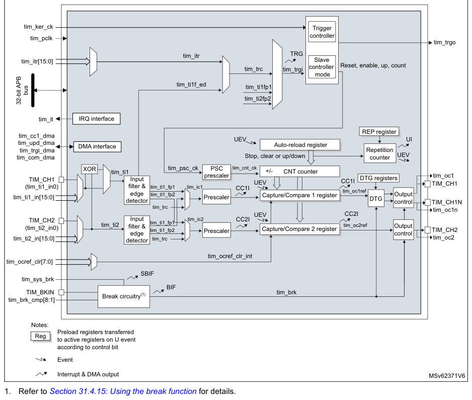

1. Refer to [Section 31.4.15](#31415-using-the-break-function): Using the break function for details.

**Figure 467. TIM16/TIM17 block diagram**

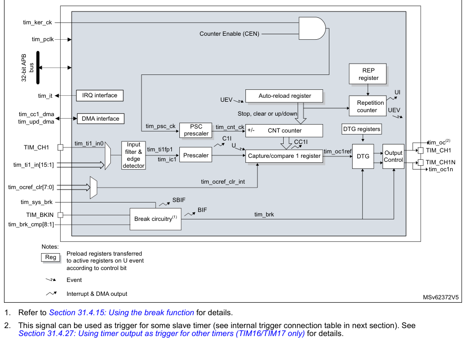

1. Refer to [Section 31.4.15](#31415-using-the-break-function): Using the break function for details.
2. This signal can be used as trigger for some slave timer (see internal trigger connection table in
   next section). See

[Section 31.4.27](#31427-using-timer-output-as-trigger-for-other-timers-tim16tim17-only): Using timer output as trigger for other timers (TIM16/TIM17 only) for details.

### 31.4.2 TIM15/TIM16/TIM17 pins and internal signals

Table 303 and Table 304 in this section summarize the TIM inputs and outputs.

**Table 303. TIM input/output pins**

| Source row | Column 1 | Column 2 | Column 3 |
| ---: | --- | --- | --- |
| 1 | `Pin name` | `Signal type` | `Description` |
| 2 | `Timer multi-purpose channels.` |  |  |
| 3 | `TIM_CH1` | `Each channel be used for capture, compare, or PWM.` |  |
| 4 | `Input/Output` |  |  |
| 5 | `TIM_CH2(1)` | `TIM_CH1 and TIM_CH2 can also be used as external clock` |  |

(below 1/4 of the tim_ker_ck clock) and external trigger inputs.

Timer complementary outputs, derived from TIM_CH1 output

| Source row | Column 1 | Column 2 |
| ---: | --- | --- |
| 1 | `TIM_CH1N` | `Output` |

with the possibility to have deadtime insertion.

Break input. This input can also be configured in bidirectional

| Source row | Column 1 | Column 2 |
| ---: | --- | --- |
| 1 | `TIM_BKIN` | `Input / Output` |

mode.

1. Available for TIM15 only.

**Table 304. TIM internal input/output signals**

| Source row | Column 1 | Column 2 | Column 3 |
| ---: | --- | --- | --- |
| 1 | `Internal signal` |  |  |
| 2 | `Signal type` | `Description` |  |
| 3 | `name` |  |  |
| 4 | `tim_ti1_in[15:0]` | `Internal timer inputs bus. These inputs can be used for capture or` |  |
| 5 | `Input` |  |  |
| 6 | `tim_ti2_in[15:0](1)` | `as external clock (below 1/4 of the tim_ker_ck clock).` |  |
| 7 | `Internal trigger input bus. These inputs can be used for the slave` |  |  |
| 8 | `tim_itr[15:0](1)` | `Input` | `mode controller or as a input clock (below 1/4 of the tim_ker_ck` |

clock).

Internal trigger output. This trigger can trigger other on-chip

| Source row | Column 1 | Column 2 |
| ---: | --- | --- |
| 1 | `tim_trgo(1)` | `Output` |

peripherals.

Timer tim_ocref_clr input bus. These inputs can be used to clear

| Source row | Column 1 | Column 2 | Column 3 |
| ---: | --- | --- | --- |
| 1 | `tim_ocref_clr[7:0]` | `Input` | `the tim_ocxref signals, typically for hardware cycle-by-cycle` |
| 2 | `pulsewidth control.` |  |  |
| 3 | `tim_brk_cmp[8:1]` | `Input` | `Break input for internal signals` |
| 4 | `System break input. This input gathers the MCU’s system level` |  |  |
| 5 | `tim_sys_brk[n:0]` | `Input` |  |
| 6 | `errors.` |  |  |
| 7 | `tim_pclk` | `Input` | `Timer APB clock` |
| 8 | `Timer kernel clock. This clock must be synchronous with tim_pclk (derived from the same source). The clock ratio` |  |  |
| 9 | `tim_ker_ck` | `Input` |  |
| 10 | `tim_ker_ck/tim_pclk must be an integer:1, 2, 3,..., 16 (maximum value)` |  |  |
| 11 | `Global Timer interrupt, gathering capture/compare, update, break` |  |  |
| 12 | `tim_it` | `Output` |  |
| 13 | `trigger and commutation requests` |  |  |
| 14 | `tim_cc1_dma` | `Output` | `Timer capture / compare 1 dma request` |
| 15 | `tim_upd_dma` | `Output` | `Timer update dma request` |
| 16 | `tim_trgi_dma` | `Output` | `Timer trigger dma request` |
| 17 | `tim_com_dma` | `Output` | `Timer commutation dma request` |

1. Available for TIM15 only.

Table 305 and Table 306 list the sources connected to the tim_ti[2:1] input multiplexers.

**Table 305. Interconnect to the tim_ti1 input multiplexer**

| Source row | Column 1 | Column 2 | Column 3 | Column 4 |
| ---: | --- | --- | --- | --- |
| 1 | `Sources` |  |  |  |
| 2 | `tim_ti1 inputs` |  |  |  |
| 3 | `TIM15` | `TIM16` | `TIM17` |  |
| 4 | `tim_ti1_in0` | `TIM15_CH1` | `TIM16_CH1` | `TIM17_CH1` |
| 5 | `tim_ti1_in1` | `LSE` | `comp6_out` | `comp5_out` |
| 6 | `tim_ti1_in2` | `comp1_out` | `MCO` | `MCO` |
| 7 | `tim_ti1_in3` | `comp2_out` | `HSE / 32(1)` | `HSE / 32(1)` |

**Table 305. Interconnect to the tim_ti1 input multiplexer (continued)**

| Source row | Column 1 | Column 2 | Column 3 | Column 4 |
| ---: | --- | --- | --- | --- |
| 1 | `Sources` |  |  |  |
| 2 | `tim_ti1 inputs` |  |  |  |
| 3 | `TIM15` | `TIM16` | `TIM17` |  |
| 4 | `tim_ti1_in4` | `comp5_out` | `RTC Clock` | `RTC Clock` |
| 5 | `tim_ti1_in5` | `comp7_out` | `LSE` | `LSE` |
| 6 | `tim_ti1_in6` | `Reserved` | `LSI` | `LSI` |
| 7 | `tim_ti1_in[15:7]` | `Reserved` |  |  |

1. This signal is available only if the HSE32EN bit is set in the TIMx_OR1 register. See

Section 38.8.19: TIMx option register 1 (TIMx_OR1)(x = 16 to 17) for details.

**Table 306. Interconnect to the tim_ti2 input multiplexer**

| Source row | Column 1 | Column 2 |
| ---: | --- | --- |
| 1 | `Sources` |  |
| 2 | `tim_ti2 inputs` |  |
| 3 | `TIM15` |  |
| 4 | `tim_ti2_in0` | `TIM15_CH2` |
| 5 | `tim_ti2_in1` | `comp2_out` |
| 6 | `tim_ti2_in2` | `comp3_out` |
| 7 | `tim_ti2_in3` | `comp6_out` |
| 8 | `tim_ti2_in4` | `comp7_out` |
| 9 | `tim_ti2_in[15:5]` | `Reserved` |

Table 307 lists the internal sources connected to the tim_itr input multiplexer.

**Table 307. TIMx internal trigger connection**

| tim_itrx inputs | TIM15 |
| --- | --- |
| tim_itr0 | tim1_trgo |
| tim_itr1 | tim2_trgo |
| tim_itr2 | tim3_trgo |
| tim_itr3 | tim4_trgo |
| tim_itr4 | tim5_trgo |
| tim_itr5 | tim8_trgo |
| tim_itr6 | Reserved |
| tim_itr7 | tim16_oc1 |
| tim_itr8 | tim17_oc1 |
| tim_itr9 | tim20_trgo |
| tim_itr10 | hrtim_out_sync2 |
| tim_itr[15:11] | Reserved |

Table 308 and Table 309 list the sources connected to the tim_brk input.

**Table 308. Timer break interconnect**

| Source row | Column 1 | Column 2 | Column 3 | Column 4 |
| ---: | --- | --- | --- | --- |
| 1 | `tim_brk inputs` | `TIM15` | `TIM16` | `TIM17` |
| 2 | `TIM_BKIN` | `TIM15_BKIN pin` | `TIM16_BKIN pin` | `TIM17_BKIN pin` |
| 3 | `tim_brk_cmp1` | `comp1_out` | `comp1_out` | `comp1_out` |
| 4 | `tim_brk_cmp2` | `comp2_out` | `comp2_out` | `comp2_out` |
| 5 | `tim_brk_cmp3` | `comp3_out` | `comp3_out` | `comp3_out` |
| 6 | `tim_brk_cmp4` | `comp4_out` | `comp4_out` | `comp4_out` |
| 7 | `tim_brk_cmp5` | `comp5_out` | `comp5_out` | `comp5_out` |
| 8 | `tim_brk_cmp6` | `comp6_out` | `comp6_out` | `comp6_out` |
| 9 | `tim_brk_cmp7` | `comp7_out` | `comp7_out` | `comp7_out` |
| 10 | `tim_brk_cmp8` | `Reserved` |  |  |

**Table 309. System break interconnect**

| Source row | Column 1 | Column 2 | Column 3 |
| ---: | --- | --- | --- |
| 1 | `tim_sys_brk` | `Enable bit in SYSCFG_CFGR2` |  |
| 2 | `TIM15 / TIM16 / TIM17` |  |  |
| 3 | `inputs` | `register` |  |
| 4 | `tim_sys_brk0` | `Cortex®-M4 with FPU LOCKUP` | `CLL` |
| 5 | `tim_sys_brk1` | `Programmable voltage detector (PVD)` | `PVDL` |
| 6 | `tim_sys_brk2` | `SRAM parity error` | `SPL` |
| 7 | `tim_sys_brk3` | `Flash double ECC error` | `ECCL` |
| 8 | `tim_sys_brk4` | `Clock security system (CSS)` | `None (always enabled)` |

Table 310 lists the internal sources connected to the tim_ocref_clr input multiplexer.

**Table 310. Interconnect to the ocref_clr input multiplexer**

| Source row | Column 1 | Column 2 | Column 3 | Column 4 |
| ---: | --- | --- | --- | --- |
| 1 | `Timer OCREF clear signals assignment` |  |  |  |
| 2 | `Timer OCREF clear` |  |  |  |
| 3 | `signal` |  |  |  |
| 4 | `TIM15` | `TIM16` | `TIM17` |  |
| 5 | `tim_ocref_clr0` | `comp1_out` | `comp1_out` | `comp1_out` |
| 6 | `tim_ocref_clr1` | `comp2_out` | `comp2_out` | `comp2_out` |
| 7 | `tim_ocref_clr2` | `comp3_out` | `comp3_out` | `comp3_out` |
| 8 | `tim_ocref_clr3` | `comp4_out` | `comp4_out` | `comp4_out` |
| 9 | `tim_ocref_clr4` | `comp5_out` | `comp5_out` | `comp5_out` |
| 10 | `tim_ocref_clr5` | `comp6_out` | `comp6_out` | `comp6_out` |
| 11 | `tim_ocref_clr6` | `comp7_out` | `comp7_out` | `comp7_out` |
| 12 | `tim_ocref_clr7` | `Reserved` |  |  |

### 31.4.3 Time-base unit

The main block of the programmable advanced-control timer is a 16-bit upcounter with its related
autoreload register. The counter clock can be divided by a prescaler.

The counter, the autoreload register and the prescaler register can be written or read by software.
This is true even when the counter is running.

The time-base unit includes:

- Counter register (TIMx_CNT)
- Prescaler register (TIMx_PSC)
- Autoreload register (TIMx_ARR)
- Repetition counter register (TIMx_RCR)

The autoreload register is preloaded. Writing to or reading from the autoreload register accesses
the preload register. The content of the preload register is transferred into the shadow register
permanently or at each update event (UEV), depending on the autoreload preload enable bit (ARPE) in
TIMx_CR1 register. The update event is sent when the counter reaches the overflow and if the UDIS
bit equals 0 in the TIMx_CR1 register. It can also be generated by software. The generation of the
update event is described in detailed for each configuration.

The counter is clocked by the prescaler output tim_cnt_ck, which is enabled only when the counter
enable bit (CEN) in TIMx_CR1 register is set (refer also to the slave mode controller description to
get more details on counter enabling).

Note that the counter starts counting one clock cycle after setting the CEN bit in the TIMx_CR1
register.

#### Prescaler description

The prescaler can divide the counter clock frequency by any factor between 1 and 65536. It is based
on a 16-bit counter controlled through a 16-bit register (in the TIMx_PSC register). It can be
changed on the fly as this control register is buffered. The new prescaler ratio is taken into
account at the next update event.

Table 478 and Table 469 give some examples of the counter behavior when the prescaler ratio is
changed on the fly:

**Figure 468. Counter timing diagram with prescaler division change from 1 to 2**

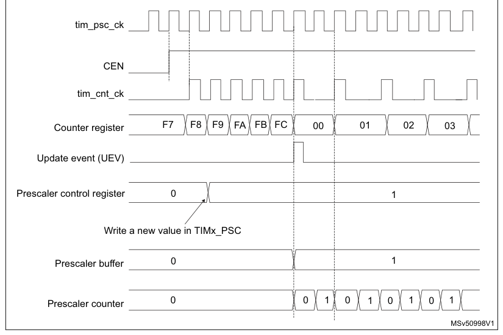

**Figure 469. Counter timing diagram with prescaler division change from 1 to 4**

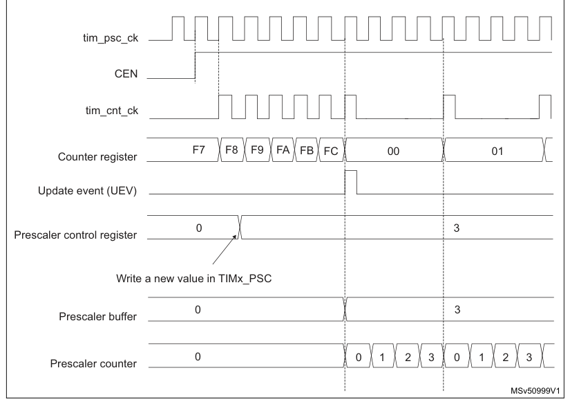

### 31.4.4 Counter modes

#### Upcounting mode

In upcounting mode, the counter counts from 0 to the autoreload value (content of the TIMx_ARR
register), then restarts from 0 and generates a counter overflow event.

If the repetition counter is used, the update event (UEV) is generated after upcounting is repeated
for the number of times programmed in the repetition counter register (TIMx_RCR). Else the update
event is generated at each counter overflow.

Setting the UG bit in the TIMx_EGR register (by software or by using the slave mode controller) also
generates an update event.

The UEV event can be disabled by software by setting the UDIS bit in the TIMx_CR1 register. This is
to avoid updating the shadow registers while writing new values in the preload registers. Then no
update event occurs until the UDIS bit has been written to 0. However, the counter restarts from 0,
as well as the counter of the prescaler (but the prescale rate does not change). In addition, if the
URS bit (update request selection) in TIMx_CR1 register is set, setting the UG bit generates an
update event UEV but without setting the UIF flag (thus no interrupt or DMA request is sent). This
is to avoid generating both update and capture interrupts when clearing the counter on the capture
event.

When an update event occurs, all the registers are updated and the update flag (UIF bit in TIMx_SR
register) is set (depending on the URS bit):

- The repetition counter is reloaded with the content of TIMx_RCR register,
- The autoreload shadow register is updated with the preload value (TIMx_ARR),
- The buffer of the prescaler is reloaded with the preload value (content of the TIMx_PSC register).

The following figures show some examples of the counter behavior for different clock frequencies
when TIMx_ARR = 0x36.

**Figure 470. Counter timing diagram, internal clock divided by 1**

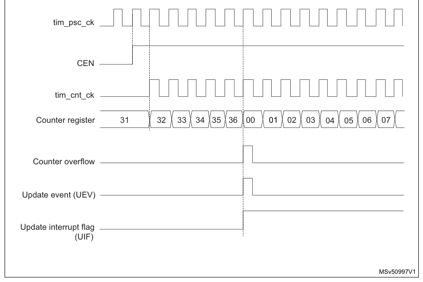

**Figure 471. Counter timing diagram, internal clock divided by 2**

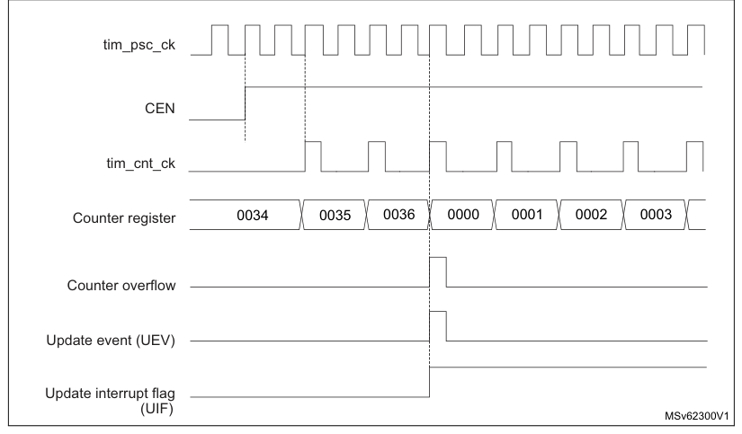

**Figure 472. Counter timing diagram, internal clock divided by 4**

**Figure 473. Counter timing diagram, internal clock divided by N**

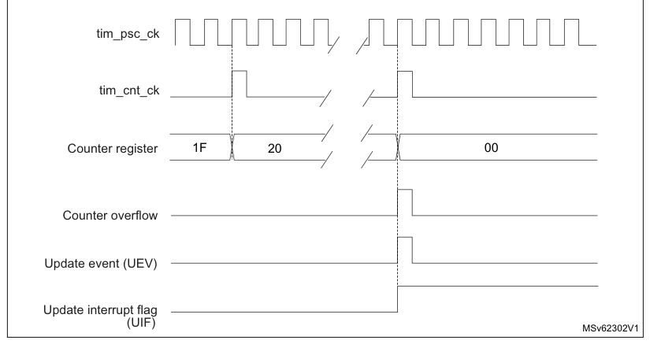

**Figure 474. Counter timing diagram, update event when ARPE = 0**

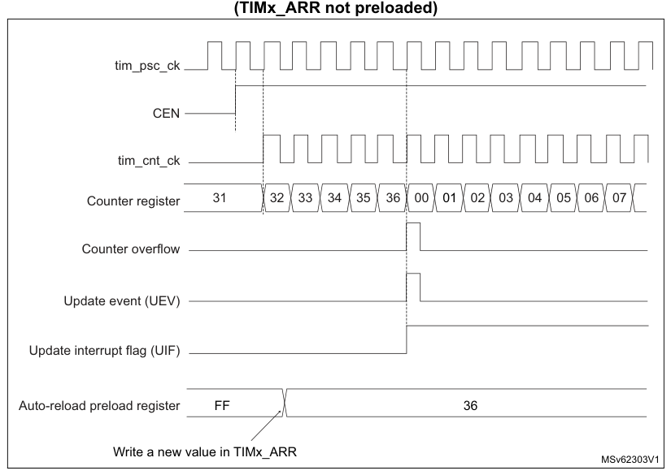

**Figure 475. Counter timing diagram, update event when ARPE = 1**

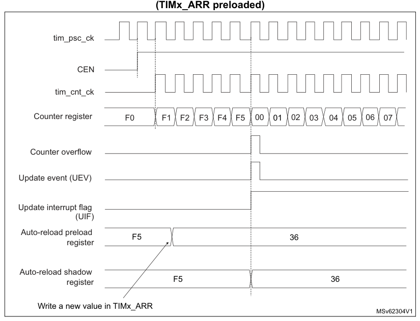

### 31.4.5 Repetition counter

[Section 31.4.3](#3143-time-base-unit): Time-base unit describes how the update event (UEV) is generated with respect to the
counter overflows. It is actually generated only when the repetition counter has reached zero. This
can be useful when generating PWM signals.

This means that data are transferred from the preload registers to the shadow registers (TIMx_ARR
autoreload register, TIMx_PSC prescaler register, but also TIMx_CCRx capture/compare registers in
compare mode) every N counter overflows, where N is the value in the TIMx_RCR repetition counter
register.

The repetition counter is decremented at each counter overflow.

The repetition counter is an autoreload type; the repetition rate is maintained as defined by the
TIMx_RCR register value (refer to Figure 476). When the update event is generated by software (by
setting the UG bit in TIMx_EGR register) or by hardware through the slave mode controller, it occurs
immediately whatever the value of the repetition counter is and the repetition counter is reloaded
with the content of the TIMx_RCR register.

**Figure 476. Update rate examples depending on mode and TIMx_RCR register**

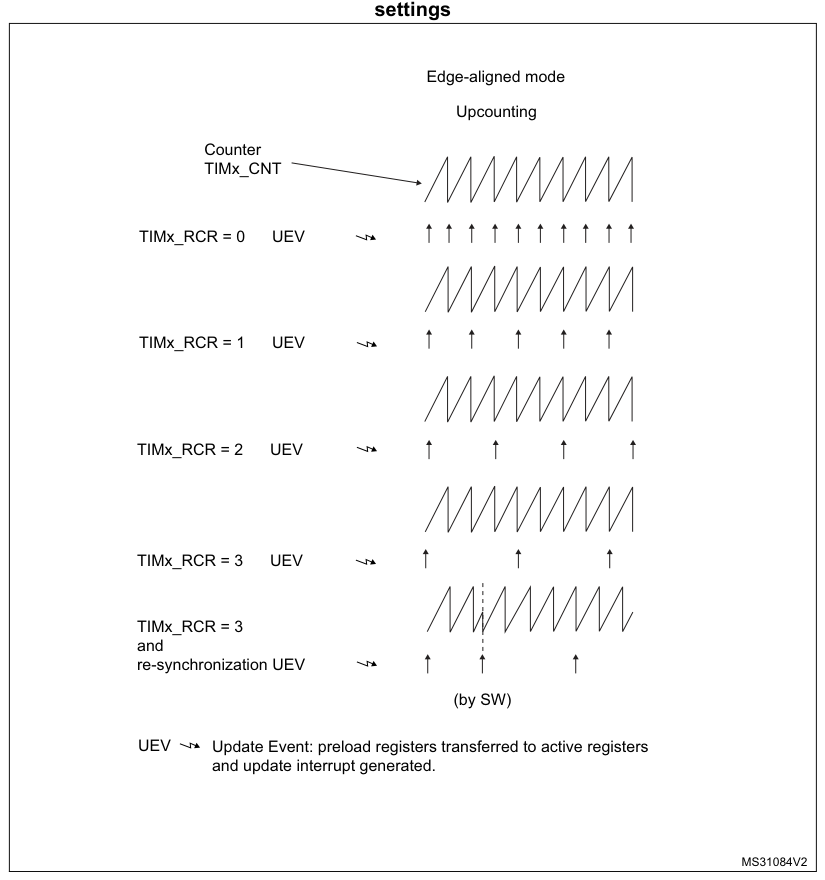

settings

Edge-aligned mode

Upcounting

Counter TIMx_CNT

TIMx_RCR = 0 UEV

TIMx_RCR = 1 UEV

TIMx_RCR = 2 UEV

TIMx_RCR = 3 UEV

TIMx_RCR = 3
and
re-synchronization UEV

(by SW)

UEV Update Event: preload registers transferred to active registers
and update interrupt generated.

MS31084V2

### 31.4.6 Clock selection

The counter clock can be provided by the following clock sources:

- Internal clock (tim_ker_ck)
- External clock mode1: external input pin (tim_ti1 or tim_ti2, if available)
- Internal trigger inputs (tim_itrx) (only for TIM15): using one timer as the prescaler for another
  timer, for example, TIM1 can be configured to act as a prescaler for TIM15. Refer to Using one
  timer as prescaler for another timer for more details.

#### Internal clock source (tim_ker_ck)

If the slave mode controller is disabled (SMS = 000), then the CEN (in the TIMx_CR1 register) and UG
bits (in the TIMx_EGR register) are actual control bits and can be changed
only by software (except UG which remains cleared automatically). As soon as the CEN bit is written
to 1, the prescaler is clocked by the internal clock tim_ker_ck.

Figure 477 shows the behavior of the control circuit and the upcounter in normal mode, without
prescaler.

**Figure 477. Control circuit in normal mode, internal clock divided by 1**

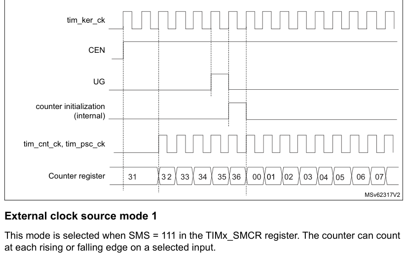

tim_ker_ck

CEN

UG
counter initialization

(internal)
tim_cnt_ck, tim_psc_ck

This mode is selected when SMS = 111 in the TIMx_SMCR register. The counter can count at each rising
or falling edge on a selected input.

**Figure 478. tim_ti2 external clock connection example**

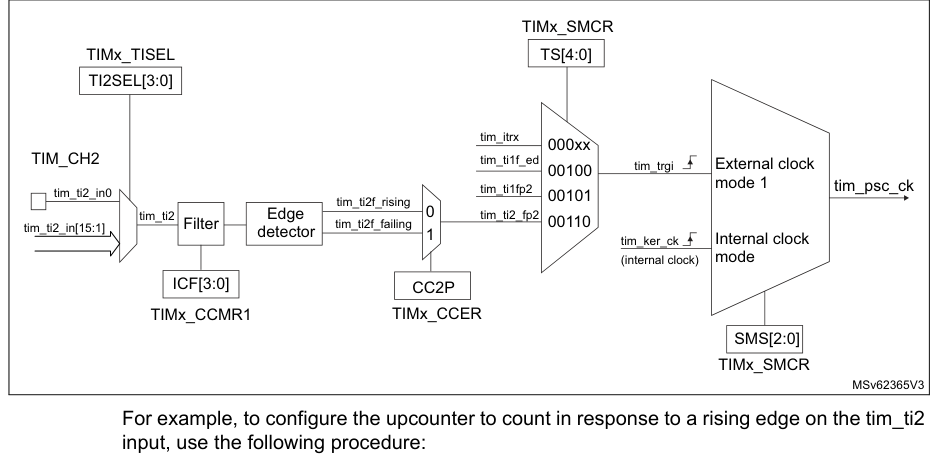

For example, to configure the upcounter to count in response to a rising edge on the tim_ti2 input,
use the following procedure:

1. Select the proper tim_ti2_in[15:0] source (internal or external) with the TI2SEL[3:0] bits
   in the TIMx_TISEL register.
2. Configure channel 2 to detect rising edges on the tim_ti2 input by writing CC2S = 01 in
   the TIMx_CCMR1 register.
3. Configure the input filter duration by writing the IC2F[3:0] bits in the TIMx_CCMR1
   register (if no filter is needed, keep IC2F = 0000).
4. Select rising edge polarity by writing CC2P = 0 in the TIMx_CCER register.
5. Configure the timer in external clock mode 1 by writing SMS = 111 in the TIMx_SMCR
   register.
6. Select tim_ti2 as the trigger input source by writing TS = 00110 in the TIMx_SMCR
   register.
7. Enable the counter by writing CEN = 1 in the TIMx_CR1 register.

> **Note:** The capture prescaler is not used for triggering, it is not necessary to configure it.

When a rising edge occurs on tim_ti2, the counter counts once and the TIF flag is set.

The delay between the rising edge on tim_ti2 and the actual clock of the counter is due to the
resynchronization circuit on tim_ti2 input.

**Figure 479. Control circuit in external clock mode 1**

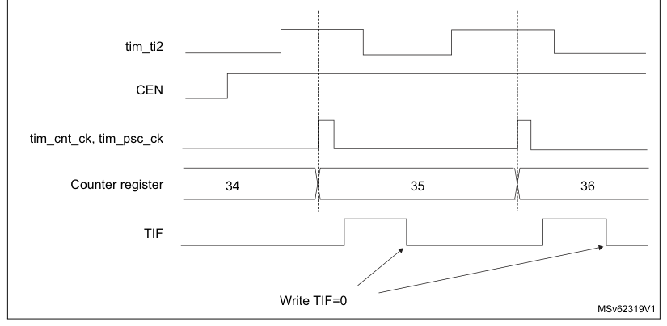

### 31.4.7 Capture/compare channels

Each Capture/Compare channel is built around a capture/compare register (including a shadow
register), a input stage for capture (with digital filter, multiplexing and prescaler) and an output
stage (with comparator and output control).

Figure 480 to Figure 483 give an overview of one Capture/Compare channel.

The input stage samples the corresponding tim_tix input to generate a filtered signal tim_tixf.
Then, an edge detector with polarity selection generates a signal (tim_tixfpy) which can be used as
trigger input by the slave mode controller or as the capture command. It is prescaled before the
capture register (ICxPS).

**Figure 480. Capture/compare channel (example: channel 1 input stage)**

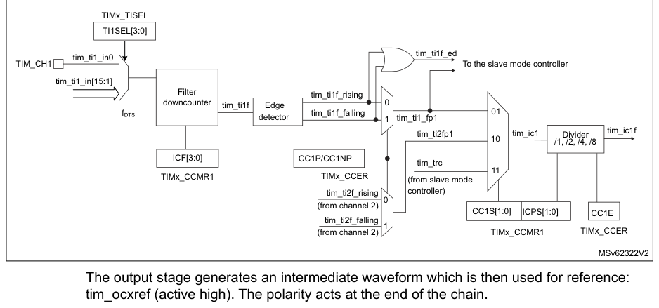

The output stage generates an intermediate waveform which is then used for reference: tim_ocxref
(active high). The polarity acts at the end of the chain.

**Figure 481. Capture/compare channel 1 main circuit**

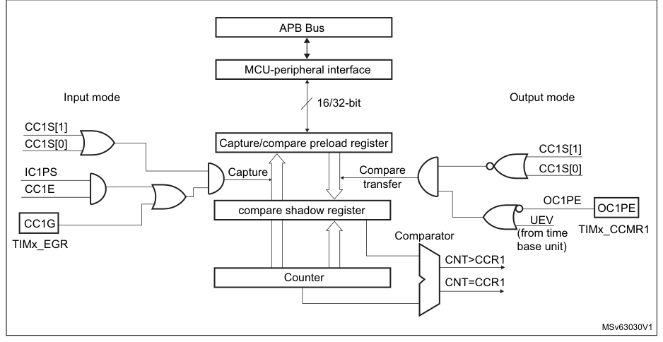

**Figure 482. Output stage of capture/compare channel (channel 1)**

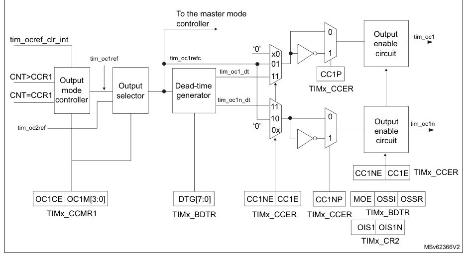

**Figure 483. Output stage of capture/compare channel (channel 2 for TIM15)**

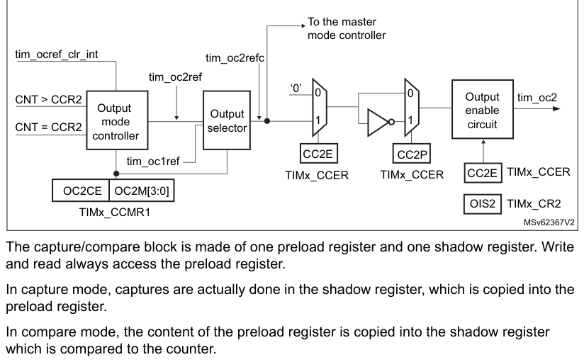

To the master mode controller
tim_ocref_clr_int
tim_oc2refc
tim_oc2ref

‘0’

The capture/compare block is made of one preload register and one shadow register. Write and read
always access the preload register.

In capture mode, captures are actually done in the shadow register, which is copied into the preload
register.

In compare mode, the content of the preload register is copied into the shadow register which is
compared to the counter.

### 31.4.8 Input capture mode

In Input capture mode, the capture/compare registers (TIMx_CCRx) are used to latch the value of the
counter after a transition detected by the corresponding tim_icx signal. When a capture occurs, the
corresponding CCXIF flag (TIMx_SR register) is set and an interrupt or a DMA request can be sent if
they are enabled. If a capture occurs while the CCxIF flag was
already high, then the overcapture flag CCxOF (TIMx_SR register) is set. CCxIF can be cleared by
software by writing it to 0 or by reading the captured data stored in the TIMx_CCRx register. CCxOF
is cleared when it is written with 0.

The following example shows how to capture the counter value in TIMx_CCR1 when tim_ti1 input rises.
To do this, use the following procedure:

1. Select the proper tim_ti1_in[15:1] source (internal or external) with the TI1SEL[3:0] bits
   in the TIMx_TISEL register.
2. Select the active input: TIMx_CCR1 must be linked to the tim_ti1 input, so write the

CC1S bits to 01 in the TIMx_CCMR1 register. As soon as CC1S becomes different from 00, the channel
is configured in input, and the TIMx_CCR1 register becomes read-only.

3. Program the appropriate input filter duration in relation with the signal connected to the
   timer (when the input is one of the tim_tix (ICxF bits in the TIMx_CCMRx register). Let’s imagine
   that, when toggling, the input signal is not stable during at least 5 internal clock cycles. The
   user must program a filter duration longer than these five clock cycles. The user can validate a
   transition on tim_ti1 when eight consecutive samples with the new level have been detected (sampled
   at fDTS frequency). Then write IC1F bits to 0011 in the TIMx_CCMR1 register.
4. Select the edge of the active transition on the tim_ti1 channel by writing CC1P bit to 0
   in the TIMx_CCER register (rising edge in this case).
5. Program the input prescaler. In this example, the user wants the capture to be
   performed at each valid transition, so the prescaler is disabled (write IC1PS bits to 00 in the
   TIMx_CCMR1 register).
6. Enable capture from the counter into the capture register by setting the CC1E bit in the

TIMx_CCER register.

7. If needed, enable the related interrupt request by setting the CC1IE bit in the

TIMx_DIER register, and/or the DMA request by setting the CC1DE bit in the TIMx_DIER register.

When an input capture occurs:

- The TIMx_CCR1 register gets the value of the counter on the active transition.
- CC1IF flag is set (interrupt flag). CC1OF is also set if at least two consecutive captures
  occurred whereas the flag was not cleared.
- An interrupt is generated depending on the CC1IE bit.
- A DMA request is generated depending on the CC1DE bit.

In order to handle the overcapture, it is recommended to read the data before the overcapture flag.
This is to avoid missing an overcapture which may happen after reading the flag and before reading
the data.

> **Note:** IC interrupt and/or DMA requests can be generated by software by setting the
> corresponding CCxG bit in the TIMx_EGR register.

### 31.4.9 PWM input mode (only for TIM15)

This mode is used to measure both the period and the duty cycle of a PWM signal connected to single
tim_tix input:

- The TIMx_CCR1 register holds the period value (interval between two consecutive rising edges)
- The TIMx_CCR2 register holds the pulse width (interval between two consecutive rising and falling
  edges)

This mode is a particular case of input capture mode. The set-up procedure is similar with the
following differences:

- Two tim_icx signals are mapped on the same tim_tix input.
- These two tim_icx signals are active on edges with opposite polarity.
- One of the two tim_tixfpy signals is selected as trigger input and the slave mode controller is
  configured in reset mode.

For example, one can measure the period (in TIMx_CCR1 register) and the duty cycle (in TIMx_CCR2
register) of the PWM applied on tim_ti1 using the following procedure (depending on tim_ker_ck
frequency and prescaler value):

1. Select the proper tim_ti1_in[15:0] source (internal or external) with the TI1SEL[3:0] bits
   in the TIMx_TISEL register.
2. Select the active input for TIMx_CCR1: write the CC1S bits to 01 in the TIMx_CCMR1
   register (tim_ti1 selected).
3. Select the active polarity for tim_ti1fp1 (used both for capture in TIMx_CCR1 and
   counter clear): write the CC1P and CC1NP bits to 0 (active on rising edge).
4. Select the active input for TIMx_CCR2: write the CC2S bits to 10 in the TIMx_CCMR1
   register (tim_ti1 selected).
5. Select the active polarity for tim_ti1fp2 (used for capture in TIMx_CCR2): write the

CC2P and CC2NP bits to 10 (active on falling edge).

6. Select the valid trigger input: write the TS bits to 00101 in the TIMx_SMCR register

(tim_ti1fp1 selected).

7. Configure the slave mode controller in reset mode: write the SMS bits to 100 in the

TIMx_SMCR register.

8. Enable the captures: write the CC1E and CC2E bits to 1 in the TIMx_CCER register.

**Figure 484. PWM input mode timing**

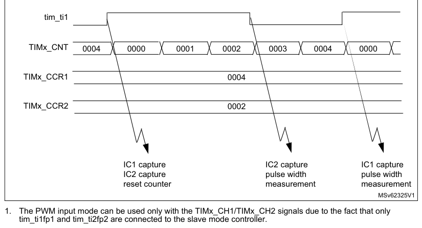

1. The PWM input mode can be used only with the TIMx_CH1/TIMx_CH2 signals due to the fact that only
   tim_ti1fp1 and tim_ti2fp2 are connected to the slave mode controller.

### 31.4.10 Forced output mode

In output mode (CCxS bits = 00 in the TIMx_CCMRx register), each output compare signal (tim_ocxref
and then tim_ocx/tim_ocxn) can be forced to active or inactive level directly by software,
independently of any comparison between the output compare register and the counter.

To force an output compare signal (tim_ocxref/tim_ocx) to its active level, one just needs to write
101 in the OCxM bits in the corresponding TIMx_CCMRx register. Thus tim_ocxref is forced high
(tim_ocxref is always active high) and tim_ocx get opposite value to CCxP polarity bit.

For example: CCxP = 0 (tim_ocx active high) → tim_ocx is forced to high level.

The tim_ocxref signal can be forced low by writing the OCxM bits to 100 in the TIMx_CCMRx register.

Anyway, the comparison between the TIMx_CCRx shadow register and the counter is still performed and
allows the flag to be set. Interrupt and DMA requests can be sent accordingly. This is described in
the output compare mode section below.

### 31.4.11 Output compare mode

This function is used to control an output waveform or indicating when a period of time has elapsed.

When a match is found between the capture/compare register and the counter, the output compare
function:

- Assigns the corresponding output pin to a programmable value defined by the output compare mode
  (OCxM bits in the TIMx_CCMRx register) and the output polarity (CCxP bit in the TIMx_CCER
  register). The output pin can keep its level (OCXM = 000), be set
  active (OCxM = 001), be set inactive (OCxM = 010) or can toggle (OCxM = 011) on match.
- Sets a flag in the interrupt status register (CCxIF bit in the TIMx_SR register).
- Generates an interrupt if the corresponding interrupt mask is set (CCXIE bit in the TIMx_DIER
  register).
- Sends a DMA request if the corresponding enable bit is set (CCxDE bit in the TIMx_DIER register,
  CCDS bit in the TIMx_CR2 register for the DMA request selection).

The TIMx_CCRx registers can be programmed with or without preload registers using the OCxPE bit in
the TIMx_CCMRx register.

In output compare mode, the update event UEV has no effect on tim_ocxref and tim_ocx output. The
timing resolution is one count of the counter. Output compare mode can also be used to output a
single pulse (in One-pulse mode).

#### Procedure

1. Select the counter clock (internal, external, prescaler).
2. Write the desired data in the TIMx_ARR and TIMx_CCRx registers.
3. Set the CCxIE bit if an interrupt request is to be generated.
4. Select the output mode. For example:
   - Write OCxM = 011 to toggle tim_ocx output pin when CNT matches CCRx
   - Write OCxPE = 0 to disable preload register
   - Write CCxP = 0 to select active high polarity
   - Write CCxE = 1 to enable the output

5. Enable the counter by setting the CEN bit in the TIMx_CR1 register.

The TIMx_CCRx register can be updated at any time by software to control the output waveform,
provided that the preload register is not enabled (OCxPE = 0, else TIMx_CCRx shadow register is
updated only at the next update event UEV). An example is given in

Figure 485.

**Figure 485. Output compare mode, toggle on tim_oc1**

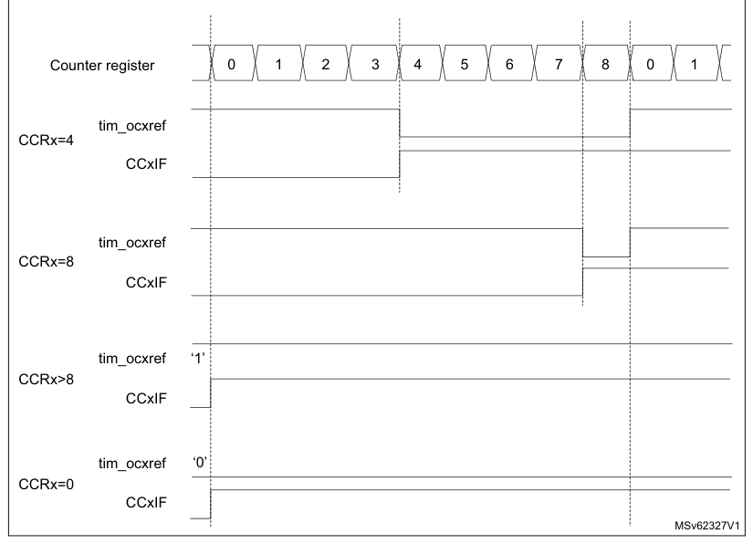

### 31.4.12 PWM mode

Pulse width modulation mode is used to generate a signal with a frequency determined by the value of
the TIMx_ARR register and a duty cycle determined by the value of the TIMx_CCRx register.

The PWM mode can be selected independently on each channel (one PWM per tim_ocx output) by writing
110 (PWM mode 1) or 111 (PWM mode 2) in the OCxM bits in the TIMx_CCMRx register. The corresponding
preload register must be enabled by setting the OCxPE bit in the TIMx_CCMRx register, and eventually
the autoreload preload register (in upcounting or center-aligned modes) by setting the ARPE bit in
the TIMx_CR1 register.

As the preload registers are transferred to the shadow registers only when an update event occurs,
before starting the counter, all registers must be initialized by setting the UG bit in the TIMx_EGR
register.

tim_ocx polarity is software programmable using the CCxP bit in the TIMx_CCER register. It can be
programmed as active high or active low. tim_ocx output is enabled by a combination of the CCxE,
CCxNE, MOE, OSSI, and OSSR bits (TIMx_CCER and TIMx_BDTR registers). Refer to the TIMx_CCER register
description for more details.

In PWM mode (1 or 2), TIMx_CNT and TIMx_CCRx are always compared to determine whether TIMx_CCRx
≤TIMx_CNT or TIMx_CNT ≤TIMx_CCRx (depending on the direction of the counter).

The TIM15/TIM16/TIM17 are capable of upcounting only. Refer to Upcounting mode.

In the following example applies to PWM mode 1. The reference PWM signal tim_ocxref is high as long
as TIMx_CNT \< TIMx_CCRx else it becomes low. If the compare value in

TIMx_CCRx is greater than the autoreload value (in TIMx_ARR) then tim_ocxref is held at

1. If the compare value is 0 then tim_ocxref is held at 0. Figure 486 shows some edge-aligned PWM
   waveforms in an example where TIMx_ARR = 8.

**Figure 486. Edge-aligned PWM waveforms (ARR = 8)**

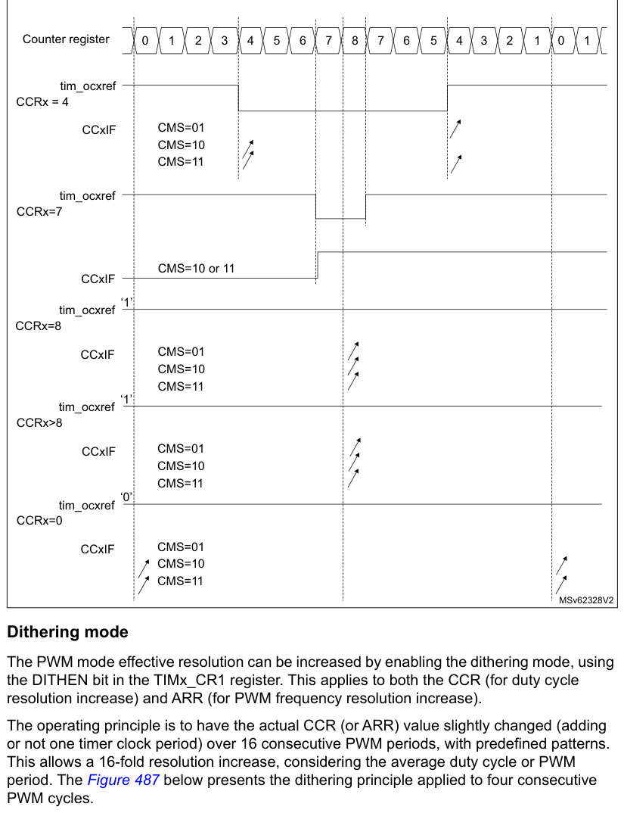

#### Dithering mode

The PWM mode effective resolution can be increased by enabling the dithering mode, using the DITHEN
bit in the TIMx_CR1 register. This applies to both the CCR (for duty cycle resolution increase) and
ARR (for PWM frequency resolution increase).

The operating principle is to have the actual CCR (or ARR) value slightly changed (adding or not one
timer clock period) over 16 consecutive PWM periods, with predefined patterns. This allows a 16-fold
resolution increase, considering the average duty cycle or PWM period. The Figure 487 below presents
the dithering principle applied to four consecutive PWM cycles.

**Figure 487. Dithering principle**

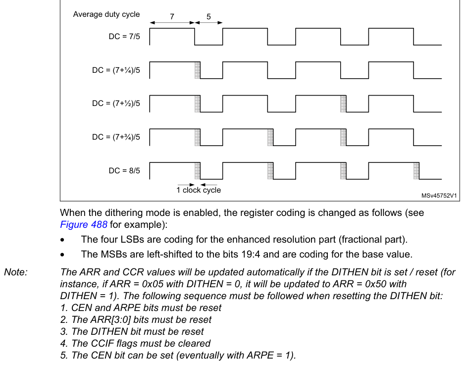

Average duty cycle

7 5

DC = 7/5

DC = (7+¼)/5

DC = (7+½)/5

DC = (7+¾)/5

DC = 8/5

1 clock cycle

MSv45752V1

When the dithering mode is enabled, the register coding is changed as follows (see Figure 488 for
example):

- The four LSBs are coding for the enhanced resolution part (fractional part).
- The MSBs are left-shifted to the bits 19:4 and are coding for the base value.

> **Note:** The ARR and CCR values will be updated automatically if the DITHEN bit is set / reset (for
> instance, if ARR = 0x05 with DITHEN = 0, it will be updated to ARR = 0x50 with DITHEN = 1). The
> following sequence must be followed when resetting the DITHEN bit:

1. CEN and ARPE bits must be reset
2. The ARR[3:0] bits must be reset
3. The DITHEN bit must be reset
4. The CCIF flags must be cleared
5. The CEN bit can be set (eventually with ARPE = 1).

**Figure 488. Data format and register coding in dithering mode**

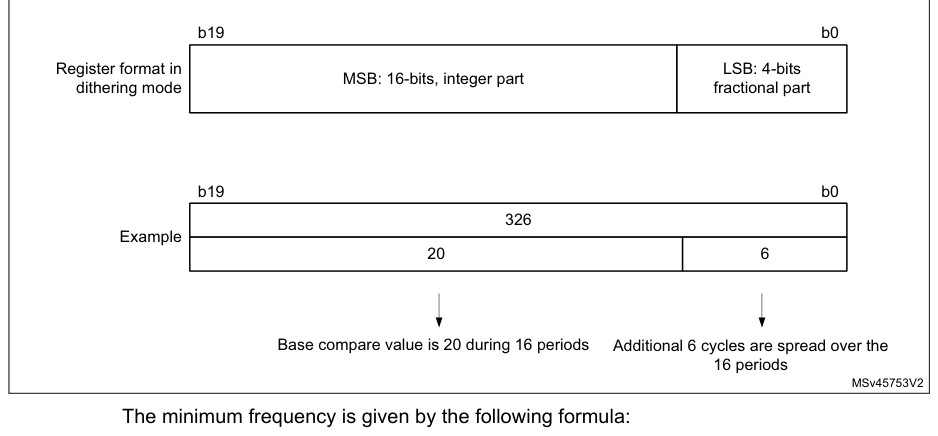

> **Note:** The maximum TIMx_ARR and TIMxCCRy values are limited to 0xFFFEF in dithering mode

(corresponds to 65534 for the integer part and 15 for the dithered part).

As shown on the Figure 489 below, the dithering mode is used to increase the PWM resolution whatever
the PWM frequency.

**Figure 489. PWM resolution vs frequency**

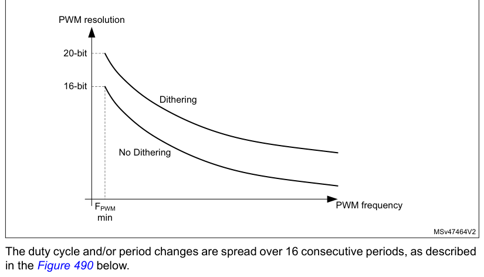

PWM resolution

20-bit

16-bit

Dithering

No Dithering

The duty cycle and/or period changes are spread over 16 consecutive periods, as described in the
Figure 490 below.

**Figure 490. PWM dithering pattern**

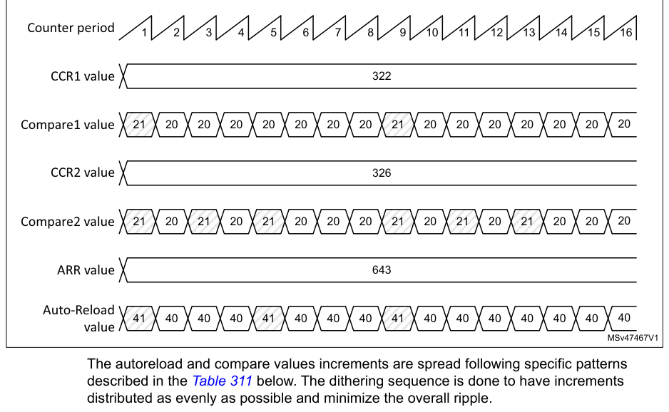

The autoreload and compare values increments are spread following specific patterns described in the
Table 311 below. The dithering sequence is done to have increments distributed as evenly as possible
and minimize the overall ripple.

**Table 311. CCR and ARR register change dithering pattern**

| Source row | Extracted cells |
| ---: | --- |
| 1 | `-` · `PWM period` |
| 2 | `LSB value` · `1` · `2` · `3` · `4` · `5` · `6` · `7` · `8` · `9` · `10` · `11` · `12` · `13` · `14` · `15` · `16` |
| 3 | `0000` · `-` · `-` · `-` · `-` · `-` · `-` · `-` · `-` · `-` · `-` · `-` · `-` · `-` · `-` · `-` · `-` |
| 4 | `0001` · `+1` · `-` · `-` · `-` · `-` · `-` · `-` · `-` · `-` · `-` · `-` · `-` · `-` · `-` · `-` · `-` |
| 5 | `0010` · `+1` · `-` · `-` · `-` · `-` · `-` · `-` · `-` · `+1` · `-` · `-` · `-` · `-` · `-` · `-` · `-` |
| 6 | `0011` · `+1` · `-` · `-` · `-` · `+1` · `-` · `-` · `-` · `+1` · `-` · `-` · `-` · `-` · `-` · `-` · `-` |
| 7 | `0100` · `+1` · `-` · `-` · `-` · `+1` · `-` · `-` · `-` · `+1` · `-` · `-` · `-` · `+1` · `-` · `-` · `-` |
| 8 | `0101` · `+1` · `-` · `+1` · `-` · `+1` · `-` · `-` · `-` · `+1` · `-` · `-` · `-` · `+1` · `-` · `-` · `-` |
| 9 | `0110` · `+1` · `-` · `+1` · `-` · `+1` · `-` · `-` · `-` · `+1` · `-` · `+1` · `-` · `+1` · `-` · `-` · `-` |
| 10 | `0111` · `+1` · `-` · `+1` · `-` · `+1` · `-` · `+1` · `-` · `+1` · `-` · `+1` · `-` · `+1` · `-` · `-` · `-` |
| 11 | `1000` · `+1` · `-` · `+1` · `-` · `+1` · `-` · `+1` · `-` · `+1` · `-` · `+1` · `-` · `+1` · `-` · `+1` · `-` |
| 12 | `1001` · `+1` · `+1` · `+1` · `-` · `+1` · `-` · `+1` · `-` · `+1` · `-` · `+1` · `-` · `+1` · `-` · `+1` · `-` |
| 13 | `1010` · `+1` · `+1` · `+1` · `-` · `+1` · `-` · `+1` · `-` · `+1` · `+1` · `+1` · `-` · `+1` · `-` · `+1` · `-` |
| 14 | `1011` · `+1` · `+1` · `+1` · `-` · `+1` · `+1` · `+1` · `-` · `+1` · `+1` · `+1` · `-` · `+1` · `-` · `+1` · `-` |
| 15 | `1100` · `+1` · `+1` · `+1` · `-` · `+1` · `+1` · `+1` · `-` · `+1` · `+1` · `+1` · `-` · `+1` · `+1` · `+1` · `-` |
| 16 | `1101` · `+1` · `+1` · `+1` · `+1` · `+1` · `+1` · `+1` · `-` · `+1` · `+1` · `+1` · `-` · `+1` · `+1` · `+1` · `-` |

**Table 311. CCR and ARR register change dithering pattern (continued)**

| Source row | Extracted cells |
| ---: | --- |
| 1 | `-` · `PWM period` |
| 2 | `LSB value` · `1` · `2` · `3` · `4` · `5` · `6` · `7` · `8` · `9` · `10` · `11` · `12` · `13` · `14` · `15` · `16` |
| 3 | `1110` · `+1` · `+1` · `+1` · `+1` · `+1` · `+1` · `+1` · `-` · `+1` · `+1` · `+1` · `+1` · `+1` · `+1` · `+1` · `-` |
| 4 | `1111` · `+1` · `+1` · `+1` · `+1` · `+1` · `+1` · `+1` · `+1` · `+1` · `+1` · `+1` · `+1` · `+1` · `+1` · `+1` · `-` |

### 31.4.13 Combined PWM mode (TIM15 only)

Combined PWM mode allows two edge or center-aligned PWM signals to be generated with programmable
delay and phase shift between respective pulses. While the frequency is determined by the value of
the TIMx_ARR register, the duty cycle and delay are determined by the two TIMx_CCRx registers. The
resulting signals, tim_ocxrefc, are made of an OR or AND logical combination of two reference PWMs:

- tim_oc1refc (or tim_oc2refc) is controlled by the TIMx_CCR1 and TIMx_CCR2 registers.

Combined PWM mode can be selected independently on two channels (one tim_ocx output per pair of CCR
registers) by writing 1100 (Combined PWM mode 1) or 1101 (Combined PWM mode 2) in the OCxM bits in
the TIMx_CCMRx register.

When a given channel is used as a combined PWM channel, its complementary channel must be configured
in the opposite PWM mode (for instance, one in Combined PWM mode 1 and the other in Combined PWM
mode 2).

> **Note:** The OCxM[3:0] bitfield is split into two parts for compatibility reasons, the most significant bit
> is not contiguous with the three least significant ones.

Table 491 represents an example of signals that can be generated using Combined PWM mode, obtained
with the following configuration:

- Channel 1 is configured in Combined PWM mode 2.
- Channel 2 is configured in PWM mode 1.

**Figure 491. Combined PWM mode on channel 1 and 2**

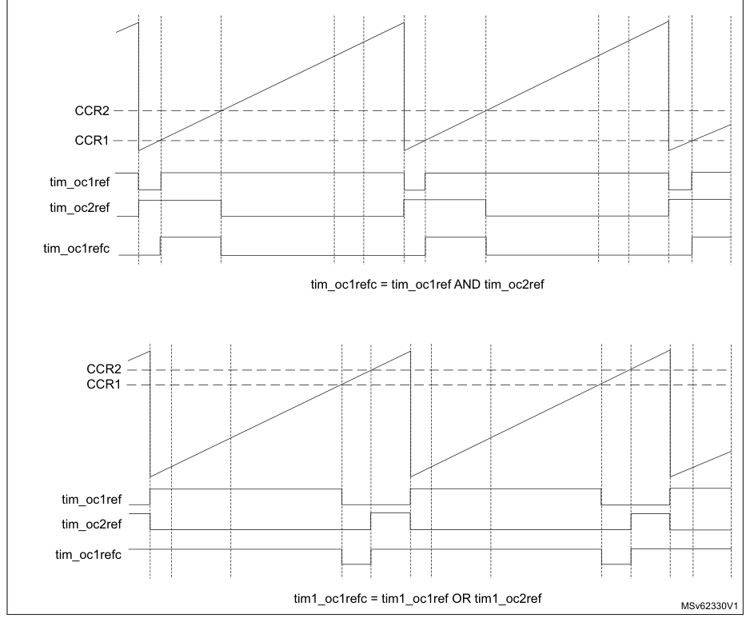

CCR2

CCR1
tim_oc1ref
tim_oc2ref
tim_oc1refc
tim_oc1refc = tim_oc1ref AND tim_oc2ref

CCR2

CCR1
tim_oc1ref
tim_oc2ref
tim_oc1refc
tim1_oc1refc = tim1_oc1ref OR tim1_oc2ref

MSv62330V1

### 31.4.14 Complementary outputs and dead-time insertion

The TIM15/TIM16/TIM17 general-purpose timers can output one complementary signal and manage the
switching-off and switching-on of the outputs.

This time is generally known as dead-time and it has to be adjusted depending on the devices that
are connected to the outputs and their characteristics (such as intrinsic delays of level-shifters
and delays due to power switches)

The polarity of the outputs (main output tim_ocx or complementary tim_ocxn) can be selected
independently for each output. This is done by writing to the CCxP and CCxNP bits in the TIMx_CCER
register.

The complementary signals tim_ocx and tim_ocxn are activated by a combination of several control
bits: the CCxE and CCxNE bits in the TIMx_CCER register and the MOE, OISx, OISxN, OSSI and OSSR bits
in the TIMx_BDTR and TIMx_CR2 registers. Refer to Table 318: Output control bits for complementary
tim_oc1 and tim_oc1n channels with break feature (TIM16/TIM17) for more details. In particular, the
dead-time is activated when switching to the idle state (MOE falling down to 0).

Dead-time insertion is enabled by setting both CCxE and CCxNE bits, and the MOE bit if the break
circuit is present. There is one 10-bit dead-time generator for each channel. From a reference
waveform tim_ocxref, it generates two outputs tim_ocx and tim_ocxn. If tim_ocx and tim_ocxn are
active high:

- The tim_ocx output signal is the same as the reference signal except for the rising edge, which is
  delayed relative to the reference rising edge.
- The tim_ocxn output signal is the opposite of the reference signal except for the rising edge,
  which is delayed relative to the reference falling edge.

If the delay is greater than the width of the active output (tim_ocx or tim_ocxn) then the
corresponding pulse is not generated.

The following figures show the relationships between the output signals of the dead-time generator
and the reference signal tim_ocxref. (in these examples CCxP = 0, CCxNP = 0, MOE = 1, CCxE = 1 and
CCxNE = 1)

**Figure 492. Complementary output with symmetrical dead-time insertion.**

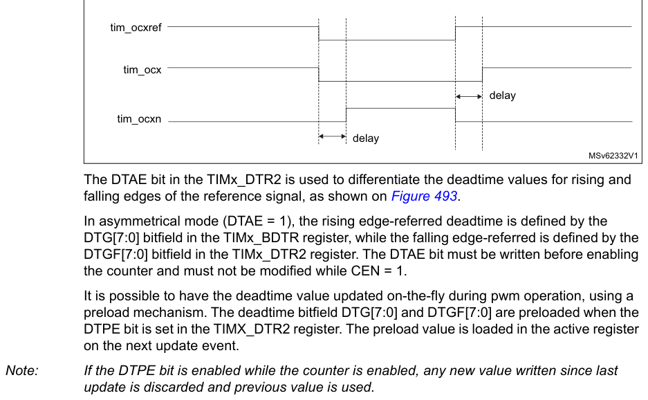

tim_ocxref
tim_ocx
delay
tim_ocxn
delay

MSv62332V1

The DTAE bit in the TIMx_DTR2 is used to differentiate the deadtime values for rising and falling
edges of the reference signal, as shown on Figure 493.

In asymmetrical mode (DTAE = 1), the rising edge-referred deadtime is defined by the DTG[7:0]
bitfield in the TIMx_BDTR register, while the falling edge-referred is defined by the DTGF[7:0]
bitfield in the TIMx_DTR2 register. The DTAE bit must be written before enabling the counter and
must not be modified while CEN = 1.

It is possible to have the deadtime value updated on-the-fly during pwm operation, using a preload
mechanism. The deadtime bitfield DTG[7:0] and DTGF[7:0] are preloaded when the DTPE bit is set in
the TIMX_DTR2 register. The preload value is loaded in the active register on the next update event.

> **Note:** If the DTPE bit is enabled while the counter is enabled, any new value written since last
> update is discarded and previous value is used.

**Figure 493. Asymmetrical deadtime**

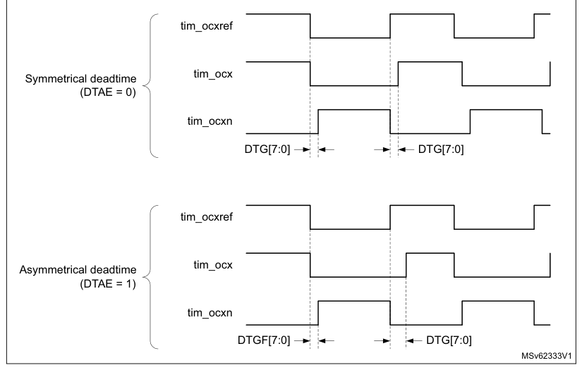

tim_ocxref
tim_ocx

Symmetrical deadtime

(DTAE = 0)
tim_ocxn

**Figure 494. Dead-time waveforms with delay greater than the negative pulse.**

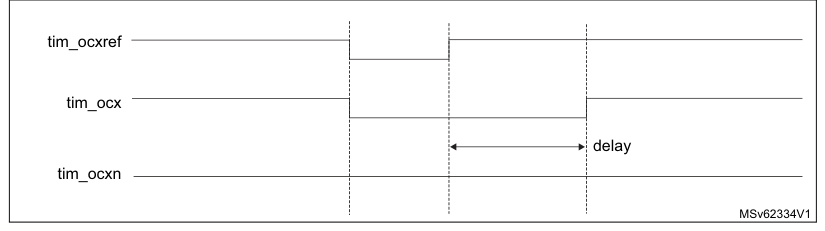

tim_ocxref
tim_ocx
delay
tim_ocxn

MSv62334V1

**Figure 495. Dead-time waveforms with delay greater than the positive pulse.**

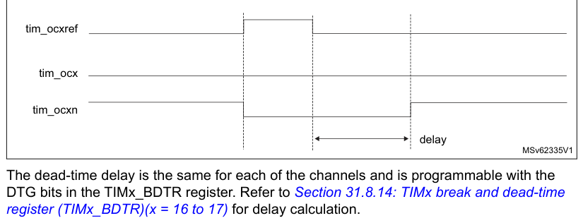

tim_ocxref
tim_ocx
tim_ocxn
delay

MSv62335V1

The dead-time delay is the same for each of the channels and is programmable with the DTG bits in
the TIMx_BDTR register. Refer to [Section 31.8.14](#31814-timx-break-and-dead-time-register-timx_bdtrx--16-to-17): TIMx break and dead-time register (TIMx_BDTR)(x =
16 to 17) for delay calculation.

#### Redirecting tim_ocxref to tim_ocx or tim_ocxn

In output mode (forced, output compare or PWM), tim_ocxref can be redirected to the tim_ocx output
or to tim_ocxn output by configuring the CCxE and CCxNE bits in the TIMx_CCER register.

This is used to send a specific waveform (such as PWM or static active level) on one output while
the complementary remains at its inactive level. Other alternative possibilities are to have both
outputs at inactive level or both outputs active and complementary with dead-time.

> **Note:** When only tim_ocxn is enabled (CCxE = 0, CCxNE = 1), it is not complemented and
> becomes active as soon as tim_ocxref is high. For example, if CCxNP = 0 then tim_ocxn = tim_ocxref.
On the other hand, when both tim_ocx and tim_ocxn are enabled (CCxE = CCxNE = 1) tim_ocx becomes
active when tim_ocxref is high whereas tim_ocxn is complemented and becomes active when tim_ocxref
is low.

### 31.4.15 Using the break function

The purpose of the break function is to protect power switches driven by PWM signals generated with
the timers. The break input is usually connected to fault outputs of power stages and 3-phase
inverters. When activated, the break circuitry shuts down the PWM outputs and forces them to a
predefined safe state.

The break channel gathers both system-level fault (such as clock failure, ECC/parity, and errors)
and application fault (from input pins and built-in comparator), and can force the outputs to a
predefined level (either active or inactive) after a deadtime duration.

The output enable signal and output levels during break are depending on several control bits:

- The MOE bit in TIMx_BDTR register is used to enable /disable the outputs by software and is reset
  in case of break or break2 event.
- The OSSI bit in the TIMx_BDTR register defines whether the timer controls the output in inactive
  state or releases the control to the GPIO controller (typically to have it in Hi- Z mode).
- The OISx and OISxN bits in the TIMx_CR2 register which are setting the output shut-down level,
  either active or inactive. The tim_ocx and tim_ocxn outputs cannot be set both to active level at
  a given time, whatever the OISx and OISxN values. Refer to Table 318: Output control bits for
  complementary tim_oc1 and tim_oc1n channels with break feature (TIM16/TIM17) for more details.

When exiting from reset, the break circuit is disabled and the MOE bit is low. The break function is
enabled by setting the BKE bit in the TIMx_BDTR register. The break input polarity can be selected
by configuring the BKP bit in the same register. BKE and BKP can be modified at the same time. When
the BKE and BKP bits are written, a delay of one APB clock cycle is applied before the writing is
effective. Consequently, it is necessary to wait one APB clock period to correctly read back the bit
after the write operation.

Because MOE falling edge can be asynchronous, a resynchronization circuit has been inserted between
the actual signal (acting on the outputs) and the synchronous control bit (accessed in the TIMx_BDTR
register). It results in some delays between the asynchronous and the synchronous signals. In
particular, if MOE is set to 1 whereas it was low, a delay must be inserted (dummy instruction)
before reading it correctly. This is because the write acts on the asynchronous signal whereas the
read reflects the synchronous signal.

The break is generated by the tim_brk inputs which have:

- Programmable polarity (BKP bit in the TIMx_BDTR register).
- Programmable enable bit (BKE bit in the TIMx_BDTR register).
- Programmable filter (BKF[3:0] bits in the TIMx_BDTR register) to avoid spurious events.

The break can be generated from multiple sources which can be individually enabled and with
programmable edge sensitivity, using the TIMx_AF1 register.

The sources for break (tim_brk) channel are:

- External sources connected to one of the TIM_BKIN pins (as per selection done in the GPIO
  alternate function selection registers), with polarity selection and optional digital filtering.
- Internal sources:
  - Coming from a tim_brk_cmpx input (refer to [Section 31.4.2](#3142-tim15tim16tim17-pins-and-internal-signals): TIM15/TIM16/TIM17 pins and internal
    signals for product specific implementation).
  - Coming from a system break request on the tim_sys_brk inputs (refer to [Section 31.4.2](#3142-tim15tim16tim17-pins-and-internal-signals):
    TIM15/TIM16/TIM17 pins and internal signals for product specific implementation).

Break events can also be generated by software using BG bit in the TIMx_EGR register. All sources
are ORed before entering the timer tim_brk inputs, as per Figure 496 below.

**Figure 496. Break circuitry overview**

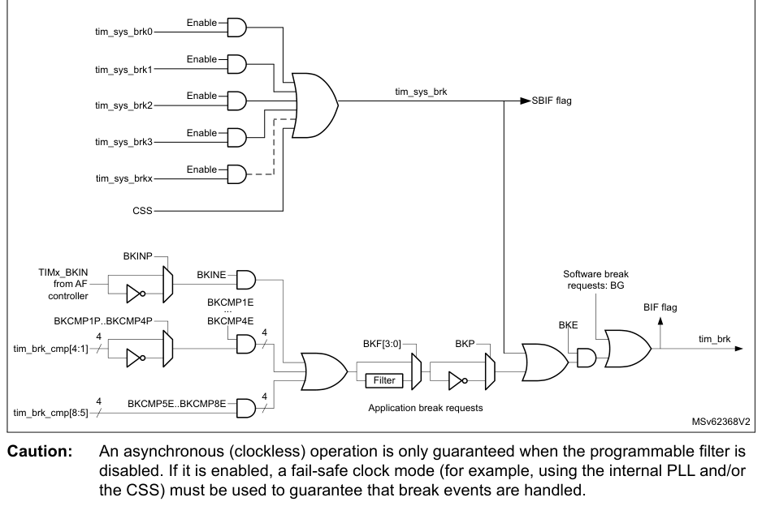

Enable
tim_sys_brk0

Enable
tim_sys_brk1
tim_sys_brk

Enable

SBIF flag
tim_sys_brk2

Enable
tim_sys_brk3

Enable
tim_sys_brkx

CSS

BKINP

> **Caution:** An asynchronous (clockless) operation is only guaranteed when the programmable filter is
> disabled. If it is enabled, a fail-safe clock mode (for example, using the internal PLL and/or the
CSS) must be used to guarantee that break events are handled.

When a break occurs (selected level on the break input):

- The MOE bit is cleared asynchronously, putting the outputs in inactive state, idle state, or even
  releasing the control to the GPIO (selected by the OSSI bit). This feature functions even if the
  MCU oscillator is off.
- Each output channel is driven with the level programmed in the OISx bit in the TIMx_CR2 register
  as soon as MOE = 0. If OSSI = 0, the timer releases the output control (taken over by the GPIO)
  else the enable output remains high.
- When complementary outputs are used:
  - The outputs are first put in reset state inactive state (depending on the polarity). This is
    done asynchronously so that it works even if no clock is provided to the timer.
  - If the timer clock is still present, then the dead-time generator is reactivated in order to
    drive the outputs with the level programmed in the OISx and OISxN bits after a dead-time. Even
    in this case, tim_ocx and tim_ocxn cannot be driven to their active level together. Note that
    because of the resynchronization on MOE, the dead-time duration is a bit longer than usual
    (around 2 tim_ker_ck clock cycles).
  - If OSSI = 0 then the timer releases the enable outputs (taken over by the GPIO which forces a
    Hi-Z state) else the enable outputs remain or become high as soon as one of the CCxE or CCxNE
    bits is high.
- The break status flag (BIF bit in the TIMx_SR register) is set. An interrupt can be generated if
  the BIE bit in the TIMx_DIER register is set. A DMA request can be sent if the BDE bit in the
  TIMx_DIER register is set.
- If the AOE bit in the TIMx_BDTR register is set, the MOE bit is automatically set again at the
  next update event UEV. This can be used to perform a regulation, for instance. Else, MOE remains
  low until it is written with 1 again. In this case, it can be used for security and the break
  input can be connected to an alarm from power drivers, thermal sensors or any security components.

> **Note:** If the MOE is reset by the CPU while the AOE bit is set, the outputs are in idle state and
> forced to inactive level or Hi-Z depending on OSSI value. If both the MOE and AOE bits are reset by
> the CPU, the outputs are in disabled state and driven with the level programmed in the OISx bit in
> the TIMx_CR2 register.

The break inputs are acting on level. Thus, the MOE cannot be set while the break input is active
(neither automatically nor by software). In the meantime, the status flag BIF cannot be cleared.

The break can be generated by the tim_brk input which has a programmable polarity and an enable bit
BKE in the TIMx_BDTR register.

In addition to the break input and the output management, a write protection has been implemented
inside the break circuit to safeguard the application. It is used to freeze the configuration of
several parameters (dead-time duration, tim_ocx/tim_ocxn polarities and state when disabled, OCxM
configurations, break enable, and polarity). The protection can be selected among 3 levels with the
LOCK bits in the TIMx_BDTR register. Refer to [Section 31.8.14](#31814-timx-break-and-dead-time-register-timx_bdtrx--16-to-17): TIMx break and dead-time register
(TIMx_BDTR)(x = 16 to 17). The LOCK bits can be written only once after an MCU reset.

The Figure 497 shows an example of behavior for the outputs in response to a break.

**Figure 497. Output behavior in response to a break event on tim_brk**

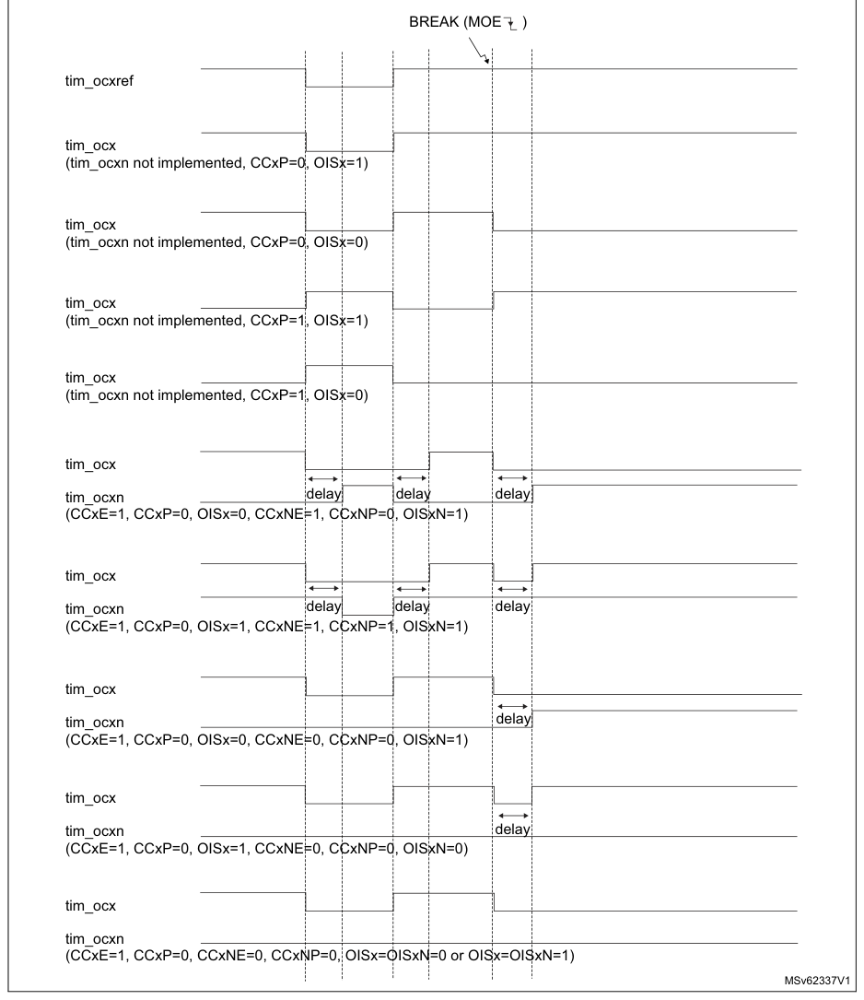

BREAK (MOE)
tim_ocxref
tim_ocx

(tim_ocxn not implemented, CCxP=0, OISx=1)
tim_ocx

(tim_ocxn not implemented, CCxP=0, OISx=0)
tim_ocx

(tim_ocxn not implemented, CCxP=1, OISx=1)
tim_ocx

(tim_ocxn not implemented, CCxP=1, OISx=0)
tim_ocx

### 31.4.16 Bidirectional break input

The TIM15/TIM16/TIM17 are featuring bidirectional break I/Os, as represented on

Figure 498.

They are used to have:

- A board-level global break signal available for signaling faults to external MCUs or gate drivers,
  with a unique pin being both an input and an output status pin.
- Internal break sources and multiple external open drain sources ORed together to trigger a unique
  break event, when multiple internal and external break sources must be merged.

The tim_brk input is configured in bidirectional mode using the BKBID bit in the TIMxBDTR register.
The BKBID programming bit can be locked in read-only mode using the LOCK bits in the TIMxBDTR
register (in LOCK level 1 or above).

The bidirectional mode requires the I/O to be configured in open-drain mode with active low polarity
(using BKINP and BKP bits). Any break request coming either from system (for example CSS), from
on-chip peripherals, or from break inputs forces a low level on the break input to signal the fault
event. The bidirectional mode is inhibited if the polarity bits are not correctly set (active high
polarity), for safety purposes.

The break software event (triggered by setting the BG bit) also causes the break I/O to be forced to
'0' to indicate to the external components that the timer has entered in break state. However, this
is valid only if the break is enabled (BKE = 1). When a software break event is generated with BKE =
0, the outputs are put in safe state and the break flag is set, but there is no effect on the
TIM_BKIN I/O.

A safe disarming mechanism prevents the system to be definitively locked-up (a low level on the
break input triggers a break which enforces a low level on the same input).

When the BKDSRM bit is set to 1, this releases the break output to clear a fault signal and to give
the possibility to re-arm the system.

At no point the break protection circuitry can be disabled:

- The break input path is always active: a break event is active even if the BKDSRM bit is set and
  the open drain control is released. This prevents the PWM output to be restarted as long as the
  break condition is present.
- The BKDSRM bit cannot disarm the break protection as long as the outputs are enabled (MOE bit is
  set) (see Table 312).

**Table 312. Break protection disarming conditions**

| MOE | BKBID | BKDSRM | Break protection state |
| --- | --- | --- | --- |
| 0 | 0 | X | Armed |
| 0 | 1 | 0 | Armed |
| 0 | 1 | 1 | Disarmed |
| 1 | X | X | Armed |

#### Arming and rearming break circuitry

The break circuitry (in input or bidirectional mode) is armed by default (peripheral reset
configuration).

The following procedure must be followed to re-arm the protection after a break event:

- The BKDSRM bit must be set to release the output control.
- The software must wait until the system break condition disappears (if any) and clear the SBIF
  status flag (or clear it systematically before rearming).
- The software must poll the BKDSRM bit until it is cleared by hardware (when the application break
  condition disappears).

From this point, the break circuitry is armed and active, and the MOE bit can be set to re-enable
the PWM outputs.

**Figure 498. Output redirection**

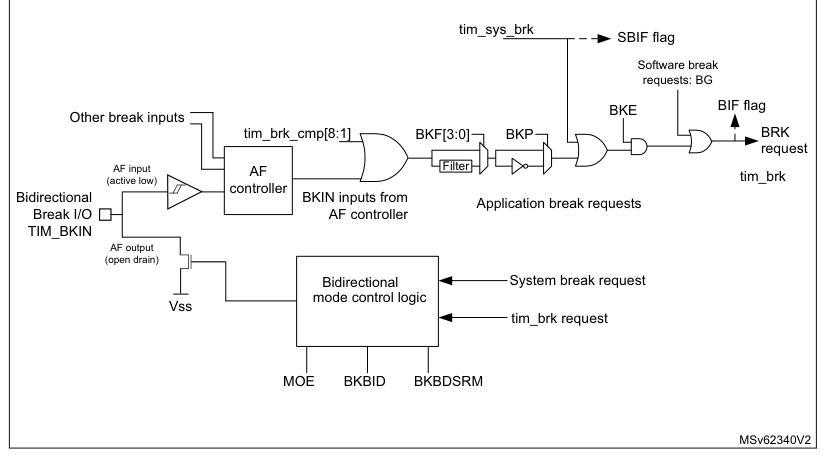

tim_sys_brk

SBIF flag

Software break
requests: BG

BIF flag

BKE

Other break inputs

### 31.4.17 Clearing the tim_ocxref signal on an external event

The tim_ocxref signal of a given channel can be cleared when a high level is applied on the
tim_ocref_clr_int input (OCxCE enable bit in the corresponding TIMx_CCMRx register set to 1).
tim_ocxref remains low until the next transition to the active state, on the following PWM cycle.
This function can only be used in Output compare and PWM modes. It does not work in Forced mode.

The tim_ocref_clr_int input can be selected among several inputs, as shown on Figure 509 below.

**Figure 499. tim_ocref_clr input selection multiplexer**

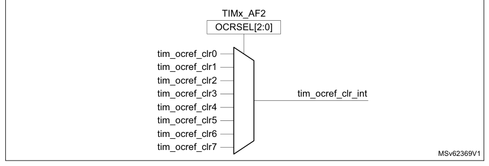

TIMx_AF2

OCRSEL[2:0]
tim_ocref_clr0
tim_ocref_clr1
tim_ocref_clr2

### 31.4.18 6-step PWM generation

When complementary outputs are used on a channel, preload bits are available on the OCxM, CCxE, and
CCxNE bits. The preload bits are transferred to the shadow bits at the COM commutation event. Thus
one can program in advance the configuration for the next step and change the configuration of all
the channels at the same time. COM can be generated by software by setting the COM bit in the
TIMx_EGR register or by hardware (on tim_trgi rising edge).

A flag is set when the COM event occurs (COMIF bit in the TIMx_SR register), which can generate an
interrupt (if the COMIE bit is set in the TIMx_DIER register) or a DMA request (if the COMDE bit is
set in the TIMx_DIER register).

The Figure 500 describes the behavior of the tim_ocx and tim_ocxn outputs when a COM event occurs,
in 3 different examples of programmed configurations.

**Figure 500. 6-step generation, COM example (OSSR = 1)**

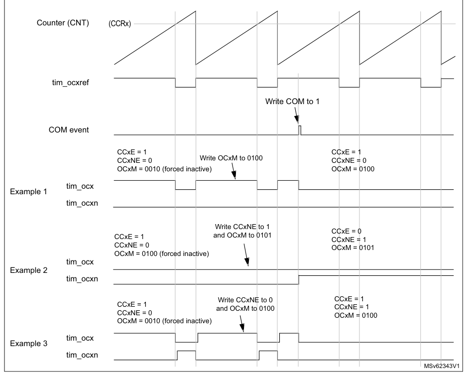

### 31.4.19 One-pulse mode

One-pulse mode (OPM) is a particular case of the previous modes. It allows the counter to be started
in response to a stimulus and to generate a pulse with a programmable length after a programmable
delay.

Starting the counter can be controlled through the slave mode controller. Generating the waveform
can be done in output compare mode or PWM mode. One-pulse mode is selected by setting the OPM bit in
the TIMx_CR1 register. This makes the counter stop automatically at the next update event UEV.

A pulse can be correctly generated only if the compare value is different from the counter initial
value. Before starting (when the timer is waiting for the trigger), the configuration must be:

- CNT \< CCRx ≤ARR (in particular, 0 \< CCRx).

**Figure 501. Example of one pulse mode.**

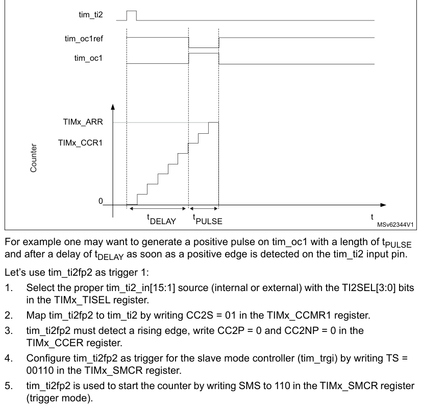

tim_ti2
tim_oc1ref
tim_oc1

TIMx_ARR

TIMx_CCR1

Counter

0

For example one may want to generate a positive pulse on tim_oc1 with a length of tPULSE and after a
delay of tDELAY as soon as a positive edge is detected on the tim_ti2 input pin.

Let’s use tim_ti2fp2 as trigger 1:

1. Select the proper tim_ti2_in[15:1] source (internal or external) with the TI2SEL[3:0] bits
   in the TIMx_TISEL register.
2. Map tim_ti2fp2 to tim_ti2 by writing CC2S = 01 in the TIMx_CCMR1 register.
3. tim_ti2fp2 must detect a rising edge, write CC2P = 0 and CC2NP = 0 in the

TIMx_CCER register.

4. Configure tim_ti2fp2 as trigger for the slave mode controller (tim_trgi) by writing TS =

00110 in the TIMx_SMCR register.

5. tim_ti2fp2 is used to start the counter by writing SMS to 110 in the TIMx_SMCR register

(trigger mode).

The OPM waveform is defined by writing the compare registers (taking into account the clock
frequency and the counter prescaler).

- The tDELAY is defined by the value written in the TIMx_CCR1 register.
- The tPULSE is defined by the difference between the autoreload value and the compare value
  (TIMx_ARR - TIMx_CCR1).
- Let’s say one want to build a waveform with a transition from 0 to 1 when a compare match occurs
  and a transition from 1 to 0 when the counter reaches the autoreload value. To do this PWM mode 2
  must be enabled by writing OC1M = 111 in the TIMx_CCMR1 register. Optionally the preload registers
  can be enabled by writing OC1PE = 1 in the TIMx_CCMR1 register and ARPE in the TIMx_CR1 register.
  In this case one has to write the compare value in the TIMx_CCR1 register, the autoreload value in
  the TIMx_ARR register, generate an update by setting the UG bit and wait for external trigger
  event on tim_ti2. CC1P is written to 0 in this example.

Since only one pulse is needed, a 1 must be written in the OPM bit in the TIMx_CR1 register to stop
the counter at the next update event (when the counter rolls over from the autoreload value back to
0).

Particular case: tim_ocx fast enable

In One-pulse mode, the edge detection on tim_tix input set the CEN bit which enables the counter.
Then the comparison between the counter and the compare value makes the output toggle. But several
clock cycles are needed for these operations and it limits the minimum delay tDELAY min that can be
obtained.

If one wants to output a waveform with the minimum delay, the OCxFE bit can be set in the TIMx_CCMRx
register. Then tim_ocxref (and tim_ocx) are forced in response to the stimulus, without taking in
account the comparison. Its new level is the same as if a compare match had occurred. OCxFE acts
only if the channel is configured in PWM1 or PWM2 mode.

### 31.4.20 Retriggerable one pulse mode (TIM15 only)

This mode allows the counter to be started in response to a stimulus and to generate a pulse with a
programmable length, but with the following differences with non-retriggerable one pulse mode
described in [Section 31.4.19](#31419-one-pulse-mode):

- The pulse starts as soon as the trigger occurs (no programmable delay)
- The pulse is extended if a new trigger occurs before the previous one is completed

The timer must be in Slave mode, with the bits SMS[3:0] = 1000 (Combined reset \+ trigger mode) in
the TIMx_SMCR register, and the OCxM[3:0] bits set to 1000 or 1001 for Retriggerable OPM mode 1 or
2.

If the timer is configured in Up-counting mode, the corresponding CCRx must be set to 0 (the ARR
register sets the pulse length). If the timer is configured in Down-counting mode, CCRx must be
above or equal to ARR.

> **Note:** The OCxM[3:0] and SMS[3:0] bit fields are split into two parts for compatibility reasons, the
> most significant bit are not contiguous with the three least significant ones.

This mode must not be used with center-aligned PWM modes. It is mandatory to have CMS[1:0] = 00 in
TIMx_CR1.

**Figure 502. Retriggerable one pulse mode**

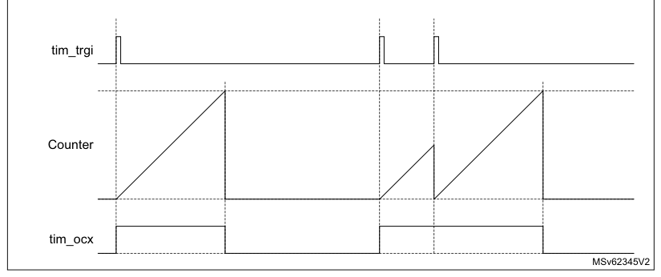

tim_trgi

Counter
tim_ocx

MSv62345V2

### 31.4.21 UIF bit remapping

The IUFREMAP bit in the TIMx_CR1 register forces a continuous copy of the update interrupt flag UIF
into bit 31 of the timer counter register (TIMxCNT[31]). This is used to atomically read both the
counter value and a potential roll-over condition signaled by the UIFCPY flag. In particular cases,
it can ease the calculations by avoiding race conditions caused for instance by a processing shared
between a background task (counter reading) and an interrupt (update interrupt).

There is no latency between the assertions of the UIF and UIFCPY flags.

### 31.4.22 Timer input XOR function (TIM15 only)

The TI1S bit in the TIMx_CR2 register, allows the input filter of channel 1 to be connected to the
output of a XOR gate, combining the two input pins tim_ti1 and tim_ti2.

The XOR output can be used with all the timer input functions such as trigger or input capture. It
is useful for measuring the interval between the edges on two input signals, as shown in Figure 503.

**Figure 503. Measuring time interval between edges on 2 signals**

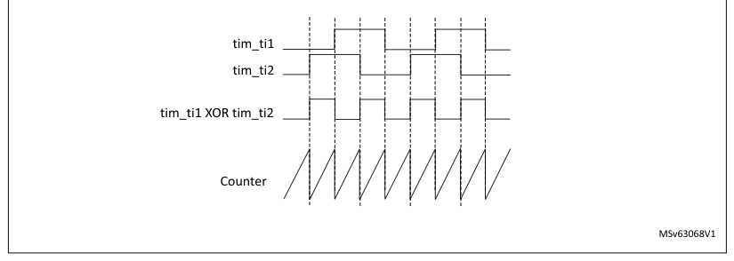

tim_ti1
tim_ti2
tim_ti1 XOR tim_ti2

Counter

MSv63068V1

### 31.4.23 External trigger synchronization (TIM15 only)

The TIM timers are linked together internally for timer synchronization or chaining.

The TIM15 timer can be synchronized with an external trigger in several modes: Reset mode, Gated
mode, Trigger mode, Reset \+ trigger, and gated \+ reset modes.

#### Slave mode: Reset mode

The counter and its prescaler can be reinitialized in response to an event on a trigger input.
Moreover, if the URS bit from the TIMx_CR1 register is low, an update event UEV is generated. Then
all the preloaded registers (TIMx_ARR, TIMx_CCRx) are updated.

In the following example, the upcounter is cleared in response to a rising edge on tim_ti1 input:

1. Configure the channel 1 to detect rising edges on tim_ti1. Configure the input filter
   duration (in this example, no need for any filter, so IC1F is kept at 0000). The capture prescaler
   is not used for triggering, so it does not need to be configured. The CC1S bits select the input
   capture source only, CC1S = 01 in the TIMx_CCMR1 register. Write CC1P = 0 and CC1NP = 0 in the
   TIMx_CCER register to validate the polarity (and detect rising edges only).
2. Configure the timer in reset mode by writing SMS = 100 in TIMx_SMCR register. Select
   tim_ti1 as the input source by writing TS = 00101 in TIMx_SMCR register.
3. Start the counter by writing CEN = 1 in the TIMx_CR1 register.

The counter starts counting on the internal clock, then behaves normally until tim_ti1 rising edge.
When tim_ti1 rises, the counter is cleared and restarts from 0. In the meantime, the trigger flag is
set (TIF bit in the TIMx_SR register) and an interrupt request, or a DMA request can be sent if
enabled (depending on the TIE and TDE bits in TIMx_DIER register).

The following figure shows this behavior when the autoreload register TIMx_ARR = 0x36. The delay
between the rising edge on tim_ti1 and the actual reset of the counter is due to the
resynchronization circuit on tim_ti1 input.

**Figure 504. Control circuit in reset mode**

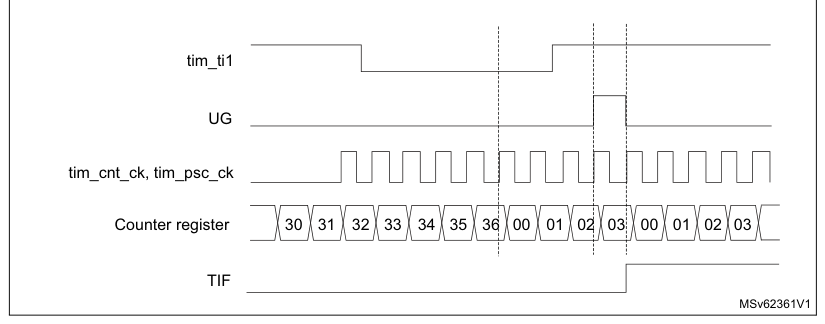

#### Slave mode: Gated mode

The counter can be enabled depending on the level of a selected input.

In the following example, the upcounter counts only when tim_ti1 input is low:

1. Configure the channel 1 to detect low levels on tim_ti1. Configure the input filter
   duration (in this example, no need for any filter, so IC1F is kept at 0000). The capture prescaler
   is not used for triggering, so it does not need to be configured. The CC1S bits select the input
   capture source only, CC1S = 01 in TIMx_CCMR1 register. Write CC1P = 1 and CC1NP = 0 in the TIMx_CCER
   register to validate the polarity (and detect low level only).
2. Configure the timer in gated mode by writing SMS = 101 in TIMx_SMCR register.

Select tim_ti1 as the input source by writing TS = 00101 in TIMx_SMCR register.

3. Enable the counter by writing CEN = 1 in the TIMx_CR1 register (in gated mode, the
   counter does not start if CEN = 0, whatever is the trigger input level).

The counter starts counting on the internal clock as long as tim_ti1 is low and stops as soon as
tim_ti1 becomes high. The TIF flag in the TIMx_SR register is set both when the counter starts or
stops.

The delay between the rising edge on tim_ti1 and the actual stop of the counter is due to the
resynchronization circuit on tim_ti1 input.

**Figure 505. Control circuit in gated mode**

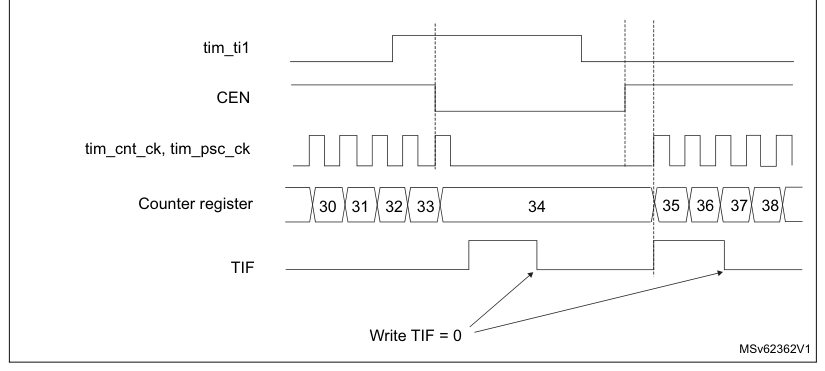

#### Slave mode: Trigger mode

The counter can start in response to an event on a selected input.

In the following example, the upcounter starts in response to a rising edge on tim_ti2 input:

1. Configure the channel 2 to detect rising edges on tim_ti2. Configure the input filter
   duration (in this example, no need for any filter, so IC2F is kept at 0000). The capture prescaler
   is not used for triggering, so it does not need to be configured. The CC2S bits are configured to
   select the input capture source only, CC2S = 01 in TIMx_CCMR1 register. Write CC2P = 1 and CC2NP = 0
   in the TIMx_CCER register to validate the polarity (and detect low level only).
2. Configure the timer in trigger mode by writing SMS = 110 in the TIMx_SMCR register.

Select tim_ti2 as the input source by writing TS = 00110 in the TIMx_SMCR register.

When a rising edge occurs on tim_ti2, the counter starts counting on the internal clock and the TIF
flag is set.

The delay between the rising edge on tim_ti2 and the actual start of the counter is due to the
resynchronization circuit on tim_ti2 input.

**Figure 506. Control circuit in trigger mode**

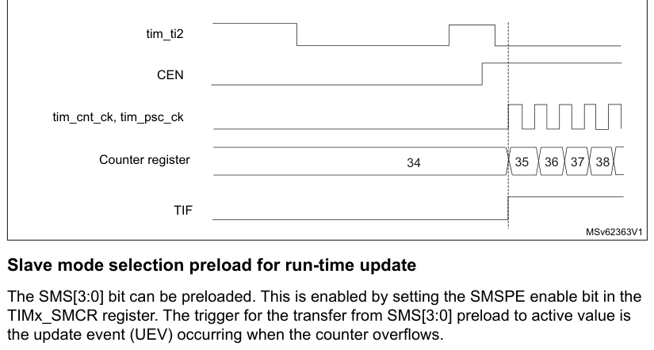

#### Slave mode selection preload for run-time update

The SMS[3:0] bit can be preloaded. This is enabled by setting the SMSPE enable bit in the TIMx_SMCR
register. The trigger for the transfer from SMS[3:0] preload to active value is the update event
(UEV) occurring when the counter overflows.

### 31.4.24 Slave mode – combined reset \+ trigger mode (TIM15 only)

In this case, a rising edge of the selected trigger input (tim_trgi) reinitializes the counter,
generates an update of the registers, and starts the counter.

This mode is used for one-pulse mode.

### 31.4.25 Slave mode – combined reset \+ gated mode (TIM15 only)

The counter clock is enabled when the trigger input (tim_trgi) is high. The counter stops and is
reset) as soon as the trigger becomes low. Both start and stop of the counter are controlled.

This mode is used to detect out-of-range PWM signal (duty cycle exceeding a maximum expected value).

### 31.4.26 Timer synchronization (TIM15 only)

The TIMx timers are linked together internally for timer synchronization or chaining. Refer to
[Section 30.4.23](chapter-30.md#30423-timer-synchronization): Timer synchronization for details.

> **Note:** The clock of the slave peripherals (such as timer and ADC) receiving the tim_trgo signal
> must be enabled prior to receive events from the master timer, and the clock frequency (prescaler)
> must not be changed on-the-fly while triggers are received from the master timer.

### 31.4.27 Using timer output as trigger for other timers (TIM16/TIM17 only)

The timers with one channel only do not feature a master mode. However, the OC1 output signal can be
used to trigger some other timers (including timers described in other sections of this document).
Check the “TIMx internal trigger connection” table of any timer on the device to identify which
timers can be targeted as slave.

The OC1 signal pulse width must be programmed to be at least two clock cycles of the destination
timer, to make sure the slave timer detects the trigger.

For instance, if the destination's timer CK_INT clock is four times slower than the source timer,
the OC1 pulse width must be eight clock cycles.

### 31.4.28 ADC triggers (TIM15 only)

The timer can generate an ADC triggering event with various internal signals, such as reset, enable
or compare events.

> **Note:** The clock of the slave peripherals (such as timer, ADC) receiving the tim_trgo signal must
> be enabled prior to receive events from the master timer, and the clock frequency (prescaler) must
> not be changed on-the-fly while triggers are received from the master timer.

### 31.4.29 DMA burst mode

The TIMx timers have the capability to generate multiple DMA requests on a single event. The main
purpose is to be able to reprogram several timer registers multiple times without software overhead,
but it can also be used to read several registers in a row, at regular intervals.

The DMA controller destination is unique and must point to the virtual register TIMx_DMAR. On a
given timer event, the timer launches a sequence of DMA requests (burst). Each write into the
TIMx_DMAR register is actually redirected to one of the timer registers.

The DBL[4:0] bits in the TIMx_DCR register set the DMA burst length. The timer recognizes a burst
transfer when a read or a write access is done to the TIMx_DMAR address), i.e. the number of
transfers (either in half-words or in bytes).

The DBA[4:0] bits in the TIMx_DCR registers define the DMA base address for DMA transfers (when
read/write accesses are done through the TIMx_DMAR address). DBA is defined as an offset starting
from the address of the TIMx_CR1 register.

Example:

- `00000`: TIMx_CR1
- `00001`: TIMx_CR2
- `00010`: TIMx_SMCR

For example, the timer DMA burst feature can be used to update the contents of the CCRx registers (x
= 2, 3, 4) on an update event, with the DMA transferring half words into the CCRx registers.

This is done in the following steps:

1. Configure the corresponding DMA channel as follows:
   - DMA channel peripheral address is the DMAR register address
   - DMA channel memory address is the address of the buffer in the RAM containing the data to be
    transferred by DMA into the CCRx registers.
   - Number of data to transfer = 3 (See note below).
   - Circular mode disabled.

2. Configure the DCR register by configuring the DBA and DBL bit fields as follows:

DBL = 3 transfers, DBA = 0xE.

3. Enable the TIMx update DMA request (set the UDE bit in the DIER register).
4. Enable TIMx
5. Enable the DMA channel

This example is for the case where every CCRx register is to be updated once. If every CCRx register
is to be updated twice for example, the number of data to transfer must be 6. Let's take the example
of a buffer in the RAM containing data1, data2, data3, data4, data5, and data6. The data is
transferred to the CCRx registers as follows: on the first update DMA request, data1 is transferred
to CCR2, data2 is transferred to CCR3, data3 is transferred to CCR4 and on the second update DMA
request, data4 is transferred to CCR2, data5 is transferred to CCR3, and data6 is transferred to
CCR4.

> **Note:** A null value can be written to the reserved registers.

### 31.4.30 TIM15/TIM16/TIM17 DMA requests

The TIM15/TIM16/TIM17 can generate a DMA request, as shown in Table 313.

**Table 313. DMA request**

| Source row | Column 1 | Column 2 | Column 3 | Column 4 |
| ---: | --- | --- | --- | --- |
| 1 | `DMA request` | `Enable` |  |  |
| 2 | `DMA acronym` | `DMA request` |  |  |
| 3 | `signal` | `control bit` |  |  |
| 4 | `tim_upd_dma` | `TIM_UP` | `Update` | `UDE` |
| 5 | `tim_cc1_dma` | `TIM_CH1` | `Capture/compare 1` | `CC1DE` |
| 6 | `tim_com_dma(1)` | `TIM_COM` | `Commutation (COM)` | `COMDE` |
| 7 | `tim_trgi_dma(1)` | `TIM_TRIG` | `Trigger` | `TDE` |

1. Available for TIM15 only.

### 31.4.31 Debug mode

When the microcontroller enters debug mode (Cortex®-M4 with FPU core halted), the TIMx counter can
either continue to work normally or stop.

The behavior in debug mode can be programmed with a dedicated configuration bit per timer in the
Debug support (DBG) module.

For safety purposes, when the counter is stopped, the outputs are disabled (as if the MOE bit was
reset). The outputs can either be forced to an inactive state (OSSI bit = 1), or have their control
taken over by the GPIO controller (OSSI bit = 0) to force them to Hi-Z.

For more details, refer to the debug section.

## 31.5 TIM15/TIM16/TIM17 low-power modes

**Table 314. Effect of low-power modes on TIM15/TIM16/TIM17**

| Source row | Column 1 | Column 2 |
| ---: | --- | --- |
| 1 | `Mode` | `Description` |
| 2 | `No effect, peripheral is active. The interrupts can cause the device to exit from Sleep` |  |
| 3 | `Sleep` |  |

mode.

The timer operation is stopped and the register content is kept. No interrupt can be

Stop
generated.

| Source row | Column 1 | Column 2 |
| ---: | --- | --- |
| 1 | `Standby` | `The timer is powered-down and must be reinitialized after exiting the Standby mode.` |

## 31.6 TIM15/TIM16/TIM17 interrupts

The TIM15/TIM16/TIM17 can generate multiple interrupts, as shown in Table 315.

**Table 315. Interrupt requests**

| Source row | Column 1 | Column 2 | Column 3 | Column 4 | Column 5 | Column 6 |
| ---: | --- | --- | --- | --- | --- | --- |
| 1 | `Exit Exit from` |  |  |  |  |  |
| 2 | `Interrupt` | `Enable` | `Interrupt clear` | `from` | `Stop and` |  |
| 3 | `Interrupt event` | `Event flag` |  |  |  |  |
| 4 | `acronym` | `control bit` | `method` | `Sleep` | `Standby` |  |
| 5 | `mode mode` |  |  |  |  |  |
| 6 | `Update` | `UIF` | `UIE` | `write 0 in UIF` | `Yes` | `No` |
| 7 | `Capture/compare 1` | `CC1IF` | `CC1IE` | `write 0 in CC1IF` | `Yes` | `No` |
| 8 | `Capture/compare 2(1)` | `CC2IF` | `CC2IE` | `write 0 in CC2IF` | `Yes` | `No` |
| 9 | `TIM` |  |  |  |  |  |
| 10 | `Commutation (COM)` | `COMIF` | `COMIE` | `write 0 in COMIF` | `Yes` | `No` |
| 11 | `Trigger(1)` | `TIF` | `TIE` | `write 0 in TIF` | `Yes` | `No` |
| 12 | `Break` | `BIF` | `BIE` | `write 0 in BIF` | `Yes` | `No` |

1. Available for TIM15 only.

## 31.7 TIM15 registers

Refer to [Section 1.2](chapter-01.md#12-list-of-abbreviations-for-registers) for a list of abbreviations used in register descriptions.

The peripheral registers can be accessed by half-words (16-bit) or words (32-bit).

### 31.7.1 TIM15 control register 1 (TIM15_CR1)

- **Address offset:** 0x00
- **Reset value:** 0x0000

**Register bit layout**

| Bit | Field | Access | Summary |
| ---: | --- | :---: | --- |
| 15 | Reserved | — | kept at reset value. |
| 14 | Reserved | — | ↳ |
| 13 | Reserved | — | ↳ |
| 12 | `DITHEN` | rw | Dithering enable |
| 11 | `UIFREMAP` | rw | UIF status bit remapping |
| 10 | Reserved | — | kept at reset value. |
| 9 | `CKD[1]` | rw | Clock division |
| 8 | `CKD[0]` | rw | ↳ |
| 7 | `ARPE` | rw | Auto-reload preload enable |
| 6 | Reserved | — | kept at reset value. |
| 5 | Reserved | — | ↳ |
| 4 | Reserved | — | ↳ |
| 3 | `OPM` | rw | One-pulse mode |
| 2 | `URS` | rw | Update request source |
| 1 | `UDIS` | rw | Update disable |
| 0 | `CEN` | rw | Counter enable |

**Bits 15:13 — Reserved:** kept at reset value.

**Bit 12 — `DITHEN`:** Dithering enable

- `0`: Dithering disabled
- `1`: Dithering enabled

> **Note:** The DITHEN bit can only be modified when CEN bit is reset.

**Bit 11 — `UIFREMAP`:** UIF status bit remapping

- `0`: No remapping. UIF status bit is not copied to TIM15_CNT register bit 31.
- `1`: Remapping enabled. UIF status bit is copied to TIM15_CNT register bit 31.

**Bit 10 — Reserved:** kept at reset value.

**Bits 9:8 — `CKD[1:0]`:** Clock division

This bitfield indicates the division ratio between the timer clock (tim_ker_ck) frequency and
the dead-time and sampling clock (tDTS) used by the dead-time generators and the digital
filters (tim_tix)

- `00`: tDTS = ttim_ker_ck
- `01`: tDTS = 2*ttim_ker_ck
- `10`: tDTS = 4*ttim_ker_ck
- `11`: Reserved

**Bit 7 — `ARPE`:** Auto-reload preload enable

- `0`: TIM15_ARR register is not buffered
- `1`: TIM15_ARR register is buffered

**Bits 6:4 — Reserved:** kept at reset value.

**Bit 3 — `OPM`:** One-pulse mode

- `0`: Counter is not stopped at update event
- `1`: Counter stops counting at the next update event (clearing the bit CEN)

**Bit 2 — `URS`:** Update request source

This bit is set and cleared by software to select the UEV event sources.

- `0`: Any of the following events generate an update interrupt if enabled. These events can be:
  - Counter overflow/underflow
  - Setting the UG bit
  - Update generation through the slave mode controller
- `1`: Only counter overflow/underflow generates an update interrupt if enabled

**Bit 1 — `UDIS`:** Update disable

This bit is set and cleared by software to enable/disable UEV event generation.

0:UEV enabled. The Update (UEV) event is generated by one of the following events:

- Counter overflow/underflow
- Setting the UG bit
- Update generation through the slave mode controller

Buffered registers are then loaded with their preload values.

1:UEV disabled. The Update event is not generated, shadow registers keep their value

(ARR, PSC, CCRx). However the counter and the prescaler are reinitialized if the UG bit is
set or if a hardware reset is received from the slave mode controller.

**Bit 0 — `CEN`:** Counter enable

- `0`: Counter disabled
- `1`: Counter enabled

> **Note:** External clock and gated mode can work only if the CEN bit has been previously set by
> software. However trigger mode can set the CEN bit automatically by hardware.

### 31.7.2 TIM15 control register 2 (TIM15_CR2)

- **Address offset:** 0x04
- **Reset value:** 0x0000

**Register bit layout**

| Bit | Field | Access | Summary |
| ---: | --- | :---: | --- |
| 15 | Reserved | — | kept at reset value. |
| 14 | Reserved | — | ↳ |
| 13 | Reserved | — | ↳ |
| 12 | Reserved | — | ↳ |
| 11 | Reserved | — | ↳ |
| 10 | `OIS2` | rw | Output idle state 2 (tim_oc2 output) |
| 9 | `OIS1N` | rw | Output Idle state 1 (tim_oc1n output) |
| 8 | `OIS1` | rw | Output Idle state 1 (tim_oc1 output) |
| 7 | `TI1S` | rw | tim_ti1 selection |
| 6 | `MMS[2]` | rw | Master mode selection |
| 5 | `MMS[1]` | rw | ↳ |
| 4 | `MMS[0]` | rw | ↳ |
| 3 | `CCDS` | rw | Capture/compare DMA selection |
| 2 | `CCUS` | rw | Capture/compare control update selection |
| 1 | Reserved | — | kept at reset value. |
| 0 | `CCPC` | rw | Capture/compare preloaded control |

**Bits 15:11 — Reserved:** kept at reset value.

**Bit 10 — `OIS2`:** Output idle state 2 (tim_oc2 output)

- `0`: tim_oc2 = 0 when MOE = 0
- `1`: tim_oc2 = 1 when MOE = 0

> **Note:** This bit cannot be modified as long as LOCK level 1, 2 or 3 has been programmed

(LOCK bits in the TIM15_BKR register).

**Bit 9 — `OIS1N`:** Output Idle state 1 (tim_oc1n output)

- `0`: tim_oc1n = 0 after a dead-time when MOE = 0
- `1`: tim_oc1n = 1 after a dead-time when MOE = 0

> **Note:** This bit can not be modified as long as LOCK level 1, 2 or 3 has been programmed

(LOCK bits in TIM15_BKR register).

**Bit 8 — `OIS1`:** Output Idle state 1 (tim_oc1 output)

- `0`: tim_oc1 = 0 after a dead-time when MOE = 0
- `1`: tim_oc1 = 1 after a dead-time when MOE = 0

> **Note:** This bit can not be modified as long as LOCK level 1, 2 or 3 has been programmed

(LOCK bits in TIM15_BKR register).

**Bit 7 — `TI1S`:** tim_ti1 selection

- `0`: The tim_ti1_in[15:0] multiplexer output is connected to tim_ti1 input
- `1`: The tim_ti1_in[15:0] and tim_ti2_in[15:0] multiplexers output are connected to the tim_ti1
  input (XOR combination)

**Bits 6:4 — `MMS[2:0]`:** Master mode selection

These bits are used to select the information to be sent in master mode to slave timers for
synchronization (tim_trgo). The combination is as follows:

- `000`: Reset - the UG bit from the TIM15_EGR register is used as trigger output (tim_trgo). If
  the reset is generated by the trigger input (slave mode controller configured in reset
  mode) then the signal on tim_trgo is delayed compared to the actual reset.
- `001`: Enable - the Counter Enable signal CNT_EN is used as trigger output (tim_trgo). It is
  useful to start several timers at the same time or to control a window in which a slave
  timer is enable. The Counter Enable signal is generated by a logic AND between CEN
  control bit and the trigger input when configured in gated mode. When the Counter

Enable signal is controlled by the trigger input, there is a delay on tim_trgo, except if
the master/slave mode is selected (see the MSM bit description in TIM15_SMCR
register).

- `010`: Update - The update event is selected as trigger output (tim_trgo). For instance a
  master timer can then be used as a prescaler for a slave timer.
- `011`: Compare Pulse - The trigger output send a positive pulse when the CC1IF flag is to
  be set (even if it was already high), as soon as a capture or a compare match
  occurred (tim_trgo).
- `100`: Compare - tim_oc1refc signal is used as trigger output (tim_trgo).
- `101`: Compare - tim_oc2refc signal is used as trigger output (tim_trgo).

**Bit 3 — `CCDS`:** Capture/compare DMA selection

- `0`: CCx DMA request sent when CCx event occurs
- `1`: CCx DMA requests sent when update event occurs

**Bit 2 — `CCUS`:** Capture/compare control update selection

0:When capture/compare control bits are preloaded (CCPC = 1), they are updated by
setting the COMG bit only.

1:When capture/compare control bits are preloaded (CCPC = 1), they are updated by
setting the COMG bit or when an rising edge occurs on tim_trgi.

> **Note:** This bit acts only on channels that have a complementary output.

**Bit 1 — Reserved:** kept at reset value.

**Bit 0 — `CCPC`:** Capture/compare preloaded control

0:CCxE, CCxNE and OCxM bits are not preloaded

1:CCxE, CCxNE and OCxM bits are preloaded, after having been written, they are updated
only when a commutation event (COM) occurs (COMG bit set or rising edge detected on
tim_trgi, depending on the CCUS bit).

> **Note:** This bit acts only on channels that have a complementary output.

### 31.7.3 TIM15 slave mode control register (TIM15_SMCR)

- **Address offset:** 0x08
- **Reset value:** 0x0000 0000

**Register bit layout**

| Bit | Field | Access | Summary |
| ---: | --- | :---: | --- |
| 31 | Reserved | — | kept at reset value. |
| 30 | Reserved | — | ↳ |
| 29 | Reserved | — | ↳ |
| 28 | Reserved | — | ↳ |
| 27 | Reserved | — | ↳ |
| 26 | Reserved | — | ↳ |
| 25 | Reserved | — | ↳ |
| 24 | `SMSPE` | rw | SMS preload enable |
| 23 | Reserved | — | kept at reset value. |
| 22 | Reserved | — | ↳ |
| 21 | — | — | Not specified in extracted bit-field text. |
| 20 | — | — | Not specified in extracted bit-field text. |
| 19 | Reserved | — | kept at reset value. |
| 18 | Reserved | — | ↳ |
| 17 | Reserved | — | ↳ |
| 16 | — | — | Not specified in extracted bit-field text. |
| 15 | Reserved | — | kept at reset value. |
| 14 | Reserved | — | ↳ |
| 13 | Reserved | — | ↳ |
| 12 | Reserved | — | ↳ |
| 11 | Reserved | — | ↳ |
| 10 | Reserved | — | ↳ |
| 9 | Reserved | — | ↳ |
| 8 | Reserved | — | ↳ |
| 7 | `MSM` | rw | Master/slave mode |
| 6 | — | — | Not specified in extracted bit-field text. |
| 5 | — | — | Not specified in extracted bit-field text. |
| 4 | — | — | Not specified in extracted bit-field text. |
| 3 | Reserved | — | kept at reset value. |
| 2 | — | — | Not specified in extracted bit-field text. |
| 1 | — | — | Not specified in extracted bit-field text. |
| 0 | — | — | Not specified in extracted bit-field text. |

**Bits 31:25 — Reserved:** kept at reset value.

**Bit 24 — `SMSPE`:** SMS preload enable

This bit selects whether the SMS[3:0] bitfield is preloaded.

- `0`: SMS[3:0] bitfield is not preloaded
- `1`: SMS[3:0] preload is enabled

**Bits 23:22 — Reserved:** kept at reset value.

**Bits 19:17 — Reserved:** kept at reset value.

**Bits 15:8 — Reserved:** kept at reset value.

**Bit 7 — `MSM`:** Master/slave mode

0:No action

1:The effect of an event on the trigger input (tim_trgi) is delayed to allow a perfect
synchronization between the current timer and its slaves (through tim_trgo). It is useful if
the user wants to synchronize several timers on a single external event.

Bits 21, 20, 6, 5, 4 TS[4:0]: Trigger selection

This bitfield selects the trigger input to be used to synchronize the counter.

- `00000`: Internal Trigger 0 (tim_itr0)
- `00001`: Internal Trigger 1 (tim_itr1)
- `00010`: Internal Trigger 2 (tim_itr2)
- `00011`: Internal Trigger 3 (tim_itr3)
- `00100`: tim_ti1 Edge Detector (tim_ti1f_ed)
- `00101`: Filtered Timer Input 1 (tim_ti1fp1)
- `00110`: Filtered Timer Input 2 (tim_ti2fp2)
- `00111`: Reserved
- `01000`: Internal Trigger 4 (tim_itr4)
- `01001`: Internal Trigger 5 (tim_itr5)
- `01010`: Internal Trigger 6 (tim_itr6)
- `01011`: Internal Trigger 7 (tim_itr7)
- `01100`: Internal Trigger 8 (tim_itr8)
- `01101`: Internal Trigger 9 (tim_itr9)
- `01110`: Internal Trigger 10 (tim_itr10)
- `10000`: Internal trigger 12 (tim_itr12)
- `10001`: Internal trigger 13 (tim_itr13)
- `10010`: Internal trigger 14 (tim_itr14)
- `10011`: Internal trigger 15 (tim_itr15)

Others: Reserved

See [Section 31.4.2](#3142-tim15tim16tim17-pins-and-internal-signals): TIM15/TIM16/TIM17 pins and internal signals for more details on
tim_itrx meaning for each timer.

> **Note:** These bits must be changed only when they are not used (for example when

SMS = 000) to avoid wrong edge detections at the transition.

**Bit 3 — Reserved:** kept at reset value.

Bits 16, 2, 1, 0 SMS[3:0]: Slave mode selection

When external signals are selected the active edge of the trigger signal (tim_trgi) is linked to
the polarity selected on the external input (refer to ETP bit in TIMx_SMCR for tim_etr_in and

CCxP/CCxNP bits in TIMx_CCER register for tim_ti1fp1 and tim_ti2fp2).

- `0000`: Slave mode disabled - if CEN = 1 then the prescaler is clocked directly by the internal
  clock.
- `0001`: Reserved
- `0010`: Reserved
- `0011`: Reserved
- `0100`: Reset mode - Rising edge of the selected trigger input (tim_trgi) reinitializes the
  counter and generates an update of the registers.
- `0101`: Gated mode - The counter clock is enabled when the trigger input (tim_trgi) is high.

The counter stops (but is not reset) as soon as the trigger becomes low. Both start
and stop of the counter are controlled.

- `0110`: Trigger mode - The counter starts at a rising edge of the trigger tim_trgi (but it is not
  reset). Only the start of the counter is controlled.
- `0111`: External Clock mode 1 - Rising edges of the selected trigger (tim_trgi) clock the
  counter.
- `1000`: Combined reset \+ trigger mode - Rising edge of the selected trigger input (tim_trgi)
  reinitializes the counter, generates an update of the registers and starts the counter.
- `1001`: Combined gated \+ reset mode - The counter clock is enabled when the trigger input

(tim_trgi) is high. The counter stops and is reset) as soon as the trigger becomes low.

Both start and stop of the counter are controlled.

Others: Reserved.

> **Note:** The gated mode must not be used if tim_ti1f_ed is selected as the trigger input

(TS = 00100). Indeed, tim_ti1f_ed outputs 1 pulse for each transition on tim_ti1f,
whereas the gated mode checks the level of the trigger signal.

The clock of the slave peripherals (such as timer and ADC) receiving the tim_trgo
signal must be enabled prior to receive events from the master timer, and the clock
frequency (prescaler) must not be changed on-the-fly while triggers are received from
the master timer.

### 31.7.4 TIM15 DMA/interrupt enable register (TIM15_DIER)

- **Address offset:** 0x0C
- **Reset value:** 0x0000

**Register bit layout**

| Bit | Field | Access | Summary |
| ---: | --- | :---: | --- |
| 15 | Reserved | — | kept at reset value. |
| 14 | `TDE` | rw | Trigger DMA request enable |
| 13 | `COMDE` | rw | COM DMA request enable |
| 12 | Reserved | — | kept at reset value. |
| 11 | Reserved | — | ↳ |
| 10 | Reserved | — | ↳ |
| 9 | `CC1DE` | rw | Capture/Compare 1 DMA request enable |
| 8 | `UDE` | rw | Update DMA request enable |
| 7 | `BIE` | rw | Break interrupt enable |
| 6 | `TIE` | rw | Trigger interrupt enable |
| 5 | `COMIE` | rw | COM interrupt enable |
| 4 | Reserved | — | kept at reset value. |
| 3 | Reserved | — | ↳ |
| 2 | `CC2IE` | rw | Capture/Compare 2 interrupt enable |
| 1 | `CC1IE` | rw | Capture/Compare 1 interrupt enable |
| 0 | `UIE` | rw | Update interrupt enable |

**Bit 15 — Reserved:** kept at reset value.

**Bit 14 — `TDE`:** Trigger DMA request enable

- `0`: Trigger DMA request disabled
- `1`: Trigger DMA request enabled

**Bit 13 — `COMDE`:** COM DMA request enable

- `0`: COM DMA request disabled
- `1`: COM DMA request enabled

**Bits 12:10 — Reserved:** kept at reset value.

**Bit 9 — `CC1DE`:** Capture/Compare 1 DMA request enable

- `0`: CC1 DMA request disabled
- `1`: CC1 DMA request enabled

**Bit 8 — `UDE`:** Update DMA request enable

- `0`: Update DMA request disabled
- `1`: Update DMA request enabled

**Bit 7 — `BIE`:** Break interrupt enable

- `0`: Break interrupt disabled
- `1`: Break interrupt enabled

**Bit 6 — `TIE`:** Trigger interrupt enable

- `0`: Trigger interrupt disabled
- `1`: Trigger interrupt enabled

**Bit 5 — `COMIE`:** COM interrupt enable

- `0`: COM interrupt disabled
- `1`: COM interrupt enabled

**Bits 4:3 — Reserved:** kept at reset value.

**Bit 2 — `CC2IE`:** Capture/Compare 2 interrupt enable

- `0`: CC2 interrupt disabled
- `1`: CC2 interrupt enabled

**Bit 1 — `CC1IE`:** Capture/Compare 1 interrupt enable

- `0`: CC1 interrupt disabled
- `1`: CC1 interrupt enabled

**Bit 0 — `UIE`:** Update interrupt enable

- `0`: Update interrupt disabled
- `1`: Update interrupt enabled

### 31.7.5 TIM15 status register (TIM15_SR)

- **Address offset:** 0x10
- **Reset value:** 0x0000

**Register bit layout**

| Bit | Field | Access | Summary |
| ---: | --- | :---: | --- |
| 15 | Reserved | — | kept at reset value. |
| 14 | Reserved | — | ↳ |
| 13 | Reserved | — | ↳ |
| 12 | Reserved | — | ↳ |
| 11 | Reserved | — | ↳ |
| 10 | `CC2OF` | rc_w0 | Capture/Compare 2 overcapture flag |
| 9 | `CC1OF` | rc_w0 | Capture/Compare 1 overcapture flag |
| 8 | Reserved | — | kept at reset value. |
| 7 | `BIF` | rc_w0 | Break interrupt flag |
| 6 | `TIF` | rc_w0 | Trigger interrupt flag |
| 5 | `COMIF` | rc_w0 | COM interrupt flag |
| 4 | Reserved | — | kept at reset value. |
| 3 | Reserved | — | ↳ |
| 2 | `CC2IF` | rc_w0 | Capture/Compare 2 interrupt flag |
| 1 | `CC1IF` | rc_w0 | Capture/Compare 1 interrupt flag |
| 0 | `UIF` | rc_w0 | Update interrupt flag |

**Bits 15:11 — Reserved:** kept at reset value.

**Bit 10 — `CC2OF`:** Capture/Compare 2 overcapture flag

Refer to CC1OF description

**Bit 9 — `CC1OF`:** Capture/Compare 1 overcapture flag

This flag is set by hardware only when the corresponding channel is configured in input
capture mode. It is cleared by software by writing it to 0.

0:No overcapture has been detected

- `1`: The counter value has been captured in TIM15_CCR1 register while CC1IF flag was
  already set

**Bit 8 — Reserved:** kept at reset value.

**Bit 7 — `BIF`:** Break interrupt flag

This flag is set by hardware as soon as the break input goes active. It can be cleared by
software if the break input is not active.

- `0`: No break event occurred
- `1`: An active level has been detected on the break input

**Bit 6 — `TIF`:** Trigger interrupt flag

This flag is set by hardware on the TRG trigger event (active edge detected on tim_trgi input
when the slave mode controller is enabled in all modes but gated mode, both edges in case
gated mode is selected). It is set when the counter starts or stops when gated mode is
selected. It is cleared by software.

- `0`: No trigger event occurred
- `1`: Trigger interrupt pending

**Bit 5 — `COMIF`:** COM interrupt flag

This flag is set by hardware on a COM event (once the capture/compare control bits –CCxE,

CCxNE, OCxM– have been updated). It is cleared by software.

- `0`: No COM event occurred
- `1`: COM interrupt pending

**Bits 4:3 — Reserved:** kept at reset value.

**Bit 2 — `CC2IF`:** Capture/Compare 2 interrupt flag

refer to CC1IF description

**Bit 1 — `CC1IF`:** Capture/Compare 1 interrupt flag

This flag is set by hardware. It is cleared by software (input capture or output compare
mode) or by reading the TIMx_CCR1 register (input capture mode only).

- `0`: No compare match / No input capture occurred
- `1`: A compare match or an input capture occurred

If channel CC1 is configured as output: this flag is set when the content of the counter

TIMx_CNT matches the content of the TIMx_CCR1 register. When the content of

TIMx_CCR1 is greater than the content of TIMx_ARR, the CC1IF bit goes high on the
counter overflow (in up-counting and up/down-counting modes) or underflow (in
downcounting mode). There are 3 possible options for flag setting in center-aligned mode,
refer to the CMS bits in the TIMx_CR1 register for the full description.

If channel CC1 is configured as input: this bit is set when counter value has been
captured in TIMx_CCR1 register (an edge has been detected on IC1, as per the edge
sensitivity defined with the CC1P and CC1NP bits setting, in TIMx_CCER).

**Bit 0 — `UIF`:** Update interrupt flag

This bit is set by hardware on an update event. It is cleared by software.

- `0`: No update occurred.
- `1`: Update interrupt pending. This bit is set by hardware when the registers are updated:
  - At overflow regarding the repetition counter value (update if repetition counter = 0) and if
    the UDIS = 0 in the TIM15_CR1 register.
- When CNT is reinitialized by software using the UG bit in TIM15_EGR register, if URS = 0
  and UDIS = 0 in the TIM15_CR1 register.
- When CNT is reinitialized by a trigger event (refer to [Section 31.7.3](#3173-tim15-slave-mode-control-register-tim15_smcr): TIM15 slave mode
  control register (TIM15_SMCR)), if URS = 0 and UDIS = 0 in the TIM15_CR1 register.

### 31.7.6 TIM15 event generation register (TIM15_EGR)

- **Address offset:** 0x14
- **Reset value:** 0x0000

**Register bit layout**

| Bit | Field | Access | Summary |
| ---: | --- | :---: | --- |
| 15 | Reserved | — | kept at reset value. |
| 14 | Reserved | — | ↳ |
| 13 | Reserved | — | ↳ |
| 12 | Reserved | — | ↳ |
| 11 | Reserved | — | ↳ |
| 10 | Reserved | — | ↳ |
| 9 | Reserved | — | ↳ |
| 8 | Reserved | — | ↳ |
| 7 | `BG` | w | Break generation |
| 6 | `TG` | w | Trigger generation |
| 5 | `COMG` | rw | Capture/Compare control update generation |
| 4 | Reserved | — | kept at reset value. |
| 3 | Reserved | — | ↳ |
| 2 | `CC2G` | w | Capture/Compare 2 generation |
| 1 | `CC1G` | w | Capture/Compare 1 generation |
| 0 | `UG` | w | Update generation |

**Bits 15:8 — Reserved:** kept at reset value.

**Bit 7 — `BG`:** Break generation

This bit is set by software in order to generate an event, it is automatically cleared by
hardware.

0:No action

1:A break event is generated. MOE bit is cleared and BIF flag is set. Related interrupt or

DMA transfer can occur if enabled.

**Bit 6 — `TG`:** Trigger generation

This bit is set by software in order to generate an event, it is automatically cleared by
hardware.

0:No action

1:The TIF flag is set in TIM15_SR register. Related interrupt or DMA transfer can occur if
enabled

**Bit 5 — `COMG`:** Capture/Compare control update generation

This bit can be set by software, it is automatically cleared by hardware.

- `0`: No action
- `1`: When the CCPC bit is set, it is possible to update the CCxE, CCxNE and OCxM bits

> **Note:** This bit acts only on channels that have a complementary output.

**Bits 4:3 — Reserved:** kept at reset value.

**Bit 2 — `CC2G`:** Capture/Compare 2 generation

Refer to CC1G description

**Bit 1 — `CC1G`:** Capture/Compare 1 generation

This bit is set by software in order to generate an event, it is automatically cleared by
hardware.

0:No action

1 A capture/compare event is generated on channel 1:

If channel CC1 is configured as output:

CC1IF flag is set, Corresponding interrupt or DMA request is sent if enabled.

If channel CC1 is configured as input:

The current value of the counter is captured in TIM15_CCR1 register. The CC1IF flag is
set, the corresponding interrupt or DMA request is sent if enabled. The CC1OF flag is set
if the CC1IF flag was already high.

**Bit 0 — `UG`:** Update generation

This bit can be set by software, it is automatically cleared by hardware.

0:No action

1:Reinitialize the counter and generates an update of the registers. Note that the prescaler
counter is cleared too (anyway the prescaler ratio is not affected).

### 31.7.7 TIM15 capture/compare mode register 1 (TIM15_CCMR1)

- **Address offset:** 0x18
- **Reset value:** 0x0000 0000

The same register can be used for input capture mode (this section) or for output compare mode (next
section). The direction of a channel is defined by configuring the corresponding CCxS bits. All the
other bits of this register have a different function for input capture and for output compare
modes. It is possible to combine both modes independently (for example channel 1 in input capture
mode and channel 2 in output compare mode).

**Register bit layout**

| Bit | Field | Access | Summary |
| ---: | --- | :---: | --- |
| 31 | Reserved | — | kept at reset value. |
| 30 | Reserved | — | ↳ |
| 29 | Reserved | — | ↳ |
| 28 | Reserved | — | ↳ |
| 27 | Reserved | — | ↳ |
| 26 | Reserved | — | ↳ |
| 25 | Reserved | — | ↳ |
| 24 | Reserved | — | ↳ |
| 23 | Reserved | — | ↳ |
| 22 | Reserved | — | ↳ |
| 21 | Reserved | — | ↳ |
| 20 | Reserved | — | ↳ |
| 19 | Reserved | — | ↳ |
| 18 | Reserved | — | ↳ |
| 17 | Reserved | — | ↳ |
| 16 | Reserved | — | ↳ |
| 15 | `IC2F[3]` | rw | Input capture 2 filter |
| 14 | `IC2F[2]` | rw | ↳ |
| 13 | `IC2F[1]` | rw | ↳ |
| 12 | `IC2F[0]` | rw | ↳ |
| 11 | `IC2PSC[1]` | rw | Input capture 2 prescaler |
| 10 | `IC2PSC[0]` | rw | ↳ |
| 9 | `CC2S[1]` | rw | Capture/Compare 2 selection |
| 8 | `CC2S[0]` | rw | ↳ |
| 7 | `IC1F[3]` | rw | Input capture 1 filter |
| 6 | `IC1F[2]` | rw | ↳ |
| 5 | `IC1F[1]` | rw | ↳ |
| 4 | `IC1F[0]` | rw | ↳ |
| 3 | `IC1PSC[1]` | rw | Input capture 1 prescaler |
| 2 | `IC1PSC[0]` | rw | ↳ |
| 1 | `CC1S[1]` | rw | Capture/Compare 1 selection |
| 0 | `CC1S[0]` | rw | ↳ |

**Bits 31:16 — Reserved:** kept at reset value.

**Bits 15:12 — `IC2F[3:0]`:** Input capture 2 filter

**Bits 11:10 — `IC2PSC[1:0]`:** Input capture 2 prescaler

**Bits 9:8 — `CC2S[1:0]`:** Capture/Compare 2 selection

This bitfield defines the direction of the channel (input/output) as well as the used input.

- `00`: CC2 channel is configured as output
- `01`: CC2 channel is configured as input, tim_ic2 is mapped on tim_ti2
- `10`: CC2 channel is configured as input, tim_ic2 is mapped on tim_ti1
- `11`: CC2 channel is configured as input, tim_ic2 is mapped on tim_trc. This mode is working only
  if an
  internal trigger input is selected through TS bit (TIM15_SMCR register)

> **Note:** CC2S bits are writable only when the channel is OFF (CC2E = 0 in TIM15_CCER).

**Bits 7:4 — `IC1F[3:0]`:** Input capture 1 filter

This bitfield defines the frequency used to sample tim_ti1 input and the length of the digital
filter
applied to tim_ti1. The digital filter is made of an event counter in which N consecutive events are
needed to validate a transition on the output:

- `0000`: No filter, sampling is done at fDTS
- `0001`: fSAMPLING = ftim_ker_ck, N = 2
- `0010`: fSAMPLING = ftim_ker_ck, N = 4
- `0011`: fSAMPLING = ftim_ker_ck, N = 8
- `0100`: fSAMPLING = fDTS/2, N = 6
- `0101`: fSAMPLING = fDTS/2, N = 8
- `0110`: fSAMPLING = fDTS/4, N = 6
- `0111`: fSAMPLING = fDTS/4, N = 8
- `1000`: fSAMPLING = fDTS/8, N = 6
- `1001`: fSAMPLING = fDTS/8, N = 8
- `1010`: fSAMPLING = fDTS/16, N = 5
- `1011`: fSAMPLING = fDTS/16, N = 6
- `1100`: fSAMPLING = fDTS/16, N = 8
- `1101`: fSAMPLING = fDTS/32, N = 5
- `1110`: fSAMPLING = fDTS/32, N = 6
- `1111`: fSAMPLING = fDTS/32, N = 8

**Bits 3:2 — `IC1PSC[1:0]`:** Input capture 1 prescaler

This bitfield defines the ratio of the prescaler acting on CC1 input (tim_ic1). The prescaler is
reset as
soon as CC1E = 0 (TIM15_CCER register).

- `00`: no prescaler, capture is done each time an edge is detected on the capture input
- `01`: capture is done once every 2 events
- `10`: capture is done once every 4 events
- `11`: capture is done once every 8 events

**Bits 1:0 — `CC1S[1:0]`:** Capture/Compare 1 selection

This bitfield defines the direction of the channel (input/output) as well as the used input.

- `00`: CC1 channel is configured as output
- `01`: CC1 channel is configured as input, tim_ic1 is mapped on tim_ti1
- `10`: CC1 channel is configured as input, tim_ic1 is mapped on tim_ti2
- `11`: CC1 channel is configured as input, tim_ic1 is mapped on tim_trc. This mode is working only
  if an
  internal trigger input is selected through TS bit (TIM15_SMCR register)

> **Note:** CC1S bits are writable only when the channel is OFF (CC1E = 0 in TIM15_CCER).

### 31.7.8 TIM15 capture/compare mode register 1 [alternate] (TIM15_CCMR1)

- **Address offset:** 0x18
- **Reset value:** 0x0000 0000

The same register can be used for output compare mode (this section) or for input capture mode
(previous section). The direction of a channel is defined by configuring the corresponding CCxS
bits. All the other bits of this register have a different function for input capture and for output
compare modes. It is possible to combine both modes independently (for example channel 1 in input
capture mode and channel 2 in output compare mode).

T

**Register bit layout**

| Bit | Field | Access | Summary |
| ---: | --- | :---: | --- |
| 31 | Reserved | — | kept at reset value. |
| 30 | Reserved | — | ↳ |
| 29 | Reserved | — | ↳ |
| 28 | Reserved | — | ↳ |
| 27 | Reserved | — | ↳ |
| 26 | Reserved | — | ↳ |
| 25 | Reserved | — | ↳ |
| 24 | — | — | Not specified in extracted bit-field text. |
| 23 | Reserved | — | kept at reset value. |
| 22 | Reserved | — | ↳ |
| 21 | Reserved | — | ↳ |
| 20 | Reserved | — | ↳ |
| 19 | Reserved | — | ↳ |
| 18 | Reserved | — | ↳ |
| 17 | Reserved | — | ↳ |
| 16 | — | — | Not specified in extracted bit-field text. |
| 15 | `OC2CE` | rw | Output compare 2 clear enable |
| 14 | — | — | Not specified in extracted bit-field text. |
| 13 | — | — | Not specified in extracted bit-field text. |
| 12 | — | — | Not specified in extracted bit-field text. |
| 11 | `OC2PE` | rw | Output compare 2 preload enable |
| 10 | `OC2FE` | rw | Output compare 2 fast enable |
| 9 | `CC2S[1]` | rw | Capture/Compare 2 selection |
| 8 | `CC2S[0]` | rw | ↳ |
| 7 | `OC1CE` | rw | Output compare 1 clear enable |
| 6 | — | — | Not specified in extracted bit-field text. |
| 5 | — | — | Not specified in extracted bit-field text. |
| 4 | — | — | Not specified in extracted bit-field text. |
| 3 | `OC1PE` | rw | Output Compare 1 preload enable |
| 2 | `OC1FE` | rw | Output Compare 1 fast enable |
| 1 | `CC1S[1]` | rw | Capture/Compare 1 selection |
| 0 | `CC1S[0]` | rw | ↳ |

**Bits 31:25 — Reserved:** kept at reset value.

**Bits 23:17 — Reserved:** kept at reset value.

**Bit 15 — `OC2CE`:** Output compare 2 clear enable

Bits 24, 14:12 OC2M[3:0]: Output compare 2 mode

**Bit 11 — `OC2PE`:** Output compare 2 preload enable

**Bit 10 — `OC2FE`:** Output compare 2 fast enable

**Bits 9:8 — `CC2S[1:0]`:** Capture/Compare 2 selection

This bitfield defines the direction of the channel (input/output) as well as the used input.

- `00`: CC2 channel is configured as output.
- `01`: CC2 channel is configured as input, tim_ic2 is mapped on tim_ti2.
- `10`: C2 channel is configured as input, tim_ic2 is mapped on tim_ti1.
- `11`: CC2 channel is configured as input, tim_ic2 is mapped on tim_trc. This mode is working
  only if an internal trigger input is selected through the TS bit (TIM15_SMCR register)

> **Note:** CC2S bits are writable only when the channel is OFF (CC2E = 0 in TIM15_CCER).

**Bit 7 — `OC1CE`:** Output compare 1 clear enable

- `0`: tim_oc1ref is not affected by the tim_ocref_clr_int input.
- `1`: tim_oc1ref is cleared as soon as a High level is detected on tim_ocref_clr_int input.

Bits 16, 6:4 OC1M[3:0]: Output compare 1 mode

These bits define the behavior of the output reference signal tim_oc1ref from which tim_oc1
and tim_oc1n are derived. tim_oc1ref is active high whereas tim_oc1 and tim_oc1n active
level depends on CC1P and CC1NP bits.

- `0000`: Frozen - The comparison between the output compare register TIM15_CCR1 and the
  counter TIM15_CNT has no effect on the outputs. This mode can be used when the
  timer serves as a software timebase. When the frozen mode is enabled during timer
  operation, the output keeps the state (active or inactive) it had before entering the
  frozen state.
- `0001`: Set channel 1 to active level on match. tim_oc1ref signal is forced high when the
  counter TIM15_CNT matches the capture/compare register 1 (TIM15_CCR1).
- `0010`: Set channel 1 to inactive level on match. tim_oc1ref signal is forced low when the
  counter TIM15_CNT matches the capture/compare register 1 (TIM15_CCR1).
- `0011`: Toggle - tim_oc1ref toggles when TIM15_CNT = TIM15_CCR1.
- `0100`: Force inactive level - tim_oc1ref is forced low.
- `0101`: Force active level - tim_oc1ref is forced high.
- `0110`: PWM mode 1 - Channel 1 is active as long as TIM15_CNT\<TIM15_CCR1 else
  inactive.
- `0111`: PWM mode 2 - Channel 1 is inactive as long as TIM15_CNT\<TIM15_CCR1 else
  active.
- `1000`: Retrigerrable OPM mode 1 - In up-counting mode, the channel is active until a trigger
  event is detected (on tim_trgi signal). Then, a comparison is performed as in PWM
  mode 1 and the channels becomes active again at the next update. In down-counting
  mode, the channel is inactive until a trigger event is detected (on tim_trgi signal).

Then, a comparison is performed as in PWM mode 1 and the channels becomes
inactive again at the next update.

- `1001`: Retrigerrable OPM mode 2 - In up-counting mode, the channel is inactive until a
  trigger event is detected (on tim_trgi signal). Then, a comparison is performed as in

PWM mode 2 and the channels becomes inactive again at the next update. In down-
counting mode, the channel is active until a trigger event is detected (on tim_trgi
signal). Then, a comparison is performed as in PWM mode 1 and the channels
becomes active again at the next update.

- `1010`: Reserved
- `1011`: Reserved
- `1100`: Combined PWM mode 1 - tim_oc1ref has the same behavior as in PWM mode 1.

tim_oc1refc is the logical OR between tim_oc1ref and tim_oc2ref.

- `1101`: Combined PWM mode 2 - tim_oc1ref has the same behavior as in PWM mode 2.

tim_oc1refc is the logical AND between tim_oc1ref and tim_oc2ref.

- `1110`: Reserved,
- `1111`: Reserved,

> **Note:** These bits can not be modified as long as LOCK level 3 has been programmed (LOCK
> bits in TIM15_BDTR register) and CC1S = 00 (the channel is configured in output).

In PWM mode, the OCREF level changes when the result of the comparison changes,
when the output compare mode switches from “frozen” mode to “PWM” mode and
when the output compare mode switches from “force active/inactive” mode to “PWM”
mode.

On channels that have a complementary output, this bitfield is preloaded. If the CCPC
bit is set in the TIM15_CR2 register then the OC1M active bits take the new value from
the preloaded bits only when a COM event is generated.

**Bit 3 — `OC1PE`:** Output Compare 1 preload enable

0:Preload register on TIM15_CCR1 disabled. TIM15_CCR1 can be written at anytime, the
new value is taken in account immediately.

1:Preload register on TIM15_CCR1 enabled. Read/Write operations access the preload
register. TIM15_CCR1 preload value is loaded in the active register at each update event.

> **Note:** These bits can not be modified as long as LOCK level 3 has been programmed (LOCK
> bits in TIM15_BDTR register) and CC1S = 00 (the channel is configured in output).

**Bit 2 — `OC1FE`:** Output Compare 1 fast enable

This bit decreases the latency between a trigger event and a transition on the timer output.

It must be used in one-pulse mode (OPM bit set in TIMx_CR1 register), to have the output
pulse starting as soon as possible after the starting trigger.

0:CC1 behaves normally depending on counter and CCR1 values even when the trigger is

ON. The minimum delay to activate CC1 output when an edge occurs on the trigger input
is 5 clock cycles.

1:An active edge on the trigger input acts like a compare match on CC1 output. Then,
tim_ocx is set to the compare level independently of the result of the comparison. Delay to
sample the trigger input and to activate CC1 output is reduced to 3 clock cycles. OCFE
acts only if the channel is configured in PWM1 or PWM2 mode.

**Bits 1:0 — `CC1S[1:0]`:** Capture/Compare 1 selection

This bitfield defines the direction of the channel (input/output) as well as the used input.

- `00`: CC1 channel is configured as output.
- `01`: CC1 channel is configured as input, tim_ic1 is mapped on tim_ti1.
- `10`: CC1 channel is configured as input, tim_ic1 is mapped on tim_ti2.
- `11`: CC1 channel is configured as input, tim_ic1 is mapped on tim_trc. This mode is working
  only if an internal trigger input is selected through TS bit (TIM15_SMCR register)

> **Note:** CC1S bits are writable only when the channel is OFF (CC1E = 0 in TIM15_CCER).

### 31.7.9 TIM15 capture/compare enable register (TIM15_CCER)

- **Address offset:** 0x20
- **Reset value:** 0x0000

**Register bit layout**

| Bit | Field | Access | Summary |
| ---: | --- | :---: | --- |
| 15 | Reserved | — | kept at reset value. |
| 14 | Reserved | — | ↳ |
| 13 | Reserved | — | ↳ |
| 12 | Reserved | — | ↳ |
| 11 | Reserved | — | ↳ |
| 10 | Reserved | — | ↳ |
| 9 | Reserved | — | ↳ |
| 8 | Reserved | — | ↳ |
| 7 | `CC2NP` | rw | Capture/Compare 2 complementary output polarity |
| 6 | Reserved | — | kept at reset value. |
| 5 | `CC2P` | rw | Capture/Compare 2 output polarity |
| 4 | `CC2E` | rw | Capture/Compare 2 output enable |
| 3 | `CC1NP` | rw | Capture/Compare 1 complementary output polarity |
| 2 | `CC1NE` | rw | Capture/Compare 1 complementary output enable |
| 1 | `CC1P` | rw | Capture/Compare 1 output polarity |
| 0 | `CC1E` | rw | Capture/Compare 1 output enable |

**Bits 15:8 — Reserved:** kept at reset value.

**Bit 7 — `CC2NP`:** Capture/Compare 2 complementary output polarity

Refer to CC1NP description

**Bit 6 — Reserved:** kept at reset value.

**Bit 5 — `CC2P`:** Capture/Compare 2 output polarity

Refer to CC1P description

**Bit 4 — `CC2E`:** Capture/Compare 2 output enable

Refer to CC1E description

**Bit 3 — `CC1NP`:** Capture/Compare 1 complementary output polarity

CC1 channel configured as output:

- `0`: tim_oc1n active high
- `1`: tim_oc1n active low

CC1 channel configured as input:

This bit is used in conjunction with CC1P to define the polarity of tim_ti1fp1 and tim_ti2fp1.

Refer to CC1P description.

> **Note:** This bit is not writable as soon as LOCK level 2 or 3 has been programmed (LOCK bits
> in TIM15_BDTR register) and CC1S = 00 (the channel is configured in output).

On channels that have a complementary output, this bit is preloaded. If the CCPC bit is
set in the TIM15_CR2 register then the CC1NP active bit takes the new value from the
preloaded bit only when a Commutation event is generated.

**Bit 2 — `CC1NE`:** Capture/Compare 1 complementary output enable

0:Off - tim_oc1n is not active. tim_oc1n level is then function of MOE, OSSI, OSSR, OIS1,

OIS1N and CC1E bits.

1:On - tim_oc1n signal is output on the corresponding output pin depending on MOE, OSSI,

OSSR, OIS1, OIS1N and CC1E bits.

**Bit 1 — `CC1P`:** Capture/Compare 1 output polarity

CC1 channel configured as output:

- `0`: OC1 active high (output mode) / Edge sensitivity selection (input mode, see below)
- `1`: OC1 active low (output mode) / Edge sensitivity selection (input mode, see below)

When CC1 channel is configured as input, both CC1NP/CC1P bits select the active
polarity of TI1FP1 and TI2FP1 for trigger or capture operations.

CC1NP = 0, CC1P = 0: non-inverted/rising edge. The circuit is sensitive to TIxFP1 rising
edge (capture or trigger operations in reset, external clock or trigger mode), TIxFP1 is not
inverted (trigger operation in gated mode).

CC1NP = 0, CC1P = 1: inverted/falling edge. The circuit is sensitive to TIxFP1 falling edge

(capture or trigger operations in reset, external clock or trigger mode), TIxFP1 is inverted
(trigger operation in gated mode).

CC1NP = 1, CC1P = 1: non-inverted/both edges/ The circuit is sensitive to both TIxFP1
rising and falling edges (capture or trigger operations in reset, external clock or trigger mode),
TIxFP1is not inverted (trigger operation in gated mode).

CC1NP = 1, CC1P = 0: this configuration is reserved, it must not be used.

> **Note:** This bit is not writable as soon as LOCK level 2 or 3 has been programmed (LOCK bits
> in TIM15_BDTR register).

On channels that have a complementary output, this bit is preloaded. If the CCPC bit is
set in the TIM15_CR2 register then the CC1P active bit takes the new value from the
preloaded bit only when a Commutation event is generated.

**Bit 0 — `CC1E`:** Capture/Compare 1 output enable

- `0`: Capture mode disabled / OC1 is not active (see below)
- `1`: Capture mode enabled / OC1 signal is output on the corresponding output pin

When CC1 channel is configured as output, the OC1 level depends on MOE, OSSI,

OSSR, OIS1, OIS1N and CC1NE bits, regardless of the CC1E bits state. Refer to

Table 316 for details.

**Table 316. Output control bits for complementary tim_ocx and tim_ocxn channels with break**

| Source row | Column 1 | Column 2 | Column 3 | Column 4 | Column 5 |
| ---: | --- | --- | --- | --- | --- |
| 1 | `feature (TIM15)` |  |  |  |  |
| 2 | `Control bits` | `Output states(1)` |  |  |  |
| 3 | `MOE bit OSSI bit OSSR bit CCxE bit CCxNE bit tim_ocx output state` | `tim_ocxn output state` |  |  |  |
| 4 | `Output Disabled (not driven by the timer: Hi-Z)` |  |  |  |  |
| 5 | `X` | `0` | `0` | `tim_ocx = 0` |  |
| 6 | `tim_ocxn = 0` |  |  |  |  |
| 7 | `Output Disabled (not driven` | `tim_ocxref + Polarity` |  |  |  |
| 8 | `0` | `0` | `1` | `by the timer: Hi-Z)` | `tim_ocxn = tim_ocxref XOR` |
| 9 | `tim_ocx = 0` | `CCxNP` |  |  |  |
| 10 | `tim_ocxref + Polarity` | `Output Disabled (not driven by` |  |  |  |
| 11 | `0` | `1` | `0` | `tim_ocx = tim_ocxref XOR` | `the timer: Hi-Z)` |
| 12 | `CCxP` | `tim_ocxn = 0` |  |  |  |
| 13 | `1 X` |  |  |  |  |
| 14 | `Complementary to tim_ocxref` |  |  |  |  |
| 15 | `tim_ocxref + Polarity +` |  |  |  |  |
| 16 | `X` | `1` | `1` | `(not OCREF) + Polarity + dead-` |  |
| 17 | `dead-time` |  |  |  |  |
| 18 | `time` |  |  |  |  |
| 19 | `Off-State (output enabled` | `tim_ocxref + Polarity` |  |  |  |
| 20 | `1` | `0` | `1` | `with inactive state)` |  |
| 21 | `tim_ocxn = tim_ocxref XOR` |  |  |  |  |
| 22 | `tim_ocx = CCxP` | `CCxNP` |  |  |  |
| 23 | `tim_ocxref + Polarity` | `Off-State (output enabled with` |  |  |  |
| 24 | `1` | `1` | `0` | `tim_ocx = tim_ocxref xor` | `inactive state)` |
| 25 | `CCxP` | `tim_ocxn = CCxNP` |  |  |  |
| 26 | `0` | `X` | `X` |  |  |
| 27 | `Output disabled (not driven by the timer: Hi-Z)` |  |  |  |  |
| 28 | `0` | `0` |  |  |  |
| 29 | `0` | `1` | `Off-State (output enabled with inactive state)` |  |  |
| 30 | `0` | `X` |  |  |  |
| 31 | `Asynchronously: tim_ocx = CCxP, tim_ocxn = CCxNP` |  |  |  |  |
| 32 | `1` | `1` | `0` |  |  |
| 33 | `Then if the clock is present: tim_ocx = OISx and tim_ocxn = OISxN after a dead-time, assuming that OISx and OISxN do` |  |  |  |  |
| 34 | `1` | `1` |  |  |  |
| 35 | `not correspond to tim_ocx and tim_ocxn both in active state` |  |  |  |  |

1. When both outputs of a channel are not used (control taken over by GPIO controller), the OISx,
   OISxN, CCxP and CCxNP
   bits must be kept cleared.

> **Note:** The state of the external I/O pins connected to the complementary tim_ocx and tim_ocxn
> channels depends on the tim_ocx and tim_ocxn channel state and GPIO control and alternate function
> selection registers.

### 31.7.10 TIM15 counter (TIM15_CNT)

- **Address offset:** 0x24
- **Reset value:** 0x0000 0000

**Register bit layout**

| Bit | Field | Access | Summary |
| ---: | --- | :---: | --- |
| 31 | `UIFCPY` | r | UIF Copy |
| 30 | Reserved | — | kept at reset value. |
| 29 | Reserved | — | ↳ |
| 28 | Reserved | — | ↳ |
| 27 | Reserved | — | ↳ |
| 26 | Reserved | — | ↳ |
| 25 | Reserved | — | ↳ |
| 24 | Reserved | — | ↳ |
| 23 | Reserved | — | ↳ |
| 22 | Reserved | — | ↳ |
| 21 | Reserved | — | ↳ |
| 20 | Reserved | — | ↳ |
| 19 | Reserved | — | ↳ |
| 18 | Reserved | — | ↳ |
| 17 | Reserved | — | ↳ |
| 16 | Reserved | — | ↳ |
| 15 | `CNT[15]` | rw | Counter value |
| 14 | `CNT[14]` | rw | ↳ |
| 13 | `CNT[13]` | rw | ↳ |
| 12 | `CNT[12]` | rw | ↳ |
| 11 | `CNT[11]` | rw | ↳ |
| 10 | `CNT[10]` | rw | ↳ |
| 9 | `CNT[9]` | rw | ↳ |
| 8 | `CNT[8]` | rw | ↳ |
| 7 | `CNT[7]` | rw | ↳ |
| 6 | `CNT[6]` | rw | ↳ |
| 5 | `CNT[5]` | rw | ↳ |
| 4 | `CNT[4]` | rw | ↳ |
| 3 | `CNT[3]` | rw | ↳ |
| 2 | `CNT[2]` | rw | ↳ |
| 1 | `CNT[1]` | rw | ↳ |
| 0 | `CNT[0]` | rw | ↳ |

**Bit 31 — `UIFCPY`:** UIF Copy

This bit is a read-only copy of the UIF bit in the TIM15_ISR register.

**Bits 30:16 — Reserved:** kept at reset value.

**Bits 15:0 — `CNT[15:0]`:** Counter value

Non-dithering mode (DITHEN = 0)

The register holds the counter value.

Dithering mode (DITHEN = 1)

The register only holds the non-dithered part in CNT[15:0]. The fractional part is not
available.

### 31.7.11 TIM15 prescaler (TIM15_PSC)

- **Address offset:** 0x28
- **Reset value:** 0x0000

**Register bit layout**

| Bit | Field | Access | Summary |
| ---: | --- | :---: | --- |
| 15 | `PSC[15]` | rw | Prescaler value |
| 14 | `PSC[14]` | rw | ↳ |
| 13 | `PSC[13]` | rw | ↳ |
| 12 | `PSC[12]` | rw | ↳ |
| 11 | `PSC[11]` | rw | ↳ |
| 10 | `PSC[10]` | rw | ↳ |
| 9 | `PSC[9]` | rw | ↳ |
| 8 | `PSC[8]` | rw | ↳ |
| 7 | `PSC[7]` | rw | ↳ |
| 6 | `PSC[6]` | rw | ↳ |
| 5 | `PSC[5]` | rw | ↳ |
| 4 | `PSC[4]` | rw | ↳ |
| 3 | `PSC[3]` | rw | ↳ |
| 2 | `PSC[2]` | rw | ↳ |
| 1 | `PSC[1]` | rw | ↳ |
| 0 | `PSC[0]` | rw | ↳ |

**Bits 15:0 — `PSC[15:0]`:** Prescaler value

The counter clock frequency (ftim_cnt_ck) is equal to ftim_psc_ck / (PSC[15:0] \+ 1).

PSC contains the value to be loaded in the active prescaler register at each update event

(including when the counter is cleared through UG bit of TIM15_EGR register or through
trigger controller when configured in “reset mode”).

### 31.7.12 TIM15 autoreload register (TIM15_ARR)

- **Address offset:** 0x2C
- **Reset value:** 0x0000 FFFF

**Register bit layout**

| Bit | Field | Access | Summary |
| ---: | --- | :---: | --- |
| 31 | Reserved | — | kept at reset value. |
| 30 | Reserved | — | ↳ |
| 29 | Reserved | — | ↳ |
| 28 | Reserved | — | ↳ |
| 27 | Reserved | — | ↳ |
| 26 | Reserved | — | ↳ |
| 25 | Reserved | — | ↳ |
| 24 | Reserved | — | ↳ |
| 23 | Reserved | — | ↳ |
| 22 | Reserved | — | ↳ |
| 21 | Reserved | — | ↳ |
| 20 | Reserved | — | ↳ |
| 19 | `ARR[19]` | rw | Auto-reload value |
| 18 | `ARR[18]` | rw | ↳ |
| 17 | `ARR[17]` | rw | ↳ |
| 16 | `ARR[16]` | rw | ↳ |
| 15 | `ARR[15]` | rw | ↳ |
| 14 | `ARR[14]` | rw | ↳ |
| 13 | `ARR[13]` | rw | ↳ |
| 12 | `ARR[12]` | rw | ↳ |
| 11 | `ARR[11]` | rw | ↳ |
| 10 | `ARR[10]` | rw | ↳ |
| 9 | `ARR[9]` | rw | ↳ |
| 8 | `ARR[8]` | rw | ↳ |
| 7 | `ARR[7]` | rw | ↳ |
| 6 | `ARR[6]` | rw | ↳ |
| 5 | `ARR[5]` | rw | ↳ |
| 4 | `ARR[4]` | rw | ↳ |
| 3 | `ARR[3]` | rw | ↳ |
| 2 | `ARR[2]` | rw | ↳ |
| 1 | `ARR[1]` | rw | ↳ |
| 0 | `ARR[0]` | rw | ↳ |

**Bits 31:20 — Reserved:** kept at reset value.

**Bits 19:0 — `ARR[19:0]`:** Auto-reload value

ARR is the value to be loaded in the actual auto-reload register.

Refer to the [Section 31.4.3](#3143-time-base-unit): Time-base unit for more details about ARR update and
behavior.

The counter is blocked while the auto-reload value is null.

Non-dithering mode (DITHEN = 0)

The register holds the auto-reload value in ARR[15:0]. The ARR[19:16] bits are reset.

Dithering mode (DITHEN = 1)

The register holds the integer part in ARR[19:4]. The ARR[3:0] bitfield contains the dithered
part.

### 31.7.13 TIM15 repetition counter register (TIM15_RCR)

- **Address offset:** 0x30
- **Reset value:** 0x0000

**Register bit layout**

| Bit | Field | Access | Summary |
| ---: | --- | :---: | --- |
| 15 | Reserved | — | kept at reset value. |
| 14 | Reserved | — | ↳ |
| 13 | Reserved | — | ↳ |
| 12 | Reserved | — | ↳ |
| 11 | Reserved | — | ↳ |
| 10 | Reserved | — | ↳ |
| 9 | Reserved | — | ↳ |
| 8 | Reserved | — | ↳ |
| 7 | `REP[7]` | rw | Repetition counter reload value |
| 6 | `REP[6]` | rw | ↳ |
| 5 | `REP[5]` | rw | ↳ |
| 4 | `REP[4]` | rw | ↳ |
| 3 | `REP[3]` | rw | ↳ |
| 2 | `REP[2]` | rw | ↳ |
| 1 | `REP[1]` | rw | ↳ |
| 0 | `REP[0]` | rw | ↳ |

**Bits 15:8 — Reserved:** kept at reset value.

**Bits 7:0 — `REP[7:0]`:** Repetition counter reload value

This bitfield defines the update rate of the compare registers (i.e. periodic transfers from
preload to active registers) when preload registers are enable. It also defines the update
interrupt generation rate, if this interrupt is enable.

When the repetition down-counter reaches zero, an update event is generated and it
restarts counting from REP value. As the reptition counter is reloaded with REP value only
at the repetition update event UEV, any write to the TIM15_RCR register is not taken in
account until the next repetition update event.

It means in PWM mode (REP+1) corresponds to the number of PWM periods in edge-
aligned mode:

- The number of PWM periods in edge-aligned mode.
- The number of half PWM period in center-aligned mode.

### 31.7.14 TIM15 capture/compare register 1 (TIM15_CCR1)

- **Address offset:** 0x34
- **Reset value:** 0x0000 0000

**Register bit layout**

| Bit | Field | Access | Summary |
| ---: | --- | :---: | --- |
| 31 | Reserved | — | kept at reset value. |
| 30 | Reserved | — | ↳ |
| 29 | Reserved | — | ↳ |
| 28 | Reserved | — | ↳ |
| 27 | Reserved | — | ↳ |
| 26 | Reserved | — | ↳ |
| 25 | Reserved | — | ↳ |
| 24 | Reserved | — | ↳ |
| 23 | Reserved | — | ↳ |
| 22 | Reserved | — | ↳ |
| 21 | Reserved | — | ↳ |
| 20 | Reserved | — | ↳ |
| 19 | `CCR1[19]` | rw | Capture/compare 1 value |
| 18 | `CCR1[18]` | rw | ↳ |
| 17 | `CCR1[17]` | rw | ↳ |
| 16 | `CCR1[16]` | rw | ↳ |
| 15 | `CCR1[15]` | rw | ↳ |
| 14 | `CCR1[14]` | rw | ↳ |
| 13 | `CCR1[13]` | rw | ↳ |
| 12 | `CCR1[12]` | rw | ↳ |
| 11 | `CCR1[11]` | rw | ↳ |
| 10 | `CCR1[10]` | rw | ↳ |
| 9 | `CCR1[9]` | rw | ↳ |
| 8 | `CCR1[8]` | rw | ↳ |
| 7 | `CCR1[7]` | rw | ↳ |
| 6 | `CCR1[6]` | rw | ↳ |
| 5 | `CCR1[5]` | rw | ↳ |
| 4 | `CCR1[4]` | rw | ↳ |
| 3 | `CCR1[3]` | rw | ↳ |
| 2 | `CCR1[2]` | rw | ↳ |
| 1 | `CCR1[1]` | rw | ↳ |
| 0 | `CCR1[0]` | rw | ↳ |

**Bits 31:20 — Reserved:** kept at reset value.

**Bits 19:0 — `CCR1[19:0]`:** Capture/compare 1 value

If channel CC1 is configured as output:

CCR1 is the value to be loaded in the actual capture/compare 1 register (preload value).

It is loaded permanently if the preload feature is not selected in the TIM15_CCMR1 register

(bit OC1PE). Else the preload value is copied in the active capture/compare 1 register when
an update event occurs.

The active capture/compare register contains the value to be compared to the counter

TIM15_CNT and signaled on tim_oc1 output.

Non-dithering mode (DITHEN = 0)

The register holds the compare value in CCR1[15:0]. The CCR1[19:16] bits are reset.

Dithering mode (DITHEN = 1)

The register holds the integer part in CCR1[19:4]. The CCR1[3:0] bitfield contains the
dithered part.

If channel CC1 is configured as input:

CR1 is the counter value transferred by the last input capture 1 event (tim_ic1). The

TIMx_CCR1 register is read-only and cannot be programmed.

Non-dithering mode (DITHEN = 0)

The register holds the capture value in CCR1[15:0]. The CCR1[19:16] bits are reset.

Dithering mode (DITHEN = 1)

The register holds the capture in CCR1[19:4]. The CCR1[3:0] bits are reset.

### 31.7.15 TIM15 capture/compare register 2 (TIM15_CCR2)

- **Address offset:** 0x38
- **Reset value:** 0x0000 0000

**Register bit layout**

| Bit | Field | Access | Summary |
| ---: | --- | :---: | --- |
| 31 | Reserved | — | kept at reset value. |
| 30 | Reserved | — | ↳ |
| 29 | Reserved | — | ↳ |
| 28 | Reserved | — | ↳ |
| 27 | Reserved | — | ↳ |
| 26 | Reserved | — | ↳ |
| 25 | Reserved | — | ↳ |
| 24 | Reserved | — | ↳ |
| 23 | Reserved | — | ↳ |
| 22 | Reserved | — | ↳ |
| 21 | Reserved | — | ↳ |
| 20 | Reserved | — | ↳ |
| 19 | `CCR2[19]` | rw | Capture/compare 2 value |
| 18 | `CCR2[18]` | rw | ↳ |
| 17 | `CCR2[17]` | rw | ↳ |
| 16 | `CCR2[16]` | rw | ↳ |
| 15 | `CCR2[15]` | rw | ↳ |
| 14 | `CCR2[14]` | rw | ↳ |
| 13 | `CCR2[13]` | rw | ↳ |
| 12 | `CCR2[12]` | rw | ↳ |
| 11 | `CCR2[11]` | rw | ↳ |
| 10 | `CCR2[10]` | rw | ↳ |
| 9 | `CCR2[9]` | rw | ↳ |
| 8 | `CCR2[8]` | rw | ↳ |
| 7 | `CCR2[7]` | rw | ↳ |
| 6 | `CCR2[6]` | rw | ↳ |
| 5 | `CCR2[5]` | rw | ↳ |
| 4 | `CCR2[4]` | rw | ↳ |
| 3 | `CCR2[3]` | rw | ↳ |
| 2 | `CCR2[2]` | rw | ↳ |
| 1 | `CCR2[1]` | rw | ↳ |
| 0 | `CCR2[0]` | rw | ↳ |

**Bits 31:20 — Reserved:** kept at reset value.

**Bits 19:0 — `CCR2[19:0]`:** Capture/compare 2 value

If channel CC2 is configured as output:

CCR2 is the value to be loaded in the actual capture/compare 2 register (preload value).

It is loaded permanently if the preload feature is not selected in the TIM15_CCMR2 register

(bit OC2PE). Else the preload value is copied in the active capture/compare 2 register when
an update event occurs.

The active capture/compare register contains the value to be compared to the counter

TIM15_CNT and signalled on tim_oc2 output.

Non-dithering mode (DITHEN = 0)

The register holds the compare value in CCR2[15:0]. The CCR2[19:16] bits are reset.

Dithering mode (DITHEN = 1)

The register holds the integer part in CCR2[19:4]. The CCR2[3:0] bitfield contains the
dithered part.

If channel CC2 is configured as input:

CCR2 is the counter value transferred by the last input capture 1 event (tim_ic2). The

TIMx_CCR2 register is read-only and cannot be programmed.

Non-dithering mode (DITHEN = 0)

The register holds the capture value in CCR2[15:0]. The CCR2[19:16] bits are reset.

Dithering mode (DITHEN = 1)

The register holds the capture in CCR2[19:4]. The CCR2[3:0] bits are reset.

### 31.7.16 TIM15 break and dead-time register (TIM15_BDTR)

- **Address offset:** 0x44
- **Reset value:** 0x0000 0000

**Register bit layout**

| Bit | Field | Access | Summary |
| ---: | --- | :---: | --- |
| 31 | Reserved | — | kept at reset value. |
| 30 | Reserved | — | ↳ |
| 29 | Reserved | — | ↳ |
| 28 | `BKBID` | rw | Break bidirectional |
| 27 | Reserved | — | kept at reset value. |
| 26 | `BKDSRM` | rw | Break disarm |
| 25 | Reserved | — | kept at reset value. |
| 24 | Reserved | — | ↳ |
| 23 | Reserved | — | ↳ |
| 22 | Reserved | — | ↳ |
| 21 | Reserved | — | ↳ |
| 20 | Reserved | — | ↳ |
| 19 | `BKF[3]` | rw | Break filter |
| 18 | `BKF[2]` | rw | ↳ |
| 17 | `BKF[1]` | rw | ↳ |
| 16 | `BKF[0]` | rw | ↳ |
| 15 | `MOE` | rw | Main output enable |
| 14 | `AOE` | rw | Automatic output enable |
| 13 | `BKP` | rw | Break polarity |
| 12 | `BKE` | rw | Break enable |
| 11 | `OSSR` | rw | Off-state selection for Run mode |
| 10 | `OSSI` | rw | Off-state selection for Idle mode |
| 9 | `LOCK[1]` | rw | Lock configuration |
| 8 | `LOCK[0]` | rw | ↳ |
| 7 | `DTG[7]` | rw | Dead-time generator setup |
| 6 | `DTG[6]` | rw | ↳ |
| 5 | `DTG[5]` | rw | ↳ |
| 4 | `DTG[4]` | rw | ↳ |
| 3 | `DTG[3]` | rw | ↳ |
| 2 | `DTG[2]` | rw | ↳ |
| 1 | `DTG[1]` | rw | ↳ |
| 0 | `DTG[0]` | rw | ↳ |

> **Note:** As the BKBID, BKDSRM, BKF[3:0], AOE, BKP, BKE, OSSI, OSSR, and DTG[7:0] bits may
> be write-locked depending on the LOCK configuration, it may be necessary to configure all of them
> during the first write access to the TIM15_BDTR register.

**Bits 31:29 — Reserved:** kept at reset value.

**Bit 28 — `BKBID`:** Break bidirectional

- `0`: Break input tim_brk in input mode
- `1`: Break input tim_brk in bidirectional mode

In the bidirectional mode (BKBID bit set to 1), the break input is configured both in input
mode and in open drain output mode. Any active break event asserts a low logic level on the

Break input to indicate an internal break event to external devices.

> **Note:** This bit cannot be modified as long as LOCK level 1 has been programmed (LOCK bits
> in TIM15_BDTR register).

Any write operation to this bit takes a delay of 1 APB clock cycle to become effective.

**Bit 27 — Reserved:** kept at reset value.

**Bit 26 — `BKDSRM`:** Break disarm

- `0`: Break input tim_brk is armed
- `1`: Break input tim_brk is disarmed

This bit is cleared by hardware when no break source is active.

The BKDSRM bit must be set by software to release the bidirectional output control (open-
drain output in Hi-Z state) and then be polled until it is reset by hardware, indicating that the
fault condition has disappeared.

> **Note:** Any write operation to this bit takes a delay of 1 APB clock cycle to become effective.

**Bits 25:20 — Reserved:** kept at reset value.

**Bits 19:16 — `BKF[3:0]`:** Break filter

This bitfield defines the frequency used to sample the tim_brk input signal and the length of
the digital filter applied to tim_brk. The digital filter is made of an event counter in which N
events are needed to validate a transition on the output:

- `0000`: No filter, tim_brk acts asynchronously
- `0001`: fSAMPLING = ftim_ker_ck, N = 2
- `0010`: fSAMPLING = ftim_ker_ck, N = 4
- `0011`: fSAMPLING = ftim_ker_ck, N = 8
- `0100`: fSAMPLING = fDTS/2, N = 6
- `0101`: fSAMPLING = fDTS/2, N = 8
- `0110`: fSAMPLING = fDTS/4, N = 6
- `0111`: fSAMPLING = fDTS/4, N = 8
- `1000`: fSAMPLING = fDTS/8, N = 6
- `1001`: fSAMPLING = fDTS/8, N = 8
- `1010`: fSAMPLING = fDTS/16, N = 5
- `1011`: fSAMPLING = fDTS/16, N = 6
- `1100`: fSAMPLING = fDTS/16, N = 8
- `1101`: fSAMPLING = fDTS/32, N = 5
- `1110`: fSAMPLING = fDTS/32, N = 6
- `1111`: fSAMPLING = fDTS/32, N = 8

> **Note:** This bit cannot be modified when LOCK level 1 has been programmed (LOCK bits in

TIM15_BDTR register).

**Bit 15 — `MOE`:** Main output enable

This bit is cleared asynchronously by hardware as soon as the tim_brk input is active. It is set
by software or automatically depending on the AOE bit. It is acting only on the channels
which are configured in output.

0:tim_ocx and tim_ocxn outputs are disabled or forced to idle state depending on the OSSI
bit.

1:tim_ocx and tim_ocxn outputs are enabled if their respective enable bits are set (CCxE,

CCxNE in TIM15_CCER register)

See tim_ocx/tim_ocxn enable description for more details ([Section 31.7.9](#3179-tim15-capturecompare-enable-register-tim15_ccer): TIM15
capture/compare enable register (TIM15_CCER)).

**Bit 14 — `AOE`:** Automatic output enable

0:MOE can be set only by software

1:MOE can be set by software or automatically at the next update event (if the break input is
not be active)

> **Note:** This bit can not be modified as long as LOCK level 1 has been programmed (LOCK bits
> in TIM15_BDTR register).

**Bit 13 — `BKP`:** Break polarity

- `0`: Break input tim_brk is active low
- `1`: Break input tim_brk is active high

> **Note:** This bit can not be modified as long as LOCK level 1 has been programmed (LOCK bits
> in TIM15_BDTR register).

Any write operation to this bit takes a delay of 1 APB clock cycle to become effective.

**Bit 12 — `BKE`:** Break enable

- `0`: Break inputs (tim_brk and tim_sys_brk clock failure event) disabled

1; Break inputs (tim_brk and tim_sys_brk clock failure event) enabled

This bit cannot be modified when LOCK level 1 has been programmed (LOCK bits in

TIM15_BDTR register).

> **Note:** Any write operation to this bit takes a delay of 1 APB clock cycle to become effective.

**Bit 11 — `OSSR`:** Off-state selection for Run mode

This bit is used when MOE = 1 on channels that have a complementary output which are
configured as outputs. OSSR is not implemented if no complementary output is implemented
in the timer.

See tim_ocx/tim_ocxn enable description for more details ([Section 31.7.9](#3179-tim15-capturecompare-enable-register-tim15_ccer): TIM15
capture/compare enable register (TIM15_CCER)).

0:When inactive, tim_ocx/tim_ocxn outputs are disabled (the timer releases the output
control which is taken over by the GPIO, which forces a Hi-Z state)

1:When inactive, tim_ocx/tim_ocxn outputs are enabled with their inactive level as soon as

CCxE = 1 or CCxNE = 1 (the output is still controlled by the timer).

> **Note:** This bit can not be modified as soon as the LOCK level 2 has been programmed (LOCK
> bits in TIM15_BDTR register).

**Bit 10 — `OSSI`:** Off-state selection for Idle mode

This bit is used when MOE = 0 on channels configured as outputs.

See tim_ocx/tim_ocxn enable description for more details ([Section 31.7.9](#3179-tim15-capturecompare-enable-register-tim15_ccer): TIM15
capture/compare enable register (TIM15_CCER)).

0:When inactive, tim_ocx/tim_ocxn outputs are disabled (tim_ocx/tim_ocxn enable output
signal = 0)

1:When inactive, tim_ocx/tim_ocxn outputs are forced first with their idle level as soon as

CCxE = 1 or CCxNE = 1. tim_ocx/tim_ocxn enable output signal = 1)

> **Note:** This bit can not be modified as soon as the LOCK level 2 has been programmed (LOCK
> bits in TIM15_BDTR register).

**Bits 9:8 — `LOCK[1:0]`:** Lock configuration

These bits offer a write protection against software errors.

- `00`: LOCK OFF - No bit is write protected
- `01`: LOCK Level 1 = DTG bits in TIM15_BDTR register, OISx and OISxN bits in TIM15_CR2
  register and BKBID/BKE/BKP/AOE bits in TIM15_BDTR register can no longer be
  written
- `10`: LOCK Level 2 = LOCK Level 1 \+ CC Polarity bits (CCxP/CCxNP bits in TIM15_CCER
  register, as long as the related channel is configured in output through the CCxS bits) as
  well as OSSR and OSSI bits can no longer be written.
- `11`: OCK Level 3 = LOCK Level 2 \+ CC Control bits (OCxM and OCxPE bits in

TIM15_CCMRx registers, as long as the related channel is configured in output through
the CCxS bits) can no longer be written.

> **Note:** The LOCK bits can be written only once after the reset. Once the TIM15_BDTR register
> has been written, their content is frozen until the next reset.

**Bits 7:0 — `DTG[7:0]`:** Dead-time generator setup

This bitfield defines the duration of the dead-time inserted between the complementary
outputs. DT correspond to this duration.

DTG[7:5] = 0xx → DT = DTG[7:0]x tdtg with tdtg = tDTS

DTG[7:5] = 10x → DT = (64+DTG[5:0])xtdtg with Tdtg = 2xtDTS

DTG[7:5] = 110 → DT = (32+DTG[4:0])xtdtg with Tdtg = 8xtDTS

DTG[7:5] = 111 → DT = (32+DTG[4:0])xtdtg with Tdtg = 16xtDTS

Example if TDTS = 125 ns (8MHz), dead-time possible values are:

0 to 15875 ns by 125 ns steps,

16 µs to 31750 ns by 250 ns steps,

32 µs to 63 µs by 1 µs steps,

64 µs to 126 µs by 2 µs steps

> **Note:** This bitfield can not be modified as long as LOCK level 1, 2 or 3 has been programmed

(LOCK bits in TIM15_BDTR register).

### 31.7.17 TIM15 timer deadtime register 2 (TIM15_DTR2)

- **Address offset:** 0x054
- **Reset value:** 0x0000 0000

**Register bit layout**

| Bit | Field | Access | Summary |
| ---: | --- | :---: | --- |
| 31 | Reserved | — | kept at reset value. |
| 30 | Reserved | — | ↳ |
| 29 | Reserved | — | ↳ |
| 28 | Reserved | — | ↳ |
| 27 | Reserved | — | ↳ |
| 26 | Reserved | — | ↳ |
| 25 | Reserved | — | ↳ |
| 24 | Reserved | — | ↳ |
| 23 | Reserved | — | ↳ |
| 22 | Reserved | — | ↳ |
| 21 | Reserved | — | ↳ |
| 20 | Reserved | — | ↳ |
| 19 | Reserved | — | ↳ |
| 18 | Reserved | — | ↳ |
| 17 | `DTPE` | rw | Deadtime preload enable |
| 16 | `DTAE` | rw | Deadtime asymmetric enable |
| 15 | Reserved | — | kept at reset value. |
| 14 | Reserved | — | ↳ |
| 13 | Reserved | — | ↳ |
| 12 | Reserved | — | ↳ |
| 11 | Reserved | — | ↳ |
| 10 | Reserved | — | ↳ |
| 9 | Reserved | — | ↳ |
| 8 | Reserved | — | ↳ |
| 7 | `DTGF[7]` | rw | Dead-time falling edge generator setup |
| 6 | `DTGF[6]` | rw | ↳ |
| 5 | `DTGF[5]` | rw | ↳ |
| 4 | `DTGF[4]` | rw | ↳ |
| 3 | `DTGF[3]` | rw | ↳ |
| 2 | `DTGF[2]` | rw | ↳ |
| 1 | `DTGF[1]` | rw | ↳ |
| 0 | `DTGF[0]` | rw | ↳ |

**Bits 31:18 — Reserved:** kept at reset value.

**Bit 17 — `DTPE`:** Deadtime preload enable

- `0`: Deadtime value is not preloaded
- `1`: Deadtime value preload is enabled

> **Note:** This bit can not be modified as long as LOCK level 1, 2 or 3 has been programmed

(LOCK bits in TIM15_BDTR register).

**Bit 16 — `DTAE`:** Deadtime asymmetric enable

0:Deadtime on rising and falling edges are identical, and defined with DTG[7:0] register

1:Deadtime on rising edge is defined with DTG[7:0] register and deadtime on falling edge is
defined with DTGF[7:0] bits.

> **Note:** This bit can not be modified as long as LOCK level 1, 2 or 3 has been programmed

(LOCK bits in TIM15_BDTR register).

**Bits 15:8 — Reserved:** kept at reset value.

**Bits 7:0 — `DTGF[7:0]`:** Dead-time falling edge generator setup

This bitfield defines the duration of the dead-time inserted between the complementary
outputs, on the falling edge.

DTGF[7:5] = 0xx → DTF = DTGF[7:0]x tdtg with tdtg = tDTS.

DTGF[7:5] = 10x → DTF = (64+DTGF[5:0])xtdtg with Tdtg = 2xtDTS.

DTGF[7:5] = 110 → DTF = (32+DTGF[4:0])xtdtg with Tdtg = 8xtDTS.

DTGF[7:5] = 111 → DTF = (32+DTGF[4:0])xtdtg with Tdtg = 16xtDTS.

Example if TDTS = 125 ns (8 MHz), dead-time possible values are:

0 to 15875 ns by 125 ns steps,

16 μs to 31750 ns by 250 ns steps,

32 μs to 63 μs by 1 μs steps,

64 μs to 126 μs by 2 μs steps

> **Note:** This bitfield can not be modified as long as LOCK level 1, 2 or 3 has been programmed

(LOCK bits in TIM15_BDTR register).

### 31.7.18 TIM15 input selection register (TIM15_TISEL)

- **Address offset:** 0x5C
- **Reset value:** 0x0000 0000

**Register bit layout**

| Bit | Field | Access | Summary |
| ---: | --- | :---: | --- |
| 31 | Reserved | — | kept at reset value. |
| 30 | Reserved | — | ↳ |
| 29 | Reserved | — | ↳ |
| 28 | Reserved | — | ↳ |
| 27 | Reserved | — | ↳ |
| 26 | Reserved | — | ↳ |
| 25 | Reserved | — | ↳ |
| 24 | Reserved | — | ↳ |
| 23 | Reserved | — | ↳ |
| 22 | Reserved | — | ↳ |
| 21 | Reserved | — | ↳ |
| 20 | Reserved | — | ↳ |
| 19 | Reserved | — | ↳ |
| 18 | Reserved | — | ↳ |
| 17 | Reserved | — | ↳ |
| 16 | Reserved | — | ↳ |
| 15 | Reserved | — | ↳ |
| 14 | Reserved | — | ↳ |
| 13 | Reserved | — | ↳ |
| 12 | Reserved | — | ↳ |
| 11 | `TI2SEL[3]` | rw | selects tim_ti2_in[15:0] input |
| 10 | `TI2SEL[2]` | rw | ↳ |
| 9 | `TI2SEL[1]` | rw | ↳ |
| 8 | `TI2SEL[0]` | rw | ↳ |
| 7 | Reserved | — | kept at reset value. |
| 6 | Reserved | — | ↳ |
| 5 | Reserved | — | ↳ |
| 4 | Reserved | — | ↳ |
| 3 | `TI1SEL[3]` | rw | selects tim_ti1_in[15:0] input |
| 2 | `TI1SEL[2]` | rw | ↳ |
| 1 | `TI1SEL[1]` | rw | ↳ |
| 0 | `TI1SEL[0]` | rw | ↳ |

**Bits 31:12 — Reserved:** kept at reset value.

**Bits 11:8 — `TI2SEL[3:0]`:** selects tim_ti2_in[15:0] input

- `0000`: TIM15_CH2 input (tim_ti2_in0)
- `0001`: tim_ti2_in1

...

- `1111`: tim_ti2_in15

Refer to [Section 31.4.2](#3142-tim15tim16tim17-pins-and-internal-signals): TIM15/TIM16/TIM17 pins and internal signals for interconnects list.

**Bits 7:4 — Reserved:** kept at reset value.

**Bits 3:0 — `TI1SEL[3:0]`:** selects tim_ti1_in[15:0] input

- `0000`: TIM15_CH1 input (tim_ti1_in0)
- `0001`: tim_ti1_in1

...

- `1111`: tim_ti1_in15

Refer to [Section 31.4.2](#3142-tim15tim16tim17-pins-and-internal-signals): TIM15/TIM16/TIM17 pins and internal signals for interconnects list.

### 31.7.19 TIM15 alternate function register 1 (TIM15_AF1)

- **Address offset:** 0x060
- **Reset value:** 0x0000 0001

**Register bit layout**

| Bit | Field | Access | Summary |
| ---: | --- | :---: | --- |
| 31 | Reserved | — | kept at reset value. |
| 30 | Reserved | — | ↳ |
| 29 | Reserved | — | ↳ |
| 28 | Reserved | — | ↳ |
| 27 | Reserved | — | ↳ |
| 26 | Reserved | — | ↳ |
| 25 | Reserved | — | ↳ |
| 24 | Reserved | — | ↳ |
| 23 | Reserved | — | ↳ |
| 22 | Reserved | — | ↳ |
| 21 | Reserved | — | ↳ |
| 20 | Reserved | — | ↳ |
| 19 | Reserved | — | ↳ |
| 18 | Reserved | — | ↳ |
| 17 | Reserved | — | ↳ |
| 16 | Reserved | — | ↳ |
| 15 | Reserved | — | ↳ |
| 14 | Reserved | — | ↳ |
| 13 | `BKCMP4P` | rw | tim_brk_cmp4 input polarity |
| 12 | `BKCMP3P` | rw | tim_brk_cmp3 input polarity |
| 11 | `BKCMP2P` | rw | tim_brk_cmp2 input polarity |
| 10 | `BKCMP1P` | rw | tim_brk_cmp1 input polarity |
| 9 | `BKINP` | rw | TIMx_BKIN input polarity |
| 8 | `BKCMP8E` | rw | tim_brk_cmp8 enable |
| 7 | `BKCMP7E` | rw | tim_brk_cmp7 enable |
| 6 | `BKCMP6E` | rw | tim_brk_cmp6 enable |
| 5 | `BKCMP5E` | rw | tim_brk_cmp5 enable |
| 4 | `BKCMP4E` | rw | tim_brk_cmp4 enable |
| 3 | `BKCMP3E` | rw | tim_brk_cmp3 enable |
| 2 | `BKCMP2E` | rw | tim_brk_cmp2 enable |
| 1 | `BKCMP1E` | rw | tim_brk_cmp1 enable |
| 0 | `BKINE` | rw | TIMx_BKIN input enable |

Refer to [Section 31.4.2](#3142-tim15tim16tim17-pins-and-internal-signals): TIM15/TIM16/TIM17 pins and internal signals for product specific
implementation.

**Bits 31:14 — Reserved:** kept at reset value.

**Bit 13 — `BKCMP4P`:** tim_brk_cmp4 input polarity

This bit selects the tim_brk_cmp4 input sensitivity. It must be programmed together with the

BKP polarity bit.

- `0`: tim_brk_cmp4 input is active high
- `1`: tim_brk_cmp4 input is active low

> **Note:** This bit can not be modified as long as LOCK level 1 has been programmed (LOCK bits
> in TIM15_BDTR register).

**Bit 12 — `BKCMP3P`:** tim_brk_cmp3 input polarity

This bit selects the tim_brk_cmp3 input sensitivity. It must be programmed together with the

BKP polarity bit.

- `0`: tim_brk_cmp3 input is active high
- `1`: tim_brk_cmp3 input is active low

> **Note:** This bit can not be modified as long as LOCK level 1 has been programmed (LOCK bits
> in TIM15_BDTR register).

**Bit 11 — `BKCMP2P`:** tim_brk_cmp2 input polarity

This bit selects the tim_brk_cmp2 input sensitivity. It must be programmed together with the

BKP polarity bit.

- `0`: tim_brk_cmp2 input is active high
- `1`: tim_brk_cmp2 input is active low

> **Note:** This bit can not be modified as long as LOCK level 1 has been programmed (LOCK bits
> in TIM15_BDTR register).

**Bit 10 — `BKCMP1P`:** tim_brk_cmp1 input polarity

This bit selects the tim_brk_cmp1 input sensitivity. It must be programmed together with the

BKP polarity bit.

- `0`: tim_brk_cmp1 input is active high
- `1`: tim_brk_cmp1 input is active low

> **Note:** This bit can not be modified as long as LOCK level 1 has been programmed (LOCK bits
> in TIM15_BDTR register).

**Bit 9 — `BKINP`:** TIMx_BKIN input polarity

This bit selects the TIMx_BKIN alternate function input sensitivity. It must be programmed
together with the BKP polarity bit.

- `0`: TIMx_BKIN input is active high
- `1`: TIMx_BKIN input is active low

> **Note:** This bit can not be modified as long as LOCK level 1 has been programmed (LOCK bits
> in TIM15_BDTR register).

**Bit 8 — `BKCMP8E`:** tim_brk_cmp8 enable

This bit enables the tim_brk_cmp8 for the timer’s tim_brk input. tim_brk_cmp8 output is

‘ORed’ with the other tim_brk sources.

- `0`: tim_brk_cmp8 input disabled
- `1`: tim_brk_cmp8 input enabled

> **Note:** This bit can not be modified as long as LOCK level 1 has been programmed (LOCK bits
> in TIM15_BDTR register).

**Bit 7 — `BKCMP7E`:** tim_brk_cmp7 enable

This bit enables the tim_brk_cmp7 for the timer’s tim_brk input. tim_brk_cmp7 output is

‘ORed’ with the other tim_brk sources.

- `0`: tim_brk_cmp7 input disabled
- `1`: tim_brk_cmp7 input enabled

> **Note:** This bit can not be modified as long as LOCK level 1 has been programmed (LOCK bits
> in TIM15_BDTR register).

**Bit 6 — `BKCMP6E`:** tim_brk_cmp6 enable

This bit enables the tim_brk_cmp6 for the timer’s tim_brk input. tim_brk_cmp6 output is

‘ORed’ with the other tim_brk sources.

- `0`: tim_brk_cmp6 input disabled
- `1`: tim_brk_cmp6 input enabled

> **Note:** This bit can not be modified as long as LOCK level 1 has been programmed (LOCK bits
> in TIM15_BDTR register).

**Bit 5 — `BKCMP5E`:** tim_brk_cmp5 enable

This bit enables the tim_brk_cmp5 for the timer’s tim_brk input. tim_brk_cmp5 output is

‘ORed’ with the other tim_brk sources.

- `0`: tim_brk_cmp5 input disabled
- `1`: tim_brk_cmp5 input enabled

> **Note:** This bit can not be modified as long as LOCK level 1 has been programmed (LOCK bits
> in TIM15_BDTR register).

**Bit 4 — `BKCMP4E`:** tim_brk_cmp4 enable

This bit enables the tim_brk_cmp4 for the timer’s tim_brk input. tim_brk_cmp4 output is

‘ORed’ with the other tim_brk sources.

- `0`: tim_brk_cmp4 input disabled
- `1`: tim_brk_cmp4 input enabled

> **Note:** This bit can not be modified as long as LOCK level 1 has been programmed (LOCK bits
> in TIM15_BDTR register).

**Bit 3 — `BKCMP3E`:** tim_brk_cmp3 enable

This bit enables the tim_brk_cmp3 for the timer’s tim_brk input. tim_brk_cmp3 output is

‘ORed’ with the other tim_brk sources.

- `0`: tim_brk_cmp3 input disabled
- `1`: tim_brk_cmp3 input enabled

> **Note:** This bit can not be modified as long as LOCK level 1 has been programmed (LOCK bits
> in TIM15_BDTR register).

**Bit 2 — `BKCMP2E`:** tim_brk_cmp2 enable

This bit enables the tim_brk_cmp2 for the timer’s tim_brk input. tim_brk_cmp2 output is

‘ORed’ with the other tim_brk sources.

- `0`: tim_brk_cmp2 input disabled
- `1`: tim_brk_cmp2 input enabled

> **Note:** This bit can not be modified as long as LOCK level 1 has been programmed (LOCK bits
> in TIM15_BDTR register).

**Bit 1 — `BKCMP1E`:** tim_brk_cmp1 enable

This bit enables the tim_brk_cmp1 for the timer’s tim_brk input. tim_brk_cmp1 output is

‘ORed’ with the other tim_brk sources.

- `0`: tim_brk_cmp1 input disabled
- `1`: tim_brk_cmp1 input enabled

> **Note:** This bit can not be modified as long as LOCK level 1 has been programmed (LOCK bits
> in TIM15_BDTR register).

**Bit 0 — `BKINE`:** TIMx_BKIN input enable

This bit enables the TIMx_BKIN alternate function input for the timer’s tim_brk input.

TIMx_BKIN input is ‘ORed’ with the other tim_brk sources.

- `0`: TIMx_BKIN input disabled
- `1`: TIMx_BKIN input enabled

> **Note:** This bit can not be modified as long as LOCK level 1 has been programmed (LOCK bits
> in TIM15_BDTR register).

### 31.7.20 TIM15 alternate function register 2 (TIM15_AF2)

- **Address offset:** 0x064
- **Reset value:** 0x0000 0000

**Register bit layout**

| Bit | Field | Access | Summary |
| ---: | --- | :---: | --- |
| 31 | Reserved | — | kept at reset value. |
| 30 | Reserved | — | ↳ |
| 29 | Reserved | — | ↳ |
| 28 | Reserved | — | ↳ |
| 27 | Reserved | — | ↳ |
| 26 | Reserved | — | ↳ |
| 25 | Reserved | — | ↳ |
| 24 | Reserved | — | ↳ |
| 23 | Reserved | — | ↳ |
| 22 | Reserved | — | ↳ |
| 21 | Reserved | — | ↳ |
| 20 | Reserved | — | ↳ |
| 19 | Reserved | — | ↳ |
| 18 | `OCRSEL[2]` | rw | ocref_clr source selection |
| 17 | `OCRSEL[1]` | rw | ↳ |
| 16 | `OCRSEL[0]` | rw | ↳ |
| 15 | Reserved | — | kept at reset value. |
| 14 | Reserved | — | ↳ |
| 13 | Reserved | — | ↳ |
| 12 | Reserved | — | ↳ |
| 11 | Reserved | — | ↳ |
| 10 | Reserved | — | ↳ |
| 9 | Reserved | — | ↳ |
| 8 | Reserved | — | ↳ |
| 7 | Reserved | — | ↳ |
| 6 | Reserved | — | ↳ |
| 5 | Reserved | — | ↳ |
| 4 | Reserved | — | ↳ |
| 3 | Reserved | — | ↳ |
| 2 | Reserved | — | ↳ |
| 1 | Reserved | — | ↳ |
| 0 | Reserved | — | ↳ |

**Bits 31:19 — Reserved:** kept at reset value.

**Bits 18:16 — `OCRSEL[2:0]`:** ocref_clr source selection

These bits select the ocref_clr input source.

- `000`: tim_ocref_clr0
- `001`: tim_ocref_clr1
- `010`: tim_ocref_clr2
- `011`: tim_ocref_clr3
- `100`: tim_ocref_clr4
- `101`: tim_ocref_clr5
- `110`: tim_ocref_clr6
- `111`: tim_ocref_clr7

Refer to [Section 31.4.2](#3142-tim15tim16tim17-pins-and-internal-signals): TIM15/TIM16/TIM17 pins and internal signals for product specific
implementation.

> **Note:** These bits can not be modified as long as LOCK level 1 has been programmed (LOCK
> bits in TIM15_BDTR register).

**Bits 15:0 — Reserved:** kept at reset value.

### 31.7.21 TIM15 DMA control register (TIM15_DCR)

- **Address offset:** 0x3DC
- **Reset value:** 0x0000 0000

**Register bit layout**

| Bit | Field | Access | Summary |
| ---: | --- | :---: | --- |
| 31 | Reserved | — | kept at reset value. |
| 30 | Reserved | — | ↳ |
| 29 | Reserved | — | ↳ |
| 28 | Reserved | — | ↳ |
| 27 | Reserved | — | ↳ |
| 26 | Reserved | — | ↳ |
| 25 | Reserved | — | ↳ |
| 24 | Reserved | — | ↳ |
| 23 | Reserved | — | ↳ |
| 22 | Reserved | — | ↳ |
| 21 | Reserved | — | ↳ |
| 20 | Reserved | — | ↳ |
| 19 | Reserved | — | ↳ |
| 18 | Reserved | — | ↳ |
| 17 | Reserved | — | ↳ |
| 16 | Reserved | — | ↳ |
| 15 | Reserved | — | ↳ |
| 14 | Reserved | — | ↳ |
| 13 | Reserved | — | ↳ |
| 12 | `DBL[4]` | rw | DMA burst length |
| 11 | `DBL[3]` | rw | ↳ |
| 10 | `DBL[2]` | rw | ↳ |
| 9 | `DBL[1]` | rw | ↳ |
| 8 | `DBL[0]` | rw | ↳ |
| 7 | Reserved | — | kept at reset value. |
| 6 | Reserved | — | ↳ |
| 5 | Reserved | — | ↳ |
| 4 | `DBA[4]` | rw | DMA base address |
| 3 | `DBA[3]` | rw | ↳ |
| 2 | `DBA[2]` | rw | ↳ |
| 1 | `DBA[1]` | rw | ↳ |
| 0 | `DBA[0]` | rw | ↳ |

**Bits 31:13 — Reserved:** kept at reset value.

**Bits 12:8 — `DBL[4:0]`:** DMA burst length

This 5-bitfield defines the length of DMA transfers (the timer recognizes a burst transfer
when a read or a write access is done to the TIM15_DMAR address).

- `00000`: 1 transfer,
- `00001`: 2 transfers,
- `00010`: 3 transfers,

...

- `10001`: 18 transfers.

**Bits 7:5 — Reserved:** kept at reset value.

**Bits 4:0 — `DBA[4:0]`:** DMA base address

This 5-bitfield defines the base-address for DMA transfers (when read/write access are done
through the TIM15_DMAR address). DBA is defined as an offset starting from the address of
the TIM15_CR1 register.

Example:

- `00000`: TIM15_CR1,
- `00001`: TIM15_CR2,
- `00010`: TIM15_SMCR,

...

### 31.7.22 TIM15 DMA address for full transfer (TIM15_DMAR)

- **Address offset:** 0x3E0
- **Reset value:** 0x0000 0000

**Register bit layout**

| Bit | Field | Access | Summary |
| ---: | --- | :---: | --- |
| 31 | `DMAB[31]` | rw | DMA register for burst accesses |
| 30 | `DMAB[30]` | rw | ↳ |
| 29 | `DMAB[29]` | rw | ↳ |
| 28 | `DMAB[28]` | rw | ↳ |
| 27 | `DMAB[27]` | rw | ↳ |
| 26 | `DMAB[26]` | rw | ↳ |
| 25 | `DMAB[25]` | rw | ↳ |
| 24 | `DMAB[24]` | rw | ↳ |
| 23 | `DMAB[23]` | rw | ↳ |
| 22 | `DMAB[22]` | rw | ↳ |
| 21 | `DMAB[21]` | rw | ↳ |
| 20 | `DMAB[20]` | rw | ↳ |
| 19 | `DMAB[19]` | rw | ↳ |
| 18 | `DMAB[18]` | rw | ↳ |
| 17 | `DMAB[17]` | rw | ↳ |
| 16 | `DMAB[16]` | rw | ↳ |
| 15 | `DMAB[15]` | rw | ↳ |
| 14 | `DMAB[14]` | rw | ↳ |
| 13 | `DMAB[13]` | rw | ↳ |
| 12 | `DMAB[12]` | rw | ↳ |
| 11 | `DMAB[11]` | rw | ↳ |
| 10 | `DMAB[10]` | rw | ↳ |
| 9 | `DMAB[9]` | rw | ↳ |
| 8 | `DMAB[8]` | rw | ↳ |
| 7 | `DMAB[7]` | rw | ↳ |
| 6 | `DMAB[6]` | rw | ↳ |
| 5 | `DMAB[5]` | rw | ↳ |
| 4 | `DMAB[4]` | rw | ↳ |
| 3 | `DMAB[3]` | rw | ↳ |
| 2 | `DMAB[2]` | rw | ↳ |
| 1 | `DMAB[1]` | rw | ↳ |
| 0 | `DMAB[0]` | rw | ↳ |

**Bits 31:0 — `DMAB[31:0]`:** DMA register for burst accesses

A read or write operation to the DMAR register accesses the register located at the address

(TIM15_CR1 address) \+ (DBA \+ DMA index) x 4
where TIM15_CR1 address is the address of the control register 1, DBA is the DMA base
address configured in TIM15_DCR register, DMA index is automatically controlled by the

DMA transfer, and ranges from 0 to DBL (DBL configured in TIM15_DCR).

### 31.7.23 TIM15 register map

TIM15 registers are mapped as 16-bit addressable registers as described in the table below:

**Register summary**

| Offset | Register | Reset value |
| --- | --- | --- |
| 0x00 | `TIM15_CR1` | 0x0000 |
| 0x04 | `TIM15_CR2` | 0x0000 |
| 0x08 | `TIM15_SMCR` | 0x0000 0000 |
| 0x0C | `TIM15_DIER` | 0x0000 |
| 0x10 | `TIM15_SR` | 0x0000 |
| 0x14 | `TIM15_EGR` | 0x0000 |
| 0x18 | `TIM15_CCMR1` | 0x0000 0000 |
| 0x18 | `TIM15_CCMR1` | 0x0000 0000 |
| 0x20 | `TIM15_CCER` | 0x0000 |
| 0x24 | `TIM15_CNT` | 0x0000 0000 |
| 0x28 | `TIM15_PSC` | 0x0000 |
| 0x2C | `TIM15_ARR` | 0x0000 FFFF |
| 0x30 | `TIM15_RCR` | 0x0000 |
| 0x34 | `TIM15_CCR1` | 0x0000 0000 |
| 0x38 | `TIM15_CCR2` | 0x0000 0000 |
| 0x44 | `TIM15_BDTR` | 0x0000 0000 |
| 0x054 | `TIM15_DTR2` | 0x0000 0000 |
| 0x5C | `TIM15_TISEL` | 0x0000 0000 |
| 0x060 | `TIM15_AF1` | 0x0000 0001 |
| 0x064 | `TIM15_AF2` | 0x0000 0000 |
| 0x3DC | `TIM15_DCR` | 0x0000 0000 |
| 0x3E0 | `TIM15_DMAR` | 0x0000 0000 |

Refer to [Section 2.2](chapter-02.md#22-memory-organization) for the register boundary addresses.

## 31.8 TIM16/TIM17 registers

Refer to [Section 1.2](chapter-01.md#12-list-of-abbreviations-for-registers) for a list of abbreviations used in register descriptions.

The peripheral registers can be accessed by half-words (16-bit) or words (32-bit).

### 31.8.1 TIMx control register 1 (TIMx_CR1)(x = 16 to 17)

- **Address offset:** 0x00
- **Reset value:** 0x0000

**Register bit layout**

| Bit | Field | Access | Summary |
| ---: | --- | :---: | --- |
| 15 | Reserved | — | kept at reset value. |
| 14 | Reserved | — | ↳ |
| 13 | Reserved | — | ↳ |
| 12 | `DITHEN` | rw | Dithering enable |
| 11 | `UIFREMAP` | rw | UIF status bit remapping |
| 10 | Reserved | — | kept at reset value. |
| 9 | `CKD[1]` | rw | Clock division |
| 8 | `CKD[0]` | rw | ↳ |
| 7 | `ARPE` | rw | Auto-reload preload enable |
| 6 | Reserved | — | kept at reset value. |
| 5 | Reserved | — | ↳ |
| 4 | Reserved | — | ↳ |
| 3 | `OPM` | rw | One pulse mode |
| 2 | `URS` | rw | Update request source |
| 1 | `UDIS` | rw | Update disable |
| 0 | `CEN` | rw | Counter enable |

**Bits 15:13 — Reserved:** kept at reset value.

**Bit 12 — `DITHEN`:** Dithering enable

- `0`: Dithering disabled
- `1`: Dithering enabled

> **Note:** The DITHEN bit can only be modified when CEN bit is reset.

**Bit 11 — `UIFREMAP`:** UIF status bit remapping

- `0`: No remapping. UIF status bit is not copied to TIMx_CNT register bit 31.
- `1`: Remapping enabled. UIF status bit is copied to TIMx_CNT register bit 31.

**Bit 10 — Reserved:** kept at reset value.

**Bits 9:8 — `CKD[1:0]`:** Clock division

This bitfield indicates the division ratio between the timer clock (tim_ker_ck) frequency and
the dead-time and sampling clock (tDTS)used by the dead-time generators and the digital
filters (tim_tix),

- `00`: tDTS = ttim_ker_ck
- `01`: tDTS = 2*ttim_ker_ck
- `10`: tDTS = 4*ttim_ker_ck
- `11`: Reserved

**Bit 7 — `ARPE`:** Auto-reload preload enable

- `0`: TIMx_ARR register is not buffered
- `1`: TIMx_ARR register is buffered

**Bits 6:4 — Reserved:** kept at reset value.

**Bit 3 — `OPM`:** One pulse mode

- `0`: Counter is not stopped at update event
- `1`: Counter stops counting at the next update event (clearing the bit CEN)

**Bit 2 — `URS`:** Update request source

This bit is set and cleared by software to select the UEV event sources.

0:Any of the following events generate an update interrupt or DMA request if enabled.

These events can be:

- Counter overflow/underflow
- Setting the UG bit
- Update generation through the slave mode controller
- `1`: nly counter overflow/underflow generates an update interrupt or DMA request if enabled.

**Bit 1 — `UDIS`:** Update disable

This bit is set and cleared by software to enable/disable UEV event generation.

0:UEV enabled. The Update (UEV) event is generated by one of the following events:

- Counter overflow/underflow
- Setting the UG bit
- Update generation through the slave mode controller

Buffered registers are then loaded with their preload values.

1:UEV disabled. The Update event is not generated, shadow registers keep their value

(ARR, PSC, CCRx). However the counter and the prescaler are reinitialized if the UG bit is
set or if a hardware reset is received from the slave mode controller.

**Bit 0 — `CEN`:** Counter enable

- `0`: Counter disabled
- `1`: Counter enabled

> **Note:** External clock and gated mode can work only if the CEN bit has been previously set by
> software. However trigger mode can set the CEN bit automatically by hardware.

### 31.8.2 TIMx control register 2 (TIMx_CR2)(x = 16 to 17)

- **Address offset:** 0x04
- **Reset value:** 0x0000

**Register bit layout**

| Bit | Field | Access | Summary |
| ---: | --- | :---: | --- |
| 15 | Reserved | — | kept at reset value. |
| 14 | Reserved | — | ↳ |
| 13 | Reserved | — | ↳ |
| 12 | Reserved | — | ↳ |
| 11 | Reserved | — | ↳ |
| 10 | Reserved | — | ↳ |
| 9 | `OIS1N` | rw | Output Idle state 1 (tim_oc1n output) |
| 8 | `OIS1` | rw | Output Idle state 1 (tim_oc1 output) |
| 7 | Reserved | — | kept at reset value. |
| 6 | Reserved | — | ↳ |
| 5 | Reserved | — | ↳ |
| 4 | Reserved | — | ↳ |
| 3 | `CCDS` | rw | Capture/compare DMA selection |
| 2 | `CCUS` | rw | Capture/compare control update selection |
| 1 | Reserved | — | kept at reset value. |
| 0 | `CCPC` | rw | Capture/compare preloaded control |

**Bits 15:10 — Reserved:** kept at reset value.

**Bit 9 — `OIS1N`:** Output Idle state 1 (tim_oc1n output)

- `0`: tim_oc1n = 0 after a dead-time when MOE = 0
- `1`: tim_oc1n = 1 after a dead-time when MOE = 0

> **Note:** This bit can not be modified as long as LOCK level 1, 2 or 3 has been programmed

(LOCK bits in TIMx_BKR register).

**Bit 8 — `OIS1`:** Output Idle state 1 (tim_oc1 output)

- `0`: tim_oc1 = 0 after a dead-time when MOE = 0
- `1`: tim_oc1 = 1 after a dead-time when MOE = 0

> **Note:** This bit can not be modified as long as LOCK level 1, 2 or 3 has been programmed

(LOCK bits in TIMx_BKR register).

**Bits 7:4 — Reserved:** kept at reset value.

**Bit 3 — `CCDS`:** Capture/compare DMA selection

- `0`: CCx DMA request sent when CCx event occurs
- `1`: CCx DMA requests sent when update event occurs

**Bit 2 — `CCUS`:** Capture/compare control update selection

- `0`: When capture/compare control bits are preloaded (CCPC = 1), they are updated by
  setting the COMG bit only.

1:When capture/compare control bits are preloaded (CCPC = 1), they are updated by
setting the COMG bit or when a rising edge occurs on tim_trgi (if available).

> **Note:** This bit acts only on channels that have a complementary output.

**Bit 1 — Reserved:** kept at reset value.

**Bit 0 — `CCPC`:** Capture/compare preloaded control

0:CCxE, CCxNE and OCxM bits are not preloaded

1:CCxE, CCxNE and OCxM bits are preloaded, after having been written, they are updated
only when COM bit is set.

> **Note:** This bit acts only on channels that have a complementary output.

### 31.8.3 TIMx DMA/interrupt enable register (TIMx_DIER)(x = 16 to 17)

- **Address offset:** 0x0C
- **Reset value:** 0x0000

**Register bit layout**

| Bit | Field | Access | Summary |
| ---: | --- | :---: | --- |
| 15 | Reserved | — | kept at reset value. |
| 14 | Reserved | — | ↳ |
| 13 | Reserved | — | ↳ |
| 12 | Reserved | — | ↳ |
| 11 | Reserved | — | ↳ |
| 10 | Reserved | — | ↳ |
| 9 | `CC1DE` | rw | Capture/Compare 1 DMA request enable |
| 8 | `UDE` | rw | Update DMA request enable |
| 7 | `BIE` | rw | Break interrupt enable |
| 6 | Reserved | — | kept at reset value. |
| 5 | `COMIE` | rw | COM interrupt enable |
| 4 | Reserved | — | kept at reset value. |
| 3 | Reserved | — | ↳ |
| 2 | Reserved | — | ↳ |
| 1 | `CC1IE` | rw | Capture/Compare 1 interrupt enable |
| 0 | `UIE` | rw | Update interrupt enable |

**Bits 15:10 — Reserved:** kept at reset value.

**Bit 9 — `CC1DE`:** Capture/Compare 1 DMA request enable

- `0`: CC1 DMA request disabled
- `1`: CC1 DMA request enabled

**Bit 8 — `UDE`:** Update DMA request enable

- `0`: Update DMA request disabled
- `1`: Update DMA request enabled

**Bit 7 — `BIE`:** Break interrupt enable

- `0`: Break interrupt disabled
- `1`: Break interrupt enabled

**Bit 6 — Reserved:** kept at reset value.

**Bit 5 — `COMIE`:** COM interrupt enable

- `0`: COM interrupt disabled
- `1`: COM interrupt enabled

**Bits 4:2 — Reserved:** kept at reset value.

**Bit 1 — `CC1IE`:** Capture/Compare 1 interrupt enable

- `0`: CC1 interrupt disabled
- `1`: CC1 interrupt enabled

**Bit 0 — `UIE`:** Update interrupt enable

- `0`: Update interrupt disabled
- `1`: Update interrupt enabled

### 31.8.4 TIMx status register (TIMx_SR)(x = 16 to 17)

- **Address offset:** 0x10
- **Reset value:** 0x0000

**Register bit layout**

| Bit | Field | Access | Summary |
| ---: | --- | :---: | --- |
| 15 | Reserved | — | kept at reset value. |
| 14 | Reserved | — | ↳ |
| 13 | Reserved | — | ↳ |
| 12 | Reserved | — | ↳ |
| 11 | Reserved | — | ↳ |
| 10 | Reserved | — | ↳ |
| 9 | `CC1OF` | rc_w0 | Capture/Compare 1 overcapture flag |
| 8 | Reserved | — | kept at reset value. |
| 7 | `BIF` | rc_w0 | Break interrupt flag |
| 6 | Reserved | — | kept at reset value. |
| 5 | `COMIF` | rc_w0 | COM interrupt flag |
| 4 | Reserved | — | kept at reset value. |
| 3 | Reserved | — | ↳ |
| 2 | Reserved | — | ↳ |
| 1 | `CC1IF` | rc_w0 | Capture/Compare 1 interrupt flag |
| 0 | `UIF` | rc_w0 | Update interrupt flag |

**Bits 15:10 — Reserved:** kept at reset value.

**Bit 9 — `CC1OF`:** Capture/Compare 1 overcapture flag

This flag is set by hardware only when the corresponding channel is configured in input
capture mode. It is cleared by software by writing it to 0.

0:No overcapture has been detected

1:The counter value has been captured in TIMx_CCR1 register while CC1IF flag was
already set

**Bit 8 — Reserved:** kept at reset value.

**Bit 7 — `BIF`:** Break interrupt flag

This flag is set by hardware as soon as the tim_brk input goes active. It can be cleared by
software if the break input is not active.

- `0`: No break event occurred
- `1`: An active level has been detected on the break input

**Bit 6 — Reserved:** kept at reset value.

**Bit 5 — `COMIF`:** COM interrupt flag

This flag is set by hardware on a COM event (once the capture/compare control bits –CCxE,

CCxNE, OCxM– have been updated). It is cleared by software.

- `0`: No COM event occurred
- `1`: COM interrupt pending

**Bits 4:2 — Reserved:** kept at reset value.

**Bit 1 — `CC1IF`:** Capture/Compare 1 interrupt flag

This flag is set by hardware. It is cleared by software (input capture or output compare
mode) or by reading the TIMx_CCR1 register (input capture mode only).

- `0`: No compare match / No input capture occurred
- `1`: A compare match or an input capture occurred

If channel CC1 is configured as output: this flag is set when the content of the counter

TIMx_CNT matches the content of the TIMx_CCR1 register. When the content of

TIMx_CCR1 is greater than the content of TIMx_ARR, the CC1IF bit goes high on the
counter overflow (in up-counting and up/down-counting modes) or underflow (in down-
counting mode). There are 3 possible options for flag setting in center-aligned mode, refer
to the CMS bits in the TIMx_CR1 register for the full description.

If channel CC1 is configured as input: this bit is set when counter value has been
captured in TIMx_CCR1 register (an edge has been detected on IC1, as per the edge
sensitivity defined with the CC1P and CC1NP bits setting, in TIMx_CCER).

**Bit 0 — `UIF`:** Update interrupt flag

This bit is set by hardware on an update event. It is cleared by software.

- `0`: No update occurred.
- `1`: Update interrupt pending. This bit is set by hardware when the registers are updated:
  - At overflow regarding the repetition counter value (update if repetition counter = 0)
    and if the UDIS = 0 in the TIMx_CR1 register.
- When CNT is reinitialized by software using the UG bit in TIMx_EGR register, if

URS = 0 and UDIS = 0 in the TIMx_CR1 register.

### 31.8.5 TIMx event generation register (TIMx_EGR)(x = 16 to 17)

- **Address offset:** 0x14
- **Reset value:** 0x0000

**Register bit layout**

| Bit | Field | Access | Summary |
| ---: | --- | :---: | --- |
| 15 | Reserved | — | kept at reset value. |
| 14 | Reserved | — | ↳ |
| 13 | Reserved | — | ↳ |
| 12 | Reserved | — | ↳ |
| 11 | Reserved | — | ↳ |
| 10 | Reserved | — | ↳ |
| 9 | Reserved | — | ↳ |
| 8 | Reserved | — | ↳ |
| 7 | `BG` | w | Break generation |
| 6 | Reserved | — | kept at reset value. |
| 5 | `COMG` | w | Capture/Compare control update generation |
| 4 | Reserved | — | kept at reset value. |
| 3 | Reserved | — | ↳ |
| 2 | Reserved | — | ↳ |
| 1 | `CC1G` | w | Capture/Compare 1 generation |
| 0 | `UG` | w | Update generation |

**Bits 15:8 — Reserved:** kept at reset value.

**Bit 7 — `BG`:** Break generation

This bit is set by software in order to generate an event, it is automatically cleared by
hardware.

0:No action.

1:A break event is generated. MOE bit is cleared and BIF flag is set. Related interrupt or

DMA transfer can occur if enabled.

**Bit 6 — Reserved:** kept at reset value.

**Bit 5 — `COMG`:** Capture/Compare control update generation

This bit can be set by software, it is automatically cleared by hardware.

- `0`: No action
- `1`: When the CCPC bit is set, it is possible to update the CCxE, CCxNE and OCxM bits

> **Note:** This bit acts only on channels that have a complementary output.

**Bits 4:2 — Reserved:** kept at reset value.

**Bit 1 — `CC1G`:** Capture/Compare 1 generation

This bit is set by software in order to generate an event, it is automatically cleared by
hardware.

- `0`: No action.
- `1`: A capture/compare event is generated on channel 1:

If channel CC1 is configured as output:

CC1IF flag is set, Corresponding interrupt or DMA request is sent if enabled.

If channel CC1 is configured as input:

The current value of the counter is captured in TIMx_CCR1 register. The CC1IF flag is set,
the corresponding interrupt or DMA request is sent if enabled. The CC1OF flag is set if the

CC1IF flag was already high.

**Bit 0 — `UG`:** Update generation

This bit can be set by software, it is automatically cleared by hardware.

0:No action.

1:Reinitialize the counter and generates an update of the registers. Note that the prescaler
counter is cleared too (anyway the prescaler ratio is not affected).

### 31.8.6 TIMx capture/compare mode register 1 (TIMx_CCMR1) (x = 16 to 17)

- **Address offset:** 0x18
- **Reset value:** 0x0000 0000

The same register can be used for input capture mode (this section) or for output compare mode (next
section). The direction of a channel is defined by configuring the corresponding CCxS bits. All the
other bits of this register have a different function for input capture and for output compare
modes. It is possible to combine both modes independently (for example channel 1 in input capture
mode and channel 2 in output compare mode).

**Register bit layout**

| Bit | Field | Access | Summary |
| ---: | --- | :---: | --- |
| 31 | Reserved | — | kept at reset value. |
| 30 | Reserved | — | ↳ |
| 29 | Reserved | — | ↳ |
| 28 | Reserved | — | ↳ |
| 27 | Reserved | — | ↳ |
| 26 | Reserved | — | ↳ |
| 25 | Reserved | — | ↳ |
| 24 | Reserved | — | ↳ |
| 23 | Reserved | — | ↳ |
| 22 | Reserved | — | ↳ |
| 21 | Reserved | — | ↳ |
| 20 | Reserved | — | ↳ |
| 19 | Reserved | — | ↳ |
| 18 | Reserved | — | ↳ |
| 17 | Reserved | — | ↳ |
| 16 | Reserved | — | ↳ |
| 15 | Reserved | — | ↳ |
| 14 | Reserved | — | ↳ |
| 13 | Reserved | — | ↳ |
| 12 | Reserved | — | ↳ |
| 11 | Reserved | — | ↳ |
| 10 | Reserved | — | ↳ |
| 9 | Reserved | — | ↳ |
| 8 | Reserved | — | ↳ |
| 7 | `IC1F[3]` | rw | Input capture 1 filter |
| 6 | `IC1F[2]` | rw | ↳ |
| 5 | `IC1F[1]` | rw | ↳ |
| 4 | `IC1F[0]` | rw | ↳ |
| 3 | `IC1PSC[1]` | rw | Input capture 1 prescaler |
| 2 | `IC1PSC[0]` | rw | ↳ |
| 1 | `CC1S[1]` | rw | Capture/Compare 1 selection |
| 0 | `CC1S[0]` | rw | ↳ |

**Bits 31:8 — Reserved:** kept at reset value.

**Bits 7:4 — `IC1F[3:0]`:** Input capture 1 filter

This bitfield defines the frequency used to sample tim_ti1 input and the length of the digital
filter applied to tim_ti1. The digital filter is made of an event counter in which N consecutive
events are needed to validate a transition on the output:

- `0000`: No filter, sampling is done at fDTS
- `0001`: fSAMPLING = ftim_ker_ck, N = 2
- `0010`: fSAMPLING = ftim_ker_ck, N = 4
- `0011`: fSAMPLING = ftim_ker_ck, N = 8
- `0100`: fSAMPLING = fDTS/2, N =
- `0101`: fSAMPLING = fDTS/2, N = 8
- `0110`: fSAMPLING = fDTS/4, N = 6
- `0111`: fSAMPLING = fDTS/4, N = 8
- `1000`: fSAMPLING = fDTS/8, N = 6
- `1001`: fSAMPLING = fDTS/8, N = 8
- `1010`: fSAMPLING = fDTS/16, N = 5
- `1011`: fSAMPLING = fDTS/16, N = 6
- `1100`: fSAMPLING = fDTS/16, N = 8
- `1101`: fSAMPLING = fDTS/32, N = 5
- `1110`: fSAMPLING = fDTS/32, N = 6
- `1111`: fSAMPLING = fDTS/32, N = 8

**Bits 3:2 — `IC1PSC[1:0]`:** Input capture 1 prescaler

This bitfield defines the ratio of the prescaler acting on CC1 input (tim_ic1).

The prescaler is reset as soon as CC1E = 0 (TIMx_CCER register).

- `00`: no prescaler, capture is done each time an edge is detected on the capture input.
- `01`: capture is done once every 2 events
- `10`: capture is done once every 4 events
- `11`: capture is done once every 8 events

**Bits 1:0 — `CC1S[1:0]`:** Capture/Compare 1 selection

This bitfield defines the direction of the channel (input/output) as well as the used input.

- `00`: CC1 channel is configured as output
- `01`: CC1 channel is configured as input, tim_ic1 is mapped on tim_ti1

Others: Reserved

> **Note:** CC1S bits are writable only when the channel is OFF (CC1E = 0 in TIMx_CCER).

### 31.8.7 TIMx capture/compare mode register 1 [alternate] (TIMx_CCMR1)(x = 16 to 17)

- **Address offset:** 0x18
- **Reset value:** 0x0000 0000

The same register can be used for output compare mode (this section) or for input capture mode
(previous section). The direction of a channel is defined by configuring the corresponding CCxS
bits. All the other bits of this register have a different function for input capture and for output
compare modes. It is possible to combine both modes independently (for example channel 1 in input
capture mode and channel 2 in output compare mode).

**Register bit layout**

| Bit | Field | Access | Summary |
| ---: | --- | :---: | --- |
| 31 | Reserved | — | kept at reset value. |
| 30 | Reserved | — | ↳ |
| 29 | Reserved | — | ↳ |
| 28 | Reserved | — | ↳ |
| 27 | Reserved | — | ↳ |
| 26 | Reserved | — | ↳ |
| 25 | Reserved | — | ↳ |
| 24 | Reserved | — | ↳ |
| 23 | Reserved | — | ↳ |
| 22 | Reserved | — | ↳ |
| 21 | Reserved | — | ↳ |
| 20 | Reserved | — | ↳ |
| 19 | Reserved | — | ↳ |
| 18 | Reserved | — | ↳ |
| 17 | Reserved | — | ↳ |
| 16 | — | — | Not specified in extracted bit-field text. |
| 15 | Reserved | — | kept at reset value. |
| 14 | Reserved | — | ↳ |
| 13 | Reserved | — | ↳ |
| 12 | Reserved | — | ↳ |
| 11 | Reserved | — | ↳ |
| 10 | Reserved | — | ↳ |
| 9 | Reserved | — | ↳ |
| 8 | Reserved | — | ↳ |
| 7 | `OC1CE` | rw | Output Compare 1 clear enable |
| 6 | — | — | Not specified in extracted bit-field text. |
| 5 | — | — | Not specified in extracted bit-field text. |
| 4 | — | — | Not specified in extracted bit-field text. |
| 3 | `OC1PE` | rw | Output Compare 1 preload enable |
| 2 | `OC1FE` | rw | Output Compare 1 fast enable |
| 1 | `CC1S[1]` | rw | Capture/Compare 1 selection |
| 0 | `CC1S[0]` | rw | ↳ |

**Bits 31:17 — Reserved:** kept at reset value.

**Bits 15:8 — Reserved:** kept at reset value.

**Bit 7 — `OC1CE`:** Output Compare 1 clear enable

- `0`: tim_oc1ref is not affected by the tim_ocref_clr input.
- `1`: tim_oc1ref is cleared as soon as a High level is detected on tim_ocref_clr input.

Bits 16, 6:4 OC1M[3:0]: Output Compare 1 mode

These bits define the behavior of the output reference signal tim_oc1ref from which tim_oc1
and tim_oc1n are derived. tim_oc1ref is active high whereas tim_oc1 and tim_oc1n active
level depends on CC1P and CC1NP bits.

- `0000`: Frozen - The comparison between the output compare register TIMx_CCR1 and the
  counter TIMx_CNT has no effect on the outputs. This mode can be used when the
  timer serves as a software timebase. When the frozen mode is enabled during timer
  operation, the output keeps the state (active or inactive) it had before entering the
  frozen state.
- `0001`: Set channel 1 to active level on match. tim_oc1ref signal is forced high when the
  counter TIMx_CNT matches the capture/compare register 1 (TIMx_CCR1).
- `0010`: Set channel 1 to inactive level on match. tim_oc1ref signal is forced low when the
  counter TIMx_CNT matches the capture/compare register 1 (TIMx_CCR1).
- `0011`: Toggle - tim_oc1ref toggles when TIMx_CNT = TIMx_CCR1.
- `0100`: Force inactive level - tim_oc1ref is forced low.
- `0101`: Force active level - tim_oc1ref is forced high.
- `0110`: PWM mode 1 - Channel 1 is active as long as TIMx_CNT\<TIMx_CCR1 else inactive.
- `0111`: PWM mode 2 - Channel 1 is inactive as long as TIMx_CNT\<TIMx_CCR1 else active.

Others: Reserved

> **Note:** These bits can not be modified as long as LOCK level 3 has been programmed (LOCK
> bits in TIMx_BDTR register) and CC1S = 00 (the channel is configured in output).

In PWM mode, the OCREF level changes when the result of the comparison changes,
when the output compare mode switches from “frozen” mode to “PWM” mode and
when the output compare mode switches from “force active/inactive” mode to “PWM”
mode.

**Bit 3 — `OC1PE`:** Output Compare 1 preload enable

0:Preload register on TIMx_CCR1 disabled. TIMx_CCR1 can be written at anytime, the
new value is taken in account immediately.

1:Preload register on TIMx_CCR1 enabled. Read/Write operations access the preload
register. TIMx_CCR1 preload value is loaded in the active register at each update event.

> **Note:** These bits can not be modified as long as LOCK level 3 has been programmed (LOCK
> bits in TIMx_BDTR register) and CC1S = 00 (the channel is configured in output).

**Bit 2 — `OC1FE`:** Output Compare 1 fast enable

This bit decreases the latency between a trigger event and a transition on the timer output.

It must be used in one-pulse mode (OPM bit set in TIMx_CR1 register), to have the
output pulse starting as soon as possible after the starting trigger.

0:CC1 behaves normally depending on counter and CCR1 values even when the trigger is

ON. The minimum delay to activate CC1 output when an edge occurs on the trigger input
is 5 clock cycles.

1:An active edge on the trigger input acts like a compare match on CC1 output. Then,
tim_ocx is set to the compare level independently of the result of the comparison. Delay
to sample the trigger input and to activate CC1 output is reduced to 3 clock cycles.

OC1FE acts only if the channel is configured in PWM1 or PWM2 mode.

**Bits 1:0 — `CC1S[1:0]`:** Capture/Compare 1 selection

This bitfield defines the direction of the channel (input/output) as well as the used input.

- `00`: CC1 channel is configured as output
- `01`: CC1 channel is configured as input, tim_ic1 is mapped on tim_ti1

Others: Reserved

> **Note:** CC1S bits are writable only when the channel is OFF (CC1E = 0 in TIMx_CCER).

### 31.8.8 TIMx capture/compare enable register (TIMx_CCER)(x = 16 to 17)

- **Address offset:** 0x20
- **Reset value:** 0x0000

**Register bit layout**

| Bit | Field | Access | Summary |
| ---: | --- | :---: | --- |
| 15 | Reserved | — | kept at reset value. |
| 14 | Reserved | — | ↳ |
| 13 | Reserved | — | ↳ |
| 12 | Reserved | — | ↳ |
| 11 | Reserved | — | ↳ |
| 10 | Reserved | — | ↳ |
| 9 | Reserved | — | ↳ |
| 8 | Reserved | — | ↳ |
| 7 | Reserved | — | ↳ |
| 6 | Reserved | — | ↳ |
| 5 | Reserved | — | ↳ |
| 4 | Reserved | — | ↳ |
| 3 | `CC1NP` | rw | Capture/Compare 1 complementary output polarity |
| 2 | `CC1NE` | rw | Capture/Compare 1 complementary output enable |
| 1 | `CC1P` | rw | Capture/Compare 1 output polarity |
| 0 | `CC1E` | rw | Capture/Compare 1 output enable |

**Bits 15:4 — Reserved:** kept at reset value.

**Bit 3 — `CC1NP`:** Capture/Compare 1 complementary output polarity

CC1 channel configured as output:

- `0`: tim_oc1n active high
- `1`: tim_oc1n active low

CC1 channel configured as input:

This bit is used in conjunction with CC1P to define the polarity of tim_ti1fp1. Refer to the
description of CC1P.

> **Note:** This bit is not writable as soon as LOCK level 2 or 3 has been programmed (LOCK bits
> in TIMx_BDTR register) and CC1S = 00 (the channel is configured in output).

On channels that have a complementary output, this bit is preloaded. If the CCPC bit is
set in the TIMx_CR2 register then the CC1NP active bit takes the new value from the
preloaded bit only when a commutation event is generated.

**Bit 2 — `CC1NE`:** Capture/Compare 1 complementary output enable

0:Off - tim_oc1n is not active. tim_oc1n level is then function of MOE, OSSI, OSSR, OIS1,

OIS1N and CC1E bits.

1:On - tim_oc1n signal is output on the corresponding output pin depending on MOE, OSSI,

OSSR, OIS1, OIS1N and CC1E bits.

**Bit 1 — `CC1P`:** Capture/Compare 1 output polarity

- `0`: OC1 active high (output mode) / Edge sensitivity selection (input mode, see below)
- `1`: OC1 active low (output mode) / Edge sensitivity selection (input mode, see below)

When CC1 channel is configured as input, both CC1NP/CC1P bits select the active
polarity of TI1FP1 and TI2FP1 for trigger or capture operations.

CC1NP = 0, CC1P = 0: non-inverted/rising edge. The circuit is sensitive to TIxFP1 rising
edge (capture or trigger operations in reset, external clock or trigger mode), TIxFP1 is not
inverted (trigger operation in gated mode).

CC1NP = 0, CC1P = 1: inverted/falling edge. The circuit is sensitive to TIxFP1 falling edge

(capture or trigger operations in reset, external clock or trigger mode), TIxFP1 is inverted
(trigger operation in gated mode).

CC1NP = 1, CC1P = 1: non-inverted/both edges/ The circuit is sensitive to both TIxFP1
rising and falling edges (capture or trigger operations in reset, external clock or trigger mode),
TIxFP1is not inverted (trigger operation in gated mode).

CC1NP = 1, CC1P = 0: this configuration is reserved, it must not be used.

> **Note:** This bit is not writable as soon as LOCK level 2 or 3 has been programmed (LOCK bits
> in TIMx_BDTR register).

On channels that have a complementary output, this bit is preloaded. If the CCPC bit is
set in the TIMx_CR2 register then the CC1P active bit takes the new value from the
preloaded bit only when a Commutation event is generated.

**Bit 0 — `CC1E`:** Capture/Compare 1 output enable

- `0`: Capture mode disabled / OC1 is not active (see below)
- `1`: Capture mode enabled / OC1 signal is output on the corresponding output pin

When CC1 channel is configured as output, the OC1 level depends on MOE, OSSI,

OSSR, OIS1, OIS1N and CC1NE bits, regardless of the CC1E bits state. Refer to Table 318
for details.

**Table 318. Output control bits for complementary tim_oc1 and tim_oc1n channels with break**

| Source row | Column 1 | Column 2 | Column 3 | Column 4 | Column 5 |
| ---: | --- | --- | --- | --- | --- |
| 1 | `feature (TIM16/TIM17)` |  |  |  |  |
| 2 | `Control bits` | `Output states(1)` |  |  |  |
| 3 | `MOE bit OSSI bit OSSR bit CC1E bit CC1NE bit tim_oc1 output state` | `tim_oc1n output state` |  |  |  |
| 4 | `Output Disabled (not driven by the timer: Hi-Z)` |  |  |  |  |
| 5 | `X` | `0` | `0` | `tim_oc1 = 0` |  |
| 6 | `tim_oc1n = 0` |  |  |  |  |
| 7 | `Output Disabled (not driven` | `tim_oc1ref + Polarity` |  |  |  |
| 8 | `0` | `0` | `1` | `by the timer: Hi-Z)` | `tim_oc1n = tim_oc1ref XOR` |
| 9 | `tim_oc1 = 0` | `CC1NP` |  |  |  |
| 10 | `tim_oc1ref + Polarity` | `Output Disabled (not driven by` |  |  |  |
| 11 | `0` | `1` | `0` | `tim_oc1 = tim_oc1ref XOR` | `the timer: Hi-Z)` |
| 12 | `CC1P` | `tim_oc1n = 0` |  |  |  |
| 13 | `1 X` |  |  |  |  |
| 14 | `Complementary to tim_oc1ref` |  |  |  |  |
| 15 | `tim_oc1ref + Polarity +` |  |  |  |  |
| 16 | `X` | `1` | `1` | `(not tim_oc1ref) + Polarity +` |  |
| 17 | `dead-time` |  |  |  |  |
| 18 | `dead-time` |  |  |  |  |
| 19 | `Off-State (output enabled` | `tim_oc1ref + Polarity` |  |  |  |
| 20 | `1` | `0` | `1` | `with inactive state)` |  |
| 21 | `tim_oc1n = tim_oc1ref XOR` |  |  |  |  |
| 22 | `tim_oc1 = CC1P` | `CC1NP` |  |  |  |
| 23 | `tim_oc1ref + Polarity` | `Off-State (output enabled with` |  |  |  |
| 24 | `1` | `1` | `0` | `tim_oc1 = tim_oc1ref XOR` | `inactive state)` |
| 25 | `CC1P` | `tim_oc1n = CC1NP` |  |  |  |
| 26 | `0` | `X` | `X` |  |  |
| 27 | `Output disabled (not driven by the timer: Hi-Z)` |  |  |  |  |
| 28 | `0` | `0` |  |  |  |
| 29 | `0` | `1` | `Off-State (output enabled with inactive state)` |  |  |
| 30 | `0` | `X` |  |  |  |
| 31 | `Asynchronously: tim_oc1 = CC1P, tim_oc1n = CC1NP` |  |  |  |  |
| 32 | `1` | `1` | `0` |  |  |
| 33 | `Then if the clock is present: tim_oc1 = OIS1 and tim_oc1n = OIS1N after a dead-time, assuming that OIS1 and OIS1N do` |  |  |  |  |
| 34 | `1` | `1` |  |  |  |
| 35 | `not correspond to tim_oc1 and tim_oc1n both in active state` |  |  |  |  |

1. When both outputs of a channel are not used (control taken over by the GPIO controller), the
   OIS1, OIS1N, CC1P and

CC1NP bits must be kept cleared.

> **Note:** The state of the external I/O pins connected to the complementary tim_oc1 and tim_oc1n
> channels depends on the tim_oc1 and tim_oc1n channel state and GPIO control and alternate function
> selection registers.

### 31.8.9 TIMx counter (TIMx_CNT)(x = 16 to 17)

- **Address offset:** 0x24
- **Reset value:** 0x0000 0000

**Register bit layout**

| Bit | Field | Access | Summary |
| ---: | --- | :---: | --- |
| 31 | `UIFCPY` | r | UIF Copy |
| 30 | Reserved | — | kept at reset value. |
| 29 | Reserved | — | ↳ |
| 28 | Reserved | — | ↳ |
| 27 | Reserved | — | ↳ |
| 26 | Reserved | — | ↳ |
| 25 | Reserved | — | ↳ |
| 24 | Reserved | — | ↳ |
| 23 | Reserved | — | ↳ |
| 22 | Reserved | — | ↳ |
| 21 | Reserved | — | ↳ |
| 20 | Reserved | — | ↳ |
| 19 | Reserved | — | ↳ |
| 18 | Reserved | — | ↳ |
| 17 | Reserved | — | ↳ |
| 16 | Reserved | — | ↳ |
| 15 | `CNT[15]` | rw | Counter value |
| 14 | `CNT[14]` | rw | ↳ |
| 13 | `CNT[13]` | rw | ↳ |
| 12 | `CNT[12]` | rw | ↳ |
| 11 | `CNT[11]` | rw | ↳ |
| 10 | `CNT[10]` | rw | ↳ |
| 9 | `CNT[9]` | rw | ↳ |
| 8 | `CNT[8]` | rw | ↳ |
| 7 | `CNT[7]` | rw | ↳ |
| 6 | `CNT[6]` | rw | ↳ |
| 5 | `CNT[5]` | rw | ↳ |
| 4 | `CNT[4]` | rw | ↳ |
| 3 | `CNT[3]` | rw | ↳ |
| 2 | `CNT[2]` | rw | ↳ |
| 1 | `CNT[1]` | rw | ↳ |
| 0 | `CNT[0]` | rw | ↳ |

**Bit 31 — `UIFCPY`:** UIF Copy

This bit is a read-only copy of the UIF bit of the TIMx_ISR register. If the UIFREMAP bit in

TIMx_CR1 is reset, bit 31 is reserved.

**Bits 30:16 — Reserved:** kept at reset value.

**Bits 15:0 — `CNT[15:0]`:** Counter value

Non-dithering mode (DITHEN = 0)

The register holds the counter value.

Dithering mode (DITHEN = 1)

The register only holds the non-dithered part in CNT[15:0]. The fractional part is not
available.

### 31.8.10 TIMx prescaler (TIMx_PSC)(x = 16 to 17)

- **Address offset:** 0x28
- **Reset value:** 0x0000

**Register bit layout**

| Bit | Field | Access | Summary |
| ---: | --- | :---: | --- |
| 15 | `PSC[15]` | rw | Prescaler value |
| 14 | `PSC[14]` | rw | ↳ |
| 13 | `PSC[13]` | rw | ↳ |
| 12 | `PSC[12]` | rw | ↳ |
| 11 | `PSC[11]` | rw | ↳ |
| 10 | `PSC[10]` | rw | ↳ |
| 9 | `PSC[9]` | rw | ↳ |
| 8 | `PSC[8]` | rw | ↳ |
| 7 | `PSC[7]` | rw | ↳ |
| 6 | `PSC[6]` | rw | ↳ |
| 5 | `PSC[5]` | rw | ↳ |
| 4 | `PSC[4]` | rw | ↳ |
| 3 | `PSC[3]` | rw | ↳ |
| 2 | `PSC[2]` | rw | ↳ |
| 1 | `PSC[1]` | rw | ↳ |
| 0 | `PSC[0]` | rw | ↳ |

**Bits 15:0 — `PSC[15:0]`:** Prescaler value

The counter clock frequency (tim_cnt_ck) is equal to ftim_psc_ck / (PSC[15:0] \+ 1).

PSC contains the value to be loaded in the active prescaler register at each update event

(including when the counter is cleared through UG bit of TIMx_EGR register or through
trigger controller when configured in “reset mode”).

### 31.8.11 TIMx auto-reautoreload register (TIMx_ARR)(x = 16 to 17)

- **Address offset:** 0x2C
- **Reset value:** 0x0000 FFFF

**Register bit layout**

| Bit | Field | Access | Summary |
| ---: | --- | :---: | --- |
| 31 | Reserved | — | kept at reset value. |
| 30 | Reserved | — | ↳ |
| 29 | Reserved | — | ↳ |
| 28 | Reserved | — | ↳ |
| 27 | Reserved | — | ↳ |
| 26 | Reserved | — | ↳ |
| 25 | Reserved | — | ↳ |
| 24 | Reserved | — | ↳ |
| 23 | Reserved | — | ↳ |
| 22 | Reserved | — | ↳ |
| 21 | Reserved | — | ↳ |
| 20 | Reserved | — | ↳ |
| 19 | `ARR[19]` | rw | Auto-reload value |
| 18 | `ARR[18]` | rw | ↳ |
| 17 | `ARR[17]` | rw | ↳ |
| 16 | `ARR[16]` | rw | ↳ |
| 15 | `ARR[15]` | rw | ↳ |
| 14 | `ARR[14]` | rw | ↳ |
| 13 | `ARR[13]` | rw | ↳ |
| 12 | `ARR[12]` | rw | ↳ |
| 11 | `ARR[11]` | rw | ↳ |
| 10 | `ARR[10]` | rw | ↳ |
| 9 | `ARR[9]` | rw | ↳ |
| 8 | `ARR[8]` | rw | ↳ |
| 7 | `ARR[7]` | rw | ↳ |
| 6 | `ARR[6]` | rw | ↳ |
| 5 | `ARR[5]` | rw | ↳ |
| 4 | `ARR[4]` | rw | ↳ |
| 3 | `ARR[3]` | rw | ↳ |
| 2 | `ARR[2]` | rw | ↳ |
| 1 | `ARR[1]` | rw | ↳ |
| 0 | `ARR[0]` | rw | ↳ |

**Bits 31:20 — Reserved:** kept at reset value.

**Bits 19:0 — `ARR[19:0]`:** Auto-reload value

ARR is the value to be loaded in the actual auto-reload register.

Refer to the [Section 31.4.3](#3143-time-base-unit): Time-base unit for more details about ARR
update and behavior.

The counter is blocked while the auto-reload value is null.

Non-dithering mode (DITHEN = 0)

The register holds the auto-reload value in ARR[15:0]. The ARR[19:16] bits are reset.

Dithering mode (DITHEN = 1)

The register holds the integer part in ARR[19:4]. The ARR[3:0] bitfield contains the dithered
part.

### 31.8.12 TIMx repetition counter register (TIMx_RCR)(x = 16 to 17)

- **Address offset:** 0x30
- **Reset value:** 0x0000

**Register bit layout**

| Bit | Field | Access | Summary |
| ---: | --- | :---: | --- |
| 15 | Reserved | — | kept at reset value. |
| 14 | Reserved | — | ↳ |
| 13 | Reserved | — | ↳ |
| 12 | Reserved | — | ↳ |
| 11 | Reserved | — | ↳ |
| 10 | Reserved | — | ↳ |
| 9 | Reserved | — | ↳ |
| 8 | Reserved | — | ↳ |
| 7 | `REP[7]` | rw | Repetition counter reload value |
| 6 | `REP[6]` | rw | ↳ |
| 5 | `REP[5]` | rw | ↳ |
| 4 | `REP[4]` | rw | ↳ |
| 3 | `REP[3]` | rw | ↳ |
| 2 | `REP[2]` | rw | ↳ |
| 1 | `REP[1]` | rw | ↳ |
| 0 | `REP[0]` | rw | ↳ |

**Bits 15:8 — Reserved:** kept at reset value.

**Bits 7:0 — `REP[7:0]`:** Repetition counter reload value

This bitfield defines the update rate of the compare registers (i.e. periodic transfers from
preload to active registers) when preload registers are enable. It also defines the update
interrupt generation rate, if this interrupt is enable.

When the repetition down-counter reaches zero, an update event is generated and it
restarts counting from REP value. As the repetition counter is reloaded with REP value only
at the repetition update event UEV, any write to the TIMx_RCR register is not taken in
account until the next repetition update event.

It means in PWM mode (REP+1) corresponds to the number of PWM periods in edge-
aligned mode:

- The number of PWM periods in edge-aligned mode.
- The number of half PWM period in center-aligned mode.

### 31.8.13 TIMx capture/compare register 1 (TIMx_CCR1)(x = 16 to 17)

- **Address offset:** 0x34
- **Reset value:** 0x0000 0000

**Register bit layout**

| Bit | Field | Access | Summary |
| ---: | --- | :---: | --- |
| 31 | Reserved | — | kept at reset value. |
| 30 | Reserved | — | ↳ |
| 29 | Reserved | — | ↳ |
| 28 | Reserved | — | ↳ |
| 27 | Reserved | — | ↳ |
| 26 | Reserved | — | ↳ |
| 25 | Reserved | — | ↳ |
| 24 | Reserved | — | ↳ |
| 23 | Reserved | — | ↳ |
| 22 | Reserved | — | ↳ |
| 21 | Reserved | — | ↳ |
| 20 | Reserved | — | ↳ |
| 19 | `CCR1[19]` | rw | Capture/Compare 1 value |
| 18 | `CCR1[18]` | rw | ↳ |
| 17 | `CCR1[17]` | rw | ↳ |
| 16 | `CCR1[16]` | rw | ↳ |
| 15 | `CCR1[15]` | rw | ↳ |
| 14 | `CCR1[14]` | rw | ↳ |
| 13 | `CCR1[13]` | rw | ↳ |
| 12 | `CCR1[12]` | rw | ↳ |
| 11 | `CCR1[11]` | rw | ↳ |
| 10 | `CCR1[10]` | rw | ↳ |
| 9 | `CCR1[9]` | rw | ↳ |
| 8 | `CCR1[8]` | rw | ↳ |
| 7 | `CCR1[7]` | rw | ↳ |
| 6 | `CCR1[6]` | rw | ↳ |
| 5 | `CCR1[5]` | rw | ↳ |
| 4 | `CCR1[4]` | rw | ↳ |
| 3 | `CCR1[3]` | rw | ↳ |
| 2 | `CCR1[2]` | rw | ↳ |
| 1 | `CCR1[1]` | rw | ↳ |
| 0 | `CCR1[0]` | rw | ↳ |

**Bits 31:20 — Reserved:** kept at reset value.

**Bits 19:0 — `CCR1[19:0]`:** Capture/Compare 1 value

If channel CC1 is configured as output:

CCR1 is the value to be loaded in the actual capture/compare 1 register (preload value).

It is loaded permanently if the preload feature is not selected in the TIMx_CCMR1 register

(bit OC1PE). Else the preload value is copied in the active capture/compare 1 register when
an update event occurs.

The active capture/compare register contains the value to be compared to the counter

TIMx_CNT and signaled on tim_oc1 output.

Non-dithering mode (DITHEN = 0)

The register holds the compare value in CCR1[15:0]. The CCR1[19:16] bits are reset.

Dithering mode (DITHEN = 1)

The register holds the integer part in CCR1[19:4]. The CCR1[3:0] bitfield contains the
dithered part.

If channel CC1 is configured as input:

CCR1 is the counter value transferred by the last input capture 1 event (tim_ic1).

Non-dithering mode (DITHEN = 0)

The register holds the capture value in CCR1[15:0]. The CCR1[19:16] bits are reset.

Dithering mode (DITHEN = 1)

The register holds the capture in CCR1[19:4]. The CCR1[3:0] bits are reset.

### 31.8.14 TIMx break and dead-time register (TIMx_BDTR)(x = 16 to 17)

- **Address offset:** 0x44
- **Reset value:** 0x0000 0000

**Register bit layout**

| Bit | Field | Access | Summary |
| ---: | --- | :---: | --- |
| 31 | Reserved | — | kept at reset value. |
| 30 | Reserved | — | ↳ |
| 29 | Reserved | — | ↳ |
| 28 | `BKBID` | rw | Break Bidirectional |
| 27 | Reserved | — | kept at reset value. |
| 26 | `BKDSRM` | rw | Break Disarm |
| 25 | Reserved | — | kept at reset value. |
| 24 | Reserved | — | ↳ |
| 23 | Reserved | — | ↳ |
| 22 | Reserved | — | ↳ |
| 21 | Reserved | — | ↳ |
| 20 | Reserved | — | ↳ |
| 19 | `BKF[3]` | rw | Break filter |
| 18 | `BKF[2]` | rw | ↳ |
| 17 | `BKF[1]` | rw | ↳ |
| 16 | `BKF[0]` | rw | ↳ |
| 15 | `MOE` | rw | Main output enable |
| 14 | `AOE` | rw | Automatic output enable |
| 13 | `BKP` | rw | Break polarity |
| 12 | `BKE` | rw | Break enable |
| 11 | `OSSR` | rw | Off-state selection for Run mode |
| 10 | `OSSI` | rw | Off-state selection for Idle mode |
| 9 | `LOCK[1]` | rw | Lock configuration |
| 8 | `LOCK[0]` | rw | ↳ |
| 7 | `DTG[7]` | rw | Dead-time generator setup |
| 6 | `DTG[6]` | rw | ↳ |
| 5 | `DTG[5]` | rw | ↳ |
| 4 | `DTG[4]` | rw | ↳ |
| 3 | `DTG[3]` | rw | ↳ |
| 2 | `DTG[2]` | rw | ↳ |
| 1 | `DTG[1]` | rw | ↳ |
| 0 | `DTG[0]` | rw | ↳ |

> **Note:** As the BKBID, BKDSRM, BKF[3:0], AOE, BKP, BKE, OSSI, OSSR, and DTG[7:0] bits may
> be write-locked depending on the LOCK configuration, it may be necessary to configure all of them
> during the first write access to the TIMx_BDTR register.

**Bits 31:29 — Reserved:** kept at reset value.

**Bit 28 — `BKBID`:** Break Bidirectional

- `0`: Break input tim_brk in input mode
- `1`: Break input tim_brk in bidirectional mode

In the bidirectional mode (BKBID bit set to 1), the break input is configured both in input
mode and in open drain output mode. Any active break event asserts a low logic level on the

Break input to indicate an internal break event to external devices.

> **Note:** This bit cannot be modified as long as LOCK level 1 has been programmed (LOCK bits
> in TIMx_BDTR register).

Any write operation to this bit takes a delay of 1 APB clock cycle to become effective.

**Bit 27 — Reserved:** kept at reset value.

**Bit 26 — `BKDSRM`:** Break Disarm

- `0`: Break input tim_brk is armed
- `1`: Break input tim_brk is disarmed

This bit is cleared by hardware when no break source is active.

The BKDSRM bit must be set by software to release the bidirectional output control (open-
drain output in Hi-Z state) and then be polled it until it is reset by hardware, indicating that the
fault condition has disappeared.

> **Note:** Any write operation to this bit takes a delay of 1 APB clock cycle to become effective.

**Bits 25:20 — Reserved:** kept at reset value.

**Bits 19:16 — `BKF[3:0]`:** Break filter

This bitfield defines the frequency used to sample tim_brk input and the length of the digital
filter applied to tim_brk. The digital filter is made of an event counter in which N events are
needed to validate a transition on the output:

- `0000`: No filter, tim_brk acts asynchronously
- `0001`: fSAMPLING = ftim_ker_ck, N = 2
- `0010`: fSAMPLING = ftim_ker_ck, N = 4
- `0011`: fSAMPLING = ftim_ker_ck, N = 8
- `0100`: fSAMPLING = fDTS/2, N = 6
- `0101`: fSAMPLING = fDTS/2, N = 8
- `0110`: fSAMPLING = fDTS/4, N = 6
- `0111`: fSAMPLING = fDTS/4, N = 8
- `1000`: fSAMPLING = fDTS/8, N = 6
- `1001`: fSAMPLING = fDTS/8, N = 8
- `1010`: fSAMPLING = fDTS/16, N = 5
- `1011`: fSAMPLING = fDTS/16, N = 6
- `1100`: fSAMPLING = fDTS/16, N = 8
- `1101`: fSAMPLING = fDTS/32, N = 5
- `1110`: fSAMPLING = fDTS/32, N = 6
- `1111`: fSAMPLING = fDTS/32, N = 8

This bit cannot be modified when LOCK level 1 has been programmed (LOCK bits in

TIMx_BDTR register).

**Bit 15 — `MOE`:** Main output enable

This bit is cleared asynchronously by hardware as soon as the tim_brk input is active. It is set
by software or automatically depending on the AOE bit. It is acting only on the channels
which are configured in output.

0:tim_oc1 and tim_oc1n outputs are disabled or forced to idle state depending on the OSSI
bit.

1:tim_oc1 and tim_oc1n outputs are enabled if their respective enable bits are set (CC1E,

CC1NE in TIMx_CCER register)

See tim_oc1/tim_oc1n enable description for more details ([Section 31.8.8](#3188-timx-capturecompare-enable-register-timx_ccerx--16-to-17): TIMx
capture/compare enable register (TIMx_CCER)(x = 16 to 17)).

**Bit 14 — `AOE`:** Automatic output enable

0:MOE can be set only by software

1:MOE can be set by software or automatically at the next update event (if the tim_brk input
is not active)

> **Note:** This bit can not be modified as long as LOCK level 1 has been programmed (LOCK bits
> in TIMx_BDTR register).

**Bit 13 — `BKP`:** Break polarity

- `0`: Break input tim_brk is active low
- `1`: Break input tim_brk is active high

> **Note:** This bit can not be modified as long as LOCK level 1 has been programmed (LOCK bits
> in TIMx_BDTR register).

Any write operation to this bit takes a delay of 1 APB clock cycle to become effective.

**Bit 12 — `BKE`:** Break enable

- `0`: Break inputs (tim_brk and tim_sys_brk event) disabled

1; Break inputs (tim_brk and tim_sys_brk event) enabled

> **Note:** This bit cannot be modified when LOCK level 1 has been programmed (LOCK bits in

TIMx_BDTR register).

Any write operation to this bit takes a delay of 1 APB clock cycle to become effective.

**Bit 11 — `OSSR`:** Off-state selection for Run mode

This bit is used when MOE = 1 on channels that have a complementary output which are
configured as outputs. OSSR is not implemented if no complementary output is implemented
in the timer.

See tim_oc1/tim_oc1n enable description for more details ([Section 31.8.8](#3188-timx-capturecompare-enable-register-timx_ccerx--16-to-17): TIMx
capture/compare enable register (TIMx_CCER)(x = 16 to 17)).

0:When inactive, tim_oc1/tim_oc1n outputs are disabled (the timer releases the output
control which is taken over by the GPIO, which forces a Hi-Z state)

1:When inactive, tim_oc1/tim_oc1n outputs are enabled with their inactive level as soon as

CC1E = 1 or CC1NE = 1 (the output is still controlled by the timer).

> **Note:** This bit can not be modified as soon as the LOCK level 2 has been programmed (LOCK
> bits in TIMx_BDTR register).

**Bit 10 — `OSSI`:** Off-state selection for Idle mode

This bit is used when MOE = 0 on channels configured as outputs.

See tim_oc1/tim_oc1n enable description for more details ([Section 31.8.8](#3188-timx-capturecompare-enable-register-timx_ccerx--16-to-17): TIMx
capture/compare enable register (TIMx_CCER)(x = 16 to 17)).

0:When inactive, tim_oc1/tim_oc1n outputs are disabled (tim_oc1/tim_oc1n enable output
signal = 0)

1:When inactive, tim_oc1/tim_oc1n outputs are forced first with their idle level as soon as

CC1E = 1 or CC1NE = 1. tim_oc1/tim_oc1n enable output signal = 1)

> **Note:** This bit can not be modified as soon as the LOCK level 2 has been programmed (LOCK
> bits in TIMx_BDTR register).

**Bits 9:8 — `LOCK[1:0]`:** Lock configuration

These bits offer a write protection against software errors.

- `00`: LOCK OFF - No bit is write protected
- `01`: LOCK Level 1 = DTG bits in TIMx_BDTR register, OISx and OISxN bits in TIMx_CR2
  register and BKBID/BKE/BKP/AOE bits in TIMx_BDTR register can no longer be written.
- `10`: LOCK Level 2 = LOCK Level 1 \+ CC Polarity bits (CCxP/CCxNP bits in TIMx_CCER
  register, as long as the related channel is configured in output through the CCxS bits) as
  well as OSSR and OSSI bits can no longer be written.
- `11`: LOCK Level 3 = LOCK Level 2 \+ CC Control bits (OCxM and OCxPE bits in

TIMx_CCMRx registers, as long as the related channel is configured in output through
the CCxS bits) can no longer be written.

> **Note:** The LOCK bits can be written only once after the reset. Once the TIMx_BDTR register
> has been written, their content is frozen until the next reset.

**Bits 7:0 — `DTG[7:0]`:** Dead-time generator setup

This bitfield defines the duration of the dead-time inserted between the complementary
outputs. DT correspond to this duration.

DTG[7:5] = 0xx → DT = DTG[7:0]x tdtg with tdtg = tDTS

DTG[7:5] = 10x → DT = (64+DTG[5:0])xtdtg with Tdtg = 2xtDTS

DTG[7:5] = 110 → DT = (32+DTG[4:0])xtdtg with Tdtg = 8xtDTS

DTG[7:5] = 111 → DT = (32+DTG[4:0])xtdtg with Tdtg = 16xtDTS

Example if TDTS=125 ns (8 MHz), dead-time possible values are:

0 to 15875 ns by 125 ns steps,

16 µs to 31750 ns by 250 ns steps,

32 µs to 63 µs by 1 µs steps,

64 µs to 126 µs by 2 µs steps

> **Note:** This bitfield can not be modified as long as LOCK level 1, 2 or 3 has been programmed

(LOCK bits in TIMx_BDTR register).

### 31.8.15 TIMx timer deadtime register 2 (TIMx_DTR2)(x = 16 to 17)

- **Address offset:** 0x054
- **Reset value:** 0x0000 0000

**Register bit layout**

| Bit | Field | Access | Summary |
| ---: | --- | :---: | --- |
| 31 | Reserved | — | kept at reset value. |
| 30 | Reserved | — | ↳ |
| 29 | Reserved | — | ↳ |
| 28 | Reserved | — | ↳ |
| 27 | Reserved | — | ↳ |
| 26 | Reserved | — | ↳ |
| 25 | Reserved | — | ↳ |
| 24 | Reserved | — | ↳ |
| 23 | Reserved | — | ↳ |
| 22 | Reserved | — | ↳ |
| 21 | Reserved | — | ↳ |
| 20 | Reserved | — | ↳ |
| 19 | Reserved | — | ↳ |
| 18 | Reserved | — | ↳ |
| 17 | `DTPE` | rw | Deadtime preload enable |
| 16 | `DTAE` | rw | Deadtime asymmetric enable |
| 15 | Reserved | — | kept at reset value. |
| 14 | Reserved | — | ↳ |
| 13 | Reserved | — | ↳ |
| 12 | Reserved | — | ↳ |
| 11 | Reserved | — | ↳ |
| 10 | Reserved | — | ↳ |
| 9 | Reserved | — | ↳ |
| 8 | Reserved | — | ↳ |
| 7 | `DTGF[7]` | rw | Dead-time falling edge generator setup |
| 6 | `DTGF[6]` | rw | ↳ |
| 5 | `DTGF[5]` | rw | ↳ |
| 4 | `DTGF[4]` | rw | ↳ |
| 3 | `DTGF[3]` | rw | ↳ |
| 2 | `DTGF[2]` | rw | ↳ |
| 1 | `DTGF[1]` | rw | ↳ |
| 0 | `DTGF[0]` | rw | ↳ |

**Bits 31:18 — Reserved:** kept at reset value.

**Bit 17 — `DTPE`:** Deadtime preload enable

- `0`: Deadtime value is not preloaded
- `1`: Deadtime value preload is enabled

> **Note:** This bit can not be modified as long as LOCK level 1, 2 or 3 has been programmed

(LOCK bits in TIMx_BDTR register).

**Bit 16 — `DTAE`:** Deadtime asymmetric enable

0:Deadtime on rising and falling edges are identical, and defined with DTG[7:0] register

1:Deadtime on rising edge is defined with DTG[7:0] register and deadtime on falling edge is
defined with DTGF[7:0] bits.

> **Note:** This bit can not be modified as long as LOCK level 1, 2 or 3 has been programmed

(LOCK bits in TIMx_BDTR register).

**Bits 15:8 — Reserved:** kept at reset value.

**Bits 7:0 — `DTGF[7:0]`:** Dead-time falling edge generator setup

This bitfield defines the duration of the dead-time inserted between the complementary
outputs, on the falling edge.

DTGF[7:5] = 0xx → DTF = DTGF[7:0]x tdtg with tdtg = tDTS.

DTGF[7:5] = 10x → DTF = (64+DTGF[5:0])xtdtg with Tdtg = 2xtDTS.

DTGF[7:5] = 110 → DTF = (32+DTGF[4:0])xtdtg with Tdtg = 8xtDTS.

DTGF[7:5] = 111 → DTF = (32+DTGF[4:0])xtdtg with Tdtg = 16xtDTS.

Example if TDTS = 125 ns (8 MHz), dead-time possible values are:

0 to 15875 ns by 125 ns steps,

16 μs to 31750 ns by 250 ns steps,

32 μs to 63 μs by 1 μs steps,

64 μs to 126 μs by 2 μs steps

> **Note:** This bitfield can not be modified as long as LOCK level 1, 2 or 3 has been programmed

(LOCK bits in TIMx_BDTR register).

### 31.8.16 TIMx input selection register (TIMx_TISEL)(x = 16 to 17)

- **Address offset:** 0x5C
- **Reset value:** 0x0000 0000

**Register bit layout**

| Bit | Field | Access | Summary |
| ---: | --- | :---: | --- |
| 31 | Reserved | — | kept at reset value. |
| 30 | Reserved | — | ↳ |
| 29 | Reserved | — | ↳ |
| 28 | Reserved | — | ↳ |
| 27 | Reserved | — | ↳ |
| 26 | Reserved | — | ↳ |
| 25 | Reserved | — | ↳ |
| 24 | Reserved | — | ↳ |
| 23 | Reserved | — | ↳ |
| 22 | Reserved | — | ↳ |
| 21 | Reserved | — | ↳ |
| 20 | Reserved | — | ↳ |
| 19 | Reserved | — | ↳ |
| 18 | Reserved | — | ↳ |
| 17 | Reserved | — | ↳ |
| 16 | Reserved | — | ↳ |
| 15 | Reserved | — | ↳ |
| 14 | Reserved | — | ↳ |
| 13 | Reserved | — | ↳ |
| 12 | Reserved | — | ↳ |
| 11 | Reserved | — | ↳ |
| 10 | Reserved | — | ↳ |
| 9 | Reserved | — | ↳ |
| 8 | Reserved | — | ↳ |
| 7 | Reserved | — | ↳ |
| 6 | Reserved | — | ↳ |
| 5 | Reserved | — | ↳ |
| 4 | Reserved | — | ↳ |
| 3 | `TI1SEL[3]` | rw | selects tim_ti1_in[15:0] input |
| 2 | `TI1SEL[2]` | rw | ↳ |
| 1 | `TI1SEL[1]` | rw | ↳ |
| 0 | `TI1SEL[0]` | rw | ↳ |

**Bits 31:4 — Reserved:** kept at reset value.

**Bits 3:0 — `TI1SEL[3:0]`:** selects tim_ti1_in[15:0] input

- `0000`: TIMx_CH1 input (tim_ti1_in0)
- `0001`: tim_ti1_in1

...

- `1111`: tim_ti1_in15

Refer to [Section 31.4.2](#3142-tim15tim16tim17-pins-and-internal-signals): TIM15/TIM16/TIM17 pins and internal signals for interconnects list.

### 31.8.17 TIMx alternate function register 1 (TIMx_AF1)(x = 16 to 17)

- **Address offset:** 0x060
- **Reset value:** 0x0000 0001

**Register bit layout**

| Bit | Field | Access | Summary |
| ---: | --- | :---: | --- |
| 31 | Reserved | — | kept at reset value. |
| 30 | Reserved | — | ↳ |
| 29 | Reserved | — | ↳ |
| 28 | Reserved | — | ↳ |
| 27 | Reserved | — | ↳ |
| 26 | Reserved | — | ↳ |
| 25 | Reserved | — | ↳ |
| 24 | Reserved | — | ↳ |
| 23 | Reserved | — | ↳ |
| 22 | Reserved | — | ↳ |
| 21 | Reserved | — | ↳ |
| 20 | Reserved | — | ↳ |
| 19 | Reserved | — | ↳ |
| 18 | Reserved | — | ↳ |
| 17 | Reserved | — | ↳ |
| 16 | Reserved | — | ↳ |
| 15 | Reserved | — | ↳ |
| 14 | Reserved | — | ↳ |
| 13 | `BKCMP4P` | rw | tim_brk_cmp4 input polarity |
| 12 | `BKCMP3P` | rw | tim_brk_cmp3 input polarity |
| 11 | `BKCMP2P` | rw | tim_brk_cmp2 input polarity |
| 10 | `BKCMP1P` | rw | tim_brk_cmp1 input polarity |
| 9 | `BKINP` | rw | TIMx_BKIN input polarity |
| 8 | `BKCMP8E` | rw | tim_brk_cmp8 enable |
| 7 | `BKCMP7E` | rw | tim_brk_cmp7 enable |
| 6 | `BKCMP6E` | rw | tim_brk_cmp6 enable |
| 5 | `BKCMP5E` | rw | tim_brk_cmp5 enable |
| 4 | `BKCMP4E` | rw | tim_brk_cmp4 enable |
| 3 | `BKCMP3E` | rw | tim_brk_cmp3 enable |
| 2 | `BKCMP2E` | rw | tim_brk_cmp2 enable |
| 1 | `BKCMP1E` | rw | tim_brk_cmp1 enable |
| 0 | `BKINE` | rw | TIMx_BKIN input enable |

Refer to [Section 31.4.2](#3142-tim15tim16tim17-pins-and-internal-signals): TIM15/TIM16/TIM17 pins and internal signals for product specific
implementation.

**Bits 31:14 — Reserved:** kept at reset value.

**Bit 13 — `BKCMP4P`:** tim_brk_cmp4 input polarity

This bit selects the tim_brk_cmp4 input sensitivity. It must be programmed together with the

BKP polarity bit.

- `0`: tim_brk_cmp4 input is active high
- `1`: tim_brk_cmp4 input is active low

> **Note:** This bit can not be modified as long as LOCK level 1 has been programmed (LOCK bits
> in TIMx_BDTR register).

**Bit 12 — `BKCMP3P`:** tim_brk_cmp3 input polarity

This bit selects the tim_brk_cmp3 input sensitivity. It must be programmed together with the

BKP polarity bit.

- `0`: tim_brk_cmp3 input is active high
- `1`: tim_brk_cmp3 input is active low

> **Note:** This bit can not be modified as long as LOCK level 1 has been programmed (LOCK bits
> in TIMx_BDTR register).

**Bit 11 — `BKCMP2P`:** tim_brk_cmp2 input polarity

This bit selects the tim_brk_cmp2 input sensitivity. It must be programmed together with the

BKP polarity bit.

- `0`: tim_brk_cmp2 input is active high
- `1`: tim_brk_cmp2 input is active low

> **Note:** This bit can not be modified as long as LOCK level 1 has been programmed (LOCK bits
> in TIMx_BDTR register).

**Bit 10 — `BKCMP1P`:** tim_brk_cmp1 input polarity

This bit selects the tim_brk_cmp1 input sensitivity. It must be programmed together with the

BKP polarity bit.

- `0`: tim_brk_cmp1 input is active high
- `1`: tim_brk_cmp1 input is active low

> **Note:** This bit can not be modified as long as LOCK level 1 has been programmed (LOCK bits
> in TIMx_BDTR register).

**Bit 9 — `BKINP`:** TIMx_BKIN input polarity

This bit selects the TIMx_BKIN alternate function input sensitivity. It must be programmed
together with the BKP polarity bit.

- `0`: TIMx_BKIN input is active high
- `1`: TIMx_BKIN input is active low

> **Note:** This bit can not be modified as long as LOCK level 1 has been programmed (LOCK bits
> in TIMx_BDTR register).

**Bit 8 — `BKCMP8E`:** tim_brk_cmp8 enable

This bit enables the tim_brk_cmp8 for the timer’s tim_brk input. tim_brk_cmp8 output is

‘ORed’ with the other tim_brk sources.

- `0`: tim_brk_cmp8 input disabled
- `1`: tim_brk_cmp8 input enabled

> **Note:** This bit can not be modified as long as LOCK level 1 has been programmed (LOCK bits
> in TIMx_BDTR register).

**Bit 7 — `BKCMP7E`:** tim_brk_cmp7 enable

This bit enables the tim_brk_cmp7 for the timer’s tim_brk input. tim_brk_cmp7 output is

‘ORed’ with the other tim_brk sources.

- `0`: tim_brk_cmp7 input disabled
- `1`: tim_brk_cmp7 input enabled

> **Note:** This bit can not be modified as long as LOCK level 1 has been programmed (LOCK bits
> in TIMx_BDTR register).

**Bit 6 — `BKCMP6E`:** tim_brk_cmp6 enable

This bit enables the tim_brk_cmp6 for the timer’s tim_brk input. tim_brk_cmp6 output is

‘ORed’ with the other tim_brk sources.

- `0`: tim_brk_cmp6 input disabled
- `1`: tim_brk_cmp6 input enabled

> **Note:** This bit can not be modified as long as LOCK level 1 has been programmed (LOCK bits
> in TIMx_BDTR register).

**Bit 5 — `BKCMP5E`:** tim_brk_cmp5 enable

This bit enables the tim_brk_cmp5 for the timer’s tim_brk input. tim_brk_cmp5 output is

‘ORed’ with the other tim_brk sources.

- `0`: tim_brk_cmp5 input disabled
- `1`: tim_brk_cmp5 input enabled

> **Note:** This bit can not be modified as long as LOCK level 1 has been programmed (LOCK bits
> in TIMx_BDTR register).

**Bit 4 — `BKCMP4E`:** tim_brk_cmp4 enable

This bit enables the tim_brk_cmp4 for the timer’s tim_brk input. tim_brk_cmp4 output is

‘ORed’ with the other tim_brk sources.

- `0`: tim_brk_cmp4 input disabled
- `1`: tim_brk_cmp4 input enabled

> **Note:** This bit can not be modified as long as LOCK level 1 has been programmed (LOCK bits
> in TIMx_BDTR register).

**Bit 3 — `BKCMP3E`:** tim_brk_cmp3 enable

This bit enables the tim_brk_cmp3 for the timer’s tim_brk input. tim_brk_cmp3 output is

‘ORed’ with the other tim_brk sources.

- `0`: tim_brk_cmp3 input disabled
- `1`: tim_brk_cmp3 input enabled

> **Note:** This bit can not be modified as long as LOCK level 1 has been programmed (LOCK bits
> in TIMx_BDTR register).

**Bit 2 — `BKCMP2E`:** tim_brk_cmp2 enable

This bit enables the tim_brk_cmp2 for the timer’s tim_brk input. tim_brk_cmp2 output is

‘ORed’ with the other tim_brk sources.

- `0`: tim_brk_cmp2 input disabled
- `1`: tim_brk_cmp2 input enabled

> **Note:** This bit can not be modified as long as LOCK level 1 has been programmed (LOCK bits
> in TIMx_BDTR register).

**Bit 1 — `BKCMP1E`:** tim_brk_cmp1 enable

This bit enables the tim_brk_cmp1 for the timer’s tim_brk input. tim_brk_cmp1 output is

‘ORed’ with the other tim_brk sources.

- `0`: tim_brk_cmp1 input disabled
- `1`: tim_brk_cmp1 input enabled

> **Note:** This bit can not be modified as long as LOCK level 1 has been programmed (LOCK bits
> in TIMx_BDTR register).

**Bit 0 — `BKINE`:** TIMx_BKIN input enable

This bit enables the TIMx_BKIN alternate function input for the timer’s tim_brk input.

TIMx_BKIN input is ‘ORed’ with the other tim_brk sources.

- `0`: TIMx_BKIN input disabled
- `1`: TIMx_BKIN input enabled

> **Note:** This bit can not be modified as long as LOCK level 1 has been programmed (LOCK bits
> in TIMx_BDTR register).

### 31.8.18 TIMx alternate function register 2 (TIMx_AF2)(x = 16 to 17)

- **Address offset:** 0x064
- **Reset value:** 0x0000 0000

**Register bit layout**

| Bit | Field | Access | Summary |
| ---: | --- | :---: | --- |
| 31 | Reserved | — | kept at reset value. |
| 30 | Reserved | — | ↳ |
| 29 | Reserved | — | ↳ |
| 28 | Reserved | — | ↳ |
| 27 | Reserved | — | ↳ |
| 26 | Reserved | — | ↳ |
| 25 | Reserved | — | ↳ |
| 24 | Reserved | — | ↳ |
| 23 | Reserved | — | ↳ |
| 22 | Reserved | — | ↳ |
| 21 | Reserved | — | ↳ |
| 20 | Reserved | — | ↳ |
| 19 | Reserved | — | ↳ |
| 18 | `OCRSEL[2]` | rw | tim_ocref_clr source selection |
| 17 | `OCRSEL[1]` | rw | ↳ |
| 16 | `OCRSEL[0]` | rw | ↳ |
| 15 | Reserved | — | kept at reset value. |
| 14 | Reserved | — | ↳ |
| 13 | Reserved | — | ↳ |
| 12 | Reserved | — | ↳ |
| 11 | Reserved | — | ↳ |
| 10 | Reserved | — | ↳ |
| 9 | Reserved | — | ↳ |
| 8 | Reserved | — | ↳ |
| 7 | Reserved | — | ↳ |
| 6 | Reserved | — | ↳ |
| 5 | Reserved | — | ↳ |
| 4 | Reserved | — | ↳ |
| 3 | Reserved | — | ↳ |
| 2 | Reserved | — | ↳ |
| 1 | Reserved | — | ↳ |
| 0 | Reserved | — | ↳ |

**Bits 31:19 — Reserved:** kept at reset value.

**Bits 18:16 — `OCRSEL[2:0]`:** tim_ocref_clr source selection

These bits select the tim_ocref_clr input source.

- `000`: tim_ocref_clr0
- `001`: tim_ocref_clr1
- `010`: tim_ocref_clr2
- `011`: tim_ocref_clr3
- `100`: tim_ocref_clr4
- `101`: tim_ocref_clr5
- `110`: tim_ocref_clr6
- `111`: tim_ocref_clr7

Refer to [Section 31.4.2](#3142-tim15tim16tim17-pins-and-internal-signals): TIM15/TIM16/TIM17 pins and internal signals for product specific
implementation.

> **Note:** These bits can not be modified as long as LOCK level 1 has been programmed (LOCK
> bits in TIMx_BDTR register).

**Bits 15:0 — Reserved:** kept at reset value.

### 31.8.19 TIMx option register 1 (TIMx_OR1)(x = 16 to 17)

- **Address offset:** 0x68
- **Reset value:** 0x0000 0000

**Register bit layout**

| Bit | Field | Access | Summary |
| ---: | --- | :---: | --- |
| 31 | Reserved | — | kept at reset value. |
| 30 | Reserved | — | ↳ |
| 29 | Reserved | — | ↳ |
| 28 | Reserved | — | ↳ |
| 27 | Reserved | — | ↳ |
| 26 | Reserved | — | ↳ |
| 25 | Reserved | — | ↳ |
| 24 | Reserved | — | ↳ |
| 23 | Reserved | — | ↳ |
| 22 | Reserved | — | ↳ |
| 21 | Reserved | — | ↳ |
| 20 | Reserved | — | ↳ |
| 19 | Reserved | — | ↳ |
| 18 | Reserved | — | ↳ |
| 17 | Reserved | — | ↳ |
| 16 | Reserved | — | ↳ |
| 15 | Reserved | — | ↳ |
| 14 | Reserved | — | ↳ |
| 13 | Reserved | — | ↳ |
| 12 | Reserved | — | ↳ |
| 11 | Reserved | — | ↳ |
| 10 | Reserved | — | ↳ |
| 9 | Reserved | — | ↳ |
| 8 | Reserved | — | ↳ |
| 7 | Reserved | — | ↳ |
| 6 | Reserved | — | ↳ |
| 5 | Reserved | — | ↳ |
| 4 | Reserved | — | ↳ |
| 3 | Reserved | — | ↳ |
| 2 | Reserved | — | ↳ |
| 1 | Reserved | — | ↳ |
| 0 | `HSE32EN` | rw | HSE divided by 32 enable |

**Bits 31:1 — Reserved:** kept at reset value.

**Bit 0 — `HSE32EN`:** HSE divided by 32 enable

This bit enables the HSE divider by 32 for the tim_ti1_in3. See Table 305: Interconnect to the
tim_ti1 input multiplexer for details.

- `0`: HSE divided by 32 disabled
- `1`: HSE divided by 32 enabled

### 31.8.20 TIMx DMA control register (TIMx_DCR)(x = 16 to 17)

- **Address offset:** 0x3DC
- **Reset value:** 0x0000 0000

**Register bit layout**

| Bit | Field | Access | Summary |
| ---: | --- | :---: | --- |
| 31 | Reserved | — | kept at reset value. |
| 30 | Reserved | — | ↳ |
| 29 | Reserved | — | ↳ |
| 28 | Reserved | — | ↳ |
| 27 | Reserved | — | ↳ |
| 26 | Reserved | — | ↳ |
| 25 | Reserved | — | ↳ |
| 24 | Reserved | — | ↳ |
| 23 | Reserved | — | ↳ |
| 22 | Reserved | — | ↳ |
| 21 | Reserved | — | ↳ |
| 20 | Reserved | — | ↳ |
| 19 | Reserved | — | ↳ |
| 18 | Reserved | — | ↳ |
| 17 | Reserved | — | ↳ |
| 16 | Reserved | — | ↳ |
| 15 | Reserved | — | ↳ |
| 14 | Reserved | — | ↳ |
| 13 | Reserved | — | ↳ |
| 12 | `DBL[4]` | rw | DMA burst length |
| 11 | `DBL[3]` | rw | ↳ |
| 10 | `DBL[2]` | rw | ↳ |
| 9 | `DBL[1]` | rw | ↳ |
| 8 | `DBL[0]` | rw | ↳ |
| 7 | Reserved | — | kept at reset value. |
| 6 | Reserved | — | ↳ |
| 5 | Reserved | — | ↳ |
| 4 | `DBA[4]` | rw | DMA base address |
| 3 | `DBA[3]` | rw | ↳ |
| 2 | `DBA[2]` | rw | ↳ |
| 1 | `DBA[1]` | rw | ↳ |
| 0 | `DBA[0]` | rw | ↳ |

**Bits 31:13 — Reserved:** kept at reset value.

**Bits 12:8 — `DBL[4:0]`:** DMA burst length

This 5-bitfield defines the length of DMA transfers (the timer recognizes a burst transfer
when a read or a write access is done to the TIMx_DMAR address), i.e. the number of
transfers. Transfers can be in half-words or in bytes (see example below).

- `00000`: 1 transfer,
- `00001`: 2 transfers,
- `00010`: 3 transfers,

...

- `10001`: 18 transfers.

**Bits 7:5 — Reserved:** kept at reset value.

**Bits 4:0 — `DBA[4:0]`:** DMA base address

This 5-bitfield defines the base-address for DMA transfers (when read/write access are done
through the TIMx_DMAR address). DBA is defined as an offset starting from the address of
the TIMx_CR1 register.

Example:

- `00000`: TIMx_CR1,
- `00001`: TIMx_CR2,
- `00010`: TIMx_SMCR,

...

Example: Let us consider the following transfer: DBL = 7 transfers and DBA = TIMx_CR1. In
this case the transfer is done to/from 7 registers starting from the TIMx_CR1 address.

### 31.8.21 TIM16/TIM17 DMA address for full transfer (TIMx_DMAR)(x = 16 to 17)

- **Address offset:** 0x3E0
- **Reset value:** 0x0000 0000

**Register bit layout**

| Bit | Field | Access | Summary |
| ---: | --- | :---: | --- |
| 31 | `DMAB[31]` | rw | DMA register for burst accesses |
| 30 | `DMAB[30]` | rw | ↳ |
| 29 | `DMAB[29]` | rw | ↳ |
| 28 | `DMAB[28]` | rw | ↳ |
| 27 | `DMAB[27]` | rw | ↳ |
| 26 | `DMAB[26]` | rw | ↳ |
| 25 | `DMAB[25]` | rw | ↳ |
| 24 | `DMAB[24]` | rw | ↳ |
| 23 | `DMAB[23]` | rw | ↳ |
| 22 | `DMAB[22]` | rw | ↳ |
| 21 | `DMAB[21]` | rw | ↳ |
| 20 | `DMAB[20]` | rw | ↳ |
| 19 | `DMAB[19]` | rw | ↳ |
| 18 | `DMAB[18]` | rw | ↳ |
| 17 | `DMAB[17]` | rw | ↳ |
| 16 | `DMAB[16]` | rw | ↳ |
| 15 | `DMAB[15]` | rw | ↳ |
| 14 | `DMAB[14]` | rw | ↳ |
| 13 | `DMAB[13]` | rw | ↳ |
| 12 | `DMAB[12]` | rw | ↳ |
| 11 | `DMAB[11]` | rw | ↳ |
| 10 | `DMAB[10]` | rw | ↳ |
| 9 | `DMAB[9]` | rw | ↳ |
| 8 | `DMAB[8]` | rw | ↳ |
| 7 | `DMAB[7]` | rw | ↳ |
| 6 | `DMAB[6]` | rw | ↳ |
| 5 | `DMAB[5]` | rw | ↳ |
| 4 | `DMAB[4]` | rw | ↳ |
| 3 | `DMAB[3]` | rw | ↳ |
| 2 | `DMAB[2]` | rw | ↳ |
| 1 | `DMAB[1]` | rw | ↳ |
| 0 | `DMAB[0]` | rw | ↳ |

**Bits 31:0 — `DMAB[31:0]`:** DMA register for burst accesses

A read or write operation to the DMAR register accesses the register located at the address

(TIMx_CR1 address) \+ (DBA \+ DMA index) x 4
where TIMx_CR1 address is the address of the control register 1, DBA is the DMA base
address configured in TIMx_DCR register, DMA index is automatically controlled by the

DMA transfer, and ranges from 0 to DBL (DBL configured in TIMx_DCR).

### 31.8.22 TIM16/TIM17 register map

TIM16/TIM17 registers are mapped as 16-bit addressable registers as described in the table below:

**Register summary**

| Offset | Register | Reset value |
| --- | --- | --- |
| 0x00 | `TIMx_CR1` | 0x0000 |
| 0x04 | `TIMx_CR2` | 0x0000 |
| 0x0C | `TIMx_DIER` | 0x0000 |
| 0x10 | `TIMx_SR` | 0x0000 |
| 0x14 | `TIMx_EGR` | 0x0000 |
| 0x18 | `TIMx_CCMR1` | 0x0000 0000 |
| 0x18 | `TIMx_CCMR1` | 0x0000 0000 |
| 0x20 | `TIMx_CCER` | 0x0000 |
| 0x24 | `TIMx_CNT` | 0x0000 0000 |
| 0x28 | `TIMx_PSC` | 0x0000 |
| 0x2C | `TIMx_ARR` | 0x0000 FFFF |
| 0x30 | `TIMx_RCR` | 0x0000 |
| 0x34 | `TIMx_CCR1` | 0x0000 0000 |
| 0x44 | `TIMx_BDTR` | 0x0000 0000 |
| 0x054 | `TIMx_DTR2` | 0x0000 0000 |
| 0x5C | `TIMx_TISEL` | 0x0000 0000 |
| 0x060 | `TIMx_AF1` | 0x0000 0001 |
| 0x064 | `TIMx_AF2` | 0x0000 0000 |
| 0x68 | `TIMx_OR1` | 0x0000 0000 |
| 0x3DC | `TIMx_DCR` | 0x0000 0000 |
| 0x3E0 | `TIMx_DMAR` | 0x0000 0000 |

Refer to [Section 2.2](chapter-02.md#22-memory-organization): Memory organization for the register boundary addresses.
