# 32 Basic timers (TIM6/TIM7)

[← RM0440 index](../STM32G4_RM0440.md)

## 32.1 TIM6/TIM7 introduction

The basic timers TIM6/TIM7 consist in a 16-bit autoreload counter driven by a programmable
prescaler.

They can be used as generic timers for time-base generation.

The basic timer can also be used for triggering the digital-to-analog converter. This is done with
the trigger output of the timer.

The timers are completely independent, and do not share any resources.

## 32.2 TIM6/TIM7 main features

Basic timer (TIM6/TIM7) features include:

- 16-bit autoreload upcounter.
- 16-bit programmable prescaler used to divide (also “on the fly”) the counter clock frequency by
  any factor between 1 and 65535.
- Synchronization circuit to trigger the DAC.
- Interrupt/DMA generation on the update event: counter overflow.

## 32.3 TIM6/TIM7 functional description

### 32.3.1 TIM6/TIM7 block diagram

**Figure 507. Basic timer block diagram**

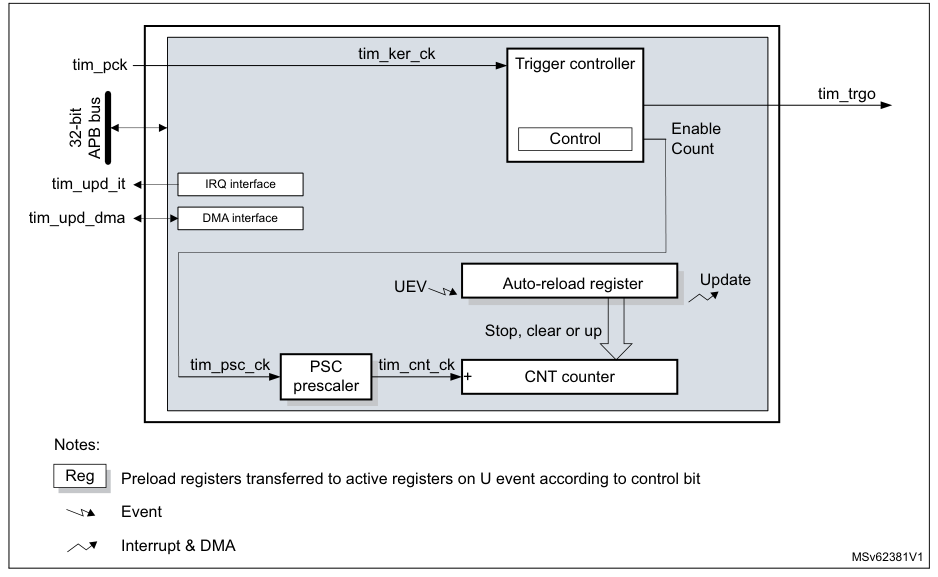

### 32.3.2 TIM6/TIM7 internal signals

The table in this section summarizes the TIM inputs and outputs.

**Table 320. TIM internal input/output signals**

| Source row | Column 1 | Column 2 | Column 3 |
| ---: | --- | --- | --- |
| 1 | `Internal signal name` | `Signal type` | `Description` |
| 2 | `tim_pclk` | `Input` | `Timer APB clock` |
| 3 | `Timer kernel clock. This clock must be synchronous with tim_pclk (derived from the same source). The clock ratio` |  |  |
| 4 | `tim_ker_ck` | `Input` |  |
| 5 | `tim_ker_ck/tim_pclk must be an integer: 1, 2, 3,..., 16 (maximum value)` |  |  |
| 6 | `Internal trigger output. This trigger can trigger other on-` |  |  |
| 7 | `tim_trgo` | `Output` |  |
| 8 | `chip peripherals (DAC).` |  |  |
| 9 | `tim_upd_it` | `Output` | `Timer update event interrupt` |
| 10 | `tim_upd_dma` | `Output` | `Timer update dma request` |

### 32.3.3 TIM6/TIM7 clocks

The timer bus interface is clocked by the tim_pclk APB clock.

The counter clock tim_ker_ck is connected to the tim_pclk input.

The CEN (in the TIMx_CR1 register) and UG bits (in the TIMx_EGR register) are actual control bits
and can be changed only by software (except for UG that remains cleared automatically). As soon as
the CEN bit is written to 1, the prescaler is clocked by the internal clock tim_ker_ck.

Figure 508 shows the behavior of the control circuit and the upcounter in normal mode, without
prescaler.

**Figure 508. Control circuit in normal mode, internal clock divided by 1**

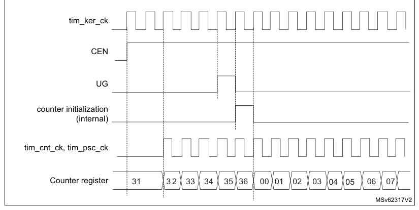

tim_ker_ck

CEN

UG
counter initialization

(internal)
tim_cnt_ck, tim_psc_ck

### 32.3.4 Time-base unit

The main block of the programmable timer is a 16-bit upcounter with its related autoreload register.
The counter clock can be divided by a prescaler.

The counter, the autoreload register and the prescaler register can be written or read by software.
This is true even when the counter is running.

The time-base unit includes:

- Counter register (TIMx_CNT)
- Prescaler register (TIMx_PSC)
- Auto-Reload register (TIMx_ARR).

The autoreload register is preloaded. The preload register is accessed each time an attempt is made
to write or read the autoreload register. The contents of the preload register are transferred into
the shadow register permanently or at each update event UEV, depending on the autoreload preload
enable bit (ARPE) in the TIMx_CR1 register. The update event is sent when the counter reaches the
overflow value and if the UDIS bit equals 0 in the TIMx_CR1 register. It can also be generated by
software. The generation of the update event is described in detail for each configuration.

The counter is clocked by the prescaler output tim_cnt_ck, which is enabled only when the counter
enable bit (CEN) in the TIMx_CR1 register is set.

Note that the actual counter enable signal tim_cnt_en is set one clock cycle after CEN bit set.

#### Prescaler description

The prescaler can divide the counter clock frequency by any factor between 1 and 65536. It is based
on a 16-bit counter controlled through a 16-bit register (in the TIMx_PSC register). It can be
changed on the fly as the TIMx_PSC control register is buffered. The new prescaler ratio is taken
into account at the next update event.

Figure 509 and Figure 510 give some examples of the counter behavior when the prescaler ratio is
changed on the fly.

**Figure 509. Counter timing diagram with prescaler division change from 1 to 2**

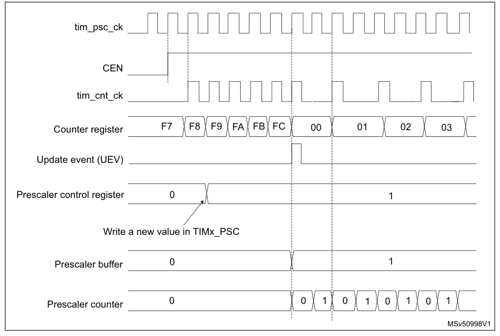

**Figure 510. Counter timing diagram with prescaler division change from 1 to 4**

### 32.3.5 Counting mode

The counter counts from 0 to the autoreload value (contents of the TIMx_ARR register), then restarts
from 0 and generates a counter overflow event.

An update event can be generate at each counter overflow or by setting the UG bit in the TIMx_EGR
register (by software or by using the slave mode controller).

The UEV event can be disabled by software by setting the UDIS bit in the TIMx_CR1 register. This
avoids updating the shadow registers while writing new values into the preload registers. In this
way, no update event occurs until the UDIS bit has been written to 0, however, the counter and the
prescaler counter both restart from 0 (but the prescale rate does not change). In addition, if the
URS (update request selection) bit in the TIMx_CR1 register is set, setting the UG bit generates an
update event UEV, but the UIF flag is not set (so no interrupt or DMA request is sent).

When an update event occurs, all the registers are updated and the update flag (UIF bit in the
TIMx_SR register) is set (depending on the URS bit):

- The buffer of the prescaler is reloaded with the preload value (contents of the TIMx_PSC
  register).
- The autoreload shadow register is updated with the preload value (TIMx_ARR).

The following figures show some examples of the counter behavior for different clock frequencies
when TIMx_ARR = 0x36.

**Figure 511. Counter timing diagram, internal clock divided by 1**

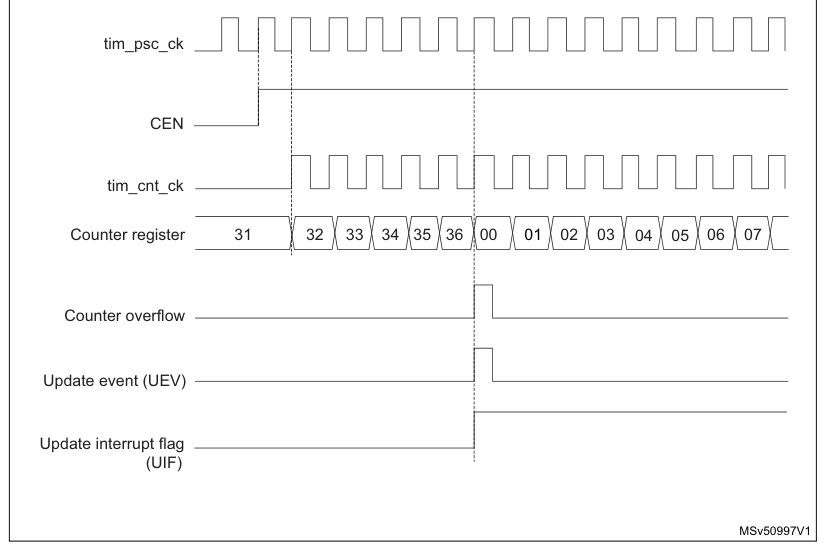

**Figure 512. Counter timing diagram, internal clock divided by 2**

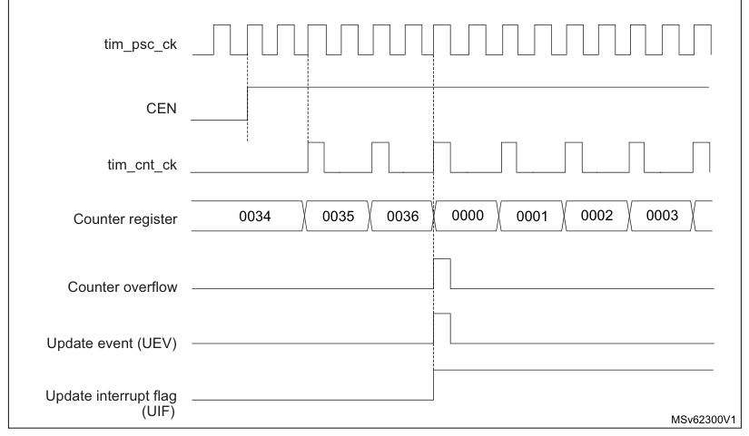

**Figure 513. Counter timing diagram, internal clock divided by 4**

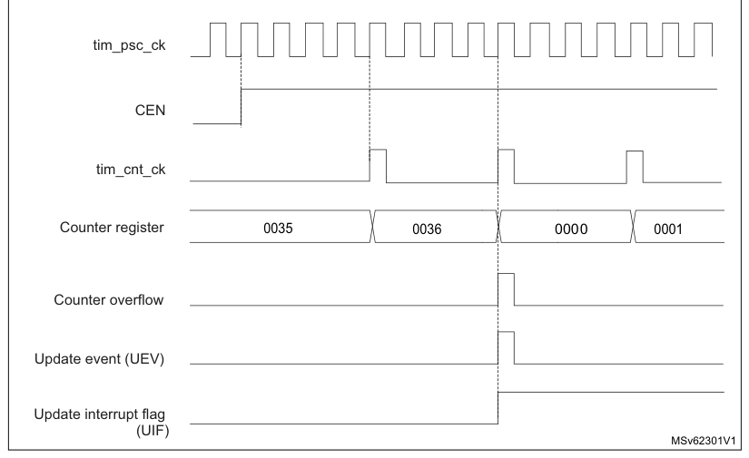

**Figure 514. Counter timing diagram, internal clock divided by N**

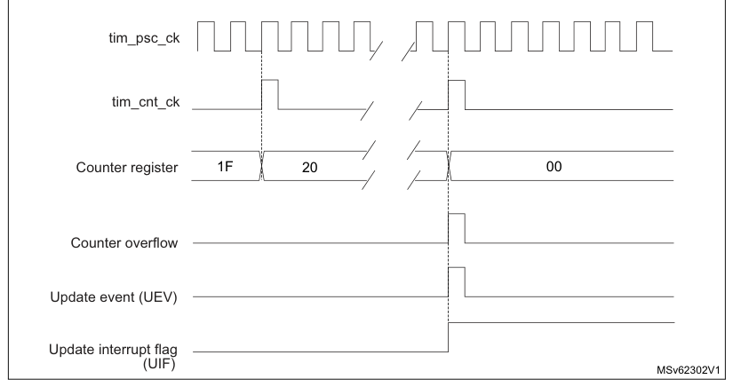

**Figure 515. Counter timing diagram, update event when ARPE = 0 (TIMx_ARR not**

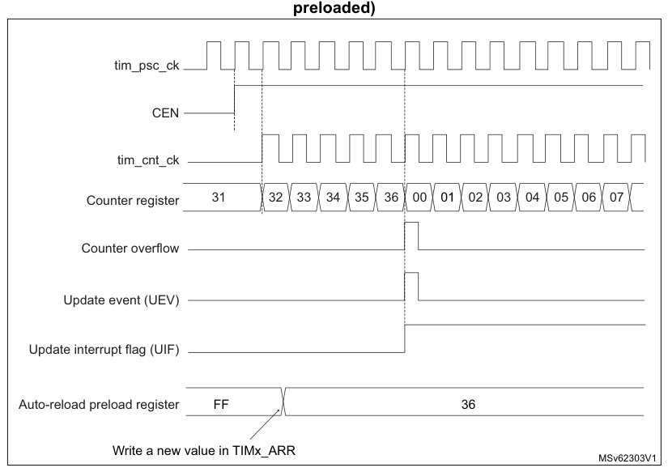

**Figure 516. Counter timing diagram, update event when ARPE = 1 (TIMx_ARR**

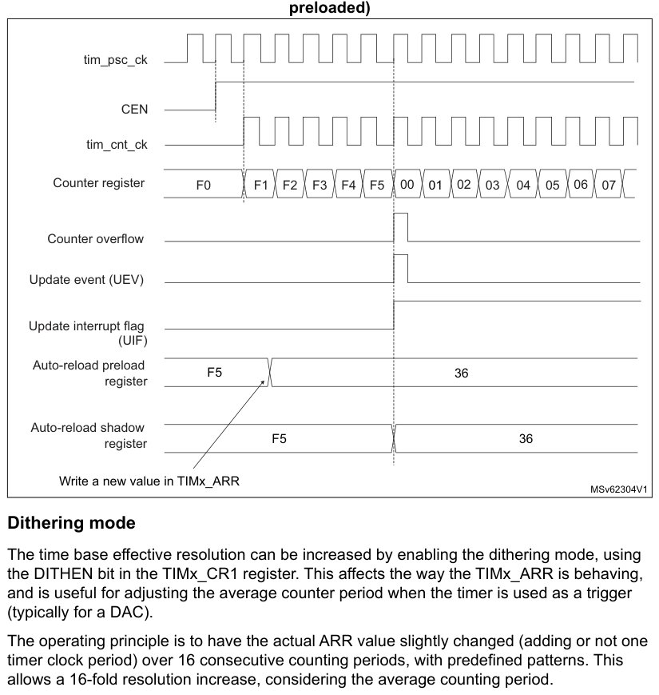

#### Dithering mode

The time base effective resolution can be increased by enabling the dithering mode, using the DITHEN
bit in the TIMx_CR1 register. This affects the way the TIMx_ARR is behaving, and is useful for
adjusting the average counter period when the timer is used as a trigger (typically for a DAC).

The operating principle is to have the actual ARR value slightly changed (adding or not one timer
clock period) over 16 consecutive counting periods, with predefined patterns. This allows a 16-fold
resolution increase, considering the average counting period.

Figure 517 presents the dithering principle applied to four consecutive counting periods.

**Figure 517. Dithering principle**

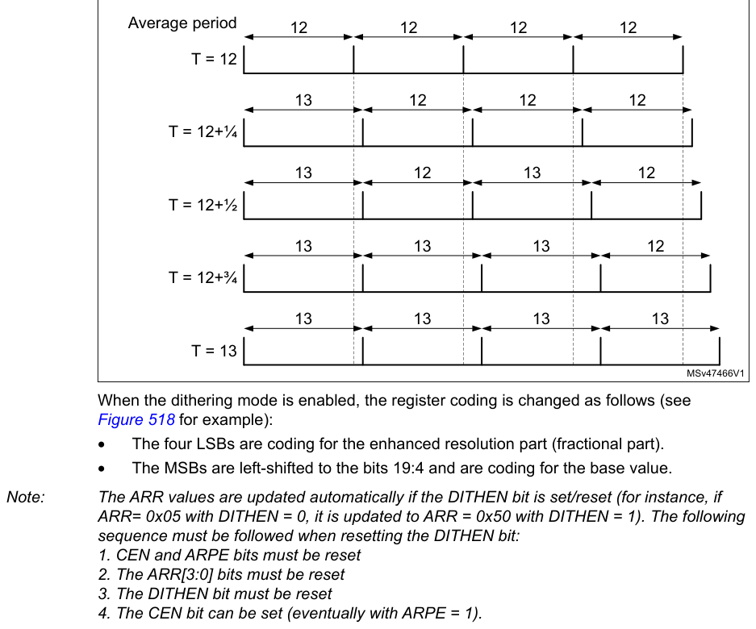

- The four LSBs are coding for the enhanced resolution part (fractional part).
- The MSBs are left-shifted to the bits 19:4 and are coding for the base value.

> **Note:** The ARR values are updated automatically if the DITHEN bit is set/reset (for instance, if

ARR= 0x05 with DITHEN = 0, it is updated to ARR = 0x50 with DITHEN = 1). The following sequence must
be followed when resetting the DITHEN bit:

1. CEN and ARPE bits must be reset
2. The ARR[3:0] bits must be reset
3. The DITHEN bit must be reset
4. The CEN bit can be set (eventually with ARPE = 1).

**Figure 518. Data format and register coding in dithering mode**

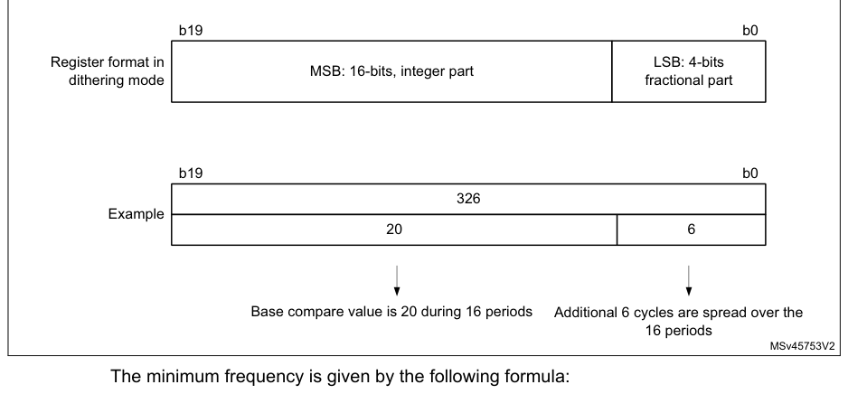

> **Note:** The maximum TIMx_ARR value is limited to 0xFFFEF in dithering mode (corresponds to

65534 for the integer part and 15 for the dithered part).

As shown on Figure 519, the dithering mode is used to increase the PWM resolution whatever the PWM
frequency.

**Figure 519. FCnt resolution vs frequency**

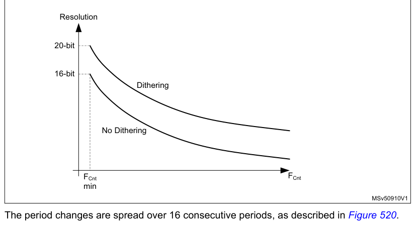

Resolution

20-bit

16-bit

Dithering

No Dithering

The period changes are spread over 16 consecutive periods, as described in Figure 520.

**Figure 520. PWM dithering pattern**

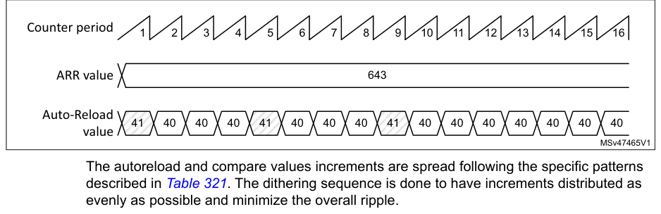

The autoreload and compare values increments are spread following the specific patterns described in
Table 321. The dithering sequence is done to have increments distributed as evenly as possible and
minimize the overall ripple.

**Table 321. TIMx_ARR register change dithering pattern**

| Source row | Extracted cells |
| ---: | --- |
| 1 | `-` · `PWM period` |
| 2 | `LSB value` · `1` · `2` · `3` · `4` · `5` · `6` · `7` · `8` · `9` · `10` · `11` · `12` · `13` · `14` · `15` · `16` |
| 3 | `0000` · `-` · `-` · `-` · `-` · `-` · `-` · `-` · `-` · `-` · `-` · `-` · `-` · `-` · `-` · `-` · `-` |
| 4 | `0001` · `+1` · `-` · `-` · `-` · `-` · `-` · `-` · `-` · `-` · `-` · `-` · `-` · `-` · `-` · `-` · `-` |
| 5 | `0010` · `+1` · `-` · `-` · `-` · `-` · `-` · `-` · `-` · `+1` · `-` · `-` · `-` · `-` · `-` · `-` · `-` |
| 6 | `0011` · `+1` · `-` · `-` · `-` · `+1` · `-` · `-` · `-` · `+1` · `-` · `-` · `-` · `-` · `-` · `-` · `-` |
| 7 | `0100` · `+1` · `-` · `-` · `-` · `+1` · `-` · `-` · `-` · `+1` · `-` · `-` · `-` · `+1` · `-` · `-` · `-` |
| 8 | `0101` · `+1` · `-` · `+1` · `-` · `+1` · `-` · `-` · `-` · `+1` · `-` · `-` · `-` · `+1` · `-` · `-` · `-` |
| 9 | `0110` · `+1` · `-` · `+1` · `-` · `+1` · `-` · `-` · `-` · `+1` · `-` · `+1` · `-` · `+1` · `-` · `-` · `-` |

**Table 321. TIMx_ARR register change dithering pattern (continued)**

| Source row | Extracted cells |
| ---: | --- |
| 1 | `-` · `PWM period` |
| 2 | `LSB value` · `1` · `2` · `3` · `4` · `5` · `6` · `7` · `8` · `9` · `10` · `11` · `12` · `13` · `14` · `15` · `16` |
| 3 | `0111` · `+1` · `-` · `+1` · `-` · `+1` · `-` · `+1` · `-` · `+1` · `-` · `+1` · `-` · `+1` · `-` · `-` · `-` |
| 4 | `1000` · `+1` · `-` · `+1` · `-` · `+1` · `-` · `+1` · `-` · `+1` · `-` · `+1` · `-` · `+1` · `-` · `+1` · `-` |
| 5 | `1001` · `+1` · `+1` · `+1` · `-` · `+1` · `-` · `+1` · `-` · `+1` · `-` · `+1` · `-` · `+1` · `-` · `+1` · `-` |
| 6 | `1010` · `+1` · `+1` · `+1` · `-` · `+1` · `-` · `+1` · `-` · `+1` · `+1` · `+1` · `-` · `+1` · `-` · `+1` · `-` |
| 7 | `1011` · `+1` · `+1` · `+1` · `-` · `+1` · `+1` · `+1` · `-` · `+1` · `+1` · `+1` · `-` · `+1` · `-` · `+1` · `-` |
| 8 | `1100` · `+1` · `+1` · `+1` · `-` · `+1` · `+1` · `+1` · `-` · `+1` · `+1` · `+1` · `-` · `+1` · `+1` · `+1` · `-` |
| 9 | `1101` · `+1` · `+1` · `+1` · `+1` · `+1` · `+1` · `+1` · `-` · `+1` · `+1` · `+1` · `-` · `+1` · `+1` · `+1` · `-` |
| 10 | `1110` · `+1` · `+1` · `+1` · `+1` · `+1` · `+1` · `+1` · `-` · `+1` · `+1` · `+1` · `+1` · `+1` · `+1` · `+1` · `-` |
| 11 | `1111` · `+1` · `+1` · `+1` · `+1` · `+1` · `+1` · `+1` · `+1` · `+1` · `+1` · `+1` · `+1` · `+1` · `+1` · `+1` · `-` |

### 32.3.6 UIF bit remapping

The IUFREMAP bit in the TIMx_CR1 register forces a continuous copy of the update interrupt flag UIF
into the timer counter register’s bit 31 (TIMxCNT[31]). This is used to atomically read both the
counter value and a potential roll-over condition signaled by the UIFCPY flag. In particular cases,
it can ease the calculations by avoiding race conditions caused for instance by a processing shared
between a background task (counter reading) and an interrupt (update interrupt).

There is no latency between the assertions of the UIF and UIFCPY flags.

### 32.3.7 ADC triggers

The timer can generate an ADC triggering event with various internal signals, such as reset, enable
or compare events.

> **Note:** The clock of the slave peripherals (such as timer, ADC) receiving the tim_trgo signal must
> be enabled prior to receiving events from the master timer, and the clock frequency (prescaler) must
> not be changed on-the-fly while triggers are received from the master timer.

### 32.3.8 TIM6/TIM7 DMA requests

The TIM6/TIM7 can generate a single DMA request, as shown in Table 322.

**Table 322. DMA request**

| DMA request signal | DMA acronym | DMA request | Enable control bit |
| --- | --- | --- | --- |
| tim_upd_dma | TIM_UP | Update | UDE |

### 32.3.9 Debug mode

When the microcontroller enters debug mode (Cortex®-M4 with FPU core halted), the TIMx counter can
either continue to work normally or be stopped.

The behavior in debug mode can be programmed with a dedicated configuration bit per timer in the
Debug support (DBG) module.

For more details, refer to section Debug support (DBG).

### 32.3.10 TIM6/TIM7 low-power modes

**Table 323. Effect of low-power modes on TIM6/TIM7**

| Source row | Column 1 | Column 2 |
| ---: | --- | --- |
| 1 | `Mode` | `Description` |
| 2 | `No effect, peripheral is active. The interrupts can cause the device to exit from Sleep` |  |
| 3 | `Sleep` |  |

mode.

The timer operation is stopped and the register content is kept. No interrupt can be

Stop
generated.

| Source row | Column 1 | Column 2 |
| ---: | --- | --- |
| 1 | `Standby` | `The timer is powered-down and must be reinitialized after exiting the Standby mode.` |

### 32.3.11 TIM6/TIM7 interrupts

The TIM6/TIM7 can generate a single interrupt, as shown in Table 324.

**Table 324. Interrupt request**

| Source row | Column 1 | Column 2 | Column 3 | Column 4 | Column 5 | Column 6 |
| ---: | --- | --- | --- | --- | --- | --- |
| 1 | `Exit from` |  |  |  |  |  |
| 2 | `Exit from` |  |  |  |  |  |
| 3 | `Interrupt` | `Enable` | `Interrupt` | `Stop and` |  |  |
| 4 | `Interrupt event` | `Event flag` | `Sleep` |  |  |  |
| 5 | `acronym` | `control bit` | `clear method` | `Standby` |  |  |
| 6 | `mode` |  |  |  |  |  |
| 7 | `mode` |  |  |  |  |  |
| 8 | `TIM6` |  |  |  |  |  |
| 9 | `Update` | `UIF` | `UIE` | `write 0 in UIF` | `Yes` | `No` |
| 10 | `TIM7` |  |  |  |  |  |

## 32.4 TIM6/TIM7 registers

Refer to [Section 1.2](chapter-01.md#12-list-of-abbreviations-for-registers) for a list of abbreviations used in register descriptions.

The peripheral registers can be accessed by half-words (16-bit) or words (32-bit).

### 32.4.1 TIMx control register 1 (TIMx_CR1)(x = 6 to 7)

- **Address offset:** 0x00
- **Reset value:** 0x0000

**Register bit layout**

| Bit | Field | Access | Summary |
| ---: | --- | :---: | --- |
| 15 | Reserved | — | kept at reset value. |
| 14 | Reserved | — | ↳ |
| 13 | Reserved | — | ↳ |
| 12 | `DITHEN` | rw | Dithering enable |
| 11 | `UIFREMAP` | rw | UIF status bit remapping |
| 10 | Reserved | — | kept at reset value. |
| 9 | Reserved | — | ↳ |
| 8 | Reserved | — | ↳ |
| 7 | `ARPE` | rw | Auto-reload preload enable |
| 6 | Reserved | — | kept at reset value. |
| 5 | Reserved | — | ↳ |
| 4 | Reserved | — | ↳ |
| 3 | `OPM` | rw | One-pulse mode |
| 2 | `URS` | rw | Update request source |
| 1 | `UDIS` | rw | Update disable |
| 0 | `CEN` | rw | Counter enable |

**Bits 15:13 — Reserved:** kept at reset value.

**Bit 12 — `DITHEN`:** Dithering enable

- `0`: Dithering disabled
- `1`: Dithering enabled

> **Note:** The DITHEN bit can only be modified when CEN bit is reset.

**Bit 11 — `UIFREMAP`:** UIF status bit remapping

- `0`: No remapping. UIF status bit is not copied to TIMx_CNT register bit 31.
- `1`: Remapping enabled. UIF status bit is copied to TIMx_CNT register bit 31.

**Bits 10:8 — Reserved:** kept at reset value.

**Bit 7 — `ARPE`:** Auto-reload preload enable

- `0`: TIMx_ARR register is not buffered.
- `1`: TIMx_ARR register is buffered.

**Bits 6:4 — Reserved:** kept at reset value.

**Bit 3 — `OPM`:** One-pulse mode

- `0`: Counter is not stopped at update event
- `1`: Counter stops counting at the next update event (clearing the CEN bit).

**Bit 2 — `URS`:** Update request source

This bit is set and cleared by software to select the UEV event sources.

- `0`: Any of the following events generates an update interrupt or DMA request if enabled.

These events can be:

- Counter overflow/underflow
- Setting the UG bit
- Update generation through the slave mode controller
- `1`: Only counter overflow/underflow generates an update interrupt or DMA request if
  enabled.

**Bit 1 — `UDIS`:** Update disable

This bit is set and cleared by software to enable/disable UEV event generation.

- `0`: UEV enabled. The Update (UEV) event is generated by one of the following events:
- Counter overflow/underflow
- Setting the UG bit
- Update generation through the slave mode controller

Buffered registers are then loaded with their preload values.

- `1`: UEV disabled. The Update event is not generated, shadow registers keep their value

(ARR, PSC). However the counter and the prescaler are reinitialized if the UG bit is set or if
a hardware reset is received from the slave mode controller.

**Bit 0 — `CEN`:** Counter enable

- `0`: Counter disabled
- `1`: Counter enabled

CEN is cleared automatically in one-pulse mode, when an update event occurs.

### 32.4.2 TIMx control register 2 (TIMx_CR2)(x = 6 to 7)

- **Address offset:** 0x04
- **Reset value:** 0x0000

**Register bit layout**

| Bit | Field | Access | Summary |
| ---: | --- | :---: | --- |
| 15 | Reserved | — | kept at reset value. |
| 14 | Reserved | — | ↳ |
| 13 | Reserved | — | ↳ |
| 12 | Reserved | — | ↳ |
| 11 | Reserved | — | ↳ |
| 10 | Reserved | — | ↳ |
| 9 | Reserved | — | ↳ |
| 8 | Reserved | — | ↳ |
| 7 | Reserved | — | ↳ |
| 6 | `MMS[2]` | rw | Master mode selection |
| 5 | `MMS[1]` | rw | ↳ |
| 4 | `MMS[0]` | rw | ↳ |
| 3 | Reserved | — | kept at reset value. |
| 2 | Reserved | — | ↳ |
| 1 | Reserved | — | ↳ |
| 0 | Reserved | — | ↳ |

**Bits 15:7 — Reserved:** kept at reset value.

**Bits 6:4 — `MMS[2:0]`:** Master mode selection

These bits are used to select the information to be sent in master mode to slave timers for
synchronization (TRGO). The combination is as follows:

000:Reset - the UG bit from the TIMx_EGR register is used as a trigger output (tim_trgo).

001:Enable - the Counter enable signal, tim_cnt_en, is used as a trigger output (tim_trgo). It
is useful to start several timers at the same time or to control a window in which a slave
timer is enabled. The Counter Enable signal is generated when the CEN control bit is
written.

010:Update - The update event is selected as a trigger output (tim_trgo). For instance a
master timer can then be used as a prescaler for a slave timer.

> **Note:** The clock of the slave timer or he peripheral receiving the tim_trgo must be enabled
> prior to receive events from the master timer, and must not be changed on-the-fly while
> triggers are received from the master timer.

**Bits 3:0 — Reserved:** kept at reset value.

### 32.4.3 TIMx DMA/Interrupt enable register (TIMx_DIER)(x = 6 to 7)

- **Address offset:** 0x0C
- **Reset value:** 0x0000

**Register bit layout**

| Bit | Field | Access | Summary |
| ---: | --- | :---: | --- |
| 15 | Reserved | — | kept at reset value. |
| 14 | Reserved | — | ↳ |
| 13 | Reserved | — | ↳ |
| 12 | Reserved | — | ↳ |
| 11 | Reserved | — | ↳ |
| 10 | Reserved | — | ↳ |
| 9 | Reserved | — | ↳ |
| 8 | `UDE` | rw | Update DMA request enable |
| 7 | Reserved | — | kept at reset value. |
| 6 | Reserved | — | ↳ |
| 5 | Reserved | — | ↳ |
| 4 | Reserved | — | ↳ |
| 3 | Reserved | — | ↳ |
| 2 | Reserved | — | ↳ |
| 1 | Reserved | — | ↳ |
| 0 | `UIE` | rw | Update interrupt enable |

**Bits 15:9 — Reserved:** kept at reset value.

**Bit 8 — `UDE`:** Update DMA request enable

- `0`: Update DMA request disabled.
- `1`: Update DMA request enabled.

**Bits 7:1 — Reserved:** kept at reset value.

**Bit 0 — `UIE`:** Update interrupt enable

- `0`: Update interrupt disabled.
- `1`: Update interrupt enabled.

### 32.4.4 TIMx status register (TIMx_SR)(x = 6 to 7)

- **Address offset:** 0x10
- **Reset value:** 0x0000

**Register bit layout**

| Bit | Field | Access | Summary |
| ---: | --- | :---: | --- |
| 15 | Reserved | — | kept at reset value. |
| 14 | Reserved | — | ↳ |
| 13 | Reserved | — | ↳ |
| 12 | Reserved | — | ↳ |
| 11 | Reserved | — | ↳ |
| 10 | Reserved | — | ↳ |
| 9 | Reserved | — | ↳ |
| 8 | Reserved | — | ↳ |
| 7 | Reserved | — | ↳ |
| 6 | Reserved | — | ↳ |
| 5 | Reserved | — | ↳ |
| 4 | Reserved | — | ↳ |
| 3 | Reserved | — | ↳ |
| 2 | Reserved | — | ↳ |
| 1 | Reserved | — | ↳ |
| 0 | `UIF` | rc_w0 | Update interrupt flag |

**Bits 15:1 — Reserved:** kept at reset value.

**Bit 0 — `UIF`:** Update interrupt flag

This bit is set by hardware on an update event. It is cleared by software.

- `0`: No update occurred.
- `1`: Update interrupt pending. This bit is set by hardware when the registers are updated:

  -On counter overflow if UDIS = 0 in the TIMx_CR1 register.

  -When CNT is reinitialized by software using the UG bit in the TIMx_EGR register, if

URS = 0 and UDIS = 0 in the TIMx_CR1 register.

### 32.4.5 TIMx event generation register (TIMx_EGR)(x = 6 to 7)

- **Address offset:** 0x14
- **Reset value:** 0x0000

**Register bit layout**

| Bit | Field | Access | Summary |
| ---: | --- | :---: | --- |
| 15 | Reserved | — | kept at reset value. |
| 14 | Reserved | — | ↳ |
| 13 | Reserved | — | ↳ |
| 12 | Reserved | — | ↳ |
| 11 | Reserved | — | ↳ |
| 10 | Reserved | — | ↳ |
| 9 | Reserved | — | ↳ |
| 8 | Reserved | — | ↳ |
| 7 | Reserved | — | ↳ |
| 6 | Reserved | — | ↳ |
| 5 | Reserved | — | ↳ |
| 4 | Reserved | — | ↳ |
| 3 | Reserved | — | ↳ |
| 2 | Reserved | — | ↳ |
| 1 | Reserved | — | ↳ |
| 0 | `UG` | w | Update generation |

**Bits 15:1 — Reserved:** kept at reset value.

**Bit 0 — `UG`:** Update generation

This bit can be set by software, it is automatically cleared by hardware.

- `0`: No action.
- `1`: Re-initializes the timer counter and generates an update of the registers. Note that the
  prescaler counter is cleared too (but the prescaler ratio is not affected).

### 32.4.6 TIMx counter (TIMx_CNT)(x = 6 to 7)

- **Address offset:** 0x24
- **Reset value:** 0x0000 0000

**Register bit layout**

| Bit | Field | Access | Summary |
| ---: | --- | :---: | --- |
| 31 | `UIFCPY` | r | UIF copy |
| 30 | Reserved | — | kept at reset value. |
| 29 | Reserved | — | ↳ |
| 28 | Reserved | — | ↳ |
| 27 | Reserved | — | ↳ |
| 26 | Reserved | — | ↳ |
| 25 | Reserved | — | ↳ |
| 24 | Reserved | — | ↳ |
| 23 | Reserved | — | ↳ |
| 22 | Reserved | — | ↳ |
| 21 | Reserved | — | ↳ |
| 20 | Reserved | — | ↳ |
| 19 | Reserved | — | ↳ |
| 18 | Reserved | — | ↳ |
| 17 | Reserved | — | ↳ |
| 16 | Reserved | — | ↳ |
| 15 | `CNT[15]` | rw | Counter value |
| 14 | `CNT[14]` | rw | ↳ |
| 13 | `CNT[13]` | rw | ↳ |
| 12 | `CNT[12]` | rw | ↳ |
| 11 | `CNT[11]` | rw | ↳ |
| 10 | `CNT[10]` | rw | ↳ |
| 9 | `CNT[9]` | rw | ↳ |
| 8 | `CNT[8]` | rw | ↳ |
| 7 | `CNT[7]` | rw | ↳ |
| 6 | `CNT[6]` | rw | ↳ |
| 5 | `CNT[5]` | rw | ↳ |
| 4 | `CNT[4]` | rw | ↳ |
| 3 | `CNT[3]` | rw | ↳ |
| 2 | `CNT[2]` | rw | ↳ |
| 1 | `CNT[1]` | rw | ↳ |
| 0 | `CNT[0]` | rw | ↳ |

**Bit 31 — `UIFCPY`:** UIF copy

This bit is a read-only copy of the UIF bit of the TIMx_ISR register. If the UIFREMAP bit in

TIMx_CR1 is reset, bit 31 is reserved and read as 0.

**Bits 30:16 — Reserved:** kept at reset value.

**Bits 15:0 — `CNT[15:0]`:** Counter value

Non-dithering mode (DITHEN = 0)

The register holds the counter value.

Dithering mode (DITHEN = 1)

The register only holds the non-dithered part in CNT[15:0]. The fractional part is not
available.

### 32.4.7 TIMx prescaler (TIMx_PSC)(x = 6 to 7)

- **Address offset:** 0x28
- **Reset value:** 0x0000

**Register bit layout**

| Bit | Field | Access | Summary |
| ---: | --- | :---: | --- |
| 15 | `PSC[15]` | rw | Prescaler value |
| 14 | `PSC[14]` | rw | ↳ |
| 13 | `PSC[13]` | rw | ↳ |
| 12 | `PSC[12]` | rw | ↳ |
| 11 | `PSC[11]` | rw | ↳ |
| 10 | `PSC[10]` | rw | ↳ |
| 9 | `PSC[9]` | rw | ↳ |
| 8 | `PSC[8]` | rw | ↳ |
| 7 | `PSC[7]` | rw | ↳ |
| 6 | `PSC[6]` | rw | ↳ |
| 5 | `PSC[5]` | rw | ↳ |
| 4 | `PSC[4]` | rw | ↳ |
| 3 | `PSC[3]` | rw | ↳ |
| 2 | `PSC[2]` | rw | ↳ |
| 1 | `PSC[1]` | rw | ↳ |
| 0 | `PSC[0]` | rw | ↳ |

**Bits 15:0 — `PSC[15:0]`:** Prescaler value

The counter clock frequency ftim_cnt_ck is equal to ftim_psc_ck / (PSC[15:0] \+ 1).

PSC contains the value to be loaded into the active prescaler register at each update event.

(including when the counter is cleared through UG bit of TIMx_EGR register.

### 32.4.8 TIMx autoreload register (TIMx_ARR)(x = 6 to 7)

- **Address offset:** 0x2C
- **Reset value:** 0x0000 FFFF

**Register bit layout**

| Bit | Field | Access | Summary |
| ---: | --- | :---: | --- |
| 31 | Reserved | — | kept at reset value. |
| 30 | Reserved | — | ↳ |
| 29 | Reserved | — | ↳ |
| 28 | Reserved | — | ↳ |
| 27 | Reserved | — | ↳ |
| 26 | Reserved | — | ↳ |
| 25 | Reserved | — | ↳ |
| 24 | Reserved | — | ↳ |
| 23 | Reserved | — | ↳ |
| 22 | Reserved | — | ↳ |
| 21 | Reserved | — | ↳ |
| 20 | Reserved | — | ↳ |
| 19 | `ARR[19]` | rw | Auto-reload value |
| 18 | `ARR[18]` | rw | ↳ |
| 17 | `ARR[17]` | rw | ↳ |
| 16 | `ARR[16]` | rw | ↳ |
| 15 | `ARR[15]` | rw | ↳ |
| 14 | `ARR[14]` | rw | ↳ |
| 13 | `ARR[13]` | rw | ↳ |
| 12 | `ARR[12]` | rw | ↳ |
| 11 | `ARR[11]` | rw | ↳ |
| 10 | `ARR[10]` | rw | ↳ |
| 9 | `ARR[9]` | rw | ↳ |
| 8 | `ARR[8]` | rw | ↳ |
| 7 | `ARR[7]` | rw | ↳ |
| 6 | `ARR[6]` | rw | ↳ |
| 5 | `ARR[5]` | rw | ↳ |
| 4 | `ARR[4]` | rw | ↳ |
| 3 | `ARR[3]` | rw | ↳ |
| 2 | `ARR[2]` | rw | ↳ |
| 1 | `ARR[1]` | rw | ↳ |
| 0 | `ARR[0]` | rw | ↳ |

**Bits 31:20 — Reserved:** kept at reset value.

**Bits 19:0 — `ARR[19:0]`:** Auto-reload value

ARR is the value to be loaded into the actual auto-reload register.

Refer to [Section 32.3.4](#3234-time-base-unit): Time-base unit for more details about ARR update and behavior.

The counter is blocked while the auto-reload value is null.

Non-dithering mode (DITHEN = 0)

The register holds the auto-reload value in ARR[15:0]. The ARR[19:16] bits are reserved.

Dithering mode (DITHEN = 1)

The register holds the integer part in ARR[19:4]. The ARR[3:0] bitfield contains the dithered
part.

### 32.4.9 TIMx register map

TIMx registers are mapped as 16-bit addressable registers as described in the table below:

**Register summary**

| Offset | Register | Reset value |
| --- | --- | --- |
| 0x00 | `TIMx_CR1` | 0x0000 |
| 0x04 | `TIMx_CR2` | 0x0000 |
| 0x0C | `TIMx_DIER` | 0x0000 |
| 0x10 | `TIMx_SR` | 0x0000 |
| 0x14 | `TIMx_EGR` | 0x0000 |
| 0x24 | `TIMx_CNT` | 0x0000 0000 |
| 0x28 | `TIMx_PSC` | 0x0000 |
| 0x2C | `TIMx_ARR` | 0x0000 FFFF |

Refer to [Section 2.2](chapter-02.md#22-memory-organization) for the register boundary addresses.
