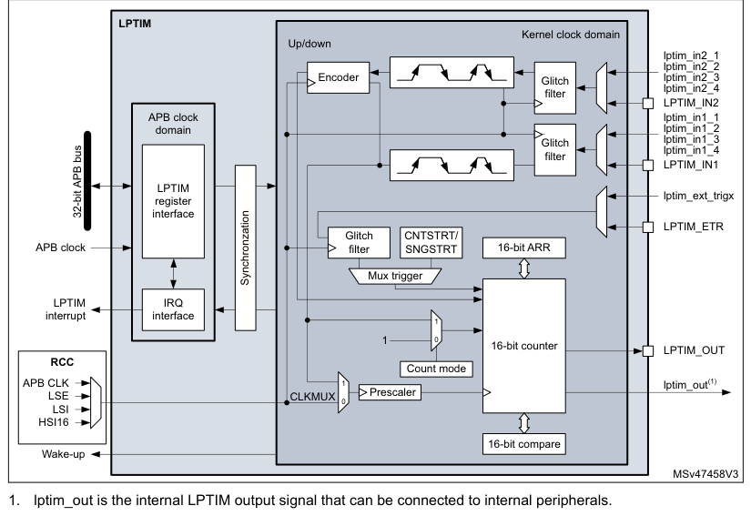
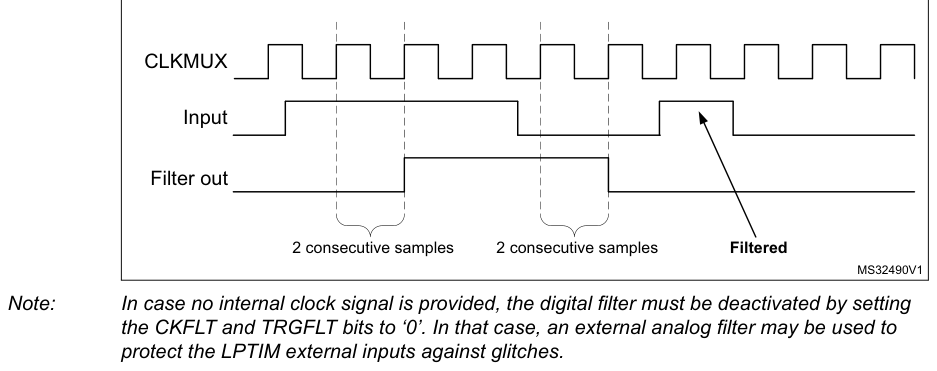
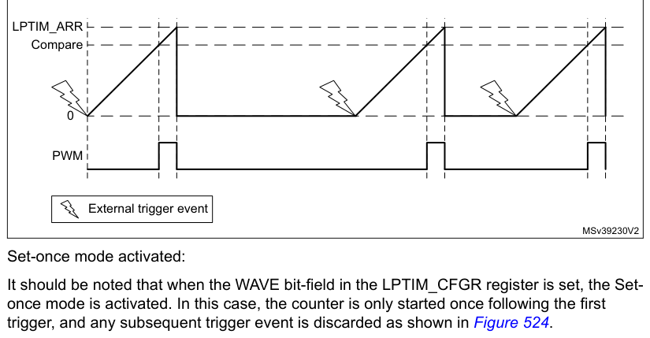
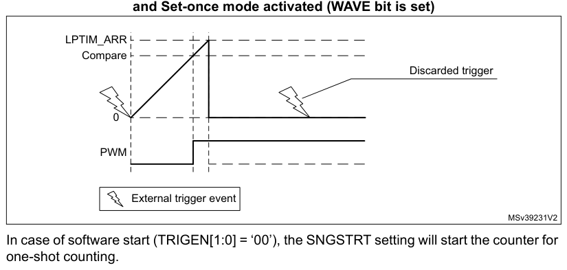
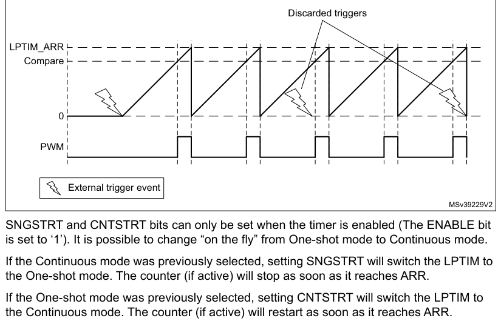
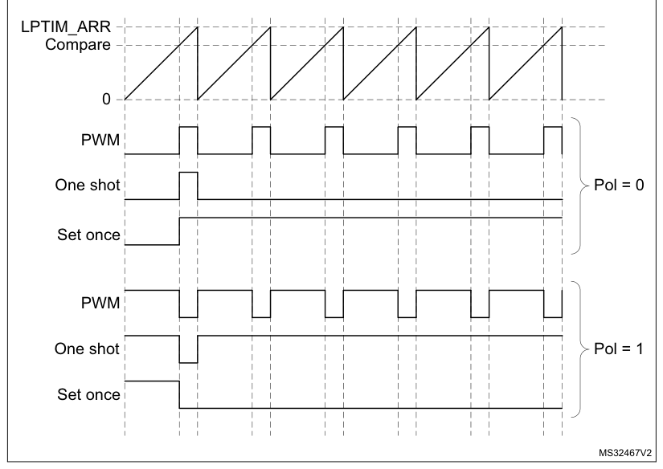
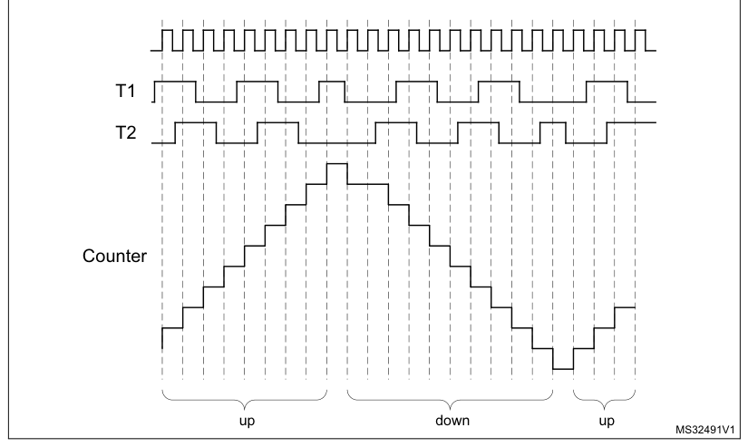

# 33 Low-power timer (LPTIM)

[← RM0440 index](../STM32G4_RM0440.md)

## 33.1 Introduction

The LPTIM is a 16-bit timer that benefits from the ultimate developments in power consumption
reduction. Thanks to its diversity of clock sources, the LPTIM is able to keep running in all power
modes except for Standby mode. Given its capability to run even with no internal clock source, the
LPTIM can be used as a “Pulse Counter” which can be useful in some applications. Also, the LPTIM
capability to wake up the system from low-power modes, makes it suitable to realize “Timeout
functions” with extremely low power consumption.

The LPTIM introduces a flexible clock scheme that provides the needed functionalities and
performance, while minimizing the power consumption.

## 33.2 LPTIM main features

- 16 bit upcounter
- 3-bit prescaler with 8 possible dividing factors (1,2,4,8,16,32,64,128)
- Selectable clock
  - Internal clock sources: configurable internal clock source (see RCC section)
  - External clock source over LPTIM input (working with no embedded oscillator running, used by
    Pulse Counter application)
- 16 bit ARR autoreload register
- 16 bit compare register
- Continuous/One-shot mode
- Selectable software/hardware input trigger
- Programmable Digital Glitch filter
- Configurable output: Pulse, PWM
- Configurable I/O polarity
- Encoder mode

## 33.3 LPTIM implementation

Table 326 describes LPTIM implementation on STM32G4 series devices.

**Table 326. STM32G4 series LPTIM features**

| LPTIM modes/features(1) | LPTIM1 |
| --- | --- |
| Encoder mode | X |

1. X = supported.

## 33.4 LPTIM functional description

### 33.4.1 LPTIM block diagram

**Figure 521. Low-power timer block diagram**

1. lptim_out is the internal LPTIM output signal that can be connected to internal peripherals.

### 33.4.2 LPTIM input and trigger mapping

The LPTIM external trigger and input connections are detailed hereafter:

**Table 327. LPTIM1 external trigger connection**

| TRIGSEL | External trigger |
| --- | --- |
| lptim_ext_trig0 | GPIO |
| lptim_ext_trig1 | RTC_ALARMA |
| lptim_ext_trig2 | RTC_ALARMB |

**Table 327. LPTIM1 external trigger connection (continued)**

| TRIGSEL | External trigger |
| --- | --- |
| lptim_ext_trig3 | RTC_TAMP1_OUT |
| lptim_ext_trig4 | RTC_TAMP2_OUT |
| lptim_ext_trig5 | RTC_TAMP3_OUT |
| lptim_ext_trig6 | COMP1_OUT |
| lptim_ext_trig7 | COMP2_OUT |
| lptim_ext_trig8 | COMP3_OUT |
| lptim_ext_trig9 | COMP4_OUT |
| lptim_ext_trig10 | COMP5_OUT |
| lptim_ext_trig11 | COMP6_OUT |
| lptim_ext_trig12 | COMP7_OUT |

**Table 328. LPTIM1 input 1 connection**

| lptim_in1_mux | LPTIM1 input 1 connected to |
| --- | --- |
| lptim_in1_0 | GPIO pin as LPTIM1_IN1 alternate function |
| lptim_in1_1 | COMP1 |
| lptim_in1_2 | COMP3 |
| lptim_in1_3 | COMP5 |
| lptim_in1_4 | COMP7 |

**Table 329. LPTIM1 input 2 connection**

| lptim_in2_mux | LPTIM1 input 2 connected to |
| --- | --- |
| lptim_in2_0 | GPIO pin as LPTIM1_IN2 alternate function |
| lptim_in2_1 | COMP2 |
| lptim_in2_2 | COMP4 |
| lptim_in2_3 | COMP6 |
| lptim_in2_4 | COMP6 |

### 33.4.3 LPTIM reset and clocks

The LPTIM can be clocked using several clock sources. It can be clocked using an internal clock
signal which can be any configurable internal clock source selectable through the RCC (see RCC
section for more details). Also, the LPTIM can be clocked using an external
clock signal injected on its external Input1. When clocked with an external clock source, the LPTIM
may run in one of these two possible configurations:

- The first configuration is when the LPTIM is clocked by an external signal but in the same time an
  internal clock signal is provided to the LPTIM from configurable internal clock source (see RCC
  section).
- The second configuration is when the LPTIM is solely clocked by an external clock source through
  its external Input1. This configuration is the one used to realize Timeout function or Pulse
  counter function when all the embedded oscillators are turned off after entering a low-power mode.

Programming the CKSEL and COUNTMODE bits allows controlling whether the LPTIM will use an external
clock source or an internal one.

When configured to use an external clock source, the CKPOL bits are used to select the external
clock signal active edge. If both edges are configured to be active ones, an internal clock signal
should also be provided (first configuration). In this case, the internal clock signal frequency
should be at least four times higher than the external clock signal frequency.

### 33.4.4 Glitch filter

The LPTIM inputs, either external (mapped to GPIOs) or internal (mapped on the chip-level to other
embedded peripherals), are protected with digital filters that prevent any glitches and noise
perturbations to propagate inside the LPTIM. This is in order to prevent spurious counts or
triggers.

Before activating the digital filters, an internal clock source should first be provided to the
LPTIM. This is necessary to guarantee the proper operation of the filters.

The digital filters are divided into two groups:

- The first group of digital filters protects the LPTIM external inputs. The digital filters
  sensitivity is controlled by the CKFLT bits
- The second group of digital filters protects the LPTIM internal trigger inputs. The digital
  filters sensitivity is controlled by the TRGFLT bits.

> **Note:** The digital filters sensitivity is controlled by groups. It is not possible to configure each digital
> filter sensitivity separately inside the same group.

The filter sensitivity acts on the number of consecutive equal samples that should be detected on
one of the LPTIM inputs to consider a signal level change as a valid transition. Figure 522 shows an
example of glitch filter behavior in case of a 2 consecutive samples programmed.

**Figure 522. Glitch filter timing diagram**

> **Note:** In case no internal clock signal is provided, the digital filter must be deactivated by setting
> the CKFLT and TRGFLT bits to ‘0’. In that case, an external analog filter may be used to protect the
LPTIM external inputs against glitches.

### 33.4.5 Prescaler

The LPTIM 16-bit counter is preceded by a configurable power-of-2 prescaler. The prescaler division
ratio is controlled by the PRESC[2:0] 3-bit field. The table below lists all the possible division
ratios:

**Table 330. Prescaler division ratios**

| programming | dividing factor |
| --- | --- |
| 000 | /1 |
| 001 | /2 |
| 010 | /4 |
| 011 | /8 |
| 100 | /16 |
| 101 | /32 |
| 110 | /64 |
| 111 | /128 |

### 33.4.6 Trigger multiplexer

The LPTIM counter may be started either by software or after the detection of an active edge on one
of the 13 trigger inputs.

TRIGEN[1:0] is used to determine the LPTIM trigger source:

- When TRIGEN[1:0] equals ‘00’, The LPTIM counter is started as soon as one of the CNTSTRT or the
  SNGSTRT bits is set by software. The three remaining possible values for the TRIGEN[1:0] are used
  to configure the active edge used by the trigger inputs. The LPTIM counter starts as soon as an
  active edge is detected.
- When TRIGEN[1:0] is different than ‘00’, TRIGSEL[2:0] is used to select which of the 13 trigger
  inputs is used to start the counter.

The external triggers are considered asynchronous signals for the LPTIM. So after a trigger
detection, a two-counter-clock period latency is needed before the timer starts running due to the
synchronization.

If a new trigger event occurs when the timer is already started it will be ignored (unless timeout
function is enabled).

> **Note:** The timer must be enabled before setting the SNGSTRT/CNTSTRT bits. Any write on these
> bits when the timer is disabled will be discarded by hardware.

> **Note:** When starting the counter by software (TRIGEN[1:0] = 00), there is a delay of 3 kernel clock
> cycles between the LPTIM_CR register update (set one of SNGSTRT or CNTSTRT bits) and the effective
> start of the counter.

### 33.4.7 Operating mode

The LPTIM features two operating modes:

- The Continuous mode: the timer is free running, the timer is started from a trigger event and
  never stops until the timer is disabled
- One-shot mode: the timer is started from a trigger event and stops when reaching the ARR value.

#### One-shot mode

To enable the one-shot counting, the SNGSTRT bit must be set.

A new trigger event will re-start the timer. Any trigger event occurring after the counter starts
and before the counter reaches ARR will be discarded.

In case an external trigger is selected, each external trigger event arriving after the SNGSTRT bit
is set, and after the counter register has stopped (contains zero value), will start the counter for
a new one-shot counting cycle as shown in Figure 523.

**Figure 523. LPTIM output waveform, single counting mode configuration**

LPTIM_ARR

Compare

0

PWM

External trigger event

MSv39230V2

Set-once mode activated:

It should be noted that when the WAVE bit-field in the LPTIM_CFGR register is set, the Set-once mode
is activated. In this case, the counter is only started once following the first trigger, and any
subsequent trigger event is discarded as shown in Figure 524.

**Figure 524. LPTIM output waveform, Single counting mode configuration**

and Set-once mode activated (WAVE bit is set)

LPTIM_ARR

Compare

Discarded trigger

0

PWM

External trigger event

MSv39231V2

In case of software start (TRIGEN[1:0] = ‘00’), the SNGSTRT setting will start the counter for
one-shot counting.

#### Continous mode

To enable the continuous counting, the CNTSTRT bit must be set.

In case an external trigger is selected, an external trigger event arriving after CNTSTRT is set
will start the counter for continuous counting. Any subsequent external trigger event will be
discarded as shown in Figure 525.

In case of software start (TRIGEN[1:0] = ‘00’), setting CNTSTRT will start the counter for
continuous counting.

**Figure 525. LPTIM output waveform, Continuous counting mode configuration**

Discarded triggers

LPTIM_ARR

Compare

0

PWM

External trigger event

MSv39229V2

SNGSTRT and CNTSTRT bits can only be set when the timer is enabled (The ENABLE bit is set to ‘1’).
It is possible to change “on the fly” from One-shot mode to Continuous mode.

If the Continuous mode was previously selected, setting SNGSTRT will switch the LPTIM to the
One-shot mode. The counter (if active) will stop as soon as it reaches ARR.

If the One-shot mode was previously selected, setting CNTSTRT will switch the LPTIM to the
Continuous mode. The counter (if active) will restart as soon as it reaches ARR.

### 33.4.8 Timeout function

The detection of an active edge on one selected trigger input can be used to reset the LPTIM
counter. This feature is controlled through the TIMOUT bit.

The first trigger event will start the timer, any successive trigger event will reset the counter
and the timer will restart.

A low-power timeout function can be realized. The timeout value corresponds to the compare value; if
no trigger occurs within the expected time frame, the MCU is waked-up by the compare match event.

### 33.4.9 Waveform generation

Two 16-bit registers, the LPTIM_ARR (autoreload register) and LPTIM_CMP (compare register), are used
to generate several different waveforms on LPTIM output

The timer can generate the following waveforms:

- The PWM mode: the LPTIM output is set as soon as the counter value in LPTIM_CNT exceeds the
  compare value in LPTIM_CMP. The LPTIM output is reset as soon as a match occurs between the
  LPTIM_ARR and the LPTIM_CNT registers.
- The One-pulse mode: the output waveform is similar to the one of the PWM mode for the first pulse,
  then the output is permanently reset
- The Set-once mode: the output waveform is similar to the One-pulse mode except that the output is
  kept to the last signal level (depends on the output configured polarity).

The above described modes require that the LPTIM_ARR register value be strictly greater than the
LPTIM_CMP register value.

The LPTIM output waveform can be configured through the WAVE bit as follow:

- Resetting the WAVE bit to ‘0’ forces the LPTIM to generate either a PWM waveform or a One pulse
  waveform depending on which bit is set: CNTSTRT or SNGSTRT.
- Setting the WAVE bit to ‘1’ forces the LPTIM to generate a Set-once mode waveform.

The WAVPOL bit controls the LPTIM output polarity. The change takes effect immediately, so the
output default value will change immediately after the polarity is re-configured, even before the
timer is enabled.

Signals with frequencies up to the LPTIM clock frequency divided by 2 can be generated. Figure 526
below shows the three possible waveforms that can be generated on the LPTIM output. Also, it shows
the effect of the polarity change using the WAVPOL bit.

**Figure 526. Waveform generation**

### 33.4.10 Register update

The LPTIM_ARR register and LPTIM_CMP register are updated immediately after the APB bus write
operation, or at the end of the current period if the timer is already started.

The PRELOAD bit controls how the LPTIM_ARR and the LPTIM_CMP registers are updated:

- When the PRELOAD bit is reset to ‘0’, the LPTIM_ARR and the LPTIM_CMP registers are immediately
  updated after any write access.
- When the PRELOAD bit is set to ‘1’, the LPTIM_ARR and the LPTIM_CMP registers are updated at the
  end of the current period, if the timer has been already started.

The LPTIM APB interface and the LPTIM kernel logic use different clocks, so there is some latency
between the APB write and the moment when these values are available to the counter comparator.
Within this latency period, any additional write into these registers must be avoided.

The ARROK flag and the CMPOK flag in the LPTIM_ISR register indicate when the write operation is
completed to respectively the LPTIM_ARR register and the LPTIM_CMP register.

After a write to the LPTIM_ARR register or the LPTIM_CMP register, a new write operation to the same
register can only be performed when the previous write operation is completed. Any successive write
before respectively the ARROK flag or the CMPOK flag be set, will lead to unpredictable results.

### 33.4.11 Counter mode

The LPTIM counter can be used to count external events on the LPTIM Input1 or it can be used to
count internal clock cycles. The CKSEL and COUNTMODE bits control which source will be used for
updating the counter.

In case the LPTIM is configured to count external events on Input1, the counter can be updated
following a rising edge, falling edge or both edges depending on the value written to the CKPOL[1:0]
bits.

The count modes below can be selected, depending on CKSEL and COUNTMODE values:

- CKSEL = 0: the LPTIM is clocked by an internal clock source
  - COUNTMODE = 0

The LPTIM is configured to be clocked by an internal clock source and the LPTIM counter is
configured to be updated following each internal clock pulse.

- COUNTMODE = 1

The LPTIM external Input1 is sampled with the internal clock provided to the LPTIM.

Consequently, in order not to miss any event, the frequency of the changes on the external Input1
signal should never exceed the frequency of the internal clock provided to the LPTIM. Also, the
internal clock provided to the LPTIM must not be prescaled (PRESC[2:0] = 000).

- CKSEL = 1: the LPTIM is clocked by an external clock source

COUNTMODE value is don’t care.

In this configuration, the LPTIM has no need for an internal clock source (except if the glitch
filters are enabled). The signal injected on the LPTIM external Input1 is used as system clock for
the LPTIM. This configuration is suitable for operation modes where no embedded oscillator is
enabled.

For this configuration, the LPTIM counter can be updated either on rising edges or falling edges of
the input1 clock signal but not on both rising and falling edges.

Since the signal injected on the LPTIM external Input1 is also used to clock the LPTIM kernel logic,
there is some initial latency (after the LPTIM is enabled) before the counter is incremented. More
precisely, the first five active edges on the LPTIM external Input1 (after LPTIM is enable) are
lost.

### 33.4.12 Timer enable

The ENABLE bit located in the LPTIM_CR register is used to enable/disable the LPTIM kernel logic.
After setting the ENABLE bit, a delay of two counter clock is needed before the LPTIM is actually
enabled.

The LPTIM_CFGR and LPTIM_IER registers must be modified only when the LPTIM is disabled.

### 33.4.13 Timer counter reset

In order to reset the content of LPTIM_CNT register to zero, two reset mechanisms are implemented:

- The synchronous reset mechanism: the synchronous reset is controlled by the COUNTRST bit in the
  LPTIM_CR register. After setting the COUNTRST bit-field to '1', the reset signal is propagated in
  the LPTIM kernel clock domain. So it is important to note that a few clock pulses of the LPTIM
  kernel logic will elapse before the reset is taken into account. This will make the LPTIM counter
  count few extra pluses between the time when the reset is trigger and it become effective. Since
  the COUNTRST bit is located in the APB clock domain and the LPTIM counter is located in the LPTIM
  kernel clock domain, a delay of 3 clock cycles of the kernel clock is needed to synchronize the
  reset signal issued by the APB clock domain when writing '1' to the COUNTRST bit.
- The asynchronous reset mechanism: the asynchronous reset is controlled by the RSTARE bit located
  in the LPTIM_CR register. When this bit is set to '1', any read access to the LPTIM_CNT register
  will reset its content to zero. Asynchronous reset should be triggered within a timeframe in which
  no LPTIM core clock is provided. For example when LPTIM Input1 is used as external clock source,
  the asynchronous reset should be applied only when there is enough insurance that no toggle will
  occur on the LPTIM Input1. It should be noted that to read reliably the content of the LPTIM_CNT
  register two successive read accesses must be performed and compared. A read access can be
  considered reliable when the value of the two read accesses is equal. Unfortunately when
  asynchronous reset is enabled there is no possibility to read twice the LPTIM_CNT register.

> **Warning:** There is no mechanism inside the LPTIM that prevents the
> two reset mechanisms from being used simultaneously. So developer should make sure that these two
> mechanisms are used exclusively.

### 33.4.14 Encoder mode

This mode allows handling signals from quadrature encoders used to detect angular position of rotary
elements. Encoder interface mode acts simply as an external clock with direction selection. This
means that the counter just counts continuously between 0 and the auto-reload value programmed into
the LPTIM_ARR register (0 up to ARR or ARR down to 0 depending on the direction). Therefore
LPTIM_ARR must be configured before starting the counter. From the two external input signals,
Input1 and Input2, a clock signal is generated to clock the LPTIM counter. The phase between those
two signals determines the counting direction.

The Encoder mode is only available when the LPTIM is clocked by an internal clock source. The
signals frequency on both Input1 and Input2 inputs must not exceed the LPTIM internal clock
frequency divided by 4. This is mandatory in order to guarantee a proper operation of the LPTIM.

Direction change is signalized by the two Down and Up flags in the LPTIM_ISR register. Also, an
interrupt can be generated for both direction change events if enabled through the DOWNIE bit.

To activate the Encoder mode the ENC bit has to be set to ‘1’. The LPTIM must first be configured in
Continuous mode.

When Encoder mode is active, the LPTIM counter is modified automatically following the speed and the
direction of the incremental encoder. Therefore, its content always represents the encoder’s
position. The count direction, signaled by the Up and Down flags, correspond to the rotation
direction of the encoder rotor.

According to the edge sensitivity configured using the CKPOL[1:0] bits, different counting scenarios
are possible. The following table summarizes the possible combinations, assuming that Input1 and
Input2 do not switch at the same time.

**Table 331. Encoder counting scenarios**

| Source row | Column 1 | Column 2 | Column 3 | Column 4 | Column 5 |
| ---: | --- | --- | --- | --- | --- |
| 1 | `Level on opposite` | `Input1 signal` | `Input2 signal` |  |  |
| 2 | `signal (Input1 for` |  |  |  |  |
| 3 | `Active edge` |  |  |  |  |
| 4 | `Input2, Input2 for` |  |  |  |  |
| 5 | `Rising` | `Falling` | `Rising` | `Falling` |  |
| 6 | `Input1)` |  |  |  |  |
| 7 | `High` | `Down` | `No count` | `Up` | `No count` |
| 8 | `Rising Edge` |  |  |  |  |
| 9 | `Low` | `Up` | `No count` | `Down` | `No count` |
| 10 | `High` | `No count` | `Up` | `No count` | `Down` |
| 11 | `Falling Edge` |  |  |  |  |
| 12 | `Low` | `No count` | `Down` | `No count` | `Up` |
| 13 | `High` | `Down` | `Up` | `Up` | `Down` |
| 14 | `Both Edges` |  |  |  |  |
| 15 | `Low` | `Up` | `Down` | `Down` | `Up` |

The following figure shows a counting sequence for Encoder mode where both-edge sensitivity is
configured.

> **Caution:** In this mode the LPTIM must be clocked by an internal clock source, so the CKSEL bit must
> be maintained to its reset value which is equal to ‘0’. Also, the prescaler division ratio must be
> equal to its reset value which is 1 (PRESC[2:0] bits must be ‘000’).

**Figure 527. Encoder mode counting sequence**

### 33.4.15 Debug mode

When the microcontroller enters debug mode (core halted), the LPTIM counter either continues to work
normally or stops, depending on the DBG_LPTIM_STOP configuration bit in the DBG module.

## 33.5 LPTIM low-power modes

**Table 332. Effect of low-power modes on the LPTIM**

| Source row | Column 1 | Column 2 |
| ---: | --- | --- |
| 1 | `Mode` | `Description` |
| 2 | `Sleep` | `No effect. LPTIM interrupts cause the device to exit Sleep mode.` |
| 3 | `Low-power run` | `No effect.` |
| 4 | `No effect. LPTIM interrupts cause the device to exit the Low-power sleep` |  |
| 5 | `Low-power sleep` |  |

mode.

No effect when LPTIM is clocked by LSE or LSI. LPTIM interrupts cause

Stop 0 / Stop 1
the device to exit Stop 0 and Stop 1.

Standby

The LPTIM peripheral is powered down and must be reinitialized after exiting Standby or Shutdown
mode.

Shutdown

## 33.6 LPTIM interrupts

The following events generate an interrupt/wake-up event, if they are enabled through the LPTIM_IER
register:

- Compare match
- Auto-reload match (whatever the direction if encoder mode)
- External trigger event
- Autoreload register write completed
- Compare register write completed
- Direction change (encoder mode), programmable (up / down / both).

> **Note:** If any bit in the LPTIM_IER register (Interrupt Enable Register) is set after that its
> corresponding flag in the LPTIM_ISR register (Status Register) is set, the interrupt is not
> asserted.

**Table 333. Interrupt events**

| Source row | Column 1 | Column 2 |
| ---: | --- | --- |
| 1 | `Interrupt event` | `Description` |
| 2 | `Interrupt flag is raised when the content of the Counter register` |  |
| 3 | `Compare match` |  |

(LPTIM_CNT) matches the content of the compare register (LPTIM_CMP).

Interrupt flag is raised when the content of the Counter register

| Source row | Column 1 | Column 2 |
| ---: | --- | --- |
| 1 | `Auto-reload match` | `(LPTIM_CNT) matches the content of the Auto-reload register` |
| 2 | `(LPTIM_ARR).` |  |
| 3 | `External trigger event` | `Interrupt flag is raised when an external trigger event is detected` |
| 4 | `Auto-reload register` | `Interrupt flag is raised when the write operation to the LPTIM_ARR register` |
| 5 | `update OK` | `is complete.` |
| 6 | `Compare register` | `Interrupt flag is raised when the write operation to the LPTIM_CMP register` |
| 7 | `update OK` | `is complete.` |
| 8 | `Used in Encoder mode. Two interrupt flags are embedded to signal direction change:` |  |
| 9 | `Direction change` |  |

- UP flag signals up-counting direction change
- DOWN flag signals down-counting direction change.

## 33.7 LPTIM registers

Refer to [Section 1.2](chapter-01.md#12-list-of-abbreviations-for-registers): List of abbreviations for registers for a list of abbreviations used in
register descriptions.

The peripheral registers can only be accessed by words (32-bit).

### 33.7.1 LPTIM interrupt and status register (LPTIM_ISR)

- **Address offset:** 0x000
- **Reset value:** 0x0000 0000

**Register bit layout**

| Bit | Field | Access | Summary |
| ---: | --- | :---: | --- |
| 31 | Reserved | — | kept at reset value. |
| 30 | Reserved | — | ↳ |
| 29 | Reserved | — | ↳ |
| 28 | Reserved | — | ↳ |
| 27 | Reserved | — | ↳ |
| 26 | Reserved | — | ↳ |
| 25 | Reserved | — | ↳ |
| 24 | Reserved | — | ↳ |
| 23 | Reserved | — | ↳ |
| 22 | Reserved | — | ↳ |
| 21 | Reserved | — | ↳ |
| 20 | Reserved | — | ↳ |
| 19 | Reserved | — | ↳ |
| 18 | Reserved | — | ↳ |
| 17 | Reserved | — | ↳ |
| 16 | Reserved | — | ↳ |
| 15 | Reserved | — | ↳ |
| 14 | Reserved | — | ↳ |
| 13 | Reserved | — | ↳ |
| 12 | Reserved | — | ↳ |
| 11 | Reserved | — | ↳ |
| 10 | Reserved | — | ↳ |
| 9 | Reserved | — | ↳ |
| 8 | Reserved | — | ↳ |
| 7 | Reserved | — | ↳ |
| 6 | `DOWN` | r | Counter direction change up to down |
| 5 | `UP` | r | Counter direction change down to up |
| 4 | `ARROK` | r | Autoreload register update OK |
| 3 | `CMPOK` | r | Compare register update OK |
| 2 | `EXTTRIG` | r | External trigger edge event |
| 1 | `ARRM` | r | Autoreload match |
| 0 | `CMPM` | r | Compare match |

**Bits 31:7 — Reserved:** kept at reset value.

**Bit 6 — `DOWN`:** Counter direction change up to down

In Encoder mode, DOWN bit is set by hardware to inform application that the counter direction has
changed from up to down. DOWN flag can be cleared by writing 1 to the DOWNCF bit in the

LPTIM_ICR register.

> **Note:** If the LPTIM does not support encoder mode feature, this bit is reserved. Please refer to

[Section 33.3](#333-lptim-implementation): LPTIM implementation.

**Bit 5 — `UP`:** Counter direction change down to up

In Encoder mode, UP bit is set by hardware to inform application that the counter direction has
changed from down to up. UP flag can be cleared by writing 1 to the UPCF bit in the LPTIM_ICR
register.

> **Note:** If the LPTIM does not support encoder mode feature, this bit is reserved. Please refer to

[Section 33.3](#333-lptim-implementation): LPTIM implementation.

**Bit 4 — `ARROK`:** Autoreload register update OK

ARROK is set by hardware to inform application that the APB bus write operation to the LPTIM_ARR
register has been successfully completed. ARROK flag can be cleared by writing 1 to the ARROKCF
bit in the LPTIM_ICR register.

**Bit 3 — `CMPOK`:** Compare register update OK

CMPOK is set by hardware to inform application that the APB bus write operation to the

LPTIM_CMP register has been successfully completed. CMPOK flag can be cleared by writing 1 to
the CMPOKCF bit in the LPTIM_ICR register.

**Bit 2 — `EXTTRIG`:** External trigger edge event

EXTTRIG is set by hardware to inform application that a valid edge on the selected external trigger
input has occurred. If the trigger is ignored because the timer has already started, then this flag
is
not set. EXTTRIG flag can be cleared by writing 1 to the EXTTRIGCF bit in the LPTIM_ICR register.

**Bit 1 — `ARRM`:** Autoreload match

ARRM is set by hardware to inform application that LPTIM_CNT register’s value reached the

LPTIM_ARR register’s value. ARRM flag can be cleared by writing 1 to the ARRMCF bit in the

LPTIM_ICR register.

**Bit 0 — `CMPM`:** Compare match

The CMPM bit is set by hardware to inform application that LPTIM_CNT register value reached the

LPTIM_CMP register’s value. CMPM flag can be cleared by writing 1 to the CMPMCF bit in the

LPTIM_ICR register.

### 33.7.2 LPTIM interrupt clear register (LPTIM_ICR)

- **Address offset:** 0x004
- **Reset value:** 0x0000 0000

**Register bit layout**

| Bit | Field | Access | Summary |
| ---: | --- | :---: | --- |
| 31 | Reserved | — | kept at reset value. |
| 30 | Reserved | — | ↳ |
| 29 | Reserved | — | ↳ |
| 28 | Reserved | — | ↳ |
| 27 | Reserved | — | ↳ |
| 26 | Reserved | — | ↳ |
| 25 | Reserved | — | ↳ |
| 24 | Reserved | — | ↳ |
| 23 | Reserved | — | ↳ |
| 22 | Reserved | — | ↳ |
| 21 | Reserved | — | ↳ |
| 20 | Reserved | — | ↳ |
| 19 | Reserved | — | ↳ |
| 18 | Reserved | — | ↳ |
| 17 | Reserved | — | ↳ |
| 16 | Reserved | — | ↳ |
| 15 | Reserved | — | ↳ |
| 14 | Reserved | — | ↳ |
| 13 | Reserved | — | ↳ |
| 12 | Reserved | — | ↳ |
| 11 | Reserved | — | ↳ |
| 10 | Reserved | — | ↳ |
| 9 | Reserved | — | ↳ |
| 8 | Reserved | — | ↳ |
| 7 | Reserved | — | ↳ |
| 6 | `DOWNCF` | w | Direction change to down clear flag |
| 5 | `UPCF` | w | Direction change to UP clear flag |
| 4 | `ARROKCF` | w | Autoreload register update OK clear flag |
| 3 | `CMPOKCF` | w | Compare register update OK clear flag |
| 2 | `EXTTRIGCF` | w | External trigger valid edge clear flag |
| 1 | `ARRMCF` | w | Autoreload match clear flag |
| 0 | `CMPMCF` | w | Compare match clear flag |

**Bits 31:7 — Reserved:** kept at reset value.

**Bit 6 — `DOWNCF`:** Direction change to down clear flag

Writing 1 to this bit clear the DOWN flag in the LPTIM_ISR register.

> **Note:** If the LPTIM does not support encoder mode feature, this bit is reserved. Please refer to

[Section 33.3](#333-lptim-implementation): LPTIM implementation.

**Bit 5 — `UPCF`:** Direction change to UP clear flag

Writing 1 to this bit clear the UP flag in the LPTIM_ISR register.

> **Note:** If the LPTIM does not support encoder mode feature, this bit is reserved. Please refer to

[Section 33.3](#333-lptim-implementation): LPTIM implementation.

**Bit 4 — `ARROKCF`:** Autoreload register update OK clear flag

Writing 1 to this bit clears the ARROK flag in the LPTIM_ISR register

**Bit 3 — `CMPOKCF`:** Compare register update OK clear flag

Writing 1 to this bit clears the CMPOK flag in the LPTIM_ISR register

**Bit 2 — `EXTTRIGCF`:** External trigger valid edge clear flag

Writing 1 to this bit clears the EXTTRIG flag in the LPTIM_ISR register

**Bit 1 — `ARRMCF`:** Autoreload match clear flag

Writing 1 to this bit clears the ARRM flag in the LPTIM_ISR register

**Bit 0 — `CMPMCF`:** Compare match clear flag

Writing 1 to this bit clears the CMPM flag in the LPTIM_ISR register

### 33.7.3 LPTIM interrupt enable register (LPTIM_IER)

- **Address offset:** 0x008
- **Reset value:** 0x0000 0000

**Register bit layout**

| Bit | Field | Access | Summary |
| ---: | --- | :---: | --- |
| 31 | Reserved | — | kept at reset value. |
| 30 | Reserved | — | ↳ |
| 29 | Reserved | — | ↳ |
| 28 | Reserved | — | ↳ |
| 27 | Reserved | — | ↳ |
| 26 | Reserved | — | ↳ |
| 25 | Reserved | — | ↳ |
| 24 | Reserved | — | ↳ |
| 23 | Reserved | — | ↳ |
| 22 | Reserved | — | ↳ |
| 21 | Reserved | — | ↳ |
| 20 | Reserved | — | ↳ |
| 19 | Reserved | — | ↳ |
| 18 | Reserved | — | ↳ |
| 17 | Reserved | — | ↳ |
| 16 | Reserved | — | ↳ |
| 15 | Reserved | — | ↳ |
| 14 | Reserved | — | ↳ |
| 13 | Reserved | — | ↳ |
| 12 | Reserved | — | ↳ |
| 11 | Reserved | — | ↳ |
| 10 | Reserved | — | ↳ |
| 9 | Reserved | — | ↳ |
| 8 | Reserved | — | ↳ |
| 7 | Reserved | — | ↳ |
| 6 | `DOWNIE` | rw | Direction change to down Interrupt Enable |
| 5 | `UPIE` | rw | Direction change to UP Interrupt Enable |
| 4 | `ARROKIE` | rw | Autoreload register update OK Interrupt Enable |
| 3 | `CMPOKIE` | rw | Compare register update OK Interrupt Enable |
| 2 | `EXTTRIGIE` | rw | External trigger valid edge Interrupt Enable |
| 1 | `ARRMIE` | rw | Autoreload match Interrupt Enable |
| 0 | `CMPMIE` | rw | Compare match Interrupt Enable |

**Bits 31:7 — Reserved:** kept at reset value.

**Bit 6 — `DOWNIE`:** Direction change to down Interrupt Enable

- `0`: DOWN interrupt disabled
- `1`: DOWN interrupt enabled

> **Note:** If the LPTIM does not support encoder mode feature, this bit is reserved. Please refer to

[Section 33.3](#333-lptim-implementation): LPTIM implementation.

**Bit 5 — `UPIE`:** Direction change to UP Interrupt Enable

- `0`: UP interrupt disabled
- `1`: UP interrupt enabled

> **Note:** If the LPTIM does not support encoder mode feature, this bit is reserved. Please refer to

[Section 33.3](#333-lptim-implementation): LPTIM implementation.

**Bit 4 — `ARROKIE`:** Autoreload register update OK Interrupt Enable

- `0`: ARROK interrupt disabled
- `1`: ARROK interrupt enabled

**Bit 3 — `CMPOKIE`:** Compare register update OK Interrupt Enable

- `0`: CMPOK interrupt disabled
- `1`: CMPOK interrupt enabled

**Bit 2 — `EXTTRIGIE`:** External trigger valid edge Interrupt Enable

- `0`: EXTTRIG interrupt disabled
- `1`: EXTTRIG interrupt enabled

**Bit 1 — `ARRMIE`:** Autoreload match Interrupt Enable

- `0`: ARRM interrupt disabled
- `1`: ARRM interrupt enabled

**Bit 0 — `CMPMIE`:** Compare match Interrupt Enable

- `0`: CMPM interrupt disabled
- `1`: CMPM interrupt enabled

> **Caution:** The LPTIM_IER register must only be modified when the LPTIM is disabled (ENABLE bit reset to ‘0’)

### 33.7.4 LPTIM configuration register (LPTIM_CFGR)

- **Address offset:** 0x00C
- **Reset value:** 0x0000 0000

**Register bit layout**

| Bit | Field | Access | Summary |
| ---: | --- | :---: | --- |
| 31 | Reserved | — | kept at reset value. |
| 30 | Reserved | — | ↳ |
| 29 | — | — | Not specified in extracted bit-field text. |
| 28 | Reserved | — | kept at reset value. |
| 27 | Reserved | — | ↳ |
| 26 | Reserved | — | ↳ |
| 25 | Reserved | — | ↳ |
| 24 | `ENC` | rw | Encoder mode enable |
| 23 | `COUNTMODE` | rw | counter mode enabled |
| 22 | `PRELOAD` | rw | Registers update mode |
| 21 | `WAVPOL` | rw | Waveform shape polarity |
| 20 | `WAVE` | rw | Waveform shape |
| 19 | `TIMOUT` | rw | Timeout enable |
| 18 | `TRIGEN[1]` | rw | Trigger enable and polarity |
| 17 | `TRIGEN[0]` | rw | ↳ |
| 16 | Reserved | — | kept at reset value. |
| 15 | — | — | Not specified in extracted bit-field text. |
| 14 | — | — | Not specified in extracted bit-field text. |
| 13 | — | — | Not specified in extracted bit-field text. |
| 12 | — | — | Not specified in extracted bit-field text. |
| 11 | — | — | Not specified in extracted bit-field text. |
| 10 | — | — | Not specified in extracted bit-field text. |
| 9 | — | — | Not specified in extracted bit-field text. |
| 8 | — | — | Not specified in extracted bit-field text. |
| 7 | — | — | Not specified in extracted bit-field text. |
| 6 | — | — | Not specified in extracted bit-field text. |
| 5 | — | — | Not specified in extracted bit-field text. |
| 4 | — | — | Not specified in extracted bit-field text. |
| 3 | — | — | Not specified in extracted bit-field text. |
| 2 | — | — | Not specified in extracted bit-field text. |
| 1 | — | — | Not specified in extracted bit-field text. |
| 0 | — | — | Not specified in extracted bit-field text. |

**Bits 31:30 — Reserved:** kept at reset value.

**Bits 28:25 — Reserved:** kept at reset value.

**Bit 24 — `ENC`:** Encoder mode enable

The ENC bit controls the Encoder mode

- `0`: Encoder mode disabled
- `1`: Encoder mode enabled

> **Note:** If the LPTIM does not support encoder mode feature, this bit is reserved. Please refer to

[Section 33.3](#333-lptim-implementation): LPTIM implementation.

**Bit 23 — `COUNTMODE`:** counter mode enabled

The COUNTMODE bit selects which clock source is used by the LPTIM to clock the counter:

- `0`: the counter is incremented following each internal clock pulse
- `1`: the counter is incremented following each valid clock pulse on the LPTIM external Input1

**Bit 22 — `PRELOAD`:** Registers update mode

The PRELOAD bit controls the LPTIM_ARR and the LPTIM_CMP registers update modality

- `0`: Registers are updated after each APB bus write access
- `1`: Registers are updated at the end of the current LPTIM period

**Bit 21 — `WAVPOL`:** Waveform shape polarity

The WAVEPOL bit controls the output polarity

- `0`: The LPTIM output reflects the compare results between LPTIM_CNT and LPTIM_CMP
  registers
- `1`: The LPTIM output reflects the inverse of the compare results between LPTIM_CNT and

LPTIM_CMP registers

**Bit 20 — `WAVE`:** Waveform shape

The WAVE bit controls the output shape

- `0`: Deactivate Set-once mode
- `1`: Activate the Set-once mode

**Bit 19 — `TIMOUT`:** Timeout enable

The TIMOUT bit controls the Timeout feature

- `0`: A trigger event arriving when the timer is already started will be ignored
- `1`: A trigger event arriving when the timer is already started will reset and restart the counter

**Bits 18:17 — `TRIGEN[1:0]`:** Trigger enable and polarity

The TRIGEN bits controls whether the LPTIM counter is started by an external trigger or not. If the
external trigger option is selected, three configurations are possible for the trigger active edge:

- `00`: software trigger (counting start is initiated by software)
- `01`: rising edge is the active edge
- `10`: falling edge is the active edge
- `11`: both edges are active edges

**Bit 16 — Reserved:** kept at reset value.

Bits 29, TRIGSEL[3:0]: Trigger selector

> **Extracted layout**
>
> `15,14,13` · `The TRIGSEL bits select the trigger source that will serve as a trigger event for the LPTIM among`  
> `the below 13 available sources:`  

- `0000`: lptim_ext_trig0
- `0001`: lptim_ext_trig1
- `0010`: lptim_ext_trig2
- `0011`: lptim_ext_trig3
- `0100`: lptim_ext_trig4
- `0101`: lptim_ext_trig5
- `0110`: lptim_ext_trig6
- `0111`: lptim_ext_trig7
- `1000`: lptim_ext_trig8
- `1001`: lptim_ext_trig9
- `1010`: lptim_ext_trig10
- `1011`: lptim_ext_trig11
- `1100`: lptim_ext_trig12

Others: Reserved

See [Section 33.4.2](#3342-lptim-input-and-trigger-mapping): LPTIM input and trigger mapping for details.

**Bit 12 — Reserved:** kept at reset value.

**Bits 11:9 — `PRESC[2:0]`:** Clock prescaler

The PRESC bits configure the prescaler division factor. It can be one among the following division
factors:

- `000`: /1
- `001`: /2
- `010`: /4
- `011`: /8
- `100`: /16
- `101`: /32
- `110`: /64
- `111`: /128

**Bit 8 — Reserved:** kept at reset value.

**Bits 7:6 — `TRGFLT[1:0]`:** Configurable digital filter for trigger

The TRGFLT value sets the number of consecutive equal samples that should be detected when a
level change occurs on an internal trigger before it is considered as a valid level transition. An
internal clock source must be present to use this feature

- `00`: any trigger active level change is considered as a valid trigger
- `01`: trigger active level change must be stable for at least 2 clock periods before it is
  considered as
  valid trigger.
- `10`: trigger active level change must be stable for at least 4 clock periods before it is
  considered as
  valid trigger.
- `11`: trigger active level change must be stable for at least 8 clock periods before it is
  considered as
  valid trigger.

**Bit 5 — Reserved:** kept at reset value.

**Bits 4:3 — `CKFLT[1:0]`:** Configurable digital filter for external clock

The CKFLT value sets the number of consecutive equal samples that should be detected when a
level change occurs on an external clock signal before it is considered as a valid level transition.
An
internal clock source must be present to use this feature

- `00`: any external clock signal level change is considered as a valid transition
- `01`: external clock signal level change must be stable for at least 2 clock periods before it is
  considered as valid transition.
- `10`: external clock signal level change must be stable for at least 4 clock periods before it is
  considered as valid transition.
- `11`: external clock signal level change must be stable for at least 8 clock periods before it is
  considered as valid transition.

**Bits 2:1 — `CKPOL[1:0]`:** Clock polarity

If LPTIM is clocked by an external clock source:

When the LPTIM is clocked by an external clock source, CKPOL bits is used to configure the active
edge or edges used by the counter:

00:the rising edge is the active edge used for counting.

If the LPTIM is configured in Encoder mode (ENC bit is set), the encoder sub-mode 1 is active.

01:the falling edge is the active edge used for counting

If the LPTIM is configured in Encoder mode (ENC bit is set), the encoder sub-mode 2 is active.

10:both edges are active edges. When both external clock signal edges are considered active ones,
the LPTIM must also be clocked by an internal clock source with a frequency equal to at least
four times the external clock frequency.

If the LPTIM is configured in Encoder mode (ENC bit is set), the encoder sub-mode 3 is active.

11:not allowed

Refer to [Section 33.4.14](#33414-encoder-mode): Encoder mode for more details about Encoder mode sub-modes.

**Bit 0 — `CKSEL`:** Clock selector

The CKSEL bit selects which clock source the LPTIM will use:

- `0`: LPTIM is clocked by internal clock source (APB clock or any of the embedded oscillators)
- `1`: LPTIM is clocked by an external clock source through the LPTIM external Input1

> **Caution:** The LPTIM_CFGR register must only be modified when the LPTIM is disabled (ENABLE bit
> reset to ‘0’).

### 33.7.5 LPTIM control register (LPTIM_CR)

- **Address offset:** 0x010
- **Reset value:** 0x0000 0000

**Register bit layout**

| Bit | Field | Access | Summary |
| ---: | --- | :---: | --- |
| 31 | Reserved | — | kept at reset value. |
| 30 | Reserved | — | ↳ |
| 29 | Reserved | — | ↳ |
| 28 | Reserved | — | ↳ |
| 27 | Reserved | — | ↳ |
| 26 | Reserved | — | ↳ |
| 25 | Reserved | — | ↳ |
| 24 | Reserved | — | ↳ |
| 23 | Reserved | — | ↳ |
| 22 | Reserved | — | ↳ |
| 21 | Reserved | — | ↳ |
| 20 | Reserved | — | ↳ |
| 19 | Reserved | — | ↳ |
| 18 | Reserved | — | ↳ |
| 17 | Reserved | — | ↳ |
| 16 | Reserved | — | ↳ |
| 15 | Reserved | — | ↳ |
| 14 | Reserved | — | ↳ |
| 13 | Reserved | — | ↳ |
| 12 | Reserved | — | ↳ |
| 11 | Reserved | — | ↳ |
| 10 | Reserved | — | ↳ |
| 9 | Reserved | — | ↳ |
| 8 | Reserved | — | ↳ |
| 7 | Reserved | — | ↳ |
| 6 | Reserved | — | ↳ |
| 5 | Reserved | — | ↳ |
| 4 | `RSTARE` | rw | Reset after read enable |
| 3 | `COUNTRST` | rs | Counter reset |
| 2 | `CNTSTRT` | rw | Timer start in Continuous mode |
| 1 | `SNGSTRT` | rw | LPTIM start in Single mode |
| 0 | `ENABLE` | rw | LPTIM enable |

**Bits 31:5 — Reserved:** kept at reset value.

**Bit 4 — `RSTARE`:** Reset after read enable

This bit is set and cleared by software. When RSTARE is set to '1', any read access to LPTIM_CNT
register will asynchronously reset LPTIM_CNT register content.

This bit can be set only when the LPTIM is enabled.

**Bit 3 — `COUNTRST`:** Counter reset

This bit is set by software and cleared by hardware. When set to '1' this bit will trigger a
synchronous
reset of the LPTIM_CNT counter register. Due to the synchronous nature of this reset, it only takes
place after a synchronization delay of 3 LPTimer core clock cycles (LPTimer core clock may be
different from APB clock).

This bit can be set only when the LPTIM is enabled. It is automatically reset by hardware.

> **Caution:** COUNTRST must never be set to '1' by software before it is already cleared to '0' by
> hardware. Software should consequently check that COUNTRST bit is already cleared to '0'
> before attempting to set it to '1'.

**Bit 2 — `CNTSTRT`:** Timer start in Continuous mode

This bit is set by software and cleared by hardware.

In case of software start (TRIGEN[1:0] = ‘00’), setting this bit starts the LPTIM in Continuous
mode.

If the software start is disabled (TRIGEN[1:0] different than ‘00’), setting this bit starts the
timer in

Continuous mode as soon as an external trigger is detected.

If this bit is set when a single pulse mode counting is ongoing, then the timer will not stop at the
next
match between the LPTIM_ARR and LPTIM_CNT registers and the LPTIM counter keeps counting
in Continuous mode.

This bit can be set only when the LPTIM is enabled. It will be automatically reset by hardware.

**Bit 1 — `SNGSTRT`:** LPTIM start in Single mode

This bit is set by software and cleared by hardware.

In case of software start (TRIGEN[1:0] = ‘00’), setting this bit starts the LPTIM in single pulse
mode.

If the software start is disabled (TRIGEN[1:0] different than ‘00’), setting this bit starts the
LPTIM in
single pulse mode as soon as an external trigger is detected.

If this bit is set when the LPTIM is in continuous counting mode, then the LPTIM will stop at the
following match between LPTIM_ARR and LPTIM_CNT registers.

This bit can only be set when the LPTIM is enabled. It will be automatically reset by hardware.

**Bit 0 — `ENABLE`:** LPTIM enable

The ENABLE bit is set and cleared by software.

0:LPTIM is disabled

1:LPTIM is enabled

### 33.7.6 LPTIM compare register (LPTIM_CMP)

- **Address offset:** 0x014
- **Reset value:** 0x0000 0000

**Register bit layout**

| Bit | Field | Access | Summary |
| ---: | --- | :---: | --- |
| 31 | Reserved | — | kept at reset value. |
| 30 | Reserved | — | ↳ |
| 29 | Reserved | — | ↳ |
| 28 | Reserved | — | ↳ |
| 27 | Reserved | — | ↳ |
| 26 | Reserved | — | ↳ |
| 25 | Reserved | — | ↳ |
| 24 | Reserved | — | ↳ |
| 23 | Reserved | — | ↳ |
| 22 | Reserved | — | ↳ |
| 21 | Reserved | — | ↳ |
| 20 | Reserved | — | ↳ |
| 19 | Reserved | — | ↳ |
| 18 | Reserved | — | ↳ |
| 17 | Reserved | — | ↳ |
| 16 | Reserved | — | ↳ |
| 15 | `CMP[15]` | rw | Compare value |
| 14 | `CMP[14]` | rw | ↳ |
| 13 | `CMP[13]` | rw | ↳ |
| 12 | `CMP[12]` | rw | ↳ |
| 11 | `CMP[11]` | rw | ↳ |
| 10 | `CMP[10]` | rw | ↳ |
| 9 | `CMP[9]` | rw | ↳ |
| 8 | `CMP[8]` | rw | ↳ |
| 7 | `CMP[7]` | rw | ↳ |
| 6 | `CMP[6]` | rw | ↳ |
| 5 | `CMP[5]` | rw | ↳ |
| 4 | `CMP[4]` | rw | ↳ |
| 3 | `CMP[3]` | rw | ↳ |
| 2 | `CMP[2]` | rw | ↳ |
| 1 | `CMP[1]` | rw | ↳ |
| 0 | `CMP[0]` | rw | ↳ |

**Bits 31:16 — Reserved:** kept at reset value.

**Bits 15:0 — `CMP[15:0]`:** Compare value

CMP is the compare value used by the LPTIM.

> **Caution:** The LPTIM_CMP register must only be modified when the LPTIM is enabled (ENABLE bit
> set to ‘1’).

### 33.7.7 LPTIM autoreload register (LPTIM_ARR)

- **Address offset:** 0x018
- **Reset value:** 0x0000 0001

**Register bit layout**

| Bit | Field | Access | Summary |
| ---: | --- | :---: | --- |
| 31 | Reserved | — | kept at reset value. |
| 30 | Reserved | — | ↳ |
| 29 | Reserved | — | ↳ |
| 28 | Reserved | — | ↳ |
| 27 | Reserved | — | ↳ |
| 26 | Reserved | — | ↳ |
| 25 | Reserved | — | ↳ |
| 24 | Reserved | — | ↳ |
| 23 | Reserved | — | ↳ |
| 22 | Reserved | — | ↳ |
| 21 | Reserved | — | ↳ |
| 20 | Reserved | — | ↳ |
| 19 | Reserved | — | ↳ |
| 18 | Reserved | — | ↳ |
| 17 | Reserved | — | ↳ |
| 16 | Reserved | — | ↳ |
| 15 | `ARR[15]` | rw | Auto reload value |
| 14 | `ARR[14]` | rw | ↳ |
| 13 | `ARR[13]` | rw | ↳ |
| 12 | `ARR[12]` | rw | ↳ |
| 11 | `ARR[11]` | rw | ↳ |
| 10 | `ARR[10]` | rw | ↳ |
| 9 | `ARR[9]` | rw | ↳ |
| 8 | `ARR[8]` | rw | ↳ |
| 7 | `ARR[7]` | rw | ↳ |
| 6 | `ARR[6]` | rw | ↳ |
| 5 | `ARR[5]` | rw | ↳ |
| 4 | `ARR[4]` | rw | ↳ |
| 3 | `ARR[3]` | rw | ↳ |
| 2 | `ARR[2]` | rw | ↳ |
| 1 | `ARR[1]` | rw | ↳ |
| 0 | `ARR[0]` | rw | ↳ |

**Bits 31:16 — Reserved:** kept at reset value.

**Bits 15:0 — `ARR[15:0]`:** Auto reload value

ARR is the autoreload value for the LPTIM.

This value must be strictly greater than the CMP[15:0] value.

> **Caution:** The LPTIM_ARR register must only be modified when the LPTIM is enabled (ENABLE bit
> set to ‘1’).

### 33.7.8 LPTIM counter register (LPTIM_CNT)

- **Address offset:** 0x01C
- **Reset value:** 0x0000 0000

**Register bit layout**

| Bit | Field | Access | Summary |
| ---: | --- | :---: | --- |
| 31 | Reserved | — | kept at reset value. |
| 30 | Reserved | — | ↳ |
| 29 | Reserved | — | ↳ |
| 28 | Reserved | — | ↳ |
| 27 | Reserved | — | ↳ |
| 26 | Reserved | — | ↳ |
| 25 | Reserved | — | ↳ |
| 24 | Reserved | — | ↳ |
| 23 | Reserved | — | ↳ |
| 22 | Reserved | — | ↳ |
| 21 | Reserved | — | ↳ |
| 20 | Reserved | — | ↳ |
| 19 | Reserved | — | ↳ |
| 18 | Reserved | — | ↳ |
| 17 | Reserved | — | ↳ |
| 16 | Reserved | — | ↳ |
| 15 | `CNT[15]` | r | Counter value |
| 14 | `CNT[14]` | r | ↳ |
| 13 | `CNT[13]` | r | ↳ |
| 12 | `CNT[12]` | r | ↳ |
| 11 | `CNT[11]` | r | ↳ |
| 10 | `CNT[10]` | r | ↳ |
| 9 | `CNT[9]` | r | ↳ |
| 8 | `CNT[8]` | r | ↳ |
| 7 | `CNT[7]` | r | ↳ |
| 6 | `CNT[6]` | r | ↳ |
| 5 | `CNT[5]` | r | ↳ |
| 4 | `CNT[4]` | r | ↳ |
| 3 | `CNT[3]` | r | ↳ |
| 2 | `CNT[2]` | r | ↳ |
| 1 | `CNT[1]` | r | ↳ |
| 0 | `CNT[0]` | r | ↳ |

**Bits 31:16 — Reserved:** kept at reset value.

**Bits 15:0 — `CNT[15:0]`:** Counter value

When the LPTIM is running with an asynchronous clock, reading the LPTIM_CNT register may
return unreliable values. So in this case it is necessary to perform two consecutive read accesses
and verify that the two returned values are identical.

It should be noted that for a reliable LPTIM_CNT register read access, two consecutive read
accesses must be performed and compared. A read access can be considered reliable when the
values of the two consecutive read accesses are equal.

### 33.7.9 LPTIM option register (LPTIM_OR)

- **Address offset:** 0x020
- **Reset value:** 0x0000 0000

**Register bit layout**

| Bit | Field | Access | Summary |
| ---: | --- | :---: | --- |
| 31 | Reserved | — | kept at reset value. |
| 30 | Reserved | — | ↳ |
| 29 | Reserved | — | ↳ |
| 28 | Reserved | — | ↳ |
| 27 | Reserved | — | ↳ |
| 26 | Reserved | — | ↳ |
| 25 | Reserved | — | ↳ |
| 24 | Reserved | — | ↳ |
| 23 | Reserved | — | ↳ |
| 22 | Reserved | — | ↳ |
| 21 | Reserved | — | ↳ |
| 20 | Reserved | — | ↳ |
| 19 | Reserved | — | ↳ |
| 18 | Reserved | — | ↳ |
| 17 | Reserved | — | ↳ |
| 16 | Reserved | — | ↳ |
| 15 | Reserved | — | ↳ |
| 14 | Reserved | — | ↳ |
| 13 | Reserved | — | ↳ |
| 12 | Reserved | — | ↳ |
| 11 | Reserved | — | ↳ |
| 10 | Reserved | — | ↳ |
| 9 | Reserved | — | ↳ |
| 8 | Reserved | — | ↳ |
| 7 | Reserved | — | ↳ |
| 6 | Reserved | — | ↳ |
| 5 | `IN2[2]` | rw | LPTimer input 2 remap extension |
| 4 | `IN2[1]` | rw | ↳ |
| 3 | `IN1[2]` | rw | LPTimer input 1 remap extension |
| 2 | `IN1[1]` | rw | ↳ |
| 1 | `IN2[0]` | rw | LPTimer input 2 remap |
| 0 | `IN1[0]` | rw | LPTimer input 1 remap |

**Bits 31:6 — Reserved:** kept at reset value.

**Bits 5:4 — `IN2[2:1]`:** LPTimer input 2 remap extension

Set and cleared by software.

- `00`: connected to COMP2
- `01`: connected to COMP4
- `10`: connected to COMP6
- `11`: connected to COMP6

**Bits 3:2 — `IN1[2:1]`:** LPTimer input 1 remap extension

Set and cleared by software.

- `00`: connected to COMP1
- `01`: connected to COMP3
- `10`: connected to COMP5
- `11`: connected to COMP7

**Bit 1 — `IN2[0]`:** LPTimer input 2 remap

Set and cleared by software.

- `1`: connected to COMP output according to IN2[2:1] value
- `0`: connected to GPIO

**Bit 0 — `IN1[0]`:** LPTimer input 1 remap

Set and cleared by software.

- `1`: connected to COMP output according to IN1[2:1] value
- `0`: connected to GPIO

### 33.7.10 LPTIM register map

The following table summarizes the LPTIM registers.

**Register summary**

| Offset | Register | Reset value |
| --- | --- | --- |
| 0x000 | `LPTIM_ISR` | 0x0000 0000 |
| 0x004 | `LPTIM_ICR` | 0x0000 0000 |
| 0x008 | `LPTIM_IER` | 0x0000 0000 |
| 0x00C | `LPTIM_CFGR` | 0x0000 0000 |
| 0x010 | `LPTIM_CR` | 0x0000 0000 |
| 0x014 | `LPTIM_CMP` | 0x0000 0000 |
| 0x018 | `LPTIM_ARR` | 0x0000 0001 |
| 0x01C | `LPTIM_CNT` | 0x0000 0000 |
| 0x020 | `LPTIM_OR` | 0x0000 0000 |

1. If LPTIM does not support encoder mode feature, this bit is reserved. Please refer to Section
   33.3: LPTIM implementation.

Refer to [Section 2.2](chapter-02.md#22-memory-organization) for the register boundary addresses.
