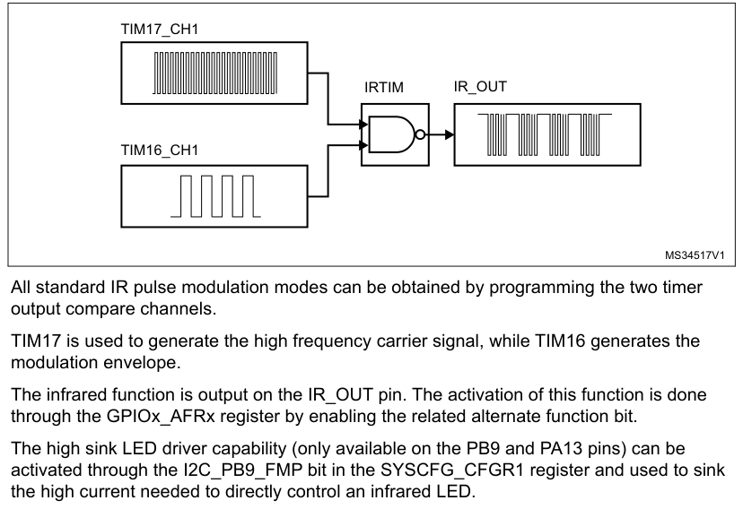

# 34 Infrared interface (IRTIM)

[← RM0440 index](../STM32G4_RM0440.md)

An infrared interface (IRTIM) for remote control is available on the device. It can be used with an
infrared LED to perform remote control functions.

It uses internal connections with TIM16, and TIM17 as shown in Figure 528.

To generate the infrared remote control signals, the IR interface must be enabled and TIM16 channel
1 (TIM16_OC1) and TIM17 channel 1 (TIM17_OC1) must be properly configured to generate correct
waveforms.

The infrared receiver can be implemented easily through a basic input capture mode.

**Figure 528. IRTIM internal hardware connections with TIM16 and TIM17**

All standard IR pulse modulation modes can be obtained by programming the two timer output compare
channels.

TIM17 is used to generate the high frequency carrier signal, while TIM16 generates the modulation
envelope.

The infrared function is output on the IR_OUT pin. The activation of this function is done through
the GPIOx_AFRx register by enabling the related alternate function bit.

The high sink LED driver capability (only available on the PB9 and PA13 pins) can be activated
through the I2C_PB9_FMP bit in the SYSCFG_CFGR1 register and used to sink the high current needed to
directly control an infrared LED.
