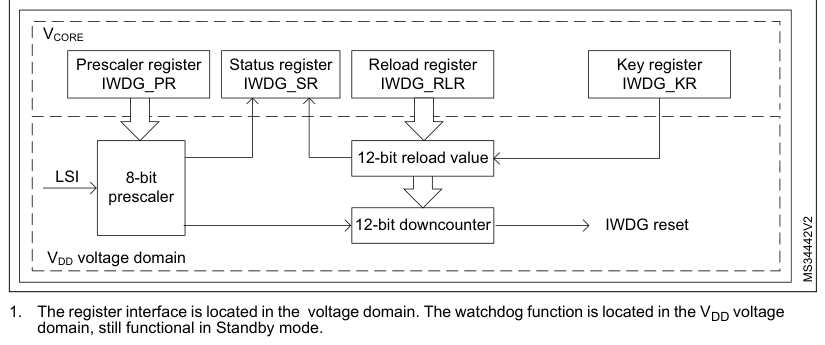

# 35 Independent watchdog (IWDG)

[← RM0440 index](../STM32G4_RM0440.md)

## 35.1 Introduction

The devices feature an embedded watchdog peripheral (IWDG) that offers a combination of high safety
level, timing accuracy, and flexibility of use. This peripheral detects and solves malfunctions due
to software failure, and triggers a system reset when the counter reaches a given timeout value.

The independent watchdog is clocked by its own dedicated low-speed clock (LSI), and stays active
even if the main clock fails.

The IWDG is best suited for applications that require the watchdog to run as a totally independent
process outside the main application, but have lower timing accuracy constraints. For further
information on the window watchdog, refer to [Section 36](chapter-36.md#36-system-window-watchdog-wwdg): System window watchdog (WWDG).

## 35.2 IWDG main features

- Free-running downcounter
- Clocked from an independent RC oscillator (can operate in Standby and Stop modes)
- Conditional reset
  - Reset (if watchdog is activated) when the downcounter value becomes lower than 0x000
  - Reset (if watchdog is activated) if the downcounter is reloaded outside the window

## 35.3 IWDG functional description

### 35.3.1 IWDG block diagram

Figure 529 shows the functional blocks of the independent watchdog module.

**Figure 529. Independent watchdog block diagram**

1. The register interface is located in the voltage domain. The watchdog function is located in the
   VDD voltage
   domain, still functional in Standby mode.

When the independent watchdog is started by writing the value 0x0000 CCCC in the IWDG key register
(IWDG_KR), the counter starts counting down from the reset value of 0xFFF. When it reaches the end
of count value (0x000), a reset signal is generated (IWDG reset).

Whenever the key value 0x0000 AAAA is written in the IWDG key register (IWDG_KR), the IWDG_RLR value
is reloaded in the counter, and the watchdog reset is prevented.

Once running, the IWDG cannot be stopped.

### 35.3.2 Window option

The IWDG can also work as a window watchdog by setting the appropriate window in the IWDG window
register (IWDG_WINR).

If the reload operation is performed while the counter is greater than the value stored in the IWDG
window register (IWDG_WINR), a reset is provided.

The default value of the IWDG window register (IWDG_WINR) is 0x0000 0FFF, so if it is not updated,
the window option is disabled.

As soon as the window value is changed, a reload operation is performed to reset the downcounter to
the IWDG reload register (IWDG_RLR) value, and to ease the cycle number calculation to generate the
next reload.

#### Configuring the IWDG when the window option is enabled

1. Enable the IWDG by writing 0x0000 CCCC in the IWDG key register (IWDG_KR).
2. Enable register access by writing 0x0000 5555 in the IWDG key register (IWDG_KR).
3. Write the IWDG prescaler by programming IWDG prescaler register (IWDG_PR) from

0 to 7.

4. Write the IWDG reload register (IWDG_RLR).
5. Wait for the registers to be updated (IWDG_SR = 0x0000 0000).
6. Write to the IWDG window register (IWDG_WINR). This automatically refreshes the
   counter value in the IWDG reload register (IWDG_RLR).

> **Note:** Writing the window value allows the counter value to be refreshed by the RLR when the

IWDG status register (IWDG_SR) is set to 0x0000 0000.

#### Configuring the IWDG when the window option is disabled

When the window option is not used, the IWDG can be configured as follows:

1. Enable the IWDG by writing 0x0000 CCCC in the IWDG key register (IWDG_KR).
2. Enable register access by writing 0x0000 5555 in the IWDG key register (IWDG_KR).
3. Write the prescaler by programming the IWDG prescaler register (IWDG_PR) from 0 to

7.

4. Write the IWDG reload register (IWDG_RLR).
5. Wait for the registers to be updated (IWDG_SR = 0x0000 0000).
6. Refresh the counter value with IWDG_RLR (IWDG_KR = 0x0000 AAAA).

### 35.3.3 Hardware watchdog

If this feature is enabled through the device option bits, the watchdog is automatically enabled at
power-on, and generates a reset unless the IWDG key register (IWDG_KR) is written by the software
before the counter reaches the end of count, and if the downcounter is lower than the window value
(WIN[11:0]).

### 35.3.4 Low-power freeze

Depending on the IWDG_STOP and IWDG_STBY options configuration, the IWDG can continue counting or
not during the Stop mode and the Standby mode, respectively. If the IWDG is kept running during Stop
or Standby modes, it can wake up the device from this mode. Refer to User and read protection option
bytes for more details.

### 35.3.5 Register access protection

Write access to IWDG prescaler register (IWDG_PR), IWDG reload register (IWDG_RLR), and IWDG window
register (IWDG_WINR) is protected. To modify them, first write the code 0x0000 5555 in the IWDG key
register (IWDG_KR). A write access to this register with a different value breaks the sequence, and
register access is protected again. This is the case of the reload operation (writing 0x0000 AAAA).

A status register is available to indicate that an update of the prescaler, or of the downcounter
reload value, or of the window value, is ongoing.

### 35.3.6 Debug mode

When the device enters Debug mode (core halted), the IWDG counter either continues to work normally
or stops, depending on the configuration of the corresponding bit in DBGMCU freeze register.

## 35.4 IWDG registers

Refer to [Section 1.2](chapter-01.md#12-list-of-abbreviations-for-registers) for a list of abbreviations used in register descriptions.

The peripheral registers can be accessed by half-words (16-bit) or words (32-bit).

### 35.4.1 IWDG key register (IWDG_KR)

- **Address offset:** 0x00
- **Reset value:** 0x0000 0000 (reset by Standby mode)

**Register bit layout**

| Bit | Field | Access | Summary |
| ---: | --- | :---: | --- |
| 31 | Reserved | — | kept at reset value. |
| 30 | Reserved | — | ↳ |
| 29 | Reserved | — | ↳ |
| 28 | Reserved | — | ↳ |
| 27 | Reserved | — | ↳ |
| 26 | Reserved | — | ↳ |
| 25 | Reserved | — | ↳ |
| 24 | Reserved | — | ↳ |
| 23 | Reserved | — | ↳ |
| 22 | Reserved | — | ↳ |
| 21 | Reserved | — | ↳ |
| 20 | Reserved | — | ↳ |
| 19 | Reserved | — | ↳ |
| 18 | Reserved | — | ↳ |
| 17 | Reserved | — | ↳ |
| 16 | Reserved | — | ↳ |
| 15 | `KEY[15]` | w | Key value (write only, read 0x0000) |
| 14 | `KEY[14]` | w | ↳ |
| 13 | `KEY[13]` | w | ↳ |
| 12 | `KEY[12]` | w | ↳ |
| 11 | `KEY[11]` | w | ↳ |
| 10 | `KEY[10]` | w | ↳ |
| 9 | `KEY[9]` | w | ↳ |
| 8 | `KEY[8]` | w | ↳ |
| 7 | `KEY[7]` | w | ↳ |
| 6 | `KEY[6]` | w | ↳ |
| 5 | `KEY[5]` | w | ↳ |
| 4 | `KEY[4]` | w | ↳ |
| 3 | `KEY[3]` | w | ↳ |
| 2 | `KEY[2]` | w | ↳ |
| 1 | `KEY[1]` | w | ↳ |
| 0 | `KEY[0]` | w | ↳ |

**Bits 31:16 — Reserved:** kept at reset value.

**Bits 15:0 — `KEY[15:0]`:** Key value (write only, read 0x0000)

These bits must be written by software at regular intervals with the key value 0xAAAA,
otherwise the watchdog generates a reset when the counter reaches 0.

Writing the key value 0x5555 to enable access to the IWDG_PR, IWDG_RLR and

IWDG_WINR registers (see [Section 35.3.5](#3535-register-access-protection): Register access protection)

Writing the key value 0xCCCC starts the watchdog (except if the hardware watchdog option
is selected)

### 35.4.2 IWDG prescaler register (IWDG_PR)

- **Address offset:** 0x04
- **Reset value:** 0x0000 0000

**Register bit layout**

| Bit | Field | Access | Summary |
| ---: | --- | :---: | --- |
| 31 | Reserved | — | kept at reset value. |
| 30 | Reserved | — | ↳ |
| 29 | Reserved | — | ↳ |
| 28 | Reserved | — | ↳ |
| 27 | Reserved | — | ↳ |
| 26 | Reserved | — | ↳ |
| 25 | Reserved | — | ↳ |
| 24 | Reserved | — | ↳ |
| 23 | Reserved | — | ↳ |
| 22 | Reserved | — | ↳ |
| 21 | Reserved | — | ↳ |
| 20 | Reserved | — | ↳ |
| 19 | Reserved | — | ↳ |
| 18 | Reserved | — | ↳ |
| 17 | Reserved | — | ↳ |
| 16 | Reserved | — | ↳ |
| 15 | Reserved | — | ↳ |
| 14 | Reserved | — | ↳ |
| 13 | Reserved | — | ↳ |
| 12 | Reserved | — | ↳ |
| 11 | Reserved | — | ↳ |
| 10 | Reserved | — | ↳ |
| 9 | Reserved | — | ↳ |
| 8 | Reserved | — | ↳ |
| 7 | Reserved | — | ↳ |
| 6 | Reserved | — | ↳ |
| 5 | Reserved | — | ↳ |
| 4 | Reserved | — | ↳ |
| 3 | Reserved | — | ↳ |
| 2 | `PR[2]` | rw | Prescaler divider |
| 1 | `PR[1]` | rw | ↳ |
| 0 | `PR[0]` | rw | ↳ |

**Bits 31:3 — Reserved:** kept at reset value.

**Bits 2:0 — `PR[2:0]`:** Prescaler divider

These bits are write access protected see [Section 35.3.5](#3535-register-access-protection): Register access protection. They
are written by software to select the prescaler divider feeding the counter clock. PVU bit of
the IWDG status register (IWDG_SR) must be reset in order to be able to change the
prescaler divider.

- `000`: divider /4
- `001`: divider /8
- `010`: divider /16
- `011`: divider /32
- `100`: divider /64
- `101`: divider /128
- `110`: divider /256
- `111`: divider /256

> **Note:** Reading this register returns the prescaler value from the VDD voltage domain. This
> value may not be up to date/valid if a write operation to this register is ongoing. For this
> reason the value read from this register is valid only when the PVU bit in the IWDG
> status register (IWDG_SR) is reset.

### 35.4.3 IWDG reload register (IWDG_RLR)

- **Address offset:** 0x08
- **Reset value:** 0x0000 0FFF (reset by Standby mode)

**Register bit layout**

| Bit | Field | Access | Summary |
| ---: | --- | :---: | --- |
| 31 | Reserved | — | kept at reset value. |
| 30 | Reserved | — | ↳ |
| 29 | Reserved | — | ↳ |
| 28 | Reserved | — | ↳ |
| 27 | Reserved | — | ↳ |
| 26 | Reserved | — | ↳ |
| 25 | Reserved | — | ↳ |
| 24 | Reserved | — | ↳ |
| 23 | Reserved | — | ↳ |
| 22 | Reserved | — | ↳ |
| 21 | Reserved | — | ↳ |
| 20 | Reserved | — | ↳ |
| 19 | Reserved | — | ↳ |
| 18 | Reserved | — | ↳ |
| 17 | Reserved | — | ↳ |
| 16 | Reserved | — | ↳ |
| 15 | Reserved | — | ↳ |
| 14 | Reserved | — | ↳ |
| 13 | Reserved | — | ↳ |
| 12 | Reserved | — | ↳ |
| 11 | `RL[11]` | rw | Watchdog counter reload value |
| 10 | `RL[10]` | rw | ↳ |
| 9 | `RL[9]` | rw | ↳ |
| 8 | `RL[8]` | rw | ↳ |
| 7 | `RL[7]` | rw | ↳ |
| 6 | `RL[6]` | rw | ↳ |
| 5 | `RL[5]` | rw | ↳ |
| 4 | `RL[4]` | rw | ↳ |
| 3 | `RL[3]` | rw | ↳ |
| 2 | `RL[2]` | rw | ↳ |
| 1 | `RL[1]` | rw | ↳ |
| 0 | `RL[0]` | rw | ↳ |

**Bits 31:12 — Reserved:** kept at reset value.

**Bits 11:0 — `RL[11:0]`:** Watchdog counter reload value

These bits are write access protected see Register access protection. They are written by
software to define the value to be loaded in the watchdog counter each time the value

0xAAAA is written in the IWDG key register (IWDG_KR). The watchdog counter counts
down from this value. The timeout period is a function of this value and the clock prescaler.

Refer to the datasheet for the timeout information.

The RVU bit in the IWDG status register (IWDG_SR) must be reset to be able to change the
reload value.

> **Note:** Reading this register returns the reload value from the VDD voltage domain. This value
> may not be up to date/valid if a write operation to this register is ongoing on it. For this
> reason the value read from this register is valid only when the RVU bit in the IWDG
> status register (IWDG_SR) is reset.

### 35.4.4 IWDG status register (IWDG_SR)

- **Address offset:** 0x0C
- **Reset value:** 0x0000 0000 (not reset by Standby mode)

**Register bit layout**

| Bit | Field | Access | Summary |
| ---: | --- | :---: | --- |
| 31 | Reserved | — | kept at reset value. |
| 30 | Reserved | — | ↳ |
| 29 | Reserved | — | ↳ |
| 28 | Reserved | — | ↳ |
| 27 | Reserved | — | ↳ |
| 26 | Reserved | — | ↳ |
| 25 | Reserved | — | ↳ |
| 24 | Reserved | — | ↳ |
| 23 | Reserved | — | ↳ |
| 22 | Reserved | — | ↳ |
| 21 | Reserved | — | ↳ |
| 20 | Reserved | — | ↳ |
| 19 | Reserved | — | ↳ |
| 18 | Reserved | — | ↳ |
| 17 | Reserved | — | ↳ |
| 16 | Reserved | — | ↳ |
| 15 | Reserved | — | ↳ |
| 14 | Reserved | — | ↳ |
| 13 | Reserved | — | ↳ |
| 12 | Reserved | — | ↳ |
| 11 | Reserved | — | ↳ |
| 10 | Reserved | — | ↳ |
| 9 | Reserved | — | ↳ |
| 8 | Reserved | — | ↳ |
| 7 | Reserved | — | ↳ |
| 6 | Reserved | — | ↳ |
| 5 | Reserved | — | ↳ |
| 4 | Reserved | — | ↳ |
| 3 | Reserved | — | ↳ |
| 2 | `WVU` | r | Watchdog counter window value update |
| 1 | `RVU` | r | Watchdog counter reload value update |
| 0 | `PVU` | r | Watchdog prescaler value update |

**Bits 31:3 — Reserved:** kept at reset value.

**Bit 2 — `WVU`:** Watchdog counter window value update

This bit is set by hardware to indicate that an update of the window value is ongoing. It is
reset by hardware when the reload value update operation is completed in the VDD voltage
domain (takes up to five cycles).

Window value can be updated only when WVU bit is reset.

**Bit 1 — `RVU`:** Watchdog counter reload value update

This bit is set by hardware to indicate that an update of the reload value is ongoing. It is reset
by hardware when the reload value update operation is completed in the VDD voltage domain

(takes up to five cycles).

Reload value can be updated only when RVU bit is reset.

**Bit 0 — `PVU`:** Watchdog prescaler value update

This bit is set by hardware to indicate that an update of the prescaler value is ongoing. It is
reset by hardware when the prescaler update operation is completed in the VDD voltage
domain (takes up to five cycles).

Prescaler value can be updated only when PVU bit is reset.

> **Note:** If several reload, prescaler, or window values are used by the application, it is mandatory to
> wait until RVU bit is reset before changing the reload value, to wait until PVU bit is reset before
> changing the prescaler value, and to wait until WVU bit is reset before changing the window value.
However, after updating the prescaler and/or the reload/window value it is not necessary to wait
until RVU or PVU or WVU is reset before continuing code execution except in case of low-power mode
entry.

### 35.4.5 IWDG window register (IWDG_WINR)

- **Address offset:** 0x10
- **Reset value:** 0x0000 0FFF (reset by Standby mode)

**Register bit layout**

| Bit | Field | Access | Summary |
| ---: | --- | :---: | --- |
| 31 | Reserved | — | kept at reset value. |
| 30 | Reserved | — | ↳ |
| 29 | Reserved | — | ↳ |
| 28 | Reserved | — | ↳ |
| 27 | Reserved | — | ↳ |
| 26 | Reserved | — | ↳ |
| 25 | Reserved | — | ↳ |
| 24 | Reserved | — | ↳ |
| 23 | Reserved | — | ↳ |
| 22 | Reserved | — | ↳ |
| 21 | Reserved | — | ↳ |
| 20 | Reserved | — | ↳ |
| 19 | Reserved | — | ↳ |
| 18 | Reserved | — | ↳ |
| 17 | Reserved | — | ↳ |
| 16 | Reserved | — | ↳ |
| 15 | Reserved | — | ↳ |
| 14 | Reserved | — | ↳ |
| 13 | Reserved | — | ↳ |
| 12 | Reserved | — | ↳ |
| 11 | `WIN[11]` | rw | Watchdog counter window value |
| 10 | `WIN[10]` | rw | ↳ |
| 9 | `WIN[9]` | rw | ↳ |
| 8 | `WIN[8]` | rw | ↳ |
| 7 | `WIN[7]` | rw | ↳ |
| 6 | `WIN[6]` | rw | ↳ |
| 5 | `WIN[5]` | rw | ↳ |
| 4 | `WIN[4]` | rw | ↳ |
| 3 | `WIN[3]` | rw | ↳ |
| 2 | `WIN[2]` | rw | ↳ |
| 1 | `WIN[1]` | rw | ↳ |
| 0 | `WIN[0]` | rw | ↳ |

**Bits 31:12 — Reserved:** kept at reset value.

**Bits 11:0 — `WIN[11:0]`:** Watchdog counter window value

These bits are write access protected, see [Section 35.3.5](#3535-register-access-protection), they contain the high limit of the
window value to be compared with the downcounter.

To prevent a reset, the downcounter must be reloaded when its value is lower than the
window register value and greater than 0x0

The WVU bit in the IWDG status register (IWDG_SR) must be reset in order to be able to
change the reload value.

> **Note:** Reading this register returns the reload value from the VDD voltage domain. This value
> may not be valid if a write operation to this register is ongoing. For this reason the value
> read from this register is valid only when the WVU bit in the IWDG status register

(IWDG_SR) is reset.

### 35.4.6 IWDG register map

The following table gives the IWDG register map and reset values.

**Register summary**

| Offset | Register | Reset value |
| --- | --- | --- |
| 0x00 | `IWDG_KR` | 0x0000 0000 (reset by Standby mode) |
| 0x04 | `IWDG_PR` | 0x0000 0000 |
| 0x08 | `IWDG_RLR` | 0x0000 0FFF (reset by Standby mode) |
| 0x0C | `IWDG_SR` | 0x0000 0000 (not reset by Standby mode) |
| 0x10 | `IWDG_WINR` | 0x0000 0FFF (reset by Standby mode) |

Refer to [Section 2.2](chapter-02.md#22-memory-organization) for the register boundary addresses.
