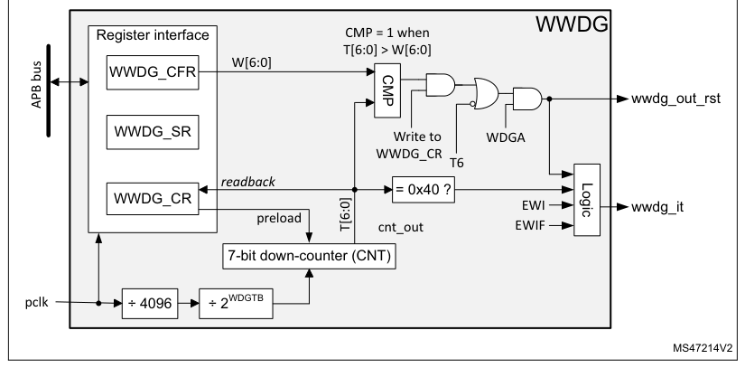
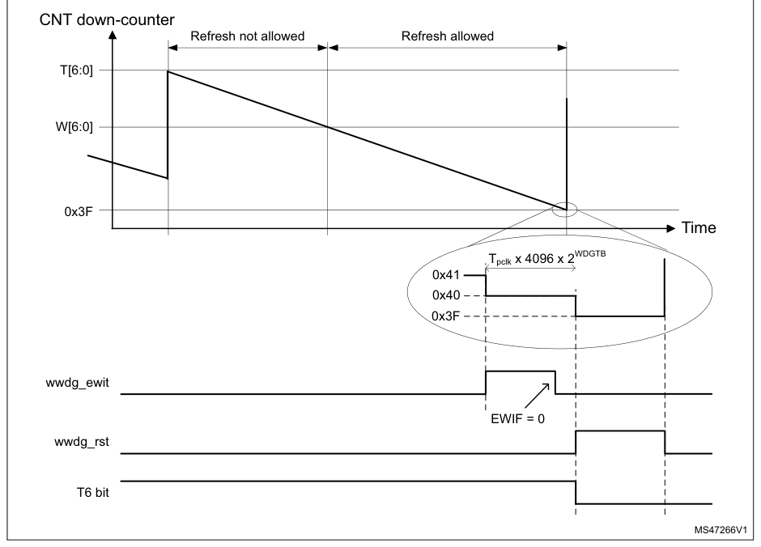

# 36 System window watchdog (WWDG)

[← RM0440 index](../STM32G4_RM0440.md)

## 36.1 Introduction

The system window watchdog (WWDG) is used to detect the occurrence of a software fault, usually
generated by external interference or by unforeseen logical conditions, which causes the application
program to abandon its normal sequence.

The watchdog circuit generates an MCU reset on expiry of a programmed time period, unless the
program refreshes the contents of the down-counter before the T6 bit is cleared. An MCU reset is
also generated if the 7-bit down-counter value (in the control register) is refreshed before the
down-counter reaches the window register value. This implies that the counter must be refreshed in a
limited window.

The WWDG clock is prescaled from the APB clock and has a configurable time window that can be
programmed to detect abnormally late or early application behavior.

The WWDG is best suited for applications requiring the watchdog to react within an accurate timing
window.

## 36.2 WWDG main features

- Programmable free-running down-counter
- Conditional reset
  - Reset (if watchdog activated) when the down-counter value becomes lower than 0x40
  - Reset (if watchdog activated) if the down-counter is reloaded outside the window (see Figure
    531)
- Early wake-up interrupt (EWI): triggered (if enabled and the watchdog activated) when the
  down-counter is equal to 0x40

## 36.3 WWDG functional description

If the watchdog is activated (the WDGA bit is set in the WWDG_CR register), and when the 7-bit
down-counter (T[6:0] bits) is decremented from 0x40 to 0x3F (T6 becomes cleared), it initiates a
reset. If the software reloads the counter while the counter is greater than the value stored in the
window register, then a reset is generated.

The application program must write in the WWDG_CR register at regular intervals during normal
operation to prevent an MCU reset. This operation can take place only when the counter value is
lower than or equal to the window register value, and higher than 0x3F. The value to be stored in
the WWDG_CR register must be between 0xFF and 0xC0.

Refer to Figure 530 for the WWDG block diagram.

### 36.3.1 WWDG block diagram

**Figure 530. Watchdog block diagram**

= 0x40?

WWDG_CR

### 36.3.2 Enabling the watchdog

When the user option WWDG_SW selects “Software window watchdog”, the watchdog is always disabled
after a reset. It is enabled by setting the WDGA bit in the WWDG_CR register, then it cannot be
disabled again, except by a reset.

When the user option WWDG_SW selects “Hardware window watchdog”, the watchdog is always enabled
after a reset, it cannot be disabled.

### 36.3.3 Controlling the down-counter

This down-counter is free-running, counting down even if the watchdog is disabled. When the watchdog
is enabled, the T6 bit must be set to prevent generating an immediate reset.

The T[5:0] bits contain the number of increments that represent the time delay before the watchdog
produces a reset. The timing varies between a minimum and a maximum value, due to the unknown status
of the prescaler when writing to the WWDG_CR register (see Figure 531). The WWDG configuration
register (WWDG_CFR) contains the high limit of the window: to prevent a reset, the down-counter must
be reloaded when its value is lower than or equal to the window register value, and greater than
0x3F. Figure 531 describes the window watchdog process.

> **Note:** The T6 bit can be used to generate a software reset (the WDGA bit is set and the T6 bit is
> cleared).

### 36.3.4 How to program the watchdog timeout

Use the formula in Figure 531 to calculate the WWDG timeout.

> **Warning:** When writing to the WWDG_CR register, always write 1 in the

T6 bit to avoid generating an immediate reset.

**Figure 531. Window watchdog timing diagram**

- tWWDG: WWDG timeout
- tPCLK: APB clock period measured in ms
- 4096: value corresponding to internal divider

As an example, if APB frequency is 48 MHz, WDGTB[2:0] is set to 3, and T[5:0] is set to 63:

Refer to the datasheet for the minimum and maximum values of tWWDG.

### 36.3.5 Debug mode

When the device enters debug mode (processor halted), the WWDG counter either continues to work
normally or stops, depending on the configuration bit in DBG module. For more details, refer to
[Section 47.16.2](chapter-47.md#47162-debug-support-for-timers-rtc-watchdog-and-i2c): Debug support for timers, RTC, watchdog and I2C.

## 36.4 WWDG interrupts

The early wake-up interrupt (EWI) can be used if specific safety operations or data logging must be
performed before the reset is generated. To enable the early wake-up interrupt, the application
must:

- Write EWIF bit of WWDG_SR register to 0, to clear unwanted pending interrupt
- Write EWI bit of WWDG_CFR register to 1, to enable interrupt

When the down-counter reaches the value 0x40, a watchdog interrupt is generated, and the
corresponding interrupt service routine (ISR) can be used to trigger specific actions (such as
communications or data logging), before resetting the device.

In some applications, the EWI interrupt can be used to manage a software system check and/or system
recovery/graceful degradation, without generating a WWDG reset. In this case the corresponding ISR
must reload the WWDG counter to avoid the WWDG reset, then trigger the required actions.

The watchdog interrupt is cleared by writing 0 to the EWIF bit in the WWDG_SR register.

> **Note:** When the watchdog interrupt cannot be served (for example due to a system lock in a
> higher priority task), the WWDG reset is eventually generated.

## 36.5 WWDG registers

Refer to [Section 1.2](chapter-01.md#12-list-of-abbreviations-for-registers): List of abbreviations for registers for a list of abbreviations used in
register descriptions.

The peripheral registers can be accessed by halfwords (16-bit) or words (32-bit).

### 36.5.1 WWDG control register (WWDG_CR)

- **Address offset:** 0x000
- **Reset value:** 0x0000 007F

**Register bit layout**

| Bit | Field | Access | Summary |
| ---: | --- | :---: | --- |
| 31 | Reserved | — | kept at reset value. |
| 30 | Reserved | — | ↳ |
| 29 | Reserved | — | ↳ |
| 28 | Reserved | — | ↳ |
| 27 | Reserved | — | ↳ |
| 26 | Reserved | — | ↳ |
| 25 | Reserved | — | ↳ |
| 24 | Reserved | — | ↳ |
| 23 | Reserved | — | ↳ |
| 22 | Reserved | — | ↳ |
| 21 | Reserved | — | ↳ |
| 20 | Reserved | — | ↳ |
| 19 | Reserved | — | ↳ |
| 18 | Reserved | — | ↳ |
| 17 | Reserved | — | ↳ |
| 16 | Reserved | — | ↳ |
| 15 | Reserved | — | ↳ |
| 14 | Reserved | — | ↳ |
| 13 | Reserved | — | ↳ |
| 12 | Reserved | — | ↳ |
| 11 | Reserved | — | ↳ |
| 10 | Reserved | — | ↳ |
| 9 | Reserved | — | ↳ |
| 8 | Reserved | — | ↳ |
| 7 | `WDGA` | rs | Activation bit |
| 6 | `T[6]` | rw | 7-bit counter (MSB to LSB) |
| 5 | `T[5]` | rw | ↳ |
| 4 | `T[4]` | rw | ↳ |
| 3 | `T[3]` | rw | ↳ |
| 2 | `T[2]` | rw | ↳ |
| 1 | `T[1]` | rw | ↳ |
| 0 | `T[0]` | rw | ↳ |

**Bits 31:8 — Reserved:** kept at reset value.

**Bit 7 — `WDGA`:** Activation bit

This bit is set by software and only cleared by hardware after a reset. When WDGA = 1, the
watchdog can generate a reset.

- `0`: Watchdog disabled
- `1`: Watchdog enabled

**Bits 6:0 — `T[6:0]`:** 7-bit counter (MSB to LSB)

These bits contain the value of the watchdog counter, decremented every

(4096 x 2WDGTB[2:0]) PCLK cycles. A reset is produced when it is decremented from 0x40 to

0x3F (T6 becomes cleared).

### 36.5.2 WWDG configuration register (WWDG_CFR)

- **Address offset:** 0x004
- **Reset value:** 0x0000 007F

**Register bit layout**

| Bit | Field | Access | Summary |
| ---: | --- | :---: | --- |
| 31 | Reserved | — | kept at reset value. |
| 30 | Reserved | — | ↳ |
| 29 | Reserved | — | ↳ |
| 28 | Reserved | — | ↳ |
| 27 | Reserved | — | ↳ |
| 26 | Reserved | — | ↳ |
| 25 | Reserved | — | ↳ |
| 24 | Reserved | — | ↳ |
| 23 | Reserved | — | ↳ |
| 22 | Reserved | — | ↳ |
| 21 | Reserved | — | ↳ |
| 20 | Reserved | — | ↳ |
| 19 | Reserved | — | ↳ |
| 18 | Reserved | — | ↳ |
| 17 | Reserved | — | ↳ |
| 16 | Reserved | — | ↳ |
| 15 | Reserved | — | ↳ |
| 14 | Reserved | — | ↳ |
| 13 | `WDGTB[2]` | rw | Timer base |
| 12 | `WDGTB[1]` | rw | ↳ |
| 11 | `WDGTB[0]` | rw | ↳ |
| 10 | Reserved | — | kept at reset value. |
| 9 | `EWI` | rs | Early wake-up interrupt enable |
| 8 | Reserved | — | kept at reset value. |
| 7 | Reserved | — | ↳ |
| 6 | `W[6]` | rw | 7-bit window value |
| 5 | `W[5]` | rw | ↳ |
| 4 | `W[4]` | rw | ↳ |
| 3 | `W[3]` | rw | ↳ |
| 2 | `W[2]` | rw | ↳ |
| 1 | `W[1]` | rw | ↳ |
| 0 | `W[0]` | rw | ↳ |

**Bits 31:14 — Reserved:** kept at reset value.

**Bits 13:11 — `WDGTB[2:0]`:** Timer base

The timebase of the prescaler can be modified as follows:

- `000`: CK counter clock (PCLK div 4096) div 1
- `001`: CK counter clock (PCLK div 4096) div 2
- `010`: CK counter clock (PCLK div 4096) div 4
- `011`: CK counter clock (PCLK div 4096) div 8
- `100`: CK counter clock (PCLK div 4096) div 16
- `101`: CK counter clock (PCLK div 4096) div 32
- `110`: CK counter clock (PCLK div 4096) div 64
- `111`: CK counter clock (PCLK div 4096) div 128

**Bit 10 — Reserved:** kept at reset value.

**Bit 9 — `EWI`:** Early wake-up interrupt enable

Set by software and cleared by hardware after a reset. When set, an interrupt occurs
whenever the counter reaches the value 0x40.

**Bits 8:7 — Reserved:** kept at reset value.

**Bits 6:0 — `W[6:0]`:** 7-bit window value

These bits contain the window value to be compared with the down-counter.

### 36.5.3 WWDG status register (WWDG_SR)

- **Address offset:** 0x008
- **Reset value:** 0x0000 0000

**Register bit layout**

| Bit | Field | Access | Summary |
| ---: | --- | :---: | --- |
| 31 | Reserved | — | kept at reset value. |
| 30 | Reserved | — | ↳ |
| 29 | Reserved | — | ↳ |
| 28 | Reserved | — | ↳ |
| 27 | Reserved | — | ↳ |
| 26 | Reserved | — | ↳ |
| 25 | Reserved | — | ↳ |
| 24 | Reserved | — | ↳ |
| 23 | Reserved | — | ↳ |
| 22 | Reserved | — | ↳ |
| 21 | Reserved | — | ↳ |
| 20 | Reserved | — | ↳ |
| 19 | Reserved | — | ↳ |
| 18 | Reserved | — | ↳ |
| 17 | Reserved | — | ↳ |
| 16 | Reserved | — | ↳ |
| 15 | Reserved | — | ↳ |
| 14 | Reserved | — | ↳ |
| 13 | Reserved | — | ↳ |
| 12 | Reserved | — | ↳ |
| 11 | Reserved | — | ↳ |
| 10 | Reserved | — | ↳ |
| 9 | Reserved | — | ↳ |
| 8 | Reserved | — | ↳ |
| 7 | Reserved | — | ↳ |
| 6 | Reserved | — | ↳ |
| 5 | Reserved | — | ↳ |
| 4 | Reserved | — | ↳ |
| 3 | Reserved | — | ↳ |
| 2 | Reserved | — | ↳ |
| 1 | Reserved | — | ↳ |
| 0 | `EWIF` | rc_w0 | Early wake-up interrupt flag |

**Bits 31:1 — Reserved:** kept at reset value.

**Bit 0 — `EWIF`:** Early wake-up interrupt flag

This bit is set by hardware when the counter has reached the value 0x40. It must be cleared
by software by writing 0. Writing 1 has no effect. This bit is also set if the interrupt is not
enabled.

### 36.5.4 WWDG register map

The following table gives the WWDG register map and reset values.

**Register summary**

| Offset | Register | Reset value |
| --- | --- | --- |
| 0x000 | `WWDG_CR` | 0x0000 007F |
| 0x004 | `WWDG_CFR` | 0x0000 007F |
| 0x008 | `WWDG_SR` | 0x0000 0000 |

Refer to [Section 2.2](chapter-02.md#22-memory-organization) for the register boundary addresses.
