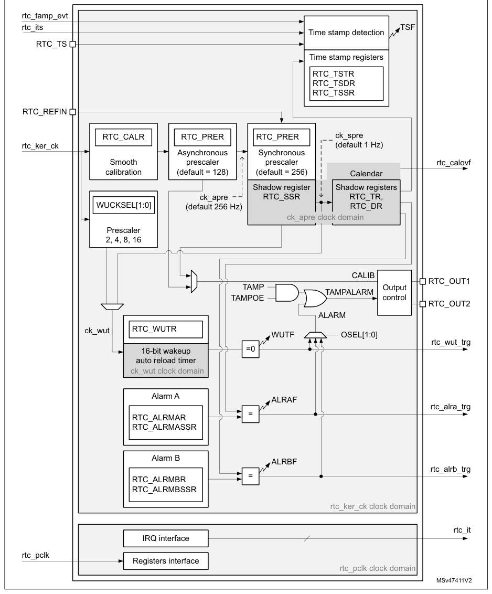

# 37 Real-time clock (RTC)

[← RM0440 index](../STM32G4_RM0440.md)

## 37.1 Introduction

The RTC provides an automatic wakeup to manage all low-power modes.

The real-time clock (RTC) is an independent BCD timer/counter. The RTC provides a time-of-day
clock/calendar with programmable alarm interrupts.

As long as the supply voltage remains in the operating range, the RTC never stops, regardless of the
device status (Run mode, low-power mode or under reset).

The RTC is functional in VBAT mode.

## 37.2 RTC main features

The RTC supports the following features (see Figure 532: RTC block diagram):

- Calendar with subsecond, seconds, minutes, hours (12 or 24 format), week day, date, month, year,
  in BCD (binary-coded decimal) format.
- Automatic correction for 28, 29 (leap year), 30, and 31 days of the month.
- Two programmable alarms.
- On-the-fly correction from 1 to 32767 RTC clock pulses. This can be used to synchronize it with a
  master clock.
- Reference clock detection: a more precise second source clock (50 or 60 Hz) can be used to enhance
  the calendar precision.
- Digital calibration circuit with 0.95 ppm resolution, to compensate for quartz crystal inaccuracy.
- Timestamp feature which can be used to save the calendar content. This function can be triggered
  by an event on the timestamp pin, or by a tamper event, or by a switch to VBAT mode.
- 17-bit auto-reload wakeup timer (WUT) for periodic events with programmable resolution and period.

The RTC is supplied through a switch that takes power either from the VDD supply when present or
from the VBAT pin.

The RTC clock sources can be:

- A 32.768 kHz external crystal (LSE)
- An external resonator or oscillator (LSE)
- The internal low power RC oscillator (LSI, with typical frequency of 32 kHz)
- The high-speed external clock (HSE), divided by a prescaler in the RCC.

The RTC is functional in VBAT mode and in all low-power modes when it is clocked by the LSE. When
clocked by the LSI, the RTC is not functional in VBAT mode, but is functional in all low-power modes
except Shutdown mode.

All RTC events (Alarm, WakeUp Timer, Timestamp) can generate an interrupt and wakeup the device from
the low-power modes.

## 37.3 RTC functional description

### 37.3.1 RTC block diagram

**Figure 532. RTC block diagram**

### 37.3.2 RTC pins and internal signals

**Table 337. RTC input/output pins**

| Pin name | Signal type | Description |
| --- | --- | --- |
| RTC_TS | Input | RTC timestamp input |
| RTC_REFIN | Input | RTC 50 or 60 Hz reference clock input |
| RTC_OUT1 | Output | RTC output 1 |
| RTC_OUT2 | Output | RTC output 2 |

- RTC_OUT1 and RTC_OUT2 which selects one of the following two outputs:
  - CALIB: 512 Hz or 1 Hz clock output (with an LSE frequency of 32.768 kHz). This output is enabled
    by setting the COE bit in the RTC_CR register.
  - TAMPALRM: This output is the OR between TAMP and ALARM outputs.

ALARM is enabled by configuring the OSEL[1:0] bits in the RTC_CR register which select the alarm A,
alarm B or wakeup outputs. TAMP is enabled by setting the TAMPOE bit in the RTC_CR register which
selects the tamper event outputs.

**Table 338. RTC internal input/output signals**

| Source row | Column 1 | Column 2 | Column 3 |
| ---: | --- | --- | --- |
| 1 | `Internal signal name` | `Signal type` | `Description` |
| 2 | `RTC kernel clock, also named RTCCLK in` |  |  |
| 3 | `rtc_ker_ck` | `Input` |  |
| 4 | `this document` |  |  |
| 5 | `rtc_pclk` | `Input` | `RTC APB clock` |
| 6 | `rtc_its` | `Input` | `RTC internal timestamp event` |
| 7 | `Tamper event (internal or external) detected` |  |  |
| 8 | `rtc_tamp_evt` | `Input` |  |
| 9 | `in TAMP peripheral` |  |  |
| 10 | `RTC interrupts (refer to Section 37.5: RTC` |  |  |
| 11 | `rtc_it` | `Output` |  |
| 12 | `interrupts for details)` |  |  |
| 13 | `rtc_alra_trg` | `Output` | `RTC alarm A event detection trigger` |
| 14 | `rtc_alrb_trg` | `Output` | `RTC alarm B event detection trigger` |
| 15 | `rtc_wut_trg` | `Output` | `RTC wakeup timer event detection trigger` |
| 16 | `rtc_calovf` | `Output` | `RTC calendar overflow` |

The RTC kernel clock is usually the LSE at 32.768 kHz although it is possible to select other clock
sources in the RCC (refer to RCC for more details). Some functions are not available in some
low-power modes or VBAT when the selected clock is not LSE. Refer to [Section 37.4](#374-rtc-low-power-modes): RTC low-power
modes for more details.

**Table 339. RTC interconnection**

| Source row | Column 1 | Column 2 |
| ---: | --- | --- |
| 1 | `Signal name` | `Source/destination` |
| 2 | `From power controller (PWR): main power loss/switch to VBAT detection` |  |
| 3 | `rtc_its` |  |
| 4 | `output` |  |
| 5 | `rtc_tamp_evt` | `From TAMP peripheral: tamp_evt` |
| 6 | `rtc_calovf` | `To TAMP peripheral: tamp_itamp5` |

The triggers outputs can be used as triggers for other peripherals.

### 37.3.3 GPIOs controlled by the RTC and TAMP

The GPIOs included in the Battery Backup Domain (VBAT) are directly controlled by the peripherals
providing functions on these I/Os, whatever the GPIO configuration.

Both RTC and TAMP peripherals provide functions on these I/Os (refer to [Section 38](chapter-38.md#38-tamper-and-backup-registers-tamp): Tamper and
backup registers (TAMP)).

RTC_OUT1, RTC_TS and TAMP_IN1 are mapped on the same pin (PC13). The RTC and TAMP functions mapped
on PC13 are available in all low-power modes and in VBAT mode.

The output mechanism follows the priority order shown in Table 340.

**Table 340. PC13 configuration(1)**

| Source row | Column 1 | Column 2 | Column 3 | Column 4 | Column 5 |
| ---: | --- | --- | --- | --- | --- |
| 1 | `PC13 Pin function` |  |  |  |  |
| 2 | `COE` | `TSE` |  |  |  |
| 3 | `TAMPOE` | `OUT2EN` | `TAMP1E` |  |  |
| 4 | `OSEL[1:0]` |  |  |  |  |
| 5 | `TAMPALRM_PU` |  |  |  |  |
| 6 | `TAMPALRM_TYPE` |  |  |  |  |
| 7 | `(CALIB output enable)` | `(RTC_TS input enable)` |  |  |  |
| 8 | `(ALARM output enable)` |  |  |  |  |
| 9 | `(TAMPER output enable)` | `(TAMP_IN1 input enable)` |  |  |  |
| 10 | `01 or` |  |  |  |  |
| 11 | `10 or 0` |  |  |  |  |
| 12 | `11` |  |  |  |  |
| 13 | `TAMPALRM output` | `Don’t` | `Don’t` | `Don’t` | `Don’t` |
| 14 | `00` | `1` | `0` | `0` |  |
| 15 | `Push-Pull` | `care` | `care` | `care` | `care` |
| 16 | `01 or` |  |  |  |  |
| 17 | `10 or 1` |  |  |  |  |
| 18 | `11` |  |  |  |  |

**Table 340. PC13 configuration(1) (continued)**

| Source row | Column 1 | Column 2 | Column 3 | Column 4 | Column 5 | Column 6 |
| ---: | --- | --- | --- | --- | --- | --- |
| 1 | `PC13 Pin function` |  |  |  |  |  |
| 2 | `COE` | `TSE` |  |  |  |  |
| 3 | `TAMPOE` | `OUT2EN` | `TAMP1E` |  |  |  |
| 4 | `OSEL[1:0]` |  |  |  |  |  |
| 5 | `TAMPALRM_PU` |  |  |  |  |  |
| 6 | `TAMPALRM_TYPE` |  |  |  |  |  |
| 7 | `(CALIB output enable)` | `(RTC_TS input enable)` |  |  |  |  |
| 8 | `(ALARM output enable)` |  |  |  |  |  |
| 9 | `(TAMPER output enable)` | `(TAMP_IN1 input enable)` |  |  |  |  |
| 10 | `01 or` |  |  |  |  |  |
| 11 | `10 or 0` |  |  |  |  |  |
| 12 | `11` |  |  |  |  |  |
| 13 | `Don’t` | `Don’t` | `Don’t` | `Don’t` |  |  |
| 14 | `No pull` | `00` | `1` | `1` | `0` |  |
| 15 | `care` | `care` | `care` | `care` |  |  |
| 16 | `01 or` |  |  |  |  |  |
| 17 | `10 or 1` |  |  |  |  |  |
| 18 | `TAMPALRM` |  |  |  |  |  |
| 19 | `11` |  |  |  |  |  |
| 20 | `output` |  |  |  |  |  |
| 21 | `01 or` |  |  |  |  |  |
| 22 | `Open-Drain(2)` |  |  |  |  |  |
| 23 | `10 or 0` |  |  |  |  |  |
| 24 | `11` |  |  |  |  |  |
| 25 | `Internal` | `Don’t` | `Don’t` | `Don’t` | `Don’t` |  |
| 26 | `00` | `1` | `1` | `1` |  |  |
| 27 | `pull-up` | `care` | `care` | `care` | `care` |  |
| 28 | `01 or` |  |  |  |  |  |
| 29 | `10 or 1` |  |  |  |  |  |
| 30 | `11` |  |  |  |  |  |
| 31 | `Don’t` | `Don’t` | `Don’t` | `Don’t` |  |  |
| 32 | `CALIB output PP` | `00` | `0` | `1` | `0` |  |
| 33 | `care` | `care` | `care` | `care` |  |  |
| 34 | `Don’t` |  |  |  |  |  |
| 35 | `00` | `0` | `0` |  |  |  |
| 36 | `care` |  |  |  |  |  |
| 37 | `Don’t Don’t` |  |  |  |  |  |
| 38 | `TAMP_IN1 input floating` | `00` | `0` | `1` | `1` | `0` |
| 39 | `care care` |  |  |  |  |  |
| 40 | `1` |  |  |  |  |  |
| 41 | `Don’t Don’t` |  |  |  |  |  |
| 42 | `0` |  |  |  |  |  |
| 43 | `care care` |  |  |  |  |  |
| 44 | `Don’t` |  |  |  |  |  |
| 45 | `00` | `0` | `0` |  |  |  |
| 46 | `care` |  |  |  |  |  |
| 47 | `RTC_TS and TAMP_IN1` | `Don’t` | `Don’t` |  |  |  |
| 48 | `00` | `0` | `1` | `1` | `1` |  |
| 49 | `input floating` | `care` | `care` |  |  |  |
| 50 | `1` |  |  |  |  |  |
| 51 | `Don’t Don’t` |  |  |  |  |  |
| 52 | `0` |  |  |  |  |  |
| 53 | `care care` |  |  |  |  |  |
| 54 | `Don’t` |  |  |  |  |  |
| 55 | `00` | `0` | `0` |  |  |  |
| 56 | `care` |  |  |  |  |  |
| 57 | `Don’t Don’t` |  |  |  |  |  |
| 58 | `RTC_TS input floating` | `00` | `0` | `1` | `0` | `1` |
| 59 | `care care` |  |  |  |  |  |
| 60 | `1` |  |  |  |  |  |
| 61 | `Don’t Don’t` |  |  |  |  |  |
| 62 | `0` |  |  |  |  |  |
| 63 | `care care` |  |  |  |  |  |

**Table 340. PC13 configuration(1) (continued)**

| Source row | Column 1 | Column 2 | Column 3 | Column 4 | Column 5 |
| ---: | --- | --- | --- | --- | --- |
| 1 | `PC13 Pin function` |  |  |  |  |
| 2 | `COE` | `TSE` |  |  |  |
| 3 | `TAMPOE` | `OUT2EN` | `TAMP1E` |  |  |
| 4 | `OSEL[1:0]` |  |  |  |  |
| 5 | `TAMPALRM_PU` |  |  |  |  |
| 6 | `TAMPALRM_TYPE` |  |  |  |  |
| 7 | `(CALIB output enable)` | `(RTC_TS input enable)` |  |  |  |
| 8 | `(ALARM output enable)` |  |  |  |  |
| 9 | `(TAMPER output enable)` | `(TAMP_IN1 input enable)` |  |  |  |
| 10 | `Don’t` |  |  |  |  |
| 11 | `00` | `0` | `0` |  |  |
| 12 | `care` |  |  |  |  |
| 13 | `Wakeup pin or Standard` | `Don’t` | `Don’t` |  |  |
| 14 | `00` | `0` | `1` | `0` | `0` |
| 15 | `GPIO` | `care` | `care` |  |  |
| 16 | `1` |  |  |  |  |
| 17 | `Don’t Don’t` |  |  |  |  |
| 18 | `0` |  |  |  |  |
| 19 | `care care` |  |  |  |  |

1. OD: open drain; PP: push-pull.
2. In this configuration the GPIO must be configured in input.

In addition, it is possible to output RTC_OUT2 on PB2 pin thanks to OUT2EN bit. This output is not
available in VBAT mode. The different functions are mapped on RTC_OUT1 or on RTC_OUT2 depending on
OSEL, COE and OUT2EN configuration, as shown in table

Table 341.

For PB2, the GPIO should be configured as an alternate function.

**Table 341. RTC_OUT mapping**

| Source row | Column 1 | Column 2 | Column 3 | Column 4 | Column 5 |
| ---: | --- | --- | --- | --- | --- |
| 1 | `OSEL[1:0] bits` |  |  |  |  |
| 2 | `COE bit (CALIB` | `OUT2EN` | `RTC_OUT1 on` | `RTC_OUT2 on` |  |
| 3 | `ALARM` |  |  |  |  |
| 4 | `output enable)` | `bit` | `PC13` | `PB2` |  |
| 5 | `output enable)` |  |  |  |  |
| 6 | `00` | `0` | `-` | `-` |  |
| 7 | `00` | `1` | `0` | `CALIB` | `-` |
| 8 | `01 or 10 or 11` | `Don’t care` | `TAMPALRM` | `-` |  |
| 9 | `00` | `0` | `-` | `-` |  |
| 10 | `00` | `1` | `-` | `CALIB` |  |
| 11 | `1` |  |  |  |  |
| 12 | `01 or 10 or 11` | `0` | `-` | `TAMPALRM` |  |
| 13 | `01 or 10 or 11` | `1` | `TAMPALRM` | `CALIB` |  |

### 37.3.4 Clock and prescalers

The RTC clocks must respect this ratio: frequency(PCLK) ≥ 2 × frequency(RTCCLK).

The RTC clock source (RTCCLK) is selected through the clock controller among the LSE clock, the LSI
oscillator clock, and the HSE clock. For more information on the RTC clock source configuration,
refer to [Section 7](chapter-07.md#7-reset-and-clock-control-rcc): Reset and clock control (RCC).

A programmable prescaler stage generates a 1 Hz clock which is used to update the calendar. To
minimize power consumption, the prescaler is split into 2 programmable prescalers (see Figure 532:
RTC block diagram):

- A 7-bit asynchronous prescaler configured through the PREDIV_A bits of the RTC_PRER register.
- A 15-bit synchronous prescaler configured through the PREDIV_S bits of the RTC_PRER register.

> **Note:** When both prescalers are used, it is recommended to configure the asynchronous prescaler
> to a high value to minimize consumption.

The asynchronous prescaler division factor is set to 128, and the synchronous division factor to
256, to obtain an internal clock frequency of 1 Hz (ck_spre) with an LSE frequency of 32.768 kHz.

The minimum division factor is 1 and the maximum division factor is 222.

This corresponds to a maximum input frequency of around 4 MHz.

fck_apre is given by the following formula:

fRTCCLK

| fCK_APRE | = | -------------------------------------- |
| --- | --- | --- |
| PREDIV_A | \+ | 1 |

The ck_apre clock is used to clock the binary RTC_SSR subseconds downcounter. When it reaches 0,
RTC_SSR is reloaded with the content of PREDIV_S.

fck_spre is given by the following formula:

fRTCCLK

> **Extracted layout**
>
> `fCK_SPRE` · `=` · `-----------------------------------------------------------------------------------------------`  
> `(` · `PREDIV_S` · `+` · `1` · `)` · `×` · `(` · `PREDIV_A` · `+` · `1` · `)`  

The ck_spre clock can be used either to update the calendar or as timebase for the 16-bit wakeup
auto-reload timer. To obtain short timeout periods, the 16-bit wakeup auto-reload timer can also run
with the RTCCLK divided by the programmable 4-bit asynchronous prescaler (see [Section 37.3.7](#3737-periodic-auto-wakeup):
Periodic auto-wakeup for details).

### 37.3.5 Real-time clock and calendar

The RTC calendar time and date registers are accessed through shadow registers which are
synchronized with PCLK (APB clock). They can also be accessed directly in order to avoid waiting for
the synchronization duration.

- RTC_SSR for the subseconds
- RTC_TR for the time
- RTC_DR for the date

Every RTCCLK periods, the current calendar value is copied into the shadow registers, and the RSF
bit of RTC_ICSR register is set (see [Section 37.6.10](#37610-rtc-shift-control-register-rtc_shiftr): RTC shift control register (RTC_SHIFTR)). The
copy is not performed in Stop and Standby mode. When exiting these modes, the shadow registers are
updated after up to 4 RTCCLK periods.

When the application reads the calendar registers, it accesses the content of the shadow registers.
It is possible to make a direct access to the calendar registers by setting the

BYPSHAD control bit in the RTC_CR register. By default, this bit is cleared, and the user accesses
the shadow registers.

When reading the RTC_SSR, RTC_TR or RTC_DR registers in BYPSHAD = 0 mode, the frequency of the APB
clock (fAPB) must be at least 7 times the frequency of the RTC clock (fRTCCLK).

The shadow registers are reset by system reset.

### 37.3.6 Programmable alarms

The RTC unit provides programmable alarm: alarm A and alarm B. The description below is given for
alarm A, but can be translated in the same way for alarm B.

The programmable alarm function is enabled through the ALRAE bit in the RTC_CR register.

The ALRAF is set to 1 if the calendar subseconds, seconds, minutes, hours, date or day match the
values programmed in the alarm registers RTC_ALRMASSR and RTC_ALRMAR. Each calendar field can be
independently selected through the MSKx bits of the RTC_ALRMAR register, and through the MASKSSx
bits of the RTC_ALRMASSR register.

The alarm interrupt is enabled through the ALRAIE bit in the RTC_CR register.

> **Caution:** If the seconds field is selected (MSK1 bit reset in RTC_ALRMAR), the synchronous
> prescaler division factor set in the RTC_PRER register must be at least 3 to ensure correct
> behavior.

Alarm A and alarm B (if enabled by bits OSEL[1:0] in RTC_CR register) can be routed to the TAMPALRM
output. TAMPALRM output polarity can be configured through bit POL the RTC_CR register.

### 37.3.7 Periodic auto-wakeup

The periodic wakeup flag is generated by a 16-bit programmable auto-reload down-counter. The wakeup
timer range can be extended to 17 bits.

The wakeup function is enabled through the WUTE bit in the RTC_CR register.

The wakeup timer clock input ck_wut can be:

- RTC clock (RTCCLK) divided by 2, 4, 8, or 16.

When RTCCLK is LSE (32.768 kHz), this allows to configure the wakeup interrupt period from 122 µs to
32 s, with a resolution down to 61 µs.

- ck_spre (usually 1 Hz internal clock)

When ck_spre frequency is 1 Hz, this allows to achieve a wakeup time from 1 s to around 36 hours
with one-second resolution. This large programmable time range is divided in 2 parts:

- from 1 s to 18 hours when WUCKSEL [2:1] = 10
- and from around 18 h to 36 h when WUCKSEL[2:1] = 11. In this last case 216 is added to the 16-bit
  counter current value. When the initialization sequence is complete (see Programming the wakeup
  timer), the timer starts counting down. When the wakeup function is enabled, the down-counting
  remains active in low-power modes. In addition, when it reaches 0, the WUTF flag is set in
  the RTC_SR register, and the wakeup counter is automatically reloaded with its reload value
  (RTC_WUTR register value).

The WUTF flag must then be cleared by software.

When the periodic wakeup interrupt is enabled by setting the WUTIE bit in the RTC_CR register, it
can exit the device from low-power modes.

The periodic wakeup flag can be routed to the TAMPALRM output provided it has been enabled through
bits OSEL[1:0] of RTC_CR register. TAMPALRM output polarity can be configured through the POL bit in
the RTC_CR register.

System reset, as well as low-power modes (Sleep, Stop and Standby) have no influence on the wakeup
timer.

### 37.3.8 RTC initialization and configuration

#### RTC register access

The RTC registers are 32-bit registers. The APB interface introduces two wait states in RTC register
accesses except on read accesses to calendar shadow registers when BYPSHAD = 0.

#### RTC register write protection

After system reset, the RTC registers are protected against parasitic write access by the DBP bit in
the power control peripheral (refer to the PWR power control section). DBP bit must be set in order
to enable RTC registers write access.

After Backup domain reset, some of the RTC registers are write-protected.

Writing to the protected RTC registers is enabled by writing a key into the Write Protection
register, RTC_WPR.

The following steps are required to unlock the write protection on the protected RTC registers.

1. Write 0xCA into the RTC_WPR register.
2. Write 0x53 into the RTC_WPR register.

Writing a wrong key reactivates the write protection.

The protection mechanism is not affected by system reset.

#### Calendar initialization and configuration

To program the initial time and date calendar values, including the time format and the prescaler
configuration, the following sequence is required:

1. Set INIT bit to 1 in the RTC_ICSR register to enter initialization mode. In this mode, the
   calendar counter is stopped and its value can be updated.
2. Poll INITF bit of in the RTC_ICSR register. The initialization phase mode is entered
   when INITF is set to 1. It takes around 2 RTCCLK clock cycles (due to clock synchronization).
3. To generate a 1 Hz clock for the calendar counter, program both the prescaler factors
   in RTC_PRER register.
4. Load the initial time and date values in the shadow registers (RTC_TR and RTC_DR),
   and configure the time format (12 or 24 hours) through the FMT bit in the RTC_CR register.
5. Exit the initialization mode by clearing the INIT bit. The actual calendar counter value is
   then automatically loaded and the counting restarts after 4 RTCCLK clock cycles.

When the initialization sequence is complete, the calendar starts counting.

> **Note:** After a system reset, the application can read the INITS flag in the RTC_ICSR register to
> check if the calendar has been initialized or not. If this flag equals 0, the calendar has not been
> initialized since the year field is set at its Backup domain reset default value (0x00).

To read the calendar after initialization, the software must first check that the RSF flag is set in
the RTC_ICSR register.

#### Daylight saving time

The daylight saving time management is performed through bits SUB1H, ADD1H, and BKP of the RTC_CR
register.

Using SUB1H or ADD1H, the software can subtract or add one hour to the calendar in one single
operation without going through the initialization procedure.

In addition, the software can use the BKP bit to memorize this operation.

#### Programming the alarm

A similar procedure must be followed to program or update the programmable alarms. The procedure
below is given for alarm A but can be translated in the same way for alarm B.

1. Clear ALRAE in RTC_CR to disable alarm A.
2. Program the alarm A registers (RTC_ALRMASSR/RTC_ALRMAR).
3. Set ALRAE in the RTC_CR register to enable alarm A again.

> **Note:** Each change of the RTC_CR register is taken into account after around 2 RTCCLK clock
> cycles due to clock synchronization.

#### Programming the wakeup timer

The following sequence is required to configure or change the wakeup timer auto-reload value
(WUT[15:0] in RTC_WUTR):

1. Clear WUTE in RTC_CR to disable the wakeup timer.
2. Poll WUTWF until it is set in RTC_ICSR to make sure the access to wakeup auto-
   reload counter and to WUCKSEL[2:0] bits is allowed. This step must be skipped in calendar
   initialization mode. It takes around 2 RTCCLK clock cycles (due to clock synchronization).
3. Program the wakeup auto-reload value WUT[15:0], and the wakeup clock selection

(WUCKSEL[2:0] bits in RTC_CR). Set WUTE in RTC_CR to enable the timer again.

The wakeup timer restarts down-counting. The WUTWF bit is cleared up to 2 RTCCLK clocks cycles after
WUTE is cleared, due to clock synchronization.

### 37.3.9 Reading the calendar

#### When BYPSHAD control bit is cleared in the RTC_CR register

To read the RTC calendar registers (RTC_SSR, RTC_TR and RTC_DR) properly, the APB1 clock frequency
(fPCLK) must be equal to or greater than seven times the RTC clock frequency (fRTCCLK). This ensures
a secure behavior of the synchronization mechanism.

If the APB1 clock frequency is less than seven times the RTC clock frequency, the software must read
the calendar time and date registers twice. If the second read of the RTC_TR gives the same result
as the first read, this ensures that the data is correct. Otherwise a third read access must be
done. In any case the APB1 clock frequency must never be lower than the RTC clock frequency.

The RSF bit is set in RTC_ICSR register each time the calendar registers are copied into the
RTC_SSR, RTC_TR and RTC_DR shadow registers. The copy is performed every RTCCLK cycles. To ensure
consistency between the 3 values, reading either RTC_SSR or RTC_TR locks the values in the
higher-order calendar shadow registers until RTC_DR is read. In case the software makes read
accesses to the calendar in a time interval smaller than 1 RTCCLK periods: RSF must be cleared by
software after the first calendar read, and then the software must wait until RSF is set before
reading again the RTC_SSR, RTC_TR and RTC_DR registers.

After waking up from low-power mode (Stop or Standby), RSF must be cleared by software. The software
must then wait until it is set again before reading the RTC_SSR, RTC_TR and RTC_DR registers.

The RSF bit must be cleared after wakeup and not before entering low-power mode.

After a system reset, the software must wait until RSF is set before reading the RTC_SSR, RTC_TR and
RTC_DR registers. Indeed, a system reset resets the shadow registers to their default values.

After an initialization (refer to Calendar initialization and configuration): the software must wait
until RSF is set before reading the RTC_SSR, RTC_TR and RTC_DR registers.

After synchronization (refer to [Section 37.3.11](#37311-rtc-synchronization): RTC synchronization): the software must wait until
RSF is set before reading the RTC_SSR, RTC_TR and RTC_DR registers.

#### When the BYPSHAD control bit is set in the RTC_CR register (bypass shadow registers)

Reading the calendar registers gives the values from the calendar counters directly, thus
eliminating the need to wait for the RSF bit to be set. This is especially useful after exiting from
low-power modes (Stop or Standby), since the shadow registers are not updated during these modes.

When the BYPSHAD bit is set to 1, the results of the different registers might not be coherent with
each other if an RTCCLK edge occurs between two read accesses to the registers. Additionally, the
value of one of the registers may be incorrect if an RTCCLK edge occurs during the read operation.
The software must read all the registers twice, and then compare the results to confirm that the
data is coherent and correct. Alternatively, the software can just compare the two results of the
least-significant calendar register.

> **Note:** While BYPSHAD = 1, instructions which read the calendar registers require one extra APB
> cycle to complete.

### 37.3.10 Resetting the RTC

The calendar shadow registers (RTC_SSR, RTC_TR and RTC_DR) and some bits of the RTC status register
(RTC_ICSR) are reset to their default values by all available system reset sources.

On the contrary, the following registers are reset to their default values by a Backup domain reset
and are not affected by a system reset: the RTC current calendar registers, the RTC control register
(RTC_CR), the prescaler register (RTC_PRER), the RTC calibration register (RTC_CALR), the RTC shift
register (RTC_SHIFTR), the RTC timestamp registers (RTC_TSSSR, RTC_TSTR and RTC_TSDR), the wakeup
timer register (RTC_WUTR), and the alarm A and alarm B registers (RTC_ALRMASSR/RTC_ALRMAR and
RTC_ALRMBSSR/RTC_ALRMBR).

In addition, when clocked by LSE, the RTC keeps on running under system reset if the reset source is
different from the Backup domain reset one (refer to RCC for details about RTC clock sources not
affected by system reset). When a Backup domain reset occurs, the RTC is stopped and all the RTC
registers are set to their reset values.

### 37.3.11 RTC synchronization

The RTC can be synchronized to a remote clock with a high degree of precision. After reading the
sub-second field (RTC_SSR or RTC_TSSSR), a calculation can be made of the precise offset between the
times being maintained by the remote clock and the RTC. The RTC can then be adjusted to eliminate
this offset by “shifting” its clock by a fraction of a second using RTC_SHIFTR.

RTC_SSR contains the value of the synchronous prescaler counter. This allows one to calculate the
exact time being maintained by the RTC down to a resolution of 1 / (PREDIV_S \+ 1) seconds. As a
consequence, the resolution can be improved by increasing the synchronous prescaler value
(PREDIV_S[14:0]. The maximum resolution allowed (30.52 µs with a 32768 Hz clock) is obtained with
PREDIV_S set to 0x7FFF.

However, increasing PREDIV_S means that PREDIV_A must be decreased in order to maintain the
synchronous prescaler output at 1 Hz. In this way, the frequency of the asynchronous prescaler
output increases, which may increase the RTC dynamic consumption.

The RTC can be finely adjusted using the RTC shift control register (RTC_SHIFTR). Writing to
RTC_SHIFTR can shift (either delay or advance) the clock by up to a second with a resolution of 1 /
(PREDIV_S \+ 1) seconds. The shift operation consists of adding the SUBFS[14:0] value to the
synchronous prescaler counter SS[15:0]: this will delay the clock. If at the same time the ADD1S bit
is set, this results in adding one second and at the same time subtracting a fraction of second, so
this will advance the clock.

> **Caution:** Before initiating a shift operation, the user must check that SS[15] = 0 in order to ensure that
> no overflow will occur.

As soon as a shift operation is initiated by a write to the RTC_SHIFTR register, the SHPF flag is
set by hardware to indicate that a shift operation is pending. This bit is cleared by hardware as
soon as the shift operation has completed.

> **Caution:** This synchronization feature is not compatible with the reference clock detection feature:

firmware must not write to RTC_SHIFTR when REFCKON = 1.

### 37.3.12 RTC reference clock detection

The update of the RTC calendar can be synchronized to a reference clock, RTC_REFIN, which is usually
the mains frequency (50 or 60 Hz). The precision of the RTC_REFIN reference clock should be higher
than the 32.768 kHz LSE clock. When the RTC_REFIN detection is enabled (REFCKON bit of RTC_CR set to
1), the calendar is still clocked by the LSE, and RTC_REFIN is used to compensate for the
imprecision of the calendar update frequency (1 Hz).

Each 1 Hz clock edge is compared to the nearest RTC_REFIN clock edge (if one is found within a given
time window). In most cases, the two clock edges are properly aligned. When the 1 Hz clock becomes
misaligned due to the imprecision of the LSE clock, the RTC shifts the 1 Hz clock a bit so that
future 1 Hz clock edges are aligned. Thanks to this mechanism, the calendar becomes as precise as
the reference clock.

The RTC detects if the reference clock source is present by using the 256 Hz clock (ck_apre)
generated from the 32.768 kHz quartz. The detection is performed during a time window around each of
the calendar updates (every 1 s). The window equals 7 ck_apre periods when detecting the first
reference clock edge. A smaller window of 3 ck_apre periods is used for subsequent calendar updates.

Each time the reference clock is detected in the window, the asynchronous prescaler which outputs
the ck_spre clock is forced to reload. This has no effect when the reference clock and the 1 Hz
clock are aligned because the prescaler is being reloaded at the same moment. When the clocks are
not aligned, the reload shifts future 1 Hz clock edges a little for them to be aligned with the
reference clock.

If the reference clock halts (no reference clock edge occurred during the 3 ck_apre window), the
calendar is updated continuously based solely on the LSE clock. The RTC then waits for the reference
clock using a large 7 ck_apre period detection window centered on the ck_spre edge.

When the RTC_REFIN detection is enabled, PREDIV_A and PREDIV_S must be set to their default values:

- PREDIV_A = 0x007F
- PREVID_S = 0x00FF

> **Note:** RTC_REFIN clock detection is not available in Standby mode.

### 37.3.13 RTC smooth digital calibration

The RTC frequency can be digitally calibrated with a resolution of about 0.954 ppm with a range from
-487.1 ppm to +488.5 ppm. The correction of the frequency is performed using series of small
adjustments (adding and/or subtracting individual RTCCLK pulses). These adjustments are fairly well
distributed so that the RTC is well calibrated even when observed over short durations of time.

The smooth digital calibration is performed during a cycle of about 220 RTCCLK pulses, or 32 seconds
when the input frequency is 32768 Hz. This cycle is maintained by a 20-bit counter, cal_cnt[19:0],
clocked by RTCCLK.

The smooth calibration register (RTC_CALR) specifies the number of RTCCLK clock cycles to be masked
during the calibration cycle:

- Setting the bit CALM[0] to 1 causes exactly one pulse to be masked during the calibration cycle.
- Setting CALM[1] to 1 causes two additional cycles to be masked
- Setting CALM[2] to 1 causes four additional cycles to be masked
- and so on up to CALM[8] set to 1 which causes 256 clocks to be masked.

> **Note:** CALM[8:0] (RTC_CALR) specifies the number of RTCCLK pulses to be masked during the
> calibration cycle. Setting the bit CALM[0] to 1 causes exactly one pulse to be masked during the
> calibration cycle at the moment when cal_cnt[19:0] is 0x80000; CALM[1] = 1 causes two other cycles
> to be masked (when cal_cnt is 0x40000 and 0xC0000); CALM[2] = 1 causes four other cycles to be
> masked (cal_cnt = 0x20000/0x60000/0xA0000/ 0xE0000); and so on up to CALM[8] = 1 which causes 256
> clocks to be masked (cal_cnt = 0xXX800).

While CALM allows the RTC frequency to be reduced by up to 487.1 ppm with fine resolution, the bit
CALP can be used to increase the frequency by 488.5 ppm. Setting CALP to 1 effectively inserts an
extra RTCCLK pulse every 211 RTCCLK cycles, which means that 512 clocks are added during every
calibration cycle.

Using CALM together with CALP, an offset ranging from -511 to +512 RTCCLK cycles can be added during
the calibration cycle, which translates to a calibration range of -487.1 ppm to +488.5 ppm with a
resolution of about 0.954 ppm.

The formula to calculate the effective calibrated frequency (FCAL) given the input frequency
(FRTCCLK) is as follows:

FCAL = FRTCCLK x [1 \+ (CALP x 512 - CALM) / (220 \+ CALM - CALP x 512)]

Calibration when PREDIV_A \< 3

The CALP bit can not be set to 1 when the asynchronous prescaler value (PREDIV_A bits in RTC_PRER
register) is less than 3. If CALP was already set to 1 and PREDIV_A bits are set to a value less
than 3, CALP is ignored and the calibration operates as if CALP was equal to 0.

To perform a calibration with PREDIV_A less than 3, the synchronous prescaler value (PREDIV_S)
should be reduced so that each second is accelerated by 8 RTCCLK clock cycles, which is equivalent
to adding 256 clock cycles every calibration cycle. As a result, between 255 and 256 clock pulses
(corresponding to a calibration range from 243.3 to 244.1 ppm) can effectively be added during each
calibration cycle using only the CALM bits.

With a nominal RTCCLK frequency of 32768 Hz, when PREDIV_A equals 1 (division factor of 2), PREDIV_S
should be set to 16379 rather than 16383 (4 less). The only other interesting case is when PREDIV_A
equals 0, PREDIV_S should be set to 32759 rather than 32767 (8 less).

If PREDIV_S is reduced in this way, the formula given the effective frequency of the calibrated
input clock is as follows:

FCAL = FRTCCLK x [1 \+ (256 - CALM) / (220 \+ CALM - 256)]

In this case, CALM[7:0] equals 0x100 (the midpoint of the CALM range) is the correct setting if
RTCCLK is exactly 32768.00 Hz.

#### Verifying the RTC calibration

RTC precision is ensured by measuring the precise frequency of RTCCLK and calculating the correct
CALM value and CALP values. An optional 1 Hz output is provided to allow applications to measure and
verify the RTC precision.

Measuring the precise frequency of the RTC over a limited interval can result in a measurement error
of up to 2 RTCCLK clock cycles over the measurement period, depending on how the digital calibration
cycle is aligned with the measurement period.

However, this measurement error can be eliminated if the measurement period is the same length as
the calibration cycle period. In this case, the only error observed is the error due to the
resolution of the digital calibration.

- By default, the calibration cycle period is 32 seconds.

Using this mode and measuring the accuracy of the 1 Hz output over exactly 32 seconds guarantees
that the measure is within 0.477 ppm (0.5 RTCCLK cycles over 32 seconds, due to the limitation of
the calibration resolution).

- CALW16 bit of the RTC_CALR register can be set to 1 to force a 16- second calibration cycle
  period.

In this case, the RTC precision can be measured during 16 seconds with a maximum error of 0.954 ppm
(0.5 RTCCLK cycles over 16 seconds). However, since the calibration resolution is reduced, the long
term RTC precision is also reduced to 0.954 ppm: CALM[0] bit is stuck at 0 when CALW16 is set to 1.

- CALW8 bit of the RTC_CALR register can be set to 1 to force a 8-second calibration cycle period.

In this case, the RTC precision can be measured during 8 seconds with a maximum error of 1.907 ppm
(0.5 RTCCLK cycles over 8 s). The long term RTC precision is also reduced to 1.907 ppm: CALM[1:0]
bits are stuck at 00 when CALW8 is set to 1.

#### Re-calibration on-the-fly

The calibration register (RTC_CALR) can be updated on-the-fly while RTC_ICSR/INITF = 0, by using the
follow process:

1. Poll the RTC_ICSR/RECALPF (re-calibration pending flag).
2. If it is set to 0, write a new value to RTC_CALR, if necessary. RECALPF is then
   automatically set to 1
3. Within three ck_apre cycles after the write operation to RTC_CALR, the new calibration
   settings take effect.

### 37.3.14 Timestamp function

Timestamp is enabled by setting the TSE or ITSE bits of RTC_CR register to 1.

When TSE is set:

The calendar is saved in the timestamp registers (RTC_TSSSR, RTC_TSTR, RTC_TSDR) when a timestamp
event is detected on the RTC_TS pin.

When TAMPTS is set:

The calendar is saved in the timestamp registers (RTC_TSSSR, RTC_TSTR, RTC_TSDR) when a tamper event
is detected on the TAMP_INx pinx.

When ITSE is set:

The calendar is saved in the timestamp registers (RTC_TSSSR, RTC_TSTR, RTC_TSDR) when an internal
timestamp event is detected. The internal timestamp event is generated by the switch to the VBAT
supply.

When a timestamp event occurs, due to internal or external event, the timestamp flag bit (TSF) in
RTC_SR register is set. In case the event is internal, the ITSF flag is also set in RTC_SR register.

By setting the TSIE bit in the RTC_CR register, an interrupt is generated when a timestamp event
occurs.

If a new timestamp event is detected while the timestamp flag (TSF) is already set, the timestamp
overflow flag (TSOVF) flag is set and the timestamp registers (RTC_TSTR and RTC_TSDR) maintain the
results of the previous event.

> **Note:** TSF is set 2 ck_apre cycles after the timestamp event occurs due to synchronization
> process.

There is no delay in the setting of TSOVF. This means that if two timestamp events are close
together, TSOVF can be seen as '1' while TSF is still '0'. As a consequence, it is recommended to
poll TSOVF only after TSF has been set.

> **Caution:** If a timestamp event occurs immediately after the TSF bit is supposed to be cleared, then
> both TSF and TSOVF bits are set. To avoid masking a timestamp event occurring at the same moment,
> the application must not write 0 into TSF bit unless it has already read it to 1.

Optionally, a tamper event can cause a timestamp to be recorded. See the description of the TAMPTS
control bit in the RTC control register (RTC_CR).

### 37.3.15 Calibration clock output

When the COE bit is set to 1 in the RTC_CR register, a reference clock is provided on the CALIB
device output.

If the COSEL bit in the RTC_CR register is reset and PREDIV_A = 0x7F, the CALIB frequency is
fRTCCLK/64. This corresponds to a calibration output at 512 Hz for an RTCCLK frequency at 32.768
kHz. The CALIB duty cycle is irregular: there is a light jitter on falling edges. It is therefore
recommended to use rising edges.

When COSEL is set and “PREDIV_S+1” is a non-zero multiple of 256 (i.e: PREDIV_S[7:0] = 0xFF), the
CALIB frequency is fRTCCLK/(256 \* (PREDIV_A+1)). This corresponds to a calibration output at 1 Hz
for prescaler default values (PREDIV_A = Ox7F, PREDIV_S = 0xFF), with an RTCCLK frequency at 32.768
kHz.

> **Note:** When the CALIB output is selected, the RTC_OUT1 pin is automatically configured but the

RTC_OUT2 pin must be set as alternate function.

When COSEL is cleared, the CALIB output is the output of the 6th stage of the asynchronous
prescaler.

When COSEL is set, the CALIB output is the output of the 8th stage of the synchronous prescaler.

### 37.3.16 Tamper and alarm output

The OSEL[1:0] control bits in the RTC_CR register are used to activate the alarm output TAMPALRM,
and to select the function which is output. These functions reflect the contents of the
corresponding flags in the RTC_SR register.

When the TAMPOE control bit is set in the RTC_CR, all external and internal tamper flags are ORed
and routed to the TAMPALRM output. If OSEL = 00 the TAMPALRM output reflects only the tampers flags.
If OSEL ≠ 00, the signal on TAMPALRM provides both tamper flags and alarm A, B, or wakeup flag.

The polarity of the TAMPALRM output is determined by the POL control bit in RTC_CR so that the
opposite of the selected flags bit is output when POL is set to 1.

#### TAMPALRM output

The TAMPALRM pin can be configured in output open drain or output push-pull using the control bit
TAMPALRM_TYPE in the RTC_CR register. It is possible to apply the internal pull-up in output mode
thanks to TAMPALRM_PU in the RTC_CR.

> **Note:** Once the TAMPALRM output is enabled, it has priority over CALIB on RTC_OUT1.

When TAMPALRM output is selected, the RTC_OUT1 pin is automatically configured but the RTC_OUT2 pin
must be set as alternate function.

## 37.4 RTC low-power modes

**Table 342. Effect of low-power modes on RTC**

| Source row | Column 1 | Column 2 |
| ---: | --- | --- |
| 1 | `Mode` | `Description` |
| 2 | `No effect` |  |
| 3 | `Sleep` |  |

RTC interrupts cause the device to exit the Sleep mode.

The RTC remains active when the RTC clock source is LSE or LSI. RTC interrupts

Stop
cause the device to exit the Stop mode.

The RTC remains active when the RTC clock source is LSE or LSI. RTC interrupts

Standby
cause the device to exit the Standby mode.

The RTC remains active when the RTC clock source is LSE. RTC interrupts cause the

Shutdown
device to exit the Shutdown mode.

The table below summarizes the RTC pins and functions capability in all modes.

**Table 343. RTC pins functionality over modes**

| Source row | Column 1 | Column 2 | Column 3 | Column 4 |
| ---: | --- | --- | --- | --- |
| 1 | `Functional in all low-` |  |  |  |
| 2 | `power modes except` | `Functional in Standby` | `Functional in VBAT` |  |
| 3 | `Functions` |  |  |  |
| 4 | `Standby and Shutdown` | `and Shutdown mode` | `mode` |  |
| 5 | `modes` |  |  |  |
| 6 | `RTC_TS` | `Yes` | `Yes` | `Yes` |
| 7 | `RTC_REFIN` | `Yes` | `No` | `No` |
| 8 | `RTC_OUT1` | `Yes` | `Yes` | `Yes` |
| 9 | `RTC_OUT2` | `Yes` | `No` | `No` |

## 37.5 RTC interrupts

The interrupt channel is set in the masked interrupt status register. The interrupt output is also
activated.

**Table 344. Interrupt requests**

| Source row | Column 1 | Column 2 | Column 3 | Column 4 | Column 5 | Column 6 |
| ---: | --- | --- | --- | --- | --- | --- |
| 1 | `Exit from` |  |  |  |  |  |
| 2 | `Interrupt` | `Exit from` | `Exit from` |  |  |  |
| 3 | `Interrupt` | `Event` | `Enable` | `Stop and` |  |  |
| 4 | `Interrupt acronym` | `clear` | `Sleep` | `Shutdown` |  |  |
| 5 | `event` | `flag(1)` | `control bit(2)` | `Standby` |  |  |
| 6 | `method` | `mode` | `mode` |  |  |  |
| 7 | `mode` |  |  |  |  |  |
| 8 | `write 1 in` |  |  |  |  |  |
| 9 | `Alarm A` | `ALRAF` | `ALRAIE` | `Yes` | `Yes(3)` | `Yes(4)` |
| 10 | `CALRAF` |  |  |  |  |  |
| 11 | `write 1 in` |  |  |  |  |  |
| 12 | `Alarm B` | `ALRBF` | `ALRBIE` | `Yes` | `Yes(3)` | `Yes(4)` |
| 13 | `CALRBF` |  |  |  |  |  |
| 14 | `RTC` |  |  |  |  |  |
| 15 | `write 1 in` |  |  |  |  |  |
| 16 | `Timestamp` | `TSF` | `TSIE` | `Yes` | `Yes(3)` | `Yes(4)` |
| 17 | `CTSF` |  |  |  |  |  |
| 18 | `Wakeup timer` | `write 1 in` |  |  |  |  |
| 19 | `WUTF` | `WUTIE` | `Yes` | `Yes(3)` | `Yes(4)` |  |
| 20 | `interrupt` | `CWUTF` |  |  |  |  |

1. The event flags are in the RTC_SR register.
2. The interrupt masked flags (resulting from event flags AND enable control bits) are in the
   RTC_MISR register.
3. Wakeup from Stop and Standby modes is possible only when the RTC clock source is LSE or LSI.
4. Wakeup from Shutdown modes is possible only when the RTC clock source is LSE.

## 37.6 RTC registers

Refer to [Section 1.2](chapter-01.md#12-list-of-abbreviations-for-registers) of the reference manual for a list of abbreviations used in register
descriptions.

The peripheral registers can be accessed by words (32-bit).

### 37.6.1 RTC time register (RTC_TR)

The RTC_TR is the calendar time shadow register. This register must be written in initialization
mode only. Refer to Calendar initialization and configuration and Reading the calendar

This register is write protected. The write access procedure is described in RTC register write
protection

- **Address offset:** 0x00

Backup domain reset value: 0x0000 0000

System reset value: 0x0000 0000 (when BYPSHAD = 0, not affected when BYPSHAD = 1)

**Register bit layout**

| Bit | Field | Access | Summary |
| ---: | --- | :---: | --- |
| 31 | Reserved | — | kept at reset value. |
| 30 | Reserved | — | ↳ |
| 29 | Reserved | — | ↳ |
| 28 | Reserved | — | ↳ |
| 27 | Reserved | — | ↳ |
| 26 | Reserved | — | ↳ |
| 25 | Reserved | — | ↳ |
| 24 | Reserved | — | ↳ |
| 23 | Reserved | — | ↳ |
| 22 | `PM` | rw | AM/PM notation |
| 21 | `HT[1]` | rw | Hour tens in BCD format |
| 20 | `HT[0]` | rw | ↳ |
| 19 | `HU[3]` | rw | Hour units in BCD format |
| 18 | `HU[2]` | rw | ↳ |
| 17 | `HU[1]` | rw | ↳ |
| 16 | `HU[0]` | rw | ↳ |
| 15 | Reserved | — | kept at reset value. |
| 14 | `MNT[2]` | rw | Minute tens in BCD format |
| 13 | `MNT[1]` | rw | ↳ |
| 12 | `MNT[0]` | rw | ↳ |
| 11 | `MNU[3]` | rw | Minute units in BCD format |
| 10 | `MNU[2]` | rw | ↳ |
| 9 | `MNU[1]` | rw | ↳ |
| 8 | `MNU[0]` | rw | ↳ |
| 7 | Reserved | — | kept at reset value. |
| 6 | `ST[2]` | rw | Second tens in BCD format |
| 5 | `ST[1]` | rw | ↳ |
| 4 | `ST[0]` | rw | ↳ |
| 3 | `SU[3]` | rw | Second units in BCD format |
| 2 | `SU[2]` | rw | ↳ |
| 1 | `SU[1]` | rw | ↳ |
| 0 | `SU[0]` | rw | ↳ |

**Bits 31:23 — Reserved:** kept at reset value.

**Bit 22 — `PM`:** AM/PM notation

- `0`: AM or 24-hour format
- `1`: PM

**Bits 21:20 — `HT[1:0]`:** Hour tens in BCD format

**Bits 19:16 — `HU[3:0]`:** Hour units in BCD format

**Bit 15 — Reserved:** kept at reset value.

**Bits 14:12 — `MNT[2:0]`:** Minute tens in BCD format

**Bits 11:8 — `MNU[3:0]`:** Minute units in BCD format

**Bit 7 — Reserved:** kept at reset value.

**Bits 6:4 — `ST[2:0]`:** Second tens in BCD format

**Bits 3:0 — `SU[3:0]`:** Second units in BCD format

### 37.6.2 RTC date register (RTC_DR)

The RTC_DR is the calendar date shadow register. This register must be written in initialization
mode only. Refer to Calendar initialization and configuration and Reading the calendar

This register is write protected. The write access procedure is described in RTC register write
protection

- **Address offset:** 0x04

Backup domain reset value: 0x0000 2101

System reset value: 0x0000 2101 (when BYPSHAD = 0, not affected when BYPSHAD = 1)

**Register bit layout**

| Bit | Field | Access | Summary |
| ---: | --- | :---: | --- |
| 31 | Reserved | — | kept at reset value. |
| 30 | Reserved | — | ↳ |
| 29 | Reserved | — | ↳ |
| 28 | Reserved | — | ↳ |
| 27 | Reserved | — | ↳ |
| 26 | Reserved | — | ↳ |
| 25 | Reserved | — | ↳ |
| 24 | Reserved | — | ↳ |
| 23 | `YT[3]` | rw | Year tens in BCD format |
| 22 | `YT[2]` | rw | ↳ |
| 21 | `YT[1]` | rw | ↳ |
| 20 | `YT[0]` | rw | ↳ |
| 19 | `YU[3]` | rw | Year units in BCD format |
| 18 | `YU[2]` | rw | ↳ |
| 17 | `YU[1]` | rw | ↳ |
| 16 | `YU[0]` | rw | ↳ |
| 15 | `WDU[2]` | rw | Week day units |
| 14 | `WDU[1]` | rw | ↳ |
| 13 | `WDU[0]` | rw | ↳ |
| 12 | `MT` | rw | Month tens in BCD format |
| 11 | `MU[3]` | rw | Month units in BCD format |
| 10 | `MU[2]` | rw | ↳ |
| 9 | `MU[1]` | rw | ↳ |
| 8 | `MU[0]` | rw | ↳ |
| 7 | Reserved | — | kept at reset value. |
| 6 | Reserved | — | ↳ |
| 5 | `DT[1]` | rw | Date tens in BCD format |
| 4 | `DT[0]` | rw | ↳ |
| 3 | `DU[3]` | rw | Date units in BCD format |
| 2 | `DU[2]` | rw | ↳ |
| 1 | `DU[1]` | rw | ↳ |
| 0 | `DU[0]` | rw | ↳ |

**Bits 31:24 — Reserved:** kept at reset value.

**Bits 23:20 — `YT[3:0]`:** Year tens in BCD format

**Bits 19:16 — `YU[3:0]`:** Year units in BCD format

**Bits 15:13 — `WDU[2:0]`:** Week day units

- `000`: forbidden
- `001`: Monday

...

- `111`: Sunday

**Bit 12 — `MT`:** Month tens in BCD format

**Bits 11:8 — `MU[3:0]`:** Month units in BCD format

**Bits 7:6 — Reserved:** kept at reset value.

**Bits 5:4 — `DT[1:0]`:** Date tens in BCD format

**Bits 3:0 — `DU[3:0]`:** Date units in BCD format

> **Note:** The calendar is frozen when reaching the maximum value, and can’t roll over.

### 37.6.3 RTC sub second register (RTC_SSR)

- **Address offset:** 0x08

Backup domain reset value: 0x0000 0000

System reset value: 0x0000 0000 (when BYPSHAD = 0, not affected when BYPSHAD = 1)

**Register bit layout**

| Bit | Field | Access | Summary |
| ---: | --- | :---: | --- |
| 31 | Reserved | — | kept at reset value. |
| 30 | Reserved | — | ↳ |
| 29 | Reserved | — | ↳ |
| 28 | Reserved | — | ↳ |
| 27 | Reserved | — | ↳ |
| 26 | Reserved | — | ↳ |
| 25 | Reserved | — | ↳ |
| 24 | Reserved | — | ↳ |
| 23 | Reserved | — | ↳ |
| 22 | Reserved | — | ↳ |
| 21 | Reserved | — | ↳ |
| 20 | Reserved | — | ↳ |
| 19 | Reserved | — | ↳ |
| 18 | Reserved | — | ↳ |
| 17 | Reserved | — | ↳ |
| 16 | Reserved | — | ↳ |
| 15 | `SS[15]` | r | Sub second value |
| 14 | `SS[14]` | r | ↳ |
| 13 | `SS[13]` | r | ↳ |
| 12 | `SS[12]` | r | ↳ |
| 11 | `SS[11]` | r | ↳ |
| 10 | `SS[10]` | r | ↳ |
| 9 | `SS[9]` | r | ↳ |
| 8 | `SS[8]` | r | ↳ |
| 7 | `SS[7]` | r | ↳ |
| 6 | `SS[6]` | r | ↳ |
| 5 | `SS[5]` | r | ↳ |
| 4 | `SS[4]` | r | ↳ |
| 3 | `SS[3]` | r | ↳ |
| 2 | `SS[2]` | r | ↳ |
| 1 | `SS[1]` | r | ↳ |
| 0 | `SS[0]` | r | ↳ |

**Bits 31:16 — Reserved:** kept at reset value.

**Bits 15:0 — `SS[15:0]`:** Sub second value

SS[15:0] is the value in the synchronous prescaler counter. The fraction of a second is given
by the formula below:

Second fraction = (PREDIV_S - SS) / (PREDIV_S \+ 1)

> **Note:** SS can be larger than PREDIV_S only after a shift operation. In that case, the correct
> time/date is one second less than as indicated by RTC_TR/RTC_DR.

### 37.6.4 RTC initialization control and status register (RTC_ICSR)

This register is write protected. The write access procedure is described in RTC register write
protection

- **Address offset:** 0x0C

Backup domain reset value: 0x0000 0007

System reset value: 0bxxxx xxxx xxxx xxxx xxxx xxxx 000x xxxx (not affected, except INIT, INITF, and
RSF bits which are cleared to 0)

**Register bit layout**

| Bit | Field | Access | Summary |
| ---: | --- | :---: | --- |
| 31 | Reserved | — | kept at reset value. |
| 30 | Reserved | — | ↳ |
| 29 | Reserved | — | ↳ |
| 28 | Reserved | — | ↳ |
| 27 | Reserved | — | ↳ |
| 26 | Reserved | — | ↳ |
| 25 | Reserved | — | ↳ |
| 24 | Reserved | — | ↳ |
| 23 | Reserved | — | ↳ |
| 22 | Reserved | — | ↳ |
| 21 | Reserved | — | ↳ |
| 20 | Reserved | — | ↳ |
| 19 | Reserved | — | ↳ |
| 18 | Reserved | — | ↳ |
| 17 | Reserved | — | ↳ |
| 16 | `RECALPF` | r | Recalibration pending Flag |
| 15 | Reserved | — | kept at reset value. |
| 14 | Reserved | — | ↳ |
| 13 | Reserved | — | ↳ |
| 12 | Reserved | — | ↳ |
| 11 | Reserved | — | ↳ |
| 10 | Reserved | — | ↳ |
| 9 | Reserved | — | ↳ |
| 8 | Reserved | — | ↳ |
| 7 | `INIT` | rw | Initialization mode |
| 6 | `INITF` | r | Initialization flag |
| 5 | `RSF` | rc_w0 | Registers synchronization flag |
| 4 | `INITS` | r | Initialization status flag |
| 3 | `SHPF` | r | Shift operation pending |
| 2 | `WUTWF` | r | Wakeup timer write flag |
| 1 | `ALRBWF` | r | Alarm B write flag |
| 0 | `ALRAWF` | r | Alarm A write flag |

**Bits 31:17 — Reserved:** kept at reset value.

**Bit 16 — `RECALPF`:** Recalibration pending Flag

The RECALPF status flag is automatically set to 1 when software writes to the RTC_CALR
register, indicating that the RTC_CALR register is blocked. When the new calibration settings
are taken into account, this bit returns to 0. Refer to Re-calibration on-the-fly.

**Bits 15:8 — Reserved:** kept at reset value.

**Bit 7 — `INIT`:** Initialization mode

- `0`: Free running mode
- `1`: Initialization mode used to program time and date register (RTC_TR and RTC_DR), and
  prescaler register (RTC_PRER). Counters are stopped and start counting from the new
  value when INIT is reset.

**Bit 6 — `INITF`:** Initialization flag

When this bit is set to 1, the RTC is in initialization state, and the time, date and prescaler
registers can be updated.

- `0`: Calendar registers update is not allowed
- `1`: Calendar registers update is allowed

**Bit 5 — `RSF`:** Registers synchronization flag

This bit is set by hardware each time the calendar registers are copied into the shadow
registers (RTC_SSR, RTC_TR and RTC_DR). This bit is cleared by hardware in initialization
mode, while a shift operation is pending (SHPF = 1), or when in bypass shadow register
mode (BYPSHAD = 1). This bit can also be cleared by software.

It is cleared either by software or by hardware in initialization mode.

- `0`: Calendar shadow registers not yet synchronized
- `1`: Calendar shadow registers synchronized

**Bit 4 — `INITS`:** Initialization status flag

This bit is set by hardware when the calendar year field is different from 0 (Backup domain
reset state).

- `0`: Calendar has not been initialized
- `1`: Calendar has been initialized

**Bit 3 — `SHPF`:** Shift operation pending

This flag is set by hardware as soon as a shift operation is initiated by a write to the

RTC_SHIFTR register. It is cleared by hardware when the corresponding shift operation has
been executed. Writing to the SHPF bit has no effect.

- `0`: No shift operation is pending
- `1`: A shift operation is pending

**Bit 2 — `WUTWF`:** Wakeup timer write flag

This bit is set by hardware when WUT value can be changed, after the WUTE bit has been
set to 0 in RTC_CR.

It is cleared by hardware in initialization mode.

- `0`: Wakeup timer configuration update not allowed except in initialization mode
- `1`: Wakeup timer configuration update allowed

**Bit 1 — `ALRBWF`:** Alarm B write flag

This bit is set by hardware when alarm B values can be changed, after the ALRBE bit has
been set to 0 in RTC_CR.

It is cleared by hardware in initialization mode.

- `0`: Alarm B update not allowed
- `1`: Alarm B update allowed

**Bit 0 — `ALRAWF`:** Alarm A write flag

This bit is set by hardware when alarm A values can be changed, after the ALRAE bit has
been set to 0 in RTC_CR.

It is cleared by hardware in initialization mode.

- `0`: Alarm A update not allowed
- `1`: Alarm A update allowed

### 37.6.5 RTC prescaler register (RTC_PRER)

This register must be written in initialization mode only. The initialization must be performed in
two separate write accesses. Refer to Calendar initialization and configuration

This register is write protected. The write access procedure is described in RTC register write
protection

- **Address offset:** 0x10

Backup domain reset value: 0x007F 00FF

System reset: not affected

**Register bit layout**

| Bit | Field | Access | Summary |
| ---: | --- | :---: | --- |
| 31 | Reserved | — | kept at reset value. |
| 30 | Reserved | — | ↳ |
| 29 | Reserved | — | ↳ |
| 28 | Reserved | — | ↳ |
| 27 | Reserved | — | ↳ |
| 26 | Reserved | — | ↳ |
| 25 | Reserved | — | ↳ |
| 24 | Reserved | — | ↳ |
| 23 | Reserved | — | ↳ |
| 22 | `PREDIV_A[6]` | rw | Asynchronous prescaler factor |
| 21 | `PREDIV_A[5]` | rw | ↳ |
| 20 | `PREDIV_A[4]` | rw | ↳ |
| 19 | `PREDIV_A[3]` | rw | ↳ |
| 18 | `PREDIV_A[2]` | rw | ↳ |
| 17 | `PREDIV_A[1]` | rw | ↳ |
| 16 | `PREDIV_A[0]` | rw | ↳ |
| 15 | Reserved | — | kept at reset value. |
| 14 | `PREDIV_S[14]` | rw | Synchronous prescaler factor |
| 13 | `PREDIV_S[13]` | rw | ↳ |
| 12 | `PREDIV_S[12]` | rw | ↳ |
| 11 | `PREDIV_S[11]` | rw | ↳ |
| 10 | `PREDIV_S[10]` | rw | ↳ |
| 9 | `PREDIV_S[9]` | rw | ↳ |
| 8 | `PREDIV_S[8]` | rw | ↳ |
| 7 | `PREDIV_S[7]` | rw | ↳ |
| 6 | `PREDIV_S[6]` | rw | ↳ |
| 5 | `PREDIV_S[5]` | rw | ↳ |
| 4 | `PREDIV_S[4]` | rw | ↳ |
| 3 | `PREDIV_S[3]` | rw | ↳ |
| 2 | `PREDIV_S[2]` | rw | ↳ |
| 1 | `PREDIV_S[1]` | rw | ↳ |
| 0 | `PREDIV_S[0]` | rw | ↳ |

**Bits 31:23 — Reserved:** kept at reset value.

**Bits 22:16 — `PREDIV_A[6:0]`:** Asynchronous prescaler factor

This is the asynchronous division factor:

ck_apre frequency = RTCCLK frequency/(PREDIV_A+1)

**Bit 15 — Reserved:** kept at reset value.

**Bits 14:0 — `PREDIV_S[14:0]`:** Synchronous prescaler factor

This is the synchronous division factor:

ck_spre frequency = ck_apre frequency/(PREDIV_S+1)

### 37.6.6 RTC wakeup timer register (RTC_WUTR)

This register can be written only when WUTWF is set to 1 in RTC_ICSR.

This register is write protected. The write access procedure is described in RTC register write
protection

- **Address offset:** 0x14

Backup domain reset value: 0x0000 FFFF

System reset: not affected

**Register bit layout**

| Bit | Field | Access | Summary |
| ---: | --- | :---: | --- |
| 31 | Reserved | — | kept at reset value. |
| 30 | Reserved | — | ↳ |
| 29 | Reserved | — | ↳ |
| 28 | Reserved | — | ↳ |
| 27 | Reserved | — | ↳ |
| 26 | Reserved | — | ↳ |
| 25 | Reserved | — | ↳ |
| 24 | Reserved | — | ↳ |
| 23 | Reserved | — | ↳ |
| 22 | Reserved | — | ↳ |
| 21 | Reserved | — | ↳ |
| 20 | Reserved | — | ↳ |
| 19 | Reserved | — | ↳ |
| 18 | Reserved | — | ↳ |
| 17 | Reserved | — | ↳ |
| 16 | Reserved | — | ↳ |
| 15 | `WUT[15]` | rw | Wakeup auto-reload value bits |
| 14 | `WUT[14]` | rw | ↳ |
| 13 | `WUT[13]` | rw | ↳ |
| 12 | `WUT[12]` | rw | ↳ |
| 11 | `WUT[11]` | rw | ↳ |
| 10 | `WUT[10]` | rw | ↳ |
| 9 | `WUT[9]` | rw | ↳ |
| 8 | `WUT[8]` | rw | ↳ |
| 7 | `WUT[7]` | rw | ↳ |
| 6 | `WUT[6]` | rw | ↳ |
| 5 | `WUT[5]` | rw | ↳ |
| 4 | `WUT[4]` | rw | ↳ |
| 3 | `WUT[3]` | rw | ↳ |
| 2 | `WUT[2]` | rw | ↳ |
| 1 | `WUT[1]` | rw | ↳ |
| 0 | `WUT[0]` | rw | ↳ |

**Bits 31:16 — Reserved:** kept at reset value.

**Bits 15:0 — `WUT[15:0]`:** Wakeup auto-reload value bits

When the wakeup timer is enabled (WUTE set to 1), the WUTF flag is set every

(WUT[15:0] \+ 1) ck_wut cycles. The ck_wut period is selected through WUCKSEL[2:0] bits
of the RTC_CR register.

When WUCKSEL[2] = 1, the wakeup timer becomes 17-bits and WUCKSEL[1] effectively
becomes WUT[16] the most-significant bit to be reloaded into the timer.

The first assertion of WUTF occurs between WUT and (WUT \+ 1) ck_wut cycles after WUTE
is set. Setting WUT[15:0] to 0x0000 with WUCKSEL[2:0] = 011 (RTCCLK/2) is forbidden.

### 37.6.7 RTC control register (RTC_CR)

This register is write protected. The write access procedure is described in RTC register write
protection

- **Address offset:** 0x18

Backup domain reset value: 0x0000 0000

System reset: not affected

**Register bit layout**

| Bit | Field | Access | Summary |
| ---: | --- | :---: | --- |
| 31 | `OUT2EN` | rw | RTC_OUT2 output enable |
| 30 | `TAMPALRM_TYPE` | rw | TAMPALRM output type |
| 29 | `TAMPALRM_PU` | rw | TAMPALRM pull-up enable |
| 28 | Reserved | — | kept at reset value. |
| 27 | Reserved | — | ↳ |
| 26 | `TAMPOE` | rw | Tamper detection output enable on TAMPALRM |
| 25 | `TAMPTS` | rw | Activate timestamp on tamper detection event |
| 24 | `ITSE` | rw | timestamp on internal event enable |
| 23 | `COE` | rw | Calibration output enable |
| 22 | `OSEL[1]` | rw | Output selection |
| 21 | `OSEL[0]` | rw | ↳ |
| 20 | `POL` | rw | Output polarity |
| 19 | `COSEL` | rw | Calibration output selection |
| 18 | `BKP` | rw | Backup |
| 17 | `SUB1H` | w | Subtract 1 hour (winter time change) |
| 16 | `ADD1H` | w | Add 1 hour (summer time change) |
| 15 | `TSIE` | rw | Timestamp interrupt enable |
| 14 | `WUTIE` | rw | Wakeup timer interrupt enable |
| 13 | `ALRBIE` | rw | Alarm B interrupt enable |
| 12 | `ALRAIE` | rw | Alarm A interrupt enable |
| 11 | `TSE` | rw | timestamp enable |
| 10 | `WUTE` | rw | Wakeup timer enable |
| 9 | `ALRBE` | rw | Alarm B enable |
| 8 | `ALRAE` | rw | Alarm A enable |
| 7 | Reserved | — | kept at reset value. |
| 6 | `FMT` | rw | Hour format |
| 5 | `BYPSHAD` | rw | Bypass the shadow registers |
| 4 | `REFCKON` | rw | RTC_REFIN reference clock detection enable (50 or 60 Hz) |
| 3 | `TSEDGE` | rw | Timestamp event active edge |
| 2 | `WUCKSEL[2]` | rw | ck_wut wakeup clock selection |
| 1 | `WUCKSEL[1]` | rw | ↳ |
| 0 | `WUCKSEL[0]` | rw | ↳ |

**Bit 31 — `OUT2EN`:** RTC_OUT2 output enable

Setting this bit allows to remap the RTC outputs on RTC_OUT2 as follows:

OUT2EN = 0: RTC output 2 disable

If OSEL ≠ 00 or TAMPOE = 1: TAMPALRM is output on RTC_OUT1

If OSEL = 00 and TAMPOE = 0 and COE = 1: CALIB is output on RTC_OUT1

OUT2EN = 1: RTC output 2 enable

If (OSEL ≠ 00 or TAMPOE = 1) and COE = 0: TAMPALRM is output on RTC_OUT2

If OSEL = 00 and TAMPOE = 0 and COE = 1: CALIB is output on RTC_OUT2

If (OSEL≠ 00 or TAMPOE = 1) and COE = 1: CALIB is output on RTC_OUT2 and

TAMPALRM is output on RTC_OUT1.

**Bit 30 — `TAMPALRM_TYPE`:** TAMPALRM output type

- `0`: TAMPALRM is push-pull output
- `1`: TAMPALRM is open-drain output

**Bit 29 — `TAMPALRM_PU`:** TAMPALRM pull-up enable

- `0`: No pull-up is applied on TAMPALRM output
- `1`: A pull-up is applied on TAMPALRM output

**Bits 28:27 — Reserved:** kept at reset value.

**Bit 26 — `TAMPOE`:** Tamper detection output enable on TAMPALRM

- `0`: The tamper flag is not routed on TAMPALRM
- `1`: The tamper flag is routed on TAMPALRM, combined with the signal provided by OSEL and
  with the polarity provided by POL.

**Bit 25 — `TAMPTS`:** Activate timestamp on tamper detection event

- `0`: Tamper detection event does not cause a RTC timestamp to be saved
- `1`: Save RTC timestamp on tamper detection event

TAMPTS is valid even if TSE = 0 in the RTC_CR register. Timestamp flag is set after the
tamper flags, therefore if TAMPTS and TSIE are set, it is recommended to disable the
tamper interrupts in order to avoid servicing 2 interrupts.

**Bit 24 — `ITSE`:** timestamp on internal event enable

- `0`: internal event timestamp disabled
- `1`: internal event timestamp enabled

**Bit 23 — `COE`:** Calibration output enable

This bit enables the CALIB output

- `0`: Calibration output disabled
- `1`: Calibration output enabled

**Bits 22:21 — `OSEL[1:0]`:** Output selection

These bits are used to select the flag to be routed to TAMPALRM output.

- `00`: Output disabled
- `01`: Alarm A output enabled
- `10`: Alarm B output enabled
- `11`: Wakeup output enabled

**Bit 20 — `POL`:** Output polarity

This bit is used to configure the polarity of TAMPALRM output.

- `0`: The pin is high when ALRAF/ALRBF/WUTF is asserted (depending on OSEL[1:0]), or
  when a TAMPxF/ITAMPxF is asserted (if TAMPOE = 1).
- `1`: The pin is low when ALRAF/ALRBF/WUTF is asserted (depending on OSEL[1:0]), or
  when a TAMPxF/ITAMPxF is asserted (if TAMPOE = 1).

**Bit 19 — `COSEL`:** Calibration output selection

When COE = 1, this bit selects which signal is output on CALIB.

- `0`: Calibration output is 512 Hz
- `1`: Calibration output is 1 Hz

These frequencies are valid for RTCCLK at 32.768 kHz and prescalers at their default values

(PREDIV_A = 127 and PREDIV_S = 255). Refer to [Section 37.3.15](#37315-calibration-clock-output): Calibration clock output.

**Bit 18 — `BKP`:** Backup

This bit can be written by the user to memorize whether the daylight saving time change has
been performed or not.

**Bit 17 — `SUB1H`:** Subtract 1 hour (winter time change)

When this bit is set outside initialization mode, 1 hour is subtracted to the calendar time if the
current hour is not 0. This bit is always read as 0.

Setting this bit has no effect when current hour is 0.

- `0`: No effect
- `1`: Subtracts 1 hour to the current time. This can be used for winter time change.

**Bit 16 — `ADD1H`:** Add 1 hour (summer time change)

When this bit is set outside initialization mode, 1 hour is added to the calendar time. This bit
is always read as 0.

- `0`: No effect
- `1`: Adds 1 hour to the current time. This can be used for summer time change

**Bit 15 — `TSIE`:** Timestamp interrupt enable

- `0`: Timestamp interrupt disable
- `1`: Timestamp interrupt enable

**Bit 14 — `WUTIE`:** Wakeup timer interrupt enable

- `0`: Wakeup timer interrupt disabled
- `1`: Wakeup timer interrupt enabled

**Bit 13 — `ALRBIE`:** Alarm B interrupt enable

- `0`: Alarm B interrupt disable
- `1`: Alarm B interrupt enable

**Bit 12 — `ALRAIE`:** Alarm A interrupt enable

- `0`: Alarm A interrupt disabled
- `1`: Alarm A interrupt enabled

**Bit 11 — `TSE`:** timestamp enable

- `0`: timestamp disable
- `1`: timestamp enable

**Bit 10 — `WUTE`:** Wakeup timer enable

- `0`: Wakeup timer disabled
- `1`: Wakeup timer enabled

> **Note:** When the wakeup timer is disabled, wait for WUTWF=1 before enabling it again.

**Bit 9 — `ALRBE`:** Alarm B enable

- `0`: Alarm B disabled
- `1`: Alarm B enabled

**Bit 8 — `ALRAE`:** Alarm A enable

- `0`: Alarm A disabled
- `1`: Alarm A enabled

**Bit 7 — Reserved:** kept at reset value.

**Bit 6 — `FMT`:** Hour format

- `0`: 24 hour/day format
- `1`: AM/PM hour format

**Bit 5 — `BYPSHAD`:** Bypass the shadow registers

- `0`: Calendar values (when reading from RTC_SSR, RTC_TR, and RTC_DR) are taken from
  the shadow registers, which are updated once every two RTCCLK cycles.
- `1`: Calendar values (when reading from RTC_SSR, RTC_TR, and RTC_DR) are taken
  directly from the calendar counters.

> **Note:** If the frequency of the APB1 clock is less than seven times the frequency of RTCCLK,

BYPSHAD must be set to 1.

**Bit 4 — `REFCKON`:** RTC_REFIN reference clock detection enable (50 or 60 Hz)

- `0`: RTC_REFIN detection disabled
- `1`: RTC_REFIN detection enabled

> **Note:** PREDIV_S must be 0x00FF.

**Bit 3 — `TSEDGE`:** Timestamp event active edge

- `0`: RTC_TS input rising edge generates a timestamp event
- `1`: RTC_TS input falling edge generates a timestamp event

TSE must be reset when TSEDGE is changed to avoid unwanted TSF setting.

**Bits 2:0 — `WUCKSEL[2:0]`:** ck_wut wakeup clock selection

- `000`: RTC/16 clock is selected
- `001`: RTC/8 clock is selected
- `010`: RTC/4 clock is selected
- `011`: RTC/2 clock is selected
- `10x`: ck_spre (usually 1 Hz) clock is selected
- `11x`: ck_spre (usually 1 Hz) clock is selected and 216 is added to the WUT counter value

> **Note:** Bits 6 and 4 of this register can be written in initialization mode only (RTC_ICSR/INITF = 1).

WUT = wakeup unit counter value. WUT = (0x0000 to 0xFFFF) \+ 0x10000 added when WUCKSEL[2:1 = 11].

Bits 2 to 0 of this register can be written only when RTC_CR WUTE bit = 0 and RTC_ICSR WUTWF bit =
1.

It is recommended not to change the hour during the calendar hour increment as it could mask the
incrementation of the calendar hour.

ADD1H and SUB1H changes are effective in the next second.

### 37.6.8 RTC write protection register (RTC_WPR)

- **Address offset:** 0x24
- **Reset value:** 0x0000 0000

**Register bit layout**

| Bit | Field | Access | Summary |
| ---: | --- | :---: | --- |
| 31 | Reserved | — | kept at reset value. |
| 30 | Reserved | — | ↳ |
| 29 | Reserved | — | ↳ |
| 28 | Reserved | — | ↳ |
| 27 | Reserved | — | ↳ |
| 26 | Reserved | — | ↳ |
| 25 | Reserved | — | ↳ |
| 24 | Reserved | — | ↳ |
| 23 | Reserved | — | ↳ |
| 22 | Reserved | — | ↳ |
| 21 | Reserved | — | ↳ |
| 20 | Reserved | — | ↳ |
| 19 | Reserved | — | ↳ |
| 18 | Reserved | — | ↳ |
| 17 | Reserved | — | ↳ |
| 16 | Reserved | — | ↳ |
| 15 | Reserved | — | ↳ |
| 14 | Reserved | — | ↳ |
| 13 | Reserved | — | ↳ |
| 12 | Reserved | — | ↳ |
| 11 | Reserved | — | ↳ |
| 10 | Reserved | — | ↳ |
| 9 | Reserved | — | ↳ |
| 8 | Reserved | — | ↳ |
| 7 | `KEY[7]` | w | Write protection key |
| 6 | `KEY[6]` | w | ↳ |
| 5 | `KEY[5]` | w | ↳ |
| 4 | `KEY[4]` | w | ↳ |
| 3 | `KEY[3]` | w | ↳ |
| 2 | `KEY[2]` | w | ↳ |
| 1 | `KEY[1]` | w | ↳ |
| 0 | `KEY[0]` | w | ↳ |

**Bits 31:8 — Reserved:** kept at reset value.

**Bits 7:0 — `KEY[7:0]`:** Write protection key

This byte is written by software.

Reading this byte always returns 0x00.

Refer to RTC register write protection for a description of how to unlock RTC register write
protection.

### 37.6.9 RTC calibration register (RTC_CALR)

This register is write protected. The write access procedure is described in RTC register write
protection

- **Address offset:** 0x28

Backup domain reset value: 0x0000 0000

System reset: not affected

**Register bit layout**

| Bit | Field | Access | Summary |
| ---: | --- | :---: | --- |
| 31 | Reserved | — | kept at reset value. |
| 30 | Reserved | — | ↳ |
| 29 | Reserved | — | ↳ |
| 28 | Reserved | — | ↳ |
| 27 | Reserved | — | ↳ |
| 26 | Reserved | — | ↳ |
| 25 | Reserved | — | ↳ |
| 24 | Reserved | — | ↳ |
| 23 | Reserved | — | ↳ |
| 22 | Reserved | — | ↳ |
| 21 | Reserved | — | ↳ |
| 20 | Reserved | — | ↳ |
| 19 | Reserved | — | ↳ |
| 18 | Reserved | — | ↳ |
| 17 | Reserved | — | ↳ |
| 16 | Reserved | — | ↳ |
| 15 | `CALP` | rw | Increase frequency of RTC by 488.5 ppm |
| 14 | `CALW8` | rw | Use an 8-second calibration cycle period |
| 13 | `CALW16` | rw | Use a 16-second calibration cycle period |
| 12 | Reserved | — | kept at reset value. |
| 11 | Reserved | — | ↳ |
| 10 | Reserved | — | ↳ |
| 9 | Reserved | — | ↳ |
| 8 | `CALM[8]` | rw | Calibration minus |
| 7 | `CALM[7]` | rw | ↳ |
| 6 | `CALM[6]` | rw | ↳ |
| 5 | `CALM[5]` | rw | ↳ |
| 4 | `CALM[4]` | rw | ↳ |
| 3 | `CALM[3]` | rw | ↳ |
| 2 | `CALM[2]` | rw | ↳ |
| 1 | `CALM[1]` | rw | ↳ |
| 0 | `CALM[0]` | rw | ↳ |

**Bits 31:16 — Reserved:** kept at reset value.

**Bit 15 — `CALP`:** Increase frequency of RTC by 488.5 ppm

- `0`: No RTCCLK pulses are added.
- `1`: One RTCCLK pulse is effectively inserted every 211 pulses (frequency increased by

488.5 ppm).

This feature is intended to be used in conjunction with CALM, which lowers the frequency of
the calendar with a fine resolution. if the input frequency is 32768 Hz, the number of

RTCCLK pulses added during a 32-second window is calculated as follows: (512 × CALP) -

CALM.

Refer to [Section 37.3.13](#37313-rtc-smooth-digital-calibration): RTC smooth digital calibration.

**Bit 14 — `CALW8`:** Use an 8-second calibration cycle period

When CALW8 is set to 1, the 8-second calibration cycle period is selected.

> **Note:** CALM[1:0] are stuck at 00 when CALW8 = 1. Refer to [Section 37.3.13](#37313-rtc-smooth-digital-calibration): RTC smooth
> digital calibration.

**Bit 13 — `CALW16`:** Use a 16-second calibration cycle period

When CALW16 is set to 1, the 16-second calibration cycle period is selected. This bit must
not be set to 1 if CALW8 = 1.

> **Note:** CALM[0] is stuck at 0 when CALW16 = 1. Refer to [Section 37.3.13](#37313-rtc-smooth-digital-calibration): RTC smooth digital
> calibration.

**Bits 12:9 — Reserved:** kept at reset value.

**Bits 8:0 — `CALM[8:0]`:** Calibration minus

The frequency of the calendar is reduced by masking CALM out of 220 RTCCLK pulses (32
seconds if the input frequency is 32768 Hz). This decreases the frequency of the calendar
with a resolution of 0.9537 ppm.

To increase the frequency of the calendar, this feature should be used in conjunction with

CALP. See [Section 37.3.13](#37313-rtc-smooth-digital-calibration): RTC smooth digital calibration

### 37.6.10 RTC shift control register (RTC_SHIFTR)

This register is write protected. The write access procedure is described in RTC register write
protection

- **Address offset:** 0x2C

Backup domain reset value: 0x0000 0000

System reset: not affected

**Register bit layout**

| Bit | Field | Access | Summary |
| ---: | --- | :---: | --- |
| 31 | `ADD1S` | w | Add one second |
| 30 | Reserved | — | kept at reset value. |
| 29 | Reserved | — | ↳ |
| 28 | Reserved | — | ↳ |
| 27 | Reserved | — | ↳ |
| 26 | Reserved | — | ↳ |
| 25 | Reserved | — | ↳ |
| 24 | Reserved | — | ↳ |
| 23 | Reserved | — | ↳ |
| 22 | Reserved | — | ↳ |
| 21 | Reserved | — | ↳ |
| 20 | Reserved | — | ↳ |
| 19 | Reserved | — | ↳ |
| 18 | Reserved | — | ↳ |
| 17 | Reserved | — | ↳ |
| 16 | Reserved | — | ↳ |
| 15 | Reserved | — | ↳ |
| 14 | `SUBFS[14]` | w | Subtract a fraction of a second |
| 13 | `SUBFS[13]` | w | ↳ |
| 12 | `SUBFS[12]` | w | ↳ |
| 11 | `SUBFS[11]` | w | ↳ |
| 10 | `SUBFS[10]` | w | ↳ |
| 9 | `SUBFS[9]` | w | ↳ |
| 8 | `SUBFS[8]` | w | ↳ |
| 7 | `SUBFS[7]` | w | ↳ |
| 6 | `SUBFS[6]` | w | ↳ |
| 5 | `SUBFS[5]` | w | ↳ |
| 4 | `SUBFS[4]` | w | ↳ |
| 3 | `SUBFS[3]` | w | ↳ |
| 2 | `SUBFS[2]` | w | ↳ |
| 1 | `SUBFS[1]` | w | ↳ |
| 0 | `SUBFS[0]` | w | ↳ |

**Bit 31 — `ADD1S`:** Add one second

- `0`: No effect
- `1`: Add one second to the clock/calendar

This bit is write only and is always read as zero. Writing to this bit has no effect when a shift
operation is pending (when SHPF = 1, in RTC_ICSR).

This function is intended to be used with SUBFS (see description below) in order to
effectively add a fraction of a second to the clock in an atomic operation.

**Bits 30:15 — Reserved:** kept at reset value.

**Bits 14:0 — `SUBFS[14:0]`:** Subtract a fraction of a second

These bits are write only and is always read as zero. Writing to this bit has no effect when a
shift operation is pending (when SHPF = 1, in RTC_ICSR).

The value which is written to SUBFS is added to the synchronous prescaler counter. Since
this counter counts down, this operation effectively subtracts from (delays) the clock by:

Delay (seconds) = SUBFS / (PREDIV_S \+ 1)

A fraction of a second can effectively be added to the clock (advancing the clock) when the

ADD1S function is used in conjunction with SUBFS, effectively advancing the clock by:

Advance (seconds) = (1 - (SUBFS / (PREDIV_S \+ 1))).

> **Note:** Writing to SUBFS causes RSF to be cleared. Software can then wait until RSF = 1 to be
> sure that the shadow registers have been updated with the shifted time.

### 37.6.11 RTC timestamp time register (RTC_TSTR)

The content of this register is valid only when TSF is set to 1 in RTC_SR. It is cleared when TSF
bit is reset.

- **Address offset:** 0x30

Backup domain reset value: 0x0000 0000

System reset: not affected

**Register bit layout**

| Bit | Field | Access | Summary |
| ---: | --- | :---: | --- |
| 31 | Reserved | — | kept at reset value. |
| 30 | Reserved | — | ↳ |
| 29 | Reserved | — | ↳ |
| 28 | Reserved | — | ↳ |
| 27 | Reserved | — | ↳ |
| 26 | Reserved | — | ↳ |
| 25 | Reserved | — | ↳ |
| 24 | Reserved | — | ↳ |
| 23 | Reserved | — | ↳ |
| 22 | `PM` | r | AM/PM notation |
| 21 | `HT[1]` | r | Hour tens in BCD format. |
| 20 | `HT[0]` | r | ↳ |
| 19 | `HU[3]` | r | Hour units in BCD format. |
| 18 | `HU[2]` | r | ↳ |
| 17 | `HU[1]` | r | ↳ |
| 16 | `HU[0]` | r | ↳ |
| 15 | Reserved | — | kept at reset value. |
| 14 | `MNT[2]` | r | Minute tens in BCD format. |
| 13 | `MNT[1]` | r | ↳ |
| 12 | `MNT[0]` | r | ↳ |
| 11 | `MNU[3]` | r | Minute units in BCD format. |
| 10 | `MNU[2]` | r | ↳ |
| 9 | `MNU[1]` | r | ↳ |
| 8 | `MNU[0]` | r | ↳ |
| 7 | Reserved | — | kept at reset value. |
| 6 | `ST[2]` | r | Second tens in BCD format. |
| 5 | `ST[1]` | r | ↳ |
| 4 | `ST[0]` | r | ↳ |
| 3 | `SU[3]` | r | Second units in BCD format. |
| 2 | `SU[2]` | r | ↳ |
| 1 | `SU[1]` | r | ↳ |
| 0 | `SU[0]` | r | ↳ |

**Bits 31:23 — Reserved:** kept at reset value.

**Bit 22 — `PM`:** AM/PM notation

- `0`: AM or 24-hour format
- `1`: PM

**Bits 21:20 — `HT[1:0]`:** Hour tens in BCD format.

**Bits 19:16 — `HU[3:0]`:** Hour units in BCD format.

**Bit 15 — Reserved:** kept at reset value.

**Bits 14:12 — `MNT[2:0]`:** Minute tens in BCD format.

**Bits 11:8 — `MNU[3:0]`:** Minute units in BCD format.

**Bit 7 — Reserved:** kept at reset value.

**Bits 6:4 — `ST[2:0]`:** Second tens in BCD format.

**Bits 3:0 — `SU[3:0]`:** Second units in BCD format.

### 37.6.12 RTC timestamp date register (RTC_TSDR)

The content of this register is valid only when TSF is set to 1 in RTC_SR. It is cleared when TSF
bit is reset.

- **Address offset:** 0x34

Backup domain reset value: 0x0000 0000

System reset: not affected

**Register bit layout**

| Bit | Field | Access | Summary |
| ---: | --- | :---: | --- |
| 31 | Reserved | — | kept at reset value. |
| 30 | Reserved | — | ↳ |
| 29 | Reserved | — | ↳ |
| 28 | Reserved | — | ↳ |
| 27 | Reserved | — | ↳ |
| 26 | Reserved | — | ↳ |
| 25 | Reserved | — | ↳ |
| 24 | Reserved | — | ↳ |
| 23 | Reserved | — | ↳ |
| 22 | Reserved | — | ↳ |
| 21 | Reserved | — | ↳ |
| 20 | Reserved | — | ↳ |
| 19 | Reserved | — | ↳ |
| 18 | Reserved | — | ↳ |
| 17 | Reserved | — | ↳ |
| 16 | Reserved | — | ↳ |
| 15 | `WDU[2]` | r | Week day units |
| 14 | `WDU[1]` | r | ↳ |
| 13 | `WDU[0]` | r | ↳ |
| 12 | `MT` | r | Month tens in BCD format |
| 11 | `MU[3]` | r | Month units in BCD format |
| 10 | `MU[2]` | r | ↳ |
| 9 | `MU[1]` | r | ↳ |
| 8 | `MU[0]` | r | ↳ |
| 7 | Reserved | — | kept at reset value. |
| 6 | Reserved | — | ↳ |
| 5 | `DT[1]` | r | Date tens in BCD format |
| 4 | `DT[0]` | r | ↳ |
| 3 | `DU[3]` | r | Date units in BCD format |
| 2 | `DU[2]` | r | ↳ |
| 1 | `DU[1]` | r | ↳ |
| 0 | `DU[0]` | r | ↳ |

**Bits 31:16 — Reserved:** kept at reset value.

**Bits 15:13 — `WDU[2:0]`:** Week day units

**Bit 12 — `MT`:** Month tens in BCD format

**Bits 11:8 — `MU[3:0]`:** Month units in BCD format

**Bits 7:6 — Reserved:** kept at reset value.

**Bits 5:4 — `DT[1:0]`:** Date tens in BCD format

**Bits 3:0 — `DU[3:0]`:** Date units in BCD format

### 37.6.13 RTC timestamp sub second register (RTC_TSSSR)

The content of this register is valid only when TSF is set to 1 in RTC_SR. It is cleared when the
TSF bit is reset.

- **Address offset:** 0x38

Backup domain reset value: 0x0000 0000

System reset: not affected

**Register bit layout**

| Bit | Field | Access | Summary |
| ---: | --- | :---: | --- |
| 31 | Reserved | — | kept at reset value. |
| 30 | Reserved | — | ↳ |
| 29 | Reserved | — | ↳ |
| 28 | Reserved | — | ↳ |
| 27 | Reserved | — | ↳ |
| 26 | Reserved | — | ↳ |
| 25 | Reserved | — | ↳ |
| 24 | Reserved | — | ↳ |
| 23 | Reserved | — | ↳ |
| 22 | Reserved | — | ↳ |
| 21 | Reserved | — | ↳ |
| 20 | Reserved | — | ↳ |
| 19 | Reserved | — | ↳ |
| 18 | Reserved | — | ↳ |
| 17 | Reserved | — | ↳ |
| 16 | Reserved | — | ↳ |
| 15 | `SS[15]` | r | Sub second value |
| 14 | `SS[14]` | r | ↳ |
| 13 | `SS[13]` | r | ↳ |
| 12 | `SS[12]` | r | ↳ |
| 11 | `SS[11]` | r | ↳ |
| 10 | `SS[10]` | r | ↳ |
| 9 | `SS[9]` | r | ↳ |
| 8 | `SS[8]` | r | ↳ |
| 7 | `SS[7]` | r | ↳ |
| 6 | `SS[6]` | r | ↳ |
| 5 | `SS[5]` | r | ↳ |
| 4 | `SS[4]` | r | ↳ |
| 3 | `SS[3]` | r | ↳ |
| 2 | `SS[2]` | r | ↳ |
| 1 | `SS[1]` | r | ↳ |
| 0 | `SS[0]` | r | ↳ |

**Bits 31:16 — Reserved:** kept at reset value.

**Bits 15:0 — `SS[15:0]`:** Sub second value

SS[15:0] is the value of the synchronous prescaler counter when the timestamp event
occurred.

### 37.6.14 RTC alarm A register (RTC_ALRMAR)

This register can be written only when ALRAWF is set to 1 in RTC_ICSR, or in initialization mode.

This register is write protected. The write access procedure is described in RTC register write
protection

- **Address offset:** 0x40

Backup domain reset value: 0x0000 0000

System reset: not affected

**Register bit layout**

| Bit | Field | Access | Summary |
| ---: | --- | :---: | --- |
| 31 | `MSK4` | rw | Alarm A date mask |
| 30 | `WDSEL` | rw | Week day selection |
| 29 | `DT[1]` | rw | Date tens in BCD format |
| 28 | `DT[0]` | rw | ↳ |
| 27 | `DU[3]` | rw | Date units or day in BCD format |
| 26 | `DU[2]` | rw | ↳ |
| 25 | `DU[1]` | rw | ↳ |
| 24 | `DU[0]` | rw | ↳ |
| 23 | `MSK3` | rw | Alarm A hours mask |
| 22 | `PM` | rw | AM/PM notation |
| 21 | `HT[1]` | rw | Hour tens in BCD format |
| 20 | `HT[0]` | rw | ↳ |
| 19 | `HU[3]` | rw | Hour units in BCD format |
| 18 | `HU[2]` | rw | ↳ |
| 17 | `HU[1]` | rw | ↳ |
| 16 | `HU[0]` | rw | ↳ |
| 15 | `MSK2` | rw | Alarm A minutes mask |
| 14 | `MNT[2]` | rw | Minute tens in BCD format |
| 13 | `MNT[1]` | rw | ↳ |
| 12 | `MNT[0]` | rw | ↳ |
| 11 | `MNU[3]` | rw | Minute units in BCD format |
| 10 | `MNU[2]` | rw | ↳ |
| 9 | `MNU[1]` | rw | ↳ |
| 8 | `MNU[0]` | rw | ↳ |
| 7 | `MSK1` | rw | Alarm A seconds mask |
| 6 | `ST[2]` | rw | Second tens in BCD format. |
| 5 | `ST[1]` | rw | ↳ |
| 4 | `ST[0]` | rw | ↳ |
| 3 | `SU[3]` | rw | Second units in BCD format. |
| 2 | `SU[2]` | rw | ↳ |
| 1 | `SU[1]` | rw | ↳ |
| 0 | `SU[0]` | rw | ↳ |

**Bit 31 — `MSK4`:** Alarm A date mask

- `0`: Alarm A set if the date/day match
- `1`: Date/day don’t care in alarm A comparison

**Bit 30 — `WDSEL`:** Week day selection

- `0`: DU[3:0] represents the date units
- `1`: DU[3:0] represents the week day. DT[1:0] is don’t care.

**Bits 29:28 — `DT[1:0]`:** Date tens in BCD format

**Bits 27:24 — `DU[3:0]`:** Date units or day in BCD format

**Bit 23 — `MSK3`:** Alarm A hours mask

- `0`: Alarm A set if the hours match
- `1`: Hours don’t care in alarm A comparison

**Bit 22 — `PM`:** AM/PM notation

- `0`: AM or 24-hour format
- `1`: PM

**Bits 21:20 — `HT[1:0]`:** Hour tens in BCD format

**Bits 19:16 — `HU[3:0]`:** Hour units in BCD format

**Bit 15 — `MSK2`:** Alarm A minutes mask

- `0`: Alarm A set if the minutes match
- `1`: Minutes don’t care in alarm A comparison

**Bits 14:12 — `MNT[2:0]`:** Minute tens in BCD format

**Bits 11:8 — `MNU[3:0]`:** Minute units in BCD format

**Bit 7 — `MSK1`:** Alarm A seconds mask

- `0`: Alarm A set if the seconds match
- `1`: Seconds don’t care in alarm A comparison

**Bits 6:4 — `ST[2:0]`:** Second tens in BCD format.

**Bits 3:0 — `SU[3:0]`:** Second units in BCD format.

### 37.6.15 RTC alarm A sub second register (RTC_ALRMASSR)

This register can be written only when ALRAWF is set to 1 in RTC_ICSR, or in initialization mode.

This register is write protected. The write access procedure is described in RTC register write
protection

- **Address offset:** 0x44

Backup domain reset value: 0x0000 0000

System reset: not affected

**Register bit layout**

| Bit | Field | Access | Summary |
| ---: | --- | :---: | --- |
| 31 | Reserved | — | kept at reset value. |
| 30 | Reserved | — | ↳ |
| 29 | Reserved | — | ↳ |
| 28 | Reserved | — | ↳ |
| 27 | `MASKSS[3]` | rw | Mask the most-significant bits starting at this bit |
| 26 | `MASKSS[2]` | rw | ↳ |
| 25 | `MASKSS[1]` | rw | ↳ |
| 24 | `MASKSS[0]` | rw | ↳ |
| 23 | Reserved | — | kept at reset value. |
| 22 | Reserved | — | ↳ |
| 21 | Reserved | — | ↳ |
| 20 | Reserved | — | ↳ |
| 19 | Reserved | — | ↳ |
| 18 | Reserved | — | ↳ |
| 17 | Reserved | — | ↳ |
| 16 | Reserved | — | ↳ |
| 15 | Reserved | — | ↳ |
| 14 | `SS[14]` | rw | Sub seconds value |
| 13 | `SS[13]` | rw | ↳ |
| 12 | `SS[12]` | rw | ↳ |
| 11 | `SS[11]` | rw | ↳ |
| 10 | `SS[10]` | rw | ↳ |
| 9 | `SS[9]` | rw | ↳ |
| 8 | `SS[8]` | rw | ↳ |
| 7 | `SS[7]` | rw | ↳ |
| 6 | `SS[6]` | rw | ↳ |
| 5 | `SS[5]` | rw | ↳ |
| 4 | `SS[4]` | rw | ↳ |
| 3 | `SS[3]` | rw | ↳ |
| 2 | `SS[2]` | w | ↳ |
| 1 | `SS[1]` | rw | ↳ |
| 0 | `SS[0]` | rw | ↳ |

**Bits 31:28 — Reserved:** kept at reset value.

**Bits 27:24 — `MASKSS[3:0]`:** Mask the most-significant bits starting at this bit

0:No comparison on sub seconds for alarm A. The alarm is set when the seconds unit is
incremented (assuming that the rest of the fields match).

1:SS[14:1] are don’t care in alarm A comparison. Only SS[0] is compared.

2:SS[14:2] are don’t care in alarm A comparison. Only SS[1:0] are compared.

3:SS[14:3] are don’t care in alarm A comparison. Only SS[2:0] are compared.

...

12:SS[14:12] are don’t care in alarm A comparison. SS[11:0] are compared.

13:SS[14:13] are don’t care in alarm A comparison. SS[12:0] are compared.

14:SS[14] is don’t care in alarm A comparison. SS[13:0] are compared.

15:All 15 SS bits are compared and must match to activate alarm.

The overflow bits of the synchronous counter (bits 15) is never compared. This bit can be
different from 0 only after a shift operation.

> **Note:** The overflow bits of the synchronous counter (bits 15) is never compared. This bit can
> be different from 0 only after a shift operation.

**Bits 23:15 — Reserved:** kept at reset value.

**Bits 14:0 — `SS[14:0]`:** Sub seconds value

This value is compared with the contents of the synchronous prescaler counter to determine
if alarm A is to be activated. Only bits 0 up MASKSS-1 are compared.

### 37.6.16 RTC alarm B register (RTC_ALRMBR)

This register can be written only when ALRBWF is set to 1 in RTC_ICSR, or in initialization mode.

This register is write protected. The write access procedure is described in RTC register write
protection

- **Address offset:** 0x48

Backup domain reset value: 0x0000 0000

System reset: not affected

**Register bit layout**

| Bit | Field | Access | Summary |
| ---: | --- | :---: | --- |
| 31 | `MSK4` | rw | Alarm B date mask |
| 30 | `WDSEL` | rw | Week day selection |
| 29 | `DT[1]` | rw | Date tens in BCD format |
| 28 | `DT[0]` | rw | ↳ |
| 27 | `DU[3]` | rw | Date units or day in BCD format |
| 26 | `DU[2]` | rw | ↳ |
| 25 | `DU[1]` | rw | ↳ |
| 24 | `DU[0]` | rw | ↳ |
| 23 | `MSK3` | rw | Alarm B hours mask |
| 22 | `PM` | rw | AM/PM notation |
| 21 | `HT[1]` | rw | Hour tens in BCD format |
| 20 | `HT[0]` | rw | ↳ |
| 19 | `HU[3]` | rw | Hour units in BCD format |
| 18 | `HU[2]` | rw | ↳ |
| 17 | `HU[1]` | rw | ↳ |
| 16 | `HU[0]` | rw | ↳ |
| 15 | `MSK2` | rw | Alarm B minutes mask |
| 14 | `MNT[2]` | rw | Minute tens in BCD format |
| 13 | `MNT[1]` | rw | ↳ |
| 12 | `MNT[0]` | rw | ↳ |
| 11 | `MNU[3]` | rw | Minute units in BCD format |
| 10 | `MNU[2]` | rw | ↳ |
| 9 | `MNU[1]` | rw | ↳ |
| 8 | `MNU[0]` | rw | ↳ |
| 7 | `MSK1` | rw | Alarm B seconds mask |
| 6 | `ST[2]` | rw | Second tens in BCD format |
| 5 | `ST[1]` | rw | ↳ |
| 4 | `ST[0]` | rw | ↳ |
| 3 | `SU[3]` | rw | Second units in BCD format |
| 2 | `SU[2]` | rw | ↳ |
| 1 | `SU[1]` | rw | ↳ |
| 0 | `SU[0]` | rw | ↳ |

**Bit 31 — `MSK4`:** Alarm B date mask

- `0`: Alarm B set if the date and day match
- `1`: Date and day don’t care in alarm B comparison

**Bit 30 — `WDSEL`:** Week day selection

- `0`: DU[3:0] represents the date units
- `1`: DU[3:0] represents the week day. DT[1:0] is don’t care.

**Bits 29:28 — `DT[1:0]`:** Date tens in BCD format

**Bits 27:24 — `DU[3:0]`:** Date units or day in BCD format

**Bit 23 — `MSK3`:** Alarm B hours mask

- `0`: Alarm B set if the hours match
- `1`: Hours don’t care in alarm B comparison

**Bit 22 — `PM`:** AM/PM notation

- `0`: AM or 24-hour format
- `1`: PM

**Bits 21:20 — `HT[1:0]`:** Hour tens in BCD format

**Bits 19:16 — `HU[3:0]`:** Hour units in BCD format

**Bit 15 — `MSK2`:** Alarm B minutes mask

- `0`: Alarm B set if the minutes match
- `1`: Minutes don’t care in alarm B comparison

**Bits 14:12 — `MNT[2:0]`:** Minute tens in BCD format

**Bits 11:8 — `MNU[3:0]`:** Minute units in BCD format

**Bit 7 — `MSK1`:** Alarm B seconds mask

- `0`: Alarm B set if the seconds match
- `1`: Seconds don’t care in alarm B comparison

**Bits 6:4 — `ST[2:0]`:** Second tens in BCD format

**Bits 3:0 — `SU[3:0]`:** Second units in BCD format

### 37.6.17 RTC alarm B sub second register (RTC_ALRMBSSR)

This register can be written only when ALRBE is reset in RTC_CR register, or in initialization mode.

This register is write protected. The write access procedure is described in Section: RTC register
write protection.

- **Address offset:** 0x4C

Backup domain reset value: 0x0000 0000

System reset: not affected

**Register bit layout**

| Bit | Field | Access | Summary |
| ---: | --- | :---: | --- |
| 31 | Reserved | — | kept at reset value. |
| 30 | Reserved | — | ↳ |
| 29 | Reserved | — | ↳ |
| 28 | Reserved | — | ↳ |
| 27 | `MASKSS[3]` | — | Mask the most-significant bits starting at this bit |
| 26 | `MASKSS[2]` | — | ↳ |
| 25 | `MASKSS[1]` | — | ↳ |
| 24 | `MASKSS[0]` | — | ↳ |
| 23 | — | — | Not specified in extracted bit-field text. |
| 22 | — | — | Not specified in extracted bit-field text. |
| 21 | — | — | Not specified in extracted bit-field text. |
| 20 | — | — | Not specified in extracted bit-field text. |
| 19 | — | — | Not specified in extracted bit-field text. |
| 18 | — | — | Not specified in extracted bit-field text. |
| 17 | — | — | Not specified in extracted bit-field text. |
| 16 | — | — | Not specified in extracted bit-field text. |
| 15 | — | — | Not specified in extracted bit-field text. |
| 14 | — | — | Not specified in extracted bit-field text. |
| 13 | — | — | Not specified in extracted bit-field text. |
| 12 | — | — | Not specified in extracted bit-field text. |
| 11 | — | — | Not specified in extracted bit-field text. |
| 10 | — | — | Not specified in extracted bit-field text. |
| 9 | — | — | Not specified in extracted bit-field text. |
| 8 | — | — | Not specified in extracted bit-field text. |
| 7 | — | — | Not specified in extracted bit-field text. |
| 6 | — | — | Not specified in extracted bit-field text. |
| 5 | — | — | Not specified in extracted bit-field text. |
| 4 | — | — | Not specified in extracted bit-field text. |
| 3 | — | — | Not specified in extracted bit-field text. |
| 2 | — | — | Not specified in extracted bit-field text. |
| 1 | — | — | Not specified in extracted bit-field text. |
| 0 | — | — | Not specified in extracted bit-field text. |

**Bits 31:28 — Reserved:** kept at reset value.

**Bits 27:24 — `MASKSS[3:0]`:** Mask the most-significant bits starting at this bit

- `0x0`: No comparison on sub seconds for alarm B. The alarm is set when the seconds unit is
  incremented (assuming that the rest of the fields match).
- `0x1`: SS[14:1] are don’t care in alarm B comparison. Only SS[0] is compared.

0x2: SS[14:2] are don’t care in alarm B comparison. Only SS[1:0] are compared.

0x3: SS[14:3] are don’t care in alarm B comparison. Only SS[2:0] are compared.

...

0xC: SS[14:12] are don’t care in alarm B comparison. SS[11:0] are compared.

0xD: SS[14:13] are don’t care in alarm B comparison. SS[12:0] are compared.

0xE: SS[14] is don’t care in alarm B comparison. SS[13:0] are compared.

0xF: All 15 SS bits are compared and must match to activate alarm.

The overflow bits of the synchronous counter (bits 15) is never compared. This bit can be
different from 0 only after a shift operation.

> **Extracted layout**
>
> `Bits 23:15` · `Reserved, must be kept at reset value.`  

**Bits 14:0 — `SS[14:0]`:** Sub seconds value

This value is compared with the contents of the synchronous prescaler counter to determine
if alarm B is to be activated. Only bits 0 up to MASKSS-1 are compared.

### 37.6.18 RTC status register (RTC_SR)

- **Address offset:** 0x50

Backup domain reset value: 0x0000 0000

System reset: not affected

**Register bit layout**

| Bit | Field | Access | Summary |
| ---: | --- | :---: | --- |
| 31 | Reserved | — | kept at reset value. |
| 30 | Reserved | — | ↳ |
| 29 | Reserved | — | ↳ |
| 28 | Reserved | — | ↳ |
| 27 | Reserved | — | ↳ |
| 26 | Reserved | — | ↳ |
| 25 | Reserved | — | ↳ |
| 24 | Reserved | — | ↳ |
| 23 | Reserved | — | ↳ |
| 22 | Reserved | — | ↳ |
| 21 | Reserved | — | ↳ |
| 20 | Reserved | — | ↳ |
| 19 | Reserved | — | ↳ |
| 18 | Reserved | — | ↳ |
| 17 | Reserved | — | ↳ |
| 16 | Reserved | — | ↳ |
| 15 | Reserved | — | ↳ |
| 14 | Reserved | — | ↳ |
| 13 | Reserved | — | ↳ |
| 12 | Reserved | — | ↳ |
| 11 | Reserved | — | ↳ |
| 10 | Reserved | — | ↳ |
| 9 | Reserved | — | ↳ |
| 8 | Reserved | — | ↳ |
| 7 | Reserved | — | ↳ |
| 6 | Reserved | — | ↳ |
| 5 | `ITSF` | r | Internal timestamp flag |
| 4 | `TSOVF` | r | Timestamp overflow flag |
| 3 | `TSF` | r | Timestamp flag |
| 2 | `WUTF` | r | Wakeup timer flag |
| 1 | `ALRBF` | r | Alarm B flag |
| 0 | `ALRAF` | r | Alarm A flag |

**Bits 31:6 — Reserved:** kept at reset value.

**Bit 5 — `ITSF`:** Internal timestamp flag

This flag is set by hardware when a timestamp on the internal event occurs.

**Bit 4 — `TSOVF`:** Timestamp overflow flag

This flag is set by hardware when a timestamp event occurs while TSF is already set.

It is recommended to check and then clear TSOVF only after clearing the TSF bit. Otherwise,
an overflow might not be noticed if a timestamp event occurs immediately before the TSF bit
is cleared.

**Bit 3 — `TSF`:** Timestamp flag

This flag is set by hardware when a timestamp event occurs.

If ITSF flag is set, TSF must be cleared together with ITSF.

**Bit 2 — `WUTF`:** Wakeup timer flag

This flag is set by hardware when the wakeup auto-reload counter reaches 0.

This flag must be cleared by software at least 1.5 RTCCLK periods before WUTF is set to 1
again.

**Bit 1 — `ALRBF`:** Alarm B flag

This flag is set by hardware when the time/date registers (RTC_TR and RTC_DR) match the
alarm B register (RTC_ALRMBR).

**Bit 0 — `ALRAF`:** Alarm A flag

This flag is set by hardware when the time/date registers (RTC_TR and RTC_DR) match the
alarm A register (RTC_ALRMAR).

> **Note:** The bits of this register are cleared few APB clock cycles after setting their corresponding
> clear bit in the RTC_SCR register. After clearing the flag, read it until it is read at 0 before
> leaving the interrupt routine.

### 37.6.19 RTC masked interrupt status register (RTC_MISR)

- **Address offset:** 0x54

Backup domain reset value: 0x0000 0000

System reset: not affected

**Register bit layout**

| Bit | Field | Access | Summary |
| ---: | --- | :---: | --- |
| 31 | Reserved | — | kept at reset value. |
| 30 | Reserved | — | ↳ |
| 29 | Reserved | — | ↳ |
| 28 | Reserved | — | ↳ |
| 27 | Reserved | — | ↳ |
| 26 | Reserved | — | ↳ |
| 25 | Reserved | — | ↳ |
| 24 | Reserved | — | ↳ |
| 23 | Reserved | — | ↳ |
| 22 | Reserved | — | ↳ |
| 21 | Reserved | — | ↳ |
| 20 | Reserved | — | ↳ |
| 19 | Reserved | — | ↳ |
| 18 | Reserved | — | ↳ |
| 17 | Reserved | — | ↳ |
| 16 | Reserved | — | ↳ |
| 15 | Reserved | — | ↳ |
| 14 | Reserved | — | ↳ |
| 13 | Reserved | — | ↳ |
| 12 | Reserved | — | ↳ |
| 11 | Reserved | — | ↳ |
| 10 | Reserved | — | ↳ |
| 9 | Reserved | — | ↳ |
| 8 | Reserved | — | ↳ |
| 7 | Reserved | — | ↳ |
| 6 | Reserved | — | ↳ |
| 5 | `ITSMF` | r | Internal timestamp masked flag |
| 4 | `TSOVMF` | r | Timestamp overflow masked flag |
| 3 | `TSMF` | r | Timestamp masked flag |
| 2 | `WUTMF` | r | Wakeup timer masked flag |
| 1 | `ALRBMF` | r | Alarm B masked flag |
| 0 | `ALRAMF` | r | Alarm A masked flag |

**Bits 31:6 — Reserved:** kept at reset value.

**Bit 5 — `ITSMF`:** Internal timestamp masked flag

This flag is set by hardware when a timestamp on the internal event occurs and
timestampinterrupt is raised.

**Bit 4 — `TSOVMF`:** Timestamp overflow masked flag

This flag is set by hardware when a timestamp interrupt occurs while TSMF is already set.

It is recommended to check and then clear TSOVF only after clearing the TSF bit. Otherwise,
an overflow might not be noticed if a timestamp event occurs immediately before the TSF bit
is cleared.

**Bit 3 — `TSMF`:** Timestamp masked flag

This flag is set by hardware when a timestamp interrupt occurs.

If ITSF flag is set, TSF must be cleared together with ITSF.

**Bit 2 — `WUTMF`:** Wakeup timer masked flag

This flag is set by hardware when the wakeup timer interrupt occurs.

This flag must be cleared by software at least 1.5 RTCCLK periods before WUTF is set to 1
again.

**Bit 1 — `ALRBMF`:** Alarm B masked flag

This flag is set by hardware when the alarm B interrupt occurs.

**Bit 0 — `ALRAMF`:** Alarm A masked flag

This flag is set by hardware when the alarm A interrupt occurs.

> **Note:** The bits of this register are cleared few APB clock cycles after setting their corresponding
> clear bit in the RTC_SCR register. After clearing the flag, read it until it is read at 0 before
> leaving the interrupt routine.

### 37.6.20 RTC status clear register (RTC_SCR)

- **Address offset:** 0x5C

Backup domain reset value: 0x0000 0000

System reset: not affected

**Register bit layout**

| Bit | Field | Access | Summary |
| ---: | --- | :---: | --- |
| 31 | Reserved | — | kept at reset value. |
| 30 | Reserved | — | ↳ |
| 29 | Reserved | — | ↳ |
| 28 | Reserved | — | ↳ |
| 27 | Reserved | — | ↳ |
| 26 | Reserved | — | ↳ |
| 25 | Reserved | — | ↳ |
| 24 | Reserved | — | ↳ |
| 23 | Reserved | — | ↳ |
| 22 | Reserved | — | ↳ |
| 21 | Reserved | — | ↳ |
| 20 | Reserved | — | ↳ |
| 19 | Reserved | — | ↳ |
| 18 | Reserved | — | ↳ |
| 17 | Reserved | — | ↳ |
| 16 | Reserved | — | ↳ |
| 15 | Reserved | — | ↳ |
| 14 | Reserved | — | ↳ |
| 13 | Reserved | — | ↳ |
| 12 | Reserved | — | ↳ |
| 11 | Reserved | — | ↳ |
| 10 | Reserved | — | ↳ |
| 9 | Reserved | — | ↳ |
| 8 | Reserved | — | ↳ |
| 7 | Reserved | — | ↳ |
| 6 | Reserved | — | ↳ |
| 5 | `CITSF` | w | Clear internal timestamp flag |
| 4 | `CTSOVF` | w | Clear timestamp overflow flag |
| 3 | `CTSF` | w | Clear timestamp flag |
| 2 | `CWUTF` | w | Clear wakeup timer flag |
| 1 | `CALRBF` | w | Clear alarm B flag |
| 0 | `CALRAF` | w | Clear alarm A flag |

**Bits 31:6 — Reserved:** kept at reset value.

**Bit 5 — `CITSF`:** Clear internal timestamp flag

Writing 1 in this bit clears the ITSF bit in the RTC_SR register.

**Bit 4 — `CTSOVF`:** Clear timestamp overflow flag

Writing 1 in this bit clears the TSOVF bit in the RTC_SR register.

It is recommended to check and then clear TSOVF only after clearing the TSF bit. Otherwise,
an overflow might not be noticed if a timestamp event occurs immediately before the TSF bit
is cleared.

**Bit 3 — `CTSF`:** Clear timestamp flag

Writing 1 in this bit clears the TSOVF bit in the RTC_SR register.

If ITSF flag is set, TSF must be cleared together with ITSF by setting CRSF and CITSF.

**Bit 2 — `CWUTF`:** Clear wakeup timer flag

Writing 1 in this bit clears the WUTF bit in the RTC_SR register.

**Bit 1 — `CALRBF`:** Clear alarm B flag

Writing 1 in this bit clears the ALRBF bit in the RTC_SR register.

**Bit 0 — `CALRAF`:** Clear alarm A flag

Writing 1 in this bit clears the ALRAF bit in the RTC_SR register.

### 37.6.21 RTC register map

**Register summary**

| Offset | Register | Reset value |
| --- | --- | --- |
| 0x00 | `RTC_TR` | — |
| 0x04 | `RTC_DR` | — |
| 0x08 | `RTC_SSR` | — |
| 0x0C | `RTC_ICSR` | — |
| 0x10 | `RTC_PRER` | — |
| 0x14 | `RTC_WUTR` | — |
| 0x18 | `RTC_CR` | — |
| 0x24 | `RTC_WPR` | 0x0000 0000 |
| 0x28 | `RTC_CALR` | — |
| 0x2C | `RTC_SHIFTR` | — |
| 0x30 | `RTC_TSTR` | — |
| 0x34 | `RTC_TSDR` | — |
| 0x38 | `RTC_TSSSR` | — |
| 0x40 | `RTC_ALRMAR` | — |
| 0x44 | `RTC_ALRMASSR` | — |
| 0x48 | `RTC_ALRMBR` | — |
| 0x4C | `RTC_ALRMBSSR` | — |
| 0x50 | `RTC_SR` | — |
| 0x54 | `RTC_MISR` | — |
| 0x5C | `RTC_SCR` | — |

Refer to [Section 2.2](chapter-02.md#22-memory-organization) for the register boundary addresses.
