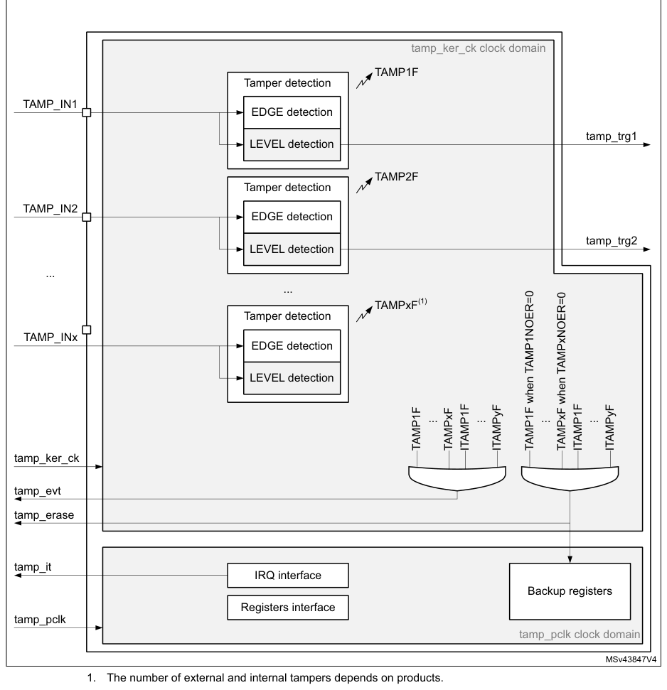

# 38 Tamper and backup registers (TAMP)

[← RM0440 index](../STM32G4_RM0440.md)

## 38.1 Introduction

32 (category 3 and category 4 devices) or 16 (category 2 devices) 32-bit backup registers are
retained in all low-power modes and also in VBAT mode. They can be used to store sensitive data as
their content is protected by an tamper detection circuit. 3 tamper pins and 4 internal tampers are
available for anti-tamper detection. The external tamper pins can be configured for edge detection,
or level detection with or without filtering.

## 38.2 TAMP main features

- 32 (category 3 and category 4 devices) or 16 (category 2 devices) backup registers:
  - the backup registers (TAMP_BKPxR) are implemented in the RTC domain that remains powered-on by
    VBAT when the VDD power is switched off.
- 3 external tamper detection events.
  - External passive tampers with configurable filter and internal pull-up.
- 4 internal tamper events.
- Any tamper detection can generate a RTC timestamp event.
- Any tamper detection can erase the backup registers.

## 38.3 TAMP functional description

### 38.3.1 TAMP block diagram

**Figure 533. TAMP block diagram**

tamp_ker_ck clock domain

TAMP1F

Tamper detection

TAMP_IN1

EDGE detection
tamp_trg1

LEVEL detection

TAMP2F

Tamper detection

TAMP_IN2

EDGE detection
tamp_trg2

LEVEL detection

...

...

TAMPxF(1)

Tamper detection

TAMP_INx

EDGE detection

LEVEL detection

1. The number of external and internal tampers depends on products.

### 38.3.2 TAMP pins and internal signals

**Table 346. TAMP input/output pins**

| Pin name | Signal type | Description |
| --- | --- | --- |
| TAMP_INx (x = pin index) | Input | Tamper input pin |

**Table 347. TAMP internal input/output signals**

| Source row | Column 1 | Column 2 | Column 3 |
| ---: | --- | --- | --- |
| 1 | `Internal signal name` | `Signal type` | `Description` |
| 2 | `TAMP kernel clock, connected to rtc_ker_ck` |  |  |
| 3 | `tamp_ker_ck` | `Input` |  |
| 4 | `and also named RTCCLK in this document` |  |  |
| 5 | `tamp_pclk` | `Input` | `TAMP APB clock, connected to rtc_pclk` |
| 6 | `tamp_itamp[y]` |  |  |
| 7 | `Inputs` | `Internal tamper event sources` |  |
| 8 | `(y = signal index)` |  |  |
| 9 | `Tamper event detection (internal or external)` |  |  |
| 10 | `tamp_evt` | `Output` | `The tamp_evt is used to generate a RTC` |
| 11 | `timestamp event` |  |  |
| 12 | `Device secrets erase request following tamper` |  |  |
| 13 | `tamp_erase` | `Output` |  |
| 14 | `event detection (internal or external)` |  |  |
| 15 | `TAMP interrupt (refer to Section 38.5: TAMP` |  |  |
| 16 | `tamp_it` | `Output` |  |
| 17 | `interrupts for details)` |  |  |
| 18 | `tamp_trg[x]` |  |  |
| 19 | `Output` | `Tamper detection trigger` |  |
| 20 | `(x = signal index)` |  |  |

The TAMP kernel clock is usually the LSE at 32.768 kHz although it is possible to select other clock
sources in the RCC (refer to RCC for more details). Some detections modes are not available in some
low-power modes or VBAT when the selected clock is not LSE (refer to [Section 38.4](#384-tamp-low-power-modes): TAMP low-power
modes for more details.

**Table 348. TAMP interconnection**

| Source row | Column 1 | Column 2 |
| ---: | --- | --- |
| 1 | `Signal name` | `Source/Destination` |
| 2 | `tamp_evt` | `rtc_tamp_evt used to generate a timestamp event` |
| 3 | `The tamp_erase signal is used to erase the device secrets listed` |  |
| 4 | `tamp_erase` |  |
| 5 | `hereafter: backup registers` |  |
| 6 | `tamp_itamp3` | `LSE monitoring` |
| 7 | `tamp_itamp4` | `HSE monitoring` |
| 8 | `tamp_itamp5` | `RTC calendar overflow (rtc_calovf)` |
| 9 | `tamp_itamp6` | `ST manufacturer readout` |

### 38.3.3 TAMP register write protection

After system reset, the TAMP registers (including backup registers) are protected against parasitic
write access by the DBP bit in the power control peripheral (refer to the PWR power control
section). DBP bit must be set in order to enable TAMP registers write access.

### 38.3.4 Tamper detection

The tamper detection can be configured for the following purposes:

- erase the backup registers (default configuration)
- generate an interrupt, capable to wakeup from Stop and Standby mode
- generate a hardware trigger for the low-power timers

#### TAMP backup registers

The backup registers (TAMP_BKPxR) are not reset by system reset or when the device wakes up from
Standby mode.

The backup registers are reset when a tamper detection event occurs except if the TAMPxNOER bit is
set, or if the TAMPxMSK is set in the TAMP_CR2 register.

> **Note:** The backup registers are also erased when the readout protection of the flash is changed
> from level 1 to level 0.

#### Tamper detection initialization

Each input can be enabled by setting the corresponding TAMPxE bits to 1 in the TAMP_CR register.

Each TAMP_INx tamper detection input is associated with a flag TAMPxF in the TAMP_SR register.

When TAMPxMSK is cleared:

The TAMPxF flag is asserted after the tamper event on the pin, with the latency provided below:

- 3 ck_apre cycles when TAMPFLT differs from 0x0 (level detection with filtering)
- 3 ck_apre cycles when TAMPTS = 1 (timestamp on tamper event)
- No latency when TAMPFLT = 0x0 (edge detection) and TAMPTS = 0

A new tamper occurring on the same pin during this period and as long as TAMPxF is set cannot be
detected.

When TAMPxMSK is set:

A new tamper occurring on the same pin cannot be detected during the latency described above and 2.5
ck_rtc additional cycles.

By setting the TAMPxIE bit in the TAMP_IER register, an interrupt is generated when a tamper
detection event occurs (when TAMPxF is set). Setting TAMPxIE is not allowed when the corresponding
TAMPxMSK is set.

#### Trigger output generation on tamper event

The tamper event detection can be used as trigger input by the low-power timers.

When TAMPxMSK bit in cleared in TAMP_CR register, the TAMPxF flag must be cleared by software in
order to allow a new tamper detection on the same pin.

When TAMPxMSK bit is set, the TAMPxF flag is masked, and kept cleared in TAMP_SR register. This
configuration allows to trig automatically the low-power timers in Stop mode, without requiring the
system wakeup to perform the TAMPxF clearing. In this case, the backup registers are not cleared.

This feature is available only when the tamper is configured in the Level detection with filtering
on tamper inputs (passive mode) mode (TAMPFLT ≠ 00 and active mode is not selected).

#### Timestamp on tamper event

With TAMPTS set to 1 in the RTC_CR, any tamper event causes a timestamp to occur. In this case,
either the TSF bit or the TSOVF bit is set in RTC_SR, in the same manner as if a normal timestamp
event occurs. The affected tamper flag register TAMPxF is set in the TAMP_SR at the same time that
TSF or TSOVF is set in the RTC_SR.

#### Edge detection on tamper inputs (passive mode)

If the TAMPFLT bits are 00, the TAMP_INx pins generate tamper detection events when either a rising
edge/high level or a falling edge/low level is observed depending on the corresponding TAMPxTRG bit.
The internal pull-up resistors on the TAMP_INx inputs are deactivated when edge detection is
selected.

> **Caution:** When using the edge detection, it is recommended to check by software the tamper pin
> level just after enabling the tamper detection (by reading the GPIO registers), and before writing
> sensitive values in the backup registers, to ensure that an active edge did not occur before
> enabling the tamper event detection. When TAMPFLT = 00 and TAMPxTRG = 0 (rising edge detection), a
> tamper event may be detected by hardware if the tamper input is already at high level before
> enabling the tamper detection.

After a tamper event has been detected and cleared, the TAMP_INx should be disabled and then
re-enabled (TAMPxE set to 1) before re-programming the backup registers (TAMP_BKPxR). This prevents
the application from writing to the backup registers while the TAMP_INx input value still indicates
a tamper detection. This is equivalent to a level detection on the TAMP_INx input.

> **Note:** Tamper detection is still active when VDD power is switched off. To avoid unwanted resetting
> of the backup registers, the pin to which the TAMPx is mapped should be externally tied to the
> correct level.

#### Level detection with filtering on tamper inputs (passive mode)

Level detection with filtering is performed by setting TAMPFLT to a non-zero value. A tamper
detection event is generated when either 2, 4, or 8 (depending on TAMPFLT) consecutive samples are
observed at the level designated by the TAMPxTRG bits.

The TAMP_INx inputs are precharged through the I/O internal pull-up resistance before its state is
sampled, unless disabled by setting TAMPPUDIS to 1. The duration of the precharge is determined by
the TAMPPRCH bits, allowing for larger capacitances on the TAMP_INx inputs.

The trade-off between tamper detection latency and power consumption through the pull-up can be
optimized by using TAMPFREQ to determine the frequency of the sampling for level detection.

> **Note:** Refer to the datasheet for the electrical characteristics of the pull-up resistors.

## 38.4 TAMP low-power modes

**Table 349. Effect of low-power modes on TAMP**

| Source row | Column 1 | Column 2 |
| ---: | --- | --- |
| 1 | `Mode` | `Description` |

No effect.

Sleep

TAMP interrupts cause the device to exit the Sleep mode.

No effect on all features, except for level detection with filtering mode which remain

| Source row | Column 1 | Column 2 |
| ---: | --- | --- |
| 1 | `Stop` | `active only when the clock source is LSE or LSI.` |

TAMP interrupts cause the device to exit the Stop mode.

No effect on all features, except for level detection with filtering mode which remain

| Source row | Column 1 | Column 2 |
| ---: | --- | --- |
| 1 | `Standby` | `active only when the clock source is LSE or LSI. TAMP interrupts cause the device to` |

exit the Standby mode.

No effect on all features, except for level detection with filtering mode which remain

| Source row | Column 1 | Column 2 |
| ---: | --- | --- |
| 1 | `Shutdown` | `active only when the clock source is LSE. TAMP interrupts cause the device to exit the` |

Shutdown mode.

## 38.5 TAMP interrupts

The interrupt channel is set in the interrupt status register. The interrupt output is also
activated.

**Table 350. Interrupt requests**

| Source row | Column 1 | Column 2 | Column 3 | Column 4 | Column 5 | Column 6 |
| ---: | --- | --- | --- | --- | --- | --- |
| 1 | `Exit from` |  |  |  |  |  |
| 2 | `Interrupt` | `Exit from` | `Exit from` |  |  |  |
| 3 | `Interrupt` | `Interrupt` | `Enable` | `Stop and` |  |  |
| 4 | `Event flag(1)` | `clear` | `Sleep` | `Shutdown` |  |  |
| 5 | `acronym` | `event` | `control bit(2)` | `Standby` |  |  |
| 6 | `method` | `mode` | `mode` |  |  |  |
| 7 | `modes` |  |  |  |  |  |
| 8 | `Write 1 in` |  |  |  |  |  |
| 9 | `Tamper x(3)` | `TAMPxF` | `TAMPxIE` | `Yes` | `Yes(4)` | `Yes(5)` |
| 10 | `CTAMPxF` |  |  |  |  |  |
| 11 | `TAMP` |  |  |  |  |  |
| 12 | `Internal` | `Write 1 in` |  |  |  |  |
| 13 | `ITAMPyF` | `ITAMPyIE` | `Yes` | `Yes(4)` | `Yes(5)` |  |
| 14 | `tamper y(3)` | `CITAMPxF` |  |  |  |  |

1. The event flags are in the TAMP_SR register.
2. The interrupt masked flags (resulting from event flags AND enable control bits) are in the
   TAMP_MISR register.
3. The number of tampers and internal tampers events depend on products.
4. In case of level detection with filtering passive tamper mode, wakeup from Stop and Standby modes
   is possible only when
   the TAMP clock source is LSE or LSI.
5. In case of level detection with filtering passive tamper mode, wakeup from Shutdown modes is
   possible only when the

TAMP clock source is LSE.

## 38.6 TAMP registers

Refer to [Section 1.2](chapter-01.md#12-list-of-abbreviations-for-registers) of the reference manual for a list of abbreviations used in register
descriptions. The peripheral registers can be accessed by words (32-bit).

### 38.6.1 TAMP control register 1 (TAMP_CR1)

- **Address offset:** 0x00

Backup domain reset value: 0xFFFF 0000

System reset: not affected

**Register bit layout**

| Bit | Field | Access | Summary |
| ---: | --- | :---: | --- |
| 31 | Reserved | — | kept at reset value. |
| 30 | Reserved | — | ↳ |
| 29 | Reserved | — | ↳ |
| 28 | Reserved | — | ↳ |
| 27 | Reserved | — | ↳ |
| 26 | Reserved | — | ↳ |
| 25 | Reserved | — | ↳ |
| 24 | Reserved | — | ↳ |
| 23 | Reserved | — | kept at reset value. |
| 22 | Reserved | — | kept at reset value. |
| 21 | `ITAMP6E` | rw | Internal tamper 6 enable: ST manufacturer readout |
| 20 | `ITAMP5E` | rw | Internal tamper 5 enable: RTC calendar overflow |
| 19 | `ITAMP4E` | rw | Internal tamper 4 enable: HSE monitoring |
| 18 | `ITAMP3E` | rw | Internal tamper 3 enable: LSE monitoring |
| 17 | Reserved | — | kept at reset value. |
| 16 | Reserved | — | kept at reset value. |
| 15 | Reserved | — | kept at reset value. |
| 14 | Reserved | — | ↳ |
| 13 | Reserved | — | ↳ |
| 12 | Reserved | — | ↳ |
| 11 | Reserved | — | ↳ |
| 10 | Reserved | — | ↳ |
| 9 | Reserved | — | ↳ |
| 8 | Reserved | — | ↳ |
| 7 | Reserved | — | ↳ |
| 6 | Reserved | — | ↳ |
| 5 | Reserved | — | ↳ |
| 4 | Reserved | — | ↳ |
| 3 | Reserved | — | ↳ |
| 2 | `TAMP3E` | rw | Tamper detection on TAMP_IN3 enable(1) |
| 1 | `TAMP2E` | rw | Tamper detection on TAMP_IN2 enable(1) |
| 0 | `TAMP1E` | rw | Tamper detection on TAMP_IN1 enable(1) |

**Bits 31:24 — Reserved:** kept at reset value.

**Bit 23 — Reserved:** kept at reset value.

**Bit 22 — Reserved:** kept at reset value.

**Bit 21 — `ITAMP6E`:** Internal tamper 6 enable: ST manufacturer readout

- `0`: Internal tamper 6 disabled.
- `1`: Internal tamper 6 enabled: a tamper is generated in case of ST manufacturer readout.

**Bit 20 — `ITAMP5E`:** Internal tamper 5 enable: RTC calendar overflow

- `0`: Internal tamper 5 disabled.
- `1`: Internal tamper 5 enabled: a tamper is generated when the RTC calendar reaches its
  maximum value, on the 31st of December 99, at 23:59:59. The calendar is then frozen and
  cannot overflow.

**Bit 19 — `ITAMP4E`:** Internal tamper 4 enable: HSE monitoring

- `0`: Internal tamper 4 disabled.
- `1`: Internal tamper 4 enabled. a tamper is generated when the HSE frequency is below or
  above thresholds.

**Bit 18 — `ITAMP3E`:** Internal tamper 3 enable: LSE monitoring

- `0`: Internal tamper 3 disabled.
- `1`: Internal tamper 3 enabled: a tamper is generated when the LSE frequency is below or
  above thresholds.

**Bit 17 — Reserved:** kept at reset value.

**Bit 16 — Reserved:** kept at reset value.

**Bits 15:3 — Reserved:** kept at reset value.

**Bit 2 — `TAMP3E`:** Tamper detection on TAMP_IN3 enable(1)

- `0`: Tamper detection on TAMP_IN3 is disabled.
- `1`: Tamper detection on TAMP_IN3 is enabled.

**Bit 1 — `TAMP2E`:** Tamper detection on TAMP_IN2 enable(1)

- `0`: Tamper detection on TAMP_IN2 is disabled.
- `1`: Tamper detection on TAMP_IN2 is enabled.

**Bit 0 — `TAMP1E`:** Tamper detection on TAMP_IN1 enable(1)

- `0`: Tamper detection on TAMP_IN1 is disabled.
- `1`: Tamper detection on TAMP_IN1 is enabled.

1. Tamper detection mode (selected with TAMP_FLTCR register and TAMPxTRG bits in TAMP_CR2), must be
   configured
   before enabling the tamper detection.

### 38.6.2 TAMP control register 2 (TAMP_CR2)

- **Address offset:** 0x04

Backup domain reset value: 0x0000 0000

System reset: not affected

**Register bit layout**

| Bit | Field | Access | Summary |
| ---: | --- | :---: | --- |
| 31 | Reserved | — | kept at reset value. |
| 30 | Reserved | — | ↳ |
| 29 | Reserved | — | ↳ |
| 28 | Reserved | — | ↳ |
| 27 | Reserved | — | ↳ |
| 26 | `TAMP3TRG` | rw | Active level for tamper 3 input (active mode disabled) |
| 25 | `TAMP2TRG` | rw | Active level for tamper 2 input (active mode disabled) |
| 24 | `TAMP1TRG` | rw | Active level for tamper 1 input (active mode disabled) |
| 23 | Reserved | — | kept at reset value. |
| 22 | Reserved | — | kept at reset value. |
| 21 | Reserved | — | ↳ |
| 20 | Reserved | — | ↳ |
| 19 | Reserved | — | ↳ |
| 18 | `TAMP3MSK` | rw | Tamper 3 mask |
| 17 | `TAMP2MSK` | rw | Tamper 2 mask |
| 16 | `TAMP1MSK` | rw | Tamper 1 mask |
| 15 | Reserved | — | kept at reset value. |
| 14 | Reserved | — | ↳ |
| 13 | Reserved | — | ↳ |
| 12 | Reserved | — | ↳ |
| 11 | Reserved | — | ↳ |
| 10 | Reserved | — | ↳ |
| 9 | Reserved | — | ↳ |
| 8 | Reserved | — | ↳ |
| 7 | Reserved | — | ↳ |
| 6 | Reserved | — | ↳ |
| 5 | Reserved | — | ↳ |
| 4 | Reserved | — | ↳ |
| 3 | Reserved | — | ↳ |
| 2 | `TAMP3NOER` | rw | Tamper 3 no erase |
| 1 | `TAMP2NOER` | rw | Tamper 2 no erase |
| 0 | `TAMP1NOER` | rw | Tamper 1 no erase |

**Bits 31:27 — Reserved:** kept at reset value.

**Bit 26 — `TAMP3TRG`:** Active level for tamper 3 input (active mode disabled)

0:If TAMPFLT ≠ 00 Tamper 3 input staying low triggers a tamper detection event.

If TAMPFLT = 00 Tamper 3 input rising edge and high level triggers a tamper detection
event.

1:If TAMPFLT ≠ 00 Tamper 3 input staying high triggers a tamper detection event.

If TAMPFLT = 00 Tamper 3 input falling edge and low level triggers a tamper detection
event.

**Bit 25 — `TAMP2TRG`:** Active level for tamper 2 input (active mode disabled)

0:If TAMPFLT ≠ 00 Tamper 2 input staying low triggers a tamper detection event.

If TAMPFLT = 00 Tamper 2 input rising edge and high level triggers a tamper detection
event.

1:If TAMPFLT ≠ 00 Tamper 2 input staying high triggers a tamper detection event.

If TAMPFLT = 00 Tamper 2 input falling edge and low level triggers a tamper detection
event.

**Bit 24 — `TAMP1TRG`:** Active level for tamper 1 input (active mode disabled)

0:If TAMPFLT ≠ 00 Tamper 1 input staying low triggers a tamper detection event.

If TAMPFLT = 00 Tamper 1 input rising edge and high level triggers a tamper detection
event.

1:If TAMPFLT ≠ 00 Tamper 1 input staying high triggers a tamper detection event.

If TAMPFLT = 00 Tamper 1 input falling edge and low level triggers a tamper detection
event.

**Bit 23 — Reserved:** kept at reset value.

**Bits 22:19 — Reserved:** kept at reset value.

**Bit 18 — `TAMP3MSK`:** Tamper 3 mask

- `0`: Tamper 3 event generates a trigger event and TAMP3F must be cleared by software to
  allow next tamper event detection.
- `1`: Tamper 3 event generates a trigger event. TAMP3F is masked and internally cleared by
  hardware. The backup registers are not erased.

The tamper 3 interrupt must not be enabled when TAMP3MSK is set.

**Bit 17 — `TAMP2MSK`:** Tamper 2 mask

- `0`: Tamper 2 event generates a trigger event and TAMP2F must be cleared by software to
  allow next tamper event detection.
- `1`: Tamper 2 event generates a trigger event. TAMP2F is masked and internally cleared by
  hardware. The backup registers are not erased.

The tamper 2 interrupt must not be enabled when TAMP2MSK is set.

**Bit 16 — `TAMP1MSK`:** Tamper 1 mask

- `0`: Tamper 1 event generates a trigger event and TAMP1F must be cleared by software to
  allow next tamper event detection.
- `1`: Tamper 1 event generates a trigger event. TAMP1F is masked and internally cleared by
  hardware. The backup registers are not erased.

The tamper 1 interrupt must not be enabled when TAMP1MSK is set.

**Bits 15:3 — Reserved:** kept at reset value.

**Bit 2 — `TAMP3NOER`:** Tamper 3 no erase

- `0`: Tamper 3 event erases the backup registers.
- `1`: Tamper 3 event does not erase the backup registers.

**Bit 1 — `TAMP2NOER`:** Tamper 2 no erase

- `0`: Tamper 2 event erases the backup registers.
- `1`: Tamper 2 event does not erase the backup registers.

**Bit 0 — `TAMP1NOER`:** Tamper 1 no erase

- `0`: Tamper 1 event erases the backup registers.
- `1`: Tamper 1 event does not erase the backup registers.

### 38.6.3 TAMP filter control register (TAMP_FLTCR)

- **Address offset:** 0x0C

Backup domain reset value: 0x0000 0000

System reset: not affected

**Register bit layout**

| Bit | Field | Access | Summary |
| ---: | --- | :---: | --- |
| 31 | Reserved | — | kept at reset value. |
| 30 | Reserved | — | ↳ |
| 29 | Reserved | — | ↳ |
| 28 | Reserved | — | ↳ |
| 27 | Reserved | — | ↳ |
| 26 | Reserved | — | ↳ |
| 25 | Reserved | — | ↳ |
| 24 | Reserved | — | ↳ |
| 23 | Reserved | — | ↳ |
| 22 | Reserved | — | ↳ |
| 21 | Reserved | — | ↳ |
| 20 | Reserved | — | ↳ |
| 19 | Reserved | — | ↳ |
| 18 | Reserved | — | ↳ |
| 17 | Reserved | — | ↳ |
| 16 | Reserved | — | ↳ |
| 15 | Reserved | — | ↳ |
| 14 | Reserved | — | ↳ |
| 13 | Reserved | — | ↳ |
| 12 | Reserved | — | ↳ |
| 11 | Reserved | — | ↳ |
| 10 | Reserved | — | ↳ |
| 9 | Reserved | — | ↳ |
| 8 | Reserved | — | ↳ |
| 7 | `TAMPPUDIS` | rw | TAMP_INx pull-up disable |
| 6 | `TAMPPRCH[1]` | rw | TAMP_INx precharge duration |
| 5 | `TAMPPRCH[0]` | rw | ↳ |
| 4 | `TAMPFLT[1]` | rw | TAMP_INx filter count |
| 3 | `TAMPFLT[0]` | rw | ↳ |
| 2 | `TAMPFREQ[2]` | rw | Tamper sampling frequency |
| 1 | `TAMPFREQ[1]` | rw | ↳ |
| 0 | `TAMPFREQ[0]` | rw | ↳ |

**Bits 31:8 — Reserved:** kept at reset value.

**Bit 7 — `TAMPPUDIS`:** TAMP_INx pull-up disable

This bit determines if each of the TAMPx pins are precharged before each sample.

- `0`: Precharge TAMP_INx pins before sampling (enable internal pull-up)
- `1`: Disable precharge of TAMP_INx pins.

**Bits 6:5 — `TAMPPRCH[1:0]`:** TAMP_INx precharge duration

These bit determines the duration of time during which the pull-up/is activated before each
sample. TAMPPRCH is valid for each of the TAMP_INx inputs.

- `0x0`: 1 RTCCLK cycle
- `0x1`: 2 RTCCLK cycles

0x2: 4 RTCCLK cycles

0x3: 8 RTCCLK cycles

**Bits 4:3 — `TAMPFLT[1:0]`:** TAMP_INx filter count

These bits determines the number of consecutive samples at the specified level

(TAMP*TRG) needed to activate a tamper event. TAMPFLT is valid for each of the

TAMP_INx inputs.

- `0x0`: Tamper event is activated on edge of TAMP_INx input transitions to the active level (no
  internal pull-up on TAMP_INx input).
- `0x1`: Tamper event is activated after 2 consecutive samples at the active level.

0x2: Tamper event is activated after 4 consecutive samples at the active level.

0x3: Tamper event is activated after 8 consecutive samples at the active level.

**Bits 2:0 — `TAMPFREQ[2:0]`:** Tamper sampling frequency

Determines the frequency at which each of the TAMP_INx inputs are sampled.

- `0x0`: RTCCLK / 32768 (1 Hz when RTCCLK = 32768 Hz)
- `0x1`: RTCCLK / 16384 (2 Hz when RTCCLK = 32768 Hz)

0x2: RTCCLK / 8192 (4 Hz when RTCCLK = 32768 Hz)

0x3: RTCCLK / 4096 (8 Hz when RTCCLK = 32768 Hz)

0x4: RTCCLK / 2048 (16 Hz when RTCCLK = 32768 Hz)

0x5: RTCCLK / 1024 (32 Hz when RTCCLK = 32768 Hz)

0x6: RTCCLK / 512 (64 Hz when RTCCLK = 32768 Hz)

0x7: RTCCLK / 256 (128 Hz when RTCCLK = 32768 Hz)

> **Note:** This register concerns only the tamper inputs in passive mode.

### 38.6.4 TAMP interrupt enable register (TAMP_IER)

- **Address offset:** 0x2C

Backup domain reset value: 0x0000 0000

System reset: not affected

**Register bit layout**

| Bit | Field | Access | Summary |
| ---: | --- | :---: | --- |
| 31 | Reserved | — | kept at reset value. |
| 30 | Reserved | — | ↳ |
| 29 | Reserved | — | ↳ |
| 28 | Reserved | — | ↳ |
| 27 | Reserved | — | ↳ |
| 26 | Reserved | — | ↳ |
| 25 | Reserved | — | ↳ |
| 24 | Reserved | — | ↳ |
| 23 | Reserved | — | kept at reset value. |
| 22 | Reserved | — | kept at reset value. |
| 21 | `ITAMP6IE` | rw | Internal tamper 6 interrupt enable: ST manufacturer readout |
| 20 | `ITAMP5IE` | rw | Internal tamper 5 interrupt enable: RTC calendar overflow |
| 19 | `ITAMP4IE` | rw | Internal tamper 4 interrupt enable: HSE monitoring |
| 18 | `ITAMP3IE` | rw | Internal tamper 3 interrupt enable: LSE monitoring |
| 17 | Reserved | — | kept at reset value. |
| 16 | Reserved | — | kept at reset value. |
| 15 | Reserved | — | kept at reset value. |
| 14 | Reserved | — | ↳ |
| 13 | Reserved | — | ↳ |
| 12 | Reserved | — | ↳ |
| 11 | Reserved | — | ↳ |
| 10 | Reserved | — | ↳ |
| 9 | Reserved | — | ↳ |
| 8 | Reserved | — | ↳ |
| 7 | Reserved | — | ↳ |
| 6 | Reserved | — | ↳ |
| 5 | Reserved | — | ↳ |
| 4 | Reserved | — | ↳ |
| 3 | Reserved | — | ↳ |
| 2 | `TAMP3IE` | rw | Tamper 3 interrupt enable |
| 1 | `TAMP2IE` | rw | Tamper 2 interrupt enable |
| 0 | `TAMP1IE` | rw | Tamper 1 interrupt enable |

**Bits 31:24 — Reserved:** kept at reset value.

**Bit 23 — Reserved:** kept at reset value.

**Bit 22 — Reserved:** kept at reset value.

**Bit 21 — `ITAMP6IE`:** Internal tamper 6 interrupt enable: ST manufacturer readout

- `0`: Internal tamper 6 interrupt disabled.
- `1`: Internal tamper 6 interrupt enabled.

**Bit 20 — `ITAMP5IE`:** Internal tamper 5 interrupt enable: RTC calendar overflow

- `0`: Internal tamper 5 interrupt disabled.
- `1`: Internal tamper 5 interrupt enabled.

**Bit 19 — `ITAMP4IE`:** Internal tamper 4 interrupt enable: HSE monitoring

- `0`: Internal tamper 4 interrupt disabled.
- `1`: Internal tamper 4 interrupt enabled.

**Bit 18 — `ITAMP3IE`:** Internal tamper 3 interrupt enable: LSE monitoring

- `0`: Internal tamper 3 interrupt disabled.
- `1`: Internal tamper 3 interrupt enabled.

**Bit 17 — Reserved:** kept at reset value.

**Bit 16 — Reserved:** kept at reset value.

**Bits 15:3 — Reserved:** kept at reset value.

**Bit 2 — `TAMP3IE`:** Tamper 3 interrupt enable

- `0`: Tamper 3 interrupt disabled.
- `1`: Tamper 3 interrupt enabled..

**Bit 1 — `TAMP2IE`:** Tamper 2 interrupt enable

- `0`: Tamper 2 interrupt disabled.
- `1`: Tamper 2 interrupt enabled.

**Bit 0 — `TAMP1IE`:** Tamper 1 interrupt enable

- `0`: Tamper 1 interrupt disabled.
- `1`: Tamper 1 interrupt enabled.

### 38.6.5 TAMP status register (TAMP_SR)

- **Address offset:** 0x30

Backup domain reset value: 0x0000 0000

System reset: not affected

**Register bit layout**

| Bit | Field | Access | Summary |
| ---: | --- | :---: | --- |
| 31 | Reserved | — | kept at reset value. |
| 30 | Reserved | — | ↳ |
| 29 | Reserved | — | ↳ |
| 28 | Reserved | — | ↳ |
| 27 | Reserved | — | ↳ |
| 26 | Reserved | — | ↳ |
| 25 | Reserved | — | ↳ |
| 24 | Reserved | — | ↳ |
| 23 | Reserved | — | kept at reset value. |
| 22 | Reserved | — | kept at reset value. |
| 21 | `ITAMP6F` | r | ST manufacturer readout tamper detection flag |
| 20 | `ITAMP5F` | r | RTC calendar overflow tamper detection flag |
| 19 | `ITAMP4F` | r | HSE monitoring tamper detection flag |
| 18 | `ITAMP3F` | r | LSE monitoring tamper detection flag |
| 17 | Reserved | — | kept at reset value. |
| 16 | Reserved | — | kept at reset value. |
| 15 | Reserved | — | kept at reset value. |
| 14 | Reserved | — | ↳ |
| 13 | Reserved | — | ↳ |
| 12 | Reserved | — | ↳ |
| 11 | Reserved | — | ↳ |
| 10 | Reserved | — | ↳ |
| 9 | Reserved | — | ↳ |
| 8 | Reserved | — | ↳ |
| 7 | Reserved | — | ↳ |
| 6 | Reserved | — | ↳ |
| 5 | Reserved | — | ↳ |
| 4 | Reserved | — | ↳ |
| 3 | Reserved | — | ↳ |
| 2 | `TAMP3F` | r | TAMP3 detection flag |
| 1 | `TAMP2F` | r | TAMP2 detection flag |
| 0 | `TAMP1F` | r | TAMP1 detection flag |

**Bits 31:24 — Reserved:** kept at reset value.

**Bit 23 — Reserved:** kept at reset value.

**Bit 22 — Reserved:** kept at reset value.

**Bit 21 — `ITAMP6F`:** ST manufacturer readout tamper detection flag

This flag is set by hardware when a tamper detection event is detected on the internal
tamper 6.

**Bit 20 — `ITAMP5F`:** RTC calendar overflow tamper detection flag

This flag is set by hardware when a tamper detection event is detected on the internal
tamper 5.

**Bit 19 — `ITAMP4F`:** HSE monitoring tamper detection flag

This flag is set by hardware when a tamper detection event is detected on the internal
tamper 4.

**Bit 18 — `ITAMP3F`:** LSE monitoring tamper detection flag

This flag is set by hardware when a tamper detection event is detected on the internal
tamper 3.

**Bit 17 — Reserved:** kept at reset value.

**Bit 16 — Reserved:** kept at reset value.

**Bits 15:3 — Reserved:** kept at reset value.

**Bit 2 — `TAMP3F`:** TAMP3 detection flag

This flag is set by hardware when a tamper detection event is detected on the TAMP3 input.

**Bit 1 — `TAMP2F`:** TAMP2 detection flag

This flag is set by hardware when a tamper detection event is detected on the TAMP2 input.

**Bit 0 — `TAMP1F`:** TAMP1 detection flag

This flag is set by hardware when a tamper detection event is detected on the TAMP1 input.

### 38.6.6 TAMP masked interrupt status register (TAMP_MISR)

- **Address offset:** 0x34

Backup domain reset value: 0x0000 0000

System reset: not affected

**Register bit layout**

| Bit | Field | Access | Summary |
| ---: | --- | :---: | --- |
| 31 | Reserved | — | kept at reset value. |
| 30 | Reserved | — | ↳ |
| 29 | Reserved | — | ↳ |
| 28 | Reserved | — | ↳ |
| 27 | Reserved | — | ↳ |
| 26 | Reserved | — | ↳ |
| 25 | Reserved | — | ↳ |
| 24 | Reserved | — | ↳ |
| 23 | Reserved | — | kept at reset value. |
| 22 | Reserved | — | kept at reset value. |
| 21 | `ITAMP6MF` | r | ST manufacturer readout tamper interrupt masked flag |
| 20 | `ITAMP5MF` | r | RTC calendar overflow tamper interrupt masked flag |
| 19 | `ITAMP4MF` | r | HSE monitoring tamper interrupt masked flag |
| 18 | `ITAMP3MF` | r | LSE monitoring tamper interrupt masked flag |
| 17 | Reserved | — | kept at reset value. |
| 16 | Reserved | — | kept at reset value. |
| 15 | Reserved | — | kept at reset value. |
| 14 | Reserved | — | ↳ |
| 13 | Reserved | — | ↳ |
| 12 | Reserved | — | ↳ |
| 11 | Reserved | — | ↳ |
| 10 | Reserved | — | ↳ |
| 9 | Reserved | — | ↳ |
| 8 | Reserved | — | ↳ |
| 7 | Reserved | — | ↳ |
| 6 | Reserved | — | ↳ |
| 5 | Reserved | — | ↳ |
| 4 | Reserved | — | ↳ |
| 3 | Reserved | — | ↳ |
| 2 | `TAMP3MF` | r | TAMP3 interrupt masked flag |
| 1 | `TAMP2MF` | r | TAMP2 interrupt masked flag |
| 0 | `TAMP1MF` | r | TAMP1 interrupt masked flag |

**Bits 31:24 — Reserved:** kept at reset value.

**Bit 23 — Reserved:** kept at reset value.

**Bit 22 — Reserved:** kept at reset value.

**Bit 21 — `ITAMP6MF`:** ST manufacturer readout tamper interrupt masked flag

This flag is set by hardware when the internal tamper 6 interrupt is raised.

**Bit 20 — `ITAMP5MF`:** RTC calendar overflow tamper interrupt masked flag

This flag is set by hardware when the internal tamper 5 interrupt is raised.

**Bit 19 — `ITAMP4MF`:** HSE monitoring tamper interrupt masked flag

This flag is set by hardware when the internal tamper 4 interrupt is raised.

**Bit 18 — `ITAMP3MF`:** LSE monitoring tamper interrupt masked flag

This flag is set by hardware when the internal tamper 3 interrupt is raised.

**Bit 17 — Reserved:** kept at reset value.

**Bit 16 — Reserved:** kept at reset value.

**Bits 15:3 — Reserved:** kept at reset value.

**Bit 2 — `TAMP3MF`:** TAMP3 interrupt masked flag

This flag is set by hardware when the tamper 3 interrupt is raised.

**Bit 1 — `TAMP2MF`:** TAMP2 interrupt masked flag

This flag is set by hardware when the tamper 2 interrupt is raised.

**Bit 0 — `TAMP1MF`:** TAMP1 interrupt masked flag

This flag is set by hardware when the tamper 1 interrupt is raised.

### 38.6.7 TAMP status clear register (TAMP_SCR)

- **Address offset:** 0x3C

System reset value: 0x0000 0000

**Register bit layout**

| Bit | Field | Access | Summary |
| ---: | --- | :---: | --- |
| 31 | Reserved | — | kept at reset value. |
| 30 | Reserved | — | ↳ |
| 29 | Reserved | — | ↳ |
| 28 | Reserved | — | ↳ |
| 27 | Reserved | — | ↳ |
| 26 | Reserved | — | ↳ |
| 25 | Reserved | — | ↳ |
| 24 | Reserved | — | ↳ |
| 23 | Reserved | — | kept at reset value. |
| 22 | Reserved | — | kept at reset value. |
| 21 | `CITAMP6F` | w | Clear ITAMP6 detection flag |
| 20 | `CITAMP5F` | w | Clear ITAMP5 detection flag |
| 19 | `CITAMP4F` | w | Clear ITAMP4 detection flag |
| 18 | `CITAMP3F` | w | Clear ITAMP3 detection flag |
| 17 | Reserved | — | kept at reset value. |
| 16 | Reserved | — | kept at reset value. |
| 15 | Reserved | — | kept at reset value. |
| 14 | Reserved | — | ↳ |
| 13 | Reserved | — | ↳ |
| 12 | Reserved | — | ↳ |
| 11 | Reserved | — | ↳ |
| 10 | Reserved | — | ↳ |
| 9 | Reserved | — | ↳ |
| 8 | Reserved | — | ↳ |
| 7 | Reserved | — | ↳ |
| 6 | Reserved | — | ↳ |
| 5 | Reserved | — | ↳ |
| 4 | Reserved | — | ↳ |
| 3 | Reserved | — | ↳ |
| 2 | `CTAMP3F` | w | Clear TAMP3 detection flag |
| 1 | `CTAMP2F` | w | Clear TAMP2 detection flag |
| 0 | `CTAMP1F` | w | Clear TAMP1 detection flag |

**Bits 31:24 — Reserved:** kept at reset value.

**Bit 23 — Reserved:** kept at reset value.

**Bit 22 — Reserved:** kept at reset value.

**Bit 21 — `CITAMP6F`:** Clear ITAMP6 detection flag

Writing 1 in this bit clears the ITAMP6F bit in the TAMP_SR register.

**Bit 20 — `CITAMP5F`:** Clear ITAMP5 detection flag

Writing 1 in this bit clears the ITAMP5F bit in the TAMP_SR register.

**Bit 19 — `CITAMP4F`:** Clear ITAMP4 detection flag

Writing 1 in this bit clears the ITAMP4F bit in the TAMP_SR register.

**Bit 18 — `CITAMP3F`:** Clear ITAMP3 detection flag

Writing 1 in this bit clears the ITAMP3F bit in the TAMP_SR register.

**Bit 17 — Reserved:** kept at reset value.

**Bit 16 — Reserved:** kept at reset value.

**Bits 15:3 — Reserved:** kept at reset value.

**Bit 2 — `CTAMP3F`:** Clear TAMP3 detection flag

Writing 1 in this bit clears the TAMP3F bit in the TAMP_SR register.

**Bit 1 — `CTAMP2F`:** Clear TAMP2 detection flag

Writing 1 in this bit clears the TAMP2F bit in the TAMP_SR register.

**Bit 0 — `CTAMP1F`:** Clear TAMP1 detection flag

Writing 1 in this bit clears the TAMP1F bit in the TAMP_SR register.

### 38.6.8 TAMP backup x register (TAMP_BKPxR)

- **Address offset:** 0x100 \+ 0x04 \* x, (x = 0 to 31)

Backup domain reset value: 0x0000 0000

System reset: not affected

**Register bit layout**

| Bit | Field | Access | Summary |
| ---: | --- | :---: | --- |
| 31 | `BKP[31]` | rw | — |
| 30 | `BKP[30]` | rw | ↳ |
| 29 | `BKP[29]` | rw | ↳ |
| 28 | `BKP[28]` | rw | ↳ |
| 27 | `BKP[27]` | rw | ↳ |
| 26 | `BKP[26]` | rw | ↳ |
| 25 | `BKP[25]` | rw | ↳ |
| 24 | `BKP[24]` | rw | ↳ |
| 23 | `BKP[23]` | rw | ↳ |
| 22 | `BKP[22]` | rw | ↳ |
| 21 | `BKP[21]` | rw | ↳ |
| 20 | `BKP[20]` | rw | ↳ |
| 19 | `BKP[19]` | rw | ↳ |
| 18 | `BKP[18]` | rw | ↳ |
| 17 | `BKP[17]` | rw | ↳ |
| 16 | `BKP[16]` | rw | ↳ |
| 15 | `BKP[15]` | rw | ↳ |
| 14 | `BKP[14]` | rw | ↳ |
| 13 | `BKP[13]` | rw | ↳ |
| 12 | `BKP[12]` | rw | ↳ |
| 11 | `BKP[11]` | rw | ↳ |
| 10 | `BKP[10]` | rw | ↳ |
| 9 | `BKP[9]` | rw | ↳ |
| 8 | `BKP[8]` | rw | ↳ |
| 7 | `BKP[7]` | rw | ↳ |
| 6 | `BKP[6]` | rw | ↳ |
| 5 | `BKP[5]` | rw | ↳ |
| 4 | `BKP[4]` | rw | ↳ |
| 3 | `BKP[3]` | rw | ↳ |
| 2 | `BKP[2]` | w | ↳ |
| 1 | `BKP[1]` | rw | ↳ |
| 0 | `BKP[0]` | rw | ↳ |

**Bits 31:0 — `BKP[31:0]`:**

The application can write or read data to and from these registers.

They are powered-on by VBAT when VDD is switched off, so that they are not reset by System
reset, and their contents remain valid when the device operates in low-power mode.

In the default configuration this register is reset on a tamper detection event. It is forced to
reset value as long as there is at least one internal or external tamper flag being set. This
register is also reset when the readout protection (RDP) is disabled.

### 38.6.9 TAMP register map

**Register summary**

| Offset | Register | Reset value |
| --- | --- | --- |
| 0x00 | `TAMP_CR1` | — |
| 0x04 | `TAMP_CR2` | — |
| 0x0C | `TAMP_FLTCR` | — |
| 0x2C | `TAMP_IER` | — |
| 0x30 | `TAMP_SR` | — |
| 0x34 | `TAMP_MISR` | — |
| 0x3C | `TAMP_SCR` | — |
| 0x100 \+ 0x04 \* x, (x = 0 to 31) | `TAMP_BKPxR` | — |

Refer to [Section 2.2](chapter-02.md#22-memory-organization) for the register boundary addresses.
