# 39 Inter-integrated circuit interface (I2C)

[← RM0440 index](../STM32G4_RM0440.md)

## 39.1 I2C introduction

The I2C peripheral handles the interface between the device and the serial I²C (inter-integrated
circuit) bus. It provides multicontroller capability, and controls all I²C-bus-specific sequencing,
protocol, arbitration and timing. It supports Standard-mode (Sm), Fast-mode (Fm) and Fast-mode Plus
(Fm+).

The I2C peripheral is also SMBus (system management bus) and PMBus® (power management bus)
compatible.

It can use DMA to reduce the CPU load.

## 39.2 I2C main features

- I²C-bus specification rev03 compatibility:
  - Target and controller modes
  - Multicontroller capability
  - Standard-mode (up to 100 kHz)
  - Fast-mode (up to 400 kHz)
  - Fast-mode Plus (up to 1 MHz)
  - 7-bit and 10-bit addressing mode
  - Multiple 7-bit target addresses (2 addresses, 1 with configurable mask)
  - All 7-bit-addresses acknowledge mode
  - General call
  - Programmable setup and hold times
  - Easy-to-use event management
  - Clock stretching (optional)
- 1-byte buffer with DMA capability
- Programmable analog and digital noise filters
- SMBus specification rev 3.0 compatibility(a):
  - Hardware PEC (packet error checking) generation and verification with ACK control
  - Command and data acknowledge control
  - Address resolution protocol (ARP) support
  - Host and device support
  - SMBus alert
  - Timeouts and idle condition detection
- PMBus rev 1.3 standard compatibility
- Independent clock
  a. To check the compliance of the GPIOs selected for SMBus with the specified logical levels, refer
  to the product datasheet.
- Wake-up from Stop mode on address match

For information on I2C instantiation, refer to [Section 39.3](#393-i2c-implementation): I2C implementation.

## 39.3 I2C implementation

This section provides an implementation overview with respect to the I2C instantiation.

**Table 352. I2C implementation**

| I2C features(1) | I2C1 | I2C2 | I2C3 | I2C4 |
| --- | --- | --- | --- | --- |
| 7-bit addressing mode | X | X | X | X |
| 10-bit addressing mode | X | X | X | X |
| Standard-mode (up to 100 kbit/s) | X | X | X | X |
| Fast-mode (up to 400 kbit/s) | X | X | X | X |
| Fast-mode Plus with 20 mA output drive I/Os (up to 1 Mbit/s) | X | X | X | X |
| Independent clock | X | X | X | X |
| Wake-up from Stop 1 mode | X | X | X | X |
| SMBus/PMBus | X | X | X | X |

1. X = supported.

## 39.4 I2C functional description

In addition to receiving and transmitting data, the peripheral converts them from serial to parallel
format and vice versa. The interrupts are enabled or disabled by software. The peripheral is
connected to the I²C-bus through a data pin (SDA) and a clock pin (SCL). It supports Standard-mode
(up to 100 kHz), Fast-mode (up to 400 kHz), and Fast-mode Plus (up to 1 MHz) I²C-bus.

The peripheral can also be connected to an SMBus, through the data pin (SDA), the clock pin (SCL),
and an optional SMBus alert pin (SMBA).

The independent clock function allows the I2C communication speed to be independent of the PCLK1
frequency.

For I2C I/Os supporting 20 mA output current drive for Fast-mode Plus operation, the driving
capability is enabled through control bits in the system configuration block(SYSCFG).

### 39.4.1 I2C block diagram

**Figure 534. Block diagram**

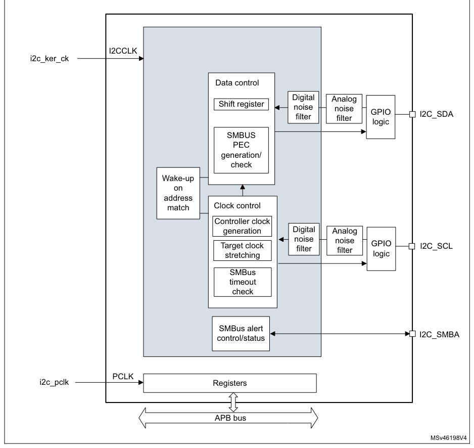

I2CCLK
i2c_ker_ck

Data control

Digital Analog

Shift register
noise noise

GPIO

I2C_SDA
filter filter
logic

SMBUS

PEC
generation/
check

Wake-up
on
address

### 39.4.2 I2C pins and internal signals

**Table 353. I2C input/output pins**

| Pin name | Signal type | Description |
| --- | --- | --- |
| I2C_SDA | Bidirectional | I²C-bus data |
| I2C_SCL | Bidirectional | I²C-bus clock |
| I2C_SMBA | Bidirectional | SMBus alert |

**Table 354. I2C internal input/output signals**

| Source row | Column 1 | Column 2 | Column 3 |
| ---: | --- | --- | --- |
| 1 | `Internal signal name Signal type` | `Description` |  |
| 2 | `i2c_ker_ck` | `Input` | `I2C kernel clock, also named I2CCLK in this document` |
| 3 | `i2c_pclk` | `Input` | `I2C APB clock` |
| 4 | `i2c_it` | `Output` | `I2C interrupts, refer to Table 368 for the list of interrupt sources` |
| 5 | `i2c_rx_dma` | `Output` | `I2C receive data DMA request (I2C_RX)` |
| 6 | `i2c_tx_dma` | `Output` | `I2C transmit data DMA request (I2C_TX)` |

### 39.4.3 I2C clock requirements

The I2C kernel is clocked by I2CCLK.

The I2CCLK period tI2CCLK must respect the following conditions:

tI2CCLK \< (tLOW - tfilters) / 4
tI2CCLK \< tHIGH
where tLOW is the SCL low time, tHIGH is the SCL high time, and tfilters is the sum of the analog
and digital filter delays (when enabled).

The digital filter delay is DNF[3:0] x tI2CCLK.

The PCLK1 clock period tPCLK must respect the condition tPCLK \< 4/3 tSCL, where tSCL is the SCL
period.

> **Caution:** When the I2C kernel is clocked by PCLK1, this clock must respect the conditions for tI2CCLK.

### 39.4.4 I2C mode selection

The peripheral can operate as:

- Target transmitter
- Target receiver
- Controller transmitter
- Controller receiver

By default, the peripheral operates in target mode. It automatically switches from target to
controller mode upon generating START condition, and from controller to target mode upon arbitration
loss or upon generating STOP condition. This allows the use of the I2C peripheral in a
multicontroller I²C-bus environment.

#### Communication flow

In controller mode, the I2C peripheral initiates a data transfer and generates the clock signal.
Serial data transfers always begin with a START condition and end with a STOP condition. Both START
and STOP conditions are generated in controller mode by software.

In target mode, the peripheral recognizes its own 7-bit or 10-bit address, and the general call
address. The general call address detection can be enabled or disabled by software. The reserved
SMBus addresses can also be enabled by software.

Data and addresses are transferred as 8-bit bytes, MSB first. The address is contained in the first
byte (7-bit addressing) or in the first two bytes (10-bit addressing) following the START condition.
The address is always transmitted in controller mode.

The following figure shows the transmission of a single byte. The controller generates nine SCL
pulses. The transmitter sends the eight data bits to the receiver with the SCL pulses 1 to 8. Then
the receiver sends the acknowledge bit to the transmitter with the ninth SCL pulse.

**Figure 535. I²C-bus protocol**

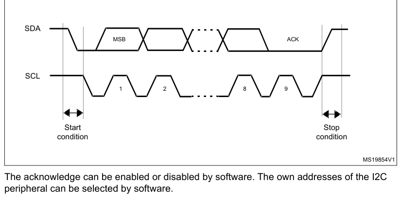

The acknowledge can be enabled or disabled by software. The own addresses of the I2C peripheral can
be selected by software.

### 39.4.5 I2C initialization

#### Enabling and disabling the peripheral

Before enabling the I2C peripheral, configure and enable its clock through the RCC, and initialize
its control registers.

The I2C peripheral can then be enabled by setting the PE bit of the I2C_CR1 register.

Disabling the I2C peripheral by clearing the PE bit resets the I2C peripheral. Refer to Section
39.4.6 for more details.

#### Noise filters

Before enabling the I2C peripheral by setting the PE bit of the I2C_CR1 register, the user must
configure the analog and/or digital noise filters, as required.

The analog noise filter on the SDA and SCL inputs complies with the I²C-bus specification which
requires, in Fast-mode and Fast-mode Plus, the suppression of spikes shorter than 50 ns. Enabled by
default, it can be disabled by setting the ANFOFF bit.

The digital filter is controlled through the DNF[3:0] bitfield of the I2C_CR1 register. When it is
enabled, the internal SCL and SDA signals only take the level of their corresponding I²C-bus line
when remaining stable for more than DNF[3:0] periods of I2CCLK. This allows suppressing spikes
shorter than the filtering capacity period programmable from one to fifteen I2CCLK periods.

The following table compares the two filters.

**Table 355. Comparison of analog and digital filters**

| Item | Analog filter | Digital filter |
| --- | --- | --- |
| Filtering capacity(1) | ≥ 50 ns | One to fifteen I2CCLK periods |

- Programmable filtering capacity
- Extra filtering capability versus I²C-bus

| Source row | Column 1 | Column 2 |
| ---: | --- | --- |
| 1 | `Benefits` | `Available in Stop mode` |
| 2 | `specification requirements` |  |

- Stable filtering capacity

Filtering capacity

| Source row | Column 1 | Column 2 |
| ---: | --- | --- |
| 1 | `variation with` | `Wake-up from Stop mode on address match not` |
| 2 | `Drawbacks` |  |
| 3 | `temperature, voltage, and` | `supported when the digital filter is enabled` |
| 4 | `silicon process` |  |

1. Maximum duration of spikes that the filter can suppress

> **Caution:** The filter configuration cannot be changed when the I2C peripheral is enabled.

#### I2C timings

To ensure correct data hold and setup times, the corresponding timings must be configured through
the PRESC[3:0], SCLDEL[3:0], and SDADEL[3:0] bitfields of the I2C_TIMINGR register.

The STM32CubeMX tool calculates and provides the I2C_TIMINGR content in the I2C configuration
window.

**Figure 536. Setup and hold timings**

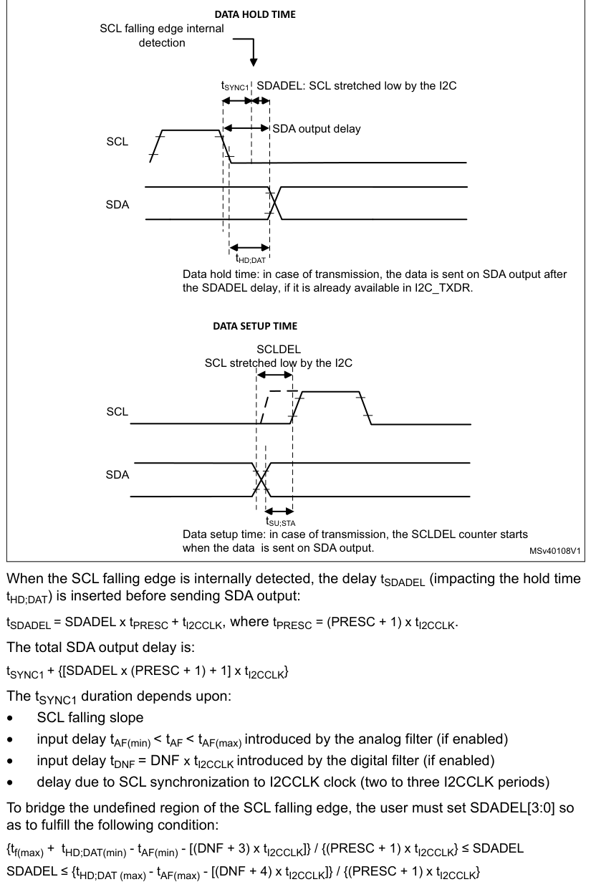

DATA HOLD TIME

SCL falling edge internal
detection
tSYNC1 SDADEL: SCL stretched low by the I2C

SDA output delay

SCL

SDA
tHD;DAT

Data hold time: in case of transmission, the data is sent on SDA output after the SDADEL delay, if
it is already available in I2C_TXDR.

DATA SETUP TIME

SCLDEL

SCL stretched low by the I2C

SCL

SDA
tSU;STA

Data setup time: in case of transmission, the SCLDEL counter starts when the data is sent on SDA
output.

MSv40108V1

When the SCL falling edge is internally detected, the delay tSDADEL (impacting the hold time
tHD;DAT) is inserted before sending SDA output:

tSDADEL = SDADEL x tPRESC \+ tI2CCLK, where tPRESC = (PRESC \+ 1) x tI2CCLK.

The total SDA output delay is:

tSYNC1 \+ {[SDADEL x (PRESC \+ 1) \+ 1] x tI2CCLK}

The tSYNC1 duration depends upon:

- SCL falling slope
- input delay tAF(min) \< tAF \< tAF(max) introduced by the analog filter (if enabled)
- input delay tDNF = DNF x tI2CCLK introduced by the digital filter (if enabled)
- delay due to SCL synchronization to I2CCLK clock (two to three I2CCLK periods)

To bridge the undefined region of the SCL falling edge, the user must set SDADEL[3:0] so as to
fulfill the following condition:

{tf(max) \+ tHD;DAT(min) - tAF(min) - [(DNF \+ 3) x tI2CCLK]} / {(PRESC \+ 1) x tI2CCLK} ≤SDADEL

SDADEL ≤ {tHD;DAT (max) - tAF(max) - [(DNF \+ 4) x tI2CCLK]} / {(PRESC \+ 1) x tI2CCLK}

> **Note:** tAF(min) and tAF(max) are only part of the condition when the analog filter is enabled. Refer to
> the device datasheet for tAF values.

The tHD;DAT time can at maximum be 3.45 µs for Standard-mode, 0.9 µs for Fast-mode, and 0.45 µs for
Fast-mode Plus. It must be lower than the maximum of tVD;DAT by a transition time. This maximum must
only be met if the device does not stretch the LOW period (tLOW) of the SCL signal. When it
stretches SCL, the data must be valid by the set-up time before it releases the clock.

The SDA rising edge is usually the worst case. The previous condition then becomes:

SDADEL ≤ {tVD;DAT (max) - tr (max) - tAF (max) - [(DNF \+ 4) x tI2CCLK]} / {(PRESC \+ 1) x tI2CCLK}

> **Note:** This condition can be violated when NOSTRETCH = 0, because the device stretches SCL
> low to guarantee the set-up time, according to the SCLDEL[3:0] value.

After tSDADEL, or after sending SDA output when the target had to stretch the clock because the data
was not yet written in I2C_TXDR register, the SCL line is kept at low level during the setup time.
This setup time is tSCLDEL = (SCLDEL \+ 1) x tPRESC, where tPRESC = (PRESC \+ 1) x tI2CCLK. tSCLDEL
impacts the setup time tSU;DAT.

To bridge the undefined region of the SDA transition (rising edge usually worst case), the user must
program SCLDEL[3:0] so as to fulfill the following condition:

{[tr (max) \+ tSU;DAT (min)] / [(PRESC \+ 1) x tI2CCLK]} - 1 ≤ SCLDEL

Refer to the following table for tf, tr, tHD;DAT, tVD;DAT, and tSU;DAT standard values.

Use the SDA and SCL real transition time values measured in the application to widen the scope of
allowed SDADEL[3:0] and SCLDEL[3:0] values. Use the maximum SDA and SCL transition time values
defined in the standard to make the device work reliably regardless of the application.

> **Note:** At every clock pulse, after SCL falling edge detection, I2C operating as controller or target
> stretches SCL low during at least [(SDADEL \+ SCLDEL \+ 1) x (PRESC \+ 1) \+ 1] x tI2CCLK, in both
> transmission and reception modes. In transmission mode, if the data is not yet written in I2C_TXDR
> when SDA delay elapses, the I2C peripheral keeps stretching SCL low until the next data is written.
Then new data MSB is sent on SDA output, and SCLDEL counter starts, continuing stretching SCL low to
guarantee the data setup time.

When the NOSTRETCH bit is set in target mode, the SCL is not stretched. The SDADEL[3:0] must then be
programmed so that it ensures a sufficient setup time.

**Table 356. I²C-bus and SMBus specification data setup and hold times**

| Source row | Column 1 | Column 2 | Column 3 | Column 4 | Column 5 | Column 6 | Column 7 | Column 8 | Column 9 | Column 10 |
| ---: | --- | --- | --- | --- | --- | --- | --- | --- | --- | --- |
| 1 | `Standard-mode` | `Fast-mode` | `Fast-mode Plus` |  |  |  |  |  |  |  |
| 2 | `SMBus` |  |  |  |  |  |  |  |  |  |
| 3 | `(Sm)` | `(Fm)` | `(Fm+)` |  |  |  |  |  |  |  |
| 4 | `Symbol` | `Parameter` | `Unit` |  |  |  |  |  |  |  |
| 5 | `Min` | `Max` | `Min` | `Max` | `Min` | `Max` | `Min` | `Max` |  |  |
| 6 | `tHD;DAT` | `Data hold time` | `0` | `-` | `0` | `-` | `0` | `-` | `0.3` | `-` |
| 7 | `µs` |  |  |  |  |  |  |  |  |  |
| 8 | `tVD;DAT` | `Data valid time` | `-` | `3.45` | `-` | `0.9` | `-` | `0.45` | `-` | `-` |
| 9 | `tSU;DAT` | `Data setup time` | `250` | `-` | `100` | `-` | `50` | `-` | `250` | `-` |
| 10 | `Rise time of both` |  |  |  |  |  |  |  |  |  |
| 11 | `tr` | `-` | `1000` | `-` | `300` | `-` | `120` | `-` | `1000` |  |
| 12 | `SDA and SCL signals` | `ns` |  |  |  |  |  |  |  |  |
| 13 | `Fall time of both` |  |  |  |  |  |  |  |  |  |
| 14 | `tf` | `-` | `300` | `-` | `300` | `-` | `120` | `-` | `300` |  |
| 15 | `SDA and SCL signals` |  |  |  |  |  |  |  |  |  |

Additionally, in controller mode, the SCL clock high and low levels must be configured by
programming the PRESC[3:0], SCLH[7:0], and SCLL[7:0] bitfields of the I2C_TIMINGR register.

When the SCL falling edge is internally detected, the I2C peripheral releasing the SCL output after
the delay tSCLL = (SCLL \+ 1) x tPRESC, where tPRESC = (PRESC \+ 1) x tI2CCLK. The tSCLL delay impacts
the SCL low time tLOW.

When the SCL rising edge is internally detected, the I2C peripheral forces the SCL output to low
level after the delay tSCLH = (SCLH \+ 1) x tPRESC, where tPRESC = (PRESC \+ 1) x tI2CCLK. The tSCLH
impacts the SCL high time tHIGH.

Refer to I2C controller initialization for more details.

> **Caution:** Changing the timing configuration and the NOSTRETCH configuration is not allowed when
> the I2C peripheral is enabled. Like the timing settings, the target NOSTRETCH settings must also be
> done before enabling the peripheral. Refer to I2C target initialization for more details.

**Figure 537. I2C initialization flow**

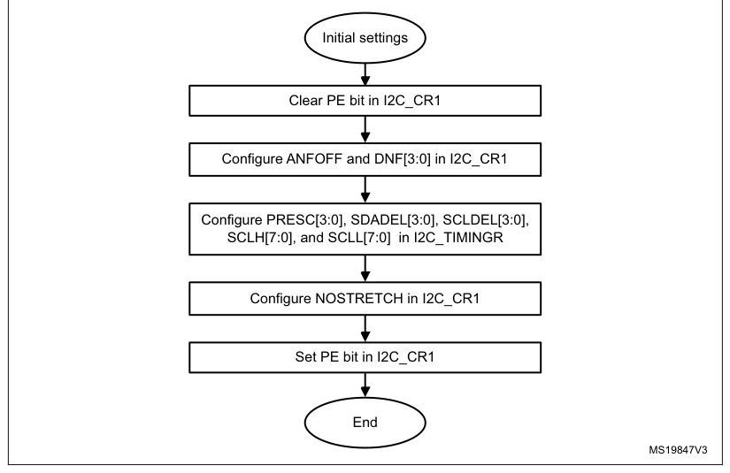

Initial settings

Clear PE bit in I2C_CR1

Configure ANFOFF and DNF[3:0] in I2C_CR1

Configure PRESC[3:0], SDADEL[3:0], SCLDEL[3:0],

SCLH[7:0], and SCLL[7:0] in I2C_TIMINGR

Configure NOSTRETCH in I2C_CR1

Set PE bit in I2C_CR1

End

MS19847V3

### 39.4.6 I2C reset

The reset of the I2C peripheral is performed by clearing the PE bit of the I2C_CR1 register. It has
the effect of releasing the SCL and SDA lines. Internal state machines are reset and the
communication control bits and the status bits revert to their reset values. This reset does not
impact the configuration registers.

The impacted register bits are:

1. I2C_CR2 register: START, STOP, PECBYTE, and NACK
2. I2C_ISR register: BUSY, TXE, TXIS, RXNE, ADDR, NACKF, TCR, TC, STOPF, BERR,

ARLO, PECERR, TIMEOUT, ALERT, and OVR

PE must be kept low during at least three APB clock cycles to perform the I2C reset. To ensure this,
perform the following software sequence:

1. Write PE = 0
2. Check PE = 0
3. Write PE = 1

### 39.4.7 I2C data transfer

The data transfer is managed through transmit and receive data registers and a shift register.

#### Reception

The SDA input fills the shift register. After the eighth SCL pulse (when the complete data byte is
received), the shift register is copied into the I2C_RXDR register if it is empty (RXNE = 0). If
RXNE = 1, which means that the previous received data byte has not yet been read, the SCL line is
stretched low until I2C_RXDR is read. The stretch occurs between the eighth and the ninth SCL pulse
(before the acknowledge pulse).

**Figure 538. Data reception**

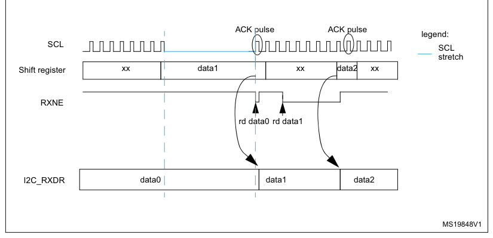

#### Transmission

If the I2C_TXDR register is not empty (TXE = 0), its content is copied into the shift register after
the ninth SCL pulse (the acknowledge pulse). Then the shift register content is shifted out on the
SDA line. If TXE = 1, which means that no data is written yet in I2C_TXDR, the SCL line is stretched
low until I2C_TXDR is written. The stretch starts after the ninth SCL pulse.

**Figure 539. Data transmission**

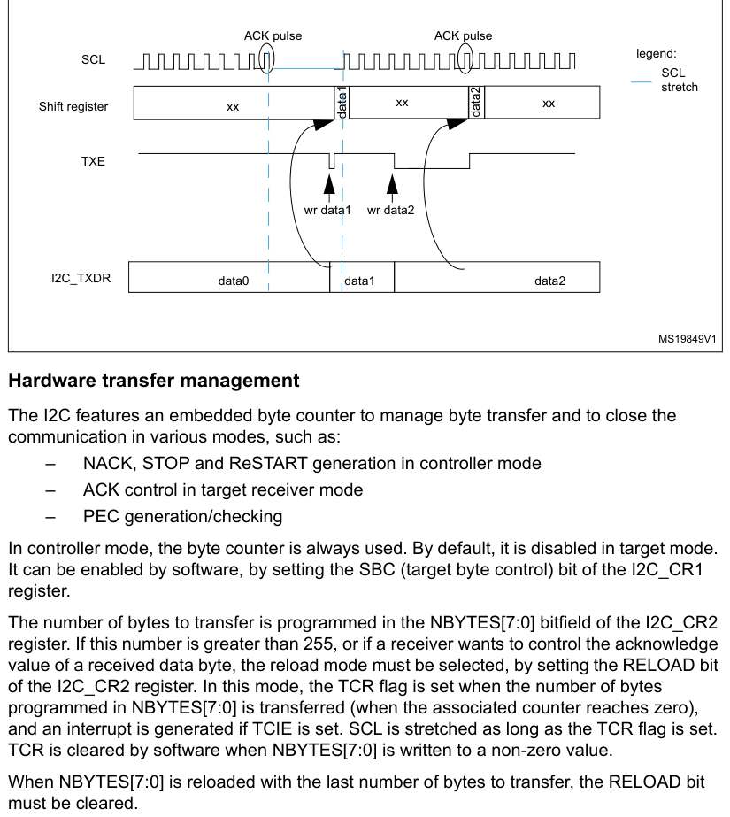

#### Hardware transfer management

The I2C features an embedded byte counter to manage byte transfer and to close the communication in
various modes, such as:

- NACK, STOP and ReSTART generation in controller mode
- ACK control in target receiver mode
- PEC generation/checking

In controller mode, the byte counter is always used. By default, it is disabled in target mode. It
can be enabled by software, by setting the SBC (target byte control) bit of the I2C_CR1 register.

The number of bytes to transfer is programmed in the NBYTES[7:0] bitfield of the I2C_CR2 register.
If this number is greater than 255, or if a receiver wants to control the acknowledge value of a
received data byte, the reload mode must be selected, by setting the RELOAD bit of the I2C_CR2
register. In this mode, the TCR flag is set when the number of bytes programmed in NBYTES[7:0] is
transferred (when the associated counter reaches zero), and an interrupt is generated if TCIE is
set. SCL is stretched as long as the TCR flag is set. TCR is cleared by software when NBYTES[7:0] is
written to a non-zero value.

When NBYTES[7:0] is reloaded with the last number of bytes to transfer, the RELOAD bit must be
cleared.

When RELOAD = 0 in controller mode, the counter can be used in two modes:

- Automatic end (AUTOEND = 1 in the I2C_CR2 register). In this mode, the controller automatically
  sends a STOP condition once the number of bytes programmed in the NBYTES[7:0] bitfield is
  transferred.
- Software end (AUTOEND = 0 in the I2C_CR2 register). In this mode, a software action is expected
  once the number of bytes programmed in the NBYTES[7:0] bitfield is transferred; the TC flag is set
  and an interrupt is generated if the TCIE bit is set. The SCL signal is stretched as long as the
  TC flag is set. The TC flag is cleared by software when the START or STOP bit of the I2C_CR2
  register is set. This mode must be used when the controller wants to send a RESTART condition.

> **Caution:** The AUTOEND bit has no effect when the RELOAD bit is set.

**Table 357. I2C configuration**

| Function | SBC bit | RELOAD bit | AUTOEND bit |
| --- | --- | --- | --- |
| Controller Tx/Rx NBYTES \+ STOP | X | 0 | 1 |
| Controller Tx/Rx \+ NBYTES \+ RESTART | X | 0 | 0 |
| Target Tx/Rx, all received bytes ACKed | 0 | X | X |
| Target Rx with ACK control | 1 | 1 | X |

### 39.4.8 I2C target mode

#### I2C target initialization

To work in target mode, the user must enable at least one target address. The I2C_OAR1 and I2C_OAR2
registers are available to program the target own addresses OA1 and OA2, respectively.

OA1 can be configured either in 7-bit (default) or in 10-bit addressing mode, by setting the OA1MODE
bit of the I2C_OAR1 register.

OA1 is enabled by setting the OA1EN bit of the I2C_OAR1 register.

If an additional target addresses are required, the second target address OA2 can be configured. Up
to seven OA2 LSBs can be masked, by configuring the OA2MSK[2:0] bitfield of the I2C_OAR2 register.
Therefore, for OA2MSK[2:0] configured from 1 to 6, only OA2[7:2], OA2[7:3], OA2[7:4], OA2[7:5],
OA2[7:6], or OA2[7] are compared with the received address. When OA2MSK[2:0] is other than 0, the
address comparator for OA2 excludes the I2C reserved addresses (0000 XXX and 1111 XXX) and they are
not acknowledged. If OA2MSK[2:0] = 7, all received 7-bit addresses are acknowledged (except reserved
addresses). OA2 is always a 7-bit address.

When enabled through the specific bit, the reserved addresses can be acknowledged if they are
programmed in the I2C_OAR1 or I2C_OAR2 register with OA2MSK[2:0] = 0.

OA2 is enabled by setting the OA2EN bit of the I2C_OAR2 register.

The general call address is enabled by setting the GCEN bit of the I2C_CR1 register.

When the I2C peripheral is selected by one of its enabled addresses, the ADDR interrupt status flag
is set, and an interrupt is generated if the ADDRIE bit is set.

By default, the target uses its clock stretching capability, which means that it stretches the SCL
signal at low level when required, to perform software actions. If the controller does not
support clock stretching, I2C must be configured with NOSTRETCH = 1 in the I2C_CR1 register.

After receiving an ADDR interrupt, if several addresses are enabled, the user must read the
ADDCODE[6:0] bitfield of the I2C_ISR register to check which address matched. The DIR flag must also
be checked to know the transfer direction.

#### Target with clock stretching

As long as the NOSTRETCH bit of the I2C_CR1 register is zero (default), the I2C peripheral operating
as an I²C-bus target stretches the SCL signal in the following situations:

- The ADDR flag is set and the received address matches with one of the enabled target addresses.
  The stretch is released when the software clears the ADDR flag by setting the ADDRCF bit.
- In transmission, the previous data transmission is completed and no new data is written in
  I2C_TXDR register, or the first data byte is not written when the ADDR flag is cleared (TXE = 1).
  The stretch is released when the data is written to the I2C_TXDR register.
- In reception, the I2C_RXDR register is not read yet and a new data reception is completed. The
  stretch is released when I2C_RXDR is read.
- In target byte control mode (SBC bit set) with reload (RELOAD bit set), the last data byte
  transfer is finished (TCR bit set). The stretch is released when then TCR is cleared by writing a
  non-zero value in the NBYTES[7:0] bitfield.
- After SCL falling edge detection. The stretch is released after [(SDADEL \+ SCLDEL \+ 1) x (PRESC+
  1) \+ 1] x tI2CCLK period.

#### Target without clock stretching

As long as the NOSTRETCH bit of the I2C_CR1 register is set, the I2C peripheral operating as an
I²C-bus target does not stretch the SCL signal.

The SCL clock is not stretched while the ADDR flag is set.

In transmission, the data must be written in the I2C_TXDR register before the first SCL pulse
corresponding to its transfer occurs. If not, an underrun occurs, the OVR flag is set in the I2C_ISR
register and an interrupt is generated if the ERRIE bit of the I2C_CR1 register is set. The OVR flag
is also set when the first data transmission starts and the STOPF bit is still set (has not been
cleared). Therefore, if the user clears the STOPF flag of the previous transfer only after writing
the first data to be transmitted in the next transfer, it ensures that the OVR status is provided,
even for the first data to be transmitted.

In reception, the data must be read from the I2C_RXDR register before the ninth SCL pulse (ACK
pulse) of the next data byte occurs. If not, an overrun occurs, the OVR flag is set in the I2C_ISR
register, and an interrupt is generated if the ERRIE bit of the I2C_CR1 register is set.

#### Target byte control mode

To allow byte ACK control in target reception mode, the target byte control mode must be enabled, by
setting the SBC bit of the I2C_CR1 register. This is required to comply with SMBus standards.

The reload mode must be selected to allow byte ACK control in target reception mode (RELOAD = 1). To
get control of each byte, NBYTES[7:0] must be initialized to 0x1 in the ADDR interrupt subroutine,
and reloaded to 0x1 after each received byte. When the byte is received, the TCR bit is set,
stretching the SCL signal low between the eighth and the ninth SCL pulse. The user can read the data
from the I2C_RXDR register, and then decide to acknowledge it or not by configuring the ACK bit of
the I2C_CR2 register. The SCL stretch is released by programming NBYTES to a non-zero value: the
acknowledge or not-acknowledge is sent and the next byte can be received.

NBYTES[7:0] can be loaded with a value greater than 0x1. Receiving then continues until the
corresponding number of bytes are received.

> **Note:** The SBC bit must be configured when the I2C peripheral is disabled, when the target is not
> addressed, or when ADDR = 1.

The RELOAD bit value can be changed when ADDR = 1, or when TCR = 1.

> **Caution:** The target byte control mode is not compatible with NOSTRETCH mode. Setting SBC when

NOSTRETCH = 1 is not allowed.

**Figure 540. Target initialization flow**

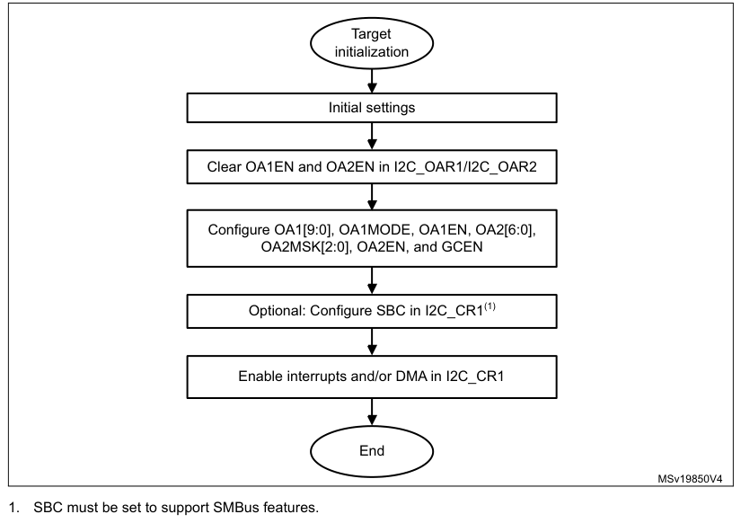

Target
initialization

Initial settings

Clear OA1EN and OA2EN in I2C_OAR1/I2C_OAR2

Configure OA1[9:0], OA1MODE, OA1EN, OA2[6:0],

OA2MSK[2:0], OA2EN, and GCEN

Optional: Configure SBC in I2C_CR1(1)

Enable interrupts and/or DMA in I2C_CR1

End

MSv19850V4

1. SBC must be set to support SMBus features.

#### Target transmitter

A transmit interrupt status (TXIS) flag is generated when the I2C_TXDR register becomes empty. An
interrupt is generated if the TXIE bit of the I2C_CR1 register is set.

The TXIS flag is cleared when the I2C_TXDR register is written with the next data byte to transmit.

When NACK is received, the NACKF flag is set in the I2C_ISR register and an interrupt is generated
if the NACKIE bit of the I2C_CR1 register is set. The target automatically releases the SCL and SDA
lines to let the controller perform a STOP or a RESTART condition. The TXIS bit is not set when a
NACK is received.

When STOP is received and the STOPIE bit of the I2C_CR1 register is set, the STOPF flag of the
I2C_ISR register is set and an interrupt is generated. In most applications, the SBC bit is usually
programmed to 0. In this case, if TXE = 0 when the target address is received (ADDR = 1), the user
can choose either to send the content of the I2C_TXDR register as the first data byte, or to flush
the I2C_TXDR register, by setting the TXE bit in order to program a new data byte.

In target byte control mode (SBC = 1), the number of bytes to transmit must be programmed in
NBYTES[7:0] in the address match interrupt subroutine (ADDR = 1). In this case, the number of TXIS
events during the transfer corresponds to the value programmed in NBYTES[7:0].

> **Caution:** When NOSTRETCH = 1, the SCL clock is not stretched while the ADDR flag is set, so the
> user cannot flush the I2C_TXDR register content in the ADDR subroutine to program the first data
> byte. The first data byte to send must be previously programmed in the I2C_TXDR register:

- This data can be the one written in the last TXIS event of the previous transmission message.
- If this data byte is not the one to send, the I2C_TXDR register can be flushed, by setting the TXE
  bit, to program a new data byte. The STOPF bit must be cleared only after these actions. This
  guarantees that they are executed before the first data transmission starts, following the address
  acknowledge.

If STOPF is still set when the first data transmission starts, an underrun error is generated (the
OVR flag is set).

If a TXIS event (transmit interrupt or transmit DMA request) is required, the user must set the TXIS
bit in addition to the TXE bit, to generate the event.

**Figure 541. Transfer sequence flow for I2C target transmitter, NOSTRETCH = 0**

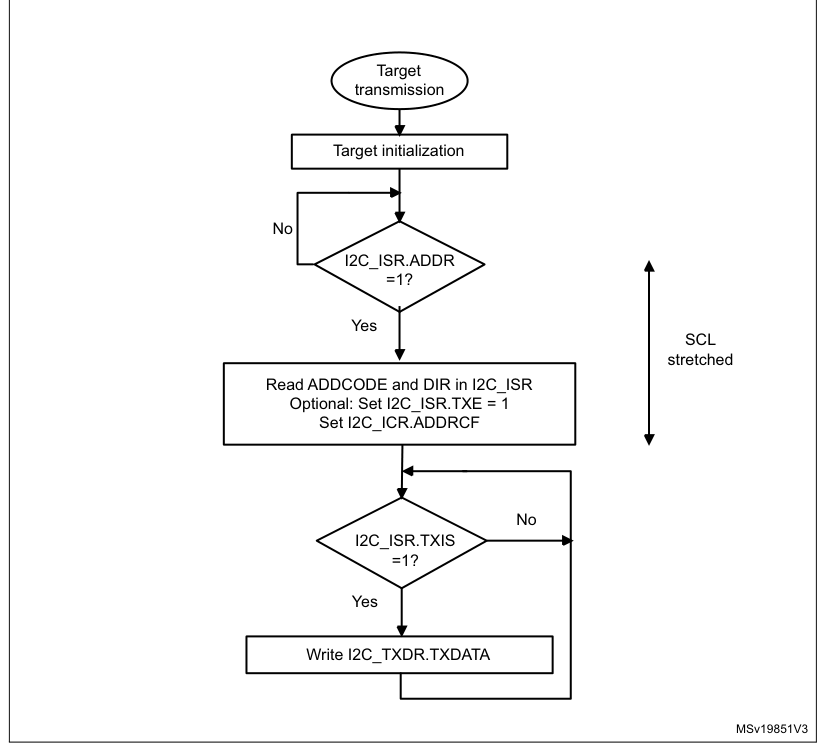

Target
transmission

Target initialization

No

I2C_ISR.ADDR

=1?

Yes

SCL
stretched

Read ADDCODE and DIR in I2C_ISR

Optional: Set I2C_ISR.TXE = 1

Set I2C_ICR.ADDRCF

No

I2C_ISR.TXIS

=1?

Yes

Write I2C_TXDR.TXDATA

MSv19851V3

**Figure 542. Transfer sequence flow for I2C target transmitter, NOSTRETCH = 1**

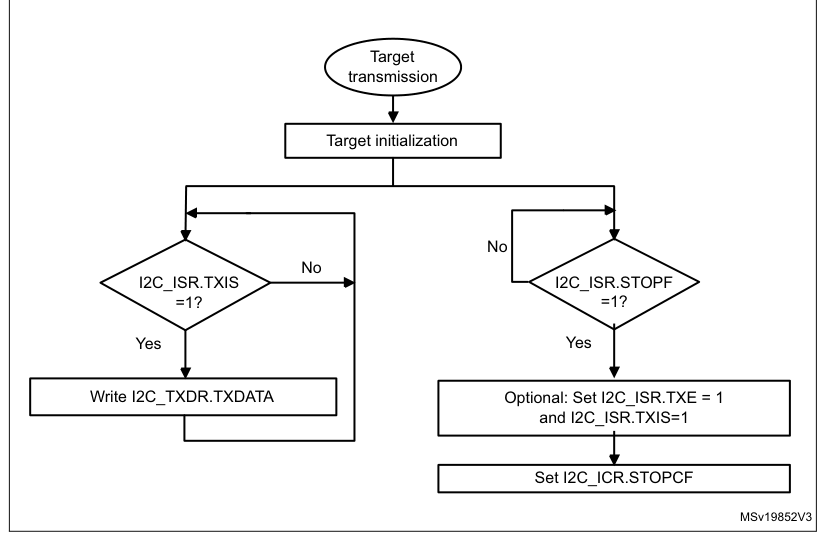

Target
transmission

Target initialization

No

No

**Figure 543. Transfer bus diagrams for I2C target transmitter (mandatory events only)**

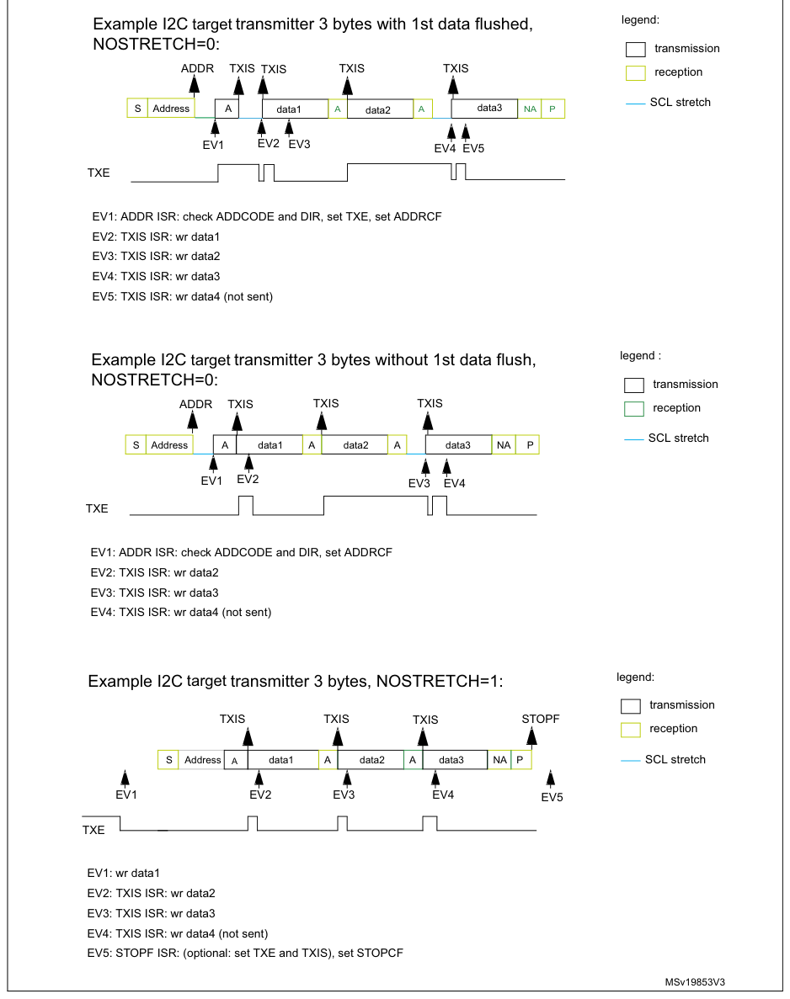

#### Target receiver

The RXNE bit of the I2C_ISR register is set when the I2C_RXDR is full, which generates an interrupt
if the RXIE bit of the I2C_CR1 register is set. RXNE is cleared when I2C_RXDR is read.

When STOP condition is received and the STOPIE bit of the I2C_CR1 register is set, the STOPF flag in
the I2C_ISR register is set and an interrupt is generated.

**Figure 544. Transfer sequence flow for I2C target receiver, NOSTRETCH = 0**

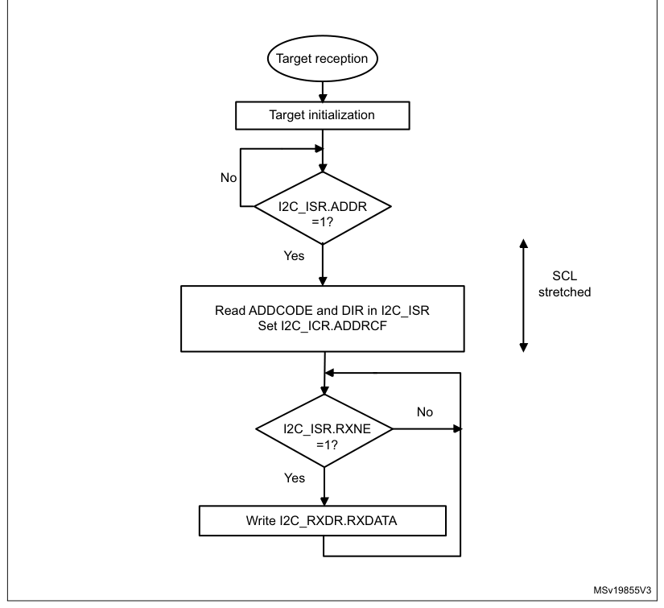

Target reception

Target initialization

No

I2C_ISR.ADDR

=1?

Yes

SCL
stretched

Read ADDCODE and DIR in I2C_ISR

Set I2C_ICR.ADDRCF

No

I2C_ISR.RXNE

=1?

Yes

Write I2C_RXDR.RXDATA

MSv19855V3

**Figure 545. Transfer sequence flow for I2C target receiver, NOSTRETCH = 1**

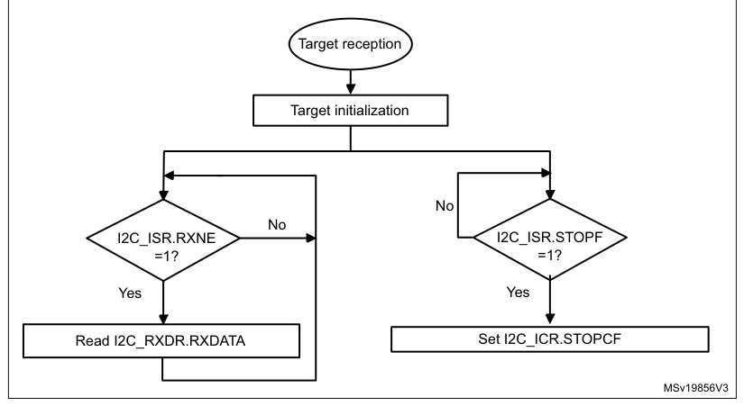

**Figure 546. Transfer bus diagrams for I2C target receiver**

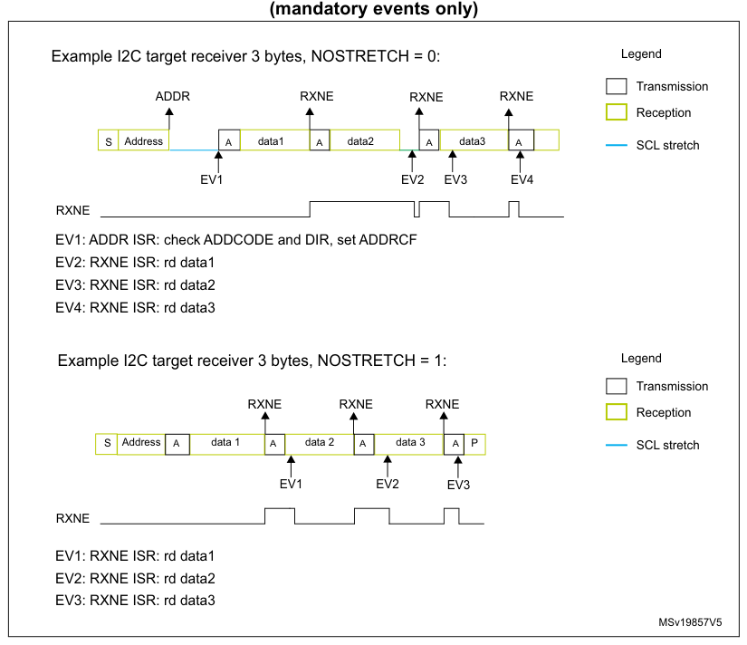

### 39.4.9 I2C controller mode

#### I2C controller initialization

Before enabling the peripheral, the I2C controller clock must be configured, by setting the SCLH and
SCLL bits in the I2C_TIMINGR register.

The STM32CubeMX tool calculates and provides the I2C_TIMINGR content in the I2C Configuration
window.

A clock synchronization mechanism is implemented in order to support multicontroller environment and
target clock stretching.

In order to allow clock synchronization:

- The low level of the clock is counted using the SCLL counter, starting from the SCL low level
  internal detection.
- The high level of the clock is counted using the SCLH counter, starting from the SCL high level
  internal detection.

I2C detects its own SCL low level after a tSYNC1 delay depending on the SCL falling edge, SCL input
noise filters (analog and digital), and SCL synchronization to the I2CxCLK clock. I2C releases SCL
to high level once the SCLL counter reaches the value programmed in the SCLL[7:0] bitfield of the
I2C_TIMINGR register.

I2C detects its own SCL high level after a tSYNC2 delay depending on the SCL rising edge, SCL input
noise filters (analog and digital), and SCL synchronization to the I2CxCLK clock. I2C ties SCL to
low level once the SCLH counter reaches the value programmed in the SCLH[7:0] bitfield of the
I2C_TIMINGR register.

Consequently the controller clock period is:

tSCL = tSYNC1 \+ tSYNC2 \+ {[(SCLH+ 1) \+ (SCLL+ 1)] x (PRESC+ 1) x tI2CCLK}

The duration of tSYNC1 depends upon:

- SCL falling slope
- input delay induced by the analog filter (when enabled)
- input delay induced by the digital filter (when enabled): DNF[3:0] x tI2CCLK
- delay due to SCL synchronization with the I2CCLK clock (two to three I2CCLK periods)

The duration of tSYNC2 depends upon:

- SCL rising slope
- input delay induced by the analog filter (when enabled)
- input delay induced by the digital filter (when enabled): DNF[3:0] x tI2CCLK
- delay due to SCL synchronization with the I2CCLK clock (two to three I2CCLK periods)

**Figure 547. Controller clock generation**

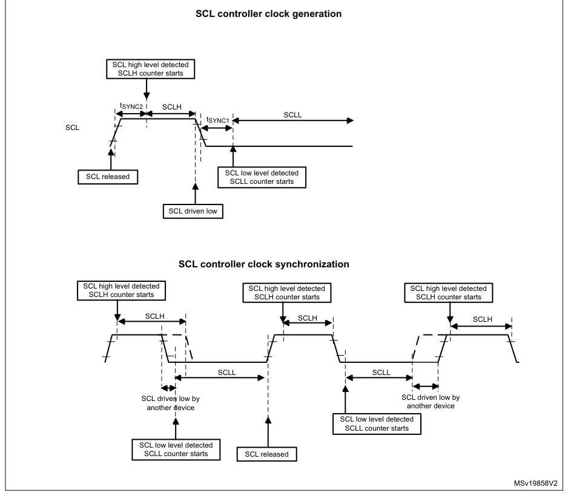

SCL controller clock generation

SCL high level detected

SCLH counter starts
tSYNC2 SCLH

SCLL
tSYNC1

SCL

SCL low level detected

SCL released

SCLL counter starts

SCL driven low

SCL controller clock synchronization

> **Caution:** For compliance with the I²C-bus or SMBus specification, the controller clock must respect
> the timings in the following table.

**Table 358. I²C-bus and SMBus specification clock timings**

| Source row | Column 1 | Column 2 | Column 3 | Column 4 | Column 5 | Column 6 | Column 7 | Column 8 | Column 9 | Column 10 | Column 11 |
| ---: | --- | --- | --- | --- | --- | --- | --- | --- | --- | --- | --- |
| 1 | `Standard-` | `Fast-mode` | `Fast-mode` |  |  |  |  |  |  |  |  |
| 2 | `SMBus` |  |  |  |  |  |  |  |  |  |  |
| 3 | `mode (Sm)` | `(Fm)` | `Plus (Fm+)` |  |  |  |  |  |  |  |  |
| 4 | `Symbol` | `Parameter` | `Unit` |  |  |  |  |  |  |  |  |
| 5 | `Min` | `Max` | `Min` | `Max` | `Min` | `Max` | `Min` | `Max` |  |  |  |
| 6 | `fSCL` | `SCL clock frequency` | `-` | `100` | `-` | `400` | `-` | `1000` | `-` | `100` | `kHz` |
| 7 | `tHD:STA` | `Hold time (repeated) START condition` | `4.0` | `-` | `0.6` | `-` | `0.26` | `-` | `4.0` | `-` |  |
| 8 | `Set-up time for a repeated START` |  |  |  |  |  |  |  |  |  |  |
| 9 | `tSU:STA` | `4.7` | `-` | `0.6` | `-` | `0.26` | `-` | `4.7` | `-` |  |  |
| 10 | `condition` |  |  |  |  |  |  |  |  |  |  |
| 11 | `tSU:STO` | `Set-up time for STOP condition` | `4.0` | `-` | `0.6` | `-` | `0.26` | `-` | `4.0` | `-` |  |
| 12 | `µs` |  |  |  |  |  |  |  |  |  |  |
| 13 | `Bus free time between a STOP and` |  |  |  |  |  |  |  |  |  |  |
| 14 | `tBUF` | `4.7` | `-` | `1.3` | `-` | `0.5` | `-` | `4.7` | `-` |  |  |
| 15 | `START condition` |  |  |  |  |  |  |  |  |  |  |
| 16 | `tLOW` | `Low period of the SCL clock` | `4.7` | `-` | `1.3` | `-` | `0.5` | `-` | `4.7` | `-` |  |
| 17 | `tHIGH` | `High period of the SCL clock` | `4.0` | `-` | `0.6` | `-` | `0.26` | `-` | `4.0` | `50` |  |
| 18 | `tr` | `Rise time of both SDA and SCL signals` | `-` | `1000` | `-` | `300` | `-` | `120` | `-` | `1000` |  |
| 19 | `ns` |  |  |  |  |  |  |  |  |  |  |
| 20 | `tf` | `Fall time of both SDA and SCL signals` | `-` | `300` | `-` | `300` | `-` | `120` | `-` | `300` |  |

> **Note:** The SCLL[7:0] bitfield also determines the tBUF and tSU:STA timings and SCLH[7:0] the
> tHD:STA and tSU:STO timings.

Refer to [Section 39.4.10](#39410-i2c_timingr-register-configuration-examples) for examples of I2C_TIMINGR settings versus the I2CCLK frequency.

#### Controller communication initialization (address phase)

To initiate the communication with a target to address, set the following bitfields of the I2C_CR2
register:

- ADD10: addressing mode (7-bit or 10-bit)
- SADD[9:0]: target address to send
- RD_WRN: transfer direction
- HEAD10R: in case of 10-bit address read, this bit determines whether the header only (for
  direction change) or the complete address sequence is sent.
- NBYTES[7:0]: the number of bytes to transfer; if equal to or greater than 255 bytes, the bitfield
  must initially be set to 0xFF.

> **Note:** Changing these bitfields is not allowed as long as the START bit is set.

Before launching the communication, make sure that the I²C-bus is idle. This can be checked using
the bus idle detection function or by verifying that the IDR bits of the GPIOs selected as SDA and
SCL are set. Any low-level incident on the I²C-bus lines that coincides with the START condition
asserted by the I2C peripheral may cause its deadlock if not filtered out by the input filters. If
such incidents cannot be prevented, design the software so that it restores the normal operation of
the I2C peripheral in case of a deadlock, by toggling the PE bit of the I2C_CR1 register.

To launch the communication, set the START bit of the I2C_CR2 register. The controller then
automatically sends a START condition followed by the target address, either immediately if the BUSY
flag is low, or tBUF time after the BUSY flag transits from high to low state. The BUSY flag is set
upon sending the START condition.

In case of an arbitration loss, the controller automatically switches back to target mode and can
acknowledge its own address if it is addressed as a target.

> **Note:** The START bit is reset by hardware when the target address is sent on the bus, whatever
> the received acknowledge value. The START bit is also reset by hardware upon arbitration loss.

In 10-bit addressing mode, the controller automatically keeps resending the target address in a loop
until the first address byte (first seven address bits) is acknowledged by the target. Setting the
ADDRCF bit makes I2C quit that loop. If the I2C peripheral is addressed as a target (ADDR = 1) while
the START bit is set, the I2C peripheral switches to target mode and the START bit is cleared when
the ADDRCF bit is set.

> **Note:** The same procedure is applied for a repeated START condition. In this case, BUSY = 1.

**Figure 548. Controller initialization flow**

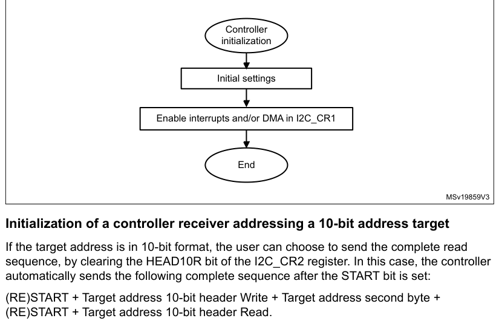

Controller
initialization

Initial settings

Enable interrupts and/or DMA in I2C_CR1

End

MSv19859V3

#### Initialization of a controller receiver addressing a 10-bit address target

If the target address is in 10-bit format, the user can choose to send the complete read sequence,
by clearing the HEAD10R bit of the I2C_CR2 register. In this case, the controller automatically
sends the following complete sequence after the START bit is set:

(RE)START \+ Target address 10-bit header Write \+ Target address second byte \+ (RE)START \+ Target
address 10-bit header Read.

**Figure 549. 10-bit address read access with HEAD10R = 0**

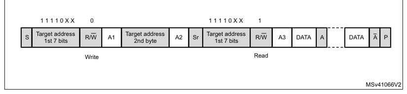

If the controller addresses a 10-bit address target, transmits data to this target and then reads
data from the same target, a controller transmission flow must be done first. Then a repeated START
is set with the 10-bit target address configured with HEAD10R = 1. In this case, the controller
sends this sequence:

RESTART \+ Target address 10-bit header Read.

**Figure 550. 10-bit address read access with HEAD10R = 1**

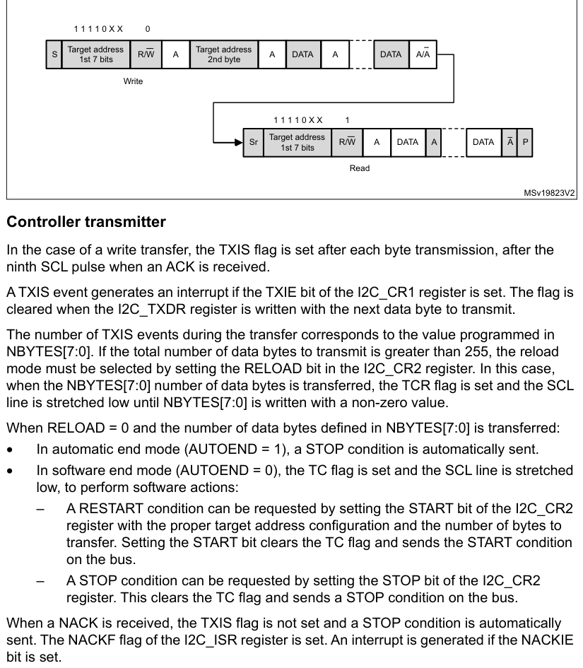

#### Controller transmitter

In the case of a write transfer, the TXIS flag is set after each byte transmission, after the ninth
SCL pulse when an ACK is received.

A TXIS event generates an interrupt if the TXIE bit of the I2C_CR1 register is set. The flag is
cleared when the I2C_TXDR register is written with the next data byte to transmit.

The number of TXIS events during the transfer corresponds to the value programmed in NBYTES[7:0]. If
the total number of data bytes to transmit is greater than 255, the reload mode must be selected by
setting the RELOAD bit in the I2C_CR2 register. In this case, when the NBYTES[7:0] number of data
bytes is transferred, the TCR flag is set and the SCL line is stretched low until NBYTES[7:0] is
written with a non-zero value.

When RELOAD = 0 and the number of data bytes defined in NBYTES[7:0] is transferred:

- In automatic end mode (AUTOEND = 1), a STOP condition is automatically sent.
- In software end mode (AUTOEND = 0), the TC flag is set and the SCL line is stretched low, to
  perform software actions:
  - A RESTART condition can be requested by setting the START bit of the I2C_CR2 register with the
    proper target address configuration and the number of bytes to transfer. Setting the START bit
    clears the TC flag and sends the START condition on the bus.
  - A STOP condition can be requested by setting the STOP bit of the I2C_CR2 register. This clears
    the TC flag and sends a STOP condition on the bus.

When a NACK is received, the TXIS flag is not set and a STOP condition is automatically sent. The
NACKF flag of the I2C_ISR register is set. An interrupt is generated if the NACKIE bit is set.

**Figure 551. Transfer sequence flow for I2C controller transmitter, N ≤ 255 bytes**

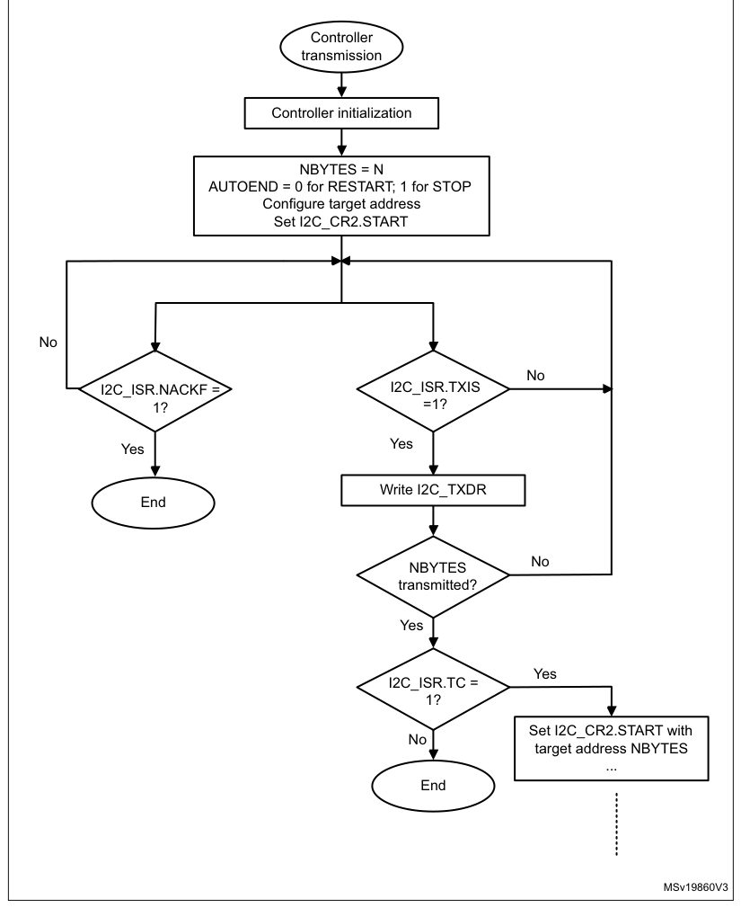

Controller
transmission

Controller initialization

NBYTES = N

AUTOEND = 0 for RESTART; 1 for STOP

Configure target address

Set I2C_CR2.START

No

No

transmitted?

Yes

Yes

I2C_ISR.TC =

1?

Set I2C_CR2.START with

No
target address NBYTES

...

End

MSv19860V3

**Figure 552. Transfer sequence flow for I2C controller transmitter, N > 255 bytes**

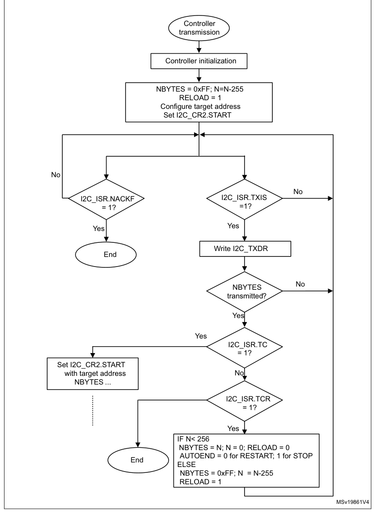

Controller
transmission

Controller initialization

NBYTES = 0xFF; N=N-255

RELOAD = 1

Configure target address

Set I2C_CR2.START

No

No

transmitted?

Yes

Yes

I2C_ISR.TC

= 1?

Set I2C_CR2.START

NBYTES ...

I2C_ISR.TCR

= 1?

Yes

IF N\< 256 NBYTES = N; N = 0; RELOAD = 0

AUTOEND = 0 for RESTART; 1 for STOP

End

ELSE

NBYTES = 0xFF; N = N-255 RELOAD = 1

MSv19861V4

**Figure 553. Transfer bus diagrams for I2C controller transmitter**

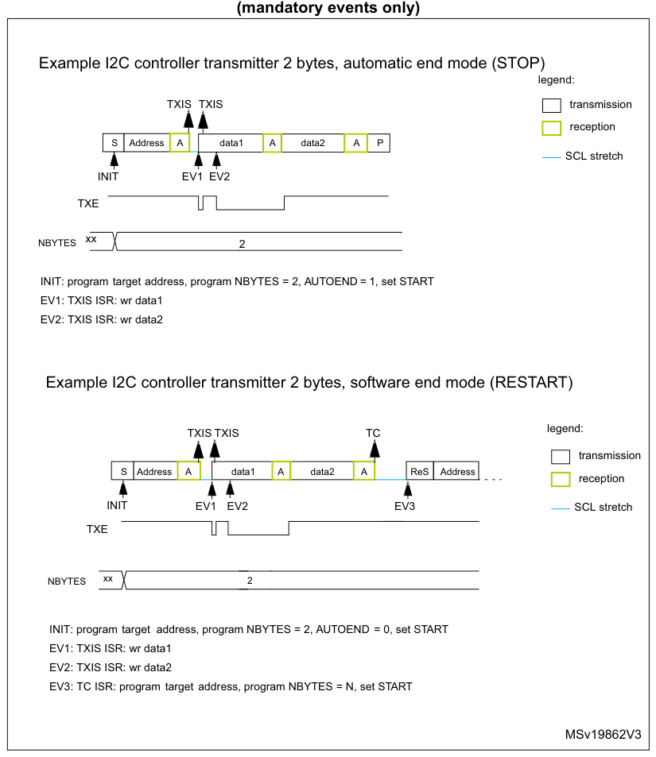

#### Controller receiver

In the case of a read transfer, the RXNE flag is set after each byte reception, after the eighth SCL
pulse. An RXNE event generates an interrupt if the RXIE bit of the I2C_CR1 register is set. The flag
is cleared when I2C_RXDR is read.

If the total number of data bytes to receive is greater than 255, select the reload mode, by setting
the RELOAD bit of the I2C_CR2 register. In this case, when the NBYTES[7:0] number of data bytes is
transferred, the TCR flag is set and the SCL line is stretched low until NBYTES[7:0] is written with
a non-zero value.

When RELOAD = 0 and he number of data bytes defined in NBYTES[7:0] is transferred:

- In automatic end mode (AUTOEND = 1), a NACK and a STOP are automatically sent after the last
  received byte.
- In software end mode (AUTOEND = 0), a NACK is automatically sent after the last received byte. The
  TC flag is set and the SCL line is stretched low in order to allow software actions:
  - A RESTART condition can be requested by setting the START bit of the I2C_CR2 register, with the
    proper target address configuration and the number of bytes to transfer. Setting the START bit
    clears the TC flag and sends the START condition and the target address on the bus.
  - A STOP condition can be requested by setting the STOP bit of the I2C_CR2 register. This clears
    the TC flag and sends a STOP condition on the bus.

**Figure 554. Transfer sequence flow for I2C controller receiver, N ≤ 255 bytes**

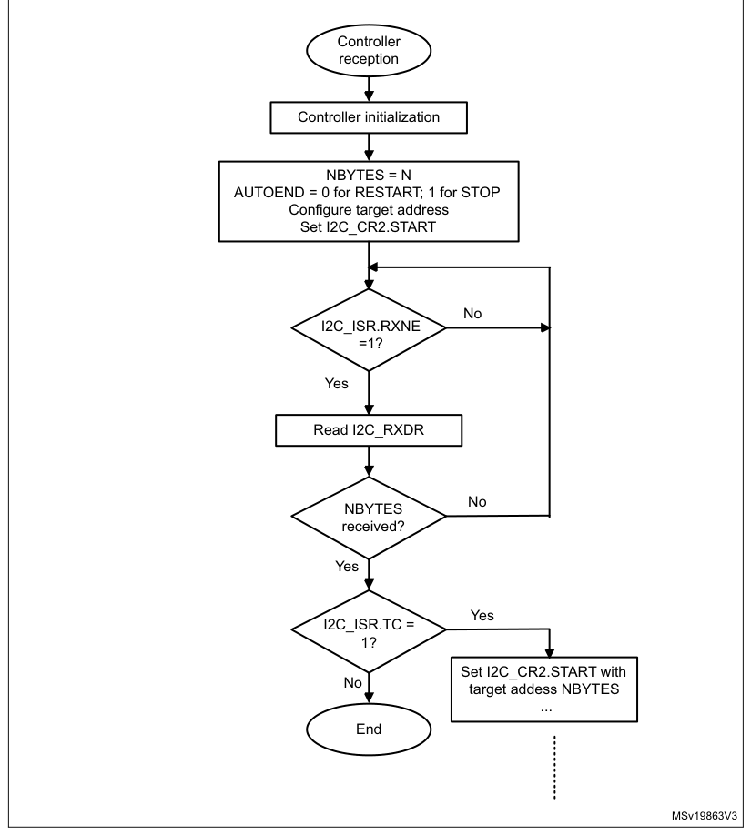

Controller reception

Controller initialization

NBYTES = N

AUTOEND = 0 for RESTART; 1 for STOP

Configure target address

Set I2C_CR2.START

No

I2C_ISR.RXNE

=1?

Yes

Read I2C_RXDR

No

NBYTES received?

Yes

Yes

I2C_ISR.TC =

1?

Set I2C_CR2.START with

No
target addess NBYTES

...

End

MSv19863V3

**Figure 555. Transfer sequence flow for I2C controller receiver, N > 255 bytes**

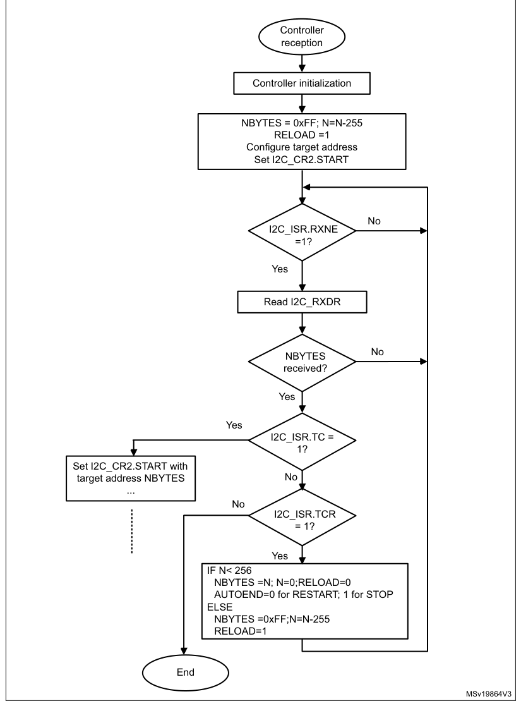

Controller reception

Controller initialization

NBYTES = 0xFF; N=N-255

RELOAD =1

Configure target address

Set I2C_CR2.START

No

I2C_ISR.RXNE

=1?

Yes

Read I2C_RXDR

No

NBYTES received?

Yes

Yes

I2C_ISR.TC =

1?

Set I2C_CR2.START with

...

No

I2C_ISR.TCR

= 1?

Yes

IF N\< 256

NBYTES =N; N=0;RELOAD=0 AUTOEND=0 for RESTART; 1 for STOP

ELSE

NBYTES =0xFF;N=N-255 RELOAD=1

End

MSv19864V3

**Figure 556. Transfer bus diagrams for I2C controller receiver**

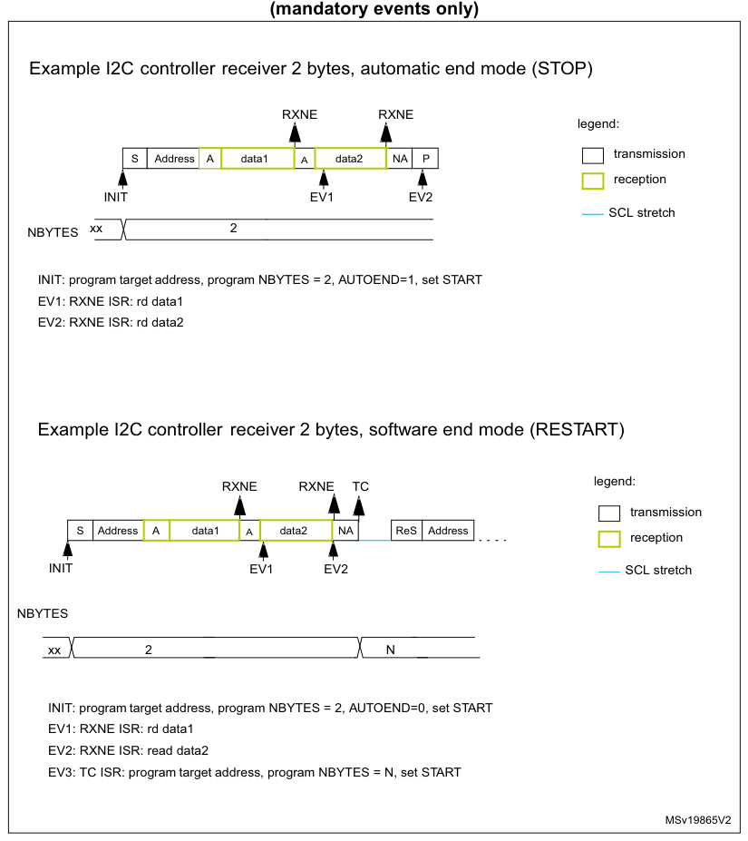

### 39.4.10 I2C_TIMINGR register configuration examples

The following tables provide examples of how to program the I2C_TIMINGR register to obtain timings
compliant with the I²C-bus specification. To get more accurate configuration values, use the
STM32CubeMX tool (I2C Configuration window).

**Table 359. Timing settings for fI2CCLK of 8 MHz**

| Source row | Column 1 | Column 2 | Column 3 | Column 4 | Column 5 |
| ---: | --- | --- | --- | --- | --- |
| 1 | `Fast-mode Plus` |  |  |  |  |
| 2 | `Standard-mode (Sm)` | `Fast-mode (Fm)` |  |  |  |
| 3 | `(Fm+)` |  |  |  |  |
| 4 | `Parameter` |  |  |  |  |
| 5 | `10 kHz` | `100 kHz` | `400 kHz` | `500 kHz` |  |
| 6 | `PRESC[3:0]` | `0x1` | `0x1` | `0x0` | `0x0` |
| 7 | `SCLL[7:0]` | `0xC7` | `0x13` | `0x9` | `0x6` |
| 8 | `tSCLL` | `200 x 250 ns = 50 µs` | `20 x 250 ns = 5.0 µs` | `10 x 125 ns = 1250 ns` | `7 x 125 ns = 875 ns` |
| 9 | `SCLH[7:0]` | `0xC3` | `0xF` | `0x3` | `0x3` |
| 10 | `tSCLH` | `196 x 250 ns = 49 µs` | `16 x 250 ns = 4.0 µs` | `4 x 125 ns = 500 ns` | `4 x 125 ns = 500 ns` |
| 11 | `tSCL(1)` | `~100 µs(2)` | `~10 µs(2)` | `~2.5 µs(3)` | `~2.0 µs(4)` |
| 12 | `SDADEL[3:0]` | `0x2` | `0x2` | `0x1` | `0x0` |
| 13 | `tSDADEL` | `2 x 250 ns = 500 ns` | `2 x 250 ns = 500 ns` | `1 x 125 ns = 125 ns` | `0 ns` |
| 14 | `SCLDEL[3:0]` | `0x4` | `0x4` | `0x3` | `0x1` |
| 15 | `tSCLDEL` | `5 x 250 ns = 1250 ns` | `5 x 250 ns = 1250 ns` | `4 x 125 ns = 500 ns` | `2 x 125 ns = 250 ns` |

1. tSCL is greater than tSCLL \+ tSCLH due to SCL internal detection delay. Values provided for tSCL
   are examples only.
2. tSYNC1 \+ tSYNC2 minimum value is 4 x tI2CCLK = 500 ns. Example with tSYNC1 \+ tSYNC2 = 1000 ns.
3. tSYNC1 \+ tSYNC2 minimum value is 4 x tI2CCLK = 500 ns. Example with tSYNC1 \+ tSYNC2 = 750 ns.
4. tSYNC1 \+ tSYNC2 minimum value is 4 x tI2CCLK = 500 ns. Example with tSYNC1 \+ tSYNC2 = 655 ns.

**Table 360. Timing settings for fI2CCLK of 16 MHz**

| Source row | Column 1 | Column 2 | Column 3 | Column 4 | Column 5 |
| ---: | --- | --- | --- | --- | --- |
| 1 | `Standard-mode (Sm)` | `Fast-mode (Fm)` | `Fast-mode Plus (Fm+)` |  |  |
| 2 | `Parameter` |  |  |  |  |
| 3 | `10 kHz` | `100 kHz` | `400 kHz` | `1000 kHz` |  |
| 4 | `PRESC[3:0]` | `0x3` | `0x3` | `0x1` | `0x0` |
| 5 | `SCLL[7:0]` | `0xC7` | `0x13` | `0x9` | `0x4` |
| 6 | `tSCLL` | `200 x 250 ns = 50 µs` | `20 x 250 ns = 5.0 µs` | `10 x 125 ns = 1250 ns` | `5 x 62.5 ns = 312.5 ns` |
| 7 | `SCLH[7:0]` | `0xC3` | `0xF` | `0x3` | `0x2` |
| 8 | `tSCLH` | `196 x 250 ns = 49 µs` | `16 x 250 ns = 4.0 µs` | `4 x 125 ns = 500 ns` | `3 x 62.5 ns = 187.5 ns` |
| 9 | `tSCL(1)` | `~100 µs(2)` | `~10 µs(2)` | `~2.5 µs(3)` | `~1.0 µs(4)` |
| 10 | `SDADEL[3:0]` | `0x2` | `0x2` | `0x2` | `0x0` |
| 11 | `tSDADEL` | `2 x 250 ns = 500 ns` | `2 x 250 ns = 500 ns` | `2 x 125 ns = 250 ns` | `0 ns` |
| 12 | `SCLDEL[3:0]` | `0x4` | `0x4` | `0x3` | `0x2` |
| 13 | `tSCLDEL` | `5 x 250 ns = 1250 ns` | `5 x 250 ns = 1250 ns` | `4 x 125 ns = 500 ns` | `3 x 62.5 ns = 187.5 ns` |

1. tSCL is greater than tSCLL \+ tSCLH due to SCL internal detection delay. Values provided for tSCL
   are examples only.
2. tSYNC1 \+ tSYNC2 minimum value is 4 x tI2CCLK = 250 ns. Example with tSYNC1 \+ tSYNC2 = 1000 ns.
3. tSYNC1 \+ tSYNC2 minimum value is 4 x tI2CCLK = 250 ns. Example with tSYNC1 \+ tSYNC2 = 750 ns.
4. tSYNC1 \+ tSYNC2 minimum value is 4 x tI2CCLK = 250 ns. Example with tSYNC1 \+ tSYNC2 = 500 ns.

**Table 361. Timing settings for fI2CCLK of 48 MHz**

| Source row | Column 1 | Column 2 | Column 3 | Column 4 | Column 5 |
| ---: | --- | --- | --- | --- | --- |
| 1 | `Standard-mode (Sm)` | `Fast-mode (Fm)` | `Fast-mode Plus (Fm+)` |  |  |
| 2 | `Parameter` |  |  |  |  |
| 3 | `10 kHz` | `100 kHz` | `400 kHz` | `1000 kHz` |  |
| 4 | `PRESC[3:0]` | `0xB` | `0xB` | `0x5` | `0x5` |
| 5 | `SCLL[7:0]` | `0xC7` | `0x13` | `0x9` | `0x3` |
| 6 | `tSCLL` | `200 x 250 ns = 50 µs` | `20 x 250 ns = 5.0 µs` | `10 x 125 ns = 1250 ns` | `4 x 125 ns = 500 ns` |
| 7 | `SCLH[7:0]` | `0xC3` | `0xF` | `0x3` | `0x1` |
| 8 | `tSCLH` | `196 x 250 ns = 49 µs` | `16 x 250 ns = 4.0 µs` | `4 x 125 ns = 500 ns` | `2 x 125 ns = 250 ns` |
| 9 | `tSCL(1)` | `~100 µs(2)` | `~10 µs(2)` | `~2.5 µs(3)` | `~875 ns(4)` |
| 10 | `SDADEL[3:0]` | `0x2` | `0x2` | `0x3` | `0x0` |
| 11 | `tSDADEL` | `2 x 250 ns = 500 ns` | `2 x 250 ns = 500 ns` | `3 x 125 ns = 375 ns` | `0 ns` |
| 12 | `SCLDEL[3:0]` | `0x4` | `0x4` | `0x3` | `0x1` |
| 13 | `tSCLDEL` | `5 x 250 ns = 1250 ns` | `5 x 250 ns = 1250 ns` | `4 x 125 ns = 500 ns` | `2 x 125 ns = 250 ns` |

1. tSCL is greater than tSCLL \+ tSCLH due to the SCL internal detection delay. Values provided for
   tSCL are only examples.
2. tSYNC1 \+ tSYNC2 minimum value is 4x tI2CCLK = 83.3 ns. Example with tSYNC1 \+ tSYNC2 = 1000 ns
3. tSYNC1 \+ tSYNC2 minimum value is 4x tI2CCLK = 83.3 ns. Example with tSYNC1 \+ tSYNC2 = 750 ns
4. tSYNC1 \+ tSYNC2 minimum value is 4x tI2CCLK = 83.3 ns. Example with tSYNC1 \+ tSYNC2 = 250 ns

### 39.4.11 SMBus specific features

#### Introduction

The system management bus (SMBus) is a two-wire interface through which various devices can
communicate with each other and with the rest of the system. It is based on operation principles of
the I²C-bus. The SMBus provides a control bus for system and power management related tasks.

The I2C peripheral is compatible with the SMBus specification ([http://smbus.org](http://smbus.org)).

The system management bus specification refers to three types of devices:

- Target is a device that receives or responds to a command.
- Controller is a device that issues commands, generates clocks, and terminates the transfer.
- Host is a specialized controller that provides the main interface to the system CPU. A host must
  be a controller-target and must support the SMBus host notify protocol. Only one host is allowed
  in a system.

The I2C peripheral can be configured as a controller or a target device, and also as a host.

#### Bus protocols

There are eleven possible command protocols for any given device. The device can use any or all of
them to communicate. These are: Quick Command, Send Byte, Receive Byte, Write Byte, Write Word, Read
Byte, Read Word, Process Call, Block Read, Block Write, and Block Write-Block Read Process Call. The
protocols must be implemented by the user software.

For more details on these protocols, refer to the SMBus specification ([http://smbus.org](http://smbus.org)).

STM32CubeMX implements an SMBus stack thanks to X-CUBE-SMBUS, a downloadable software pack that
allows basic SMBus configuration per I2C instance.

#### Address resolution protocol (ARP)

SMBus target address conflicts can be resolved by dynamically assigning a new unique address to each
target device. To provide a mechanism to isolate each device for the purpose of address assignment,
each device must implement a unique 128-bit device identifier (UDID). In the I2C peripheral, it is
implemented by software.

The I2C peripheral supports the Address resolution protocol (ARP). The SMBus device default address
(0b1100 001) is enabled by setting the SMBDEN bit of the I2C_CR1 register. The ARP commands must be
implemented by the user software.

Arbitration is also performed in target mode for ARP support.

For more details on the SMBus address resolution protocol, refer to the SMBus specification
([http://smbus.org](http://smbus.org)).

#### Received command and data acknowledge control

An SMBus receiver must be able to NACK each received command or data. In order to allow the ACK
control in target mode, the target byte control mode must be enabled, by setting the SBC bit of the
I2C_CR1 register. Refer to Target byte control mode for more details.

#### Host notify protocol

To enable the host notify protocol, set the SMBHEN bit of the I2C_CR1 register. The I2C peripheral
then acknowledges the SMBus host address (0b0001 000).

When this protocol is used, the device acts as a controller and the host as a target.

#### SMBus alert

The I2C peripheral supports the SMBALERT# optional signal through the SMBA pin. With the SMBALERT#
signal, an SMBus target device can signal to the SMBus host that it wants to talk. The host
processes the interrupt and simultaneously accesses all SMBALERT# devices through the alert response
address (0b0001 100). Only the device/devices which pulled SMBALERT# low acknowledges/acknowledge
the alert response address.

When the I2C peripheral is configured as an SMBus target device (SMBHEN = 0), the SMBA pin is pulled
low by setting the ALERTEN bit of the I2C_CR1 register. The alert response address is enabled at the
same time.

When the I2C peripheral is configured as an SMBus host (SMBHEN = 1), the ALERT flag of the I2C_ISR
register is set when a falling edge is detected on the SMBA pin and ALERTEN = 1. An interrupt is
generated if the ERRIE bit of the I2C_CR1 register is set. When ALERTEN = 0, the alert line is
considered high even if the external SMBA pin is low.

> **Note:** If the SMBus alert pin is not required, keep the ALERTEN bit cleared. The SMBA pin can
> then be used as a standard GPIO.

#### Packet error checking

A packet error checking mechanism introduced in the SMBus specification improves reliability and
communication robustness. The packet error checking is implemented by
appending a packet error code (PEC) at the end of each message transfer. The PEC is calculated by
using the C(x) = x8 \+ x2 \+ x \+ 1 CRC-8 polynomial on all the message bytes (including addresses and
read/write bits).

The I2C peripheral embeds a hardware PEC calculator and allows a not acknowledge to be sent
automatically when the received byte does not match the hardware calculated PEC.

#### Timeouts

To comply with the SMBus timeout specifications, the I2C peripheral embeds hardware timers.

**Table 362. SMBus timeout specifications**

| Source row | Column 1 | Column 2 | Column 3 | Column 4 |
| ---: | --- | --- | --- | --- |
| 1 | `Limits` |  |  |  |
| 2 | `Symbol` | `Parameter` | `Unit` |  |
| 3 | `Min Max` |  |  |  |
| 4 | `tTIMEOUT` | `Detect clock low timeout` | `25` | `35` |
| 5 | `(1)` |  |  |  |
| 6 | `tLOW:SEXT` | `Cumulative clock low extend time (target device)` | `-` | `25` |
| 7 | `ms` |  |  |  |
| 8 | `Cumulative clock low extend time (controller` |  |  |  |
| 9 | `(2)` |  |  |  |
| 10 | `tLOW:MEXT` | `-` | `10` |  |
| 11 | `device)` |  |  |  |

1. tLOW:SEXT is the cumulative time a given target device is allowed to extend the clock cycles in
   one message
   from the initial START to the STOP. It is possible that another target device or the controller also
   extends
   the clock causing the combined clock low extend time to be greater than tLOW:SEXT. The value
   provided
   applies to a single target device connected to a full-target controller.
2. tLOW:MEXT is the cumulative time a controller device is allowed to extend its clock cycles within
   each byte of
   a message as defined from START-to-ACK, ACK-to-ACK, or ACK-to-STOP. It is possible that a target
   device or another controller also extends the clock, causing the combined clock low time to be
   greater than
   tLOW:MEXT on a given byte. The value provided applies to a single target device connected to a
   full-target
   controller.

**Figure 557. Timeout intervals for tLOW:SEXT, tLOW:MEXT**

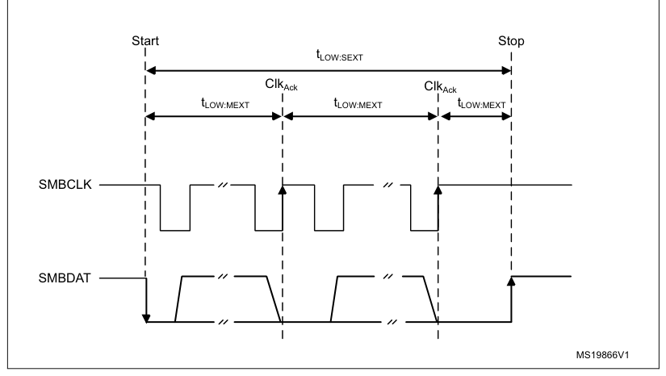

#### Bus idle detection

A controller can assume that the bus is free if it detects that the clock and data signals have been
high for tIDLE > tHIGH(max) (refer to the table in [Section 39.4.9](#3949-i2c-controller-mode)).

This timing parameter covers the condition where a controller is dynamically added to the bus, and
may not have detected a state transition on the SMBCLK or SMBDAT lines. In this case, the controller
must wait long enough to ensure that a transfer is not currently in progress. The I2C peripheral
supports a hardware bus idle detection.

### 39.4.12 SMBus initialization

In addition to the I2C initialization for the I²C-bus, the use of the peripheral for the SMBus
communication requires some extra initialization steps.

#### Received command and data acknowledge control (target mode)

An SMBus receiver must be able to NACK each received command or data. To allow ACK control in target
mode, the target byte control mode must be enabled, by setting the SBC bit of the I2C_CR1 register.
Refer to Target byte control mode for more details.

#### Specific addresses (target mode)

The specific SMBus addresses must be enabled if required. Refer to Bus idle detection for more
details.

The SMBus device default address (0b1100 001) is enabled by setting the SMBDEN bit of the I2C_CR1
register.

The SMBus host address (0b0001 000) is enabled by setting the SMBHEN bit of the I2C_CR1 register.

The alert response address (0b0001100) is enabled by setting the ALERTEN bit of the I2C_CR1
register.

#### Packet error checking

PEC calculation is enabled by setting the PECEN bit of the I2C_CR1 register. Then the PEC transfer
is managed with the help of the hardware byte counter associated with the NBYTES[7:0] bitfield of
the I2C_CR2 register. The PECEN bit must be configured before enabling the I2C.

The PEC transfer is managed with the hardware byte counter, so the SBC bit must be set when
interfacing the SMBus in target mode. The PEC is transferred after transferring NBYTES[7:0] - 1 data
bytes, if the PECBYTE bit is set and the RELOAD bit is cleared. If RELOAD is set, PECBYTE has no
effect.

> **Caution:** Changing the PECEN configuration is not allowed when the I2C peripheral is enabled.

**Table 363. SMBus with PEC configuration**

| Source row | Column 1 | Column 2 | Column 3 | Column 4 | Column 5 |
| ---: | --- | --- | --- | --- | --- |
| 1 | `Mode` | `SBC bit RELOAD bit AUTOEND bit` | `PECBYTE bit` |  |  |
| 2 | `Controller Tx/Rx NBYTES + PEC+ STOP` | `X` | `0` | `1` | `1` |
| 3 | `Controller Tx/Rx NBYTES + PEC +` |  |  |  |  |
| 4 | `X` | `0` | `0` | `1` |  |
| 5 | `ReSTART` |  |  |  |  |
| 6 | `Target Tx/Rx with PEC` | `1` | `0` | `X` | `1` |

#### Timeout detection

The timeout detection is enabled by setting the TIMOUTEN and TEXTEN bits of the I2C_TIMEOUTR
register. The timers must be programmed in such a way that they detect a timeout before the maximum
time given in the SMBus specification.

tTIMEOUT check

To check the tTIMEOUT parameter, load the 12-bit TIMEOUTA[11:0] bitfield with the timer reload
value. Keep the TIDLE bit at 0 to detect the SCL low level timeout.

Then set the TIMOUTEN bit of the I2C_TIMEOUTR register, to enable the timer.

If SCL is tied low for longer than the (TIMEOUTA \+ 1) x 2048 x tI2CCLK period, the TIMEOUT flag of
the I2C_ISR register is set.

Refer to Table 364.

> **Caution:** Changing the TIMEOUTA[11:0] bitfield and the TIDLE bit values is not allowed when the

TIMEOUTEN bit is set.

tLOW:SEXT and tLOW:MEXT check

A 12-bit timer associated with the TIMEOUTB[11:0] bitfield allows checking tLOW:SEXT for the I2C
peripheral operating as a target, or tLOW:MEXT when it operates as a controller. As the standard
only specifies a maximum, the user can choose the same value for both. The timer is then enabled by
setting the TEXTEN bit in the I2C_TIMEOUTR register.

If the SMBus peripheral performs a cumulative SCL stretch for longer than the (TIMEOUTB \+ 1) x 2048
x tI2CCLK period, and within the timeout interval described in Bus idle detection section, the
TIMEOUT flag of the I2C_ISR register is set.

Refer to Table 365.

> **Caution:** Changing the TIMEOUTB[11:0] bitfield value is not allowed when the TEXTEN bit is set.

#### Bus idle detection

To check the tIDLE period, the TIMEOUTA[11:0] bitfield associated with 12-bit timer must be loaded
with the timer reload value. Keep the TIDLE bit at 1 to detect both SCL and SDA high level timeout.
Then set the TIMOUTEN bit of the I2C_TIMEOUTR register to enable the timer.

If both the SCL and SDA lines remain high for longer than the (TIMEOUTA \+ 1) x 4 x tI2CCLK period,
the TIMEOUT flag of the I2C_ISR register is set.

Refer to Table 366.

> **Caution:** Changing the TIMEOUTA[11:0] bitfield and the TIDLE bit values is not allowed when the

TIMEOUTEN bit is set.

### 39.4.13 SMBus I2C_TIMEOUTR register configuration examples

The following tables provide examples of settings to reach desired tTIMEOUT, tLOW:SEXT, tLOW:MEXT,
and tIDLE timings at different fI2CCLK frequencies.

**Table 364. TIMEOUTA[11:0] for maximum tTIMEOUT of 25 ms**

| fI2CCLK | TIMEOUTA[11:0] | TIDLE | TIMEOUTEN | tTIMEOUT |
| --- | --- | --- | --- | --- |
| 8 MHz | 0x61 | 0 | 1 | 98 x 2048 x 125 ns = 25 ms |
| 16 MHz | 0xC3 | 0 | 1 | 196 x 2048 x 62.5 ns = 25 ms |
| 32 MHz | 0x186 | 0 | 1 | 391 x 2048 x 31.25 ns = 25 ms |
| 48 MHz | 0x249 | 0 | 1 | 586 x 2048 x 20.08 ns = 25 ms |

**Table 365. TIMEOUTB[11:0] for maximum tLOW:SEXT and tLOW:MEXT of 8 ms**

| Source row | Column 1 | Column 2 | Column 3 | Column 4 |
| ---: | --- | --- | --- | --- |
| 1 | `tLOW:SEXT` |  |  |  |
| 2 | `fI2CCLK` | `TIMEOUTB[11:0]` | `TEXTEN` |  |
| 3 | `tLOW:MEXT` |  |  |  |
| 4 | `8 MHz` | `0x1F` | `1` | `32 x 2048 x 125 ns = 8 ms` |
| 5 | `16 MHz` | `0x3F` | `1` | `64 x 2048 x 62.5 ns = 8 ms` |
| 6 | `32 MHz` | `0x7C` | `1` | `125 x 2048 x 31.25 ns = 8 ms` |
| 7 | `48 MHz` | `0xBB` | `1` | `188 x 2048 x 20.08 ns = 8 ms` |

**Table 366. TIMEOUTA[11:0] for maximum tIDLE of 50 µs**

| fI2CCLK | TIMEOUTA[11:0] | TIDLE | TIMEOUTEN | tIDLE |
| --- | --- | --- | --- | --- |
| 8 MHz | 0x63 | 1 | 1 | 100 x 4 x 125 ns = 50 µs |
| 16 MHz | 0xC7 | 1 | 1 | 200 x 4 x 62.5 ns = 50 µs |
| 32 MHz | 0x18F | 1 | 1 | 400 x 4 x 31.25 ns = 50 µs |
| 48 MHz | 0x257 | 1 | 1 | 600 x 4 x 20.08 ns = 50 µs |

### 39.4.14 SMBus target mode

In addition to I2C target transfer management (refer to [Section 39.4.8](#3948-i2c-target-mode): I2C target mode), this
section provides extra software flowcharts to support SMBus.

#### SMBus target transmitter

When using the I2C peripheral in SMBus mode, set the SBC bit to enable the PEC transmission at the
end of the programmed number of data bytes. When the PECBYTE bit is set, the number of bytes
programmed in NBYTES[7:0] includes the PEC transmission. In that case, the total number of TXIS
interrupts is NBYTES[7:0] - 1, and the content of the I2C_PECR register is automatically transmitted
if the controller requests an extra byte after the transfer of the NBYTES[7:0] - 1 data bytes.

> **Caution:** The PECBYTE bit has no effect when the RELOAD bit is set.

**Figure 558. Transfer sequence flow for SMBus target transmitter N bytes \+ PEC**

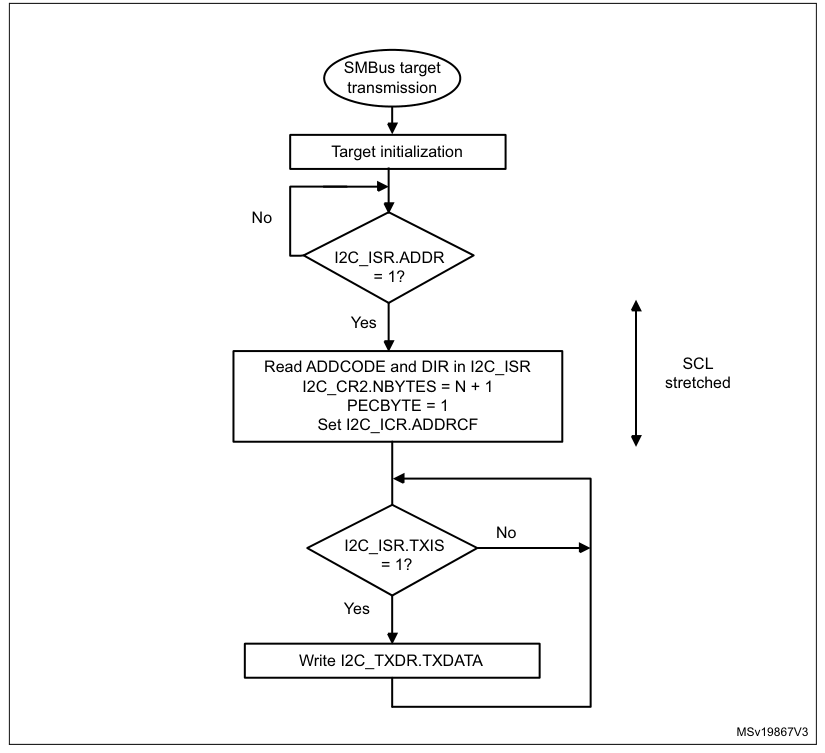

SMBus target transmission

Target initialization

No

I2C_ISR.ADDR

= 1?

Yes

= 1?

Yes

Write I2C_TXDR.TXDATA

MSv19867V3

**Figure 559. Transfer bus diagram for SMBus target transmitter (SBC = 1)**

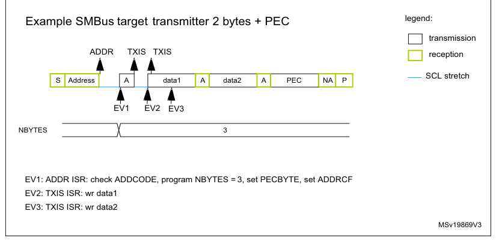

#### SMBus target receiver

When using the I2C peripheral in SMBus mode, set the SBC bit to enable the PEC checking at the end
of the programmed number of data bytes. To allow the ACK control of each byte, the reload mode must
be selected (RELOAD = 1). Refer to Target byte control mode for more details.

To check the PEC byte, the RELOAD bit must be cleared and the PECBYTE bit must be set. In this case,
after the receipt of NBYTES[7:0] - 1 data bytes, the next received byte is compared with the
internal I2C_PECR register content. A NACK is automatically generated if the comparison does not
match, and an ACK is automatically generated if the comparison matches, whatever the ACK bit value.
Once the PEC byte is received, it is copied into the I2C_RXDR register like any other data, and the
RXNE flag is set.

Upon a PEC mismatch, the PECERR flag is set and an interrupt is generated if the ERRIE bit of the
I2C_CR1 register is set.

If no ACK software control is required, the user can set the PECBYTE bit and, in the same write
operation, load NBYTES[7:0] with the number of bytes to receive in a continuous flow. After the
receipt of NBYTES[7:0] - 1 bytes, the next received byte is checked as being the PEC.

> **Caution:** The PECBYTE bit has no effect when the RELOAD bit is set.

**Figure 560. Transfer sequence flow for SMBus target receiver N bytes \+ PEC**

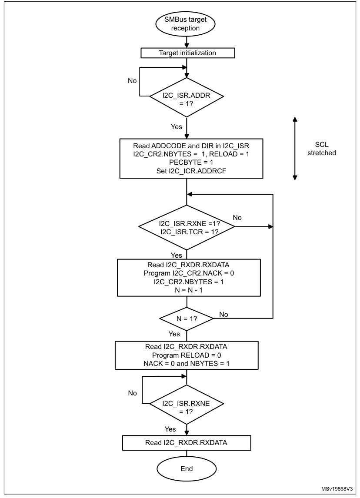

SMBus target
reception

Target initialization

No

I2C_ISR.ADDR

= 1?

Yes

I2C_ISR.RXNE =1? I2C_ISR.TCR = 1?

Yes

Read I2C_RXDR.RXDATA

Program I2C_CR2.NACK = 0

I2C_CR2.NBYTES = 1

N = N - 1

No

N = 1?

Yes

Read I2C_RXDR.RXDATA

Program RELOAD = 0

NACK = 0 and NBYTES = 1

No

I2C_ISR.RXNE

= 1?

Yes

Read I2C_RXDR.RXDATA

End

MSv19868V3

**Figure 561. Bus transfer diagrams for SMBus target receiver (SBC = 1)**

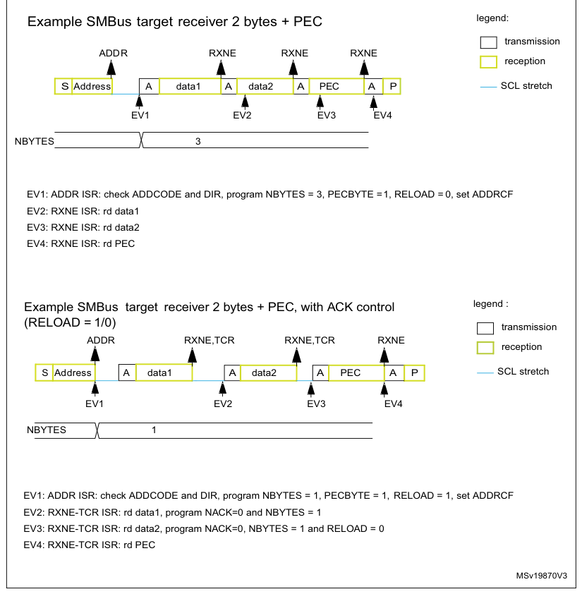

### 39.4.15 SMBus controller mode

In addition to I2C controller transfer management (refer to [Section 39.4.9](#3949-i2c-controller-mode): I2C controller mode),
this section provides extra software flowcharts to support SMBus.

#### SMBus controller transmitter

When the SMBus controller wants to transmit the PEC, the PECBYTE bit must be set and the number of
bytes must be loaded in the NBYTES[7:0] bitfield, before setting the START bit. In this case, the
total number of TXIS interrupts is NBYTES[7:0] - 1. So if the PECBYTE bit is set when NBYTES[7:0] =
0x1, the content of the I2C_PECR register is automatically transmitted.

If the SMBus controller wants to send a STOP condition after the PEC, the automatic end mode must be
selected (AUTOEND = 1). In this case, the STOP condition automatically follows the PEC transmission.

When the SMBus controller wants to send a RESTART condition after the PEC, the software mode must be
selected (AUTOEND = 0). In this case, once NBYTES[7:0] - 1 are transmitted, the I2C_PECR register
content is transmitted. The TC flag is set after the PEC transmission, stretching the SCL line low.
The RESTART condition must be programmed in the TC interrupt subroutine.

> **Caution:** The PECBYTE bit has no effect when the RELOAD bit is set.

**Figure 562. Bus transfer diagrams for SMBus controller transmitter**

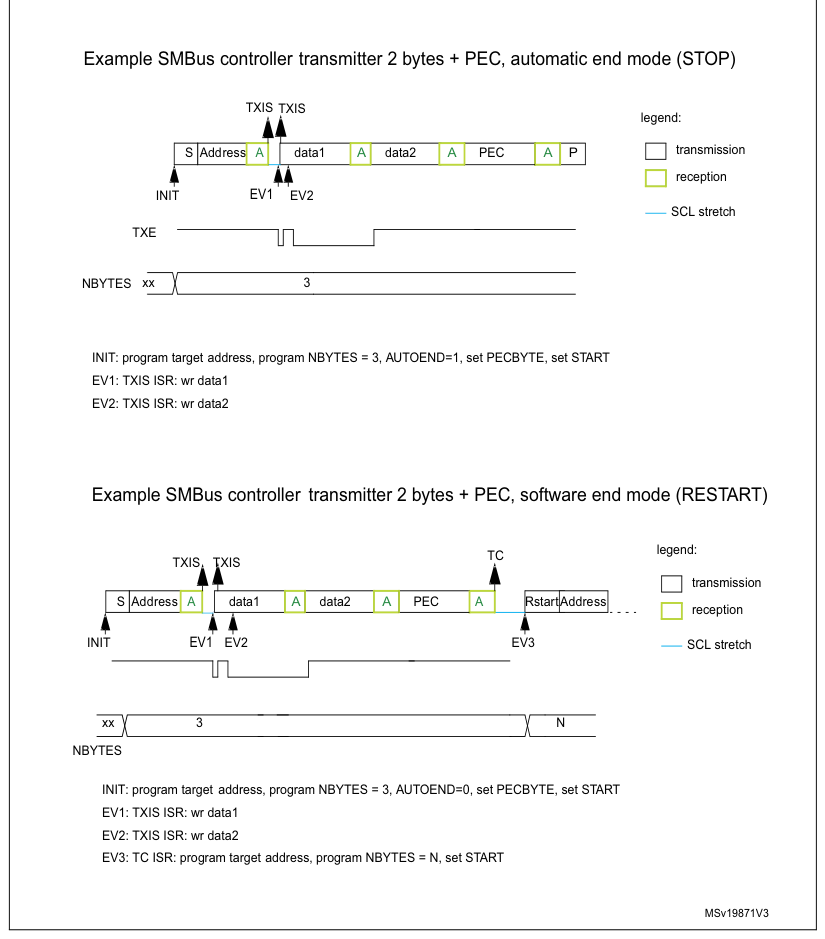

#### SMBus controller receiver

When the SMBus controller wants to receive, at the end of the transfer, the PEC followed by a STOP
condition, the automatic end mode can be selected (AUTOEND = 1). The PECBYTE bit must be set and the
target address programmed before setting the START bit. In this case, after the receipt of
NBYTES[7:0] - 1 data bytes, the next received byte is automatically checked versus the I2C_PECR
register content. A NACK response is given to the PEC byte, followed by a STOP condition.

When the SMBus controller receiver wants to receive, at the end of the transfer, the PEC byte
followed by a RESTART condition, the software mode must be selected (AUTOEND = 0). The PECBYTE bit
must be set and the target address programmed before setting the START bit. In this case, after the
receipt of NBYTES[7:0] - 1 data bytes, the next received byte is automatically checked versus the
I2C_PECR register content. The TC flag is set after the PEC byte reception, stretching the SCL line
low. The RESTART condition can be programmed in the TC interrupt subroutine.

> **Caution:** The PECBYTE bit has no effect when the RELOAD bit is set.

**Figure 563. Bus transfer diagrams for SMBus controller receiver**

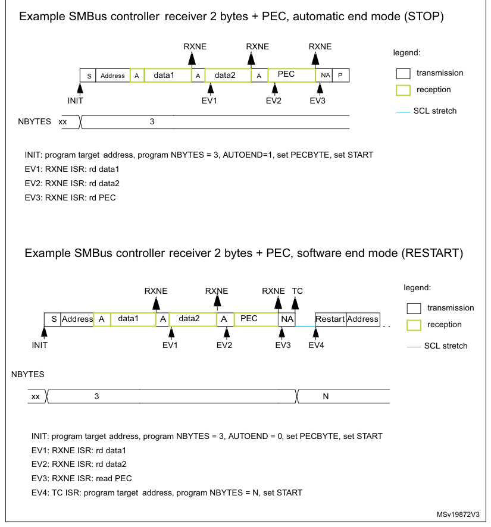

### 39.4.16 Wake-up from Stop mode on address match

The I2C peripheral is able to wake up the device from Stop mode (APB clock is off), when the device
is addressed. All addressing modes are supported.

The wake-up from Stop mode is enabled by setting the WUPEN bit of the I2C_CR1 register. The HSI16
oscillator must be selected as the clock source for I2CCLK to allow the wake-up from Stop mode.

In Stop mode, the HSI16 oscillator is stopped. Upon detecting START condition, the I2C interface
starts the HSI16 oscillator and stretches SCL low until the oscillator wakes up.

HSI16 is then used for the address reception.

If the received address matches the device own address, I2C stretches SCL low until the device wakes
up. The stretch is released when the ADDR flag is cleared by software. Then the transfer goes on
normally.

If the address does not match, the HSI16 oscillator is stopped again and the device does not wake
up.

> **Note:** When the system clock is used as I2C clock, or when WUPEN = 0, the HSI16 oscillator
> does not start upon receiving START condition.

Only an ADDR interrupt can wake the device up. Therefore, do not enter Stop mode when I2C is
performing a transfer, either as a controller or as an addressed target after the ADDR flag is set.
This can be managed by clearing the SLEEPDEEP bit in the ADDR interrupt routine and setting it again
only after the STOPF flag is set.

> **Caution:** The digital filter is not compatible with the wake-up from Stop mode feature. Before entering

Stop mode with the WUPEN bit set, deactivate the digital filter, by writing zero to the DNF[3:0]
bitfield.

> **Caution:** The feature is only available when the HSI16 oscillator is selected as the I2C clock.

> **Caution:** Clock stretching must be enabled (NOSTRETCH = 0) to ensure proper operation of the
> wake-up from Stop mode feature.

> **Caution:** If the wake-up from Stop mode is disabled (WUPEN = 0), the I2C peripheral must be
> disabled before entering Stop mode (PE = 0).

### 39.4.17 Error conditions

The following errors are the conditions that can cause the communication to fail.

#### Bus error (BERR)

A bus error is detected when a START or a STOP condition is detected and is not located after a
multiple of nine SCL clock pulses. START or STOP condition is detected when an SDA edge occurs while
SCL is high.

The bus error flag is set only if the I2C peripheral is involved in the transfer as controller or
addressed target (that is, not during the address phase in target mode).

In case of a misplaced START or RESTART detection in target mode, the I2C peripheral enters address
recognition state like for a correct START condition.

When a bus error is detected, the BERR flag of the I2C_ISR register is set, and an interrupt is
generated if the ERRIE bit of the I2C_CR1 register is set.

#### Arbitration loss (ARLO)

An arbitration loss is detected when a high level is sent on the SDA line, but a low level is
sampled on the SCL rising edge.

In controller mode, arbitration loss is detected during the address phase, data phase and data
acknowledge phase. In this case, the SDA and SCL lines are released, the START control bit is
cleared by hardware and the controller switches automatically to target mode.

In target mode, arbitration loss is detected during data phase and data acknowledge phase. In this
case, the transfer is stopped and the SCL and SDA lines are released.

When an arbitration loss is detected, the ARLO flag of the I2C_ISR register is set and an interrupt
is generated if the ERRIE bit of the I2C_CR1 register is set.

#### Overrun/underrun error (OVR)

An overrun or underrun error is detected in target mode when NOSTRETCH = 1 and:

- In reception when a new byte is received and the RXDR register has not been read yet. The new
  received byte is lost, and a NACK is automatically sent as a response to the new byte.
- In transmission:
  - When STOPF = 1 and the first data byte must be sent. The content of the I2C_TXDR register is
    sent if TXE = 0, 0xFF if not.
  - When a new byte must be sent and the I2C_TXDR register has not been written yet, 0xFF is sent.

When an overrun or underrun error is detected, the OVR flag of the I2C_ISR register is set and an
interrupt is generated if the ERRIE bit of the I2C_CR1 register is set.

#### Packet error checking error (PECERR)

A PEC error is detected when the received PEC byte does not match the I2C_PECR register content. A
NACK is automatically sent after the wrong PEC reception.

When a PEC error is detected, the PECERR flag of the I2C_ISR register is set and an interrupt is
generated if the ERRIE bit of the I2C_CR1 register is set.

#### Timeout error (TIMEOUT)

A timeout error occurs for any of these conditions:

- TIDLE = 0 and SCL remains low for the time defined in the TIMEOUTA[11:0] bitfield: this is used to
  detect an SMBus timeout.
- TIDLE = 1 and both SDA and SCL remains high for the time defined in the TIMEOUTA [11:0] bitfield:
  this is used to detect a bus idle condition.
- Controller cumulative clock low extend time reaches the time defined in the TIMEOUTB[11:0]
  bitfield (SMBus tLOW:MEXT parameter).
- Target cumulative clock low extend time reaches the time defined in the TIMEOUTB[11:0] bitfield
  (SMBus tLOW:SEXT parameter).

When a timeout violation is detected in controller mode, a STOP condition is automatically sent.

When a timeout violation is detected in target mode, the SDA and SCL lines are automatically
released.

When a timeout error is detected, the TIMEOUT flag is set in the I2C_ISR register and an interrupt
is generated if the ERRIE bit of the I2C_CR1 register is set.

#### Alert (ALERT)

The ALERT flag is set when the I2C peripheral is configured as a host (SMBHEN = 1), the SMBALERT#
signal detection is enabled (ALERTEN = 1), and a falling edge is detected on the SMBA pin. An
interrupt is generated if the ERRIE bit of the I2C_CR1 register is set.

## 39.5 I2C in low-power modes

**Table 367. Effect of low-power modes to I2C**

| Source row | Column 1 | Column 2 |
| ---: | --- | --- |
| 1 | `Mode` | `Description` |

Sleep No effect. I2C interrupts cause the device to exit the Sleep mode.

The contents of I2C registers are kept.

- WUPEN = 1 and I2C is clocked by an internal oscillator (HSI16). The address

| Source row | Column 1 | Column 2 |
| ---: | --- | --- |
| 1 | `Stop(1)` | `recognition is functional. The I2C address match condition causes the device to exit the` |

Stop mode.

- WUPEN = 0: the I2C must be disabled before entering Stop mode.

Standby The I2C peripheral is powered down. It must be reinitialized after exiting Standby mode.

1. Refer to [Section 39.3](#393-i2c-implementation): I2C implementation for information about the Stop modes supported by each
   instance. If the wake-up from a specific stop mode is not supported, the instance must be disabled
   before
   entering that specific Stop mode.

## 39.6 I2C interrupts

The following table gives the list of I2C interrupt requests.

**Table 368. I2C interrupt requests**

| Source row | Column 1 | Column 2 | Column 3 | Column 4 | Column 5 | Column 6 | Column 7 | Column 8 |
| ---: | --- | --- | --- | --- | --- | --- | --- | --- |
| 1 | `Exit` | `Exit` | `Exit` |  |  |  |  |  |
| 2 | `Interrupt` | `Interrupt` | `Enable` | `Interrupt clear` |  |  |  |  |
| 3 | `Event flag` | `Sleep` | `Stop` | `Standby` |  |  |  |  |
| 4 | `acronym` | `event` | `control bit` | `method` |  |  |  |  |
| 5 | `mode` | `modes` | `modes` |  |  |  |  |  |
| 6 | `Receive buffer not` | `Read I2C_RXDR` |  |  |  |  |  |  |
| 7 | `RXNE` | `RXIE` |  |  |  |  |  |  |
| 8 | `empty` | `register` |  |  |  |  |  |  |
| 9 | `Transmit buffer` | `Write I2C_TXDR` |  |  |  |  |  |  |
| 10 | `TXIS` | `TXIE` |  |  |  |  |  |  |
| 11 | `interrupt status` | `register` |  |  |  |  |  |  |
| 12 | `STOP detection` |  |  |  |  |  |  |  |
| 13 | `STOPF` | `STOPIE` | `Write STOPCF = 1` |  |  |  |  |  |
| 14 | `interrupt flag` |  |  |  |  |  |  |  |
| 15 | `No` |  |  |  |  |  |  |  |
| 16 | `Transfer complete` | `Write I2C_CR2 with` |  |  |  |  |  |  |
| 17 | `TCR` |  |  |  |  |  |  |  |
| 18 | `I2C_EV` | `reload` | `NBYTES[7:0] ≠ 0` | `Yes` | `No` |  |  |  |
| 19 | `TCIE` |  |  |  |  |  |  |  |
| 20 | `Write START = 1 or` |  |  |  |  |  |  |  |
| 21 | `Transfer complete` | `TC` |  |  |  |  |  |  |
| 22 | `STOP = 1` |  |  |  |  |  |  |  |
| 23 | `Address matched` | `ADDR` | `ADDRIE` | `Write ADDRCF = 1` | `Yes(1)` |  |  |  |
| 24 | `NACK reception` | `NACKF` | `NACKIE` | `Write NACKCF = 1` | `No` |  |  |  |
| 25 | `Bus error` | `BERR` | `Write BERRCF = 1` |  |  |  |  |  |
| 26 | `I2C_ERR` | `Arbitration loss` | `ARLO` | `ERRIE` | `Write ARLOCF = 1` | `Yes` | `No` | `No` |
| 27 | `Overrun/underrun` | `OVR` | `Write OVRCF = 1` |  |  |  |  |  |
| 28 | `PEC error` | `PECERR` | `Write PECERRCF = 1` |  |  |  |  |  |
| 29 | `Timeout/` | `Write` |  |  |  |  |  |  |
| 30 | `I2C_ERR` | `TIMEOUT` | `ERRIE` | `Yes` | `No` | `No` |  |  |
| 31 | `tLOW error` | `TIMEOUTCF = 1` |  |  |  |  |  |  |
| 32 | `SMBus alert` | `ALERT` | `Write ALERTCF = 1` |  |  |  |  |  |

1. The ADDR match event can wake up the device from Stop mode only if the I2C instance supports the
   wake-up from Stop
   mode feature. Refer to [Section 39.3](#393-i2c-implementation): I2C implementation.

## 39.7 I2C DMA requests

### 39.7.1 Transmission using DMA

DMA (direct memory access) can be enabled for transmission by setting the TXDMAEN bit of the I2C_CR1
register. Data is loaded from an SRAM area configured through the DMA peripheral (see [Section 12](chapter-12.md#12-direct-memory-access-controller-dma):
Direct memory access controller (DMA)) to the I2C_TXDR register whenever the TXIS bit is set.

Only the data are transferred with DMA.

In controller mode, the initialization, the target address, direction, number of bytes and START bit
are programmed by software (the transmitted target address cannot be transferred with DMA). When all
data are transferred using DMA, DMA must be initialized before setting the START bit. The end of
transfer is managed with the NBYTES counter. Refer to Controller transmitter.

In target mode:

- With NOSTRETCH = 0, when all data are transferred using DMA, DMA must be initialized before the
  address match event, or in ADDR interrupt subroutine, before clearing ADDR.
- With NOSTRETCH = 1, the DMA must be initialized before the address match event.

The PEC transfer is managed with the counter associated to the NBYTES[7:0] bitfield. Refer to SMBus
target transmitter and SMBus controller transmitter.

> **Note:** If DMA is used for transmission, it is not required to set the TXIE bit.

### 39.7.2 Reception using DMA

DMA (direct memory access) can be enabled for reception by setting the RXDMAEN bit of the I2C_CR1
register. Data is loaded from the I2C_RXDR register to an SRAM area configured through the DMA
peripheral (refer to [Section 12](chapter-12.md#12-direct-memory-access-controller-dma): Direct memory access controller (DMA)) whenever the RXNE bit is
set. Only the data (including PEC) are transferred with DMA.

In controller mode, the initialization, the target address, direction, number of bytes and START bit
are programmed by software. When all data are transferred using DMA, DMA must be initialized before
setting the START bit. The end of transfer is managed with the NBYTES counter.

In target mode with NOSTRETCH = 0, when all data are transferred using DMA, DMA must be initialized
before the address match event, or in the ADDR interrupt subroutine, before clearing the ADDR flag.

The PEC transfer is managed with the counter associated to the NBYTES[7:0] bitfield. Refer to SMBus
target receiver and SMBus controller receiver.

> **Note:** If DMA is used for reception, it is not required to set the RXIE bit.

## 39.8 I2C debug modes

When the device enters debug mode (core halted), the SMBus timeout either continues working normally
or stops, depending on the DBG_I2Cx_STOP bits in the DBG block.

## 39.9 I2C registers

Refer to [Section 1.2](chapter-01.md#12-list-of-abbreviations-for-registers) for the list of abbreviations used in register descriptions.

The registers are accessed by words (32-bit).

### 39.9.1 I2C control register 1 (I2C_CR1)

- **Address offset:** 0x00
- **Reset value:** 0x0000 0000
- **Access:** no wait states, except if a write access occurs while a write access is ongoing. In
  this case, wait states are inserted in the second write access, until the previous one is
  completed. The latency of the second write access can be up to 2 x PCLK1 \+ 6 x I2CCLK.

**Register bit layout**

| Bit | Field | Access | Summary |
| ---: | --- | :---: | --- |
| 31 | Reserved | — | kept at reset value. |
| 30 | Reserved | — | ↳ |
| 29 | Reserved | — | ↳ |
| 28 | Reserved | — | ↳ |
| 27 | Reserved | — | ↳ |
| 26 | Reserved | — | ↳ |
| 25 | Reserved | — | ↳ |
| 24 | Reserved | — | ↳ |
| 23 | `PECEN` | rw | PEC enable |
| 22 | `ALERTEN` | rw | SMBus alert enable |
| 21 | `SMBDEN` | rw | SMBus device default address enable |
| 20 | `SMBHEN` | rw | SMBus host address enable |
| 19 | `GCEN` | rw | General call enable |
| 18 | `WUPEN` | rw | Wake-up from Stop mode enable |
| 17 | `NOSTRETCH` | rw | Clock stretching disable |
| 16 | `SBC` | rw | Target byte control |
| 15 | `RXDMAEN` | rw | DMA reception requests enable |
| 14 | `TXDMAEN` | rw | DMA transmission requests enable |
| 13 | Reserved | — | kept at reset value. |
| 12 | `ANFOFF` | rw | Analog noise filter OFF |
| 11 | `DNF[3]` | rw | Digital noise filter |
| 10 | `DNF[2]` | rw | ↳ |
| 9 | `DNF[1]` | rw | ↳ |
| 8 | `DNF[0]` | rw | ↳ |
| 7 | `ERRIE` | rw | Error interrupts enable |
| 6 | `TCIE` | rw | Transfer complete interrupt enable |
| 5 | `STOPIE` | rw | STOP detection interrupt enable |
| 4 | `NACKIE` | rw | Not acknowledge received interrupt enable |
| 3 | `ADDRIE` | rw | Address match interrupt enable (target only) |
| 2 | `RXIE` | rw | RX interrupt enable |
| 1 | `TXIE` | rw | TX interrupt enable |
| 0 | `PE` | rw | Peripheral enable |

**Bits 31:24 — Reserved:** kept at reset value.

**Bit 23 — `PECEN`:** PEC enable

- `0`: PEC calculation disabled
- `1`: PEC calculation enabled

**Bit 22 — `ALERTEN`:** SMBus alert enable

- `0`: The SMBALERT# signal on SMBA pin is not supported in host mode (SMBHEN = 1). In
  device mode (SMBHEN = 0), the SMBA pin is released and the alert response address
  header is disabled (0001100x followed by NACK).
- `1`: The SMBALERT# signal on SMBA pin is supported in host mode (SMBHEN = 1). In
  device mode (SMBHEN = 0), the SMBA pin is driven low and the alert response address
  header is enabled (0001100x followed by ACK).

> **Note:** When ALERTEN = 0, the SMBA pin can be used as a standard GPIO.

**Bit 21 — `SMBDEN`:** SMBus device default address enable

- `0`: Device default address disabled. Address 0b1100001x is NACKed.
- `1`: Device default address enabled. Address 0b1100001x is ACKed.

**Bit 20 — `SMBHEN`:** SMBus host address enable

- `0`: Host address disabled. Address 0b0001000x is NACKed.
- `1`: Host address enabled. Address 0b0001000x is ACKed.

**Bit 19 — `GCEN`:** General call enable

- `0`: General call disabled. Address 0b00000000 is NACKed.
- `1`: General call enabled. Address 0b00000000 is ACKed.

**Bit 18 — `WUPEN`:** Wake-up from Stop mode enable

- `0`: Wake-up from Stop mode disabled.
- `1`: Wake-up from Stop mode enabled.

> **Note:** WUPEN can be set only when DNF[3:0] = 0000.

**Bit 17 — `NOSTRETCH`:** Clock stretching disable

This bit is used to disable clock stretching in target mode. It must be kept cleared in
controller mode.

- `0`: Clock stretching enabled
- `1`: Clock stretching disabled

> **Note:** This bit can be programmed only when the I2C peripheral is disabled (PE = 0).

**Bit 16 — `SBC`:** Target byte control

This bit is used to enable hardware byte control in target mode.

- `0`: Target byte control disabled
- `1`: Target byte control enabled

**Bit 15 — `RXDMAEN`:** DMA reception requests enable

- `0`: DMA mode disabled for reception
- `1`: DMA mode enabled for reception

**Bit 14 — `TXDMAEN`:** DMA transmission requests enable

- `0`: DMA mode disabled for transmission
- `1`: DMA mode enabled for transmission

**Bit 13 — Reserved:** kept at reset value.

**Bit 12 — `ANFOFF`:** Analog noise filter OFF

- `0`: Analog noise filter enabled
- `1`: Analog noise filter disabled

> **Note:** This bit can be programmed only when the I2C peripheral is disabled (PE = 0).

**Bits 11:8 — `DNF[3:0]`:** Digital noise filter

These bits are used to configure the digital noise filter on SDA and SCL input. The digital
filter, filters spikes with a length of up to DNF[3:0] \* tI2CCLK

- `0000`: Digital filter disabled
- `0001`: Digital filter enabled and filtering capability up to one tI2CCLK

...

- `1111`: digital filter enabled and filtering capability up to fifteen tI2CCLK

> **Note:** If the analog filter is enabled, the digital filter is added to it. This filter can be
> programmed only when the I2C peripheral is disabled (PE = 0).

**Bit 7 — `ERRIE`:** Error interrupts enable

- `0`: Error detection interrupts disabled
- `1`: Error detection interrupts enabled

> **Note:** Any of these errors generates an interrupt:

- arbitration loss (ARLO)
- bus error detection (BERR)
- overrun/underrun (OVR)
- timeout detection (TIMEOUT)
- PEC error detection (PECERR)
- alert pin event detection (ALERT)

**Bit 6 — `TCIE`:** Transfer complete interrupt enable

- `0`: Transfer complete interrupt disabled
- `1`: Transfer complete interrupt enabled

> **Note:** Any of these events generates an interrupt:

Transfer complete (TC)

Transfer complete reload (TCR)

**Bit 5 — `STOPIE`:** STOP detection interrupt enable

- `0`: STOP detection (STOPF) interrupt disabled
- `1`: STOP detection (STOPF) interrupt enabled

**Bit 4 — `NACKIE`:** Not acknowledge received interrupt enable

- `0`: Not acknowledge (NACKF) received interrupts disabled
- `1`: Not acknowledge (NACKF) received interrupts enabled

**Bit 3 — `ADDRIE`:** Address match interrupt enable (target only)

- `0`: Address match (ADDR) interrupts disabled
- `1`: Address match (ADDR) interrupts enabled

**Bit 2 — `RXIE`:** RX interrupt enable

- `0`: Receive (RXNE) interrupt disabled
- `1`: Receive (RXNE) interrupt enabled

**Bit 1 — `TXIE`:** TX interrupt enable

- `0`: Transmit (TXIS) interrupt disabled
- `1`: Transmit (TXIS) interrupt enabled

**Bit 0 — `PE`:** Peripheral enable

- `0`: Peripheral disabled
- `1`: Peripheral enabled

> **Note:** When PE = 0, the I2C SCL and SDA lines are released. Internal state machines and
> status bits are put back to their reset value. When cleared, PE must be kept low for at
> least three APB clock cycles.

### 39.9.2 I2C control register 2 (I2C_CR2)

- **Address offset:** 0x04
- **Reset value:** 0x0000 0000
- **Access:** no wait states, except if a write access occurs while a write access is ongoing. In
  this case, wait states are inserted in the second write access until the previous one is
  completed. The latency of the second write access can be up to 2 x PCLK1 \+ 6 x I2CCLK.

**Register bit layout**

| Bit | Field | Access | Summary |
| ---: | --- | :---: | --- |
| 31 | Reserved | — | kept at reset value. |
| 30 | Reserved | — | ↳ |
| 29 | Reserved | — | ↳ |
| 28 | Reserved | — | ↳ |
| 27 | Reserved | — | ↳ |
| 26 | `PECBYTE` | rs | Packet error checking byte |
| 25 | `AUTOEND` | rw | Automatic end mode (controller mode) |
| 24 | `RELOAD` | rw | NBYTES reload mode |
| 23 | `NBYTES[7]` | rw | Number of bytes |
| 22 | `NBYTES[6]` | rw | ↳ |
| 21 | `NBYTES[5]` | rw | ↳ |
| 20 | `NBYTES[4]` | rw | ↳ |
| 19 | `NBYTES[3]` | rw | ↳ |
| 18 | `NBYTES[2]` | rw | ↳ |
| 17 | `NBYTES[1]` | rw | ↳ |
| 16 | `NBYTES[0]` | rw | ↳ |
| 15 | `NACK` | rs | NACK generation (target mode) |
| 14 | `STOP` | rs | STOP condition generation |
| 13 | `START` | rs | START condition generation |
| 12 | `HEAD10R` | rw | 10-bit address header only read direction (controller receiver mode) |
| 11 | `ADD10` | rw | 10-bit addressing mode (controller mode) |
| 10 | `RD_WRN` | rw | Transfer direction (controller mode) |
| 9 | `SADD[9]` | rw | Target address (controller mode) |
| 8 | `SADD[8]` | rw | ↳ |
| 7 | `SADD[7]` | rw | ↳ |
| 6 | `SADD[6]` | rw | ↳ |
| 5 | `SADD[5]` | rw | ↳ |
| 4 | `SADD[4]` | rw | ↳ |
| 3 | `SADD[3]` | rw | ↳ |
| 2 | `SADD[2]` | rw | ↳ |
| 1 | `SADD[1]` | rw | ↳ |
| 0 | `SADD[0]` | rw | ↳ |

**Bits 31:27 — Reserved:** kept at reset value.

**Bit 26 — `PECBYTE`:** Packet error checking byte

This bit is set by software, and cleared by hardware when the PEC is transferred, or when a

STOP condition or an Address matched is received, also when PE = 0.

- `0`: No PEC transfer
- `1`: PEC transmission/reception is requested

> **Note:** Writing 0 to this bit has no effect.

This bit has no effect when RELOAD is set, and in target mode when SBC = 0.

**Bit 25 — `AUTOEND`:** Automatic end mode (controller mode)

This bit is set and cleared by software.

- `0`: software end mode: TC flag is set when NBYTES data are transferred, stretching SCL low.
- `1`: Automatic end mode: a STOP condition is automatically sent when NBYTES data are
  transferred.

> **Note:** This bit has no effect in target mode or when the RELOAD bit is set.

**Bit 24 — `RELOAD`:** NBYTES reload mode

This bit is set and cleared by software.

- `0`: The transfer is completed after the NBYTES data transfer (STOP or RESTART follows).
- `1`: The transfer is not completed after the NBYTES data transfer (NBYTES is reloaded). TCR
  flag is set when NBYTES data are transferred, stretching SCL low.

**Bits 23:16 — `NBYTES[7:0]`:** Number of bytes

The number of bytes to be transmitted/received is programmed there. This field is don’t care
in target mode with SBC = 0.

> **Note:** Changing these bits when the START bit is set is not allowed.

**Bit 15 — `NACK`:** NACK generation (target mode)

The bit is set by software, cleared by hardware when the NACK is sent, or when a STOP
condition or an Address matched is received, or when PE = 0.

- `0`: an ACK is sent after current received byte.
- `1`: a NACK is sent after current received byte.

> **Note:** Writing 0 to this bit has no effect.

This bit is used only in target mode: in controller receiver mode, NACK is automatically
generated after last byte preceding STOP or RESTART condition, whatever the NACK
bit value.

When an overrun occurs in target receiver NOSTRETCH mode, a NACK is
automatically generated, whatever the NACK bit value.

When hardware PEC checking is enabled (PECBYTE = 1), the PEC acknowledge value
does not depend on the NACK value.

**Bit 14 — `STOP`:** STOP condition generation

This bit only pertains to controller mode. It is set by software and cleared by hardware when
a STOP condition is detected or when PE = 0.

- `0`: No STOP generation
- `1`: STOP generation after current byte transfer

> **Note:** Writing 0 to this bit has no effect.

**Bit 13 — `START`:** START condition generation

This bit is set by software. It is cleared by hardware after the START condition followed by
the address sequence is sent, by an arbitration loss, by a timeout error detection, or when

PE = 0. It can also be cleared by software, by setting the ADDRCF bit of the I2C_ICR
register.

- `0`: No START generation
- `1`: RESTART/START generation:

If the I2C is already in controller mode with AUTOEND = 0, setting this bit generates a
repeated START condition when RELOAD = 0, after the end of the NBYTES transfer.

Otherwise, setting this bit generates a START condition once the bus is free.

> **Note:** Writing 0 to this bit has no effect.

The START bit can be set even if the bus is BUSY or I2C is in target mode.

This bit has no effect when RELOAD is set.

**Bit 12 — `HEAD10R`:** 10-bit address header only read direction (controller receiver mode)

- `0`: The controller sends the complete 10-bit target address read sequence: START \+ 2 bytes

10-bit address in write direction \+ RESTART \+ first seven bits of the 10-bit address in read
direction.

- `1`: The controller sends only the first seven bits of the 10-bit address, followed by read
  direction.

> **Note:** Changing this bit when the START bit is set is not allowed.

**Bit 11 — `ADD10`:** 10-bit addressing mode (controller mode)

- `0`: The controller operates in 7-bit addressing mode
- `1`: The controller operates in 10-bit addressing mode

> **Note:** Changing this bit when the START bit is set is not allowed.

**Bit 10 — `RD_WRN`:** Transfer direction (controller mode)

- `0`: Controller requests a write transfer
- `1`: Controller requests a read transfer

> **Note:** Changing this bit when the START bit is set is not allowed.

**Bits 9:0 — `SADD[9:0]`:** Target address (controller mode)

Condition: In 7-bit addressing mode (ADD10 = 0):

SADD[7:1] must be written with the 7-bit target address to be sent. Bits SADD[9], SADD[8]
and SADD[0] are don't care.

Condition: In 10-bit addressing mode (ADD10 = 1):

SADD[9:0] must be written with the 10-bit target address to be sent.

> **Note:** Changing these bits when the START bit is set is not allowed.

### 39.9.3 I2C own address 1 register (I2C_OAR1)

- **Address offset:** 0x08
- **Reset value:** 0x0000 0000
- **Access:** no wait states, except if a write access occurs while a write access is ongoing. In
  this case, wait states are inserted in the second write access until the previous one is
  completed. The latency of the second write access can be up to 2 x PCLK1 \+ 6 x I2CCLK.

**Register bit layout**

| Bit | Field | Access | Summary |
| ---: | --- | :---: | --- |
| 31 | Reserved | — | kept at reset value. |
| 30 | Reserved | — | ↳ |
| 29 | Reserved | — | ↳ |
| 28 | Reserved | — | ↳ |
| 27 | Reserved | — | ↳ |
| 26 | Reserved | — | ↳ |
| 25 | Reserved | — | ↳ |
| 24 | Reserved | — | ↳ |
| 23 | Reserved | — | ↳ |
| 22 | Reserved | — | ↳ |
| 21 | Reserved | — | ↳ |
| 20 | Reserved | — | ↳ |
| 19 | Reserved | — | ↳ |
| 18 | Reserved | — | ↳ |
| 17 | Reserved | — | ↳ |
| 16 | Reserved | — | ↳ |
| 15 | `OA1EN` | rw | Own address 1 enable |
| 14 | Reserved | — | kept at reset value. |
| 13 | Reserved | — | ↳ |
| 12 | Reserved | — | ↳ |
| 11 | Reserved | — | ↳ |
| 10 | `OA1MODE` | rw | Own address 1 10-bit mode |
| 9 | `OA1[9]` | rw | Interface own target address |
| 8 | `OA1[8]` | rw | ↳ |
| 7 | `OA1[7]` | rw | ↳ |
| 6 | `OA1[6]` | rw | ↳ |
| 5 | `OA1[5]` | rw | ↳ |
| 4 | `OA1[4]` | rw | ↳ |
| 3 | `OA1[3]` | rw | ↳ |
| 2 | `OA1[2]` | rw | ↳ |
| 1 | `OA1[1]` | rw | ↳ |
| 0 | `OA1[0]` | rw | ↳ |

**Bits 31:16 — Reserved:** kept at reset value.

**Bit 15 — `OA1EN`:** Own address 1 enable

- `0`: Own address 1 disabled. The received target address OA1 is NACKed.
- `1`: Own address 1 enabled. The received target address OA1 is ACKed.

**Bits 14:11 — Reserved:** kept at reset value.

**Bit 10 — `OA1MODE`:** Own address 1 10-bit mode

- `0`: Own address 1 is a 7-bit address.
- `1`: Own address 1 is a 10-bit address.

> **Note:** This bit can be written only when OA1EN = 0.

**Bits 9:0 — `OA1[9:0]`:** Interface own target address

7-bit addressing mode: OA1[7:1] contains the 7-bit own target address. Bits OA1[9], OA1[8]
and OA1[0] are don't care.

10-bit addressing mode: OA1[9:0] contains the 10-bit own target address.

> **Note:** These bits can be written only when OA1EN = 0.

### 39.9.4 I2C own address 2 register (I2C_OAR2)

- **Address offset:** 0x0C
- **Reset value:** 0x0000 0000
- **Access:** no wait states, except if a write access occurs while a write access is ongoing. In
  this case, wait states are inserted in the second write access, until the previous one is
  completed. The latency of the second write access can be up to 2x PCLK1 \+ 6 x I2CCLK.

**Register bit layout**

| Bit | Field | Access | Summary |
| ---: | --- | :---: | --- |
| 31 | Reserved | — | kept at reset value. |
| 30 | Reserved | — | ↳ |
| 29 | Reserved | — | ↳ |
| 28 | Reserved | — | ↳ |
| 27 | Reserved | — | ↳ |
| 26 | Reserved | — | ↳ |
| 25 | Reserved | — | ↳ |
| 24 | Reserved | — | ↳ |
| 23 | Reserved | — | ↳ |
| 22 | Reserved | — | ↳ |
| 21 | Reserved | — | ↳ |
| 20 | Reserved | — | ↳ |
| 19 | Reserved | — | ↳ |
| 18 | Reserved | — | ↳ |
| 17 | Reserved | — | ↳ |
| 16 | Reserved | — | ↳ |
| 15 | `OA2EN` | rw | Own address 2 enable |
| 14 | Reserved | — | kept at reset value. |
| 13 | Reserved | — | ↳ |
| 12 | Reserved | — | ↳ |
| 11 | Reserved | — | ↳ |
| 10 | `OA2MSK[2]` | rw | Own address 2 masks |
| 9 | `OA2MSK[1]` | rw | ↳ |
| 8 | `OA2MSK[0]` | rw | ↳ |
| 7 | `OA2[7]` | rw | Interface address |
| 6 | `OA2[6]` | rw | ↳ |
| 5 | `OA2[5]` | rw | ↳ |
| 4 | `OA2[4]` | rw | ↳ |
| 3 | `OA2[3]` | rw | ↳ |
| 2 | `OA2[2]` | rw | ↳ |
| 1 | `OA2[1]` | rw | ↳ |
| 0 | Reserved | — | kept at reset value. |

**Bits 31:16 — Reserved:** kept at reset value.

**Bit 15 — `OA2EN`:** Own address 2 enable

- `0`: Own address 2 disabled. The received target address OA2 is NACKed.
- `1`: Own address 2 enabled. The received target address OA2 is ACKed.

**Bits 14:11 — Reserved:** kept at reset value.

**Bits 10:8 — `OA2MSK[2:0]`:** Own address 2 masks

- `000`: No mask
- `001`: OA2[1] is masked and don’t care. Only OA2[7:2] are compared.
- `010`: OA2[2:1] are masked and don’t care. Only OA2[7:3] are compared.
- `011`: OA2[3:1] are masked and don’t care. Only OA2[7:4] are compared.
- `100`: OA2[4:1] are masked and don’t care. Only OA2[7:5] are compared.
- `101`: OA2[5:1] are masked and don’t care. Only OA2[7:6] are compared.
- `110`: OA2[6:1] are masked and don’t care. Only OA2[7] is compared.
- `111`: OA2[7:1] are masked and don’t care. No comparison is done, and all (except reserved)

7-bit received addresses are acknowledged.

> **Note:** These bits can be written only when OA2EN = 0.

As soon as OA2MSK ≠ 0, the reserved I2C addresses (0b0000xxx and 0b1111xxx) are
not acknowledged, even if the comparison matches.

**Bits 7:1 — `OA2[7:1]`:** Interface address

7-bit addressing mode: 7-bit address

> **Note:** These bits can be written only when OA2EN = 0.

**Bit 0 — Reserved:** kept at reset value.

### 39.9.5 I2C timing register (I2C_TIMINGR)

- **Address offset:** 0x10
- **Reset value:** 0x0000 0000
- **Access:** no wait states

**Register bit layout**

| Bit | Field | Access | Summary |
| ---: | --- | :---: | --- |
| 31 | `PRESC[3]` | rw | Timing prescaler |
| 30 | `PRESC[2]` | rw | ↳ |
| 29 | `PRESC[1]` | rw | ↳ |
| 28 | `PRESC[0]` | rw | ↳ |
| 27 | Reserved | — | kept at reset value. |
| 26 | Reserved | — | ↳ |
| 25 | Reserved | — | ↳ |
| 24 | Reserved | — | ↳ |
| 23 | `SCLDEL[3]` | rw | Data setup time |
| 22 | `SCLDEL[2]` | rw | ↳ |
| 21 | `SCLDEL[1]` | rw | ↳ |
| 20 | `SCLDEL[0]` | rw | ↳ |
| 19 | `SDADEL[3]` | rw | Data hold time |
| 18 | `SDADEL[2]` | rw | ↳ |
| 17 | `SDADEL[1]` | rw | ↳ |
| 16 | `SDADEL[0]` | rw | ↳ |
| 15 | `SCLH[7]` | rw | SCL high period (controller mode) |
| 14 | `SCLH[6]` | rw | ↳ |
| 13 | `SCLH[5]` | rw | ↳ |
| 12 | `SCLH[4]` | rw | ↳ |
| 11 | `SCLH[3]` | rw | ↳ |
| 10 | `SCLH[2]` | rw | ↳ |
| 9 | `SCLH[1]` | rw | ↳ |
| 8 | `SCLH[0]` | rw | ↳ |
| 7 | `SCLL[7]` | rw | SCL low period (controller mode) |
| 6 | `SCLL[6]` | rw | ↳ |
| 5 | `SCLL[5]` | rw | ↳ |
| 4 | `SCLL[4]` | rw | ↳ |
| 3 | `SCLL[3]` | rw | ↳ |
| 2 | `SCLL[2]` | rw | ↳ |
| 1 | `SCLL[1]` | rw | ↳ |
| 0 | `SCLL[0]` | rw | ↳ |

**Bits 31:28 — `PRESC[3:0]`:** Timing prescaler

This field is used to prescale I2CCLK to generate the clock period tPRESC used for data setup
and hold counters (refer to section I2C timings), and for SCL high and low level counters

(refer to section I2C controller initialization).

tPRESC = (PRESC \+ 1) x tI2CCLK

**Bits 27:24 — Reserved:** kept at reset value.

**Bits 23:20 — `SCLDEL[3:0]`:** Data setup time

This field is used to generate a delay tSCLDEL = (SCLDEL \+ 1) x tPRESC between SDA edge
and SCL rising edge. In controller and in target modes with NOSTRETCH = 0, the SCL line is
stretched low during tSCLDEL.

> **Note:** tSCLDEL is used to generate tSU:DAT timing.

**Bits 19:16 — `SDADEL[3:0]`:** Data hold time

This field is used to generate the delay tSDADEL between SCL falling edge and SDA edge. In
controller and in target modes with NOSTRETCH = 0, the SCL line is stretched low during
tSDADEL.

tSDADEL= SDADEL x tPRESC

> **Note:** SDADEL is used to generate tHD:DAT timing.

**Bits 15:8 — `SCLH[7:0]`:** SCL high period (controller mode)

This field is used to generate the SCL high period in controller mode.

tSCLH = (SCLH \+ 1) x tPRESC

> **Note:** SCLH is also used to generate tSU:STO and tHD:STA timing.

**Bits 7:0 — `SCLL[7:0]`:** SCL low period (controller mode)

This field is used to generate the SCL low period in controller mode.

tSCLL = (SCLL \+ 1) x tPRESC

> **Note:** SCLL is also used to generate tBUF and tSU:STA timings.

> **Note:** This register must be configured when the I2C peripheral is disabled (PE = 0).

> **Note:** The STM32CubeMX tool calculates and provides the I2C_TIMINGR content in the I2C

Configuration window.

### 39.9.6 I2C timeout register (I2C_TIMEOUTR)

- **Address offset:** 0x14
- **Reset value:** 0x0000 0000
- **Access:** no wait states, except if a write access occurs while a write access is ongoing. In
  this case, wait states are inserted in the second write access until the previous one is
  completed. The latency of the second write access can be up to 2 x PCLK1 \+ 6 x I2CCLK.

**Register bit layout**

| Bit | Field | Access | Summary |
| ---: | --- | :---: | --- |
| 31 | `TEXTEN` | rw | Extended clock timeout enable |
| 30 | Reserved | — | kept at reset value. |
| 29 | Reserved | — | ↳ |
| 28 | Reserved | — | ↳ |
| 27 | `TIMEOUTB[11]` | rw | Bus timeout B |
| 26 | `TIMEOUTB[10]` | rw | ↳ |
| 25 | `TIMEOUTB[9]` | rw | ↳ |
| 24 | `TIMEOUTB[8]` | rw | ↳ |
| 23 | `TIMEOUTB[7]` | rw | ↳ |
| 22 | `TIMEOUTB[6]` | rw | ↳ |
| 21 | `TIMEOUTB[5]` | rw | ↳ |
| 20 | `TIMEOUTB[4]` | rw | ↳ |
| 19 | `TIMEOUTB[3]` | rw | ↳ |
| 18 | `TIMEOUTB[2]` | rw | ↳ |
| 17 | `TIMEOUTB[1]` | rw | ↳ |
| 16 | `TIMEOUTB[0]` | rw | ↳ |
| 15 | `TIMOUTEN` | rw | Clock timeout enable |
| 14 | Reserved | — | kept at reset value. |
| 13 | Reserved | — | ↳ |
| 12 | `TIDLE` | rw | Idle clock timeout detection |
| 11 | `TIMEOUTA[11]` | rw | Bus timeout A |
| 10 | `TIMEOUTA[10]` | rw | ↳ |
| 9 | `TIMEOUTA[9]` | rw | ↳ |
| 8 | `TIMEOUTA[8]` | rw | ↳ |
| 7 | `TIMEOUTA[7]` | rw | ↳ |
| 6 | `TIMEOUTA[6]` | rw | ↳ |
| 5 | `TIMEOUTA[5]` | rw | ↳ |
| 4 | `TIMEOUTA[4]` | rw | ↳ |
| 3 | `TIMEOUTA[3]` | rw | ↳ |
| 2 | `TIMEOUTA[2]` | rw | ↳ |
| 1 | `TIMEOUTA[1]` | rw | ↳ |
| 0 | `TIMEOUTA[0]` | rw | ↳ |

**Bit 31 — `TEXTEN`:** Extended clock timeout enable

- `0`: Extended clock timeout detection is disabled
- `1`: Extended clock timeout detection is enabled. When a cumulative SCL stretch for more
  than tLOW:EXT is done by the I2C interface, a timeout error is detected (TIMEOUT = 1).

**Bits 30:28 — Reserved:** kept at reset value.

**Bits 27:16 — `TIMEOUTB[11:0]`:** Bus timeout B

This field is used to configure the cumulative clock extension timeout:

- Controller mode: the controller cumulative clock low extend time (tLOW:MEXT) is
  detected
- Target mode: the target cumulative clock low extend time (tLOW:SEXT) is detected
  tLOW:EXT = (TIMEOUTB \+ TIDLE = 01) x 2048 x tI2CCLK

> **Note:** These bits can be written only when TEXTEN = 0.

**Bit 15 — `TIMOUTEN`:** Clock timeout enable

- `0`: SCL timeout detection is disabled
- `1`: SCL timeout detection is enabled. When SCL is low for more than tTIMEOUT (TIDLE = 0) or
  high for more than tIDLE (TIDLE = 1), a timeout error is detected (TIMEOUT = 1).

**Bits 14:13 — Reserved:** kept at reset value.

**Bit 12 — `TIDLE`:** Idle clock timeout detection

- `0`: TIMEOUTA is used to detect SCL low timeout
- `1`: TIMEOUTA is used to detect both SCL and SDA high timeout (bus idle condition)

> **Note:** This bit can be written only when TIMOUTEN = 0.

**Bits 11:0 — `TIMEOUTA[11:0]`:** Bus timeout A

This field is used to configure:

The SCL low timeout condition tTIMEOUT when TIDLE = 0
tTIMEOUT= (TIMEOUTA \+ 1) x 2048 x tI2CCLK

The bus idle condition (both SCL and SDA high) when TIDLE = 1
tIDLE= (TIMEOUTA \+ 1) x 4 x tI2CCLK

> **Note:** These bits can be written only when TIMOUTEN = 0.

### 39.9.7 I2C interrupt and status register (I2C_ISR)

- **Address offset:** 0x18
- **Reset value:** 0x0000 0001
- **Access:** no wait states

**Register bit layout**

| Bit | Field | Access | Summary |
| ---: | --- | :---: | --- |
| 31 | Reserved | — | kept at reset value. |
| 30 | Reserved | — | ↳ |
| 29 | Reserved | — | ↳ |
| 28 | Reserved | — | ↳ |
| 27 | Reserved | — | ↳ |
| 26 | Reserved | — | ↳ |
| 25 | Reserved | — | ↳ |
| 24 | Reserved | — | ↳ |
| 23 | `ADDCODE[6]` | r | Address match code (target mode) |
| 22 | `ADDCODE[5]` | r | ↳ |
| 21 | `ADDCODE[4]` | r | ↳ |
| 20 | `ADDCODE[3]` | r | ↳ |
| 19 | `ADDCODE[2]` | r | ↳ |
| 18 | `ADDCODE[1]` | r | ↳ |
| 17 | `ADDCODE[0]` | r | ↳ |
| 16 | `DIR` | r | Transfer direction (target mode) |
| 15 | `BUSY` | r | Bus busy |
| 14 | Reserved | — | kept at reset value. |
| 13 | `ALERT` | r | SMBus alert |
| 12 | `TIMEOUT` | r | Timeout or tLOW detection flag |
| 11 | `PECERR` | r | PEC error in reception |
| 10 | `OVR` | r | Overrun/underrun (target mode) |
| 9 | `ARLO` | r | Arbitration lost |
| 8 | `BERR` | r | Bus error |
| 7 | `TCR` | r | Transfer complete reload |
| 6 | `TC` | r | Transfer complete (controller mode) |
| 5 | `STOPF` | r | STOP detection flag |
| 4 | `NACKF` | r | Not acknowledge received flag |
| 3 | `ADDR` | r | Address matched (target mode) |
| 2 | `RXNE` | r | Receive data register not empty (receivers) |
| 1 | `TXIS` | rs | Transmit interrupt status (transmitters) |
| 0 | `TXE` | rs | Transmit data register empty (transmitters) |

**Bits 31:24 — Reserved:** kept at reset value.

**Bits 23:17 — `ADDCODE[6:0]`:** Address match code (target mode)

These bits are updated with the received address when an address match event occurs

(ADDR = 1). In the case of a 10-bit address, ADDCODE provides the 10-bit header followed
by the two MSBs of the address.

**Bit 16 — `DIR`:** Transfer direction (target mode)

This flag is updated when an address match event occurs (ADDR = 1).

- `0`: Write transfer, target enters receiver mode.
- `1`: Read transfer, target enters transmitter mode.

**Bit 15 — `BUSY`:** Bus busy

This flag indicates that a communication is in progress on the bus. It is set by hardware
when a START condition is detected, and cleared by hardware when a STOP condition is
detected, or when PE = 0.

**Bit 14 — Reserved:** kept at reset value.

**Bit 13 — `ALERT`:** SMBus alert

This flag is set by hardware when SMBHEN = 1 (SMBus host configuration), ALERTEN = 1
and an SMBALERT# event (falling edge) is detected on SMBA pin. It is cleared by software
by setting the ALERTCF bit.

> **Note:** This bit is cleared by hardware when PE = 0.

**Bit 12 — `TIMEOUT`:** Timeout or tLOW detection flag

This flag is set by hardware when a timeout or extended clock timeout occurred. It is cleared
by software by setting the TIMEOUTCF bit.

> **Note:** This bit is cleared by hardware when PE = 0.

**Bit 11 — `PECERR`:** PEC error in reception

This flag is set by hardware when the received PEC does not match with the PEC register
content. A NACK is automatically sent after the wrong PEC reception. It is cleared by
software by setting the PECCF bit.

> **Note:** This bit is cleared by hardware when PE = 0.

**Bit 10 — `OVR`:** Overrun/underrun (target mode)

This flag is set by hardware in target mode with NOSTRETCH = 1, when an
overrun/underrun error occurs. It is cleared by software by setting the OVRCF bit.

> **Note:** This bit is cleared by hardware when PE = 0.

**Bit 9 — `ARLO`:** Arbitration lost

This flag is set by hardware in case of arbitration loss. It is cleared by software by setting the

ARLOCF bit.

> **Note:** This bit is cleared by hardware when PE = 0.

**Bit 8 — `BERR`:** Bus error

This flag is set by hardware when a misplaced START or STOP condition is detected
whereas the peripheral is involved in the transfer. The flag is not set during the address
phase in target mode. It is cleared by software by setting the BERRCF bit.

> **Note:** This bit is cleared by hardware when PE = 0.

**Bit 7 — `TCR`:** Transfer complete reload

This flag is set by hardware when RELOAD = 1 and NBYTES data have been transferred. It
is cleared by software when NBYTES is written to a non-zero value.

> **Note:** This bit is cleared by hardware when PE = 0.

This flag is only for controller mode, or for target mode when the SBC bit is set.

**Bit 6 — `TC`:** Transfer complete (controller mode)

This flag is set by hardware when RELOAD = 0, AUTOEND = 0 and NBYTES data have
been transferred. It is cleared by software when START bit or STOP bit is set.

> **Note:** This bit is cleared by hardware when PE = 0.

**Bit 5 — `STOPF`:** STOP detection flag

This flag is set by hardware when a STOP condition is detected on the bus and the
peripheral is involved in this transfer:

- as a controller, provided that the STOP condition is generated by the peripheral.
- as a target, provided that the peripheral has been addressed previously during this
  transfer.

It is cleared by software by setting the STOPCF bit.

> **Note:** This bit is cleared by hardware when PE = 0.

**Bit 4 — `NACKF`:** Not acknowledge received flag

This flag is set by hardware when a NACK is received after a byte transmission. It is cleared
by software by setting the NACKCF bit.

> **Note:** This bit is cleared by hardware when PE = 0.

**Bit 3 — `ADDR`:** Address matched (target mode)

This bit is set by hardware as soon as the received target address matched with one of the
enabled target addresses. It is cleared by software by setting ADDRCF bit.

> **Note:** This bit is cleared by hardware when PE = 0.

**Bit 2 — `RXNE`:** Receive data register not empty (receivers)

This bit is set by hardware when the received data is copied into the I2C_RXDR register, and
is ready to be read. It is cleared when I2C_RXDR is read.

> **Note:** This bit is cleared by hardware when PE = 0.

**Bit 1 — `TXIS`:** Transmit interrupt status (transmitters)

This bit is set by hardware when the I2C_TXDR register is empty and the data to be
transmitted must be written in the I2C_TXDR register. It is cleared when the next data to be
sent is written in the I2C_TXDR register.

This bit can be written to 1 by software only when NOSTRETCH = 1, to generate a TXIS
event (interrupt if TXIE = 1 or DMA request if TXDMAEN = 1).

> **Note:** This bit is cleared by hardware when PE = 0.

**Bit 0 — `TXE`:** Transmit data register empty (transmitters)

This bit is set by hardware when the I2C_TXDR register is empty. It is cleared when the next
data to be sent is written in the I2C_TXDR register.

This bit can be written to 1 by software in order to flush the transmit data register I2C_TXDR.

> **Note:** This bit is set by hardware when PE = 0.

### 39.9.8 I2C interrupt clear register (I2C_ICR)

- **Address offset:** 0x1C
- **Reset value:** 0x0000 0000
- **Access:** no wait states

**Register bit layout**

| Bit | Field | Access | Summary |
| ---: | --- | :---: | --- |
| 31 | Reserved | — | kept at reset value. |
| 30 | Reserved | — | ↳ |
| 29 | Reserved | — | ↳ |
| 28 | Reserved | — | ↳ |
| 27 | Reserved | — | ↳ |
| 26 | Reserved | — | ↳ |
| 25 | Reserved | — | ↳ |
| 24 | Reserved | — | ↳ |
| 23 | Reserved | — | ↳ |
| 22 | Reserved | — | ↳ |
| 21 | Reserved | — | ↳ |
| 20 | Reserved | — | ↳ |
| 19 | Reserved | — | ↳ |
| 18 | Reserved | — | ↳ |
| 17 | Reserved | — | ↳ |
| 16 | Reserved | — | ↳ |
| 15 | Reserved | — | ↳ |
| 14 | Reserved | — | ↳ |
| 13 | `ALERTCF` | w | Alert flag clear |
| 12 | `TIMOUTCF` | w | Timeout detection flag clear |
| 11 | `PECCF` | w | PEC error flag clear |
| 10 | `OVRCF` | w | Overrun/underrun flag clear |
| 9 | `ARLOCF` | w | Arbitration lost flag clear |
| 8 | `BERRCF` | w | Bus error flag clear |
| 7 | Reserved | — | kept at reset value. |
| 6 | Reserved | — | ↳ |
| 5 | `STOPCF` | w | STOP detection flag clear |
| 4 | `NACKCF` | w | Not acknowledge flag clear |
| 3 | `ADDRCF` | w | Address matched flag clear |
| 2 | Reserved | — | kept at reset value. |
| 1 | Reserved | — | ↳ |
| 0 | Reserved | — | ↳ |

**Bits 31:14 — Reserved:** kept at reset value.

**Bit 13 — `ALERTCF`:** Alert flag clear

Writing 1 to this bit clears the ALERT flag in the I2C_ISR register.

**Bit 12 — `TIMOUTCF`:** Timeout detection flag clear

Writing 1 to this bit clears the TIMEOUT flag in the I2C_ISR register.

**Bit 11 — `PECCF`:** PEC error flag clear

Writing 1 to this bit clears the PECERR flag in the I2C_ISR register.

**Bit 10 — `OVRCF`:** Overrun/underrun flag clear

Writing 1 to this bit clears the OVR flag in the I2C_ISR register.

**Bit 9 — `ARLOCF`:** Arbitration lost flag clear

Writing 1 to this bit clears the ARLO flag in the I2C_ISR register.

**Bit 8 — `BERRCF`:** Bus error flag clear

Writing 1 to this bit clears the BERRF flag in the I2C_ISR register.

**Bits 7:6 — Reserved:** kept at reset value.

**Bit 5 — `STOPCF`:** STOP detection flag clear

Writing 1 to this bit clears the STOPF flag in the I2C_ISR register.

**Bit 4 — `NACKCF`:** Not acknowledge flag clear

Writing 1 to this bit clears the NACKF flag in I2C_ISR register.

**Bit 3 — `ADDRCF`:** Address matched flag clear

Writing 1 to this bit clears the ADDR flag in the I2C_ISR register. Writing 1 to this bit also
clears the START bit in the I2C_CR2 register.

**Bits 2:0 — Reserved:** kept at reset value.

### 39.9.9 I2C PEC register (I2C_PECR)

- **Address offset:** 0x20
- **Reset value:** 0x0000 0000
- **Access:** no wait states

**Register bit layout**

| Bit | Field | Access | Summary |
| ---: | --- | :---: | --- |
| 31 | Reserved | — | kept at reset value. |
| 30 | Reserved | — | ↳ |
| 29 | Reserved | — | ↳ |
| 28 | Reserved | — | ↳ |
| 27 | Reserved | — | ↳ |
| 26 | Reserved | — | ↳ |
| 25 | Reserved | — | ↳ |
| 24 | Reserved | — | ↳ |
| 23 | Reserved | — | ↳ |
| 22 | Reserved | — | ↳ |
| 21 | Reserved | — | ↳ |
| 20 | Reserved | — | ↳ |
| 19 | Reserved | — | ↳ |
| 18 | Reserved | — | ↳ |
| 17 | Reserved | — | ↳ |
| 16 | Reserved | — | ↳ |
| 15 | Reserved | — | ↳ |
| 14 | Reserved | — | ↳ |
| 13 | Reserved | — | ↳ |
| 12 | Reserved | — | ↳ |
| 11 | Reserved | — | ↳ |
| 10 | Reserved | — | ↳ |
| 9 | Reserved | — | ↳ |
| 8 | Reserved | — | ↳ |
| 7 | `PEC[7]` | r | Packet error checking register |
| 6 | `PEC[6]` | r | ↳ |
| 5 | `PEC[5]` | r | ↳ |
| 4 | `PEC[4]` | r | ↳ |
| 3 | `PEC[3]` | r | ↳ |
| 2 | `PEC[2]` | r | ↳ |
| 1 | `PEC[1]` | r | ↳ |
| 0 | `PEC[0]` | r | ↳ |

**Bits 31:8 — Reserved:** kept at reset value.

**Bits 7:0 — `PEC[7:0]`:** Packet error checking register

This field contains the internal PEC when PECEN=1.

The PEC is cleared by hardware when PE = 0.

### 39.9.10 I2C receive data register (I2C_RXDR)

- **Address offset:** 0x24
- **Reset value:** 0x0000 0000
- **Access:** no wait states

**Register bit layout**

| Bit | Field | Access | Summary |
| ---: | --- | :---: | --- |
| 31 | Reserved | — | kept at reset value. |
| 30 | Reserved | — | ↳ |
| 29 | Reserved | — | ↳ |
| 28 | Reserved | — | ↳ |
| 27 | Reserved | — | ↳ |
| 26 | Reserved | — | ↳ |
| 25 | Reserved | — | ↳ |
| 24 | Reserved | — | ↳ |
| 23 | Reserved | — | ↳ |
| 22 | Reserved | — | ↳ |
| 21 | Reserved | — | ↳ |
| 20 | Reserved | — | ↳ |
| 19 | Reserved | — | ↳ |
| 18 | Reserved | — | ↳ |
| 17 | Reserved | — | ↳ |
| 16 | Reserved | — | ↳ |
| 15 | Reserved | — | ↳ |
| 14 | Reserved | — | ↳ |
| 13 | Reserved | — | ↳ |
| 12 | Reserved | — | ↳ |
| 11 | Reserved | — | ↳ |
| 10 | Reserved | — | ↳ |
| 9 | Reserved | — | ↳ |
| 8 | Reserved | — | ↳ |
| 7 | `RXDATA[7]` | r | 8-bit receive data |
| 6 | `RXDATA[6]` | r | ↳ |
| 5 | `RXDATA[5]` | r | ↳ |
| 4 | `RXDATA[4]` | r | ↳ |
| 3 | `RXDATA[3]` | r | ↳ |
| 2 | `RXDATA[2]` | r | ↳ |
| 1 | `RXDATA[1]` | r | ↳ |
| 0 | `RXDATA[0]` | r | ↳ |

**Bits 31:8 — Reserved:** kept at reset value.

**Bits 7:0 — `RXDATA[7:0]`:** 8-bit receive data

Data byte received from the I²C-bus.

### 39.9.11 I2C transmit data register (I2C_TXDR)

- **Address offset:** 0x28
- **Reset value:** 0x0000 0000
- **Access:** no wait states

**Register bit layout**

| Bit | Field | Access | Summary |
| ---: | --- | :---: | --- |
| 31 | Reserved | — | kept at reset value. |
| 30 | Reserved | — | ↳ |
| 29 | Reserved | — | ↳ |
| 28 | Reserved | — | ↳ |
| 27 | Reserved | — | ↳ |
| 26 | Reserved | — | ↳ |
| 25 | Reserved | — | ↳ |
| 24 | Reserved | — | ↳ |
| 23 | Reserved | — | ↳ |
| 22 | Reserved | — | ↳ |
| 21 | Reserved | — | ↳ |
| 20 | Reserved | — | ↳ |
| 19 | Reserved | — | ↳ |
| 18 | Reserved | — | ↳ |
| 17 | Reserved | — | ↳ |
| 16 | Reserved | — | ↳ |
| 15 | Reserved | — | ↳ |
| 14 | Reserved | — | ↳ |
| 13 | Reserved | — | ↳ |
| 12 | Reserved | — | ↳ |
| 11 | Reserved | — | ↳ |
| 10 | Reserved | — | ↳ |
| 9 | Reserved | — | ↳ |
| 8 | Reserved | — | ↳ |
| 7 | `TXDATA[7]` | rw | 8-bit transmit data |
| 6 | `TXDATA[6]` | rw | ↳ |
| 5 | `TXDATA[5]` | rw | ↳ |
| 4 | `TXDATA[4]` | rw | ↳ |
| 3 | `TXDATA[3]` | rw | ↳ |
| 2 | `TXDATA[2]` | rw | ↳ |
| 1 | `TXDATA[1]` | rw | ↳ |
| 0 | `TXDATA[0]` | rw | ↳ |

**Bits 31:8 — Reserved:** kept at reset value.

**Bits 7:0 — `TXDATA[7:0]`:** 8-bit transmit data

Data byte to be transmitted to the I²C-bus

> **Note:** These bits can be written only when TXE = 1.

### 39.9.12 I2C register map

The table below provides the I2C register map and the reset values.

**Register summary**

| Offset | Register | Reset value | Access |
| --- | --- | --- | --- |
| 0x00 | `I2C_CR1` | 0x0000 0000 | no wait states, except if a write access occurs while a write access is ongoing. In |
| 0x04 | `I2C_CR2` | 0x0000 0000 | no wait states, except if a write access occurs while a write access is ongoing. In |
| 0x08 | `I2C_OAR1` | 0x0000 0000 | no wait states, except if a write access occurs while a write access is ongoing. In |
| 0x0C | `I2C_OAR2` | 0x0000 0000 | no wait states, except if a write access occurs while a write access is ongoing. In |
| 0x10 | `I2C_TIMINGR` | 0x0000 0000 | no wait states |
| 0x14 | `I2C_TIMEOUTR` | 0x0000 0000 | no wait states, except if a write access occurs while a write access is ongoing. In |
| 0x18 | `I2C_ISR` | 0x0000 0001 | no wait states |
| 0x1C | `I2C_ICR` | 0x0000 0000 | no wait states |
| 0x20 | `I2C_PECR` | 0x0000 0000 | no wait states |
| 0x24 | `I2C_RXDR` | 0x0000 0000 | no wait states |
| 0x28 | `I2C_TXDR` | 0x0000 0000 | no wait states |

Refer to [Section 2.2](chapter-02.md#22-memory-organization) for the register boundary addresses.
