# 41 Low-power universal asynchronous receiver transmitter (LPUART)

[← RM0440 index](../STM32G4_RM0440.md)

This section describes the low-power universal asynchronous receiver transmitted (LPUART).

## 41.1 LPUART introduction

The LPUART is an UART which enables bidirectional UART communications with a limited power
consumption. Only 32.768 kHz LSE clock is required to enable UART communications up to 9600 baud.
Higher baud rates can be reached when the LPUART is clocked by clock sources different from the LSE
clock.

Even when the device is in low-power mode, the LPUART can wait for an incoming UART frame while
having an extremely low energy consumption. The LPUART includes all necessary hardware support to
make asynchronous serial communications possible with minimum power consumption.

It supports half-duplex single-wire communications and modem operations (CTS/RTS).

It also supports multiprocessor communications.

DMA (direct memory access) can be used for data transmission/reception.

## 41.2 LPUART main features

- Full-duplex asynchronous communications
- NRZ standard format (mark/space)
- Programmable baud rate
- From 300 baud to 9600 baud using a 32.768 kHz clock source.
- Higher baud rates can be achieved by using a higher frequency clock source
- Two internal FIFOs to transmit and receive data

Each FIFO can be enabled/disabled by software and come with status flags for FIFOs states.

- Dual clock domain with dedicated kernel clock for peripherals independent from PCLK.
- Programmable data word length (7 or 8 or 9 bits)
- Programmable data order with MSB-first or LSB-first shifting
- Configurable stop bits (1 or 2 stop bits)
- Single-wire half-duplex communications
- Continuous communications using DMA
- Received/transmitted bytes are buffered in reserved SRAM using centralized DMA.
- Separate enable bits for transmitter and receiver
- Separate signal polarity control for transmission and reception
- Swappable Tx/Rx pin configuration
- Hardware flow control for modem and RS-485 transceiver
- Transfer detection flags:
  - Receive buffer full
  - Transmit buffer empty
  - Busy and end of transmission flags
- Parity control:
  - Transmits parity bit
  - Checks parity of received data byte
- Four error detection flags:
  - Overrun error
  - Noise detection
  - Frame error
  - Parity error
- Interrupt sources with flags
- Multiprocessor communications: wake-up from mute mode by idle line detection or address mark
  detection

## 41.3 LPUART implementation

The table(s) below describe(s) LPUART implementation. It(they) also include(s) USARTs for
comparison.

**Table 380. USART / LPUART features**

| Source row | Column 1 | Column 2 | Column 3 | Column 4 |
| ---: | --- | --- | --- | --- |
| 1 | `USART / LPUART modes/features(1)` | `USART1/2/3` | `UART4/5` | `LPUART1` |
| 2 | `Hardware flow control for modem` | `X` | `X` | `X` |
| 3 | `Continuous communication using DMA` | `X` | `X` | `X` |
| 4 | `Multiprocessor communication` | `X` | `X` | `X` |
| 5 | `Synchronous mode (Master/Slave)` | `X` | `-` | `-` |
| 6 | `Smartcard mode` | `X` | `-` | `-` |
| 7 | `Single-wire half-duplex communication` | `X` | `X` | `X` |
| 8 | `IrDA SIR ENDEC block` | `X` | `X` | `-` |
| 9 | `LIN mode` | `X` | `X` | `-` |
| 10 | `Dual clock domain and wake-up from low-power mode` | `X` | `X` | `X` |
| 11 | `Receiver timeout interrupt` | `X` | `X` | `-` |
| 12 | `Modbus communication` | `X` | `X` | `-` |
| 13 | `Auto baud rate detection` | `X` | `X` | `-` |
| 14 | `Driver Enable` | `X` | `X` | `X` |
| 15 | `USART data length` | `7, 8 and 9 bits` |  |  |
| 16 | `Tx/Rx FIFO` | `X` | `X` | `X` |
| 17 | `Tx/Rx FIFO size` | `8` |  |  |
| 18 | `Wake-up from low-power mode` | `X(2)` | `X(2)` | `X(2)` |

1. X = supported.
2. Wake-up supported from Stop 0 and Stop 1 modes.

## 41.4 LPUART functional description

### 41.4.1 LPUART block diagram

**Figure 591. LPUART block diagram**

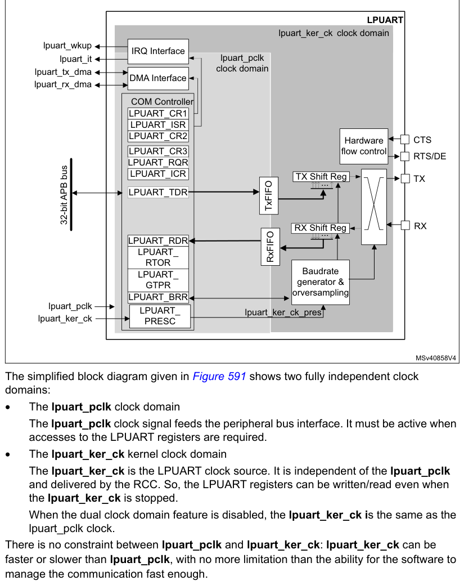

...

LPUART_TDR

TxFIFO

32-bit APB bus

...

LPUART_RDR

LPUART_

RxFIFO

RTOR

Baudrate

LPUART_
generator &

GTPR
orversampling

LPUART_BRR
lpuart_pclk

- The lpuart_pclk clock domain

The lpuart_pclk clock signal feeds the peripheral bus interface. It must be active when accesses to
the LPUART registers are required.

- The lpuart_ker_ck kernel clock domain

The lpuart_ker_ck is the LPUART clock source. It is independent of the lpuart_pclk and delivered by
the RCC. So, the LPUART registers can be written/read even when the lpuart_ker_ck is stopped.

When the dual clock domain feature is disabled, the lpuart_ker_ck is the same as the lpuart_pclk
clock.

There is no constraint between lpuart_pclk and lpuart_ker_ck: lpuart_ker_ck can be
faster or slower than lpuart_pclk, with no more limitation than the ability for the software to
manage the communication fast enough.

### 41.4.2 LPUART signals

LPUART bidirectional communications requires a minimum of two pins: Receive Data In (RX) and
Transmit Data Out (TX):

- RX (Receive Data Input)

RX is the serial data input.

- TX (Transmit Data Output)

When the transmitter is disabled, the output pin returns to its I/O port configuration. When the
transmitter is enabled and nothing is to be transmitted, the TX pin is at high level. In single-wire
mode, this I/O is used to transmit and receive the data.

#### RS232 hardware flow control mode

The following pins are required in RS232 hardware flow control mode:

- CTS (Clear To Send)

When driven high, this signal blocks the data transmission at the end of the current transfer.

- RTS (Request to send)

When it is low, this signal indicates that the USART is ready to receive data.

#### RS485 hardware flow control mode

The following pin is required in RS485 hardware control mode:

- DE (Driver Enable)

This signal activates the transmission mode of the external transceiver.

> **Note:** DE and RTS share the same pin.

Refer to Table 381 and Table 382 for the list of USART input/output pins and internal signals.

**Table 381. LPUART input/output pins**

| Pin name | Signal type | Description |
| --- | --- | --- |
| LPUART_RX | Input | Serial data receive input |
| LPUART_TX | Output | Transmit data output |
| LPUART_CTS | Input | Clear to send |
| LPUART_RTS | Output | Request to send |
| LPUART_DE(1) | Output | Driver enable |

1. LPUART_DE and LPUART_RTS share the same pin.

#### Description of USART input/output signals

**Table 382. LPUART internal input/output signals**

| Pin name | Signal type | Description |
| --- | --- | --- |
| lpuart_pclk | Input | APB clock |
| lpuart_ker_ck | Input | USART kernel clock |

**Table 382. LPUART internal input/output signals (continued)**

| Pin name | Signal type | Description |
| --- | --- | --- |
| lpuart_wkup | Output | USART provides a wake-up interrupt |
| lpuart_it | Output | USART global interrupt |
| lpuart_tx_dma | Input/output | USART transmit DMA request |
| lpuart_rx_dma | Input/output | USART receive DMA request |

### 41.4.3 LPUART character description

The word length can be set to 7 or 8 or 9 bits, by programming the M bits (M0: bit 12 and M1: bit
28) in the LPUART_CR1 register (see Figure 565).

- 7-bit character length: M[1:0] = ‘10’
- 8-bit character length: M[1:0] = ‘00’
- 9-bit character length: M[1:0] = ‘01’

By default, the signal (TX or RX) is in low state during the start bit. It is in high state during
the stop bit.

These values can be inverted, separately for each signal, through polarity configuration control.

An Idle character is interpreted as an entire frame of “1”s. (The number of “1” ‘s includes the
number of stop bits).

A Break character is interpreted on receiving “0”s for a frame period. At the end of the break
frame, the transmitter inserts 2 stop bits.

Transmission and reception are driven by a common baud rate generator. The transmission and
reception clocks are generated when the enable bit is set for the transmitter and receiver,
respectively.

The details of each block is given below.

**Figure 592. LPUART word length programming**

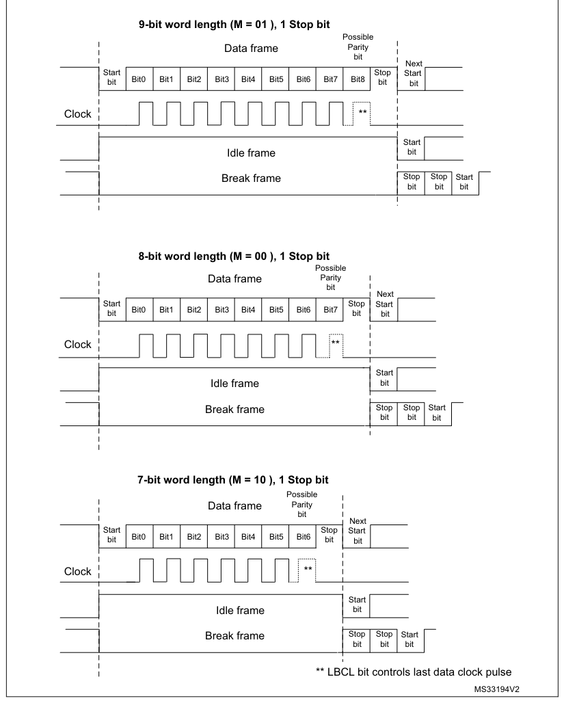

### 41.4.4 LPUART FIFOs and thresholds

The LPUART can operate in FIFO mode.

The LPUART comes with a Transmit FIFO (TXFIFO) and a Receive FIFO (RXFIFO). The FIFO mode is enabled
by setting FIFOEN bit (bit 29) in LPUART_CR1 register.

Since the maximum data word length is 9 bits, the TXFIFO is 9-bit wide. However the RXFIFO default
width is 12 bits. This is due to the fact that the receiver does not only store
the data in the FIFO, but also the error flags associated to each character (Parity error, Noise
error and Framing error flags).

> **Note:** The received data is stored in the RXFIFO together with the corresponding flags. However,
> only the data are read when reading the RDR.

The status flags are available in the LPUART_ISR register.

It is possible to define the TXFIFO and RXFIFO levels at which the Tx and RX interrupts are
triggered. These thresholds are programmed through RXFTCFG and TXFTCFG bitfields in LPUART_CR3
control register.

In this case:

- The RXFT flag is set in the LPUART_ISR register and the corresponding interrupt (if enabled) is
  generated, when the number of received data in the RXFIFO reaches the threshold programmed in the
  RXFTCFG bits fields.

This means that the RXFIFO is filled until the number of data in the RXFIFO is equal to the
programmed threshold.

RXFTCFG data have been received: one data in LPUART_RDR and (RXFTCFG - 1) data in the RXFIFO. As an
example, when the RXFTCFG is programmed to ‘101’, the RXFT flag is set when a number of data
corresponding to the FIFO size has been received: FIFO size - 1 data in the RXFIFO and 1 data in the
LPUART_RDR. As a result, the next received data does not set the overrun flag.

- The TXFT flag is set in the LPUART_ISR register and the corresponding interrupt (if enabled) is
  generated when the number of empty locations in the TXFIFO reaches the threshold programmed in the
  TXFTCFG bits fields.

This means that the TXFIFO is emptied until the number of empty locations in the TXFIFO is equal to
the programmed threshold.

### 41.4.5 LPUART transmitter

The transmitter can send data words of either 7 or 8 or 9 bits, depending on the M bit status. The
Transmit Enable bit (TE) must be set in order to activate the transmitter function. The data in the
transmit shift register is output on the TX pin.

#### Character transmission

During an LPUART transmission, data shifts out least significant bit first (default configuration)
on the TX pin. In this mode, the LPUART_TDR register consists of a buffer (TDR) between the internal
bus and the transmit shift register (see Figure 591).

When FIFO mode is enabled, the data written to the LPUART_TDR register are queued in the TXFIFO.

Every character is preceded by a start bit which corresponds to a low logic level for one bit
period. The character is terminated by a configurable number of stop bits.

The number of stop bits can be 1 or 2.

> **Note:** The TE bit must be set before writing the data to be transmitted to the LPUART_TDR.

The TE bit should not be reset during data transmission. Resetting the TE bit during the
transmission corrupts the data on the TX pin as the baud rate counters is frozen. The current data
being transmitted are lost.

An idle frame is sent after the TE bit is enabled.

Configurable stop bits

The number of stop bits to be transmitted with every character can be programmed in LPUART_CR2 (bits
13,12).

- 1 stop bit: This is the default value of number of stop bits.
- 2 Stop bits: This is supported by normal LPUART, single-wire and modem modes.

An idle frame transmission includes the stop bits.

A break transmission is 10 low bits (when M[1:0] = ‘00’) or 11 low bits (when M[1:0] = ‘01’) or 9
low bits (when M[1:0] = ‘10’) followed by 2 stop bits. It is not possible to transmit long breaks
(break of length greater than 9/10/11 low bits).

**Figure 593. Configurable stop bits**

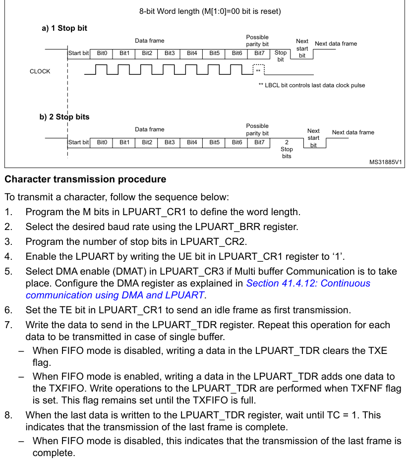

1. Program the M bits in LPUART_CR1 to define the word length.
2. Select the desired baud rate using the LPUART_BRR register.
3. Program the number of stop bits in LPUART_CR2.
4. Enable the LPUART by writing the UE bit in LPUART_CR1 register to ‘1’.
5. Select DMA enable (DMAT) in LPUART_CR3 if Multi buffer Communication is to take
   place. Configure the DMA register as explained in [Section 41.4.12](#41412-continuous-communication-using-dma-and-lpuart): Continuous communication using
   DMA and LPUART.
6. Set the TE bit in LPUART_CR1 to send an idle frame as first transmission.
7. Write the data to send in the LPUART_TDR register. Repeat this operation for each
   data to be transmitted in case of single buffer.

- When FIFO mode is disabled, writing a data in the LPUART_TDR clears the TXE flag.
- When FIFO mode is enabled, writing a data in the LPUART_TDR adds one data to the TXFIFO. Write
  operations to the LPUART_TDR are performed when TXFNF flag is set. This flag remains set until the
  TXFIFO is full.

8. When the last data is written to the LPUART_TDR register, wait until TC = 1. This
   indicates that the transmission of the last frame is complete.

- When FIFO mode is disabled, this indicates that the transmission of the last frame is complete.
- When FIFO mode is enabled, this indicates that both TXFIFO and shift register are empty.

This check is required to avoid corrupting the last transmission when the LPUART is disabled or
enters Halt mode.

#### Single byte communication

- When FIFO mode disabled:

Writing to the transmit data register always clears the TXE bit. The TXE flag is set by hardware to
indicate that:

- the data have been moved from the LPUART_TDR register to the shift register and data transmission
  has started;
- the LPUART_TDR register is empty;
- the next data can be written to the LPUART_TDR register without overwriting the previous data.

The TXE flag generates an interrupt if the TXEIE bit is set.

When a transmission is ongoing, a write instruction to the LPUART_TDR register stores the data in
the TDR register, which is copied to the shift register at the end of the current transmission.

When no transmission is ongoing, a write instruction to the LPUART_TDR register places the data in
the shift register, the data transmission starts, and the TXE bit is set.

- When FIFO mode is enabled, the TXFNF (TXFIFO Not Full) flag is set by hardware to indicate that:
  - the TXFIFO is not full;
  - the LPUART_TDR register is empty;
  - the next data can be written to the LPUART_TDR register without overwriting the previous data.
    When a transmission is ongoing, a write operation to the LPUART_TDR register stores the data in
    the TXFIFO. Data are copied from the TXFIFO to the shift register at the end of the current
    transmission.

When the TXFIFO is not full, the TXFNF flag stays at ‘1’ even after a write in LPUART_TDR. It is
cleared when the TXFIFO is full. This flag generates an interrupt if TXFNEIE bit is set.

Alternatively, interrupts can be generated and data can be written to the TXFIFO when the TXFIFO
threshold is reached. In this case, the CPU can write a block of data defined by the programmed
threshold.

If a frame is transmitted (after the stop bit) and the TXE flag (TXFE is case of FIFO mode) is set,
the TC bit goes high. An interrupt is generated if the TCIE bit is set in the LPUART_CR1 register.

After writing the last data in the LPUART_TDR register, it is mandatory to wait for TC = 1 before
disabling the LPUART or causing the device to enter the low-power mode (see Figure 594: TC/TXE
behavior when transmitting).

**Figure 594. TC/TXE behavior when transmitting**

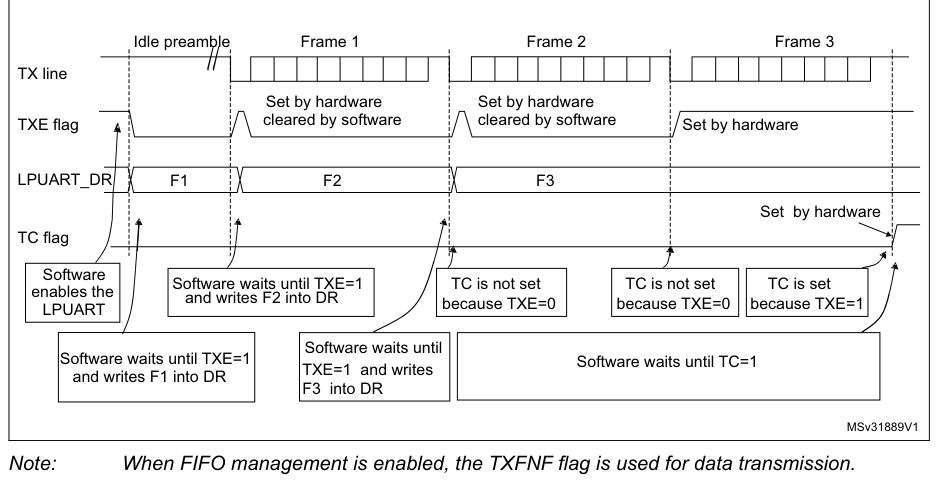

> **Note:** When FIFO management is enabled, the TXFNF flag is used for data transmission.

#### Break characters

Setting the SBKRQ bit transmits a break character. The break frame length depends on the M bits (see
Figure 592).

If a ‘1’ is written to the SBKRQ bit, a break character is sent on the TX line after completing the
current character transmission. The SBKF bit is set by the write operation and it is reset by
hardware when the break character is completed (during the stop bits after the break character). The
LPUART inserts a logic 1 signal (STOP) for the duration of 2 bits at the end of the break frame to
guarantee the recognition of the start bit of the next frame.

When the SBKRQ bit is set, the break character is sent at the end of the current transmission.

When FIFO mode is enabled, sending the break character has priority on sending data even if the
TXFIFO is full.

#### Idle characters

Setting the TE bit drives the LPUART to send an idle frame before the first data frame.

### 41.4.6 LPUART receiver

The LPUART can receive data words of either 7 or 8 or 9 bits depending on the M bits in the
LPUART_CR1 register.

#### Start bit detection

In the LPUART, the start bit is detected when a falling edge occurs on the Rx line, followed by a
sample taken in the middle of the start bit to confirm that it is still ‘0’. If the start sample is
at ‘1’, then the noise error flag (NE) is set, then the start bit is discarded and the receiver
waits for a new start bit. Else, the receiver continues to sample all incoming bits normally.

#### Character reception

During an LPUART reception, data are shifted in least significant bit first (default configuration)
through the RX pin. In this mode, the LPUART_RDR register consists of a buffer (RDR) between the
internal bus and the received shift register.

Character reception procedure

To receive a character, follow the sequence below:

1. Program the M bits in LPUART_CR1 to define the word length.
2. Select the desired baud rate using the baud rate register LPUART_BRR
3. Program the number of stop bits in LPUART_CR2.
4. Enable the LPUART by writing the UE bit in LPUART_CR1 register to ‘1’.
5. Select DMA enable (DMAR) in LPUART_CR3 if multibuffer communication is to take
   place. Configure the DMA register as explained in [Section 41.4.12](#41412-continuous-communication-using-dma-and-lpuart): Continuous communication using
   DMA and LPUART.
6. Set the RE bit LPUART_CR1. This enables the receiver which begins searching for a
   start bit.

When a character is received

- When FIFO mode is disabled, the RXNE bit is set. It indicates that the content of the shift
  register is transferred to the RDR. In other words, data has been received and can be read (as
  well as its associated error flags).
- When FIFO mode is enabled, the RXFNE bit is set indicating that the RXFIFO is not empty. Reading
  the LPUART_RDR returns the oldest data entered in the RXFIFO. When a data is received, it is
  stored in the RXFIFO, together with the corresponding error bits.
- An interrupt is generated if the RXNEIE (RXFNEIE in case of FIFO mode) bit is set.
- The error flags can be set if a frame error, noise or an overrun error has been detected during
  reception.
- In multibuffer communication mode:
  - When FIFO mode is disabled, the RXNE flag is set after every byte received and is cleared by the
    DMA read of the Receive Data Register.
  - When FIFO mode is enabled, the RXFNE flag is set when the RXFIFO is not empty. After every DMA
    request, a data is retrieved from the RXFIFO. DMA request is triggered by RXFIFO is not empty
    i.e. there is a data in the RXFIFO to be read.
- In single buffer mode:
  - When FIFO mode is disabled, clearing the RXNE flag is done by performing a software read from
    the LPUART_RDR register. The RXNE flag can also be cleared by writing 1 to the RXFRQ in the
    LPUART_RQR register. The RXNE bit must be cleared before the end of the reception of the next
    character to avoid an overrun error.
  - When FIFO mode is enabled, the RXFNE flag is set when the RXFIFO is not empty. After every read
    operation from the LPUART_RDR register, a data is retrieved from the RXFIFO. When the RXFIFO is
    empty, the RXFNE flag is cleared. The RXFNE flag can also be cleared by writing 1 to the RXFRQ
    bit in the LPUART_RQR register. When the RXFIFO is full, the first entry in the RXFIFO must be
    read before the end of the reception of the next character to avoid an overrun error. The RXFNE
    flag generates an interrupt if the RXFNEIE bit is set.

Alternatively, interrupts can be generated and data can be read from RXFIFO when the RXFIFO
threshold is reached. In this case, the CPU can read a block of data defined by the programmed
threshold.

#### Break character

When a break character is received, the LPUART handles it as a framing error.

#### Idle character

When an idle frame is detected, it is handled in the same way as a data character reception except
that an interrupt is generated if the IDLEIE bit is set.

#### Overrun error

- FIFO mode disabled

An overrun error occurs when a character is received when RXNE has not been reset.

Data can not be transferred from the shift register to the RDR register until the RXNE bit is
cleared. The RXNE flag is set after every byte received.

An overrun error occurs if RXNE flag is set when the next data is received or the previous DMA
request has not been serviced. When an overrun error occurs:

- the ORE bit is set;
- the RDR content is not lost. The previous data is available when a read to LPUART_RDR is
  performed.;
- the shift register is overwritten. After that, any data received during overrun is lost.
- an interrupt is generated if either the RXNEIE bit or EIE bit is set.
- FIFO mode enabled

An overrun error occurs when the shift register is ready to be transferred when the receive FIFO is
full.

Data can not be transferred from the shift register to the LPUART_RDR register until there is one
free location in the RXFIFO. The RXFNE flag is set when the RXFIFO is not empty.

An overrun error occurs if the RXFIFO is full and the shift register is ready to be transferred.
When an overrun error occurs:

- the ORE bit is set;
- the first entry in the RXFIFO is not lost. It is available when a read to LPUART_RDR is performed.
- the shift register is overwritten. After that, any data received during overrun is lost.
- an interrupt is generated if either the RXFNEIE bit or EIE bit is set.

The ORE bit is reset by setting the ORECF bit in the ICR register.

> **Note:** The ORE bit, when set, indicates that at least 1 data has been lost. T

When the FIFO mode is disabled, there are two possibilities

- if RXNE = 1, then the last valid data is stored in the receive register (RDR) and can be read,
- if RXNE = 0, then the last valid data has already been read and there is nothing left to be read
  in the RDR. This case can occur when the last valid data is read in the RDR at the same time as
  the new (and lost) data is received.

#### Selecting the clock source

The choice of the clock source is done through the Clock Control system (see Section Reset and clock
controller (RCC)). The clock source must be selected through the UE bit, before enabling the LPUART.

The clock source must be selected according to two criteria:

- Possible use of the LPUART in low-power mode
- Communication speed.

The clock source frequency is lpuart_ker_ck.

When the dual clock domain and the wake-up from low-power mode features are supported, the
lpuart_ker_ck clock source can be configured in the RCC (see Section Reset and clock controller
(RCC)). Otherwise, the lpuart_ker_ck is the same as lpuart_pclk.

The lpuart_ker_ck can be divided by a programmable factor in the LPUART_PRESC register.

**Figure 595. lpuart_ker_ck clock divider block diagram**

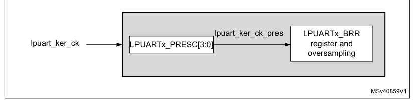

Some lpuart_ker_ck sources enable the LPUART to receive data while the MCU is in low-power mode.
Depending on the received data and wake-up mode selection, the LPUART wakes up the MCU, when needed,
in order to transfer the received data by software reading the LPUART_RDR register or by DMA.

For the other clock sources, the system must be active to enable LPUART communications.

The communication speed range (specially the maximum communication speed) is also determined by the
clock source.

The receiver samples each incoming bit as close as possible to the middle of the bit-period. Only a
single sample is taken of each of the incoming bits.

> **Note:** There is no noise detection for data.

#### Framing error

A framing error is detected when the stop bit is not recognized on reception at the expected time,
following either a de-synchronization or excessive noise.

When the framing error is detected:

- the FE bit is set by hardware;
- the invalid data is transferred from the Shift register to the LPUART_RDR register.
- no interrupt is generated in case of single byte communication. However this bit rises at the same
  time as the RXNE bit which itself generates an interrupt. In case of
  multibuffer communication, an interrupt is issued if the EIE bit is set in the LPUART_CR3 register.

The FE bit is reset by writing 1 to the FECF in the LPUART_ICR register.

#### Configurable stop bits during reception

The number of stop bits to be received can be configured through the control bits of LPUART_CR2: it
can be either 1 or 2 in normal mode.

- 1 stop bit: sampling for 1 stop bit is done on the 8th, 9th and 10th samples.
- 2 stop bits: sampling for the 2 stop bits is done in the middle of the second stop bit. The RXNE
  and FE flags are set just after this sample i.e. during the second stop bit. The first stop bit is
  not checked for framing error.

### 41.4.7 LPUART baud rate generation

The baud rate for the receiver and transmitter (Rx and Tx) are both set to the value programmed in
the LPUART_BRR register.

> **Extracted layout**
>
> `256` · `×` · `lpuart` · `ckpres`  
> `Tx/Rx baud` · `=` · `-----------------------------------------------------`  
> `LPUARTDIV`  

LPUARTDIV is defined in the LPUART_BRR register.

> **Note:** The baud counters are updated to the new value in the baud registers after a write operation
> to LPUART_BRR. Hence the baud rate register value should not be changed during communication.

It is forbidden to write values lower than 0x300 in the LPUART_BRR register.

fCK must range from 3 x baud rate to 4096 x baud rate.

The maximum baud rate that can be reached when the LPUART clock source is the LSE, is 9600 baud.
Higher baud rates can be reached when the LPUART is clocked by clock sources different from the LSE
clock. For example, if the LPUART clock source frequency is 100 MHz, the maximum baud rate that can
be reached is about 33 Mbaud.

**Table 383. Error calculation for programmed baud rates at lpuart_ker_ck_pres = 32.768 kHz**

| Source row | Column 1 | Column 2 | Column 3 | Column 4 | Column 5 |
| ---: | --- | --- | --- | --- | --- |
| 1 | `Baud rate` | `lpuart_ker_ck_pres = 32.768 kHz` |  |  |  |
| 2 | `Value programmed in the baud` | `% Error = (Calculated - Desired)` |  |  |  |
| 3 | `S. No` | `Desired` | `Actual` |  |  |
| 4 | `rate register` | `B.rate / Desired B.rate` |  |  |  |
| 5 | `1` | `300 bauds` | `300 baud` | `0x6D3A` | `0` |
| 6 | `2` | `600 baud` | `600 baud` | `0x369D` | `0` |
| 7 | `3` | `1200 baud` | `1200.087 baud` | `0x1B4E` | `0.007` |
| 8 | `4` | `2400 baud` | `2400.17 baud` | `0xDA7` | `0.007` |
| 9 | `5` | `4800 baud` | `4801.72 baud` | `0x6D3` | `0.035` |
| 10 | `6` | `9600 baud` | `9608.94 baud` | `0x369` | `0.093` |

**Table 384. Error calculation for programmed baud rates at fCK = 100 MHz**

| Source row | Column 1 | Column 2 | Column 3 | Column 4 | Column 5 |
| ---: | --- | --- | --- | --- | --- |
| 1 | `Baud rate` | `fCK = 100MHz` |  |  |  |
| 2 | `Value programmed in the baud` | `% Error = (Calculated - Desired)` |  |  |  |
| 3 | `S. No` | `Desired` | `Actual` |  |  |
| 4 | `rate register` | `B.rate / Desired B.rate` |  |  |  |
| 5 | `1` | `38400 Baud` | `38400,04 Baud` | `A2C2A` | `0,0001` |
| 6 | `2` | `57600 Baud` | `57600,06 Baud` | `6C81C` | `0,0001` |
| 7 | `3` | `115200 Baud` | `115200,12 Baud` | `3640E` | `0,0001` |
| 8 | `4` | `230400 Baud` | `230400,23 Baud` | `1B207` | `0,0001` |
| 9 | `5` | `460800 Baud` | `460804,61 Baud` | `D903` | `0,001` |
| 10 | `6` | `921600 Baud` | `921625,81 Baud` | `6C81` | `0,0028` |
| 11 | `7` | `4000 KBaud` | `4000000,00 Baud` | `1900` | `0` |
| 12 | `8` | `10000 Kbaud` | `10000000,00 Baud` | `A00` | `0` |
| 13 | `9` | `20000 Kbaud` | `20000000,00 Baud` | `500` | `0` |
| 14 | `10` | `33000 Kbaud` | `33032258,06 Baud` | `307` | `0,1` |

### 41.4.8 Tolerance of the LPUART receiver to clock deviation

The asynchronous receiver of the LPUART works correctly only if the total clock system deviation is
less than the tolerance of the LPUART receiver. The causes which contribute to the total deviation
are:

- DTRA: deviation due to the transmitter error (which also includes the deviation of the
  transmitter’s local oscillator)
- DQUANT: error due to the baud rate quantization of the receiver
- DREC: deviation of the receiver local oscillator
- DTCL: deviation due to the transmission line (generally due to the transceivers which can
  introduce an asymmetry between the low-to-high transition timing and the high-to-low transition
  timing)

> **Extracted layout**
>
> `DTRA` · `+` · `DQUANT` · `+` · `DREC` · `+` · `DTCL` · `+` · `DWU` · `<` · `LPUART receiver tolerance`  
> `where`  

DWU is the error due to sampling point deviation when the wake-up from low-power mode is used.

The LPUART receiver can receive data correctly at up to the maximum tolerated deviation specified in
Table 385:

- Number of Stop bits defined through STOP[1:0] bits in the LPUART_CR2 register
- LPUART_BRR register value.

**Table 385. Tolerance of the LPUART receiver**

| Source row | Column 1 | Column 2 | Column 3 | Column 4 | Column 5 |
| ---: | --- | --- | --- | --- | --- |
| 1 | `M bits` | `768 < BRR < 1024` | `1024 < BRR < 2048` | `2048 < BRR < 4096` | `4096 ≤BRR` |
| 2 | `8 bits (M = 00’), 1 Stop` |  |  |  |  |
| 3 | `1.82%` | `2.56%` | `3.90%` | `4.42%` |  |
| 4 | `bit` |  |  |  |  |
| 5 | `9 bits (M = 01’), 1 Stop` |  |  |  |  |
| 6 | `1.69%` | `2.33%` | `2.53%` | `4.14%` |  |
| 7 | `bit` |  |  |  |  |
| 8 | `7 bits (M = ’10’), 1 Stop` |  |  |  |  |
| 9 | `2.08%` | `2.86%` | `4.35%` | `4.42%` |  |
| 10 | `bit` |  |  |  |  |
| 11 | `8 bits (M = 00’), 2 Stop` |  |  |  |  |
| 12 | `2.08%` | `2.86%` | `4.35%` | `4.42%` |  |
| 13 | `bit` |  |  |  |  |
| 14 | `9 bits (M = 01’), 2 Stop` |  |  |  |  |
| 15 | `1.82%` | `2.56%` | `3.90%` | `4.42%` |  |
| 16 | `bit` |  |  |  |  |
| 17 | `7 bits (M = ’10’), 2 Stop` |  |  |  |  |
| 18 | `2.34%` | `3.23%` | `4.92%` | `4.42%` |  |
| 19 | `bit` |  |  |  |  |

> **Note:** The data specified in Table 385 may slightly differ in the special case when the received
> frames contain some Idle frames of exactly 10-bit times when M bits = ‘00’ (11-bit times when M =
’01’ or 9- bit times when M = ‘10’).

### 41.4.9 LPUART multiprocessor communication

It is possible to perform LPUART multiprocessor communications (with several LPUARTs connected in a
network). For instance one of the LPUARTs can be the master, with its TX output connected to the RX
inputs of the other LPUARTs. The others are slaves, with their respective TX outputs are logically
ANDed together and connected to the RX input of the master.

In multiprocessor configurations it is often desirable that only the intended message recipient
actively receives the full message contents, thus reducing redundant LPUART service overhead for all
non addressed receivers.

The non addressed devices can be placed in mute mode by means of the muting function. To use the
mute mode feature, the MME bit must be set in the LPUART_CR1 register.

> **Note:** When FIFO management is enabled and MME is already set, MME bit must not be cleared
> and then set again quickly (within two lpuart_ker_ck cycles), otherwise mute mode might remain
> active.

When the mute mode is enabled:

- none of the reception status bits can be set;
- all the receive interrupts are inhibited;
- the RWU bit in LPUART_ISR register is set to ‘1’. RWU can be controlled automatically by hardware
  or by software, through the MMRQ bit in the LPUART_RQR register, under certain conditions.

The LPUART can enter or exit from mute mode using one of two methods, depending on the WAKE bit in
the LPUART_CR1 register:

- Idle Line detection if the WAKE bit is reset,
- Address Mark detection if the WAKE bit is set.

#### Idle line detection (WAKE = 0)

The LPUART enters mute mode when the MMRQ bit is written to 1 and the RWU is automatically set.

The LPUART wakes up when an Idle frame is detected. The RWU bit is then cleared by hardware but the
IDLE bit is not set in the LPUART_ISR register. An example of mute mode behavior using Idle line
detection is given in Figure 596.

**Figure 596. Mute mode using Idle line detection**

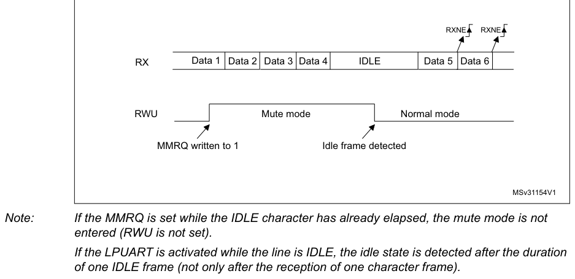

> **Note:** If the MMRQ is set while the IDLE character has already elapsed, the mute mode is not
> entered (RWU is not set).

If the LPUART is activated while the line is IDLE, the idle state is detected after the duration of
one IDLE frame (not only after the reception of one character frame).

#### 4-bit/7-bit address mark detection (WAKE = 1)

In this mode, bytes are recognized as addresses if their MSB is a ‘1’ otherwise they are considered
as data. In an address byte, the address of the targeted receiver is put in the 4 or 7 LSBs. The
choice of 7 or 4 bit address detection is done using the ADDM7 bit. This 4- bit/7-bit word is
compared by the receiver with its own address which is programmed in the ADD bits in the LPUART_CR2
register.

> **Note:** In 7-bit and 9-bit data modes, address detection is done on 6-bit and 8-bit addresses

(ADD[5:0] and ADD[7:0]) respectively.

The LPUART enters mute mode when an address character is received which does not match its
programmed address. In this case, the RWU bit is set by hardware. The RXNE flag is not set for this
address byte and no interrupt or DMA request is issued when the LPUART enters mute mode.

The LPUART also enters mute mode when the MMRQ bit is written to ‘1’. The RWU bit is also
automatically set in this case.

The LPUART exits from mute mode when an address character is received which matches the programmed
address. Then the RWU bit is cleared and subsequent bytes are received normally. The RXNE/RXFNE bit
is set for the address character since the RWU bit has been cleared.

> **Note:** When FIFO management is enabled, when MMRQ bit is set while the receiver is sampling
> the last bit of a data, this data may be received before effectively entering in mute mode.

An example of mute mode behavior using address mark detection is given in Figure 597.

**Figure 597. Mute mode using address mark detection**

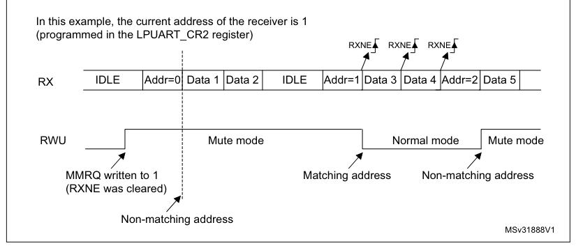

### 41.4.10 LPUART parity control

Parity control (generation of parity bit in transmission and parity checking in reception) can be
enabled by setting the PCE bit in the LPUART_CR1 register. Depending on the frame length defined by
the M bits, the possible LPUART frame formats are as listed in Table 386.

Table 386: LPUART frame formats

> **Extracted layout**
>
> `M bits` · `PCE bit` · `LPUART frame(1)`  
> `00` · `0` · `SB` · `8 bit data` · `STB`  
> `00` · `1` · `SB` · `7-bit data` · `PB` · `STB`  
> `01` · `0` · `SB` · `9-bit data` · `STB`  
> `01` · `1` · `SB` · `8-bit data PB` · `STB`  
> `10` · `0` · `SB` · `7bit data` · `STB`  
> `10` · `1` · `SB` · `6-bit data` · `PB` · `STB`  

1. Legends: SB: start bit, STB: stop bit, PB: parity bit.
2. In the data register, the PB is always taking the MSB position (8th or 7th, depending on the M
   bit value).

#### Even parity

The parity bit is calculated to obtain an even number of “1s” inside the frame which is made of the
6, 7 or 8 LSB bits (depending on M bit values) and the parity bit.

As an example, if data equal 00110101, and 4 bits are set, then the parity bit is equal to 0 if even
parity is selected (PS bit in LPUART_CR1 = 0).

#### Odd parity

The parity bit is calculated to obtain an odd number of “1s” inside the frame made of the 6, 7 or 8
LSB bits (depending on M bit values) and the parity bit.

As an example, if data equal 00110101 and 4 bits set, then the parity bit is equal to 1 if odd
parity is selected (PS bit in LPUART_CR1 = 1).

#### Parity checking in reception

If the parity check fails, the PE flag is set in the LPUART_ISR register and an interrupt is
generated if PEIE is set in the LPUART_CR1 register. The PE flag is cleared by software writing 1 to
the PECF in the LPUART_ICR register.

#### Parity generation in transmission

If the PCE bit is set in LPUART_CR1, then the MSB bit of the data written in the data register is
transmitted but is changed by the parity bit (even number of “1s” if even parity is selected (PS =
0) or an odd number of “1s” if odd parity is selected (PS = 1)).

### 41.4.11 LPUART single-wire half-duplex communication

Single-wire half-duplex mode is selected by setting the HDSEL bit in the LPUART_CR3 register. In
this mode, the following bits must be kept cleared:

- LINEN and CLKEN bits in the LPUART_CR2 register,
- SCEN and IREN bits in the LPUART_CR3 register.

The LPUART can be configured to follow a single-wire half-duplex protocol where the TX and RX lines
are internally connected. The selection between half-and Full-duplex communication is made with a
control bit HDSEL in LPUART_CR3.

As soon as HDSEL is written to ‘1’:

- The TX and RX lines are internally connected.
- The RX pin is no longer used
- The TX pin is always released when no data is transmitted. Thus, it acts as a standard I/O in idle
  or in reception. It means that the I/O must be configured so that TX is configured as alternate
  function open-drain with an external pull-up.

Apart from this, the communication protocol is similar to normal LPUART mode. Any conflict on the
line must be managed by software (for instance by using a centralized arbiter). In particular, the
transmission is never blocked by hardware and continues as soon as data is written in the data
register while the TE bit is set.

> **Note:** In LPUART communications, in the case of 1-stop bit configuration, the RXNE flag is set in
> the middle of the stop bit.

### 41.4.12 Continuous communication using DMA and LPUART

The LPUART is capable of performing continuous communication using the DMA. The DMA requests for Rx
buffer and Tx buffer are generated independently.

> **Note:** Refer to [Section 40.4](chapter-40.md#404-usart-implementation): USART implementation to determine if the DMA mode
> is supported. If DMA is not supported, use the LPUSRT as explained in [Section 40.5.6](chapter-40.md#4056-usart-receiver). To perform
> continuous communication. When FIFO is disabled, you can clear the TXE/ RXNE flags in the LPUART_ISR
> register.

#### Transmission using DMA

DMA mode can be enabled for transmission by setting DMAT bit in the LPUART_CR3 register. Data are
loaded from an SRAM area configured using the DMA peripheral (refer to the corresponding Direct
memory access controller section) to the LPUART_TDR register whenever the TXE flag (TXFNF flag if
FIFO mode is enabled) is set. To map a DMA channel for LPUART transmission, use the following
procedure (x denotes the channel number):

1. Write the LPUART_TDR register address in the DMA control register to configure it as
   the destination of the transfer. The data is moved to this address from memory after each TXE (or
   TXFNF if FIFO mode is enabled) event.
2. Write the memory address in the DMA control register to configure it as the source of
   the transfer. The data is loaded into the LPUART_TDR register from this memory area after each TXE
   (or TXFNF if FIFO mode is enabled) event.
3. Configure the total number of bytes to be transferred to the DMA control register.
4. Configure the channel priority in the DMA register
5. Configure DMA interrupt generation after half/ full transfer as required by the
   application.
6. Clear the TC flag in the LPUART_ISR register by setting the TCCF bit in the

LPUART_ICR register.

7. Activate the channel in the DMA register.

When the number of data transfers programmed in the DMA Controller is reached, the DMA controller
generates an interrupt on the DMA channel interrupt vector.

In transmission mode, once the DMA has written all the data to be transmitted (the TCIF flag is set
in the DMA_ISR register), the TC flag can be monitored to make sure that the LPUART communication is
complete. This is required to avoid corrupting the last transmission before disabling the LPUART or
entering low-power mode. Software must wait until TC = 1. The TC flag remains cleared during all
data transfers and it is set by hardware at the end of transmission of the last frame.

**Figure 598. Transmission using DMA**

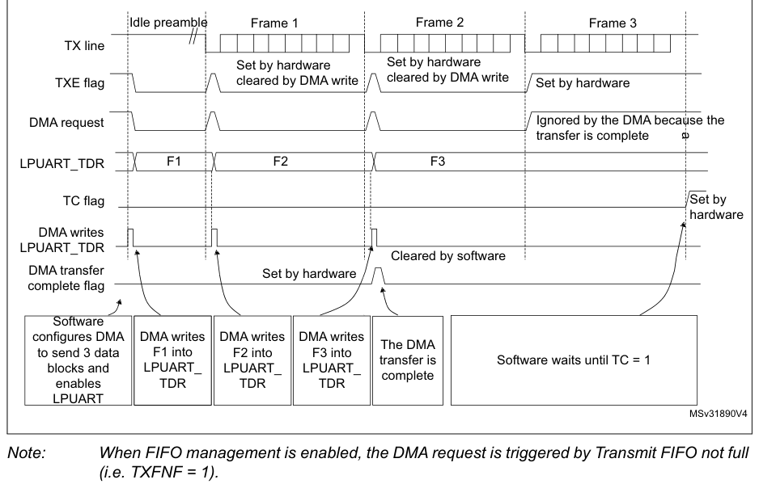

> **Note:** When FIFO management is enabled, the DMA request is triggered by Transmit FIFO not full

(i.e. TXFNF = 1).

#### Reception using DMA

DMA mode can be enabled for reception by setting the DMAR bit in LPUART_CR3 register. Data are
loaded from the LPUART_RDR register to a SRAM area configured using the DMA peripheral (refer to the
corresponding Direct memory access controller (DMA) section) whenever a data byte is received. To
map a DMA channel for LPUART reception, use the following procedure:

1. Write the LPUART_RDR register address in the DMA control register to configure it as
   the source of the transfer. The data is moved from this address to the memory after each RXNE (RXFNE
   in case FIFO mode is enabled) event.
2. Write the memory address in the DMA control register to configure it as the destination
   of the transfer. The data is loaded from LPUART_RDR to this memory area after each RXNE (RXFNE in
   case FIFO mode is enabled) event.
3. Configure the total number of bytes to be transferred to the DMA control register.
4. Configure the channel priority in the DMA control register
5. Configure interrupt generation after half/ full transfer as required by the application.
6. Activate the channel in the DMA control register.

When the number of data transfers programmed in the DMA Controller is reached, the DMA controller
generates an interrupt on the DMA channel interrupt vector.

**Figure 599. Reception using DMA**

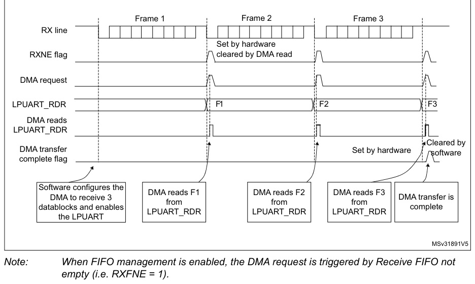

> **Note:** When FIFO management is enabled, the DMA request is triggered by Receive FIFO not
> empty (i.e. RXFNE = 1).

#### Error flagging and interrupt generation in multibuffer communication

If any error occurs during a transaction In multibuffer communication mode, the error flag is
asserted after the current byte. An interrupt is generated if the interrupt enable flag is set. For
framing error, overrun error and noise flag which are asserted with RXNE (RXFNE in case FIFO mode is
enabled) in single byte reception, there is a separate error flag interrupt
enable bit (EIE bit in the LPUART_CR3 register), which, if set, enables an interrupt after the
current byte if any of these errors occur.

### 41.4.13 RS232 hardware flow control and RS485 Driver Enable

It is possible to control the serial data flow between 2 devices by using the CTS input and the RTS
output. The Figure 586 shows how to connect 2 devices in this mode:

**Figure 600. Hardware flow control between 2 LPUARTs**

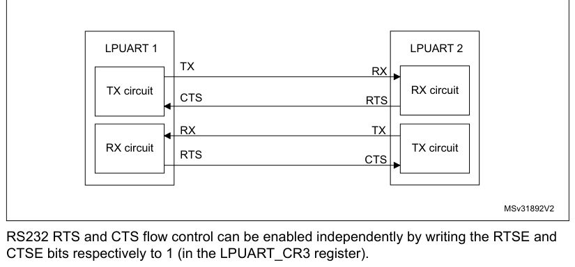

RS232 RTS and CTS flow control can be enabled independently by writing the RTSE and CTSE bits
respectively to 1 (in the LPUART_CR3 register).

#### RS232 RTS flow control

If the RTS flow control is enabled (RTSE = 1), then RTS is deasserted (tied low) as long as the
LPUART receiver is ready to receive a new data. When the receive register is full, RTS is asserted,
indicating that the transmission is expected to stop at the end of the current frame. Figure 601
shows an example of communication with RTS flow control enabled.

**Figure 601. RS232 RTS flow control**

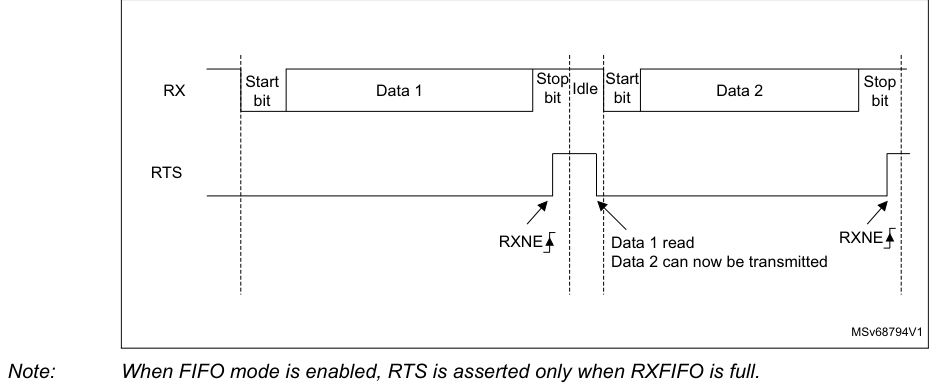

> **Note:** When FIFO mode is enabled, RTS is asserted only when RXFIFO is full.

#### RS232 CTS flow control

If the CTS flow control is enabled (CTSE = 1), then the transmitter checks the CTS input before
transmitting the next frame. If CTS is deasserted (tied low), then the next data is transmitted
(assuming that data is to be transmitted, in other words, if TXE/TXFE = 0), else the transmission
does not occur. When CTS is asserted during a transmission, the current transmission is completed
before the transmitter stops.

When CTSE = 1, the CTSIF status bit is automatically set by hardware as soon as the CTS input
toggles. It indicates when the receiver becomes ready or not ready for communication. An interrupt
is generated if the CTSIE bit in the LPUART_CR3 register is set. Figure 602 shows an example of
communication with CTS flow control enabled.

**Figure 602. RS232 CTS flow control**

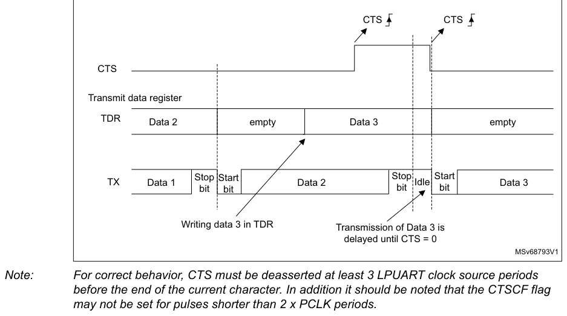

> **Note:** For correct behavior, CTS must be deasserted at least 3 LPUART clock source periods
> before the end of the current character. In addition it should be noted that the CTSCF flag may not
> be set for pulses shorter than 2 x PCLK periods.

#### RS485 driver enable

The driver enable feature is enabled by setting bit DEM in the LPUART_CR3 control register. This
enables activating the external transceiver control, through the DE (Driver Enable) signal. The
assertion time is the time between the activation of the DE signal and the beginning of the start
bit. It is programmed using the DEAT [4:0] bitfields in the LPUART_CR1 control register. The
deassertion time is the time between the end of the last stop bit, in a transmitted message, and the
de-activation of the DE signal. It is programmed using the DEDT [4:0] bitfields in the LPUART_CR1
control register. The polarity of the DE signal can be configured using the DEP bit in the
LPUART_CR3 control register.

The LPUART DEAT and DEDT are expressed in LPUART clock source (fCK) cycles:

- The Driver enable assertion time equals
  - (1 \+ (DEAT x P)) x fCK, if P # 0
  - (1 \+ DEAT) x fCK, if P = 0
- The Driver enable deassertion time equals
  - (1 \+ (DEDT x P)) x fCK, if P # 0
  - (1 \+ DEDT) x fCK, if P = 0
    where P = BRR[20:11]

### 41.4.14 LPUART low-power management

The LPUART has advanced low-power mode functions that enable it to transfer properly
data even when the lpuart_pclk clock is disabled.

The LPUART is able to wake up the MCU from low-power mode when the UESM bit is set.

When the lpuart_pclk is gated, the LPUART provides a wake-up interrupt (lpuart_wkup) if a
specific action requiring the activation of the lpuart_pclk clock is needed:

- If FIFO mode is disabled
  luart_pclk clock has to be activated to empty the LPUART data register.

In this case, the lpuart_wkup interrupt source is the RXNE set to ‘1’. The RXNEIE bit must be set
before entering low-power mode.

- If FIFO mode is enabled
  luart_pclk clock has to be activated
- to fill the TXFIFO
- or to empty the RXFIFO

In this case, the lpuart_wkup interrupt source can be:

- RXFIFO not empty. In this case, the RXFNEIE bit must be set before entering low-power mode.
- RXFIFO full. In this case, the RXFFIE bit must be set before entering low-power mode, the number
  of received data corresponds to the RXFIFO size, and the RXFF flag is not set.
- TXFIFO empty. In this case, the TXFEIE bit must be set before entering low-power mode.

This enables sending/receiving the data in the TXFIFO/RXFIFO during low-power mode.

To avoid overrun/underrun errors and transmit/receive data in low-power mode, the lpuart_wkup
interrupt source can be one of the following events:

- TXFIFO threshold reached. In this case, the TXFTIE bit must be set before entering low-power mode.
- RXFIFO threshold reached. In this case, the RXFTIE bit must be set before entering low-power mode.

For example, the application can set the threshold to the maximum RXFIFO size if the wake-up time is
less than the time to receive a single byte across the line.

Using the RXFIFO full, TXFIFO empty, RXFIFO not empty and RXFIFO/TXFIFO threshold interrupts to wake
up the MCU from low-power mode enables doing as many LPUART transfers as possible during low-power
mode with the benefit of optimizing consumption.

Alternatively, a specific lpuart_wkup interrupt may be selected through the WUS bitfields.

When the wake-up event is detected, the WUF flag is set by hardware and lpuart_wkup interrupt is
generated if the WUFIE bit is set.

> **Note:** Before entering low-power mode, make sure that no LPUART transfer is ongoing. Checking
> the BUSY flag cannot ensure that low-power mode is never entered when data reception is ongoing.

The WUF flag is set when a wake-up event is detected, independently of whether the MCU is in
low-power or in an active mode.

When entering low-power mode just after having initialized and enabled the receiver, the REACK bit
must be checked to ensure the LPUART is actually enabled.

When DMA is used for reception, it must be disabled before entering low-power mode and re-enabled
upon exit from low-power mode.

When FIFO is enabled, the wake-up from low-power mode on address match is only possible when mute
mode is enabled.

#### Using mute mode with low-power mode

If the LPUART is put into mute mode before entering low-power mode:

- Wake-up from mute mode on idle detection must not be used, because idle detection cannot work in
  low-power mode.
- If the wake-up from mute mode on address match is used, then the low-power mode wake-up source
  from must also be the address match. If the RXNE flag was set when entering the low-power mode,
  the interface remains in mute mode upon address match and wake up from low-power mode.

> **Note:** When FIFO management is enabled, mute mode is used with wake-up from low-power
> mode without any constraints (i.e.the two points mentioned above about mute and low-power mode are
> valid only when FIFO management is disabled).

#### Wake-up from low-power mode when LPUART kernel clock lpuart_ker_ck is OFF in low-power mode

If during low-power mode, the lpuart_ker_ck clock is switched OFF, when a falling edge on the LPUART
receive line is detected, the LPUART interface requests the lpuart_ker_ck clock to be switched ON
thanks to the lpuart_ker_ck_req signal. The lpuart_ker_ck is then used for the frame reception.

If the wake-up event is verified, the MCU wakes up from low-power mode and data reception goes on
normally.

If the wake-up event is not verified, the lpuart_ker_ck is switched OFF again, the MCU is not waken
up and stays in low-power mode and the kernel clock request is released.

The example below shows the case of wake-up event programmed to “address match detection” and FIFO
management disabled.

Figure 603 shows the behavior when the wake-up event is verified.

**Figure 603. Wake-up event verified (wake-up event = address match,**

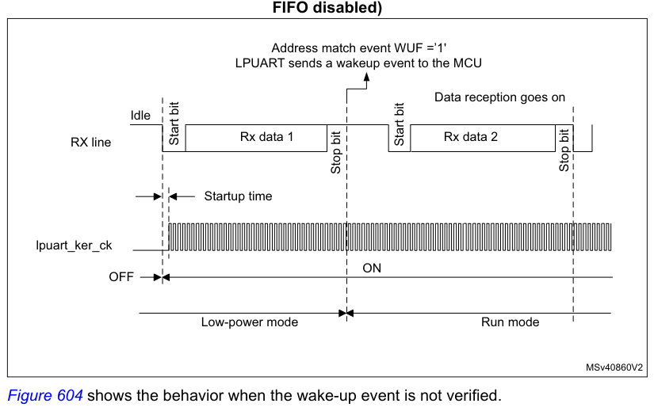

FIFO disabled)

Address match event WUF =’1'

LPUART sends a wakeup event to the MCU

Data reception goes on

Idle

Figure 604 shows the behavior when the wake-up event is not verified.

**Figure 604. Wake-up event not verified (wake-up event = address match,**

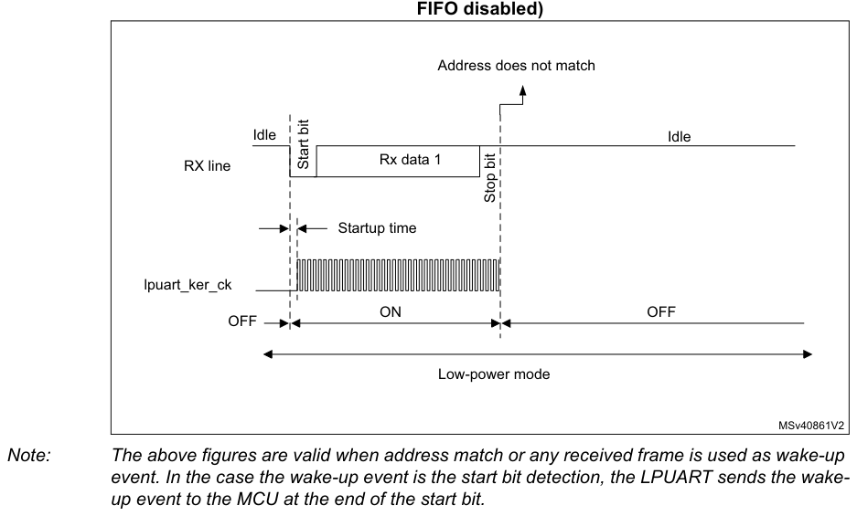

> **Note:** The above figures are valid when address match or any received frame is used as wake-up
> event. In the case the wake-up event is the start bit detection, the LPUART sends the wake-up event
> to the MCU at the end of the start bit.

#### Determining the maximum LPUART baud rate that enables to correctly wake up the MCU from low-power mode

The maximum baud rate that enables to correctly wake up the MCU from low-power mode depends on the
wake-up time parameter (refer to the device datasheet) and on the LPUART receiver tolerance (see
[Section 41.4.8](#4148-tolerance-of-the-lpuart-receiver-to-clock-deviation): Tolerance of the LPUART receiver to clock deviation).

Let us take the example of OVER8 = 0, M bits = ‘01’, ONEBIT = 0 and BRR [3:0] = 0000.

In these conditions, according to Table 385: Tolerance of the LPUART receiver, the LPUART receiver
tolerance equals 3.41%.

DTRA \+ DQUANT \+ DREC \+ DTCL \+ DWU \< LPUART receiver tolerance

DWUmax = tWULPUART/ (11 x Tbit Min)

Tbit Min = tWULPUART/ (11 x DWUmax)
where tWULPUART is the wake-up time from low-power mode.

If we consider the ideal case where DTRA, DQUANT, DREC and DTCL parameters are at 0%, the maximum
value of DWU is 3.41%. In reality, we need to consider at least the lpuart_ker_ck inaccuracy.

For example, if HSI16 is used as lpuart_ker_ck, and the HSI16 inaccuracy is of 1%, then we obtain:

tWULPUART = 3 µs (values provided only as examples; for correct values, refer to the device
datasheet).

DWUmax = 3.41% - 1% = 2.41%

Tbit min = 3 µs/ (11 x 2.41%) = 11.32 µs.

As a result, the maximum baud rate that enables to wake up correctly from low-power mode is: 1/11.32
µs = 88.36 kbaud.

## 41.5 LPUART in low-power modes

**Table 387. Effect of low-power modes on the LPUART**

| Source row | Column 1 | Column 2 |
| ---: | --- | --- |
| 1 | `Mode` | `Description` |
| 2 | `Sleep` | `No effect. LPUART interrupts cause the device to exit Sleep mode.` |
| 3 | `The content of the LPUART registers is kept.` |  |
| 4 | `Stop(1)` | `The LPUART is able to wake up the microcontroller from Stop mode when` |

the LPUART is clocked by an oscillator available in Stop mode.

The LPUART peripheral is powered down and must be reinitialized after

Standby
exiting Standby mode.

1. Refer to [Section 41.3](#413-lpuart-implementation): LPUART implementation to know if the wake-up from Stop mode is supported
   for a
   given peripheral instance. If an instance is not functional in a given Stop mode, it must be
   disabled before
   entering this Stop mode.

## 41.6 LPUART interrupts

Refer to Table 388 for a detailed description of all LPUART interrupt requests.

**Table 388. LPUART interrupt requests**

| Source row | Column 1 | Column 2 | Column 3 | Column 4 | Column 5 |
| ---: | --- | --- | --- | --- | --- |
| 1 | `Enable` | `Exit from` | `Exit from` | `Exit from` |  |
| 2 | `Interrupt` | `Event` | `Interrupt clear` |  |  |
| 3 | `Interrupt event` | `Control` | `Sleep` | `Stop(1)` | `Standby` |
| 4 | `vector` | `flag` | `method` |  |  |
| 5 | `bit` | `mode` | `modes` | `mode` |  |
| 6 | `Transmit data` |  |  |  |  |
| 7 | `TXE` | `TXEIE` | `Write TDR` | `No` |  |
| 8 | `register empty` |  |  |  |  |
| 9 | `Transmit FIFO Not` |  |  |  |  |
| 10 | `TXFNF` | `TXFNFIE` | `TXFIFO full` | `No` |  |
| 11 | `Full` |  |  |  |  |
| 12 | `Transmit FIFO` | `Write TDR or write 1` |  |  |  |
| 13 | `TXFE` | `TXFEIE` | `Yes` |  |  |
| 14 | `Empty` | `in TXFRQ` |  |  |  |
| 15 | `Yes` |  |  |  |  |
| 16 | `Transmit FIFO` |  |  |  |  |
| 17 | `TXFT` | `TXFTIE` | `Write TDR` | `Yes` |  |
| 18 | `threshold reached` |  |  |  |  |
| 19 | `CTS interrupt` | `CTSIF` | `CTSIE` | `Write 1 in CTSCF` | `No` |
| 20 | `Transmission` | `Write TDR or write 1` |  |  |  |
| 21 | `TC` | `TCIE` | `No` |  |  |
| 22 | `Complete` | `in TCCF` |  |  |  |
| 23 | `Receive data` |  |  |  |  |
| 24 | `register not empty` | `Read RDR or write` |  |  |  |
| 25 | `RXNE` | `RXNEIE` | `Yes` |  |  |
| 26 | `(data ready to be` | `1 in RXFRQ` |  |  |  |
| 27 | `read)` |  |  |  |  |
| 28 | `Read RDR until` |  |  |  |  |
| 29 | `Receive FIFO Not` |  |  |  |  |
| 30 | `RXFNE` | `RXFNEIE` | `RXFIFO empty or` | `Yes` |  |
| 31 | `Empty` |  |  |  |  |
| 32 | `write 1 in RXFRQ` |  |  |  |  |
| 33 | `Receive FIFO Full` | `RXFF(2)` | `RXFFIE` | `Read RDR` | `Yes` |
| 34 | `LPUART` | `No` |  |  |  |
| 35 | `Receive FIFO` |  |  |  |  |
| 36 | `RXFT` | `RXFTIE` | `Read RDR` | `Yes` |  |
| 37 | `threshold reached` |  |  |  |  |
| 38 | `RX-` |  |  |  |  |
| 39 | `Overrun error` |  |  |  |  |
| 40 | `ORE` | `NEIE/RX` | `Write 1 in ORECF` | `No` |  |
| 41 | `detected` |  |  |  |  |
| 42 | `FNEIE` |  |  |  |  |
| 43 | `Idle line detected` | `IDLE` | `IDLEIE` | `Write 1 in IDLECF` | `No` |
| 44 | `Yes` |  |  |  |  |
| 45 | `Parity error` | `PE` | `PEIE` | `Write 1 in PECF` | `No` |
| 46 | `Noise error in` |  |  |  |  |
| 47 | `multibuffer` | `NE` | `Write 1 in NFCF` | `No` |  |

communication.

Overrun error in

| Source row | Column 1 | Column 2 | Column 3 | Column 4 | Column 5 |
| ---: | --- | --- | --- | --- | --- |
| 1 | `multibuffer` | `ORE(3)` | `EIE` | `Write 1 in ORECF` | `No` |

communication.

Framing Error in

| Source row | Column 1 | Column 2 | Column 3 | Column 4 | Column 5 |
| ---: | --- | --- | --- | --- | --- |
| 1 | `multibuffer` | `FE` | `Write 1 in FECF` | `No` |  |
| 2 | `communication.` |  |  |  |  |
| 3 | `Character match` | `CMF` | `CMIE` | `Write 1 in CMCF` | `No` |
| 4 | `Wake-up from low-` |  |  |  |  |
| 5 | `WUF` | `WUFIE` | `Write 1 in WUC` | `Yes` |  |
| 6 | `power mode` |  |  |  |  |

1. The LPUART can wake up the device from Stop mode only if the peripheral instance supports the
   wake-up from Stop mode
   feature. Refer to [Section 41.3](#413-lpuart-implementation): LPUART implementation for the list of supported Stop modes.
2. RXFF flag is asserted if the LPUART receives n+1 data (n being the RXFIFO size): n data in the
   RXFIFO and 1 data in

LPUART_RDR. In Stop mode, LPUART_RDR is not clocked. As a result, this register is not written and
once n data are
received and written in the RXFIFO, the RXFF interrupt is asserted (RXFF flag is not set).

3. When OVRDIS = 0.

## 41.7 LPUART registers

Refer to [Section 1.2](chapter-01.md#12-list-of-abbreviations-for-registers) for a list of abbreviations used in register descriptions.

The peripheral registers have to be accessed by words (32 bits).

### 41.7.1 LPUART control register 1 (LPUART_CR1)

- **Address offset:** 0x00
- **Reset value:** 0x0000 0000

The same register can be used in FIFO mode enabled (this section) and FIFO mode disabled (next
section).

FIFO mode enabled

**Register bit layout**

| Bit | Field | Access | Summary |
| ---: | --- | :---: | --- |
| 31 | — | — | Not specified in extracted bit-field text. |
| 30 | — | — | Not specified in extracted bit-field text. |
| 29 | — | — | Not specified in extracted bit-field text. |
| 28 | `M1` | rw | Word length |
| 27 | Reserved | — | kept at reset value. |
| 26 | Reserved | — | ↳ |
| 25 | `DEAT[4]` | rw | Driver enable assertion time |
| 24 | `DEAT[3]` | rw | ↳ |
| 23 | `DEAT[2]` | rw | ↳ |
| 22 | `DEAT[1]` | rw | ↳ |
| 21 | `DEAT[0]` | rw | ↳ |
| 20 | `DEDT[4]` | rw | Driver enable deassertion time |
| 19 | `DEDT[3]` | rw | ↳ |
| 18 | `DEDT[2]` | rw | ↳ |
| 17 | `DEDT[1]` | rw | ↳ |
| 16 | `DEDT[0]` | rw | ↳ |
| 15 | Reserved | — | kept at reset value. |
| 14 | `CMIE` | rw | Character match interrupt enable |
| 13 | `MME` | rw | Mute mode enable |
| 12 | `M0` | rw | Word length |
| 11 | `WAKE` | rw | Receiver wake-up method |
| 10 | `PCE` | rw | Parity control enable |
| 9 | `PS` | rw | Parity selection |
| 8 | `PEIE` | rw | PE interrupt enable |
| 7 | `TXFNFIE` | rw | TXFIFO not full interrupt enable |
| 6 | `TCIE` | rw | Transmission complete interrupt enable |
| 5 | `RXFNEIE` | rw | RXFIFO not empty interrupt enable |
| 4 | `IDLEIE` | rw | IDLE interrupt enable |
| 3 | `TE` | rw | Transmitter enable |
| 2 | `RE` | rw | Receiver enable |
| 1 | `UESM` | rw | LPUART enable in Stop mode |
| 0 | `UE` | rw | LPUART enable |

This bit is set and cleared by software.

- `0`: Interrupt is inhibited
- `1`: An LPUART interrupt is generated when RXFF = 1 in the LPUART_ISR register

Bit 30 TXFEIE:TXFIFO empty interrupt enable

This bit is set and cleared by software.

- `0`: Interrupt is inhibited
- `1`: An LPUART interrupt is generated when TXFE = 1 in the LPUART_ISR register

Bit 29 FIFOEN:FIFO mode enable

This bit is set and cleared by software.

- `0`: FIFO mode is disabled.
- `1`: FIFO mode is enabled.

**Bit 28 — `M1`:** Word length

This bit must be used in conjunction with bit 12 (M0) to determine the word length. It is set or
cleared by software.

M[1:0] = ‘00’: 1 Start bit, 8 Data bits, n Stop bit

M[1:0] = ‘01’: 1 Start bit, 9 Data bits, n Stop bit

M[1:0] = ‘10’: 1 Start bit, 7 Data bits, n Stop bit

This bit can only be written when the LPUART is disabled (UE = 0).

> **Note:** In 7-bit data length mode, the smartcard mode, LIN master mode and Auto baud rate

(0x7F and 0x55 frames detection) are not supported.

**Bits 27:26 — Reserved:** kept at reset value.

**Bits 25:21 — `DEAT[4:0]`:** Driver enable assertion time

This 5-bit value defines the time between the activation of the DE (Driver Enable) signal and
the beginning of the start bit. It is expressed in lpuart_ker_ck clock cycles. For more
details, refer [Section 40.5.20](chapter-40.md#40520-rs232-hardware-flow-control-and-rs485-driver-enable): RS232 hardware flow control and RS485 Driver Enable.

This bitfield can only be written when the LPUART is disabled (UE = 0).

**Bits 20:16 — `DEDT[4:0]`:** Driver enable deassertion time

This 5-bit value defines the time between the end of the last stop bit, in a transmitted
message, and the de-activation of the DE (Driver Enable) signal. It is expressed in
lpuart_ker_ck clock cycles. For more details, refer [Section 41.4.13](#41413-rs232-hardware-flow-control-and-rs485-driver-enable): RS232 hardware flow
control and RS485 Driver Enable.

If the LPUART_TDR register is written during the DEDT time, the new data is transmitted
only when the DEDT and DEAT times have both elapsed.

This bitfield can only be written when the LPUART is disabled (UE = 0).

**Bit 15 — Reserved:** kept at reset value.

**Bit 14 — `CMIE`:** Character match interrupt enable

This bit is set and cleared by software.

- `0`: Interrupt is inhibited
- `1`: A LPUART interrupt is generated when the CMF bit is set in the LPUART_ISR register.

**Bit 13 — `MME`:** Mute mode enable

This bit activates the mute mode function of the LPUART. When set, the LPUART can switch
between the active and mute modes, as defined by the WAKE bit. It is set and cleared by
software.

- `0`: Receiver in active mode permanently
- `1`: Receiver can switch between mute mode and active mode.

**Bit 12 — `M0`:** Word length

This bit is used in conjunction with bit 28 (M1) to determine the word length. It is set or
cleared by software (refer to bit 28 (M1) description).

This bit can only be written when the LPUART is disabled (UE = 0).

**Bit 11 — `WAKE`:** Receiver wake-up method

This bit determines the LPUART wake-up method from mute mode. It is set or cleared by
software.

- `0`: Idle line
- `1`: Address mark

This bitfield can only be written when the LPUART is disabled (UE = 0).

**Bit 10 — `PCE`:** Parity control enable

This bit selects the hardware parity control (generation and detection). When the parity
control is enabled, the computed parity is inserted at the MSB position (9th bit if M = 1; 8th
bit if M = 0) and parity is checked on the received data. This bit is set and cleared by
software. Once it is set, PCE is active after the current byte (in reception and in
transmission).

- `0`: Parity control disabled
- `1`: Parity control enabled

This bitfield can only be written when the LPUART is disabled (UE = 0).

**Bit 9 — `PS`:** Parity selection

This bit selects the odd or even parity when the parity generation/detection is enabled (PCE
bit set). It is set and cleared by software. The parity is selected after the current byte.

- `0`: Even parity
- `1`: Odd parity

This bitfield can only be written when the LPUART is disabled (UE = 0).

**Bit 8 — `PEIE`:** PE interrupt enable

This bit is set and cleared by software.

- `0`: Interrupt is inhibited
- `1`: An LPUART interrupt is generated whenever PE = 1 in the LPUART_ISR register

**Bit 7 — `TXFNFIE`:** TXFIFO not full interrupt enable

This bit is set and cleared by software.

- `0`: Interrupt is inhibited
- `1`: A LPUART interrupt is generated whenever TXE/TXFNF =1 in the LPUART_ISR register

**Bit 6 — `TCIE`:** Transmission complete interrupt enable

This bit is set and cleared by software.

- `0`: Interrupt is inhibited
- `1`: An LPUART interrupt is generated whenever TC = 1 in the LPUART_ISR register

**Bit 5 — `RXFNEIE`:** RXFIFO not empty interrupt enable

This bit is set and cleared by software.

- `0`: Interrupt is inhibited
- `1`: A LPUART interrupt is generated whenever ORE = 1 or RXNE/RXFNE = 1 in the

LPUART_ISR register

**Bit 4 — `IDLEIE`:** IDLE interrupt enable

This bit is set and cleared by software.

- `0`: Interrupt is inhibited
- `1`: An LPUART interrupt is generated whenever IDLE = 1 in the LPUART_ISR register

**Bit 3 — `TE`:** Transmitter enable

This bit enables the transmitter. It is set and cleared by software.

- `0`: Transmitter is disabled
- `1`: Transmitter is enabled

> **Note:** During transmission, a low pulse on the TE bit (“0” followed by “1”) sends a preamble

(idle line) after the current word. In order to generate an idle character, the TE must not
be immediately written to 1. In order to ensure the required duration, the software can
poll the TEACK bit in the LPUART_ISR register.

When TE is set there is a 1 bit-time delay before the transmission starts.

**Bit 2 — `RE`:** Receiver enable

This bit enables the receiver. It is set and cleared by software.

- `0`: Receiver is disabled
- `1`: Receiver is enabled and begins searching for a start bit

**Bit 1 — `UESM`:** LPUART enable in Stop mode

When this bit is cleared, the LPUART is not able to wake up the MCU from low-power mode.

When this bit is set, the LPUART is able to wake up the MCU from low-power mode,
provided that the LPUART clock selection is HSI16 or LSE in the RCC.

This bit is set and cleared by software.

- `0`: LPUART not able to wake up the MCU from low-power mode.
- `1`: LPUART able to wake up the MCU from low-power mode. When this function is active,
  the clock source for the LPUART must be HSI16 or LSE (see RCC chapter)

> **Note:** It is recommended to set the UESM bit just before entering low-power mode and clear
> it on exit from low-power mode.

**Bit 0 — `UE`:** LPUART enable

When this bit is cleared, the LPUART prescalers and outputs are stopped immediately, and
current operations are discarded. The configuration of the LPUART is kept, but all the status
flags, in the LPUART_ISR are reset. This bit is set and cleared by software.

- `0`: LPUART prescaler and outputs disabled, low-power mode
- `1`: LPUART enabled

> **Note:** To enter low-power mode without generating errors on the line, the TE bit must be reset
> before and the software must wait for the TC bit in the LPUART_ISR to be set before
> resetting the UE bit.

The DMA requests are also reset when UE = 0 so the DMA channel must be disabled
before resetting the UE bit.

### 41.7.2 LPUART control register 1 [alternate] (LPUART_CR1)

- **Address offset:** 0x00
- **Reset value:** 0x0000 0000

The same register can be used in FIFO mode enabled (previous section) and FIFO mode disabled (this
section).

FIFO mode disabled

**Register bit layout**

| Bit | Field | Access | Summary |
| ---: | --- | :---: | --- |
| 31 | Reserved | — | kept at reset value. |
| 30 | Reserved | — | ↳ |
| 29 | — | — | Not specified in extracted bit-field text. |
| 28 | `M1` | rw | Word length |
| 27 | Reserved | — | kept at reset value. |
| 26 | Reserved | — | ↳ |
| 25 | `DEAT[4]` | rw | Driver enable assertion time |
| 24 | `DEAT[3]` | rw | ↳ |
| 23 | `DEAT[2]` | rw | ↳ |
| 22 | `DEAT[1]` | rw | ↳ |
| 21 | `DEAT[0]` | rw | ↳ |
| 20 | `DEDT[4]` | rw | Driver enable deassertion time |
| 19 | `DEDT[3]` | rw | ↳ |
| 18 | `DEDT[2]` | rw | ↳ |
| 17 | `DEDT[1]` | rw | ↳ |
| 16 | `DEDT[0]` | rw | ↳ |
| 15 | Reserved | — | kept at reset value. |
| 14 | `CMIE` | rw | Character match interrupt enable |
| 13 | `MME` | rw | Mute mode enable |
| 12 | `M0` | rw | Word length |
| 11 | `WAKE` | rw | Receiver wake-up method |
| 10 | `PCE` | rw | Parity control enable |
| 9 | `PS` | rw | Parity selection |
| 8 | `PEIE` | rw | PE interrupt enable |
| 7 | `TXEIE` | rw | Transmit data register empty |
| 6 | `TCIE` | rw | Transmission complete interrupt enable |
| 5 | `RXNEIE` | rw | Receive data register not empty |
| 4 | `IDLEIE` | rw | IDLE interrupt enable |
| 3 | `TE` | rw | Transmitter enable |
| 2 | `RE` | rw | Receiver enable |
| 1 | `UESM` | rw | LPUART enable in Stop mode |
| 0 | `UE` | rw | LPUART enable |

**Bits 31:30 — Reserved:** kept at reset value.

Bit 29 FIFOEN:FIFO mode enable

This bit is set and cleared by software.

- `0`: FIFO mode is disabled.
- `1`: FIFO mode is enabled.

**Bit 28 — `M1`:** Word length

This bit must be used in conjunction with bit 12 (M0) to determine the word length. It is set or
cleared by software.

M[1:0] = ‘00’: 1 Start bit, 8 Data bits, n Stop bit

M[1:0] = ‘01’: 1 Start bit, 9 Data bits, n Stop bit

M[1:0] = ‘10’: 1 Start bit, 7 Data bits, n Stop bit

This bit can only be written when the LPUART is disabled (UE = 0).

> **Note:** In 7-bit data length mode, the smartcard mode, LIN master mode and Auto baud rate

(0x7F and 0x55 frames detection) are not supported.

**Bits 27:26 — Reserved:** kept at reset value.

**Bits 25:21 — `DEAT[4:0]`:** Driver enable assertion time

This 5-bit value defines the time between the activation of the DE (Driver Enable) signal and
the beginning of the start bit. It is expressed in lpuart_ker_ck clock cycles. For more details,
refer [Section 40.5.20](chapter-40.md#40520-rs232-hardware-flow-control-and-rs485-driver-enable): RS232 hardware flow control and RS485 Driver Enable.

This bitfield can only be written when the LPUART is disabled (UE = 0).

**Bits 20:16 — `DEDT[4:0]`:** Driver enable deassertion time

This 5-bit value defines the time between the end of the last stop bit, in a transmitted
message, and the de-activation of the DE (Driver Enable) signal. It is expressed in
lpuart_ker_ck clock cycles. For more details, refer [Section 41.4.13](#41413-rs232-hardware-flow-control-and-rs485-driver-enable): RS232 hardware flow
control and RS485 Driver Enable.

If the LPUART_TDR register is written during the DEDT time, the new data is transmitted only
when the DEDT and DEAT times have both elapsed.

This bitfield can only be written when the LPUART is disabled (UE = 0).

**Bit 15 — Reserved:** kept at reset value.

**Bit 14 — `CMIE`:** Character match interrupt enable

This bit is set and cleared by software.

- `0`: Interrupt is inhibited
- `1`: A LPUART interrupt is generated when the CMF bit is set in the LPUART_ISR register.

**Bit 13 — `MME`:** Mute mode enable

This bit activates the mute mode function of the LPUART. When set, the LPUART can switch
between the active and mute modes, as defined by the WAKE bit. It is set and cleared by
software.

- `0`: Receiver in active mode permanently
- `1`: Receiver can switch between mute mode and active mode.

**Bit 12 — `M0`:** Word length

This bit is used in conjunction with bit 28 (M1) to determine the word length. It is set or
cleared by software (refer to bit 28 (M1) description).

This bit can only be written when the LPUART is disabled (UE = 0).

**Bit 11 — `WAKE`:** Receiver wake-up method

This bit determines the LPUART wake-up method from mute mode. It is set or cleared by
software.

- `0`: Idle line
- `1`: Address mark

This bitfield can only be written when the LPUART is disabled (UE = 0).

**Bit 10 — `PCE`:** Parity control enable

This bit selects the hardware parity control (generation and detection). When the parity
control is enabled, the computed parity is inserted at the MSB position (9th bit if M = 1; 8th bit
if M = 0) and parity is checked on the received data. This bit is set and cleared by software.

Once it is set, PCE is active after the current byte (in reception and in transmission).

- `0`: Parity control disabled
- `1`: Parity control enabled

This bitfield can only be written when the LPUART is disabled (UE = 0).

**Bit 9 — `PS`:** Parity selection

This bit selects the odd or even parity when the parity generation/detection is enabled (PCE
bit set). It is set and cleared by software. The parity is selected after the current byte.

- `0`: Even parity
- `1`: Odd parity

This bitfield can only be written when the LPUART is disabled (UE = 0).

**Bit 8 — `PEIE`:** PE interrupt enable

This bit is set and cleared by software.

- `0`: Interrupt is inhibited
- `1`: An LPUART interrupt is generated whenever PE = 1 in the LPUART_ISR register

**Bit 7 — `TXEIE`:** Transmit data register empty

This bit is set and cleared by software.

- `0`: Interrupt is inhibited
- `1`: A LPUART interrupt is generated whenever TXE/TXFNF =1 in the LPUART_ISR register

**Bit 6 — `TCIE`:** Transmission complete interrupt enable

This bit is set and cleared by software.

- `0`: Interrupt is inhibited
- `1`: An LPUART interrupt is generated whenever TC = 1 in the LPUART_ISR register

**Bit 5 — `RXNEIE`:** Receive data register not empty

This bit is set and cleared by software.

- `0`: Interrupt is inhibited
- `1`: A LPUART interrupt is generated whenever ORE = 1 or RXNE/RXFNE = 1 in the

LPUART_ISR register

**Bit 4 — `IDLEIE`:** IDLE interrupt enable

This bit is set and cleared by software.

- `0`: Interrupt is inhibited
- `1`: An LPUART interrupt is generated whenever IDLE = 1 in the LPUART_ISR register

**Bit 3 — `TE`:** Transmitter enable

This bit enables the transmitter. It is set and cleared by software.

- `0`: Transmitter is disabled
- `1`: Transmitter is enabled

> **Note:** During transmission, a low pulse on the TE bit (“0” followed by “1”) sends a preamble

(idle line) after the current word. In order to generate an idle character, the TE must not
be immediately written to 1. In order to ensure the required duration, the software can
poll the TEACK bit in the LPUART_ISR register.

When TE is set there is a 1 bit-time delay before the transmission starts.

**Bit 2 — `RE`:** Receiver enable

This bit enables the receiver. It is set and cleared by software.

- `0`: Receiver is disabled
- `1`: Receiver is enabled and begins searching for a start bit

**Bit 1 — `UESM`:** LPUART enable in Stop mode

When this bit is cleared, the LPUART is not able to wake up the MCU from low-power mode.

When this bit is set, the LPUART is able to wake up the MCU from low-power mode, provided
that the LPUART clock selection is HSI16 or LSE in the RCC.

This bit is set and cleared by software.

- `0`: LPUART not able to wake up the MCU from low-power mode.
- `1`: LPUART able to wake up the MCU from low-power mode. When this function is active, the
  clock source for the LPUART must be HSI16 or LSE (see RCC chapter)

> **Note:** It is recommended to set the UESM bit just before entering low-power mode and clear it
> on exit from low-power mode.

**Bit 0 — `UE`:** LPUART enable

When this bit is cleared, the LPUART prescalers and outputs are stopped immediately, and
current operations are discarded. The configuration of the LPUART is kept, but all the status
flags, in the LPUART_ISR are reset. This bit is set and cleared by software.

- `0`: LPUART prescaler and outputs disabled, low-power mode
- `1`: LPUART enabled

> **Note:** To enter low-power mode without generating errors on the line, the TE bit must be reset
> before and the software must wait for the TC bit in the LPUART_ISR to be set before
> resetting the UE bit.

The DMA requests are also reset when UE = 0 so the DMA channel must be disabled
before resetting the UE bit.

### 41.7.3 LPUART control register 2 (LPUART_CR2)

- **Address offset:** 0x04
- **Reset value:** 0x0000 0000

**Register bit layout**

| Bit | Field | Access | Summary |
| ---: | --- | :---: | --- |
| 31 | `ADD[7]` | rw | Address of the LPUART node |
| 30 | `ADD[6]` | rw | ↳ |
| 29 | `ADD[5]` | rw | ↳ |
| 28 | `ADD[4]` | rw | ↳ |
| 27 | `ADD[3]` | rw | ↳ |
| 26 | `ADD[2]` | rw | ↳ |
| 25 | `ADD[1]` | rw | ↳ |
| 24 | `ADD[0]` | rw | ↳ |
| 23 | Reserved | — | kept at reset value. |
| 22 | Reserved | — | ↳ |
| 21 | Reserved | — | ↳ |
| 20 | Reserved | — | ↳ |
| 19 | `MSBFIRST` | rw | Most significant bit first |
| 18 | `DATAINV` | rw | Binary data inversion |
| 17 | `TXINV` | rw | TX pin active level inversion |
| 16 | `RXINV` | rw | RX pin active level inversion |
| 15 | `SWAP` | rw | Swap TX/RX pins |
| 14 | Reserved | — | kept at reset value. |
| 13 | `STOP[1]` | rw | STOP bits |
| 12 | `STOP[0]` | rw | ↳ |
| 11 | Reserved | — | kept at reset value. |
| 10 | Reserved | — | ↳ |
| 9 | Reserved | — | ↳ |
| 8 | Reserved | — | ↳ |
| 7 | Reserved | — | ↳ |
| 6 | Reserved | — | ↳ |
| 5 | Reserved | — | ↳ |
| 4 | — | — | Not specified in extracted bit-field text. |
| 3 | Reserved | — | kept at reset value. |
| 2 | Reserved | — | ↳ |
| 1 | Reserved | — | ↳ |
| 0 | Reserved | — | ↳ |

**Bits 31:24 — `ADD[7:0]`:** Address of the LPUART node

These bits give the address of the LPUART node in mute mode or a character code to be
recognized in low-power or Run mode:

- In mute mode: they are used in multiprocessor communication to wake up from mute mode
  with 4-bit/7-bit address mark detection. The MSB of the character sent by the transmitter
  should be equal to 1. In 4-bit address mark detection, only ADD[3:0] bits are used.
- In low-power mode: they are used for wake up from low-power mode on character match.

When WUS[1:0] is programmed to 0b00 (WUF active on address match), the wake-up
from low-power mode is performed when the received character corresponds to the
character programmed through ADD[6:0] or ADD[3:0] bitfield (depending on ADDM7 bit),
and WUF interrupt is enabled by setting WUFIE bit. The MSB of the character sent by
transmitter should be equal to 1.

- In Run mode with mute mode inactive (for example, end-of-block detection in ModBus
  protocol): the whole received character (8 bits) is compared to ADD[7:0] value and CMF
  flag is set on match. An interrupt is generated if the CMIE bit is set.

These bits can only be written when the reception is disabled (RE = 0) or when the USART is
disabled (UE = 0).

**Bits 23:20 — Reserved:** kept at reset value.

**Bit 19 — `MSBFIRST`:** Most significant bit first

This bit is set and cleared by software.

- `0`: data is transmitted/received with data bit 0 first, following the start bit.
- `1`: data is transmitted/received with the MSB (bit 7/8) first, following the start bit.

This bitfield can only be written when the LPUART is disabled (UE = 0).

**Bit 18 — `DATAINV`:** Binary data inversion

This bit is set and cleared by software.

- `0`: Logical data from the data register are send/received in positive/direct logic. (1 = H, 0 =
  L)
- `1`: Logical data from the data register are send/received in negative/inverse logic. (1 = L, 0 =
  H).

The parity bit is also inverted.

This bitfield can only be written when the LPUART is disabled (UE = 0).

**Bit 17 — `TXINV`:** TX pin active level inversion

This bit is set and cleared by software.

- `0`: TX pin signal works using the standard logic levels (VDD = 1/idle, Gnd = 0/mark)
- `1`: TX pin signal values are inverted (VDD = 0/mark, Gnd = 1/idle).

This enables the use of an external inverter on the TX line.

This bitfield can only be written when the LPUART is disabled (UE = 0).

**Bit 16 — `RXINV`:** RX pin active level inversion

This bit is set and cleared by software.

- `0`: RX pin signal works using the standard logic levels (VDD = 1/idle, Gnd = 0/mark)
- `1`: RX pin signal values are inverted (VDD = 0/mark, Gnd = 1/idle).

This enables the use of an external inverter on the RX line.

This bitfield can only be written when the LPUART is disabled (UE = 0).

**Bit 15 — `SWAP`:** Swap TX/RX pins

This bit is set and cleared by software.

- `0`: TX/RX pins are used as defined in standard pinout
- `1`: The TX and RX pins functions are swapped. This enables to work in the case of a cross-wired
  connection to another UART.

This bitfield can only be written when the LPUART is disabled (UE = 0).

**Bit 14 — Reserved:** kept at reset value.

**Bits 13:12 — `STOP[1:0]`:** STOP bits

These bits are used for programming the stop bits.

- `00`: 1 stop bit
- `01`: Reserved.
- `10`: 2 stop bits
- `11`: Reserved

This bitfield can only be written when the LPUART is disabled (UE = 0).

**Bits 11:5 — Reserved:** kept at reset value.

Bit 4 ADDM7:7-bit address detection/4-bit address detection

This bit is for selection between 4-bit address detection or 7-bit address detection.

- `0`: 4-bit address detection
- `1`: 7-bit address detection (in 8-bit data mode)

This bit can only be written when the LPUART is disabled (UE = 0)

> **Note:** In 7-bit and 9-bit data modes, the address detection is done on 6-bit and 8-bit address

(ADD[5:0] and ADD[7:0]) respectively.

**Bits 3:0 — Reserved:** kept at reset value.

### 41.7.4 LPUART control register 3 (LPUART_CR3)

- **Address offset:** 0x08
- **Reset value:** 0x0000 0000

**Register bit layout**

| Bit | Field | Access | Summary |
| ---: | --- | :---: | --- |
| 31 | `TXFTCFG[2]` | rw | TXFIFO threshold configuration |
| 30 | `TXFTCFG[1]` | rw | ↳ |
| 29 | `TXFTCFG[0]` | rw | ↳ |
| 28 | `RXFTIE` | rw | RXFIFO threshold interrupt enable |
| 27 | `RXFTCFG[2]` | rw | Receive FIFO threshold configuration |
| 26 | `RXFTCFG[1]` | rw | ↳ |
| 25 | `RXFTCFG[0]` | rw | ↳ |
| 24 | Reserved | — | kept at reset value. |
| 23 | `TXFTIE` | rw | TXFIFO threshold interrupt enable |
| 22 | `WUFIE` | rw | Wake-up from low-power mode interrupt enable |
| 21 | `WUS[1]` | rw | Wake-up from low-power mode interrupt flag selection |
| 20 | `WUS[0]` | rw | ↳ |
| 19 | Reserved | — | kept at reset value. |
| 18 | Reserved | — | ↳ |
| 17 | Reserved | — | ↳ |
| 16 | Reserved | — | ↳ |
| 15 | `DEP` | rw | Driver enable polarity selection |
| 14 | `DEM` | rw | Driver enable mode |
| 13 | `DDRE` | rw | DMA disable on reception error |
| 12 | `OVRDIS` | rw | Overrun disable |
| 11 | Reserved | — | kept at reset value. |
| 10 | `CTSIE` | rw | CTS interrupt enable |
| 9 | `CTSE` | rw | CTS enable |
| 8 | `RTSE` | rw | RTS enable |
| 7 | `DMAT` | rw | DMA enable transmitter |
| 6 | `DMAR` | rw | DMA enable receiver |
| 5 | Reserved | — | kept at reset value. |
| 4 | Reserved | — | ↳ |
| 3 | `HDSEL` | rw | Half-duplex selection |
| 2 | Reserved | — | kept at reset value. |
| 1 | Reserved | — | ↳ |
| 0 | `EIE` | rw | Error interrupt enable |

**Bits 31:29 — `TXFTCFG[2:0]`:** TXFIFO threshold configuration

000:TXFIFO reaches 1/8 of its depth.

001:TXFIFO reaches 1/4 of its depth.

110:TXFIFO reaches 1/2 of its depth.

011:TXFIFO reaches 3/4 of its depth.

100:TXFIFO reaches 7/8 of its depth.

101:TXFIFO becomes empty.

Remaining combinations: Reserved.

**Bit 28 — `RXFTIE`:** RXFIFO threshold interrupt enable

This bit is set and cleared by software.

- `0`: Interrupt is inhibited
- `1`: An LPUART interrupt is generated when Receive FIFO reaches the threshold
  programmed in RXFTCFG.

**Bits 27:25 — `RXFTCFG[2:0]`:** Receive FIFO threshold configuration

000:Receive FIFO reaches 1/8 of its depth.

001:Receive FIFO reaches 1/4 of its depth.

110:Receive FIFO reaches 1/2 of its depth.

011:Receive FIFO reaches 3/4 of its depth.

100:Receive FIFO reaches 7/8 of its depth.

101:Receive FIFO becomes full.

Remaining combinations: Reserved.

**Bit 24 — Reserved:** kept at reset value.

**Bit 23 — `TXFTIE`:** TXFIFO threshold interrupt enable

This bit is set and cleared by software.

- `0`: Interrupt is inhibited
- `1`: A LPUART interrupt is generated when TXFIFO reaches the threshold programmed in

TXFTCFG.

**Bit 22 — `WUFIE`:** Wake-up from low-power mode interrupt enable

This bit is set and cleared by software.

- `0`: Interrupt is inhibited
- `1`: An LPUART interrupt is generated whenever WUF = 1 in the LPUART_ISR register

> **Note:** WUFIE must be set before entering in low-power mode.

If the LPUART does not support the wake-up from Stop feature, this bit is reserved and
must be kept at reset value. Refer to [Section 40.4](chapter-40.md#404-usart-implementation): USART implementation.

**Bits 21:20 — `WUS[1:0]`:** Wake-up from low-power mode interrupt flag selection

This bitfield specifies the event which activates the WUF (wake-up from low-power mode
flag).

- `00`: WUF active on address match (as defined by ADD[7:0] and ADDM7)

01:Reserved.

- `10`: WUF active on Start bit detection
- `11`: WUF active on RXNE.

This bitfield can only be written when the LPUART is disabled (UE = 0).

> **Note:** If the LPUART does not support the wake-up from Stop feature, this bit is reserved and
> must be kept at reset value. Refer to [Section 40.4](chapter-40.md#404-usart-implementation): USART implementation.

**Bits 19:16 — Reserved:** kept at reset value.

**Bit 15 — `DEP`:** Driver enable polarity selection

- `0`: DE signal is active high.
- `1`: DE signal is active low.

This bit can only be written when the LPUART is disabled (UE = 0).

**Bit 14 — `DEM`:** Driver enable mode

This bit enables the user to activate the external transceiver control, through the DE signal.

- `0`: DE function is disabled.
- `1`: DE function is enabled. The DE signal is output on the RTS pin.

This bit can only be written when the LPUART is disabled (UE = 0).

**Bit 13 — `DDRE`:** DMA disable on reception error

- `0`: DMA is not disabled in case of reception error. The corresponding error flag is set but

RXNE is kept 0 preventing from overrun. As a consequence, the DMA request is not
asserted, so the erroneous data is not transferred (no DMA request), but next correct
received data is transferred.

- `1`: DMA is disabled following a reception error. The corresponding error flag is set, as well as

RXNE. The DMA request is masked until the error flag is cleared. This means that the
software must first disable the DMA request (DMAR = 0) or clear RXNE before clearing the
error flag.

This bit can only be written when the LPUART is disabled (UE = 0).

> **Note:** The reception errors are: parity error, framing error or noise error.

**Bit 12 — `OVRDIS`:** Overrun disable

This bit is used to disable the receive overrun detection.

- `0`: Overrun Error Flag, ORE is set when received data is not read before receiving new data.
- `1`: Overrun functionality is disabled. If new data is received while the RXNE flag is still set
  the ORE flag is not set and the new received data overwrites the previous content of the

LPUART_RDR register.

This bit can only be written when the LPUART is disabled (UE = 0).

> **Note:** This control bit enables checking the communication flow w/o reading the data.

**Bit 11 — Reserved:** kept at reset value.

**Bit 10 — `CTSIE`:** CTS interrupt enable

- `0`: Interrupt is inhibited
- `1`: An interrupt is generated whenever CTSIF = 1 in the LPUART_ISR register

**Bit 9 — `CTSE`:** CTS enable

- `0`: CTS hardware flow control disabled
- `1`: CTS mode enabled, data is only transmitted when the CTS input is deasserted (tied to 0).

If the CTS input is asserted while data is being transmitted, then the transmission is
completed before stopping. If data is written into the data register while CTS is asserted, the
transmission is postponed until CTS is deasserted.

This bit can only be written when the LPUART is disabled (UE = 0)

**Bit 8 — `RTSE`:** RTS enable

- `0`: RTS hardware flow control disabled
- `1`: RTS output enabled, data is only requested when there is space in the receive buffer. The
  transmission of data is expected to cease after the current character has been transmitted.

The RTS output is deasserted (pulled to 0) when data can be received.

This bit can only be written when the LPUART is disabled (UE = 0).

**Bit 7 — `DMAT`:** DMA enable transmitter

This bit is set/reset by software

- `1`: DMA mode is enabled for transmission
- `0`: DMA mode is disabled for transmission

**Bit 6 — `DMAR`:** DMA enable receiver

This bit is set/reset by software

- `1`: DMA mode is enabled for reception
- `0`: DMA mode is disabled for reception

**Bits 5:4 — Reserved:** kept at reset value.

**Bit 3 — `HDSEL`:** Half-duplex selection

Selection of single-wire half-duplex mode

- `0`: Half duplex mode is not selected
- `1`: Half duplex mode is selected

This bit can only be written when the LPUART is disabled (UE = 0).

**Bits 2:1 — Reserved:** kept at reset value.

**Bit 0 — `EIE`:** Error interrupt enable

Error Interrupt Enable Bit is required to enable interrupt generation in case of a framing error,
overrun error or noise flag (FE = 1 or ORE = 1 or NE = 1 in the LPUART_ISR register).

- `0`: Interrupt is inhibited
- `1`: An interrupt is generated when FE = 1 or ORE = 1 or NE = 1 in the LPUART_ISR register.

### 41.7.5 LPUART baud rate register (LPUART_BRR)

This register can only be written when the LPUART is disabled (UE = 0). It may be automatically
updated by hardware in auto baud rate detection mode.

- **Address offset:** 0x0C
- **Reset value:** 0x0000 0000

**Register bit layout**

| Bit | Field | Access | Summary |
| ---: | --- | :---: | --- |
| 31 | Reserved | — | kept at reset value. |
| 30 | Reserved | — | ↳ |
| 29 | Reserved | — | ↳ |
| 28 | Reserved | — | ↳ |
| 27 | Reserved | — | ↳ |
| 26 | Reserved | — | ↳ |
| 25 | Reserved | — | ↳ |
| 24 | Reserved | — | ↳ |
| 23 | Reserved | — | ↳ |
| 22 | Reserved | — | ↳ |
| 21 | Reserved | — | ↳ |
| 20 | Reserved | — | ↳ |
| 19 | `BRR[19]` | rw | LPUART baud rate |
| 18 | `BRR[18]` | rw | ↳ |
| 17 | `BRR[17]` | rw | ↳ |
| 16 | `BRR[16]` | rw | ↳ |
| 15 | `BRR[15]` | rw | ↳ |
| 14 | `BRR[14]` | rw | ↳ |
| 13 | `BRR[13]` | rw | ↳ |
| 12 | `BRR[12]` | rw | ↳ |
| 11 | `BRR[11]` | rw | ↳ |
| 10 | `BRR[10]` | rw | ↳ |
| 9 | `BRR[9]` | rw | ↳ |
| 8 | `BRR[8]` | rw | ↳ |
| 7 | `BRR[7]` | rw | ↳ |
| 6 | `BRR[6]` | rw | ↳ |
| 5 | `BRR[5]` | rw | ↳ |
| 4 | `BRR[4]` | rw | ↳ |
| 3 | `BRR[3]` | rw | ↳ |
| 2 | `BRR[2]` | rw | ↳ |
| 1 | `BRR[1]` | rw | ↳ |
| 0 | `BRR[0]` | rw | ↳ |

**Bits 31:20 — Reserved:** kept at reset value.

**Bits 19:0 — `BRR[19:0]`:** LPUART baud rate

> **Note:** It is forbidden to write values lower than 0x300 in the LPUART_BRR register.

Provided that LPUART_BRR must be ≧ 0x300 and LPUART_BRR is 20 bits, a care should be taken when
generating high baud rates using high fck values. fck must be in the range [3 x baud rate..4096 x
baud rate].

### 41.7.6 LPUART request register (LPUART_RQR)

- **Address offset:** 0x18
- **Reset value:** 0x0000 0000

**Register bit layout**

| Bit | Field | Access | Summary |
| ---: | --- | :---: | --- |
| 31 | Reserved | — | kept at reset value. |
| 30 | Reserved | — | ↳ |
| 29 | Reserved | — | ↳ |
| 28 | Reserved | — | ↳ |
| 27 | Reserved | — | ↳ |
| 26 | Reserved | — | ↳ |
| 25 | Reserved | — | ↳ |
| 24 | Reserved | — | ↳ |
| 23 | Reserved | — | ↳ |
| 22 | Reserved | — | ↳ |
| 21 | Reserved | — | ↳ |
| 20 | Reserved | — | ↳ |
| 19 | Reserved | — | ↳ |
| 18 | Reserved | — | ↳ |
| 17 | Reserved | — | ↳ |
| 16 | Reserved | — | ↳ |
| 15 | Reserved | — | ↳ |
| 14 | Reserved | — | ↳ |
| 13 | Reserved | — | ↳ |
| 12 | Reserved | — | ↳ |
| 11 | Reserved | — | ↳ |
| 10 | Reserved | — | ↳ |
| 9 | Reserved | — | ↳ |
| 8 | Reserved | — | ↳ |
| 7 | Reserved | — | ↳ |
| 6 | Reserved | — | ↳ |
| 5 | Reserved | — | ↳ |
| 4 | `TXFRQ` | w | Transmit data flush request |
| 3 | `RXFRQ` | w | Receive data flush request |
| 2 | `MMRQ` | w | Mute mode request |
| 1 | `SBKRQ` | w | Send break request |
| 0 | Reserved | — | kept at reset value. |

**Bits 31:5 — Reserved:** kept at reset value.

**Bit 4 — `TXFRQ`:** Transmit data flush request

This bit is used when FIFO mode is enabled. TXFRQ bit is set to flush the whole FIFO. This
sets the flag TXFE (TXFIFO empty, bit 23 in the LPUART_ISR register).

> **Note:** In FIFO mode, the TXFNF flag is reset during the flush request until TxFIFO is empty in
> order to ensure that no data are written in the data register.

**Bit 3 — `RXFRQ`:** Receive data flush request

Writing 1 to this bit clears the RXNE flag.

This enables discarding the received data without reading it, and avoid an overrun condition.

**Bit 2 — `MMRQ`:** Mute mode request

Writing 1 to this bit puts the LPUART in mute mode and resets the RWU flag.

**Bit 1 — `SBKRQ`:** Send break request

Writing 1 to this bit sets the SBKF flag and request to send a BREAK on the line, as soon as
the transmit machine is available.

> **Note:** If the application needs to send the break character following all previously inserted
> data, including the ones not yet transmitted, the software should wait for the TXE flag
> assertion before setting the SBKRQ bit.

**Bit 0 — Reserved:** kept at reset value.

### 41.7.7 LPUART interrupt and status register (LPUART_ISR)

- **Address offset:** 0x1C
- **Reset value:** 0x0080 00C0

The same register can be used in FIFO mode enabled (this section) and FIFO mode disabled (next
section).

FIFO mode enabled

**Register bit layout**

| Bit | Field | Access | Summary |
| ---: | --- | :---: | --- |
| 31 | Reserved | — | kept at reset value. |
| 30 | Reserved | — | ↳ |
| 29 | Reserved | — | ↳ |
| 28 | Reserved | — | ↳ |
| 27 | `TXFT` | r | TXFIFO threshold flag |
| 26 | `RXFT` | r | RXFIFO threshold flag |
| 25 | Reserved | — | kept at reset value. |
| 24 | `RXFF` | r | RXFIFO full |
| 23 | `TXFE` | r | TXFIFO empty |
| 22 | `REACK` | r | Receive enable acknowledge flag |
| 21 | `TEACK` | r | Transmit enable acknowledge flag |
| 20 | `WUF` | r | Wake-up from low-power mode flag |
| 19 | `RWU` | r | Receiver wake-up from mute mode |
| 18 | `SBKF` | r | Send break flag |
| 17 | `CMF` | r | Character match flag |
| 16 | `BUSY` | r | Busy flag |
| 15 | Reserved | — | kept at reset value. |
| 14 | Reserved | — | ↳ |
| 13 | Reserved | — | ↳ |
| 12 | Reserved | — | ↳ |
| 11 | Reserved | — | ↳ |
| 10 | `CTS` | r | CTS flag |
| 9 | `CTSIF` | r | CTS interrupt flag |
| 8 | Reserved | — | kept at reset value. |
| 7 | `TXFNF` | r | TXFIFO not full |
| 6 | `TC` | r | Transmission complete |
| 5 | `RXFNE` | r | RXFIFO not empty |
| 4 | `IDLE` | r | Idle line detected |
| 3 | `ORE` | r | Overrun error |
| 2 | `NE` | r | Start bit noise detection flag |
| 1 | `FE` | r | Framing error |
| 0 | `PE` | r | Parity error |

**Bits 31:28 — Reserved:** kept at reset value.

**Bit 27 — `TXFT`:** TXFIFO threshold flag

This bit is set by hardware when the TXFIFO reaches the threshold programmed in

TXFTCFG in LPUART_CR3 register i.e. the TXFIFO contains TXFTCFG empty locations. An
interrupt is generated if the TXFTIE bit = 1 (bit 31) in the LPUART_CR3 register.

- `0`: TXFIFO does not reach the programmed threshold.
- `1`: TXFIFO reached the programmed threshold.

**Bit 26 — `RXFT`:** RXFIFO threshold flag

This bit is set by hardware when the RXFIFO reaches the threshold programmed in

RXFTCFG in LPUART_CR3 register i.e. the Receive FIFO contains RXFTCFG data. An
interrupt is generated if the RXFTIE bit = 1 (bit 27) in the LPUART_CR3 register.

- `0`: Receive FIFO does not reach the programmed threshold.
- `1`: Receive FIFO reached the programmed threshold.

**Bit 25 — Reserved:** kept at reset value.

**Bit 24 — `RXFF`:** RXFIFO full

This bit is set by hardware when the number of received data corresponds to

RXFIFO size \+ 1 (RXFIFO full \+ 1 data in the LPUART_RDR register.

An interrupt is generated if the RXFFIE bit = 1 in the LPUART_CR1 register.

- `0`: RXFIFO is not full
- `1`: RXFIFO is full

**Bit 23 — `TXFE`:** TXFIFO empty

This bit is set by hardware when TXFIFO is empty. When the TXFIFO contains at least one
data, this flag is cleared. The TXFE flag can also be set by writing 1 to the bit TXFRQ (bit 4)
in the LPUART_RQR register.

An interrupt is generated if the TXFEIE bit = 1 (bit 30) in the LPUART_CR1 register.

- `0`: TXFIFO is not empty
- `1`: TXFIFO is empty

**Bit 22 — `REACK`:** Receive enable acknowledge flag

This bit is set/reset by hardware, when the Receive Enable value is taken into account by the

LPUART.

It can be used to verify that the LPUART is ready for reception before entering low-power
mode.

> **Note:** If the LPUART does not support the wake-up from Stop feature, this bit is reserved and
> kept at reset value.

**Bit 21 — `TEACK`:** Transmit enable acknowledge flag

This bit is set/reset by hardware, when the Transmit Enable value is taken into account by
the LPUART.

It can be used when an idle frame request is generated by writing TE = 0, followed by TE = 1
in the LPUART_CR1 register, in order to respect the TE = 0 minimum period.

**Bit 20 — `WUF`:** Wake-up from low-power mode flag

This bit is set by hardware, when a wake-up event is detected. The event is defined by the

WUS bitfield. It is cleared by software, writing a 1 to the WUCF in the LPUART_ICR register.

An interrupt is generated if WUFIE = 1 in the LPUART_CR3 register.

> **Note:** When UESM is cleared, WUF flag is also cleared.

If the LPUART does not support the wake-up from Stop feature, this bit is reserved and
kept at reset value

**Bit 19 — `RWU`:** Receiver wake-up from mute mode

This bit indicates if the LPUART is in mute mode. It is cleared/set by hardware when a wake-
up/mute sequence is recognized. The mute mode control sequence (address or IDLE) is
selected by the WAKE bit in the LPUART_CR1 register.

When wake-up on IDLE mode is selected, this bit can only be set by software, writing 1 to the

MMRQ bit in the LPUART_RQR register.

- `0`: Receiver in Active mode
- `1`: Receiver in mute mode

> **Note:** If the LPUART does not support the wake-up from Stop feature, this bit is reserved and
> kept at reset value.

**Bit 18 — `SBKF`:** Send break flag

This bit indicates that a send break character was requested. It is set by software, by writing

1 to the SBKRQ bit in the LPUART_CR3 register. It is automatically reset by hardware during
the stop bit of break transmission.

- `0`: Break character transmitted
- `1`: Break character requested by setting SBKRQ bit in LPUART_RQR register

**Bit 17 — `CMF`:** Character match flag

This bit is set by hardware, when a the character defined by ADD[7:0] is received. It is
cleared by software, writing 1 to the CMCF in the LPUART_ICR register.

An interrupt is generated if CMIE = 1in the LPUART_CR1 register.

- `0`: No Character match detected
- `1`: Character Match detected

**Bit 16 — `BUSY`:** Busy flag

This bit is set and reset by hardware. It is active when a communication is ongoing on the RX
line (successful start bit detected). It is reset at the end of the reception (successful or not).

- `0`: LPUART is idle (no reception)
- `1`: Reception on going

**Bits 15:11 — Reserved:** kept at reset value.

**Bit 10 — `CTS`:** CTS flag

This bit is set/reset by hardware. It is an inverted copy of the status of the CTS input pin.

- `0`: CTS line set
- `1`: CTS line reset

> **Note:** If the hardware flow control feature is not supported, this bit is reserved and kept at
> reset value.

**Bit 9 — `CTSIF`:** CTS interrupt flag

This bit is set by hardware when the CTS input toggles, if the CTSE bit is set. It is cleared by
software, by writing 1 to the CTSCF bit in the LPUART_ICR register.

An interrupt is generated if CTSIE = 1 in the LPUART_CR3 register.

- `0`: No change occurred on the CTS status line
- `1`: A change occurred on the CTS status line

> **Note:** If the hardware flow control feature is not supported, this bit is reserved and kept at
> reset value.

**Bit 8 — Reserved:** kept at reset value.

**Bit 7 — `TXFNF`:** TXFIFO not full

TXFNF is set by hardware when TXFIFO is not full, and so data can be written in the

LPUART_TDR. Every write in the LPUART_TDR places the data in the TXFIFO. This flag
remains set until the TXFIFO is full. When the TXFIFO is full, this flag is cleared indicating
that data can not be written into the LPUART_TDR.

The TXFNF is kept reset during the flush request until TXFIFO is empty. After sending the
flush request (by setting TXFRQ bit), the flag TXFNF should be checked prior to writing in

TXFIFO (TXFNF and TXFE are set at the same time).

An interrupt is generated if the TXFNFIE bit = 1 in the LPUART_CR1 register.

- `0`: Data register is full/Transmit FIFO is full.
- `1`: Data register/Transmit FIFO is not full.

> **Note:** This bit is used during single buffer transmission.

**Bit 6 — `TC`:** Transmission complete

This bit is set by hardware if the transmission of a frame containing data is complete and if

TXFF is set. An interrupt is generated if TCIE = 1 in the LPUART_CR1 register. It is cleared
by software, writing 1 to the TCCF in the LPUART_ICR register or by a write to the

LPUART_TDR register.

An interrupt is generated if TCIE = 1 in the LPUART_CR1 register.

- `0`: Transmission is not complete
- `1`: Transmission is complete

> **Note:** If TE bit is reset and no transmission is on going, the TC bit is set immediately.

**Bit 5 — `RXFNE`:** RXFIFO not empty

RXFNE bit is set by hardware when the RXFIFO is not empty, and so data can be read from
the LPUART_RDR register. Every read of the LPUART_RDR frees a location in the RXFIFO.

It is cleared when the RXFIFO is empty.

The RXFNE flag can also be cleared by writing 1 to the RXFRQ in the LPUART_RQR
register.

An interrupt is generated if RXFNEIE = 1 in the LPUART_CR1 register.

- `0`: Data is not received
- `1`: Received data is ready to be read.

**Bit 4 — `IDLE`:** Idle line detected

This bit is set by hardware when an Idle line is detected. An interrupt is generated if

IDLEIE = 1 in the LPUART_CR1 register. It is cleared by software, writing 1 to the IDLECF in
the LPUART_ICR register.

- `0`: No Idle line is detected
- `1`: Idle line is detected

> **Note:** The IDLE bit is not set again until the RXFNE bit has been set (i.e. a new idle line
> occurs).

If mute mode is enabled (MME = 1), IDLE is set if the LPUART is not mute (RWU = 0),
whatever the mute mode selected by the WAKE bit. If RWU = 1, IDLE is not set.

**Bit 3 — `ORE`:** Overrun error

This bit is set by hardware when the data currently being received in the shift register is
ready to be transferred into the LPUART_RDR register while RXFF = 1. It is cleared by a
software, writing 1 to the ORECF, in the LPUART_ICR register.

An interrupt is generated if RXFNEIE = 1 or EIE = 1 in the LPUART_CR1 register, or EIE = 1
in the LPUART_CR3 register.

- `0`: No overrun error
- `1`: Overrun error is detected

> **Note:** When this bit is set, the LPUART_RDR register content is not lost but the shift register is
> overwritten. An interrupt is generated if the ORE flag is set during multi buffer
> communication if the EIE bit is set.

This bit is permanently forced to 0 (no overrun detection) when the bit OVRDIS is set in
the LPUART_CR3 register.

**Bit 2 — `NE`:** Start bit noise detection flag

This bit is set by hardware when noise is detected on the start bit of a received frame. It is
cleared by software, writing 1 to the NECF bit in the LPUART_ICR register.

- `0`: No noise is detected
- `1`: Noise is detected

> **Note:** This bit does not generate an interrupt as it appears at the same time as the RXFNE bit
> which itself generates an interrupt. An interrupt is generated when the NE flag is set
> during multi buffer communication if the EIE bit is set.

This error is associated with the character in the LPUART_RDR.

**Bit 1 — `FE`:** Framing error

This bit is set by hardware when a de-synchronization, excessive noise or a break character
is detected. It is cleared by software, writing 1 to the FECF bit in the LPUART_ICR register.

When transmitting data in smartcard mode, this bit is set when the maximum number of
transmit attempts is reached without success (the card NACKs the data frame).

An interrupt is generated if EIE = 1 in the LPUART_CR3 register.

- `0`: No Framing error is detected
- `1`: Framing error or break character is detected

> **Note:** This error is associated with the character in the LPUART_RDR.

**Bit 0 — `PE`:** Parity error

This bit is set by hardware when a parity error occurs in receiver mode. It is cleared by
software, writing 1 to the PECF in the LPUART_ICR register.

An interrupt is generated if PEIE = 1 in the LPUART_CR1 register.

- `0`: No parity error
- `1`: Parity error

> **Note:** This error is associated with the character in the LPUART_RDR.

### 41.7.8 LPUART interrupt and status register [alternate] (LPUART_ISR)

- **Address offset:** 0x1C
- **Reset value:** 0x0000 00C0

The same register can be used in FIFO mode enabled (previous section) and FIFO mode disabled (this
section).

FIFO mode disabled

**Register bit layout**

| Bit | Field | Access | Summary |
| ---: | --- | :---: | --- |
| 31 | Reserved | — | kept at reset value. |
| 30 | Reserved | — | ↳ |
| 29 | Reserved | — | ↳ |
| 28 | Reserved | — | ↳ |
| 27 | Reserved | — | ↳ |
| 26 | Reserved | — | ↳ |
| 25 | Reserved | — | ↳ |
| 24 | Reserved | — | ↳ |
| 23 | Reserved | — | ↳ |
| 22 | `REACK` | r | Receive enable acknowledge flag |
| 21 | `TEACK` | r | Transmit enable acknowledge flag |
| 20 | `WUF` | r | Wake-up from low-power mode flag |
| 19 | `RWU` | r | Receiver wake-up from mute mode |
| 18 | `SBKF` | r | Send break flag |
| 17 | `CMF` | r | Character match flag |
| 16 | `BUSY` | r | Busy flag |
| 15 | Reserved | — | kept at reset value. |
| 14 | Reserved | — | ↳ |
| 13 | Reserved | — | ↳ |
| 12 | Reserved | — | ↳ |
| 11 | Reserved | — | ↳ |
| 10 | `CTS` | r | CTS flag |
| 9 | `CTSIF` | r | CTS interrupt flag |
| 8 | Reserved | — | kept at reset value. |
| 7 | `TXE` | r | Transmit data register empty/TXFIFO not full |
| 6 | `TC` | r | Transmission complete |
| 5 | `RXNE` | r | Read data register not empty |
| 4 | `IDLE` | r | Idle line detected |
| 3 | `ORE` | r | Overrun error |
| 2 | `NE` | r | Start bit noise detection flag |
| 1 | `FE` | r | Framing error |
| 0 | `PE` | r | Parity error |

**Bits 31:23 — Reserved:** kept at reset value.

**Bit 22 — `REACK`:** Receive enable acknowledge flag

This bit is set/reset by hardware when the Receive Enable value is taken into account by the

LPUART.

It can be used to verify that the LPUART is ready for reception before entering low-power
mode.

> **Note:** If the LPUART does not support the wake-up from Stop feature, this bit is reserved and
> kept at reset value.

**Bit 21 — `TEACK`:** Transmit enable acknowledge flag

This bit is set/reset by hardware, when the Transmit Enable value is taken into account by
the LPUART.

It can be used when an idle frame request is generated by writing TE = 0, followed by TE = 1
in the LPUART_CR1 register, in order to respect the TE = 0 minimum period.

**Bit 20 — `WUF`:** Wake-up from low-power mode flag

This bit is set by hardware, when a wake-up event is detected. The event is defined by the

WUS bitfield. It is cleared by software, writing a 1 to the WUCF in the LPUART_ICR register.

An interrupt is generated if WUFIE = 1 in the LPUART_CR3 register.

> **Note:** When UESM is cleared, WUF flag is also cleared.

If the LPUART does not support the wake-up from Stop feature, this bit is reserved and
kept at reset value

**Bit 19 — `RWU`:** Receiver wake-up from mute mode

This bit indicates if the LPUART is in mute mode. It is cleared/set by hardware when a wake-
up/mute sequence is recognized. The mute mode control sequence (address or IDLE) is
selected by the WAKE bit in the LPUART_CR1 register.

When wake-up on IDLE mode is selected, this bit can only be set by software, writing 1 to the

MMRQ bit in the LPUART_RQR register.

- `0`: Receiver in active mode
- `1`: Receiver in mute mode

> **Note:** If the LPUART does not support the wake-up from Stop feature, this bit is reserved and
> kept at reset value.

**Bit 18 — `SBKF`:** Send break flag

This bit indicates that a send break character was requested. It is set by software, by writing

1 to the SBKRQ bit in the LPUART_CR3 register. It is automatically reset by hardware during
the stop bit of break transmission.

- `0`: Break character transmitted
- `1`: Break character requested by setting SBKRQ bit in LPUART_RQR register

**Bit 17 — `CMF`:** Character match flag

This bit is set by hardware, when a the character defined by ADD[7:0] is received. It is
cleared by software, writing 1 to the CMCF in the LPUART_ICR register.

An interrupt is generated if CMIE = 1in the LPUART_CR1 register.

- `0`: No Character match detected
- `1`: Character Match detected

**Bit 16 — `BUSY`:** Busy flag

This bit is set and reset by hardware. It is active when a communication is ongoing on the RX
line (successful start bit detected). It is reset at the end of the reception (successful or not).

- `0`: LPUART is idle (no reception)
- `1`: Reception on going

**Bits 15:11 — Reserved:** kept at reset value.

**Bit 10 — `CTS`:** CTS flag

This bit is set/reset by hardware. It is an inverted copy of the status of the CTS input pin.

- `0`: CTS line set
- `1`: CTS line reset

> **Note:** If the hardware flow control feature is not supported, this bit is reserved and kept at
> reset value.

**Bit 9 — `CTSIF`:** CTS interrupt flag

This bit is set by hardware when the CTS input toggles, if the CTSE bit is set. It is cleared by
software, by writing 1 to the CTSCF bit in the LPUART_ICR register.

An interrupt is generated if CTSIE = 1 in the LPUART_CR3 register.

- `0`: No change occurred on the CTS status line
- `1`: A change occurred on the CTS status line

> **Note:** If the hardware flow control feature is not supported, this bit is reserved and kept at
> reset value.

**Bit 8 — Reserved:** kept at reset value.

**Bit 7 — `TXE`:** Transmit data register empty/TXFIFO not full

TXE is set by hardware when the content of the LPUART_TDR register has been transferred
into the shift register. It is cleared by a write to the LPUART_TDR register.

An interrupt is generated if the TXEIE bit =1 in the LPUART_CR1 register.

- `0`: Data register full
- `1`: Data register not full

> **Note:** This bit is used during single buffer transmission.

**Bit 6 — `TC`:** Transmission complete

This bit is set by hardware if the transmission of a frame containing data is complete and if

TXE is set. An interrupt is generated if TCIE = 1 in the LPUART_CR1 register. It is cleared by
software, writing 1 to the TCCF in the LPUART_ICR register or by a write to the

LPUART_TDR register.

An interrupt is generated if TCIE = 1 in the LPUART_CR1 register.

- `0`: Transmission is not complete
- `1`: Transmission is complete

> **Note:** If TE bit is reset and no transmission is on going, the TC bit is immediately set.

**Bit 5 — `RXNE`:** Read data register not empty

RXNE bit is set by hardware when the content of the LPUART_RDR shift register has been
transferred to the LPUART_RDR register. It is cleared by reading from the LPUART_RDR
register. The RXNE flag can also be cleared by writing 1 to the RXFRQ in the LPUART_RQR
register.

An interrupt is generated if RXNEIE = 1 in the LPUART_CR1 register.

- `0`: Data is not received
- `1`: Received data is ready to be read.

**Bit 4 — `IDLE`:** Idle line detected

This bit is set by hardware when an Idle Line is detected. An interrupt is generated if

IDLEIE = 1 in the LPUART_CR1 register. It is cleared by software, writing 1 to the IDLECF in
the LPUART_ICR register.

- `0`: No Idle line is detected
- `1`: Idle line is detected

> **Note:** The IDLE bit is not set again until the RXNE bit has been set (i.e. a new idle line occurs).

If mute mode is enabled (MME = 1), IDLE is set if the LPUART is not mute (RWU = 0),
whatever the mute mode selected by the WAKE bit. If RWU = 1, IDLE is not set.

**Bit 3 — `ORE`:** Overrun error

This bit is set by hardware when the data currently being received in the shift register is
ready to be transferred into the LPUART_RDR register while RXNE = 1. It is cleared by a
software, writing 1 to the ORECF, in the LPUART_ICR register.

An interrupt is generated if RXNEIE = 1 or EIE = 1 in the LPUART_CR1 register, or EIE = 1 in
the LPUART_CR3 register.

- `0`: No overrun error
- `1`: Overrun error is detected

> **Note:** When this bit is set, the LPUART_RDR register content is not lost but the shift register is
> overwritten. An interrupt is generated if the ORE flag is set during multi buffer
> communication if the EIE bit is set.

This bit is permanently forced to 0 (no overrun detection) when the bit OVRDIS is set in
the LPUART_CR3 register.

**Bit 2 — `NE`:** Start bit noise detection flag

This bit is set by hardware when noise is detected on the start bit of a received frame. It is
cleared by software, writing 1 to the NECF bit in the LPUART_ICR register.

- `0`: No noise is detected
- `1`: Noise is detected

> **Note:** This bit does not generate an interrupt as it appears at the same time as the RXNE bit
> which itself generates an interrupt. An interrupt is generated when the NE flag is set
> during multi buffer communication if the EIE bit is set.

**Bit 1 — `FE`:** Framing error

This bit is set by hardware when a de-synchronization, excessive noise or a break character
is detected. It is cleared by software, writing 1 to the FECF bit in the LPUART_ICR register.

When transmitting data in smartcard mode, this bit is set when the maximum number of
transmit attempts is reached without success (the card NACKs the data frame).

An interrupt is generated if EIE = 1 in the LPUART_CR3 register.

- `0`: No Framing error is detected
- `1`: Framing error or break character is detected

**Bit 0 — `PE`:** Parity error

This bit is set by hardware when a parity error occurs in receiver mode. It is cleared by
software, writing 1 to the PECF in the LPUART_ICR register.

An interrupt is generated if PEIE = 1 in the LPUART_CR1 register.

- `0`: No parity error
- `1`: Parity error

### 41.7.9 LPUART interrupt flag clear register (LPUART_ICR)

- **Address offset:** 0x20
- **Reset value:** 0x0000 0000

**Register bit layout**

| Bit | Field | Access | Summary |
| ---: | --- | :---: | --- |
| 31 | Reserved | — | kept at reset value. |
| 30 | Reserved | — | ↳ |
| 29 | Reserved | — | ↳ |
| 28 | Reserved | — | ↳ |
| 27 | Reserved | — | ↳ |
| 26 | Reserved | — | ↳ |
| 25 | Reserved | — | ↳ |
| 24 | Reserved | — | ↳ |
| 23 | Reserved | — | ↳ |
| 22 | Reserved | — | ↳ |
| 21 | Reserved | — | ↳ |
| 20 | `WUCF` | w | Wake-up from low-power mode clear flag |
| 19 | Reserved | — | kept at reset value. |
| 18 | Reserved | — | ↳ |
| 17 | `CMCF` | w | Character match clear flag |
| 16 | Reserved | — | kept at reset value. |
| 15 | Reserved | — | ↳ |
| 14 | Reserved | — | ↳ |
| 13 | Reserved | — | ↳ |
| 12 | Reserved | — | ↳ |
| 11 | Reserved | — | ↳ |
| 10 | Reserved | — | ↳ |
| 9 | `CTSCF` | w | CTS clear flag |
| 8 | Reserved | — | kept at reset value. |
| 7 | Reserved | — | ↳ |
| 6 | `TCCF` | w | Transmission complete clear flag |
| 5 | Reserved | — | kept at reset value. |
| 4 | `IDLECF` | w | Idle line detected clear flag |
| 3 | `ORECF` | w | Overrun error clear flag |
| 2 | `NECF` | w | Noise detected clear flag |
| 1 | `FECF` | w | Framing error clear flag |
| 0 | `PECF` | w | Parity error clear flag |

**Bits 31:21 — Reserved:** kept at reset value.

**Bit 20 — `WUCF`:** Wake-up from low-power mode clear flag

Writing 1 to this bit clears the WUF flag in the LPUART_ISR register.

> **Note:** If the LPUART does not support the wake-up from Stop feature, this bit is reserved and
> kept at reset value. Refer to [Section 40.4](chapter-40.md#404-usart-implementation): USART implementation.

**Bits 19:18 — Reserved:** kept at reset value.

**Bit 17 — `CMCF`:** Character match clear flag

Writing 1 to this bit clears the CMF flag in the LPUART_ISR register.

**Bits 16:10 — Reserved:** kept at reset value.

**Bit 9 — `CTSCF`:** CTS clear flag

Writing 1 to this bit clears the CTSIF flag in the LPUART_ISR register.

**Bits 8:7 — Reserved:** kept at reset value.

**Bit 6 — `TCCF`:** Transmission complete clear flag

Writing 1 to this bit clears the TC flag in the LPUART_ISR register.

**Bit 5 — Reserved:** kept at reset value.

**Bit 4 — `IDLECF`:** Idle line detected clear flag

Writing 1 to this bit clears the IDLE flag in the LPUART_ISR register.

**Bit 3 — `ORECF`:** Overrun error clear flag

Writing 1 to this bit clears the ORE flag in the LPUART_ISR register.

**Bit 2 — `NECF`:** Noise detected clear flag

Writing 1 to this bit clears the NE flag in the LPUART_ISR register.

**Bit 1 — `FECF`:** Framing error clear flag

Writing 1 to this bit clears the FE flag in the LPUART_ISR register.

**Bit 0 — `PECF`:** Parity error clear flag

Writing 1 to this bit clears the PE flag in the LPUART_ISR register.

### 41.7.10 LPUART receive data register (LPUART_RDR)

- **Address offset:** 0x24
- **Reset value:** 0x0000 0000

**Register bit layout**

| Bit | Field | Access | Summary |
| ---: | --- | :---: | --- |
| 31 | Reserved | — | kept at reset value. |
| 30 | Reserved | — | ↳ |
| 29 | Reserved | — | ↳ |
| 28 | Reserved | — | ↳ |
| 27 | Reserved | — | ↳ |
| 26 | Reserved | — | ↳ |
| 25 | Reserved | — | ↳ |
| 24 | Reserved | — | ↳ |
| 23 | Reserved | — | ↳ |
| 22 | Reserved | — | ↳ |
| 21 | Reserved | — | ↳ |
| 20 | Reserved | — | ↳ |
| 19 | Reserved | — | ↳ |
| 18 | Reserved | — | ↳ |
| 17 | Reserved | — | ↳ |
| 16 | Reserved | — | ↳ |
| 15 | Reserved | — | ↳ |
| 14 | Reserved | — | ↳ |
| 13 | Reserved | — | ↳ |
| 12 | Reserved | — | ↳ |
| 11 | Reserved | — | ↳ |
| 10 | Reserved | — | ↳ |
| 9 | Reserved | — | ↳ |
| 8 | `RDR[8]` | r | Receive data value |
| 7 | `RDR[7]` | r | ↳ |
| 6 | `RDR[6]` | r | ↳ |
| 5 | `RDR[5]` | r | ↳ |
| 4 | `RDR[4]` | r | ↳ |
| 3 | `RDR[3]` | r | ↳ |
| 2 | `RDR[2]` | r | ↳ |
| 1 | `RDR[1]` | r | ↳ |
| 0 | `RDR[0]` | r | ↳ |

**Bits 31:9 — Reserved:** kept at reset value.

**Bits 8:0 — `RDR[8:0]`:** Receive data value

Contains the received data character.

The RDR register provides the parallel interface between the input shift register and the
internal bus (see Figure 591).

When receiving with the parity enabled, the value read in the MSB bit is the received parity
bit.

### 41.7.11 LPUART transmit data register (LPUART_TDR)

- **Address offset:** 0x28
- **Reset value:** 0x0000 0000

**Register bit layout**

| Bit | Field | Access | Summary |
| ---: | --- | :---: | --- |
| 31 | Reserved | — | kept at reset value. |
| 30 | Reserved | — | ↳ |
| 29 | Reserved | — | ↳ |
| 28 | Reserved | — | ↳ |
| 27 | Reserved | — | ↳ |
| 26 | Reserved | — | ↳ |
| 25 | Reserved | — | ↳ |
| 24 | Reserved | — | ↳ |
| 23 | Reserved | — | ↳ |
| 22 | Reserved | — | ↳ |
| 21 | Reserved | — | ↳ |
| 20 | Reserved | — | ↳ |
| 19 | Reserved | — | ↳ |
| 18 | Reserved | — | ↳ |
| 17 | Reserved | — | ↳ |
| 16 | Reserved | — | ↳ |
| 15 | Reserved | — | ↳ |
| 14 | Reserved | — | ↳ |
| 13 | Reserved | — | ↳ |
| 12 | Reserved | — | ↳ |
| 11 | Reserved | — | ↳ |
| 10 | Reserved | — | ↳ |
| 9 | Reserved | — | ↳ |
| 8 | `TDR[8]` | rw | Transmit data value |
| 7 | `TDR[7]` | rw | ↳ |
| 6 | `TDR[6]` | rw | ↳ |
| 5 | `TDR[5]` | rw | ↳ |
| 4 | `TDR[4]` | rw | ↳ |
| 3 | `TDR[3]` | rw | ↳ |
| 2 | `TDR[2]` | rw | ↳ |
| 1 | `TDR[1]` | rw | ↳ |
| 0 | `TDR[0]` | rw | ↳ |

**Bits 31:9 — Reserved:** kept at reset value.

**Bits 8:0 — `TDR[8:0]`:** Transmit data value

Contains the data character to be transmitted.

The TDR register provides the parallel interface between the internal bus and the output
shift register (see Figure 591).

When transmitting with the parity enabled (PCE bit set to 1 in the LPUART_CR1 register),
the value written in the MSB (bit 7 or bit 8 depending on the data length) has no effect
because it is replaced by the parity.

> **Note:** This register must be written only when TXE/TXFNF = 1.

### 41.7.12 LPUART prescaler register (LPUART_PRESC)

This register can only be written when the LPUART is disabled (UE = 0).

- **Address offset:** 0x2C
- **Reset value:** 0x0000 0000

**Register bit layout**

| Bit | Field | Access | Summary |
| ---: | --- | :---: | --- |
| 31 | Reserved | — | kept at reset value. |
| 30 | Reserved | — | ↳ |
| 29 | Reserved | — | ↳ |
| 28 | Reserved | — | ↳ |
| 27 | Reserved | — | ↳ |
| 26 | Reserved | — | ↳ |
| 25 | Reserved | — | ↳ |
| 24 | Reserved | — | ↳ |
| 23 | Reserved | — | ↳ |
| 22 | Reserved | — | ↳ |
| 21 | Reserved | — | ↳ |
| 20 | Reserved | — | ↳ |
| 19 | Reserved | — | ↳ |
| 18 | Reserved | — | ↳ |
| 17 | Reserved | — | ↳ |
| 16 | Reserved | — | ↳ |
| 15 | Reserved | — | ↳ |
| 14 | Reserved | — | ↳ |
| 13 | Reserved | — | ↳ |
| 12 | Reserved | — | ↳ |
| 11 | Reserved | — | ↳ |
| 10 | Reserved | — | ↳ |
| 9 | Reserved | — | ↳ |
| 8 | Reserved | — | ↳ |
| 7 | Reserved | — | ↳ |
| 6 | Reserved | — | ↳ |
| 5 | Reserved | — | ↳ |
| 4 | Reserved | — | ↳ |
| 3 | `PRESCALER[3]` | rw | Clock prescaler |
| 2 | `PRESCALER[2]` | rw | ↳ |
| 1 | `PRESCALER[1]` | rw | ↳ |
| 0 | `PRESCALER[0]` | rw | ↳ |

**Bits 31:4 — Reserved:** kept at reset value.

**Bits 3:0 — `PRESCALER[3:0]`:** Clock prescaler

The LPUART input clock can be divided by a prescaler:

- `0000`: input clock not divided
- `0001`: input clock divided by 2
- `0010`: input clock divided by 4
- `0011`: input clock divided by 6
- `0100`: input clock divided by 8
- `0101`: input clock divided by 10
- `0110`: input clock divided by 12
- `0111`: input clock divided by 16
- `1000`: input clock divided by 32
- `1001`: input clock divided by 64
- `1010`: input clock divided by 128
- `1011`: input clock divided by 256

Remaining combinations: Reserved.

> **Note:** When PRESCALER is programmed with a value different of the allowed ones,
> programmed prescaler value is 1011 i.e. input clock divided by 256.

If the prescaler is not supported, this bitfield is reserved and must be kept at reset
value. Refer to [Section 41.3](#413-lpuart-implementation): LPUART implementation

### 41.7.13 LPUART register map

The table below gives the LPUART register map and reset values.

**Register summary**

| Offset | Register | Reset value |
| --- | --- | --- |
| 0x00 | `LPUART_CR1` | 0x0000 0000 |
| 0x00 | `LPUART_CR1` | 0x0000 0000 |
| 0x04 | `LPUART_CR2` | 0x0000 0000 |
| 0x08 | `LPUART_CR3` | 0x0000 0000 |
| 0x0C | `LPUART_BRR` | 0x0000 0000 |
| 0x18 | `LPUART_RQR` | 0x0000 0000 |
| 0x1C | `LPUART_ISR` | 0x0080 00C0 |
| 0x1C | `LPUART_ISR` | 0x0000 00C0 |
| 0x20 | `LPUART_ICR` | 0x0000 0000 |
| 0x24 | `LPUART_RDR` | 0x0000 0000 |
| 0x28 | `LPUART_TDR` | 0x0000 0000 |
| 0x2C | `LPUART_PRESC` | 0x0000 0000 |

Refer to [Section 2.2](chapter-02.md#22-memory-organization): Memory organization for the register boundary addresses.
