# 42 Serial peripheral interface / integrated interchip sound (SPI/I2S)

[← RM0440 index](../STM32G4_RM0440.md)

## 42.1 Introduction

The SPI/I²S interface can be used to communicate with external devices using the SPI protocol or the
I2S audio protocol. SPI or I2S mode is selectable by software. SPI Motorola mode is selected by
default after a device reset.

The serial peripheral interface (SPI) protocol supports half-duplex, full-duplex and simplex
synchronous, serial communication with external devices. The interface can be configured as master
and in this case it provides the communication clock (SCK) to the external slave device. The
interface is also capable of operating in multimaster configuration.

The integrated interchip sound (I2S) protocol is also a synchronous serial communication interface.
It can operate in slave or master mode with half-duplex communication. It can address four different
audio standards including the Philips I2S standard, the MSB-and LSB-justified standards and the PCM
standard.

## 42.2 SPI main features

- Master or slave operation
- Full-duplex synchronous transfers on three lines
- Half-duplex synchronous transfer on two lines (with bidirectional data line)
- Simplex synchronous transfers on two lines (with unidirectional data line)
- 4 to 16-bit data size selection
- Multimaster mode capability
- 8 master mode baud rate prescalers up to fPCLK/2
- Slave mode frequency up to fPCLK/2
- NSS management by hardware or software for both master and slave: dynamic change of master/slave
  operations
- Programmable clock polarity and phase
- Programmable data order with MSB-first or LSB-first shifting
- Dedicated transmission and reception flags with interrupt capability
- SPI bus busy status flag
- SPI Motorola support
- Hardware CRC feature for reliable communication:
  - CRC value can be transmitted as last byte in Tx mode
  - Automatic CRC error checking for last received byte
- Master mode fault, overrun flags with interrupt capability
- CRC Error flag
- Two 32-bit embedded Rx and Tx FIFOs with DMA capability
- Enhanced TI and NSS pulse modes support

## 42.3 I2S main features

- Half-duplex communication (only transmitter or receiver)
- Master or slave operations
- 8-bit programmable linear prescaler to reach accurate audio sample frequencies (from 8 kHz to 192
  kHz)
- Data format may be 16-bit, 24-bit, or 32-bit
- Packet frame is fixed to 16-bit (16-bit data frame) or 32-bit (16-bit, 24-bit, 32-bit data frame)
  by audio channel
- Programmable clock polarity (steady state)
- Underrun flag in slave transmission mode, overrun flag in reception mode (master and slave) and
  Frame Error Flag in reception and transmitter mode (slave only)
- 16-bit register for transmission and reception with one data register for both channel sides
- Supported I2S protocols:
  - I2S Philips standard
  - MSB-justified standard (left-justified)
  - LSB-justified standard (right-justified)
  - PCM standard (with short and long frame synchronization on 16-bit channel frame or 16-bit data
    frame extended to 32-bit channel frame)
- Data direction is always MSB first
- DMA capability for transmission and reception (16-bit wide)
- Master clock can be output to drive an external audio component. The ratio is fixed at 256 × fs
  for all I2S modes, and to 128 x fs for all PCM modes (where fs is the audio sampling frequency).

## 42.4 SPI/I2S implementation

The following table describes all the SPI instances and their features embedded in the devices.

**Table 390. STM32G4 series SPI and SPI/I2S implementation**

| Source row | Column 1 | Column 2 | Column 3 | Column 4 | Column 5 |
| ---: | --- | --- | --- | --- | --- |
| 1 | `SPI features` | `SPI1` | `SPI2S2` | `SPI2S3` | `SPI4` |
| 2 | `Enhanced NSSP & TI modes` | `Yes` | `Yes` | `Yes` | `Yes` |
| 3 | `Hardware CRC calculation` | `Yes` | `Yes` | `Yes` | `Yes` |
| 4 | `I2S support` | `No` | `Yes` | `Yes` | `No` |
| 5 | `From 4 to 16` | `From 4 to 16` | `From 4 to 16` | `From 4 to 16` |  |
| 6 | `Data size configurable` |  |  |  |  |
| 7 | `bits` | `bits` | `bits` | `bits` |  |
| 8 | `Rx/Tx FIFO size` | `32 bits` | `32 bits` | `32 bits` | `32 bits` |
| 9 | `Wake-up capability from Low-power Sleep` | `Yes` | `Yes` | `Yes` | `Yes` |

## 42.5 SPI functional description

### 42.5.1 General description

The SPI allows synchronous, serial communication between the MCU and external devices. Application
software can manage the communication by polling the status flag or using dedicated SPI interrupt.
The main elements of SPI and their interactions are shown in the following block diagram Figure 605.

**Figure 605. SPI block diagram**

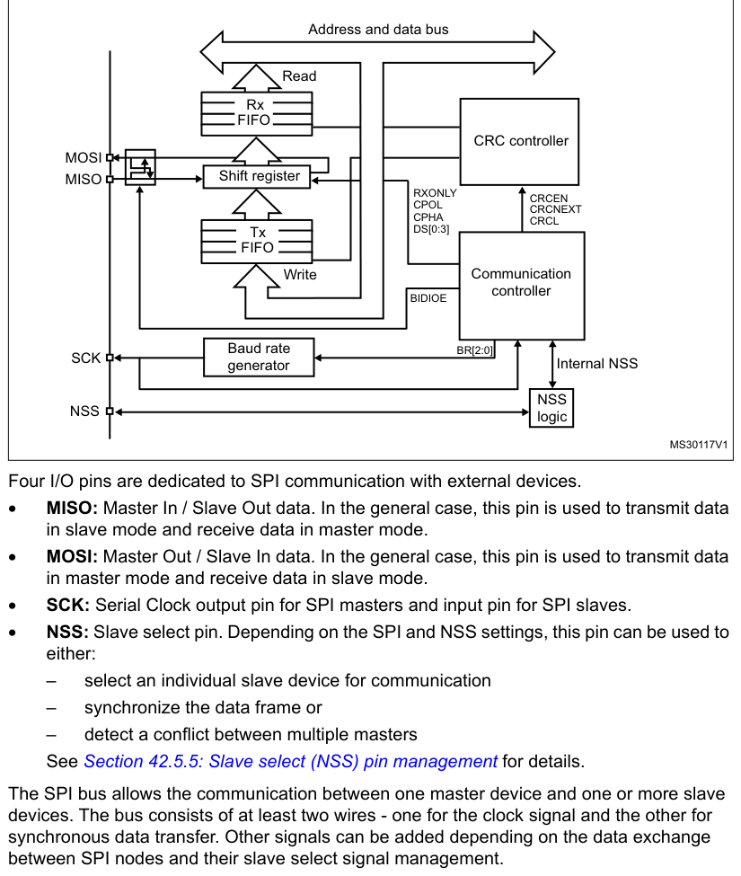

Address and data bus

Read

Rx

FIFO

CRC controller

MOSI

Four I/O pins are dedicated to SPI communication with external devices.

- MISO: Master In / Slave Out data. In the general case, this pin is used to transmit data in slave
  mode and receive data in master mode.
- MOSI: Master Out / Slave In data. In the general case, this pin is used to transmit data in master
  mode and receive data in slave mode.
- SCK: Serial Clock output pin for SPI masters and input pin for SPI slaves.
- NSS: Slave select pin. Depending on the SPI and NSS settings, this pin can be used to either:
  - select an individual slave device for communication
  - synchronize the data frame or
  - detect a conflict between multiple masters

See [Section 42.5.5](#4255-slave-select-nss-pin-management): Slave select (NSS) pin management for details.

The SPI bus allows the communication between one master device and one or more slave devices. The
bus consists of at least two wires - one for the clock signal and the other for synchronous data
transfer. Other signals can be added depending on the data exchange between SPI nodes and their
slave select signal management.

### 42.5.2 Communications between one master and one slave

The SPI allows the MCU to communicate using different configurations, depending on the device
targeted and the application requirements. These configurations use 2 or 3 wires (with software NSS
management) or 3 or 4 wires (with hardware NSS management). Communication is always initiated by the
master.

#### Full-duplex communication

By default, the SPI is configured for full-duplex communication. In this configuration, the shift
registers of the master and slave are linked using two unidirectional lines between the MOSI and the
MISO pins. During SPI communication, data is shifted synchronously on the SCK clock edges provided
by the master. The master transmits the data to be sent to the slave via the MOSI line and receives
data from the slave via the MISO line. When the data frame transfer is complete (all the bits are
shifted) the information between the master and slave is exchanged.

**Figure 606. Full-duplex single master/ single slave application**

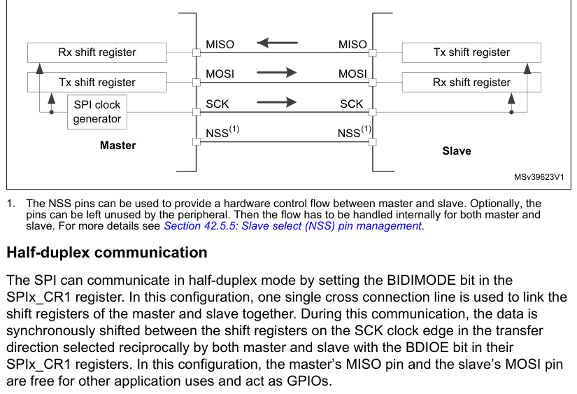

1. The NSS pins can be used to provide a hardware control flow between master and slave. Optionally,
   the
   pins can be left unused by the peripheral. Then the flow has to be handled internally for both
   master and
   slave. For more details see [Section 42.5.5](#4255-slave-select-nss-pin-management): Slave select (NSS) pin management.

#### Half-duplex communication

The SPI can communicate in half-duplex mode by setting the BIDIMODE bit in the SPIx_CR1 register. In
this configuration, one single cross connection line is used to link the shift registers of the
master and slave together. During this communication, the data is synchronously shifted between the
shift registers on the SCK clock edge in the transfer direction selected reciprocally by both master
and slave with the BDIOE bit in their SPIx_CR1 registers. In this configuration, the master’s MISO
pin and the slave’s MOSI pin are free for other application uses and act as GPIOs.

**Figure 607. Half-duplex single master/ single slave application**

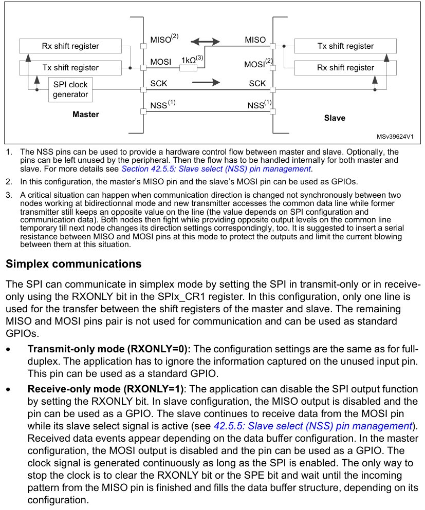

1. The NSS pins can be used to provide a hardware control flow between master and slave. Optionally,
   the
   pins can be left unused by the peripheral. Then the flow has to be handled internally for both
   master and
   slave. For more details see [Section 42.5.5](#4255-slave-select-nss-pin-management): Slave select (NSS) pin management.
2. In this configuration, the master’s MISO pin and the slave’s MOSI pin can be used as GPIOs.
3. A critical situation can happen when communication direction is changed not synchronously between
   two
   nodes working at bidirectionnal mode and new transmitter accesses the common data line while former
   transmitter still keeps an opposite value on the line (the value depends on SPI configuration and
   communication data). Both nodes then fight while providing opposite output levels on the common line
   temporary till next node changes its direction settings correspondingly, too. It is suggested to
   insert a serial
   resistance between MISO and MOSI pins at this mode to protect the outputs and limit the current
   blowing
   between them at this situation.

#### Simplex communications

The SPI can communicate in simplex mode by setting the SPI in transmit-only or in receive-only using
the RXONLY bit in the SPIx_CR1 register. In this configuration, only one line is used for the
transfer between the shift registers of the master and slave. The remaining MISO and MOSI pins pair
is not used for communication and can be used as standard GPIOs.

- Transmit-only mode (RXONLY=0): The configuration settings are the same as for full-duplex. The
  application has to ignore the information captured on the unused input pin. This pin can be used
  as a standard GPIO.
- Receive-only mode (RXONLY=1): The application can disable the SPI output function by setting the
  RXONLY bit. In slave configuration, the MISO output is disabled and the pin can be used as a GPIO.
  The slave continues to receive data from the MOSI pin while its slave select signal is active (see
  42.5.5: Slave select (NSS) pin management). Received data events appear depending on the data
  buffer configuration. In the master configuration, the MOSI output is disabled and the pin can be
  used as a GPIO. The clock signal is generated continuously as long as the SPI is enabled. The only
  way to stop the clock is to clear the RXONLY bit or the SPE bit and wait until the incoming
  pattern from the MISO pin is finished and fills the data buffer structure, depending on its
  configuration.

**Figure 608. Simplex single master/single slave application (master in transmit-only/**

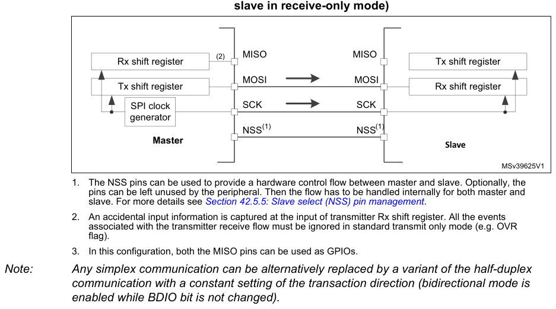

1. The NSS pins can be used to provide a hardware control flow between master and slave. Optionally,
   the
   pins can be left unused by the peripheral. Then the flow has to be handled internally for both
   master and
   slave. For more details see [Section 42.5.5](#4255-slave-select-nss-pin-management): Slave select (NSS) pin management.
2. An accidental input information is captured at the input of transmitter Rx shift register. All
   the events
   associated with the transmitter receive flow must be ignored in standard transmit only mode (e.g.
   OVR
   flag).
3. In this configuration, both the MISO pins can be used as GPIOs.

> **Note:** Any simplex communication can be alternatively replaced by a variant of the half-duplex
> communication with a constant setting of the transaction direction (bidirectional mode is enabled
> while BDIO bit is not changed).

### 42.5.3 Standard multislave communication

In a configuration with two or more independent slaves, the master uses GPIO pins to manage the chip
select lines for each slave (see Figure 609). The master must select one of the slaves individually
by pulling low the GPIO connected to the slave NSS input. When this is done, a standard master and
dedicated slave communication is established.

**Figure 609. Master and three independent slaves**

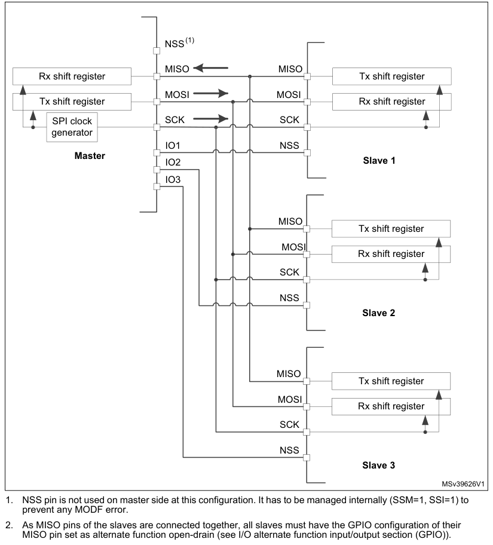

1. NSS pin is not used on master side at this configuration. It has to be managed internally (SSM=1,
   SSI=1) to
   prevent any MODF error.
2. As MISO pins of the slaves are connected together, all slaves must have the GPIO configuration of
   their

MISO pin set as alternate function open-drain (see I/O alternate function input/output section
(GPIO)).

### 42.5.4 Multimaster communication

Unless SPI bus is not designed for a multimaster capability primarily, the user can use build in
feature which detects a potential conflict between two nodes trying to master the bus at the same
time. For this detection, NSS pin is used configured at hardware input mode.

The connection of more than two SPI nodes working at this mode is impossible as only one node can
apply its output on a common data line at time.

When nodes are non active, both stay at slave mode by default. Once one node wants to overtake
control on the bus, it switches itself into master mode and applies active level on the slave select
input of the other node via dedicated GPIO pin. After the session is completed, the active slave
select signal is released and the node mastering the bus temporary returns back to passive slave
mode waiting for next session start.

If potentially both nodes raised their mastering request at the same time a bus conflict event
appears (see mode fault MODF event). Then the user can apply some simple arbitration process (e.g.
to postpone next attempt by predefined different time-outs applied at both
nodes).

**Figure 610. Multimaster application**

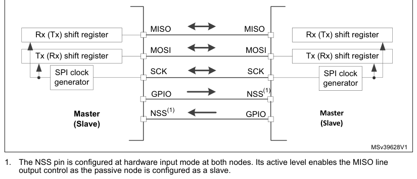

1. The NSS pin is configured at hardware input mode at both nodes. Its active level enables the MISO
   line
   output control as the passive node is configured as a slave.

### 42.5.5 Slave select (NSS) pin management

In slave mode, the NSS works as a standard “chip select” input and lets the slave communicate with
the master. In master mode, NSS can be used either as output or input. As an input it can prevent
multimaster bus collision, and as an output it can drive a slave select signal of a single slave.

Hardware or software slave select management can be set using the SSM bit in the SPIx_CR1 register:

- Software NSS management (SSM = 1): in this configuration, slave select information is driven
  internally by the SSI bit value in register SPIx_CR1. The external NSS pin is free for other
  application uses.
- Hardware NSS management (SSM = 0): in this case, there are two possible configurations. The
  configuration used depends on the NSS output configuration (SSOE bit in register SPIx_CR1).
  - NSS output enable (SSM=0,SSOE = 1): this configuration is only used when the MCU is set as
    master. The NSS pin is managed by the hardware. The NSS signal is driven low as soon as the SPI
    is enabled in master mode (SPE=1), and is kept low until the SPI is disabled (SPE =0). A pulse
    can be generated between continuous communications if NSS pulse mode is activated (NSSP=1). The
    SPI cannot work in multimaster configuration with this NSS setting.
  - NSS output disable (SSM=0, SSOE = 0): if the microcontroller is acting as the master on the bus,
    this configuration allows multimaster capability. If the NSS pin is pulled low in this mode, the
    SPI enters master mode fault state and the device is automatically reconfigured in slave mode.
    In slave mode, the NSS pin works as a standard “chip select” input and the slave is selected
    while NSS line is at low level.

**Figure 611. Hardware/software slave select management**

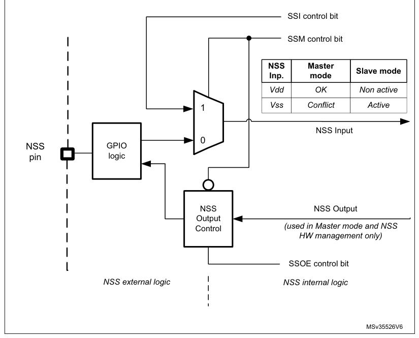

SSI control bit

SSM control bit

NSS Master

Slave mode

Inp. mode

### 42.5.6 Communication formats

During SPI communication, receive and transmit operations are performed simultaneously. The serial
clock (SCK) synchronizes the shifting and sampling of the information on the data lines. The
communication format depends on the clock phase, the clock polarity and the data frame format. To be
able to communicate together, the master and slaves devices must follow the same communication
format.

#### Clock phase and polarity controls

Four possible timing relationships may be chosen by software, using the CPOL and CPHA bits in the
SPIx_CR1 register. The CPOL (clock polarity) bit controls the idle state value of the clock when no
data is being transferred. This bit affects both master and slave modes. If CPOL is reset, the SCK
pin has a low-level idle state. If CPOL is set, the SCK pin has a high-level idle state.

If the CPHA bit is set, the second edge on the SCK pin captures the first data bit transacted
(falling edge if the CPOL bit is reset, rising edge if the CPOL bit is set). Data are latched on
each occurrence of this clock transition type. If the CPHA bit is reset, the first edge on the SCK
pin captures the first data bit transacted (falling edge if the CPOL bit is set, rising edge if the
CPOL bit is reset). Data are latched on each occurrence of this clock transition type.

The combination of CPOL (clock polarity) and CPHA (clock phase) bits selects the data capture clock
edge.

Figure 612, shows an SPI full-duplex transfer with the four combinations of the CPHA and CPOL bits.

> **Note:** Prior to changing the CPOL/CPHA bits the SPI must be disabled by resetting the SPE bit.

The idle state of SCK must correspond to the polarity selected in the SPIx_CR1 register (by pulling
up SCK if CPOL=1 or pulling down SCK if CPOL=0).

**Figure 612. Data clock timing diagram**

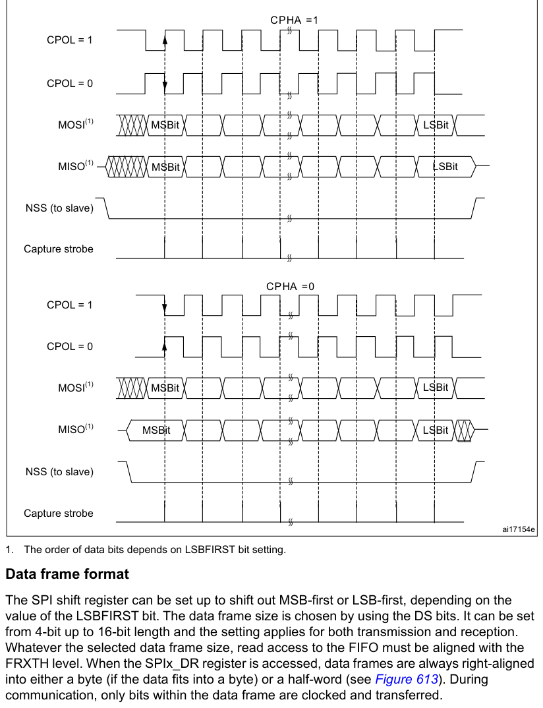

1. The order of data bits depends on LSBFIRST bit setting.

#### Data frame format

The SPI shift register can be set up to shift out MSB-first or LSB-first, depending on the value of
the LSBFIRST bit. The data frame size is chosen by using the DS bits. It can be set from 4-bit up to
16-bit length and the setting applies for both transmission and reception. Whatever the selected
data frame size, read access to the FIFO must be aligned with the FRXTH level. When the SPIx_DR
register is accessed, data frames are always right-aligned into either a byte (if the data fits into
a byte) or a half-word (see Figure 613). During communication, only bits within the data frame are
clocked and transferred.

**Figure 613. Data alignment when data length is not equal to 8-bit or 16-bit**

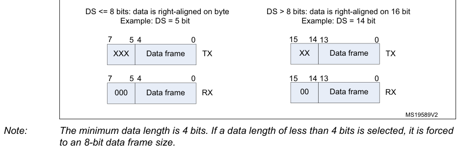

> **Note:** The minimum data length is 4 bits. If a data length of less than 4 bits is selected, it is forced
> to an 8-bit data frame size.

### 42.5.7 Configuration of SPI

The configuration procedure is almost the same for master and slave. For specific mode setups,
follow the dedicated sections. When a standard communication is to be initialized, perform these
steps:

1. Write proper GPIO registers: Configure GPIO for MOSI, MISO and SCK pins.
2. Write to the SPI_CR1 register:

a) Configure the serial clock baud rate using the BR[2:0] bits (Note: 4).

b) Configure the CPOL and CPHA bits combination to define one of the four
relationships between the data transfer and the serial clock (CPHA must be cleared in NSSP mode).
(Note: 2 - except the case when CRC is enabled at TI mode).

c) Select simplex or half-duplex mode by configuring RXONLY or BIDIMODE and

BIDIOE (RXONLY and BIDIMODE cannot be set at the same time).

d) Configure the LSBFIRST bit to define the frame format (Note: 2).

e) Configure the CRCL and CRCEN bits if CRC is needed (while SCK clock signal is
at idle state).

f) Configure SSM and SSI (Notes: 2 & 3).

g) Configure the MSTR bit (in multimaster NSS configuration, avoid conflict state on

NSS if master is configured to prevent MODF error).

3. Write to SPI_CR2 register:

a) Configure the DS[3:0] bits to select the data length for the transfer.

b) Configure SSOE (Notes: 1 & 2 & 3).

c) Set the FRF bit if the TI protocol is required (keep NSSP bit cleared in TI mode).

d) Set the NSSP bit if the NSS pulse mode between two data units is required (keep

CHPA and TI bits cleared in NSSP mode).

e) Configure the FRXTH bit. The RXFIFO threshold must be aligned to the read
access size for the SPIx_DR register.

f) Initialize LDMA_TX and LDMA_RX bits if DMA is used in packed mode.

4. Write to SPI_CRCPR register: Configure the CRC polynomial if needed.
5. Write proper DMA registers: Configure DMA streams dedicated for SPI Tx and Rx in

DMA registers if the DMA streams are used.

> **Note:** (1) Step is not required in slave mode.

(2) Step is not required in TI mode.

(3) Step is not required in NSSP mode.

(4) The step is not required in slave mode except slave working at TI mode

### 42.5.8 Procedure for enabling SPI

It is recommended to enable the SPI slave before the master sends the clock. If not, undesired data
transmission might occur. The data register of the slave must already contain data to be sent before
starting communication with the master (either on the first edge of the communication clock, or
before the end of the ongoing communication if the clock signal is continuous). The SCK signal must
be settled at an idle state level corresponding to the selected polarity before the SPI slave is
enabled.

The master at full-duplex (or in any transmit-only mode) starts to communicate when the SPI is
enabled and TXFIFO is not empty, or with the next write to TXFIFO.

In any master receive only mode (RXONLY = 1 or BIDIMODE = 1 & BIDIOE = 0), master starts to
communicate and the clock starts running immediately after SPI is enabled.

For handling DMA, follow the dedicated section.

### 42.5.9 Data transmission and reception procedures

#### RXFIFO and TXFIFO

All SPI data transactions pass through the 32-bit embedded FIFOs. This enables the SPI to work in a
continuous flow, and prevents overruns when the data frame size is short. Each direction has its own
FIFO called TXFIFO and RXFIFO. These FIFOs are used in all SPI modes except for receiver-only mode
(slave or master) with CRC calculation enabled (see [Section 42.5.14](#42514-crc-calculation): CRC calculation).

The handling of FIFOs depends on the data exchange mode (duplex, simplex), data frame format (number
of bits in the frame), access size performed on the FIFO data registers (8-bit or 16-bit), and
whether or not data packing is used when accessing the FIFOs (see [Section 42.5.13](#42513-ti-mode): TI mode).

A read access to the SPIx_DR register returns the oldest value stored in RXFIFO that has not been
read yet. A write access to the SPIx_DR stores the written data in the TXFIFO at the end of a send
queue. The read access must be always aligned with the RXFIFO threshold configured by the FRXTH bit
in SPIx_CR2 register. FTLVL[1:0] and FRLVL[1:0] bits indicate the current occupancy level of both
FIFOs.

A read access to the SPIx_DR register must be managed by the RXNE event. This event is triggered
when data is stored in RXFIFO and the threshold (defined by FRXTH bit) is reached. When RXNE is
cleared, RXFIFO is considered to be empty. In a similar way, write access of a data frame to be
transmitted is managed by the TXE event. This event is triggered when the TXFIFO level is less than
or equal to half of its capacity. Otherwise TXE is cleared and the TXFIFO is considered as full. In
this way, RXFIFO can store up to four data frames, whereas TXFIFO can only store up to three when
the data frame format is not greater than 8 bits. This difference prevents possible corruption of 3x
8-bit data frames already stored in the TXFIFO when software tries to write more data in 16-bit mode
into TXFIFO. Both TXE and RXNE events can be polled or handled by interrupts. See Figure 615 through
Figure 618.

Another way to manage the data exchange is to use DMA (see Communication using DMA (direct memory
addressing)).

If the next data is received when the RXFIFO is full, an overrun event occurs (see description of
OVR flag at [Section 42.5.10](#42510-spi-status-flags): SPI status flags). An overrun event can be polled or handled by an
interrupt.

The BSY bit being set indicates ongoing transaction of a current data frame. When the clock signal
runs continuously, the BSY flag stays set between data frames at master but becomes low for a
minimum duration of one SPI clock at slave between each data frame transfer.

#### Sequence handling

A few data frames can be passed at single sequence to complete a message. When transmission is
enabled, a sequence begins and continues while any data is present in the TXFIFO of the master. The
clock signal is provided continuously by the master until TXFIFO becomes empty, then it stops
waiting for additional data.

In receive-only modes, half-duplex (BIDIMODE=1, BIDIOE=0) or simplex (BIDIMODE=0, RXONLY=1) the
master starts the sequence immediately when both SPI is enabled and receive-only mode is activated.
The clock signal is provided by the master and it does not stop until either SPI or receive-only
mode is disabled by the master. The master receives data frames continuously up to this moment.

While the master can provide all the transactions in continuous mode (SCK signal is continuous) it
has to respect slave capability to handle data flow and its content at anytime. When necessary, the
master must slow down the communication and provide either a slower clock or separate frames or data
sessions with sufficient delays. Be aware there is no underflow error signal for master or slave in
SPI mode, and data from the slave is always transacted and processed by the master even if the slave
could not prepare it correctly in time. It is preferable for the slave to use DMA, especially when
data frames are shorter and bus rate is high.

Each sequence must be encased by the NSS pulse in parallel with the multislave system to select just
one of the slaves for communication. In a single slave system it is not necessary to control the
slave with NSS, but it is often better to provide the pulse here too, to synchronize the slave with
the beginning of each data sequence. NSS can be managed by both software and hardware (see Section
42.5.5: Slave select (NSS) pin management).

When the BSY bit is set it signifies an ongoing data frame transaction. When the dedicated frame
transaction is finished, the RXNE flag is raised. The last bit is just sampled and the complete data
frame is stored in the RXFIFO.

#### Procedure for disabling the SPI

When SPI is disabled, it is mandatory to follow the disable procedures described in this paragraph.
It is important to do this before the system enters a low-power mode when the peripheral clock is
stopped. Ongoing transactions can be corrupted in this case. In some modes the disable procedure is
the only way to stop continuous communication running.

Master in full-duplex or transmit only mode can finish any transaction when it stops providing data
for transmission. In this case, the clock stops after the last data transaction. Special care must
be taken in packing mode when an odd number of data frames are transacted to prevent some dummy byte
exchange (refer to Data packing section). Before the SPI is disabled in these modes, the user must
follow standard disable procedure. When
the SPI is disabled at the master transmitter while a frame transaction is ongoing or next data
frame is stored in TXFIFO, the SPI behavior is not guaranteed.

When the master is in any receive only mode, the only way to stop the continuous clock is to disable
the peripheral by SPE=0. This must occur in specific time window within last data frame transaction
just between the sampling time of its first bit and before its last bit transfer starts (in order to
receive a complete number of expected data frames and to prevent any additional “dummy” data reading
after the last valid data frame). Specific procedure must be followed when disabling SPI in this
mode.

Data received but not read remains stored in RXFIFO when the SPI is disabled, and must be processed
the next time the SPI is enabled, before starting a new sequence. To prevent having unread data,
ensure that RXFIFO is empty when disabling the SPI, by using the correct disabling procedure, or by
initializing all the SPI registers with a software reset via the control of a specific register
dedicated to peripheral reset (see the SPIiRST bits in the RCC_APBiRSTR registers).

Standard disable procedure is based on pulling BSY status together with FTLVL[1:0] to check if a
transmission session is fully completed. This check can be done in specific cases, too, when it is
necessary to identify the end of ongoing transactions, for example:

- When NSS signal is managed by software and master has to provide proper end of NSS pulse for
  slave, or
- When transactions’ streams from DMA or FIFO are completed while the last data frame or CRC frame
  transaction is still ongoing in the peripheral bus.

The correct disable procedure is (except when receive only mode is used):

1. Wait until FTLVL[1:0] = 00 (no more data to transmit).
2. Wait until BSY=0 (the last data frame is processed).
3. Disable the SPI (SPE=0).
4. Read data until FRLVL[1:0] = 00 (read all the received data).

The correct disable procedure for certain receive only modes is:

1. Interrupt the receive flow by disabling SPI (SPE=0) in the specific time window while
   the last data frame is ongoing.
2. Wait until BSY=0 (the last data frame is processed).
3. Read data until FRLVL[1:0] = 00 (read all the received data).

> **Note:** If packing mode is used and an odd number of data frames with a format less than or equal
> to 8 bits (fitting into one byte) has to be received, FRXTH must be set when FRLVL[1:0] = 01, in
> order to generate the RXNE event to read the last odd data frame and to keep good FIFO pointer
> alignment.

#### Data packing

When the data frame size fits into one byte (less than or equal to 8 bits), data packing is used
automatically when any read or write 16-bit access is performed on the SPIx_DR register. The double
data frame pattern is handled in parallel in this case. At first, the SPI operates using the pattern
stored in the LSB of the accessed word, then with the other half stored in the MSB. Figure 614
provides an example of data packing mode sequence handling. Two data frames are sent after the
single 16-bit access the SPIx_DR register of the transmitter. This sequence can generate just one
RXNE event in the receiver if the RXFIFO threshold is set to 16 bits (FRXTH=0). The receiver then
has to access both data frames by a single 16-bit read of SPIx_DR as a response to this single RXNE
event. The

RxFIFO threshold setting and the following read access must be always kept aligned at the receiver
side, as data can be lost if it is not in line.

A specific problem appears if an odd number of such “fit into one byte” data frames must be handled.
On the transmitter side, writing the last data frame of any odd sequence with an 8- bit access to
SPIx_DR is enough. The receiver has to change the Rx_FIFO threshold level for the last data frame
received in the odd sequence of frames in order to generate the RXNE event.

**Figure 614. Packing data in FIFO for transmission and reception**

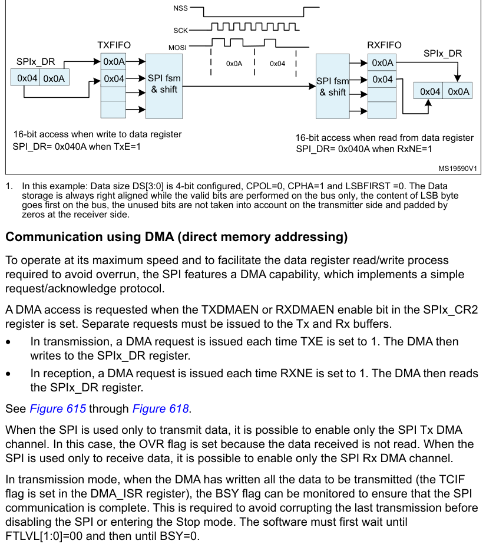

1. In this example: Data size DS[3:0] is 4-bit configured, CPOL=0, CPHA=1 and LSBFIRST =0. The Data
   storage is always right aligned while the valid bits are performed on the bus only, the content of
   LSB byte
   goes first on the bus, the unused bits are not taken into account on the transmitter side and padded
   by
   zeros at the receiver side.

#### Communication using DMA (direct memory addressing)

To operate at its maximum speed and to facilitate the data register read/write process required to
avoid overrun, the SPI features a DMA capability, which implements a simple request/acknowledge
protocol.

A DMA access is requested when the TXDMAEN or RXDMAEN enable bit in the SPIx_CR2 register is set.
Separate requests must be issued to the Tx and Rx buffers.

- In transmission, a DMA request is issued each time TXE is set to 1. The DMA then writes to the
  SPIx_DR register.
- In reception, a DMA request is issued each time RXNE is set to 1. The DMA then reads the SPIx_DR
  register.

See Figure 615 through Figure 618.

When the SPI is used only to transmit data, it is possible to enable only the SPI Tx DMA channel. In
this case, the OVR flag is set because the data received is not read. When the SPI is used only to
receive data, it is possible to enable only the SPI Rx DMA channel.

In transmission mode, when the DMA has written all the data to be transmitted (the TCIF flag is set
in the DMA_ISR register), the BSY flag can be monitored to ensure that the SPI communication is
complete. This is required to avoid corrupting the last transmission before disabling the SPI or
entering the Stop mode. The software must first wait until FTLVL[1:0]=00 and then until BSY=0.

When starting communication using DMA, to prevent DMA channel management raising error events, these
steps must be followed in order:

1. Enable DMA Rx buffer in the RXDMAEN bit in the SPI_CR2 register, if DMA Rx is
   used.
2. Enable DMA streams for Tx and Rx in DMA registers, if the streams are used.
3. Enable DMA Tx buffer in the TXDMAEN bit in the SPI_CR2 register, if DMA Tx is used.
4. Enable the SPI by setting the SPE bit.

To close communication it is mandatory to follow these steps in order:

1. Disable DMA streams for Tx and Rx in the DMA registers, if the streams are used.
2. Disable the SPI by following the SPI disable procedure.
3. Disable DMA Tx and Rx buffers by clearing the TXDMAEN and RXDMAEN bits in the

SPI_CR2 register, if DMA Tx and/or DMA Rx are used.

#### Packing with DMA

If the transfers are managed by DMA (TXDMAEN and RXDMAEN set in the SPIx_CR2 register) packing mode
is enabled/disabled automatically depending on the PSIZE value configured for SPI TX and the SPI RX
DMA channel. If the DMA channel PSIZE value is equal to 16-bit and SPI data size is less than or
equal to 8-bit, then packing mode is enabled. The DMA then automatically manages the write
operations to the SPIx_DR register.

If data packing mode is used and the number of data to transfer is not a multiple of two, the
LDMA_TX/LDMA_RX bits must be set. The SPI then considers only one data for the transmission or
reception to serve the last DMA transfer (for more details refer to Data packing)

#### Communication diagrams

Some typical timing schemes are explained in this section. These schemes are valid no matter if the
SPI events are handled by polling, interrupts or DMA. For simplicity, the LSBFIRST=0, CPOL=0 and
CPHA=1 setting is used as a common assumption here. No complete configuration of DMA streams is
provided.

The following numbered notes are common for Figure 615 through Figure 618:

1. The slave starts to control MISO line as NSS is active and SPI is enabled, and is
   disconnected from the line when one of them is released. Sufficient time must be provided for the
   slave to prepare data dedicated to the master in advance before its transaction starts. At the
   master, the SPI peripheral takes control at MOSI and SCK signals (occasionally at NSS signal as
   well) only if SPI is enabled. If SPI is disabled the SPI peripheral is disconnected from GPIO logic,
   so the levels at these lines depends on GPIO setting exclusively.
2. At the master, BSY stays active between frames if the communication (clock signal) is
   continuous. At the slave, BSY signal always goes down for at least one clock cycle between data
   frames.
3. The TXE signal is cleared only if TXFIFO is full.
4. The DMA arbitration process starts just after the TXDMAEN bit is set. The TXE
   interrupt is generated just after the TXEIE is set. As the TXE signal is at an active level, data
   transfers to TxFIFO start, until TxFIFO becomes full or the DMA transfer completes.
5. If all the data to be sent can fit into TxFIFO, the DMA Tx TCIF flag can be raised even
   before communication on the SPI bus starts. This flag always rises before the SPI transaction is
   completed.
6. The CRC value for a package is calculated continuously frame by frame in the

SPIx_TXCRCR and SPIx_RXCRCR registers. The CRC information is processed after the entire data
package has completed, either automatically by DMA (Tx channel must be set to the number of data
frames to be processed) or by SW (the user must handle CRCNEXT bit during the last data frame
processing). While the CRC value calculated in SPIx_TXCRCR is simply sent out by transmitter,
received CRC information is loaded into RxFIFO and then compared with the SPIx_RXCRCR register
content (CRC error flag can be raised here if any difference). This is why the user must take care
to flush this information from the FIFO, either by software reading out all the stored content of
RxFIFO, or by DMA when the proper number of data frames is preset for Rx channel (number of data
frames \+ number of CRC frames) (see the settings at the example assumption).

7. In data packed mode, TxE and RxNE events are paired and each read/write access to
   the FIFO is 16 bits wide until the number of data frames are even. If the TxFIFO is ¾ full FTLVL
   status stays at FIFO full level. That is why the last odd data frame cannot be stored before the
   TxFIFO becomes ½ full. This frame is stored into TxFIFO with an 8- bit access either by software or
   automatically by DMA when LDMA_TX control is set.
8. To receive the last odd data frame in packed mode, the Rx threshold must be changed
   to 8-bit when the last data frame is processed, either by software setting FRXTH=1 or automatically
   by a DMA internal signal when LDMA_RX is set.

**Figure 615. Master full-duplex communication**

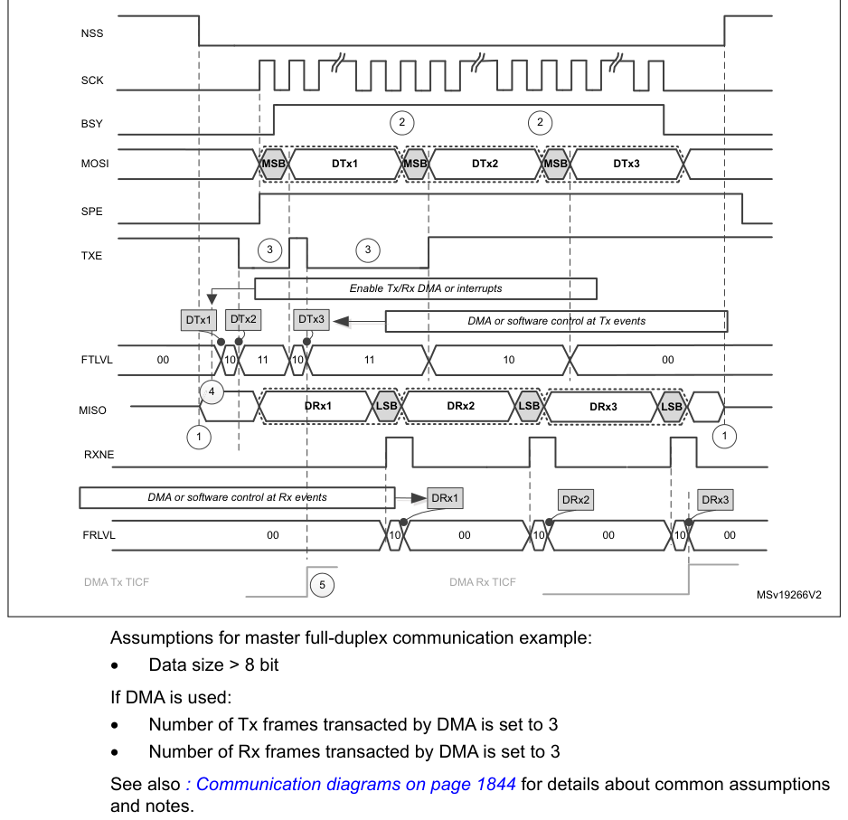

- Data size > 8 bit

If DMA is used:

- Number of Tx frames transacted by DMA is set to 3
- Number of Rx frames transacted by DMA is set to 3

See also: Communication diagrams for details about common assumptions and notes.

**Figure 616. Slave full-duplex communication**

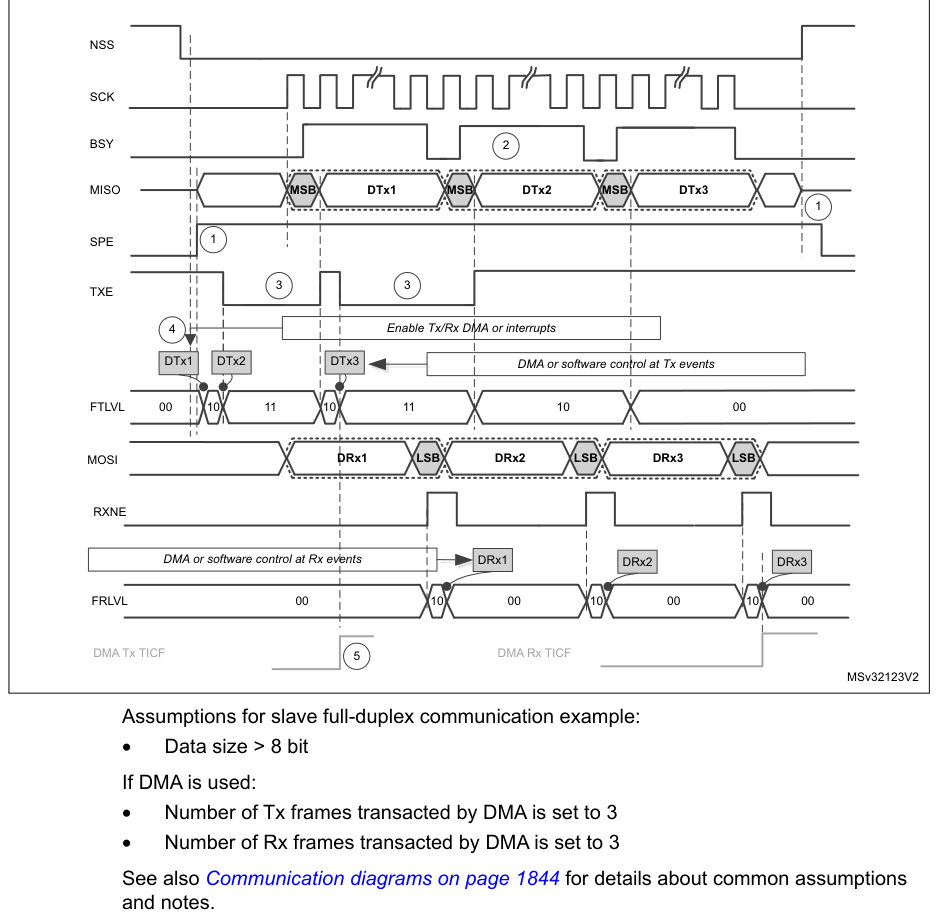

- Data size > 8 bit

If DMA is used:

- Number of Tx frames transacted by DMA is set to 3
- Number of Rx frames transacted by DMA is set to 3

See also Communication diagrams for details about common assumptions and notes.

**Figure 617. Master full-duplex communication with CRC**

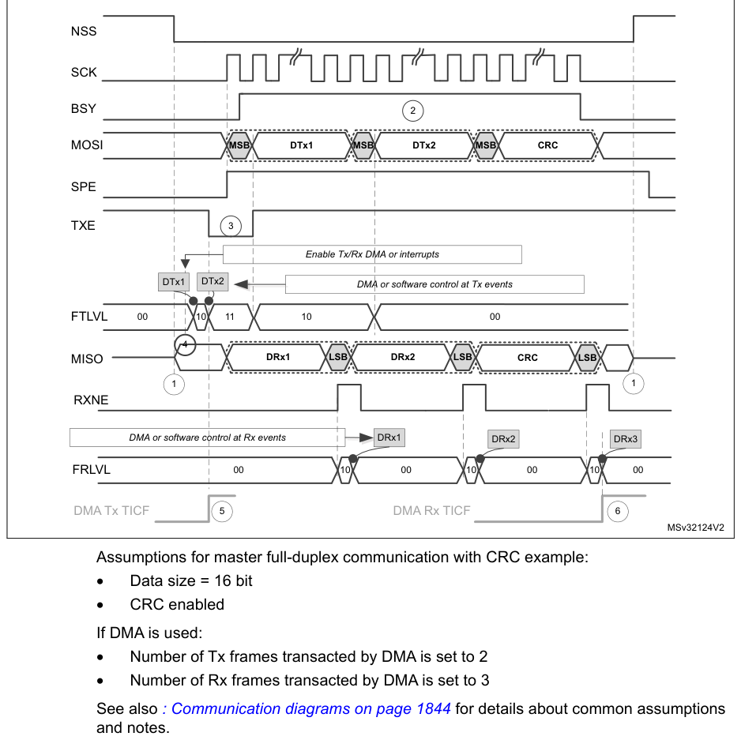

- Data size = 16 bit
- CRC enabled

If DMA is used:

- Number of Tx frames transacted by DMA is set to 2
- Number of Rx frames transacted by DMA is set to 3

See also: Communication diagrams for details about common assumptions and notes.

**Figure 618. Master full-duplex communication in packed mode**

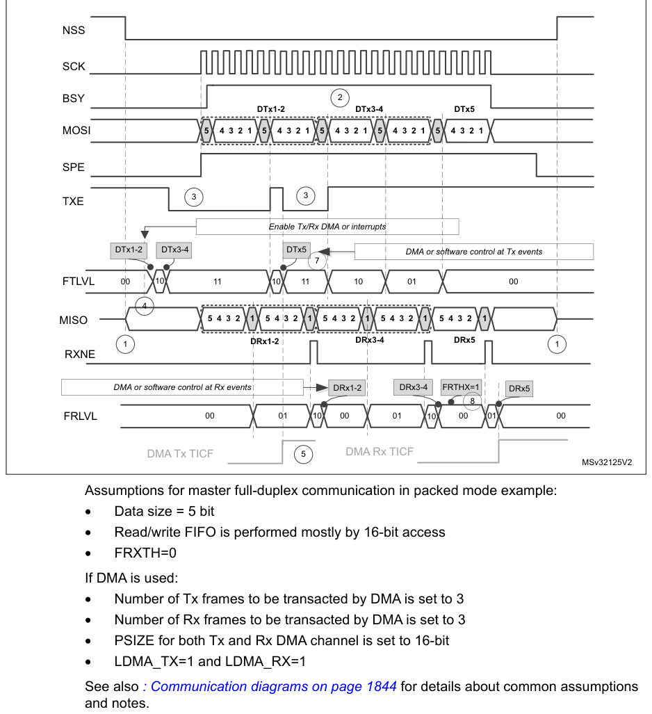

- Data size = 5 bit
- Read/write FIFO is performed mostly by 16-bit access
- FRXTH=0

If DMA is used:

- Number of Tx frames to be transacted by DMA is set to 3
- Number of Rx frames to be transacted by DMA is set to 3
- PSIZE for both Tx and Rx DMA channel is set to 16-bit
- LDMA_TX=1 and LDMA_RX=1

See also: Communication diagrams for details about common assumptions and notes.

### 42.5.10 SPI status flags

Three status flags are provided for the application to completely monitor the state of the SPI bus.

#### Tx buffer empty flag (TXE)

The TXE flag is set when transmission TXFIFO has enough space to store data to send. TXE flag is
linked to the TXFIFO level. The flag goes high and stays high until the TXFIFO level is lower or
equal to 1/2 of the FIFO depth. An interrupt can be generated if the TXEIE bit in the SPIx_CR2
register is set. The bit is cleared automatically when the TXFIFO level becomes greater than 1/2.

#### Rx buffer not empty (RXNE)

The RXNE flag is set depending on the FRXTH bit value in the SPIx_CR2 register:

- If FRXTH is set, RXNE goes high and stays high until the RXFIFO level is greater or equal to 1/4
  (8-bit).
- If FRXTH is cleared, RXNE goes high and stays high until the RXFIFO level is greater than or equal
  to 1/2 (16-bit).

An interrupt can be generated if the RXNEIE bit in the SPIx_CR2 register is set.

The RXNE is cleared by hardware automatically when the above conditions are no longer true.

#### Busy flag (BSY)

The BSY flag is set and cleared by hardware (writing to this flag has no effect).

When BSY is set, it indicates that a data transfer is in progress on the SPI (the SPI bus is busy).

The BSY flag can be used in certain modes to detect the end of a transfer so that the software can
disable the SPI or its peripheral clock before entering a low-power mode which does not provide a
clock for the peripheral. This avoids corrupting the last transfer.

The BSY flag is also useful for preventing write collisions in a multimaster system.

The BSY flag is cleared under any one of the following conditions:

- When the SPI is correctly disabled
- When a fault is detected in Master mode (MODF bit set to 1)
- In Master mode, when it finishes a data transmission and no new data is ready to be sent
- In Slave mode, when the BSY flag is set to '0' for at least one SPI clock cycle between each data
  transfer.

> **Note:** When the next transmission can be handled immediately by the master (e.g. if the master is
> in Receive-only mode or its Transmit FIFO is not empty), communication is continuous and the BSY
> flag remains set to '1' between transfers on the master side. Although this is not the case with a
> slave, it is recommended to use always the TXE and RXNE flags (instead of the BSY flags) to handle
> data transmission or reception operations.

### 42.5.11 SPI error flags

An SPI interrupt is generated if one of the following error flags is set and interrupt is enabled by
setting the ERRIE bit.

#### Overrun flag (OVR)

An overrun condition occurs when data is received by a master or slave and the RXFIFO has not enough
space to store this received data. This can happen if the software or the DMA did not have enough
time to read the previously received data (stored in the RXFIFO) or when space for data storage is
limited e.g. the RXFIFO is not available when CRC is enabled in receive only mode so in this case
the reception buffer is limited into a single data frame buffer (see [Section 42.5.14](#42514-crc-calculation): CRC
calculation).

When an overrun condition occurs, the newly received value does not overwrite the previous one in
the RXFIFO. The newly received value is discarded and all data transmitted subsequently is lost.
Clearing the OVR bit is done by a read access to the SPI_DR register followed by a read access to
the SPI_SR register.

#### Mode fault (MODF)

Mode fault occurs when the master device has its internal NSS signal (NSS pin in NSS hardware mode,
or SSI bit in NSS software mode) pulled low. This automatically sets the MODF bit. Master mode fault
affects the SPI interface in the following ways:

- The MODF bit is set and an SPI interrupt is generated if the ERRIE bit is set.
- The SPE bit is cleared. This blocks all output from the device and disables the SPI interface.
- The MSTR bit is cleared, thus forcing the device into slave mode.

Use the following software sequence to clear the MODF bit:

1. Make a read or write access to the SPIx_SR register while the MODF bit is set.
2. Then write to the SPIx_CR1 register.

To avoid any multiple slave conflicts in a system comprising several MCUs, the NSS pin must be
pulled high during the MODF bit clearing sequence. The SPE and MSTR bits can be restored to their
original state after this clearing sequence. As a security, hardware does not allow the SPE and MSTR
bits to be set while the MODF bit is set. In a slave device the MODF bit cannot be set except as the
result of a previous multimaster conflict.

#### CRC error (CRCERR)

This flag is used to verify the validity of the value received when the CRCEN bit in the SPIx_CR1
register is set. The CRCERR flag in the SPIx_SR register is set if the value received in the shift
register does not match the receiver SPIx_RXCRCR value. The flag is cleared by the software.

#### TI mode frame format error (FRE)

A TI mode frame format error is detected when an NSS pulse occurs during an ongoing communication
when the SPI is operating in slave mode and configured to conform to the TI mode protocol. When this
error occurs, the FRE flag is set in the SPIx_SR register. The SPI is not disabled when an error
occurs, the NSS pulse is ignored, and the SPI waits for the next NSS pulse before starting a new
transfer. The data may be corrupted since the error detection may result in the loss of two data
bytes.

The FRE flag is cleared when SPIx_SR register is read. If the ERRIE bit is set, an interrupt is
generated on the NSS error detection. In this case, the SPI should be disabled because data
consistency is no longer guaranteed and communications should be reinitiated by the master when the
slave SPI is enabled again.

### 42.5.12 NSS pulse mode

This mode is activated by the NSSP bit in the SPIx_CR2 register and it takes effect only if the SPI
interface is configured as Motorola SPI master (FRF=0) with capture on the first edge (SPIx_CR1 CPHA
= 0, CPOL setting is ignored). When activated, an NSS pulse is generated between two consecutive
data frame transfers when NSS stays at high level for the duration of one clock period at least.
This mode allows the slave to latch data. NSSP pulse mode is designed for applications with a single
master-slave pair.

Figure 619 illustrates NSS pin management when NSSP pulse mode is enabled.

**Figure 619. NSSP pulse generation in Motorola SPI master mode**

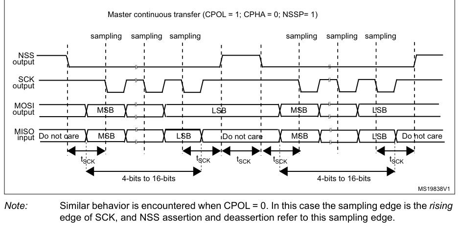

> **Note:** Similar behavior is encountered when CPOL = 0. In this case the sampling edge is the rising
> edge of SCK, and NSS assertion and deassertion refer to this sampling edge.

### 42.5.13 TI mode

#### TI protocol in master mode

The SPI interface is compatible with the TI protocol. The FRF bit of the SPIx_CR2 register can be
used to configure the SPI to be compliant with this protocol.

The clock polarity and phase are forced to conform to the TI protocol requirements whatever the
values set in the SPIx_CR1 register. NSS management is also specific to the TI protocol which makes
the configuration of NSS management through the SPIx_CR1 and SPIx_CR2 registers (SSM, SSI, SSOE)
impossible in this case.

In slave mode, the SPI baud rate prescaler is used to control the moment when the MISO pin state
changes to HiZ when the current transaction finishes (see Figure 620). Any baud rate can be used,
making it possible to determine this moment with optimal flexibility. However, the baud rate is
generally set to the external master clock baud rate. The delay for the MISO signal to become HiZ
(trelease) depends on internal resynchronization and on the
baud rate value set in through the BR[2:0] bits in the SPIx_CR1 register. It is given by the
formula:

> **Extracted layout**
>
> `tbaud_rate` · `tbaud_rate`  
> `---------------------` · `+` · `4` · `×` · `tpclk` · `<` · `trelease` · `<` · `---------------------` · `+` · `6` · `×` · `tpclk`  
> `2` · `2`  

If the slave detects a misplaced NSS pulse during a data frame transaction the TIFRE flag is set.

If the data size is equal to 4-bits or 5-bits, the master in full-duplex mode or transmit-only mode
uses a protocol with one more dummy data bit added after LSB. TI NSS pulse is generated above this
dummy bit clock cycle instead of the LSB in each period.

This feature is not available for Motorola SPI communications (FRF bit set to 0).

Figure 620: TI mode transfer shows the SPI communication waveforms when TI mode is selected.

**Figure 620. TI mode transfer**

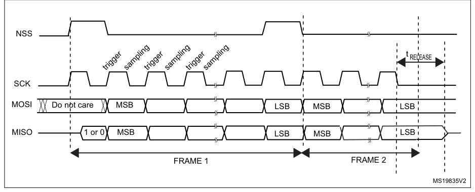

### 42.5.14 CRC calculation

Two separate CRC calculators are implemented in order to check the reliability of transmitted and
received data. The SPI offers CRC8 or CRC16 calculation independently of the frame data length,
which can be fixed to 8-bit or 16-bit. For all the other data frame lengths, no CRC is available.

#### CRC principle

CRC calculation is enabled by setting the CRCEN bit in the SPIx_CR1 register before the SPI is
enabled (SPE = 1). The CRC value is calculated using an odd programmable polynomial on each bit. The
calculation is processed on the sampling clock edge defined by the CPHA and CPOL bits in the
SPIx_CR1 register. The calculated CRC value is checked automatically at the end of the data block as
well as for transfer managed by CPU or by the DMA. When a mismatch is detected between the CRC
calculated internally on the received data and the CRC sent by the transmitter, a CRCERR flag is set
to indicate a data corruption error. The right procedure for handling the CRC calculation depends on
the SPI configuration and the chosen transfer management.

> **Note:** The polynomial value should only be odd. No even values are supported.

#### CRC transfer managed by CPU

Communication starts and continues normally until the last data frame has to be sent or received in
the SPIx_DR register. Then CRCNEXT bit has to be set in the SPIx_CR1 register to indicate that the
CRC frame transaction follows after the transaction of the currently processed data frame. The
CRCNEXT bit must be set before the end of the last data frame transaction. CRC calculation is frozen
during CRC transaction.

The received CRC is stored in the RXFIFO like a data byte or word. That is why in CRC mode only, the
reception buffer has to be considered as a single 16-bit buffer used to receive only one data frame
at a time.

A CRC-format transaction usually takes one more data frame to communicate at the end of data
sequence. However, when setting an 8-bit data frame checked by 16-bit CRC, two more frames are
necessary to send the complete CRC.

When the last CRC data is received, an automatic check is performed comparing the received value and
the value in the SPIx_RXCRC register. Software has to check the CRCERR flag in the SPIx_SR register
to determine if the data transfers were corrupted or not. Software clears the CRCERR flag by writing
'0' to it.

After the CRC reception, the CRC value is stored in the RXFIFO and must be read in the SPIx_DR
register in order to clear the RXNE flag.

#### CRC transfer managed by DMA

When SPI communication is enabled with CRC communication and DMA mode, the transmission and
reception of the CRC at the end of communication is automatic (with the exception of reading CRC
data in receive only mode). The CRCNEXT bit does not have to be handled by the software. The counter
for the SPI transmission DMA channel has to be set to the number of data frames to transmit
excluding the CRC frame. On the receiver side, the received CRC value is handled automatically by
DMA at the end of the transaction but user must take care to flush out received CRC information from
RXFIFO as it is always loaded into it. In full-duplex mode, the counter of the reception DMA channel
can be set to the number of data frames to receive including the CRC, which means, for example, in
the specific case of an 8-bit data frame checked by 16-bit CRC:

DMA_RX = Numb_of_data \+ 2

In receive only mode, the DMA reception channel counter should contain only the amount of data
transferred, excluding the CRC calculation. Then based on the complete transfer from DMA, all the
CRC values must be read back by software from FIFO as it works as a single buffer in this mode.

At the end of the data and CRC transfers, the CRCERR flag in the SPIx_SR register is set if
corruption occurred during the transfer.

If packing mode is used, the LDMA_RX bit needs managing if the number of data is odd.

#### Resetting the SPIx_TXCRC and SPIx_RXCRC values

The SPIx_TXCRC and SPIx_RXCRC values are cleared automatically when new data is sampled after a CRC
phase. This allows the use of DMA circular mode (not available in receive-only mode) in order to
transfer data without any interruption, (several data blocks covered by intermediate CRC checking
phases).

If the SPI is disabled during a communication the following sequence must be followed:

1. Disable the SPI
2. Clear the CRCEN bit
3. Enable the CRCEN bit
4. Enable the SPI

> **Note:** When the SPI interface is configured as a slave, the NSS internal signal needs to be kept
> low during transaction of the CRC phase once the CRCNEXT signal is released. That is why the CRC
> calculation cannot be used at NSS Pulse mode when NSS hardware mode should be applied at slave
> normally.

At TI mode, despite the fact that clock phase and clock polarity setting is fixed and independent on
SPIx_CR1 register, the corresponding setting CPOL=0 CPHA=1 has to be kept at the SPIx_CR1 register
anyway if CRC is applied. In addition, the CRC calculation has to be reset between sessions by SPI
disable sequence with re-enable the CRCEN bit described above at both master and slave side, else
CRC calculation can be corrupted at this specific mode.

## 42.6 SPI interrupts

During SPI communication an interrupt can be generated by the following events:

- Transmit TXFIFO ready to be loaded
- Data received in Receive RXFIFO
- Master mode fault
- Overrun error
- TI frame format error
- CRC protocol error

Interrupts can be enabled and disabled separately.

**Table 391. SPI interrupt requests**

| Source row | Column 1 | Column 2 | Column 3 |
| ---: | --- | --- | --- |
| 1 | `Interrupt event` | `Event flag` | `Enable Control bit` |
| 2 | `Transmit TXFIFO ready to be loaded` | `TXE` | `TXEIE` |
| 3 | `Data received in RXFIFO` | `RXNE` | `RXNEIE` |
| 4 | `Master Mode fault event` | `MODF` |  |
| 5 | `Overrun error` | `OVR` |  |
| 6 | `ERRIE` |  |  |
| 7 | `TI frame format error` | `FRE` |  |
| 8 | `CRC protocol error` | `CRCERR` |  |

## 42.7 I2S functional description

### 42.7.1 I2S general description

The block diagram of the I2S is shown in Figure 621.

**Figure 621. I2S block diagram**

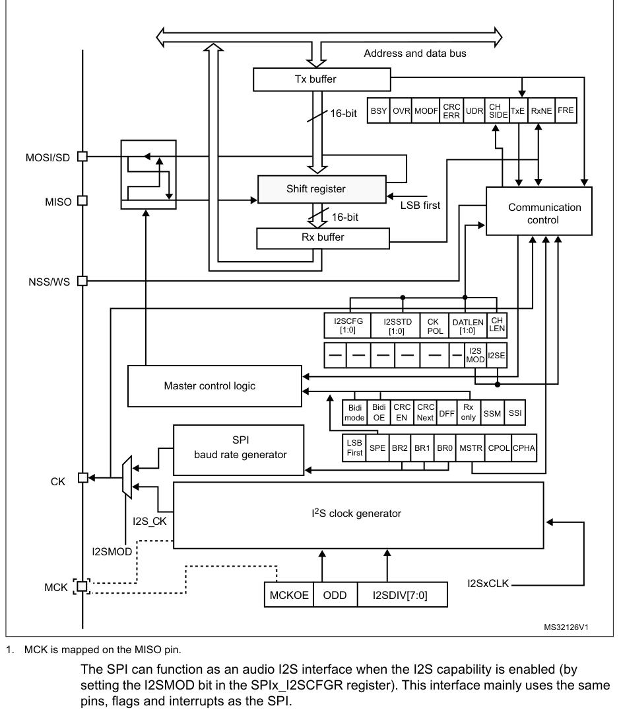

1. MCK is mapped on the MISO pin.

The SPI can function as an audio I2S interface when the I2S capability is enabled (by setting the
I2SMOD bit in the SPIx_I2SCFGR register). This interface mainly uses the same pins, flags and
interrupts as the SPI.

The I2S shares three common pins with the SPI:

- SD: Serial Data (mapped on the MOSI pin) to transmit or receive the two time-multiplexed data
  channels (in half-duplex mode only).
- WS: Word Select (mapped on the NSS pin) is the data control signal output in master mode and input
  in slave mode.
- CK: Serial Clock (mapped on the SCK pin) is the serial clock output in master mode and serial
  clock input in slave mode.

An additional pin can be used when a master clock output is needed for some external audio devices:

- MCK: Master Clock (mapped separately) is used, when the I2S is configured in master mode (and when
  the MCKOE bit in the SPIx_I2SPR register is set), to output this additional clock generated at a
  preconfigured frequency rate equal to 256 × fS for all I2S modes, and to 128 x fS for all PCM
  modes, where fS is the audio sampling frequency.

The I2S uses its own clock generator to produce the communication clock when it is set in master
mode. This clock generator is also the source of the master clock output. Two additional registers
are available in I2S mode. One is linked to the clock generator configuration SPIx_I2SPR and the
other one is a generic I2S configuration register SPIx_I2SCFGR (audio standard, slave/master mode,
data format, packet frame, clock polarity, etc.).

The SPIx_CR1 register and all CRC registers are not used in the I2S mode. Likewise, the SSOE bit in
the SPIx_CR2 register and the MODF and CRCERR bits in the SPIx_SR are not used.

The I2S uses the same SPI register for data transfer (SPIx_DR) in 16-bit wide mode.

### 42.7.2 Supported audio protocols

The three-line bus has to handle only audio data generally time-multiplexed on two channels: the
right channel and the left channel. However there is only one 16-bit register for transmission or
reception. So, it is up to the software to write into the data register the appropriate value
corresponding to each channel side, or to read the data from the data register and to identify the
corresponding channel by checking the CHSIDE bit in the SPIx_SR register. Channel left is always
sent first followed by the channel right (CHSIDE has no meaning for the PCM protocol).

Four data and packet frames are available. Data may be sent with a format of:

- 16-bit data packed in a 16-bit frame
- 16-bit data packed in a 32-bit frame
- 24-bit data packed in a 32-bit frame
- 32-bit data packed in a 32-bit frame

When using 16-bit data extended on 32-bit packet, the first 16 bits (MSB) are the significant bits,
the 16-bit LSB is forced to 0 without any need for software action or DMA request (only one
read/write operation).

The 24-bit and 32-bit data frames need two CPU read or write operations to/from the SPIx_DR register
or two DMA operations if the DMA is preferred for the application. For 24- bit data frame
specifically, the 8 non-significant bits are extended to 32 bits with 0-bits (by hardware).

For all data formats and communication standards, the most significant bit is always sent first (MSB
first).

The I2S interface supports four audio standards, configurable using the I2SSTD[1:0] and PCMSYNC bits
in the SPIx_I2SCFGR register.

#### I2S Philips standard

For this standard, the WS signal is used to indicate which channel is being transmitted. It is
activated one CK clock cycle before the first bit (MSB) is available.

**Figure 622. I2S Philips protocol waveforms (16/32-bit full accuracy)**

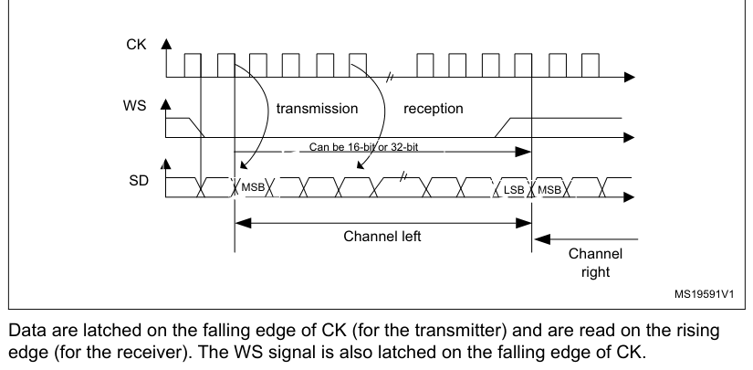

Data are latched on the falling edge of CK (for the transmitter) and are read on the rising edge
(for the receiver). The WS signal is also latched on the falling edge of CK.

**Figure 623. I2S Philips standard waveforms (24-bit frame)**

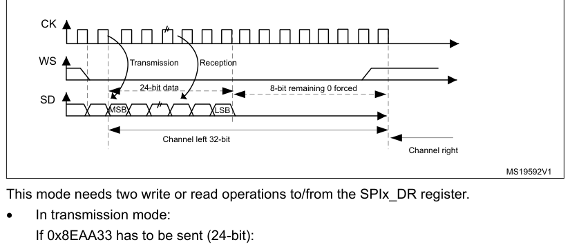

This mode needs two write or read operations to/from the SPIx_DR register.

- In transmission mode:

If 0x8EAA33 has to be sent (24-bit):

**Figure 624. Transmitting 0x8EAA33**

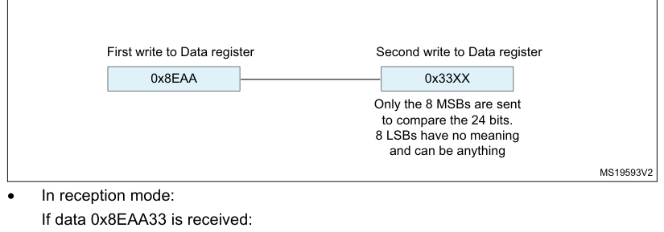

to compare the 24 bits.

8 LSBs have no meaning
and can be anything

MS19593V2

- In reception mode:

If data 0x8EAA33 is received:

**Figure 625. Receiving 0x8EAA33**

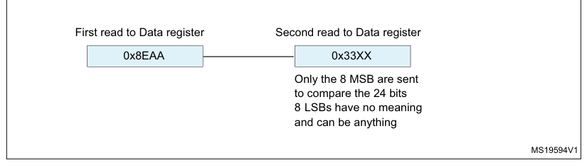

**Figure 626. I2S Philips standard (16-bit extended to 32-bit packet frame)**

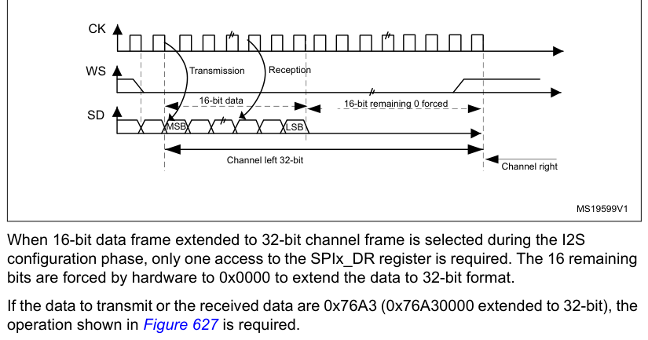

When 16-bit data frame extended to 32-bit channel frame is selected during the I2S configuration
phase, only one access to the SPIx_DR register is required. The 16 remaining bits are forced by
hardware to 0x0000 to extend the data to 32-bit format.

If the data to transmit or the received data are 0x76A3 (0x76A30000 extended to 32-bit), the
operation shown in Figure 627 is required.

**Figure 627. Example of 16-bit data frame extended to 32-bit channel frame**

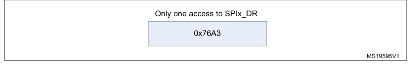

Only one access to SPIx_DR

0x76A3

MS19595V1

For transmission, each time an MSB is written to SPIx_DR, the TXE flag is set and its interrupt, if
allowed, is generated to load the SPIx_DR register with the new value to send. This takes place even
if 0x0000 have not yet been sent because it is done by hardware.

For reception, the RXNE flag is set and its interrupt, if allowed, is generated when the first 16
MSB half-word is received.

In this way, more time is provided between two write or read operations, which prevents underrun or
overrun conditions (depending on the direction of the data transfer).

#### MSB justified standard

For this standard, the WS signal is generated at the same time as the first data bit, which is the
MSBit.

**Figure 628. MSB Justified 16-bit or 32-bit full-accuracy length**

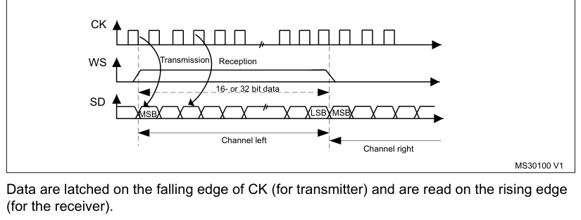

Data are latched on the falling edge of CK (for transmitter) and are read on the rising edge (for
the receiver).

**Figure 629. MSB justified 24-bit frame length**

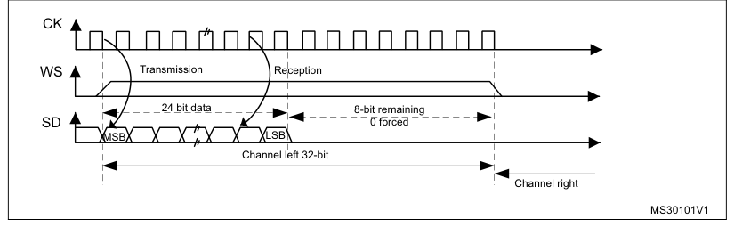

**Figure 630. MSB justified 16-bit extended to 32-bit packet frame**

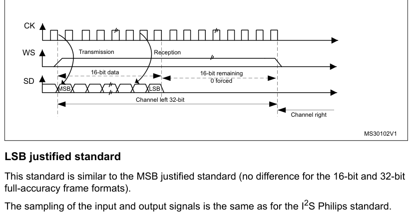

#### LSB justified standard

This standard is similar to the MSB justified standard (no difference for the 16-bit and 32-bit
full-accuracy frame formats).

The sampling of the input and output signals is the same as for the I2S Philips standard.

**Figure 631. LSB justified 16-bit or 32-bit full-accuracy**

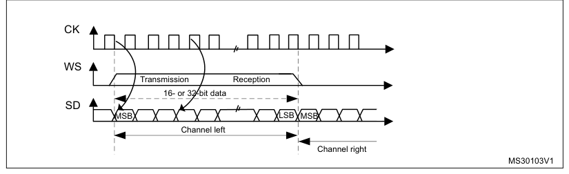

**Figure 632. LSB justified 24-bit frame length**

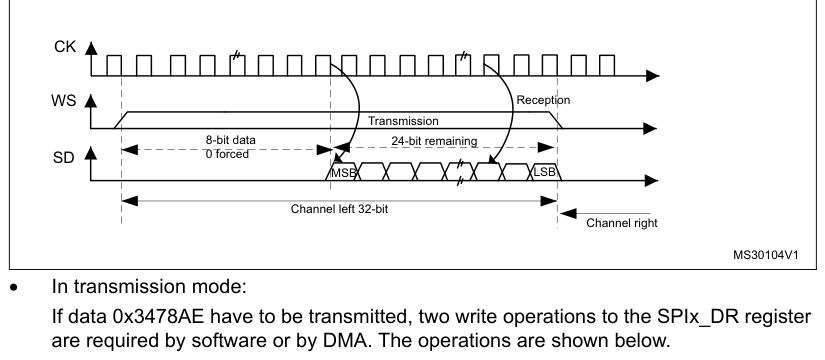

- In transmission mode:

If data 0x3478AE have to be transmitted, two write operations to the SPIx_DR register are required
by software or by DMA. The operations are shown below.

**Figure 633. Operations required to transmit 0x3478AE**

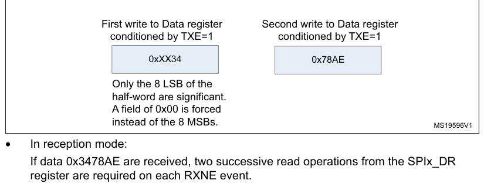

| First write to Data register | Second write to Data register |
| --- | --- |
| conditioned by TXE=1 | conditioned by TXE=1 |
| 0xXX34 | 0x78AE |

Only the 8 LSB of the half-word are significant. A field of 0x00 is forced instead of the 8 MSBs.

MS19596V1

- In reception mode:

If data 0x3478AE are received, two successive read operations from the SPIx_DR register are required
on each RXNE event.

**Figure 634. Operations required to receive 0x3478AE**

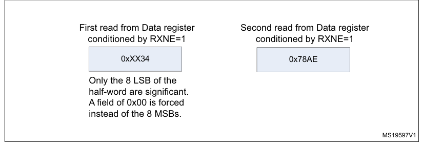

| First read from Data register | Second read from Data register |
| --- | --- |
| conditioned by RXNE=1 | conditioned by RXNE=1 |
| 0xXX34 | 0x78AE |

Only the 8 LSB of the half-word are significant. A field of 0x00 is forced instead of the 8 MSBs.

MS19597V1

**Figure 635. LSB justified 16-bit extended to 32-bit packet frame**

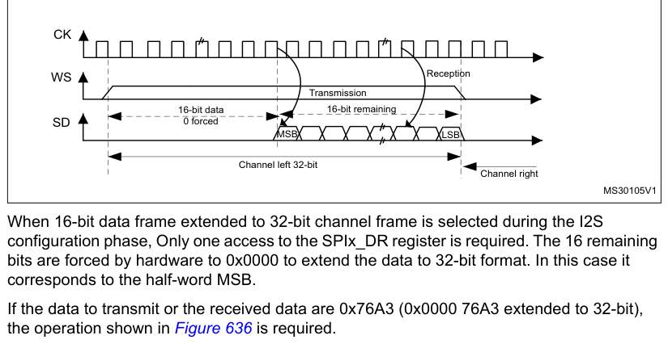

When 16-bit data frame extended to 32-bit channel frame is selected during the I2S configuration
phase, Only one access to the SPIx_DR register is required. The 16 remaining bits are forced by
hardware to 0x0000 to extend the data to 32-bit format. In this case it corresponds to the half-word
MSB.

If the data to transmit or the received data are 0x76A3 (0x0000 76A3 extended to 32-bit), the
operation shown in Figure 636 is required.

**Figure 636. Example of 16-bit data frame extended to 32-bit channel frame**

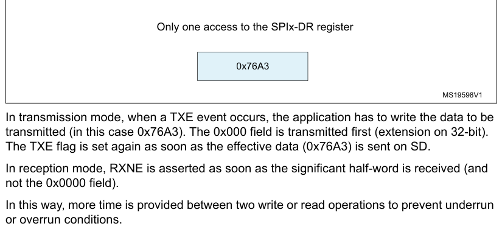

Only one access to the SPIx-DR register

0x76A3

MS19598V1

In transmission mode, when a TXE event occurs, the application has to write the data to be
transmitted (in this case 0x76A3). The 0x000 field is transmitted first (extension on 32-bit). The
TXE flag is set again as soon as the effective data (0x76A3) is sent on SD.

In reception mode, RXNE is asserted as soon as the significant half-word is received (and not the
0x0000 field).

In this way, more time is provided between two write or read operations to prevent underrun or
overrun conditions.

#### PCM standard

For the PCM standard, there is no need to use channel-side information. The two PCM modes (short and
long frame) are available and configurable using the PCMSYNC bit in SPIx_I2SCFGR register.

In PCM mode, the output signals (WS, SD) are sampled on the rising edge of CK signal. The input
signals (WS, SD) are captured on the falling edge of CK.

Note that CK and WS are configured as output in MASTER mode.

**Figure 637. PCM standard waveforms (16-bit)**

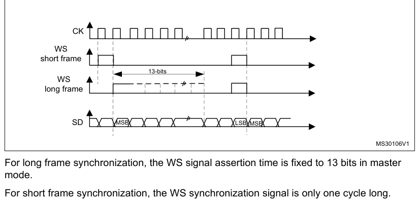

CK

WS
short frame

13-bits

WS
long frame

For long frame synchronization, the WS signal assertion time is fixed to 13 bits in master mode.

For short frame synchronization, the WS synchronization signal is only one cycle long.

**Figure 638. PCM standard waveforms (16-bit extended to 32-bit packet frame)**

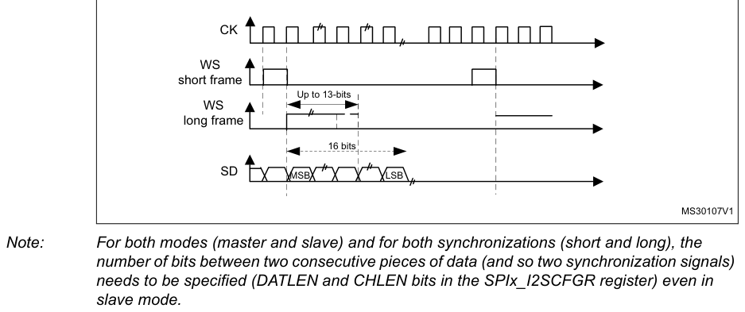

CK

WS
short frame

Up to 13-bits

WS
long frame

16 bits

SD

> **Note:** For both modes (master and slave) and for both synchronizations (short and long), the
> number of bits between two consecutive pieces of data (and so two synchronization signals) needs to
> be specified (DATLEN and CHLEN bits in the SPIx_I2SCFGR register) even in slave mode.

### 42.7.3 Start-up description

TheFigure 639 shows how the serial interface is handled in MASTER mode, when the SPI/I2S is enabled
(via I2SE bit). It shows as well the effect of CKPOL on the generated signals.

**Figure 639. Start sequence in master mode**

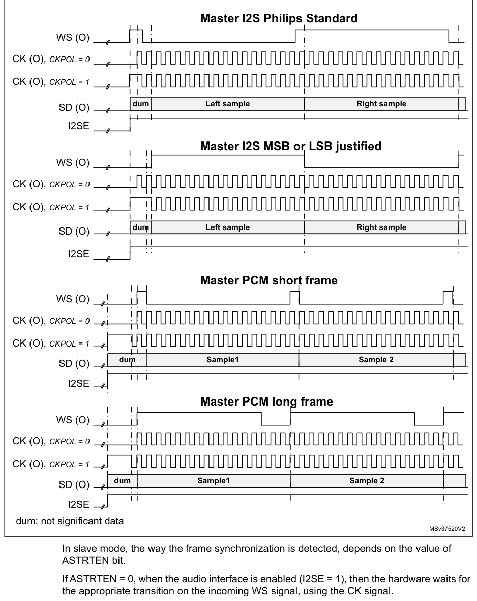

In slave mode, the way the frame synchronization is detected, depends on the value of ASTRTEN bit.

If ASTRTEN = 0, when the audio interface is enabled (I2SE = 1), then the hardware waits for the
appropriate transition on the incoming WS signal, using the CK signal.

The appropriate transition is a falling edge on WS signal when I2S Philips Standard is used, or a
rising edge for other standards. The falling edge is detected by sampling first WS to 1 and then to
0, and vice-versa for the rising edge detection.

If ASTRTEN = 1, the user has to enable the audio interface before the WS becomes active. This means
that the I2SE bit must be set to 1 when WS = 1 for I2S Philips standard, or when WS = 0 for other
standards.

### 42.7.4 Clock generator

The I2S bit rate determines the data flow on the I2S data line and the I2S clock signal frequency.

I2S bit rate = number of bits per channel × number of channels × sampling audio frequency

For a 16-bit audio, left and right channel, the I2S bit rate is calculated as follows:

I2S bit rate = 16 × 2 × fS

It is: I2S bit rate = 32 x 2 x fS if the packet length is 32-bit wide.

**Figure 640. Audio sampling frequency definition**

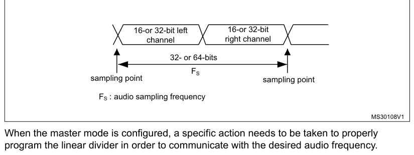

When the master mode is configured, a specific action needs to be taken to properly program the
linear divider in order to communicate with the desired audio frequency.

**Figure 641. I2S clock generator architecture**

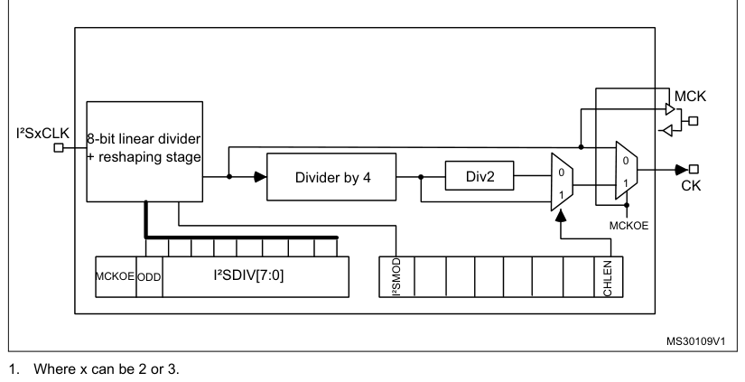

MCK

I²SxCLK

8-bit linear divider

\+ reshaping stage

0

1. Where x can be 2 or 3.

Figure 641 presents the communication clock architecture. The I2SxCLK clock is provided by the reset
and clock controller (RCC) of the product. The I2SxCLK clock can be asynchronous with respect to the
SPI/I2S APB clock.

> **Warning:** In addition, it is mandatory to keep the I2SxCLK frequency
> higher or equal to the APB clock used by the SPI/I2S block. If this condition is not respected the
SPI/I2S does not work properly.

The audio sampling frequency may be 192 kHz, 96 kHz, 48 kHz, 44.1 kHz, 32 kHz, 22.05 kHz, 16 kHz,
11.025 kHz or 8 kHz (or any other value within this range).

In order to reach the desired frequency, the linear divider needs to be programmed according to the
formulas below:

#### For I2S modes

When the master clock is generated (MCKOE in the SPIx_I2SPR register is set):

FI2SxCLK

Fs

=
\----------------------------------------------------------------------------------------------------------

> **Extracted layout**
>
> `256` · `×` · `((` · `2` · `×` · `I2SDIV)` · `+` · `ODD)`  
> `When the master clock is disabled (MCKOE bit cleared):`  
> `FI2SxCLK`  
> `Fs`  

=
\-----------------------------------------------------------------------------------------------------------------------------------------------------------------

> **Extracted layout**
>
> `32` · `×` · `(` · `CHLEN` · `+` · `1)` · `×` · `((` · `2` · `×` · `I2SDIV)` · `+` · `ODD)`  
> `CHLEN = 0 when the channel frame is 16-bit wide and,`  

CHLEN = 1 when the channel frame is 32-bit wide.

#### For PCM modes

When the master clock is generated (MCKOE in the SPIx_I2SPR register is set):

FI2SxCLK

Fs

=
\----------------------------------------------------------------------------------------------------------

> **Extracted layout**
>
> `128` · `×` · `((` · `2` · `×` · `I2SDIV)` · `+` · `ODD)`  
> `When the master clock is disabled (MCKOE bit cleared):`  
> `FI2SxCLK`  
> `Fs`  

=
\-----------------------------------------------------------------------------------------------------------------------------------------------------------------

> **Extracted layout**
>
> `16` · `×` · `(` · `CHLEN` · `+` · `1)` · `×` · `((` · `2` · `×` · `I2SDIV)` · `+` · `ODD)`  
> `CHLEN = 0 when the channel frame is 16-bit wide and,`  

CHLEN = 1 when the channel frame is 32-bit wide.

Where FS is the audio sampling frequency, and FI2SxCLKis the frequency of the kernel clock provided
to the SPI/I2S block.

> **Note:** I2SDIV must be strictly higher than 1.

The following table provides example precision values for different clock configurations.

> **Note:** Other configurations are possible that allow optimum clock precision.

**Table 392. Audio-frequency precision using 48 MHz clock derived from HSE(1)**

| Source row | Column 1 | Column 2 | Column 3 | Column 4 | Column 5 | Column 6 | Column 7 | Column 8 |
| ---: | --- | --- | --- | --- | --- | --- | --- | --- |
| 1 | `SYSCLK` | `Data` | `Target fs` |  |  |  |  |  |
| 2 | `I2SDIV` | `I2SODD` | `MCLK` | `Real fs (kHz)` | `Error` |  |  |  |
| 3 | `(MHz)` | `length` | `(Hz)` |  |  |  |  |  |
| 4 | `48` | `16` | `8` | `0` | `No` | `96000` | `93750` | `2.3438%` |
| 5 | `48` | `32` | `4` | `0` | `No` | `96000` | `93750` | `2.3438%` |
| 6 | `48` | `16` | `15` | `1` | `No` | `48000` | `48387.0968` | `0.8065%` |
| 7 | `48` | `32` | `8` | `0` | `No` | `48000` | `46875` | `2.3438%` |
| 8 | `48` | `16` | `17` | `0` | `No` | `44100` | `44117.647` | `0.0400%` |
| 9 | `48` | `32` | `8` | `1` | `No` | `44100` | `44117.647` | `0.0400%` |
| 10 | `48` | `16` | `23` | `1` | `No` | `32000` | `31914.8936` | `0.2660%` |
| 11 | `48` | `32` | `11` | `1` | `No` | `32000` | `32608.696` | `1.9022%` |
| 12 | `48` | `16` | `34` | `0` | `No` | `22050` | `22058.8235` | `0.0400%` |
| 13 | `48` | `32` | `17` | `0` | `No` | `22050` | `22058.8235` | `0.0400%` |
| 14 | `48` | `16` | `47` | `0` | `No` | `16000` | `15957.4468` | `0.2660%` |
| 15 | `48` | `32` | `23` | `1` | `No` | `16000` | `15957.447` | `0.2660%` |
| 16 | `48` | `16` | `68` | `0` | `No` | `11025` | `11029.4118` | `0.0400%` |
| 17 | `48` | `32` | `34` | `0` | `No` | `11025` | `11029.412` | `0.0400%` |
| 18 | `48` | `16` | `94` | `0` | `No` | `8000` | `7978.7234` | `0.2660%` |
| 19 | `48` | `32` | `47` | `0` | `No` | `8000` | `7978.7234` | `0.2660%` |
| 20 | `48` | `16` | `2` | `0` | `Yes` | `48000` | `46875` | `2.3430%` |
| 21 | `48` | `32` | `2` | `0` | `Yes` | `48000` | `46875` | `2.3430%` |
| 22 | `48` | `16` | `2` | `0` | `Yes` | `44100` | `46875` | `6.2925%` |
| 23 | `48` | `32` | `2` | `0` | `Yes` | `44100` | `46875` | `6.2925%` |
| 24 | `48` | `16` | `3` | `0` | `Yes` | `32000` | `31250` | `2.3438%` |
| 25 | `48` | `32` | `3` | `0` | `Yes` | `32000` | `31250` | `2.3438%` |
| 26 | `48` | `16` | `4` | `1` | `Yes` | `22050` | `20833.333` | `5.5178%` |
| 27 | `48` | `32` | `4` | `1` | `Yes` | `22050` | `20833.333` | `5.5178%` |
| 28 | `48` | `16` | `6` | `0` | `Yes` | `16000` | `15625` | `2.3438%` |
| 29 | `48` | `32` | `6` | `0` | `Yes` | `16000` | `15625` | `2.3438%` |
| 30 | `48` | `16` | `8` | `1` | `Yes` | `11025` | `11029.4118` | `0.0400%` |
| 31 | `48` | `32` | `8` | `1` | `Yes` | `11025` | `11029.4118` | `0.0400%` |
| 32 | `48` | `16` | `11` | `1` | `Yes` | `8000` | `8152.17391` | `1.9022%` |
| 33 | `48` | `32` | `11` | `1` | `Yes` | `8000` | `8152.17391` | `1.9022%` |

1. This table gives only example values for different clock configurations. Other configurations
   allowing
   optimum clock precision are possible.

### 42.7.5 I2S master mode

The I2S can be configured in master mode. This means that the serial clock is generated on the CK
pin as well as the Word Select signal WS. Master clock (MCK) may be output or not, controlled by the
MCKOE bit in the SPIx_I2SPR register.

#### Procedure

1. Select the I2SDIV[7:0] bits in the SPIx_I2SPR register to define the serial clock baud
   rate to reach the proper audio sample frequency. The ODD bit in the SPIx_I2SPR register also has to
   be defined.
2. Select the CKPOL bit to define the steady level for the communication clock. Set the

MCKOE bit in the SPIx_I2SPR register if the master clock MCK needs to be provided to the external
DAC/ADC audio component (the I2SDIV and ODD values should be computed depending on the state of the
MCK output, for more details refer to [Section 42.7.4](#4274-clock-generator): Clock generator).

3. Set the I2SMOD bit in the SPIx_I2SCFGR register to activate the I2S functions and
   choose the I2S standard through the I2SSTD[1:0] and PCMSYNC bits, the data length through the
   DATLEN[1:0] bits and the number of bits per channel by configuring the CHLEN bit. Select also the
   I2S master mode and direction (Transmitter or Receiver) through the I2SCFG[1:0] bits in the
   SPIx_I2SCFGR register.
4. If needed, select all the potential interrupt sources and the DMA capabilities by writing
   the SPIx_CR2 register.
5. The I2SE bit in SPIx_I2SCFGR register must be set.

WS and CK are configured in output mode. MCK is also an output, if the MCKOE bit in SPIx_I2SPR is
set.

#### Transmission sequence

The transmission sequence begins when a half-word is written into the Tx buffer.

Lets assume the first data written into the Tx buffer corresponds to the left channel data. When
data are transferred from the Tx buffer to the shift register, TXE is set and data corresponding to
the right channel have to be written into the Tx buffer. The CHSIDE flag indicates which channel is
to be transmitted. It has a meaning when the TXE flag is set because the CHSIDE flag is updated when
TXE goes high.

A full frame has to be considered as a left channel data transmission followed by a right channel
data transmission. It is not possible to have a partial frame where only the left channel is sent.

The data half-word is parallel loaded into the 16-bit shift register during the first bit
transmission, and then shifted out, serially, to the MOSI/SD pin, MSB first. The TXE flag is set
after each transfer from the Tx buffer to the shift register and an interrupt is generated if the
TXEIE bit in the SPIx_CR2 register is set.

For more details about the write operations depending on the I2S standard mode selected, refer to
[Section 42.7.2](#4272-supported-audio-protocols): Supported audio protocols).

To ensure a continuous audio data transmission, it is mandatory to write the SPIx_DR register with
the next data to transmit before the end of the current transmission.

To switch off the I2S, by clearing I2SE, it is mandatory to wait for TXE = 1 and BSY = 0.

#### Reception sequence

The operating mode is the same as for transmission mode except for the point 3 (refer to the
procedure described in [Section 42.7.5](#4275-i2s-master-mode): I2S master mode), where the configuration should set the
master reception mode through the I2SCFG[1:0] bits.

Whatever the data or channel length, the audio data are received by 16-bit packets. This means that
each time the Rx buffer is full, the RXNE flag is set and an interrupt is generated if the RXNEIE
bit is set in SPIx_CR2 register. Depending on the data and channel length configuration, the audio
value received for a right or left channel may result from one or two receptions into the Rx buffer.

Clearing the RXNE bit is performed by reading the SPIx_DR register.

CHSIDE is updated after each reception. It is sensitive to the WS signal generated by the I2S cell.

For more details about the read operations depending on the I2S standard mode selected, refer to
[Section 42.7.2](#4272-supported-audio-protocols): Supported audio protocols.

If data are received while the previously received data have not been read yet, an overrun is
generated and the OVR flag is set. If the ERRIE bit is set in the SPIx_CR2 register, an interrupt is
generated to indicate the error.

To switch off the I2S, specific actions are required to ensure that the I2S completes the transfer
cycle properly without initiating a new data transfer. The sequence depends on the configuration of
the data and channel lengths, and on the audio protocol mode selected. In the case of:

- 16-bit data length extended on 32-bit channel length (DATLEN = 00 and CHLEN = 1) using the LSB
  justified mode (I2SSTD = 10)
  a) Wait for the second to last RXNE = 1 (n – 1)
  b) Then wait 17 I2S clock cycles (using a software loop)
  c) Disable the I2S (I2SE = 0)
- 16-bit data length extended on 32-bit channel length (DATLEN = 00 and CHLEN = 1) in MSB justified,
  I2S or PCM modes (I2SSTD = 00, I2SSTD = 01 or I2SSTD = 11, respectively)
  a) Wait for the last RXNE
  b) Then wait 1 I2S clock cycle (using a software loop)
  c) Disable the I2S (I2SE = 0)
- For all other combinations of DATLEN and CHLEN, whatever the audio mode selected through the
  I2SSTD bits, carry out the following sequence to switch off the I2S:

a) Wait for the second to last RXNE = 1 (n – 1)
b) Then wait one I2S clock cycle (using a software loop)
c) Disable the I2S (I2SE = 0)

> **Note:** The BSY flag is kept low during transfers.

### 42.7.6 I2S slave mode

For the slave configuration, the I2S can be configured in transmission or reception mode. The
operating mode is following mainly the same rules as described for the I2S master
configuration. In slave mode, there is no clock to be generated by the I2S interface. The clock and
WS signals are input from the external master connected to the I2S interface. There is then no need,
for the user, to configure the clock.

The configuration steps to follow are listed below:

1. Set the I2SMOD bit in the SPIx_I2SCFGR register to select I2S mode and choose the

I2S standard through the I2SSTD[1:0] bits, the data length through the DATLEN[1:0] bits and the
number of bits per channel for the frame configuring the CHLEN bit. Select also the mode
(transmission or reception) for the slave through the I2SCFG[1:0] bits in SPIx_I2SCFGR register.

2. If needed, select all the potential interrupt sources and the DMA capabilities by writing
   the SPIx_CR2 register.
3. The I2SE bit in SPIx_I2SCFGR register must be set.

#### Transmission sequence

The transmission sequence begins when the external master device sends the clock and when the NSS_WS
signal requests the transfer of data. The slave has to be enabled before the external master starts
the communication. The I2S data register has to be loaded before the master initiates the
communication.

For the I2S, MSB justified and LSB justified modes, the first data item to be written into the data
register corresponds to the data for the left channel. When the communication starts, the data are
transferred from the Tx buffer to the shift register. The TXE flag is then set in order to request
the right channel data to be written into the I2S data register.

The CHSIDE flag indicates which channel is to be transmitted. Compared to the master transmission
mode, in slave mode, CHSIDE is sensitive to the WS signal coming from the external master. This
means that the slave needs to be ready to transmit the first data before the clock is generated by
the master. WS assertion corresponds to left channel transmitted first.

> **Note:** The I2SE has to be written at least two PCLK cycles before the first clock of the master
> comes on the CK line.

The data half-word is parallel-loaded into the 16-bit shift register (from the internal bus) during
the first bit transmission, and then shifted out serially to the MOSI/SD pin MSB first. The TXE flag
is set after each transfer from the Tx buffer to the shift register and an interrupt is generated if
the TXEIE bit in the SPIx_CR2 register is set.

Note that the TXE flag should be checked to be at 1 before attempting to write the Tx buffer.

For more details about the write operations depending on the I2S standard mode selected, refer to
[Section 42.7.2](#4272-supported-audio-protocols): Supported audio protocols.

To secure a continuous audio data transmission, it is mandatory to write the SPIx_DR register with
the next data to transmit before the end of the current transmission. An underrun flag is set and an
interrupt may be generated if the data are not written into the SPIx_DR register before the first
clock edge of the next data communication. This indicates to the software that the transferred data
are wrong. If the ERRIE bit is set into the SPIx_CR2 register, an interrupt is generated when the
UDR flag in the SPIx_SR register goes high. In this case, it is mandatory to switch off the I2S and
to restart a data transfer starting from the left channel.

To switch off the I2S, by clearing the I2SE bit, it is mandatory to wait for TXE = 1 and BSY = 0.

#### Reception sequence

The operating mode is the same as for the transmission mode except for the point 1 (refer to the
procedure described in [Section 42.7.6](#4276-i2s-slave-mode): I2S slave mode), where the configuration should set the
master reception mode using the I2SCFG[1:0] bits in the SPIx_I2SCFGR register.

Whatever the data length or the channel length, the audio data are received by 16-bit packets. This
means that each time the RX buffer is full, the RXNE flag in the SPIx_SR register is set and an
interrupt is generated if the RXNEIE bit is set in the SPIx_CR2 register. Depending on the data
length and channel length configuration, the audio value received for a right or left channel may
result from one or two receptions into the RX buffer.

The CHSIDE flag is updated each time data are received to be read from the SPIx_DR register. It is
sensitive to the external WS line managed by the external master component.

Clearing the RXNE bit is performed by reading the SPIx_DR register.

For more details about the read operations depending the I2S standard mode selected, refer to
[Section 42.7.2](#4272-supported-audio-protocols): Supported audio protocols.

If data are received while the preceding received data have not yet been read, an overrun is
generated and the OVR flag is set. If the bit ERRIE is set in the SPIx_CR2 register, an interrupt is
generated to indicate the error.

To switch off the I2S in reception mode, I2SE has to be cleared immediately after receiving the last
RXNE = 1.

> **Note:** The external master components should have the capability of sending/receiving data in 16-
> bit or 32-bit packets via an audio channel.

### 42.7.7 I2S status flags

Three status flags are provided for the application to fully monitor the state of the I2S bus.

#### Busy flag (BSY)

The BSY flag is set and cleared by hardware (writing to this flag has no effect). It indicates the
state of the communication layer of the I2S.

When BSY is set, it indicates that the I2S is busy communicating. There is one exception in master
receive mode (I2SCFG = 11) where the BSY flag is kept low during reception.

The BSY flag is useful to detect the end of a transfer if the software needs to disable the I2S.
This avoids corrupting the last transfer. For this, the procedure described below must be strictly
respected.

The BSY flag is set when a transfer starts, except when the I2S is in master receiver mode.

The BSY flag is cleared:

- When a transfer completes (except in master transmit mode, in which the communication is supposed
  to be continuous)
- When the I2S is disabled

When communication is continuous:

- In master transmit mode, the BSY flag is kept high during all the transfers
- In slave mode, the BSY flag goes low for one I2S clock cycle between each transfer

> **Note:** Do not use the BSY flag to handle each data transmission or reception. It is better to use the

TXE and RXNE flags instead.

#### Tx buffer empty flag (TXE)

When set, this flag indicates that the Tx buffer is empty and the next data to be transmitted can
then be loaded into it. The TXE flag is reset when the Tx buffer already contains data to be
transmitted. It is also reset when the I2S is disabled (I2SE bit is reset).

#### RX buffer not empty (RXNE)

When set, this flag indicates that there are valid received data in the RX Buffer. It is reset when
SPIx_DR register is read.

#### Channel Side flag (CHSIDE)

In transmission mode, this flag is refreshed when TXE goes high. It indicates the channel side to
which the data to transfer on SD has to belong. In case of an underrun error event in slave
transmission mode, this flag is not reliable and I2S needs to be switched off and switched on before
resuming the communication.

In reception mode, this flag is refreshed when data are received into SPIx_DR. It indicates from
which channel side data have been received. Note that in case of error (like OVR) this flag becomes
meaningless and the I2S should be reset by disabling and then enabling it (with configuration if it
needs changing).

This flag has no meaning in the PCM standard (for both Short and Long frame modes).

When the OVR or UDR flag in the SPIx_SR is set and the ERRIE bit in SPIx_CR2 is also set, an
interrupt is generated. This interrupt can be cleared by reading the SPIx_SR status register (once
the interrupt source has been cleared).

### 42.7.8 I2S error flags

There are three error flags for the I2S cell.

#### Underrun flag (UDR)

In slave transmission mode this flag is set when the first clock for data transmission appears while
the software has not yet loaded any value into SPIx_DR. It is available when the I2SMOD bit in the
SPIx_I2SCFGR register is set. An interrupt may be generated if the ERRIE bit in the SPIx_CR2
register is set. The UDR bit is cleared by a read operation on the SPIx_SR register.

#### Overrun flag (OVR)

This flag is set when data are received and the previous data have not yet been read from the
SPIx_DR register. As a result, the incoming data are lost. An interrupt may be generated if the
ERRIE bit is set in the SPIx_CR2 register.

In this case, the receive buffer contents are not updated with the newly received data from the
transmitter device. A read operation to the SPIx_DR register returns the previous correctly received
data. All other subsequently transmitted half-words are lost.

Clearing the OVR bit is done by a read operation on the SPIx_DR register followed by a read access
to the SPIx_SR register.

#### Frame error flag (FRE)

This flag can be set by hardware only if the I2S is configured in Slave mode. It is set if the
external master is changing the WS line while the slave is not expecting this change. If the
synchronization is lost, the following steps are required to recover from this state and
resynchronize the external master device with the I2S slave device:

1. Disable the I2S.
2. Enable it again when the correct level is detected on the WS line (WS line is high in I2S
   mode or low for MSB-or LSB-justified or PCM modes.

Desynchronization between master and slave devices may be due to noisy environment on the CK
communication clock or on the WS frame synchronization line. An error interrupt can be generated if
the ERRIE bit is set. The desynchronization flag (FRE) is cleared by software when the status
register is read.

### 42.7.9 DMA features

In I2S mode, the DMA works in exactly the same way as it does in SPI mode. There is no difference
except that the CRC feature is not available in I2S mode since there is no data transfer protection
system.

## 42.8 I2S interrupts

Table 393 provides the list of I2S interrupts.

**Table 393. I2S interrupt requests**

| Source row | Column 1 | Column 2 | Column 3 |
| ---: | --- | --- | --- |
| 1 | `Interrupt event` | `Event flag` | `Enable control bit` |
| 2 | `Transmit buffer empty flag` | `TXE` | `TXEIE` |
| 3 | `Receive buffer not empty flag` | `RXNE` | `RXNEIE` |
| 4 | `Overrun error` | `OVR` |  |
| 5 | `Underrun error` | `UDR` | `ERRIE` |
| 6 | `Frame error flag` | `FRE` |  |

## 42.9 SPI and I2S registers

The peripheral registers can be accessed by half-words (16-bit) or words (32-bit). SPI_DR in
addition can be accessed by 8-bit access.

### 42.9.1 SPI control register 1 (SPIx_CR1)

- **Address offset:** 0x00
- **Reset value:** 0x0000

**Register bit layout**

| Bit | Field | Access | Summary |
| ---: | --- | :---: | --- |
| 15 | `BIDIMODE` | rw | Bidirectional data mode enable. |
| 14 | `BIDIOE` | rw | Output enable in bidirectional mode |
| 13 | `CRCEN` | rw | Hardware CRC calculation enable |
| 12 | `CRCNEXT` | rw | Transmit CRC next |
| 11 | `CRCL` | rw | CRC length |
| 10 | `RXONLY` | rw | Receive only mode enabled. |
| 9 | `SSM` | rw | Software slave management |
| 8 | `SSI` | rw | Internal slave select |
| 7 | `LSBFIRST` | rw | Frame format |
| 6 | `SPE` | rw | SPI enable |
| 5 | `BR[2]` | rw | Baud rate control |
| 4 | `BR[1]` | rw | ↳ |
| 3 | `BR[0]` | rw | ↳ |
| 2 | `MSTR` | rw | Master selection |
| 1 | `CPOL` | rw | Clock polarity |
| 0 | `CPHA` | rw | Clock phase |

**Bit 15 — `BIDIMODE`:** Bidirectional data mode enable.

This bit enables half-duplex communication using common single bidirectional data line.

Keep RXONLY bit clear when bidirectional mode is active.

- `0`: 2-line unidirectional data mode selected
- `1`: 1-line bidirectional data mode selected

> **Note:** This bit is not used in I2S mode.

**Bit 14 — `BIDIOE`:** Output enable in bidirectional mode

This bit combined with the BIDIMODE bit selects the direction of transfer in bidirectional
mode.

- `0`: Output disabled (receive-only mode)
- `1`: Output enabled (transmit-only mode)

> **Note:** In master mode, the MOSI pin is used and in slave mode, the MISO pin is used.

This bit is not used in I2S mode.

**Bit 13 — `CRCEN`:** Hardware CRC calculation enable

- `0`: CRC calculation disabled
- `1`: CRC calculation enabled

> **Note:** This bit should be written only when SPI is disabled (SPE = ‘0’) for correct operation.

This bit is not used in I2S mode.

**Bit 12 — `CRCNEXT`:** Transmit CRC next

- `0`: Next transmit value is from Tx buffer.
- `1`: Next transmit value is from Tx CRC register.

> **Note:** This bit has to be written as soon as the last data is written in the SPIx_DR register.

This bit is not used in I2S mode.

**Bit 11 — `CRCL`:** CRC length

This bit is set and cleared by software to select the CRC length.

- `0`: 8-bit CRC length
- `1`: 16-bit CRC length

> **Note:** This bit should be written only when SPI is disabled (SPE = ‘0’) for correct operation.

This bit is not used in I2S mode.

**Bit 10 — `RXONLY`:** Receive only mode enabled.

This bit enables simplex communication using a single unidirectional line to receive data
exclusively. Keep BIDIMODE bit clear when receive only mode is active. This bit is also
useful in a multislave system in which this particular slave is not accessed, the output from
the accessed slave is not corrupted.

- `0`: Full-duplex (Transmit and receive)
- `1`: Output disabled (Receive-only mode)

> **Note:** This bit is not used in I2S mode.

**Bit 9 — `SSM`:** Software slave management

When the SSM bit is set, the NSS pin input is replaced with the value from the SSI bit.

- `0`: Software slave management disabled
- `1`: Software slave management enabled

> **Note:** This bit is not used in I2S mode and SPI TI mode.

**Bit 8 — `SSI`:** Internal slave select

This bit has an effect only when the SSM bit is set. The value of this bit is forced onto the

NSS pin and the I/O value of the NSS pin is ignored.

> **Note:** This bit is not used in I2S mode and SPI TI mode.

**Bit 7 — `LSBFIRST`:** Frame format

- `0`: data is transmitted / received with the MSB first
- `1`: data is transmitted / received with the LSB first

> **Note:** 1. This bit should not be changed when communication is ongoing.

2. This bit is not used in I2S mode and SPI TI mode.

**Bit 6 — `SPE`:** SPI enable

- `0`: Peripheral disabled
- `1`: Peripheral enabled

> **Note:** When disabling the SPI, follow the procedure described in Procedure for disabling the

SPI

This bit is not used in I2S mode.

**Bits 5:3 — `BR[2:0]`:** Baud rate control

- `000`: fPCLK/2
- `001`: fPCLK/4
- `010`: fPCLK/8
- `011`: fPCLK/16
- `100`: fPCLK/32
- `101`: fPCLK/64
- `110`: fPCLK/128
- `111`: fPCLK/256

> **Note:** These bits should not be changed when communication is ongoing.

These bits are not used in I2S mode.

**Bit 2 — `MSTR`:** Master selection

- `0`: Slave configuration
- `1`: Master configuration

> **Note:** This bit should not be changed when communication is ongoing.

This bit is not used in I2S mode.

**Bit 1 — `CPOL`:** Clock polarity

- `0`: CK to 0 when idle
- `1`: CK to 1 when idle

> **Note:** This bit should not be changed when communication is ongoing.

This bit is not used in I2S mode and SPI TI mode except the case when CRC is applied
at TI mode.

**Bit 0 — `CPHA`:** Clock phase

- `0`: The first clock transition is the first data capture edge
- `1`: The second clock transition is the first data capture edge

> **Note:** This bit should not be changed when communication is ongoing.

This bit is not used in I2S mode and SPI TI mode except the case when CRC is applied
at TI mode.

### 42.9.2 SPI control register 2 (SPIx_CR2)

- **Address offset:** 0x04
- **Reset value:** 0x0700

**Register bit layout**

| Bit | Field | Access | Summary |
| ---: | --- | :---: | --- |
| 15 | Reserved | — | kept at reset value. |
| 14 | `LDMA_TX` | rw | Last DMA transfer for transmission |
| 13 | `LDMA_RX` | rw | Last DMA transfer for reception |
| 12 | `FRXTH` | rw | FIFO reception threshold |
| 11 | `DS[3]` | rw | Data size |
| 10 | `DS[2]` | rw | ↳ |
| 9 | `DS[1]` | rw | ↳ |
| 8 | `DS[0]` | rw | ↳ |
| 7 | `TXEIE` | rw | Tx buffer empty interrupt enable |
| 6 | `RXNEIE` | rw | RX buffer not empty interrupt enable |
| 5 | `ERRIE` | rw | Error interrupt enable |
| 4 | `FRF` | rw | Frame format |
| 3 | `NSSP` | rw | NSS pulse management |
| 2 | `SSOE` | rw | SS output enable |
| 1 | `TXDMAEN` | rw | Tx buffer DMA enable |
| 0 | `RXDMAEN` | rw | Rx buffer DMA enable |

**Bit 15 — Reserved:** kept at reset value.

**Bit 14 — `LDMA_TX`:** Last DMA transfer for transmission

This bit is used in data packing mode, to define if the total number of data to transmit by DMA
is odd or even. It has significance only if the TXDMAEN bit in the SPIx_CR2 register is set
and if packing mode is used (data length =\< 8-bit and write access to SPIx_DR is 16-bit
wide). It has to be written when the SPI is disabled (SPE = 0 in the SPIx_CR1 register).

- `0`: Number of data to transfer is even
- `1`: Number of data to transfer is odd

> **Note:** Refer to Procedure for disabling the SPI if the CRCEN bit is set.

This bit is not used in I²S mode.

**Bit 13 — `LDMA_RX`:** Last DMA transfer for reception

This bit is used in data packing mode, to define if the total number of data to receive by DMA
is odd or even. It has significance only if the RXDMAEN bit in the SPIx_CR2 register is set
and if packing mode is used (data length =\< 8-bit and write access to SPIx_DR is 16-bit
wide). It has to be written when the SPI is disabled (SPE = 0 in the SPIx_CR1 register).

- `0`: Number of data to transfer is even
- `1`: Number of data to transfer is odd

> **Note:** Refer to Procedure for disabling the SPI if the CRCEN bit is set.

This bit is not used in I²S mode.

**Bit 12 — `FRXTH`:** FIFO reception threshold

This bit is used to set the threshold of the RXFIFO that triggers an RXNE event

- `0`: RXNE event is generated if the FIFO level is greater than or equal to 1/2 (16-bit)
- `1`: RXNE event is generated if the FIFO level is greater than or equal to 1/4 (8-bit)

> **Note:** This bit is not used in I2S mode.

**Bits 11:8 — `DS[3:0]`:** Data size

These bits configure the data length for SPI transfers.

- `0000`: Not used
- `0001`: Not used
- `0010`: Not used
- `0011`: 4-bit
- `0100`: 5-bit
- `0101`: 6-bit
- `0110`: 7-bit
- `0111`: 8-bit
- `1000`: 9-bit
- `1001`: 10-bit
- `1010`: 11-bit
- `1011`: 12-bit
- `1100`: 13-bit
- `1101`: 14-bit
- `1110`: 15-bit
- `1111`: 16-bit

If software attempts to write one of the “Not used” values, they are forced to the value “0111”

(8-bit)

> **Note:** These bits are not used in I2S mode.

**Bit 7 — `TXEIE`:** Tx buffer empty interrupt enable

- `0`: TXE interrupt masked
- `1`: TXE interrupt not masked. Used to generate an interrupt request when the TXE flag is set.

**Bit 6 — `RXNEIE`:** RX buffer not empty interrupt enable

- `0`: RXNE interrupt masked
- `1`: RXNE interrupt not masked. Used to generate an interrupt request when the RXNE flag is
  set.

**Bit 5 — `ERRIE`:** Error interrupt enable

This bit controls the generation of an interrupt when an error condition occurs (CRCERR,

OVR, MODF in SPI mode, FRE at TI mode and UDR, OVR, and FRE in I2S mode).

- `0`: Error interrupt is masked
- `1`: Error interrupt is enabled

**Bit 4 — `FRF`:** Frame format

- `0`: SPI Motorola mode

1 SPI TI mode

> **Note:** This bit must be written only when the SPI is disabled (SPE=0).

This bit is not used in I2S mode.

**Bit 3 — `NSSP`:** NSS pulse management

This bit is used in master mode only. it allows the SPI to generate an NSS pulse between two
consecutive data when doing continuous transfers. In the case of a single data transfer, it
forces the NSS pin high level after the transfer.

It has no meaning if CPHA = ’1’, or FRF = ’1’.

- `0`: No NSS pulse
- `1`: NSS pulse generated

> **Note:** 1. This bit must be written only when the SPI is disabled (SPE=0).

2. This bit is not used in I2S mode and SPI TI mode.

**Bit 2 — `SSOE`:** SS output enable

- `0`: SS output is disabled in master mode and the SPI interface can work in multimaster
  configuration
- `1`: SS output is enabled in master mode and when the SPI interface is enabled. The SPI
  interface cannot work in a multimaster environment.

> **Note:** This bit is not used in I2S mode and SPI TI mode.

**Bit 1 — `TXDMAEN`:** Tx buffer DMA enable

When this bit is set, a DMA request is generated whenever the TXE flag is set.

- `0`: Tx buffer DMA disabled
- `1`: Tx buffer DMA enabled

**Bit 0 — `RXDMAEN`:** Rx buffer DMA enable

When this bit is set, a DMA request is generated whenever the RXNE flag is set.

- `0`: Rx buffer DMA disabled
- `1`: Rx buffer DMA enabled

### 42.9.3 SPI status register (SPIx_SR)

- **Address offset:** 0x08
- **Reset value:** 0x0002

**Register bit layout**

| Bit | Field | Access | Summary |
| ---: | --- | :---: | --- |
| 15 | Reserved | — | kept at reset value. |
| 14 | Reserved | — | ↳ |
| 13 | Reserved | — | ↳ |
| 12 | `FTLVL[1]` | r | FIFO transmission level |
| 11 | `FTLVL[0]` | r | ↳ |
| 10 | `FRLVL[1]` | r | FIFO reception level |
| 9 | `FRLVL[0]` | r | ↳ |
| 8 | `FRE` | r | Frame format error |
| 7 | `BSY` | r | Busy flag |
| 6 | `OVR` | r | Overrun flag |
| 5 | `MODF` | r | Mode fault |
| 4 | `CRCERR` | rc_w0 | CRC error flag |
| 3 | `UDR` | r | Underrun flag |
| 2 | `CHSIDE` | r | Channel side |
| 1 | `TXE` | r | Transmit buffer empty |
| 0 | `RXNE` | r | Receive buffer not empty |

**Bits 15:13 — Reserved:** kept at reset value.

**Bits 12:11 — `FTLVL[1:0]`:** FIFO transmission level

These bits are set and cleared by hardware.

- `00`: FIFO empty
- `01`: 1/4 FIFO
- `10`: 1/2 FIFO
- `11`: FIFO full (considered as FULL when the FIFO threshold is greater than 1/2)

> **Note:** This bit is not used in I2S mode.

**Bits 10:9 — `FRLVL[1:0]`:** FIFO reception level

These bits are set and cleared by hardware.

- `00`: FIFO empty
- `01`: 1/4 FIFO
- `10`: 1/2 FIFO
- `11`: FIFO full

> **Note:** These bits are not used in I²S mode and in SPI receive-only mode while CRC
> calculation is enabled.

**Bit 8 — `FRE`:** Frame format error

This flag is used for SPI in TI slave mode and I2S slave mode. Refer to [Section 42.5.11](#42511-spi-error-flags): SPI
error flags and [Section 42.7.8](#4278-i2s-error-flags): I2S error flags.

This flag is set by hardware and reset when SPIx_SR is read by software.

- `0`: No frame format error
- `1`: A frame format error occurred

**Bit 7 — `BSY`:** Busy flag

- `0`: SPI (or I2S) not busy
- `1`: SPI (or I2S) is busy in communication or Tx buffer is not empty

This flag is set and cleared by hardware.

> **Note:** The BSY flag must be used with caution: refer to [Section 42.5.10](#42510-spi-status-flags): SPI status flags and

Procedure for disabling the SPI

**Bit 6 — `OVR`:** Overrun flag

- `0`: No overrun occurred
- `1`: Overrun occurred

This flag is set by hardware and reset by a software sequence. Refer to I2S error flags on
page 1872 for the software sequence.

**Bit 5 — `MODF`:** Mode fault

- `0`: No mode fault occurred
- `1`: Mode fault occurred

This flag is set by hardware and reset by a software sequence. Refer to Section: Mode fault

(MODF) for the software sequence.

> **Note:** This bit is not used in I2S mode.

**Bit 4 — `CRCERR`:** CRC error flag

- `0`: CRC value received matches the SPIx_RXCRCR value
- `1`: CRC value received does not match the SPIx_RXCRCR value

> **Note:** This flag is set by hardware and cleared by software writing 0.

This bit is not used in I2S mode.

**Bit 3 — `UDR`:** Underrun flag

- `0`: No underrun occurred
- `1`: Underrun occurred

This flag is set by hardware and reset by a software sequence. Refer to I2S error flags on
page 1872 for the software sequence.

> **Note:** This bit is not used in SPI mode.

**Bit 2 — `CHSIDE`:** Channel side

- `0`: Channel Left has to be transmitted or has been received
- `1`: Channel Right has to be transmitted or has been received

> **Note:** This bit is not used in SPI mode. It has no significance in PCM mode.

**Bit 1 — `TXE`:** Transmit buffer empty

- `0`: Tx buffer not empty
- `1`: Tx buffer empty

**Bit 0 — `RXNE`:** Receive buffer not empty

- `0`: Rx buffer empty
- `1`: Rx buffer not empty

### 42.9.4 SPI data register (SPIx_DR)

- **Address offset:** 0x0C
- **Reset value:** 0x0000

**Register bit layout**

| Bit | Field | Access | Summary |
| ---: | --- | :---: | --- |
| 15 | `DR[15]` | rw | Data register |
| 14 | `DR[14]` | rw | ↳ |
| 13 | `DR[13]` | rw | ↳ |
| 12 | `DR[12]` | rw | ↳ |
| 11 | `DR[11]` | rw | ↳ |
| 10 | `DR[10]` | rw | ↳ |
| 9 | `DR[9]` | rw | ↳ |
| 8 | `DR[8]` | rw | ↳ |
| 7 | `DR[7]` | rw | ↳ |
| 6 | `DR[6]` | rw | ↳ |
| 5 | `DR[5]` | rw | ↳ |
| 4 | `DR[4]` | rw | ↳ |
| 3 | `DR[3]` | rw | ↳ |
| 2 | `DR[2]` | rw | ↳ |
| 1 | `DR[1]` | rw | ↳ |
| 0 | `DR[0]` | rw | ↳ |

**Bits 15:0 — `DR[15:0]`:** Data register

Data received or to be transmitted

The data register serves as an interface between the Rx and Tx FIFOs. When the data
register is read, RxFIFO is accessed while the write to data register accesses TxFIFO (See

[Section 42.5.9](#4259-data-transmission-and-reception-procedures): Data transmission and reception procedures).

> **Note:** Data is always right-aligned. Unused bits are ignored when writing to the register, and
> read as zero when the register is read. The Rx threshold setting must always
> correspond with the read access currently used.

### 42.9.5 SPI CRC polynomial register (SPIx_CRCPR)

- **Address offset:** 0x10
- **Reset value:** 0x0007

**Register bit layout**

| Bit | Field | Access | Summary |
| ---: | --- | :---: | --- |
| 15 | `CRCPOLY[15]` | rw | CRC polynomial register |
| 14 | `CRCPOLY[14]` | rw | ↳ |
| 13 | `CRCPOLY[13]` | rw | ↳ |
| 12 | `CRCPOLY[12]` | rw | ↳ |
| 11 | `CRCPOLY[11]` | rw | ↳ |
| 10 | `CRCPOLY[10]` | rw | ↳ |
| 9 | `CRCPOLY[9]` | rw | ↳ |
| 8 | `CRCPOLY[8]` | rw | ↳ |
| 7 | `CRCPOLY[7]` | rw | ↳ |
| 6 | `CRCPOLY[6]` | rw | ↳ |
| 5 | `CRCPOLY[5]` | rw | ↳ |
| 4 | `CRCPOLY[4]` | rw | ↳ |
| 3 | `CRCPOLY[3]` | rw | ↳ |
| 2 | `CRCPOLY[2]` | rw | ↳ |
| 1 | `CRCPOLY[1]` | rw | ↳ |
| 0 | `CRCPOLY[0]` | rw | ↳ |

**Bits 15:0 — `CRCPOLY[15:0]`:** CRC polynomial register

This register contains the polynomial for the CRC calculation.

The CRC polynomial (0x0007) is the reset value of this register. Another polynomial can be
configured as required.

> **Note:** The polynomial value should be odd only. No even value is supported.

### 42.9.6 SPI Rx CRC register (SPIx_RXCRCR)

- **Address offset:** 0x14
- **Reset value:** 0x0000

**Register bit layout**

| Bit | Field | Access | Summary |
| ---: | --- | :---: | --- |
| 15 | `RXCRC[15]` | r | Rx CRC register |
| 14 | `RXCRC[14]` | r | ↳ |
| 13 | `RXCRC[13]` | r | ↳ |
| 12 | `RXCRC[12]` | r | ↳ |
| 11 | `RXCRC[11]` | r | ↳ |
| 10 | `RXCRC[10]` | r | ↳ |
| 9 | `RXCRC[9]` | r | ↳ |
| 8 | `RXCRC[8]` | r | ↳ |
| 7 | `RXCRC[7]` | r | ↳ |
| 6 | `RXCRC[6]` | r | ↳ |
| 5 | `RXCRC[5]` | r | ↳ |
| 4 | `RXCRC[4]` | r | ↳ |
| 3 | `RXCRC[3]` | r | ↳ |
| 2 | `RXCRC[2]` | r | ↳ |
| 1 | `RXCRC[1]` | r | ↳ |
| 0 | `RXCRC[0]` | r | ↳ |

**Bits 15:0 — `RXCRC[15:0]`:** Rx CRC register

When CRC calculation is enabled, the RXCRC[15:0] bits contain the computed CRC value of
the subsequently received bytes. This register is reset when the CRCEN bit in SPIx_CR1
register is written to 1. The CRC is calculated serially using the polynomial programmed in
the SPIx_CRCPR register.

Only the 8 LSB bits are considered when the CRC frame format is set to be 8-bit length

(CRCL bit in the SPIx_CR1 is cleared). CRC calculation is done based on any CRC8
standard.

The entire 16-bits of this register are considered when a 16-bit CRC frame format is selected

(CRCL bit in the SPIx_CR1 register is set). CRC calculation is done based on any CRC16
standard.

> **Note:** A read to this register when the BSY Flag is set could return an incorrect value.

These bits are not used in I2S mode.

### 42.9.7 SPI Tx CRC register (SPIx_TXCRCR)

- **Address offset:** 0x18
- **Reset value:** 0x0000

**Register bit layout**

| Bit | Field | Access | Summary |
| ---: | --- | :---: | --- |
| 15 | `TXCRC[15]` | r | Tx CRC register |
| 14 | `TXCRC[14]` | r | ↳ |
| 13 | `TXCRC[13]` | r | ↳ |
| 12 | `TXCRC[12]` | r | ↳ |
| 11 | `TXCRC[11]` | r | ↳ |
| 10 | `TXCRC[10]` | r | ↳ |
| 9 | `TXCRC[9]` | r | ↳ |
| 8 | `TXCRC[8]` | r | ↳ |
| 7 | `TXCRC[7]` | r | ↳ |
| 6 | `TXCRC[6]` | r | ↳ |
| 5 | `TXCRC[5]` | r | ↳ |
| 4 | `TXCRC[4]` | r | ↳ |
| 3 | `TXCRC[3]` | r | ↳ |
| 2 | `TXCRC[2]` | r | ↳ |
| 1 | `TXCRC[1]` | r | ↳ |
| 0 | `TXCRC[0]` | r | ↳ |

**Bits 15:0 — `TXCRC[15:0]`:** Tx CRC register

When CRC calculation is enabled, the TXCRC[7:0] bits contain the computed CRC value of
the subsequently transmitted bytes. This register is reset when the CRCEN bit of SPIx_CR1
is written to 1. The CRC is calculated serially using the polynomial programmed in the

SPIx_CRCPR register.

Only the 8 LSB bits are considered when the CRC frame format is set to be 8-bit length

(CRCL bit in the SPIx_CR1 is cleared). CRC calculation is done based on any CRC8
standard.

The entire 16-bits of this register are considered when a 16-bit CRC frame format is selected

(CRCL bit in the SPIx_CR1 register is set). CRC calculation is done based on any CRC16
standard.

> **Note:** A read to this register when the BSY flag is set could return an incorrect value.

These bits are not used in I2S mode.

### 42.9.8 SPIx_I2S configuration register (SPIx_I2SCFGR)

- **Address offset:** 0x1C
- **Reset value:** 0x0000

**Register bit layout**

| Bit | Field | Access | Summary |
| ---: | --- | :---: | --- |
| 15 | Reserved | — | kept at reset value. |
| 14 | Reserved | — | ↳ |
| 13 | Reserved | — | ↳ |
| 12 | `ASTRTEN` | rw | Asynchronous start enable. |
| 11 | `I2SMOD` | rw | I2S mode selection |
| 10 | `I2SE` | rw | I2S enable |
| 9 | `I2SCFG[1]` | rw | I2S configuration mode |
| 8 | `I2SCFG[0]` | rw | ↳ |
| 7 | `PCMSYNC` | rw | PCM frame synchronization |
| 6 | Reserved | — | kept at reset value. |
| 5 | `I2SSTD[1]` | rw | I2S standard selection |
| 4 | `I2SSTD[0]` | rw | ↳ |
| 3 | `CKPOL` | rw | Inactive state clock polarity |
| 2 | `DATLEN[1]` | rw | Data length to be transferred |
| 1 | `DATLEN[0]` | rw | ↳ |
| 0 | `CHLEN` | rw | Channel length (number of bits per audio channel) |

**Bits 15:13 — Reserved:** kept at reset value.

**Bit 12 — `ASTRTEN`:** Asynchronous start enable.

- `0`: The Asynchronous start is disabled.

When the I2S is enabled in slave mode, the hardware starts the transfer when the I2S clock is
received and an appropriate transition is detected on the WS signal.

- `1`: The Asynchronous start is enabled.

When the I2S is enabled in slave mode, the hardware starts the transfer when the I2S clock is
received and the appropriate level is detected on the WS signal.

> **Note:** The appropriate transition is a falling edge on WS signal when I2S Philips Standard is used,
> or a rising edge for other standards.

The appropriate level is a low level on WS signal when I2S Philips Standard is used, or a high
level for other standards.

Please refer to [Section 42.7.3](#4273-start-up-description): Start-up description for additional information.

**Bit 11 — `I2SMOD`:** I2S mode selection

- `0`: SPI mode is selected
- `1`: I2S mode is selected

> **Note:** This bit should be configured when the SPI is disabled.

**Bit 10 — `I2SE`:** I2S enable

- `0`: I2S peripheral is disabled
- `1`: I2S peripheral is enabled

> **Note:** This bit is not used in SPI mode.

**Bits 9:8 — `I2SCFG[1:0]`:** I2S configuration mode

- `00`: Slave - transmit
- `01`: Slave - receive
- `10`: Master - transmit
- `11`: Master - receive

> **Note:** These bits should be configured when the I2S is disabled.

They are not used in SPI mode.

**Bit 7 — `PCMSYNC`:** PCM frame synchronization

- `0`: Short frame synchronization
- `1`: Long frame synchronization

> **Note:** This bit has a meaning only if I2SSTD = 11 (PCM standard is used).

It is not used in SPI mode.

**Bit 6 — Reserved:** kept at reset value.

**Bits 5:4 — `I2SSTD[1:0]`:** I2S standard selection

- `00`: I2S Philips standard
- `01`: MSB justified standard (left justified)
- `10`: LSB justified standard (right justified)
- `11`: PCM standard

For more details on I2S standards, refer to [Section 42.7.2](#4272-supported-audio-protocols)

> **Note:** For correct operation, these bits should be configured when the I2S is disabled.

They are not used in SPI mode.

**Bit 3 — `CKPOL`:** Inactive state clock polarity

- `0`: I2S clock inactive state is low level
- `1`: I2S clock inactive state is high level

> **Note:** For correct operation, this bit should be configured when the I2S is disabled.

It is not used in SPI mode.

The bit CKPOL does not affect the CK edge sensitivity used to receive or transmit the SD and

WS signals.

**Bits 2:1 — `DATLEN[1:0]`:** Data length to be transferred

- `00`: 16-bit data length
- `01`: 24-bit data length
- `10`: 32-bit data length
- `11`: Not allowed

> **Note:** For correct operation, these bits should be configured when the I2S is disabled.

They are not used in SPI mode.

**Bit 0 — `CHLEN`:** Channel length (number of bits per audio channel)

- `0`: 16-bit wide
- `1`: 32-bit wide

The bit write operation has a meaning only if DATLEN = 00 otherwise the channel length is fixed to

32-bit by hardware whatever the value filled in.

> **Note:** For correct operation, this bit should be configured when the I2S is disabled.

It is not used in SPI mode.

### 42.9.9 SPIx_I2S prescaler register (SPIx_I2SPR)

- **Address offset:** 0x20
- **Reset value:** 0x0002

**Register bit layout**

| Bit | Field | Access | Summary |
| ---: | --- | :---: | --- |
| 15 | Reserved | — | kept at reset value. |
| 14 | Reserved | — | ↳ |
| 13 | Reserved | — | ↳ |
| 12 | Reserved | — | ↳ |
| 11 | Reserved | — | ↳ |
| 10 | Reserved | — | ↳ |
| 9 | `MCKOE` | rw | Master clock output enable |
| 8 | `ODD` | rw | Odd factor for the prescaler |
| 7 | `I2SDIV[7]` | rw | I2S linear prescaler |
| 6 | `I2SDIV[6]` | rw | ↳ |
| 5 | `I2SDIV[5]` | rw | ↳ |
| 4 | `I2SDIV[4]` | rw | ↳ |
| 3 | `I2SDIV[3]` | rw | ↳ |
| 2 | `I2SDIV[2]` | rw | ↳ |
| 1 | `I2SDIV[1]` | rw | ↳ |
| 0 | `I2SDIV[0]` | rw | ↳ |

**Bits 15:10 — Reserved:** kept at reset value.

**Bit 9 — `MCKOE`:** Master clock output enable

- `0`: Master clock output is disabled
- `1`: Master clock output is enabled

> **Note:** This bit should be configured when the I2S is disabled. It is used only when the I2S is in
> master mode.

It is not used in SPI mode.

**Bit 8 — `ODD`:** Odd factor for the prescaler

- `0`: Real divider value is = I2SDIV *2
- `1`: Real divider value is = (I2SDIV \* 2) \+ 1

Refer to [Section 42.7.3](#4273-start-up-description)

> **Note:** This bit should be configured when the I2S is disabled. It is used only when the I2S is in
> master mode.

It is not used in SPI mode.

**Bits 7:0 — `I2SDIV[7:0]`:** I2S linear prescaler

I2SDIV [7:0] = 0 or I2SDIV [7:0] = 1 are forbidden values.

Refer to [Section 42.7.3](#4273-start-up-description)

> **Note:** These bits should be configured when the I2S is disabled. They are used only when the I2S is
> in master mode.

They are not used in SPI mode.

### 42.9.10 SPI/I2S register map

Table 394 shows the SPI/I2S register map and reset values.

**Register summary**

| Offset | Register | Reset value |
| --- | --- | --- |
| 0x00 | `SPIx_CR1` | 0x0000 |
| 0x04 | `SPIx_CR2` | 0x0700 |
| 0x08 | `SPIx_SR` | 0x0002 |
| 0x0C | `SPIx_DR` | 0x0000 |
| 0x10 | `SPIx_CRCPR` | 0x0007 |
| 0x14 | `SPIx_RXCRCR` | 0x0000 |
| 0x18 | `SPIx_TXCRCR` | 0x0000 |
| 0x1C | `SPIx_I2SCFGR` | 0x0000 |
| 0x20 | `SPIx_I2SPR` | 0x0002 |

Refer to [Section 2.2](chapter-02.md#22-memory-organization) for the register boundary addresses.
