# 43 Serial audio interface (SAI)

[← RM0440 index](../STM32G4_RM0440.md)

## 43.1 Introduction

The SAI interface (serial audio interface) offers a wide set of audio protocols due to its
flexibility and wide range of configurations. Many audio protocols can be addressed thanks to SAI
“free protocol mode”. The free protocol mode allows the application to define the audio frame shape,
number of slots, slot size, data size, and so on. For example, the SAI supports I2S standards,
LSB-or MSB-justified, PCM/DSP, TDM, and AC’97 protocols. SPDIF output is offered when the audio
block is configured as a transmitter.

To bring this level of flexibility and reconfigurability, the SAI contains two independent audio
subblocks. Each block has it own clock generator and I/O line controller.

The SAI works in master or slave configuration. The audio subblocks are either receiver or
transmitter and work synchronously or not (with respect to the other one).

## 43.2 SAI main features

- Two independent audio subblocks, which can be transmitters or receivers with their respective FIFO
- 8-word integrated FIFOs for each audio subblock
- Synchronous or asynchronous mode between the audio subblocks
- Master or slave configuration independent for both audio subblocks
- Clock generator for each audio block to target independent audio frequency sampling when both
  audio subblocks are configured in master mode
- Data size configurable: 8-, 10-, 16-, 20-, 24-, 32-bit
- Audio protocol: I2S, LSB-or MSB-justified, PCM/DSP, TDM, AC’97
- PDM interface, supporting up to 4 microphone pairs
- SPDIF output available if required
- Up to 16 slots available with configurable size
- Number of bits by frame can be configurable
- Frame synchronization active level configurable (offset, bit length, level)
- First active bit position in the slot is configurable
- LSB first or MSB first for data transfer
- Mute mode
- Stereo/Mono audio frame capability
- Communication clock strobing edge configurable (SCK)
- Error flags with associated interrupts if enabled respectively
  - Overrun and underrun detection
  - Anticipated frame synchronization signal detection in slave mode
  - Late frame synchronization signal detection in slave mode
  - Codec not ready for the AC’97 mode in reception
- Interrupt sources when enabled:
  - Errors
- FIFO requests
- 2-channel DMA interface

## 43.3 SAI implementation

**Table 395. STM32G4 series SAI features (1)**

| SAI features | SAI1 |
| --- | --- |
| I2S, LSB or MSB-justified, PCM/DSP, TDM, AC’97 | X |
| FIFO size | 8 words |
| SPDIF | X |
| PDM | X(2) |

1. ‘X’ = supported, ‘-’ = not supported.
2. Only signals D[3:1], and CK[2:1] are available.

## 43.4 SAI functional description

### 43.4.1 SAI block diagram

Figure 642 shows the SAI block diagram while Table 396 and Table 397 list SAI internal and external
signals.

**Figure 642. SAI functional block diagram**

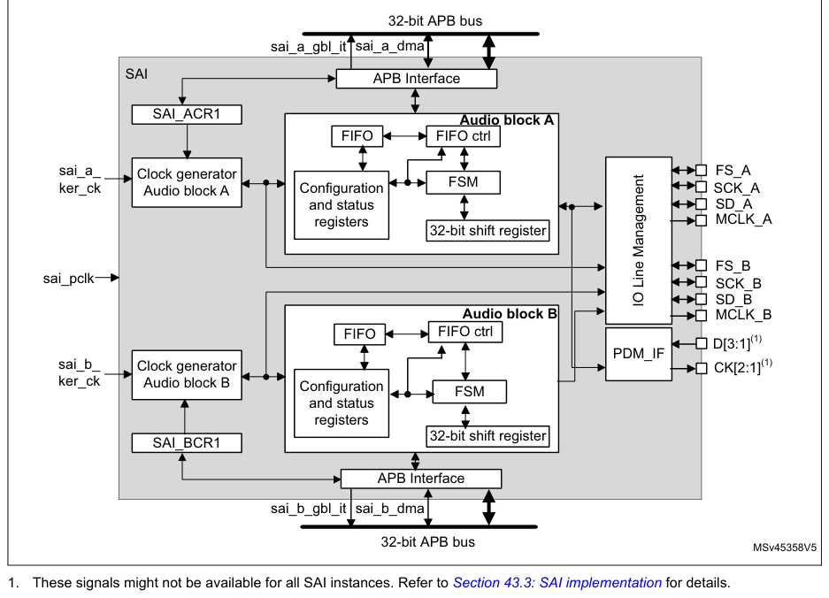

1. These signals might not be available for all SAI instances. Refer to [Section 43.3](#433-sai-implementation): SAI
   implementation for details.

The SAI is mainly composed of two audio subblocks with their own clock generator. Each audio block
integrates a 32-bit shift register controlled by their own functional state machine. Data are stored
or read from the dedicated FIFO. FIFO may be accessed by the CPU, or by DMA to leave the CPU free
during the communication. Each audio block is independent. They can be synchronous with each other.

An I/O line controller manages a set of 4 dedicated pins (SD, SCK, FS, MCLK) for a given audio block
in the SAI. Some of these pins can be shared if the two subblocks are declared as synchronous to
leave some free to be used as general purpose I/Os. The MCLK pin can be output, or not, depending on
the application, the decoder requirement and whether the audio block is configured as the master.

If one SAI is configured to operate synchronously with another one, even more I/Os can be freed
(except for pins SD_x).

The functional state machine can be configured to address a wide range of audio protocols. Some
registers are present to set up the desired protocols (audio frame waveform generator).

The audio subblock can be a transmitter or receiver, in master or slave mode. The master mode means
the SCK_x bit clock and the frame synchronization signal are generated from the SAI, whereas in
slave mode, they come from another external or internal master. There is a particular case for which
the FS signal direction is not directly linked to the master or slave mode definition. In AC’97
protocol, it is an SAI output even if the SAI (link controller) is set up to consume the SCK clock
(and so to be in Slave mode).

> **Note:** For ease of reading of this section, the notation SAI_x refers to SAI_A or SAI_B, where ‘x’
> represents the SAI A or B subblock.

### 43.4.2 SAI pins and internal signals

**Table 396. SAI internal input/output signals**

| Source row | Column 1 | Column 2 | Column 3 |
| ---: | --- | --- | --- |
| 1 | `Internal signal name Signal type` | `Description` |  |
| 2 | `sai_a_gbl_it/` |  |  |
| 3 | `Output Audio block A and B global interrupts` |  |  |
| 4 | `sai_b_gbl_it` |  |  |
| 5 | `sai_a_dma,` |  |  |
| 6 | `Input/output Audio block A and B DMA acknowledges and requests` |  |  |
| 7 | `sai_b_dma` |  |  |
| 8 | `sai_a_ker_ck/` |  |  |
| 9 | `Input Audio block A/B kernel clock` |  |  |
| 10 | `sai_b_ker_ck` |  |  |
| 11 | `sai_pclk` | `Input` | `APB clock` |

**Table 397. SAI input/output pins**

| Source row | Column 1 | Column 2 | Column 3 |
| ---: | --- | --- | --- |
| 1 | `Pin name` | `Pin type` | `Comments` |
| 2 | `SAI_SCK_A/B` | `Input/output Audio block A/B bit clock` |  |
| 3 | `SAI_MCLK_A/B` | `Output` | `Audio block A/B master clock` |
| 4 | `SAI_SD_A/B` | `Input/output Data line for block A/B` |  |
| 5 | `SAI_FS_A/B` | `Input/output Frame synchronization line for audio block A/B` |  |
| 6 | `SAI_CK[4:1]` | `Output` | `PDM bitstream clock(1)` |
| 7 | `SAI_D[4:1]` | `Input` | `PDM bitstream data(1)` |

1. These signals might not be available in all SAI instances. Refer to [Section 43.3](#433-sai-implementation): SAI
   implementation for
   details.

### 43.4.3 Main SAI modes

Each audio subblock of the SAI can be configured to be master or slave via the MODE bits in the
SAI_xCR1 register of the selected audio block.

#### Master mode

In master mode, the SAI delivers the timing signals to the external connected device:

- The bit clock and the frame synchronization are output on pin SCK_x and FS_x, respectively.
- If needed, the SAI can also generate a master clock on the MCLK_x pin.

Both SCK_x, FS_x and MCLK_x are configured as outputs.

#### Slave mode

The SAI expects to receive timing signals from an external device.

- If the SAI subblock is configured in asynchronous mode, then the SCK_x and FS_x pins are
  configured as inputs.
- If the SAI subblock is configured to operate synchronously with the second audio subblock, the
  corresponding SCK_x and FS_x pins are left free to be used as general purpose I/Os.

In slave mode, the MCLK_x pin is not used and can be assigned to another function.

It is recommended to enable the slave device before enabling the master.

#### Configuring and enabling SAI modes

Each audio block can use a different audio protocol. When PRTCFG[1:0] of the SAI_xCR1 register is
set to 0, the free protocol mode is selected and each SAI subblock can emulate I2S standards, LSB-or
MSB-justified, PCM/DSP, TDM, or AC’97 protocols.

Each audio subblock can be independently defined as a transmitter or receiver through the MODE bit
in the SAI_xCR1 register of the corresponding audio block. As a result, the SAI_SD_x pin is
respectively configured as an output or an input.

Two master audio blocks in the same SAI can be configured with two different MCLK and SCK clock
frequencies. In this case, they have to be configured in asynchronous mode.

Each of the audio blocks in the SAI is enabled by the SAIEN bit in the SAI_xCR1 register. As soon as
this bit is active, the transmitter or the receiver is sensitive to the activity on the clock, data,
and synchronization lines in slave mode.

In master Tx mode, enabling the audio block immediately generates the bit clock for the external
slaves even if there is no data in the FIFO. However, FS signal generation is conditioned by the
presence of data in the FIFO. After the FIFO receives the first data to transmit, this data is
output to external slaves. If there is no data to transmit in the FIFO, 0 values are then sent in
the audio frame with an underrun flag generation.

In slave mode, the audio frame starts when the audio block is enabled and when a start of frame is
detected.

In Slave Tx mode, no underrun event is possible on the first frame after the audio block is enabled,
because the mandatory operating sequence in this case is:

1. Write into the SAI_xDR (by software or by DMA).
2. Wait until the FIFO threshold (FLH) flag is different from 0b000 (FIFO empty).
3. Enable the audio block in slave transmitter mode.

### 43.4.4 SAI synchronization mode

SAI subclock A and B can be synchronized.

#### Internal synchronization

An audio subblock can be configured to operate synchronously with the second audio subblock in the
same SAI. In this case, the bit clock and the frame synchronization signals are shared to reduce the
number of external pins used for the communication. The audio block configured in synchronous mode
sees its own SCK_x, FS_x, and MCLK_x pins
released back as GPIOs while the audio block configured in asynchronous mode is the one for which
FS_x and SCK_x ad MCLK_x I/O pins are relevant (if the audio block is considered as master).

Typically, the audio block in synchronous mode can be used to configure the SAI in full duplex mode.
One of the two audio blocks can be configured as a master and the other as slave, or both as slaves
with one asynchronous block (corresponding SYNCEN[1:0] bits set to 00 in SAI_xCR1) and one
synchronous block (corresponding SYNCEN[1:0] bits set to 01 in the SAI_xCR1 register).

> **Note:** Due to internal resynchronization stages, PCLK APB frequency must be higher than twice
> the bit rate clock frequency.

### 43.4.5 Audio data size

The audio frame can target different data sizes by configuring bit DS[2:0] in the SAI_xCR1 register.
The data sizes may be 8, 10, 16, 20, 24, or 32 bits. During the transfer, either the MSB or the LSB
of the data is sent first, depending on the configuration of the LSBFIRST bit in the SAI_xCR1
register.

### 43.4.6 Frame synchronization

The FS signal acts as the frame synchronization signal in the audio frame (start of frame). The
shape of this signal is completely configurable to target the different audio protocols with their
own specificities concerning this frame synchronization behavior. This reconfigurability is done
using the SAI_xFRCR register. Figure 643 illustrates this flexibility.

**Figure 643. Audio frame**

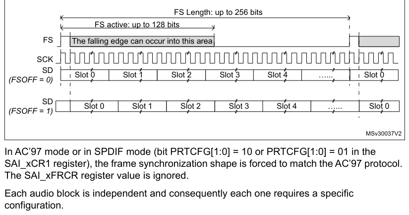

FS Length: up to 256 bits

FS active: up to 128 bits

FS The falling edge can occur into this area

SCK

SD

In AC’97 mode or in SPDIF mode (bit PRTCFG[1:0] = 10 or PRTCFG[1:0] = 01 in the SAI_xCR1 register),
the frame synchronization shape is forced to match the AC’97 protocol. The SAI_xFRCR register value
is ignored.

Each audio block is independent and consequently each one requires a specific configuration.

#### Frame length

- Master mode

The audio frame length can be configured to up to 256-bit clock cycles, by configuring the FRL[7:0]
field in the SAI_xFRCR register.

If the frame length is greater than the number of declared slots for the frame, the remaining bits
to transmit are extended to 0 or the SD line is released to high-Z
depending on the state of bit TRIS in the SAI_xCR2 register (refer to FS signal role). In reception
mode, the remaining bit is ignored.

If bit NODIV is cleared, (FRL+1) must be equal to a power of 2, from 8 to 256, to ensure that an
audio frame contains an integer number of MCLK pulses per bit clock cycle.

If bit NODIV is set, the (FRL+1) field can take any value from 8 to 256. Refer to [Section 43.4.8](#4348-sai-clock-generator):
SAI clock generator”

- Slave mode

The audio frame length is mainly used to specify to the slave the number of bit clock cycles per
audio frame sent by the external master. It is used mainly to detect from the master any anticipated
or late occurrence of the frame synchronization signal during an ongoing audio frame. In this case,
an error is generated. For more details, refer to [Section 43.4.14](#43414-error-flags): Error flags.

In slave mode, there are no constraints on the FRL[7:0] configuration in the SAI_xFRCR register.

The number of bits in the frame is equal to FRL[7:0] \+ 1.

The minimum number of bits to transfer in an audio frame is 8.

#### Frame synchronization polarity

The FSPOL bit in the SAI_xFRCR register sets the active polarity of the FS pin from which a frame is
started. The start of the frame is edge sensitive.

In slave mode, the audio block waits for a valid frame to start transmitting or receiving. The start
of the frame is synchronized to this signal. It is effective only if the start of the frame is not
detected during an ongoing communication and assimilated to an anticipated start of frame (refer to
[Section 43.4.14](#43414-error-flags): Error flags).

In master mode, the frame synchronization is sent continuously each time an audio frame is complete
until the SAIEN bit in the SAI_xCR1 register is cleared. If no data are present in the FIFO at the
end of the previous audio frame, an underrun condition is managed as described in [Section 43.4.14](#43414-error-flags):
Error flags), but the audio communication flow is not interrupted.

#### Frame synchronization active level length

The FSALL[6:0] bits of the SAI_xFRCR register enable the configuration of the length of the active
level of the frame synchronization signal. The length can be set from 1- to 128-bit clock cycles.

As an example, the active length can be half of the frame length in I2S, LSB or MSB-justified modes,
or one-bit wide for PCM/DSP or TDM.

#### Frame synchronization offset

Depending on the audio protocol targeted in the application, the frame synchronization signal can be
asserted when transmitting the last bit or the first bit of the audio frame (this is the case in I2S
standard protocol and in MSB-justified protocol, respectively). The FSOFF bit in the SAI_xFRCR
register enables the possibility to choose between two configurations.

#### FS signal role

The FS signal can have a different meaning depending on the FS function. FSDEF bit in the SAI_xFRCR
register selects which meaning it has:

- 0: start of frame, like, for instance, the PCM/DSP, TDM, AC’97, audio protocols,
- 1: start of frame and channel side identification within the audio frame like for the I2S or the
  MSB-or LSB-justified protocols.

When the FS signal is considered as a start of frame and channel side identification within the
frame, the number of declared slots must be considered to be half the number for the left channel
and half the number for the right channel. If the number of bit clock cycles on half audio frame is
greater than the number of slots dedicated to a channel side, and TRIS = 0, 0 is sent for
transmission for the remaining bit clock cycles in the SAI_xCR2 register. Otherwise, if TRIS = 1,
the SD line is released to high-Z. In reception mode, the remaining bit clock cycles are not
considered until the channel side changes.

**Figure 644. FS role is start of frame \+ channel side identification (FSDEF = TRIS = 1)**

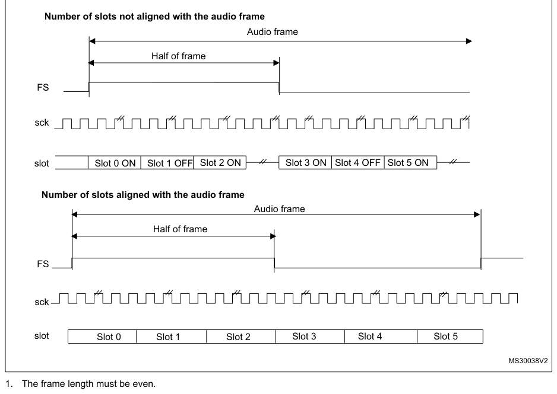

Number of slots not aligned with the audio frame

Audio frame

Half of frame

FS
sck

1. The frame length must be even.

If the FSDEF bit in SAI_xFRCR is kept clear, so FS signal is equivalent to a start of frame, and if
the number of slots defined in NBSLOT[3:0] in SAI_xSLOTR multiplied by the number of bits by slot
configured in SLOTSZ[1:0] in SAI_xSLOTR is less than the frame size (bit FRL[7:0] in the SAI_xFRCR
register), then:

- If TRIS = 0 in the SAI_xCR2 register, the remaining bit after the last slot is forced to 0 until
  the end of frame in case of transmitter,
- If TRIS = 1, the line is released to high-Z during the transfer of these remaining bits. In
  reception mode, these bits are discarded.

**Figure 645. FS role is start of frame (FSDEF = 0)**

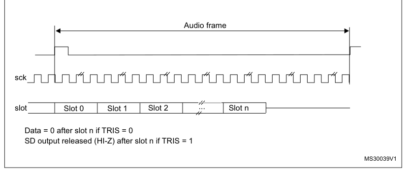

The FS signal is not used when the audio block in transmitter mode is configured to get the SPDIF
output on the SD line. The corresponding FS I/O is released and left free for other purposes.

### 43.4.7 Slot configuration

The slot is the basic element in the audio frame. The number of slots in the audio frame is equal to
NBSLOT[3:0] \+ 1.

The maximum number of slots per audio frame is fixed at 16.

For AC’97 protocol or SPDIF (when bit PRTCFG[1:0] = 10 or PRTCFG[1:0] = 01), the number of slots is
automatically set to target the protocol specification, and the value of NBSLOT[3:0] is ignored.

Each slot can be defined as a valid slot, or not, by setting SLOTEN[15:0] bits of the SAI_xSLOTR
register.

When an invalid slot is transferred, the SD data line is either forced to 0 or released to high- Z
depending on the TRIS bit configuration (refer to Output data line management on an inactive slot)
in transmitter mode. In receiver mode, the received value from the end of this slot is ignored.
Consequently, there is no FIFO access and so no request to read or write the FIFO linked to this
inactive slot status.

The slot size is also configurable as shown in Figure 646. The size of the slots is selected by
configuring the SLOTSZ[1:0] bits in the SAI_xSLOTR register. The size is applied identically for
each slot in an audio frame.

**Figure 646. Slot size configuration with FBOFF = 0 in SAI_xSLOTR**

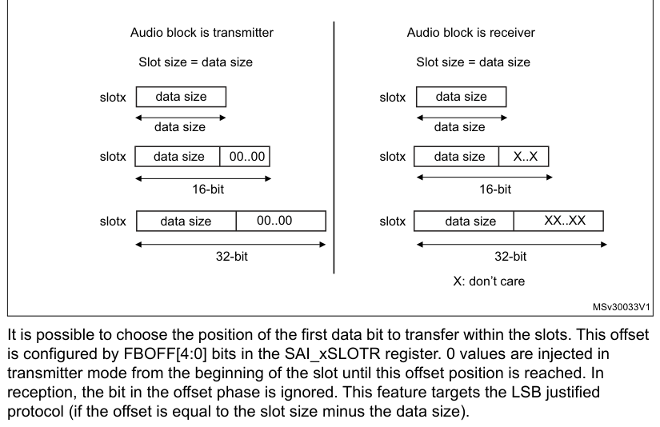

- `X`: don’t care

MSv30033V1

It is possible to choose the position of the first data bit to transfer within the slots. This
offset is configured by FBOFF[4:0] bits in the SAI_xSLOTR register. 0 values are injected in
transmitter mode from the beginning of the slot until this offset position is reached. In reception,
the bit in the offset phase is ignored. This feature targets the LSB justified protocol (if the
offset is equal to the slot size minus the data size).

**Figure 647. First bit offset**

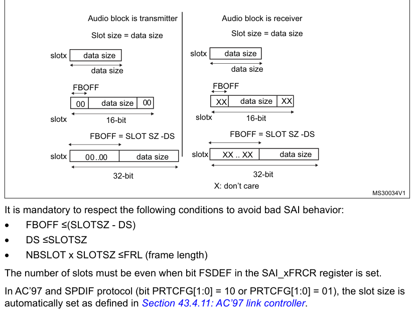

- `X`: don’t care

MS30034V1

It is mandatory to respect the following conditions to avoid bad SAI behavior:

- FBOFF ≤(SLOTSZ - DS)
- DS ≤SLOTSZ
- NBSLOT x SLOTSZ ≤FRL (frame length)

The number of slots must be even when bit FSDEF in the SAI_xFRCR register is set.

In AC’97 and SPDIF protocol (bit PRTCFG[1:0] = 10 or PRTCFG[1:0] = 01), the slot size is
automatically set as defined in [Section 43.4.11](#43411-ac97-link-controller): AC’97 link controller.

### 43.4.8 SAI clock generator

Each audio block has its own clock generator. The clock generator builds the master clock (MCLK_x)
and bit clock (SCK_x) signals from the sai_x_ker_ck. The sai_x_ker_ck clock is delivered by the
clock controller of the product (RCC).

#### Generation of the master clock (MCLK_x)

The clock generator provides the master clock (MCLK_x) when the audio block is defined as Master or
Slave. The master clock is generated as soon as the MCKEN bit is set to 1 even if the SAIEN bit for
the corresponding block is set to 0. This feature can be useful if the MCLK_x clock is used as
system clock for an external audio device, since it enables the generation of the MCLK_x before
activating the audio stream.

To generate a master clock on MCLK_x output before transferring the audio samples, the user
application has to follow the sequence below:

1. Check that SAIEN = 0.
2. Program the MCKDIV[5:0] divider to the required value.
3. Set the MCKEN bit to 1.
4. Later, the application can configure other parts of the SAI, and sets the SAIEN bit to 1
   to start the transfer of audio samples.

To avoid disturbances on the clock generated on MCLK_x output, the following operations are not
recommended:

- Changing MCKDIV when MCKEN = 1
- Setting MCKEN to 0 if the SAIEN = 1

The SAI makes sure that there are no spurs on MCLK_x output when the MCLK_x is switched ON and OFF
via the MCKEN bit (with SAIEN = 0).

Table 398 shows MCLK_x activation conditions.

**Table 398. MCLK_x activation conditions**

| Source row | Column 1 | Column 2 | Column 3 | Column 4 |
| ---: | --- | --- | --- | --- |
| 1 | `MCLKEN` | `NODIV` | `SAIEN for block x` | `MCLK_x` |
| 2 | `0` | `Disabled` |  |  |
| 3 | `X` | `0` |  |  |
| 4 | `1` | `Enabled` |  |  |
| 5 | `0` | `Disabled` |  |  |
| 6 | `1` |  |  |  |
| 7 | `1` | `1` | `Enabled` |  |
| 8 | `X` | `0` | `Enabled` |  |

> **Note:** MCLK_x can also be generated in AC’97 mode, when MCLKEN is set to 1.

#### Generation of the bit clock (SCK_x)

The clock generator provides the bit clock (SCK_x) when the audio block is defined as Master. The
frame synchronization (FS_x) is also derived from the signals provided by the clock generator.

In Slave mode, the value of NODIV and OSR fields are ignored, and the SCK_x clock is not generated.

The bit clock strobing edge of SCK_x can be configured through the CKSTR fields, which is functional
both in master and slave mode.

Figure 648 illustrates the architecture of the audio block clock generator.

**Figure 648. Audio block clock generator overview**

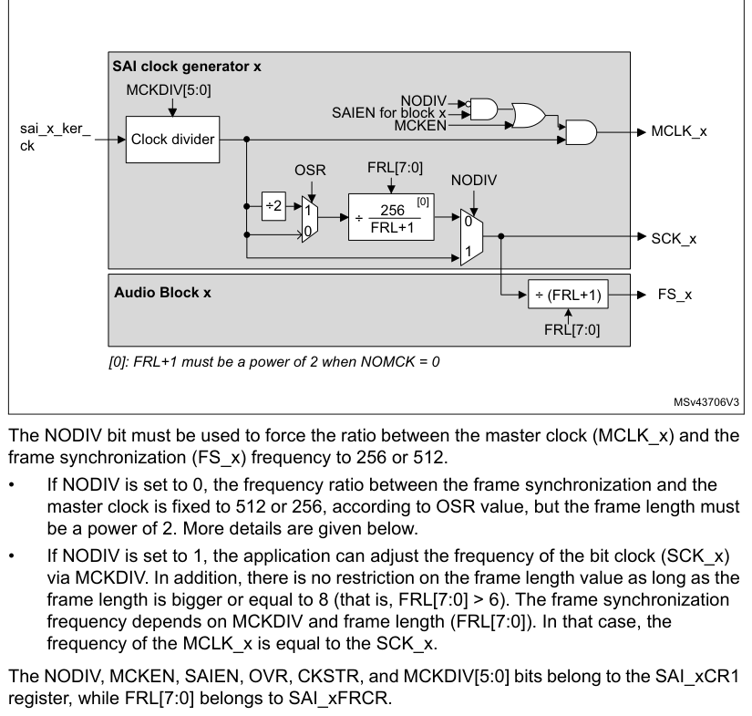

The NODIV bit must be used to force the ratio between the master clock (MCLK_x) and the frame
synchronization (FS_x) frequency to 256 or 512.

- If NODIV is set to 0, the frequency ratio between the frame synchronization and the master clock
  is fixed to 512 or 256, according to OSR value, but the frame length must be a power of 2. More
  details are given below.
- If NODIV is set to 1, the application can adjust the frequency of the bit clock (SCK_x) via
  MCKDIV. In addition, there is no restriction on the frame length value as long as the frame length
  is bigger or equal to 8 (that is, FRL[7:0] > 6). The frame synchronization frequency depends on
  MCKDIV and frame length (FRL[7:0]). In that case, the frequency of the MCLK_x is equal to the
  SCK_x.

The NODIV, MCKEN, SAIEN, OVR, CKSTR, and MCKDIV[5:0] bits belong to the SAI_xCR1 register, while
FRL[7:0] belongs to SAI_xFRCR.

Clock generator programming when NODIV = 0

In that case, the MCLK_x frequency is:

- FMCLK_x = 256 x FFS_x if OSR = 0
- FMCLK_x = 512 x FFS_x if OSR = 1

When MCKDIV is different from 0, the MCLK_x frequency is given by the formula below:

Fsai_x_ker_ck

> **Note:** When NODIV is equal to 0, (FRL+1) must be a power of two. In addition, (FRL+1) must
> range between 8 and 256. (FRL +1) represents the number of bit clock in the audio frame.

When the MCKDIV division ratio is odd, the MCLK duty cycle is not 50%. The bit clock signal (SCK_x)
can also have a duty cycle different from 50% if MCKDIV is odd, if OSR is equal to 0, and if (FRL+1)
= 2 8.

It is recommended, to program MCKDIV to an even value or to large values (higher than 10).

Note that MCKDIV = 0 gives the same result as MCKDIV = 1.

Clock generator programming when NODIV = 1

When MCKDIV is different from 0, the frequency of the bit clock (SCK_x) is given in the formula
below:

Fsai_x_ker_ck

> **Note:** When NODIV is set to 1, (FRL+1) can take any values from 8 to 256.

MCKDIV = 0 gives the same result as MCKDIV = 1.

#### Clock generator programming examples

Table 399 gives programming examples for 48, 96, and 192 kHz.

**Table 399. Clock generator programming examples**

| Source row | Column 1 | Column 2 | Column 3 | Column 4 | Column 5 | Column 6 | Column 7 | Column 8 |
| ---: | --- | --- | --- | --- | --- | --- | --- | --- |
| 1 | `Input` |  |  |  |  |  |  |  |
| 2 | `Audio sampling` |  |  |  |  |  |  |  |
| 3 | `sai_x_ker_ck` | `MCLK` | `FMCLK/ FFS` | `FRL (1)` | `OSR` | `NODIV` | `MCKEN` | `MCKDIV[5:0]` |
| 4 | `frequency (FFS)` |  |  |  |  |  |  |  |
| 5 | `clock frequency` |  |  |  |  |  |  |  |
| 6 | `512` | `2N-1` | `1` | `0` | `1` | `0 or 1` | `192 kHz` |  |
| 7 | `512` | `2N-1` | `1` | `0` | `1` | `2` | `96 kHz` |  |
| 8 | `512` | `2N-1` | `1` | `0` | `1` | `4` | `48 kHz` |  |
| 9 | `Y` |  |  |  |  |  |  |  |
| 10 | `256` | `2N-1` | `0` | `0` | `1` | `2` | `192 kHz` |  |
| 11 | `98.304 MHz` | `256` | `2N-1` | `0` | `0` | `1` | `4` | `96 kHz` |
| 12 | `256` | `2N-1` | `0` | `0` | `1` | `8` | `48 kHz` |  |
| 13 | `-` | `63` | `-` | `1` | `0` | `8` | `192 kHz` |  |
| 14 | `N` | `-` | `63` | `-` | `1` | `0` | `16` | `96 kHz` |
| 15 | `-` | `63` | `-` | `1` | `0` | `32` | `48 kHz` |  |

1. N is an integer value between 3 and 8.

### 43.4.9 Internal FIFOs

Each audio block in the SAI has its own FIFO. Depending on if the block is defined to be a
transmitter or a receiver, the FIFO can be written or read, respectively. Thus, there is only one
FIFO request linked to the FREQ bit in the SAI_xSR register.

An interrupt is generated if the FREQIE bit is enabled in the SAI_xIM register. This depends on:

- The FIFO threshold setting (FLVL bits in SAI_xCR2).
- Communication direction (transmitter or receiver). Refer to Interrupt generation in transmitter
  mode and Interrupt generation in reception mode.

#### Interrupt generation in transmitter mode

The interrupt generation depends on the FIFO configuration in transmitter mode:

- When the FIFO threshold bits in the SAI_xCR2 register are configured as FIFO empty (FTH[2:0] set
  to 0b000), an interrupt is generated (FREQ bit set by hardware to 1 in the SAI_xSR register) if no
  data are available in the SAI_xDR register (FLVL[2:0] bits in SAI_xSR are less than 0b001). This
  interrupt (FREQ bit in the SAI_xSR register) is cleared by hardware when the FIFO is no longer
  empty (FLVL[2:0] bits in SAI_xSR are different from 0b000), that is, one or more data are stored
  in the FIFO.
- When the FIFO threshold bits in the SAI_xCR2 register are configured as FIFO quarter full
  (FTH[2:0] set to 0b001), an interrupt is generated (FREQ bit set by hardware to 1 in the SAI_xSR
  register) if less than a quarter of the FIFO contains data (FLVL[2:0] bits in SAI_xSR are less
  than 0b010). This interrupt (FREQ bit in the SAI_xSR register) is cleared by hardware when at
  least a quarter of the FIFO contains data (FLVL[2:0] bits in SAI_xSR are higher than or equal to
  0b010).
- When the FIFO threshold bits in the SAI_xCR2 register are configured as FIFO half full (FTH[2:0]
  set to 0b010), an interrupt is generated (FREQ bit set by hardware to 1 in the SAI_xSR register)
  if less than half of the FIFO contains data (FLVL[2:0] bits in SAI_xSR are less than 0b011). This
  interrupt (FREQ bit in the SAI_xSR register) is cleared by hardware when at least half of the FIFO
  contains data (FLVL[2:0] bits in SAI_xSR are higher than or equal to 0b011).
- When the FIFO threshold bits in the SAI_xCR2 register are configured as FIFO three quarter
  (FTH[2:0] set to 0b011), an interrupt is generated (FREQ bit is set by hardware to 1 in the
  SAI_xSR register) if less than three quarters of the FIFO contains data (FLVL[2:0] bits in SAI_xSR
  are less than 0b100). This interrupt (FREQ bit in the SAI_xSR register) is cleared by hardware
  when at least three quarters of the FIFO contains data (FLVL[2:0] bits in SAI_xSR are higher than
  or equal to 0b100).
- When the FIFO threshold bits in the SAI_xCR2 register are configured as FIFO full (FTH[2:0] set to
  0b100), an interrupt is generated (FREQ bit is set by hardware to 1 in the SAI_xSR register) if
  the FIFO is not full (FLVL[2:0] bits in SAI_xSR are less than 0b101). This interrupt (FREQ bit in
  the SAI_xSR register) is cleared by hardware when the FIFO is full (FLVL[2:0] bits in SAI_xSR are
  equal to 0b101).

#### Interrupt generation in reception mode

The interrupt generation depends on the FIFO configuration in reception mode:

- When the FIFO threshold bits in the SAI_xCR2 register are configured as FIFO empty (FTH[2:0] set
  to 0b000), an interrupt is generated (FREQ bit is set by hardware to 1 in the SAI_xSR register) if
  at least one data is available in the SAI_xDR register (FLVL[2:0] bits in SAI_xSR are higher than
  or equal to 0b001). This interrupt (FREQ bit in the SAI_xSR register) is cleared by hardware when
  the FIFO becomes empty (FLVL[2:0] bits in the SAI_xSR are equal to 0b000), that is, no data are
  stored in FIFO.
- When the FIFO threshold bits in the SAI_xCR2 register are configured as FIFO quarter full
  (FTH[2:0] set to 0b001), an interrupt is generated (FREQ bit is set by hardware to 1 in the
  SAI_xSR register) if at least one quarter of the FIFO data locations are available (FLVL[2:0] bits
  in SAI_xSR are higher than or equal to 0b010). This interrupt (FREQ bit in the SAI_xSR register)
  is cleared by hardware when less than a quarter of the FIFO data locations become available
  (FLVL[2:0] bits in SAI_xSR are less than 0b010).
- When the FIFO threshold bits in the SAI_xCR2 register are configured as FIFO half full (FTH[2:0]
  set to 0b010), an interrupt is generated (FREQ bit is set by hardware to 1 in the SAI_xSR
  register) if at least half of the FIFO data locations are available (FLVL[2:0] bits in SAI_xSR are
  higher than or equal to 0b011). This interrupt (FREQ bit in the SAI_xSR register) is cleared by
  hardware when less than half of the FIFO data locations become available (FLVL[2:0] bits in
  SAI_xSR are less than 0b011).
- When the FIFO threshold bits in the SAI_xCR2 register are configured as FIFO three quarter full
  (FTH[2:0] set to 0b011), an interrupt is generated (FREQ bit is set by hardware to 1 in the
  SAI_xSR register) if at least three quarters of the FIFO data locations are available (FLVL[2:0]
  bits in SAI_xSR are higher than or equal to 0b100). This interrupt (FREQ bit in the SAI_xSR
  register) is cleared by hardware when the FIFO has less than three quarters of the FIFO data
  locations available (FLVL[2:0] bits in SAI_xSR is less than 0b100).
- When the FIFO threshold bits in the SAI_xCR2 register are configured as FIFO full (FTH[2:0] set to
  0b100), an interrupt is generated (FREQ bit is set by hardware to 1 in the SAI_xSR register) if
  the FIFO is full (FLVL[2:0] bits in SAI_xSR are equal to 0b101). This
  interrupt (FREQ bit in the SAI_xSR register) is cleared by hardware when the FIFO is not full
  (FLVL[2:0] bits in SAI_xSR are less than 0b101).

Like interrupt generation, the SAI can use the DMA if the DMAEN bit in the SAI_xCR1 register is set.
The FREQ bit assertion mechanism is the same as the interrupt generation mechanism described above
for FREQIE.

Each FIFO is an 8-word FIFO. Each read or write operation from/to the FIFO targets one word FIFO
location whatever the access size. Each FIFO word contains one audio slot. FIFO pointers are
incremented by one word after each access to the SAI_xDR register.

Data must be right-aligned when written in the SAI_xDR register.

Data received are right-aligned in the SAI_xDR register.

The FIFO pointers can be reinitialized when the SAI is disabled by configuring the FFLUSH bit in the
SAI_xCR2 register. If FFLUSH is set when the SAI is enabled, the data present in the FIFO are lost
automatically.

### 43.4.10 PDM interface

The PDM (pulse density modulation) interface is provided in order to support digital microphones. Up
to 4 digital microphone pairs can be connected in parallel. Depending on product implementation,
less microphones can be supported (refer to [Section 43.3](#433-sai-implementation): SAI implementation).

Figure 649 shows a typical connection of a digital microphone pair via a PDM interface. Both
microphones share the same bitstream clock and data line. Thanks to a configuration pin (LR), a
microphone can provide valid data on SAI_CK[m] rising edge while the other provides valid data on
SAI_CK[m] falling edge (m being the number of clock lines).

**Figure 649. PDM typical connection and timing**

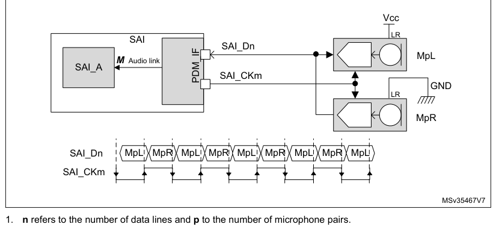

Vcc

LR

SAI

SAI_Dn

TDM link

MpL

M Audio link

SAI_A

SAI_CKm

PDM_IF

GND

LR

MpR

1. n refers to the number of data lines and p to the number of microphone pairs.

The PDM function is intended to be used in conjunction with SAI_A subblock configured in TDM master
mode. It cannot be used with SAI_B subblock. The PDM interface uses the timing signals provided by
the serial audio interface of SAI_A and adapts them to generate a bitstream clock (SAI_CK[m]).

The processing performed into the PDM interface is the following:

1. The PDM interface builds the bitstream clock from the bit clock received from the serial
   audio interface of SAI_A.
2. The bitstream data received from the microphones (SAI_D[n]) are de-interleaved and
   go through a 7-bit delay line to fine-tune the delay of each microphone with the accuracy of the
   bitstream clock.
3. The shift registers translate each serial bitstream into bytes.
4. The last operation consists in shifting-out the resulting bytes to SAI_A through the data
   line of the serial audio interface.

Figure 650 below shows the block diagram of the PDM interface, with a detailed view of a
de-interleaver.

> **Note:** The PDM interface does not embed the decimation filter required to build-up the PCM audio
> samples from the bitstream. It is up to the application software to perform this operation.

**Figure 650. Detailed PDM interface block diagram**

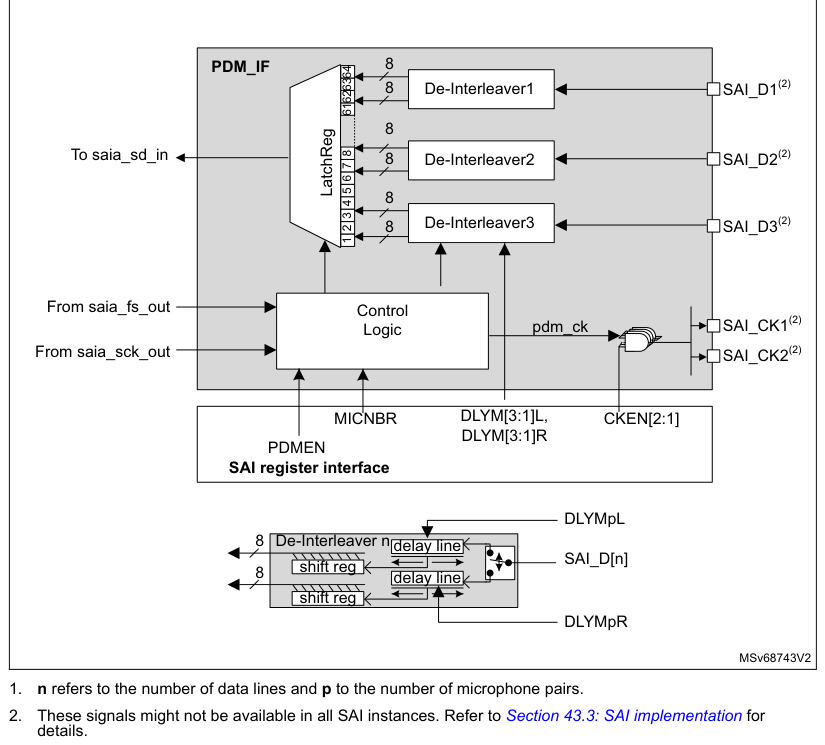

1. n refers to the number of data lines and p to the number of microphone pairs.
2. These signals might not be available in all SAI instances. Refer to [Section 43.3](#433-sai-implementation): SAI
   implementation for
   details.

The PDM interface can be enabled through the PDMEN bit in the SAI_PDMCR register. However, the PDM
interface must be enabled prior to enabling the SAI_A block.

To reduce the memory footprint, the user can select the number of microphones the application needs.
This can be done through the MICNBR[1:0] bits. It is possible to choose between 2, 4, 6, or 8
microphones. For example, if the application is using 3 microphones, the user has to select 4.

#### Enabling the PDM interface

To enable the PDM interface, follow the sequence below:

1. Configure SAI_A in TDM master mode (see Table 400).
2. Configure the PDM interface as follows:

a) Define the number of digital microphones via MICNBR.

b) Enable the bitstream clock needed in the application by setting the corresponding
bits on CKEN to 1.

3. Enable the PDM interface, via the PDMEN bit.
4. Enable the SAI_A.

> **Note:** Once the PDM interface and SAI_A are enabled, the first two frames received on SAI_ADR
> are invalid and must be dropped.

#### Startup sequence

Figure 651 shows the startup sequence: Once the PDM interface is enabled, it waits for the frame
synchronization event prior to starting the acquisition of the microphone samples. After 8 SAI_CK
clock periods, a data byte coming from each microphone is available, and transferred to the SAI, via
the serial audio interface.

**Figure 651. Start-up sequence**

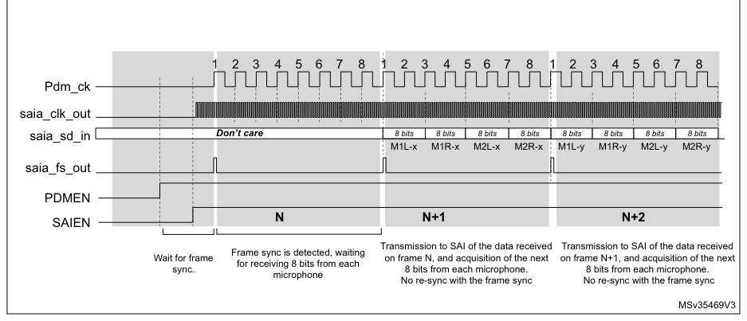

#### SAI_ADR data format

The arrangement of the data coming from the microphone into the SAI_ADR register depends on the
following parameters:

- Number of microphones
- Slot width selected
- LSBFIRST bit

The slot width defines the number of significant bits into each word available into the SAI_ADR.

When a slot width of 32 bits is selected, each data available into the SAI_ADR contains 32 useful
bits. This reduces the number of words stored into the memory. However, the counterpart is that the
software has to perform some operations to de-interleave the data of each microphone.

On the other hand, when the slot width is set to 8 bits, each data available into the SAI_ADR
contains 8 useful bits. This increases the number of words stored in the memory. However, it offers
the advantage of avoiding extra processing since each word contains information from one microphone.

SAI_ADR data format example

- 32-bit slot width (DS = 0b111 and SLOTSZ = 0). Refer to Figure 652.

For an 8 microphone configuration, two consecutive words read from the SAI_ADR register contain a
data byte from each microphone.

For a 4 microphones configuration, each word read from the SAI_ADR register contains a data byte
from each microphone.

**Figure 652. SAI_ADR format in TDM mode, 32-bit slot width**

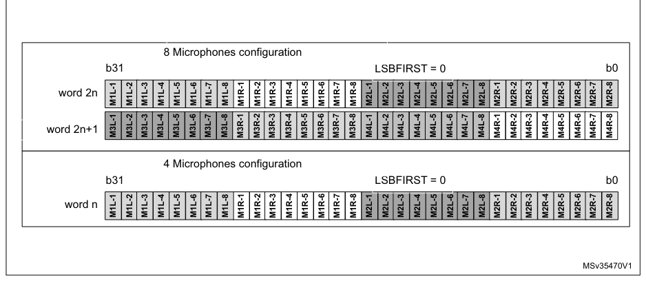

- 16-bit slot width (DS = 0b100 and SLOTSZ = 0). Refer to Figure 653.

For an 8-microphone configuration, four consecutive words read from the SAI_ADR register contain a
data byte from each microphone. Note that the 16-bit data of SAI_ADR are right-aligned.

For a 4- or 2-microphone configuration, the SAI behavior is similar to the 8-microphone
configuration. Up to 2 words of 16 bits are required to acquire a byte from 4 microphones and a
single word for 2 microphones.

**Figure 653. SAI_ADR format in TDM mode, 16-bit slot width**

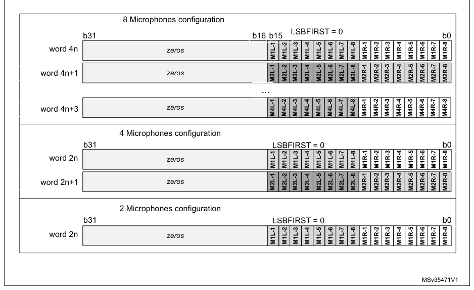

- Using an 8-bit slot width (DS = 0b010 and SLOTSZ = 0). Refer to Figure 654.

For an 8-microphone configuration, eight consecutive words read from the SAI_ADR register contain a
byte of data from each microphone. Note that the 8-bit data of SAI_ADR are right-aligned.

For a 4- or 2-microphone configuration, the SAI behavior is similar to the 8-microphone
configuration. Up to four words of eight bits are required to acquire a byte from four microphones
and two words from two microphones.

**Figure 654. SAI_ADR format in TDM mode, 8-bit slot width**

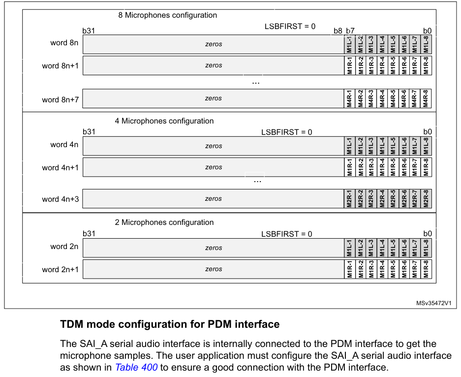

#### TDM mode configuration for PDM interface

The SAI_A serial audio interface is internally connected to the PDM interface to get the microphone
samples. The user application must configure the SAI_A serial audio interface as shown in Table 400
to ensure a good connection with the PDM interface.

**Table 400. SAI_A configuration for TDM mode**

| Source row | Column 1 | Column 2 | Column 3 |
| ---: | --- | --- | --- |
| 1 | `Bit Fields` | `Values` | `Comments` |
| 2 | `MODE` | `0b01` | `Mode must be MASTER receiver.` |
| 3 | `PRTCFG` | `0b00` | `Free protocol for TDM.` |
| 4 | `To be adjusted according to the required data format, in accordance with` |  |  |
| 5 | `DS` | `X` | `the frame length and the number of slots (FRL and NBSLOT). See` |
| 6 | `Table 401.` |  |  |
| 7 | `LSBFIRST` | `X` | `This parameter can be used according to the desired data format.` |
| 8 | `Signal transitions occur on the rising edge of the SCK_A bit clock. Signals` |  |  |
| 9 | `CKSTR` | `0` |  |
| 10 | `are stable on the falling edge of the bit clock.` |  |  |
| 11 | `MONO` | `0` | `Stereo mode.` |
| 12 | `To be adjusted according to the number of microphones (MICNBR). See` |  |  |
| 13 | `FRL` | `X` |  |
| 14 | `Table 401.` |  |  |
| 15 | `FSALL` | `0` | `Pulse width is one bit clock cycle.` |

**Table 400. SAI_A configuration for TDM mode (continued)**

| Source row | Column 1 | Column 2 | Column 3 |
| ---: | --- | --- | --- |
| 1 | `Bit Fields` | `Values` | `Comments` |
| 2 | `FSDEF` | `0` | `FS signal is a start of frame.` |
| 3 | `FSPOL` | `1` | `FS is active high.` |
| 4 | `FSOFF` | `0` | `FS is asserted on the first bit of slot 0.` |
| 5 | `FBOFF` | `0` | `No offset on slot.` |
| 6 | `SLOTSZ` | `0` | `Slot size = data size.` |
| 7 | `To be adjusted according to the required data format, in accordance with` |  |  |
| 8 | `NBSLOT` | `X` |  |
| 9 | `the slot size, and the frame length (FRL and DS). See Table 401.` |  |  |
| 10 | `SLOTEN` | `X` | `To be adjusted according to NBSLOT.` |
| 11 | `NODIV` | `1` | `No need to generate a master clock MCLK.` |
| 12 | `Depends on the frequency provided to sai_a_ker_ck input.` |  |  |
| 13 | `MCKDIV` | `X` | `This parameter must be adjusted to generate the proper bitstream clock` |

frequency. See Table 401.

#### Adjusting the bitstream clock rate

To program the serial audio interface properly, the user application must take into account the
settings given in Table 400, and follow the sequence below:

1. Adjust the bit clock frequency (FSCK_A) according to the required frequency for the

PDM bitstream clock, using the following formula:

> **Extracted layout**
>
> `FSCK_A` · `=` · `FPDM_CK` · `×` · `(` · `MICNBR` · `+` · `1` · `)` · `×` · `2`  
> `MICNBR can be 0, 1, 2 or 3 (0 = 2 microphones; see Section 43.6.17)`  

2. Set the frame length (FRL) using the following formula:

> **Extracted layout**
>
> `FRL` · `=` · `(` · `16` · `×` · `(` · `MICNBR` · `+` · `1` · `)` · `)` · `–` · `1`  

**Table 401. TDM frame configuration examples(1)(2)**

| Source row | Column 1 | Column 2 | Column 3 | Column 4 | Column 5 | Column 6 | Column 7 | Column 8 |
| ---: | --- | --- | --- | --- | --- | --- | --- | --- |
| 1 | `Wanted` | `bit clock` | `Frame sync.` |  |  |  |  |  |
| 2 | `Microphone` |  |  |  |  |  |  |  |
| 3 | `Nber of` |  |  |  |  |  |  |  |
| 4 | `sampling` | `SAI_CKn` | `(SCK_A)` | `(FS_A)` | `Comments` |  |  |  |
| 5 | `microphones` | `DS` |  |  |  |  |  |  |
| 6 | `FRL` |  |  |  |  |  |  |  |
| 7 | `rate` | `frequency` | `frequency` |  |  |  |  |  |
| 8 | `frequency` |  |  |  |  |  |  |  |
| 9 | `NBSLOT` |  |  |  |  |  |  |  |
| 10 | `3.072 MHz` | `24.576 MHz` | `384 kHz` | `63` | `0b111` | `1` | `2 slots of 32 bits per frame` |  |
| 11 | `up to 8` | `3.072 MHz` | `24.576 MHz` | `384 kHz` | `63` | `0b100` | `3` | `4 slots of 16 bits per frame` |
| 12 | `3.072 MHz` | `24.576 MHz` | `384 kHz` | `63` | `0b010` | `7` | `8 slots of 8 bits per frame` |  |
| 13 | `3.072 MHz` | `18.432 MHz` | `384 kHz` | `47` | `0b110` | `1` | `2 slots of 24 bits per frame` |  |
| 14 | `up to 6` | `3.072 MHz` | `18.432 MHz` | `384 kHz` | `47` | `0b100` | `2` | `3 slots of 16 bits per frame` |
| 15 | `48 kHz` | `3.072 MHz` | `18.432 MHz` | `384 kHz` | `47` | `0b010` | `5` | `6 slots of 8 bits per frame` |
| 16 | `3.072 MHz` | `12.288 MHz` | `384 kHz` | `31` | `0b111` | `0` | `1 slot of 32 bits per frame` |  |
| 17 | `up to 4` | `3.072 MHz` | `12.288 MHz` | `384 kHz` | `31` | `0b100` | `1` | `2 slots of 16 bits per frame` |
| 18 | `3.072 MHz` | `12.288 MHz` | `384 kHz` | `31` | `0b010` | `3` | `4 slots of 8 bits per frame` |  |
| 19 | `3.072 MHz` | `6.144 MHz` | `384 kHz` | `15` | `0b100` | `0` | `1 slots of 16 bits per frame` |  |
| 20 | `up to 2` |  |  |  |  |  |  |  |
| 21 | `3.072 MHz` | `6.144 MHz` | `384 kHz` | `15` | `0b010` | `1` | `2 slots of 8 bits per frame` |  |
| 22 | `1.024 MHz` | `8.192 MHz` | `128 kHz` | `63` | `0b111` | `1` | `2 slots of 32 bits per frame` |  |
| 23 | `up to 8` | `1.024 MHz` | `8.192 MHz` | `128 kHz` | `63` | `0b100` | `3` | `4 slots of 16 bits per frame` |
| 24 | `1.024 MHz` | `8.192 MHz` | `128 kHz` | `63` | `0b010` | `7` | `8 slots of 8 bits per frame` |  |
| 25 | `1.024 MHz` | `6.144 MHz` | `128 kHz` | `47` | `0b110` | `1` | `2 slots of 24 bits per frame` |  |
| 26 | `up to 6` |  |  |  |  |  |  |  |
| 27 | `1.024 MHz` | `6.144 MHz` | `128 kHz` | `47` | `0b010` | `5` | `6 slots of 8 bits per frame` |  |
| 28 | `16 kHz` |  |  |  |  |  |  |  |
| 29 | `1.024 MHz` | `4.096 MHz` | `128 kHz` | `31` | `0b111` | `0` | `1 slot of 32 bits per frame` |  |
| 30 | `up to 4` | `1.024 MHz` | `4.096 MHz` | `128 kHz` | `31` | `0b100` | `1` | `2 slots of 16 bits per frame` |
| 31 | `1.024 MHz` | `4.096 MHz` | `128 kHz` | `31` | `0b010` | `3` | `4 slots of 8 bits per frame` |  |
| 32 | `1.024 MHz` | `2.048 MHz` | `128 kHz` | `15` | `0b100` | `0` | `1 slot of 16 bits per frame` |  |
| 33 | `up to 2` |  |  |  |  |  |  |  |
| 34 | `1.024 MHz` | `2.048 MHz` | `128 kHz` | `15` | `0b010` | `1` | `2 slots of 8 bits per frame` |  |

1. Refer to Table 400: SAI_A configuration for TDM mode for additional information on TDM
   configuration. The sai_a_ker_ck
   clock frequency provided to the SAI must be a multiple of the SCK_A frequency, and MCKDIV must be
   programmed
   accordingly.
2. The above sai_a_ker_ck frequencies are given as examples only. Refer to section Reset and clock
   controller (RCC) to
   check if they can be generated on the device.
3. The table above gives allowed settings for a decimation ratio of 64.

#### Adjusting the delay lines

When the PDM interface is enabled, the application can adjust on-the-fly the delay cells of each
microphone input via the SAI_PDMDLY register.

The new delay values become effective after two audio frames.

### 43.4.11 AC’97 link controller

The SAI is able to work as an AC’97 link controller. In this protocol:

- The slot number and the slot size are fixed.
- The frame synchronization signal is perfectly defined and has a fixed shape.

To select this protocol, set the PRTCFG[1:0] bits in the SAI_xCR1 register to 10. When AC’97 mode is
selected, only data sizes of 16 or 20 bits can be used, otherwise the SAI behavior is not
guaranteed.

- The NBSLOT[3:0] and SLOTSZ[1:0] bits are consequently ignored.
- The number of slots is fixed at 13 slots. The first one is 16 bits wide and all the others are 20
  bits wide (data slots).
- The FBOFF[4:0] bits in the SAI_xSLOTR register are ignored.
- The SAI_xFRCR register is ignored.
- The MCLK is not used.

The FS signal from the block defined as asynchronous is configured automatically as an output, since
the AC’97 controller link drives the FS signal whatever the master or slave configuration.

Figure 655 shows an AC’97 audio frame structure.

**Figure 655. AC’97 audio frame**

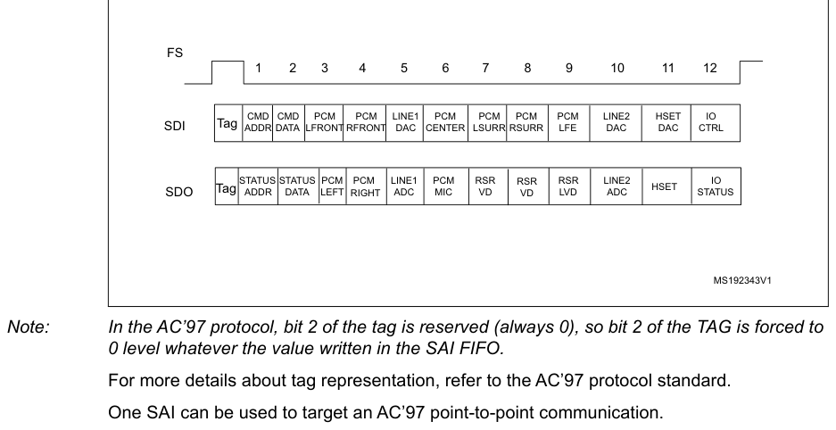

> **Note:** In the AC’97 protocol, bit 2 of the tag is reserved (always 0), so bit 2 of the TAG is forced to

0 level whatever the value written in the SAI FIFO.

For more details about tag representation, refer to the AC’97 protocol standard.

One SAI can be used to target an AC’97 point-to-point communication.

In receiver mode, the SAI acting as an AC’97 link controller requires no FIFO request and so no data
storage in the FIFO when the codec-ready bit in slot 0 is decoded low. If bit CNRDYIE is enabled in
the SAI_xIM register, flag CNRDY is set in the SAI_xSR register and an interrupt is generated. This
flag is dedicated to the AC’97 protocol.

#### Clock generator programming in AC’97 mode

In AC’97 mode, the frame length is fixed at 256 bits, and its frequency must be set to 48 kHz. The
formulas given in [Section 43.4.8](#4348-sai-clock-generator): SAI clock generator must be used with FRL = 255, to generate the
proper frame rate (FFS_x).

### 43.4.12 SPDIF output

The SPDIF interface is available in transmitter mode only. It supports the audio IEC60958.

To select SPDIF mode, set the PRTCFG[1:0] bits to 01 in the SAI_xCR1 register.

For SPDIF protocol:

- Only the SD data line is enabled.
- The FS, SCK, and MCLK I/Os pins are left free.
- The MODE[1] bit is forced to 0 to select the master mode to enable the clock generator of the SAI
  and manage the data rate on the SD line.
- The data size is forced to 24 bits. The value set in the DS[2:0] bits in the SAI_xCR1 register is
  ignored.
- The clock generator must be configured to define the symbol-rate, knowing that the bit clock must
  be twice the symbol-rate. The data is coded in Manchester protocol.
- The SAI_xFRCR and SAI_xSLOTR registers are ignored. The SAI is configured internally to match the
  SPDIF protocol requirements as shown in Figure 656.

**Figure 656. SPDIF format**

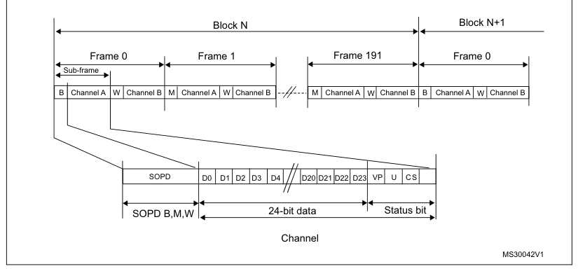

An SPDIF block contains 192 frames. Each frame is composed of two 32-bit subframes, generally one
for the left channel and one for the right channel. Each subframe is composed of a SOPD pattern
(4-bit) to specify if the subframe is the start of a block (and so is identifying a channel A) or if
it is identifying a channel A somewhere in the block, or if it is referring to channel B (see Table
402). The next 28 bits of channel information are composed of 24 data bits \+ 4 status bits.

**Table 402. SOPD pattern**

| Source row | Column 1 | Column 2 | Column 3 | Column 4 |
| ---: | --- | --- | --- | --- |
| 1 | `Preamble coding` |  |  |  |
| 2 | `SOPD` | `Description` |  |  |
| 3 | `last bit is 0` | `last bit is 1` |  |  |
| 4 | `B` | `11101000` | `00010111` | `Channel A data at the start of block` |
| 5 | `W` | `11100100` | `00011011` | `Channel B data somewhere in the block` |
| 6 | `M` | `11100010` | `00011101` | `Channel A data` |
| 7 | `The data stored in SAI_xDR has to be filled as follows:` |  |  |  |

- SAI_xDR[26:24] contain the channel status, user, and validity bits.
- SAI_xDR[23:0] contain the 24-bit data for the considered channel.

If the data size is 20 bits, the data must be mapped on SAI_xDR[23:4].

If the data size is 16 bits, the data must be mapped on SAI_xDR[23:8].

SAI_xDR[23] always represents the MSB.

**Figure 657. SAI_xDR register ordering**

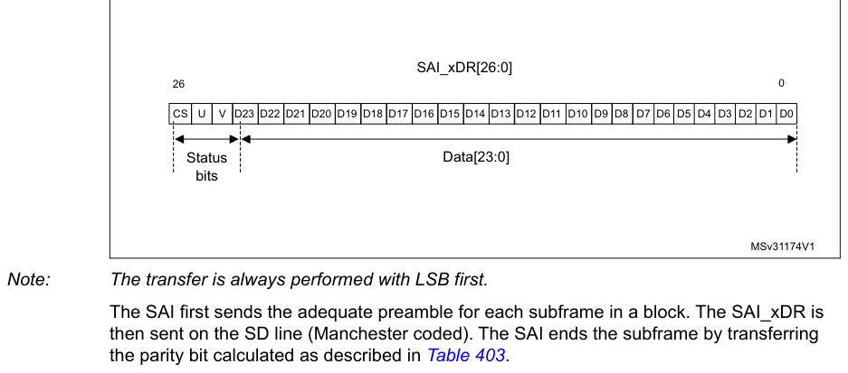

> **Note:** The transfer is always performed with LSB first.

The SAI first sends the adequate preamble for each subframe in a block. The SAI_xDR is then sent on
the SD line (Manchester coded). The SAI ends the subframe by transferring the parity bit calculated
as described in Table 403.

**Table 403. Parity bit calculation**

| SAI_xDR[26:0] | Parity bit P value transferred |
| --- | --- |
| odd number of 0 | 0 |
| odd number of 1 | 1 |

The underrun is the only error flag available in the SAI_xSR register for SPDIF mode since the SAI
can only operate in transmitter mode. As a result, the following sequence must be executed to
recover from an underrun error detected via the underrun interrupt or the underrun status bit:

1. Disable the DMA stream (via the DMA peripheral) if the DMA is used.
2. Disable the SAI and check that the peripheral is physically disabled by polling the

SAIEN bit in the SAI_xCR1 register.

3. Clear the COVRUNDR flag in the SAI_xCLRFR register.
4. Flush the FIFO by setting the FFLUSH bit in SAI_xCR2.

The software needs to point to the address of the future data corresponding to the start of a new
block (data for preamble B). If the DMA is used, the DMA source base address pointer must be updated
accordingly.

5. Enable the DMA stream (DMA peripheral) again if the DMA is used to manage data
   transfers according to the new source base address.
6. Enable the SAI again by configuring the SAIEN bit in the SAI_xCR1 register.

#### Clock generator programming in SPDIF generator mode

For the SPDIF generator, the SAI provides a bit clock twice as fast as the symbol-rate. The table
below shows examples of symbol rates with respect to the audio sampling rate.

**Table 404. Audio sampling frequency versus symbol rates**

| Audio sampling frequencies (FS) | Symbol-rate |
| --- | --- |
| 44.1 kHz | 2.8224 MHz |
| 48 kHz | 3.072 MHz |
| 96 kHz | 6.144 MHz |
| 192 kHz | 12.288 MHz |

More generally, the relationship between the audio sampling frequency (FS) and the bit clock rate
(FSCK_X) is given by the formula:

FSCK_x

FS = -----------------------

128

The bit clock rate is obtained as follows:

Fsai_x_ker_ck

| Source row | Column 1 | Column 2 | Column 3 |
| ---: | --- | --- | --- |
| 1 | `FSCK_x` | `=` | `----------------------------------` |
| 2 | `MCKDIV` |  |  |

> **Note:** The above formulas are valid only if NODIV is set to 1 in the SAI_ACR1 register.

### 43.4.13 Specific features

The SAI interface embeds specific features that can be useful depending on the audio protocol
selected. These functions are accessible through specific bits of the SAI_xCR2 register.

#### Mute mode

The mute mode can be used when the audio subblock is a transmitter or a receiver.

Audio subblock in transmission mode

In transmitter mode, the mute mode can be selected at any time. The mute mode is active for entire
audio frames. The MUTE bit in the SAI_xCR2 register enables the mute mode when it is configured
during an ongoing frame.

The mute mode bit is strobed only at the end of the frame. If it is set at this time, the mute mode
is active at the beginning of the new audio frame and for a complete frame, until the next end of
frame. The bit is then strobed to determine if the next frame is still a mute frame.

If the number of slots set through the NBSLOT[3:0] bits in the SAI_xSLOTR register is lower than or
equal to 2, it is possible to specify if the value sent in mute mode is 0 or if it is the last value
of each slot. The selection is done via the MUTEVAL bit in the SAI_xCR2 register.

If the number of slots set in the NBSLOT[3:0] bits in the SAI_xSLOTR register is greater than 2, the
MUTEVAL bit in the SAI_xCR2 register is meaningless as 0 values are sent on each bit on each slot.

The FIFO pointers are still incremented in mute mode. This means that data present in the FIFO and
for which the mute mode is requested are discarded.

Audio subblock in reception mode

In reception mode, it is possible to detect a mute mode sent from the external transmitter when all
the declared and valid slots of the audio frame receive 0 for a given consecutive number of audio
frames (MUTECNT[5:0] bits in the SAI_xCR2 register).

When the number of MUTE frames is detected, the MUTEDET flag in the SAI_xSR register is set and an
interrupt can be generated if the MUTEDETIE bit is set in SAI_xCR2.

The mute frame counter is cleared when the audio subblock is disabled or when a valid slot receives
at least one data in an audio frame. The interrupt is generated just once, when the counter reaches
the value specified in the MUTECNT[5:0] bits. The interrupt event is then reinitialized when the
counter is cleared.

> **Note:** The mute mode is not available for SPDIF audio blocks.

#### Mono/stereo mode

In transmitter mode, the mono mode can be addressed without any data preprocessing in memory,
assuming the number of slots is equal to 2 (NBSLOT[3:0] = 0001 in SAI_xSLOTR). In this case, the
access time to and from the FIFO is reduced by 2 since the data for slot 0 is duplicated into data
slot 1.

To enable the mono mode:

1. Set the MONO bit to 1 in the SAI_xCR1 register.
2. Set NBSLOT to 1 and SLOTEN to 3 in SAI_xSLOTR.

In reception mode, the MONO bit can be set and is meaningful only if the number of slots is equal to
2, like in transmitter mode. When it is set, only slot 0 data are stored in the FIFO. The data
belonging to slot 1 are discarded since, in this case, it is supposed to be the same as the previous
slot. If the data flow in reception mode is a real stereo audio flow with a distinct and different
left and right data, the MONO bit is meaningless. The conversion from the output stereo file to the
equivalent mono file is done by software.

#### Companding mode

Telecommunication applications can require processing the data to be transmitted or received using a
data companding algorithm.

Depending on the COMP[1:0] bits in the SAI_xCR2 register (used only when free protocol mode is
selected), the application software can choose to process or not the data before sending it on the
SD serial output line (compression) or to expand the data after the reception on the SD serial input
line (expansion), as illustrated in Figure 658. The two companding modes supported are the µ-Law and
the A-Law logs, which are a part of the CCITT G.711 recommendation.

The companding standard used in the United States and Japan is the µ-Law. It supports 14 bits of
dynamic range (COMP[1:0] = 10 in the SAI_xCR2 register).

The European companding standard is A-Law and supports 13 bits of dynamic range (COMP[1:0] = 11 in
the SAI_xCR2 register).

Both µ-Law and A-Law companding standard can be computed based on 1’s complement or 2’s complement
representation, depending on the CPL bit setting in the SAI_xCR2 register.

In µ-Law and A-Law standards, data are coded as 8 bits with MSB alignment. Companded data are always
8 bits wide. For this reason, the DS[2:0] bits in the SAI_xCR1 register are forced to 010 when the
SAI audio block is enabled (the SAIEN bit = 1 in the SAI_xCR1 register) and when one of these two
companding modes is selected through the COMP[1:0] bits.

If no companding processing is required, the COMP[1:0] bits must be kept clear.

**Figure 658. Data companding hardware in an audio block in the SAI**

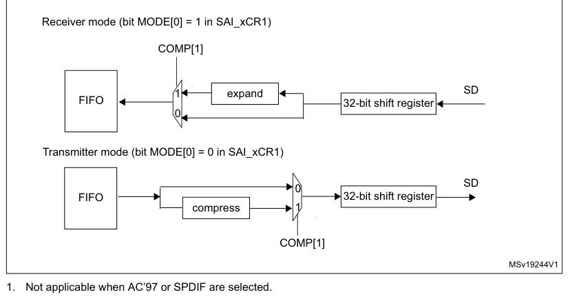

1. Not applicable when AC’97 or SPDIF are selected.

Expansion and compression mode are automatically selected through SAI_xCR2:

- If the SAI audio block is configured to be a transmitter, and if the COMP[1] bit is set in the
  SAI_xCR2 register, the compression mode is applied.
- If the SAI audio block is declared as a receiver, the expansion algorithm is applied.

#### Output data line management on an inactive slot

In transmitter mode, it is possible to choose the behavior of the SD line output when an inactive
slot is sent on the data line (via the TRIS bit).

- Either the SAI forces 0 on the SD output line when an inactive slot is transmitted, or
- The line is released in high-Z state at the end of the last bit of data transferred, to release
  the line for other transmitters connected to this node.

It is important to note that the two transmitters cannot attempt to drive the same SD output pin
simultaneously, which may result in a short circuit. To ensure a gap between transmissions, if the
data is lower than 32-bit, the data can be extended to 32-bit by setting the bit SLOTSZ[1:0] = 10 in
the SAI_xSLOTR register. The SD output pin is then tri-stated at the end of the LSB of the active
slot (during the padding to 0 phase to extend the data to 32- bit) if the following slot is declared
inactive.

In addition, if the number of slots multiplied by the slot size is lower than the frame length, the
SD output line is tri-stated when the padding to 0 is done to complete the audio frame.

Figure 659 illustrates these behaviors.

**Figure 659. Tristate strategy on SD output line on an inactive slot**

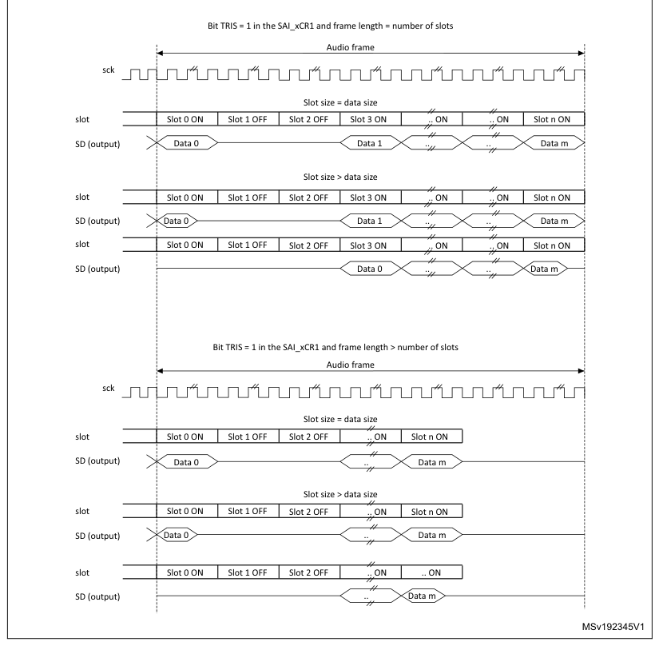

When the selected audio protocol uses the FS signal as a start of frame and a channel side
identification (bit FSDEF = 1 in the SAI_xFRCR register), the tristate mode is managed according to
Figure 660 (where the bit TRIS in the SAI_xCR1 register = 1, and FSDEF=1, and half frame length is
higher than number of slots/2, and NBSLOT=6).

**Figure 660. Tristate on output data line in a protocol like I2S**

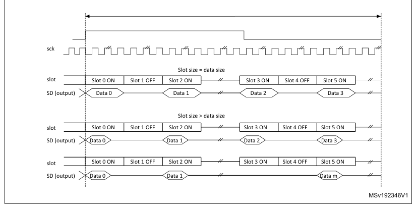

If the TRIS bit in the SAI_xCR2 register is cleared, all the high impedance states on the SD output
line in Figure 659 and Figure 660 are replaced by a drive with a value of 0.

### 43.4.14 Error flags

The SAI implements the following error flags:

- FIFO overrun/underrun.
- Anticipated frame synchronization detection.
- Late frame synchronization detection.
- Codec not ready (AC’97 exclusively).
- Wrong clock configuration in master mode.

#### FIFO overrun/underrun (OVRUDR)

The FIFO overrun/underrun bit is called OVRUDR in the SAI_xSR register.

The overrun or underrun errors share the same bit since an audio block can be either receiver or
transmitter and each audio block in a given SAI has its own SAI_xSR register.

Overrun

When the audio block is configured as receiver, an overrun condition may appear if data are received
in an audio frame when the FIFO is full and not able to store the received data. In this case, the
received data are lost, the OVRUDR flag in the SAI_xSR register is set, and an interrupt is
generated if the OVRUDRIE bit is set in the SAI_xIM register. The slot number, from which the
overrun occurs, is stored internally. No more data are stored into the FIFO until it becomes free to
store new data. When the FIFO has at least one data free, the SAI audio block receiver stores new
data (from a new audio frame) from the slot number that was stored internally when the overrun
condition was detected. This avoids data slot dealignment in the destination memory (refer to Figure
661).

The OVRUDR flag is cleared when the COVRUDR bit is set in the SAI_xCLRFR register.

**Figure 661. Overrun detection error**

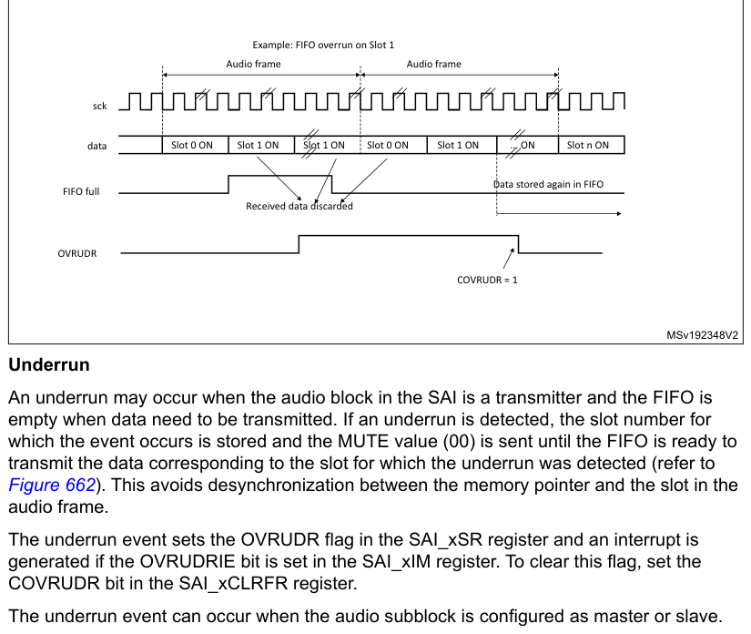

An underrun may occur when the audio block in the SAI is a transmitter and the FIFO is empty when
data need to be transmitted. If an underrun is detected, the slot number for which the event occurs
is stored and the MUTE value (00) is sent until the FIFO is ready to transmit the data corresponding
to the slot for which the underrun was detected (refer to Figure 662). This avoids desynchronization
between the memory pointer and the slot in the audio frame.

The underrun event sets the OVRUDR flag in the SAI_xSR register and an interrupt is generated if the
OVRUDRIE bit is set in the SAI_xIM register. To clear this flag, set the COVRUDR bit in the
SAI_xCLRFR register.

The underrun event can occur when the audio subblock is configured as master or slave.

**Figure 662. FIFO underrun event**

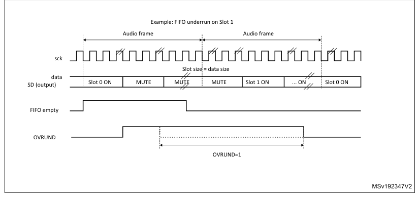

#### Anticipated frame synchronization detection (AFSDET)

The AFSDET flag is used only in slave mode. It is never asserted in master mode. It indicates that a
frame synchronization (FS) has been detected earlier than expected since the frame length, the frame
polarity, and the frame offset are defined and known.

Anticipated frame detection sets the AFSDET flag in the SAI_xSR register.

This detection has no effect on the current audio frame, which is not sensitive to the anticipated
FS. This means that “parasitic” events on signal FS are flagged without any perturbation of the
current audio frame.

An interrupt is generated if the AFSDETIE bit is set in the SAI_xIM register. To clear the AFSDET
flag, the CAFSDET bit must be set in the SAI_xCLRFR register.

To resynchronize with the master after an anticipated frame detection error, four steps are
required:

1. Disable the SAI block by resetting the SAIEN bit in the SAI_xCR1 register. To make
   sure that the SAI is disabled, read back the SAIEN bit and check it is set to 0.
2. Flush the FIFO via the FFLUS bit in the SAI_xCR2 register.
3. Enable the SAI peripheral again (SAIEN bit set to 1).
4. The SAI block waits for the assertion on FS to restart the synchronization with master.

> **Note:** The AFSDET flag is not asserted in AC’97 mode since the SAI audio block acts as a link
> controller and generates the FS signal even when declared as slave. It has no meaning in SPDIF mode
> since the FS signal is not used.

#### Late frame synchronization detection

The LFSDET flag in the SAI_xSR register can be set only when the SAI audio block operates as a
slave. The frame length, the frame polarity, and the frame-offset configuration are known in
register SAI_xFRCR.

If the external master does not send the FS signal at the expected time, thus generating the signal
too late, the LFSDET flag is set and an interrupt is generated if the LFSDETIE bit is set in the
SAI_xIM register.

The LFSDET flag is cleared when the CLFSDET bit is set in the SAI_xCLRFR register.

The late frame synchronization detection flag is set when the corresponding error is detected. The
SAI needs to be resynchronized with the master (see sequence described in Anticipated frame
synchronization detection (AFSDET)).

In a noisy environment, glitches on the SCK clock may be wrongly detected by the audio block state
machine and shift the SAI data at a wrong frame position. This event can be detected by the SAI and
reported as a late frame synchronization detection error.

There is no corruption if the external master is not managing the audio data frame transfer in
continuous mode, which must not be the case in most applications. In this case, the LFSDET flag is
set.

> **Note:** The LFSDET flag is not asserted in AC’97 mode since the SAI audio block acts as a link
> controller and generates the FS signal even when declared as slave. It has no meaning in SPDIF mode
> since the signal FS is not used by the protocol.

#### Codec not ready (CNRDY AC’97)

The CNRDY flag in the SAI_xSR register is relevant only if the SAI audio block is configured to
operate in AC’97 mode (PRTCFG[1:0] = 10 in the SAI_xCR1 register). If the CNRDYIE bit is set in the
SAI_xIM register, an interrupt is generated when the CNRDY flag is set.

CNRDY is asserted when the codec is not ready to communicate during the reception of the TAG 0 (slot
0) of the AC’97 audio frame. In this case, no data are automatically stored into the FIFO since the
codec is not ready, until the TAG 0 indicates that the codec is ready. All the active slots defined
in the SAI_xSLOTR register are captured when the codec is ready.

To clear the CNRDY flag, the CCNRDY bit must be set in the SAI_xCLRFR register.

#### Wrong clock configuration in master mode (with NODIV = 0)

When the audio block operates as a master (MODE[1] = 0) and the NODIV bit is equal to 0, the WCKCFG
flag is set as soon as the SAI is enabled if the following conditions are met:

- (FRL+1) is not a power of 2, and
- (FRL+1) is not between 8 and 256.

The MODE, NODIV, and SAIEN bits belong to the SAI_xCR1 register and FRL to the SAI_xFRCR register.

If the WCKCFGIE bit is set, an interrupt is generated when the WCKCFG flag is set in the SAI_xSR
register. To clear this flag, set the CWCKCFG bit in the SAI_xCLRFR register.

When the WCKCFG bit is set, the audio block is automatically disabled, thus performing a hardware
clear of the SAIEN bit.

### 43.4.15 Disabling the SAI

The SAI audio block can be disabled at any moment by clearing the SAIEN bit in the SAI_xCR1
register. All the already started frames are automatically completed before the SAI stops working.
The SAIEN bit remains high until the SAI is completely switched off at the end of the current audio
frame transfer.

If an audio block in the SAI operates synchronously with the other one, the one that is the master
must be disabled first.

### 43.4.16 SAI DMA interface

To free the CPU and to optimize bus bandwidth, each SAI audio block has an independent DMA interface
to read/write from/to the SAI_xDR register (to access the internal FIFO). There is one DMA channel
per audio subblock supporting the basic DMA request/acknowledge protocol.

To configure the audio subblock for DMA transfer, set the DMAEN bit in the SAI_xCR1 register. The
DMA request is managed directly by the FIFO controller depending on the FIFO threshold level (for
more details refer to [Section 43.4.9](#4349-internal-fifos): Internal FIFOs). The DMA transfer direction is linked to the
SAI audio subblock configuration:

- If the audio block operates as a transmitter, the audio block FIFO controller outputs a DMA
  request to load the FIFO with data written in the SAI_xDR register.
- If the audio block operates as a receiver, the DMA request is related to read operations from the
  SAI_xDR register.

Follow the sequence below to configure the SAI interface in DMA mode:

1. Configure the SAI and FIFO threshold levels to specify when the DMA request is
   launched.
2. Configure the SAI DMA channel.
3. Enable the DMA.
4. Enable the SAI interface.

## 43.5 SAI interrupts

The SAI supports 7 interrupt sources, as shown in Table 405.

**Table 405. SAI interrupt sources**

| Source row | Column 1 | Column 2 | Column 3 | Column 4 |
| ---: | --- | --- | --- | --- |
| 1 | `Interrupt` | `Interrupt` | `Interrupt` | `Interrupt` |
| 2 | `Audio block mode` | `Interrupt clear` |  |  |
| 3 | `acronym` | `source` | `group` | `enable` |
| 4 | `Depends on:` |  |  |  |

- FIFO threshold setting (FLVL bits in SAI_xCR2)

| Source row | Column 1 | Column 2 | Column 3 | Column 4 |
| ---: | --- | --- | --- | --- |
| 1 | `Master or slave` | `FREQIE in` |  |  |
| 2 | `FREQ` | `FREQ` | `SAI_xIM` | `– Communication direction` |
| 3 | `Receiver or` |  |  |  |
| 4 | `register` | `(transmitter or receiver)` |  |  |
| 5 | `transmitter` |  |  |  |
| 6 | `For more details refer to Section 43.4.9: Internal FIFOs` |  |  |  |
| 7 | `Master or slave` | `OVRUDRIE in` |  |  |
| 8 | `COVRUDR = 1 in SAI_xCLRFR` |  |  |  |
| 9 | `OVRUDR` | `ERROR` | `Receiver or` | `SAI_xIM` |
| 10 | `register` |  |  |  |
| 11 | `transmitter` | `register` |  |  |
| 12 | `Slave` |  |  |  |
| 13 | `AFSDETIE in` |  |  |  |
| 14 | `(not used in AC’97` | `CAFSDET = 1 in SAI_xCLRFR` |  |  |
| 15 | `AFSDET` | `ERROR` | `SAI_xIM` |  |
| 16 | `mode and SPDIF` | `register` |  |  |
| 17 | `register` |  |  |  |
| 18 | `SAI` | `mode)` |  |  |
| 19 | `Slave` |  |  |  |
| 20 | `LFSDETIE in` |  |  |  |
| 21 | `(not used in AC’97` | `CLFSDET = 1 in SAI_xCLRFR` |  |  |
| 22 | `LFSDET` | `ERROR` | `SAI_xIM` |  |
| 23 | `mode and SPDIF` | `register` |  |  |
| 24 | `register` |  |  |  |
| 25 | `mode)` |  |  |  |
| 26 | `CNRDYIE in` |  |  |  |
| 27 | `Slave` | `CCNRDY = 1 in SAI_xCLRFR` |  |  |
| 28 | `CNRDY` | `ERROR` | `SAI_xIM` |  |
| 29 | `(only in AC’97 mode)` | `register` |  |  |
| 30 | `register` |  |  |  |
| 31 | `MUTEDETIE in` |  |  |  |
| 32 | `Master or slave` | `CMUTEDET = 1 in SAI_xCLRFR` |  |  |
| 33 | `MUTEDET` | `MUTE` | `SAI_xIM` |  |
| 34 | `Receiver mode only` | `register` |  |  |
| 35 | `register` |  |  |  |
| 36 | `Master with NODIV =` | `WCKCFGIE in` |  |  |
| 37 | `CWCKCFG = 1 in SAI_xCLRFR` |  |  |  |
| 38 | `WCKCFG` | `ERROR` | `0 in SAI_xCR1` | `SAI_xIM` |
| 39 | `register` |  |  |  |
| 40 | `register` | `register` |  |  |
| 41 | `Follow the sequence below to enable an interrupt:` |  |  |  |

1. Disable SAI interrupt.
2. Configure SAI.
3. Configure SAI interrupt source.
4. Enable SAI.

## 43.6 SAI registers

The peripheral registers have to be accessed by words (32 bits).

### 43.6.1 SAI configuration register 1 (SAI_ACR1)

- **Address offset:** 0x04
- **Reset value:** 0x0000 0040

**Register bit layout**

| Bit | Field | Access | Summary |
| ---: | --- | :---: | --- |
| 31 | Reserved | — | kept at reset value. |
| 30 | Reserved | — | ↳ |
| 29 | Reserved | — | ↳ |
| 28 | Reserved | — | ↳ |
| 27 | `MCKEN` | rw | Master clock generation enable |
| 26 | `OSR` | rw | Oversampling ratio for master clock |
| 25 | `MCKDIV[5]` | rw | Master clock divider |
| 24 | `MCKDIV[4]` | rw | ↳ |
| 23 | `MCKDIV[3]` | rw | ↳ |
| 22 | `MCKDIV[2]` | rw | ↳ |
| 21 | `MCKDIV[1]` | rw | ↳ |
| 20 | `MCKDIV[0]` | rw | ↳ |
| 19 | `NODIV` | rw | No divider |
| 18 | Reserved | — | kept at reset value. |
| 17 | `DMAEN` | rw | DMA enable |
| 16 | `SAIEN` | rw | Audio block enable |
| 15 | Reserved | — | kept at reset value. |
| 14 | Reserved | — | ↳ |
| 13 | `OUTDRIV` | rw | Output drive |
| 12 | `MONO` | rw | Mono mode |
| 11 | `SYNCEN[1]` | rw | Synchronization enable |
| 10 | `SYNCEN[0]` | rw | ↳ |
| 9 | `CKSTR` | rw | Clock strobing edge |
| 8 | `LSBFIRST` | rw | Least significant bit first |
| 7 | `DS[2]` | rw | Data size |
| 6 | `DS[1]` | rw | ↳ |
| 5 | `DS[0]` | rw | ↳ |
| 4 | Reserved | — | kept at reset value. |
| 3 | `PRTCFG[1]` | rw | Protocol configuration |
| 2 | `PRTCFG[0]` | rw | ↳ |
| 1 | `MODE[1]` | rw | SAIx audio block mode |
| 0 | `MODE[0]` | rw | ↳ |

**Bits 31:28 — Reserved:** kept at reset value.

**Bit 27 — `MCKEN`:** Master clock generation enable

- `0`: The master clock is not generated
- `1`: The master clock is generated independently of SAIEN bit

**Bit 26 — `OSR`:** Oversampling ratio for master clock

This bit is meaningful only when NODIV bit is set to 0.

- `0`: Master clock frequency = FFS x 256
- `1`: Master clock frequency = FFS x 512

**Bits 25:20 — `MCKDIV[5:0]`:** Master clock divider

These bits are set and cleared by software.

- `000000`: Divides by 1 the kernel clock input (sai_x_ker_ck).

Otherwise, The master clock frequency is calculated according to the formula given in

[Section 43.4.8](#4348-sai-clock-generator): SAI clock generator.

These bits have no meaning when the audio block is slave.

They have to be configured when the audio block is disabled.

**Bit 19 — `NODIV`:** No divider

This bit is set and cleared by software.

- `0`: the ratio between the Master clock generator and frame synchronization is fixed to 256 or 512
- `1`: the ratio between the Master clock generator and frame synchronization depends on FRL[7:0]

**Bit 18 — Reserved:** kept at reset value.

**Bit 17 — `DMAEN`:** DMA enable

This bit is set and cleared by software.

- `0`: DMA disabled
- `1`: DMA enabled

> **Note:** Since the audio block defaults to operate as a transmitter after reset, the MODE[1:0] bits must
> be configured before setting DMAEN to avoid a DMA request in receiver mode.

**Bit 16 — `SAIEN`:** Audio block enable

This bit is set by software.

To switch off the audio block, the application software must program this bit to 0 and poll the bit
till it
reads back 0, meaning that the block is completely disabled. Before setting this bit to 1, check
that it
is set to 0, otherwise the enable command is not taken into account.

This bit enables to control the state of the SAI audio block. If it is disabled when an audio frame
transfer is ongoing, the ongoing transfer completes and the cell is fully disabled at the end of
this
audio frame transfer.

- `0`: SAI audio block disabled
- `1`: SAI audio block enabled.

> **Note:** When the SAI block (A or B) is configured in master mode, the clock must be present on the

SAI block input before setting SAIEN bit.

**Bits 15:14 — Reserved:** kept at reset value.

**Bit 13 — `OUTDRIV`:** Output drive

This bit is set and cleared by software.

- `0`: Audio block output driven when SAIEN is set
- `1`: Audio block output driven immediately after the setting of this bit.

> **Note:** This bit has to be set before enabling the audio block and after the audio block configuration.

**Bit 12 — `MONO`:** Mono mode

This bit is set and cleared by software. It is meaningful only when the number of slots is equal to
2.

When the mono mode is selected, slot 0 data are duplicated on slot 1 when the audio block operates
as a transmitter. In reception mode, the slot1 is discarded and only the data received from slot 0
are
stored. Refer to Section: Mono/stereo mode for more details.

- `0`: Stereo mode
- `1`: Mono mode.

**Bits 11:10 — `SYNCEN[1:0]`:** Synchronization enable

These bits are set and cleared by software. They must be configured when the audio subblock is
disabled.

- `00`: audio subblock in asynchronous mode.
- `01`: audio subblock is synchronous with the other internal audio subblock. In this case, the
  audio
  subblock must be configured in slave mode
- `10`: Reserved.
- `11`: Reserved

> **Note:** The audio subblock must be configured as asynchronous when SPDIF mode is enabled.

**Bit 9 — `CKSTR`:** Clock strobing edge

This bit is set and cleared by software. It must be configured when the audio block is disabled.
This
bit has no meaning in SPDIF audio protocol.

- `0`: Signals generated by the SAI change on SCK rising edge, while signals received by the SAI are
  sampled on the SCK falling edge.
- `1`: Signals generated by the SAI change on SCK falling edge, while signals received by the SAI
  are
  sampled on the SCK rising edge.

**Bit 8 — `LSBFIRST`:** Least significant bit first

This bit is set and cleared by software. It must be configured when the audio block is disabled.
This
bit has no meaning in AC’97 audio protocol since AC’97 data are always transferred with the MSB
first. This bit has no meaning in SPDIF audio protocol since in SPDIF data are always transferred
with LSB first.

- `0`: Data are transferred with MSB first
- `1`: Data are transferred with LSB first

**Bits 7:5 — `DS[2:0]`:** Data size

These bits are set and cleared by software. These bits are ignored when the SPDIF protocols are
selected (bit PRTCFG[1:0]), because the frame and the data size are fixed in such case. When the
companding mode is selected through COMP[1:0] bits, DS[1:0] are ignored since the data size is
fixed to 8 bits by the algorithm.

These bits must be configured when the audio block is disabled.

- `000`: Reserved
- `001`: Reserved
- `010`: 8 bits
- `011`: 10 bits
- `100`: 16 bits
- `101`: 20 bits
- `110`: 24 bits
- `111`: 32 bits

**Bit 4 — Reserved:** kept at reset value.

**Bits 3:2 — `PRTCFG[1:0]`:** Protocol configuration

These bits are set and cleared by software. These bits have to be configured when the audio block is
disabled.

- `00`: Free protocol. Free protocol enables to use the powerful configuration of the audio block to
  address a specific audio protocol (such as I2S, LSB/MSB justified, TDM, PCM/DSP...) by setting
  most of the configuration register bits as well as frame configuration register.
- `01`: SPDIF protocol
- `10`: AC’97 protocol
- `11`: Reserved

**Bits 1:0 — `MODE[1:0]`:** SAIx audio block mode

These bits are set and cleared by software. They must be configured when SAIx audio block is
disabled.

- `00`: Master transmitter
- `01`: Master receiver
- `10`: Slave transmitter
- `11`: Slave receiver

> **Note:** When the audio block is configured in SPDIF mode, the master transmitter mode is forced

(MODE[1:0] = 00).

### 43.6.2 SAI configuration register 2 (SAI_ACR2)

- **Address offset:** 0x08
- **Reset value:** 0x0000 0000

**Register bit layout**

| Bit | Field | Access | Summary |
| ---: | --- | :---: | --- |
| 31 | Reserved | — | kept at reset value. |
| 30 | Reserved | — | ↳ |
| 29 | Reserved | — | ↳ |
| 28 | Reserved | — | ↳ |
| 27 | Reserved | — | ↳ |
| 26 | Reserved | — | ↳ |
| 25 | Reserved | — | ↳ |
| 24 | Reserved | — | ↳ |
| 23 | Reserved | — | ↳ |
| 22 | Reserved | — | ↳ |
| 21 | Reserved | — | ↳ |
| 20 | Reserved | — | ↳ |
| 19 | Reserved | — | ↳ |
| 18 | Reserved | — | ↳ |
| 17 | Reserved | — | ↳ |
| 16 | Reserved | — | ↳ |
| 15 | `COMP[1]` | rw | Companding mode. |
| 14 | `COMP[0]` | rw | ↳ |
| 13 | `CPL` | rw | Complement bit. |
| 12 | `MUTECNT[5]` | rw | Mute counter. |
| 11 | `MUTECNT[4]` | rw | ↳ |
| 10 | `MUTECNT[3]` | rw | ↳ |
| 9 | `MUTECNT[2]` | rw | ↳ |
| 8 | `MUTECNT[1]` | rw | ↳ |
| 7 | `MUTECNT[0]` | rw | ↳ |
| 6 | `MUTEVAL` | rw | Mute value. |
| 5 | `MUTE` | rw | Mute. |
| 4 | `TRIS` | rw | Tristate management on data line. |
| 3 | `FFLUSH` | w | FIFO flush. |
| 2 | `FTH[2]` | rw | FIFO threshold. |
| 1 | `FTH[1]` | rw | ↳ |
| 0 | `FTH[0]` | rw | ↳ |

**Bits 31:16 — Reserved:** kept at reset value.

**Bits 15:14 — `COMP[1:0]`:** Companding mode.

These bits are set and cleared by software. The µ-Law and the A-Law log are a part of the CCITT

G.711 recommendation, the type of complement that is used depends on CPL bit.

The data expansion or data compression are determined by the state of bit MODE[0].

The data compression is applied if the audio block is configured as a transmitter.

The data expansion is automatically applied when the audio block is configured as a receiver.

Refer to Section: Companding mode for more details.

- `00`: No companding algorithm
- `01`: Reserved.
- `10`: µ-Law algorithm
- `11`: A-Law algorithm

> **Note:** Companding mode is applicable only when Free protocol mode is selected.

**Bit 13 — `CPL`:** Complement bit.

This bit is set and cleared by software.

It defines the type of complement to be used for companding mode

- `0`: 1’s complement representation.
- `1`: 2’s complement representation.

> **Note:** This bit has effect only when the companding mode is µ-Law algorithm or A-Law algorithm.

**Bits 12:7 — `MUTECNT[5:0]`:** Mute counter.

These bits are set and cleared by software. They are used only in reception mode.

The value set in these bits is compared to the number of consecutive mute frames detected in
reception. When the number of mute frames is equal to this value, the flag MUTEDET is set and an
interrupt is generated if bit MUTEDETIE is set.

Refer to Section: Mute mode for more details.

**Bit 6 — `MUTEVAL`:** Mute value.

This bit is set and cleared by software. It is meaningful only when the audio block operates as a
transmitter, the number of slots is lower or equal to 2 and the MUTE bit is set.

If more slots are declared, the bit value sent during the transmission in mute mode is equal to 0,
whatever the value of MUTEVAL.

if the number of slot is lower or equal to 2 and MUTEVAL = 1, the MUTE value transmitted for each
slot is the one sent during the previous frame.

Refer to Section: Mute mode for more details.

- `0`: Bit value 0 is sent during the mute mode.
- `1`: Last values are sent during the mute mode.

> **Note:** This bit is meaningless and must not be used for SPDIF audio blocks.

**Bit 5 — `MUTE`:** Mute.

This bit is set and cleared by software. It is meaningful only when the audio block operates as a
transmitter. The MUTE value is linked to value of MUTEVAL if the number of slots is lower or equal
to

2, or equal to 0 if it is greater than 2.

Refer to Section: Mute mode for more details.

- `0`: No mute mode.
- `1`: Mute mode enabled.

> **Note:** This bit is meaningless and must not be used for SPDIF audio blocks.

**Bit 4 — `TRIS`:** Tristate management on data line.

This bit is set and cleared by software. It is meaningful only if the audio block is configured as a
transmitter. This bit is not used when the audio block is configured in SPDIF mode. It must be
configured when SAI is disabled.

Refer to Section: Output data line management on an inactive slot for more details.

- `0`: SD output line is still driven by the SAI when a slot is inactive.
- `1`: SD output line is released (HI-Z) at the end of the last data bit of the last active slot if
  the next one
  is inactive.

**Bit 3 — `FFLUSH`:** FIFO flush.

This bit is set by software. It is always read as 0. This bit must be configured when the SAI is
disabled.

- `0`: No FIFO flush.
- `1`: FIFO flush. Programming this bit to 1 triggers the FIFO Flush. All the internal FIFO pointers
  (read
  and write) are cleared. In this case data still present in the FIFO are lost (no more transmission
  or
  received data lost). Before flushing, SAI DMA stream/interrupt must be disabled

**Bits 2:0 — `FTH[2:0]`:** FIFO threshold.

This bit is set and cleared by software.

- `000`: FIFO empty
- `001`: ¼ FIFO
- `010`: ½ FIFO
- `011`: ¾ FIFO
- `100`: FIFO full
- `101`: Reserved
- `110`: Reserved
- `111`: Reserved

### 43.6.3 SAI frame configuration register (SAI_AFRCR)

- **Address offset:** 0x0C
- **Reset value:** 0x0000 0007

> **Note:** This register has no meaning in AC’97 and SPDIF audio protocol.

**Register bit layout**

| Bit | Field | Access | Summary |
| ---: | --- | :---: | --- |
| 31 | Reserved | — | kept at reset value. |
| 30 | Reserved | — | ↳ |
| 29 | Reserved | — | ↳ |
| 28 | Reserved | — | ↳ |
| 27 | Reserved | — | ↳ |
| 26 | Reserved | — | ↳ |
| 25 | Reserved | — | ↳ |
| 24 | Reserved | — | ↳ |
| 23 | Reserved | — | ↳ |
| 22 | Reserved | — | ↳ |
| 21 | Reserved | — | ↳ |
| 20 | Reserved | — | ↳ |
| 19 | Reserved | — | ↳ |
| 18 | `FSOFF` | rw | Frame synchronization offset. |
| 17 | `FSPOL` | rw | Frame synchronization polarity. |
| 16 | `FSDEF` | r | Frame synchronization definition. |
| 15 | Reserved | — | kept at reset value. |
| 14 | `FSALL[6]` | rw | Frame synchronization active level length. |
| 13 | `FSALL[5]` | rw | ↳ |
| 12 | `FSALL[4]` | rw | ↳ |
| 11 | `FSALL[3]` | rw | ↳ |
| 10 | `FSALL[2]` | rw | ↳ |
| 9 | `FSALL[1]` | rw | ↳ |
| 8 | `FSALL[0]` | rw | ↳ |
| 7 | `FRL[7]` | rw | Frame length. |
| 6 | `FRL[6]` | rw | ↳ |
| 5 | `FRL[5]` | rw | ↳ |
| 4 | `FRL[4]` | rw | ↳ |
| 3 | `FRL[3]` | rw | ↳ |
| 2 | `FRL[2]` | rw | ↳ |
| 1 | `FRL[1]` | rw | ↳ |
| 0 | `FRL[0]` | rw | ↳ |

**Bits 31:19 — Reserved:** kept at reset value.

**Bit 18 — `FSOFF`:** Frame synchronization offset.

This bit is set and cleared by software. It is meaningless and is not used in AC’97 or SPDIF audio
block configuration. This bit must be configured when the audio block is disabled.

- `0`: FS is asserted on the first bit of the slot 0.
- `1`: FS is asserted one bit before the first bit of the slot 0.

**Bit 17 — `FSPOL`:** Frame synchronization polarity.

This bit is set and cleared by software. It is used to configure the level of the start of frame on
the FS
signal. It is meaningless and is not used in AC’97 or SPDIF audio block configuration.

This bit must be configured when the audio block is disabled.

- `0`: FS is active low (falling edge)
- `1`: FS is active high (rising edge)

**Bit 16 — `FSDEF`:** Frame synchronization definition.

This bit is set and cleared by software.

- `0`: FS signal is a start frame signal
- `1`: FS signal is a start of frame signal \+ channel side identification

When the bit is set, the number of slots defined in the SAI_xSLOTR register has to be even. It
means that half of this number of slots are dedicated to the left channel and the other slots for
the
right channel (e.g: this bit has to be set for I2S or MSB/LSB-justified protocols...).

This bit is meaningless and is not used in AC’97 or SPDIF audio block configuration. It must be
configured when the audio block is disabled.

**Bit 15 — Reserved:** kept at reset value.

**Bits 14:8 — `FSALL[6:0]`:** Frame synchronization active level length.

These bits are set and cleared by software. They specify the length in number of bit clock

(SCK) \+ 1 (FSALL[6:0] \+ 1) of the active level of the FS signal in the audio frame

These bits are meaningless and are not used in AC’97 or SPDIF audio block configuration.

They must be configured when the audio block is disabled.

**Bits 7:0 — `FRL[7:0]`:** Frame length.

These bits are set and cleared by software. They define the audio frame length expressed in number
of SCK clock cycles: the number of bits in the frame is equal to FRL[7:0] \+ 1.

The minimum number of bits to transfer in an audio frame must be equal to 8, otherwise the audio
block behaves in an unexpected way. This is the case when the data size is 8 bits and only one slot

0 is defined in NBSLOT[4:0] of SAI_xSLOTR register (NBSLOT[3:0] = 0000).

In master mode, if the master clock (available on MCLK_x pin) is used, the frame length must be
aligned with a number equal to a power of 2, ranging from 8 to 256. When the master clock is not
used (NODIV = 1), it is recommended to program the frame length to an value ranging from 8 to 256.

These bits are meaningless and are not used in AC’97 or SPDIF audio block configuration. They
must be configured when the audio block is disabled.

### 43.6.4 SAI slot register (SAI_ASLOTR)

- **Address offset:** 0x10
- **Reset value:** 0x0000 0000

> **Note:** This register has no meaning in AC’97 and SPDIF audio protocol.

**Register bit layout**

| Bit | Field | Access | Summary |
| ---: | --- | :---: | --- |
| 31 | `SLOTEN[15]` | rw | Slot enable. |
| 30 | `SLOTEN[14]` | rw | ↳ |
| 29 | `SLOTEN[13]` | rw | ↳ |
| 28 | `SLOTEN[12]` | rw | ↳ |
| 27 | `SLOTEN[11]` | rw | ↳ |
| 26 | `SLOTEN[10]` | rw | ↳ |
| 25 | `SLOTEN[9]` | rw | ↳ |
| 24 | `SLOTEN[8]` | rw | ↳ |
| 23 | `SLOTEN[7]` | rw | ↳ |
| 22 | `SLOTEN[6]` | rw | ↳ |
| 21 | `SLOTEN[5]` | rw | ↳ |
| 20 | `SLOTEN[4]` | rw | ↳ |
| 19 | `SLOTEN[3]` | rw | ↳ |
| 18 | `SLOTEN[2]` | rw | ↳ |
| 17 | `SLOTEN[1]` | rw | ↳ |
| 16 | `SLOTEN[0]` | rw | ↳ |
| 15 | Reserved | — | kept at reset value. |
| 14 | Reserved | — | ↳ |
| 13 | Reserved | — | ↳ |
| 12 | Reserved | — | ↳ |
| 11 | `NBSLOT[3]` | rw | Number of slots in an audio frame. |
| 10 | `NBSLOT[2]` | rw | ↳ |
| 9 | `NBSLOT[1]` | rw | ↳ |
| 8 | `NBSLOT[0]` | rw | ↳ |
| 7 | `SLOTSZ[1]` | rw | Slot size |
| 6 | `SLOTSZ[0]` | rw | ↳ |
| 5 | Reserved | — | kept at reset value. |
| 4 | `FBOFF[4]` | rw | First bit offset |
| 3 | `FBOFF[3]` | rw | ↳ |
| 2 | `FBOFF[2]` | rw | ↳ |
| 1 | `FBOFF[1]` | rw | ↳ |
| 0 | `FBOFF[0]` | rw | ↳ |

**Bits 31:16 — `SLOTEN[15:0]`:** Slot enable.

These bits are set and cleared by software.

Each SLOTEN bit corresponds to a slot position from 0 to 15 (maximum 16 slots).

- `0`: Inactive slot.
- `1`: Active slot.

The slot must be enabled when the audio block is disabled.

They are ignored in AC’97 or SPDIF mode.

**Bits 15:12 — Reserved:** kept at reset value.

**Bits 11:8 — `NBSLOT[3:0]`:** Number of slots in an audio frame.

These bits are set and cleared by software.

The value set in this bitfield represents the number of slots in the audio frame (including the
number
of inactive slots). The maximum number of slots is 16.

The number of slots must be even if FSDEF bit in the SAI_xFRCR register is set.

The number of slots must be configured when the audio block is disabled.

They are ignored in AC’97 or SPDIF mode.

- `0000`: Number of slots is 1.
- `0001`: Number of slots is 2.

...

- `1111`: Number of slots is 16.

**Bits 7:6 — `SLOTSZ[1:0]`:** Slot size

This bits is set and cleared by software.

The slot size must be higher or equal to the data size. If this condition is not respected, the
behavior
of the SAI is undetermined.

Refer to Output data line management on an inactive slot for information on how to drive SD line.

These bits must be set when the audio block is disabled.

They are ignored in AC’97 or SPDIF mode.

- `00`: The slot size is equivalent to the data size (specified in DS[3:0] in the SAI_xCR1
  register).
- `01`: 16-bit
- `10`: 32-bit
- `11`: Reserved

**Bit 5 — Reserved:** kept at reset value.

**Bits 4:0 — `FBOFF[4:0]`:** First bit offset

These bits are set and cleared by software.

The value set in this bitfield defines the position of the first data transfer bit in the slot. It
represents
an offset value. In transmission mode, the bits outside the data field are forced to 0. In reception
mode, the extra received bits are discarded.

These bits must be set when the audio block is disabled.

They are ignored in AC’97 or SPDIF mode.

### 43.6.5 SAI interrupt mask register (SAI_AIM)

- **Address offset:** 0x14
- **Reset value:** 0x0000 0000

**Register bit layout**

| Bit | Field | Access | Summary |
| ---: | --- | :---: | --- |
| 31 | Reserved | — | kept at reset value. |
| 30 | Reserved | — | ↳ |
| 29 | Reserved | — | ↳ |
| 28 | Reserved | — | ↳ |
| 27 | Reserved | — | ↳ |
| 26 | Reserved | — | ↳ |
| 25 | Reserved | — | ↳ |
| 24 | Reserved | — | ↳ |
| 23 | Reserved | — | ↳ |
| 22 | Reserved | — | ↳ |
| 21 | Reserved | — | ↳ |
| 20 | Reserved | — | ↳ |
| 19 | Reserved | — | ↳ |
| 18 | Reserved | — | ↳ |
| 17 | Reserved | — | ↳ |
| 16 | Reserved | — | ↳ |
| 15 | Reserved | — | ↳ |
| 14 | Reserved | — | ↳ |
| 13 | Reserved | — | ↳ |
| 12 | Reserved | — | ↳ |
| 11 | Reserved | — | ↳ |
| 10 | Reserved | — | ↳ |
| 9 | Reserved | — | ↳ |
| 8 | Reserved | — | ↳ |
| 7 | Reserved | — | ↳ |
| 6 | `LFSDETIE` | rw | Late frame synchronization detection interrupt enable. |
| 5 | `AFSDETIE` | rw | Anticipated frame synchronization detection interrupt enable. |
| 4 | `CNRDYIE` | rw | Codec not ready interrupt enable (AC’97). |
| 3 | `FREQIE` | rw | FIFO request interrupt enable. |
| 2 | `WCKCFGIE` | rw | Wrong clock configuration interrupt enable. |
| 1 | `MUTEDETIE` | rw | Mute detection interrupt enable. |
| 0 | `OVRUDRIE` | rw | Overrun/underrun interrupt enable. |

**Bits 31:7 — Reserved:** kept at reset value.

**Bit 6 — `LFSDETIE`:** Late frame synchronization detection interrupt enable.

This bit is set and cleared by software.

- `0`: Interrupt is disabled
- `1`: Interrupt is enabled

When this bit is set, an interrupt is generated if the LFSDET bit is set in the SAI_xSR register.

This bit is meaningless in AC’97, SPDIF mode or when the audio block operates as a master.

**Bit 5 — `AFSDETIE`:** Anticipated frame synchronization detection interrupt enable.

This bit is set and cleared by software.

- `0`: Interrupt is disabled
- `1`: Interrupt is enabled

When this bit is set, an interrupt is generated if the AFSDET bit in the SAI_xSR register is set.

This bit is meaningless in AC’97, SPDIF mode or when the audio block operates as a master.

**Bit 4 — `CNRDYIE`:** Codec not ready interrupt enable (AC’97).

This bit is set and cleared by software.

- `0`: Interrupt is disabled
- `1`: Interrupt is enabled

When the interrupt is enabled, the audio block detects in the slot 0 (tag0) of the AC’97 frame if
the

Codec connected to this line is ready or not. If it is not ready, the CNRDY flag in the SAI_xSR
register is set and an interrupt is generated.

This bit has a meaning only if the AC’97 mode is selected through PRTCFG[1:0] bits and the audio
block is operates as a receiver.

**Bit 3 — `FREQIE`:** FIFO request interrupt enable.

This bit is set and cleared by software.

- `0`: Interrupt is disabled
- `1`: Interrupt is enabled

When this bit is set, an interrupt is generated if the FREQ bit in the SAI_xSR register is set.

Since the audio block defaults to operate as a transmitter after reset, the MODE bit must be
configured before setting FREQIE to avoid a parasitic interrupt in receiver mode,

**Bit 2 — `WCKCFGIE`:** Wrong clock configuration interrupt enable.

This bit is set and cleared by software.

- `0`: Interrupt is disabled
- `1`: Interrupt is enabled

This bit is taken into account only if the audio block is configured as a master (MODE[1] = 0) and

NODIV = 0.

It generates an interrupt if the WCKCFG flag in the SAI_xSR register is set.

> **Note:** This bit is used only in Free protocol mode and is meaningless in other modes.

**Bit 1 — `MUTEDETIE`:** Mute detection interrupt enable.

This bit is set and cleared by software.

- `0`: Interrupt is disabled
- `1`: Interrupt is enabled

When this bit is set, an interrupt is generated if the MUTEDET bit in the SAI_xSR register is set.

This bit has a meaning only if the audio block is configured in receiver mode.

**Bit 0 — `OVRUDRIE`:** Overrun/underrun interrupt enable.

This bit is set and cleared by software.

- `0`: Interrupt is disabled
- `1`: Interrupt is enabled

When this bit is set, an interrupt is generated if the OVRUDR bit in the SAI_xSR register is set.

### 43.6.6 SAI status register (SAI_ASR)

- **Address offset:** 0x18
- **Reset value:** 0x0000 0008

**Register bit layout**

| Bit | Field | Access | Summary |
| ---: | --- | :---: | --- |
| 31 | Reserved | — | kept at reset value. |
| 30 | Reserved | — | ↳ |
| 29 | Reserved | — | ↳ |
| 28 | Reserved | — | ↳ |
| 27 | Reserved | — | ↳ |
| 26 | Reserved | — | ↳ |
| 25 | Reserved | — | ↳ |
| 24 | Reserved | — | ↳ |
| 23 | Reserved | — | ↳ |
| 22 | Reserved | — | ↳ |
| 21 | Reserved | — | ↳ |
| 20 | Reserved | — | ↳ |
| 19 | Reserved | — | ↳ |
| 18 | `FLVL[2]` | — | FIFO level threshold. |
| 17 | `FLVL[1]` | — | ↳ |
| 16 | `FLVL[0]` | — | ↳ |
| 15 | Reserved | — | kept at reset value. |
| 14 | Reserved | — | ↳ |
| 13 | Reserved | — | ↳ |
| 12 | Reserved | — | ↳ |
| 11 | Reserved | — | ↳ |
| 10 | Reserved | — | ↳ |
| 9 | Reserved | — | ↳ |
| 8 | Reserved | — | ↳ |
| 7 | Reserved | — | ↳ |
| 6 | `LFSDET` | — | Late frame synchronization detection. |
| 5 | `AFSDET` | — | Anticipated frame synchronization detection. |
| 4 | `CNRDY` | — | Codec not ready. |
| 3 | `FREQ` | — | FIFO request. |
| 2 | `WCKCFG` | — | Wrong clock configuration flag. |
| 1 | `MUTEDET` | — | Mute detection. |
| 0 | `OVRUDR` | — | Overrun / underrun. |

**Bits 31:19 — Reserved:** kept at reset value.

**Bits 18:16 — `FLVL[2:0]`:** FIFO level threshold.

This bit is read only. The FIFO level threshold flag is managed only by hardware and its setting
depends on SAI block configuration (transmitter or receiver mode).

- `000`: FIFO empty (transmitter and receiver modes)
- `001`: FIFO ≤ ¼ but not empty (transmitter mode), FIFO \< ¼ but not empty (receiver mode)
- `010`: ¼ \< FIFO ≤ ½ (transmitter mode), ¼ ≤ FIFO \< ½ (receiver mode)
- `011`: ½ \< FIFO ≤ ¾ (transmitter mode), ½ ≤ FIFO \< ¾ (receiver mode)
- `100`: ¾ \< FIFO but not full (transmitter mode), ¾ ≤ FIFO but not full (receiver mode)
- `101`: FIFO full (transmitter and receiver modes)

Others: Reserved

**Bits 15:7 — Reserved:** kept at reset value.

**Bit 6 — `LFSDET`:** Late frame synchronization detection.

This bit is read only.

- `0`: No error.
- `1`: Frame synchronization signal is not present at the right time.

This flag can be set only if the audio block is configured in slave mode.

It is not used in AC’97 or SPDIF mode.

It can generate an interrupt if LFSDETIE bit is set in the SAI_xIM register.

This flag is cleared when the software sets bit CLFSDET in SAI_xCLRFR register

**Bit 5 — `AFSDET`:** Anticipated frame synchronization detection.

This bit is read only.

- `0`: No error.
- `1`: Frame synchronization signal is detected earlier than expected.

This flag can be set only if the audio block is configured in slave mode.

It is not used in AC’97 or SPDIF mode.

It can generate an interrupt if AFSDETIE bit is set in SAI_xIM register.

This flag is cleared when the software sets CAFSDET bit in SAI_xCLRFR register.

**Bit 4 — `CNRDY`:** Codec not ready.

This bit is read only.

- `0`: External AC’97 Codec is ready
- `1`: External AC’97 Codec is not ready

This bit is used only when the AC’97 audio protocol is selected in the SAI_xCR1 register and
configured in receiver mode.

It can generate an interrupt if CNRDYIE bit is set in SAI_xIM register.

This flag is cleared when the software sets CCNRDY bit in SAI_xCLRFR register.

**Bit 3 — `FREQ`:** FIFO request.

This bit is read only.

- `0`: No FIFO request.
- `1`: FIFO request to read or to write the SAI_xDR.

The request depends on the audio block configuration:

- If the block is configured in transmission mode, the FIFO request is related to a write request
  operation in the SAI_xDR.
- If the block configured in reception, the FIFO request related to a read request operation from
  the

SAI_xDR.

This flag can generate an interrupt if FREQIE bit is set in SAI_xIM register.

**Bit 2 — `WCKCFG`:** Wrong clock configuration flag.

This bit is read only.

- `0`: Clock configuration is correct
- `1`: Clock configuration does not respect the rule concerning the frame length specification
  defined in

[Section 43.4.6](#4346-frame-synchronization): Frame synchronization (configuration of FRL[7:0] bit in the SAI_xFRCR register)

This bit is used only when the audio block operates in master mode (MODE[1] = 0) and NODIV = 0.

It can generate an interrupt if WCKCFGIE bit is set in SAI_xIM register.

This flag is cleared when the software sets CWCKCFG bit in SAI_xCLRFR register.

**Bit 1 — `MUTEDET`:** Mute detection.

This bit is read only.

- `0`: No MUTE detection on the SD input line
- `1`: MUTE value detected on the SD input line (0 value) for a specified number of consecutive
  audio
  frame

This flag is set if consecutive 0 values are received in each slot of a given audio frame and for a
consecutive number of audio frames (set in the MUTECNT bit in the SAI_xCR2 register).

It can generate an interrupt if MUTEDETIE bit is set in SAI_xIM register.

This flag is cleared when the software sets bit CMUTEDET in the SAI_xCLRFR register.

**Bit 0 — `OVRUDR`:** Overrun / underrun.

This bit is read only.

- `0`: No overrun/underrun error.
- `1`: Overrun/underrun error detection.

The overrun and underrun conditions can occur only when the audio block is configured as a
receiver and a transmitter, respectively.

It can generate an interrupt if OVRUDRIE bit is set in SAI_xIM register.

This flag is cleared when the software sets COVRUDR bit in SAI_xCLRFR register.

### 43.6.7 SAI clear flag register (SAI_ACLRFR)

- **Address offset:** 0x1C
- **Reset value:** 0x0000 0000

**Register bit layout**

| Bit | Field | Access | Summary |
| ---: | --- | :---: | --- |
| 31 | Reserved | — | kept at reset value. |
| 30 | Reserved | — | ↳ |
| 29 | Reserved | — | ↳ |
| 28 | Reserved | — | ↳ |
| 27 | Reserved | — | ↳ |
| 26 | Reserved | — | ↳ |
| 25 | Reserved | — | ↳ |
| 24 | Reserved | — | ↳ |
| 23 | Reserved | — | ↳ |
| 22 | Reserved | — | ↳ |
| 21 | Reserved | — | ↳ |
| 20 | Reserved | — | ↳ |
| 19 | Reserved | — | ↳ |
| 18 | Reserved | — | ↳ |
| 17 | Reserved | — | ↳ |
| 16 | Reserved | — | ↳ |
| 15 | Reserved | — | ↳ |
| 14 | Reserved | — | ↳ |
| 13 | Reserved | — | ↳ |
| 12 | Reserved | — | ↳ |
| 11 | Reserved | — | ↳ |
| 10 | Reserved | — | ↳ |
| 9 | Reserved | — | ↳ |
| 8 | Reserved | — | ↳ |
| 7 | Reserved | — | ↳ |
| 6 | `CLFSDET` | w | Clear late frame synchronization detection flag. |
| 5 | `CAFSDET` | w | Clear anticipated frame synchronization detection flag. |
| 4 | `CCNRDY` | w | Clear Codec not ready flag. |
| 3 | Reserved | — | kept at reset value. |
| 2 | `CWCKCFG` | w | Clear wrong clock configuration flag. |
| 1 | `CMUTEDET` | w | Mute detection flag. |
| 0 | `COVRUDR` | w | Clear overrun / underrun. |

**Bits 31:7 — Reserved:** kept at reset value.

**Bit 6 — `CLFSDET`:** Clear late frame synchronization detection flag.

This bit is write only.

Programming this bit to 1 clears the LFSDET flag in the SAI_xSR register.

This bit is not used in AC’97 or SPDIF mode

Reading this bit always returns the value 0.

**Bit 5 — `CAFSDET`:** Clear anticipated frame synchronization detection flag.

This bit is write only.

Programming this bit to 1 clears the AFSDET flag in the SAI_xSR register.

It is not used in AC’97 or SPDIF mode.

Reading this bit always returns the value 0.

**Bit 4 — `CCNRDY`:** Clear Codec not ready flag.

This bit is write only.

Programming this bit to 1 clears the CNRDY flag in the SAI_xSR register.

This bit is used only when the AC’97 audio protocol is selected in the SAI_xCR1 register.

Reading this bit always returns the value 0.

**Bit 3 — Reserved:** kept at reset value.

**Bit 2 — `CWCKCFG`:** Clear wrong clock configuration flag.

This bit is write only.

Programming this bit to 1 clears the WCKCFG flag in the SAI_xSR register.

This bit is used only when the audio block is set as master (MODE[1] = 0) and NODIV = 0 in the

SAI_xCR1 register.

Reading this bit always returns the value 0.

**Bit 1 — `CMUTEDET`:** Mute detection flag.

This bit is write only.

Programming this bit to 1 clears the MUTEDET flag in the SAI_xSR register.

Reading this bit always returns the value 0.

**Bit 0 — `COVRUDR`:** Clear overrun / underrun.

This bit is write only.

Programming this bit to 1 clears the OVRUDR flag in the SAI_xSR register.

Reading this bit always returns the value 0.

### 43.6.8 SAI data register (SAI_ADR)

- **Address offset:** 0x20
- **Reset value:** 0x0000 0000

**Register bit layout**

| Bit | Field | Access | Summary |
| ---: | --- | :---: | --- |
| 31 | `DATA[31]` | rw | Data |
| 30 | `DATA[30]` | rw | ↳ |
| 29 | `DATA[29]` | rw | ↳ |
| 28 | `DATA[28]` | rw | ↳ |
| 27 | `DATA[27]` | rw | ↳ |
| 26 | `DATA[26]` | rw | ↳ |
| 25 | `DATA[25]` | rw | ↳ |
| 24 | `DATA[24]` | rw | ↳ |
| 23 | `DATA[23]` | rw | ↳ |
| 22 | `DATA[22]` | rw | ↳ |
| 21 | `DATA[21]` | rw | ↳ |
| 20 | `DATA[20]` | rw | ↳ |
| 19 | `DATA[19]` | rw | ↳ |
| 18 | `DATA[18]` | rw | ↳ |
| 17 | `DATA[17]` | rw | ↳ |
| 16 | `DATA[16]` | rw | ↳ |
| 15 | `DATA[15]` | rw | ↳ |
| 14 | `DATA[14]` | rw | ↳ |
| 13 | `DATA[13]` | rw | ↳ |
| 12 | `DATA[12]` | rw | ↳ |
| 11 | `DATA[11]` | rw | ↳ |
| 10 | `DATA[10]` | rw | ↳ |
| 9 | `DATA[9]` | rw | ↳ |
| 8 | `DATA[8]` | rw | ↳ |
| 7 | `DATA[7]` | rw | ↳ |
| 6 | `DATA[6]` | rw | ↳ |
| 5 | `DATA[5]` | rw | ↳ |
| 4 | `DATA[4]` | rw | ↳ |
| 3 | `DATA[3]` | rw | ↳ |
| 2 | `DATA[2]` | rw | ↳ |
| 1 | `DATA[1]` | rw | ↳ |
| 0 | `DATA[0]` | rw | ↳ |

**Bits 31:0 — `DATA[31:0]`:** Data

A write to this register loads the FIFO provided the FIFO is not full.

A read from this register empties the FIFO if the FIFO is not empty.

### 43.6.9 SAI configuration register 1 (SAI_BCR1)

- **Address offset:** 0x24
- **Reset value:** 0x0000 0040

**Register bit layout**

| Bit | Field | Access | Summary |
| ---: | --- | :---: | --- |
| 31 | Reserved | — | kept at reset value. |
| 30 | Reserved | — | ↳ |
| 29 | Reserved | — | ↳ |
| 28 | Reserved | — | ↳ |
| 27 | `MCKEN` | rw | Master clock generation enable |
| 26 | `OSR` | rw | Oversampling ratio for master clock |
| 25 | `MCKDIV[5]` | rw | Master clock divider |
| 24 | `MCKDIV[4]` | rw | ↳ |
| 23 | `MCKDIV[3]` | rw | ↳ |
| 22 | `MCKDIV[2]` | rw | ↳ |
| 21 | `MCKDIV[1]` | rw | ↳ |
| 20 | `MCKDIV[0]` | rw | ↳ |
| 19 | `NODIV` | rw | No divider |
| 18 | Reserved | — | kept at reset value. |
| 17 | `DMAEN` | rw | DMA enable |
| 16 | `SAIEN` | rw | Audio block enable |
| 15 | Reserved | — | kept at reset value. |
| 14 | Reserved | — | ↳ |
| 13 | `OUTDRIV` | rw | Output drive |
| 12 | `MONO` | rw | Mono mode |
| 11 | `SYNCEN[1]` | rw | Synchronization enable |
| 10 | `SYNCEN[0]` | rw | ↳ |
| 9 | `CKSTR` | rw | Clock strobing edge |
| 8 | `LSBFIRST` | rw | Least significant bit first |
| 7 | `DS[2]` | rw | Data size |
| 6 | `DS[1]` | rw | ↳ |
| 5 | `DS[0]` | rw | ↳ |
| 4 | Reserved | — | kept at reset value. |
| 3 | `PRTCFG[1]` | rw | Protocol configuration |
| 2 | `PRTCFG[0]` | rw | ↳ |
| 1 | `MODE[1]` | rw | SAIx audio block mode |
| 0 | `MODE[0]` | rw | ↳ |

**Bits 31:28 — Reserved:** kept at reset value.

**Bit 27 — `MCKEN`:** Master clock generation enable

- `0`: The master clock is not generated
- `1`: The master clock is generated independently of SAIEN bit

**Bit 26 — `OSR`:** Oversampling ratio for master clock

This bit is meaningful only when NODIV bit is set to 0.

- `0`: Master clock frequency = FFS x 256
- `1`: Master clock frequency = FFS x 512

**Bits 25:20 — `MCKDIV[5:0]`:** Master clock divider

These bits are set and cleared by software.

- `000000`: Divides by 1 the kernel clock input (sai_x_ker_ck).

Otherwise, the master clock frequency is calculated according to the formula given in Section
43.4.8.

These bits have no meaning when the audio block is slave.

They have to be configured when the audio block is disabled.

**Bit 19 — `NODIV`:** No divider

This bit is set and cleared by software.

- `0`: the ratio between the Master clock generator and frame synchronization is fixed to 256 or 512
- `1`: the ratio between the Master clock generator and frame synchronization depends on FRL[7:0]

**Bit 18 — Reserved:** kept at reset value.

**Bit 17 — `DMAEN`:** DMA enable

This bit is set and cleared by software.

- `0`: DMA disabled
- `1`: DMA enabled

> **Note:** Since the audio block defaults to operate as a transmitter after reset, the MODE[1:0] bits must
> be configured before setting DMAEN to avoid a DMA request in receiver mode.

**Bit 16 — `SAIEN`:** Audio block enable

This bit is set by software.

To switch off the audio block, the application software must program this bit to 0 and poll the bit
till it
reads back 0, meaning that the block is completely disabled. Before setting this bit to 1, check
that it
is set to 0, otherwise the enable command is not taken into account.

This bit enables to control the state of the SAI audio block. If it is disabled when an audio frame
transfer is ongoing, the ongoing transfer completes and the cell is fully disabled at the end of
this
audio frame transfer.

- `0`: SAI audio block disabled
- `1`: SAI audio block enabled.

> **Note:** When the SAI block (A or B) is configured in master mode, the clock must be present on the

SAI block input before setting SAIEN bit.

**Bits 15:14 — Reserved:** kept at reset value.

**Bit 13 — `OUTDRIV`:** Output drive

This bit is set and cleared by software.

- `0`: Audio block output driven when SAIEN is set
- `1`: Audio block output driven immediately after the setting of this bit.

> **Note:** This bit has to be set before enabling the audio block and after the audio block configuration.

**Bit 12 — `MONO`:** Mono mode

This bit is set and cleared by software. It is meaningful only when the number of slots is equal to
2.

When the mono mode is selected, slot 0 data are duplicated on slot 1 when the audio block operates
as a transmitter. In reception mode, the slot1 is discarded and only the data received from slot 0
are
stored. Refer to Section: Mono/stereo mode for more details.

- `0`: Stereo mode
- `1`: Mono mode.

**Bits 11:10 — `SYNCEN[1:0]`:** Synchronization enable

These bits are set and cleared by software. They must be configured when the audio subblock is
disabled.

- `00`: audio subblock in asynchronous mode.
- `01`: audio subblock is synchronous with the other internal audio subblock. In this case, the
  audio
  subblock must be configured in slave mode
- `10`: Reserved.
- `11`: Reserved

> **Note:** The audio subblock must be configured as asynchronous when SPDIF mode is enabled.

**Bit 9 — `CKSTR`:** Clock strobing edge

This bit is set and cleared by software. It must be configured when the audio block is disabled.
This
bit has no meaning in SPDIF audio protocol.

- `0`: Signals generated by the SAI change on SCK rising edge, while signals received by the SAI are
  sampled on the SCK falling edge.
- `1`: Signals generated by the SAI change on SCK falling edge, while signals received by the SAI
  are
  sampled on the SCK rising edge.

**Bit 8 — `LSBFIRST`:** Least significant bit first

This bit is set and cleared by software. It must be configured when the audio block is disabled.
This
bit has no meaning in AC’97 audio protocol since AC’97 data are always transferred with the MSB
first. This bit has no meaning in SPDIF audio protocol since in SPDIF data are always transferred
with LSB first.

- `0`: Data are transferred with MSB first
- `1`: Data are transferred with LSB first

**Bits 7:5 — `DS[2:0]`:** Data size

These bits are set and cleared by software. These bits are ignored when the SPDIF protocols are
selected (bit PRTCFG[1:0]), because the frame and the data size are fixed in such case. When the
companding mode is selected through COMP[1:0] bits, DS[1:0] are ignored since the data size is
fixed to 8 bits by the algorithm.

These bits must be configured when the audio block is disabled.

- `000`: Reserved
- `001`: Reserved
- `010`: 8 bits
- `011`: 10 bits
- `100`: 16 bits
- `101`: 20 bits
- `110`: 24 bits
- `111`: 32 bits

**Bit 4 — Reserved:** kept at reset value.

**Bits 3:2 — `PRTCFG[1:0]`:** Protocol configuration

These bits are set and cleared by software. These bits have to be configured when the audio block is
disabled.

- `00`: Free protocol. Free protocol enables to use the powerful config uration of the audio block
  to
  address a specific audio protocol (such as I2S, LSB/MSB justified, TDM, PCM/DSP...) by setting
  most of the configuration register bits as well as frame configuration register.
- `01`: SPDIF protocol
- `10`: AC’97 protocol
- `11`: Reserved

**Bits 1:0 — `MODE[1:0]`:** SAIx audio block mode

These bits are set and cleared by software. They must be configured when SAIx audio block is
disabled.

- `00`: Master transmitter
- `01`: Master receiver
- `10`: Slave transmitter
- `11`: Slave receiver

> **Note:** When the audio block is configured in SPDIF mode, the master transmitter mode is forced

(MODE[1:0] = 00). In Master transmitter mode, the audio block starts generating the FS and the
clocks immediately.

### 43.6.10 SAI configuration register 2 (SAI_BCR2)

- **Address offset:** 0x28
- **Reset value:** 0x0000 0000

**Register bit layout**

| Bit | Field | Access | Summary |
| ---: | --- | :---: | --- |
| 31 | Reserved | — | kept at reset value. |
| 30 | Reserved | — | ↳ |
| 29 | Reserved | — | ↳ |
| 28 | Reserved | — | ↳ |
| 27 | Reserved | — | ↳ |
| 26 | Reserved | — | ↳ |
| 25 | Reserved | — | ↳ |
| 24 | Reserved | — | ↳ |
| 23 | Reserved | — | ↳ |
| 22 | Reserved | — | ↳ |
| 21 | Reserved | — | ↳ |
| 20 | Reserved | — | ↳ |
| 19 | Reserved | — | ↳ |
| 18 | Reserved | — | ↳ |
| 17 | Reserved | — | ↳ |
| 16 | Reserved | — | ↳ |
| 15 | `COMP[1]` | rw | Companding mode. |
| 14 | `COMP[0]` | rw | ↳ |
| 13 | `CPL` | rw | Complement bit. |
| 12 | `MUTECNT[5]` | rw | Mute counter. |
| 11 | `MUTECNT[4]` | rw | ↳ |
| 10 | `MUTECNT[3]` | rw | ↳ |
| 9 | `MUTECNT[2]` | rw | ↳ |
| 8 | `MUTECNT[1]` | rw | ↳ |
| 7 | `MUTECNT[0]` | rw | ↳ |
| 6 | `MUTEVAL` | rw | Mute value. |
| 5 | `MUTE` | rw | Mute. |
| 4 | `TRIS` | rw | Tristate management on data line. |
| 3 | `FFLUSH` | w | FIFO flush. |
| 2 | `FTH[2]` | rw | FIFO threshold. |
| 1 | `FTH[1]` | rw | ↳ |
| 0 | `FTH[0]` | rw | ↳ |

**Bits 31:16 — Reserved:** kept at reset value.

**Bits 15:14 — `COMP[1:0]`:** Companding mode.

These bits are set and cleared by software. The µ-Law and the A-Law log are a part of the CCITT

G.711 recommendation, the type of complement that is used depends on CPL bit.

The data expansion or data compression are determined by the state of bit MODE[0].

The data compression is applied if the audio block is configured as a transmitter.

The data expansion is automatically applied when the audio block is configured as a receiver.

Refer to Section: Companding mode for more details.

- `00`: No companding algorithm
- `01`: Reserved.
- `10`: µ-Law algorithm
- `11`: A-Law algorithm

> **Note:** Companding mode is applicable only when Free protocol mode is selected.

**Bit 13 — `CPL`:** Complement bit.

This bit is set and cleared by software.

It defines the type of complement to be used for companding mode

- `0`: 1’s complement representation.
- `1`: 2’s complement representation.

> **Note:** This bit has effect only when the companding mode is µ-Law algorithm or A-Law algorithm.

**Bits 12:7 — `MUTECNT[5:0]`:** Mute counter.

These bits are set and cleared by software. They are used only in reception mode.

The value set in these bits is compared to the number of consecutive mute frames detected in
reception. When the number of mute frames is equal to this value, the flag MUTEDET is set and an
interrupt is generated if bit MUTEDETIE is set.

Refer to Section: Mute mode for more details.

**Bit 6 — `MUTEVAL`:** Mute value.

This bit is set and cleared by software. It is meaningful only when the audio block operates as a
transmitter, the number of slots is lower or equal to 2 and the MUTE bit is set.

If more slots are declared, the bit value sent during the transmission in mute mode is equal to 0,
whatever the value of MUTEVAL.

if the number of slot is lower or equal to 2 and MUTEVAL = 1, the MUTE value transmitted for each
slot is the one sent during the previous frame.

Refer to Section: Mute mode for more details.

- `0`: Bit value 0 is sent during the mute mode.
- `1`: Last values are sent during the mute mode.

> **Note:** This bit is meaningless and must not be used for SPDIF audio blocks.

**Bit 5 — `MUTE`:** Mute.

This bit is set and cleared by software. It is meaningful only when the audio block operates as a
transmitter. The MUTE value is linked to value of MUTEVAL if the number of slots is lower or equal
to

2, or equal to 0 if it is greater than 2.

Refer to Section: Mute mode for more details.

- `0`: No mute mode.
- `1`: Mute mode enabled.

> **Note:** This bit is meaningless and must not be used for SPDIF audio blocks.

**Bit 4 — `TRIS`:** Tristate management on data line.

This bit is set and cleared by software. It is meaningful only if the audio block is configured as a
transmitter. This bit is not used when the audio block is configured in SPDIF mode. It must be
configured when SAI is disabled.

Refer to Section: Output data line management on an inactive slot for more details.

- `0`: SD output line is still driven by the SAI when a slot is inactive.
- `1`: SD output line is released (HI-Z) at the end of the last data bit of the last active slot if
  the next one
  is inactive.

**Bit 3 — `FFLUSH`:** FIFO flush.

This bit is set by software. It is always read as 0. This bit must be configured when the SAI is
disabled.

- `0`: No FIFO flush.
- `1`: FIFO flush. Programming this bit to 1 triggers the FIFO Flush. All the internal FIFO pointers
  (read
  and write) are cleared. In this case data still present in the FIFO are lost (no more transmission
  or
  received data lost). Before flushing, SAI DMA stream/interrupt must be disabled

**Bits 2:0 — `FTH[2:0]`:** FIFO threshold.

This bit is set and cleared by software.

- `000`: FIFO empty
- `001`: ¼ FIFO
- `010`: ½ FIFO
- `011`: ¾ FIFO
- `100`: FIFO full
- `101`: Reserved
- `110`: Reserved
- `111`: Reserved

### 43.6.11 SAI frame configuration register (SAI_BFRCR)

- **Address offset:** 0x2C
- **Reset value:** 0x0000 0007

> **Note:** This register has no meaning in AC’97 and SPDIF audio protocol

**Register bit layout**

| Bit | Field | Access | Summary |
| ---: | --- | :---: | --- |
| 31 | Reserved | — | kept at reset value. |
| 30 | Reserved | — | ↳ |
| 29 | Reserved | — | ↳ |
| 28 | Reserved | — | ↳ |
| 27 | Reserved | — | ↳ |
| 26 | Reserved | — | ↳ |
| 25 | Reserved | — | ↳ |
| 24 | Reserved | — | ↳ |
| 23 | Reserved | — | ↳ |
| 22 | Reserved | — | ↳ |
| 21 | Reserved | — | ↳ |
| 20 | Reserved | — | ↳ |
| 19 | Reserved | — | ↳ |
| 18 | `FSOFF` | rw | Frame synchronization offset. |
| 17 | `FSPOL` | rw | Frame synchronization polarity. |
| 16 | `FSDEF` | r | Frame synchronization definition. |
| 15 | Reserved | — | kept at reset value. |
| 14 | `FSALL[6]` | rw | Frame synchronization active level length. |
| 13 | `FSALL[5]` | rw | ↳ |
| 12 | `FSALL[4]` | rw | ↳ |
| 11 | `FSALL[3]` | rw | ↳ |
| 10 | `FSALL[2]` | rw | ↳ |
| 9 | `FSALL[1]` | rw | ↳ |
| 8 | `FSALL[0]` | rw | ↳ |
| 7 | `FRL[7]` | rw | Frame length. |
| 6 | `FRL[6]` | rw | ↳ |
| 5 | `FRL[5]` | rw | ↳ |
| 4 | `FRL[4]` | rw | ↳ |
| 3 | `FRL[3]` | rw | ↳ |
| 2 | `FRL[2]` | rw | ↳ |
| 1 | `FRL[1]` | rw | ↳ |
| 0 | `FRL[0]` | rw | ↳ |

**Bits 31:19 — Reserved:** kept at reset value.

**Bit 18 — `FSOFF`:** Frame synchronization offset.

This bit is set and cleared by software. It is meaningless and is not used in AC’97 or SPDIF audio
block configuration. This bit must be configured when the audio block is disabled.

- `0`: FS is asserted on the first bit of the slot 0.
- `1`: FS is asserted one bit before the first bit of the slot 0.

**Bit 17 — `FSPOL`:** Frame synchronization polarity.

This bit is set and cleared by software. It is used to configure the level of the start of frame on
the FS
signal. It is meaningless and is not used in AC’97 or SPDIF audio block configuration.

This bit must be configured when the audio block is disabled.

- `0`: FS is active low (falling edge)
- `1`: FS is active high (rising edge)

**Bit 16 — `FSDEF`:** Frame synchronization definition.

This bit is set and cleared by software.

- `0`: FS signal is a start frame signal
- `1`: FS signal is a start of frame signal \+ channel side identification

When the bit is set, the number of slots defined in the SAI_xSLOTR register has to be even. It means
that half of this number of slots is dedicated to the left channel and the other slots for the right
channel (e.g: this bit has to be set for I2S or MSB/LSB-justified protocols...).

This bit is meaningless and is not used in AC’97 or SPDIF audio block configuration. It must be
configured when the audio block is disabled.

**Bit 15 — Reserved:** kept at reset value.

**Bits 14:8 — `FSALL[6:0]`:** Frame synchronization active level length.

These bits are set and cleared by software. They specify the length in number of bit clock

(SCK) \+ 1 (FSALL[6:0] \+ 1) of the active level of the FS signal in the audio frame

These bits are meaningless and are not used in AC’97 or SPDIF audio block configuration.

They must be configured when the audio block is disabled.

**Bits 7:0 — `FRL[7:0]`:** Frame length.

These bits are set and cleared by software. They define the audio frame length expressed in number
of SCK clock cycles: the number of bits in the frame is equal to FRL[7:0] \+ 1.

The minimum number of bits to transfer in an audio frame must be equal to 8, otherwise the audio
block behaves in an unexpected way. This is the case when the data size is 8 bits and only one slot

0 is defined in NBSLOT[4:0] of SAI_xSLOTR register (NBSLOT[3:0] = 0000).

In master mode, if the master clock (available on MCLK_x pin) is used, the frame length must be
aligned with a number equal to a power of 2, ranging from 8 to 256. When the master clock is not
used (NODIV = 1), it is recommended to program the frame length to an value ranging from 8 to 256.

These bits are meaningless and are not used in AC’97 or SPDIF audio block configuration.

### 43.6.12 SAI slot register (SAI_BSLOTR)

- **Address offset:** 0x30
- **Reset value:** 0x0000 0000

> **Note:** This register has no meaning in AC’97 and SPDIF audio protocol.

**Register bit layout**

| Bit | Field | Access | Summary |
| ---: | --- | :---: | --- |
| 31 | `SLOTEN[15]` | rw | Slot enable. |
| 30 | `SLOTEN[14]` | rw | ↳ |
| 29 | `SLOTEN[13]` | rw | ↳ |
| 28 | `SLOTEN[12]` | rw | ↳ |
| 27 | `SLOTEN[11]` | rw | ↳ |
| 26 | `SLOTEN[10]` | rw | ↳ |
| 25 | `SLOTEN[9]` | rw | ↳ |
| 24 | `SLOTEN[8]` | rw | ↳ |
| 23 | `SLOTEN[7]` | rw | ↳ |
| 22 | `SLOTEN[6]` | rw | ↳ |
| 21 | `SLOTEN[5]` | rw | ↳ |
| 20 | `SLOTEN[4]` | rw | ↳ |
| 19 | `SLOTEN[3]` | rw | ↳ |
| 18 | `SLOTEN[2]` | rw | ↳ |
| 17 | `SLOTEN[1]` | rw | ↳ |
| 16 | `SLOTEN[0]` | rw | ↳ |
| 15 | Reserved | — | kept at reset value. |
| 14 | Reserved | — | ↳ |
| 13 | Reserved | — | ↳ |
| 12 | Reserved | — | ↳ |
| 11 | `NBSLOT[3]` | rw | Number of slots in an audio frame. |
| 10 | `NBSLOT[2]` | rw | ↳ |
| 9 | `NBSLOT[1]` | rw | ↳ |
| 8 | `NBSLOT[0]` | rw | ↳ |
| 7 | `SLOTSZ[1]` | rw | Slot size |
| 6 | `SLOTSZ[0]` | rw | ↳ |
| 5 | Reserved | — | kept at reset value. |
| 4 | `FBOFF[4]` | rw | First bit offset |
| 3 | `FBOFF[3]` | rw | ↳ |
| 2 | `FBOFF[2]` | rw | ↳ |
| 1 | `FBOFF[1]` | rw | ↳ |
| 0 | `FBOFF[0]` | rw | ↳ |

**Bits 31:16 — `SLOTEN[15:0]`:** Slot enable.

These bits are set and cleared by software.

Each SLOTEN bit corresponds to a slot position from 0 to 15 (maximum 16 slots).

- `0`: Inactive slot.
- `1`: Active slot.

The slot must be enabled when the audio block is disabled.

They are ignored in AC’97 or SPDIF mode.

**Bits 15:12 — Reserved:** kept at reset value.

**Bits 11:8 — `NBSLOT[3:0]`:** Number of slots in an audio frame.

These bits are set and cleared by software.

The value set in this bitfield represents the number of slots in the audio frame (including the
number
of inactive slots). The maximum number of slots is 16.

The number of slots must be even if FSDEF bit in the SAI_xFRCR register is set.

The number of slots must be configured when the audio block is disabled.

They are ignored in AC’97 or SPDIF mode.

- `0000`: Number of slots is 1.
- `0001`: Number of slots is 2.

...

- `1111`: Number of slots is 16.

**Bits 7:6 — `SLOTSZ[1:0]`:** Slot size

This bits is set and cleared by software.

The slot size must be higher or equal to the data size. If this condition is not respected, the
behavior
of the SAI is undetermined.

Refer to Output data line management on an inactive slot for information on how to drive SD line.

These bits must be set when the audio block is disabled.

They are ignored in AC’97 or SPDIF mode.

- `00`: The slot size is equivalent to the data size (specified in DS[3:0] in the SAI_xCR1
  register).
- `01`: 16-bit
- `10`: 32-bit
- `11`: Reserved

**Bit 5 — Reserved:** kept at reset value.

**Bits 4:0 — `FBOFF[4:0]`:** First bit offset

These bits are set and cleared by software.

The value set in this bitfield defines the position of the first data transfer bit in the slot. It
represents
an offset value. In transmission mode, the bits outside the data field are forced to 0. In reception
mode, the extra received bits are discarded.

These bits must be set when the audio block is disabled.

They are ignored in AC’97 or SPDIF mode.

### 43.6.13 SAI interrupt mask register (SAI_BIM)

- **Address offset:** 0x34
- **Reset value:** 0x0000 0000

**Register bit layout**

| Bit | Field | Access | Summary |
| ---: | --- | :---: | --- |
| 31 | Reserved | — | kept at reset value. |
| 30 | Reserved | — | ↳ |
| 29 | Reserved | — | ↳ |
| 28 | Reserved | — | ↳ |
| 27 | Reserved | — | ↳ |
| 26 | Reserved | — | ↳ |
| 25 | Reserved | — | ↳ |
| 24 | Reserved | — | ↳ |
| 23 | Reserved | — | ↳ |
| 22 | Reserved | — | ↳ |
| 21 | Reserved | — | ↳ |
| 20 | Reserved | — | ↳ |
| 19 | Reserved | — | ↳ |
| 18 | Reserved | — | ↳ |
| 17 | Reserved | — | ↳ |
| 16 | Reserved | — | ↳ |
| 15 | Reserved | — | ↳ |
| 14 | Reserved | — | ↳ |
| 13 | Reserved | — | ↳ |
| 12 | Reserved | — | ↳ |
| 11 | Reserved | — | ↳ |
| 10 | Reserved | — | ↳ |
| 9 | Reserved | — | ↳ |
| 8 | Reserved | — | ↳ |
| 7 | Reserved | — | ↳ |
| 6 | `LFSDETIE` | rw | Late frame synchronization detection interrupt enable. |
| 5 | `AFSDETIE` | rw | Anticipated frame synchronization detection interrupt enable. |
| 4 | `CNRDYIE` | rw | Codec not ready interrupt enable (AC’97). |
| 3 | `FREQIE` | rw | FIFO request interrupt enable. |
| 2 | `WCKCFGIE` | rw | Wrong clock configuration interrupt enable. |
| 1 | `MUTEDETIE` | rw | Mute detection interrupt enable. |
| 0 | `OVRUDRIE` | rw | Overrun/underrun interrupt enable. |

**Bits 31:7 — Reserved:** kept at reset value.

**Bit 6 — `LFSDETIE`:** Late frame synchronization detection interrupt enable.

This bit is set and cleared by software.

- `0`: Interrupt is disabled
- `1`: Interrupt is enabled

When this bit is set, an interrupt is generated if the LFSDET bit is set in the SAI_xSR register.

This bit is meaningless in AC’97, SPDIF mode or when the audio block operates as a master.

**Bit 5 — `AFSDETIE`:** Anticipated frame synchronization detection interrupt enable.

This bit is set and cleared by software.

- `0`: Interrupt is disabled
- `1`: Interrupt is enabled

When this bit is set, an interrupt is generated if the AFSDET bit in the SAI_xSR register is set.

This bit is meaningless in AC’97, SPDIF mode or when the audio block operates as a master.

**Bit 4 — `CNRDYIE`:** Codec not ready interrupt enable (AC’97).

This bit is set and cleared by software.

- `0`: Interrupt is disabled
- `1`: Interrupt is enabled

When the interrupt is enabled, the audio block detects in the slot 0 (tag0) of the AC’97 frame if
the

Codec connected to this line is ready or not. If it is not ready, the CNRDY flag in the SAI_xSR
register is set and an interrupt is generated.

This bit has a meaning only if the AC’97 mode is selected through PRTCFG[1:0] bits and the audio
block is operates as a receiver.

**Bit 3 — `FREQIE`:** FIFO request interrupt enable.

This bit is set and cleared by software.

- `0`: Interrupt is disabled
- `1`: Interrupt is enabled

When this bit is set, an interrupt is generated if the FREQ bit in the SAI_xSR register is set.

Since the audio block defaults to operate as a transmitter after reset, the MODE bit must be
configured before setting FREQIE to avoid a parasitic interrupt in receiver mode,

**Bit 2 — `WCKCFGIE`:** Wrong clock configuration interrupt enable.

This bit is set and cleared by software.

- `0`: Interrupt is disabled
- `1`: Interrupt is enabled

This bit is taken into account only if the audio block is configured as a master (MODE[1] = 0) and

NODIV = 0.

It generates an interrupt if the WCKCFG flag in the SAI_xSR register is set.

> **Note:** This bit is used only in Free protocol mode and is meaningless in other modes.

**Bit 1 — `MUTEDETIE`:** Mute detection interrupt enable.

This bit is set and cleared by software.

- `0`: Interrupt is disabled
- `1`: Interrupt is enabled

When this bit is set, an interrupt is generated if the MUTEDET bit in the SAI_xSR register is set.

This bit has a meaning only if the audio block is configured in receiver mode.

**Bit 0 — `OVRUDRIE`:** Overrun/underrun interrupt enable.

This bit is set and cleared by software.

- `0`: Interrupt is disabled
- `1`: Interrupt is enabled

When this bit is set, an interrupt is generated if the OVRUDR bit in the SAI_xSR register is set.

### 43.6.14 SAI status register (SAI_BSR)

- **Address offset:** 0x38
- **Reset value:** 0x0000 0008

**Register bit layout**

| Bit | Field | Access | Summary |
| ---: | --- | :---: | --- |
| 31 | Reserved | — | kept at reset value. |
| 30 | Reserved | — | ↳ |
| 29 | Reserved | — | ↳ |
| 28 | Reserved | — | ↳ |
| 27 | Reserved | — | ↳ |
| 26 | Reserved | — | ↳ |
| 25 | Reserved | — | ↳ |
| 24 | Reserved | — | ↳ |
| 23 | Reserved | — | ↳ |
| 22 | Reserved | — | ↳ |
| 21 | Reserved | — | ↳ |
| 20 | Reserved | — | ↳ |
| 19 | Reserved | — | ↳ |
| 18 | `FLVL[2]` | — | FIFO level threshold. |
| 17 | `FLVL[1]` | — | ↳ |
| 16 | `FLVL[0]` | — | ↳ |
| 15 | Reserved | — | kept at reset value. |
| 14 | Reserved | — | ↳ |
| 13 | Reserved | — | ↳ |
| 12 | Reserved | — | ↳ |
| 11 | Reserved | — | ↳ |
| 10 | Reserved | — | ↳ |
| 9 | Reserved | — | ↳ |
| 8 | Reserved | — | ↳ |
| 7 | Reserved | — | ↳ |
| 6 | `LFSDET` | — | Late frame synchronization detection. |
| 5 | `AFSDET` | — | Anticipated frame synchronization detection. |
| 4 | `CNRDY` | — | Codec not ready. |
| 3 | `FREQ` | — | FIFO request. |
| 2 | `WCKCFG` | — | Wrong clock configuration flag. |
| 1 | `MUTEDET` | — | Mute detection. |
| 0 | `OVRUDR` | — | Overrun / underrun. |

**Bits 31:19 — Reserved:** kept at reset value.

**Bits 18:16 — `FLVL[2:0]`:** FIFO level threshold.

This bit is read only. The FIFO level threshold flag is managed only by hardware and its setting
depends on SAI block configuration (transmitter or receiver mode).

- `000`: FIFO empty (transmitter and receiver modes)
- `001`: FIFO ≤ ¼ but not empty (transmitter mode), FIFO \< ¼ but not empty (receiver mode)
- `010`: ¼ \< FIFO ≤ ½ (transmitter mode), ¼ ≤ FIFO \< ½ (receiver mode)
- `011`: ½ \< FIFO ≤ ¾ (transmitter mode), ½ ≤ FIFO \< ¾ (receiver mode)
- `100`: ¾ \< FIFO but not full (transmitter mode), ¾ ≤ FIFO but not full (receiver mode)
- `101`: FIFO full (transmitter and receiver modes)

Others: Reserved

**Bits 15:7 — Reserved:** kept at reset value.

**Bit 6 — `LFSDET`:** Late frame synchronization detection.

This bit is read only.

- `0`: No error.
- `1`: Frame synchronization signal is not present at the right time.

This flag can be set only if the audio block is configured in slave mode.

It is not used in AC’97 or SPDIF mode.

It can generate an interrupt if LFSDETIE bit is set in the SAI_xIM register.

This flag is cleared when the software sets bit CLFSDET in SAI_xCLRFR register

**Bit 5 — `AFSDET`:** Anticipated frame synchronization detection.

This bit is read only.

- `0`: No error.
- `1`: Frame synchronization signal is detected earlier than expected.

This flag can be set only if the audio block is configured in slave mode.

It is not used in AC’97or SPDIF mode.

It can generate an interrupt if AFSDETIE bit is set in SAI_xIM register.

This flag is cleared when the software sets CAFSDET bit in SAI_xCLRFR register.

**Bit 4 — `CNRDY`:** Codec not ready.

This bit is read only.

- `0`: External AC’97 Codec is ready
- `1`: External AC’97 Codec is not ready

This bit is used only when the AC’97 audio protocol is selected in the SAI_xCR1 register and
configured in receiver mode.

It can generate an interrupt if CNRDYIE bit is set in SAI_xIM register.

This flag is cleared when the software sets CCNRDY bit in SAI_xCLRFR register.

**Bit 3 — `FREQ`:** FIFO request.

This bit is read only.

- `0`: No FIFO request.
- `1`: FIFO request to read or to write the SAI_xDR.

The request depends on the audio block configuration:

- If the block is configured in transmission mode, the FIFO request is related to a write request
  operation in the SAI_xDR.
- If the block configured in reception, the FIFO request related to a read request operation from
  the

SAI_xDR.

This flag can generate an interrupt if FREQIE bit is set in SAI_xIM register.

**Bit 2 — `WCKCFG`:** Wrong clock configuration flag.

This bit is read only.

- `0`: Clock configuration is correct
- `1`: Clock configuration does not respect the rule concerning the frame length specification
  defined in

[Section 43.4.6](#4346-frame-synchronization): Frame synchronization (configuration of FRL[7:0] bit in the SAI_xFRCR register)

This bit is used only when the audio block operates in master mode (MODE[1] = 0) and NODIV = 0.

It can generate an interrupt if WCKCFGIE bit is set in SAI_xIM register.

This flag is cleared when the software sets CWCKCFG bit in SAI_xCLRFR register.

**Bit 1 — `MUTEDET`:** Mute detection.

This bit is read only.

- `0`: No MUTE detection on the SD input line
- `1`: MUTE value detected on the SD input line (0 value) for a specified number of consecutive
  audio
  frame

This flag is set if consecutive 0 values are received in each slot of a given audio frame and for a
consecutive number of audio frames (set in the MUTECNT bit in the SAI_xCR2 register).

It can generate an interrupt if MUTEDETIE bit is set in SAI_xIM register.

This flag is cleared when the software sets bit CMUTEDET in the SAI_xCLRFR register.

**Bit 0 — `OVRUDR`:** Overrun / underrun.

This bit is read only.

- `0`: No overrun/underrun error.
- `1`: Overrun/underrun error detection.

The overrun and underrun conditions can occur only when the audio block is configured as a
receiver and a transmitter, respectively.

It can generate an interrupt if OVRUDRIE bit is set in SAI_xIM register.

This flag is cleared when the software sets COVRUDR bit in SAI_xCLRFR register.

### 43.6.15 SAI clear flag register (SAI_BCLRFR)

- **Address offset:** 0x3C
- **Reset value:** 0x0000 0000

**Register bit layout**

| Bit | Field | Access | Summary |
| ---: | --- | :---: | --- |
| 31 | Reserved | — | kept at reset value. |
| 30 | Reserved | — | ↳ |
| 29 | Reserved | — | ↳ |
| 28 | Reserved | — | ↳ |
| 27 | Reserved | — | ↳ |
| 26 | Reserved | — | ↳ |
| 25 | Reserved | — | ↳ |
| 24 | Reserved | — | ↳ |
| 23 | Reserved | — | ↳ |
| 22 | Reserved | — | ↳ |
| 21 | Reserved | — | ↳ |
| 20 | Reserved | — | ↳ |
| 19 | Reserved | — | ↳ |
| 18 | Reserved | — | ↳ |
| 17 | Reserved | — | ↳ |
| 16 | Reserved | — | ↳ |
| 15 | Reserved | — | ↳ |
| 14 | Reserved | — | ↳ |
| 13 | Reserved | — | ↳ |
| 12 | Reserved | — | ↳ |
| 11 | Reserved | — | ↳ |
| 10 | Reserved | — | ↳ |
| 9 | Reserved | — | ↳ |
| 8 | Reserved | — | ↳ |
| 7 | Reserved | — | ↳ |
| 6 | `CLFSDET` | w | Clear late frame synchronization detection flag. |
| 5 | `CAFSDET` | w | Clear anticipated frame synchronization detection flag. |
| 4 | `CCNRDY` | w | Clear Codec not ready flag. |
| 3 | Reserved | — | kept at reset value. |
| 2 | `CWCKCFG` | w | Clear wrong clock configuration flag. |
| 1 | `CMUTEDET` | w | Mute detection flag. |
| 0 | `COVRUDR` | w | Clear overrun / underrun. |

**Bits 31:7 — Reserved:** kept at reset value.

**Bit 6 — `CLFSDET`:** Clear late frame synchronization detection flag.

This bit is write only.

Programming this bit to 1 clears the LFSDET flag in the SAI_xSR register.

This bit is not used in AC’97or SPDIF mode

Reading this bit always returns the value 0.

**Bit 5 — `CAFSDET`:** Clear anticipated frame synchronization detection flag.

This bit is write only.

Programming this bit to 1 clears the AFSDET flag in the SAI_xSR register.

It is not used in AC’97or SPDIF mode.

Reading this bit always returns the value 0.

**Bit 4 — `CCNRDY`:** Clear Codec not ready flag.

This bit is write only.

Programming this bit to 1 clears the CNRDY flag in the SAI_xSR register.

This bit is used only when the AC’97 audio protocol is selected in the SAI_xCR1 register.

Reading this bit always returns the value 0.

**Bit 3 — Reserved:** kept at reset value.

**Bit 2 — `CWCKCFG`:** Clear wrong clock configuration flag.

This bit is write only.

Programming this bit to 1 clears the WCKCFG flag in the SAI_xSR register.

This bit is used only when the audio block is set as master (MODE[1] = 0) and NODIV = 0 in the

SAI_xCR1 register.

Reading this bit always returns the value 0.

**Bit 1 — `CMUTEDET`:** Mute detection flag.

This bit is write only.

Programming this bit to 1 clears the MUTEDET flag in the SAI_xSR register.

Reading this bit always returns the value 0.

**Bit 0 — `COVRUDR`:** Clear overrun / underrun.

This bit is write only.

Programming this bit to 1 clears the OVRUDR flag in the SAI_xSR register.

Reading this bit always returns the value 0.

### 43.6.16 SAI data register (SAI_BDR)

- **Address offset:** 0x40
- **Reset value:** 0x0000 0000

**Register bit layout**

| Bit | Field | Access | Summary |
| ---: | --- | :---: | --- |
| 31 | `DATA[31]` | rw | Data |
| 30 | `DATA[30]` | rw | ↳ |
| 29 | `DATA[29]` | rw | ↳ |
| 28 | `DATA[28]` | rw | ↳ |
| 27 | `DATA[27]` | rw | ↳ |
| 26 | `DATA[26]` | rw | ↳ |
| 25 | `DATA[25]` | rw | ↳ |
| 24 | `DATA[24]` | rw | ↳ |
| 23 | `DATA[23]` | rw | ↳ |
| 22 | `DATA[22]` | rw | ↳ |
| 21 | `DATA[21]` | rw | ↳ |
| 20 | `DATA[20]` | rw | ↳ |
| 19 | `DATA[19]` | rw | ↳ |
| 18 | `DATA[18]` | rw | ↳ |
| 17 | `DATA[17]` | rw | ↳ |
| 16 | `DATA[16]` | rw | ↳ |
| 15 | `DATA[15]` | rw | ↳ |
| 14 | `DATA[14]` | rw | ↳ |
| 13 | `DATA[13]` | rw | ↳ |
| 12 | `DATA[12]` | rw | ↳ |
| 11 | `DATA[11]` | rw | ↳ |
| 10 | `DATA[10]` | rw | ↳ |
| 9 | `DATA[9]` | rw | ↳ |
| 8 | `DATA[8]` | rw | ↳ |
| 7 | `DATA[7]` | rw | ↳ |
| 6 | `DATA[6]` | rw | ↳ |
| 5 | `DATA[5]` | rw | ↳ |
| 4 | `DATA[4]` | rw | ↳ |
| 3 | `DATA[3]` | rw | ↳ |
| 2 | `DATA[2]` | rw | ↳ |
| 1 | `DATA[1]` | rw | ↳ |
| 0 | `DATA[0]` | rw | ↳ |

**Bits 31:0 — `DATA[31:0]`:** Data

A write to this register loads the FIFO provided the FIFO is not full.

A read from this register empties the FIFO if the FIFO is not empty.

### 43.6.17 SAI PDM control register (SAI_PDMCR)

- **Address offset:** 0x44
- **Reset value:** 0x0000 0000

**Register bit layout**

| Bit | Field | Access | Summary |
| ---: | --- | :---: | --- |
| 31 | Reserved | — | kept at reset value. |
| 30 | Reserved | — | ↳ |
| 29 | Reserved | — | ↳ |
| 28 | Reserved | — | ↳ |
| 27 | Reserved | — | ↳ |
| 26 | Reserved | — | ↳ |
| 25 | Reserved | — | ↳ |
| 24 | Reserved | — | ↳ |
| 23 | Reserved | — | ↳ |
| 22 | Reserved | — | ↳ |
| 21 | Reserved | — | ↳ |
| 20 | Reserved | — | ↳ |
| 19 | Reserved | — | ↳ |
| 18 | Reserved | — | ↳ |
| 17 | Reserved | — | ↳ |
| 16 | Reserved | — | ↳ |
| 15 | Reserved | — | kept at reset value. |
| 14 | Reserved | — | ↳ |
| 13 | Reserved | — | ↳ |
| 12 | Reserved | — | ↳ |
| 11 | `CKEN4` | rw | Clock enable of bitstream clock number 4 |
| 10 | `CKEN3` | rw | Clock enable of bitstream clock number 3 |
| 9 | `CKEN2` | rw | Clock enable of bitstream clock number 2 |
| 8 | `CKEN1` | rw | Clock enable of bitstream clock number 1 |
| 7 | Reserved | — | kept at reset value. |
| 6 | Reserved | — | ↳ |
| 5 | `MICNBR[1]` | rw | Number of microphones |
| 4 | `MICNBR[0]` | rw | ↳ |
| 3 | Reserved | — | kept at reset value. |
| 2 | Reserved | — | ↳ |
| 1 | Reserved | — | ↳ |
| 0 | `PDMEN` | rw | PDM enable |

**Bits 31:16 — Reserved:** kept at reset value.

**Bits 15:12 — Reserved:** kept at reset value.

**Bit 11 — `CKEN4`:** Clock enable of bitstream clock number 4

This bit is set and cleared by software.

- `0`: SAI_CK4 clock disabled
- `1`: SAI_CK4 clock enabled

> **Note:** It is not recommended to configure this bit when PDMEN = 1.

SAI_CK4 might not be available for all SAI instances. Refer to [Section 43.3](#433-sai-implementation): SAI
implementation for details.

**Bit 10 — `CKEN3`:** Clock enable of bitstream clock number 3

This bit is set and cleared by software.

- `0`: SAI_CK3 clock disabled
- `1`: SAI_CK3 clock enabled

> **Note:** It is not recommended to configure this bit when PDMEN = 1.

SAI_CK3 might not be available for all SAI instances. Refer to [Section 43.3](#433-sai-implementation): SAI
implementation for details.

**Bit 9 — `CKEN2`:** Clock enable of bitstream clock number 2

This bit is set and cleared by software.

- `0`: SAI_CK2 clock disabled
- `1`: SAI_CK2 clock enabled

> **Note:** It is not recommended to configure this bit when PDMEN = 1.

SAI_CK2 might not be available for all SAI instances. Refer to [Section 43.3](#433-sai-implementation): SAI
implementation for details.

**Bit 8 — `CKEN1`:** Clock enable of bitstream clock number 1

This bit is set and cleared by software.

- `0`: SAI_CK1 clock disabled
- `1`: SAI_CK1 clock enabled

> **Note:** It is not recommended to configure this bit when PDMEN = 1.

SAI_CK1 might not be available for all SAI instances. Refer to [Section 43.3](#433-sai-implementation): SAI
implementation for details.

**Bits 7:6 — Reserved:** kept at reset value.

**Bits 5:4 — `MICNBR[1:0]`:** Number of microphones

This bit is set and cleared by software.

- `00`: Configuration with 2 microphones
- `01`: Configuration with 4 microphones
- `10`: Configuration with 6 microphones
- `11`: Configuration with 8 microphones

> **Note:** It is not recommended to configure this field when PDMEN = 1.*

The complete set of data lines might not be available for all SAI instances. Refer to

[Section 43.3](#433-sai-implementation): SAI implementation for details.

**Bits 3:1 — Reserved:** kept at reset value.

**Bit 0 — `PDMEN`:** PDM enable

This bit is set and cleared by software. This bit enables to control the state of the PDM interface
block.

Make sure that the SAI in already operating in TDM master mode before enabling the PDM interface.

- `0`: PDM interface disabled
- `1`: PDM interface enabled

### 43.6.18 SAI PDM delay register (SAI_PDMDLY)

- **Address offset:** 0x48
- **Reset value:** 0x0000 0000

**Register bit layout**

| Bit | Field | Access | Summary |
| ---: | --- | :---: | --- |
| 31 | Reserved | — | kept at reset value. |
| 30 | `DLYM4R[2]` | rw | Delay line for second microphone of pair 4 |
| 29 | `DLYM4R[1]` | rw | ↳ |
| 28 | `DLYM4R[0]` | rw | ↳ |
| 27 | Reserved | — | kept at reset value. |
| 26 | `DLYM4L[2]` | rw | Delay line for first microphone of pair 4 |
| 25 | `DLYM4L[1]` | rw | ↳ |
| 24 | `DLYM4L[0]` | rw | ↳ |
| 23 | Reserved | — | kept at reset value. |
| 22 | `DLYM3R[2]` | rw | Delay line for second microphone of pair 3 |
| 21 | `DLYM3R[1]` | rw | ↳ |
| 20 | `DLYM3R[0]` | rw | ↳ |
| 19 | Reserved | — | kept at reset value. |
| 18 | `DLYM3L[2]` | rw | Delay line for first microphone of pair 3 |
| 17 | `DLYM3L[1]` | rw | ↳ |
| 16 | `DLYM3L[0]` | rw | ↳ |
| 15 | Reserved | — | kept at reset value. |
| 14 | `DLYM2R[2]` | rw | Delay line for second microphone of pair 2 |
| 13 | `DLYM2R[1]` | rw | ↳ |
| 12 | `DLYM2R[0]` | rw | ↳ |
| 11 | Reserved | — | kept at reset value. |
| 10 | `DLYM2L[2]` | rw | Delay line for first microphone of pair 2 |
| 9 | `DLYM2L[1]` | rw | ↳ |
| 8 | `DLYM2L[0]` | rw | ↳ |
| 7 | Reserved | — | kept at reset value. |
| 6 | `DLYM1R[2]` | rw | Delay line adjust for second microphone of pair 1 |
| 5 | `DLYM1R[1]` | rw | ↳ |
| 4 | `DLYM1R[0]` | rw | ↳ |
| 3 | Reserved | — | kept at reset value. |
| 2 | `DLYM1L[2]` | rw | Delay line adjust for first microphone of pair 1 |
| 1 | `DLYM1L[1]` | rw | ↳ |
| 0 | `DLYM1L[0]` | rw | ↳ |

**Bit 31 — Reserved:** kept at reset value.

**Bits 30:28 — `DLYM4R[2:0]`:** Delay line for second microphone of pair 4

This bitfield is set and cleared by software.

- `000`: No delay
- `001`: Delay of 1 TSAI_CK period
- `010`: Delay of 2 TSAI_CK periods

...

- `111`: Delay of 7 TSAI_CK periods

This bitfield can be changed on-the-fly.

> **Note:** This bitfield can be used only if D4 line is available. Refer to [Section 43.3](#433-sai-implementation): SAI implementation to
> check if it is available.

**Bit 27 — Reserved:** kept at reset value.

**Bits 26:24 — `DLYM4L[2:0]`:** Delay line for first microphone of pair 4

This bitfield is set and cleared by software.

- `000`: No delay
- `001`: Delay of 1 TSAI_CK period
- `010`: Delay of 2 TSAI_CK periods

...

- `111`: Delay of 7 of TSAI_CK periods

This bitfield can be changed on-the-fly.

> **Note:** This bitfield can be used only if D4 line is available. Refer to [Section 43.3](#433-sai-implementation): SAI implementation to
> check if it is available.

**Bit 23 — Reserved:** kept at reset value.

**Bits 22:20 — `DLYM3R[2:0]`:** Delay line for second microphone of pair 3

This bitfield is set and cleared by software.

- `000`: No delay
- `001`: Delay of 1 TSAI_CK period
- `010`: Delay of 2 TSAI_CK periods

...

- `111`: Delay of 7 TSAI_CK periods

This bitfield can be changed on-the-fly.

> **Note:** This bitfield can be used only if D3 line is available. Refer to [Section 43.3](#433-sai-implementation): SAI implementation to
> check if it is available.

**Bit 19 — Reserved:** kept at reset value.

**Bits 18:16 — `DLYM3L[2:0]`:** Delay line for first microphone of pair 3

This bitfield is set and cleared by software.

- `000`: No delay
- `001`: Delay of 1 TSAI_CK period
- `010`: Delay of 2 TSAI_CK periods

...

- `111`: Delay of 7 TSAI_CK periods

This bitfield can be changed on-the-fly.

> **Note:** This bitfield can be used only if D3 line is available. Refer to [Section 43.3](#433-sai-implementation): SAI implementation to
> check if it is available.

**Bit 15 — Reserved:** kept at reset value.

**Bits 14:12 — `DLYM2R[2:0]`:** Delay line for second microphone of pair 2

This bitfield is set and cleared by software.

- `000`: No delay
- `001`: Delay of 1 TSAI_CK period
- `010`: Delay of 2 TSAI_CK periods

...

- `111`: Delay of 7 TSAI_CK periods

This bitfield can be changed on-the-fly.

> **Note:** This bitfield can be used only if D2 line is available. Refer to [Section 43.3](#433-sai-implementation): SAI implementation to
> check if it is available.

**Bit 11 — Reserved:** kept at reset value.

**Bits 10:8 — `DLYM2L[2:0]`:** Delay line for first microphone of pair 2

This bitfield is set and cleared by software.

- `000`: No delay
- `001`: Delay of 1 TSAI_CK period
- `010`: Delay of 2 TSAI_CK periods

...

- `111`: Delay of 7 TSAI_CK periods

This bitfield can be changed on-the-fly.

> **Note:** This bitfield can be used only if D2 line is available. Refer to [Section 43.3](#433-sai-implementation): SAI implementation to
> check if it is available.

**Bit 7 — Reserved:** kept at reset value.

**Bits 6:4 — `DLYM1R[2:0]`:** Delay line adjust for second microphone of pair 1

This bitfield is set and cleared by software.

- `000`: No delay
- `001`: Delay of 1 TSAI_CK period
- `010`: Delay of 2 TSAI_CK periods

...

- `111`: Delay of 7 TSAI_CK periods

This bitfield can be changed on-the-fly.

> **Note:** This bitfield can be used only if D1 line is available. Refer to [Section 43.3](#433-sai-implementation): SAI implementation to
> check if it is available.

**Bit 3 — Reserved:** kept at reset value.

**Bits 2:0 — `DLYM1L[2:0]`:** Delay line adjust for first microphone of pair 1

This bitfield is set and cleared by software.

- `000`: No delay
- `001`: Delay of 1 TSAI_CK period
- `010`: Delay of 2 TSAI_CK periods

...

- `111`: Delay of 7 TSAI_CK periods

This bitfield can be changed on-the-fly.

> **Note:** This bitfield can be used only if D1 line is available. Refer to [Section 43.3](#433-sai-implementation): SAI implementation to
> check if it is available.

### 43.6.19 SAI register map

**Register summary**

| Offset | Register | Reset value |
| --- | --- | --- |
| — | `MCLK_x` | — |
| — | `SCK_x` | — |
| 0x04 | `SAI_ACR1` | 0x0000 0040 |
| 0x08 | `SAI_ACR2` | 0x0000 0000 |
| 0x0C | `SAI_AFRCR` | 0x0000 0007 |
| 0x10 | `SAI_ASLOTR` | 0x0000 0000 |
| 0x14 | `SAI_AIM` | 0x0000 0000 |
| 0x18 | `SAI_ASR` | 0x0000 0008 |
| 0x1C | `SAI_ACLRFR` | 0x0000 0000 |
| 0x20 | `SAI_ADR` | 0x0000 0000 |
| 0x24 | `SAI_BCR1` | 0x0000 0040 |
| 0x28 | `SAI_BCR2` | 0x0000 0000 |
| 0x2C | `SAI_BFRCR` | 0x0000 0007 |
| 0x30 | `SAI_BSLOTR` | 0x0000 0000 |
| 0x34 | `SAI_BIM` | 0x0000 0000 |
| 0x38 | `SAI_BSR` | 0x0000 0008 |
| 0x3C | `SAI_BCLRFR` | 0x0000 0000 |
| 0x40 | `SAI_BDR` | 0x0000 0000 |
| 0x44 | `SAI_PDMCR` | 0x0000 0000 |
| 0x48 | `SAI_PDMDLY` | 0x0000 0000 |

Refer to [Section 2.2](chapter-02.md#22-memory-organization): Memory organization for the register boundary addresses.
