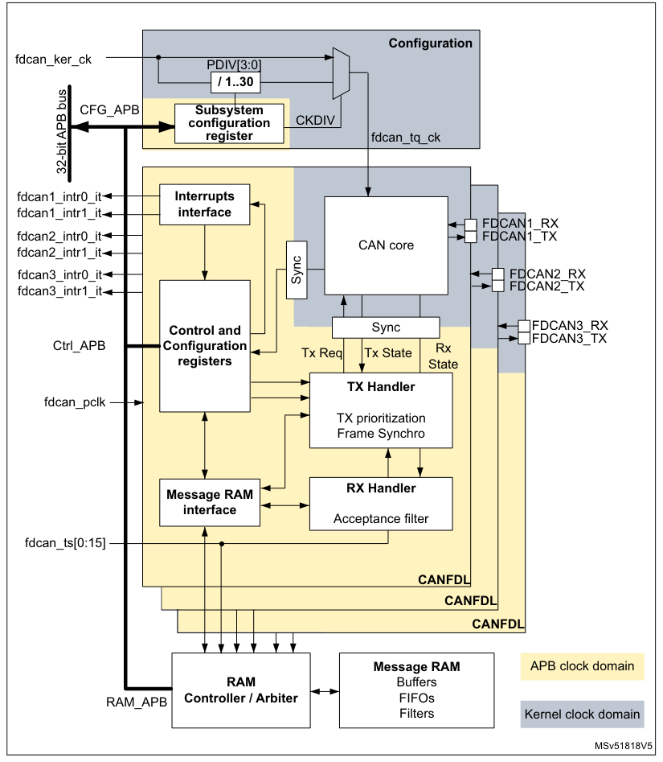
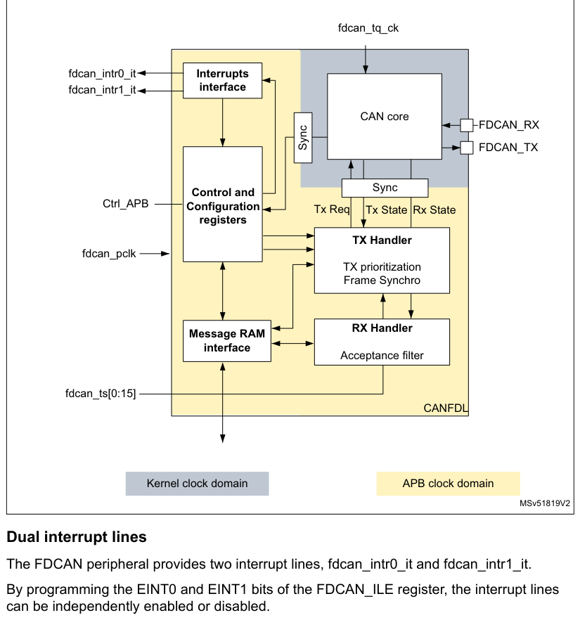
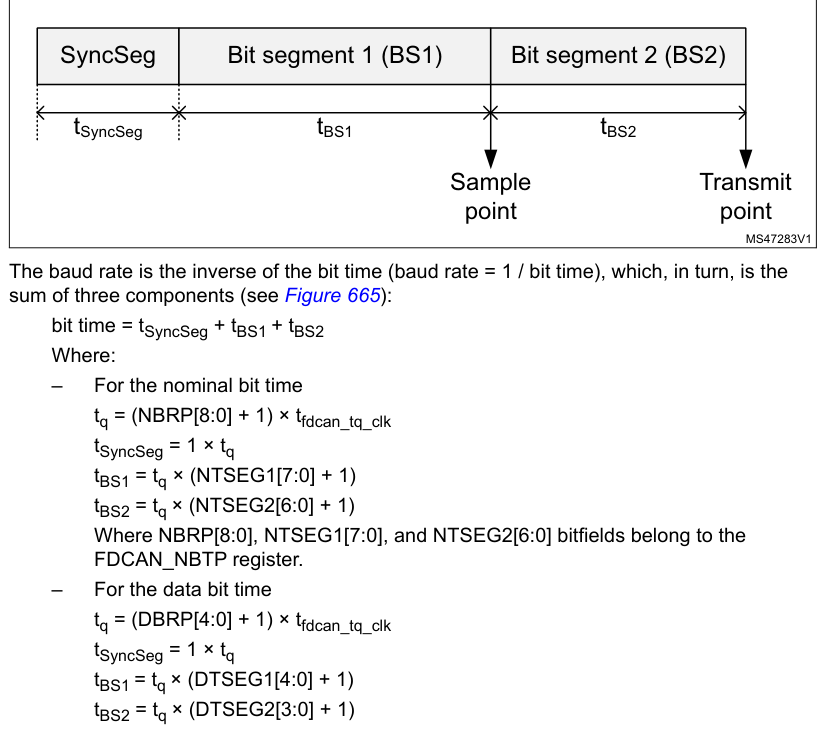
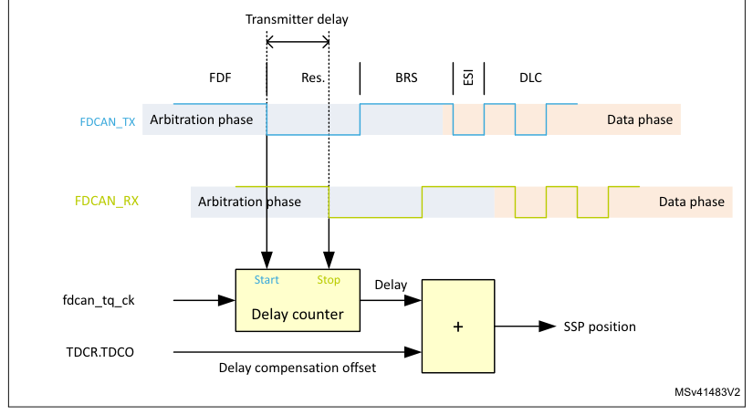
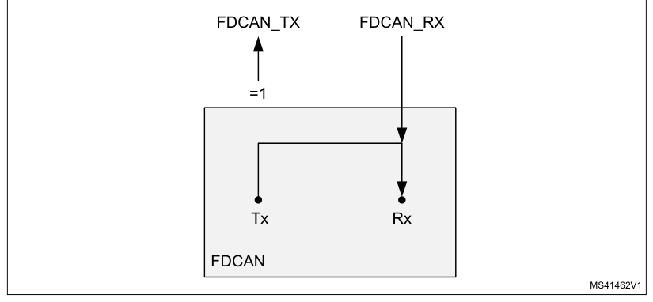
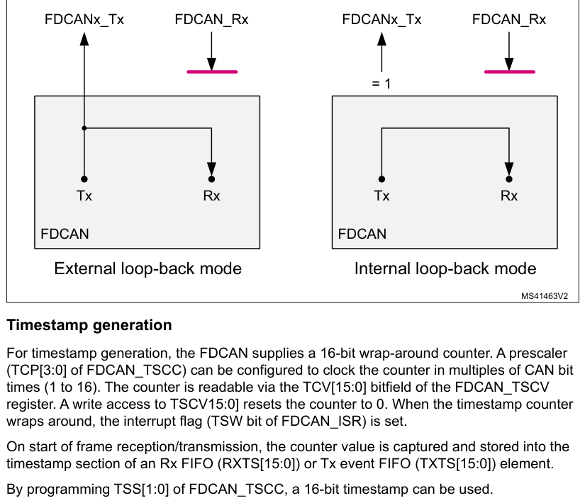
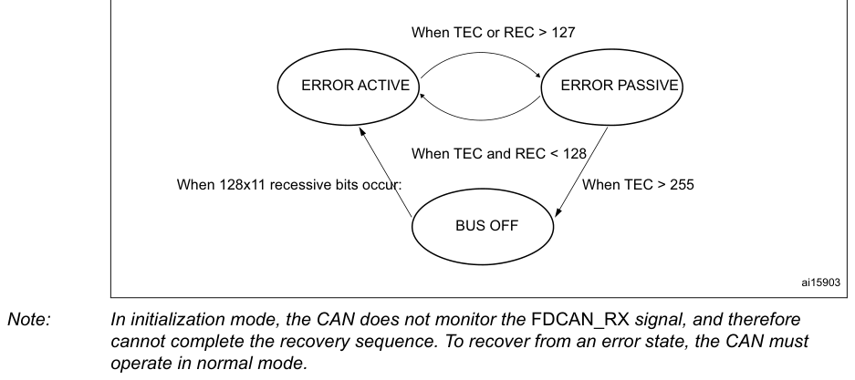
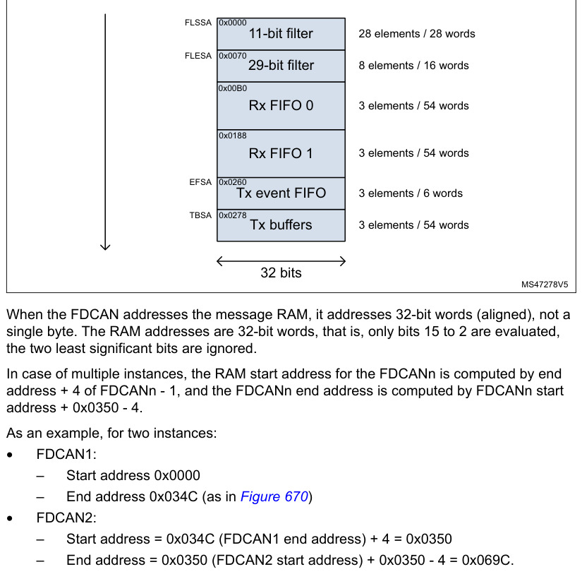
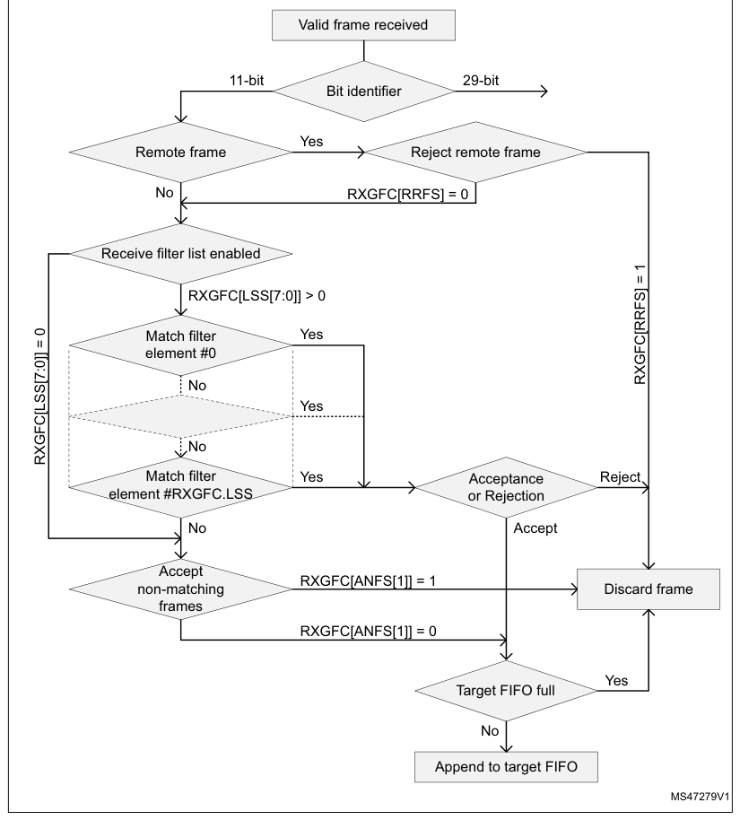
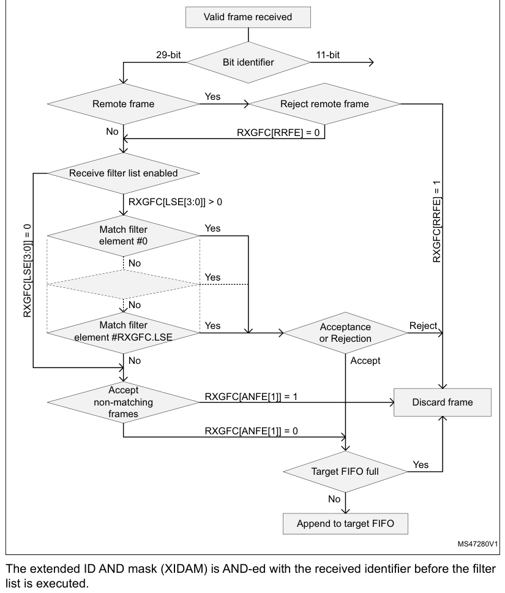

# 44 FD controller area network (FDCAN)

[← RM0440 index](../STM32G4_RM0440.md)

## 44.1 Introduction

The controller area network (CAN) subsystem (see Figure 663) consists of three CAN modules, a shared
message RAM, and a configuration block. Refer to the memory map for the base address of each of
these parts.

The modules (FDCAN) are compliant with ISO 11898-1: 2015 (CAN protocol specification version 2.0
part A, B) and CAN FD protocol specification version 1.0.

A 0.8-Kbyte message RAM per FDCAN instance is used for filtering, transmitting event FIFOs, and
receiving and transmitting FIFOs.

**Figure 663. CAN subsystem.**

## 44.2 FDCAN main features

- Conform with CAN protocol version 2.0 part A, B, and ISO 11898-1: 2015
- CAN FD with maximum 64 data bytes supported
- CAN error logging
- AUTOSAR and J1939 support
- Improved acceptance filtering
- Two receive FIFOs of three payloads each (up to 64 bytes per payload)
- Separate signaling on reception of high priority messages
- Configurable transmit FIFO/queue of three payloads (up to 64 bytes per payload)
- Transmit event FIFO
- Programmable loop-back test mode
- Maskable module interrupts
- Two clock domains: APB bus interface and CAN core kernel clock
- Power-down support

## 44.3 FDCAN functional description

### 44.3.1 FDCAN block diagram

**Figure 664. FDCAN block diagram**

#### Dual interrupt lines

The FDCAN peripheral provides two interrupt lines, fdcan_intr0_it and fdcan_intr1_it.

By programming the EINT0 and EINT1 bits of the FDCAN_ILE register, the interrupt lines can be
independently enabled or disabled.

#### CAN core

The CAN core contains the protocol controller and receive/transmit shift registers. It handles all
ISO 11898-1: 2015 protocol functions and supports both 11-bit and 29-bit identifiers.

#### Sync

This block synchronizes signals from the APB clock domain to the CAN kernel clock domain and vice
versa.

#### Tx handler

The Tx handler controls the message transfer from the message RAM to the CAN core. A maximum of
three Tx buffers is available for transmission. The Tx buffer can be used as Tx FIFO or as a Tx
queue. Tx event FIFO stores Tx timestamps together with the corresponding message ID. Transmit
cancellation is also supported.

#### Rx handler

The Rx handler controls the transfer of received messages from the CAN core to the external message
RAM. The Rx handler supports two receive FIFOs, for storage of all messages that have passed
acceptance filtering. An Rx timestamp is stored together with each message. Up to 28 filters can be
defined for 11-bit IDs; up to eight filters for 29-bit IDs.

#### APB interface

The APB interface connects the FDCAN to the APB bus for configuration registers, controller
configuration, and RAM access.

#### Message RAM interface

The message RAM interface connects the FDCAN access to an external 1-Kbyte message RAM through a RAM
controller/arbiter.

### 44.3.2 FDCAN pins and internal signals

The CAN subsystem I/O signals and pins are detailed, respectively, in Table 407, Table 408, and
Figure 663.

**Table 407. CAN subsystem I/O signals**

| Source row | Column 1 | Column 2 | Column 3 |
| ---: | --- | --- | --- |
| 1 | `Name` | `Type` | `Description` |
| 2 | `fdcan_ker_ck` | `CAN subsystem kernel clock input` |  |
| 3 | `Digital input` |  |  |
| 4 | `fdcan_pclk` | `CAN subsystem APB interface clock input` |  |
| 5 | `fdcann_intr0_it` | `FDCAN interrupt0` |  |
| 6 | `Digital output` |  |  |
| 7 | `fdcann_intr1_it` | `FDCAN interrupt1` |  |
| 8 | `fdcan_ts[0:15]` | `-` | `External timestamp vector` |
| 9 | `Single APP with multiple psel for configuration, control` |  |  |
| 10 | `APB interface` | `Digital input/output` |  |
| 11 | `and RAM access` |  |  |

**Table 408. CAN subsystem I/O pins**

| Name | Type | Description |
| --- | --- | --- |
| FDCANn_RX | Digital input | FDCAN receive pin |
| FDCANn_TX | Digital output | FDCAN transmit pin |

### 44.3.3 Bit timing

The bit timing logic monitors the serial bus-line and performs sampling and adjustment of the sample
point by synchronizing on the start-bit edge and resynchronizing on the following edges.

As shown in Figure 665, this operation can be explained simply by splitting the bit time in three
segments, as follows:

- Synchronization segment (SYNC_SEG): a bit change is expected to occur within this time segment,
  having a fixed length of one time quantum (1 × tq).
- Bit segment 1 (BS1): defines the location of the sample point. It includes the PROP_SEG and
  PHASE_SEG1 of the CAN standard. Its duration is programmable from 1 to 16 time quanta, but can be
  automatically lengthened to compensate for positive phase drifts due to differences in the
  frequency of various nodes of the network.
- Bit segment 2 (BS2): defines the location of the transmit point. It represents the PHASE_SEG2 of
  the CAN standard, its duration is programmable between one and eight time quanta, but can also be
  automatically shortened to compensate for negative phase drifts.

**Figure 665. Bit timing**

The baud rate is the inverse of the bit time (baud rate = 1 / bit time), which, in turn, is the sum
of three components (see Figure 665):

bit time = tSyncSeg \+ tBS1 \+ tBS2

Where:

- For the nominal bit time
  tq = (NBRP[8:0] \+ 1) × tfdcan_tq_clk
  tSyncSeg = 1 × tq
  tBS1 = tq × (NTSEG1[7:0] \+ 1)
  tBS2 = tq × (NTSEG2[6:0] \+ 1)

Where NBRP[8:0], NTSEG1[7:0], and NTSEG2[6:0] bitfields belong to the FDCAN_NBTP register.

- For the data bit time
  tq = (DBRP[4:0] \+ 1) × tfdcan_tq_clk
  tSyncSeg = 1 × tq
  tBS1 = tq × (DTSEG1[4:0] \+ 1)
  tBS2 = tq × (DTSEG2[3:0] \+ 1)

Where DBRP[4:0], DTSEG1[4:0], and DTSEG2[3:0] belong to the FDCAN_DBTP register.

The (re)synchronization jump width (SJW) defines an upper bound for the amount of lengthening or
shortening of the bit segments. It is programmable between one and four time quanta.

A valid edge is defined as the first transition in a bit time from dominant to recessive bus level,
provided the controller itself does not send a recessive bit.

If a valid edge is detected in BS1 instead of SYNC_SEG, BS1 is extended by up to SJW, so that the
sample point is delayed.

Conversely, if a valid edge is detected in BS2 instead of SYNC_SEG, BS2 is shortened by up to SJW,
so that the transmit point is moved earlier.

As a safeguard against programming errors, the configuration of the bit timing register is only
possible while the device is in Standby mode. The FDCAN_DBTP and FDCAN_NBTP registers (dedicated,
respectively, to data and nominal bit timing) are only accessible when the CCE and INIT of the
FDCA_CCCR register are set.

The FDCAN requires that the CAN time quanta clock is always below or equal to the APB clock
(fdcan_tq_ck \< fdcan_pclk).

> **Note:** For a detailed description of the CAN bit timing and resynchronization mechanism, refer to
> the ISO 11898-1 standard.

### 44.3.4 Operating modes

#### Configuration

Access to peripheral version, hardware, and input clock divider configuration. When the clock
divider is set to 0, the primary input clock is used as it is.

#### Software initialization

Software initialization is started by setting the INIT bit of the FDCAN_CCCR register, by software,
by a hardware reset, or by entering bus-off state. While the INIT bit is set, message transfers from
and to the CAN bus are stopped, and the status of the CAN bus output FDCAN_TX is recessive (high).
The EML (error management logic) counters are unchanged. Setting the INIT bit does not change any
configuration register. Clearing INIT bit of FDCAN_CCCR finishes the software initialization.
Afterwards the bit stream processor (BSP) synchronizes itself to the data transfer on the CAN bus by
waiting for the occurrence of a sequence of 11 consecutive recessive bits (bus-idle) before it can
take part in bus activities and start the message transfer.

Access to the FDCAN configuration registers is only enabled when the INIT bit and the CCE bit of the
FDCAN_CCCR register are both set.

The CCE bit of the FDCAN_CCCR register can only be set/cleared while the INIT bit of FDCAN_CCCR is
set. The CCE bit is automatically cleared when the INIT bit is cleared.

The following registers are reset when the CCE bit of the FDCAN_CCCR register is set:

- FDCAN_HPMS: High priority message status
- FDCAN_RXF0S: Rx FIFO 0 status
- FDCAN_RXF1S: Rx FIFO 1 status
- FDCAN_TXFQS: Tx FIFO/queue status
- FDCAN_TXBRP: Tx buffer request pending
- FDCAN_TXBTO: Tx buffer transmission occurred
- FDCAN_TXBCF: Tx buffer cancellation finished
- FDCAN_TXEFS: Tx event FIFO status

The timeout counter value (TOC[15:0] bit of the FDCAN_TOCV register) is preset to the value
configured by the TOP[15:0] of the FDCAN_TOCC register when the CCE bit of the FDCAN_CCCR is set.

In addition, the state machines of the Tx handler and Rx handler are held in idle state while the
CCE bit is set.

The following registers can be written only when the CCE bit is cleared:

- FDCAN_TXBAR: Tx buffer add request
- FDCAN_TXBCR: Tx buffer cancellation request

The TEST and the MON bits of the FDCAN_CCCR register can be set only by software while the INIT and
the CCE bits of the FDCAN_CCCR register are both set. Both bits can be reset at any time. The DAR
bit of FDCAN_CCCR can only be set/cleared while the INIT and CCE bits are both set.

#### Normal operation

The FDCAN default operating mode after hardware reset is event-driven CAN communication. TT
operation mode is not supported.

Once the FDCAN is initialized and the INIT bit of the FDCAN_CCCR register is cleared, the FDCAN
synchronizes itself to the CAN bus and is ready for communication.

After passing the acceptance filtering, received messages including message ID and DLC are stored
into the Rx FIFO 0 or Rx FIFO 1.

For messages to be transmitted, the Tx FIFO or the Tx queue can be initialized or updated. Automated
transmission on reception of remote frames is not supported.

#### CAN FD operation

There are two variants in the FDCAN protocol:

- Long frame mode (LFM), where the data field of a CAN frame may be longer than eight bytes.
- Fast frame mode (FFM), where the control field, data field, and CRC field of a CAN frame are
  transmitted with a higher bit rate compared to the beginning and to the end of the frame.

The fast frame mode can be used in combination with the long frame mode.

The previously reserved bit in CAN frames with 11-bit identifiers and the first previously reserved
bit in CAN frames with 29-bit identifiers are decoded as FDF bit: FDF recessive signifies a CAN FD
frame, while FDF dominant signifies a classic CAN frame.

In a CAN FD frame, the two bits following FDF (res and BRS) decide whether the bit rate inside this
CAN FD frame is switched. A CAN FD bit rate switch is signified by res dominant and BRS recessive.
The coding of res recessive is reserved for future expansion of the protocol. In case the FDCAN
receives a frame with FDF recessive and res recessive, it signals a protocol exception event by
setting the PXE bit of the FDCAN_PSR register. When protocol exception handling is enabled (PXHD = 0
in FDCAN_CCCR), this causes the operation state to change from receiver (ACT[1:0] = 10 in FDCAN_PSR)
to integrating (ACT[1:0] = 00 in FDCAN_PSR) at the next sample point. If protocol exception handling
is disabled (PXHD = 1 in FDCAN_CCCR), the FDCAN treats a recessive res bit as a form error and
responds with an error frame.

CAN FD operation is enabled by programming the FDOE bit of the FDCAN_CCCR register. In case FDOE =
1, transmission and reception of CAN FD frames are enabled. Transmission and reception of classic
CAN frames are always possible. Whether a CAN FD frame or a classic CAN frame is transmitted can be
configured via the FDF bit in the respective Tx buffer element. With FDOE = 0, received frames are
interpreted as classic CAN frames, which leads to the transmission of an error frame when receiving
a CAN FD frame. When CAN FD operation is disabled, no CAN FD frames are transmitted even if the FDF
bit of a Tx buffer element is set. The FDOE and BRSE bits of the FDCAN_CCCR register can only be
changed while the INIT and CCE bits are both set.

With FDOE = 0, the setting of the FDF and BRS bits is ignored, and frames are transmitted in classic
CAN format. With FDOE = 1 and BRSE = 0, only the FDF bit of a Tx buffer element is evaluated. With
FDOE = 1 and BRSE = 1, transmission of CAN FD frames with bit rate switching is enabled. All Tx
buffer elements with FDF and BRS bits set are transmitted in CAN FD format with bit rate switching.

A mode change during CAN operation is recommended only under the following conditions:

- The failure rate in the CAN FD data phase is significant higher than in the CAN FD arbitration
  phase. In this case, disable the CAN FD bit rate switching option for transmissions.
- During system startup, all nodes transmit classic CAN messages until it is verified that they are
  able to communicate in CAN FD format. If this is true, all nodes switch to CAN FD operation.
- Wake-up messages in CAN partial networking have to be transmitted in classic CAN format.
- End-of-line programming in case not all nodes are CAN FD capable. Non-CAN FD nodes are held in
  silent mode until programming is complete. Then all nodes switch back to classic CAN
  communication.

In the FDCAN format, the coding of the DLC differs from that of the standard CAN format. The DLC
codes 0 to 8 have the same coding as in standard CAN, the codes 9 to 15 (that in standard CAN all
code a data field of 8 bytes) are coded according to Table 409.

> **Extracted layout**
>
> `:` · `Table 409. DLC coding in FDCAN`  
> `DLC` · `9` · `10` · `11` · `12` · `13` · `14` · `15`  
> `Number of data bytes` · `12` · `16` · `20` · `24` · `32` · `48` · `64`  

In CAN FD fast frames, the bit timing is switched inside the frame, after the BRS (bit rate switch)
bit, if this bit is recessive. Before the BRS bit, in the FDCAN arbitration phase, the standard CAN
bit timing is used as defined by the FDCAN_DBTP register. In the following

FDCAN data phase, the fast CAN bit timing is used as defined by the FDCAN_DBTP register. The bit
timing is switched back from the fast timing at the CRC delimiter or when an error is detected,
whichever occurs first.

The maximum configurable bit rate in the CAN FD data phase depends on the FDCAN kernel clock
frequency. For example, with an FDCAN kernel clock frequency of 20 MHz and the shortest configurable
bit time of four time quanta (tq), the bit rate in the data phase is 5 Mbit/s.

In both data frame formats (CAN FD long frames and CAN FD fast frames), the value of bit ESI (error
status indicator) is determined by the transmitter error state at the start of the transmission. If
the transmitter is error passive, ESI is transmitted recessive, else it is transmitted dominant. In
CAN FD remote frames, the ESI bit is always transmitted dominant, independent of the transmitter
error state. The data length code of CAN FD remote frames is transmitted as 0.

In case an FDCAN Tx buffer is configured for FDCAN transmission with DLC > 8, the first eight bytes
are transmitted as configured in the Tx buffer while the remaining part of the data field is padded
with 0xCC. When the FDCAN receives a FDCAN frame with DLC > 8, the first eight bytes of that frame
are stored into the matching Rx FIFO. The remaining bytes are discarded.

#### Transceiver delay compensation

During the data phase of an FDCAN transmission, only one node is transmitting, all others are
receivers. The length of the bus line has no impact. When transmitting via pin FDCAN_TX, the
protocol controller receives the transmitted data from its local CAN transceiver via pin FDCAN_RX.
The received data is delayed by the CAN transceiver loop delay. If this delay is greater than TSEG1
(time segment before sample point), and a bit error is detected. Without transceiver delay
compensation, the bit rate in the data phase of an FDCAN frame is limited by the transceiver loop
delay.

The FDCAN implements a delay compensation mechanism to compensate the CAN transceiver loop delay,
thereby enabling transmission with higher bit rates during the FDCAN data phase independent of the
delay of a specific CAN transceiver.

To check for bit errors during the data phase of transmitting nodes, the delayed transmit data is
compared against the received data at the secondary sample point (SSP). If a bit error is detected,
the transmitter reacts on this bit error at the next following regular sample point. During the
arbitration phase, the delay compensation is always disabled.

The transmitter delay compensation enables configurations where the data bit time is shorter than
the transmitter delay. This is enabled by setting the TDC bit of the FDCAN_DBTP register, and
described in detail in the ISO11898-1 specification.

The received bit is compared against the transmitted bit at the SSP. The SSP position is defined as
the sum of the measured delay from the FDCAN transmit output pin FDCAN_TX through the transceiver to
the receive input pin FDCAN_RX plus the transmitter delay compensation offset as configured by
TDCO[6:0] of FDCAN_TDCR. The transmitter delay compensation offset is used to adjust the position of
the SSP inside the received bit (for example, half of the bit time in the data phase). The position
of the secondary sample point is rounded down to the next integer number of mtq (minimum time
quantum, one period of fdcan_tq_ck clock).

The TDCV[6:0] bitfield of the FDCAN_PSR register shows the actual transmitter delay compensation
value. TDCV[6:0] is cleared when the INIT is set in the FDCAN_CCCR. It is
updated at each transmission of an FD frame while the TDC bit of the FDCAN_DBTP register is set.

The following boundary conditions have to be considered for the transmitter delay compensation
implemented in the FDCAN:

- The sum of the measured delay from FDCAN_Tx to FDCAN_Rx and the configured transmitter delay
  compensation offset TDCO[6:0] has to be lower than 6-bit times in the data phase.
- The sum of the measured delay from FDCAN_TX to FDCAN_RX and the configured transmitter delay
  compensation offset TDCO[6:0] has to be lower than or equal to 127 × mtq. If the sum exceeds this
  value, the maximum value (127 × mtq) is used for transmitter delay compensation.
- The data phase ends at the sample point of the CRC delimiter, which stops checking received bits
  at the SSPs.

If transmitter delay compensation is enabled by setting the TDC bit of the FDCAN_DBTP; the
measurement is started within each transmitted CAN FD frame at the falling edge of bit FDF to bit
res. The measurement is stopped when this edge is seen at the receive input pin FDCAN_TX of the
transmitter. The resolution of this measurement is one mtq.

**Figure 666. Transceiver delay measurement**

To avoid that a dominant glitch inside the received FDF bit ends the delay compensation measurement
before the falling edge of the received res bit (resulting in a too early SSP position), the use of
a transmitter delay compensation filter window can be enabled by programming the TDCF[6:0] bitfield
of the FDCAN_TDCR register. This defines a minimum value for the SSP position. Dominant edges on
FDCAN_RX that would result in an earlier SSP position are ignored for transmitter delay measurement.
The measurement is stopped when the SSP position is at least TDCF[6:0] and FDCAN_RX is low.

#### Restricted operation mode

In restricted operation mode, the node is able to receive data and remote frames, and to give
acknowledge to valid frames, but it does not send data frames, remote frames, active error frames,
or overload frames. In case of an error condition or overload condition, it does not send dominant
bits. Instead, it waits for the occurrence of a bus-idle condition to resynchronize itself to the
CAN communication. The error counters (REC[6:0] and TEC[7:0] in FDCAN_ECR) are frozen while the
error logging (CEL[7:0]) is active. The software can set the FDCAN into restricted operation mode by
setting the ASM bit of FDCAN_CCCR. The bit can only be set by software when both CCE and INIT bits
are set in FDCAN_CCCR. The bit can be cleared by software at any time.

Restricted operation mode is automatically entered when the Tx handler is not able to read data from
the message RAM in time. To leave restricted operation mode, the software has to clear the ASM bit
of FDCAN_CCCR.

The restricted operation mode can be used in applications that adapt themselves to different CAN bit
rates. In this case, the application tests different bit rates and leaves the restricted operation
mode after it has received a valid frame.

> **Note:** The restricted operation mode must not be combined with the loop-back mode (internal or
> external).

#### Bus monitoring mode

The FDCAN is set in bus monitoring mode by setting the MON bit of the FDCAN_CCCR register. In bus
monitoring mode (for more details refer to ISO11898-1, 10.12 bus monitoring), the FDCAN is able to
receive valid data frames and valid remote frames, but cannot start a transmission. In this mode, it
sends only recessive bits on the CAN bus. If the FDCAN is required to send a dominant bit (ACK bit,
overload flag, active error flag), the bit is rerouted internally so that the FDCAN can monitor it,
even if the CAN bus remains in recessive state. In bus monitoring mode, the FDCAN_TXBRP register is
held in reset state.

The bus monitoring mode can be used to analyze the traffic on a CAN bus without affecting it by the
transmission of dominant bits. Figure 667 shows the connection of FDCAN_TX and FDCAN_RX signals to
the FDCAN in bus monitoring mode.

**Figure 667. Pin control in bus monitoring mode**

#### Disabled automatic retransmission mode (DAR)

According to the CAN specification (see ISO11898-1, 6.3.3 Recovery Management), the FDCAN provides
means for automatic retransmission of frames that have lost arbitration or have been disturbed by
errors during transmission. By default, automatic retransmission is enabled. The DAR mode can be
disabled through the DAR bit of the FDCAN_CCCR register.

Frame transmission in DAR mode

In DAR mode, all transmissions are automatically canceled after they have been started on the CAN
bus. A Tx buffer Tx request pending bit (TRPx in FDCAN_TXBRP) is reset after successful
transmission, when a transmission has not yet been started at the point of cancellation, when it has
been aborted due to lost arbitration, or when an error has occurred during frame transmission.

- Successful transmission
  - The corresponding Tx buffer transmission occurred bit TOx is set in FDCAN_TXBTO register.
  - The corresponding Tx buffer cancellation finished bit CFx is cleared in the FDCAN_TXBCF
    register.
- Successful transmission in spite of cancellation
  - The corresponding Tx buffer transmission occurred bit TOx is set in the FDCAN_TXBTO register.
  - The corresponding Tx buffer cancellation finished bit CFx is set in the FDCAN_TXBCF register.
- Arbitration loss or frame transmission disturbed
  - The corresponding Tx buffer transmission occurred bit TOx is cleared in the FDCAN_TXBTO
    register.
  - The corresponding Tx buffer cancellation finished bit CFx is set in the FDCAN_TXBCF register.

In case of a successful frame transmission, and if the storage of Tx events is enabled, a Tx event
FIFO element is written with event type ET = 10 (transmission in spite of cancellation).

#### Power-down (Sleep mode)

Power-down entry

The FDCAN can be set into power-down mode controlled by setting the CSR bit of the FDCAN_CCCR
register. As long as the clock stop request is active, CSR is read as 1.

When all pending transmission requests have completed, the FDCAN waits until the bus-idle state is
detected. The FDCAN then sets the INIT bit of the FDCAN_CCCR register to prevent any further CAN
transfers. Now, the FDCAN acknowledges that it is ready for power-down by setting the CSA bit of the
FDCAN_CCCR register. In this state, before the clocks are switched off, further register accesses
can be made. A write access to the INIT bit has no effect. Now, the module clock inputs can be
switched off.

Power-down exit

To leave power-down mode, the application has to turn on the module clocks before clearing the CSR
bit. The FDCAN acknowledges this by clearing the CSA bit. Afterwards, the application can restart
CAN communication by clearing the INIT bit.

#### Test modes

To enable write access to FDCAN test register (FDCAN_TEST), the TEST bit of the FDCAN_CCCR register
must be set, thus enabling the configuration of test modes and functions.

Four output functions are available for the CAN transmit pin FDCAN_TX by programming the TX[1:0]
bitfield of the FDCAN_TEST register. In addition to its default function (the serial data output),
it can drive the CAN sample point signal to monitor the FDCAN bit timing as well as drive constant
dominant or recessive values. The actual value at pin FDCAN_RX can be read from the RX bit of
FDCAN_TEST. Both functions can be used to check the CAN bus physical layer.

Due to the synchronization mechanism between CAN kernel clock and APB clock domain, there can be a
delay of several APB clock periods between writing to TX[1:0] until the new configuration is visible
at FDCAN_TX output pin. This applies also when reading FDCAN_RX input pin via RX.

> **Note:** Test modes must be used for production tests or self-test only. The software control for

FDCAN_TX pin interferes with all CAN protocol functions. It is not recommended to use test modes for
application.

#### External loop-back mode

The FDCAN can be set in external loop-back mode by setting the LBCK bit of the FDCAN_TEST register.
In loop-back mode, the FDCAN treats its own transmitted messages as received messages and stores
them (if they pass acceptance filtering) into Rx FIFOs. Figure 668 shows the connection of transmit
and receive signals FDCAN_TX and FDCAN_RX to the FDCAN in external loop-back mode.

This mode is provided for hardware self-test. To be independent from external stimulation, the FDCAN
ignores acknowledge errors (recessive bit sampled in the acknowledge slot of a data/remote frame) in
loop-back mode. In this mode, the FDCAN performs an internal feedback from its transmit output to
its receive input. The actual value of the FDCAN_RX input pin is disregarded by the FDCAN. The
transmitted messages can be monitored at the FDCAN_TX transmit pin.

#### Internal loop-back mode

Internal loop-back mode is entered by setting both the LBCK bit of FDCAN_TEST and the MON bit of
FDCAN_CCR. This mode can be used for a “hot self-test”, meaning the FDCAN can be tested without
affecting a running CAN system connected to the FDCAN_TX and FDCAN_RX pins. In this mode, FDCAN_RX
pin is disconnected from the FDCAN and FDCAN_TX pin is held recessive. Figure 668 shows the
connection of FDCAN_TX and FDCAN_RX pins to the FDCAN in case of internal loop-back mode.

**Figure 668. Pin control in loop-back mode**

#### Timestamp generation

For timestamp generation, the FDCAN supplies a 16-bit wrap-around counter. A prescaler (TCP[3:0] of
FDCAN_TSCC) can be configured to clock the counter in multiples of CAN bit times (1 to 16). The
counter is readable via the TCV[15:0] bitfield of the FDCAN_TSCV register. A write access to
TSCV15:0] resets the counter to 0. When the timestamp counter wraps around, the interrupt flag (TSW
bit of FDCAN_ISR) is set.

On start of frame reception/transmission, the counter value is captured and stored into the
timestamp section of an Rx FIFO (RXTS[15:0]) or Tx event FIFO (TXTS[15:0]) element.

By programming TSS[1:0] of FDCAN_TSCC, a 16-bit timestamp can be used.

#### Debug mode behavior

In debug mode, the set/reset on read feature is automatically disabled during the debugger register
access, and enabled during normal MCU operation

#### Timeout counter

To signal timeout conditions for Rx FIFO 0, Rx FIFO 1, and the Tx event FIFO the FDCAN supplies a
16-bit timeout counter. It operates as a down-counter and uses the same prescaler controlled by
TCP[3:0] of FDCAN_TSCC as the timestamp counter. The timeout counter is configured via the
FDCAN_TOCC register. The actual counter value can be read from the TOC[15:0] bitfield of FDCAN_TOCV.
The timeout counter can only be started while the INIT bit of FDCAN_CCCR is cleared. It is stopped
when INIT is set, for example, when the FDCAN enters bus-off state.

The operation mode is selected by TOS[1:0] of FDCAN_TOCC. When operating in continuous mode, the
counter starts when INIT is cleared. A write to FDCAN_TOCV presets the counter to the value
configured by TOP[15:0] in FDCAN_TOCC and continues down-counting.

When the timeout counter is controlled by one of the FIFOs, an empty FIFO presets the counter to the
value configured by TOP[15:0]. Down-counting is started when the first FIFO element is stored.
Writing to FDCAN_TOCV has no effect.

When the counter reaches 0, the TOO interrupt flag is set in the FDCAN_IR register. In continuous
mode, the counter is immediately restarted at TOP[15:0].

> **Note:** The clock signal for the timeout counter is derived from the CAN core sample point signal.

Therefore, the point in time where the timeout counter is decremented may vary due to the
synchronization/resynchronization mechanism of the CAN core. If the baud rate switch feature in
FDCAN is used, the timeout counter is clocked differently in the arbitration and data fields.

### 44.3.5 Error management

As described in the CAN protocol, the error management is handled entirely by hardware using the
transmit error counter (the TEC[7:0] bitfield of the FDCAN error counter register (FDCAN_ECR)) and
the receive error counter (the REC[6:0] bitfield of the FDCAN error counter register (FDCAN_ECR)).
These values are incremented or decremented according to the error condition. For detailed
information on TEC[7:0] and REC[6:0] management, refer to the CAN standard. Both values can be read
by software to determine the stability of the network.

The bus-off state is reached when TEC[7:0] is greater than 255. This state is also indicated by the
BO flag of the FDCAN protocol status register (FDCAN_PSR). In bus-off state, the CAN is no longer
able to transmit and receive messages. It has to wait at least for the duration of the recovery
sequence specified in the CAN standard (128 occurrences of 11 consecutive recessive bits monitored
on FDCAN_RX input).

**Figure 669. CAN error state diagram**

> **Note:** In initialization mode, the CAN does not monitor the FDCAN_RX signal, and therefore
> cannot complete the recovery sequence. To recover from an error state, the CAN must operate in
> normal mode.

### 44.3.6 Message RAM

The message RAM is 32-bit wide, and the FDCAN module is configured to allocate up to 212 words in
it. It is not necessary to configure each of the sections shown in Figure 670.

**Figure 670. Message RAM configuration**

When the FDCAN addresses the message RAM, it addresses 32-bit words (aligned), not a single byte.
The RAM addresses are 32-bit words, that is, only bits 15 to 2 are evaluated, the two least
significant bits are ignored.

In case of multiple instances, the RAM start address for the FDCANn is computed by end address \+ 4
of FDCANn - 1, and the FDCANn end address is computed by FDCANn start address \+ 0x0350 - 4.

As an example, for two instances:

- FDCAN1:
  - Start address 0x0000
  - End address 0x034C (as in Figure 670)
- FDCAN2:
  - Start address = 0x034C (FDCAN1 end address) \+ 4 = 0x0350
  - End address = 0x0350 (FDCAN2 start address) \+ 0x0350 - 4 = 0x069C.

#### Rx handling

The Rx handler controls the acceptance filtering, the transfer of received messages to one of the
two Rx FIFOs, as well as the Rx FIFO put and get indices.

#### Acceptance filter

The FDCAN offers the possibility to configure two sets of acceptance filters, one for standard
identifiers and another for extended identifiers. These filters can be assigned to Rx FIFO 0 or Rx
FIFO 1. For acceptance filtering, each list of filters is executed from element #0 until the first
matching element. Acceptance filtering stops at the first matching element, and the following filter
elements are not evaluated for this message.

The main features are:

- Each filter element can be configured as
  - Range filter (from - to)
  - Filter for one or two dedicated IDs
  - Classic bit mask filter
- Each filter element is configurable for acceptance or rejection filtering.
- Each filter element can be enabled/disabled individually.
- Filters are checked sequentially, execution stops with the first matching filter element

Related configuration registers are:

- Global filter configuration (RXGFC)
- Extended ID AND mask (XIDAM)

Depending on the configuration of the filter element (SFEC[2:0]/EFEC[2:0]), a match triggers one of
the following actions:

- Store received frame in FIFO 0 or FIFO 1
- Reject received frame
- Set the high priority message interrupt flag HPM in FDCAN_IR
- Set the high priority message interrupt flag HPM in FDCAN_IR, and store the received frame in FIFO
  0 or FIFO 1.

Acceptance filtering is started after the complete identifier has been received. After acceptance
filtering has completed, and if a matching Rx FIFO has been found, the message handler starts
writing the received message data in 32-bit portions to the matching Rx FIFO. If the CAN protocol
controller has detected an error condition (for example, CRC error), this message is discarded with
the following impact:

- Rx FIFO

The put index of the matching Rx FIFO is not updated, but the related Rx FIFO element is partly
overwritten with the received data. For error type, see LEC[2:0] and DLEC[2:0] bitfields of the
FDCAN_PSR register. In case the matching Rx FIFO is operated in overwrite mode, the boundary
conditions described in Rx FIFO overwrite mode have to be considered.

> **Note:** When an accepted message is written to one of the two Rx FIFOs, the unmodified received
> identifier is stored independently from the used filters. The result of the acceptance filter
> process strongly depends on the sequence of configured filter elements.

#### Range filter

The filter matches for all received frames with message IDs in the range defined by SF1ID/SF2ID and
EF1ID/EF2ID.

There are two possibilities when range filtering is used together with extended frames:

- EFT[1:0] = 00: the message ID of received frames is AND-ed with the extended ID AND mask (XIDAM)
  before the range filter is applied.
- EFT[1:0] = 11: the extended ID AND mask (XIDAM) is not used for range filtering.

#### Filter for dedicated IDs

A filter element can be configured to filter for one or two specific message IDs. To filter for one
specific message ID, the filter element has to be configured with SF1ID = SF2ID and EF1ID = EF2ID.

#### Classic bit mask filter

The classic bit mask filtering is intended to filter groups of message IDs by masking single bits of
a received message ID. With classic bit mask filtering SF1ID/EF1ID is used as message ID filter,
while SF2ID/EF2ID is used as filter mask.

0 bit at the filter mask masks out the corresponding bit position of the configured ID filter. For
example, the value of the received message ID at that bit position is not relevant for acceptance
filtering. Only the bits of the received message ID where the corresponding mask bits are 1 are
relevant for acceptance filtering.

In case all mask bits are 1, a match occurs only when the received message ID and the message ID
filter are identical. If all mask bits are 0, all message IDs match.

#### Standard message ID filtering

Figure 671 shows the flow for standard message ID (11-bit identifier) filtering. The standard
message ID filter element is described in [Section 44.3.11](#44311-fdcan-standard-message-id-filter-element).

The standard message filtering is controlled by the FDCAN_RXGFC register. The standard message ID,
the remote transmission request bit (RTR), and the identifier extension bit (IDE) of the received
frames are compared against the list of configured filter elements.

**Figure 671. Standard message ID filter path**

#### Extended message ID filtering

Figure 672 shows the flow for extended message ID (29-bit identifier) filtering. The extended
message ID filter element is described in [Section 44.3.12](#44312-fdcan-extended-message-id-filter-element).

The extended message filtering is controlled by the FDCAN_RXGFC register. The extended message ID,
the remote transmission request bit (RTR), and the identifier extension bit (IDE) of the received
frames are compared against the list of configured filter elements.

**Figure 672. Extended message ID filter path**

The extended ID AND mask (XIDAM) is AND-ed with the received identifier before the filter list is
executed.

#### Rx FIFOs

Rx FIFO 0 and Rx FIFO 1 can hold up to three elements each.

Received messages that passed acceptance filtering are transferred to the Rx FIFO as configured by
the matching filter element. For a description of the filter mechanisms available for Rx FIFO 0 and
Rx FIFO 1, see Acceptance filter. The Rx FIFO element is described in [Section 44.3.8](#4438-fdcan-rx-fifo-element).

When an Rx FIFO full condition is signaled by RFnF in FDCAN_IR (where n is the FIFO number), no
further messages are written to the corresponding Rx FIFO until at least one message has been read
out, and the Rx FIFO get index has been incremented. In case a message is received while the
corresponding Rx FIFO is full, this message is discarded, and the interrupt flag RFnL is set in the
FDCAN_IR register.

When reading from an Rx FIFO, the Rx FIFO get index (FnGI of FDCAN_RXFnS) \+ FIFO element size has to
be added to the corresponding Rx FIFO start address (FnSA).

#### Rx FIFO blocking mode

The Rx FIFO blocking mode is configured by clearing the FnOM bit in the FDCAN_RXGFC register. This
is the default operation mode for the Rx FIFOs.

When an Rx FIFO full condition is reached (FnPI = FnGI in FDCAN_RXFnS), no further messages are
written to the corresponding Rx FIFO until at least one message has been read out and the Rx FIFO
get index has been incremented. An Rx FIFO full condition is signaled by FnF = 1 in FDCAN_RXFnS. In
addition, the RFnF interrupt flag is set in FDCAN_IR.

In case a message is received while the corresponding Rx FIFO is full, this message is discarded,
and the message lost condition is signaled by setting RFnL bit in FDCAN_RXFnS. In addition, the RFnL
interrupt flag is set in FDCAN_IR.

#### Rx FIFO overwrite mode

The Rx FIFO overwrite mode is configured by setting the FnOM bit of the FDCAN_RXGFC register.

When an Rx FIFO full condition (FnPI = FnGI of FDCAN_RXFnS) is signaled by FnF = 1 in FDCAN_RXFnS,
the next message accepted for the FIFO overwrites the oldest FIFO message. Put and get indices are
both incremented by one.

When an Rx FIFO is operated in overwrite mode and an Rx FIFO full condition is signaled, reading
from the Rx FIFO elements must start at least at get index \+ 1. This is because it may happen that a
received message is written to the message RAM (put index) while the CPU is reading from the message
RAM (get index). In this case, inconsistent data can be read from the respective Rx FIFO element.
Adding an offset to the get index when reading from the Rx FIFO avoids this problem. The offset
depends on how fast the CPU accesses the Rx FIFO.

After reading from the Rx FIFO, the number of the last element read has to be written to the Rx FIFO
acknowledge index (FnA of FDCAN_RXFnA). This increments the get index to that element number. In
case the put index has not been incremented to this Rx FIFO element, the Rx FIFO full condition is
reset (FnF = 0 in FDCAN_RXFnS).

#### Tx handling

The Tx handler handles transmission requests for the Tx FIFO and the Tx queue. It controls the
transfer of transmit messages to the CAN core, the put and get indices, and the Tx event FIFO. Up to
three Tx buffers can be set up for message transmission. The CAN message data field is configured to
64 bytes. the Tx FIFO allocates eighteen 32-bit words for storage of a Tx element.

**Table 410. Possible configurations for frame transmission**

| Source row | Column 1 | Column 2 | Column 3 | Column 4 | Column 5 |
| ---: | --- | --- | --- | --- | --- |
| 1 | `CCCR` | `Tx buffer element` |  |  |  |
| 2 | `Frame transmission` |  |  |  |  |
| 3 | `BRSE` | `FDOE` | `FDF` | `BRS` |  |
| 4 | `Ignored` | `0` | `Ignored` | `Ignored` | `Classic CAN` |
| 5 | `0` | `1` | `0` | `Ignored` | `Classic CAN` |
| 6 | `0` | `1` | `1` | `Ignored` | `FD without bit rate switching` |
| 7 | `1` | `1` | `0` | `Ignored` | `Classic CAN` |
| 8 | `1` | `1` | `1` | `0` | `FD without bit rate switching` |
| 9 | `1` | `1` | `1` | `1` | `FD with bit rate switching` |

> **Note:** AUTOSAR requires at least three Tx queue buffers and support of transmit cancellation.

The Tx handler starts a Tx scan to check for the highest priority pending Tx request (Tx buffer with
lowest message ID) when the Tx buffer request pending register (FDCAN_TXBRP) is updated, or when a
transmission has been started.

#### Transmit pause

The transmit pause feature is intended for use in CAN systems where the CAN message identifiers are
permanently specified to specific values and cannot easily be changed. These message identifiers can
have a higher CAN arbitration priority than other defined messages, while in a specific application
their relative arbitration priority must be inverse. This may lead to a case where one ECU sends a
burst of CAN messages that cause another ECU CAN messages to be delayed because that other messages
have a lower CAN arbitration priority.

As an example, if CAN ECU-1 has the feature enabled and is requested by its application software to
transmit four messages, it waits, after the first successful message transmission, for two CAN bit
times of bus-idle before it is allowed to start the next requested message. If there are other ECUs
with pending messages, these messages are started in the idle time, and they would not need to
arbitrate with the next message of ECU-1. After having received a message, ECU-1 is allowed to start
its next transmission as soon as the received message releases the CAN bus.

The feature is controlled by the TXP bit of the CCCR register. If the bit is set, the FDCAN, each
time it has successfully transmitted a message, pauses for two CAN bit times before starting the
next transmission. This enables other CAN nodes in the network to transmit messages even if their
messages have lower prior identifiers. By default, this feature is disabled (TXP = 0 in FDCAN_CCCR).

This feature looses up burst transmissions coming from a single node and it protects against
"babbling idiot" scenarios where the application program erroneously requests too many
transmissions.

#### Tx FIFO

Tx FIFO operation is configured by clearing the TFQM bit of the FDCAN_TXBC register. Messages stored
in the Tx FIFO are transmitted starting with the message referenced by the get index (TFGI[1:0]
bitfield of FDCAN_TXFQS). After each transmission, the get index is incremented cyclically until the
Tx FIFO is empty. The Tx FIFO enables transmission of messages with the same message ID from
different Tx buffers in the order that these messages have been written to the Tx FIFO. The FDCAN
calculates the Tx FIFO free level (TFFL[2:0] bitfield of FDCAN_TXFQS) as the difference between the
get and put index. It indicates the number of available (free) Tx FIFO elements.

New transmit messages have to be written to the Tx FIFO starting with the Tx buffer referenced by
the put index (TFQPI[1:0] bitfield of FDCAN_TXFQS). An add request increments the put index to the
next free Tx FIFO element. When the put index reaches the get index, Tx FIFO full (TFQF = 1 in
FDCAN_TXFQS) is signaled. In this case, no further messages must be written to the Tx FIFO until the
next message has been transmitted and the get index has been incremented.

When a single message is added to the Tx FIFO, the transmission is requested by setting the
FDCAN_TXBAR bit related to the Tx buffer referenced by the Tx FIFO put index.

When multiple (n) messages are added to the Tx FIFO, they are written to n consecutive Tx buffers
starting with the put index. The transmissions are then requested via the FDCA_TXBAR register. The
put index is then cyclically incremented by n. The number of requested Tx buffers must not exceed
the number of free Tx buffers as indicated by the Tx FIFO free level.

When a transmission request for the Tx buffer referenced by the get index is canceled, the get index
is incremented to the next Tx buffer with a transmission request is pending and the Tx FIFO free
level is recalculated. When transmission cancellation is applied to any other Tx buffer, the get
index and the FIFO Free Level remain unchanged.

A Tx FIFO element allocates eighteen 32-bit words in the message RAM. The Therefore, the start
address of the next available (free) Tx FIFO buffer, is calculated by adding 18 times the put index
TFQPI[1:0] (0 … 2) to the Tx buffer start address TBSA.

#### Tx queue

Tx queue operation is configured by setting the TFQM of the FDCAN_TXBC register. Messages stored in
the Tx queue are transmitted starting with the message with the lowest message ID (highest
priority).

In case of mixing of standard and extended message IDs, the standard message IDs are compared to
bits [28:18] of extended message IDs.

In case multiple queue buffers are configured with the same message ID, the queue buffer with the
lowest buffer number is transmitted first.

New messages have to be written to the Tx buffer referenced by the put index (TFQPI[1:0] in
FDCAN_TXFQS). An add request cyclically increments the put index to the next free Tx buffer. In case
the Tx queue is full (TFQF = 1 in FDCAN_TXFQS), the put index is not valid and no further message
must be written to the Tx queue until at least one of the requested messages has been sent out or a
pending transmission request has been canceled.

The application can use the FDCAN_TXBRP register instead of the put index and can place messages to
any Tx buffer without pending transmission request.

A Tx queue buffer allocates eighteen 32-bit words in the message RAM. The start address of
Therefore, the next available (free) Tx queue buffer is calculated by adding 18 times the Tx queue
put index TFQPI[1:0] (0 ... 2) to the Tx buffer start address TBSA.

#### Transmit cancellation

The FDCAN supports transmit cancellation. To cancel a requested transmission from a Tx queue buffer,
the host has to write 1 to the corresponding bit position (= number of Tx buffer) of the FDCAN_TXBCR
register. Transmit cancellation is not intended for Tx FIFO operation.

Successful cancellation is signaled by setting the corresponding bit of the FDCAN_TXBCF register.

In case a transmit cancellation is requested while a transmission from a Tx buffer is already
ongoing, the corresponding FDCAN _TXBRP bit remains set as long as the transmission is in progress.
If the transmission is successful, the corresponding FDCAN_TXBTO and FDCAN_TXBCF bits are set. If
the transmission is not successful, it is not repeated and only the corresponding FDCAN_TXBCF bit is
set.

> **Note:** In case a pending transmission is canceled immediately before it has been started, there is
> a short time window where no transmission is started even if another message is pending in the node.
This can enable another node to transmit a message that can have a priority lower than that of the
second message in the node.

#### Tx event handling

To support Tx event handling the FDCAN has implemented a Tx event FIFO. After the FDCAN has
transmitted a message on the CAN bus, message ID and timestamp are stored in a Tx event FIFO
element. To link a Tx event to a Tx event FIFO element, the message marker from the transmitted Tx
buffer is copied into the Tx event FIFO element.

The Tx event FIFO is configured to three elements. The Tx event FIFO element is described in Tx
FIFO.

The purpose of the Tx event FIFO is to decouple handling transmit status information from transmit
message handling that is, a Tx buffer holds only the message to be transmitted, while the transmit
status is stored separately in the Tx event FIFO. This has the advantage, especially when operating
a dynamically managed transmit queue, that a Tx buffer can be used for a new message immediately
after successful transmission. There is no need to save transmit status information from a Tx buffer
before overwriting that Tx buffer.

When a Tx event FIFO full condition is signaled by the TEFF bit of the FDCAN_IR, no further elements
are written to the Tx event FIFO until at least one element has been read out and the Tx event FIFO
get index has been incremented. In case a Tx event occurs while the Tx event FIFO is full, this
event is discarded and the TEFL interrupt flag is set in the FDCAN_IR register.

When reading from the Tx event FIFO, the Tx event FIFO get index (EFGI[1:0] of FDCAN_TXEFS) has to
be added twice to the Tx event FIFO start address EFSA.

### 44.3.7 FIFO acknowledge handling

The get indices of Rx FIFO 0, Rx FIFO 1, and the Tx event FIFO are controlled by writing to the
corresponding FIFO acknowledge index (see [Section 44.4.23](#44423-can-rx-fifo-0-acknowledge-register-fdcan_rxf0a) and [Section 44.4.25](#44425-fdcan-rx-fifo-1-acknowledge-register-fdcan_rxf1a)). Writing to the FIFO
acknowledge index sets the FIFO get index to the FIFO acknowledge index plus one and thereby updates
the FIFO fill level. There are two use cases:

- When only a single element has been read from the FIFO (the one being pointed to by the get
  index), this get index value is written to the FIFO acknowledge index.
- When a sequence of elements has been read from the FIFO, it is sufficient to write the FIFO
  acknowledge index only once at the end of that read sequence (value = index of the last element
  read), to update the FIFO get index.

Because the CPU has free access to the FDCAN message RAM, special care has to be taken when reading
FIFO elements in an arbitrary order (get index not considered). This might be useful when reading a
high priority message from one of the two Rx FIFOs. In this case, the FIFO acknowledge index must
not be written because this would set the get index to a wrong position and alter the FIFO fill
level. In this case, some of the older FIFO elements would be lost.

> **Note:** The application has to ensure that a valid value is written to the FIFO acknowledge index.

The FDCAN does not check for erroneous values.

### 44.3.8 FDCAN Rx FIFO element

Two Rx FIFOs are configured in the message RAM. Each Rx FIFO section can be configured to store up
to three received messages. The structure of an Rx FIFO element is described in Table 411. The
description is provided in Table 412.

**Table 411. Rx FIFO element**

| Source row | Column 1 | Column 2 | Column 3 | Column 4 | Column 5 | Column 6 | Column 7 | Column 8 |
| ---: | --- | --- | --- | --- | --- | --- | --- | --- |
| 1 | `Bit` | `31` | `24 23` | `16 15` | `8 7` | `0` |  |  |
| 2 | `R0` | `ESI` | `XTD` | `RTR` | `ID[28:0]` |  |  |  |
| 3 | `R1` | `ANMF` | `FIDX[6:0]` | `Res.` | `FDF` | `BRS` | `DLC[3:0]` | `RXTS[15:0]` |
| 4 | `R2` | `DB3[7:0]` | `DB2[7:0]` | `DB1[7:0]` | `D[7:0]` |  |  |  |
| 5 | `R3` | `DB7[7:0]` | `DB6[7:0]` | `DB5[7:0]` | `DB4[7:0]` |  |  |  |
| 6 | `...` | `...` | `...` | `...` |  |  |  |  |
| 7 | `Rn` | `DBm[7:0]` | `DBm-1[7:0]` | `DBm-2[7:0]` | `DBm-3[7:0]` |  |  |  |

The element size configured for storage of CAN FD messages is set to 64-byte data field.

**Table 412. Rx FIFO element description**

| Source row | Column 1 | Column 2 |
| ---: | --- | --- |
| 1 | `Field` | `Description` |
| 2 | `Error state indicator` |  |
| 3 | `R0 Bit 31` |  |

- 0: Transmitting node is error active

ESI

- 1: Transmitting node is error passive

Extended identifier

| Source row | Column 1 | Column 2 |
| ---: | --- | --- |
| 1 | `R0 Bit 30` | `Signals to the host whether the received frame has a standard or extended identifier.` |
| 2 | `XTD – 0: 11-bit standard identifier` |  |

- 1: 29-bit extended identifier

**Table 412. Rx FIFO element description (continued)**

| Source row | Column 1 | Column 2 |
| ---: | --- | --- |
| 1 | `Field` | `Description` |
| 2 | `Remote transmission request` |  |
| 3 | `R0 Bit 29` | `Signals to the host whether the received frame is a data frame or a remote frame.` |
| 4 | `RTR – 0: Received frame is a data frame` |  |

- 1: Received frame is a remote frame

Identifier

R0 Bits 28:0

Standard or extended identifier depending on bit XTD. A standard identifier is stored

ID[28:0]
into ID[28:18].

Accepted non-matching frame

Acceptance of non-matching frames can be enabled via ANFS[1:0] and ANFE[1:0]

R1 Bit 31
bitfield of FDCAN_RXGFC.

ANMF

- 0: Received frame matching filter index FIDX
- 1: Received frame did not match any Rx filter element

Filter index

R1 Bits 30:24

0-27=Index of matching Rx acceptance filter element (invalid if ANMF = 1).

FIDX[6:0]

Range: 0 to LSS[4:0] - 1 or LSE[3:0] - 1 in FDCAN_RXGFC.

FD format

R1 Bit 21

- 0: Standard frame format

FDF

- 1: FDCAN frame format (new DLC-coding and CRC)

Bit rate switch

R1 Bit 20

- 0: Frame received without bit rate switching

BRS

- 1: Frame received with bit rate switching

Data length code

| R1 Bits 19:16 | – 0-8: Classic CAN \+ CAN FD: received frame has 0-8 data bytes |
| --- | --- |
| DLC[3:0] | – 9-15: Classic CAN: received frame has 8 data bytes |

- 9-15: CAN FD: received frame has 12/16/20/24/32/48/64 data bytes

Rx timestamp

R1 Bits 15:0

Timestamp Counter value captured on start of frame reception. Resolution depending

RXTS[15:0]
on configuration of the timestamp counter prescaler TCP[3:0] of FDCAN_TSCC.

R2 Bits 31:24

Data byte 3

DB3[7:0]

R2 Bits 23:16

Data byte 2

DB2[7:0]

R2 Bits 15:8

Data byte 1

DB1[7:0]

R2 Bits 7:0

Data byte 0

D[7:0]

R3 Bits 31:24

Data byte 7

DB7[7:0]

R3 Bits 23:16

Data byte 6

DB6[7:0]

**Table 412. Rx FIFO element description (continued)**

| Source row | Column 1 | Column 2 |
| ---: | --- | --- |
| 1 | `Field` | `Description` |
| 2 | `R3 Bits 15:8` |  |
| 3 | `Data byte 5` |  |
| 4 | `DB5[7:0]` |  |
| 5 | `R3 Bits 7:0` |  |
| 6 | `Data byte 4` |  |
| 7 | `DB4[7:0]` |  |
| 8 | `...` | `...` |
| 9 | `Rn Bits 31:24` |  |
| 10 | `Data byte m` |  |
| 11 | `DBm[7:0]` |  |
| 12 | `Rn Bits 23:16` |  |
| 13 | `Data byte m-1` |  |
| 14 | `DBm-1[7:0]` |  |
| 15 | `Rn Bits 15:8` |  |
| 16 | `Data byte m-2` |  |
| 17 | `DBm-2[7:0]` |  |
| 18 | `Rn Bits 7:0` |  |
| 19 | `Data byte m-3` |  |
| 20 | `DBm-3[7:0]` |  |

### 44.3.9 FDCAN Tx buffer element

The Tx buffers section (three elements) can be configured to hold Tx FIFO or Tx queue. The Tx
handler distinguishes between Tx FIFO and Tx queue using the Tx buffer configuration TFQM bit of the
FDCAN_TXBC register. The element size is configured for storage of CAN FD messages with up to
64-byte data.

**Table 413. Tx buffer and FIFO element**

| Source row | Column 1 | Column 2 | Column 3 | Column 4 | Column 5 | Column 6 | Column 7 | Column 8 |
| ---: | --- | --- | --- | --- | --- | --- | --- | --- |
| 1 | `Bit` | `31` | `24 23` | `16 15` | `8 7` | `0` |  |  |
| 2 | `T0` | `ESI` | `XTD` | `RTR` | `ID[28:0]` |  |  |  |
| 3 | `T1` | `MM[7:0]` | `EFC` | `Res.` | `FDF` | `BRS` | `DLC[3:0]` | `Res.` |
| 4 | `T2` | `DB3[7:0]` | `DB2[7:0]` | `DB1[7:0]` | `D[7:0]` |  |  |  |
| 5 | `T3` | `DB7[7:0]` | `DB6[7:0]` | `DB5[7:0]` | `DB4[7:0]` |  |  |  |
| 6 | `...` | `...` | `...` | `...` |  |  |  |  |
| 7 | `Tn` | `DBm[7:0]` | `DBm-1[7:0]` | `DBm-2[7:0]` | `DBm-3[7:0]` |  |  |  |

**Table 414. Tx buffer element description**

| Source row | Column 1 | Column 2 |
| ---: | --- | --- |
| 1 | `Field` | `Description` |
| 2 | `Error state indicator` |  |
| 3 | `T0 Bit 31` |  |

- 0: ESI bit in CAN FD format depends only on error passive flag

ESI(1)

- 1: ESI bit in CAN FD format transmitted recessive

Extended identifier

T0 Bit 30

- 0: 11-bit standard identifier

XTD

- 1: 29-bit extended identifier

**Table 414. Tx buffer element description (continued)**

| Source row | Column 1 | Column 2 |
| ---: | --- | --- |
| 1 | `Field` | `Description` |
| 2 | `Remote transmission request` |  |
| 3 | `T0 Bit 29` |  |

- 0: Transmit data frame

RTR(2)

- 1: Transmit remote frame

Identifier

T0 Bits 28:0

Standard or extended identifier depending on bit XTD. A standard identifier has to be

ID[28:0]
written to ID[28:18].

Message marker

T1 Bits 31:24

Written by CPU during Tx buffer configuration. Copied into Tx event FIFO element for

MM[7:0]
identification of Tx message status.

Event FIFO control

T1 Bit 23

- 0: Do not store Tx events

EFC

- 1: Store Tx events

FD format

T1 Bit 21

- 0: Frame transmitted in classic CAN format

FDF

- 1: Frame transmitted in CAN FD format

Bit rate switching

T1 Bit 20

- 0: CAN FD frames transmitted without bit rate switching

BRS(3)

- 1: CAN FD frames transmitted with bit rate switching

Data length code

| T1 Bits 19:16 | – 0 - 8: Classic CAN \+ CAN FD: received frame has 0-8 data bytes |
| --- | --- |
| DLC[3:0] | – 9 - 15: Classic CAN: received frame has 8 data bytes |

- 9 - 15: CAN FD: received frame has 12/16/20/24/32/48/64 data bytes

T2 Bits 31:24

Data byte 3

DB3[7:0]

T2 Bits 23:16

Data byte 2

DB2[7:0]

T2 Bits 15:8

Data byte 1

DB1[7:0]

T2 Bits 7:0

Data byte 0

D[7:0]

T3 Bits 31:24

Data byte 7

DB7[7:0]

T3 Bits 23:16

Data byte 6

DB6[7:0]

T3 Bits 15:8

Data byte 5

DB5[7:0]

T3 Bits 7:0

Data byte 4

DB4[7:0]

| Source row | Column 1 | Column 2 |
| ---: | --- | --- |
| 1 | `...` | `...` |

**Table 414. Tx buffer element description (continued)**

| Source row | Column 1 | Column 2 |
| ---: | --- | --- |
| 1 | `Field` | `Description` |
| 2 | `Tn Bits 31:24` |  |
| 3 | `Data byte m` |  |
| 4 | `DBm[7:0]` |  |
| 5 | `Tn Bits 23:16` |  |
| 6 | `Data byte m-1` |  |
| 7 | `DBm-1[7:0]` |  |
| 8 | `Tn Bits 15:8` |  |
| 9 | `Data byte m-2` |  |
| 10 | `DBm-2[7:0]` |  |
| 11 | `Tn Bits 7:0` |  |
| 12 | `Data byte m-3` |  |
| 13 | `DBm-3[7:0]` |  |

1. The ESI bit of the transmit buffer is OR-ed with the error passive flag to decide the value of
   the ESI bit in
   the transmitted FD frame. As required by the CAN FD protocol specification, an error active node can
   optionally transmit the ESI bit recessive, but an error passive node always transmits the ESI bit
   recessive.
2. When RTR = 1, the FDCAN transmits a remote frame according to ISO11898-1, even if the
   transmission in

CAN FD format is enabled by the FDOE bit of the FDCAN_CCCR.

3. Bits ESI, FDF, and BRS are only evaluated when CAN FD operation is enabled by setting the FDOE
   bit of
   the FDCAN_CCCR. Bit BRS is only evaluated when in addition BRSE bit is set in FDCAN_CCCR.

### 44.3.10 FDCAN Tx event FIFO element

Each element stores information about transmitted messages. By reading the Tx event, FIFO the host
CPU gets this information in the order that the messages were transmitted. Status information about
the Tx event FIFO can be obtained from FDCAN_TXEFS register.

**Table 415. Tx event FIFO element**

| Source row | Column 1 | Column 2 | Column 3 | Column 4 | Column 5 | Column 6 | Column 7 |
| ---: | --- | --- | --- | --- | --- | --- | --- |
| 1 | `Bit` | `31` | `24 23` | `16 15` | `8 7` | `0` |  |
| 2 | `E0` | `ESI` | `XTD` | `RTR` | `ID[28:0]` |  |  |
| 3 | `E1` | `MM[7:0]` | `ET[1:0]` | `EDL` | `BRS` | `DLC[3:0]` | `TXTS[15:0]` |

**Table 416. Tx event FIFO element description**

| Source row | Column 1 | Column 2 |
| ---: | --- | --- |
| 1 | `Field` | `Description` |
| 2 | `Error state indicator` |  |
| 3 | `E0 Bit 31` |  |

- 0: Transmitting node is error active

ESI

- 1: Transmitting node is error passive

Extended identifier

E0 Bit 30

- 0: 11-bit standard identifier

XTD

- 1: 29-bit extended identifier

Remote transmission request

E0 Bit 29

- 0: Transmit data frame

RTR

- 1: Transmit remote frame

Identifier

E0 Bits 28:0

Standard or extended identifier depending on bit XTD. A standard identifier has to be

ID[28:0]
written to ID[28:18].

**Table 416. Tx event FIFO element description (continued)**

| Source row | Column 1 | Column 2 |
| ---: | --- | --- |
| 1 | `Field` | `Description` |
| 2 | `Message marker` |  |
| 3 | `E1 Bits 31:24` |  |
| 4 | `Copied from Tx buffer into Tx event FIFO element for identification of Tx message` |  |
| 5 | `MM[7:0]` |  |

status.

Event type

- 00: Reserved

| Source row | Column 1 | Column 2 |
| ---: | --- | --- |
| 1 | `E1 Bits 23:22` | `– 01: Tx event` |
| 2 | `EFC – 10: Transmission in spite of cancellation (always set for transmissions in DAR` |  |
| 3 | `mode)` |  |

- 11: Reserved

Extended data length

E1 Bit 21

- 0: Standard frame format

EDL

- 1: FDCAN frame format (new DLC-coding and CRC)

Bit rate switching

E1 Bit 20

- 0: Frame transmitted without bit rate switching

BRS

- 1: Frame transmitted with bit rate switching

Data length code

T1 Bits 19:16

0 - 8: Frame with 0-8 data bytes transmitted

DLC[3:0]

9 - 15: Frame with 8 data bytes transmitted

Tx Timestamp

| E1 Bits 15:0 | Timestamp counter value captured on start of frame transmission. Resolution |
| --- | --- |
| TXTS[15:0] | depending on configuration of the timestamp counter prescaler TCP[3:0] of |

FDCAN_TSCC.

### 44.3.11 FDCAN standard message ID filter element

Up to 28 filter elements can be configured for 11-bit standard IDs. When accessing a standard
message ID filter element, its address is the filter list standard start address FLSSA plus the
index of the filter element (0 … 27).

**Table 417. Standard message ID filter element**

| Bit | 31 | 24 23 | 16 15 | 8 7 | 0 |
| --- | --- | --- | --- | --- | --- |
| S0 | SFT[1:0] | SFEC[2:0] | SFID1[10:0] | Res. | SFID2[10:0] |

**Table 418. Standard message ID filter element field description**

| Source row | Column 1 | Column 2 |
| ---: | --- | --- |
| 1 | `Field` | `Description` |
| 2 | `Standard filter type` |  |

- 00: Range filter from SFID1 to SFID2

Bit 31:30

- 01: Dual ID filter for SFID1 or SFID2

SFT[1:0]\(1)

- 10: Classic filter: SFID1 = filter, SFID2 = mask
- 11: Filter element disabled

Standard filter element configuration

All enabled filter elements are used for acceptance filtering of standard frames.

Acceptance filtering stops at the first matching enabled filter element or when the end
of the filter list is reached. If SFEC[2:0] = 100, 101 or 110 a match sets interrupt flag

IR.HPM and, if enabled, an interrupt is generated. In this case register HPMS is
updated with the status of the priority match.

- 000: Disable filter element

Bit 29:27

- 001: Store in Rx FIFO 0 if filter matches

SFEC[2:0]

- 010: Store in Rx FIFO 1 if filter matches
- 011: Reject ID if filter matches
- 100: Set priority if filter matches
- 101: Set priority and store in FIFO 0 if filter matches
- 110: Set priority and store in FIFO 1 if filter matches
- 111: Not used

| Bits 26:16 | Standard filter ID 1 |
| --- | --- |
| SFID1[10:0] | First ID of standard ID filter element. |
| Bits 10:0 | Standard filter ID 2 |
| SFID2[10:0] | Second ID of standard ID filter element. |

1. With SFT[1:0] = 11 the filter element is disabled and the acceptance filtering continues (same
   behavior as
   with SFEC[2:0] = 000).

> **Note:** In case a reserved value is configured, the filter element is considered disabled.

### 44.3.12 FDCAN extended message ID filter element

Up to eight filter elements can be configured for 29-bit extended IDs. When accessing an extended
message ID filter element, its address is the filter list extended start address FLESA plus twice
the index of the filter element (0 … 7).

**Table 419. Extended message ID filter element**

| Source row | Column 1 | Column 2 | Column 3 | Column 4 | Column 5 | Column 6 |
| ---: | --- | --- | --- | --- | --- | --- |
| 1 | `Bit` | `31` | `24 23` | `16 15` | `8 7` | `0` |
| 2 | `F0` | `EFEC[2:0]` | `EFID1[28:0]` |  |  |  |
| 3 | `F1` | `EFT[1:0]` | `Res.` | `EFID2[28:0]` |  |  |

**Table 420. Extended message ID filter element field description**

| Source row | Column 1 | Column 2 |
| ---: | --- | --- |
| 1 | `Field` | `Description` |
| 2 | `Extended filter element configuration` |  |

All enabled filter elements are used for acceptance filtering of extended frames.

Acceptance filtering stops at the first matching enabled filter element or when the end
of the filter list is reached. If EFEC[2:0] = 100, 101 or 110 a match sets interrupt flag

IR[HPM] and, if enabled, an interrupt is generated. In this case register HPMS is
updated with the status of the priority match.

- 000: Disable filter element

F0 Bits 31:29

- 001: Store in Rx FIFO 0 if filter matches

EFEC[2:0]

- 010: Store in Rx FIFO 1 if filter matches
- 011: Reject ID if filter matches
- 100: Set priority if filter matches
- 101: Set priority and store in FIFO 0 if filter matches
- 110: Set priority and store in FIFO 1 if filter matches
- 111: Not used

Extended filter ID 1

First ID of extended ID filter element.

F0 Bits 28:0

When filtering for Rx FIFO, this field defines the ID of an extended message to be

EFID1[28:0]
stored. The received identifiers must match exactly, only XIDAM masking
mechanism.

Extended filter type

- 00: Range filter from EF1ID to EF2ID (EF2ID ≥EF1ID)

F1 Bits 31:30

- 01: Dual ID filter for EF1ID or EF2ID

EFT[1:0]

- 10: Classic filter: EF1ID = filter, EF2ID = mask
- 11: Range filter from EF1ID to EF2ID (EF2ID ≥EF1ID), XIDAM mask not applied

| F1 Bit 29 | Not used |
| --- | --- |
| F1 Bits 28:0 | Extended filter ID 2 |
| EFID2[28:0] | Second ID of extended ID filter element. |

## 44.4 FDCAN registers

### 44.4.1 FDCAN core release register (FDCAN_CREL)

- **Address offset:** 0x0000
- **Reset value:** 0x3214 1218

**Register bit layout**

| Bit | Field | Access | Summary |
| ---: | --- | :---: | --- |
| 31 | `REL[3]` | r | 3 |
| 30 | `REL[2]` | r | ↳ |
| 29 | `REL[1]` | r | ↳ |
| 28 | `REL[0]` | r | ↳ |
| 27 | `STEP[3]` | r | 2 |
| 26 | `STEP[2]` | r | ↳ |
| 25 | `STEP[1]` | r | ↳ |
| 24 | `STEP[0]` | r | ↳ |
| 23 | `SUBSTEP[3]` | r | 1 |
| 22 | `SUBSTEP[2]` | r | ↳ |
| 21 | `SUBSTEP[1]` | r | ↳ |
| 20 | `SUBSTEP[0]` | r | ↳ |
| 19 | `YEAR[3]` | r | 4 |
| 18 | `YEAR[2]` | r | ↳ |
| 17 | `YEAR[1]` | r | ↳ |
| 16 | `YEAR[0]` | r | ↳ |
| 15 | `MON[7]` | r | 12 |
| 14 | `MON[6]` | r | ↳ |
| 13 | `MON[5]` | r | ↳ |
| 12 | `MON[4]` | r | ↳ |
| 11 | `MON[3]` | r | ↳ |
| 10 | `MON[2]` | r | ↳ |
| 9 | `MON[1]` | r | ↳ |
| 8 | `MON[0]` | r | ↳ |
| 7 | `DAY[7]` | r | 18 |
| 6 | `DAY[6]` | r | ↳ |
| 5 | `DAY[5]` | r | ↳ |
| 4 | `DAY[4]` | r | ↳ |
| 3 | `DAY[3]` | r | ↳ |
| 2 | `DAY[2]` | r | ↳ |
| 1 | `DAY[1]` | r | ↳ |
| 0 | `DAY[0]` | r | ↳ |

**Bits 31:28 — `REL[3:0]`:** 3

**Bits 27:24 — `STEP[3:0]`:** 2

**Bits 23:20 — `SUBSTEP[3:0]`:** 1

**Bits 19:16 — `YEAR[3:0]`:** 4

**Bits 15:8 — `MON[7:0]`:** 12

**Bits 7:0 — `DAY[7:0]`:** 18

### 44.4.2 FDCAN endian register (FDCAN_ENDN)

- **Address offset:** 0x0004
- **Reset value:** 0x8765 4321

**Register bit layout**

| Bit | Field | Access | Summary |
| ---: | --- | :---: | --- |
| 31 | `ETV[31]` | r | Endianness test value |
| 30 | `ETV[30]` | r | ↳ |
| 29 | `ETV[29]` | r | ↳ |
| 28 | `ETV[28]` | r | ↳ |
| 27 | `ETV[27]` | r | ↳ |
| 26 | `ETV[26]` | r | ↳ |
| 25 | `ETV[25]` | r | ↳ |
| 24 | `ETV[24]` | r | ↳ |
| 23 | `ETV[23]` | r | ↳ |
| 22 | `ETV[22]` | r | ↳ |
| 21 | `ETV[21]` | r | ↳ |
| 20 | `ETV[20]` | r | ↳ |
| 19 | `ETV[19]` | r | ↳ |
| 18 | `ETV[18]` | r | ↳ |
| 17 | `ETV[17]` | r | ↳ |
| 16 | `ETV[16]` | r | ↳ |
| 15 | `ETV[15]` | r | ↳ |
| 14 | `ETV[14]` | r | ↳ |
| 13 | `ETV[13]` | r | ↳ |
| 12 | `ETV[12]` | r | ↳ |
| 11 | `ETV[11]` | r | ↳ |
| 10 | `ETV[10]` | r | ↳ |
| 9 | `ETV[9]` | r | ↳ |
| 8 | `ETV[8]` | r | ↳ |
| 7 | `ETV[7]` | r | ↳ |
| 6 | `ETV[6]` | r | ↳ |
| 5 | `ETV[5]` | r | ↳ |
| 4 | `ETV[4]` | r | ↳ |
| 3 | `ETV[3]` | r | ↳ |
| 2 | `ETV[2]` | r | ↳ |
| 1 | `ETV[1]` | r | ↳ |
| 0 | `ETV[0]` | r | ↳ |

**Bits 31:0 — `ETV[31:0]`:** Endianness test value

The endianness test value is 0x8765 4321.

> **Note:** The register read must give the reset value to ensure no endianness issue.

### 44.4.3 FDCAN data bit timing and prescaler register (FDCAN_DBTP)

- **Address offset:** 0x000C
- **Reset value:** 0x0000 0A33

This register is only writable if the CCE and INIT bits of the FDCAN_CCCR are set. The CAN time
quantum can be programmed in the range of 1 to 32 FDCAN clock periods: tq = (DBRP[4:0] \+ 1) FDCAN
clock periods.

DTSEG1[4:0] is the sum of PROP_SEG and PHASE_SEG1. DTSEG2[3:0] is PHASE_SEG2. Therefore, the length
of the bit time is (programmed values) × [DTSEG1[4:0] \+ DTSEG2[3:0] \+ 3] × tq or (functional values)
× [SYNC_SEG \+ PROP_SEG \+ PHASE_SEG1 \+ PHASE_SEG2] × tq.

The information processing time (IPT) is 0, meaning the data for the next bit is available at the
first clock edge after the sample point.

**Register bit layout**

| Bit | Field | Access | Summary |
| ---: | --- | :---: | --- |
| 31 | Reserved | — | kept at reset value. |
| 30 | Reserved | — | ↳ |
| 29 | Reserved | — | ↳ |
| 28 | Reserved | — | ↳ |
| 27 | Reserved | — | ↳ |
| 26 | Reserved | — | ↳ |
| 25 | Reserved | — | ↳ |
| 24 | Reserved | — | ↳ |
| 23 | `TDC` | rw | Transceiver delay compensation |
| 22 | Reserved | — | kept at reset value. |
| 21 | Reserved | — | ↳ |
| 20 | `DBRP[4]` | rw | Data bit rate prescaler |
| 19 | `DBRP[3]` | rw | ↳ |
| 18 | `DBRP[2]` | rw | ↳ |
| 17 | `DBRP[1]` | rw | ↳ |
| 16 | `DBRP[0]` | rw | ↳ |
| 15 | Reserved | — | kept at reset value. |
| 14 | Reserved | — | ↳ |
| 13 | Reserved | — | ↳ |
| 12 | `DTSEG1[4]` | rw | Data time segment before sample point |
| 11 | `DTSEG1[3]` | rw | ↳ |
| 10 | `DTSEG1[2]` | rw | ↳ |
| 9 | `DTSEG1[1]` | rw | ↳ |
| 8 | `DTSEG1[0]` | rw | ↳ |
| 7 | `DTSEG2[3]` | rw | Data time segment after sample point |
| 6 | `DTSEG2[2]` | rw | ↳ |
| 5 | `DTSEG2[1]` | rw | ↳ |
| 4 | `DTSEG2[0]` | rw | ↳ |
| 3 | `DSJW[3]` | rw | Synchronization jump width |
| 2 | `DSJW[2]` | rw | ↳ |
| 1 | `DSJW[1]` | rw | ↳ |
| 0 | `DSJW[0]` | rw | ↳ |

**Bits 31:24 — Reserved:** kept at reset value.

**Bit 23 — `TDC`:** Transceiver delay compensation

- `0`: Transceiver delay compensation disabled
- `1`: Transceiver delay compensation enabled

**Bits 22:21 — Reserved:** kept at reset value.

**Bits 20:16 — `DBRP[4:0]`:** Data bit rate prescaler

The value by which the oscillator frequency is divided to generate the bit time quanta. The bit
time is built up from a multiple of this quantum. Valid values for the baud rate prescaler are 0
to 31. The hardware interpreters this value as the value programmed plus 1.

**Bits 15:13 — Reserved:** kept at reset value.

**Bits 12:8 — `DTSEG1[4:0]`:** Data time segment before sample point

Valid values are 0 to 31. The value used by the hardware is the one programmed,
incremented by 1, that is tBS1 = (DTSEG1[4:0] \+ 1) × tq.

**Bits 7:4 — `DTSEG2[3:0]`:** Data time segment after sample point

Valid values are 0 to 15. The value used by the hardware is the one programmed,
incremented by 1, i.e. tBS2 = (DTSEG2[3:0] \+ 1) × tq.

**Bits 3:0 — `DSJW[3:0]`:** Synchronization jump width

Valid values are 0 to 15. The value used by the hardware is the one programmed,
incremented by 1: tSJW = (DSJW[3:0] \+ 1) × tq.

> **Note:** With an FDCAN clock of 8 MHz, the reset value 0x0000 0A33 configures the FDCAN for a
> fast bit rate of 500 kbit/s.

The data phase bit rate must be higher than or equal to the nominal bit rate.

### 44.4.4 FDCAN test register (FDCAN_TEST)

Write access to this register is enabled by setting the TEST bit of the FDCAN_CCCR register. All
register functions are set to their reset values when this bit is cleared.

Loop-back mode and software control of Tx pin FDCANx_TX are hardware test modes. Programming TX[1:0]
differently from 00 can disturb the message transfer on the CAN bus.

- **Address offset:** 0x0010
- **Reset value:** 0x0000 0000

**Register bit layout**

| Bit | Field | Access | Summary |
| ---: | --- | :---: | --- |
| 31 | Reserved | — | kept at reset value. |
| 30 | Reserved | — | ↳ |
| 29 | Reserved | — | ↳ |
| 28 | Reserved | — | ↳ |
| 27 | Reserved | — | ↳ |
| 26 | Reserved | — | ↳ |
| 25 | Reserved | — | ↳ |
| 24 | Reserved | — | ↳ |
| 23 | Reserved | — | ↳ |
| 22 | Reserved | — | ↳ |
| 21 | Reserved | — | ↳ |
| 20 | Reserved | — | ↳ |
| 19 | Reserved | — | ↳ |
| 18 | Reserved | — | ↳ |
| 17 | Reserved | — | ↳ |
| 16 | Reserved | — | ↳ |
| 15 | Reserved | — | ↳ |
| 14 | Reserved | — | ↳ |
| 13 | Reserved | — | ↳ |
| 12 | Reserved | — | ↳ |
| 11 | Reserved | — | ↳ |
| 10 | Reserved | — | ↳ |
| 9 | Reserved | — | ↳ |
| 8 | Reserved | — | ↳ |
| 7 | `RX` | r | Receive pin |
| 6 | `TX[1]` | rw | Control of transmit pin |
| 5 | `TX[0]` | rw | ↳ |
| 4 | `LBCK` | rw | Loop-back mode |
| 3 | Reserved | — | kept at reset value. |
| 2 | Reserved | — | ↳ |
| 1 | Reserved | — | ↳ |
| 0 | Reserved | — | ↳ |

**Bits 31:8 — Reserved:** kept at reset value.

**Bit 7 — `RX`:** Receive pin

This bit is used to monitor the actual value of FDCANx_RX. It is synchronized with the

FDCANx_RX pin, so it is set after reset if the FDCAN is connected to a network.

- `0`: The CAN bus is dominant (FDCANx_RX = 0)
- `1`: The CAN bus is recessive (FDCANx_RX = 1)

**Bits 6:5 — `TX[1:0]`:** Control of transmit pin

- `00`: Reset value, FDCANx_TX TX is controlled by the CAN core, updated at the end of the

CAN bit time

- `01`: Sample point can be monitored at pin FDCANx_TX
- `10`: Dominant (0) level at pin FDCANx_TX
- `11`: Recessive (1) at pin FDCANx_TX

**Bit 4 — `LBCK`:** Loop-back mode

- `0`: Reset value, loop-back mode is disabled
- `1`: Loop-back mode is enabled (see Power-down (Sleep mode))

**Bits 3:0 — Reserved:** kept at reset value.

### 44.4.5 FDCAN RAM watchdog register (FDCAN_RWD)

The RAM watchdog monitors the READY output of the message RAM. A message RAM access starts the
message RAM watchdog counter with the value configured through the WDC[7:0] bitfield of the
FDCAN_RWD register.

The counter is reloaded with WDC[7:0] when the message RAM signals successful completion by
activating its READY output. In case there is no response from the message RAM until the counter has
counted down to 0, the counter stops, and the interrupt flag WDI is set in the FDCAN_IR register.
The RAM watchdog counter is clocked by the fdcan_pclk clock.

- **Address offset:** 0x0014
- **Reset value:** 0x0000 0000

**Register bit layout**

| Bit | Field | Access | Summary |
| ---: | --- | :---: | --- |
| 31 | Reserved | — | kept at reset value. |
| 30 | Reserved | — | ↳ |
| 29 | Reserved | — | ↳ |
| 28 | Reserved | — | ↳ |
| 27 | Reserved | — | ↳ |
| 26 | Reserved | — | ↳ |
| 25 | Reserved | — | ↳ |
| 24 | Reserved | — | ↳ |
| 23 | Reserved | — | ↳ |
| 22 | Reserved | — | ↳ |
| 21 | Reserved | — | ↳ |
| 20 | Reserved | — | ↳ |
| 19 | Reserved | — | ↳ |
| 18 | Reserved | — | ↳ |
| 17 | Reserved | — | ↳ |
| 16 | Reserved | — | ↳ |
| 15 | `WDV[7]` | r | Watchdog value |
| 14 | `WDV[6]` | r | ↳ |
| 13 | `WDV[5]` | r | ↳ |
| 12 | `WDV[4]` | r | ↳ |
| 11 | `WDV[3]` | r | ↳ |
| 10 | `WDV[2]` | r | ↳ |
| 9 | `WDV[1]` | r | ↳ |
| 8 | `WDV[0]` | r | ↳ |
| 7 | `WDC[7]` | rw | Watchdog configuration |
| 6 | `WDC[6]` | rw | ↳ |
| 5 | `WDC[5]` | rw | ↳ |
| 4 | `WDC[4]` | rw | ↳ |
| 3 | `WDC[3]` | rw | ↳ |
| 2 | `WDC[2]` | rw | ↳ |
| 1 | `WDC[1]` | rw | ↳ |
| 0 | `WDC[0]` | rw | ↳ |

**Bits 31:16 — Reserved:** kept at reset value.

**Bits 15:8 — `WDV[7:0]`:** Watchdog value

Actual message RAM watchdog counter value.

**Bits 7:0 — `WDC[7:0]`:** Watchdog configuration

Start value of the message RAM watchdog counter. With the reset value of 00, the counter is
disabled.

This bitfield is write-protected (P): write access is possible only when the CCE and INIT bits
of the FDCAN_CCCR register are both set.

### 44.4.6 FDCAN CC control register (FDCAN_CCCR)

- **Address offset:** 0x0018
- **Reset value:** 0x0000 0001

For details about setting and clearing single bits, see Software initialization.

**Register bit layout**

| Bit | Field | Access | Summary |
| ---: | --- | :---: | --- |
| 31 | Reserved | — | kept at reset value. |
| 30 | Reserved | — | ↳ |
| 29 | Reserved | — | ↳ |
| 28 | Reserved | — | ↳ |
| 27 | Reserved | — | ↳ |
| 26 | Reserved | — | ↳ |
| 25 | Reserved | — | ↳ |
| 24 | Reserved | — | ↳ |
| 23 | Reserved | — | ↳ |
| 22 | Reserved | — | ↳ |
| 21 | Reserved | — | ↳ |
| 20 | Reserved | — | ↳ |
| 19 | Reserved | — | ↳ |
| 18 | Reserved | — | ↳ |
| 17 | Reserved | — | ↳ |
| 16 | Reserved | — | ↳ |
| 15 | `NISO` | rw | Non-ISO operation |
| 14 | `TXP` | rw | Transmit pause enable |
| 13 | `EFBI` | rw | Edge filtering during bus integration |
| 12 | `PXHD` | rw | Protocol exception handling disable |
| 11 | Reserved | — | kept at reset value. |
| 10 | Reserved | — | ↳ |
| 9 | `BRSE` | rw | FDCAN bit rate switching |
| 8 | `FDOE` | rw | FD operation enable |
| 7 | `TEST` | rw | Test mode enable |
| 6 | `DAR` | rw | Disable automatic retransmission |
| 5 | `MON` | rw | Bus monitoring mode |
| 4 | `CSR` | rw | Clock stop request |
| 3 | `CSA` | r | Clock stop acknowledge |
| 2 | `ASM` | rw | ASM restricted operation mode |
| 1 | `CCE` | rw | Configuration change enable |
| 0 | `INIT` | rw | Initialization |

**Bits 31:16 — Reserved:** kept at reset value.

**Bit 15 — `NISO`:** Non-ISO operation

If this bit is set, the FDCAN uses the CAN FD frame format as specified by the Bosch CAN

FD Specification V1.0.

- `0`: CAN FD frame format according to ISO11898-1
- `1`: CAN FD frame format according to Bosch CAN FD Specification V1.0

**Bit 14 — `TXP`:** Transmit pause enable

If this bit is set, the FDCAN pauses for two CAN bit times before starting the next
transmission after successfully transmitting a frame.

- `0`: Disabled
- `1`: Enabled

**Bit 13 — `EFBI`:** Edge filtering during bus integration

- `0`: Edge filtering disabled
- `1`: Two consecutive dominant tq required to detect an edge for hard synchronization

**Bit 12 — `PXHD`:** Protocol exception handling disable

- `0`: Protocol exception handling enabled
- `1`: Protocol exception handling disabled

**Bits 11:10 — Reserved:** kept at reset value.

**Bit 9 — `BRSE`:** FDCAN bit rate switching

- `0`: Bit rate switching for transmissions disabled
- `1`: Bit rate switching for transmissions enabled

**Bit 8 — `FDOE`:** FD operation enable

- `0`: FD operation disabled
- `1`: FD operation enabled

**Bit 7 — `TEST`:** Test mode enable

- `0`: Normal operation, FDCAN_TEST holds reset values
- `1`: Test mode, write access to FDCAN_TEST enabled

**Bit 6 — `DAR`:** Disable automatic retransmission

- `0`: Automatic retransmission of messages not transmitted successfully enabled
- `1`: Automatic retransmission disabled

**Bit 5 — `MON`:** Bus monitoring mode

This bit can only be set by software when both CCE and INIT are set. The bit can be cleared
by the host at any time.

- `0`: Bus monitoring mode disabled
- `1`: Bus monitoring mode enabled

**Bit 4 — `CSR`:** Clock stop request

- `0`: No clock stop requested
- `1`: Clock stop requested. When clock stop is requested, first INIT and then CSA is set after all
  pending transfer requests have been completed and the CAN bus is idle.

**Bit 3 — `CSA`:** Clock stop acknowledge

- `0`: No clock stop acknowledged
- `1`: FDCAN can be set in power-down by stopping APB clock and kernel clock.

**Bit 2 — `ASM`:** ASM restricted operation mode

The restricted operation mode is intended for applications that adapt themselves to different

CAN bit rates. The application tests different bit rates and leaves the restricted operation
mode after it has received a valid frame. In the optional restricted operation mode the node is
able to transmit and receive data and remote frames and it gives acknowledge to valid
frames, but it does not send active error frames or over.load frames. In case of an error
condition or overload condition, it does not send dominant bits, instead it waits for the
occurrence of bus-idle condition to resynchronize itself to the CAN communication. The error
counters are not incremented. Bit ASM can only be set by software when both CCE and INIT
are set. The bit can be cleared by the software at any time.

- `0`: Normal CAN operation
- `1`: Restricted operation mode active

**Bit 1 — `CCE`:** Configuration change enable

- `0`: The CPU has no write access to the protected configuration registers.
- `1`: The CPU has write access to the protected configuration registers (while INIT set in

FDCAN_CCCR).

**Bit 0 — `INIT`:** Initialization

- `0`: Normal operation
- `1`: Initialization started

> **Note:** Due to the synchronization mechanism between the two clock domains, there can be a
> delay until the value written to INIT can be read back. Therefore, the programmer has to assure that
> the previous value written to INIT has been accepted by reading INIT before setting INIT to a new
> value.

### 44.4.7 FDCAN nominal bit timing and prescaler register (FDCAN_NBTP)

- **Address offset:** 0x001C
- **Reset value:** 0x0600 0A03

This register is only writable if the CCE and INIT bits of the FDCAN_CCCR register are both set. The
CAN bit time can be programed in the range of 4 to 81 × tq. The CAN time quantum can be programmed
in the range of 1 to 1024 FDCAN kernel clock periods: tq = (BRP \+ 1) × FDCAN clock period
fdcan_ker_ck.

NTSEG1[7:0] is the sum of PROP_SEG and PHASE_SEG1. NTSEG2[6:0] is PHASE_SEG2. Therefore, the length
of the bit time is (programmed values) × [NTSEG1[7:0] \+ NTSEG2[6:0] \+ 3] × tq or (functional values)
× [SYNC_SEG \+ PROP_SEG \+ PHASE_SEG1 \+ PHASE_SEG2] × tq.

The information processing time (IPT) is 0, meaning the data for the next bit is available at the
first clock edge after the sample point.

**Register bit layout**

| Bit | Field | Access | Summary |
| ---: | --- | :---: | --- |
| 31 | `NSJW[6]` | rw | Nominal (re)synchronization jump width |
| 30 | `NSJW[5]` | rw | ↳ |
| 29 | `NSJW[4]` | rw | ↳ |
| 28 | `NSJW[3]` | rw | ↳ |
| 27 | `NSJW[2]` | rw | ↳ |
| 26 | `NSJW[1]` | rw | ↳ |
| 25 | `NSJW[0]` | rw | ↳ |
| 24 | `NBRP[8]` | rw | Bit rate prescaler |
| 23 | `NBRP[7]` | rw | ↳ |
| 22 | `NBRP[6]` | rw | ↳ |
| 21 | `NBRP[5]` | rw | ↳ |
| 20 | `NBRP[4]` | rw | ↳ |
| 19 | `NBRP[3]` | rw | ↳ |
| 18 | `NBRP[2]` | rw | ↳ |
| 17 | `NBRP[1]` | rw | ↳ |
| 16 | `NBRP[0]` | rw | ↳ |
| 15 | `NTSEG1[7]` | rw | Nominal time segment before sample point |
| 14 | `NTSEG1[6]` | rw | ↳ |
| 13 | `NTSEG1[5]` | rw | ↳ |
| 12 | `NTSEG1[4]` | rw | ↳ |
| 11 | `NTSEG1[3]` | rw | ↳ |
| 10 | `NTSEG1[2]` | rw | ↳ |
| 9 | `NTSEG1[1]` | rw | ↳ |
| 8 | `NTSEG1[0]` | rw | ↳ |
| 7 | Reserved | — | kept at reset value. |
| 6 | `NTSEG2[6]` | rw | Nominal time segment after sample point |
| 5 | `NTSEG2[5]` | rw | ↳ |
| 4 | `NTSEG2[4]` | rw | ↳ |
| 3 | `NTSEG2[3]` | rw | ↳ |
| 2 | `NTSEG2[2]` | rw | ↳ |
| 1 | `NTSEG2[1]` | rw | ↳ |
| 0 | `NTSEG2[0]` | rw | ↳ |

**Bits 31:25 — `NSJW[6:0]`:** Nominal (re)synchronization jump width

Valid values are 0 to 127. The actual interpretation by the hardware of this value is such that
the used value is the one programmed incremented by one.

This bitfield is write-protected (P): write access is possible only when the CCE and INIT bits of
the FDCAN_CCCR register are both set.

**Bits 24:16 — `NBRP[8:0]`:** Bit rate prescaler

Value by which the oscillator frequency is divided for generating the bit time quanta. The bit
time is built up from a multiple of this quantum. Valid values are 0 to 511. The actual
interpretation by the hardware of this value is such that one more than the value programmed
here is used.

This bitfield is write-protected (P): write access is possible only when the CCE and INIT bits of
the FDCAN_CCCR register are both set.

**Bits 15:8 — `NTSEG1[7:0]`:** Nominal time segment before sample point

Valid values are 0 to 255. The actual interpretation by the hardware of this value is such that
one more than the programmed value is used.

This bitfield is write-protected write (P): write access is possible only when the CCE and INIT
bits of the FDCAN_CCCR register are both set.

**Bit 7 — Reserved:** kept at reset value.

**Bits 6:0 — `NTSEG2[6:0]`:** Nominal time segment after sample point

Valid values are 0 to 127. The actual interpretation by the hardware of this value is such that
one more than the programmed value is used.

> **Note:** With a CAN kernel clock of 48 MHz, the reset value of 0x0600 0A03 configures the FDCAN
> for a bit rate of 3 Mbit/s.

### 44.4.8 FDCAN timestamp counter configuration register (FDCAN_TSCC)

- **Address offset:** 0x0020
- **Reset value:** 0x0000 0000

**Register bit layout**

| Bit | Field | Access | Summary |
| ---: | --- | :---: | --- |
| 31 | Reserved | — | kept at reset value. |
| 30 | Reserved | — | ↳ |
| 29 | Reserved | — | ↳ |
| 28 | Reserved | — | ↳ |
| 27 | Reserved | — | ↳ |
| 26 | Reserved | — | ↳ |
| 25 | Reserved | — | ↳ |
| 24 | Reserved | — | ↳ |
| 23 | Reserved | — | ↳ |
| 22 | Reserved | — | ↳ |
| 21 | Reserved | — | ↳ |
| 20 | Reserved | — | ↳ |
| 19 | `TCP[3]` | rw | Timestamp counter prescaler |
| 18 | `TCP[2]` | rw | ↳ |
| 17 | `TCP[1]` | rw | ↳ |
| 16 | `TCP[0]` | rw | ↳ |
| 15 | Reserved | — | kept at reset value. |
| 14 | Reserved | — | ↳ |
| 13 | Reserved | — | ↳ |
| 12 | Reserved | — | ↳ |
| 11 | Reserved | — | ↳ |
| 10 | Reserved | — | ↳ |
| 9 | Reserved | — | ↳ |
| 8 | Reserved | — | ↳ |
| 7 | Reserved | — | ↳ |
| 6 | Reserved | — | ↳ |
| 5 | Reserved | — | ↳ |
| 4 | Reserved | — | ↳ |
| 3 | Reserved | — | ↳ |
| 2 | Reserved | — | ↳ |
| 1 | `TSS[1]` | rw | Timestamp select |
| 0 | `TSS[0]` | rw | ↳ |

**Bits 31:20 — Reserved:** kept at reset value.

**Bits 19:16 — `TCP[3:0]`:** Timestamp counter prescaler

Configures the timestamp and timeout counters time unit in multiples of CAN bit times

[1…16].

The actual interpretation by the hardware of this value is such that one more than the value
programmed here is used.

In CAN FD mode, the internal timestamp counter TCP does not provide a constant time base
due to the different CAN bit times between arbitration phase and data phase. Thus CAN FD
requires an external counter for timestamp generation (TSS[1:0] = 10).

This bitfield is write-protected (P): write access is possible only when the CCE and INIT bits
of the FDCAN_CCCR register are both set.

**Bits 15:2 — Reserved:** kept at reset value.

**Bits 1:0 — `TSS[1:0]`:** Timestamp select

- `00`: Timestamp counter value always 0x0000
- `01`: Timestamp counter value incremented according to TCP
- `10`: External timestamp counter from TIM3 value (tim3_cnt[0:15])
- `11`: Same as 00.

These bits are write-protected write (P): write access is possible only when the CCE and INIT
bits of the FDCAN_CCCR register are both set.

### 44.4.9 FDCAN timestamp counter value register (FDCAN_TSCV)

- **Address offset:** 0x0024
- **Reset value:** 0x0000 0000

**Register bit layout**

| Bit | Field | Access | Summary |
| ---: | --- | :---: | --- |
| 31 | Reserved | — | kept at reset value. |
| 30 | Reserved | — | ↳ |
| 29 | Reserved | — | ↳ |
| 28 | Reserved | — | ↳ |
| 27 | Reserved | — | ↳ |
| 26 | Reserved | — | ↳ |
| 25 | Reserved | — | ↳ |
| 24 | Reserved | — | ↳ |
| 23 | Reserved | — | ↳ |
| 22 | Reserved | — | ↳ |
| 21 | Reserved | — | ↳ |
| 20 | Reserved | — | ↳ |
| 19 | Reserved | — | ↳ |
| 18 | Reserved | — | ↳ |
| 17 | Reserved | — | ↳ |
| 16 | Reserved | — | ↳ |
| 15 | `TSC[15]` | rc_w | Timestamp counter |
| 14 | `TSC[14]` | rc_w | ↳ |
| 13 | `TSC[13]` | rc_w | ↳ |
| 12 | `TSC[12]` | rc_w | ↳ |
| 11 | `TSC[11]` | rc_w | ↳ |
| 10 | `TSC[10]` | rc_w | ↳ |
| 9 | `TSC[9]` | rc_w | ↳ |
| 8 | `TSC[8]` | rc_w | ↳ |
| 7 | `TSC[7]` | rc_w | ↳ |
| 6 | `TSC[6]` | rc_w | ↳ |
| 5 | `TSC[5]` | rc_w | ↳ |
| 4 | `TSC[4]` | rc_w | ↳ |
| 3 | `TSC[3]` | rc_w | ↳ |
| 2 | `TSC[2]` | rc_w | ↳ |
| 1 | `TSC[1]` | rc_w | ↳ |
| 0 | `TSC[0]` | rc_w | ↳ |

**Bits 31:16 — Reserved:** kept at reset value.

**Bits 15:0 — `TSC[15:0]`:** Timestamp counter

The internal/external timestamp counter value is captured on start of frame (both Rx and Tx).

When TSS[1:0] = 01 in FDCAN_TSCC, the timestamp counter is incremented in multiples of

CAN bit times [1 … 16] depending on the configuration of TCP[3:0] in FDCAN_TSCC. A wrap
around sets the TSW interrupt flag in FDCAN_IR. Write access resets the counter to 0.

When TSS[1:0] = 10, TSC[15:0] reflects the external timestamp counter value. A write
access has no impact.

> **Note:** A “wrap around” is a change of the timestamp counter value from non-0 to 0 that is not
> caused by write access to FDCAN_TSCV.

### 44.4.10 FDCAN timeout counter configuration register (FDCAN_TOCC)

- **Address offset:** 0x0028
- **Reset value:** 0xFFFF 0000

**Register bit layout**

| Bit | Field | Access | Summary |
| ---: | --- | :---: | --- |
| 31 | `TOP[15]` | rw | Timeout period |
| 30 | `TOP[14]` | rw | ↳ |
| 29 | `TOP[13]` | rw | ↳ |
| 28 | `TOP[12]` | rw | ↳ |
| 27 | `TOP[11]` | rw | ↳ |
| 26 | `TOP[10]` | rw | ↳ |
| 25 | `TOP[9]` | rw | ↳ |
| 24 | `TOP[8]` | rw | ↳ |
| 23 | `TOP[7]` | rw | ↳ |
| 22 | `TOP[6]` | rw | ↳ |
| 21 | `TOP[5]` | rw | ↳ |
| 20 | `TOP[4]` | rw | ↳ |
| 19 | `TOP[3]` | rw | ↳ |
| 18 | `TOP[2]` | rw | ↳ |
| 17 | `TOP[1]` | rw | ↳ |
| 16 | `TOP[0]` | rw | ↳ |
| 15 | Reserved | — | kept at reset value. |
| 14 | Reserved | — | ↳ |
| 13 | Reserved | — | ↳ |
| 12 | Reserved | — | ↳ |
| 11 | Reserved | — | ↳ |
| 10 | Reserved | — | ↳ |
| 9 | Reserved | — | ↳ |
| 8 | Reserved | — | ↳ |
| 7 | Reserved | — | ↳ |
| 6 | Reserved | — | ↳ |
| 5 | Reserved | — | ↳ |
| 4 | Reserved | — | ↳ |
| 3 | Reserved | — | ↳ |
| 2 | `TOS[1]` | rw | Timeout select |
| 1 | `TOS[0]` | rw | ↳ |
| 0 | `ETOC` | rw | Timeout counter enable |

**Bits 31:16 — `TOP[15:0]`:** Timeout period

Start value of the timeout counter (down-counter). Configures the timeout period.

This bitfield is write-protected (P), write access is possible only when the CCE and INIT bits of
the FDCAN_CCCR register are both set.

**Bits 15:3 — Reserved:** kept at reset value.

**Bits 2:1 — `TOS[1:0]`:** Timeout select

When operating in continuous mode, a write to FDCAN_TOCV presets the counter to the
value configured by TOP[15:0] in FDCAN_TOCC and continues down-counting. When the
timeout counter is controlled by one of the FIFOs, an empty FIFO presets the counter to the
value configured by TOP[15:0]. Down-counting is started when the first FIFO element is
stored.

- `00`: Continuous operation
- `01`: Timeout controlled by Tx event FIFO
- `10`: Timeout controlled by Rx FIFO 0
- `11`: Timeout controlled by Rx FIFO 1

This bitfield is write-protected (P), write access is possible only when the CCE and INIT bits of
the FDCAN_CCCR register are both set.

**Bit 0 — `ETOC`:** Timeout counter enable

- `0`: Timeout counter disabled
- `1`: Timeout counter enabled

This bit is write-protected (P), write access is possible only when the CCE and INIT bits of the

FDCAN_CCCR register are both set.

For more details, see Timeout counter.

### 44.4.11 FDCAN timeout counter value register (FDCAN_TOCV)

- **Address offset:** 0x002C
- **Reset value:** 0x0000 FFFF

**Register bit layout**

| Bit | Field | Access | Summary |
| ---: | --- | :---: | --- |
| 31 | Reserved | — | kept at reset value. |
| 30 | Reserved | — | ↳ |
| 29 | Reserved | — | ↳ |
| 28 | Reserved | — | ↳ |
| 27 | Reserved | — | ↳ |
| 26 | Reserved | — | ↳ |
| 25 | Reserved | — | ↳ |
| 24 | Reserved | — | ↳ |
| 23 | Reserved | — | ↳ |
| 22 | Reserved | — | ↳ |
| 21 | Reserved | — | ↳ |
| 20 | Reserved | — | ↳ |
| 19 | Reserved | — | ↳ |
| 18 | Reserved | — | ↳ |
| 17 | Reserved | — | ↳ |
| 16 | Reserved | — | ↳ |
| 15 | `TOC[15]` | rc_w | Timeout counter |
| 14 | `TOC[14]` | rc_w | ↳ |
| 13 | `TOC[13]` | rc_w | ↳ |
| 12 | `TOC[12]` | rc_w | ↳ |
| 11 | `TOC[11]` | rc_w | ↳ |
| 10 | `TOC[10]` | rc_w | ↳ |
| 9 | `TOC[9]` | rc_w | ↳ |
| 8 | `TOC[8]` | rc_w | ↳ |
| 7 | `TOC[7]` | rc_w | ↳ |
| 6 | `TOC[6]` | rc_w | ↳ |
| 5 | `TOC[5]` | rc_w | ↳ |
| 4 | `TOC[4]` | rc_w | ↳ |
| 3 | `TOC[3]` | rc_w | ↳ |
| 2 | `TOC[2]` | rc_w | ↳ |
| 1 | `TOC[1]` | rc_w | ↳ |
| 0 | `TOC[0]` | rc_w | ↳ |

**Bits 31:16 — Reserved:** kept at reset value.

**Bits 15:0 — `TOC[15:0]`:** Timeout counter

The timeout counter is decremented in multiples of CAN bit times [1 … 16] depending on the
configuration of the TCP[3:0] bitfield of the FDCAN_TSCC register. When decremented to 0,
the TOO interrupt flag is set in FDCAN_IR and the timeout counter is stopped. Start and
reset/restart conditions are configured via TOS[1:0] in FDCAN_TOCC.

### 44.4.12 FDCAN error counter register (FDCAN_ECR)

- **Address offset:** 0x0040
- **Reset value:** 0x0000 0000

**Register bit layout**

| Bit | Field | Access | Summary |
| ---: | --- | :---: | --- |
| 31 | Reserved | — | kept at reset value. |
| 30 | Reserved | — | ↳ |
| 29 | Reserved | — | ↳ |
| 28 | Reserved | — | ↳ |
| 27 | Reserved | — | ↳ |
| 26 | Reserved | — | ↳ |
| 25 | Reserved | — | ↳ |
| 24 | Reserved | — | ↳ |
| 23 | `CEL[7]` | rc_r | CAN error logging |
| 22 | `CEL[6]` | rc_r | ↳ |
| 21 | `CEL[5]` | rc_r | ↳ |
| 20 | `CEL[4]` | rc_r | ↳ |
| 19 | `CEL[3]` | rc_r | ↳ |
| 18 | `CEL[2]` | rc_r | ↳ |
| 17 | `CEL[1]` | rc_r | ↳ |
| 16 | `CEL[0]` | rc_r | ↳ |
| 15 | `RP` | r | Receive error passive |
| 14 | `REC[6]` | r | Receive error counter |
| 13 | `REC[5]` | r | ↳ |
| 12 | `REC[4]` | r | ↳ |
| 11 | `REC[3]` | r | ↳ |
| 10 | `REC[2]` | r | ↳ |
| 9 | `REC[1]` | r | ↳ |
| 8 | `REC[0]` | r | ↳ |
| 7 | `TEC[7]` | r | Transmit error counter |
| 6 | `TEC[6]` | r | ↳ |
| 5 | `TEC[5]` | r | ↳ |
| 4 | `TEC[4]` | r | ↳ |
| 3 | `TEC[3]` | r | ↳ |
| 2 | `TEC[2]` | r | ↳ |
| 1 | `TEC[1]` | r | ↳ |
| 0 | `TEC[0]` | r | ↳ |

**Bits 31:24 — Reserved:** kept at reset value.

**Bits 23:16 — `CEL[7:0]`:** CAN error logging

The counter is incremented each time when a CAN protocol error causes the transmit error
counter or the receive error counter to be incremented. It is reset by read access to CEL[7:0].

The counter stops at 0xFF; the next increment of TEC[7:0] or REC[6:0] sets the ELO
interrupt flag in FDCAN_IR.

Access type is rc_r: cleared on read.

**Bit 15 — `RP`:** Receive error passive

- `0`: The receive error counter is below the error passive level of 128.
- `1`: The receive error counter has reached the error passive level of 128.

**Bits 14:8 — `REC[6:0]`:** Receive error counter

Actual state of the receive error counter, values between 0 and 127.

**Bits 7:0 — `TEC[7:0]`:** Transmit error counter

Actual state of the transmit error counter, values between 0 and 255.

When the ASM bit of the FDCAN_CCCR is set, the CAN protocol controller does not
increment TEC and REC when a CAN protocol error is detected, but CEL[7:0] is still
incremented.

### 44.4.13 FDCAN protocol status register (FDCAN_PSR)

- **Address offset:** 0x0044
- **Reset value:** 0x0000 0707

**Register bit layout**

| Bit | Field | Access | Summary |
| ---: | --- | :---: | --- |
| 31 | Reserved | — | kept at reset value. |
| 30 | Reserved | — | ↳ |
| 29 | Reserved | — | ↳ |
| 28 | Reserved | — | ↳ |
| 27 | Reserved | — | ↳ |
| 26 | Reserved | — | ↳ |
| 25 | Reserved | — | ↳ |
| 24 | Reserved | — | ↳ |
| 23 | Reserved | — | ↳ |
| 22 | `TDCV[6]` | r | Transmitter delay compensation value |
| 21 | `TDCV[5]` | r | ↳ |
| 20 | `TDCV[4]` | r | ↳ |
| 19 | `TDCV[3]` | r | ↳ |
| 18 | `TDCV[2]` | r | ↳ |
| 17 | `TDCV[1]` | r | ↳ |
| 16 | `TDCV[0]` | r | ↳ |
| 15 | Reserved | — | kept at reset value. |
| 14 | `PXE` | rc_r | Protocol exception event |
| 13 | `REDL` | rc_r | Received FDCAN message |
| 12 | `RBRS` | rc_r | BRS flag of last received FDCAN message |
| 11 | `RESI` | rc_r | ESI flag of last received FDCAN message |
| 10 | `DLEC[2]` | rs | Data last error code |
| 9 | `DLEC[1]` | rs | ↳ |
| 8 | `DLEC[0]` | rs | ↳ |
| 7 | `BO` | r | Bus-off status |
| 6 | `EW` | r | Warning status |
| 5 | `EP` | r | Error passive |
| 4 | `ACT[1]` | r | Activity |
| 3 | `ACT[0]` | r | ↳ |
| 2 | `LEC[2]` | rs | Last error code |
| 1 | `LEC[1]` | rs | ↳ |
| 0 | `LEC[0]` | rs | ↳ |

**Bits 31:23 — Reserved:** kept at reset value.

**Bits 22:16 — `TDCV[6:0]`:** Transmitter delay compensation value

Position of the secondary sample point, defined by the sum of the measured delay from

FDCAN_TX to FDCAN_RX and TDCO[6:0] in FDCAN_TDCR. The SSP position is, in the
data phase, the number of minimum time quanta (mtq) between the start of the transmitted bit and the
secondary sample point. Valid values are 0 to 127 × mtq.

**Bit 15 — Reserved:** kept at reset value.

**Bit 14 — `PXE`:** Protocol exception event

- `0`: No protocol exception event occurred since last read access
- `1`: Protocol exception event occurred

**Bit 13 — `REDL`:** Received FDCAN message

This bit is set independent of acceptance filtering.

- `0`: Since this bit was cleared by the CPU, no FDCAN message has been received.
- `1`: Message in FDCAN format with EDL flag set has been received.

Access type is rc_r: cleared on read.

**Bit 12 — `RBRS`:** BRS flag of last received FDCAN message

This bit is set together with REDL, independent of acceptance filtering.

- `0`: Last received FDCAN message did not have its BRS flag set.
- `1`: Last received FDCAN message had its BRS flag set.

Access type is rc_r: cleared on read.

**Bit 11 — `RESI`:** ESI flag of last received FDCAN message

This bit is set together with REDL, independent of acceptance filtering.

- `0`: Last received FDCAN message did not have its ESI flag set.
- `1`: Last received FDCAN message had its ESI flag set.

Access type is rc_r: cleared on read.

**Bits 10:8 — `DLEC[2:0]`:** Data last error code

Type of last error that occurred in the data phase of a FDCAN format frame with its BRS flag
set. Coding is the same as for LEC[2:0]. This field is cleared when a FDCAN format frame
with its BRS flag set has been transferred (reception or transmission) without error.

Access type is rs: set on read.

**Bit 7 — `BO`:** Bus-off status

- `0`: The FDCAN is not in bus-off state.
- `1`: The FDCAN is in bus-off state.

**Bit 6 — `EW`:** Warning status

- `0`: Both error counters are below the error-warning limit of 96.
- `1`: At least one of error counter has reached the error-warning limit of 96.

**Bit 5 — `EP`:** Error passive

- `0`: The FDCAN is in the error-active state. It normally takes part in bus communication and
  sends an active error flag when an error has been detected.
- `1`: The FDCAN is in the error-passive state.

**Bits 4:3 — `ACT[1:0]`:** Activity

Monitors the module’s CAN communication state.

- `00`: Synchronizing: node is synchronizing on CAN communication.
- `01`: Idle: node is neither receiver nor transmitter.
- `10`: Receiver: node is operating as receiver.
- `11`: Transmitter: node is operating as transmitter.

**Bits 2:0 — `LEC[2:0]`:** Last error code

LEC[2:0] indicates the type of the last error to occur on the CAN bus. This bitfield is cleared
when a message has been transferred (reception or transmission) without error.

- `000`: No error occurred since LEC[2:0] has been cleared by successful reception or
  transmission.
- `001`: Stuff error. More than five equal bits in a sequence have occurred in a part of a received
  message where this is not allowed.
- `010`: Form error. A fixed format part of a received frame has the wrong format.
- `011`: Ack error. The message transmitted by the FDCAN was not acknowledged by another
  node.
- `100`: Bit1 error. During the transmission of a message (with the exception of the arbitration
  field), the device wanted to send a recessive level (bit of logical value 1), but the monitored
  bus value was dominant.
- `101`: Bit0 error. During the transmission of a message (or acknowledge bit, or active error
  flag, or overload flag), the device wanted to send a dominant level (data or identifier bit logical
  value 0), but the monitored bus value was recessive. During bus-off recovery this status is set
  each time a sequence of 11 recessive bits has been monitored. This enables the CPU to
  monitor the proceeding of the bus-off recovery sequence (indicating the bus is not stuck at
  dominant or continuously disturbed).
- `110`: CRC error. The CRC check sum of a received message was incorrect. The CRC of an
  incoming message does not match with the CRC calculated from the received data.
- `111`: No change. Any read access to the protocol status register reinitializes LEC[2:0] to 7.

When the LEC[2:0] shows the value 7, no CAN bus event was detected since the last CPU
read access to the protocol status register.

Access type is rs: set on read.

> **Note:** When a frame in FDCAN format has reached the data phase with the BRS flag set, the next

CAN event (error or valid frame) is shown in DLEC[2:0] instead of LEC[2:0]. An error in a fixed
stuff bit of an FDCAN CRC sequence is shown as a form error, not as a stuff error.

The bus-off recovery sequence (see CAN Specification Rev. 2.0 or ISO11898-1) cannot be shortened by
setting or clearing the INIT bit of the FDCAN_CCCR register. If the device enters bus-off, it sets
the INIT bit of its own, stopping all bus activities. Once INIT has been cleared by the CPU, the
device waits for 129 occurrences of bus-idle (129 × 11 consecutive recessive bits) before resuming
normal operation. At the end of the bus-off recovery sequence, the error management counters are
reset. During the waiting time after clearing INIT, each time a sequence of 11 recessive bits has
been monitored, a bit0 error code is written to LEC[2:0] of FDCAN_PSR, enabling the CPU to check up
whether the CAN bus is
stuck at dominant or continuously disturbed, and to monitor the bus-off recovery sequence. The
REC[6:0] bitfield of the FDCAN_ECR register is used to count these sequences.

### 44.4.14 FDCAN transmitter delay compensation register (FDCAN_TDCR)

- **Address offset:** 0x0048
- **Reset value:** 0x0000 0000

**Register bit layout**

| Bit | Field | Access | Summary |
| ---: | --- | :---: | --- |
| 31 | Reserved | — | kept at reset value. |
| 30 | Reserved | — | ↳ |
| 29 | Reserved | — | ↳ |
| 28 | Reserved | — | ↳ |
| 27 | Reserved | — | ↳ |
| 26 | Reserved | — | ↳ |
| 25 | Reserved | — | ↳ |
| 24 | Reserved | — | ↳ |
| 23 | Reserved | — | ↳ |
| 22 | Reserved | — | ↳ |
| 21 | Reserved | — | ↳ |
| 20 | Reserved | — | ↳ |
| 19 | Reserved | — | ↳ |
| 18 | Reserved | — | ↳ |
| 17 | Reserved | — | ↳ |
| 16 | Reserved | — | ↳ |
| 15 | Reserved | — | ↳ |
| 14 | `TDCO[6]` | rw | Transmitter delay compensation offset |
| 13 | `TDCO[5]` | rw | ↳ |
| 12 | `TDCO[4]` | rw | ↳ |
| 11 | `TDCO[3]` | rw | ↳ |
| 10 | `TDCO[2]` | rw | ↳ |
| 9 | `TDCO[1]` | rw | ↳ |
| 8 | `TDCO[0]` | rw | ↳ |
| 7 | Reserved | — | kept at reset value. |
| 6 | `TDCF[6]` | rw | Transmitter delay compensation filter window length |
| 5 | `TDCF[5]` | rw | ↳ |
| 4 | `TDCF[4]` | rw | ↳ |
| 3 | `TDCF[3]` | rw | ↳ |
| 2 | `TDCF[2]` | rw | ↳ |
| 1 | `TDCF[1]` | rw | ↳ |
| 0 | `TDCF[0]` | rw | ↳ |

**Bits 31:15 — Reserved:** kept at reset value.

**Bits 14:8 — `TDCO[6:0]`:** Transmitter delay compensation offset

Offset value defining the distance between the measured delay from FDCAN_TX to

FDCAN_RX and the secondary sample point. Valid values are 0 to 127 × mtq.

This bitfield is write-protected (P), which means that write access is possible only when the

CCE and INIT bits of the FDCAN_CCCR register are both set.

**Bit 7 — Reserved:** kept at reset value.

**Bits 6:0 — `TDCF[6:0]`:** Transmitter delay compensation filter window length

Defines the minimum value for the SSP position, dominant edges on FDCAN_RX that would
result in an earlier SSP position are ignored for transmitter delay measurements.

This bitfield is write-protected (P), which means that write access is possible only when the

CCE and INIT bits of the FDCAN_CCCR register are both set.

### 44.4.15 FDCAN interrupt register (FDCAN_IR)

The flags are set when one of the listed conditions is detected (edge-sensitive). The flags remain
set until the host clears them. A flag is cleared by writing 1 to the corresponding bit position.

Writing 0 has no effect. A hard reset clears the register. The configuration of FDCAN_IE controls
whether an interrupt is generated. The configuration of FDCAN_ILS controls on which interrupt line
an interrupt is signaled.

- **Address offset:** 0x0050
- **Reset value:** 0x0000 0000

**Register bit layout**

| Bit | Field | Access | Summary |
| ---: | --- | :---: | --- |
| 31 | Reserved | — | kept at reset value. |
| 30 | Reserved | — | ↳ |
| 29 | Reserved | — | ↳ |
| 28 | Reserved | — | ↳ |
| 27 | Reserved | — | ↳ |
| 26 | Reserved | — | ↳ |
| 25 | Reserved | — | ↳ |
| 24 | Reserved | — | ↳ |
| 23 | `ARA` | rc_w1 | Access to reserved address |
| 22 | `PED` | rc_w1 | Protocol error in data phase (data bit time is used) |
| 21 | `PEA` | rc_w1 | Protocol error in arbitration phase (nominal bit time is used) |
| 20 | `WDI` | rc_w1 | Watchdog interrupt |
| 19 | `BO` | rc_w1 | Bus-off status |
| 18 | `EW` | rc_w1 | Warning status |
| 17 | `EP` | rc_w1 | Error passive |
| 16 | `ELO` | rc_w1 | Error logging overflow |
| 15 | `TOO` | rc_w1 | Timeout occurred |
| 14 | `MRAF` | rc_w1 | Message RAM access failure |
| 13 | `TSW` | rc_w1 | Timestamp wraparound |
| 12 | `TEFL` | rc_w1 | Tx event FIFO element lost |
| 11 | `TEFF` | rc_w1 | Tx event FIFO full |
| 10 | `TEFN` | rc_w1 | Tx event FIFO new entry |
| 9 | `TFE` | rc_w1 | Tx FIFO empty |
| 8 | `TCF` | rc_w1 | Transmission cancellation finished |
| 7 | `TC` | rc_w1 | Transmission completed |
| 6 | `HPM` | rc_w1 | High-priority message |
| 5 | `RF1L` | rc_w1 | Rx FIFO 1 message lost |
| 4 | `RF1F` | rc_w1 | Rx FIFO 1 full |
| 3 | `RF1N` | rc_w1 | Rx FIFO 1 new message |
| 2 | `RF0L` | rc_w1 | Rx FIFO 0 message lost |
| 1 | `RF0F` | rc_w1 | Rx FIFO 0 full |
| 0 | `RF0N` | rc_w1 | Rx FIFO 0 new message |

**Bits 31:24 — Reserved:** kept at reset value.

**Bit 23 — `ARA`:** Access to reserved address

- `0`: No access to reserved address occurred
- `1`: Access to reserved address occurred

**Bit 22 — `PED`:** Protocol error in data phase (data bit time is used)

- `0`: No protocol error in data phase
- `1`: Protocol error in data phase detected (DLEC[2:0] different from 0 and 7 in FDCAN_PSR)

**Bit 21 — `PEA`:** Protocol error in arbitration phase (nominal bit time is used)

- `0`: No protocol error in arbitration phase
- `1`: Protocol error in arbitration phase detected (LEC[2:0] different from 0 and 7 in

FDCAN_PSR)

**Bit 20 — `WDI`:** Watchdog interrupt

- `0`: No message RAM watchdog event occurred
- `1`: Message RAM watchdog event due to missing READY

**Bit 19 — `BO`:** Bus-off status

- `0`: Bus-off status unchanged
- `1`: Bus-off status changed

**Bit 18 — `EW`:** Warning status

- `0`: Error-warning status unchanged
- `1`: Error-warning status changed

**Bit 17 — `EP`:** Error passive

- `0`: Error-passive status unchanged
- `1`: Error-passive status changed

**Bit 16 — `ELO`:** Error logging overflow

- `0`: CAN error logging counter did not overflow.
- `1`: Overflow of CAN error logging counter occurred.

**Bit 15 — `TOO`:** Timeout occurred

- `0`: No timeout
- `1`: Timeout reached

**Bit 14 — `MRAF`:** Message RAM access failure

The flag is set when the Rx handler:

- has not completed acceptance filtering or storage of an accepted message until the
  arbitration field of the following message has been received. In this case acceptance
  filtering or message storage is aborted and the Rx handler starts processing of the
  following message.
- was unable to write a message to the message RAM. In this case message storage is
  aborted.

In both cases the FIFO put index is not updated. The partly stored message is overwritten
when the next message is stored to this location.

The flag is also set when the Tx handler was not able to read a message from the message

RAM in time. In this case message transmission is aborted. In case of a Tx handler access
failure, the FDCAN is switched into restricted operation mode (see Restricted operation
mode). To leave restricted operation mode, the host CPU has to clear the ASM of the

FDCAN_CCCR register.

- `0`: No message RAM access failure occurred
- `1`: Message RAM access failure occurred

**Bit 13 — `TSW`:** Timestamp wraparound

- `0`: No timestamp counter wrap-around
- `1`: Timestamp counter wrapped around

**Bit 12 — `TEFL`:** Tx event FIFO element lost

- `0`: No Tx event FIFO element lost
- `1`: Tx event FIFO element lost

**Bit 11 — `TEFF`:** Tx event FIFO full

- `0`: Tx event FIFO Not full
- `1`: Tx event FIFO full

**Bit 10 — `TEFN`:** Tx event FIFO new entry

- `0`: Tx event FIFO unchanged
- `1`: Tx handler wrote Tx event FIFO element.

**Bit 9 — `TFE`:** Tx FIFO empty

- `0`: Tx FIFO non-empty
- `1`: Tx FIFO empty

**Bit 8 — `TCF`:** Transmission cancellation finished

- `0`: No transmission cancellation finished
- `1`: Transmission cancellation finished

**Bit 7 — `TC`:** Transmission completed

- `0`: No transmission completed
- `1`: Transmission completed

**Bit 6 — `HPM`:** High-priority message

- `0`: No high-priority message received
- `1`: High-priority message received

**Bit 5 — `RF1L`:** Rx FIFO 1 message lost

- `0`: No Rx FIFO 1 message lost
- `1`: Rx FIFO 1 message lost

**Bit 4 — `RF1F`:** Rx FIFO 1 full

- `0`: Rx FIFO 1 not full
- `1`: Rx FIFO 1 full

**Bit 3 — `RF1N`:** Rx FIFO 1 new message

- `0`: No new message written to Rx FIFO 1
- `1`: New message written to Rx FIFO 1

**Bit 2 — `RF0L`:** Rx FIFO 0 message lost

- `0`: No Rx FIFO 0 message lost
- `1`: Rx FIFO 0 message lost

**Bit 1 — `RF0F`:** Rx FIFO 0 full

- `0`: Rx FIFO 0 not full
- `1`: Rx FIFO 0 full

**Bit 0 — `RF0N`:** Rx FIFO 0 new message

- `0`: No new message written to Rx FIFO 0
- `1`: New message written to Rx FIFO 0

### 44.4.16 FDCAN interrupt enable register (FDCAN_IE)

The settings in the interrupt enable register determine which status changes in the interrupt
register are signaled on an interrupt line.

- **Address offset:** 0x0054
- **Reset value:** 0x0000 0000

**Register bit layout**

| Bit | Field | Access | Summary |
| ---: | --- | :---: | --- |
| 31 | Reserved | — | kept at reset value. |
| 30 | Reserved | — | ↳ |
| 29 | Reserved | — | ↳ |
| 28 | Reserved | — | ↳ |
| 27 | Reserved | — | ↳ |
| 26 | Reserved | — | ↳ |
| 25 | Reserved | — | ↳ |
| 24 | Reserved | — | ↳ |
| 23 | `ARAE` | rw | Access to reserved address enable |
| 22 | `PEDE` | rw | Protocol error in data phase enable |
| 21 | `PEAE` | rw | Protocol error in arbitration phase enable |
| 20 | `WDIE` | rw | Watchdog interrupt enable |
| 19 | `BOE` | rw | Bus-off status |
| 18 | `EWE` | rw | Warning status interrupt enable |
| 17 | `EPE` | rw | Error passive interrupt enable |
| 16 | `ELOE` | rw | Error logging overflow interrupt enable |
| 15 | `TOOE` | rw | Timeout occurred interrupt enable |
| 14 | `MRAFE` | rw | Message RAM access failure interrupt enable |
| 13 | `TSWE` | rw | Timestamp wraparound interrupt enable |
| 12 | `TEFLE` | rw | Tx event FIFO element lost interrupt enable |
| 11 | `TEFFE` | rw | Tx event FIFO full interrupt enable |
| 10 | `TEFNE` | rw | Tx event FIFO new entry interrupt enable |
| 9 | `TFEE` | rw | Tx FIFO empty interrupt enable |
| 8 | `TCFE` | rw | Transmission cancellation finished interrupt enable |
| 7 | `TCE` | rw | Transmission completed interrupt enable |
| 6 | `HPME` | rw | High-priority message interrupt enable |
| 5 | `RF1LE` | rw | Rx FIFO 1 message lost interrupt enable |
| 4 | `RF1FE` | rw | Rx FIFO 1 full interrupt enable |
| 3 | `RF1NE` | rw | Rx FIFO 1 new message interrupt enable |
| 2 | `RF0LE` | rw | Rx FIFO 0 message lost interrupt enable |
| 1 | `RF0FE` | rw | Rx FIFO 0 full interrupt enable |
| 0 | `RF0NE` | rw | Rx FIFO 0 new message interrupt enable |

**Bits 31:24 — Reserved:** kept at reset value.

**Bit 23 — `ARAE`:** Access to reserved address enable

**Bit 22 — `PEDE`:** Protocol error in data phase enable

**Bit 21 — `PEAE`:** Protocol error in arbitration phase enable

**Bit 20 — `WDIE`:** Watchdog interrupt enable

- `0`: Interrupt disabled
- `1`: Interrupt enabled

**Bit 19 — `BOE`:** Bus-off status

- `0`: Interrupt disabled
- `1`: Interrupt enabled

**Bit 18 — `EWE`:** Warning status interrupt enable

- `0`: Interrupt disabled
- `1`: Interrupt enabled

**Bit 17 — `EPE`:** Error passive interrupt enable

- `0`: Interrupt disabled
- `1`: Interrupt enabled

**Bit 16 — `ELOE`:** Error logging overflow interrupt enable

- `0`: Interrupt disabled
- `1`: Interrupt enabled

**Bit 15 — `TOOE`:** Timeout occurred interrupt enable

- `0`: Interrupt disabled
- `1`: Interrupt enabled

**Bit 14 — `MRAFE`:** Message RAM access failure interrupt enable

- `0`: Interrupt disabled
- `1`: Interrupt enabled

**Bit 13 — `TSWE`:** Timestamp wraparound interrupt enable

- `0`: Interrupt disabled
- `1`: Interrupt enabled

**Bit 12 — `TEFLE`:** Tx event FIFO element lost interrupt enable

- `0`: Interrupt disabled
- `1`: Interrupt enabled

**Bit 11 — `TEFFE`:** Tx event FIFO full interrupt enable

- `0`: Interrupt disabled
- `1`: Interrupt enabled

**Bit 10 — `TEFNE`:** Tx event FIFO new entry interrupt enable

- `0`: Interrupt disabled
- `1`: Interrupt enabled

**Bit 9 — `TFEE`:** Tx FIFO empty interrupt enable

- `0`: Interrupt disabled
- `1`: Interrupt enabled

**Bit 8 — `TCFE`:** Transmission cancellation finished interrupt enable

- `0`: Interrupt disabled
- `1`: Interrupt enabled

**Bit 7 — `TCE`:** Transmission completed interrupt enable

- `0`: Interrupt disabled
- `1`: Interrupt enabled

**Bit 6 — `HPME`:** High-priority message interrupt enable

- `0`: Interrupt disabled
- `1`: Interrupt enabled

**Bit 5 — `RF1LE`:** Rx FIFO 1 message lost interrupt enable

- `0`: Interrupt disabled
- `1`: Interrupt enabled

**Bit 4 — `RF1FE`:** Rx FIFO 1 full interrupt enable

- `0`: Interrupt disabled
- `1`: Interrupt enabled

**Bit 3 — `RF1NE`:** Rx FIFO 1 new message interrupt enable

- `0`: Interrupt disabled
- `1`: Interrupt enabled

**Bit 2 — `RF0LE`:** Rx FIFO 0 message lost interrupt enable

- `0`: Interrupt disabled
- `1`: Interrupt enabled

**Bit 1 — `RF0FE`:** Rx FIFO 0 full interrupt enable

- `0`: Interrupt disabled
- `1`: Interrupt enabled

**Bit 0 — `RF0NE`:** Rx FIFO 0 new message interrupt enable

- `0`: Interrupt disabled
- `1`: Interrupt enabled

### 44.4.17 FDCAN interrupt line select register (FDCAN_ILS)

This register assigns an interrupt generated by a specific group of interrupt flags from the
interrupt register to one of the two module interrupt lines. For interrupt generation, the
respective interrupt line has to be enabled via the EINT0 and EINT1 bit of the FDCAN_ILE register.

- **Address offset:** 0x0058
- **Reset value:** 0x0000 0000

**Register bit layout**

| Bit | Field | Access | Summary |
| ---: | --- | :---: | --- |
| 31 | Reserved | — | kept at reset value. |
| 30 | Reserved | — | ↳ |
| 29 | Reserved | — | ↳ |
| 28 | Reserved | — | ↳ |
| 27 | Reserved | — | ↳ |
| 26 | Reserved | — | ↳ |
| 25 | Reserved | — | ↳ |
| 24 | Reserved | — | ↳ |
| 23 | Reserved | — | ↳ |
| 22 | Reserved | — | ↳ |
| 21 | Reserved | — | ↳ |
| 20 | Reserved | — | ↳ |
| 19 | Reserved | — | ↳ |
| 18 | Reserved | — | ↳ |
| 17 | Reserved | — | ↳ |
| 16 | Reserved | — | ↳ |
| 15 | Reserved | — | ↳ |
| 14 | Reserved | — | ↳ |
| 13 | Reserved | — | ↳ |
| 12 | Reserved | — | ↳ |
| 11 | Reserved | — | ↳ |
| 10 | Reserved | — | ↳ |
| 9 | Reserved | — | ↳ |
| 8 | Reserved | — | ↳ |
| 7 | Reserved | — | ↳ |
| 6 | `PERR` | rw | Protocol error grouping the following interruption |
| 5 | `BERR` | rw | Bit and line error grouping the following interruption |
| 4 | `MISC` | rw | Interrupt regrouping the following interruption |
| 3 | `TFERR` | rw | Tx FIFO ERROR grouping the following interruption |
| 2 | `SMSG` | rw | Status message bit grouping the following interruption |
| 1 | `RXFIFO1` | rw | RX FIFO bit grouping the following interruption |
| 0 | `RXFIFO0` | rw | RX FIFO bit grouping the following interruption |

**Bits 31:7 — Reserved:** kept at reset value.

**Bit 6 — `PERR`:** Protocol error grouping the following interruption

ARAL: Access to reserved address line

PEDL: Protocol error in data phase line

PEAL: Protocol error in arbitration phase line

WDIL: Watchdog interrupt line

BOL: Bus-off status

EWL: Warning status interrupt line

**Bit 5 — `BERR`:** Bit and line error grouping the following interruption

EPL Error passive interrupt line

ELOL: Error logging overflow interrupt line

**Bit 4 — `MISC`:** Interrupt regrouping the following interruption

TOOL: Timeout occurred interrupt line

MRAFL: Message RAM access failure interrupt line

TSWL: Timestamp wraparound interrupt line

**Bit 3 — `TFERR`:** Tx FIFO ERROR grouping the following interruption

TEFLL: Tx event FIFO element lost interrupt line

TEFFL: Tx event FIFO full interrupt line

TEFNL: Tx event FIFO new entry interrupt line

TFEL: Tx FIFO empty interrupt line

**Bit 2 — `SMSG`:** Status message bit grouping the following interruption

TCFL: Transmission cancellation finished interrupt line

TCL: Transmission completed interrupt line

HPML: High-priority message interrupt line

**Bit 1 — `RXFIFO1`:** RX FIFO bit grouping the following interruption

RF1LL: Rx FIFO 1 message lost interrupt line

RF1FL: Rx FIFO 1 full interrupt line

RF1NL: Rx FIFO 1 new message interrupt line

**Bit 0 — `RXFIFO0`:** RX FIFO bit grouping the following interruption

RF0LL: Rx FIFO 0 message lost interrupt line

RF0FL: Rx FIFO 0 full interrupt line

RF0NL: Rx FIFO 0 new message interrupt line

### 44.4.18 FDCAN interrupt line enable register (FDCAN_ILE)

Each of the two interrupt lines to the CPU can be enabled/disabled separately by programming the
EINT0 and EINT1 bits.

- **Address offset:** 0x005C
- **Reset value:** 0x0000 0000

**Register bit layout**

| Bit | Field | Access | Summary |
| ---: | --- | :---: | --- |
| 31 | Reserved | — | kept at reset value. |
| 30 | Reserved | — | ↳ |
| 29 | Reserved | — | ↳ |
| 28 | Reserved | — | ↳ |
| 27 | Reserved | — | ↳ |
| 26 | Reserved | — | ↳ |
| 25 | Reserved | — | ↳ |
| 24 | Reserved | — | ↳ |
| 23 | Reserved | — | ↳ |
| 22 | Reserved | — | ↳ |
| 21 | Reserved | — | ↳ |
| 20 | Reserved | — | ↳ |
| 19 | Reserved | — | ↳ |
| 18 | Reserved | — | ↳ |
| 17 | Reserved | — | ↳ |
| 16 | Reserved | — | ↳ |
| 15 | Reserved | — | ↳ |
| 14 | Reserved | — | ↳ |
| 13 | Reserved | — | ↳ |
| 12 | Reserved | — | ↳ |
| 11 | Reserved | — | ↳ |
| 10 | Reserved | — | ↳ |
| 9 | Reserved | — | ↳ |
| 8 | Reserved | — | ↳ |
| 7 | Reserved | — | ↳ |
| 6 | Reserved | — | ↳ |
| 5 | Reserved | — | ↳ |
| 4 | Reserved | — | ↳ |
| 3 | Reserved | — | ↳ |
| 2 | Reserved | — | ↳ |
| 1 | `EINT1` | — | Enable interrupt line 1 |
| 0 | `EINT0` | — | Enable interrupt line 0 |

**Bits 31:2 — Reserved:** kept at reset value.

**Bit 1 — `EINT1`:** Enable interrupt line 1

- `0`: Interrupt line fdcan_intr0_it disabled
- `1`: Interrupt line fdcan_intr0_it enabled

**Bit 0 — `EINT0`:** Enable interrupt line 0

- `0`: Interrupt line fdcan_intr1_it disabled
- `1`: Interrupt line fdcan_intr1_it enabled

### 44.4.19 FDCAN global filter configuration register (FDCAN_RXGFC)

Global settings for message ID filtering. The global filter configuration controls the filter path
for standard and extended messages as described in Figure 671 and Figure 672.

- **Address offset:** 0x0080
- **Reset value:** 0x0000 0000

**Register bit layout**

| Bit | Field | Access | Summary |
| ---: | --- | :---: | --- |
| 31 | Reserved | — | kept at reset value. |
| 30 | Reserved | — | ↳ |
| 29 | Reserved | — | ↳ |
| 28 | Reserved | — | ↳ |
| 27 | `LSE[3]` | rw | Number of extended filter elements in the list |
| 26 | `LSE[2]` | rw | ↳ |
| 25 | `LSE[1]` | rw | ↳ |
| 24 | `LSE[0]` | rw | ↳ |
| 23 | Reserved | — | kept at reset value. |
| 22 | Reserved | — | ↳ |
| 21 | Reserved | — | ↳ |
| 20 | `LSS[4]` | rw | Number of standard filter elements in the list |
| 19 | `LSS[3]` | rw | ↳ |
| 18 | `LSS[2]` | rw | ↳ |
| 17 | `LSS[1]` | rw | ↳ |
| 16 | `LSS[0]` | rw | ↳ |
| 15 | Reserved | — | kept at reset value. |
| 14 | Reserved | — | ↳ |
| 13 | Reserved | — | ↳ |
| 12 | Reserved | — | ↳ |
| 11 | Reserved | — | ↳ |
| 10 | Reserved | — | ↳ |
| 9 | `F0OM` | rw | FIFO 0 operation mode (overwrite or blocking) |
| 8 | `F1OM` | rw | FIFO 1 operation mode (overwrite or blocking) |
| 7 | Reserved | — | kept at reset value. |
| 6 | Reserved | — | ↳ |
| 5 | `ANFS[1]` | rw | Accept Non-matching frames standard |
| 4 | `ANFS[0]` | rw | ↳ |
| 3 | `ANFE[1]` | rw | Accept non-matching frames extended |
| 2 | `ANFE[0]` | rw | ↳ |
| 1 | `RRFS` | rw | Reject remote frames standard |
| 0 | `RRFE` | rw | Reject remote frames extended |

**Bits 31:28 — Reserved:** kept at reset value.

**Bits 27:24 — `LSE[3:0]`:** Number of extended filter elements in the list

- `0`: No extended message ID filter

1 to 8: Number of extended message ID filter elements

> 8: Values greater than 8 are interpreted as 8.

This bitfield is write-protected (P), which means that write access is possible only when the

CCE and INIT bits of the FDCAN_CCCR register are both set.

**Bits 23:21 — Reserved:** kept at reset value.

**Bits 20:16 — `LSS[4:0]`:** Number of standard filter elements in the list

- `0`: No standard message ID filter

1 to 28: Number of standard message ID filter elements

> 28: Values greater than 28 are interpreted as 28.

This bitfield is write protected (P), which means that write access by the bits is possible only
when the CCE and INIT bits of the FDCAN_CCCR register are both set.

**Bits 15:10 — Reserved:** kept at reset value.

**Bit 9 — `F0OM`:** FIFO 0 operation mode (overwrite or blocking)

This bit is write-protected (P), which means that write access is possible only when the CCE
and INIT bits of the FDCAN_CCCR register are both set.

**Bit 8 — `F1OM`:** FIFO 1 operation mode (overwrite or blocking)

This bit is write-protected (P), which means that write access is possible only when the CCE
and INIT bits of the FDCAN_CCCR register are both set.

**Bits 7:6 — Reserved:** kept at reset value.

**Bits 5:4 — `ANFS[1:0]`:** Accept Non-matching frames standard

Defines how received messages with 11-bit IDs that do not match any element of the filter list
are treated.

- `00`: Accept in Rx FIFO 0
- `01`: Accept in Rx FIFO 1
- `10`: Reject
- `11`: Reject

This bitfield is write-protected (P), which means write access is possible only when the CCE
and INIT bits of the FDCAN_CCCR register are both set.

**Bits 3:2 — `ANFE[1:0]`:** Accept non-matching frames extended

Defines how received messages with 29-bit IDs that do not match any element of the filter list
are treated.

- `00`: Accept in Rx FIFO 0
- `01`: Accept in Rx FIFO 1
- `10`: Reject
- `11`: Reject

This bitfield is write-protected (P), which means that write access is possible only when the

CCE and INIT bits of the FDCAN_CCCR register are both set.

**Bit 1 — `RRFS`:** Reject remote frames standard

- `0`: Filter remote frames with 11-bit standard IDs
- `1`: Reject all remote frames with 11-bit standard IDs

This bit is write-protected (P), which means that write access is possible only when the CCE
and INIT bits of the FDCAN_CCCR register are both set.

**Bit 0 — `RRFE`:** Reject remote frames extended

- `0`: Filter remote frames with 29-bit standard IDs
- `1`: Reject all remote frames with 29-bit standard IDs

This bit is write-protected (P), which means that write access is possible only when the CCE
and INIT bits of the FDCAN_CCCR register are both set.

### 44.4.20 FDCAN extended ID and mask register (FDCAN_XIDAM)

- **Address offset:** 0x0084
- **Reset value:** 0x1FFF FFFF

**Register bit layout**

| Bit | Field | Access | Summary |
| ---: | --- | :---: | --- |
| 31 | Reserved | — | kept at reset value. |
| 30 | Reserved | — | ↳ |
| 29 | Reserved | — | ↳ |
| 28 | `EIDM[28]` | rw | Extended ID mask |
| 27 | `EIDM[27]` | rw | ↳ |
| 26 | `EIDM[26]` | rw | ↳ |
| 25 | `EIDM[25]` | rw | ↳ |
| 24 | `EIDM[24]` | rw | ↳ |
| 23 | `EIDM[23]` | rw | ↳ |
| 22 | `EIDM[22]` | rw | ↳ |
| 21 | `EIDM[21]` | rw | ↳ |
| 20 | `EIDM[20]` | rw | ↳ |
| 19 | `EIDM[19]` | rw | ↳ |
| 18 | `EIDM[18]` | rw | ↳ |
| 17 | `EIDM[17]` | rw | ↳ |
| 16 | `EIDM[16]` | rw | ↳ |
| 15 | `EIDM[15]` | rw | ↳ |
| 14 | `EIDM[14]` | rw | ↳ |
| 13 | `EIDM[13]` | rw | ↳ |
| 12 | `EIDM[12]` | rw | ↳ |
| 11 | `EIDM[11]` | rw | ↳ |
| 10 | `EIDM[10]` | rw | ↳ |
| 9 | `EIDM[9]` | rw | ↳ |
| 8 | `EIDM[8]` | rw | ↳ |
| 7 | `EIDM[7]` | rw | ↳ |
| 6 | `EIDM[6]` | rw | ↳ |
| 5 | `EIDM[5]` | rw | ↳ |
| 4 | `EIDM[4]` | rw | ↳ |
| 3 | `EIDM[3]` | rw | ↳ |
| 2 | `EIDM[2]` | rw | ↳ |
| 1 | `EIDM[1]` | rw | ↳ |
| 0 | `EIDM[0]` | rw | ↳ |

**Bits 31:29 — Reserved:** kept at reset value.

**Bits 28:0 — `EIDM[28:0]`:** Extended ID mask

For acceptance filtering of extended frames the extended ID AND mask is AND-ed with the
message ID of a received frame. Intended for masking of 29-bit IDs in SAE J1939. With the
reset value of all bits set, the mask is not active.

This bitfield is write-protected (P), which means that write access is possible only when the

CCE and INIT bits of the FDCAN_CCCR register are both set.

### 44.4.21 FDCAN high-priority message status register (FDCAN_HPMS)

This register is updated every time a message ID filter element configured to generate a priority
event match. This can be used to monitor the status of incoming high priority messages and to enable
fast access to these messages.

- **Address offset:** 0x0088
- **Reset value:** 0x0000 0000

**Register bit layout**

| Bit | Field | Access | Summary |
| ---: | --- | :---: | --- |
| 31 | Reserved | — | kept at reset value. |
| 30 | Reserved | — | ↳ |
| 29 | Reserved | — | ↳ |
| 28 | Reserved | — | ↳ |
| 27 | Reserved | — | ↳ |
| 26 | Reserved | — | ↳ |
| 25 | Reserved | — | ↳ |
| 24 | Reserved | — | ↳ |
| 23 | Reserved | — | ↳ |
| 22 | Reserved | — | ↳ |
| 21 | Reserved | — | ↳ |
| 20 | Reserved | — | ↳ |
| 19 | Reserved | — | ↳ |
| 18 | Reserved | — | ↳ |
| 17 | Reserved | — | ↳ |
| 16 | Reserved | — | ↳ |
| 15 | `FLST` | r | Filter list |
| 14 | Reserved | — | kept at reset value. |
| 13 | Reserved | — | ↳ |
| 12 | `FIDX[4]` | r | Filter index |
| 11 | `FIDX[3]` | r | ↳ |
| 10 | `FIDX[2]` | r | ↳ |
| 9 | `FIDX[1]` | r | ↳ |
| 8 | `FIDX[0]` | r | ↳ |
| 7 | `MSI[1]` | r | Message storage indicator |
| 6 | `MSI[0]` | r | ↳ |
| 5 | Reserved | — | kept at reset value. |
| 4 | Reserved | — | ↳ |
| 3 | Reserved | — | ↳ |
| 2 | `BIDX[2]` | r | Buffer index |
| 1 | `BIDX[1]` | r | ↳ |
| 0 | `BIDX[0]` | r | ↳ |

**Bits 31:16 — Reserved:** kept at reset value.

**Bit 15 — `FLST`:** Filter list

Indicates the filter list of the matching filter element:

- `0`: Standard filter list
- `1`: Extended filter list

**Bits 14:13 — Reserved:** kept at reset value.

**Bits 12:8 — `FIDX[4:0]`:** Filter index

Index of matching filter element.

Range: 0 to LSS[4:0] - 1 or LSE[3:0] - 1 in FDCAN_RXGFC.

**Bits 7:6 — `MSI[1:0]`:** Message storage indicator

- `00`: No FIFO selected
- `01`: FIFO overrun
- `10`: Message stored in FIFO 0
- `11`: Message stored in FIFO 1

**Bits 5:3 — Reserved:** kept at reset value.

**Bits 2:0 — `BIDX[2:0]`:** Buffer index

Index of Rx FIFO element to which the message was stored. Only valid when MSI[1] = 1.

### 44.4.22 FDCAN Rx FIFO 0 status register (FDCAN_RXF0S)

- **Address offset:** 0x0090
- **Reset value:** 0x0000 0000

**Register bit layout**

| Bit | Field | Access | Summary |
| ---: | --- | :---: | --- |
| 31 | Reserved | — | kept at reset value. |
| 30 | Reserved | — | ↳ |
| 29 | Reserved | — | ↳ |
| 28 | Reserved | — | ↳ |
| 27 | Reserved | — | ↳ |
| 26 | Reserved | — | ↳ |
| 25 | `RF0L` | r | Rx FIFO 0 message lost |
| 24 | `F0F` | r | Rx FIFO 0 full |
| 23 | Reserved | — | kept at reset value. |
| 22 | Reserved | — | ↳ |
| 21 | Reserved | — | ↳ |
| 20 | Reserved | — | ↳ |
| 19 | Reserved | — | ↳ |
| 18 | Reserved | — | ↳ |
| 17 | `F0PI[1]` | r | Rx FIFO 0 put index |
| 16 | `F0PI[0]` | r | ↳ |
| 15 | Reserved | — | kept at reset value. |
| 14 | Reserved | — | ↳ |
| 13 | Reserved | — | ↳ |
| 12 | Reserved | — | ↳ |
| 11 | Reserved | — | ↳ |
| 10 | Reserved | — | ↳ |
| 9 | `F0GI[1]` | r | Rx FIFO 0 get index |
| 8 | `F0GI[0]` | r | ↳ |
| 7 | Reserved | — | kept at reset value. |
| 6 | Reserved | — | ↳ |
| 5 | Reserved | — | ↳ |
| 4 | Reserved | — | ↳ |
| 3 | `F0FL[3]` | r | Rx FIFO 0 fill level |
| 2 | `F0FL[2]` | r | ↳ |
| 1 | `F0FL[1]` | r | ↳ |
| 0 | `F0FL[0]` | r | ↳ |

**Bits 31:26 — Reserved:** kept at reset value.

**Bit 25 — `RF0L`:** Rx FIFO 0 message lost

This bit is a copy of the RF0L interrupt flag of the FDCAN_IR register. When RF0L is cleared,
this bit is also cleared.

- `0`: No Rx FIFO 0 message lost
- `1`: Rx FIFO 0 message lost, also set after write attempt to Rx FIFO 0 of size 0

**Bit 24 — `F0F`:** Rx FIFO 0 full

- `0`: Rx FIFO 0 not full
- `1`: Rx FIFO 0 full

**Bits 23:18 — Reserved:** kept at reset value.

**Bits 17:16 — `F0PI[1:0]`:** Rx FIFO 0 put index

Rx FIFO 0 write index pointer.

Range: 0 to 2.

**Bits 15:10 — Reserved:** kept at reset value.

**Bits 9:8 — `F0GI[1:0]`:** Rx FIFO 0 get index

Rx FIFO 0 read index pointer.

Range: 0 to 2.

**Bits 7:4 — Reserved:** kept at reset value.

**Bits 3:0 — `F0FL[3:0]`:** Rx FIFO 0 fill level

Number of elements stored in Rx FIFO 0.

Range: 0 to 3.

### 44.4.23 CAN Rx FIFO 0 acknowledge register (FDCAN_RXF0A)

- **Address offset:** 0x0094
- **Reset value:** 0x0000 0000

**Register bit layout**

| Bit | Field | Access | Summary |
| ---: | --- | :---: | --- |
| 31 | Reserved | — | kept at reset value. |
| 30 | Reserved | — | ↳ |
| 29 | Reserved | — | ↳ |
| 28 | Reserved | — | ↳ |
| 27 | Reserved | — | ↳ |
| 26 | Reserved | — | ↳ |
| 25 | Reserved | — | ↳ |
| 24 | Reserved | — | ↳ |
| 23 | Reserved | — | ↳ |
| 22 | Reserved | — | ↳ |
| 21 | Reserved | — | ↳ |
| 20 | Reserved | — | ↳ |
| 19 | Reserved | — | ↳ |
| 18 | Reserved | — | ↳ |
| 17 | Reserved | — | ↳ |
| 16 | Reserved | — | ↳ |
| 15 | Reserved | — | ↳ |
| 14 | Reserved | — | ↳ |
| 13 | Reserved | — | ↳ |
| 12 | Reserved | — | ↳ |
| 11 | Reserved | — | ↳ |
| 10 | Reserved | — | ↳ |
| 9 | Reserved | — | ↳ |
| 8 | Reserved | — | ↳ |
| 7 | Reserved | — | ↳ |
| 6 | Reserved | — | ↳ |
| 5 | Reserved | — | ↳ |
| 4 | Reserved | — | ↳ |
| 3 | Reserved | — | ↳ |
| 2 | `F0AI[2]` | rw | Rx FIFO 0 acknowledge index |
| 1 | `F0AI[1]` | rw | ↳ |
| 0 | `F0AI[0]` | rw | ↳ |

**Bits 31:3 — Reserved:** kept at reset value.

**Bits 2:0 — `F0AI[2:0]`:** Rx FIFO 0 acknowledge index

After the host has read a message or a sequence of messages from Rx FIFO 0, it has to
write the buffer index of the last element read from Rx FIFO 0 to F0AI[2:0]. This sets the Rx

FIFO 0 get index (F0GI[1:0] of FDCAN_RXF0S) to F0AI[2:0] \+ 1 and updates the FIFO 0 fill
level (F0FL[3:0] FDCAN_RXF0S).

### 44.4.24 FDCAN Rx FIFO 1 status register (FDCAN_RXF1S)

- **Address offset:** 0x0098
- **Reset value:** 0x0000 0000

**Register bit layout**

| Bit | Field | Access | Summary |
| ---: | --- | :---: | --- |
| 31 | Reserved | — | kept at reset value. |
| 30 | Reserved | — | ↳ |
| 29 | Reserved | — | ↳ |
| 28 | Reserved | — | ↳ |
| 27 | Reserved | — | ↳ |
| 26 | Reserved | — | ↳ |
| 25 | `RF1L` | r | Rx FIFO 1 message lost |
| 24 | `F1F` | r | Rx FIFO 1 full |
| 23 | Reserved | — | kept at reset value. |
| 22 | Reserved | — | ↳ |
| 21 | Reserved | — | ↳ |
| 20 | Reserved | — | ↳ |
| 19 | Reserved | — | ↳ |
| 18 | Reserved | — | ↳ |
| 17 | `F1PI[1]` | r | Rx FIFO 1 put index |
| 16 | `F1PI[0]` | r | ↳ |
| 15 | Reserved | — | kept at reset value. |
| 14 | Reserved | — | ↳ |
| 13 | Reserved | — | ↳ |
| 12 | Reserved | — | ↳ |
| 11 | Reserved | — | ↳ |
| 10 | Reserved | — | ↳ |
| 9 | `F1GI[1]` | r | Rx FIFO 1 get index |
| 8 | `F1GI[0]` | r | ↳ |
| 7 | Reserved | — | kept at reset value. |
| 6 | Reserved | — | ↳ |
| 5 | Reserved | — | ↳ |
| 4 | Reserved | — | ↳ |
| 3 | `F1FL[3]` | r | Rx FIFO 1 fill level |
| 2 | `F1FL[2]` | r | ↳ |
| 1 | `F1FL[1]` | r | ↳ |
| 0 | `F1FL[0]` | r | ↳ |

**Bits 31:26 — Reserved:** kept at reset value.

**Bit 25 — `RF1L`:** Rx FIFO 1 message lost

This bit is a copy of the RF1L interrupt flag of the FDCAN_IR register. When RF1L is cleared,
this bit is also cleared.

- `0`: No Rx FIFO 1 message lost
- `1`: Rx FIFO 1 message lost, also set after write attempt to Rx FIFO 1 of size 0

**Bit 24 — `F1F`:** Rx FIFO 1 full

- `0`: Rx FIFO 1 not full
- `1`: Rx FIFO 1 full

**Bits 23:18 — Reserved:** kept at reset value.

**Bits 17:16 — `F1PI[1:0]`:** Rx FIFO 1 put index

Rx FIFO 1 write index pointer.

Range: 0 to 2.

**Bits 15:10 — Reserved:** kept at reset value.

**Bits 9:8 — `F1GI[1:0]`:** Rx FIFO 1 get index

Rx FIFO 1 read index pointer.

Range: 0 to 2.

**Bits 7:4 — Reserved:** kept at reset value.

**Bits 3:0 — `F1FL[3:0]`:** Rx FIFO 1 fill level

Number of elements stored in Rx FIFO 1.

Range: 0 to 3.

### 44.4.25 FDCAN Rx FIFO 1 acknowledge register (FDCAN_RXF1A)

- **Address offset:** 0x009C
- **Reset value:** 0x0000 0000

**Register bit layout**

| Bit | Field | Access | Summary |
| ---: | --- | :---: | --- |
| 31 | Reserved | — | kept at reset value. |
| 30 | Reserved | — | ↳ |
| 29 | Reserved | — | ↳ |
| 28 | Reserved | — | ↳ |
| 27 | Reserved | — | ↳ |
| 26 | Reserved | — | ↳ |
| 25 | Reserved | — | ↳ |
| 24 | Reserved | — | ↳ |
| 23 | Reserved | — | ↳ |
| 22 | Reserved | — | ↳ |
| 21 | Reserved | — | ↳ |
| 20 | Reserved | — | ↳ |
| 19 | Reserved | — | ↳ |
| 18 | Reserved | — | ↳ |
| 17 | Reserved | — | ↳ |
| 16 | Reserved | — | ↳ |
| 15 | Reserved | — | ↳ |
| 14 | Reserved | — | ↳ |
| 13 | Reserved | — | ↳ |
| 12 | Reserved | — | ↳ |
| 11 | Reserved | — | ↳ |
| 10 | Reserved | — | ↳ |
| 9 | Reserved | — | ↳ |
| 8 | Reserved | — | ↳ |
| 7 | Reserved | — | ↳ |
| 6 | Reserved | — | ↳ |
| 5 | Reserved | — | ↳ |
| 4 | Reserved | — | ↳ |
| 3 | Reserved | — | ↳ |
| 2 | `F1AI[2]` | rw | Rx FIFO 1 acknowledge index |
| 1 | `F1AI[1]` | rw | ↳ |
| 0 | `F1AI[0]` | rw | ↳ |

**Bits 31:3 — Reserved:** kept at reset value.

**Bits 2:0 — `F1AI[2:0]`:** Rx FIFO 1 acknowledge index

After the host has read a message or a sequence of messages from Rx FIFO 1, it has to
write the buffer index of the last element read from Rx FIFO 1 to F1AI[2:0]. This sets the Rx

FIFO 1 get index (F1GI[1:0] of FDCAN_RXF1S) to F1AI[2:0] \+ 1 and updates the FIFO 1 fill
level (F1FL[3:0] FDCAN_RXF1S).

### 44.4.26 FDCAN Tx buffer configuration register (FDCAN_TXBC)

- **Address offset:** 0x00C0
- **Reset value:** 0x0000 0000

**Register bit layout**

| Bit | Field | Access | Summary |
| ---: | --- | :---: | --- |
| 31 | Reserved | — | kept at reset value. |
| 30 | Reserved | — | ↳ |
| 29 | Reserved | — | ↳ |
| 28 | Reserved | — | ↳ |
| 27 | Reserved | — | ↳ |
| 26 | Reserved | — | ↳ |
| 25 | Reserved | — | ↳ |
| 24 | `TFQM` | rw | Tx FIFO/queue mode |
| 23 | Reserved | — | kept at reset value. |
| 22 | Reserved | — | ↳ |
| 21 | Reserved | — | ↳ |
| 20 | Reserved | — | ↳ |
| 19 | Reserved | — | ↳ |
| 18 | Reserved | — | ↳ |
| 17 | Reserved | — | ↳ |
| 16 | Reserved | — | ↳ |
| 15 | Reserved | — | ↳ |
| 14 | Reserved | — | ↳ |
| 13 | Reserved | — | ↳ |
| 12 | Reserved | — | ↳ |
| 11 | Reserved | — | ↳ |
| 10 | Reserved | — | ↳ |
| 9 | Reserved | — | ↳ |
| 8 | Reserved | — | ↳ |
| 7 | Reserved | — | ↳ |
| 6 | Reserved | — | ↳ |
| 5 | Reserved | — | ↳ |
| 4 | Reserved | — | ↳ |
| 3 | Reserved | — | ↳ |
| 2 | Reserved | — | ↳ |
| 1 | Reserved | — | ↳ |
| 0 | Reserved | — | ↳ |

**Bits 31:25 — Reserved:** kept at reset value.

**Bit 24 — `TFQM`:** Tx FIFO/queue mode

- `0`: Tx FIFO operation
- `1`: Tx queue operation.

This bit is write-protected (P), which means that write access is possible only when the CCE
and INIT bits of the FDCAN_CCCR register are both set.

**Bits 23:0 — Reserved:** kept at reset value.

### 44.4.27 FDCAN Tx FIFO/queue status register (FDCAN_TXFQS)

The Tx FIFO/queue status is related to the pending Tx requests listed in the FDCAN_TXBRP register.
Therefore, the effect of add/cancellation requests can be delayed due to a running Tx scan
(FDCAN_TXBRP not yet updated).

- **Address offset:** 0x00C4
- **Reset value:** 0x0000 0003

**Register bit layout**

| Bit | Field | Access | Summary |
| ---: | --- | :---: | --- |
| 31 | Reserved | — | kept at reset value. |
| 30 | Reserved | — | ↳ |
| 29 | Reserved | — | ↳ |
| 28 | Reserved | — | ↳ |
| 27 | Reserved | — | ↳ |
| 26 | Reserved | — | ↳ |
| 25 | Reserved | — | ↳ |
| 24 | Reserved | — | ↳ |
| 23 | Reserved | — | ↳ |
| 22 | Reserved | — | ↳ |
| 21 | `TFQF` | r | Tx FIFO/queue full |
| 20 | Reserved | — | kept at reset value. |
| 19 | Reserved | — | ↳ |
| 18 | Reserved | — | ↳ |
| 17 | `TFQPI[1]` | r | Tx FIFO/queue put index |
| 16 | `TFQPI[0]` | r | ↳ |
| 15 | Reserved | — | kept at reset value. |
| 14 | Reserved | — | ↳ |
| 13 | Reserved | — | ↳ |
| 12 | Reserved | — | ↳ |
| 11 | Reserved | — | ↳ |
| 10 | Reserved | — | ↳ |
| 9 | `TFGI[1]` | r | Tx FIFO get index |
| 8 | `TFGI[0]` | r | ↳ |
| 7 | Reserved | — | kept at reset value. |
| 6 | Reserved | — | ↳ |
| 5 | Reserved | — | ↳ |
| 4 | Reserved | — | ↳ |
| 3 | Reserved | — | ↳ |
| 2 | `TFFL[2]` | r | Tx FIFO free level |
| 1 | `TFFL[1]` | r | ↳ |
| 0 | `TFFL[0]` | r | ↳ |

**Bits 31:22 — Reserved:** kept at reset value.

**Bit 21 — `TFQF`:** Tx FIFO/queue full

- `0`: Tx FIFO/queue not full
- `1`: Tx FIFO/queue full

**Bits 20:18 — Reserved:** kept at reset value.

**Bits 17:16 — `TFQPI[1:0]`:** Tx FIFO/queue put index

Tx FIFO/queue write index pointer, range 0 to 3

**Bits 15:10 — Reserved:** kept at reset value.

**Bits 9:8 — `TFGI[1:0]`:** Tx FIFO get index

Tx FIFO read index pointer, range 0 to 3. Read as 0 when Tx queue operation is configured

(TFQM = 1 in FDCAN_TXBC)

**Bits 7:3 — Reserved:** kept at reset value.

**Bits 2:0 — `TFFL[2:0]`:** Tx FIFO free level

Number of consecutive free Tx FIFO elements starting from TFGI, range 0 to 3. Read as 0
when Tx queue operation is configured (TFQM = 1 in FDCAN_TXBC).

### 44.4.28 FDCAN Tx buffer request pending register (FDCAN_TXBRP)

- **Address offset:** 0x00C8
- **Reset value:** 0x0000 0000

**Register bit layout**

| Bit | Field | Access | Summary |
| ---: | --- | :---: | --- |
| 31 | Reserved | — | kept at reset value. |
| 30 | Reserved | — | ↳ |
| 29 | Reserved | — | ↳ |
| 28 | Reserved | — | ↳ |
| 27 | Reserved | — | ↳ |
| 26 | Reserved | — | ↳ |
| 25 | Reserved | — | ↳ |
| 24 | Reserved | — | ↳ |
| 23 | Reserved | — | ↳ |
| 22 | Reserved | — | ↳ |
| 21 | Reserved | — | ↳ |
| 20 | Reserved | — | ↳ |
| 19 | Reserved | — | ↳ |
| 18 | Reserved | — | ↳ |
| 17 | Reserved | — | ↳ |
| 16 | Reserved | — | ↳ |
| 15 | Reserved | — | ↳ |
| 14 | Reserved | — | ↳ |
| 13 | Reserved | — | ↳ |
| 12 | Reserved | — | ↳ |
| 11 | Reserved | — | ↳ |
| 10 | Reserved | — | ↳ |
| 9 | Reserved | — | ↳ |
| 8 | Reserved | — | ↳ |
| 7 | Reserved | — | ↳ |
| 6 | Reserved | — | ↳ |
| 5 | Reserved | — | ↳ |
| 4 | Reserved | — | ↳ |
| 3 | Reserved | — | ↳ |
| 2 | `TRP[2]` | r | Transmission request pending |
| 1 | `TRP[1]` | r | ↳ |
| 0 | `TRP[0]` | r | ↳ |

**Bits 31:3 — Reserved:** kept at reset value.

**Bits 2:0 — `TRP[2:0]`:** Transmission request pending

Each Tx buffer has its own transmission request pending bit. The bits are set via the

FDCAN_TXBAR register. The bits are cleared after a requested transmission has completed
or has been canceled via the FDCAN_TXBCR register.

After the FDCAN_TXBRP bit has been set, a Tx scan is started to check for the pending Tx
request with the highest priority (Tx buffer with lowest message ID).

A cancellation request resets the corresponding transmission request pending bit of the

FDCAN_TXBRP register. In case a transmission has already been started when a
cancellation is requested, this is done at the end of the transmission, regardless whether the
transmission was successful or not. The cancellation request bits are directly cleared after the
corresponding FDCAN_TXBRP bit has been cleared.

After a cancellation has been requested, a finished cancellation is signaled via the

FDCAN_TXBCF in the following cases:

- after successful transmission together with the corresponding TXBTO bit
- when the transmission has not yet been started at the point of cancellation
- when the transmission has been aborted due to lost arbitration
- when an error occurred during frame transmission

In DAR mode, all transmissions are automatically canceled if they are not successful. The
corresponding FDCAN_TXBCF bit is set for all unsuccessful transmissions.

- `0`: No transmission request pending
- `1`: Transmission request pending

> **Note:** FDCAN_TXBRP bits set while a Tx scan is in progress are not considered during this
> particular Tx scan. In case a cancellation is requested for such a Tx buffer, this add request is
> canceled immediately. The corresponding FDCAN_TXBRP bit is cleared.

### 44.4.29 FDCAN Tx buffer add request register (FDCAN_TXBAR)

- **Address offset:** 0x00CC
- **Reset value:** 0x0000 0000

**Register bit layout**

| Bit | Field | Access | Summary |
| ---: | --- | :---: | --- |
| 31 | Reserved | — | kept at reset value. |
| 30 | Reserved | — | ↳ |
| 29 | Reserved | — | ↳ |
| 28 | Reserved | — | ↳ |
| 27 | Reserved | — | ↳ |
| 26 | Reserved | — | ↳ |
| 25 | Reserved | — | ↳ |
| 24 | Reserved | — | ↳ |
| 23 | Reserved | — | ↳ |
| 22 | Reserved | — | ↳ |
| 21 | Reserved | — | ↳ |
| 20 | Reserved | — | ↳ |
| 19 | Reserved | — | ↳ |
| 18 | Reserved | — | ↳ |
| 17 | Reserved | — | ↳ |
| 16 | Reserved | — | ↳ |
| 15 | Reserved | — | ↳ |
| 14 | Reserved | — | ↳ |
| 13 | Reserved | — | ↳ |
| 12 | Reserved | — | ↳ |
| 11 | Reserved | — | ↳ |
| 10 | Reserved | — | ↳ |
| 9 | Reserved | — | ↳ |
| 8 | Reserved | — | ↳ |
| 7 | Reserved | — | ↳ |
| 6 | Reserved | — | ↳ |
| 5 | Reserved | — | ↳ |
| 4 | Reserved | — | ↳ |
| 3 | Reserved | — | ↳ |
| 2 | `AR[2]` | rw | Add request |
| 1 | `AR[1]` | rw | ↳ |
| 0 | `AR[0]` | rw | ↳ |

**Bits 31:3 — Reserved:** kept at reset value.

**Bits 2:0 — `AR[2:0]`:** Add request

Each Tx buffer has its own add request bit. Writing a 1 sets the corresponding add request
bit; writing a 0 has no impact. This enables the host to set transmission requests for multiple

Tx buffers with one write to FDCAN_TXBAR. When no Tx scan is running, the bits are
cleared immediately, else the bits remain set until the Tx scan process has completed.

- `0`: No transmission request added
- `1`: Transmission requested added.

> **Note:** If an add request is applied for a Tx buffer with pending transmission request

(corresponding FDCAN_TXBRP bit already set), the request is ignored.

### 44.4.30 FDCAN Tx buffer cancellation request register (FDCAN_TXBCR)

- **Address offset:** 0x00D0
- **Reset value:** 0x0000 0000

**Register bit layout**

| Bit | Field | Access | Summary |
| ---: | --- | :---: | --- |
| 31 | Reserved | — | kept at reset value. |
| 30 | Reserved | — | ↳ |
| 29 | Reserved | — | ↳ |
| 28 | Reserved | — | ↳ |
| 27 | Reserved | — | ↳ |
| 26 | Reserved | — | ↳ |
| 25 | Reserved | — | ↳ |
| 24 | Reserved | — | ↳ |
| 23 | Reserved | — | ↳ |
| 22 | Reserved | — | ↳ |
| 21 | Reserved | — | ↳ |
| 20 | Reserved | — | ↳ |
| 19 | Reserved | — | ↳ |
| 18 | Reserved | — | ↳ |
| 17 | Reserved | — | ↳ |
| 16 | Reserved | — | ↳ |
| 15 | Reserved | — | ↳ |
| 14 | Reserved | — | ↳ |
| 13 | Reserved | — | ↳ |
| 12 | Reserved | — | ↳ |
| 11 | Reserved | — | ↳ |
| 10 | Reserved | — | ↳ |
| 9 | Reserved | — | ↳ |
| 8 | Reserved | — | ↳ |
| 7 | Reserved | — | ↳ |
| 6 | Reserved | — | ↳ |
| 5 | Reserved | — | ↳ |
| 4 | Reserved | — | ↳ |
| 3 | Reserved | — | ↳ |
| 2 | `CR[2]` | rw | Cancellation request |
| 1 | `CR[1]` | rw | ↳ |
| 0 | `CR[0]` | rw | ↳ |

**Bits 31:3 — Reserved:** kept at reset value.

**Bits 2:0 — `CR[2:0]`:** Cancellation request

Each Tx buffer has its own cancellation request bit. Writing a 1 sets the corresponding CR bit;

writing a 0 has no impact.

This enables the host to set cancellation requests for multiple Tx buffers with one write to

FDCAN_TXBCR. The bits remain set until the corresponding FDCAN_TXBRP bit is cleared.

- `0`: No cancellation pending
- `1`: Cancellation pending

### 44.4.31 FDCAN Tx buffer transmission occurred register (FDCAN_TXBTO)

- **Address offset:** 0x00D4
- **Reset value:** 0x0000 0000

**Register bit layout**

| Bit | Field | Access | Summary |
| ---: | --- | :---: | --- |
| 31 | Reserved | — | kept at reset value. |
| 30 | Reserved | — | ↳ |
| 29 | Reserved | — | ↳ |
| 28 | Reserved | — | ↳ |
| 27 | Reserved | — | ↳ |
| 26 | Reserved | — | ↳ |
| 25 | Reserved | — | ↳ |
| 24 | Reserved | — | ↳ |
| 23 | Reserved | — | ↳ |
| 22 | Reserved | — | ↳ |
| 21 | Reserved | — | ↳ |
| 20 | Reserved | — | ↳ |
| 19 | Reserved | — | ↳ |
| 18 | Reserved | — | ↳ |
| 17 | Reserved | — | ↳ |
| 16 | Reserved | — | ↳ |
| 15 | Reserved | — | ↳ |
| 14 | Reserved | — | ↳ |
| 13 | Reserved | — | ↳ |
| 12 | Reserved | — | ↳ |
| 11 | Reserved | — | ↳ |
| 10 | Reserved | — | ↳ |
| 9 | Reserved | — | ↳ |
| 8 | Reserved | — | ↳ |
| 7 | Reserved | — | ↳ |
| 6 | Reserved | — | ↳ |
| 5 | Reserved | — | ↳ |
| 4 | Reserved | — | ↳ |
| 3 | Reserved | — | ↳ |
| 2 | `TO[2]` | r | Transmission occurred. |
| 1 | `TO[1]` | r | ↳ |
| 0 | `TO[0]` | r | ↳ |

**Bits 31:3 — Reserved:** kept at reset value.

**Bits 2:0 — `TO[2:0]`:** Transmission occurred.

Each Tx buffer has its own TO bit. The bits are set when the corresponding FDCAN_TXBRP
bit is cleared after a successful transmission. The bits are cleared when a new transmission
is requested by writing a 1 to the corresponding bit of register FDCAN_TXBAR.

- `0`: No transmission occurred
- `1`: Transmission occurred

### 44.4.32 FDCAN Tx buffer cancellation finished register (FDCAN_TXBCF)

- **Address offset:** 0x00D8
- **Reset value:** 0x0000 0000

**Register bit layout**

| Bit | Field | Access | Summary |
| ---: | --- | :---: | --- |
| 31 | Reserved | — | kept at reset value. |
| 30 | Reserved | — | ↳ |
| 29 | Reserved | — | ↳ |
| 28 | Reserved | — | ↳ |
| 27 | Reserved | — | ↳ |
| 26 | Reserved | — | ↳ |
| 25 | Reserved | — | ↳ |
| 24 | Reserved | — | ↳ |
| 23 | Reserved | — | ↳ |
| 22 | Reserved | — | ↳ |
| 21 | Reserved | — | ↳ |
| 20 | Reserved | — | ↳ |
| 19 | Reserved | — | ↳ |
| 18 | Reserved | — | ↳ |
| 17 | Reserved | — | ↳ |
| 16 | Reserved | — | ↳ |
| 15 | Reserved | — | ↳ |
| 14 | Reserved | — | ↳ |
| 13 | Reserved | — | ↳ |
| 12 | Reserved | — | ↳ |
| 11 | Reserved | — | ↳ |
| 10 | Reserved | — | ↳ |
| 9 | Reserved | — | ↳ |
| 8 | Reserved | — | ↳ |
| 7 | Reserved | — | ↳ |
| 6 | Reserved | — | ↳ |
| 5 | Reserved | — | ↳ |
| 4 | Reserved | — | ↳ |
| 3 | Reserved | — | ↳ |
| 2 | `CF[2]` | r | Cancellation finished |
| 1 | `CF[1]` | r | ↳ |
| 0 | `CF[0]` | r | ↳ |

**Bits 31:3 — Reserved:** kept at reset value.

**Bits 2:0 — `CF[2:0]`:** Cancellation finished

Each Tx buffer has its own CF bit. The bits are set when the corresponding FDCAN_TXBRP
bit is cleared after a cancellation was requested via FDCAN_TXBCR. In case the
corresponding FDCAN_TXBRP bit was not set at the point of cancellation, CF is set
immediately. The bits are cleared when a new transmission is requested by writing a 1 to the
corresponding bit of the FDCAN_TXBAR register.

- `0`: No transmit buffer cancellation
- `1`: Transmit buffer cancellation finished

### 44.4.33 FDCAN Tx buffer transmission interrupt enable register (FDCAN_TXBTIE)

- **Address offset:** 0x00DC
- **Reset value:** 0x0000 0000

**Register bit layout**

| Bit | Field | Access | Summary |
| ---: | --- | :---: | --- |
| 31 | Reserved | — | kept at reset value. |
| 30 | Reserved | — | ↳ |
| 29 | Reserved | — | ↳ |
| 28 | Reserved | — | ↳ |
| 27 | Reserved | — | ↳ |
| 26 | Reserved | — | ↳ |
| 25 | Reserved | — | ↳ |
| 24 | Reserved | — | ↳ |
| 23 | Reserved | — | ↳ |
| 22 | Reserved | — | ↳ |
| 21 | Reserved | — | ↳ |
| 20 | Reserved | — | ↳ |
| 19 | Reserved | — | ↳ |
| 18 | Reserved | — | ↳ |
| 17 | Reserved | — | ↳ |
| 16 | Reserved | — | ↳ |
| 15 | Reserved | — | ↳ |
| 14 | Reserved | — | ↳ |
| 13 | Reserved | — | ↳ |
| 12 | Reserved | — | ↳ |
| 11 | Reserved | — | ↳ |
| 10 | Reserved | — | ↳ |
| 9 | Reserved | — | ↳ |
| 8 | Reserved | — | ↳ |
| 7 | Reserved | — | ↳ |
| 6 | Reserved | — | ↳ |
| 5 | Reserved | — | ↳ |
| 4 | Reserved | — | ↳ |
| 3 | Reserved | — | ↳ |
| 2 | `TIE[2]` | rw | Transmission interrupt enable |
| 1 | `TIE[1]` | rw | ↳ |
| 0 | `TIE[0]` | rw | ↳ |

**Bits 31:3 — Reserved:** kept at reset value.

**Bits 2:0 — `TIE[2:0]`:** Transmission interrupt enable

Each Tx buffer has its own TIE bit.

- `0`: Transmission interrupt disabled
- `1`: Transmission interrupt enable

### 44.4.34 FDCAN Tx buffer cancellation finished interrupt enable register (FDCAN_TXBCIE)

- **Address offset:** 0x00E0
- **Reset value:** 0x0000 0000

**Register bit layout**

| Bit | Field | Access | Summary |
| ---: | --- | :---: | --- |
| 31 | Reserved | — | kept at reset value. |
| 30 | Reserved | — | ↳ |
| 29 | Reserved | — | ↳ |
| 28 | Reserved | — | ↳ |
| 27 | Reserved | — | ↳ |
| 26 | Reserved | — | ↳ |
| 25 | Reserved | — | ↳ |
| 24 | Reserved | — | ↳ |
| 23 | Reserved | — | ↳ |
| 22 | Reserved | — | ↳ |
| 21 | Reserved | — | ↳ |
| 20 | Reserved | — | ↳ |
| 19 | Reserved | — | ↳ |
| 18 | Reserved | — | ↳ |
| 17 | Reserved | — | ↳ |
| 16 | Reserved | — | ↳ |
| 15 | Reserved | — | ↳ |
| 14 | Reserved | — | ↳ |
| 13 | Reserved | — | ↳ |
| 12 | Reserved | — | ↳ |
| 11 | Reserved | — | ↳ |
| 10 | Reserved | — | ↳ |
| 9 | Reserved | — | ↳ |
| 8 | Reserved | — | ↳ |
| 7 | Reserved | — | ↳ |
| 6 | Reserved | — | ↳ |
| 5 | Reserved | — | ↳ |
| 4 | Reserved | — | ↳ |
| 3 | Reserved | — | ↳ |
| 2 | `CFIE[2]` | rw | Cancellation finished interrupt enable. |
| 1 | `CFIE[1]` | rw | ↳ |
| 0 | `CFIE[0]` | rw | ↳ |

**Bits 31:3 — Reserved:** kept at reset value.

**Bits 2:0 — `CFIE[2:0]`:** Cancellation finished interrupt enable.

Each Tx buffer has its own CFIE bit.

- `0`: Cancellation finished interrupt disabled
- `1`: Cancellation finished interrupt enabled

### 44.4.35 FDCAN Tx event FIFO status register (FDCAN_TXEFS)

- **Address offset:** 0x00E4
- **Reset value:** 0x0000 0000

**Register bit layout**

| Bit | Field | Access | Summary |
| ---: | --- | :---: | --- |
| 31 | Reserved | — | kept at reset value. |
| 30 | Reserved | — | ↳ |
| 29 | Reserved | — | ↳ |
| 28 | Reserved | — | ↳ |
| 27 | Reserved | — | ↳ |
| 26 | Reserved | — | ↳ |
| 25 | `TEFL` | r | Tx event FIFO element lost |
| 24 | `EFF` | r | Event FIFO full |
| 23 | Reserved | — | kept at reset value. |
| 22 | Reserved | — | ↳ |
| 21 | Reserved | — | ↳ |
| 20 | Reserved | — | ↳ |
| 19 | Reserved | — | ↳ |
| 18 | Reserved | — | ↳ |
| 17 | `EFPI[1]` | r | Event FIFO put index |
| 16 | `EFPI[0]` | r | ↳ |
| 15 | Reserved | — | kept at reset value. |
| 14 | Reserved | — | ↳ |
| 13 | Reserved | — | ↳ |
| 12 | Reserved | — | ↳ |
| 11 | Reserved | — | ↳ |
| 10 | Reserved | — | ↳ |
| 9 | `EFGI[1]` | r | Event FIFO get index |
| 8 | `EFGI[0]` | r | ↳ |
| 7 | Reserved | — | kept at reset value. |
| 6 | Reserved | — | ↳ |
| 5 | Reserved | — | ↳ |
| 4 | Reserved | — | ↳ |
| 3 | Reserved | — | ↳ |
| 2 | `EFFL[2]` | r | Event FIFO fill level |
| 1 | `EFFL[1]` | r | ↳ |
| 0 | `EFFL[0]` | r | ↳ |

**Bits 31:26 — Reserved:** kept at reset value.

**Bit 25 — `TEFL`:** Tx event FIFO element lost

This bit is a copy of the TEFL interrupt flag of the FDCAN_IR. When TEFL is cleared, this bit
is also cleared.

0 No Tx event FIFO element lost

1 Tx event FIFO element lost, also set after write attempt to Tx event FIFO of size 0.

**Bit 24 — `EFF`:** Event FIFO full

- `0`: Tx event FIFO not full
- `1`: Tx event FIFO full

**Bits 23:18 — Reserved:** kept at reset value.

**Bits 17:16 — `EFPI[1:0]`:** Event FIFO put index

Tx event FIFO write index pointer.

Range: 0 to 3.

**Bits 15:10 — Reserved:** kept at reset value.

**Bits 9:8 — `EFGI[1:0]`:** Event FIFO get index

Tx event FIFO read index pointer.

Range: 0 to 3.

**Bits 7:3 — Reserved:** kept at reset value.

**Bits 2:0 — `EFFL[2:0]`:** Event FIFO fill level

Number of elements stored in Tx event FIFO.

Range: 0 to 3.

### 44.4.36 FDCAN Tx event FIFO acknowledge register (FDCAN_TXEFA)

- **Address offset:** 0x00E8
- **Reset value:** 0x0000 0000

**Register bit layout**

| Bit | Field | Access | Summary |
| ---: | --- | :---: | --- |
| 31 | Reserved | — | kept at reset value. |
| 30 | Reserved | — | ↳ |
| 29 | Reserved | — | ↳ |
| 28 | Reserved | — | ↳ |
| 27 | Reserved | — | ↳ |
| 26 | Reserved | — | ↳ |
| 25 | Reserved | — | ↳ |
| 24 | Reserved | — | ↳ |
| 23 | Reserved | — | ↳ |
| 22 | Reserved | — | ↳ |
| 21 | Reserved | — | ↳ |
| 20 | Reserved | — | ↳ |
| 19 | Reserved | — | ↳ |
| 18 | Reserved | — | ↳ |
| 17 | Reserved | — | ↳ |
| 16 | Reserved | — | ↳ |
| 15 | Reserved | — | ↳ |
| 14 | Reserved | — | ↳ |
| 13 | Reserved | — | ↳ |
| 12 | Reserved | — | ↳ |
| 11 | Reserved | — | ↳ |
| 10 | Reserved | — | ↳ |
| 9 | Reserved | — | ↳ |
| 8 | Reserved | — | ↳ |
| 7 | Reserved | — | ↳ |
| 6 | Reserved | — | ↳ |
| 5 | Reserved | — | ↳ |
| 4 | Reserved | — | ↳ |
| 3 | Reserved | — | ↳ |
| 2 | Reserved | — | ↳ |
| 1 | `EFAI[1]` | — | Event FIFO acknowledge index |
| 0 | `EFAI[0]` | — | ↳ |

**Bits 31:2 — Reserved:** kept at reset value.

**Bits 1:0 — `EFAI[1:0]`:** Event FIFO acknowledge index

After the host has read an element or a sequence of elements from the Tx event FIFO, it has
to write the index of the last element read from Tx event FIFO to EFAI[1:0]. This sets the Tx
event FIFO get index (EFGI[1:0] of FDCAN_TXEFS) to EFAI[1:0] \+ 1 and updates the FIFO 0
fill level (EFFL[2:0] of FDCAN_TXEFS).

### 44.4.37 FDCAN CFG clock divider register (FDCAN_CKDIV)

- **Address offset:** 0x0100
- **Reset value:** 0x0000 0000

**Register bit layout**

| Bit | Field | Access | Summary |
| ---: | --- | :---: | --- |
| 31 | Reserved | — | kept at reset value. |
| 30 | Reserved | — | ↳ |
| 29 | Reserved | — | ↳ |
| 28 | Reserved | — | ↳ |
| 27 | Reserved | — | ↳ |
| 26 | Reserved | — | ↳ |
| 25 | Reserved | — | ↳ |
| 24 | Reserved | — | ↳ |
| 23 | Reserved | — | ↳ |
| 22 | Reserved | — | ↳ |
| 21 | Reserved | — | ↳ |
| 20 | Reserved | — | ↳ |
| 19 | Reserved | — | ↳ |
| 18 | Reserved | — | ↳ |
| 17 | Reserved | — | ↳ |
| 16 | Reserved | — | ↳ |
| 15 | Reserved | — | ↳ |
| 14 | Reserved | — | ↳ |
| 13 | Reserved | — | ↳ |
| 12 | Reserved | — | ↳ |
| 11 | Reserved | — | ↳ |
| 10 | Reserved | — | ↳ |
| 9 | Reserved | — | ↳ |
| 8 | Reserved | — | ↳ |
| 7 | Reserved | — | ↳ |
| 6 | Reserved | — | ↳ |
| 5 | Reserved | — | ↳ |
| 4 | Reserved | — | ↳ |
| 3 | `PDIV[3]` | rw | input clock divider |
| 2 | `PDIV[2]` | rw | ↳ |
| 1 | `PDIV[1]` | rw | ↳ |
| 0 | `PDIV[0]` | rw | ↳ |

**Bits 31:4 — Reserved:** kept at reset value.

**Bits 3:0 — `PDIV[3:0]`:** input clock divider

The CAN kernel clock can be divided prior to be used by the CAN subsystem. The rate must
be computed using the divider output clock.

- `0000`: Divide by 1
- `0001`: Divide by 2
- `0010`: Divide by 4
- `0011`: Divide by 6
- `0100`: Divide by 8
- `0101`: Divide by 10
- `0110`: Divide by 12
- `0111`: Divide by 14
- `1000`: Divide by 16
- `1001`: Divide by 18
- `1010`: Divide by 20
- `1011`: Divide by 22
- `1100`: Divide by 24
- `1101`: Divide by 26
- `1110`: Divide by 28
- `1111`: Divide by 30

This bitfield is write-protected (P): which means that write access is possible only when the

CCE bit of the FDCAN_CCCR register is set.

> **Note:** The clock divider is common to all FDCAN instances. Only FDCAN1 instance has

FDCAN_CKDIV register, which changes clock divider for all instances.

If several FDCAN instances are present, the input clock divider must be modified before
configuring the other FDCAN instances.

### 44.4.38 FDCAN register map

**Register summary**

| Offset | Register | Reset value |
| --- | --- | --- |
| 0x0000 | `FDCAN_CREL` | 0x3214 1218 |
| 0x0004 | `FDCAN_ENDN` | 0x8765 4321 |
| 0x000C | `FDCAN_DBTP` | 0x0000 0A33 |
| 0x0010 | `FDCAN_TEST` | 0x0000 0000 |
| 0x0014 | `FDCAN_RWD` | 0x0000 0000 |
| 0x0018 | `FDCAN_CCCR` | 0x0000 0001 |
| 0x001C | `FDCAN_NBTP` | 0x0600 0A03 |
| 0x0020 | `FDCAN_TSCC` | 0x0000 0000 |
| 0x0024 | `FDCAN_TSCV` | 0x0000 0000 |
| 0x0028 | `FDCAN_TOCC` | 0xFFFF 0000 |
| 0x002C | `FDCAN_TOCV` | 0x0000 FFFF |
| 0x0040 | `FDCAN_ECR` | 0x0000 0000 |
| 0x0044 | `FDCAN_PSR` | 0x0000 0707 |
| 0x0048 | `FDCAN_TDCR` | 0x0000 0000 |
| 0x0050 | `FDCAN_IR` | 0x0000 0000 |
| 0x0054 | `FDCAN_IE` | 0x0000 0000 |
| 0x0058 | `FDCAN_ILS` | 0x0000 0000 |
| 0x005C | `FDCAN_ILE` | 0x0000 0000 |
| 0x0080 | `FDCAN_RXGFC` | 0x0000 0000 |
| 0x0084 | `FDCAN_XIDAM` | 0x1FFF FFFF |
| 0x0088 | `FDCAN_HPMS` | 0x0000 0000 |
| 0x0090 | `FDCAN_RXF0S` | 0x0000 0000 |
| 0x0094 | `FDCAN_RXF0A` | 0x0000 0000 |
| 0x0098 | `FDCAN_RXF1S` | 0x0000 0000 |
| 0x009C | `FDCAN_RXF1A` | 0x0000 0000 |
| 0x00C0 | `FDCAN_TXBC` | 0x0000 0000 |
| 0x00C4 | `FDCAN_TXFQS` | 0x0000 0003 |
| 0x00C8 | `FDCAN_TXBRP` | 0x0000 0000 |
| 0x00CC | `FDCAN_TXBAR` | 0x0000 0000 |
| 0x00D0 | `FDCAN_TXBCR` | 0x0000 0000 |
| 0x00D4 | `FDCAN_TXBTO` | 0x0000 0000 |
| 0x00D8 | `FDCAN_TXBCF` | 0x0000 0000 |
| 0x00DC | `FDCAN_TXBTIE` | 0x0000 0000 |
| 0x00E0 | `FDCAN_TXBCIE` | 0x0000 0000 |
| 0x00E4 | `FDCAN_TXEFS` | 0x0000 0000 |
| 0x00E8 | `FDCAN_TXEFA` | 0x0000 0000 |
| 0x0100 | `FDCAN_CKDIV` | 0x0000 0000 |

Res.

0x001C

Refer to [Section 2.2](chapter-02.md#22-memory-organization) for the register boundary addresses.
