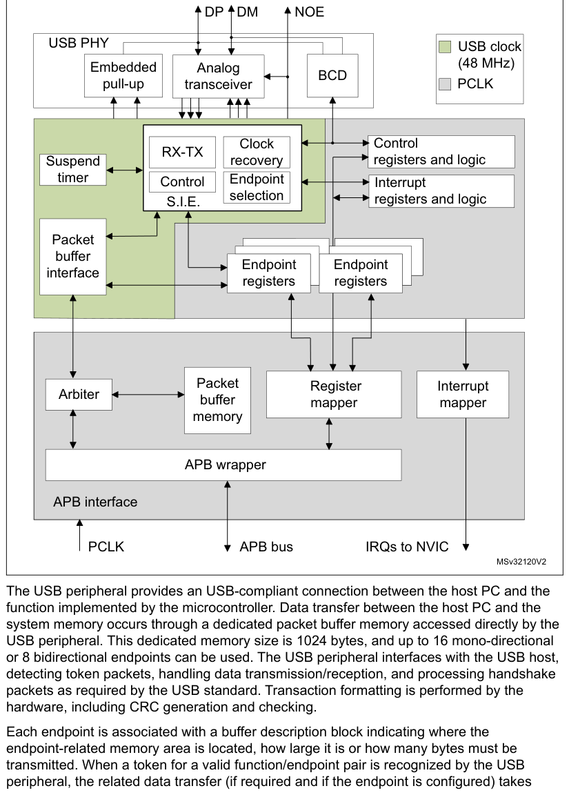
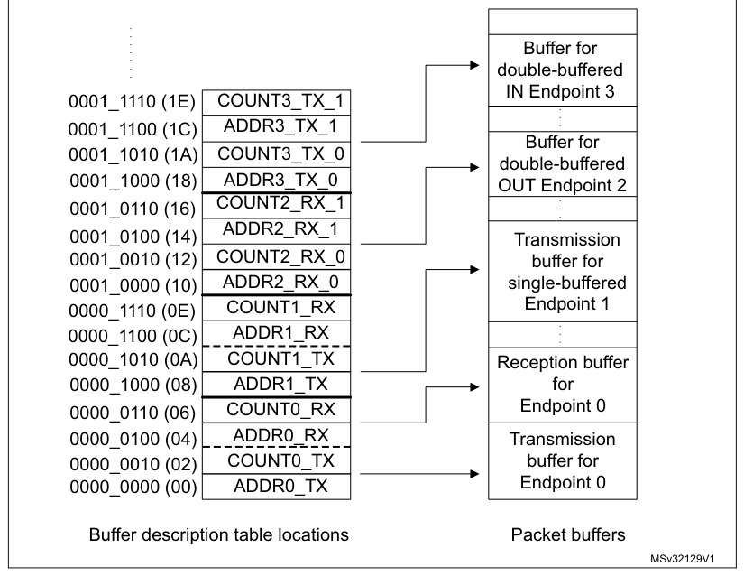

# 45 Universal serial bus full-speed device interface (USB)

[← RM0440 index](../STM32G4_RM0440.md)

## 45.1 Introduction

The USB peripheral implements an interface between a full-speed USB 2.0 bus and the APB1 bus.

USB suspend/resume are supported, which allows to stop the device clocks for low-power consumption.

## 45.2 USB main features

- USB specification version 2.0 full-speed compliant
- Configurable number of endpoints from 1 to 8
- Dedicated packet buffer memory (SRAM) of 1024 bytes
- Cyclic redundancy check (CRC) generation/checking, Non-return-to-zero Inverted (NRZI)
  encoding/decoding and bit-stuffing
- Isochronous transfers support
- Double-buffered bulk/isochronous endpoint support
- USB Suspend/Resume operations
- Frame locked clock pulse generation
- USB 2.0 Link Power Management support
- Battery Charging Specification Revision 1.2 support
- USB connect / disconnect capability (controllable embedded pull-up resistor on USB_DP line)

## 45.3 USB implementation

Table 422 describes the USB implementation in the devices.

**Table 422. STM32G4 series USB implementation**

| USB features(1) | USB |
| --- | --- |
| Number of endpoints | 8 |
| Size of dedicated packet buffer memory SRAM | 1024 bytes |
| Dedicated packet buffer memory SRAM access scheme | 2 x 16 bits / word |
| USB 2.0 Link Power Management (LPM) support | X |
| Battery Charging Detection (BCD) support | X |
| Embedded pull-up resistor on USB_DP line | X |

1. X= supported

## 45.4 USB functional description

Figure 673 shows the block diagram of the USB peripheral.

**Figure 673. USB peripheral block diagram**

The USB peripheral provides an USB-compliant connection between the host PC and the function
implemented by the microcontroller. Data transfer between the host PC and the system memory occurs
through a dedicated packet buffer memory accessed directly by the USB peripheral. This dedicated
memory size is 1024 bytes, and up to 16 mono-directional or 8 bidirectional endpoints can be used.
The USB peripheral interfaces with the USB host, detecting token packets, handling data
transmission/reception, and processing handshake packets as required by the USB standard.
Transaction formatting is performed by the hardware, including CRC generation and checking.

Each endpoint is associated with a buffer description block indicating where the endpoint-related
memory area is located, how large it is or how many bytes must be transmitted. When a token for a
valid function/endpoint pair is recognized by the USB peripheral, the related data transfer (if
required and if the endpoint is configured) takes
place. The data buffered by the USB peripheral is loaded in an internal 16-bit register and memory
access to the dedicated buffer is performed. When all the data has been transferred, if needed, the
proper handshake packet over the USB is generated or expected according to the direction of the
transfer.

At the end of the transaction, an endpoint-specific interrupt is generated, reading status registers
and/or using different interrupt response routines. The microcontroller can determine:

- which endpoint has to be served,
- which type of transaction took place, if errors occurred (bit stuffing, format, CRC, protocol,
  missing ACK, over/underrun, etc.).

Special support is offered to isochronous transfers and high throughput bulk transfers, implementing
a double buffer usage, which allows to always have an available buffer for the USB peripheral while
the microcontroller uses the other one.

The unit can be placed in low-power mode (SUSPEND mode), by writing in the control register,
whenever required. At this time, all static power dissipation is avoided, and the USB clock can be
slowed down or stopped. The detection of activity at the USB inputs, while in low-power mode, wakes
the device up asynchronously. A special interrupt source can be connected directly to a wake-up line
to allow the system to immediately restart the normal clock generation and/or support direct clock
start/stop.

### 45.4.1 Description of USB blocks

The USB peripheral implements all the features related to USB interfacing, which include the
following blocks:

- USB Physical Interface (USB PHY): This block is maintaining the electrical interface to an
  external USB host. It contains the differential analog transceiver itself, controllable embedded
  pull-up resistor (connected to USB_DP line) and support for Battery Charging Detection (BCD),
  multiplexed on same USB_DP and USB_DM lines. The output enable control signal of the analog
  transceiver (active low) is provided externally on USB_NOE. It can be used to drive some activity
  LED or to provide information about the actual communication direction to some other circuitry.
- Serial Interface Engine (SIE): The functions of this block include: synchronization pattern
  recognition, bit-stuffing, CRC generation and checking, PID verification/generation, and handshake
  evaluation. It must interface with the USB transceivers and uses the virtual buffers provided by
  the packet buffer interface for local data storage. This unit also generates signals according to
  USB peripheral events, such as Start of Frame (SOF), USB_Reset, Data errors etc. and to Endpoint
  related events like end of transmission or correct reception of a packet; these signals are then
  used to generate interrupts.
- Timer: This block generates a start-of-frame locked clock pulse and detects a global suspend (from
  the host) when no traffic has been received for 3 ms.
- Packet Buffer Interface: This block manages the local memory implementing a set of buffers in a
  flexible way, both for transmission and reception. It can choose the proper buffer according to
  requests coming from the SIE and locate them in the memory addresses pointed by the Endpoint
  registers. It increments the address after each exchanged byte until the end of packet, keeping
  track of the number of exchanged bytes and preventing the buffer to overrun the maximum capacity.
- Endpoint-Related Registers: Each endpoint has an associated register containing the endpoint type
  and its current status. For mono-directional/single-buffer endpoints, a single register can be
  used to implement two distinct endpoints. The number of registers is 8, allowing up to 16
  mono-directional/single-buffer or up to 7 double-buffer endpoints in any combination. For example
  the USB peripheral can be programmed to have 4 double buffer endpoints and 8
  single-buffer/mono-directional endpoints.
- Control Registers: These are the registers containing information about the status of the whole
  USB peripheral and used to force some USB events, such as resume and power-down.
- Interrupt Registers: These contain the Interrupt masks and a record of the events. They can be
  used to inquire an interrupt reason, the interrupt status or to clear the status of a pending
  interrupt.

> **Note:** \* Endpoint 0 is always used for control transfer in single-buffer mode.

The USB peripheral is connected to the APB1 bus through an APB1 interface, containing the following
blocks:

- Packet Memory: This is the local memory that physically contains the Packet Buffers. It can be
  used by the Packet Buffer interface, which creates the data structure and can be accessed directly
  by the application software. The size of the Packet Memory is 1024 bytes, structured as 512
  half-words of 16 bits.
- Arbiter: This block accepts memory requests coming from the APB1 bus and from the USB interface.
  It resolves the conflicts by giving priority to APB1 accesses, while always reserving half of the
  memory bandwidth to complete all USB transfers. This time-duplex scheme implements a virtual
  dual-port SRAM that allows memory access, while an USB transaction is happening. Multiword APB1
  transfers of any length are also allowed by this scheme.
- Register Mapper: This block collects the various byte-wide and bit-wide registers of the USB
  peripheral in a structured 16-bit wide half-word set addressed by the APB1.
- APB1 Wrapper: This provides an interface to the APB1 for the memory and register. It also maps the
  whole USB peripheral in the APB1 address space.
- Interrupt Mapper: This block is used to select how the possible USB events can generate interrupts
  and map them to the NVIC.

## 45.5 Programming considerations

In the following sections, the expected interactions between the USB peripheral and the application
program are described, in order to ease application software development.

### 45.5.1 Generic USB device programming

This part describes the main tasks required of the application software in order to obtain USB
compliant behavior. The actions related to the most general USB events are taken into account and
paragraphs are dedicated to the special cases of double-buffered endpoints and Isochronous
transfers. Apart from system reset, action is always initiated by the USB peripheral, driven by one
of the USB events described below.

### 45.5.2 System and power-on reset

Upon system and power-on reset, the first operation the application software should perform is to
provide all required clock signals to the USB peripheral and subsequently de-assert its reset signal
so to be able to access its registers. The whole initialization sequence is hereafter described.

As a first step application software needs to activate register macrocell clock and de-assert
macrocell specific reset signal using related control bits provided by device clock management
logic.

After that, the analog part of the device related to the USB transceiver must be switched on using
the PDWN bit in CNTR register, which requires a special handling. This bit is intended to switch on
the internal voltage references that supply the port transceiver. This circuit has a defined startup
time (tSTARTUP specified in the datasheet) during which the behavior of the USB transceiver is not
defined. It is thus necessary to wait this time, after setting the PDWN bit in the CNTR register,
before removing the reset condition on the USB part (by clearing the FRES bit in the CNTR register).
Clearing the ISTR register then removes any spurious pending interrupt before any other macrocell
operation is enabled.

At system reset, the microcontroller must initialize all required registers and the packet buffer
description table, to make the USB peripheral able to properly generate interrupts and data
transfers. All registers not specific to any endpoint must be initialized according to the needs of
application software (choice of enabled interrupts, chosen address of packet buffers, etc.). Then
the process continues as for the USB reset case (see further paragraph).

#### USB reset (RESET interrupt)

When this event occurs, the USB peripheral is put in the same conditions it is left by the system
reset after the initialization described in the previous paragraph: communication is disabled in all
endpoint registers (the USB peripheral will not respond to any packet). As a response to the USB
reset event, the USB function must be enabled, having as USB address 0, implementing only the
default control endpoint (endpoint address is 0 too). This is accomplished by setting the Enable
Function (EF) bit of the USB_DADDR register and initializing the EP0R register and its related
packet buffers accordingly. During USB enumeration process, the host assigns a unique address to
this device, which must be written in the ADD[6:0] bits of the USB_DADDR register, and configures
any other necessary endpoint.

When a RESET interrupt is received, the application software is responsible to enable again the
default endpoint of USB function 0 within 10 ms from the end of reset sequence which triggered the
interrupt.

#### Structure and usage of packet buffers

Each bidirectional endpoint may receive or transmit data from/to the host. The received data is
stored in a dedicated memory buffer reserved for that endpoint, while another memory buffer contains
the data to be transmitted by the endpoint. Access to this memory is performed by the packet buffer
interface block, which delivers a memory access request and waits for its acknowledgment. Since the
packet buffer memory has to be accessed by the microcontroller also, an arbitration logic takes care
of the access conflicts, using half APB1 cycle for microcontroller access and the remaining half for
the USB peripheral access. In this way, both the agents can operate as if the packet memory is a
dual-port SRAM, without being aware of any conflict even when the microcontroller is performing
back-to-back accesses. The USB peripheral logic uses a dedicated clock. The frequency of this
dedicated clock is fixed by the requirements of the USB standard at 48 MHz, and this can be
different from the clock used for the interface to the APB1 bus. Different clock configurations are
possible where the APB1 clock frequency can be higher or lower than the USB peripheral one.

> **Note:** For USB throughput and system performance reasons during USB active bus connection it
> is recommended to run APB1 clock no lower than 48 MHz.

Each endpoint is associated with two packet buffers (usually one for transmission and the other one
for reception). Buffers can be placed anywhere inside the packet memory because their location and
size is specified in a buffer description table, which is also located in the packet memory at the
address indicated by the USB_BTABLE register. Each table entry is associated to an endpoint register
and it is composed of four 16-bit half-words so that table start address must always be aligned to
an 8-byte boundary (the lowest three bits of USB_BTABLE register are always “000”). Buffer
descriptor table entries are described in the [Section 45.6.2](#4562-buffer-descriptor-table): Buffer descriptor table. If an
endpoint is unidirectional and it is neither an Isochronous nor a double-buffered bulk, only one
packet buffer is required (the one related to the supported transfer direction). Other table
locations related to unsupported transfer directions or unused endpoints, are available to the user.
Isochronous and double-buffered bulk endpoints have special handling of packet buffers (Refer to
[Section 45.5.4](#4554-isochronous-transfers): Isochronous transfers and [Section 45.5.3](#4553-double-buffered-endpoints): Double-buffered endpoints respectively).
The relationship between buffer description table entries and packet buffer areas is depicted in

Figure 674.

**Figure 674. Packet buffer areas with examples of buffer description table locations**

Each packet buffer is used either during reception or transmission starting from the bottom. The USB
peripheral will never change the contents of memory locations adjacent to the allocated memory
buffers; if a packet bigger than the allocated buffer length is received (buffer overrun condition)
the data are copied to the memory only up to the last available location.

#### Endpoint initialization

The first step to initialize an endpoint is to write appropriate values to the ADDRn_TX/ADDRn_RX
registers so that the USB peripheral finds the data to be transmitted already available and the data
to be received can be buffered. The EP_TYPE bits in the USB_EPnR register must be set according to
the endpoint type, eventually using the EP_KIND bit to enable any special required feature. On the
transmit side, the endpoint must be enabled using the STAT_TX bits in the USB_EPnR register and
COUNTn_TX must be initialized. For reception, STAT_RX bits must be set to enable reception and
COUNTn_RX must be written with the allocated buffer size using the BL_SIZE and NUM_BLOCK fields.
Unidirectional endpoints, except Isochronous and double-buffered bulk endpoints, need to initialize
only bits and registers related to the supported direction. Once the transmission and/or reception
are enabled, register USB_EPnR and locations ADDRn_TX/ADDRn_RX, COUNTn_TX/COUNTn_RX (respectively),
should not be modified by the application software, as the hardware can change their value on the
fly. When the data transfer operation is completed, notified by a CTR interrupt event, they can be
accessed again to re-enable a new operation.

#### IN packets (data transmission)

When receiving an IN token packet, if the received address matches a configured and valid endpoint,
the USB peripheral accesses the contents of ADDRn_TX and COUNTn_TX locations inside the buffer
descriptor table entry related to the addressed endpoint. The content of these locations is stored
in its internal 16 bit registers ADDR and COUNT (not accessible by software). The packet memory is
accessed again to read the first byte to be transmitted (Refer to Structure and usage of packet
buffers) and starts sending a DATA0 or DATA1 PID according to USB_EPnR bit DTOG_TX. When the PID is
completed, the first byte, read from buffer memory, is loaded into the output shift register to be
transmitted on the USB bus. After the last data byte is transmitted, the computed CRC is sent. If
the addressed endpoint is not valid, a NAK or STALL handshake packet is sent instead of the data
packet, according to STAT_TX bits in the USB_EPnR register.

The ADDR internal register is used as a pointer to the current buffer memory location while COUNT is
used to count the number of remaining bytes to be transmitted. Each half-word read from the packet
buffer memory is transmitted over the USB bus starting from the least significant byte. Transmission
buffer memory is read starting from the address pointed by ADDRn_TX for COUNTn_TX/2 half-words. If a
transmitted packet is composed of an odd number of bytes, only the lower half of the last half-word
accessed is used.

On receiving the ACK receipt by the host, the USB_EPnR register is updated in the following way:
DTOG_TX bit is toggled, the endpoint is made invalid by setting STAT_TX=10 (NAK) and bit CTR_TX is
set. The application software must first identify the endpoint, which is requesting microcontroller
attention by examining the EP_ID and DIR bits in the USB_ISTR register. Servicing of the CTR_TX
event starts clearing the interrupt bit; the application software then prepares another buffer full
of data to be sent, updates the COUNTn_TX table location with the number of byte to be transmitted
during the next transfer, and finally sets STAT_TX to ‘11 (VALID) to re-enable transmissions. While
the STAT_TX bits are equal to ‘10 (NAK), any IN request addressed to that endpoint is NAKed,
indicating a flow control condition: the USB host will retry the transaction until it succeeds. It
is mandatory to execute the sequence of operations in the above mentioned order to avoid losing the
notification of a second IN transaction addressed to the same endpoint immediately following the one
which triggered the CTR interrupt.

#### OUT and SETUP packets (data reception)

These two tokens are handled by the USB peripheral more or less in the same way; the differences in
the handling of SETUP packets are detailed in the following paragraph about control transfers. When
receiving an OUT/SETUP PID, if the address matches a valid endpoint, the USB peripheral accesses the
contents of the ADDRn_RX and COUNTn_RX locations inside the buffer descriptor table entry related to
the addressed endpoint. The content of the ADDRn_RX is stored directly in its internal register
ADDR. While COUNT is now reset and the values of BL_SIZE and NUM_BLOCK bit fields, which are read
within COUNTn_RX content are used to initialize BUF_COUNT, an internal 16 bit counter, which is used
to check the buffer overrun condition (all these internal registers are not accessible by software).
Data bytes subsequently received by the USB peripheral are packed in half-words (the first byte
received is stored as least significant byte) and then transferred to the packet buffer starting
from the address contained in the internal ADDR register while BUF_COUNT is decremented and COUNT is
incremented at each byte transfer. When the end of DATA packet is detected, the correctness of the
received CRC is tested and only if no errors occurred during the reception, an ACK handshake packet
is sent back to the transmitting host.

In case of wrong CRC or other kinds of errors (bit-stuff violations, frame errors, etc.), data bytes
are still copied in the packet memory buffer, at least until the error detection point, but ACK
packet is not sent and the ERR bit in USB_ISTR register is set. However, there is usually no
software action required in this case: the USB peripheral recovers from reception errors and remains
ready for the next transaction to come. If the addressed endpoint is not valid, a NAK or STALL
handshake packet is sent instead of the ACK, according to bits STAT_RX in the USB_EPnR register and
no data is written in the reception memory buffers.

Reception memory buffer locations are written starting from the address contained in the ADDRn_RX
for a number of bytes corresponding to the received data packet length, CRC included (i.e. data
payload length \+ 2), or up to the last allocated memory location, as defined by BL_SIZE and
NUM_BLOCK, whichever comes first. In this way, the USB peripheral never writes beyond the end of the
allocated reception memory buffer area. If the length of the data packet payload (actual number of
bytes used by the application) is greater than the allocated buffer, the USB peripheral detects a
buffer overrun condition. in this case, a STALL handshake is sent instead of the usual ACK to notify
the problem to the host, no interrupt is generated and the transaction is considered failed.

When the transaction is completed correctly, by sending the ACK handshake packet, the internal COUNT
register is copied back in the COUNTn_RX location inside the buffer description table entry, leaving
unaffected BL_SIZE and NUM_BLOCK fields, which normally do not require to be re-written, and the
USB_EPnR register is updated in the following way: DTOG_RX bit is toggled, the endpoint is made
invalid by setting STAT_RX = ‘10 (NAK) and bit CTR_RX is set. If the transaction has failed due to
errors or buffer overrun condition, none of the previously listed actions take place. The
application software must first identify the endpoint, which is requesting microcontroller attention
by examining the EP_ID and DIR bits in the USB_ISTR register. The CTR_RX event is serviced by first
determining the transaction type (SETUP bit in the USB_EPnR register); the application software must
clear the interrupt flag bit and get the number of received bytes reading the COUNTn_RX location
inside the buffer description table entry related to the endpoint being
processed. After the received data is processed, the application software should set the STAT_RX
bits to ‘11 (Valid) in the USB_EPnR, enabling further transactions. While the STAT_RX bits are equal
to ‘10 (NAK), any OUT request addressed to that endpoint is NAKed, indicating a flow control
condition: the USB host will retry the transaction until it succeeds. It is mandatory to execute the
sequence of operations in the above mentioned order to avoid losing the notification of a second OUT
transaction addressed to the same endpoint following immediately the one which triggered the CTR
interrupt.

#### Control transfers

Control transfers are made of a SETUP transaction, followed by zero or more data stages, all of the
same direction, followed by a status stage (a zero-byte transfer in the opposite direction). SETUP
transactions are handled by control endpoints only and are very similar to OUT ones (data reception)
except that the values of DTOG_TX and DTOG_RX bits of the addressed endpoint registers are set to 1
and 0 respectively, to initialize the control transfer, and both STAT_TX and STAT_RX are set to ‘10
(NAK) to let software decide if subsequent transactions must be IN or OUT depending on the SETUP
contents. A control endpoint must check SETUP bit in the USB_EPnR register at each CTR_RX event to
distinguish normal OUT transactions from SETUP ones. A USB device can determine the number and
direction of data stages by interpreting the data transferred in the SETUP stage, and is required to
STALL the transaction in the case of errors. To do so, at all data stages before the last, the
unused direction should be set to STALL, so that, if the host reverses the transfer direction too
soon, it gets a STALL as a status stage.

While enabling the last data stage, the opposite direction should be set to NAK, so that, if the
host reverses the transfer direction (to perform the status stage) immediately, it is kept waiting
for the completion of the control operation. If the control operation completes successfully, the
software will change NAK to VALID, otherwise to STALL. At the same time, if the status stage is an
OUT, the STATUS_OUT (EP_KIND in the USB_EPnR register) bit should be set, so that an error is
generated if a status transaction is performed with not-zero data. When the status transaction is
serviced, the application clears the STATUS_OUT bit and sets STAT_RX to VALID (to accept a new
command) and STAT_TX to NAK (to delay a possible status stage immediately following the next setup).

Since the USB specification states that a SETUP packet cannot be answered with a handshake different
from ACK, eventually aborting a previously issued command to start the new one, the USB logic
doesn’t allow a control endpoint to answer with a NAK or STALL packet to a SETUP token received from
the host.

When the STAT_RX bits are set to ‘01 (STALL) or ‘10 (NAK) and a SETUP token is received, the USB
accepts the data, performing the required data transfers and sends back an ACK handshake. If that
endpoint has a previously issued CTR_RX request not yet acknowledged by the application (i.e. CTR_RX
bit is still set from a previously completed reception), the USB discards the SETUP transaction and
does not answer with any handshake packet regardless of its state, simulating a reception error and
forcing the host to send the SETUP token again. This is done to avoid losing the notification of a
SETUP transaction addressed to the same endpoint immediately following the transaction, which
triggered the CTR_RX interrupt.

### 45.5.3 Double-buffered endpoints

All different endpoint types defined by the USB standard represent different traffic models, and
describe the typical requirements of different kind of data transfer operations. When large portions
of data are to be transferred between the host PC and the USB function, the bulk endpoint type is
the most suited model. This is because the host schedules bulk transactions so as to fill all the
available bandwidth in the frame, maximizing the actual transfer rate as long as the USB function is
ready to handle a bulk transaction addressed to it. If the USB function is still busy with the
previous transaction when the next one arrives, it will answer with a NAK handshake and the host PC
will issue the same transaction again until the USB function is ready to handle it, reducing the
actual transfer rate due to the bandwidth occupied by re-transmissions. For this reason, a dedicated
feature called ‘double-buffering’ can be used with bulk endpoints.

When ‘double-buffering’ is activated, data toggle sequencing is used to select, which buffer is to
be used by the USB peripheral to perform the required data transfers, using both ‘transmission’ and
‘reception’ packet memory areas to manage buffer swapping on each successful transaction in order to
always have a complete buffer to be used by the application, while the USB peripheral fills the
other one. For example, during an OUT transaction directed to a ‘reception’ double-buffered bulk
endpoint, while one buffer is being filled with new data coming from the USB host, the other one is
available for the microcontroller software usage (the same would happen with a ‘transmission’
double-buffered bulk endpoint and an IN transaction).

Since the swapped buffer management requires the usage of all 4 buffer description table locations
hosting the address pointer and the length of the allocated memory buffers, the USB_EPnR registers
used to implement double-buffered bulk endpoints are forced to be used as unidirectional ones.
Therefore, only one STAT bit pair must be set at a value different from ‘00 (Disabled): STAT_RX if
the double-buffered bulk endpoint is enabled for reception, STAT_TX if the double-buffered bulk
endpoint is enabled for transmission. In case it is required to have double-buffered bulk endpoints
enabled both for reception and transmission, two USB_EPnR registers must be used.

To exploit the double-buffering feature and reach the highest possible transfer rate, the endpoint
flow control structure, described in previous chapters, has to be modified, in order to switch the
endpoint status to NAK only when a buffer conflict occurs between the USB peripheral and application
software, instead of doing it at the end of each successful transaction. The memory buffer which is
currently being used by the USB peripheral is defined by the DTOG bit related to the endpoint
direction: DTOG_RX (bit 14 of USB_EPnR register) for ‘reception’ double-buffered bulk endpoints or
DTOG_TX (bit 6 of USB_EPnR register) for ‘transmission’ double-buffered bulk endpoints. To implement
the new flow control scheme, the USB peripheral should know which packet buffer is currently in use
by the application software, so to be aware of any conflict. Since in the USB_EPnR register, there
are two DTOG bits but only one is used by USB peripheral for data and buffer sequencing (due to the
unidirectional constraint required by double-buffering feature) the other one can be used by the
application software to show which buffer it is currently using. This new buffer flag is called
SW_BUF. In the following table the correspondence between USB_EPnR register bits and DTOG/SW_BUF
definition is explained, for the cases of ‘transmission’ and ‘reception’ double-buffered bulk
endpoints.

**Table 423. Double-buffering buffer flag definition**

| Buffer flag | ‘Transmission’ endpoint | ‘Reception’ endpoint |
| --- | --- | --- |
| DTOG | DTOG_TX (USB_EPnR bit 6) | DTOG_RX (USB_EPnR bit 14) |
| SW_BUF | USB_EPnR bit 14 | USB_EPnR bit 6 |

The memory buffer which is currently being used by the USB peripheral is defined by DTOG buffer
flag, while the buffer currently in use by application software is identified by SW_BUF buffer flag.
The relationship between the buffer flag value and the used packet buffer is the same in both cases,
and it is listed in the following table.

**Table 424. Bulk double-buffering memory buffers usage**

| Source row | Column 1 | Column 2 | Column 3 |
| ---: | --- | --- | --- |
| 1 | `Endpoint` | `Packet buffer used by` | `Packet buffer used by` |
| 2 | `DTOG SW_BUF` |  |  |
| 3 | `type` | `USB peripheral` | `Application Software` |
| 4 | `ADDRn_TX_0 / COUNTn_TX_0` | `ADDRn_TX_1 / COUNTn_TX_1` |  |
| 5 | `0 1` |  |  |
| 6 | `Buffer description table locations.` | `Buffer description table locations.` |  |
| 7 | `ADDRn_TX_1 / COUNTn_TX_1` | `ADDRn_TX_0 / COUNTn_TX_0` |  |
| 8 | `1 0` |  |  |
| 9 | `Buffer description table locations` | `Buffer description table locations.` |  |
| 10 | `IN` |  |  |
| 11 | `ADDRn_TX_0 / COUNTn_TX_0` |  |  |
| 12 | `0` | `0` | `None (1)` |

Buffer description table locations.

ADDRn_TX_1 / COUNTn_TX_1

| Source row | Column 1 | Column 2 | Column 3 |
| ---: | --- | --- | --- |
| 1 | `1` | `1` | `None (1)` |
| 2 | `Buffer description table locations.` |  |  |
| 3 | `ADDRn_RX_0 / COUNTn_RX_0` | `ADDRn_RX_1 / COUNTn_RX_1` |  |
| 4 | `0 1` |  |  |
| 5 | `Buffer description table locations.` | `Buffer description table locations.` |  |
| 6 | `ADDRn_RX_1 / COUNTn_RX_1` | `ADDRn_RX_0 / COUNTn_RX_0` |  |
| 7 | `1 0` |  |  |
| 8 | `Buffer description table locations.` | `Buffer description table locations.` |  |
| 9 | `OUT` |  |  |
| 10 | `ADDRn_RX_0 / COUNTn_RX_0` |  |  |
| 11 | `0` | `0` | `None (1)` |

Buffer description table locations.

ADDRn_RX_1 / COUNTn_RX_1

| Source row | Column 1 | Column 2 | Column 3 |
| ---: | --- | --- | --- |
| 1 | `1` | `1` | `None (1)` |

Buffer description table locations.

1. Endpoint in NAK Status.

Double-buffering feature for a bulk endpoint is activated by:

- Writing EP_TYPE bit field at ‘00 in its USB_EPnR register, to define the endpoint as a bulk, and
- Setting EP_KIND bit at ‘1 (DBL_BUF), in the same register.

The application software is responsible for DTOG and SW_BUF bits initialization according to the
first buffer to be used; this has to be done considering the special toggle-only property that these
two bits have. The end of the first transaction occurring after having set DBL_BUF, triggers the
special flow control of double-buffered bulk endpoints, which is used for all other transactions
addressed to this endpoint until DBL_BUF remain set. At the end of each transaction the CTR_RX or
CTR_TX bit of the addressed endpoint USB_EPnR register is set, depending on the enabled direction.
At the same time, the affected DTOG bit in the USB_EPnR register is hardware toggled making the USB
peripheral buffer swapping completely software independent. Unlike common transactions, and the
first one after

DBL_BUF setting, STAT bit pair is not affected by the transaction termination and its value remains
‘11 (Valid). However, as the token packet of a new transaction is received, the actual endpoint
status is masked as ‘10 (NAK) when a buffer conflict between the USB peripheral and the application
software is detected (this condition is identified by DTOG and SW_BUF having the same value, see
Table 424). The application software responds to the CTR event notification by clearing the
interrupt flag and starting any required handling of the completed transaction. When the application
packet buffer usage is over, the software toggles the SW_BUF bit, writing ‘1 to it, to notify the
USB peripheral about the availability of that buffer. In this way, the number of NAKed transactions
is limited only by the application elaboration time of a transaction data: if the elaboration time
is shorter than the time required to complete a transaction on the USB bus, no re-transmissions due
to flow control will take place and the actual transfer rate is limited only by the host PC.

The application software can always override the special flow control implemented for
double-buffered bulk endpoints, writing an explicit status different from ‘11 (Valid) into the STAT
bit pair of the related USB_EPnR register. In this case, the USB peripheral will always use the
programmed endpoint status, regardless of the buffer usage condition.

### 45.5.4 Isochronous transfers

The USB standard supports full speed peripherals requiring a fixed and accurate data
production/consume frequency, defining this kind of traffic as ‘Isochronous’. Typical examples of
this data are: audio samples, compressed video streams, and in general any sort of sampled data
having strict requirements for the accuracy of delivered frequency. When an endpoint is defined to
be ‘isochronous’ during the enumeration phase, the host allocates in the frame the required
bandwidth and delivers exactly one IN or OUT packet each frame, depending on endpoint direction. To
limit the bandwidth requirements, no re-transmission of failed transactions is possible for
Isochronous traffic; this leads to the fact that an isochronous transaction does not have a
handshake phase and no ACK packet is expected or sent after the data packet. For the same reason,
Isochronous transfers do not support data toggle sequencing and always use DATA0 PID to start any
data packet.

The Isochronous behavior for an endpoint is selected by setting the EP_TYPE bits at ‘10 in its
USB_EPnR register; since there is no handshake phase the only legal values for the STAT_RX/STAT_TX
bit pairs are ‘00 (Disabled) and ‘11 (Valid), any other value will produce results not compliant to
USB standard. Isochronous endpoints implement double-buffering to ease application software
development, using both ‘transmission’ and ‘reception’ packet memory areas to manage buffer swapping
on each successful transaction in order to have always a complete buffer to be used by the
application, while the USB peripheral fills the other.

The memory buffer which is currently used by the USB peripheral is defined by the DTOG bit related
to the endpoint direction (DTOG_RX for ‘reception’ isochronous endpoints, DTOG_TX for ‘transmission’
isochronous endpoints, both in the related USB_EPnR register) according to Table 425.

**Table 425. Isochronous memory buffers usage**

| Source row | Column 1 | Column 2 | Column 3 | Column 4 |
| ---: | --- | --- | --- | --- |
| 1 | `Endpoint` | `DTOG bit` | `Packet buffer used by the` | `Packet buffer used by the` |
| 2 | `Type` | `value` | `USB peripheral` | `application software` |
| 3 | `ADDRn_TX_0 / COUNTn_TX_0` | `ADDRn_TX_1 / COUNTn_TX_1` |  |  |
| 4 | `0` | `buffer description table` | `buffer description table` |  |
| 5 | `locations.` | `locations.` |  |  |
| 6 | `IN` |  |  |  |
| 7 | `ADDRn_TX_1 / COUNTn_TX_1` | `ADDRn_TX_0 / COUNTn_TX_0` |  |  |
| 8 | `1` | `buffer description table` | `buffer description table` |  |
| 9 | `locations.` | `locations.` |  |  |
| 10 | `ADDRn_RX_0 / COUNTn_RX_0` | `ADDRn_RX_1 / COUNTn_RX_1` |  |  |
| 11 | `0` | `buffer description table` | `buffer description table` |  |
| 12 | `locations.` | `locations.` |  |  |
| 13 | `OUT` |  |  |  |
| 14 | `ADDRn_RX_1 / COUNTn_RX_1` | `ADDRn_RX_0 / COUNTn_RX_0` |  |  |
| 15 | `1` | `buffer description table` | `buffer description table` |  |
| 16 | `locations.` | `locations.` |  |  |

As it happens with double-buffered bulk endpoints, the USB_EPnR registers used to implement
Isochronous endpoints are forced to be used as unidirectional ones. In case it is required to have
Isochronous endpoints enabled both for reception and transmission, two USB_EPnR registers must be
used.

The application software is responsible for the DTOG bit initialization according to the first
buffer to be used; this has to be done considering the special toggle-only property that these two
bits have. At the end of each transaction, the CTR_RX or CTR_TX bit of the addressed endpoint
USB_EPnR register is set, depending on the enabled direction. At the same time, the affected DTOG
bit in the USB_EPnR register is hardware toggled making buffer swapping completely software
independent. STAT bit pair is not affected by transaction completion; since no flow control is
possible for Isochronous transfers due to the lack of handshake phase, the endpoint remains always
‘11 (Valid). CRC errors or buffer-overrun conditions occurring during Isochronous OUT transfers are
anyway considered as correct transactions and they always trigger an CTR_RX event. However, CRC
errors will anyway set the ERR bit in the USB_ISTR register to notify the software of the possible
data corruption.

### 45.5.5 Suspend/Resume events

The USB standard defines a special peripheral state, called SUSPEND, in which the average current
drawn from the USB bus must not be greater than 2.5 mA. This requirement is of fundamental
importance for bus-powered devices, while self-powered devices are not required to comply to this
strict power consumption constraint. In suspend mode, the host PC sends the notification by not
sending any traffic on the USB bus for more than 3 ms: since a SOF packet must be sent every 1 ms
during normal operations, the USB peripheral detects the lack of 3 consecutive SOF packets as a
suspend request from the host PC and set the SUSP bit to ‘1 in USB_ISTR register, causing an
interrupt if enabled. Once the device is suspended, its normal operation can be restored by a so
called RESUME sequence, which can be started from the host PC or directly from the peripheral
itself, but it is always terminated by the host PC. The suspended USB peripheral must be anyway able
to detect a RESET sequence, reacting to this event as a normal USB reset event.

The actual procedure used to suspend the USB peripheral is device dependent since according to the
device composition, different actions may be required to reduce the total consumption.

A brief description of a typical suspend procedure is provided below, focused on the USB-related
aspects of the application software routine responding to the SUSP notification of the USB
peripheral:

1. Set the FSUSP bit in the USB_CNTR register to 1. This action activates the suspend
   mode within the USB peripheral. As soon as the suspend mode is activated, the check on SOF reception
   is disabled to avoid any further SUSP interrupts being issued while the USB is suspended.
2. Remove or reduce any static power consumption in blocks different from the USB
   peripheral.
3. Set LP_MODE bit in USB_CNTR register to 1 to remove static power consumption in
   the analog USB transceivers but keeping them able to detect resume activity.
4. Optionally turn off external oscillator and device PLL to stop any activity inside the
   device.

When an USB event occurs while the device is in SUSPEND mode, the RESUME procedure must be invoked
to restore nominal clocks and regain normal USB behavior. Particular care must be taken to insure
that this process does not take more than 10 ms when the wakening event is an USB reset sequence
(See “Universal Serial Bus Specification” for more details). The start of a resume or reset
sequence, while the USB peripheral is suspended, clears the LP_MODE bit in USB_CNTR register
asynchronously. The resume procedure should be run just after the end of the suspend one, so its
code is immediately executed as soon as the system clock restarts. It is therefore never necessary
to handle a WKUP event as an interrupt. If multiple events could have caused the system resume (via
EXTI) it is recommended to restart the USB 48 MHz clock as soon as possible. Once this clock is
active it is possible to confirm if the event source was the USB resume (i.e. WKUP bit). To prevent
ESD discharges or any other kind of noise from waking-up the system (the exit from suspend mode is
an asynchronous event), a suitable analog filter on data line status is activated during suspend;
the filter width is about 70 ns.

The following is a list of actions a resume procedure should address:

1. Optionally turn on external oscillator and/or device PLL, and further wait for USB

48 MHz clock activation (this is required before making any USB register accesses).

2. Clear FSUSP bit of USB_CNTR register, and further wait for USB 48 MHz clock
   activation (this is required before making any USB register access).
3. If the resume triggering event has to be identified, bits RXDP and RXDM in the

USB_FNR register can be used according to Table 426, which also lists the intended software action
in all the cases. If required, the end of resume or reset sequence can be detected monitoring the
status of the above mentioned bits by checking when they reach the “10” configuration, which
represent the Idle bus state; moreover at the end of a reset sequence the RESET bit in USB_ISTR
register is set to 1, issuing an interrupt if enabled, which should be handled as usual.

**Table 426. Resume event detection**

| [RXDP,RXDM] status | Wake-up event | Required resume software action |
| --- | --- | --- |
| “00” | Root reset | None |
| “10” | None (noise on bus) | Go back in Suspend mode |

**Table 426. Resume event detection (continued)**

| [RXDP,RXDM] status | Wake-up event | Required resume software action |
| --- | --- | --- |
| “01” | Root resume | None |
| “11” | Not allowed (noise on bus) | Go back in Suspend mode |

A device may require to exit from suspend mode as an answer to particular events not directly
related to the USB protocol (e.g. a mouse movement wakes up the whole system). In this case, the
resume sequence can be started by setting the RESUME bit in the USB_CNTR register to ‘1 and
resetting it to 0 after an interval between 1 ms and 15 ms (this interval can be timed using ESOF
interrupts, occurring with a 1 ms period when the system clock is running at nominal frequency).
Once the RESUME bit is clear, the resume sequence is completed by the host PC and its end can be
monitored again using the RXDP and RXDM bits in the USB_FNR register.

> **Note:** The RESUME bit must be anyway used only after the USB peripheral has been put in
> suspend mode, setting the FSUSP bit in USB_CNTR register to 1.

If multiple events could have cause the system resume (via EXTI) it is recommended to re-start the
USB 48 MHz clock as soon as possible. Once this clock is active it is possible to confirm if the
event source was the USB resume (for instance WKUP bit).

## 45.6 USB and USB SRAM registers

The USB peripheral registers can be divided into the following groups:

- Common Registers: Interrupt and Control registers
- Endpoint Registers: Endpoint configuration and status

The USB SRAM registers cover:

- Buffer Descriptor Table: Location of packet memory used to locate data buffers (see [Section 2.2](chapter-02.md#22-memory-organization):
  Memory organization to find USB SRAM base address).

All register addresses are expressed as offsets with respect to the USB peripheral registers base
address, except the buffer descriptor table locations, which starts at the USB SRAM base address
offset by the value specified in the USB_BTABLE register.

Refer to [Section 1.2](chapter-01.md#12-list-of-abbreviations-for-registers) for a list of abbreviations used in register descriptions.

The peripheral registers can be accessed by half-words (16-bit) or words (32-bit).

### 45.6.1 Common registers

These registers affect the general behavior of the USB peripheral defining operating mode, interrupt
handling, device address and giving access to the current frame number updated by the host PC.

#### USB control register (USB_CNTR)

- **Address offset:** 0x40
- **Reset value:** 0x0003

**Register bit layout**

| Bit | Field | Access | Summary |
| ---: | --- | :---: | --- |
| 15 | `CTRM` | rw | Correct transfer interrupt mask |
| 14 | `PMAOVRM` | rw | Packet memory area over / underrun interrupt mask |
| 13 | `ERRM` | rw | Error interrupt mask |
| 12 | `WKUPM` | rw | Wake-up interrupt mask |
| 11 | `SUSPM` | rw | Suspend mode interrupt mask |
| 10 | `RESETM` | rw | USB reset interrupt mask |
| 9 | `SOFM` | rw | Start of frame interrupt mask |
| 8 | `ESOFM` | rw | Expected start of frame interrupt mask |
| 7 | `L1REQM` | rw | LPM L1 state request interrupt mask |
| 6 | Reserved | — | kept at reset value. |
| 5 | `L1RESUME` | rw | LPM L1 Resume request |
| 4 | `RESUME` | rw | Resume request |
| 3 | `FSUSP` | rw | Force suspend |
| 2 | `LP_MODE` | rw | Low-power mode |
| 1 | `PDWN` | rw | Power down |
| 0 | `FRES` | rw | Force USB Reset |

**Bit 15 — `CTRM`:** Correct transfer interrupt mask

- `0`: Correct Transfer (CTR) Interrupt disabled.
- `1`: CTR Interrupt enabled, an interrupt request is generated when the corresponding bit in the

USB_ISTR register is set.

**Bit 14 — `PMAOVRM`:** Packet memory area over / underrun interrupt mask

- `0`: PMAOVR Interrupt disabled.
- `1`: PMAOVR Interrupt enabled, an interrupt request is generated when the corresponding bit
  in the USB_ISTR register is set.

**Bit 13 — `ERRM`:** Error interrupt mask

- `0`: ERR Interrupt disabled.
- `1`: ERR Interrupt enabled, an interrupt request is generated when the corresponding bit in
  the USB_ISTR register is set.

**Bit 12 — `WKUPM`:** Wake-up interrupt mask

- `0`: WKUP Interrupt disabled.
- `1`: WKUP Interrupt enabled, an interrupt request is generated when the corresponding bit in
  the USB_ISTR register is set.

**Bit 11 — `SUSPM`:** Suspend mode interrupt mask

- `0`: Suspend Mode Request (SUSP) Interrupt disabled.
- `1`: SUSP Interrupt enabled, an interrupt request is generated when the corresponding bit in
  the USB_ISTR register is set.

**Bit 10 — `RESETM`:** USB reset interrupt mask

- `0`: RESET Interrupt disabled.
- `1`: RESET Interrupt enabled, an interrupt request is generated when the corresponding bit in
  the USB_ISTR register is set.

**Bit 9 — `SOFM`:** Start of frame interrupt mask

- `0`: SOF Interrupt disabled.
- `1`: SOF Interrupt enabled, an interrupt request is generated when the corresponding bit in the

USB_ISTR register is set.

**Bit 8 — `ESOFM`:** Expected start of frame interrupt mask

- `0`: Expected Start of Frame (ESOF) Interrupt disabled.
- `1`: ESOF Interrupt enabled, an interrupt request is generated when the corresponding bit in
  the USB_ISTR register is set.

**Bit 7 — `L1REQM`:** LPM L1 state request interrupt mask

- `0`: LPM L1 state request (L1REQ) Interrupt disabled.
- `1`: L1REQ Interrupt enabled, an interrupt request is generated when the corresponding bit in
  the USB_ISTR register is set.

**Bit 6 — Reserved:** kept at reset value.

**Bit 5 — `L1RESUME`:** LPM L1 Resume request

The microcontroller can set this bit to send a LPM L1 Resume signal to the host. After the
signaling ends, this bit is cleared by hardware.

**Bit 4 — `RESUME`:** Resume request

The microcontroller can set this bit to send a Resume signal to the host. It must be activated,
according to USB specifications, for no less than 1 ms and no more than 15 ms after which
the Host PC is ready to drive the resume sequence up to its end.

**Bit 3 — `FSUSP`:** Force suspend

Software must set this bit when the SUSP interrupt is received, which is issued when no
traffic is received by the USB peripheral for 3 ms.

- `0`: No effect.
- `1`: Enter suspend mode. Clocks and static power dissipation in the analog transceiver are left
  unaffected. If suspend power consumption is a requirement (bus-powered device), the
  application software should set the LP_MODE bit after FSUSP as explained below.

**Bit 2 — `LP_MODE`:** Low-power mode

This mode is used when the suspend-mode power constraints require that all static power
dissipation is avoided, except the one required to supply the external pull-up resistor. This
condition should be entered when the application is ready to stop all system clocks, or
reduce their frequency in order to meet the power consumption requirements of the USB
suspend condition. The USB activity during the suspend mode (WKUP event)
asynchronously resets this bit (it can also be reset by software).

- `0`: No Low-power mode.
- `1`: Enter Low-power mode.

**Bit 1 — `PDWN`:** Power down

This bit is used to completely switch off all USB-related analog parts if it is required to
completely disable the USB peripheral for any reason. When this bit is set, the USB
peripheral is disconnected from the transceivers and it cannot be used.

- `0`: Exit Power Down.
- `1`: Enter Power down mode.

**Bit 0 — `FRES`:** Force USB Reset

- `0`: Clear USB reset.
- `1`: Force a reset of the USB peripheral, exactly like a RESET signaling on the USB. The USB
  peripheral is held in RESET state until software clears this bit. A “USB-RESET” interrupt is
  generated, if enabled.

#### USB interrupt status register (USB_ISTR)

- **Address offset:** 0x44
- **Reset value:** 0x0000 0000

**Register bit layout**

| Bit | Field | Access | Summary |
| ---: | --- | :---: | --- |
| 15 | `CTR` | r | Correct transfer |
| 14 | `PMAOVR` | rc_w0 | Packet memory area over / underrun |
| 13 | `ERR` | rc_w0 | Error |
| 12 | `WKUP` | rc_w0 | Wake-up |
| 11 | `SUSP` | rc_w0 | Suspend mode request |
| 10 | `RESET` | rc_w0 | USB reset request |
| 9 | `SOF` | rc_w0 | Start of frame |
| 8 | `ESOF` | rc_w0 | Expected start of frame |
| 7 | `L1REQ` | rc_w0 | LPM L1 state request |
| 6 | Reserved | — | kept at reset value. |
| 5 | Reserved | — | ↳ |
| 4 | `DIR` | r | Direction of transaction |
| 3 | `EP_ID[3]` | r | Endpoint Identifier |
| 2 | `EP_ID[2]` | r | ↳ |
| 1 | `EP_ID[1]` | r | ↳ |
| 0 | `EP_ID[0]` | r | ↳ |

This register contains the status of all the interrupt sources allowing application software to
determine, which events caused an interrupt request.

The upper part of this register contains single bits, each of them representing a specific event.
These bits are set by the hardware when the related event occurs; if the corresponding bit in the
USB_CNTR register is set, a generic interrupt request is generated. The interrupt routine, examining
each bit, will perform all necessary actions, and finally it will clear the serviced bits. If any of
them is not cleared, the interrupt is considered to be still pending, and the interrupt line is kept
high again. If several bits are set simultaneously, only a single interrupt is generated.

Endpoint transaction completion can be handled in a different way to reduce interrupt response
latency. The CTR bit is set by the hardware as soon as an endpoint successfully completes a
transaction, generating a generic interrupt request if the corresponding bit in USB_CNTR is set. An
endpoint dedicated interrupt condition is activated independently from the CTRM bit in the USB_CNTR
register. Both interrupt conditions remain active until software clears the pending bit in the
corresponding USB_EPnR register (the CTR bit is actually a read only bit). For endpoint-related
interrupts, the software can use the Direction of Transaction (DIR) and EP_ID read-only bits to
identify, which endpoint made the last interrupt request and called the corresponding interrupt
service routine.

The user can choose the relative priority of simultaneously pending USB_ISTR events by specifying
the order in which software checks USB_ISTR bits in an interrupt service routine. Only the bits
related to events, which are serviced, are cleared. At the end of the service routine, another
interrupt is requested, to service the remaining conditions.

To avoid spurious clearing of some bits, it is recommended to clear them with a load instruction
where all bits which must not be altered are written with 1, and all bits to be cleared are written
with ‘0 (these bits can only be cleared by software). Read-modify-write cycles should be avoided
because between the read and the write operations another bit
could be set by the hardware and the next write will clear it before the microprocessor has the time
to serve the event.

The following describes each bit in detail:

**Bit 15 — `CTR`:** Correct transfer

This bit is set by the hardware to indicate that an endpoint has successfully completed a
transaction; using DIR and EP_ID bits software can determine which endpoint requested the
interrupt. This bit is read-only.

**Bit 14 — `PMAOVR`:** Packet memory area over / underrun

This bit is set if the microcontroller has not been able to respond in time to an USB memory
request. The USB peripheral handles this event in the following way: During reception an

ACK handshake packet is not sent, during transmission a bit-stuff error is forced on the
transmitted stream; in both cases the host will retry the transaction. The PMAOVR interrupt
should never occur during normal operations. Since the failed transaction is retried by the
host, the application software has the chance to speed-up device operations during this
interrupt handling, to be ready for the next transaction retry; however this does not happen
during Isochronous transfers (no isochronous transaction is anyway retried) leading to a loss
of data in this case. This bit is read/write but only ‘0 can be written and writing ‘1 has no
effect.

**Bit 13 — `ERR`:** Error

This flag is set whenever one of the errors listed below has occurred:

NANS: No ANSwer. The timeout for a host response has expired.

CRC: Cyclic Redundancy Check error. One of the received CRCs, either in the token or in
the data, was wrong.

BST: Bit Stuffing error. A bit stuffing error was detected anywhere in the PID, data, and/or

CRC.

FVIO: Framing format Violation. A non-standard frame was received (EOP not in the right
place, wrong token sequence, etc.).

The USB software can usually ignore errors, since the USB peripheral and the PC host
manage retransmission in case of errors in a fully transparent way. This interrupt can be
useful during the software development phase, or to monitor the quality of transmission over
the USB bus, to flag possible problems to the user (e.g. loose connector, too noisy
environment, broken conductor in the USB cable and so on). This bit is read/write but only ‘0
can be written and writing ‘1 has no effect.

**Bit 12 — `WKUP`:** Wake-up

This bit is set to 1 by the hardware when, during suspend mode, activity is detected that
wakes up the USB peripheral. This event asynchronously clears the LP_MODE bit in the

CTLR register and activates the USB_WAKEUP line, which can be used to notify the rest of
the device (e.g. wake-up unit) about the start of the resume process. This bit is read/write but
only ‘0 can be written and writing ‘1 has no effect.

**Bit 11 — `SUSP`:** Suspend mode request

This bit is set by the hardware when no traffic has been received for 3 ms, indicating a
suspend mode request from the USB bus. The suspend condition check is enabled
immediately after any USB reset and it is disabled by the hardware when the suspend mode
is active (FSUSP=1) until the end of resume sequence. This bit is read/write but only ‘0 can
be written and writing ‘1 has no effect.

**Bit 10 — `RESET`:** USB reset request

Set when the USB peripheral detects an active USB RESET signal at its inputs. The USB
peripheral, in response to a RESET, just resets its internal protocol state machine, generating
an interrupt if RESETM enable bit in the USB_CNTR register is set. Reception and
transmission are disabled until the RESET bit is cleared. All configuration registers do not
reset: the microcontroller must explicitly clear these registers (this is to ensure that the

RESET interrupt can be safely delivered, and any transaction immediately followed by a

RESET can be completed). The function address and endpoint registers are reset by an USB
reset event.

This bit is read/write but only ‘0 can be written and writing ‘1 has no effect.

**Bit 9 — `SOF`:** Start of frame

This bit signals the beginning of a new USB frame and it is set when a SOF packet arrives
through the USB bus. The interrupt service routine may monitor the SOF events to have a

1 ms synchronization event to the USB host and to safely read the USB_FNR register which
is updated at the SOF packet reception (this could be useful for isochronous applications).

This bit is read/write but only ‘0 can be written and writing ‘1 has no effect.

**Bit 8 — `ESOF`:** Expected start of frame

This bit is set by the hardware when an SOF packet is expected but not received. The host
sends an SOF packet each 1 ms, but if the device does not receive it properly, the Suspend

Timer issues this interrupt. If three consecutive ESOF interrupts are generated (i.e. three

SOF packets are lost) without any traffic occurring in between, a SUSP interrupt is
generated. This bit is set even when the missing SOF packets occur while the Suspend

Timer is not yet locked. This bit is read/write but only ‘0 can be written and writing ‘1 has no
effect.

**Bit 7 — `L1REQ`:** LPM L1 state request

This bit is set by the hardware when LPM command to enter the L1 state is successfully
received and acknowledged. This bit is read/write but only ‘0 can be written and writing ‘1 has
no effect.

**Bits 6:5 — Reserved:** kept at reset value.

**Bit 4 — `DIR`:** Direction of transaction

This bit is written by the hardware according to the direction of the successful transaction,
which generated the interrupt request.

If DIR bit=0, CTR_TX bit is set in the USB_EPnR register related to the interrupting endpoint.

The interrupting transaction is of IN type (data transmitted by the USB peripheral to the host

PC).

If DIR bit=1, CTR_RX bit or both CTR_TX/CTR_RX are set in the USB_EPnR register
related to the interrupting endpoint. The interrupting transaction is of OUT type (data
received by the USB peripheral from the host PC) or two pending transactions are waiting to
be processed.

This information can be used by the application software to access the USB_EPnR bits
related to the triggering transaction since it represents the direction having the interrupt
pending. This bit is read-only.

**Bits 3:0 — `EP_ID[3:0]`:** Endpoint Identifier

These bits are written by the hardware according to the endpoint number, which generated
the interrupt request. If several endpoint transactions are pending, the hardware writes the
endpoint identifier related to the endpoint having the highest priority defined in the following
way: Two endpoint sets are defined, in order of priority: Isochronous and double-buffered
bulk endpoints are considered first and then the other endpoints are examined. If more than
one endpoint from the same set is requesting an interrupt, the EP_ID bits in USB_ISTR
register are assigned according to the lowest requesting endpoint register, EP0R having the
highest priority followed by EP1R and so on. The application software can assign a register
to each endpoint according to this priority scheme, so as to order the concurring endpoint
requests in a suitable way. These bits are read only.

#### USB frame number register (USB_FNR)

- **Address offset:** 0x48
- **Reset value:** 0x0XXX where X is undefined

**Register bit layout**

| Bit | Field | Access | Summary |
| ---: | --- | :---: | --- |
| 15 | `RXDP` | r | Receive data \+ line status |
| 14 | `RXDM` | r | Receive data - line status |
| 13 | `LCK` | r | Locked |
| 12 | `LSOF[1]` | r | Lost SOF |
| 11 | `LSOF[0]` | r | ↳ |
| 10 | `FN[10]` | r | Frame number |
| 9 | `FN[9]` | r | ↳ |
| 8 | `FN[8]` | r | ↳ |
| 7 | `FN[7]` | r | ↳ |
| 6 | `FN[6]` | r | ↳ |
| 5 | `FN[5]` | r | ↳ |
| 4 | `FN[4]` | r | ↳ |
| 3 | `FN[3]` | r | ↳ |
| 2 | `FN[2]` | r | ↳ |
| 1 | `FN[1]` | r | ↳ |
| 0 | `FN[0]` | r | ↳ |

**Bit 15 — `RXDP`:** Receive data \+ line status

This bit can be used to observe the status of received data plus upstream port data line. It
can be used during end-of-suspend routines to help determining the wake-up event.

**Bit 14 — `RXDM`:** Receive data - line status

This bit can be used to observe the status of received data minus upstream port data line. It
can be used during end-of-suspend routines to help determining the wake-up event.

**Bit 13 — `LCK`:** Locked

This bit is set by the hardware when at least two consecutive SOF packets have been
received after the end of an USB reset condition or after the end of an USB resume
sequence. Once locked, the frame timer remains in this state until an USB reset or USB
suspend event occurs.

**Bits 12:11 — `LSOF[1:0]`:** Lost SOF

These bits are written by the hardware when an ESOF interrupt is generated, counting the
number of consecutive SOF packets lost. At the reception of an SOF packet, these bits are
cleared.

**Bits 10:0 — `FN[10:0]`:** Frame number

This bit field contains the 11-bits frame number contained in the last received SOF packet.

The frame number is incremented for every frame sent by the host and it is useful for

Isochronous transfers. This bit field is updated on the generation of an SOF interrupt.

#### USB device address (USB_DADDR)

- **Address offset:** 0x4C
- **Reset value:** 0x0000

**Register bit layout**

| Bit | Field | Access | Summary |
| ---: | --- | :---: | --- |
| 15 | Reserved | — | — |
| 14 | Reserved | — | ↳ |
| 13 | Reserved | — | ↳ |
| 12 | Reserved | — | ↳ |
| 11 | Reserved | — | ↳ |
| 10 | Reserved | — | ↳ |
| 9 | Reserved | — | ↳ |
| 8 | Reserved | — | ↳ |
| 7 | `EF` | rw | Enable function |
| 6 | `ADD[6]` | rw | Device address |
| 5 | `ADD[5]` | rw | ↳ |
| 4 | `ADD[4]` | rw | ↳ |
| 3 | `ADD[3]` | rw | ↳ |
| 2 | `ADD[2]` | rw | ↳ |
| 1 | `ADD[1]` | rw | ↳ |
| 0 | `ADD[0]` | rw | ↳ |

**Bits 15:8 — Reserved:**

**Bit 7 — `EF`:** Enable function

This bit is set by the software to enable the USB device. The address of this device is
contained in the following ADD[6:0] bits. If this bit is at ‘0 no transactions are handled,
irrespective of the settings of USB_EPnR registers.

**Bits 6:0 — `ADD[6:0]`:** Device address

These bits contain the USB function address assigned by the host PC during the
enumeration process. Both this field and the Endpoint Address (EA) field in the associated

USB_EPnR register must match with the information contained in a USB token in order to
handle a transaction to the required endpoint.

#### Buffer table address (USB_BTABLE)

- **Address offset:** 0x50
- **Reset value:** 0x0000

**Register bit layout**

| Bit | Field | Access | Summary |
| ---: | --- | :---: | --- |
| 15 | `BTABLE[15]` | rw | Buffer table |
| 14 | `BTABLE[14]` | rw | ↳ |
| 13 | `BTABLE[13]` | rw | ↳ |
| 12 | `BTABLE[12]` | rw | ↳ |
| 11 | `BTABLE[11]` | rw | ↳ |
| 10 | `BTABLE[10]` | rw | ↳ |
| 9 | `BTABLE[9]` | rw | ↳ |
| 8 | `BTABLE[8]` | rw | ↳ |
| 7 | `BTABLE[7]` | rw | ↳ |
| 6 | `BTABLE[6]` | rw | ↳ |
| 5 | `BTABLE[5]` | rw | ↳ |
| 4 | `BTABLE[4]` | rw | ↳ |
| 3 | `BTABLE[3]` | rw | ↳ |
| 2 | Reserved | — | forced by hardware to 0. |
| 1 | Reserved | — | ↳ |
| 0 | Reserved | — | ↳ |

**Bits 15:3 — `BTABLE[15:3]`:** Buffer table

These bits contain the start address of the buffer allocation table inside the dedicated packet
memory. This table describes each endpoint buffer location and size and it must be aligned
to an 8 byte boundary (the 3 least significant bits are always ‘0). At the beginning of every
transaction addressed to this device, the USB peripheral reads the element of this table
related to the addressed endpoint, to get its buffer start location and the buffer size (Refer to

Structure and usage of packet buffers).

**Bits 2:0 — Reserved:** forced by hardware to 0.

#### LPM control and status register (USB_LPMCSR)

- **Address offset:** 0x54
- **Reset value:** 0x0000

**Register bit layout**

| Bit | Field | Access | Summary |
| ---: | --- | :---: | --- |
| 15 | Reserved | — | kept at reset value. |
| 14 | Reserved | — | ↳ |
| 13 | Reserved | — | ↳ |
| 12 | Reserved | — | ↳ |
| 11 | Reserved | — | ↳ |
| 10 | Reserved | — | ↳ |
| 9 | Reserved | — | ↳ |
| 8 | Reserved | — | ↳ |
| 7 | `BESL[3]` | r | BESL value |
| 6 | `BESL[2]` | r | ↳ |
| 5 | `BESL[1]` | r | ↳ |
| 4 | `BESL[0]` | r | ↳ |
| 3 | `REMWAKE` | r | bRemoteWake value |
| 2 | Reserved | — | — |
| 1 | `LPMACK` | rw | LPM Token acknowledge enable |
| 0 | `LPMEN` | rw | LPM support enable |

**Bits 15:8 — Reserved:** kept at reset value.

**Bits 7:4 — `BESL[3:0]`:** BESL value

These bits contain the BESL value received with last ACKed LPM Token

**Bit 3 — `REMWAKE`:** bRemoteWake value

This bit contains the bRemoteWake value received with last ACKed LPM Token

**Bit 2 — Reserved:**

**Bit 1 — `LPMACK`:** LPM Token acknowledge enable

- `0`: the valid LPM Token is NYET.
- `1`: the valid LPM Token is ACK.

The NYET/ACK is returned only on a successful LPM transaction:

No errors in both the EXT token and the LPM token (else ERROR)

A valid bLinkState = 0001B (L1) is received (else STALL)

**Bit 0 — `LPMEN`:** LPM support enable

This bit is set by the software to enable the LPM support within the USB device. If this bit is
at ‘0 no LPM transactions are handled.

#### Battery charging detector (USB_BCDR)

- **Address offset:** 0x58
- **Reset value:** 0x0000

**Register bit layout**

| Bit | Field | Access | Summary |
| ---: | --- | :---: | --- |
| 15 | `DPPU` | rw | DP pull-up control |
| 14 | Reserved | — | kept at reset value. |
| 13 | Reserved | — | ↳ |
| 12 | Reserved | — | ↳ |
| 11 | Reserved | — | ↳ |
| 10 | Reserved | — | ↳ |
| 9 | Reserved | — | ↳ |
| 8 | Reserved | — | ↳ |
| 7 | `PS2DET` | r | DM pull-up detection status |
| 6 | `SDET` | r | Secondary detection (SD) status |
| 5 | `PDET` | r | Primary detection (PD) status |
| 4 | `DCDET` | r | Data contact detection (DCD) status |
| 3 | `SDEN` | rw | Secondary detection (SD) mode enable |
| 2 | `PDEN` | rw | Primary detection (PD) mode enable |
| 1 | `DCDEN` | rw | Data contact detection (DCD) mode enable |
| 0 | `BCDEN` | rw | Battery charging detector (BCD) enable |

**Bit 15 — `DPPU`:** DP pull-up control

This bit is set by software to enable the embedded pull-up on the DP line. Clearing it to ‘0’
can be used to signalize disconnect to the host when needed by the user software.

**Bits 14:8 — Reserved:** kept at reset value.

**Bit 7 — `PS2DET`:** DM pull-up detection status

This bit is active only during PD and gives the result of comparison between DM voltage
level and VLGC threshold. In normal situation, the DM level should be below this threshold. If
it is above, it means that the DM is externally pulled high. This can be caused by connection
to a PS2 port (which pulls-up both DP and DM lines) or to some proprietary charger not
following the BCD specification.

- `0`: Normal port detected (connected to SDP, ACA, CDP or DCP).
- `1`: PS2 port or proprietary charger detected.

**Bit 6 — `SDET`:** Secondary detection (SD) status

This bit gives the result of SD.

- `0`: CDP detected.
- `1`: DCP detected.

**Bit 5 — `PDET`:** Primary detection (PD) status

This bit gives the result of PD.

- `0`: no BCD support detected (connected to SDP or proprietary device).
- `1`: BCD support detected (connected to ACA, CDP or DCP).

**Bit 4 — `DCDET`:** Data contact detection (DCD) status

This bit gives the result of DCD.

- `0`: data lines contact not detected.
- `1`: data lines contact detected.

**Bit 3 — `SDEN`:** Secondary detection (SD) mode enable

This bit is set by the software to put the BCD into SD mode. Only one detection mode (DCD,

PD, SD or OFF) should be selected to work correctly.

**Bit 2 — `PDEN`:** Primary detection (PD) mode enable

This bit is set by the software to put the BCD into PD mode. Only one detection mode (DCD,

PD, SD or OFF) should be selected to work correctly.

**Bit 1 — `DCDEN`:** Data contact detection (DCD) mode enable

This bit is set by the software to put the BCD into DCD mode. Only one detection mode

(DCD, PD, SD or OFF) should be selected to work correctly.

**Bit 0 — `BCDEN`:** Battery charging detector (BCD) enable

This bit is set by the software to enable the BCD support within the USB device. When
enabled, the USB PHY is fully controlled by BCD and cannot be used for normal
communication. Once the BCD discovery is finished, the BCD should be placed in OFF
mode by clearing this bit to ‘0 in order to allow the normal USB operation.

#### Endpoint-specific registers

The number of these registers varies according to the number of endpoints that the USB peripheral is
designed to handle. The USB peripheral supports up to 8 bidirectional endpoints. Each USB device
must support a control endpoint whose address (EA bits) must be set to 0. The USB peripheral behaves
in an undefined way if multiple endpoints are enabled having the same endpoint number value. For
each endpoint, an USB_EPnR register is available to store the endpoint specific information.

#### USB endpoint n register (USB_EPnR), n=[0..7]

- **Address offset:** 0x00 to 0x1C
- **Reset value:** 0x0000

**Register bit layout**

| Bit | Field | Access | Summary |
| ---: | --- | :---: | --- |
| 15 | `CTR_RX` | rc_w0 | Correct transfer for reception |
| 14 | `DTOG_RX` | t | Data toggle, for reception transfers |
| 13 | `STAT_RX [1]` | t | Status bits, for reception transfers |
| 12 | `STAT_RX [0]` | t | ↳ |
| 11 | `SETUP` | r | Setup transaction completed |
| 10 | `EP_TYPE[1]` | rw | Endpoint type |
| 9 | `EP_TYPE[0]` | rw | ↳ |
| 8 | `EP_KIND` | rw | Endpoint kind |
| 7 | `CTR_TX` | rc_w0 | Correct Transfer for transmission |
| 6 | `DTOG_TX` | t | Data Toggle, for transmission transfers |
| 5 | `STAT_TX [1]` | t | Status bits, for transmission transfers |
| 4 | `STAT_TX [0]` | t | ↳ |
| 3 | `EA[3]` | rw | Endpoint address |
| 2 | `EA[2]` | rw | ↳ |
| 1 | `EA[1]` | rw | ↳ |
| 0 | `EA[0]` | rw | ↳ |

They are also reset when an USB reset is received from the USB bus or forced through bit FRES in the
CTLR register, except the CTR_RX and CTR_TX bits, which are kept unchanged to avoid missing a
correct packet notification immediately followed by an USB reset event. Each endpoint has its
USB_EPnR register where n is the endpoint identifier.

Read-modify-write cycles on these registers should be avoided because between the read and the write
operations some bits could be set by the hardware and the next write would modify them before the
CPU has the time to detect the change. For this purpose, all bits affected by this problem have an
‘invariant’ value that must be used whenever their modification is not required. It is recommended
to modify these registers with a load instruction where all the bits, which can be modified only by
the hardware, are written with their ‘invariant’ value.

**Bit 15 — `CTR_RX`:** Correct transfer for reception

This bit is set by the hardware when an OUT/SETUP transaction is successfully completed
on this endpoint; the software can only clear this bit. If the CTRM bit in USB_CNTR register
is set accordingly, a generic interrupt condition is generated together with the endpoint
related interrupt condition, which is always activated. The type of occurred transaction, OUT
or SETUP, can be determined from the SETUP bit described below.

A transaction ended with a NAK or STALL handshake does not set this bit, since no data is
actually transferred, as in the case of protocol errors or data toggle mismatches.

This bit is read/write but only ‘0 can be written, writing 1 has no effect.

**Bit 14 — `DTOG_RX`:** Data toggle, for reception transfers

If the endpoint is not Isochronous, this bit contains the expected value of the data toggle bit

(0=DATA0, 1=DATA1) for the next data packet to be received. Hardware toggles this bit,
when the ACK handshake is sent to the USB host, following a data packet reception having
a matching data PID value; if the endpoint is defined as a control one, hardware clears this
bit at the reception of a SETUP PID addressed to this endpoint.

If the endpoint is using the double-buffering feature this bit is used to support packet buffer
swapping too (Refer to [Section 45.5.3](#4553-double-buffered-endpoints): Double-buffered endpoints).

If the endpoint is Isochronous, this bit is used only to support packet buffer swapping since
no data toggling is used for this sort of endpoints and only DATA0 packet are transmitted

(Refer to [Section 45.5.4](#4554-isochronous-transfers): Isochronous transfers). Hardware toggles this bit just after the end
of data packet reception, since no handshake is used for isochronous transfers.

This bit can also be toggled by the software to initialize its value (mandatory when the
endpoint is not a control one) or to force specific data toggle/packet buffer usage. When the
application software writes ‘0, the value of DTOG_RX remains unchanged, while writing ‘1
makes the bit value toggle. This bit is read/write but it can be only toggled by writing 1.

**Bits 13:12 — `STAT_RX [1:0]`:** Status bits, for reception transfers

These bits contain information about the endpoint status, which are listed in Table 427:

Reception status encoding These bits can be toggled by software to initialize
their value. When the application software writes ‘0, the value remains unchanged, while
writing ‘1 makes the bit value toggle. Hardware sets the STAT_RX bits to NAK when a
correct transfer has occurred (CTR_RX=1) corresponding to a OUT or SETUP (control only)
transaction addressed to this endpoint, so the software has the time to elaborate the
received data before it acknowledge a new transaction

Double-buffered bulk endpoints implement a special transaction flow control, which control
the status based upon buffer availability condition (Refer to [Section 45.5.3](#4553-double-buffered-endpoints): Double-buffered
endpoints).

If the endpoint is defined as Isochronous, its status can be only “VALID” or “DISABLED”, so
that the hardware cannot change the status of the endpoint after a successful transaction. If
the software sets the STAT_RX bits to ‘STALL’ or ‘NAK’ for an Isochronous endpoint, the

USB peripheral behavior is not defined. These bits are read/write but they can be only
toggled by writing ‘1.

**Bit 11 — `SETUP`:** Setup transaction completed

This bit is read-only and it is set by the hardware when the last completed transaction is a

SETUP. This bit changes its value only for control endpoints. It must be examined, in the
case of a successful receive transaction (CTR_RX event), to determine the type of
transaction occurred. To protect the interrupt service routine from the changes in SETUP
bits due to next incoming tokens, this bit is kept frozen while CTR_RX bit is at 1; its state
changes when CTR_RX is at 0. This bit is read-only.

**Bits 10:9 — `EP_TYPE[1:0]`:** Endpoint type

These bits configure the behavior of this endpoint as described in Table 428: Endpoint type
encoding Endpoint 0 must always be a control endpoint and each USB
function must have at least one control endpoint which has address 0, but there may be
other control endpoints if required. Only control endpoints handle SETUP transactions,
which are ignored by endpoints of other kinds. SETUP transactions cannot be answered
with NAK or STALL. If a control endpoint is defined as NAK, the USB peripheral will not
answer, simulating a receive error, in the receive direction when a SETUP transaction is
received. If the control endpoint is defined as STALL in the receive direction, then the

SETUP packet is accepted anyway, transferring data and issuing the CTR interrupt. The
reception of OUT transactions is handled in the normal way, even if the endpoint is a control
one.

Bulk and interrupt endpoints have very similar behavior and they differ only in the special
feature available using the EP_KIND configuration bit.

The usage of Isochronous endpoints is explained in [Section 45.5.4](#4554-isochronous-transfers): Isochronous transfers

**Bit 8 — `EP_KIND`:** Endpoint kind

The meaning of this bit depends on the endpoint type configured by the EP_TYPE bits.

Table 429 summarizes the different meanings.

DBL_BUF: This bit is set by the software to enable the double-buffering feature for this bulk
endpoint. The usage of double-buffered bulk endpoints is explained in [Section 45.5.3](#4553-double-buffered-endpoints):

Double-buffered endpoints.

STATUS_OUT: This bit is set by the software to indicate that a status out transaction is
expected: in this case all OUT transactions containing more than zero data bytes are
answered ‘STALL’ instead of ‘ACK’. This bit may be used to improve the robustness of the
application to protocol errors during control transfers and its usage is intended for control
endpoints only. When STATUS_OUT is reset, OUT transactions can have any number of
bytes, as required.

**Bit 7 — `CTR_TX`:** Correct Transfer for transmission

This bit is set by the hardware when an IN transaction is successfully completed on this
endpoint; the software can only clear this bit. If the CTRM bit in the USB_CNTR register is
set accordingly, a generic interrupt condition is generated together with the endpoint related
interrupt condition, which is always activated.

A transaction ended with a NAK or STALL handshake does not set this bit, since no data is
actually transferred, as in the case of protocol errors or data toggle mismatches.

This bit is read/write but only ‘0 can be written.

**Bit 6 — `DTOG_TX`:** Data Toggle, for transmission transfers

If the endpoint is non-isochronous, this bit contains the required value of the data toggle bit

(0=DATA0, 1=DATA1) for the next data packet to be transmitted. Hardware toggles this bit
when the ACK handshake is received from the USB host, following a data packet
transmission. If the endpoint is defined as a control one, hardware sets this bit to 1 at the
reception of a SETUP PID addressed to this endpoint.

If the endpoint is using the double buffer feature, this bit is used to support packet buffer
swapping too (Refer to [Section 45.5.3](#4553-double-buffered-endpoints): Double-buffered endpoints)

If the endpoint is Isochronous, this bit is used to support packet buffer swapping since no
data toggling is used for this sort of endpoints and only DATA0 packet are transmitted (Refer
to [Section 45.5.4](#4554-isochronous-transfers): Isochronous transfers). Hardware toggles this bit just after the end of data
packet transmission, since no handshake is used for Isochronous transfers.

This bit can also be toggled by the software to initialize its value (mandatory when the
endpoint is not a control one) or to force a specific data toggle/packet buffer usage. When
the application software writes ‘0, the value of DTOG_TX remains unchanged, while writing

‘1 makes the bit value toggle. This bit is read/write but it can only be toggled by writing 1.

**Bits 5:4 — `STAT_TX [1:0]`:** Status bits, for transmission transfers

These bits contain the information about the endpoint status, listed in Table 430. These bits
can be toggled by the software to initialize their value. When the application software writes

‘0, the value remains unchanged, while writing ‘1 makes the bit value toggle. Hardware sets
the STAT_TX bits to NAK, when a correct transfer has occurred (CTR_TX=1) corresponding
to a IN or SETUP (control only) transaction addressed to this endpoint. It then waits for the
software to prepare the next set of data to be transmitted.

Double-buffered bulk endpoints implement a special transaction flow control, which controls
the status based on buffer availability condition (Refer to [Section 45.5.3](#4553-double-buffered-endpoints): Double-buffered
endpoints).

If the endpoint is defined as Isochronous, its status can only be “VALID” or “DISABLED”.

Therefore, the hardware cannot change the status of the endpoint after a successful
transaction. If the software sets the STAT_TX bits to ‘STALL’ or ‘NAK’ for an Isochronous
endpoint, the USB peripheral behavior is not defined. These bits are read/write but they can
be only toggled by writing ‘1.

**Bits 3:0 — `EA[3:0]`:** Endpoint address

Software must write in this field the 4-bit address used to identify the transactions directed to
this endpoint. A value must be written before enabling the corresponding endpoint.

**Table 427. Reception status encoding**

| Source row | Column 1 | Column 2 |
| ---: | --- | --- |
| 1 | `STAT_RX[1:0]` | `Meaning` |

00 DISABLED: all reception requests addressed to this endpoint are ignored.

STALL: the endpoint is stalled and all reception requests result in a STALL

01
handshake.

10 NAK: the endpoint is naked and all reception requests result in a NAK handshake.

11 VALID: this endpoint is enabled for reception.

**Table 428. Endpoint type encoding**

| EP_TYPE[1:0] | Meaning |
| --- | --- |
| 00 | BULK |
| 01 | CONTROL |
| 10 | ISO |
| 11 | INTERRUPT |

**Table 429. Endpoint kind meaning**

| Source row | Column 1 | Column 2 | Column 3 |
| ---: | --- | --- | --- |
| 1 | `EP_TYPE[1:0]` | `EP_KIND meaning` |  |
| 2 | `00` | `BULK` | `DBL_BUF` |
| 3 | `01` | `CONTROL` | `STATUS_OUT` |
| 4 | `10` | `ISO` | `Not used` |
| 5 | `11` | `INTERRUPT` | `Not used` |

**Table 430. Transmission status encoding**

| Source row | Column 1 | Column 2 |
| ---: | --- | --- |
| 1 | `STAT_TX[1:0]` | `Meaning` |
| 2 | `00` | `DISABLED: all transmission requests addressed to this endpoint are ignored.` |
| 3 | `STALL: the endpoint is stalled and all transmission requests result in a STALL` |  |
| 4 | `01` |  |

handshake.

NAK: the endpoint is naked and all transmission requests result in a NAK

10
handshake.

| Source row | Column 1 | Column 2 |
| ---: | --- | --- |
| 1 | `11` | `VALID: this endpoint is enabled for transmission.` |

### 45.6.2 Buffer descriptor table

> **Note:** The buffer descriptor table is located inside the packet buffer memory in the separate "USB

SRAM" address space.

Although the buffer descriptor table is located inside the packet buffer memory ("USB SRAM" area),
its entries can be considered as additional registers used to configure the location and size of the
packet buffers used to exchange data between the USB macro cell and the device.

The first packet memory location is located at USB SRAM base address. The buffer descriptor table
entry associated with the USB_EPnR registers is described below. The packet memory should be
accessed only by byte (8-bit) or half-word (16-bit) accesses. Word (32-bit) accesses are not
allowed.

A thorough explanation of packet buffers and the buffer descriptor table usage can be found in
Structure and usage of packet buffers

#### Transmission buffer address n (USB_ADDRn_TX)

- **Address offset:** [USB_BTABLE] \+ n*8

> **Note:** In case of double-buffered or isochronous endpoints in the IN direction, this address location
> is referred to as USB_ADDRn_TX_0.

In case of double-buffered or isochronous endpoints in the OUT direction, this address location is
used for USB_ADDRn_RX_0.

**Register bit layout**

| Bit | Field | Access | Summary |
| ---: | --- | :---: | --- |
| 15 | `ADDRn_TX[15]` | — | Transmission buffer address |
| 14 | `ADDRn_TX[14]` | — | ↳ |
| 13 | `ADDRn_TX[13]` | — | ↳ |
| 12 | `ADDRn_TX[12]` | — | ↳ |
| 11 | `ADDRn_TX[11]` | — | ↳ |
| 10 | `ADDRn_TX[10]` | — | ↳ |
| 9 | `ADDRn_TX[9]` | — | ↳ |
| 8 | `ADDRn_TX[8]` | — | ↳ |
| 7 | `ADDRn_TX[7]` | — | ↳ |
| 6 | `ADDRn_TX[6]` | — | ↳ |
| 5 | `ADDRn_TX[5]` | — | ↳ |
| 4 | `ADDRn_TX[4]` | — | ↳ |
| 3 | `ADDRn_TX[3]` | — | ↳ |
| 2 | `ADDRn_TX[2]` | — | ↳ |
| 1 | `ADDRn_TX[1]` | — | ↳ |
| 0 | — | — | Not specified in extracted bit-field text. |

**Bits 15:1 — `ADDRn_TX[15:1]`:** Transmission buffer address

These bits point to the starting address of the packet buffer containing data to be transmitted
by the endpoint associated with the USB_EPnR register at the next IN token addressed to it.

Bit 0 Must always be written as ‘0 since packet memory is half-word wide and all packet buffers
must be half-word aligned.

#### Transmission byte count n (USB_COUNTn_TX)

- **Address offset:** [USB_BTABLE] \+ n*8 \+ 2

> **Note:** In case of double-buffered or isochronous endpoints in the IN direction, this address location
> is referred to as USB_COUNTn_TX_0.

In case of double-buffered or isochronous endpoints in the OUT direction, this address location is
used for USB_COUNTn_RX_0.

**Register bit layout**

| Bit | Field | Access | Summary |
| ---: | --- | :---: | --- |
| 15 | — | — | Not specified in extracted bit-field text. |
| 14 | — | — | Not specified in extracted bit-field text. |
| 13 | — | — | Not specified in extracted bit-field text. |
| 12 | — | — | Not specified in extracted bit-field text. |
| 11 | — | — | Not specified in extracted bit-field text. |
| 10 | — | — | Not specified in extracted bit-field text. |
| 9 | `COUNTn_TX[9]` | rw | Transmission byte count |
| 8 | `COUNTn_TX[8]` | rw | ↳ |
| 7 | `COUNTn_TX[7]` | rw | ↳ |
| 6 | `COUNTn_TX[6]` | rw | ↳ |
| 5 | `COUNTn_TX[5]` | rw | ↳ |
| 4 | `COUNTn_TX[4]` | rw | ↳ |
| 3 | `COUNTn_TX[3]` | rw | ↳ |
| 2 | `COUNTn_TX[2]` | rw | ↳ |
| 1 | `COUNTn_TX[1]` | rw | ↳ |
| 0 | `COUNTn_TX[0]` | rw | ↳ |

value is not considered by the USB peripheral.

**Bits 9:0 — `COUNTn_TX[9:0]`:** Transmission byte count

These bits contain the number of bytes to be transmitted by the endpoint associated with the

USB_EPnR register at the next IN token addressed to it.

#### Reception buffer address n (USB_ADDRn_RX)

- **Address offset:** [USB_BTABLE] \+ n*8 \+ 4

> **Note:** In case of double-buffered or isochronous endpoints in the OUT direction, this address
> location is referred to as USB_ADDRn_RX_1.

In case of double-buffered or isochronous endpoints in the IN direction, this address location is
used for USB_ADDRn_TX_1.

**Register bit layout**

| Bit | Field | Access | Summary |
| ---: | --- | :---: | --- |
| 15 | `ADDRn_RX[15]` | — | Reception buffer address |
| 14 | `ADDRn_RX[14]` | — | ↳ |
| 13 | `ADDRn_RX[13]` | — | ↳ |
| 12 | `ADDRn_RX[12]` | — | ↳ |
| 11 | `ADDRn_RX[11]` | — | ↳ |
| 10 | `ADDRn_RX[10]` | — | ↳ |
| 9 | `ADDRn_RX[9]` | — | ↳ |
| 8 | `ADDRn_RX[8]` | — | ↳ |
| 7 | `ADDRn_RX[7]` | — | ↳ |
| 6 | `ADDRn_RX[6]` | — | ↳ |
| 5 | `ADDRn_RX[5]` | — | ↳ |
| 4 | `ADDRn_RX[4]` | — | ↳ |
| 3 | `ADDRn_RX[3]` | — | ↳ |
| 2 | `ADDRn_RX[2]` | — | ↳ |
| 1 | `ADDRn_RX[1]` | — | ↳ |
| 0 | — | — | Not specified in extracted bit-field text. |

**Bits 15:1 — `ADDRn_RX[15:1]`:** Reception buffer address

These bits point to the starting address of the packet buffer, which will contain the data
received by the endpoint associated with the USB_EPnR register at the next OUT/SETUP
token addressed to it.

Bit 0 This bit must always be written as ‘0 since packet memory is half-word wide and all packet
buffers must be half-word aligned.

#### Reception byte count n (USB_COUNTn_RX)

- **Address offset:** [USB_BTABLE] \+ n*8 \+ 6

> **Note:** In case of double-buffered or isochronous endpoints in the OUT direction, this address
> location is referred to as USB_COUNTn_RX_1.

In case of double-buffered or isochronous endpoints in the IN direction, this address location is
used for USB_COUNTn_TX_1.

**Register bit layout**

| Bit | Field | Access | Summary |
| ---: | --- | :---: | --- |
| 15 | `BL_SIZE` | rw | Block size |
| 14 | `NUM_BLOCK[4]` | rw | Number of blocks |
| 13 | `NUM_BLOCK[3]` | rw | ↳ |
| 12 | `NUM_BLOCK[2]` | rw | ↳ |
| 11 | `NUM_BLOCK[1]` | rw | ↳ |
| 10 | `NUM_BLOCK[0]` | rw | ↳ |
| 9 | `COUNTn_RX[9]` | r | Reception byte count |
| 8 | `COUNTn_RX[8]` | r | ↳ |
| 7 | `COUNTn_RX[7]` | r | ↳ |
| 6 | `COUNTn_RX[6]` | r | ↳ |
| 5 | `COUNTn_RX[5]` | r | ↳ |
| 4 | `COUNTn_RX[4]` | r | ↳ |
| 3 | `COUNTn_RX[3]` | r | ↳ |
| 2 | `COUNTn_RX[2]` | r | ↳ |
| 1 | `COUNTn_RX[1]` | r | ↳ |
| 0 | `COUNTn_RX[0]` | r | ↳ |

This table location is used to store two different values, both required during packet reception.
The most significant bits contains the definition of allocated buffer size, to allow buffer overflow
detection, while the least significant part of this location is written back by the USB peripheral
at the end of reception to give the actual number of received bytes. Due to the restrictions on the
number of available bits, buffer size is represented using the number of allocated memory blocks,
where block size can be selected to choose the trade-off between fine-granularity/small-buffer and
coarse-granularity/large-buffer. The size of allocated buffer is a part of the endpoint descriptor
and it is normally defined during the
enumeration process according to its maxPacketSize parameter value (See “Universal Serial Bus
Specification”).

**Bit 15 — `BL_SIZE`:** Block size

This bit selects the size of memory block used to define the allocated buffer area.

- If BL_SIZE=0, the memory block is 2-byte large, which is the minimum block
  allowed in a half-word wide memory. With this block size the allocated buffer size ranges from 2 to
  62 bytes.
- If BL_SIZE=1, the memory block is 32-byte large, which allows to reach the
  maximum packet length defined by USB specifications. With this block size the allocated buffer size
  theoretically ranges from 32 to 1024 bytes, which is the longest packet size allowed by USB standard
  specifications. However, the applicable size is limited by the available buffer memory.

**Bits 14:10 — `NUM_BLOCK[4:0]`:** Number of blocks

These bits define the number of memory blocks allocated to this packet buffer. The actual
amount of allocated memory depends on the BL_SIZE value as illustrated in Table 431.

**Bits 9:0 — `COUNTn_RX[9:0]`:** Reception byte count

These bits contain the number of bytes received by the endpoint associated with the

USB_EPnR register during the last OUT/SETUP transaction addressed to it.

**Table 431. Definition of allocated buffer memory**

| Source row | Column 1 | Column 2 | Column 3 |
| ---: | --- | --- | --- |
| 1 | `Value of` | `Memory allocated` | `Memory allocated` |
| 2 | `NUM_BLOCK[4:0]` | `when BL_SIZE=0` | `when BL_SIZE=1` |
| 3 | `0 (‘00000)` | `Not allowed` | `32 bytes` |
| 4 | `1 (‘00001)` | `2 bytes` | `64 bytes` |
| 5 | `2 (‘00010)` | `4 bytes` | `96 bytes` |
| 6 | `3 (‘00011)` | `6 bytes` | `128 bytes` |
| 7 | `...` | `...` | `...` |
| 8 | `14 (‘01110)` | `28 bytes` | `480 bytes` |
| 9 | `15 (‘01111)` | `30 bytes` |  |
| 10 | `16 (‘10000)` | `32 bytes` |  |
| 11 | `...` | `...` | `...` |
| 12 | `29 (‘11101)` | `58 bytes` |  |
| 13 | `30 (‘11110)` | `60 bytes` |  |
| 14 | `31 (‘11111)` | `62 bytes` | `N/A` |

### 45.6.3 USB register map

The table below provides the USB register map and reset values.

**Register summary**

| Offset | Register | Reset value |
| --- | --- | --- |
| 0x40 | `USB_CNTR` | 0x0003 |
| 0x44 | `USB_ISTR` | 0x0000 0000 |
| 0x48 | `USB_FNR` | 0x0XXX where X is undefined |
| 0x4C | `USB_DADDR` | 0x0000 |
| 0x50 | `USB_BTABLE` | 0x0000 |
| 0x54 | `USB_LPMCSR` | 0x0000 |
| 0x58 | `USB_BCDR` | 0x0000 |
| 0x00 to 0x1C | `USB_EPnR` | 0x0000 |
| [USB_BTABLE] \+ n*8 | `USB_ADDRn_TX` | — |
| [USB_BTABLE] \+ n*8 \+ 2 | `USB_COUNTn_TX` | — |
| [USB_BTABLE] \+ n*8 \+ 4 | `USB_ADDRn_RX` | — |
| [USB_BTABLE] \+ n*8 \+ 6 | `USB_COUNTn_RX` | — |

Refer to [Section 2.2](chapter-02.md#22-memory-organization) for the register boundary addresses.
