# 46 USB Type-C®/USB Power Delivery interface (UCPD)

[← RM0440 index](../STM32G4_RM0440.md)

## 46.1 Introduction

The USB Type-C/USB Power Delivery interface complies with:

- Universal Serial Bus Type-C Cable and Connector Specification: release 2.4, Oct 2024
- Universal Serial Bus Power Delivery specifications:
  - revision 2.0, version 1.3, January 12, 2017
  - revision 3.2, version 1.1, October 2024

It integrates the physical layer of the Power Delivery (PD) specification, with CC signaling method
(no VBUS), for operation with Type-C cables.

## 46.2 UCPD main features

- Compliance with USB Type-C specification release 2.4
- Compliance with USB Power Delivery specifications revision 2.0 and 3.2
  - Enabling advanced applications such as PPS (programmable power supply)
- Stop mode low-power operation support
- Built-in analog PHY
  - USB Type-C pull-up (Rp, all values) and pull-down (Rd) resistors
  - “Dead battery” Rd support
  - USB Power Delivery message transmission and reception
  - FRS (fast role swap) Rx support
- Digital controller
  - BMC (bi-phase mark coding) encode and decode
  - 4b5b encode and decode
  - USB Type-C level detection with de-bounce, generating interrupts
  - FRS signaling
  - FRS detection, generating an interrupt
  - DMA-compatible byte-level interface for USB Power Delivery payload, generating interrupts
  - USB Power Delivery clock pre-scaler / dividers
  - CRC generation/checking
  - Support of ordered sets, with a programmable ordered set mask at receive
  - Clock recovery from incoming Rx stream

## 46.3 UCPD implementation

The devices have one UCPD controller to support one USB Type-C port.

In the following table, “X” denotes supported, and “-” not supported.

**Table 433. UCPD implementation**

| Source row | Column 1 | Column 2 |
| ---: | --- | --- |
| 1 | `UCPD feature` | `UCPD1` |
| 2 | `Dead battery support via UCPDx_DBCC1 and UCPDx_DBCC2` |  |
| 3 | `X` |  |
| 4 | `external signals` |  |
| 5 | `UCPDx_FRSTX as alternate function pin` | `X` |
| 6 | `Fully automatic trimming` | `X(1)` |
| 7 | `Discrete-component PHY support` | `-` |

1. No software trimming required.

## 46.4 UCPD functional description

The UCPD peripheral provides hardware support for the USB Power Delivery control interface
specification, using I/Os specifically designed for that purpose.

The built-in PHY directly detects Type-C voltage levels, supports Power Delivery BIST carrier mode 2
(Tx only), BIST test data (Tx and Rx), and Power Delivery Rx FRS signaling.

For Power Delivery FRS Tx signaling, the device can be configured to control, through UCPD_FRSTX pin
(alternate function), external NMOS transistors that ensure low-resistance pull-down on CC lines.

The UCPD transmitter BMC (bi-phase mark) encodes and transmits data: preamble, SOP, payload data
from protocol layer (after 4b5b-encoding), CRC, and EOP on the Type-C connector CC lines. It
automatically inserts inter-frame gap and executes “Hard Reset”.

The UCPD receiver detects SOP, BMC-decodes the incoming stream, recovers the preamble, 4b5b-decodes
payload data, detects EOP, and checks CRC. It automatically detects five K-code SOP and two Reset
ordered sets, plus two software-defined patterns (allows for only three out of four K-codes being
correctly received, as defined by the standard).

In Stop mode, the peripheral maintains the ability to detect incoming USB Power Delivery messages
and FRS signaling, which allows low-power operation.

### 46.4.1 UCPD block diagram

**Figure 675. UCPD block diagram**

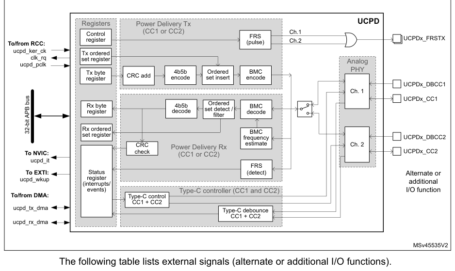

The following table lists external signals (alternate or additional I/O functions).

**Table 434. UCPD signals on pins**

| Source row | Column 1 | Column 2 | Column 3 |
| ---: | --- | --- | --- |
| 1 | `Pin name` | `Signal type` | `Description` |

USB Type-C fast role swap (FRS) signaling control, applicable to DRPs only. The signal (active high)
drives an external NMOS transistor that pulls down the active CC line. A typical application has two
such transistors (one per CC line) and reserves a separate I/O to drive either NMOS. Initially, the
I/Os

| Source row | Column 1 | Column 2 |
| ---: | --- | --- |
| 1 | `UCPDx_FRSTX` | `Output` |

are configured as low-driving GPIOs. Upon detecting, through the Type-C state machine, the
orientation of the cable attached, which determines the active CC line, the I/O of the active CC
line must be set to its UCPDx_FRSTX alternate function and the I/O of the inactive CC line as
low-driving GPIO.

USB Type-C configuration control line 1, to be routed to the

| Source row | Column 1 | Column 2 |
| ---: | --- | --- |
| 1 | `UCPDx_CC1` | `Input/output` |

USB Type-C connector CC1 terminal.

USB Type-C configuration control line 2, to be routed to the

| Source row | Column 1 | Column 2 |
| ---: | --- | --- |
| 1 | `UCPDx_CC2` | `Input/output` |

USB Type-C connector CC2 terminal.

USB Type-C configuration control line 1 dead battery signal, to

| Source row | Column 1 | Column 2 | Column 3 |
| ---: | --- | --- | --- |
| 1 | `UCPDx_DBCC1` | `Input` | `be routed to the USB Type-C connector CC1 terminal if dead` |

battery support is required.

USB Type-C configuration control line 2 dead battery signal, to

| Source row | Column 1 | Column 2 | Column 3 |
| ---: | --- | --- | --- |
| 1 | `UCPDx_DBCC2` | `Input` | `be routed to the USB Type-C connector CC2 terminal if dead` |

battery support is required.

The following table lists key internal signals.

**Table 435. UCPD internal signals**

| Internal signal name | Signal type | Description |
| --- | --- | --- |
| ucpd_pclk | Input | APB clock for registers |
| ucpd_ker_ck | Input | Kernel clock |
| ucpd_tx_dma | Input/Output | Rx DMA acknowledge / request |
| ucpd_rx_dma | Input/Output | Tx DMA acknowledge / request |
| ucpd_it | Output | Interrupt request (all interrupts OR-ed) connected to NVIC |
| ucpd_wkup | Output | Wake-up request connected to EXTI |
| clk_rq | Output | Clock request connected to RCC |

### 46.4.2 UCPD reset and clocks

The peripheral has a single reset signal (APB bus reset).

The register section is clocked with the APB clock (ucpd_pclk).

The main functional part of the transmitter is clocked with ucpd_clk clock, pre-scaled from the
ucpd_ker_ck clock according to the PSC_UCPDCLK[2:0] bitfield of the UCPD_CFGR1 register. The main
functional part of the receiver is clocked with the ucpd_rx_clk recovered from the incoming
bitstream.

The receiver is designed to work in the clock frequency range from 6 to 18 MHz. However, the optimum
performance is ensured in the range from 6 to 12 MHz.

The following diagram shows the clocking and timing elements of the UCPD peripheral.

**Figure 676. Clock division and timing elements**

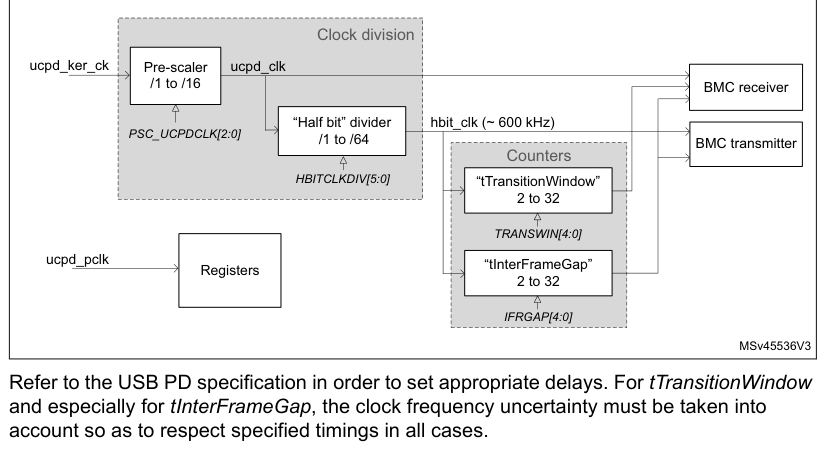

Refer to the USB PD specification in order to set appropriate delays. For tTransitionWindow and
especially for tInterFrameGap, the clock frequency uncertainty must be taken into account so as to
respect specified timings in all cases.

### 46.4.3 Physical layer protocol

The physical layer covers the signaling underlying the USB Power Delivery specification.

On the transmitter side its main function is to form packets according to the defined packet format
including generally:

- preamble
- start of packet (SOP, ordered set)
- payload header
- payload data
- cyclic redundancy check (CRC) information
- end of packet (EOP)

Before going on the CC line, the data stream is BMC-encoded, respecting specified timing
restrictions.

On the receive side, the principle task is to:

- extract start of packet (SOP, ordered set) information
- extract payload header
- extract payload data
- receive and check CRC
- receive end of packet (EOP)

The receive is basically a reverse of the transmit process, thus starting with BMC data stream
decoding.

#### Symbol encoding

Apart from the preamble all symbols are encoded with a 4b5b scheme according to the specification
shown in the following table.

**Table 436. 4b5b symbol encoding table**

| Name | 4b | 5b | Symbol description |
| --- | --- | --- | --- |
| 0 | 0000 | 11110 | hex data 0 |
| 1 | 0001 | 01001 | hex data 1 |
| 2 | 0010 | 10100 | hex data 2 |
| 3 | 0011 | 10101 | hex data 3 |
| 4 | 0100 | 01010 | hex data 4 |
| 5 | 0101 | 01011 | hex data 5 |
| 6 | 0110 | 01110 | hex data 6 |
| 7 | 0111 | 01111 | hex data 7 |
| 8 | 1000 | 10010 | hex data 8 |
| 9 | 1001 | 10011 | hex data 9 |
| A | 1010 | 10110 | hex data A |
| B | 1011 | 10111 | hex data B |
| C | 1100 | 11010 | hex data C |

**Table 436. 4b5b symbol encoding table (continued)**

| Name | 4b | 5b | Symbol description |
| --- | --- | --- | --- |
| D | 1101 | 11011 | hex data D |
| E | 1110 | 11100 | hex data E |
| F | 1111 | 11101 | hex data F |
| Sync-1 | K-code | 11000 | Startsynch #1 |
| Sync-2 | K-code | 10001 | Startsynch #2 |
| RST-1 | K-code | 00111 | Hard Reset #1 |
| RST-2 | K-code | 11001 | Hard Reset #2 |
| EOP | K-code | 01101 | EOP |
| Reserved | Error | 00000 | Do Not Use |
| Reserved | Error | 00001 | Do Not Use |
| Reserved | Error | 00010 | Do Not Use |
| Reserved | Error | 00011 | Do Not Use |
| Reserved | Error | 00100 | Do Not Use |
| Reserved | Error | 00101 | Do Not Use |
| Sync-3 | K-code | 00110 | Startsynch #3 |
| Reserved | Error | 01000 | Do Not Use |
| Reserved | Error | 01100 | Do Not Use |
| Reserved | Error | 10000 | Do Not Use |
| Reserved | Error | 11111 | Do Not Use |

#### Ordered sets

An ordered set consists of four K-codes as shown in the following figure.

**Figure 677. K-code transmission**

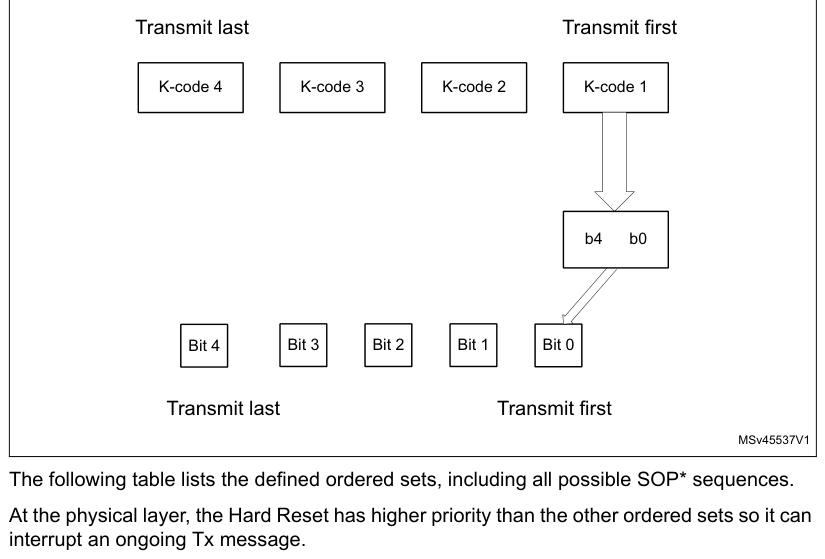

The following table lists the defined ordered sets, including all possible SOP* sequences.

At the physical layer, the Hard Reset has higher priority than the other ordered sets so it can
interrupt an ongoing Tx message.

**Table 437. Ordered sets**

| Ordered set name | K-code #1 | K-code #2 | K-code #3 | K-code #4 |
| --- | --- | --- | --- | --- |
| SOP | Sync-1 | Sync-1 | Sync-1 | Sync-2 |
| SOP’ | Sync-1 | Sync-1 | Sync-3 | Sync-3 |
| SOP’’ | Sync-1 | Sync-3 | Sync-1 | Sync-3 |
| Hard Reset | RST-1 | RST-1 | RST-1 | RST-2 |
| Cable Reset | RST-1 | Sync-1 | RST-1 | Sync-3 |
| SOP’_Debug | Sync-1 | RST-2 | RST-2 | Sync-3 |
| SOP’’_Debug | Sync-1 | RST-2 | Sync-3 | Sync-2 |

On reception, the physical layer must accept ordered sets with any combination of three correct
K-codes out of four, as shown in the following table:

**Table 438. Validation of ordered sets**

| Status | 1st code | 2nd code | 3rd code | 4th code |
| --- | --- | --- | --- | --- |
| Valid | Corrupt | K-code | K-code | K-code |
| Valid | K-code | Corrupt | K-code | K-code |

**Table 438. Validation of ordered sets (continued)**

| Source row | Column 1 | Column 2 | Column 3 | Column 4 | Column 5 |
| ---: | --- | --- | --- | --- | --- |
| 1 | `Status` | `1st code` | `2nd code` | `3rd code` | `4th code` |
| 2 | `Valid` | `K-code` | `K-code` | `Corrupt` | `K-code` |
| 3 | `Valid` | `K-code` | `K-code` | `K-code` | `Corrupt` |
| 4 | `Valid (perfect)` | `K-code` | `K-code` | `K-code` | `K-code` |
| 5 | `Not valid (example)` | `K-code` | `Corrupt` | `K-code` | `Corrupt` |
| 6 | `Bit ordering at transmission` |  |  |  |  |

Allowed transmission data units / data sizes are in the following table.

**Table 439. Data size**

| Data unit | Non-encoded | Encoded |
| --- | --- | --- |
| Byte | 8-bits | 10-bits |
| Word | 16-bits | 20-bits |
| DWord | 32-bits | 40-bits |

The bit transmission order is shown in the following figure.

**Figure 678. Transmit order for various sizes of data**

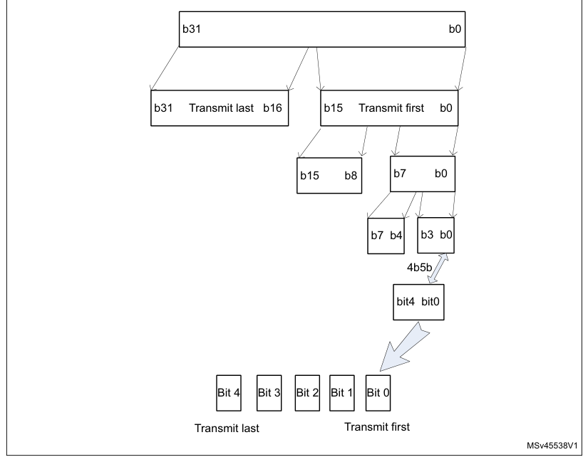

#### Packet format

Messages other than Hard Reset and Cable Reset

The packet format is shown in the following figure, with information on 4b5b encode and data source.

**Figure 679. Packet format**

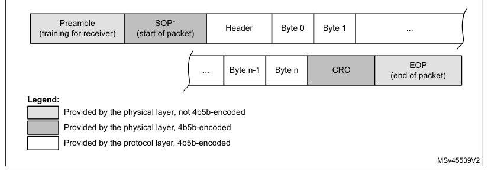

The physical layer handles the Hard Reset signaling differently than the other types of message as
it has higher priority to be able to interrupt an ongoing transfer.

The physical layer specification implies the following sequence in the case of an ongoing Tx
message:

1. Terminate the message by sending an EOP K-code and discard the rest of the
   message.
2. Wait for tInterFrameGap time.
3. If the CC line is not idle, wait until it goes idle.
4. Send the preamble followed by the four K-codes of Hard Reset signaling.
5. Disable the CC channel (stop sending and receiving), reset the physical layer and
   inform the protocol layer that the physical layer is reset.
6. Re-enable the channel when requested by the protocol layer.

**Figure 680. Line format of Hard Reset**

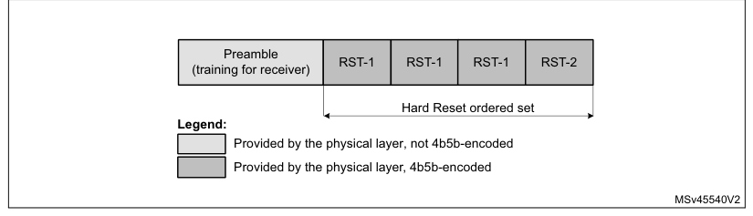

Cable Reset shown in the following figure is similar in format to Hard Reset, but unlike Hard Reset
it does not require a specific high-priority treatment.

**Figure 681. Line format of Cable Reset**

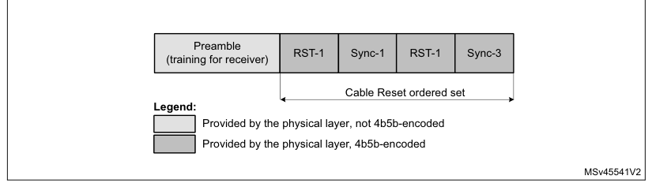

#### Collision avoidance

The physical layer respects the tInterFrameGap delay between end of last-transmitted bit of a Tx
message, and the first bit of a following message.

It also checks the idle state of the CC line before starting transmission. The CC line is considered
idle if it shows less than three (nTransitionCount) transitions within tTransitionWindow (12 to 20
μs). The Power Delivery specification revision 3.1 also requires to manage the Rp value (source) and
monitor Type-C voltage level for these Rp modifications (at the sink).

#### Physical layer signaling schemes

The bit are signaled with bi-phase mark coding (BMC).

#### BIST

Depending on the BIST action required by the protocol layer, either of the following can be run:

- a Tx BIST pattern test, achieved by writing TXMODE and TXSEND
- an Rx BIST pattern test, achieved by writing RXMODE to the correct value for RXBIST.

The two possible patterns supported in UCPD (corresponding to “BMC” mode) are:

- BIST Test Data (192 bit pattern), applies to Tx and Rx. In the case of Rx, the message is received
  (but discarded rather than passing to the protocol layer, which must nevertheless still generate a
  GoodCRC Tx message in acknowledgment).
- BIST Carrier Mode 2 (single pattern, infinite length message), applies to Tx only. As opposed to
  Tx, the receiver in this mode simply ignores the CC line during this state.

BIST test data pattern

The test data pattern is not viewed as a special case in UCPD.

The BIST test data packet frame format is shown in the following figure.

**Figure 682. BIST test data frame**

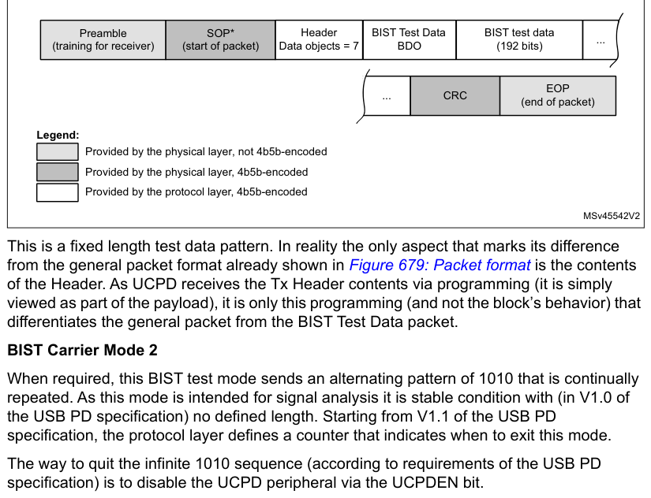

This is a fixed length test data pattern. In reality the only aspect that marks its difference from
the general packet format already shown in Figure 679: Packet format is the contents of the Header.
As UCPD receives the Tx Header contents via programming (it is simply viewed as part of the
payload), it is only this programming (and not the block’s behavior) that differentiates the general
packet from the BIST Test Data packet.

BIST Carrier Mode 2

When required, this BIST test mode sends an alternating pattern of 1010 that is continually
repeated. As this mode is intended for signal analysis it is stable condition with (in V1.0 of the
USB PD specification) no defined length. Starting from V1.1 of the USB PD specification, the
protocol layer defines a counter that indicates when to exit this mode.

The way to quit the infinite 1010 sequence (according to requirements of the USB PD specification)
is to disable the UCPD peripheral via the UCPDEN bit.

**Figure 683. BIST Carrier Mode 2 frame**

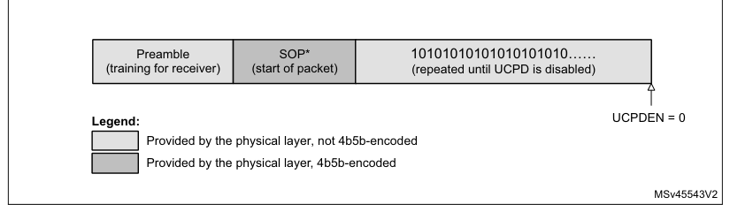

### 46.4.4 UCPD BMC transmitter

The BMC transmitter comprises 4b5b encoding, CRC generation, and BMC encode, as shown in the
following figure. Its output goes to the analog PHY through a channel switch.

**Figure 684. UCPD BMC transmitter architecture**

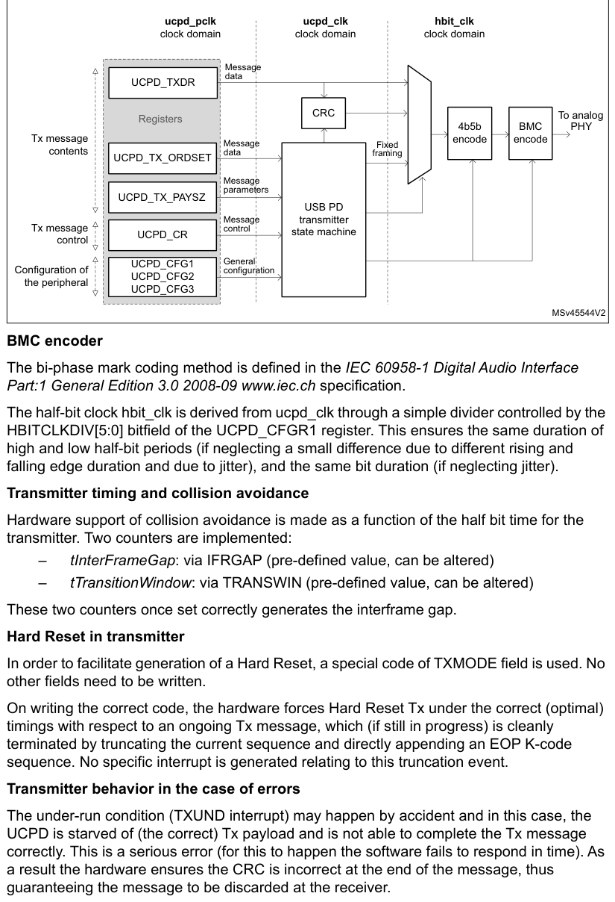

The bi-phase mark coding method is defined in the IEC 60958-1 Digital Audio Interface Part:1 General
Edition 3.0 2008-09 [www.iec.ch](https://www.iec.ch) specification.

The half-bit clock hbit_clk is derived from ucpd_clk through a simple divider controlled by the
HBITCLKDIV[5:0] bitfield of the UCPD_CFGR1 register. This ensures the same duration of high and low
half-bit periods (if neglecting a small difference due to different rising and falling edge duration
and due to jitter), and the same bit duration (if neglecting jitter).

Transmitter timing and collision avoidance

Hardware support of collision avoidance is made as a function of the half bit time for the
transmitter. Two counters are implemented:

- tInterFrameGap: via IFRGAP (pre-defined value, can be altered)
- tTransitionWindow: via TRANSWIN (pre-defined value, can be altered)

These two counters once set correctly generates the interframe gap.

Hard Reset in transmitter

In order to facilitate generation of a Hard Reset, a special code of TXMODE field is used. No other
fields need to be written.

On writing the correct code, the hardware forces Hard Reset Tx under the correct (optimal) timings
with respect to an ongoing Tx message, which (if still in progress) is cleanly terminated by
truncating the current sequence and directly appending an EOP K-code sequence. No specific interrupt
is generated relating to this truncation event.

Transmitter behavior in the case of errors

The under-run condition (TXUND interrupt) may happen by accident and in this case, the UCPD is
starved of (the correct) Tx payload and is not able to complete the Tx message correctly. This is a
serious error (for this to happen the software fails to respond in time). As a result the hardware
ensures the CRC is incorrect at the end of the message, thus guaranteeing the message to be
discarded at the receiver.

### 46.4.5 UCPD BMC receiver

The UCPD BMC receiver performs:

- Clock recovery
- Preamble detection / timing derivation
- BMC decoding
- 4b5b decoding
- K-code ordered set recognition
- CRC checking
- SOP detection
- EOP detection

The receiver is activated as soon as the UCPD peripheral is enabled (via UCPDEN), but it waits for
an idle CC line state before attempting to receive a message.

The following figure shows the UCPD BMC receiver high-level architecture.

**Figure 685. UCPD BMC receiver architecture**

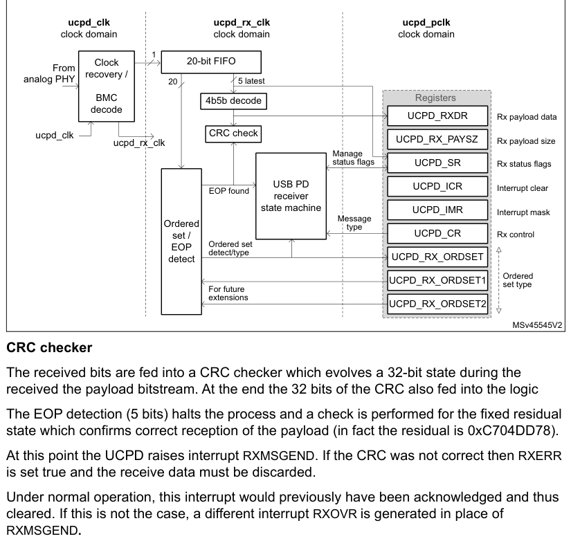

The received bits are fed into a CRC checker which evolves a 32-bit state during the received the
payload bitstream. At the end the 32 bits of the CRC also fed into the logic

The EOP detection (5 bits) halts the process and a check is performed for the fixed residual state
which confirms correct reception of the payload (in fact the residual is 0xC704DD78).

At this point the UCPD raises interrupt RXMSGEND. If the CRC was not correct then RXERR is set true
and the receive data must be discarded.

Under normal operation, this interrupt would previously have been acknowledged and thus cleared. If
this is not the case, a different interrupt RXOVR is generated in place of

RXMSGEND.

Ordered set detection

This function detects the different ordered sets each consisting of four 5-bit K-codes.

Once we are in the preamble we opens a sliding window detection of the ordered set (4 words of 5
bits).

The ordered sets detected include all SOP* codes (SOP, SOP’, and SOP’’), but also Hard Reset, Cable
Reset, SOP’_Debug, SOP’’_Debug, and two extensions defined by registers UCPD_RX_ORDEXT1 and
UCPD_RX_ORDEXT2.

EOP detection and Hard Reset exception handling

EOP is a fixed 5-bit K-code marking the end of a message.

The way in which a transmitter is required to send a Hard Reset (if a previous message transmit is
still in progress) is that this previous message is truncated early with an EOP.

If Hard Reset were ignored, then the EOP detection can be done only at the expected time. However,
due to the Hard Reset issue, the EOP detector must be active while an Rx message is arriving. When
an “early EOP” is detected, the truncated Rx message is immediately discarded.

Truncated or corrupted message exception

Once the ordered set has been detected, depending on the message, there may be data bytes to be
received which is completed with a CRC and EOP. If at any point during these phases an error
condition happens:

- the line becomes static for a time significantly longer than one “UI” period (the exact threshold
  for this condition is not critical but the exception must occur before three UIs), or
- the message goes to the end but it is not recognized (for example EOP is corrupted).

In both cases, the receiver quits the current message, raising RXMSGEND and RXERR flags.

Short preamble or incomplete ordered set exception

In the exceptional case of the receiver seeing less that half of the expected preamble, the
frequency estimation allowing correct BMC-decode becomes impossible. Even if the full preamble is
seen, allowing frequency estimation, but the ordered set is not fully received before the line
becomes static, the receiver state machine does not start.

In both of these cases, the clock-recovery/BMC decoder re-starts, checking initially for an IDLE
condition, followed by a preamble, and then estimating frequency.

### 46.4.6 UCPD Type-C pull-ups (Rp) and pull-downs (Rd)

UCPD offers simple control of these resistors via ANAMODE and ANASUBMODE[1:0]. In case only one of
the CC lines is to be used, it is possible to optimize power consumption by disabling control on the
other line, through the CCENABLE[1:0] bitfield.

When the MCU is unpowered, it still presents the “dead battery” Rd, provided that UCPDx_DBCC1 and
UCPDx_DBCC2 pins are each connected to UCPDx_CC1 and UCPDx_CC2 pins, respectively.

If dead battery behavior is not required (for example for source only products), then UCPDx_DBCC1
and UCPDx_DBCC2 pins must both be tied to ground.

After power arrives and the MCU boots, the desired behavior (for example source) must be programmed
into ANAMODE and ANASUBMODE[1:0] before setting the UCPD1_DBDIS bit of the PWR_CR3 register to
remove dead battery pull-down resistor and allow the values just programmed to take effect.

Use of Standby low-power mode is possible for sinks in the unattached state.

### 46.4.7 UCPD Type-C voltage monitoring and de-bouncing

For correct operation of the Type-C state machine and for detecting the cable orientation, the CC1/2
lines must be monitored for voltage level, while ignoring fast events such as peaks.

Thresholds between voltage levels on the CC1/2 lines are determined through PHY threshold detector
settings.

The TYPEC_VSTATE_CC1/2[1:0] bitfields reflect the CC1/2 line levels processed with a hardware
de-bouncing filter that suppresses high-speed line events such as peaks. The PHYCCSEL bit selects
the line, CC1 or CC2, to be used for Power Delivery signaling.

For minimizing the power consumption, it is recommended to use the polling method, with the Type-C
detectors only turned on for the instant of polling, rather than keeping the Type-C detectors
permanently on and wake the device up from Stop mode upon CC1/2 line events.

### 46.4.8 UCPD fast role swap (FRS)

#### FRS signaling

The FRS condition (a pulse of a specific length), is generated upon setting the FRSTX bit.

For the duration of FRS condition, the I/O configured as UCPD_FRSTX (alternate function) controls,
with high level, the gate of an external NMOS transistor that pulls the active CC line down.

#### FRS detection

FRS monitoring is enabled by setting the bit FRSRXEN, after writing PHYCCSEL that selects the active
CC line depending on the cable orientation detected.

### 46.4.9 UCPD DMA Interface

DMA is implemented in the UCPD and when it is enabled the byte-level interrupts to handle UCPD1_TXDR
and UCPD1_RXDR registers (Tx and Rx data register, each one byte) are no longer needed.

By enabling bits TXDMAEN and/or RXDMAEN, DMA can be activated independently for Tx and/or Rx
functionality.

### 46.4.10 Wake-up from Stop mode

For power consumption optimization, it is useful to use Stop mode and wait for events on CC lines to
wake the MCU up.

In order for this to work, it must be first enabled by writing a 1 to WUPEN.

The events causing the wake-up can be:

- Events on the BMC receiver (RXORDDET, RXHRSTDET), hardware enable PHYRXEN
- Event on the FRS detector (FRSEVT), hardware enable FRSRXEN
- Events on the Type-C detectors (TYPECEVT1, TYPECEVT2), hardware enables CC1TCDIS, CC2TCDIS

## 46.5 UCPD programming sequences

The normal sequence of use of the UCPD unit is:

1. Configure UCPD.
2. Enable UCPD.
3. Concurrently:
   - On demand from protocol layer, send Tx message
   - Intercept (poll or wait for interrupt) relevant Rx messages and recover detail to hand off to
    protocol layer

Repeat the last point infinitely.

### 46.5.1 Initialization phase

Use the following sequence for a clean startup:

1. Prepare all initial clock divider values, by writing the UCPD_CFG register.
2. Enable the unit, by setting the UCPDEN bit.

### 46.5.2 Type-C state machine handling

For the general application cases of source, sink, or dual-role port (the last alternating the
source and the sink), the software must implement a corresponding USB Type-C state machine. The
basic coding is in the following table.

**Table 440. Coding for ANAMODE, ANASUBMODE and link with TYPEC_VSTATE_CCx**

| Source row | Column 1 | Column 2 | Column 3 | Column 4 | Column 5 |
| ---: | --- | --- | --- | --- | --- |
| 1 | `TYPEC_VSTATE_CCx[1:0]` |  |  |  |  |
| 2 | `ANAMODE` | `ANASUBMODE[1:0]` | `Notes` |  |  |
| 3 | `00` | `01` | `10` | `11` |  |
| 4 | `00: Disabled` | `Disabled` | `N/A` |  |  |
| 5 | `01: Default USB Rp` | `-` | `vRa[Def]` | `vRd[Def]` | `vOPEN[Def]` |

- `0`: Source

| Source row | Column 1 | Column 2 | Column 3 | Column 4 | Column 5 | Column 6 | Column 7 |
| ---: | --- | --- | --- | --- | --- | --- | --- |
| 1 | `10: 1.5A Rp` | `-` | `vRa[1.5]` | `vRd[1.5]` | `vOPEN[1.5]` | `N/A` |  |
| 2 | `11: 3.0A Rp` | `-` | `vRa[3.0]` | `vRd[3.0]` | `vOPEN[3.0]` |  |  |
| 3 | `1: Sink` | `xx` | `-` | `vRa` | `vRd-USB` | `vRd-1.5` | `vRd-3.0` |

The CCENABLE[1:0] bitfield can disable pull-up/pull-downs on one of the CC lines.

> **Note:** The Type-C state machine depends not only on CC line levels, but also on VBUS presence
> detection (sink mode) and, when in source mode, determines VCONN generation and VBUS state
(ON/OFF/+voltage level); discharge). UCPD does not directly control VBUS generation circuitry nor
VCONN load switch (enabling VCONN supply generator to be
connected to the CC line), but the application needs these inputs and controls, to function
correctly.

General programming sequence (with UCPD configured then enabled)

1. Set ANAMODE and ANASUBMODE[1:0] based on the current position in USB Type-C
   state machine (and also the current advertisement in the case of a source). This turns on the
   appropriate pull-ups/pull-downs on the CC lines, and defines the voltage levels that the
   TYPEC_VSTATE fields represent. Note that before programming, the PHY is effectively off.
2. Read TYPEC_VSTATE_CC1/2 to determine the initial Type-C state (for example
   whether the local source is connected to a remote sink).
3. In the case of no connection, wait for a connection event.
4. Assuming a connection is detected and assuming a local Power Delivery functionality
   is implemented, start sending/receiving Power Delivery messages.
5. When a new interrupt/event occurs on PHYEVT1/2 indicating a change in stable
   voltage, re-evaluate the implications and give this input to the Type-C state machine.

Case of a source that needs to change between one of the three possible Rp values (Default-USB /
1.5A / 3.0A) and the sink connected to it:

- [Source] Simply reprogram ANASUBMODE[1:0]
- [Sink behavior from that time] PHYEVT1/2 occurs and the TYPEC_VSTATE1/2 changes accordingly

Programming for a dual-role port (DRP) toggling from source to sink:

- Simply re-program ANAMODE and ANASUBMODE[1:0] to start the new behavior

Detailed programming sequence (example):

**Table 441. Type-C sequence (source: 3A); cable/sink connected (Rd on CC1; Ra on CC2)**

| Source row | Column 1 | Column 2 | Column 3 | Column 4 | Column 5 | Column 6 |
| ---: | --- | --- | --- | --- | --- | --- |
| 1 | `ANAMODE;` | `CC[x]` | `Event =>` |  |  |  |
| 2 | `CCENABL` | `PHYCCSE` |  |  |  |  |
| 3 | `Type-C state` | `ANASUBMO` | `RDCH` | `VCONN` | `go to` | `Comments` |
| 4 | `E` | `L` |  |  |  |  |
| 5 | `DE[1:0]` | `EN(1)` | `next line` |  |  |  |
| 6 | `PHYEVT Wait for sink attach` |  |  |  |  |  |
| 7 | `Unattached.` | `0 (don’t` |  |  |  |  |

- `1`: [VRd-detect; seen on CC1

| Source row | Column 1 | Column 2 | Column 3 |
| ---: | --- | --- | --- |
| 1 | `SRC` | `care)` |  |
| 2 | `3A0] [EVT1]` |  |  |
| 3 | `0:Source;` | `11:both` | `00:` |
| 4 | `Attachwait started (100-` |  |  |
| 5 | `11:Rp3A0` | `enabled` | `[neither]` |
| 6 | `Attachwait.` | `PHYEVT` | `200 ms); now also see` |
| 7 | `SRC` | `2: [VRa]` | `the Ra => requesting` |
| 8 | `VCONN` |  |  |
| 9 | `Local CC2 disconnected` |  |  |
| 10 | `Timer` |  |  |
| 11 | `from PHY (VCONN` |  |  |
| 12 | `(100 ms)` |  |  |
| 13 | `0:Source;` | `switch connects VCONN` |  |
| 14 | `and no` |  |  |
| 15 | `11:Rp3A0` | `source to CC2` |  |
| 16 | `PHYEVT` |  |  |
| 17 | `[SinkTxOK]` | `externally;` |  |
| 18 | `x` |  |  |
| 19 | `0:` |  |  |
| 20 | `Continue to monitor` |  |  |
| 21 | `01: CC2` | `[Norm` |  |
| 22 | `PHYEVT1` |  |  |
| 23 | `0` |  |  |
| 24 | `disable` | `al]` |  |
| 25 | `[Rd on` | `Source wants to initiate` |  |
| 26 | `0:Source;` | `(possible` |  |
| 27 | `Attached.` |  |  |
| 28 | `CC1]` | `message sequence` |  |
| 29 | `10:Rp1A5` | `and` |  |
| 30 | `SRC` | `10: [CC2` |  |
| 31 | `(SinkTxNG condition set` |  |  |
| 32 | `recommend` | `SW` |  |
| 33 | `[SinkTxNG]` | `active]` |  |
| 34 | `[VCONN =>` | `first)` |  |
| 35 | `ed due to` | `timers` |  |
| 36 | `CC2]` |  |  |
| 37 | `external` | `(SinkTxN` |  |
| 38 | `Source finished` |  |  |
| 39 | `VCONN` | `G)` |  |
| 40 | `message sequence` |  |  |
| 41 | `switch)` |  |  |
| 42 | `(SinkTxOK condition afterwards)` |  |  |
| 43 | `0:Source;` | `PHYEVT` |  |
| 44 | `Wait for Sink` |  |  |
| 45 | `11:Rp3A0` | `1:` |  |
| 46 | `disconnected (Vopen on` |  |  |
| 47 | `[SinkTxOK]` | `[VOpen-` |  |
| 48 | `CC1)` |  |  |
| 49 | `3A0]` |  |  |
| 50 | `Unattached` | `1:` | `Discharge VCONN` |

> 0.8V

| Source row | Column 1 | Column 2 | Column 3 |
| ---: | --- | --- | --- |
| 1 | `wait.` | `[discha` | `[CC2] actively [Rdch];` |
| 2 | `detection` |  |  |
| 3 | `SRC` | `rge]` | `to < 0.8V` |
| 4 | `11:both` | `0 (do not` | `00:` |
| 5 | `enabled` | `care)` | `[neither]` |
| 6 | `0:` |  |  |
| 7 | `Unattached.` | `0:Source;` | `[Details as first line of` |
| 8 | `[Norm` |  |  |
| 9 | `SRC` | `11:Rp3A0` | `table]` |
| 10 | `al]` |  |  |

1. Two GPIOs to enable VCONN through external load switch components

### 46.5.3 USB PD transmit

On reception of a message from the protocol layer (that is, to be sent), prepare Tx message contents
by writing the UCPD_TX_ORDSET and UCPD_TX_PAYSZ registers.

The message transmission is triggered by setting the TXSEND bit, with an appropriate value of the
TXMODE bitfield.

When the data byte is transmitted, the TXIS flag is raised to request a new data write to the
UCPD_TXDR register.

This re-iterates until the entire payload of data is transmitted.

Upon sending the CRC packet, the TXMSGSENT flag is set to indicate the completion of the message
transmission.

#### Hard Reset transmission

As soon as it is known that a Hard Reset needs to be transmitted, setting the TXHRST bit of the
UCPD_CR register forces the internal state machine to generate the correct sequence. The value of
UCPD_TX_ORDSET does not require update in this precise case (the correct code for Hard Reset is sent
by UCPD).

The USB Power Delivery specification requires that in the case of an ongoing message transmission,
the Hard Reset takes precedence. In this case, for example, UCPD truncates the payload of the
current message, appending EOP to the end. No notification is available via the registers (for
example through the TXMSGSEND flag). This is justified by the fact that the Hard Reset takes
precedence over any previous activity (for which it is therefore no longer important to know if it
is completed).

#### Use of DMA for transmission

DMA (Direct Memory Access) can be enabled for transmission by setting the TXDMAEN bit in the UCPD_CR
register.

For each message:

- Prepare the whole message in memory (starting with two header bytes)
- Program the DMA operation with a length corresponding to the two header bytes plus a number of
  data bytes corresponding to the number of data words multiplied by four
- Write TXSEND to initiate the message transfer
- If TXMSGDISC then go back to previous line (TXSEND)
- Wait for DMA transfer complete interrupt (that is, when last Tx byte written to UCPD)
- Double-check subsequent TXMSGSENT interrupt appears

### 46.5.4 USB PD receive

Notification of start of the receive message sequence is triggered by an interrupt on UCPD_SR (bit
RXORDDET).

The information is recovered by reading:

- UCPD_RX_SOP (on interrupt RXORDDET)
- UCPD_RXDR (on interrupt RXNE, repeats for each byte)
- UCPD_RXPAYSZ (on interrupt RXMSGEND)

The data previously read from UCPD_RXDR above must be discarded at this point if the RXERR flag is
set.

If the CRC is valid, the received data is transferred to the protocol layer.

For debug purposes, it may be desirable to track statistics of the number of incorrect K-codes
received (this is done only when 3/4 K-codes were valid as defined in the specification). This is
facilitated through:

- RXSOP3OF4 bit indicating the presence of at least one invalid K-code
- RXSOPKINVALID bitfield identifying the order of invalid K-code in the ordered set

#### Use of DMA for reception

DMA (Direct Memory Access) can be enabled for reception by setting the RXDMAEN bit in the UCPD_CR
register.

Whenever a Rx message is expected:

- Program a DMA receive operation (and spare buffer) a little longer than the maximum possible
  message (length depends on extended message support).
- After receiving RXORDDET, DMA operation starts working in the background.
- On reception of RXMSGEND interrupt, read RXPAYSZ.
- Double-check RXPAYSZ vs. the number of DMA Rx bytes (must correspond but DMA read of RXDR is
  slightly after RXDR gets last byte).
- Process the DMA Rx buffer.
- Prepare next Rx DMA buffer as soon as possible in order to be ready.

## 46.6 UCPD low-power modes

A summary of low-power modes is shown below in Table 442: Effect of low power modes on the UCPD.

**Table 442. Effect of low power modes on the UCPD**

| Source row | Column 1 | Column 2 |
| ---: | --- | --- |
| 1 | `Mode` | `Description` |
| 2 | `Sleep` | `No effect` |
| 3 | `Detection of events (Type-C, BMC Rx, FRS detection) remains operational and` |  |
| 4 | `Stop` |  |

can wake up the MCU.

UCPD is not operating, and cannot wake up the MCU. Pull-downs remain active

Standby
if configured.

| Source row | Column 1 | Column 2 |
| ---: | --- | --- |
| 1 | `Unpowered` | `Dead battery pull-downs remain active.` |
| 2 | `The UCPD is able to wake up the MCU from Stop mode when it recognizes a relevant event, either:` |  |

- Type-C event relating to a change in the voltage range seen on either of the CC lines, visible in
  TYPEC_VSTATE_CCx
- Power delivery receive message with an ordered set matching those filtered according to
  RXORDSETEN[8:0], visible by reading RXORDSET

Wake-up from Stop mode is enabled by setting the WUPEN bit in the UCPD_CFG2 register.

At UCPD level three types of event requiring kernel clock activity may occur during Stop mode:

- Activity on the analog PHY voltage threshold detectors which can later be confirmed to be a stable
  change between voltage ranges defined in the Type-C specification
- Activity on Power Delivery BMC receiver (coming from the selected CC line) which can potentially
  generate an Rx message event (that is, RXORDSET) later
- Activity on Power Delivery FRS detector which can potentially generate an FRS signaling detection
  event (that is, FRSEVT) later

It order to function correctly with the RCC, the clock request signal is activated (conditional on
WUPEN) when there is asynchronous activity on:

- Type-C voltage threshold detectors (coming from either CC line)
- Power Delivery receiver signal (from the selected CC line)
- FRS detection signal (from the selected CC line)

## 46.7 UCPD interrupts

The table below lists the UCPD event flags, with the associated flag clear bits and interrupt enable
bits.

**Table 443. UCPD interrupt requests**

| Source row | Column 1 | Column 2 | Column 3 | Column 4 |
| ---: | --- | --- | --- | --- |
| 1 | `Event flag/Interrupt` | `Interrupt enable` |  |  |
| 2 | `Interrupt event` | `Event flag` |  |  |
| 3 | `clearing method` | `control bit` |  |  |
| 4 | `FRS detection` | `FRSEVT` | `Set FRSEVTCF` | `FRSEVTIE` |
| 5 | `Type C voltage level change on CC2` | `TYPECEVT2` | `Set TYPECEVT2CF` | `TYPECEVT2IE` |
| 6 | `Type C voltage level change on CC1` | `TYPECEVT1` | `Set TYPECEVT1CF` | `TYPECEVT1IE` |
| 7 | `Rx message received` | `RXMSGEND` | `Set RXMSGENDCF` | `RXMSGENDIE` |
| 8 | `Rx data overflow` | `RXOVR` | `Set RXOVRCF` | `RXOVR` |
| 9 | `Rx Hard Reset detected` | `RXHRSTDET` | `Set RXHRSTDETCF` | `RXHRSTDETIE` |
| 10 | `Rx ordered set (4 K-codes) detected` | `RXORDDET` | `Set RXORDDETCF` | `RXORDDETIE` |
| 11 | `Read data in` |  |  |  |
| 12 | `Receive data register not empty` | `RXNE` | `RXNEIE` |  |
| 13 | `UCPD_RXDR` |  |  |  |
| 14 | `Tx data underrun` | `TXUND` | `Set TXUNDCF` | `TXUNDIE` |
| 15 | `Hard Reset sent` | `HRSTSENT` | `Set HRSTSENTCF` | `HRSTSENTIE` |
| 16 | `Hard Reset discarded` | `HRSTDISC` | `Set HRSTDISCCF` | `HRSTDISCIE` |
| 17 | `Transmit message aborted` | `TXMSGABT` | `Set TXMSGABTCF` | `TXMSGABTIE` |
| 18 | `Transmit message sent` | `TXMSGSENT` | `Set TXMSGSENTCF` | `TXMSGSENTIE` |
| 19 | `Transmit message discarded` | `TXMSGDISC` | `Set TXMSGDISCCF` | `TXMSGDISCIE` |
| 20 | `Write data to the` |  |  |  |
| 21 | `Transmit data required` | `TXIS` | `TXISIE` |  |
| 22 | `UCPD_TXDR register` |  |  |  |

When an interrupt from the UCPD is received, then the software has to check what is the source of
the interrupt by reading the UCPD_SR register.

Depending on which bit is at 1, the ISR must handle that condition and clear the bit by a write to
the appropriate bit of the UCPD_ICR register.

## 46.8 UCPD registers

### 46.8.1 UCPD configuration register 1 (UCPD_CFGR1)

- **Address offset:** 0x000
- **Reset value:** 0x0000 0000

General configuration of the peripheral. Writing to this register is only effective when UCPD is
disabled (UCPDEN = 0).

**Register bit layout**

| Bit | Field | Access | Summary |
| ---: | --- | :---: | --- |
| 31 | `UCPDEN` | rw | UCPD peripheral enable |
| 30 | `RXDMAEN` | rw | Reception DMA mode enable |
| 29 | `TXDMAEN` | rw | Transmission DMA mode enable |
| 28 | `RXORDSETEN[8]` | rw | Receiver ordered set enable |
| 27 | `RXORDSETEN[7]` | rw | ↳ |
| 26 | `RXORDSETEN[6]` | rw | ↳ |
| 25 | `RXORDSETEN[5]` | rw | ↳ |
| 24 | `RXORDSETEN[4]` | rw | ↳ |
| 23 | `RXORDSETEN[3]` | rw | ↳ |
| 22 | `RXORDSETEN[2]` | rw | ↳ |
| 21 | `RXORDSETEN[1]` | rw | ↳ |
| 20 | `RXORDSETEN[0]` | rw | ↳ |
| 19 | `PSC_UCPDCLK[2]` | rw | Pre-scaler division ratio for generating ucpd_clk |
| 18 | `PSC_UCPDCLK[1]` | rw | ↳ |
| 17 | `PSC_UCPDCLK[0]` | rw | ↳ |
| 16 | Reserved | — | kept at reset value. |
| 15 | `TRANSWIN[4]` | rw | Transition window duration |
| 14 | `TRANSWIN[3]` | rw | ↳ |
| 13 | `TRANSWIN[2]` | rw | ↳ |
| 12 | `TRANSWIN[1]` | rw | ↳ |
| 11 | `TRANSWIN[0]` | rw | ↳ |
| 10 | `IFRGAP[4]` | rw | Division ratio for producing inter-frame gap timer clock |
| 9 | `IFRGAP[3]` | rw | ↳ |
| 8 | `IFRGAP[2]` | rw | ↳ |
| 7 | `IFRGAP[1]` | rw | ↳ |
| 6 | `IFRGAP[0]` | rw | ↳ |
| 5 | `HBITCLKDIV[5]` | rw | Division ratio for producing half-bit clock |
| 4 | `HBITCLKDIV[4]` | rw | ↳ |
| 3 | `HBITCLKDIV[3]` | rw | ↳ |
| 2 | `HBITCLKDIV[2]` | rw | ↳ |
| 1 | `HBITCLKDIV[1]` | rw | ↳ |
| 0 | `HBITCLKDIV[0]` | rw | ↳ |

**Bit 31 — `UCPDEN`:** UCPD peripheral enable

General enable of the UCPD peripheral.

- `0`: Disable
- `1`: Enable

Upon disabling, the peripheral instantly quits any ongoing activity and all control bits and
bitfields default to their reset values. They must be set to their desired values each time the
peripheral transits from disabled to enabled state.

**Bit 30 — `RXDMAEN`:** Reception DMA mode enable

When set, the bit enables DMA mode for reception.

- `0`: Disable
- `1`: Enable

**Bit 29 — `TXDMAEN`:** Transmission DMA mode enable

When set, the bit enables DMA mode for transmission.

- `0`: Disable
- `1`: Enable

**Bits 28:20 — `RXORDSETEN[8:0]`:** Receiver ordered set enable

The bitfield determines the types of ordered sets that the receiver must detect. When
set/cleared, each bit enables/disables a specific function:

0bXXXXXXXX1: SOP detect enabled

0bXXXXXXX1X: SOP' detect enabled

0bXXXXXX1XX: SOP'' detect enabled

0bXXXXX1XXX: Hard Reset detect enabled

0bXXXX1XXXX: Cable Detect reset enabled

0bXXX1XXXXX: SOP'_Debug enabled

0bXX1XXXXXX: SOP''_Debug enabled

0bX1XXXXXXX: SOP extension#1 enabled

0b1XXXXXXXX: SOP extension#2 enabled

**Bits 19:17 — `PSC_UCPDCLK[2:0]`:** Pre-scaler division ratio for generating ucpd_clk

The bitfield determines the division ratio of a kernel clock pre-scaler producing UCPD
peripheral clock (ucpd_clk).

- `0x0`: 1 (bypass)
- `0x1`: 2

0x2: 4

0x3: 8

0x4: 16

It is recommended to use the pre-scaler so as to set the ucpd_clk frequency in the range
from 6 to 9 MHz.

**Bit 16 — Reserved:** kept at reset value.

**Bits 15:11 — `TRANSWIN[4:0]`:** Transition window duration

The bitfield determines the division ratio (the bitfield value minus one) of a hbit_clk divider
producing tTransitionWindow interval.

- `0x00`: Not supported
- `0x01`: 2

0x09: 10 (recommended)

0x1F: 32

Set a value that produces an interval of 12 to 20 us, taking into account the ucpd_clk
frequency and the HBITCLKDIV[5:0] bitfield setting.

**Bits 10:6 — `IFRGAP[4:0]`:** Division ratio for producing inter-frame gap timer clock

The bitfield determines the division ratio (the bitfield value minus one) of a ucpd_clk divider
producing inter-frame gap timer clock (tInterFrameGap).

- `0x00`: Not supported
- `0x01`: 2

0x0D: 14

0x0E: 15

0x0F: 16

0x1F: 32

The division ratio 15 is to apply for Tx clock at the USB PD 2.0 specification nominal value.

The division ratios below 15 are to apply for Tx clock below nominal, and the division ratios
above 15 for Tx clock above nominal.

**Bits 5:0 — `HBITCLKDIV[5:0]`:** Division ratio for producing half-bit clock

The bitfield determines the division ratio (the bitfield value plus one) of a ucpd_clk divider
producing half-bit clock (hbit_clk).

- `0x00`: 1 (bypass)

0x1A: 27

0x3F: 64

### 46.8.2 UCPD configuration register 2 (UCPD_CFGR2)

- **Address offset:** 0x004
- **Reset value:** 0x0000 0000

Configuration of the UCPD Rx signal filtering. Writing to this register is only effective when UCPD
is disabled (UCPDEN = 0).

**Register bit layout**

| Bit | Field | Access | Summary |
| ---: | --- | :---: | --- |
| 31 | Reserved | — | kept at reset value. |
| 30 | Reserved | — | ↳ |
| 29 | Reserved | — | ↳ |
| 28 | Reserved | — | ↳ |
| 27 | Reserved | — | ↳ |
| 26 | Reserved | — | ↳ |
| 25 | Reserved | — | ↳ |
| 24 | Reserved | — | ↳ |
| 23 | Reserved | — | ↳ |
| 22 | Reserved | — | ↳ |
| 21 | Reserved | — | ↳ |
| 20 | Reserved | — | ↳ |
| 19 | Reserved | — | ↳ |
| 18 | Reserved | — | ↳ |
| 17 | Reserved | — | ↳ |
| 16 | Reserved | — | ↳ |
| 15 | Reserved | — | ↳ |
| 14 | Reserved | — | ↳ |
| 13 | Reserved | — | ↳ |
| 12 | Reserved | — | ↳ |
| 11 | Reserved | — | ↳ |
| 10 | Reserved | — | ↳ |
| 9 | Reserved | — | ↳ |
| 8 | Reserved | — | ↳ |
| 7 | Reserved | — | ↳ |
| 6 | Reserved | — | ↳ |
| 5 | Reserved | — | ↳ |
| 4 | Reserved | — | ↳ |
| 3 | `WUPEN` | rw | Wake-up from Stop mode enable |
| 2 | `FORCECLK` | rw | Force ClkReq clock request |
| 1 | `RXFILT2N3` | rw | BMC decoder Rx pre-filter sampling method |
| 0 | `RXFILTDIS` | rw | BMC decoder Rx pre-filter enable |

**Bits 31:4 — Reserved:** kept at reset value.

**Bit 3 — `WUPEN`:** Wake-up from Stop mode enable

Setting the bit enables the UCPD_ASYNC_INT signal.

- `0`: Disable
- `1`: Enable

**Bit 2 — `FORCECLK`:** Force ClkReq clock request

- `0`: Do not force clock request
- `1`: Force clock request

**Bit 1 — `RXFILT2N3`:** BMC decoder Rx pre-filter sampling method

Number of consistent consecutive samples before confirming a new value.

- `0`: 3 samples
- `1`: 2 samples

**Bit 0 — `RXFILTDIS`:** BMC decoder Rx pre-filter enable

- `0`: Enable
- `1`: Disable

The sampling clock is that of the receiver (that is, after pre-scaler).

### 46.8.3 UCPD control register (UCPD_CR)

- **Address offset:** 0x00C
- **Reset value:** 0x0000 0000

Writing to this register is only effective when the peripheral is enabled (UCPDEN = 1).

**Register bit layout**

| Bit | Field | Access | Summary |
| ---: | --- | :---: | --- |
| 31 | Reserved | — | kept at reset value. |
| 30 | Reserved | — | ↳ |
| 29 | Reserved | — | ↳ |
| 28 | Reserved | — | ↳ |
| 27 | Reserved | — | ↳ |
| 26 | Reserved | — | ↳ |
| 25 | Reserved | — | ↳ |
| 24 | Reserved | — | ↳ |
| 23 | Reserved | — | ↳ |
| 22 | Reserved | — | ↳ |
| 21 | `CC2TCDIS` | rw | CC2 Type-C detector disable |
| 20 | `CC1TCDIS` | rw | CC1 Type-C detector disable |
| 19 | Reserved | — | kept at reset value. |
| 18 | `RDCH` | rw | Rdch condition drive |
| 17 | `FRSTX` | rs | FRS Tx signaling enable. |
| 16 | `FRSRXEN` | rw | FRS event detection enable |
| 15 | Reserved | — | kept at reset value. |
| 14 | Reserved | — | kept at reset value. |
| 13 | Reserved | — | kept at reset value. |
| 12 | Reserved | — | kept at reset value. |
| 11 | `CCENABLE[1]` | rw | CC line enable |
| 10 | `CCENABLE[0]` | rw | ↳ |
| 9 | `ANAMODE` | rw | Analog PHY operating mode |
| 8 | `ANASUBMODE[1]` | rw | Analog PHY sub-mode |
| 7 | `ANASUBMODE[0]` | rw | ↳ |
| 6 | `PHYCCSEL` | rw | CC1/CC2 line selector for USB Power Delivery signaling |
| 5 | `PHYRXEN` | rw | USB Power Delivery receiver enable |
| 4 | `RXMODE` | rw | Receiver mode |
| 3 | `TXHRST` | rs | Command to send a Tx Hard Reset |
| 2 | `TXSEND` | rs | Command to send a Tx packet |
| 1 | `TXMODE[1]` | rw | Type of Tx packet |
| 0 | `TXMODE[0]` | rw | ↳ |

**Bits 31:22 — Reserved:** kept at reset value.

**Bit 21 — `CC2TCDIS`:** CC2 Type-C detector disable

The bit disables the Type-C detector on the CC2 line.

- `0`: Enable
- `1`: Disable

When enabled, the Type-C detector for CC2 is configured through ANAMODE and

ANASUBMODE[1:0].

**Bit 20 — `CC1TCDIS`:** CC1 Type-C detector disable

The bit disables the Type-C detector on the CC1 line.

- `0`: Enable
- `1`: Disable

When enabled, the Type-C detector for CC1 is configured through ANAMODE and

ANASUBMODE[1:0].

**Bit 19 — Reserved:** kept at reset value.

**Bit 18 — `RDCH`:** Rdch condition drive

The bit drives Rdch condition on the CC line selected through the PHYCCSEL bit (thus
associated with VCONN), by remaining set during the source-only UnattachedWait.SRC
state, to respect the Type-C state. Refer to "USB Type-C ECN for Source VCONN

Discharge". The CCENABLE[1:0] bitfield must be set accordingly, too.

- `0`: No effect
- `1`: Rdch condition drive

**Bit 17 — `FRSTX`:** FRS Tx signaling enable.

Setting the bit enables FRS Tx signaling.

- `0`: No effect
- `1`: Enable

The bit is cleared by hardware after a delay respecting the USB Power Delivery specification

Revision 3.1.

**Bit 16 — `FRSRXEN`:** FRS event detection enable

Setting the bit enables FRS Rx event (FRSEVT) detection on the CC line selected through
the PHYCCSEL bit. 0: Disable

- `1`: Enable

Clear the bit when the device is attached to an FRS-incapable source/sink.

**Bit 15 — Reserved:** kept at reset value.

**Bit 14 — Reserved:** kept at reset value.

**Bit 13 — Reserved:** kept at reset value.

**Bit 12 — Reserved:** kept at reset value.

**Bits 11:10 — `CCENABLE[1:0]`:** CC line enable

This bitfield enables CC1 and CC2 line analog PHYs (pull-ups and pull-downs) according to

ANAMODE and ANASUBMODE[1:0] setting.

- `0x0`: Disable both PHYs
- `0x1`: Enable CC1 PHY

0x2: Enable CC2 PHY

0x3: Enable CC1 and CC2 PHY

A single line PHY can be enabled when, for example, the other line is driven by VCONN via
an external VCONN switch. Enabling both PHYs is the normal usage for sink/source.

**Bit 9 — `ANAMODE`:** Analog PHY operating mode

- `0`: Source
- `1`: Sink

The use of CC1 and CC2 depends on CCENABLE. Refer to Table 440: Coding for

ANAMODE, ANASUBMODE and link with TYPEC_VSTATE_CCx for the effect of this bitfield
in conjunction with ANASUBMODE[1:0].

**Bits 8:7 — `ANASUBMODE[1:0]`:** Analog PHY sub-mode

Refer to Table 440: Coding for ANAMODE, ANASUBMODE and link with

TYPEC_VSTATE_CCx for the effect of this bitfield.

**Bit 6 — `PHYCCSEL`:** CC1/CC2 line selector for USB Power Delivery signaling

- `0`: Use CC1 IO for Power Delivery communication
- `1`: Use CC2 IO for Power Delivery communication

The selection depends on the cable orientation as discovered at attach.

**Bit 5 — `PHYRXEN`:** USB Power Delivery receiver enable

- `0`: Disable
- `1`: Enable

Both CC1 and CC2 receivers are disabled when the bit is cleared. Only the CC receiver
selected via the PHYCCSEL bit is enabled when the bit is set.

**Bit 4 — `RXMODE`:** Receiver mode

Determines the mode of the receiver.

- `0`: Normal receive mode
- `1`: BIST receive mode (BIST test data mode)

When the bit is set, RXORDSET behaves normally, RXDR no longer receives bytes yet the

CRC checking still proceeds as for a normal message. As this mode prevents reception of
the header (containing MessageID), software has to auto-increment a received MessageID
counter for inclusion in the GoodCRC acknowledge that must still be transmitted during this
test.

**Bit 3 — `TXHRST`:** Command to send a Tx Hard Reset

- `0`: No effect
- `1`: Start Tx Hard Reset message

The bit is cleared by hardware as soon as the message transmission begins or is discarded.

**Bit 2 — `TXSEND`:** Command to send a Tx packet

- `0`: No effect
- `1`: Start Tx packet transmission

The bit is cleared by hardware as soon as the packet transmission begins or is discarded.

**Bits 1:0 — `TXMODE[1:0]`:** Type of Tx packet

Writing the bitfield triggers the action as follows, depending on the value:

- `0x0`: Transmission of Tx packet previously defined in other registers
- `0x1`: Cable Reset sequence

0x2: BIST test sequence (BIST Carrier Mode 2)

Others: invalid

From V1.1 of the USB PD specification, there is a counter defined for the duration of the BIST

Carrier Mode 2. To quit this mode correctly (after the "tBISTContMode" delay), disable the
peripheral (UCPDEN = 0).

### 46.8.4 UCPD interrupt mask register (UCPD_IMR)

- **Address offset:** 0x010
- **Reset value:** 0x0000 0000

Writing to this register is only effective when the peripheral is enabled (UCPDEN = 1).

**Register bit layout**

| Bit | Field | Access | Summary |
| ---: | --- | :---: | --- |
| 31 | Reserved | — | kept at reset value. |
| 30 | Reserved | — | ↳ |
| 29 | Reserved | — | ↳ |
| 28 | Reserved | — | ↳ |
| 27 | Reserved | — | ↳ |
| 26 | Reserved | — | ↳ |
| 25 | Reserved | — | ↳ |
| 24 | Reserved | — | ↳ |
| 23 | Reserved | — | ↳ |
| 22 | Reserved | — | ↳ |
| 21 | Reserved | — | ↳ |
| 20 | `FRSEVTIE` | r | FRSEVT interrupt enable |
| 19 | Reserved | — | kept at reset value. |
| 18 | Reserved | — | ↳ |
| 17 | Reserved | — | ↳ |
| 16 | Reserved | — | ↳ |
| 15 | `TYPECEVT2IE` | rw | TYPECEVT2 interrupt enable |
| 14 | `TYPECEVT1IE` | rw | TYPECEVT1 interrupt enable |
| 13 | Reserved | — | kept at reset value. |
| 12 | `RXMSGENDIE` | rw | RXMSGEND interrupt enable |
| 11 | `RXOVRIE` | rw | RXOVR interrupt enable |
| 10 | `RXHRSTDETIE` | rw | RXHRSTDET interrupt enable |
| 9 | `RXORDDETIE` | rw | RXORDDET interrupt enable |
| 8 | `RXNEIE` | rw | RXNE interrupt enable |
| 7 | Reserved | — | kept at reset value. |
| 6 | `TXUNDIE` | rw | TXUND interrupt enable |
| 5 | `HRSTSENTIE` | rw | HRSTSENT interrupt enable |
| 4 | `HRSTDISCIE` | rw | HRSTDISC interrupt enable |
| 3 | `TXMSGABTIE` | rw | TXMSGABT interrupt enable |
| 2 | `TXMSGSENTIE` | rw | TXMSGSENT interrupt enable |
| 1 | `TXMSGDISCIE` | rw | TXMSGDISC interrupt enable |
| 0 | `TXISIE` | rw | TXIS interrupt enable |

**Bits 31:21 — Reserved:** kept at reset value.

**Bit 20 — `FRSEVTIE`:** FRSEVT interrupt enable

- `0`: Disable
- `1`: Enable

**Bits 19:16 — Reserved:** kept at reset value.

**Bit 15 — `TYPECEVT2IE`:** TYPECEVT2 interrupt enable

- `0`: Disable
- `1`: Enable

**Bit 14 — `TYPECEVT1IE`:** TYPECEVT1 interrupt enable

**Bit 13 — Reserved:** kept at reset value.

**Bit 12 — `RXMSGENDIE`:** RXMSGEND interrupt enable

- `0`: Disable
- `1`: Enable

**Bit 11 — `RXOVRIE`:** RXOVR interrupt enable

- `0`: Disable
- `1`: Enable

**Bit 10 — `RXHRSTDETIE`:** RXHRSTDET interrupt enable

- `0`: Disable
- `1`: Enable

**Bit 9 — `RXORDDETIE`:** RXORDDET interrupt enable

- `0`: Disable
- `1`: Enable

**Bit 8 — `RXNEIE`:** RXNE interrupt enable

- `0`: Disable
- `1`: Enable

**Bit 7 — Reserved:** kept at reset value.

**Bit 6 — `TXUNDIE`:** TXUND interrupt enable

- `0`: Disable
- `1`: Enable

**Bit 5 — `HRSTSENTIE`:** HRSTSENT interrupt enable

- `0`: Disable
- `1`: Enable

**Bit 4 — `HRSTDISCIE`:** HRSTDISC interrupt enable

- `0`: Disable
- `1`: Enable

**Bit 3 — `TXMSGABTIE`:** TXMSGABT interrupt enable

- `0`: Disable
- `1`: Enable

**Bit 2 — `TXMSGSENTIE`:** TXMSGSENT interrupt enable

- `0`: Disable
- `1`: Enable

**Bit 1 — `TXMSGDISCIE`:** TXMSGDISC interrupt enable

- `0`: Disable
- `1`: Enable

**Bit 0 — `TXISIE`:** TXIS interrupt enable

- `0`: Disable
- `1`: Enable

### 46.8.5 UCPD status register (UCPD_SR)

- **Address offset:** 0x014
- **Reset value:** 0x0000 0000

The flags (single-bit status bitfields) are associated with interrupt request. Interrupt is
generated if enabled by the corresponding bit of the UCPD_IMR register.

**Register bit layout**

| Bit | Field | Access | Summary |
| ---: | --- | :---: | --- |
| 31 | Reserved | — | kept at reset value. |
| 30 | Reserved | — | ↳ |
| 29 | Reserved | — | ↳ |
| 28 | Reserved | — | ↳ |
| 27 | Reserved | — | ↳ |
| 26 | Reserved | — | ↳ |
| 25 | Reserved | — | ↳ |
| 24 | Reserved | — | ↳ |
| 23 | Reserved | — | ↳ |
| 22 | Reserved | — | ↳ |
| 21 | Reserved | — | ↳ |
| 20 | `FRSEVT` | r | FRS detection event |
| 19 | `TYPEC_VSTATE_CC2[1]` | r | CC2 line voltage level |
| 18 | `TYPEC_VSTATE_CC2[0]` | r | ↳ |
| 17 | `TYPEC_VSTATE_CC1[1]` | r | — |
| 16 | `TYPEC_VSTATE_CC1[0]` | r | ↳ |
| 15 | `TYPECEVT2` | r | Type-C voltage level event on CC2 line |
| 14 | `TYPECEVT1` | r | Type-C voltage level event on CC1 line |
| 13 | `RXERR` | r | Receive message error |
| 12 | `RXMSGEND` | r | Rx message received |
| 11 | `RXOVR` | r | Rx data overflow detection |
| 10 | `RXHRSTDET` | r | Rx Hard Reset receipt detection |
| 9 | `RXORDDET` | r | Rx ordered set (4 K-codes) detection |
| 8 | `RXNE` | r | Receive data register not empty detection |
| 7 | Reserved | — | kept at reset value. |
| 6 | `TXUND` | r | Tx data underrun detection |
| 5 | `HRSTSENT` | r | Hard Reset message sent |
| 4 | `HRSTDISC` | r | Hard Reset discarded |
| 3 | `TXMSGABT` | r | Transmit message abort |
| 2 | `TXMSGSENT` | r | Message transmission completed |
| 1 | `TXMSGDISC` | r | Message transmission discarded |
| 0 | `TXIS` | r | Transmit interrupt status |

**Bits 31:21 — Reserved:** kept at reset value.

**Bit 20 — `FRSEVT`:** FRS detection event

The flag is cleared by setting the FRSEVTCF bit.

- `0`: No new event
- `1`: New FRS receive event occurred

**Bits 19:18 — `TYPEC_VSTATE_CC2[1:0]`:** CC2 line voltage level

The status bitfield indicates the voltage level on the CC2 line in its steady state.

- `0x0`: Lowest
- `0x1`: Low

0x2: High

0x3: Highest

The voltage variation on the CC2 line during USB PD messages due to the BMC PHY
modulation does not impact the bitfield value.

**Bits 17:16 — `TYPEC_VSTATE_CC1[1:0]`:**

The status bitfield indicates the voltage level on the CC1 line in its steady state.

- `0x0`: Lowest
- `0x1`: Low

0x2: High

0x3: Highest

The voltage variation on the CC1 line during USB PD messages due to the BMC PHY
modulation does not impact the bitfield value.

**Bit 15 — `TYPECEVT2`:** Type-C voltage level event on CC2 line

The flag indicates a change of the TYPEC_VSTATE_CC2[1:0] bitfield value, which
corresponds to a new Type-C event. It is cleared by setting the TYPECEVT2CF bit.

- `0`: No new event
- `1`: A new Type-C event

**Bit 14 — `TYPECEVT1`:** Type-C voltage level event on CC1 line

The flag indicates a change of the TYPEC_VSTATE_CC1[1:0] bitfield value, which
corresponds to a new Type-C event. It is cleared by setting the TYPECEVT2CF bit.

- `0`: No new event
- `1`: A new Type-C event

**Bit 13 — `RXERR`:** Receive message error

The flag indicates errors of the last Rx message declared (via RXMSGEND), such as
incorrect CRC or truncated message (a line becoming static before EOP is met). It is
asserted whenever the RXMSGEND flag is set.

- `0`: No error detected
- `1`: Error(s) detected

**Bit 12 — `RXMSGEND`:** Rx message received

The flag indicates whether a message (except Hard Reset message) has been received,
regardless the CRC value. The flag is cleared by setting the RXMSGENDCF bit.

- `0`: No new Rx message received
- `1`: A new Rx message received

The RXERR flag set when the RXMSGEND flag goes high indicates errors in the last-
received message.

**Bit 11 — `RXOVR`:** Rx data overflow detection

The flag indicates Rx data buffer overflow. It is cleared by setting the RXOVRCF bit.

- `0`: No overflow
- `1`: Overflow

The buffer overflow can occur if the received data are not read fast enough.

**Bit 10 — `RXHRSTDET`:** Rx Hard Reset receipt detection

The flag indicates the receipt of valid Hard Reset message. It is cleared by setting the

RXHRSTDETCF bit.

- `0`: Hard Reset not received
- `1`: Hard Reset received

**Bit 9 — `RXORDDET`:** Rx ordered set (4 K-codes) detection

The flag indicates the detection of an ordered set. The relevant information is stored in the

RXORDSET[2:0] bitfield of the UCPD_RX_ORDSET register. It is cleared by setting the

RXORDDETCF bit.

- `0`: No ordered set detected
- `1`: A new ordered set detected

**Bit 8 — `RXNE`:** Receive data register not empty detection

The flag indicates that the UCPD_RXDR register is not empty. It is automatically cleared
upon reading UCPD_RXDR.

- `0`: Rx data register empty
- `1`: Rx data register not empty

**Bit 7 — Reserved:** kept at reset value.

**Bit 6 — `TXUND`:** Tx data underrun detection

The flag indicates that the Tx data register (UCPD_TXDR) was not written in time for a
transmit message to execute normally. It is cleared by setting the TXUNDCF bit.

- `0`: No Tx data underrun detected
- `1`: Tx data underrun detected

**Bit 5 — `HRSTSENT`:** Hard Reset message sent

The flag indicates that the Hard Reset message is sent. The flag is cleared by setting the

HRSTSENTCF bit.

- `0`: No Hard Reset message sent
- `1`: Hard Reset message sent

**Bit 4 — `HRSTDISC`:** Hard Reset discarded

The flag indicates that the Hard Reset message is discarded. The flag is cleared by setting
the HRSTDISCCF bit.

- `0`: No Hard Reset discarded
- `1`: Hard Reset discarded

**Bit 3 — `TXMSGABT`:** Transmit message abort

The flag indicates that a Tx message is aborted due to a subsequent Hard Reset message
send request taking priority during transmit. It is cleared by setting the TXMSGABTCF bit.

- `0`: No transmit message abort
- `1`: Transmit message abort

**Bit 2 — `TXMSGSENT`:** Message transmission completed

The flag indicates the completion of packet transmission. It is cleared by setting the

TXMSGSENTCF bit.

- `0`: No Tx message completed
- `1`: Tx message completed

In the event of a message transmission interrupted by a Hard Reset, the flag is not raised.

**Bit 1 — `TXMSGDISC`:** Message transmission discarded

The flag indicates that a message transmission was dropped. The flag is cleared by setting
the TXMSGDISCCF bit.

- `0`: No Tx message discarded
- `1`: Tx message discarded

Transmission of a message can be dropped if there is a concurrent receive in progress or at
excessive noise on the line. After a Tx message is discarded, the flag is only raised when the

CC line becomes idle.

**Bit 0 — `TXIS`:** Transmit interrupt status

The flag indicates that the UCPD_TXDR register is empty and new data write is required (as
the amount of data sent has not reached the payload size defined in the TXPAYSZ bitfield).

The flag is cleared with the data write into the UCPD_TXDR register.

- `0`: New Tx data write not required
- `1`: New Tx data write required

### 46.8.6 UCPD interrupt clear register (UCPD_ICR)

- **Address offset:** 0x018
- **Reset value:** 0x0000 0000

Writing to this register is only effective when the peripheral is enabled (UCPDEN = 1).

**Register bit layout**

| Bit | Field | Access | Summary |
| ---: | --- | :---: | --- |
| 31 | Reserved | — | kept at reset value. |
| 30 | Reserved | — | ↳ |
| 29 | Reserved | — | ↳ |
| 28 | Reserved | — | ↳ |
| 27 | Reserved | — | ↳ |
| 26 | Reserved | — | ↳ |
| 25 | Reserved | — | ↳ |
| 24 | Reserved | — | ↳ |
| 23 | Reserved | — | ↳ |
| 22 | Reserved | — | ↳ |
| 21 | Reserved | — | ↳ |
| 20 | `FRSEVTCF` | w | FRS event flag (FRSEVT) clear |
| 19 | Reserved | — | kept at reset value. |
| 18 | Reserved | — | ↳ |
| 17 | Reserved | — | ↳ |
| 16 | Reserved | — | ↳ |
| 15 | `TYPECEVT2CF` | w | Type-C CC2 line event flag (TYPECEVT2) clear |
| 14 | `TYPECEVT1CF` | w | Type-C CC1 event flag (TYPECEVT1) clear |
| 13 | Reserved | — | kept at reset value. |
| 12 | `RXMSGENDCF` | w | Rx message received flag (RXMSGEND) clear |
| 11 | `RXOVRCF` | w | Rx overflow flag (RXOVR) clear |
| 10 | `RXHRSTDETCF` | w | Rx Hard Reset detect flag (RXHRSTDET) clear |
| 9 | `RXORDDETCF` | w | Rx ordered set detect flag (RXORDDET) clear |
| 8 | Reserved | — | kept at reset value. |
| 7 | Reserved | — | ↳ |
| 6 | `TXUNDCF` | w | Tx underflow flag (TXUND) clear |
| 5 | `HRSTSENTCF` | w | Hard reset send flag (HRSTSENT) clear |
| 4 | `HRSTDISCCF` | w | Hard reset discard flag (HRSTDISC) clear |
| 3 | `TXMSGABTCF` | w | Tx message abort flag (TXMSGABT) clear |
| 2 | `TXMSGSENTCF` | w | Tx message send flag (TXMSGSENT) clear |
| 1 | `TXMSGDISCCF` | w | Tx message discard flag (TXMSGDISC) clear |
| 0 | Reserved | — | kept at reset value. |

**Bits 31:21 — Reserved:** kept at reset value.

**Bit 20 — `FRSEVTCF`:** FRS event flag (FRSEVT) clear

Setting the bit clears the FRSEVT flag in the UCPD_SR register.

**Bits 19:16 — Reserved:** kept at reset value.

**Bit 15 — `TYPECEVT2CF`:** Type-C CC2 line event flag (TYPECEVT2) clear

Setting the bit clears the TYPECEVT2 flag in the UCPD_SR register

**Bit 14 — `TYPECEVT1CF`:** Type-C CC1 event flag (TYPECEVT1) clear

Setting the bit clears the TYPECEVT1 flag in the UCPD_SR register

**Bit 13 — Reserved:** kept at reset value.

**Bit 12 — `RXMSGENDCF`:** Rx message received flag (RXMSGEND) clear

Setting the bit clears the RXMSGEND flag in the UCPD_SR register.

**Bit 11 — `RXOVRCF`:** Rx overflow flag (RXOVR) clear

Setting the bit clears the RXOVR flag in the UCPD_SR register.

**Bit 10 — `RXHRSTDETCF`:** Rx Hard Reset detect flag (RXHRSTDET) clear

Setting the bit clears the RXHRSTDET flag in the UCPD_SR register.

**Bit 9 — `RXORDDETCF`:** Rx ordered set detect flag (RXORDDET) clear

Setting the bit clears the RXORDDET flag in the UCPD_SR register.

**Bits 8:7 — Reserved:** kept at reset value.

**Bit 6 — `TXUNDCF`:** Tx underflow flag (TXUND) clear

Setting the bit clears the TXUND flag in the UCPD_SR register.

**Bit 5 — `HRSTSENTCF`:** Hard reset send flag (HRSTSENT) clear

Setting the bit clears the HRSTSENT flag in the UCPD_SR register.

**Bit 4 — `HRSTDISCCF`:** Hard reset discard flag (HRSTDISC) clear

Setting the bit clears the HRSTDISC flag in the UCPD_SR register.

**Bit 3 — `TXMSGABTCF`:** Tx message abort flag (TXMSGABT) clear

Setting the bit clears the TXMSGABT flag in the UCPD_SR register.

**Bit 2 — `TXMSGSENTCF`:** Tx message send flag (TXMSGSENT) clear

Setting the bit clears the TXMSGSENT flag in the UCPD_SR register.

**Bit 1 — `TXMSGDISCCF`:** Tx message discard flag (TXMSGDISC) clear

Setting the bit clears the TXMSGDISC flag in the UCPD_SR register.

**Bit 0 — Reserved:** kept at reset value.

### 46.8.7 UCPD Tx ordered set type register (UCPD_TX_ORDSETR)

- **Address offset:** 0x01C
- **Reset value:** 0x0000 0000

Writing to this register is only effective when the peripheral is enabled (UCPDEN = 1) and no packet
transmission is in progress (TXSEND and TXHRST bits are both low).

**Register bit layout**

| Bit | Field | Access | Summary |
| ---: | --- | :---: | --- |
| 31 | Reserved | — | kept at reset value. |
| 30 | Reserved | — | ↳ |
| 29 | Reserved | — | ↳ |
| 28 | Reserved | — | ↳ |
| 27 | Reserved | — | ↳ |
| 26 | Reserved | — | ↳ |
| 25 | Reserved | — | ↳ |
| 24 | Reserved | — | ↳ |
| 23 | Reserved | — | ↳ |
| 22 | Reserved | — | ↳ |
| 21 | Reserved | — | ↳ |
| 20 | Reserved | — | ↳ |
| 19 | `TXORDSET[19]` | rw | Ordered set to transmit |
| 18 | `TXORDSET[18]` | rw | ↳ |
| 17 | `TXORDSET[17]` | rw | ↳ |
| 16 | `TXORDSET[16]` | rw | ↳ |
| 15 | `TXORDSET[15]` | rw | ↳ |
| 14 | `TXORDSET[14]` | rw | ↳ |
| 13 | `TXORDSET[13]` | rw | ↳ |
| 12 | `TXORDSET[12]` | rw | ↳ |
| 11 | `TXORDSET[11]` | rw | ↳ |
| 10 | `TXORDSET[10]` | rw | ↳ |
| 9 | `TXORDSET[9]` | rw | ↳ |
| 8 | `TXORDSET[8]` | rw | ↳ |
| 7 | `TXORDSET[7]` | rw | ↳ |
| 6 | `TXORDSET[6]` | rw | ↳ |
| 5 | `TXORDSET[5]` | rw | ↳ |
| 4 | `TXORDSET[4]` | rw | ↳ |
| 3 | `TXORDSET[3]` | rw | ↳ |
| 2 | `TXORDSET[2]` | rw | ↳ |
| 1 | `TXORDSET[1]` | rw | ↳ |
| 0 | `TXORDSET[0]` | rw | ↳ |

**Bits 31:20 — Reserved:** kept at reset value.

**Bits 19:0 — `TXORDSET[19:0]`:** Ordered set to transmit

The bitfield determines a full 20-bit sequence to transmit, consisting of four K-codes, each of
five bits, defining the packet to transmit. The bit 0 (bit 0 of K-code1) is the first, the bit 19
(bit

4 of K-code4) the last.

### 46.8.8 UCPD Tx payload size register (UCPD_TX_PAYSZR)

- **Address offset:** 0x020
- **Reset value:** 0x0000 0000

Writing to this register is only effective when the peripheral is enabled (UCPDEN = 1).

**Register bit layout**

| Bit | Field | Access | Summary |
| ---: | --- | :---: | --- |
| 31 | Reserved | — | kept at reset value. |
| 30 | Reserved | — | ↳ |
| 29 | Reserved | — | ↳ |
| 28 | Reserved | — | ↳ |
| 27 | Reserved | — | ↳ |
| 26 | Reserved | — | ↳ |
| 25 | Reserved | — | ↳ |
| 24 | Reserved | — | ↳ |
| 23 | Reserved | — | ↳ |
| 22 | Reserved | — | ↳ |
| 21 | Reserved | — | ↳ |
| 20 | Reserved | — | ↳ |
| 19 | Reserved | — | ↳ |
| 18 | Reserved | — | ↳ |
| 17 | Reserved | — | ↳ |
| 16 | Reserved | — | ↳ |
| 15 | Reserved | — | ↳ |
| 14 | Reserved | — | ↳ |
| 13 | Reserved | — | ↳ |
| 12 | Reserved | — | ↳ |
| 11 | Reserved | — | ↳ |
| 10 | Reserved | — | ↳ |
| 9 | `TXPAYSZ[9]` | rw | Payload size yet to transmit |
| 8 | `TXPAYSZ[8]` | rw | ↳ |
| 7 | `TXPAYSZ[7]` | rw | ↳ |
| 6 | `TXPAYSZ[6]` | rw | ↳ |
| 5 | `TXPAYSZ[5]` | rw | ↳ |
| 4 | `TXPAYSZ[4]` | rw | ↳ |
| 3 | `TXPAYSZ[3]` | rw | ↳ |
| 2 | `TXPAYSZ[2]` | rw | ↳ |
| 1 | `TXPAYSZ[1]` | rw | ↳ |
| 0 | `TXPAYSZ[0]` | rw | ↳ |

**Bits 31:10 — Reserved:** kept at reset value.

**Bits 9:0 — `TXPAYSZ[9:0]`:** Payload size yet to transmit

The bitfield is modified by software and by hardware. It contains the number of bytes of a
payload (including header but excluding CRC) yet to transmit: each time a data byte is written
into the UCPD_TXDR register, the bitfield value decrements and the TXIS bit is set, except
when the bitfield value reaches zero. The enumerated values are standard payload sizes
before the start of transmission.

0x2: 2 bytes - the size of Control message from the protocol layer

0x6: 6 bytes - the shortest Data message allowed from the protocol layer)

0x1E: 30 bytes - the longest non-extended Data message allowed from the protocol layer

0x106: 262 bytes - the longest possible extended message

0x3FF: 1024 bytes - the longest possible payload (for future expansion)

### 46.8.9 UCPD Tx data register (UCPD_TXDR)

- **Address offset:** 0x024
- **Reset value:** 0x0000 0000

Writing to this register is only effective when the peripheral is enabled (UCPDEN = 1).

**Register bit layout**

| Bit | Field | Access | Summary |
| ---: | --- | :---: | --- |
| 31 | Reserved | — | kept at reset value. |
| 30 | Reserved | — | ↳ |
| 29 | Reserved | — | ↳ |
| 28 | Reserved | — | ↳ |
| 27 | Reserved | — | ↳ |
| 26 | Reserved | — | ↳ |
| 25 | Reserved | — | ↳ |
| 24 | Reserved | — | ↳ |
| 23 | Reserved | — | ↳ |
| 22 | Reserved | — | ↳ |
| 21 | Reserved | — | ↳ |
| 20 | Reserved | — | ↳ |
| 19 | Reserved | — | ↳ |
| 18 | Reserved | — | ↳ |
| 17 | Reserved | — | ↳ |
| 16 | Reserved | — | ↳ |
| 15 | Reserved | — | ↳ |
| 14 | Reserved | — | ↳ |
| 13 | Reserved | — | ↳ |
| 12 | Reserved | — | ↳ |
| 11 | Reserved | — | ↳ |
| 10 | Reserved | — | ↳ |
| 9 | Reserved | — | ↳ |
| 8 | Reserved | — | ↳ |
| 7 | `TXDATA[7]` | rw | Data byte to transmit |
| 6 | `TXDATA[6]` | rw | ↳ |
| 5 | `TXDATA[5]` | rw | ↳ |
| 4 | `TXDATA[4]` | rw | ↳ |
| 3 | `TXDATA[3]` | rw | ↳ |
| 2 | `TXDATA[2]` | rw | ↳ |
| 1 | `TXDATA[1]` | rw | ↳ |
| 0 | `TXDATA[0]` | rw | ↳ |

**Bits 31:8 — Reserved:** kept at reset value.

**Bits 7:0 — `TXDATA[7:0]`:** Data byte to transmit

### 46.8.10 UCPD Rx ordered set register (UCPD_RX_ORDSETR)

- **Address offset:** 0x028
- **Reset value:** 0x0000 0000

**Register bit layout**

| Bit | Field | Access | Summary |
| ---: | --- | :---: | --- |
| 31 | Reserved | — | kept at reset value. |
| 30 | Reserved | — | ↳ |
| 29 | Reserved | — | ↳ |
| 28 | Reserved | — | ↳ |
| 27 | Reserved | — | ↳ |
| 26 | Reserved | — | ↳ |
| 25 | Reserved | — | ↳ |
| 24 | Reserved | — | ↳ |
| 23 | Reserved | — | ↳ |
| 22 | Reserved | — | ↳ |
| 21 | Reserved | — | ↳ |
| 20 | Reserved | — | ↳ |
| 19 | Reserved | — | ↳ |
| 18 | Reserved | — | ↳ |
| 17 | Reserved | — | ↳ |
| 16 | Reserved | — | ↳ |
| 15 | Reserved | — | ↳ |
| 14 | Reserved | — | ↳ |
| 13 | Reserved | — | ↳ |
| 12 | Reserved | — | ↳ |
| 11 | Reserved | — | ↳ |
| 10 | Reserved | — | ↳ |
| 9 | Reserved | — | ↳ |
| 8 | Reserved | — | ↳ |
| 7 | Reserved | — | ↳ |
| 6 | `RXSOPKINVALID[2]` | r | — |
| 5 | `RXSOPKINVALID[1]` | r | ↳ |
| 4 | `RXSOPKINVALID[0]` | r | ↳ |
| 3 | `RXSOP3OF4` | r | — |
| 2 | `RXORDSET[2]` | r | Rx ordered set code detected |
| 1 | `RXORDSET[1]` | r | ↳ |
| 0 | `RXORDSET[0]` | r | ↳ |

**Bits 31:7 — Reserved:** kept at reset value.

**Bits 6:4 — `RXSOPKINVALID[2:0]`:**

The bitfield is for debug purposes only.

- `0x0`: No K-code corrupted
- `0x1`: First K-code corrupted

0x2: Second K-code corrupted

0x3: Third K-code corrupted

0x4: Fourth K-code corrupted

Others: Invalid

**Bit 3 — `RXSOP3OF4`:**

The bit indicates the number of correct K-codes. For debug purposes only.

- `0`: 4 correct K-codes out of 4
- `1`: 3 correct K-codes out of 4

**Bits 2:0 — `RXORDSET[2:0]`:** Rx ordered set code detected

- `0x0`: SOP code detected in receiver
- `0x1`: SOP' code detected in receiver

0x2: SOP'' code detected in receiver

0x3: SOP'_Debug detected in receiver

0x4: SOP''_Debug detected in receiver

0x5: Cable Reset detected in receiver

0x6: SOP extension#1 detected in receiver

0x7: SOP extension#2 detected in receiver

### 46.8.11 UCPD Rx payload size register (UCPD_RX_PAYSZR)

- **Address offset:** 0x02C
- **Reset value:** 0x0000 0000

**Register bit layout**

| Bit | Field | Access | Summary |
| ---: | --- | :---: | --- |
| 31 | Reserved | — | kept at reset value. |
| 30 | Reserved | — | ↳ |
| 29 | Reserved | — | ↳ |
| 28 | Reserved | — | ↳ |
| 27 | Reserved | — | ↳ |
| 26 | Reserved | — | ↳ |
| 25 | Reserved | — | ↳ |
| 24 | Reserved | — | ↳ |
| 23 | Reserved | — | ↳ |
| 22 | Reserved | — | ↳ |
| 21 | Reserved | — | ↳ |
| 20 | Reserved | — | ↳ |
| 19 | Reserved | — | ↳ |
| 18 | Reserved | — | ↳ |
| 17 | Reserved | — | ↳ |
| 16 | Reserved | — | ↳ |
| 15 | Reserved | — | ↳ |
| 14 | Reserved | — | ↳ |
| 13 | Reserved | — | ↳ |
| 12 | Reserved | — | ↳ |
| 11 | Reserved | — | ↳ |
| 10 | Reserved | — | ↳ |
| 9 | `RXPAYSZ[9]` | r | Rx payload size received |
| 8 | `RXPAYSZ[8]` | r | ↳ |
| 7 | `RXPAYSZ[7]` | r | ↳ |
| 6 | `RXPAYSZ[6]` | r | ↳ |
| 5 | `RXPAYSZ[5]` | r | ↳ |
| 4 | `RXPAYSZ[4]` | r | ↳ |
| 3 | `RXPAYSZ[3]` | r | ↳ |
| 2 | `RXPAYSZ[2]` | r | ↳ |
| 1 | `RXPAYSZ[1]` | r | ↳ |
| 0 | `RXPAYSZ[0]` | r | ↳ |

**Bits 31:10 — Reserved:** kept at reset value.

**Bits 9:0 — `RXPAYSZ[9:0]`:** Rx payload size received

This bitfield contains the number of bytes of a payload (including header but excluding CRC)
received: each time a new data byte is received in the UCPD_RXDR register, the bitfield
value increments and the RXMSGEND flag is set (and an interrupt generated if enabled).

0x2: 2 bytes - the size of Control message from the protocol layer

0x6: 6 bytes - the shortest Data message allowed from the protocol layer)

0x1E: 30 bytes - the longest non-extended Data message allowed from the protocol layer

0x106: 262 bytes - the longest possible extended message

0x3FF: 1024 bytes - the longest possible payload (for future expansion)

The bitfield may return a spurious value when a byte reception is ongoing (the RXMSGEND
flag is low).

### 46.8.12 UCPD receive data register (UCPD_RXDR)

- **Address offset:** 0x030
- **Reset value:** 0x0000 0000

**Register bit layout**

| Bit | Field | Access | Summary |
| ---: | --- | :---: | --- |
| 31 | Reserved | — | kept at reset value. |
| 30 | Reserved | — | ↳ |
| 29 | Reserved | — | ↳ |
| 28 | Reserved | — | ↳ |
| 27 | Reserved | — | ↳ |
| 26 | Reserved | — | ↳ |
| 25 | Reserved | — | ↳ |
| 24 | Reserved | — | ↳ |
| 23 | Reserved | — | ↳ |
| 22 | Reserved | — | ↳ |
| 21 | Reserved | — | ↳ |
| 20 | Reserved | — | ↳ |
| 19 | Reserved | — | ↳ |
| 18 | Reserved | — | ↳ |
| 17 | Reserved | — | ↳ |
| 16 | Reserved | — | ↳ |
| 15 | Reserved | — | ↳ |
| 14 | Reserved | — | ↳ |
| 13 | Reserved | — | ↳ |
| 12 | Reserved | — | ↳ |
| 11 | Reserved | — | ↳ |
| 10 | Reserved | — | ↳ |
| 9 | Reserved | — | ↳ |
| 8 | Reserved | — | ↳ |
| 7 | `RXDATA[7]` | r | Data byte received |
| 6 | `RXDATA[6]` | r | ↳ |
| 5 | `RXDATA[5]` | r | ↳ |
| 4 | `RXDATA[4]` | r | ↳ |
| 3 | `RXDATA[3]` | r | ↳ |
| 2 | `RXDATA[2]` | r | ↳ |
| 1 | `RXDATA[1]` | r | ↳ |
| 0 | `RXDATA[0]` | r | ↳ |

**Bits 31:8 — Reserved:** kept at reset value.

**Bits 7:0 — `RXDATA[7:0]`:** Data byte received

### 46.8.13 UCPD Rx ordered set extension register 1 (UCPD_RX_ORDEXTR1)

- **Address offset:** 0x034
- **Reset value:** 0x0000 0000

Writing to this register is only effective when the peripheral is disabled (UCPDEN = 0).

**Register bit layout**

| Bit | Field | Access | Summary |
| ---: | --- | :---: | --- |
| 31 | Reserved | — | kept at reset value. |
| 30 | Reserved | — | ↳ |
| 29 | Reserved | — | ↳ |
| 28 | Reserved | — | ↳ |
| 27 | Reserved | — | ↳ |
| 26 | Reserved | — | ↳ |
| 25 | Reserved | — | ↳ |
| 24 | Reserved | — | ↳ |
| 23 | Reserved | — | ↳ |
| 22 | Reserved | — | ↳ |
| 21 | Reserved | — | ↳ |
| 20 | Reserved | — | ↳ |
| 19 | `RXSOPX1[19]` | rw | Ordered set 1 received |
| 18 | `RXSOPX1[18]` | rw | ↳ |
| 17 | `RXSOPX1[17]` | rw | ↳ |
| 16 | `RXSOPX1[16]` | rw | ↳ |
| 15 | `RXSOPX1[15]` | rw | ↳ |
| 14 | `RXSOPX1[14]` | rw | ↳ |
| 13 | `RXSOPX1[13]` | rw | ↳ |
| 12 | `RXSOPX1[12]` | rw | ↳ |
| 11 | `RXSOPX1[11]` | rw | ↳ |
| 10 | `RXSOPX1[10]` | rw | ↳ |
| 9 | `RXSOPX1[9]` | rw | ↳ |
| 8 | `RXSOPX1[8]` | rw | ↳ |
| 7 | `RXSOPX1[7]` | rw | ↳ |
| 6 | `RXSOPX1[6]` | rw | ↳ |
| 5 | `RXSOPX1[5]` | rw | ↳ |
| 4 | `RXSOPX1[4]` | rw | ↳ |
| 3 | `RXSOPX1[3]` | rw | ↳ |
| 2 | `RXSOPX1[2]` | rw | ↳ |
| 1 | `RXSOPX1[1]` | rw | ↳ |
| 0 | `RXSOPX1[0]` | rw | ↳ |

**Bits 31:20 — Reserved:** kept at reset value.

**Bits 19:0 — `RXSOPX1[19:0]`:** Ordered set 1 received

The bitfield contains a full 20-bit sequence received, consisting of four K-codes, each of five
bits. The bit 0 (bit 0 of K-code1) is receive first, the bit 19 (bit 4 of K-code4) last.

### 46.8.14 UCPD Rx ordered set extension register 2 (UCPD_RX_ORDEXTR2)

- **Address offset:** 0x038
- **Reset value:** 0x0000 0000

Writing to this register is only effective when the peripheral is disabled (UCPDEN = 0).

**Register bit layout**

| Bit | Field | Access | Summary |
| ---: | --- | :---: | --- |
| 31 | Reserved | — | kept at reset value. |
| 30 | Reserved | — | ↳ |
| 29 | Reserved | — | ↳ |
| 28 | Reserved | — | ↳ |
| 27 | Reserved | — | ↳ |
| 26 | Reserved | — | ↳ |
| 25 | Reserved | — | ↳ |
| 24 | Reserved | — | ↳ |
| 23 | Reserved | — | ↳ |
| 22 | Reserved | — | ↳ |
| 21 | Reserved | — | ↳ |
| 20 | Reserved | — | ↳ |
| 19 | `RXSOPX2[19]` | rw | Ordered set 2 received |
| 18 | `RXSOPX2[18]` | rw | ↳ |
| 17 | `RXSOPX2[17]` | rw | ↳ |
| 16 | `RXSOPX2[16]` | rw | ↳ |
| 15 | `RXSOPX2[15]` | rw | ↳ |
| 14 | `RXSOPX2[14]` | rw | ↳ |
| 13 | `RXSOPX2[13]` | rw | ↳ |
| 12 | `RXSOPX2[12]` | rw | ↳ |
| 11 | `RXSOPX2[11]` | rw | ↳ |
| 10 | `RXSOPX2[10]` | rw | ↳ |
| 9 | `RXSOPX2[9]` | rw | ↳ |
| 8 | `RXSOPX2[8]` | rw | ↳ |
| 7 | `RXSOPX2[7]` | rw | ↳ |
| 6 | `RXSOPX2[6]` | rw | ↳ |
| 5 | `RXSOPX2[5]` | rw | ↳ |
| 4 | `RXSOPX2[4]` | rw | ↳ |
| 3 | `RXSOPX2[3]` | rw | ↳ |
| 2 | `RXSOPX2[2]` | rw | ↳ |
| 1 | `RXSOPX2[1]` | rw | ↳ |
| 0 | `RXSOPX2[0]` | rw | ↳ |

**Bits 31:20 — Reserved:** kept at reset value.

**Bits 19:0 — `RXSOPX2[19:0]`:** Ordered set 2 received

The bitfield contains a full 20-bit sequence received, consisting of four K-codes, each of five
bits. The bit 0 (bit 0 of K-code1) is receive first, the bit 19 (bit 4 of K-code4) last.

### 46.8.15 UCPD register map

**Register summary**

| Offset | Register | Reset value |
| --- | --- | --- |
| 0x000 | `UCPD_CFGR1` | 0x0000 0000 |
| 0x004 | `UCPD_CFGR2` | 0x0000 0000 |
| 0x00C | `UCPD_CR` | 0x0000 0000 |
| 0x010 | `UCPD_IMR` | 0x0000 0000 |
| 0x014 | `UCPD_SR` | 0x0000 0000 |
| 0x018 | `UCPD_ICR` | 0x0000 0000 |
| 0x01C | `UCPD_TX_ORDSETR` | 0x0000 0000 |
| 0x020 | `UCPD_TX_PAYSZR` | 0x0000 0000 |
| 0x024 | `UCPD_TXDR` | 0x0000 0000 |
| 0x028 | `UCPD_RX_ORDSETR` | 0x0000 0000 |
| 0x02C | `UCPD_RX_PAYSZR` | 0x0000 0000 |
| 0x030 | `UCPD_RXDR` | 0x0000 0000 |
| 0x034 | `UCPD_RX_ORDEXTR1` | 0x0000 0000 |
| 0x038 | `UCPD_RX_ORDEXTR2` | 0x0000 0000 |

Res.

0x000

UCPDEN

RXDMAEN TXDMAEN

Refer to [Section 2.2](chapter-02.md#22-memory-organization) for the register boundary addresses.
