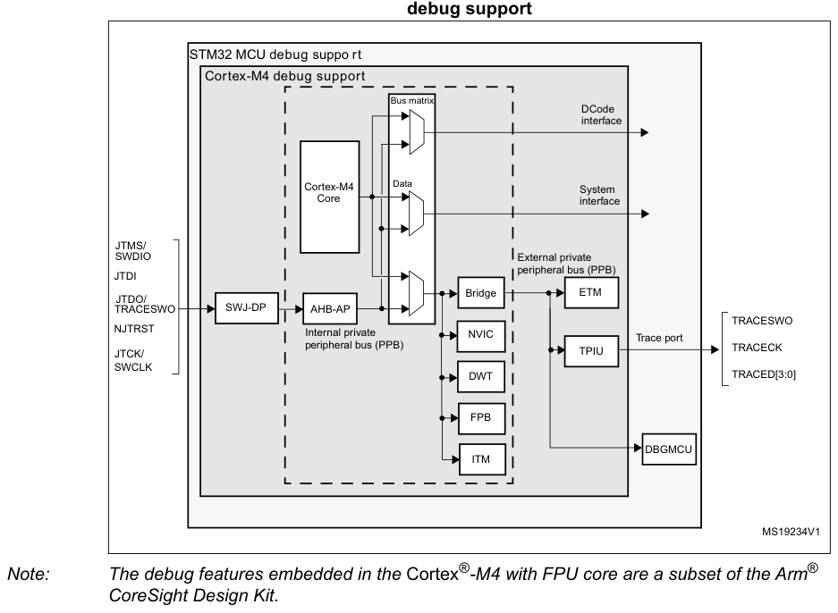
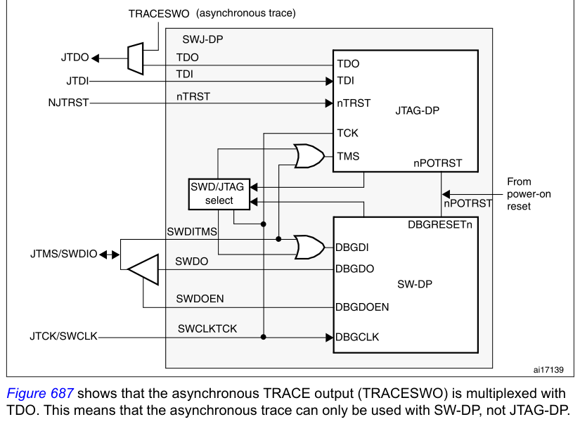
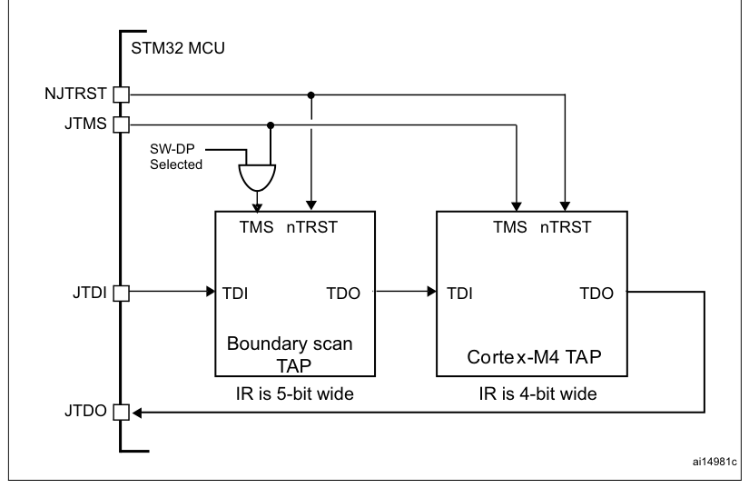
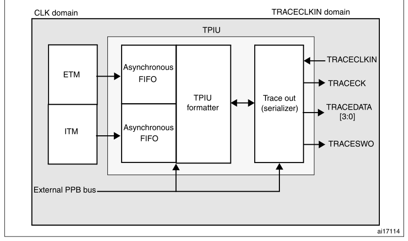

# 47 Debug support (DBG)

[← RM0440 index](../STM32G4_RM0440.md)

## 47.1 Overview

The STM32G4 series devices are built around a Cortex®-M4 with FPU core which contains hardware
extensions for advanced debugging features. The debug extensions allow the core to be stopped either
on a given instruction fetch (breakpoint) or data access (watchpoint). When stopped, the core’s
internal state and the system’s external state may be examined. Once examination is complete, the
core and the system may be restored and program execution resumed.

The debug features are used by the debugger host when connecting to and debugging the STM32G4 series
MCUs.

Two interfaces for debug are available:

- Serial wire
- JTAG debug port

**Figure 686. Block diagram of STM32 MCU and Cortex®-M4 with FPU-level**

debug support

STM32 MCU debug suppo rt

Cortex-M4 debug support

Bus matrix

DCode interface

> **Note:** The debug features embedded in the Cortex®-M4 with FPU core are a subset of the Arm®

CoreSight Design Kit.

The Arm® Cortex®-M4 with FPU core provides integrated on-chip debug support. It is comprised of:

- SWJ-DP: Serial wire / JTAG debug port
- AHP-AP: AHB access port
- ITM: Instrumentation trace macrocell
- FPB: Flash patch breakpoint
- DWT: Data watchpoint trigger
- TPUI: Trace port unit interface (available on larger packages, where the corresponding pins are
  mapped)
- ETM: Embedded Trace Macrocell (available only on STM32G4 series devices larger packages, where the
  corresponding pins are mapped)

It also includes debug features dedicated to the STM32G4 series:

- Flexible debug pinout assignment
- MCU debug box (support for low-power modes, control over peripheral clocks, etc.)

> **Note:** For further information on debug functionality supported by the Arm® Cortex®-M4 with FPU
> core, refer to the Cortex®-M4 with FPU-r0p1 Technical Reference Manual and to the CoreSight Design
Kit-r0p1 TRM (see [Section 47.2](#472-reference-arm-documentation): Reference Arm® documentation).

## 47.2 Reference Arm® documentation

- Cortex®-M4 with FPU r0p1 Technical Reference Manual (TRM),
  search for “Cortex®-M4 with FPU Technical Reference Manual” at [http://infocenter.arm.com](http://infocenter.arm.com)
- Arm® Debug Interface V5
- Arm® CoreSight Design Kit revision r0p1 Technical Reference Manual

## 47.3 SWJ debug port (serial wire and JTAG)

The STM32G4 series core integrates the Serial Wire / JTAG Debug Port (SWJ-DP). It is an Arm®
standard CoreSight debug port that combines a JTAG-DP (5-pin) interface and a SW-DP (2-pin)
interface.

- The JTAG Debug Port (JTAG-DP) provides a 5-pin standard JTAG interface to the AHP-AP port.
- The Serial Wire Debug Port (SW-DP) provides a 2-pin (clock \+ data) interface to the AHP-AP port.

In the SWJ-DP, the two JTAG pins of the SW-DP are multiplexed with some of the five JTAG pins of the
JTAG-DP.

**Figure 687. SWJ debug port**

Figure 687 shows that the asynchronous TRACE output (TRACESWO) is multiplexed with TDO. This means
that the asynchronous trace can only be used with SW-DP, not JTAG-DP.

### 47.3.1 Mechanism to select the JTAG-DP or the SW-DP

By default, the JTAG-Debug Port is active.

If the debugger host wants to switch to the SW-DP, it must provide a dedicated JTAG sequence on
TMS/TCK (respectively mapped to SWDIO and SWCLK) which disables the JTAG-DP and enables the SW-DP.
This way it is possible to activate the SWDP using only the SWCLK and SWDIO pins.

This sequence is:

1. Send more than 50 TCK cycles with TMS (SWDIO) =1
2. Send the 16-bit sequence on TMS (SWDIO) = 0111100111100111 (MSB transmitted
   first)
3. Send more than 50 TCK cycles with TMS (SWDIO) =1

## 47.4 Pinout and debug port pins

The STM32G4 series MCUs are available in various packages with different numbers of available pins.
As a result, some functionalities (ETM) related to pin availability may differ between packages.

### 47.4.1 SWJ debug port pins

Five pins are used as outputs from the STM32G4 series for the SWJ-DP as alternate functions of
general-purpose I/Os. These pins are available on all packages.

**Table 445. SWJ debug port pins**

| Source row | Column 1 | Column 2 | Column 3 | Column 4 | Column 5 | Column 6 |
| ---: | --- | --- | --- | --- | --- | --- |
| 1 | `JTAG debug port` | `SW debug port` | `Pin` |  |  |  |
| 2 | `SWJ-DP pin name` | `assign` |  |  |  |  |
| 3 | `Type` | `Description` | `Type` | `Debug assignment` | `ment` |  |
| 4 | `JTAG Test Mode` | `Serial Wire Data` |  |  |  |  |
| 5 | `JTMS/SWDIO` | `I` | `IO` | `PA13` |  |  |
| 6 | `Selection` | `Input/Output` |  |  |  |  |
| 7 | `JTCK/SWCLK` | `I` | `JTAG Test Clock` | `I` | `Serial Wire Clock` | `PA14` |
| 8 | `JTDI` | `I` | `JTAG Test Data Input` | `-` | `-` | `PA15` |
| 9 | `TRACESWO if` |  |  |  |  |  |
| 10 | `JTDO/TRACESWO` | `O` | `JTAG Test Data Output` | `-` | `asynchronous trace is` | `PB3` |
| 11 | `enabled` |  |  |  |  |  |
| 12 | `NJTRST` | `I` | `JTAG Test nReset` | `-` | `-` | `PB4` |

### 47.4.2 Flexible SWJ-DP pin assignment

After RESET (SYSRESETn or PORESETn), all five pins used for the SWJ-DP are assigned as dedicated
pins immediately usable by the debugger host (note that the trace outputs are not assigned except if
explicitly programmed by the debugger host).

However, the STM32G4 series MCUs offer the possibility of disabling some or all of the SWJ-DP ports,
and therefore the possibility of releasing (in gray in the table below) the associated pins for
general-purpose I/O (GPIO) usage, except for NJTRST that can be left disconnected but cannot be used
as general purpose GPIO without loosing debugger connection. For more details on how to disable
SWJ-DP port pins, please refer to [Section 9.3.2](chapter-09.md#932-io-pin-alternate-function-multiplexer-and-mapping): I/O pin alternate function multiplexer and mapping.

**Table 446. Flexible SWJ-DP pin assignment**

| Source row | Column 1 | Column 2 | Column 3 | Column 4 | Column 5 | Column 6 |
| ---: | --- | --- | --- | --- | --- | --- |
| 1 | `SWJ IO pin assigned` |  |  |  |  |  |
| 2 | `Available debug ports` | `PA13 /` | `PA14 /` |  |  |  |
| 3 | `PA15 /` | `PB3 /` | `PB4/` |  |  |  |
| 4 | `JTMS/ JTCK/` |  |  |  |  |  |
| 5 | `JTDI` | `JTDO` | `NJTRST` |  |  |  |
| 6 | `SWDIO SWCLK` |  |  |  |  |  |
| 7 | `Full SWJ (JTAG-DP + SW-DP) - Reset State` | `X` | `X` | `X` | `X` | `X` |
| 8 | `Full SWJ (JTAG-DP + SW-DP) but without NJTRST` | `X` | `X` | `X` | `X` |  |
| 9 | `JTAG-DP disabled and SW-DP enabled` | `X` | `X` |  |  |  |
| 10 | `JTAG-DP disabled and SW-DP disabled` | `Released` |  |  |  |  |

### 47.4.3 Internal pull-up and pull-down on JTAG pins

It is necessary to ensure that the JTAG input pins are not floating since they are directly
connected to flip-flops to control the debug mode features. Special care must be taken with the
SWCLK/TCK pin which is directly connected to the clock of some of these flip-flops.

To avoid any uncontrolled IO levels, the device embeds internal pull-ups and pull-downs on the JTAG
input pins:

- NJTRST: internal pull-up
- JTDI: internal pull-up
- JTMS/SWDIO: internal pull-up
- TCK/SWCLK: internal pull-down

Once a JTAG IO is released by the user software, the GPIO controller takes control again. The reset
states of the GPIO control registers put the I/Os in the equivalent state:

- NJTRST: input pull-up
- JTDI: input pull-up
- JTMS/SWDIO: input pull-up
- JTCK/SWCLK: input pull-down
- JTDO: input floating

The software can then use these I/Os as standard GPIOs.

> **Note:** The JTAG IEEE standard recommends to add pull-ups on TDI, TMS and nTRST but there is
> no special recommendation for TCK. However, for JTCK, the device needs an integrated pull-down.

Having embedded pull-ups and pull-downs removes the need to add external resistors.

The NJTRST (PB4) pin has also UCPD_CC2 functionality which implements internal UCPD pull-down
resistor (5.1 KΩ) which is controlled by voltage on UCPD_DBCC2 pin (PA10). In order to use the JTAG,
the pull down effect on the CC lines must be removed by using the UCPD1_DBDIS bit (USB Type-C and
power delivery dead battery disable) in the PWR_CR3 register (see [Section 46.4.6](chapter-46.md#4646-ucpd-type-c-pull-ups-rp-and-pull-downs-rd): UCPD Type-C
pull-ups (Rp) and pull-downs (Rd)).

### 47.4.4 Using serial wire and releasing the unused debug pins as GPIOs

To use the serial wire DP to release some GPIOs, the user software must change the GPIO (PA15, PB3
and PB4) configuration mode in the GPIO_MODER register. This releases PA15, PB3 and PB4 which now
become available as GPIOs.

When debugging, the host performs the following actions:

- Under system reset, all SWJ pins are assigned (JTAG-DP \+ SW-DP).
- Under system reset, the debugger host sends the JTAG sequence to switch from the JTAG-DP to the
  SW-DP.
- Still under system reset, the debugger sets a breakpoint on vector reset.
- The system reset is released and the Core halts.
- All the debug communications from this point are done using the SW-DP. The other JTAG pins can
  then be reassigned as GPIOs by the user software.

> **Note:** For user software designs, note that:

To release the debug pins, remember that they are first configured either in input-pull-up (nTRST,
TMS, TDI) or pull-down (TCK) or output tristate (TDO) for a certain duration after reset until the
instant when the user software releases the pins.

When debug pins (JTAG or SW or TRACE) are mapped, changing the corresponding IO pin configuration in
the IOPORT controller has no effect.

## 47.5 STM32G4 series JTAG TAP connection

The STM32G4 series MCUs integrate two serially connected JTAG TAPs, the boundary scan TAP (IR is
5-bit wide) and the Cortex®-M4 with FPU TAP (IR is 4-bit wide).

To access the TAP of the Cortex®-M4 with FPU for debug purposes:

1. First, it is necessary to shift the BYPASS instruction of the boundary scan TAP.
2. Then, for each IR shift, the scan chain contains 9 bits (=5+4) and the unused TAP
   instruction must be shifted by using the BYPASS instruction.
3. For each data shift, the unused TAP, which is in BYPASS mode, adds 1 extra data bit in
   the data scan chain.

> **Note:** Important: Once Serial-Wire is selected using the dedicated Arm® JTAG sequence, the
> boundary scan TAP is automatically disabled (JTMS forced high).

**Figure 688. JTAG TAP connections**

## 47.6 ID codes and locking mechanism

There are several ID codes inside the STM32G4 series MCUs. ST strongly recommends tools designers to
lock their debuggers using the MCU DEVICE ID code located in the external PPB memory map at address
0xE0042000.

### 47.6.1 MCU device ID code

The STM32G4 series MCUs integrate an MCU ID code. This ID identifies the ST MCU part-number and the
die revision. It is part of the DBG_MCU component and is mapped on the external PPB bus (see Section
47.16). This code is accessible using the JTAG debug port (4 to 5 pins) or the SW debug port (two
pins) or by the user software. It is even accessible while the MCU is under system reset.

Only the DEV_ID(11:0) should be used for identification by the debugger/programmer tools.

#### DBGMCU_IDCODE

Address: 0xE004 2000

Only 32-bits access supported. Read-only

**Register bit layout**

| Bit | Field | Access | Summary |
| ---: | --- | :---: | --- |
| 31 | — | — | Not specified in extracted bit-field text. |
| 30 | — | — | Not specified in extracted bit-field text. |
| 29 | — | — | Not specified in extracted bit-field text. |
| 28 | — | — | Not specified in extracted bit-field text. |
| 27 | — | — | Not specified in extracted bit-field text. |
| 26 | — | — | Not specified in extracted bit-field text. |
| 25 | — | — | Not specified in extracted bit-field text. |
| 24 | — | — | Not specified in extracted bit-field text. |
| 23 | — | — | Not specified in extracted bit-field text. |
| 22 | — | — | Not specified in extracted bit-field text. |
| 21 | — | — | Not specified in extracted bit-field text. |
| 20 | — | — | Not specified in extracted bit-field text. |
| 19 | — | — | Not specified in extracted bit-field text. |
| 18 | — | — | Not specified in extracted bit-field text. |
| 17 | — | — | Not specified in extracted bit-field text. |
| 16 | — | — | Not specified in extracted bit-field text. |
| 15 | Reserved | — | kept at reset value. |
| 14 | Reserved | — | ↳ |
| 13 | Reserved | — | ↳ |
| 12 | Reserved | — | ↳ |
| 11 | `DEV_ID[11]` | r | Device identifier |
| 10 | `DEV_ID[10]` | r | ↳ |
| 9 | `DEV_ID[9]` | r | ↳ |
| 8 | `DEV_ID[8]` | r | ↳ |
| 7 | `DEV_ID[7]` | r | ↳ |
| 6 | `DEV_ID[6]` | r | ↳ |
| 5 | `DEV_ID[5]` | r | ↳ |
| 4 | `DEV_ID[4]` | r | ↳ |
| 3 | `DEV_ID[3]` | r | ↳ |
| 2 | `DEV_ID[2]` | r | ↳ |
| 1 | `DEV_ID[1]` | r | ↳ |
| 0 | `DEV_ID[0]` | r | ↳ |

This field indicates the revision of the device.

- `0x1000`: Revision A
- `0x1001`: Revision Z (Category 4 devices only)

0x2000: Revision B

0x2001: Revision Z

0x2002: Revision Y

0x2003: Revision X

**Bits 15:12 — Reserved:** kept at reset value.

**Bits 11:0 — `DEV_ID[11:0]`:** Device identifier

The device ID is:

- 0x468: Category 2 devices (See Table 1: STM32G4 series memory density)
- 0x469: Category 3 devices (See Table 1: STM32G4 series memory density)
- 0x479: Category 4devices (See Table 1: STM32G4 series memory density)

### 47.6.2 Boundary scan TAP

#### JTAG ID code

The TAP of the STM32G4 series BSC (boundary scan) integrates a JTAG ID code equal to 16469041
(category 3 devices), 16468041 (category 2 devices), 16479041 (category 4 devices).

### 47.6.3 Cortex®-M4 with FPU TAP

The TAP of the Arm® Cortex®-M4 with FPU integrates a JTAG ID code. This ID code is the Arm® default
one and has not been modified. This code is only accessible by the JTAG Debug Port.

This code is 0x4BA00477 (corresponds to Cortex®-M4 with FPU r0p1, see [Section 47.2](#472-reference-arm-documentation): Reference Arm®
documentation).

### 47.6.4 Cortex®-M4 with FPU JEDEC-106 ID code

The Arm® Cortex®-M4 with FPU integrates a JEDEC-106 ID code. It is located in the 4KB ROM table
mapped on the internal PPB bus at address 0xE00FF000_0xE00FFFFF.

This code is accessible by the JTAG Debug Port (4 to 5 pins) or by the SW Debug Port (two pins) or
by the user software.

## 47.7 JTAG debug port

A standard JTAG state machine is implemented with a 4-bit instruction register (IR) and five data
registers (for full details, refer to the Cortex®-M4 with FPU with FPU r0p1 Technical Reference
Manual (TRM), for references, please see [Section 47.2](#472-reference-arm-documentation): Reference Arm® documentation).

**Table 447. JTAG debug port data registers**

| Source row | Column 1 | Column 2 | Column 3 |
| ---: | --- | --- | --- |
| 1 | `IR(3:0)` | `Data register` | `Details` |
| 2 | `BYPASS` |  |  |
| 3 | `1111` | `-` |  |
| 4 | `[1 bit]` |  |  |
| 5 | `IDCODE` | `ID CODE` |  |
| 6 | `1110` |  |  |
| 7 | `[32 bits]` | `0x4BA00477 (Arm® Cortex®-M4 with FPU r0p1-01rel0 ID Code)` |  |
| 8 | `Debug port access register` |  |  |

This initiates a debug port and allows access to a debug port register.

- When transferring data IN:

**Bits 34:3 — `DATA[31:0]`:** 32-bit data to transfer for a write request

**Bits 2:1 — `A[3:2]`:** 2-bit address of a debug port register.

**Bit 0 — `RnW`:** Read request (1) or write request (0).

DPACC

- When transferring data OUT:

1010

| Source row | Column 1 | Column 2 |
| ---: | --- | --- |
| 1 | `[35 bits]` | `Bits 34:3 = DATA[31:0] = 32-bit data which is read following a read` |
| 2 | `request` |  |

**Bits 2:0 — `ACK[2:0]`:** 3-bit Acknowledge: 010 = OK/FAULT 001 = WAIT OTHER = reserved

Refer to Table 448 for a description of the A(3:2) bits

**Table 447. JTAG debug port data registers (continued)**

| Source row | Column 1 | Column 2 | Column 3 |
| ---: | --- | --- | --- |
| 1 | `IR(3:0)` | `Data register` | `Details` |
| 2 | `Access port access register` |  |  |

Initiates an access port and allows access to an access port register.

- When transferring data IN:

**Bits 34:3 — `DATA[31:0]`:** 32-bit data to shift in for a write request

**Bits 2:1 — `A[3:2]`:** 2-bit address (sub-address AP registers).

**Bit 0 — `RnW`:** Read request (1) or write request (0).

- When transferring data OUT:

**Bits 34:3 — `DATA[31:0]`:** 32-bit data which is read following a read

APACC

| Source row | Column 1 | Column 2 |
| ---: | --- | --- |
| 1 | `1011` | `request` |
| 2 | `[35 bits]` |  |

**Bits 2:0 — `ACK[2:0]`:** 3-bit Acknowledge: 010 = OK/FAULT 001 = WAIT OTHER = reserved

There are many AP Registers (see AHB-AP) addressed as the combination of:

- The shifted value A[3:2]
- The current value of the DP SELECT register

Abort register

ABORT

| Source row | Column 1 | Column 2 |
| ---: | --- | --- |
| 1 | `1000` | `– Bits 31:1 = Reserved` |
| 2 | `[35 bits]` |  |

- Bit 0 = DAPABORT: write 1 to generate a DAP abort.

**Table 448. 32-bit debug port registers addressed through the shifted value A[3:2]**

| Source row | Column 1 | Column 2 | Column 3 |
| ---: | --- | --- | --- |
| 1 | `Address` | `A(3:2) value` | `Description` |
| 2 | `0x0` | `00` | `Reserved, must be kept at reset value.` |
| 3 | `DP CTRL/STAT register. Used to:` |  |  |

- Request a system or debug power-up

| Source row | Column 1 | Column 2 | Column 3 |
| ---: | --- | --- | --- |
| 1 | `0x4` | `01` | `– Configure the transfer operation for AP accesses` |

- Control the pushed compare and pushed verify operations
- Read some status flags (overrun, power-up acknowledges)

DP SELECT register. Used to select the current access port and the active 4-words register window.

- Bits 31:24: APSEL: select the current AP

| Source row | Column 1 | Column 2 | Column 3 |
| ---: | --- | --- | --- |
| 1 | `0x8` | `10` | `– Bits 23:8: reserved` |

- Bits 7:4: APBANKSEL: select the active 4-words register window on the current AP
- Bits 3:0: reserved

DP RDBUFF register: Used to allow the debugger to get the final result

| Source row | Column 1 | Column 2 | Column 3 |
| ---: | --- | --- | --- |
| 1 | `0xC` | `11` | `after a sequence of operations (without requesting new JTAG-DP` |
| 2 | `operation)` |  |  |

## 47.8 SW debug port

### 47.8.1 SW protocol introduction

This synchronous serial protocol uses two pins:

- SWCLK: clock from host to target
- SWDIO: bidirectional

The protocol allows two banks of registers (DPACC registers and APACC registers) to be read and
written to.

Bits are transferred LSB-first on the wire.

For SWDIO bidirectional management, the line must be pulled-up on the board (100 kΩ recommended by
Arm®).

Each time the direction of SWDIO changes in the protocol, a turnaround time is inserted where the
line is not driven by the host nor the target. By default, this turnaround time is one bit time,
however this can be adjusted by configuring the SWCLK frequency.

### 47.8.2 SW protocol sequence

Each sequence consist of three phases:

1. Packet request (8 bits) transmitted by the host
2. Acknowledge response (3 bits) transmitted by the target
3. Data transfer phase (33 bits) transmitted by the host or the target

**Table 449. Packet request (8-bits)**

| Bit | Name | Description |
| --- | --- | --- |
| 0 | Start | Must be “1” |

- `0`: DP Access

1 APnDP

- `1`: AP Access
- `0`: Write Request

2 RnW

- `1`: Read Request

| Source row | Column 1 | Column 2 | Column 3 |
| ---: | --- | --- | --- |
| 1 | `4:3` | `A(3:2)` | `Address field of the DP or AP registers (refer to Table 448)` |
| 2 | `5` | `Parity` | `Single bit parity of preceding bits` |
| 3 | `6` | `Stop` | `0` |
| 4 | `Not driven by the host. Must be read as “1” by the target because of` |  |  |
| 5 | `7 Park` |  |  |
| 6 | `the pull-up` |  |  |

Refer to the Cortex®-M4 with FPU r0p1 TRM for a detailed description of DPACC and APACC registers.

The packet request is always followed by the turnaround time (default 1 bit) where neither the host
nor target drive the line.

**Table 450. ACK response (3 bits)**

| Source row | Column 1 | Column 2 | Column 3 |
| ---: | --- | --- | --- |
| 1 | `Bit` | `Name` | `Description` |

- `001`: FAULT

| Source row | Column 1 | Column 2 | Column 3 |
| ---: | --- | --- | --- |
| 1 | `0..2` | `ACK` | `010: WAIT` |

- `100`: OK

The ACK Response must be followed by a turnaround time only if it is a READ transaction or if a WAIT
or FAULT acknowledge has been received.

**Table 451. DATA transfer (33 bits)**

| Bit | Name | Description |
| --- | --- | --- |
| 0..31 | WDATA or RDATA | Write or Read data |
| 32 | Parity | Single parity of the 32 data bits |

The DATA transfer must be followed by a turnaround time only if it is a READ transaction.

### 47.8.3 SW-DP state machine (reset, idle states, ID code)

The State Machine of the SW-DP has an internal ID code which identifies the SW-DP. It follows the
JEP-106 standard. This ID code is the default Arm® one and is set to 0x2BA01477 (corresponding to
Cortex®-M4 with FPU r0p1).

> **Note:** Note that the SW-DP state machine is inactive until the target reads this ID code.

- The SW-DP state machine is in RESET STATE either after power-on reset, or after the DP has
  switched from JTAG to SWD or after the line is high for more than 50 cycles
- The SW-DP state machine is in IDLE STATE if the line is low for at least two cycles after RESET
  state.
- After RESET state, it is mandatory to first enter into an IDLE state AND to perform a READ access
  of the DP-SW ID CODE register. Otherwise, the target issues a FAULT acknowledge response on
  another transactions.

Further details of the SW-DP state machine can be found in the Cortex®-M4 with FPU r0p1 TRM and the
CoreSight Design Kit r0p1 TRM.

### 47.8.4 DP and AP read/write accesses

- Read accesses to the DP are not posted: the target response can be immediate (if ACK=OK) or can be
  delayed (if ACK=WAIT).
- Read accesses to the AP are posted. This means that the result of the access is returned on the
  next transfer. If the next access to be done is NOT an AP access, then the DP-RDBUFF register must
  be read to obtain the result. The READOK flag of the DP-CTRL/STAT register is updated on every AP
  read access or RDBUFF read request to know if the AP read access was successful.
- The SW-DP implements a write buffer (for both DP or AP writes), that enables it to accept a write
  operation even when other transactions are still outstanding. If the write buffer is full, the
  target acknowledge response is “WAIT”. With the exception of

IDCODE read or CTRL/STAT read or ABORT write which are accepted even if the write buffer is full.

- Because of the asynchronous clock domains SWCLK and HCLK, two extra SWCLK cycles are needed after
  a write transaction (after the parity bit) to make the write effective internally. These cycles
  should be applied while driving the line low (IDLE state) This is particularly important when
  writing the CTRL/STAT for a power-up request. If the next transaction (requiring a power-up)
  occurs immediately, it fails.

### 47.8.5 SW-DP registers

Access to these registers are initiated when APnDP=0

**Table 452. SW-DP registers**

| Source row | Column 1 | Column 2 | Column 3 | Column 4 | Column 5 |
| ---: | --- | --- | --- | --- | --- |
| 1 | `CTRLSEL bit` |  |  |  |  |
| 2 | `A(3:2)` | `R/W` | `of SELECT` | `Register` | `Notes` |
| 3 | `register` |  |  |  |  |
| 4 | `The manufacturer code is not set to ST code` |  |  |  |  |
| 5 | `00` | `Read` | `-` | `IDCODE` |  |
| 6 | `0x2BA01477 (identifies the SW-DP)` |  |  |  |  |
| 7 | `00` | `Write` | `-` | `ABORT` | `-` |
| 8 | `Purpose is to:` |  |  |  |  |

- request a system or debug power-up
- configure the transfer operation for AP

| Source row | Column 1 | Column 2 | Column 3 |
| ---: | --- | --- | --- |
| 1 | `DP-` | `accesses` |  |
| 2 | `01` | `Read/Write` | `0` |
| 3 | `CTRL/STAT` | `– control the pushed compare and pushed` |  |

verify operations.

- read some status flags (overrun, power-up acknowledges)

Purpose is to configure the physical serial

WIRE

| Source row | Column 1 | Column 2 | Column 3 | Column 4 |
| ---: | --- | --- | --- | --- |
| 1 | `01` | `Read/Write` | `1` | `port protocol (like the duration of the` |
| 2 | `CONTROL` |  |  |  |
| 3 | `turnaround time)` |  |  |  |
| 4 | `Enables recovery of the read data from a` |  |  |  |
| 5 | `READ` |  |  |  |
| 6 | `10` | `Read` | `-` | `corrupted debugger transfer, without` |
| 7 | `RESEND` |  |  |  |

repeating the original AP transfer.

The purpose is to select the current access

| Source row | Column 1 | Column 2 | Column 3 | Column 4 |
| ---: | --- | --- | --- | --- |
| 1 | `10` | `Write` | `-` | `SELECT` |
| 2 | `port and the active 4-words register window` |  |  |  |
| 3 | `This read buffer is useful because AP accesses are posted (the result of a read AP request is available on the next AP` |  |  |  |
| 4 | `READ` |  |  |  |
| 5 | `11` | `Read/Write` | `-` | `transaction).` |
| 6 | `BUFFER` |  |  |  |

This read buffer captures data from the AP, presented as the result of a previous read, without
initiating a new transaction

### 47.8.6 SW-AP registers

Access to these registers are initiated when APnDP=1

There are many AP Registers (see AHB-AP) addressed as the combination of:

- The shifted value A[3:2]
- The current value of the DP SELECT register

## 47.9 AHB-AP (AHB access port) - valid for both JTAG-DP and SW-DP

### Features

- System access is independent of the processor status.
- Either SW-DP or JTAG-DP accesses AHB-AP.
- The AHB-AP is an AHB master into the Bus Matrix. Consequently, it can access all the data buses
  (Dcode Bus, System Bus, internal and external PPB bus) but the ICode bus.
- Bitband transactions are supported.
- AHB-AP transactions bypass the FPB.

The address of the 32-bits AHP-AP resisters are 6-bits wide (up to 64 words or 256 bytes) and
consists of:

c) Bits [7:4] = the bits [7:4] APBANKSEL of the DP SELECT register
d) Bits [3:2] = the 2 address bits of A(3:2) of the 35-bit packet request for SW-DP.

The AHB-AP of the Cortex®-M4 with FPU includes 9 x 32-bits registers:

**Table 453. Cortex®-M4 with FPU AHB-AP registers**

| Source row | Column 1 | Column 2 | Column 3 |
| ---: | --- | --- | --- |
| 1 | `Address` |  |  |
| 2 | `Register name` | `Notes` |  |
| 3 | `offset` |  |  |
| 4 | `Configures and controls transfers through the AHB` |  |  |
| 5 | `AHB-AP Control and Status` |  |  |
| 6 | `0x00` | `interface (size, hprot, status on current transfer, address` |  |
| 7 | `Word` |  |  |
| 8 | `increment type` |  |  |
| 9 | `0x04` | `AHB-AP Transfer Address` | `-` |
| 10 | `0x0C` | `AHB-AP Data Read/Write` | `-` |
| 11 | `0x10 AHB-AP Banked Data 0` |  |  |
| 12 | `0x14 AHB-AP Banked Data 1` |  |  |

Directly maps the 4 aligned data words without rewriting the Transfer Address Register.

0x18 AHB-AP Banked Data 2

0x1C AHB-AP Banked Data 3

| 0xF8 | AHB-AP Debug ROM Address | Base Address of the debug interface |
| --- | --- | --- |
| 0xFC | AHB-AP ID Register | - |

Refer to the Cortex®-M4 with FPU r0p1 TRM for further details.

## 47.10 Core debug

Core debug is accessed through the core debug registers. Debug access to these registers is by means
of the Advanced High-performance Bus (AHB-AP) port. The processor can access these registers
directly over the internal Private Peripheral Bus (PPB).

It consists of 4 registers:

**Table 454. Core debug registers**

| Source row | Column 1 | Column 2 |
| ---: | --- | --- |
| 1 | `Register` | `Description` |
| 2 | `The 32-bit Debug Halting Control and Status Register:` |  |
| 3 | `DHCSR` | `This provides status information about the state of the processor enable core debug` |

halt and step the processor.

The 17-bit Debug Core Register Selector Register:

DCRSR

This selects the processor register to transfer data to or from.

The 32-bit Debug Core Register Data Register:

| Source row | Column 1 | Column 2 |
| ---: | --- | --- |
| 1 | `DCRDR` | `This holds data for reading and writing registers to and from the processor selected` |

by the DCRSR (Selector) register.

The 32-bit Debug Exception and Monitor Control Register:

| Source row | Column 1 | Column 2 |
| ---: | --- | --- |
| 1 | `DEMCR` | `This provides Vector Catching and Debug Monitor Control. This register contains a` |

bit named TRCENA which enable the use of a TRACE.

> **Note:** Important: these registers are not reset by a system reset. They are only reset by a power-
> on reset.

Refer to the Cortex®-M4 with FPU r0p1 TRM for further details.

To Halt on reset, it is necessary to:

- enable the bit0 (VC_CORRESET) of the Debug and Exception Monitor Control Register
- enable the bit0 (C_DEBUGEN) of the Debug Halting Control and Status Register.

## 47.11 Capability of the debugger host to connect under system reset

The STM32G4 series MCUs’ reset system comprises the following reset sources:

- POR (power-on reset) which asserts a RESET at each power-up
- Internal watchdog reset
- Software reset
- External reset.

The Cortex®-M4 with FPU differentiates the reset of the debug part (generally PORRESETn) and the
other one (SYSRESETn).

This way, it is possible for the debugger to connect under System Reset, programming the Core Debug
Registers to halt the core when fetching the reset vector. Then the host can release the system
reset and the core immediately halts without having executed any instructions. In addition, it is
possible to program any debug features under System Reset.

> **Note:** It is highly recommended for the debugger host to connect (set a breakpoint in the reset
> vector) under system reset.

## 47.12 FPB (Flash patch breakpoint)

The FPB unit:

- implements hardware breakpoints
- patches code and data from code space to system space. This feature gives the possibility to
  correct software bugs located in the Code Memory Space.

The use of a Software Patch or a Hardware Breakpoint is exclusive.

The FPB consists of:

- 2 literal comparators for matching against literal loads from Code Space and remapping to a
  corresponding area in the System Space
- 6 instruction comparators for matching against instruction fetches from Code Space. They can be
  used either to remap to a corresponding area in the System Space or to generate a Breakpoint
  Instruction to the core.

## 47.13 DWT (data watchpoint trigger)

The DWT unit consists of four comparators. They are configurable as:

- a hardware watchpoint or
- a trigger to an ETM or
- a PC sampler or
- a data address sampler

The DWT also provides some means to give some profiling informations. For this, some counters are
accessible to give the number of:

- Clock cycle
- Folded instructions
- Load store unit (LSU) operations
- Sleep cycles
- CPI (clock per instructions)
- Interrupt overhead

## 47.14 ITM (instrumentation trace macrocell)

### 47.14.1 General description

The ITM is an application-driven trace source that supports printf style debugging to trace
Operating System (OS) and application events, and emits diagnostic system information. The ITM emits
trace information as packets which can be generated as:

- Software trace. Software can write directly to the ITM stimulus registers to emit packets.
- Hardware trace. The DWT generates these packets, and the ITM emits them.
- Time stamping. Timestamps are emitted relative to packets. The ITM contains a 21-bit counter to
  generate the timestamp. The Cortex®-M4 with FPU clock or the bit clock rate of the Serial Wire
  Viewer (SWV) output clocks the counter.

The packets emitted by the ITM are output to the TPIU (Trace Port Interface Unit). The formatter of
the TPIU adds some extra packets (refer to TPIU) and then output the complete packets sequence to
the debugger host.

The bit TRCEN of the Debug Exception and Monitor Control Register must be enabled before you program
or use the ITM.

### 47.14.2 Time stamp packets, synchronization and overflow packets

Time stamp packets encode time stamp information, generic control and synchronization. It uses a
21-bit timestamp counter (with possible prescalers) which is reset at each time stamp packet
emission. This counter can be either clocked by the CPU clock or the SWV clock.

A synchronization packet consists of 6 bytes equal to 0x80_00_00_00_00_00 which is emitted to the
TPIU as 00 00 00 00 00 80 (LSB emitted first).

A synchronization packet is a timestamp packet control. It is emitted at each DWT trigger.

For this, the DWT must be configured to trigger the ITM: the bit CYCCNTENA (bit0) of the DWT Control
Register must be set. In addition, the bit2 (SYNCENA) of the ITM Trace Control Register must be set.

> **Note:** If the SYNENA bit is not set, the DWT generates Synchronization triggers to the TPIU which
> sends only TPIU synchronization packets and not ITM synchronization packets.

An overflow packet consists is a special timestamp packets which indicates that data has been
written but the FIFO was full.

**Table 455. Main ITM registers**

| Source row | Column 1 | Column 2 | Column 3 |
| ---: | --- | --- | --- |
| 1 | `Address` | `Register` | `Details` |
| 2 | `Write 0xC5ACCE55 to unlock Write Access to the other ITM` |  |  |
| 3 | `@E0000FB0` | `ITM lock access` |  |
| 4 | `registers` |  |  |
| 5 | `Bits 31-24 = Always 0` |  |  |
| 6 | `Bits 23 = Busy` |  |  |
| 7 | `Bits 22-16 = 7-bits ATB ID which identifies the source of the trace data` |  |  |
| 8 | `Bits 15-10 = Always 0` |  |  |

**Bits 9:8 — `TSPrescale`:** Time Stamp Prescaler

Bits 7-5 = Reserved

| Source row | Column 1 | Column 2 |
| ---: | --- | --- |
| 1 | `@E0000E80` | `ITM trace control` |

**Bit 4 — `SWOENA`:** Enable SWV behavior (to clock the timestamp counter by the SWV clock)

**Bit 3 — `DWTENA`:** Enable the DWT Stimulus

**Bit 2 — `SYNCENA`:** this bit must be to 1 to enable the DWT to generate synchronization triggers
so that the TPIU can then emit the synchronization packets

Bit 1 = TSENA (Timestamp Enable)

**Bit 0 — `ITMENA`:** Global Enable Bit of the ITM

Bit 3: mask to enable tracing ports31:24

Bit 2: mask to enable tracing ports23:16

| Source row | Column 1 | Column 2 | Column 3 |
| ---: | --- | --- | --- |
| 1 | `@E0000E40` | `ITM trace privilege` |  |
| 2 | `Bit 1: mask to enable tracing ports15:8` |  |  |
| 3 | `Bit 0: mask to enable tracing ports7:0` |  |  |
| 4 | `Each bit enables the corresponding Stimulus port to generate` |  |  |
| 5 | `@E0000E00` | `ITM trace enable` |  |
| 6 | `trace` |  |  |
| 7 | `@E0000000-` | `Stimulus port` | `Write the 32-bits data on the selected Stimulus Port (32` |
| 8 | `E000007C` | `registers 0-31` | `available) to be traced out` |

#### Example of configuration

To output a simple value to the TPIU:

- Configure the TPIU and assign TRACE I/Os by configuring the DBGMCU_CR (refer to [Section 47.17.2](#47172-trace-pin-assignment):
  TRACE pin assignment and [Section 47.16.3](#47163-debug-mcu-configuration-register-dbgmcu_cr): Debug MCU configuration register (DBGMCU_CR))
- Write 0xC5ACCE55 to the ITM Lock Access Register to unlock the write access to the ITM registers
- Write 0x00010005 to the ITM Trace Control Register to enable the ITM with Synchronous enabled and
  an ATB ID different from 0x00
- Write 0x1 to the ITM Trace Enable Register to enable the Stimulus Port 0
- Write 0x1 to the ITM Trace Privilege Register to unmask Stimulus Ports 7:0
- Write the value to output in the Stimulus Port Register 0: this can be done by software (using a
  printf function)

## 47.15 ETM (Embedded Trace Macrocell™)

### 47.15.1 General description

The ETM enables the reconstruction of program execution. Data are traced using the Data Watchpoint
and Trace (DWT) component or the Instruction Trace Macrocell (ITM) whereas instructions are traced
using the Embedded Trace Macrocell (ETM).

The ETM transmits information as packets and is triggered by embedded resources. These resources
must be programmed independently and the trigger source is selected using the Trigger Event Register
(0xE0041008). An event could be a simple event (address match from an address comparator) or a logic
equation between 2 events. The trigger source is one of the four comparators of the DWT module, The
following events can be monitored:

- Clock cycle matching
- Data address matching

For more informations on the trigger resources refer to [Section 47.13](#4713-dwt-data-watchpoint-trigger): DWT (data watchpoint
trigger).

The packets transmitted by the ETM are output to the TPIU (Trace Port Interface Unit). The formatter
of the TPIU adds some extra packets (refer to [Section 47.17](#4717-tpiu-trace-port-interface-unit): TPIU (trace port interface unit)) and
then outputs the complete packet sequence to the debugger host.

### 47.15.2 Signal protocol, packet types

This part is described in the [section 7](chapter-07.md#7-reset-and-clock-control-rcc) ETMv3 Signal Protocol of the Arm® IHI 0014N document.

### 47.15.3 Main ETM registers

For more information on registers refer to the chapter 3 of the Arm® IHI 0014N specification.

**Table 456. Main ETM registers**

| Source row | Column 1 | Column 2 | Column 3 |
| ---: | --- | --- | --- |
| 1 | `Address` | `Register` | `Details` |
| 2 | `Write 0xC5ACCE55 to unlock the write access to the` |  |  |
| 3 | `0xE0041FB0 ETM Lock Access` |  |  |

other ETM registers.

This register controls the general operation of the ETM,

| Source row | Column 1 | Column 2 |
| ---: | --- | --- |
| 1 | `0xE0041000` | `ETM Control` |

for instance how tracing is enabled.

This register provides information about the current status

| Source row | Column 1 | Column 2 | Column 3 |
| ---: | --- | --- | --- |
| 1 | `0xE0041010` | `ETM Status` |  |
| 2 | `of the trace and trigger logic.` |  |  |
| 3 | `0xE0041008` | `ETM Trigger Event` | `This register defines the event that controls trigger.` |
| 4 | `0xE004101C ETM Trace Enable` | `This register defines which comparator is selected.` |  |
| 5 | `Control` |  |  |
| 6 | `0xE0041020` | `ETM Trace Enable Event` | `This register defines the trace enabling event.` |
| 7 | `This register defines the traces used by the trigger source` |  |  |
| 8 | `0xE0041024` | `ETM Trace Start/Stop` |  |

to start and stop the trace, respectively.

### 47.15.4 Configuration example

To output a simple value to the TPIU:

- Configure the TPIU and enable the I/IO_TRACEN to assign TRACE I/Os in the STM32G4 series debug
  configuration register
- Write 0xC5ACCE55 to the ETM Lock Access Register to unlock the write access to the ITM registers
- Write 0x00001D1E to the control register (configure the trace)
- Write 0000406F to the Trigger Event register (define the trigger event)
- Write 0000006F to the Trace Enable Event register (define an event to start/stop)
- Write 00000001 to the Trace Start/stop register (enable the trace)
- Write 0000191E to the ETM Control Register (end of configuration)

## 47.16 MCU debug component (DBGMCU)

The MCU debug component helps the debugger provide support for:

- Low-power modes
- Clock control for timers, watchdog, I2C and bxCAN during a breakpoint
- Control of the trace pins assignment

### 47.16.1 Debug support for low-power modes

To enter low-power mode, the instruction WFI or WFE must be executed.

The MCU implements several low-power modes which can either deactivate the CPU clock or reduce the
power of the CPU.

The core does not allow FCLK or HCLK to be turned off during a debug session. As these are required
for the debugger connection, during a debug, they must remain active. The MCU integrates special
means to allow the user to debug software in low-power modes.

For this, the debugger host must first set some debug configuration registers to change the
low-power mode behavior:

- In Sleep mode, DBG_SLEEP bit of DBGMCU_CR register must be previously set by the debugger. This
  feeds HCLK with the same clock that is provided to FCLK (system clock previously configured by the
  software).
- In Stop mode, the bit DBG_STOP must be previously set by the debugger. This enables the internal
  RC oscillator clock to feed FCLK and HCLK in Stop mode.
- In Standby mode, the bit DBG_STANDBY must be previously set by the debugger. This keeps the
  regulators on, and enable the internal RC oscillator clock to feed FCLK and HCLK in Standby mode.
  A system reset is generated internally so that exiting from Standby is identical than fetching
  from reset.

The DBGMCU_CR register can be written by the debugger under system reset. If the debugger host does
not support these features, it is still possible to write this register by software.

### 47.16.2 Debug support for timers, RTC, watchdog and I2C

During a breakpoint, it is necessary to choose how the counter of timers,RTC and watchdog should
behave:

- They can continue to count inside a breakpoint. This is usually required when a PWM is controlling
  a motor, for example.
- They can stop to count inside a breakpoint. This is required for watchdog purposes.

For the I2C, the user can choose to block the SMBUS timeout during a breakpoint.

The DBGMCU freeze registers can be written by the debugger under system reset. If the debugger host
does not support these features, it is still possible to write these registers by software.

### 47.16.3 Debug MCU configuration register (DBGMCU_CR)

Address: 0xE004 2004

Power-on reset: 0x0000 0000

System reset: not affected

- **Access:** Only 32-bit access supported

**Register bit layout**

| Bit | Field | Access | Summary |
| ---: | --- | :---: | --- |
| 31 | Reserved | — | kept at reset value. |
| 30 | Reserved | — | ↳ |
| 29 | Reserved | — | ↳ |
| 28 | Reserved | — | ↳ |
| 27 | Reserved | — | ↳ |
| 26 | Reserved | — | ↳ |
| 25 | Reserved | — | ↳ |
| 24 | Reserved | — | ↳ |
| 23 | Reserved | — | ↳ |
| 22 | Reserved | — | ↳ |
| 21 | Reserved | — | ↳ |
| 20 | Reserved | — | ↳ |
| 19 | Reserved | — | ↳ |
| 18 | Reserved | — | ↳ |
| 17 | Reserved | — | ↳ |
| 16 | Reserved | — | ↳ |
| 15 | Reserved | — | ↳ |
| 14 | Reserved | — | ↳ |
| 13 | Reserved | — | ↳ |
| 12 | Reserved | — | ↳ |
| 11 | Reserved | — | ↳ |
| 10 | Reserved | — | ↳ |
| 9 | Reserved | — | ↳ |
| 8 | Reserved | — | ↳ |
| 7 | `TRACE_MODE[1:0] and TRACE_IOEN` | rw | Trace pin assignment control |
| 6 | `TRACE_MODE[1:0] and TRACE_IOEN` | rw | ↳ |
| 5 | `TRACE_MODE[1:0] and TRACE_IOEN` | rw | ↳ |
| 4 | Reserved | — | kept at reset value. |
| 3 | Reserved | — | ↳ |
| 2 | `DBG_STANDBY` | rw | Debug Standby mode |
| 1 | `DBG_STOP` | rw | Debug Stop mode |
| 0 | `DBG_SLEEP` | rw | Debug Sleep mode |

**Bits 31:8 — Reserved:** kept at reset value.

**Bits 7:5 — `TRACE_MODE[1:0] and TRACE_IOEN`:** Trace pin assignment control

- With TRACE_IOEN=0:

TRACE_MODE=xx: TRACE pins not assigned (default state)

- With TRACE_IOEN=1:
- TRACE_MODE=00: TRACE pin assignment for Asynchronous Mode
- TRACE_MODE=01: TRACE pin assignment for Synchronous Mode with a

TRACEDATA size of 1

- TRACE_MODE=10: TRACE pin assignment for Synchronous Mode with a

TRACEDATA size of 2

- TRACE_MODE=11: TRACE pin assignment for Synchronous Mode with a

TRACEDATA size of 4

**Bits 4:3 — Reserved:** kept at reset value.

**Bit 2 — `DBG_STANDBY`:** Debug Standby mode

- `0`: (FCLK=Off, HCLK=Off) The whole digital part is unpowered.

From software point of view, exiting from Standby is identical than fetching reset vector

(except a few status bit indicated that the MCU is resuming from Standby)

- `1`: (FCLK=On, HCLK=On) In this case, the digital part is not unpowered and FCLK and

HCLK are provided by the internal RC oscillator which remains active. In addition, the MCU
generate a system reset during Standby mode so that exiting from Standby is identical than
fetching from reset.

**Bit 1 — `DBG_STOP`:** Debug Stop mode

- `0`: (FCLK=Off, HCLK=Off) In STOP mode, the clock controller disables all clocks (including

HCLK and FCLK). When exiting from STOP mode, the clock configuration is identical to the
one after RESET (CPU clocked by the 8 MHz internal RC oscillator (HSI16)). Consequently,
the software must reprogram the clock controller to enable the PLL, the Xtal, etc.

- `1`: (FCLK=On, HCLK=On) In this case, when entering STOP mode, FCLK and HCLK are
  provided by the internal RC oscillator which remains active in STOP mode. When exiting

STOP mode, the software must reprogram the clock controller to enable the PLL, the Xtal,
etc. (in the same way it would do in case of DBG_STOP=0)

**Bit 0 — `DBG_SLEEP`:** Debug Sleep mode

- `0`: (FCLK=On, HCLK=Off) In Sleep mode, FCLK is clocked by the system clock as
  previously configured by the software while HCLK is disabled.

In Sleep mode, the clock controller configuration is not reset and remains in the previously
programmed state. Consequently, when exiting from Sleep mode, the software does not
need to reconfigure the clock controller.

- `1`: (FCLK=On, HCLK=On) In this case, when entering Sleep mode, HCLK is fed by the same
  clock that is provided to FCLK (system clock as previously configured by the software).

### 47.16.4 Debug MCU APB1 freeze register1 (DBGMCU_APB1FZR1)

Address: 0xE004 2008

Power on reset (POR): 0x0000 0000

System reset: not affected

- **Access:** Only 32-bit access are supported.

**Register bit layout**

| Bit | Field | Access | Summary |
| ---: | --- | :---: | --- |
| 31 | `DBG_LPTIM1_STOP` | rw | LPTIM1 counter stopped when core is halted |
| 30 | `DBG_I2C3_STOP` | rw | I2C3 SMBUS timeout counter stopped when core is halteds halted |
| 29 | Reserved | — | kept at reset value. |
| 28 | Reserved | — | ↳ |
| 27 | Reserved | — | ↳ |
| 26 | Reserved | — | ↳ |
| 25 | Reserved | — | ↳ |
| 24 | Reserved | — | ↳ |
| 23 | Reserved | — | ↳ |
| 22 | `DBG_I2C2_STOP` | rw | I2C2 SMBUS timeout counter stopped when core is halted |
| 21 | `DBG_I2C1_STOP` | rw | I2C1 SMBUS timeout counter stopped when core is halted |
| 20 | Reserved | — | kept at reset value. |
| 19 | Reserved | — | ↳ |
| 18 | Reserved | — | ↳ |
| 17 | Reserved | — | ↳ |
| 16 | Reserved | — | ↳ |
| 15 | Reserved | — | ↳ |
| 14 | Reserved | — | ↳ |
| 13 | Reserved | — | ↳ |
| 12 | `DBG_IWDG_STOP` | rw | Independent watchdog counter stopped when core is halted |
| 11 | `DBG_WWDG_STOP` | rw | Window watchdog counter stopped when core is halted |
| 10 | `DBG_RTC_STOP` | rw | RTC counter stopped when core is halted |
| 9 | Reserved | — | kept at reset value. |
| 8 | Reserved | — | ↳ |
| 7 | Reserved | — | ↳ |
| 6 | Reserved | — | ↳ |
| 5 | `DBG_TIM7_STOP` | rw | TIM7 counter stopped when core is halted |
| 4 | `DBG_TIM6_STOP` | rw | TIM6 counter stopped when core is halted |
| 3 | `DBG_TIM5_STOP` | rw | TIM5 counter stopped when core is halted |
| 2 | `DBG_TIM4_STOP` | rw | TIM4 counter stopped when core is halted |
| 1 | `DBG_TIM3_STOP` | rw | TIM3 counter stopped when core is halted |
| 0 | `DBG_TIM2_STOP` | rw | TIM2 counter stopped when core is halted |

**Bit 31 — `DBG_LPTIM1_STOP`:** LPTIM1 counter stopped when core is halted

- `0`: The counter clock of LPTIM1 is fed even if the core is halted
- `1`: The counter clock of LPTIM1 is stopped when the core is halted

**Bit 30 — `DBG_I2C3_STOP`:** I2C3 SMBUS timeout counter stopped when core is halteds halted

- `0`: The Same behavior as in normal mode
- `1`: The I2C3 SMBus timeout is frozen

**Bits 29:23 — Reserved:** kept at reset value.

**Bit 22 — `DBG_I2C2_STOP`:** I2C2 SMBUS timeout counter stopped when core is halted

- `0`: Same behavior as in normal mode
- `1`: The I2C2 SMBus timeout is frozen

**Bit 21 — `DBG_I2C1_STOP`:** I2C1 SMBUS timeout counter stopped when core is halted

- `0`: Same behavior as in normal mode
- `1`: The I2C1 SMBus timeout is frozen

**Bits 20:13 — Reserved:** kept at reset value.

**Bit 12 — `DBG_IWDG_STOP`:** Independent watchdog counter stopped when core is halted

- `0`: The independent watchdog counter clock continues even if the core is halted
- `1`: The independent watchdog counter clock is stopped when the core is halted

**Bit 11 — `DBG_WWDG_STOP`:** Window watchdog counter stopped when core is halted

- `0`: The window watchdog counter clock continues even if the core is halted
- `1`: The window watchdog counter clock is stopped when the core is halted

**Bit 10 — `DBG_RTC_STOP`:** RTC counter stopped when core is halted

- `0`: The clock of the RTC counter is fed even if the core is halted
- `1`: The clock of the RTC counter is stopped when the core is halted

**Bits 9:6 — Reserved:** kept at reset value.

**Bit 5 — `DBG_TIM7_STOP`:** TIM7 counter stopped when core is halted

- `0`: The counter clock of TIM7 is fed even if the core is halted
- `1`: The counter clock of TIM7 is stopped when the core is halted

**Bit 4 — `DBG_TIM6_STOP`:** TIM6 counter stopped when core is halted

- `0`: The counter clock of TIM6 is fed even if the core is halted
- `1`: The counter clock of TIM6 is stopped when the core is halted

**Bit 3 — `DBG_TIM5_STOP`:** TIM5 counter stopped when core is halted

- `0`: The counter clock of TIM5 is fed even if the core is halted
- `1`: The counter clock of TIM5 is stopped when the core is halted

**Bit 2 — `DBG_TIM4_STOP`:** TIM4 counter stopped when core is halted

- `0`: The counter clock of TIM4 is fed even if the core is halted
- `1`: The counter clock of TIM4 is stopped when the core is halted

**Bit 1 — `DBG_TIM3_STOP`:** TIM3 counter stopped when core is halted

- `0`: The counter clock of TIM3 is fed even if the core is halted
- `1`: The counter clock of TIM3 is stopped when the core is halted

**Bit 0 — `DBG_TIM2_STOP`:** TIM2 counter stopped when core is halted

- `0`: The counter clock of TIM2 is fed even if the core is halted
- `1`: The counter clock of TIM2 is stopped when the core is halted

### 47.16.5 Debug MCU APB1 freeze register 2 (DBGMCU_APB1FZR2)

Address: 0xE004 200C

Power on reset (POR): 0x0000 0000

System reset: not affected

- **Access:** Only 32-bit access are supported.

**Register bit layout**

| Bit | Field | Access | Summary |
| ---: | --- | :---: | --- |
| 31 | Reserved | — | kept at reset value. |
| 30 | Reserved | — | ↳ |
| 29 | Reserved | — | ↳ |
| 28 | Reserved | — | ↳ |
| 27 | Reserved | — | ↳ |
| 26 | Reserved | — | ↳ |
| 25 | Reserved | — | ↳ |
| 24 | Reserved | — | ↳ |
| 23 | Reserved | — | ↳ |
| 22 | Reserved | — | ↳ |
| 21 | Reserved | — | ↳ |
| 20 | Reserved | — | ↳ |
| 19 | Reserved | — | ↳ |
| 18 | Reserved | — | ↳ |
| 17 | Reserved | — | ↳ |
| 16 | Reserved | — | ↳ |
| 15 | Reserved | — | ↳ |
| 14 | Reserved | — | ↳ |
| 13 | Reserved | — | ↳ |
| 12 | Reserved | — | ↳ |
| 11 | Reserved | — | ↳ |
| 10 | Reserved | — | ↳ |
| 9 | Reserved | — | ↳ |
| 8 | Reserved | — | ↳ |
| 7 | Reserved | — | ↳ |
| 6 | Reserved | — | ↳ |
| 5 | Reserved | — | ↳ |
| 4 | Reserved | — | ↳ |
| 3 | Reserved | — | ↳ |
| 2 | Reserved | — | ↳ |
| 1 | `DBG_I2C4_STOP` | rw | I2C4 SMBUS timeout counter stopped when core is halted |
| 0 | Reserved | — | kept at reset value. |

**Bits 31:2 — Reserved:** kept at reset value.

**Bit 1 — `DBG_I2C4_STOP`:** I2C4 SMBUS timeout counter stopped when core is halted

- `0`: Same behavior as in normal mode
- `1`: The I2C4 SMBus timeout is frozen

**Bit 0 — Reserved:** kept at reset value.

### 47.16.6 Debug MCU APB2 freeze register (DBGMCU_APB2FZR)

Address: 0xE004 2010

Power on reset (POR): 0x0000 0000

System reset: not affected

- **Access:** Only 32-bit access are supported.

**Register bit layout**

| Bit | Field | Access | Summary |
| ---: | --- | :---: | --- |
| 31 | Reserved | — | kept at reset value. |
| 30 | Reserved | — | ↳ |
| 29 | Reserved | — | ↳ |
| 28 | Reserved | — | ↳ |
| 27 | Reserved | — | ↳ |
| 26 | `DBG_HRTIM_STOP` | rw | HRTIM counter stopped when core is halted |
| 25 | Reserved | — | kept at reset value. |
| 24 | Reserved | — | ↳ |
| 23 | Reserved | — | ↳ |
| 22 | Reserved | — | ↳ |
| 21 | Reserved | — | ↳ |
| 20 | `DBG_TIM20_STOP` | rw | TIM20 counter stopped when core is halted |
| 19 | — | — | Not specified in extracted bit-field text. |
| 18 | `DBG_TIM17_STOP` | rw | TIM17 counter stopped when core is halted |
| 17 | `DBG_TIM16_STOP` | rw | TIM16 counter stopped when core is halted |
| 16 | `DBG_TIM15_STOP` | rw | TIM15 counter stopped when core is halted |
| 15 | Reserved | — | kept at reset value. |
| 14 | Reserved | — | ↳ |
| 13 | `DBG_TIM8_STOP` | rw | TIM8 counter stopped when core is halted |
| 12 | Reserved | — | kept at reset value. |
| 11 | `DBG_TIM1_STOP` | rw | TIM1 counter stopped when core is halted |
| 10 | Reserved | — | kept at reset value. |
| 9 | Reserved | — | ↳ |
| 8 | Reserved | — | ↳ |
| 7 | Reserved | — | ↳ |
| 6 | Reserved | — | ↳ |
| 5 | Reserved | — | ↳ |
| 4 | Reserved | — | ↳ |
| 3 | Reserved | — | ↳ |
| 2 | Reserved | — | ↳ |
| 1 | Reserved | — | ↳ |
| 0 | Reserved | — | ↳ |

**Bits 31:27 — Reserved:** kept at reset value.

**Bit 26 — `DBG_HRTIM_STOP`:** HRTIM counter stopped when core is halted

- `0`: The clock of the HRTIM counter is fed even if the core is halted
- `1`: The clock of the HRTIM counter is stopped when the core is halted

**Bits 25:21 — Reserved:** kept at reset value.

**Bit 20 — `DBG_TIM20_STOP`:** TIM20 counter stopped when core is halted

- `0`: The clock of the TIM20 counter is fed even if the core is halted
- `1`: The clock of the TIM20 counter is stopped when the core is halted

Bit19 Reserved, must be kept at reset value.

**Bit 18 — `DBG_TIM17_STOP`:** TIM17 counter stopped when core is halted

- `0`: The clock of the TIM17 counter is fed even if the core is halted
- `1`: The clock of the TIM17 counter is stopped when the core is halted

**Bit 17 — `DBG_TIM16_STOP`:** TIM16 counter stopped when core is halted

- `0`: The clock of the TIM16 counter is fed even if the core is halted
- `1`: The clock of the TIM16 counter is stopped when the core is halted

**Bit 16 — `DBG_TIM15_STOP`:** TIM15 counter stopped when core is halted

- `0`: The clock of the TIM15 counter is fed even if the core is halted
- `1`: The clock of the TIM15 counter is stopped when the core is halted

**Bits 15:14 — Reserved:** kept at reset value.

**Bit 13 — `DBG_TIM8_STOP`:** TIM8 counter stopped when core is halted

- `0`: The clock of the TIM8 counter is fed even if the core is halted
- `1`: The clock of the TIM8 counter is stopped when the core is halted

**Bit 12 — Reserved:** kept at reset value.

**Bit 11 — `DBG_TIM1_STOP`:** TIM1 counter stopped when core is halted

- `0`: The clock of the TIM1 counter is fed even if the core is halted
- `1`: The clock of the TIM1 counter is stopped when the core is halted

**Bits 10:0 — Reserved:** kept at reset value.

## 47.17 TPIU (trace port interface unit)

### 47.17.1 Introduction

The TPIU acts as a bridge between the on-chip trace data from the ITM and the ETM.

The output data stream encapsulates the trace source ID, that is then captured by a trace port
analyzer (TPA).

The core embeds a simple TPIU, especially designed for low-cost debug (consisting of a special
version of the CoreSight TPIU).

**Figure 689. TPIU block diagram**

### 47.17.2 TRACE pin assignment

- Asynchronous mode

The asynchronous mode requires 1 extra pin and is available on all packages. It is only available if
using Serial Wire mode (not in JTAG mode).

**Table 457. Asynchronous TRACE pin assignment**

| Source row | Column 1 | Column 2 | Column 3 | Column 4 |
| ---: | --- | --- | --- | --- |
| 1 | `Trace synchronous mode` |  |  |  |
| 2 | `STM32G4 series` |  |  |  |
| 3 | `TPUI pin name` |  |  |  |
| 4 | `pin assignment` |  |  |  |
| 5 | `Type` | `Description` |  |  |
| 6 | `TRACESWO` | `O` | `TRACE Asynchronous Data Output` | `PB3` |

- Synchronous mode

The synchronous mode requires from 2 to 6 extra pins depending on the data trace size and is only
available in the larger packages. In addition it is available in JTAG mode and in Serial Wire mode
and provides better bandwidth output capabilities than asynchronous trace.

**Table 458. Synchronous TRACE pin assignment**

| Source row | Column 1 | Column 2 | Column 3 | Column 4 |
| ---: | --- | --- | --- | --- |
| 1 | `Trace synchronous mode` |  |  |  |
| 2 | `STM32G4 series` |  |  |  |
| 3 | `TPUI pin name` |  |  |  |
| 4 | `pin assignment` |  |  |  |
| 5 | `Type` | `Description` |  |  |
| 6 | `TRACECK` | `O` | `TRACE Clock` | `PE2` |
| 7 | `TRACE Synchronous Data Outputs` |  |  |  |
| 8 | `TRACED[3:0]` | `O` | `PE[6:3]` |  |

Can be 1, 2 or 4.

#### TPUI TRACE pin assignment

By default, these pins are NOT assigned. They can be assigned by setting the TRACE_IOEN and
TRACE_MODE bits in the Debug MCU configuration register (DBGMCU_CR). This configuration has to be
done by the debugger host.

In addition, the number of pins to assign depends on the trace configuration (asynchronous or
synchronous).

- Asynchronous mode: 1 extra pin is needed
- Synchronous mode: from 2 to 5 extra pins are needed depending on the size of the data trace port
  register (1, 2 or 4):
  - TRACECK
  - TRACED(0) if port size is configured to 1, 2 or 4
  - TRACED(1) if port size is configured to 2 or 4
  - TRACED(2) if port size is configured to 4
  - TRACED(3) if port size is configured to 4

To assign the TRACE pin, the debugger host must program the bits TRACE_IOEN and TRACE_MODE[1:0] of
the Debug MCU configuration register (DBGMCU_CR). By default the TRACE pins are not assigned.

This register is mapped on the external PPB and is reset by the PORESET (and not by the SYSTEM
reset). It can be written by the debugger under SYSTEM reset.

**Table 459. Flexible TRACE pin assignment**

DBGMCU_CR

TRACE IO pin assigned
register

Pins

TRACE assigned for:

| Source row | Column 1 | Column 2 | Column 3 | Column 4 | Column 5 | Column 6 | Column 7 |
| ---: | --- | --- | --- | --- | --- | --- | --- |
| 1 | `TRACE` | `PB3 / JTDO/` | `PE2 /` | `PE3 /` | `PE4 /` | `PE5 /` | `PE6 /` |
| 2 | `_MODE` |  |  |  |  |  |  |
| 3 | `_IOEN` | `TRACESWO` | `TRACECK` | `TRACED[0]` | `TRACED[1]` | `TRACED[2]` | `TRACED[3]` |
| 4 | `[1:0]` |  |  |  |  |  |  |
| 5 | `No Trace` |  |  |  |  |  |  |
| 6 | `0` | `XX` | `Released (1)` | `-` |  |  |  |
| 7 | `(default state)` |  |  |  |  |  |  |
| 8 | `Asynchronous` | `Released` |  |  |  |  |  |
| 9 | `1` | `00` | `TRACESWO` | `-` | `-` |  |  |
| 10 | `Trace` | `(usable as GPIO)` |  |  |  |  |  |

**Table 459. Flexible TRACE pin assignment (continued)**

DBGMCU_CR

TRACE IO pin assigned
register

Pins

TRACE assigned for:

| Source row | Column 1 | Column 2 | Column 3 | Column 4 | Column 5 | Column 6 | Column 7 |
| ---: | --- | --- | --- | --- | --- | --- | --- |
| 1 | `TRACE` | `PB3 / JTDO/` | `PE2 /` | `PE3 /` | `PE4 /` | `PE5 /` | `PE6 /` |
| 2 | `_MODE` |  |  |  |  |  |  |
| 3 | `_IOEN` | `TRACESWO` | `TRACECK` | `TRACED[0]` | `TRACED[1]` | `TRACED[2]` | `TRACED[3]` |
| 4 | `[1:0]` |  |  |  |  |  |  |
| 5 | `Synchronous` |  |  |  |  |  |  |
| 6 | `1` | `01` | `TRACECK` | `TRACED[0]` | `-` | `-` | `-` |
| 7 | `Trace 1 bit` |  |  |  |  |  |  |
| 8 | `Synchronous` |  |  |  |  |  |  |
| 9 | `1` | `10` | `Released (1)` | `TRACECK` | `TRACED[0] TRACED[1]` | `-` | `-` |
| 10 | `Trace 2 bit` |  |  |  |  |  |  |
| 11 | `Synchronous` |  |  |  |  |  |  |
| 12 | `1` | `11` | `TRACECK` | `TRACED[0] TRACED[1] TRACED[2] TRACED[3]` |  |  |  |
| 13 | `Trace 4 bit` |  |  |  |  |  |  |

1. When Serial Wire mode is used, it is released, but when JTAG is used, it is assigned to JTDO.

> **Note:** By default, the TRACECLKIN input clock of the TPIU is tied to GND. It is assigned to HCLK
> two clock cycles after the bit TRACE_IOEN has been set.

The debugger must then program the Trace Mode by writing the PROTOCOL[1:0] bits in the SPP_R
(Selected Pin Protocol) register of the TPIU.

- PROTOCOL=00: Trace Port Mode (synchronous)
- PROTOCOL=01 or 10: Serial Wire (Manchester or NRZ) Mode (asynchronous mode). Default state is 01

It then also configures the TRACE port size by writing the bits [3:0] in the CPSPS_R (Current
Synchronous Port Size Register) of the TPIU:

- 0x1 for 1 pin (default state)
- 0x2 for 2 pins
- 0x8 for 4 pins

### 47.17.3 TPUI formatter

The formatter protocol outputs data in 16-byte frames:

- seven bytes of data
- eight bytes of mixed-use bytes consisting of:
  - 1 bit (LSB) to indicate it is a DATA byte (‘0) or an ID byte (‘1).
  - 7 bits (MSB) which can be data or change of source ID trace.
- one byte of auxiliary bits where each bit corresponds to one of the eight mixed-use bytes:
  - if the corresponding byte was a data, this bit gives bit0 of the data.
  - if the corresponding byte was an ID change, this bit indicates when that ID change takes effect.

> **Note:** Refer to the Arm® CoreSight Architecture Specification v1.0 (Arm IHI 0029B) for further
> information

### 47.17.4 TPUI frame synchronization packets

The TPUI can generate two types of synchronization packets:

- The Frame Synchronization packet (or Full Word Synchronization packet)

It consists of the word: 0x7F_FF_FF_FF (LSB emitted first). This sequence can not occur at any other
time provided that the ID source code 0x7F has not been used.

It is output periodically between frames.

In continuous mode, the TPA must discard all these frames once a synchronization frame has been
found.

- The Half-Word Synchronization packet

It consists of the half word: 0x7F_FF (LSB emitted first).

It is output periodically between or within frames.

These packets are only generated in continuous mode and enable the TPA to detect that the TRACE port
is in IDLE mode (no TRACE to be captured). When detected by the TPA, it must be discarded.

### 47.17.5 Transmission of the synchronization frame packet

There is no Synchronization Counter register implemented in the TPIU of the core. Consequently, the
synchronization trigger can only be generated by the DWT. Refer to the registers DWT Control
Register (bits SYNCTAP[11:10]) and the DWT Current PC Sampler Cycle Count Register.

The TPUI Frame synchronization packet (0x7F_FF_FF_FF) is emitted:

- after each TPIU reset release. This reset is synchronously released with the rising edge of the
  TRACECLKIN clock. This means that this packet is transmitted when the TRACE_IOEN bit in the
  DBGMCU_CFG register is set. In this case, the word 0x7F_FF_FF_FF is not followed by any formatted
  packet.
- at each DWT trigger (assuming DWT has been previously configured). Two cases occur:
  - If the bit SYNENA of the ITM is reset, only the word 0x7F_FF_FF_FF is emitted without any
    formatted stream which follows.
  - If the bit SYNENA of the ITM is set, then the ITM synchronization packets follow
    (0x80_00_00_00_00_00), formatted by the TPUI (trace source ID added).

### 47.17.6 Synchronous mode

The trace data output size can be configured to 4, 2 or 1 pin: TRACED(3:0)

The output clock is output to the debugger (TRACECK)

Here, TRACECLKIN is driven internally and is connected to HCLK only when TRACE is used.

> **Note:** In this synchronous mode, it is not required to provide a stable clock frequency.

The TRACE I/Os (including TRACECK) are driven by the rising edge of TRACLKIN (equal to HCLK).
Consequently, the output frequency of TRACECK is equal to HCLK/2.

### 47.17.7 Asynchronous mode

This is a low cost alternative to output the trace using only 1 pin: this is the asynchronous output
pin TRACESWO. Obviously there is a limited bandwidth.

TRACESWO is multiplexed with JTDO when using the SW-DP pin. This way, this functionality is
available in all STM32G4 series packages.

This asynchronous mode requires a constant frequency for TRACECLKIN. For the standard UART (NRZ)
capture mechanism, 5% accuracy is needed. The Manchester encoded version is tolerant up to 10%.

### 47.17.8 TRACECLKIN connection inside the STM32G4 series

In the STM32G4 series, this TRACECLKIN input is internally connected to HCLK. This means that when
in asynchronous trace mode, the application is restricted to use time frames where the CPU frequency
is stable.

> **Note:** Important: when using asynchronous trace: it is important to be aware that:

The default clock of the STM32G4 series MCUs is the internal RC oscillator. Its frequency under
reset is different from the one after reset release. This is because the RC calibration is the
default one under system reset and is updated at each system reset release.

Consequently, the trace port analyzer (TPA) should not enable the trace (with the TRACE_IOEN bit)
under system reset, because a synchronization frame packet is issued with a different bit time than
trace packets which are transmitted after reset release.

### 47.17.9 TPIU registers

The TPIU APB registers can be read and written only if the bit TRCENA of the Debug Exception and
Monitor Control Register (DEMCR) is set. Otherwise, the registers are read as zero (the output of
this bit enables the PCLK of the TPIU).

**Table 460. Important TPIU registers**

| Source row | Column 1 | Column 2 | Column 3 |
| ---: | --- | --- | --- |
| 1 | `Address` | `Register` | `Description` |
| 2 | `Allows the trace port size to be selected:` |  |  |
| 3 | `Bit 0: Port size = 1` |  |  |
| 4 | `Bit 1: Port size = 2` |  |  |
| 5 | `0xE0040004` | `Current port size` | `Bit 2: Port size = 3, not supported` |
| 6 | `Bit 3: Port Size = 4` |  |  |
| 7 | `Only 1 bit must be set. By default, the port size is one bit. (0x00000001)` |  |  |
| 8 | `Allows the Trace Port Protocol to be selected:` |  |  |
| 9 | `Bit1:0 =` |  |  |
| 10 | `Selected pin` | `00: Synchronous Trace Port Mode` |  |
| 11 | `0xE00400F0` |  |  |
| 12 | `protocol` | `01: Serial Wire Output - manchester (default value)` |  |

- `10`: Serial Wire Output - NRZ
- `11`: reserved

Bit 31-9 = always ‘0’

**Bit 8 — `TrigIn`:** always ‘1’ to indicate that triggers are indicated

Bit 7-4 = always 0

Bit 3-2 = always 0

**Bit 1 — `EnFCont`:** In Synchronous Trace mode (Select_Pin_Protocol register bit1:0 = 00), this
bit is forced to ‘1’: the formatter is automatically enabled in continuous mode.

Formatter and

| Source row | Column 1 | Column 2 |
| ---: | --- | --- |
| 1 | `0xE0040304` | `In asynchronous mode (Select_Pin_Protocol register bit1:0 <>` |
| 2 | `flush control` |  |

00), this bit can be written to activate or not the formatter.

Bit 0 = always ‘0’

The resulting default value is 0x102

> **Note:** In synchronous mode, because the TRACECTL pin is not mapped outside the chip, the formatter is always enabled in continuous mode; this way the formatter inserts some control packets to identify the source of the trace packets).

Formatter and

| Source row | Column 1 | Column 2 |
| ---: | --- | --- |
| 1 | `0xE0040300` | `Not used in Cortex®-M4 with FPU, always read as 0x00000008` |
| 2 | `flush status` |  |

### 47.17.10 Example of configuration

- Set the bit TRCENA in the Debug Exception and Monitor Control Register (DEMCR)
- Write the TPIU Current Port Size Register to the desired value (default is 0x1 for a 1-bit port
  size)
- Write TPIU Formatter and Flush Control Register to 0x102 (default value)
- Write the TPIU Select Pin Protocol to select the synchronous or asynchronous mode. Example: 0x2
  for asynchronous NRZ mode (UART like)
- Write the DBGMCU control register to 0x20 (bit IO_TRACEN) to assign TRACE I/Os for asynchronous
  mode. A TPIU Synchronous packet is emitted at this time (FF_FF_FF_7F)
- Configure the ITM and write the ITM Stimulus register to output a value

## 47.18 DBG register map

The following table summarizes the Debug registers

**Register summary**

| Offset | Register | Reset value | Access |
| --- | --- | --- | --- |
| — | `DBGMCU_CR` | — | Only 32-bit access supported |
| — | `DBGMCU_APB1FZR1` | — | Only 32-bit access are supported. |
| — | `DBGMCU_APB1FZR2` | — | Only 32-bit access are supported. |
| — | `DBGMCU_APB2FZR` | — | Only 32-bit access are supported. |

1. The reset value is product dependent. For more information, refer to [Section 47.6.1](#4761-mcu-device-id-code): MCU device
   ID code.
